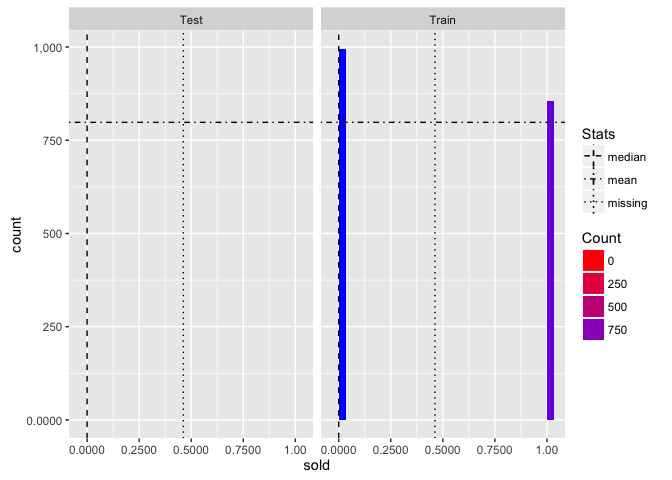
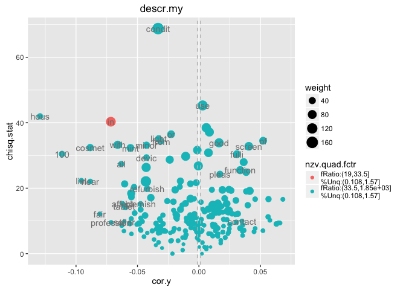
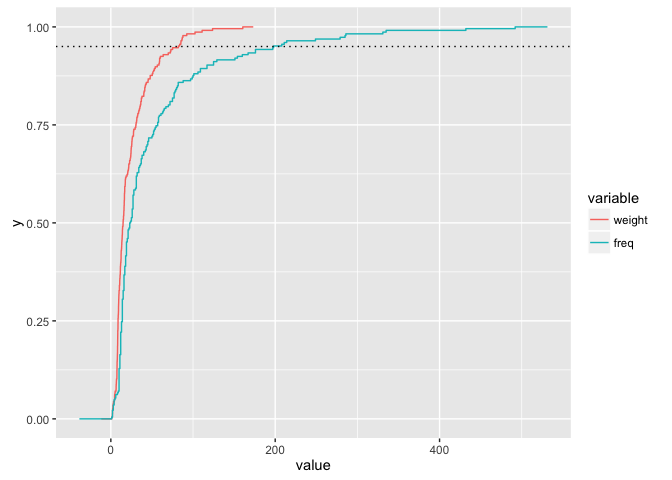
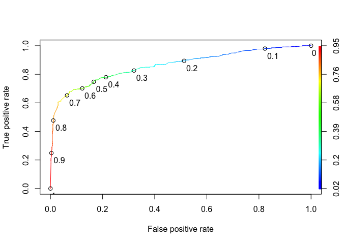
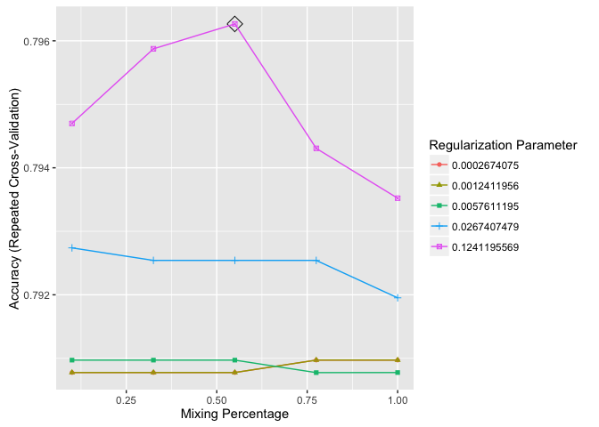
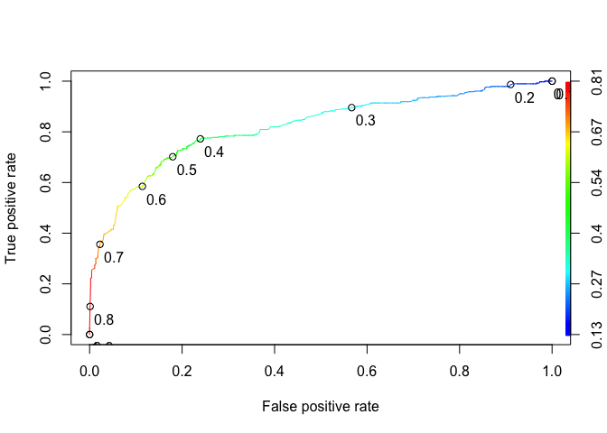
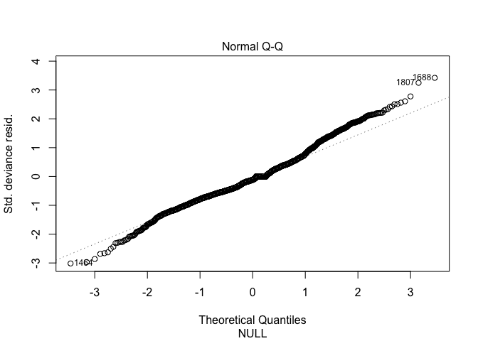
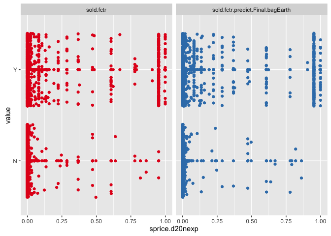

# eBay:iPads:: sold classification:: ebayipads_selmdl2_CSM
bdanalytics  

**  **    
**Date: (Wed) Nov 11, 2015**    

# Introduction:  

Data: 
Source: 
    Training:   https://inclass.kaggle.com/c/15-071x-the-analytics-edge-summer-2015/download/eBayiPadTrain.csv  
    New:        https://inclass.kaggle.com/c/15-071x-the-analytics-edge-summer-2015/download/eBayiPadTest.csv  
Time period: 


# Synopsis:

Based on analysis utilizing <> techniques, <conclusion heading>:  

Regression results:
First run:

Classification results:
template:
    prdline.my == "Unknown" -> 296
    Low.cor.X.glm: Leaderboard: 0.83458 -> Rank 288 / 1884 0.85514
        newobs_tbl=[N=471, Y=327]; submit_filename=template_Final_glm_submit.csv
        OOB_conf_mtrx=[YN=125, NY=76]=201; max.Accuracy.OOB=0.7710;
            opt.prob.threshold.OOB=0.6
            startprice=100.00; biddable=95.42; productline=49.22; 
            D.T.like=29.75; D.T.use=26.32; D.T.box=21.53; 

prdline: -> Worse than template
    prdline.my == "Unknown" -> 285
    All.X.no.rnorm.rf: Leaderboard: 0.82649
        newobs_tbl=[N=485, Y=313]; submit_filename=prdline_Final_rf_submit.csv
        OOB_conf_mtrx=[YN=119, NY=80]=199; max.Accuracy.OOB=0.8339;
            opt.prob.threshold.OOB=0.5
            startprice=100.00; biddable=84.25; D.sum.TfIdf=7.28; 
            D.T.use=4.26; D.T.veri=2.78; D.T.scratch=1.99; D.T.box=; D.T.like=; 
    Low.cor.X.glm: Leaderboard: 0.81234
        newobs_tbl=[N=471, Y=327]; submit_filename=prdline_Low_cor_X_glm_submit.csv
        OOB_conf_mtrx=[YN=125, NY=74]=199; max.Accuracy.OOB=0.8205;
            opt.prob.threshold.OOB=0.6
            startprice=100.00; biddable=96.07; prdline.my=51.37; 
            D.T.like=29.39; D.T.use=25.43; D.T.box=22.27; D.T.veri=; D.T.scratch=; 

oobssmpl: -> 
    Low.cor.X.glm: Leaderboard: 0.83402
        newobs_tbl=[N=440, Y=358]; submit_filename=oobsmpl_Final_glm_submit
        OOB_conf_mtrx=[YN=114, NY=84]=198; max.Accuracy.OOB=0.7780;
            opt.prob.threshold.OOB=0.5
            startprice=100.00; biddable=93.87; prdline.my=60.48; D.sum.TfIdf=; 
            D.T.condition=8.69; D.T.screen=7.96; D.T.use=7.50; D.T.veri=; D.T.scratch=;

category: -> 
    Low.cor.X.glm: Leaderboard: 0.82381
        newobs_tbl=[N=470, Y=328]; submit_filename=category_Final_glm_submit
        OOB_conf_mtrx=[YN=119, NY=57]=176; max.Accuracy.OOB=0.8011;
            opt.prob.threshold.OOB=0.6
            startprice=100.00; biddable=79.19; prdline.my=55.22; D.sum.TfIdf=; 
            D.T.ipad=27.05; D.T.like=21.44; D.T.box=20.67; D.T.condition=; D.T.screen=; 

dataclns: -> 
    All.X.no.rnorm.rf: Leaderboard: 0.82211
        newobs_tbl=[N=485, Y=313]; submit_filename=dataclns_Final_rf_submit
        OOB_conf_mtrx=[YN=104, NY=75]=179; max.Accuracy.OOB=0.7977;
            opt.prob.threshold.OOB=0.5
            startprice.log=100.00; biddable=65.85; prdline.my=7.74; D.sum.TfIdf=; 
            D.T.use=2.01; D.T.condition=1.87; D.T.veri=1.62; D.T.ipad=; D.T.like=;
    Low.cor.X.glm: Leaderboard: 0.79264
        newobs_tbl=[N=460, Y=338]; submit_filename=dataclns_Low_cor_X_glm_submit
        OOB_conf_mtrx=[YN=113, NY=74]=187; max.Accuracy.OOB=0.7977;
            opt.prob.threshold.OOB=0.5 -> different from prev run of 0.6
            biddable=100.00; startprice.log=91.85; prdline.my=38.34; D.sum.TfIdf=; 
            D.T.ipad=29.92; D.T.box=27.76; D.T.work=25.79; D.T.use=; D.T.condition=;

txtterms: -> top_n = c(10)
    Low.cor.X.glm: Leaderboard: 0.81448
        newobs_tbl=[N=442, Y=356]; submit_filename=txtterms_Final_glm_submit
        OOB_conf_mtrx=[YN=113, NY=69]=182; max.Accuracy.OOB=0.7943;
            opt.prob.threshold.OOB=0.5
            biddable=100.00; startprice.log=90.11; prdline.my=37.65; D.sum.TfIdf=; 
            D.T.ipad=28.67; D.T.work=24.90; D.T.great=21.44; 
# [1] "D.T.condit"    "D.T.condition" "D.T.good"      "D.T.ipad"      "D.T.new"      
# [6] "D.T.scratch"   "D.T.screen"    "D.T.this"      "D.T.use"       "D.T.work"     
            
    All.X.glm: Leaderboard: 0.81016
        newobs_tbl=[N=445, Y=353]; submit_filename=txtterms_Final_glm_submit
        OOB_conf_mtrx=[YN=108, NY=72]=180; max.Accuracy.OOB=0.7966;
            opt.prob.threshold.OOB=0.5
            biddable=100.00; startprice.log=88.24; prdline.my=33.81; D.sum.TfIdf=; 
            D.T.scratch=25.51; D.T.use=18.97; D.T.good=16.37; 
 [1] "D.T.condit"  "D.T.use"     "D.T.scratch" "D.T.new"     "D.T.good"    "D.T.screen" 
 [7] "D.T.great"   "D.T.excel"   "D.T.work"    "D.T.ipad"            

    Max.cor.Y.rpart: Leaderboard: 0.79258
        newobs_tbl=[N=439, Y=359]; submit_filename=txtterms_Final_rpart_submit
        OOB_conf_mtrx=[YN=105, NY=76]=181; max.Accuracy.OOB=0.7954802;
            opt.prob.threshold.OOB=0.5
            startprice.log=100; biddable=; prdline.my=; D.sum.TfIdf=; 
            D.T.scratch=; D.T.use=; D.T.good=; 
 [1] "D.T.condit"  "D.T.use"     "D.T.scratch" "D.T.new"     "D.T.good"    "D.T.screen" 
 [7] "D.T.ipad"    "D.T.great"   "D.T.work"    "D.T.excel"

    All.X.no.rnorm.rf: Leaderboard: 0.80929
        newobs_tbl=[N=545, Y=253]; submit_filename=txtterms_Final_rf_submit
        OOB_conf_mtrx=[YN=108, NY=61]=169; max.Accuracy.OOB=0.8090395
            opt.prob.threshold.OOB=0.5
            startprice.log=100.00; biddable=78.82; idseq.my=63.43; prdline.my=45.57;
            D.T.use=2.76; D.T.condit=2.35; D.T.scratch=2.00; D.T.good=; 
 [1] "D.T.condit"  "D.T.use"     "D.T.scratch" "D.T.new"     "D.T.good"    "D.T.screen" 
 [7] "D.T.ipad"    "D.T.great"   "D.T.work"    "D.T.excel"

txtclstr:
    All.X.no.rnorm.rf: Leaderboard: 0.79363 -> 0.79573
        newobs_tbl=[N=537, Y=261]; submit_filename=txtclstr_Final_rf_submit
        OOB_conf_mtrx=[YN=104, NY=61]=165; max.Accuracy.OOB=0.8135593
            opt.prob.threshold.OOB=0.5
            startprice.log=100.00; biddable=79.99; idseq.my=64.94; 
                prdline.my=4.14; prdline.my.clusterid=1.15; 
 [1] "D.T.condit"  "D.T.use"     "D.T.scratch" "D.T.new"     "D.T.good"    "D.T.screen" 
 [7] "D.T.ipad"    "D.T.great"   "D.T.work"    "D.T.excel"            
 
dupobs:
    All.X.no.rnorm.rf: Leaderboard: 0.79295
        newobs_tbl=[N=541, Y=257]; submit_filename=dupobs_Final_rf_submit
        OOB_conf_mtrx=[YN=114, NY=65]=179; max.Accuracy.OOB=0.7977401
            opt.prob.threshold.OOB=0.5
            startprice.log=100.00; biddable=94.49; idseq.my=67.40; 
                prdline.my=4.48; prdline.my.clusterid=1.99; 
 [1] "D.T.condit"  "D.T.use"     "D.T.scratch" "D.T.new"     "D.T.good"    "D.T.screen" 
 [7] "D.T.ipad"    "D.T.great"   "D.T.work"    "D.T.excel"            
 
    All.X.no.rnorm.rf: Leaderboard: 0.79652
        newobs_tbl=[N=523, Y=275]; submit_filename=dupobs_Final_rf_submit
        OOB_conf_mtrx=[YN=114, NY=65]=179; max.Accuracy.OOB=0.7977401
            opt.prob.threshold.OOB=0.5
            startprice.log=100.00; biddable=94.24; idseq.my=67.92; 
                prdline.my=4.33; prdline.my.clusterid=2.17; 
 [1] "D.T.condit"  "D.T.use"     "D.T.scratch" "D.T.new"     "D.T.good"    "D.T.screen" 
 [7] "D.T.ipad"    "D.T.great"   "D.T.work"    "D.T.excel"
 
csmmdl:
   All.X.no.rnorm.rf: Leaderboard: 0.79396
        newobs_tbl=[N=525, Y=273]; submit_filename=csmmdl_Final_rf_submit
        OOB_conf_mtrx=[YN=111, NY=66]=177; max.Accuracy.OOB=0.8000000
            opt.prob.threshold.OOB=0.5
            startprice.log=100.00; biddable=90.30; idseq.my=67.06; 
                prdline.my=4.40; cellular.fctr=3.57; prdline.my.clusterid=2.08; 

   All.Interact.X.no.rnorm.rf: Leaderboard: 0.77867
        newobs_tbl=[N=564, Y=234]; submit_filename=csmmdl_Final_rf_submit
        OOB_conf_mtrx=[YN=120, NY=53]=173; max.Accuracy.OOB=0.8045198
            opt.prob.threshold.OOB=0.5
            biddable=100.00; startprice.log=93.99; idseq.my=57.30; 
                prdline.my=9.09; cellular.fctr=3.30; prdline.my.clusterid=2.35; 

   All.Interact.X.no.rnorm.rf: Leaderboard: 0.77152
        newobs_tbl=[N=539, Y=259]; submit_filename=csmmdl_Final_rf_submit
        OOB_conf_mtrx=[YN=, NY=]=; max.Accuracy.OOB=0.8011299
            opt.prob.threshold.OOB=0.5
            biddable=100.00; startprice.log=94.93; idseq.my=57.12; 
                prdline.my=9.29; cellular.fctr=3.20; prdline.my.clusterid=2.50; 
 [1] "D.T.condit"  "D.T.use"     "D.T.scratch" "D.T.new"     "D.T.good"    "D.T.screen" 
 [7] "D.T.ipad"    "D.T.great"   "D.T.work"    "D.T.excel"
 
        All.X.glmnet: 
            fit_RMSE=???; OOB_RMSE=115.1247; new_RMSE=115.1247; 
            prdline.my.fctr=100.00; condition.fctrNew=88.53; D.npnct09.log=84.34
                biddable=16.48; idseq.my=57.27;
spdiff:                
    All.Interact.X.no.rnorm.rf: Leaderboard: 0.78218
        newobs_tbl=[N=517, Y=281]; submit_filename=spdiff_Final_rf_submit
        OOB_conf_mtrx=[YN=121, NY=38]=159; max.Accuracy.OOB=0.8203390
            opt.prob.threshold.OOB=0.6
            biddable=100.00; startprice.diff=57.53; idseq.my=41.31; 
                prdline.my=11.43; cellular.fctr=2.36; prdline.my.clusterid=1.82; 
 
        All.X.no.rnorm.rf: 
            fit_RMSE=92.19; OOB_RMSE=130.86; new_RMSE=130.86; 
            biddable=100.00; prdline.my.fctr=61.92; idseq.my=57.77;
                condition.fctr=29.53; storage.fctr=11.22; color.fctr=6.69;
                cellular.fctr=6.11
                
    All.X.no.rnorm.rf: Leaderboard: 0.77443
        newobs_tbl=[N=606, Y=192]; submit_filename=spdiff_Final_rf_submit
        OOB_conf_mtrx=[YN=112, NY=28]=140; max.Accuracy.OOB=0.8418079
            opt.prob.threshold.OOB=0.6
            startprice.diff=100.00; biddable=96.53; idseq.my=38.10; 
                prdline.my=3.65; cellular.fctr=2.21; prdline.my.clusterid=0.91; 
 [1] "D.T.condit"  "D.T.use"     "D.T.scratch" "D.T.new"     "D.T.good"    "D.T.screen" 
 [7] "D.T.ipad"    "D.T.great"   "D.T.work"    "D.T.excel"

 color:
        All.Interact.X.glmnet: 
            fit_RMSE=88.64520; 
            prdline.my.fctr:D.TfIdf.sum.stem.stop.Ratio=100.00;
            prdline.my.fctr:condition.fctr=77.35
            D.TfIdf.sum.stem.stop.Ratio=68.18
            prdline.my.fctr:color.fctr=68.12
            prdline.my.fctr:storage.fctr=63.32
            
    All.X.no.rnorm.rf: Leaderboard: 0.80638
        newobs_tbl=[N=550, Y=248]; submit_filename=color_Final_rf_submit
        OOB_conf_mtrx=[YN=108, NY=54]=162; max.Accuracy.OOB=0.8169492
            opt.prob.threshold.OOB=0.5
            biddable=100.00; startprice.diff=77.90; idseq.my=48.49; 
                D.ratio.sum.TfIdf.nwrds=6.48; storage.fctr=4.74;
                    D.TfIdf.sum.stem.stop.Ratio=4.57; prdline.my=4.32;
 [1] "D.T.condit"  "D.T.use"     "D.T.scratch" "D.T.new"     "D.T.good"    "D.T.screen" 
 [7] "D.T.ipad"    "D.T.great"   "D.T.work"    "D.T.excel"
            
    All.Interact.X.no.rnorm.rf: Leaderboard: 0.72974
        newobs_tbl=[N=682, Y=116]; submit_filename=assctxt_Final_rf_submit
        OOB_conf_mtrx=[YN=125, NY=43]=168; max.Accuracy.OOB=0.8101695; max.auc.OOB=???;
            opt.prob.threshold.OOB=0.6
            biddable=100.00; startprice.diff=51.04; idseq.my=29.51; 
                startprice.diff:biddable=28.70
                prdline.my.fctriPadmini:idseq.my=6.89
        Highest max.auc.OOB=???; for model:        

        All.X.no.rnorm.rf: min.RMSE.fit=1.4967021
biddable                                         100.00000000
idseq.my                                          98.00292371
startprice.unit9                                  34.31130220
prdl.my.descr.fctr                       18.10984741
D.ratio.sum.TfIdf.nwrds                           15.23549621
color.fctrUnknown                                 14.05520993
D.TfIdf.sum.stem.stop.Ratio                       13.00884673
D.ratio.nstopwrds.nwrds                           10.51165302

    All.X.gbm: Leaderboard: 0.75430
        newobs_tbl=[N=582, Y=216]; submit_filename=mdlsel_Final_gbm_submit
        OOB_conf_mtrx=[YN=58, NY=65]=123; 
            max.Accuracy.OOB=0.8617978; max.auc.OOB=0.9367161;
            opt.prob.threshold.OOB=0.5
startprice.diff                                           100.0000000 100.00000000
biddable                                                   66.6475055  65.40764971
idseq.my                                                    1.8632456   4.55963698

splogdiff:
    All.X.gbm: Leaderboard: 0.70111
        newobs_tbl=[N=553, Y=245]; submit_filename=splogdiff_Final_gbm_submit
        OOB_conf_mtrx=[YN=35, NY=101]=136; 
            max.Accuracy.OOB=0.8471910; max.auc.OOB=0.9388912;
            opt.prob.threshold.OOB=0.3
startprice.log.diff                                       100.0000000 100.0000000
biddable                                                   86.8563123  88.0261866
idseq.my                                                    8.3580281   2.9054298       
Forum Ideas:
I then focused on feature engineering, each new variable brought its own little improvement so in the end i just kept adding new ones and let the models do their thing. Here are some i used: model (productline:storage:condition), isNew, model2 (product:isNew), 50 common words from descr, descrLength, capsFactor (% of caps in description), number of cheaper items of same model2, number of dearer items of same model2, priceFactor (vs. mean of price for model), priceFactor2 (vs. mean of price for model2), bigID (if ID> 11000 because there seems to be a huge drop in sales after some time), timeline (year of product launch, reasoning is you want to spend less money on older products).

Get the median startprice for each level of productline and condition. Take the difference from startprice as a new variable. I find median works much better than the mean since startprice is not normally distributed. I also created another binary variable on whether this difference is positive or negative.

Square root startprice

scale and center all the variables except sold, including the dummies.

### Prediction Accuracy Enhancement Options:
- import.data chunk:
    - which obs should be in fit vs. OOB (currently dirty.0 vs .1 is split 50%)
    
- inspect.data chunk:
    - For date variables
        - Appropriate factors ?
        - Different / More last* features ?
        
- scrub.data chunk:        
- transform.data chunk:
    - derive features from multiple features
    
- manage.missing.data chunk:
    - Not fill missing vars
    - Fill missing numerics with a different algorithm
    - Fill missing chars with data based on clusters 
    
- extract.features chunk:
    - Text variables: move to date extraction chunk ???
        - Mine acronyms
        - Mine places

- Review set_global_options chunk after features are finalized

### 

## Potential next steps include:
- Organization:
    - Categorize by chunk
    - Priority criteria:
        0. Ease of change
        1. Impacts report
        2. Cleans innards
        3. Bug report
        
- all chunks:
    - at chunk-end rm(!glb_<var>)
    
- manage.missing.data chunk:
    - cleaner way to manage re-splitting of training vs. new entity

- extract.features chunk:
    - Add n-grams for glbFeatsText
        - "RTextTools", "tau", "RWeka", and "textcat" packages
    - Convert user-specified mutate code to config specs
    
- fit.models chunk:
    - Prediction accuracy scatter graph:
    -   Add tiles (raw vs. PCA)
    -   Use shiny for drop-down of "important" features
    -   Use plot.ly for interactive plots ?
    
    - Change .fit suffix of model metrics to .mdl if it's data independent (e.g. AIC, Adj.R.Squared - is it truly data independent ?, etc.)
    - move model_type parameter to myfit_mdl before indep_vars_vctr (keep all model_* together)
    - create a custom model for rpart that has minbucket as a tuning parameter
    - varImp for randomForest crashes in caret version:6.0.41 -> submit bug report

- Probability handling for multinomials vs. desired binomial outcome
-   ROCR currently supports only evaluation of binary classification tasks (version 1.0.7)
-   extensions toward multiclass classification are scheduled for the next release

- Skip trControl.method="cv" for dummy classifier ?
- Add custom model to caret for a dummy (baseline) classifier (binomial & multinomial) that generates proba/outcomes which mimics the freq distribution of glb_rsp_var values; Right now glb_dmy_glm_mdl always generates most frequent outcome in training data
- glm_dmy_mdl should use the same method as glm_sel_mdl until custom dummy classifer is implemented

- fit.all.training chunk:
    - myplot_prediction_classification: displays 'x' instead of '+' when there are no prediction errors 
- Compare glb_sel_mdl vs. glb_fin_mdl:
    - varImp
    - Prediction differences (shd be minimal ?)

- Move glb_analytics_diag_plots to mydsutils.R: (+) Easier to debug (-) Too many glb vars used
- Add print(ggplot.petrinet(glb_analytics_pn) + coord_flip()) at the end of every major chunk
- Parameterize glb_analytics_pn
- Move glb_impute_missing_data to mydsutils.R: (-) Too many glb vars used; glb_<>_df reassigned
- Replicate myfit_mdl_classification features in myfit_mdl_regression
- Do non-glm methods handle interaction terms ?
- f-score computation for classifiers should be summation across outcomes (not just the desired one ?)
- Add accuracy computation to glb_dmy_mdl in predict.data.new chunk
- Why does splitting fit.data.training.all chunk into separate chunks add an overhead of ~30 secs ? It's not rbind b/c other chunks have lower elapsed time. Is it the number of plots ?
- Incorporate code chunks in print_sessionInfo
- Test against 
    - projects in github.com/bdanalytics
    - lectures in jhu-datascience track

# Analysis: 

```r
rm(list = ls())
set.seed(12345)
options(stringsAsFactors = FALSE)
source("~/Dropbox/datascience/R/myscript.R")
source("~/Dropbox/datascience/R/mydsutils.R")
```

```
## Loading required package: caret
## Loading required package: lattice
## Loading required package: ggplot2
```

```r
source("~/Dropbox/datascience/R/myplot.R")
source("~/Dropbox/datascience/R/mypetrinet.R")
source("~/Dropbox/datascience/R/myplclust.R")
source("~/Dropbox/datascience/R/mytm.R")
# Gather all package requirements here
suppressPackageStartupMessages(require(doMC))
registerDoMC(6) # # of cores on machine - 2
suppressPackageStartupMessages(require(caret))
source("~/Documents/Work/PullRequests/caret/pkg/caret/R/confusionMatrix.R")
source("~/Documents/Work/PullRequests/caret/pkg/caret/R/ggplot.R")
#packageVersion("tm")
#require(sos); findFn("cosine", maxPages=2, sortby="MaxScore")

# Analysis control global variables
# Inputs
glb_trnng_url <- "https://inclass.kaggle.com/c/15-071x-the-analytics-edge-summer-2015/download/eBayiPadTrain.csv"
glb_newdt_url <- "https://inclass.kaggle.com/c/15-071x-the-analytics-edge-summer-2015/download/eBayiPadTest.csv"
glbInpMerge <- # NULL #: default
    list(fnames = c("ebayipads_finmdl_bid0_sp_out.csv", "ebayipads_mdlens_bid1_sp_out.csv"))

glb_is_separate_newobs_dataset <- TRUE    # or TRUE
    glb_split_entity_newobs_datasets <- FALSE   # select from c(FALSE, TRUE)
    glb_split_newdata_method <- NULL # select from c(NULL, "condition", "sample", "copy")
    glb_split_newdata_condition <- NULL # or "is.na(<var>)"; "<var> <condition_operator> <value>"
    glb_split_newdata_size_ratio <- 0.3               # > 0 & < 1
    glb_split_sample.seed <- 123               # or any integer

glbObsDropCondition <- # default : NULL 
            "(UniqueID %in% c(NULL
                , 11234 #sold=0; 2 other dups(10306, 11503) are sold=1
                , 11844 #sold=0; 3 other dups(11721, 11738, 11812) are sold=1
                )) | 
            (productline %in% c('iPad 5', 'iPad mini Retina'))
                    # | (biddable != 0) # bid0_sp
                    # | (biddable == 0) # bid1_sp
            "
#parse(text=glbObsDropCondition)
#subset(glb_allobs_df, .grpid %in% c(31))
    
glb_obs_repartition_train_condition <- NULL 
#    "!is.na(sold) & (sold == 1)" # : bid._sp

glb_max_fitobs <- NULL # or any integer                         

glb_is_regression <- FALSE; glb_is_classification <- !glb_is_regression; 
    glb_is_binomial <- TRUE #or FALSE

glb_rsp_var_raw <- "sold" #: !_sp # "startprice" # : bid._sp # 

# for classification, the response variable has to be a factor
glb_rsp_var <- "sold.fctr" #:!_sp # "startprice.log10" :bid._sp # glb_rsp_var_raw :default

# if the response factor is based on numbers/logicals e.g (0/1 OR TRUE/FALSE vs. "A"/"B"), 
#   or contains spaces (e.g. "Not in Labor Force")
#   caret predict(..., type="prob") crashes
glb_map_rsp_raw_to_var <- function(raw) { # NULL
#     return(raw ^ 0.5)
#     return(log(1 + raw))
#     return(log10(raw)) # bid._sp
#     return(exp(-raw / 2))
    ret_vals <- rep_len(NA, length(raw)); ret_vals[!is.na(raw)] <- ifelse(raw[!is.na(raw)] == 1, "Y", "N"); return(relevel(as.factor(ret_vals), ref="N"))
#     #as.factor(paste0("B", raw))
#     #as.factor(gsub(" ", "\\.", raw))    
}
# glb_map_rsp_raw_to_var(tst <- c(NA, 0, 1)) # !_sp
# glb_map_rsp_raw_to_var(tst <- c(NA, 0, 2.99, 280.50, 1000.00)) # bid._sp

glb_map_rsp_var_to_raw <- function(var) { # NULL #
#     return(var ^ 2.0)
#     return(exp(var) - 1)
#     return(10 ^ var) # bid._sp
#     return(-log(var) * 2)
    as.numeric(var) - 1
#     #as.numeric(var)
#     #gsub("\\.", " ", levels(var)[as.numeric(var)])
#     c("<=50K", " >50K")[as.numeric(var)]
#     #c(FALSE, TRUE)[as.numeric(var)]
}
# glb_map_rsp_var_to_raw(glb_map_rsp_raw_to_var(tst))

if ((glb_rsp_var != glb_rsp_var_raw) && is.null(glb_map_rsp_raw_to_var))
    stop("glb_map_rsp_raw_to_var function expected")
glb_rsp_var_out <- paste0(glb_rsp_var, ".predict.") # mdl_id is appended later

# List info gathered for various columns
# <col_name>:   <description>; <notes>
# description = The text description of the product provided by the seller.
# biddable = Whether this is an auction (biddable=1) or a sale with a fixed price (biddable=0).
# startprice = The start price (in US Dollars) for the auction (if biddable=1) or the sale price (if biddable=0).
# condition = The condition of the product (new, used, etc.)
# cellular = Whether the iPad has cellular connectivity (cellular=1) or not (cellular=0).
# carrier = The cellular carrier for which the iPad is equipped (if cellular=1); listed as "None" if cellular=0.
# color = The color of the iPad.
# storage = The iPad's storage capacity (in gigabytes).
# productline = The name of the product being sold.

# If multiple vars are parts of id, consider concatenating them to create one id var
# If glb_id_var == NULL, ".rownames <- row.names()" is the default
# Derive a numeric feature from id var

# User-specified exclusions
# List feats that shd be excluded due to known causation by prediction variable
glbFeatsExclude <- c(NULL
### !_sp
    , "description", "descr.my", "productline"
    , "startprice", "startprice.log10.predict", "sprice.predict.diff"
### bid0_sp                                  
#                                   , "description", "productline"
#                                   , "sold", "startprice.log10.cut.fctr"
#     # List feats that are linear combinations (alias in glm)
#                                 , "D.terms.post.stem.n.log", "D.weight.sum"
#                                 #, "prdl.descr.my.fctriPad4#1:.clusterid.fctr3" This does not work
#     # if RFE is rated lower than Low.cor, list feats that are in RFE & not in Low.cor
#         # min.RMSE.fit(RFE.X.glmnet)=0.1138888
# #             D.chrs.n.log                 61.12483
# #             D.chrs.uppr.n.log            61.12483
# #             D.ratio.wrds.stop.n.wrds.n   61.12483
# #             D.terms.post.stop.n.log      61.12483
# #             D.weight.post.stem.sum       61.12483
# #             D.wrds.n.log                 61.12483
# #             D.wrds.stop.n.log            61.12483
# #             D.wrds.unq.n.log             61.12483
#                             #, "startprice.dcm2.is9" # min.RMSE.fit(RFE.X.glmnet)=0.1141991 (up)
#                             , "D.wrds.stop.n.log"    # min.RMSE.fit(RFE.X.glmnet)=0.1131232
### bid0_sp                            
### bid1_sp                                  
#                                   , "description", "productline"
#                                   , "sold", "startprice.log10.cut.fctr"
### bid1_sp                            
                                  ) 

glb_id_var <- c("UniqueID")
glb_category_var <- "prdl.my.fctr" # "prdl.descr.my.fctr" # "productline" # NULL 
glb_drop_vars <- c(NULL) # or c("<col_name>")

glb_map_vars <- NULL # or c("<var1>", "<var2>")
glb_map_urls <- list();
# glb_map_urls[["<var1>"]] <- "<var1.url>"

glb_assign_pairs_lst <- NULL; 
# glb_assign_pairs_lst[["<var1>"]] <- list(from=c(NA),
#                                            to=c("NA.my"))
glb_assign_vars <- names(glb_assign_pairs_lst)

# Derived features
glbFeatsDerive <- NULL;

# Add logs of numerics that are not distributed normally ->  do automatically ???
# Right skew: logp1; sqrt; ^ 1/3; logp1(logp1); log10; exp(-<feat>/constant)

# glbFeatsDerive[["prdline.my"]] <- list(
#     mapfn=function(productline) { return(productline) }    
#     , args=c("productline"))

### bid._sp
# glbFeatsDerive[["startprice.log10.cut.fctr"]] <- list(
#     mapfn=function(startprice.log10) { return(cut(startprice.log10, 3)) }    
#     , args=c("startprice.log10"))
### bid._sp
glbFeatsDerive[["sprice.root2"]] <- list(
    mapfn = function(startprice) { return(startprice ^ (1/2)) }    
    , args = c("startprice"))
glbFeatsDerive[["sprice.log10"]] <- list(
    mapfn = function(startprice) { return(log(startprice)) }    
    , args = c("startprice"))
glbFeatsDerive[["sprice.d20nexp"]] <- list(
    mapfn = function(startprice) { return(exp(-startprice / 20)) }    
    , args = c("startprice"))

glbFeatsDerive[["sprice.predict.diff"]] <- list(
    mapfn = function(startprice.log10.predict, startprice) { 
        spdiff <- (10 ^ startprice.log10.predict) - startprice; 
        return(spdiff) }    
    , args = c("startprice.log10.predict", "startprice"))
# glbFeatsDerive[["spdiff.root10"]] <- list(
#     mapfn = function(sprice.predict.diff) { 
#         return(sign(sprice.predict.diff) * (abs(sprice.predict.diff) ^ (1/10))) }    
#     , args = c("sprice.predict.diff"))
glbFeatsDerive[["spdiff.cut.fctr"]] <- list(
    mapfn = function(sprice.predict.diff) { 
        return(cut(sprice.predict.diff, c(-1000, -100, -10, -1, 0, 1, 10, 100, 1000))) }    
    , args = c("sprice.predict.diff"))
  
#glb_allobs_df[which(glb_post_stop_words_terms_mtrx_lst[[txt_var]][, subset(glb_post_stop_words_terms_df_lst[[txt_var]], term %in% c("conditionminimal"))$pos] > 0), "description"]
glbFeatsDerive[["descr.my"]] <- list(
    mapfn = function(description) { mod_raw <- description;
### bid._sp
#         # This is here because it does not work with txt_map_filename
        mod_raw <- gsub(paste0(c("\n", "\211", "\235", "\317", "\333"), collapse = "|"), " ",
                        mod_raw)
#         # This should go into txt_map_filename    
#         mod_raw <- gsub("\\.\\.", "\\. ", mod_raw);    
#         # Don't parse for "." because of ".com"; use customized gsub for that text
#         mod_raw <- gsub("(\\w)(!|\\*|,|-|/)(\\w)", "\\1\\2 \\3", mod_raw);
#mod_raw <- grep("&#034;", glb_allobs_df$descr.my, value = TRUE)        
        mod_raw <- gsub("&amp;", "&", mod_raw);
        mod_raw <- gsub("&lt;", "<", mod_raw);
        mod_raw <- gsub("&gt;", ">", mod_raw);
        mod_raw <- gsub("<br>", " ", mod_raw); # line break - add a count for it ???     
        mod_raw <- gsub("&#034;", " ", mod_raw); # justification meta-character        
        mod_raw <- gsub("&#(0*)37;", "%", mod_raw);        
        mod_raw <- gsub("&#039;", "'", mod_raw);
        mod_raw <- gsub("([[:digit:]])\\.([[:digit:]])\\.([[:digit:]])",
                        "\\1point\\2\\point\\3", mod_raw);        
        mod_raw <- gsub("([[:digit:]])\\.([[:digit:]])", "\\1point\\2", mod_raw);
        mod_raw <- gsub("([[:digit:]]),([[:digit:]])", "\\1\\2", mod_raw);        
        mod_raw <- gsub("\\b1st\\b", "first", mod_raw);        
        mod_raw <- gsub("\\b2nd\\b", "second", mod_raw);
        mod_raw <- gsub("\\b3rd\\b", "third", mod_raw);
        mod_raw <- gsub("\\b4th\\b", "fourth", mod_raw);        
        mod_raw <- gsub("\\.(com|COM)\\b", "dot\\1", mod_raw);        
#         
#         # Modifications for this exercise only
#         # Add dictionary to stemDocument e.g. stickers stemmed to sticker ???
#         mod_raw <- gsub("8\\.25", "825", mod_raw, ignore.case=TRUE);  
        mod_raw <- gsub("\\b10\\.SCREEN\\b", "10\\. SCREEN", mod_raw); 
        mod_raw <- gsub("\\b128 gb\\b", "128gb", mod_raw);  
        mod_raw <- gsub("\\b16G\\b", "16GB", mod_raw);          
#         mod_raw <- gsub(" 16 gig ", " 16gb ", mod_raw, ignore.case=TRUE);
#         mod_raw <- gsub(" 16 gb ", " 16gb ", mod_raw, ignore.case=TRUE);        
#         
#         mod_raw <- gsub("\\bAccounts\\b", "Account", mod_raw, ignore.case=FALSE);
#         mod_raw <- gsub("\\bactivated\\b", "activate", mod_raw, ignore.case=FALSE);        
#         mod_raw <- gsub(" actuuly ", " actual ", mod_raw, ignore.case=TRUE);
        mod_raw <- gsub("\\badaptor\\b", "adapter", mod_raw);
#         mod_raw <- gsub("\\baffects\\b", "affect", mod_raw, ignore.case=FALSE);           
        mod_raw <- gsub("\\bair-like\\b", "air -like", mod_raw);
        mod_raw <- gsub("\\bALL-JUST\\b", "ALL -JUST", mod_raw);        
        mod_raw <- gsub("\\bApple's\\b", "Apple'", mod_raw);        
# #mod_raw <- glb_allobs_df[c(1322), txt_var]; mod_raw        
        mod_raw <- gsub("\\bApple care\\b", "Applecare", mod_raw);
        mod_raw <- gsub("\\bAT&T\\b", "ATT", mod_raw);        
        
#         mod_raw <- gsub(" bacK!wiped ", " bacK ! wiped ", mod_raw, ignore.case=TRUE);
#         mod_raw <- gsub(" backplate", " back plate", mod_raw, ignore.case=TRUE);
#         mod_raw <- gsub("\\bbarley", "barely", mod_raw, ignore.case=TRUE);        
#         mod_raw <- gsub(" bend ", " bent ", mod_raw, ignore.case=TRUE);         
        mod_raw <- gsub("\\b(B|b)(EST|est) (B|b)(UY|uy)\\b", "\\1\\2\\3\\4", mod_raw);
#         mod_raw <- gsub(" black\\.Device ", " black \\. Device ", mod_raw,
#                         ignore.case=TRUE);        
#         mod_raw <- gsub("black\\),charger ", "black\\), charger ", mod_raw,
#                         ignore.case=TRUE);        
#         mod_raw <- gsub("\\bblacked\\b", "black", mod_raw, ignore.case=FALSE);
#         mod_raw <- gsub("\\bblemish\\b", "blemishes", mod_raw, ignore.case=FALSE);        
#         mod_raw <- gsub(" blocks", " blocked", mod_raw, ignore.case=TRUE);
#         mod_raw <- gsub(" book ", " manual ", mod_raw, ignore.case=TRUE);            
        mod_raw <- gsub("\\b(B|b)(RAND|rand)( |-)(N|n)(EW|ew)\\b", "\\1\\2\\4\\5", mod_raw)
            #mod_raw <- c("brand new", "BRAND new", "brand NEW", "BRAND NEW", "bbrand new", "brand-new", "brand newb")
        mod_raw <- gsub("\\bbrokenCharger\\b", "broken Charger", mod_raw);
#         
        mod_raw <- gsub("\\bC-Major\\b", "C -Major", mod_raw)    
#         mod_raw <- gsub(" perfectlycord ", " perfectly cord ", mod_raw, ignore.case=TRUE);
#         mod_raw <- gsub("\\bcord", "cable", mod_raw, ignore.case=TRUE);     
        mod_raw <- gsub("\\bcables\\.No\\b", "cables. No", mod_raw);        
#         mod_raw <- gsub("\\bcables\\b", "cable", mod_raw, ignore.case=TRUE);        
#         
        mod_raw <- gsub("\\bcare\\.The\\b", "care\\. The", mod_raw);
#         mod_raw <- gsub("\\b(cared|careful|CAREFUL)\\b", "care", mod_raw, ignore.case=FALSE);
#         mod_raw <- gsub("\\b(cases|casing)\\b", "case", mod_raw, ignore.case=TRUE);        
# #mod_raw <- glb_allobs_df[c(88,187,280,1040,1098), txt_var]; mod_raw        
        mod_raw <- gsub("\\bCase/Cover\\b", "Case/ Cover", mod_raw);
        mod_raw <- gsub("\\bCasing/Screen\\b", "Casing/ Screen", mod_raw);        
#         mod_raw <- gsub(" carefully ", " careful ", mod_raw, ignore.case=TRUE);        
#         mod_raw <- gsub("\\bchargers\\b", "charger", mod_raw, ignore.case=FALSE);        
        mod_raw <- gsub("\\bchip/crack\\b", "chip/ crack", mod_raw);        
#         mod_raw <- gsub("\\bchips\\b", "chip", mod_raw, ignore.case=FALSE);
        mod_raw <- gsub("\\bCLEAN\\!LIKE\\b", "CLEAN! LIKE", mod_raw);        
#         mod_raw <- gsub("\\bcleanly\\b", "clean", mod_raw, ignore.case=FALSE);        
#         mod_raw <- gsub("\\b(C|c)olor(.*)s\\b", "\\1olor", mod_raw, ignore.case=FALSE);
# #mod_raw <- glb_allobs_df[c(280,1411), txt_var]; mod_raw        
        mod_raw <- gsub("\\bColors,models\\b", "Colors ,models", mod_raw);   
#         mod_raw <- gsub("\\bcompletely\\b", "complete", mod_raw, ignore.case=FALSE);   
# #mod_raw <- glb_allobs_df[c(178), txt_var]; mod_raw        
#
        mod_raw <- gsub("\\bCONDITION..CLEAN\\b", "CONDITION ..CLEAN", mod_raw);
        mod_raw <- gsub("\\bcondition,comes\\b", "condition ,comes", mod_raw);
        mod_raw <- gsub("\\bcondition\\.Device\\b", "condition .Device", mod_raw);
        mod_raw <- gsub("\\bconditionHas\\b", "condition Has", mod_raw);        
        mod_raw <- gsub("\\bcondition\\.\\.\\.like\\b", "condition ...like", mod_raw);    
        mod_raw <- gsub("\\bcondition\\*Minimal\\b", "condition *Minimal", mod_raw);    
        mod_raw <- gsub("\\bCondition-Moderate\\b", "Condition -Moderate", mod_raw);
        mod_raw <- gsub("\\bcondition\\.The\\b", "condition .The", mod_raw);        
        mod_raw <- gsub("\\bCONDITION\\.VERY\\b", "CONDITION .VERY", mod_raw);        
#         mod_raw <- gsub(" (conditon|condtion|contidion|conditions)", " condition", mod_raw,
#         mod_raw <- gsub("\\b(conditon|condtion|contidion|conditions)\\b", "condition", mod_raw,
# ", "\\1\\. \\2", mod_raw,
#                         ignore.case=TRUE);
#         mod_raw <- gsub("(condition)(Has)", "\\1\\. \\2", mod_raw);
#         
#         mod_raw <- gsub("\\bCONNECTED\\b", "CONNECT", mod_raw, ignore.case=FALSE);        
#         mod_raw <- gsub("\\bconnects\\b", "connect", mod_raw, ignore.case=FALSE);        
#         mod_raw <- gsub(" consist ", " consistent ", mod_raw, ignore.case=TRUE);
# #mod_raw <- glb_allobs_df[c(195, 379, 437), txt_var]; mod_raw        
#         mod_raw <- gsub("\\bCosmetics\\b", "Cosmetic", mod_raw, ignore.case=FALSE);        
        mod_raw <- gsub("\\bCracked/Damaged\\b", "Cracked/ Damaged", mod_raw);        
        mod_raw <- gsub("\\bcracksNo\\b", "cracks No", mod_raw);        
#         
#         mod_raw <- gsub("\\b(D|d)amaged\\b", "\\1amage", mod_raw, ignore.case=TRUE);
# #mod_raw <- glb_allobs_df[c(116, 1360), txt_var]; mod_raw        
#         mod_raw <- gsub("\\bDays\\b", "Day", mod_raw, ignore.case=TRUE);        
#         mod_raw <- gsub(" DEFAULTING ", " DEFAULT ", mod_raw, ignore.case=TRUE);
#         mod_raw <- gsub("\\bdefect(ive)*\\b", "defects", mod_raw, ignore.case=FALSE);
#         mod_raw <- gsub(" definitely ", " definite ", mod_raw, ignore.case=TRUE);        
#         mod_raw <- gsub("\\b(D|d)ented\\b", "\\1ent", mod_raw, ignore.case=FALSE);    
#         mod_raw <- gsub(" described", " describe", mod_raw, ignore.case=TRUE);
#         mod_raw <- gsub(" desciption", " description", mod_raw, ignore.case=TRUE);    
#         mod_raw <- gsub(" devices", " device", mod_raw, ignore.case=TRUE);        
#         mod_raw <- gsub(" Digi\\.", " Digitizer\\.", mod_raw, ignore.case=TRUE);        
#         mod_raw <- gsub("\\b(ding|dinged)\\b", "dings", mod_raw, ignore.case=TRUE);   
#         mod_raw <- gsub(" display\\.New ", " display\\. New ", mod_raw, ignore.case=TRUE);
#         mod_raw <- gsub(" displays", " display", mod_raw, ignore.case=TRUE);
        mod_raw <- gsub("\\bdo( +)not\\b", "dont", mod_raw);
        mod_raw <- gsub("\\b(D|d)oes( +)(N|n)(O|o)(T|t)\\b", "\\1oes\\3\\5", mod_raw);
#         mod_raw <- gsub("\\b(drop|drops)\\b", "dropped", mod_raw, ignore.case=TRUE); 
        
#         mod_raw <- gsub("\\b(E|e)dge\\b", "\\1dges", mod_raw, ignore.case=FALSE);        
#         mod_raw <- gsub(" effect ", " affect ", mod_raw, ignore.case=TRUE);        
#         mod_raw <- gsub(" Excellant ", " Excellent ", mod_raw, ignore.case=TRUE);
#         mod_raw <- gsub(" excellently", " excellent", mod_raw, ignore.case=TRUE);
#         mod_raw <- gsub(" EUC ", " excellent used condition", mod_raw, ignore.case=TRUE);  
#         mod_raw <- gsub(" feels ", " feel ", mod_raw, ignore.case=TRUE);
        mod_raw <- gsub("\\bfineiCloud\\b", "fine iCloud", mod_raw, ignore.case = FALSE);
#         mod_raw <- gsub(" fine.Its ", " fine. Its ", mod_raw, ignore.case=TRUE);       
#         mod_raw <- gsub("\\bfix\\b", "fixed", mod_raw, ignore.case=TRUE);        
#         mod_raw <- gsub("\\bflaws\\b", "flaw", mod_raw, ignore.case=TRUE);
#         mod_raw <- gsub("\\bflawlessly\\b", "flawless", mod_raw, ignore.case=TRUE);        
#         mod_raw <- gsub(" Framing ", " Frame ", mod_raw, ignore.case=TRUE);        
#         
#         mod_raw <- gsub(" functioanlity", " functionality", mod_raw, ignore.case=TRUE);
#         mod_raw <- gsub("\\bfunction(ing|ality)\\b", "functional", mod_raw, ignore.case=TRUE); 
#         mod_raw <- gsub(" functional\\.Very little ", " functional\\. Very little ", mod_raw,
#                         ignore.case=TRUE); 
        
        mod_raw <- gsub("\\b([[:digit:]]+) (GB|gb)\\b", "\\1\\2", mod_raw);
        mod_raw <- gsub("\\b([[:digit:]]+) gig\\b", "\\1gb", mod_raw);        
        mod_raw <- gsub("\\b(G|g)(EEK|eek) (S|s)(QUAD|quad)\\b", "\\1\\2\\3\\4", mod_raw);
#         mod_raw <- gsub("^Gentle ", "Gently ", mod_raw, ignore.case=TRUE);
#         mod_raw <- gsub("\\(gray color", "\\(spacegray color", mod_raw, ignore.case=TRUE); 
#         mod_raw <- gsub(" GREAT\\.SCreen ", " GREAT\\. SCreen ", mod_raw,
#                         ignore.case=TRUE);        
        mod_raw <- gsub("\\bGUARANTEES-IT\\b", "GUARANTEES -IT", mod_raw);
#         mod_raw <- gsub("\\b(guarantee|guarantees)\\b", "guaranteed", mod_raw, ignore.case=TRUE);
#         mod_raw <- gsub("\\ba handful of times\\b", "sparingly", mod_raw, ignore.case=TRUE); 
#         mod_raw <- gsub("\\bhardly any\\b", "no", mod_raw, ignore.case=TRUE); 
#         mod_raw <- gsub("\\bhardly ever used\\b", "sparingly used", mod_raw, ignore.case=TRUE);
#         
        mod_raw <- gsub("\\biCL0UD\\b", "iCLOUD", mod_raw);        
        mod_raw <- gsub("\\bI (CLOUD|cloud)\\b", "I\\1", mod_raw);        
#         mod_raw <- gsub("^iPad Black 3rd generation ", "iPad 3 Black ", mod_raw,
#                         ignore.case=TRUE);  
        mod_raw <- gsub("\\bIMEINo\\b", "IMEI No", mod_raw);
        mod_raw <- gsub("\\bIMIE\\b", "IMEI", mod_raw);        
#         mod_raw <- gsub("\\bincluding\\b", "included", mod_raw, ignore.case=FALSE);        
#         mod_raw <- gsub(" install\\. ", " installed\\. ", mod_raw, ignore.case=TRUE);   
#         mod_raw <- gsub("inivisible", "invisible", mod_raw, ignore.case=TRUE);        
        mod_raw <- gsub("\\bI pad\\b", "Ipad", mod_raw);
        mod_raw <- gsub("\\b(I|i)(P|p)(A|a)(D|d) (A|a)(I|i)(R|r)\\b", "\\1\\2\\3\\4\\5\\6\\7",
                        mod_raw); 
        mod_raw <- gsub("\\b(I|i)(P|p)(A|a)(D|d) (M|m)ini\\b", "\\1\\2\\3\\4\\5ini", mod_raw);
        mod_raw <- gsub("\\b(I|i)(P|p)(A|a)(D|d) (M|m)inis\\b", "\\1\\2\\3\\4\\5ini", mod_raw);  
        mod_raw <- gsub("\\b(IPAD|Ipad|iPad|ipad) ([[:digit:]])\\b", "\\1\\2", mod_raw);
        mod_raw <- gsub("\\b(Ipadair|iPadAir|ipadair) ([[:digit:]])\\b", "\\1\\2",
                        mod_raw);
        mod_raw <- gsub("\\b(iPadMini|iPadmini) ([[:digit:]])\\b", "\\1\\2", mod_raw);
        mod_raw <- gsub("\\bI Phone\\b", "IPhone", mod_raw);        
        mod_raw <- gsub("\\bIS-NO\\b", "IS -NO", mod_raw, ignore.case = FALSE)
#
#         mod_raw <- gsub(" Keeped ", " Kept ", mod_raw, ignore.case=TRUE);        
#         mod_raw <- gsub(" knicks ", " nicks ", mod_raw, ignore.case=TRUE);
#         mod_raw <- gsub(" lightening ", " lightning ", mod_raw, ignore.case=TRUE);
        mod_raw <- gsub("\\bLightning-to-USB\\b", "Lightning- to- USB", mod_raw);        
        
        mod_raw <- gsub("\\b(L|l)(IKE|ike)( |-)(N|n)(EW|ew)\\b", "\\1\\2\\4\\5", mod_raw);
            #mod_raw <- c("like new", "LIKE new", "like NEW", "LIKE NEW", "blike new", "like-new", "like newb")
        mod_raw <- gsub("\\bLIKENEW!ONE\\b", "LIKENEW! ONE", mod_raw);        
#         mod_raw <- gsub("\\b(lock|locks)\\b", "locked", mod_raw, ignore.case=TRUE);
#         mod_raw <- gsub("\\blots\\b", "lot", mod_raw, ignore.case=TRUE);        
#         mod_raw <- gsub(" manuals ", " manual ", mod_raw, ignore.case=TRUE);
#         mod_raw <- gsub(" mars ", " marks ", mod_raw, ignore.case=TRUE);
#         mod_raw <- gsub(" marks\\.Absolutely ", " marks\\. Absolutely ", mod_raw,
#                         ignore.case=TRUE);        
#         mod_raw <- gsub("\\bmarkings\\b", "marks", mod_raw, ignore.case=TRUE);
#         mod_raw <- gsub("\\bminis\\b", "mini", mod_raw, ignore.case=FALSE);           
#         mod_raw <- gsub(" minimum", " minimal", mod_raw, ignore.case=TRUE);        
#         mod_raw <- gsub(" MINT\\.wiped ", " MINT\\. wiped ", mod_raw, ignore.case=TRUE);
#         mod_raw <- gsub("\\bmonth\\b", "months", mod_raw, ignore.case=TRUE);
# #mod_raw <- glb_allobs_df[c(1803), txt_var]; mod_raw
        
        mod_raw <- gsub("\\bNew-Other\\b", "New -Other", mod_raw);
#         mod_raw <- gsub(" NEW\\!(SCREEN|ONE) ", " NEW\\! \\1 ", mod_raw, ignore.case=TRUE);
#         mod_raw <- gsub(" new looking$", " looks new", mod_raw, ignore.case=TRUE);
#         mod_raw <- gsub(" newer ", " new ", mod_raw, ignore.case=TRUE);   
#         mod_raw <- gsub("\\bnoted\\b", "note", mod_raw, ignore.case=TRUE);        
        
#         mod_raw <- gsub(" oped ", " opened ", mod_raw, ignore.case=TRUE);        
#         mod_raw <- gsub(" opening", " opened", mod_raw, ignore.case=TRUE);
#         mod_raw <- gsub(" operated", " operational", mod_raw, ignore.case=TRUE);
        mod_raw <- gsub("\\botter box\\b", "otterbox", mod_raw);        
#         
#         mod_raw <- gsub("\\bpackage\\b", "packaging", mod_raw, ignore.case=FALSE);
#         mod_raw <- gsub("\\bPACKAGE\\b", "PACKAGing", mod_raw, ignore.case=FALSE);        
# #mod_raw <- glb_allobs_df[c(360, 1142), txt_var]; mod_raw        
        mod_raw <- gsub("\\bperfectlycord\\b", "perfectly cord", mod_raw);        
#         mod_raw <- gsub(" performance", " performs", mod_raw, ignore.case=TRUE);        
#         mod_raw <- gsub(" personalized ", " personal ", mod_raw, ignore.case=TRUE);
#         mod_raw <- gsub("\\bPhysically\\b", "Physical", mod_raw, ignore.case=FALSE);        
#         mod_raw <- gsub("\\b(picture|pictured)\\b", "pictures", mod_raw, ignore.case=FALSE);
#         mod_raw <- gsub("\\bPICTURE\\b", "PICTUREs", mod_raw, ignore.case=FALSE);
# #mod_raw <- glb_allobs_df[c(184, 892), txt_var]; mod_raw
#         mod_raw <- gsub("\\b[P|p]ower(ed|ing|s)\\b", "\\1ower", mod_raw, ignore.case=FALSE);
#         mod_raw <- gsub(" pre- owned ", " used ", mod_raw, ignore.case=TRUE);
#         mod_raw <- gsub("\\bprevious\\b", "previously", mod_raw, ignore.case=TRUE);
#         mod_raw <- gsub("\\bpreviously (owned|used)\\b", "used", mod_raw, ignore.case=TRUE);
        mod_raw <- gsub("\\b(P|p)reviously(.*)(O|o)wned\\b", "\\1reviously\\3wned\\2",
                        mod_raw); 
        mod_raw <- gsub("\\b(P|p)reviously(.*)(U|u)sed\\b", "\\1reviously\\3sed\\2", mod_raw);
#         mod_raw <- gsub("\\bproblem\\b", "problems", mod_raw, ignore.case=TRUE);
#         mod_raw <- gsub(" products ", " product ", mod_raw, ignore.case=TRUE);        
#         mod_raw <- gsub("\\bprotected\\b",  "protector", mod_raw, ignore.case=FALSE);       
#         mod_raw <- gsub("\\bprotection\\b", "protector", mod_raw, ignore.case=FALSE);
#         mod_raw <- gsub("\\bPROTECTION\\b", "PROTECTOR", mod_raw, ignore.case=FALSE);       
        
        mod_raw <- gsub("\\bREADiPad\\b", "READ iPad", mod_raw);
#         mod_raw <- gsub(" re- assemble ", " reassemble ", mod_raw, ignore.case=TRUE);
        mod_raw <- gsub("\\bREFURB\\.", "REFURBished.", mod_raw);
#         mod_raw <- gsub(" reponding", " respond", mod_raw, ignore.case=TRUE);   
        mod_raw <- gsub("\\bright-hand\\b", "right -hand", mod_raw);
#         mod_raw <- gsub(" rotation ", " rotate ", mod_raw, ignore.case=TRUE);   
#         
#         mod_raw <- gsub(" Sales ", " Sale ", mod_raw, ignore.case=TRUE);
        mod_raw <- gsub("\\bScratch-Free\\b", "Scratch- Free", mod_raw);
        mod_raw <- gsub("\\bSCRATCHES/BLEMISHES...SCRATCHES\\b", "SCRATCHES/ BLEMISHES... SCRATCHES", mod_raw);
        mod_raw <- gsub("\\bscratches,clear\\b", "scratches, clear", mod_raw);
        mod_raw <- gsub("\\bScratches/Dent\\b", "Scratches/ Dent", mod_raw);
        mod_raw <- gsub("\\bScratches/scuffs/nicks/scrapes\\b", "Scratches/ scuffs/ nicks/ scrapes", mod_raw);        
#         mod_raw <- gsub(" scratchs ", " scratches ", mod_raw, ignore.case=TRUE);        
#         mod_raw <- gsub("\\b(scratchs|scratching)\\b", "scratches", mod_raw, ignore.case=FALSE);
        mod_raw <- gsub("\\bset up\\b", "setup", mod_raw);        
#         mod_raw <- gsub(" shipped| Shipment", " ship", mod_raw, ignore.case=TRUE);
#         mod_raw <- gsub("\\bshowing\\b", "shows", mod_raw, ignore.case=FALSE);        
        mod_raw <- gsub("\\b(shrink|SHRINK) (wrap|WRAP)", "\\1\\2", mod_raw);        
#         mod_raw <- gsub("\\bshuts\\b", "shut", mod_raw, ignore.case=TRUE);        
#         mod_raw <- gsub(" sides ", " side ", mod_raw, ignore.case=TRUE);
#         mod_raw <- gsub(" skinned,", " skin,", mod_raw, ignore.case=TRUE);
#         mod_raw <- gsub("\\bSlightly\\b", "slight", mod_raw, ignore.case=FALSE);        
        mod_raw <- gsub("\\b(Space|space) (G|g)r(a|e)y\\b", "\\1\\2ray", mod_raw); 
#         mod_raw <- gsub(" spec ", " speck ", mod_raw, ignore.case=TRUE);        
        mod_raw <- gsub("\\bsomescratches\\b", "some scratches", mod_raw);  
#         mod_raw <- gsub(" Sticker ", " Stickers ", mod_raw, ignore.case=TRUE);
#         mod_raw <- gsub("\\bstoring", "store", mod_raw, ignore.case=FALSE);        
#         mod_raw <- gsub("SWAPPA\\.COM", "SWAPPAsdotCOM", mod_raw, ignore.case=TRUE);        
#         
#         mod_raw <- gsub(" T- Mobile", "  TMobile", mod_raw, ignore.case=TRUE);  
#         mod_raw <- gsub("\\b(tear|TEAR)(s|S)\\b", "\\1", mod_raw, ignore.case=FALSE);         
# #mod_raw <- glb_allobs_df[c(376), txt_var]; mod_raw        
        mod_raw <- gsub("\\b(touch|Touch|TOUCH) (screen|SCREEN)\\b", "\\1\\2", mod_raw);
#         mod_raw <- gsub("\\bTURN\\b", "TURNS", mod_raw, ignore.case=FALSE);        
#         
        mod_raw <- gsub("\\bUnlockedCracked\\b", "Unlocked Cracked", mod_raw);
#         mod_raw <- gsub("\\bUNUSABLE\\b", "UNUSED", mod_raw, ignore.case=FALSE);         
#         mod_raw <- gsub("\\b(update|updates)\\b", "updated", mod_raw, ignore.case=FALSE);
#         mod_raw <- gsub("\\bupgrade\\b", "upgraded", mod_raw, ignore.case=FALSE);        
#         mod_raw <- gsub(" uppser ", " upper ", mod_raw, ignore.case=TRUE); 
#         mod_raw <- gsub("use*Case\\b", "use *Case", mod_raw, ignore.case = FALSE)    
#         mod_raw <- gsub(" use\\.Scratches ", " use\\. Scratches ", mod_raw,
#                         ignore.case=TRUE);  
#         
#         mod_raw <- gsub(" verify ", " verified ", mod_raw, ignore.case=TRUE);        
#         mod_raw <- gsub(" wear\\.Device ", " wear\\. Device ", mod_raw, ignore.case=TRUE);
#         mod_raw <- gsub("\\bwears\\b", "\\wear", mod_raw, ignore.case=TRUE);
# #mod_raw <- glb_allobs_df[c(167, 272), txt_var]; mod_raw        
#         mod_raw <- gsub(" whats ", " what's ", mod_raw, ignore.case=TRUE);
#         mod_raw <- gsub(" WiFi\\+4G ", " WiFi \\+ 4G ", mod_raw, ignore.case=TRUE);
        mod_raw <- gsub("\\b(W|w)(IFI|ifi)( |-)(ONLY|only)\\b", "\\1\\2\\4", mod_raw);
        mod_raw <- gsub("\\bwill( +)not\\b", "wont", mod_raw);  
        
        mod_raw <- gsub("\\byr\\b", "year", mod_raw);         
        mod_raw <- gsub("\\bZa(a|g)g Invisible(.*)Shield\\b", "ZaagInvisibleShield", mod_raw);
### bid._sp
        return(mod_raw) }    
    , args = c("description"))
# To identify glb_id_vars with >=10 obs
#mod_raw <- glb_allobs_df[sel_obs(list(descr.my.contains="\\bdoes( +)not\\b")), glbFeatsText]
#mod_raw <- glb_allobs_df[sel_obs(list(descr.my.contains="\\bipad [[:digit:]]\\b")), glbFeatsText][01:10]
#mod_raw <- glb_allobs_df[sel_obs(list(descr.my.contains="pad mini")), glbFeatsText][11:20]
#mod_raw <- glb_allobs_df[sel_obs(list(descr.my.contains="pad mini")), glbFeatsText][21:30]
#mod_raw <- glb_allobs_df[sel_obs(list(descr.my.contains="pad mini")), glbFeatsText][31:40]

glbFeatsDerive[["prdl.my.fctr"]] <- list(
    mapfn = function(productline, description) { 
        as.factor(gsub(" ", "", productline)) }
    , args = c("productline"))
# glbFeatsDerive[["prdl.descr.my.fctr"]] <- list(
#     mapfn = function(productline, description) { 
#         as.factor(paste(gsub(" ", "", productline), 
#                         as.numeric(nchar(description) > 0), 
#                         sep = "#")) }
#     , args = c("productline", "description"))    
#print(mycreate_sqlxtab_df(glb_allobs_df, c("prdl.descr.my.fctr", "sold")))

#     mapfn=function(startprice) { return(scale(log(startprice))) }    
#     , args=c("startprice"))
#     mapfn=function(Rasmussen) { return(ifelse(sign(Rasmussen) >= 0, 1, 0)) }
#     mapfn=function(PropR) { return(as.factor(ifelse(PropR >= 0.5, "Y", "N"))) }
#     mapfn=function(purpose) { return(relevel(as.factor(purpose), ref="all_other")) }
#     mapfn=function(Week) { return(substr(Week, 1, 10)) }
#     mapfn=function(raw) { tfr_raw <- as.character(cut(raw, 5)); 
#                           tfr_raw[is.na(tfr_raw)] <- "NA.my";
#                           return(as.factor(tfr_raw)) }
#     , args=c("raw"))
#     mapfn=function(PTS, oppPTS) { return(PTS - oppPTS) }
#     , args=c("PTS", "oppPTS"))

# # If glb_allobs_df is not sorted in the desired manner
#     mapfn=function(Week) { return(coredata(lag(zoo(orderBy(~Week, glb_allobs_df)$ILI), -2, na.pad=TRUE))) }
#     mapfn=function(ILI) { return(coredata(lag(zoo(ILI), -2, na.pad=TRUE))) }
#     mapfn=function(ILI.2.lag) { return(log(ILI.2.lag)) }

# glbFeatsDerive[["<txt_var>.niso8859.log"]] <- list(
#     mapfn=function(<txt_var>) { match_lst <- gregexpr("&#[[:digit:]]{3};", <txt_var>)
#                         match_num_vctr <- unlist(lapply(match_lst, 
#                                                         function(elem) length(elem)))
#                         return(log(1 + match_num_vctr)) }
#     , args=c("<txt_var>"))

#     mapfn=function(raw) { mod_raw <- raw;
#         mod_raw <- gsub("&#[[:digit:]]{3};", " ", mod_raw);
#         # Modifications for this exercise only
#         mod_raw <- gsub("\\bgoodIn ", "good In", mod_raw);
#                           return(mod_raw)

#         # Create user-specified pattern vectors 
# #sum(mycount_pattern_occ("Metropolitan Diary:", glb_allobs_df$Abstract) > 0)
#         if (txt_var %in% c("Snippet", "Abstract")) {
#             txt_X_df[, paste0(txt_var_pfx, ".P.metropolitan.diary.colon")] <-
#                 as.integer(0 + mycount_pattern_occ("Metropolitan Diary:", 
#                                                    glb_allobs_df[, txt_var]))
#summary(glb_allobs_df[ ,grep("P.on.this.day", names(glb_allobs_df), value=TRUE)])

# glb_allobs_df$<descriptor>.my <-
#     plyr::revalue(glb_allobs_df$<descriptor>.my, c(
#         "ABANDONED BUILDING" = "OTHER",
#         "##"                      = "##"
#     ))
# print(<descriptor>_freq_df <- mycreate_sqlxtab_df(glb_allobs_df, c("<descriptor>.my")))
# # print(dplyr::filter(<descriptor>_freq_df, grepl("(MEDICAL|DENTAL|OFFICE)", <descriptor>.my)))
# # print(dplyr::filter(dplyr::select(glb_allobs_df, -<var.zoo>), 
# #                     grepl("STORE", <descriptor>.my)))

# glbFeatsDerive[["<var1>"]] <- glbFeatsDerive[["<var2>"]]

glb_derive_vars <- names(glbFeatsDerive)
# tst <- "descr.my"; args_lst <- NULL; for (arg in glbFeatsDerive[[tst]]$args) args_lst[[arg]] <- glb_allobs_df[, arg]; print(head(args_lst[[arg]])); print(head(drv_vals <- do.call(glbFeatsDerive[[tst]]$mapfn, args_lst))); 
# print(which_ix <- which(args_lst[[arg]] == 0.75)); print(drv_vals[which_ix]); 

glb_date_vars <- NULL # or c("<date_var>")
glb_date_fmts <- list(); #glb_date_fmts[["<date_var>"]] <- "%m/%e/%y"
glb_date_tzs <- list();  #glb_date_tzs[["<date_var>"]] <- "America/New_York"
#grep("America/New", OlsonNames(), value=TRUE)

glbFeatsPrice <- c("startprice") #: bid._sp # NULL or c("<price_var>")

# Text Processing Step: custom modifications not present in txt_munge
glbFeatsText <- c("descr.my")   # NULL # 
Sys.setlocale("LC_ALL", "C") # For english
```

```
## [1] "C/C/C/C/C/en_US.UTF-8"
```

```r
# Text Processing Step: universal modifications
glb_txt_munge_filenames_pfx <- "ebay_mytxt_"

# Text Processing Step: tolower
# Text Processing Step: removePunctuation (use custom transformer to replace with space ???)
# Text Processing Step: removeWords
glb_txt_stop_words <- list()
# Remember to use unstemmed words; Check stemming of "significant" words - any stopped words that should be stemmed with them ?
if (!is.null(glbFeatsText)) {
    require(tm)

    glb_txt_stop_words[["descr.my"]] <- sort(c(NULL    
### bid._sp    
#         , setdiff(removePunctuation(stopwords("english")), "no")                                
#         ,"ac"
#         # cor.y.train == NA
#         ,unlist(strsplit(paste(c(NULL
#         ,"128gb,1st,32gb,3g,64gb,90,acceptable,activation,amount,average,bad,buttons,buy,came,camera,can,care,carrier"
#         #,casing 
#         ,"certified,charge,charging,cleaned,clear,come,components,contain,corner,correctly,covered,customer,earbuds"
#         ,"engraved,engraving,engravement" # somehow didn't show up in the cor.y.train == NA list
#         ,"entire,except,fair,features,feel,fine,generation,get,gift,got,heavily,heavy,however,imei,include,inspected,invisible,invisibleshield"
#         ,"ipad,ipads"
#         ,"issues"
#         #,items,
#         ,"keyboard,lightning,listing,little,looks,lower"
#         ,"manufacture,manufacturer"# somehow didn't show up in the cor.y.train == NA list
#         ,"meaning,model,near,need,needs,nicks,opened,operational,otherwise"
#         ,"person,personal"# somehow didn't show up in the cor.y.train == NA list
#         ,"phone,photos,pics,plastic,port,professionally"
#         ,"purchased,purchasing"# somehow didn't show up in the cor.y.train == NA list
#         ,"quality,questions,read,ready"
#         ,"receive,received"# somehow didn't show up in the cor.y.train == NA list
#         ,"removed,replaced,retail,return,returns,runs"
#         #,scratch,
#         ,"scuffing,sealed,sell,seller,selling,shape,ship,shown,silver,since,sold,sound,spacegray,stock,sync,tablet,taken,technician,tests,third,time,touch,units,unlocked,week,wifi,without"
#         ,"wrap" # somehow didn't show up in the cor.y.train == NA list
#         ,"zagg"
#         ), collapse=",")
#         , "[,]")) #err.abs.fit.sum=26.869473 w/o items,scratch
#         
#         # cor.y.abs is low
#         #,"always","comes","grade","moderate","protector"
### bid._sp
### !_sp
            # freq == 1; keep "gold"
            ,"09","17","28","34","360","5c","5point1point1","511","6428"
                ,"7point9","7point9in","79in"
                ,"8point5","8point25","82510"
                ,"910","9510","9point7","9point75","97510","99"
            ,"a1314","a1430","abused","accept","accounts","across","actuuly","add","advised"
                ,"affects","am","ans","antenna","anti","anyone","anything","applied","applying"
                ,"area","arizona","att","attached"
            ,"backlight","backlit","backplate","barley"
                ,"beetle","beginning","bend","besides","between"
                ,"bidder","binder","bonus","book","boot","bound","brick","broke","bruises"
                ,"buyers"
            ,"capacity","causing","cherished","chrome","classes","closely"
                ,"condtion","conditon","confidence","considerable","consist","consistent"
                    ,"consumer","contents","contidion","control"
                    ,"couldnt"
                ,"cream","customize","cuts"
            ,"daily","date","daughter"
                ,"deactivated","decent","deep","defender","defense","degree","demonstration"
                    ,"depicted","depress","desciption"
                ,"difficulty","digi","disclaimer","discoloration","distressed","divider"
                ,"dlxnqat9g5wt","dock","documents","done","durable","dust","duty"
            ,"each","effect","either","emblem","erased","esi","essentially","etch","etched"
                ,"euc","every","exact","exhibition","expires"
            ,"facing","faded","faint","february","film","final","five","flickers"
                ,"folding","forgot","forwarders"
                ,"freezes","freight"
                ,"functioanlity"
            ,"games","generic","genuine","glitter","goes","gray","grey","guide"
            ,"hairline","half","handstand","hdmi","here","high","higher"
                ,"hold","hole","hospital"
            ,"immaculate","impact"
                ,"inivisible","instead"
                    ,"intended","interest","interior","international","internationally"
                        ,"into","intro"
                ,"ios","isnt","itself","ive"
            ,"jack","july"
            ,"keyword","kids","kind","knicks"
            ,"l","largest","last","late","length","let","letters","level"
                ,"lifting","limited","literally","literature"
                ,"local","logic","long","longer","looping","loose","loss","lost"
            ,"mars"
                ,"mb292ll","mc707ll","mc916ll","mc991ll","md789ll","mf432ll"
                ,"mic","middle","mind","minimum","mixed"
                ,"myself"
            ,"neither","newer","non","none","nonviewing","nor","november"
            ,"occasional","oem","often","online","oped","outside","over"
            ,"padfolio","pairing","paperwork","past","period","pet","piece"
                ,"plate","played","plug"
                ,"poor","portfolio","portion","pouch"
                ,"preinstalled","pressure","price","proof","provided"
            ,"ranging","rather"
                ,"real","realized","reassemble","reboot","receipt","recently","red"
                    ,"reflected","refunds","relisting","remote","repeat","reponding"
                    ,"required"
                    ,"reserve","reshaped","residue","respond","restarts","result"
                    ,"reviewed"
                ,"ringer","roughly","rubber"
            ,"said","same","school","scratchs","screeb"
                ,"seamlessly","seem","seen","semi","send","september","serious"
                ,"shell","shipment","short","showroom"
                ,"sighs","site","size"
                ,"sleeve","slice"
                ,"smoke","smooth","smudge","sn"
                ,"softer","software","somewhat","soon"
                ,"space","sparingly","sparkiling","spec","special","speck","speed","speigen"
                ,"stains","standup","start","status","stopped","strictly"
                ,"subtle","sustained"
                ,"swappadotcom","swiped","swivel"
            ,"take","technical","tempered","texture"
                ,"thank","then","therefore","think","those","though"
                ,"toddler","topback","totally","touchy","toys"
                ,"tried","turn","typical"
            ,"u","university","unknown","untouched","uppser"
            ,"valid","vary","viewing","virtually"
            ,"want","wavy","website","whole","why","winning","worn"
            ,"zaag","zero","zombie","zoogue"

            # cor.y.train == NA
            ,"account","applecare","download","expect","fourth","greeting","maybe"
            ,"plus","purposes","significant","title","volume"

            # chisq.pval high (e.g. == 1); 
            #   keep
            #       carrier.fctr:  "sprint", "verizon"
            #       cellular.fctr:  "3g", "4g",wifion
            #       color.fctr:     "gold"
            #       prdl.descr.my.fctr: 
            #       storage.fctr:   "128gb"

            ,"2016"
            ,"acceptable","actual","amount","awesome"
            ,"beautiful","before","bent","best","blocked","blocks"
            ,"capable","converted"
            ,"find"
            ,"gift"
            ,"handled","handling","headphone"
            ,"im","information"
            ,"love"
            ,"march","meaning","means","medium","money"
            ,"necessary"
            ,"offer","once"
            ,"page","product","products"
            ,"second","seconds","should","silver","skin","skinned"
            ,"tape","thoroughly","twice"
            ,"user"
            ,"way","which"

            # nzv.freqRatio high (e.g. >= glb_nzv_freqCut); 
            #   keep
            #       carrier.fctr:       "sprint", "tmobile", "verizon"
            #       cellular.fctr:      "3g", "4g",wifionly
            #       color.fctr:         "gold",spacegray
            #       condition.fctr:     
            #           levels:
            #   "Used", "For parts or not working", "Manufacturer refurbished", "New", "New other (see details)", "Seller refurbished"     
            #           stemmed tokens:
            #   manufactur                    
            #       prdl.descr.my.fctr: "ipad1",ipad3,ipad4,ipadair2,ipadmini2
            #       storage.fctr:       "128gb"

            ,"14","2015","3","30","4","5","6","7","8","9","90","9point5","9point7in"
            ,"a1432","able","about","ac","activate","activated","activation"
                ,"additional","adult"
                ,"after"
                ,"ago"
                ,"air"
                ,"along","already","also"
                ,"another","answer"
                ,"appears","approved","april"
                ,"around"
                ,"asis","associated"
                ,"auction"
            ,"backside","bad","battery","because","bestbuy","bezel","blue","bluetooth"
                ,"board","body","both","bottom","bought"
                ,"bright"
                ,"bumps","buy","buying"
            ,"came","camera","cameras","cannot","cant","card","carrier","cellular"
                ,"changed","changing","check","chip","chips"
                ,"color","colors","company","complete","completely","components"
                    ,"connect","connected","connector","connects","contain","contains"
                    ,"corporate","correctly","couple"
                ,"customer"
            ,"data"
                ,"dead"
                    ,"default","defaulting","definite","definitely"
                    ,"delivered","demo","describe","described","details"
                ,"do","does","dont","down"
                ,"drop","dropped","drops"
                ,"due"
            ,"earbuds","easily","ebay","else","engraved","engravement","engraving","entire"
                ,"etc"
                ,"even","ever","everything"
                ,"except","exterior","extremely"
            ,"fantastic","fast","faulty","features","feel","feels","fine","fix","fixed"
                ,"flaw","flaws"
                ,"frame","framing"
            ,"geeksquad","general","get","got","guarantee","guaranteed","guarantees"
            ,"hand","handful","handset","happened","hard","hardly","heavy","home","however"
            ,"id","if","images","imperfections"
                ,"inside","inspected","install","installed","instructions","invisible"
                ,"iphone","iphones"
                ,"issue","issues"
                ,"itunes"
            ,"keyboard","know","known"
            ,"latest","lcd","least","leather","less"
                ,"life","lightening","lightning","like","line","lining"
                    ,"liquid","liquidation"
                ,"logo","lot","lots","lower"
            ,"magnetic","make","manual","manuals","many","me","memory","missing"
                ,"model","models","moderate","more","most","mostly"
                ,"multiple","musthave"
                ,"my"
            ,"name","network","networks","nice","nick","nicks"
                ,"nonfunctioning","noticeable","now"
            ,"off","old","operated","operational","otherwise","outer","own","owned"
            ,"party","passcode","password"
                ,"performance","performs","person","personal","personalized"
                ,"phone","physical","physically"
                ,"pin","pixels"
                ,"placed","places"
                ,"port","possible"
                ,"pretty","pristine","problem","problems","properly"
                ,"purchase","purchased","purchasing"
            ,"quality","question","questions"
            ,"rarely"
                ,"reactivated","really","rear","receive","received","regular","removed"
                    ,"repair","retail","retina"
                ,"rotate","rotation"
                ,"running","runs"
            ,"s","sale","sales","sameday","scrapes","scroll","setup","several"
                ,"shattered","shrinkwrap","shut","shuts"
                ,"side","sides","sim","single"
                ,"so","something","sometimes","sound"
                ,"speaker","specifics","spent"
                ,"sticker","stickers","storage","store","storing","stuck","stylus"
                ,"super","supply","sure","surface"
                ,"sync"
            ,"taken","technician","than","these","they","thin","third","three"
                ,"till","tiny"
                ,"too","took","touch","touching","touchscreen"
                ,"turns"
                ,"two"
            ,"unable","under","unnoticeable","unopened","unsealed","until"
                        ,"unused","unusable"
                ,"up","update","updated","updates","upgrade","upgraded","upper"
                ,"usage","usually"
            ,"verified","verify"
            ,"wall","water","we","week","weeks", "were","what","whats","where","while"
                ,"wiped","without"
                ,"would"
                ,"wrap","wrapped","wrong"
            ,"x"
            ,"year","years","your"
            ,"zagg","zaaginvisibleshield"
#
### !_sp
                                            ))
}
```

```
## Loading required package: tm
## Loading required package: NLP
## 
## Attaching package: 'NLP'
## 
## The following object is masked from 'package:ggplot2':
## 
##     annotate
```

```r
#orderBy(~term, glb_post_stem_words_terms_df_lst[[txt_var]][grep("^2", glb_post_stem_words_terms_df_lst[[txt_var]]$term), ])
#glb_allobs_df[glb_post_stem_words_terms_mtrx_lst[[txt_var]][, 6] > 0, glbFeatsText]

# To identify terms with a specific freq
#paste0(sort(subset(glb_post_stop_words_terms_df_lst[[txt_var]], freq == 1)$term), collapse = ",")
#paste0(sort(subset(glb_post_stem_words_terms_df_lst[[txt_var]], freq <= 2)$term), collapse = ",")

# To identify terms with a specific freq & 
#   are not stemmed together later OR is value of color.fctr (e.g. gold)
#paste0(sort(subset(glb_post_stop_words_terms_df_lst[[txt_var]], (freq == 1) & !(term %in% c("blacked","blemish","blocked","blocks","buying","cables","careful","carefully","changed","changing","chargers","cleanly","cleared","connect","connects","connected","contains","cosmetics","default","defaulting","defective","definitely","describe","described","devices","displays","drop","drops","engravement","excellant","excellently","feels","fix","flawlessly","frame","framing","gentle","gold","guarantee","guarantees","handled","handling","having","install","iphone","iphones","keeped","keeps","known","lights","line","lining","liquid","liquidation","looking","lots","manuals","manufacture","minis","most","mostly","network","networks","noted","opening","operated","performance","performs","person","personalized","photograph","physically","placed","places","powering","pre","previously","products","protection","purchasing","returned","rotate","rotation","running","sales","second","seconds","shipped","shuts","sides","skin","skinned","sticker","storing","thats","theres","touching","unusable","update","updates","upgrade","weeks","wrapped","verified","verify") ))$term), collapse = ",")

#print(subset(glb_post_stem_words_terms_df_lst[[txt_var]], (freq <= 2)))
#glb_allobs_df[which(terms_mtrx[, 229] > 0), glbFeatsText]

# To identify terms with cor.y == NA
#orderBy(~-freq+term, subset(glb_post_stop_words_terms_df_lst[[txt_var]], is.na(cor.y)))
#paste(sort(subset(glb_post_stop_words_terms_df_lst[[txt_var]], is.na(cor.y))[, "term"]), collapse=",")
#orderBy(~-freq+term, subset(glb_post_stem_words_terms_df_lst[[txt_var]], is.na(cor.y)))

# To identify terms with low cor.y.abs
#head(orderBy(~cor.y.abs+freq+term, subset(glb_post_stem_words_terms_df_lst[[txt_var]], !is.na(cor.y))), 5)

# To identify terms with high chisq.pval
#subset(glb_post_stem_words_terms_df_lst[[txt_var]], chisq.pval > 0.99)
#paste0(sort(subset(glb_post_stem_words_terms_df_lst[[txt_var]], (chisq.pval > 0.99) & (freq <= 10))$term), collapse=",")
#paste0(sort(subset(glb_post_stem_words_terms_df_lst[[txt_var]], (chisq.pval > 0.9))$term), collapse=",")
#head(orderBy(~-chisq.pval+freq+term, glb_post_stem_words_terms_df_lst[[txt_var]]), 5)
#glb_allobs_df[glb_post_stem_words_terms_mtrx_lst[[txt_var]][, 68] > 0, glbFeatsText]
#orderBy(~term, glb_post_stem_words_terms_df_lst[[txt_var]][grep("^m", glb_post_stem_words_terms_df_lst[[txt_var]]$term), ])

# To identify terms with high nzv.freqRatio
#summary(glb_post_stem_words_terms_df_lst[[txt_var]]$nzv.freqRatio)
#paste0(sort(setdiff(subset(glb_post_stem_words_terms_df_lst[[txt_var]], (nzv.freqRatio >= glb_nzv_freqCut) & (freq < 10) & (chisq.pval >= 0.05))$term, c( "128gb","3g","4g","gold","ipad1","ipad3","ipad4","ipadair2","ipadmini2","manufactur","spacegray","sprint","tmobil","verizon","wifion"))), collapse=",")

# To identify obs with a txt term
#tail(orderBy(~-freq+term, glb_post_stop_words_terms_df_lst[[txt_var]]), 20)
#mydsp_obs(list(descr.my.contains="non"), cols=c("color", "carrier", "cellular", "storage"))
#grep("ever", dimnames(terms_stop_mtrx)$Terms)
#which(terms_stop_mtrx[, grep("ipad", dimnames(terms_stop_mtrx)$Terms)] > 0)
#glb_allobs_df[which(terms_stop_mtrx[, grep("16", dimnames(terms_stop_mtrx)$Terms)[1]] > 0), c(glb_category_var, "storage", txt_var)]

# To identify whether terms shd be synonyms
#orderBy(~term, glb_post_stop_words_terms_df_lst[[txt_var]][grep("^moder", glb_post_stop_words_terms_df_lst[[txt_var]]$term), ])
# term_row_df <- glb_post_stop_words_terms_df_lst[[txt_var]][grep("^came$", glb_post_stop_words_terms_df_lst[[txt_var]]$term), ]
# 
# cor(glb_post_stop_words_terms_mtrx_lst[[txt_var]][glb_allobs_df$.lcn == "Fit", term_row_df$pos], glb_trnobs_df[, glb_rsp_var], use="pairwise.complete.obs")

# To identify which stopped words are "close" to a txt term
#sort(cluster_vars)

# Text Processing Step: stemDocument
# To identify stemmed txt terms
#glb_post_stop_words_terms_df_lst[[txt_var]][grep("condit", glb_post_stop_words_terms_df_lst[[txt_var]]$term), ]
#orderBy(~term, glb_post_stem_words_terms_df_lst[[txt_var]][grep("^con", glb_post_stem_words_terms_df_lst[[txt_var]]$term), ])
#glb_allobs_df[which(terms_stem_mtrx[, grep("use", dimnames(terms_stem_mtrx)$Terms)[[1]]] > 0), c(glb_id_var, "productline", txt_var)]
#glb_allobs_df[which(TfIdf_stem_mtrx[, 191] > 0), c(glb_id_var, glb_category_var, txt_var)]
#which(glb_allobs_df$UniqueID %in% c(11915, 11926, 12198))

# Text Processing Step: mycombineSynonyms
#   To identify which terms are associated with not -> combine "could not" & "couldn't"
#findAssocs(glb_full_DTM_lst[[txt_var]], "not", 0.05)
#   To identify which synonyms should be combined
#orderBy(~term, glb_post_stem_words_terms_df_lst[[txt_var]][grep("^c", glb_post_stem_words_terms_df_lst[[txt_var]]$term), ])
chk_comb_cor <- function(syn_lst) {
#     cor(terms_stem_mtrx[glb_allobs_df$.src == "Train", grep("^(damag|dent|ding)$", dimnames(terms_stem_mtrx)[[2]])], glb_trnobs_df[, glb_rsp_var], use="pairwise.complete.obs")
    print(subset(glb_post_stem_words_terms_df_lst[[txt_var]], term %in% syn_lst$syns))
    print(subset(get_corpus_terms(tm_map(glb_txt_corpus_lst[[txt_var]], mycombineSynonyms, list(syn_lst), lazy=FALSE)), term == syn_lst$word))
#     cor(terms_stop_mtrx[glb_allobs_df$.src == "Train", grep("^(damage|dent|ding)$", dimnames(terms_stop_mtrx)[[2]])], glb_trnobs_df[, glb_rsp_var], use="pairwise.complete.obs")
#     cor(rowSums(terms_stop_mtrx[glb_allobs_df$.src == "Train", grep("^(damage|dent|ding)$", dimnames(terms_stop_mtrx)[[2]])]), glb_trnobs_df[, glb_rsp_var], use="pairwise.complete.obs")
}
#chk_comb_cor(syn_lst=list(word="cabl",  syns=c("cabl", "cord")))
#chk_comb_cor(syn_lst=list(word="damag",  syns=c("damag", "dent", "ding")))
#chk_comb_cor(syn_lst=list(word="dent",  syns=c("dent", "ding")))
#chk_comb_cor(syn_lst=list(word="use",  syns=c("use", "usag")))

glb_txt_synonyms <- list()
glb_txt_synonyms[["descr.my"]] <- #NULL : default
    list(NULL
### bid._sp
#     , list(word="cabl",  syns=c("cabl", "cord"))#err.abs.fit.sum=26.863220  
# #     , list(word="charger",  syns=c("charg", "charger"))         
# #     , list(word="come",  syns=c("came", "come")) 
# #     , list(word="dent",  syns=c("dent", "ding")) 
# #     , list(word="damag",  syns=c(#"bad", "blemish", "broken", "crack", 
# #                                  #defect has +ve cor, others have -ve cor
# #                                  "damag", "dent", "ding",
# #                                  #"scratch", "scuff", "tear", "wear",
# #                                  NULL)) 
# #     # combining damag with defect & dent results in higher err.abs.fit.sum=26.885899
# #     # combining defect with dent in higher err.abs.fit.sum=26.894976    
# #     , list(word="defect",  syns=c(#"bad", "blemish", "broken", "crack", 
# #                     "defect", "dent", #"ding", ding has -ve cor, others have +ve cor 
# #                                  #"scratch", "scuff", "tear", "wear",
# #                                  NULL)) 
#     #, list(word="new", syns=c("brand")) ???
# #     , list(word="scuff",  syns=c("scuf", "scuff"))
# #     , list(word="show",   syns=c("show", "shown"))
# #     , list(word="tablet", syns=c("tab", "tablet"))
### bid._sp    
### !_sp
        ,list(word = "cabl", syns = c("cabl", "cord"))
        ,list(word = "cant", syns = c("cant", "cannot"))
        ,list(word = "descript", syns = c("descript", "discript"))
        ,list(word = "generat", syns = c("gen", "generat"))
        ,list(word = "ipadmini", syns = c("ipadmini", "mini"))
        ,list(word = "kept", syns = c("keep", "kept"))
        ,list(word = "know", syns = c("know", "known"))
        ,list(word = "lightn", syns = c("lighten", "lightn"))
        ,list(word = "passcod", syns = c("passcod", "password"))
        ,list(word = "photo", syns = c("photo", "photograph", "photos", "pic", "pictur"))
        ,list(word = "preown", syns = c("pre", "preown", "previous",
                                        "previouslyus", "previouslyown"))
        ,list(word = "protector", syns = c("protect", "protector"))
        ,list(word = "scuff",  syns = c("scuf", "scuff"))
        ,list(word = "tablet", syns = c("tab", "tablet"))
        ,list(word = "with", syns = c("w", "with"))
        ,list(word = "zagg", syns = c("zagg", "zaaginvisibleshield"))
### !_sp
    )
if (length(glb_txt_synonyms) > 0) names(glb_txt_synonyms) <- glbFeatsText

# Text Processing Step: filterTerms
if (!is.null(glbFeatsText)) {
    require(tm)
    
    # options include: weightTf, myweightTflog1p, myweightTfsqrt, weightTfIdf, weightBM25
    glb_txt_terms_control <- list(weighting = weightTfIdf # : default
                    # termFreq selection criteria across obs: default: list(global=c(1, Inf))
                        , bounds = list(global = c(1, Inf)) # bid._sp: list(global=c(3, Inf)) 
                    # default: c(3, Inf)
                        , wordLengths = c(1, Inf) # bid._sp: c(2, Inf)
                                  ) 
}
glb_txt_cor_var <- glb_rsp_var # bid._sp: "startprice.log10.cut.fctr" # default: glb_rsp_var
# select one from c("union.top.val.cor", "top.cor", default: "top.val", "top.chisq", "sparse")
glbFeatsTextFilter <- "top.chisq" 
glbFeatsTextTermsMax <- c(15) # bid._sp: c(20) # c(50) in (old) !_sp # default: rep(10, length(glbFeatsText))
names(glbFeatsTextTermsMax) <- glbFeatsText

# Text Processing Step: extractAssoc
glbFeatsTextAssocCor <- c(1.0) #bid._sp: c(0.4) #(old) !_sp: 0.2 #default: rep(1, length(glbFeatsText)) 
names(glbFeatsTextAssocCor) <- glbFeatsText

# Text Processing Step: extractPatterns (ngrams)
# Potential Enhancements
#   "Seller refurbished" -> D.P.refurbished.seller ?
#   "Like new" -> D.P.new.like ?
#   "No scratches" -> D.P.scratch.no ?
glb_important_terms <- list()
# Remember to use stemmed terms 

# Have to set it even if it is not used
glb_sprs_thresholds <- c(0.950) # Generates 8 terms
# Properties:
#   numrows(glb_feats_df) << numrows(glb_fitobs_df)
#   Select terms that appear in at least 0.2 * O(FP/FN(glb_OOBobs_df))
#       numrows(glb_OOBobs_df) = 1.1 * numrows(glb_newobs_df)
names(glb_sprs_thresholds) <- glbFeatsText

if (glb_rsp_var_raw != glb_rsp_var)
    glbFeatsExclude <- union(glbFeatsExclude, 
                                            glb_rsp_var_raw)

glbFctrMaxUniqVals <- 23 # default: 20
glb_impute_na_data <- FALSE # or TRUE
glb_mice_complete.seed <- 144 # or any integer

glb_cluster <- TRUE # bid._sp:TRUE # default:FALSE 
glb_cluster.seed <- 189 # or any integer
### !_sp
glb_cluster_entropy_var <- glb_rsp_var # c(glb_rsp_var, as.factor(cut(glb_rsp_var, 3)), default: NULL)
glbFeatsTextClusterVarsExclude <- FALSE # default FALSE
### bid._sp
# glb_cluster_entropy_var <- "sold" #"startprice.log10.cut.fctr" 
# glbFeatsTextClusterVarsExclude <- TRUE # default FALSE
### bid._sp

glb_interaction_only_feats_lst <- list()
### bid._sp
glb_interaction_only_feats_lst[["carrier.fctr"]] <- "cellular.fctr"

glb_nzv_freqCut <- 19 # 19 is caret default
glb_nzv_uniqueCut <- 10 # 4 : bid._sp # 10 : caret::default
### bid._sp

glbRFESizes <- list()
#    c(106, 111, 116, 120, 128) # bid0_sp
#    c(8, 11, 16, 21, 32, 64, 128) # bid1_sp
#    c(47,48,49,50,51,52,53,54) # no_sp
### bid1_nosp
    # rfFuncs
    #c(4, 8, 16, 32, 64, 82) # Accuracy@82 = 0.8317
    #c(4, 8, 16, 32, 64, 73, 82, 91) # Accuracy@82 = 0.8325
    #c(16, 32, 64, 73, 76, 78, 80, 81, 82, 83) # Accuracy@82 = 0.8333
    # ldaFuncs
    #c(8, 16, 32, 64, 67) # Accuracy@16 = 0.8519
    #c(8, 12, 16, 20, 32, 64, 67) # Accuracy@12 = 0.8519
    #c(8, 10, 12, 13, 14, 15, 16, 20, 67) # Accuracy@14 = 0.8526
### bid1_nosp
### bid0_nosp
    #c(4, 8, 12, 16, 20, 32, 64, 87) # Accuracy@16 = 0.7877
    #c(12, 14, 15, 16, 17, 18, 20, 87) # Accuracy@17 = 0.7894
    #c(8, 12, 13, 14, 15, 16, 18, 20, 87) # Accuracy@14 = 0.7900 before removing outliers
    #c(8, 12, 13, 14, 15, 16, 18, 20, 87) # Accuracy@15 = 0.7868
### bid0_nosp
    #c(4, 8, 16, 32, 64, 66, 67, 68) # Accuracy@67/68 = 0.8271
    #c(4, 8, 16, 32, 64, 66, 67, 68, 70) # Accuracy@70 = 0.8258
    #c(4, 8, 16, 32, 64) # Accuracy@70 = 0.8258
    #c(4, 8, 16, 32, 64, 67) # Accuracy@70 = 0.8258
glbRFESizes[["RFE.X"]] <- c(4, 8, 16, 32, 64, 67, 68, 69) # Accuracy@69/70 = 0.8258
glbRFESizes[["Final"]] <- 
    #c(4, 8, 16, 32, 64) # Accuracy@71 = 0.8250
    #c(4, 8, 16, 32, 64, 66) # Accuracy@71 = 0.8250
    #c(4, 8, 16, 32, 64, 66, 69) # Accuracy@71 = 0.8250
    c(4, 8, 16, 32, 64, 66, 69, 70) # Accuracy@70/71 = 0.8250

# outliers identified by car::outlierTest
glbObsFitOutliers <- list()
### bid._sp
#     c(NULL # default: NULL 
            # biddable == 0 & 1;      err.abs.fit.sum=423.55172
#             #   outliers
#     , 10813 # next  665 w/ rstudent=-5.091080; biddable=3.263257; err.abs.fit.sum=418.598755
#     , 10666 # next 1727 w/ rstudent=-5.163517; biddable=4.293465; err.abs.fit.sum=414.093609
#     , 11736 # next  780 w/ rstudent=-5.181343; biddable=5.670483; err.abs.fit.sum=401.817992
#     # old biddable importance above this
#     , 10781 # next 1323 w/ rstudent=-5.151062; biddable=13.30602; err.abs.fit.sum=396.393721
#     #, 10091 # next 91   w/ rstudent=-4.444452; biddable=; err.abs.fit.sum=402.673715 (up)    
#     #, 10166 # next 560  w/ rstudent=-5.006795; biddable=; err.abs.fit.sum=401.759324 (up)
#     #, 10281 # next 281 w/ rstudent=-4.245087; biddable=; err.abs.fit.sum=401.316926  (up)       
#     #, 10285 # next 285  w/ rstudent=-4.483190; biddable=; err.abs.fit.sum=402.608936 (up)    
#     #, 10446 # next 445  w/ rstudent=-4.663418; biddable=; err.abs.fit.sum=403.074523 (up)
#     #, 10542 # next 1323 w/ rstudent=-5.214517; biddable=; err.abs.fit.sum=401.04205  (up)
#     #, 10543 # next 1323 w/ rstudent=-5.214517; biddable=; err.abs.fit.sum=401.04205  (up)    
#     #, 10561 # next 542  w/ rstudent=-4.736154; biddable=; err.abs.fit.sum=401.56198  (up)    
#     #, 10631 # next 166  w/ rstudent=-5.073048; biddable=; err.abs.fit.sum=401.556788 (up)    
#     #, 11330 # next 630  w/ rstudent=-5.117659; biddable=; err.abs.fit.sum=401.732597 (up)
#     , 10091, 10166, 10281, 10285, 10446, 10542, 10543, 10561, 10631, 11330
#                 # biddable=18.93923; err.abs.fit.sum=359.388769    
#     , 10330 #biddable=19.06084; err.abs.fit.sum=355.895702
#     , 10402 #biddable= 0.0    ; err.abs.fit.sum=351.315181
#     , 10438 #biddable= 0.0    ; err.abs.fit.sum=347.821527
#     , 10624 #biddable= 0.0    ; err.abs.fit.sum=343.724904
#     , 10659 #biddable= 0.0    ; err.abs.fit.sum=331.873603
#     , 11323 #biddable=10.45901; err.abs.fit.sum=324.929562
#     , 11422 #biddable= 0.0    ; err.abs.fit.sum=334.839805 (up)
    
#             biddable == 0;      err.abs.fit.sum=26.713317
#                 , 11448 # outliers; next is 858 w/ rstudent=-5.855132; err.abs.fit.sum=24.212800
#                 , 11583 # outliers; next is 856 w/ rstudent=-4.792849; err.abs.fit.sum=22.164035
#                 , 11581 # outliers; next is 743 w/ rstudent=-4.005054; err.abs.fit.sum=18.842901
#                 , 10837 # outliers; next is 336 w/ rstudent=-5.279215; err.abs.fit.sum=18.124560
#                 , 11442 # outliers; next is 904 w/ rstudent=-4.474844; err.abs.fit.sum=15.533211
#                 , 11697 # outliers; next is 874 w/ rstudent=-3.678664; err.abs.fit.sum=13.829375
#                 , 10799 # .hatvalues == 1; total 8; iPadmini#1; err.abs.fit.sum=13.807283
#                 , 10017 # .hatvalues == 1; total 7; iPad3#1; err.abs.fit.sum=14.620782 (up)
#             , 10027, 10859 # .hatvalues == 1; total 7; iPad1#1; err.abs.fit.sum=14.570246 (up)
#                 , 10332 # .hatvalues == 1; total 7; iPad4#1; err.abs.fit.sum=13.706467
#                 , 11759 # .hatvalues == 1; total 6; iPadAir2#1; err.abs.fit.sum=13.643043
#                 , 10675 # .hatvalues == 1; total 5; iPadAir#1; err.abs.fit.sum=13.623787
#                 , 11119 # .hatvalues == 1; total 4; iPadmini3#1; err.abs.fit.sum=NA
#     , 10017, 10027, 10859 # .hatvalues == 1; total 1; iPad3#1 & iPad1#1; err.abs.fit.sum=13.438903
            
            # biddable == 1;      err.abs.fit.sum=361.78243
#                 , 10813 # outliers; next is 665 w/ rstudent=-5.021180; err.abs.fit.sum=356.83424
#                 , 10666 # outliers; next is 808 w/ rstudent=-4.764126; err.abs.fit.sum=352.46437
#                 , 11736 # outliers; next is 665 w/ rstudent=-4.614022; err.abs.fit.sum=348.59977
#                 , 10542 # outliers; next is 665 w/ rstudent=-4.654923; err.abs.fit.sum=344.18546
#                 , 11330 # outliers; next is 327 w/ rstudent=-4.628972; err.abs.fit.sum=336.12636
#                 , 10561 # outliers; next is 56  w/ rstudent=-4.612970; err.abs.fit.sum=329.50309
#                 , 10166 # outliers; next is 318 w/ rstudent=-4.717238; err.abs.fit.sum=318.50562
#                 , 10543 # outliers; next is 464 w/ rstudent=-4.811116; err.abs.fit.sum=314.32801
#                 , 10285 # outliers; next is 21  w/ rstudent=-4.850822; err.abs.fit.sum=310.19008
#         #, 10091 # outliers; next is 464 w/ rstudent=-4.941448; err.abs.fit.sum=312.94069 (up)
#         #, 10781 # outliers; next is 250 w/ rstudent=-4.793502; err.abs.fit.sum=313.03867 (up)
#                 , 10446 # outliers; next is 371  w/ rstudent=-4.787578; err.abs.fit.sum=307.15681
#                 , 10631 # outliers; next is 165  w/ rstudent=-4.130356; err.abs.fit.sum=303.34549
#         #, 10330 # outliers; next is 217 w/ rstudent=-4.067684; err.abs.fit.sum=312.75121 (up)
#         #, 10402 # outliers; next is 388 w/ rstudent=-4.067684; err.abs.fit.sum=311.84516 (up)
#         #, 10659 # outliers; next is 128 w/ rstudent=-3.982911; err.abs.fit.sum=311.84516 (up)
#         , 10091, 10781, 10330, 10402, 10659#, 10281 outliers; err.abs.fit.sum=282.381827; iPad4#0=13.806011; iPad4#1=7.799398
#         #, 10281 # outliers; next is NA  w/ rstudent=NA;        err.abs.fit.sum=287.147331 (up); iPad4#0=14.372770; iPad4#1=4.591408
#         #, 10624 # outliers; ignored along with 10281        err.abs.fit.sum=289.116467 (up); iPad4#0=; iPad4#1=
#         #, 10624 # outliers; ignored w/o 10281        err.abs.fit.sum=286.415040 (up); iPad4#0=; iPad4#1=
#                 #, 10636 # hatvalues==1; next is 11652; err.abs.fit.sum=290.50254 (up)
#                 , 11652 # hatvalues==1; next is 10636; err.abs.fit.sum=282.183867
#         #err.abs.fit.sum=282.227249
# )
### bid._sp
### no_sp
glbObsFitOutliers[["RFE.X"]] <- c(NULL
    # is.na(RFE.X.glm$.dffits)
    , 11233
)
glbObsFitOutliers[["CSM.X"]] <- c(NULL
    # is.na(.rstudent)
    , 11233, 11544
    # .hatvalues >= 0.99    
    # -38,167,642 < minmax(.rstudent) < 49,649,823
    #, 10241, 10573, 10834, 10930, 11078, 11596, 11807, 11846
)
# glbObsFitOutliers[["CSM2.X"]] <- c(NULL
#     # is.na(.rstudent)
#     , 11233, 11250, 11452, 11544
#     # .hatvalues >= 0.99
#     # -51,891,504 < minmax(.rstudent) < 44,019,269
#     , 11504, 11713, 11760, 11814 + 2 more
# )
### no_sp
### bid0_nosp
# glbObsFitOutliers[["RFE.X"]] <- c(NULL
#     # is.na(RFE.X.glm$.dffits)
#     , 10026, 11172, 11357, 11767
# )
# glbObsFitOutliers[["CSM.X"]] <- c(NULL
#     # is.na(.dffits) 
#     , 10045, 10089, 10918, 11852    # iPad2#1
#     , 10852, 11340, 11464   # iPadmini3#0
#     , 10014, 10025, 10218, 10287, 10382, 10789, 11005, 11404, 11497, 11580, 11763, 11835 # c("Unknown#0", "iPad1#0", "iPad3#0", "iPadAir#0", "iPadAir2#0", "iPadmini#0")
#     , 10155, 10362, 10746, 11029, 11451, 11724, 11759, 11799, 11807 # c("Unknown#1", "iPad1#1", "iPad2#0", "iPad3#1", "iPad4#0", "iPadAir#1", "iPadAir2#1", "iPadmini#1", "iPadmini3#1")
#     , 11001 # Unknown#1
#     
#     # min(.rstudent) <= -121446236
#     , 11760 # iPadAir2#0
#     , 11751 # iPad2#1
#     # max(.rstudent) >=   70875386
#     , 11817 # Unknown#1
#     , 10763 # iPad1#0
#     , 10875 # iPad1#1
#     
#     # .hatvalues >= 0.99
# )
#     c(NULL
#         # is.na(CSM.X.glm$.dffits)
#         ,10026, 10089, 10218, 10382, 10918, 11005
#         # CSM.X.glm$.hatvalues > 0.99
#         ,10014, 11444, 11448, 11455, 11835, 11852
#         # CSM.X.glm$.rstudent <= -43969313 & >= 44111144
#         ,10675, 11272
#     )
### bid0_nosp

# influence.measures: car::outlier; rstudent; dffits; hatvalues; dfbeta; dfbetas
#mdlId <- "Final.glm"; 
#print(outliers_df <- data.frame(.Bonf.p=outliers$bonf.p))

#mdlId <- "RFE.X.glm"; obs_df <- fitobs_df
#mdlId <- "Final.glm"; obs_df <- trnobs_df
#mdlId <- "CSM2.X.glm"; obs_df <- fitobs_df
#print(outliers <- car::outlierTest(glb_models_lst[[mdlId]]$finalModel))
#mdlIdFamily <- paste0(head(unlist(str_split(mdlId, "\\.")), -1), collapse="."); obs_df <- dplyr::filter_(obs_df, interp(~(!(var %in% glbObsFitOutliers[[mdlIdFamily]])), var = as.name(glb_id_var))); model_diags_df <- cbind(obs_df, data.frame(.rstudent=stats::rstudent(glb_models_lst[[mdlId]]$finalModel)), data.frame(.dffits=stats::dffits(glb_models_lst[[mdlId]]$finalModel)), data.frame(.hatvalues=stats::hatvalues(glb_models_lst[[mdlId]]$finalModel)));print(summary(model_diags_df[, c(".rstudent",".dffits",".hatvalues")])); table(cut(model_diags_df$.hatvalues, breaks=c(0.00, 0.98, 0.99, 1.00)))

#print(subset(model_diags_df, is.na(.rstudent))[, glb_id_var])
#print(subset(model_diags_df, is.na(.dffits))[, glb_id_var])
#print(model_diags_df[which.min(model_diags_df$.dffits), ])
#print(subset(model_diags_df, .hatvalues > 0.99)[, glb_id_var])
#dffits_df <- merge(dffits_df, outliers_df, by="row.names", all.x=TRUE); row.names(dffits_df) <- dffits_df$Row.names; dffits_df <- subset(dffits_df, select=-Row.names)
#dffits_df <- merge(dffits_df, glb_fitobs_df, by="row.names", all.x=TRUE); row.names(dffits_df) <- dffits_df$Row.names; dffits_df <- subset(dffits_df, select=-Row.names)
#subset(dffits_df, !is.na(.Bonf.p))

#mdlId <- "CSM.X.glm"; vars <- myextract_actual_feats(row.names(orderBy(reformulate(c("-", paste0(mdlId, ".importance"))), myget_feats_importance(glb_models_lst[[mdlId]])))); 
#model_diags_df <- glb_get_predictions(model_diags_df, mdlId,glb_rsp_var_out)
#obs_ix <- row.names(model_diags_df) %in% names(outliers$rstudent)[1]
#obs_ix <- which(is.na(model_diags_df$.rstudent))
#obs_ix <- which(is.na(model_diags_df$.dffits))
#myplot_parcoord(obs_df=model_diags_df[, c(glb_id_var, glb_category_var, ".rstudent", ".dffits", ".hatvalues", glb_rsp_var, paste0(glb_rsp_var_out, mdlId), vars[1:min(20, length(vars))])], obs_ix=obs_ix, id_var=glb_id_var, category_var=glb_category_var)

#model_diags_df[row.names(model_diags_df) %in% names(outliers$rstudent)[c(1:2)], ]
#ctgry_diags_df <- model_diags_df[model_diags_df[, glb_category_var] %in% c("Unknown#0"), ]
#myplot_parcoord(obs_df=ctgry_diags_df[, c(glb_id_var, glb_category_var, ".rstudent", ".dffits", ".hatvalues", glb_rsp_var, "startprice.log10.predict.RFE.X.glmnet", indep_vars[1:20])], obs_ix=row.names(ctgry_diags_df) %in% names(outliers$rstudent)[1], id_var=glb_id_var, category_var=glb_category_var)
#table(glb_fitobs_df[model_diags_df[, glb_category_var] %in% c("iPad1#1"), "startprice.log10.cut.fctr"])
#glb_fitobs_df[model_diags_df[, glb_category_var] %in% c("iPad1#1"), c(glb_id_var, "startprice")]

# No outliers & .dffits == NaN
#myplot_parcoord(obs_df=model_diags_df[, c(glb_id_var, glb_category_var, glb_rsp_var, "startprice.log10.predict.RFE.X.glmnet", indep_vars[1:10])], obs_ix=seq(1:nrow(model_diags_df))[is.na(model_diags_df$.dffits)], id_var=glb_id_var, category_var=glb_category_var)

#dffits_ctgry_df <- subset(dffits_df, prdl.descr.my.fctr %in% c("Unknown#0"))
#myplot_parcoord(obs_df=dffits_ctgry_df[, c(glb_id_var, glb_category_var, ".dffits", ".Bonf.p", glb_rsp_var, "startprice.log10.predict.RFE.X.glmnet", indep_vars[1:5])], obs_ix=seq(1:nrow(dffits_ctgry_df))[!is.na(dffits_ctgry_df$.Bonf.p)], id_var=glb_id_var, category_var=glb_category_var)
#
#car::influenceIndexPlot(glb_models_lst[["RFE.X.glm"]]$finalModel, id.n=3)

# myplot_parcoord(obs_df=glb_fitobs_df[, c(glb_id_var, glb_rsp_var,
#                                     "startprice.log10.predict.RFE.X.glmnet", 
#                            indep_vars[1:5])], obs_ix=hatobs_ix, id_var=glb_id_var)
# myplot_parcoord(x=glb_fitobs_df[, c(glb_rsp_var, "startprice.log10.predict.RFE.X.glmnet", 
#                            indep_vars[1:2])], obs_ix=hatobs_ix)
# hatvals <- hatvalues(glb_models_lst[["RFE.X.glm"]]$finalModel)
# hatobs_ix <- which(hatvals == max(hatvals))
# MASS::parcoord(x=glb_fitobs_df[, c(glb_rsp_var, "startprice.log10.predict.RFE.X.glmnet", 
#                            indep_vars[1:2])], var.label=TRUE)
#plot(hatvalues(glb_models_lst[["RFE.X.glm"]]$finalModel), type = "h")
#glb_fitobs_df[which(row.names(glb_fitobs_df) %in% c("972")), c(glb_id_var, glb_rsp_var, glb_rsp_var_raw, "sold", glb_category_var)]

#all.equal(glb_models_lst[[glb_sel_mdl_id]], glb_models_lst[[glb_fin_mdl_id]])

glbObsTrnOutliers <- list()
#car::outlierTest(glb_models_lst[["RFE.X.glm"]]$finalModel)
#glb_trnobs_df[which(row.names(glb_fitobs_df) %in% c("972")), c(glb_id_var, glb_rsp_var, glb_rsp_var_raw, "sold", glb_category_var)]

glb_models_lst <- list(); glb_models_df <- data.frame()
# Regression
if (glb_is_regression) {
    glbMdlMethods <- c(NULL
        # deterministic
            #, "lm", 
            , "glm"
            #, "bayesglm"   # crashing w/ parallel processing
            , "glmnet", "rpart"
        # non-deterministic
            , "gbm", "rf" 
        # Unknown
            #, "nnet" , "avNNet" # predicts 1 for all obs in bid0_sp # runs 25 models per cv sample for tunelength=5
            , "svmLinear", "svmLinear2"
            #, "svmPoly"   # crashing w/ parallel processing #, "svmPoly" runs 75 models per cv sample for tunelength=5
            #, "svmRadial" # crashing w/ parallel processing
            , "earth"
            #, "bagEarth" # Takes a long time
        )
} else
# Classification - Add ada,bagEarth (auto feature selection)
    if (glb_is_binomial)
        glbMdlMethods <- c(NULL
        # deterministic                     
            , "glm"
            , "bayesglm" # crashing w/ parallel processing
            , "glmnet"
            , "nnet"
            , "rpart"
        # non-deterministic        
            , "gbm"
            , "avNNet" # runs 25 models per cv sample for tunelength=5      
            , "rf"
        # Unknown
            , "lda", "lda2"
                # svm models crash when predict is called -> internal to kernlab it should call predict without .outcome
#             , "svmLinear", "svmLinear2", "svmPoly" #, "svmPoly" runs 75 models per cv sample for tunelength=5
#             ,   "svmRadial" 
            , "earth"
            , "bagEarth" # Takes a long time
        ) else
            glbMdlMethods <- c("rpart", "rf", "gbm")

glb_mdl_family_lst <- list(); glb_mdl_feats_lst <- list()
# family: Choose from c("RFE.X", "CSM.X", "All.X", "Best.Interact")
#   methods: Choose from c(NULL, <method>, glbMdlMethods) 
glb_mdl_family_lst[["CSM.X"]] <- setdiff(glbMdlMethods, c("lda", "lda2")) # crashing due to category:.clusterid ??? #c("glmnet", "glm") # non-NULL list is mandatory
# glb_mdl_family_lst[["CSM2.X"]] <- c("glmnet", "glm") # non-NULL list is mandatory
glb_mdl_family_lst[["RFE.X"]] <- c("glmnet", "glm") # # setdiff(glbMdlMethods, c("lda", "lda2")) # crashing due to category:.clusterid #non-NULL list is mandatory
glb_mdl_family_lst[["All.X"]] <- "glmnet" # non-NULL list is mandatory
glb_mdl_family_lst[["Best.Interact"]] <- "glmnet" # non-NULL list is mandatory

### bid1_sp
# glb_mdl_family_lst[["CSM.X"]] <- "glmnet"
# glb_mdl_feats_lst[["CSM.X"]] <- c(NULL
#     # from RFE.X
#     , "startprice.dgt1.is9", "startprice.dcm2.is9", "startprice.dcm1.is9", "startprice.dgt2.is9"
#     #, "condition.fctr"
#     , "prdl.descr.my.fctr", "color.fctr"
#     #, "D.ratio.weight.sum.wrds.n"
#     , "cellular.fctr", "cellular.fctr:carrier.fctr"
#     
#     # from RFE.X.Interact
#     , "cellular.fctr:prdl.descr.my.fctr", "cellular.fctr:startprice.dgt2.is9", "cellular.fctr:startprice.dgt1.is9", "cellular.fctr:color.fctr"
#     , "cellular.fctr:condition.fctr" # RMSE up with keeping condition.fctr in the model
#                                 # RMSE & R.sq up with removing condition.fctr from the model
#     , "cellular.fctr:D.ratio.weight.sum.wrds.n"
#     )
### bid1_sp

### !_sp
# glb_mdl_family_lst[["CSM.X"]] <- "glmnet"
# glb_mdl_feats_lst[["CSM.X"]] <- c(NULL
#         , "D.ratio.sum.TfIdf.wrds.n", "D.TfIdf.sum.stem.stop.Ratio",
#         , "D.npnct15.log", "D.npnct03.log", "D.wrds.n.log", "D.chrs.n.log")
#         indep_vars <- union(setdiff(indep_vars, interact_vars_vctr),
#                                 paste(glb_category_var, interact_vars_vctr, 
#                             sep=ifelse(grepl("\\.fctr", glb_category_var), "*", ".fctr*")))
#         indep_vars <- union(setdiff(indep_vars, 
#                         c("startprice.log.diff", "startprice.unit9", "biddable", "cellular.fctr", "carrier.fctr")),
#                             c("startprice.log.diff*biddable", "startprice.unit9*biddable", "cellular.fctr*carrier.fctr"))
### !_sp
# dAFeats.CSM.X %<d-% c(NULL
#     # Intearction feats up to varImp(RFE.X.glmnet) >= 50
#     , "spdiff.cut.fctr*biddable"
#     #, "spdiff.cut.fctr*prdl.my.fctr"
#     #, "spdiff.cut.fctr*storage.fctr"
#     #, "spdiff.cut.fctr*condition.fctr"
#     #, "spdiff.cut.fctr*D.chrs.pnct11.n.log"    
#     , setdiff(myextract_actual_feats(predictors(rfe_fit_results)), c(NULL
#                 , "spdiff.cut.fctr"                                    
#                 , "biddable"
#                 #, "prdl.my.fctr"
#                 #, "storage.fctr"
#                 #, "condition.fctr"
#                 #, "D.chrs.pnct11.n.log"
#                 ))    
# )
# glb_mdl_feats_lst[["CSM.X"]] <- "%<d-% dAFeats.CSM.X"

dAFeats.CSM.X %<d-% c(NULL
    , "spdiff.cut.fctr*biddable"
    #, "spdiff.cut.fctr*sprice.d20nexp"
    #, "spdiff.cut.fctr*prdl.my.fctr:.clusterid.fctr"
    , setdiff(myextract_actual_feats(predictors(rfe_fit_results)), c(NULL
                , "spdiff.cut.fctr"                                    
                , "biddable"
                #, "sprice.d20nexp"
                #, "prdl.my.fctr", ".clusterid.fctr"
                ))    
)
glb_mdl_feats_lst[["CSM.X"]] <- "%<d-% dAFeats.CSM.X"

# dAFeats.CSM2.X %<d-% c(NULL
#     , "spdiff.cut.fctr*biddable"
#     , "spdiff.cut.fctr*sprice.d20nexp"
#     , "spdiff.cut.fctr*prdl.my.fctr"    
#     #, "spdiff.cut.fctr*prdl.my.fctr:.clusterid.fctr"
#     , setdiff(myextract_actual_feats(predictors(rfe_fit_results)), c(NULL
#                 , "spdiff.cut.fctr"                                    
#                 , "biddable"
#                 , "sprice.d20nexp"
#                 , "prdl.my.fctr"
#                 #, "prdl.my.fctr", ".clusterid.fctr"
#                 ))    
# )
# glb_mdl_feats_lst[["CSM2.X"]] <- "%<d-% dAFeats.CSM2.X"

# Check if interaction features make fit better
# Check if tuning parameters make fit better
glb_tune_models_df <- data.frame()

    #RFE.X.avNNet    
### bid0_sp
    #   size=[1] 3 5 7 9; decay=[0] 1e-04 0.001  0.01   0.1; bag=[FALSE]; RMSE=1.3300906 
### bid1_sp
    #   size=[1] 3 5 7 9; decay=0 0.0001 [0.001] 0.01 0.1; bag=[FALSE]; RMSE=0.9285472
### bid0&1_sp

    #RFE.X.bagEarth
### bid0_sp
    #RFE.X.bagEarth degree=[1]; nprune=[33]; RMSE=0.1507259
### bid1_sp
    #RFE.X.bagEarth degree=[1]; nprune=[32]; RMSE=0.6379639
    #RFE.X.bagEarth degree=[1] 2 3; nprune=8 16 32 64 [128]; RMSE=0.6334405
    #RFE.X.bagEarth degree=1 [2]; nprune=16 32 64 128 [256]; RMSE=0.6211924

    #RFE.X.bagEarth degree=1 [2]; nprune=64 128 200 225 [256]; RMSE=0.6320776 (up)
    #RFE.X.bagEarth degree=[1] 2; nprune=64 128 225 256 [275]; RMSE=0.640644 (up)
    #RFE.X.bagEarth degree=1 [2] 3; nprune=64 128 200 [256] 300; RMSE=0.6496039 (up)
    #RFE.X.bagEarth degree=1 [2] 3; nprune=32 64 128 256 [512]; RMSE=0.6404529 (up)
    #RFE.X.bagEarth degree=1 [2] 3; nprune=64 128 256 512 [1024]; RMSE=0.6486663 (up)
# glb_tune_models_df <- myrbind_df(glb_tune_models_df, rbind(data.frame()
#     ,data.frame(method = "bagEarth", parameter = "nprune", vals = "256")
#     ,data.frame(method = "bagEarth", parameter = "degree", vals = "2")    
# ))
### bid0&1_sp

### bid0_sp
    #RFE.X.earth degree=[1]; nprune=2  [9] 17 25 33; RMSE=0.1334478
### bid0_sp
    
    #RFE.X.gbm 
### bid0_sp    
    #   shrinkage=[0.1]; n.trees=50 100 150 [200] 250; RMSE=0.2062651
    #   shrinkage=0.00 0.05 0.10 0.15 [0.20]; n.trees=50 [100] 150 200 250; interaction.depth=1 [2] 3 4 5; n.minobsinnode=[10]; RMSE=0.2019453       
    #   shrinkage=0.00 0.05 [0.10] 0.15 0.20; n.trees=50 100 150 200 [250]; interaction.depth=[1] 2 3 4 5; n.minobsinnode=[10]; RMSE=0.2008313     
    #   shrinkage=0.05 [0.10] 0.15 0.20 0.25; n.trees=100 150 200 [250] 300; interaction.depth=[1] 2 3 4 5; n.minobsinnode=[10]; RMSE=0.2008313     
# glb_tune_models_df <- myrbind_df(glb_tune_models_df, rbind(data.frame()
#     ,data.frame(method = "gbm", parameter = "shrinkage", min = 0.05, max = 0.25, by = 0.05)
#     ,data.frame(method = "gbm", parameter = "n.trees", min = 100, max = 300, by = 50)
#     ,data.frame(method = "gbm", parameter = "interaction.depth", min = 1, max = 5, by = 1)
#     ,data.frame(method = "gbm", parameter = "n.minobsinnode", min = 10, max = 10, by = 10)
#     #seq(from=0.05,  to=0.25, by=0.05)
# ))
### bid1_sp
    #   shrinkage=[0.1]; n.trees=50 100 150 200 [250]; interaction.depth=1 2 3 4 [5]; n.minobsinnode=[10]; RMSE=0.5054172
#   shrinkage=0.03 [0.04] 0.05 0.06 0.07; n.trees=100 [150] 200 250 300; interaction.depth=2 3 4 5 [6]; n.minobsinnode=6  [8] 10 12 14; RMSE=0.5036430
#   shrinkage=0.03 [0.04] 0.05 0.06 0.07; n.trees=100 150 [200] 250 300; interaction.depth=3 4 5 [6] 7; n.minobsinnode=6 8 [10] 12 14; RMSE=0.502774

#   shrinkage=0.04; n.trees=200; interaction.depth=6; n.minobsinnode=10; RMSE=0.502774

#   shrinkage=[0.05] 0.10 0.15 0.20 0.25; n.trees=100 [150] 200 250 300; interaction.depth=2 3 [4] 5 6; n.minobsinnode=[10]; RMSE=0.5058678 (up)
# glb_tune_models_df <- myrbind_df(glb_tune_models_df, rbind(data.frame()
#     ,data.frame(method = "gbm", parameter = "shrinkage", vals = "0.04")
#     ,data.frame(method = "gbm", parameter = "n.trees", vals = "200")
#     ,data.frame(method = "gbm", parameter = "interaction.depth", vals = "6")
#     ,data.frame(method = "gbm", parameter = "n.minobsinnode", vals = "10")
# ))
### bid0&1_sp

    #RFE.X.glmnet
### bid1_sp
    #   alpha=0.100 [0.325] 0.550 0.775 1.000; lambda=0.0005232693 0.0024288010 0.0112734954 [0.0523269304] 0.2428800957; RMSE=0.6164891
### bid1_nosp
    #   alpha=0.325 0.550 0.775 0.8875 [1.000]; lambda=9.858855e-05 [0.0001971771] 0.0009152152 0.0042480525 0.0197177130; Accuracy=0.8455510
# glb_tune_models_df <- myrbind_df(glb_tune_models_df, rbind(data.frame()
#     ,data.frame(method = "glmnet", parameter = "alpha", vals = "0.550 0.775 0.8875 0.94375 1.000")
#     ,data.frame(method = "glmnet", parameter = "lambda", vals = "9.858855e-05 0.0001971771 0.0009152152 0.0042480525 0.0197177130")    
# ))

    #RFE.X.nnet    
### bid0_sp
    #   size=[1] 3 5 7 9; decay=[0] 1e-04 0.001  0.01   0.1; RMSE=1.3300906 
### bid1_sp
    #   size=1 3 5 7 [9]; decay=0e+00 1e-04 1e-03 1e-02 [1e-01]; RMSE=0.9289109
    #   size=3 5 [7] 9 11; decay=0.0001 0.001 0.01 [0.1] 0.2; RMSE=0.9287422
# glb_tune_models_df <- myrbind_df(glb_tune_models_df, rbind(data.frame()
#     ,data.frame(method = "nnet", parameter = "size", vals = "3 5 7 9 11")
#     ,data.frame(method = "nnet", parameter = "decay", vals = "0.0001 0.0010 0.0100 0.1000 0.2000")    
# ))
### bid0&1_sp

    #RFE.X.rf # Don't bother; results are not deterministic
### bid0_sp
    #       mtry=2  35  [68] 101 134; RMSE=0.1331992
    #       mtry=2  35  68 [101] 134; RMSE=0.1339974
### bid0_sp
### no_sp
    #       mtry=2  41  81 121 [161]; Accuracy=0.8398314
    #       mtry=41 81 [121] 161 181; Accuracy=0.8282403
### no_sp
# glb_tune_models_df <- myrbind_df(glb_tune_models_df, rbind(data.frame()
#     ,data.frame(method = "rf", parameter = "mtry", vals = "2 5 9 13 17")
# ))

    #RFE.X.rpart 
### bid0_sp    
    #   cp=0.020 [0.025] 0.030 0.035 0.040; RMSE=0.1770237
### bid1_sp
    #   cp=0.001 [0.003] 0.005 0.007 0.009; RMSE=0.5186586
### bid0_nosp
    #   cp=0.004347826 [0.008695652] 0.017391304 0.021739130 0.034782609; Accuracy=0.8120340    
# glb_tune_models_df <- myrbind_df(glb_tune_models_df, rbind(data.frame()    
#     ,data.frame(method = "rpart", parameter = "cp", vals = "0.004347826 0.008695652 0.017391304 0.021739130 0.034782609")
# ))
    
    #RFE.X.svmLinear
### bid0_sp
    #   C=[1]; RMSE=0.1374094    
    #   C=1e-02 [0.1] 5e-01 1e+00 2e+00 3e+00 4e+00 1e+01 1e+02; RMSE=0.1271318
    #   C=0.01 0.05 [0.10] 0.50 1.00 2.00 3.00 4.00; RMSE=0.1271318; 0.1296718
### bid1_sp
    #   C=[1]; RMSE=0.6614060
    #   C=1e-02 [1e-01] 1e+00 1e+01 1e+02; RMSE=0.6373977
    #   C=[0.05]  0.10  0.50  1.00 10.00; RMSE=0.6324697
    #   C=0.01 [0.05] 0.10 0.50 1.00; RMSE=0.6324697
    
# glb_tune_models_df <- myrbind_df(glb_tune_models_df, rbind(data.frame()
#     ,data.frame(method = "svmLinear", parameter = "C", vals = "0.01 0.05 0.1 0.5 1")
# ))
### bid0&1_sp

    #RFE.X.svmLinear2    
### bid0_sp
    #   cost=[0.25] 0.50 1.00 2.00 4.00; RMSE=0.1276354
    #   cost=0.0625 0.1250 [0.25] 0.50 1.00; RMSE=0.1276354 
# glb_tune_models_df <- myrbind_df(glb_tune_models_df, rbind(data.frame()
#     ,data.frame(method = "svmLinear2", parameter = "cost", vals = "0.0625 0.125 0.25 0.5 1")
### bid1_sp
    #   cost=[0.25] 0.50 1.00 2.00 4.00; RMSE=0.6483622
    #   cost=[0.0625] 0.1250 0.25 0.50 1.00; RMSE=0.6335311
    #   cost=0.0312 [0.0625] 0.1250 0.25 0.50; RMSE=0.6335311
# glb_tune_models_df <- myrbind_df(glb_tune_models_df, rbind(data.frame()
#     ,data.frame(method = "svmLinear2", parameter = "cost", vals = "0.0312 0.0625 0.125 0.25 0.50")
# ))
### bid0&1_sp

    #RFE.X.svmPoly    
### bid0_sp
    #   degree=[1] 2 3; scale=0.001 0.01 [0.1] 1 10; C=0.25 0.50 1.00 [2.00] 4.00; RMSE=0.1276130
    #   degree=[1] 2 3 4 5; scale=0.01 0.05 [0.1] 0.5 1; C=0.50 1.00 [2.00] 3.00 4.00; RMSE=0.1276130
# glb_tune_models_df <- myrbind_df(glb_tune_models_df, rbind(data.frame()
#     ,data.frame(method="svmPoly", parameter="degree", min=1, max=5, by=1) #seq(1, 5, 1)
# ))
# glb_tune_models_df <- myrbind_df(glb_tune_models_df, rbind(data.frame()
#     ,data.frame(method="svmPoly", parameter="scale", vals="0.01, 0.05, 0.1, 0.5, 1")
#     ,data.frame(method="svmPoly", parameter="C", vals="0.50, 1.00, 2.00, 3.00, 4.00")    
# ))
### bid0_sp

    #RFE.X.svmRadial
### bid0_sp
    #   sigma=[0.08674323]; C=0.25 0.50 1.00 [2.00] 4.00; RMSE=0.1614957
### bid0_sp

    #data.frame(parameter="mtry",  min=080, max=100, by=10),
    
#glb_to_sav(); all.equal(sav_models_df, glb_models_df)
#glb_models_df <- subset(sav_models_df, id != "RFE.X.gbm"); print(sort(glb_models_df$id))
    
glb_preproc_methods <- NULL
    ### bid0_sp
#                         c("YeoJohnson", "center.scale", 
#                               # crashes with train: all the RMSE metric values are missing
#                                   #   probably due to interaction vars
#                                   "range",   "pca", "ica", 
#                                   "spatialSign")
    ### bid0_sp
    ### bid1_sp
#                     c("YeoJohnson", "center.scale", "range", "pca", "ica", "spatialSign")
    ### bid1_sp

# Baseline prediction model feature(s)
glb_Baseline_mdl_var <- NULL # or c("<col_name>")

glbMdlMetric_terms <- NULL # or matrix(c(
#                               0,1,2,3,4,
#                               2,0,1,2,3,
#                               4,2,0,1,2,
#                               6,4,2,0,1,
#                               8,6,4,2,0
#                           ), byrow=TRUE, nrow=5)
glbMdlMetricSummary <- NULL # or "<metric_name>"
glbMdlMetricMaximize <- NULL # or FALSE (TRUE is not the default for both classification & regression) 
glbMdlMetricSummaryFn <- NULL # or function(data, lev=NULL, model=NULL) {
#     confusion_mtrx <- t(as.matrix(confusionMatrix(data$pred, data$obs)))
#     #print(confusion_mtrx)
#     #print(confusion_mtrx * glbMdlMetric_terms)
#     metric <- sum(confusion_mtrx * glbMdlMetric_terms) / nrow(data)
#     names(metric) <- glbMdlMetricSummary
#     return(metric)
# }

glb_rcv_n_folds <- 3 # or NULL
glb_rcv_n_repeats <- 3 # or NULL

glb_clf_proba_threshold <- NULL # 0.5

# Model selection criteria
if (glb_is_regression)
    glbMdlMetricsEval <- c("min.RMSE.OOB", "max.R.sq.OOB", "max.Adj.R.sq.fit")
    #glbMdlMetricsEval <- c("min.RMSE.fit", "max.R.sq.fit", "max.Adj.R.sq.fit")
if (glb_is_classification) {
    if (glb_is_binomial)
        glbMdlMetricsEval <- 
            c("max.Accuracy.OOB", "max.AUCROCR.OOB", "max.AUCpROC.OOB", "min.aic.fit", "max.Accuracy.fit") else
        glbMdlMetricsEval <- c("max.Accuracy.OOB", "max.Kappa.OOB")
}

# select from NULL [no ensemble models], "auto" [all models better than MFO or Baseline], c(mdl_ids in glb_models_lst) [Typically top-rated models in auto]
glb_mdl_ensemble <- NULL
    ### bid0_sp
#     c("RFE.X.glm"
#       #, "RFE.X.bayesglm"
#       , "RFE.X.glmnet", "RFE.X.rpart", "RFE.X.gbm", "RFE.X.rf", "RFE.X.svmLinear", "RFE.X.svmLinear2"
#       #, "RFE.X.svmPoly", "RFE.X.svmRadial"
#       , "RFE.X.earth", "RFE.X.bagEarth", "RFE.X.Interact.glmnet", "RFE.X.YeoJohnson.glmnet", "RFE.X.center.scale.glmnet", "RFE.X.spatialSign.glmnet")
    ### bid1_sp
    # "auto"; err.abs.fit.sum=76.699774; min.RMSE.fit=0.2186429
    # "RFE.X.*"; err.abs.fit.sum=; min.RMSE.fit=0.221114
    # c("RFE.X.spatialSign.rf", "RFE.X.YeoJohnson.rf", "RFE.X.center.scale.rf", "RFE.X.rf", "RFE.X.avNNet", "RFE.X.bagEarth", "RFE.X.earth", "RFE.X.gbm", "RFE.X.glmnet", "RFE.X.nnet", "RFE.X.svmLinear2", "RFE.X.glm", "RFE.X.svmLinear", "RFE.X.rpart")
    ### bid1_sp
    ### no_sp
#     c("RFE.X.rpart", "RFE.X.earth", "RFE.X.glmnet", "RFE.X.glm", "RFE.X.bayesglm", "RFE.X.nnet", "RFE.X.avNNet", "RFE.X.Interact.glmnet", "RFE.X.gbm"
#       #,"RFE.X.bagEarth" #takes a long time
#       )
    ### no_sp
    ### bid1_nosp      
#     c("CSM.X.glm", "CSM.X.bayesglm", "CSM.X.glmnet", "CSM.X.nnet", "CSM.X.avNNet", "CSM.X.rpart", "CSM.X.gbm", "CSM.X.rf", "CSM.X.lda", "CSM.X.lda2", "CSM.X.earth", "CSM.X.bagEarth", "CSM.X.Interact.glmnet") # Accuracy.OOB(Ensemble.repeatedcv.glmnet) = 0.8240223
    # Deleted models with repeated cor(CSM.X.gbm.prob)
#     c("CSM.X.glm", "CSM.X.bayesglm", "CSM.X.glmnet", "CSM.X.nnet", "CSM.X.avNNet", "CSM.X.rpart", "CSM.X.gbm", "CSM.X.rf", "CSM.X.lda2", "CSM.X.earth", "CSM.X.bagEarth") # Accuracy.OOB(Ensemble.repeatedcv.glmnet) = 0.8240223
    # Used step(ntv.glm) to select simplest model
#    c("CSM.X.glmnet", "CSM.X.nnet", "CSM.X.avNNet", "CSM.X.rpart", "CSM.X.gbm", "CSM.X.rf", "CSM.X.earth", "CSM.X.bagEarth") # Accuracy.OOB(Ensemble.repeatedcv.glmnet) = 0.8156425
    # Deleted models with cor(CSM.X.gbm.prob) between Q3 & Max
#    c("CSM.X.glm", "CSM.X.bayesglm", "CSM.X.glmnet", "CSM.X.nnet", "CSM.X.avNNet", "CSM.X.rpart", "CSM.X.gbm", "CSM.X.rf", "CSM.X.lda2") # Accuracy.OOB(Ensemble.repeatedcv.glmnet) = 0.8184358
    ### bid1_nosp

#paste(grep("CSM.X", names(glb_models_lst), fixed=TRUE, value=TRUE), collapse='",  "')

# Only for classifications; for regressions remove "(.*)\\.prob" form the regex
# tmp_fitobs_df <- glb_fitobs_df[, grep(paste0("^", gsub(".", "\\.", glb_rsp_var_out, fixed = TRUE), "CSM\\.X\\.(.*)\\.prob"), names(glb_fitobs_df), value = TRUE)]; cor_mtrx <- cor(tmp_fitobs_df); cor_vctr <- sort(cor_mtrx[row.names(orderBy(~-Overall, varImp(glb_models_lst[["Ensemble.repeatedcv.glmnet"]])$importance))[1], ]); summary(cor_vctr); cor_vctr
#ntv.glm <- glm(reformulate(indep_vars, glb_rsp_var), family = "binomial", data = glb_fitobs_df)
#step.glm <- step(ntv.glm)

glb_sel_mdl_id <- NULL #select from c(NULL, "All.X.glmnet", "RFE.X.glmnet")
glb_fin_mdl_id <- NULL #select from c(NULL, glb_sel_mdl_id)

glb_dsp_cols <- c("sold", ".grpid", "color", "condition", "cellular", "carrier", "storage", "biddable", "startprice", "sprice.predict.diff")

glb_out_obs <- NULL # "all" for bid._sp # select from c(NULL, "all", "new", "trn")
glb_out_vars_lst <- list()
# glb_id_var will be the first output column, by default
### !_sp
glb_out_vars_lst[["Probability1"]] <- "%<d-% paste0(glb_rsp_var_out, glb_fin_mdl_id, '.prob')"
### !_sp   
### bid._sp
# glb_out_vars_lst[[glb_rsp_var_raw]] <- glb_rsp_var_raw
# glb_out_vars_lst[[paste0(head(unlist(strsplit(glb_rsp_var_out, "")), -1), collapse = "")]] <-
#     "%<d-% paste0(glb_rsp_var_out, glb_fin_mdl_id)"
### bid._sp   

glbOutStackFnames <- NULL #: default
    # c("ebayipads_txt_assoc1_out_bid1_stack.csv") # manual stack
    # c("ebayipads_finmdl_bid1_out_nnet_1.csv") # universal stack
glb_out_pfx <- "ebayipads_selmdl2_CSM_"
glb_save_envir <- FALSE # or TRUE

# Depict process
glb_analytics_pn <- petrinet(name = "glb_analytics_pn",
                        trans_df = data.frame(id = 1:6,
    name = c("data.training.all","data.new",
           "model.selected","model.final",
           "data.training.all.prediction","data.new.prediction"),
    x=c(   -5,-5,-15,-25,-25,-35),
    y=c(   -5, 5,  0,  0, -5,  5)
                        ),
                        places_df=data.frame(id=1:4,
    name=c("bgn","fit.data.training.all","predict.data.new","end"),
    x=c(   -0,   -20,                    -30,               -40),
    y=c(    0,     0,                      0,                 0),
    M0=c(   3,     0,                      0,                 0)
                        ),
                        arcs_df=data.frame(
    begin=c("bgn","bgn","bgn",        
            "data.training.all","model.selected","fit.data.training.all",
            "fit.data.training.all","model.final",    
            "data.new","predict.data.new",
            "data.training.all.prediction","data.new.prediction"),
    end  =c("data.training.all","data.new","model.selected",
            "fit.data.training.all","fit.data.training.all","model.final",
            "data.training.all.prediction","predict.data.new",
            "predict.data.new","data.new.prediction",
            "end","end")
                        ))
#print(ggplot.petrinet(glb_analytics_pn))
print(ggplot.petrinet(glb_analytics_pn) + coord_flip())
```

```
## Loading required package: grid
```

 

```r
glb_analytics_avl_objs <- NULL

glb_chunks_df <- myadd_chunk(NULL, "import.data")
```

```
##         label step_major step_minor label_minor  bgn end elapsed
## 1 import.data          1          0           0 10.3  NA      NA
```

## Step `1.0: import data`
#### chunk option: eval=<r condition>

```r
#glb_chunks_df <- myadd_chunk(NULL, "import.data")

glb_to_sav <- function() {
    sav_allobs_df <<- glb_allobs_df 
    sav_trnobs_df <<- glb_trnobs_df
    if (any(grepl("glb_fitobs_df", ls(envir=globalenv()), fixed=TRUE)) &&
        !is.null(glb_fitobs_df)) sav_fitobs_df <<- glb_fitobs_df    
    if (any(grepl("glb_OOBobs_df", ls(envir=globalenv()), fixed=TRUE)) &&
        !is.null(glb_OOBobs_df)) sav_OOBobs_df <<- glb_OOBobs_df    
    if (any(grepl("glb_newobs_df", ls(envir=globalenv()), fixed=TRUE)) &&
        !is.null(glb_newobs_df)) {
        #print("Attempting to save glb_newobs_df...")
        sav_newobs_df <<- glb_newobs_df    
    }

    if (any(grepl("glb_ctgry_df", ls(envir=globalenv()), fixed=TRUE)) &&
        !is.null(glb_ctgry_df)) sav_ctgry_df <<- glb_ctgry_df    

    if (!is.null(glb_models_lst )) sav_models_lst  <<- glb_models_lst
    if (!is.null(glb_models_df  )) sav_models_df   <<- glb_models_df

    if (any(grepl("glb_feats_df", ls(envir=globalenv()), fixed=TRUE)) &&
        !is.null(glb_feats_df)) sav_feats_df <<- glb_feats_df    
    if (any(grepl("glb_featsimp_df", ls(envir=globalenv()), fixed=TRUE)) &&
        !is.null(glb_featsimp_df)) sav_featsimp_df <<- glb_featsimp_df    
}

glb_trnobs_df <- myimport_data(url=glb_trnng_url, comment="glb_trnobs_df", 
                                force_header=TRUE)
```

```
## [1] "Reading file ./data/eBayiPadTrain.csv..."
## [1] "dimensions of data in ./data/eBayiPadTrain.csv: 1,861 rows x 11 cols"
##                                                                                            description
## 1                                                        iPad is in 8.5+ out of 10 cosmetic condition!
## 2 Previously used, please read description. May show signs of use such as scratches to the screen and 
## 3                                                                                                     
## 4                                                                                                     
## 5 Please feel free to buy. All products have been thoroughly inspected, cleaned and tested to be 100% 
## 6                                                                                                     
##   biddable startprice               condition cellular carrier      color
## 1        0     159.99                    Used        0    None      Black
## 2        1       0.99                    Used        1 Verizon    Unknown
## 3        0     199.99                    Used        0    None      White
## 4        0     235.00 New other (see details)        0    None    Unknown
## 5        0     199.99      Seller refurbished  Unknown Unknown    Unknown
## 6        1     175.00                    Used        1    AT&T Space Gray
##   storage productline sold UniqueID
## 1      16      iPad 2    0    10001
## 2      16      iPad 2    1    10002
## 3      16      iPad 4    1    10003
## 4      16 iPad mini 2    0    10004
## 5 Unknown     Unknown    0    10005
## 6      32 iPad mini 2    1    10006
##                                                                                                        description
## 65                                                                                                                
## 283                                                              Pristine condition, comes with a case and stylus.
## 948  \211\333\317Used Apple Ipad 16 gig 1st generation in Great working condition and 100% functional.Very little 
## 1354                                                                                                              
## 1366         Item still in complete working order, minor scratches, normal wear and tear but no damage. screen is 
## 1840                                                                                                              
##      biddable startprice          condition cellular carrier      color
## 65          0     195.00               Used        0    None    Unknown
## 283         1      20.00               Used        0    None    Unknown
## 948         0     110.00 Seller refurbished        0    None      Black
## 1354        0     300.00               Used        0    None      White
## 1366        1     125.00               Used  Unknown Unknown    Unknown
## 1840        0     249.99               Used        1  Sprint Space Gray
##      storage productline sold UniqueID
## 65        16   iPad mini    0    10065
## 283       64      iPad 1    0    10283
## 948       32      iPad 1    0    10948
## 1354      16    iPad Air    1    11354
## 1366 Unknown      iPad 1    1    11366
## 1840      16    iPad Air    1    11840
##                                                                                            description
## 1856  Overall item is in good condition and is fully operational and ready to use. Comes with box and 
## 1857 Used. Tested. Guaranteed to work. Physical condition grade B+ does have some light scratches and 
## 1858     This item is brand new and was never used; however, the box and/or packaging has been opened.
## 1859                                                                                                  
## 1860     This unit has minor scratches on case and several small scratches on the display. \nIt is in 
## 1861  30 Day Warranty.  Fully functional engraved iPad 1st Generation with signs of normal wear which 
##      biddable startprice               condition cellular carrier
## 1856        0      89.50                    Used        1    AT&T
## 1857        0     239.95                    Used        0    None
## 1858        0     329.99 New other (see details)        0    None
## 1859        0     400.00                     New        0    None
## 1860        0      89.00      Seller refurbished        0    None
## 1861        0     119.99                    Used        1    AT&T
##           color storage productline sold UniqueID
## 1856    Unknown      16      iPad 1    0    11856
## 1857      Black      32      iPad 4    1    11857
## 1858 Space Gray      16    iPad Air    0    11858
## 1859       Gold      16 iPad mini 3    0    11859
## 1860      Black      64      iPad 1    1    11860
## 1861      Black      64      iPad 1    0    11861
## 'data.frame':	1861 obs. of  11 variables:
##  $ description: chr  "iPad is in 8.5+ out of 10 cosmetic condition!" "Previously used, please read description. May show signs of use such as scratches to the screen and " "" "" ...
##  $ biddable   : int  0 1 0 0 0 1 1 0 1 1 ...
##  $ startprice : num  159.99 0.99 199.99 235 199.99 ...
##  $ condition  : chr  "Used" "Used" "Used" "New other (see details)" ...
##  $ cellular   : chr  "0" "1" "0" "0" ...
##  $ carrier    : chr  "None" "Verizon" "None" "None" ...
##  $ color      : chr  "Black" "Unknown" "White" "Unknown" ...
##  $ storage    : chr  "16" "16" "16" "16" ...
##  $ productline: chr  "iPad 2" "iPad 2" "iPad 4" "iPad mini 2" ...
##  $ sold       : int  0 1 1 0 0 1 1 0 1 1 ...
##  $ UniqueID   : int  10001 10002 10003 10004 10005 10006 10007 10008 10009 10010 ...
##  - attr(*, "comment")= chr "glb_trnobs_df"
## NULL
```

```r
# glb_trnobs_df <- read.delim("data/hygiene.txt", header=TRUE, fill=TRUE, sep="\t",
#                             fileEncoding='iso-8859-1')
# glb_trnobs_df <- read.table("data/hygiene.dat.labels", col.names=c("dirty"),
#                             na.strings="[none]")
# glb_trnobs_df$review <- readLines("data/hygiene.dat", n =-1)
# comment(glb_trnobs_df) <- "glb_trnobs_df"                                

# glb_trnobs_df <- data.frame()
# for (symbol in c("Boeing", "CocaCola", "GE", "IBM", "ProcterGamble")) {
#     sym_trnobs_df <- 
#         myimport_data(url=gsub("IBM", symbol, glb_trnng_url), comment="glb_trnobs_df", 
#                                     force_header=TRUE)
#     sym_trnobs_df$Symbol <- symbol
#     glb_trnobs_df <- myrbind_df(glb_trnobs_df, sym_trnobs_df)
# }
                                
# glb_trnobs_df <- 
#     glb_trnobs_df %>% dplyr::filter(Year >= 1999)
                                
if (glb_is_separate_newobs_dataset) {
    glb_newobs_df <- myimport_data(url=glb_newdt_url, comment="glb_newobs_df", 
                                   force_header=TRUE)
    
    # To make plots / stats / checks easier in chunk:inspectORexplore.data
    glb_allobs_df <- myrbind_df(glb_trnobs_df, glb_newobs_df); 
    comment(glb_allobs_df) <- "glb_allobs_df"
} else {
    glb_allobs_df <- glb_trnobs_df; comment(glb_allobs_df) <- "glb_allobs_df"
    if (!glb_split_entity_newobs_datasets) {
        stop("Not implemented yet") 
        glb_newobs_df <- glb_trnobs_df[sample(1:nrow(glb_trnobs_df),
                                          max(2, nrow(glb_trnobs_df) / 1000)),]                    
    } else      if (glb_split_newdata_method == "condition") {
            glb_newobs_df <- do.call("subset", 
                list(glb_trnobs_df, parse(text=glb_split_newdata_condition)))
            glb_trnobs_df <- do.call("subset", 
                list(glb_trnobs_df, parse(text=paste0("!(", 
                                                      glb_split_newdata_condition,
                                                      ")"))))
        } else if (glb_split_newdata_method == "sample") {
                require(caTools)
                
                set.seed(glb_split_sample.seed)
                split <- sample.split(glb_trnobs_df[, glb_rsp_var_raw], 
                                      SplitRatio=(1-glb_split_newdata_size_ratio))
                glb_newobs_df <- glb_trnobs_df[!split, ] 
                glb_trnobs_df <- glb_trnobs_df[split ,]
        } else if (glb_split_newdata_method == "copy") {  
            glb_trnobs_df <- glb_allobs_df
            comment(glb_trnobs_df) <- "glb_trnobs_df"
            glb_newobs_df <- glb_allobs_df
            comment(glb_newobs_df) <- "glb_newobs_df"
        } else stop("glb_split_newdata_method should be %in% c('condition', 'sample', 'copy')")   

    comment(glb_newobs_df) <- "glb_newobs_df"
    myprint_df(glb_newobs_df)
    str(glb_newobs_df)

    if (glb_split_entity_newobs_datasets) {
        myprint_df(glb_trnobs_df)
        str(glb_trnobs_df)        
    }
}         
```

```
## [1] "Reading file ./data/eBayiPadTest.csv..."
## [1] "dimensions of data in ./data/eBayiPadTest.csv: 798 rows x 10 cols"
##                                                                                                  description
## 1                                                                                                   like new
## 2 Item is in great shape. I upgraded to the iPad Air 2 and don&#039;t need the mini any longer, even though 
## 3        This iPad is working and is tested 100%. It runs great. It is in good condition. Cracked digitizer.
## 4                                                                                                           
## 5        Grade A condition means that the Ipad is 100% working condition. Cosmetically 8/9 out of 10 - Will 
## 6                   Brand new factory sealed iPad in an OPEN BOX...THE BOX ITSELF IS HEAVILY DISTRESSED(see 
##   biddable startprice                condition cellular carrier   color
## 1        0     105.00                     Used        1    AT&T Unknown
## 2        0     195.00                     Used        0    None Unknown
## 3        0     219.99                     Used        0    None Unknown
## 4        1     100.00                     Used        0    None Unknown
## 5        0     210.99 Manufacturer refurbished        0    None   Black
## 6        0     514.95  New other (see details)        0    None    Gold
##   storage productline UniqueID
## 1      32      iPad 1    11862
## 2      16 iPad mini 2    11863
## 3      64      iPad 3    11864
## 4      16   iPad mini    11865
## 5      32      iPad 3    11866
## 6      64  iPad Air 2    11867
##                                                                                               description
## 1                                                                                                like new
## 142                                             iPad mini 1st gen wi-fi 16gb is in perfect working order.
## 309     In excellent condition. Minor scratches on the back. Screen in mint condition. Comes in original 
## 312 iPad is in Great condition, the screen is in great condition showing only a few minor scratches, the 
## 320                                                                   Good condition and fully functional
## 369                                                                                                      
##     biddable startprice condition cellular carrier   color storage
## 1          0     105.00      Used        1    AT&T Unknown      32
## 142        1       0.99      Used        0    None Unknown      16
## 309        0     200.00      Used        1    AT&T   Black      32
## 312        1       0.99      Used        0    None Unknown      16
## 320        1      60.00      Used        0    None   White      16
## 369        1     197.97      Used        0    None Unknown      64
##     productline UniqueID
## 1        iPad 1    11862
## 142   iPad mini    12003
## 309      iPad 3    12170
## 312 iPad mini 2    12173
## 320      iPad 1    12181
## 369 iPad mini 3    12230
##                                                                                              description
## 793  Crack on digitizer near top. Top line of digitizer does not respond to touch. Other than that, all 
## 794                                                                                                     
## 795                                                                                                     
## 796                                                                                                     
## 797                                                                                                     
## 798 Slightly Used. Includes everything you need plus a nice leather case!\nThere is a slice mark on the 
##     biddable startprice                condition cellular carrier   color
## 793        0     104.00 For parts or not working        1 Unknown   Black
## 794        0      95.00                     Used        1    AT&T Unknown
## 795        1     199.99 Manufacturer refurbished        0    None   White
## 796        0     149.99                     Used        0    None Unknown
## 797        0       7.99                      New  Unknown Unknown Unknown
## 798        0     139.00                     Used        1 Unknown   Black
##     storage productline UniqueID
## 793      16      iPad 2    12654
## 794      64      iPad 1    12655
## 795      16      iPad 4    12656
## 796      16      iPad 2    12657
## 797 Unknown      iPad 3    12658
## 798      32     Unknown    12659
## 'data.frame':	798 obs. of  10 variables:
##  $ description: chr  "like new" "Item is in great shape. I upgraded to the iPad Air 2 and don&#039;t need the mini any longer, even though " "This iPad is working and is tested 100%. It runs great. It is in good condition. Cracked digitizer." "" ...
##  $ biddable   : int  0 0 0 1 0 0 0 0 0 1 ...
##  $ startprice : num  105 195 220 100 211 ...
##  $ condition  : chr  "Used" "Used" "Used" "Used" ...
##  $ cellular   : chr  "1" "0" "0" "0" ...
##  $ carrier    : chr  "AT&T" "None" "None" "None" ...
##  $ color      : chr  "Unknown" "Unknown" "Unknown" "Unknown" ...
##  $ storage    : chr  "32" "16" "64" "16" ...
##  $ productline: chr  "iPad 1" "iPad mini 2" "iPad 3" "iPad mini" ...
##  $ UniqueID   : int  11862 11863 11864 11865 11866 11867 11868 11869 11870 11871 ...
##  - attr(*, "comment")= chr "glb_newobs_df"
## NULL
```

```r
if ((num_nas <- sum(is.na(glb_trnobs_df[, glb_rsp_var_raw]))) > 0)
    stop("glb_trnobs_df$", glb_rsp_var_raw, " contains NAs for ", num_nas, " obs")

if (nrow(glb_trnobs_df) == nrow(glb_allobs_df))
    warning("glb_trnobs_df same as glb_allobs_df")
if (nrow(glb_newobs_df) == nrow(glb_allobs_df))
    warning("glb_newobs_df same as glb_allobs_df")

if (length(glb_drop_vars) > 0) {
    warning("dropping vars: ", paste0(glb_drop_vars, collapse=", "))
    glb_allobs_df <- glb_allobs_df[, setdiff(names(glb_allobs_df), glb_drop_vars)]
    glb_trnobs_df <- glb_trnobs_df[, setdiff(names(glb_trnobs_df), glb_drop_vars)]    
    glb_newobs_df <- glb_newobs_df[, setdiff(names(glb_newobs_df), glb_drop_vars)]    
}

#stop(here"); sav_allobs_df <- glb_allobs_df # glb_allobs_df <- sav_allobs_df
# Combine trnent & newobs into glb_allobs_df for easier manipulation
glb_trnobs_df$.src <- "Train"; glb_newobs_df$.src <- "Test"; 
glbFeatsExclude <- union(glbFeatsExclude, ".src")
glb_allobs_df <- myrbind_df(glb_trnobs_df, glb_newobs_df)
comment(glb_allobs_df) <- "glb_allobs_df"

# Check for duplicates in glb_id_var
if (length(glb_id_var) == 0) {
    warning("using .rownames as identifiers for observations")
    glb_allobs_df$.rownames <- rownames(glb_allobs_df)
    glb_trnobs_df$.rownames <- rownames(subset(glb_allobs_df, .src == "Train"))
    glb_newobs_df$.rownames <- rownames(subset(glb_allobs_df, .src == "Test"))    
    glb_id_var <- ".rownames"
}
if (sum(duplicated(glb_allobs_df[, glb_id_var, FALSE])) > 0)
    stop(glb_id_var, " duplicated in glb_allobs_df")
glbFeatsExclude <- union(glbFeatsExclude, glb_id_var)

glb_allobs_df <- orderBy(reformulate(glb_id_var), glb_allobs_df)
glb_trnobs_df <- glb_newobs_df <- NULL

# For Tableau
write.csv(glb_allobs_df, "data/eBayiPadAll.csv", row.names=FALSE)

#stop(here"); glb_to_sav()
# Make any data corrections here
glb_allobs_df[glb_allobs_df[, glb_id_var] == 10986, "cellular"] <- "1"
glb_allobs_df[glb_allobs_df[, glb_id_var] == 10986, "carrier"] <- "T-Mobile"

# - Merge glb_obs_stack_condition & glbObsDropCondition
# - Derive glb_obs_stack|drop_chk_vars from condition automatically
# - Implement glb_obs_stack_condition & glb_obs_stack_chk_vars options

dsp_partition_stats <- function(obs_df, vars=NULL) {
    
    lcl_vars <- NULL
    for (var in c(vars, glb_rsp_var_raw)) {
        if ((length(unique(obs_df[, var])) > 5) && is.numeric(obs_df[, var])) {
            cut_var <- paste0(var, ".cut.fctr")
            obs_df[, cut_var] <- cut(obs_df[, var], 3)
            lcl_vars <- union(lcl_vars, cut_var)
        } else lcl_vars <- union(lcl_vars, var)   
    }

    print("Partition stats:")
    print(mycreate_sqlxtab_df(obs_df, union(lcl_vars, ".src")))
    for (var in lcl_vars) {
        print(freq_df <- mycreate_sqlxtab_df(obs_df, union(var, ".src")))
        print(myplot_hbar(freq_df, ".src", ".n", colorcol_name=var))
    }
    print(mycreate_sqlxtab_df(obs_df, ".src"))
    
#     if (length(unique(glb_allobs_df[, glb_rsp_var_raw])) > 5) {
#         cut_var <- paste0(glb_rsp_var_raw, ".cut.fctr")
#         glb_allobs_df[, cut_var] <- cut(glb_allobs_df[, glb_rsp_var_raw], 3)
#         glbFeatsExclude <- union(glbFeatsExclude, cut_var)
#         glb_obs_stack_chk_vars <- union(cut_var, glb_obs_stack_chk_vars)
#     } else glb_obs_stack_chk_vars <- union(glb_rsp_var_raw, glb_obs_stack_chk_vars)
#     #glb_obs_stack_chk_vars <- union(glb_obs_stack_chk_vars, ".src")
#     print(mycreate_sqlxtab_df(glb_allobs_df, union(var, ".src")))
#     print(mycreate_sqlxtab_df(glb_allobs_df, union(glb_obs_stack_chk_vars, ".src")))
#     for (var in glb_obs_stack_chk_vars) {
#         print(mycreate_sqlxtab_df(glb_allobs_df, union(var, ".src")))
#     }
#     print(mycreate_sqlxtab_df(glb_allobs_df, ".src"))
    
}

myget_symbols <- function(txt) {
    if (is.null(txt)) return(NULL)
    #print(getParseData(parse(text=txt, keep.source=TRUE)))
    return(unique(subset(getParseData(parse(text=txt, keep.source=TRUE)), 
                         token == "SYMBOL")$text))
}
# tokens <- unlist(strsplit(gsub("[[:punct:]|[:space:]]", " ", glbObsDropCondition), " "))
# tokens <- tokens[tokens != ""]
# glb_obs_drop_chk_vars <- c("biddable") # or NULL

dsp_partition_stats(obs_df=glb_allobs_df, vars=myget_symbols(glbObsDropCondition))
```

```
## [1] "Partition stats:"
```

```
## Loading required package: sqldf
## Loading required package: gsubfn
## Loading required package: proto
## Loading required package: RSQLite
## Loading required package: DBI
## Loading required package: tcltk
```

```
##      UniqueID.cut.fctr      productline sold  .src  .n
## 1  (1.18e+04,1.27e+04]           iPad 2   NA  Test 154
## 2  (1.18e+04,1.27e+04]        iPad mini   NA  Test 111
## 3     (1e+04,1.09e+04]           iPad 2    1 Train 104
## 4  (1.18e+04,1.27e+04]          Unknown   NA  Test  92
## 5  (1.09e+04,1.18e+04]        iPad mini    0 Train  91
## 6     (1e+04,1.09e+04]           iPad 1    1 Train  91
## 7  (1.18e+04,1.27e+04]           iPad 1   NA  Test  88
## 8  (1.09e+04,1.18e+04]          Unknown    0 Train  84
## 9  (1.09e+04,1.18e+04]           iPad 2    0 Train  82
## 10 (1.18e+04,1.27e+04]         iPad Air   NA  Test  74
## 11    (1e+04,1.09e+04]        iPad mini    1 Train  74
## 12 (1.18e+04,1.27e+04]           iPad 4   NA  Test  68
## 13 (1.09e+04,1.18e+04]       iPad Air 2    0 Train  65
## 14 (1.18e+04,1.27e+04]       iPad Air 2   NA  Test  62
## 15    (1e+04,1.09e+04]           iPad 3    1 Train  61
## 16 (1.09e+04,1.18e+04]         iPad Air    0 Train  58
## 17 (1.18e+04,1.27e+04]      iPad mini 2   NA  Test  56
## 18 (1.18e+04,1.27e+04]           iPad 3   NA  Test  55
## 19 (1.09e+04,1.18e+04]        iPad mini    1 Train  54
## 20    (1e+04,1.09e+04]           iPad 2    0 Train  52
## 21    (1e+04,1.09e+04]         iPad Air    1 Train  51
## 22 (1.09e+04,1.18e+04]           iPad 1    0 Train  50
## 23    (1e+04,1.09e+04]        iPad mini    0 Train  48
## 24 (1.09e+04,1.18e+04]          Unknown    1 Train  47
## 25 (1.09e+04,1.18e+04]           iPad 4    0 Train  45
## 26    (1e+04,1.09e+04]           iPad 1    0 Train  44
## 27    (1e+04,1.09e+04]           iPad 4    0 Train  43
## 28 (1.09e+04,1.18e+04]      iPad mini 3    0 Train  41
## 29 (1.09e+04,1.18e+04]           iPad 2    1 Train  40
## 30    (1e+04,1.09e+04]           iPad 4    1 Train  40
## 31    (1e+04,1.09e+04]         iPad Air    0 Train  39
## 32 (1.18e+04,1.27e+04]      iPad mini 3   NA  Test  38
## 33 (1.09e+04,1.18e+04]      iPad mini 2    0 Train  36
## 34    (1e+04,1.09e+04]       iPad Air 2    1 Train  36
## 35    (1e+04,1.09e+04]           iPad 3    0 Train  35
## 36 (1.09e+04,1.18e+04]           iPad 3    0 Train  34
## 37 (1.09e+04,1.18e+04]       iPad Air 2    1 Train  33
## 38    (1e+04,1.09e+04]          Unknown    0 Train  29
## 39    (1e+04,1.09e+04]          Unknown    1 Train  29
## 40 (1.09e+04,1.18e+04]           iPad 1    1 Train  28
## 41    (1e+04,1.09e+04]       iPad Air 2    0 Train  28
## 42    (1e+04,1.09e+04]      iPad mini 2    1 Train  28
## 43 (1.09e+04,1.18e+04]         iPad Air    1 Train  25
## 44 (1.09e+04,1.18e+04]      iPad mini 2    1 Train  20
## 45    (1e+04,1.09e+04]      iPad mini 2    0 Train  20
## 46 (1.09e+04,1.18e+04]           iPad 4    1 Train  19
## 47 (1.09e+04,1.18e+04]           iPad 3    1 Train  17
## 48    (1e+04,1.09e+04]      iPad mini 3    0 Train  17
## 49    (1e+04,1.09e+04]      iPad mini 3    1 Train  15
## 50 (1.09e+04,1.18e+04]      iPad mini 3    1 Train  12
## 51 (1.18e+04,1.27e+04]          Unknown    0 Train   9
## 52 (1.18e+04,1.27e+04]           iPad 1    0 Train   8
## 53 (1.18e+04,1.27e+04]       iPad Air 2    0 Train   7
## 54 (1.18e+04,1.27e+04]          Unknown    1 Train   6
## 55 (1.18e+04,1.27e+04]           iPad 1    1 Train   6
## 56 (1.18e+04,1.27e+04]        iPad mini    0 Train   6
## 57 (1.18e+04,1.27e+04]           iPad 2    0 Train   5
## 58 (1.18e+04,1.27e+04]           iPad 4    0 Train   5
## 59 (1.18e+04,1.27e+04]           iPad 4    1 Train   5
## 60 (1.18e+04,1.27e+04]         iPad Air    0 Train   5
## 61 (1.18e+04,1.27e+04]      iPad mini 3    0 Train   5
## 62 (1.18e+04,1.27e+04]           iPad 3    0 Train   4
## 63 (1.18e+04,1.27e+04]        iPad mini    1 Train   4
## 64 (1.09e+04,1.18e+04] iPad mini Retina    0 Train   3
## 65 (1.18e+04,1.27e+04]           iPad 2    1 Train   3
## 66 (1.18e+04,1.27e+04]           iPad 3    1 Train   2
## 67 (1.18e+04,1.27e+04]         iPad Air    1 Train   2
## 68 (1.18e+04,1.27e+04]       iPad Air 2    1 Train   2
## 69 (1.18e+04,1.27e+04]      iPad mini 2    0 Train   2
## 70    (1e+04,1.09e+04] iPad mini Retina    1 Train   2
## 71 (1.09e+04,1.18e+04]           iPad 5    1 Train   1
## 72 (1.09e+04,1.18e+04] iPad mini Retina    1 Train   1
## 73 (1.18e+04,1.27e+04]      iPad mini 2    1 Train   1
## 74 (1.18e+04,1.27e+04] iPad mini Retina    1 Train   1
## 75    (1e+04,1.09e+04] iPad mini Retina    0 Train   1
##     UniqueID.cut.fctr  .src  .n
## 1    (1e+04,1.09e+04] Train 887
## 2 (1.09e+04,1.18e+04] Train 886
## 3 (1.18e+04,1.27e+04]  Test 798
## 4 (1.18e+04,1.27e+04] Train  88
```

 

```
##         productline  .src  .n
## 1            iPad 2 Train 286
## 2         iPad mini Train 277
## 3            iPad 1 Train 227
## 4           Unknown Train 204
## 5          iPad Air Train 180
## 6        iPad Air 2 Train 171
## 7            iPad 4 Train 157
## 8            iPad 2  Test 154
## 9            iPad 3 Train 153
## 10        iPad mini  Test 111
## 11      iPad mini 2 Train 107
## 12          Unknown  Test  92
## 13      iPad mini 3 Train  90
## 14           iPad 1  Test  88
## 15         iPad Air  Test  74
## 16           iPad 4  Test  68
## 17       iPad Air 2  Test  62
## 18      iPad mini 2  Test  56
## 19           iPad 3  Test  55
## 20      iPad mini 3  Test  38
## 21 iPad mini Retina Train   8
## 22           iPad 5 Train   1
```

 

```
##   sold  .src   .n
## 1    0 Train 1001
## 2    1 Train  860
## 3   NA  Test  798
```

 

```
##    .src   .n
## 1 Train 1861
## 2  Test  798
```

```r
if (!is.null(glbObsDropCondition)) {
    print(sprintf("Running glbObsDropCondition filter: %s", glbObsDropCondition))
    glb_allobs_df <- do.call("subset", 
                list(glb_allobs_df, parse(text=paste0("!(", glbObsDropCondition, ")"))))
    dsp_partition_stats(obs_df=glb_allobs_df, vars=myget_symbols(glbObsDropCondition))    
}
```

```
## [1] "Running glbObsDropCondition filter: (UniqueID %in% c(NULL\n                , 11234 #sold=0; 2 other dups(10306, 11503) are sold=1\n                , 11844 #sold=0; 3 other dups(11721, 11738, 11812) are sold=1\n                )) | \n            (productline %in% c('iPad 5', 'iPad mini Retina'))\n                    # | (biddable != 0) # bid0_sp\n                    # | (biddable == 0) # bid1_sp\n            "
## [1] "Partition stats:"
##      UniqueID.cut.fctr productline sold  .src  .n
## 1  (1.18e+04,1.27e+04]      iPad 2   NA  Test 154
## 2  (1.18e+04,1.27e+04]   iPad mini   NA  Test 111
## 3     (1e+04,1.09e+04]      iPad 2    1 Train 104
## 4  (1.18e+04,1.27e+04]     Unknown   NA  Test  92
## 5  (1.09e+04,1.18e+04]   iPad mini    0 Train  91
## 6     (1e+04,1.09e+04]      iPad 1    1 Train  91
## 7  (1.18e+04,1.27e+04]      iPad 1   NA  Test  88
## 8  (1.09e+04,1.18e+04]     Unknown    0 Train  84
## 9  (1.09e+04,1.18e+04]      iPad 2    0 Train  82
## 10 (1.18e+04,1.27e+04]    iPad Air   NA  Test  74
## 11    (1e+04,1.09e+04]   iPad mini    1 Train  74
## 12 (1.18e+04,1.27e+04]      iPad 4   NA  Test  68
## 13 (1.09e+04,1.18e+04]  iPad Air 2    0 Train  65
## 14 (1.18e+04,1.27e+04]  iPad Air 2   NA  Test  62
## 15    (1e+04,1.09e+04]      iPad 3    1 Train  61
## 16 (1.09e+04,1.18e+04]    iPad Air    0 Train  58
## 17 (1.18e+04,1.27e+04] iPad mini 2   NA  Test  56
## 18 (1.18e+04,1.27e+04]      iPad 3   NA  Test  55
## 19 (1.09e+04,1.18e+04]   iPad mini    1 Train  54
## 20    (1e+04,1.09e+04]      iPad 2    0 Train  52
## 21    (1e+04,1.09e+04]    iPad Air    1 Train  51
## 22 (1.09e+04,1.18e+04]      iPad 1    0 Train  49
## 23    (1e+04,1.09e+04]   iPad mini    0 Train  48
## 24 (1.09e+04,1.18e+04]     Unknown    1 Train  47
## 25 (1.09e+04,1.18e+04]      iPad 4    0 Train  45
## 26    (1e+04,1.09e+04]      iPad 1    0 Train  44
## 27    (1e+04,1.09e+04]      iPad 4    0 Train  43
## 28 (1.09e+04,1.18e+04] iPad mini 3    0 Train  41
## 29 (1.09e+04,1.18e+04]      iPad 2    1 Train  40
## 30    (1e+04,1.09e+04]      iPad 4    1 Train  40
## 31    (1e+04,1.09e+04]    iPad Air    0 Train  39
## 32 (1.18e+04,1.27e+04] iPad mini 3   NA  Test  38
## 33 (1.09e+04,1.18e+04] iPad mini 2    0 Train  36
## 34    (1e+04,1.09e+04]  iPad Air 2    1 Train  36
## 35    (1e+04,1.09e+04]      iPad 3    0 Train  35
## 36 (1.09e+04,1.18e+04]      iPad 3    0 Train  34
## 37 (1.09e+04,1.18e+04]  iPad Air 2    1 Train  33
## 38    (1e+04,1.09e+04]     Unknown    0 Train  29
## 39    (1e+04,1.09e+04]     Unknown    1 Train  29
## 40 (1.09e+04,1.18e+04]      iPad 1    1 Train  28
## 41    (1e+04,1.09e+04]  iPad Air 2    0 Train  28
## 42    (1e+04,1.09e+04] iPad mini 2    1 Train  28
## 43 (1.09e+04,1.18e+04]    iPad Air    1 Train  25
## 44 (1.09e+04,1.18e+04] iPad mini 2    1 Train  20
## 45    (1e+04,1.09e+04] iPad mini 2    0 Train  20
## 46 (1.09e+04,1.18e+04]      iPad 4    1 Train  19
## 47 (1.09e+04,1.18e+04]      iPad 3    1 Train  17
## 48    (1e+04,1.09e+04] iPad mini 3    0 Train  17
## 49    (1e+04,1.09e+04] iPad mini 3    1 Train  15
## 50 (1.09e+04,1.18e+04] iPad mini 3    1 Train  12
## 51 (1.18e+04,1.27e+04]     Unknown    0 Train   9
## 52 (1.18e+04,1.27e+04]      iPad 1    0 Train   7
## 53 (1.18e+04,1.27e+04]  iPad Air 2    0 Train   7
## 54 (1.18e+04,1.27e+04]     Unknown    1 Train   6
## 55 (1.18e+04,1.27e+04]      iPad 1    1 Train   6
## 56 (1.18e+04,1.27e+04]   iPad mini    0 Train   6
## 57 (1.18e+04,1.27e+04]      iPad 2    0 Train   5
## 58 (1.18e+04,1.27e+04]      iPad 4    0 Train   5
## 59 (1.18e+04,1.27e+04]      iPad 4    1 Train   5
## 60 (1.18e+04,1.27e+04]    iPad Air    0 Train   5
## 61 (1.18e+04,1.27e+04] iPad mini 3    0 Train   5
## 62 (1.18e+04,1.27e+04]      iPad 3    0 Train   4
## 63 (1.18e+04,1.27e+04]   iPad mini    1 Train   4
## 64 (1.18e+04,1.27e+04]      iPad 2    1 Train   3
## 65 (1.18e+04,1.27e+04]      iPad 3    1 Train   2
## 66 (1.18e+04,1.27e+04]    iPad Air    1 Train   2
## 67 (1.18e+04,1.27e+04]  iPad Air 2    1 Train   2
## 68 (1.18e+04,1.27e+04] iPad mini 2    0 Train   2
## 69 (1.18e+04,1.27e+04] iPad mini 2    1 Train   1
##     UniqueID.cut.fctr  .src  .n
## 1    (1e+04,1.09e+04] Train 884
## 2 (1.09e+04,1.18e+04] Train 880
## 3 (1.18e+04,1.27e+04]  Test 798
## 4 (1.18e+04,1.27e+04] Train  86
```

 

```
##    productline  .src  .n
## 1       iPad 2 Train 286
## 2    iPad mini Train 277
## 3       iPad 1 Train 225
## 4      Unknown Train 204
## 5     iPad Air Train 180
## 6   iPad Air 2 Train 171
## 7       iPad 4 Train 157
## 8       iPad 2  Test 154
## 9       iPad 3 Train 153
## 10   iPad mini  Test 111
## 11 iPad mini 2 Train 107
## 12     Unknown  Test  92
## 13 iPad mini 3 Train  90
## 14      iPad 1  Test  88
## 15    iPad Air  Test  74
## 16      iPad 4  Test  68
## 17  iPad Air 2  Test  62
## 18 iPad mini 2  Test  56
## 19      iPad 3  Test  55
## 20 iPad mini 3  Test  38
```

 

```
##   sold  .src  .n
## 1    0 Train 995
## 2    1 Train 855
## 3   NA  Test 798
```

 

```
##    .src   .n
## 1 Train 1850
## 2  Test  798
```

```r
# Check for duplicates by all features
require(gdata)
```

```
## Loading required package: gdata
## gdata: read.xls support for 'XLS' (Excel 97-2004) files ENABLED.
## 
## gdata: read.xls support for 'XLSX' (Excel 2007+) files ENABLED.
## 
## Attaching package: 'gdata'
## 
## The following object is masked from 'package:stats':
## 
##     nobs
## 
## The following object is masked from 'package:utils':
## 
##     object.size
```

```r
#print(names(glb_allobs_df))
dup_allobs_df <- glb_allobs_df[duplicated2(subset(glb_allobs_df, 
                                                  select=-c(UniqueID, sold, .src))), ]
dup_allobs_df <- orderBy(~productline+description+startprice+biddable, dup_allobs_df)
print(sprintf("Found %d duplicates by all features:", nrow(dup_allobs_df)))
```

```
## [1] "Found 304 duplicates by all features:"
```

```r
myprint_df(dup_allobs_df)
```

```
##      description biddable startprice                condition cellular
## 1711                    1       0.99 For parts or not working  Unknown
## 2608                    1       0.99 For parts or not working  Unknown
## 293                     1       5.00                     Used  Unknown
## 478                     1       5.00                     Used  Unknown
## 385                     0      15.00                     Used        0
## 390                     0      15.00                     Used        0
##      carrier   color storage productline sold UniqueID  .src
## 1711 Unknown Unknown      16     Unknown    1    11711 Train
## 2608 Unknown Unknown      16     Unknown   NA    12608  Test
## 293  Unknown   White      16     Unknown    1    10293 Train
## 478  Unknown   White      16     Unknown    1    10478 Train
## 385     None   Black      16     Unknown    0    10385 Train
## 390     None   Black      16     Unknown    0    10390 Train
##      description biddable startprice                condition cellular
## 1956                    1       0.99                     Used        0
## 828                     1     249.97 Manufacturer refurbished        1
## 3                       0     199.99                     Used        0
## 1649                    0     209.00 For parts or not working  Unknown
## 2111                    1     200.00                     Used        0
## 172                     0     269.00                     Used        0
##      carrier      color storage productline sold UniqueID  .src
## 1956    None    Unknown      16      iPad 2   NA    11956  Test
## 828  Unknown      Black      64      iPad 2    0    10828 Train
## 3       None      White      16      iPad 4    1    10003 Train
## 1649 Unknown    Unknown      16    iPad Air    0    11649 Train
## 2111    None Space Gray      64 iPad mini 2   NA    12111  Test
## 172     None    Unknown      32 iPad mini 2    0    10172 Train
##      description biddable startprice condition cellular carrier color
## 8                       0     329.99       New        0    None White
## 660                     0     329.99       New        0    None White
## 319                     0     345.00       New        0    None  Gold
## 1886                    0     345.00       New        0    None  Gold
## 1363                    0     498.88       New        1 Verizon  Gold
## 1394                    0     498.88       New        1 Verizon  Gold
##      storage productline sold UniqueID  .src
## 8         16 iPad mini 3    0    10008 Train
## 660       16 iPad mini 3    0    10660 Train
## 319       16 iPad mini 3    1    10319 Train
## 1886      16 iPad mini 3   NA    11886  Test
## 1363      16 iPad mini 3    0    11363 Train
## 1394      16 iPad mini 3    0    11394 Train
```

```r
# print(dup_allobs_df[, c(glb_id_var, glb_rsp_var_raw, 
#                          "description", "startprice", "biddable")])
# write.csv(dup_allobs_df[, c("UniqueID"), FALSE], "ebayipads_dups.csv", row.names=FALSE)

dupobs_df <- tidyr::unite(dup_allobs_df, "allfeats", -c(sold, UniqueID, .src), sep="#")
# dupobs_df <- dplyr::group_by(dupobs_df, allfeats)
# dupobs_df <- dupobs_df[, "UniqueID", FALSE]
# dupobs_df <- ungroup(dupobs_df)
# 
# dupobs_df$.rownames <- row.names(dupobs_df)
grpobs_df <- data.frame(allfeats=unique(dupobs_df[, "allfeats"]))
grpobs_df$.grpid <- row.names(grpobs_df)
dupobs_df <- merge(dupobs_df, grpobs_df)

# dupobs_tbl <- table(dupobs_df$.grpid)
# print(max(dupobs_tbl))
# print(dupobs_tbl[which.max(dupobs_tbl)])
# print(dupobs_df[dupobs_df$.grpid == names(dupobs_tbl[which.max(dupobs_tbl)]), ])
# print(dupobs_df[dupobs_df$.grpid == 106, ])
# for (grpid in c(9, 17, 31, 36, 53))
#     print(dupobs_df[dupobs_df$.grpid == grpid, ])
dupgrps_df <- as.data.frame(table(dupobs_df$.grpid, dupobs_df$sold, useNA="ifany"))
names(dupgrps_df)[c(1,2)] <- c(".grpid", "sold")
dupgrps_df$.grpid <- as.numeric(as.character(dupgrps_df$.grpid))
dupgrps_df <- tidyr::spread(dupgrps_df, sold, Freq)
names(dupgrps_df)[-1] <- paste("sold", names(dupgrps_df)[-1], sep=".")
dupgrps_df$.freq <- sapply(1:nrow(dupgrps_df), function(row) sum(dupgrps_df[row, -1]))
myprint_df(orderBy(~-.freq, dupgrps_df))
```

```
##     .grpid sold.0 sold.1 sold.NA .freq
## 40      40      0      6       3     9
## 106    106      0      4       1     5
## 9        9      0      1       3     4
## 17      17      0      3       1     4
## 36      36      0      3       1     4
## 53      53      0      2       2     4
##     .grpid sold.0 sold.1 sold.NA .freq
## 10      10      0      2       0     2
## 42      42      0      1       1     2
## 57      57      1      0       1     2
## 66      66      1      0       1     2
## 91      91      0      1       1     2
## 101    101      0      1       1     2
##     .grpid sold.0 sold.1 sold.NA .freq
## 130    130      1      0       1     2
## 131    131      1      1       0     2
## 132    132      0      1       1     2
## 133    133      2      0       0     2
## 134    134      0      1       1     2
## 135    135      2      0       0     2
```

```r
print("sold Conflicts:")
```

```
## [1] "sold Conflicts:"
```

```r
print(subset(dupgrps_df, (sold.0 > 0) & (sold.1 > 0)))
```

```
##     .grpid sold.0 sold.1 sold.NA .freq
## 4        4      1      1       0     2
## 22      22      1      1       0     2
## 23      23      1      1       0     2
## 74      74      1      1       0     2
## 83      83      1      1       0     2
## 84      84      1      1       0     2
## 95      95      1      1       0     2
## 102    102      1      1       0     2
## 109    109      1      1       0     2
## 111    111      1      1       0     2
## 122    122      1      1       0     2
## 131    131      1      1       0     2
```

```r
#dupobs_df[dupobs_df$.grpid == 4, ]
glb_allobs_df <- merge(glb_allobs_df, dupobs_df[, c(glb_id_var, ".grpid")], 
                       by=glb_id_var, all.x=TRUE)
if (nrow(subset(dupgrps_df, (sold.0 > 0) & (sold.1 > 0) & (sold.0 != sold.1))) > 0)
    stop("Duplicate conflicts are resolvable")
#subset(glb_allobs_df, .grpid %in% c(25))
#mydsp_obs(list(productline.contains="iPad 1", storage.contains="16", color.contains="Black", carrier.contains="None", cellular.contains="0", condition.contains="Used", startprice=80), cols=c("productline", "storage", "color", "carrier", "cellular", "condition", "startprice", "sold"))

print("Test & Train Groups:")
```

```
## [1] "Test & Train Groups:"
```

```r
print(subset(dupgrps_df, (sold.NA > 0)))
```

```
##     .grpid sold.0 sold.1 sold.NA .freq
## 1        1      0      1       1     2
## 5        5      1      0       1     2
## 7        7      0      0       2     2
## 8        8      1      0       1     2
## 9        9      0      1       3     4
## 12      12      0      0       2     2
## 14      14      0      1       1     2
## 15      15      0      0       2     2
## 17      17      0      3       1     4
## 18      18      0      2       1     3
## 19      19      0      2       1     3
## 24      24      0      2       1     3
## 26      26      1      0       1     2
## 28      28      1      0       1     2
## 30      30      0      1       1     2
## 32      32      0      0       2     2
## 33      33      0      1       1     2
## 35      35      0      2       1     3
## 36      36      0      3       1     4
## 37      37      0      0       2     2
## 38      38      0      1       1     2
## 40      40      0      6       3     9
## 41      41      0      0       2     2
## 42      42      0      1       1     2
## 43      43      0      1       1     2
## 44      44      0      2       1     3
## 47      47      0      1       1     2
## 48      48      0      0       2     2
## 49      49      0      1       2     3
## 51      51      0      1       1     2
## 53      53      0      2       2     4
## 54      54      0      1       1     2
## 55      55      1      0       2     3
## 56      56      1      0       1     2
## 57      57      1      0       1     2
## 58      58      0      0       2     2
## 59      59      1      0       1     2
## 60      60      1      0       1     2
## 63      63      0      1       1     2
## 66      66      1      0       1     2
## 67      67      1      0       1     2
## 68      68      0      0       2     2
## 69      69      1      0       1     2
## 73      73      0      1       1     2
## 76      76      0      2       1     3
## 86      86      0      0       2     2
## 87      87      1      0       1     2
## 89      89      1      0       1     2
## 90      90      0      0       2     2
## 91      91      0      1       1     2
## 93      93      0      1       1     2
## 94      94      1      0       1     2
## 99      99      0      1       1     2
## 101    101      0      1       1     2
## 103    103      0      1       1     2
## 104    104      1      0       1     2
## 106    106      0      4       1     5
## 107    107      0      1       1     2
## 108    108      0      1       1     2
## 112    112      1      0       1     2
## 114    114      0      1       1     2
## 115    115      0      1       1     2
## 116    116      1      0       1     2
## 117    117      0      2       1     3
## 118    118      0      1       1     2
## 121    121      1      0       1     2
## 124    124      1      0       1     2
## 128    128      0      1       1     2
## 130    130      1      0       1     2
## 132    132      0      1       1     2
## 134    134      0      1       1     2
```

```r
glbFeatsExclude <- c(".grpid", glbFeatsExclude)

#stop(here"); glb_to_sav(); all.equal(sav_allobs_df, glb_allobs_df); glb_allobs_df <- sav_allobs_df

if (!is.null(glbInpMerge)) {
    print("Running glbInpMerge specs...")
    obsMrg <- data.frame()
    for (fName in glbInpMerge$fnames) {
        print(sprintf("    Appending rows from %s...", fName))
        obsMrg <- rbind(obsMrg, read.csv(fName))
    }
    glb_allobs_df <- merge(glb_allobs_df, obsMrg, all.x = TRUE)
}
```

```
## [1] "Running glbInpMerge specs..."
## [1] "    Appending rows from ebayipads_finmdl_bid0_sp_out.csv..."
## [1] "    Appending rows from ebayipads_mdlens_bid1_sp_out.csv..."
```

```r
dsp_partition_stats(obs_df = glb_allobs_df,
                    vars = myget_symbols(glb_obs_repartition_train_condition))
```

```
## [1] "Partition stats:"
##   sold  .src  .n
## 1    0 Train 995
## 2    1 Train 855
## 3   NA  Test 798
##   sold  .src  .n
## 1    0 Train 995
## 2    1 Train 855
## 3   NA  Test 798
```

 

```
##    .src   .n
## 1 Train 1850
## 2  Test  798
```

```r
if (!is.null(glb_obs_repartition_train_condition)) {
    print(sprintf("Running glb_obs_repartition_train_condition filter: %s",
                  glb_obs_repartition_train_condition))
#     glb_allobs_df <- mutate(glb_allobs_df, .src=ifelse(!is.na(sold) & (sold == 1),
#                             "Train", "Test"))
#     glb_allobs_df <- mutate_(glb_allobs_df, 
#                         .src=interp(ifelse(eval(parse(text="!is.na(sold) & (sold == 1)")),
#                                         "Train", "Test")))
#     glb_allobs_df <- within(glb_allobs_df, {
#         .src <- ifelse(eval(parse(text="!is.na(sold) & (sold == 1)")),
#                                         "Train", "Test")
#     })
#     glb_allobs_df <- within(glb_allobs_df, {
#         if(eval(parse(text="!is.na(sold) & (sold == 1)"))) .src <- "Train" else
#             .src <- "Test"
#     })
#     with(glb_allobs_df, {
#         src <- ifelse(eval(parse(text="!is.na(sold) & (sold == 1)")),
#                                         "Train", "Test")
#     })
#     glb_allobs_df$.src <- sapply(1:nrow(glb_allobs_df), function (row_ix) ifelse)
#     glb_allobs_df[parse(text=paste0("!(", glbObsDropCondition, ")")), ".src"] <- do.call("subset", 
#                 list(glb_allobs_df, ))
    
    glb_trnobs_df <- do.call("subset", list(glb_allobs_df, 
                        parse(text=paste0(" (", glb_obs_repartition_train_condition, ")"))))
    glb_trnobs_df$.src <- "Train"
    glb_newobs_df <- do.call("subset", list(glb_allobs_df, 
                        parse(text=paste0("!(", glb_obs_repartition_train_condition, ")"))))
    glb_newobs_df$.src <- "Test"
    glb_allobs_df <- rbind(glb_trnobs_df, glb_newobs_df)

    dsp_partition_stats(obs_df = glb_allobs_df,
                        vars = myget_symbols(glb_obs_repartition_train_condition))    
}

glb_chunks_df <- myadd_chunk(glb_chunks_df, "inspect.data", major.inc=TRUE)
```

```
##          label step_major step_minor label_minor   bgn    end elapsed
## 1  import.data          1          0           0 10.30 26.379   16.08
## 2 inspect.data          2          0           0 26.38     NA      NA
```

## Step `2.0: inspect data`

```r
#print(str(glb_allobs_df))
#View(glb_allobs_df)

dsp_class_dstrb <- function(var) {
    xtab_df <- mycreate_xtab_df(glb_allobs_df, c(".src", var))
    rownames(xtab_df) <- xtab_df$.src
    xtab_df <- subset(xtab_df, select=-.src)
    print(xtab_df)
    print(xtab_df / rowSums(xtab_df, na.rm=TRUE))    
}    

# Performed repeatedly in other chunks
glb_chk_data <- function(featsExclude = glbFeatsExclude, 
                         fctrMaxUniqVals = glbFctrMaxUniqVals) {
    # Histogram of predictor in glb_trnobs_df & glb_newobs_df
    print(myplot_histogram(glb_allobs_df, glb_rsp_var_raw) + facet_wrap(~ .src))
    
    if (glb_is_classification) 
        dsp_class_dstrb(var=ifelse(glb_rsp_var %in% names(glb_allobs_df), 
                                   glb_rsp_var, glb_rsp_var_raw))
    mycheck_problem_data(glb_allobs_df, featsExclude, fctrMaxUniqVals)
}
glb_chk_data()
```

```
## `stat_bin()` using `bins = 30`. Pick better value with `binwidth`.
```

```
## Warning: Removed 798 rows containing non-finite values (stat_bin).
```

```
## Loading required package: reshape2
```

 

```
##       sold.0 sold.1 sold.NA
## Test      NA     NA     798
## Train    995    855      NA
##          sold.0    sold.1 sold.NA
## Test         NA        NA       1
## Train 0.5378378 0.4621622      NA
## [1] "numeric data missing in : "
## sold 
##  798 
## [1] "numeric data w/ 0s in : "
## biddable     sold 
##     1437      995 
## [1] "numeric data w/ Infs in : "
## named integer(0)
## [1] "numeric data w/ NaNs in : "
## named integer(0)
## [1] "string data missing in : "
## description   condition    cellular     carrier       color     storage 
##        1513           0           0           0           0           0 
## productline      .grpid 
##           0          NA
```

```r
# Create new features that help diagnostics
if (!is.null(glb_map_rsp_raw_to_var)) {
    glb_allobs_df[, glb_rsp_var] <- 
        glb_map_rsp_raw_to_var(glb_allobs_df[, glb_rsp_var_raw])
    mycheck_map_results(mapd_df=glb_allobs_df, 
                        from_col_name=glb_rsp_var_raw, to_col_name=glb_rsp_var)
        
    if (glb_is_classification) dsp_class_dstrb(glb_rsp_var)
}
```

```
##   sold sold.fctr  .n
## 1    0         N 995
## 2    1         Y 855
## 3   NA      <NA> 798
```

```
## Warning: Removed 1 rows containing missing values (position_stack).
```

 

```
##       sold.fctr.N sold.fctr.Y sold.fctr.NA
## Test           NA          NA          798
## Train         995         855           NA
##       sold.fctr.N sold.fctr.Y sold.fctr.NA
## Test           NA          NA            1
## Train   0.5378378   0.4621622           NA
```

```r
# check distribution of all numeric data
dsp_numeric_feats_dstrb <- function(feats_vctr) {
    grid.newpage()
    pushViewport(viewport(layout = grid.layout(ceiling(length(feats_vctr) / 2.0), 2)))
    pltIx <- 1
    for (feat in feats_vctr) {
        #print(sprintf("feat: %s", feat))
        if (glb_is_regression)
            gp <- myplot_scatter(df=glb_allobs_df, ycol_name=glb_rsp_var, xcol_name=feat,
                                 smooth=TRUE)
        if (glb_is_classification)
            #gp <- myplot_box(df=glb_allobs_df, ycol_names=feat, xcol_name=glb_rsp_var)
            gp <- myplot_violin(glb_allobs_df, ycol_names = feat, xcol_name = glb_rsp_var)
        if (inherits(glb_allobs_df[, feat], "factor"))
            gp <- gp + facet_wrap(reformulate(feat))
        print(gp + labs(title = feat), 
              vp = viewport(layout.pos.row = ceiling(pltIx / 2.0), 
                            layout.pos.col = ((pltIx - 1) %% 2) + 1))  
        
        pltIx <- pltIx + 1        
    }
}
# dsp_numeric_feats_dstrb(setdiff(names(glb_allobs_df), union(myfind_chr_cols_df(glb_allobs_df), c(glb_rsp_var_raw, glb_rsp_var)))[2:6])              # dsp_numeric_feats_dstrb(c("startprice", "sprice.root3", "sprice.predict.diff"))                                      
add_new_diag_feats <- function(obs_df, ref_df=glb_allobs_df) {
    require(plyr)
    
    set.seed(169)
    obs_df <- mutate(obs_df,
#         <col_name>.NA=is.na(<col_name>),

#         <col_name>.fctr=factor(<col_name>, 
#                     as.factor(union(obs_df$<col_name>, obs_twin_df$<col_name>))), 
#         <col_name>.fctr=relevel(factor(<col_name>, 
#                     as.factor(union(obs_df$<col_name>, obs_twin_df$<col_name>))),
#                                   "<ref_val>"), 
#         <col2_name>.fctr=relevel(factor(ifelse(<col1_name> == <val>, "<oth_val>", "<ref_val>")), 
#                               as.factor(c("R", "<ref_val>")),
#                               ref="<ref_val>"),

          # This doesn't work - use sapply instead
#         <col_name>.fctr_num=grep(<col_name>, levels(<col_name>.fctr)), 
#         
#         Date.my=as.Date(strptime(Date, "%m/%d/%y %H:%M")),
#         Year=year(Date.my),
#         Month=months(Date.my),
#         Weekday=weekdays(Date.my)

#         <col_name>=<table>[as.character(<col2_name>)],
#         <col_name>=as.numeric(<col2_name>),

#         <col_name> = trunc(<col2_name> / 100),

        .rnorm = rnorm(n=nrow(obs_df))
                        )

    # If levels of a factor are different across obs_df & glb_newobs_df; predict.glm fails  
    # Transformations not handled by mutate
#     obs_df$<col_name>.fctr.num <- sapply(1:nrow(obs_df), 
#         function(row_ix) grep(obs_df[row_ix, "<col_name>"],
#                               levels(obs_df[row_ix, "<col_name>.fctr"])))
    
    #print(summary(obs_df))
    #print(sapply(names(obs_df), function(col) sum(is.na(obs_df[, col]))))
    return(obs_df)
}
glb_allobs_df <- add_new_diag_feats(glb_allobs_df)
```

```
## Loading required package: plyr
```

```r
require(dplyr)
```

```
## Loading required package: dplyr
## 
## Attaching package: 'dplyr'
## 
## The following objects are masked from 'package:plyr':
## 
##     arrange, count, desc, failwith, id, mutate, rename, summarise,
##     summarize
## 
## The following objects are masked from 'package:gdata':
## 
##     combine, first, last
## 
## The following objects are masked from 'package:stats':
## 
##     filter, lag
## 
## The following objects are masked from 'package:base':
## 
##     intersect, setdiff, setequal, union
```

```r
#stop(here"); sav_allobs_df <- glb_allobs_df # glb_allobs_df <- sav_allobs_df
# Merge some <descriptor>
# glb_allobs_df$<descriptor>.my <- glb_allobs_df$<descriptor>
# glb_allobs_df[grepl("\\bAIRPORT\\b", glb_allobs_df$<descriptor>.my),
#               "<descriptor>.my"] <- "AIRPORT"

# Check distributions of newly transformed / extracted vars
#   Enhancement: remove vars that were displayed ealier
dsp_numeric_feats_dstrb(feats_vctr=setdiff(names(glb_allobs_df), 
        c(myfind_chr_cols_df(glb_allobs_df), glb_rsp_var_raw, glb_rsp_var, 
          glbFeatsExclude)))
```

 

```r
#   Convert factors to dummy variables
#   Build splines   require(splines); bsBasis <- bs(training$age, df=3)

#pairs(subset(glb_trnobs_df, select=-c(col_symbol)))
# Check for glb_newobs_df & glb_trnobs_df features range mismatches

# Other diagnostics:
# print(subset(glb_trnobs_df, <col1_name> == max(glb_trnobs_df$<col1_name>, na.rm=TRUE) & 
#                         <col2_name> <= mean(glb_trnobs_df$<col1_name>, na.rm=TRUE)))

# print(glb_trnobs_df[which.max(glb_trnobs_df$<col_name>),])

# print(<col_name>_freq_glb_trnobs_df <- mycreate_tbl_df(glb_trnobs_df, "<col_name>"))
# print(which.min(table(glb_trnobs_df$<col_name>)))
# print(which.max(table(glb_trnobs_df$<col_name>)))
# print(which.max(table(glb_trnobs_df$<col1_name>, glb_trnobs_df$<col2_name>)[, 2]))
# print(table(glb_trnobs_df$<col1_name>, glb_trnobs_df$<col2_name>))
# print(table(is.na(glb_trnobs_df$<col1_name>), glb_trnobs_df$<col2_name>))
# print(table(sign(glb_trnobs_df$<col1_name>), glb_trnobs_df$<col2_name>))
# print(mycreate_xtab_df(glb_trnobs_df, <col1_name>))
# print(mycreate_xtab_df(glb_trnobs_df, c(<col1_name>, <col2_name>)))
# print(<col1_name>_<col2_name>_xtab_glb_trnobs_df <- 
#   mycreate_xtab_df(glb_trnobs_df, c("<col1_name>", "<col2_name>")))
# <col1_name>_<col2_name>_xtab_glb_trnobs_df[is.na(<col1_name>_<col2_name>_xtab_glb_trnobs_df)] <- 0
# print(<col1_name>_<col2_name>_xtab_glb_trnobs_df <- 
#   mutate(<col1_name>_<col2_name>_xtab_glb_trnobs_df, 
#             <col3_name>=(<col1_name> * 1.0) / (<col1_name> + <col2_name>))) 
# print(mycreate_sqlxtab_df(glb_allobs_df, c("<col1_name>", "<col2_name>")))

# print(<col2_name>_min_entity_arr <- 
#    sort(tapply(glb_trnobs_df$<col1_name>, glb_trnobs_df$<col2_name>, min, na.rm=TRUE)))
# print(<col1_name>_na_by_<col2_name>_arr <- 
#    sort(tapply(glb_trnobs_df$<col1_name>.NA, glb_trnobs_df$<col2_name>, mean, na.rm=TRUE)))

# Other plots:
# print(myplot_box(df=glb_trnobs_df, ycol_names="<col1_name>"))
# print(myplot_box(df=glb_trnobs_df, ycol_names="<col1_name>", xcol_name="<col2_name>"))
# print(myplot_line(subset(glb_trnobs_df, Symbol %in% c("CocaCola", "ProcterGamble")), 
#                   "Date.POSIX", "StockPrice", facet_row_colnames="Symbol") + 
#     geom_vline(xintercept=as.numeric(as.POSIXlt("2003-03-01"))) +
#     geom_vline(xintercept=as.numeric(as.POSIXlt("1983-01-01")))        
#         )
# print(myplot_line(subset(glb_trnobs_df, Date.POSIX > as.POSIXct("2004-01-01")), 
#                   "Date.POSIX", "StockPrice") +
#     geom_line(aes(color=Symbol)) + 
#     coord_cartesian(xlim=c(as.POSIXct("1990-01-01"),
#                            as.POSIXct("2000-01-01"))) +     
#     coord_cartesian(ylim=c(0, 250)) +     
#     geom_vline(xintercept=as.numeric(as.POSIXlt("1997-09-01"))) +
#     geom_vline(xintercept=as.numeric(as.POSIXlt("1997-11-01")))        
#         )
# print(myplot_scatter(glb_allobs_df, "<col1_name>", "<col2_name>", smooth=TRUE))
# print(myplot_scatter(glb_allobs_df, "<col1_name>", "<col2_name>", colorcol_name="<Pred.fctr>") + 
#         geom_point(data=subset(glb_allobs_df, <condition>), 
#                     mapping=aes(x=<x_var>, y=<y_var>), color="red", shape=4, size=5) +
#         geom_vline(xintercept=84))

glb_chunks_df <- myadd_chunk(glb_chunks_df, "scrub.data", major.inc=FALSE)
```

```
##          label step_major step_minor label_minor    bgn    end elapsed
## 2 inspect.data          2          0           0 26.380 30.902   4.522
## 3   scrub.data          2          1           1 30.902     NA      NA
```

### Step `2.1: scrub data`

```r
mycheck_problem_data(glb_allobs_df, featsExclude = glbFeatsExclude, 
                     fctrMaxUniqVals = glbFctrMaxUniqVals)
```

```
## [1] "numeric data missing in : "
##      sold sold.fctr 
##       798       798 
## [1] "numeric data w/ 0s in : "
## biddable     sold 
##     1437      995 
## [1] "numeric data w/ Infs in : "
## named integer(0)
## [1] "numeric data w/ NaNs in : "
## named integer(0)
## [1] "string data missing in : "
## description   condition    cellular     carrier       color     storage 
##        1513           0           0           0           0           0 
## productline      .grpid 
##           0          NA
```

```r
findOffendingCharacter <- function(x, maxStringLength=256){  
  print(x)
  for (c in 1:maxStringLength){
    offendingChar <- substr(x,c,c)
    #print(offendingChar) #uncomment if you want the indiv characters printed
    #the next character is the offending multibyte Character
  }    
}
# string_vector <- c("test", "Se\x96ora", "works fine")
# lapply(string_vector, findOffendingCharacter)
# lapply(glb_allobs_df$description[29], findOffendingCharacter)

dsp_hdlxtab <- function(str) 
    print(mycreate_sqlxtab_df(glb_allobs_df[sel_obs(Headline.contains=str), ],
                           c("Headline.pfx", "Headline", glb_rsp_var)))
#dsp_hdlxtab("(1914)|(1939)")

dsp_catxtab <- function(str) 
    print(mycreate_sqlxtab_df(glb_allobs_df[sel_obs(Headline.contains=str), ],
        c("Headline.pfx", "NewsDesk", "SectionName", "SubsectionName", glb_rsp_var)))
# dsp_catxtab("1914)|(1939)")
# dsp_catxtab("19(14|39|64):")
# dsp_catxtab("19..:")

# Merge some categories
# glb_allobs_df$myCategory <-
#     plyr::revalue(glb_allobs_df$myCategory, c(      
#         "#Business Day#Dealbook"            = "Business#Business Day#Dealbook",
#         "#Business Day#Small Business"      = "Business#Business Day#Small Business",
#         "dummy" = "dummy"
#     ))

# ctgry_xtab_df <- orderBy(reformulate(c("-", ".n")),
#                           mycreate_sqlxtab_df(glb_allobs_df,
#     c("myCategory", "NewsDesk", "SectionName", "SubsectionName", glb_rsp_var)))
# myprint_df(ctgry_xtab_df)
# write.table(ctgry_xtab_df, paste0(glb_out_pfx, "ctgry_xtab.csv"), 
#             row.names=FALSE)

# ctgry_cast_df <- orderBy(~ -Y -NA, dcast(ctgry_xtab_df, 
#                        myCategory + NewsDesk + SectionName + SubsectionName ~ 
#                            Popular.fctr, sum, value.var=".n"))
# myprint_df(ctgry_cast_df)
# write.table(ctgry_cast_df, paste0(glb_out_pfx, "ctgry_cast.csv"), 
#             row.names=FALSE)

# print(ctgry_sum_tbl <- table(glb_allobs_df$myCategory, glb_allobs_df[, glb_rsp_var], 
#                              useNA="ifany"))

dsp_chisq.test <- function(...) {
    sel_df <- glb_allobs_df[sel_obs(...) & 
                            !is.na(glb_allobs_df$Popular), ]
    sel_df$.marker <- 1
    ref_df <- glb_allobs_df[!is.na(glb_allobs_df$Popular), ]
    mrg_df <- merge(ref_df[, c(glb_id_var, "Popular")],
                    sel_df[, c(glb_id_var, ".marker")], all.x=TRUE)
    mrg_df[is.na(mrg_df)] <- 0
    print(mrg_tbl <- table(mrg_df$.marker, mrg_df$Popular))
    print("Rows:Selected; Cols:Popular")
    #print(mrg_tbl)
    print(chisq.test(mrg_tbl))
}
# dsp_chisq.test(Headline.contains="[Ee]bola")
# dsp_chisq.test(Snippet.contains="[Ee]bola")
# dsp_chisq.test(Abstract.contains="[Ee]bola")

# print(mycreate_sqlxtab_df(glb_allobs_df[sel_obs(Headline.contains="[Ee]bola"), ], 
#                           c(glb_rsp_var, "NewsDesk", "SectionName", "SubsectionName")))

# print(table(glb_allobs_df$NewsDesk, glb_allobs_df$SectionName))
# print(table(glb_allobs_df$SectionName, glb_allobs_df$SubsectionName))
# print(table(glb_allobs_df$NewsDesk, glb_allobs_df$SectionName, glb_allobs_df$SubsectionName))

# glb_allobs_df$myCategory.fctr <- as.factor(glb_allobs_df$myCategory)

print(table(glb_allobs_df$cellular, glb_allobs_df$carrier, useNA="ifany"))
```

```
##          
##           AT&T None Other Sprint T-Mobile Unknown Verizon
##   0          0 1586     0      0        0       0       0
##   1        288    0     3     36       28     172     196
##   Unknown    4    4     2      0        0     329       0
```

```r
# glb_allobs_df[(glb_allobs_df$cellular %in% c("Unknown")) & 
#               (glb_allobs_df$carrier %in% c("AT&T", "Other")), 
#               c(glb_id_var, glb_rsp_var_raw, "description", "carrier", "cellular")]
glb_allobs_df[(glb_allobs_df$cellular %in% c("Unknown")) & 
              (glb_allobs_df$carrier %in% c("AT&T", "Other")), 
              "cellular"] <- "1"
# glb_allobs_df[(glb_allobs_df$cellular %in% c("Unknown")) & 
#               (glb_allobs_df$carrier %in% c("None")), 
#               c(glb_id_var, glb_rsp_var_raw, "description", "carrier", "cellular")]
glb_allobs_df[(glb_allobs_df$cellular %in% c("Unknown")) & 
              (glb_allobs_df$carrier %in% c("None")), 
              "cellular"] <- "0"
print(table(glb_allobs_df$cellular, glb_allobs_df$carrier, useNA="ifany"))
```

```
##          
##           AT&T None Other Sprint T-Mobile Unknown Verizon
##   0          0 1590     0      0        0       0       0
##   1        292    0     5     36       28     172     196
##   Unknown    0    0     0      0        0     329       0
```

### Step `2.1: scrub data`

```r
glb_chunks_df <- myadd_chunk(glb_chunks_df, "transform.data", major.inc=FALSE)
```

```
##            label step_major step_minor label_minor    bgn    end elapsed
## 3     scrub.data          2          1           1 30.902 31.943   1.042
## 4 transform.data          2          2           2 31.944     NA      NA
```

```r
### Mapping dictionary
#sav_allobs_df <- glb_allobs_df; glb_allobs_df <- sav_allobs_df
if (!is.null(glb_map_vars)) {
    for (feat in glb_map_vars) {
        map_df <- myimport_data(url=glb_map_urls[[feat]], 
                                            comment="map_df", 
                                           print_diagn=TRUE)
        glb_allobs_df <- mymap_codes(glb_allobs_df, feat, names(map_df)[2], 
                                     map_df, map_join_col_name=names(map_df)[1], 
                                     map_tgt_col_name=names(map_df)[2])
    }
    glbFeatsExclude <- union(glbFeatsExclude, glb_map_vars)
}

### Forced Assignments
#stop(here"); sav_allobs_df <- glb_allobs_df; glb_allobs_df <- sav_allobs_df
for (feat in glb_assign_vars) {
    new_feat <- paste0(feat, ".my")
    print(sprintf("Forced Assignments for: %s -> %s...", feat, new_feat))
    glb_allobs_df[, new_feat] <- glb_allobs_df[, feat]
    
    pairs <- glb_assign_pairs_lst[[feat]]
    for (pair_ix in 1:length(pairs$from)) {
        if (is.na(pairs$from[pair_ix]))
            nobs <- nrow(filter(glb_allobs_df, 
                                is.na(eval(parse(text=feat),
                                            envir=glb_allobs_df)))) else
            nobs <- sum(glb_allobs_df[, feat] == pairs$from[pair_ix])
        #nobs <- nrow(filter(glb_allobs_df, is.na(Married.fctr)))    ; print(nobs)
        
        if ((is.na(pairs$from[pair_ix])) && (is.na(pairs$to[pair_ix])))
            stop("what are you trying to do ???")
        if (is.na(pairs$from[pair_ix]))
            glb_allobs_df[is.na(glb_allobs_df[, feat]), new_feat] <- 
                pairs$to[pair_ix] else
            glb_allobs_df[glb_allobs_df[, feat] == pairs$from[pair_ix], new_feat] <- 
                pairs$to[pair_ix]
                    
        print(sprintf("    %s -> %s for %s obs", 
                      pairs$from[pair_ix], pairs$to[pair_ix], format(nobs, big.mark=",")))
    }

    glbFeatsExclude <- union(glbFeatsExclude, glb_assign_vars)
}

### Derivations using mapping functions
#stop(here"); sav_allobs_df <- glb_allobs_df; glb_allobs_df <- sav_allobs_df
for (new_feat in glb_derive_vars) {
    print(sprintf("Creating new feature: %s...", new_feat))
    args_lst <- NULL 
    for (arg in glbFeatsDerive[[new_feat]]$args) 
        args_lst[[arg]] <- glb_allobs_df[, arg]
    glb_allobs_df[, new_feat] <- do.call(glbFeatsDerive[[new_feat]]$mapfn, args_lst)
}
```

```
## [1] "Creating new feature: sprice.root2..."
## [1] "Creating new feature: sprice.log10..."
## [1] "Creating new feature: sprice.d20nexp..."
## [1] "Creating new feature: sprice.predict.diff..."
## [1] "Creating new feature: spdiff.cut.fctr..."
## [1] "Creating new feature: descr.my..."
## [1] "Creating new feature: prdl.my.fctr..."
```

```r
#stop(here")
#hex_vctr <- c("\n", "\211", "\235", "\317", "\333")
hex_regex <- paste0(c("\n", "\211", "\235", "\317", "\333"), collapse="|")
for (obs_id in c(10029, 10948, 10136, 10178, 11514, 11904, 12157, 12210, 12659)) {
#     tmp_str <- unlist(strsplit(glb_allobs_df[row_pos, "descr.my"], ""))
#     glb_allobs_df[row_pos, "descr.my"] <- paste0(tmp_str[!tmp_str %in% hex_vctr],
#                                                          collapse="")
    row_pos <- which(glb_allobs_df$UniqueID == obs_id)
#     glb_allobs_df[row_pos, "descr.my"] <- 
#         gsub(hex_regex, " ", glb_allobs_df[row_pos, "descr.my"])
}
```

## Step `2.2: transform data`

```r
#```{r extract_features, cache=FALSE, eval=!is.null(glbFeatsText)}
glb_chunks_df <- myadd_chunk(glb_chunks_df, "extract.features", major.inc=TRUE)
```

```
##              label step_major step_minor label_minor    bgn    end elapsed
## 4   transform.data          2          2           2 31.944 32.543   0.599
## 5 extract.features          3          0           0 32.543     NA      NA
```

```r
extract.features_chunk_df <- myadd_chunk(NULL, "extract.features_bgn")
```

```
##                  label step_major step_minor label_minor    bgn end
## 1 extract.features_bgn          1          0           0 32.551  NA
##   elapsed
## 1      NA
```

```r
# Create new features that help prediction
# <col_name>.lag.2 <- lag(zoo(glb_trnobs_df$<col_name>), -2, na.pad=TRUE)
# glb_trnobs_df[, "<col_name>.lag.2"] <- coredata(<col_name>.lag.2)
# <col_name>.lag.2 <- lag(zoo(glb_newobs_df$<col_name>), -2, na.pad=TRUE)
# glb_newobs_df[, "<col_name>.lag.2"] <- coredata(<col_name>.lag.2)
# 
# glb_newobs_df[1, "<col_name>.lag.2"] <- glb_trnobs_df[nrow(glb_trnobs_df) - 1, 
#                                                    "<col_name>"]
# glb_newobs_df[2, "<col_name>.lag.2"] <- glb_trnobs_df[nrow(glb_trnobs_df), 
#                                                    "<col_name>"]
                                                   
# glb_allobs_df <- mutate(glb_allobs_df,
#     A.P.http=ifelse(grepl("http",Added,fixed=TRUE), 1, 0)
#                     )
# 
# glb_trnobs_df <- mutate(glb_trnobs_df,
#                     )
# 
# glb_newobs_df <- mutate(glb_newobs_df,
#                     )

#   Convert dates to numbers 
#       typically, dates come in as chars; 
#           so this must be done before converting chars to factors

#stop(here"); sav_allobs_df <- glb_allobs_df #; glb_allobs_df <- sav_allobs_df
if (!is.null(glb_date_vars)) {
    glb_allobs_df <- cbind(glb_allobs_df, 
        myextract_dates_df(df=glb_allobs_df, vars=glb_date_vars, 
                           id_vars=glb_id_var, rsp_var=glb_rsp_var))
    for (sfx in c("", ".POSIX"))
        glbFeatsExclude <- 
            union(glbFeatsExclude, 
                    paste(glb_date_vars, sfx, sep=""))

    for (feat in glb_date_vars) {
        glb_allobs_df <- orderBy(reformulate(paste0(feat, ".POSIX")), glb_allobs_df)
#         print(myplot_scatter(glb_allobs_df, xcol_name=paste0(feat, ".POSIX"),
#                              ycol_name=glb_rsp_var, colorcol_name=glb_rsp_var))
        print(myplot_scatter(glb_allobs_df[glb_allobs_df[, paste0(feat, ".POSIX")] >=
                                               strptime("2012-12-01", "%Y-%m-%d"), ], 
                             xcol_name=paste0(feat, ".POSIX"),
                             ycol_name=glb_rsp_var, colorcol_name=paste0(feat, ".wkend")))

        # Create features that measure the gap between previous timestamp in the data
        require(zoo)
        z <- zoo(as.numeric(as.POSIXlt(glb_allobs_df[, paste0(feat, ".POSIX")])))
        glb_allobs_df[, paste0(feat, ".zoo")] <- z
        print(head(glb_allobs_df[, c(glb_id_var, feat, paste0(feat, ".zoo"))]))
        print(myplot_scatter(glb_allobs_df[glb_allobs_df[,  paste0(feat, ".POSIX")] >
                                            strptime("2012-10-01", "%Y-%m-%d"), ], 
                            xcol_name=paste0(feat, ".zoo"), ycol_name=glb_rsp_var,
                            colorcol_name=glb_rsp_var))
        b <- zoo(, seq(nrow(glb_allobs_df)))
        
        last1 <- as.numeric(merge(z-lag(z, -1), b, all=TRUE)); last1[is.na(last1)] <- 0
        glb_allobs_df[, paste0(feat, ".last1.log")] <- log(1 + last1)
        print(gp <- myplot_box(df=glb_allobs_df[glb_allobs_df[, 
                                                    paste0(feat, ".last1.log")] > 0, ], 
                               ycol_names=paste0(feat, ".last1.log"), 
                               xcol_name=glb_rsp_var))
        
        last2 <- as.numeric(merge(z-lag(z, -2), b, all=TRUE)); last2[is.na(last2)] <- 0
        glb_allobs_df[, paste0(feat, ".last2.log")] <- log(1 + last2)
        print(gp <- myplot_box(df=glb_allobs_df[glb_allobs_df[, 
                                                    paste0(feat, ".last2.log")] > 0, ], 
                               ycol_names=paste0(feat, ".last2.log"), 
                               xcol_name=glb_rsp_var))
        
        last10 <- as.numeric(merge(z-lag(z, -10), b, all=TRUE)); last10[is.na(last10)] <- 0
        glb_allobs_df[, paste0(feat, ".last10.log")] <- log(1 + last10)
        print(gp <- myplot_box(df=glb_allobs_df[glb_allobs_df[, 
                                                    paste0(feat, ".last10.log")] > 0, ], 
                               ycol_names=paste0(feat, ".last10.log"), 
                               xcol_name=glb_rsp_var))
        
        last100 <- as.numeric(merge(z-lag(z, -100), b, all=TRUE)); last100[is.na(last100)] <- 0
        glb_allobs_df[, paste0(feat, ".last100.log")] <- log(1 + last100)
        print(gp <- myplot_box(df=glb_allobs_df[glb_allobs_df[, 
                                                    paste0(feat, ".last100.log")] > 0, ], 
                               ycol_names=paste0(feat, ".last100.log"), 
                               xcol_name=glb_rsp_var))
        
        glb_allobs_df <- orderBy(reformulate(glb_id_var), glb_allobs_df)
        glbFeatsExclude <- union(glbFeatsExclude, 
                                                c(paste0(feat, ".zoo")))
        # all2$last3 = as.numeric(merge(z-lag(z, -3), b, all = TRUE))
        # all2$last5 = as.numeric(merge(z-lag(z, -5), b, all = TRUE))
        # all2$last10 = as.numeric(merge(z-lag(z, -10), b, all = TRUE))
        # all2$last20 = as.numeric(merge(z-lag(z, -20), b, all = TRUE))
        # all2$last50 = as.numeric(merge(z-lag(z, -50), b, all = TRUE))
        # 
        # 
        # # order table
        # all2 = all2[order(all2$id),]
        # 
        # ## fill in NAs
        # # count averages
        # na.avg = all2 %>% group_by(weekend, hour) %>% dplyr::summarise(
        #     last1=mean(last1, na.rm=TRUE),
        #     last3=mean(last3, na.rm=TRUE),
        #     last5=mean(last5, na.rm=TRUE),
        #     last10=mean(last10, na.rm=TRUE),
        #     last20=mean(last20, na.rm=TRUE),
        #     last50=mean(last50, na.rm=TRUE)
        # )
        # 
        # # fill in averages
        # na.merge = merge(all2, na.avg, by=c("weekend","hour"))
        # na.merge = na.merge[order(na.merge$id),]
        # for(i in c("last1", "last3", "last5", "last10", "last20", "last50")) {
        #     y = paste0(i, ".y")
        #     idx = is.na(all2[[i]])
        #     all2[idx,][[i]] <- na.merge[idx,][[y]]
        # }
        # rm(na.avg, na.merge, b, i, idx, n, pd, sec, sh, y, z)
    }
}
rm(last1, last10, last100)
```

```
## Warning in rm(last1, last10, last100): object 'last1' not found
```

```
## Warning in rm(last1, last10, last100): object 'last10' not found
```

```
## Warning in rm(last1, last10, last100): object 'last100' not found
```

```r
#   Create factors of string variables
extract.features_chunk_df <- myadd_chunk(extract.features_chunk_df, 
            paste0("extract.features_", "factorize.str.vars"), major.inc=TRUE)
```

```
##                                 label step_major step_minor label_minor
## 1                extract.features_bgn          1          0           0
## 2 extract.features_factorize.str.vars          2          0           0
##      bgn    end elapsed
## 1 32.551 32.569   0.018
## 2 32.570     NA      NA
```

```r
#stop(here"); sav_allobs_df <- glb_allobs_df; #glb_allobs_df <- sav_allobs_df
print(str_vars <- myfind_chr_cols_df(glb_allobs_df))
```

```
##   description     condition      cellular       carrier         color 
## "description"   "condition"    "cellular"     "carrier"       "color" 
##       storage   productline          .src        .grpid      descr.my 
##     "storage" "productline"        ".src"      ".grpid"    "descr.my"
```

```r
if (length(str_vars <- setdiff(str_vars, 
                               c(glbFeatsExclude, glbFeatsText))) > 0) {
    for (var in str_vars) {
        warning("Creating factors of string variable: ", var, 
                ": # of unique values: ", length(unique(glb_allobs_df[, var])))
        glb_allobs_df[, paste0(var, ".fctr")] <- 
            relevel(factor(glb_allobs_df[, var]),
                    names(which.max(table(glb_allobs_df[, var], useNA = "ifany"))))
    }
    glbFeatsExclude <- union(glbFeatsExclude, str_vars)
}
```

```
## Warning: Creating factors of string variable: condition: # of unique
## values: 6
```

```
## Warning: Creating factors of string variable: cellular: # of unique values:
## 3
```

```
## Warning: Creating factors of string variable: carrier: # of unique values:
## 7
```

```
## Warning: Creating factors of string variable: color: # of unique values: 5
```

```
## Warning: Creating factors of string variable: storage: # of unique values:
## 5
```

```r
if (!is.null(glbFeatsText)) {
    require(foreach)
    require(gsubfn)
    require(stringr)
    require(tm)
    
    extract.features_chunk_df <- myadd_chunk(extract.features_chunk_df, 
            paste0("extract.features_", "process.text"), major.inc=TRUE)
    
    chk_pattern_freq <- function(rex_str, ignore.case=TRUE) {
        match_mtrx <- str_extract_all(txt_vctr, regex(rex_str, ignore_case=ignore.case), 
                                      simplify=TRUE)
        match_df <- as.data.frame(match_mtrx[match_mtrx != ""])
        names(match_df) <- "pattern"
        return(mycreate_sqlxtab_df(match_df, "pattern"))        
    }

#     match_lst <- gregexpr("\\bok(?!ay)", txt_vctr[746], ignore.case = FALSE, perl=TRUE); print(match_lst)
    dsp_pattern <- function(rex_str, ignore.case=TRUE, print.all=TRUE) {
        match_lst <- gregexpr(rex_str, txt_vctr, ignore.case = ignore.case, perl=TRUE)
        match_lst <- regmatches(txt_vctr, match_lst)
        match_df <- data.frame(matches=sapply(match_lst, 
                                              function (elems) paste(elems, collapse="#")))
        match_df <- subset(match_df, matches != "")
        if (print.all)
            print(match_df)
        return(match_df)
    }
    
    dsp_matches <- function(rex_str, ix) {
        print(match_pos <- gregexpr(rex_str, txt_vctr[ix], perl=TRUE))
        print(str_sub(txt_vctr[ix], (match_pos[[1]] / 100) *  99 +   0, 
                                    (match_pos[[1]] / 100) * 100 + 100))        
    }

    myapply_gsub <- function(...) {
        if ((length_lst <- length(names(gsub_map_lst))) == 0)
            return(txt_vctr)
        for (ptn_ix in 1:length_lst) {
            if ((ptn_ix %% 10) == 0)
                print(sprintf("running gsub for %02d (of %02d): #%s#...", ptn_ix, 
                                length(names(gsub_map_lst)), names(gsub_map_lst)[ptn_ix]))
            txt_vctr <- gsub(names(gsub_map_lst)[ptn_ix], gsub_map_lst[[ptn_ix]], 
                               txt_vctr, ...)
        }
        return(txt_vctr)
    }    

    myapply_txtmap <- function(txt_vctr, ...) {
        nrows <- nrow(glb_txt_map_df)
        for (ptn_ix in 1:nrows) {
            if ((ptn_ix %% 10) == 0)
                print(sprintf("running gsub for %02d (of %02d): #%s#...", ptn_ix, 
                                nrows, glb_txt_map_df[ptn_ix, "rex_str"]))
            txt_vctr <- gsub(glb_txt_map_df[ptn_ix, "rex_str"], 
                             glb_txt_map_df[ptn_ix, "rpl_str"], 
                               txt_vctr, ...)
        }
        return(txt_vctr)
        #print(txt_vctr <- glb_allobs_df[glb_allobs_df$UniqueID == 11329, "descr.my"])
        #strsplit(txt_vctr, "")[[1]][1]
        #ptn_ix <- 2; glb_txt_map_df[ptn_ix, ]
        #gsub(glb_txt_map_df[ptn_ix, "rex_str"], glb_txt_map_df[ptn_ix, "rpl_str"], txt_vctr)
        #print(match_lst <- gregexpr(glb_txt_map_df[ptn_ix, "rex_str"], txt_vctr))
        #strsplit(glb_txt_map_df[ptn_ix, "rex_str"], "")[[1]]
    }    

    chk.equal <- function(bgn, end) {
        print(all.equal(sav_txt_lst[["Headline"]][bgn:end], 
                        glb_txt_chr_lst[["Headline"]][bgn:end]))
    }    
    dsp.equal <- function(bgn, end) {
        print(sav_txt_lst[["Headline"]][bgn:end])
        print(glb_txt_chr_lst[["Headline"]][bgn:end])
    }    
#sav_txt_lst <- glb_txt_chr_lst; all.equal(sav_txt_lst, glb_txt_chr_lst)
#all.equal(sav_txt_lst[["Headline"]][1:4200], glb_txt_chr_lst[["Headline"]][1:4200])
#chk.equal( 1, 100)
#dsp.equal(86, 90)
    
    txt_map_filename <- paste0(glb_txt_munge_filenames_pfx, "map.csv")
    if (!file.exists(txt_map_filename))
        stop(txt_map_filename, " not found!")
    glb_txt_map_df <- read.csv(txt_map_filename, comment.char="#", strip.white=TRUE)
    glb_txt_chr_lst <- list(); 
    print(sprintf("Building glb_txt_chr_lst..."))
    glb_txt_chr_lst <- foreach(txt_var = glbFeatsText) %dopar% {   
#     for (txt_var in glbFeatsText) {
        txt_vctr <- glb_allobs_df[, txt_var]
        names(txt_vctr) <- glb_allobs_df[, glb_id_var]
        
        # myapply_txtmap shd be created as a tm_map::content_transformer ?
        #print(glb_txt_map_df)
        #txt_var=glbFeatsText[3]; txt_vctr <- glb_txt_chr_lst[[txt_var]]
        #print(rex_str <- glb_txt_map_df[3, "rex_str"])
        #print(rex_str <- glb_txt_map_df[glb_txt_map_df$rex_str == "\\bWall St\\.", "rex_str"])
        #print(rex_str <- glb_txt_map_df[grepl("du Pont", glb_txt_map_df$rex_str), "rex_str"])        
        #print(rex_str <- glb_txt_map_df[glb_txt_map_df$rpl_str == "versus", "rex_str"])             
        #print(tmp_vctr <- grep(rex_str, txt_vctr, value=TRUE, ignore.case=FALSE))
        #ret_lst <- regexec(rex_str, txt_vctr, ignore.case=FALSE); ret_lst <- regmatches(txt_vctr, ret_lst); ret_vctr <- sapply(1:length(ret_lst), function(pos_ix) ifelse(length(ret_lst[[pos_ix]]) > 0, ret_lst[[pos_ix]], "")); print(ret_vctr <- ret_vctr[ret_vctr != ""])
        #gsub(rex_str, glb_txt_map_df[glb_txt_map_df$rex_str == rex_str, "rpl_str"], tmp_vctr, ignore.case=FALSE)
        #grep("Hong Hong", txt_vctr, value=TRUE)
    
        txt_vctr <- myapply_txtmap(txt_vctr, ignore.case=FALSE)    
    }
    names(glb_txt_chr_lst) <- glbFeatsText

    for (txt_var in glbFeatsText) {
        print(sprintf("Remaining OK in %s:", txt_var))
        txt_vctr <- glb_txt_chr_lst[[txt_var]]
        
        print(chk_pattern_freq(rex_str <- "(?<!(BO|HO|LO))OK(?!(E\\!|ED|IE|IN|S ))",
                               ignore.case=FALSE))
        match_df <- dsp_pattern(rex_str, ignore.case=FALSE, print.all=FALSE)
        for (row in row.names(match_df))
            dsp_matches(rex_str, ix=as.numeric(row))

        print(chk_pattern_freq(rex_str <- "Ok(?!(a\\.|ay|in|ra|um))", ignore.case=FALSE))
        match_df <- dsp_pattern(rex_str, ignore.case=FALSE, print.all=FALSE)
        for (row in row.names(match_df))
            dsp_matches(rex_str, ix=as.numeric(row))

        print(chk_pattern_freq(rex_str <- "(?<!( b| B| c| C| g| G| j| M| p| P| w| W| r| Z|\\(b|ar|bo|Bo|co|Co|Ew|gk|go|ho|ig|jo|kb|ke|Ke|ki|lo|Lo|mo|mt|no|No|po|ra|ro|sm|Sm|Sp|to|To))ok(?!(ay|bo|e |e\\)|e,|e\\.|eb|ed|el|en|er|es|ey|i |ie|in|it|ka|ke|ki|ly|on|oy|ra|st|u |uc|uy|yl|yo))",
                               ignore.case=FALSE))
        match_df <- dsp_pattern(rex_str, ignore.case=FALSE, print.all=FALSE)
        for (row in row.names(match_df))
            dsp_matches(rex_str, ix=as.numeric(row))
    }    
    # txt_vctr <- glb_txt_chr_lst[[glbFeatsText[1]]]
    # print(chk_pattern_freq(rex_str <- "(?<!( b| c| C| p|\\(b|bo|co|lo|Lo|Sp|to|To))ok(?!(ay|e |e\\)|e,|e\\.|ed|el|en|es|ey|ie|in|on|ra))", ignore.case=FALSE))
    # print(chk_pattern_freq(rex_str <- "ok(?!(ay|el|on|ra))", ignore.case=FALSE))
    # dsp_pattern(rex_str, ignore.case=FALSE, print.all=FALSE)
    # dsp_matches(rex_str, ix=8)
    # substr(txt_vctr[86], 5613, 5620)
    # substr(glb_allobs_df[301, "review"], 550, 650)

#stop(here"); sav_txt_lst <- glb_txt_chr_lst    
    for (txt_var in glbFeatsText) {
        print(sprintf("Remaining Acronyms in %s:", txt_var))
        txt_vctr <- glb_txt_chr_lst[[txt_var]]
        
        print(chk_pattern_freq(rex_str <- "([[:upper:]]\\.( *)){2,}", ignore.case=FALSE))
        
        # Check for names
        print(subset(chk_pattern_freq(rex_str <- "(([[:upper:]]+)\\.( *)){1}",
                                      ignore.case=FALSE),
                     .n > 1))
        # dsp_pattern(rex_str="(OK\\.( *)){1}", ignore.case=FALSE)
        # dsp_matches(rex_str="(OK\\.( *)){1}", ix=557)
        #dsp_matches(rex_str="\\bR\\.I\\.P(\\.*)(\\B)", ix=461)
        #dsp_matches(rex_str="\\bR\\.I\\.P(\\.*)", ix=461)        
        #print(str_sub(txt_vctr[676], 10100, 10200))
        #print(str_sub(txt_vctr[74], 1, -1))        
    }

    for (txt_var in glbFeatsText) {
        re_str <- "\\b(Fort|Ft\\.|Hong|Las|Los|New|Puerto|Saint|San|St\\.)( |-)(\\w)+"
        print(sprintf("Remaining #%s# terms in %s: ", re_str, txt_var))
        txt_vctr <- glb_txt_chr_lst[[txt_var]]        
        print(orderBy(~ -.n +pattern, subset(chk_pattern_freq(re_str, ignore.case=FALSE), 
                                             grepl("( |-)[[:upper:]]", pattern))))
        print("    consider cleaning if relevant to problem domain; geography name; .n > 1")
        #grep("New G", txt_vctr, value=TRUE, ignore.case=FALSE)
        #grep("St\\. Wins", txt_vctr, value=TRUE, ignore.case=FALSE)
    }        
        
#stop(here"); sav_txt_lst <- glb_txt_chr_lst    
    for (txt_var in glbFeatsText) {
        re_str <- "\\b(N|S|E|W|C)( |\\.)(\\w)+"
        print(sprintf("Remaining #%s# terms in %s: ", re_str, txt_var))        
        txt_vctr <- glb_txt_chr_lst[[txt_var]]                
        print(orderBy(~ -.n +pattern, subset(chk_pattern_freq(re_str, ignore.case=FALSE), 
                                             grepl(".", pattern))))
        #grep("N Weaver", txt_vctr, value=TRUE, ignore.case=FALSE)        
    }    

    for (txt_var in glbFeatsText) {
        re_str <- "\\b(North|South|East|West|Central)( |\\.)(\\w)+"
        print(sprintf("Remaining #%s# terms in %s: ", re_str, txt_var))        
        txt_vctr <- glb_txt_chr_lst[[txt_var]]
        if (nrow(filtered_df <- subset(chk_pattern_freq(re_str, ignore.case=FALSE), 
                                             grepl(".", pattern))) > 0)
            print(orderBy(~ -.n +pattern, filtered_df))
        #grep("Central (African|Bankers|Cast|Italy|Role|Spring)", txt_vctr, value=TRUE, ignore.case=FALSE)
        #grep("East (Africa|Berlin|London|Poland|Rivals|Spring)", txt_vctr, value=TRUE, ignore.case=FALSE)
        #grep("North (American|Korean|West)", txt_vctr, value=TRUE, ignore.case=FALSE)        
        #grep("South (Pacific|Street)", txt_vctr, value=TRUE, ignore.case=FALSE)
        #grep("St\\. Martins", txt_vctr, value=TRUE, ignore.case=FALSE)
    }    

    find_cmpnd_wrds <- function(txt_vctr) {
        # Enhancements:
        #   - arg should be txt_corpus instead of txt_vctr
        
        txt_corpus <- Corpus(VectorSource(txt_vctr))
        txt_corpus <- tm_map(txt_corpus, content_transformer(tolower), lazy = TRUE)
        txt_corpus <- tm_map(txt_corpus, PlainTextDocument, lazy = TRUE)
        txt_corpus <- tm_map(txt_corpus, removePunctuation,
                             preserve_intra_word_dashes = TRUE, lazy = FALSE)
        
        # Defaulting to Tf since TfIdf with normalize = TRUE throws a warning for empty docs
        terms_mtrx <- as.matrix(TermDocumentMatrix(txt_corpus,
                                                   control = list(weighting = weightTf)))
        terms_df <- orderBy(~ -Tf, data.frame(term = dimnames(terms_mtrx)$Terms,
                                              Tf = rowSums(terms_mtrx)))
        
        cmpnd_df <- subset(terms_df, grepl("-", term))
        if (nrow(cmpnd_df) == 0) {
            print("   No compounded terms found")
            return(FALSE)
        }
        
        txt_compound_filename <- paste0(glb_txt_munge_filenames_pfx, "compound.csv")
        if (!file.exists(txt_compound_filename))
            stop(txt_compound_filename, " not found!")
        filter_df <- read.csv(txt_compound_filename, comment.char="#", strip.white=TRUE)
        cmpnd_df$filter <- FALSE
        for (row_ix in 1:nrow(filter_df))
            cmpnd_df[!cmpnd_df$filter, "filter"] <- 
            grepl(filter_df[row_ix, "rex_str"], 
                  cmpnd_df[!cmpnd_df$filter, "term"], ignore.case=TRUE)
        cmpnd_df <- subset(cmpnd_df, !filter)
        # Bug in tm_map(txt_corpus, removePunctuation, preserve_intra_word_dashes=TRUE) ???
        #   "net-a-porter" gets converted to "net-aporter"
        #grep("net-a-porter", txt_vctr, ignore.case=TRUE, value=TRUE)
        #grep("maser-laser", txt_vctr, ignore.case=TRUE, value=TRUE)
        #txt_corpus[[which(grepl("net-a-porter", txt_vctr, ignore.case=TRUE))]]
        #grep("\\b(across|longer)-(\\w)", cmpnd_df$term, ignore.case=TRUE, value=TRUE)
        #grep("(\\w)-(affected|term)\\b", cmpnd_df$term, ignore.case=TRUE, value=TRUE)
        
        print(sprintf("nrow(cmpnd_df): %d", nrow(cmpnd_df)))
        myprint_df(cmpnd_df)
    }

    # This should be run after glb_txt_corpus_lst is created with tolower
    extract.features_chunk_df <- myadd_chunk(extract.features_chunk_df, 
            paste0("extract.features_", "process.text_reporting_compound_terms"), major.inc=FALSE)
    
#     for (txt_var in glbFeatsText) {
#         print(sprintf("Remaining compound terms in %s: ", txt_var))        
#         find_cmpnd_wrds(txt_vctr = glb_txt_chr_lst[[txt_var]])
#         #grep("thirty-five", txt_vctr, ignore.case=TRUE, value=TRUE)
#         #rex_str <- glb_txt_map_df[grepl("hirty", glb_txt_map_df$rex_str), "rex_str"]
#     }

    extract.features_chunk_df <- myadd_chunk(extract.features_chunk_df, 
            paste0("extract.features_", "build.corpus"), major.inc=TRUE)
    
    get_txt_terms <- function(terms_TDM) {
        terms_mtrx <- as.matrix(as.TermDocumentMatrix(terms_TDM))
        docms_mtrx <- as.matrix(as.DocumentTermMatrix(terms_TDM))        
        terms_df <- data.frame(term = dimnames(terms_mtrx)$Terms,
                               weight = rowSums(terms_mtrx),
                               freq = rowSums(terms_mtrx > 0))
        terms_df$pos <- 1:nrow(terms_df)
        terms_df$cor.y <- 
            cor(docms_mtrx[glb_allobs_df$.src == "Train",], 
                as.numeric(glb_allobs_df[glb_allobs_df$.src == "Train", glb_rsp_var]),
                              use = "pairwise.complete.obs")
        terms_df$cor.y.abs <- abs(terms_df$cor.y)
#         .rnorm.cor.y.abs <- abs(cor(glb_allobs_df[glb_allobs_df$.src == "Train", ".rnorm"],
#                         as.numeric(glb_allobs_df[glb_allobs_df$.src == "Train", glb_rsp_var]),
#                                 use = "pairwise.complete.obs"))
        
        terms_df$chisq.stat <- NA; terms_df$chisq.pval <- NA
        for (ix in 1:nrow(terms_df)) {
        #for (ix in 1:743) {
            if (length(unique(docms_mtrx[glb_allobs_df$.src == "Train", ix])) > 1) {
                chisq <- chisq.test(docms_mtrx[glb_allobs_df$.src == "Train", ix], 
                                    glb_allobs_df[glb_allobs_df$.src == "Train", glb_rsp_var])
                terms_df[ix, "chisq.stat"] <- chisq$statistic
                terms_df[ix, "chisq.pval"] <- chisq$p.value 
            }
        }
        
        nzv_df <- nzv(docms_mtrx[glb_allobs_df$.src == "Train",], freqCut = glb_nzv_freqCut,
                   uniqueCut = glb_nzv_uniqueCut, saveMetrics = TRUE)
        terms_df$nzv.freqRatio <- nzv_df$freqRatio
#         terms_df$nzv.freqRatio.cut.fctr <- cut(terms_df$nzv.freqRatio, 
#                                                 breaks = sort(c(min(terms_df$nzv.freqRatio), 
#                                                                 glb_nzv_freqCut,
#                                                                 max(terms_df$nzv.freqRatio))))
        terms_df$nzv.percentUnique <- nzv_df$percentUnique
#         terms_df$nzv.percentUnique.cut.fctr <- cut(terms_df$nzv.percentUnique, 
#                     breaks = sort(c(min(terms_df$nzv.percentUnique) - .Machine$double.neg.eps, 
#                                                             glb_nzv_uniqueCut,
#                                                             max(terms_df$nzv.percentUnique))))
#         terms_df$nzv.quad.fctr <- as.factor(paste0("fRatio:", terms_df$nzv.freqRatio.cut.fctr,
#                                             "\n%Unq:", terms_df$nzv.percentUnique.cut.fctr))
        terms_df$nzv <- nzv_df$nzv
        
        for (cls in unique(glb_allobs_df[, glb_txt_cor_var])) {
            if (!is.na(cls))
                terms_df[, paste0("weight.", as.character(cls))] <- 
                    colSums(t(terms_mtrx) * 
                            as.numeric(!is.na(glb_allobs_df[, glb_txt_cor_var]) &
                                        (glb_allobs_df[, glb_txt_cor_var] == cls))) else
                terms_df[, paste0("weight.", as.character(cls))] <- 
                    colSums(t(terms_mtrx) * 
                            as.numeric(is.na(glb_allobs_df[, glb_txt_cor_var])))
        }    
        
        # Check all calls to get_terms_DTM_terms to change returned order assumption
        return(terms_df <- orderBy(~ -weight, terms_df))
    }
    #plt_full_df <- get_terms_DTM_terms(terms_DTM=glb_full_terms_DTM_lst[[txt_var]])
    
    get_corpus_terms <- function(txt_corpus) {
        return(terms_df <- get_txt_terms(terms_TDM = 
                        TermDocumentMatrix(txt_corpus, control = glb_txt_terms_control)))
    }
    
    myreplacePunctuation <- function(x) {
        return(gsub("[[:punct:]]+", " ", gsub("('|-)", "", x)))
    }
    
#stop(here"); glb_to_sav()    
    glb_txt_corpus_lst <- list()
    print(sprintf("Building glb_txt_corpus_lst..."))
    glb_txt_corpus_lst <- foreach(txt_var = glbFeatsText, .verbose = FALSE) %dopar% {
    #glb_txt_corpus_lst <- foreach(txt_var = glbFeatsText, .verbose = TRUE) %do% {        
    #for (txt_var in glbFeatsText) {
        txt_corpus <- Corpus(VectorSource(glb_txt_chr_lst[[txt_var]]))
        txt_corpus <- tm_map(txt_corpus, PlainTextDocument, lazy = TRUE)
        txt_corpus <- tm_map(txt_corpus, content_transformer(tolower), lazy = TRUE) #nuppr
        # removePunctuation does not replace with whitespace. Use a custom transformer ???
        #txt_corpus <- tm_map(txt_corpus, removePunctuation, lazy = TRUE) #npnct<chr_ix>
        txt_corpus <- tm_map(txt_corpus, content_transformer(myreplacePunctuation)
                             , lazy = TRUE) #npnct<chr_ix>
#         txt-corpus <- tm_map(txt_corpus, content_transformer(function(x, pattern) gsub(pattern, "", x))   
        if (!is.null(glb_txt_stop_words[[txt_var]]))
            txt_corpus <- tm_map(txt_corpus, removeWords, glb_txt_stop_words[[txt_var]],
                                 lazy = FALSE)#, lazy=TRUE) #nstopwrds

        # foreach result is based on .Last.Eval
        txt_corpus <- txt_corpus
        # glb_txt_corpus_lst[[txt_var]] <- txt_corpus
    }
    names(glb_txt_corpus_lst) <- glbFeatsText
    
mycombineSynonyms <- content_transformer(function(x, syn=NULL) { 
    Reduce(function(a,b) {
        gsub(paste0("\\b(", paste(b$syns, collapse = "|"),")\\b"), b$word, a)}, syn, x)   
})    
    
#stop(here"); glb_to_sav(); sav_txt_corpus <- glb_txt_corpus_lst[[txt_var]]; all.equal(sav_txt_corpus, glb_txt_corpus_lst[[txt_var]]); glb_txt_corpus_lst[[txt_var]] <- sav_txt_corpus
    glb_post_stop_words_terms_df_lst <- list(); 
    glb_post_stop_words_terms_mtrx_lst <- list();     
    glb_post_stem_words_terms_df_lst <- list(); 
    glb_post_stem_words_terms_mtrx_lst <- list();     
    for (txt_var in glbFeatsText) {
        print(sprintf("    Top_n post-stop term weights for %s:", txt_var))
        # This impacts stemming probably due to lazy parameter
        print(myprint_df(full_terms_df <-
                             get_corpus_terms(txt_corpus=glb_txt_corpus_lst[[txt_var]]), 
                        glbFeatsTextTermsMax[[txt_var]]))
        glb_post_stop_words_terms_df_lst[[txt_var]] <- full_terms_df
        terms_stop_mtrx <- as.matrix(DocumentTermMatrix(glb_txt_corpus_lst[[txt_var]], 
                                        control=glb_txt_terms_control))
        rownames(terms_stop_mtrx) <- rownames(glb_allobs_df) # print undreadable otherwise
        glb_post_stop_words_terms_mtrx_lst[[txt_var]] <- terms_stop_mtrx
        
        tmp_allobs_df <- glb_allobs_df[, c(glb_id_var, glb_rsp_var)]
        tmp_allobs_df$terms.post.stop.n <- rowSums(terms_stop_mtrx > 0)
        tmp_allobs_df$terms.post.stop.n.log <- log(1 + tmp_allobs_df$terms.post.stop.n)
        tmp_allobs_df$weight.post.stop.sum <- rowSums(terms_stop_mtrx)        
        
        print(sprintf("    Top_n stem term weights for %s:", txt_var))        
        glb_txt_corpus_lst[[txt_var]] <- tm_map(glb_txt_corpus_lst[[txt_var]], stemDocument,
                                            "english", lazy=FALSE)
        if (!is.null(glb_txt_synonyms[[txt_var]])) {
            syn_lst <- myrmNullObj(glb_txt_synonyms[[txt_var]])
            glb_txt_corpus_lst[[txt_var]] <- tm_map(glb_txt_corpus_lst[[txt_var]],
                                                    mycombineSynonyms,
                                                    syn_lst, lazy=FALSE)
        }    
        
        print(myprint_df(full_terms_df <- get_corpus_terms(glb_txt_corpus_lst[[txt_var]]), 
                   glbFeatsTextTermsMax[[txt_var]]))
        glb_post_stem_words_terms_df_lst[[txt_var]] <- full_terms_df        
        terms_stem_mtrx <- as.matrix(DocumentTermMatrix(glb_txt_corpus_lst[[txt_var]], 
                                        control=glb_txt_terms_control))
        rownames(terms_stem_mtrx) <- rownames(glb_allobs_df) # print undreadable otherwise
        glb_post_stem_words_terms_mtrx_lst[[txt_var]] <- terms_stem_mtrx
        
        tmp_allobs_df$terms.post.stem.n <- rowSums(terms_stem_mtrx > 0)
        tmp_allobs_df$terms.post.stem.n.log <- log(1 + tmp_allobs_df$terms.post.stem.n)
        tmp_allobs_df$weight.post.stem.sum <- rowSums(terms_stem_mtrx)
        
        tmp_allobs_df$terms.n.stem.stop.Ratio <- 
            1.0 * tmp_allobs_df$terms.post.stem.n / tmp_allobs_df$terms.post.stop.n
        tmp_allobs_df[(is.nan(tmp_allobs_df$terms.n.stem.stop.Ratio) | 
                       is.infinite(tmp_allobs_df$terms.n.stem.stop.Ratio)), 
                      "terms.n.stem.stop.Ratio"] <- 1.0                
        if ((n.errors <- sum(tmp_allobs_df$terms.n.stem.stop.Ratio > 1)) > 0)
            stop(n.errors, " obs in tmp_allobs_df have terms.n.stem.stop.Ratio > 1", 
                 " happening due to terms filtered by glb_txt_terms_control$bounds$global[1] but stemmable to other terms")
        #print(head(subset(tmp_allobs_df, terms.n.stem.stop.Ratio > 1)))
        #glb_allobs_df[(row_ix <- which(glb_allobs_df$UniqueID == 10465)), ]
        #terms_stop_mtrx[row_ix, terms_stop_mtrx[row_ix, ] > 0]
        #setdiff(names(terms_stem_mtrx[row_ix, terms_stem_mtrx[row_ix, ] > 0]), names(terms_stop_mtrx[row_ix, terms_stop_mtrx[row_ix, ] > 0]))
        #mydsp_obs(list(descr.my.contains="updat"))
        
        tmp_allobs_df$weight.sum.stem.stop.Ratio <- 
            1.0 * tmp_allobs_df$weight.post.stem.sum / tmp_allobs_df$weight.post.stop.sum
        tmp_allobs_df[is.nan(tmp_allobs_df$weight.sum.stem.stop.Ratio) | 
                      is.infinite(tmp_allobs_df$weight.sum.stem.stop.Ratio), 
                      "weight.sum.stem.stop.Ratio"] <- 1.0                
        
        tmp_trnobs_df <- tmp_allobs_df[!is.na(tmp_allobs_df[, glb_rsp_var]), ]
        print(cor(as.matrix(tmp_trnobs_df[, -c(1, 2)]), 
                  as.numeric(tmp_trnobs_df[, glb_rsp_var])))
        
        txt_var_pfx <- toupper(substr(txt_var, 1, 1))
        tmp_allobs_df <- tmp_allobs_df[, -c(1, 2)]
        names(tmp_allobs_df) <- paste(paste0(txt_var_pfx, "."), names(tmp_allobs_df), sep = "")
        glb_allobs_df <- cbind(glb_allobs_df, tmp_allobs_df)
        glbFeatsExclude <- c(glbFeatsExclude, 
                paste(paste0(txt_var_pfx, ".terms.post."), c("stop.n", "stem.n"), sep = ""))
    }
    
    require(wordcloud)
    for (txt_var in glbFeatsText) {
        print(sprintf("    Wordcloud post-stem term weights for %s:", txt_var))
        m <- glb_post_stem_words_terms_mtrx_lst[[txt_var]]
        # calculate the frequency of words
        v <- sort(colSums(m), decreasing = TRUE)
        myNames <- names(v)
        d <- data.frame(word = myNames, freq = v)
        wordcloud(d$word, d$freq, min.freq = glb_txt_terms_control$bounds$global[1])
    }    

    for (txt_var in glbFeatsText) {    
        .rnorm.cor.y.abs <- abs(cor(glb_allobs_df[glb_allobs_df$.src == "Train", ".rnorm"],
                    as.numeric(glb_allobs_df[glb_allobs_df$.src == "Train", glb_rsp_var]),
                                use = "pairwise.complete.obs"))
        plt_df <- subset(glb_post_stem_words_terms_df_lst[[txt_var]], !is.na(cor.y))
        plt_df$nzv.freqRatio.cut.fctr <- cut(plt_df$nzv.freqRatio, 
                                            breaks = sort(c(min(plt_df$nzv.freqRatio), 
                                                                glb_nzv_freqCut,
                                                            max(plt_df$nzv.freqRatio))))
        plt_df$nzv.percentUnique.cut.fctr <- cut(plt_df$nzv.percentUnique, 
                breaks = sort(c(min(plt_df$nzv.percentUnique) - .Machine$double.neg.eps, 
                                                            glb_nzv_uniqueCut,
                                                        max(plt_df$nzv.percentUnique))))
        plt_df$nzv.quad.fctr <- as.factor(paste0("fRatio:", plt_df$nzv.freqRatio.cut.fctr,
                                            "\n%Unq:", plt_df$nzv.percentUnique.cut.fctr))
        labelCnd <- !plt_df$nzv | 
                    (!is.na(plt_df$chisq.pval) & (plt_df$chisq.pval < 0.05)) & 
                (!is.na(plt_df$cor.y.abs) & (plt_df$cor.y.abs > .rnorm.cor.y.abs))
        plt_df$label <- NA; plt_df[labelCnd, "label"] <- plt_df[labelCnd, "term"]
        print(ggplot(plt_df, aes(x = cor.y, y = chisq.stat)) + 
                  geom_point(aes(color = nzv.quad.fctr, size = weight)) +
                  geom_text(aes(label = label), color = "gray50") + 
                  # geom_vline(xintercept = 0) + 
            geom_vline(xintercept = c(-1, +1) * .rnorm.cor.y.abs, color = "gray", 
                       linetype = "dashed") + 
            ggtitle(txt_var))
    }    

    extract.features_chunk_df <- myadd_chunk(extract.features_chunk_df, 
            paste0("extract.features_", "extract.DTM"), major.inc=TRUE)

#stop(here")    
    glb_full_DTM_lst <- list(); glb_sprs_DTM_lst <- list();
    for (txt_var in glbFeatsText) {
        print(sprintf("Extracting term weights for %s...", txt_var))        
        txt_corpus <- glb_txt_corpus_lst[[txt_var]]
        
        full_DTM <- DocumentTermMatrix(txt_corpus, 
                                          control=glb_txt_terms_control)
        sprs_DTM <- removeSparseTerms(full_DTM, 
                                            glb_sprs_thresholds[txt_var])
        
        glb_full_DTM_lst[[txt_var]] <- full_DTM
        glb_sprs_DTM_lst[[txt_var]] <- sprs_DTM
    }

    extract.features_chunk_df <- myadd_chunk(extract.features_chunk_df, 
            paste0("extract.features_", "report.DTM"), major.inc=TRUE)

    require(reshape2)
    for (txt_var in glbFeatsText) {
        print(sprintf("Reporting term weights for %s...", txt_var))        
        full_DTM <- glb_full_DTM_lst[[txt_var]]
        sprs_DTM <- glb_sprs_DTM_lst[[txt_var]]        

        print("   Full TermMatrix:"); print(full_DTM)
        full_terms_df <- get_txt_terms(full_DTM)
#         full_terms_df <- full_terms_df[, c(2, 1, 3, 4)]
#         col_names <- names(full_terms_df)
#         col_names[2:length(col_names)] <- 
#             paste(col_names[2:length(col_names)], ".full", sep="")
#         names(full_terms_df) <- col_names

        print("   Sparse TermMatrix:"); print(sprs_DTM)
        sprs_terms_df <- get_txt_terms(sprs_DTM)
#         sprs_terms_df <- sprs_terms_df[, c(2, 1, 3, 4)]
#         col_names <- names(sprs_terms_df)
#         col_names[2:length(col_names)] <- 
#             paste(col_names[2:length(col_names)], ".sprs", sep="")
#         names(sprs_terms_df) <- col_names

        #intersect(names(full_terms_df), names(sprs_terms_df))
        terms_df <- merge(full_terms_df, sprs_terms_df, by = c("term", "weight", "freq",
                                        grep("weight\\.", names(full_terms_df), value = TRUE)),
                          all.x = TRUE, suffixes = c(".full", ".sprs"))
        terms_df$in.sprs <- !is.na(terms_df$pos.sprs)
        plt_terms_df <- subset(terms_df, 
                        weight >= min(terms_df$weight[!is.na(terms_df$pos.sprs)], na.rm=TRUE))
        plt_terms_df$label <- ""
        plt_terms_df[is.na(plt_terms_df$pos.sprs), "label"] <- 
            plt_terms_df[is.na(plt_terms_df$pos.sprs), "term"]
#         glb_important_terms[[txt_var]] <- union(glb_important_terms[[txt_var]],
#             plt_terms_df[is.na(plt_terms_df$TfIdf.sprs), "term"])
        print(myplot_scatter(plt_terms_df, "freq", "weight", 
                             colorcol_name="in.sprs") + 
                  geom_text(aes(label=label), color="Black", size=3.5))
        
        melt_terms_df <- orderBy(~ -value, 
                            melt(terms_df, id.vars="term", measure.vars = c("weight", "freq")))
        print(ggplot(melt_terms_df, aes(value, color=variable)) + stat_ecdf() + 
                  geom_hline(yintercept=glb_sprs_thresholds[txt_var], 
                             linetype = "dotted"))
        
        melt_terms_df <- orderBy(~ -value, 
                        melt(subset(terms_df, in.sprs), id.vars="term",
                             measure.vars=grep("weight.", names(terms_df), value=TRUE)))
        print(myplot_hbar(melt_terms_df, "term", "value", colorcol_name="variable"))
        
        melt_terms_df <- orderBy(~ -value, 
                        melt(subset(terms_df, !in.sprs), id.vars="term",
                             measure.vars=grep("weight.", names(terms_df), value=TRUE)))
        print(myplot_hbar(head(melt_terms_df, glbFeatsTextTermsMax[[txt_var]]), "term", "value",
                          colorcol_name="variable"))
    }

#     sav_full_DTM_lst <- glb_full_DTM_lst
#     print(identical(sav_glb_txt_corpus_lst, glb_txt_corpus_lst))
#     print(all.equal(length(sav_glb_txt_corpus_lst), length(glb_txt_corpus_lst)))
#     print(all.equal(names(sav_glb_txt_corpus_lst), names(glb_txt_corpus_lst)))
#     print(all.equal(sav_glb_txt_corpus_lst[["Headline"]], glb_txt_corpus_lst[["Headline"]]))

#     print(identical(sav_full_DTM_lst, glb_full_DTM_lst))
        
    rm(full_terms_mtrx)

    # Create txt features
    if ((length(glbFeatsText) > 1) &&
        (length(unique(pfxs <- sapply(glbFeatsText, 
                    function(txt) toupper(substr(txt, 1, 1))))) < length(glbFeatsText)))
            stop("Prefixes for corpus freq terms not unique: ", pfxs)
    
    extract.features_chunk_df <- myadd_chunk(extract.features_chunk_df, 
                            paste0("extract.features_", "bind.DTM"), 
                                         major.inc=TRUE)
#stop(here"); glb_to_sav(); all.equal(sav_allobs_df, glb_allobs_df); glb_allobs_df <- sav_allobs_df
    require(tidyr)
    for (txt_var in glbFeatsText) {
        print(sprintf("Binding DTM for %s...", txt_var))
        txt_var_pfx <- toupper(substr(txt_var, 1, 1))
        
        txt_full_X_df <- as.data.frame(as.matrix(glb_full_DTM_lst[[txt_var]]))
        terms_full_df <- get_txt_terms(glb_full_DTM_lst[[txt_var]])     
        # make.names adds a period to R keywords e.g. "in", "function"
        colnames(txt_full_X_df) <- paste(txt_var_pfx, ".T.",
                                    make.names(colnames(txt_full_X_df)), sep="")
        rownames(txt_full_X_df) <- rownames(glb_allobs_df) # warning otherwise
        
#         plt_full_df <- terms_full_df
#         names(plt_full_df)[grepl("weight$", names(plt_full_df))] <- "weight.all"
#     #     gather(plt_full_df[1:5, ], domain, TfIdf, -matches("!(TfIdf)"))
#     #     gather(plt_full_df[1:5, grepl("TfIdf", names(plt_full_df))], domain, TfIdf) 
#     #     gather(plt_full_df[1:5, ], domain, TfIdf, 
#     #            -names(plt_full_df)[!grepl("TfIdf", names(plt_full_df))]) 
#         plt_full_df <- gather(plt_full_df, domain, weight, 
#                               -c(term, freq, pos, cor.y, cor.y.abs))
#         plt_full_df$label <- NA
#         top_val_terms <- orderBy(~-weight, terms_full_df)$term[1:glbFeatsTextTermsMax[[txt_var]]]
#         plt_full_df[plt_full_df$term %in% top_val_terms, "label"] <- 
#             plt_full_df[plt_full_df$term %in% top_val_terms, "term"]
#         top_cor_terms <- orderBy(~-cor.y.abs,
#                                  terms_full_df)$term[1:glbFeatsTextTermsMax[[txt_var]]]
#         plt_full_df[plt_full_df$term %in% top_cor_terms, "label"] <- 
#             plt_full_df[plt_full_df$term %in% top_cor_terms, "term"]
#         #plt_full_df$type <- "none"
#         plt_full_df[plt_full_df$term %in% top_val_terms, "type"] <- "top.weight" 
#         plt_full_df[plt_full_df$term %in% top_cor_terms, "type"] <- "top.cor"
#         plt_full_df[plt_full_df$term %in% intersect(top_val_terms, top_cor_terms), "type"] <-
#             "top.both"
#         cor.y.rnorm <- cor(glb_allobs_df$.rnorm, as.numeric(glb_allobs_df[, glb_rsp_var]),
#                            use = "pairwise.complete.obs")
#         print(ggplot(plt_full_df, aes(x=weight, y=cor.y)) + facet_wrap(~ domain) + 
#                 geom_point(aes(size=freq), color="grey") + 
#                 geom_jitter() + 
#                 geom_text(aes(label=label, color=type), size=3.5) +
#         #geom_hline(yintercept=cor.y.rnorm, color="red") + 
#         geom_hline(yintercept=c(cor.y.rnorm, -cor.y.rnorm), color="red"))

#stop(here"); glb_to_sav()        
        if (glbFeatsTextFilter == "sparse") {
            txt_X_df <- as.data.frame(as.matrix(glb_sprs_DTM_lst[[txt_var]]))
            select_terms <- make.names(colnames(txt_X_df))
#             colnames(txt_X_df) <- paste(txt_var_pfx, ".T.",
#                                         make.names(colnames(txt_X_df)), sep="")
#             rownames(txt_X_df) <- rownames(glb_allobs_df) # warning otherwise
        } else if (glbFeatsTextFilter == "top.val") {
            select_terms <- orderBy(~-weight,
                                    terms_full_df)$term[1:glbFeatsTextTermsMax[[txt_var]]]
#             txt_X_df <- txt_full_X_df[, subset(terms_full_df, term %in% select_terms)$pos,
#                                       FALSE]
        } else if (glbFeatsTextFilter == "top.cor") {
            select_terms <- orderBy(~-cor.y.abs,
                                    terms_full_df)$term[1:glbFeatsTextTermsMax[[txt_var]]]
#             txt_X_df <- txt_full_X_df[, subset(terms_full_df, term %in% select_terms)$pos,
#                                       FALSE]
        } else if (glbFeatsTextFilter == "top.chisq") {
            select_terms <- orderBy(~-chisq.stat,
                                    subset(terms_full_df, chisq.pval < 0.05)
                                    )$term[1:glbFeatsTextTermsMax[[txt_var]]]
        } else if (glbFeatsTextFilter == "union.top.val.cor") {
            select_terms <- union(
                orderBy(~-weight   , terms_full_df)$term[1:glbFeatsTextTermsMax[[txt_var]]],
                orderBy(~-cor.y.abs, terms_full_df)$term[1:glbFeatsTextTermsMax[[txt_var]]])
        } else stop(
        "glbFeatsTextFilter should be one of c('sparse', 'top.val', 'top.cor', 'union.top.val.cor', 'top.chisq') vs. '",
                    glbFeatsTextFilter, "'")    
        
        assoc_terms_lst <- findAssocs(glb_full_DTM_lst[[txt_var]], select_terms, 
                                      glbFeatsTextAssocCor[[txt_var]])
        assoc_terms <- c(NULL)
        for (term in names(assoc_terms_lst))
            if (length(assoc_terms_lst[[term]]) > 0)
                assoc_terms <- union(assoc_terms, names(assoc_terms_lst[[term]]))

#stop(here"); glb_to_sav()
        txt_X_df <- txt_full_X_df[, 
                        subset(terms_full_df, term %in% c(select_terms, assoc_terms))$pos,
                                    FALSE]
        glb_allobs_df <- cbind(glb_allobs_df, txt_X_df) # TfIdf is normalized
        #glb_allobs_df <- cbind(glb_allobs_df, log_X_df) # if using non-normalized metrics 
    }
    #identical(chk_entity_df, glb_allobs_df)
    #chk_entity_df <- glb_allobs_df

    extract.features_chunk_df <- myadd_chunk(extract.features_chunk_df, 
                            paste0("extract.features_", "bind.DXM"), 
                                         major.inc=TRUE)

#stop(here"); sav_allobs_df <- glb_allobs_df; glb_allobs_df <- sav_allobs_df
    glb_punct_vctr <- c("!", "\"", "#", "\\$", "%", "&", "'", 
                        "\\(|\\)",# "\\(", "\\)", 
                        "\\*", "\\+", ",", "-", "\\.", "/", ":", ";", 
                        "<|>", # "<", 
                        "=", 
                        # ">", 
                        "\\?", "@", "\\[", "\\\\", "\\]", "\\^", "_", "`", 
                        "\\{", "\\|", "\\}", "~")
    txt_X_df <- glb_allobs_df[, c(glb_id_var, ".rnorm"), FALSE]
    txt_X_df <- foreach(txt_var=glbFeatsText, .combine=cbind) %dopar% {   
    #for (txt_var in glbFeatsText) {
        print(sprintf("Binding DXM for %s...", txt_var))
        txt_var_pfx <- toupper(substr(txt_var, 1, 1))        

        txt_full_DTM_mtrx <- as.matrix(glb_full_DTM_lst[[txt_var]])
        rownames(txt_full_DTM_mtrx) <- rownames(glb_allobs_df) # print undreadable otherwise
        #print(txt_full_DTM_mtrx[txt_full_DTM_mtrx[, "ebola"] != 0, "ebola"])
        
        # Create <txt_var>.T.<term> for glb_important_terms
        for (term in glb_important_terms[[txt_var]])
            txt_X_df[, paste0(txt_var_pfx, ".T.", make.names(term))] <- 
                txt_full_DTM_mtrx[, term]
                
        # Create <txt_var>.wrds.n.log & .wrds.unq.n.log
        txt_X_df[, paste0(txt_var_pfx, ".wrds.n.log")] <- 
            log(1 + mycount_pattern_occ("\\w+", glb_txt_chr_lst[[txt_var]]))
        txt_X_df[, paste0(txt_var_pfx, ".wrds.unq.n.log")] <- 
            log(1 + rowSums(txt_full_DTM_mtrx != 0))
        txt_X_df[, paste0(txt_var_pfx, ".weight.sum")] <- 
            rowSums(txt_full_DTM_mtrx) 
        txt_X_df[, paste0(txt_var_pfx, ".ratio.weight.sum.wrds.n")] <- 
            txt_X_df[, paste0(txt_var_pfx, ".weight.sum")] / 
            (exp(txt_X_df[, paste0(txt_var_pfx, ".wrds.n.log")]) - 1)
        txt_X_df[is.nan(txt_X_df[, paste0(txt_var_pfx, ".ratio.weight.sum.wrds.n")]),
                 paste0(txt_var_pfx, ".ratio.weight.sum.wrds.n")] <- 0

        # Create <txt_var>.chrs.n.log
        txt_X_df[, paste0(txt_var_pfx, ".chrs.n.log")] <- 
            log(1 + mycount_pattern_occ(".", glb_allobs_df[, txt_var]))
        txt_X_df[, paste0(txt_var_pfx, ".chrs.uppr.n.log")] <- 
            log(1 + mycount_pattern_occ("[[:upper:]]", glb_allobs_df[, txt_var]))
        txt_X_df[, paste0(txt_var_pfx, ".dgts.n.log")] <- 
            log(1 + mycount_pattern_occ("[[:digit:]]", glb_allobs_df[, txt_var]))

        # Create <txt_var>.npnct?.log
        # would this be faster if it's iterated over each row instead of 
        #   each created column ???
        for (punct_ix in 1:length(glb_punct_vctr)) { 
#             smp0 <- " "
#             smp1 <- "! \" # $ % & ' ( ) * + , - . / : ; < = > ? @ [ \ ] ^ _ ` { | } ~"
#             smp2 <- paste(smp1, smp1, sep=" ")
#             print(sprintf("Testing %s pattern:", glb_punct_vctr[punct_ix])) 
#             results <- mycount_pattern_occ(glb_punct_vctr[punct_ix], c(smp0, smp1, smp2))
#             names(results) <- NULL; print(results)
            txt_X_df[, 
                paste0(txt_var_pfx, ".chrs.pnct", sprintf("%02d", punct_ix), ".n.log")] <-
                log(1 + mycount_pattern_occ(glb_punct_vctr[punct_ix], 
                                            glb_allobs_df[, txt_var]))
        }
#         print(head(glb_allobs_df[glb_allobs_df[, "A.npnct23.log"] > 0, 
#                                     c("UniqueID", "Popular", "Abstract", "A.npnct23.log")]))    
        
        # Create <txt_var>.wrds.stop.n.log & <txt_var>ratio.wrds.stop.n.wrds.n
        if (!is.null(glb_txt_stop_words[[txt_var]])) {
            stop_words_rex_str <- paste0("\\b(", 
                                         paste0(glb_txt_stop_words[[txt_var]], collapse="|"),
                                         ")\\b")
            txt_X_df[, paste0(txt_var_pfx, ".wrds.stop.n", ".log")] <-
                log(1 + mycount_pattern_occ(stop_words_rex_str, glb_txt_chr_lst[[txt_var]]))
            txt_X_df[, paste0(txt_var_pfx, ".ratio.wrds.stop.n.wrds.n")] <-
                exp(txt_X_df[, paste0(txt_var_pfx, ".wrds.stop.n", ".log")] - 
                    txt_X_df[, paste0(txt_var_pfx, ".wrds.n", ".log")])
        }

        # Create <txt_var>.P.http
        txt_X_df[, paste(txt_var_pfx, ".P.http", sep="")] <- 
            as.integer(0 + mycount_pattern_occ("http", glb_allobs_df[, txt_var]))    
    
        # Create <txt_var>.P.mini & air
        txt_X_df[, paste(txt_var_pfx, ".P.mini", sep="")] <- 
            as.integer(0 + mycount_pattern_occ("mini(?!m)", glb_allobs_df[, txt_var],
                                               perl=TRUE))    
        txt_X_df[, paste(txt_var_pfx, ".P.air", sep="")] <- 
            as.integer(0 + mycount_pattern_occ("(?<![fhp])air", glb_allobs_df[, txt_var],
                                               perl=TRUE))    
        txt_X_df[, paste(txt_var_pfx, ".P.black", sep="")] <- 
            as.integer(0 + mycount_pattern_occ("black", glb_allobs_df[, txt_var],
                                               perl=TRUE))    
        txt_X_df[, paste(txt_var_pfx, ".P.white", sep="")] <- 
            as.integer(0 + mycount_pattern_occ("white", glb_allobs_df[, txt_var],
                                               perl=TRUE))    
        txt_X_df[, paste(txt_var_pfx, ".P.gold", sep="")] <- 
            as.integer(0 + mycount_pattern_occ("gold", glb_allobs_df[, txt_var],
                                               perl=TRUE))    
        txt_X_df[, paste(txt_var_pfx, ".P.spacegray", sep="")] <- 
            as.integer(0 + mycount_pattern_occ("spacegray", glb_allobs_df[, txt_var],
                                               perl=TRUE))    
    
        txt_X_df <- subset(txt_X_df, select=-.rnorm)
        txt_X_df <- txt_X_df[, -grep(glb_id_var, names(txt_X_df), fixed=TRUE), FALSE]
        #glb_allobs_df <- cbind(glb_allobs_df, txt_X_df)
    }
    glb_allobs_df <- cbind(glb_allobs_df, txt_X_df)
    #myplot_box(glb_allobs_df, "A.sum.TfIdf", glb_rsp_var)
    
#     if (sum(is.na(glb_allobs_df$D.P.http)) > 0)
#         stop("Why is this happening ?")

    # Generate summaries
#     print(summary(glb_allobs_df))
#     print(sapply(names(glb_allobs_df), function(col) sum(is.na(glb_allobs_df[, col]))))
#     print(summary(glb_trnobs_df))
#     print(sapply(names(glb_trnobs_df), function(col) sum(is.na(glb_trnobs_df[, col]))))
#     print(summary(glb_newobs_df))
#     print(sapply(names(glb_newobs_df), function(col) sum(is.na(glb_newobs_df[, col]))))

    glbFeatsExclude <- union(glbFeatsExclude, 
                                          glbFeatsText)
    rm(log_X_df, txt_X_df)
}
```

```
## Loading required package: stringr
```

```
##                                 label step_major step_minor label_minor
## 2 extract.features_factorize.str.vars          2          0           0
## 3       extract.features_process.text          3          0           0
##      bgn    end elapsed
## 2 32.570 32.654   0.084
## 3 32.655     NA      NA
## [1] "Building glb_txt_chr_lst..."
## [1] "running gsub for 10 (of 179): #\\bCentral African Republic\\b#..."
## [1] "running gsub for 20 (of 179): #\\bAlejandro G\\. I&ntilde;&aacute;rritu#..."
## [1] "running gsub for 30 (of 179): #\\bC\\.A\\.A\\.#..."
## [1] "running gsub for 40 (of 179): #\\bCV\\.#..."
## [1] "running gsub for 50 (of 179): #\\bE\\.P\\.A\\.#..."
## [1] "running gsub for 60 (of 179): #\\bG\\.I\\. Joe#..."
## [1] "running gsub for 70 (of 179): #\\bISIS\\.#..."
## [1] "running gsub for 80 (of 179): #\\bJ\\.K\\. Simmons#..."
## [1] "running gsub for 90 (of 179): #\\bM\\. Henri Pol#..."
## [1] "running gsub for 100 (of 179): #\\bN\\.Y\\.S\\.E\\.#..."
## [1] "running gsub for 110 (of 179): #\\bR\\.B\\.S\\.#..."
## [1] "running gsub for 120 (of 179): #\\bSteven A\\. Cohen#..."
## [1] "running gsub for 130 (of 179): #\\bV\\.A\\.#..."
## [1] "running gsub for 140 (of 179): #\\bWall Street#..."
## [1] "running gsub for 150 (of 179): #\\bSaint( |-)((Laurent|Lucia)\\b)+#..."
## [1] "running gsub for 160 (of 179): #\\bSouth( |\\\\.)(America|American|Africa|African|Carolina|Dakota|Korea|Korean|Sudan)\\b#..."
## [1] "running gsub for 170 (of 179): #(\\w)-a-year#..."
## [1] "Remaining OK in descr.my:"
##   pattern .n
## 1      OK  6
## [[1]]
## [1] NA
## attr(,"match.length")
## [1] NA
## 
## [1] NA
## [[1]]
## [1] NA
## attr(,"match.length")
## [1] NA
## 
## [1] NA
## [[1]]
## [1] NA
## attr(,"match.length")
## [1] NA
## 
## [1] NA
## [[1]]
## [1] NA
## attr(,"match.length")
## [1] NA
## 
## [1] NA
## [[1]]
## [1] NA
## attr(,"match.length")
## [1] NA
## 
## [1] NA
## [[1]]
## [1] NA
## attr(,"match.length")
## [1] NA
## 
## [1] NA
## [1] pattern .n     
## <0 rows> (or 0-length row.names)
## [1] pattern .n     
## <0 rows> (or 0-length row.names)
## [1] "Remaining Acronyms in descr.my:"
## [1] pattern .n     
## <0 rows> (or 0-length row.names)
##        pattern .n
## 1  CONDITION.   6
## 2        ONLY.  5
## 3         GB.   4
## 4       BOX.    2
## 5     CORNER.   2
## 6         ESN.  2
## 7       GOOD.   2
## 8      ICLOUD.  2
## 9        IMEI.  2
## 10      IPADS.  2
## 11    LOCKED.   2
## 12      LOCKS.  2
## 13         ON.  2
## 14 SCRATCHES.   2
## 15    TEARS.    2
## 16       USE.   2
## 17   WIFIONLY.  2
## [1] "Remaining #\\b(Fort|Ft\\.|Hong|Las|Los|New|Puerto|Saint|San|St\\.)( |-)(\\w)+# terms in descr.my: "
##         pattern .n
## 1      New Open  3
## 4 New Digitizer  1
## 5    New Opened  1
## 6    New Screen  1
## [1] "    consider cleaning if relevant to problem domain; geography name; .n > 1"
## [1] "Remaining #\\b(N|S|E|W|C)( |\\.)(\\w)+# terms in descr.my: "
##   pattern .n
## 1 C Stock  3
## 2  W blue  1
## [1] "Remaining #\\b(North|South|East|West|Central)( |\\.)(\\w)+# terms in descr.my: "
##                                                    label step_major
## 3                          extract.features_process.text          3
## 4 extract.features_process.text_reporting_compound_terms          3
##   step_minor label_minor    bgn    end elapsed
## 3          0           0 32.655 34.168   1.514
## 4          1           1 34.169     NA      NA
##                                                    label step_major
## 4 extract.features_process.text_reporting_compound_terms          3
## 5                          extract.features_build.corpus          4
##   step_minor label_minor    bgn    end elapsed
## 4          1           1 34.169 34.174   0.005
## 5          0           0 34.174     NA      NA
## [1] "Building glb_txt_corpus_lst..."
## [1] "    Top_n post-stop term weights for descr.my:"
```

```
## Warning in weighting(x): empty document(s): character(0) character(0)
## character(0) character(0) character(0) character(0) character(0)
## character(0) character(0) character(0) character(0) character(0)
## character(0) character(0) character(0) character(0) character(0)
## character(0) character(0) character(0) character(0) character(0)
## character(0) character(0) character(0) character(0) character(0)
## character(0) character(0) character(0) character(0) character(0)
## character(0) character(0) character(0) character(0) character(0)
## character(0) character(0) character(0) character(0) character(0)
## character(0) character(0) character(0) character(0) character(0)
## character(0) character(0) character(0) character(0) character(0)
## character(0) character(0) character(0) character(0) character(0)
## character(0) character(0) character(0) character(0) character(0)
## character(0) character(0) character(0) character(0) character(0)
## character(0) character(0) character(0) character(0) character(0)
## character(0) character(0) character(0) character(0) character(0)
## character(0) character(0) character(0) character(0) character(0)
## character(0) character(0) character(0) character(0) character(0)
## character(0) character(0) character(0) character(0) character(0)
## character(0) character(0) character(0) character(0) character(0)
## character(0) character(0) character(0) character(0) character(0)
## character(0) character(0) character(0) character(0) character(0)
## character(0) character(0) character(0) character(0) character(0)
## character(0) character(0) character(0) character(0) character(0)
## character(0) character(0) character(0) character(0) character(0)
## character(0) character(0) character(0) character(0) character(0)
## character(0) character(0) character(0) character(0) character(0)
## character(0) character(0) character(0) character(0) character(0)
## character(0) character(0) character(0) character(0) character(0)
## character(0) character(0) character(0) character(0) character(0)
## character(0) character(0) character(0) character(0) character(0)
## character(0) character(0) character(0) character(0) character(0)
## character(0) character(0) character(0) character(0) character(0)
## character(0) character(0) character(0) character(0) character(0)
## character(0) character(0) character(0) character(0) character(0)
## character(0) character(0) character(0) character(0) character(0)
## character(0) character(0) character(0) character(0) character(0)
## character(0) character(0) character(0) character(0) character(0)
## character(0) character(0) character(0) character(0) character(0)
## character(0) character(0) character(0) character(0) character(0)
## character(0) character(0) character(0) character(0) character(0)
## character(0) character(0) character(0) character(0) character(0)
## character(0) character(0) character(0) character(0) character(0)
## character(0) character(0) character(0) character(0) character(0)
## character(0) character(0) character(0) character(0) character(0)
## character(0) character(0) character(0) character(0) character(0)
## character(0) character(0) character(0) character(0) character(0)
## character(0) character(0) character(0) character(0) character(0)
## character(0) character(0) character(0) character(0) character(0)
## character(0) character(0) character(0) character(0) character(0)
## character(0) character(0) character(0) character(0) character(0)
## character(0) character(0) character(0) character(0) character(0)
## character(0) character(0) character(0) character(0) character(0)
## character(0) character(0) character(0) character(0) character(0)
## character(0) character(0) character(0) character(0) character(0)
## character(0) character(0) character(0) character(0) character(0)
## character(0) character(0) character(0) character(0) character(0)
## character(0) character(0) character(0) character(0) character(0)
## character(0) character(0) character(0) character(0) character(0)
## character(0) character(0) character(0) character(0) character(0)
## character(0) character(0) character(0) character(0) character(0)
## character(0) character(0) character(0) character(0) character(0)
## character(0) character(0) character(0) character(0) character(0)
## character(0) character(0) character(0) character(0) character(0)
## character(0) character(0) character(0) character(0) character(0)
## character(0) character(0) character(0) character(0) character(0)
## character(0) character(0) character(0) character(0) character(0)
## character(0) character(0) character(0) character(0) character(0)
## character(0) character(0) character(0) character(0) character(0)
## character(0) character(0) character(0) character(0) character(0)
## character(0) character(0) character(0) character(0) character(0)
## character(0) character(0) character(0) character(0) character(0)
## character(0) character(0) character(0) character(0) character(0)
## character(0) character(0) character(0) character(0) character(0)
## character(0) character(0) character(0) character(0) character(0)
## character(0) character(0) character(0) character(0) character(0)
## character(0) character(0) character(0) character(0) character(0)
## character(0) character(0) character(0) character(0) character(0)
## character(0) character(0) character(0) character(0) character(0)
## character(0) character(0) character(0) character(0) character(0)
## character(0) character(0) character(0) character(0) character(0)
## character(0) character(0) character(0) character(0) character(0)
## character(0) character(0) character(0) character(0) character(0)
## character(0) character(0) character(0) character(0) character(0)
## character(0) character(0) character(0) character(0) character(0)
## character(0) character(0) character(0) character(0) character(0)
## character(0) character(0) character(0) character(0) character(0)
## character(0) character(0) character(0) character(0) character(0)
## character(0) character(0) character(0) character(0) character(0)
## character(0) character(0) character(0) character(0) character(0)
## character(0) character(0) character(0) character(0) character(0)
## character(0) character(0) character(0) character(0) character(0)
## character(0) character(0) character(0) character(0) character(0)
## character(0) character(0) character(0) character(0) character(0)
## character(0) character(0) character(0) character(0) character(0)
## character(0) character(0) character(0) character(0) character(0)
## character(0) character(0) character(0) character(0) character(0)
## character(0) character(0) character(0) character(0) character(0)
## character(0) character(0) character(0) character(0) character(0)
## character(0) character(0) character(0) character(0) character(0)
## character(0) character(0) character(0) character(0) character(0)
## character(0) character(0) character(0) character(0) character(0)
## character(0) character(0) character(0) character(0) character(0)
## character(0) character(0) character(0) character(0) character(0)
## character(0) character(0) character(0) character(0) character(0)
## character(0) character(0) character(0) character(0) character(0)
## character(0) character(0) character(0) character(0) character(0)
## character(0) character(0) character(0) character(0) character(0)
## character(0) character(0) character(0) character(0) character(0)
## character(0) character(0) character(0) character(0) character(0)
## character(0) character(0) character(0) character(0) character(0)
## character(0) character(0) character(0) character(0) character(0)
## character(0) character(0) character(0) character(0) character(0)
## character(0) character(0) character(0) character(0) character(0)
## character(0) character(0) character(0) character(0) character(0)
## character(0) character(0) character(0) character(0) character(0)
## character(0) character(0) character(0) character(0) character(0)
## character(0) character(0) character(0) character(0) character(0)
## character(0) character(0) character(0) character(0) character(0)
## character(0) character(0) character(0) character(0) character(0)
## character(0) character(0) character(0) character(0) character(0)
## character(0) character(0) character(0) character(0) character(0)
## character(0) character(0) character(0) character(0) character(0)
## character(0) character(0) character(0) character(0) character(0)
## character(0) character(0) character(0) character(0) character(0)
## character(0) character(0) character(0) character(0) character(0)
## character(0) charact
```

```
## Warning in cor(docms_mtrx[glb_allobs_df$.src == "Train", ],
## as.numeric(glb_allobs_df[glb_allobs_df$.src == : the standard deviation is
## zero
```

```
## Warning in chisq.test(docms_mtrx[glb_allobs_df$.src == "Train", ix],
## glb_allobs_df[glb_allobs_df$.src == : Chi-squared approximation may be
## incorrect
```

```
## Warning in chisq.test(docms_mtrx[glb_allobs_df$.src == "Train", ix],
## glb_allobs_df[glb_allobs_df$.src == : Chi-squared approximation may be
## incorrect
```

```
## Warning in chisq.test(docms_mtrx[glb_allobs_df$.src == "Train", ix],
## glb_allobs_df[glb_allobs_df$.src == : Chi-squared approximation may be
## incorrect
```

```
## Warning in chisq.test(docms_mtrx[glb_allobs_df$.src == "Train", ix],
## glb_allobs_df[glb_allobs_df$.src == : Chi-squared approximation may be
## incorrect
```

```
## Warning in chisq.test(docms_mtrx[glb_allobs_df$.src == "Train", ix],
## glb_allobs_df[glb_allobs_df$.src == : Chi-squared approximation may be
## incorrect
```

```
## Warning in chisq.test(docms_mtrx[glb_allobs_df$.src == "Train", ix],
## glb_allobs_df[glb_allobs_df$.src == : Chi-squared approximation may be
## incorrect
```

```
## Warning in chisq.test(docms_mtrx[glb_allobs_df$.src == "Train", ix],
## glb_allobs_df[glb_allobs_df$.src == : Chi-squared approximation may be
## incorrect
```

```
## Warning in chisq.test(docms_mtrx[glb_allobs_df$.src == "Train", ix],
## glb_allobs_df[glb_allobs_df$.src == : Chi-squared approximation may be
## incorrect
```

```
## Warning in chisq.test(docms_mtrx[glb_allobs_df$.src == "Train", ix],
## glb_allobs_df[glb_allobs_df$.src == : Chi-squared approximation may be
## incorrect
```

```
## Warning in chisq.test(docms_mtrx[glb_allobs_df$.src == "Train", ix],
## glb_allobs_df[glb_allobs_df$.src == : Chi-squared approximation may be
## incorrect
```

```
## Warning in chisq.test(docms_mtrx[glb_allobs_df$.src == "Train", ix],
## glb_allobs_df[glb_allobs_df$.src == : Chi-squared approximation may be
## incorrect
```

```
## Warning in chisq.test(docms_mtrx[glb_allobs_df$.src == "Train", ix],
## glb_allobs_df[glb_allobs_df$.src == : Chi-squared approximation may be
## incorrect
```

```
## Warning in chisq.test(docms_mtrx[glb_allobs_df$.src == "Train", ix],
## glb_allobs_df[glb_allobs_df$.src == : Chi-squared approximation may be
## incorrect
```

```
## Warning in chisq.test(docms_mtrx[glb_allobs_df$.src == "Train", ix],
## glb_allobs_df[glb_allobs_df$.src == : Chi-squared approximation may be
## incorrect
```

```
## Warning in chisq.test(docms_mtrx[glb_allobs_df$.src == "Train", ix],
## glb_allobs_df[glb_allobs_df$.src == : Chi-squared approximation may be
## incorrect
```

```
## Warning in chisq.test(docms_mtrx[glb_allobs_df$.src == "Train", ix],
## glb_allobs_df[glb_allobs_df$.src == : Chi-squared approximation may be
## incorrect
```

```
## Warning in chisq.test(docms_mtrx[glb_allobs_df$.src == "Train", ix],
## glb_allobs_df[glb_allobs_df$.src == : Chi-squared approximation may be
## incorrect
```

```
## Warning in chisq.test(docms_mtrx[glb_allobs_df$.src == "Train", ix],
## glb_allobs_df[glb_allobs_df$.src == : Chi-squared approximation may be
## incorrect
```

```
## Warning in chisq.test(docms_mtrx[glb_allobs_df$.src == "Train", ix],
## glb_allobs_df[glb_allobs_df$.src == : Chi-squared approximation may be
## incorrect
```

```
## Warning in chisq.test(docms_mtrx[glb_allobs_df$.src == "Train", ix],
## glb_allobs_df[glb_allobs_df$.src == : Chi-squared approximation may be
## incorrect
```

```
## Warning in chisq.test(docms_mtrx[glb_allobs_df$.src == "Train", ix],
## glb_allobs_df[glb_allobs_df$.src == : Chi-squared approximation may be
## incorrect
```

```
## Warning in chisq.test(docms_mtrx[glb_allobs_df$.src == "Train", ix],
## glb_allobs_df[glb_allobs_df$.src == : Chi-squared approximation may be
## incorrect
```

```
## Warning in chisq.test(docms_mtrx[glb_allobs_df$.src == "Train", ix],
## glb_allobs_df[glb_allobs_df$.src == : Chi-squared approximation may be
## incorrect
```

```
## Warning in chisq.test(docms_mtrx[glb_allobs_df$.src == "Train", ix],
## glb_allobs_df[glb_allobs_df$.src == : Chi-squared approximation may be
## incorrect
```

```
## Warning in chisq.test(docms_mtrx[glb_allobs_df$.src == "Train", ix],
## glb_allobs_df[glb_allobs_df$.src == : Chi-squared approximation may be
## incorrect
```

```
## Warning in chisq.test(docms_mtrx[glb_allobs_df$.src == "Train", ix],
## glb_allobs_df[glb_allobs_df$.src == : Chi-squared approximation may be
## incorrect
```

```
## Warning in chisq.test(docms_mtrx[glb_allobs_df$.src == "Train", ix],
## glb_allobs_df[glb_allobs_df$.src == : Chi-squared approximation may be
## incorrect
```

```
## Warning in chisq.test(docms_mtrx[glb_allobs_df$.src == "Train", ix],
## glb_allobs_df[glb_allobs_df$.src == : Chi-squared approximation may be
## incorrect
```

```
## Warning in chisq.test(docms_mtrx[glb_allobs_df$.src == "Train", ix],
## glb_allobs_df[glb_allobs_df$.src == : Chi-squared approximation may be
## incorrect
```

```
## Warning in chisq.test(docms_mtrx[glb_allobs_df$.src == "Train", ix],
## glb_allobs_df[glb_allobs_df$.src == : Chi-squared approximation may be
## incorrect
```

```
## Warning in chisq.test(docms_mtrx[glb_allobs_df$.src == "Train", ix],
## glb_allobs_df[glb_allobs_df$.src == : Chi-squared approximation may be
## incorrect
```

```
## Warning in chisq.test(docms_mtrx[glb_allobs_df$.src == "Train", ix],
## glb_allobs_df[glb_allobs_df$.src == : Chi-squared approximation may be
## incorrect
```

```
## Warning in chisq.test(docms_mtrx[glb_allobs_df$.src == "Train", ix],
## glb_allobs_df[glb_allobs_df$.src == : Chi-squared approximation may be
## incorrect
```

```
## Warning in chisq.test(docms_mtrx[glb_allobs_df$.src == "Train", ix],
## glb_allobs_df[glb_allobs_df$.src == : Chi-squared approximation may be
## incorrect
```

```
## Warning in chisq.test(docms_mtrx[glb_allobs_df$.src == "Train", ix],
## glb_allobs_df[glb_allobs_df$.src == : Chi-squared approximation may be
## incorrect
```

```
## Warning in chisq.test(docms_mtrx[glb_allobs_df$.src == "Train", ix],
## glb_allobs_df[glb_allobs_df$.src == : Chi-squared approximation may be
## incorrect
```

```
## Warning in chisq.test(docms_mtrx[glb_allobs_df$.src == "Train", ix],
## glb_allobs_df[glb_allobs_df$.src == : Chi-squared approximation may be
## incorrect
```

```
## Warning in chisq.test(docms_mtrx[glb_allobs_df$.src == "Train", ix],
## glb_allobs_df[glb_allobs_df$.src == : Chi-squared approximation may be
## incorrect
```

```
## Warning in chisq.test(docms_mtrx[glb_allobs_df$.src == "Train", ix],
## glb_allobs_df[glb_allobs_df$.src == : Chi-squared approximation may be
## incorrect
```

```
## Warning in chisq.test(docms_mtrx[glb_allobs_df$.src == "Train", ix],
## glb_allobs_df[glb_allobs_df$.src == : Chi-squared approximation may be
## incorrect
```

```
## Warning in chisq.test(docms_mtrx[glb_allobs_df$.src == "Train", ix],
## glb_allobs_df[glb_allobs_df$.src == : Chi-squared approximation may be
## incorrect
```

```
## Warning in chisq.test(docms_mtrx[glb_allobs_df$.src == "Train", ix],
## glb_allobs_df[glb_allobs_df$.src == : Chi-squared approximation may be
## incorrect
```

```
## Warning in chisq.test(docms_mtrx[glb_allobs_df$.src == "Train", ix],
## glb_allobs_df[glb_allobs_df$.src == : Chi-squared approximation may be
## incorrect
```

```
## Warning in chisq.test(docms_mtrx[glb_allobs_df$.src == "Train", ix],
## glb_allobs_df[glb_allobs_df$.src == : Chi-squared approximation may be
## incorrect
```

```
## Warning in chisq.test(docms_mtrx[glb_allobs_df$.src == "Train", ix],
## glb_allobs_df[glb_allobs_df$.src == : Chi-squared approximation may be
## incorrect
```

```
## Warning in chisq.test(docms_mtrx[glb_allobs_df$.src == "Train", ix],
## glb_allobs_df[glb_allobs_df$.src == : Chi-squared approximation may be
## incorrect
```

```
## Warning in chisq.test(docms_mtrx[glb_allobs_df$.src == "Train", ix],
## glb_allobs_df[glb_allobs_df$.src == : Chi-squared approximation may be
## incorrect
```

```
## Warning in chisq.test(docms_mtrx[glb_allobs_df$.src == "Train", ix],
## glb_allobs_df[glb_allobs_df$.src == : Chi-squared approximation may be
## incorrect
```

```
## Warning in chisq.test(docms_mtrx[glb_allobs_df$.src == "Train", ix],
## glb_allobs_df[glb_allobs_df$.src == : Chi-squared approximation may be
## incorrect
```

```
## Warning in chisq.test(docms_mtrx[glb_allobs_df$.src == "Train", ix],
## glb_allobs_df[glb_allobs_df$.src == : Chi-squared approximation may be
## incorrect
```

```
## Warning in chisq.test(docms_mtrx[glb_allobs_df$.src == "Train", ix],
## glb_allobs_df[glb_allobs_df$.src == : Chi-squared approximation may be
## incorrect
```

```
## Warning in chisq.test(docms_mtrx[glb_allobs_df$.src == "Train", ix],
## glb_allobs_df[glb_allobs_df$.src == : Chi-squared approximation may be
## incorrect
```

```
## Warning in chisq.test(docms_mtrx[glb_allobs_df$.src == "Train", ix],
## glb_allobs_df[glb_allobs_df$.src == : Chi-squared approximation may be
## incorrect
```

```
## Warning in chisq.test(docms_mtrx[glb_allobs_df$.src == "Train", ix],
## glb_allobs_df[glb_allobs_df$.src == : Chi-squared approximation may be
## incorrect
```

```
## Warning in chisq.test(docms_mtrx[glb_allobs_df$.src == "Train", ix],
## glb_allobs_df[glb_allobs_df$.src == : Chi-squared approximation may be
## incorrect
```

```
## Warning in chisq.test(docms_mtrx[glb_allobs_df$.src == "Train", ix],
## glb_allobs_df[glb_allobs_df$.src == : Chi-squared approximation may be
## incorrect
```

```
## Warning in chisq.test(docms_mtrx[glb_allobs_df$.src == "Train", ix],
## glb_allobs_df[glb_allobs_df$.src == : Chi-squared approximation may be
## incorrect
```

```
## Warning in chisq.test(docms_mtrx[glb_allobs_df$.src == "Train", ix],
## glb_allobs_df[glb_allobs_df$.src == : Chi-squared approximation may be
## incorrect
```

```
## Warning in chisq.test(docms_mtrx[glb_allobs_df$.src == "Train", ix],
## glb_allobs_df[glb_allobs_df$.src == : Chi-squared approximation may be
## incorrect
```

```
## Warning in chisq.test(docms_mtrx[glb_allobs_df$.src == "Train", ix],
## glb_allobs_df[glb_allobs_df$.src == : Chi-squared approximation may be
## incorrect
```

```
## Warning in chisq.test(docms_mtrx[glb_allobs_df$.src == "Train", ix],
## glb_allobs_df[glb_allobs_df$.src == : Chi-squared approximation may be
## incorrect
```

```
## Warning in chisq.test(docms_mtrx[glb_allobs_df$.src == "Train", ix],
## glb_allobs_df[glb_allobs_df$.src == : Chi-squared approximation may be
## incorrect
```

```
## Warning in chisq.test(docms_mtrx[glb_allobs_df$.src == "Train", ix],
## glb_allobs_df[glb_allobs_df$.src == : Chi-squared approximation may be
## incorrect
```

```
## Warning in chisq.test(docms_mtrx[glb_allobs_df$.src == "Train", ix],
## glb_allobs_df[glb_allobs_df$.src == : Chi-squared approximation may be
## incorrect
```

```
## Warning in chisq.test(docms_mtrx[glb_allobs_df$.src == "Train", ix],
## glb_allobs_df[glb_allobs_df$.src == : Chi-squared approximation may be
## incorrect
```

```
## Warning in chisq.test(docms_mtrx[glb_allobs_df$.src == "Train", ix],
## glb_allobs_df[glb_allobs_df$.src == : Chi-squared approximation may be
## incorrect
```

```
## Warning in chisq.test(docms_mtrx[glb_allobs_df$.src == "Train", ix],
## glb_allobs_df[glb_allobs_df$.src == : Chi-squared approximation may be
## incorrect
```

```
## Warning in chisq.test(docms_mtrx[glb_allobs_df$.src == "Train", ix],
## glb_allobs_df[glb_allobs_df$.src == : Chi-squared approximation may be
## incorrect
```

```
## Warning in chisq.test(docms_mtrx[glb_allobs_df$.src == "Train", ix],
## glb_allobs_df[glb_allobs_df$.src == : Chi-squared approximation may be
## incorrect
```

```
## Warning in chisq.test(docms_mtrx[glb_allobs_df$.src == "Train", ix],
## glb_allobs_df[glb_allobs_df$.src == : Chi-squared approximation may be
## incorrect
```

```
## Warning in chisq.test(docms_mtrx[glb_allobs_df$.src == "Train", ix],
## glb_allobs_df[glb_allobs_df$.src == : Chi-squared approximation may be
## incorrect
```

```
## Warning in chisq.test(docms_mtrx[glb_allobs_df$.src == "Train", ix],
## glb_allobs_df[glb_allobs_df$.src == : Chi-squared approximation may be
## incorrect
```

```
## Warning in chisq.test(docms_mtrx[glb_allobs_df$.src == "Train", ix],
## glb_allobs_df[glb_allobs_df$.src == : Chi-squared approximation may be
## incorrect
```

```
## Warning in chisq.test(docms_mtrx[glb_allobs_df$.src == "Train", ix],
## glb_allobs_df[glb_allobs_df$.src == : Chi-squared approximation may be
## incorrect
```

```
## Warning in chisq.test(docms_mtrx[glb_allobs_df$.src == "Train", ix],
## glb_allobs_df[glb_allobs_df$.src == : Chi-squared approximation may be
## incorrect
```

```
## Warning in chisq.test(docms_mtrx[glb_allobs_df$.src == "Train", ix],
## glb_allobs_df[glb_allobs_df$.src == : Chi-squared approximation may be
## incorrect
```

```
## Warning in chisq.test(docms_mtrx[glb_allobs_df$.src == "Train", ix],
## glb_allobs_df[glb_allobs_df$.src == : Chi-squared approximation may be
## incorrect
```

```
## Warning in chisq.test(docms_mtrx[glb_allobs_df$.src == "Train", ix],
## glb_allobs_df[glb_allobs_df$.src == : Chi-squared approximation may be
## incorrect
```

```
## Warning in chisq.test(docms_mtrx[glb_allobs_df$.src == "Train", ix],
## glb_allobs_df[glb_allobs_df$.src == : Chi-squared approximation may be
## incorrect
```

```
## Warning in chisq.test(docms_mtrx[glb_allobs_df$.src == "Train", ix],
## glb_allobs_df[glb_allobs_df$.src == : Chi-squared approximation may be
## incorrect
```

```
## Warning in chisq.test(docms_mtrx[glb_allobs_df$.src == "Train", ix],
## glb_allobs_df[glb_allobs_df$.src == : Chi-squared approximation may be
## incorrect
```

```
## Warning in chisq.test(docms_mtrx[glb_allobs_df$.src == "Train", ix],
## glb_allobs_df[glb_allobs_df$.src == : Chi-squared approximation may be
## incorrect
```

```
## Warning in chisq.test(docms_mtrx[glb_allobs_df$.src == "Train", ix],
## glb_allobs_df[glb_allobs_df$.src == : Chi-squared approximation may be
## incorrect
```

```
## Warning in chisq.test(docms_mtrx[glb_allobs_df$.src == "Train", ix],
## glb_allobs_df[glb_allobs_df$.src == : Chi-squared approximation may be
## incorrect
```

```
## Warning in chisq.test(docms_mtrx[glb_allobs_df$.src == "Train", ix],
## glb_allobs_df[glb_allobs_df$.src == : Chi-squared approximation may be
## incorrect
```

```
## Warning in chisq.test(docms_mtrx[glb_allobs_df$.src == "Train", ix],
## glb_allobs_df[glb_allobs_df$.src == : Chi-squared approximation may be
## incorrect
```

```
## Warning in chisq.test(docms_mtrx[glb_allobs_df$.src == "Train", ix],
## glb_allobs_df[glb_allobs_df$.src == : Chi-squared approximation may be
## incorrect
```

```
## Warning in chisq.test(docms_mtrx[glb_allobs_df$.src == "Train", ix],
## glb_allobs_df[glb_allobs_df$.src == : Chi-squared approximation may be
## incorrect
```

```
## Warning in chisq.test(docms_mtrx[glb_allobs_df$.src == "Train", ix],
## glb_allobs_df[glb_allobs_df$.src == : Chi-squared approximation may be
## incorrect
```

```
## Warning in chisq.test(docms_mtrx[glb_allobs_df$.src == "Train", ix],
## glb_allobs_df[glb_allobs_df$.src == : Chi-squared approximation may be
## incorrect
```

```
## Warning in chisq.test(docms_mtrx[glb_allobs_df$.src == "Train", ix],
## glb_allobs_df[glb_allobs_df$.src == : Chi-squared approximation may be
## incorrect
```

```
## Warning in chisq.test(docms_mtrx[glb_allobs_df$.src == "Train", ix],
## glb_allobs_df[glb_allobs_df$.src == : Chi-squared approximation may be
## incorrect
```

```
## Warning in chisq.test(docms_mtrx[glb_allobs_df$.src == "Train", ix],
## glb_allobs_df[glb_allobs_df$.src == : Chi-squared approximation may be
## incorrect
```

```
## Warning in chisq.test(docms_mtrx[glb_allobs_df$.src == "Train", ix],
## glb_allobs_df[glb_allobs_df$.src == : Chi-squared approximation may be
## incorrect
```

```
## Warning in chisq.test(docms_mtrx[glb_allobs_df$.src == "Train", ix],
## glb_allobs_df[glb_allobs_df$.src == : Chi-squared approximation may be
## incorrect
```

```
## Warning in chisq.test(docms_mtrx[glb_allobs_df$.src == "Train", ix],
## glb_allobs_df[glb_allobs_df$.src == : Chi-squared approximation may be
## incorrect
```

```
## Warning in chisq.test(docms_mtrx[glb_allobs_df$.src == "Train", ix],
## glb_allobs_df[glb_allobs_df$.src == : Chi-squared approximation may be
## incorrect
```

```
## Warning in chisq.test(docms_mtrx[glb_allobs_df$.src == "Train", ix],
## glb_allobs_df[glb_allobs_df$.src == : Chi-squared approximation may be
## incorrect
```

```
## Warning in chisq.test(docms_mtrx[glb_allobs_df$.src == "Train", ix],
## glb_allobs_df[glb_allobs_df$.src == : Chi-squared approximation may be
## incorrect
```

```
## Warning in chisq.test(docms_mtrx[glb_allobs_df$.src == "Train", ix],
## glb_allobs_df[glb_allobs_df$.src == : Chi-squared approximation may be
## incorrect
```

```
## Warning in chisq.test(docms_mtrx[glb_allobs_df$.src == "Train", ix],
## glb_allobs_df[glb_allobs_df$.src == : Chi-squared approximation may be
## incorrect
```

```
## Warning in chisq.test(docms_mtrx[glb_allobs_df$.src == "Train", ix],
## glb_allobs_df[glb_allobs_df$.src == : Chi-squared approximation may be
## incorrect
```

```
## Warning in chisq.test(docms_mtrx[glb_allobs_df$.src == "Train", ix],
## glb_allobs_df[glb_allobs_df$.src == : Chi-squared approximation may be
## incorrect
```

```
## Warning in chisq.test(docms_mtrx[glb_allobs_df$.src == "Train", ix],
## glb_allobs_df[glb_allobs_df$.src == : Chi-squared approximation may be
## incorrect
```

```
## Warning in chisq.test(docms_mtrx[glb_allobs_df$.src == "Train", ix],
## glb_allobs_df[glb_allobs_df$.src == : Chi-squared approximation may be
## incorrect
```

```
## Warning in chisq.test(docms_mtrx[glb_allobs_df$.src == "Train", ix],
## glb_allobs_df[glb_allobs_df$.src == : Chi-squared approximation may be
## incorrect
```

```
## Warning in chisq.test(docms_mtrx[glb_allobs_df$.src == "Train", ix],
## glb_allobs_df[glb_allobs_df$.src == : Chi-squared approximation may be
## incorrect
```

```
## Warning in chisq.test(docms_mtrx[glb_allobs_df$.src == "Train", ix],
## glb_allobs_df[glb_allobs_df$.src == : Chi-squared approximation may be
## incorrect
```

```
## Warning in chisq.test(docms_mtrx[glb_allobs_df$.src == "Train", ix],
## glb_allobs_df[glb_allobs_df$.src == : Chi-squared approximation may be
## incorrect
```

```
## Warning in chisq.test(docms_mtrx[glb_allobs_df$.src == "Train", ix],
## glb_allobs_df[glb_allobs_df$.src == : Chi-squared approximation may be
## incorrect
```

```
## Warning in chisq.test(docms_mtrx[glb_allobs_df$.src == "Train", ix],
## glb_allobs_df[glb_allobs_df$.src == : Chi-squared approximation may be
## incorrect
```

```
## Warning in chisq.test(docms_mtrx[glb_allobs_df$.src == "Train", ix],
## glb_allobs_df[glb_allobs_df$.src == : Chi-squared approximation may be
## incorrect
```

```
## Warning in chisq.test(docms_mtrx[glb_allobs_df$.src == "Train", ix],
## glb_allobs_df[glb_allobs_df$.src == : Chi-squared approximation may be
## incorrect
```

```
## Warning in chisq.test(docms_mtrx[glb_allobs_df$.src == "Train", ix],
## glb_allobs_df[glb_allobs_df$.src == : Chi-squared approximation may be
## incorrect
```

```
## Warning in chisq.test(docms_mtrx[glb_allobs_df$.src == "Train", ix],
## glb_allobs_df[glb_allobs_df$.src == : Chi-squared approximation may be
## incorrect
```

```
## Warning in chisq.test(docms_mtrx[glb_allobs_df$.src == "Train", ix],
## glb_allobs_df[glb_allobs_df$.src == : Chi-squared approximation may be
## incorrect
```

```
## Warning in chisq.test(docms_mtrx[glb_allobs_df$.src == "Train", ix],
## glb_allobs_df[glb_allobs_df$.src == : Chi-squared approximation may be
## incorrect
```

```
## Warning in chisq.test(docms_mtrx[glb_allobs_df$.src == "Train", ix],
## glb_allobs_df[glb_allobs_df$.src == : Chi-squared approximation may be
## incorrect
```

```
## Warning in chisq.test(docms_mtrx[glb_allobs_df$.src == "Train", ix],
## glb_allobs_df[glb_allobs_df$.src == : Chi-squared approximation may be
## incorrect
```

```
## Warning in chisq.test(docms_mtrx[glb_allobs_df$.src == "Train", ix],
## glb_allobs_df[glb_allobs_df$.src == : Chi-squared approximation may be
## incorrect
```

```
## Warning in chisq.test(docms_mtrx[glb_allobs_df$.src == "Train", ix],
## glb_allobs_df[glb_allobs_df$.src == : Chi-squared approximation may be
## incorrect
```

```
## Warning in chisq.test(docms_mtrx[glb_allobs_df$.src == "Train", ix],
## glb_allobs_df[glb_allobs_df$.src == : Chi-squared approximation may be
## incorrect
```

```
## Warning in chisq.test(docms_mtrx[glb_allobs_df$.src == "Train", ix],
## glb_allobs_df[glb_allobs_df$.src == : Chi-squared approximation may be
## incorrect
```

```
## Warning in chisq.test(docms_mtrx[glb_allobs_df$.src == "Train", ix],
## glb_allobs_df[glb_allobs_df$.src == : Chi-squared approximation may be
## incorrect
```

```
## Warning in chisq.test(docms_mtrx[glb_allobs_df$.src == "Train", ix],
## glb_allobs_df[glb_allobs_df$.src == : Chi-squared approximation may be
## incorrect
```

```
## Warning in chisq.test(docms_mtrx[glb_allobs_df$.src == "Train", ix],
## glb_allobs_df[glb_allobs_df$.src == : Chi-squared approximation may be
## incorrect
```

```
## Warning in chisq.test(docms_mtrx[glb_allobs_df$.src == "Train", ix],
## glb_allobs_df[glb_allobs_df$.src == : Chi-squared approximation may be
## incorrect
```

```
## Warning in chisq.test(docms_mtrx[glb_allobs_df$.src == "Train", ix],
## glb_allobs_df[glb_allobs_df$.src == : Chi-squared approximation may be
## incorrect
```

```
## Warning in chisq.test(docms_mtrx[glb_allobs_df$.src == "Train", ix],
## glb_allobs_df[glb_allobs_df$.src == : Chi-squared approximation may be
## incorrect
```

```
## Warning in chisq.test(docms_mtrx[glb_allobs_df$.src == "Train", ix],
## glb_allobs_df[glb_allobs_df$.src == : Chi-squared approximation may be
## incorrect
```

```
## Warning in chisq.test(docms_mtrx[glb_allobs_df$.src == "Train", ix],
## glb_allobs_df[glb_allobs_df$.src == : Chi-squared approximation may be
## incorrect
```

```
## Warning in chisq.test(docms_mtrx[glb_allobs_df$.src == "Train", ix],
## glb_allobs_df[glb_allobs_df$.src == : Chi-squared approximation may be
## incorrect
```

```
## Warning in chisq.test(docms_mtrx[glb_allobs_df$.src == "Train", ix],
## glb_allobs_df[glb_allobs_df$.src == : Chi-squared approximation may be
## incorrect
```

```
## Warning in chisq.test(docms_mtrx[glb_allobs_df$.src == "Train", ix],
## glb_allobs_df[glb_allobs_df$.src == : Chi-squared approximation may be
## incorrect
```

```
## Warning in chisq.test(docms_mtrx[glb_allobs_df$.src == "Train", ix],
## glb_allobs_df[glb_allobs_df$.src == : Chi-squared approximation may be
## incorrect
```

```
## Warning in chisq.test(docms_mtrx[glb_allobs_df$.src == "Train", ix],
## glb_allobs_df[glb_allobs_df$.src == : Chi-squared approximation may be
## incorrect
```

```
## Warning in chisq.test(docms_mtrx[glb_allobs_df$.src == "Train", ix],
## glb_allobs_df[glb_allobs_df$.src == : Chi-squared approximation may be
## incorrect
```

```
## Warning in chisq.test(docms_mtrx[glb_allobs_df$.src == "Train", ix],
## glb_allobs_df[glb_allobs_df$.src == : Chi-squared approximation may be
## incorrect
```

```
## Warning in chisq.test(docms_mtrx[glb_allobs_df$.src == "Train", ix],
## glb_allobs_df[glb_allobs_df$.src == : Chi-squared approximation may be
## incorrect
```

```
## Warning in chisq.test(docms_mtrx[glb_allobs_df$.src == "Train", ix],
## glb_allobs_df[glb_allobs_df$.src == : Chi-squared approximation may be
## incorrect
```

```
## Warning in chisq.test(docms_mtrx[glb_allobs_df$.src == "Train", ix],
## glb_allobs_df[glb_allobs_df$.src == : Chi-squared approximation may be
## incorrect
```

```
## Warning in chisq.test(docms_mtrx[glb_allobs_df$.src == "Train", ix],
## glb_allobs_df[glb_allobs_df$.src == : Chi-squared approximation may be
## incorrect
```

```
## Warning in chisq.test(docms_mtrx[glb_allobs_df$.src == "Train", ix],
## glb_allobs_df[glb_allobs_df$.src == : Chi-squared approximation may be
## incorrect
```

```
## Warning in chisq.test(docms_mtrx[glb_allobs_df$.src == "Train", ix],
## glb_allobs_df[glb_allobs_df$.src == : Chi-squared approximation may be
## incorrect
```

```
## Warning in chisq.test(docms_mtrx[glb_allobs_df$.src == "Train", ix],
## glb_allobs_df[glb_allobs_df$.src == : Chi-squared approximation may be
## incorrect
```

```
## Warning in chisq.test(docms_mtrx[glb_allobs_df$.src == "Train", ix],
## glb_allobs_df[glb_allobs_df$.src == : Chi-squared approximation may be
## incorrect
```

```
## Warning in chisq.test(docms_mtrx[glb_allobs_df$.src == "Train", ix],
## glb_allobs_df[glb_allobs_df$.src == : Chi-squared approximation may be
## incorrect
```

```
## Warning in chisq.test(docms_mtrx[glb_allobs_df$.src == "Train", ix],
## glb_allobs_df[glb_allobs_df$.src == : Chi-squared approximation may be
## incorrect
```

```
## Warning in chisq.test(docms_mtrx[glb_allobs_df$.src == "Train", ix],
## glb_allobs_df[glb_allobs_df$.src == : Chi-squared approximation may be
## incorrect
```

```
## Warning in chisq.test(docms_mtrx[glb_allobs_df$.src == "Train", ix],
## glb_allobs_df[glb_allobs_df$.src == : Chi-squared approximation may be
## incorrect
```

```
## Warning in chisq.test(docms_mtrx[glb_allobs_df$.src == "Train", ix],
## glb_allobs_df[glb_allobs_df$.src == : Chi-squared approximation may be
## incorrect
```

```
## Warning in chisq.test(docms_mtrx[glb_allobs_df$.src == "Train", ix],
## glb_allobs_df[glb_allobs_df$.src == : Chi-squared approximation may be
## incorrect
```

```
## Warning in chisq.test(docms_mtrx[glb_allobs_df$.src == "Train", ix],
## glb_allobs_df[glb_allobs_df$.src == : Chi-squared approximation may be
## incorrect
```

```
## Warning in chisq.test(docms_mtrx[glb_allobs_df$.src == "Train", ix],
## glb_allobs_df[glb_allobs_df$.src == : Chi-squared approximation may be
## incorrect
```

```
## Warning in chisq.test(docms_mtrx[glb_allobs_df$.src == "Train", ix],
## glb_allobs_df[glb_allobs_df$.src == : Chi-squared approximation may be
## incorrect
```

```
## Warning in chisq.test(docms_mtrx[glb_allobs_df$.src == "Train", ix],
## glb_allobs_df[glb_allobs_df$.src == : Chi-squared approximation may be
## incorrect
```

```
## Warning in chisq.test(docms_mtrx[glb_allobs_df$.src == "Train", ix],
## glb_allobs_df[glb_allobs_df$.src == : Chi-squared approximation may be
## incorrect
```

```
## Warning in chisq.test(docms_mtrx[glb_allobs_df$.src == "Train", ix],
## glb_allobs_df[glb_allobs_df$.src == : Chi-squared approximation may be
## incorrect
```

```
## Warning in chisq.test(docms_mtrx[glb_allobs_df$.src == "Train", ix],
## glb_allobs_df[glb_allobs_df$.src == : Chi-squared approximation may be
## incorrect
```

```
## Warning in chisq.test(docms_mtrx[glb_allobs_df$.src == "Train", ix],
## glb_allobs_df[glb_allobs_df$.src == : Chi-squared approximation may be
## incorrect
```

```
## Warning in chisq.test(docms_mtrx[glb_allobs_df$.src == "Train", ix],
## glb_allobs_df[glb_allobs_df$.src == : Chi-squared approximation may be
## incorrect
```

```
## Warning in chisq.test(docms_mtrx[glb_allobs_df$.src == "Train", ix],
## glb_allobs_df[glb_allobs_df$.src == : Chi-squared approximation may be
## incorrect
```

```
## Warning in chisq.test(docms_mtrx[glb_allobs_df$.src == "Train", ix],
## glb_allobs_df[glb_allobs_df$.src == : Chi-squared approximation may be
## incorrect
```

```
## Warning in chisq.test(docms_mtrx[glb_allobs_df$.src == "Train", ix],
## glb_allobs_df[glb_allobs_df$.src == : Chi-squared approximation may be
## incorrect
```

```
## Warning in chisq.test(docms_mtrx[glb_allobs_df$.src == "Train", ix],
## glb_allobs_df[glb_allobs_df$.src == : Chi-squared approximation may be
## incorrect
```

```
## Warning in chisq.test(docms_mtrx[glb_allobs_df$.src == "Train", ix],
## glb_allobs_df[glb_allobs_df$.src == : Chi-squared approximation may be
## incorrect
```

```
## Warning in chisq.test(docms_mtrx[glb_allobs_df$.src == "Train", ix],
## glb_allobs_df[glb_allobs_df$.src == : Chi-squared approximation may be
## incorrect
```

```
## Warning in chisq.test(docms_mtrx[glb_allobs_df$.src == "Train", ix],
## glb_allobs_df[glb_allobs_df$.src == : Chi-squared approximation may be
## incorrect
```

```
## Warning in chisq.test(docms_mtrx[glb_allobs_df$.src == "Train", ix],
## glb_allobs_df[glb_allobs_df$.src == : Chi-squared approximation may be
## incorrect
```

```
## Warning in chisq.test(docms_mtrx[glb_allobs_df$.src == "Train", ix],
## glb_allobs_df[glb_allobs_df$.src == : Chi-squared approximation may be
## incorrect
```

```
## Warning in chisq.test(docms_mtrx[glb_allobs_df$.src == "Train", ix],
## glb_allobs_df[glb_allobs_df$.src == : Chi-squared approximation may be
## incorrect
```

```
## Warning in chisq.test(docms_mtrx[glb_allobs_df$.src == "Train", ix],
## glb_allobs_df[glb_allobs_df$.src == : Chi-squared approximation may be
## incorrect
```

```
## Warning in chisq.test(docms_mtrx[glb_allobs_df$.src == "Train", ix],
## glb_allobs_df[glb_allobs_df$.src == : Chi-squared approximation may be
## incorrect
```

```
## Warning in chisq.test(docms_mtrx[glb_allobs_df$.src == "Train", ix],
## glb_allobs_df[glb_allobs_df$.src == : Chi-squared approximation may be
## incorrect
```

```
## Warning in chisq.test(docms_mtrx[glb_allobs_df$.src == "Train", ix],
## glb_allobs_df[glb_allobs_df$.src == : Chi-squared approximation may be
## incorrect
```

```
## Warning in chisq.test(docms_mtrx[glb_allobs_df$.src == "Train", ix],
## glb_allobs_df[glb_allobs_df$.src == : Chi-squared approximation may be
## incorrect
```

```
## Warning in chisq.test(docms_mtrx[glb_allobs_df$.src == "Train", ix],
## glb_allobs_df[glb_allobs_df$.src == : Chi-squared approximation may be
## incorrect
```

```
## Warning in chisq.test(docms_mtrx[glb_allobs_df$.src == "Train", ix],
## glb_allobs_df[glb_allobs_df$.src == : Chi-squared approximation may be
## incorrect
```

```
## Warning in chisq.test(docms_mtrx[glb_allobs_df$.src == "Train", ix],
## glb_allobs_df[glb_allobs_df$.src == : Chi-squared approximation may be
## incorrect
```

```
## Warning in chisq.test(docms_mtrx[glb_allobs_df$.src == "Train", ix],
## glb_allobs_df[glb_allobs_df$.src == : Chi-squared approximation may be
## incorrect
```

```
## Warning in chisq.test(docms_mtrx[glb_allobs_df$.src == "Train", ix],
## glb_allobs_df[glb_allobs_df$.src == : Chi-squared approximation may be
## incorrect
```

```
## Warning in chisq.test(docms_mtrx[glb_allobs_df$.src == "Train", ix],
## glb_allobs_df[glb_allobs_df$.src == : Chi-squared approximation may be
## incorrect
```

```
## Warning in chisq.test(docms_mtrx[glb_allobs_df$.src == "Train", ix],
## glb_allobs_df[glb_allobs_df$.src == : Chi-squared approximation may be
## incorrect
```

```
## Warning in chisq.test(docms_mtrx[glb_allobs_df$.src == "Train", ix],
## glb_allobs_df[glb_allobs_df$.src == : Chi-squared approximation may be
## incorrect
```

```
## Warning in chisq.test(docms_mtrx[glb_allobs_df$.src == "Train", ix],
## glb_allobs_df[glb_allobs_df$.src == : Chi-squared approximation may be
## incorrect
```

```
## Warning in chisq.test(docms_mtrx[glb_allobs_df$.src == "Train", ix],
## glb_allobs_df[glb_allobs_df$.src == : Chi-squared approximation may be
## incorrect
```

```
## Warning in chisq.test(docms_mtrx[glb_allobs_df$.src == "Train", ix],
## glb_allobs_df[glb_allobs_df$.src == : Chi-squared approximation may be
## incorrect
```

```
## Warning in chisq.test(docms_mtrx[glb_allobs_df$.src == "Train", ix],
## glb_allobs_df[glb_allobs_df$.src == : Chi-squared approximation may be
## incorrect
```

```
## Warning in chisq.test(docms_mtrx[glb_allobs_df$.src == "Train", ix],
## glb_allobs_df[glb_allobs_df$.src == : Chi-squared approximation may be
## incorrect
```

```
## Warning in chisq.test(docms_mtrx[glb_allobs_df$.src == "Train", ix],
## glb_allobs_df[glb_allobs_df$.src == : Chi-squared approximation may be
## incorrect
```

```
## Warning in chisq.test(docms_mtrx[glb_allobs_df$.src == "Train", ix],
## glb_allobs_df[glb_allobs_df$.src == : Chi-squared approximation may be
## incorrect
```

```
## Warning in chisq.test(docms_mtrx[glb_allobs_df$.src == "Train", ix],
## glb_allobs_df[glb_allobs_df$.src == : Chi-squared approximation may be
## incorrect
```

```
## Warning in chisq.test(docms_mtrx[glb_allobs_df$.src == "Train", ix],
## glb_allobs_df[glb_allobs_df$.src == : Chi-squared approximation may be
## incorrect
```

```
## Warning in chisq.test(docms_mtrx[glb_allobs_df$.src == "Train", ix],
## glb_allobs_df[glb_allobs_df$.src == : Chi-squared approximation may be
## incorrect
```

```
## Warning in chisq.test(docms_mtrx[glb_allobs_df$.src == "Train", ix],
## glb_allobs_df[glb_allobs_df$.src == : Chi-squared approximation may be
## incorrect
```

```
## Warning in chisq.test(docms_mtrx[glb_allobs_df$.src == "Train", ix],
## glb_allobs_df[glb_allobs_df$.src == : Chi-squared approximation may be
## incorrect
```

```
## Warning in chisq.test(docms_mtrx[glb_allobs_df$.src == "Train", ix],
## glb_allobs_df[glb_allobs_df$.src == : Chi-squared approximation may be
## incorrect
```

```
## Warning in chisq.test(docms_mtrx[glb_allobs_df$.src == "Train", ix],
## glb_allobs_df[glb_allobs_df$.src == : Chi-squared approximation may be
## incorrect
```

```
## Warning in chisq.test(docms_mtrx[glb_allobs_df$.src == "Train", ix],
## glb_allobs_df[glb_allobs_df$.src == : Chi-squared approximation may be
## incorrect
```

```
## Warning in chisq.test(docms_mtrx[glb_allobs_df$.src == "Train", ix],
## glb_allobs_df[glb_allobs_df$.src == : Chi-squared approximation may be
## incorrect
```

```
## Warning in chisq.test(docms_mtrx[glb_allobs_df$.src == "Train", ix],
## glb_allobs_df[glb_allobs_df$.src == : Chi-squared approximation may be
## incorrect
```

```
## Warning in chisq.test(docms_mtrx[glb_allobs_df$.src == "Train", ix],
## glb_allobs_df[glb_allobs_df$.src == : Chi-squared approximation may be
## incorrect
```

```
## Warning in chisq.test(docms_mtrx[glb_allobs_df$.src == "Train", ix],
## glb_allobs_df[glb_allobs_df$.src == : Chi-squared approximation may be
## incorrect
```

```
## Warning in chisq.test(docms_mtrx[glb_allobs_df$.src == "Train", ix],
## glb_allobs_df[glb_allobs_df$.src == : Chi-squared approximation may be
## incorrect
```

```
## Warning in chisq.test(docms_mtrx[glb_allobs_df$.src == "Train", ix],
## glb_allobs_df[glb_allobs_df$.src == : Chi-squared approximation may be
## incorrect
```

```
## Warning in chisq.test(docms_mtrx[glb_allobs_df$.src == "Train", ix],
## glb_allobs_df[glb_allobs_df$.src == : Chi-squared approximation may be
## incorrect
```

```
## Warning in chisq.test(docms_mtrx[glb_allobs_df$.src == "Train", ix],
## glb_allobs_df[glb_allobs_df$.src == : Chi-squared approximation may be
## incorrect
```

```
## Warning in chisq.test(docms_mtrx[glb_allobs_df$.src == "Train", ix],
## glb_allobs_df[glb_allobs_df$.src == : Chi-squared approximation may be
## incorrect
```

```
## Warning in chisq.test(docms_mtrx[glb_allobs_df$.src == "Train", ix],
## glb_allobs_df[glb_allobs_df$.src == : Chi-squared approximation may be
## incorrect
```

```
## Warning in chisq.test(docms_mtrx[glb_allobs_df$.src == "Train", ix],
## glb_allobs_df[glb_allobs_df$.src == : Chi-squared approximation may be
## incorrect
```

```
## Warning in chisq.test(docms_mtrx[glb_allobs_df$.src == "Train", ix],
## glb_allobs_df[glb_allobs_df$.src == : Chi-squared approximation may be
## incorrect
```

```
## Warning in chisq.test(docms_mtrx[glb_allobs_df$.src == "Train", ix],
## glb_allobs_df[glb_allobs_df$.src == : Chi-squared approximation may be
## incorrect
```

```
## Warning in chisq.test(docms_mtrx[glb_allobs_df$.src == "Train", ix],
## glb_allobs_df[glb_allobs_df$.src == : Chi-squared approximation may be
## incorrect
```

```
## Warning in chisq.test(docms_mtrx[glb_allobs_df$.src == "Train", ix],
## glb_allobs_df[glb_allobs_df$.src == : Chi-squared approximation may be
## incorrect
```

```
## Warning in chisq.test(docms_mtrx[glb_allobs_df$.src == "Train", ix],
## glb_allobs_df[glb_allobs_df$.src == : Chi-squared approximation may be
## incorrect
```

```
## Warning in chisq.test(docms_mtrx[glb_allobs_df$.src == "Train", ix],
## glb_allobs_df[glb_allobs_df$.src == : Chi-squared approximation may be
## incorrect
```

```
## Warning in chisq.test(docms_mtrx[glb_allobs_df$.src == "Train", ix],
## glb_allobs_df[glb_allobs_df$.src == : Chi-squared approximation may be
## incorrect
```

```
## Warning in chisq.test(docms_mtrx[glb_allobs_df$.src == "Train", ix],
## glb_allobs_df[glb_allobs_df$.src == : Chi-squared approximation may be
## incorrect
```

```
## Warning in chisq.test(docms_mtrx[glb_allobs_df$.src == "Train", ix],
## glb_allobs_df[glb_allobs_df$.src == : Chi-squared approximation may be
## incorrect
```

```
## Warning in chisq.test(docms_mtrx[glb_allobs_df$.src == "Train", ix],
## glb_allobs_df[glb_allobs_df$.src == : Chi-squared approximation may be
## incorrect
```

```
## Warning in chisq.test(docms_mtrx[glb_allobs_df$.src == "Train", ix],
## glb_allobs_df[glb_allobs_df$.src == : Chi-squared approximation may be
## incorrect
```

```
## Warning in chisq.test(docms_mtrx[glb_allobs_df$.src == "Train", ix],
## glb_allobs_df[glb_allobs_df$.src == : Chi-squared approximation may be
## incorrect
```

```
## Warning in chisq.test(docms_mtrx[glb_allobs_df$.src == "Train", ix],
## glb_allobs_df[glb_allobs_df$.src == : Chi-squared approximation may be
## incorrect
```

```
## Warning in chisq.test(docms_mtrx[glb_allobs_df$.src == "Train", ix],
## glb_allobs_df[glb_allobs_df$.src == : Chi-squared approximation may be
## incorrect
```

```
## Warning in chisq.test(docms_mtrx[glb_allobs_df$.src == "Train", ix],
## glb_allobs_df[glb_allobs_df$.src == : Chi-squared approximation may be
## incorrect
```

```
## Warning in chisq.test(docms_mtrx[glb_allobs_df$.src == "Train", ix],
## glb_allobs_df[glb_allobs_df$.src == : Chi-squared approximation may be
## incorrect
```

```
## Warning in chisq.test(docms_mtrx[glb_allobs_df$.src == "Train", ix],
## glb_allobs_df[glb_allobs_df$.src == : Chi-squared approximation may be
## incorrect
```

```
## Warning in chisq.test(docms_mtrx[glb_allobs_df$.src == "Train", ix],
## glb_allobs_df[glb_allobs_df$.src == : Chi-squared approximation may be
## incorrect
```

```
## Warning in chisq.test(docms_mtrx[glb_allobs_df$.src == "Train", ix],
## glb_allobs_df[glb_allobs_df$.src == : Chi-squared approximation may be
## incorrect
```

```
## Warning in chisq.test(docms_mtrx[glb_allobs_df$.src == "Train", ix],
## glb_allobs_df[glb_allobs_df$.src == : Chi-squared approximation may be
## incorrect
```

```
## Warning in chisq.test(docms_mtrx[glb_allobs_df$.src == "Train", ix],
## glb_allobs_df[glb_allobs_df$.src == : Chi-squared approximation may be
## incorrect
```

```
## Warning in chisq.test(docms_mtrx[glb_allobs_df$.src == "Train", ix],
## glb_allobs_df[glb_allobs_df$.src == : Chi-squared approximation may be
## incorrect
```

```
## Warning in chisq.test(docms_mtrx[glb_allobs_df$.src == "Train", ix],
## glb_allobs_df[glb_allobs_df$.src == : Chi-squared approximation may be
## incorrect
```

```
## Warning in chisq.test(docms_mtrx[glb_allobs_df$.src == "Train", ix],
## glb_allobs_df[glb_allobs_df$.src == : Chi-squared approximation may be
## incorrect
```

```
## Warning in chisq.test(docms_mtrx[glb_allobs_df$.src == "Train", ix],
## glb_allobs_df[glb_allobs_df$.src == : Chi-squared approximation may be
## incorrect
```

```
## Warning in chisq.test(docms_mtrx[glb_allobs_df$.src == "Train", ix],
## glb_allobs_df[glb_allobs_df$.src == : Chi-squared approximation may be
## incorrect
```

```
## Warning in chisq.test(docms_mtrx[glb_allobs_df$.src == "Train", ix],
## glb_allobs_df[glb_allobs_df$.src == : Chi-squared approximation may be
## incorrect
```

```
## Warning in chisq.test(docms_mtrx[glb_allobs_df$.src == "Train", ix],
## glb_allobs_df[glb_allobs_df$.src == : Chi-squared approximation may be
## incorrect
```

```
## Warning in chisq.test(docms_mtrx[glb_allobs_df$.src == "Train", ix],
## glb_allobs_df[glb_allobs_df$.src == : Chi-squared approximation may be
## incorrect
```

```
## Warning in chisq.test(docms_mtrx[glb_allobs_df$.src == "Train", ix],
## glb_allobs_df[glb_allobs_df$.src == : Chi-squared approximation may be
## incorrect
```

```
## Warning in chisq.test(docms_mtrx[glb_allobs_df$.src == "Train", ix],
## glb_allobs_df[glb_allobs_df$.src == : Chi-squared approximation may be
## incorrect
```

```
## Warning in chisq.test(docms_mtrx[glb_allobs_df$.src == "Train", ix],
## glb_allobs_df[glb_allobs_df$.src == : Chi-squared approximation may be
## incorrect
```

```
## Warning in chisq.test(docms_mtrx[glb_allobs_df$.src == "Train", ix],
## glb_allobs_df[glb_allobs_df$.src == : Chi-squared approximation may be
## incorrect
```

```
## Warning in chisq.test(docms_mtrx[glb_allobs_df$.src == "Train", ix],
## glb_allobs_df[glb_allobs_df$.src == : Chi-squared approximation may be
## incorrect
```

```
## Warning in chisq.test(docms_mtrx[glb_allobs_df$.src == "Train", ix],
## glb_allobs_df[glb_allobs_df$.src == : Chi-squared approximation may be
## incorrect
```

```
## Warning in chisq.test(docms_mtrx[glb_allobs_df$.src == "Train", ix],
## glb_allobs_df[glb_allobs_df$.src == : Chi-squared approximation may be
## incorrect
```

```
## Warning in chisq.test(docms_mtrx[glb_allobs_df$.src == "Train", ix],
## glb_allobs_df[glb_allobs_df$.src == : Chi-squared approximation may be
## incorrect
```

```
## Warning in chisq.test(docms_mtrx[glb_allobs_df$.src == "Train", ix],
## glb_allobs_df[glb_allobs_df$.src == : Chi-squared approximation may be
## incorrect
```

```
## Warning in chisq.test(docms_mtrx[glb_allobs_df$.src == "Train", ix],
## glb_allobs_df[glb_allobs_df$.src == : Chi-squared approximation may be
## incorrect
```

```
## Warning in chisq.test(docms_mtrx[glb_allobs_df$.src == "Train", ix],
## glb_allobs_df[glb_allobs_df$.src == : Chi-squared approximation may be
## incorrect
```

```
## Warning in chisq.test(docms_mtrx[glb_allobs_df$.src == "Train", ix],
## glb_allobs_df[glb_allobs_df$.src == : Chi-squared approximation may be
## incorrect
```

```
## Warning in chisq.test(docms_mtrx[glb_allobs_df$.src == "Train", ix],
## glb_allobs_df[glb_allobs_df$.src == : Chi-squared approximation may be
## incorrect
```

```
## Warning in chisq.test(docms_mtrx[glb_allobs_df$.src == "Train", ix],
## glb_allobs_df[glb_allobs_df$.src == : Chi-squared approximation may be
## incorrect
```

```
## Warning in chisq.test(docms_mtrx[glb_allobs_df$.src == "Train", ix],
## glb_allobs_df[glb_allobs_df$.src == : Chi-squared approximation may be
## incorrect
```

```
## Warning in chisq.test(docms_mtrx[glb_allobs_df$.src == "Train", ix],
## glb_allobs_df[glb_allobs_df$.src == : Chi-squared approximation may be
## incorrect
```

```
## Warning in chisq.test(docms_mtrx[glb_allobs_df$.src == "Train", ix],
## glb_allobs_df[glb_allobs_df$.src == : Chi-squared approximation may be
## incorrect
```

```
## Warning in chisq.test(docms_mtrx[glb_allobs_df$.src == "Train", ix],
## glb_allobs_df[glb_allobs_df$.src == : Chi-squared approximation may be
## incorrect
```

```
## Warning in chisq.test(docms_mtrx[glb_allobs_df$.src == "Train", ix],
## glb_allobs_df[glb_allobs_df$.src == : Chi-squared approximation may be
## incorrect
```

```
## Warning in chisq.test(docms_mtrx[glb_allobs_df$.src == "Train", ix],
## glb_allobs_df[glb_allobs_df$.src == : Chi-squared approximation may be
## incorrect
```

```
## Warning in chisq.test(docms_mtrx[glb_allobs_df$.src == "Train", ix],
## glb_allobs_df[glb_allobs_df$.src == : Chi-squared approximation may be
## incorrect
```

```
## Warning in chisq.test(docms_mtrx[glb_allobs_df$.src == "Train", ix],
## glb_allobs_df[glb_allobs_df$.src == : Chi-squared approximation may be
## incorrect
```

```
## Warning in chisq.test(docms_mtrx[glb_allobs_df$.src == "Train", ix],
## glb_allobs_df[glb_allobs_df$.src == : Chi-squared approximation may be
## incorrect
```

```
## Warning in chisq.test(docms_mtrx[glb_allobs_df$.src == "Train", ix],
## glb_allobs_df[glb_allobs_df$.src == : Chi-squared approximation may be
## incorrect
```

```
## Warning in chisq.test(docms_mtrx[glb_allobs_df$.src == "Train", ix],
## glb_allobs_df[glb_allobs_df$.src == : Chi-squared approximation may be
## incorrect
```

```
## Warning in chisq.test(docms_mtrx[glb_allobs_df$.src == "Train", ix],
## glb_allobs_df[glb_allobs_df$.src == : Chi-squared approximation may be
## incorrect
```

```
## Warning in chisq.test(docms_mtrx[glb_allobs_df$.src == "Train", ix],
## glb_allobs_df[glb_allobs_df$.src == : Chi-squared approximation may be
## incorrect
```

```
## Warning in chisq.test(docms_mtrx[glb_allobs_df$.src == "Train", ix],
## glb_allobs_df[glb_allobs_df$.src == : Chi-squared approximation may be
## incorrect
```

```
## Warning in chisq.test(docms_mtrx[glb_allobs_df$.src == "Train", ix],
## glb_allobs_df[glb_allobs_df$.src == : Chi-squared approximation may be
## incorrect
```

```
## Warning in chisq.test(docms_mtrx[glb_allobs_df$.src == "Train", ix],
## glb_allobs_df[glb_allobs_df$.src == : Chi-squared approximation may be
## incorrect
```

```
## Warning in chisq.test(docms_mtrx[glb_allobs_df$.src == "Train", ix],
## glb_allobs_df[glb_allobs_df$.src == : Chi-squared approximation may be
## incorrect
```

```
## Warning in chisq.test(docms_mtrx[glb_allobs_df$.src == "Train", ix],
## glb_allobs_df[glb_allobs_df$.src == : Chi-squared approximation may be
## incorrect
```

```
## Warning in chisq.test(docms_mtrx[glb_allobs_df$.src == "Train", ix],
## glb_allobs_df[glb_allobs_df$.src == : Chi-squared approximation may be
## incorrect
```

```
## Warning in chisq.test(docms_mtrx[glb_allobs_df$.src == "Train", ix],
## glb_allobs_df[glb_allobs_df$.src == : Chi-squared approximation may be
## incorrect
```

```
## Warning in chisq.test(docms_mtrx[glb_allobs_df$.src == "Train", ix],
## glb_allobs_df[glb_allobs_df$.src == : Chi-squared approximation may be
## incorrect
```

```
## Warning in chisq.test(docms_mtrx[glb_allobs_df$.src == "Train", ix],
## glb_allobs_df[glb_allobs_df$.src == : Chi-squared approximation may be
## incorrect
```

```
## Warning in chisq.test(docms_mtrx[glb_allobs_df$.src == "Train", ix],
## glb_allobs_df[glb_allobs_df$.src == : Chi-squared approximation may be
## incorrect
```

```
## Warning in chisq.test(docms_mtrx[glb_allobs_df$.src == "Train", ix],
## glb_allobs_df[glb_allobs_df$.src == : Chi-squared approximation may be
## incorrect
```

```
## Warning in chisq.test(docms_mtrx[glb_allobs_df$.src == "Train", ix],
## glb_allobs_df[glb_allobs_df$.src == : Chi-squared approximation may be
## incorrect
```

```
## Warning in chisq.test(docms_mtrx[glb_allobs_df$.src == "Train", ix],
## glb_allobs_df[glb_allobs_df$.src == : Chi-squared approximation may be
## incorrect
```

```
## Warning in chisq.test(docms_mtrx[glb_allobs_df$.src == "Train", ix],
## glb_allobs_df[glb_allobs_df$.src == : Chi-squared approximation may be
## incorrect
```

```
## Warning in chisq.test(docms_mtrx[glb_allobs_df$.src == "Train", ix],
## glb_allobs_df[glb_allobs_df$.src == : Chi-squared approximation may be
## incorrect
```

```
## Warning in chisq.test(docms_mtrx[glb_allobs_df$.src == "Train", ix],
## glb_allobs_df[glb_allobs_df$.src == : Chi-squared approximation may be
## incorrect
```

```
## Warning in chisq.test(docms_mtrx[glb_allobs_df$.src == "Train", ix],
## glb_allobs_df[glb_allobs_df$.src == : Chi-squared approximation may be
## incorrect
```

```
## Warning in chisq.test(docms_mtrx[glb_allobs_df$.src == "Train", ix],
## glb_allobs_df[glb_allobs_df$.src == : Chi-squared approximation may be
## incorrect
```

```
## Warning in chisq.test(docms_mtrx[glb_allobs_df$.src == "Train", ix],
## glb_allobs_df[glb_allobs_df$.src == : Chi-squared approximation may be
## incorrect
```

```
## Warning in chisq.test(docms_mtrx[glb_allobs_df$.src == "Train", ix],
## glb_allobs_df[glb_allobs_df$.src == : Chi-squared approximation may be
## incorrect
```

```
## Warning in chisq.test(docms_mtrx[glb_allobs_df$.src == "Train", ix],
## glb_allobs_df[glb_allobs_df$.src == : Chi-squared approximation may be
## incorrect
```

```
## Warning in chisq.test(docms_mtrx[glb_allobs_df$.src == "Train", ix],
## glb_allobs_df[glb_allobs_df$.src == : Chi-squared approximation may be
## incorrect
```

```
## Warning in chisq.test(docms_mtrx[glb_allobs_df$.src == "Train", ix],
## glb_allobs_df[glb_allobs_df$.src == : Chi-squared approximation may be
## incorrect
```

```
## Warning in chisq.test(docms_mtrx[glb_allobs_df$.src == "Train", ix],
## glb_allobs_df[glb_allobs_df$.src == : Chi-squared approximation may be
## incorrect
```

```
## Warning in chisq.test(docms_mtrx[glb_allobs_df$.src == "Train", ix],
## glb_allobs_df[glb_allobs_df$.src == : Chi-squared approximation may be
## incorrect
```

```
## Warning in chisq.test(docms_mtrx[glb_allobs_df$.src == "Train", ix],
## glb_allobs_df[glb_allobs_df$.src == : Chi-squared approximation may be
## incorrect
```

```
## Warning in chisq.test(docms_mtrx[glb_allobs_df$.src == "Train", ix],
## glb_allobs_df[glb_allobs_df$.src == : Chi-squared approximation may be
## incorrect
```

```
## Warning in chisq.test(docms_mtrx[glb_allobs_df$.src == "Train", ix],
## glb_allobs_df[glb_allobs_df$.src == : Chi-squared approximation may be
## incorrect
```

```
## Warning in chisq.test(docms_mtrx[glb_allobs_df$.src == "Train", ix],
## glb_allobs_df[glb_allobs_df$.src == : Chi-squared approximation may be
## incorrect
```

```
## Warning in chisq.test(docms_mtrx[glb_allobs_df$.src == "Train", ix],
## glb_allobs_df[glb_allobs_df$.src == : Chi-squared approximation may be
## incorrect
```

```
## Warning in chisq.test(docms_mtrx[glb_allobs_df$.src == "Train", ix],
## glb_allobs_df[glb_allobs_df$.src == : Chi-squared approximation may be
## incorrect
```

```
## Warning in chisq.test(docms_mtrx[glb_allobs_df$.src == "Train", ix],
## glb_allobs_df[glb_allobs_df$.src == : Chi-squared approximation may be
## incorrect
```

```
## Warning in chisq.test(docms_mtrx[glb_allobs_df$.src == "Train", ix],
## glb_allobs_df[glb_allobs_df$.src == : Chi-squared approximation may be
## incorrect
```

```
## Warning in chisq.test(docms_mtrx[glb_allobs_df$.src == "Train", ix],
## glb_allobs_df[glb_allobs_df$.src == : Chi-squared approximation may be
## incorrect
```

```
## Warning in chisq.test(docms_mtrx[glb_allobs_df$.src == "Train", ix],
## glb_allobs_df[glb_allobs_df$.src == : Chi-squared approximation may be
## incorrect
```

```
## Warning in chisq.test(docms_mtrx[glb_allobs_df$.src == "Train", ix],
## glb_allobs_df[glb_allobs_df$.src == : Chi-squared approximation may be
## incorrect
```

```
## Warning in chisq.test(docms_mtrx[glb_allobs_df$.src == "Train", ix],
## glb_allobs_df[glb_allobs_df$.src == : Chi-squared approximation may be
## incorrect
```

```
## Warning in chisq.test(docms_mtrx[glb_allobs_df$.src == "Train", ix],
## glb_allobs_df[glb_allobs_df$.src == : Chi-squared approximation may be
## incorrect
```

```
## Warning in chisq.test(docms_mtrx[glb_allobs_df$.src == "Train", ix],
## glb_allobs_df[glb_allobs_df$.src == : Chi-squared approximation may be
## incorrect
```

```
## Warning in chisq.test(docms_mtrx[glb_allobs_df$.src == "Train", ix],
## glb_allobs_df[glb_allobs_df$.src == : Chi-squared approximation may be
## incorrect
```

```
## Warning in chisq.test(docms_mtrx[glb_allobs_df$.src == "Train", ix],
## glb_allobs_df[glb_allobs_df$.src == : Chi-squared approximation may be
## incorrect
```

```
## Warning in chisq.test(docms_mtrx[glb_allobs_df$.src == "Train", ix],
## glb_allobs_df[glb_allobs_df$.src == : Chi-squared approximation may be
## incorrect
```

```
## Warning in chisq.test(docms_mtrx[glb_allobs_df$.src == "Train", ix],
## glb_allobs_df[glb_allobs_df$.src == : Chi-squared approximation may be
## incorrect
```

```
## Warning in chisq.test(docms_mtrx[glb_allobs_df$.src == "Train", ix],
## glb_allobs_df[glb_allobs_df$.src == : Chi-squared approximation may be
## incorrect
```

```
## Warning in chisq.test(docms_mtrx[glb_allobs_df$.src == "Train", ix],
## glb_allobs_df[glb_allobs_df$.src == : Chi-squared approximation may be
## incorrect
```

```
## Warning in chisq.test(docms_mtrx[glb_allobs_df$.src == "Train", ix],
## glb_allobs_df[glb_allobs_df$.src == : Chi-squared approximation may be
## incorrect
```

```
## Warning in chisq.test(docms_mtrx[glb_allobs_df$.src == "Train", ix],
## glb_allobs_df[glb_allobs_df$.src == : Chi-squared approximation may be
## incorrect
```

```
## Warning in chisq.test(docms_mtrx[glb_allobs_df$.src == "Train", ix],
## glb_allobs_df[glb_allobs_df$.src == : Chi-squared approximation may be
## incorrect
```

```
## Warning in chisq.test(docms_mtrx[glb_allobs_df$.src == "Train", ix],
## glb_allobs_df[glb_allobs_df$.src == : Chi-squared approximation may be
## incorrect
```

```
## Warning in chisq.test(docms_mtrx[glb_allobs_df$.src == "Train", ix],
## glb_allobs_df[glb_allobs_df$.src == : Chi-squared approximation may be
## incorrect
```

```
## Warning in chisq.test(docms_mtrx[glb_allobs_df$.src == "Train", ix],
## glb_allobs_df[glb_allobs_df$.src == : Chi-squared approximation may be
## incorrect
```

```
## Warning in chisq.test(docms_mtrx[glb_allobs_df$.src == "Train", ix],
## glb_allobs_df[glb_allobs_df$.src == : Chi-squared approximation may be
## incorrect
```

```
## Warning in chisq.test(docms_mtrx[glb_allobs_df$.src == "Train", ix],
## glb_allobs_df[glb_allobs_df$.src == : Chi-squared approximation may be
## incorrect
```

```
## Warning in chisq.test(docms_mtrx[glb_allobs_df$.src == "Train", ix],
## glb_allobs_df[glb_allobs_df$.src == : Chi-squared approximation may be
## incorrect
```

```
## Warning in chisq.test(docms_mtrx[glb_allobs_df$.src == "Train", ix],
## glb_allobs_df[glb_allobs_df$.src == : Chi-squared approximation may be
## incorrect
```

```
## Warning in chisq.test(docms_mtrx[glb_allobs_df$.src == "Train", ix],
## glb_allobs_df[glb_allobs_df$.src == : Chi-squared approximation may be
## incorrect
```

```
## Warning in chisq.test(docms_mtrx[glb_allobs_df$.src == "Train", ix],
## glb_allobs_df[glb_allobs_df$.src == : Chi-squared approximation may be
## incorrect
```

```
## Warning in chisq.test(docms_mtrx[glb_allobs_df$.src == "Train", ix],
## glb_allobs_df[glb_allobs_df$.src == : Chi-squared approximation may be
## incorrect
```

```
## Warning in chisq.test(docms_mtrx[glb_allobs_df$.src == "Train", ix],
## glb_allobs_df[glb_allobs_df$.src == : Chi-squared approximation may be
## incorrect
```

```
## Warning in chisq.test(docms_mtrx[glb_allobs_df$.src == "Train", ix],
## glb_allobs_df[glb_allobs_df$.src == : Chi-squared approximation may be
## incorrect
```

```
## Warning in chisq.test(docms_mtrx[glb_allobs_df$.src == "Train", ix],
## glb_allobs_df[glb_allobs_df$.src == : Chi-squared approximation may be
## incorrect
```

```
## Warning in chisq.test(docms_mtrx[glb_allobs_df$.src == "Train", ix],
## glb_allobs_df[glb_allobs_df$.src == : Chi-squared approximation may be
## incorrect
```

```
## Warning in chisq.test(docms_mtrx[glb_allobs_df$.src == "Train", ix],
## glb_allobs_df[glb_allobs_df$.src == : Chi-squared approximation may be
## incorrect
```

```
## Warning in chisq.test(docms_mtrx[glb_allobs_df$.src == "Train", ix],
## glb_allobs_df[glb_allobs_df$.src == : Chi-squared approximation may be
## incorrect
```

```
## [1] "Rows: 347; Cols: 14"
##                term    weight freq pos        cor.y   cor.y.abs chisq.stat
## condition condition 160.57765  486  69 -0.034976682 0.034976682   69.49175
## likenew     likenew 123.78010   70 175 -0.043168766 0.043168766   22.07653
## in               in 102.43546  432 146 -0.071653919 0.071653919   40.30764
## used           used  96.66889  229 327  0.008747051 0.008747051   31.92471
## and             and  92.37461  331  21  0.006010357 0.006010357   38.45444
## is               is  87.72451  335 162 -0.042931491 0.042931491   26.34374
##             chisq.pval nzv.freqRatio nzv.percentUnique  nzv weight.N
## condition 2.609830e-06      36.97561          1.351351 TRUE 61.61577
## likenew   1.817939e-01     257.71429          0.972973 TRUE 54.11495
## in        1.981535e-02      33.52174          1.351351 TRUE 46.12932
## used      1.017193e-01      54.54839          1.297297 TRUE 33.84672
## and       7.095553e-02      55.24138          1.513514 TRUE 35.73653
## is        5.541564e-01      54.06667          1.567568 TRUE 35.26992
##           weight.Y weight.NA
## condition 42.65757  56.30431
## likenew   19.52427  50.14088
## in        26.82731  29.47884
## used      31.76561  31.05656
## and       31.78712  24.85096
## is        23.45595  28.99864
##                term    weight freq pos        cor.y   cor.y.abs chisq.stat
## case           case 33.533127   76  54 -0.009225083 0.009225083  16.106811
## protector protector 10.206604   18 253  0.006965022 0.006965022   8.315515
## contact     contact 10.006409   15  71  0.035032399 0.035032399   9.951124
## 64gb           64gb  8.260734   14  10 -0.030822325 0.030822325   8.352751
## otterbox   otterbox  7.546463   10 221 -0.013289954 0.013289954   4.917015
## look           look  1.267528    2 182 -0.030370111 0.030370111   1.720453
##           chisq.pval nzv.freqRatio nzv.percentUnique  nzv  weight.N
## case       0.5850931      198.4444         1.0270270 TRUE 16.019773
## protector  0.5026891      611.6667         0.5405405 TRUE  4.336370
## contact    0.0412591      262.5714         0.2702703 TRUE  2.440087
## 64gb       0.3025184      613.6667         0.4324324 TRUE  4.043603
## otterbox   0.5544999      921.5000         0.3783784 TRUE  3.401559
## look       0.4230663     1848.0000         0.1621622 TRUE  1.267528
##            weight.Y weight.NA
## case      12.327119  5.186234
## protector  4.386232  1.484003
## contact    5.843907  1.722415
## 64gb       1.260555  2.956575
## otterbox   1.826941  2.317964
## look       0.000000  0.000000
##                  term    weight freq pos       cor.y  cor.y.abs
## having         having 0.7106680    1 140          NA         NA
## shipped       shipped 0.7106680    1 284  0.02508765 0.02508765
## thats           thats 0.6688640    1 310 -0.02155773 0.02155773
## gentle         gentle 0.6317049    1 130 -0.02155773 0.02155773
## opening       opening 0.6317049    1 216  0.02508765 0.02508765
## previously previously 0.5984572    1 246          NA         NA
##              chisq.stat chisq.pval nzv.freqRatio nzv.percentUnique  nzv
## having               NA         NA             0        0.05405405 TRUE
## shipped    5.762908e-03  0.9394877          1849        0.10810811 TRUE
## thats      1.281078e-27  1.0000000          1849        0.10810811 TRUE
## gentle     1.281078e-27  1.0000000          1849        0.10810811 TRUE
## opening    5.762908e-03  0.9394877          1849        0.10810811 TRUE
## previously           NA         NA             0        0.05405405 TRUE
##             weight.N  weight.Y weight.NA
## having     0.0000000 0.0000000 0.7106680
## shipped    0.0000000 0.7106680 0.0000000
## thats      0.6688640 0.0000000 0.0000000
## gentle     0.6317049 0.0000000 0.0000000
## opening    0.0000000 0.6317049 0.0000000
## previously 0.0000000 0.0000000 0.5984572
##                  term    weight freq pos       cor.y  cor.y.abs
## having         having 0.7106680    1 140          NA         NA
## shipped       shipped 0.7106680    1 284  0.02508765 0.02508765
## thats           thats 0.6688640    1 310 -0.02155773 0.02155773
## gentle         gentle 0.6317049    1 130 -0.02155773 0.02155773
## opening       opening 0.6317049    1 216  0.02508765 0.02508765
## previously previously 0.5984572    1 246          NA         NA
##              chisq.stat chisq.pval nzv.freqRatio nzv.percentUnique  nzv
## having               NA         NA             0        0.05405405 TRUE
## shipped    5.762908e-03  0.9394877          1849        0.10810811 TRUE
## thats      1.281078e-27  1.0000000          1849        0.10810811 TRUE
## gentle     1.281078e-27  1.0000000          1849        0.10810811 TRUE
## opening    5.762908e-03  0.9394877          1849        0.10810811 TRUE
## previously           NA         NA             0        0.05405405 TRUE
##             weight.N  weight.Y weight.NA
## having     0.0000000 0.0000000 0.7106680
## shipped    0.0000000 0.7106680 0.0000000
## thats      0.6688640 0.0000000 0.0000000
## gentle     0.6317049 0.0000000 0.0000000
## opening    0.0000000 0.6317049 0.0000000
## previously 0.0000000 0.0000000 0.5984572
```

```
## Warning in weighting(x): empty document(s): character(0) character(0)
## character(0) character(0) character(0) character(0) character(0)
## character(0) character(0) character(0) character(0) character(0)
## character(0) character(0) character(0) character(0) character(0)
## character(0) character(0) character(0) character(0) character(0)
## character(0) character(0) character(0) character(0) character(0)
## character(0) character(0) character(0) character(0) character(0)
## character(0) character(0) character(0) character(0) character(0)
## character(0) character(0) character(0) character(0) character(0)
## character(0) character(0) character(0) character(0) character(0)
## character(0) character(0) character(0) character(0) character(0)
## character(0) character(0) character(0) character(0) character(0)
## character(0) character(0) character(0) character(0) character(0)
## character(0) character(0) character(0) character(0) character(0)
## character(0) character(0) character(0) character(0) character(0)
## character(0) character(0) character(0) character(0) character(0)
## character(0) character(0) character(0) character(0) character(0)
## character(0) character(0) character(0) character(0) character(0)
## character(0) character(0) character(0) character(0) character(0)
## character(0) character(0) character(0) character(0) character(0)
## character(0) character(0) character(0) character(0) character(0)
## character(0) character(0) character(0) character(0) character(0)
## character(0) character(0) character(0) character(0) character(0)
## character(0) character(0) character(0) character(0) character(0)
## character(0) character(0) character(0) character(0) character(0)
## character(0) character(0) character(0) character(0) character(0)
## character(0) character(0) character(0) character(0) character(0)
## character(0) character(0) character(0) character(0) character(0)
## character(0) character(0) character(0) character(0) character(0)
## character(0) character(0) character(0) character(0) character(0)
## character(0) character(0) character(0) character(0) character(0)
## character(0) character(0) character(0) character(0) character(0)
## character(0) character(0) character(0) character(0) character(0)
## character(0) character(0) character(0) character(0) character(0)
## character(0) character(0) character(0) character(0) character(0)
## character(0) character(0) character(0) character(0) character(0)
## character(0) character(0) character(0) character(0) character(0)
## character(0) character(0) character(0) character(0) character(0)
## character(0) character(0) character(0) character(0) character(0)
## character(0) character(0) character(0) character(0) character(0)
## character(0) character(0) character(0) character(0) character(0)
## character(0) character(0) character(0) character(0) character(0)
## character(0) character(0) character(0) character(0) character(0)
## character(0) character(0) character(0) character(0) character(0)
## character(0) character(0) character(0) character(0) character(0)
## character(0) character(0) character(0) character(0) character(0)
## character(0) character(0) character(0) character(0) character(0)
## character(0) character(0) character(0) character(0) character(0)
## character(0) character(0) character(0) character(0) character(0)
## character(0) character(0) character(0) character(0) character(0)
## character(0) character(0) character(0) character(0) character(0)
## character(0) character(0) character(0) character(0) character(0)
## character(0) character(0) character(0) character(0) character(0)
## character(0) character(0) character(0) character(0) character(0)
## character(0) character(0) character(0) character(0) character(0)
## character(0) character(0) character(0) character(0) character(0)
## character(0) character(0) character(0) character(0) character(0)
## character(0) character(0) character(0) character(0) character(0)
## character(0) character(0) character(0) character(0) character(0)
## character(0) character(0) character(0) character(0) character(0)
## character(0) character(0) character(0) character(0) character(0)
## character(0) character(0) character(0) character(0) character(0)
## character(0) character(0) character(0) character(0) character(0)
## character(0) character(0) character(0) character(0) character(0)
## character(0) character(0) character(0) character(0) character(0)
## character(0) character(0) character(0) character(0) character(0)
## character(0) character(0) character(0) character(0) character(0)
## character(0) character(0) character(0) character(0) character(0)
## character(0) character(0) character(0) character(0) character(0)
## character(0) character(0) character(0) character(0) character(0)
## character(0) character(0) character(0) character(0) character(0)
## character(0) character(0) character(0) character(0) character(0)
## character(0) character(0) character(0) character(0) character(0)
## character(0) character(0) character(0) character(0) character(0)
## character(0) character(0) character(0) character(0) character(0)
## character(0) character(0) character(0) character(0) character(0)
## character(0) character(0) character(0) character(0) character(0)
## character(0) character(0) character(0) character(0) character(0)
## character(0) character(0) character(0) character(0) character(0)
## character(0) character(0) character(0) character(0) character(0)
## character(0) character(0) character(0) character(0) character(0)
## character(0) character(0) character(0) character(0) character(0)
## character(0) character(0) character(0) character(0) character(0)
## character(0) character(0) character(0) character(0) character(0)
## character(0) character(0) character(0) character(0) character(0)
## character(0) character(0) character(0) character(0) character(0)
## character(0) character(0) character(0) character(0) character(0)
## character(0) character(0) character(0) character(0) character(0)
## character(0) character(0) character(0) character(0) character(0)
## character(0) character(0) character(0) character(0) character(0)
## character(0) character(0) character(0) character(0) character(0)
## character(0) character(0) character(0) character(0) character(0)
## character(0) character(0) character(0) character(0) character(0)
## character(0) character(0) character(0) character(0) character(0)
## character(0) character(0) character(0) character(0) character(0)
## character(0) character(0) character(0) character(0) character(0)
## character(0) character(0) character(0) character(0) character(0)
## character(0) character(0) character(0) character(0) character(0)
## character(0) character(0) character(0) character(0) character(0)
## character(0) character(0) character(0) character(0) character(0)
## character(0) character(0) character(0) character(0) character(0)
## character(0) character(0) character(0) character(0) character(0)
## character(0) character(0) character(0) character(0) character(0)
## character(0) character(0) character(0) character(0) character(0)
## character(0) character(0) character(0) character(0) character(0)
## character(0) character(0) character(0) character(0) character(0)
## character(0) character(0) character(0) character(0) character(0)
## character(0) character(0) character(0) character(0) character(0)
## character(0) character(0) character(0) character(0) character(0)
## character(0) character(0) character(0) character(0) character(0)
## character(0) character(0) character(0) character(0) character(0)
## character(0) character(0) character(0) character(0) character(0)
## character(0) character(0) character(0) character(0) character(0)
## character(0) character(0) character(0) character(0) character(0)
## character(0) character(0) character(0) character(0) character(0)
## character(0) character(0) character(0) character(0) character(0)
## character(0) character(0) character(0) character(0) character(0)
## character(0) character(0) character(0) character(0) character(0)
## character(0) character(0) character(0) character(0) character(0)
## character(0) character(0) character(0) character(0) character(0)
## character(0) character(0) character(0) character(0) character(0)
## character(0) character(0) character(0) character(0) character(0)
## character(0) character(0) character(0) character(0) character(0)
## character(0) character(0) character(0) character(0) character(0)
## character(0) character(0) character(0) character(0) character(0)
## character(0) character(0) character(0) character(0) character(0)
## character(0) charact
```

```
## [1] "    Top_n stem term weights for descr.my:"
```

```
## Warning in weighting(x): empty document(s): character(0) character(0)
## character(0) character(0) character(0) character(0) character(0)
## character(0) character(0) character(0) character(0) character(0)
## character(0) character(0) character(0) character(0) character(0)
## character(0) character(0) character(0) character(0) character(0)
## character(0) character(0) character(0) character(0) character(0)
## character(0) character(0) character(0) character(0) character(0)
## character(0) character(0) character(0) character(0) character(0)
## character(0) character(0) character(0) character(0) character(0)
## character(0) character(0) character(0) character(0) character(0)
## character(0) character(0) character(0) character(0) character(0)
## character(0) character(0) character(0) character(0) character(0)
## character(0) character(0) character(0) character(0) character(0)
## character(0) character(0) character(0) character(0) character(0)
## character(0) character(0) character(0) character(0) character(0)
## character(0) character(0) character(0) character(0) character(0)
## character(0) character(0) character(0) character(0) character(0)
## character(0) character(0) character(0) character(0) character(0)
## character(0) character(0) character(0) character(0) character(0)
## character(0) character(0) character(0) character(0) character(0)
## character(0) character(0) character(0) character(0) character(0)
## character(0) character(0) character(0) character(0) character(0)
## character(0) character(0) character(0) character(0) character(0)
## character(0) character(0) character(0) character(0) character(0)
## character(0) character(0) character(0) character(0) character(0)
## character(0) character(0) character(0) character(0) character(0)
## character(0) character(0) character(0) character(0) character(0)
## character(0) character(0) character(0) character(0) character(0)
## character(0) character(0) character(0) character(0) character(0)
## character(0) character(0) character(0) character(0) character(0)
## character(0) character(0) character(0) character(0) character(0)
## character(0) character(0) character(0) character(0) character(0)
## character(0) character(0) character(0) character(0) character(0)
## character(0) character(0) character(0) character(0) character(0)
## character(0) character(0) character(0) character(0) character(0)
## character(0) character(0) character(0) character(0) character(0)
## character(0) character(0) character(0) character(0) character(0)
## character(0) character(0) character(0) character(0) character(0)
## character(0) character(0) character(0) character(0) character(0)
## character(0) character(0) character(0) character(0) character(0)
## character(0) character(0) character(0) character(0) character(0)
## character(0) character(0) character(0) character(0) character(0)
## character(0) character(0) character(0) character(0) character(0)
## character(0) character(0) character(0) character(0) character(0)
## character(0) character(0) character(0) character(0) character(0)
## character(0) character(0) character(0) character(0) character(0)
## character(0) character(0) character(0) character(0) character(0)
## character(0) character(0) character(0) character(0) character(0)
## character(0) character(0) character(0) character(0) character(0)
## character(0) character(0) character(0) character(0) character(0)
## character(0) character(0) character(0) character(0) character(0)
## character(0) character(0) character(0) character(0) character(0)
## character(0) character(0) character(0) character(0) character(0)
## character(0) character(0) character(0) character(0) character(0)
## character(0) character(0) character(0) character(0) character(0)
## character(0) character(0) character(0) character(0) character(0)
## character(0) character(0) character(0) character(0) character(0)
## character(0) character(0) character(0) character(0) character(0)
## character(0) character(0) character(0) character(0) character(0)
## character(0) character(0) character(0) character(0) character(0)
## character(0) character(0) character(0) character(0) character(0)
## character(0) character(0) character(0) character(0) character(0)
## character(0) character(0) character(0) character(0) character(0)
## character(0) character(0) character(0) character(0) character(0)
## character(0) character(0) character(0) character(0) character(0)
## character(0) character(0) character(0) character(0) character(0)
## character(0) character(0) character(0) character(0) character(0)
## character(0) character(0) character(0) character(0) character(0)
## character(0) character(0) character(0) character(0) character(0)
## character(0) character(0) character(0) character(0) character(0)
## character(0) character(0) character(0) character(0) character(0)
## character(0) character(0) character(0) character(0) character(0)
## character(0) character(0) character(0) character(0) character(0)
## character(0) character(0) character(0) character(0) character(0)
## character(0) character(0) character(0) character(0) character(0)
## character(0) character(0) character(0) character(0) character(0)
## character(0) character(0) character(0) character(0) character(0)
## character(0) character(0) character(0) character(0) character(0)
## character(0) character(0) character(0) character(0) character(0)
## character(0) character(0) character(0) character(0) character(0)
## character(0) character(0) character(0) character(0) character(0)
## character(0) character(0) character(0) character(0) character(0)
## character(0) character(0) character(0) character(0) character(0)
## character(0) character(0) character(0) character(0) character(0)
## character(0) character(0) character(0) character(0) character(0)
## character(0) character(0) character(0) character(0) character(0)
## character(0) character(0) character(0) character(0) character(0)
## character(0) character(0) character(0) character(0) character(0)
## character(0) character(0) character(0) character(0) character(0)
## character(0) character(0) character(0) character(0) character(0)
## character(0) character(0) character(0) character(0) character(0)
## character(0) character(0) character(0) character(0) character(0)
## character(0) character(0) character(0) character(0) character(0)
## character(0) character(0) character(0) character(0) character(0)
## character(0) character(0) character(0) character(0) character(0)
## character(0) character(0) character(0) character(0) character(0)
## character(0) character(0) character(0) character(0) character(0)
## character(0) character(0) character(0) character(0) character(0)
## character(0) character(0) character(0) character(0) character(0)
## character(0) character(0) character(0) character(0) character(0)
## character(0) character(0) character(0) character(0) character(0)
## character(0) character(0) character(0) character(0) character(0)
## character(0) character(0) character(0) character(0) character(0)
## character(0) character(0) character(0) character(0) character(0)
## character(0) character(0) character(0) character(0) character(0)
## character(0) character(0) character(0) character(0) character(0)
## character(0) character(0) character(0) character(0) character(0)
## character(0) character(0) character(0) character(0) character(0)
## character(0) character(0) character(0) character(0) character(0)
## character(0) character(0) character(0) character(0) character(0)
## character(0) character(0) character(0) character(0) character(0)
## character(0) character(0) character(0) character(0) character(0)
## character(0) character(0) character(0) character(0) character(0)
## character(0) character(0) character(0) character(0) character(0)
## character(0) character(0) character(0) character(0) character(0)
## character(0) character(0) character(0) character(0) character(0)
## character(0) character(0) character(0) character(0) character(0)
## character(0) character(0) character(0) character(0) character(0)
## character(0) character(0) character(0) character(0) character(0)
## character(0) character(0) character(0) character(0) character(0)
## character(0) character(0) character(0) character(0) character(0)
## character(0) character(0) character(0) character(0) character(0)
## character(0) character(0) character(0) character(0) character(0)
## character(0) character(0) character(0) character(0) character(0)
## character(0) character(0) character(0) character(0) character(0)
## character(0) character(0) character(0) character(0) character(0)
## character(0) charact
```

```
## Warning in cor(docms_mtrx[glb_allobs_df$.src == "Train", ],
## as.numeric(glb_allobs_df[glb_allobs_df$.src == : the standard deviation is
## zero
```

```
## Warning in chisq.test(docms_mtrx[glb_allobs_df$.src == "Train", ix],
## glb_allobs_df[glb_allobs_df$.src == : Chi-squared approximation may be
## incorrect
```

```
## Warning in chisq.test(docms_mtrx[glb_allobs_df$.src == "Train", ix],
## glb_allobs_df[glb_allobs_df$.src == : Chi-squared approximation may be
## incorrect
```

```
## Warning in chisq.test(docms_mtrx[glb_allobs_df$.src == "Train", ix],
## glb_allobs_df[glb_allobs_df$.src == : Chi-squared approximation may be
## incorrect
```

```
## Warning in chisq.test(docms_mtrx[glb_allobs_df$.src == "Train", ix],
## glb_allobs_df[glb_allobs_df$.src == : Chi-squared approximation may be
## incorrect
```

```
## Warning in chisq.test(docms_mtrx[glb_allobs_df$.src == "Train", ix],
## glb_allobs_df[glb_allobs_df$.src == : Chi-squared approximation may be
## incorrect
```

```
## Warning in chisq.test(docms_mtrx[glb_allobs_df$.src == "Train", ix],
## glb_allobs_df[glb_allobs_df$.src == : Chi-squared approximation may be
## incorrect
```

```
## Warning in chisq.test(docms_mtrx[glb_allobs_df$.src == "Train", ix],
## glb_allobs_df[glb_allobs_df$.src == : Chi-squared approximation may be
## incorrect
```

```
## Warning in chisq.test(docms_mtrx[glb_allobs_df$.src == "Train", ix],
## glb_allobs_df[glb_allobs_df$.src == : Chi-squared approximation may be
## incorrect
```

```
## Warning in chisq.test(docms_mtrx[glb_allobs_df$.src == "Train", ix],
## glb_allobs_df[glb_allobs_df$.src == : Chi-squared approximation may be
## incorrect
```

```
## Warning in chisq.test(docms_mtrx[glb_allobs_df$.src == "Train", ix],
## glb_allobs_df[glb_allobs_df$.src == : Chi-squared approximation may be
## incorrect
```

```
## Warning in chisq.test(docms_mtrx[glb_allobs_df$.src == "Train", ix],
## glb_allobs_df[glb_allobs_df$.src == : Chi-squared approximation may be
## incorrect
```

```
## Warning in chisq.test(docms_mtrx[glb_allobs_df$.src == "Train", ix],
## glb_allobs_df[glb_allobs_df$.src == : Chi-squared approximation may be
## incorrect
```

```
## Warning in chisq.test(docms_mtrx[glb_allobs_df$.src == "Train", ix],
## glb_allobs_df[glb_allobs_df$.src == : Chi-squared approximation may be
## incorrect
```

```
## Warning in chisq.test(docms_mtrx[glb_allobs_df$.src == "Train", ix],
## glb_allobs_df[glb_allobs_df$.src == : Chi-squared approximation may be
## incorrect
```

```
## Warning in chisq.test(docms_mtrx[glb_allobs_df$.src == "Train", ix],
## glb_allobs_df[glb_allobs_df$.src == : Chi-squared approximation may be
## incorrect
```

```
## Warning in chisq.test(docms_mtrx[glb_allobs_df$.src == "Train", ix],
## glb_allobs_df[glb_allobs_df$.src == : Chi-squared approximation may be
## incorrect
```

```
## Warning in chisq.test(docms_mtrx[glb_allobs_df$.src == "Train", ix],
## glb_allobs_df[glb_allobs_df$.src == : Chi-squared approximation may be
## incorrect
```

```
## Warning in chisq.test(docms_mtrx[glb_allobs_df$.src == "Train", ix],
## glb_allobs_df[glb_allobs_df$.src == : Chi-squared approximation may be
## incorrect
```

```
## Warning in chisq.test(docms_mtrx[glb_allobs_df$.src == "Train", ix],
## glb_allobs_df[glb_allobs_df$.src == : Chi-squared approximation may be
## incorrect
```

```
## Warning in chisq.test(docms_mtrx[glb_allobs_df$.src == "Train", ix],
## glb_allobs_df[glb_allobs_df$.src == : Chi-squared approximation may be
## incorrect
```

```
## Warning in chisq.test(docms_mtrx[glb_allobs_df$.src == "Train", ix],
## glb_allobs_df[glb_allobs_df$.src == : Chi-squared approximation may be
## incorrect
```

```
## Warning in chisq.test(docms_mtrx[glb_allobs_df$.src == "Train", ix],
## glb_allobs_df[glb_allobs_df$.src == : Chi-squared approximation may be
## incorrect
```

```
## Warning in chisq.test(docms_mtrx[glb_allobs_df$.src == "Train", ix],
## glb_allobs_df[glb_allobs_df$.src == : Chi-squared approximation may be
## incorrect
```

```
## Warning in chisq.test(docms_mtrx[glb_allobs_df$.src == "Train", ix],
## glb_allobs_df[glb_allobs_df$.src == : Chi-squared approximation may be
## incorrect
```

```
## Warning in chisq.test(docms_mtrx[glb_allobs_df$.src == "Train", ix],
## glb_allobs_df[glb_allobs_df$.src == : Chi-squared approximation may be
## incorrect
```

```
## Warning in chisq.test(docms_mtrx[glb_allobs_df$.src == "Train", ix],
## glb_allobs_df[glb_allobs_df$.src == : Chi-squared approximation may be
## incorrect
```

```
## Warning in chisq.test(docms_mtrx[glb_allobs_df$.src == "Train", ix],
## glb_allobs_df[glb_allobs_df$.src == : Chi-squared approximation may be
## incorrect
```

```
## Warning in chisq.test(docms_mtrx[glb_allobs_df$.src == "Train", ix],
## glb_allobs_df[glb_allobs_df$.src == : Chi-squared approximation may be
## incorrect
```

```
## Warning in chisq.test(docms_mtrx[glb_allobs_df$.src == "Train", ix],
## glb_allobs_df[glb_allobs_df$.src == : Chi-squared approximation may be
## incorrect
```

```
## Warning in chisq.test(docms_mtrx[glb_allobs_df$.src == "Train", ix],
## glb_allobs_df[glb_allobs_df$.src == : Chi-squared approximation may be
## incorrect
```

```
## Warning in chisq.test(docms_mtrx[glb_allobs_df$.src == "Train", ix],
## glb_allobs_df[glb_allobs_df$.src == : Chi-squared approximation may be
## incorrect
```

```
## Warning in chisq.test(docms_mtrx[glb_allobs_df$.src == "Train", ix],
## glb_allobs_df[glb_allobs_df$.src == : Chi-squared approximation may be
## incorrect
```

```
## Warning in chisq.test(docms_mtrx[glb_allobs_df$.src == "Train", ix],
## glb_allobs_df[glb_allobs_df$.src == : Chi-squared approximation may be
## incorrect
```

```
## Warning in chisq.test(docms_mtrx[glb_allobs_df$.src == "Train", ix],
## glb_allobs_df[glb_allobs_df$.src == : Chi-squared approximation may be
## incorrect
```

```
## Warning in chisq.test(docms_mtrx[glb_allobs_df$.src == "Train", ix],
## glb_allobs_df[glb_allobs_df$.src == : Chi-squared approximation may be
## incorrect
```

```
## Warning in chisq.test(docms_mtrx[glb_allobs_df$.src == "Train", ix],
## glb_allobs_df[glb_allobs_df$.src == : Chi-squared approximation may be
## incorrect
```

```
## Warning in chisq.test(docms_mtrx[glb_allobs_df$.src == "Train", ix],
## glb_allobs_df[glb_allobs_df$.src == : Chi-squared approximation may be
## incorrect
```

```
## Warning in chisq.test(docms_mtrx[glb_allobs_df$.src == "Train", ix],
## glb_allobs_df[glb_allobs_df$.src == : Chi-squared approximation may be
## incorrect
```

```
## Warning in chisq.test(docms_mtrx[glb_allobs_df$.src == "Train", ix],
## glb_allobs_df[glb_allobs_df$.src == : Chi-squared approximation may be
## incorrect
```

```
## Warning in chisq.test(docms_mtrx[glb_allobs_df$.src == "Train", ix],
## glb_allobs_df[glb_allobs_df$.src == : Chi-squared approximation may be
## incorrect
```

```
## Warning in chisq.test(docms_mtrx[glb_allobs_df$.src == "Train", ix],
## glb_allobs_df[glb_allobs_df$.src == : Chi-squared approximation may be
## incorrect
```

```
## Warning in chisq.test(docms_mtrx[glb_allobs_df$.src == "Train", ix],
## glb_allobs_df[glb_allobs_df$.src == : Chi-squared approximation may be
## incorrect
```

```
## Warning in chisq.test(docms_mtrx[glb_allobs_df$.src == "Train", ix],
## glb_allobs_df[glb_allobs_df$.src == : Chi-squared approximation may be
## incorrect
```

```
## Warning in chisq.test(docms_mtrx[glb_allobs_df$.src == "Train", ix],
## glb_allobs_df[glb_allobs_df$.src == : Chi-squared approximation may be
## incorrect
```

```
## Warning in chisq.test(docms_mtrx[glb_allobs_df$.src == "Train", ix],
## glb_allobs_df[glb_allobs_df$.src == : Chi-squared approximation may be
## incorrect
```

```
## Warning in chisq.test(docms_mtrx[glb_allobs_df$.src == "Train", ix],
## glb_allobs_df[glb_allobs_df$.src == : Chi-squared approximation may be
## incorrect
```

```
## Warning in chisq.test(docms_mtrx[glb_allobs_df$.src == "Train", ix],
## glb_allobs_df[glb_allobs_df$.src == : Chi-squared approximation may be
## incorrect
```

```
## Warning in chisq.test(docms_mtrx[glb_allobs_df$.src == "Train", ix],
## glb_allobs_df[glb_allobs_df$.src == : Chi-squared approximation may be
## incorrect
```

```
## Warning in chisq.test(docms_mtrx[glb_allobs_df$.src == "Train", ix],
## glb_allobs_df[glb_allobs_df$.src == : Chi-squared approximation may be
## incorrect
```

```
## Warning in chisq.test(docms_mtrx[glb_allobs_df$.src == "Train", ix],
## glb_allobs_df[glb_allobs_df$.src == : Chi-squared approximation may be
## incorrect
```

```
## Warning in chisq.test(docms_mtrx[glb_allobs_df$.src == "Train", ix],
## glb_allobs_df[glb_allobs_df$.src == : Chi-squared approximation may be
## incorrect
```

```
## Warning in chisq.test(docms_mtrx[glb_allobs_df$.src == "Train", ix],
## glb_allobs_df[glb_allobs_df$.src == : Chi-squared approximation may be
## incorrect
```

```
## Warning in chisq.test(docms_mtrx[glb_allobs_df$.src == "Train", ix],
## glb_allobs_df[glb_allobs_df$.src == : Chi-squared approximation may be
## incorrect
```

```
## Warning in chisq.test(docms_mtrx[glb_allobs_df$.src == "Train", ix],
## glb_allobs_df[glb_allobs_df$.src == : Chi-squared approximation may be
## incorrect
```

```
## Warning in chisq.test(docms_mtrx[glb_allobs_df$.src == "Train", ix],
## glb_allobs_df[glb_allobs_df$.src == : Chi-squared approximation may be
## incorrect
```

```
## Warning in chisq.test(docms_mtrx[glb_allobs_df$.src == "Train", ix],
## glb_allobs_df[glb_allobs_df$.src == : Chi-squared approximation may be
## incorrect
```

```
## Warning in chisq.test(docms_mtrx[glb_allobs_df$.src == "Train", ix],
## glb_allobs_df[glb_allobs_df$.src == : Chi-squared approximation may be
## incorrect
```

```
## Warning in chisq.test(docms_mtrx[glb_allobs_df$.src == "Train", ix],
## glb_allobs_df[glb_allobs_df$.src == : Chi-squared approximation may be
## incorrect
```

```
## Warning in chisq.test(docms_mtrx[glb_allobs_df$.src == "Train", ix],
## glb_allobs_df[glb_allobs_df$.src == : Chi-squared approximation may be
## incorrect
```

```
## Warning in chisq.test(docms_mtrx[glb_allobs_df$.src == "Train", ix],
## glb_allobs_df[glb_allobs_df$.src == : Chi-squared approximation may be
## incorrect
```

```
## Warning in chisq.test(docms_mtrx[glb_allobs_df$.src == "Train", ix],
## glb_allobs_df[glb_allobs_df$.src == : Chi-squared approximation may be
## incorrect
```

```
## Warning in chisq.test(docms_mtrx[glb_allobs_df$.src == "Train", ix],
## glb_allobs_df[glb_allobs_df$.src == : Chi-squared approximation may be
## incorrect
```

```
## Warning in chisq.test(docms_mtrx[glb_allobs_df$.src == "Train", ix],
## glb_allobs_df[glb_allobs_df$.src == : Chi-squared approximation may be
## incorrect
```

```
## Warning in chisq.test(docms_mtrx[glb_allobs_df$.src == "Train", ix],
## glb_allobs_df[glb_allobs_df$.src == : Chi-squared approximation may be
## incorrect
```

```
## Warning in chisq.test(docms_mtrx[glb_allobs_df$.src == "Train", ix],
## glb_allobs_df[glb_allobs_df$.src == : Chi-squared approximation may be
## incorrect
```

```
## Warning in chisq.test(docms_mtrx[glb_allobs_df$.src == "Train", ix],
## glb_allobs_df[glb_allobs_df$.src == : Chi-squared approximation may be
## incorrect
```

```
## Warning in chisq.test(docms_mtrx[glb_allobs_df$.src == "Train", ix],
## glb_allobs_df[glb_allobs_df$.src == : Chi-squared approximation may be
## incorrect
```

```
## Warning in chisq.test(docms_mtrx[glb_allobs_df$.src == "Train", ix],
## glb_allobs_df[glb_allobs_df$.src == : Chi-squared approximation may be
## incorrect
```

```
## Warning in chisq.test(docms_mtrx[glb_allobs_df$.src == "Train", ix],
## glb_allobs_df[glb_allobs_df$.src == : Chi-squared approximation may be
## incorrect
```

```
## Warning in chisq.test(docms_mtrx[glb_allobs_df$.src == "Train", ix],
## glb_allobs_df[glb_allobs_df$.src == : Chi-squared approximation may be
## incorrect
```

```
## Warning in chisq.test(docms_mtrx[glb_allobs_df$.src == "Train", ix],
## glb_allobs_df[glb_allobs_df$.src == : Chi-squared approximation may be
## incorrect
```

```
## Warning in chisq.test(docms_mtrx[glb_allobs_df$.src == "Train", ix],
## glb_allobs_df[glb_allobs_df$.src == : Chi-squared approximation may be
## incorrect
```

```
## Warning in chisq.test(docms_mtrx[glb_allobs_df$.src == "Train", ix],
## glb_allobs_df[glb_allobs_df$.src == : Chi-squared approximation may be
## incorrect
```

```
## Warning in chisq.test(docms_mtrx[glb_allobs_df$.src == "Train", ix],
## glb_allobs_df[glb_allobs_df$.src == : Chi-squared approximation may be
## incorrect
```

```
## Warning in chisq.test(docms_mtrx[glb_allobs_df$.src == "Train", ix],
## glb_allobs_df[glb_allobs_df$.src == : Chi-squared approximation may be
## incorrect
```

```
## Warning in chisq.test(docms_mtrx[glb_allobs_df$.src == "Train", ix],
## glb_allobs_df[glb_allobs_df$.src == : Chi-squared approximation may be
## incorrect
```

```
## Warning in chisq.test(docms_mtrx[glb_allobs_df$.src == "Train", ix],
## glb_allobs_df[glb_allobs_df$.src == : Chi-squared approximation may be
## incorrect
```

```
## Warning in chisq.test(docms_mtrx[glb_allobs_df$.src == "Train", ix],
## glb_allobs_df[glb_allobs_df$.src == : Chi-squared approximation may be
## incorrect
```

```
## Warning in chisq.test(docms_mtrx[glb_allobs_df$.src == "Train", ix],
## glb_allobs_df[glb_allobs_df$.src == : Chi-squared approximation may be
## incorrect
```

```
## Warning in chisq.test(docms_mtrx[glb_allobs_df$.src == "Train", ix],
## glb_allobs_df[glb_allobs_df$.src == : Chi-squared approximation may be
## incorrect
```

```
## Warning in chisq.test(docms_mtrx[glb_allobs_df$.src == "Train", ix],
## glb_allobs_df[glb_allobs_df$.src == : Chi-squared approximation may be
## incorrect
```

```
## Warning in chisq.test(docms_mtrx[glb_allobs_df$.src == "Train", ix],
## glb_allobs_df[glb_allobs_df$.src == : Chi-squared approximation may be
## incorrect
```

```
## Warning in chisq.test(docms_mtrx[glb_allobs_df$.src == "Train", ix],
## glb_allobs_df[glb_allobs_df$.src == : Chi-squared approximation may be
## incorrect
```

```
## Warning in chisq.test(docms_mtrx[glb_allobs_df$.src == "Train", ix],
## glb_allobs_df[glb_allobs_df$.src == : Chi-squared approximation may be
## incorrect
```

```
## Warning in chisq.test(docms_mtrx[glb_allobs_df$.src == "Train", ix],
## glb_allobs_df[glb_allobs_df$.src == : Chi-squared approximation may be
## incorrect
```

```
## Warning in chisq.test(docms_mtrx[glb_allobs_df$.src == "Train", ix],
## glb_allobs_df[glb_allobs_df$.src == : Chi-squared approximation may be
## incorrect
```

```
## Warning in chisq.test(docms_mtrx[glb_allobs_df$.src == "Train", ix],
## glb_allobs_df[glb_allobs_df$.src == : Chi-squared approximation may be
## incorrect
```

```
## Warning in chisq.test(docms_mtrx[glb_allobs_df$.src == "Train", ix],
## glb_allobs_df[glb_allobs_df$.src == : Chi-squared approximation may be
## incorrect
```

```
## Warning in chisq.test(docms_mtrx[glb_allobs_df$.src == "Train", ix],
## glb_allobs_df[glb_allobs_df$.src == : Chi-squared approximation may be
## incorrect
```

```
## Warning in chisq.test(docms_mtrx[glb_allobs_df$.src == "Train", ix],
## glb_allobs_df[glb_allobs_df$.src == : Chi-squared approximation may be
## incorrect
```

```
## Warning in chisq.test(docms_mtrx[glb_allobs_df$.src == "Train", ix],
## glb_allobs_df[glb_allobs_df$.src == : Chi-squared approximation may be
## incorrect
```

```
## Warning in chisq.test(docms_mtrx[glb_allobs_df$.src == "Train", ix],
## glb_allobs_df[glb_allobs_df$.src == : Chi-squared approximation may be
## incorrect
```

```
## Warning in chisq.test(docms_mtrx[glb_allobs_df$.src == "Train", ix],
## glb_allobs_df[glb_allobs_df$.src == : Chi-squared approximation may be
## incorrect
```

```
## Warning in chisq.test(docms_mtrx[glb_allobs_df$.src == "Train", ix],
## glb_allobs_df[glb_allobs_df$.src == : Chi-squared approximation may be
## incorrect
```

```
## Warning in chisq.test(docms_mtrx[glb_allobs_df$.src == "Train", ix],
## glb_allobs_df[glb_allobs_df$.src == : Chi-squared approximation may be
## incorrect
```

```
## Warning in chisq.test(docms_mtrx[glb_allobs_df$.src == "Train", ix],
## glb_allobs_df[glb_allobs_df$.src == : Chi-squared approximation may be
## incorrect
```

```
## Warning in chisq.test(docms_mtrx[glb_allobs_df$.src == "Train", ix],
## glb_allobs_df[glb_allobs_df$.src == : Chi-squared approximation may be
## incorrect
```

```
## Warning in chisq.test(docms_mtrx[glb_allobs_df$.src == "Train", ix],
## glb_allobs_df[glb_allobs_df$.src == : Chi-squared approximation may be
## incorrect
```

```
## Warning in chisq.test(docms_mtrx[glb_allobs_df$.src == "Train", ix],
## glb_allobs_df[glb_allobs_df$.src == : Chi-squared approximation may be
## incorrect
```

```
## Warning in chisq.test(docms_mtrx[glb_allobs_df$.src == "Train", ix],
## glb_allobs_df[glb_allobs_df$.src == : Chi-squared approximation may be
## incorrect
```

```
## Warning in chisq.test(docms_mtrx[glb_allobs_df$.src == "Train", ix],
## glb_allobs_df[glb_allobs_df$.src == : Chi-squared approximation may be
## incorrect
```

```
## Warning in chisq.test(docms_mtrx[glb_allobs_df$.src == "Train", ix],
## glb_allobs_df[glb_allobs_df$.src == : Chi-squared approximation may be
## incorrect
```

```
## Warning in chisq.test(docms_mtrx[glb_allobs_df$.src == "Train", ix],
## glb_allobs_df[glb_allobs_df$.src == : Chi-squared approximation may be
## incorrect
```

```
## Warning in chisq.test(docms_mtrx[glb_allobs_df$.src == "Train", ix],
## glb_allobs_df[glb_allobs_df$.src == : Chi-squared approximation may be
## incorrect
```

```
## Warning in chisq.test(docms_mtrx[glb_allobs_df$.src == "Train", ix],
## glb_allobs_df[glb_allobs_df$.src == : Chi-squared approximation may be
## incorrect
```

```
## Warning in chisq.test(docms_mtrx[glb_allobs_df$.src == "Train", ix],
## glb_allobs_df[glb_allobs_df$.src == : Chi-squared approximation may be
## incorrect
```

```
## Warning in chisq.test(docms_mtrx[glb_allobs_df$.src == "Train", ix],
## glb_allobs_df[glb_allobs_df$.src == : Chi-squared approximation may be
## incorrect
```

```
## Warning in chisq.test(docms_mtrx[glb_allobs_df$.src == "Train", ix],
## glb_allobs_df[glb_allobs_df$.src == : Chi-squared approximation may be
## incorrect
```

```
## Warning in chisq.test(docms_mtrx[glb_allobs_df$.src == "Train", ix],
## glb_allobs_df[glb_allobs_df$.src == : Chi-squared approximation may be
## incorrect
```

```
## Warning in chisq.test(docms_mtrx[glb_allobs_df$.src == "Train", ix],
## glb_allobs_df[glb_allobs_df$.src == : Chi-squared approximation may be
## incorrect
```

```
## Warning in chisq.test(docms_mtrx[glb_allobs_df$.src == "Train", ix],
## glb_allobs_df[glb_allobs_df$.src == : Chi-squared approximation may be
## incorrect
```

```
## Warning in chisq.test(docms_mtrx[glb_allobs_df$.src == "Train", ix],
## glb_allobs_df[glb_allobs_df$.src == : Chi-squared approximation may be
## incorrect
```

```
## Warning in chisq.test(docms_mtrx[glb_allobs_df$.src == "Train", ix],
## glb_allobs_df[glb_allobs_df$.src == : Chi-squared approximation may be
## incorrect
```

```
## Warning in chisq.test(docms_mtrx[glb_allobs_df$.src == "Train", ix],
## glb_allobs_df[glb_allobs_df$.src == : Chi-squared approximation may be
## incorrect
```

```
## Warning in chisq.test(docms_mtrx[glb_allobs_df$.src == "Train", ix],
## glb_allobs_df[glb_allobs_df$.src == : Chi-squared approximation may be
## incorrect
```

```
## Warning in chisq.test(docms_mtrx[glb_allobs_df$.src == "Train", ix],
## glb_allobs_df[glb_allobs_df$.src == : Chi-squared approximation may be
## incorrect
```

```
## Warning in chisq.test(docms_mtrx[glb_allobs_df$.src == "Train", ix],
## glb_allobs_df[glb_allobs_df$.src == : Chi-squared approximation may be
## incorrect
```

```
## Warning in chisq.test(docms_mtrx[glb_allobs_df$.src == "Train", ix],
## glb_allobs_df[glb_allobs_df$.src == : Chi-squared approximation may be
## incorrect
```

```
## Warning in chisq.test(docms_mtrx[glb_allobs_df$.src == "Train", ix],
## glb_allobs_df[glb_allobs_df$.src == : Chi-squared approximation may be
## incorrect
```

```
## Warning in chisq.test(docms_mtrx[glb_allobs_df$.src == "Train", ix],
## glb_allobs_df[glb_allobs_df$.src == : Chi-squared approximation may be
## incorrect
```

```
## Warning in chisq.test(docms_mtrx[glb_allobs_df$.src == "Train", ix],
## glb_allobs_df[glb_allobs_df$.src == : Chi-squared approximation may be
## incorrect
```

```
## Warning in chisq.test(docms_mtrx[glb_allobs_df$.src == "Train", ix],
## glb_allobs_df[glb_allobs_df$.src == : Chi-squared approximation may be
## incorrect
```

```
## Warning in chisq.test(docms_mtrx[glb_allobs_df$.src == "Train", ix],
## glb_allobs_df[glb_allobs_df$.src == : Chi-squared approximation may be
## incorrect
```

```
## Warning in chisq.test(docms_mtrx[glb_allobs_df$.src == "Train", ix],
## glb_allobs_df[glb_allobs_df$.src == : Chi-squared approximation may be
## incorrect
```

```
## Warning in chisq.test(docms_mtrx[glb_allobs_df$.src == "Train", ix],
## glb_allobs_df[glb_allobs_df$.src == : Chi-squared approximation may be
## incorrect
```

```
## Warning in chisq.test(docms_mtrx[glb_allobs_df$.src == "Train", ix],
## glb_allobs_df[glb_allobs_df$.src == : Chi-squared approximation may be
## incorrect
```

```
## Warning in chisq.test(docms_mtrx[glb_allobs_df$.src == "Train", ix],
## glb_allobs_df[glb_allobs_df$.src == : Chi-squared approximation may be
## incorrect
```

```
## Warning in chisq.test(docms_mtrx[glb_allobs_df$.src == "Train", ix],
## glb_allobs_df[glb_allobs_df$.src == : Chi-squared approximation may be
## incorrect
```

```
## Warning in chisq.test(docms_mtrx[glb_allobs_df$.src == "Train", ix],
## glb_allobs_df[glb_allobs_df$.src == : Chi-squared approximation may be
## incorrect
```

```
## Warning in chisq.test(docms_mtrx[glb_allobs_df$.src == "Train", ix],
## glb_allobs_df[glb_allobs_df$.src == : Chi-squared approximation may be
## incorrect
```

```
## Warning in chisq.test(docms_mtrx[glb_allobs_df$.src == "Train", ix],
## glb_allobs_df[glb_allobs_df$.src == : Chi-squared approximation may be
## incorrect
```

```
## Warning in chisq.test(docms_mtrx[glb_allobs_df$.src == "Train", ix],
## glb_allobs_df[glb_allobs_df$.src == : Chi-squared approximation may be
## incorrect
```

```
## Warning in chisq.test(docms_mtrx[glb_allobs_df$.src == "Train", ix],
## glb_allobs_df[glb_allobs_df$.src == : Chi-squared approximation may be
## incorrect
```

```
## Warning in chisq.test(docms_mtrx[glb_allobs_df$.src == "Train", ix],
## glb_allobs_df[glb_allobs_df$.src == : Chi-squared approximation may be
## incorrect
```

```
## Warning in chisq.test(docms_mtrx[glb_allobs_df$.src == "Train", ix],
## glb_allobs_df[glb_allobs_df$.src == : Chi-squared approximation may be
## incorrect
```

```
## Warning in chisq.test(docms_mtrx[glb_allobs_df$.src == "Train", ix],
## glb_allobs_df[glb_allobs_df$.src == : Chi-squared approximation may be
## incorrect
```

```
## Warning in chisq.test(docms_mtrx[glb_allobs_df$.src == "Train", ix],
## glb_allobs_df[glb_allobs_df$.src == : Chi-squared approximation may be
## incorrect
```

```
## Warning in chisq.test(docms_mtrx[glb_allobs_df$.src == "Train", ix],
## glb_allobs_df[glb_allobs_df$.src == : Chi-squared approximation may be
## incorrect
```

```
## Warning in chisq.test(docms_mtrx[glb_allobs_df$.src == "Train", ix],
## glb_allobs_df[glb_allobs_df$.src == : Chi-squared approximation may be
## incorrect
```

```
## Warning in chisq.test(docms_mtrx[glb_allobs_df$.src == "Train", ix],
## glb_allobs_df[glb_allobs_df$.src == : Chi-squared approximation may be
## incorrect
```

```
## Warning in chisq.test(docms_mtrx[glb_allobs_df$.src == "Train", ix],
## glb_allobs_df[glb_allobs_df$.src == : Chi-squared approximation may be
## incorrect
```

```
## Warning in chisq.test(docms_mtrx[glb_allobs_df$.src == "Train", ix],
## glb_allobs_df[glb_allobs_df$.src == : Chi-squared approximation may be
## incorrect
```

```
## Warning in chisq.test(docms_mtrx[glb_allobs_df$.src == "Train", ix],
## glb_allobs_df[glb_allobs_df$.src == : Chi-squared approximation may be
## incorrect
```

```
## Warning in chisq.test(docms_mtrx[glb_allobs_df$.src == "Train", ix],
## glb_allobs_df[glb_allobs_df$.src == : Chi-squared approximation may be
## incorrect
```

```
## Warning in chisq.test(docms_mtrx[glb_allobs_df$.src == "Train", ix],
## glb_allobs_df[glb_allobs_df$.src == : Chi-squared approximation may be
## incorrect
```

```
## Warning in chisq.test(docms_mtrx[glb_allobs_df$.src == "Train", ix],
## glb_allobs_df[glb_allobs_df$.src == : Chi-squared approximation may be
## incorrect
```

```
## Warning in chisq.test(docms_mtrx[glb_allobs_df$.src == "Train", ix],
## glb_allobs_df[glb_allobs_df$.src == : Chi-squared approximation may be
## incorrect
```

```
## Warning in chisq.test(docms_mtrx[glb_allobs_df$.src == "Train", ix],
## glb_allobs_df[glb_allobs_df$.src == : Chi-squared approximation may be
## incorrect
```

```
## Warning in chisq.test(docms_mtrx[glb_allobs_df$.src == "Train", ix],
## glb_allobs_df[glb_allobs_df$.src == : Chi-squared approximation may be
## incorrect
```

```
## Warning in chisq.test(docms_mtrx[glb_allobs_df$.src == "Train", ix],
## glb_allobs_df[glb_allobs_df$.src == : Chi-squared approximation may be
## incorrect
```

```
## Warning in chisq.test(docms_mtrx[glb_allobs_df$.src == "Train", ix],
## glb_allobs_df[glb_allobs_df$.src == : Chi-squared approximation may be
## incorrect
```

```
## Warning in chisq.test(docms_mtrx[glb_allobs_df$.src == "Train", ix],
## glb_allobs_df[glb_allobs_df$.src == : Chi-squared approximation may be
## incorrect
```

```
## Warning in chisq.test(docms_mtrx[glb_allobs_df$.src == "Train", ix],
## glb_allobs_df[glb_allobs_df$.src == : Chi-squared approximation may be
## incorrect
```

```
## Warning in chisq.test(docms_mtrx[glb_allobs_df$.src == "Train", ix],
## glb_allobs_df[glb_allobs_df$.src == : Chi-squared approximation may be
## incorrect
```

```
## Warning in chisq.test(docms_mtrx[glb_allobs_df$.src == "Train", ix],
## glb_allobs_df[glb_allobs_df$.src == : Chi-squared approximation may be
## incorrect
```

```
## Warning in chisq.test(docms_mtrx[glb_allobs_df$.src == "Train", ix],
## glb_allobs_df[glb_allobs_df$.src == : Chi-squared approximation may be
## incorrect
```

```
## Warning in chisq.test(docms_mtrx[glb_allobs_df$.src == "Train", ix],
## glb_allobs_df[glb_allobs_df$.src == : Chi-squared approximation may be
## incorrect
```

```
## Warning in chisq.test(docms_mtrx[glb_allobs_df$.src == "Train", ix],
## glb_allobs_df[glb_allobs_df$.src == : Chi-squared approximation may be
## incorrect
```

```
## Warning in chisq.test(docms_mtrx[glb_allobs_df$.src == "Train", ix],
## glb_allobs_df[glb_allobs_df$.src == : Chi-squared approximation may be
## incorrect
```

```
## Warning in chisq.test(docms_mtrx[glb_allobs_df$.src == "Train", ix],
## glb_allobs_df[glb_allobs_df$.src == : Chi-squared approximation may be
## incorrect
```

```
## Warning in chisq.test(docms_mtrx[glb_allobs_df$.src == "Train", ix],
## glb_allobs_df[glb_allobs_df$.src == : Chi-squared approximation may be
## incorrect
```

```
## Warning in chisq.test(docms_mtrx[glb_allobs_df$.src == "Train", ix],
## glb_allobs_df[glb_allobs_df$.src == : Chi-squared approximation may be
## incorrect
```

```
## Warning in chisq.test(docms_mtrx[glb_allobs_df$.src == "Train", ix],
## glb_allobs_df[glb_allobs_df$.src == : Chi-squared approximation may be
## incorrect
```

```
## Warning in chisq.test(docms_mtrx[glb_allobs_df$.src == "Train", ix],
## glb_allobs_df[glb_allobs_df$.src == : Chi-squared approximation may be
## incorrect
```

```
## Warning in chisq.test(docms_mtrx[glb_allobs_df$.src == "Train", ix],
## glb_allobs_df[glb_allobs_df$.src == : Chi-squared approximation may be
## incorrect
```

```
## Warning in chisq.test(docms_mtrx[glb_allobs_df$.src == "Train", ix],
## glb_allobs_df[glb_allobs_df$.src == : Chi-squared approximation may be
## incorrect
```

```
## Warning in chisq.test(docms_mtrx[glb_allobs_df$.src == "Train", ix],
## glb_allobs_df[glb_allobs_df$.src == : Chi-squared approximation may be
## incorrect
```

```
## Warning in chisq.test(docms_mtrx[glb_allobs_df$.src == "Train", ix],
## glb_allobs_df[glb_allobs_df$.src == : Chi-squared approximation may be
## incorrect
```

```
## Warning in chisq.test(docms_mtrx[glb_allobs_df$.src == "Train", ix],
## glb_allobs_df[glb_allobs_df$.src == : Chi-squared approximation may be
## incorrect
```

```
## Warning in chisq.test(docms_mtrx[glb_allobs_df$.src == "Train", ix],
## glb_allobs_df[glb_allobs_df$.src == : Chi-squared approximation may be
## incorrect
```

```
## Warning in chisq.test(docms_mtrx[glb_allobs_df$.src == "Train", ix],
## glb_allobs_df[glb_allobs_df$.src == : Chi-squared approximation may be
## incorrect
```

```
## Warning in chisq.test(docms_mtrx[glb_allobs_df$.src == "Train", ix],
## glb_allobs_df[glb_allobs_df$.src == : Chi-squared approximation may be
## incorrect
```

```
## Warning in chisq.test(docms_mtrx[glb_allobs_df$.src == "Train", ix],
## glb_allobs_df[glb_allobs_df$.src == : Chi-squared approximation may be
## incorrect
```

```
## Warning in chisq.test(docms_mtrx[glb_allobs_df$.src == "Train", ix],
## glb_allobs_df[glb_allobs_df$.src == : Chi-squared approximation may be
## incorrect
```

```
## Warning in chisq.test(docms_mtrx[glb_allobs_df$.src == "Train", ix],
## glb_allobs_df[glb_allobs_df$.src == : Chi-squared approximation may be
## incorrect
```

```
## Warning in chisq.test(docms_mtrx[glb_allobs_df$.src == "Train", ix],
## glb_allobs_df[glb_allobs_df$.src == : Chi-squared approximation may be
## incorrect
```

```
## Warning in chisq.test(docms_mtrx[glb_allobs_df$.src == "Train", ix],
## glb_allobs_df[glb_allobs_df$.src == : Chi-squared approximation may be
## incorrect
```

```
## Warning in chisq.test(docms_mtrx[glb_allobs_df$.src == "Train", ix],
## glb_allobs_df[glb_allobs_df$.src == : Chi-squared approximation may be
## incorrect
```

```
## Warning in chisq.test(docms_mtrx[glb_allobs_df$.src == "Train", ix],
## glb_allobs_df[glb_allobs_df$.src == : Chi-squared approximation may be
## incorrect
```

```
## Warning in chisq.test(docms_mtrx[glb_allobs_df$.src == "Train", ix],
## glb_allobs_df[glb_allobs_df$.src == : Chi-squared approximation may be
## incorrect
```

```
## Warning in chisq.test(docms_mtrx[glb_allobs_df$.src == "Train", ix],
## glb_allobs_df[glb_allobs_df$.src == : Chi-squared approximation may be
## incorrect
```

```
## Warning in chisq.test(docms_mtrx[glb_allobs_df$.src == "Train", ix],
## glb_allobs_df[glb_allobs_df$.src == : Chi-squared approximation may be
## incorrect
```

```
## Warning in chisq.test(docms_mtrx[glb_allobs_df$.src == "Train", ix],
## glb_allobs_df[glb_allobs_df$.src == : Chi-squared approximation may be
## incorrect
```

```
## Warning in chisq.test(docms_mtrx[glb_allobs_df$.src == "Train", ix],
## glb_allobs_df[glb_allobs_df$.src == : Chi-squared approximation may be
## incorrect
```

```
## Warning in chisq.test(docms_mtrx[glb_allobs_df$.src == "Train", ix],
## glb_allobs_df[glb_allobs_df$.src == : Chi-squared approximation may be
## incorrect
```

```
## Warning in chisq.test(docms_mtrx[glb_allobs_df$.src == "Train", ix],
## glb_allobs_df[glb_allobs_df$.src == : Chi-squared approximation may be
## incorrect
```

```
## Warning in chisq.test(docms_mtrx[glb_allobs_df$.src == "Train", ix],
## glb_allobs_df[glb_allobs_df$.src == : Chi-squared approximation may be
## incorrect
```

```
## Warning in chisq.test(docms_mtrx[glb_allobs_df$.src == "Train", ix],
## glb_allobs_df[glb_allobs_df$.src == : Chi-squared approximation may be
## incorrect
```

```
## Warning in chisq.test(docms_mtrx[glb_allobs_df$.src == "Train", ix],
## glb_allobs_df[glb_allobs_df$.src == : Chi-squared approximation may be
## incorrect
```

```
## Warning in chisq.test(docms_mtrx[glb_allobs_df$.src == "Train", ix],
## glb_allobs_df[glb_allobs_df$.src == : Chi-squared approximation may be
## incorrect
```

```
## Warning in chisq.test(docms_mtrx[glb_allobs_df$.src == "Train", ix],
## glb_allobs_df[glb_allobs_df$.src == : Chi-squared approximation may be
## incorrect
```

```
## Warning in chisq.test(docms_mtrx[glb_allobs_df$.src == "Train", ix],
## glb_allobs_df[glb_allobs_df$.src == : Chi-squared approximation may be
## incorrect
```

```
## Warning in chisq.test(docms_mtrx[glb_allobs_df$.src == "Train", ix],
## glb_allobs_df[glb_allobs_df$.src == : Chi-squared approximation may be
## incorrect
```

```
## Warning in chisq.test(docms_mtrx[glb_allobs_df$.src == "Train", ix],
## glb_allobs_df[glb_allobs_df$.src == : Chi-squared approximation may be
## incorrect
```

```
## Warning in chisq.test(docms_mtrx[glb_allobs_df$.src == "Train", ix],
## glb_allobs_df[glb_allobs_df$.src == : Chi-squared approximation may be
## incorrect
```

```
## Warning in chisq.test(docms_mtrx[glb_allobs_df$.src == "Train", ix],
## glb_allobs_df[glb_allobs_df$.src == : Chi-squared approximation may be
## incorrect
```

```
## Warning in chisq.test(docms_mtrx[glb_allobs_df$.src == "Train", ix],
## glb_allobs_df[glb_allobs_df$.src == : Chi-squared approximation may be
## incorrect
```

```
## Warning in chisq.test(docms_mtrx[glb_allobs_df$.src == "Train", ix],
## glb_allobs_df[glb_allobs_df$.src == : Chi-squared approximation may be
## incorrect
```

```
## Warning in chisq.test(docms_mtrx[glb_allobs_df$.src == "Train", ix],
## glb_allobs_df[glb_allobs_df$.src == : Chi-squared approximation may be
## incorrect
```

```
## Warning in chisq.test(docms_mtrx[glb_allobs_df$.src == "Train", ix],
## glb_allobs_df[glb_allobs_df$.src == : Chi-squared approximation may be
## incorrect
```

```
## Warning in chisq.test(docms_mtrx[glb_allobs_df$.src == "Train", ix],
## glb_allobs_df[glb_allobs_df$.src == : Chi-squared approximation may be
## incorrect
```

```
## Warning in chisq.test(docms_mtrx[glb_allobs_df$.src == "Train", ix],
## glb_allobs_df[glb_allobs_df$.src == : Chi-squared approximation may be
## incorrect
```

```
## Warning in chisq.test(docms_mtrx[glb_allobs_df$.src == "Train", ix],
## glb_allobs_df[glb_allobs_df$.src == : Chi-squared approximation may be
## incorrect
```

```
## Warning in chisq.test(docms_mtrx[glb_allobs_df$.src == "Train", ix],
## glb_allobs_df[glb_allobs_df$.src == : Chi-squared approximation may be
## incorrect
```

```
## Warning in chisq.test(docms_mtrx[glb_allobs_df$.src == "Train", ix],
## glb_allobs_df[glb_allobs_df$.src == : Chi-squared approximation may be
## incorrect
```

```
## Warning in chisq.test(docms_mtrx[glb_allobs_df$.src == "Train", ix],
## glb_allobs_df[glb_allobs_df$.src == : Chi-squared approximation may be
## incorrect
```

```
## Warning in chisq.test(docms_mtrx[glb_allobs_df$.src == "Train", ix],
## glb_allobs_df[glb_allobs_df$.src == : Chi-squared approximation may be
## incorrect
```

```
## Warning in chisq.test(docms_mtrx[glb_allobs_df$.src == "Train", ix],
## glb_allobs_df[glb_allobs_df$.src == : Chi-squared approximation may be
## incorrect
```

```
## Warning in chisq.test(docms_mtrx[glb_allobs_df$.src == "Train", ix],
## glb_allobs_df[glb_allobs_df$.src == : Chi-squared approximation may be
## incorrect
```

```
## Warning in chisq.test(docms_mtrx[glb_allobs_df$.src == "Train", ix],
## glb_allobs_df[glb_allobs_df$.src == : Chi-squared approximation may be
## incorrect
```

```
## Warning in chisq.test(docms_mtrx[glb_allobs_df$.src == "Train", ix],
## glb_allobs_df[glb_allobs_df$.src == : Chi-squared approximation may be
## incorrect
```

```
## Warning in chisq.test(docms_mtrx[glb_allobs_df$.src == "Train", ix],
## glb_allobs_df[glb_allobs_df$.src == : Chi-squared approximation may be
## incorrect
```

```
## Warning in chisq.test(docms_mtrx[glb_allobs_df$.src == "Train", ix],
## glb_allobs_df[glb_allobs_df$.src == : Chi-squared approximation may be
## incorrect
```

```
## Warning in chisq.test(docms_mtrx[glb_allobs_df$.src == "Train", ix],
## glb_allobs_df[glb_allobs_df$.src == : Chi-squared approximation may be
## incorrect
```

```
## Warning in chisq.test(docms_mtrx[glb_allobs_df$.src == "Train", ix],
## glb_allobs_df[glb_allobs_df$.src == : Chi-squared approximation may be
## incorrect
```

```
## Warning in chisq.test(docms_mtrx[glb_allobs_df$.src == "Train", ix],
## glb_allobs_df[glb_allobs_df$.src == : Chi-squared approximation may be
## incorrect
```

```
## Warning in chisq.test(docms_mtrx[glb_allobs_df$.src == "Train", ix],
## glb_allobs_df[glb_allobs_df$.src == : Chi-squared approximation may be
## incorrect
```

```
## Warning in chisq.test(docms_mtrx[glb_allobs_df$.src == "Train", ix],
## glb_allobs_df[glb_allobs_df$.src == : Chi-squared approximation may be
## incorrect
```

```
## Warning in chisq.test(docms_mtrx[glb_allobs_df$.src == "Train", ix],
## glb_allobs_df[glb_allobs_df$.src == : Chi-squared approximation may be
## incorrect
```

```
## Warning in chisq.test(docms_mtrx[glb_allobs_df$.src == "Train", ix],
## glb_allobs_df[glb_allobs_df$.src == : Chi-squared approximation may be
## incorrect
```

```
## Warning in chisq.test(docms_mtrx[glb_allobs_df$.src == "Train", ix],
## glb_allobs_df[glb_allobs_df$.src == : Chi-squared approximation may be
## incorrect
```

```
## Warning in chisq.test(docms_mtrx[glb_allobs_df$.src == "Train", ix],
## glb_allobs_df[glb_allobs_df$.src == : Chi-squared approximation may be
## incorrect
```

```
## Warning in chisq.test(docms_mtrx[glb_allobs_df$.src == "Train", ix],
## glb_allobs_df[glb_allobs_df$.src == : Chi-squared approximation may be
## incorrect
```

```
## Warning in chisq.test(docms_mtrx[glb_allobs_df$.src == "Train", ix],
## glb_allobs_df[glb_allobs_df$.src == : Chi-squared approximation may be
## incorrect
```

```
## Warning in chisq.test(docms_mtrx[glb_allobs_df$.src == "Train", ix],
## glb_allobs_df[glb_allobs_df$.src == : Chi-squared approximation may be
## incorrect
```

```
## [1] "Rows: 226; Cols: 14"
##            term    weight freq pos        cor.y   cor.y.abs chisq.stat
## condit   condit 160.55353  492  52 -0.033248924 0.033248924   68.76178
## likenew likenew 123.78010   70 117 -0.043168766 0.043168766   22.07653
## use         use 111.06226  285 210  0.003025811 0.003025811   45.28121
## in           in 102.43546  432  98 -0.071653919 0.071653919   40.30764
## and         and  92.37461  331  20  0.006010357 0.006010357   38.45444
## is           is  87.72451  335 110 -0.042931491 0.042931491   26.34374
##           chisq.pval nzv.freqRatio nzv.percentUnique  nzv weight.N
## condit  3.361980e-06      36.82927          1.351351 TRUE 61.51671
## likenew 1.817939e-01     257.71429          0.972973 TRUE 54.11495
## use     1.518411e-02      86.63158          1.513514 TRUE 40.77891
## in      1.981535e-02      33.52174          1.351351 TRUE 46.12932
## and     7.095553e-02      55.24138          1.513514 TRUE 35.73653
## is      5.541564e-01      54.06667          1.567568 TRUE 35.26992
##         weight.Y weight.NA
## condit  43.14002  55.89681
## likenew 19.52427  50.14088
## use     35.93377  34.34958
## in      26.82731  29.47884
## and     31.78712  24.85096
## is      23.45595  28.99864
##              term    weight freq pos        cor.y   cor.y.abs chisq.stat
## brandnew brandnew 37.154496   30  36 -0.014982381 0.014982381  13.498032
## doesnt     doesnt 25.357692   57  67 -0.052798870 0.052798870  20.355151
## never       never 11.829767   15 132 -0.003422891 0.003422891   7.655336
## set           set 10.427103   13 178  0.035657781 0.035657781   8.724937
## restor     restor  9.331353   13 168 -0.005404144 0.005404144   9.811595
## absolut   absolut  8.451809   12  12  0.066008565 0.066008565   9.350376
##          chisq.pval nzv.freqRatio nzv.percentUnique  nzv  weight.N
## brandnew 0.56388835      609.0000         0.8648649 TRUE 21.081563
## doesnt   0.06065895      129.4286         0.7027027 TRUE 11.924374
## never    0.36396438      459.7500         0.4324324 TRUE  4.776183
## set      0.18964858      920.0000         0.3783784 TRUE  2.246840
## restor   0.19950403      613.3333         0.4324324 TRUE  4.584716
## absolut  0.15481081      921.0000         0.3783784 TRUE  0.000000
##           weight.Y weight.NA
## brandnew 11.651061  4.421872
## doesnt    4.248782  9.184536
## never     3.700799  3.352785
## set       5.534968  2.645295
## restor    3.357971  1.388666
## absolut   6.251752  2.200057
##            term   weight freq pos         cor.y    cor.y.abs   chisq.stat
## 4g           4g 2.200200    3   9  0.0002965679 0.0002965679 2.023052e+00
## sprint   sprint 2.037099    2 191 -0.0215577316 0.0215577316 1.281078e-27
## verizon verizon 2.037099    2 212 -0.0215577316 0.0215577316 1.281078e-27
## tmobil   tmobil 1.893062    2 203  0.0094480109 0.0094480109 2.023052e+00
## ipad1     ipad1 1.834814    2 101  0.0067428569 0.0067428569 2.023052e+00
## gold       gold 1.137069    1  86 -0.0215577316 0.0215577316 1.281078e-27
##         chisq.pval nzv.freqRatio nzv.percentUnique  nzv  weight.N
## 4g       0.3636637          1848         0.1621622 TRUE 0.6989804
## sprint   1.0000000          1849         0.1081081 TRUE 0.7407634
## verizon  1.0000000          1849         0.1081081 TRUE 0.7407634
## tmobil   0.3636637          1848         0.1621622 TRUE 0.7407634
## ipad1    0.3636637          1848         0.1621622 TRUE 0.7977452
## gold     1.0000000          1849         0.1081081 TRUE 1.1370687
##          weight.Y weight.NA
## 4g      0.6116078 0.8896114
## sprint  0.0000000 1.2963359
## verizon 0.0000000 1.2963359
## tmobil  1.1522986 0.0000000
## ipad1   1.0370687 0.0000000
## gold    0.0000000 0.0000000
##            term   weight freq pos         cor.y    cor.y.abs   chisq.stat
## 4g           4g 2.200200    3   9  0.0002965679 0.0002965679 2.023052e+00
## sprint   sprint 2.037099    2 191 -0.0215577316 0.0215577316 1.281078e-27
## verizon verizon 2.037099    2 212 -0.0215577316 0.0215577316 1.281078e-27
## tmobil   tmobil 1.893062    2 203  0.0094480109 0.0094480109 2.023052e+00
## ipad1     ipad1 1.834814    2 101  0.0067428569 0.0067428569 2.023052e+00
## gold       gold 1.137069    1  86 -0.0215577316 0.0215577316 1.281078e-27
##         chisq.pval nzv.freqRatio nzv.percentUnique  nzv  weight.N
## 4g       0.3636637          1848         0.1621622 TRUE 0.6989804
## sprint   1.0000000          1849         0.1081081 TRUE 0.7407634
## verizon  1.0000000          1849         0.1081081 TRUE 0.7407634
## tmobil   0.3636637          1848         0.1621622 TRUE 0.7407634
## ipad1    0.3636637          1848         0.1621622 TRUE 0.7977452
## gold     1.0000000          1849         0.1081081 TRUE 1.1370687
##          weight.Y weight.NA
## 4g      0.6116078 0.8896114
## sprint  0.0000000 1.2963359
## verizon 0.0000000 1.2963359
## tmobil  1.1522986 0.0000000
## ipad1   1.0370687 0.0000000
## gold    0.0000000 0.0000000
```

```
## Warning in weighting(x): empty document(s): character(0) character(0)
## character(0) character(0) character(0) character(0) character(0)
## character(0) character(0) character(0) character(0) character(0)
## character(0) character(0) character(0) character(0) character(0)
## character(0) character(0) character(0) character(0) character(0)
## character(0) character(0) character(0) character(0) character(0)
## character(0) character(0) character(0) character(0) character(0)
## character(0) character(0) character(0) character(0) character(0)
## character(0) character(0) character(0) character(0) character(0)
## character(0) character(0) character(0) character(0) character(0)
## character(0) character(0) character(0) character(0) character(0)
## character(0) character(0) character(0) character(0) character(0)
## character(0) character(0) character(0) character(0) character(0)
## character(0) character(0) character(0) character(0) character(0)
## character(0) character(0) character(0) character(0) character(0)
## character(0) character(0) character(0) character(0) character(0)
## character(0) character(0) character(0) character(0) character(0)
## character(0) character(0) character(0) character(0) character(0)
## character(0) character(0) character(0) character(0) character(0)
## character(0) character(0) character(0) character(0) character(0)
## character(0) character(0) character(0) character(0) character(0)
## character(0) character(0) character(0) character(0) character(0)
## character(0) character(0) character(0) character(0) character(0)
## character(0) character(0) character(0) character(0) character(0)
## character(0) character(0) character(0) character(0) character(0)
## character(0) character(0) character(0) character(0) character(0)
## character(0) character(0) character(0) character(0) character(0)
## character(0) character(0) character(0) character(0) character(0)
## character(0) character(0) character(0) character(0) character(0)
## character(0) character(0) character(0) character(0) character(0)
## character(0) character(0) character(0) character(0) character(0)
## character(0) character(0) character(0) character(0) character(0)
## character(0) character(0) character(0) character(0) character(0)
## character(0) character(0) character(0) character(0) character(0)
## character(0) character(0) character(0) character(0) character(0)
## character(0) character(0) character(0) character(0) character(0)
## character(0) character(0) character(0) character(0) character(0)
## character(0) character(0) character(0) character(0) character(0)
## character(0) character(0) character(0) character(0) character(0)
## character(0) character(0) character(0) character(0) character(0)
## character(0) character(0) character(0) character(0) character(0)
## character(0) character(0) character(0) character(0) character(0)
## character(0) character(0) character(0) character(0) character(0)
## character(0) character(0) character(0) character(0) character(0)
## character(0) character(0) character(0) character(0) character(0)
## character(0) character(0) character(0) character(0) character(0)
## character(0) character(0) character(0) character(0) character(0)
## character(0) character(0) character(0) character(0) character(0)
## character(0) character(0) character(0) character(0) character(0)
## character(0) character(0) character(0) character(0) character(0)
## character(0) character(0) character(0) character(0) character(0)
## character(0) character(0) character(0) character(0) character(0)
## character(0) character(0) character(0) character(0) character(0)
## character(0) character(0) character(0) character(0) character(0)
## character(0) character(0) character(0) character(0) character(0)
## character(0) character(0) character(0) character(0) character(0)
## character(0) character(0) character(0) character(0) character(0)
## character(0) character(0) character(0) character(0) character(0)
## character(0) character(0) character(0) character(0) character(0)
## character(0) character(0) character(0) character(0) character(0)
## character(0) character(0) character(0) character(0) character(0)
## character(0) character(0) character(0) character(0) character(0)
## character(0) character(0) character(0) character(0) character(0)
## character(0) character(0) character(0) character(0) character(0)
## character(0) character(0) character(0) character(0) character(0)
## character(0) character(0) character(0) character(0) character(0)
## character(0) character(0) character(0) character(0) character(0)
## character(0) character(0) character(0) character(0) character(0)
## character(0) character(0) character(0) character(0) character(0)
## character(0) character(0) character(0) character(0) character(0)
## character(0) character(0) character(0) character(0) character(0)
## character(0) character(0) character(0) character(0) character(0)
## character(0) character(0) character(0) character(0) character(0)
## character(0) character(0) character(0) character(0) character(0)
## character(0) character(0) character(0) character(0) character(0)
## character(0) character(0) character(0) character(0) character(0)
## character(0) character(0) character(0) character(0) character(0)
## character(0) character(0) character(0) character(0) character(0)
## character(0) character(0) character(0) character(0) character(0)
## character(0) character(0) character(0) character(0) character(0)
## character(0) character(0) character(0) character(0) character(0)
## character(0) character(0) character(0) character(0) character(0)
## character(0) character(0) character(0) character(0) character(0)
## character(0) character(0) character(0) character(0) character(0)
## character(0) character(0) character(0) character(0) character(0)
## character(0) character(0) character(0) character(0) character(0)
## character(0) character(0) character(0) character(0) character(0)
## character(0) character(0) character(0) character(0) character(0)
## character(0) character(0) character(0) character(0) character(0)
## character(0) character(0) character(0) character(0) character(0)
## character(0) character(0) character(0) character(0) character(0)
## character(0) character(0) character(0) character(0) character(0)
## character(0) character(0) character(0) character(0) character(0)
## character(0) character(0) character(0) character(0) character(0)
## character(0) character(0) character(0) character(0) character(0)
## character(0) character(0) character(0) character(0) character(0)
## character(0) character(0) character(0) character(0) character(0)
## character(0) character(0) character(0) character(0) character(0)
## character(0) character(0) character(0) character(0) character(0)
## character(0) character(0) character(0) character(0) character(0)
## character(0) character(0) character(0) character(0) character(0)
## character(0) character(0) character(0) character(0) character(0)
## character(0) character(0) character(0) character(0) character(0)
## character(0) character(0) character(0) character(0) character(0)
## character(0) character(0) character(0) character(0) character(0)
## character(0) character(0) character(0) character(0) character(0)
## character(0) character(0) character(0) character(0) character(0)
## character(0) character(0) character(0) character(0) character(0)
## character(0) character(0) character(0) character(0) character(0)
## character(0) character(0) character(0) character(0) character(0)
## character(0) character(0) character(0) character(0) character(0)
## character(0) character(0) character(0) character(0) character(0)
## character(0) character(0) character(0) character(0) character(0)
## character(0) character(0) character(0) character(0) character(0)
## character(0) character(0) character(0) character(0) character(0)
## character(0) character(0) character(0) character(0) character(0)
## character(0) character(0) character(0) character(0) character(0)
## character(0) character(0) character(0) character(0) character(0)
## character(0) character(0) character(0) character(0) character(0)
## character(0) character(0) character(0) character(0) character(0)
## character(0) character(0) character(0) character(0) character(0)
## character(0) character(0) character(0) character(0) character(0)
## character(0) character(0) character(0) character(0) character(0)
## character(0) character(0) character(0) character(0) character(0)
## character(0) character(0) character(0) character(0) character(0)
## character(0) character(0) character(0) character(0) character(0)
## character(0) charact
```

```
##                                    [,1]
## terms.post.stop.n          -0.075731613
## terms.post.stop.n.log      -0.062526435
## weight.post.stop.sum       -0.045009208
## terms.post.stem.n          -0.074990216
## terms.post.stem.n.log      -0.062220631
## weight.post.stem.sum       -0.047105442
## terms.n.stem.stop.Ratio     0.043562113
## weight.sum.stem.stop.Ratio  0.002381527
```

```
## Loading required package: wordcloud
## Loading required package: RColorBrewer
```

```
## [1] "    Wordcloud post-stem term weights for descr.my:"
```

```
## Warning in wordcloud(d$word, d$freq, min.freq = glb_txt_terms_control
## $bounds$global[1]): likenew could not be fit on page. It will not be
## plotted.
```

 

```
## Warning: Removed 195 rows containing missing values (geom_text).
```

```
##                           label step_major step_minor label_minor    bgn
## 5 extract.features_build.corpus          4          0           0 34.174
## 6  extract.features_extract.DTM          5          0           0 55.385
##      end elapsed
## 5 55.385  21.211
## 6     NA      NA
## [1] "Extracting term weights for descr.my..."
```

```
## Warning in weighting(x): empty document(s): character(0) character(0)
## character(0) character(0) character(0) character(0) character(0)
## character(0) character(0) character(0) character(0) character(0)
## character(0) character(0) character(0) character(0) character(0)
## character(0) character(0) character(0) character(0) character(0)
## character(0) character(0) character(0) character(0) character(0)
## character(0) character(0) character(0) character(0) character(0)
## character(0) character(0) character(0) character(0) character(0)
## character(0) character(0) character(0) character(0) character(0)
## character(0) character(0) character(0) character(0) character(0)
## character(0) character(0) character(0) character(0) character(0)
## character(0) character(0) character(0) character(0) character(0)
## character(0) character(0) character(0) character(0) character(0)
## character(0) character(0) character(0) character(0) character(0)
## character(0) character(0) character(0) character(0) character(0)
## character(0) character(0) character(0) character(0) character(0)
## character(0) character(0) character(0) character(0) character(0)
## character(0) character(0) character(0) character(0) character(0)
## character(0) character(0) character(0) character(0) character(0)
## character(0) character(0) character(0) character(0) character(0)
## character(0) character(0) character(0) character(0) character(0)
## character(0) character(0) character(0) character(0) character(0)
## character(0) character(0) character(0) character(0) character(0)
## character(0) character(0) character(0) character(0) character(0)
## character(0) character(0) character(0) character(0) character(0)
## character(0) character(0) character(0) character(0) character(0)
## character(0) character(0) character(0) character(0) character(0)
## character(0) character(0) character(0) character(0) character(0)
## character(0) character(0) character(0) character(0) character(0)
## character(0) character(0) character(0) character(0) character(0)
## character(0) character(0) character(0) character(0) character(0)
## character(0) character(0) character(0) character(0) character(0)
## character(0) character(0) character(0) character(0) character(0)
## character(0) character(0) character(0) character(0) character(0)
## character(0) character(0) character(0) character(0) character(0)
## character(0) character(0) character(0) character(0) character(0)
## character(0) character(0) character(0) character(0) character(0)
## character(0) character(0) character(0) character(0) character(0)
## character(0) character(0) character(0) character(0) character(0)
## character(0) character(0) character(0) character(0) character(0)
## character(0) character(0) character(0) character(0) character(0)
## character(0) character(0) character(0) character(0) character(0)
## character(0) character(0) character(0) character(0) character(0)
## character(0) character(0) character(0) character(0) character(0)
## character(0) character(0) character(0) character(0) character(0)
## character(0) character(0) character(0) character(0) character(0)
## character(0) character(0) character(0) character(0) character(0)
## character(0) character(0) character(0) character(0) character(0)
## character(0) character(0) character(0) character(0) character(0)
## character(0) character(0) character(0) character(0) character(0)
## character(0) character(0) character(0) character(0) character(0)
## character(0) character(0) character(0) character(0) character(0)
## character(0) character(0) character(0) character(0) character(0)
## character(0) character(0) character(0) character(0) character(0)
## character(0) character(0) character(0) character(0) character(0)
## character(0) character(0) character(0) character(0) character(0)
## character(0) character(0) character(0) character(0) character(0)
## character(0) character(0) character(0) character(0) character(0)
## character(0) character(0) character(0) character(0) character(0)
## character(0) character(0) character(0) character(0) character(0)
## character(0) character(0) character(0) character(0) character(0)
## character(0) character(0) character(0) character(0) character(0)
## character(0) character(0) character(0) character(0) character(0)
## character(0) character(0) character(0) character(0) character(0)
## character(0) character(0) character(0) character(0) character(0)
## character(0) character(0) character(0) character(0) character(0)
## character(0) character(0) character(0) character(0) character(0)
## character(0) character(0) character(0) character(0) character(0)
## character(0) character(0) character(0) character(0) character(0)
## character(0) character(0) character(0) character(0) character(0)
## character(0) character(0) character(0) character(0) character(0)
## character(0) character(0) character(0) character(0) character(0)
## character(0) character(0) character(0) character(0) character(0)
## character(0) character(0) character(0) character(0) character(0)
## character(0) character(0) character(0) character(0) character(0)
## character(0) character(0) character(0) character(0) character(0)
## character(0) character(0) character(0) character(0) character(0)
## character(0) character(0) character(0) character(0) character(0)
## character(0) character(0) character(0) character(0) character(0)
## character(0) character(0) character(0) character(0) character(0)
## character(0) character(0) character(0) character(0) character(0)
## character(0) character(0) character(0) character(0) character(0)
## character(0) character(0) character(0) character(0) character(0)
## character(0) character(0) character(0) character(0) character(0)
## character(0) character(0) character(0) character(0) character(0)
## character(0) character(0) character(0) character(0) character(0)
## character(0) character(0) character(0) character(0) character(0)
## character(0) character(0) character(0) character(0) character(0)
## character(0) character(0) character(0) character(0) character(0)
## character(0) character(0) character(0) character(0) character(0)
## character(0) character(0) character(0) character(0) character(0)
## character(0) character(0) character(0) character(0) character(0)
## character(0) character(0) character(0) character(0) character(0)
## character(0) character(0) character(0) character(0) character(0)
## character(0) character(0) character(0) character(0) character(0)
## character(0) character(0) character(0) character(0) character(0)
## character(0) character(0) character(0) character(0) character(0)
## character(0) character(0) character(0) character(0) character(0)
## character(0) character(0) character(0) character(0) character(0)
## character(0) character(0) character(0) character(0) character(0)
## character(0) character(0) character(0) character(0) character(0)
## character(0) character(0) character(0) character(0) character(0)
## character(0) character(0) character(0) character(0) character(0)
## character(0) character(0) character(0) character(0) character(0)
## character(0) character(0) character(0) character(0) character(0)
## character(0) character(0) character(0) character(0) character(0)
## character(0) character(0) character(0) character(0) character(0)
## character(0) character(0) character(0) character(0) character(0)
## character(0) character(0) character(0) character(0) character(0)
## character(0) character(0) character(0) character(0) character(0)
## character(0) character(0) character(0) character(0) character(0)
## character(0) character(0) character(0) character(0) character(0)
## character(0) character(0) character(0) character(0) character(0)
## character(0) character(0) character(0) character(0) character(0)
## character(0) character(0) character(0) character(0) character(0)
## character(0) character(0) character(0) character(0) character(0)
## character(0) character(0) character(0) character(0) character(0)
## character(0) character(0) character(0) character(0) character(0)
## character(0) character(0) character(0) character(0) character(0)
## character(0) character(0) character(0) character(0) character(0)
## character(0) character(0) character(0) character(0) character(0)
## character(0) character(0) character(0) character(0) character(0)
## character(0) character(0) character(0) character(0) character(0)
## character(0) character(0) character(0) character(0) character(0)
## character(0) character(0) character(0) character(0) character(0)
## character(0) character(0) character(0) character(0) character(0)
## character(0) charact
```

```
##                          label step_major step_minor label_minor    bgn
## 6 extract.features_extract.DTM          5          0           0 55.385
## 7  extract.features_report.DTM          6          0           0 56.665
##      end elapsed
## 6 56.664    1.28
## 7     NA      NA
## [1] "Reporting term weights for descr.my..."
## [1] "   Full TermMatrix:"
## <<DocumentTermMatrix (documents: 2648, terms: 226)>>
## Non-/sparse entries: 11341/587107
## Sparsity           : 98%
## Maximal term length: 10
## Weighting          : term frequency - inverse document frequency (normalized) (tf-idf)
```

```
## Warning in cor(docms_mtrx[glb_allobs_df$.src == "Train", ],
## as.numeric(glb_allobs_df[glb_allobs_df$.src == : the standard deviation is
## zero
```

```
## Warning in chisq.test(docms_mtrx[glb_allobs_df$.src == "Train", ix],
## glb_allobs_df[glb_allobs_df$.src == : Chi-squared approximation may be
## incorrect
```

```
## Warning in chisq.test(docms_mtrx[glb_allobs_df$.src == "Train", ix],
## glb_allobs_df[glb_allobs_df$.src == : Chi-squared approximation may be
## incorrect
```

```
## Warning in chisq.test(docms_mtrx[glb_allobs_df$.src == "Train", ix],
## glb_allobs_df[glb_allobs_df$.src == : Chi-squared approximation may be
## incorrect
```

```
## Warning in chisq.test(docms_mtrx[glb_allobs_df$.src == "Train", ix],
## glb_allobs_df[glb_allobs_df$.src == : Chi-squared approximation may be
## incorrect
```

```
## Warning in chisq.test(docms_mtrx[glb_allobs_df$.src == "Train", ix],
## glb_allobs_df[glb_allobs_df$.src == : Chi-squared approximation may be
## incorrect
```

```
## Warning in chisq.test(docms_mtrx[glb_allobs_df$.src == "Train", ix],
## glb_allobs_df[glb_allobs_df$.src == : Chi-squared approximation may be
## incorrect
```

```
## Warning in chisq.test(docms_mtrx[glb_allobs_df$.src == "Train", ix],
## glb_allobs_df[glb_allobs_df$.src == : Chi-squared approximation may be
## incorrect
```

```
## Warning in chisq.test(docms_mtrx[glb_allobs_df$.src == "Train", ix],
## glb_allobs_df[glb_allobs_df$.src == : Chi-squared approximation may be
## incorrect
```

```
## Warning in chisq.test(docms_mtrx[glb_allobs_df$.src == "Train", ix],
## glb_allobs_df[glb_allobs_df$.src == : Chi-squared approximation may be
## incorrect
```

```
## Warning in chisq.test(docms_mtrx[glb_allobs_df$.src == "Train", ix],
## glb_allobs_df[glb_allobs_df$.src == : Chi-squared approximation may be
## incorrect
```

```
## Warning in chisq.test(docms_mtrx[glb_allobs_df$.src == "Train", ix],
## glb_allobs_df[glb_allobs_df$.src == : Chi-squared approximation may be
## incorrect
```

```
## Warning in chisq.test(docms_mtrx[glb_allobs_df$.src == "Train", ix],
## glb_allobs_df[glb_allobs_df$.src == : Chi-squared approximation may be
## incorrect
```

```
## Warning in chisq.test(docms_mtrx[glb_allobs_df$.src == "Train", ix],
## glb_allobs_df[glb_allobs_df$.src == : Chi-squared approximation may be
## incorrect
```

```
## Warning in chisq.test(docms_mtrx[glb_allobs_df$.src == "Train", ix],
## glb_allobs_df[glb_allobs_df$.src == : Chi-squared approximation may be
## incorrect
```

```
## Warning in chisq.test(docms_mtrx[glb_allobs_df$.src == "Train", ix],
## glb_allobs_df[glb_allobs_df$.src == : Chi-squared approximation may be
## incorrect
```

```
## Warning in chisq.test(docms_mtrx[glb_allobs_df$.src == "Train", ix],
## glb_allobs_df[glb_allobs_df$.src == : Chi-squared approximation may be
## incorrect
```

```
## Warning in chisq.test(docms_mtrx[glb_allobs_df$.src == "Train", ix],
## glb_allobs_df[glb_allobs_df$.src == : Chi-squared approximation may be
## incorrect
```

```
## Warning in chisq.test(docms_mtrx[glb_allobs_df$.src == "Train", ix],
## glb_allobs_df[glb_allobs_df$.src == : Chi-squared approximation may be
## incorrect
```

```
## Warning in chisq.test(docms_mtrx[glb_allobs_df$.src == "Train", ix],
## glb_allobs_df[glb_allobs_df$.src == : Chi-squared approximation may be
## incorrect
```

```
## Warning in chisq.test(docms_mtrx[glb_allobs_df$.src == "Train", ix],
## glb_allobs_df[glb_allobs_df$.src == : Chi-squared approximation may be
## incorrect
```

```
## Warning in chisq.test(docms_mtrx[glb_allobs_df$.src == "Train", ix],
## glb_allobs_df[glb_allobs_df$.src == : Chi-squared approximation may be
## incorrect
```

```
## Warning in chisq.test(docms_mtrx[glb_allobs_df$.src == "Train", ix],
## glb_allobs_df[glb_allobs_df$.src == : Chi-squared approximation may be
## incorrect
```

```
## Warning in chisq.test(docms_mtrx[glb_allobs_df$.src == "Train", ix],
## glb_allobs_df[glb_allobs_df$.src == : Chi-squared approximation may be
## incorrect
```

```
## Warning in chisq.test(docms_mtrx[glb_allobs_df$.src == "Train", ix],
## glb_allobs_df[glb_allobs_df$.src == : Chi-squared approximation may be
## incorrect
```

```
## Warning in chisq.test(docms_mtrx[glb_allobs_df$.src == "Train", ix],
## glb_allobs_df[glb_allobs_df$.src == : Chi-squared approximation may be
## incorrect
```

```
## Warning in chisq.test(docms_mtrx[glb_allobs_df$.src == "Train", ix],
## glb_allobs_df[glb_allobs_df$.src == : Chi-squared approximation may be
## incorrect
```

```
## Warning in chisq.test(docms_mtrx[glb_allobs_df$.src == "Train", ix],
## glb_allobs_df[glb_allobs_df$.src == : Chi-squared approximation may be
## incorrect
```

```
## Warning in chisq.test(docms_mtrx[glb_allobs_df$.src == "Train", ix],
## glb_allobs_df[glb_allobs_df$.src == : Chi-squared approximation may be
## incorrect
```

```
## Warning in chisq.test(docms_mtrx[glb_allobs_df$.src == "Train", ix],
## glb_allobs_df[glb_allobs_df$.src == : Chi-squared approximation may be
## incorrect
```

```
## Warning in chisq.test(docms_mtrx[glb_allobs_df$.src == "Train", ix],
## glb_allobs_df[glb_allobs_df$.src == : Chi-squared approximation may be
## incorrect
```

```
## Warning in chisq.test(docms_mtrx[glb_allobs_df$.src == "Train", ix],
## glb_allobs_df[glb_allobs_df$.src == : Chi-squared approximation may be
## incorrect
```

```
## Warning in chisq.test(docms_mtrx[glb_allobs_df$.src == "Train", ix],
## glb_allobs_df[glb_allobs_df$.src == : Chi-squared approximation may be
## incorrect
```

```
## Warning in chisq.test(docms_mtrx[glb_allobs_df$.src == "Train", ix],
## glb_allobs_df[glb_allobs_df$.src == : Chi-squared approximation may be
## incorrect
```

```
## Warning in chisq.test(docms_mtrx[glb_allobs_df$.src == "Train", ix],
## glb_allobs_df[glb_allobs_df$.src == : Chi-squared approximation may be
## incorrect
```

```
## Warning in chisq.test(docms_mtrx[glb_allobs_df$.src == "Train", ix],
## glb_allobs_df[glb_allobs_df$.src == : Chi-squared approximation may be
## incorrect
```

```
## Warning in chisq.test(docms_mtrx[glb_allobs_df$.src == "Train", ix],
## glb_allobs_df[glb_allobs_df$.src == : Chi-squared approximation may be
## incorrect
```

```
## Warning in chisq.test(docms_mtrx[glb_allobs_df$.src == "Train", ix],
## glb_allobs_df[glb_allobs_df$.src == : Chi-squared approximation may be
## incorrect
```

```
## Warning in chisq.test(docms_mtrx[glb_allobs_df$.src == "Train", ix],
## glb_allobs_df[glb_allobs_df$.src == : Chi-squared approximation may be
## incorrect
```

```
## Warning in chisq.test(docms_mtrx[glb_allobs_df$.src == "Train", ix],
## glb_allobs_df[glb_allobs_df$.src == : Chi-squared approximation may be
## incorrect
```

```
## Warning in chisq.test(docms_mtrx[glb_allobs_df$.src == "Train", ix],
## glb_allobs_df[glb_allobs_df$.src == : Chi-squared approximation may be
## incorrect
```

```
## Warning in chisq.test(docms_mtrx[glb_allobs_df$.src == "Train", ix],
## glb_allobs_df[glb_allobs_df$.src == : Chi-squared approximation may be
## incorrect
```

```
## Warning in chisq.test(docms_mtrx[glb_allobs_df$.src == "Train", ix],
## glb_allobs_df[glb_allobs_df$.src == : Chi-squared approximation may be
## incorrect
```

```
## Warning in chisq.test(docms_mtrx[glb_allobs_df$.src == "Train", ix],
## glb_allobs_df[glb_allobs_df$.src == : Chi-squared approximation may be
## incorrect
```

```
## Warning in chisq.test(docms_mtrx[glb_allobs_df$.src == "Train", ix],
## glb_allobs_df[glb_allobs_df$.src == : Chi-squared approximation may be
## incorrect
```

```
## Warning in chisq.test(docms_mtrx[glb_allobs_df$.src == "Train", ix],
## glb_allobs_df[glb_allobs_df$.src == : Chi-squared approximation may be
## incorrect
```

```
## Warning in chisq.test(docms_mtrx[glb_allobs_df$.src == "Train", ix],
## glb_allobs_df[glb_allobs_df$.src == : Chi-squared approximation may be
## incorrect
```

```
## Warning in chisq.test(docms_mtrx[glb_allobs_df$.src == "Train", ix],
## glb_allobs_df[glb_allobs_df$.src == : Chi-squared approximation may be
## incorrect
```

```
## Warning in chisq.test(docms_mtrx[glb_allobs_df$.src == "Train", ix],
## glb_allobs_df[glb_allobs_df$.src == : Chi-squared approximation may be
## incorrect
```

```
## Warning in chisq.test(docms_mtrx[glb_allobs_df$.src == "Train", ix],
## glb_allobs_df[glb_allobs_df$.src == : Chi-squared approximation may be
## incorrect
```

```
## Warning in chisq.test(docms_mtrx[glb_allobs_df$.src == "Train", ix],
## glb_allobs_df[glb_allobs_df$.src == : Chi-squared approximation may be
## incorrect
```

```
## Warning in chisq.test(docms_mtrx[glb_allobs_df$.src == "Train", ix],
## glb_allobs_df[glb_allobs_df$.src == : Chi-squared approximation may be
## incorrect
```

```
## Warning in chisq.test(docms_mtrx[glb_allobs_df$.src == "Train", ix],
## glb_allobs_df[glb_allobs_df$.src == : Chi-squared approximation may be
## incorrect
```

```
## Warning in chisq.test(docms_mtrx[glb_allobs_df$.src == "Train", ix],
## glb_allobs_df[glb_allobs_df$.src == : Chi-squared approximation may be
## incorrect
```

```
## Warning in chisq.test(docms_mtrx[glb_allobs_df$.src == "Train", ix],
## glb_allobs_df[glb_allobs_df$.src == : Chi-squared approximation may be
## incorrect
```

```
## Warning in chisq.test(docms_mtrx[glb_allobs_df$.src == "Train", ix],
## glb_allobs_df[glb_allobs_df$.src == : Chi-squared approximation may be
## incorrect
```

```
## Warning in chisq.test(docms_mtrx[glb_allobs_df$.src == "Train", ix],
## glb_allobs_df[glb_allobs_df$.src == : Chi-squared approximation may be
## incorrect
```

```
## Warning in chisq.test(docms_mtrx[glb_allobs_df$.src == "Train", ix],
## glb_allobs_df[glb_allobs_df$.src == : Chi-squared approximation may be
## incorrect
```

```
## Warning in chisq.test(docms_mtrx[glb_allobs_df$.src == "Train", ix],
## glb_allobs_df[glb_allobs_df$.src == : Chi-squared approximation may be
## incorrect
```

```
## Warning in chisq.test(docms_mtrx[glb_allobs_df$.src == "Train", ix],
## glb_allobs_df[glb_allobs_df$.src == : Chi-squared approximation may be
## incorrect
```

```
## Warning in chisq.test(docms_mtrx[glb_allobs_df$.src == "Train", ix],
## glb_allobs_df[glb_allobs_df$.src == : Chi-squared approximation may be
## incorrect
```

```
## Warning in chisq.test(docms_mtrx[glb_allobs_df$.src == "Train", ix],
## glb_allobs_df[glb_allobs_df$.src == : Chi-squared approximation may be
## incorrect
```

```
## Warning in chisq.test(docms_mtrx[glb_allobs_df$.src == "Train", ix],
## glb_allobs_df[glb_allobs_df$.src == : Chi-squared approximation may be
## incorrect
```

```
## Warning in chisq.test(docms_mtrx[glb_allobs_df$.src == "Train", ix],
## glb_allobs_df[glb_allobs_df$.src == : Chi-squared approximation may be
## incorrect
```

```
## Warning in chisq.test(docms_mtrx[glb_allobs_df$.src == "Train", ix],
## glb_allobs_df[glb_allobs_df$.src == : Chi-squared approximation may be
## incorrect
```

```
## Warning in chisq.test(docms_mtrx[glb_allobs_df$.src == "Train", ix],
## glb_allobs_df[glb_allobs_df$.src == : Chi-squared approximation may be
## incorrect
```

```
## Warning in chisq.test(docms_mtrx[glb_allobs_df$.src == "Train", ix],
## glb_allobs_df[glb_allobs_df$.src == : Chi-squared approximation may be
## incorrect
```

```
## Warning in chisq.test(docms_mtrx[glb_allobs_df$.src == "Train", ix],
## glb_allobs_df[glb_allobs_df$.src == : Chi-squared approximation may be
## incorrect
```

```
## Warning in chisq.test(docms_mtrx[glb_allobs_df$.src == "Train", ix],
## glb_allobs_df[glb_allobs_df$.src == : Chi-squared approximation may be
## incorrect
```

```
## Warning in chisq.test(docms_mtrx[glb_allobs_df$.src == "Train", ix],
## glb_allobs_df[glb_allobs_df$.src == : Chi-squared approximation may be
## incorrect
```

```
## Warning in chisq.test(docms_mtrx[glb_allobs_df$.src == "Train", ix],
## glb_allobs_df[glb_allobs_df$.src == : Chi-squared approximation may be
## incorrect
```

```
## Warning in chisq.test(docms_mtrx[glb_allobs_df$.src == "Train", ix],
## glb_allobs_df[glb_allobs_df$.src == : Chi-squared approximation may be
## incorrect
```

```
## Warning in chisq.test(docms_mtrx[glb_allobs_df$.src == "Train", ix],
## glb_allobs_df[glb_allobs_df$.src == : Chi-squared approximation may be
## incorrect
```

```
## Warning in chisq.test(docms_mtrx[glb_allobs_df$.src == "Train", ix],
## glb_allobs_df[glb_allobs_df$.src == : Chi-squared approximation may be
## incorrect
```

```
## Warning in chisq.test(docms_mtrx[glb_allobs_df$.src == "Train", ix],
## glb_allobs_df[glb_allobs_df$.src == : Chi-squared approximation may be
## incorrect
```

```
## Warning in chisq.test(docms_mtrx[glb_allobs_df$.src == "Train", ix],
## glb_allobs_df[glb_allobs_df$.src == : Chi-squared approximation may be
## incorrect
```

```
## Warning in chisq.test(docms_mtrx[glb_allobs_df$.src == "Train", ix],
## glb_allobs_df[glb_allobs_df$.src == : Chi-squared approximation may be
## incorrect
```

```
## Warning in chisq.test(docms_mtrx[glb_allobs_df$.src == "Train", ix],
## glb_allobs_df[glb_allobs_df$.src == : Chi-squared approximation may be
## incorrect
```

```
## Warning in chisq.test(docms_mtrx[glb_allobs_df$.src == "Train", ix],
## glb_allobs_df[glb_allobs_df$.src == : Chi-squared approximation may be
## incorrect
```

```
## Warning in chisq.test(docms_mtrx[glb_allobs_df$.src == "Train", ix],
## glb_allobs_df[glb_allobs_df$.src == : Chi-squared approximation may be
## incorrect
```

```
## Warning in chisq.test(docms_mtrx[glb_allobs_df$.src == "Train", ix],
## glb_allobs_df[glb_allobs_df$.src == : Chi-squared approximation may be
## incorrect
```

```
## Warning in chisq.test(docms_mtrx[glb_allobs_df$.src == "Train", ix],
## glb_allobs_df[glb_allobs_df$.src == : Chi-squared approximation may be
## incorrect
```

```
## Warning in chisq.test(docms_mtrx[glb_allobs_df$.src == "Train", ix],
## glb_allobs_df[glb_allobs_df$.src == : Chi-squared approximation may be
## incorrect
```

```
## Warning in chisq.test(docms_mtrx[glb_allobs_df$.src == "Train", ix],
## glb_allobs_df[glb_allobs_df$.src == : Chi-squared approximation may be
## incorrect
```

```
## Warning in chisq.test(docms_mtrx[glb_allobs_df$.src == "Train", ix],
## glb_allobs_df[glb_allobs_df$.src == : Chi-squared approximation may be
## incorrect
```

```
## Warning in chisq.test(docms_mtrx[glb_allobs_df$.src == "Train", ix],
## glb_allobs_df[glb_allobs_df$.src == : Chi-squared approximation may be
## incorrect
```

```
## Warning in chisq.test(docms_mtrx[glb_allobs_df$.src == "Train", ix],
## glb_allobs_df[glb_allobs_df$.src == : Chi-squared approximation may be
## incorrect
```

```
## Warning in chisq.test(docms_mtrx[glb_allobs_df$.src == "Train", ix],
## glb_allobs_df[glb_allobs_df$.src == : Chi-squared approximation may be
## incorrect
```

```
## Warning in chisq.test(docms_mtrx[glb_allobs_df$.src == "Train", ix],
## glb_allobs_df[glb_allobs_df$.src == : Chi-squared approximation may be
## incorrect
```

```
## Warning in chisq.test(docms_mtrx[glb_allobs_df$.src == "Train", ix],
## glb_allobs_df[glb_allobs_df$.src == : Chi-squared approximation may be
## incorrect
```

```
## Warning in chisq.test(docms_mtrx[glb_allobs_df$.src == "Train", ix],
## glb_allobs_df[glb_allobs_df$.src == : Chi-squared approximation may be
## incorrect
```

```
## Warning in chisq.test(docms_mtrx[glb_allobs_df$.src == "Train", ix],
## glb_allobs_df[glb_allobs_df$.src == : Chi-squared approximation may be
## incorrect
```

```
## Warning in chisq.test(docms_mtrx[glb_allobs_df$.src == "Train", ix],
## glb_allobs_df[glb_allobs_df$.src == : Chi-squared approximation may be
## incorrect
```

```
## Warning in chisq.test(docms_mtrx[glb_allobs_df$.src == "Train", ix],
## glb_allobs_df[glb_allobs_df$.src == : Chi-squared approximation may be
## incorrect
```

```
## Warning in chisq.test(docms_mtrx[glb_allobs_df$.src == "Train", ix],
## glb_allobs_df[glb_allobs_df$.src == : Chi-squared approximation may be
## incorrect
```

```
## Warning in chisq.test(docms_mtrx[glb_allobs_df$.src == "Train", ix],
## glb_allobs_df[glb_allobs_df$.src == : Chi-squared approximation may be
## incorrect
```

```
## Warning in chisq.test(docms_mtrx[glb_allobs_df$.src == "Train", ix],
## glb_allobs_df[glb_allobs_df$.src == : Chi-squared approximation may be
## incorrect
```

```
## Warning in chisq.test(docms_mtrx[glb_allobs_df$.src == "Train", ix],
## glb_allobs_df[glb_allobs_df$.src == : Chi-squared approximation may be
## incorrect
```

```
## Warning in chisq.test(docms_mtrx[glb_allobs_df$.src == "Train", ix],
## glb_allobs_df[glb_allobs_df$.src == : Chi-squared approximation may be
## incorrect
```

```
## Warning in chisq.test(docms_mtrx[glb_allobs_df$.src == "Train", ix],
## glb_allobs_df[glb_allobs_df$.src == : Chi-squared approximation may be
## incorrect
```

```
## Warning in chisq.test(docms_mtrx[glb_allobs_df$.src == "Train", ix],
## glb_allobs_df[glb_allobs_df$.src == : Chi-squared approximation may be
## incorrect
```

```
## Warning in chisq.test(docms_mtrx[glb_allobs_df$.src == "Train", ix],
## glb_allobs_df[glb_allobs_df$.src == : Chi-squared approximation may be
## incorrect
```

```
## Warning in chisq.test(docms_mtrx[glb_allobs_df$.src == "Train", ix],
## glb_allobs_df[glb_allobs_df$.src == : Chi-squared approximation may be
## incorrect
```

```
## Warning in chisq.test(docms_mtrx[glb_allobs_df$.src == "Train", ix],
## glb_allobs_df[glb_allobs_df$.src == : Chi-squared approximation may be
## incorrect
```

```
## Warning in chisq.test(docms_mtrx[glb_allobs_df$.src == "Train", ix],
## glb_allobs_df[glb_allobs_df$.src == : Chi-squared approximation may be
## incorrect
```

```
## Warning in chisq.test(docms_mtrx[glb_allobs_df$.src == "Train", ix],
## glb_allobs_df[glb_allobs_df$.src == : Chi-squared approximation may be
## incorrect
```

```
## Warning in chisq.test(docms_mtrx[glb_allobs_df$.src == "Train", ix],
## glb_allobs_df[glb_allobs_df$.src == : Chi-squared approximation may be
## incorrect
```

```
## Warning in chisq.test(docms_mtrx[glb_allobs_df$.src == "Train", ix],
## glb_allobs_df[glb_allobs_df$.src == : Chi-squared approximation may be
## incorrect
```

```
## Warning in chisq.test(docms_mtrx[glb_allobs_df$.src == "Train", ix],
## glb_allobs_df[glb_allobs_df$.src == : Chi-squared approximation may be
## incorrect
```

```
## Warning in chisq.test(docms_mtrx[glb_allobs_df$.src == "Train", ix],
## glb_allobs_df[glb_allobs_df$.src == : Chi-squared approximation may be
## incorrect
```

```
## Warning in chisq.test(docms_mtrx[glb_allobs_df$.src == "Train", ix],
## glb_allobs_df[glb_allobs_df$.src == : Chi-squared approximation may be
## incorrect
```

```
## Warning in chisq.test(docms_mtrx[glb_allobs_df$.src == "Train", ix],
## glb_allobs_df[glb_allobs_df$.src == : Chi-squared approximation may be
## incorrect
```

```
## Warning in chisq.test(docms_mtrx[glb_allobs_df$.src == "Train", ix],
## glb_allobs_df[glb_allobs_df$.src == : Chi-squared approximation may be
## incorrect
```

```
## Warning in chisq.test(docms_mtrx[glb_allobs_df$.src == "Train", ix],
## glb_allobs_df[glb_allobs_df$.src == : Chi-squared approximation may be
## incorrect
```

```
## Warning in chisq.test(docms_mtrx[glb_allobs_df$.src == "Train", ix],
## glb_allobs_df[glb_allobs_df$.src == : Chi-squared approximation may be
## incorrect
```

```
## Warning in chisq.test(docms_mtrx[glb_allobs_df$.src == "Train", ix],
## glb_allobs_df[glb_allobs_df$.src == : Chi-squared approximation may be
## incorrect
```

```
## Warning in chisq.test(docms_mtrx[glb_allobs_df$.src == "Train", ix],
## glb_allobs_df[glb_allobs_df$.src == : Chi-squared approximation may be
## incorrect
```

```
## Warning in chisq.test(docms_mtrx[glb_allobs_df$.src == "Train", ix],
## glb_allobs_df[glb_allobs_df$.src == : Chi-squared approximation may be
## incorrect
```

```
## Warning in chisq.test(docms_mtrx[glb_allobs_df$.src == "Train", ix],
## glb_allobs_df[glb_allobs_df$.src == : Chi-squared approximation may be
## incorrect
```

```
## Warning in chisq.test(docms_mtrx[glb_allobs_df$.src == "Train", ix],
## glb_allobs_df[glb_allobs_df$.src == : Chi-squared approximation may be
## incorrect
```

```
## Warning in chisq.test(docms_mtrx[glb_allobs_df$.src == "Train", ix],
## glb_allobs_df[glb_allobs_df$.src == : Chi-squared approximation may be
## incorrect
```

```
## Warning in chisq.test(docms_mtrx[glb_allobs_df$.src == "Train", ix],
## glb_allobs_df[glb_allobs_df$.src == : Chi-squared approximation may be
## incorrect
```

```
## Warning in chisq.test(docms_mtrx[glb_allobs_df$.src == "Train", ix],
## glb_allobs_df[glb_allobs_df$.src == : Chi-squared approximation may be
## incorrect
```

```
## Warning in chisq.test(docms_mtrx[glb_allobs_df$.src == "Train", ix],
## glb_allobs_df[glb_allobs_df$.src == : Chi-squared approximation may be
## incorrect
```

```
## Warning in chisq.test(docms_mtrx[glb_allobs_df$.src == "Train", ix],
## glb_allobs_df[glb_allobs_df$.src == : Chi-squared approximation may be
## incorrect
```

```
## Warning in chisq.test(docms_mtrx[glb_allobs_df$.src == "Train", ix],
## glb_allobs_df[glb_allobs_df$.src == : Chi-squared approximation may be
## incorrect
```

```
## Warning in chisq.test(docms_mtrx[glb_allobs_df$.src == "Train", ix],
## glb_allobs_df[glb_allobs_df$.src == : Chi-squared approximation may be
## incorrect
```

```
## Warning in chisq.test(docms_mtrx[glb_allobs_df$.src == "Train", ix],
## glb_allobs_df[glb_allobs_df$.src == : Chi-squared approximation may be
## incorrect
```

```
## Warning in chisq.test(docms_mtrx[glb_allobs_df$.src == "Train", ix],
## glb_allobs_df[glb_allobs_df$.src == : Chi-squared approximation may be
## incorrect
```

```
## Warning in chisq.test(docms_mtrx[glb_allobs_df$.src == "Train", ix],
## glb_allobs_df[glb_allobs_df$.src == : Chi-squared approximation may be
## incorrect
```

```
## Warning in chisq.test(docms_mtrx[glb_allobs_df$.src == "Train", ix],
## glb_allobs_df[glb_allobs_df$.src == : Chi-squared approximation may be
## incorrect
```

```
## Warning in chisq.test(docms_mtrx[glb_allobs_df$.src == "Train", ix],
## glb_allobs_df[glb_allobs_df$.src == : Chi-squared approximation may be
## incorrect
```

```
## Warning in chisq.test(docms_mtrx[glb_allobs_df$.src == "Train", ix],
## glb_allobs_df[glb_allobs_df$.src == : Chi-squared approximation may be
## incorrect
```

```
## Warning in chisq.test(docms_mtrx[glb_allobs_df$.src == "Train", ix],
## glb_allobs_df[glb_allobs_df$.src == : Chi-squared approximation may be
## incorrect
```

```
## Warning in chisq.test(docms_mtrx[glb_allobs_df$.src == "Train", ix],
## glb_allobs_df[glb_allobs_df$.src == : Chi-squared approximation may be
## incorrect
```

```
## Warning in chisq.test(docms_mtrx[glb_allobs_df$.src == "Train", ix],
## glb_allobs_df[glb_allobs_df$.src == : Chi-squared approximation may be
## incorrect
```

```
## Warning in chisq.test(docms_mtrx[glb_allobs_df$.src == "Train", ix],
## glb_allobs_df[glb_allobs_df$.src == : Chi-squared approximation may be
## incorrect
```

```
## Warning in chisq.test(docms_mtrx[glb_allobs_df$.src == "Train", ix],
## glb_allobs_df[glb_allobs_df$.src == : Chi-squared approximation may be
## incorrect
```

```
## Warning in chisq.test(docms_mtrx[glb_allobs_df$.src == "Train", ix],
## glb_allobs_df[glb_allobs_df$.src == : Chi-squared approximation may be
## incorrect
```

```
## Warning in chisq.test(docms_mtrx[glb_allobs_df$.src == "Train", ix],
## glb_allobs_df[glb_allobs_df$.src == : Chi-squared approximation may be
## incorrect
```

```
## Warning in chisq.test(docms_mtrx[glb_allobs_df$.src == "Train", ix],
## glb_allobs_df[glb_allobs_df$.src == : Chi-squared approximation may be
## incorrect
```

```
## Warning in chisq.test(docms_mtrx[glb_allobs_df$.src == "Train", ix],
## glb_allobs_df[glb_allobs_df$.src == : Chi-squared approximation may be
## incorrect
```

```
## Warning in chisq.test(docms_mtrx[glb_allobs_df$.src == "Train", ix],
## glb_allobs_df[glb_allobs_df$.src == : Chi-squared approximation may be
## incorrect
```

```
## Warning in chisq.test(docms_mtrx[glb_allobs_df$.src == "Train", ix],
## glb_allobs_df[glb_allobs_df$.src == : Chi-squared approximation may be
## incorrect
```

```
## Warning in chisq.test(docms_mtrx[glb_allobs_df$.src == "Train", ix],
## glb_allobs_df[glb_allobs_df$.src == : Chi-squared approximation may be
## incorrect
```

```
## Warning in chisq.test(docms_mtrx[glb_allobs_df$.src == "Train", ix],
## glb_allobs_df[glb_allobs_df$.src == : Chi-squared approximation may be
## incorrect
```

```
## Warning in chisq.test(docms_mtrx[glb_allobs_df$.src == "Train", ix],
## glb_allobs_df[glb_allobs_df$.src == : Chi-squared approximation may be
## incorrect
```

```
## Warning in chisq.test(docms_mtrx[glb_allobs_df$.src == "Train", ix],
## glb_allobs_df[glb_allobs_df$.src == : Chi-squared approximation may be
## incorrect
```

```
## Warning in chisq.test(docms_mtrx[glb_allobs_df$.src == "Train", ix],
## glb_allobs_df[glb_allobs_df$.src == : Chi-squared approximation may be
## incorrect
```

```
## Warning in chisq.test(docms_mtrx[glb_allobs_df$.src == "Train", ix],
## glb_allobs_df[glb_allobs_df$.src == : Chi-squared approximation may be
## incorrect
```

```
## Warning in chisq.test(docms_mtrx[glb_allobs_df$.src == "Train", ix],
## glb_allobs_df[glb_allobs_df$.src == : Chi-squared approximation may be
## incorrect
```

```
## Warning in chisq.test(docms_mtrx[glb_allobs_df$.src == "Train", ix],
## glb_allobs_df[glb_allobs_df$.src == : Chi-squared approximation may be
## incorrect
```

```
## Warning in chisq.test(docms_mtrx[glb_allobs_df$.src == "Train", ix],
## glb_allobs_df[glb_allobs_df$.src == : Chi-squared approximation may be
## incorrect
```

```
## Warning in chisq.test(docms_mtrx[glb_allobs_df$.src == "Train", ix],
## glb_allobs_df[glb_allobs_df$.src == : Chi-squared approximation may be
## incorrect
```

```
## Warning in chisq.test(docms_mtrx[glb_allobs_df$.src == "Train", ix],
## glb_allobs_df[glb_allobs_df$.src == : Chi-squared approximation may be
## incorrect
```

```
## Warning in chisq.test(docms_mtrx[glb_allobs_df$.src == "Train", ix],
## glb_allobs_df[glb_allobs_df$.src == : Chi-squared approximation may be
## incorrect
```

```
## Warning in chisq.test(docms_mtrx[glb_allobs_df$.src == "Train", ix],
## glb_allobs_df[glb_allobs_df$.src == : Chi-squared approximation may be
## incorrect
```

```
## Warning in chisq.test(docms_mtrx[glb_allobs_df$.src == "Train", ix],
## glb_allobs_df[glb_allobs_df$.src == : Chi-squared approximation may be
## incorrect
```

```
## Warning in chisq.test(docms_mtrx[glb_allobs_df$.src == "Train", ix],
## glb_allobs_df[glb_allobs_df$.src == : Chi-squared approximation may be
## incorrect
```

```
## Warning in chisq.test(docms_mtrx[glb_allobs_df$.src == "Train", ix],
## glb_allobs_df[glb_allobs_df$.src == : Chi-squared approximation may be
## incorrect
```

```
## Warning in chisq.test(docms_mtrx[glb_allobs_df$.src == "Train", ix],
## glb_allobs_df[glb_allobs_df$.src == : Chi-squared approximation may be
## incorrect
```

```
## Warning in chisq.test(docms_mtrx[glb_allobs_df$.src == "Train", ix],
## glb_allobs_df[glb_allobs_df$.src == : Chi-squared approximation may be
## incorrect
```

```
## Warning in chisq.test(docms_mtrx[glb_allobs_df$.src == "Train", ix],
## glb_allobs_df[glb_allobs_df$.src == : Chi-squared approximation may be
## incorrect
```

```
## Warning in chisq.test(docms_mtrx[glb_allobs_df$.src == "Train", ix],
## glb_allobs_df[glb_allobs_df$.src == : Chi-squared approximation may be
## incorrect
```

```
## Warning in chisq.test(docms_mtrx[glb_allobs_df$.src == "Train", ix],
## glb_allobs_df[glb_allobs_df$.src == : Chi-squared approximation may be
## incorrect
```

```
## Warning in chisq.test(docms_mtrx[glb_allobs_df$.src == "Train", ix],
## glb_allobs_df[glb_allobs_df$.src == : Chi-squared approximation may be
## incorrect
```

```
## Warning in chisq.test(docms_mtrx[glb_allobs_df$.src == "Train", ix],
## glb_allobs_df[glb_allobs_df$.src == : Chi-squared approximation may be
## incorrect
```

```
## Warning in chisq.test(docms_mtrx[glb_allobs_df$.src == "Train", ix],
## glb_allobs_df[glb_allobs_df$.src == : Chi-squared approximation may be
## incorrect
```

```
## Warning in chisq.test(docms_mtrx[glb_allobs_df$.src == "Train", ix],
## glb_allobs_df[glb_allobs_df$.src == : Chi-squared approximation may be
## incorrect
```

```
## Warning in chisq.test(docms_mtrx[glb_allobs_df$.src == "Train", ix],
## glb_allobs_df[glb_allobs_df$.src == : Chi-squared approximation may be
## incorrect
```

```
## Warning in chisq.test(docms_mtrx[glb_allobs_df$.src == "Train", ix],
## glb_allobs_df[glb_allobs_df$.src == : Chi-squared approximation may be
## incorrect
```

```
## Warning in chisq.test(docms_mtrx[glb_allobs_df$.src == "Train", ix],
## glb_allobs_df[glb_allobs_df$.src == : Chi-squared approximation may be
## incorrect
```

```
## Warning in chisq.test(docms_mtrx[glb_allobs_df$.src == "Train", ix],
## glb_allobs_df[glb_allobs_df$.src == : Chi-squared approximation may be
## incorrect
```

```
## Warning in chisq.test(docms_mtrx[glb_allobs_df$.src == "Train", ix],
## glb_allobs_df[glb_allobs_df$.src == : Chi-squared approximation may be
## incorrect
```

```
## Warning in chisq.test(docms_mtrx[glb_allobs_df$.src == "Train", ix],
## glb_allobs_df[glb_allobs_df$.src == : Chi-squared approximation may be
## incorrect
```

```
## Warning in chisq.test(docms_mtrx[glb_allobs_df$.src == "Train", ix],
## glb_allobs_df[glb_allobs_df$.src == : Chi-squared approximation may be
## incorrect
```

```
## Warning in chisq.test(docms_mtrx[glb_allobs_df$.src == "Train", ix],
## glb_allobs_df[glb_allobs_df$.src == : Chi-squared approximation may be
## incorrect
```

```
## Warning in chisq.test(docms_mtrx[glb_allobs_df$.src == "Train", ix],
## glb_allobs_df[glb_allobs_df$.src == : Chi-squared approximation may be
## incorrect
```

```
## Warning in chisq.test(docms_mtrx[glb_allobs_df$.src == "Train", ix],
## glb_allobs_df[glb_allobs_df$.src == : Chi-squared approximation may be
## incorrect
```

```
## Warning in chisq.test(docms_mtrx[glb_allobs_df$.src == "Train", ix],
## glb_allobs_df[glb_allobs_df$.src == : Chi-squared approximation may be
## incorrect
```

```
## Warning in chisq.test(docms_mtrx[glb_allobs_df$.src == "Train", ix],
## glb_allobs_df[glb_allobs_df$.src == : Chi-squared approximation may be
## incorrect
```

```
## Warning in chisq.test(docms_mtrx[glb_allobs_df$.src == "Train", ix],
## glb_allobs_df[glb_allobs_df$.src == : Chi-squared approximation may be
## incorrect
```

```
## Warning in chisq.test(docms_mtrx[glb_allobs_df$.src == "Train", ix],
## glb_allobs_df[glb_allobs_df$.src == : Chi-squared approximation may be
## incorrect
```

```
## Warning in chisq.test(docms_mtrx[glb_allobs_df$.src == "Train", ix],
## glb_allobs_df[glb_allobs_df$.src == : Chi-squared approximation may be
## incorrect
```

```
## Warning in chisq.test(docms_mtrx[glb_allobs_df$.src == "Train", ix],
## glb_allobs_df[glb_allobs_df$.src == : Chi-squared approximation may be
## incorrect
```

```
## Warning in chisq.test(docms_mtrx[glb_allobs_df$.src == "Train", ix],
## glb_allobs_df[glb_allobs_df$.src == : Chi-squared approximation may be
## incorrect
```

```
## Warning in chisq.test(docms_mtrx[glb_allobs_df$.src == "Train", ix],
## glb_allobs_df[glb_allobs_df$.src == : Chi-squared approximation may be
## incorrect
```

```
## Warning in chisq.test(docms_mtrx[glb_allobs_df$.src == "Train", ix],
## glb_allobs_df[glb_allobs_df$.src == : Chi-squared approximation may be
## incorrect
```

```
## Warning in chisq.test(docms_mtrx[glb_allobs_df$.src == "Train", ix],
## glb_allobs_df[glb_allobs_df$.src == : Chi-squared approximation may be
## incorrect
```

```
## Warning in chisq.test(docms_mtrx[glb_allobs_df$.src == "Train", ix],
## glb_allobs_df[glb_allobs_df$.src == : Chi-squared approximation may be
## incorrect
```

```
## Warning in chisq.test(docms_mtrx[glb_allobs_df$.src == "Train", ix],
## glb_allobs_df[glb_allobs_df$.src == : Chi-squared approximation may be
## incorrect
```

```
## Warning in chisq.test(docms_mtrx[glb_allobs_df$.src == "Train", ix],
## glb_allobs_df[glb_allobs_df$.src == : Chi-squared approximation may be
## incorrect
```

```
## Warning in chisq.test(docms_mtrx[glb_allobs_df$.src == "Train", ix],
## glb_allobs_df[glb_allobs_df$.src == : Chi-squared approximation may be
## incorrect
```

```
## Warning in chisq.test(docms_mtrx[glb_allobs_df$.src == "Train", ix],
## glb_allobs_df[glb_allobs_df$.src == : Chi-squared approximation may be
## incorrect
```

```
## Warning in chisq.test(docms_mtrx[glb_allobs_df$.src == "Train", ix],
## glb_allobs_df[glb_allobs_df$.src == : Chi-squared approximation may be
## incorrect
```

```
## Warning in chisq.test(docms_mtrx[glb_allobs_df$.src == "Train", ix],
## glb_allobs_df[glb_allobs_df$.src == : Chi-squared approximation may be
## incorrect
```

```
## Warning in chisq.test(docms_mtrx[glb_allobs_df$.src == "Train", ix],
## glb_allobs_df[glb_allobs_df$.src == : Chi-squared approximation may be
## incorrect
```

```
## Warning in chisq.test(docms_mtrx[glb_allobs_df$.src == "Train", ix],
## glb_allobs_df[glb_allobs_df$.src == : Chi-squared approximation may be
## incorrect
```

```
## Warning in chisq.test(docms_mtrx[glb_allobs_df$.src == "Train", ix],
## glb_allobs_df[glb_allobs_df$.src == : Chi-squared approximation may be
## incorrect
```

```
## Warning in chisq.test(docms_mtrx[glb_allobs_df$.src == "Train", ix],
## glb_allobs_df[glb_allobs_df$.src == : Chi-squared approximation may be
## incorrect
```

```
## Warning in chisq.test(docms_mtrx[glb_allobs_df$.src == "Train", ix],
## glb_allobs_df[glb_allobs_df$.src == : Chi-squared approximation may be
## incorrect
```

```
## Warning in chisq.test(docms_mtrx[glb_allobs_df$.src == "Train", ix],
## glb_allobs_df[glb_allobs_df$.src == : Chi-squared approximation may be
## incorrect
```

```
## Warning in chisq.test(docms_mtrx[glb_allobs_df$.src == "Train", ix],
## glb_allobs_df[glb_allobs_df$.src == : Chi-squared approximation may be
## incorrect
```

```
## Warning in chisq.test(docms_mtrx[glb_allobs_df$.src == "Train", ix],
## glb_allobs_df[glb_allobs_df$.src == : Chi-squared approximation may be
## incorrect
```

```
## Warning in chisq.test(docms_mtrx[glb_allobs_df$.src == "Train", ix],
## glb_allobs_df[glb_allobs_df$.src == : Chi-squared approximation may be
## incorrect
```

```
## Warning in chisq.test(docms_mtrx[glb_allobs_df$.src == "Train", ix],
## glb_allobs_df[glb_allobs_df$.src == : Chi-squared approximation may be
## incorrect
```

```
## Warning in chisq.test(docms_mtrx[glb_allobs_df$.src == "Train", ix],
## glb_allobs_df[glb_allobs_df$.src == : Chi-squared approximation may be
## incorrect
```

```
## Warning in chisq.test(docms_mtrx[glb_allobs_df$.src == "Train", ix],
## glb_allobs_df[glb_allobs_df$.src == : Chi-squared approximation may be
## incorrect
```

```
## Warning in chisq.test(docms_mtrx[glb_allobs_df$.src == "Train", ix],
## glb_allobs_df[glb_allobs_df$.src == : Chi-squared approximation may be
## incorrect
```

```
## Warning in chisq.test(docms_mtrx[glb_allobs_df$.src == "Train", ix],
## glb_allobs_df[glb_allobs_df$.src == : Chi-squared approximation may be
## incorrect
```

```
## Warning in chisq.test(docms_mtrx[glb_allobs_df$.src == "Train", ix],
## glb_allobs_df[glb_allobs_df$.src == : Chi-squared approximation may be
## incorrect
```

```
## Warning in chisq.test(docms_mtrx[glb_allobs_df$.src == "Train", ix],
## glb_allobs_df[glb_allobs_df$.src == : Chi-squared approximation may be
## incorrect
```

```
## Warning in chisq.test(docms_mtrx[glb_allobs_df$.src == "Train", ix],
## glb_allobs_df[glb_allobs_df$.src == : Chi-squared approximation may be
## incorrect
```

```
## Warning in chisq.test(docms_mtrx[glb_allobs_df$.src == "Train", ix],
## glb_allobs_df[glb_allobs_df$.src == : Chi-squared approximation may be
## incorrect
```

```
## Warning in chisq.test(docms_mtrx[glb_allobs_df$.src == "Train", ix],
## glb_allobs_df[glb_allobs_df$.src == : Chi-squared approximation may be
## incorrect
```

```
## Warning in chisq.test(docms_mtrx[glb_allobs_df$.src == "Train", ix],
## glb_allobs_df[glb_allobs_df$.src == : Chi-squared approximation may be
## incorrect
```

```
## Warning in chisq.test(docms_mtrx[glb_allobs_df$.src == "Train", ix],
## glb_allobs_df[glb_allobs_df$.src == : Chi-squared approximation may be
## incorrect
```

```
## Warning in chisq.test(docms_mtrx[glb_allobs_df$.src == "Train", ix],
## glb_allobs_df[glb_allobs_df$.src == : Chi-squared approximation may be
## incorrect
```

```
## Warning in chisq.test(docms_mtrx[glb_allobs_df$.src == "Train", ix],
## glb_allobs_df[glb_allobs_df$.src == : Chi-squared approximation may be
## incorrect
```

```
## Warning in chisq.test(docms_mtrx[glb_allobs_df$.src == "Train", ix],
## glb_allobs_df[glb_allobs_df$.src == : Chi-squared approximation may be
## incorrect
```

```
## Warning in chisq.test(docms_mtrx[glb_allobs_df$.src == "Train", ix],
## glb_allobs_df[glb_allobs_df$.src == : Chi-squared approximation may be
## incorrect
```

```
## Warning in chisq.test(docms_mtrx[glb_allobs_df$.src == "Train", ix],
## glb_allobs_df[glb_allobs_df$.src == : Chi-squared approximation may be
## incorrect
```

```
## Warning in chisq.test(docms_mtrx[glb_allobs_df$.src == "Train", ix],
## glb_allobs_df[glb_allobs_df$.src == : Chi-squared approximation may be
## incorrect
```

```
## Warning in chisq.test(docms_mtrx[glb_allobs_df$.src == "Train", ix],
## glb_allobs_df[glb_allobs_df$.src == : Chi-squared approximation may be
## incorrect
```

```
## Warning in chisq.test(docms_mtrx[glb_allobs_df$.src == "Train", ix],
## glb_allobs_df[glb_allobs_df$.src == : Chi-squared approximation may be
## incorrect
```

```
## Warning in chisq.test(docms_mtrx[glb_allobs_df$.src == "Train", ix],
## glb_allobs_df[glb_allobs_df$.src == : Chi-squared approximation may be
## incorrect
```

```
## [1] "   Sparse TermMatrix:"
## <<DocumentTermMatrix (documents: 2648, terms: 19)>>
## Non-/sparse entries: 4701/45611
## Sparsity           : 91%
## Maximal term length: 7
## Weighting          : term frequency - inverse document frequency (normalized) (tf-idf)
```

```
## Warning in chisq.test(docms_mtrx[glb_allobs_df$.src == "Train", ix],
## glb_allobs_df[glb_allobs_df$.src == : Chi-squared approximation may be
## incorrect
```

```
## Warning in chisq.test(docms_mtrx[glb_allobs_df$.src == "Train", ix],
## glb_allobs_df[glb_allobs_df$.src == : Chi-squared approximation may be
## incorrect
```

```
## Warning in chisq.test(docms_mtrx[glb_allobs_df$.src == "Train", ix],
## glb_allobs_df[glb_allobs_df$.src == : Chi-squared approximation may be
## incorrect
```

```
## Warning in chisq.test(docms_mtrx[glb_allobs_df$.src == "Train", ix],
## glb_allobs_df[glb_allobs_df$.src == : Chi-squared approximation may be
## incorrect
```

```
## Warning in chisq.test(docms_mtrx[glb_allobs_df$.src == "Train", ix],
## glb_allobs_df[glb_allobs_df$.src == : Chi-squared approximation may be
## incorrect
```

```
## Warning in chisq.test(docms_mtrx[glb_allobs_df$.src == "Train", ix],
## glb_allobs_df[glb_allobs_df$.src == : Chi-squared approximation may be
## incorrect
```

```
## Warning in chisq.test(docms_mtrx[glb_allobs_df$.src == "Train", ix],
## glb_allobs_df[glb_allobs_df$.src == : Chi-squared approximation may be
## incorrect
```

```
## Warning in chisq.test(docms_mtrx[glb_allobs_df$.src == "Train", ix],
## glb_allobs_df[glb_allobs_df$.src == : Chi-squared approximation may be
## incorrect
```

```
## Warning in chisq.test(docms_mtrx[glb_allobs_df$.src == "Train", ix],
## glb_allobs_df[glb_allobs_df$.src == : Chi-squared approximation may be
## incorrect
```

```
## Warning in chisq.test(docms_mtrx[glb_allobs_df$.src == "Train", ix],
## glb_allobs_df[glb_allobs_df$.src == : Chi-squared approximation may be
## incorrect
```

```
## Warning in chisq.test(docms_mtrx[glb_allobs_df$.src == "Train", ix],
## glb_allobs_df[glb_allobs_df$.src == : Chi-squared approximation may be
## incorrect
```

```
## Warning in chisq.test(docms_mtrx[glb_allobs_df$.src == "Train", ix],
## glb_allobs_df[glb_allobs_df$.src == : Chi-squared approximation may be
## incorrect
```

```
## Warning in chisq.test(docms_mtrx[glb_allobs_df$.src == "Train", ix],
## glb_allobs_df[glb_allobs_df$.src == : Chi-squared approximation may be
## incorrect
```

```
## Warning in chisq.test(docms_mtrx[glb_allobs_df$.src == "Train", ix],
## glb_allobs_df[glb_allobs_df$.src == : Chi-squared approximation may be
## incorrect
```

```
## Warning in chisq.test(docms_mtrx[glb_allobs_df$.src == "Train", ix],
## glb_allobs_df[glb_allobs_df$.src == : Chi-squared approximation may be
## incorrect
```

```
## Warning in chisq.test(docms_mtrx[glb_allobs_df$.src == "Train", ix],
## glb_allobs_df[glb_allobs_df$.src == : Chi-squared approximation may be
## incorrect
```

```
## Warning in chisq.test(docms_mtrx[glb_allobs_df$.src == "Train", ix],
## glb_allobs_df[glb_allobs_df$.src == : Chi-squared approximation may be
## incorrect
```

```
## Warning in chisq.test(docms_mtrx[glb_allobs_df$.src == "Train", ix],
## glb_allobs_df[glb_allobs_df$.src == : Chi-squared approximation may be
## incorrect
```

```
## Warning in chisq.test(docms_mtrx[glb_allobs_df$.src == "Train", ix],
## glb_allobs_df[glb_allobs_df$.src == : Chi-squared approximation may be
## incorrect
```

```
## Warning in myplot_scatter(plt_terms_df, "freq", "weight", colorcol_name =
## "in.sprs"): converting in.sprs to class:factor
```

    

```
## Warning in rm(full_terms_mtrx): object 'full_terms_mtrx' not found
```

```
##                         label step_major step_minor label_minor    bgn
## 7 extract.features_report.DTM          6          0           0 56.665
## 8   extract.features_bind.DTM          7          0           0 61.056
##      end elapsed
## 7 61.055    4.39
## 8     NA      NA
```

```
## Loading required package: tidyr
```

```
## [1] "Binding DTM for descr.my..."
```

```
## Warning in cor(docms_mtrx[glb_allobs_df$.src == "Train", ],
## as.numeric(glb_allobs_df[glb_allobs_df$.src == : the standard deviation is
## zero
```

```
## Warning in chisq.test(docms_mtrx[glb_allobs_df$.src == "Train", ix],
## glb_allobs_df[glb_allobs_df$.src == : Chi-squared approximation may be
## incorrect
```

```
## Warning in chisq.test(docms_mtrx[glb_allobs_df$.src == "Train", ix],
## glb_allobs_df[glb_allobs_df$.src == : Chi-squared approximation may be
## incorrect
```

```
## Warning in chisq.test(docms_mtrx[glb_allobs_df$.src == "Train", ix],
## glb_allobs_df[glb_allobs_df$.src == : Chi-squared approximation may be
## incorrect
```

```
## Warning in chisq.test(docms_mtrx[glb_allobs_df$.src == "Train", ix],
## glb_allobs_df[glb_allobs_df$.src == : Chi-squared approximation may be
## incorrect
```

```
## Warning in chisq.test(docms_mtrx[glb_allobs_df$.src == "Train", ix],
## glb_allobs_df[glb_allobs_df$.src == : Chi-squared approximation may be
## incorrect
```

```
## Warning in chisq.test(docms_mtrx[glb_allobs_df$.src == "Train", ix],
## glb_allobs_df[glb_allobs_df$.src == : Chi-squared approximation may be
## incorrect
```

```
## Warning in chisq.test(docms_mtrx[glb_allobs_df$.src == "Train", ix],
## glb_allobs_df[glb_allobs_df$.src == : Chi-squared approximation may be
## incorrect
```

```
## Warning in chisq.test(docms_mtrx[glb_allobs_df$.src == "Train", ix],
## glb_allobs_df[glb_allobs_df$.src == : Chi-squared approximation may be
## incorrect
```

```
## Warning in chisq.test(docms_mtrx[glb_allobs_df$.src == "Train", ix],
## glb_allobs_df[glb_allobs_df$.src == : Chi-squared approximation may be
## incorrect
```

```
## Warning in chisq.test(docms_mtrx[glb_allobs_df$.src == "Train", ix],
## glb_allobs_df[glb_allobs_df$.src == : Chi-squared approximation may be
## incorrect
```

```
## Warning in chisq.test(docms_mtrx[glb_allobs_df$.src == "Train", ix],
## glb_allobs_df[glb_allobs_df$.src == : Chi-squared approximation may be
## incorrect
```

```
## Warning in chisq.test(docms_mtrx[glb_allobs_df$.src == "Train", ix],
## glb_allobs_df[glb_allobs_df$.src == : Chi-squared approximation may be
## incorrect
```

```
## Warning in chisq.test(docms_mtrx[glb_allobs_df$.src == "Train", ix],
## glb_allobs_df[glb_allobs_df$.src == : Chi-squared approximation may be
## incorrect
```

```
## Warning in chisq.test(docms_mtrx[glb_allobs_df$.src == "Train", ix],
## glb_allobs_df[glb_allobs_df$.src == : Chi-squared approximation may be
## incorrect
```

```
## Warning in chisq.test(docms_mtrx[glb_allobs_df$.src == "Train", ix],
## glb_allobs_df[glb_allobs_df$.src == : Chi-squared approximation may be
## incorrect
```

```
## Warning in chisq.test(docms_mtrx[glb_allobs_df$.src == "Train", ix],
## glb_allobs_df[glb_allobs_df$.src == : Chi-squared approximation may be
## incorrect
```

```
## Warning in chisq.test(docms_mtrx[glb_allobs_df$.src == "Train", ix],
## glb_allobs_df[glb_allobs_df$.src == : Chi-squared approximation may be
## incorrect
```

```
## Warning in chisq.test(docms_mtrx[glb_allobs_df$.src == "Train", ix],
## glb_allobs_df[glb_allobs_df$.src == : Chi-squared approximation may be
## incorrect
```

```
## Warning in chisq.test(docms_mtrx[glb_allobs_df$.src == "Train", ix],
## glb_allobs_df[glb_allobs_df$.src == : Chi-squared approximation may be
## incorrect
```

```
## Warning in chisq.test(docms_mtrx[glb_allobs_df$.src == "Train", ix],
## glb_allobs_df[glb_allobs_df$.src == : Chi-squared approximation may be
## incorrect
```

```
## Warning in chisq.test(docms_mtrx[glb_allobs_df$.src == "Train", ix],
## glb_allobs_df[glb_allobs_df$.src == : Chi-squared approximation may be
## incorrect
```

```
## Warning in chisq.test(docms_mtrx[glb_allobs_df$.src == "Train", ix],
## glb_allobs_df[glb_allobs_df$.src == : Chi-squared approximation may be
## incorrect
```

```
## Warning in chisq.test(docms_mtrx[glb_allobs_df$.src == "Train", ix],
## glb_allobs_df[glb_allobs_df$.src == : Chi-squared approximation may be
## incorrect
```

```
## Warning in chisq.test(docms_mtrx[glb_allobs_df$.src == "Train", ix],
## glb_allobs_df[glb_allobs_df$.src == : Chi-squared approximation may be
## incorrect
```

```
## Warning in chisq.test(docms_mtrx[glb_allobs_df$.src == "Train", ix],
## glb_allobs_df[glb_allobs_df$.src == : Chi-squared approximation may be
## incorrect
```

```
## Warning in chisq.test(docms_mtrx[glb_allobs_df$.src == "Train", ix],
## glb_allobs_df[glb_allobs_df$.src == : Chi-squared approximation may be
## incorrect
```

```
## Warning in chisq.test(docms_mtrx[glb_allobs_df$.src == "Train", ix],
## glb_allobs_df[glb_allobs_df$.src == : Chi-squared approximation may be
## incorrect
```

```
## Warning in chisq.test(docms_mtrx[glb_allobs_df$.src == "Train", ix],
## glb_allobs_df[glb_allobs_df$.src == : Chi-squared approximation may be
## incorrect
```

```
## Warning in chisq.test(docms_mtrx[glb_allobs_df$.src == "Train", ix],
## glb_allobs_df[glb_allobs_df$.src == : Chi-squared approximation may be
## incorrect
```

```
## Warning in chisq.test(docms_mtrx[glb_allobs_df$.src == "Train", ix],
## glb_allobs_df[glb_allobs_df$.src == : Chi-squared approximation may be
## incorrect
```

```
## Warning in chisq.test(docms_mtrx[glb_allobs_df$.src == "Train", ix],
## glb_allobs_df[glb_allobs_df$.src == : Chi-squared approximation may be
## incorrect
```

```
## Warning in chisq.test(docms_mtrx[glb_allobs_df$.src == "Train", ix],
## glb_allobs_df[glb_allobs_df$.src == : Chi-squared approximation may be
## incorrect
```

```
## Warning in chisq.test(docms_mtrx[glb_allobs_df$.src == "Train", ix],
## glb_allobs_df[glb_allobs_df$.src == : Chi-squared approximation may be
## incorrect
```

```
## Warning in chisq.test(docms_mtrx[glb_allobs_df$.src == "Train", ix],
## glb_allobs_df[glb_allobs_df$.src == : Chi-squared approximation may be
## incorrect
```

```
## Warning in chisq.test(docms_mtrx[glb_allobs_df$.src == "Train", ix],
## glb_allobs_df[glb_allobs_df$.src == : Chi-squared approximation may be
## incorrect
```

```
## Warning in chisq.test(docms_mtrx[glb_allobs_df$.src == "Train", ix],
## glb_allobs_df[glb_allobs_df$.src == : Chi-squared approximation may be
## incorrect
```

```
## Warning in chisq.test(docms_mtrx[glb_allobs_df$.src == "Train", ix],
## glb_allobs_df[glb_allobs_df$.src == : Chi-squared approximation may be
## incorrect
```

```
## Warning in chisq.test(docms_mtrx[glb_allobs_df$.src == "Train", ix],
## glb_allobs_df[glb_allobs_df$.src == : Chi-squared approximation may be
## incorrect
```

```
## Warning in chisq.test(docms_mtrx[glb_allobs_df$.src == "Train", ix],
## glb_allobs_df[glb_allobs_df$.src == : Chi-squared approximation may be
## incorrect
```

```
## Warning in chisq.test(docms_mtrx[glb_allobs_df$.src == "Train", ix],
## glb_allobs_df[glb_allobs_df$.src == : Chi-squared approximation may be
## incorrect
```

```
## Warning in chisq.test(docms_mtrx[glb_allobs_df$.src == "Train", ix],
## glb_allobs_df[glb_allobs_df$.src == : Chi-squared approximation may be
## incorrect
```

```
## Warning in chisq.test(docms_mtrx[glb_allobs_df$.src == "Train", ix],
## glb_allobs_df[glb_allobs_df$.src == : Chi-squared approximation may be
## incorrect
```

```
## Warning in chisq.test(docms_mtrx[glb_allobs_df$.src == "Train", ix],
## glb_allobs_df[glb_allobs_df$.src == : Chi-squared approximation may be
## incorrect
```

```
## Warning in chisq.test(docms_mtrx[glb_allobs_df$.src == "Train", ix],
## glb_allobs_df[glb_allobs_df$.src == : Chi-squared approximation may be
## incorrect
```

```
## Warning in chisq.test(docms_mtrx[glb_allobs_df$.src == "Train", ix],
## glb_allobs_df[glb_allobs_df$.src == : Chi-squared approximation may be
## incorrect
```

```
## Warning in chisq.test(docms_mtrx[glb_allobs_df$.src == "Train", ix],
## glb_allobs_df[glb_allobs_df$.src == : Chi-squared approximation may be
## incorrect
```

```
## Warning in chisq.test(docms_mtrx[glb_allobs_df$.src == "Train", ix],
## glb_allobs_df[glb_allobs_df$.src == : Chi-squared approximation may be
## incorrect
```

```
## Warning in chisq.test(docms_mtrx[glb_allobs_df$.src == "Train", ix],
## glb_allobs_df[glb_allobs_df$.src == : Chi-squared approximation may be
## incorrect
```

```
## Warning in chisq.test(docms_mtrx[glb_allobs_df$.src == "Train", ix],
## glb_allobs_df[glb_allobs_df$.src == : Chi-squared approximation may be
## incorrect
```

```
## Warning in chisq.test(docms_mtrx[glb_allobs_df$.src == "Train", ix],
## glb_allobs_df[glb_allobs_df$.src == : Chi-squared approximation may be
## incorrect
```

```
## Warning in chisq.test(docms_mtrx[glb_allobs_df$.src == "Train", ix],
## glb_allobs_df[glb_allobs_df$.src == : Chi-squared approximation may be
## incorrect
```

```
## Warning in chisq.test(docms_mtrx[glb_allobs_df$.src == "Train", ix],
## glb_allobs_df[glb_allobs_df$.src == : Chi-squared approximation may be
## incorrect
```

```
## Warning in chisq.test(docms_mtrx[glb_allobs_df$.src == "Train", ix],
## glb_allobs_df[glb_allobs_df$.src == : Chi-squared approximation may be
## incorrect
```

```
## Warning in chisq.test(docms_mtrx[glb_allobs_df$.src == "Train", ix],
## glb_allobs_df[glb_allobs_df$.src == : Chi-squared approximation may be
## incorrect
```

```
## Warning in chisq.test(docms_mtrx[glb_allobs_df$.src == "Train", ix],
## glb_allobs_df[glb_allobs_df$.src == : Chi-squared approximation may be
## incorrect
```

```
## Warning in chisq.test(docms_mtrx[glb_allobs_df$.src == "Train", ix],
## glb_allobs_df[glb_allobs_df$.src == : Chi-squared approximation may be
## incorrect
```

```
## Warning in chisq.test(docms_mtrx[glb_allobs_df$.src == "Train", ix],
## glb_allobs_df[glb_allobs_df$.src == : Chi-squared approximation may be
## incorrect
```

```
## Warning in chisq.test(docms_mtrx[glb_allobs_df$.src == "Train", ix],
## glb_allobs_df[glb_allobs_df$.src == : Chi-squared approximation may be
## incorrect
```

```
## Warning in chisq.test(docms_mtrx[glb_allobs_df$.src == "Train", ix],
## glb_allobs_df[glb_allobs_df$.src == : Chi-squared approximation may be
## incorrect
```

```
## Warning in chisq.test(docms_mtrx[glb_allobs_df$.src == "Train", ix],
## glb_allobs_df[glb_allobs_df$.src == : Chi-squared approximation may be
## incorrect
```

```
## Warning in chisq.test(docms_mtrx[glb_allobs_df$.src == "Train", ix],
## glb_allobs_df[glb_allobs_df$.src == : Chi-squared approximation may be
## incorrect
```

```
## Warning in chisq.test(docms_mtrx[glb_allobs_df$.src == "Train", ix],
## glb_allobs_df[glb_allobs_df$.src == : Chi-squared approximation may be
## incorrect
```

```
## Warning in chisq.test(docms_mtrx[glb_allobs_df$.src == "Train", ix],
## glb_allobs_df[glb_allobs_df$.src == : Chi-squared approximation may be
## incorrect
```

```
## Warning in chisq.test(docms_mtrx[glb_allobs_df$.src == "Train", ix],
## glb_allobs_df[glb_allobs_df$.src == : Chi-squared approximation may be
## incorrect
```

```
## Warning in chisq.test(docms_mtrx[glb_allobs_df$.src == "Train", ix],
## glb_allobs_df[glb_allobs_df$.src == : Chi-squared approximation may be
## incorrect
```

```
## Warning in chisq.test(docms_mtrx[glb_allobs_df$.src == "Train", ix],
## glb_allobs_df[glb_allobs_df$.src == : Chi-squared approximation may be
## incorrect
```

```
## Warning in chisq.test(docms_mtrx[glb_allobs_df$.src == "Train", ix],
## glb_allobs_df[glb_allobs_df$.src == : Chi-squared approximation may be
## incorrect
```

```
## Warning in chisq.test(docms_mtrx[glb_allobs_df$.src == "Train", ix],
## glb_allobs_df[glb_allobs_df$.src == : Chi-squared approximation may be
## incorrect
```

```
## Warning in chisq.test(docms_mtrx[glb_allobs_df$.src == "Train", ix],
## glb_allobs_df[glb_allobs_df$.src == : Chi-squared approximation may be
## incorrect
```

```
## Warning in chisq.test(docms_mtrx[glb_allobs_df$.src == "Train", ix],
## glb_allobs_df[glb_allobs_df$.src == : Chi-squared approximation may be
## incorrect
```

```
## Warning in chisq.test(docms_mtrx[glb_allobs_df$.src == "Train", ix],
## glb_allobs_df[glb_allobs_df$.src == : Chi-squared approximation may be
## incorrect
```

```
## Warning in chisq.test(docms_mtrx[glb_allobs_df$.src == "Train", ix],
## glb_allobs_df[glb_allobs_df$.src == : Chi-squared approximation may be
## incorrect
```

```
## Warning in chisq.test(docms_mtrx[glb_allobs_df$.src == "Train", ix],
## glb_allobs_df[glb_allobs_df$.src == : Chi-squared approximation may be
## incorrect
```

```
## Warning in chisq.test(docms_mtrx[glb_allobs_df$.src == "Train", ix],
## glb_allobs_df[glb_allobs_df$.src == : Chi-squared approximation may be
## incorrect
```

```
## Warning in chisq.test(docms_mtrx[glb_allobs_df$.src == "Train", ix],
## glb_allobs_df[glb_allobs_df$.src == : Chi-squared approximation may be
## incorrect
```

```
## Warning in chisq.test(docms_mtrx[glb_allobs_df$.src == "Train", ix],
## glb_allobs_df[glb_allobs_df$.src == : Chi-squared approximation may be
## incorrect
```

```
## Warning in chisq.test(docms_mtrx[glb_allobs_df$.src == "Train", ix],
## glb_allobs_df[glb_allobs_df$.src == : Chi-squared approximation may be
## incorrect
```

```
## Warning in chisq.test(docms_mtrx[glb_allobs_df$.src == "Train", ix],
## glb_allobs_df[glb_allobs_df$.src == : Chi-squared approximation may be
## incorrect
```

```
## Warning in chisq.test(docms_mtrx[glb_allobs_df$.src == "Train", ix],
## glb_allobs_df[glb_allobs_df$.src == : Chi-squared approximation may be
## incorrect
```

```
## Warning in chisq.test(docms_mtrx[glb_allobs_df$.src == "Train", ix],
## glb_allobs_df[glb_allobs_df$.src == : Chi-squared approximation may be
## incorrect
```

```
## Warning in chisq.test(docms_mtrx[glb_allobs_df$.src == "Train", ix],
## glb_allobs_df[glb_allobs_df$.src == : Chi-squared approximation may be
## incorrect
```

```
## Warning in chisq.test(docms_mtrx[glb_allobs_df$.src == "Train", ix],
## glb_allobs_df[glb_allobs_df$.src == : Chi-squared approximation may be
## incorrect
```

```
## Warning in chisq.test(docms_mtrx[glb_allobs_df$.src == "Train", ix],
## glb_allobs_df[glb_allobs_df$.src == : Chi-squared approximation may be
## incorrect
```

```
## Warning in chisq.test(docms_mtrx[glb_allobs_df$.src == "Train", ix],
## glb_allobs_df[glb_allobs_df$.src == : Chi-squared approximation may be
## incorrect
```

```
## Warning in chisq.test(docms_mtrx[glb_allobs_df$.src == "Train", ix],
## glb_allobs_df[glb_allobs_df$.src == : Chi-squared approximation may be
## incorrect
```

```
## Warning in chisq.test(docms_mtrx[glb_allobs_df$.src == "Train", ix],
## glb_allobs_df[glb_allobs_df$.src == : Chi-squared approximation may be
## incorrect
```

```
## Warning in chisq.test(docms_mtrx[glb_allobs_df$.src == "Train", ix],
## glb_allobs_df[glb_allobs_df$.src == : Chi-squared approximation may be
## incorrect
```

```
## Warning in chisq.test(docms_mtrx[glb_allobs_df$.src == "Train", ix],
## glb_allobs_df[glb_allobs_df$.src == : Chi-squared approximation may be
## incorrect
```

```
## Warning in chisq.test(docms_mtrx[glb_allobs_df$.src == "Train", ix],
## glb_allobs_df[glb_allobs_df$.src == : Chi-squared approximation may be
## incorrect
```

```
## Warning in chisq.test(docms_mtrx[glb_allobs_df$.src == "Train", ix],
## glb_allobs_df[glb_allobs_df$.src == : Chi-squared approximation may be
## incorrect
```

```
## Warning in chisq.test(docms_mtrx[glb_allobs_df$.src == "Train", ix],
## glb_allobs_df[glb_allobs_df$.src == : Chi-squared approximation may be
## incorrect
```

```
## Warning in chisq.test(docms_mtrx[glb_allobs_df$.src == "Train", ix],
## glb_allobs_df[glb_allobs_df$.src == : Chi-squared approximation may be
## incorrect
```

```
## Warning in chisq.test(docms_mtrx[glb_allobs_df$.src == "Train", ix],
## glb_allobs_df[glb_allobs_df$.src == : Chi-squared approximation may be
## incorrect
```

```
## Warning in chisq.test(docms_mtrx[glb_allobs_df$.src == "Train", ix],
## glb_allobs_df[glb_allobs_df$.src == : Chi-squared approximation may be
## incorrect
```

```
## Warning in chisq.test(docms_mtrx[glb_allobs_df$.src == "Train", ix],
## glb_allobs_df[glb_allobs_df$.src == : Chi-squared approximation may be
## incorrect
```

```
## Warning in chisq.test(docms_mtrx[glb_allobs_df$.src == "Train", ix],
## glb_allobs_df[glb_allobs_df$.src == : Chi-squared approximation may be
## incorrect
```

```
## Warning in chisq.test(docms_mtrx[glb_allobs_df$.src == "Train", ix],
## glb_allobs_df[glb_allobs_df$.src == : Chi-squared approximation may be
## incorrect
```

```
## Warning in chisq.test(docms_mtrx[glb_allobs_df$.src == "Train", ix],
## glb_allobs_df[glb_allobs_df$.src == : Chi-squared approximation may be
## incorrect
```

```
## Warning in chisq.test(docms_mtrx[glb_allobs_df$.src == "Train", ix],
## glb_allobs_df[glb_allobs_df$.src == : Chi-squared approximation may be
## incorrect
```

```
## Warning in chisq.test(docms_mtrx[glb_allobs_df$.src == "Train", ix],
## glb_allobs_df[glb_allobs_df$.src == : Chi-squared approximation may be
## incorrect
```

```
## Warning in chisq.test(docms_mtrx[glb_allobs_df$.src == "Train", ix],
## glb_allobs_df[glb_allobs_df$.src == : Chi-squared approximation may be
## incorrect
```

```
## Warning in chisq.test(docms_mtrx[glb_allobs_df$.src == "Train", ix],
## glb_allobs_df[glb_allobs_df$.src == : Chi-squared approximation may be
## incorrect
```

```
## Warning in chisq.test(docms_mtrx[glb_allobs_df$.src == "Train", ix],
## glb_allobs_df[glb_allobs_df$.src == : Chi-squared approximation may be
## incorrect
```

```
## Warning in chisq.test(docms_mtrx[glb_allobs_df$.src == "Train", ix],
## glb_allobs_df[glb_allobs_df$.src == : Chi-squared approximation may be
## incorrect
```

```
## Warning in chisq.test(docms_mtrx[glb_allobs_df$.src == "Train", ix],
## glb_allobs_df[glb_allobs_df$.src == : Chi-squared approximation may be
## incorrect
```

```
## Warning in chisq.test(docms_mtrx[glb_allobs_df$.src == "Train", ix],
## glb_allobs_df[glb_allobs_df$.src == : Chi-squared approximation may be
## incorrect
```

```
## Warning in chisq.test(docms_mtrx[glb_allobs_df$.src == "Train", ix],
## glb_allobs_df[glb_allobs_df$.src == : Chi-squared approximation may be
## incorrect
```

```
## Warning in chisq.test(docms_mtrx[glb_allobs_df$.src == "Train", ix],
## glb_allobs_df[glb_allobs_df$.src == : Chi-squared approximation may be
## incorrect
```

```
## Warning in chisq.test(docms_mtrx[glb_allobs_df$.src == "Train", ix],
## glb_allobs_df[glb_allobs_df$.src == : Chi-squared approximation may be
## incorrect
```

```
## Warning in chisq.test(docms_mtrx[glb_allobs_df$.src == "Train", ix],
## glb_allobs_df[glb_allobs_df$.src == : Chi-squared approximation may be
## incorrect
```

```
## Warning in chisq.test(docms_mtrx[glb_allobs_df$.src == "Train", ix],
## glb_allobs_df[glb_allobs_df$.src == : Chi-squared approximation may be
## incorrect
```

```
## Warning in chisq.test(docms_mtrx[glb_allobs_df$.src == "Train", ix],
## glb_allobs_df[glb_allobs_df$.src == : Chi-squared approximation may be
## incorrect
```

```
## Warning in chisq.test(docms_mtrx[glb_allobs_df$.src == "Train", ix],
## glb_allobs_df[glb_allobs_df$.src == : Chi-squared approximation may be
## incorrect
```

```
## Warning in chisq.test(docms_mtrx[glb_allobs_df$.src == "Train", ix],
## glb_allobs_df[glb_allobs_df$.src == : Chi-squared approximation may be
## incorrect
```

```
## Warning in chisq.test(docms_mtrx[glb_allobs_df$.src == "Train", ix],
## glb_allobs_df[glb_allobs_df$.src == : Chi-squared approximation may be
## incorrect
```

```
## Warning in chisq.test(docms_mtrx[glb_allobs_df$.src == "Train", ix],
## glb_allobs_df[glb_allobs_df$.src == : Chi-squared approximation may be
## incorrect
```

```
## Warning in chisq.test(docms_mtrx[glb_allobs_df$.src == "Train", ix],
## glb_allobs_df[glb_allobs_df$.src == : Chi-squared approximation may be
## incorrect
```

```
## Warning in chisq.test(docms_mtrx[glb_allobs_df$.src == "Train", ix],
## glb_allobs_df[glb_allobs_df$.src == : Chi-squared approximation may be
## incorrect
```

```
## Warning in chisq.test(docms_mtrx[glb_allobs_df$.src == "Train", ix],
## glb_allobs_df[glb_allobs_df$.src == : Chi-squared approximation may be
## incorrect
```

```
## Warning in chisq.test(docms_mtrx[glb_allobs_df$.src == "Train", ix],
## glb_allobs_df[glb_allobs_df$.src == : Chi-squared approximation may be
## incorrect
```

```
## Warning in chisq.test(docms_mtrx[glb_allobs_df$.src == "Train", ix],
## glb_allobs_df[glb_allobs_df$.src == : Chi-squared approximation may be
## incorrect
```

```
## Warning in chisq.test(docms_mtrx[glb_allobs_df$.src == "Train", ix],
## glb_allobs_df[glb_allobs_df$.src == : Chi-squared approximation may be
## incorrect
```

```
## Warning in chisq.test(docms_mtrx[glb_allobs_df$.src == "Train", ix],
## glb_allobs_df[glb_allobs_df$.src == : Chi-squared approximation may be
## incorrect
```

```
## Warning in chisq.test(docms_mtrx[glb_allobs_df$.src == "Train", ix],
## glb_allobs_df[glb_allobs_df$.src == : Chi-squared approximation may be
## incorrect
```

```
## Warning in chisq.test(docms_mtrx[glb_allobs_df$.src == "Train", ix],
## glb_allobs_df[glb_allobs_df$.src == : Chi-squared approximation may be
## incorrect
```

```
## Warning in chisq.test(docms_mtrx[glb_allobs_df$.src == "Train", ix],
## glb_allobs_df[glb_allobs_df$.src == : Chi-squared approximation may be
## incorrect
```

```
## Warning in chisq.test(docms_mtrx[glb_allobs_df$.src == "Train", ix],
## glb_allobs_df[glb_allobs_df$.src == : Chi-squared approximation may be
## incorrect
```

```
## Warning in chisq.test(docms_mtrx[glb_allobs_df$.src == "Train", ix],
## glb_allobs_df[glb_allobs_df$.src == : Chi-squared approximation may be
## incorrect
```

```
## Warning in chisq.test(docms_mtrx[glb_allobs_df$.src == "Train", ix],
## glb_allobs_df[glb_allobs_df$.src == : Chi-squared approximation may be
## incorrect
```

```
## Warning in chisq.test(docms_mtrx[glb_allobs_df$.src == "Train", ix],
## glb_allobs_df[glb_allobs_df$.src == : Chi-squared approximation may be
## incorrect
```

```
## Warning in chisq.test(docms_mtrx[glb_allobs_df$.src == "Train", ix],
## glb_allobs_df[glb_allobs_df$.src == : Chi-squared approximation may be
## incorrect
```

```
## Warning in chisq.test(docms_mtrx[glb_allobs_df$.src == "Train", ix],
## glb_allobs_df[glb_allobs_df$.src == : Chi-squared approximation may be
## incorrect
```

```
## Warning in chisq.test(docms_mtrx[glb_allobs_df$.src == "Train", ix],
## glb_allobs_df[glb_allobs_df$.src == : Chi-squared approximation may be
## incorrect
```

```
## Warning in chisq.test(docms_mtrx[glb_allobs_df$.src == "Train", ix],
## glb_allobs_df[glb_allobs_df$.src == : Chi-squared approximation may be
## incorrect
```

```
## Warning in chisq.test(docms_mtrx[glb_allobs_df$.src == "Train", ix],
## glb_allobs_df[glb_allobs_df$.src == : Chi-squared approximation may be
## incorrect
```

```
## Warning in chisq.test(docms_mtrx[glb_allobs_df$.src == "Train", ix],
## glb_allobs_df[glb_allobs_df$.src == : Chi-squared approximation may be
## incorrect
```

```
## Warning in chisq.test(docms_mtrx[glb_allobs_df$.src == "Train", ix],
## glb_allobs_df[glb_allobs_df$.src == : Chi-squared approximation may be
## incorrect
```

```
## Warning in chisq.test(docms_mtrx[glb_allobs_df$.src == "Train", ix],
## glb_allobs_df[glb_allobs_df$.src == : Chi-squared approximation may be
## incorrect
```

```
## Warning in chisq.test(docms_mtrx[glb_allobs_df$.src == "Train", ix],
## glb_allobs_df[glb_allobs_df$.src == : Chi-squared approximation may be
## incorrect
```

```
## Warning in chisq.test(docms_mtrx[glb_allobs_df$.src == "Train", ix],
## glb_allobs_df[glb_allobs_df$.src == : Chi-squared approximation may be
## incorrect
```

```
## Warning in chisq.test(docms_mtrx[glb_allobs_df$.src == "Train", ix],
## glb_allobs_df[glb_allobs_df$.src == : Chi-squared approximation may be
## incorrect
```

```
## Warning in chisq.test(docms_mtrx[glb_allobs_df$.src == "Train", ix],
## glb_allobs_df[glb_allobs_df$.src == : Chi-squared approximation may be
## incorrect
```

```
## Warning in chisq.test(docms_mtrx[glb_allobs_df$.src == "Train", ix],
## glb_allobs_df[glb_allobs_df$.src == : Chi-squared approximation may be
## incorrect
```

```
## Warning in chisq.test(docms_mtrx[glb_allobs_df$.src == "Train", ix],
## glb_allobs_df[glb_allobs_df$.src == : Chi-squared approximation may be
## incorrect
```

```
## Warning in chisq.test(docms_mtrx[glb_allobs_df$.src == "Train", ix],
## glb_allobs_df[glb_allobs_df$.src == : Chi-squared approximation may be
## incorrect
```

```
## Warning in chisq.test(docms_mtrx[glb_allobs_df$.src == "Train", ix],
## glb_allobs_df[glb_allobs_df$.src == : Chi-squared approximation may be
## incorrect
```

```
## Warning in chisq.test(docms_mtrx[glb_allobs_df$.src == "Train", ix],
## glb_allobs_df[glb_allobs_df$.src == : Chi-squared approximation may be
## incorrect
```

```
## Warning in chisq.test(docms_mtrx[glb_allobs_df$.src == "Train", ix],
## glb_allobs_df[glb_allobs_df$.src == : Chi-squared approximation may be
## incorrect
```

```
## Warning in chisq.test(docms_mtrx[glb_allobs_df$.src == "Train", ix],
## glb_allobs_df[glb_allobs_df$.src == : Chi-squared approximation may be
## incorrect
```

```
## Warning in chisq.test(docms_mtrx[glb_allobs_df$.src == "Train", ix],
## glb_allobs_df[glb_allobs_df$.src == : Chi-squared approximation may be
## incorrect
```

```
## Warning in chisq.test(docms_mtrx[glb_allobs_df$.src == "Train", ix],
## glb_allobs_df[glb_allobs_df$.src == : Chi-squared approximation may be
## incorrect
```

```
## Warning in chisq.test(docms_mtrx[glb_allobs_df$.src == "Train", ix],
## glb_allobs_df[glb_allobs_df$.src == : Chi-squared approximation may be
## incorrect
```

```
## Warning in chisq.test(docms_mtrx[glb_allobs_df$.src == "Train", ix],
## glb_allobs_df[glb_allobs_df$.src == : Chi-squared approximation may be
## incorrect
```

```
## Warning in chisq.test(docms_mtrx[glb_allobs_df$.src == "Train", ix],
## glb_allobs_df[glb_allobs_df$.src == : Chi-squared approximation may be
## incorrect
```

```
## Warning in chisq.test(docms_mtrx[glb_allobs_df$.src == "Train", ix],
## glb_allobs_df[glb_allobs_df$.src == : Chi-squared approximation may be
## incorrect
```

```
## Warning in chisq.test(docms_mtrx[glb_allobs_df$.src == "Train", ix],
## glb_allobs_df[glb_allobs_df$.src == : Chi-squared approximation may be
## incorrect
```

```
## Warning in chisq.test(docms_mtrx[glb_allobs_df$.src == "Train", ix],
## glb_allobs_df[glb_allobs_df$.src == : Chi-squared approximation may be
## incorrect
```

```
## Warning in chisq.test(docms_mtrx[glb_allobs_df$.src == "Train", ix],
## glb_allobs_df[glb_allobs_df$.src == : Chi-squared approximation may be
## incorrect
```

```
## Warning in chisq.test(docms_mtrx[glb_allobs_df$.src == "Train", ix],
## glb_allobs_df[glb_allobs_df$.src == : Chi-squared approximation may be
## incorrect
```

```
## Warning in chisq.test(docms_mtrx[glb_allobs_df$.src == "Train", ix],
## glb_allobs_df[glb_allobs_df$.src == : Chi-squared approximation may be
## incorrect
```

```
## Warning in chisq.test(docms_mtrx[glb_allobs_df$.src == "Train", ix],
## glb_allobs_df[glb_allobs_df$.src == : Chi-squared approximation may be
## incorrect
```

```
## Warning in chisq.test(docms_mtrx[glb_allobs_df$.src == "Train", ix],
## glb_allobs_df[glb_allobs_df$.src == : Chi-squared approximation may be
## incorrect
```

```
## Warning in chisq.test(docms_mtrx[glb_allobs_df$.src == "Train", ix],
## glb_allobs_df[glb_allobs_df$.src == : Chi-squared approximation may be
## incorrect
```

```
## Warning in chisq.test(docms_mtrx[glb_allobs_df$.src == "Train", ix],
## glb_allobs_df[glb_allobs_df$.src == : Chi-squared approximation may be
## incorrect
```

```
## Warning in chisq.test(docms_mtrx[glb_allobs_df$.src == "Train", ix],
## glb_allobs_df[glb_allobs_df$.src == : Chi-squared approximation may be
## incorrect
```

```
## Warning in chisq.test(docms_mtrx[glb_allobs_df$.src == "Train", ix],
## glb_allobs_df[glb_allobs_df$.src == : Chi-squared approximation may be
## incorrect
```

```
## Warning in chisq.test(docms_mtrx[glb_allobs_df$.src == "Train", ix],
## glb_allobs_df[glb_allobs_df$.src == : Chi-squared approximation may be
## incorrect
```

```
## Warning in chisq.test(docms_mtrx[glb_allobs_df$.src == "Train", ix],
## glb_allobs_df[glb_allobs_df$.src == : Chi-squared approximation may be
## incorrect
```

```
## Warning in chisq.test(docms_mtrx[glb_allobs_df$.src == "Train", ix],
## glb_allobs_df[glb_allobs_df$.src == : Chi-squared approximation may be
## incorrect
```

```
## Warning in chisq.test(docms_mtrx[glb_allobs_df$.src == "Train", ix],
## glb_allobs_df[glb_allobs_df$.src == : Chi-squared approximation may be
## incorrect
```

```
## Warning in chisq.test(docms_mtrx[glb_allobs_df$.src == "Train", ix],
## glb_allobs_df[glb_allobs_df$.src == : Chi-squared approximation may be
## incorrect
```

```
## Warning in chisq.test(docms_mtrx[glb_allobs_df$.src == "Train", ix],
## glb_allobs_df[glb_allobs_df$.src == : Chi-squared approximation may be
## incorrect
```

```
## Warning in chisq.test(docms_mtrx[glb_allobs_df$.src == "Train", ix],
## glb_allobs_df[glb_allobs_df$.src == : Chi-squared approximation may be
## incorrect
```

```
## Warning in chisq.test(docms_mtrx[glb_allobs_df$.src == "Train", ix],
## glb_allobs_df[glb_allobs_df$.src == : Chi-squared approximation may be
## incorrect
```

```
## Warning in chisq.test(docms_mtrx[glb_allobs_df$.src == "Train", ix],
## glb_allobs_df[glb_allobs_df$.src == : Chi-squared approximation may be
## incorrect
```

```
## Warning in chisq.test(docms_mtrx[glb_allobs_df$.src == "Train", ix],
## glb_allobs_df[glb_allobs_df$.src == : Chi-squared approximation may be
## incorrect
```

```
## Warning in chisq.test(docms_mtrx[glb_allobs_df$.src == "Train", ix],
## glb_allobs_df[glb_allobs_df$.src == : Chi-squared approximation may be
## incorrect
```

```
## Warning in chisq.test(docms_mtrx[glb_allobs_df$.src == "Train", ix],
## glb_allobs_df[glb_allobs_df$.src == : Chi-squared approximation may be
## incorrect
```

```
## Warning in chisq.test(docms_mtrx[glb_allobs_df$.src == "Train", ix],
## glb_allobs_df[glb_allobs_df$.src == : Chi-squared approximation may be
## incorrect
```

```
## Warning in chisq.test(docms_mtrx[glb_allobs_df$.src == "Train", ix],
## glb_allobs_df[glb_allobs_df$.src == : Chi-squared approximation may be
## incorrect
```

```
## Warning in chisq.test(docms_mtrx[glb_allobs_df$.src == "Train", ix],
## glb_allobs_df[glb_allobs_df$.src == : Chi-squared approximation may be
## incorrect
```

```
## Warning in chisq.test(docms_mtrx[glb_allobs_df$.src == "Train", ix],
## glb_allobs_df[glb_allobs_df$.src == : Chi-squared approximation may be
## incorrect
```

```
## Warning in chisq.test(docms_mtrx[glb_allobs_df$.src == "Train", ix],
## glb_allobs_df[glb_allobs_df$.src == : Chi-squared approximation may be
## incorrect
```

```
## Warning in chisq.test(docms_mtrx[glb_allobs_df$.src == "Train", ix],
## glb_allobs_df[glb_allobs_df$.src == : Chi-squared approximation may be
## incorrect
```

```
## Warning in chisq.test(docms_mtrx[glb_allobs_df$.src == "Train", ix],
## glb_allobs_df[glb_allobs_df$.src == : Chi-squared approximation may be
## incorrect
```

```
## Warning in chisq.test(docms_mtrx[glb_allobs_df$.src == "Train", ix],
## glb_allobs_df[glb_allobs_df$.src == : Chi-squared approximation may be
## incorrect
```

```
## Warning in chisq.test(docms_mtrx[glb_allobs_df$.src == "Train", ix],
## glb_allobs_df[glb_allobs_df$.src == : Chi-squared approximation may be
## incorrect
```

```
## Warning in chisq.test(docms_mtrx[glb_allobs_df$.src == "Train", ix],
## glb_allobs_df[glb_allobs_df$.src == : Chi-squared approximation may be
## incorrect
```

```
## Warning in chisq.test(docms_mtrx[glb_allobs_df$.src == "Train", ix],
## glb_allobs_df[glb_allobs_df$.src == : Chi-squared approximation may be
## incorrect
```

```
## Warning in chisq.test(docms_mtrx[glb_allobs_df$.src == "Train", ix],
## glb_allobs_df[glb_allobs_df$.src == : Chi-squared approximation may be
## incorrect
```

```
## Warning in chisq.test(docms_mtrx[glb_allobs_df$.src == "Train", ix],
## glb_allobs_df[glb_allobs_df$.src == : Chi-squared approximation may be
## incorrect
```

```
## Warning in chisq.test(docms_mtrx[glb_allobs_df$.src == "Train", ix],
## glb_allobs_df[glb_allobs_df$.src == : Chi-squared approximation may be
## incorrect
```

```
## Warning in chisq.test(docms_mtrx[glb_allobs_df$.src == "Train", ix],
## glb_allobs_df[glb_allobs_df$.src == : Chi-squared approximation may be
## incorrect
```

```
## Warning in chisq.test(docms_mtrx[glb_allobs_df$.src == "Train", ix],
## glb_allobs_df[glb_allobs_df$.src == : Chi-squared approximation may be
## incorrect
```

```
## Warning in chisq.test(docms_mtrx[glb_allobs_df$.src == "Train", ix],
## glb_allobs_df[glb_allobs_df$.src == : Chi-squared approximation may be
## incorrect
```

```
## Warning in chisq.test(docms_mtrx[glb_allobs_df$.src == "Train", ix],
## glb_allobs_df[glb_allobs_df$.src == : Chi-squared approximation may be
## incorrect
```

```
## Warning in chisq.test(docms_mtrx[glb_allobs_df$.src == "Train", ix],
## glb_allobs_df[glb_allobs_df$.src == : Chi-squared approximation may be
## incorrect
```

```
## Warning in chisq.test(docms_mtrx[glb_allobs_df$.src == "Train", ix],
## glb_allobs_df[glb_allobs_df$.src == : Chi-squared approximation may be
## incorrect
```

```
## Warning in chisq.test(docms_mtrx[glb_allobs_df$.src == "Train", ix],
## glb_allobs_df[glb_allobs_df$.src == : Chi-squared approximation may be
## incorrect
```

```
## Warning in chisq.test(docms_mtrx[glb_allobs_df$.src == "Train", ix],
## glb_allobs_df[glb_allobs_df$.src == : Chi-squared approximation may be
## incorrect
```

```
## Warning in chisq.test(docms_mtrx[glb_allobs_df$.src == "Train", ix],
## glb_allobs_df[glb_allobs_df$.src == : Chi-squared approximation may be
## incorrect
```

```
## Warning in chisq.test(docms_mtrx[glb_allobs_df$.src == "Train", ix],
## glb_allobs_df[glb_allobs_df$.src == : Chi-squared approximation may be
## incorrect
```

```
## Warning in chisq.test(docms_mtrx[glb_allobs_df$.src == "Train", ix],
## glb_allobs_df[glb_allobs_df$.src == : Chi-squared approximation may be
## incorrect
```

```
## Warning in chisq.test(docms_mtrx[glb_allobs_df$.src == "Train", ix],
## glb_allobs_df[glb_allobs_df$.src == : Chi-squared approximation may be
## incorrect
```

```
## Warning in chisq.test(docms_mtrx[glb_allobs_df$.src == "Train", ix],
## glb_allobs_df[glb_allobs_df$.src == : Chi-squared approximation may be
## incorrect
```

```
## Warning in chisq.test(docms_mtrx[glb_allobs_df$.src == "Train", ix],
## glb_allobs_df[glb_allobs_df$.src == : Chi-squared approximation may be
## incorrect
```

```
## Warning in chisq.test(docms_mtrx[glb_allobs_df$.src == "Train", ix],
## glb_allobs_df[glb_allobs_df$.src == : Chi-squared approximation may be
## incorrect
```

```
## Warning in chisq.test(docms_mtrx[glb_allobs_df$.src == "Train", ix],
## glb_allobs_df[glb_allobs_df$.src == : Chi-squared approximation may be
## incorrect
```

```
## Warning in chisq.test(docms_mtrx[glb_allobs_df$.src == "Train", ix],
## glb_allobs_df[glb_allobs_df$.src == : Chi-squared approximation may be
## incorrect
```

```
## Warning in chisq.test(docms_mtrx[glb_allobs_df$.src == "Train", ix],
## glb_allobs_df[glb_allobs_df$.src == : Chi-squared approximation may be
## incorrect
```

```
## Warning in chisq.test(docms_mtrx[glb_allobs_df$.src == "Train", ix],
## glb_allobs_df[glb_allobs_df$.src == : Chi-squared approximation may be
## incorrect
```

```
## Warning in chisq.test(docms_mtrx[glb_allobs_df$.src == "Train", ix],
## glb_allobs_df[glb_allobs_df$.src == : Chi-squared approximation may be
## incorrect
```

```
## Warning in chisq.test(docms_mtrx[glb_allobs_df$.src == "Train", ix],
## glb_allobs_df[glb_allobs_df$.src == : Chi-squared approximation may be
## incorrect
```

```
## Warning in chisq.test(docms_mtrx[glb_allobs_df$.src == "Train", ix],
## glb_allobs_df[glb_allobs_df$.src == : Chi-squared approximation may be
## incorrect
```

```
## Warning in chisq.test(docms_mtrx[glb_allobs_df$.src == "Train", ix],
## glb_allobs_df[glb_allobs_df$.src == : Chi-squared approximation may be
## incorrect
```

```
## Warning in chisq.test(docms_mtrx[glb_allobs_df$.src == "Train", ix],
## glb_allobs_df[glb_allobs_df$.src == : Chi-squared approximation may be
## incorrect
```

```
## Warning in chisq.test(docms_mtrx[glb_allobs_df$.src == "Train", ix],
## glb_allobs_df[glb_allobs_df$.src == : Chi-squared approximation may be
## incorrect
```

```
## Warning in chisq.test(docms_mtrx[glb_allobs_df$.src == "Train", ix],
## glb_allobs_df[glb_allobs_df$.src == : Chi-squared approximation may be
## incorrect
```

```
## Warning in chisq.test(docms_mtrx[glb_allobs_df$.src == "Train", ix],
## glb_allobs_df[glb_allobs_df$.src == : Chi-squared approximation may be
## incorrect
```

```
## Warning in chisq.test(docms_mtrx[glb_allobs_df$.src == "Train", ix],
## glb_allobs_df[glb_allobs_df$.src == : Chi-squared approximation may be
## incorrect
```

```
## Warning in chisq.test(docms_mtrx[glb_allobs_df$.src == "Train", ix],
## glb_allobs_df[glb_allobs_df$.src == : Chi-squared approximation may be
## incorrect
```

```
## Warning in chisq.test(docms_mtrx[glb_allobs_df$.src == "Train", ix],
## glb_allobs_df[glb_allobs_df$.src == : Chi-squared approximation may be
## incorrect
```

```
## Warning in chisq.test(docms_mtrx[glb_allobs_df$.src == "Train", ix],
## glb_allobs_df[glb_allobs_df$.src == : Chi-squared approximation may be
## incorrect
```

```
## Warning in chisq.test(docms_mtrx[glb_allobs_df$.src == "Train", ix],
## glb_allobs_df[glb_allobs_df$.src == : Chi-squared approximation may be
## incorrect
```

```
## Warning in chisq.test(docms_mtrx[glb_allobs_df$.src == "Train", ix],
## glb_allobs_df[glb_allobs_df$.src == : Chi-squared approximation may be
## incorrect
```

```
##                       label step_major step_minor label_minor    bgn
## 8 extract.features_bind.DTM          7          0           0 61.056
## 9 extract.features_bind.DXM          8          0           0 63.955
##      end elapsed
## 8 63.955   2.899
## 9     NA      NA
## [1] "Binding DXM for descr.my..."
```

```
## Warning in rm(log_X_df, txt_X_df): object 'log_X_df' not found
```

 

```r
# Use model info provided in description
# mydsp_obs(list(description.contains="a[[:digit:]]"), cols=glb_dsp_cols, all=TRUE)
# glb_allobs_df[glb_allobs_df$UniqueID == 12474, "prdline.my"] <- "iPad mini"
# glb_allobs_df[glb_allobs_df$UniqueID == 12474, "color"] <- "Space Gray"
# glb_allobs_df[glb_allobs_df$UniqueID == 12474, "cellular"] <- "0"
# glb_allobs_df[glb_allobs_df$UniqueID == 12474, "carrier"] <- "None"
# 
# mydsp_obs(list(description.contains="m(.{4})ll"), cols=glb_dsp_cols, all=TRUE)
# glb_allobs_df[glb_allobs_df$UniqueID == 11360, "color"] <- "Black"
# glb_allobs_df[glb_allobs_df$UniqueID == 11360, "storage"] <- "64"
# glb_allobs_df[glb_allobs_df$UniqueID == 11360, "cellular"] <- "0"
# glb_allobs_df[glb_allobs_df$UniqueID == 11360, "carrier"] <- "None"
# 
# glb_allobs_df[glb_allobs_df$UniqueID == 11361, "prdline.my"] <- "iPad Air"
# glb_allobs_df[glb_allobs_df$UniqueID == 11361, "storage"] <- "32"
# glb_allobs_df[glb_allobs_df$UniqueID == 11361, "color"] <- "White"
# glb_allobs_df[glb_allobs_df$UniqueID == 11361, "cellular"] <- "0"
# glb_allobs_df[glb_allobs_df$UniqueID == 11361, "carrier"] <- "None"

# mydsp_obs(list(description.contains="mini(?!m)"), perl=TRUE, cols="D.P.mini", all=TRUE)
# mydsp_obs(list(D.P.mini=1), cols="D.P.mini", all=TRUE)
# mydsp_obs(list(D.P.mini=1, productline="Unknown"), cols="D.P.mini", all=TRUE)

# mydsp_obs(list(description.contains="(?<![fhp])air"), perl=TRUE, all=TRUE)
# mydsp_obs(list(description.contains="air"), perl=FALSE, cols="D.P.air", all=TRUE)
# mydsp_obs(list(D.P.air=1, productline="Unknown"), cols="D.P.air", all=TRUE)

# print(mycreate_sqlxtab_df(glb_allobs_df, c("prdline.my", "productline", "D.P.mini",
#                                            glb_rsp_var)))
# print(glb_allobs_df[(glb_allobs_df$productline == "Unknown") & 
#                     (glb_allobs_df$D.P.mini > 0), 
#                     c(glb_id_var, glb_category_var, glb_dsp_cols, glbFeatsText)])
# glb_allobs_df[(glb_allobs_df$D.P.mini == 1) & (glb_allobs_df$productline == "Unknown"),
#               "prdline.my"] <- "iPad mini"

# print(mycreate_sqlxtab_df(glb_allobs_df, c("prdline.my", "productline", "D.P.air",
#                                            glb_rsp_var)))
# print(glb_allobs_df[(glb_allobs_df$productline == "Unknown") & 
#                     (glb_allobs_df$D.P.air > 0), 
#                     c(glb_id_var, glb_category_var, glb_dsp_cols, glbFeatsText)])
# #glb_allobs_df[glb_allobs_df$UniqueID == 11863, "D.P.air"] <- 0
# glb_allobs_df[(glb_allobs_df$D.P.air == 1) & (glb_allobs_df$productline == "Unknown"),
#               "prdline.my"] <- "iPad Air"

# print(glb_allobs_df[(glb_allobs_df$UniqueID %in% c(11767, 11811, 12156)),
#                     c(glb_id_var, "sold",
#     "prdline.my", "color", "condition", "cellular", "carrier", "storage"
#     #, "descr.my"
#     )])
# glb_allobs_df[glb_allobs_df$UniqueID == 11767, "prdline.my"] <- "iPad 2"
# glb_allobs_df[glb_allobs_df$UniqueID == 11767, "storage"] <- "32"
# glb_allobs_df[glb_allobs_df$UniqueID == 11811, "prdline.my"] <- "iPad 2"
# glb_allobs_df[glb_allobs_df$UniqueID == 12156, "prdline.my"] <- "iPad 1"

# mydsp_obs(list(prdline.my="Unknown"), all=TRUE)

# tmp_allobs_df <- glb_allobs_df[, "prdline.my", FALSE]
# names(tmp_allobs_df) <- "old.prdline.my"
# glb_allobs_df$prdline.my <-
#     plyr::revalue(glb_allobs_df$prdline.my, c(      
#         # "iPad 1"    = "iPad",
#         # "iPad 2"    = "iPad2+",
#         "iPad 3"    = "iPad 3+",
#         "iPad 4"    = "iPad 3+",
#         "iPad 5"    = "iPad 3+",
#         
#         "iPad Air"      = "iPadAir",
#         "iPad Air 2"    = "iPadAir",
#         
#         "iPad mini"         = "iPadmini",
#         "iPad mini 2"       = "iPadmini 2+",
#         "iPad mini 3"       = "iPadmini 2+",
#         "iPad mini Retina"  = "iPadmini 2+"
#     ))
# tmp_allobs_df$prdline.my <- glb_allobs_df[, "prdline.my"]
# print(mycreate_sqlxtab_df(tmp_allobs_df, c("prdline.my", "old.prdline.my")))
# print(mycreate_sqlxtab_df(tmp_allobs_df, c("prdline.my")))

# print(mycreate_sqlxtab_df(subset(glb_allobs_df, color == "Unknown"), 
#                         c("color", "D.P.black", "D.P.gold", "D.P.spacegray", "D.P.white")))
# print(glb_allobs_df[(glb_allobs_df$color == "Unknown") & (glb_allobs_df$D.P.black > 0), 
#                     c(glb_id_var, "color", "D.P.black", "sold", "prdline.my", "condition",
#                       "cellular", "carrier", "storage", "descr.my")])
# glb_allobs_df[glb_allobs_df$UniqueID == 12137, "color"] <- "Black"

# print(glb_allobs_df[(glb_allobs_df$color == "Unknown") & (glb_allobs_df$D.P.spacegray > 0),
#                     c(glb_id_var, "color", "D.P.spacegray", "prdline.my", "condition",
#                       "cellular", "carrier", "storage", "descr.my")])
# glb_allobs_df[glb_allobs_df$UniqueID %in% c(12106), "color"] <- "Space Gray"

# print(glb_allobs_df[(glb_allobs_df$color == "Unknown") & (glb_allobs_df$D.P.white > 0),
#                     c(glb_id_var, "color", "D.P.white", "prdline.my", "condition",
#                       "cellular", "carrier", "storage", "descr.my")])
# glb_allobs_df[glb_allobs_df$UniqueID %in% c(10573, 10809, 10925, 11735), "color"] <-
#     "White"

glb_allobs_df$carrier.fctr <- as.factor(glb_allobs_df$carrier)
glb_allobs_df$cellular.fctr <- as.factor(glb_allobs_df$cellular)
glb_allobs_df$color.fctr <- as.factor(glb_allobs_df$color)
# glb_allobs_df$prdline.my.fctr <- as.factor(glb_allobs_df$prdline.my)
glb_allobs_df$storage.fctr <- as.factor(glb_allobs_df$storage)

#stop(here"); sav_allobs_df <- glb_allobs_df; glb_allobs_df <- sav_allobs_df
# glb_allobs_df %>% 
#     unite(prdl.descr.my, c(productline, as.numeric(D.chrs.n.log > 0), sep="#"))
#     unite_("prdl.descr.my", interp(~c("productline", as.numeric(D.chrs.n.log > 0), sep="#")))
# print(sapply(names(glb_trnobs_df), function(col) sum(is.na(glb_trnobs_df[, col]))))
# print(sapply(names(glb_newobs_df), function(col) sum(is.na(glb_newobs_df[, col]))))

# print(myplot_scatter(glb_trnobs_df, "<col1_name>", "<col2_name>", smooth=TRUE))

#stop(here"); glb_to_sav(); glb_allobs_df <- sav_allobs_df
if (!is.null(glbFeatsPrice)) {
    for (var in glbFeatsPrice) {
        for (digit in 1:(log10(max(glb_allobs_df[, var], na.rm=TRUE)) + 1)) {
            glb_allobs_df[, paste0(var, ".dgt", digit, ".is9")] <- 
                as.numeric(as.integer((as.integer(glb_allobs_df[, var]) %% (10 ^ digit)) / 
                                          (10 ^ (digit - 1))) == 9)
#             glb_allobs_df[, paste0(var, ".dgt", digit, ".is9.fctr")] <- 
#                 as.factor(as.integer((as.integer(glb_allobs_df[, var]) %% (10 ^ digit)) / 
#                                           (10 ^ (digit - 1))) == 9)
        }
        for (decimal in 1:2) {
            glb_allobs_df[, paste0(var, ".dcm", decimal, ".is9")] <- 
                as.numeric(as.integer(glb_allobs_df[, var] * (10 ^ decimal)) %% 10 == 9)
#             glb_allobs_df[, paste0(var, ".dcm", decimal, ".is9.fctr")] <- 
#                 as.factor(as.integer(glb_allobs_df[, var] * (10 ^ decimal)) %% 10 == 9)
        }
    }
    #as.numeric((as.integer(startprice) %% 10) == 9)    
}

rm(corpus_lst
   , glb_sprs_DTM_lst #, glb_full_DTM_lst
   , txt_corpus, txt_vctr)
```

```
## Warning in rm(corpus_lst, glb_sprs_DTM_lst, txt_corpus, txt_vctr): object
## 'corpus_lst' not found
```

```r
extract.features_chunk_df <- myadd_chunk(extract.features_chunk_df, "extract.features_end", 
                                     major.inc=TRUE)
```

```
##                        label step_major step_minor label_minor     bgn
## 9  extract.features_bind.DXM          8          0           0  63.955
## 10      extract.features_end          9          0           0 245.909
##        end elapsed
## 9  245.909 181.954
## 10      NA      NA
```

```r
myplt_chunk(extract.features_chunk_df)
```

```
##                                                    label step_major
## 9                              extract.features_bind.DXM          8
## 5                          extract.features_build.corpus          4
## 7                            extract.features_report.DTM          6
## 8                              extract.features_bind.DTM          7
## 3                          extract.features_process.text          3
## 6                           extract.features_extract.DTM          5
## 2                    extract.features_factorize.str.vars          2
## 1                                   extract.features_bgn          1
## 4 extract.features_process.text_reporting_compound_terms          3
##   step_minor label_minor    bgn     end elapsed duration
## 9          0           0 63.955 245.909 181.954  181.954
## 5          0           0 34.174  55.385  21.211   21.211
## 7          0           0 56.665  61.055   4.390    4.390
## 8          0           0 61.056  63.955   2.899    2.899
## 3          0           0 32.655  34.168   1.514    1.513
## 6          0           0 55.385  56.664   1.280    1.279
## 2          0           0 32.570  32.654   0.084    0.084
## 1          0           0 32.551  32.569   0.018    0.018
## 4          1           1 34.169  34.174   0.005    0.005
## [1] "Total Elapsed Time: 245.909 secs"
```

 

```r
# if (glb_save_envir)
#     save(glb_feats_df, 
#          glb_allobs_df, #glb_trnobs_df, glb_fitobs_df, glb_OOBobs_df, glb_newobs_df,
#          file=paste0(glb_out_pfx, "extract_features_dsk.RData"))
# load(paste0(glb_out_pfx, "extract_features_dsk.RData"))

replay.petrisim(pn=glb_analytics_pn, 
    replay.trans=(glb_analytics_avl_objs <- c(glb_analytics_avl_objs, 
        "data.training.all","data.new")), flip_coord=TRUE)
```

```
## time	trans	 "bgn " "fit.data.training.all " "predict.data.new " "end " 
## 0.0000 	multiple enabled transitions:  data.training.all data.new model.selected 	firing:  data.training.all 
## 1.0000 	 1 	 2 1 0 0 
## 1.0000 	multiple enabled transitions:  data.training.all data.new model.selected model.final data.training.all.prediction 	firing:  data.new 
## 2.0000 	 2 	 1 1 1 0
```

 

```r
#glb_chunks_df <- myadd_chunk(glb_chunks_df, "manage.missing.data", major.inc=TRUE)
```

### Step `3.0: extract features`

```r
glb_chunks_df <- myadd_chunk(glb_chunks_df, "manage.missing.data", major.inc=FALSE)
```

```
##                 label step_major step_minor label_minor     bgn     end
## 5    extract.features          3          0           0  32.543 251.041
## 6 manage.missing.data          3          1           1 251.042      NA
##   elapsed
## 5 218.499
## 6      NA
```

```r
# If mice crashes with error: Error in get(as.character(FUN), mode = "function", envir = envir) : object 'State' of mode 'function' was not found
#   consider excluding 'State' as a feature

# print(sapply(names(glb_trnobs_df), function(col) sum(is.na(glb_trnobs_df[, col]))))
# print(sapply(names(glb_newobs_df), function(col) sum(is.na(glb_newobs_df[, col]))))
# glb_trnobs_df <- na.omit(glb_trnobs_df)
# glb_newobs_df <- na.omit(glb_newobs_df)
# df[is.na(df)] <- 0

mycheck_problem_data(glb_allobs_df, featsExclude = glbFeatsExclude, 
                     fctrMaxUniqVals = glbFctrMaxUniqVals)
```

```
## [1] "numeric data missing in : "
##      sold sold.fctr 
##       798       798 
## [1] "numeric data w/ 0s in : "
##                  biddable                      sold 
##                      1437                       995 
##              sprice.log10             cellular.fctr 
##                        31                      1590 
##       D.terms.post.stop.n   D.terms.post.stop.n.log 
##                      1516                      1516 
##    D.weight.post.stop.sum       D.terms.post.stem.n 
##                      1516                      1516 
##   D.terms.post.stem.n.log    D.weight.post.stem.sum 
##                      1516                      1516 
##                D.T.condit                   D.T.use 
##                      2156                      2363 
##                   D.T.in.                  D.T.good 
##                      2216                      2451 
##                D.T.screen                  D.T.with 
##                      2440                      2434 
##                    D.T.of                  D.T.mint 
##                      2497                      2585 
##                    D.T.or                D.T.cosmet 
##                      2523                      2531 
##                 D.T.minor                 D.T.light 
##                      2531                      2567 
##                  D.T.X100                  D.T.from 
##                      2584                      2591 
##                  D.T.hous              D.wrds.n.log 
##                      2576                      1513 
##          D.wrds.unq.n.log              D.weight.sum 
##                      1516                      1516 
## D.ratio.weight.sum.wrds.n              D.chrs.n.log 
##                      1516                      1513 
##         D.chrs.uppr.n.log              D.dgts.n.log 
##                      1515                      2452 
##       D.chrs.pnct01.n.log       D.chrs.pnct02.n.log 
##                      2570                      2648 
##       D.chrs.pnct03.n.log       D.chrs.pnct04.n.log 
##                      2647                      2648 
##       D.chrs.pnct05.n.log       D.chrs.pnct06.n.log 
##                      2582                      2596 
##       D.chrs.pnct07.n.log       D.chrs.pnct08.n.log 
##                      2611                      2572 
##       D.chrs.pnct09.n.log       D.chrs.pnct10.n.log 
##                      2632                      2639 
##       D.chrs.pnct11.n.log       D.chrs.pnct12.n.log 
##                      2294                      2534 
##       D.chrs.pnct13.n.log       D.chrs.pnct14.n.log 
##                      1930                      2574 
##       D.chrs.pnct15.n.log       D.chrs.pnct16.n.log 
##                      2628                      2639 
##       D.chrs.pnct17.n.log       D.chrs.pnct18.n.log 
##                      2646                      2647 
##       D.chrs.pnct19.n.log       D.chrs.pnct20.n.log 
##                      2648                      2648 
##       D.chrs.pnct21.n.log       D.chrs.pnct22.n.log 
##                      2648                      2648 
##       D.chrs.pnct23.n.log       D.chrs.pnct24.n.log 
##                      2648                      2648 
##       D.chrs.pnct25.n.log       D.chrs.pnct26.n.log 
##                      2648                      2648 
##       D.chrs.pnct27.n.log       D.chrs.pnct28.n.log 
##                      2648                      2640 
##       D.chrs.pnct29.n.log       D.chrs.pnct30.n.log 
##                      2648                      2648 
##         D.wrds.stop.n.log                  D.P.http 
##                      1965                      2648 
##                  D.P.mini                   D.P.air 
##                      2615                      2627 
##                 D.P.black                 D.P.white 
##                      2631                      2638 
##                  D.P.gold             D.P.spacegray 
##                      2647                      2642 
##       startprice.dgt1.is9       startprice.dgt2.is9 
##                      1779                      2290 
##       startprice.dgt3.is9       startprice.dcm1.is9 
##                      2643                      1653 
##       startprice.dcm2.is9 
##                      1826 
## [1] "numeric data w/ Infs in : "
## named integer(0)
## [1] "numeric data w/ NaNs in : "
## named integer(0)
## [1] "string data missing in : "
## description   condition    cellular     carrier       color     storage 
##        1513           0           0           0           0           0 
## productline      .grpid    descr.my 
##           0          NA        1513
```

```r
# glb_allobs_df <- na.omit(glb_allobs_df)

# Not refactored into mydsutils.R since glb_*_df might be reassigned
glb_impute_missing_data <- function() {
    
    require(mice)
    set.seed(glb_mice_complete.seed)
    inp_impent_df <- glb_allobs_df[, setdiff(names(glb_allobs_df), 
                                union(glbFeatsExclude, glb_rsp_var))]
    print("Summary before imputation: ")
    print(summary(inp_impent_df))
    out_impent_df <- complete(mice(inp_impent_df))
    print(summary(out_impent_df))
    
    ret_vars <- sapply(names(out_impent_df), 
                       function(col) ifelse(!identical(out_impent_df[, col],
                                                       inp_impent_df[, col]), 
                                            col, ""))
    ret_vars <- ret_vars[ret_vars != ""]
    
    # complete(mice()) changes attributes of factors even though values don't change
    for (col in ret_vars) {
        if (inherits(out_impent_df[, col], "factor")) {
            if (identical(as.numeric(out_impent_df[, col]), 
                          as.numeric(inp_impent_df[, col])))
                ret_vars <- setdiff(ret_vars, col)
        }
    }
    return(out_impent_df[, ret_vars])
}

if (glb_impute_na_data && 
    (length(myfind_numerics_missing(glb_allobs_df)) > 0) &&
    (ncol(nonna_df <- glb_impute_missing_data()) > 0)) {
    for (col in names(nonna_df)) {
        glb_allobs_df[, paste0(col, ".nonNA")] <- nonna_df[, col]
        glbFeatsExclude <- c(glbFeatsExclude, col)        
    }
}    
    
mycheck_problem_data(glb_allobs_df, featsExclude = glbFeatsExclude, 
                     fctrMaxUniqVals = glbFctrMaxUniqVals, terminate = TRUE)
```

```
## [1] "numeric data missing in : "
##      sold sold.fctr 
##       798       798 
## [1] "numeric data w/ 0s in : "
##                  biddable                      sold 
##                      1437                       995 
##              sprice.log10             cellular.fctr 
##                        31                      1590 
##       D.terms.post.stop.n   D.terms.post.stop.n.log 
##                      1516                      1516 
##    D.weight.post.stop.sum       D.terms.post.stem.n 
##                      1516                      1516 
##   D.terms.post.stem.n.log    D.weight.post.stem.sum 
##                      1516                      1516 
##                D.T.condit                   D.T.use 
##                      2156                      2363 
##                   D.T.in.                  D.T.good 
##                      2216                      2451 
##                D.T.screen                  D.T.with 
##                      2440                      2434 
##                    D.T.of                  D.T.mint 
##                      2497                      2585 
##                    D.T.or                D.T.cosmet 
##                      2523                      2531 
##                 D.T.minor                 D.T.light 
##                      2531                      2567 
##                  D.T.X100                  D.T.from 
##                      2584                      2591 
##                  D.T.hous              D.wrds.n.log 
##                      2576                      1513 
##          D.wrds.unq.n.log              D.weight.sum 
##                      1516                      1516 
## D.ratio.weight.sum.wrds.n              D.chrs.n.log 
##                      1516                      1513 
##         D.chrs.uppr.n.log              D.dgts.n.log 
##                      1515                      2452 
##       D.chrs.pnct01.n.log       D.chrs.pnct02.n.log 
##                      2570                      2648 
##       D.chrs.pnct03.n.log       D.chrs.pnct04.n.log 
##                      2647                      2648 
##       D.chrs.pnct05.n.log       D.chrs.pnct06.n.log 
##                      2582                      2596 
##       D.chrs.pnct07.n.log       D.chrs.pnct08.n.log 
##                      2611                      2572 
##       D.chrs.pnct09.n.log       D.chrs.pnct10.n.log 
##                      2632                      2639 
##       D.chrs.pnct11.n.log       D.chrs.pnct12.n.log 
##                      2294                      2534 
##       D.chrs.pnct13.n.log       D.chrs.pnct14.n.log 
##                      1930                      2574 
##       D.chrs.pnct15.n.log       D.chrs.pnct16.n.log 
##                      2628                      2639 
##       D.chrs.pnct17.n.log       D.chrs.pnct18.n.log 
##                      2646                      2647 
##       D.chrs.pnct19.n.log       D.chrs.pnct20.n.log 
##                      2648                      2648 
##       D.chrs.pnct21.n.log       D.chrs.pnct22.n.log 
##                      2648                      2648 
##       D.chrs.pnct23.n.log       D.chrs.pnct24.n.log 
##                      2648                      2648 
##       D.chrs.pnct25.n.log       D.chrs.pnct26.n.log 
##                      2648                      2648 
##       D.chrs.pnct27.n.log       D.chrs.pnct28.n.log 
##                      2648                      2640 
##       D.chrs.pnct29.n.log       D.chrs.pnct30.n.log 
##                      2648                      2648 
##         D.wrds.stop.n.log                  D.P.http 
##                      1965                      2648 
##                  D.P.mini                   D.P.air 
##                      2615                      2627 
##                 D.P.black                 D.P.white 
##                      2631                      2638 
##                  D.P.gold             D.P.spacegray 
##                      2647                      2642 
##       startprice.dgt1.is9       startprice.dgt2.is9 
##                      1779                      2290 
##       startprice.dgt3.is9       startprice.dcm1.is9 
##                      2643                      1653 
##       startprice.dcm2.is9 
##                      1826 
## [1] "numeric data w/ Infs in : "
## named integer(0)
## [1] "numeric data w/ NaNs in : "
## named integer(0)
## [1] "string data missing in : "
## description   condition    cellular     carrier       color     storage 
##        1513           0           0           0           0           0 
## productline      .grpid    descr.my 
##           0          NA        1513
```

## Step `3.1: manage missing data`

```r
glb_chunks_df <- myadd_chunk(glb_chunks_df, "cluster.data", major.inc=FALSE)
```

```
##                 label step_major step_minor label_minor     bgn     end
## 6 manage.missing.data          3          1           1 251.042 251.204
## 7        cluster.data          3          2           2 251.205      NA
##   elapsed
## 6   0.162
## 7      NA
```

```r
mycompute_entropy_df <- function(obs_df, entropy_var, by_var=NULL) {   
    require(lazyeval)
    require(dplyr)
    require(tidyr)

    if (is.null(by_var)) {
        by_var <- ".default"
        obs_df$.default <- as.factor(".default") 
    }
    
    if (!any(grepl(".clusterid", names(obs_df), fixed=TRUE)))
        obs_df$.clusterid <- 1
        
    cluster_df <- obs_df %>%
            count_(c(by_var, ".clusterid", entropy_var)) %>%
            dplyr::filter(n > 0) %>%
            dplyr::filter_(interp(~(!is.na(var)), var=as.name(entropy_var))) %>%
            unite_(paste0(by_var, ".clusterid"),
                   c(interp(by_var), ".clusterid")) %>%
            spread_(interp(entropy_var), "n", fill=0) 

#     head(cluster_df)
#     sum(cluster_df$n)
    tmp.entropy <- sapply(1:nrow(cluster_df),
            function(row) entropy(as.numeric(cluster_df[row, -1]), method = "ML"))
    tmp.knt <- sapply(1:nrow(cluster_df),
                    function(row) sum(as.numeric(cluster_df[row, -1])))
    cluster_df$.entropy <- tmp.entropy; cluster_df$.knt <- tmp.knt
    #print(cluster_df)
    return(cluster_df)
}
    
if (glb_cluster) {
    require(proxy)
    #require(hash)
    require(dynamicTreeCut)
    require(entropy)
    require(tidyr)
    require(ggdendro)

    mywgtdcosine_dist <- function(x, y=NULL, weights=NULL) {
        if (!inherits(x, "matrix"))
            x <- as.matrix(x)
    
        if (is.null(weights))
            weights <- rep(1, ncol(x))
    
        wgtsx <- matrix(rep(weights / sum(weights), nrow(x)), nrow = nrow(x),
                        byrow = TRUE)
        wgtdx <- x * wgtsx
    
        wgtdxsqsum <- as.matrix(rowSums((x ^ 2) * wgtsx), byrow=FALSE)
        denom <- sqrt(wgtdxsqsum %*% t(wgtdxsqsum))
    
        ret_mtrx <- 1 - ((sum(weights) ^ 1) * (wgtdx %*% t(wgtdx)) / denom)
        ret_mtrx[is.nan(ret_mtrx)] <- 1
        diag(ret_mtrx) <- 0
        return(ret_mtrx)
    }
    #pr_DB$delete_entry("mywgtdcosine"); 
    # Need to do this only once across runs ?
    if (!pr_DB$entry_exists("mywgtdcosine")) {
        pr_DB$set_entry(FUN = mywgtdcosine_dist, names = c("mywgtdcosine"))
        pr_DB$modify_entry(names="mywgtdcosine", type="metric", loop=FALSE)
    }
    #pr_DB$get_entry("mywgtdcosine")

#     glb_hash <- hash(key=unique(glb_allobs_df$myCategory), 
#                      values=1:length(unique(glb_allobs_df$myCategory)))
#     glb_hash_lst <- hash(key=unique(glb_allobs_df$myCategory), 
#                      values=1:length(unique(glb_allobs_df$myCategory)))
#stop(here"); glb_to_sav(); glb_allobs_df <- sav_allobs_df
    cluster_vars <- grep(paste0("[", 
                        toupper(paste0(substr(glbFeatsText, 1, 1), collapse = "")),
                                      "]\\.[PT]\\."), 
                               names(glb_allobs_df), value = TRUE)
    # Assign correlations with rsp_var as weights for cosine distance
    print("Clustering features: ")
    cluster_vars_df <- data.frame(abs.cor.y = abs(cor(
                        glb_allobs_df[glb_allobs_df$.src == "Train", cluster_vars],
            as.numeric(glb_allobs_df[glb_allobs_df$.src == "Train", glb_rsp_var]),
                                    use = "pairwise.complete.obs")))
    print(tail(cluster_vars_df <- orderBy(~ abs.cor.y, 
                                    subset(cluster_vars_df, !is.na(abs.cor.y))), 5))
    print(sprintf("    .rnorm cor: %0.4f",
        cor(glb_allobs_df[glb_allobs_df$.src == "Train", ".rnorm"], 
            as.numeric(glb_allobs_df[glb_allobs_df$.src == "Train", glb_rsp_var]),
            use = "pairwise.complete.obs")))
    
    print(sprintf("glb_allobs_df Entropy: %0.4f", 
        allobs_ent <- entropy(table(glb_allobs_df[, glb_cluster_entropy_var]),
                              method="ML")))
    
    print(category_df <- mycompute_entropy_df(obs_df=glb_allobs_df,
                                             entropy_var=glb_cluster_entropy_var,
                                             by_var=glb_category_var))
    print(sprintf("glb_allobs_df$%s Entropy: %0.4f (%0.4f pct)",
                    glb_category_var,
            category_ent <- weighted.mean(category_df$.entropy, category_df$.knt),
                    100 * category_ent / allobs_ent))

    glb_allobs_df$.clusterid <- 1    
    #print(max(table(glb_allobs_df$myCategory.fctr) / 20))
    
#stop(here"); glb_to_sav()    
    grp_ids <- sort(unique(glb_allobs_df[, glb_category_var]))
    glb_cluster_size_df_lst <- list()
    png(paste0(glb_out_pfx, "FeatsTxtClusters.png"), 
        width = 480 * 2, height = 480 * length(grp_ids))
    grid.newpage()
    pushViewport(viewport(layout = grid.layout(nrow = length(grp_ids), ncol = 2)))
    pltIx <- 1
    for (grp in grp_ids) {
# if (grep(grp, levels(grp_ids)) <= 6) next                
# if (grep(grp, levels(grp_ids)) > 9) next        
# if (grep(grp, levels(grp_ids)) != 10) next        
        print(sprintf("Category: %s", grp))
        ctgry_allobs_df <- glb_allobs_df[glb_allobs_df[, glb_category_var] == grp, ]
        if (!inherits(ctgry_allobs_df[, glb_cluster_entropy_var], "factor"))
            ctgry_allobs_df[, glb_cluster_entropy_var] <- 
                as.factor(ctgry_allobs_df[, glb_cluster_entropy_var])
        
        #dstns_dist <- proxy::dist(ctgry_allobs_df[, cluster_vars], method = "cosine")
        dstns_dist <- proxy::dist(ctgry_allobs_df[, row.names(cluster_vars_df)], 
                                  method = "mywgtdcosine",
                                  weights = cluster_vars_df$abs.cor.y)
        # Custom distance functions return a crossdist object
        #dstns_mtrx <- as.matrix(dstns_dist)
        dstns_mtrx <- matrix(as.vector(dstns_dist), nrow=attr(dstns_dist, "dim")[1],
                             dimnames=attr(dstns_dist, "dimnames"))
        dstns_dist <- as.dist(dstns_mtrx)

        print(sprintf("max distance(%0.4f) pair:", max(dstns_mtrx)))
#         print(dim(dstns_mtrx))        
#         print(sprintf("which.max: %d", which.max(dstns_mtrx)))
        row_ix <- ceiling(which.max(dstns_mtrx) / ncol(dstns_mtrx))
        col_ix <- which.max(dstns_mtrx[row_ix, ])
#         print(sprintf("row_ix: %d", row_ix)); print(sprintf("col_ix: %d", col_ix));
#         print(dim(ctgry_allobs_df))
        print(ctgry_allobs_df[c(row_ix, col_ix), 
            c(glb_id_var, glb_cluster_entropy_var, glb_category_var, glbFeatsText, cluster_vars)])
    
        min_dstns_mtrx <- dstns_mtrx
        diag(min_dstns_mtrx) <- 1
        # Float representations issue -2.22e-16 vs. 0.0000
        print(sprintf("min distance(%0.4f) pair:", min(min_dstns_mtrx)))
        row_ix <- ceiling(which.min(min_dstns_mtrx) / ncol(min_dstns_mtrx))
        col_ix <- which.min(min_dstns_mtrx[row_ix, ])
        print(ctgry_allobs_df[c(row_ix, col_ix), 
            c(glb_id_var, glb_cluster_entropy_var, glb_category_var, glbFeatsText,
              cluster_vars)])
    
        set.seed(glb_cluster.seed)
        clusters <- hclust(dstns_dist, method = "ward.D2")
        # Workaround to avoid "Error in cutree(dendro, h = heightcutoff) : the 'height' component of 'tree' is not sorted (increasingly)"
        if (with(clusters,all.equal(height,sort(height))))
            clusters$height <- round(clusters$height,6)
        
        clusters$labels <- ctgry_allobs_df[, glb_id_var]
        clustersDD <- dendro_data(clusters)
        clustersDD$labels[, glb_rsp_var] <- sapply(clustersDD$labels$label, function(id)
            ctgry_allobs_df[id == ctgry_allobs_df[, glb_id_var], glb_rsp_var])
        print(ggdendrogram(clustersDD, rotate = TRUE, size = 2) + 
                geom_point(data = clustersDD$labels, 
            aes_string(x = "x", color = glb_rsp_var), y = min(clustersDD$segments$y)) + 
                coord_flip(ylim = c(min(clustersDD$segments$y),
                                         max(clustersDD$segments$y))) + 
                ggtitle(grp),
            vp = viewport(layout.pos.row = pltIx, layout.pos.col = 1))  
        
#         clusters$labels <- ctgry_allobs_df[, glb_id_var]
#         clustersDD <- dendro_data(clusters)
#         clustersDD$labels$color <- sapply(clustersDD$labels$label, function(id)
#             ctgry_allobs_df[id == ctgry_allobs_df[, glb_id_var], glb_rsp_var])
#         print(ggdendrogram(clustersDD, rotate = TRUE, size = 2) + 
#                 geom_point(data = clustersDD$labels, 
#                 aes_string(x = "x", color = "color"), y = min(clustersDD$segments$y)) + 
#                 coord_flip(ylim = c(min(clustersDD$segments$y),
#                                          max(clustersDD$segments$y))))
#         print(ggdendrogram(clustersDD, rotate = TRUE, size = 2) + 
#                 geom_point(data = clustersDD$labels, 
#                           aes_string(x = "x", y = "y", color = "color")))
#         myplclust(clusters, lab=ctgry_allobs_df[, glb_id_var], 
#                   lab.col=unclass(ctgry_allobs_df[, glb_cluster_entropy_var]))

        opt_minclustersize_df <- data.frame(minclustersize = nrow(ctgry_allobs_df), 
            entropy = entropy(table(ctgry_allobs_df[, glb_cluster_entropy_var]),
                              method = "ML"))
        for (minclustersize in 
             as.integer(seq(nrow(ctgry_allobs_df) / 2, nrow(ctgry_allobs_df) / 10, 
                            length = 5))) {
            clusterGroups <- cutreeDynamic(clusters, minClusterSize = minclustersize,
                                           method = "tree", deepSplit = 0)
            # Unassigned groups are labeled 0; the largest group has label 1
            clusterGroups[clusterGroups == 0] <- 1
            ctgry_allobs_df$.clusterid <- clusterGroups
            ctgry_clstrs_df <- mycompute_entropy_df(ctgry_allobs_df,
                                                    glb_cluster_entropy_var)
            opt_minclustersize_df <- rbind(opt_minclustersize_df, 
                                           data.frame(minclustersize = minclustersize,
                entropy = weighted.mean(ctgry_clstrs_df$.entropy, ctgry_clstrs_df$.knt)))
        }
        opt_minclustersize <-
            opt_minclustersize_df$minclustersize[which.min(opt_minclustersize_df$entropy)]
        opt_minclustersize_df$.color <- 
            ifelse(opt_minclustersize_df$minclustersize == opt_minclustersize,
                   "red", "blue")
        print(ggplot(data = opt_minclustersize_df, 
                     mapping = aes(x = minclustersize, y = entropy)) + 
                geom_point(aes(color = .color)) + scale_color_identity() + 
                guides(color = "none") + geom_line(),
            vp = viewport(layout.pos.row = pltIx, layout.pos.col = 2))
        glb_cluster_size_df_lst[[grp]] <- opt_minclustersize_df
        
        # select minclustersize that minimizes entropy
        clusterGroups <- cutreeDynamic(clusters, minClusterSize = opt_minclustersize,
                                       method = "tree",
                                       deepSplit = 0)
        # Unassigned groups are labeled 0; the largest group has label 1
        table(clusterGroups, ctgry_allobs_df[, glb_cluster_entropy_var], 
              useNA = "ifany")   
        clusterGroups[clusterGroups == 0] <- 1
        table(clusterGroups, ctgry_allobs_df[, glb_cluster_entropy_var], useNA = "ifany") 
        glb_allobs_df[glb_allobs_df[, glb_category_var] == grp,]$.clusterid <-
            clusterGroups
        
        pltIx <- pltIx + 1
    }
    dev.off()
    #all.equal(sav_allobs_df_clusterid, glb_allobs_df$.clusterid)
    
    print(cluster_df <- mycompute_entropy_df(obs_df=glb_allobs_df,
                                             entropy_var=glb_cluster_entropy_var,
                                             by_var=glb_category_var))
    print(sprintf("glb_allobs_df$%s$.clusterid Entropy: %0.4f (%0.4f pct)",
                    glb_category_var,
                cluster_ent <- weighted.mean(cluster_df$.entropy, cluster_df$.knt),
                    100 * cluster_ent / category_ent))

    glb_allobs_df$.clusterid.fctr <- as.factor(glb_allobs_df$.clusterid)
    # .clusterid.fctr is created automatically (probably ?) later
    glbFeatsExclude <- c(glbFeatsExclude, ".clusterid")
    if (!is.null(glb_category_var))
#         glb_interaction_only_feats_lst[ifelse(grepl("\\.fctr", glb_category_var),
#                                             glb_category_var, 
#                                             paste0(glb_category_var, ".fctr"))] <-
#             c(".clusterid.fctr")
        glb_interaction_only_feats_lst[[".clusterid.fctr"]] <-
            ifelse(grepl("\\.fctr", glb_category_var), glb_category_var, 
                                                        paste0(glb_category_var, ".fctr"))
            
    if (glbFeatsTextClusterVarsExclude)
        glbFeatsExclude <- c(glbFeatsExclude, cluster_vars)
}
```

```
## Loading required package: proxy
## 
## Attaching package: 'proxy'
## 
## The following objects are masked from 'package:stats':
## 
##     as.dist, dist
## 
## The following object is masked from 'package:base':
## 
##     as.matrix
## 
## Loading required package: dynamicTreeCut
## Loading required package: entropy
## Loading required package: ggdendro
```

```
## [1] "Clustering features: "
```

```
## Warning in cor(glb_allobs_df[glb_allobs_df$.src == "Train",
## cluster_vars], : the standard deviation is zero
```

```
##             abs.cor.y
## D.T.with   0.06608760
## D.T.in.    0.07165392
## D.T.cosmet 0.08848086
## D.T.X100   0.11139850
## D.T.hous   0.12927488
## [1] "    .rnorm cor: -0.0013"
## [1] "glb_allobs_df Entropy: 0.6903"
```

```
## Loading required package: lazyeval
```

```
## Source: local data frame [10 x 5]
## 
##    prdl.my.fctr.clusterid     N     Y  .entropy  .knt
##                     (chr) (dbl) (dbl)     (dbl) (dbl)
## 1               Unknown_1   122    82 0.6737987   204
## 2                 iPad1_1   100   125 0.6869616   225
## 3                 iPad2_1   139   147 0.6927559   286
## 4                 iPad3_1    73    80 0.6921002   153
## 5                 iPad4_1    93    64 0.6759893   157
## 6              iPadAir2_1   100    71 0.6786969   171
## 7               iPadAir_1   102    78 0.6842318   180
## 8             iPadmini2_1    58    49 0.6896056   107
## 9             iPadmini3_1    63    27 0.6108643    90
## 10             iPadmini_1   145   132 0.6920455   277
## [1] "glb_allobs_df$prdl.my.fctr Entropy: 0.6821 (98.8123 pct)"
```

```
## [1] "Category: Unknown"
## [1] "max distance(1.0000) pair:"
##    UniqueID sold.fctr prdl.my.fctr
## 5     10005         N      Unknown
## 24    10024         N      Unknown
##                                                                                                descr.my
## 5  Please feel free to buy. All products have been thoroughly inspected, cleaned and tested to be 100% 
## 24                                                                                                     
##    D.T.condit D.T.use D.T.in. D.T.good D.T.screen D.T.with D.T.of D.T.mint
## 5           0       0       0        0          0        0      0        0
## 24          0       0       0        0          0        0      0        0
##    D.T.or D.T.cosmet D.T.minor D.T.light  D.T.X100 D.T.from D.T.hous
## 5       0          0         0         0 0.4475573        0        0
## 24      0          0         0         0 0.0000000        0        0
##    D.P.http D.P.mini D.P.air D.P.black D.P.white D.P.gold D.P.spacegray
## 5         0        0       0         0         0        0             0
## 24        0        0       0         0         0        0             0
## [1] "min distance(0.8891) pair:"
##     UniqueID sold.fctr prdl.my.fctr
## 5      10005         N      Unknown
## 419    10420         Y      Unknown
##                                                                                                  descr.my
## 5    Please feel free to buy. All products have been thoroughly inspected, cleaned and tested to be 100% 
## 419 THIS ITEM WAS A STORE DEMO BUT HAS 100% BEEN RESTORED TO FACTORY SETTINGS AND IS READY FOR USE. DOES 
##     D.T.condit   D.T.use D.T.in. D.T.good D.T.screen D.T.with D.T.of
## 5            0 0.0000000       0        0          0        0      0
## 419          0 0.1891688       0        0          0        0      0
##     D.T.mint D.T.or D.T.cosmet D.T.minor D.T.light  D.T.X100 D.T.from
## 5          0      0          0         0         0 0.4475573        0
## 419        0      0          0         0         0 0.3159228        0
##     D.T.hous D.P.http D.P.mini D.P.air D.P.black D.P.white D.P.gold
## 5          0        0        0       0         0         0        0
## 419        0        0        0       0         0         0        0
##     D.P.spacegray
## 5               0
## 419             0
```

```
## Warning in max(vapply(evaled, length, integer(1))): no non-missing
## arguments to max; returning -Inf
```

```
## [1] "Category: iPad1"
## [1] "max distance(1.0000) pair:"
##    UniqueID sold.fctr prdl.my.fctr descr.my D.T.condit D.T.use D.T.in.
## 9     10009         Y        iPad1                   0       0       0
## 12    10012         N        iPad1                   0       0       0
##    D.T.good D.T.screen D.T.with D.T.of D.T.mint D.T.or D.T.cosmet
## 9         0          0        0      0        0      0          0
## 12        0          0        0      0        0      0          0
##    D.T.minor D.T.light D.T.X100 D.T.from D.T.hous D.P.http D.P.mini
## 9          0         0        0        0        0        0        0
## 12         0         0        0        0        0        0        0
##    D.P.air D.P.black D.P.white D.P.gold D.P.spacegray
## 9        0         0         0        0             0
## 12       0         0         0        0             0
## [1] "min distance(0.8976) pair:"
##      UniqueID sold.fctr prdl.my.fctr
## 2290    12301      <NA>        iPad1
## 2326    12337      <NA>        iPad1
##                                                                                                 descr.my
## 2290 A device listed in Average/Fair  condition with some scratches, scuffs on the housing & screen (do 
## 2326 A device listed in Average/Fair  condition with some scratches, scuffs on the housing & screen (do 
##      D.T.condit D.T.use   D.T.in. D.T.good D.T.screen D.T.with D.T.of
## 2290  0.1618782       0 0.1743867        0  0.2446832 0.241948      0
## 2326  0.1618782       0 0.1743867        0  0.2446832 0.241948      0
##      D.T.mint D.T.or D.T.cosmet D.T.minor D.T.light D.T.X100 D.T.from
## 2290        0      0          0         0         0        0        0
## 2326        0      0          0         0         0        0        0
##       D.T.hous D.P.http D.P.mini D.P.air D.P.black D.P.white D.P.gold
## 2290 0.3467175        0        0       0         0         0        0
## 2326 0.3467175        0        0       0         0         0        0
##      D.P.spacegray
## 2290             0
## 2326             0
```

```
## Warning in max(vapply(evaled, length, integer(1))): no non-missing
## arguments to max; returning -Inf
```

```
## [1] "Category: iPad2"
## [1] "max distance(1.0000) pair:"
##    UniqueID sold.fctr prdl.my.fctr
## 1     10001         N        iPad2
## 21    10021         Y        iPad2
##                                             descr.my D.T.condit D.T.use
## 1  iPad is in 8point5+ out of 10 cosmetic condition!  0.3035216       0
## 21                                  Crack on screen.  0.0000000       0
##     D.T.in. D.T.good D.T.screen D.T.with    D.T.of D.T.mint D.T.or
## 1  0.326975        0   0.000000        0 0.5165353        0      0
## 21 0.000000        0   1.223416        0 0.0000000        0      0
##    D.T.cosmet D.T.minor D.T.light D.T.X100 D.T.from D.T.hous D.P.http
## 1   0.5625403         0         0        0        0        0        0
## 21  0.0000000         0         0        0        0        0        0
##    D.P.mini D.P.air D.P.black D.P.white D.P.gold D.P.spacegray
## 1         0       0         0         0        0             0
## 21        0       0         0         0        0             0
## [1] "min distance(0.8886) pair:"
##     UniqueID sold.fctr prdl.my.fctr
## 431    10432         N        iPad2
## 664    10665         N        iPad2
##                                                                                                 descr.my
## 431  *FREE* Same-Day Ship | Factory Refurbished | 90-Day Warranty | 100% Functional, Includes All Major 
## 664 100% Fully Functional, Clean ESN & iCloud Clear, professionally restored, inspected, & tested. This 
##     D.T.condit D.T.use D.T.in. D.T.good D.T.screen D.T.with D.T.of
## 431          0       0       0        0          0        0      0
## 664          0       0       0        0          0        0      0
##     D.T.mint D.T.or D.T.cosmet D.T.minor D.T.light  D.T.X100 D.T.from
## 431        0      0          0         0         0 0.4882443        0
## 664        0      0          0         0         0 0.4882443        0
##     D.T.hous D.P.http D.P.mini D.P.air D.P.black D.P.white D.P.gold
## 431        0        0        0       0         0         0        0
## 664        0        0        0       0         0         0        0
##     D.P.spacegray
## 431             0
## 664             0
```

```
## Warning in max(vapply(evaled, length, integer(1))): no non-missing
## arguments to max; returning -Inf
```

```
## [1] "No module detected"
## [1] "Category: iPad3"
## [1] "max distance(1.0000) pair:"
##    UniqueID sold.fctr prdl.my.fctr
## 17    10017         Y        iPad3
## 37    10037         Y        iPad3
##                                                                                                descr.my
## 17 Great working iPad.  Very minor surface scratches on back as pictured.  Other very light scratching 
## 37                                                                                 Rarely ever used it.
##    D.T.condit  D.T.use D.T.in. D.T.good D.T.screen D.T.with D.T.of
## 17          0 0.000000       0        0          0        0      0
## 37          0 1.607935       0        0          0        0      0
##    D.T.mint D.T.or D.T.cosmet D.T.minor D.T.light D.T.X100 D.T.from
## 17        0      0          0 0.3214516 0.3593455        0        0
## 37        0      0          0 0.0000000 0.0000000        0        0
##    D.T.hous D.P.http D.P.mini D.P.air D.P.black D.P.white D.P.gold
## 17        0        0        0       0         0         0        0
## 37        0        0        0       0         0         0        0
##    D.P.spacegray
## 17             0
## 37             0
## [1] "min distance(0.8886) pair:"
##      UniqueID sold.fctr prdl.my.fctr
## 946     10949         N        iPad3
## 1910    11921      <NA>        iPad3
##                                                                                              descr.my
## 946  *FREE* Same-Day Ship | 90-Day Warranty | 100% Functional, Includes All Major Accessories, Shows 
## 1910 *FREE* Same-Day Ship | 90-Day Warranty | 100% Functional, Includes All Major Accessories, Shows 
##      D.T.condit D.T.use D.T.in. D.T.good D.T.screen D.T.with D.T.of
## 946           0       0       0        0          0        0      0
## 1910          0       0       0        0          0        0      0
##      D.T.mint D.T.or D.T.cosmet D.T.minor D.T.light  D.T.X100 D.T.from
## 946         0      0          0         0         0 0.4882443        0
## 1910        0      0          0         0         0 0.4882443        0
##      D.T.hous D.P.http D.P.mini D.P.air D.P.black D.P.white D.P.gold
## 946         0        0        0       0         0         0        0
## 1910        0        0        0       0         0         0        0
##      D.P.spacegray
## 946              0
## 1910             0
```

```
## Warning in max(vapply(evaled, length, integer(1))): no non-missing
## arguments to max; returning -Inf
```

```
## [1] "Category: iPad4"
## [1] "max distance(1.0000) pair:"
##    UniqueID sold.fctr prdl.my.fctr descr.my D.T.condit D.T.use D.T.in.
## 3     10003         Y        iPad4                   0       0       0
## 10    10010         Y        iPad4                   0       0       0
##    D.T.good D.T.screen D.T.with D.T.of D.T.mint D.T.or D.T.cosmet
## 3         0          0        0      0        0      0          0
## 10        0          0        0      0        0      0          0
##    D.T.minor D.T.light D.T.X100 D.T.from D.T.hous D.P.http D.P.mini
## 3          0         0        0        0        0        0        0
## 10         0         0        0        0        0        0        0
##    D.P.air D.P.black D.P.white D.P.gold D.P.spacegray
## 3        0         0         0        0             0
## 10       0         0         0        0             0
## [1] "min distance(0.8886) pair:"
##      UniqueID sold.fctr prdl.my.fctr
## 63      10063         N        iPad4
## 2308    12319      <NA>        iPad4
##                                                                                              descr.my
## 63   *FREE* Same-Day Ship | 90-Day Warranty | 100% Functional, Includes All Major Accessories, Shows 
## 2308 *FREE* Same-Day Ship | 90-Day Warranty | 100% Functional, Includes All Major Accessories, Shows 
##      D.T.condit D.T.use D.T.in. D.T.good D.T.screen D.T.with D.T.of
## 63            0       0       0        0          0        0      0
## 2308          0       0       0        0          0        0      0
##      D.T.mint D.T.or D.T.cosmet D.T.minor D.T.light  D.T.X100 D.T.from
## 63          0      0          0         0         0 0.4882443        0
## 2308        0      0          0         0         0 0.4882443        0
##      D.T.hous D.P.http D.P.mini D.P.air D.P.black D.P.white D.P.gold
## 63          0        0        0       0         0         0        0
## 2308        0        0        0       0         0         0        0
##      D.P.spacegray
## 63               0
## 2308             0
```

```
## Warning in max(vapply(evaled, length, integer(1))): no non-missing
## arguments to max; returning -Inf
```

```
## [1] "Category: iPadAir"
## [1] "max distance(1.0000) pair:"
##    UniqueID sold.fctr prdl.my.fctr descr.my D.T.condit D.T.use D.T.in.
## 16    10016         N      iPadAir                   0       0       0
## 25    10025         N      iPadAir                   0       0       0
##    D.T.good D.T.screen D.T.with D.T.of D.T.mint D.T.or D.T.cosmet
## 16        0          0        0      0        0      0          0
## 25        0          0        0      0        0      0          0
##    D.T.minor D.T.light D.T.X100 D.T.from D.T.hous D.P.http D.P.mini
## 16         0         0        0        0        0        0        0
## 25         0         0        0        0        0        0        0
##    D.P.air D.P.black D.P.white D.P.gold D.P.spacegray
## 16       0         0         0        0             0
## 25       0         0         0        0             0
## [1] "min distance(0.8886) pair:"
##      UniqueID sold.fctr prdl.my.fctr
## 167     10167         N      iPadAir
## 1156    11162         N      iPadAir
##                                                                                              descr.my
## 167                                                           LIKE BRANDNEW 100% MONEY BACK GUARANTEE
## 1156 *FREE* Same-Day Ship | 90-Day Warranty | 100% Functional, Includes All Major Accessories, Shows 
##      D.T.condit D.T.use D.T.in. D.T.good D.T.screen D.T.with D.T.of
## 167           0       0       0        0          0        0      0
## 1156          0       0       0        0          0        0      0
##      D.T.mint D.T.or D.T.cosmet D.T.minor D.T.light  D.T.X100 D.T.from
## 167         0      0          0         0         0 1.7902291        0
## 1156        0      0          0         0         0 0.4882443        0
##      D.T.hous D.P.http D.P.mini D.P.air D.P.black D.P.white D.P.gold
## 167         0        0        0       0         0         0        0
## 1156        0        0        0       0         0         0        0
##      D.P.spacegray
## 167              0
## 1156             0
```

```
## Warning in max(vapply(evaled, length, integer(1))): no non-missing
## arguments to max; returning -Inf
```

```
## [1] "Category: iPadAir2"
## [1] "max distance(1.0000) pair:"
##    UniqueID sold.fctr prdl.my.fctr descr.my D.T.condit D.T.use D.T.in.
## 19    10019         Y     iPadAir2                   0       0       0
## 35    10035         N     iPadAir2                   0       0       0
##    D.T.good D.T.screen D.T.with D.T.of D.T.mint D.T.or D.T.cosmet
## 19        0          0        0      0        0      0          0
## 35        0          0        0      0        0      0          0
##    D.T.minor D.T.light D.T.X100 D.T.from D.T.hous D.P.http D.P.mini
## 19         0         0        0        0        0        0        0
## 35         0         0        0        0        0        0        0
##    D.P.air D.P.black D.P.white D.P.gold D.P.spacegray
## 19       0         0         0        0             0
## 35       0         0         0        0             0
## [1] "min distance(0.9283) pair:"
##      UniqueID sold.fctr prdl.my.fctr
## 1214    11220         N     iPadAir2
## 1856    11867      <NA>     iPadAir2
##                                                                                               descr.my
## 1214 Brandnew, iPad untouched and still wrapped in original plastic inside box. Opened only to verify 
## 1856           Brandnew factory sealed iPad in an OPEN BOX...THE BOX ITSELF IS HEAVILY DISTRESSED(see 
##      D.T.condit D.T.use   D.T.in. D.T.good D.T.screen D.T.with D.T.of
## 1214          0       0 0.2378000        0          0        0      0
## 1856          0       0 0.2012154        0          0        0      0
##      D.T.mint D.T.or D.T.cosmet D.T.minor D.T.light D.T.X100 D.T.from
## 1214        0      0          0         0         0        0        0
## 1856        0      0          0         0         0        0        0
##      D.T.hous D.P.http D.P.mini D.P.air D.P.black D.P.white D.P.gold
## 1214        0        0        0       0         0         0        0
## 1856        0        0        0       0         0         0        0
##      D.P.spacegray
## 1214             0
## 1856             0
```

```
## Warning in max(vapply(evaled, length, integer(1))): no non-missing
## arguments to max; returning -Inf
```

```
## [1] "No module detected"
## [1] "Category: iPadmini"
## [1] "max distance(1.0000) pair:"
##    UniqueID sold.fctr prdl.my.fctr descr.my D.T.condit D.T.use D.T.in.
## 7     10007         Y     iPadmini                   0       0       0
## 57    10057         N     iPadmini                   0       0       0
##    D.T.good D.T.screen D.T.with D.T.of D.T.mint D.T.or D.T.cosmet
## 7         0          0        0      0        0      0          0
## 57        0          0        0      0        0      0          0
##    D.T.minor D.T.light D.T.X100 D.T.from D.T.hous D.P.http D.P.mini
## 7          0         0        0        0        0        0        0
## 57         0         0        0        0        0        0        0
##    D.P.air D.P.black D.P.white D.P.gold D.P.spacegray
## 7        0         0         0        0             0
## 57       0         0         0        0             0
## [1] "min distance(0.8919) pair:"
##      UniqueID sold.fctr prdl.my.fctr
## 93      10093         N     iPadmini
## 2364    12375      <NA>     iPadmini
##                                                                                               descr.my
## 93    *FREE* Same-Day Ship | 90-Day Warranty | 100% Functional, Includes All Major Accessories, Shows 
## 2364 100% working condition, No icloud blocks, tablet is ready for new user. See item description for 
##      D.T.condit D.T.use D.T.in. D.T.good D.T.screen D.T.with D.T.of
## 93    0.0000000       0       0        0          0        0      0
## 2364  0.1734409       0       0        0          0        0      0
##      D.T.mint D.T.or D.T.cosmet D.T.minor D.T.light  D.T.X100 D.T.from
## 93          0      0          0         0         0 0.4882443        0
## 2364        0      0          0         0         0 0.3836205        0
##      D.T.hous D.P.http D.P.mini D.P.air D.P.black D.P.white D.P.gold
## 93          0        0        0       0         0         0        0
## 2364        0        0        0       0         0         0        0
##      D.P.spacegray
## 93               0
## 2364             0
```

```
## Warning in max(vapply(evaled, length, integer(1))): no non-missing
## arguments to max; returning -Inf
```

```
## [1] "No module detected"
## [1] "Category: iPadmini2"
## [1] "max distance(1.0000) pair:"
##   UniqueID sold.fctr prdl.my.fctr descr.my D.T.condit D.T.use D.T.in.
## 4    10004         N    iPadmini2                   0       0       0
## 6    10006         Y    iPadmini2                   0       0       0
##   D.T.good D.T.screen D.T.with D.T.of D.T.mint D.T.or D.T.cosmet D.T.minor
## 4        0          0        0      0        0      0          0         0
## 6        0          0        0      0        0      0          0         0
##   D.T.light D.T.X100 D.T.from D.T.hous D.P.http D.P.mini D.P.air D.P.black
## 4         0        0        0        0        0        0       0         0
## 6         0        0        0        0        0        0       0         0
##   D.P.white D.P.gold D.P.spacegray
## 4         0        0             0
## 6         0        0             0
## [1] "min distance(0.9126) pair:"
##      UniqueID sold.fctr prdl.my.fctr
## 927     10930         N    iPadmini2
## 2020    12031      <NA>    iPadmini2
##                                                                                                       descr.my
## 927                   Flawless Condition(10/10) 100% functional with Flawless Retina Display. Unit is free of 
## 2020 Good Condition(8point25/10), 100% functional with Flawless Retina Display. Unit has a dent on upper left 
##      D.T.condit D.T.use D.T.in.  D.T.good D.T.screen  D.T.with    D.T.of
## 927   0.1867825       0       0 0.0000000          0 0.2791708 0.3178679
## 2020  0.1734409       0       0 0.2677597          0 0.2592300 0.0000000
##      D.T.mint D.T.or D.T.cosmet D.T.minor D.T.light  D.T.X100 D.T.from
## 927         0      0          0         0         0 0.4131298        0
## 2020        0      0          0         0         0 0.3836205        0
##      D.T.hous D.P.http D.P.mini D.P.air D.P.black D.P.white D.P.gold
## 927         0        0        0       0         0         0        0
## 2020        0        0        0       0         0         0        0
##      D.P.spacegray
## 927              0
## 2020             0
```

```
## Warning in max(vapply(evaled, length, integer(1))): no non-missing
## arguments to max; returning -Inf
```

```
## [1] "Category: iPadmini3"
## [1] "max distance(1.0000) pair:"
##     UniqueID sold.fctr prdl.my.fctr descr.my D.T.condit D.T.use D.T.in.
## 8      10008         N    iPadmini3                   0       0       0
## 120    10120         N    iPadmini3                   0       0       0
##     D.T.good D.T.screen D.T.with D.T.of D.T.mint D.T.or D.T.cosmet
## 8          0          0        0      0        0      0          0
## 120        0          0        0      0        0      0          0
##     D.T.minor D.T.light D.T.X100 D.T.from D.T.hous D.P.http D.P.mini
## 8           0         0        0        0        0        0        0
## 120         0         0        0        0        0        0        0
##     D.P.air D.P.black D.P.white D.P.gold D.P.spacegray
## 8         0         0         0        0             0
## 120       0         0         0        0             0
## [1] "min distance(0.9488) pair:"
##      UniqueID sold.fctr prdl.my.fctr
## 1011    11014         N    iPadmini3
## 1115    11121         N    iPadmini3
##                                                                                                  descr.my
## 1011   Brandnew IpadMini, still in plastic wrap and box provided by hospital with cords and new unopened 
## 1115 Bought for one day and removed iPad plastic cover, never used. In original box with all accessories!
##      D.T.condit   D.T.use   D.T.in. D.T.good D.T.screen D.T.with D.T.of
## 1011          0 0.0000000 0.2179833        0          0 0.302435      0
## 1115          0 0.2143913 0.1743867        0          0 0.241948      0
##      D.T.mint D.T.or D.T.cosmet D.T.minor D.T.light D.T.X100 D.T.from
## 1011        0      0          0         0         0        0        0
## 1115        0      0          0         0         0        0        0
##      D.T.hous D.P.http D.P.mini D.P.air D.P.black D.P.white D.P.gold
## 1011        0        0        1       0         0         0        0
## 1115        0        0        0       0         0         0        0
##      D.P.spacegray
## 1011             0
## 1115             0
```

```
## Warning in max(vapply(evaled, length, integer(1))): no non-missing
## arguments to max; returning -Inf
```

```
## [1] "No module detected"
## Source: local data frame [19 x 5]
## 
##    prdl.my.fctr.clusterid     N     Y  .entropy  .knt
##                     (chr) (dbl) (dbl)     (dbl) (dbl)
## 1               Unknown_1    92    62 0.6740508   154
## 2               Unknown_2    17    12 0.6782094    29
## 3               Unknown_3    13     8 0.6645284    21
## 4                 iPad1_1    72   104 0.6765260   176
## 5                 iPad1_2    15    12 0.6869616    27
## 6                 iPad1_3    13     9 0.6765260    22
## 7                 iPad2_1   139   147 0.6927559   286
## 8                 iPad3_1    60    75 0.6869616   135
## 9                 iPad3_2    13     5 0.5908422    18
## 10                iPad4_1    52    52 0.6931472   104
## 11                iPad4_2    16    12 0.6829081    28
## 12                iPad4_3    25     0 0.0000000    25
## 13             iPadAir2_1   100    71 0.6786969   171
## 14              iPadAir_1    86    60 0.6772057   146
## 15              iPadAir_2    16    18 0.6914161    34
## 16            iPadmini2_1    50    44 0.6911087    94
## 17            iPadmini2_2     8     5 0.6662784    13
## 18            iPadmini3_1    63    27 0.6108643    90
## 19             iPadmini_1   145   132 0.6920455   277
## [1] "glb_allobs_df$prdl.my.fctr$.clusterid Entropy: 0.6710 (98.3773 pct)"
```

```r
# Last call for data modifications 
#stop(here") # sav_allobs_df <- glb_allobs_df
# glb_allobs_df[(glb_allobs_df$PropR == 0.75) & (glb_allobs_df$State == "Hawaii"), "PropR.fctr"] <- "N"

# Re-partition
glb_trnobs_df <- subset(glb_allobs_df, .src == "Train")
glb_newobs_df <- subset(glb_allobs_df, .src == "Test")

glb_chunks_df <- myadd_chunk(glb_chunks_df, "partition.data.training", major.inc=TRUE)
```

```
##                     label step_major step_minor label_minor     bgn
## 7            cluster.data          3          2           2 251.205
## 8 partition.data.training          4          0           0 298.964
##       end elapsed
## 7 298.964  47.759
## 8      NA      NA
```

## Step `4.0: partition data training`

```r
#stop(here"); glb_to_sav()
if (all(is.na(glb_newobs_df[, glb_rsp_var]))) {
    set.seed(glb_split_sample.seed)
    OOB_size <- nrow(glb_newobs_df) * 1.1
    
    if (is.null(glb_category_var)) {
        require(caTools)
        split <- sample.split(glb_trnobs_df[, glb_rsp_var_raw], 
                              SplitRatio=OOB_size / nrow(glb_trnobs_df))
        glb_OOBobs_df <- glb_trnobs_df[split ,]            
        glb_fitobs_df <- glb_trnobs_df[!split, ] 
    } else {
        sample_vars <- c(glb_category_var, glb_rsp_var_raw)
        rspvar_freq_df <- orderBy(reformulate(glb_rsp_var_raw), 
                                 mycreate_sqlxtab_df(glb_trnobs_df, glb_rsp_var_raw))
        OOB_rspvar_size <- 
            1.0 * OOB_size * rspvar_freq_df$.n / sum(rspvar_freq_df$.n) 
        names(OOB_rspvar_size) <- as.character(rspvar_freq_df[, glb_rsp_var_raw])
        newobs_freq_df <- orderBy(reformulate(glb_category_var),
                                mycreate_sqlxtab_df(glb_newobs_df, glb_category_var))
        trnobs_freq_df <- orderBy(reformulate(glb_category_var),
                                mycreate_sqlxtab_df(glb_trnobs_df, glb_category_var))
        ctgry_freq_df <- merge(newobs_freq_df, trnobs_freq_df, 
                                by = glb_category_var,
                                all = TRUE, sort = TRUE, 
                                suffixes = c(".tst", ".trn"))
        ctgry_freq_df[is.na(ctgry_freq_df)] <- 0
        
        obs_freq_df <- mycreate_xtab_df(glb_trnobs_df, 
                                        c(glb_category_var, glb_rsp_var_raw))
        newobs_freq_df <- orderBy(reformulate(glb_category_var),
                                mycreate_sqlxtab_df(glb_newobs_df, glb_category_var))
        names(newobs_freq_df) <- gsub(".n", ".n.tst", names(newobs_freq_df), 
                                      fixed = TRUE)
        obs_freq_df <- merge(obs_freq_df, newobs_freq_df, all = TRUE)
        strata_mtrx <- ceiling(
            matrix(obs_freq_df$.n.tst * 1.0 / sum(obs_freq_df$.n.tst)) %*%
                      matrix(OOB_rspvar_size, nrow = 1))
        dimnames(strata_mtrx)[[1]] <- obs_freq_df[, glb_category_var]
        dimnames(strata_mtrx)[[2]] <- as.character(rspvar_freq_df[, glb_rsp_var_raw])
        for (val in rspvar_freq_df[, glb_rsp_var_raw]) {
            trn <- paste0(glb_rsp_var_raw, ".", as.character(val))
            strata <- paste0(".strata.", as.character(val))            
            obs_freq_df[, strata] <- strata_mtrx[, as.character(val)]
            if (length((ix <- which(obs_freq_df[, trn] < 
                                    2.0 * obs_freq_df[, strata]))) > 0)
                # More obs in OOB compared to fit currently
                obs_freq_df[ix, strata] <- floor(obs_freq_df[ix, trn] / 2.0)
            if (length((ix <- which(obs_freq_df[, strata] == 0))) > 0)
                obs_freq_df[ix, strata] <- 1
        }    
        #print(colSums(obs_freq_df[, -1]))
            
#         obs_freq_df <- expand.grid(
#             glb_category_var = ctgry_freq_df[, glb_category_var],
#             glb_rsp_var_raw = rspvar_freq_df[, glb_rsp_var_raw])
#         names(obs_freq_df) <- sample_vars
#         trnobs_freq_df <- orderBy(reformulate(sample_vars),
#                                      mycreate_sqlxtab_df(glb_trnobs_df, sample_vars))
#         names(trnobs_freq_df) <- gsub(".n", ".n.trn", names(trnobs_freq_df), 
#                                       fixed = TRUE)
#         obs_freq_df <- merge(obs_freq_df, trnobs_freq_df, all = TRUE)
#         newobs_freq_df <- orderBy(reformulate(glb_category_var),
#                                 mycreate_sqlxtab_df(glb_newobs_df, glb_category_var))
#         # Since glb_rsp_var_raw might be NA in newobs_df, repeat .n.Test across unique values of glb_rsp_var_raw to prep obs_freq_df
#         newobs_rsp_freq_df <- data.frame()
#         for (val in rspvar_freq_df[, glb_rsp_var_raw])
#             newobs_rsp_freq_df <- rbind(newobs_rsp_freq_df, 
#                             cbind(newobs_freq_df, data.frame(glb_rsp_var_raw = val)))
#         obs_freq_df <- merge(obs_freq_df, newobs_freq_df, all = TRUE)
#         obs_freq_df <- orderBy(reformulate(sample_vars), obs_freq_df)
#         
#         obs_freq_df$.n.strata <- ceiling(
#             as.vector(matrix(ctgry_freq_df$.n.Tst * 1.0 /
#                                  sum(ctgry_freq_df$.n.Tst)) %*%
#                       matrix(OOB_rspvar_size, nrow = 1)))
#         obs_freq_df[obs_freq_df$.n.Strata == 0, ".n.Strata"] <- 1
#         
#         # Adjust OOB_strata_size (desired # of OOB obs) if > # of trn obs
#         ix <- which(!is.na(trnobs_univ_df$.n) & 
#                         (OOB_strata_size > trnobs_univ_df$.n))
#         if (length(ix) > 0)
#             OOB_strata_size[ix] <- trnobs_univ_df[ix, ".n"]
#         # Adjust OOB_strata_size (desired # of OOB obs) if > # of (trn - OOB) obs
#         ix <- which(!is.na(trnobs_univ_df$.n) & 
#                         (OOB_strata_size * 2 > trnobs_univ_df$.n))
#         if (length(ix) > 0)
#             OOB_strata_size[ix] <- trnobs_univ_df[ix, ".n"]
        
        OOB_strata_size <- as.vector(as.matrix(obs_freq_df[, 
                                        grepl("^\\.strata\\.", names(obs_freq_df))]))
        tmp_trnobs_df <- orderBy(reformulate(c(glb_rsp_var_raw, glb_category_var)),
                                glb_trnobs_df)
        require(sampling)
        split_strata <- sampling::strata(tmp_trnobs_df, 
                               stratanames = c(glb_rsp_var_raw, glb_category_var),
                               size = OOB_strata_size[!is.na(OOB_strata_size)],
                               method = "srswor")
        glb_OOBobs_df <- getdata(tmp_trnobs_df, split_strata)[, names(glb_trnobs_df)]
        glb_fitobs_df <- glb_trnobs_df[!glb_trnobs_df[, glb_id_var] %in% 
                                        glb_OOBobs_df[, glb_id_var], ]
    }
} else {
    print(sprintf("Newdata contains non-NA data for %s; setting OOB to Newdata", 
                  glb_rsp_var))
    glb_fitobs_df <- glb_trnobs_df; glb_OOBobs_df <- glb_newobs_df
}
```

```
## Loading required package: sampling
## 
## Attaching package: 'sampling'
## 
## The following objects are masked from 'package:survival':
## 
##     cluster, strata
## 
## The following object is masked from 'package:caret':
## 
##     cluster
```

```r
if (!is.null(glb_max_fitobs) && (nrow(glb_fitobs_df) > glb_max_fitobs)) {
    warning("glb_fitobs_df restricted to glb_max_fitobs: ", 
            format(glb_max_fitobs, big.mark = ","))
    org_fitobs_df <- glb_fitobs_df
    glb_fitobs_df <- 
        org_fitobs_df[split <- sample.split(org_fitobs_df[, glb_rsp_var_raw], 
                                            SplitRatio = glb_max_fitobs), ]
    org_fitobs_df <- NULL
}

glb_allobs_df$.lcn <- ""; glb_trnobs_df$.lcn <- "";
glb_allobs_df[glb_allobs_df[, glb_id_var] %in% 
              glb_fitobs_df[, glb_id_var], ".lcn"] <- "Fit"
glb_trnobs_df[glb_trnobs_df[, glb_id_var] %in% 
              glb_fitobs_df[, glb_id_var], ".lcn"] <- "Fit"
glb_allobs_df[glb_allobs_df[, glb_id_var] %in% 
              glb_OOBobs_df[, glb_id_var], ".lcn"] <- "OOB"
glb_trnobs_df[glb_trnobs_df[, glb_id_var] %in% 
              glb_OOBobs_df[, glb_id_var], ".lcn"] <- "OOB"

dsp_class_dstrb <- function(obs_df, location_var, partition_var) {
    xtab_df <- mycreate_xtab_df(obs_df, c(location_var, partition_var))
    rownames(xtab_df) <- xtab_df[, location_var]
    xtab_df <- xtab_df[, -grepl(location_var, names(xtab_df))]
    print(xtab_df)
    print(xtab_df / rowSums(xtab_df, na.rm=TRUE))    
}    

# Ensure proper splits by glb_rsp_var_raw & user-specified feature for OOB vs. new
if (!is.null(glb_category_var)) {
    if (glb_is_classification)
        dsp_class_dstrb(glb_allobs_df, ".lcn", glb_rsp_var_raw)
    newobs_ctgry_df <- mycreate_sqlxtab_df(subset(glb_allobs_df, .src == "Test"), 
                                           glb_category_var)
    names(newobs_ctgry_df) <- 
        gsub(".n", ".n.Tst", names(newobs_ctgry_df), fixed = TRUE)
    OOBobs_ctgry_df <- mycreate_sqlxtab_df(subset(glb_allobs_df, .lcn == "OOB"), 
                                           glb_category_var)
    names(OOBobs_ctgry_df) <- 
        gsub(".n", ".n.OOB", names(OOBobs_ctgry_df), fixed = TRUE)
    fitobs_ctgry_df <- mycreate_sqlxtab_df(subset(glb_allobs_df, .lcn == "Fit"), 
                                           glb_category_var)
    names(fitobs_ctgry_df) <- 
        gsub(".n", ".n.Fit", names(fitobs_ctgry_df), fixed = TRUE)
    
#     glb_ctgry_df <- merge(newobs_ctgry_df, OOBobs_ctgry_df, by=glb_category_var
#                           , all=TRUE, suffixes=c(".Tst", ".OOB"))
    glb_ctgry_df <- merge(fitobs_ctgry_df, OOBobs_ctgry_df, by = glb_category_var
                          , all = TRUE)
    glb_ctgry_df <- merge(glb_ctgry_df, newobs_ctgry_df, by = glb_category_var
                          , all = TRUE)
    glb_ctgry_df$.freqRatio.Fit <- 
        glb_ctgry_df$.n.Fit / sum(glb_ctgry_df$.n.Fit, na.rm = TRUE)
    glb_ctgry_df$.freqRatio.OOB <- 
        glb_ctgry_df$.n.OOB / sum(glb_ctgry_df$.n.OOB, na.rm = TRUE)
    glb_ctgry_df$.freqRatio.Tst <- 
        glb_ctgry_df$.n.Tst / sum(glb_ctgry_df$.n.Tst, na.rm = TRUE)
    print(orderBy(~-.freqRatio.Tst-.freqRatio.OOB-.freqRatio.Fit, glb_ctgry_df))
}
```

```
##     sold.0 sold.1 sold.NA
##         NA     NA     798
## Fit    548    472      NA
## OOB    447    383      NA
##        sold.0    sold.1 sold.NA
##            NA        NA       1
## Fit 0.5372549 0.4627451      NA
## OOB 0.5385542 0.4614458      NA
##    prdl.my.fctr .n.Fit .n.OOB .n.Tst .freqRatio.Fit .freqRatio.OOB
## 3         iPad2    144    142    154     0.14117647     0.17108434
## 8      iPadmini    154    123    111     0.15098039     0.14819277
## 1       Unknown    108     96     92     0.10588235     0.11566265
## 2         iPad1    130     95     88     0.12745098     0.11445783
## 6       iPadAir     98     82     74     0.09607843     0.09879518
## 5         iPad4     84     73     68     0.08235294     0.08795181
## 7      iPadAir2    102     69     62     0.10000000     0.08313253
## 9     iPadmini2     54     53     56     0.05294118     0.06385542
## 4         iPad3     92     61     55     0.09019608     0.07349398
## 10    iPadmini3     54     36     38     0.05294118     0.04337349
##    .freqRatio.Tst
## 3      0.19298246
## 8      0.13909774
## 1      0.11528822
## 2      0.11027569
## 6      0.09273183
## 5      0.08521303
## 7      0.07769424
## 9      0.07017544
## 4      0.06892231
## 10     0.04761905
```

```r
print("glb_allobs_df: "); print(dim(glb_allobs_df))
```

```
## [1] "glb_allobs_df: "
```

```
## [1] 2648  105
```

```r
print("glb_trnobs_df: "); print(dim(glb_trnobs_df))
```

```
## [1] "glb_trnobs_df: "
```

```
## [1] 1850  105
```

```r
print("glb_fitobs_df: "); print(dim(glb_fitobs_df))
```

```
## [1] "glb_fitobs_df: "
```

```
## [1] 1020  104
```

```r
print("glb_OOBobs_df: "); print(dim(glb_OOBobs_df))
```

```
## [1] "glb_OOBobs_df: "
```

```
## [1] 830 104
```

```r
print("glb_newobs_df: "); print(dim(glb_newobs_df))
```

```
## [1] "glb_newobs_df: "
```

```
## [1] 798 104
```

```r
# # Does not handle NULL or length(glb_id_var) > 1

if (glb_save_envir)
    save(glb_allobs_df, #glb_trnobs_df, glb_fitobs_df, glb_OOBobs_df, glb_newobs_df,
         file=paste0(glb_out_pfx, "blddfs_dsk.RData"))
# load(paste0(glb_out_pfx, "blddfs_dsk.RData"))

rm(split)
```

```
## Warning in rm(split): object 'split' not found
```

```r
glb_chunks_df <- myadd_chunk(glb_chunks_df, "select.features", major.inc=TRUE)
```

```
##                     label step_major step_minor label_minor     bgn
## 8 partition.data.training          4          0           0 298.964
## 9         select.features          5          0           0 299.849
##       end elapsed
## 8 299.849   0.885
## 9      NA      NA
```

## Step `5.0: select features`

```r
#stop(here"); glb_to_sav(); glb_allobs_df <- sav_allobs_df
print(glb_feats_df <- myselect_features(entity_df=glb_trnobs_df, 
                       exclude_vars_as_features=glbFeatsExclude, 
                       rsp_var=glb_rsp_var))
```

```
## Warning in cor(data.matrix(entity_df[, sel_feats]), y =
## as.numeric(entity_df[, : the standard deviation is zero
```

```
##                                                        id        cor.y
## sold                                                 sold  1.000000000
## biddable                                         biddable  0.549242842
## sprice.root2                                 sprice.root2 -0.511275385
## sprice.log10                                 sprice.log10 -0.469398937
## startprice                                     startprice -0.458981936
## startprice.log10.predict         startprice.log10.predict -0.408722051
## sprice.d20nexp                             sprice.d20nexp  0.397995133
## spdiff.cut.fctr                           spdiff.cut.fctr  0.290604966
## sprice.predict.diff                   sprice.predict.diff  0.271458109
## UniqueID                                         UniqueID -0.190626150
## condition.fctr                             condition.fctr -0.155283820
## startprice.dgt1.is9                   startprice.dgt1.is9 -0.138476687
## D.T.hous                                         D.T.hous -0.129274878
## D.chrs.pnct05.n.log                   D.chrs.pnct05.n.log -0.120173065
## D.T.X100                                         D.T.X100 -0.111398502
## D.chrs.pnct06.n.log                   D.chrs.pnct06.n.log -0.095888068
## D.T.cosmet                                     D.T.cosmet -0.088480863
## D.dgts.n.log                                 D.dgts.n.log -0.082741631
## .clusterid                                     .clusterid -0.080966421
## .clusterid.fctr                           .clusterid.fctr -0.080966421
## D.chrs.pnct14.n.log                   D.chrs.pnct14.n.log -0.075911474
## D.terms.post.stop.n                   D.terms.post.stop.n -0.075731613
## D.terms.post.stem.n                   D.terms.post.stem.n -0.074990216
## cellular.fctr                               cellular.fctr -0.073025939
## D.T.in.                                           D.T.in. -0.071653919
## D.T.with                                         D.T.with -0.066087601
## D.terms.post.stop.n.log           D.terms.post.stop.n.log -0.062526435
## D.terms.post.stem.n.log           D.terms.post.stem.n.log -0.062220631
## D.wrds.unq.n.log                         D.wrds.unq.n.log -0.062220631
## D.chrs.pnct09.n.log                   D.chrs.pnct09.n.log -0.061919863
## D.ratio.wrds.stop.n.wrds.n     D.ratio.wrds.stop.n.wrds.n  0.059547328
## carrier.fctr                                 carrier.fctr -0.058701911
## D.T.mint                                         D.T.mint -0.055691207
## D.wrds.n.log                                 D.wrds.n.log -0.055678363
## D.chrs.n.log                                 D.chrs.n.log -0.055576665
## D.chrs.uppr.n.log                       D.chrs.uppr.n.log -0.054491610
## prdl.my.fctr                                 prdl.my.fctr -0.054151937
## D.chrs.pnct28.n.log                   D.chrs.pnct28.n.log -0.052538378
## D.T.of                                             D.T.of  0.052259530
## D.chrs.pnct12.n.log                   D.chrs.pnct12.n.log -0.049684867
## D.chrs.pnct15.n.log                   D.chrs.pnct15.n.log  0.048611857
## startprice.dcm2.is9                   startprice.dcm2.is9  0.047716416
## D.weight.post.stem.sum             D.weight.post.stem.sum -0.047105442
## D.weight.sum                                 D.weight.sum -0.047105442
## D.weight.post.stop.sum             D.weight.post.stop.sum -0.045009208
## color.fctr                                     color.fctr -0.044231522
## D.terms.n.stem.stop.Ratio       D.terms.n.stem.stop.Ratio  0.043562113
## startprice.dgt3.is9                   startprice.dgt3.is9 -0.043150483
## D.T.minor                                       D.T.minor -0.042692360
## D.T.screen                                     D.T.screen  0.040605274
## startprice.dgt2.is9                   startprice.dgt2.is9 -0.039616843
## D.chrs.pnct08.n.log                   D.chrs.pnct08.n.log -0.039606364
## D.T.condit                                     D.T.condit -0.033248924
## D.T.light                                       D.T.light -0.032814746
## D.chrs.pnct13.n.log                   D.chrs.pnct13.n.log -0.032095777
## D.T.from                                         D.T.from -0.030653359
## D.chrs.pnct17.n.log                   D.chrs.pnct17.n.log  0.025087653
## D.chrs.pnct07.n.log                   D.chrs.pnct07.n.log  0.024330390
## D.chrs.pnct10.n.log                   D.chrs.pnct10.n.log -0.024107007
## D.T.or                                             D.T.or -0.022614420
## D.chrs.pnct03.n.log                   D.chrs.pnct03.n.log -0.021557732
## D.chrs.pnct18.n.log                   D.chrs.pnct18.n.log -0.021557732
## D.P.gold                                         D.P.gold -0.021557732
## D.chrs.pnct11.n.log                   D.chrs.pnct11.n.log -0.020186238
## D.P.white                                       D.P.white  0.018597281
## D.T.good                                         D.T.good  0.016394675
## D.chrs.pnct16.n.log                   D.chrs.pnct16.n.log  0.015642041
## storage.fctr                                 storage.fctr -0.014549906
## D.P.air                                           D.P.air -0.009203749
## startprice.dcm1.is9                   startprice.dcm1.is9 -0.008364097
## D.P.mini                                         D.P.mini -0.006894908
## D.chrs.pnct01.n.log                   D.chrs.pnct01.n.log  0.004291712
## D.wrds.stop.n.log                       D.wrds.stop.n.log  0.003851183
## D.P.spacegray                               D.P.spacegray  0.003532788
## D.T.use                                           D.T.use  0.003025811
## D.weight.sum.stem.stop.Ratio D.weight.sum.stem.stop.Ratio  0.002381527
## .rnorm                                             .rnorm -0.001273806
## D.P.black                                       D.P.black -0.001181544
## D.ratio.weight.sum.wrds.n       D.ratio.weight.sum.wrds.n -0.001080251
## D.chrs.pnct02.n.log                   D.chrs.pnct02.n.log           NA
## D.chrs.pnct04.n.log                   D.chrs.pnct04.n.log           NA
## D.chrs.pnct19.n.log                   D.chrs.pnct19.n.log           NA
## D.chrs.pnct20.n.log                   D.chrs.pnct20.n.log           NA
## D.chrs.pnct21.n.log                   D.chrs.pnct21.n.log           NA
## D.chrs.pnct22.n.log                   D.chrs.pnct22.n.log           NA
## D.chrs.pnct23.n.log                   D.chrs.pnct23.n.log           NA
## D.chrs.pnct24.n.log                   D.chrs.pnct24.n.log           NA
## D.chrs.pnct25.n.log                   D.chrs.pnct25.n.log           NA
## D.chrs.pnct26.n.log                   D.chrs.pnct26.n.log           NA
## D.chrs.pnct27.n.log                   D.chrs.pnct27.n.log           NA
## D.chrs.pnct29.n.log                   D.chrs.pnct29.n.log           NA
## D.chrs.pnct30.n.log                   D.chrs.pnct30.n.log           NA
## D.P.http                                         D.P.http           NA
##                              exclude.as.feat   cor.y.abs
## sold                                       1 1.000000000
## biddable                                   0 0.549242842
## sprice.root2                               0 0.511275385
## sprice.log10                               0 0.469398937
## startprice                                 1 0.458981936
## startprice.log10.predict                   1 0.408722051
## sprice.d20nexp                             0 0.397995133
## spdiff.cut.fctr                            0 0.290604966
## sprice.predict.diff                        1 0.271458109
## UniqueID                                   1 0.190626150
## condition.fctr                             0 0.155283820
## startprice.dgt1.is9                        0 0.138476687
## D.T.hous                                   0 0.129274878
## D.chrs.pnct05.n.log                        0 0.120173065
## D.T.X100                                   0 0.111398502
## D.chrs.pnct06.n.log                        0 0.095888068
## D.T.cosmet                                 0 0.088480863
## D.dgts.n.log                               0 0.082741631
## .clusterid                                 1 0.080966421
## .clusterid.fctr                            0 0.080966421
## D.chrs.pnct14.n.log                        0 0.075911474
## D.terms.post.stop.n                        1 0.075731613
## D.terms.post.stem.n                        1 0.074990216
## cellular.fctr                              0 0.073025939
## D.T.in.                                    0 0.071653919
## D.T.with                                   0 0.066087601
## D.terms.post.stop.n.log                    0 0.062526435
## D.terms.post.stem.n.log                    0 0.062220631
## D.wrds.unq.n.log                           0 0.062220631
## D.chrs.pnct09.n.log                        0 0.061919863
## D.ratio.wrds.stop.n.wrds.n                 0 0.059547328
## carrier.fctr                               0 0.058701911
## D.T.mint                                   0 0.055691207
## D.wrds.n.log                               0 0.055678363
## D.chrs.n.log                               0 0.055576665
## D.chrs.uppr.n.log                          0 0.054491610
## prdl.my.fctr                               0 0.054151937
## D.chrs.pnct28.n.log                        0 0.052538378
## D.T.of                                     0 0.052259530
## D.chrs.pnct12.n.log                        0 0.049684867
## D.chrs.pnct15.n.log                        0 0.048611857
## startprice.dcm2.is9                        0 0.047716416
## D.weight.post.stem.sum                     0 0.047105442
## D.weight.sum                               0 0.047105442
## D.weight.post.stop.sum                     0 0.045009208
## color.fctr                                 0 0.044231522
## D.terms.n.stem.stop.Ratio                  0 0.043562113
## startprice.dgt3.is9                        0 0.043150483
## D.T.minor                                  0 0.042692360
## D.T.screen                                 0 0.040605274
## startprice.dgt2.is9                        0 0.039616843
## D.chrs.pnct08.n.log                        0 0.039606364
## D.T.condit                                 0 0.033248924
## D.T.light                                  0 0.032814746
## D.chrs.pnct13.n.log                        0 0.032095777
## D.T.from                                   0 0.030653359
## D.chrs.pnct17.n.log                        0 0.025087653
## D.chrs.pnct07.n.log                        0 0.024330390
## D.chrs.pnct10.n.log                        0 0.024107007
## D.T.or                                     0 0.022614420
## D.chrs.pnct03.n.log                        0 0.021557732
## D.chrs.pnct18.n.log                        0 0.021557732
## D.P.gold                                   0 0.021557732
## D.chrs.pnct11.n.log                        0 0.020186238
## D.P.white                                  0 0.018597281
## D.T.good                                   0 0.016394675
## D.chrs.pnct16.n.log                        0 0.015642041
## storage.fctr                               0 0.014549906
## D.P.air                                    0 0.009203749
## startprice.dcm1.is9                        0 0.008364097
## D.P.mini                                   0 0.006894908
## D.chrs.pnct01.n.log                        0 0.004291712
## D.wrds.stop.n.log                          0 0.003851183
## D.P.spacegray                              0 0.003532788
## D.T.use                                    0 0.003025811
## D.weight.sum.stem.stop.Ratio               0 0.002381527
## .rnorm                                     0 0.001273806
## D.P.black                                  0 0.001181544
## D.ratio.weight.sum.wrds.n                  0 0.001080251
## D.chrs.pnct02.n.log                        0          NA
## D.chrs.pnct04.n.log                        0          NA
## D.chrs.pnct19.n.log                        0          NA
## D.chrs.pnct20.n.log                        0          NA
## D.chrs.pnct21.n.log                        0          NA
## D.chrs.pnct22.n.log                        0          NA
## D.chrs.pnct23.n.log                        0          NA
## D.chrs.pnct24.n.log                        0          NA
## D.chrs.pnct25.n.log                        0          NA
## D.chrs.pnct26.n.log                        0          NA
## D.chrs.pnct27.n.log                        0          NA
## D.chrs.pnct29.n.log                        0          NA
## D.chrs.pnct30.n.log                        0          NA
## D.P.http                                   0          NA
```

```r
print(glb_feats_df <- orderBy(~-cor.y, 
          myfind_cor_features(feats_df=glb_feats_df, obs_df=glb_trnobs_df, rsp_var=glb_rsp_var,
                              nzv.freqCut=glb_nzv_freqCut, nzv.uniqueCut=glb_nzv_uniqueCut)))
```

```
## [1] "cor(D.terms.post.stem.n.log, D.wrds.unq.n.log)=1.0000"
## [1] "cor(sold.fctr, D.terms.post.stem.n.log)=-0.0622"
## [1] "cor(sold.fctr, D.wrds.unq.n.log)=-0.0622"
```

```
## Warning in myfind_cor_features(feats_df = glb_feats_df, obs_df =
## glb_trnobs_df, : Identified D.wrds.unq.n.log as highly correlated with
## D.terms.post.stem.n.log
```

```
## [1] "cor(D.weight.post.stem.sum, D.weight.sum)=1.0000"
## [1] "cor(sold.fctr, D.weight.post.stem.sum)=-0.0471"
## [1] "cor(sold.fctr, D.weight.sum)=-0.0471"
```

```
## Warning in myfind_cor_features(feats_df = glb_feats_df, obs_df =
## glb_trnobs_df, : Identified D.weight.sum as highly correlated with
## D.weight.post.stem.sum
```

```
## [1] "cor(D.terms.post.stem.n.log, D.terms.post.stop.n.log)=0.9999"
## [1] "cor(sold.fctr, D.terms.post.stem.n.log)=-0.0622"
## [1] "cor(sold.fctr, D.terms.post.stop.n.log)=-0.0625"
```

```
## Warning in myfind_cor_features(feats_df = glb_feats_df, obs_df =
## glb_trnobs_df, : Identified D.terms.post.stem.n.log as highly correlated
## with D.terms.post.stop.n.log
```

```
## [1] "cor(D.chrs.n.log, D.chrs.uppr.n.log)=0.9996"
## [1] "cor(sold.fctr, D.chrs.n.log)=-0.0556"
## [1] "cor(sold.fctr, D.chrs.uppr.n.log)=-0.0545"
```

```
## Warning in myfind_cor_features(feats_df = glb_feats_df, obs_df =
## glb_trnobs_df, : Identified D.chrs.uppr.n.log as highly correlated with
## D.chrs.n.log
```

```
## [1] "cor(D.weight.post.stem.sum, D.weight.post.stop.sum)=0.9981"
## [1] "cor(sold.fctr, D.weight.post.stem.sum)=-0.0471"
## [1] "cor(sold.fctr, D.weight.post.stop.sum)=-0.0450"
```

```
## Warning in myfind_cor_features(feats_df = glb_feats_df, obs_df =
## glb_trnobs_df, : Identified D.weight.post.stop.sum as highly correlated
## with D.weight.post.stem.sum
```

```
## [1] "cor(D.terms.post.stop.n.log, D.wrds.n.log)=0.9956"
## [1] "cor(sold.fctr, D.terms.post.stop.n.log)=-0.0625"
## [1] "cor(sold.fctr, D.wrds.n.log)=-0.0557"
```

```
## Warning in myfind_cor_features(feats_df = glb_feats_df, obs_df =
## glb_trnobs_df, : Identified D.wrds.n.log as highly correlated with
## D.terms.post.stop.n.log
```

```
## [1] "cor(D.chrs.n.log, D.terms.post.stop.n.log)=0.9889"
## [1] "cor(sold.fctr, D.chrs.n.log)=-0.0556"
## [1] "cor(sold.fctr, D.terms.post.stop.n.log)=-0.0625"
```

```
## Warning in myfind_cor_features(feats_df = glb_feats_df, obs_df =
## glb_trnobs_df, : Identified D.chrs.n.log as highly correlated with
## D.terms.post.stop.n.log
```

```
## [1] "cor(D.ratio.wrds.stop.n.wrds.n, D.terms.post.stop.n.log)=-0.9745"
## [1] "cor(sold.fctr, D.ratio.wrds.stop.n.wrds.n)=0.0595"
## [1] "cor(sold.fctr, D.terms.post.stop.n.log)=-0.0625"
```

```
## Warning in myfind_cor_features(feats_df = glb_feats_df, obs_df =
## glb_trnobs_df, : Identified D.ratio.wrds.stop.n.wrds.n as highly correlated
## with D.terms.post.stop.n.log
```

```
## [1] "cor(sprice.d20nexp, sprice.log10)=-0.9316"
## [1] "cor(sold.fctr, sprice.d20nexp)=0.3980"
## [1] "cor(sold.fctr, sprice.log10)=-0.4694"
```

```
## Warning in myfind_cor_features(feats_df = glb_feats_df, obs_df =
## glb_trnobs_df, : Identified sprice.d20nexp as highly correlated with
## sprice.log10
```

```
## [1] "cor(D.terms.post.stop.n.log, D.weight.post.stem.sum)=0.9316"
## [1] "cor(sold.fctr, D.terms.post.stop.n.log)=-0.0625"
## [1] "cor(sold.fctr, D.weight.post.stem.sum)=-0.0471"
```

```
## Warning in myfind_cor_features(feats_df = glb_feats_df, obs_df =
## glb_trnobs_df, : Identified D.weight.post.stem.sum as highly correlated
## with D.terms.post.stop.n.log
```

```
## [1] "cor(D.T.X100, D.chrs.pnct05.n.log)=0.8813"
## [1] "cor(sold.fctr, D.T.X100)=-0.1114"
## [1] "cor(sold.fctr, D.chrs.pnct05.n.log)=-0.1202"
```

```
## Warning in myfind_cor_features(feats_df = glb_feats_df, obs_df
## = glb_trnobs_df, : Identified D.T.X100 as highly correlated with
## D.chrs.pnct05.n.log
```

```
## [1] "cor(sprice.log10, sprice.root2)=0.8701"
## [1] "cor(sold.fctr, sprice.log10)=-0.4694"
## [1] "cor(sold.fctr, sprice.root2)=-0.5113"
```

```
## Warning in myfind_cor_features(feats_df = glb_feats_df, obs_df =
## glb_trnobs_df, : Identified sprice.log10 as highly correlated with
## sprice.root2
```

```
## [1] "cor(startprice.dcm1.is9, startprice.dcm2.is9)=0.8054"
## [1] "cor(sold.fctr, startprice.dcm1.is9)=-0.0084"
## [1] "cor(sold.fctr, startprice.dcm2.is9)=0.0477"
```

```
## Warning in myfind_cor_features(feats_df = glb_feats_df, obs_df =
## glb_trnobs_df, : Identified startprice.dcm1.is9 as highly correlated with
## startprice.dcm2.is9
```

```
## [1] "cor(D.chrs.pnct13.n.log, D.terms.post.stop.n.log)=0.7218"
## [1] "cor(sold.fctr, D.chrs.pnct13.n.log)=-0.0321"
## [1] "cor(sold.fctr, D.terms.post.stop.n.log)=-0.0625"
```

```
## Warning in myfind_cor_features(feats_df = glb_feats_df, obs_df =
## glb_trnobs_df, : Identified D.chrs.pnct13.n.log as highly correlated with
## D.terms.post.stop.n.log
```

```
## [1] "cor(carrier.fctr, cellular.fctr)=0.7131"
## [1] "cor(sold.fctr, carrier.fctr)=-0.0587"
## [1] "cor(sold.fctr, cellular.fctr)=-0.0730"
```

```
## Warning in myfind_cor_features(feats_df = glb_feats_df, obs_df =
## glb_trnobs_df, : Identified carrier.fctr as highly correlated with
## cellular.fctr
```

```
##                                                        id        cor.y
## sold                                                 sold  1.000000000
## biddable                                         biddable  0.549242842
## sprice.d20nexp                             sprice.d20nexp  0.397995133
## spdiff.cut.fctr                           spdiff.cut.fctr  0.290604966
## sprice.predict.diff                   sprice.predict.diff  0.271458109
## D.ratio.wrds.stop.n.wrds.n     D.ratio.wrds.stop.n.wrds.n  0.059547328
## D.T.of                                             D.T.of  0.052259530
## D.chrs.pnct15.n.log                   D.chrs.pnct15.n.log  0.048611857
## startprice.dcm2.is9                   startprice.dcm2.is9  0.047716416
## D.terms.n.stem.stop.Ratio       D.terms.n.stem.stop.Ratio  0.043562113
## D.T.screen                                     D.T.screen  0.040605274
## D.chrs.pnct17.n.log                   D.chrs.pnct17.n.log  0.025087653
## D.chrs.pnct07.n.log                   D.chrs.pnct07.n.log  0.024330390
## D.P.white                                       D.P.white  0.018597281
## D.T.good                                         D.T.good  0.016394675
## D.chrs.pnct16.n.log                   D.chrs.pnct16.n.log  0.015642041
## D.chrs.pnct01.n.log                   D.chrs.pnct01.n.log  0.004291712
## D.wrds.stop.n.log                       D.wrds.stop.n.log  0.003851183
## D.P.spacegray                               D.P.spacegray  0.003532788
## D.T.use                                           D.T.use  0.003025811
## D.weight.sum.stem.stop.Ratio D.weight.sum.stem.stop.Ratio  0.002381527
## D.ratio.weight.sum.wrds.n       D.ratio.weight.sum.wrds.n -0.001080251
## D.P.black                                       D.P.black -0.001181544
## .rnorm                                             .rnorm -0.001273806
## D.P.mini                                         D.P.mini -0.006894908
## startprice.dcm1.is9                   startprice.dcm1.is9 -0.008364097
## D.P.air                                           D.P.air -0.009203749
## storage.fctr                                 storage.fctr -0.014549906
## D.chrs.pnct11.n.log                   D.chrs.pnct11.n.log -0.020186238
## D.P.gold                                         D.P.gold -0.021557732
## D.chrs.pnct03.n.log                   D.chrs.pnct03.n.log -0.021557732
## D.chrs.pnct18.n.log                   D.chrs.pnct18.n.log -0.021557732
## D.T.or                                             D.T.or -0.022614420
## D.chrs.pnct10.n.log                   D.chrs.pnct10.n.log -0.024107007
## D.T.from                                         D.T.from -0.030653359
## D.chrs.pnct13.n.log                   D.chrs.pnct13.n.log -0.032095777
## D.T.light                                       D.T.light -0.032814746
## D.T.condit                                     D.T.condit -0.033248924
## D.chrs.pnct08.n.log                   D.chrs.pnct08.n.log -0.039606364
## startprice.dgt2.is9                   startprice.dgt2.is9 -0.039616843
## D.T.minor                                       D.T.minor -0.042692360
## startprice.dgt3.is9                   startprice.dgt3.is9 -0.043150483
## color.fctr                                     color.fctr -0.044231522
## D.weight.post.stop.sum             D.weight.post.stop.sum -0.045009208
## D.weight.post.stem.sum             D.weight.post.stem.sum -0.047105442
## D.weight.sum                                 D.weight.sum -0.047105442
## D.chrs.pnct12.n.log                   D.chrs.pnct12.n.log -0.049684867
## D.chrs.pnct28.n.log                   D.chrs.pnct28.n.log -0.052538378
## prdl.my.fctr                                 prdl.my.fctr -0.054151937
## D.chrs.uppr.n.log                       D.chrs.uppr.n.log -0.054491610
## D.chrs.n.log                                 D.chrs.n.log -0.055576665
## D.wrds.n.log                                 D.wrds.n.log -0.055678363
## D.T.mint                                         D.T.mint -0.055691207
## carrier.fctr                                 carrier.fctr -0.058701911
## D.chrs.pnct09.n.log                   D.chrs.pnct09.n.log -0.061919863
## D.terms.post.stem.n.log           D.terms.post.stem.n.log -0.062220631
## D.wrds.unq.n.log                         D.wrds.unq.n.log -0.062220631
## D.terms.post.stop.n.log           D.terms.post.stop.n.log -0.062526435
## D.T.with                                         D.T.with -0.066087601
## D.T.in.                                           D.T.in. -0.071653919
## cellular.fctr                               cellular.fctr -0.073025939
## D.terms.post.stem.n                   D.terms.post.stem.n -0.074990216
## D.terms.post.stop.n                   D.terms.post.stop.n -0.075731613
## D.chrs.pnct14.n.log                   D.chrs.pnct14.n.log -0.075911474
## .clusterid                                     .clusterid -0.080966421
## .clusterid.fctr                           .clusterid.fctr -0.080966421
## D.dgts.n.log                                 D.dgts.n.log -0.082741631
## D.T.cosmet                                     D.T.cosmet -0.088480863
## D.chrs.pnct06.n.log                   D.chrs.pnct06.n.log -0.095888068
## D.T.X100                                         D.T.X100 -0.111398502
## D.chrs.pnct05.n.log                   D.chrs.pnct05.n.log -0.120173065
## D.T.hous                                         D.T.hous -0.129274878
## startprice.dgt1.is9                   startprice.dgt1.is9 -0.138476687
## condition.fctr                             condition.fctr -0.155283820
## UniqueID                                         UniqueID -0.190626150
## startprice.log10.predict         startprice.log10.predict -0.408722051
## startprice                                     startprice -0.458981936
## sprice.log10                                 sprice.log10 -0.469398937
## sprice.root2                                 sprice.root2 -0.511275385
## D.P.http                                         D.P.http           NA
## D.chrs.pnct02.n.log                   D.chrs.pnct02.n.log           NA
## D.chrs.pnct04.n.log                   D.chrs.pnct04.n.log           NA
## D.chrs.pnct19.n.log                   D.chrs.pnct19.n.log           NA
## D.chrs.pnct20.n.log                   D.chrs.pnct20.n.log           NA
## D.chrs.pnct21.n.log                   D.chrs.pnct21.n.log           NA
## D.chrs.pnct22.n.log                   D.chrs.pnct22.n.log           NA
## D.chrs.pnct23.n.log                   D.chrs.pnct23.n.log           NA
## D.chrs.pnct24.n.log                   D.chrs.pnct24.n.log           NA
## D.chrs.pnct25.n.log                   D.chrs.pnct25.n.log           NA
## D.chrs.pnct26.n.log                   D.chrs.pnct26.n.log           NA
## D.chrs.pnct27.n.log                   D.chrs.pnct27.n.log           NA
## D.chrs.pnct29.n.log                   D.chrs.pnct29.n.log           NA
## D.chrs.pnct30.n.log                   D.chrs.pnct30.n.log           NA
##                              exclude.as.feat   cor.y.abs
## sold                                       1 1.000000000
## biddable                                   0 0.549242842
## sprice.d20nexp                             0 0.397995133
## spdiff.cut.fctr                            0 0.290604966
## sprice.predict.diff                        1 0.271458109
## D.ratio.wrds.stop.n.wrds.n                 0 0.059547328
## D.T.of                                     0 0.052259530
## D.chrs.pnct15.n.log                        0 0.048611857
## startprice.dcm2.is9                        0 0.047716416
## D.terms.n.stem.stop.Ratio                  0 0.043562113
## D.T.screen                                 0 0.040605274
## D.chrs.pnct17.n.log                        0 0.025087653
## D.chrs.pnct07.n.log                        0 0.024330390
## D.P.white                                  0 0.018597281
## D.T.good                                   0 0.016394675
## D.chrs.pnct16.n.log                        0 0.015642041
## D.chrs.pnct01.n.log                        0 0.004291712
## D.wrds.stop.n.log                          0 0.003851183
## D.P.spacegray                              0 0.003532788
## D.T.use                                    0 0.003025811
## D.weight.sum.stem.stop.Ratio               0 0.002381527
## D.ratio.weight.sum.wrds.n                  0 0.001080251
## D.P.black                                  0 0.001181544
## .rnorm                                     0 0.001273806
## D.P.mini                                   0 0.006894908
## startprice.dcm1.is9                        0 0.008364097
## D.P.air                                    0 0.009203749
## storage.fctr                               0 0.014549906
## D.chrs.pnct11.n.log                        0 0.020186238
## D.P.gold                                   0 0.021557732
## D.chrs.pnct03.n.log                        0 0.021557732
## D.chrs.pnct18.n.log                        0 0.021557732
## D.T.or                                     0 0.022614420
## D.chrs.pnct10.n.log                        0 0.024107007
## D.T.from                                   0 0.030653359
## D.chrs.pnct13.n.log                        0 0.032095777
## D.T.light                                  0 0.032814746
## D.T.condit                                 0 0.033248924
## D.chrs.pnct08.n.log                        0 0.039606364
## startprice.dgt2.is9                        0 0.039616843
## D.T.minor                                  0 0.042692360
## startprice.dgt3.is9                        0 0.043150483
## color.fctr                                 0 0.044231522
## D.weight.post.stop.sum                     0 0.045009208
## D.weight.post.stem.sum                     0 0.047105442
## D.weight.sum                               0 0.047105442
## D.chrs.pnct12.n.log                        0 0.049684867
## D.chrs.pnct28.n.log                        0 0.052538378
## prdl.my.fctr                               0 0.054151937
## D.chrs.uppr.n.log                          0 0.054491610
## D.chrs.n.log                               0 0.055576665
## D.wrds.n.log                               0 0.055678363
## D.T.mint                                   0 0.055691207
## carrier.fctr                               0 0.058701911
## D.chrs.pnct09.n.log                        0 0.061919863
## D.terms.post.stem.n.log                    0 0.062220631
## D.wrds.unq.n.log                           0 0.062220631
## D.terms.post.stop.n.log                    0 0.062526435
## D.T.with                                   0 0.066087601
## D.T.in.                                    0 0.071653919
## cellular.fctr                              0 0.073025939
## D.terms.post.stem.n                        1 0.074990216
## D.terms.post.stop.n                        1 0.075731613
## D.chrs.pnct14.n.log                        0 0.075911474
## .clusterid                                 1 0.080966421
## .clusterid.fctr                            0 0.080966421
## D.dgts.n.log                               0 0.082741631
## D.T.cosmet                                 0 0.088480863
## D.chrs.pnct06.n.log                        0 0.095888068
## D.T.X100                                   0 0.111398502
## D.chrs.pnct05.n.log                        0 0.120173065
## D.T.hous                                   0 0.129274878
## startprice.dgt1.is9                        0 0.138476687
## condition.fctr                             0 0.155283820
## UniqueID                                   1 0.190626150
## startprice.log10.predict                   1 0.408722051
## startprice                                 1 0.458981936
## sprice.log10                               0 0.469398937
## sprice.root2                               0 0.511275385
## D.P.http                                   0          NA
## D.chrs.pnct02.n.log                        0          NA
## D.chrs.pnct04.n.log                        0          NA
## D.chrs.pnct19.n.log                        0          NA
## D.chrs.pnct20.n.log                        0          NA
## D.chrs.pnct21.n.log                        0          NA
## D.chrs.pnct22.n.log                        0          NA
## D.chrs.pnct23.n.log                        0          NA
## D.chrs.pnct24.n.log                        0          NA
## D.chrs.pnct25.n.log                        0          NA
## D.chrs.pnct26.n.log                        0          NA
## D.chrs.pnct27.n.log                        0          NA
## D.chrs.pnct29.n.log                        0          NA
## D.chrs.pnct30.n.log                        0          NA
##                                           cor.high.X   freqRatio
## sold                                            <NA>    1.163743
## biddable                                        <NA>    1.215569
## sprice.d20nexp                          sprice.log10    2.807692
## spdiff.cut.fctr                                 <NA>    1.668605
## sprice.predict.diff                             <NA>    1.000000
## D.ratio.wrds.stop.n.wrds.n   D.terms.post.stop.n.log   18.067797
## D.T.of                                          <NA>  145.000000
## D.chrs.pnct15.n.log                             <NA>  152.666667
## startprice.dcm2.is9                             <NA>    2.195164
## D.terms.n.stem.stop.Ratio                       <NA>   85.142857
## D.T.screen                                      <NA>   70.916667
## D.chrs.pnct17.n.log                             <NA> 1849.000000
## D.chrs.pnct07.n.log                             <NA>  107.529412
## D.P.white                                       <NA>  230.125000
## D.T.good                                        <NA>   95.166667
## D.chrs.pnct16.n.log                             <NA>  263.142857
## D.chrs.pnct01.n.log                             <NA>   52.705882
## D.wrds.stop.n.log                               <NA>    8.732484
## D.P.spacegray                                   <NA>  461.500000
## D.T.use                                         <NA>   86.631579
## D.weight.sum.stem.stop.Ratio                    <NA>   64.470588
## D.ratio.weight.sum.wrds.n                       <NA>   62.705882
## D.P.black                                       <NA>  167.181818
## .rnorm                                          <NA>    1.000000
## D.P.mini                                        <NA>   96.315789
## startprice.dcm1.is9              startprice.dcm2.is9    1.616690
## D.P.air                                         <NA>  122.266667
## storage.fctr                                    <NA>    2.750742
## D.chrs.pnct11.n.log                             <NA>    9.382353
## D.P.gold                                        <NA> 1849.000000
## D.chrs.pnct03.n.log                             <NA> 1849.000000
## D.chrs.pnct18.n.log                             <NA> 1849.000000
## D.T.or                                          <NA>   87.950000
## D.chrs.pnct10.n.log                             <NA>  307.166667
## D.T.from                                        <NA>   95.315789
## D.chrs.pnct13.n.log          D.terms.post.stop.n.log    5.272374
## D.T.light                                       <NA>   99.277778
## D.T.condit                                      <NA>   36.829268
## D.chrs.pnct08.n.log                             <NA>   69.230769
## startprice.dgt2.is9                             <NA>    6.905983
## D.T.minor                                       <NA>   92.526316
## startprice.dgt3.is9                             <NA>  461.500000
## color.fctr                                      <NA>    1.592342
## D.weight.post.stop.sum        D.weight.post.stem.sum   62.705882
## D.weight.post.stem.sum       D.terms.post.stop.n.log   62.705882
## D.weight.sum                  D.weight.post.stem.sum   62.705882
## D.chrs.pnct12.n.log                             <NA>   28.467742
## D.chrs.pnct28.n.log                             <NA>  461.000000
## prdl.my.fctr                                    <NA>    1.032491
## D.chrs.uppr.n.log                       D.chrs.n.log   15.661765
## D.chrs.n.log                 D.terms.post.stop.n.log   13.455696
## D.wrds.n.log                 D.terms.post.stop.n.log   11.430108
## D.T.mint                                        <NA>   94.894737
## carrier.fctr                           cellular.fctr    3.184971
## D.chrs.pnct09.n.log                             <NA>  306.833333
## D.terms.post.stem.n.log      D.terms.post.stop.n.log   11.714286
## D.wrds.unq.n.log             D.terms.post.stem.n.log   11.714286
## D.terms.post.stop.n.log                         <NA>   13.325000
## D.T.with                                        <NA>   46.888889
## D.T.in.                                         <NA>   33.521739
## cellular.fctr                                   <NA>    2.103053
## D.terms.post.stem.n                             <NA>   11.714286
## D.terms.post.stop.n                             <NA>   13.325000
## D.chrs.pnct14.n.log                             <NA>   35.176471
## .clusterid                                      <NA>   10.959732
## .clusterid.fctr                                 <NA>   10.959732
## D.dgts.n.log                                    <NA>   34.340000
## D.T.cosmet                                      <NA>   88.400000
## D.chrs.pnct06.n.log                             <NA>   60.466667
## D.T.X100                         D.chrs.pnct05.n.log  180.500000
## D.chrs.pnct05.n.log                             <NA>   39.217391
## D.T.hous                                        <NA>   81.681818
## startprice.dgt1.is9                             <NA>    2.042763
## condition.fctr                                  <NA>    4.010453
## UniqueID                                        <NA>    1.000000
## startprice.log10.predict                        <NA>    1.230769
## startprice                                      <NA>    2.807692
## sprice.log10                            sprice.root2    2.807692
## sprice.root2                                    <NA>    2.807692
## D.P.http                                        <NA>    0.000000
## D.chrs.pnct02.n.log                             <NA>    0.000000
## D.chrs.pnct04.n.log                             <NA>    0.000000
## D.chrs.pnct19.n.log                             <NA>    0.000000
## D.chrs.pnct20.n.log                             <NA>    0.000000
## D.chrs.pnct21.n.log                             <NA>    0.000000
## D.chrs.pnct22.n.log                             <NA>    0.000000
## D.chrs.pnct23.n.log                             <NA>    0.000000
## D.chrs.pnct24.n.log                             <NA>    0.000000
## D.chrs.pnct25.n.log                             <NA>    0.000000
## D.chrs.pnct26.n.log                             <NA>    0.000000
## D.chrs.pnct27.n.log                             <NA>    0.000000
## D.chrs.pnct29.n.log                             <NA>    0.000000
## D.chrs.pnct30.n.log                             <NA>    0.000000
##                              percentUnique zeroVar   nzv is.cor.y.abs.low
## sold                            0.10810811   FALSE FALSE            FALSE
## biddable                        0.10810811   FALSE FALSE            FALSE
## sprice.d20nexp                 30.21621622   FALSE FALSE            FALSE
## spdiff.cut.fctr                 0.43243243   FALSE FALSE            FALSE
## sprice.predict.diff            96.10810811   FALSE FALSE            FALSE
## D.ratio.wrds.stop.n.wrds.n      4.27027027   FALSE FALSE            FALSE
## D.T.of                          1.13513514   FALSE  TRUE            FALSE
## D.chrs.pnct15.n.log             0.16216216   FALSE  TRUE            FALSE
## startprice.dcm2.is9             0.10810811   FALSE FALSE            FALSE
## D.terms.n.stem.stop.Ratio       0.64864865   FALSE  TRUE            FALSE
## D.T.screen                      1.13513514   FALSE  TRUE            FALSE
## D.chrs.pnct17.n.log             0.10810811   FALSE  TRUE            FALSE
## D.chrs.pnct07.n.log             0.16216216   FALSE  TRUE            FALSE
## D.P.white                       0.16216216   FALSE  TRUE            FALSE
## D.T.good                        1.18918919   FALSE  TRUE            FALSE
## D.chrs.pnct16.n.log             0.16216216   FALSE  TRUE            FALSE
## D.chrs.pnct01.n.log             0.32432432   FALSE  TRUE            FALSE
## D.wrds.stop.n.log               0.54054054   FALSE FALSE            FALSE
## D.P.spacegray                   0.10810811   FALSE  TRUE            FALSE
## D.T.use                         1.51351351   FALSE  TRUE            FALSE
## D.weight.sum.stem.stop.Ratio   33.56756757   FALSE FALSE            FALSE
## D.ratio.weight.sum.wrds.n      34.81081081   FALSE FALSE             TRUE
## D.P.black                       0.10810811   FALSE  TRUE             TRUE
## .rnorm                        100.00000000   FALSE FALSE            FALSE
## D.P.mini                        0.16216216   FALSE  TRUE            FALSE
## startprice.dcm1.is9             0.10810811   FALSE FALSE            FALSE
## D.P.air                         0.16216216   FALSE  TRUE            FALSE
## storage.fctr                    0.27027027   FALSE FALSE            FALSE
## D.chrs.pnct11.n.log             0.37837838   FALSE FALSE            FALSE
## D.P.gold                        0.10810811   FALSE  TRUE            FALSE
## D.chrs.pnct03.n.log             0.10810811   FALSE  TRUE            FALSE
## D.chrs.pnct18.n.log             0.10810811   FALSE  TRUE            FALSE
## D.T.or                          1.08108108   FALSE  TRUE            FALSE
## D.chrs.pnct10.n.log             0.16216216   FALSE  TRUE            FALSE
## D.T.from                        0.70270270   FALSE  TRUE            FALSE
## D.chrs.pnct13.n.log             0.48648649   FALSE FALSE            FALSE
## D.T.light                       0.91891892   FALSE  TRUE            FALSE
## D.T.condit                      1.35135135   FALSE  TRUE            FALSE
## D.chrs.pnct08.n.log             0.21621622   FALSE  TRUE            FALSE
## startprice.dgt2.is9             0.10810811   FALSE FALSE            FALSE
## D.T.minor                       0.97297297   FALSE  TRUE            FALSE
## startprice.dgt3.is9             0.10810811   FALSE  TRUE            FALSE
## color.fctr                      0.27027027   FALSE FALSE            FALSE
## D.weight.post.stop.sum         34.75675676   FALSE FALSE            FALSE
## D.weight.post.stem.sum         34.64864865   FALSE FALSE            FALSE
## D.weight.sum                   34.64864865   FALSE FALSE            FALSE
## D.chrs.pnct12.n.log             0.21621622   FALSE  TRUE            FALSE
## D.chrs.pnct28.n.log             0.16216216   FALSE  TRUE            FALSE
## prdl.my.fctr                    0.54054054   FALSE FALSE            FALSE
## D.chrs.uppr.n.log               4.48648649   FALSE FALSE            FALSE
## D.chrs.n.log                    5.35135135   FALSE FALSE            FALSE
## D.wrds.n.log                    1.29729730   FALSE FALSE            FALSE
## D.T.mint                        1.02702703   FALSE  TRUE            FALSE
## carrier.fctr                    0.37837838   FALSE FALSE            FALSE
## D.chrs.pnct09.n.log             0.21621622   FALSE  TRUE            FALSE
## D.terms.post.stem.n.log         1.13513514   FALSE FALSE            FALSE
## D.wrds.unq.n.log                1.13513514   FALSE FALSE            FALSE
## D.terms.post.stop.n.log         1.13513514   FALSE FALSE            FALSE
## D.T.with                        1.02702703   FALSE  TRUE            FALSE
## D.T.in.                         1.35135135   FALSE  TRUE            FALSE
## cellular.fctr                   0.16216216   FALSE FALSE            FALSE
## D.terms.post.stem.n             1.13513514   FALSE FALSE            FALSE
## D.terms.post.stop.n             1.13513514   FALSE FALSE            FALSE
## D.chrs.pnct14.n.log             0.27027027   FALSE  TRUE            FALSE
## .clusterid                      0.16216216   FALSE FALSE            FALSE
## .clusterid.fctr                 0.16216216   FALSE FALSE            FALSE
## D.dgts.n.log                    0.59459459   FALSE  TRUE            FALSE
## D.T.cosmet                      0.81081081   FALSE  TRUE            FALSE
## D.chrs.pnct06.n.log             0.16216216   FALSE  TRUE            FALSE
## D.T.X100                        0.64864865   FALSE  TRUE            FALSE
## D.chrs.pnct05.n.log             0.10810811   FALSE  TRUE            FALSE
## D.T.hous                        0.54054054   FALSE  TRUE            FALSE
## startprice.dgt1.is9             0.10810811   FALSE FALSE            FALSE
## condition.fctr                  0.32432432   FALSE FALSE            FALSE
## UniqueID                      100.00000000   FALSE FALSE            FALSE
## startprice.log10.predict       87.94594595   FALSE FALSE            FALSE
## startprice                     30.21621622   FALSE FALSE            FALSE
## sprice.log10                   30.21621622   FALSE FALSE            FALSE
## sprice.root2                   30.21621622   FALSE FALSE            FALSE
## D.P.http                        0.05405405    TRUE  TRUE               NA
## D.chrs.pnct02.n.log             0.05405405    TRUE  TRUE               NA
## D.chrs.pnct04.n.log             0.05405405    TRUE  TRUE               NA
## D.chrs.pnct19.n.log             0.05405405    TRUE  TRUE               NA
## D.chrs.pnct20.n.log             0.05405405    TRUE  TRUE               NA
## D.chrs.pnct21.n.log             0.05405405    TRUE  TRUE               NA
## D.chrs.pnct22.n.log             0.05405405    TRUE  TRUE               NA
## D.chrs.pnct23.n.log             0.05405405    TRUE  TRUE               NA
## D.chrs.pnct24.n.log             0.05405405    TRUE  TRUE               NA
## D.chrs.pnct25.n.log             0.05405405    TRUE  TRUE               NA
## D.chrs.pnct26.n.log             0.05405405    TRUE  TRUE               NA
## D.chrs.pnct27.n.log             0.05405405    TRUE  TRUE               NA
## D.chrs.pnct29.n.log             0.05405405    TRUE  TRUE               NA
## D.chrs.pnct30.n.log             0.05405405    TRUE  TRUE               NA
```

```r
plt_feats_df <- glb_feats_df
print(myplot_scatter(plt_feats_df, "percentUnique", "freqRatio", 
                     colorcol_name="nzv", jitter=TRUE) + 
          #geom_point(aes(shape=nzv)) +           
          geom_point() + 
          xlim(-5, 25) + 
          geom_hline(yintercept=glb_nzv_freqCut) +
          geom_vline(xintercept=glb_nzv_uniqueCut))
```

```
## Warning in myplot_scatter(plt_feats_df, "percentUnique", "freqRatio",
## colorcol_name = "nzv", : converting nzv to class:factor
```

```
## Warning: Removed 13 rows containing missing values (geom_point).
```

```
## Warning: Removed 13 rows containing missing values (geom_point).
```

```
## Warning: Removed 13 rows containing missing values (geom_point).
```

 

```r
print(subset(glb_feats_df, nzv))
```

```
##                                                  id        cor.y
## D.T.of                                       D.T.of  0.052259530
## D.chrs.pnct15.n.log             D.chrs.pnct15.n.log  0.048611857
## D.terms.n.stem.stop.Ratio D.terms.n.stem.stop.Ratio  0.043562113
## D.T.screen                               D.T.screen  0.040605274
## D.chrs.pnct17.n.log             D.chrs.pnct17.n.log  0.025087653
## D.chrs.pnct07.n.log             D.chrs.pnct07.n.log  0.024330390
## D.P.white                                 D.P.white  0.018597281
## D.T.good                                   D.T.good  0.016394675
## D.chrs.pnct16.n.log             D.chrs.pnct16.n.log  0.015642041
## D.chrs.pnct01.n.log             D.chrs.pnct01.n.log  0.004291712
## D.P.spacegray                         D.P.spacegray  0.003532788
## D.T.use                                     D.T.use  0.003025811
## D.P.black                                 D.P.black -0.001181544
## D.P.mini                                   D.P.mini -0.006894908
## D.P.air                                     D.P.air -0.009203749
## D.P.gold                                   D.P.gold -0.021557732
## D.chrs.pnct03.n.log             D.chrs.pnct03.n.log -0.021557732
## D.chrs.pnct18.n.log             D.chrs.pnct18.n.log -0.021557732
## D.T.or                                       D.T.or -0.022614420
## D.chrs.pnct10.n.log             D.chrs.pnct10.n.log -0.024107007
## D.T.from                                   D.T.from -0.030653359
## D.T.light                                 D.T.light -0.032814746
## D.T.condit                               D.T.condit -0.033248924
## D.chrs.pnct08.n.log             D.chrs.pnct08.n.log -0.039606364
## D.T.minor                                 D.T.minor -0.042692360
## startprice.dgt3.is9             startprice.dgt3.is9 -0.043150483
## D.chrs.pnct12.n.log             D.chrs.pnct12.n.log -0.049684867
## D.chrs.pnct28.n.log             D.chrs.pnct28.n.log -0.052538378
## D.T.mint                                   D.T.mint -0.055691207
## D.chrs.pnct09.n.log             D.chrs.pnct09.n.log -0.061919863
## D.T.with                                   D.T.with -0.066087601
## D.T.in.                                     D.T.in. -0.071653919
## D.chrs.pnct14.n.log             D.chrs.pnct14.n.log -0.075911474
## D.dgts.n.log                           D.dgts.n.log -0.082741631
## D.T.cosmet                               D.T.cosmet -0.088480863
## D.chrs.pnct06.n.log             D.chrs.pnct06.n.log -0.095888068
## D.T.X100                                   D.T.X100 -0.111398502
## D.chrs.pnct05.n.log             D.chrs.pnct05.n.log -0.120173065
## D.T.hous                                   D.T.hous -0.129274878
## D.P.http                                   D.P.http           NA
## D.chrs.pnct02.n.log             D.chrs.pnct02.n.log           NA
## D.chrs.pnct04.n.log             D.chrs.pnct04.n.log           NA
## D.chrs.pnct19.n.log             D.chrs.pnct19.n.log           NA
## D.chrs.pnct20.n.log             D.chrs.pnct20.n.log           NA
## D.chrs.pnct21.n.log             D.chrs.pnct21.n.log           NA
## D.chrs.pnct22.n.log             D.chrs.pnct22.n.log           NA
## D.chrs.pnct23.n.log             D.chrs.pnct23.n.log           NA
## D.chrs.pnct24.n.log             D.chrs.pnct24.n.log           NA
## D.chrs.pnct25.n.log             D.chrs.pnct25.n.log           NA
## D.chrs.pnct26.n.log             D.chrs.pnct26.n.log           NA
## D.chrs.pnct27.n.log             D.chrs.pnct27.n.log           NA
## D.chrs.pnct29.n.log             D.chrs.pnct29.n.log           NA
## D.chrs.pnct30.n.log             D.chrs.pnct30.n.log           NA
##                           exclude.as.feat   cor.y.abs          cor.high.X
## D.T.of                                  0 0.052259530                <NA>
## D.chrs.pnct15.n.log                     0 0.048611857                <NA>
## D.terms.n.stem.stop.Ratio               0 0.043562113                <NA>
## D.T.screen                              0 0.040605274                <NA>
## D.chrs.pnct17.n.log                     0 0.025087653                <NA>
## D.chrs.pnct07.n.log                     0 0.024330390                <NA>
## D.P.white                               0 0.018597281                <NA>
## D.T.good                                0 0.016394675                <NA>
## D.chrs.pnct16.n.log                     0 0.015642041                <NA>
## D.chrs.pnct01.n.log                     0 0.004291712                <NA>
## D.P.spacegray                           0 0.003532788                <NA>
## D.T.use                                 0 0.003025811                <NA>
## D.P.black                               0 0.001181544                <NA>
## D.P.mini                                0 0.006894908                <NA>
## D.P.air                                 0 0.009203749                <NA>
## D.P.gold                                0 0.021557732                <NA>
## D.chrs.pnct03.n.log                     0 0.021557732                <NA>
## D.chrs.pnct18.n.log                     0 0.021557732                <NA>
## D.T.or                                  0 0.022614420                <NA>
## D.chrs.pnct10.n.log                     0 0.024107007                <NA>
## D.T.from                                0 0.030653359                <NA>
## D.T.light                               0 0.032814746                <NA>
## D.T.condit                              0 0.033248924                <NA>
## D.chrs.pnct08.n.log                     0 0.039606364                <NA>
## D.T.minor                               0 0.042692360                <NA>
## startprice.dgt3.is9                     0 0.043150483                <NA>
## D.chrs.pnct12.n.log                     0 0.049684867                <NA>
## D.chrs.pnct28.n.log                     0 0.052538378                <NA>
## D.T.mint                                0 0.055691207                <NA>
## D.chrs.pnct09.n.log                     0 0.061919863                <NA>
## D.T.with                                0 0.066087601                <NA>
## D.T.in.                                 0 0.071653919                <NA>
## D.chrs.pnct14.n.log                     0 0.075911474                <NA>
## D.dgts.n.log                            0 0.082741631                <NA>
## D.T.cosmet                              0 0.088480863                <NA>
## D.chrs.pnct06.n.log                     0 0.095888068                <NA>
## D.T.X100                                0 0.111398502 D.chrs.pnct05.n.log
## D.chrs.pnct05.n.log                     0 0.120173065                <NA>
## D.T.hous                                0 0.129274878                <NA>
## D.P.http                                0          NA                <NA>
## D.chrs.pnct02.n.log                     0          NA                <NA>
## D.chrs.pnct04.n.log                     0          NA                <NA>
## D.chrs.pnct19.n.log                     0          NA                <NA>
## D.chrs.pnct20.n.log                     0          NA                <NA>
## D.chrs.pnct21.n.log                     0          NA                <NA>
## D.chrs.pnct22.n.log                     0          NA                <NA>
## D.chrs.pnct23.n.log                     0          NA                <NA>
## D.chrs.pnct24.n.log                     0          NA                <NA>
## D.chrs.pnct25.n.log                     0          NA                <NA>
## D.chrs.pnct26.n.log                     0          NA                <NA>
## D.chrs.pnct27.n.log                     0          NA                <NA>
## D.chrs.pnct29.n.log                     0          NA                <NA>
## D.chrs.pnct30.n.log                     0          NA                <NA>
##                            freqRatio percentUnique zeroVar  nzv
## D.T.of                     145.00000    1.13513514   FALSE TRUE
## D.chrs.pnct15.n.log        152.66667    0.16216216   FALSE TRUE
## D.terms.n.stem.stop.Ratio   85.14286    0.64864865   FALSE TRUE
## D.T.screen                  70.91667    1.13513514   FALSE TRUE
## D.chrs.pnct17.n.log       1849.00000    0.10810811   FALSE TRUE
## D.chrs.pnct07.n.log        107.52941    0.16216216   FALSE TRUE
## D.P.white                  230.12500    0.16216216   FALSE TRUE
## D.T.good                    95.16667    1.18918919   FALSE TRUE
## D.chrs.pnct16.n.log        263.14286    0.16216216   FALSE TRUE
## D.chrs.pnct01.n.log         52.70588    0.32432432   FALSE TRUE
## D.P.spacegray              461.50000    0.10810811   FALSE TRUE
## D.T.use                     86.63158    1.51351351   FALSE TRUE
## D.P.black                  167.18182    0.10810811   FALSE TRUE
## D.P.mini                    96.31579    0.16216216   FALSE TRUE
## D.P.air                    122.26667    0.16216216   FALSE TRUE
## D.P.gold                  1849.00000    0.10810811   FALSE TRUE
## D.chrs.pnct03.n.log       1849.00000    0.10810811   FALSE TRUE
## D.chrs.pnct18.n.log       1849.00000    0.10810811   FALSE TRUE
## D.T.or                      87.95000    1.08108108   FALSE TRUE
## D.chrs.pnct10.n.log        307.16667    0.16216216   FALSE TRUE
## D.T.from                    95.31579    0.70270270   FALSE TRUE
## D.T.light                   99.27778    0.91891892   FALSE TRUE
## D.T.condit                  36.82927    1.35135135   FALSE TRUE
## D.chrs.pnct08.n.log         69.23077    0.21621622   FALSE TRUE
## D.T.minor                   92.52632    0.97297297   FALSE TRUE
## startprice.dgt3.is9        461.50000    0.10810811   FALSE TRUE
## D.chrs.pnct12.n.log         28.46774    0.21621622   FALSE TRUE
## D.chrs.pnct28.n.log        461.00000    0.16216216   FALSE TRUE
## D.T.mint                    94.89474    1.02702703   FALSE TRUE
## D.chrs.pnct09.n.log        306.83333    0.21621622   FALSE TRUE
## D.T.with                    46.88889    1.02702703   FALSE TRUE
## D.T.in.                     33.52174    1.35135135   FALSE TRUE
## D.chrs.pnct14.n.log         35.17647    0.27027027   FALSE TRUE
## D.dgts.n.log                34.34000    0.59459459   FALSE TRUE
## D.T.cosmet                  88.40000    0.81081081   FALSE TRUE
## D.chrs.pnct06.n.log         60.46667    0.16216216   FALSE TRUE
## D.T.X100                   180.50000    0.64864865   FALSE TRUE
## D.chrs.pnct05.n.log         39.21739    0.10810811   FALSE TRUE
## D.T.hous                    81.68182    0.54054054   FALSE TRUE
## D.P.http                     0.00000    0.05405405    TRUE TRUE
## D.chrs.pnct02.n.log          0.00000    0.05405405    TRUE TRUE
## D.chrs.pnct04.n.log          0.00000    0.05405405    TRUE TRUE
## D.chrs.pnct19.n.log          0.00000    0.05405405    TRUE TRUE
## D.chrs.pnct20.n.log          0.00000    0.05405405    TRUE TRUE
## D.chrs.pnct21.n.log          0.00000    0.05405405    TRUE TRUE
## D.chrs.pnct22.n.log          0.00000    0.05405405    TRUE TRUE
## D.chrs.pnct23.n.log          0.00000    0.05405405    TRUE TRUE
## D.chrs.pnct24.n.log          0.00000    0.05405405    TRUE TRUE
## D.chrs.pnct25.n.log          0.00000    0.05405405    TRUE TRUE
## D.chrs.pnct26.n.log          0.00000    0.05405405    TRUE TRUE
## D.chrs.pnct27.n.log          0.00000    0.05405405    TRUE TRUE
## D.chrs.pnct29.n.log          0.00000    0.05405405    TRUE TRUE
## D.chrs.pnct30.n.log          0.00000    0.05405405    TRUE TRUE
##                           is.cor.y.abs.low
## D.T.of                               FALSE
## D.chrs.pnct15.n.log                  FALSE
## D.terms.n.stem.stop.Ratio            FALSE
## D.T.screen                           FALSE
## D.chrs.pnct17.n.log                  FALSE
## D.chrs.pnct07.n.log                  FALSE
## D.P.white                            FALSE
## D.T.good                             FALSE
## D.chrs.pnct16.n.log                  FALSE
## D.chrs.pnct01.n.log                  FALSE
## D.P.spacegray                        FALSE
## D.T.use                              FALSE
## D.P.black                             TRUE
## D.P.mini                             FALSE
## D.P.air                              FALSE
## D.P.gold                             FALSE
## D.chrs.pnct03.n.log                  FALSE
## D.chrs.pnct18.n.log                  FALSE
## D.T.or                               FALSE
## D.chrs.pnct10.n.log                  FALSE
## D.T.from                             FALSE
## D.T.light                            FALSE
## D.T.condit                           FALSE
## D.chrs.pnct08.n.log                  FALSE
## D.T.minor                            FALSE
## startprice.dgt3.is9                  FALSE
## D.chrs.pnct12.n.log                  FALSE
## D.chrs.pnct28.n.log                  FALSE
## D.T.mint                             FALSE
## D.chrs.pnct09.n.log                  FALSE
## D.T.with                             FALSE
## D.T.in.                              FALSE
## D.chrs.pnct14.n.log                  FALSE
## D.dgts.n.log                         FALSE
## D.T.cosmet                           FALSE
## D.chrs.pnct06.n.log                  FALSE
## D.T.X100                             FALSE
## D.chrs.pnct05.n.log                  FALSE
## D.T.hous                             FALSE
## D.P.http                                NA
## D.chrs.pnct02.n.log                     NA
## D.chrs.pnct04.n.log                     NA
## D.chrs.pnct19.n.log                     NA
## D.chrs.pnct20.n.log                     NA
## D.chrs.pnct21.n.log                     NA
## D.chrs.pnct22.n.log                     NA
## D.chrs.pnct23.n.log                     NA
## D.chrs.pnct24.n.log                     NA
## D.chrs.pnct25.n.log                     NA
## D.chrs.pnct26.n.log                     NA
## D.chrs.pnct27.n.log                     NA
## D.chrs.pnct29.n.log                     NA
## D.chrs.pnct30.n.log                     NA
```

```r
tmp_allobs_df <- 
    glb_allobs_df[, union(setdiff(names(glb_allobs_df), subset(glb_feats_df, nzv)$id),
                          glb_cluster_entropy_var)]
glb_trnobs_df <- subset(tmp_allobs_df, .src == "Train")
glb_newobs_df <- subset(tmp_allobs_df, .src == "Test")

glb_feats_df$interaction.feat <- NA
for (feat in names(glb_interaction_only_feats_lst))
    glb_feats_df[glb_feats_df$id %in% feat, "interaction.feat"] <-
        glb_interaction_only_feats_lst[[feat]]
        
#stop(here"); glb_to_sav(); glb_allobs_df <- sav_allobs_df
indep_vars <- subset(glb_feats_df, !nzv & (exclude.as.feat != 1))[, "id"]
numeric_indep_vars <- indep_vars[!grepl(".fctr", indep_vars, fixed=TRUE)]
glb_feats_df$shapiro.test.p.value <- NA
glb_feats_df[glb_feats_df$id %in% numeric_indep_vars, "shapiro.test.p.value"] <- 
    sapply(numeric_indep_vars, function(var) shapiro.test(glb_trnobs_df[, var])$p.value)
not_nrml_feats_df <- glb_feats_df %>%
                        subset(!is.na(shapiro.test.p.value)) %>%
                        subset((shapiro.test.p.value < 0.05) || (id == ".rnorm")) %>%
                        arrange(shapiro.test.p.value)
row.names(not_nrml_feats_df) <- not_nrml_feats_df$id

#plt_trnobs_df <- glb_trnobs_df[, c("D.npnct05.log", ".rnorm")]
plt_trnobs_df <- glb_trnobs_df[, c(union(not_nrml_feats_df$id[1:min(5, nrow(not_nrml_feats_df))],
                                   ".rnorm"), glb_cluster_entropy_var)]
print(myplot_violin(plt_trnobs_df, setdiff(names(plt_trnobs_df), glb_cluster_entropy_var), 
                    xcol_name = glb_cluster_entropy_var) +
          facet_wrap(~variable, scales="free"))
```

 

```r
#myplot_histogram(plt_trnobs_df, "D.npnct11.log", fill_col_name="sold", show_stats = TRUE)

myadjust_interaction_feats <- function(vars_vctr) {
    for (feat in subset(glb_feats_df, !is.na(interaction.feat))$id)
        if (feat %in% vars_vctr)
            vars_vctr <- union(setdiff(vars_vctr, feat), 
                paste0(glb_feats_df[glb_feats_df$id == feat, "interaction.feat"], ":",
                       feat))
    return(vars_vctr)
}

myrun_rfe <- function(obs_df, indep_vars, sizes = NULL) {
    rfe_obs_df <- myget_vectorized_obs_df(obs_df, glb_rsp_var, indep_vars)
    predictors_vctr <- setdiff(names(rfe_obs_df), glb_rsp_var)
    
    if (glb_is_regression)  rfeFuncs <- lmFuncs else {    
        rfeFuncs <- ldaFuncs
        
        # Delete non-variant columns
        predictors_unqLen <- sapply(predictors_vctr, function(col)
                                                length(unique(rfe_obs_df[, col])))
        predictors_vctr <- predictors_vctr[predictors_unqLen > 1]
        # Delete freqRatio >= 291
        #   plagiarized from caret:::nzv
        predictors_freqRatio <- 
            apply(rfe_obs_df[, predictors_vctr], 2, function(data) {
                t <- table(data[!is.na(data)])
                if (length(t) <= 1) {
                    return(0)
                }
                w <- which.max(t)
                return(max(t, na.rm = TRUE)/max(t[-w], na.rm = TRUE))
            })
        predictors_vctr <- predictors_vctr[predictors_freqRatio < 172]
    }                        
    
    if (is.null(sizes))
        sizes <- tail(2 ^ (1:as.integer(log2(length(predictors_vctr)))), 5)
    
    rfe_control <- rfeControl(functions = rfeFuncs, method = "repeatedcv",
                              number = glb_rcv_n_folds, repeats = glb_rcv_n_repeats,
                              verbose = TRUE, returnResamp = "all",
        seeds = mygen_seeds(seeds_lst_len = 
                                (glb_rcv_n_folds * glb_rcv_n_repeats) + 1,
                            seeds_elmnt_lst_len = (length(sizes) + 1))
                            , allowParallel = FALSE
                            )
    set.seed(113)
    rfe_results <- rfe(rfe_obs_df[, predictors_vctr], 
                       rfe_obs_df[, glb_rsp_var],
                       sizes = sizes, 
                       # metric = unlist(strsplit(glbMdlMetricsEval, "[.]"))[2],
#         maximize = ifelse(unlist(strsplit(glbMdlMetricsEval, "[.]"))[1] == "max",
#                                        TRUE, FALSE),
                       rfeControl = rfe_control)
    print(rfe_results)
    print(predictors(rfe_results))
    # print(plot(rfe_results, type=c("g", "o")))
    # print(plot(rfe_results))
    print(ggplot(rfe_results))

    return(rfe_results)
}

#stop(here"); glb_to_sav()
# shd .clusterid.fctr be excluded from this ? or include encoding of glb_category_var:.clusterid.fctr ?
indep_vars <- myadjust_interaction_feats(subset(glb_feats_df, 
                                                !nzv & (exclude.as.feat != 1))$id)
rfe_fit_results <- myrun_rfe(obs_df = glb_fitobs_df, indep_vars = indep_vars, 
                             sizes = glbRFESizes[["RFE.X"]])
```

```
## +(rfe) fit Fold1.Rep1 size: 70
```

```
## Warning in lda.default(x, grouping, ...): variables are collinear
```

```
## -(rfe) fit Fold1.Rep1 size: 70 
## +(rfe) imp Fold1.Rep1 
## -(rfe) imp Fold1.Rep1 
## +(rfe) fit Fold1.Rep1 size: 69
```

```
## Warning in lda.default(x, grouping, ...): variables are collinear
```

```
## -(rfe) fit Fold1.Rep1 size: 69 
## +(rfe) fit Fold1.Rep1 size: 68
```

```
## Warning in lda.default(x, grouping, ...): variables are collinear
```

```
## -(rfe) fit Fold1.Rep1 size: 68 
## +(rfe) fit Fold1.Rep1 size: 67
```

```
## Warning in lda.default(x, grouping, ...): variables are collinear
```

```
## -(rfe) fit Fold1.Rep1 size: 67 
## +(rfe) fit Fold1.Rep1 size: 64
```

```
## Warning in lda.default(x, grouping, ...): variables are collinear
```

```
## -(rfe) fit Fold1.Rep1 size: 64 
## +(rfe) fit Fold1.Rep1 size: 32 
## -(rfe) fit Fold1.Rep1 size: 32 
## +(rfe) fit Fold1.Rep1 size: 16 
## -(rfe) fit Fold1.Rep1 size: 16 
## +(rfe) fit Fold1.Rep1 size:  8 
## -(rfe) fit Fold1.Rep1 size:  8 
## +(rfe) fit Fold1.Rep1 size:  4 
## -(rfe) fit Fold1.Rep1 size:  4 
## +(rfe) fit Fold2.Rep1 size: 70
```

```
## Warning in lda.default(x, grouping, ...): variables are collinear
```

```
## -(rfe) fit Fold2.Rep1 size: 70 
## +(rfe) imp Fold2.Rep1 
## -(rfe) imp Fold2.Rep1 
## +(rfe) fit Fold2.Rep1 size: 69
```

```
## Warning in lda.default(x, grouping, ...): variables are collinear
```

```
## -(rfe) fit Fold2.Rep1 size: 69 
## +(rfe) fit Fold2.Rep1 size: 68
```

```
## Warning in lda.default(x, grouping, ...): variables are collinear
```

```
## -(rfe) fit Fold2.Rep1 size: 68 
## +(rfe) fit Fold2.Rep1 size: 67
```

```
## Warning in lda.default(x, grouping, ...): variables are collinear
```

```
## -(rfe) fit Fold2.Rep1 size: 67 
## +(rfe) fit Fold2.Rep1 size: 64
```

```
## Warning in lda.default(x, grouping, ...): variables are collinear
```

```
## -(rfe) fit Fold2.Rep1 size: 64 
## +(rfe) fit Fold2.Rep1 size: 32 
## -(rfe) fit Fold2.Rep1 size: 32 
## +(rfe) fit Fold2.Rep1 size: 16 
## -(rfe) fit Fold2.Rep1 size: 16 
## +(rfe) fit Fold2.Rep1 size:  8 
## -(rfe) fit Fold2.Rep1 size:  8 
## +(rfe) fit Fold2.Rep1 size:  4 
## -(rfe) fit Fold2.Rep1 size:  4 
## +(rfe) fit Fold3.Rep1 size: 70
```

```
## Warning in lda.default(x, grouping, ...): variables are collinear
```

```
## -(rfe) fit Fold3.Rep1 size: 70 
## +(rfe) imp Fold3.Rep1 
## -(rfe) imp Fold3.Rep1 
## +(rfe) fit Fold3.Rep1 size: 69
```

```
## Warning in lda.default(x, grouping, ...): variables are collinear
```

```
## -(rfe) fit Fold3.Rep1 size: 69 
## +(rfe) fit Fold3.Rep1 size: 68
```

```
## Warning in lda.default(x, grouping, ...): variables are collinear
```

```
## -(rfe) fit Fold3.Rep1 size: 68 
## +(rfe) fit Fold3.Rep1 size: 67
```

```
## Warning in lda.default(x, grouping, ...): variables are collinear
```

```
## -(rfe) fit Fold3.Rep1 size: 67 
## +(rfe) fit Fold3.Rep1 size: 64
```

```
## Warning in lda.default(x, grouping, ...): variables are collinear
```

```
## -(rfe) fit Fold3.Rep1 size: 64 
## +(rfe) fit Fold3.Rep1 size: 32 
## -(rfe) fit Fold3.Rep1 size: 32 
## +(rfe) fit Fold3.Rep1 size: 16 
## -(rfe) fit Fold3.Rep1 size: 16 
## +(rfe) fit Fold3.Rep1 size:  8 
## -(rfe) fit Fold3.Rep1 size:  8 
## +(rfe) fit Fold3.Rep1 size:  4 
## -(rfe) fit Fold3.Rep1 size:  4 
## +(rfe) fit Fold1.Rep2 size: 70
```

```
## Warning in lda.default(x, grouping, ...): variables are collinear
```

```
## -(rfe) fit Fold1.Rep2 size: 70 
## +(rfe) imp Fold1.Rep2 
## -(rfe) imp Fold1.Rep2 
## +(rfe) fit Fold1.Rep2 size: 69
```

```
## Warning in lda.default(x, grouping, ...): variables are collinear
```

```
## -(rfe) fit Fold1.Rep2 size: 69 
## +(rfe) fit Fold1.Rep2 size: 68
```

```
## Warning in lda.default(x, grouping, ...): variables are collinear
```

```
## -(rfe) fit Fold1.Rep2 size: 68 
## +(rfe) fit Fold1.Rep2 size: 67
```

```
## Warning in lda.default(x, grouping, ...): variables are collinear
```

```
## -(rfe) fit Fold1.Rep2 size: 67 
## +(rfe) fit Fold1.Rep2 size: 64
```

```
## Warning in lda.default(x, grouping, ...): variables are collinear
```

```
## -(rfe) fit Fold1.Rep2 size: 64 
## +(rfe) fit Fold1.Rep2 size: 32 
## -(rfe) fit Fold1.Rep2 size: 32 
## +(rfe) fit Fold1.Rep2 size: 16 
## -(rfe) fit Fold1.Rep2 size: 16 
## +(rfe) fit Fold1.Rep2 size:  8 
## -(rfe) fit Fold1.Rep2 size:  8 
## +(rfe) fit Fold1.Rep2 size:  4 
## -(rfe) fit Fold1.Rep2 size:  4 
## +(rfe) fit Fold2.Rep2 size: 70
```

```
## Warning in lda.default(x, grouping, ...): variables are collinear
```

```
## -(rfe) fit Fold2.Rep2 size: 70 
## +(rfe) imp Fold2.Rep2 
## -(rfe) imp Fold2.Rep2 
## +(rfe) fit Fold2.Rep2 size: 69
```

```
## Warning in lda.default(x, grouping, ...): variables are collinear
```

```
## -(rfe) fit Fold2.Rep2 size: 69 
## +(rfe) fit Fold2.Rep2 size: 68
```

```
## Warning in lda.default(x, grouping, ...): variables are collinear
```

```
## -(rfe) fit Fold2.Rep2 size: 68 
## +(rfe) fit Fold2.Rep2 size: 67
```

```
## Warning in lda.default(x, grouping, ...): variables are collinear
```

```
## -(rfe) fit Fold2.Rep2 size: 67 
## +(rfe) fit Fold2.Rep2 size: 64
```

```
## Warning in lda.default(x, grouping, ...): variables are collinear
```

```
## -(rfe) fit Fold2.Rep2 size: 64 
## +(rfe) fit Fold2.Rep2 size: 32 
## -(rfe) fit Fold2.Rep2 size: 32 
## +(rfe) fit Fold2.Rep2 size: 16 
## -(rfe) fit Fold2.Rep2 size: 16 
## +(rfe) fit Fold2.Rep2 size:  8 
## -(rfe) fit Fold2.Rep2 size:  8 
## +(rfe) fit Fold2.Rep2 size:  4 
## -(rfe) fit Fold2.Rep2 size:  4 
## +(rfe) fit Fold3.Rep2 size: 70
```

```
## Warning in lda.default(x, grouping, ...): variables are collinear
```

```
## -(rfe) fit Fold3.Rep2 size: 70 
## +(rfe) imp Fold3.Rep2 
## -(rfe) imp Fold3.Rep2 
## +(rfe) fit Fold3.Rep2 size: 69
```

```
## Warning in lda.default(x, grouping, ...): variables are collinear
```

```
## -(rfe) fit Fold3.Rep2 size: 69 
## +(rfe) fit Fold3.Rep2 size: 68
```

```
## Warning in lda.default(x, grouping, ...): variables are collinear
```

```
## -(rfe) fit Fold3.Rep2 size: 68 
## +(rfe) fit Fold3.Rep2 size: 67
```

```
## Warning in lda.default(x, grouping, ...): variables are collinear
```

```
## -(rfe) fit Fold3.Rep2 size: 67 
## +(rfe) fit Fold3.Rep2 size: 64
```

```
## Warning in lda.default(x, grouping, ...): variables are collinear
```

```
## -(rfe) fit Fold3.Rep2 size: 64 
## +(rfe) fit Fold3.Rep2 size: 32 
## -(rfe) fit Fold3.Rep2 size: 32 
## +(rfe) fit Fold3.Rep2 size: 16 
## -(rfe) fit Fold3.Rep2 size: 16 
## +(rfe) fit Fold3.Rep2 size:  8 
## -(rfe) fit Fold3.Rep2 size:  8 
## +(rfe) fit Fold3.Rep2 size:  4 
## -(rfe) fit Fold3.Rep2 size:  4 
## +(rfe) fit Fold1.Rep3 size: 70
```

```
## Warning in lda.default(x, grouping, ...): variables are collinear
```

```
## -(rfe) fit Fold1.Rep3 size: 70 
## +(rfe) imp Fold1.Rep3 
## -(rfe) imp Fold1.Rep3 
## +(rfe) fit Fold1.Rep3 size: 69
```

```
## Warning in lda.default(x, grouping, ...): variables are collinear
```

```
## -(rfe) fit Fold1.Rep3 size: 69 
## +(rfe) fit Fold1.Rep3 size: 68
```

```
## Warning in lda.default(x, grouping, ...): variables are collinear
```

```
## -(rfe) fit Fold1.Rep3 size: 68 
## +(rfe) fit Fold1.Rep3 size: 67
```

```
## Warning in lda.default(x, grouping, ...): variables are collinear
```

```
## -(rfe) fit Fold1.Rep3 size: 67 
## +(rfe) fit Fold1.Rep3 size: 64
```

```
## Warning in lda.default(x, grouping, ...): variables are collinear
```

```
## -(rfe) fit Fold1.Rep3 size: 64 
## +(rfe) fit Fold1.Rep3 size: 32 
## -(rfe) fit Fold1.Rep3 size: 32 
## +(rfe) fit Fold1.Rep3 size: 16 
## -(rfe) fit Fold1.Rep3 size: 16 
## +(rfe) fit Fold1.Rep3 size:  8 
## -(rfe) fit Fold1.Rep3 size:  8 
## +(rfe) fit Fold1.Rep3 size:  4 
## -(rfe) fit Fold1.Rep3 size:  4 
## +(rfe) fit Fold2.Rep3 size: 70
```

```
## Warning in lda.default(x, grouping, ...): variables are collinear
```

```
## -(rfe) fit Fold2.Rep3 size: 70 
## +(rfe) imp Fold2.Rep3 
## -(rfe) imp Fold2.Rep3 
## +(rfe) fit Fold2.Rep3 size: 69
```

```
## Warning in lda.default(x, grouping, ...): variables are collinear
```

```
## -(rfe) fit Fold2.Rep3 size: 69 
## +(rfe) fit Fold2.Rep3 size: 68
```

```
## Warning in lda.default(x, grouping, ...): variables are collinear
```

```
## -(rfe) fit Fold2.Rep3 size: 68 
## +(rfe) fit Fold2.Rep3 size: 67
```

```
## Warning in lda.default(x, grouping, ...): variables are collinear
```

```
## -(rfe) fit Fold2.Rep3 size: 67 
## +(rfe) fit Fold2.Rep3 size: 64
```

```
## Warning in lda.default(x, grouping, ...): variables are collinear
```

```
## -(rfe) fit Fold2.Rep3 size: 64 
## +(rfe) fit Fold2.Rep3 size: 32 
## -(rfe) fit Fold2.Rep3 size: 32 
## +(rfe) fit Fold2.Rep3 size: 16 
## -(rfe) fit Fold2.Rep3 size: 16 
## +(rfe) fit Fold2.Rep3 size:  8 
## -(rfe) fit Fold2.Rep3 size:  8 
## +(rfe) fit Fold2.Rep3 size:  4 
## -(rfe) fit Fold2.Rep3 size:  4 
## +(rfe) fit Fold3.Rep3 size: 70
```

```
## Warning in lda.default(x, grouping, ...): variables are collinear
```

```
## -(rfe) fit Fold3.Rep3 size: 70 
## +(rfe) imp Fold3.Rep3 
## -(rfe) imp Fold3.Rep3 
## +(rfe) fit Fold3.Rep3 size: 69
```

```
## Warning in lda.default(x, grouping, ...): variables are collinear
```

```
## -(rfe) fit Fold3.Rep3 size: 69 
## +(rfe) fit Fold3.Rep3 size: 68
```

```
## Warning in lda.default(x, grouping, ...): variables are collinear
```

```
## -(rfe) fit Fold3.Rep3 size: 68 
## +(rfe) fit Fold3.Rep3 size: 67
```

```
## Warning in lda.default(x, grouping, ...): variables are collinear
```

```
## -(rfe) fit Fold3.Rep3 size: 67 
## +(rfe) fit Fold3.Rep3 size: 64
```

```
## Warning in lda.default(x, grouping, ...): variables are collinear
```

```
## -(rfe) fit Fold3.Rep3 size: 64 
## +(rfe) fit Fold3.Rep3 size: 32 
## -(rfe) fit Fold3.Rep3 size: 32 
## +(rfe) fit Fold3.Rep3 size: 16 
## -(rfe) fit Fold3.Rep3 size: 16 
## +(rfe) fit Fold3.Rep3 size:  8 
## -(rfe) fit Fold3.Rep3 size:  8 
## +(rfe) fit Fold3.Rep3 size:  4 
## -(rfe) fit Fold3.Rep3 size:  4
```

```
## Warning in lda.default(x, grouping, ...): variables are collinear
```

```
## 
## Recursive feature selection
## 
## Outer resampling method: Cross-Validated (3 fold, repeated 3 times) 
## 
## Resampling performance over subset size:
## 
##  Variables Accuracy  Kappa AccuracySD KappaSD Selected
##          4   0.7951 0.5866    0.01779 0.03553         
##          8   0.7954 0.5870    0.02906 0.05706         
##         16   0.8046 0.6049    0.02248 0.04531         
##         32   0.8118 0.6190    0.02555 0.05141         
##         64   0.8183 0.6330    0.02513 0.05031         
##         67   0.8203 0.6372    0.02865 0.05763         
##         68   0.8189 0.6347    0.02863 0.05748         
##         69   0.8258 0.6482    0.02137 0.04275        *
##         70   0.8258 0.6482    0.02137 0.04275         
## 
## The top 5 variables (out of 69):
##    sprice.d20nexp, sprice.log10, sprice.root2, biddable, spdiff.cut.fctr(1,10]
## 
##  [1] "sprice.d20nexp"                          
##  [2] "sprice.log10"                            
##  [3] "sprice.root2"                            
##  [4] "biddable"                                
##  [5] "spdiff.cut.fctr(1,10]"                   
##  [6] "spdiff.cut.fctr(-1,0]"                   
##  [7] "spdiff.cut.fctr(10,100]"                 
##  [8] "cellular.fctr0:carrier.fctrNone"         
##  [9] "spdiff.cut.fctr(-10,-1]"                 
## [10] "prdl.my.fctriPad1"                       
## [11] "spdiff.cut.fctr(0,1]"                    
## [12] "D.ratio.wrds.stop.n.wrds.n"              
## [13] "storage.fctr16"                          
## [14] "condition.fctrFor parts or not working"  
## [15] "D.weight.sum.stem.stop.Ratio"            
## [16] "color.fctrUnknown"                       
## [17] "prdl.my.fctriPad3"                       
## [18] "startprice.dcm2.is9"                     
## [19] "prdl.my.fctriPad2"                       
## [20] ".rnorm"                                  
## [21] "storage.fctr32"                          
## [22] "prdl.my.fctriPadmini"                    
## [23] "cellular.fctr1:carrier.fctrVerizon"      
## [24] "D.chrs.pnct11.n.log"                     
## [25] "prdl.my.fctriPad1:.clusterid.fctr2"      
## [26] "prdl.my.fctriPadAir:.clusterid.fctr2"    
## [27] "prdl.my.fctriPad1:.clusterid.fctr3"      
## [28] "prdl.my.fctriPadmini2"                   
## [29] "prdl.my.fctriPad4:.clusterid.fctr2"      
## [30] "prdl.my.fctriPad3:.clusterid.fctr2"      
## [31] "cellular.fctr1:carrier.fctrSprint"       
## [32] "storage.fctr64"                          
## [33] "prdl.my.fctrUnknown:.clusterid.fctr3"    
## [34] "cellular.fctr1:carrier.fctrT-Mobile"     
## [35] "D.wrds.stop.n.log"                       
## [36] "prdl.my.fctrUnknown:.clusterid.fctr2"    
## [37] "condition.fctrManufacturer refurbished"  
## [38] "startprice.dcm1.is9"                     
## [39] "condition.fctrNew other (see details)"   
## [40] "prdl.my.fctriPadAir"                     
## [41] "prdl.my.fctriPad4"                       
## [42] "color.fctrGold"                          
## [43] "prdl.my.fctriPad4:.clusterid.fctr3"      
## [44] "cellular.fctr1:carrier.fctrUnknown"      
## [45] "startprice.dgt2.is9"                     
## [46] "color.fctrWhite"                         
## [47] "prdl.my.fctriPadAir2"                    
## [48] "D.ratio.weight.sum.wrds.n"               
## [49] "storage.fctrUnknown"                     
## [50] "spdiff.cut.fctr(100,1e+03]"              
## [51] "color.fctrSpace Gray"                    
## [52] "D.chrs.pnct13.n.log"                     
## [53] "prdl.my.fctriPadmini3"                   
## [54] "cellular.fctrUnknown"                    
## [55] "cellular.fctrUnknown:carrier.fctrUnknown"
## [56] "cellular.fctr1"                          
## [57] "condition.fctrSeller refurbished"        
## [58] "D.weight.post.stop.sum"                  
## [59] "D.weight.post.stem.sum"                  
## [60] "D.weight.sum"                            
## [61] "D.wrds.n.log"                            
## [62] "D.chrs.uppr.n.log"                       
## [63] "D.chrs.n.log"                            
## [64] "D.wrds.unq.n.log"                        
## [65] "D.terms.post.stem.n.log"                 
## [66] "D.terms.post.stop.n.log"                 
## [67] "condition.fctrNew"                       
## [68] "startprice.dgt1.is9"                     
## [69] "spdiff.cut.fctr(-100,-10]"
```

 

```r
# print(all.equal(rfe_results[-which(names(rfe_results) == "times")], 
#                 sav_rfe_results[-which(names(sav_rfe_results) == "times")]))

# require(mRMRe)
# indep_vars_vctr <- subset(glb_feats_df, !nzv &
#                                         (exclude.as.feat != 1))[, "id"]
# indep_vars_vctr <- setdiff(indep_vars_vctr, 
#                     myfind_fctr_cols_df(glb_trnobs_df[, c(glb_rsp_var, indep_vars_vctr)]))
# tmp_trnobs_df <- glb_trnobs_df[, c(glb_rsp_var, indep_vars_vctr)]
# tmp_trnobs_df$biddable <- as.numeric(tmp_trnobs_df$biddable)
# dd <- mRMR.data(data = tmp_trnobs_df)
# mRMRe.fltr <- mRMR.classic(data = dd, target_indices = c(1), feature_count = 10)
# print(solutions(mRMRe.fltr)[[1]])
# print(apply(solutions(mRMRe.fltr)[[1]], 2, function(x, y) { return(y[x]) },
#             y=featureNames(dd)))
# print(featureNames(dd)[solutions(mRMRe.fltr)[[1]]])
# print(mRMRe.fltr@filters); print(mRMRe.fltr@scores)

mycheck_problem_data(glb_allobs_df, featsExclude = glbFeatsExclude, 
                     fctrMaxUniqVals = glbFctrMaxUniqVals, terminate = TRUE)
```

```
## [1] "numeric data missing in : "
##      sold sold.fctr 
##       798       798 
## [1] "numeric data w/ 0s in : "
##                  biddable                      sold 
##                      1437                       995 
##              sprice.log10             cellular.fctr 
##                        31                      1590 
##       D.terms.post.stop.n   D.terms.post.stop.n.log 
##                      1516                      1516 
##    D.weight.post.stop.sum       D.terms.post.stem.n 
##                      1516                      1516 
##   D.terms.post.stem.n.log    D.weight.post.stem.sum 
##                      1516                      1516 
##                D.T.condit                   D.T.use 
##                      2156                      2363 
##                   D.T.in.                  D.T.good 
##                      2216                      2451 
##                D.T.screen                  D.T.with 
##                      2440                      2434 
##                    D.T.of                  D.T.mint 
##                      2497                      2585 
##                    D.T.or                D.T.cosmet 
##                      2523                      2531 
##                 D.T.minor                 D.T.light 
##                      2531                      2567 
##                  D.T.X100                  D.T.from 
##                      2584                      2591 
##                  D.T.hous              D.wrds.n.log 
##                      2576                      1513 
##          D.wrds.unq.n.log              D.weight.sum 
##                      1516                      1516 
## D.ratio.weight.sum.wrds.n              D.chrs.n.log 
##                      1516                      1513 
##         D.chrs.uppr.n.log              D.dgts.n.log 
##                      1515                      2452 
##       D.chrs.pnct01.n.log       D.chrs.pnct02.n.log 
##                      2570                      2648 
##       D.chrs.pnct03.n.log       D.chrs.pnct04.n.log 
##                      2647                      2648 
##       D.chrs.pnct05.n.log       D.chrs.pnct06.n.log 
##                      2582                      2596 
##       D.chrs.pnct07.n.log       D.chrs.pnct08.n.log 
##                      2611                      2572 
##       D.chrs.pnct09.n.log       D.chrs.pnct10.n.log 
##                      2632                      2639 
##       D.chrs.pnct11.n.log       D.chrs.pnct12.n.log 
##                      2294                      2534 
##       D.chrs.pnct13.n.log       D.chrs.pnct14.n.log 
##                      1930                      2574 
##       D.chrs.pnct15.n.log       D.chrs.pnct16.n.log 
##                      2628                      2639 
##       D.chrs.pnct17.n.log       D.chrs.pnct18.n.log 
##                      2646                      2647 
##       D.chrs.pnct19.n.log       D.chrs.pnct20.n.log 
##                      2648                      2648 
##       D.chrs.pnct21.n.log       D.chrs.pnct22.n.log 
##                      2648                      2648 
##       D.chrs.pnct23.n.log       D.chrs.pnct24.n.log 
##                      2648                      2648 
##       D.chrs.pnct25.n.log       D.chrs.pnct26.n.log 
##                      2648                      2648 
##       D.chrs.pnct27.n.log       D.chrs.pnct28.n.log 
##                      2648                      2640 
##       D.chrs.pnct29.n.log       D.chrs.pnct30.n.log 
##                      2648                      2648 
##         D.wrds.stop.n.log                  D.P.http 
##                      1965                      2648 
##                  D.P.mini                   D.P.air 
##                      2615                      2627 
##                 D.P.black                 D.P.white 
##                      2631                      2638 
##                  D.P.gold             D.P.spacegray 
##                      2647                      2642 
##       startprice.dgt1.is9       startprice.dgt2.is9 
##                      1779                      2290 
##       startprice.dgt3.is9       startprice.dcm1.is9 
##                      2643                      1653 
##       startprice.dcm2.is9 
##                      1826 
## [1] "numeric data w/ Infs in : "
## named integer(0)
## [1] "numeric data w/ NaNs in : "
## named integer(0)
## [1] "string data missing in : "
## description   condition    cellular     carrier       color     storage 
##        1513           0           0           0           0           0 
## productline      .grpid    descr.my        .lcn 
##           0          NA        1513         798
```

```r
# glb_allobs_df %>% filter(is.na(Married.fctr)) %>% tbl_df()
# glb_allobs_df %>% count(Married.fctr)
# levels(glb_allobs_df$Married.fctr)

print("glb_feats_df:");   print(dim(glb_feats_df))
```

```
## [1] "glb_feats_df:"
```

```
## [1] 93 12
```

```r
sav_feats_df <- glb_feats_df
glb_feats_df <- sav_feats_df

glb_feats_df[, "rsp_var_raw"] <- FALSE
glb_feats_df[glb_feats_df$id == glb_rsp_var_raw, "rsp_var_raw"] <- TRUE 
glb_feats_df$exclude.as.feat <- (glb_feats_df$exclude.as.feat == 1)
if (!is.null(glb_id_var) && glb_id_var != ".rownames")
    glb_feats_df[glb_feats_df$id %in% glb_id_var, "id_var"] <- TRUE 
add_feats_df <- data.frame(id=glb_rsp_var, exclude.as.feat=TRUE, rsp_var=TRUE)
row.names(add_feats_df) <- add_feats_df$id; print(add_feats_df)
```

```
##                  id exclude.as.feat rsp_var
## sold.fctr sold.fctr            TRUE    TRUE
```

```r
glb_feats_df <- myrbind_df(glb_feats_df, add_feats_df)
if (glb_id_var != ".rownames")
    print(subset(glb_feats_df, rsp_var_raw | rsp_var | id_var)) else
    print(subset(glb_feats_df, rsp_var_raw | rsp_var))    
```

```
##                  id      cor.y exclude.as.feat cor.y.abs cor.high.X
## sold           sold  1.0000000            TRUE 1.0000000       <NA>
## UniqueID   UniqueID -0.1906261            TRUE 0.1906261       <NA>
## sold.fctr sold.fctr         NA            TRUE        NA       <NA>
##           freqRatio percentUnique zeroVar   nzv is.cor.y.abs.low
## sold       1.163743     0.1081081   FALSE FALSE            FALSE
## UniqueID   1.000000   100.0000000   FALSE FALSE            FALSE
## sold.fctr        NA            NA      NA    NA               NA
##           interaction.feat shapiro.test.p.value rsp_var_raw id_var rsp_var
## sold                  <NA>                   NA        TRUE     NA      NA
## UniqueID              <NA>                   NA       FALSE   TRUE      NA
## sold.fctr             <NA>                   NA          NA     NA    TRUE
```

```r
print("glb_feats_df vs. glb_allobs_df: "); 
```

```
## [1] "glb_feats_df vs. glb_allobs_df: "
```

```r
print(setdiff(glb_feats_df$id, names(glb_allobs_df)))
```

```
## character(0)
```

```r
print("glb_allobs_df vs. glb_feats_df: "); 
```

```
## [1] "glb_allobs_df vs. glb_feats_df: "
```

```r
# Ensure these are only chr vars
print(setdiff(setdiff(names(glb_allobs_df), glb_feats_df$id), 
                myfind_chr_cols_df(glb_allobs_df)))
```

```
## character(0)
```

```r
if (glb_save_envir)
    save(glb_feats_df, 
         glb_allobs_df, #glb_trnobs_df, glb_fitobs_df, glb_OOBobs_df, glb_newobs_df,
         file=paste0(glb_out_pfx, "selfts_dsk.RData"))
# load(paste0(glb_out_pfx, "blddfs_dsk.RData"))

# if (!all.equal(tmp_feats_df, glb_feats_df))
#     stop("glb_feats_df r/w not working")
# if (!all.equal(tmp_entity_df, glb_allobs_df))
#     stop("glb_allobs_df r/w not working")

glb_chunks_df <- myadd_chunk(glb_chunks_df, "fit.models", major.inc=TRUE)
```

```
##              label step_major step_minor label_minor     bgn     end
## 9  select.features          5          0           0 299.849 311.142
## 10      fit.models          6          0           0 311.142      NA
##    elapsed
## 9   11.293
## 10      NA
```

## Step `6.0: fit models`

```r
# load(paste0(glb_out_pfx, "dsk.RData"))

get_model_sel_frmla <- function() {
    model_evl_terms <- c(NULL)
    # min.aic.fit might not be avl
    lclMdlEvlCriteria <- 
        glbMdlMetricsEval[glbMdlMetricsEval %in% names(glb_models_df)]
    for (metric in lclMdlEvlCriteria)
        model_evl_terms <- c(model_evl_terms, 
                             ifelse(length(grep("max", metric)) > 0, "-", "+"), metric)
    if (glb_is_classification && glb_is_binomial)
        model_evl_terms <- c(model_evl_terms, "-", "opt.prob.threshold.OOB")
    model_sel_frmla <- as.formula(paste(c("~ ", model_evl_terms), collapse = " "))
    return(model_sel_frmla)
}

get_dsp_models_df <- function() {
    dsp_models_cols <- c("id", 
                    glbMdlMetricsEval[glbMdlMetricsEval %in% names(glb_models_df)],
                    grep("opt.", names(glb_models_df), fixed = TRUE, value = TRUE)) 
    dsp_models_df <- 
        #orderBy(get_model_sel_frmla(), glb_models_df)[, c("id", glbMdlMetricsEval)]
        orderBy(get_model_sel_frmla(), glb_models_df)[, dsp_models_cols]    
    nCvMdl <- sapply(glb_models_lst, function(mdl) nrow(mdl$results))
    nParams <- sapply(glb_models_lst, function(mdl) ifelse(mdl$method == "custom", 0, 
        nrow(subset(modelLookup(mdl$method), parameter != "parameter"))))
    
#     nCvMdl <- nCvMdl[names(nCvMdl) != "avNNet"]
#     nParams <- nParams[names(nParams) != "avNNet"]    
    
    if (length(cvMdlProblems <- nCvMdl[nCvMdl <= nParams]) > 0) {
        print("Cross Validation issues:")
        warning("Cross Validation issues:")        
        print(cvMdlProblems)
    }
    
    pltMdls <- setdiff(names(nCvMdl), names(cvMdlProblems))
    pltMdls <- setdiff(pltMdls, names(nParams[nParams == 0]))
    
    # length(pltMdls) == 21
    png(paste0(glb_out_pfx, "bestTune.png"), width = 480 * 2, height = 480 * 4)
    grid.newpage()
    pushViewport(viewport(layout = grid.layout(ceiling(length(pltMdls) / 2.0), 2)))
    pltIx <- 1
    for (mdlId in pltMdls) {
        print(ggplot(glb_models_lst[[mdlId]], highBestTune = TRUE) + labs(title = mdlId),   
              vp = viewport(layout.pos.row = ceiling(pltIx / 2.0), 
                            layout.pos.col = ((pltIx - 1) %% 2) + 1))  
        pltIx <- pltIx + 1
    }
    dev.off()

    return(dsp_models_df)
}    
#get_dsp_models_df()

if (glb_is_classification && glb_is_binomial && 
        (length(unique(glb_fitobs_df[, glb_rsp_var])) < 2))
    stop("glb_fitobs_df$", glb_rsp_var, ": contains less than 2 unique values: ",
         paste0(unique(glb_fitobs_df[, glb_rsp_var]), collapse=", "))

max_cor_y_x_vars <- orderBy(~ -cor.y.abs, 
        subset(glb_feats_df, (exclude.as.feat == 0) & !nzv & !is.cor.y.abs.low & 
                                is.na(cor.high.X)))[1:2, "id"]
# while(length(max_cor_y_x_vars) < 2) {
#     max_cor_y_x_vars <- c(max_cor_y_x_vars, orderBy(~ -cor.y.abs, 
#             subset(glb_feats_df, (exclude.as.feat == 0) & !is.cor.y.abs.low))[3, "id"])    
# }

#stop(here"); glb_to_sav(); glb_models_lst <- sav_models_lst; glb_models_df <- sav_models_df
if (!is.null(glb_Baseline_mdl_var)) {
    if ((max_cor_y_x_vars[1] != glb_Baseline_mdl_var) & 
        (glb_feats_df[glb_feats_df$id == max_cor_y_x_vars[1], "cor.y.abs"] > 
         glb_feats_df[glb_feats_df$id == glb_Baseline_mdl_var, "cor.y.abs"]))
        stop(max_cor_y_x_vars[1], " has a higher correlation with ", glb_rsp_var, 
             " than the Baseline var: ", glb_Baseline_mdl_var)
}

glb_model_type <- ifelse(glb_is_regression, "regression", "classification")
    
# Model specs
c("id.prefix", "method", "type",
  # trainControl params
  "preProc.method", "cv.n.folds", "cv.n.repeats", "summary.fn",
  # train params
  "metric", "metric.maximize", "tune.df")
```

```
##  [1] "id.prefix"       "method"          "type"           
##  [4] "preProc.method"  "cv.n.folds"      "cv.n.repeats"   
##  [7] "summary.fn"      "metric"          "metric.maximize"
## [10] "tune.df"
```

```r
# Baseline
if (!is.null(glb_Baseline_mdl_var)) 
    ret_lst <- myfit_mdl(mdl_id="Baseline", 
                         model_method="mybaseln_classfr",
                        indep_vars_vctr=glb_Baseline_mdl_var,
                        rsp_var=glb_rsp_var, rsp_var_out=glb_rsp_var_out,
                        fit_df=glb_fitobs_df, OOB_df=glb_OOBobs_df)

# Most Frequent Outcome "MFO" model: mean(y) for regression
#   Not using caret's nullModel since model stats not avl
#   Cannot use rpart for multinomial classification since it predicts non-MFO
ret_lst <- myfit_mdl(mdl_specs_lst = myinit_mdl_specs_lst(mdl_specs_lst = list(
    id.prefix = "MFO", type = glb_model_type, trainControl.method = "none",
    train.method = ifelse(glb_is_regression, "lm", "myMFO_classfr"))),
                        indep_vars = ".rnorm", rsp_var = glb_rsp_var,
                        fit_df = glb_fitobs_df, OOB_df = glb_OOBobs_df)
```

```
## [1] "fitting model: MFO.myMFO_classfr"
## [1] "    indep_vars: .rnorm"
```

```
## Warning in if (mdl_specs_lst[["train.method"]] %in% c("bayesglm", "glm", :
## the condition has length > 1 and only the first element will be used
```

```
## Fitting parameter = none on full training set
## [1] "in MFO.Classifier$fit"
## [1] "unique.vals:"
## [1] N Y
## Levels: N Y
## [1] "unique.prob:"
## y
##         N         Y 
## 0.5372549 0.4627451 
## [1] "MFO.val:"
## [1] "N"
##             Length Class      Mode     
## unique.vals 2      factor     numeric  
## unique.prob 2      -none-     numeric  
## MFO.val     1      -none-     character
## x.names     1      -none-     character
## xNames      1      -none-     character
## problemType 1      -none-     character
## tuneValue   1      data.frame list     
## obsLevels   2      -none-     character
## [1] "entr MFO.Classifier$predict"
## [1] "exit MFO.Classifier$predict"
```

```
## Loading required package: ROCR
## Loading required package: gplots
## 
## Attaching package: 'gplots'
## 
## The following object is masked from 'package:wordcloud':
## 
##     textplot
## 
## The following object is masked from 'package:stats':
## 
##     lowess
```

```
## [1] "in MFO.Classifier$prob"
##           N         Y
## 1 0.5372549 0.4627451
## 2 0.5372549 0.4627451
## 3 0.5372549 0.4627451
## 4 0.5372549 0.4627451
## 5 0.5372549 0.4627451
## 6 0.5372549 0.4627451
```

 

```
##   sold.fctr sold.fctr.predict.MFO.myMFO_classfr.Y
## 1         N                                   548
## 2         Y                                   472
##          Prediction
## Reference   N   Y
##         N   0 548
##         Y   0 472
##       Accuracy          Kappa  AccuracyLower  AccuracyUpper   AccuracyNull 
##   4.627451e-01   0.000000e+00   4.318011e-01   4.939047e-01   5.372549e-01 
## AccuracyPValue  McnemarPValue 
##   9.999992e-01  9.327417e-121 
## [1] "entr MFO.Classifier$predict"
## [1] "exit MFO.Classifier$predict"
## [1] "in MFO.Classifier$prob"
##           N         Y
## 1 0.5372549 0.4627451
## 2 0.5372549 0.4627451
## 3 0.5372549 0.4627451
## 4 0.5372549 0.4627451
## 5 0.5372549 0.4627451
## 6 0.5372549 0.4627451
```

 

```
##   sold.fctr sold.fctr.predict.MFO.myMFO_classfr.Y
## 1         N                                   447
## 2         Y                                   383
##          Prediction
## Reference   N   Y
##         N   0 447
##         Y   0 383
##       Accuracy          Kappa  AccuracyLower  AccuracyUpper   AccuracyNull 
##   4.614458e-01   0.000000e+00   4.271177e-01   4.960486e-01   5.385542e-01 
## AccuracyPValue  McnemarPValue 
##   9.999963e-01   8.826336e-99 
##                  id  feats max.nTuningRuns min.elapsedtime.everything
## 1 MFO.myMFO_classfr .rnorm               0                      0.288
##   min.elapsedtime.final max.AUCpROC.fit max.Sens.fit max.Spec.fit
## 1                 0.003             0.5            1            0
##   max.AUCROCR.fit opt.prob.threshold.fit max.f.score.fit max.Accuracy.fit
## 1             0.5                    0.4       0.6327078        0.4627451
##   max.AccuracyLower.fit max.AccuracyUpper.fit max.Kappa.fit
## 1             0.4318011             0.4939047             0
##   max.AUCpROC.OOB max.Sens.OOB max.Spec.OOB max.AUCROCR.OOB
## 1             0.5            1            0             0.5
##   opt.prob.threshold.OOB max.f.score.OOB max.Accuracy.OOB
## 1                    0.4       0.6314922        0.4614458
##   max.AccuracyLower.OOB max.AccuracyUpper.OOB max.Kappa.OOB
## 1             0.4271177             0.4960486             0
```

```r
if (glb_is_classification)
    # "random" model - only for classification; 
    #   none needed for regression since it is same as MFO
    ret_lst <- myfit_mdl(mdl_specs_lst = myinit_mdl_specs_lst(mdl_specs_lst = list(
        id.prefix = "Random", type = glb_model_type, trainControl.method = "none",
        train.method = "myrandom_classfr")),
                        indep_vars = ".rnorm", rsp_var = glb_rsp_var,
                        fit_df = glb_fitobs_df, OOB_df = glb_OOBobs_df)
```

```
## [1] "fitting model: Random.myrandom_classfr"
## [1] "    indep_vars: .rnorm"
```

```
## Warning in if (mdl_specs_lst[["train.method"]] %in% c("bayesglm", "glm", :
## the condition has length > 1 and only the first element will be used
```

```
## Fitting parameter = none on full training set
##             Length Class      Mode     
## unique.vals 2      factor     numeric  
## unique.prob 2      table      numeric  
## xNames      1      -none-     character
## problemType 1      -none-     character
## tuneValue   1      data.frame list     
## obsLevels   2      -none-     character
## [1] "in Random.Classifier$prob"
```

  

```
##   sold.fctr sold.fctr.predict.Random.myrandom_classfr.Y
## 1         N                                         548
## 2         Y                                         472
##          Prediction
## Reference   N   Y
##         N   0 548
##         Y   0 472
##       Accuracy          Kappa  AccuracyLower  AccuracyUpper   AccuracyNull 
##   4.627451e-01   0.000000e+00   4.318011e-01   4.939047e-01   5.372549e-01 
## AccuracyPValue  McnemarPValue 
##   9.999992e-01  9.327417e-121 
## [1] "in Random.Classifier$prob"
```

  

```
##   sold.fctr sold.fctr.predict.Random.myrandom_classfr.Y
## 1         N                                         447
## 2         Y                                         383
##          Prediction
## Reference   N   Y
##         N   0 447
##         Y   0 383
##       Accuracy          Kappa  AccuracyLower  AccuracyUpper   AccuracyNull 
##   4.614458e-01   0.000000e+00   4.271177e-01   4.960486e-01   5.385542e-01 
## AccuracyPValue  McnemarPValue 
##   9.999963e-01   8.826336e-99 
##                        id  feats max.nTuningRuns
## 1 Random.myrandom_classfr .rnorm               0
##   min.elapsedtime.everything min.elapsedtime.final max.AUCpROC.fit
## 1                      0.293                 0.002       0.4859659
##   max.Sens.fit max.Spec.fit max.AUCROCR.fit opt.prob.threshold.fit
## 1    0.5164234    0.4555085       0.4893217                    0.4
##   max.f.score.fit max.Accuracy.fit max.AccuracyLower.fit
## 1       0.6327078        0.4627451             0.4318011
##   max.AccuracyUpper.fit max.Kappa.fit max.AUCpROC.OOB max.Sens.OOB
## 1             0.4939047             0       0.5064252    0.5480984
##   max.Spec.OOB max.AUCROCR.OOB opt.prob.threshold.OOB max.f.score.OOB
## 1     0.464752       0.4956046                    0.4       0.6314922
##   max.Accuracy.OOB max.AccuracyLower.OOB max.AccuracyUpper.OOB
## 1        0.4614458             0.4271177             0.4960486
##   max.Kappa.OOB
## 1             0
```

```r
#     ret_lst <- myfit_mdl(mdl_id = "Random", model_method = "myrandom_classfr",
#                             model_type = glb_model_type,                         
#                             indep_vars_vctr = ".rnorm",
#                             rsp_var = glb_rsp_var, rsp_var_out = glb_rsp_var_out,
#                             fit_df = glb_fitobs_df, OOB_df = glb_OOBobs_df)

# Any models that have tuning parameters has "better" results with cross-validation
#   (except bag & rf) & "different" results for different outcome metrics

# Max.cor.Y
#   Check impact of cv
#       rpart is not a good candidate since caret does not optimize cp (only tuning parameter of rpart) well
ret_lst <- myfit_mdl(mdl_specs_lst=myinit_mdl_specs_lst(mdl_specs_lst=list(
    id.prefix="Max.cor.Y.rcv.1X1", type=glb_model_type, trainControl.method="none",
    train.method="glmnet")),
                    indep_vars=max_cor_y_x_vars, rsp_var=glb_rsp_var, 
                    fit_df=glb_fitobs_df, OOB_df=glb_OOBobs_df)
```

```
## [1] "fitting model: Max.cor.Y.rcv.1X1.glmnet"
## [1] "    indep_vars: biddable,sprice.root2"
```

```
## Loading required package: glmnet
## Loading required package: Matrix
## 
## Attaching package: 'Matrix'
## 
## The following object is masked from 'package:tidyr':
## 
##     expand
## 
## Loaded glmnet 2.0-2
```

```
## Fitting alpha = 0.1, lambda = 0.00576 on full training set
```

 

```
##             Length Class      Mode     
## a0           79    -none-     numeric  
## beta        158    dgCMatrix  S4       
## df           79    -none-     numeric  
## dim           2    -none-     numeric  
## lambda       79    -none-     numeric  
## dev.ratio    79    -none-     numeric  
## nulldev       1    -none-     numeric  
## npasses       1    -none-     numeric  
## jerr          1    -none-     numeric  
## offset        1    -none-     logical  
## classnames    2    -none-     character
## call          5    -none-     call     
## nobs          1    -none-     numeric  
## lambdaOpt     1    -none-     numeric  
## xNames        2    -none-     character
## problemType   1    -none-     character
## tuneValue     2    data.frame list     
## obsLevels     2    -none-     character
## [1] "min lambda > lambdaOpt:"
##  (Intercept)     biddable sprice.root2 
##    1.0277229    1.8660218   -0.1575942 
## [1] "max lambda < lambdaOpt:"
##  (Intercept)     biddable sprice.root2 
##    1.0358390    1.8708816   -0.1583838
```

  

```
##   sold.fctr sold.fctr.predict.Max.cor.Y.rcv.1X1.glmnet.N
## 1         N                                          432
## 2         Y                                          104
##   sold.fctr.predict.Max.cor.Y.rcv.1X1.glmnet.Y
## 1                                          116
## 2                                          368
##          Prediction
## Reference   N   Y
##         N 432 116
##         Y 104 368
##       Accuracy          Kappa  AccuracyLower  AccuracyUpper   AccuracyNull 
##   7.843137e-01   5.669826e-01   7.577802e-01   8.091950e-01   5.372549e-01 
## AccuracyPValue  McnemarPValue 
##   1.365269e-60   4.583177e-01
```

  

```
##   sold.fctr sold.fctr.predict.Max.cor.Y.rcv.1X1.glmnet.N
## 1         N                                          352
## 2         Y                                           94
##   sold.fctr.predict.Max.cor.Y.rcv.1X1.glmnet.Y
## 1                                           95
## 2                                          289
##          Prediction
## Reference   N   Y
##         N 352  95
##         Y  94 289
##       Accuracy          Kappa  AccuracyLower  AccuracyUpper   AccuracyNull 
##   7.722892e-01   5.419399e-01   7.422177e-01   8.004125e-01   5.385542e-01 
## AccuracyPValue  McnemarPValue 
##   2.113571e-44   1.000000e+00 
##                         id                 feats max.nTuningRuns
## 1 Max.cor.Y.rcv.1X1.glmnet biddable,sprice.root2               0
##   min.elapsedtime.everything min.elapsedtime.final max.AUCpROC.fit
## 1                      0.958                 0.022       0.7898522
##   max.Sens.fit max.Spec.fit max.AUCROCR.fit opt.prob.threshold.fit
## 1    0.8339416    0.7457627         0.86206                    0.4
##   max.f.score.fit max.Accuracy.fit max.AccuracyLower.fit
## 1       0.7698745        0.7843137             0.7577802
##   max.AccuracyUpper.fit max.Kappa.fit max.AUCpROC.OOB max.Sens.OOB
## 1              0.809195     0.5669826       0.7665376    0.8255034
##   max.Spec.OOB max.AUCROCR.OOB opt.prob.threshold.OOB max.f.score.OOB
## 1    0.7075718       0.8197236                    0.4       0.7535854
##   max.Accuracy.OOB max.AccuracyLower.OOB max.AccuracyUpper.OOB
## 1        0.7722892             0.7422177             0.8004125
##   max.Kappa.OOB
## 1     0.5419399
```

```r
# rcv_n_folds == 1 & rcv_n_repeats > 1 crashes
for (rcv_n_folds in seq(3, glb_rcv_n_folds + 2, 2))
    for (rcv_n_repeats in seq(1, glb_rcv_n_repeats + 2, 2)) {
        ret_lst <- myfit_mdl(mdl_specs_lst = myinit_mdl_specs_lst(mdl_specs_lst = list(
            id.prefix = paste0("Max.cor.Y.rcv.", rcv_n_folds, "X", rcv_n_repeats), 
            type = glb_model_type, trainControl.method = "repeatedcv",
            trainControl.number = rcv_n_folds, trainControl.repeats = rcv_n_repeats,
            trainControl.classProbs = glb_is_classification,
            trainControl.summaryFunction = glbMdlMetricSummaryFn,
            train.method = "glmnet", train.metric = glbMdlMetricSummary, 
            train.maximize = glbMdlMetricMaximize)),
                            indep_vars = max_cor_y_x_vars, rsp_var = glb_rsp_var, 
                            fit_df = glb_fitobs_df, OOB_df = glb_OOBobs_df)
    }
```

```
## [1] "fitting model: Max.cor.Y.rcv.3X1.glmnet"
## [1] "    indep_vars: biddable,sprice.root2"
## Aggregating results
## Selecting tuning parameters
## Fitting alpha = 0.1, lambda = 0.124 on full training set
```

```
## Warning in myfit_mdl(mdl_specs_lst = myinit_mdl_specs_lst(mdl_specs_lst =
## list(id.prefix = paste0("Max.cor.Y.rcv.", : model's bestTune found at an
## extreme of tuneGrid for parameter: alpha
```

```
## Warning in myfit_mdl(mdl_specs_lst = myinit_mdl_specs_lst(mdl_specs_lst =
## list(id.prefix = paste0("Max.cor.Y.rcv.", : model's bestTune found at an
## extreme of tuneGrid for parameter: lambda
```

  

```
##             Length Class      Mode     
## a0           79    -none-     numeric  
## beta        158    dgCMatrix  S4       
## df           79    -none-     numeric  
## dim           2    -none-     numeric  
## lambda       79    -none-     numeric  
## dev.ratio    79    -none-     numeric  
## nulldev       1    -none-     numeric  
## npasses       1    -none-     numeric  
## jerr          1    -none-     numeric  
## offset        1    -none-     logical  
## classnames    2    -none-     character
## call          5    -none-     call     
## nobs          1    -none-     numeric  
## lambdaOpt     1    -none-     numeric  
## xNames        2    -none-     character
## problemType   1    -none-     character
## tuneValue     2    data.frame list     
## obsLevels     2    -none-     character
## [1] "min lambda > lambdaOpt:"
##  (Intercept)     biddable sprice.root2 
##   0.39977062   1.21150458  -0.08600408 
## [1] "max lambda < lambdaOpt:"
##  (Intercept)     biddable sprice.root2 
##    0.4231996    1.2510219   -0.0892442
```

  

```
##   sold.fctr sold.fctr.predict.Max.cor.Y.rcv.3X1.glmnet.N
## 1         N                                          457
## 2         Y                                          118
##   sold.fctr.predict.Max.cor.Y.rcv.3X1.glmnet.Y
## 1                                           91
## 2                                          354
##          Prediction
## Reference   N   Y
##         N 457  91
##         Y 118 354
##       Accuracy          Kappa  AccuracyLower  AccuracyUpper   AccuracyNull 
##   7.950980e-01   5.862671e-01   7.690020e-01   8.194783e-01   5.372549e-01 
## AccuracyPValue  McnemarPValue 
##   3.331019e-66   7.210452e-02
```

  

```
##   sold.fctr sold.fctr.predict.Max.cor.Y.rcv.3X1.glmnet.N
## 1         N                                          342
## 2         Y                                           89
##   sold.fctr.predict.Max.cor.Y.rcv.3X1.glmnet.Y
## 1                                          105
## 2                                          294
##          Prediction
## Reference   N   Y
##         N 342 105
##         Y  89 294
##       Accuracy          Kappa  AccuracyLower  AccuracyUpper   AccuracyNull 
##   7.662651e-01   5.311363e-01   7.359543e-01   7.946712e-01   5.385542e-01 
## AccuracyPValue  McnemarPValue 
##   4.058545e-42   2.815083e-01 
##                         id                 feats max.nTuningRuns
## 1 Max.cor.Y.rcv.3X1.glmnet biddable,sprice.root2              25
##   min.elapsedtime.everything min.elapsedtime.final max.AUCpROC.fit
## 1                      1.402                 0.018       0.7919708
##   max.Sens.fit max.Spec.fit max.AUCROCR.fit opt.prob.threshold.fit
## 1    0.8339416         0.75       0.8621335                    0.5
##   max.f.score.fit max.Accuracy.fit max.AccuracyLower.fit
## 1       0.7720829        0.7950911              0.769002
##   max.AccuracyUpper.fit max.Kappa.fit max.AUCpROC.OOB max.Sens.OOB
## 1             0.8194783     0.5860164       0.7592654    0.8187919
##   max.Spec.OOB max.AUCROCR.OOB opt.prob.threshold.OOB max.f.score.OOB
## 1    0.6997389       0.8197353                    0.4       0.7519182
##   max.Accuracy.OOB max.AccuracyLower.OOB max.AccuracyUpper.OOB
## 1        0.7662651             0.7359543             0.7946712
##   max.Kappa.OOB max.AccuracySD.fit max.KappaSD.fit
## 1     0.5311363        0.003934893     0.009324777
## [1] "fitting model: Max.cor.Y.rcv.3X3.glmnet"
## [1] "    indep_vars: biddable,sprice.root2"
## Aggregating results
## Selecting tuning parameters
## Fitting alpha = 0.325, lambda = 0.124 on full training set
```

```
## Warning in myfit_mdl(mdl_specs_lst = myinit_mdl_specs_lst(mdl_specs_lst =
## list(id.prefix = paste0("Max.cor.Y.rcv.", : model's bestTune found at an
## extreme of tuneGrid for parameter: lambda
```

  

```
##             Length Class      Mode     
## a0           67    -none-     numeric  
## beta        134    dgCMatrix  S4       
## df           67    -none-     numeric  
## dim           2    -none-     numeric  
## lambda       67    -none-     numeric  
## dev.ratio    67    -none-     numeric  
## nulldev       1    -none-     numeric  
## npasses       1    -none-     numeric  
## jerr          1    -none-     numeric  
## offset        1    -none-     logical  
## classnames    2    -none-     character
## call          5    -none-     call     
## nobs          1    -none-     numeric  
## lambdaOpt     1    -none-     numeric  
## xNames        2    -none-     character
## problemType   1    -none-     character
## tuneValue     2    data.frame list     
## obsLevels     2    -none-     character
## [1] "min lambda > lambdaOpt:"
##  (Intercept)     biddable sprice.root2 
##   0.36344652   1.18295779  -0.08216503 
## [1] "max lambda < lambdaOpt:"
##  (Intercept)     biddable sprice.root2 
##   0.39118688   1.22752496  -0.08592317
```

  

```
##   sold.fctr sold.fctr.predict.Max.cor.Y.rcv.3X3.glmnet.N
## 1         N                                          457
## 2         Y                                          118
##   sold.fctr.predict.Max.cor.Y.rcv.3X3.glmnet.Y
## 1                                           91
## 2                                          354
##          Prediction
## Reference   N   Y
##         N 457  91
##         Y 118 354
##       Accuracy          Kappa  AccuracyLower  AccuracyUpper   AccuracyNull 
##   7.950980e-01   5.862671e-01   7.690020e-01   8.194783e-01   5.372549e-01 
## AccuracyPValue  McnemarPValue 
##   3.331019e-66   7.210452e-02
```

  

```
##   sold.fctr sold.fctr.predict.Max.cor.Y.rcv.3X3.glmnet.N
## 1         N                                          341
## 2         Y                                           88
##   sold.fctr.predict.Max.cor.Y.rcv.3X3.glmnet.Y
## 1                                          106
## 2                                          295
##          Prediction
## Reference   N   Y
##         N 341 106
##         Y  88 295
##       Accuracy          Kappa  AccuracyLower  AccuracyUpper   AccuracyNull 
##   7.662651e-01   5.313109e-01   7.359543e-01   7.946712e-01   5.385542e-01 
## AccuracyPValue  McnemarPValue 
##   4.058545e-42   2.222645e-01 
##                         id                 feats max.nTuningRuns
## 1 Max.cor.Y.rcv.3X3.glmnet biddable,sprice.root2              25
##   min.elapsedtime.everything min.elapsedtime.final max.AUCpROC.fit
## 1                      1.972                 0.015       0.7919708
##   max.Sens.fit max.Spec.fit max.AUCROCR.fit opt.prob.threshold.fit
## 1    0.8339416         0.75       0.8622147                    0.5
##   max.f.score.fit max.Accuracy.fit max.AccuracyLower.fit
## 1       0.7720829        0.7954221              0.769002
##   max.AccuracyUpper.fit max.Kappa.fit max.AUCpROC.OOB max.Sens.OOB
## 1             0.8194783     0.5866808        0.760384    0.8210291
##   max.Spec.OOB max.AUCROCR.OOB opt.prob.threshold.OOB max.f.score.OOB
## 1    0.6997389        0.819747                    0.4        0.752551
##   max.Accuracy.OOB max.AccuracyLower.OOB max.AccuracyUpper.OOB
## 1        0.7662651             0.7359543             0.7946712
##   max.Kappa.OOB max.AccuracySD.fit max.KappaSD.fit
## 1     0.5313109          0.0200887      0.04087803
## [1] "fitting model: Max.cor.Y.rcv.3X5.glmnet"
## [1] "    indep_vars: biddable,sprice.root2"
## Aggregating results
## Selecting tuning parameters
## Fitting alpha = 0.55, lambda = 0.124 on full training set
```

```
## Warning in myfit_mdl(mdl_specs_lst = myinit_mdl_specs_lst(mdl_specs_lst =
## list(id.prefix = paste0("Max.cor.Y.rcv.", : model's bestTune found at an
## extreme of tuneGrid for parameter: lambda
```

  

```
##             Length Class      Mode     
## a0           61    -none-     numeric  
## beta        122    dgCMatrix  S4       
## df           61    -none-     numeric  
## dim           2    -none-     numeric  
## lambda       61    -none-     numeric  
## dev.ratio    61    -none-     numeric  
## nulldev       1    -none-     numeric  
## npasses       1    -none-     numeric  
## jerr          1    -none-     numeric  
## offset        1    -none-     logical  
## classnames    2    -none-     character
## call          5    -none-     call     
## nobs          1    -none-     numeric  
## lambdaOpt     1    -none-     numeric  
## xNames        2    -none-     character
## problemType   1    -none-     character
## tuneValue     2    data.frame list     
## obsLevels     2    -none-     character
## [1] "min lambda > lambdaOpt:"
##  (Intercept)     biddable sprice.root2 
##   0.28887900   1.10455877  -0.07355771 
## [1] "max lambda < lambdaOpt:"
##  (Intercept)     biddable sprice.root2 
##   0.32191930   1.15672712  -0.07800633
```

  

```
##   sold.fctr sold.fctr.predict.Max.cor.Y.rcv.3X5.glmnet.N
## 1         N                                          457
## 2         Y                                          118
##   sold.fctr.predict.Max.cor.Y.rcv.3X5.glmnet.Y
## 1                                           91
## 2                                          354
##          Prediction
## Reference   N   Y
##         N 457  91
##         Y 118 354
##       Accuracy          Kappa  AccuracyLower  AccuracyUpper   AccuracyNull 
##   7.950980e-01   5.862671e-01   7.690020e-01   8.194783e-01   5.372549e-01 
## AccuracyPValue  McnemarPValue 
##   3.331019e-66   7.210452e-02
```

  

```
##   sold.fctr sold.fctr.predict.Max.cor.Y.rcv.3X5.glmnet.N
## 1         N                                          340
## 2         Y                                           88
##   sold.fctr.predict.Max.cor.Y.rcv.3X5.glmnet.Y
## 1                                          107
## 2                                          295
##          Prediction
## Reference   N   Y
##         N 340 107
##         Y  88 295
##       Accuracy          Kappa  AccuracyLower  AccuracyUpper   AccuracyNull 
##   7.650602e-01   5.289828e-01   7.347026e-01   7.935220e-01   5.385542e-01 
## AccuracyPValue  McnemarPValue 
##   1.138374e-41   1.973957e-01 
##                         id                 feats max.nTuningRuns
## 1 Max.cor.Y.rcv.3X5.glmnet biddable,sprice.root2              25
##   min.elapsedtime.everything min.elapsedtime.final max.AUCpROC.fit
## 1                      2.397                 0.014       0.7919708
##   max.Sens.fit max.Spec.fit max.AUCROCR.fit opt.prob.threshold.fit
## 1    0.8339416         0.75       0.8622069                    0.5
##   max.f.score.fit max.Accuracy.fit max.AccuracyLower.fit
## 1       0.7720829        0.7962655              0.769002
##   max.AccuracyUpper.fit max.Kappa.fit max.AUCpROC.OOB max.Sens.OOB
## 1             0.8194783       0.58834        0.760384    0.8210291
##   max.Spec.OOB max.AUCROCR.OOB opt.prob.threshold.OOB max.f.score.OOB
## 1    0.6997389       0.8196593                    0.4       0.7515924
##   max.Accuracy.OOB max.AccuracyLower.OOB max.AccuracyUpper.OOB
## 1        0.7650602             0.7347026              0.793522
##   max.Kappa.OOB max.AccuracySD.fit max.KappaSD.fit
## 1     0.5289828         0.01812066      0.03689711
## [1] "fitting model: Max.cor.Y.rcv.5X1.glmnet"
## [1] "    indep_vars: biddable,sprice.root2"
## Aggregating results
## Selecting tuning parameters
## Fitting alpha = 0.775, lambda = 0.124 on full training set
```

```
## Warning in myfit_mdl(mdl_specs_lst = myinit_mdl_specs_lst(mdl_specs_lst =
## list(id.prefix = paste0("Max.cor.Y.rcv.", : model's bestTune found at an
## extreme of tuneGrid for parameter: lambda
```

  

```
##             Length Class      Mode     
## a0           57    -none-     numeric  
## beta        114    dgCMatrix  S4       
## df           57    -none-     numeric  
## dim           2    -none-     numeric  
## lambda       57    -none-     numeric  
## dev.ratio    57    -none-     numeric  
## nulldev       1    -none-     numeric  
## npasses       1    -none-     numeric  
## jerr          1    -none-     numeric  
## offset        1    -none-     logical  
## classnames    2    -none-     character
## call          5    -none-     call     
## nobs          1    -none-     numeric  
## lambdaOpt     1    -none-     numeric  
## xNames        2    -none-     character
## problemType   1    -none-     character
## tuneValue     2    data.frame list     
## obsLevels     2    -none-     character
## [1] "min lambda > lambdaOpt:"
##  (Intercept)     biddable sprice.root2 
##   0.19570698   1.01735782  -0.06318327 
## [1] "max lambda < lambdaOpt:"
##  (Intercept)     biddable sprice.root2 
##   0.23591040   1.07863496  -0.06852179
```

  

```
##   sold.fctr sold.fctr.predict.Max.cor.Y.rcv.5X1.glmnet.N
## 1         N                                          461
## 2         Y                                          118
##   sold.fctr.predict.Max.cor.Y.rcv.5X1.glmnet.Y
## 1                                           87
## 2                                          354
##          Prediction
## Reference   N   Y
##         N 461  87
##         Y 118 354
##       Accuracy          Kappa  AccuracyLower  AccuracyUpper   AccuracyNull 
##   7.990196e-01   5.939459e-01   7.730893e-01   8.232111e-01   5.372549e-01 
## AccuracyPValue  McnemarPValue 
##   2.536091e-68   3.614514e-02
```

  

```
##   sold.fctr sold.fctr.predict.Max.cor.Y.rcv.5X1.glmnet.N
## 1         N                                          339
## 2         Y                                           88
##   sold.fctr.predict.Max.cor.Y.rcv.5X1.glmnet.Y
## 1                                          108
## 2                                          295
##          Prediction
## Reference   N   Y
##         N 339 108
##         Y  88 295
##       Accuracy          Kappa  AccuracyLower  AccuracyUpper   AccuracyNull 
##   7.638554e-01   5.266555e-01   7.334512e-01   7.923725e-01   5.385542e-01 
## AccuracyPValue  McnemarPValue 
##   3.171799e-41   1.747358e-01 
##                         id                 feats max.nTuningRuns
## 1 Max.cor.Y.rcv.5X1.glmnet biddable,sprice.root2              25
##   min.elapsedtime.everything min.elapsedtime.final max.AUCpROC.fit
## 1                      1.708                 0.015       0.7956204
##   max.Sens.fit max.Spec.fit max.AUCROCR.fit opt.prob.threshold.fit
## 1    0.8412409         0.75       0.8621064                    0.5
##   max.f.score.fit max.Accuracy.fit max.AccuracyLower.fit
## 1       0.7754655        0.7990899             0.7730893
##   max.AccuracyUpper.fit max.Kappa.fit max.AUCpROC.OOB max.Sens.OOB
## 1             0.8232111     0.5944245       0.7615026    0.8232662
##   max.Spec.OOB max.AUCROCR.OOB opt.prob.threshold.OOB max.f.score.OOB
## 1    0.6997389         0.81956                    0.4       0.7506361
##   max.Accuracy.OOB max.AccuracyLower.OOB max.AccuracyUpper.OOB
## 1        0.7638554             0.7334512             0.7923725
##   max.Kappa.OOB max.AccuracySD.fit max.KappaSD.fit
## 1     0.5266555         0.03608644      0.07068726
## [1] "fitting model: Max.cor.Y.rcv.5X3.glmnet"
## [1] "    indep_vars: biddable,sprice.root2"
## Aggregating results
## Selecting tuning parameters
## Fitting alpha = 0.775, lambda = 0.124 on full training set
```

```
## Warning in myfit_mdl(mdl_specs_lst = myinit_mdl_specs_lst(mdl_specs_lst =
## list(id.prefix = paste0("Max.cor.Y.rcv.", : model's bestTune found at an
## extreme of tuneGrid for parameter: lambda
```

  

```
##             Length Class      Mode     
## a0           57    -none-     numeric  
## beta        114    dgCMatrix  S4       
## df           57    -none-     numeric  
## dim           2    -none-     numeric  
## lambda       57    -none-     numeric  
## dev.ratio    57    -none-     numeric  
## nulldev       1    -none-     numeric  
## npasses       1    -none-     numeric  
## jerr          1    -none-     numeric  
## offset        1    -none-     logical  
## classnames    2    -none-     character
## call          5    -none-     call     
## nobs          1    -none-     numeric  
## lambdaOpt     1    -none-     numeric  
## xNames        2    -none-     character
## problemType   1    -none-     character
## tuneValue     2    data.frame list     
## obsLevels     2    -none-     character
## [1] "min lambda > lambdaOpt:"
##  (Intercept)     biddable sprice.root2 
##   0.19570698   1.01735782  -0.06318327 
## [1] "max lambda < lambdaOpt:"
##  (Intercept)     biddable sprice.root2 
##   0.23591040   1.07863496  -0.06852179
```

  

```
##   sold.fctr sold.fctr.predict.Max.cor.Y.rcv.5X3.glmnet.N
## 1         N                                          461
## 2         Y                                          118
##   sold.fctr.predict.Max.cor.Y.rcv.5X3.glmnet.Y
## 1                                           87
## 2                                          354
##          Prediction
## Reference   N   Y
##         N 461  87
##         Y 118 354
##       Accuracy          Kappa  AccuracyLower  AccuracyUpper   AccuracyNull 
##   7.990196e-01   5.939459e-01   7.730893e-01   8.232111e-01   5.372549e-01 
## AccuracyPValue  McnemarPValue 
##   2.536091e-68   3.614514e-02
```

  

```
##   sold.fctr sold.fctr.predict.Max.cor.Y.rcv.5X3.glmnet.N
## 1         N                                          339
## 2         Y                                           88
##   sold.fctr.predict.Max.cor.Y.rcv.5X3.glmnet.Y
## 1                                          108
## 2                                          295
##          Prediction
## Reference   N   Y
##         N 339 108
##         Y  88 295
##       Accuracy          Kappa  AccuracyLower  AccuracyUpper   AccuracyNull 
##   7.638554e-01   5.266555e-01   7.334512e-01   7.923725e-01   5.385542e-01 
## AccuracyPValue  McnemarPValue 
##   3.171799e-41   1.747358e-01 
##                         id                 feats max.nTuningRuns
## 1 Max.cor.Y.rcv.5X3.glmnet biddable,sprice.root2              25
##   min.elapsedtime.everything min.elapsedtime.final max.AUCpROC.fit
## 1                      2.367                 0.015       0.7956204
##   max.Sens.fit max.Spec.fit max.AUCROCR.fit opt.prob.threshold.fit
## 1    0.8412409         0.75       0.8621064                    0.5
##   max.f.score.fit max.Accuracy.fit max.AccuracyLower.fit
## 1       0.7754655        0.7964364             0.7730893
##   max.AccuracyUpper.fit max.Kappa.fit max.AUCpROC.OOB max.Sens.OOB
## 1             0.8232111     0.5888026       0.7615026    0.8232662
##   max.Spec.OOB max.AUCROCR.OOB opt.prob.threshold.OOB max.f.score.OOB
## 1    0.6997389         0.81956                    0.4       0.7506361
##   max.Accuracy.OOB max.AccuracyLower.OOB max.AccuracyUpper.OOB
## 1        0.7638554             0.7334512             0.7923725
##   max.Kappa.OOB max.AccuracySD.fit max.KappaSD.fit
## 1     0.5266555         0.03349187      0.06729278
## [1] "fitting model: Max.cor.Y.rcv.5X5.glmnet"
## [1] "    indep_vars: biddable,sprice.root2"
## Aggregating results
## Selecting tuning parameters
## Fitting alpha = 1, lambda = 0.124 on full training set
```

```
## Warning in myfit_mdl(mdl_specs_lst = myinit_mdl_specs_lst(mdl_specs_lst =
## list(id.prefix = paste0("Max.cor.Y.rcv.", : model's bestTune found at an
## extreme of tuneGrid for parameter: alpha
```

```
## Warning in myfit_mdl(mdl_specs_lst = myinit_mdl_specs_lst(mdl_specs_lst =
## list(id.prefix = paste0("Max.cor.Y.rcv.", : model's bestTune found at an
## extreme of tuneGrid for parameter: lambda
```

  

```
##             Length Class      Mode     
## a0           54    -none-     numeric  
## beta        108    dgCMatrix  S4       
## df           54    -none-     numeric  
## dim           2    -none-     numeric  
## lambda       54    -none-     numeric  
## dev.ratio    54    -none-     numeric  
## nulldev       1    -none-     numeric  
## npasses       1    -none-     numeric  
## jerr          1    -none-     numeric  
## offset        1    -none-     logical  
## classnames    2    -none-     character
## call          5    -none-     call     
## nobs          1    -none-     numeric  
## lambdaOpt     1    -none-     numeric  
## xNames        2    -none-     character
## problemType   1    -none-     character
## tuneValue     2    data.frame list     
## obsLevels     2    -none-     character
## [1] "min lambda > lambdaOpt:"
##  (Intercept)     biddable sprice.root2 
##   0.12532879   0.99816406  -0.05704275 
## [1] "max lambda < lambdaOpt:"
##  (Intercept)     biddable sprice.root2 
##   0.17511926   1.06475879  -0.06331821
```

  

```
##   sold.fctr sold.fctr.predict.Max.cor.Y.rcv.5X5.glmnet.N
## 1         N                                          463
## 2         Y                                          119
##   sold.fctr.predict.Max.cor.Y.rcv.5X5.glmnet.Y
## 1                                           85
## 2                                          353
##          Prediction
## Reference   N   Y
##         N 463  85
##         Y 119 353
##       Accuracy          Kappa  AccuracyLower  AccuracyUpper   AccuracyNull 
##   8.000000e-01   5.957477e-01   7.741117e-01   8.241437e-01   5.372549e-01 
## AccuracyPValue  McnemarPValue 
##   7.378773e-69   2.086258e-02
```

  

```
##   sold.fctr sold.fctr.predict.Max.cor.Y.rcv.5X5.glmnet.N
## 1         N                                          338
## 2         Y                                           87
##   sold.fctr.predict.Max.cor.Y.rcv.5X5.glmnet.Y
## 1                                          109
## 2                                          296
##          Prediction
## Reference   N   Y
##         N 338 109
##         Y  87 296
##       Accuracy          Kappa  AccuracyLower  AccuracyUpper   AccuracyNull 
##   7.638554e-01   5.268317e-01   7.334512e-01   7.923725e-01   5.385542e-01 
## AccuracyPValue  McnemarPValue 
##   3.171799e-41   1.336144e-01 
##                         id                 feats max.nTuningRuns
## 1 Max.cor.Y.rcv.5X5.glmnet biddable,sprice.root2              25
##   min.elapsedtime.everything min.elapsedtime.final max.AUCpROC.fit
## 1                      2.914                 0.015       0.7963859
##   max.Sens.fit max.Spec.fit max.AUCROCR.fit opt.prob.threshold.fit
## 1    0.8448905    0.7478814       0.8621064                    0.5
##   max.f.score.fit max.Accuracy.fit max.AccuracyLower.fit
## 1       0.7758242        0.7970687             0.7741117
##   max.AccuracyUpper.fit max.Kappa.fit max.AUCpROC.OOB max.Sens.OOB
## 1             0.8241437     0.5901123       0.7641135    0.8232662
##   max.Spec.OOB max.AUCROCR.OOB opt.prob.threshold.OOB max.f.score.OOB
## 1    0.7049608        0.819379                    0.4        0.751269
##   max.Accuracy.OOB max.AccuracyLower.OOB max.AccuracyUpper.OOB
## 1        0.7638554             0.7334512             0.7923725
##   max.Kappa.OOB max.AccuracySD.fit max.KappaSD.fit
## 1     0.5268317         0.03129087      0.06285747
```

```r
# Add parallel coordinates graph of glb_models_df[, glbMdlMetricsEval] to evaluate cv parameters
tmp_models_cols <- c("id", "max.nTuningRuns",
                    glbMdlMetricsEval[glbMdlMetricsEval %in% names(glb_models_df)],
                    grep("opt.", names(glb_models_df), fixed = TRUE, value = TRUE)) 
print(myplot_parcoord(obs_df = subset(glb_models_df, 
                                      grepl("Max.cor.Y.rcv.", id, fixed = TRUE), 
                                        select = -feats)[, tmp_models_cols],
                      id_var = "id"))
```

 

```r
ret_lst <- myfit_mdl(mdl_specs_lst=myinit_mdl_specs_lst(mdl_specs_lst=list(
    id.prefix="Max.cor.Y.rcv.1X1.cp.0", type=glb_model_type, trainControl.method="none",
    train.method="rpart",
    tune.df=data.frame(method="rpart", parameter="cp", min=0.0, max=0.0, by=0.1))),
                    indep_vars=max_cor_y_x_vars, rsp_var=glb_rsp_var, 
                    fit_df=glb_fitobs_df, OOB_df=glb_OOBobs_df)
```

```
## [1] "fitting model: Max.cor.Y.rcv.1X1.cp.0.rpart"
## [1] "    indep_vars: biddable,sprice.root2"
```

```
## Loading required package: rpart
```

```
## Fitting cp = 0 on full training set
```

```
## Loading required package: rpart.plot
```

 

```
## Call:
## rpart(formula = .outcome ~ ., control = list(minsplit = 20, minbucket = 7, 
##     cp = 0, maxcompete = 4, maxsurrogate = 5, usesurrogate = 2, 
##     surrogatestyle = 0, maxdepth = 30, xval = 0))
##   n= 1020 
## 
##            CP nsplit rel error
## 1 0.546610169      0 1.0000000
## 2 0.025423729      1 0.4533898
## 3 0.010593220      2 0.4279661
## 4 0.006355932      5 0.3961864
## 5 0.003531073      6 0.3898305
## 6 0.002118644      9 0.3792373
## 7 0.001059322     16 0.3644068
## 8 0.000000000     20 0.3601695
## 
## Variable importance
##     biddable sprice.root2 
##           52           48 
## 
## Node number 1: 1020 observations,    complexity param=0.5466102
##   predicted class=N  expected loss=0.4627451  P(node) =1
##     class counts:   548   472
##    probabilities: 0.537 0.463 
##   left son=2 (554 obs) right son=3 (466 obs)
##   Primary splits:
##       biddable     < 0.5      to the left,  improve=169.2715, (0 missing)
##       sprice.root2 < 10.23963 to the right, improve=133.6444, (0 missing)
##   Surrogate splits:
##       sprice.root2 < 12.26518 to the right, agree=0.751, adj=0.455, (0 split)
## 
## Node number 2: 554 observations,    complexity param=0.003531073
##   predicted class=N  expected loss=0.198556  P(node) =0.5431373
##     class counts:   444   110
##    probabilities: 0.801 0.199 
##   left son=4 (124 obs) right son=5 (430 obs)
##   Primary splits:
##       sprice.root2 < 19.90914 to the right, improve=3.855349, (0 missing)
## 
## Node number 3: 466 observations,    complexity param=0.02542373
##   predicted class=Y  expected loss=0.223176  P(node) =0.4568627
##     class counts:   104   362
##    probabilities: 0.223 0.777 
##   left son=6 (164 obs) right son=7 (302 obs)
##   Primary splits:
##       sprice.root2 < 11.83195 to the right, improve=49.71379, (0 missing)
## 
## Node number 4: 124 observations
##   predicted class=N  expected loss=0.08870968  P(node) =0.1215686
##     class counts:   113    11
##    probabilities: 0.911 0.089 
## 
## Node number 5: 430 observations,    complexity param=0.003531073
##   predicted class=N  expected loss=0.2302326  P(node) =0.4215686
##     class counts:   331    99
##    probabilities: 0.770 0.230 
##   left son=10 (263 obs) right son=11 (167 obs)
##   Primary splits:
##       sprice.root2 < 13.61047 to the right, improve=1.786236, (0 missing)
## 
## Node number 6: 164 observations,    complexity param=0.01059322
##   predicted class=N  expected loss=0.4634146  P(node) =0.1607843
##     class counts:    88    76
##    probabilities: 0.537 0.463 
##   left son=12 (19 obs) right son=13 (145 obs)
##   Primary splits:
##       sprice.root2 < 20.33187 to the right, improve=2.748634, (0 missing)
## 
## Node number 7: 302 observations
##   predicted class=Y  expected loss=0.05298013  P(node) =0.2960784
##     class counts:    16   286
##    probabilities: 0.053 0.947 
## 
## Node number 10: 263 observations
##   predicted class=N  expected loss=0.1939163  P(node) =0.2578431
##     class counts:   212    51
##    probabilities: 0.806 0.194 
## 
## Node number 11: 167 observations,    complexity param=0.003531073
##   predicted class=N  expected loss=0.2874251  P(node) =0.1637255
##     class counts:   119    48
##    probabilities: 0.713 0.287 
##   left son=22 (158 obs) right son=23 (9 obs)
##   Primary splits:
##       sprice.root2 < 13.41548 to the left,  improve=4.574556, (0 missing)
## 
## Node number 12: 19 observations
##   predicted class=N  expected loss=0.2105263  P(node) =0.01862745
##     class counts:    15     4
##    probabilities: 0.789 0.211 
## 
## Node number 13: 145 observations,    complexity param=0.01059322
##   predicted class=N  expected loss=0.4965517  P(node) =0.1421569
##     class counts:    73    72
##    probabilities: 0.503 0.497 
##   left son=26 (87 obs) right son=27 (58 obs)
##   Primary splits:
##       sprice.root2 < 13.89077 to the right, improve=1.554023, (0 missing)
## 
## Node number 22: 158 observations,    complexity param=0.002118644
##   predicted class=N  expected loss=0.2594937  P(node) =0.154902
##     class counts:   117    41
##    probabilities: 0.741 0.259 
##   left son=44 (30 obs) right son=45 (128 obs)
##   Primary splits:
##       sprice.root2 < 12.54832 to the right, improve=1.884019, (0 missing)
## 
## Node number 23: 9 observations
##   predicted class=Y  expected loss=0.2222222  P(node) =0.008823529
##     class counts:     2     7
##    probabilities: 0.222 0.778 
## 
## Node number 26: 87 observations,    complexity param=0.01059322
##   predicted class=N  expected loss=0.4367816  P(node) =0.08529412
##     class counts:    49    38
##    probabilities: 0.563 0.437 
##   left son=52 (48 obs) right son=53 (39 obs)
##   Primary splits:
##       sprice.root2 < 16.50717 to the left,  improve=2.291777, (0 missing)
## 
## Node number 27: 58 observations,    complexity param=0.006355932
##   predicted class=Y  expected loss=0.4137931  P(node) =0.05686275
##     class counts:    24    34
##    probabilities: 0.414 0.586 
##   left son=54 (9 obs) right son=55 (49 obs)
##   Primary splits:
##       sprice.root2 < 12.24684 to the left,  improve=1.362421, (0 missing)
## 
## Node number 44: 30 observations
##   predicted class=N  expected loss=0.1  P(node) =0.02941176
##     class counts:    27     3
##    probabilities: 0.900 0.100 
## 
## Node number 45: 128 observations,    complexity param=0.002118644
##   predicted class=N  expected loss=0.296875  P(node) =0.1254902
##     class counts:    90    38
##    probabilities: 0.703 0.297 
##   left son=90 (95 obs) right son=91 (33 obs)
##   Primary splits:
##       sprice.root2 < 11.40153 to the left,  improve=2.210706, (0 missing)
## 
## Node number 52: 48 observations,    complexity param=0.001059322
##   predicted class=N  expected loss=0.3333333  P(node) =0.04705882
##     class counts:    32    16
##    probabilities: 0.667 0.333 
##   left son=104 (7 obs) right son=105 (41 obs)
##   Primary splits:
##       sprice.root2 < 15.89005 to the right, improve=0.5946574, (0 missing)
## 
## Node number 53: 39 observations,    complexity param=0.002118644
##   predicted class=Y  expected loss=0.4358974  P(node) =0.03823529
##     class counts:    17    22
##    probabilities: 0.436 0.564 
##   left son=106 (15 obs) right son=107 (24 obs)
##   Primary splits:
##       sprice.root2 < 18.70815 to the right, improve=0.4628205, (0 missing)
## 
## Node number 54: 9 observations
##   predicted class=N  expected loss=0.3333333  P(node) =0.008823529
##     class counts:     6     3
##    probabilities: 0.667 0.333 
## 
## Node number 55: 49 observations
##   predicted class=Y  expected loss=0.3673469  P(node) =0.04803922
##     class counts:    18    31
##    probabilities: 0.367 0.633 
## 
## Node number 90: 95 observations,    complexity param=0.002118644
##   predicted class=N  expected loss=0.2421053  P(node) =0.09313725
##     class counts:    72    23
##    probabilities: 0.758 0.242 
##   left son=180 (23 obs) right son=181 (72 obs)
##   Primary splits:
##       sprice.root2 < 10.23963 to the right, improve=1.460984, (0 missing)
## 
## Node number 91: 33 observations,    complexity param=0.002118644
##   predicted class=N  expected loss=0.4545455  P(node) =0.03235294
##     class counts:    18    15
##    probabilities: 0.545 0.455 
##   left son=182 (26 obs) right son=183 (7 obs)
##   Primary splits:
##       sprice.root2 < 11.81057 to the right, improve=1.198801, (0 missing)
## 
## Node number 104: 7 observations
##   predicted class=N  expected loss=0.1428571  P(node) =0.006862745
##     class counts:     6     1
##    probabilities: 0.857 0.143 
## 
## Node number 105: 41 observations,    complexity param=0.001059322
##   predicted class=N  expected loss=0.3658537  P(node) =0.04019608
##     class counts:    26    15
##    probabilities: 0.634 0.366 
##   left son=210 (32 obs) right son=211 (9 obs)
##   Primary splits:
##       sprice.root2 < 15.8106  to the left,  improve=0.8299458, (0 missing)
## 
## Node number 106: 15 observations
##   predicted class=N  expected loss=0.4666667  P(node) =0.01470588
##     class counts:     8     7
##    probabilities: 0.533 0.467 
## 
## Node number 107: 24 observations
##   predicted class=Y  expected loss=0.375  P(node) =0.02352941
##     class counts:     9    15
##    probabilities: 0.375 0.625 
## 
## Node number 180: 23 observations
##   predicted class=N  expected loss=0.08695652  P(node) =0.02254902
##     class counts:    21     2
##    probabilities: 0.913 0.087 
## 
## Node number 181: 72 observations,    complexity param=0.002118644
##   predicted class=N  expected loss=0.2916667  P(node) =0.07058824
##     class counts:    51    21
##    probabilities: 0.708 0.292 
##   left son=362 (10 obs) right son=363 (62 obs)
##   Primary splits:
##       sprice.root2 < 5.417281 to the left,  improve=0.8532258, (0 missing)
## 
## Node number 182: 26 observations
##   predicted class=N  expected loss=0.3846154  P(node) =0.0254902
##     class counts:    16    10
##    probabilities: 0.615 0.385 
## 
## Node number 183: 7 observations
##   predicted class=Y  expected loss=0.2857143  P(node) =0.006862745
##     class counts:     2     5
##    probabilities: 0.286 0.714 
## 
## Node number 210: 32 observations
##   predicted class=N  expected loss=0.3125  P(node) =0.03137255
##     class counts:    22    10
##    probabilities: 0.688 0.312 
## 
## Node number 211: 9 observations
##   predicted class=Y  expected loss=0.4444444  P(node) =0.008823529
##     class counts:     4     5
##    probabilities: 0.444 0.556 
## 
## Node number 362: 10 observations
##   predicted class=N  expected loss=0.1  P(node) =0.009803922
##     class counts:     9     1
##    probabilities: 0.900 0.100 
## 
## Node number 363: 62 observations,    complexity param=0.002118644
##   predicted class=N  expected loss=0.3225806  P(node) =0.06078431
##     class counts:    42    20
##    probabilities: 0.677 0.323 
##   left son=726 (55 obs) right son=727 (7 obs)
##   Primary splits:
##       sprice.root2 < 7.602942 to the right, improve=2.42145, (0 missing)
## 
## Node number 726: 55 observations,    complexity param=0.001059322
##   predicted class=N  expected loss=0.2727273  P(node) =0.05392157
##     class counts:    40    15
##    probabilities: 0.727 0.273 
##   left son=1452 (29 obs) right son=1453 (26 obs)
##   Primary splits:
##       sprice.root2 < 9.486569 to the left,  improve=1.234627, (0 missing)
## 
## Node number 727: 7 observations
##   predicted class=Y  expected loss=0.2857143  P(node) =0.006862745
##     class counts:     2     5
##    probabilities: 0.286 0.714 
## 
## Node number 1452: 29 observations
##   predicted class=N  expected loss=0.1724138  P(node) =0.02843137
##     class counts:    24     5
##    probabilities: 0.828 0.172 
## 
## Node number 1453: 26 observations,    complexity param=0.001059322
##   predicted class=N  expected loss=0.3846154  P(node) =0.0254902
##     class counts:    16    10
##    probabilities: 0.615 0.385 
##   left son=2906 (19 obs) right son=2907 (7 obs)
##   Primary splits:
##       sprice.root2 < 9.565528 to the right, improve=0.6685946, (0 missing)
## 
## Node number 2906: 19 observations
##   predicted class=N  expected loss=0.3157895  P(node) =0.01862745
##     class counts:    13     6
##    probabilities: 0.684 0.316 
## 
## Node number 2907: 7 observations
##   predicted class=Y  expected loss=0.4285714  P(node) =0.006862745
##     class counts:     3     4
##    probabilities: 0.429 0.571 
## 
## n= 1020 
## 
## node), split, n, loss, yval, (yprob)
##       * denotes terminal node
## 
##    1) root 1020 472 N (0.53725490 0.46274510)  
##      2) biddable< 0.5 554 110 N (0.80144404 0.19855596)  
##        4) sprice.root2>=19.90914 124  11 N (0.91129032 0.08870968) *
##        5) sprice.root2< 19.90914 430  99 N (0.76976744 0.23023256)  
##         10) sprice.root2>=13.61047 263  51 N (0.80608365 0.19391635) *
##         11) sprice.root2< 13.61047 167  48 N (0.71257485 0.28742515)  
##           22) sprice.root2< 13.41548 158  41 N (0.74050633 0.25949367)  
##             44) sprice.root2>=12.54832 30   3 N (0.90000000 0.10000000) *
##             45) sprice.root2< 12.54832 128  38 N (0.70312500 0.29687500)  
##               90) sprice.root2< 11.40153 95  23 N (0.75789474 0.24210526)  
##                180) sprice.root2>=10.23963 23   2 N (0.91304348 0.08695652) *
##                181) sprice.root2< 10.23963 72  21 N (0.70833333 0.29166667)  
##                  362) sprice.root2< 5.417281 10   1 N (0.90000000 0.10000000) *
##                  363) sprice.root2>=5.417281 62  20 N (0.67741935 0.32258065)  
##                    726) sprice.root2>=7.602942 55  15 N (0.72727273 0.27272727)  
##                     1452) sprice.root2< 9.486569 29   5 N (0.82758621 0.17241379) *
##                     1453) sprice.root2>=9.486569 26  10 N (0.61538462 0.38461538)  
##                       2906) sprice.root2>=9.565528 19   6 N (0.68421053 0.31578947) *
##                       2907) sprice.root2< 9.565528 7   3 Y (0.42857143 0.57142857) *
##                    727) sprice.root2< 7.602942 7   2 Y (0.28571429 0.71428571) *
##               91) sprice.root2>=11.40153 33  15 N (0.54545455 0.45454545)  
##                182) sprice.root2>=11.81057 26  10 N (0.61538462 0.38461538) *
##                183) sprice.root2< 11.81057 7   2 Y (0.28571429 0.71428571) *
##           23) sprice.root2>=13.41548 9   2 Y (0.22222222 0.77777778) *
##      3) biddable>=0.5 466 104 Y (0.22317597 0.77682403)  
##        6) sprice.root2>=11.83195 164  76 N (0.53658537 0.46341463)  
##         12) sprice.root2>=20.33187 19   4 N (0.78947368 0.21052632) *
##         13) sprice.root2< 20.33187 145  72 N (0.50344828 0.49655172)  
##           26) sprice.root2>=13.89077 87  38 N (0.56321839 0.43678161)  
##             52) sprice.root2< 16.50717 48  16 N (0.66666667 0.33333333)  
##              104) sprice.root2>=15.89005 7   1 N (0.85714286 0.14285714) *
##              105) sprice.root2< 15.89005 41  15 N (0.63414634 0.36585366)  
##                210) sprice.root2< 15.8106 32  10 N (0.68750000 0.31250000) *
##                211) sprice.root2>=15.8106 9   4 Y (0.44444444 0.55555556) *
##             53) sprice.root2>=16.50717 39  17 Y (0.43589744 0.56410256)  
##              106) sprice.root2>=18.70815 15   7 N (0.53333333 0.46666667) *
##              107) sprice.root2< 18.70815 24   9 Y (0.37500000 0.62500000) *
##           27) sprice.root2< 13.89077 58  24 Y (0.41379310 0.58620690)  
##             54) sprice.root2< 12.24684 9   3 N (0.66666667 0.33333333) *
##             55) sprice.root2>=12.24684 49  18 Y (0.36734694 0.63265306) *
##        7) sprice.root2< 11.83195 302  16 Y (0.05298013 0.94701987) *
```

  

```
##   sold.fctr sold.fctr.predict.Max.cor.Y.rcv.1X1.cp.0.rpart.N
## 1         N                                              484
## 2         Y                                              107
##   sold.fctr.predict.Max.cor.Y.rcv.1X1.cp.0.rpart.Y
## 1                                               64
## 2                                              365
##          Prediction
## Reference   N   Y
##         N 484  64
##         Y 107 365
##       Accuracy          Kappa  AccuracyLower  AccuracyUpper   AccuracyNull 
##   8.323529e-01   6.606905e-01   8.079872e-01   8.547824e-01   5.372549e-01 
## AccuracyPValue  McnemarPValue 
##   4.198532e-88   1.318969e-03
```

  

```
##   sold.fctr sold.fctr.predict.Max.cor.Y.rcv.1X1.cp.0.rpart.N
## 1         N                                              327
## 2         Y                                               93
##   sold.fctr.predict.Max.cor.Y.rcv.1X1.cp.0.rpart.Y
## 1                                              120
## 2                                              290
##          Prediction
## Reference   N   Y
##         N 327 120
##         Y  93 290
##       Accuracy          Kappa  AccuracyLower  AccuracyUpper   AccuracyNull 
##   7.433735e-01   4.862697e-01   7.122254e-01   7.727821e-01   5.385542e-01 
## AccuracyPValue  McnemarPValue 
##   4.300069e-34   7.483233e-02 
##                             id                 feats max.nTuningRuns
## 1 Max.cor.Y.rcv.1X1.cp.0.rpart biddable,sprice.root2               0
##   min.elapsedtime.everything min.elapsedtime.final max.AUCpROC.fit
## 1                       0.72                 0.013       0.8281424
##   max.Sens.fit max.Spec.fit max.AUCROCR.fit opt.prob.threshold.fit
## 1    0.8978102    0.7584746       0.8816304                    0.4
##   max.f.score.fit max.Accuracy.fit max.AccuracyLower.fit
## 1       0.8102109        0.8323529             0.8079872
##   max.AccuracyUpper.fit max.Kappa.fit max.AUCpROC.OOB max.Sens.OOB
## 1             0.8547824     0.6606905        0.750495    0.8456376
##   max.Spec.OOB max.AUCROCR.OOB opt.prob.threshold.OOB max.f.score.OOB
## 1    0.6553525       0.7934621                    0.3       0.7313997
##   max.Accuracy.OOB max.AccuracyLower.OOB max.AccuracyUpper.OOB
## 1        0.7433735             0.7122254             0.7727821
##   max.Kappa.OOB
## 1     0.4862697
```

```r
#stop(here"); glb_to_sav(); all.equal(glb_models_df, sav_models_df)
# if (glb_is_regression || glb_is_binomial) # For multinomials this model will be run next by default
ret_lst <- myfit_mdl(mdl_specs_lst=myinit_mdl_specs_lst(mdl_specs_lst=list(
    id.prefix="Max.cor.Y", 
    type=glb_model_type, trainControl.method="repeatedcv",
    trainControl.number=glb_rcv_n_folds, trainControl.repeats=glb_rcv_n_repeats,
            trainControl.classProbs = glb_is_classification,
            trainControl.summaryFunction = glbMdlMetricSummaryFn,
            train.metric = glbMdlMetricSummary, 
            train.maximize = glbMdlMetricMaximize,    
    train.method="rpart")),
    indep_vars=max_cor_y_x_vars, rsp_var=glb_rsp_var, 
    fit_df=glb_fitobs_df, OOB_df=glb_OOBobs_df)
```

```
## [1] "fitting model: Max.cor.Y.rpart"
## [1] "    indep_vars: biddable,sprice.root2"
## + Fold1.Rep1: cp=0.003531 
## - Fold1.Rep1: cp=0.003531 
## + Fold2.Rep1: cp=0.003531 
## - Fold2.Rep1: cp=0.003531 
## + Fold3.Rep1: cp=0.003531 
## - Fold3.Rep1: cp=0.003531 
## + Fold1.Rep2: cp=0.003531 
## - Fold1.Rep2: cp=0.003531 
## + Fold2.Rep2: cp=0.003531 
## - Fold2.Rep2: cp=0.003531 
## + Fold3.Rep2: cp=0.003531 
## - Fold3.Rep2: cp=0.003531 
## + Fold1.Rep3: cp=0.003531 
## - Fold1.Rep3: cp=0.003531 
## + Fold2.Rep3: cp=0.003531 
## - Fold2.Rep3: cp=0.003531 
## + Fold3.Rep3: cp=0.003531 
## - Fold3.Rep3: cp=0.003531 
## Aggregating results
## Selecting tuning parameters
## Fitting cp = 0.00636 on full training set
```

  

```
## Call:
## rpart(formula = .outcome ~ ., control = list(minsplit = 20, minbucket = 7, 
##     cp = 0, maxcompete = 4, maxsurrogate = 5, usesurrogate = 2, 
##     surrogatestyle = 0, maxdepth = 30, xval = 0))
##   n= 1020 
## 
##            CP nsplit rel error
## 1 0.546610169      0 1.0000000
## 2 0.025423729      1 0.4533898
## 3 0.010593220      2 0.4279661
## 4 0.006355932      5 0.3961864
## 
## Variable importance
##     biddable sprice.root2 
##           56           44 
## 
## Node number 1: 1020 observations,    complexity param=0.5466102
##   predicted class=N  expected loss=0.4627451  P(node) =1
##     class counts:   548   472
##    probabilities: 0.537 0.463 
##   left son=2 (554 obs) right son=3 (466 obs)
##   Primary splits:
##       biddable     < 0.5      to the left,  improve=169.2715, (0 missing)
##       sprice.root2 < 10.23963 to the right, improve=133.6444, (0 missing)
##   Surrogate splits:
##       sprice.root2 < 12.26518 to the right, agree=0.751, adj=0.455, (0 split)
## 
## Node number 2: 554 observations
##   predicted class=N  expected loss=0.198556  P(node) =0.5431373
##     class counts:   444   110
##    probabilities: 0.801 0.199 
## 
## Node number 3: 466 observations,    complexity param=0.02542373
##   predicted class=Y  expected loss=0.223176  P(node) =0.4568627
##     class counts:   104   362
##    probabilities: 0.223 0.777 
##   left son=6 (164 obs) right son=7 (302 obs)
##   Primary splits:
##       sprice.root2 < 11.83195 to the right, improve=49.71379, (0 missing)
## 
## Node number 6: 164 observations,    complexity param=0.01059322
##   predicted class=N  expected loss=0.4634146  P(node) =0.1607843
##     class counts:    88    76
##    probabilities: 0.537 0.463 
##   left son=12 (19 obs) right son=13 (145 obs)
##   Primary splits:
##       sprice.root2 < 20.33187 to the right, improve=2.748634, (0 missing)
## 
## Node number 7: 302 observations
##   predicted class=Y  expected loss=0.05298013  P(node) =0.2960784
##     class counts:    16   286
##    probabilities: 0.053 0.947 
## 
## Node number 12: 19 observations
##   predicted class=N  expected loss=0.2105263  P(node) =0.01862745
##     class counts:    15     4
##    probabilities: 0.789 0.211 
## 
## Node number 13: 145 observations,    complexity param=0.01059322
##   predicted class=N  expected loss=0.4965517  P(node) =0.1421569
##     class counts:    73    72
##    probabilities: 0.503 0.497 
##   left son=26 (87 obs) right son=27 (58 obs)
##   Primary splits:
##       sprice.root2 < 13.89077 to the right, improve=1.554023, (0 missing)
## 
## Node number 26: 87 observations,    complexity param=0.01059322
##   predicted class=N  expected loss=0.4367816  P(node) =0.08529412
##     class counts:    49    38
##    probabilities: 0.563 0.437 
##   left son=52 (48 obs) right son=53 (39 obs)
##   Primary splits:
##       sprice.root2 < 16.50717 to the left,  improve=2.291777, (0 missing)
## 
## Node number 27: 58 observations
##   predicted class=Y  expected loss=0.4137931  P(node) =0.05686275
##     class counts:    24    34
##    probabilities: 0.414 0.586 
## 
## Node number 52: 48 observations
##   predicted class=N  expected loss=0.3333333  P(node) =0.04705882
##     class counts:    32    16
##    probabilities: 0.667 0.333 
## 
## Node number 53: 39 observations
##   predicted class=Y  expected loss=0.4358974  P(node) =0.03823529
##     class counts:    17    22
##    probabilities: 0.436 0.564 
## 
## n= 1020 
## 
## node), split, n, loss, yval, (yprob)
##       * denotes terminal node
## 
##  1) root 1020 472 N (0.53725490 0.46274510)  
##    2) biddable< 0.5 554 110 N (0.80144404 0.19855596) *
##    3) biddable>=0.5 466 104 Y (0.22317597 0.77682403)  
##      6) sprice.root2>=11.83195 164  76 N (0.53658537 0.46341463)  
##       12) sprice.root2>=20.33187 19   4 N (0.78947368 0.21052632) *
##       13) sprice.root2< 20.33187 145  72 N (0.50344828 0.49655172)  
##         26) sprice.root2>=13.89077 87  38 N (0.56321839 0.43678161)  
##           52) sprice.root2< 16.50717 48  16 N (0.66666667 0.33333333) *
##           53) sprice.root2>=16.50717 39  17 Y (0.43589744 0.56410256) *
##         27) sprice.root2< 13.89077 58  24 Y (0.41379310 0.58620690) *
##      7) sprice.root2< 11.83195 302  16 Y (0.05298013 0.94701987) *
```

  

```
##   sold.fctr sold.fctr.predict.Max.cor.Y.rpart.N
## 1         N                                 491
## 2         Y                                 130
##   sold.fctr.predict.Max.cor.Y.rpart.Y
## 1                                  57
## 2                                 342
##          Prediction
## Reference   N   Y
##         N 491  57
##         Y 130 342
##       Accuracy          Kappa  AccuracyLower  AccuracyUpper   AccuracyNull 
##   8.166667e-01   6.272891e-01   7.915283e-01   8.399619e-01   5.372549e-01 
## AccuracyPValue  McnemarPValue 
##   2.183067e-78   1.400662e-07
```

  

```
##   sold.fctr sold.fctr.predict.Max.cor.Y.rpart.N
## 1         N                                 368
## 2         Y                                 112
##   sold.fctr.predict.Max.cor.Y.rpart.Y
## 1                                  79
## 2                                 271
##          Prediction
## Reference   N   Y
##         N 368  79
##         Y 112 271
##       Accuracy          Kappa  AccuracyLower  AccuracyUpper   AccuracyNull 
##   7.698795e-01   5.341327e-01   7.397113e-01   7.981170e-01   5.385542e-01 
## AccuracyPValue  McnemarPValue 
##   1.766677e-43   2.058893e-02 
##                id                 feats max.nTuningRuns
## 1 Max.cor.Y.rpart biddable,sprice.root2               5
##   min.elapsedtime.everything min.elapsedtime.final max.AUCpROC.fit
## 1                      1.521                 0.012       0.8102808
##   max.Sens.fit max.Spec.fit max.AUCROCR.fit opt.prob.threshold.fit
## 1    0.8959854    0.7245763       0.8387008                    0.5
##   max.f.score.fit max.Accuracy.fit max.AccuracyLower.fit
## 1       0.7853042        0.7964073             0.7915283
##   max.AccuracyUpper.fit max.Kappa.fit max.AUCpROC.OOB max.Sens.OOB
## 1             0.8399619     0.5852116       0.7445254    0.8545861
##   max.Spec.OOB max.AUCROCR.OOB opt.prob.threshold.OOB max.f.score.OOB
## 1    0.6344648       0.7855854                    0.3        0.739427
##   max.Accuracy.OOB max.AccuracyLower.OOB max.AccuracyUpper.OOB
## 1        0.7698795             0.7397113              0.798117
##   max.Kappa.OOB max.AccuracySD.fit max.KappaSD.fit
## 1     0.5341327         0.02006899      0.04005915
```

```r
if (!is.null(glb_date_vars) && 
    (sum(grepl(paste(glb_date_vars, "\\.day\\.minutes\\.poly\\.", sep=""),
               names(glb_allobs_df))) > 0)) {
# ret_lst <- myfit_mdl(mdl_id="Max.cor.Y.TmSrs.poly1", 
#                         model_method=ifelse(glb_is_regression, "lm", 
#                                         ifelse(glb_is_binomial, "glm", "rpart")),
#                      model_type=glb_model_type,
#                         indep_vars_vctr=c(max_cor_y_x_vars, paste0(glb_date_vars, ".day.minutes")),
#                         rsp_var=glb_rsp_var, rsp_var_out=glb_rsp_var_out,
#                         fit_df=glb_fitobs_df, OOB_df=glb_OOBobs_df,
#                         n_cv_folds=glb_rcv_n_folds, tune_models_df=NULL)
# 
ret_lst <- myfit_mdl(mdl_id="Max.cor.Y.TmSrs.poly", 
                        model_method=ifelse(glb_is_regression, "lm", 
                                        ifelse(glb_is_binomial, "glm", "rpart")),
                     model_type=glb_model_type,
                        indep_vars_vctr=c(max_cor_y_x_vars, 
            grep(paste(glb_date_vars, "\\.day\\.minutes\\.poly\\.", sep=""),
                        names(glb_allobs_df), value=TRUE)),
                        rsp_var=glb_rsp_var, rsp_var_out=glb_rsp_var_out,
                        fit_df=glb_fitobs_df, OOB_df=glb_OOBobs_df,
                        n_cv_folds=glb_rcv_n_folds, tune_models_df=NULL)
}

# Interactions.High.cor.Y
if (length(int_feats <- setdiff(setdiff(unique(glb_feats_df$cor.high.X), NA), 
                                subset(glb_feats_df, nzv)$id)) > 0) {
    ret_lst <- myfit_mdl(mdl_specs_lst=myinit_mdl_specs_lst(mdl_specs_lst=list(
        id.prefix="Interact.High.cor.Y", 
        type=glb_model_type, trainControl.method="repeatedcv",
        trainControl.number=glb_rcv_n_folds, trainControl.repeats=glb_rcv_n_repeats,
            trainControl.classProbs = glb_is_classification,
            trainControl.summaryFunction = glbMdlMetricSummaryFn,
            train.metric = glbMdlMetricSummary, 
            train.maximize = glbMdlMetricMaximize,    
        train.method="glmnet")),
        indep_vars=c(max_cor_y_x_vars, paste(max_cor_y_x_vars[1], int_feats, sep=":")),
        rsp_var=glb_rsp_var, 
        fit_df=glb_fitobs_df, OOB_df=glb_OOBobs_df)
}    
```

```
## [1] "fitting model: Interact.High.cor.Y.glmnet"
## [1] "    indep_vars: biddable,sprice.root2,biddable:sprice.log10,biddable:D.terms.post.stop.n.log,biddable:startprice.dcm2.is9,biddable:D.weight.post.stem.sum,biddable:D.chrs.n.log,biddable:cellular.fctr,biddable:D.terms.post.stem.n.log,biddable:sprice.root2"
## Aggregating results
## Selecting tuning parameters
## Fitting alpha = 0.325, lambda = 0.00124 on full training set
```

  

```
##             Length Class      Mode     
## a0           100   -none-     numeric  
## beta        1100   dgCMatrix  S4       
## df           100   -none-     numeric  
## dim            2   -none-     numeric  
## lambda       100   -none-     numeric  
## dev.ratio    100   -none-     numeric  
## nulldev        1   -none-     numeric  
## npasses        1   -none-     numeric  
## jerr           1   -none-     numeric  
## offset         1   -none-     logical  
## classnames     2   -none-     character
## call           5   -none-     call     
## nobs           1   -none-     numeric  
## lambdaOpt      1   -none-     numeric  
## xNames        11   -none-     character
## problemType    1   -none-     character
## tuneValue      2   data.frame list     
## obsLevels      2   -none-     character
## [1] "min lambda > lambdaOpt:"
##                      (Intercept)                         biddable 
##                       0.01092205                       4.74489316 
##                     sprice.root2            biddable:D.chrs.n.log 
##                      -0.08925084                       0.07353070 
## biddable:D.terms.post.stop.n.log  biddable:D.weight.post.stem.sum 
##                      -0.03122283                      -0.14511418 
##          biddable:cellular.fctr1    biddable:cellular.fctrUnknown 
##                      -0.13728156                      -1.05190220 
##            biddable:sprice.log10            biddable:sprice.root2 
##                      -0.10196500                      -0.15254153 
##     biddable:startprice.dcm2.is9 
##                      -0.04646263 
## [1] "max lambda < lambdaOpt:"
##                      (Intercept)                         biddable 
##                     -0.002342312                      4.814280953 
##                     sprice.root2            biddable:D.chrs.n.log 
##                     -0.088443437                      0.099967006 
## biddable:D.terms.post.stop.n.log  biddable:D.weight.post.stem.sum 
##                     -0.057642263                     -0.156438317 
##          biddable:cellular.fctr1    biddable:cellular.fctrUnknown 
##                     -0.141662526                     -1.060718650 
##            biddable:sprice.log10            biddable:sprice.root2 
##                     -0.113943290                     -0.152574470 
##     biddable:startprice.dcm2.is9 
##                     -0.056816165
```

  

```
##   sold.fctr sold.fctr.predict.Interact.High.cor.Y.glmnet.N
## 1         N                                            467
## 2         Y                                            124
##   sold.fctr.predict.Interact.High.cor.Y.glmnet.Y
## 1                                             81
## 2                                            348
##          Prediction
## Reference   N   Y
##         N 467  81
##         Y 124 348
##       Accuracy          Kappa  AccuracyLower  AccuracyUpper   AccuracyNull 
##   7.990196e-01   5.932255e-01   7.730893e-01   8.232111e-01   5.372549e-01 
## AccuracyPValue  McnemarPValue 
##   2.536091e-68   3.352638e-03
```

  

```
##   sold.fctr sold.fctr.predict.Interact.High.cor.Y.glmnet.N
## 1         N                                            349
## 2         Y                                             93
##   sold.fctr.predict.Interact.High.cor.Y.glmnet.Y
## 1                                             98
## 2                                            290
##          Prediction
## Reference   N   Y
##         N 349  98
##         Y  93 290
##       Accuracy          Kappa  AccuracyLower  AccuracyUpper   AccuracyNull 
##   7.698795e-01   5.374385e-01   7.397113e-01   7.981170e-01   5.385542e-01 
## AccuracyPValue  McnemarPValue 
##   1.766677e-43   7.722525e-01 
##                           id
## 1 Interact.High.cor.Y.glmnet
##                                                                                                                                                                                                                                           feats
## 1 biddable,sprice.root2,biddable:sprice.log10,biddable:D.terms.post.stop.n.log,biddable:startprice.dcm2.is9,biddable:D.weight.post.stem.sum,biddable:D.chrs.n.log,biddable:cellular.fctr,biddable:D.terms.post.stem.n.log,biddable:sprice.root2
##   max.nTuningRuns min.elapsedtime.everything min.elapsedtime.final
## 1              25                      2.592                 0.095
##   max.AUCpROC.fit max.Sens.fit max.Spec.fit max.AUCROCR.fit
## 1       0.7970973    0.8886861    0.7055085        0.863937
##   opt.prob.threshold.fit max.f.score.fit max.Accuracy.fit
## 1                    0.4        0.772475        0.8026098
##   max.AccuracyLower.fit max.AccuracyUpper.fit max.Kappa.fit
## 1             0.7730893             0.8232111     0.5988972
##   max.AUCpROC.OOB max.Sens.OOB max.Spec.OOB max.AUCROCR.OOB
## 1       0.7551533    0.8680089    0.6422977          0.8189
##   opt.prob.threshold.OOB max.f.score.OOB max.Accuracy.OOB
## 1                    0.3       0.7522698        0.7698795
##   max.AccuracyLower.OOB max.AccuracyUpper.OOB max.Kappa.OOB
## 1             0.7397113              0.798117     0.5374385
##   max.AccuracySD.fit max.KappaSD.fit
## 1         0.01796977      0.03705653
```

```r
# Low.cor.X
# if (glb_is_classification && glb_is_binomial)
#     indep_vars_vctr <- subset(glb_feats_df, is.na(cor.high.X) & 
#                                             is.ConditionalX.y & 
#                                             (exclude.as.feat != 1))[, "id"] else
indep_vars <- subset(glb_feats_df, is.na(cor.high.X) & !nzv & 
                              (exclude.as.feat != 1))[, "id"]  
indep_vars <- myadjust_interaction_feats(indep_vars)
ret_lst <- myfit_mdl(mdl_specs_lst=myinit_mdl_specs_lst(mdl_specs_lst=list(
        id.prefix="Low.cor.X", 
        type=glb_model_type, trainControl.method="repeatedcv",
        trainControl.number=glb_rcv_n_folds, trainControl.repeats=glb_rcv_n_repeats,
            trainControl.classProbs = glb_is_classification,
            trainControl.summaryFunction = glbMdlMetricSummaryFn,
            train.metric = glbMdlMetricSummary, 
            train.maximize = glbMdlMetricMaximize,    
        train.method="glmnet")),
        indep_vars=indep_vars, rsp_var=glb_rsp_var, 
        fit_df=glb_fitobs_df, OOB_df=glb_OOBobs_df)
```

```
## [1] "fitting model: Low.cor.X.glmnet"
## [1] "    indep_vars: biddable,spdiff.cut.fctr,startprice.dcm2.is9,D.wrds.stop.n.log,D.weight.sum.stem.stop.Ratio,D.ratio.weight.sum.wrds.n,.rnorm,storage.fctr,D.chrs.pnct11.n.log,startprice.dgt2.is9,color.fctr,prdl.my.fctr,D.terms.post.stop.n.log,cellular.fctr,startprice.dgt1.is9,condition.fctr,sprice.root2,prdl.my.fctr:.clusterid.fctr"
## Aggregating results
## Selecting tuning parameters
## Fitting alpha = 0.775, lambda = 0.00124 on full training set
```

  

```
##             Length Class      Mode     
## a0            86   -none-     numeric  
## beta        5332   dgCMatrix  S4       
## df            86   -none-     numeric  
## dim            2   -none-     numeric  
## lambda        86   -none-     numeric  
## dev.ratio     86   -none-     numeric  
## nulldev        1   -none-     numeric  
## npasses        1   -none-     numeric  
## jerr           1   -none-     numeric  
## offset         1   -none-     logical  
## classnames     2   -none-     character
## call           5   -none-     call     
## nobs           1   -none-     numeric  
## lambdaOpt      1   -none-     numeric  
## xNames        62   -none-     character
## problemType    1   -none-     character
## tuneValue      2   data.frame list     
## obsLevels      2   -none-     character
## [1] "min lambda > lambdaOpt:"
##                            (Intercept) 
##                             0.28483910 
##                                 .rnorm 
##                            -0.02167279 
##                    D.chrs.pnct11.n.log 
##                             0.40659853 
##              D.ratio.weight.sum.wrds.n 
##                            -0.11673547 
##                D.terms.post.stop.n.log 
##                            -0.04986918 
##           D.weight.sum.stem.stop.Ratio 
##                            -1.64844144 
##                      D.wrds.stop.n.log 
##                            -0.06590812 
##                               biddable 
##                             2.44322986 
##                   cellular.fctrUnknown 
##                            -1.42750817 
##                         color.fctrGold 
##                             0.05191392 
##                   color.fctrSpace Gray 
##                            -0.31389140 
##                      color.fctrUnknown 
##                             0.32139639 
##                        color.fctrWhite 
##                            -0.14084948 
## condition.fctrFor parts or not working 
##                            -0.63820054 
## condition.fctrManufacturer refurbished 
##                            -1.03703740 
##  condition.fctrNew other (see details) 
##                             0.53706086 
##       condition.fctrSeller refurbished 
##                            -0.92779447 
##                      prdl.my.fctriPad1 
##                            -0.73094246 
##                      prdl.my.fctriPad2 
##                            -0.50827810 
##                      prdl.my.fctriPad3 
##                             0.09236029 
##                      prdl.my.fctriPad4 
##                             1.02122755 
##                    prdl.my.fctriPadAir 
##                             1.27964442 
##                   prdl.my.fctriPadAir2 
##                             1.73963473 
##                   prdl.my.fctriPadmini 
##                            -0.45817873 
##                  prdl.my.fctriPadmini2 
##                             1.07559291 
##                  prdl.my.fctriPadmini3 
##                             0.58081997 
##              spdiff.cut.fctr(-100,-10] 
##                             2.03718267 
##                spdiff.cut.fctr(-10,-1] 
##                             3.78016051 
##                  spdiff.cut.fctr(-1,0] 
##                             4.91900841 
##                   spdiff.cut.fctr(0,1] 
##                             4.02364901 
##                  spdiff.cut.fctr(1,10] 
##                             4.05473201 
##                spdiff.cut.fctr(10,100] 
##                             3.51590467 
##             spdiff.cut.fctr(100,1e+03] 
##                             0.83208831 
##                           sprice.root2 
##                            -0.17520239 
##                    startprice.dcm2.is9 
##                            -0.37526422 
##                    startprice.dgt1.is9 
##                            -0.12236933 
##                    startprice.dgt2.is9 
##                             0.12473613 
##                         storage.fctr16 
##                            -0.10386074 
##                         storage.fctr64 
##                             0.19776093 
##                    storage.fctrUnknown 
##                             1.37356185 
##   prdl.my.fctrUnknown:.clusterid.fctr2 
##                             0.75846077 
##     prdl.my.fctriPad1:.clusterid.fctr2 
##                            -0.47363807 
##     prdl.my.fctriPad3:.clusterid.fctr2 
##                             0.23980635 
##     prdl.my.fctriPad4:.clusterid.fctr2 
##                            -1.15493595 
##   prdl.my.fctriPadAir:.clusterid.fctr2 
##                            -0.30219482 
## prdl.my.fctriPadmini2:.clusterid.fctr2 
##                            -0.59647290 
##   prdl.my.fctrUnknown:.clusterid.fctr3 
##                            -0.71399278 
##     prdl.my.fctriPad1:.clusterid.fctr3 
##                            -0.74280799 
##     prdl.my.fctriPad4:.clusterid.fctr3 
##                            -3.99203955 
## [1] "max lambda < lambdaOpt:"
##                            (Intercept) 
##                             0.30739060 
##                                 .rnorm 
##                            -0.02307603 
##                    D.chrs.pnct11.n.log 
##                             0.41194798 
##              D.ratio.weight.sum.wrds.n 
##                            -0.11841828 
##                D.terms.post.stop.n.log 
##                            -0.04857498 
##           D.weight.sum.stem.stop.Ratio 
##                            -1.70659855 
##                      D.wrds.stop.n.log 
##                            -0.07092480 
##                               biddable 
##                             2.45597112 
##                   cellular.fctrUnknown 
##                            -1.44850328 
##                         color.fctrGold 
##                             0.06040873 
##                   color.fctrSpace Gray 
##                            -0.31733631 
##                      color.fctrUnknown 
##                             0.32580290 
##                        color.fctrWhite 
##                            -0.14400741 
## condition.fctrFor parts or not working 
##                            -0.64810440 
## condition.fctrManufacturer refurbished 
##                            -1.05310177 
##  condition.fctrNew other (see details) 
##                             0.54221686 
##       condition.fctrSeller refurbished 
##                            -0.94083418 
##                      prdl.my.fctriPad1 
##                            -0.72962954 
##                      prdl.my.fctriPad2 
##                            -0.50283877 
##                      prdl.my.fctriPad3 
##                             0.10518937 
##                      prdl.my.fctriPad4 
##                             1.05514873 
##                    prdl.my.fctriPadAir 
##                             1.31094762 
##                   prdl.my.fctriPadAir2 
##                             1.76759552 
##                   prdl.my.fctriPadmini 
##                            -0.45080046 
##                  prdl.my.fctriPadmini2 
##                             1.10294883 
##                  prdl.my.fctriPadmini3 
##                             0.60534029 
##              spdiff.cut.fctr(-100,-10] 
##                             2.07034040 
##                spdiff.cut.fctr(-10,-1] 
##                             3.81948497 
##                  spdiff.cut.fctr(-1,0] 
##                             4.97713395 
##                   spdiff.cut.fctr(0,1] 
##                             4.07618809 
##                  spdiff.cut.fctr(1,10] 
##                             4.09721806 
##                spdiff.cut.fctr(10,100] 
##                             3.55524679 
##             spdiff.cut.fctr(100,1e+03] 
##                             0.86203115 
##                           sprice.root2 
##                            -0.17628994 
##                    startprice.dcm2.is9 
##                            -0.38089328 
##                    startprice.dgt1.is9 
##                            -0.12199526 
##                    startprice.dgt2.is9 
##                             0.12986601 
##                         storage.fctr16 
##                            -0.10644192 
##                         storage.fctr64 
##                             0.19978492 
##                    storage.fctrUnknown 
##                             1.40216390 
##   prdl.my.fctrUnknown:.clusterid.fctr2 
##                             0.77627886 
##     prdl.my.fctriPad1:.clusterid.fctr2 
##                            -0.48242024 
##     prdl.my.fctriPad3:.clusterid.fctr2 
##                             0.24204519 
##     prdl.my.fctriPad4:.clusterid.fctr2 
##                            -1.18680995 
##   prdl.my.fctriPadAir:.clusterid.fctr2 
##                            -0.31435860 
## prdl.my.fctriPadmini2:.clusterid.fctr2 
##                            -0.60900002 
##   prdl.my.fctrUnknown:.clusterid.fctr3 
##                            -0.72474486 
##     prdl.my.fctriPad1:.clusterid.fctr3 
##                            -0.75028690 
##     prdl.my.fctriPad4:.clusterid.fctr3 
##                            -4.10529031
```

  

```
##   sold.fctr sold.fctr.predict.Low.cor.X.glmnet.N
## 1         N                                  493
## 2         Y                                   85
##   sold.fctr.predict.Low.cor.X.glmnet.Y
## 1                                   55
## 2                                  387
##          Prediction
## Reference   N   Y
##         N 493  55
##         Y  85 387
##       Accuracy          Kappa  AccuracyLower  AccuracyUpper   AccuracyNull 
##   8.627451e-01   7.227357e-01   8.400893e-01   8.832827e-01   5.372549e-01 
## AccuracyPValue  McnemarPValue 
##  3.342931e-109   1.424808e-02
```

  

```
##   sold.fctr sold.fctr.predict.Low.cor.X.glmnet.N
## 1         N                                  313
## 2         Y                                   58
##   sold.fctr.predict.Low.cor.X.glmnet.Y
## 1                                  134
## 2                                  325
##          Prediction
## Reference   N   Y
##         N 313 134
##         Y  58 325
##       Accuracy          Kappa  AccuracyLower  AccuracyUpper   AccuracyNull 
##   7.686747e-01   5.411011e-01   7.384586e-01   7.969687e-01   5.385542e-01 
## AccuracyPValue  McnemarPValue 
##   5.056117e-43   6.209575e-08 
##                 id
## 1 Low.cor.X.glmnet
##                                                                                                                                                                                                                                                                                                                          feats
## 1 biddable,spdiff.cut.fctr,startprice.dcm2.is9,D.wrds.stop.n.log,D.weight.sum.stem.stop.Ratio,D.ratio.weight.sum.wrds.n,.rnorm,storage.fctr,D.chrs.pnct11.n.log,startprice.dgt2.is9,color.fctr,prdl.my.fctr,D.terms.post.stop.n.log,cellular.fctr,startprice.dgt1.is9,condition.fctr,sprice.root2,prdl.my.fctr:.clusterid.fctr
##   max.nTuningRuns min.elapsedtime.everything min.elapsedtime.final
## 1              25                      2.951                 0.117
##   max.AUCpROC.fit max.Sens.fit max.Spec.fit max.AUCROCR.fit
## 1       0.8597751     0.899635    0.8199153       0.9329264
##   opt.prob.threshold.fit max.f.score.fit max.Accuracy.fit
## 1                    0.5       0.8468271        0.8349657
##   max.AccuracyLower.fit max.AccuracyUpper.fit max.Kappa.fit
## 1             0.8400893             0.8832827     0.6666179
##   max.AUCpROC.OOB max.Sens.OOB max.Spec.OOB max.AUCROCR.OOB
## 1       0.7801532    0.8187919    0.7415144       0.8727052
##   opt.prob.threshold.OOB max.f.score.OOB max.Accuracy.OOB
## 1                    0.3       0.7719715        0.7686747
##   max.AccuracyLower.OOB max.AccuracyUpper.OOB max.Kappa.OOB
## 1             0.7384586             0.7969687     0.5411011
##   max.AccuracySD.fit max.KappaSD.fit
## 1        0.009378705      0.01938402
```

```r
rm(ret_lst)

glb_chunks_df <- myadd_chunk(glb_chunks_df, "fit.models", major.inc=FALSE)
```

```
##         label step_major step_minor label_minor     bgn     end elapsed
## 10 fit.models          6          0           0 311.142 374.177  63.035
## 11 fit.models          6          1           1 374.177      NA      NA
```


```r
fit.models_1_chunk_df <- myadd_chunk(NULL, "fit.models_1_bgn", label.minor="setup")
```

```
##              label step_major step_minor label_minor     bgn end elapsed
## 1 fit.models_1_bgn          1          0       setup 384.614  NA      NA
```

```r
#stop(here"); glb_to_sav(); all.equal(glb_models_df, sav_models_df)
topindep_var <- NULL; interact_vars <- NULL;
for (mdl_id_pfx in names(glb_mdl_family_lst)) {
    fit.models_1_chunk_df <- myadd_chunk(fit.models_1_chunk_df, 
                            paste0("fit.models_1_", mdl_id_pfx), major.inc = TRUE, 
                                            label.minor = "setup")

    indep_vars <- NULL;

    if (grepl("\\.Interact", mdl_id_pfx)) {
        if (is.null(topindep_var) && is.null(interact_vars)) {
        #   select best glmnet model upto now
            dsp_models_df <- orderBy(model_sel_frmla <- get_model_sel_frmla(),
                                     glb_models_df)
            dsp_models_df <- subset(dsp_models_df, 
                                    grepl(".glmnet", id, fixed = TRUE))
            bst_mdl_id <- dsp_models_df$id[1]
            mdl_id_pfx <- 
                paste(c(head(unlist(strsplit(bst_mdl_id, "[.]")), -1), "Interact"),
                      collapse=".")
        #   select most importance feature
            if (is.null(bst_featsimp_df <- 
                        myget_feats_importance(glb_models_lst[[bst_mdl_id]]))) {
                warning("Base model for RFE.Interact: ", bst_mdl_id, 
                        " has no important features")
                next
            }    
            
            topindep_ix <- 1
            while (is.null(topindep_var) && (topindep_ix <= nrow(bst_featsimp_df))) {
                topindep_var <- row.names(bst_featsimp_df)[topindep_ix]
                if (grepl(".fctr", topindep_var, fixed=TRUE))
                    topindep_var <- 
                        paste0(unlist(strsplit(topindep_var, ".fctr"))[1], ".fctr")
                if (topindep_var %in% names(glb_interaction_only_feats_lst)) {
                    topindep_var <- NULL; topindep_ix <- topindep_ix + 1
                } else break
            }
            
        #   select features with importance > max(10, importance of .rnorm) & is not highest
        #       combine factor dummy features to just the factor feature
            if (length(pos_rnorm <- 
                       grep(".rnorm", row.names(bst_featsimp_df), fixed=TRUE)) > 0)
                imp_rnorm <- bst_featsimp_df[pos_rnorm, 1] else
                imp_rnorm <- NA    
            importance_cutoff <- max(10, imp_rnorm, na.rm=TRUE)
            interact_vars <- 
                tail(row.names(subset(bst_featsimp_df, 
                                      importance > importance_cutoff)), -1)
            if (length(interact_vars) > 0) {
                interact_vars <-
                    myadjust_interaction_feats(myextract_actual_feats(interact_vars))
                interact_vars <- 
                    interact_vars[!grepl(topindep_var, interact_vars, fixed=TRUE)]
            }
            ### bid0_sp only
#             interact_vars <- c(
#     "biddable", "D.ratio.sum.TfIdf.wrds.n", "D.TfIdf.sum.stem.stop.Ratio", "D.sum.TfIdf",
#     "D.TfIdf.sum.post.stop", "D.TfIdf.sum.post.stem", "D.ratio.wrds.stop.n.wrds.n", "D.chrs.uppr.n.log",
#     "D.chrs.n.log", "color.fctr"
#     # , "condition.fctr", "prdl.my.descr.fctr"
#                                 )
#            interact_vars <- setdiff(interact_vars, c("startprice.dgt2.is9", "color.fctr"))
            ###
            indep_vars <- myextract_actual_feats(row.names(bst_featsimp_df))
            indep_vars <- setdiff(indep_vars, topindep_var)
            if (length(interact_vars) > 0) {
                indep_vars <- 
                    setdiff(indep_vars, myextract_actual_feats(interact_vars))
                indep_vars <- c(indep_vars, 
                    paste(topindep_var, setdiff(interact_vars, topindep_var), 
                          sep = "*"))
            } else indep_vars <- union(indep_vars, topindep_var)
        }
    }
    
    if (is.null(indep_vars))
        indep_vars <- glb_mdl_feats_lst[[mdl_id_pfx]]
    
    if (is.null(indep_vars) && grepl("RFE\\.", mdl_id_pfx))
        indep_vars <- myextract_actual_feats(predictors(rfe_fit_results))
    
    if (is.null(indep_vars))
        indep_vars <- subset(glb_feats_df, !nzv & (exclude.as.feat != 1))[, "id"]
    
    if (grepl("^%<d-%", indep_vars)) {    
#stop(here")        
        indep_vars <- 
            eval(parse(text = str_trim(unlist(strsplit(indep_vars, "%<d-%"))[2])))
    }    

    indep_vars <- myadjust_interaction_feats(indep_vars)
    
    if (grepl("\\.Interact", mdl_id_pfx)) { 
        # if (method != tail(unlist(strsplit(bst_mdl_id, "[.]")), 1)) next
        if (is.null(glb_mdl_family_lst[[mdl_id_pfx]])) {
            if (!is.null(glb_mdl_family_lst[["Best.Interact"]]))
                glb_mdl_family_lst[[mdl_id_pfx]] <-
                    glb_mdl_family_lst[["Best.Interact"]]
        }
    }
    
    if (!is.null(glbObsFitOutliers[[mdl_id_pfx]])) {
        fitobs_df <- glb_fitobs_df[!(glb_fitobs_df[, glb_id_var] %in%
                                         glbObsFitOutliers[[mdl_id_pfx]]), ]
    } else fitobs_df <- glb_fitobs_df

    if (is.null(glb_mdl_family_lst[[mdl_id_pfx]]))
        mdl_methods <- glbMdlMethods else
        mdl_methods <- glb_mdl_family_lst[[mdl_id_pfx]]    

    for (method in mdl_methods) {
        if (method %in% c("rpart", "rf")) {
            # rpart:    fubar's the tree
            # rf:       skip the scenario w/ .rnorm for speed
            indep_vars <- setdiff(indep_vars, c(".rnorm"))
            #mdl_id <- paste0(mdl_id_pfx, ".no.rnorm")
        } 

        fit.models_1_chunk_df <- myadd_chunk(fit.models_1_chunk_df, 
                            paste0("fit.models_1_", mdl_id_pfx), major.inc = FALSE,
                                    label.minor = method)
        ret_lst <- 
            myfit_mdl(mdl_specs_lst = myinit_mdl_specs_lst(mdl_specs_lst = list(
            id.prefix = mdl_id_pfx, 
            type = glb_model_type, tune.df = glb_tune_models_df,
            trainControl.method = "repeatedcv",
            trainControl.number = glb_rcv_n_folds,
            trainControl.repeats = glb_rcv_n_repeats,
            trainControl.classProbs = glb_is_classification,
            trainControl.summaryFunction = glbMdlMetricSummaryFn,
            #trainControl.allowParallel = FALSE,
            train.metric = glbMdlMetricSummary, 
            train.maximize = glbMdlMetricMaximize,    
            train.method = method)),
            indep_vars = indep_vars, rsp_var = glb_rsp_var, 
            fit_df = fitobs_df, OOB_df = glb_OOBobs_df)
    }
}
```

```
##                label step_major step_minor label_minor     bgn     end
## 1   fit.models_1_bgn          1          0       setup 384.614 384.624
## 2 fit.models_1_CSM.X          2          0       setup 384.624      NA
##   elapsed
## 1    0.01
## 2      NA
##                label step_major step_minor label_minor     bgn     end
## 2 fit.models_1_CSM.X          2          0       setup 384.624 384.637
## 3 fit.models_1_CSM.X          2          1         glm 384.637      NA
##   elapsed
## 2   0.013
## 3      NA
## [1] "fitting model: CSM.X.glm"
## [1] "    indep_vars: spdiff.cut.fctr*biddable,sprice.d20nexp,sprice.log10,sprice.root2,cellular.fctr,prdl.my.fctr,D.ratio.wrds.stop.n.wrds.n,storage.fctr,condition.fctr,D.weight.sum.stem.stop.Ratio,color.fctr,startprice.dcm2.is9,.rnorm,D.chrs.pnct11.n.log,D.wrds.stop.n.log,startprice.dcm1.is9,startprice.dgt2.is9,D.ratio.weight.sum.wrds.n,D.chrs.pnct13.n.log,D.weight.post.stop.sum,D.weight.post.stem.sum,D.weight.sum,D.wrds.n.log,D.chrs.uppr.n.log,D.chrs.n.log,D.wrds.unq.n.log,D.terms.post.stem.n.log,D.terms.post.stop.n.log,startprice.dgt1.is9,cellular.fctr:carrier.fctr,prdl.my.fctr:.clusterid.fctr"
## + Fold1.Rep1: parameter=none
```

```
## Warning in predict.lm(object, newdata, se.fit, scale = 1, type =
## ifelse(type == : prediction from a rank-deficient fit may be misleading
```

```
## - Fold1.Rep1: parameter=none 
## + Fold2.Rep1: parameter=none
```

```
## Warning in predict.lm(object, newdata, se.fit, scale = 1, type =
## ifelse(type == : prediction from a rank-deficient fit may be misleading
```

```
## - Fold2.Rep1: parameter=none 
## + Fold3.Rep1: parameter=none
```

```
## Warning: glm.fit: fitted probabilities numerically 0 or 1 occurred
```

```
## Warning in predict.lm(object, newdata, se.fit, scale = 1, type =
## ifelse(type == : prediction from a rank-deficient fit may be misleading
```

```
## - Fold3.Rep1: parameter=none 
## + Fold1.Rep2: parameter=none
```

```
## Warning in predict.lm(object, newdata, se.fit, scale = 1, type =
## ifelse(type == : prediction from a rank-deficient fit may be misleading
```

```
## - Fold1.Rep2: parameter=none 
## + Fold2.Rep2: parameter=none
```

```
## Warning: glm.fit: fitted probabilities numerically 0 or 1 occurred
```

```
## Warning in predict.lm(object, newdata, se.fit, scale = 1, type =
## ifelse(type == : prediction from a rank-deficient fit may be misleading
```

```
## - Fold2.Rep2: parameter=none 
## + Fold3.Rep2: parameter=none
```

```
## Warning: glm.fit: fitted probabilities numerically 0 or 1 occurred
```

```
## Warning in predict.lm(object, newdata, se.fit, scale = 1, type =
## ifelse(type == : prediction from a rank-deficient fit may be misleading
```

```
## - Fold3.Rep2: parameter=none 
## + Fold1.Rep3: parameter=none
```

```
## Warning: glm.fit: fitted probabilities numerically 0 or 1 occurred
```

```
## Warning in predict.lm(object, newdata, se.fit, scale = 1, type =
## ifelse(type == : prediction from a rank-deficient fit may be misleading
```

```
## - Fold1.Rep3: parameter=none 
## + Fold2.Rep3: parameter=none
```

```
## Warning in predict.lm(object, newdata, se.fit, scale = 1, type =
## ifelse(type == : prediction from a rank-deficient fit may be misleading
```

```
## - Fold2.Rep3: parameter=none 
## + Fold3.Rep3: parameter=none
```

```
## Warning: glm.fit: fitted probabilities numerically 0 or 1 occurred
```

```
## Warning in predict.lm(object, newdata, se.fit, scale = 1, type =
## ifelse(type == : prediction from a rank-deficient fit may be misleading
```

```
## - Fold3.Rep3: parameter=none 
## Aggregating results
## Fitting final model on full training set
```

   

```
## 
## Call:
## NULL
## 
## Deviance Residuals: 
##     Min       1Q   Median       3Q      Max  
## -2.9951  -0.4610  -0.0689   0.3072   3.5806  
## 
## Coefficients: (28 not defined because of singularities)
##                                               Estimate Std. Error z value
## (Intercept)                                 -2.534e+01  3.036e+01  -0.835
## .rnorm                                      -7.376e-04  1.069e-01  -0.007
## D.chrs.n.log                                -6.853e+00  4.527e+00  -1.514
## D.chrs.pnct11.n.log                          7.259e-01  4.189e-01   1.733
## D.chrs.pnct13.n.log                          1.522e-01  4.156e-01   0.366
## D.chrs.uppr.n.log                            4.708e+00  4.188e+00   1.124
## D.ratio.weight.sum.wrds.n                    3.187e-01  3.177e-01   1.003
## D.ratio.wrds.stop.n.wrds.n                  -1.009e+01  4.057e+00  -2.486
## D.terms.post.stem.n.log                      2.404e+01  1.136e+01   2.116
## D.terms.post.stop.n.log                     -3.068e+01  1.133e+01  -2.707
## D.weight.post.stem.sum                      -8.044e+00  5.488e+00  -1.466
## D.weight.post.stop.sum                       7.495e+00  5.296e+00   1.415
## D.weight.sum                                        NA         NA      NA
## D.weight.sum.stem.stop.Ratio                 3.708e+01  3.067e+01   1.209
## D.wrds.n.log                                 7.777e+00  2.586e+00   3.007
## D.wrds.stop.n.log                            3.127e-01  7.062e-01   0.443
## D.wrds.unq.n.log                                    NA         NA      NA
## cellular.fctr1                              -2.012e-01  3.624e-01  -0.555
## cellular.fctrUnknown                        -1.939e+00  6.540e-01  -2.965
## color.fctrGold                               2.206e-01  7.308e-01   0.302
## `color.fctrSpace Gray`                      -3.252e-01  4.348e-01  -0.748
## color.fctrUnknown                            3.218e-01  2.989e-01   1.077
## color.fctrWhite                             -7.425e-02  3.317e-01  -0.224
## `condition.fctrFor parts or not working`    -1.081e+00  4.664e-01  -2.318
## `condition.fctrManufacturer refurbished`    -1.430e+00  8.480e-01  -1.686
## condition.fctrNew                            1.071e-01  4.185e-01   0.256
## `condition.fctrNew other (see details)`      6.522e-01  5.885e-01   1.108
## `condition.fctrSeller refurbished`          -1.198e+00  4.871e-01  -2.459
## prdl.my.fctriPad1                           -1.049e+00  7.238e-01  -1.449
## prdl.my.fctriPad2                           -6.181e-01  6.314e-01  -0.979
## prdl.my.fctriPad3                            3.197e-02  6.661e-01   0.048
## prdl.my.fctriPad4                            1.326e+00  7.339e-01   1.807
## prdl.my.fctriPadAir                          1.407e+00  7.298e-01   1.928
## prdl.my.fctriPadAir2                         1.620e+00  8.115e-01   1.997
## prdl.my.fctriPadmini                        -8.001e-01  6.171e-01  -1.296
## prdl.my.fctriPadmini2                        9.873e-01  7.530e-01   1.311
## prdl.my.fctriPadmini3                        4.599e-01  8.289e-01   0.555
## `spdiff.cut.fctr(-100,-10]`                  2.904e+00  1.080e+00   2.688
## `spdiff.cut.fctr(-10,-1]`                    4.960e+00  1.152e+00   4.306
## `spdiff.cut.fctr(-1,0]`                      5.233e+00  1.445e+00   3.622
## `spdiff.cut.fctr(0,1]`                       3.539e+00  1.500e+00   2.360
## `spdiff.cut.fctr(1,10]`                      5.006e+00  1.134e+00   4.413
## `spdiff.cut.fctr(10,100]`                    4.148e+00  1.108e+00   3.745
## `spdiff.cut.fctr(100,1e+03]`                 4.907e-01  1.455e+00   0.337
## biddable                                     2.989e+00  1.122e+00   2.663
## sprice.d20nexp                              -2.334e+00  3.998e+00  -0.584
## sprice.log10                                -9.107e-01  1.360e+00  -0.670
## sprice.root2                                -8.983e-02  1.970e-01  -0.456
## startprice.dcm1.is9                         -4.864e-01  4.160e-01  -1.169
## startprice.dcm2.is9                         -6.291e-02  4.047e-01  -0.155
## startprice.dgt1.is9                          3.646e-02  2.983e-01   0.122
## startprice.dgt2.is9                          1.840e-02  3.319e-01   0.055
## storage.fctr16                              -2.351e-01  7.740e-01  -0.304
## storage.fctr32                              -3.624e-02  7.813e-01  -0.046
## storage.fctr64                               1.995e-01  7.631e-01   0.261
## storage.fctrUnknown                          1.764e+00  9.936e-01   1.775
## `cellular.fctr0:carrier.fctrNone`                   NA         NA      NA
## `cellular.fctr1:carrier.fctrNone`                   NA         NA      NA
## `cellular.fctrUnknown:carrier.fctrNone`             NA         NA      NA
## `cellular.fctr0:carrier.fctrOther`                  NA         NA      NA
## `cellular.fctr1:carrier.fctrOther`                  NA         NA      NA
## `cellular.fctrUnknown:carrier.fctrOther`            NA         NA      NA
## `cellular.fctr0:carrier.fctrSprint`                 NA         NA      NA
## `cellular.fctr1:carrier.fctrSprint`          1.038e+00  7.864e-01   1.320
## `cellular.fctrUnknown:carrier.fctrSprint`           NA         NA      NA
## `cellular.fctr0:carrier.fctrT-Mobile`               NA         NA      NA
## `cellular.fctr1:carrier.fctrT-Mobile`       -4.095e-02  1.306e+00  -0.031
## `cellular.fctrUnknown:carrier.fctrT-Mobile`         NA         NA      NA
## `cellular.fctr0:carrier.fctrUnknown`                NA         NA      NA
## `cellular.fctr1:carrier.fctrUnknown`        -1.561e-01  6.324e-01  -0.247
## `cellular.fctrUnknown:carrier.fctrUnknown`          NA         NA      NA
## `cellular.fctr0:carrier.fctrVerizon`                NA         NA      NA
## `cellular.fctr1:carrier.fctrVerizon`         4.866e-01  5.143e-01   0.946
## `cellular.fctrUnknown:carrier.fctrVerizon`          NA         NA      NA
## `prdl.my.fctrUnknown:.clusterid.fctr2`       7.660e-01  8.958e-01   0.855
## `prdl.my.fctriPad1:.clusterid.fctr2`        -1.163e+00  8.743e-01  -1.330
## `prdl.my.fctriPad2:.clusterid.fctr2`                NA         NA      NA
## `prdl.my.fctriPad3:.clusterid.fctr2`         1.287e-01  9.694e-01   0.133
## `prdl.my.fctriPad4:.clusterid.fctr2`        -2.008e+00  1.349e+00  -1.489
## `prdl.my.fctriPadAir:.clusterid.fctr2`      -2.493e-01  9.445e-01  -0.264
## `prdl.my.fctriPadAir2:.clusterid.fctr2`             NA         NA      NA
## `prdl.my.fctriPadmini:.clusterid.fctr2`             NA         NA      NA
## `prdl.my.fctriPadmini2:.clusterid.fctr2`    -6.533e-01  1.497e+00  -0.436
## `prdl.my.fctriPadmini3:.clusterid.fctr2`            NA         NA      NA
## `prdl.my.fctrUnknown:.clusterid.fctr3`       2.297e-01  1.322e+00   0.174
## `prdl.my.fctriPad1:.clusterid.fctr3`        -1.433e+00  9.152e-01  -1.566
## `prdl.my.fctriPad2:.clusterid.fctr3`                NA         NA      NA
## `prdl.my.fctriPad3:.clusterid.fctr3`                NA         NA      NA
## `prdl.my.fctriPad4:.clusterid.fctr3`        -1.866e+01  1.328e+03  -0.014
## `prdl.my.fctriPadAir:.clusterid.fctr3`              NA         NA      NA
## `prdl.my.fctriPadAir2:.clusterid.fctr3`             NA         NA      NA
## `prdl.my.fctriPadmini:.clusterid.fctr3`             NA         NA      NA
## `prdl.my.fctriPadmini2:.clusterid.fctr3`            NA         NA      NA
## `prdl.my.fctriPadmini3:.clusterid.fctr3`            NA         NA      NA
## `spdiff.cut.fctr(-100,-10]:biddable`        -7.490e-01  1.156e+00  -0.648
## `spdiff.cut.fctr(-10,-1]:biddable`          -1.593e+00  1.288e+00  -1.237
## `spdiff.cut.fctr(-1,0]:biddable`             1.313e+01  7.667e+02   0.017
## `spdiff.cut.fctr(0,1]:biddable`                     NA         NA      NA
## `spdiff.cut.fctr(1,10]:biddable`            -4.988e-01  1.384e+00  -0.360
## `spdiff.cut.fctr(10,100]:biddable`           6.409e-01  1.369e+00   0.468
## `spdiff.cut.fctr(100,1e+03]:biddable`        2.024e+00  1.887e+00   1.073
##                                             Pr(>|z|)    
## (Intercept)                                 0.403975    
## .rnorm                                      0.994495    
## D.chrs.n.log                                0.130055    
## D.chrs.pnct11.n.log                         0.083098 .  
## D.chrs.pnct13.n.log                         0.714250    
## D.chrs.uppr.n.log                           0.260846    
## D.ratio.weight.sum.wrds.n                   0.315694    
## D.ratio.wrds.stop.n.wrds.n                  0.012924 *  
## D.terms.post.stem.n.log                     0.034346 *  
## D.terms.post.stop.n.log                     0.006791 ** 
## D.weight.post.stem.sum                      0.142671    
## D.weight.post.stop.sum                      0.157002    
## D.weight.sum                                      NA    
## D.weight.sum.stem.stop.Ratio                0.226733    
## D.wrds.n.log                                0.002637 ** 
## D.wrds.stop.n.log                           0.657965    
## D.wrds.unq.n.log                                  NA    
## cellular.fctr1                              0.578864    
## cellular.fctrUnknown                        0.003029 ** 
## color.fctrGold                              0.762739    
## `color.fctrSpace Gray`                      0.454569    
## color.fctrUnknown                           0.281600    
## color.fctrWhite                             0.822863    
## `condition.fctrFor parts or not working`    0.020463 *  
## `condition.fctrManufacturer refurbished`    0.091711 .  
## condition.fctrNew                           0.798084    
## `condition.fctrNew other (see details)`     0.267743    
## `condition.fctrSeller refurbished`          0.013931 *  
## prdl.my.fctriPad1                           0.147243    
## prdl.my.fctriPad2                           0.327600    
## prdl.my.fctriPad3                           0.961723    
## prdl.my.fctriPad4                           0.070814 .  
## prdl.my.fctriPadAir                         0.053895 .  
## prdl.my.fctriPadAir2                        0.045875 *  
## prdl.my.fctriPadmini                        0.194831    
## prdl.my.fctriPadmini2                       0.189801    
## prdl.my.fctriPadmini3                       0.579019    
## `spdiff.cut.fctr(-100,-10]`                 0.007186 ** 
## `spdiff.cut.fctr(-10,-1]`                   1.66e-05 ***
## `spdiff.cut.fctr(-1,0]`                     0.000292 ***
## `spdiff.cut.fctr(0,1]`                      0.018267 *  
## `spdiff.cut.fctr(1,10]`                     1.02e-05 ***
## `spdiff.cut.fctr(10,100]`                   0.000180 ***
## `spdiff.cut.fctr(100,1e+03]`                0.735883    
## biddable                                    0.007739 ** 
## sprice.d20nexp                              0.559333    
## sprice.log10                                0.503165    
## sprice.root2                                0.648412    
## startprice.dcm1.is9                         0.242249    
## startprice.dcm2.is9                         0.876458    
## startprice.dgt1.is9                         0.902723    
## startprice.dgt2.is9                         0.955785    
## storage.fctr16                              0.761374    
## storage.fctr32                              0.963005    
## storage.fctr64                              0.793745    
## storage.fctrUnknown                         0.075907 .  
## `cellular.fctr0:carrier.fctrNone`                 NA    
## `cellular.fctr1:carrier.fctrNone`                 NA    
## `cellular.fctrUnknown:carrier.fctrNone`           NA    
## `cellular.fctr0:carrier.fctrOther`                NA    
## `cellular.fctr1:carrier.fctrOther`                NA    
## `cellular.fctrUnknown:carrier.fctrOther`          NA    
## `cellular.fctr0:carrier.fctrSprint`               NA    
## `cellular.fctr1:carrier.fctrSprint`         0.186775    
## `cellular.fctrUnknown:carrier.fctrSprint`         NA    
## `cellular.fctr0:carrier.fctrT-Mobile`             NA    
## `cellular.fctr1:carrier.fctrT-Mobile`       0.974986    
## `cellular.fctrUnknown:carrier.fctrT-Mobile`       NA    
## `cellular.fctr0:carrier.fctrUnknown`              NA    
## `cellular.fctr1:carrier.fctrUnknown`        0.805038    
## `cellular.fctrUnknown:carrier.fctrUnknown`        NA    
## `cellular.fctr0:carrier.fctrVerizon`              NA    
## `cellular.fctr1:carrier.fctrVerizon`        0.344063    
## `cellular.fctrUnknown:carrier.fctrVerizon`        NA    
## `prdl.my.fctrUnknown:.clusterid.fctr2`      0.392474    
## `prdl.my.fctriPad1:.clusterid.fctr2`        0.183371    
## `prdl.my.fctriPad2:.clusterid.fctr2`              NA    
## `prdl.my.fctriPad3:.clusterid.fctr2`        0.894403    
## `prdl.my.fctriPad4:.clusterid.fctr2`        0.136522    
## `prdl.my.fctriPadAir:.clusterid.fctr2`      0.791807    
## `prdl.my.fctriPadAir2:.clusterid.fctr2`           NA    
## `prdl.my.fctriPadmini:.clusterid.fctr2`           NA    
## `prdl.my.fctriPadmini2:.clusterid.fctr2`    0.662523    
## `prdl.my.fctriPadmini3:.clusterid.fctr2`          NA    
## `prdl.my.fctrUnknown:.clusterid.fctr3`      0.862077    
## `prdl.my.fctriPad1:.clusterid.fctr3`        0.117291    
## `prdl.my.fctriPad2:.clusterid.fctr3`              NA    
## `prdl.my.fctriPad3:.clusterid.fctr3`              NA    
## `prdl.my.fctriPad4:.clusterid.fctr3`        0.988790    
## `prdl.my.fctriPadAir:.clusterid.fctr3`            NA    
## `prdl.my.fctriPadAir2:.clusterid.fctr3`           NA    
## `prdl.my.fctriPadmini:.clusterid.fctr3`           NA    
## `prdl.my.fctriPadmini2:.clusterid.fctr3`          NA    
## `prdl.my.fctriPadmini3:.clusterid.fctr3`          NA    
## `spdiff.cut.fctr(-100,-10]:biddable`        0.517090    
## `spdiff.cut.fctr(-10,-1]:biddable`          0.216143    
## `spdiff.cut.fctr(-1,0]:biddable`            0.986335    
## `spdiff.cut.fctr(0,1]:biddable`                   NA    
## `spdiff.cut.fctr(1,10]:biddable`            0.718621    
## `spdiff.cut.fctr(10,100]:biddable`          0.639629    
## `spdiff.cut.fctr(100,1e+03]:biddable`       0.283336    
## ---
## Signif. codes:  0 '***' 0.001 '**' 0.01 '*' 0.05 '.' 0.1 ' ' 1
## 
## (Dispersion parameter for binomial family taken to be 1)
## 
##     Null deviance: 1405.3  on 1017  degrees of freedom
## Residual deviance:  622.0  on  945  degrees of freedom
## AIC: 768
## 
## Number of Fisher Scoring iterations: 17
```

```
## Warning in predict.lm(object, newdata, se.fit, scale = 1, type =
## ifelse(type == : prediction from a rank-deficient fit may be misleading
```

```
## Warning in predict.lm(object, newdata, se.fit, scale = 1, type =
## ifelse(type == : prediction from a rank-deficient fit may be misleading
```

  

```
##   sold.fctr sold.fctr.predict.CSM.X.glm.N sold.fctr.predict.CSM.X.glm.Y
## 1         N                           473                            75
## 2         Y                            63                           407
##          Prediction
## Reference   N   Y
##         N 473  75
##         Y  63 407
##       Accuracy          Kappa  AccuracyLower  AccuracyUpper   AccuracyNull 
##   8.644401e-01   7.277737e-01   8.418654e-01   8.848822e-01   5.383104e-01 
## AccuracyPValue  McnemarPValue 
##  1.196932e-109   3.490764e-01
```

```
## Warning in predict.lm(object, newdata, se.fit, scale = 1, type =
## ifelse(type == : prediction from a rank-deficient fit may be misleading
```

```
## Warning in predict.lm(object, newdata, se.fit, scale = 1, type =
## ifelse(type == : prediction from a rank-deficient fit may be misleading
```

  

```
##   sold.fctr sold.fctr.predict.CSM.X.glm.N sold.fctr.predict.CSM.X.glm.Y
## 1         N                           368                            79
## 2         Y                            98                           285
##          Prediction
## Reference   N   Y
##         N 368  79
##         Y  98 285
##       Accuracy          Kappa  AccuracyLower  AccuracyUpper   AccuracyNull 
##   7.867470e-01   5.694138e-01   7.572842e-01   8.141569e-01   5.385542e-01 
## AccuracyPValue  McnemarPValue 
##   3.470669e-50   1.760675e-01 
##          id
## 1 CSM.X.glm
##                                                                                                                                                                                                                                                                                                                                                                                                                                                                                                                                                                                                    feats
## 1 spdiff.cut.fctr*biddable,sprice.d20nexp,sprice.log10,sprice.root2,cellular.fctr,prdl.my.fctr,D.ratio.wrds.stop.n.wrds.n,storage.fctr,condition.fctr,D.weight.sum.stem.stop.Ratio,color.fctr,startprice.dcm2.is9,.rnorm,D.chrs.pnct11.n.log,D.wrds.stop.n.log,startprice.dcm1.is9,startprice.dgt2.is9,D.ratio.weight.sum.wrds.n,D.chrs.pnct13.n.log,D.weight.post.stop.sum,D.weight.post.stem.sum,D.weight.sum,D.wrds.n.log,D.chrs.uppr.n.log,D.chrs.n.log,D.wrds.unq.n.log,D.terms.post.stem.n.log,D.terms.post.stop.n.log,startprice.dgt1.is9,cellular.fctr:carrier.fctr,prdl.my.fctr:.clusterid.fctr
##   max.nTuningRuns min.elapsedtime.everything min.elapsedtime.final
## 1               1                      3.385                 0.235
##   max.AUCpROC.fit max.Sens.fit max.Spec.fit max.AUCROCR.fit
## 1       0.8654721    0.9032847    0.8276596       0.9415592
##   opt.prob.threshold.fit max.f.score.fit max.Accuracy.fit
## 1                    0.4        0.855042        0.8264355
##   max.AccuracyLower.fit max.AccuracyUpper.fit max.Kappa.fit
## 1             0.8418654             0.8848822     0.6495141
##   max.AUCpROC.OOB max.Sens.OOB max.Spec.OOB max.AUCROCR.OOB
## 1       0.7836958    0.8232662    0.7441253       0.8705557
##   opt.prob.threshold.OOB max.f.score.OOB max.Accuracy.OOB
## 1                    0.5       0.7630522         0.786747
##   max.AccuracyLower.OOB max.AccuracyUpper.OOB max.Kappa.OOB
## 1             0.7572842             0.8141569     0.5694138
##   max.AccuracySD.fit max.KappaSD.fit
## 1         0.01401451      0.02849804
##                label step_major step_minor label_minor     bgn     end
## 3 fit.models_1_CSM.X          2          1         glm 384.637 392.186
## 4 fit.models_1_CSM.X          2          2    bayesglm 392.187      NA
##   elapsed
## 3   7.549
## 4      NA
## [1] "fitting model: CSM.X.bayesglm"
## [1] "    indep_vars: spdiff.cut.fctr*biddable,sprice.d20nexp,sprice.log10,sprice.root2,cellular.fctr,prdl.my.fctr,D.ratio.wrds.stop.n.wrds.n,storage.fctr,condition.fctr,D.weight.sum.stem.stop.Ratio,color.fctr,startprice.dcm2.is9,.rnorm,D.chrs.pnct11.n.log,D.wrds.stop.n.log,startprice.dcm1.is9,startprice.dgt2.is9,D.ratio.weight.sum.wrds.n,D.chrs.pnct13.n.log,D.weight.post.stop.sum,D.weight.post.stem.sum,D.weight.sum,D.wrds.n.log,D.chrs.uppr.n.log,D.chrs.n.log,D.wrds.unq.n.log,D.terms.post.stem.n.log,D.terms.post.stop.n.log,startprice.dgt1.is9,cellular.fctr:carrier.fctr,prdl.my.fctr:.clusterid.fctr"
```

```
## Loading required package: arm
## Loading required package: MASS
## 
## Attaching package: 'MASS'
## 
## The following object is masked from 'package:dplyr':
## 
##     select
## 
## Loading required package: lme4
## 
## arm (Version 1.8-6, built: 2015-7-7)
## 
## Working directory is /Users/bbalaji-2012/Documents/Work/Courses/MIT/Analytics_Edge_15_071x/Assignments/Kaggle_eBay_iPads
```

 

```
## + Fold1.Rep1: parameter=none 
## - Fold1.Rep1: parameter=none 
## + Fold2.Rep1: parameter=none 
## - Fold2.Rep1: parameter=none 
## + Fold3.Rep1: parameter=none 
## - Fold3.Rep1: parameter=none 
## + Fold1.Rep2: parameter=none 
## - Fold1.Rep2: parameter=none 
## + Fold2.Rep2: parameter=none 
## - Fold2.Rep2: parameter=none 
## + Fold3.Rep2: parameter=none 
## - Fold3.Rep2: parameter=none 
## + Fold1.Rep3: parameter=none 
## - Fold1.Rep3: parameter=none 
## + Fold2.Rep3: parameter=none 
## - Fold2.Rep3: parameter=none 
## + Fold3.Rep3: parameter=none 
## - Fold3.Rep3: parameter=none 
## Aggregating results
## Fitting final model on full training set
## 
## Call:
## NULL
## 
## Deviance Residuals: 
##     Min       1Q   Median       3Q      Max  
## -2.9644  -0.5162  -0.1415   0.3313   3.1116  
## 
## Coefficients:
##                                              Estimate Std. Error z value
## (Intercept)                                  4.992425   5.392851   0.926
## .rnorm                                      -0.014947   0.100521  -0.149
## D.chrs.n.log                                -0.109506   0.443933  -0.247
## D.chrs.pnct11.n.log                          0.471843   0.357723   1.319
## D.chrs.pnct13.n.log                         -0.128948   0.364241  -0.354
## D.chrs.uppr.n.log                           -0.002766   0.456843  -0.006
## D.ratio.weight.sum.wrds.n                   -0.044275   0.262600  -0.169
## D.ratio.wrds.stop.n.wrds.n                  -1.696522   1.990751  -0.852
## D.terms.post.stem.n.log                     -0.168282   0.838724  -0.201
## D.terms.post.stop.n.log                     -0.514153   0.879693  -0.584
## D.weight.post.stem.sum                      -0.084764   0.385173  -0.220
## D.weight.post.stop.sum                      -0.029820   0.366278  -0.081
## D.weight.sum                                -0.084764   0.385173  -0.220
## D.weight.sum.stem.stop.Ratio                -2.469281   4.474959  -0.552
## D.wrds.n.log                                 0.719823   0.830014   0.867
## D.wrds.stop.n.log                            0.098319   0.441955   0.222
## D.wrds.unq.n.log                            -0.168282   0.838724  -0.201
## cellular.fctr1                               0.215160   1.305972   0.165
## cellular.fctrUnknown                        -0.696642   1.697430  -0.410
## color.fctrGold                               0.153540   0.643808   0.238
## `color.fctrSpace Gray`                      -0.340914   0.396746  -0.859
## color.fctrUnknown                            0.335023   0.274929   1.219
## color.fctrWhite                             -0.147517   0.304784  -0.484
## `condition.fctrFor parts or not working`    -0.710070   0.411105  -1.727
## `condition.fctrManufacturer refurbished`    -1.015964   0.752348  -1.350
## condition.fctrNew                            0.025220   0.382932   0.066
## `condition.fctrNew other (see details)`      0.622987   0.520324   1.197
## `condition.fctrSeller refurbished`          -0.960331   0.441851  -2.173
## prdl.my.fctriPad1                           -1.037679   0.563038  -1.843
## prdl.my.fctriPad2                           -0.658665   0.486615  -1.354
## prdl.my.fctriPad3                           -0.057819   0.518200  -0.112
## prdl.my.fctriPad4                            0.885129   0.575678   1.538
## prdl.my.fctriPadAir                          1.029870   0.564723   1.824
## prdl.my.fctriPadAir2                         1.440673   0.613541   2.348
## prdl.my.fctriPadmini                        -0.689411   0.474225  -1.454
## prdl.my.fctriPadmini2                        0.888959   0.592422   1.501
## prdl.my.fctriPadmini3                        0.425890   0.660073   0.645
## `spdiff.cut.fctr(-100,-10]`                  1.870669   0.540346   3.462
## `spdiff.cut.fctr(-10,-1]`                    3.705475   0.618228   5.994
## `spdiff.cut.fctr(-1,0]`                      4.208958   0.975860   4.313
## `spdiff.cut.fctr(0,1]`                       1.545049   1.823379   0.847
## `spdiff.cut.fctr(1,10]`                      3.675157   0.608006   6.045
## `spdiff.cut.fctr(10,100]`                    3.003757   0.565183   5.315
## `spdiff.cut.fctr(100,1e+03]`                -0.213175   0.876823  -0.243
## biddable                                     2.008265   0.540727   3.714
## sprice.d20nexp                              -0.750446   1.775518  -0.423
## sprice.log10                                -0.474807   0.472319  -1.005
## sprice.root2                                -0.129197   0.080515  -1.605
## startprice.dcm1.is9                         -0.418773   0.374939  -1.117
## startprice.dcm2.is9                         -0.102623   0.370040  -0.277
## startprice.dgt1.is9                          0.059102   0.274008   0.216
## startprice.dgt2.is9                          0.061299   0.306635   0.200
## storage.fctr16                              -0.317515   0.570788  -0.556
## storage.fctr32                              -0.170821   0.584616  -0.292
## storage.fctr64                               0.093364   0.573550   0.163
## storage.fctrUnknown                          1.402447   0.771005   1.819
## `cellular.fctr0:carrier.fctrNone`            0.368068   1.301730   0.283
## `cellular.fctr1:carrier.fctrNone`            0.000000   2.500000   0.000
## `cellular.fctrUnknown:carrier.fctrNone`      0.000000   2.500000   0.000
## `cellular.fctr0:carrier.fctrOther`           0.000000   2.500000   0.000
## `cellular.fctr1:carrier.fctrOther`           0.000000   2.500000   0.000
## `cellular.fctrUnknown:carrier.fctrOther`     0.000000   2.500000   0.000
## `cellular.fctr0:carrier.fctrSprint`          0.000000   2.500000   0.000
## `cellular.fctr1:carrier.fctrSprint`          0.964904   0.713342   1.353
## `cellular.fctrUnknown:carrier.fctrSprint`    0.000000   2.500000   0.000
## `cellular.fctr0:carrier.fctrT-Mobile`        0.000000   2.500000   0.000
## `cellular.fctr1:carrier.fctrT-Mobile`       -0.271792   1.025430  -0.265
## `cellular.fctrUnknown:carrier.fctrT-Mobile`  0.000000   2.500000   0.000
## `cellular.fctr0:carrier.fctrUnknown`         0.000000   2.500000   0.000
## `cellular.fctr1:carrier.fctrUnknown`        -0.198461   0.547046  -0.363
## `cellular.fctrUnknown:carrier.fctrUnknown`  -0.696642   1.697430  -0.410
## `cellular.fctr0:carrier.fctrVerizon`         0.000000   2.500000   0.000
## `cellular.fctr1:carrier.fctrVerizon`         0.313670   0.461955   0.679
## `cellular.fctrUnknown:carrier.fctrVerizon`   0.000000   2.500000   0.000
## `prdl.my.fctrUnknown:.clusterid.fctr2`       0.794118   0.783655   1.013
## `prdl.my.fctriPad1:.clusterid.fctr2`        -0.427318   0.741722  -0.576
## `prdl.my.fctriPad2:.clusterid.fctr2`         0.000000   2.500000   0.000
## `prdl.my.fctriPad3:.clusterid.fctr2`         0.295946   0.836562   0.354
## `prdl.my.fctriPad4:.clusterid.fctr2`        -0.892319   1.072120  -0.832
## `prdl.my.fctriPadAir:.clusterid.fctr2`      -0.128302   0.807275  -0.159
## `prdl.my.fctriPadAir2:.clusterid.fctr2`      0.000000   2.500000   0.000
## `prdl.my.fctriPadmini:.clusterid.fctr2`      0.000000   2.500000   0.000
## `prdl.my.fctriPadmini2:.clusterid.fctr2`    -0.311835   1.076712  -0.290
## `prdl.my.fctriPadmini3:.clusterid.fctr2`     0.000000   2.500000   0.000
## `prdl.my.fctrUnknown:.clusterid.fctr3`      -0.466405   1.038422  -0.449
## `prdl.my.fctriPad1:.clusterid.fctr3`        -0.926064   0.759466  -1.219
## `prdl.my.fctriPad2:.clusterid.fctr3`         0.000000   2.500000   0.000
## `prdl.my.fctriPad3:.clusterid.fctr3`         0.000000   2.500000   0.000
## `prdl.my.fctriPad4:.clusterid.fctr3`        -3.193528   1.626670  -1.963
## `prdl.my.fctriPadAir:.clusterid.fctr3`       0.000000   2.500000   0.000
## `prdl.my.fctriPadAir2:.clusterid.fctr3`      0.000000   2.500000   0.000
## `prdl.my.fctriPadmini:.clusterid.fctr3`      0.000000   2.500000   0.000
## `prdl.my.fctriPadmini2:.clusterid.fctr3`     0.000000   2.500000   0.000
## `prdl.my.fctriPadmini3:.clusterid.fctr3`     0.000000   2.500000   0.000
## `spdiff.cut.fctr(-100,-10]:biddable`         0.152722   0.612018   0.250
## `spdiff.cut.fctr(-10,-1]:biddable`          -0.441449   0.761004  -0.580
## `spdiff.cut.fctr(-1,0]:biddable`             0.972950   1.744738   0.558
## `spdiff.cut.fctr(0,1]:biddable`              1.545049   1.823379   0.847
## `spdiff.cut.fctr(1,10]:biddable`             0.499781   0.865815   0.577
## `spdiff.cut.fctr(10,100]:biddable`           1.522358   0.841264   1.810
## `spdiff.cut.fctr(100,1e+03]:biddable`        2.258390   1.234891   1.829
##                                             Pr(>|z|)    
## (Intercept)                                 0.354577    
## .rnorm                                      0.881795    
## D.chrs.n.log                                0.805163    
## D.chrs.pnct11.n.log                         0.187163    
## D.chrs.pnct13.n.log                         0.723325    
## D.chrs.uppr.n.log                           0.995170    
## D.ratio.weight.sum.wrds.n                   0.866109    
## D.ratio.wrds.stop.n.wrds.n                  0.394102    
## D.terms.post.stem.n.log                     0.840980    
## D.terms.post.stop.n.log                     0.558905    
## D.weight.post.stem.sum                      0.825818    
## D.weight.post.stop.sum                      0.935113    
## D.weight.sum                                0.825818    
## D.weight.sum.stem.stop.Ratio                0.581086    
## D.wrds.n.log                                0.385809    
## D.wrds.stop.n.log                           0.823952    
## D.wrds.unq.n.log                            0.840980    
## cellular.fctr1                              0.869140    
## cellular.fctrUnknown                        0.681505    
## color.fctrGold                              0.811503    
## `color.fctrSpace Gray`                      0.390188    
## color.fctrUnknown                           0.223005    
## color.fctrWhite                             0.628382    
## `condition.fctrFor parts or not working`    0.084128 .  
## `condition.fctrManufacturer refurbished`    0.176890    
## condition.fctrNew                           0.947488    
## `condition.fctrNew other (see details)`     0.231188    
## `condition.fctrSeller refurbished`          0.029748 *  
## prdl.my.fctriPad1                           0.065329 .  
## prdl.my.fctriPad2                           0.175875    
## prdl.my.fctriPad3                           0.911159    
## prdl.my.fctriPad4                           0.124161    
## prdl.my.fctriPadAir                         0.068202 .  
## prdl.my.fctriPadAir2                        0.018868 *  
## prdl.my.fctriPadmini                        0.146012    
## prdl.my.fctriPadmini2                       0.133472    
## prdl.my.fctriPadmini3                       0.518787    
## `spdiff.cut.fctr(-100,-10]`                 0.000536 ***
## `spdiff.cut.fctr(-10,-1]`                   2.05e-09 ***
## `spdiff.cut.fctr(-1,0]`                     1.61e-05 ***
## `spdiff.cut.fctr(0,1]`                      0.396797    
## `spdiff.cut.fctr(1,10]`                     1.50e-09 ***
## `spdiff.cut.fctr(10,100]`                   1.07e-07 ***
## `spdiff.cut.fctr(100,1e+03]`                0.807911    
## biddable                                    0.000204 ***
## sprice.d20nexp                              0.672541    
## sprice.log10                                0.314768    
## sprice.root2                                0.108575    
## startprice.dcm1.is9                         0.264033    
## startprice.dcm2.is9                         0.781527    
## startprice.dgt1.is9                         0.829227    
## startprice.dgt2.is9                         0.841553    
## storage.fctr16                              0.578023    
## storage.fctr32                              0.770139    
## storage.fctr64                              0.870690    
## storage.fctrUnknown                         0.068914 .  
## `cellular.fctr0:carrier.fctrNone`           0.777366    
## `cellular.fctr1:carrier.fctrNone`           1.000000    
## `cellular.fctrUnknown:carrier.fctrNone`     1.000000    
## `cellular.fctr0:carrier.fctrOther`          1.000000    
## `cellular.fctr1:carrier.fctrOther`          1.000000    
## `cellular.fctrUnknown:carrier.fctrOther`    1.000000    
## `cellular.fctr0:carrier.fctrSprint`         1.000000    
## `cellular.fctr1:carrier.fctrSprint`         0.176167    
## `cellular.fctrUnknown:carrier.fctrSprint`   1.000000    
## `cellular.fctr0:carrier.fctrT-Mobile`       1.000000    
## `cellular.fctr1:carrier.fctrT-Mobile`       0.790970    
## `cellular.fctrUnknown:carrier.fctrT-Mobile` 1.000000    
## `cellular.fctr0:carrier.fctrUnknown`        1.000000    
## `cellular.fctr1:carrier.fctrUnknown`        0.716765    
## `cellular.fctrUnknown:carrier.fctrUnknown`  0.681505    
## `cellular.fctr0:carrier.fctrVerizon`        1.000000    
## `cellular.fctr1:carrier.fctrVerizon`        0.497135    
## `cellular.fctrUnknown:carrier.fctrVerizon`  1.000000    
## `prdl.my.fctrUnknown:.clusterid.fctr2`      0.310892    
## `prdl.my.fctriPad1:.clusterid.fctr2`        0.564537    
## `prdl.my.fctriPad2:.clusterid.fctr2`        1.000000    
## `prdl.my.fctriPad3:.clusterid.fctr2`        0.723516    
## `prdl.my.fctriPad4:.clusterid.fctr2`        0.405243    
## `prdl.my.fctriPadAir:.clusterid.fctr2`      0.873722    
## `prdl.my.fctriPadAir2:.clusterid.fctr2`     1.000000    
## `prdl.my.fctriPadmini:.clusterid.fctr2`     1.000000    
## `prdl.my.fctriPadmini2:.clusterid.fctr2`    0.772109    
## `prdl.my.fctriPadmini3:.clusterid.fctr2`    1.000000    
## `prdl.my.fctrUnknown:.clusterid.fctr3`      0.653325    
## `prdl.my.fctriPad1:.clusterid.fctr3`        0.222707    
## `prdl.my.fctriPad2:.clusterid.fctr3`        1.000000    
## `prdl.my.fctriPad3:.clusterid.fctr3`        1.000000    
## `prdl.my.fctriPad4:.clusterid.fctr3`        0.049619 *  
## `prdl.my.fctriPadAir:.clusterid.fctr3`      1.000000    
## `prdl.my.fctriPadAir2:.clusterid.fctr3`     1.000000    
## `prdl.my.fctriPadmini:.clusterid.fctr3`     1.000000    
## `prdl.my.fctriPadmini2:.clusterid.fctr3`    1.000000    
## `prdl.my.fctriPadmini3:.clusterid.fctr3`    1.000000    
## `spdiff.cut.fctr(-100,-10]:biddable`        0.802944    
## `spdiff.cut.fctr(-10,-1]:biddable`          0.561856    
## `spdiff.cut.fctr(-1,0]:biddable`            0.577085    
## `spdiff.cut.fctr(0,1]:biddable`             0.396797    
## `spdiff.cut.fctr(1,10]:biddable`            0.563779    
## `spdiff.cut.fctr(10,100]:biddable`          0.070357 .  
## `spdiff.cut.fctr(100,1e+03]:biddable`       0.067427 .  
## ---
## Signif. codes:  0 '***' 0.001 '**' 0.01 '*' 0.05 '.' 0.1 ' ' 1
## 
## (Dispersion parameter for binomial family taken to be 1)
## 
##     Null deviance: 1405.27  on 1017  degrees of freedom
## Residual deviance:  644.98  on  917  degrees of freedom
## AIC: 846.98
## 
## Number of Fisher Scoring iterations: 21
```

  

```
##   sold.fctr sold.fctr.predict.CSM.X.bayesglm.N
## 1         N                                469
## 2         Y                                 64
##   sold.fctr.predict.CSM.X.bayesglm.Y
## 1                                 79
## 2                                406
##          Prediction
## Reference   N   Y
##         N 469  79
##         Y  64 406
##       Accuracy          Kappa  AccuracyLower  AccuracyUpper   AccuracyNull 
##   8.595285e-01   7.180383e-01   8.366530e-01   8.803011e-01   5.383104e-01 
## AccuracyPValue  McnemarPValue 
##  5.250920e-106   2.417038e-01
```

  

```
##   sold.fctr sold.fctr.predict.CSM.X.bayesglm.N
## 1         N                                313
## 2         Y                                 59
##   sold.fctr.predict.CSM.X.bayesglm.Y
## 1                                134
## 2                                324
##          Prediction
## Reference   N   Y
##         N 313 134
##         Y  59 324
##       Accuracy          Kappa  AccuracyLower  AccuracyUpper   AccuracyNull 
##   7.674699e-01   5.386259e-01   7.372063e-01   7.958201e-01   5.385542e-01 
## AccuracyPValue  McnemarPValue 
##   1.437313e-42   1.000481e-07 
##               id
## 1 CSM.X.bayesglm
##                                                                                                                                                                                                                                                                                                                                                                                                                                                                                                                                                                                                    feats
## 1 spdiff.cut.fctr*biddable,sprice.d20nexp,sprice.log10,sprice.root2,cellular.fctr,prdl.my.fctr,D.ratio.wrds.stop.n.wrds.n,storage.fctr,condition.fctr,D.weight.sum.stem.stop.Ratio,color.fctr,startprice.dcm2.is9,.rnorm,D.chrs.pnct11.n.log,D.wrds.stop.n.log,startprice.dcm1.is9,startprice.dgt2.is9,D.ratio.weight.sum.wrds.n,D.chrs.pnct13.n.log,D.weight.post.stop.sum,D.weight.post.stem.sum,D.weight.sum,D.wrds.n.log,D.chrs.uppr.n.log,D.chrs.n.log,D.wrds.unq.n.log,D.terms.post.stem.n.log,D.terms.post.stop.n.log,startprice.dgt1.is9,cellular.fctr:carrier.fctr,prdl.my.fctr:.clusterid.fctr
##   max.nTuningRuns min.elapsedtime.everything min.elapsedtime.final
## 1               1                      5.373                 0.408
##   max.AUCpROC.fit max.Sens.fit max.Spec.fit max.AUCROCR.fit
## 1       0.8590891    0.9032847    0.8148936       0.9370632
##   opt.prob.threshold.fit max.f.score.fit max.Accuracy.fit
## 1                    0.4       0.8502618        0.8293912
##   max.AccuracyLower.fit max.AccuracyUpper.fit max.Kappa.fit
## 1              0.836653             0.8803011     0.6549643
##   max.AUCpROC.OOB max.Sens.OOB max.Spec.OOB max.AUCROCR.OOB
## 1       0.7902203    0.8389262    0.7415144        0.872051
##   opt.prob.threshold.OOB max.f.score.OOB max.Accuracy.OOB
## 1                    0.3       0.7705113        0.7674699
##   max.AccuracyLower.OOB max.AccuracyUpper.OOB max.Kappa.OOB
## 1             0.7372063             0.7958201     0.5386259
##   max.AccuracySD.fit max.KappaSD.fit
## 1        0.009290129      0.01919755
##                label step_major step_minor label_minor     bgn     end
## 4 fit.models_1_CSM.X          2          2    bayesglm 392.187 401.081
## 5 fit.models_1_CSM.X          2          3      glmnet 401.081      NA
##   elapsed
## 4   8.894
## 5      NA
## [1] "fitting model: CSM.X.glmnet"
## [1] "    indep_vars: spdiff.cut.fctr*biddable,sprice.d20nexp,sprice.log10,sprice.root2,cellular.fctr,prdl.my.fctr,D.ratio.wrds.stop.n.wrds.n,storage.fctr,condition.fctr,D.weight.sum.stem.stop.Ratio,color.fctr,startprice.dcm2.is9,.rnorm,D.chrs.pnct11.n.log,D.wrds.stop.n.log,startprice.dcm1.is9,startprice.dgt2.is9,D.ratio.weight.sum.wrds.n,D.chrs.pnct13.n.log,D.weight.post.stop.sum,D.weight.post.stem.sum,D.weight.sum,D.wrds.n.log,D.chrs.uppr.n.log,D.chrs.n.log,D.wrds.unq.n.log,D.terms.post.stem.n.log,D.terms.post.stop.n.log,startprice.dgt1.is9,cellular.fctr:carrier.fctr,prdl.my.fctr:.clusterid.fctr"
## Aggregating results
## Selecting tuning parameters
## Fitting alpha = 0.1, lambda = 0.00577 on full training set
```

```
## Warning in myfit_mdl(mdl_specs_lst = myinit_mdl_specs_lst(mdl_specs_lst
## = list(id.prefix = mdl_id_pfx, : model's bestTune found at an extreme of
## tuneGrid for parameter: alpha
```

  

```
##             Length Class      Mode     
## a0            100  -none-     numeric  
## beta        10000  dgCMatrix  S4       
## df            100  -none-     numeric  
## dim             2  -none-     numeric  
## lambda        100  -none-     numeric  
## dev.ratio     100  -none-     numeric  
## nulldev         1  -none-     numeric  
## npasses         1  -none-     numeric  
## jerr            1  -none-     numeric  
## offset          1  -none-     logical  
## classnames      2  -none-     character
## call            5  -none-     call     
## nobs            1  -none-     numeric  
## lambdaOpt       1  -none-     numeric  
## xNames        100  -none-     character
## problemType     1  -none-     character
## tuneValue       2  data.frame list     
## obsLevels       2  -none-     character
## [1] "min lambda > lambdaOpt:"
##                              (Intercept) 
##                              2.397508991 
##                                   .rnorm 
##                             -0.013941771 
##                      D.chrs.pnct11.n.log 
##                              0.402372247 
##                      D.chrs.pnct13.n.log 
##                             -0.049975622 
##                D.ratio.weight.sum.wrds.n 
##                             -0.055678955 
##               D.ratio.wrds.stop.n.wrds.n 
##                             -0.033895807 
##                   D.weight.post.stem.sum 
##                             -0.023604659 
##                   D.weight.post.stop.sum 
##                             -0.007405599 
##                             D.weight.sum 
##                             -0.021418370 
##             D.weight.sum.stem.stop.Ratio 
##                             -1.710221241 
##                     cellular.fctrUnknown 
##                             -0.599622629 
##                           color.fctrGold 
##                              0.060337617 
##                     color.fctrSpace Gray 
##                             -0.315902340 
##                        color.fctrUnknown 
##                              0.254898880 
##                          color.fctrWhite 
##                             -0.115711598 
##   condition.fctrFor parts or not working 
##                             -0.527252513 
##   condition.fctrManufacturer refurbished 
##                             -1.009203369 
##                        condition.fctrNew 
##                             -0.058478518 
##    condition.fctrNew other (see details) 
##                              0.377938778 
##         condition.fctrSeller refurbished 
##                             -0.861802407 
##                        prdl.my.fctriPad1 
##                             -0.688664048 
##                        prdl.my.fctriPad2 
##                             -0.492075861 
##                        prdl.my.fctriPad4 
##                              0.668273868 
##                      prdl.my.fctriPadAir 
##                              0.750021930 
##                     prdl.my.fctriPadAir2 
##                              1.069321724 
##                     prdl.my.fctriPadmini 
##                             -0.544635434 
##                    prdl.my.fctriPadmini2 
##                              0.722563719 
##                    prdl.my.fctriPadmini3 
##                              0.232854343 
##                spdiff.cut.fctr(-100,-10] 
##                              0.706646557 
##                  spdiff.cut.fctr(-10,-1] 
##                              2.444653438 
##                    spdiff.cut.fctr(-1,0] 
##                              2.719733403 
##                     spdiff.cut.fctr(0,1] 
##                              1.422671775 
##                    spdiff.cut.fctr(1,10] 
##                              2.429470647 
##                  spdiff.cut.fctr(10,100] 
##                              1.811739477 
##               spdiff.cut.fctr(100,1e+03] 
##                             -1.006053732 
##                                 biddable 
##                              1.063384536 
##                           sprice.d20nexp 
##                              0.213691735 
##                             sprice.log10 
##                             -0.252197303 
##                             sprice.root2 
##                             -0.116412712 
##                      startprice.dcm1.is9 
##                             -0.311695693 
##                      startprice.dcm2.is9 
##                             -0.107927814 
##                      startprice.dgt2.is9 
##                              0.068328645 
##                           storage.fctr16 
##                             -0.091582962 
##                           storage.fctr32 
##                             -0.018125285 
##                           storage.fctr64 
##                              0.196848059 
##                      storage.fctrUnknown 
##                              1.198928970 
##          cellular.fctr0:carrier.fctrNone 
##                              0.178991413 
##        cellular.fctr1:carrier.fctrSprint 
##                              0.998012470 
##      cellular.fctr1:carrier.fctrT-Mobile 
##                             -0.294487639 
##       cellular.fctr1:carrier.fctrUnknown 
##                             -0.157998492 
## cellular.fctrUnknown:carrier.fctrUnknown 
##                             -0.586038538 
##       cellular.fctr1:carrier.fctrVerizon 
##                              0.239484343 
##     prdl.my.fctrUnknown:.clusterid.fctr2 
##                              0.707410311 
##       prdl.my.fctriPad1:.clusterid.fctr2 
##                             -0.395000120 
##       prdl.my.fctriPad3:.clusterid.fctr2 
##                              0.374540988 
##       prdl.my.fctriPad4:.clusterid.fctr2 
##                             -0.829707453 
##   prdl.my.fctriPadmini2:.clusterid.fctr2 
##                             -0.258114409 
##     prdl.my.fctrUnknown:.clusterid.fctr3 
##                             -0.489073061 
##       prdl.my.fctriPad1:.clusterid.fctr3 
##                             -0.835718909 
##       prdl.my.fctriPad4:.clusterid.fctr3 
##                             -2.919265985 
##       spdiff.cut.fctr(-100,-10]:biddable 
##                              1.091930842 
##         spdiff.cut.fctr(-10,-1]:biddable 
##                              0.563530982 
##           spdiff.cut.fctr(-1,0]:biddable 
##                              1.301966062 
##            spdiff.cut.fctr(0,1]:biddable 
##                              1.412439379 
##           spdiff.cut.fctr(1,10]:biddable 
##                              1.328324045 
##         spdiff.cut.fctr(10,100]:biddable 
##                              2.234824100 
##      spdiff.cut.fctr(100,1e+03]:biddable 
##                              3.295167237 
## [1] "max lambda < lambdaOpt:"
##                              (Intercept) 
##                             2.4732516702 
##                                   .rnorm 
##                            -0.0147945637 
##                      D.chrs.pnct11.n.log 
##                             0.4063033361 
##                      D.chrs.pnct13.n.log 
##                            -0.0556546371 
##                D.ratio.weight.sum.wrds.n 
##                            -0.0568393760 
##               D.ratio.wrds.stop.n.wrds.n 
##                            -0.0679430265 
##                   D.weight.post.stem.sum 
##                            -0.0263036188 
##                   D.weight.post.stop.sum 
##                            -0.0077854736 
##                             D.weight.sum 
##                            -0.0227810767 
##             D.weight.sum.stem.stop.Ratio 
##                            -1.7346449856 
##                             D.wrds.n.log 
##                             0.0005928951 
##                     cellular.fctrUnknown 
##                            -0.6177984624 
##                           color.fctrGold 
##                             0.0683620735 
##                     color.fctrSpace Gray 
##                            -0.3208405212 
##                        color.fctrUnknown 
##                             0.2608347041 
##                          color.fctrWhite 
##                            -0.1193992178 
##   condition.fctrFor parts or not working 
##                            -0.5461930702 
##   condition.fctrManufacturer refurbished 
##                            -1.0285817470 
##                        condition.fctrNew 
##                            -0.0514396465 
##    condition.fctrNew other (see details) 
##                             0.3929190928 
##         condition.fctrSeller refurbished 
##                            -0.8791499570 
##                        prdl.my.fctriPad1 
##                            -0.7115699626 
##                        prdl.my.fctriPad2 
##                            -0.5020786040 
##                        prdl.my.fctriPad4 
##                             0.7009602312 
##                      prdl.my.fctriPadAir 
##                             0.7793261251 
##                     prdl.my.fctriPadAir2 
##                             1.1046915404 
##                     prdl.my.fctriPadmini 
##                            -0.5514123263 
##                    prdl.my.fctriPadmini2 
##                             0.7467350290 
##                    prdl.my.fctriPadmini3 
##                             0.2560292192 
##                spdiff.cut.fctr(-100,-10] 
##                             0.7538619841 
##                  spdiff.cut.fctr(-10,-1] 
##                             2.5040502365 
##                    spdiff.cut.fctr(-1,0] 
##                             2.7959985877 
##                     spdiff.cut.fctr(0,1] 
##                             1.4499859089 
##                    spdiff.cut.fctr(1,10] 
##                             2.4872071703 
##                  spdiff.cut.fctr(10,100] 
##                             1.8606220547 
##               spdiff.cut.fctr(100,1e+03] 
##                            -1.0018932838 
##                                 biddable 
##                             1.0843737704 
##                           sprice.d20nexp 
##                             0.1747363583 
##                             sprice.log10 
##                            -0.2569500814 
##                             sprice.root2 
##                            -0.1193024617 
##                      startprice.dcm1.is9 
##                            -0.3154287297 
##                      startprice.dcm2.is9 
##                            -0.1108138174 
##                      startprice.dgt2.is9 
##                             0.0719395701 
##                           storage.fctr16 
##                            -0.0998591473 
##                           storage.fctr32 
##                            -0.0212335197 
##                           storage.fctr64 
##                             0.1992001047 
##                      storage.fctrUnknown 
##                             1.2362752586 
##          cellular.fctr0:carrier.fctrNone 
##                             0.1793958687 
##        cellular.fctr1:carrier.fctrSprint 
##                             1.0128090093 
##      cellular.fctr1:carrier.fctrT-Mobile 
##                            -0.2981699178 
##       cellular.fctr1:carrier.fctrUnknown 
##                            -0.1606971820 
## cellular.fctrUnknown:carrier.fctrUnknown 
##                            -0.6033484544 
##       cellular.fctr1:carrier.fctrVerizon 
##                             0.2452288435 
##     prdl.my.fctrUnknown:.clusterid.fctr2 
##                             0.7269935317 
##       prdl.my.fctriPad1:.clusterid.fctr2 
##                            -0.4015491508 
##       prdl.my.fctriPad3:.clusterid.fctr2 
##                             0.3757808061 
##       prdl.my.fctriPad4:.clusterid.fctr2 
##                            -0.8651709167 
##     prdl.my.fctriPadAir:.clusterid.fctr2 
##                            -0.0082995340 
##   prdl.my.fctriPadmini2:.clusterid.fctr2 
##                            -0.2730368764 
##     prdl.my.fctrUnknown:.clusterid.fctr3 
##                            -0.5025103830 
##       prdl.my.fctriPad1:.clusterid.fctr3 
##                            -0.8506771512 
##       prdl.my.fctriPad4:.clusterid.fctr3 
##                            -3.0253180284 
##       spdiff.cut.fctr(-100,-10]:biddable 
##                             1.0757666026 
##         spdiff.cut.fctr(-10,-1]:biddable 
##                             0.5372859262 
##           spdiff.cut.fctr(-1,0]:biddable 
##                             1.3329022121 
##            spdiff.cut.fctr(0,1]:biddable 
##                             1.4379783926 
##           spdiff.cut.fctr(1,10]:biddable 
##                             1.3228314445 
##         spdiff.cut.fctr(10,100]:biddable 
##                             2.2452142403 
##      spdiff.cut.fctr(100,1e+03]:biddable 
##                             3.3176415949
```

  

```
##   sold.fctr sold.fctr.predict.CSM.X.glmnet.N
## 1         N                              471
## 2         Y                               67
##   sold.fctr.predict.CSM.X.glmnet.Y
## 1                               77
## 2                              403
##          Prediction
## Reference   N   Y
##         N 471  77
##         Y  67 403
##       Accuracy          Kappa  AccuracyLower  AccuracyUpper   AccuracyNull 
##   8.585462e-01   7.158519e-01   8.356115e-01   8.793838e-01   5.383104e-01 
## AccuracyPValue  McnemarPValue 
##  2.741749e-105   4.532547e-01
```

 

```
##   sold.fctr sold.fctr.predict.CSM.X.glmnet.N
## 1         N                              348
## 2         Y                               79
##   sold.fctr.predict.CSM.X.glmnet.Y
## 1                               99
## 2                              304
##          Prediction
## Reference   N   Y
##         N 348  99
##         Y  79 304
##       Accuracy          Kappa  AccuracyLower  AccuracyUpper   AccuracyNull 
##   7.855422e-01   5.701259e-01   7.560267e-01   8.130134e-01   5.385542e-01 
## AccuracyPValue  McnemarPValue 
##   1.094538e-49   1.544146e-01 
##             id
## 1 CSM.X.glmnet
##                                                                                                                                                                                                                                                                                                                                                                                                                                                                                                                                                                                                    feats
## 1 spdiff.cut.fctr*biddable,sprice.d20nexp,sprice.log10,sprice.root2,cellular.fctr,prdl.my.fctr,D.ratio.wrds.stop.n.wrds.n,storage.fctr,condition.fctr,D.weight.sum.stem.stop.Ratio,color.fctr,startprice.dcm2.is9,.rnorm,D.chrs.pnct11.n.log,D.wrds.stop.n.log,startprice.dcm1.is9,startprice.dgt2.is9,D.ratio.weight.sum.wrds.n,D.chrs.pnct13.n.log,D.weight.post.stop.sum,D.weight.post.stem.sum,D.weight.sum,D.wrds.n.log,D.chrs.uppr.n.log,D.chrs.n.log,D.wrds.unq.n.log,D.terms.post.stem.n.log,D.terms.post.stop.n.log,startprice.dgt1.is9,cellular.fctr:carrier.fctr,prdl.my.fctr:.clusterid.fctr
##   max.nTuningRuns min.elapsedtime.everything min.elapsedtime.final
## 1              25                     14.047                 0.538
##   max.AUCpROC.fit max.Sens.fit max.Spec.fit max.AUCROCR.fit
## 1        0.854531    0.9069343    0.8021277       0.9345318
##   opt.prob.threshold.fit max.f.score.fit max.Accuracy.fit
## 1                    0.4       0.8484211        0.8323381
##   max.AccuracyLower.fit max.AccuracyUpper.fit max.Kappa.fit
## 1             0.8356115             0.8793838     0.6607067
##   max.AUCpROC.OOB max.Sens.OOB max.Spec.OOB max.AUCROCR.OOB
## 1       0.7937629    0.8434004    0.7441253       0.8713734
##   opt.prob.threshold.OOB max.f.score.OOB max.Accuracy.OOB
## 1                    0.4       0.7735369        0.7855422
##   max.AccuracyLower.OOB max.AccuracyUpper.OOB max.Kappa.OOB
## 1             0.7560267             0.8130134     0.5701259
##   max.AccuracySD.fit max.KappaSD.fit
## 1         0.01308189      0.02669142
##                label step_major step_minor label_minor     bgn     end
## 5 fit.models_1_CSM.X          2          3      glmnet 401.081 419.453
## 6 fit.models_1_CSM.X          2          4        nnet 419.453      NA
##   elapsed
## 5  18.372
## 6      NA
## [1] "fitting model: CSM.X.nnet"
## [1] "    indep_vars: spdiff.cut.fctr*biddable,sprice.d20nexp,sprice.log10,sprice.root2,cellular.fctr,prdl.my.fctr,D.ratio.wrds.stop.n.wrds.n,storage.fctr,condition.fctr,D.weight.sum.stem.stop.Ratio,color.fctr,startprice.dcm2.is9,.rnorm,D.chrs.pnct11.n.log,D.wrds.stop.n.log,startprice.dcm1.is9,startprice.dgt2.is9,D.ratio.weight.sum.wrds.n,D.chrs.pnct13.n.log,D.weight.post.stop.sum,D.weight.post.stem.sum,D.weight.sum,D.wrds.n.log,D.chrs.uppr.n.log,D.chrs.n.log,D.wrds.unq.n.log,D.terms.post.stem.n.log,D.terms.post.stop.n.log,startprice.dgt1.is9,cellular.fctr:carrier.fctr,prdl.my.fctr:.clusterid.fctr"
```

```
## Loading required package: nnet
```

 

```
## Aggregating results
## Selecting tuning parameters
## Fitting size = 1, decay = 0.1 on full training set
## # weights:  103
## initial  value 724.965306 
## iter  10 value 516.340099
## iter  20 value 440.806558
## iter  30 value 384.133446
## iter  40 value 358.725925
## iter  50 value 348.164595
## iter  60 value 337.066089
## iter  70 value 331.800295
## iter  80 value 330.382781
## iter  90 value 330.219842
## iter 100 value 330.215988
## final  value 330.215988 
## stopped after 100 iterations
```

```
## Warning in myfit_mdl(mdl_specs_lst = myinit_mdl_specs_lst(mdl_specs_lst
## = list(id.prefix = mdl_id_pfx, : model's bestTune found at an extreme of
## tuneGrid for parameter: size
```

```
## Warning in myfit_mdl(mdl_specs_lst = myinit_mdl_specs_lst(mdl_specs_lst
## = list(id.prefix = mdl_id_pfx, : model's bestTune found at an extreme of
## tuneGrid for parameter: decay
```

```
## Loading required package: NeuralNetTools
```

```
## Warning: replacing previous import by 'scales::alpha' when loading
## 'NeuralNetTools'
```

  

```
## a 100-1-1 network with 103 weights
## options were - entropy fitting  decay=0.1
##    b->h1   i1->h1   i2->h1   i3->h1   i4->h1   i5->h1   i6->h1   i7->h1 
##    -1.21     0.00     1.10    -0.31     0.03    -0.75    -0.02     1.85 
##   i8->h1   i9->h1  i10->h1  i11->h1  i12->h1  i13->h1  i14->h1  i15->h1 
##    -0.34     2.26     0.29    -0.47     0.29    -1.49    -1.73     0.06 
##  i16->h1  i17->h1  i18->h1  i19->h1  i20->h1  i21->h1  i22->h1  i23->h1 
##    -0.34    -0.63     0.14    -0.16     0.17    -0.20     0.00     0.58 
##  i24->h1  i25->h1  i26->h1  i27->h1  i28->h1  i29->h1  i30->h1  i31->h1 
##     0.74    -0.10    -0.41     0.53     0.57     0.28    -0.15    -0.79 
##  i32->h1  i33->h1  i34->h1  i35->h1  i36->h1  i37->h1  i38->h1  i39->h1 
##    -0.83    -1.02     0.23    -0.87    -0.45    -1.37    -2.37    -2.53 
##  i40->h1  i41->h1  i42->h1  i43->h1  i44->h1  i45->h1  i46->h1  i47->h1 
##    -1.05    -2.33    -1.96     0.24    -1.42     0.38     0.51     0.06 
##  i48->h1  i49->h1  i50->h1  i51->h1  i52->h1  i53->h1  i54->h1  i55->h1 
##     0.20     0.05    -0.05    -0.03     0.24     0.14     0.01    -0.87 
##  i56->h1  i57->h1  i58->h1  i59->h1  i60->h1  i61->h1  i62->h1  i63->h1 
##    -0.73     0.00     0.00     0.00     0.00     0.00     0.00    -0.56 
##  i64->h1  i65->h1  i66->h1  i67->h1  i68->h1  i69->h1  i70->h1  i71->h1 
##     0.00     0.00     0.16     0.00     0.00     0.25     0.14     0.00 
##  i72->h1  i73->h1  i74->h1  i75->h1  i76->h1  i77->h1  i78->h1  i79->h1 
##    -0.21     0.00    -0.63     0.33     0.00    -0.12     0.75     0.06 
##  i80->h1  i81->h1  i82->h1  i83->h1  i84->h1  i85->h1  i86->h1  i87->h1 
##     0.00     0.00    -0.15     0.00     0.02     0.56     0.00     0.00 
##  i88->h1  i89->h1  i90->h1  i91->h1  i92->h1  i93->h1  i94->h1  i95->h1 
##     1.92     0.00     0.00     0.00     0.00     0.00     0.35     0.77 
##  i96->h1  i97->h1  i98->h1  i99->h1 i100->h1 
##    -0.50    -1.05    -0.58    -1.29    -2.14 
##  b->o h1->o 
##  3.92 -8.69
```

  

```
##   sold.fctr sold.fctr.predict.CSM.X.nnet.N sold.fctr.predict.CSM.X.nnet.Y
## 1         N                            469                             79
## 2         Y                             61                            409
##          Prediction
## Reference   N   Y
##         N 469  79
##         Y  61 409
##       Accuracy          Kappa  AccuracyLower  AccuracyUpper   AccuracyNull 
##   8.624754e-01   7.240786e-01   8.397793e-01   8.830508e-01   5.383104e-01 
## AccuracyPValue  McnemarPValue 
##  3.512861e-108   1.507856e-01
```

  

```
##   sold.fctr sold.fctr.predict.CSM.X.nnet.N sold.fctr.predict.CSM.X.nnet.Y
## 1         N                            371                             76
## 2         Y                             97                            286
##          Prediction
## Reference   N   Y
##         N 371  76
##         Y  97 286
##       Accuracy          Kappa  AccuracyLower  AccuracyUpper   AccuracyNull 
##   7.915663e-01   5.789866e-01   7.623176e-01   8.187270e-01   5.385542e-01 
## AccuracyPValue  McnemarPValue 
##   3.265805e-52   1.283673e-01 
##           id
## 1 CSM.X.nnet
##                                                                                                                                                                                                                                                                                                                                                                                                                                                                                                                                                                                                    feats
## 1 spdiff.cut.fctr*biddable,sprice.d20nexp,sprice.log10,sprice.root2,cellular.fctr,prdl.my.fctr,D.ratio.wrds.stop.n.wrds.n,storage.fctr,condition.fctr,D.weight.sum.stem.stop.Ratio,color.fctr,startprice.dcm2.is9,.rnorm,D.chrs.pnct11.n.log,D.wrds.stop.n.log,startprice.dcm1.is9,startprice.dgt2.is9,D.ratio.weight.sum.wrds.n,D.chrs.pnct13.n.log,D.weight.post.stop.sum,D.weight.post.stem.sum,D.weight.sum,D.wrds.n.log,D.chrs.uppr.n.log,D.chrs.n.log,D.wrds.unq.n.log,D.terms.post.stem.n.log,D.terms.post.stop.n.log,startprice.dgt1.is9,cellular.fctr:carrier.fctr,prdl.my.fctr:.clusterid.fctr
##   max.nTuningRuns min.elapsedtime.everything min.elapsedtime.final
## 1              25                     36.282                 0.215
##   max.AUCpROC.fit max.Sens.fit max.Spec.fit max.AUCROCR.fit
## 1       0.8654721    0.9032847    0.8276596        0.939583
##   opt.prob.threshold.fit max.f.score.fit max.Accuracy.fit
## 1                    0.4       0.8538622        0.8267681
##   max.AccuracyLower.fit max.AccuracyUpper.fit max.Kappa.fit
## 1             0.8397793             0.8830508     0.6499515
##   max.AUCpROC.OOB max.Sens.OOB max.Spec.OOB max.AUCROCR.OOB
## 1        0.788357    0.8299776    0.7467363       0.8693232
##   opt.prob.threshold.OOB max.f.score.OOB max.Accuracy.OOB
## 1                    0.5       0.7677852        0.7915663
##   max.AccuracyLower.OOB max.AccuracyUpper.OOB max.Kappa.OOB
## 1             0.7623176              0.818727     0.5789866
##   max.AccuracySD.fit max.KappaSD.fit
## 1         0.01204383       0.0245082
##                label step_major step_minor label_minor     bgn     end
## 6 fit.models_1_CSM.X          2          4        nnet 419.453 462.547
## 7 fit.models_1_CSM.X          2          5       rpart 462.548      NA
##   elapsed
## 6  43.094
## 7      NA
## [1] "fitting model: CSM.X.rpart"
## [1] "    indep_vars: spdiff.cut.fctr*biddable,sprice.d20nexp,sprice.log10,sprice.root2,cellular.fctr,prdl.my.fctr,D.ratio.wrds.stop.n.wrds.n,storage.fctr,condition.fctr,D.weight.sum.stem.stop.Ratio,color.fctr,startprice.dcm2.is9,D.chrs.pnct11.n.log,D.wrds.stop.n.log,startprice.dcm1.is9,startprice.dgt2.is9,D.ratio.weight.sum.wrds.n,D.chrs.pnct13.n.log,D.weight.post.stop.sum,D.weight.post.stem.sum,D.weight.sum,D.wrds.n.log,D.chrs.uppr.n.log,D.chrs.n.log,D.wrds.unq.n.log,D.terms.post.stem.n.log,D.terms.post.stop.n.log,startprice.dgt1.is9,cellular.fctr:carrier.fctr,prdl.my.fctr:.clusterid.fctr"
## + Fold1.Rep1: cp=0.008511 
## - Fold1.Rep1: cp=0.008511 
## + Fold2.Rep1: cp=0.008511 
## - Fold2.Rep1: cp=0.008511 
## + Fold3.Rep1: cp=0.008511 
## - Fold3.Rep1: cp=0.008511 
## + Fold1.Rep2: cp=0.008511 
## - Fold1.Rep2: cp=0.008511 
## + Fold2.Rep2: cp=0.008511 
## - Fold2.Rep2: cp=0.008511 
## + Fold3.Rep2: cp=0.008511 
## - Fold3.Rep2: cp=0.008511 
## + Fold1.Rep3: cp=0.008511 
## - Fold1.Rep3: cp=0.008511 
## + Fold2.Rep3: cp=0.008511 
## - Fold2.Rep3: cp=0.008511 
## + Fold3.Rep3: cp=0.008511 
## - Fold3.Rep3: cp=0.008511 
## Aggregating results
## Selecting tuning parameters
## Fitting cp = 0.0128 on full training set
```

  

```
## Call:
## rpart(formula = .outcome ~ ., control = list(minsplit = 20, minbucket = 7, 
##     cp = 0, maxcompete = 4, maxsurrogate = 5, usesurrogate = 2, 
##     surrogatestyle = 0, maxdepth = 30, xval = 0))
##   n= 1018 
## 
##           CP nsplit rel error
## 1 0.54680851      0 1.0000000
## 2 0.03829787      1 0.4531915
## 3 0.01276596      3 0.3765957
## 
## Variable importance
##                           biddable                     sprice.d20nexp 
##                                 26                                 19 
##                       sprice.log10                       sprice.root2 
##                                 19                                 19 
##   spdiff.cut.fctr(10,100]:biddable spdiff.cut.fctr(-100,-10]:biddable 
##                                  7                                  6 
##            spdiff.cut.fctr(10,100]               prdl.my.fctriPadAir2 
##                                  2                                  1 
##                  condition.fctrNew 
##                                  1 
## 
## Node number 1: 1018 observations,    complexity param=0.5468085
##   predicted class=N  expected loss=0.4616896  P(node) =1
##     class counts:   548   470
##    probabilities: 0.538 0.462 
##   left son=2 (553 obs) right son=3 (465 obs)
##   Primary splits:
##       biddable                         < 0.5          to the left,  improve=169.50150, (0 missing)
##       sprice.d20nexp                   < 0.005287171  to the left,  improve=133.60310, (0 missing)
##       sprice.log10                     < 4.65253      to the right, improve=133.60310, (0 missing)
##       sprice.root2                     < 10.23963     to the right, improve=133.60310, (0 missing)
##       spdiff.cut.fctr(10,100]:biddable < 0.5          to the left,  improve= 46.43072, (0 missing)
##   Surrogate splits:
##       sprice.d20nexp                     < 0.0004767525 to the left,  agree=0.752, adj=0.458, (0 split)
##       sprice.log10                       < 5.013527     to the right, agree=0.752, adj=0.458, (0 split)
##       sprice.root2                       < 12.26518     to the right, agree=0.752, adj=0.458, (0 split)
##       spdiff.cut.fctr(-100,-10]:biddable < 0.5          to the left,  agree=0.643, adj=0.219, (0 split)
##       spdiff.cut.fctr(10,100]:biddable   < 0.5          to the left,  agree=0.623, adj=0.174, (0 split)
## 
## Node number 2: 553 observations
##   predicted class=N  expected loss=0.1971067  P(node) =0.543222
##     class counts:   444   109
##    probabilities: 0.803 0.197 
## 
## Node number 3: 465 observations,    complexity param=0.03829787
##   predicted class=Y  expected loss=0.2236559  P(node) =0.456778
##     class counts:   104   361
##    probabilities: 0.224 0.776 
##   left son=6 (163 obs) right son=7 (302 obs)
##   Primary splits:
##       sprice.log10                     < 4.941607     to the right, improve=50.193340, (0 missing)
##       sprice.root2                     < 11.83195     to the right, improve=50.193340, (0 missing)
##       sprice.d20nexp                   < 0.00091211   to the left,  improve=50.193340, (0 missing)
##       spdiff.cut.fctr(10,100]          < 0.5          to the left,  improve= 7.765835, (0 missing)
##       spdiff.cut.fctr(10,100]:biddable < 0.5          to the left,  improve= 7.765835, (0 missing)
##   Surrogate splits:
##       sprice.d20nexp       < 0.00091211   to the left,  agree=1.000, adj=1.000, (0 split)
##       sprice.root2         < 11.83195     to the right, agree=1.000, adj=1.000, (0 split)
##       prdl.my.fctriPadAir2 < 0.5          to the right, agree=0.688, adj=0.110, (0 split)
##       condition.fctrNew    < 0.5          to the right, agree=0.686, adj=0.104, (0 split)
##       prdl.my.fctriPadAir  < 0.5          to the right, agree=0.671, adj=0.061, (0 split)
## 
## Node number 6: 163 observations,    complexity param=0.03829787
##   predicted class=N  expected loss=0.4601227  P(node) =0.1601179
##     class counts:    88    75
##    probabilities: 0.540 0.460 
##   left son=12 (138 obs) right son=13 (25 obs)
##   Primary splits:
##       spdiff.cut.fctr(10,100]          < 0.5          to the left,  improve=14.757250, (0 missing)
##       spdiff.cut.fctr(10,100]:biddable < 0.5          to the left,  improve=14.757250, (0 missing)
##       prdl.my.fctriPad3                < 0.5          to the left,  improve= 3.293730, (0 missing)
##       prdl.my.fctriPadAir2             < 0.5          to the left,  improve= 3.226569, (0 missing)
##       prdl.my.fctriPad2                < 0.5          to the right, improve= 3.083225, (0 missing)
##   Surrogate splits:
##       spdiff.cut.fctr(10,100]:biddable < 0.5          to the left,  agree=1, adj=1, (0 split)
## 
## Node number 7: 302 observations
##   predicted class=Y  expected loss=0.05298013  P(node) =0.2966601
##     class counts:    16   286
##    probabilities: 0.053 0.947 
## 
## Node number 12: 138 observations
##   predicted class=N  expected loss=0.3695652  P(node) =0.1355599
##     class counts:    87    51
##    probabilities: 0.630 0.370 
## 
## Node number 13: 25 observations
##   predicted class=Y  expected loss=0.04  P(node) =0.02455796
##     class counts:     1    24
##    probabilities: 0.040 0.960 
## 
## n= 1018 
## 
## node), split, n, loss, yval, (yprob)
##       * denotes terminal node
## 
##  1) root 1018 470 N (0.53831041 0.46168959)  
##    2) biddable< 0.5 553 109 N (0.80289331 0.19710669) *
##    3) biddable>=0.5 465 104 Y (0.22365591 0.77634409)  
##      6) sprice.log10>=4.941607 163  75 N (0.53987730 0.46012270)  
##       12) spdiff.cut.fctr(10,100]< 0.5 138  51 N (0.63043478 0.36956522) *
##       13) spdiff.cut.fctr(10,100]>=0.5 25   1 Y (0.04000000 0.96000000) *
##      7) sprice.log10< 4.941607 302  16 Y (0.05298013 0.94701987) *
```

  

```
##   sold.fctr sold.fctr.predict.CSM.X.rpart.N
## 1         N                             531
## 2         Y                             160
##   sold.fctr.predict.CSM.X.rpart.Y
## 1                              17
## 2                             310
##          Prediction
## Reference   N   Y
##         N 531  17
##         Y 160 310
##       Accuracy          Kappa  AccuracyLower  AccuracyUpper   AccuracyNull 
##   8.261297e-01   6.424640e-01   8.014236e-01   8.489327e-01   5.383104e-01 
## AccuracyPValue  McnemarPValue 
##   1.866627e-83   1.356115e-26
```

 

```
##   sold.fctr sold.fctr.predict.CSM.X.rpart.N
## 1         N                             354
## 2         Y                             107
##   sold.fctr.predict.CSM.X.rpart.Y
## 1                              93
## 2                             276
##          Prediction
## Reference   N   Y
##         N 354  93
##         Y 107 276
##       Accuracy          Kappa  AccuracyLower  AccuracyUpper   AccuracyNull 
##   7.590361e-01   5.139178e-01   7.284488e-01   7.877710e-01   5.385542e-01 
## AccuracyPValue  McnemarPValue 
##   1.789179e-39   3.579707e-01 
##            id
## 1 CSM.X.rpart
##                                                                                                                                                                                                                                                                                                                                                                                                                                                                                                                                                                                             feats
## 1 spdiff.cut.fctr*biddable,sprice.d20nexp,sprice.log10,sprice.root2,cellular.fctr,prdl.my.fctr,D.ratio.wrds.stop.n.wrds.n,storage.fctr,condition.fctr,D.weight.sum.stem.stop.Ratio,color.fctr,startprice.dcm2.is9,D.chrs.pnct11.n.log,D.wrds.stop.n.log,startprice.dcm1.is9,startprice.dgt2.is9,D.ratio.weight.sum.wrds.n,D.chrs.pnct13.n.log,D.weight.post.stop.sum,D.weight.post.stem.sum,D.weight.sum,D.wrds.n.log,D.chrs.uppr.n.log,D.chrs.n.log,D.wrds.unq.n.log,D.terms.post.stem.n.log,D.terms.post.stop.n.log,startprice.dgt1.is9,cellular.fctr:carrier.fctr,prdl.my.fctr:.clusterid.fctr
##   max.nTuningRuns min.elapsedtime.everything min.elapsedtime.final
## 1               5                      3.622                 0.078
##   max.AUCpROC.fit max.Sens.fit max.Spec.fit max.AUCROCR.fit
## 1       0.8142763    0.9689781    0.6595745       0.8400159
##   opt.prob.threshold.fit max.f.score.fit max.Accuracy.fit
## 1                    0.9       0.7779172        0.8251457
##   max.AccuracyLower.fit max.AccuracyUpper.fit max.Kappa.fit
## 1             0.8014236             0.8489327     0.6414684
##   max.AUCpROC.OOB max.Sens.OOB max.Spec.OOB max.AUCROCR.OOB
## 1       0.7534652    0.9194631    0.5874674       0.7890637
##   opt.prob.threshold.OOB max.f.score.OOB max.Accuracy.OOB
## 1                    0.3       0.7340426        0.7590361
##   max.AccuracyLower.OOB max.AccuracyUpper.OOB max.Kappa.OOB
## 1             0.7284488              0.787771     0.5139178
##   max.AccuracySD.fit max.KappaSD.fit
## 1         0.01198064       0.0244548
##                label step_major step_minor label_minor     bgn     end
## 7 fit.models_1_CSM.X          2          5       rpart 462.548 470.263
## 8 fit.models_1_CSM.X          2          6         gbm 470.264      NA
##   elapsed
## 7   7.715
## 8      NA
## [1] "fitting model: CSM.X.gbm"
## [1] "    indep_vars: spdiff.cut.fctr*biddable,sprice.d20nexp,sprice.log10,sprice.root2,cellular.fctr,prdl.my.fctr,D.ratio.wrds.stop.n.wrds.n,storage.fctr,condition.fctr,D.weight.sum.stem.stop.Ratio,color.fctr,startprice.dcm2.is9,D.chrs.pnct11.n.log,D.wrds.stop.n.log,startprice.dcm1.is9,startprice.dgt2.is9,D.ratio.weight.sum.wrds.n,D.chrs.pnct13.n.log,D.weight.post.stop.sum,D.weight.post.stem.sum,D.weight.sum,D.wrds.n.log,D.chrs.uppr.n.log,D.chrs.n.log,D.wrds.unq.n.log,D.terms.post.stem.n.log,D.terms.post.stop.n.log,startprice.dgt1.is9,cellular.fctr:carrier.fctr,prdl.my.fctr:.clusterid.fctr"
```

```
## Loading required package: gbm
## Loading required package: splines
## Loaded gbm 2.1.1
```

```
## Aggregating results
## Selecting tuning parameters
## Fitting n.trees = 100, interaction.depth = 5, shrinkage = 0.1, n.minobsinnode = 10 on full training set
```

```
## Warning in gbm.fit(x = structure(c(3.91202300542815, 4.61512051684126, 0, :
## variable 56: cellular.fctr1:carrier.fctrNone has no variation.
```

```
## Warning in gbm.fit(x = structure(c(3.91202300542815, 4.61512051684126, 0, :
## variable 57: cellular.fctrUnknown:carrier.fctrNone has no variation.
```

```
## Warning in gbm.fit(x = structure(c(3.91202300542815, 4.61512051684126, 0, :
## variable 58: cellular.fctr0:carrier.fctrOther has no variation.
```

```
## Warning in gbm.fit(x = structure(c(3.91202300542815, 4.61512051684126, 0, :
## variable 59: cellular.fctr1:carrier.fctrOther has no variation.
```

```
## Warning in gbm.fit(x = structure(c(3.91202300542815, 4.61512051684126, 0, :
## variable 60: cellular.fctrUnknown:carrier.fctrOther has no variation.
```

```
## Warning in gbm.fit(x = structure(c(3.91202300542815, 4.61512051684126, 0, :
## variable 61: cellular.fctr0:carrier.fctrSprint has no variation.
```

```
## Warning in gbm.fit(x = structure(c(3.91202300542815, 4.61512051684126, 0, :
## variable 63: cellular.fctrUnknown:carrier.fctrSprint has no variation.
```

```
## Warning in gbm.fit(x = structure(c(3.91202300542815, 4.61512051684126, 0, :
## variable 64: cellular.fctr0:carrier.fctrT-Mobile has no variation.
```

```
## Warning in gbm.fit(x = structure(c(3.91202300542815, 4.61512051684126, 0, :
## variable 66: cellular.fctrUnknown:carrier.fctrT-Mobile has no variation.
```

```
## Warning in gbm.fit(x = structure(c(3.91202300542815, 4.61512051684126, 0, :
## variable 67: cellular.fctr0:carrier.fctrUnknown has no variation.
```

```
## Warning in gbm.fit(x = structure(c(3.91202300542815, 4.61512051684126, 0, :
## variable 70: cellular.fctr0:carrier.fctrVerizon has no variation.
```

```
## Warning in gbm.fit(x = structure(c(3.91202300542815, 4.61512051684126, 0, :
## variable 72: cellular.fctrUnknown:carrier.fctrVerizon has no variation.
```

```
## Warning in gbm.fit(x = structure(c(3.91202300542815, 4.61512051684126, 0, :
## variable 75: prdl.my.fctriPad2:.clusterid.fctr2 has no variation.
```

```
## Warning in gbm.fit(x = structure(c(3.91202300542815, 4.61512051684126, 0, :
## variable 79: prdl.my.fctriPadAir2:.clusterid.fctr2 has no variation.
```

```
## Warning in gbm.fit(x = structure(c(3.91202300542815, 4.61512051684126, 0, :
## variable 80: prdl.my.fctriPadmini:.clusterid.fctr2 has no variation.
```

```
## Warning in gbm.fit(x = structure(c(3.91202300542815, 4.61512051684126, 0, :
## variable 82: prdl.my.fctriPadmini3:.clusterid.fctr2 has no variation.
```

```
## Warning in gbm.fit(x = structure(c(3.91202300542815, 4.61512051684126, 0, :
## variable 85: prdl.my.fctriPad2:.clusterid.fctr3 has no variation.
```

```
## Warning in gbm.fit(x = structure(c(3.91202300542815, 4.61512051684126, 0, :
## variable 86: prdl.my.fctriPad3:.clusterid.fctr3 has no variation.
```

```
## Warning in gbm.fit(x = structure(c(3.91202300542815, 4.61512051684126, 0, :
## variable 88: prdl.my.fctriPadAir:.clusterid.fctr3 has no variation.
```

```
## Warning in gbm.fit(x = structure(c(3.91202300542815, 4.61512051684126, 0, :
## variable 89: prdl.my.fctriPadAir2:.clusterid.fctr3 has no variation.
```

```
## Warning in gbm.fit(x = structure(c(3.91202300542815, 4.61512051684126, 0, :
## variable 90: prdl.my.fctriPadmini:.clusterid.fctr3 has no variation.
```

```
## Warning in gbm.fit(x = structure(c(3.91202300542815, 4.61512051684126, 0, :
## variable 91: prdl.my.fctriPadmini2:.clusterid.fctr3 has no variation.
```

```
## Warning in gbm.fit(x = structure(c(3.91202300542815, 4.61512051684126, 0, :
## variable 92: prdl.my.fctriPadmini3:.clusterid.fctr3 has no variation.
```

 

```
## Iter   TrainDeviance   ValidDeviance   StepSize   Improve
##      1        1.2859             nan     0.1000    0.0458
##      2        1.2127             nan     0.1000    0.0339
##      3        1.1469             nan     0.1000    0.0322
##      4        1.0992             nan     0.1000    0.0241
##      5        1.0534             nan     0.1000    0.0214
##      6        1.0141             nan     0.1000    0.0188
##      7        0.9818             nan     0.1000    0.0163
##      8        0.9516             nan     0.1000    0.0133
##      9        0.9276             nan     0.1000    0.0102
##     10        0.9037             nan     0.1000    0.0119
##     20        0.7732             nan     0.1000    0.0033
##     40        0.6662             nan     0.1000   -0.0008
##     60        0.5981             nan     0.1000   -0.0008
##     80        0.5556             nan     0.1000   -0.0007
##    100        0.5136             nan     0.1000   -0.0012
```

```
## Warning in myfit_mdl(mdl_specs_lst = myinit_mdl_specs_lst(mdl_specs_lst
## = list(id.prefix = mdl_id_pfx, : model's bestTune found at an extreme of
## tuneGrid for parameter: interaction.depth
```

```
## Warning in myfit_mdl(mdl_specs_lst = myinit_mdl_specs_lst(mdl_specs_lst
## = list(id.prefix = mdl_id_pfx, : model's bestTune found at an extreme of
## tuneGrid for parameter: shrinkage
```

```
## Warning in myfit_mdl(mdl_specs_lst = myinit_mdl_specs_lst(mdl_specs_lst
## = list(id.prefix = mdl_id_pfx, : model's bestTune found at an extreme of
## tuneGrid for parameter: n.minobsinnode
```

   

```
##                                                                                 var
## biddable                                                                   biddable
## sprice.log10                                                           sprice.log10
## sprice.d20nexp                                                       sprice.d20nexp
## spdiff.cut.fctr(10,100]                                     spdiff.cut.fctr(10,100]
## spdiff.cut.fctr(1,10]                                         spdiff.cut.fctr(1,10]
## D.ratio.weight.sum.wrds.n                                 D.ratio.weight.sum.wrds.n
## D.weight.sum.stem.stop.Ratio                           D.weight.sum.stem.stop.Ratio
## spdiff.cut.fctr(-10,-1]                                     spdiff.cut.fctr(-10,-1]
## prdl.my.fctriPadAir2                                           prdl.my.fctriPadAir2
## D.weight.post.stem.sum                                       D.weight.post.stem.sum
## spdiff.cut.fctr(-100,-10]                                 spdiff.cut.fctr(-100,-10]
## D.weight.post.stop.sum                                       D.weight.post.stop.sum
## startprice.dgt1.is9                                             startprice.dgt1.is9
## D.ratio.wrds.stop.n.wrds.n                               D.ratio.wrds.stop.n.wrds.n
## spdiff.cut.fctr(-100,-10]:biddable               spdiff.cut.fctr(-100,-10]:biddable
## prdl.my.fctriPadmini                                           prdl.my.fctriPadmini
## D.wrds.n.log                                                           D.wrds.n.log
## spdiff.cut.fctr(100,1e+03]                               spdiff.cut.fctr(100,1e+03]
## D.chrs.pnct11.n.log                                             D.chrs.pnct11.n.log
## prdl.my.fctriPad2                                                 prdl.my.fctriPad2
## D.chrs.uppr.n.log                                                 D.chrs.uppr.n.log
## spdiff.cut.fctr(10,100]:biddable                   spdiff.cut.fctr(10,100]:biddable
## startprice.dcm1.is9                                             startprice.dcm1.is9
## prdl.my.fctriPad1                                                 prdl.my.fctriPad1
## spdiff.cut.fctr(-1,0]                                         spdiff.cut.fctr(-1,0]
## prdl.my.fctriPadmini2                                         prdl.my.fctriPadmini2
## D.terms.post.stem.n.log                                     D.terms.post.stem.n.log
## condition.fctrFor parts or not working       condition.fctrFor parts or not working
## cellular.fctr0:carrier.fctrNone                     cellular.fctr0:carrier.fctrNone
## prdl.my.fctriPad3                                                 prdl.my.fctriPad3
## startprice.dcm2.is9                                             startprice.dcm2.is9
## D.chrs.n.log                                                           D.chrs.n.log
## color.fctrWhite                                                     color.fctrWhite
## color.fctrUnknown                                                 color.fctrUnknown
## spdiff.cut.fctr(-10,-1]:biddable                   spdiff.cut.fctr(-10,-1]:biddable
## prdl.my.fctriPadAir                                             prdl.my.fctriPadAir
## storage.fctrUnknown                                             storage.fctrUnknown
## cellular.fctrUnknown                                           cellular.fctrUnknown
## storage.fctr64                                                       storage.fctr64
## condition.fctrNew                                                 condition.fctrNew
## D.chrs.pnct13.n.log                                             D.chrs.pnct13.n.log
## color.fctrSpace Gray                                           color.fctrSpace Gray
## cellular.fctr1:carrier.fctrVerizon               cellular.fctr1:carrier.fctrVerizon
## D.wrds.stop.n.log                                                 D.wrds.stop.n.log
## storage.fctr32                                                       storage.fctr32
## startprice.dgt2.is9                                             startprice.dgt2.is9
## D.terms.post.stop.n.log                                     D.terms.post.stop.n.log
## storage.fctr16                                                       storage.fctr16
## condition.fctrManufacturer refurbished       condition.fctrManufacturer refurbished
## cellular.fctr1                                                       cellular.fctr1
## prdl.my.fctriPadmini3                                         prdl.my.fctriPadmini3
## cellular.fctr1:carrier.fctrSprint                 cellular.fctr1:carrier.fctrSprint
## prdl.my.fctriPad1:.clusterid.fctr2               prdl.my.fctriPad1:.clusterid.fctr2
## prdl.my.fctriPad4                                                 prdl.my.fctriPad4
## condition.fctrSeller refurbished                   condition.fctrSeller refurbished
## condition.fctrNew other (see details)         condition.fctrNew other (see details)
## D.weight.sum                                                           D.weight.sum
## D.wrds.unq.n.log                                                   D.wrds.unq.n.log
## color.fctrGold                                                       color.fctrGold
## spdiff.cut.fctr(0,1]                                           spdiff.cut.fctr(0,1]
## sprice.root2                                                           sprice.root2
## cellular.fctr1:carrier.fctrNone                     cellular.fctr1:carrier.fctrNone
## cellular.fctrUnknown:carrier.fctrNone         cellular.fctrUnknown:carrier.fctrNone
## cellular.fctr0:carrier.fctrOther                   cellular.fctr0:carrier.fctrOther
## cellular.fctr1:carrier.fctrOther                   cellular.fctr1:carrier.fctrOther
## cellular.fctrUnknown:carrier.fctrOther       cellular.fctrUnknown:carrier.fctrOther
## cellular.fctr0:carrier.fctrSprint                 cellular.fctr0:carrier.fctrSprint
## cellular.fctrUnknown:carrier.fctrSprint     cellular.fctrUnknown:carrier.fctrSprint
## cellular.fctr0:carrier.fctrT-Mobile             cellular.fctr0:carrier.fctrT-Mobile
## cellular.fctr1:carrier.fctrT-Mobile             cellular.fctr1:carrier.fctrT-Mobile
## cellular.fctrUnknown:carrier.fctrT-Mobile cellular.fctrUnknown:carrier.fctrT-Mobile
## cellular.fctr0:carrier.fctrUnknown               cellular.fctr0:carrier.fctrUnknown
## cellular.fctr1:carrier.fctrUnknown               cellular.fctr1:carrier.fctrUnknown
## cellular.fctrUnknown:carrier.fctrUnknown   cellular.fctrUnknown:carrier.fctrUnknown
## cellular.fctr0:carrier.fctrVerizon               cellular.fctr0:carrier.fctrVerizon
## cellular.fctrUnknown:carrier.fctrVerizon   cellular.fctrUnknown:carrier.fctrVerizon
## prdl.my.fctrUnknown:.clusterid.fctr2           prdl.my.fctrUnknown:.clusterid.fctr2
## prdl.my.fctriPad2:.clusterid.fctr2               prdl.my.fctriPad2:.clusterid.fctr2
## prdl.my.fctriPad3:.clusterid.fctr2               prdl.my.fctriPad3:.clusterid.fctr2
## prdl.my.fctriPad4:.clusterid.fctr2               prdl.my.fctriPad4:.clusterid.fctr2
## prdl.my.fctriPadAir:.clusterid.fctr2           prdl.my.fctriPadAir:.clusterid.fctr2
## prdl.my.fctriPadAir2:.clusterid.fctr2         prdl.my.fctriPadAir2:.clusterid.fctr2
## prdl.my.fctriPadmini:.clusterid.fctr2         prdl.my.fctriPadmini:.clusterid.fctr2
## prdl.my.fctriPadmini2:.clusterid.fctr2       prdl.my.fctriPadmini2:.clusterid.fctr2
## prdl.my.fctriPadmini3:.clusterid.fctr2       prdl.my.fctriPadmini3:.clusterid.fctr2
## prdl.my.fctrUnknown:.clusterid.fctr3           prdl.my.fctrUnknown:.clusterid.fctr3
## prdl.my.fctriPad1:.clusterid.fctr3               prdl.my.fctriPad1:.clusterid.fctr3
## prdl.my.fctriPad2:.clusterid.fctr3               prdl.my.fctriPad2:.clusterid.fctr3
## prdl.my.fctriPad3:.clusterid.fctr3               prdl.my.fctriPad3:.clusterid.fctr3
## prdl.my.fctriPad4:.clusterid.fctr3               prdl.my.fctriPad4:.clusterid.fctr3
## prdl.my.fctriPadAir:.clusterid.fctr3           prdl.my.fctriPadAir:.clusterid.fctr3
## prdl.my.fctriPadAir2:.clusterid.fctr3         prdl.my.fctriPadAir2:.clusterid.fctr3
## prdl.my.fctriPadmini:.clusterid.fctr3         prdl.my.fctriPadmini:.clusterid.fctr3
## prdl.my.fctriPadmini2:.clusterid.fctr3       prdl.my.fctriPadmini2:.clusterid.fctr3
## prdl.my.fctriPadmini3:.clusterid.fctr3       prdl.my.fctriPadmini3:.clusterid.fctr3
## spdiff.cut.fctr(-1,0]:biddable                       spdiff.cut.fctr(-1,0]:biddable
## spdiff.cut.fctr(0,1]:biddable                         spdiff.cut.fctr(0,1]:biddable
## spdiff.cut.fctr(1,10]:biddable                       spdiff.cut.fctr(1,10]:biddable
## spdiff.cut.fctr(100,1e+03]:biddable             spdiff.cut.fctr(100,1e+03]:biddable
##                                               rel.inf
## biddable                                  32.14304083
## sprice.log10                              13.00656469
## sprice.d20nexp                            11.96411850
## spdiff.cut.fctr(10,100]                    5.48768923
## spdiff.cut.fctr(1,10]                      2.83342765
## D.ratio.weight.sum.wrds.n                  2.67098917
## D.weight.sum.stem.stop.Ratio               2.09416431
## spdiff.cut.fctr(-10,-1]                    2.06478301
## prdl.my.fctriPadAir2                       1.99468929
## D.weight.post.stem.sum                     1.82377361
## spdiff.cut.fctr(-100,-10]                  1.68926656
## D.weight.post.stop.sum                     1.65515352
## startprice.dgt1.is9                        1.33165278
## D.ratio.wrds.stop.n.wrds.n                 1.27463822
## spdiff.cut.fctr(-100,-10]:biddable         0.96023476
## prdl.my.fctriPadmini                       0.91766515
## D.wrds.n.log                               0.90071073
## spdiff.cut.fctr(100,1e+03]                 0.89340145
## D.chrs.pnct11.n.log                        0.87263117
## prdl.my.fctriPad2                          0.86791355
## D.chrs.uppr.n.log                          0.78279292
## spdiff.cut.fctr(10,100]:biddable           0.76579222
## startprice.dcm1.is9                        0.73780552
## prdl.my.fctriPad1                          0.70267459
## spdiff.cut.fctr(-1,0]                      0.63627310
## prdl.my.fctriPadmini2                      0.58645306
## D.terms.post.stem.n.log                    0.57347438
## condition.fctrFor parts or not working     0.57130731
## cellular.fctr0:carrier.fctrNone            0.56989431
## prdl.my.fctriPad3                          0.55286481
## startprice.dcm2.is9                        0.50510414
## D.chrs.n.log                               0.46197133
## color.fctrWhite                            0.46002488
## color.fctrUnknown                          0.44543576
## spdiff.cut.fctr(-10,-1]:biddable           0.36515555
## prdl.my.fctriPadAir                        0.35389756
## storage.fctrUnknown                        0.31229550
## cellular.fctrUnknown                       0.30046252
## storage.fctr64                             0.29398607
## condition.fctrNew                          0.27863960
## D.chrs.pnct13.n.log                        0.27373166
## color.fctrSpace Gray                       0.23784317
## cellular.fctr1:carrier.fctrVerizon         0.22176957
## D.wrds.stop.n.log                          0.19347620
## storage.fctr32                             0.18933659
## startprice.dgt2.is9                        0.17229630
## D.terms.post.stop.n.log                    0.16958460
## storage.fctr16                             0.15879311
## condition.fctrManufacturer refurbished     0.15812122
## cellular.fctr1                             0.11479510
## prdl.my.fctriPadmini3                      0.08909664
## cellular.fctr1:carrier.fctrSprint          0.08693383
## prdl.my.fctriPad1:.clusterid.fctr2         0.08625362
## prdl.my.fctriPad4                          0.06041165
## condition.fctrSeller refurbished           0.04802603
## condition.fctrNew other (see details)      0.03671745
## D.weight.sum                               0.00000000
## D.wrds.unq.n.log                           0.00000000
## color.fctrGold                             0.00000000
## spdiff.cut.fctr(0,1]                       0.00000000
## sprice.root2                               0.00000000
## cellular.fctr1:carrier.fctrNone            0.00000000
## cellular.fctrUnknown:carrier.fctrNone      0.00000000
## cellular.fctr0:carrier.fctrOther           0.00000000
## cellular.fctr1:carrier.fctrOther           0.00000000
## cellular.fctrUnknown:carrier.fctrOther     0.00000000
## cellular.fctr0:carrier.fctrSprint          0.00000000
## cellular.fctrUnknown:carrier.fctrSprint    0.00000000
## cellular.fctr0:carrier.fctrT-Mobile        0.00000000
## cellular.fctr1:carrier.fctrT-Mobile        0.00000000
## cellular.fctrUnknown:carrier.fctrT-Mobile  0.00000000
## cellular.fctr0:carrier.fctrUnknown         0.00000000
## cellular.fctr1:carrier.fctrUnknown         0.00000000
## cellular.fctrUnknown:carrier.fctrUnknown   0.00000000
## cellular.fctr0:carrier.fctrVerizon         0.00000000
## cellular.fctrUnknown:carrier.fctrVerizon   0.00000000
## prdl.my.fctrUnknown:.clusterid.fctr2       0.00000000
## prdl.my.fctriPad2:.clusterid.fctr2         0.00000000
## prdl.my.fctriPad3:.clusterid.fctr2         0.00000000
## prdl.my.fctriPad4:.clusterid.fctr2         0.00000000
## prdl.my.fctriPadAir:.clusterid.fctr2       0.00000000
## prdl.my.fctriPadAir2:.clusterid.fctr2      0.00000000
## prdl.my.fctriPadmini:.clusterid.fctr2      0.00000000
## prdl.my.fctriPadmini2:.clusterid.fctr2     0.00000000
## prdl.my.fctriPadmini3:.clusterid.fctr2     0.00000000
## prdl.my.fctrUnknown:.clusterid.fctr3       0.00000000
## prdl.my.fctriPad1:.clusterid.fctr3         0.00000000
## prdl.my.fctriPad2:.clusterid.fctr3         0.00000000
## prdl.my.fctriPad3:.clusterid.fctr3         0.00000000
## prdl.my.fctriPad4:.clusterid.fctr3         0.00000000
## prdl.my.fctriPadAir:.clusterid.fctr3       0.00000000
## prdl.my.fctriPadAir2:.clusterid.fctr3      0.00000000
## prdl.my.fctriPadmini:.clusterid.fctr3      0.00000000
## prdl.my.fctriPadmini2:.clusterid.fctr3     0.00000000
## prdl.my.fctriPadmini3:.clusterid.fctr3     0.00000000
## spdiff.cut.fctr(-1,0]:biddable             0.00000000
## spdiff.cut.fctr(0,1]:biddable              0.00000000
## spdiff.cut.fctr(1,10]:biddable             0.00000000
## spdiff.cut.fctr(100,1e+03]:biddable        0.00000000
```

  

```
##   sold.fctr sold.fctr.predict.CSM.X.gbm.N sold.fctr.predict.CSM.X.gbm.Y
## 1         N                           497                            51
## 2         Y                            35                           435
##          Prediction
## Reference   N   Y
##         N 497  51
##         Y  35 435
##       Accuracy          Kappa  AccuracyLower  AccuracyUpper   AccuracyNull 
##   9.155206e-01   8.304542e-01   8.967192e-01   9.318742e-01   5.383104e-01 
## AccuracyPValue  McnemarPValue 
##  1.524407e-153   1.057722e-01
```

  

```
##   sold.fctr sold.fctr.predict.CSM.X.gbm.N sold.fctr.predict.CSM.X.gbm.Y
## 1         N                           322                           125
## 2         Y                            66                           317
##          Prediction
## Reference   N   Y
##         N 322 125
##         Y  66 317
##       Accuracy          Kappa  AccuracyLower  AccuracyUpper   AccuracyNull 
##   7.698795e-01   5.420564e-01   7.397113e-01   7.981170e-01   5.385542e-01 
## AccuracyPValue  McnemarPValue 
##   1.766677e-43   2.707932e-05 
##          id
## 1 CSM.X.gbm
##                                                                                                                                                                                                                                                                                                                                                                                                                                                                                                                                                                                             feats
## 1 spdiff.cut.fctr*biddable,sprice.d20nexp,sprice.log10,sprice.root2,cellular.fctr,prdl.my.fctr,D.ratio.wrds.stop.n.wrds.n,storage.fctr,condition.fctr,D.weight.sum.stem.stop.Ratio,color.fctr,startprice.dcm2.is9,D.chrs.pnct11.n.log,D.wrds.stop.n.log,startprice.dcm1.is9,startprice.dgt2.is9,D.ratio.weight.sum.wrds.n,D.chrs.pnct13.n.log,D.weight.post.stop.sum,D.weight.post.stem.sum,D.weight.sum,D.wrds.n.log,D.chrs.uppr.n.log,D.chrs.n.log,D.wrds.unq.n.log,D.terms.post.stem.n.log,D.terms.post.stop.n.log,startprice.dgt1.is9,cellular.fctr:carrier.fctr,prdl.my.fctr:.clusterid.fctr
##   max.nTuningRuns min.elapsedtime.everything min.elapsedtime.final
## 1              25                     11.216                 0.945
##   max.AUCpROC.fit max.Sens.fit max.Spec.fit max.AUCROCR.fit
## 1       0.8910157    0.9416058    0.8404255       0.9666078
##   opt.prob.threshold.fit max.f.score.fit max.Accuracy.fit
## 1                    0.4       0.9100418        0.8323391
##   max.AccuracyLower.fit max.AccuracyUpper.fit max.Kappa.fit
## 1             0.8967192             0.9318742     0.6607657
##   max.AUCpROC.OOB max.Sens.OOB max.Spec.OOB max.AUCROCR.OOB
## 1       0.7573963    0.8411633    0.6736292       0.8482836
##   opt.prob.threshold.OOB max.f.score.OOB max.Accuracy.OOB
## 1                    0.3       0.7684848        0.7698795
##   max.AccuracyLower.OOB max.AccuracyUpper.OOB max.Kappa.OOB
## 1             0.7397113              0.798117     0.5420564
##   max.AccuracySD.fit max.KappaSD.fit
## 1         0.01727058      0.03505153
##                label step_major step_minor label_minor     bgn     end
## 8 fit.models_1_CSM.X          2          6         gbm 470.264 485.846
## 9 fit.models_1_CSM.X          2          7      avNNet 485.847      NA
##   elapsed
## 8  15.582
## 9      NA
## [1] "fitting model: CSM.X.avNNet"
## [1] "    indep_vars: spdiff.cut.fctr*biddable,sprice.d20nexp,sprice.log10,sprice.root2,cellular.fctr,prdl.my.fctr,D.ratio.wrds.stop.n.wrds.n,storage.fctr,condition.fctr,D.weight.sum.stem.stop.Ratio,color.fctr,startprice.dcm2.is9,D.chrs.pnct11.n.log,D.wrds.stop.n.log,startprice.dcm1.is9,startprice.dgt2.is9,D.ratio.weight.sum.wrds.n,D.chrs.pnct13.n.log,D.weight.post.stop.sum,D.weight.post.stem.sum,D.weight.sum,D.wrds.n.log,D.chrs.uppr.n.log,D.chrs.n.log,D.wrds.unq.n.log,D.terms.post.stem.n.log,D.terms.post.stop.n.log,startprice.dgt1.is9,cellular.fctr:carrier.fctr,prdl.my.fctr:.clusterid.fctr"
## Aggregating results
## Selecting tuning parameters
## Fitting size = 5, decay = 0, bag = FALSE on full training set
```

```
## Warning in myfit_mdl(mdl_specs_lst = myinit_mdl_specs_lst(mdl_specs_lst
## = list(id.prefix = mdl_id_pfx, : model's bestTune found at an extreme of
## tuneGrid for parameter: decay
```

```
## Warning in myfit_mdl(mdl_specs_lst = myinit_mdl_specs_lst(mdl_specs_lst
## = list(id.prefix = mdl_id_pfx, : model's bestTune found at an extreme of
## tuneGrid for parameter: bag
```

 

```
##             Length Class      Mode     
## model        5     -none-     list     
## repeats      1     -none-     numeric  
## bag          1     -none-     logical  
## names       99     -none-     character
## terms        3     terms      call     
## coefnames   99     -none-     character
## xlevels      0     -none-     list     
## xNames      99     -none-     character
## problemType  1     -none-     character
## tuneValue    3     data.frame list     
## obsLevels    2     -none-     character
```

  

```
##   sold.fctr sold.fctr.predict.CSM.X.avNNet.N
## 1         N                              528
## 2         Y                               41
##   sold.fctr.predict.CSM.X.avNNet.Y
## 1                               20
## 2                              429
##          Prediction
## Reference   N   Y
##         N 528  20
##         Y  41 429
##       Accuracy          Kappa  AccuracyLower  AccuracyUpper   AccuracyNull 
##   9.400786e-01   8.790649e-01   9.236905e-01   9.538584e-01   5.383104e-01 
## AccuracyPValue  McnemarPValue 
##  1.341655e-179   1.044502e-02
```

 

```
##   sold.fctr sold.fctr.predict.CSM.X.avNNet.N
## 1         N                              321
## 2         Y                               72
##   sold.fctr.predict.CSM.X.avNNet.Y
## 1                              126
## 2                              311
##          Prediction
## Reference   N   Y
##         N 321 126
##         Y  72 311
##       Accuracy          Kappa  AccuracyLower  AccuracyUpper   AccuracyNull 
##   7.614458e-01   5.248339e-01   7.309494e-01   7.900724e-01   5.385542e-01 
## AccuracyPValue  McnemarPValue 
##   2.413828e-40   1.655216e-04 
##             id
## 1 CSM.X.avNNet
##                                                                                                                                                                                                                                                                                                                                                                                                                                                                                                                                                                                             feats
## 1 spdiff.cut.fctr*biddable,sprice.d20nexp,sprice.log10,sprice.root2,cellular.fctr,prdl.my.fctr,D.ratio.wrds.stop.n.wrds.n,storage.fctr,condition.fctr,D.weight.sum.stem.stop.Ratio,color.fctr,startprice.dcm2.is9,D.chrs.pnct11.n.log,D.wrds.stop.n.log,startprice.dcm1.is9,startprice.dgt2.is9,D.ratio.weight.sum.wrds.n,D.chrs.pnct13.n.log,D.weight.post.stop.sum,D.weight.post.stem.sum,D.weight.sum,D.wrds.n.log,D.chrs.uppr.n.log,D.chrs.n.log,D.wrds.unq.n.log,D.terms.post.stem.n.log,D.terms.post.stop.n.log,startprice.dgt1.is9,cellular.fctr:carrier.fctr,prdl.my.fctr:.clusterid.fctr
##   max.nTuningRuns min.elapsedtime.everything min.elapsedtime.final
## 1              25                    112.342                 0.908
##   max.AUCpROC.fit max.Sens.fit max.Spec.fit max.AUCROCR.fit
## 1       0.9110887    0.9817518    0.8404255       0.9718765
##   opt.prob.threshold.fit max.f.score.fit max.Accuracy.fit
## 1                    0.3       0.9336235        0.8313664
##   max.AccuracyLower.fit max.AccuracyUpper.fit max.Kappa.fit
## 1             0.9236905             0.9538584     0.6585418
##   max.AUCpROC.OOB max.Sens.OOB max.Spec.OOB max.AUCROCR.OOB
## 1       0.7765959    0.8926174    0.6605744       0.8285057
##   opt.prob.threshold.OOB max.f.score.OOB max.Accuracy.OOB
## 1                    0.2       0.7585366        0.7614458
##   max.AccuracyLower.OOB max.AccuracyUpper.OOB max.Kappa.OOB
## 1             0.7309494             0.7900724     0.5248339
##   max.AccuracySD.fit max.KappaSD.fit
## 1         0.01659836      0.03265237
##                 label step_major step_minor label_minor     bgn     end
## 9  fit.models_1_CSM.X          2          7      avNNet 485.847 602.217
## 10 fit.models_1_CSM.X          2          8          rf 602.218      NA
##    elapsed
## 9   116.37
## 10      NA
## [1] "fitting model: CSM.X.rf"
## [1] "    indep_vars: spdiff.cut.fctr*biddable,sprice.d20nexp,sprice.log10,sprice.root2,cellular.fctr,prdl.my.fctr,D.ratio.wrds.stop.n.wrds.n,storage.fctr,condition.fctr,D.weight.sum.stem.stop.Ratio,color.fctr,startprice.dcm2.is9,D.chrs.pnct11.n.log,D.wrds.stop.n.log,startprice.dcm1.is9,startprice.dgt2.is9,D.ratio.weight.sum.wrds.n,D.chrs.pnct13.n.log,D.weight.post.stop.sum,D.weight.post.stem.sum,D.weight.sum,D.wrds.n.log,D.chrs.uppr.n.log,D.chrs.n.log,D.wrds.unq.n.log,D.terms.post.stem.n.log,D.terms.post.stop.n.log,startprice.dgt1.is9,cellular.fctr:carrier.fctr,prdl.my.fctr:.clusterid.fctr"
```

```
## Loading required package: randomForest
## randomForest 4.6-12
## Type rfNews() to see new features/changes/bug fixes.
## 
## Attaching package: 'randomForest'
## 
## The following object is masked from 'package:dplyr':
## 
##     combine
## 
## The following object is masked from 'package:gdata':
## 
##     combine
## 
## The following object is masked from 'package:ggplot2':
## 
##     margin
```

 

```
## Aggregating results
## Selecting tuning parameters
## Fitting mtry = 74 on full training set
```

  

```
##                 Length Class      Mode     
## call               4   -none-     call     
## type               1   -none-     character
## predicted       1018   factor     numeric  
## err.rate        1500   -none-     numeric  
## confusion          6   -none-     numeric  
## votes           2036   matrix     numeric  
## oob.times       1018   -none-     numeric  
## classes            2   -none-     character
## importance        99   -none-     numeric  
## importanceSD       0   -none-     NULL     
## localImportance    0   -none-     NULL     
## proximity          0   -none-     NULL     
## ntree              1   -none-     numeric  
## mtry               1   -none-     numeric  
## forest            14   -none-     list     
## y               1018   factor     numeric  
## test               0   -none-     NULL     
## inbag              0   -none-     NULL     
## xNames            99   -none-     character
## problemType        1   -none-     character
## tuneValue          1   data.frame list     
## obsLevels          2   -none-     character
```

  

```
##   sold.fctr sold.fctr.predict.CSM.X.rf.N sold.fctr.predict.CSM.X.rf.Y
## 1         N                          547                            1
## 2         Y                           NA                          470
##          Prediction
## Reference   N   Y
##         N 547   1
##         Y   0 470
##       Accuracy          Kappa  AccuracyLower  AccuracyUpper   AccuracyNull 
##   9.990177e-01   9.980241e-01   9.945391e-01   9.999751e-01   5.383104e-01 
## AccuracyPValue  McnemarPValue 
##  1.358103e-271   1.000000e+00
```

 

```
##   sold.fctr sold.fctr.predict.CSM.X.rf.N sold.fctr.predict.CSM.X.rf.Y
## 1         N                          315                          132
## 2         Y                           67                          316
##          Prediction
## Reference   N   Y
##         N 315 132
##         Y  67 316
##       Accuracy          Kappa  AccuracyLower  AccuracyUpper   AccuracyNull 
##   7.602410e-01   5.234042e-01   7.296990e-01   7.889219e-01   5.385542e-01 
## AccuracyPValue  McnemarPValue 
##   6.593359e-40   5.710347e-06 
##         id
## 1 CSM.X.rf
##                                                                                                                                                                                                                                                                                                                                                                                                                                                                                                                                                                                             feats
## 1 spdiff.cut.fctr*biddable,sprice.d20nexp,sprice.log10,sprice.root2,cellular.fctr,prdl.my.fctr,D.ratio.wrds.stop.n.wrds.n,storage.fctr,condition.fctr,D.weight.sum.stem.stop.Ratio,color.fctr,startprice.dcm2.is9,D.chrs.pnct11.n.log,D.wrds.stop.n.log,startprice.dcm1.is9,startprice.dgt2.is9,D.ratio.weight.sum.wrds.n,D.chrs.pnct13.n.log,D.weight.post.stop.sum,D.weight.post.stem.sum,D.weight.sum,D.wrds.n.log,D.chrs.uppr.n.log,D.chrs.n.log,D.wrds.unq.n.log,D.terms.post.stem.n.log,D.terms.post.stop.n.log,startprice.dgt1.is9,cellular.fctr:carrier.fctr,prdl.my.fctr:.clusterid.fctr
##   max.nTuningRuns min.elapsedtime.everything min.elapsedtime.final
## 1               5                     13.948                 5.878
##   max.AUCpROC.fit max.Sens.fit max.Spec.fit max.AUCROCR.fit
## 1       0.9990876    0.9981752            1       0.9999981
##   opt.prob.threshold.fit max.f.score.fit max.Accuracy.fit
## 1                    0.5       0.9989373        0.8320236
##   max.AccuracyLower.fit max.AccuracyUpper.fit max.Kappa.fit
## 1             0.9945391             0.9999751     0.6607791
##   max.AUCpROC.OOB max.Sens.OOB max.Spec.OOB max.AUCROCR.OOB
## 1       0.7831321    0.8456376    0.7206266       0.8492707
##   opt.prob.threshold.OOB max.f.score.OOB max.Accuracy.OOB
## 1                    0.3       0.7605295         0.760241
##   max.AccuracyLower.OOB max.AccuracyUpper.OOB max.Kappa.OOB
## 1              0.729699             0.7889219     0.5234042
##                 label step_major step_minor label_minor     bgn     end
## 10 fit.models_1_CSM.X          2          8          rf 602.218 619.976
## 11 fit.models_1_CSM.X          2          9       earth 619.977      NA
##    elapsed
## 10  17.758
## 11      NA
## [1] "fitting model: CSM.X.earth"
## [1] "    indep_vars: spdiff.cut.fctr*biddable,sprice.d20nexp,sprice.log10,sprice.root2,cellular.fctr,prdl.my.fctr,D.ratio.wrds.stop.n.wrds.n,storage.fctr,condition.fctr,D.weight.sum.stem.stop.Ratio,color.fctr,startprice.dcm2.is9,D.chrs.pnct11.n.log,D.wrds.stop.n.log,startprice.dcm1.is9,startprice.dgt2.is9,D.ratio.weight.sum.wrds.n,D.chrs.pnct13.n.log,D.weight.post.stop.sum,D.weight.post.stem.sum,D.weight.sum,D.wrds.n.log,D.chrs.uppr.n.log,D.chrs.n.log,D.wrds.unq.n.log,D.terms.post.stem.n.log,D.terms.post.stop.n.log,startprice.dgt1.is9,cellular.fctr:carrier.fctr,prdl.my.fctr:.clusterid.fctr"
```

```
## Loading required package: earth
## Loading required package: plotmo
## Loading required package: plotrix
## 
## Attaching package: 'plotrix'
## 
## The following object is masked from 'package:arm':
## 
##     rescale
## 
## The following object is masked from 'package:gplots':
## 
##     plotCI
## 
## Loading required package: TeachingDemos
```

 

```
## Aggregating results
## Selecting tuning parameters
## Fitting nprune = 12, degree = 1 on full training set
```

```
## Warning in myfit_mdl(mdl_specs_lst = myinit_mdl_specs_lst(mdl_specs_lst
## = list(id.prefix = mdl_id_pfx, : model's bestTune found at an extreme of
## tuneGrid for parameter: degree
```

  

```
## Call: earth(x=matrix[1018,99], y=factor.object, keepxy=TRUE,
##             glm=list(family=function.object), degree=1, nprune=12)
## 
## GLM coefficients
##                                             Y
## (Intercept)                         -2.210365
## spdiff.cut.fctr(-10,-1]              2.063762
## spdiff.cut.fctr(-1,0]                5.594756
## spdiff.cut.fctr(0,1]                 5.793884
## spdiff.cut.fctr(1,10]                2.070603
## spdiff.cut.fctr(10,100]              1.489047
## spdiff.cut.fctr(-100,-10]:biddable   2.859710
## spdiff.cut.fctr(-10,-1]:biddable     2.387313
## spdiff.cut.fctr(1,10]:biddable       3.507058
## spdiff.cut.fctr(10,100]:biddable     4.397619
## spdiff.cut.fctr(100,1e+03]:biddable  4.289807
## 
## Earth selected 11 of 54 terms, and 10 of 99 predictors
## Termination condition: RSq changed by less than 0.001 at 54 terms
## Importance: biddable-unused, spdiff.cut.fctr(10,100], ...
## Number of terms at each degree of interaction: 1 10 (additive model)
## Earth GCV 0.1203188    RSS 117.4833    GRSq 0.5168333    RSq 0.53565
## 
## GLM null.deviance 1405.265 (1017 dof)   deviance 758.8907 (1007 dof)   iters 6
```

  

```
##   sold.fctr sold.fctr.predict.CSM.X.earth.N
## 1         N                             455
## 2         Y                              77
##   sold.fctr.predict.CSM.X.earth.Y
## 1                              93
## 2                             393
##          Prediction
## Reference   N   Y
##         N 455  93
##         Y  77 393
##       Accuracy          Kappa  AccuracyLower  AccuracyUpper   AccuracyNull 
##   8.330059e-01   6.648514e-01   8.086485e-01   8.554193e-01   5.383104e-01 
## AccuracyPValue  McnemarPValue 
##   8.450416e-88   2.499596e-01
```

 

```
##   sold.fctr sold.fctr.predict.CSM.X.earth.N
## 1         N                             353
## 2         Y                              73
##   sold.fctr.predict.CSM.X.earth.Y
## 1                              94
## 2                             310
##          Prediction
## Reference   N   Y
##         N 353  94
##         Y  73 310
##       Accuracy          Kappa  AccuracyLower  AccuracyUpper   AccuracyNull 
##   7.987952e-01   5.967662e-01   7.698788e-01   8.255712e-01   5.385542e-01 
## AccuracyPValue  McnemarPValue 
##   2.395646e-55   1.217074e-01 
##            id
## 1 CSM.X.earth
##                                                                                                                                                                                                                                                                                                                                                                                                                                                                                                                                                                                             feats
## 1 spdiff.cut.fctr*biddable,sprice.d20nexp,sprice.log10,sprice.root2,cellular.fctr,prdl.my.fctr,D.ratio.wrds.stop.n.wrds.n,storage.fctr,condition.fctr,D.weight.sum.stem.stop.Ratio,color.fctr,startprice.dcm2.is9,D.chrs.pnct11.n.log,D.wrds.stop.n.log,startprice.dcm1.is9,startprice.dgt2.is9,D.ratio.weight.sum.wrds.n,D.chrs.pnct13.n.log,D.weight.post.stop.sum,D.weight.post.stem.sum,D.weight.sum,D.wrds.n.log,D.chrs.uppr.n.log,D.chrs.n.log,D.wrds.unq.n.log,D.terms.post.stem.n.log,D.terms.post.stop.n.log,startprice.dgt1.is9,cellular.fctr:carrier.fctr,prdl.my.fctr:.clusterid.fctr
##   max.nTuningRuns min.elapsedtime.everything min.elapsedtime.final
## 1               5                      8.229                 0.939
##   max.AUCpROC.fit max.Sens.fit max.Spec.fit max.AUCROCR.fit
## 1       0.8328001    0.9124088    0.7531915       0.9006872
##   opt.prob.threshold.fit max.f.score.fit max.Accuracy.fit
## 1                    0.4       0.8221757        0.8241614
##   max.AccuracyLower.fit max.AccuracyUpper.fit max.Kappa.fit
## 1             0.8086485             0.8554193     0.6443967
##   max.AUCpROC.OOB max.Sens.OOB max.Spec.OOB max.AUCROCR.OOB
## 1       0.8002815    0.8903803    0.7101828       0.8533245
##   opt.prob.threshold.OOB max.f.score.OOB max.Accuracy.OOB
## 1                    0.4       0.7878018        0.7987952
##   max.AccuracyLower.OOB max.AccuracyUpper.OOB max.Kappa.OOB
## 1             0.7698788             0.8255712     0.5967662
##   max.AccuracySD.fit max.KappaSD.fit
## 1          0.0121086      0.02385211
##                 label step_major step_minor label_minor     bgn     end
## 11 fit.models_1_CSM.X          2          9       earth 619.977 632.678
## 12 fit.models_1_CSM.X          2         10    bagEarth 632.678      NA
##    elapsed
## 11  12.701
## 12      NA
## [1] "fitting model: CSM.X.bagEarth"
## [1] "    indep_vars: spdiff.cut.fctr*biddable,sprice.d20nexp,sprice.log10,sprice.root2,cellular.fctr,prdl.my.fctr,D.ratio.wrds.stop.n.wrds.n,storage.fctr,condition.fctr,D.weight.sum.stem.stop.Ratio,color.fctr,startprice.dcm2.is9,D.chrs.pnct11.n.log,D.wrds.stop.n.log,startprice.dcm1.is9,startprice.dgt2.is9,D.ratio.weight.sum.wrds.n,D.chrs.pnct13.n.log,D.weight.post.stop.sum,D.weight.post.stem.sum,D.weight.sum,D.wrds.n.log,D.chrs.uppr.n.log,D.chrs.n.log,D.wrds.unq.n.log,D.terms.post.stem.n.log,D.terms.post.stop.n.log,startprice.dgt1.is9,cellular.fctr:carrier.fctr,prdl.my.fctr:.clusterid.fctr"
## + : degree=1, nprune=64
```

```
## Warning: glm.fit: fitted probabilities numerically 0 or 1 occurred
```

```
## Warning: glm.fit: fitted probabilities numerically 0 or 1 occurred
```

```
## Warning: glm.fit: fitted probabilities numerically 0 or 1 occurred
```

```
## Warning: glm.fit: fitted probabilities numerically 0 or 1 occurred
```

```
## Warning: glm.fit: fitted probabilities numerically 0 or 1 occurred
```

```
## Warning: glm.fit: fitted probabilities numerically 0 or 1 occurred
```

```
## Warning: glm.fit: fitted probabilities numerically 0 or 1 occurred
```

```
## Warning: glm.fit: fitted probabilities numerically 0 or 1 occurred
```

```
## Warning: glm.fit: fitted probabilities numerically 0 or 1 occurred
```

```
## Warning: glm.fit: fitted probabilities numerically 0 or 1 occurred
```

```
## Warning: glm.fit: fitted probabilities numerically 0 or 1 occurred
```

```
## Warning: glm.fit: fitted probabilities numerically 0 or 1 occurred
```

```
## Warning: glm.fit: fitted probabilities numerically 0 or 1 occurred
```

```
## Warning: glm.fit: fitted probabilities numerically 0 or 1 occurred
```

```
## Warning: glm.fit: fitted probabilities numerically 0 or 1 occurred
```

```
## Warning: glm.fit: fitted probabilities numerically 0 or 1 occurred
```

```
## - : degree=1, nprune=64 
## Aggregating results
## Fitting final model on full training set
```

```
## Warning: glm.fit: fitted probabilities numerically 0 or 1 occurred
```

```
## Warning: glm.fit: fitted probabilities numerically 0 or 1 occurred
```

```
## Warning: glm.fit: fitted probabilities numerically 0 or 1 occurred
```

```
## Warning: glm.fit: fitted probabilities numerically 0 or 1 occurred
```

```
## Warning: glm.fit: fitted probabilities numerically 0 or 1 occurred
```

```
## Warning: glm.fit: fitted probabilities numerically 0 or 1 occurred
```

```
## Warning: glm.fit: fitted probabilities numerically 0 or 1 occurred
```

```
## Warning: glm.fit: fitted probabilities numerically 0 or 1 occurred
```

```
## Warning: glm.fit: fitted probabilities numerically 0 or 1 occurred
```

```
## Warning: glm.fit: fitted probabilities numerically 0 or 1 occurred
```

 

```
## 
## Call:
## bagEarth.default(x = structure(c(3.91202300542815, 4.61512051684126, 0, 4.61512051684126, 0, 0, 0, 0, 4.58496747867057, 4.59511985013459, 4.61512051684126, 4.61512051684126, 0, 4.44265125649032, 0, 4.53259949315326, 4.62497281328427, 4.57471097850338, 4.59511985013459, 4.61512051684126, 4.34380542185368, 0, 0, 4.62497281328427, 0, 2.70805020110221, 0, 0, 4.61512051684126, 4.57471097850338, 4.38202663467388, 0, 0, 0, 0, 4.61512051684126, 4.61512051684126, 0, 0, 4.62497281328427, 4.59511985013459, 0, 4.54329478227, 4.59511985013459, 0, 0, 0, 0, 0, 0, 4.54329478227, 0, 0, 0, 4.57471097850338, 4.46590811865458, 0, 3.52636052461616, 0, 4.56434819146784, 0, 4.54329478227, 0, 0, 0, 4.59511985013459, 4.55387689160054, 0, 3.04452243772342, 0, 0, 0, 0, 4.59511985013459, 0, 0, 3.04452243772342, 0, 0, 4.55387689160054, 0, 4.11087386417331, 0, 4.52178857704904, 0, 4.62497281328427, 0, 0, 4.56434819146784, 4.20469261939097, 3.66356164612965, 0, 0, 4.57471097850338, 4.56434819146784, 0, 4.54329478227, 3.52636052461616, 0, 3.68887945411394, 4.61512051684126, 0, 4.02535169073515, 0, 0, 4.64439089914137, 0, 0, 0, 0, 0, 0, 0, 4.60517018598809, 0, 4.47733681447821, 0, 3.85014760171006, 0, 4.59511985013459, 4.54329478227, 0, 0, 0, 0, 4.52178857704904, 0, 4.62497281328427, 0, 4.61512051684126, 3.25809653802148, 0, 4.59511985013459, 0, 0, 4.59511985013459, 0, 0, 4.30406509320417, 0, 0, 0, 2.19722457733622, 0, 0, 0, 0, 0, 0, 4.62497281328427, 0, 0, 0, 0, 4.56434819146784, 0, 0, 0, 0, 0, 4.56434819146784, 0, 4.62497281328427, 2.484906649788, 0, 0, 0, 0, 3.63758615972639, 0, 0, 0, 0, 0, 3.61091791264422, 3.43398720448515, 0, 0, 0, 0, 0, 4.60517018598809, 0, 0, 0, 0, 3.91202300542815, 4.56434819146784, 4.55387689160054, 4.23410650459726, 0, 4.62497281328427, 0, 0, 4.61512051684126, 3.29583686600433, 0, 4.56434819146784, 0, 2.77258872223978, 0, 0, 0, 4.62497281328427, 3.55534806148941, 0, 0, 0, 4.61512051684126, 4.59511985013459, 0, 0, 0, 0, 3.04452243772342, 0, 0, 0, 4.61512051684126, 0, 4.58496747867057, 3.52636052461616, 0, 4.61512051684126, 0, 0, 4.62497281328427, 0, 3.93182563272433, 0, 0, 0, 0, 0, 0, 4.06044301054642, 0, 0, 0, 0, 4.0943445622221, 2.39789527279837, 0, 0, 0, 0, 4.61512051684126, 0, 0, 4.62497281328427, 0, 4.56434819146784, 3.49650756146648, 0, 0, 4.58496747867057, 0, 4.59511985013459, 4.11087386417331, 3.73766961828337, 0, 0, 0, 0, 3.04452243772342, 0, 4.61512051684126, 4.62497281328427, 0, 4.59511985013459, 0, 0, 0, 0, 0, 0, 0, 0, 0, 4.61512051684126, 4.52178857704904, 0, 0, 0, 0, 0, 0, 0, 0, 4.58496747867057, 4.60517018598809, 0, 0, 0, 4.46590811865458, 0, 3.93182563272433, 4.58496747867057, 0, 4.58496747867057, 2.99573227355399, 0, 4.24849524204936, 3.09104245335832, 3.52636052461616, 0, 3.29583686600433, 0, 4.55387689160054, 0, 0, 0, 4.4188406077966, 0, 4.00733318523247, 0, 0, 4.60517018598809, 4.52178857704904, 0, 0, 0, 3.80666248977032, 4.51085950651685, 4.21950770517611, 0, 4.60517018598809, 0, 0, 4.60517018598809, 4.60517018598809, 0, 4.00733318523247, 0, 4.60517018598809, 0, 4.47733681447821, 4.4188406077966, 0, 4.62497281328427, 0, 0, 0, 4.60517018598809, 3.98898404656427, 0, 0, 0, 0, 4.58496747867057, 0, 3.29583686600433, 0, 4.49980967033027, 0, 0, 0, 0, 4.34380542185368, 0, 0, 0, 0, 0, 4.60517018598809, 4.58496747867057, 0, 0, 3.97029191355212, 3.25809653802148, 0, 4.58496747867057, 4.62497281328427, 3.80666248977032, 0, 3.80666248977032, 0, 0, 4.58496747867057, 4.61512051684126, 4.62497281328427, 0, 4.59511985013459, 0, 0, 4.55387689160054, 4.62497281328427, 4.52178857704904, 4.38202663467388, 4.60517018598809, 3.85014760171006, 0, 4.54329478227, 4.59511985013459, 4.52178857704904, 0, 0, 4.60517018598809, 4.04305126783455, 0, 3.73766961828337, 4.59511985013459, 0, 0, 4.54329478227, 0, 0, 0, 0, 4.57471097850338, 3.91202300542815, 3.91202300542815, 4.04305126783455, 4.48863636973214, 0, 3.36729582998647, 0, 0, 0, 3.49650756146648, 4.61512051684126, 3.52636052461616, 2.70805020110221, 0, 0, 0, 0, 0, 0, 4.55387689160054, 4.60517018598809, 0, 0, 0, 0, 0, 0, 0, 0, 0, 0, 0, 0, 2.70805020110221, 4.60517018598809, 0, 0, 0, 3.52636052461616, 0, 0, 0, 4.56434819146784, 4.55387689160054, 0, 0, 0, 0, 0, 4.55387689160054, 0, 0, 0, 0, 0, 0, 4.60517018598809, 0, 4.52178857704904, 4.62497281328427, 0, 4.06044301054642, 0, 0, 0, 0, 2.77258872223978, 4.59511985013459, 0, 0, 3.3322045101752, 0, 4.59511985013459, 4.53259949315326, 4.33073334028633, 4.61512051684126, 0, 3.52636052461616, 0, 0, 4.61512051684126, 0, 0, 4.57471097850338, 4.60517018598809, 0, 4.62497281328427, 4.58496747867057, 3.78418963391826, 0, 0, 0, 4.56434819146784, 0, 4.14313472639153, 0, 0, 0, 0, 0, 4.0943445622221, 4.48863636973214, 0, 0, 4.62497281328427, 4.55387689160054, 0, 4.52178857704904, 0, 4.48863636973214, 0, 0, 0, 4.58496747867057, 4.59511985013459, 4.61512051684126, 4.57471097850338, 0, 3.73766961828337, 0, 0, 0, 0, 0, 4.55387689160054, 3.04452243772342, 4.57471097850338, 4.27666611901606, 4.51085950651685, 3.91202300542815, 3.87120101090789, 0, 4.61512051684126, 0, 0, 0, 0, 4.48863636973214, 0, 0, 4.63472898822964, 3.68887945411394, 0, 2.30258509299405, 2.83321334405622, 0, 1.38629436111989, 0, 0, 3.25809653802148, 4.20469261939097, 4.62497281328427, 4.56434819146784, 4.21950770517611, 4.59511985013459, 4.40671924726425, 0, 4.00733318523247, 0, 4.62497281328427, 3.29583686600433, 0, 0, 0, 0, 0, 3.3322045101752, 4.21950770517611, 0, 3.52636052461616, 0, 4.54329478227, 3.98898404656427, 0, 0, 0, 0, 0, 0, 4.0943445622221, 3.09104245335832, 0, 0, 4.58496747867057, 0, 4.58496747867057, 0, 4.57471097850338, 2.30258509299405, 2.70805020110221, 0, 4.58496747867057, 2.94443897916644, 4.20469261939097, 4.4188406077966, 0, 0, 0, 4.58496747867057, 0, 4.52178857704904, 3.43398720448515, 0, 0, 0, 4.61512051684126, 0, 4.61512051684126, 3.71357206670431, 4.62497281328427, 4.56434819146784, 0, 4.59511985013459, 0, 0, 0, 4.53259949315326, 4.61512051684126, 4.52178857704904, 4.21950770517611, 3.3322045101752, 4.58496747867057, 0, 0, 4.54329478227, 0, 0, 3.43398720448515, 0, 0, 0, 0, 4.61512051684126, 4.57471097850338, 3.49650756146648, 0, 4.58496747867057, 1.94591014905531, 0, 4.55387689160054, 0, 4.35670882668959, 0, 0, 4.4188406077966, 0, 0, 0, 4.02535169073515, 0, 2.19722457733622, 4.61512051684126, 0, 0, 4.61512051684126, 0, 0, 1.79175946922805, 0, 0, 0, 4.33073334028633, 0, 0, 0, 4.07753744390572, 4.33073334028633, 3.09104245335832, 0, 4.60517018598809, 0, 0, 0, 0, 0, 0, 4.55387689160054, 0, 4.58496747867057, 0, 0, 3.78418963391826, 0, 4.62497281328427, 0, 0, 0, 0, 3.29583686600433, 0, 0, 0, 0, 4.57471097850338, 0, 4.49980967033027, 0, 0, 4.61512051684126, 0, 0, 0, 0, 0, 4.26267987704132, 4.55387689160054, 4.62497281328427, 0, 4.61512051684126, 0, 0, 0, 4.27666611901606, 3.09104245335832, 2.77258872223978, 0, 4.06044301054642, 3.09104245335832, 4.57471097850338, 0, 2.70805020110221, 0, 0, 4.55387689160054, 0, 0, 2.83321334405622, 4.61512051684126, 3.71357206670431, 3.40119738166216, 0, 4.60517018598809, 0, 0, 0, 0, 0, 0, 0, 4.62497281328427, 4.61512051684126, 0, 3.73766961828337, 0, 4.61512051684126, 4.56434819146784, 0, 0, 4.61512051684126, 0, 4.57471097850338, 0, 0, 4.04305126783455, 0, 0, 0, 0, 0, 0, 0, 0, 0, 0, 4.18965474202643, 0, 2.99573227355399, 0, 4.21950770517611, 0, 4.68213122712422, 0, 0, 0, 0, 0, 2.77258872223978, 0, 0, 0, 0, 0, 0, 3.87120101090789, 4.57471097850338, 0, 0, 0, 0, 0, 0, 0, 0, 4.29045944114839, 3.80666248977032, 0, 0, 0, 0, 0, 3.61091791264422, 4.60517018598809, 0, 0, 0, 0, 0, 0, 0, 0, 0, 0, 0, 0, 4.31748811353631, 0, 4.58496747867057, 0, 0, 0, 0, 0, 0, 0, 2.30258509299405, 0, 0, 0, 0, 0, 0, 3.66356164612965, 0, 4.60517018598809, 0, 4.59511985013459, 0, 0, 0, 0, 2.484906649788, 0, 0, 4.56434819146784, 2.39789527279837, 0, 4.58496747867057, 0, 0, 4.62497281328427, 0, 0, 0, 4.61512051684126, 0, 4.30406509320417, 4.30406509320417, 0, 0, 0, 0, 4.60517018598809, 2.89037175789616, 4.58496747867057, 0, 0, 0, 0, 0, 0, 4.33073334028633, 4.53259949315326, 0, 0, 3.55534806148941, 0, 1.94591014905531, 4.60517018598809, 0, 0, 0, 4.26267987704132, 4.55387689160054, 0, 3.2188758248682, 0, 0, 0, 4.47733681447821, 4.11087386417331, 0, 4.49980967033027, 0, 0, 0, 4.62497281328427, 2.77258872223978, 4.62497281328427, 4.55387689160054, 4.44265125649032, 0, 3.46573590279973, 0, 4.61512051684126, 3.58351893845611, 0, 0, 4.55387689160054, 3.66356164612965, 0, 0, 0, 0, 0, 0, 4.62497281328427, 4.12713438504509, 0, 0, 4.59511985013459, 4.61512051684126, 4.61512051684126, 0, 0, 0, 4.60517018598809, 4.58496747867057, 0, 4.49980967033027, 0, 4.39444915467244, 0, 4.59511985013459, 3.87120101090789, 0, 0, 2.63905732961526, 4.58496747867057, 4.02535169073515, 4.63472898822964, 4.53259949315326, 0, 4.55387689160054, 4.62497281328427, 4.59511985013459, 0, 0, 0, 4.47733681447821, 0, 0, 4.58496747867057, 4.58496747867057, 0, 2.99573227355399, 0, 0, 0, 4.60517018598809, 0, 0, 3.76120011569356, 0, 0, 0, 0, 4.45434729625351, 0, 4.57471097850338, 0, 4.58496747867057, 0, 0, 0, 4.29045944114839, 0, 4.63472898822964, 4.59511985013459, 4.58496747867057, 4.58496747867057, 4.61512051684126, 4.60517018598809, 4.62497281328427, 3.25809653802148, 4.62497281328427, 4.58496747867057, 4.58496747867057, 4.62497281328427, 0, 0, 0, 0, 0, 4.61512051684126, 0, 0, 3.93182563272433, 4.60517018598809, 4.57471097850338, 0, 4.58496747867057, 0, 0, 4.57471097850338, 4.58496747867057, 4.53259949315326, 0, 4.59511985013459, 0, 0.693147180559945, 0, 0.693147180559945, 0, 0, 0, 0, 0, 0, 0, 0, 0, 0, 0, 0.693147180559945, 0.693147180559945, 0, 0.693147180559945, 0, 1.09861228866811, 0, 0, 0, 0, 0, 0, 0, 0, 0, 0, 0, 0, 0, 0, 0.693147180559945, 0.693147180559945, 0, 0, 1.09861228866811, 0.693147180559945, 0, 1.38629436111989, 0.693147180559945, 0, 0, 0, 0, 0, 0, 1.38629436111989, 0, 0, 0, 1.09861228866811, 0, 0, 0, 0, 0, 0, 0, 0, 0, 0, 0, 0, 0, 0.693147180559945, 0, 0, 0, 0, 0, 0, 0, 0.693147180559945, 0, 0, 1.09861228866811, 0, 0, 0, 0, 0, 0, 0, 0, 1.38629436111989, 0.693147180559945, 0, 0, 0, 0, 0, 0, 0, 0, 0, 0, 0, 0, 0, 0, 0, 1.09861228866811, 0, 0, 0, 0, 0, 0, 0, 0, 0, 0, 0, 0, 0, 0.693147180559945, 0, 0, 0, 0, 0, 0, 0, 0, 0, 0, 0, 0, 0, 0, 0, 0, 0, 0, 0.693147180559945, 0, 0, 0, 0, 0, 0, 0, 0, 0, 0, 0, 0, 0, 0, 0, 0, 0, 0, 0, 0, 0, 0.693147180559945, 0, 1.09861228866811, 0, 0, 0, 0, 0, 0.693147180559945, 0, 0, 0, 0, 0, 0, 0, 0, 0, 0, 0, 0, 0.693147180559945, 0, 0, 0, 0, 0, 0, 0.693147180559945, 0, 0, 0, 0, 0, 0, 0, 0, 0, 0, 0, 0, 0, 0, 1.09861228866811, 0, 0, 0, 0, 0, 1.09861228866811, 0, 0, 0, 0, 0.693147180559945, 0, 0, 0, 0.693147180559945, 0, 0, 0, 0, 0, 0, 0, 0.693147180559945, 0, 0.693147180559945, 0, 0, 0, 0, 0, 0, 0, 0, 0, 0, 0, 1.38629436111989, 0, 0, 0, 0, 0, 0, 0, 0, 0, 0, 0, 0, 0, 0, 0, 0, 0, 0, 1.09861228866811, 0, 0, 0, 0, 0, 0, 0, 0, 0, 0, 0, 0, 0, 0, 0, 0, 0, 0, 0, 0, 0, 0, 0, 0, 0, 0, 0, 0, 0, 0, 1.38629436111989, 0, 0, 0, 0, 0, 0.693147180559945, 0, 0, 0, 0, 0, 0, 0, 0, 0, 0, 0, 0.693147180559945, 0, 0, 0, 0, 0, 0, 0, 0, 1.6094379124341, 1.09861228866811, 0, 0, 0, 1.09861228866811, 1.09861228866811, 0.693147180559945, 0, 0.693147180559945, 0, 0, 0, 1.6094379124341, 0, 0.693147180559945, 0, 0, 0, 0, 0, 0, 1.79175946922805, 0, 0, 0, 0, 0, 0, 0, 0, 0, 1.38629436111989, 0, 0.693147180559945, 0, 0.693147180559945, 0, 0, 0, 0, 0, 0, 0, 0, 0, 0, 0, 0, 0, 0, 0, 0, 0, 1.6094379124341, 0, 0, 0, 0.693147180559945, 0, 0, 1.38629436111989, 0, 0, 0, 0, 0, 0, 1.38629436111989, 0.693147180559945, 0, 0.693147180559945, 0, 0, 0, 0.693147180559945, 0.693147180559945, 0.693147180559945, 0, 0, 0, 0, 0, 0, 0, 0, 0, 0.693147180559945, 0, 0, 0, 0, 1.09861228866811, 0.693147180559945, 0, 0, 0, 0, 0, 0, 0, 0, 0, 0.693147180559945, 0, 0, 0, 0, 0, 0, 0, 0, 0, 0.693147180559945, 0, 0, 0, 0, 0, 0, 0, 0, 0, 0, 0, 0, 0, 0, 0, 0, 0, 0, 0, 0, 0, 0.693147180559945, 1.09861228866811, 0, 0, 0, 0, 0, 0, 0, 0, 0, 0, 0, 0, 1.38629436111989, 0, 0, 0, 0, 0, 0, 0, 0, 0, 0, 0.693147180559945, 0, 0, 0, 0, 0, 0, 1.09861228866811, 0, 0, 0, 0, 0, 1.09861228866811, 0, 0, 0, 0, 0, 1.09861228866811, 0, 0, 0, 0, 0, 0, 0, 0, 0, 0, 0, 0, 0, 0, 0, 0, 0, 1.6094379124341, 0, 0, 0, 0, 0, 0, 0, 0, 0.693147180559945, 0, 0, 1.09861228866811, 0, 0.693147180559945, 0, 0, 0, 0, 0, 0, 0, 0.693147180559945, 0.693147180559945, 0.693147180559945, 0, 0, 0, 0, 0, 0, 0, 0, 0, 0, 0, 0, 0, 0, 0, 0, 0, 0, 0, 0, 0.693147180559945, 0.693147180559945, 0.693147180559945, 0, 0, 0.693147180559945, 0, 0, 0, 0, 0, 0, 0, 0, 0, 0, 0, 0, 0, 0, 0, 0, 0, 0, 0, 0, 0, 0, 0, 0, 1.09861228866811, 0, 0, 0, 0, 0, 0.693147180559945, 0, 0.693147180559945, 0, 0, 0, 0.693147180559945, 0, 0, 0, 0, 0, 0, 1.09861228866811, 0, 0, 0, 0, 0, 0, 0, 0, 0.693147180559945, 0, 0.693147180559945, 0.693147180559945, 0, 0.693147180559945, 0, 0, 0, 0, 0, 0.693147180559945, 0.693147180559945, 0, 0, 0, 0, 1.38629436111989, 0, 0, 0, 0, 0, 0, 0, 0, 1.09861228866811, 0, 0, 0, 0, 0, 0, 0, 0, 0, 0, 0.693147180559945, 0, 0, 0, 0, 0, 0, 0, 0, 0, 0, 0, 0, 0, 0, 0, 0, 0.693147180559945, 0, 0, 0, 0, 0, 0, 0, 0, 0, 0, 0, 0, 0, 0, 0, 0, 0, 0, 0, 0, 0, 0, 0, 0, 0, 0, 0, 0, 0, 0, 0, 1.09861228866811, 0, 0, 0, 0, 1.38629436111989, 0, 0, 0, 0, 0, 0, 0, 1.09861228866811, 0, 0, 0, 0, 0, 0, 0, 0, 0, 1.09861228866811, 0.693147180559945, 0.693147180559945, 0, 0, 0, 0, 0, 0, 0, 0, 0.693147180559945, 0, 0, 0, 0.693147180559945, 0, 0, 0, 0, 0, 0, 0, 1.09861228866811, 0, 0, 0.693147180559945, 0, 1.09861228866811, 0.693147180559945, 0, 0, 0, 0, 0.693147180559945, 0, 0, 0, 0, 0, 0, 0, 0, 0, 0, 0, 0, 0, 0.693147180559945, 0, 0, 0, 0, 0, 0.693147180559945, 0, 0, 0, 0, 0, 0, 0, 0, 0, 0, 0, 0, 1.09861228866811, 0, 0, 0, 0, 0, 0, 0, 0, 0, 0, 0, 0, 0, 0, 0, 0, 0, 0, 0, 0, 0, 0, 0, 0, 0, 0, 0, 0, 0, 0, 1.6094379124341, 0, 0, 0, 0, 0, 0, 0, 0, 0, 0, 0, 0, 0, 0, 0, 0, 0.693147180559945, 0, 0, 0, 0, 0, 0, 0, 0, 0, 0, 0, 1.09861228866811, 0, 0, 0.693147180559945, 0, 0, 0, 0, 0, 0, 0, 0, 0, 0.693147180559945, 0, 0, 0, 0, 0.693147180559945, 0, 1.94591014905531, 0, 0, 0, 0, 0, 0, 0.693147180559945, 0, 0, 0, 0, 0, 0, 0, 0, 0, 0, 0, 0, 0, 0, 0, 0, 0, 0.693147180559945, 0, 0, 0, 0, 0, 0, 0, 0, 0, 0, 0.693147180559945, 0, 0, 0, 0, 0, 0, 0, 0, 0.693147180559945, 0, 0, 0, 0, 0, 0, 1.38629436111989, 1.09861228866811, 0, 0, 0, 0.693147180559945, 0.693147180559945, 0, 0, 0, 0, 0, 0, 0, 0, 0, 0, 0, 0, 0, 0, 0, 0, 0, 0, 0.693147180559945, 0, 0, 0, 0, 0, 0, 0, 0, 0, 0, 0.693147180559945, 0.693147180559945, 0, 0, 0, 0, 0, 0.693147180559945, 0, 0, 0, 0, 0, 0, 0, 0.693147180559945, 0, 0.693147180559945, 0, 0, 0, 0, 0, 0.693147180559945, 0, 0.693147180559945, 0, 0.693147180559945, 0.693147180559945, 0.693147180559945, 0, 0, 0, 0, 0.693147180559945, 0.693147180559945, 0, 0, 0, 0, 0, 0, 1.79175946922805, 0, 0, 0.693147180559945, 0, 0, 0, 0, 0, 0, 0, 0, 0.693147180559945, 0, 0, 0, 0.693147180559945, 0, 0.693147180559945, 0, 0, 0, 0, 2.19722457733622, 1.09861228866811, 1.09861228866811, 0.693147180559945, 0, 1.09861228866811, 0, 1.09861228866811, 0.693147180559945, 1.09861228866811, 0.693147180559945, 0.693147180559945, 0, 0, 0, 1.09861228866811, 0, 0, 0, 0, 0.693147180559945, 0.693147180559945, 1.6094379124341, 0, 0, 0, 0, 0.693147180559945, 0.693147180559945, 0, 0, 0, 0.693147180559945, 0, 0.693147180559945, 0.693147180559945, 0, 0, 0, 0, 0, 0, 0.693147180559945, 0, 0, 0, 0, 1.38629436111989, 0, 0, 0, 1.09861228866811, 0, 0, 0, 0, 0, 1.38629436111989, 0.693147180559945, 0, 0, 0, 0, 0, 0, 1.09861228866811, 0, 0, 0, 0, 0, 0.693147180559945, 0, 1.38629436111989, 0, 0, 0, 1.09861228866811, 0, 0, 0.693147180559945, 1.09861228866811, 0.693147180559945, 0, 0, 1.09861228866811, 1.38629436111989, 0, 0, 0.693147180559945, 0, 0, 1.09861228866811, 0, 0.693147180559945, 0, 0, 0, 0, 0, 0, 0, 0, 0, 0, 0.693147180559945, 0, 1.79175946922805, 0, 0.693147180559945, 0, 1.09861228866811, 1.38629436111989, 0, 0, 0, 0, 0, 0, 1.09861228866811, 0, 0, 0, 0, 0.693147180559945, 0, 0, 0.693147180559945, 0, 0, 1.09861228866811, 0, 0, 0, 0, 0, 0, 0, 0, 0, 0, 0.693147180559945, 0, 0, 0, 0, 1.09861228866811, 0, 0, 0, 0, 0, 0, 0, 0, 0, 0, 0, 0, 0, 0, 0, 0, 0, 0, 0, 0, 0, 0, 0, 0, 0, 0, 1.38629436111989, 0, 0, 0, 0, 0.693147180559945, 1.09861228866811, 1.09861228866811, 1.09861228866811, 0, 0.693147180559945, 0, 0, 1.09861228866811, 0, 0, 0.693147180559945, 0, 0.693147180559945, 0, 0, 0, 0.693147180559945, 1.09861228866811, 0, 0, 0, 1.09861228866811, 1.09861228866811, 0, 0, 0, 0, 0, 0, 0, 0, 1.6094379124341, 0, 1.38629436111989, 0, 0, 1.79175946922805, 0, 0, 0.693147180559945, 0, 0, 0, 0, 0, 0, 0, 0, 1.09861228866811, 0, 0, 0, 0, 1.09861228866811, 0, 0, 0, 0, 0, 0, 0, 0, 1.09861228866811, 0, 1.38629436111989, 0, 0, 0, 0, 0, 0, 1.09861228866811, 0.693147180559945, 0, 0, 0, 0, 0.693147180559945, 0, 0.693147180559945, 1.09861228866811, 0, 0, 0, 0, 0, 0, 0, 0, 0, 0, 0, 1.09861228866811, 0, 0, 0, 0, 0, 0, 0, 0, 0, 0.693147180559945, 0, 0, 0, 0, 0.693147180559945, 0, 0.693147180559945, 0, 0, 1.38629436111989, 0, 0, 0, 0, 0.693147180559945, 0, 0.693147180559945, 0, 0, 0, 0, 0, 1.09861228866811, 0, 0, 0, 0, 1.09861228866811, 0, 0, 0, 0, 0.693147180559945, 0, 0.693147180559945, 0, 0, 0, 0, 0, 1.6094379124341, 0, 1.09861228866811, 0, 0, 0, 1.09861228866811, 0.693147180559945, 0, 1.38629436111989, 0, 0, 0, 0, 1.09861228866811, 0, 0, 0, 0, 0, 0, 0.693147180559945, 0, 0, 0, 0, 0, 0, 0.693147180559945, 0, 0, 0, 0, 0, 1.09861228866811, 1.09861228866811, 0, 0, 0, 0, 0, 0.693147180559945, 0.693147180559945, 0, 0, 0, 0, 0, 0.693147180559945, 0.693147180559945, 0.693147180559945, 0, 0.693147180559945, 0, 0, 0.693147180559945, 0.693147180559945, 0, 0.693147180559945, 1.09861228866811, 0, 0, 1.09861228866811, 0.693147180559945, 0.693147180559945, 0, 0, 0, 0, 0, 0.693147180559945, 1.6094379124341, 0, 0, 1.38629436111989, 0, 0, 0, 0, 0, 0.693147180559945, 0.693147180559945, 1.6094379124341, 0.693147180559945, 0, 0, 0, 0, 0, 0.693147180559945, 0.693147180559945, 1.09861228866811, 0, 0, 0, 0, 0, 0, 0, 0.693147180559945, 0, 0, 0, 0, 0, 0, 0, 0, 0, 0, 0, 0, 0, 0, 0, 0, 0, 0, 0, 0, 0, 0, 0, 0, 0, 0, 0, 0, 0, 0.693147180559945, 0, 0, 0, 0, 0, 0, 0.693147180559945, 0, 0, 0.693147180559945, 0, 0.693147180559945, 0, 0, 0, 0, 0, 1.09861228866811, 0, 0, 0, 0, 0, 0, 0.693147180559945, 0.693147180559945, 0, 0, 0, 0, 0, 0, 0, 1.09861228866811, 0.693147180559945, 0, 0, 0.693147180559945, 0, 0, 0, 0, 1.09861228866811, 0, 0.693147180559945, 0, 0, 0, 0, 0, 0, 0.693147180559945, 0, 0, 0.693147180559945, 0.693147180559945, 0, 0.693147180559945, 0, 0.693147180559945, 0, 0, 0, 0.693147180559945, 0.693147180559945, 0.693147180559945, 0, 0, 1.09861228866811, 0, 0, 0, 0, 0, 0.693147180559945, 0.693147180559945, 1.09861228866811, 1.09861228866811, 0.693147180559945, 0.693147180559945, 0.693147180559945, 0, 1.09861228866811, 0, 0, 0, 0, 0.693147180559945, 0, 0, 0, 0, 0, 0, 0, 0, 0, 0, 0, 0, 0, 1.09861228866811, 1.09861228866811, 1.09861228866811, 0, 1.09861228866811, 0, 0, 0, 0.693147180559945, 0.693147180559945, 0, 0, 0, 0, 0, 0, 0.693147180559945, 0, 0, 0, 0, 0.693147180559945, 0, 0, 0, 0, 0, 0, 0.693147180559945, 0, 0, 0, 1.09861228866811, 0, 0.693147180559945, 0, 1.09861228866811, 0, 0, 0, 0.693147180559945, 0, 1.38629436111989, 0.693147180559945, 0, 0, 0, 1.09861228866811, 0, 0, 0, 0, 0, 0, 1.09861228866811, 0, 0.693147180559945, 0.693147180559945, 0, 0, 0, 0.693147180559945, 0, 0, 0, 1.09861228866811, 1.09861228866811, 0.693147180559945, 0.693147180559945, 0, 0.693147180559945, 0, 0, 0.693147180559945, 0, 0, 0.693147180559945, 0, 0, 0, 0, 0, 0, 1.38629436111989, 0, 1.94591014905531, 0, 0, 0.693147180559945, 0, 1.09861228866811, 0, 0, 1.09861228866811, 0, 0, 0, 0.693147180559945, 0, 0, 0.693147180559945, 0, 0, 0.693147180559945, 0, 0, 0, 0, 0, 0, 0.693147180559945, 0, 0, 0, 1.38629436111989, 0.693147180559945, 0, 0, 0.693147180559945, 0, 0, 0, 0, 0, 0, 0.693147180559945, 0, 1.38629436111989, 0, 0, 0.693147180559945, 0, 1.09861228866811, 0, 0, 0, 0, 0, 0, 0, 0, 0, 0.693147180559945, 0, 1.09861228866811, 0, 0, 0.693147180559945, 0, 0, 0, 0, 0, 0, 0.693147180559945, 0, 0, 1.09861228866811, 0, 0, 0, 1.09861228866811, 0.693147180559945, 0, 0, 0.693147180559945, 0, 0.693147180559945, 0, 0.693147180559945, 0, 0, 0.693147180559945, 0, 0, 0, 1.09861228866811, 0, 0, 0, 0.693147180559945, 0, 0, 0, 0, 0, 0, 0, 0.693147180559945, 1.09861228866811, 0, 1.09861228866811, 0, 0.693147180559945, 1.09861228866811, 0, 0, 1.09861228866811, 0, 1.09861228866811, 0, 0, 1.38629436111989, 0, 0, 0, 0, 0, 0, 0, 0, 0, 0, 1.09861228866811, 0, 0, 0, 0, 0, 0.693147180559945, 0, 0, 0, 0, 0, 0, 0, 0, 0, 0, 0, 0, 0.693147180559945, 1.09861228866811, 0, 0, 0, 0, 0, 0, 0, 0, 1.09861228866811, 0, 0, 0, 0, 0, 0, 0, 0.693147180559945, 0, 0, 0, 0, 0, 0, 0, 0, 0, 0, 0, 0, 0.693147180559945, 0, 1.09861228866811, 0, 0, 0, 0, 0, 0, 0, 0, 0, 0, 0, 0, 0, 0, 0, 0, 0.693147180559945, 0, 0.693147180559945, 0, 0, 0, 0, 0, 0, 0, 0.693147180559945, 0, 0, 0, 0, 0, 0, 0, 0, 0, 1.09861228866811, 0, 1.09861228866811, 0, 0, 0, 0, 0, 0.693147180559945, 0, 0, 0, 0, 0, 0, 0, 0, 0.693147180559945, 1.38629436111989, 0, 0, 1.38629436111989, 0, 0, 1.09861228866811, 0, 0, 0, 0, 2.07944154167984, 0, 1.09861228866811, 0, 0, 0, 0, 0, 0, 0, 0, 0, 0, 1.09861228866811, 0, 0.693147180559945, 0, 0.693147180559945, 0, 0, 0, 1.09861228866811, 0, 0, 0, 0, 0, 0, 0, 0, 0, 0, 0, 0.693147180559945, 0, 0, 0, 0, 1.09861228866811, 1.09861228866811, 0, 0, 0, 1.09861228866811, 1.09861228866811, 0, 1.79175946922805, 0, 1.09861228866811, 0, 0.693147180559945, 1.09861228866811, 0, 0, 0, 0.693147180559945, 0, 0, 1.09861228866811, 0, 1.09861228866811, 0.693147180559945, 0.693147180559945, 0, 0, 0, 1.38629436111989, 0, 0, 1.38629436111989, 1.09861228866811, 0, 0, 0, 0, 0, 0.693147180559945, 0, 0, 0, 0, 0, 0, 0, 0, 0, 0.693147180559945, 0, 0.693147180559945, 0, 0, 0, 1.09861228866811, 0, 1.09861228866811, 0.693147180559945, 0.693147180559945, 0.693147180559945, 1.09861228866811, 0, 0.693147180559945, 0.693147180559945, 0.693147180559945, 0.693147180559945, 0.693147180559945, 0.693147180559945, 0, 0, 0, 0, 0, 1.09861228866811, 0, 0, 1.09861228866811, 1.09861228866811, 1.09861228866811, 0, 0.693147180559945, 0, 0, 0.693147180559945, 1.38629436111989, 0.693147180559945, 0, 0.693147180559945, 3.58351893845611, 4.40671924726425, 0, 4.35670882668959, 0, 0, 0, 0, 4.34380542185368, 4.38202663467388, 4.40671924726425, 4.4188406077966, 0, 4.26267987704132, 0, 4.31748811353631, 4.40671924726425, 4.18965474202643, 4.33073334028633, 4.4188406077966, 4.14313472639153, 0, 0, 4.44265125649032, 0, 2.63905732961526, 0, 0, 4.38202663467388, 4.35670882668959, 4.12713438504509, 0, 0, 0, 0, 4.40671924726425, 4.40671924726425, 0, 0, 4.39444915467244, 4.40671924726425, 0, 4.27666611901606, 4.40671924726425, 0, 0, 0, 0, 0, 0, 4.27666611901606, 0, 0, 0, 4.23410650459726, 4.27666611901606, 0, 3.3322045101752, 0, 4.34380542185368, 0, 4.34380542185368, 0, 0, 0, 4.36944785246702, 4.34380542185368, 0, 2.89037175789616, 0, 0, 0, 0, 4.35670882668959, 0, 0, 2.89037175789616, 0, 0, 4.23410650459726, 0, 3.87120101090789, 0, 4.31748811353631, 0, 4.4188406077966, 0, 0, 4.35670882668959, 3.97029191355212, 3.49650756146648, 0, 0, 4.33073334028633, 4.33073334028633, 0, 4.34380542185368, 3.40119738166216, 0, 3.43398720448515, 4.40671924726425, 0, 3.85014760171006, 0, 0, 4.45434729625351, 0, 0, 0, 0, 0, 0, 0, 4.39444915467244, 0, 4.20469261939097, 0, 3.63758615972639, 0, 4.34380542185368, 4.33073334028633, 0, 0, 0, 0, 4.31748811353631, 0, 4.40671924726425, 0, 4.39444915467244, 3.13549421592915, 0, 4.36944785246702, 0, 0, 4.36944785246702, 0, 0, 4.12713438504509, 0, 0, 0, 2.07944154167984, 0, 0, 0, 0, 0, 0, 4.4188406077966, 0, 0, 0, 0, 4.30406509320417, 0, 0, 0, 0, 0, 4.34380542185368, 0, 4.23410650459726, 2.39789527279837, 0, 0, 0, 0, 3.43398720448515, 0, 0, 0, 0, 0, 3.46573590279973, 3.25809653802148, 0, 0, 0, 0, 0, 4.38202663467388, 0, 0, 0, 0, 3.71357206670431, 4.36944785246702, 4.33073334028633, 3.97029191355212, 0, 4.38202663467388, 0, 0, 4.40671924726425, 2.99573227355399, 0, 4.34380542185368, 0, 2.63905732961526, 0, 0, 0, 4.4188406077966, 3.40119738166216, 0, 0, 0, 4.34380542185368, 4.33073334028633, 0, 0, 0, 0, 2.89037175789616, 0, 0, 0, 4.34380542185368, 0, 4.39444915467244, 3.36729582998647, 0, 4.34380542185368, 0, 0, 4.38202663467388, 0, 3.78418963391826, 0, 0, 0, 0, 0, 0, 3.87120101090789, 0, 0, 0, 0, 3.85014760171006, 2.07944154167984, 0, 0, 0, 0, 4.39444915467244, 0, 0, 4.33073334028633, 0, 4.35670882668959, 3.36729582998647, 0, 0, 4.38202663467388, 0, 4.39444915467244, 3.93182563272433, 3.52636052461616, 0, 0, 0, 0, 2.94443897916644, 0, 4.38202663467388, 4.43081679884331, 0, 4.34380542185368, 0, 0, 0, 0, 0, 0, 0, 0, 0, 4.43081679884331, 4.31748811353631, 0, 0, 0, 0, 0, 0, 0, 0, 4.36944785246702, 4.34380542185368, 0, 0, 0, 4.26267987704132, 0, 3.71357206670431, 4.36944785246702, 0, 4.33073334028633, 2.94443897916644, 0, 4.02535169073515, 2.94443897916644, 3.17805383034795, 0, 3.13549421592915, 0, 4.36944785246702, 0, 0, 0, 4.21950770517611, 0, 3.80666248977032, 0, 0, 4.38202663467388, 4.27666611901606, 0, 0, 0, 3.58351893845611, 4.31748811353631, 4.00733318523247, 0, 4.39444915467244, 0, 0, 4.39444915467244, 4.34380542185368, 0, 3.73766961828337, 0, 4.39444915467244, 0, 4.26267987704132, 4.23410650459726, 0, 4.38202663467388, 0, 0, 0, 4.39444915467244, 3.78418963391826, 0, 0, 0, 0, 4.17438726989564, 0, 3.09104245335832, 0, 4.26267987704132, 0, 0, 0, 0, 4.14313472639153, 0, 0, 0, 0, 0, 4.38202663467388, 4.35670882668959, 0, 0, 3.8286413964891, 3.09104245335832, 0, 4.36944785246702, 4.38202663467388, 3.63758615972639, 0, 3.61091791264422, 0, 0, 4.36944785246702, 4.38202663467388, 4.35670882668959, 0, 4.39444915467244, 0, 0, 4.35670882668959, 4.45434729625351, 4.31748811353631, 4.15888308335967, 4.38202663467388, 3.68887945411394, 0, 4.34380542185368, 4.35670882668959, 4.33073334028633, 0, 0, 4.39444915467244, 3.80666248977032, 0, 3.55534806148941, 4.34380542185368, 0, 0, 4.24849524204936, 0, 0, 0, 0, 4.34380542185368, 3.76120011569356, 3.76120011569356, 3.80666248977032, 4.29045944114839, 0, 3.2188758248682, 0, 0, 0, 3.29583686600433, 4.33073334028633, 3.36729582998647, 2.63905732961526, 0, 0, 0, 0, 0, 0, 4.34380542185368, 4.36944785246702, 0, 0, 0, 0, 0, 0, 0, 0, 0, 0, 0, 0, 2.39789527279837, 4.39444915467244, 0, 0, 0, 3.36729582998647, 0, 0, 0, 4.34380542185368, 4.26267987704132, 0, 0, 0, 0, 0, 4.34380542185368, 0, 0, 0, 0, 0, 0, 4.34380542185368, 0, 4.31748811353631, 4.39444915467244, 0, 3.85014760171006, 0, 0, 0, 0, 2.70805020110221, 4.30406509320417, 0, 0, 3.09104245335832, 0, 4.36944785246702, 4.30406509320417, 4.0943445622221, 4.29045944114839, 0, 3.36729582998647, 0, 0, 4.36944785246702, 0, 0, 4.33073334028633, 4.43081679884331, 0, 4.38202663467388, 4.36944785246702, 3.55534806148941, 0, 0, 0, 4.31748811353631, 0, 3.95124371858143, 0, 0, 0, 0, 0, 3.85014760171006, 4.17438726989564, 0, 0, 4.39444915467244, 4.34380542185368, 0, 4.34380542185368, 0, 4.29045944114839, 0, 0, 0, 4.35670882668959, 4.39444915467244, 4.34380542185368, 4.23410650459726, 0, 3.52636052461616, 0, 0, 0, 0, 0, 4.34380542185368, 2.94443897916644, 4.36944785246702, 4.06044301054642, 4.29045944114839, 3.76120011569356, 3.68887945411394, 0, 4.35670882668959, 0, 0, 0, 0, 4.29045944114839, 0, 0, 4.35670882668959, 3.49650756146648, 0, 2.30258509299405, 2.77258872223978, 0, 0, 0, 0, 3.09104245335832, 3.95124371858143, 4.38202663467388, 4.31748811353631, 3.97029191355212, 4.40671924726425, 4.12713438504509, 0, 3.85014760171006, 0, 4.40671924726425, 3.13549421592915, 0, 0, 0, 0, 0, 3.17805383034795, 4.06044301054642, 0, 3.36729582998647, 0, 4.34380542185368, 3.78418963391826, 0, 0, 0, 0, 0, 0, 3.91202300542815, 2.99573227355399, 0, 0, 4.33073334028633, 0, 4.33073334028633, 0, 4.29045944114839, 2.30258509299405, 2.63905732961526, 0, 4.33073334028633, 2.83321334405622, 4.00733318523247, 4.21950770517611, 0, 0, 0, 4.29045944114839, 0, 4.31748811353631, 3.25809653802148, 0, 0, 0, 4.34380542185368, 0, 4.40671924726425, 3.52636052461616, 4.38202663467388, 4.31748811353631, 0, 4.36944785246702, 0, 0, 0, 4.29045944114839, 4.35670882668959, 4.26267987704132, 4.02535169073515, 3.17805383034795, 4.36944785246702, 0, 0, 4.29045944114839, 0, 0, 3.2188758248682, 0, 0, 0, 0, 4.39444915467244, 4.23410650459726, 3.25809653802148, 0, 4.29045944114839, 1.79175946922805, 0, 4.34380542185368, 0, 4.14313472639153, 0, 0, 4.11087386417331, 0, 0, 0, 3.85014760171006, 0, 2.07944154167984, 4.38202663467388, 0, 0, 4.36944785246702, 0, 0, 0, 0, 0, 0, 4.12713438504509, 0, 0, 0, 3.85014760171006, 4.0943445622221, 2.94443897916644, 0, 4.43081679884331, 0, 0, 0, 0, 0, 0, 4.34380542185368, 0, 4.36944785246702, 0, 0, 3.58351893845611, 0, 4.44265125649032, 0, 0, 0, 0, 2.99573227355399, 0, 0, 0, 0, 4.34380542185368, 0, 4.31748811353631, 0, 0, 4.43081679884331, 0, 0, 0, 0, 0, 4.0943445622221, 4.34380542185368, 4.35670882668959, 0, 4.39444915467244, 0, 0, 0, 4.06044301054642, 2.89037175789616, 2.70805020110221, 0, 3.76120011569356, 2.94443897916644, 4.31748811353631, 0, 2.56494935746154, 0, 0, 4.34380542185368, 0, 0, 2.70805020110221, 4.30406509320417, 3.61091791264422, 3.2188758248682, 0, 4.39444915467244, 0, 0, 0, 0, 0, 0, 0, 4.40671924726425, 4.39444915467244, 0, 3.52636052461616, 0, 4.27666611901606, 4.24849524204936, 0, 0, 4.39444915467244, 0, 4.26267987704132, 0, 0, 3.8286413964891, 0, 0, 0, 0, 0, 0, 0, 0, 0, 0, 3.97029191355212, 0, 2.94443897916644, 0, 4.04305126783455, 0, 4.45434729625351, 0, 0, 0, 0, 0, 2.70805020110221, 0, 0, 0, 0, 0, 0, 3.63758615972639, 4.36944785246702, 0, 0, 0, 0, 0, 0, 0, 0, 4.0943445622221, 3.52636052461616, 0, 0, 0, 0, 0, 3.43398720448515, 4.38202663467388, 0, 0, 0, 0, 0, 0, 0, 0, 0, 0, 0, 0, 4.12713438504509, 0, 4.35670882668959, 0, 0, 0, 0, 0, 0, 0, 2.19722457733622, 0, 0, 0, 0, 0, 0, 3.43398720448515, 0, 4.35670882668959, 0, 4.35670882668959, 0, 0, 0, 0, 2.39789527279837, 0, 0, 4.33073334028633, 2.07944154167984, 0, 4.39444915467244, 0, 0, 4.34380542185368, 0, 0, 0, 4.33073334028633, 0, 4.0943445622221, 4.12713438504509, 0, 0, 0, 0, 4.40671924726425, 2.83321334405622, 4.35670882668959, 0, 0, 0, 0, 0, 0, 4.0943445622221, 4.30406509320417, 0, 0, 3.29583686600433, 0, 1.94591014905531, 4.31748811353631, 0, 0, 0, 4.02535169073515, 4.26267987704132, 0, 2.99573227355399, 0, 0, 0, 4.27666611901606, 3.95124371858143, 0, 4.33073334028633, 0, 0, 0, 4.33073334028633, 2.56494935746154, 4.4188406077966, 4.34380542185368, 4.24849524204936, 0, 3.2188758248682, 0, 4.43081679884331, 3.43398720448515, 0, 0, 4.34380542185368, 3.46573590279973, 0, 0, 0, 0, 0, 0, 4.34380542185368, 3.95124371858143, 0, 0, 4.36944785246702, 4.40671924726425, 4.40671924726425, 0, 0, 0, 4.4188406077966, 4.38202663467388, 0, 4.24849524204936, 0, 4.15888308335967, 0, 4.39444915467244, 3.63758615972639, 0, 0, 2.56494935746154, 4.33073334028633, 3.87120101090789, 4.43081679884331, 4.29045944114839, 0, 4.34380542185368, 4.4188406077966, 4.38202663467388, 0, 0, 0, 4.27666611901606, 0, 0, 4.35670882668959, 4.36944785246702, 0, 2.83321334405622, 0, 0, 0, 4.33073334028633, 0, 0, 3.61091791264422, 0, 0, 0, 0, 4.07753744390572, 0, 4.35670882668959, 0, 4.36944785246702, 0, 0, 0, 4.06044301054642, 0, 4.38202663467388, 4.39444915467244, 4.31748811353631, 4.31748811353631, 4.39444915467244, 4.38202663467388, 4.4188406077966, 3.13549421592915, 4.4188406077966, 4.33073334028633, 4.33073334028633, 4.4188406077966, 0, 0, 0, 0, 0, 4.36944785246702, 0, 0, 3.73766961828337, 4.35670882668959, 4.33073334028633, 0, 4.30406509320417, 0, 0, 4.35670882668959, 4.36944785246702, 4.30406509320417, 0, 4.38202663467388, 0.494170156780135, 0.312403224557006, 0, 0.314353876710608, 0, 0, 0, 0, 0.301938723491973, 0.334677016985451, 0.309885882089034, 0.334107807868675, 0, 0.375229391707452, 0, 0.362876279035801, 0.223270732046763, 0.339145449223105, 0.227012717350933, 0.334107807868675, 0.444492438061344, 0, 0, 0.34072373896162, 0, 1.5442021222047, 0, 0, 0.225284528638337, 0.291839137298002, 0.297654477248662, 0, 0, 0, 0, 0.312403224557006, 0.312403224557006, 0, 0, 0.307481824910476, 0.264203530935207, 0, 0.272020518477341, 0.264203530935207, 0, 0, 0, 0, 0, 0, 0.272020518477341, 0, 0, 0, 0.444251059937868, 0.39855062093409, 0, 0.936553089964022, 0, 0.252426584159587, 0, 0.271203978622023, 0, 0, 0, 0.274258026204688, 0.30297368003908, 0, 1.73111484233122, 0, 0, 0, 0, 0.319465062977761, 0, 0, 1.73111484233122, 0, 0, 0.44213854711426, 0, 0.427774394053572, 0, 0.254478411453061, 0, 0.309257747046549, 0, 0, 0.347675444086348, 0.406253865381844, 0.841202666844029, 0, 0, 0.243944990566848, 0.460836461082662, 0, 0.271203978622023, 1.14076379435525, 0, 0.943130718573181, 0.309885882089034, 0, 0.569348002776984, 0, 0, 0.342220490877133, 0, 0, 0, 0, 0, 0, 0, 0.234426157684682, 0, 0.392851721208862, 0, 0.734815250933873, 0, 0.246653890829208, 0.295049136603492, 0, 0, 0, 0, 0.254478411453061, 0, 0.251304284896703, 0, 0.275913559723324, 1.36837680102287, 0, 0.27142196915141, 0, 0, 0.226242594208203, 0, 0, 0.47990672081384, 0, 0, 0, 5.24140438986225, 0, 0, 0, 0, 0, 0, 0.271380376776611, 0, 0, 0, 0, 0.238079127040332, 0, 0, 0, 0, 0, 0.28475566782934, 0, 0.350517431573213, 0, 0, 0, 0, 0, 0.690553320555097, 0, 0, 0, 0, 0, 0.557843630275006, 0.800212722462319, 0, 0, 0, 0, 0, 0.344003860952933, 0, 0, 0, 0, 0.578417977502994, 0.347081548356732, 0.29017366569034, 0.277224507415129, 0, 0.268387325540199, 0, 0, 0.293641000479118, 0.847711434880166, 0, 0.272042468774298, 0, 1.5442021222047, 0, 0, 0, 0.288866563691058, 0.901817441884017, 0, 0, 0, 0.237021745855487, 0.264538951315079, 0, 0, 0, 0, 1.73111484233122, 0, 0, 0, 0.314954973046978, 0, 0.341189226397428, 0.723191309011633, 0, 0.269268811300983, 0, 0, 0.216364407987102, 0, 0.672732085007388, 0, 0, 0, 0, 0, 0, 0.371754935466022, 0, 0, 0, 0, 0.509209672526157, 5.24140438986225, 0, 0, 0, 0, 0.204523000729883, 0, 0, 0.202369429962527, 0, 0.3865588970167, 0.958021043896148, 0, 0, 0.245601780809872, 0, 0.239441105196089, 0.458720179574478, 0.87570428391642, 0, 0, 0, 0, 1.7923759220489, 0, 0.224119816444848, 0.2973596305317, 0, 0.292266086072958, 0, 0, 0, 0, 0, 0, 0, 0, 0, 0.306523915515472, 0.254478411453061, 0, 0, 0, 0, 0, 0, 0, 0, 0.269285209248605, 0.40981849287478, 0, 0, 0, 0.472117427122265, 0, 0.540431644038799, 0.263053734996754, 0, 0.256277161863554, 1.7923759220489, 0, 0.331667208320814, 1.34000935909475, 0.918806633090413, 0, 1.57682097651122, 0, 0.275266987382106, 0, 0, 0, 0.311708530640119, 0, 0.418875983360525, 0, 0, 0.346906561605208, 0.320850345366418, 0, 0, 0, 0.669408262694084, 0.355171854450396, 0.390821762478886, 0, 0.351861765373514, 0, 0, 0.22997050090175, 0.34580843516543, 0, 0.531137218677061, 0, 0.225960288072292, 0, 0.22157949941388, 0.560348909478433, 0, 0.362661608830065, 0, 0, 0, 0.225960288072292, 0.538041883180279, 0, 0, 0, 0, 0.290543548446881, 0, 1.05715921095217, 0, 0.271426499076034, 0, 0, 0, 0, 0.331295409517069, 0, 0, 0, 0, 0, 0.284457763808005, 0.276459899737701, 0, 0, 0.495290016411334, 1.17493409003786, 0, 0.302026208685838, 0.268387325540199, 0.658129257938394, 0, 0.679999178591032, 0, 0, 0.330300822253112, 0.188219300095333, 0.213166789133356, 0, 0.267783842186279, 0, 0, 0.42849347165767, 0.336323082098144, 0.302319129848189, 0.352329853290997, 0.278718455371326, 0.462893043701312, 0, 0.318953672521507, 0.237595897272811, 0.325721213042295, 0, 0, 0.225960288072292, 0.76061637521152, 0, 0.641576915886562, 0.25290604062307, 0, 0, 0.270702999306128, 0, 0, 0, 0, 0.286621936941535, 0.782906965285105, 0.757489449601549, 0.618264486561655, 0.292033641645871, 0, 1.2880287907619, 0, 0, 0, 0.877457193082609, 0.211123739098949, 0.98066045993869, 1.5442021222047, 0, 0, 0, 0, 0, 0, 0.30297368003908, 0.281167380711295, 0, 0, 0, 0, 0, 0, 0, 0, 0, 0, 0, 0, 1.78613710686606, 0.225960288072292, 0, 0, 0, 0.98066045993869, 0, 0, 0, 0.429294017432165, 0.321436864479171, 0, 0, 0, 0, 0, 0.30297368003908, 0, 0, 0, 0, 0, 0, 0.306823327159171, 0, 0.254478411453061, 0.245544045501941, 0, 0.565126354304392, 0, 0, 0, 0, 1.70826900590328, 0.295519520735739, 0, 0, 1.08085214029411, 0, 0.276895690474959, 0.361383833980154, 0.391299098115024, 0.230310384402894, 0, 0.98066045993869, 0, 0, 0.211220797471138, 0, 0, 0.232767690048566, 0.294023339730362, 0, 0.202221617661428, 0.269285209248605, 0.687558180869777, 0, 0, 0, 0.249723630486917, 0, 0.453868151189595, 0, 0, 0, 0, 0, 0.714995946240111, 0.403719812535583, 0, 0, 0.450433201384486, 0.30297368003908, 0, 0.412450970331383, 0, 0.292033641645871, 0, 0, 0, 0.267729467105115, 0.241134363556797, 0.325477191806495, 0.444251059937868, 0, 0.747468395454271, 0, 0, 0, 0, 0, 0.30297368003908, 1.7923759220489, 0.353068820275631, 0.35141807434904, 0.245682664815602, 0.744858146823006, 0.428415701469014, 0, 0.227771084465228, 0, 0, 0, 0, 0.284291856866989, 0, 0, 0.310611589324557, 0.903322723989628, 0, 4.74133078672761, 2.37843971755005, 0, 0, 0, 0, 1.09988778581671, 0.439465695019343, 0.240367139627058, 0.292702691324947, 0.27809038214418, 0.332164018882422, 0.31480154658381, 0, 0.59855012452951, 0, 0.205105439231234, 0.91964133642142, 0, 0, 0, 0, 0, 1.23366674945186, 0.372334667652189, 0, 0.98066045993869, 0, 0.271203978622023, 0.401190174316326, 0, 0, 0, 0, 0, 0, 0.632865616193342, 1.81505563059998, 0, 0, 0.32789904662135, 0, 0.236064908270878, 0, 0.23593585698252, 4.74133078672761, 1.95539509619382, 0, 0.236064908270878, 1.91739432283256, 0.402516197520927, 0.330380834520838, 0, 0, 0, 0.435725716595369, 0, 0.254478411453061, 1.26895324124573, 0, 0, 0, 0.237021745855487, 0, 0.308808024154022, 0.556640975453094, 0.258563951344469, 0.247327176425606, 0, 0.299582909305062, 0, 0, 0, 0.235621804600582, 0.230494931814746, 0.289497362736755, 0.399932743704768, 1.6220594534704, 0.269285209248605, 0, 0, 0.512737798575773, 0, 0, 0.774964474811945, 0, 0, 0, 0, 0.275913559723324, 0.444251059937868, 0.666816398822789, 0, 0.29049183487949, 4.40490312214513, 0, 0.30297368003908, 0, 0.348045594703269, 0, 0, 0.549953273750436, 0, 0, 0, 0.594548669827774, 0, 5.24140438986225, 0.221876118032434, 0, 0, 0.225842494305518, 0, 0, 0, 0, 0, 0, 0.324940959775057, 0, 0, 0, 0.539389546518545, 0.644266670765523, 1.14281968844155, 0, 0.294023339730362, 0, 0, 0, 0, 0, 0, 0.30297368003908, 0, 0.2719785037074, 0, 0, 0.467570681377432, 0, 0.34072373896162, 0, 0, 0, 0, 0.665238214666863, 0, 0, 0, 0, 0.294888427817243, 0, 0.395368609656602, 0, 0, 0.408885745447053, 0, 0, 0, 0, 0, 0.454983758851523, 0.30297368003908, 0.33753287523964, 0, 0.28307931217305, 0, 0, 0, 0.462641468404897, 1.53735772478377, 1.70826900590328, 0, 0.474365132330889, 1.75822753424622, 0.249671505420172, 0, 2.24568379414746, 0, 0, 0.30297368003908, 0, 0, 1.50148797361248, 0.413672031350312, 0.787330502335832, 0.820875535831347, 0, 0.287677085282379, 0, 0, 0, 0, 0, 0, 0, 0.273574842062784, 0.322258053921587, 0, 0.652343730383853, 0, 0.418837254434271, 0.437153584256191, 0, 0, 0.322258053921587, 0, 0.436148110874876, 0, 0, 0.673761034447092, 0, 0, 0, 0, 0, 0, 0, 0, 0, 0, 0.442153636166868, 0, 1.7923759220489, 0, 0.482055439233372, 0, 0.303388230486764, 0, 0, 0, 0, 0, 1.70826900590328, 0, 0, 0, 0, 0, 0, 0.650851534849827, 0.281657424580965, 0, 0, 0, 0, 0, 0, 0, 0, 0.337436934834939, 0.764110804527296, 0, 0, 0, 0, 0, 0.693204856281947, 0.200765211925614, 0, 0, 0, 0, 0, 0, 0, 0, 0, 0, 0, 0, 0.375066200841858, 0, 0.297997326860307, 0, 0, 0, 0, 0, 0, 0, 6.4637968111987, 0, 0, 0, 0, 0, 0, 0.635393317854526, 0, 0.248916420157414, 0, 0.22745713370209, 0, 0, 0, 0, 2.58465729777969, 0, 0, 0.256946473693431, 5.24140438986225, 0, 0.347268084058763, 0, 0, 0.259206884011278, 0, 0, 0, 0.230583909743927, 0, 0.305949758614952, 0.372206257216077, 0, 0, 0, 0, 0.274469074924569, 2.01099320152793, 0.380143434656899, 0, 0, 0, 0, 0, 0, 0.305872370805274, 0.292024037204065, 0, 0, 0.7079549401592, 0, 7.04875931191986, 0.229574180259607, 0, 0, 0, 0.434225161637496, 0.265648540969818, 0, 1.48006902580372, 0, 0, 0, 0.286243756942894, 0.519107953392194, 0, 0.384609919374082, 0, 0, 0, 0.230230448516047, 2.86428226594619, 0.308210128712469, 0.284733046296767, 0.379955153643041, 0, 0.615970170216855, 0, 0.328495542528313, 0.935150255866193, 0, 0, 0.284733046296767, 0.661651161078178, 0, 0, 0, 0, 0, 0, 0.270626464830403, 0.608095754762081, 0, 0, 0.228755068996959, 0.362571953469492, 0.362571953469492, 0, 0, 0, 0.368805793006138, 0.385367816720747, 0, 0.300267374033821, 0, 0.274940300730001, 0, 0.287134087285582, 0.519197800428062, 0, 0, 2.67975175014649, 0.282553921596038, 0.59558317091831, 0.282967465788391, 0.269187490168835, 0, 0.269030104733471, 0.308210128712469, 0.263707971545156, 0, 0, 0, 0.321267696999242, 0, 0, 0.347034062088096, 0.351398843850925, 0, 1.39091255962125, 0, 0, 0, 0.208927524714573, 0, 0, 0.78169261066, 0, 0, 0, 0, 0.426448383378181, 0, 0.264498812685525, 0, 0.25724522488881, 0, 0, 0, 0.325052135230517, 0, 0.308082452411229, 0.36776604867954, 0.218337925621457, 0.218337925621457, 0.353641900269307, 0.220695961775166, 0.260687090670009, 2.23433074315342, 0.260687090670009, 0.216233773634519, 0.216233773634519, 0.260687090670009, 0, 0, 0, 0, 0, 0.339842701354473, 0, 0, 0.822584607251349, 0.285826489145903, 0.303532594795409, 0, 0.291442574450388, 0, 0, 0.228945782393772, 0.314630859108809, 0.275309722905657, 0, 0.361368813068621, 0.2, 0.0588235294117647, 1, 0.333333333333333, 1, 1, 1, 1, 0.0588235294117647, 0.176470588235294, 0.125, 0.222222222222222, 1, 0.230769230769231, 1, 0.133333333333333, 0.105263157894737, 0.266666666666667, 0.136363636363636, 0.222222222222222, 0.0769230769230769, 1, 1, 0.25, 1, 0.333333333333333, 1, 1, 0.142857142857143, 0.0588235294117647, 0.117647058823529, 1, 1, 1, 1, 0.0588235294117647, 0.0588235294117647, 1, 1, 0.157894736842105, 0.117647058823529, 1, 0.0555555555555556, 0.117647058823529, 1, 1, 1, 1, 1, 1, 0.0555555555555556, 1, 1, 1, 0.2, 0.0769230769230769, 1, 0.142857142857143, 1, 0.0555555555555556, 1, 0.0588235294117647, 1, 1, 1, 0.0555555555555556, 0.0625, 1, 0.25, 1, 1, 1, 1, 0.235294117647059, 1, 1, 0.25, 1, 1, 0.0714285714285714, 1, 0.166666666666667, 1, 0.0588235294117647, 1, 0.1875, 1, 1, 0.2, 0.333333333333333, 0.142857142857143, 1, 1, 0.105263157894737, 0.230769230769231, 1, 0.0588235294117647, 0.2, 1, 0.571428571428571, 0.125, 1, 0.3, 1, 1, 0.230769230769231, 1, 1, 1, 1, 1, 1, 1, 0.263157894736842, 1, 0.0714285714285714, 1, 0.25, 1, 0.1, 0.0625, 1, 1, 1, 1, 0.0588235294117647, 1, 0.210526315789474, 1, 0.238095238095238, 0.2, 1, 0.35, 1, 1, 0.105263157894737, 1, 1, 0.272727272727273, 1, 1, 1, 0.5, 1, 1, 1, 1, 1, 1, 0.315789473684211, 1, 1, 1, 1, 0.15, 1, 1, 1, 1, 1, 0.157894736842105, 1, 0.3125, 1, 1, 1, 1, 1, 0.25, 1, 1, 1, 1, 1, 0.285714285714286, 0.285714285714286, 1, 1, 1, 1, 1, 0.25, 1, 1, 1, 1, 0.125, 0.2, 0.117647058823529, 0.1875, 1, 0.19047619047619, 1, 1, 0.176470588235294, 0.2, 1, 0.263157894736842, 1, 0.333333333333333, 1, 1, 1, 0.294117647058823, 0.2, 1, 1, 1, 0.142857142857143, 0.166666666666667, 1, 1, 1, 1, 0.25, 1, 1, 1, 0.166666666666667, 1, 0.2, 0.166666666666667, 1, 0.2, 1, 1, 0.142857142857143, 1, 0.375, 1, 1, 1, 1, 1, 1, 0.3, 1, 1, 1, 1, 0.2, 0.5, 1, 1, 1, 1, 0.1, 1, 1, 0.0952380952380952, 1, 0.1875, 0.166666666666667, 1, 1, 0.0526315789473684, 1, 0.157894736842105, 0.1, 0.142857142857143, 1, 1, 1, 1, 0.333333333333333, 1, 0.25, 0.117647058823529, 1, 0.235294117647059, 1, 1, 1, 1, 1, 1, 1, 1, 1, 0.1875, 0.0588235294117647, 1, 1, 1, 1, 1, 1, 1, 1, 0.0526315789473684, 0.133333333333333, 1, 1, 1, 0.0769230769230769, 1, 0.4, 0.111111111111111, 1, 0.1, 0.333333333333333, 1, 0.0714285714285714, 0.2, 0.142857142857143, 1, 0.4, 1, 0.25, 1, 1, 1, 0.2, 1, 0.1, 1, 1, 0.466666666666667, 0.133333333333333, 1, 1, 1, 0.375, 0.125, 0.153846153846154, 1, 0.375, 1, 1, 0.157894736842105, 0.4, 1, 0.166666666666667, 1, 0.05, 1, 0.411764705882353, 0.363636363636364, 1, 0.333333333333333, 1, 1, 1, 0.05, 0.1, 1, 1, 1, 1, 0.157894736842105, 1, 0.6, 1, 0.0555555555555556, 1, 1, 1, 1, 0.0666666666666667, 1, 1, 1, 1, 1, 0.0526315789473684, 0.111111111111111, 1, 1, 0.222222222222222, 0.25, 1, 0.1875, 0.19047619047619, 0.25, 1, 0.111111111111111, 1, 1, 0.3125, 0.19047619047619, 0.285714285714286, 1, 0.222222222222222, 1, 1, 0.0714285714285714, 0.125, 0.125, 0.25, 0.263157894736842, 0.222222222222222, 1, 0.0666666666666667, 0.15, 0.133333333333333, 1, 1, 0.05, 0.222222222222222, 1, 0.142857142857143, 0.105263157894737, 1, 1, 0.1, 1, 1, 1, 1, 0.294117647058823, 0.142857142857143, 0.25, 0.1, 0.1875, 1, 0.666666666666667, 1, 1, 1, 0.142857142857143, 0.166666666666667, 0.2, 0.333333333333333, 1, 1, 1, 1, 1, 1, 0.0625, 0.117647058823529, 1, 1, 1, 1, 1, 1, 1, 1, 1, 1, 1, 1, 0.25, 0.05, 1, 1, 1, 0.2, 1, 1, 1, 0.4, 0.0666666666666667, 1, 1, 1, 1, 1, 0.0625, 1, 1, 1, 1, 1, 1, 0.235294117647059, 1, 0.0588235294117647, 0.142857142857143, 1, 0.272727272727273, 1, 1, 1, 1, 0.333333333333333, 0.388888888888889, 1, 1, 0.166666666666667, 1, 0.210526315789474, 0.117647058823529, 0.0714285714285714, 0.142857142857143, 1, 0.2, 1, 1, 0.142857142857143, 1, 1, 0.0526315789473684, 0.125, 1, 0.238095238095238, 0.0526315789473684, 0.111111111111111, 1, 1, 1, 0.05, 1, 0.0833333333333333, 1, 1, 1, 1, 1, 0.2, 0.133333333333333, 1, 1, 0.153846153846154, 0.0625, 1, 0.0714285714285714, 1, 0.1875, 1, 1, 1, 0.0526315789473684, 0.111111111111111, 0.0625, 0.2, 1, 0.428571428571429, 1, 1, 1, 1, 1, 0.0625, 0.333333333333333, 0.125, 0.0769230769230769, 0.111111111111111, 0.25, 0.111111111111111, 1, 0.333333333333333, 1, 1, 1, 1, 0.235294117647059, 1, 1, 0.5, 0.142857142857143, 1, 0.5, 0.333333333333333, 1, 1, 1, 1, 0.2, 0.384615384615385, 0.35, 0.166666666666667, 0.0666666666666667, 0.294117647058823, 0.0625, 1, 0.5, 1, 0.15, 0.6, 1, 1, 1, 1, 1, 0.4, 0.181818181818182, 1, 0.2, 1, 0.0588235294117647, 0.272727272727273, 1, 1, 1, 1, 1, 1, 0.111111111111111, 0.25, 1, 1, 0.111111111111111, 1, 0.2, 1, 0.105263157894737, 0.5, 0.333333333333333, 1, 0.2, 0.333333333333333, 0.0833333333333333, 0.2, 1, 1, 1, 0.0714285714285714, 1, 0.0588235294117647, 0.333333333333333, 1, 1, 1, 0.142857142857143, 1, 0.166666666666667, 0.25, 0.181818181818182, 0.0952380952380952, 1, 0.263157894736842, 1, 1, 1, 0.157894736842105, 0.0454545454545454, 0.315789473684211, 0.0833333333333333, 0.25, 0.0526315789473684, 1, 1, 0.0833333333333333, 1, 1, 0.166666666666667, 1, 1, 1, 1, 0.238095238095238, 0.2, 0.333333333333333, 1, 0.25, 0.5, 1, 0.0625, 1, 0.133333333333333, 1, 1, 0.230769230769231, 1, 1, 1, 0.2, 1, 0.5, 0.1, 1, 1, 0.0555555555555556, 1, 1, 1, 1, 1, 1, 0.214285714285714, 1, 1, 1, 0.111111111111111, 0.0909090909090909, 0.25, 1, 0.125, 1, 1, 1, 1, 1, 1, 0.0625, 1, 0.166666666666667, 1, 1, 0.222222222222222, 1, 0.25, 1, 1, 1, 1, 0.25, 1, 1, 1, 1, 0.25, 1, 0.357142857142857, 1, 1, 0.142857142857143, 1, 1, 1, 1, 1, 0.461538461538462, 0.0625, 0.0666666666666667, 1, 0.0555555555555556, 1, 1, 1, 0.153846153846154, 0.2, 0.333333333333333, 1, 0.2, 0.25, 0.0526315789473684, 1, 0.333333333333333, 1, 1, 0.0625, 1, 1, 0.25, 0.0666666666666667, 0.166666666666667, 0.2, 1, 0.166666666666667, 1, 1, 1, 1, 1, 1, 1, 0.111111111111111, 0.176470588235294, 1, 0.142857142857143, 1, 0.0666666666666667, 0.0714285714285714, 1, 1, 0.176470588235294, 1, 0.0714285714285714, 1, 1, 0.2, 1, 1, 1, 1, 1, 1, 1, 1, 1, 1, 0.0833333333333333, 1, 0.333333333333333, 1, 0.272727272727273, 1, 0.411764705882353, 1, 1, 1, 1, 1, 0.333333333333333, 1, 1, 1, 1, 1, 1, 0.333333333333333, 0.352941176470588, 1, 1, 1, 1, 1, 1, 1, 1, 0.0769230769230769, 0.142857142857143, 1, 1, 1, 1, 1, 0.25, 0.45, 1, 1, 1, 1, 1, 1, 1, 1, 1, 1, 1, 1, 0.153846153846154, 1, 0.421052631578947, 1, 1, 1, 1, 1, 1, 1, 0.5, 1, 1, 1, 1, 1, 1, 0.222222222222222, 1, 0.333333333333333, 1, 0.142857142857143, 1, 1, 1, 1, 0.333333333333333, 1, 1, 0.0555555555555556, 0.5, 1, 0.2, 1, 1, 0.0434782608695652, 1, 1, 1, 0.476190476190476, 1, 0.0714285714285714, 0.153846153846154, 1, 1, 1, 1, 0.117647058823529, 0.333333333333333, 0.266666666666667, 1, 1, 1, 1, 1, 1, 0.1875, 0.3125, 1, 1, 0.142857142857143, 1, 0.5, 0.166666666666667, 1, 1, 1, 0.357142857142857, 0.0952380952380952, 1, 0.2, 1, 1, 1, 0.176470588235294, 0.636363636363636, 1, 0.3125, 1, 1, 1, 0.19047619047619, 0.333333333333333, 0.117647058823529, 0.470588235294118, 0.133333333333333, 1, 0.222222222222222, 1, 0.1875, 0.285714285714286, 1, 1, 0.470588235294118, 0.25, 1, 1, 1, 1, 1, 1, 0.19047619047619, 0.111111111111111, 1, 1, 0.19047619047619, 0.176470588235294, 0.176470588235294, 1, 1, 1, 0.571428571428571, 0.25, 1, 0.117647058823529, 1, 0.0588235294117647, 1, 0.5, 0.181818181818182, 1, 1, 0.333333333333333, 0.210526315789474, 0.3, 0.15, 0.166666666666667, 1, 0.235294117647059, 0.117647058823529, 0.157894736842105, 1, 1, 1, 0.0666666666666667, 1, 1, 0.1875, 0.533333333333333, 1, 0.4, 1, 1, 1, 0.181818181818182, 1, 1, 0.375, 1, 1, 1, 1, 0.352941176470588, 1, 0.222222222222222, 1, 0.368421052631579, 1, 1, 1, 0.0714285714285714, 1, 0.368421052631579, 0.2, 0.0526315789473684, 0.0526315789473684, 0.375, 0.05, 0.0555555555555556, 0.5, 0.0555555555555556, 0.0952380952380952, 0.0952380952380952, 0.0555555555555556, 1, 1, 1, 1, 1, 0.375, 1, 1, 0.285714285714286, 0.1875, 0.125, 1, 0.1875, 1, 1, 0.105263157894737, 0.25, 0.111111111111111, 1, 0.25, 2.19722457733622, 2.83321334405622, 0, 2.484906649788, 0, 0, 0, 0, 2.77258872223978, 2.63905732961526, 2.56494935746154, 2.70805020110221, 0, 2.39789527279837, 0, 2.484906649788, 2.83321334405622, 2.484906649788, 2.94443897916644, 2.70805020110221, 2.56494935746154, 0, 0, 2.484906649788, 0, 1.09861228866811, 0, 0, 2.70805020110221, 2.70805020110221, 2.77258872223978, 0, 0, 0, 0, 2.83321334405622, 2.83321334405622, 0, 0, 2.70805020110221, 2.77258872223978, 0, 2.70805020110221, 2.77258872223978, 0, 0, 0, 0, 0, 0, 2.70805020110221, 0, 0, 0, 2.484906649788, 2.39789527279837, 0, 1.94591014905531, 0, 2.83321334405622, 0, 2.83321334405622, 0, 0, 0, 2.70805020110221, 2.70805020110221, 0, 1.38629436111989, 0, 0, 0, 0, 2.63905732961526, 0, 0, 1.38629436111989, 0, 0, 2.63905732961526, 0, 2.39789527279837, 0, 2.83321334405622, 0, 2.56494935746154, 0, 0, 2.484906649788, 2.19722457733622, 1.94591014905531, 0, 0, 2.77258872223978, 2.30258509299405, 0, 2.83321334405622, 1.6094379124341, 0, 1.38629436111989, 2.56494935746154, 0, 2.07944154167984, 0, 0, 2.19722457733622, 0, 0, 0, 0, 0, 0, 0, 2.56494935746154, 0, 2.63905732961526, 0, 1.94591014905531, 0, 2.89037175789616, 2.70805020110221, 0, 0, 0, 0, 2.83321334405622, 0, 2.63905732961526, 0, 2.77258872223978, 1.6094379124341, 0, 2.39789527279837, 0, 0, 2.89037175789616, 0, 0, 2.19722457733622, 0, 0, 0, 0.693147180559945, 0, 0, 0, 0, 0, 0, 2.56494935746154, 0, 0, 0, 0, 2.83321334405622, 0, 0, 0, 0, 0, 2.83321334405622, 0, 2.39789527279837, 0, 0, 0, 0, 0, 1.94591014905531, 0, 0, 0, 0, 0, 1.79175946922805, 1.79175946922805, 0, 0, 0, 0, 0, 2.56494935746154, 0, 0, 0, 0, 2.07944154167984, 2.30258509299405, 2.77258872223978, 2.56494935746154, 0, 2.89037175789616, 0, 0, 2.70805020110221, 1.6094379124341, 0, 2.484906649788, 0, 1.09861228866811, 0, 0, 0, 2.484906649788, 1.6094379124341, 0, 0, 0, 2.83321334405622, 2.77258872223978, 0, 0, 0, 0, 1.38629436111989, 0, 0, 0, 2.63905732961526, 0, 2.56494935746154, 1.79175946922805, 0, 2.56494935746154, 0, 0, 2.83321334405622, 0, 1.79175946922805, 0, 0, 0, 0, 0, 0, 2.07944154167984, 0, 0, 0, 0, 2.19722457733622, 0.693147180559945, 0, 0, 0, 0, 2.83321334405622, 0, 0, 2.83321334405622, 0, 2.56494935746154, 1.79175946922805, 0, 0, 2.77258872223978, 0, 2.70805020110221, 2.30258509299405, 1.94591014905531, 0, 0, 0, 0, 1.09861228866811, 0, 2.63905732961526, 2.70805020110221, 0, 2.63905732961526, 0, 0, 0, 0, 0, 0, 0, 0, 0, 2.30258509299405, 2.83321334405622, 0, 0, 0, 0, 0, 0, 0, 0, 2.83321334405622, 2.56494935746154, 0, 0, 0, 2.56494935746154, 0, 1.94591014905531, 2.77258872223978, 0, 2.89037175789616, 1.09861228866811, 0, 2.63905732961526, 1.6094379124341, 1.79175946922805, 0, 1.38629436111989, 0, 2.56494935746154, 0, 0, 0, 2.56494935746154, 0, 2.30258509299405, 0, 0, 2.19722457733622, 2.56494935746154, 0, 0, 0, 1.79175946922805, 2.70805020110221, 1.94591014905531, 0, 2.39789527279837, 0, 0, 2.77258872223978, 2.19722457733622, 0, 2.39789527279837, 0, 2.89037175789616, 0, 2.30258509299405, 2.07944154167984, 0, 2.30258509299405, 0, 0, 0, 2.89037175789616, 2.30258509299405, 0, 0, 0, 0, 2.70805020110221, 0, 1.09861228866811, 0, 2.77258872223978, 0, 0, 0, 0, 2.70805020110221, 0, 0, 0, 0, 0, 2.94443897916644, 2.70805020110221, 0, 0, 2.07944154167984, 1.38629436111989, 0, 2.56494935746154, 2.89037175789616, 1.94591014905531, 0, 2.19722457733622, 0, 0, 2.484906649788, 2.63905732961526, 2.63905732961526, 0, 2.70805020110221, 0, 0, 2.63905732961526, 2.63905732961526, 2.70805020110221, 2.484906649788, 2.70805020110221, 1.94591014905531, 0, 2.70805020110221, 2.83321334405622, 2.63905732961526, 0, 0, 2.89037175789616, 2.07944154167984, 0, 1.94591014905531, 2.56494935746154, 0, 0, 2.83321334405622, 0, 0, 0, 0, 2.56494935746154, 1.79175946922805, 1.94591014905531, 2.30258509299405, 2.56494935746154, 0, 1.09861228866811, 0, 0, 0, 1.94591014905531, 2.94443897916644, 1.6094379124341, 1.09861228866811, 0, 0, 0, 0, 0, 0, 2.70805020110221, 2.77258872223978, 0, 0, 0, 0, 0, 0, 0, 0, 0, 0, 0, 0, 1.38629436111989, 2.89037175789616, 0, 0, 0, 1.6094379124341, 0, 0, 0, 2.30258509299405, 2.63905732961526, 0, 0, 0, 0, 0, 2.70805020110221, 0, 0, 0, 0, 0, 0, 2.63905732961526, 0, 2.83321334405622, 2.63905732961526, 0, 2.19722457733622, 0, 0, 0, 0, 1.09861228866811, 2.30258509299405, 0, 0, 1.79175946922805, 0, 2.70805020110221, 2.77258872223978, 2.63905732961526, 2.77258872223978, 0, 1.6094379124341, 0, 0, 2.94443897916644, 0, 0, 2.83321334405622, 2.63905732961526, 0, 2.63905732961526, 2.83321334405622, 2.19722457733622, 0, 0, 0, 2.94443897916644, 0, 2.484906649788, 0, 0, 0, 0, 0, 2.19722457733622, 2.484906649788, 0, 0, 2.484906649788, 2.70805020110221, 0, 2.63905732961526, 0, 2.56494935746154, 0, 0, 0, 2.77258872223978, 2.70805020110221, 2.77258872223978, 2.484906649788, 0, 1.6094379124341, 0, 0, 0, 0, 0, 2.70805020110221, 1.09861228866811, 2.56494935746154, 2.56494935746154, 2.77258872223978, 1.94591014905531, 2.19722457733622, 0, 2.484906649788, 0, 0, 0, 0, 2.56494935746154, 0, 0, 2.30258509299405, 1.94591014905531, 0, 0.693147180559945, 1.09861228866811, 0, 0, 0, 0, 1.6094379124341, 2.07944154167984, 2.63905732961526, 2.70805020110221, 2.39789527279837, 2.484906649788, 2.70805020110221, 0, 1.79175946922805, 0, 2.89037175789616, 1.09861228866811, 0, 0, 0, 0, 0, 1.38629436111989, 2.30258509299405, 0, 1.6094379124341, 0, 2.83321334405622, 2.19722457733622, 0, 0, 0, 0, 0, 0, 2.19722457733622, 1.38629436111989, 0, 0, 2.63905732961526, 0, 2.63905732961526, 0, 2.83321334405622, 0.693147180559945, 1.09861228866811, 0, 2.63905732961526, 1.09861228866811, 2.39789527279837, 2.56494935746154, 0, 0, 0, 2.63905732961526, 0, 2.83321334405622, 1.6094379124341, 0, 0, 0, 2.83321334405622, 0, 2.77258872223978, 1.94591014905531, 2.94443897916644, 2.89037175789616, 0, 2.484906649788, 0, 0, 0, 2.77258872223978, 2.94443897916644, 2.63905732961526, 2.484906649788, 1.38629436111989, 2.83321334405622, 0, 0, 2.484906649788, 0, 0, 1.79175946922805, 0, 0, 0, 0, 2.77258872223978, 2.484906649788, 1.6094379124341, 0, 2.77258872223978, 0.693147180559945, 0, 2.70805020110221, 0, 2.39789527279837, 0, 0, 2.39789527279837, 0, 0, 0, 2.19722457733622, 0, 0.693147180559945, 2.77258872223978, 0, 0, 2.70805020110221, 0, 0, 0, 0, 0, 0, 2.39789527279837, 0, 0, 0, 2.19722457733622, 2.39789527279837, 1.38629436111989, 0, 2.63905732961526, 0, 0, 0, 0, 0, 0, 2.70805020110221, 0, 2.70805020110221, 0, 0, 2.07944154167984, 0, 2.484906649788, 0, 0, 0, 0, 1.94591014905531, 0, 0, 0, 0, 2.56494935746154, 0, 2.30258509299405, 0, 0, 2.56494935746154, 0, 0, 0, 0, 0, 1.94591014905531, 2.70805020110221, 2.70805020110221, 0, 2.77258872223978, 0, 0, 0, 2.484906649788, 1.6094379124341, 1.09861228866811, 0, 2.19722457733622, 1.38629436111989, 2.94443897916644, 0, 1.09861228866811, 0, 0, 2.70805020110221, 0, 0, 1.38629436111989, 2.70805020110221, 1.79175946922805, 1.6094379124341, 0, 2.77258872223978, 0, 0, 0, 0, 0, 0, 0, 2.83321334405622, 2.70805020110221, 0, 1.94591014905531, 0, 2.70805020110221, 2.63905732961526, 0, 0, 2.70805020110221, 0, 2.63905732961526, 0, 0, 2.19722457733622, 0, 0, 0, 0, 0, 0, 0, 0, 0, 0, 2.484906649788, 0, 1.09861228866811, 0, 2.19722457733622, 0, 2.30258509299405, 0, 0, 0, 0, 0, 1.09861228866811, 0, 0, 0, 0, 0, 0, 1.94591014905531, 2.39789527279837, 0, 0, 0, 0, 0, 0, 0, 0, 2.39789527279837, 1.94591014905531, 0, 0, 0, 0, 0, 1.94591014905531, 2.19722457733622, 0, 0, 0, 0, 0, 0, 0, 0, 0, 0, 0, 0, 2.484906649788, 0, 2.484906649788, 0, 0, 0, 0, 0, 0, 0, 0.693147180559945, 0, 0, 0, 0, 0, 0, 1.79175946922805, 0, 2.56494935746154, 0, 2.77258872223978, 0, 0, 0, 0, 1.09861228866811, 0, 0, 2.83321334405622, 0.693147180559945, 0, 2.56494935746154, 0, 0, 2.94443897916644, 0, 0, 0, 2.39789527279837, 0, 2.56494935746154, 2.484906649788, 0, 0, 0, 0, 2.63905732961526, 1.09861228866811, 2.39789527279837, 0, 0, 0, 0, 0, 0, 2.56494935746154, 2.484906649788, 0, 0, 1.94591014905531, 0, 0.693147180559945, 2.70805020110221, 0, 0, 0, 2.19722457733622, 2.70805020110221, 0, 1.6094379124341, 0, 0, 0, 2.63905732961526, 1.6094379124341, 0, 2.30258509299405, 0, 0, 0, 2.77258872223978, 1.09861228866811, 2.77258872223978, 2.07944154167984, 2.63905732961526, 0, 2.07944154167984, 0, 2.484906649788, 1.79175946922805, 0, 0, 2.07944154167984, 1.94591014905531, 0, 0, 0, 0, 0, 0, 2.77258872223978, 2.19722457733622, 0, 0, 2.63905732961526, 2.63905732961526, 2.63905732961526, 0, 0, 0, 1.94591014905531, 2.56494935746154, 0, 2.70805020110221, 0, 2.77258872223978, 0, 1.94591014905531, 2.19722457733622, 0, 0, 1.09861228866811, 2.56494935746154, 2.07944154167984, 2.83321334405622, 2.63905732961526, 0, 2.39789527279837, 2.77258872223978, 2.39789527279837, 0, 0, 0, 2.70805020110221, 0, 0, 2.56494935746154, 2.07944154167984, 0, 1.38629436111989, 0, 0, 0, 2.63905732961526, 0, 0, 1.79175946922805, 0, 0, 0, 0, 2.484906649788, 0, 2.56494935746154, 0, 2.39789527279837, 0, 0, 0, 2.484906649788, 0, 2.484906649788, 2.56494935746154, 2.77258872223978, 2.77258872223978, 2.30258509299405, 2.99573227355399, 2.70805020110221, 1.09861228866811, 2.70805020110221, 2.94443897916644, 2.94443897916644, 2.70805020110221, 0, 0, 0, 0, 0, 2.30258509299405, 0, 0, 1.79175946922805, 2.63905732961526, 2.70805020110221, 0, 2.56494935746154, 0, 0, 2.70805020110221, 2.56494935746154, 2.77258872223978, 0, 2.56494935746154, 2.19722457733622, 2.83321334405622, 0, 2.484906649788, 0, 0, 0, 0, 2.77258872223978, 2.63905732961526, 2.63905732961526, 2.70805020110221, 0, 2.39789527279837, 0, 2.484906649788, 2.83321334405622, 2.484906649788, 2.94443897916644, 2.70805020110221, 2.56494935746154, 0, 0, 2.56494935746154, 0, 1.09861228866811, 0, 0, 2.70805020110221, 2.70805020110221, 2.77258872223978, 0, 0, 0, 0, 2.83321334405622, 2.83321334405622, 0, 0, 2.77258872223978, 2.77258872223978, 0, 2.70805020110221, 2.77258872223978, 0, 0, 0, 0, 0, 0, 2.70805020110221, 0, 0, 0, 2.484906649788, 2.39789527279837, 0, 1.94591014905531, 0, 2.83321334405622, 0, 2.83321334405622, 0, 0, 0, 2.70805020110221, 2.77258872223978, 0, 1.38629436111989, 0, 0, 0, 0, 2.63905732961526, 0, 0, 1.38629436111989, 0, 0, 2.63905732961526, 0, 2.39789527279837, 0, 2.83321334405622, 0, 2.63905732961526, 0, 0, 2.484906649788, 2.19722457733622, 1.94591014905531, 0, 0, 2.83321334405622, 2.30258509299405, 0, 2.83321334405622, 1.6094379124341, 0, 1.38629436111989, 2.63905732961526, 0, 2.07944154167984, 0, 0, 2.19722457733622, 0, 0, 0, 0, 0, 0, 0, 2.56494935746154, 0, 2.63905732961526, 0, 1.94591014905531, 0, 2.89037175789616, 2.70805020110221, 0, 0, 0, 0, 2.83321334405622, 0, 2.70805020110221, 0, 2.77258872223978, 1.6094379124341, 0, 2.39789527279837, 0, 0, 2.89037175789616, 0, 0, 2.19722457733622, 0, 0, 0, 0.693147180559945, 0, 0, 0, 0, 0, 0, 2.56494935746154, 0, 0, 0, 0, 2.83321334405622, 0, 0, 0, 0, 0, 2.83321334405622, 0, 2.39789527279837, 0, 0, 0, 0, 0, 1.94591014905531, 0, 0, 0, 0, 0, 1.79175946922805, 1.79175946922805, 0, 0, 0, 0, 0, 2.56494935746154, 0, 0, 0, 0, 2.07944154167984, 2.30258509299405, 2.77258872223978, 2.56494935746154, 0, 2.89037175789616, 0, 0, 2.70805020110221, 1.6094379124341, 0, 2.484906649788, 0, 1.09861228866811, 0, 0, 0, 2.484906649788, 1.6094379124341, 0, 0, 0, 2.83321334405622, 2.77258872223978, 0, 0, 0, 0, 1.38629436111989, 0, 0, 0, 2.63905732961526, 0, 2.56494935746154, 1.79175946922805, 0, 2.63905732961526, 0, 0, 2.83321334405622, 0, 1.79175946922805, 0, 0, 0, 0, 0, 0, 2.07944154167984, 0, 0, 0, 0, 2.19722457733622, 0.693147180559945, 0, 0, 0, 0, 2.83321334405622, 0, 0, 2.83321334405622, 0, 2.56494935746154, 1.79175946922805, 0, 0, 2.77258872223978, 0, 2.70805020110221, 2.30258509299405, 1.94591014905531, 0, 0, 0, 0, 1.09861228866811, 0, 2.63905732961526, 2.70805020110221, 0, 2.63905732961526, 0, 0, 0, 0, 0, 0, 0, 0, 0, 2.30258509299405, 2.83321334405622, 0, 0, 0, 0, 0, 0, 0, 0, 2.89037175789616, 2.56494935746154, 0, 0, 0, 2.56494935746154, 0, 1.94591014905531, 2.77258872223978, 0, 2.89037175789616, 1.09861228866811, 0, 2.63905732961526, 1.6094379124341, 1.79175946922805, 0, 1.38629436111989, 0, 2.56494935746154, 0, 0, 0, 2.56494935746154, 0, 2.30258509299405, 0, 0, 2.19722457733622, 2.56494935746154, 0, 0, 0, 1.79175946922805, 2.70805020110221, 1.94591014905531, 0, 2.39789527279837, 0, 0, 2.77258872223978, 2.30258509299405, 0, 2.39789527279837, 0, 2.89037175789616, 0, 2.30258509299405, 2.07944154167984, 0, 2.39789527279837, 0, 0, 0, 2.89037175789616, 2.30258509299405, 0, 0, 0, 0, 2.70805020110221, 0, 1.09861228866811, 0, 2.77258872223978, 0, 0, 0, 0, 2.70805020110221, 0, 0, 0, 0, 0, 2.94443897916644, 2.70805020110221, 0, 0, 2.07944154167984, 1.38629436111989, 0, 2.56494935746154, 2.89037175789616, 1.94591014905531, 0, 2.19722457733622, 0, 0, 2.484906649788, 2.63905732961526, 2.63905732961526, 0, 2.70805020110221, 0, 0, 2.63905732961526, 2.63905732961526, 2.70805020110221, 2.484906649788, 2.70805020110221, 1.94591014905531, 0, 2.70805020110221, 2.83321334405622, 2.63905732961526, 0, 0, 2.89037175789616, 2.07944154167984, 0, 1.94591014905531, 2.56494935746154, 0, 0, 2.83321334405622, 0, 0, 0, 0, 2.56494935746154, 1.79175946922805, 1.94591014905531, 2.30258509299405, 2.63905732961526, 0, 1.09861228866811, 0, 0, 0, 1.94591014905531, 2.99573227355399, 1.6094379124341, 1.09861228866811, 0, 0, 0, 0, 0, 0, 2.77258872223978, 2.77258872223978, 0, 0, 0, 0, 0, 0, 0, 0, 0, 0, 0, 0, 1.38629436111989, 2.89037175789616, 0, 0, 0, 1.6094379124341, 0, 0, 0, 2.30258509299405, 2.63905732961526, 0, 0, 0, 0, 0, 2.77258872223978, 0, 0, 0, 0, 0, 0, 2.63905732961526, 0, 2.83321334405622, 2.63905732961526, 0, 2.19722457733622, 0, 0, 0, 0, 1.09861228866811, 2.30258509299405, 0, 0, 1.79175946922805, 0, 2.70805020110221, 2.77258872223978, 2.63905732961526, 2.77258872223978, 0, 1.6094379124341, 0, 0, 2.94443897916644, 0, 0, 2.83321334405622, 2.63905732961526, 0, 2.63905732961526, 2.89037175789616, 2.19722457733622, 0, 0, 0, 2.94443897916644, 0, 2.484906649788, 0, 0, 0, 0, 0, 2.19722457733622, 2.484906649788, 0, 0, 2.484906649788, 2.77258872223978, 0, 2.63905732961526, 0, 2.63905732961526, 0, 0, 0, 2.77258872223978, 2.70805020110221, 2.77258872223978, 2.484906649788, 0, 1.6094379124341, 0, 0, 0, 0, 0, 2.77258872223978, 1.09861228866811, 2.63905732961526, 2.56494935746154, 2.77258872223978, 1.94591014905531, 2.19722457733622, 0, 2.484906649788, 0, 0, 0, 0, 2.56494935746154, 0, 0, 2.30258509299405, 1.94591014905531, 0, 0.693147180559945, 1.09861228866811, 0, 0, 0, 0, 1.6094379124341, 2.07944154167984, 2.63905732961526, 2.70805020110221, 2.39789527279837, 2.484906649788, 2.70805020110221, 0, 1.79175946922805, 0, 2.89037175789616, 1.09861228866811, 0, 0, 0, 0, 0, 1.38629436111989, 2.30258509299405, 0, 1.6094379124341, 0, 2.83321334405622, 2.19722457733622, 0, 0, 0, 0, 0, 0, 2.19722457733622, 1.38629436111989, 0, 0, 2.63905732961526, 0, 2.63905732961526, 0, 2.83321334405622, 0.693147180559945, 1.09861228866811, 0, 2.63905732961526, 1.09861228866811, 2.39789527279837, 2.56494935746154, 0, 0, 0, 2.63905732961526, 0, 2.83321334405622, 1.6094379124341, 0, 0, 0, 2.83321334405622, 0, 2.77258872223978, 1.94591014905531, 2.94443897916644, 2.89037175789616, 0, 2.484906649788, 0, 0, 0, 2.77258872223978, 2.94443897916644, 2.63905732961526, 2.484906649788, 1.38629436111989, 2.89037175789616, 0, 0, 2.484906649788, 0, 0, 1.79175946922805, 0, 0, 0, 0, 2.77258872223978, 2.484906649788, 1.6094379124341, 0, 2.77258872223978, 0.693147180559945, 0, 2.77258872223978, 0, 2.39789527279837, 0, 0, 2.39789527279837, 0, 0, 0, 2.19722457733622, 0, 0.693147180559945, 2.83321334405622, 0, 0, 2.70805020110221, 0, 0, 0, 0, 0, 0, 2.39789527279837, 0, 0, 0, 2.19722457733622, 2.39789527279837, 1.38629436111989, 0, 2.63905732961526, 0, 0, 0, 0, 0, 0, 2.77258872223978, 0, 2.70805020110221, 0, 0, 2.07944154167984, 0, 2.56494935746154, 0, 0, 0, 0, 1.94591014905531, 0, 0, 0, 0, 2.56494935746154, 0, 2.30258509299405, 0, 0, 2.56494935746154, 0, 0, 0, 0, 0, 1.94591014905531, 2.77258872223978, 2.70805020110221, 0, 2.77258872223978, 0, 0, 0, 2.484906649788, 1.6094379124341, 1.09861228866811, 0, 2.19722457733622, 1.38629436111989, 2.94443897916644, 0, 1.09861228866811, 0, 0, 2.77258872223978, 0, 0, 1.38629436111989, 2.70805020110221, 1.79175946922805, 1.6094379124341, 0, 2.77258872223978, 0, 0, 0, 0, 0, 0, 0, 2.83321334405622, 2.70805020110221, 0, 1.94591014905531, 0, 2.70805020110221, 2.63905732961526, 0, 0, 2.70805020110221, 0, 2.63905732961526, 0, 0, 2.19722457733622, 0, 0, 0, 0, 0, 0, 0, 0, 0, 0, 2.484906649788, 0, 1.09861228866811, 0, 2.19722457733622, 0, 2.30258509299405, 0, 0, 0, 0, 0, 1.09861228866811, 0, 0, 0, 0, 0, 0, 1.94591014905531, 2.39789527279837, 0, 0, 0, 0, 0, 0, 0, 0, 2.39789527279837, 1.94591014905531, 0, 0, 0, 0, 0, 1.94591014905531, 2.19722457733622, 0, 0, 0, 0, 0, 0, 0, 0, 0, 0, 0, 0, 2.484906649788, 0, 2.484906649788, 0, 0, 0, 0, 0, 0, 0, 0.693147180559945, 0, 0, 0, 0, 0, 0, 1.79175946922805, 0, 2.56494935746154, 0, 2.77258872223978, 0, 0, 0, 0, 1.09861228866811, 0, 0, 2.83321334405622, 0.693147180559945, 0, 2.56494935746154, 0, 0, 2.94443897916644, 0, 0, 0, 2.39789527279837, 0, 2.56494935746154, 2.484906649788, 0, 0, 0, 0, 2.63905732961526, 1.09861228866811, 2.39789527279837, 0, 0, 0, 0, 0, 0, 2.56494935746154, 2.484906649788, 0, 0, 1.94591014905531, 0, 0.693147180559945, 2.70805020110221, 0, 0, 0, 2.19722457733622, 2.70805020110221, 0, 1.6094379124341, 0, 0, 0, 2.63905732961526, 1.6094379124341, 0, 2.30258509299405, 0, 0, 0, 2.77258872223978, 1.09861228866811, 2.77258872223978, 2.07944154167984, 2.63905732961526, 0, 2.07944154167984, 0, 2.484906649788, 1.79175946922805, 0, 0, 2.07944154167984, 1.94591014905531, 0, 0, 0, 0, 0, 0, 2.77258872223978, 2.19722457733622, 0, 0, 2.63905732961526, 2.63905732961526, 2.63905732961526, 0, 0, 0, 1.94591014905531, 2.56494935746154, 0, 2.77258872223978, 0, 2.77258872223978, 0, 1.94591014905531, 2.19722457733622, 0, 0, 1.09861228866811, 2.56494935746154, 2.07944154167984, 2.83321334405622, 2.63905732961526, 0, 2.39789527279837, 2.77258872223978, 2.39789527279837, 0, 0, 0, 2.70805020110221, 0, 0, 2.56494935746154, 2.07944154167984, 0, 1.38629436111989, 0, 0, 0, 2.63905732961526, 0, 0, 1.79175946922805, 0, 0, 0, 0, 2.484906649788, 0, 2.56494935746154, 0, 2.39789527279837, 0, 0, 0, 2.484906649788, 0, 2.484906649788, 2.56494935746154, 2.77258872223978, 2.77258872223978, 2.30258509299405, 2.99573227355399, 2.70805020110221, 1.09861228866811, 2.70805020110221, 2.94443897916644, 2.94443897916644, 2.70805020110221, 0, 0, 0, 0, 0, 2.30258509299405, 0, 0, 1.79175946922805, 2.63905732961526, 2.70805020110221, 0, 2.56494935746154, 0, 0, 2.70805020110221, 2.56494935746154, 2.77258872223978, 0, 2.56494935746154, 4.44753141102122, 4.99845159291209, 0, 5.34401590408034, 0, 0, 0, 0, 4.83101957587157, 5.35483227176722, 4.64828823133551, 5.67983273376747, 0, 4.50275270048942, 0, 5.08026790650122, 4.01887317684174, 4.74803628912347, 4.76726706436959, 5.67983273376747, 5.33390925673613, 0, 0, 5.1108560844243, 0, 3.08840424440941, 0, 0, 4.50569057276674, 4.66942619676803, 4.76247163597859, 0, 0, 0, 0, 4.99845159291209, 4.99845159291209, 0, 0, 5.53467284838857, 4.22725649496332, 0, 4.62434881411479, 4.22725649496332, 0, 0, 0, 0, 0, 0, 4.62434881411479, 0, 0, 0, 6.21951483913015, 4.78260745120908, 0, 5.61931853978413, 0, 4.29125193071298, 0, 4.33926365795236, 0, 0, 0, 4.66238644547969, 4.5446052005862, 0, 5.19334452699367, 0, 0, 0, 0, 5.11144100764418, 0, 0, 5.19334452699367, 0, 0, 5.74780111248537, 0, 4.7055183345893, 0, 4.07165458324898, 0, 4.63886620569823, 0, 0, 4.86745621720887, 4.46879251920029, 5.04721600106418, 0, 0, 4.39100983020327, 5.53003753299194, 0, 4.33926365795236, 4.56305517742098, 0, 5.65878431143908, 4.64828823133551, 0, 5.12413202499285, 0, 0, 4.10664589052559, 0, 0, 0, 0, 0, 0, 0, 4.21967083832428, 0, 5.10707237571521, 0, 5.14370675653711, 0, 4.68642392575495, 4.42573704905238, 0, 0, 0, 0, 4.07165458324898, 0, 4.52347712814066, 0, 5.51827119446648, 5.47350720409147, 0, 5.1570174138768, 0, 0, 4.07236669574765, 0, 0, 4.7990672081384, 0, 0, 0, 5.24140438986225, 0, 0, 0, 0, 0, 0, 4.884846781979, 0, 0, 0, 0, 4.5235034137663, 0, 0, 0, 0, 0, 5.12560202092812, 0, 5.25776147359819, 0, 0, 0, 0, 0, 4.83387324388568, 0, 0, 0, 0, 0, 3.34706178165003, 4.80127633477391, 0, 0, 0, 0, 0, 5.160057914294, 0, 0, 0, 0, 4.04892584252096, 4.85914167699424, 4.64277865104544, 4.15836761122694, 0, 5.36774651080398, 0, 0, 4.69825600766589, 3.39084573952066, 0, 4.89676443793737, 0, 3.08840424440941, 0, 0, 0, 4.62186501905693, 3.60726976753607, 0, 0, 0, 4.74043491710974, 4.49716217235633, 0, 0, 0, 0, 5.19334452699367, 0, 0, 0, 5.35423454179863, 0, 4.77664916956399, 3.61595654505816, 0, 5.11610741471868, 0, 0, 4.32728815974203, 0, 4.70912459505171, 0, 0, 0, 0, 0, 0, 3.3457944191942, 0, 0, 0, 0, 4.58288705273542, 5.24140438986225, 0, 0, 0, 0, 3.88593701386777, 0, 0, 4.04738859925053, 0, 5.79838345525049, 4.79010521948074, 0, 0, 4.42083205457769, 0, 4.30993989352961, 4.1284816161703, 5.25422570349852, 0, 0, 0, 0, 3.58475184409779, 0, 4.25827651245211, 4.7577540885072, 0, 4.67625737716732, 0, 0, 0, 0, 0, 0, 0, 0, 0, 4.59785873273209, 4.07165458324898, 0, 0, 0, 0, 0, 0, 0, 0, 4.84713376647489, 5.73745890024692, 0, 0, 0, 5.66540912546717, 0, 4.86388479634919, 4.47191349494482, 0, 4.86926607540753, 3.58475184409779, 0, 4.31167370817058, 5.36003743637899, 5.51283979854248, 0, 6.3072839060449, 0, 4.1290048107316, 0, 0, 0, 4.36391942896167, 0, 3.76988385024473, 0, 0, 4.85669186247291, 4.49190483512985, 0, 0, 0, 4.68585783885858, 5.32757781675594, 4.68986114974663, 0, 5.27792648060271, 0, 0, 4.13946901623151, 4.84131809231602, 0, 5.84250940544768, 0, 4.29324547337354, 0, 3.54527199062208, 5.60348909478433, 0, 5.07726252362091, 0, 0, 0, 4.29324547337354, 4.84237694862251, 0, 0, 0, 0, 5.22978387204385, 0, 4.22863684380868, 0, 4.61425048429258, 0, 0, 0, 0, 4.63813573323897, 0, 0, 0, 0, 0, 5.12023974854408, 4.69981829554092, 0, 0, 3.96232013129067, 3.52480227011357, 0, 4.53039313028758, 5.36774651080398, 4.60690480556876, 0, 5.43999342872825, 0, 0, 4.95451233379668, 3.76438600190667, 4.26333578266713, 0, 4.55232531716673, 0, 0, 5.57041513154971, 5.04484623147216, 4.53478694772284, 5.28494779936496, 5.01693219668386, 3.70314434961049, 0, 4.4653514153011, 4.51432204818341, 4.56009698259212, 0, 0, 4.29324547337354, 6.08493100169216, 0, 3.84946149531937, 4.55230873121526, 0, 0, 5.14335698681643, 0, 0, 0, 0, 4.58595099106456, 4.69744179171063, 5.30242614721084, 5.5643803790549, 4.38050462468806, 0, 6.44014395380952, 0, 0, 0, 5.26474315849566, 4.85584599927583, 3.92264183975476, 3.08840424440941, 0, 0, 0, 0, 0, 0, 4.5446052005862, 4.49867809138072, 0, 0, 0, 0, 0, 0, 0, 0, 0, 0, 0, 0, 5.35841132059817, 4.29324547337354, 0, 0, 0, 3.92264183975476, 0, 0, 0, 6.01011624405031, 4.50011610270839, 0, 0, 0, 0, 0, 4.5446052005862, 0, 0, 0, 0, 0, 0, 4.90917323454674, 0, 4.07165458324898, 4.91088091003882, 0, 5.65126354304392, 0, 0, 0, 0, 3.41653801180655, 5.02383185250756, 0, 0, 5.40426070147056, 0, 4.98412242854925, 5.78214134368246, 5.08688827549532, 4.60620768805788, 0, 3.92264183975476, 0, 0, 4.22441594942276, 0, 0, 4.18981842087419, 4.41035009595542, 0, 4.04443235322857, 4.84713376647489, 5.50046544695822, 0, 0, 0, 4.74474897925142, 0, 4.99254966308555, 0, 0, 0, 0, 0, 6.434963516161, 5.65207737549816, 0, 0, 5.40519841661383, 4.5446052005862, 0, 5.36186261430798, 0, 4.38050462468806, 0, 0, 0, 4.81913040789207, 4.09928418046554, 4.88215787709743, 6.21951483913015, 0, 4.48481037272562, 0, 0, 0, 0, 0, 4.5446052005862, 3.58475184409779, 5.29603230413446, 4.21701689218848, 4.17660530186524, 5.21400702776104, 3.42732561175211, 0, 4.55542168930457, 0, 0, 0, 0, 4.54866970987183, 0, 0, 5.28039701851747, 5.41993634393776, 0, 4.74133078672761, 4.75687943510011, 0, 0, 0, 0, 4.39955114326686, 5.27358834023212, 4.5669756529141, 4.9759457525241, 3.89326535001852, 5.31462430211876, 4.72202319875715, 0, 5.38695112076559, 0, 3.89700334539345, 3.67856534568568, 0, 0, 0, 0, 0, 4.93466699780743, 3.72334667652189, 0, 3.92264183975476, 0, 4.33926365795236, 4.01190174316327, 0, 0, 0, 0, 0, 0, 5.06292492954673, 5.44516689179994, 0, 0, 5.57428379256295, 0, 4.48523325714668, 0, 4.24684542568535, 4.74133078672761, 3.91079019238764, 0, 4.48523325714668, 3.83478864566511, 4.42767817273019, 4.62533168329173, 0, 0, 0, 5.66443431573979, 0, 4.07165458324898, 6.34476620622866, 0, 0, 0, 4.74043491710974, 0, 5.24973641061837, 3.89648682817166, 5.42984297823385, 4.94654352851211, 0, 5.39249236749112, 0, 0, 0, 4.24119248281048, 4.84039356810966, 5.21095252926159, 4.39926018075244, 4.8661783604112, 4.84713376647489, 0, 0, 5.6401157843335, 0, 0, 3.87482237405972, 0, 0, 0, 0, 5.51827119446648, 6.21951483913015, 3.33408199411394, 0, 5.51934486271032, 4.40490312214513, 0, 4.5446052005862, 0, 4.87263832584576, 0, 0, 6.59943928500523, 0, 0, 0, 5.35093802844997, 0, 5.24140438986225, 4.21564624261625, 0, 0, 3.8393224031938, 0, 0, 0, 0, 0, 0, 4.22423247707574, 0, 0, 0, 4.31511637214836, 6.44266670765523, 3.42845906532466, 0, 4.41035009595542, 0, 0, 0, 0, 0, 0, 4.5446052005862, 0, 4.6236345630258, 0, 0, 3.74056545101946, 0, 5.1108560844243, 0, 0, 0, 0, 4.65666750266804, 0, 0, 0, 0, 4.42332641725864, 0, 5.13979192553583, 0, 0, 5.31551469081168, 0, 0, 0, 0, 0, 5.45980510621828, 4.5446052005862, 4.72546025335497, 0, 4.81234830694186, 0, 0, 0, 5.55169762085876, 6.14943089913506, 3.41653801180655, 0, 4.269286190978, 5.27468260273865, 4.49408709756309, 0, 4.49136758829493, 0, 0, 4.5446052005862, 0, 0, 4.50446392083745, 5.79140843890437, 3.93665251167916, 3.28350214332539, 0, 4.89051044980043, 0, 0, 0, 0, 0, 0, 0, 4.65077231506732, 5.15612886274539, 0, 3.91406238230311, 0, 5.86372156207979, 5.68299659533049, 0, 0, 5.15612886274539, 0, 5.66992544137339, 0, 0, 6.06384931002383, 0, 0, 0, 0, 0, 0, 0, 0, 0, 0, 4.86368999783554, 0, 3.58475184409779, 0, 4.82055439233373, 0, 4.85421168778822, 0, 0, 0, 0, 0, 3.41653801180655, 0, 0, 0, 0, 0, 0, 5.20681227879862, 4.50651879329543, 0, 0, 0, 0, 0, 0, 0, 0, 4.04924321801926, 4.58466482716377, 0, 0, 0, 0, 0, 4.85243399397363, 3.81453902658666, 0, 0, 0, 0, 0, 0, 0, 0, 0, 0, 0, 0, 4.50079441010229, 0, 5.36395188348553, 0, 0, 0, 0, 0, 0, 0, 6.4637968111987, 0, 0, 0, 0, 0, 0, 5.08314654283621, 0, 4.97832840314828, 0, 4.54914267404179, 0, 0, 0, 0, 5.16931459555937, 0, 0, 4.36809005278833, 5.24140438986225, 0, 4.86175317682268, 0, 0, 5.70255144824812, 0, 0, 0, 4.61167819487854, 0, 3.97734686199437, 4.46647508659293, 0, 0, 0, 0, 4.3915051987931, 4.02198640305586, 5.32200808519659, 0, 0, 0, 0, 0, 0, 4.58808556207911, 4.38036055806098, 0, 0, 4.2477296409552, 0, 7.04875931191986, 5.28020614597096, 0, 0, 0, 5.64492710128744, 5.31297081939636, 0, 5.92027610321489, 0, 0, 0, 4.5799001110863, 5.19107953392195, 0, 5.76914879061123, 0, 0, 0, 4.60460897032093, 5.72856453189238, 4.9313620593995, 4.55572874074827, 5.31937215100257, 0, 4.92776136173484, 0, 4.9274331379247, 5.61090153519716, 0, 0, 4.55572874074827, 4.63155812754724, 0, 0, 0, 0, 0, 0, 5.41252929660805, 4.86476603809665, 0, 0, 4.57510137993917, 5.80115125551186, 5.80115125551186, 0, 0, 0, 4.79447530907979, 5.7805172508112, 0, 4.80427798454113, 0, 4.39904481168002, 0, 4.88127948385489, 5.19197800428063, 0, 0, 5.35950350029299, 5.08597058872868, 5.3602485382648, 5.37638184997943, 4.57618733287019, 0, 4.30448167573554, 4.9313620593995, 4.7467434878128, 0, 0, 0, 4.49774775798938, 0, 0, 5.20551093132143, 4.91958381391295, 0, 5.563650238485, 0, 0, 0, 4.38747801900603, 0, 0, 5.47184827462, 0, 0, 0, 0, 6.8231741340509, 0, 4.49647981565392, 0, 4.63041404799857, 0, 0, 0, 4.22567775799672, 0, 5.54548414340213, 5.14872468151357, 3.93008266118622, 3.93008266118622, 5.3046285040396, 4.19322327372815, 4.43168054139015, 6.70299222946026, 4.43168054139015, 4.32467547269038, 4.32467547269038, 4.43168054139015, 0, 0, 0, 0, 0, 5.0976405203171, 0, 0, 4.93550764350809, 4.28739733718854, 4.55298892193113, 0, 4.37163861675582, 0, 0, 4.1210240830879, 4.71946288663214, 4.68026528939617, 0, 5.42053219602931, 4.47023873528705, 5.35075151128298, 0, 5.6343520367362, 0, 0, 0, 0, 5.32451512184451, 5.5434760889105, 5.33027299411247, 6.01283187053194, 0, 5.44465284282755, 0, 5.60447738663069, 4.05819432772927, 4.83843188134675, 5.50803101680629, 6.01283187053194, 5.75707815623697, 0, 0, 5.76691919422696, 0, 3.09725524527614, 0, 0, 4.65602993211273, 4.96715230869194, 5.0460270609084, 0, 0, 0, 0, 5.35075151128298, 5.35075151128298, 0, 0, 5.82638765873269, 4.33092775741833, 0, 5.33426726720189, 4.33092775741833, 0, 0, 0, 0, 0, 0, 5.33426726720189, 0, 0, 0, 6.4085059170199, 5.26148526435787, 0, 6.77189397463612, 0, 4.33309365234227, 0, 4.39306520312915, 0, 0, 0, 5.28987653716311, 4.70797731248539, 0, 5.29854930064539, 0, 0, 0, 0, 5.71935101333561, 0, 0, 5.29854930064539, 0, 0, 5.77761706213867, 0, 4.75419843168543, 0, 4.12545612842576, 0, 5.37331133484265, 0, 0, 4.97337652407054, 4.70683990433408, 6.09030310584464, 0, 0, 4.59267771146204, 5.74472828954025, 0, 4.39306520312915, 4.9594466010235, 0, 5.65878431143908, 5.33027299411247, 0, 5.15405393436842, 0, 0, 4.79271867779565, 0, 0, 0, 0, 0, 0, 0, 4.35830690668824, 0, 5.38472325370722, 0, 6.16295295944043, 0, 4.82105667516848, 4.54936121111849, 0, 0, 0, 0, 4.12545612842576, 0, 4.80602340533701, 0, 5.57358026729663, 5.48312574104513, 0, 5.26792998492256, 0, 0, 4.1952839825337, 0, 0, 5.03303423782249, 0, 0, 0, 5.24140438986225, 0, 0, 0, 0, 0, 0, 5.57392840480265, 0, 0, 0, 0, 4.74622331562497, 0, 0, 0, 0, 0, 5.56616750491603, 0, 5.29670792683, 0, 0, 0, 0, 0, 4.99271395081408, 0, 0, 0, 0, 0, 3.41372504618776, 4.96285090245367, 0, 0, 0, 0, 0, 5.54550201403224, 0, 0, 0, 0, 4.13198736389855, 4.91507097210121, 4.70065323315218, 4.18161179637905, 0, 5.76551299474612, 0, 0, 5.00122572037286, 3.39527123995403, 0, 4.99916881046045, 0, 3.09725524527614, 0, 0, 0, 4.82450059374518, 3.66185287494411, 0, 0, 0, 5.28991528237199, 4.55646570202336, 0, 0, 0, 0, 5.29854930064539, 0, 0, 0, 5.97468587107694, 0, 5.17281500572016, 4.23359731002858, 0, 5.45563475931033, 0, 0, 4.52897666335624, 0, 4.87185152412934, 0, 0, 0, 0, 0, 0, 3.37577274353353, 0, 0, 0, 0, 5.10041650829154, 5.24140438986225, 0, 0, 0, 0, 3.95129473852242, 0, 0, 4.11976254800108, 0, 6.01420102457481, 4.92778612829905, 0, 0, 4.56377011384001, 0, 4.58742555968595, 4.47115871287075, 5.65748539315244, 0, 0, 0, 0, 3.60832473391076, 0, 4.51310522772913, 5.06103035286723, 0, 4.81917803006731, 0, 0, 0, 0, 0, 0, 0, 0, 0, 4.66243764960628, 4.12545612842576, 0, 0, 0, 0, 0, 0, 0, 0, 5.08886396293006, 5.80402577087784, 0, 0, 0, 5.93115712317424, 0, 4.91648718317505, 4.6286839565979, 0, 5.03580666251931, 3.60832473391076, 0, 4.47372623083586, 5.66396960914285, 5.52342408043357, 0, 6.3072839060449, 0, 4.39263629341855, 0, 0, 0, 4.5461543147591, 0, 4.00929570759838, 0, 0, 5.16789386079396, 4.62735418855057, 0, 0, 0, 5.01703737427696, 5.6353715526086, 5.0796161097687, 0, 5.65024767075424, 0, 0, 4.21299645646799, 5.71469117325511, 0, 6.17772832844847, 0, 4.37172777575117, 0, 3.5532198105541, 6.9402822383012, 0, 5.9217945465382, 0, 0, 0, 4.37172777575117, 4.9069454539305, 0, 0, 0, 0, 5.30241986053923, 0, 4.38644400428626, 0, 4.91647000514191, 0, 0, 0, 0, 5.19218418054663, 0, 0, 0, 0, 0, 5.54651041134472, 4.83230580737543, 0, 0, 4.01551444343638, 3.8004288232462, 0, 5.24062714859501, 5.76551299474612, 4.67254124106144, 0, 6.07837140863533, 0, 0, 5.38839219122816, 3.80230215365203, 4.63740328603195, 0, 4.84593075750505, 0, 0, 5.88609925677352, 5.33210621460776, 4.75421003053851, 5.76484379748952, 5.89659709112448, 3.97408488565484, 0, 4.54225251749011, 4.58792163582769, 5.40296101260371, 0, 0, 4.37172777575117, 7.20232147520751, 0, 3.88094293727598, 4.85193539538581, 0, 0, 5.38302151981881, 0, 0, 0, 0, 5.02338495590354, 4.97314182720626, 5.36691203738778, 6.17926458658832, 4.6032812436626, 0, 6.44014395380952, 0, 0, 0, 5.66155241911599, 5.07481428379687, 3.96913521083557, 3.09725524527614, 0, 0, 0, 0, 0, 0, 4.70797731248539, 4.53867783270312, 0, 0, 0, 0, 0, 0, 0, 0, 0, 0, 0, 0, 5.68068903261977, 4.37172777575117, 0, 0, 0, 3.96913521083557, 0, 0, 0, 6.25236028863335, 4.5753207831737, 0, 0, 0, 0, 0, 4.70797731248539, 0, 0, 0, 0, 0, 0, 4.92758031518272, 0, 4.12545612842576, 5.01751268930306, 0, 5.65898556774226, 0, 0, 0, 0, 3.42538901267328, 5.12863713949509, 0, 0, 5.40426070147056, 0, 5.06580665006672, 6.21338130580672, 5.32882049337723, 4.74338227484255, 0, 3.96913521083557, 0, 0, 4.99239347343115, 0, 0, 4.31100039129807, 4.54919797955033, 0, 4.11328195095659, 5.08886396293006, 5.56001629968898, 0, 0, 0, 5.04957504841723, 0, 5.21164799965415, 0, 0, 0, 0, 0, 6.53611072336905, 5.70970640406628, 0, 0, 5.45984600559831, 4.70797731248539, 0, 5.66053003067177, 0, 4.6032812436626, 0, 0, 0, 5.03537990117429, 4.11830704728802, 5.00602244294408, 6.4085059170199, 0, 4.60651061546597, 0, 0, 0, 0, 0, 4.70797731248539, 3.60832473391076, 5.76154401639335, 4.27793745933681, 4.39439226054663, 5.25017208436427, 3.45524996202877, 0, 5.24677064579828, 0, 0, 0, 0, 4.72170868076293, 0, 0, 5.4880782540335, 5.76456705787329, 0, 4.77077456462009, 4.841015176395, 0, 0, 0, 0, 4.5212513860072, 5.2830036814102, 4.755199365565, 5.14934061466492, 4.00504428048212, 5.63828357307054, 4.83375744666124, 0, 5.60282829854662, 0, 4.02330675409165, 3.69328723463192, 0, 0, 0, 0, 0, 5.00448478635041, 4.20025154332949, 0, 3.96913521083557, 0, 4.39306520312915, 4.04364205144183, 0, 0, 0, 0, 0, 0, 6.23000829100607, 5.83574947081631, 0, 0, 5.87382269094248, 0, 4.76317930417855, 0, 4.45182138679726, 4.77077456462009, 3.91964119325437, 0, 4.76317930417855, 3.84363964653184, 4.49769249551306, 4.78506663979837, 0, 0, 0, 5.69425658902292, 0, 4.12545612842576, 6.34815283918815, 0, 0, 0, 5.28991528237199, 0, 5.3132574731509, 3.91868336469722, 5.84086615101475, 5.0482983374706, 0, 5.54979946161498, 0, 0, 0, 4.26909284304059, 4.9016554789553, 5.38319730459238, 4.41643187636514, 5.85921258011345, 5.08886396293006, 0, 0, 5.70404502673787, 0, 0, 3.91260010440766, 0, 0, 0, 0, 5.57358026729663, 6.4085059170199, 3.33850749454731, 0, 5.74295033626082, 4.40490312214513, 0, 4.70797731248539, 0, 5.22015947491138, 0, 0, 6.68420139122128, 0, 0, 0, 5.37309470532579, 0, 5.24140438986225, 4.40005844316325, 0, 0, 3.92723752749359, 0, 0, 0, 0, 0, 0, 4.54816510994007, 0, 0, 0, 4.48841506742005, 6.54452980998457, 3.43435973256915, 0, 4.54919797955033, 0, 0, 0, 0, 0, 0, 4.70797731248539, 0, 4.73570225663244, 0, 0, 3.77684008905211, 0, 5.76691919422696, 0, 0, 0, 0, 5.43134497884026, 0, 0, 0, 0, 4.58127261800614, 0, 5.2432682866376, 0, 0, 5.85458625075546, 0, 0, 0, 0, 0, 5.45980510621828, 4.70797731248539, 4.77812105375205, 0, 5.04380114925574, 0, 0, 0, 5.64448746911029, 6.19983936442748, 3.42538901267328, 0, 4.44894370843512, 5.79730383363085, 4.69161780331095, 0, 5.27300130310585, 0, 0, 4.70797731248539, 0, 0, 4.5089794314501, 5.82639327749719, 3.97973596412231, 3.56912563841365, 0, 5.39454333294401, 0, 0, 0, 0, 0, 0, 0, 4.76597454786299, 5.48414981820747, 0, 4.1147740786264, 0, 5.89140780104357, 5.72067257535352, 0, 0, 5.48414981820747, 0, 5.70760142139642, 0, 0, 6.29537545475406, 0, 0, 0, 0, 0, 0, 0, 0, 0, 0, 5.06762901757681, 0, 3.60832473391076, 0, 5.57974701785545, 0, 5.01248831051847, 0, 0, 0, 0, 0, 3.42538901267328, 0, 0, 0, 0, 0, 0, 5.42055352163528, 4.90048116201781, 0, 0, 0, 0, 0, 0, 0, 0, 4.12224181396152, 4.72247810373009, 0, 0, 0, 0, 0, 4.90511322208062, 3.8321237025774, 0, 0, 0, 0, 0, 0, 0, 0, 0, 0, 0, 0, 4.58238271712997, 0, 5.61728951257107, 0, 0, 0, 0, 0, 0, 0, 6.4637968111987, 0, 0, 0, 0, 0, 0, 5.18111223181278, 0, 5.13995698613151, 0, 4.69341066687911, 0, 0, 0, 0, 5.32712175603695, 0, 0, 4.56601253623096, 5.24140438986225, 0, 4.96690654975619, 0, 0, 5.82766293014659, 0, 0, 0, 4.65902657336049, 0, 4.00789727353636, 4.58360457071026, 0, 0, 0, 0, 4.69961409468953, 4.21212244361495, 5.55447993054684, 0, 0, 0, 0, 0, 0, 5.37078593035236, 4.44317393860099, 0, 0, 4.27626074928957, 0, 7.04875931191986, 5.47867612519084, 0, 0, 0, 5.64694347314414, 5.68648655306865, 0, 6.28513400787422, 0, 0, 0, 4.68883257303432, 5.20652358331862, 0, 5.97173523410365, 0, 0, 0, 4.72973426064922, 5.85673440852228, 5.24243031072283, 4.57900133692927, 5.52682537551514, 0, 4.93658653281865, 0, 5.53133142169316, 5.92774694484866, 0, 0, 4.57900133692927, 5.21624577345214, 0, 0, 0, 0, 0, 0, 5.98708163489918, 5.2019356601785, 0, 0, 4.97216862014078, 5.83895221574473, 5.83895221574473, 0, 0, 0, 5.38784764241508, 5.80192951992705, 0, 5.15061155795185, 0, 4.92659387279814, 0, 4.91877768235145, 5.25157971638882, 0, 0, 5.36998330961081, 5.85997362889364, 5.60994472118095, 5.54884190425618, 4.91780770420125, 0, 4.41449678254794, 5.24243031072283, 4.77719937456903, 0, 0, 0, 4.64259187783054, 0, 0, 5.33455071048185, 5.04891675598559, 0, 5.563650238485, 0, 0, 0, 4.47181812794453, 0, 0, 5.97347344970587, 0, 0, 0, 0, 6.86551896304079, 0, 4.52193940460828, 0, 4.67667641593985, 0, 0, 0, 4.26977701962503, 0, 5.61930322507552, 5.88386844662172, 3.99196200339905, 3.99196200339905, 5.73866199358135, 4.24154897647298, 4.86075658586363, 6.70299222946026, 4.86075658586363, 4.44885289590563, 4.44885289590563, 4.86075658586363, 0, 0, 0, 0, 0, 5.99009515855683, 0, 0, 6.4448989910341, 4.54490718044105, 5.06289198648224, 0, 4.61085036958552, 0, 0, 4.22970084972604, 5.04703226132422, 4.79039157739965, 0, 5.51005087363519, 4.44753141102122, 4.99845159291209, 0, 5.34401590408034, 0, 0, 0, 0, 4.83101957587157, 5.35483227176722, 4.64828823133551, 5.67983273376747, 0, 4.50275270048942, 0, 5.08026790650122, 4.01887317684174, 4.74803628912347, 4.76726706436959, 5.67983273376747, 5.33390925673613, 0, 0, 5.1108560844243, 0, 3.08840424440941, 0, 0, 4.50569057276674, 4.66942619676803, 4.76247163597859, 0, 0, 0, 0, 4.99845159291209, 4.99845159291209, 0, 0, 5.53467284838857, 4.22725649496332, 0, 4.62434881411479, 4.22725649496332, 0, 0, 0, 0, 0, 0, 4.62434881411479, 0, 0, 0, 6.21951483913015, 4.78260745120908, 0, 5.61931853978413, 0, 4.29125193071298, 0, 4.33926365795236, 0, 0, 0, 4.66238644547969, 4.5446052005862, 0, 5.19334452699367, 0, 0, 0, 0, 5.11144100764418, 0, 0, 5.19334452699367, 0, 0, 5.74780111248537, 0, 4.7055183345893, 0, 4.07165458324898, 0, 4.63886620569823, 0, 0, 4.86745621720887, 4.46879251920029, 5.04721600106418, 0, 0, 4.39100983020327, 5.53003753299194, 0, 4.33926365795236, 4.56305517742098, 0, 5.65878431143908, 4.64828823133551, 0, 5.12413202499285, 0, 0, 4.10664589052559, 0, 0, 0, 0, 0, 0, 0, 4.21967083832428, 0, 5.10707237571521, 0, 5.14370675653711, 0, 4.68642392575495, 4.42573704905238, 0, 0, 0, 0, 4.07165458324898, 0, 4.52347712814066, 0, 5.51827119446648, 5.47350720409147, 0, 5.1570174138768, 0, 0, 4.07236669574765, 0, 0, 4.7990672081384, 0, 0, 0, 5.24140438986225, 0, 0, 0, 0, 0, 0, 4.884846781979, 0, 0, 0, 0, 4.5235034137663, 0, 0, 0, 0, 0, 5.12560202092812, 0, 5.25776147359819, 0, 0, 0, 0, 0, 4.83387324388568, 0, 0, 0, 0, 0, 3.34706178165003, 4.80127633477391, 0, 0, 0, 0, 0, 5.160057914294, 0, 0, 0, 0, 4.04892584252096, 4.85914167699424, 4.64277865104544, 4.15836761122694, 0, 5.36774651080398, 0, 0, 4.69825600766589, 3.39084573952066, 0, 4.89676443793737, 0, 3.08840424440941, 0, 0, 0, 4.62186501905693, 3.60726976753607, 0, 0, 0, 4.74043491710974, 4.49716217235633, 0, 0, 0, 0, 5.19334452699367, 0, 0, 0, 5.35423454179863, 0, 4.77664916956399, 3.61595654505816, 0, 5.11610741471868, 0, 0, 4.32728815974203, 0, 4.70912459505171, 0, 0, 0, 0, 0, 0, 3.3457944191942, 0, 0, 0, 0, 4.58288705273542, 5.24140438986225, 0, 0, 0, 0, 3.88593701386777, 0, 0, 4.04738859925053, 0, 5.79838345525049, 4.79010521948074, 0, 0, 4.42083205457769, 0, 4.30993989352961, 4.1284816161703, 5.25422570349852, 0, 0, 0, 0, 3.58475184409779, 0, 4.25827651245211, 4.7577540885072, 0, 4.67625737716732, 0, 0, 0, 0, 0, 0, 0, 0, 0, 4.59785873273209, 4.07165458324898, 0, 0, 0, 0, 0, 0, 0, 0, 4.84713376647489, 5.73745890024692, 0, 0, 0, 5.66540912546717, 0, 4.86388479634919, 4.47191349494482, 0, 4.86926607540753, 3.58475184409779, 0, 4.31167370817058, 5.36003743637899, 5.51283979854248, 0, 6.3072839060449, 0, 4.1290048107316, 0, 0, 0, 4.36391942896167, 0, 3.76988385024473, 0, 0, 4.85669186247291, 4.49190483512985, 0, 0, 0, 4.68585783885858, 5.32757781675594, 4.68986114974663, 0, 5.27792648060271, 0, 0, 4.13946901623151, 4.84131809231602, 0, 5.84250940544768, 0, 4.29324547337354, 0, 3.54527199062208, 5.60348909478433, 0, 5.07726252362091, 0, 0, 0, 4.29324547337354, 4.84237694862251, 0, 0, 0, 0, 5.22978387204385, 0, 4.22863684380868, 0, 4.61425048429258, 0, 0, 0, 0, 4.63813573323897, 0, 0, 0, 0, 0, 5.12023974854408, 4.69981829554092, 0, 0, 3.96232013129067, 3.52480227011357, 0, 4.53039313028758, 5.36774651080398, 4.60690480556876, 0, 5.43999342872825, 0, 0, 4.95451233379668, 3.76438600190667, 4.26333578266713, 0, 4.55232531716673, 0, 0, 5.57041513154971, 5.04484623147216, 4.53478694772284, 5.28494779936496, 5.01693219668386, 3.70314434961049, 0, 4.4653514153011, 4.51432204818341, 4.56009698259212, 0, 0, 4.29324547337354, 6.08493100169216, 0, 3.84946149531937, 4.55230873121526, 0, 0, 5.14335698681643, 0, 0, 0, 0, 4.58595099106456, 4.69744179171063, 5.30242614721084, 5.5643803790549, 4.38050462468806, 0, 6.44014395380952, 0, 0, 0, 5.26474315849566, 4.85584599927583, 3.92264183975476, 3.08840424440941, 0, 0, 0, 0, 0, 0, 4.5446052005862, 4.49867809138072, 0, 0, 0, 0, 0, 0, 0, 0, 0, 0, 0, 0, 5.35841132059817, 4.29324547337354, 0, 0, 0, 3.92264183975476, 0, 0, 0, 6.01011624405031, 4.50011610270839, 0, 0, 0, 0, 0, 4.5446052005862, 0, 0, 0, 0, 0, 0, 4.90917323454674, 0, 4.07165458324898, 4.91088091003882, 0, 5.65126354304392, 0, 0, 0, 0, 3.41653801180655, 5.02383185250756, 0, 0, 5.40426070147056, 0, 4.98412242854925, 5.78214134368246, 5.08688827549532, 4.60620768805788, 0, 3.92264183975476, 0, 0, 4.22441594942276, 0, 0, 4.18981842087419, 4.41035009595542, 0, 4.04443235322857, 4.84713376647489, 5.50046544695822, 0, 0, 0, 4.74474897925142, 0, 4.99254966308555, 0, 0, 0, 0, 0, 6.434963516161, 5.65207737549816, 0, 0, 5.40519841661383, 4.5446052005862, 0, 5.36186261430798, 0, 4.38050462468806, 0, 0, 0, 4.81913040789207, 4.09928418046554, 4.88215787709743, 6.21951483913015, 0, 4.48481037272562, 0, 0, 0, 0, 0, 4.5446052005862, 3.58475184409779, 5.29603230413446, 4.21701689218848, 4.17660530186524, 5.21400702776104, 3.42732561175211, 0, 4.55542168930457, 0, 0, 0, 0, 4.54866970987183, 0, 0, 5.28039701851747, 5.41993634393776, 0, 4.74133078672761, 4.75687943510011, 0, 0, 0, 0, 4.39955114326686, 5.27358834023212, 4.5669756529141, 4.9759457525241, 3.89326535001852, 5.31462430211876, 4.72202319875715, 0, 5.38695112076559, 0, 3.89700334539345, 3.67856534568568, 0, 0, 0, 0, 0, 4.93466699780743, 3.72334667652189, 0, 3.92264183975476, 0, 4.33926365795236, 4.01190174316327, 0, 0, 0, 0, 0, 0, 5.06292492954673, 5.44516689179994, 0, 0, 5.57428379256295, 0, 4.48523325714668, 0, 4.24684542568535, 4.74133078672761, 3.91079019238764, 0, 4.48523325714668, 3.83478864566511, 4.42767817273019, 4.62533168329173, 0, 0, 0, 5.66443431573979, 0, 4.07165458324898, 6.34476620622866, 0, 0, 0, 4.74043491710974, 0, 5.24973641061837, 3.89648682817166, 5.42984297823385, 4.94654352851211, 0, 5.39249236749112, 0, 0, 0, 4.24119248281048, 4.84039356810966, 5.21095252926159, 4.39926018075244, 4.8661783604112, 4.84713376647489, 0, 0, 5.6401157843335, 0, 0, 3.87482237405972, 0, 0, 0, 0, 5.51827119446648, 6.21951483913015, 3.33408199411394, 0, 5.51934486271032, 4.40490312214513, 0, 4.5446052005862, 0, 4.87263832584576, 0, 0, 6.59943928500523, 0, 0, 0, 5.35093802844997, 0, 5.24140438986225, 4.21564624261625, 0, 0, 3.8393224031938, 0, 0, 0, 0, 0, 0, 4.22423247707574, 0, 0, 0, 4.31511637214836, 6.44266670765523, 3.42845906532466, 0, 4.41035009595542, 0, 0, 0, 0, 0, 0, 4.5446052005862, 0, 4.6236345630258, 0, 0, 3.74056545101946, 0, 5.1108560844243, 0, 0, 0, 0, 4.65666750266804, 0, 0, 0, 0, 4.42332641725864, 0, 5.13979192553583, 0, 0, 5.31551469081168, 0, 0, 0, 0, 0, 5.45980510621828, 4.5446052005862, 4.72546025335497, 0, 4.81234830694186, 0, 0, 0, 5.55169762085876, 6.14943089913506, 3.41653801180655, 0, 4.269286190978, 5.27468260273865, 4.49408709756309, 0, 4.49136758829493, 0, 0, 4.5446052005862, 0, 0, 4.50446392083745, 5.79140843890437, 3.93665251167916, 3.28350214332539, 0, 4.89051044980043, 0, 0, 0, 0, 0, 0, 0, 4.65077231506732, 5.15612886274539, 0, 3.91406238230311, 0, 5.86372156207979, 5.68299659533049, 0, 0, 5.15612886274539, 0, 5.66992544137339, 0, 0, 6.06384931002383, 0, 0, 0, 0, 0, 0, 0, 0, 0, 0, 4.86368999783554, 0, 3.58475184409779, 0, 4.82055439233373, 0, 4.85421168778822, 0, 0, 0, 0, 0, 3.41653801180655, 0, 0, 0, 0, 0, 0, 5.20681227879862, 4.50651879329543, 0, 0, 0, 0, 0, 0, 0, 0, 4.04924321801926, 4.58466482716377, 0, 0, 0, 0, 0, 4.85243399397363, 3.81453902658666, 0, 0, 0, 0, 0, 0, 0, 0, 0, 0, 0, 0, 4.50079441010229, 0, 5.36395188348553, 0, 0, 0, 0, 0, 0, 0, 6.4637968111987, 0, 0, 0, 0, 0, 0, 5.08314654283621, 0, 4.97832840314828, 0, 4.54914267404179, 0, 0, 0, 0, 5.16931459555937, 0, 0, 4.36809005278833, 5.24140438986225, 0, 4.86175317682268, 0, 0, 5.70255144824812, 0, 0, 0, 4.61167819487854, 0, 3.97734686199437, 4.46647508659293, 0, 0, 0, 0, 4.3915051987931, 4.02198640305586, 5.32200808519659, 0, 0, 0, 0, 0, 0, 4.58808556207911, 4.38036055806098, 0, 0, 4.2477296409552, 0, 7.04875931191986, 5.28020614597096, 0, 0, 0, 5.64492710128744, 5.31297081939636, 0, 5.92027610321489, 0, 0, 0, 4.5799001110863, 5.19107953392195, 0, 5.76914879061123, 0, 0, 0, 4.60460897032093, 5.72856453189238, 4.9313620593995, 4.55572874074827, 5.31937215100257, 0, 4.92776136173484, 0, 4.9274331379247, 5.61090153519716, 0, 0, 4.55572874074827, 4.63155812754724, 0, 0, 0, 0, 0, 0, 5.41252929660805, 4.86476603809665, 0, 0, 4.57510137993917, 5.80115125551186, 5.80115125551186, 0, 0, 0, 4.79447530907979, 5.7805172508112, 0, 4.80427798454113, 0, 4.39904481168002, 0, 4.88127948385489, 5.19197800428063, 0, 0, 5.35950350029299, 5.08597058872868, 5.3602485382648, 5.37638184997943, 4.57618733287019, 0, 4.30448167573554, 4.9313620593995, 4.7467434878128, 0, 0, 0, 4.49774775798938, 0, 0, 5.20551093132143, 4.91958381391295, 0, 5.563650238485, 0, 0, 0, 4.38747801900603, 0, 0, 5.47184827462, 0, 0, 0, 0, 6.8231741340509, 0, 4.49647981565392, 0, 4.63041404799857, 0, 0, 0, 4.22567775799672, 0, 5.54548414340213, 5.14872468151357, 3.93008266118622, 3.93008266118622, 5.3046285040396, 4.19322327372815, 4.43168054139015, 6.70299222946026, 4.43168054139015, 4.32467547269038, 4.32467547269038, 4.43168054139015, 0, 0, 0, 0, 0, 5.0976405203171, 0, 0, 4.93550764350809, 4.28739733718854, 4.55298892193113, 0, 4.37163861675582, 0, 0, 4.1210240830879, 4.71946288663214, 4.68026528939617, 0, 5.42053219602931, 0.994920332982088, 0.934158796642302, 1, 0.948470359898909, 1, 1, 1, 1, 0.907316340609438, 0.965970121613647, 0.872054440076476, 0.944618585063645, 1, 0.827004554830537, 1, 0.906465947854485, 0.990310678170621, 0.981317171670479, 0.865512022322233, 0.944618585063645, 0.926495891141863, 1, 1, 0.886236812463158, 1, 0.997142308216209, 1, 1, 0.967710826275172, 0.940061006101439, 0.943806202085891, 1, 1, 1, 1, 0.934158796642302, 0.934158796642302, 1, 1, 0.949932131634446, 0.976062574057618, 1, 0.866913595152595, 0.976062574057618, 1, 1, 1, 1, 1, 1, 0.866913595152595, 1, 1, 1, 0.970509338629489, 0.908984290730076, 1, 0.829800135801163, 1, 0.990343683985072, 1, 0.987753073835903, 1, 1, 1, 0.881379066737174, 0.965298874430441, 1, 0.98014460795167, 1, 1, 1, 1, 0.893709967394205, 1, 1, 0.98014460795167, 1, 1, 0.994839403627373, 1, 0.989760608902712, 1, 0.986958643237999, 1, 0.863316103725092, 1, 1, 0.978702536124294, 0.949425221598338, 0.828729853563536, 1, 1, 0.956089259049146, 0.962628213950657, 1, 0.987753073835903, 0.920073456679479, 1, 1, 0.872054440076476, 1, 0.994194490442555, 1, 1, 0.856851020601608, 1, 1, 1, 1, 1, 1, 1, 0.968190384171612, 1, 0.948437298462673, 1, 0.834617234690711, 1, 0.972074016448102, 0.972826039452754, 1, 1, 1, 1, 0.986958643237999, 1, 0.941209966459466, 1, 0.990076562967133, 0.998245793110004, 1, 0.978945701373555, 1, 1, 0.970701080714011, 1, 1, 0.953513721816977, 1, 1, 1, 1, 1, 1, 1, 1, 1, 1, 0.876374152522318, 1, 1, 1, 1, 0.953074289377523, 1, 1, 1, 1, 1, 0.920849402466095, 1, 0.99264704534027, 1, 1, 1, 1, 1, 0.968185498209344, 1, 1, 1, 1, 1, 0.980471987744833, 0.967443195281189, 1, 1, 1, 1, 1, 0.930494281894962, 1, 1, 1, 1, 0.979897924639532, 0.988620857069118, 0.987687970323238, 0.994441333561322, 1, 0.93100935089304, 1, 1, 0.939420908064037, 0.998696569398849, 1, 0.97951572023157, 1, 0.997142308216209, 1, 1, 1, 0.957998642398146, 0.98509412877248, 1, 1, 1, 0.896126811880461, 0.986984752317855, 1, 1, 1, 1, 0.98014460795167, 1, 1, 1, 0.896153313719491, 1, 0.923413878957959, 0.854109703937277, 1, 0.937765748703719, 1, 1, 0.955467091441193, 1, 0.96659854507641, 1, 1, 1, 1, 1, 1, 0.991119566802369, 1, 1, 1, 1, 0.898531922890062, 1, 1, 1, 1, 1, 0.983459162381014, 1, 1, 0.982432495099588, 1, 0.964115338273121, 0.97206029132887, 1, 1, 0.968679829242745, 1, 0.93951167979817, 0.92335832416013, 0.928721037416729, 1, 1, 1, 1, 0.99346708194209, 1, 0.943535835656717, 0.94007618148581, 1, 0.970343354819372, 1, 1, 1, 1, 1, 1, 1, 1, 1, 0.986149108743654, 0.986958643237999, 1, 1, 1, 1, 1, 1, 1, 1, 0.952498200341754, 0.988530914014041, 1, 1, 1, 0.955194578024458, 1, 0.989300818884289, 0.966130661949901, 1, 0.966928717031311, 0.99346708194209, 1, 0.963776835169683, 0.946339370841035, 0.998083746289083, 1, 1, 1, 0.939983311825304, 1, 1, 1, 0.959914496257683, 1, 0.940285807080799, 1, 1, 0.93978165831114, 0.970728552883231, 1, 1, 1, 0.933989023658389, 0.945381820350393, 0.923270784327081, 1, 0.934105332748745, 1, 1, 0.982547471616407, 0.847170554897787, 1, 0.94573750978056, 1, 0.98204776088462, 1, 0.997763206231034, 0.807386342857999, 1, 0.857385794748486, 1, 1, 1, 0.98204776088462, 0.986841405531365, 1, 1, 1, 1, 0.986301351004674, 1, 0.964023897187932, 1, 0.938529164108954, 1, 1, 1, 1, 0.893291834795942, 1, 1, 1, 1, 1, 0.923146152952539, 0.972582962023575, 1, 1, 0.986752802686925, 0.927474880874839, 1, 0.864475377055235, 0.93100935089304, 0.985952732762231, 1, 0.89497548981621, 1, 1, 0.919478790326769, 0.990028106601432, 0.91933686153811, 1, 0.939411961286571, 1, 1, 0.946367855611587, 0.946126357657951, 0.953846573582948, 0.91675472658365, 0.850818212462798, 0.931823163359606, 1, 0.983069831126099, 0.983957967575225, 0.843999609094827, 1, 1, 0.98204776088462, 0.844856901019799, 1, 0.99188819767118, 0.938245949347245, 1, 1, 0.9554776936856, 1, 1, 1, 1, 0.912920477192394, 0.944562201305546, 0.987984544980855, 0.900492332231899, 0.951604821173758, 1, 1, 1, 1, 1, 0.929911580562157, 0.95685196102246, 0.988286271791929, 0.997142308216209, 1, 1, 1, 1, 1, 1, 0.965298874430441, 0.991186917689071, 1, 1, 1, 1, 1, 1, 1, 1, 1, 1, 1, 1, 0.943267848289, 0.98204776088462, 1, 1, 1, 0.988286271791929, 1, 1, 1, 0.961255584547257, 0.983562970985142, 1, 1, 1, 1, 1, 0.965298874430441, 1, 1, 1, 1, 1, 1, 0.996264478819499, 1, 0.986958643237999, 0.978748079802256, 1, 0.998635440114505, 1, 1, 1, 1, 0.997416059655127, 0.979564690552889, 1, 1, 1, 1, 0.983875377178797, 0.930594962565513, 0.95459929299878, 0.971080849310376, 1, 0.988286271791929, 1, 1, 0.846170473522277, 1, 1, 0.971890058124678, 0.969478601674612, 1, 0.983261639112289, 0.952498200341754, 0.989289446375527, 1, 1, 1, 0.939633322360194, 1, 0.957959874384621, 1, 1, 1, 1, 1, 0.984524863257531, 0.989906831544423, 1, 1, 0.98999100177396, 0.965298874430441, 1, 0.94723684624135, 1, 0.951604821173758, 1, 1, 1, 0.957053986486345, 0.995380901277139, 0.975256889624768, 0.970509338629489, 1, 0.97358081791199, 1, 1, 1, 1, 1, 0.965298874430441, 0.99346708194209, 0.919203652539255, 0.985759360035672, 0.950439800143307, 0.993111643576231, 0.99191828360219, 1, 0.868233432874112, 1, 1, 1, 1, 0.963352467805545, 1, 1, 0.962157748868942, 0.940215681338146, 1, 0.993828302407991, 0.982620227735466, 1, 1, 1, 1, 0.97308261975501, 0.998217805296784, 0.960417282603557, 0.966326783346396, 0.972090463266952, 0.942596134664522, 0.976884597719881, 1, 0.96146996369012, 1, 0.968607064681371, 0.996013879232518, 1, 1, 1, 1, 1, 0.98604895578194, 0.886458022361784, 1, 0.988286271791929, 1, 0.987753073835903, 0.992150564299515, 1, 1, 1, 1, 1, 1, 0.812667446503371, 0.933070708232144, 1, 1, 0.949004436439421, 1, 0.941646948543794, 1, 0.953956831754347, 0.993828302407991, 0.997741884925089, 1, 0.941646948543794, 0.997697234475475, 0.984433279319848, 0.966618028852912, 1, 1, 1, 0.994762745089391, 1, 0.986958643237999, 0.99946651678917, 1, 1, 1, 0.896126811880461, 1, 0.988044798722156, 0.994335715734134, 0.929629756588501, 0.979843740968473, 1, 0.971655355258893, 1, 1, 1, 0.993464569346251, 0.987501791770423, 0.968003257992448, 0.99611186222421, 0.830517461839042, 0.952498200341754, 1, 1, 0.988792297026987, 1, 1, 0.990344597111936, 1, 1, 1, 1, 0.990076562967133, 0.970509338629489, 0.998674407518751, 1, 0.961064355347345, 1, 1, 0.965298874430441, 1, 0.933427101080754, 1, 1, 0.98731903764489, 1, 1, 1, 0.99587636583925, 1, 1, 0.95808869292781, 1, 1, 0.977614003817106, 1, 1, 1, 1, 1, 1, 0.928777292592925, 1, 1, 1, 0.961389779539419, 0.984435382634528, 0.998281872691283, 1, 0.969478601674612, 1, 1, 1, 1, 1, 1, 0.965298874430441, 1, 0.976335570199817, 1, 1, 0.99039550598454, 1, 0.886236812463158, 1, 1, 1, 1, 0.857369126949171, 1, 1, 1, 1, 0.965523509749952, 1, 0.980264911989058, 1, 1, 0.90792320125539, 1, 1, 1, 1, 1, 1, 0.965298874430441, 0.988978763868753, 1, 0.954111425993066, 1, 1, 1, 0.983560978962337, 0.99186939171656, 0.997416059655127, 1, 0.959617938721838, 0.909850984890526, 0.957897102017036, 1, 0.851766826920652, 1, 1, 0.965298874430441, 1, 1, 0.998998551516746, 0.993995455348349, 0.989174293764323, 0.919973818793555, 1, 0.906566162873233, 1, 1, 1, 1, 1, 1, 1, 0.975828189672704, 0.940187455424166, 1, 0.951221697111913, 1, 0.995300573326655, 0.99341406460049, 1, 1, 0.940187455424166, 1, 0.993398981946814, 1, 1, 0.96322282183259, 1, 1, 1, 1, 1, 1, 1, 1, 1, 1, 0.959756521435583, 1, 0.99346708194209, 1, 0.863937805228037, 1, 0.96842354277453, 1, 1, 1, 1, 1, 0.997416059655127, 1, 1, 1, 1, 1, 1, 0.960568373325059, 0.919607410844497, 1, 1, 1, 1, 1, 1, 1, 1, 0.98229152989157, 0.970817593318758, 1, 1, 1, 1, 1, 0.989260344109928, 0.99541124521139, 1, 1, 1, 1, 1, 1, 1, 1, 1, 1, 1, 1, 0.982195221991677, 1, 0.954900378818184, 1, 1, 1, 1, 1, 1, 1, 1, 1, 1, 1, 1, 1, 1, 0.981091764742125, 1, 0.968554487241949, 1, 0.96926158755819, 1, 1, 1, 1, 0.970376655968348, 1, 1, 0.956653101174794, 1, 1, 0.978829202466339, 1, 1, 0.978531448472892, 1, 1, 1, 0.989837280870498, 1, 0.992377446462086, 0.974445988455069, 1, 1, 1, 1, 0.93443953275981, 0.954859802129611, 0.958146964566066, 1, 1, 1, 1, 1, 1, 0.854267070327657, 0.985862948106913, 1, 1, 0.99332802417647, 1, 1, 0.96377409894567, 1, 1, 1, 0.999642926856576, 0.934315199695543, 1, 0.941949065174709, 1, 1, 1, 0.976767679320755, 0.997033711813742, 1, 0.966075782741424, 1, 1, 1, 0.973544963959327, 0.97811581203966, 0.940663350223831, 0.99491753889799, 0.96246430628483, 1, 0.998212292841391, 1, 0.890822256392005, 0.946548762523197, 1, 1, 0.99491753889799, 0.887910257434449, 1, 1, 1, 1, 1, 1, 0.904034657730067, 0.935183815389542, 1, 1, 0.920142040518658, 0.993526071316197, 0.993526071316197, 1, 1, 1, 0.88986839036352, 0.996309457217239, 1, 0.932758747283897, 1, 0.892918094176395, 1, 0.992376520973674, 0.988650707915146, 1, 1, 0.998048446575417, 0.867916975539172, 0.955490437905137, 0.968919630933354, 0.930534011925839, 1, 0.975078675502195, 0.940663350223831, 0.993624740278089, 1, 1, 1, 0.968801022434725, 1, 1, 0.975810562845176, 0.974384021697464, 1, 1, 1, 1, 1, 0.981139637944697, 1, 1, 0.916024540946009, 1, 1, 1, 1, 0.993832246445194, 1, 0.994369763352333, 1, 0.990107853563784, 1, 1, 1, 0.989671764725506, 1, 0.986863303381818, 0.875057749543968, 0.98449901523107, 0.98449901523107, 0.924366779220102, 0.988606590890998, 0.911726490126796, 1, 0.911726490126796, 0.972087765965574, 0.972087765965574, 0.911726490126796, 1, 1, 1, 1, 1, 0.8510116092288, 1, 1, 0.76580062005226, 0.943341011591898, 0.899286205213833, 1, 0.948119818763234, 1, 1, 0.974306275904791, 0.935096635461939, 0.977011005003634, 1, 0.983753566045241, 2.30258509299405, 2.83321334405622, 0, 2.89037175789616, 0, 0, 0, 0, 2.83321334405622, 2.83321334405622, 2.77258872223978, 2.89037175789616, 0, 2.56494935746154, 0, 2.70805020110221, 2.94443897916644, 2.70805020110221, 3.09104245335832, 2.89037175789616, 2.56494935746154, 0, 0, 2.77258872223978, 0, 1.09861228866811, 0, 0, 3.04452243772342, 2.83321334405622, 2.83321334405622, 0, 0, 0, 0, 2.83321334405622, 2.83321334405622, 0, 0, 2.94443897916644, 2.83321334405622, 0, 2.89037175789616, 2.83321334405622, 0, 0, 0, 0, 0, 0, 2.89037175789616, 0, 0, 0, 2.70805020110221, 2.56494935746154, 0, 1.94591014905531, 0, 2.89037175789616, 0, 2.83321334405622, 0, 0, 0, 2.89037175789616, 2.77258872223978, 0, 1.38629436111989, 0, 0, 0, 0, 2.83321334405622, 0, 0, 1.38629436111989, 0, 0, 2.63905732961526, 0, 2.484906649788, 0, 2.83321334405622, 0, 2.77258872223978, 0, 0, 2.70805020110221, 2.484906649788, 1.94591014905531, 0, 0, 2.94443897916644, 2.56494935746154, 0, 2.83321334405622, 1.6094379124341, 0, 1.94591014905531, 2.77258872223978, 0, 2.30258509299405, 0, 0, 2.56494935746154, 0, 0, 0, 0, 0, 0, 0, 2.94443897916644, 0, 2.63905732961526, 0, 2.07944154167984, 0, 2.99573227355399, 2.77258872223978, 0, 0, 0, 0, 2.83321334405622, 0, 2.94443897916644, 0, 3.04452243772342, 1.6094379124341, 0, 2.99573227355399, 0, 0, 2.94443897916644, 0, 0, 2.39789527279837, 0, 0, 0, 0.693147180559945, 0, 0, 0, 0, 0, 0, 2.94443897916644, 0, 0, 0, 0, 2.99573227355399, 0, 0, 0, 0, 0, 2.94443897916644, 0, 2.77258872223978, 1.09861228866811, 0, 0, 0, 0, 2.07944154167984, 0, 0, 0, 0, 0, 1.94591014905531, 1.94591014905531, 0, 0, 0, 0, 0, 2.77258872223978, 0, 0, 0, 0, 2.07944154167984, 2.70805020110221, 2.83321334405622, 2.77258872223978, 0, 3.04452243772342, 0, 0, 2.83321334405622, 1.6094379124341, 0, 2.94443897916644, 0, 1.09861228866811, 0, 0, 0, 2.83321334405622, 1.6094379124341, 0, 0, 0, 3.04452243772342, 2.89037175789616, 0, 0, 0, 0, 1.38629436111989, 0, 0, 0, 2.89037175789616, 0, 2.70805020110221, 1.79175946922805, 0, 2.99573227355399, 0, 0, 3.04452243772342, 0, 2.07944154167984, 0, 0, 0, 0, 0, 0, 2.30258509299405, 0, 0, 0, 0, 2.30258509299405, 0.693147180559945, 0, 0, 0, 0, 2.99573227355399, 0, 0, 3.04452243772342, 0, 2.77258872223978, 1.79175946922805, 0, 0, 2.94443897916644, 0, 2.94443897916644, 2.30258509299405, 1.94591014905531, 0, 0, 0, 0, 1.09861228866811, 0, 2.99573227355399, 2.83321334405622, 0, 2.83321334405622, 0, 0, 0, 0, 0, 0, 0, 0, 0, 2.77258872223978, 2.83321334405622, 0, 0, 0, 0, 0, 0, 0, 0, 2.94443897916644, 2.70805020110221, 0, 0, 0, 2.56494935746154, 0, 2.30258509299405, 2.89037175789616, 0, 2.99573227355399, 1.09861228866811, 0, 2.63905732961526, 1.6094379124341, 1.94591014905531, 0, 1.6094379124341, 0, 2.77258872223978, 0, 0, 0, 2.70805020110221, 0, 2.30258509299405, 0, 0, 2.70805020110221, 2.70805020110221, 0, 0, 0, 2.07944154167984, 2.77258872223978, 2.56494935746154, 0, 2.77258872223978, 0, 0, 2.94443897916644, 2.70805020110221, 0, 2.484906649788, 0, 2.99573227355399, 0, 2.83321334405622, 2.39789527279837, 0, 2.70805020110221, 0, 0, 0, 2.99573227355399, 2.30258509299405, 0, 0, 0, 0, 2.94443897916644, 0, 1.6094379124341, 0, 2.89037175789616, 0, 0, 0, 0, 2.70805020110221, 0, 0, 0, 0, 0, 2.94443897916644, 2.89037175789616, 0, 0, 2.19722457733622, 1.38629436111989, 0, 2.77258872223978, 3.04452243772342, 2.07944154167984, 0, 2.19722457733622, 0, 0, 2.77258872223978, 3.04452243772342, 3.04452243772342, 0, 2.89037175789616, 0, 0, 2.63905732961526, 2.77258872223978, 2.77258872223978, 2.77258872223978, 2.94443897916644, 2.19722457733622, 0, 2.70805020110221, 2.99573227355399, 2.70805020110221, 0, 0, 2.99573227355399, 2.19722457733622, 0, 1.94591014905531, 2.94443897916644, 0, 0, 2.99573227355399, 0, 0, 0, 0, 2.83321334405622, 1.94591014905531, 2.07944154167984, 2.30258509299405, 2.77258872223978, 0, 1.79175946922805, 0, 0, 0, 1.94591014905531, 3.17805383034795, 1.6094379124341, 1.09861228866811, 0, 0, 0, 0, 0, 0, 2.77258872223978, 2.83321334405622, 0, 0, 0, 0, 0, 0, 0, 0, 0, 0, 0, 0, 1.38629436111989, 2.99573227355399, 0, 0, 0, 1.6094379124341, 0, 0, 0, 2.70805020110221, 2.70805020110221, 0, 0, 0, 0, 0, 2.77258872223978, 0, 0, 0, 0, 0, 0, 2.83321334405622, 0, 2.83321334405622, 3.04452243772342, 0, 2.39789527279837, 0, 0, 0, 0, 1.09861228866811, 2.89037175789616, 0, 0, 1.79175946922805, 0, 2.94443897916644, 2.83321334405622, 2.63905732961526, 3.04452243772342, 0, 1.6094379124341, 0, 0, 3.04452243772342, 0, 0, 2.94443897916644, 2.77258872223978, 0, 3.04452243772342, 2.94443897916644, 2.19722457733622, 0, 0, 0, 2.99573227355399, 0, 2.484906649788, 0, 0, 0, 0, 0, 2.30258509299405, 2.70805020110221, 0, 0, 2.56494935746154, 2.77258872223978, 0, 2.63905732961526, 0, 2.77258872223978, 0, 0, 0, 2.94443897916644, 2.89037175789616, 2.77258872223978, 2.70805020110221, 0, 1.94591014905531, 0, 0, 0, 0, 0, 2.77258872223978, 1.09861228866811, 2.77258872223978, 2.56494935746154, 2.89037175789616, 2.07944154167984, 2.19722457733622, 0, 3.04452243772342, 0, 0, 0, 0, 2.83321334405622, 0, 0, 2.89037175789616, 1.94591014905531, 0, 0.693147180559945, 1.09861228866811, 0, 0.693147180559945, 0, 0, 1.6094379124341, 2.56494935746154, 2.99573227355399, 2.89037175789616, 2.70805020110221, 2.83321334405622, 2.77258872223978, 0, 2.30258509299405, 0, 2.99573227355399, 1.6094379124341, 0, 0, 0, 0, 0, 1.6094379124341, 2.39789527279837, 0, 1.6094379124341, 0, 2.83321334405622, 2.39789527279837, 0, 0, 0, 0, 0, 0, 2.19722457733622, 1.38629436111989, 0, 0, 2.89037175789616, 0, 2.99573227355399, 0, 2.94443897916644, 0.693147180559945, 1.09861228866811, 0, 2.99573227355399, 1.09861228866811, 2.484906649788, 2.70805020110221, 0, 0, 0, 2.63905732961526, 0, 2.83321334405622, 1.79175946922805, 0, 0, 0, 3.04452243772342, 0, 2.89037175789616, 2.07944154167984, 3.09104245335832, 3.04452243772342, 0, 2.94443897916644, 0, 0, 0, 2.94443897916644, 3.09104245335832, 2.94443897916644, 2.484906649788, 1.38629436111989, 2.94443897916644, 0, 0, 2.484906649788, 0, 0, 1.79175946922805, 0, 0, 0, 0, 3.04452243772342, 2.70805020110221, 1.79175946922805, 0, 2.99573227355399, 0.693147180559945, 0, 2.77258872223978, 0, 2.70805020110221, 0, 0, 2.56494935746154, 0, 0, 0, 2.30258509299405, 0, 0.693147180559945, 2.99573227355399, 0, 0, 2.89037175789616, 0, 0, 0.693147180559945, 0, 0, 0, 2.63905732961526, 0, 0, 0, 2.19722457733622, 2.39789527279837, 1.38629436111989, 0, 2.77258872223978, 0, 0, 0, 0, 0, 0, 2.77258872223978, 0, 2.89037175789616, 0, 0, 2.19722457733622, 0, 2.77258872223978, 0, 0, 0, 0, 2.07944154167984, 0, 0, 0, 0, 2.77258872223978, 0, 2.63905732961526, 0, 0, 2.63905732961526, 0, 0, 0, 0, 0, 2.56494935746154, 2.77258872223978, 2.70805020110221, 0, 2.89037175789616, 0, 0, 0, 2.56494935746154, 1.6094379124341, 1.09861228866811, 0, 2.30258509299405, 1.38629436111989, 2.94443897916644, 0, 1.09861228866811, 0, 0, 2.77258872223978, 0, 0, 1.38629436111989, 2.70805020110221, 1.79175946922805, 1.6094379124341, 0, 2.89037175789616, 0, 0, 0, 0, 0, 0, 0, 2.89037175789616, 2.83321334405622, 0, 1.94591014905531, 0, 2.70805020110221, 2.63905732961526, 0, 0, 2.83321334405622, 0, 2.63905732961526, 0, 0, 2.30258509299405, 0, 0, 0, 0, 0, 0, 0, 0, 0, 0, 2.484906649788, 0, 1.09861228866811, 0, 2.39789527279837, 0, 2.83321334405622, 0, 0, 0, 0, 0, 1.09861228866811, 0, 0, 0, 0, 0, 0, 2.19722457733622, 2.83321334405622, 0, 0, 0, 0, 0, 0, 0, 0, 2.56494935746154, 1.94591014905531, 0, 0, 0, 0, 0, 2.07944154167984, 2.99573227355399, 0, 0, 0, 0, 0, 0, 0, 0, 0, 0, 0, 0, 2.56494935746154, 0, 2.94443897916644, 0, 0, 0, 0, 0, 0, 0, 0.693147180559945, 0, 0, 0, 0, 0, 0, 2.19722457733622, 0, 3.04452243772342, 0, 3.04452243772342, 0, 0, 0, 0, 1.09861228866811, 0, 0, 2.89037175789616, 0.693147180559945, 0, 2.70805020110221, 0, 0, 3.13549421592915, 0, 0, 0, 3.04452243772342, 0, 2.63905732961526, 2.56494935746154, 0, 0, 0, 0, 2.83321334405622, 1.09861228866811, 2.70805020110221, 0, 0, 0, 0, 0, 0, 2.77258872223978, 2.77258872223978, 0, 0, 1.94591014905531, 0, 0.693147180559945, 3.17805383034795, 0, 0, 0, 2.63905732961526, 3.04452243772342, 0, 1.6094379124341, 0, 0, 0, 2.83321334405622, 2.39789527279837, 0, 2.77258872223978, 0, 0, 0, 3.04452243772342, 1.09861228866811, 2.83321334405622, 2.83321334405622, 2.70805020110221, 0, 2.19722457733622, 0, 2.77258872223978, 1.94591014905531, 0, 0, 2.83321334405622, 2.07944154167984, 0, 0, 0, 0, 0, 0, 3.04452243772342, 2.19722457733622, 0, 0, 3.04452243772342, 2.83321334405622, 2.83321334405622, 0, 0, 0, 2.63905732961526, 2.77258872223978, 0, 2.83321334405622, 0, 2.83321334405622, 0, 2.89037175789616, 2.39789527279837, 0, 0, 1.09861228866811, 2.94443897916644, 2.30258509299405, 2.99573227355399, 2.89037175789616, 0, 2.83321334405622, 2.83321334405622, 2.94443897916644, 0, 0, 0, 2.70805020110221, 0, 0, 2.77258872223978, 2.70805020110221, 0, 1.6094379124341, 0, 0, 0, 3.09104245335832, 0, 0, 2.07944154167984, 0, 0, 0, 0, 2.83321334405622, 0, 2.89037175789616, 0, 2.94443897916644, 0, 0, 0, 2.63905732961526, 0, 2.94443897916644, 2.70805020110221, 2.94443897916644, 2.94443897916644, 2.77258872223978, 2.99573227355399, 2.89037175789616, 1.38629436111989, 2.89037175789616, 3.04452243772342, 3.04452243772342, 2.89037175789616, 0, 0, 0, 0, 0, 2.77258872223978, 0, 0, 1.94591014905531, 2.77258872223978, 2.77258872223978, 0, 2.77258872223978, 0, 0, 2.94443897916644, 2.77258872223978, 2.89037175789616, 0, 2.77258872223978, 0.693147180559945, 0, 0, 1.79175946922805, 0, 0, 0, 0, 0, 1.09861228866811, 0.693147180559945, 1.38629436111989, 0, 1.09861228866811, 0, 0.693147180559945, 0.693147180559945, 1.38629436111989, 1.09861228866811, 1.38629436111989, 0, 0, 0, 1.38629436111989, 0, 0, 0, 0, 1.09861228866811, 0, 0.693147180559945, 0, 0, 0, 0, 0, 0, 0, 0, 1.09861228866811, 0.693147180559945, 0, 0, 0.693147180559945, 0, 0, 0, 0, 0, 0, 0, 0, 0, 0, 1.09861228866811, 0, 0, 0, 0, 0, 0, 0, 0, 0, 0, 0, 0, 0, 0, 0, 0, 0, 0, 1.38629436111989, 0, 0, 0, 0, 0, 0, 0, 0.693147180559945, 0, 0, 0, 1.09861228866811, 0, 0, 1.09861228866811, 1.38629436111989, 0, 0, 0, 0.693147180559945, 1.09861228866811, 0, 0, 0, 0, 1.38629436111989, 0.693147180559945, 0, 1.09861228866811, 0, 0, 1.09861228866811, 0, 0, 0, 0, 0, 0, 0, 1.6094379124341, 0, 0, 0, 0.693147180559945, 0, 0.693147180559945, 0, 0, 0, 0, 0, 0, 0, 1.38629436111989, 0, 1.6094379124341, 0, 0, 1.94591014905531, 0, 0, 0.693147180559945, 0, 0, 1.09861228866811, 0, 0, 0, 0, 0, 0, 0, 0, 0, 0, 1.79175946922805, 0, 0, 0, 0, 1.09861228866811, 0, 0, 0, 0, 0, 1.09861228866811, 0, 1.6094379124341, 1.09861228866811, 0, 0, 0, 0, 0.693147180559945, 0, 0, 0, 0, 0, 0.693147180559945, 0.693147180559945, 0, 0, 0, 0, 0, 1.38629436111989, 0, 0, 0, 0, 0, 1.09861228866811, 0.693147180559945, 1.09861228866811, 0, 1.38629436111989, 0, 0, 1.09861228866811, 0, 0, 1.6094379124341, 0, 0, 0, 0, 0, 1.6094379124341, 0, 0, 0, 0, 1.09861228866811, 1.09861228866811, 0, 0, 0, 0, 0, 0, 0, 0, 1.09861228866811, 0, 1.09861228866811, 0, 0, 1.38629436111989, 0, 0, 1.09861228866811, 0, 1.09861228866811, 0, 0, 0, 0, 0, 0, 1.09861228866811, 0, 0, 0, 0, 0.693147180559945, 0, 0, 0, 0, 0, 0.693147180559945, 0, 0, 0.693147180559945, 0, 1.09861228866811, 0, 0, 0, 0, 0, 1.09861228866811, 0, 0, 0, 0, 0, 0, 0, 0, 1.6094379124341, 0.693147180559945, 0, 1.38629436111989, 0, 0, 0, 0, 0, 0, 0, 0, 0, 1.09861228866811, 0, 0, 0, 0, 0, 0, 0, 0, 0, 0, 0.693147180559945, 0, 0, 0, 0, 0, 1.38629436111989, 0.693147180559945, 0, 0.693147180559945, 0, 0, 0, 0, 0, 0, 0.693147180559945, 0, 1.38629436111989, 0, 0, 0, 1.09861228866811, 0, 0, 0, 0, 1.94591014905531, 0.693147180559945, 0, 0, 0, 1.09861228866811, 0.693147180559945, 0.693147180559945, 0, 1.79175946922805, 0, 0, 1.09861228866811, 1.79175946922805, 0, 0.693147180559945, 0, 0, 0, 1.94591014905531, 1.38629436111989, 0, 1.6094379124341, 0, 0, 0, 0, 0, 0, 0, 0, 0, 1.09861228866811, 0, 1.09861228866811, 0, 0, 0, 0, 0, 0, 0, 0, 0, 0, 0, 0, 0, 0.693147180559945, 0, 0, 0.693147180559945, 0, 0, 1.09861228866811, 1.38629436111989, 0.693147180559945, 0, 0, 0, 0, 1.6094379124341, 1.38629436111989, 1.79175946922805, 0, 1.38629436111989, 0, 0, 0, 0.693147180559945, 0.693147180559945, 1.38629436111989, 1.6094379124341, 0.693147180559945, 0, 0, 1.09861228866811, 0.693147180559945, 0, 0, 0, 0.693147180559945, 0, 0, 0.693147180559945, 0, 0, 0.693147180559945, 0, 0, 0, 0, 1.6094379124341, 0, 0.693147180559945, 0, 1.09861228866811, 0, 1.38629436111989, 0, 0, 0, 0, 1.38629436111989, 0, 0, 0, 0, 0, 0, 0, 0, 0, 0.693147180559945, 0, 0, 0, 0, 0, 0, 0, 0, 0, 0, 0, 0, 0, 0, 0, 0, 0, 0, 0, 0, 0, 1.79175946922805, 0, 0, 0, 0, 0, 0, 0, 0, 0, 0, 0, 0, 0, 1.38629436111989, 0, 0, 1.09861228866811, 0, 1.09861228866811, 0, 0, 0, 0, 0, 1.94591014905531, 0, 0, 0, 0, 1.38629436111989, 0.693147180559945, 0, 1.09861228866811, 0, 0, 0, 0, 1.09861228866811, 0, 0, 0, 0.693147180559945, 0, 1.6094379124341, 0, 0, 0, 0, 0, 0, 0, 0, 0, 0, 0, 0, 0, 0.693147180559945, 0.693147180559945, 0, 0, 0.693147180559945, 0, 0, 0, 0, 1.09861228866811, 0, 0, 0, 0, 0.693147180559945, 0, 1.09861228866811, 0, 1.09861228866811, 0, 0, 0, 0, 0, 0, 0, 0.693147180559945, 0, 0.693147180559945, 0.693147180559945, 0, 0, 1.94591014905531, 0, 0, 0, 0, 1.38629436111989, 0, 0, 2.19722457733622, 0, 0, 0, 0, 0, 0.693147180559945, 0, 0, 0, 1.6094379124341, 1.94591014905531, 1.09861228866811, 0, 1.6094379124341, 0, 0, 1.6094379124341, 0, 1.09861228866811, 1.09861228866811, 0, 0, 0, 0, 0, 0.693147180559945, 0.693147180559945, 0, 0, 0, 0, 1.09861228866811, 0, 0, 0, 0, 0, 0, 0, 0, 0, 0, 0.693147180559945, 0, 1.38629436111989, 0, 0.693147180559945, 0, 0, 0, 1.38629436111989, 0, 0, 1.09861228866811, 0, 0, 0, 0, 0, 0, 0.693147180559945, 0, 0, 0, 1.09861228866811, 0, 1.09861228866811, 0.693147180559945, 1.38629436111989, 0.693147180559945, 0, 1.6094379124341, 0, 0, 0, 1.09861228866811, 0, 1.79175946922805, 0, 0, 0, 0, 0, 0, 0, 0, 0, 0, 0, 0, 0, 1.6094379124341, 1.09861228866811, 0.693147180559945, 0, 1.6094379124341, 0, 0, 0, 0, 0.693147180559945, 0, 0, 1.09861228866811, 0, 0, 0, 0.693147180559945, 0, 0, 0.693147180559945, 0, 0, 0, 0, 0, 0.693147180559945, 0, 0, 0, 1.09861228866811, 0, 0, 0, 0, 0, 0, 0, 0.693147180559945, 0, 0, 0, 0, 0, 0, 0, 0, 1.09861228866811, 0, 0, 0.693147180559945, 0, 1.38629436111989, 0, 0, 0, 0, 0.693147180559945, 0, 0, 0, 0, 1.38629436111989, 0, 1.6094379124341, 0, 0, 0.693147180559945, 0, 0, 0, 0, 0, 1.79175946922805, 0, 0, 0, 0, 0, 0, 0, 0.693147180559945, 0, 0, 0, 0.693147180559945, 0, 0, 0, 0, 0, 0, 0, 0, 0, 0, 0, 0, 0, 0, 1.09861228866811, 0, 0, 0, 0, 0, 0, 0, 0.693147180559945, 1.09861228866811, 0, 0, 0, 0, 0, 0, 0, 1.09861228866811, 0, 0, 0, 0, 0.693147180559945, 0, 0, 0, 0, 0, 0, 0, 0, 0, 0, 0, 0, 0, 0, 1.09861228866811, 0, 1.94591014905531, 0, 0, 0, 0, 0, 0, 0, 0, 0, 0, 0, 0, 1.09861228866811, 1.79175946922805, 0, 0, 0, 0, 0, 0, 0, 0, 0, 0, 0, 0, 0, 0, 0, 0.693147180559945, 2.19722457733622, 0, 0, 0, 0, 0, 0, 0, 0, 0, 0, 0, 0, 0.693147180559945, 0, 2.07944154167984, 0, 0, 0, 0, 0, 0, 0, 0, 0, 0, 0, 0, 0, 0, 0.693147180559945, 0, 1.94591014905531, 0, 1.09861228866811, 0, 0, 0, 0, 0, 0, 0, 0, 0, 0, 1.09861228866811, 0, 0, 0, 0, 0, 0, 2.30258509299405, 0, 0, 0.693147180559945, 0, 0, 0, 0, 0.693147180559945, 0, 1.38629436111989, 0, 0, 0, 0, 0, 0, 1.09861228866811, 1.6094379124341, 0, 0, 0, 0, 0, 1.38629436111989, 0, 0, 0, 1.6094379124341, 0.693147180559945, 0, 0, 0, 0, 0, 1.09861228866811, 1.94591014905531, 0, 1.6094379124341, 0, 0, 0, 1.38629436111989, 0, 0.693147180559945, 2.07944154167984, 0.693147180559945, 0, 0.693147180559945, 0, 1.09861228866811, 0.693147180559945, 0, 0, 2.07944154167984, 0.693147180559945, 0, 0, 0, 0, 0, 0, 1.38629436111989, 0, 0, 0, 1.38629436111989, 1.09861228866811, 1.09861228866811, 0, 0, 0, 2.07944154167984, 1.38629436111989, 0, 0.693147180559945, 0, 0, 0, 2.19722457733622, 0.693147180559945, 0, 0, 0, 1.38629436111989, 1.09861228866811, 1.09861228866811, 1.09861228866811, 0, 1.38629436111989, 0.693147180559945, 1.09861228866811, 0, 0, 0, 0, 0, 0, 1.09861228866811, 2.07944154167984, 0, 0.693147180559945, 0, 0, 0, 1.38629436111989, 0, 0, 1.09861228866811, 0, 0, 0, 0, 1.79175946922805, 0, 1.38629436111989, 0, 1.94591014905531, 0, 0, 0, 0, 0, 1.94591014905531, 1.09861228866811, 0, 0, 1.79175946922805, 0, 0, 0.693147180559945, 0, 0.693147180559945, 0.693147180559945, 0, 0, 0, 0, 0, 0, 1.79175946922805, 0, 0, 0.693147180559945, 1.09861228866811, 0.693147180559945, 0, 1.09861228866811, 0, 0, 0.693147180559945, 1.38629436111989, 0.693147180559945, 0, 1.38629436111989, 2.19722457733622, 2.83321334405622, 0, 2.484906649788, 0, 0, 0, 0, 2.77258872223978, 2.63905732961526, 2.56494935746154, 2.70805020110221, 0, 2.39789527279837, 0, 2.484906649788, 2.83321334405622, 2.484906649788, 2.94443897916644, 2.70805020110221, 2.56494935746154, 0, 0, 2.484906649788, 0, 1.09861228866811, 0, 0, 2.70805020110221, 2.70805020110221, 2.77258872223978, 0, 0, 0, 0, 2.83321334405622, 2.83321334405622, 0, 0, 2.70805020110221, 2.77258872223978, 0, 2.70805020110221, 2.77258872223978, 0, 0, 0, 0, 0, 0, 2.70805020110221, 0, 0, 0, 2.484906649788, 2.39789527279837, 0, 1.94591014905531, 0, 2.83321334405622, 0, 2.83321334405622, 0, 0, 0, 2.70805020110221, 2.70805020110221, 0, 1.38629436111989, 0, 0, 0, 0, 2.63905732961526, 0, 0, 1.38629436111989, 0, 0, 2.63905732961526, 0, 2.39789527279837, 0, 2.83321334405622, 0, 2.56494935746154, 0, 0, 2.484906649788, 2.19722457733622, 1.94591014905531, 0, 0, 2.77258872223978, 2.30258509299405, 0, 2.83321334405622, 1.6094379124341, 0, 1.38629436111989, 2.56494935746154, 0, 2.07944154167984, 0, 0, 2.19722457733622, 0, 0, 0, 0, 0, 0, 0, 2.56494935746154, 0, 2.63905732961526, 0, 1.94591014905531, 0, 2.89037175789616, 2.70805020110221, 0, 0, 0, 0, 2.83321334405622, 0, 2.63905732961526, 0, 2.77258872223978, 1.6094379124341, 0, 2.39789527279837, 0, 0, 2.89037175789616, 0, 0, 2.19722457733622, 0, 0, 0, 0.693147180559945, 0, 0, 0, 0, 0, 0, 2.56494935746154, 0, 0, 0, 0, 2.83321334405622, 0, 0, 0, 0, 0, 2.83321334405622, 0, 2.39789527279837, 0, 0, 0, 0, 0, 1.94591014905531, 0, 0, 0, 0, 0, 1.79175946922805, 1.79175946922805, 0, 0, 0, 0, 0, 2.56494935746154, 0, 0, 0, 0, 2.07944154167984, 2.30258509299405, 2.77258872223978, 2.56494935746154, 0, 2.89037175789616, 0, 0, 2.70805020110221, 1.6094379124341, 0, 2.484906649788, 0, 1.09861228866811, 0, 0, 0, 2.484906649788, 1.6094379124341, 0, 0, 0, 2.83321334405622, 2.77258872223978, 0, 0, 0, 0, 1.38629436111989, 0, 0, 0, 2.63905732961526, 0, 2.56494935746154, 1.79175946922805, 0, 2.56494935746154, 0, 0, 2.83321334405622, 0, 1.79175946922805, 0, 0, 0, 0, 0, 0, 2.07944154167984, 0, 0, 0, 0, 2.19722457733622, 0.693147180559945, 0, 0, 0, 0, 2.83321334405622, 0, 0, 2.83321334405622, 0, 2.56494935746154, 1.79175946922805, 0, 0, 2.77258872223978, 0, 2.70805020110221, 2.30258509299405, 1.94591014905531, 0, 0, 0, 0, 1.09861228866811, 0, 2.63905732961526, 2.70805020110221, 0, 2.63905732961526, 0, 0, 0, 0, 0, 0, 0, 0, 0, 2.30258509299405, 2.83321334405622, 0, 0, 0, 0, 0, 0, 0, 0, 2.83321334405622, 2.56494935746154, 0, 0, 0, 2.56494935746154, 0, 1.94591014905531, 2.77258872223978, 0, 2.89037175789616, 1.09861228866811, 0, 2.63905732961526, 1.6094379124341, 1.79175946922805, 0, 1.38629436111989, 0, 2.56494935746154, 0, 0, 0, 2.56494935746154, 0, 2.30258509299405, 0, 0, 2.19722457733622, 2.56494935746154, 0, 0, 0, 1.79175946922805, 2.70805020110221, 1.94591014905531, 0, 2.39789527279837, 0, 0, 2.77258872223978, 2.19722457733622, 0, 2.39789527279837, 0, 2.89037175789616, 0, 2.30258509299405, 2.07944154167984, 0, 2.30258509299405, 0, 0, 0, 2.89037175789616, 2.30258509299405, 0, 0, 0, 0, 2.70805020110221, 0, 1.09861228866811, 0, 2.77258872223978, 0, 0, 0, 0, 2.70805020110221, 0, 0, 0, 0, 0, 2.94443897916644, 2.70805020110221, 0, 0, 2.07944154167984, 1.38629436111989, 0, 2.56494935746154, 2.89037175789616, 1.94591014905531, 0, 2.19722457733622, 0, 0, 2.484906649788, 2.63905732961526, 2.63905732961526, 0, 2.70805020110221, 0, 0, 2.63905732961526, 2.63905732961526, 2.70805020110221, 2.484906649788, 2.70805020110221, 1.94591014905531, 0, 2.70805020110221, 2.83321334405622, 2.63905732961526, 0, 0, 2.89037175789616, 2.07944154167984, 0, 1.94591014905531, 2.56494935746154, 0, 0, 2.83321334405622, 0, 0, 0, 0, 2.56494935746154, 1.79175946922805, 1.94591014905531, 2.30258509299405, 2.56494935746154, 0, 1.09861228866811, 0, 0, 0, 1.94591014905531, 2.94443897916644, 1.6094379124341, 1.09861228866811, 0, 0, 0, 0, 0, 0, 2.70805020110221, 2.77258872223978, 0, 0, 0, 0, 0, 0, 0, 0, 0, 0, 0, 0, 1.38629436111989, 2.89037175789616, 0, 0, 0, 1.6094379124341, 0, 0, 0, 2.30258509299405, 2.63905732961526, 0, 0, 0, 0, 0, 2.70805020110221, 0, 0, 0, 0, 0, 0, 2.63905732961526, 0, 2.83321334405622, 2.63905732961526, 0, 2.19722457733622, 0, 0, 0, 0, 1.09861228866811, 2.30258509299405, 0, 0, 1.79175946922805, 0, 2.70805020110221, 2.77258872223978, 2.63905732961526, 2.77258872223978, 0, 1.6094379124341, 0, 0, 2.94443897916644, 0, 0, 2.83321334405622, 2.63905732961526, 0, 2.63905732961526, 2.83321334405622, 2.19722457733622, 0, 0, 0, 2.94443897916644, 0, 2.484906649788, 0, 0, 0, 0, 0, 2.19722457733622, 2.484906649788, 0, 0, 2.484906649788, 2.70805020110221, 0, 2.63905732961526, 0, 2.56494935746154, 0, 0, 0, 2.77258872223978, 2.70805020110221, 2.77258872223978, 2.484906649788, 0, 1.6094379124341, 0, 0, 0, 0, 0, 2.70805020110221, 1.09861228866811, 2.56494935746154, 2.56494935746154, 2.77258872223978, 1.94591014905531, 2.19722457733622, 0, 2.484906649788, 0, 0, 0, 0, 2.56494935746154, 0, 0, 2.30258509299405, 1.94591014905531, 0, 0.693147180559945, 1.09861228866811, 0, 0, 0, 0, 1.6094379124341, 2.07944154167984, 2.63905732961526, 2.70805020110221, 2.39789527279837, 2.484906649788, 2.70805020110221, 0, 1.79175946922805, 0, 2.89037175789616, 1.09861228866811, 0, 0, 0, 0, 0, 1.38629436111989, 2.30258509299405, 0, 1.6094379124341, 0, 2.83321334405622, 2.19722457733622, 0, 0, 0, 0, 0, 0, 2.19722457733622, 1.38629436111989, 0, 0, 2.63905732961526, 0, 2.63905732961526, 0, 2.83321334405622, 0.693147180559945, 1.09861228866811, 0, 2.63905732961526, 1.09861228866811, 2.39789527279837, 2.56494935746154, 0, 0, 0, 2.63905732961526, 0, 2.83321334405622, 1.6094379124341, 0, 0, 0, 2.83321334405622, 0, 2.77258872223978, 1.94591014905531, 2.94443897916644, 2.89037175789616, 0, 2.484906649788, 0, 0, 0, 2.77258872223978, 2.94443897916644, 2.63905732961526, 2.484906649788, 1.38629436111989, 2.83321334405622, 0, 0, 2.484906649788, 0, 0, 1.79175946922805, 0, 0, 0, 0, 2.77258872223978, 2.484906649788, 1.6094379124341, 0, 2.77258872223978, 0.693147180559945, 0, 2.70805020110221, 0, 2.39789527279837, 0, 0, 2.39789527279837, 0, 0, 0, 2.19722457733622, 0, 0.693147180559945, 2.77258872223978, 0, 0, 2.70805020110221, 0, 0, 0, 0, 0, 0, 2.39789527279837, 0, 0, 0, 2.19722457733622, 2.39789527279837, 1.38629436111989, 0, 2.63905732961526, 0, 0, 0, 0, 0, 0, 2.70805020110221, 0, 2.70805020110221, 0, 0, 2.07944154167984, 0, 2.484906649788, 0, 0, 0, 0, 1.94591014905531, 0, 0, 0, 0, 2.56494935746154, 0, 2.30258509299405, 0, 0, 2.56494935746154, 0, 0, 0, 0, 0, 1.94591014905531, 2.70805020110221, 2.70805020110221, 0, 2.77258872223978, 0, 0, 0, 2.484906649788, 1.6094379124341, 1.09861228866811, 0, 2.19722457733622, 1.38629436111989, 2.94443897916644, 0, 1.09861228866811, 0, 0, 2.70805020110221, 0, 0, 1.38629436111989, 2.70805020110221, 1.79175946922805, 1.6094379124341, 0, 2.77258872223978, 0, 0, 0, 0, 0, 0, 0, 2.83321334405622, 2.70805020110221, 0, 1.94591014905531, 0, 2.70805020110221, 2.63905732961526, 0, 0, 2.70805020110221, 0, 2.63905732961526, 0, 0, 2.19722457733622, 0, 0, 0, 0, 0, 0, 0, 0, 0, 0, 2.484906649788, 0, 1.09861228866811, 0, 2.19722457733622, 0, 2.30258509299405, 0, 0, 0, 0, 0, 1.09861228866811, 0, 0, 0, 0, 0, 0, 1.94591014905531, 2.39789527279837, 0, 0, 0, 0, 0, 0, 0, 0, 2.39789527279837, 1.94591014905531, 0, 0, 0, 0, 0, 1.94591014905531, 2.19722457733622, 0, 0, 0, 0, 0, 0, 0, 0, 0, 0, 0, 0, 2.484906649788, 0, 2.484906649788, 0, 0, 0, 0, 0, 0, 0, 0.693147180559945, 0, 0, 0, 0, 0, 0, 1.79175946922805, 0, 2.56494935746154, 0, 2.77258872223978, 0, 0, 0, 0, 1.09861228866811, 0, 0, 2.83321334405622, 0.693147180559945, 0, 2.56494935746154, 0, 0, 2.94443897916644, 0, 0, 0, 2.39789527279837, 0, 2.56494935746154, 2.484906649788, 0, 0, 0, 0, 2.63905732961526, 1.09861228866811, 2.39789527279837, 0, 0, 0, 0, 0, 0, 2.56494935746154, 2.484906649788, 0, 0, 1.94591014905531, 0, 0.693147180559945, 2.70805020110221, 0, 0, 0, 2.19722457733622, 2.70805020110221, 0, 1.6094379124341, 0, 0, 0, 2.63905732961526, 1.6094379124341, 0, 2.30258509299405, 0, 0, 0, 2.77258872223978, 1.09861228866811, 2.77258872223978, 2.07944154167984, 2.63905732961526, 0, 2.07944154167984, 0, 2.484906649788, 1.79175946922805, 0, 0, 2.07944154167984, 1.94591014905531, 0, 0, 0, 0, 0, 0, 2.77258872223978, 2.19722457733622, 0, 0, 2.63905732961526, 2.63905732961526, 2.63905732961526, 0, 0, 0, 1.94591014905531, 2.56494935746154, 0, 2.70805020110221, 0, 2.77258872223978, 0, 1.94591014905531, 2.19722457733622, 0, 0, 1.09861228866811, 2.56494935746154, 2.07944154167984, 2.83321334405622, 2.63905732961526, 0, 2.39789527279837, 2.77258872223978, 2.39789527279837, 0, 0, 0, 2.70805020110221, 0, 0, 2.56494935746154, 2.07944154167984, 0, 1.38629436111989, 0, 0, 0, 2.63905732961526, 0, 0, 1.79175946922805, 0, 0, 0, 0, 2.484906649788, 0, 2.56494935746154, 0, 2.39789527279837, 0, 0, 0, 2.484906649788, 0, 2.484906649788, 2.56494935746154, 2.77258872223978, 2.77258872223978, 2.30258509299405, 2.99573227355399, 2.70805020110221, 1.09861228866811, 2.70805020110221, 2.94443897916644, 2.94443897916644, 2.70805020110221, 0, 0, 0, 0, 0, 2.30258509299405, 0, 0, 1.79175946922805, 2.63905732961526, 2.70805020110221, 0, 2.56494935746154, 0, 0, 2.70805020110221, 2.56494935746154, 2.77258872223978, 0, 2.56494935746154, 0, 1, 0, 0, 1, 0, 1, 0, 1, 0, 0, 0, 0, 0, 0, 0, 0, 0, 0, 0, 0, 0, 1, 0, 0, 0, 1, 0, 0, 0, 1, 0, 0, 0, 0, 0, 1, 0, 1, 1, 1, 0, 0, 0, 0, 0, 0, 0, 1, 1, 0, 0, 0, 0, 0, 0, 0, 0, 0, 0, 0, 1, 0, 1, 0, 1, 1, 1, 0, 1, 1, 0, 1, 1, 1, 0, 0, 0, 1, 1, 0, 0, 0, 1, 0, 0, 0, 0, 0, 0, 0, 1, 1, 0, 0, 0, 1, 1, 0, 0, 0, 1, 0, 0, 0, 1, 1, 1, 1, 0, 0, 0, 0, 1, 1, 1, 0, 0, 1, 0, 0, 1, 0, 0, 0, 1, 0, 0, 0, 0, 0, 0, 1, 1, 0, 0, 1, 0, 1, 0, 0, 0, 1, 1, 0, 0, 0, 1, 0, 0, 1, 1, 0, 0, 1, 0, 1, 0, 1, 1, 1, 1, 0, 1, 0, 1, 0, 0, 0, 0, 0, 1, 0, 0, 0, 1, 0, 0, 1, 0, 1, 0, 0, 0, 0, 0, 0, 1, 1, 0, 0, 0, 0, 0, 1, 0, 0, 0, 0, 0, 0, 0, 0, 1, 0, 0, 1, 1, 1, 1, 0, 0, 0, 0, 0, 1, 0, 1, 0, 0, 0, 0, 0, 0, 0, 0, 1, 1, 0, 1, 0, 1, 0, 1, 0, 0, 0, 0, 0, 0, 0, 0, 0, 1, 1, 1, 1, 1, 1, 0, 1, 0, 0, 0, 0, 0, 0, 0, 0, 1, 0, 0, 0, 0, 0, 0, 0, 1, 0, 0, 0, 0, 1, 1, 0, 1, 0, 0, 1, 0, 1, 1, 0, 0, 0, 0, 0, 0, 0, 0, 0, 1, 0, 0, 0, 1, 0, 0, 1, 1, 0, 0, 0, 0, 0, 0, 0, 0, 0, 0, 1, 0, 0, 0, 0, 0, 0, 1, 1, 0, 0, 1, 0, 0, 1, 1, 1, 0, 0, 1, 1, 0, 0, 0, 1, 1, 0, 0, 1, 1, 0, 0, 1, 0, 0, 0, 1, 0, 0, 0, 0, 0, 1, 0, 1, 0, 0, 0, 0, 0, 0, 0, 0, 1, 0, 1, 1, 1, 1, 1, 1, 1, 0, 0, 0, 1, 0, 1, 0, 0, 0, 0, 0, 0, 0, 0, 0, 0, 0, 1, 0, 1, 0, 0, 1, 0, 1, 1, 0, 1, 0, 0, 0, 0, 0, 0, 0, 0, 0, 1, 0, 1, 0, 0, 0, 0, 0, 1, 1, 0, 1, 0, 0, 0, 0, 0, 0, 0, 0, 1, 0, 0, 0, 0, 0, 0, 0, 0, 0, 0, 0, 1, 0, 0, 1, 0, 0, 1, 0, 0, 1, 0, 1, 0, 0, 0, 1, 1, 1, 1, 0, 0, 0, 1, 1, 0, 0, 1, 1, 0, 0, 0, 0, 1, 1, 0, 0, 0, 0, 1, 1, 0, 0, 0, 1, 0, 0, 0, 0, 1, 0, 0, 1, 0, 1, 1, 0, 1, 0, 1, 0, 0, 0, 0, 0, 0, 0, 0, 0, 0, 0, 1, 0, 0, 0, 1, 1, 0, 0, 1, 0, 0, 1, 0, 1, 0, 0, 1, 0, 0, 0, 0, 1, 0, 1, 1, 0, 0, 1, 0, 0, 0, 1, 0, 1, 0, 1, 1, 0, 0, 0, 0, 0, 0, 1, 0, 0, 1, 1, 0, 0, 0, 0, 1, 0, 0, 1, 1, 0, 1, 0, 0, 0, 0, 0, 0, 0, 0, 1, 0, 0, 1, 0, 0, 0, 0, 0, 0, 1, 1, 0, 0, 0, 1, 1, 1, 0, 1, 1, 0, 0, 1, 0, 1, 1, 1, 1, 0, 0, 0, 0, 0, 1, 0, 0, 0, 0, 0, 1, 0, 0, 1, 0, 0, 1, 0, 0, 0, 1, 1, 0, 0, 1, 0, 1, 0, 0, 1, 1, 0, 1, 0, 1, 1, 0, 0, 0, 0, 1, 1, 0, 0, 0, 0, 0, 1, 0, 0, 0, 1, 1, 0, 1, 0, 1, 0, 0, 0, 0, 0, 0, 0, 1, 0, 1, 1, 0, 1, 1, 0, 0, 1, 1, 1, 0, 1, 1, 0, 0, 0, 0, 0, 0, 0, 0, 1, 0, 0, 0, 1, 0, 0, 1, 0, 0, 0, 0, 0, 0, 0, 1, 0, 0, 0, 0, 1, 0, 0, 0, 0, 1, 0, 1, 0, 0, 0, 1, 1, 0, 0, 0, 1, 1, 0, 0, 1, 0, 1, 1, 0, 0, 0, 0, 1, 0, 1, 0, 1, 0, 0, 0, 0, 0, 0, 1, 1, 0, 0, 0, 0, 1, 0, 0, 0, 0, 0, 1, 1, 0, 0, 0, 1, 0, 1, 0, 0, 0, 0, 0, 1, 0, 0, 0, 1, 0, 0, 0, 0, 0, 0, 0, 0, 0, 0, 0, 0, 0, 0, 0, 0, 0, 0, 0, 0, 0, 0, 1, 0, 0, 0, 0, 0, 0, 1, 1, 1, 0, 0, 0, 0, 0, 0, 1, 0, 0, 0, 1, 0, 0, 0, 0, 0, 0, 0, 0, 1, 0, 0, 1, 0, 0, 0, 0, 1, 0, 0, 1, 0, 1, 1, 0, 1, 0, 1, 0, 0, 1, 0, 0, 0, 0, 1, 0, 0, 0, 0, 0, 1, 1, 0, 0, 0, 0, 0, 0, 0, 0, 0, 0, 0, 0, 0, 0, 1, 0, 0, 0, 1, 0, 0, 0, 0, 1, 1, 0, 0, 0, 1, 0, 0, 0, 0, 0, 1, 0, 0, 0, 0, 0, 0, 0, 1, 1, 0, 0, 0, 0, 0, 0, 0, 1, 0, 0, 0, 0, 0, 1, 0, 0, 0, 0, 0, 0, 0, 0, 0, 0, 0, 0, 0, 0, 0, 0, 0, 0, 0, 0, 0, 1, 0, 0, 0, 1, 0, 0, 0, 0, 0, 1, 0, 0, 1, 0, 0, 0, 1, 1, 0, 0, 0, 0, 0, 0, 1, 0, 0, 1, 0, 0, 0, 0, 0, 1, 0, 0, 0, 1, 1, 1, 1, 1, 0, 0, 1, 0, 0, 0, 0, 0, 0, 0, 1, 0, 0, 1, 0, 0, 0, 0, 0, 0, 0, 0, 1, 0, 0, 0, 1, 0, 0, 0, 1, 0, 0, 0, 0, 0, 0, 0, 0, 0, 0, 1, 0, 0, 0, 0, 0, 0, 0, 0, 0, 0, 0, 0, 0, 0, 0, 0, 0, 0, 0, 0, 0, 0, 0, 0, 0, 0, 0, 0, 0, 0, 0, 0, 0, 0, 0, 0, 0, 0, 0, 0, 0, 0, 0, 0, 0, 0, 0, 0, 0, 0, 0, 0, 0, 0, 0, 0, 0, 0, 0, 0, 0, 0, 0, 0, 0, 0, 0, 0, 0, 1, 0, 0, 0, 0, 0, 1, 0, 0, 0, 0, 0, 0, 0, 0, 0, 0, 0, 0, 0, 0, 0, 0, 0, 0, 0, 0, 0, 0, 0, 0, 0, 0, 1, 0, 0, 1, 0, 0, 0, 1, 0, 0, 0, 0, 0, 0, 0, 0, 0, 0, 0, 0, 0, 0, 0, 0, 0, 0, 0, 0, 0, 0, 0, 0, 0, 0, 0, 0, 1, 0, 0, 0, 0, 0, 0, 0, 0, 0, 0, 0, 0, 0, 0, 0, 0, 1, 0, 0, 0, 0, 0, 0, 0, 0, 0, 0, 0, 0, 0, 0, 0, 0, 0, 0, 0, 0, 0, 0, 0, 0, 0, 0, 0, 0, 0, 0, 0, 0, 0, 0, 0, 0, 0, 0, 0, 0, 0, 0, 0, 0, 0, 0, 0, 0, 0, 0, 0, 0, 0, 0, 0, 0, 0, 0, 0, 0, 0, 0, 0, 0, 0, 0, 0, 0, 0, 0, 0, 0, 0, 0, 0, 0, 0, 0, 0, 0, 0, 0, 0, 0, 0, 0, 0, 0, 0, 0, 0, 0, 0, 0, 0, 0, 0, 0, 0, 0, 0, 0, 0, 0, 0, 0, 0, 0, 0, 0, 0, 0, 0, 0, 0, 0, 0, 0, 0, 0, 0, 1, 0, 0, 0, 0, 0, 0, 0, 0, 0, 0, 0, 0, 0, 0, 0, 0, 0, 0, 0, 0, 0, 0, 0, 0, 0, 0, 0, 0, 0, 0, 0, 0, 0, 0, 0, 1, 0, 0, 0, 0, 0, 0, 0, 0, 0, 0, 0, 0, 1, 0, 0, 0, 1, 0, 0, 0, 0, 0, 0, 0, 0, 0, 0, 1, 0, 0, 0, 0, 0, 0, 0, 0, 0, 0, 0, 0, 0, 0, 0, 0, 0, 0, 0, 0, 0, 0, 0, 0, 0, 0, 0, 0, 1, 0, 0, 0, 0, 1, 0, 0, 0, 0, 0, 0, 0, 1, 0, 0, 0, 0, 0, 0, 0, 0, 0, 0, 0, 0, 0, 0, 1, 0, 1, 1, 0, 0, 0, 0, 0, 0, 0, 0, 0, 0, 0, 0, 0, 0, 0, 0, 0, 0, 0, 0, 1, 0, 0, 1, 0, 0, 0, 0, 0, 1, 0, 0, 0, 0, 0, 0, 0, 1, 0, 0, 0, 0, 0, 0, 0, 1, 0, 0, 0, 0, 0, 0, 0, 0, 0, 0, 0, 0, 0, 0, 0, 0, 0, 0, 0, 0, 0, 0, 0, 1, 0, 0, 0, 0, 0, 0, 0, 0, 0, 0, 0, 0, 0, 0, 0, 0, 0, 0, 0, 0, 0, 1, 0, 0, 0, 0, 0, 0, 0, 0, 0, 0, 0, 0, 0, 0, 1, 0, 0, 0, 0, 0, 0, 0, 0, 0, 0, 0, 0, 0, 0, 0, 0, 0, 0, 0, 0, 0, 0, 0, 0, 0, 0, 0, 0, 0, 1, 0, 0, 0, 0, 0, 0, 0, 0, 0, 0, 0, 0, 0, 0, 0, 0, 0, 0, 0, 0, 0, 0, 0, 0, 0, 0, 0, 0, 0, 0, 0, 0, 0, 0, 0, 0, 0, 0, 0, 0, 0, 0, 0, 0, 0, 0, 0, 0, 0, 0, 0, 0, 0, 1, 0, 0, 1, 0, 0, 0, 0, 1, 0, 0, 0, 0, 0, 0, 0, 0, 0, 0, 1, 1, 0, 0, 1, 0, 0, 0, 0, 0, 0, 0, 0, 0, 0, 0, 0, 0, 0, 0, 1, 0, 0, 0, 0, 0, 0, 0, 0, 0, 0, 0, 0, 0, 0, 0, 0, 0, 0, 0, 0, 0, 0, 0, 0, 0, 0, 0, 0, 0, 0, 0, 0, 0, 0, 0, 0, 0, 1, 0, 0, 1, 1, 1, 1, 0, 1, 0, 0, 0, 0, 1, 0, 0, 0, 0, 0, 0, 0, 0, 0, 0, 1, 0, 0, 0, 0, 0, 1, 0, 0, 0, 1, 0, 0, 0, 0, 0, 0, 0, 0, 0, 0, 1, 1, 0, 0, 0, 0, 0, 0, 0, 0, 0, 0, 0, 1, 0, 0, 0, 1, 0, 0, 1, 1, 0, 1, 0, 0, 0, 0, 0, 1, 0, 0, 0, 1, 0, 1, 0, 0, 0, 1, 0, 0, 0, 1, 0, 0, 0, 0, 0, 1, 0, 1, 0, 1, 0, 1, 0, 1, 1, 1, 0, 1, 1, 1, 1, 1, 1, 1, 1, 1, 1, 0, 1, 1, 1, 1, 1, 0, 0, 0, 0, 0, 0, 0, 0, 0, 0, 0, 0, 0, 0, 0, 0, 0, 0, 1, 0, 0, 0, 0, 0, 0, 0, 0, 0, 0, 0, 0, 1, 0, 0, 0, 0, 0, 0, 0, 0, 0, 0, 0, 0, 0, 0, 0, 0, 0, 0, 0, 0, 0, 0, 0, 0, 0, 0, 0, 0, 0, 0, 0, 0, 0, 0, 1, 1, 0, 0, 0, 0, 1, 0, 1, 0, 0, 0, 1, 0, 0, 0, 0, 0, 0, 0, 0, 0, 0, 0, 0, 0, 1, 0, 0, 1, 1, 0, 0, 0, 1, 0, 0, 0, 1, 0, 0, 1, 0, 0, 0, 0, 0, 0, 0, 0, 0, 1, 0, 0, 0, 1, 0, 0, 0, 0, 1, 0, 0, 0, 0, 1, 0, 1, 0, 0, 0, 1, 1, 1, 1, 0, 0, 0, 1, 0, 0, 0, 0, 0, 1, 0, 0, 0, 0, 0, 1, 1, 0, 0, 0, 0, 0, 1, 1, 0, 0, 0, 0, 1, 0, 0, 0, 0, 0, 0, 0, 0, 0, 0, 0, 0, 0, 0, 0, 1, 0, 0, 1, 1, 1, 1, 0, 0, 0, 0, 0, 0, 0, 0, 0, 0, 0, 0, 0, 1, 1, 0, 0, 0, 0, 0, 0, 0, 0, 0, 0, 0, 0, 0, 0, 0, 0, 0, 0, 0, 0, 0, 0, 0, 0, 0, 0, 0, 0, 0, 0, 0, 0, 0, 0, 0, 0, 0, 0, 0, 0, 0, 0, 0, 0, 0, 0, 0, 0, 0, 0, 0, 0, 0, 0, 0, 0, 0, 0, 0, 0, 0, 0, 0, 0, 0, 0, 0, 0, 0, 0, 0, 0, 0, 0, 0, 0, 0, 0, 0, 0, 0, 0, 0, 0, 0, 0, 0, 0, 0, 0, 0, 0, 0, 0, 0, 0, 0, 0, 0, 0, 0, 0, 0, 0, 0, 0, 0, 0, 0, 0, 0, 0, 0, 0, 0, 0, 0, 0, 0, 0, 0, 0, 0, 0, 0, 0, 0, 0, 0, 0, 0, 0, 0, 0, 1, 0, 0, 0, 0, 0, 0, 0, 0, 0, 0, 0, 0, 0, 0, 0, 0, 0, 0, 0, 0, 0, 0, 0, 1, 0, 0, 0, 0, 0, 0, 0, 0, 1, 0, 0, 0, 0, 0, 0, 0, 0, 0, 0, 0, 0, 0, 0, 0, 0, 0, 0, 0, 1, 0, 0, 0, 0, 0, 0, 0, 0, 0, 0, 0, 0, 0, 0, 0, 0, 0, 0, 0, 0, 0, 0, 0, 0, 0, 0, 0, 0, 0, 0, 0, 0, 0, 0, 0, 0, 0, 0, 0, 0, 0, 0, 0, 0, 0, 0, 0, 0, 0, 0, 0, 0, 0, 0, 0, 0, 0, 0, 0, 0, 0, 0, 0, 0, 0, 0, 0, 0, 0, 0, 1, 0, 0, 0, 0, 0, 0, 0, 0, 0, 0, 0, 0, 0, 0, 0, 0, 0, 0, 0, 0, 0, 0, 0, 0, 0, 0, 0, 0, 0, 0, 0, 0, 0, 0, 0, 0, 0, 0, 0, 0, 0, 0, 0, 0, 0, 0, 0, 0, 0, 0, 1, 0, 0, 0, 0, 0, 0, 0, 0, 0, 0, 1, 0, 1, 1, 0, 0, 0, 0, 0, 0, 0, 0, 0, 0, 0, 0, 0, 0, 0, 0, 0, 0, 0, 0, 0, 0, 0, 0, 0, 0, 0, 0, 0, 0, 0, 0, 0, 0, 0, 0, 0, 0, 0, 0, 0, 0, 0, 0, 1, 0, 0, 1, 0, 0, 0, 0, 0, 0, 0, 0, 0, 0, 0, 0, 0, 0, 0, 0, 0, 0, 0, 0, 0, 0, 0, 0, 1, 0, 0, 0, 0, 0, 0, 0, 0, 0, 0, 0, 0, 0, 0, 0, 0, 0, 0, 0, 0, 0, 0, 1, 0, 0, 0, 0, 0, 0, 0, 0, 0, 0, 0, 0, 0, 0, 0, 0, 0, 0, 0, 0, 0, 0, 0, 0, 0, 0, 0, 0, 0, 0, 0, 0, 0, 0, 0, 0, 0, 1, 0, 0, 0, 0, 0, 0, 0, 0, 0, 0, 0, 0, 0, 0, 0, 0, 0, 0, 0, 0, 0, 0, 0, 0, 0, 0, 0, 0, 0, 0, 0, 0, 0, 0, 0, 0, 0, 0, 0, 0, 0, 0, 0, 0, 0, 0, 0, 0, 0, 0, 0, 0, 0, 0, 0, 0, 0, 0, 0, 0, 0, 0, 0, 0, 0, 0, 0, 0, 0, 0, 0, 1, 0, 0, 0, 0, 0, 0, 0, 0, 0, 0, 0, 0, 0, 0, 0, 0, 0, 0, 0, 0, 0, 0, 0, 0, 0, 0, 0, 0, 0, 0, 0, 0, 0, 0, 0, 0, 0, 0, 0, 0, 0, 0, 0, 0, 0, 0, 0, 0, 0, 0, 0, 0, 0, 0, 0, 0, 0, 0, 0, 0, 0, 0, 0, 0, 0, 0, 1, 0, 0, 0, 0, 0, 0, 0, 0, 0, 0, 0, 0, 0, 0, 0, 0, 0, 0, 0, 0, 0, 0, 0, 0, 0, 1, 0, 0, 0, 0, 0, 0, 0, 0, 0, 0, 0, 0, 0, 0, 0, 0, 0, 0, 0, 0, 0, 0, 0, 1, 0, 0, 0, 0, 0, 0, 0, 0, 0, 0, 0, 0, 0, 0, 0, 0, 0, 0, 0, 0, 0, 0, 0, 0, 0, 0, 1, 0, 0, 0, 0, 1, 0, 0, 0, 0, 1, 0, 0, 0, 1, 0, 0, 0, 0, 0, 0, 0, 0, 0, 0, 0, 0, 0, 0, 0, 1, 0, 0, 0, 1, 0, 1, 0, 0, 0, 0, 1, 1, 0, 0, 0, 0, 0, 0, 1, 0, 0, 0, 0, 0, 0, 0, 0, 0, 0, 0, 0, 0, 0, 0, 0, 0, 0, 0, 0, 0, 0, 0, 0, 0, 0, 0, 0, 0, 1, 0, 0, 0, 1, 0, 0, 0, 0, 0, 0, 0, 1, 0, 1, 0, 0, 0, 0, 0, 1, 0, 0, 0, 0, 0, 0, 0, 0, 0, 0, 0, 0, 0, 0, 0, 0, 0, 0, 0, 0, 0, 0, 1, 0, 0, 0, 0, 0, 0, 0, 0, 0, 0, 0, 0, 0, 0, 0, 0, 0, 0, 0, 0, 0, 0, 0, 0, 0, 0, 0, 1, 0, 0, 0, 1, 0, 0, 0, 0, 0, 0, 0, 0, 0, 0, 0, 0, 0, 0, 0, 0, 0, 0, 0, 0, 0, 0, 0, 0, 0, 0, 0, 0, 0, 0, 0, 0, 0, 0, 0, 0, 0, 0, 0, 0, 0, 0, 0, 0, 0, 0, 0, 0, 0, 0, 0, 0, 0, 0, 0, 0, 0, 0, 0, 0, 0, 0, 0, 0, 0, 0, 0, 0, 0, 0, 0, 0, 0, 0, 0, 0, 0, 0, 0, 0, 0, 0, 0, 0, 0, 0, 0, 0, 0, 0, 0, 0, 0, 0, 0, 0, 0, 0, 0, 0, 0, 0, 0, 0, 0, 0, 0, 0, 0, 0, 0, 0, 0, 0, 0, 0, 0, 0, 0, 0, 0, 0, 0, 0, 0, 0, 0, 0, 0, 0, 0, 0, 0, 0, 0, 0, 0, 0, 0, 0, 0, 0, 0, 0, 0, 0, 0, 0, 0, 0, 0, 0, 0, 0, 0, 0, 0, 0, 0, 0, 0, 0, 0, 0, 0, 0, 0, 0, 0, 0, 0, 0, 0, 0, 0, 1, 0, 0, 0, 0, 0, 0, 0, 0, 0, 0, 0, 0, 0, 0, 0, 0, 0, 1, 0, 0, 0, 0, 0, 1, 0, 0, 0, 0, 0, 0, 0, 0, 0, 1, 1, 0, 0, 0, 0, 0, 0, 0, 0, 0, 0, 0, 0, 0, 0, 0, 0, 1, 0, 0, 0, 0, 0, 0, 0, 0, 0, 0, 0, 0, 0, 0, 0, 0, 0, 0, 0, 0, 0, 0, 0, 0, 0, 0, 1, 1, 0, 0, 0, 0, 0, 0, 0, 0, 1, 0, 1, 0, 0, 0, 0, 0, 0, 0, 1, 0, 0, 0, 0, 0, 0, 1, 0, 0, 0, 0, 0, 0, 0, 0, 0, 0, 0, 0, 0, 0, 0, 0, 0, 0, 0, 0, 0, 0, 0, 1, 0, 0, 0, 0, 0, 1, 0, 0, 0, 0, 0, 0, 0, 0, 0, 0, 0, 0, 0, 0, 0, 0, 0, 0, 0, 0, 0, 0, 0, 0, 0, 0, 0, 0, 1, 1, 0, 0, 0, 0, 1, 0, 0, 0, 0, 0, 0, 0, 0, 0, 0, 0, 0, 1, 0, 0, 0, 0, 0, 0, 0, 1, 0, 0, 0, 0, 0, 0, 0, 1, 0, 0, 0, 0, 0, 1, 0, 1, 0, 0, 0, 0, 0, 1, 0, 0, 0, 0, 0, 0, 0, 0, 0, 0, 0, 0, 0, 0, 0, 0, 1, 0, 0, 1, 0, 1, 0, 0, 0, 0, 0, 0, 0, 0, 0, 0, 0, 0, 1, 0, 0, 0, 0, 0, 0, 0, 0, 0, 0, 0, 0, 0, 0, 0, 0, 0, 0, 0, 0, 0, 1, 0, 0, 0, 0, 0, 0, 0, 1, 0, 0, 0, 0, 0, 0, 0, 1, 0, 0, 0, 0, 0, 0, 1, 0, 0, 0, 0, 0, 0, 0, 0, 1, 0, 1, 0, 0, 0, 0, 1, 0, 0, 0, 0, 0, 0, 0, 0, 0, 0, 1, 0, 0, 0, 0, 0, 0, 0, 0, 1, 0, 0, 0, 0, 0, 1, 0, 0, 0, 0, 0, 0, 0, 0, 0, 0, 0, 0, 0, 1, 1, 1, 0, 0, 0, 0, 0, 0, 0, 0, 0, 0, 0, 0, 0, 0, 0, 0, 0, 1, 0, 0, 1, 0, 0, 0, 0, 0, 0, 1, 0, 0, 0, 0, 0, 0, 0, 0, 0, 0, 0, 0, 0, 0, 1, 0, 0, 0, 0, 0, 1, 0, 0, 1, 0, 0, 1, 0, 0, 0, 0, 0, 0, 0, 1, 0, 0, 0, 1, 0, 0, 0, 1, 0, 0, 0, 1, 0, 1, 0, 0, 0, 0, 0, 0, 1, 0, 0, 0, 0, 0, 0, 0, 0, 0, 0, 0, 0, 0, 0, 0, 0, 0, 0, 0, 0, 1, 0, 0, 0, 1, 0, 1, 0, 0, 1, 0, 0, 0, 0, 0, 0, 0, 0, 0, 0, 0, 0, 0, 0, 0, 0, 1, 1, 0, 0, 0, 0, 0, 0, 0, 1, 0, 0, 0, 0, 0, 0, 0, 0, 0, 0, 0, 0, 0, 1, 0, 0, 0, 0, 0, 0, 0, 0, 0, 0, 0, 0, 0, 0, 0, 0, 0, 0, 0, 0, 0, 0, 0, 0, 0, 0, 0, 1, 0, 0, 1, 0, 0, 0, 0, 0, 0, 0, 0, 0, 0, 0, 1, 0, 0, 0, 0, 0, 1, 0, 0, 0, 0, 0, 0, 0, 1, 0, 1, 0, 0, 1, 0, 0, 0, 1, 0, 0, 1, 1, 0, 1, 0, 0, 0, 0, 1, 1, 0, 0, 0, 0, 0, 1, 1, 0, 0, 0, 0, 1, 0, 0, 0, 0, 0, 0, 0, 0, 0, 0, 0, 0, 0, 0, 0, 0, 0, 0, 0, 0, 0, 0, 0, 0, 0, 1, 0, 0, 0, 0, 0, 1, 0, 0, 0, 1, 0, 0, 0, 0, 0, 1, 0, 1, 0, 0, 1, 1, 0, 0, 0, 0, 1, 0, 0, 0, 1, 1, 0, 0, 0, 1, 0, 0, 0, 0, 1, 0, 0, 0, 0, 1, 0, 0, 1, 0, 0, 1, 0, 1, 0, 0, 0, 0, 0, 0, 1, 0, 0, 0, 0, 0, 1, 0, 1, 0, 0, 0, 0, 1, 0, 0, 0, 0, 0, 0, 0, 0, 0, 0, 0, 0, 0, 0, 0, 0, 0, 0, 0, 0, 0, 0, 0, 0, 0, 0, 0, 0, 0, 1, 0, 0, 0, 0, 1, 0, 0, 0, 0, 0, 0, 0, 1, 0, 0, 0, 0, 0, 0, 1, 0, 0, 0, 0, 0, 0, 0, 0, 1, 1, 0, 0, 0, 0, 0, 0, 0, 0, 0, 0, 0, 0, 0, 0, 0, 0, 0, 0, 0, 0, 1, 0, 0, 0, 0, 1, 0, 0, 1, 0, 0, 0, 0, 1, 0, 0, 0, 0, 0, 0, 0, 0, 0, 0, 1, 0, 1, 0, 0, 0, 0, 0, 0, 0, 0, 0, 0, 0, 0, 0, 0, 0, 0, 0, 1, 0, 0, 0, 0, 0, 0, 0, 0, 0, 0, 0, 0, 0, 1, 0, 0, 0, 0, 0, 0, 0, 1, 1, 0, 0, 0, 0, 0, 0, 0, 0, 0, 0, 0, 0, 0, 0, 0, 1, 0, 0, 0, 0, 0, 0, 0, 0, 0, 0, 1, 0, 0, 0, 0, 0, 0, 0, 0, 0, 1, 1, 0, 0, 0, 0, 0, 0, 1, 0, 0, 0, 0, 1, 1, 0, 0, 0, 0, 0, 0, 0, 0, 0, 0, 0, 0, 0, 0, 0, 0, 0, 0, 0, 1, 1, 0, 0, 0, 0, 0, 0, 0, 0, 0, 0, 0, 0, 1, 0, 0, 0, 0, 0, 0, 0, 0, 0, 0, 0, 0, 0, 0, 0, 0, 0, 1, 0, 0, 0, 0, 0, 0, 0, 0, 0, 0, 0, 0, 0, 0, 1, 0, 0, 0, 0, 0, 0, 0, 0, 0, 0, 0, 0, 0, 0, 1, 0, 0, 0, 0, 0, 0, 0, 0, 0, 0, 0, 0, 0, 0, 0, 0, 0, 0, 0, 0, 0, 0, 0, 0, 0, 0, 0, 1, 0, 0, 0, 0, 0, 0, 0, 0, 0, 0, 0, 0, 0, 0, 0, 0, 0, 0, 1, 0, 0, 0, 0, 0, 0, 0, 0, 0, 0, 1, 0, 0, 0, 1, 0, 1, 0, 0, 0, 0, 0, 0, 0, 0, 0, 0, 0, 0, 1, 0, 1, 1, 1, 0, 0, 0, 0, 1, 0, 0, 0, 1, 1, 0, 0, 0, 0, 1, 1, 1, 1, 0, 0, 1, 0, 0, 0, 0, 0, 0, 1, 0, 0, 0, 1, 1, 0, 1, 0, 0, 0, 0, 0, 0, 0, 0, 0, 0, 0, 0, 1, 0, 1, 0, 0, 0, 0, 0, 1, 1, 0, 0, 1, 1, 0, 0, 0, 0, 0, 0, 1, 1, 0, 0, 0, 0, 0, 0, 0, 0, 1, 0, 0, 1, 0, 0, 0, 0, 0, 1, 0, 0, 0, 1, 0, 1, 1, 1, 0, 0, 0, 1, 1, 0, 0, 0, 1, 0, 0, 1, 0, 0, 1, 0, 0, 0, 0, 0, 1, 0, 0, 0, 0, 0, 1, 0, 0, 0, 0, 1, 0, 0, 0, 0, 1, 0, 0, 1, 0, 0, 0, 0, 1, 0, 0, 1, 0, 1, 1, 0, 1, 0, 0, 0, 0, 0, 1, 1, 1, 0, 0, 1, 0, 1, 0, 0, 0, 0, 0, 1, 0, 0, 0, 1, 1, 0, 0, 0, 0, 1, 0, 0, 0, 0, 0, 0, 1, 0, 1, 0, 1, 0, 1, 0, 1, 0, 0, 0, 0, 1, 1, 0, 0, 1, 0, 1, 0, 0, 1, 0, 1, 0, 1, 1, 1, 0, 1, 1, 0, 1, 0, 1, 0, 1, 1, 1, 1, 0, 0, 0, 1, 1, 0, 0, 0, 0, 0, 1, 0, 1, 1, 0, 0, 0, 0, 0, 1, 0, 0, 0, 0, 0, 0, 0, 1, 0, 0, 0, 1, 0, 1, 1, 0, 0, 1, 0, 1, 0, 0, 1, 1, 1, 0, 0, 1, 0, 0, 1, 0, 0, 1, 0, 0, 0, 1, 1, 0, 0, 1, 1, 1, 1, 0, 1, 1, 1, 0, 0, 0, 0, 0, 0, 0, 0, 1, 1, 1, 0, 0, 1, 0, 0, 0, 0, 0, 0, 0, 0, 1, 0, 0, 1, 1, 0, 0, 0, 1, 0, 1, 1, 1, 0, 0, 1, 0, 0, 0, 0, 1, 1, 1, 0, 0, 1, 0, 0, 1, 0, 0, 0, 1, 0, 1, 0, 1, 1, 0, 0, 1, 1, 0, 1, 0, 0, 1, 0, 0, 1, 1, 0, 0, 0, 1, 0, 0, 0, 0, 0, 0, 0, 1, 0, 0, 1, 0, 0, 0, 0, 0, 0, 1, 0, 1, 1, 0, 1, 0, 0, 0, 1, 0, 0, 1, 0, 0, 0, 0, 0, 0, 1, 1, 0, 0, 0, 0, 0, 1, 0, 1, 0, 1, 1, 1, 0, 0, 0, 0, 0, 0, 0, 0, 0, 1, 0, 0, 0, 1, 0, 1, 0, 0, 0, 0, 1, 1, 0, 0, 1, 0, 0, 0, 0, 0, 0, 0, 1, 0, 1, 1, 0, 0, 0, 0, 1, 1, 1, 1, 0, 0, 0, 0, 1, 0, 0, 0, 0, 0, 0, 0, 1, 1, 0, 0, 0, 0, 1, 1, 1, 0, 0, 1, 0, 0, 0, 0, 0, 0, 0, 0, 0, 1, 1, 1, 1, 1, 1, 0, 0, 0, 1, 1, 0, 1, 0, 0, 0, 0, 0, 0, 1, 0, 1, 0, 0, 0, 0, 1, 0, 0, 1, 0, 0, 0, 0, 0, 1, 0, 0, 0, 0, 0, 0, 1, 1, 0, 0, 0, 0, 1, 1, 0, 0, 0, 0, 0, 0, 1, 1, 0, 1, 1, 0, 1, 0, 1, 1, 0, 1, 1, 1, 1, 1, 1, 0, 0, 0, 1, 1, 0, 0, 0, 0, 1, 1, 0, 0, 0, 1, 1, 1, 0, 0, 0, 0, 0, 1, 0, 1, 1, 0, 0, 1, 0, 1, 1, 0, 0, 0, 1, 1, 0, 0, 0, 1, 0, 0, 0, 0, 0, 0, 0, 1, 0, 0, 0, 0, 1, 0, 1, 0, 0, 0, 0, 0, 0, 1, 0, 0, 0, 0, 1, 0, 1, 0, 1, 0, 1, 0, 0, 1, 0, 0, 1, 0, 1, 0, 1, 1, 0, 1, 0, 1, 0, 1, 0, 0, 1, 0, 0, 0, 1, 1, 1, 0, 1, 0, 0, 0, 0, 1, 0, 1, 0, 1, 0, 0, 0, 0, 0, 0, 1, 0, 0, 0, 0, 0, 1, 0, 0, 0, 1, 0, 0, 0, 0, 0, 0, 0, 0, 0, 0, 0, 1, 0, 0, 0, 1, 0, 0, 0, 0, 0, 1, 0, 1, 0, 0, 1, 1, 0, 0, 1, 1, 0, 1, 1, 0, 0, 1, 0, 1, 0, 0, 0, 0, 0, 1, 0, 0, 0, 0, 1, 0, 0, 0, 0, 0, 0, 1, 0, 1, 0, 1, 0, 1, 0, 1, 0, 1, 1, 1, 0, 0, 1, 0, 1, 1, 1, 1, 1, 1, 1, 0, 0, 1, 1, 1, 1, 1, 1, 0, 0, 1, 0, 0, 0, 1, 0, 0, 0, 0, 1, 0, 0, 0, 0, 0, 0, 0, 1, 0, 0, 0, 0, 0, 0, 1, 0, 0, 1, 0, 0, 0, 1, 0, 0, 1, 0, 1, 0, 1, 0, 1, 0, 1, 1, 1, 1, 1, 1, 0, 1, 0, 0, 0, 1, 1, 1, 1, 0, 0, 0, 1, 1, 1, 0, 0, 0, 1, 0, 1, 0, 1, 1, 0, 1, 1, 0, 1, 1, 1, 1, 1, 1, 0, 0, 1, 0, 0, 0, 1, 1, 1, 1, 1, 0, 1, 0, 1, 0, 1, 0, 1, 0, 1, 1, 0, 1, 0, 1, 0, 0, 0, 1, 1, 1, 1, 0, 1, 0, 1, 0, 1, 1, 0, 1, 1, 0, 1, 1, 1, 1, 1, 0, 0, 1, 1, 1, 1, 0, 0, 0, 1, 0, 1, 0, 0, 1, 0, 0, 1, 1, 0, 0, 1, 1, 0, 1, 0, 1, 0, 1, 1, 0, 0, 0, 0, 0, 1, 1, 0, 0, 1, 0, 0, 0, 1, 0, 0, 0, 0, 0, 0, 1, 1, 0, 1, 1, 1, 1, 0, 0, 0, 0, 1, 0, 0, 0, 0, 0, 0, 0, 0, 1, 0, 1, 0, 0, 0, 0, 0, 0, 1, 0, 0, 1, 1, 1, 0, 1, 0, 1, 0, 0, 0, 0, 0, 1, 0, 0, 0, 0, 1, 0, 0, 0, 0, 0, 1, 0, 0, 1, 0, 0, 1, 0, 0, 0, 0, 0, 0, 0, 0, 0, 0, 0, 1, 0, 0, 1, 0, 1, 0, 0, 1, 0, 1, 0, 0, 0, 0, 1, 1, 0, 1, 0, 1, 0, 0, 0, 0, 0, 1, 0, 1, 1, 0, 0, 0, 0, 0, 0, 0, 1, 0, 0, 0, 0, 0, 0, 1, 0, 0, 0, 1, 0, 1, 0, 0, 1, 0, 0, 1, 0, 0, 0, 1, 0, 0, 0, 0, 0, 0, 0, 0, 0, 0, 0, 0, 0, 0, 1, 0, 1, 0, 1, 1, 0, 0, 0, 0, 0, 0, 0, 1, 1, 0, 1, 1, 1, 1, 0, 0, 1, 0, 0, 0, 0, 0, 0, 0, 0, 0, 0, 1, 0, 1, 1, 0, 0, 0, 1, 0, 0, 0, 0, 0, 1, 0, 1, 1, 0, 0, 0, 0, 0, 0, 0, 0, 0, 0, 0, 0, 0, 0, 0, 0, 0, 0, 1, 1, 0, 0, 0, 0, 1, 1, 0, 0, 0, 0, 0, 0, 0, 0, 1, 0, 0, 0, 0, 0, 0, 0, 0, 0, 1, 0, 0, 0, 0, 0, 0, 0, 0, 0, 0, 0, 1, 0, 0, 0, 0, 0, 0, 0, 0, 0, 0, 1, 0, 0, 0, 0, 0, 0, 1, 1, 1, 0, 0, 0, 0, 1, 0, 1, 0, 1, 0, 0, 0, 0, 1, 1, 1, 0, 1, 1, 0, 0, 0, 1, 0, 0, 1, 0, 0, 0, 1, 0, 0, 1, 1, 0, 0, 0, 0, 0, 0, 0, 0, 0, 1, 0, 1, 1, 0, 1, 1, 0, 0, 1, 0, 0, 0, 0, 0, 0, 0, 0, 0, 0, 0, 0, 0, 1, 0, 0, 0, 0, 0, 1, 0, 0, 0, 0, 1, 0, 0, 0, 1, 0, 0, 0, 1, 1, 0, 0, 0, 0, 0, 0, 0, 0, 1, 0, 1, 0, 0, 0, 1, 0, 0, 1, 0, 0, 0, 0, 0, 0, 1, 0, 0, 1, 0, 0, 0, 0, 0, 0, 1, 0, 0, 0, 0, 0, 0, 0, 0, 1, 0, 0, 0, 0, 0, 0, 0, 0, 0, 1, 1, 0, 0, 1, 0, 0, 0, 0, 1, 0, 0, 1, 0, 1, 0, 0, 1, 0, 0, 0, 0, 0, 0, 0, 0, 0, 0, 0, 0, 0, 0, 0, 1, 0, 1, 0, 0, 0, 0, 0, 1, 1, 0, 1, 1, 0, 1, 0, 0, 0, 0, 0, 0, 0, 0, 1, 1, 0, 0, 0, 0, 0, 0, 0, 0, 0, 0, 0, 0, 0, 1, 0, 0, 0, 0, 0, 0, 0, 0, 1, 0, 1, 0, 0, 0, 1, 0, 0, 1, 1, 1, 0, 0, 0, 0, 0, 0, 0, 0, 0, 0, 0, 1, 0, 0, 1, 0, 1, 0, 0, 1, 1, 1, 1, 0, 0, 0, 1, 0, 0, 0, 1, 0, 1, 1, 0, 1, 0, 0, 0, 0, 0, 0, 0, 0, 0, 0, 0, 0, 0, 0, 0, 0, 0, 0, 1, 0, 0, 0, 1, 0, 0, 1, 0, 0, 0, 0, 1, 0, 0, 1, 1, 0, 0, 0, 0, 0, 0, 0, 0, 0, 0, 0, 0, 0, 0, 1, 0, 0, 1, 1, 0, 0, 1, 0, 0, 0, 0, 0, 0, 0, 0, 1, 0, 0, 0, 0, 0, 0, 0, 0, 0, 0, 1, 0, 0, 0, 1, 0, 1, 1, 0, 0, 0, 0, 0, 0, 0, 0, 0, 0, 1, 0, 0, 0, 1, 0, 0, 0, 0, 0, 0, 0, 0, 0, 0, 1, 0, 0, 0, 0, 1, 0, 1, 0, 0, 1, 0, 0, 0, 0, 0, 0, 1, 0, 0, 1, 0, 1, 0, 1, 0, 0, 0, 0, 0, 1, 0, 1, 0, 0, 0, 0, 0, 0, 0, 0, 1, 0, 0, 0, 0, 0, 0, 0, 0, 0, 0, 0, 0, 0, 1, 0, 0, 1, 0, 1, 1, 1, 0, 0, 0, 0, 0, 1, 0, 1, 0, 0, 0, 0, 0, 0, 0, 1, 0, 0, 0, 0, 0, 0, 0, 0, 1, 1, 0, 1, 1, 0, 0, 0, 1, 1, 1, 1, 1, 0, 0, 1, 1, 1, 0, 0, 1, 1, 0, 0, 0, 1, 0, 0, 0, 1, 0, 0, 1, 0, 0, 0, 0, 0, 0, 0, 0, 0, 1, 0, 0, 0, 0, 0, 0, 0, 0, 1, 0, 0, 1, 0, 0, 0, 0, 0, 0, 0, 0, 1, 0, 1, 0, 1, 0, 0, 0, 0, 0, 1, 0, 0, 0, 0, 0, 0, 0, 0, 0, 0, 0, 0, 0, 0, 1, 0, 0, 0, 0, 0, 0, 0, 0, 1, 0, 1, 0, 0, 0, 0, 1, 1, 0, 0, 1, 1, 0, 0, 0, 1, 1, 0, 1, 0, 1, 1, 0, 0, 0, 1, 0, 0, 0, 0, 0, 0, 1, 1, 0, 0, 0, 1, 0, 1, 0, 0, 0, 0, 0, 0, 0, 0, 0, 0, 0, 0, 0, 0, 0, 0, 0, 0, 1, 0, 0, 0, 0, 0, 0, 0, 0, 0, 0, 1, 0, 0, 1, 0, 0, 0, 0, 0, 0, 0, 0, 0, 0, 0, 0, 0, 0, 1, 0, 0, 0, 0, 0, 0, 0, 1, 0, 1, 0, 0, 0, 1, 0, 0, 1, 0, 1, 0, 0, 0, 1, 0, 0, 0, 0, 0, 0, 0, 0, 0, 0, 0, 1, 0, 0, 0, 0, 0, 0, 0, 0, 1, 0, 0, 0, 0, 0, 0, 0, 1, 0, 1, 0, 1, 0, 0, 1, 0, 0, 0, 0, 1, 0, 0, 0, 0, 0, 0, 1, 0, 0, 1, 1, 1, 1, 1, 0, 0, 1, 1, 0, 0, 0, 1, 0, 0, 0, 1, 0, 0, 0, 0, 0, 1, 0, 0, 0, 0, 0, 1, 1, 0, 0, 0, 0, 1, 0, 1, 1, 0, 0, 0, 1, 0, 0, 0, 0, 0, 0, 0, 0, 0, 0, 0, 0, 0, 0, 0, 0, 0, 0, 0, 0, 0, 0, 0, 0, 0, 0, 0, 0, 0, 0, 0, 0, 0, 0, 0, 0, 0, 0, 0, 0, 0, 0, 0, 0, 0, 0, 0, 0, 0, 0, 0, 0, 0, 0, 0, 0, 0, 0, 0, 0, 0, 0, 0, 0, 0, 0, 0, 0, 0, 0, 0, 0, 0, 0, 0, 0, 0, 0, 0, 0, 0, 0, 0, 0, 0, 0, 0, 0, 0, 0, 0, 0, 0, 0, 0, 0, 0, 0, 0, 0, 0, 0, 0, 0, 0, 0, 0, 0, 0, 0, 0, 0, 0, 0, 0, 0, 0, 0, 0, 0, 0, 0, 0, 0, 0, 0, 0, 0, 0, 0, 0, 0, 0, 0, 0, 0, 0, 0, 0, 0, 0, 0, 0, 0, 0, 0, 0, 0, 0, 0, 0, 0, 0, 0, 0, 0, 0, 0, 0, 0, 0, 0, 0, 0, 0, 0, 0, 0, 0, 0, 0, 0, 0, 0, 0, 0, 0, 0, 0, 0, 0, 0, 0, 0, 0, 0, 0, 0, 0, 0, 0, 0, 0, 0, 0, 0, 0, 0, 0, 0, 0, 0, 0, 0, 0, 0, 0, 0, 0, 0, 0, 0, 0, 0, 0, 0, 0, 0, 0, 0, 0, 0, 0, 0, 0, 0, 0, 0, 0, 0, 0, 0, 0, 0, 0, 0, 0, 0, 0, 0, 0, 0, 0, 0, 0, 0, 0, 0, 0, 0, 0, 0, 0, 0, 0, 0, 0, 0, 0, 0, 0, 0, 0, 0, 0, 0, 0, 0, 0, 0, 0, 0, 0, 0, 0, 0, 0, 0, 0, 0, 0, 0, 0, 0, 0, 0, 0, 0, 0, 0, 0, 0, 0, 0, 0, 0, 0, 0, 0, 0, 0, 0, 0, 0, 0, 0, 0, 0, 0, 0, 0, 0, 0, 0, 0, 0, 0, 0, 0, 0, 0, 0, 0, 0, 0, 0, 0, 0, 0, 0, 0, 0, 0, 0, 0, 0, 0, 0, 0, 0, 0, 0, 0, 0, 0, 0, 0, 0, 0, 0, 0, 0, 0, 0, 0, 0, 0, 0, 0, 0, 0, 0, 0, 0, 0, 0, 0, 0, 0, 0, 0, 0, 0, 0, 0, 0, 0, 0, 0, 0, 0, 0, 0, 0, 0, 0, 0, 0, 0, 0, 0, 0, 0, 0, 0, 0, 0, 0, 0, 0, 0, 0, 0, 0, 0, 0, 0, 0, 0, 0, 0, 0, 0, 0, 0, 0, 0, 0, 0, 0, 0, 0, 0, 0, 0, 0, 0, 0, 0, 0, 0, 0, 0, 0, 0, 0, 0, 0, 0, 0, 0, 0, 0, 0, 0, 0, 0, 0, 0, 0, 0, 0, 0, 0, 0, 0, 0, 0, 0, 0, 0, 0, 0, 0, 0, 0, 0, 0, 0, 0, 0, 0, 0, 0, 0, 0, 0, 0, 0, 0, 0, 0, 0, 0, 0, 0, 0, 0, 0, 0, 0, 0, 0, 0, 0, 0, 0, 0, 0, 0, 0, 0, 0, 0, 0, 0, 0, 0, 0, 0, 0, 0, 0, 0, 0, 0, 0, 0, 0, 0, 0, 0, 0, 0, 0, 0, 0, 0, 0, 0, 0, 0, 0, 0, 0, 0, 0, 0, 0, 0, 0, 0, 0, 0, 0, 0, 0, 0, 0, 0, 0, 0, 0, 0, 0, 0, 0, 0, 0, 0, 0, 0, 0, 0, 0, 0, 0, 0, 0, 0, 0, 0, 0, 0, 0, 0, 0, 0, 0, 0, 0, 0, 0, 0, 0, 0, 0, 0, 0, 0, 0, 0, 0, 0, 0, 0, 0, 0, 0, 0, 0, 0, 0, 0, 0, 0, 0, 0, 0, 0, 0, 0, 0, 0, 0, 0, 0, 0, 0, 0, 0, 0, 0, 0, 0, 0, 0, 0, 0, 0, 0, 0, 0, 0, 0, 0, 0, 0, 0, 0, 0, 0, 0, 0, 0, 0, 0, 0, 0, 0, 0, 0, 0, 0, 0, 0, 0, 0, 0, 0, 0, 0, 0, 0, 0, 0, 0, 0, 0, 0, 0, 0, 0, 0, 0, 0, 0, 0, 0, 0, 0, 0, 0, 0, 0, 0, 0, 0, 0, 0, 0, 0, 0, 0, 0, 0, 0, 0, 0, 0, 0, 0, 0, 0, 0, 0, 0, 0, 0, 0, 0, 0, 0, 0, 0, 0, 0, 0, 0, 0, 0, 0, 0, 0, 0, 0, 0, 0, 0, 0, 0, 0, 0, 0, 0, 0, 0, 0, 0, 0, 0, 0, 0, 0, 0, 0, 0, 0, 0, 0, 0, 0, 0, 0, 0, 0, 0, 0, 0, 0, 0, 0, 0, 0, 0, 0, 0, 0, 0, 0, 0, 0, 0, 0, 0, 0, 0, 0, 0, 0, 0, 0, 0, 0, 0, 0, 0, 0, 0, 0, 0, 0, 0, 0, 0, 0, 0, 0, 0, 0, 0, 0, 0, 0, 0, 0, 0, 0, 0, 0, 0, 0, 0, 0, 0, 0, 0, 0, 0, 0, 0, 0, 0, 0, 0, 0, 0, 0, 0, 0, 0, 0, 0, 0, 0, 0, 0, 0, 0, 0, 0, 0, 0, 0, 0, 0, 0, 0, 0, 0, 0, 0, 0, 0, 0, 0, 0, 0, 0, 0, 0, 0, 0, 0, 0, 0, 0, 0, 0, 0, 0, 0, 0, 0, 0, 0, 0, 0, 0, 0, 0, 0, 0, 0, 0, 0, 0, 0, 1, 0, 0, 1, 1, 1, 1, 0, 1, 1, 1, 1, 1, 1, 1, 1, 1, 1, 1, 1, 1, 1, 1, 1, 1, 1, 1, 1, 1, 1, 0, 1, 1, 1, 1, 1, 1, 1, 1, 1, 1, 1, 1, 1, 1, 1, 1, 1, 1, 1, 1, 1, 1, 1, 1, 1, 1, 1, 1, 1, 1, 1, 1, 1, 1, 1, 1, 1, 1, 1, 1, 1, 1, 1, 1, 1, 1, 1, 1, 1, 1, 1, 1, 1, 1, 1, 1, 1, 1, 1, 1, 0, 0, 1, 0, 1, 0, 0, 0, 0, 0, 1, 0, 0, 0, 0, 0, 0, 0, 0, 0, 0, 0, 0, 0, 0, 0, 0, 0, 0, 0, 0, 0, 0, 0, 0, 0, 0, 0, 0, 0, 0, 0, 0, 0, 0, 0, 0, 0, 0, 0, 0, 0, 0, 0, 0, 0, 0, 0, 0, 0, 0, 0, 0, 0, 0, 0, 0, 0, 0, 0, 0, 0, 0, 0, 0, 1, 0, 0, 0, 0, 0, 0, 0, 0, 0, 0, 0, 0, 0, 0, 0, 0, 0, 0, 0, 0, 0, 0, 0, 0, 0, 0, 0, 0, 0, 0, 0, 0, 0, 0, 0, 0, 0, 0, 0, 0, 0, 1, 0, 0, 0, 0, 0, 0, 0, 0, 0, 0, 0, 0, 0, 0, 0, 0, 0, 0, 0, 0, 1, 0, 0, 0, 0, 0, 0, 0, 0, 0, 0, 0, 0, 0, 0, 0, 0, 0, 0, 0, 0, 0, 0, 0, 0, 0, 0, 0, 0, 0, 0, 0, 0, 0, 0, 0, 0, 0, 0, 0, 0, 0, 0, 0, 0, 1, 0, 0, 1, 0, 0, 0, 0, 0, 0, 0, 0, 0, 0, 0, 0, 0, 0, 0, 0, 0, 0, 0, 0, 0, 0, 0, 0, 0, 0, 0, 0, 0, 0, 0, 0, 0, 0, 0, 0, 0, 0, 0, 0, 0, 0, 0, 0, 0, 0, 0, 0, 0, 0, 0, 0, 0, 0, 0, 0, 0, 0, 0, 0, 0, 0, 0, 0, 0, 0, 0, 0, 0, 0, 0, 0, 0, 0, 0, 0, 0, 0, 0, 0, 0, 0, 0, 0, 0, 0, 0, 0, 0, 1, 0, 0, 0, 0, 0, 0, 0, 0, 0, 0, 0, 0, 0, 0, 0, 0, 0, 0, 0, 0, 0, 0, 0, 0, 0, 0, 0, 0, 0, 0, 0, 0, 0, 0, 0, 0, 0, 0, 0, 0, 0, 0, 0, 0, 0, 0, 0, 0, 0, 0, 0, 0, 0, 0, 0, 0, 0, 0, 0, 0, 0, 0, 0, 0, 0, 0, 0, 0, 0, 0, 0, 0, 0, 0, 0, 0, 0, 0, 0, 0, 0, 0, 0, 0, 0, 0, 0, 0, 0, 0, 0, 0, 0, 0, 0, 0, 0, 0, 0, 0, 0, 0, 0, 0, 1, 0, 0, 0, 0, 0, 0, 0, 0, 0, 0, 0, 0, 1, 0, 0, 0, 0, 0, 0, 0, 0, 0, 0, 0, 0, 0, 0, 0, 0, 0, 0, 0, 0, 0, 0, 0, 0, 0, 0, 0, 0, 0, 0, 0, 0, 0, 0, 0, 0, 0, 0, 0, 0, 0, 0, 0, 0, 0, 0, 0, 0, 0, 0, 0, 0, 0, 0, 0, 0, 0, 0, 0, 0, 0, 0, 0, 0, 0, 0, 0, 0, 0, 0, 0, 0, 0, 0, 0, 0, 0, 0, 0, 0, 0, 0, 1, 0, 0, 0, 0, 0, 0, 0, 0, 0, 0, 0, 0, 0, 0, 0, 0, 0, 0, 0, 0, 0, 0, 0, 0, 1, 0, 0, 0, 0, 0, 0, 0, 0, 0, 0, 0, 0, 0, 0, 0, 0, 0, 0, 0, 0, 0, 0, 0, 0, 0, 0, 0, 0, 0, 0, 0, 0, 0, 0, 0, 0, 1, 0, 0, 0, 0, 0, 0, 0, 0, 0, 0, 0, 0, 0, 0, 0, 0, 0, 0, 0, 0, 0, 0, 0, 0, 0, 0, 0, 0, 0, 0, 0, 0, 0, 0, 0, 0, 0, 0, 0, 0, 0, 0, 0, 0, 0, 0, 0, 0, 0, 0, 0, 0, 0, 0, 0, 0, 0, 0, 0, 0, 0, 0, 0, 0, 0, 0, 0, 0, 0, 0, 0, 0, 0, 0, 0, 0, 0, 0, 0, 0, 0, 0, 0, 0, 0, 0, 0, 0, 0, 0, 0, 0, 0, 0, 0, 0, 0, 0, 0, 0, 0, 0, 0, 0, 0, 0, 0, 0, 0, 0, 0, 0, 0, 0, 0, 0, 0, 0, 0, 0, 0, 0, 0, 0, 0, 0, 0, 0, 0, 0, 0, 0, 0, 0, 0, 0, 0, 0, 0, 0, 0, 0, 0, 0, 0, 0, 0, 0, 0, 0, 0, 0, 0, 0, 0, 0, 0, 0, 0, 0, 0, 0, 0, 0, 0, 0, 0, 0, 0, 0, 0, 0, 1, 0, 0, 0, 0, 0, 0, 0, 0, 0, 0, 0, 0, 0, 0, 0, 0, 0, 0, 0, 0, 0, 0, 0, 0, 0, 0, 0, 0, 0, 0, 0, 0, 0, 0, 0, 0, 0, 0, 0, 0, 0, 0, 0, 0, 1, 0, 0, 0, 0, 0, 0, 0, 0, 0, 0, 0, 0, 0, 0, 0, 0, 0, 0, 0, 0, 0, 0, 0, 0, 0, 0, 0, 0, 0, 0, 0, 0, 0, 0, 0, 0, 0, 0, 0, 0, 0, 0, 0, 0, 0, 0, 0, 0, 0, 0, 1, 0, 0, 0, 0, 0, 0, 0, 1, 0, 0, 0, 0, 0, 0, 0, 0, 0, 0, 0, 0, 0, 0, 0, 0, 0, 0, 0, 0, 0, 0, 0, 0, 0, 0, 0, 0, 0, 0, 0, 0, 0, 0, 0, 0, 0, 0, 0, 0, 0, 0, 0, 0, 0, 0, 0, 0, 0, 0, 0, 0, 0, 0, 0, 1, 0, 0, 0, 0, 0, 0, 0, 0, 0, 0, 0, 0, 0, 0, 0, 0, 0, 0, 0, 0, 0, 0, 0, 0, 0, 0, 0, 1, 0, 0, 0, 0, 0, 0, 0, 0, 0, 0, 0, 0, 0, 0, 0, 0, 0, 0, 0, 0, 0, 0, 0, 0, 0, 0, 0, 0, 0, 0, 0, 0, 0, 0, 0, 0, 0, 0, 0, 0, 0, 0, 0, 0, 0, 0, 0, 0, 0, 0, 0, 0, 0, 0, 0, 0, 0, 0, 0, 0, 0, 0, 0, 0, 0, 0, 0, 0, 0, 0, 0, 0, 0, 0, 0, 0, 0, 0, 0, 0, 0, 0, 0, 0, 0, 0, 0, 0, 0, 0, 0, 0, 0, 0, 0, 0, 0, 0, 0, 0, 0, 0, 0, 0, 0, 0, 0, 0, 0, 0, 0, 0, 0, 0, 0, 0, 0, 0, 0, 0, 0, 0, 0, 0, 0, 0, 0, 0, 0, 0, 0, 0, 0, 0, 0, 0, 0, 0, 0, 0, 0, 0, 0, 0, 0, 0, 0, 0, 0, 0, 0, 0, 1, 0, 0, 0, 0, 0, 0, 0, 0, 0, 0, 0, 0, 0, 1, 0, 0, 0, 0, 0, 0, 0, 0, 1, 0, 0, 0, 0, 0, 0, 0, 0, 0, 0, 0, 1, 1, 0, 0, 0, 0, 0, 1, 0, 0, 0, 0, 0, 0, 0, 0, 0, 0, 0, 0, 0, 0, 0, 0, 0, 0, 0, 0, 0, 0, 0, 0, 0, 0, 0, 0, 0, 0, 0, 0, 0, 0, 0, 0, 0, 0, 0, 0, 0, 0, 0, 0, 0, 0, 0, 0, 0, 0, 0, 0, 0, 0, 0, 0, 0, 0, 0, 0, 0, 0, 0, 0, 0, 0, 0, 0, 0, 0, 0, 0, 0, 0, 0, 0, 0, 0, 0, 0, 0, 0, 0, 0, 0, 0, 0, 0, 0, 0, 0, 0, 0, 0, 0, 0, 0, 0, 0, 0, 0, 0, 1, 0, 0, 0, 0, 0, 0, 0, 0, 1, 0, 0, 0, 0, 0, 1, 0, 1, 0, 0, 0, 0, 0, 0, 0, 0, 0, 0, 0, 0, 1, 0, 0, 0, 0, 0, 1, 0, 0, 0, 0, 0, 0, 0, 1, 0, 1, 0, 0, 0, 0, 0, 0, 0, 0, 0, 0, 0, 0, 0, 1, 0, 0, 0, 0, 0, 0, 0, 0, 0, 0, 0, 0, 0, 0, 0, 0, 0, 0, 0, 0, 0, 0, 0, 0, 0, 0, 0, 0, 0, 0, 0, 0, 1, 0, 0, 0, 0, 0, 0, 0, 0, 0, 0, 0, 0, 0, 0, 0, 1, 0, 0, 0, 0, 0, 0, 0, 1, 0, 0, 0, 0, 0, 0, 1, 0, 0, 0, 0, 0, 0, 0, 0, 0, 0, 0, 0, 0, 0, 0, 0, 0, 0, 0, 0, 0, 0, 0, 1, 1, 0, 0, 0, 0, 0, 0, 0, 0, 0, 0, 0, 0, 0, 0, 0, 0, 0, 0, 0, 0, 0, 0, 0, 1, 1, 0, 0, 0, 0, 1, 0, 0, 0, 0, 0, 0, 0, 0, 0, 0, 0, 0, 0, 0, 0, 0, 0, 0, 0, 0, 0, 0, 0, 0, 0, 1, 0, 0, 0, 0, 0, 0, 0, 0, 0, 0, 0, 0, 0, 0, 0, 0, 0, 1, 0, 0, 1, 1, 0, 0, 1, 0, 0, 0, 0, 0, 0, 0, 0, 0, 0, 0, 0, 0, 0, 1, 0, 0, 0, 0, 0, 0, 0, 0, 0, 1, 0, 0, 0, 1, 0, 0, 0, 0, 0, 0, 1, 0, 0, 0, 0, 1, 1, 0, 0, 0, 0, 0, 1, 0, 1, 1, 0, 0, 0, 0, 0, 0, 0, 0, 0, 0, 0, 0, 0, 0, 0, 0, 1, 1, 0, 1, 0, 0, 0, 1, 0, 0, 0, 0, 1, 0, 0, 0, 0, 0, 0, 0, 0, 1, 0, 0, 0, 0, 0, 0, 0, 1, 1, 0, 0, 0, 0, 0, 1, 0, 1, 0, 0, 0, 0, 0, 1, 0, 0, 0, 0, 0, 0, 0, 0, 0, 0, 0, 0, 0, 0, 0, 0, 0, 0, 0, 0, 1, 1, 1, 0, 0, 0, 0, 0, 0, 0, 0, 0, 0, 0, 1, 0, 0, 0, 0, 1, 0, 0, 0, 0, 0, 0, 0, 0, 0, 0, 0, 0, 0, 1, 0, 0, 0, 0, 0, 0, 0, 0, 0, 0, 1, 0, 0, 0, 0, 0, 0, 0, 0, 1, 0, 0, 0, 0, 0, 1, 0, 0, 0, 0, 0, 0, 0, 0, 0, 0, 0, 0, 0, 0, 0, 0, 0, 0, 0, 1, 0, 1, 0, 0, 1, 0, 0, 0, 1, 0, 0, 0, 1, 0, 0, 1, 0, 1, 0, 0, 0, 0, 0, 0, 0, 0, 0, 0, 0, 0, 1, 0, 0, 1, 0, 0, 0, 0, 0, 0, 0, 0, 1, 0, 1, 1, 0, 0, 0, 0, 0, 0, 0, 1, 1, 0, 0, 1, 0, 1, 0, 0, 1, 0, 0, 0, 0, 0, 0, 1, 0, 1, 0, 0, 1, 0, 0, 1, 1, 0, 0, 0, 0, 0, 0, 0, 0, 1, 0, 0, 1, 1, 0, 1, 0, 0, 0, 0, 0, 0, 0, 0, 0, 0, 0, 0, 0, 0, 0, 0, 0, 1, 0, 1, 0, 0, 1, 0, 0, 0, 0, 0, 0, 1, 0, 0, 0, 0, 0, 0, 1, 1, 0, 0, 0, 0, 0, 0, 1, 0, 1, 0, 1, 0, 0, 0, 0, 0, 0, 0, 1, 0, 0, 1, 0, 0, 1, 0, 0, 0, 0, 0, 0, 0, 0, 0, 1, 1, 1, 0, 0, 0, 1, 0, 1, 0, 0, 1, 0, 0, 1, 0, 1, 1, 0, 0, 1, 1, 1, 0, 0, 1, 0, 0, 1, 0, 1, 0, 0, 0, 0, 0, 1, 1, 1, 0, 0, 0, 0, 0, 0, 1, 1, 1, 0, 0, 1, 1, 1, 1, 1, 1, 1, 1, 0, 0, 1, 1, 0, 0, 1, 0, 0, 0, 0, 1, 1, 0, 0, 1, 1, 1, 1, 1, 1, 0, 1, 0, 1, 0, 1, 1, 1, 0, 0, 0, 0, 0, 0, 0, 0, 1, 0, 1, 0, 1, 0, 1, 1, 0, 1, 0, 1, 1, 0, 0, 0, 0, 1, 0, 0, 0, 1, 0, 0, 0, 0, 0, 0, 0, 0, 0, 0, 0, 0, 0, 1, 1, 0, 1, 1, 0, 0, 1, 0, 0, 0, 0, 0, 0, 0, 0, 0, 0, 0, 0, 0, 0, 0, 0, 0, 0, 0, 0, 0, 0, 0, 0, 0, 0, 0, 0, 0, 0, 0, 0, 0, 0, 0, 0, 0, 0, 0, 0, 0, 0, 0, 0, 0, 0, 0, 0, 0, 0, 0, 0, 0, 0, 0, 0, 0, 0, 0, 0, 0, 0, 0, 0, 0, 0, 0, 0, 0, 0, 0, 0, 0, 0, 0, 0, 0, 0, 0, 0, 0, 0, 0, 0, 0, 0, 0, 0, 0, 0, 0, 1, 1, 0, 1, 0, 1, 0, 0, 0, 1, 0, 0, 0, 0, 0, 0, 0, 0, 0, 0, 0, 0, 0, 0, 1, 1, 1, 0, 0, 0, 0, 1, 0, 0, 0, 0, 0, 1, 0, 0, 0, 0, 1, 0, 0, 0, 0, 0, 0, 0, 0, 0, 0, 0, 0, 0, 0, 0, 0, 0, 0, 1, 0, 0, 0, 0, 0, 0, 0, 0, 0, 0, 0, 0, 1, 0, 0, 0, 0, 0, 0, 0, 0, 0, 0, 0, 0, 0, 0, 1, 0, 0, 0, 1, 0, 0, 0, 1, 0, 1, 0, 0, 0, 0, 0, 0, 0, 1, 0, 0, 0, 0, 0, 0, 0, 0, 0, 0, 1, 0, 0, 0, 0, 0, 0, 0, 0, 0, 0, 0, 0, 0, 0, 0, 0, 0, 0, 0, 0, 0, 0, 0, 0, 0, 0, 0, 0, 0, 0, 0, 0, 0, 0, 0, 0, 0, 0, 0, 0, 0, 0, 0, 0, 0, 0, 0, 0, 0, 0, 0, 0, 0, 0, 0, 0, 0, 0, 0, 0, 0, 0, 0, 0, 0, 0, 0, 0, 0, 0, 0, 0, 0, 0, 0, 0, 0, 0, 0, 0, 0, 0, 0, 0, 1, 0, 0, 0, 0, 0, 0, 0, 0, 0, 0, 0, 0, 0, 0, 1, 0, 0, 0, 1, 0, 0, 0, 0, 0, 0, 0, 0, 0, 0, 0, 0, 0, 0, 0, 0, 0, 0, 0, 0, 0, 0, 0, 0, 0, 1, 0, 0, 0, 0, 0, 1, 0, 0, 0, 0, 0, 0, 0, 0, 0, 0, 0, 0, 0, 0, 0, 0, 0, 0, 0, 1, 0, 0, 0, 0, 0, 0, 0, 0, 0, 0, 0, 0, 0, 0, 0, 0, 0, 0, 0, 0, 0, 0, 0, 0, 1, 0, 0, 0, 0, 0, 0, 0, 0, 0, 0, 0, 0, 0, 0, 0, 0, 0, 0, 0, 0, 0, 0, 0, 0, 0, 0, 0, 0, 0, 0, 0, 0, 0, 0, 0, 0, 0, 0, 0, 0, 1, 0, 0, 0, 0, 0, 0, 0, 0, 0, 0, 0, 0, 0, 0, 0, 0, 0, 0, 0, 0, 0, 0, 0, 0, 0, 0, 0, 0, 0, 0, 0, 0, 0, 0, 0, 0, 0, 0, 1, 0, 0, 0, 0, 0, 0, 0, 0, 0, 0, 0, 0, 0, 0, 0, 0, 0, 0, 0, 0, 0, 1, 0, 0, 0, 0, 0, 0, 0, 0, 0, 0, 0, 0, 0, 0, 0, 0, 0, 1, 0, 0, 0, 0, 0, 0, 0, 0, 0, 0, 0, 0, 1, 0, 0, 0, 0, 0, 0, 0, 0, 0, 0, 0, 0, 0, 0, 0, 1, 0, 0, 0, 0, 0, 0, 0, 0, 0, 0, 1, 0, 0, 0, 0, 0, 0, 0, 0, 0, 0, 0, 0, 1, 0, 0, 0, 0, 0, 0, 0, 0, 0, 0, 0, 0, 0, 0, 1, 0, 1, 0, 0, 0, 0, 0, 0, 0, 0, 0, 0, 0, 0, 0, 0, 0, 0, 0, 0, 0, 0, 0, 1, 0, 0, 0, 0, 0, 0, 0, 0, 0, 0, 0, 0, 0, 0, 0, 0, 0, 0, 0, 0, 0, 0, 0, 0, 0, 0, 0, 0, 0, 0, 0, 0, 0, 0, 1, 0, 0, 0, 1, 0, 0, 1, 0, 0, 0, 0, 0, 0, 0, 0, 0, 0, 0, 0, 0, 0, 0, 0, 0, 0, 0, 0, 0, 0, 0, 0, 0, 0, 0, 0, 0, 0, 0, 0, 1, 0, 0, 0, 0, 0, 0, 0, 0, 0, 0, 0, 0, 1, 0, 0, 0, 0, 0, 0, 0, 0, 1, 0, 0, 0, 0, 0, 0, 0, 0, 0, 0, 0, 0, 0, 0, 0, 0, 0, 0, 0, 0, 0, 0, 0, 0, 0, 0, 0, 0, 0, 0, 0, 0, 0, 0, 0, 0, 0, 0, 0, 0, 0, 0, 0, 0, 0, 0, 0, 0, 0, 0, 0, 0, 1, 0, 0, 0, 0, 1, 0, 0, 0, 0, 0, 0, 0, 0, 0, 0, 0, 0, 0, 0, 0, 0, 0, 0, 0, 0, 0, 0, 0, 0, 0, 0, 0, 0, 0, 0, 0, 0, 0, 0, 0, 0, 0, 0, 0, 0, 0, 0, 0, 0, 0, 0, 0, 0, 0, 0, 1, 0, 0, 0, 0, 0, 0, 0, 0, 1, 0, 0, 0, 0, 0, 0, 0, 0, 0, 0, 0, 0, 0, 0, 0, 1, 0, 0, 0, 0, 0, 0, 1, 0, 0, 0, 0, 0, 0, 1, 0, 0, 0, 0, 0, 0, 0, 0, 0, 0, 0, 0, 0, 0, 0, 0, 0, 0, 0, 0, 0, 0, 0, 0, 0, 0, 0, 0, 0, 0, 0, 0, 0, 0, 0, 0, 0, 0, 0, 0, 0, 0, 0, 0, 0, 0, 0, 0, 0, 0, 0, 0, 0, 0, 0, 0, 0, 0, 0, 0, 0, 0, 0, 0, 1, 0, 1, 0, 0, 0, 0, 0, 0, 0, 0, 0, 0, 0, 0, 0, 1, 0, 0, 0, 0, 0, 0, 0, 0, 0, 0, 0, 0, 0, 0, 1, 0, 0, 0, 0, 0, 0, 0, 0, 0, 0, 0, 0, 0, 0, 0, 0, 0, 1, 0, 0, 0, 0, 0, 0, 0, 1, 0, 0, 0, 0, 0, 0, 0, 0, 0, 0, 0, 0, 0, 0, 0, 0, 0, 0, 0, 0, 0, 0, 0, 0, 0, 0, 0, 1, 0, 0, 1, 0, 0, 0, 0, 0, 0, 0, 0, 0, 0, 0, 0, 0, 0, 0, 0, 0, 0, 0, 0, 0, 0, 0, 0, 0, 0, 0, 0, 0, 0, 0, 0, 0, 0, 0, 0, 0, 0, 0, 0, 0, 0, 0, 0, 0, 0, 0, 0, 0, 0, 0, 0, 0, 0, 0, 0, 0, 0, 0, 0, 0, 0, 0, 0, 0, 0, 0, 0, 0, 0, 0, 0, 0, 0, 0, 0, 0, 0, 0, 0, 0, 0, 0, 0, 0, 0, 0, 0, 0, 0, 0, 0, 0, 0, 0, 0, 0, 0, 0, 0, 0, 0, 0, 0, 0, 0, 0, 0, 0, 0, 0, 0, 0, 0, 0, 0, 0, 0, 0, 0, 0, 0, 0, 0, 1, 0, 0, 0, 0, 0, 0, 0, 0, 0, 0, 0, 0, 0, 0, 0, 0, 0, 0, 0, 0, 0, 0, 0, 0, 1, 0, 0, 0, 0, 0, 1, 0, 0, 0, 0, 0, 1, 0, 1, 0, 0, 0, 0, 0, 0, 0, 1, 0, 0, 1, 0, 0, 0, 0, 0, 0, 0, 0, 0, 0, 0, 0, 0, 0, 0, 0, 0, 0, 0, 0, 0, 0, 0, 0, 1, 0, 0, 0, 0, 1, 0, 1, 0, 0, 0, 0, 0, 1, 0, 1, 0, 0, 1, 0, 1, 0, 0, 0, 0, 0, 0, 0, 0, 0, 0, 1, 1, 0, 1, 0, 0, 0, 0, 0, 0, 0, 0, 0, 0, 0, 0, 0, 0, 0, 0, 1, 0, 0, 0, 0, 0, 0, 0, 0, 0, 0, 0, 0, 0, 0, 0, 0, 0, 0, 0, 0, 0, 0, 0, 0, 0, 1, 0, 0, 0, 0, 1, 0, 0, 0, 0, 0, 0, 0, 0, 0, 0, 0, 0, 0, 0, 0, 0, 0, 0, 0, 0, 0, 0, 0, 0, 0, 0, 1, 0, 0, 0, 0, 0, 0, 0, 0, 0, 0, 0, 0, 0, 0, 0, 0, 0, 0, 0, 0, 0, 0, 0, 0, 0, 0, 0, 0, 0, 0, 0, 0, 0, 0, 0, 0, 0, 0, 0, 0, 0, 0, 0, 0, 0, 1, 0, 0, 0, 0, 0, 0, 0, 0, 0, 0, 0, 0, 0, 0, 0, 0, 0, 0, 0, 0, 0, 0, 0, 0, 0, 1, 0, 0, 0, 0, 0, 0, 0, 0, 0, 0, 0, 0, 0, 0, 0, 0, 0, 0, 0, 0, 0, 0, 0, 0, 0, 0, 0, 0, 0, 0, 0, 0, 0, 0, 0, 0, 0, 0, 0, 0, 1, 0, 0, 0, 0, 0, 0, 0, 0, 0, 0, 0, 0, 0, 0, 0, 0, 0, 0, 0, 0, 0, 0, 0, 1, 0, 0, 0, 0, 0, 0, 0, 0, 0, 0, 0, 0, 0, 0, 0, 0, 0, 0, 0, 0, 0, 0, 0, 0, 0, 0, 0, 0, 0, 0, 0, 0, 0, 0, 0, 0, 0, 0, 0, 0, 0, 0, 0, 0, 0, 0, 0, 0, 0, 0, 0, 0, 0, 0, 0, 0, 0, 0, 0, 0, 0, 0, 0, 0, 0, 0, 0, 0, 0, 0, 0, 0, 0, 0, 0, 0, 0, 0, 0, 0, 0, 0, 0, 0, 0, 0, 0, 0, 0, 0, 0, 0, 0, 0, 0, 0, 0, 0, 0, 0, 0, 0, 0, 0, 1, 0, 0, 0, 0, 0, 0, 0, 0, 0, 0, 0, 0, 0, 0, 0, 0, 0, 0, 0, 0, 0, 0, 0, 0, 0, 0, 0, 0, 0, 0, 0, 0, 0, 0, 0, 0, 0, 0, 0, 0, 0, 0, 0, 0, 0, 0, 0, 0, 0, 1, 0, 0, 1, 1, 0, 0, 0, 0, 0, 0, 0, 0, 0, 0, 0, 0, 0, 0, 0, 0, 0, 0, 0, 0, 0, 0, 0, 0, 1, 0, 0, 0, 0, 1, 1, 0, 0, 0, 1, 0, 0, 0, 0, 1, 0, 0, 0, 1, 0, 0, 0, 0, 0, 0, 0, 0, 0, 0, 0, 0, 0, 0, 0, 0, 0, 0, 0, 0, 0, 0, 0, 0, 0, 0, 0, 0, 1, 1, 0, 1, 0, 0, 0, 0, 0, 0, 0, 0, 0, 1, 0, 0, 0, 0, 0, 0, 0, 0, 0, 0, 0, 0, 0, 0, 0, 1, 0, 0, 0, 0, 0, 0, 0, 0, 0, 0, 0, 0, 0, 0, 0, 0, 0, 0, 0, 0, 0, 0, 0, 0, 1, 0, 0, 1, 0, 0, 0, 0, 0, 0, 1, 1, 0, 0, 0, 0, 0, 0, 1, 0, 0, 0, 0, 0, 0, 0, 0, 0, 0, 1, 0, 0, 0, 0, 0, 0, 0, 0, 0, 0, 0, 0, 0, 0, 0, 0, 0, 0, 0, 0, 0, 0, 0, 0, 0, 0, 0, 0, 0, 0, 0, 0, 0, 1, 1, 0, 0, 0, 0, 0, 0, 0, 0, 0, 0, 1, 0, 0, 0, 0, 0, 0, 0, 1, 0, 0, 0, 0, 0, 0, 0, 0, 0, 0, 0, 0, 0, 0, 0, 1, 0, 1, 0, 0, 0, 0, 0, 0, 0, 0, 0, 0, 1, 0, 0, 0, 0, 0, 0, 0, 0, 0, 0, 0, 0, 0, 0, 0, 0, 0, 0, 0, 0, 0, 0, 0, 0, 0, 0, 0, 0, 0, 0, 0, 0, 0, 0, 0, 0, 0, 0, 0, 0, 0, 0, 0, 0, 0, 0, 1, 0, 0, 0, 0, 0, 0, 0, 0, 0, 0, 0, 0, 0, 0, 0, 1, 1, 0, 0, 0, 0, 1, 0, 0, 0, 0, 0, 0, 0, 0, 0, 0, 0, 0, 0, 0, 0, 0, 0, 0, 0, 0, 0, 0, 0, 0, 0, 0, 0, 0, 0, 0, 0, 0, 0, 1, 0, 0, 0, 0, 0, 0, 0, 0, 0, 1, 0, 0, 0, 0, 0, 0, 0, 0, 1, 0, 0, 0, 0, 0, 0, 0, 0, 0, 0, 0, 0, 0, 0, 0, 0, 0, 0, 0, 0, 0, 0, 0, 0, 0, 0, 0, 0, 0, 0, 0, 0, 0, 0, 0, 0, 0, 0, 0, 0, 0, 0, 0, 0, 0, 0, 0, 0, 0, 0, 0, 0, 0, 0, 0, 0, 1, 0, 0, 0, 0, 0, 0, 0, 0, 0, 0, 1, 0, 0, 0, 0, 0, 0, 0, 0, 1, 0, 0, 0, 0, 0, 0, 0, 0, 0, 0, 0, 0, 0, 0, 0, 0, 0, 0, 0, 0, 0, 0, 0, 0, 0, 0, 0, 0, 0, 0, 0, 0, 0, 0, 0, 0, 0, 0, 0, 0, 0, 0, 0, 0, 0, 0, 0, 0, 0, 0, 0, 0, 0, 0, 0, 0, 0, 0, 0, 0, 0, 0, 0, 0, 0, 0, 0, 0, 0, 0, 0, 0, 0, 0, 0, 0, 0, 0, 0, 0, 0, 0, 0, 0, 0, 0, 0, 0, 0, 0, 1, 0, 0, 0, 0, 0, 1, 0, 0, 0, 0, 1, 1, 1, 1, 1, 1, 0, 0, 0, 1, 0, 0, 0, 0, 0, 0, 0, 0, 0, 0, 0, 0, 0, 0, 0, 0, 0, 0, 0, 0, 0, 0, 1, 0, 1, 0, 0, 0, 1, 0, 0, 0, 0, 0, 1, 0, 0, 1, 0, 0, 0, 1, 1, 0, 0, 0, 0, 0, 0, 1, 0, 0, 0, 0, 0, 0, 0, 1, 0, 0, 1, 0, 0, 0, 0, 0, 0, 0, 0, 0, 0, 0, 0, 0, 0, 0, 0, 0, 0, 1, 0, 1, 0, 0, 0, 0, 0, 0, 0, 0, 0, 0, 0, 1, 0, 0, 0, 0, 0, 0, 0, 0, 0, 0, 0, 1, 0, 1, 1, 0, 0, 1, 0, 1, 0, 0, 0, 0, 0, 1, 0, 0, 0, 0, 1, 0, 0, 0, 1, 0, 0, 0, 0, 0, 0, 0, 0, 0, 1, 0, 0, 0, 0, 0, 1, 0, 0, 1, 1, 0, 1, 0, 0, 0, 0, 0, 0, 1, 0, 0, 0, 0, 0, 1, 0, 0, 1, 0, 0, 0, 0, 0, 0, 0, 1, 0, 1, 0, 0, 0, 0, 0, 0, 0, 0, 0, 0, 1, 0, 1, 0, 0, 0, 0, 0, 0, 0, 0, 0, 1, 0, 0, 0, 0, 0, 1, 0, 0, 0, 1, 0, 0, 0, 1, 0, 0, 1, 0, 1, 0, 0, 0, 0, 1, 0, 0, 0, 0, 0, 0, 0, 0, 0, 0, 0, 0, 0, 0, 0, 0, 0, 0, 0, 0, 0, 0, 0, 1, 0, 0, 1, 0, 0, 0, 0, 1, 0, 1, 0, 0, 0, 0, 0, 1, 0, 0, 0, 0, 0, 0, 0, 0, 0, 0, 1, 0, 0, 0, 0, 0, 0, 0, 0, 0, 1, 1, 0, 0, 0, 0, 0, 1, 0, 1, 0, 0, 0, 0, 0, 0, 0, 0, 0, 0, 0, 0, 0, 0, 0, 0, 0, 0, 0, 0, 1, 0, 0, 0, 0, 0, 0, 0, 0, 0, 0, 0, 0, 1, 1, 0, 0, 0, 1, 0, 0, 0, 0, 0, 0, 0, 0, 0, 0, 0, 0, 1, 0, 0, 0, 0, 0, 0, 0, 0, 0, 0, 0, 0, 0, 0, 0, 0, 0, 0, 0, 0, 0, 0, 0, 1, 0, 0, 0, 1, 0, 0, 0, 0, 0, 0, 0, 1, 0, 0, 0, 0, 1, 1, 0, 0, 0, 0, 1, 0, 0, 1, 0, 0, 0, 0, 0, 0, 0, 0, 0, 0, 1, 0, 1, 1, 1, 0, 0, 0, 0, 0, 0, 1, 0, 0, 1, 0, 0, 0, 0, 0, 0, 0, 0, 0, 0, 0, 0, 0, 0, 0, 0, 0, 0, 0, 0, 0, 1, 0, 0, 0, 0, 1, 0, 0, 0, 0, 0, 0, 0, 0, 0, 0, 1, 0, 0, 0, 0, 1, 1, 0, 0, 0, 0, 0, 1, 0, 0, 0, 0, 0, 0, 0, 0, 0, 0, 0, 1, 0, 0, 0, 0, 0, 0, 0, 0, 1, 1, 0, 0, 0, 0, 1, 0, 0, 1, 0, 0, 1, 0, 0, 0, 0, 0, 0, 0, 1, 0, 0, 0, 0, 0, 0, 0, 0, 0, 0, 0, 0, 0, 0, 0, 0, 0, 0, 0, 0, 0, 0, 0, 1, 0, 0, 0, 0, 0, 1, 0, 0, 0, 0, 0, 0, 1, 1, 0, 0, 0, 0, 0, 0, 0, 0, 0, 0, 0, 0, 0, 0, 0, 0, 0, 0, 0, 0, 1, 0, 0, 0, 0, 0, 1, 1, 0, 0, 0, 0, 0, 0, 0, 0, 0, 0, 0, 0, 1, 1, 0, 0, 0, 1, 0, 1, 0, 0, 0, 1, 0, 0, 0, 0, 0, 0, 0, 0, 0, 0, 0, 0, 0, 0, 0, 0, 0, 0, 0, 0, 0, 0, 0, 0, 0, 1, 0, 1, 0, 0, 0, 0, 0, 0, 0, 0, 0, 0, 0, 0, 0, 0, 0, 0, 0, 0, 0, 0, 0, 0, 0, 0, 0, 0, 1, 0, 0, 0, 0, 0, 0, 0, 0, 0, 0, 0, 0, 0, 0, 0, 0, 0, 1, 0, 0, 0, 0, 0, 1, 0, 0, 1, 0, 0, 0, 0, 0, 0, 0, 0, 0, 0, 0, 0, 0, 0, 0, 0, 0, 0, 0, 0, 0, 0, 0, 0, 0, 0, 0, 0, 0, 0, 0, 0, 0, 0, 0, 0, 0, 0, 0, 0, 0, 0, 0, 0, 0, 0, 1, 0, 0, 0, 0, 0, 0, 0, 0, 0, 0, 0, 0, 0, 0, 0, 0, 0, 0, 0, 0, 0, 0, 0, 0, 1, 0, 0, 0, 0, 0, 0, 0, 0, 0, 1, 0, 0, 0, 0, 0, 0, 0, 0, 0, 0, 0, 0, 0, 0, 0, 0, 0, 0, 0, 0, 0, 1, 0, 0, 0, 0, 0, 0, 0, 0, 0, 0, 0, 0, 0, 0, 0, 0, 0, 0, 0, 0, 0, 0, 0, 0, 0, 0, 0, 0, 0, 0, 0, 0, 0, 0, 0, 1, 0, 0, 0, 0, 0, 0, 0, 0, 0, 0, 0, 0, 0, 0, 0, 0, 0, 0, 0, 0, 0, 0, 0, 0, 0, 1, 0, 0, 1, 0, 0, 0, 0, 0, 0, 0, 0, 1, 0, 0, 1, 0, 0, 0, 0, 0, 1, 0, 0, 0, 1, 0, 1, 0, 0, 0, 0, 0, 0, 1, 0, 0, 0, 0, 0, 0, 0, 0, 0, 1, 0, 0, 0, 0, 0, 0, 0, 0, 0, 1, 0, 0, 0, 1, 1, 0, 0, 0, 0, 0, 0, 0, 0, 0, 0, 1, 0, 0, 0, 0, 0, 0, 0, 0, 1, 0, 0, 0, 0, 0, 0, 0, 0, 0, 0, 0, 0, 1, 0, 0, 0, 0, 0, 0, 0, 0, 0, 0, 0, 0, 0, 0, 0, 0, 0, 1, 0, 0, 0, 0, 1, 0, 1, 0, 0, 0, 0, 0, 0, 0, 0, 0, 0, 1, 0, 0, 0, 0, 0, 0, 0, 0, 0, 0, 0, 0, 0, 0, 0, 0, 0, 0, 0, 0, 0, 0, 0, 0, 1, 0, 0, 1, 0, 0, 0, 0, 0, 0, 0, 0, 0, 0, 0, 1, 0, 1, 0, 0, 0, 0, 0, 0, 0, 0, 0, 1, 0, 0, 0, 1, 1, 1, 0, 0, 0, 0, 0, 0, 0, 0, 0, 0, 0, 0, 0, 0, 0, 0, 0, 0, 0, 0, 1, 0, 0, 0, 0, 0, 0, 0, 0, 0, 0, 0, 0, 1, 1, 0, 0, 0, 1, 0, 0, 1, 0, 1, 1, 0, 0, 1, 0, 0, 1, 0, 0, 0, 0, 1, 0, 0, 0, 0, 0, 0, 0, 0, 0, 0, 0, 0, 0, 0, 0, 0, 0, 0, 0, 0, 0, 0, 0, 0, 0, 0, 0, 0, 0, 1, 0, 0, 0, 0, 0, 1, 0, 0, 0, 0, 0, 0, 0, 0, 0, 0, 0, 0, 0, 0, 0, 1, 0, 0, 0, 0, 0, 0, 0, 0, 0, 0, 0, 1, 0, 0, 0, 0, 1, 1, 0, 0, 1, 0, 0, 0, 0, 0, 0, 0, 0, 1, 1, 0, 0, 0, 0, 0, 0, 0, 1, 1, 0, 0, 1, 0, 0, 0, 0, 1, 0, 0, 0, 1, 0, 0, 0, 0, 0, 1, 1, 0, 0, 0, 0, 0, 1, 0, 0, 0, 0, 1, 0, 1, 0, 0, 0, 1, 0, 1, 0, 0, 0, 0, 0, 0, 0, 0, 0, 0, 0, 0, 0, 1, 0, 1, 0, 1, 0, 0, 0, 0, 0, 0, 1, 0, 0, 0, 0, 0, 1, 1, 0, 0, 0, 0, 0, 0, 0, 1, 1, 0, 0, 0, 0, 0, 0, 0, 1, 0, 1, 0, 0, 0, 0, 0, 0, 0, 0, 0, 0, 0, 0, 0, 0, 0, 0, 1, 0, 0, 0, 0, 0, 0, 0, 1, 0, 1, 0, 0, 0, 0, 0, 1, 1, 0, 0, 0, 0, 0, 0, 1, 1, 1, 0, 0, 0, 0, 0, 1, 0, 0, 0, 1, 0, 0, 0, 0, 1, 0, 0, 1, 1, 0, 0, 0, 0, 0, 0, 0, 0, 0, 0, 0, 0, 0, 0, 0, 0, 0, 0, 0, 1, 0, 0, 0, 0, 0, 0, 0, 0, 0, 0, 0, 0, 0, 0, 0, 1, 0, 0, 0, 0, 0, 0, 0, 1, 0, 0, 0, 0, 1, 0, 1, 0, 0, 1, 1, 0, 0, 0, 0, 0, 0, 0, 0, 1, 0, 0, 0, 0, 0, 0, 0, 0, 1, 0, 0, 0, 0, 0, 0, 0, 0, 1, 0, 0, 0, 0, 0, 0, 0, 0, 0, 0, 0, 0, 0, 0, 1, 0, 0, 0, 0, 0, 0, 0, 0, 1, 0, 0, 0, 0, 1, 0, 0, 0, 0, 0, 0, 0, 0, 0, 1, 1, 1, 0, 0, 0, 0, 0, 1, 0, 0, 0, 1, 0, 0, 0, 0, 0, 0, 0, 0, 0, 0, 0, 0, 0, 0, 0, 0, 1, 0, 0, 1, 0, 0, 0, 0, 1, 1, 0, 0, 0, 0, 0, 0, 0, 0, 0, 0, 0, 1, 0, 0, 0, 0, 0, 0, 0, 0, 0, 0, 0, 0, 0, 0, 0, 0, 0, 0, 0, 0, 1, 0, 0, 0, 0, 1, 0, 0, 0, 0, 0, 1, 0, 1, 0, 0, 0, 0, 0, 0, 1, 0, 0, 1, 0, 0, 0, 0, 0, 0, 0, 0, 0, 0, 0, 0, 1, 0, 0, 0, 0, 0, 1, 0, 0, 0, 1, 0, 0, 0, 0, 0, 0, 0, 1, 0, 0, 0, 1, 1, 0, 0, 0, 0, 0, 1, 0, 1, 0, 0, 1, 0, 0, 1, 0, 0, 0, 0, 0, 0, 0, 1, 0, 0, 0, 0, 0, 0, 0, 0, 1, 0, 1, 0, 0, 0, 0, 0, 0, 0, 1, 1, 0, 0, 0, 0, 0, 0, 0, 0, 0, 0, 0, 0, 0, 0, 0, 0, 0, 0, 0, 0, 0, 0, 0, 0, 0, 0, 0, 0, 0, 0, 0, 0, 0, 0, 0, 0, 0, 1, 0, 0, 0, 0, 0, 0, 0, 0, 0, 0, 0, 0, 0, 1, 0, 0, 0, 0, 0, 0, 0, 0, 0, 0, 0, 0, 0, 0, 0, 1, 0, 0, 0, 0, 0, 0, 0, 0, 0, 0, 0, 0, 0, 0, 0, 0, 0, 0, 1, 0, 0, 0, 0, 1, 1, 0, 0, 0, 0, 0, 0, 1, 0, 0, 1, 0, 0, 0, 0, 0, 0, 0, 0, 0, 0, 0, 0, 0, 0, 0, 1, 0, 0, 0, 1, 0, 0, 0, 0, 0, 0, 1, 0, 0, 0, 0, 0, 0, 0, 0, 0, 1, 0, 0, 0, 0, 0, 0, 0, 0, 0, 1, 0, 0, 0, 0, 0, 0, 0, 0, 0, 0, 0, 0, 0, 0, 0, 0, 0, 0, 0, 0, 0, 0, 0, 0, 0, 0, 0, 0, 0, 0, 0, 0, 1, 0, 0, 0, 0, 0, 0, 0, 0, 0, 1, 0, 0, 1, 0, 0, 0, 0, 0, 0, 0, 0, 1, 0, 0, 0, 0, 0, 0, 0, 0, 0, 0, 0, 1, 0, 0, 0, 0, 0, 1, 0, 0, 0, 0, 0, 0, 0, 0, 0, 0, 0, 0, 0, 0, 0, 0, 0, 0, 1, 0, 0, 1, 0, 0, 0, 0, 1, 0, 0, 0, 0, 0, 0, 0, 0, 0, 1, 0, 0, 0, 0, 0, 0, 0, 0, 0, 0, 0, 1, 1, 0, 0, 0, 0, 0, 0, 0, 0, 0, 0, 0, 0, 0, 0, 0, 0, 0, 0, 0, 0, 0, 0, 0, 0, 0, 0, 0, 1, 0, 0, 0, 0, 0, 0, 0, 0, 0, 0, 1, 0, 0, 1, 0, 0, 0, 0, 1, 0, 0, 1, 1, 1, 1, 1, 0, 0, 0, 0, 0, 0, 0, 0, 0, 0, 0, 0, 1, 1, 0, 0, 0, 0, 0, 0, 0, 0, 0, 0, 0, 0, 0, 0, 0, 0, 0, 0, 0, 0, 0, 0, 0, 0, 0, 1, 0, 0, 1, 1, 0, 0, 0, 0, 0, 0, 0, 0, 1, 0, 0, 0, 0, 1, 0, 0, 1, 0, 0, 0, 0, 0, 0, 0, 0, 0, 0, 0, 0, 0, 0, 0, 0, 0, 0, 0, 0, 0, 0, 0, 0, 0, 1, 1, 0, 0, 0, 0, 0, 0, 0, 0, 0, 0, 0, 0, 0, 0, 0, 0, 0, 0, 0, 1, 0, 0, 1, 0, 0, 0, 0, 0, 0, 0, 0, 0, 1, 1, 0, 0, 0, 1, 1, 1, 0, 0, 0, 0, 0, 0, 0, 0, 1, 0, 0, 0, 0, 0, 0, 0, 0, 0, 0, 0, 0, 0, 0, 0, 0, 1, 0, 1, 0, 0, 0, 0, 0, 0, 0, 0, 0, 1, 0, 0, 0, 0, 0, 0, 1, 1, 0, 0, 0, 0, 1, 1, 1, 0, 1, 0, 0, 1, 0, 0, 0, 0, 0, 0, 0, 0, 0, 0, 0, 1, 0, 0, 0, 0, 1, 0, 0, 0, 0, 0, 0, 0, 1, 1, 0, 0, 0, 0, 0, 0, 0, 0, 1, 0, 0, 0, 0, 0, 0, 0, 0, 0, 1, 0, 0, 0, 0, 0, 0, 0, 0, 1, 1, 1, 0, 0, 0, 0, 0, 0, 0, 0, 0, 0, 0, 0, 0, 0, 0, 0, 0, 0, 0, 0, 0, 0, 0, 0, 0, 0, 0, 0, 0, 0, 0, 0, 1, 0, 0, 0, 0, 0, 0, 1, 0, 0, 0, 0, 0, 0, 0, 0, 0, 0, 0, 0, 0, 0, 0, 0, 0, 0, 0, 0, 0, 0, 0, 0, 0, 0, 0, 0, 1, 0, 0, 0, 0, 0, 0, 0, 0, 0, 0, 0, 1, 1, 0, 0, 0, 0, 0, 0, 0, 0, 0, 0, 0, 0, 0, 0, 0, 0, 0, 0, 0, 0, 0, 1, 0, 1, 0, 0, 0, 0, 0, 1, 0, 0, 0, 0, 0, 0, 0, 0, 0, 1, 0, 0, 0, 1, 0, 0, 1, 0, 0, 0, 0, 1, 0, 0, 0, 0, 0, 0, 0, 0, 0, 0, 0, 0, 0, 0, 0, 0, 0, 0, 0, 0, 0, 0, 0, 1, 0, 0, 0, 0, 0, 0, 0, 0, 0, 0, 0, 1, 0, 0, 0, 0, 0, 0, 0, 0, 0, 0, 0, 0, 0, 0, 0, 0, 0, 0, 0, 0, 1, 0, 1, 1, 0, 0, 0, 1, 0, 0, 0, 0, 0, 0, 0, 0, 0, 0, 0, 0, 0, 0, 0, 0, 0, 1, 1, 0, 0, 0, 0, 0, 1, 0, 0, 0, 0, 0, 0, 0, 0, 0, 0, 0, 0, 0, 0, 0, 0, 0, 0, 0, 0, 0, 1, 0, 0, 0, 0, 0, 0, 0, 0, 0, 0, 1, 0, 0, 0, 0, 0, 0, 0, 0, 0, 1, 0, 1, 0, 0, 0, 0, 0, 1, 0, 0, 0, 0, 0, 0, 1, 0, 0, 0, 0, 0, 0, 1, 0, 0, 0, 0, 0, 1, 0, 0, 0, 0, 0, 0, 0, 0, 0, 0, 0, 0, 0, 0, 0, 0, 1, 0, 0, 0, 0, 0, 0, 0, 0, 0, 0, 0, 0, 0, 0, 0, 0, 0, 0, 1, 0, 0, 0, 0, 0, 0, 0, 0, 0, 0, 0, 0, 0, 1, 0, 0, 0, 0, 0, 1, 0, 1, 0, 0, 0, 0, 0, 0, 0, 0, 0, 0, 0, 0, 0, 0, 0, 0, 0, 0, 0, 1, 0, 0, 0, 0, 0, 0, 0, 0, 0, 1, 0, 0, 0, 0, 0, 0, 0, 0, 0, 0, 0, 0, 0, 0, 0, 0, 0, 0, 0, 0, 0, 0, 0, 0, 0, 0, 0, 0, 0, 0, 0, 0, 0, 0, 0, 0, 0, 0, 0, 0, 0, 0, 1, 0, 0, 0, 0, 0, 0, 0, 0, 0, 0, 0, 0, 0, 0, 0, 0, 0, 0, 0, 0, 0, 0, 0, 0, 0, 0, 0, 0, 1, 0, 0, 0, 0, 0, 1, 0, 0, 0, 0, 0, 1, 0, 0, 0, 0, 0, 0, 0, 0, 0, 0, 0, 0, 0, 0, 0, 1, 1, 0, 0, 0, 0, 0, 0, 0, 0, 0, 1, 0, 0, 0, 0, 0, 0, 0, 0, 0, 0, 0, 0, 0, 0, 0, 0, 0, 0, 0, 0, 0, 0, 0, 0, 0, 0, 0, 0, 0, 0, 0, 0, 0, 0, 0, 0, 0, 0, 0, 0, 0, 0, 0, 0, 0, 0, 0, 0, 0, 0, 0, 0, 0, 0, 1, 0, 0, 0, 0, 0, 0, 0, 1, 0, 0, 0, 0, 0, 0, 0, 0, 0, 0, 0, 0, 0, 0, 0, 0, 0, 0, 0, 0, 0, 0, 0, 0, 0, 0, 0, 0, 0, 0, 1, 0, 0, 0, 0, 0, 0, 0, 0, 0, 0, 0, 0, 0, 0, 0, 0, 0, 0, 0, 0, 0, 0, 0, 0, 0, 0, 0, 0, 0, 0, 0, 1, 0, 0, 0, 0, 0, 0, 0, 0, 0, 0, 0, 0, 0, 0, 0, 0, 0, 0, 0, 0, 0, 0, 0, 0, 0, 0, 0, 0, 0, 0, 0, 0, 0, 0, 0, 0, 0, 0, 0, 0, 0, 0, 0, 0, 0, 0, 0, 0, 0, 0, 0, 0, 0, 0, 0, 0, 0, 0, 0, 0, 0, 0, 0, 1, 0, 0, 0, 0, 0, 0, 0, 0, 0, 0, 0, 0, 0, 0, 0, 0, 0, 0, 0, 0, 0, 0, 0, 0, 0, 0, 0, 0, 0, 0, 0, 0, 0, 0, 0, 0, 0, 0, 0, 0, 0, 0, 0, 0, 0, 0, 0, 0, 0, 0, 0, 0, 0, 1, 0, 0, 0, 1, 1, 0, 0, 0, 0, 0, 0, 0, 0, 0, 0, 0, 0, 1, 0, 0, 0, 0, 0, 0, 0, 1, 0, 0, 0, 0, 0, 0, 0, 0, 0, 0, 0, 0, 0, 0, 0, 1, 0, 0, 0, 0, 0, 0, 0, 0, 0, 0, 0, 0, 0, 0, 0, 0, 1, 1, 0, 0, 0, 0, 0, 0, 0, 0, 0, 1, 1, 1, 0, 0, 0, 0, 1, 0, 0, 0, 0, 0, 0, 0, 1, 0, 0, 0, 0, 0, 0, 0, 0, 0, 1, 0, 0, 0, 0, 0, 0, 0, 0, 0, 0, 0, 1, 0, 1, 0, 0, 0, 0, 0, 0, 0, 0, 0, 0, 0, 0, 0, 0, 0, 0, 0, 0, 0, 1, 0, 0, 0, 0, 0, 0, 0, 0, 0, 1, 0, 0, 0, 0, 1, 0, 1, 0, 0, 0, 0, 0, 0, 1, 1, 0, 0, 0, 0, 0, 0, 0, 0, 0, 0, 0, 0, 0, 1, 0, 0, 0, 0, 0, 0, 1, 0, 0, 0, 0, 0, 0, 0, 0, 0, 0, 0, 0, 0, 0, 0, 0, 0, 0, 0, 0, 0, 0, 1, 1, 0, 0, 0, 1, 0, 0, 0, 0, 0, 0, 1, 0, 0, 0, 0, 1, 0, 0, 0, 0, 0, 0, 0, 0, 0, 0, 0, 0, 0, 0, 0, 0, 0, 1, 0, 1, 0, 0, 0, 0, 0, 0, 0, 0, 0, 0, 0, 0, 1, 0, 0, 0, 0, 0, 0, 0, 1, 1, 0, 0, 0, 0, 1, 0, 0, 0, 0, 0, 0, 0, 0, 0, 0, 0, 0, 0, 0, 0, 0, 0, 0, 0, 0, 0, 0, 0, 0, 0, 0, 0, 0, 0, 0, 1, 0, 0, 1, 0, 0, 0, 1, 0, 0, 0, 0, 0, 0, 0, 0, 0, 0, 0, 0, 0, 0, 1, 0, 0, 0, 0, 0, 0, 0, 0, 0, 0, 0, 1, 0, 0, 0, 0, 0, 0, 0, 0, 0, 0, 0, 0, 0, 0, 0, 0, 0, 0, 0, 0, 0, 0, 0, 0, 1, 0, 0, 0, 0, 1, 0, 0, 0, 0, 0, 0, 0, 0, 0, 0, 0, 1, 0, 0, 0, 0, 0, 0, 0, 1, 0, 0, 1, 0, 0, 1, 0, 0, 1, 0, 0, 0, 0, 0, 0, 0, 0, 0, 0, 0, 1, 1, 0, 0, 0, 0, 0, 0, 0, 0, 0, 0, 0, 0, 0, 0, 0, 0, 0, 0, 0, 0, 0, 0, 0, 0, 0, 0, 0, 0, 0, 0, 1, 0, 0, 0, 1, 0, 0, 0, 0, 0, 0, 0, 0, 0, 0, 0, 0, 0, 0, 0, 0, 0, 0, 0, 0, 0, 0, 0, 1, 0, 0, 1, 0, 0, 0, 0, 0, 0, 0, 0, 0, 0, 0, 0, 0, 0, 0, 0, 0, 0, 0, 0, 0, 1, 1, 0, 0, 0, 0, 0, 0, 0, 0, 0, 0, 0, 0, 0, 0, 0, 0, 0, 0, 0, 0, 0, 0, 0, 0, 0, 0, 0, 0, 0, 1, 0, 0, 0, 0, 0, 1, 0, 0, 0, 0, 0, 0, 0, 0, 0, 0, 0, 0, 1, 0, 0, 0, 0, 0, 0, 0, 0, 0, 0, 0, 0, 0, 0, 0, 0, 0, 0, 0, 0, 1, 0, 0, 0, 0, 0, 0, 0, 0, 0, 0, 0, 0, 0, 0, 0, 0, 0, 0, 0, 0, 0, 0, 0, 0, 0, 0, 0, 0, 0, 0, 0, 0, 0, 0, 0, 0, 0, 0, 0, 0, 0, 0, 0, 0, 0, 0, 0, 1, 0, 1, 1, 0, 0, 0, 0, 0, 0, 0, 0, 0, 0, 0, 1, 0, 1, 1, 0, 0, 0, 0, 0, 0, 0, 0, 0, 0, 0, 0, 0, 0, 0, 0, 0, 0, 0, 0, 1, 0, 0, 0, 0, 1, 1, 0, 0, 0, 0, 0, 0, 0, 0, 0, 0, 0, 0, 0, 0, 0, 0, 0, 0, 0, 0, 0, 0, 0, 0, 0, 1, 0, 0, 0, 1, 0, 1, 0, 0, 0, 0, 0, 0, 0, 0, 0, 0, 0, 0, 0, 0, 0, 0, 0, 0, 0, 0, 0, 0, 0, 0, 0, 0, 0, 0, 0, 1, 0, 0, 0, 0, 0, 0, 0, 0, 0, 0, 0, 0, 0, 0, 0, 0, 0, 1, 0, 0, 0, 0, 0, 0, 1, 0, 0, 1, 0, 0, 0, 0, 0, 1, 0, 0, 0, 0, 0, 0, 0, 0, 0, 1, 0, 0, 0, 0, 0, 0, 0, 0, 0, 0, 0, 0, 0, 0, 0, 0, 0, 0, 0, 0, 0, 0, 0, 0, 0, 1, 0, 0, 0, 0, 0, 0, 0, 0, 0, 0, 0, 0, 0, 0, 0, 0, 0, 0, 0, 0, 0, 0, 0, 0, 0, 0, 0, 0, 0, 0, 0, 0, 0, 0, 1, 0, 0, 0, 1, 0, 0, 0, 0, 0, 0, 0, 0, 0, 0, 0, 0, 0, 0, 0, 0, 0, 0, 0, 0, 0, 0, 0, 1, 0, 0, 0, 0, 0, 0, 0, 0, 0, 1, 0, 0, 0, 0, 0, 0, 0, 0, 0, 0, 0, 0, 1, 0, 0, 0, 0, 0, 0, 0, 0, 1, 0, 0, 0, 0, 0, 0, 0, 0, 0, 0, 0, 0, 0, 0, 0, 0, 0, 1, 1, 0, 0, 0, 1, 0, 0, 0, 0, 0, 0, 0, 1, 0, 0, 0, 1, 0, 0, 0, 0, 0, 0, 1, 0, 0, 0, 0, 0, 0, 0, 0, 0, 0, 0, 0, 0, 0, 0, 0, 0, 0, 0, 0, 0, 0, 0, 0, 0, 0, 0, 0, 0, 0, 0, 0, 0, 0, 0, 0, 0, 0, 0, 0, 0, 0, 0, 0, 0, 0, 0, 0, 0, 0, 0, 0, 0, 0, 0, 0, 0, 1, 0, 0, 0, 0, 0, 0, 0, 0, 0, 0, 0, 0, 0, 0, 0, 0, 0, 0, 0, 0, 0, 0, 0, 0, 0, 0, 0, 0, 0, 0, 0, 0, 0, 0, 0, 0, 0, 0, 0, 0, 0, 0, 0, 0, 0, 0, 0, 0, 0, 0, 0, 1, 0, 0, 0, 0, 0, 0, 0, 1, 0, 0, 0, 0, 0, 0, 0, 0, 0, 0, 0, 0, 0, 0, 0, 0, 0, 0, 0, 0, 0, 0, 0, 0, 0, 0, 0, 0, 0, 0, 0, 0, 1, 0, 1, 0, 0, 1, 1, 0, 0, 0, 0, 0, 0, 0, 0, 0, 0, 0, 0, 0, 0, 0, 0, 0, 0, 0, 0, 0, 0, 1, 0, 0, 0, 0, 0, 0, 0, 0, 0, 0, 0, 0, 0, 0, 0, 0, 0, 0, 0, 0, 0, 0, 0, 0, 0, 0, 0, 0, 0, 0, 0, 0, 0, 1, 0, 0, 0, 0, 0, 0, 0, 0, 0, 0, 0, 0, 1, 0, 0, 0, 0, 0, 0, 0, 1, 0, 0, 0, 0, 0, 0, 0, 0, 0, 0, 0, 0, 0, 0, 0, 0, 0, 0, 0, 0, 0, 0, 1, 0, 0, 0, 0, 0, 0, 0, 0, 0, 0, 0, 0, 0, 0, 1, 0, 0, 0, 0, 0, 0, 0, 0, 0, 0, 0, 0, 1, 1, 0, 0, 0, 0, 0, 0, 0, 0, 0, 0, 0, 1, 0, 0, 0, 1, 0, 0, 0, 0, 0, 0, 1, 0, 0, 0, 0, 0, 0, 0, 1, 0, 0, 0, 0, 0, 0, 0, 0, 0, 0, 0, 0, 0, 0, 1, 0, 0, 0, 0, 1, 0, 0, 0, 0, 0, 0, 0, 1, 0, 0, 0, 0, 0, 0, 0, 0, 0, 0, 0, 0, 0, 0, 0, 0, 0, 0, 0, 0, 0, 0, 0, 0, 0, 0, 0, 0, 0, 0, 1, 0, 0, 0, 0, 0, 0, 0, 1, 0, 0, 0, 0, 0, 0, 0, 1, 0, 0, 0, 0, 0, 0, 0, 0, 0, 1, 0, 0, 0, 0, 0, 0, 0, 0, 0, 0, 0, 0, 0, 0, 0, 1, 0, 0, 0, 0, 0, 1, 0, 1, 0, 0, 0, 0, 0, 0, 0, 0, 0, 0, 0, 0, 0, 0, 0, 0, 0, 0, 0, 0, 0, 0, 0, 0, 0, 0, 0, 0, 1, 0, 0, 0, 0, 0, 1, 0, 0, 0, 0, 0, 0, 0, 0, 0, 1, 0, 0, 0, 0, 0, 0, 0, 0, 0, 0, 1, 0, 0, 0, 0, 0, 0, 0, 0, 0, 1, 0, 0, 0, 0, 0, 0, 0, 0, 0, 1, 0, 0, 1, 0, 0, 0, 0, 0, 0, 0, 0, 0, 0, 0, 0, 0, 0, 0, 0, 0, 0, 0, 0, 0, 1, 0, 0, 0, 0, 0, 0, 0, 0, 0, 0, 0, 1, 0, 0, 0, 0, 0, 0, 0, 0, 0, 0, 0, 0, 0, 0, 0, 0, 0, 0, 0, 0, 1, 0, 0, 0, 1, 0, 0, 0, 1, 0, 1, 0, 0, 0, 0, 0, 0, 0, 0, 0, 0, 0, 0, 0, 0, 0, 0, 0, 0, 0, 0, 0, 0, 0, 0, 0, 0, 0, 0, 0, 0, 0, 0, 0, 0, 0, 1, 0, 0, 0, 0, 0, 0, 0, 0, 0, 1, 0, 0, 0, 0, 0, 0, 0, 1, 0, 0, 0, 0, 0, 0, 0, 0, 0, 0, 0, 0, 1, 0, 0, 0, 0, 0, 1, 0, 1, 0, 0, 0, 0, 0, 0, 0, 1, 0, 0, 0, 0, 1, 0, 0, 0, 0, 0, 0, 1, 0, 0, 0, 0, 0, 0, 0, 0, 0, 0, 0, 0, 1, 1, 0, 1, 0, 0, 0, 0, 0, 0, 0, 0, 0, 0, 0, 0, 0, 0, 0, 0, 0, 0, 0, 0, 0, 0, 0, 0, 0, 0, 0, 0, 0, 0, 0, 0, 0, 0, 0, 1, 0, 0, 0, 0, 0, 1, 0, 0, 0, 1, 0, 0, 0, 1, 0, 0, 0, 0, 0, 0, 0, 0, 0, 0, 0, 0, 0, 0, 0, 0, 0, 0, 0, 0, 1, 0, 0, 1, 0, 0, 0, 1, 0, 0, 0, 0, 0, 0, 0, 0, 0, 0, 0, 0, 0, 1, 0, 0, 0, 0, 0, 0, 0, 0, 0, 0, 0, 1, 0, 0, 0, 0, 0, 0, 0, 0, 0, 0, 1, 0, 0, 0, 0, 1, 0, 0, 0, 0, 0, 0, 0, 1, 0, 0, 0, 0, 0, 1, 0, 0, 1, 0, 0, 1, 0, 0, 0, 0, 0, 0, 0, 0, 0, 0, 0, 0, 1, 0, 0, 0, 0, 0, 0, 0, 0, 0, 0, 0, 1, 0, 0, 0, 0, 0, 1, 0, 0, 0, 0, 0, 0, 0, 0, 0, 0, 1, 0, 0, 0, 0, 0, 0, 0, 0, 1, 0, 1, 0, 0, 1, 0, 0, 0, 1, 1, 0, 0, 0, 0, 0, 0, 1, 0, 0, 0, 0, 0, 0, 0, 0, 0, 0, 0, 0, 0, 0, 0, 0, 0, 0, 0, 0, 0, 0, 1, 1, 1, 0, 0, 1, 0, 0, 0, 0, 0, 0, 0, 0, 0, 0, 0, 0, 0, 0, 1, 0, 0, 0, 0, 1, 0, 0, 0, 0, 0, 0, 0, 0, 0, 0, 0, 0, 0, 0, 0, 0, 0, 0, 0, 0, 0, 0, 0, 0, 1, 0, 0, 0, 0, 0, 0, 0, 0, 0, 0, 0, 0, 0, 1, 0, 0, 0, 0, 0, 1, 0, 0, 0, 0, 0, 0, 0, 0, 0, 1, 0, 0, 0, 0, 0, 0, 0, 0, 0, 0, 0, 0, 0, 0, 0, 0, 0, 0, 0, 0, 1, 0, 0, 0, 0, 0, 0, 0, 0, 0, 1, 0, 0, 0, 0, 0, 0, 0, 0, 0, 0, 0, 0, 0, 0, 0, 0, 0, 0, 0, 0, 1, 0, 0, 0, 0, 0, 0, 0, 0, 0, 0, 0, 0, 0, 0, 0, 0, 0, 0, 0, 0, 0, 1, 0, 0, 0, 0, 0, 0, 0, 0, 0, 0, 0, 0, 0, 0, 0, 0, 0, 0, 0, 0, 0, 0, 0, 0, 0, 0, 0, 1, 0, 0, 0, 0, 0, 0, 1, 0, 0, 0, 0, 0, 1, 0, 1, 0, 0, 0, 1, 0, 0, 0, 0, 0, 0, 0, 0, 0, 0, 0, 0, 0, 0, 0, 0, 0, 0, 0, 1, 0, 0, 0, 0, 1, 0, 1, 0, 0, 0, 0, 0, 0, 0, 1, 1, 0, 0, 0, 0, 0, 0, 0, 0, 0, 0, 1, 0, 0, 0, 0, 0, 0, 0, 0, 0, 0, 0, 0, 0, 0, 0, 0, 0, 0, 0, 0, 0, 0, 0, 0, 0, 0, 0, 0, 0, 0, 0, 0, 0, 0, 0, 0, 0, 0, 0, 0, 0, 0, 0, 0, 0, 1, 0, 0, 0, 0, 0, 1, 0, 0, 0, 0, 0, 0, 0, 0, 0, 0, 1, 0, 0, 0, 0, 0, 0, 0, 0, 0, 0, 0, 0, 0, 0, 0, 0, 0, 0, 1, 0, 0, 0, 0, 0, 0, 0, 0, 0, 0, 1, 0, 0, 0, 0, 0, 0, 0, 0, 0, 0, 0, 0, 0, 0, 0, 0, 0, 0, 0, 0, 0, 0, 1, 0, 0, 0, 0, 0, 0, 1, 0, 0, 0, 0, 0, 0, 0, 0, 0, 0, 0, 0, 0, 0, 0, 0, 0, 0, 0, 0, 0, 0, 0, 1, 0, 1, 0, 1, 0, 0, 0, 0, 0, 0, 0, 0, 0, 0, 0, 0, 0, 1, 0, 0, 0, 0, 0, 0, 0, 0, 0, 0, 0, 0, 0, 0, 0, 0, 0, 0, 0, 0, 0, 0, 0, 0, 0, 0, 0, 0, 0, 0, 0, 0, 0, 0, 0, 0, 0, 0, 0, 0, 0, 0, 0, 0, 0, 1, 0, 0, 0, 0, 0, 0, 0, 0, 0, 0, 0, 0, 0, 1, 0, 0, 0, 0, 0, 1, 0, 0, 0, 0, 0, 0, 0, 0, 0, 0, 0, 0, 0, 0, 0, 0, 0, 0, 0, 0, 0, 0, 0, 0, 0, 0, 1, 0, 0, 0, 1, 0, 0, 0, 0, 0, 0, 0, 0, 0, 1, 0, 0, 0, 0, 0, 0, 0, 0, 0, 0, 0, 0, 0, 0, 0, 1, 0, 1, 0, 1, 0, 0, 0, 0, 0, 0, 0, 0, 0, 0, 0, 0, 0, 0, 0, 0, 0, 0, 0, 0, 0, 0, 0, 0, 0, 0, 0, 0, 0, 0, 0, 0, 1, 1, 0, 0, 0, 0, 0, 0, 0, 0, 0, 0, 0, 0, 0, 0, 0, 0, 0, 0, 0, 0, 1, 0, 1, 0, 0, 0, 0, 0, 1, 0, 0, 0, 0, 0, 0, 0, 0, 0, 0, 0, 0, 0, 0, 0, 0, 0, 0, 0, 0, 0, 0, 0, 0, 0, 0, 0, 0, 0, 0, 0, 0, 0, 0, 0, 0, 0, 0, 0, 0, 0, 0, 0, 0, 1, 0, 1, 0, 0, 1, 0, 0, 0, 0, 0, 0, 0, 1, 1, 0, 0, 0, 0, 0, 0, 0, 0, 0, 0, 0, 0, 0, 0, 1, 0, 0, 0, 0, 0, 1, 0, 0, 0, 0, 0, 0, 0, 0, 0, 0, 1, 0, 1, 0, 0, 0, 0, 0, 0, 0, 0, 0, 1, 1, 0, 0, 1, 0, 0, 0, 0, 0, 0, 0, 0, 0, 0, 0, 0, 0, 0, 0, 0, 0, 0, 0, 0, 0, 0, 0, 0, 1, 0, 0, 0, 0, 0, 0, 0, 0, 0, 0, 0, 0, 0, 0, 0, 0, 1, 0, 0, 0, 0, 0, 0, 0, 0, 0, 0, 0, 0, 0, 0, 0, 0, 0, 0, 0, 1, 0, 0, 0, 0, 0, 0, 1, 0, 0, 0, 0, 0, 0, 0, 0, 0, 1, 0, 0, 0, 0, 0, 0, 1, 0, 0, 0, 0, 0, 0, 0, 0, 0, 0, 1, 0, 0, 0, 0, 0, 0, 0, 0, 0, 0, 0, 0, 0, 1, 0, 0, 0, 0, 0, 0, 0, 0, 0, 0, 0, 0, 0, 0, 0, 0, 0, 0, 0, 0, 0, 1, 1, 0, 1, 0, 0, 0, 1, 0, 0, 0, 0, 0, 0, 0, 0, 0, 0, 0, 0, 0, 0, 0, 0, 0, 0, 0, 0, 0, 0, 1, 0, 0, 0, 0, 0, 0, 0, 1, 0, 0, 0, 0, 0, 1, 1, 1, 0, 0, 0, 0, 0, 0, 0, 0, 0, 0, 0, 0, 0, 0, 0, 0, 0, 0, 0, 0, 0, 0, 0, 0, 0, 0, 0, 0, 0, 0, 0, 0, 1, 0, 0, 0, 0, 0, 0, 0, 0, 1, 0, 0, 0, 1, 0, 0, 0, 0, 0, 0, 0, 0, 0, 0, 0, 0, 0, 0, 0, 0, 0, 0, 0, 0, 1, 0, 0, 0, 0, 0, 0, 0, 0, 1, 1, 1, 1, 0, 0, 0, 0, 1, 0, 0, 1, 1, 0, 0, 0, 0, 1, 0, 0, 1, 0, 0, 0, 0, 0, 0, 1, 0, 0, 0, 0, 1, 1, 1, 0, 1, 0, 0, 0, 0, 1, 1, 0, 0, 1, 0, 0, 1, 1, 0, 1, 1, 0, 0, 0, 0, 0, 0, 0, 0, 1, 0, 0, 0, 0, 0, 0, 0, 0, 0, 0, 0, 0, 0, 0, 0, 1, 0, 0, 0, 1, 0, 1, 0, 1, 0, 0, 0, 0, 0, 0, 0, 0, 0, 0, 1, 0, 0, 0, 0, 0, 0, 0, 0, 0, 0, 0, 0, 0, 0, 0, 0, 0, 0, 0, 0, 0, 0, 0, 0, 0, 0, 0, 0, 0, 0, 0, 0, 0, 1, 0, 1, 0, 0, 0, 0, 0, 1, 0, 1, 0, 0, 0, 1, 0, 0, 0, 0, 1, 0, 0, 0, 0, 0, 0, 0, 0, 0, 0, 0, 0, 0, 0, 0, 0, 0, 0, 0, 0, 0, 0, 0, 0, 0, 0, 0, 0, 0, 0, 0, 0, 0, 0, 0, 0, 0, 0, 0, 0, 0, 0, 0, 0, 0, 0, 0, 1, 0, 0, 1, 1, 0, 0, 0, 0, 0, 0, 0, 0, 0, 0, 0, 0, 0, 0, 0, 0, 0, 0, 0, 0, 0, 1, 0, 0, 0, 0, 1, 0, 1, 0, 0, 0, 0, 0, 0, 0, 0, 0, 0, 0, 0, 0, 0, 0, 0, 0, 0, 0, 0, 0, 0, 1, 0, 0, 0, 0, 0, 0, 0, 0, 0, 0, 0, 0, 0, 0, 0, 0, 0, 0, 0, 0, 0, 0, 0, 0, 0, 0, 0, 0, 0, 0, 0, 0, 0, 0, 0, 0, 0, 0, 0, 0, 0, 0, 0, 0, 0, 0, 0, 0, 0, 0, 0, 1, 0, 0, 0, 0, 0, 0, 0, 0, 0, 0, 0, 0, 0, 0, 0, 0, 0, 0, 0, 0, 0, 0, 0, 0, 0, 0, 0, 0, 0, 0, 0, 0, 0, 0, 0, 0, 0, 0, 1, 0, 1, 0, 0, 0, 0, 0, 0, 0, 0, 0, 0, 0, 1, 0, 0, 0, 1, 0, 0, 0, 0, 0, 0, 0, 0, 0, 0, 0, 0, 0, 0, 1, 1, 1, 0, 0, 0, 0, 0, 0, 0, 0, 0, 0, 0, 0, 0, 0, 0, 0, 0, 0, 0, 0, 0, 0, 0, 0, 0, 0, 0, 0, 0, 0, 0, 0, 0, 0, 0, 0, 0, 0, 0, 0, 0, 0, 0, 0, 0, 0, 0, 0, 0, 1, 0, 0, 0, 0, 1, 0, 0, 0, 0, 1, 0, 0, 0, 0, 0, 0, 0, 1, 0, 0, 0, 1, 0, 0, 0, 0, 0, 0, 0, 0, 0, 0, 0, 0, 1, 0, 0, 1, 0, 0, 0, 1, 0, 0, 0, 0, 0, 1, 0, 0, 0, 0, 0, 0, 0, 0, 0, 0, 0, 0, 0, 0, 0, 0, 0, 0, 0, 0, 1, 1, 0, 1, 0, 0, 0, 0, 0, 1, 0, 0, 0, 0, 0, 1, 0, 1, 0, 0, 0, 0, 0, 0, 0, 0, 0, 0, 0, 0, 0, 0, 0, 0, 0, 0, 0, 0, 0, 0, 0, 0, 0, 0, 0, 0, 0, 0, 0, 0, 1, 0, 0, 0, 1, 0, 0, 0, 0, 0, 0, 0, 0, 0, 0, 0, 0, 0, 1, 0, 0, 1, 0, 0, 1, 0, 0, 0, 0, 0, 0, 0, 0, 0, 0, 0, 0, 0, 0, 0, 1, 0, 0, 0, 1, 0, 0, 1, 0, 0, 0, 0, 0, 1, 0, 1, 0, 1, 1, 1, 0, 0, 0, 1, 0, 1, 0, 0, 0, 0, 1, 0, 0, 0, 0, 0, 0, 0, 0, 0, 0, 0, 0, 0, 1, 0, 1, 0, 0, 0, 0, 0, 0, 0, 0, 0, 0, 0, 0, 0, 0, 1, 0, 0, 0, 0, 1, 0, 0, 0, 0, 0, 0, 0, 0, 0, 0, 0, 0, 0, 0, 0, 0, 1, 0, 1, 0, 0, 0, 0, 0, 1, 0, 1, 0, 1, 0, 1, 0, 1, 0, 0, 0, 1, 1, 0, 0, 0, 0, 0, 0, 0, 1, 0, 1, 0, 1, 1, 0, 1, 0, 0, 0, 0, 0, 0, 0, 0, 1, 0, 0, 0, 0, 0, 1, 0, 1, 0, 0, 0, 0, 0, 0, 0, 0, 0, 0, 0, 0, 1, 0, 0, 0, 0, 0, 0, 0, 1, 0, 0, 0, 0, 0, 0, 0, 0, 0, 0, 1, 0, 0, 0, 0, 0, 0, 0, 0, 0, 0, 0, 0, 1, 0, 1, 0, 0, 0, 0, 0, 1, 0, 0, 0, 1, 0, 0, 1, 1, 0, 0, 0, 0, 0, 0, 1, 0, 0, 1, 0, 0, 0, 0, 1, 0, 0, 0, 0, 0, 0, 0, 0, 0, 0, 0, 0, 0, 0, 0, 0, 0, 0, 0, 0, 0, 0, 0, 0, 0, 0, 0, 0, 0, 0, 0, 0, 1, 0, 0, 1, 0, 0, 0, 0, 0, 0, 0, 0, 0, 1, 0, 1, 0, 0, 0, 0, 1, 1, 0, 0, 0, 1, 0, 0, 0, 0, 0, 0, 0, 1, 1, 0, 0, 0, 0, 0, 0, 0, 0, 0, 0, 0, 0, 0, 0, 0, 0, 0, 0, 0, 1, 0, 0, 0, 0, 0, 0, 0, 1, 0, 0, 0, 0, 0, 0, 0, 0, 1, 0, 0, 0, 0, 0, 0, 0, 0, 0, 0, 0, 0, 0, 0, 0, 0, 0, 0, 0, 0, 0, 0, 0, 1, 0, 0, 0, 0, 0, 0, 0, 1, 0, 0, 0, 0, 0, 0, 0, 0, 0, 0, 0, 0, 0, 0, 0, 0, 0, 0, 0, 0, 0, 0, 0, 0, 0, 0, 1, 0, 1, 0, 1, 0, 0, 0, 0, 0, 1, 0, 0, 0, 0, 0, 0, 0, 0, 0, 0, 0, 1, 1, 0, 0, 0, 0, 1, 1, 0, 0, 0, 0, 0, 1, 1, 0, 0, 0, 0, 0, 0, 1, 0, 0, 0, 0, 0, 0, 0, 0, 1, 1, 0, 0, 0, 0, 0, 0, 0, 0, 0, 0, 0, 0, 0, 0, 0, 0, 0, 0, 0, 0, 0, 0, 0, 0, 0, 0, 0, 1, 0, 0, 1, 0, 1, 0, 0, 0, 0, 0, 0, 1, 0, 0, 0, 0, 0, 0, 0, 0, 0, 0, 0, 1, 0, 0, 0, 0, 0, 0, 0, 0, 0, 0, 0, 1, 0, 0, 0, 0, 0, 0, 0, 1, 0, 0, 0, 0, 0, 0, 0, 0, 0, 1, 0, 0, 0, 0, 0, 1, 0, 0, 0, 0, 0, 0, 0, 0, 0, 0, 0, 1, 0, 0, 0, 0, 0, 0, 0, 1, 0, 0, 0, 0, 0, 0, 0, 0, 1, 0, 0, 0, 1, 1, 0, 0, 0, 0, 0, 0, 1, 0, 0, 0, 0, 0, 0, 0, 0, 0, 0, 0, 0, 0, 0, 0, 1, 0, 0, 0, 0, 1, 0, 0, 0, 1, 0, 0, 0, 1, 0, 0, 0, 1, 0, 0, 0, 0, 0, 0, 0, 0, 0, 0, 0, 0, 0, 0, 0, 0, 0, 1, 1, 0, 0, 0, 0, 0, 0, 0, 0, 0, 0, 1, 1, 0, 0, 0, 0, 0, 0, 0, 0, 0, 0, 0, 0, 0, 0, 0, 0, 0, 0, 0, 1, 0, 1, 0, 0, 0, 0, 1, 1, 0, 0, 0, 0, 0, 0, 0, 0, 0, 0, 0, 1, 0, 0, 1, 0, 0, 0, 1, 0, 1, 0, 0, 1, 0, 0, 0, 1, 0, 1, 0, 1, 0, 0, 0, 0, 0, 0, 1, 0, 0, 0, 1, 0, 0, 0, 0, 0, 0, 1, 0, 0, 1, 0, 0, 1, 0, 0, 0, 0, 0, 0, 0, 1, 0, 0, 0, 0, 1, 0, 0, 0, 0, 1, 1, 0, 0, 0, 0, 0, 1, 0, 0, 1, 0, 0, 0, 1, 1, 0, 1, 0, 0, 0, 0, 0, 0, 1, 0, 0, 0, 1, 0, 0, 0, 0, 1, 0, 1, 0, 0, 0, 0, 1, 1, 1, 1, 0, 0, 0, 0, 1, 0, 0, 0, 0, 0, 0, 0, 0, 0, 0, 0, 0, 0, 0, 1, 0, 0, 0, 0, 0, 0, 1, 0, 0, 0, 0, 0, 0, 0, 1, 0, 0, 0, 0, 0, 0, 0, 0, 0, 0, 0, 0, 0, 0, 0, 0, 1, 0, 0, 0, 0, 0, 0, 0, 0, 0, 0, 0, 0, 1, 0, 0, 0, 0, 0, 0, 1, 0, 0, 0, 1, 0, 0, 0, 0, 0, 0, 0, 0, 0, 0, 0, 0, 0, 0, 0, 0, 0, 0, 0, 0, 0, 0, 0, 0, 0, 0, 0, 0, 0, 0, 0, 0, 0, 0, 0, 0, 0, 0, 0, 0, 0, 0, 0, 1, 0, 0, 0, 0, 0, 0, 0, 0, 0, 0, 0, 0, 0, 0, 0, 0, 0, 0, 0, 0, 0, 0, 0, 0, 0, 0, 1, 0, 0, 0, 0, 0, 0, 0, 0, 0, 0, 0, 0, 0, 0, 0, 0, 0, 0, 0, 1, 0, 0, 0, 0, 0, 0, 0, 0, 0, 0, 0, 0, 0, 0, 0, 0, 0, 0, 0, 0, 0, 0, 0, 0, 0, 0, 0, 0, 0, 0, 1, 0, 0, 0, 0, 0, 0, 0, 0, 0, 0, 0, 0, 0, 0, 0, 0, 0, 0, 0, 0, 0, 0, 0, 0, 0, 0, 0, 0, 0, 0, 0, 0, 0, 0, 0, 0, 0, 0, 0, 0, 0, 0, 0, 0, 0, 0, 0, 0, 0, 0, 0, 0, 0, 0, 0, 0, 0, 0, 0, 0, 0, 0, 0, 0, 0, 0, 0, 0, 0, 0, 0, 0, 0, 1, 0, 0, 0, 0, 0, 0, 0, 0, 0, 0, 0, 0, 0, 0, 0, 0, 0, 0, 0, 0, 0, 0, 0, 0, 0, 0, 0, 0, 0, 0, 0, 0, 0, 1, 0, 0, 0, 0, 0, 0, 0, 0, 0, 0, 0, 0, 0, 0, 0, 0, 0, 0, 0, 0, 0, 0, 0, 0, 0, 0, 0, 0, 0, 0, 0, 0, 0, 0, 0, 0, 0, 0, 0, 1, 0, 0, 0, 0, 0, 0, 0, 0, 0, 0, 0, 0, 0, 0, 0, 0, 0, 0, 0, 0, 0, 0, 0, 0, 0, 0, 0, 0, 0, 0, 0, 0, 0, 0, 0, 0, 0, 1, 0, 0, 0, 0, 0, 0, 0, 0, 0, 0, 0, 0, 0, 0, 0, 0, 0, 0, 0, 0, 0, 0, 0, 0, 0, 0, 0, 0, 0, 0, 0, 0, 0, 0, 0, 0, 0, 0, 0, 0, 0, 0, 0, 0, 0, 1, 0, 0, 0, 0, 0, 0, 0, 0, 0, 0, 0, 1, 0, 0, 0, 0, 0, 0, 0, 0, 0, 0, 0, 0, 0, 0, 0, 0, 0, 0, 0, 0, 0, 0, 0, 0, 0, 0, 0, 1, 0, 0, 0, 0, 0, 0, 0, 0, 0, 0, 0, 0, 0, 0, 0, 0, 0, 0, 0, 0, 0, 0, 0, 0, 0, 0, 0, 0, 0, 0, 0, 0, 0, 0, 0, 0, 0, 0, 0, 0, 0, 0, 0, 0, 0, 0, 0, 0, 0, 0, 0, 0, 0, 0, 0, 0, 0, 0, 0, 0, 0, 0, 0, 1, 0, 0, 0, 0, 1, 0, 0, 0, 0, 0, 0, 0, 0, 0, 0, 0, 0, 1, 0, 0, 0, 0, 0, 0, 0, 0, 0, 0, 0, 0, 0, 0, 0, 0, 0, 0, 0, 1, 0, 0, 0, 0, 0, 0, 0, 0, 1, 0, 0, 0, 0, 0, 0, 1, 0, 0, 1, 0, 0, 0, 0, 0, 0, 0, 0, 0, 0, 1, 0, 0, 0, 0, 0, 0, 0, 0, 0, 0, 0, 0, 0, 1, 0, 0, 0, 0, 0, 0, 0, 0, 0, 0, 0, 1, 0, 0, 0, 0, 0, 0, 0, 0, 0, 0, 0, 0, 0, 0, 0, 0, 0, 0, 1, 0, 0, 0, 0, 0, 0, 0, 0, 0, 0, 0, 0, 1, 0, 0, 0, 1, 0, 1, 0, 0, 0, 0, 0, 0, 0, 0, 0, 0, 0, 0, 0, 0, 0, 0, 0, 0, 0, 0, 0, 0, 1, 0, 0, 0, 0, 0, 0, 1, 0, 0, 0, 0, 0, 0, 0, 0, 0, 0, 0, 0, 0, 0, 0, 0, 0, 0, 0, 0, 0, 0, 0, 0, 0, 0, 0, 0, 0, 0, 0, 0, 0, 0, 0, 0, 0, 0, 0, 0, 0, 0, 0, 0, 0, 0, 0, 0, 0, 0, 0, 0, 0, 0, 0, 0, 0, 0, 0, 0, 0, 0, 0, 0, 0, 0, 0, 1, 0, 0, 0, 0, 0, 0, 0, 1, 0, 1, 0, 0, 0, 0, 0, 0, 0, 0, 1, 0, 0, 1, 1, 0, 0, 0, 0, 0, 0, 0, 0, 0, 0, 0, 0, 0, 0, 0, 0, 0, 0, 1, 0, 0, 0, 0, 0, 0, 0, 0, 0, 0, 0, 1, 0, 0, 0, 0, 0, 0, 0, 0, 0, 0, 0, 0, 0, 0, 0, 0, 0, 0, 0, 0, 0, 0, 0, 0, 0, 0, 0, 0, 0, 0, 0, 0, 0, 0, 0, 0, 0, 0, 0, 0, 0, 0, 0, 0, 0, 0, 0, 0, 0, 0, 1, 0, 0, 0, 0, 1, 1, 1, 0, 1, 0, 1, 0, 0, 0, 0, 0, 0, 1, 0, 0, 0, 1, 1, 0, 0, 0, 0, 0, 0, 0, 0, 0, 1, 1, 0, 0, 0, 0, 0, 0, 0, 1, 0, 0, 0, 0, 0, 0, 0, 0, 0, 0, 0, 1, 0, 0, 0, 0, 0, 0, 0, 0, 0, 0, 0, 0, 0, 0, 0, 0, 0, 0, 0, 0, 0, 0, 0, 0, 0, 1, 0, 0, 0, 0, 0, 0, 0, 0, 0, 0, 0, 0, 0, 0, 0, 0, 0, 0, 0, 0, 0, 0, 0, 0, 0, 0, 0, 0, 0, 0, 0, 0, 0, 0, 0, 0, 0, 0, 0, 0, 0, 0, 0, 0, 0, 0, 0, 0, 0, 0, 0, 0, 0, 0, 0, 0, 0, 0, 0, 0, 0, 0, 0, 0, 0, 0, 0, 0, 0, 0, 0, 0, 0, 0, 0, 0, 0, 0, 0, 0, 0, 0, 1, 0, 0, 0, 0, 0, 0, 0, 0, 1, 0, 0, 0, 0, 0, 0, 0, 0, 0, 0, 0, 0, 0, 0, 0, 0, 0, 0, 0, 0, 0, 0, 0, 0, 0, 0, 0, 0, 0, 0, 0, 0, 0, 0, 0, 0, 0, 0, 0, 0, 0, 0, 1, 0, 0, 0, 0, 0, 0, 0, 0, 0, 0, 0, 0, 0, 0, 0, 0, 0, 0, 0, 0, 0, 0, 0, 0, 0, 0, 0, 0, 0, 0, 0, 0, 0, 0, 0, 0, 0, 0, 0, 0, 0, 0, 0, 0, 0, 0, 0, 0, 0, 0, 0, 0, 0, 0, 0, 0, 0, 0, 0, 0, 0, 0, 0, 0, 0, 0, 1, 0, 0, 0, 0, 0, 0, 0, 0, 0, 0, 0, 0, 0, 0, 0, 0, 0, 1, 0, 0, 0, 0, 0, 0, 0, 0, 0, 0, 0, 0, 0, 0, 0, 0, 0, 0, 0, 0, 0, 0, 0, 0, 0, 0, 0, 0, 0, 0, 0, 0, 0, 0, 0, 0, 0, 0, 0, 0, 0, 0, 0, 0, 0, 1, 0, 0, 0, 0, 0, 0, 0, 0, 1, 0, 0, 0, 0, 0, 0, 0, 0, 0, 0, 0, 0, 0, 0, 0, 0, 0, 0, 0, 0, 0, 0, 0, 0, 0, 0, 0, 0, 0, 0, 0, 0, 0, 0, 0, 0, 1, 0, 0, 0, 0, 0, 0, 0, 0, 0, 0, 0, 0, 0, 0, 0, 0, 0, 0, 0, 0, 0, 0, 0, 0, 0, 0, 0, 0, 0, 0, 0, 0, 0, 0, 0, 0, 0, 0, 0, 0, 0, 0, 0, 0, 0, 0, 0, 0, 0, 0, 0, 0, 0, 0, 0, 0, 0, 0, 0, 0, 0, 0, 0, 0, 0, 0, 0, 0, 0, 0, 0, 0, 0, 0, 0, 0, 0, 1, 0, 0, 0, 0, 0, 0, 0, 0, 0, 0, 0, 0, 0, 0, 0, 0, 0, 0, 0, 0, 0, 0, 1, 0, 0, 0, 0, 0, 0, 0, 0, 0, 0, 0, 0, 0, 0, 0, 0, 0, 0, 0, 0, 0, 0, 0, 0, 0, 0, 0, 0, 0, 0, 0, 1, 0, 0, 0, 0, 0, 0, 0, 0, 0, 0, 0, 0, 0, 0, 0, 1, 0, 0, 0, 0, 0, 0, 0, 0, 0, 0, 0, 0, 0, 0, 0, 0, 0, 0, 0, 0, 0, 0, 0, 0, 0, 0, 0, 0, 0, 0, 0, 0, 0, 0, 0, 0, 0, 0, 0, 0, 0, 0, 0, 1, 0, 0, 0, 0, 0, 0, 0, 0, 0, 0, 0, 0, 0, 0, 0, 0, 0, 0, 0, 0, 0, 0, 0, 0, 0, 0, 1, 0, 0, 0, 0, 0, 0, 0, 0, 0, 0, 0, 1, 0, 0, 0, 0, 1, 0, 0, 0, 0, 0, 0, 0, 0, 0, 0, 0, 0, 0, 0, 1, 0, 0, 0, 0, 0, 0, 0, 0, 0, 0, 0, 0, 0, 0, 0, 0, 0, 0, 0, 0, 0, 0, 0, 0, 0, 0, 0, 0, 0, 1, 0, 0, 0, 0, 0, 0, 0, 1, 0, 0, 0, 0, 0, 0, 0, 0, 0, 0, 0, 0, 0, 0, 0, 0, 0, 0, 0, 0, 0, 0, 0, 0, 0, 0, 0, 0, 1, 0, 0, 0, 0, 0, 0, 0, 0, 0, 0, 0, 1, 0, 0, 0, 0, 1, 0, 0, 0, 1, 0, 1, 0, 0, 0, 0, 0, 0, 0, 0, 0, 0, 0, 0, 0, 0, 0, 0, 0, 0, 0, 0, 0, 0, 0, 1, 0, 0, 0, 1, 0, 0, 0, 0, 0, 0, 0, 0, 0, 0, 0, 1, 0, 0, 0, 0, 0, 0, 0, 0, 0, 0, 0, 0, 0, 0, 0, 0, 0, 0, 0, 0, 0, 0, 0, 0, 0, 0, 0, 0, 0, 0, 0, 0, 0, 0, 0, 0, 0, 0, 0, 0, 0, 0, 0, 0, 0, 0, 0, 0, 0, 0, 1, 0, 1, 0, 0, 0, 0, 0, 0, 0, 0, 0, 0, 0, 0, 0, 0, 0, 0, 0, 0, 0, 0, 0, 0, 0, 0, 0, 0, 0, 0, 0, 0, 0, 0, 0, 0, 0, 0, 0, 0, 1, 0, 0, 0, 0, 0, 0, 0, 0, 0, 0, 0, 1, 0, 0, 0, 0, 0, 0, 0, 0, 0, 1, 0, 0, 0, 0, 0, 0, 0, 0, 0, 0, 0, 1, 0, 0, 0, 0, 1, 0, 0, 0, 0, 0, 0, 0, 0, 0, 0, 0, 0, 0, 1, 1, 0, 0, 0, 0, 0, 0, 0, 0, 0, 0, 1, 0, 0, 0, 0, 0, 0, 0, 1, 0, 0, 1, 0, 1, 1, 0, 0, 0, 0, 0, 0, 0, 0, 0, 0, 0, 1, 0, 0, 0, 0, 0, 0, 0, 0, 0, 0, 0, 0, 0, 0, 0, 0, 0, 0, 0, 1, 0, 0, 0, 0, 0, 0, 0, 0, 0, 0, 0, 0, 0, 0, 0, 1, 0, 0, 0, 0, 0, 0, 1, 0, 0, 0, 0, 0, 0, 0, 0, 0, 0, 0, 0, 0, 0, 0, 0, 0, 0, 1, 0, 0, 0, 0, 0, 0, 0, 0, 0, 0, 0, 0, 0, 1, 0, 1, 0, 0, 0, 0, 0, 0, 0, 0, 0, 0, 0, 0, 0, 0, 0, 0, 0, 0, 0, 0, 1, 0, 0, 0, 0, 0, 0, 0, 0, 0, 0, 1, 0, 0, 0, 0, 0, 0, 0, 0, 0, 0, 0, 0, 0, 0, 0, 0, 0, 0, 1, 0, 0, 0, 0, 0, 1, 0, 0, 0, 0, 0, 0, 0, 0, 0, 0, 0, 0, 0, 0, 0, 0, 0, 0, 0, 0, 0, 0, 0, 0, 0, 0, 0, 0, 0, 0, 0, 0, 0, 0, 0, 0, 0, 0, 0, 0, 0, 0, 0, 0, 0, 0, 0, 0, 0, 0, 0, 0, 0, 0, 0, 0, 0, 0, 0, 0, 0, 0, 0, 0, 0, 0, 0, 0, 0, 0, 0, 0, 0, 0, 0, 0, 0, 0, 0, 0, 0, 0, 0, 0, 0, 0, 0, 0, 0, 0, 0, 0, 1, 0, 0, 0, 0, 0, 0, 1, 0, 0, 0, 0, 0, 0, 0, 0, 0, 0, 0, 0, 0, 0, 0, 0, 0, 0, 0, 0, 0, 0, 1, 0, 0, 0, 0, 0, 0, 0, 0, 0, 0, 1, 0, 0, 0, 0, 0, 0, 0, 0, 0, 0, 0, 0, 1, 0, 0, 0, 1, 1, 1, 0, 1, 1, 0, 1, 0, 0, 1, 1, 1, 0, 0, 1, 0, 0, 1, 0, 0, 0, 1, 1, 0, 0, 1, 0, 0, 0, 1, 0, 1, 1, 0, 0, 1, 0, 0, 0, 0, 0, 0, 0, 1, 1, 0, 0, 1, 0, 0, 1, 0, 1, 0, 0, 0, 1, 1, 1, 0, 1, 0, 1, 1, 0, 1, 0, 0, 1, 0, 1, 1, 0, 0, 1, 0, 1, 0, 1, 0, 0, 1, 0, 0, 0, 0, 0, 0, 0, 0, 0, 1, 1, 0, 0, 1, 0, 0, 0, 0, 0, 0, 1, 1, 1, 1, 0, 0, 0, 0, 0, 0, 0, 0, 0, 0, 0, 1, 0, 1, 0, 0, 1, 1, 0, 0, 0, 0, 1, 0, 0, 1, 0, 1, 0, 0, 0, 0, 0, 0, 1, 0, 0, 0, 1, 1, 0, 0, 1, 0, 0, 0, 0, 0, 0, 0, 0, 0, 0, 0, 0, 0, 0, 0, 0, 0, 0, 0, 0, 0, 0, 1, 1, 0, 0, 1, 1, 0, 0, 0, 0, 0, 1, 0, 0, 1, 0, 0, 0, 1, 1, 1, 0, 0, 0, 0, 0, 1, 1, 0, 1, 0, 0, 0, 0, 0, 0, 1, 0, 0, 0, 0, 0, 0, 0, 0, 0, 0, 1, 0, 1, 1, 0, 0, 1, 0, 0, 0, 0, 0, 1, 0, 0, 1, 0, 1, 1, 0, 1, 0, 0, 0, 0, 0, 0, 0, 0, 1, 1, 0, 0, 1, 0, 1, 1, 1, 0, 0, 0, 0, 0, 1, 0, 1, 1, 0, 0, 0, 0, 1, 0, 0, 0, 0, 1, 1, 1, 0, 1, 0, 0, 0, 0, 0, 0, 0, 0, 0, 1, 0, 0, 1, 0, 0, 0, 0, 0, 1, 1, 0, 0, 0, 0, 0, 1, 0, 1, 0, 1, 1, 0, 1, 0, 1, 1, 0, 0, 0, 0, 0, 0, 0, 0, 0, 0, 0, 0, 0, 0, 0, 0, 0, 1, 0, 0, 1, 0, 0, 1, 0, 0, 1, 0, 0, 0, 1, 1, 1, 1, 1, 0, 1, 1, 0, 1, 1, 1, 0, 0, 0, 0, 0, 0, 1, 0, 0, 1, 0, 0, 0, 0, 1, 0, 0, 0, 0, 0, 1, 0, 0, 0, 1, 0, 1, 0, 0, 0, 0, 0, 0, 1, 0, 0, 0, 1, 0, 1, 1, 0, 1, 0, 0, 0, 0, 0, 0, 0, 0, 1, 0, 1, 0, 0, 0, 0, 0, 0, 0, 0, 0, 0, 0, 0, 0, 0, 0, 0, 0, 0, 1, 0, 0, 0, 0, 0, 1, 0, 0, 0, 0, 1, 0, 0, 0, 0, 1, 0, 0, 0, 0, 1, 0, 0, 1, 0, 0, 0, 0, 1, 1, 0, 0, 0, 0, 0, 0, 1, 1, 0, 0, 1, 0, 0, 0, 0, 0, 1, 1, 0, 0, 1, 0, 0, 1, 0, 0, 0, 0, 1, 0, 0, 0, 0, 0, 0, 1, 0, 1, 1, 0, 0, 0, 0, 0, 0, 1, 0, 1, 0, 1, 0, 0, 1, 1, 1, 0, 0, 1, 0, 0, 0, 0, 0, 1, 0, 0, 0, 0, 0, 0, 1, 0, 0, 1, 0, 0, 1, 1, 0, 0, 0, 0, 0, 0, 0, 1, 1, 0, 0, 0, 0, 0, 0, 0, 1, 1, 0, 1, 0, 0, 0, 0, 0, 0, 0, 0, 1, 1, 1, 0, 0, 0, 0, 1, 1, 0, 0, 0, 0, 0, 0, 1, 1, 0, 0, 0, 1, 0, 1, 1, 0, 0, 1, 0, 0, 1, 1, 1, 0, 1, 0, 0, 0, 1, 1, 0, 0, 1, 0, 0, 1, 0, 1, 0, 0, 0, 1, 0, 1, 0, 1, 0, 1, 1, 0, 0, 1, 1, 0, 0, 0, 0, 0, 0, 0, 0, 1, 0, 0, 0, 0, 1, 1, 1, 0, 0, 1, 0, 0, 0, 1, 1, 0, 1, 1, 0, 1, 0, 1, 0, 0, 0, 0, 0, 0, 0, 0, 1, 1, 0, 0, 1, 0, 1, 0, 1, 0, 0, 1, 1, 1, 0, 0, 0, 1, 0, 0, 1, 0, 0, 0, 0, 0, 0, 0, 0, 0, 1, 0, 1, 0, 0, 0, 0, 0, 0, 0, 1, 0, 0, 0, 0, 0, 0, 0, 1, 0, 0, 0, 0, 1, 1, 0, 0, 1, 1, 0, 0, 0, 0, 1, 0, 0, 0, 0, 1, 1, 1, 1, 1, 0, 0, 1, 1, 1, 1, 0, 1, 1, 0, 0, 0, 0, 0, 1, 1, 0, 0, 0, 0, 0, 1, 0, 0, 0, 0, 1, 0, 0, 1, 1, 0, 1, 1, 0, 0, 0, 0, 0, 0, 0, 0, 0, 0, 0, 0, 0, 0, 1, 0, 0, 0, 1, 0, 1, 0, 1, 1, 0, 1, 1, 1, 0, 0, 0, 0, 0, 0, 1, 0, 0, 0, 0, 0, 1, 0, 0, 0, 0, 1, 0, 0, 0, 0, 0, 1, 1, 0, 0, 1, 0, 1, 1, 1, 0, 0, 0, 0, 0, 1, 0, 0, 1, 1, 1, 0, 0, 1, 1, 0, 1, 1, 1, 1, 1, 0, 1, 0, 0, 0, 0, 0, 0, 0, 0, 1, 1, 1, 0, 0, 0, 0, 0, 1, 0, 0, 0, 0, 0, 0, 0, 1, 1, 1, 0, 0, 1, 0, 1, 1, 0, 1, 0, 0, 1, 0, 0, 0, 0, 0, 0, 0, 0, 0, 0, 0, 1, 0, 1, 0, 0, 0, 1, 0, 0, 0, 1, 0, 0, 1, 0, 0, 0, 0, 0, 0, 0, 1, 1, 1, 0, 0, 0, 0, 0, 0, 1, 1, 1, 1, 1, 1, 1, 0, 0, 0, 0, 1, 1, 0, 0, 0, 0, 0, 0, 1, 0, 1, 0, 1, 0, 0, 0, 0, 0, 0, 1, 1, 1, 0, 1, 1, 0, 0, 1, 0, 1, 1, 1, 0, 1, 1, 0, 1, 1, 0, 0, 0, 0, 1, 1, 0, 0, 0, 1, 0, 0, 0, 1, 1, 1, 0, 1, 0, 0, 0, 0, 0, 0, 0, 0, 0, 0, 0, 1, 1, 0, 0, 0, 0, 1, 0, 0, 0, 0, 0, 0, 0, 0, 0, 0, 1, 0, 1, 0, 0, 1, 0, 0, 0, 0, 0, 0, 0, 1, 0, 0, 0, 0, 0, 0, 0, 1, 0, 0, 0, 1, 0, 0, 0, 0, 0, 0, 1, 0, 0, 0, 0, 0, 0, 0, 0, 0, 0, 0, 0, 0, 1, 0, 1, 0, 0, 0, 0, 0, 0, 0, 0, 0, 0, 0, 0, 0, 0, 0, 0, 0, 0, 1, 0, 0, 0, 0, 1, 0, 1, 0, 0, 0, 0, 0, 0, 0, 0, 0, 0, 0, 0, 0, 0, 0, 0, 0, 0, 0, 0, 0, 1, 1, 0, 0, 0, 0, 0, 0, 0, 0, 0, 0, 0, 0, 0, 0, 0, 1, 0, 0, 0, 0, 0, 0, 0, 0, 1, 0, 0, 0, 0, 0, 0, 0, 0, 0, 0, 0, 0, 0, 1, 0, 1, 0, 0, 0, 0, 1, 1, 0, 0, 0, 0, 0, 1, 0, 0, 0, 1, 0, 0, 0, 0, 0, 0, 1, 0, 0, 0, 0, 0, 0, 1, 0, 0, 0, 0, 0, 1, 1, 0, 0, 0, 0, 0, 0, 0, 0, 0, 0, 0, 0, 0, 0, 0, 0, 1, 0, 0, 0, 0, 0, 0, 0, 0, 0, 0, 0, 0, 0, 1, 0, 0, 0, 0, 0, 1, 0, 0, 0, 0, 0, 0, 0, 0, 0, 0, 0, 0, 0, 0, 1, 0, 0, 0, 0, 0, 0, 0, 0, 0, 0, 0, 1, 0, 0, 0, 0, 1, 0, 0, 0, 0, 0, 0, 0, 1, 0, 0, 0, 0, 0, 0, 1, 0, 0, 0, 0, 0, 0, 0, 0, 0, 0, 0, 0, 0, 0, 0, 0, 1, 0, 0, 0, 1, 0, 0, 1, 0, 0, 0, 0, 0, 0, 0, 0, 0, 0, 0, 0, 0, 0, 0, 0, 0, 0, 0, 0, 0, 0, 0, 0, 0, 0, 0, 0, 0, 1, 0, 1, 0, 1, 0, 0, 0, 0, 0, 0, 0, 0, 1, 0, 0, 0, 0, 0, 0, 0, 0, 0, 0, 0, 0, 0, 0, 0, 0, 0, 1, 0, 0, 0, 0, 1, 0, 0, 0, 0, 1, 0, 0, 0, 0, 1, 0, 0, 0, 0, 0, 0, 0, 0, 0, 0, 0, 1, 0, 1, 0, 0, 0, 0, 0, 0, 0, 0, 0, 0, 0, 0, 0, 0, 0, 0, 0, 0, 0, 1, 0, 0, 0, 0, 0, 0, 0, 0, 0, 1, 0, 0, 0, 0, 0, 0, 1, 0, 0, 0, 0, 0, 0, 0, 1, 0, 0, 0, 0, 0, 0, 0, 0, 0, 0, 0, 0, 0, 0, 0, 0, 0, 0, 0, 0, 1, 0, 0, 0, 1, 0, 0, 0, 0, 0, 1, 0, 0, 0, 0, 0, 1, 0, 0, 0, 0, 0, 0, 0, 0, 0, 0, 0, 0, 0, 1, 0, 0, 1, 0, 0, 0, 0, 0, 0, 0, 0, 0, 0, 0, 0, 0, 0, 0, 0, 0, 0, 0, 0, 0, 0, 0, 0, 1, 1, 0, 0, 0, 0, 0, 0, 0, 0, 0, 0, 0, 0, 0, 0, 0, 0, 0, 0, 0, 0, 0, 0, 1, 0, 0, 0, 0, 0, 0, 0, 0, 0, 0, 0, 0, 0, 0, 0, 0, 0, 0, 0, 0, 0, 0, 0, 0, 1, 0, 0, 0, 0, 0, 0, 0, 0, 0, 0, 0, 0, 0, 0, 0, 0, 0, 0, 0, 0, 0, 0, 0, 0, 0, 0, 0, 0, 0, 0, 1, 0, 0, 0, 0, 0, 0, 0, 0, 0, 0, 0, 0, 0, 0, 0, 0, 0, 0, 0, 0, 0, 0, 0, 0, 0, 0, 0, 0, 0, 0, 0, 0, 0, 0, 0, 0, 0, 0, 0, 0, 0, 0, 0, 0, 0, 0, 0, 0, 0, 0, 0, 0, 0, 0, 0, 0, 0, 0, 0, 0, 0, 0, 0, 0, 0, 0, 0, 0, 0, 0, 0, 0, 0, 0, 0, 0, 0, 0, 0, 0, 0, 0, 0, 0, 0, 0, 0, 0, 0, 0, 0, 0, 0, 0, 0, 0, 0, 1, 0, 0, 0, 0, 1, 0, 0, 0, 0, 0, 0, 0, 0, 0, 0, 0, 0, 0, 0, 0, 1, 0, 0, 0, 0, 0, 0, 0, 0, 0, 1, 0, 0, 0, 0, 0, 0, 0, 0, 1, 0, 0, 0, 0, 1, 0, 0, 0, 0, 0, 0, 0, 0, 0, 0, 0, 0, 0, 0, 0, 0, 0, 0, 0, 0, 0, 0, 0, 0, 0, 0, 0, 0, 0, 0, 0, 0, 0, 0, 0, 0, 0, 0, 0, 0, 0, 0, 0, 0, 0, 0, 0, 0, 0, 0, 0, 0, 0, 0, 0, 0, 0, 0, 0, 0, 0, 1, 0, 0, 0, 0, 0, 0, 0, 0, 0, 0, 0, 0, 0, 0, 0, 0, 1, 0, 0, 0, 0, 1, 0, 0, 0, 1, 0, 1, 0, 0, 0, 0, 0, 0, 0, 0, 0, 0, 0, 0, 0, 0, 1, 0, 0, 0, 0, 0, 0, 0, 0, 0, 0, 0, 0, 0, 0, 0, 0, 0, 0, 0, 0, 0, 0, 0, 0, 0, 0, 0, 0, 0, 0, 0, 0, 1, 0, 0, 0, 0, 0, 0, 1, 0, 1, 0, 0, 0, 0, 0, 0, 1, 0, 0, 0, 0, 0, 0, 0, 0, 0, 0, 1, 0, 0, 0, 1, 0, 1, 0, 0, 0, 0, 1, 0, 0, 0, 0, 0, 0, 0, 0, 0, 0, 0, 0, 0, 0, 0, 0, 0, 0, 0, 0, 0, 0, 1, 0, 0, 1, 0, 0, 0, 0, 0, 0, 0, 0, 0, 0, 0, 0, 0, 0, 0, 1, 1, 0, 0, 0, 1, 0, 0, 0, 0, 0, 0, 0, 0, 0, 0, 0, 0, 0, 0, 0, 0, 1, 0, 0, 0, 0, 0, 0, 0, 0, 0, 0, 0, 0, 0, 0, 0, 0, 0, 0, 0, 0, 0, 0, 0, 0, 0, 0, 0, 1, 0, 1, 0, 0, 0, 0, 0, 1, 0, 0, 0, 0, 0, 0, 0, 0, 0, 0, 0, 0, 0, 0, 0, 0, 0, 0, 0, 0, 0, 0, 0, 0, 0, 0, 0, 1, 1, 0, 0, 0, 0, 0, 0, 0, 0, 0, 1, 0, 0, 0, 0, 0, 0, 0, 0, 0, 0, 0, 0, 0, 0, 0, 0, 0, 0, 0, 0, 0, 0, 0, 0, 0, 0, 0, 0, 0, 0, 0, 0, 0, 1, 0, 0, 0, 0, 0, 0, 0, 1, 0, 0, 0, 0, 0, 0, 0, 0, 0, 0, 0, 0, 0, 0, 0, 0, 0, 0, 0, 0, 0, 0, 0, 0, 0, 0, 0, 0, 0, 0, 0, 0, 0, 0, 0, 0, 0, 0, 0, 1, 0, 1, 0, 0, 0, 0, 0, 0, 0, 0, 0, 1, 0, 0, 0, 0, 0, 0, 0, 0, 0, 0, 0, 0, 0, 0, 0, 0, 0, 0, 0, 0, 0, 0, 0, 0, 0, 0, 0, 0, 1, 0, 0, 0, 0, 0, 0, 0, 0, 0, 0, 0, 1, 0, 0, 0, 0, 0, 0, 0, 0, 0, 0, 0, 0, 0, 0, 0, 0, 0, 0, 0, 0, 0, 0, 0, 0, 0, 0, 0, 0, 0, 0, 1, 0, 0, 0, 0, 0, 0, 0, 0, 0, 0, 0, 0, 0, 0, 0, 1, 0, 0, 0, 0, 0, 0, 0, 0, 0, 0, 0, 0, 0, 1, 0, 0, 0, 0, 0, 1, 0, 0, 0, 0, 0, 0, 0, 0, 0, 0, 1, 0, 0, 1, 0, 0, 0, 0, 0, 0, 0, 0, 0, 0, 0, 0, 0, 0, 0, 1, 0, 0, 0, 0, 0, 0, 0, 0, 0, 0, 0, 0, 0, 0, 0, 0, 0, 0, 0, 0, 0, 0, 0, 0, 0, 0, 0, 0, 0, 0, 0, 0, 0, 0, 0, 0, 0, 0, 0, 0, 0, 0, 1, 0, 0, 0, 0, 0, 0, 1, 0, 0, 0, 1, 0, 0, 0, 0, 0, 1, 0, 1, 0, 0, 0, 0, 0, 0, 0, 0, 1, 0, 0, 0, 0, 0, 0, 0, 0, 1, 0, 0, 0, 0, 0, 0, 0, 0, 0, 0, 0, 0, 0, 0, 0, 0, 0, 0, 0, 0, 0, 0, 0, 0, 0, 0, 1, 0, 0, 0, 0, 0, 0, 0, 0, 1, 0, 0, 0, 0, 0, 0, 0, 0, 0, 1, 0, 0, 0, 0, 0, 0, 1, 0, 0, 0, 0, 0, 0, 0, 0, 0, 1, 0, 0, 0, 0, 0, 0, 0, 0, 0, 0, 0, 0, 0, 0, 0, 0, 0, 0, 0, 0, 0, 0, 0, 0, 0, 0, 1, 0, 1, 0, 0, 0, 0, 0, 0, 0, 0, 0, 1, 0, 0, 0, 0, 1, 0, 0, 0, 0, 0, 0, 0, 1, 0, 0, 0, 1, 0, 0, 0, 0, 0, 0, 0, 0, 0, 1, 0, 0, 0, 0, 0, 0, 0, 0, 0, 0, 0, 0, 0, 0, 0, 1, 0, 0, 0, 0, 0, 0, 0, 0, 1, 0, 0, 0, 0, 0, 0, 0, 0, 0, 0, 0, 0, 0, 0, 0, 0, 0, 0, 1, 0, 0, 0, 0, 1, 0, 0, 0, 0, 0, 0, 0, 0, 0, 0, 0, 0, 0, 0, 0, 0, 0, 1, 0, 0, 0, 0, 0, 0, 0, 0, 0, 0, 0, 0, 0, 0, 0, 0, 0, 0, 0, 0, 0, 0, 0, 0, 1, 0, 0, 0, 0, 0, 0, 0, 0, 0, 0, 0, 0, 0, 0, 0, 0, 0, 0, 0, 0, 0, 0, 0, 0, 0, 0, 0, 1, 0, 0, 0, 0, 0, 0, 0, 0, 0, 0, 0, 0, 0, 0, 0, 0, 0, 0, 0, 0, 0, 0, 0, 0, 0, 0, 0, 0, 0, 0, 0, 0, 0, 0, 0, 0, 0, 0, 0, 0, 0, 0, 0, 0, 0, 0, 0, 0, 0, 0, 0, 0, 0, 0, 0, 0, 0, 0, 0, 0, 0, 0, 0, 0, 0, 0, 0, 0, 0, 0, 0, 0, 0, 0, 0, 0, 0, 0, 0, 0, 0, 0, 0, 0, 0, 0, 0, 0, 0, 0, 0, 0, 0, 0, 0, 0, 0, 0, 0, 0, 1, 0, 0, 0, 0, 0, 0, 0, 0, 0, 0, 0, 0, 0, 0, 0, 0, 0, 0, 0, 0, 0, 0, 0, 0, 0, 0, 0, 0, 0, 0, 0, 0, 0, 0, 0, 0, 0, 0, 0, 0, 0, 0, 0, 0, 0, 0, 0, 0, 0, 0, 0, 0, 0, 0, 0, 0, 0, 0, 0, 0, 0, 0, 0, 0, 0, 1, 0, 0, 0, 0, 0, 0, 0, 0, 0, 0, 0, 0, 0, 0, 0, 0, 0, 0, 0, 0, 0, 0, 0, 0, 0, 0, 0, 0, 0, 0, 0, 0, 1, 0, 0, 0, 0, 0, 0, 0, 0, 0, 0, 0, 1, 0, 0, 0, 0, 0, 0, 0, 0, 0, 0, 0, 0, 0, 0, 0, 0, 0, 0, 1, 0, 0, 0, 0, 0, 0, 0, 0, 0, 0, 0, 0, 0, 0, 0, 0, 0, 0, 0, 0, 0, 0, 0, 0, 0, 0, 0, 0, 0, 0, 0, 0, 0, 0, 0, 0, 0, 0, 0, 0, 0, 0, 0, 0, 0, 0, 0, 1, 0, 0, 0, 0, 0, 0, 0, 0, 0, 0, 0, 0, 0, 1, 0, 0, 0, 0, 0, 0, 0, 0, 1, 0, 0, 0, 0, 0, 0, 0, 0, 0, 0, 0, 0, 0, 0, 0, 0, 0, 0, 0, 0, 1, 0, 0, 0, 0, 0, 1, 0, 1, 1, 0, 1, 0, 0, 0, 0, 0, 1, 0, 0, 0, 0, 0, 0, 0, 0, 0, 0, 0, 0, 0, 0, 0, 0, 0, 0, 0, 0, 0, 0, 0, 0, 0, 0, 0, 0, 0, 1, 0, 0, 0, 0, 0, 0, 0, 0, 0, 0, 1, 0, 0, 0, 0, 0, 0, 0, 0, 0, 0, 0, 0, 0, 0, 0, 0, 0, 0, 0, 0, 0, 0, 0, 0, 0, 0, 0, 0, 0, 0, 0, 0, 0, 0, 0, 0, 0, 0, 0, 0, 0, 0, 0, 0, 0, 0, 0, 0, 0, 0, 0, 0, 0, 0, 0, 0, 0, 0, 0, 0, 0, 0, 0, 0, 0, 0, 0, 0, 0, 0, 0, 0, 0, 0, 0, 0, 0, 0, 0, 0, 0, 0, 0, 0, 0, 0, 0, 0, 0, 0, 0, 0, 0, 0, 0, 0, 0, 0, 0, 0, 0, 0, 0, 0, 0, 0, 0, 0, 0, 0, 0, 0, 0, 0, 0, 0, 0, 0, 0, 0, 1, 0, 0, 0, 0, 0, 0, 0, 0, 0, 0, 1, 0, 0, 0, 0, 0, 0, 0, 0, 0, 0, 0, 0, 1, 0, 0, 0, 0, 0, 0, 0, 0, 0, 0, 0, 0, 0, 0, 0, 0, 0, 0, 0, 0, 0, 0, 0, 0, 0, 0, 0, 0, 0, 0, 0, 0, 0, 0, 0, 0, 0, 0, 0, 0, 0, 0, 1, 0, 0, 0, 0, 1, 0, 0, 0, 0, 0, 0, 0, 0, 0, 0, 0, 1, 0, 0, 0, 0, 0, 0, 0, 0, 0, 0, 0, 0, 0, 0, 0, 0, 0, 0, 0, 0, 0, 0, 0, 1, 0, 0, 0, 0, 0, 0, 0, 0, 0, 1, 0, 0, 0, 0, 0, 0, 0, 0, 0, 0, 0, 0, 0, 0, 0, 0, 0, 0, 0, 1, 0, 0, 1, 1, 0, 0, 0, 0, 0, 0, 0, 0, 0, 0, 0, 0, 0, 0, 0, 0, 0, 0, 0, 0, 0, 0, 0, 0, 0, 0, 0, 0, 0, 0, 0, 0, 0, 0, 0, 0, 0, 0, 1, 0, 0, 0, 0, 0, 0, 0, 0, 0, 0, 0, 0, 0, 0, 0, 0, 0, 0, 0, 0, 0, 0, 0, 0, 0, 0, 0, 0, 0, 0, 0, 0, 0, 0, 0, 0, 0, 0, 1, 0, 0, 0, 0, 0, 0, 0, 0, 0, 0, 0, 0, 0, 0, 0, 0, 0, 0, 0, 0, 0, 0, 0, 0, 0, 0, 0, 0, 0, 0, 0, 0, 0, 0, 0, 0, 0, 0, 0, 0, 0, 0, 0, 0, 0, 0, 0, 1, 0, 0, 0, 0, 0, 0, 0, 0, 0, 0, 0, 0, 0, 0, 0, 0, 0, 0, 0, 0, 0, 0, 0, 0, 0, 0, 0, 0, 0, 0, 0, 1, 1, 0, 0, 0, 0, 0, 0, 0, 0, 0, 0, 0, 0, 0, 0, 0, 0, 0, 0, 0, 0, 0, 0, 0, 0, 0, 0, 1, 0, 0, 0, 0, 0, 0, 0, 0, 0, 0, 0, 0, 0, 1, 0, 0, 0, 0, 0, 0, 0, 0, 0, 0, 0, 0, 0, 0, 0, 0, 0, 0, 1, 0, 1, 0, 0, 0, 0, 0, 0, 0, 0, 0, 0, 0, 0, 0, 0, 0, 0, 0, 0, 0, 0, 0, 0, 0, 0, 0, 0, 0, 0, 0, 0, 0, 0, 0, 0, 0, 0, 0, 0, 0, 0, 1, 0, 0, 0, 0, 0, 0, 0, 0, 0, 0, 0, 0, 0, 0, 0, 0, 0, 0, 0, 0, 0, 0, 0, 0, 0, 0, 0, 0, 0, 0, 0, 0, 0, 0, 0, 0, 0, 0, 0, 0, 0, 0, 0, 0, 0, 0, 0, 0, 0, 0, 0, 0, 1, 0, 0, 0, 0, 0, 0, 0, 0, 0, 0, 0, 0, 0, 0, 0, 0, 0, 0, 0, 0, 0, 0, 0, 0, 0, 0, 0, 1, 0, 0, 0, 0, 0, 0, 0, 0, 0, 0, 0, 0, 0, 0, 0, 0, 0, 0, 0, 0, 0, 0, 0, 0, 0, 0, 0, 0, 0, 0, 0, 0, 0, 0, 0, 0, 0, 0, 0, 0, 0, 1, 0, 0, 0, 0, 0, 0, 0, 0, 0, 0, 0, 0, 0, 0, 0, 0, 0, 0, 0, 0, 0, 0, 0, 0, 0, 0, 0, 0, 0, 0, 0, 0, 1, 0, 0, 0, 0, 0, 0, 0, 0, 0, 0, 0, 0, 0, 0, 0, 0, 0, 0, 0, 1, 0, 0, 0, 0, 0, 0, 0, 0, 0, 0, 1, 0, 0, 0, 0, 0, 0, 0, 0, 0, 0, 0, 0, 0, 0, 0, 0, 0, 0, 0, 0, 0, 0, 0, 0, 0, 0, 0, 0, 0, 0, 0, 0, 0, 0, 0, 0, 0, 0, 0, 0, 0, 0, 0, 0, 0, 0, 0, 0, 0, 0, 0, 0, 0, 0, 0, 1, 0, 0, 0, 0, 0, 0, 0, 0, 0, 0, 0, 0, 0, 0, 0, 0, 0, 0, 0, 0, 0, 0, 0, 0, 0, 0, 0, 0, 0, 0, 0, 0, 0, 0, 0, 0, 0, 0, 0, 0, 0, 0, 0, 0, 0, 0, 0, 0, 0, 0, 0, 0, 0, 0, 0, 0, 0, 0, 0, 0, 0, 0, 0, 0, 0, 0, 0, 0, 0, 0, 0, 0, 0, 0, 0, 0, 0, 0, 0, 0, 0, 0, 0, 0, 0, 0, 0, 0, 0, 0, 0, 0, 0, 0, 0, 0, 0, 0, 0, 0, 0, 0, 0, 0, 0, 0, 0, 0, 0, 0, 0, 0, 0, 0, 0, 0, 0, 0, 0, 0, 0, 0, 0, 0, 0, 0, 0, 0, 0, 0, 0, 0, 0, 0, 0, 0, 0, 0, 0, 0, 0, 0, 0, 0, 0, 0, 0, 0, 0, 0, 0, 0, 0, 0, 0, 0, 0, 0, 0, 0, 0, 0, 0, 0, 0, 0, 0, 0, 0, 0, 0, 0, 1, 1, 0, 0, 0, 0, 0, 0, 0, 0, 1, 0, 1, 0, 0, 0, 0, 0, 1, 0, 1, 0, 0, 0, 0, 0, 0, 0, 0, 0, 0, 0, 0, 0, 0, 1, 0, 0, 0, 0, 0, 0, 0, 0, 0, 0, 0, 0, 0, 0, 0, 0, 0, 0, 0, 1, 0, 0, 0, 0, 0, 0, 0, 0, 0, 0, 0, 0, 0, 0, 0, 0, 0, 0, 0, 0, 0, 0, 0, 0, 0, 0, 0, 0, 0, 0, 0, 0, 0, 0, 0, 0, 1, 0, 0, 0, 0, 0, 0, 0, 0, 0, 0, 0, 0, 0, 0, 0, 0, 0, 0, 0, 0, 1, 0, 1, 0, 1, 0, 0, 0, 0, 0, 0, 0, 0, 0, 0, 1, 0, 1, 1, 0, 0, 0, 0, 0, 0, 0, 0, 0, 0, 0, 0, 0, 0, 1, 0, 0, 0, 0, 1, 0, 0, 0, 0, 0, 0, 0, 0, 0, 0, 0, 1, 1, 1, 0, 0, 0, 0, 0, 0, 1, 0, 0, 0, 0, 0, 0, 0, 0, 0, 0, 0, 0, 0, 0, 0, 0, 0, 0, 0, 1, 0, 0, 0, 0, 0, 0, 0, 0, 0, 1, 0, 0, 0, 0, 1, 0, 0, 0, 1, 0, 0, 0, 0, 0, 1, 0, 1, 0, 0, 0, 0, 0, 0, 0, 0, 0, 1, 0, 0, 0, 0, 1, 0, 0, 0, 1, 1, 0, 0, 0, 0, 0, 0, 0, 0, 1, 0, 0, 0, 0, 0, 0, 0, 0, 0, 0, 1, 0, 0, 0, 0, 0, 0, 1, 0, 0, 0, 0, 0, 0, 1, 0, 1, 0, 1, 1, 0, 0, 0, 0, 0, 0, 1, 0, 0, 0, 1, 0, 0, 0, 1, 0, 0, 0, 0, 0, 0, 1, 0, 1, 0, 0, 0, 0, 0, 0, 0, 0, 0, 0, 0, 0, 1, 0, 1, 1, 0, 0, 0, 0, 0, 0, 1, 0, 0, 0, 0, 0, 0, 0, 1, 0, 0, 0, 0, 1, 0, 0, 0, 0, 0, 0, 1, 0, 0, 0, 0, 0, 0, 0, 0, 1, 0, 0, 0, 0, 0, 1, 0, 0, 0, 0, 0, 0, 0, 0, 0, 0, 0, 0, 0, 0, 0, 0, 0, 0, 0, 0, 0, 1, 0, 0, 0, 0, 0, 0, 0, 0, 0, 0, 0, 0, 0, 0, 0, 0, 0, 0, 0, 0, 0, 0, 0, 0, 1, 0, 0, 0, 0, 0, 0, 0, 1, 0, 0, 0, 0, 0, 0, 0, 0, 0, 0, 0, 0, 0, 0, 0, 0, 0, 0, 0, 0, 0, 0, 0, 0, 0, 0, 0, 1, 0, 0, 0, 0, 0, 0, 0, 0, 0, 0, 0, 0, 0, 0, 0, 0, 0, 0, 0, 0, 0, 0, 0, 1, 0, 0, 0, 0, 0, 0, 0, 0, 1, 0, 0, 0, 0, 0, 0, 1, 0, 0, 0, 0, 0, 0, 0, 1, 0, 0, 0, 0, 0, 0, 0, 0, 0, 0, 0, 0, 0, 0, 0, 0, 0, 0, 1, 0, 1, 0, 0, 0, 0, 0, 0, 0, 0, 0, 0, 0, 0, 1, 0, 0, 0, 0, 0, 0, 0, 0, 0, 0, 0, 0, 1, 0, 0, 0, 0, 0, 0, 0, 0, 0, 0, 1, 0, 0, 0, 0, 0, 0, 0, 0, 0, 0, 0, 0, 0, 0, 0, 0, 0, 0, 0, 0, 0, 0, 0, 0, 0, 0, 0, 0, 0, 0, 0, 0, 0, 0, 0, 0, 0, 1, 1, 0, 0, 0, 0, 0, 0, 0, 0, 1, 0, 0, 0, 0, 0, 0, 0, 0, 0, 0, 0, 0, 0, 0, 0, 0, 0, 0, 0, 0, 0, 0, 0, 0, 0, 0, 0, 0, 0, 0, 0, 0, 0, 0, 0, 0, 0, 0, 0, 0, 0, 0, 0, 0, 0, 0, 0, 1, 0, 0, 1, 0, 0, 0, 0, 0, 0, 0, 0, 0, 1, 0, 0, 0, 0, 0, 0, 0, 0, 1, 0, 0, 0, 0, 1, 0, 0, 1, 1, 0, 0, 0, 0, 1, 0, 0, 0, 0, 0, 0, 0, 0, 0, 0, 0, 0, 0, 0, 0, 0, 0, 0, 0, 0, 0, 0, 0, 0, 1, 0, 0, 0, 1, 0, 0, 0, 0, 0, 0, 0, 0, 0, 0, 0, 0, 0, 0, 0, 0, 0, 0, 0, 0, 0, 0, 0, 0, 0, 0, 0, 0, 0, 0, 0, 1, 0, 0, 0, 0, 0, 0, 0, 0, 0, 0, 0, 0, 0, 0, 0, 0, 0, 0, 0, 0, 0, 0, 0, 0, 0, 1, 0, 0, 1, 0, 0, 0, 0, 0, 0, 0, 0, 0, 0, 0, 0, 0, 0, 0, 0, 0, 0, 0, 0, 0, 0, 0, 0, 0, 0, 0, 0, 0, 0, 0, 0, 0, 0, 0, 0, 0, 0, 0, 0, 0, 0, 0, 0, 0, 0, 0, 0, 0, 1, 0, 0, 0, 0, 0, 0, 0, 0, 0, 1, 0, 0, 0, 0, 0, 0, 0, 0, 0, 0, 0, 0, 0, 0, 1, 0, 0, 0, 0, 0, 0, 0, 0, 0, 0, 0, 0, 0, 0, 0, 0, 0, 0, 0, 0, 0, 0, 0, 0, 0, 0, 0, 0, 1, 0, 0, 0, 0, 0, 0, 0, 0, 0, 0, 0, 0, 0, 0, 1, 0, 0, 0, 0, 0, 0, 0, 0, 0, 0, 0, 0, 0, 0, 0, 0, 0, 0, 0, 0, 0, 0, 0, 0, 0, 1, 0, 0, 0, 0, 0, 0, 0, 0, 0, 0, 0, 0, 0, 0, 0, 0, 0, 0, 0, 0, 0, 0, 1, 0, 0, 0, 1, 0, 0, 0, 0, 0, 0, 0, 0, 0, 1, 0, 0, 0, 0, 0, 0, 0, 0, 0, 0, 0, 0, 0, 0, 0, 0, 0, 0, 0, 0, 0, 0, 0, 0, 0, 0, 1, 0, 0, 0, 0, 0, 0, 0, 0, 0, 0, 0, 0, 0, 0, 0, 0, 1, 1, 0, 1, 0, 1, 0, 0, 0, 0, 0, 0, 0, 0, 0, 0, 1, 0, 1, 0, 0, 0, 0, 0, 0, 0, 1, 1, 0, 1, 0, 0, 0, 0, 0, 0, 0, 0, 0, 0, 0, 0, 0, 1, 0, 0, 0, 1, 0, 0, 0, 0, 1, 0, 0, 0, 0, 0, 0, 1, 1, 0, 0, 0, 0, 0, 0, 0, 0, 0, 0, 0, 0, 0, 0, 1, 0, 0, 0, 1, 0, 0, 0, 0, 0, 0, 1, 0, 1, 0, 0, 0, 0, 0, 0, 0, 0, 0, 0, 0, 0, 1, 0, 0, 0, 0, 0, 0, 0, 0, 0, 1, 0, 0, 0, 0, 0, 0, 0, 0, 0, 0, 0, 1, 0, 0, 0, 0, 0, 0, 1, 1, 1, 1, 0, 0, 0, 1, 0, 0, 0, 0, 0, 0, 0, 0, 0, 0, 0, 0, 0, 0, 0, 0, 0, 0, 1, 0, 0, 0, 1, 0, 0, 0, 0, 0, 0, 0, 1, 0, 0, 1, 0, 0, 0, 0, 0, 0, 0, 0, 1, 0, 0, 0, 0, 0, 0, 0, 0, 0, 1, 0, 1, 0, 0, 0, 0, 1, 1, 0, 0, 0, 0, 0, 0, 0, 0, 0, 0, 0, 0, 1, 0, 0, 0, 0, 0, 1, 0, 0, 0, 1, 0, 0, 0, 0, 0, 0, 0, 0, 0, 0, 0, 1, 1, 0, 0, 0, 0, 0, 0, 1, 0, 0, 1, 1, 0, 0, 0, 0, 0, 1, 1, 0, 0, 0, 0, 0, 0, 0, 0, 0, 1, 0, 0, 1, 0, 0, 0, 0, 0, 1, 0, 1, 0, 0, 1, 0, 0, 0, 0, 0, 0, 1, 0, 1, 0, 0, 0, 0, 0, 0, 0, 0, 0, 0, 0, 0, 0, 0, 0, 0, 1, 0, 0, 1, 0, 0, 0, 0, 0, 0, 1, 1, 0, 0, 0, 1, 0, 0, 0, 0, 1, 0, 0, 0, 0, 0, 1, 0, 1, 0, 0, 0, 0, 0, 0, 0, 0, 0, 0, 0, 0, 1, 0, 1, 0, 1, 0, 0, 0, 0, 0, 1, 0, 1, 0, 0, 1, 0, 0, 0, 0, 0, 0, 0, 0, 1, 0, 0, 0, 0, 1, 1, 0, 0, 0, 0, 0, 0, 0, 0, 0, 0, 0, 1, 1, 0, 1, 1, 0, 0, 0, 1, 1, 0, 0, 0, 0, 0, 0, 0, 1, 0, 1, 0, 0, 0, 0, 0, 1, 1, 1, 0, 1, 1, 0, 1, 0, 0, 0, 0, 0, 1, 1, 0, 1, 1, 0, 0, 1, 1, 0, 0, 0, 0, 0, 0, 1, 0, 0, 0, 0, 1, 1, 0, 0, 1, 0, 0, 0, 0, 0, 0, 0, 0, 0, 0, 0, 1, 0, 0, 0, 1, 0, 0, 0, 0, 0, 0, 0, 0, 0, 1, 0, 1, 0, 0, 0, 0, 1, 1, 0, 0, 0, 0, 0, 0, 0, 0, 0, 0, 0, 0, 0, 0, 0, 0, 0, 0, 0, 0, 1, 0, 0, 0, 0, 0, 0, 1, 0, 0, 0, 0, 1, 0, 0, 1, 1, 0, 0, 0, 0, 1, 1, 0, 1, 0, 0, 1, 0, 0, 0, 0, 0, 1, 0, 1, 0, 0, 0, 0, 0, 0, 1, 0, 0, 0, 0, 0, 0, 1, 0, 0, 0, 0, 1, 1, 0, 0, 0, 0, 1, 1, 0, 0, 1, 0, 1, 1, 0, 0, 0, 0, 0, 0, 0, 1, 0, 0, 0, 1, 0, 1, 0, 1, 0, 1, 0, 0, 0, 0, 1, 0, 0, 0, 0, 0, 1, 1, 0, 0, 0, 0, 1, 0, 0, 0, 0, 0, 0, 0, 0, 0, 0, 0, 0, 0, 0, 1, 0, 0, 0, 0, 0, 0, 0, 0, 0, 0, 0, 0, 0, 0, 0, 0, 1, 0, 0, 0, 0, 0, 0, 1, 1, 0, 0, 0, 1, 0, 0, 0, 0, 0, 0, 0, 0, 0, 0, 0, 0, 0, 1, 1, 0, 0, 0, 0, 0, 0, 0, 0, 0, 1, 0, 0, 0, 0, 0, 0, 0, 0, 0, 0, 0, 1, 0, 0, 0, 0, 0, 0, 0, 0, 0, 0, 0, 0, 0, 0, 1, 0, 0, 0, 0, 0, 0, 0, 0, 1, 0, 0, 0, 0, 1, 1, 0, 0, 0, 0, 0, 1, 1, 0, 0, 0, 0, 0, 0, 0, 0, 0, 0, 0, 0, 0, 0, 1, 1, 0, 0, 0, 0, 0, 0, 0, 0, 0, 0, 0, 1, 0, 0, 1, 0, 1, 0, 0, 0, 0, 0, 0, 0, 0, 0, 0, 0, 0, 0, 0, 0, 0, 0, 1, 1, 0, 0, 1, 1, 0, 0, 0, 0, 1, 1, 0, 0, 0, 0, 0, 0, 1, 0, 0, 0, 0, 0, 0, 0, 0, 0, 1, 0, 0, 0, 0, 0, 0, 1, 0, 0, 0, 0, 1, 0, 0, 0, 0, 0, 0, 0, 1, 0, 0, 0, 0, 0, 0, 0, 0, 0, 0, 0, 0, 0, 0, 0, 0, 0, 0, 0, 0, 0, 0, 1, 0, 0, 1, 0, 0, 1, 0, 0, 0, 0, 0, 0, 0, 1, 0, 1, 0, 0, 0, 0, 0, 0, 0, 0, 0, 0, 0, 0, 0, 0, 1, 0, 0, 1, 0, 0, 0, 0, 0, 0, 0, 0, 0, 0, 0, 0, 0, 0, 0, 1, 1, 0, 0, 0, 0, 1, 1, 0, 0, 1, 0, 1, 0, 0, 1, 0, 0, 1, 0, 0, 1, 0, 0, 0, 0, 1, 0, 0, 0, 0, 0, 0, 0, 0, 0, 0, 0, 0, 0, 0, 0, 0, 0, 0, 0, 0, 0, 1, 0, 0, 0, 0, 0, 0, 0, 0, 0, 0, 0, 0, 1, 0, 0, 0, 1, 0, 0, 1, 0, 0, 0, 0, 0, 1, 0, 0, 0, 1, 0, 0, 0, 0, 0, 0, 0, 1, 1, 0, 0, 0, 1, 0, 0, 0, 1, 0, 0, 0, 0, 0, 0, 0, 0, 0, 0, 0, 0, 1, 0, 0, 1, 0, 1, 0, 0, 0, 0, 0, 1, 0, 0, 0, 0, 0, 0, 1, 0, 0, 0, 0, 0, 0, 0, 0, 1, 0, 0, 0, 0, 0, 0, 0, 0, 0, 0, 0, 1, 0, 1, 0, 0, 0, 0, 0, 0, 0, 0, 0, 0, 0, 1, 0, 0, 0, 0, 0, 0, 0, 0, 0, 0, 0, 0, 0, 0, 0, 0, 0, 0, 0, 0, 0, 0, 0, 0, 0, 0, 0, 0, 0, 0, 0, 0, 1, 1, 1, 0, 0, 0, 0, 0, 0, 0, 1, 0, 0, 0, 0, 0, 0, 0, 0, 1, 1, 1, 0, 0, 0, 1, 0, 0, 0, 0, 0, 0, 0, 0, 0, 1, 0, 0, 0, 0, 0, 0, 1, 0, 1, 0, 0, 1, 1, 1, 0, 0, 0, 0, 0, 0, 0, 0, 0, 0, 0, 0, 0, 0, 0, 0, 0, 0, 0, 0, 0, 0, 1, 0, 0, 0, 0, 0, 0, 0, 0, 0, 0, 0, 0, 0, 0, 0, 0, 0, 0, 0, 0, 0, 0, 0, 0, 0, 0, 0, 0, 0, 0, 0, 0, 0, 0, 0, 0, 0, 0, 1, 0, 0, 0, 0, 0, 0, 0, 0, 0, 0, 0, 0, 0, 0, 0, 0, 0, 0, 0, 0, 0, 0, 0, 0, 0, 0, 0, 0, 0, 0, 0, 0, 0, 0, 0, 0, 0, 0, 0, 0, 0, 0, 0, 0, 1, 0, 0, 0, 0, 0, 0, 0, 0, 0, 0, 1, 0, 0, 0, 0, 0, 0, 0, 0, 0, 0, 0, 0, 0, 0, 0, 0, 0, 0, 0, 0, 0, 0, 0, 0, 0, 0, 1, 0, 0, 0, 0, 0, 0, 0, 0, 0, 0, 0, 0, 0, 0, 0, 0, 1, 0, 0, 0, 0, 0, 0, 0, 0, 0, 0, 0, 0, 0, 0, 0, 0, 0, 0, 0, 0, 0, 0, 1, 0, 0, 0, 0, 0, 0, 0, 0, 0, 0, 0, 0, 0, 0, 0, 0, 0, 0, 0, 0, 0, 0, 0, 0, 0, 0, 0, 0, 0, 0, 0, 0, 0, 0, 0, 0, 0, 0, 0, 0, 0, 0, 0, 0, 0, 1, 0, 1, 0, 0, 0, 0, 0, 0, 0, 0, 0, 0, 0, 0, 0, 0, 0, 0, 0, 0, 0, 0, 0, 0, 0, 0, 0, 0, 0, 0, 0, 0, 0, 0, 0, 0, 0, 0, 0, 0, 0, 0, 0, 0, 0, 0, 0, 0, 0, 0, 0, 0, 0, 0, 0, 0, 0, 0, 0, 0, 0, 0, 0, 0, 0, 0, 0, 0, 0, 0, 0, 0, 0, 0, 0, 0, 0, 0, 0, 0, 0, 0, 0, 0, 0, 0, 0, 0, 0, 0, 0, 0, 0, 0, 0, 0, 0, 0, 0, 0, 0, 0, 0, 0, 0, 0, 0, 0, 0, 0, 1, 1, 0, 0, 0, 0, 0, 0, 0, 0, 1, 0, 0, 0, 0, 0, 0, 0, 0, 0, 0, 0, 0, 1, 0, 0, 0, 0, 0, 0, 0, 0, 0, 0, 0, 0, 0, 0, 0, 0, 0, 0, 0, 0, 0, 0, 0, 0, 0, 0, 0, 0, 0, 0, 0, 0, 0, 0, 0, 0, 0, 0, 0, 0, 0, 0, 0, 0, 0, 0, 0, 0, 0, 0, 0, 0, 0, 0, 0, 0, 0, 0, 0, 0, 1, 0, 0, 0, 0, 0, 0, 0, 0, 0, 0, 0, 0, 1, 0, 0, 0, 0, 0, 0, 1, 0, 0, 0, 0, 0, 0, 1, 0, 1, 0, 0, 0, 0, 0, 0, 0, 0, 0, 0, 0, 0, 0, 0, 0, 1, 0, 0, 0, 0, 0, 0, 0, 0, 0, 0, 0, 0, 0, 0, 0, 0, 0, 0, 0, 0, 0, 0, 0, 0, 0, 0, 0, 0, 0, 0, 0, 0, 0, 0, 0, 0, 0, 0, 0, 0, 0, 0, 0, 1, 0, 0, 0, 0, 0, 0, 0, 0, 0, 0, 0, 0, 0, 0, 0, 0, 0, 0, 0, 0, 0, 0, 0, 0, 0, 0, 0, 0, 0, 0, 0, 0, 0, 0, 0, 0, 0, 0, 0, 0, 0, 0, 0, 0, 0, 0, 0, 0, 0, 0, 0, 0, 0, 0, 0, 0, 0, 0, 0, 0, 0, 0, 0, 0, 0, 0, 0, 0, 0, 0, 0, 1, 0, 0, 0, 0, 0, 0, 0, 0, 0, 0, 0, 0, 0, 0, 0, 0, 0, 0, 0, 0, 0, 0, 0, 0, 0, 0, 0, 0, 0, 0, 0, 0, 0, 0, 0, 0, 0, 0, 0, 0, 0, 0, 1, 0, 0, 1, 0, 0, 0, 0, 0, 0, 0, 0, 0, 0, 0, 0, 0, 0, 0, 0, 0, 0, 0, 0, 0, 0, 0, 0, 0, 0, 0, 0, 0, 0, 0, 0, 0, 0, 0, 0, 0, 0, 0, 0, 1, 0, 0, 0, 0, 0, 0, 0, 0, 0, 0, 0, 0, 0, 0, 0, 0, 0, 0, 0, 0, 0, 0, 1, 0, 1, 0, 1, 0, 0, 0, 0, 0, 0, 0, 0, 0, 0, 0, 0, 0, 0, 0, 0, 0, 0, 0, 0, 0, 0, 0, 0, 0, 0, 0, 0, 0, 0, 0, 0, 0, 0, 0, 0, 1, 0, 0, 0, 0, 0, 0, 0, 0, 0, 0, 0, 0, 0, 0, 0, 0, 0, 0, 0, 0, 0, 0, 0, 0, 0, 0, 0, 0, 0, 0, 0, 0, 1, 0, 0, 0, 0, 0, 0, 0, 0, 0, 0, 0, 0, 0, 0, 0, 0, 0, 1, 0, 0, 0, 0, 0, 0, 0, 0, 0, 1, 1, 0, 1, 1, 1, 1, 1, 1, 1, 0, 1, 1, 1, 0, 1, 0, 0, 0, 0, 0, 0, 0, 0, 0, 0, 0, 0, 0, 0, 0, 0, 0, 0, 0, 0, 0, 0, 0, 0, 0, 0, 0, 0, 0, 0, 0, 0, 0, 0, 0, 0, 0, 0, 0, 0, 0, 0, 0, 0, 0, 0, 0, 0, 0, 0, 0, 0, 0, 0, 0, 0, 0, 0, 0, 0, 0, 0, 0, 0, 0, 0, 0, 0, 0, 0, 0, 0, 1, 0, 1, 0, 0, 0, 0, 0, 0, 0, 0, 0, 0, 0, 0, 0, 0, 0, 0, 0, 0, 0, 0, 0, 0, 0, 0, 0, 0, 0, 0, 0, 0, 0, 0, 0, 0, 0, 0, 0, 0, 0, 0, 0, 0, 0, 0, 0, 0, 0, 0, 0, 0, 0, 0, 0, 0, 0, 0, 0, 0, 0, 0, 0, 0, 0, 0, 0, 0, 0, 0, 0, 0, 0, 0, 0, 0, 0, 0, 0, 0, 0, 0, 0, 0, 0, 0, 0, 0, 0, 0, 0, 0, 0, 0, 0, 0, 0, 0, 0, 0, 0, 0, 0, 0, 0, 0, 0, 0, 0, 0, 0, 0, 0, 0, 0, 0, 0, 0, 0, 0, 0, 0, 0, 0, 0, 0, 0, 0, 0, 0, 0, 0, 1, 0, 0, 0, 0, 0, 0, 0, 1, 0, 0, 1, 0, 1, 1, 1, 0, 0, 0, 0, 0, 0, 0, 0, 0, 0, 0, 0, 0, 0, 0, 0, 0, 0, 0, 0, 0, 0, 0, 0, 0, 1, 1, 1, 0, 0, 1, 0, 1, 0, 0, 1, 0, 1, 0, 0, 0, 0, 1, 1, 1, 0, 0, 1, 0, 0, 0, 0, 0, 0, 0, 1, 0, 0, 1, 0, 0, 0, 1, 1, 0, 0, 1, 0, 1, 1, 0, 1, 1, 1, 0, 1, 0, 0, 1, 1, 1, 0, 1, 1, 0, 0, 1, 0, 1, 1, 0, 0, 1, 1, 1, 1, 0, 1, 1, 1, 0, 1, 1, 1, 1, 1, 1, 0, 1, 1, 1, 0, 0, 1, 1, 1, 0, 1, 0, 0, 0, 1, 1, 1, 1, 1, 1, 0, 0, 0, 1, 1, 1, 1, 1, 1, 1, 1, 0, 1, 1, 1, 0, 0, 0, 1, 1, 1, 1, 1, 0, 1, 1, 0, 1, 1, 1, 0, 1, 1, 1, 1, 1, 1, 1, 1, 1, 1, 1, 0, 1, 1, 1, 0, 1, 1, 0, 1, 1, 1, 1, 1, 0, 1, 1, 1, 0, 1, 1, 1, 1, 0, 1, 1, 1, 1, 1, 0, 1, 0, 1, 0, 1, 1, 1, 0, 1, 0, 1, 1, 1, 1, 1, 0, 1, 0, 1, 0, 1, 1, 1, 1, 1, 1, 1, 1, 1, 1, 1, 1, 1, 1, 1, 1, 1, 1, 0, 0, 1, 1, 0, 1, 0, 1, 1, 1, 0, 1, 1, 1, 1, 0, 1, 1, 1, 0, 1, 0, 1, 1, 0, 1, 1, 1, 1, 0, 1, 1, 0, 1, 1, 0, 1, 1, 1, 1, 0, 1, 1, 1, 1, 0, 1, 0, 1, 1, 1, 1, 1, 0, 1, 1, 1, 1, 1, 0, 1, 0, 0, 1, 1, 0, 1, 1, 1, 0, 0, 1, 0, 0, 1, 1, 1, 1, 1, 0, 0, 1, 1, 1, 0, 0, 1, 1, 0, 0, 1, 1, 0, 1, 0, 1, 1, 1, 0, 0, 0, 0, 1, 1, 1, 1, 1, 0, 1, 1, 0, 0, 0, 1, 1, 1, 1, 0, 0, 1, 1, 0, 1, 0, 1, 1, 1, 0, 0, 0, 0, 1, 1, 0, 1, 0, 1, 1, 1, 1, 1, 1, 1, 1, 1, 1, 1, 1, 1, 1, 0, 1, 0, 0, 0, 1, 1, 0, 1, 1, 1, 1, 1, 1, 1, 0, 0, 1, 1, 0, 0, 1, 0, 1, 1, 1, 1, 0, 1, 1, 1, 0, 1, 1, 0, 0, 1, 1, 1, 0, 1, 1, 0, 0, 0, 1, 1, 1, 0, 0, 1, 0, 1, 1, 1, 1, 0, 1, 0, 1, 0, 1, 1, 1, 0, 0, 1, 0, 1, 0, 1, 0, 0, 0, 1, 0, 0, 0, 1, 0, 0, 0, 1, 1, 1, 1, 1, 0, 0, 0, 0, 1, 1, 1, 0, 1, 0, 0, 0, 0, 1, 0, 1, 1, 1, 0, 0, 0, 1, 0, 1, 1, 1, 1, 0, 1, 0, 1, 0, 0, 0, 1, 1, 1, 1, 1, 1, 0, 0, 0, 0, 0, 0, 1, 0, 0, 1, 1, 1, 0, 1, 1, 1, 0, 0, 1, 1, 0, 1, 0, 0, 0, 0, 1, 0, 1, 0, 0, 1, 1, 0, 0, 0, 0, 1, 0, 0, 0, 0, 0, 0, 0, 0, 0, 0, 1, 1, 1, 1, 0, 0, 1, 0, 1, 1, 0, 0, 0, 0, 0, 1, 1, 0, 0, 0, 0, 1, 0, 0, 0, 1, 0, 0, 0, 1, 0, 1, 0, 1, 1, 0, 0, 1, 0, 0, 0, 0, 0, 0, 0, 0, 0, 1, 1, 0, 1, 1, 1, 0, 1, 0, 0, 1, 0, 0, 1, 1, 0, 0, 0, 1, 0, 0, 0, 0, 0, 1, 0, 0, 1, 0, 0, 1, 0, 0, 0, 1, 1, 0, 0, 0, 0, 0, 0, 0, 1, 0, 0, 0, 0, 0, 0, 0, 0, 0, 0, 1, 0, 0, 0, 0, 1, 0, 0, 0, 0, 0, 1, 1, 1, 0, 0, 1, 0, 0, 0, 0, 1, 0, 0, 0, 0, 1, 1, 0, 0, 0, 0, 0, 0, 0, 1, 0, 1, 1, 0, 0, 0, 0, 1, 0, 0, 0, 1, 0, 0, 0, 0, 0, 1, 1, 1, 0, 1, 1, 1, 0, 0, 0, 0, 0, 0, 0, 1, 0, 1, 0, 1, 0, 0, 0, 0, 0, 0, 1, 0, 0, 0, 0, 0, 0, 0, 1, 0, 0, 0, 0, 0, 0, 0, 0, 0, 0, 0, 0, 0, 0, 0, 0, 1, 0, 0, 1, 0, 0, 0, 0, 0, 0, 0, 0, 1, 0, 0, 1, 0, 0, 1, 0, 0, 0, 0, 0, 0, 0, 1, 0, 0, 0, 0, 0, 0, 1, 0, 0, 1, 1, 1, 1, 0, 0, 0, 0, 0, 1, 1, 1, 0, 1, 0, 1, 1, 0, 0, 0, 0, 0, 0, 0, 0, 0, 0, 0, 0, 0, 0, 0, 0, 0, 0, 0, 0, 0, 0, 0, 0, 0, 0, 0, 0, 0, 0, 0, 0, 0, 0, 0, 0, 0, 0, 0, 0, 0, 0, 0, 0, 0, 0, 0, 0, 0, 0, 0, 0, 0, 0, 0, 0, 1, 0, 0, 0, 1, 0, 0, 0, 0, 1, 1, 0, 1, 1, 1, 1, 1, 1, 0, 0, 1, 1, 0, 1, 0, 1, 1, 0, 1, 1, 0, 1, 1, 1, 1, 1, 1, 1, 1, 0, 1, 1, 1, 0, 1, 0, 1, 1, 1, 0, 1, 0, 0, 1, 1, 1, 1, 1, 1, 1, 1, 0, 0, 1, 1, 0, 1, 0, 1, 0, 0, 0, 1, 0, 0, 0, 1, 0, 0, 0, 0, 0, 1, 1, 0, 1, 0, 0, 0, 1, 0, 0, 1, 1, 1, 1, 0, 0, 0, 0, 1, 0, 0, 0, 0, 0, 1, 0, 0, 0, 0, 0, 0, 0, 0, 0, 0, 0, 0, 0, 1, 0, 0, 0, 0, 0, 1, 0, 0, 0, 0, 0, 0, 0, 0, 0.000335630401156281, 0.951705158136462, 4.54226354033032e-05, 4.54226354033032e-05, 0.000158461325115751, 6.82901703136567e-08, 0.951705158136462, 0.000553084370147834, 0.367879441171442, 4.54226354033032e-05, 9.85447301171309e-05, 2.75639995719122e-05, 0.00865169520312063, 8.48182352464692e-05, 6.82901703136567e-08, 6.52414922649936e-06, 3.728516964574e-06, 1.85631929025986e-07, 0.0111089965382423, 3.06208375824484e-07, 3.7751345442791e-11, 0.0192547017753869, 7.54153290924762e-05, 0.000335630401156281, 4.54226354033032e-05, 0.00318278079650967, 5.05610109124981e-07, 1.13999185304436e-12, 2.75502210170519e-05, 9.61116520613947e-05, 2.37621897384794e-06, 6.14421235332821e-06, 0.0142713678092802, 1.37164473732573e-06, 0.000335462627902512, 0.951705158136462, 0.951705158136462, 5.82946637308688e-05, 2.90377193170525e-06, 0.00318278079650967, 0.000336302333667127, 0.0235177458560091, 0.00150343919297757, 0.0024849568096677, 0.0820849986238988, 1.37507813913307e-06, 0.951705158136462, 1.1338236150893e-07, 6.82901703136567e-08, 3.73598146051093e-06, 0.00150343919297757, 2.38236966750182e-07, 0.999500124979169, 1.69189792261513e-10, 6.04012957765189e-05, 2.29087999933294e-11, 0.00708340892905212, 0.00117381048189304, 4.54226354033032e-05, 1.76122670539221e-06, 2.63974083545825e-08, 3.92786354548104e-07, 4.7727633936802e-05, 0.000554468810903085, 5.04347662567888e-07, 0.00708340892905212, 1.12535174719259e-07, 2.9023204086504e-06, 3.72665317207867e-06, 1.14056199149361e-12, 2.14454083165892e-05, 8.76424821944364e-08, 3.72665317207867e-06, 3.728516964574e-06, 3.0605530990624e-07, 0.60683400087146, 3.72665317207867e-06, 0.0842050822745664, 1.30072976540676e-05, 1.06823799552505e-06, 0.951705158136462, 9.61116520613947e-05, 3.72665317207867e-06, 2.14454083165892e-05, 0.0550232200564072, 8.48182352464692e-05, 1.06494746038243e-05, 0.0111368037741499, 0.951705158136462, 0.135335283236613, 6.47919096155908e-07, 0.223241753124423, 0.0821260513855459, 0.000912794303613072, 3.92982796831856e-07, 0.0820849986238988, 1.37095908638408e-06, 0.0183156388887342, 0.999500124979169, 2.06218445693692e-09, 8.48182352464692e-05, 0.0820849986238988, 0.951705158136462, 0.038774207831722, 0.0111145524253675, 9.63522317909083e-05, 1.30072976540676e-05, 4.53999297624849e-05, 0.00673794699908547, 0.472366552741015, 0.00674131681496878, 0.0001588579740331, 0.0820849986238988, 0.00673794699908547, 4.53999297624849e-05, 0.951705158136462, 0.0111145524253675, 0.0821260513855459, 0.00673794699908547, 0.018324798998015, 1.85631929025986e-07, 4.53999297624849e-05, 0.0820849986238988, 0.000261258557301668, 0.28650479686019, 3.21586267857925e-07, 0.00708340892905212, 7.86895652717947e-05, 0.0235177458560091, 3.7751345442791e-11, 0.951705158136462, 0.0820849986238988, 0.951229424500714, 0.000553084370147834, 0.122456428252982, 2.06218445693692e-09, 5.90530399894404e-10, 4.35219686455574e-08, 1.12816864621722e-07, 0.00708340892905212, 0.951705158136462, 0.0639278612067076, 0.00674131681496878, 0.000158461325115751, 0.000911881965554516, 3.05902320501826e-07, 2.06115362243856e-09, 0.00319234347574604, 0.105399224561864, 0.0116785669703954, 1.01453001410843e-05, 1.38948895731788e-11, 0.000553084370147834, 5.31844381163554e-08, 3.72665317207867e-06, 0.0820849986238988, 1.30072976540676e-05, 0.00673794699908547, 0.223241753124423, 2.38236966750182e-07, 0.0202419114458044, 0.00673794699908547, 2.1668312284604e-09, 0.999500124979169, 0.00673794699908547, 0.128734903587804, 2.79086317565699e-10, 0.0235295076691454, 0.0820849986238988, 0.951705158136462, 0.778800783071405, 0.0820849986238988, 0.00708340892905212, 0.0550232200564072, 0.0820849986238988, 0.951705158136462, 3.72665317207867e-06, 0.28650479686019, 2.38236966750182e-07, 0.00674131681496878, 1.3887943864964e-11, 0.60683400087146, 3.22418673725673e-08, 0.368800290356243, 0.778800783071405, 0.00202943063629573, 0.951705158136462, 0.00763509421885996, 0.00673794699908547, 0.367879441171442, 0.00682269993889683, 3.72665317207867e-06, 2.06115362243856e-09, 0.0907179532894125, 3.92786354548104e-07, 0.00150343919297757, 1.85539136261598e-07, 0.0183156388887342, 0.000553084370147834, 0.00674131681496878, 0.0235177458560091, 0.000911881965554516, 0.0820849986238988, 0.0247235264703394, 0.00673794699908547, 0.00193045413622771, 1.06770401003478e-06, 0.0235177458560091, 7.48892651606827e-05, 0.951229424500714, 4.54226354033032e-05, 0.00708340892905212, 0.951705158136462, 0.00247875217666636, 9.3785527959639e-05, 0.000553084370147834, 0.00012365687067909, 5.55951324165015e-06, 0.60683400087146, 0.0820849986238988, 1.76475268360589e-06, 0.0235177458560091, 0.472366552741015, 8.69654190944029e-05, 0.472366552741015, 0.0287246396542394, 4.53999297624849e-05, 0.0111089965382423, 0.951705158136462, 0.951705158136462, 3.21586267857925e-07, 0.22313016014843, 0.951705158136462, 0.951705158136462, 0.0235177458560091, 0.0301973834223185, 0.00674131681496878, 0.000553084370147834, 0.0111089965382423, 0.192049908620754, 0.00318278079650967, 0.62188505646502, 0.951705158136462, 2.51099915574398e-08, 4.78511739212901e-06, 1.13411309337498e-10, 1.76034631215617e-06, 0.0116785669703954, 0.951705158136462, 3.728516964574e-06, 3.72665317207867e-06, 1.3887943864964e-11, 0.00673794699908547, 0.951229424500714, 3.21586267857925e-07, 4.13993771878517e-08, 0.60683400087146, 0.0820849986238988, 0.999500124979169, 0.905289949868508, 8.76424821944364e-08, 0.00193045413622771, 0.000553084370147834, 0.00193045413622771, 2.06115362243856e-09, 0.135335283236613, 7.87289198922657e-05, 3.7303816891986e-06, 0.368063426884623, 0.00408677143846407, 4.53999297624849e-05, 0.00193045413622771, 0.951229424500714, 0.00012347152441752, 0.00318278079650967, 0.0820849986238988, 0.135335283236613, 0.00193528630926782, 0.951705158136462, 0.00379147558214861, 1.44498024610924e-07, 0.000553084370147834, 0.00273944481876837, 0.00708340892905212, 0.000553084370147834, 2.06218445693692e-09, 0.0498119681264688, 0.00980855808900089, 0.00708340892905212, 0.000553360981479978, 0.000203570128632935, 0.00247875217666636, 3.05902320501826e-07, 3.05902320501826e-07, 0.000581441612193756, 0.00408677143846407, 0.00708340892905212, 1.3020311457539e-05, 0.0116785669703954, 0.000553360981479978, 0.00674131681496878, 2.06115362243856e-09, 0.999500124979169, 0.999500124979169, 4.84736870627026e-11, 0.00708340892905212, 2.64789725660542e-09, 0.000158461325115751, 0.0820849986238988, 3.05902320501826e-07, 2.06218445693692e-09, 0.608048883350721, 0.0523397059484324, 0.0820849986238988, 8.29381916075737e-06, 2.51225496924906e-08, 0.0273237224472926, 2.06218445693692e-09, 1.45999939733294e-11, 0.105399224561864, 0.000553084370147834, 0.951705158136462, 9.61116520613947e-05, 4.11001001387137e-05, 5.04599899453138e-07, 1.67100537287014e-05, 8.74162108200159e-07, 0.000553084370147834, 0.951705158136462, 5.01746820561753e-05, 3.05902320501826e-07, 3.05902320501826e-07, 0.00673794699908547, 0.0497870683678639, 0.0111089965382423, 0.00012340980408668, 0.22313016014843, 6.32089927196706e-16, 0.951705158136462, 1.13999185304436e-12, 0.951705158136462, 2.75364493497472e-05, 0.000129737160045754, 0.0183156388887342, 0.000430742540575688, 0.000553084370147834, 2.89482732982116e-05, 4.53999297624849e-05, 0.000553084370147834, 0.951705158136462, 2.64657363890912e-09, 0.00193045413622771, 6.91785817143775e-13, 0.0497870683678639, 0.000158461325115751, 0.00012340980408668, 0.00247875217666636, 0.000336302333667127, 0.0822904678499759, 0.951705158136462, 0.000352662164628256, 0.0820849986238988, 6.9144001069402e-13, 1.14570608598729e-12, 0.000553360981479978, 0.018324798998015, 8.99376602902882e-18, 1.67017007902457e-05, 2.51728450704886e-08, 0.951705158136462, 0.00673794699908547, 0.0639278612067076, 3.72665317207867e-06, 0.00012340980408668, 0.0111145524253675, 6.22725747336699e-11, 0.0820849986238988, 2.06115362243856e-09, 8.31528719103568e-07, 0.0192547017753869, 3.86038082117729e-09, 6.14728522765943e-06, 0.000911881965554516, 0.000912338020541539, 0.00674131681496878, 0.951705158136462, 0.0821260513855459, 0.000581441612193756, 0.000158461325115751, 0.000553084370147834, 0.0820849986238988, 0.951229424500714, 0.60683400087146, 0.000553084370147834, 0.951705158136462, 1.67100537287014e-05, 0.0183156388887342, 5.5739036926946e-07, 0.000336302333667127, 1.18304976507983e-07, 0.00674131681496878, 0.060810062625218, 4.13993771878517e-08, 0.00150419110053529, 0.951705158136462, 0.000553084370147834, 0.0183431329624674, 3.05902320501826e-07, 1.0788017451298e-10, 0.00674806150356599, 1.67017007902457e-05, 0.000203570128632935, 0.00673794699908547, 4.54680807575966e-05, 6.91785817143775e-13, 1.12535174719259e-07, 0.000166585810987634, 2.06115362243856e-09, 0.00865169520312063, 0.951705158136462, 1.76034631215617e-06, 0.951705158136462, 0.000553360981479978, 0.0235177458560091, 0.000553084370147834, 4.7727633936802e-05, 0.00150419110053529, 1.67031220484403e-06, 2.94007773928447e-11, 0.000193545099558094, 0.0223707718561656, 0.0820849986238988, 0.00158052216873622, 0.951229424500714, 2.51099915574398e-08, 0.0820849986238988, 3.73598146051093e-06, 4.35219686455574e-08, 4.53999297624849e-05, 0.000335462627902512, 4.54226354033032e-05, 2.51225496924906e-08, 0.0820849986238988, 5.13513538884332e-13, 0.0116785669703954, 2.1668312284604e-09, 8.72341297851823e-06, 0.038774207831722, 0.951705158136462, 0.999500124979169, 0.951705158136462, 0.000158461325115751, 0.951705158136462, 0.00150419110053529, 0.951705158136462, 3.72665317207867e-06, 0.000553084370147834, 0.0235177458560091, 3.73224734641864e-06, 0.000111665808490115, 3.05902320501826e-07, 0.00429630469075234, 0.149718262651102, 2.06115362243856e-09, 3.10036893570814e-12, 0.951705158136462, 0.00247999186265036, 7.68504624785534e-15, 3.21586267857925e-07, 0.000553084370147834, 2.37859638132741e-06, 0.000553084370147834, 2.51099915574398e-08, 0.951705158136462, 3.728516964574e-06, 4.53999297624849e-05, 0.0111089965382423, 0.951705158136462, 9.61116520613947e-05, 1.3887943864964e-11, 0.00474815099941148, 0.105399224561864, 8.31944587421534e-07, 9.66581709718793e-07, 0.00865169520312063, 5.60559853622232e-09, 0.000710174388842549, 0.951705158136462, 4.53999297624849e-05, 5.89005795366149e-09, 0.951705158136462, 0.00012340980408668, 5.87335173528082e-05, 1.52299797447126e-08, 8.71840251166509e-11, 0.951705158136462, 1.06770401003478e-06, 3.73224734641864e-06, 0.0235177458560091, 1.3887943864964e-11, 4.6588861451034e-15, 1.52375966386498e-08, 3.97896253583724e-12, 0.951705158136462, 3.0605530990624e-07, 0.00012347152441752, 3.72665317207867e-06, 4.53999297624849e-05, 0.606530659712633, 3.77702258352171e-11, 6.45923285705046e-06, 6.84327102221799e-09, 0.951705158136462, 4.3634622529437e-09, 9.6908364580017e-08, 0.000303539138078867, 0.606530659712633, 1.06494746038243e-05, 1.02670118544665e-10, 0.00055363773115237, 0.00247875217666636, 0.28650479686019, 1.69274408309893e-10, 1.24370602360287e-07, 2.06115362243856e-09, 0.00408677143846407, 4.47463804640308e-05, 4.14200820522303e-08, 0.000553084370147834, 3.10036893570814e-12, 3.05902320501826e-07, 0.951705158136462, 1.45999939733294e-11, 0.0183156388887342, 6.44255670343554e-05, 0.00708340892905212, 0.951705158136462, 2.06218445693692e-09, 0.000158540575589276, 0.000335630401156281, 2.26145985427281e-06, 0.00012340980408668, 8.31944587421534e-07, 1.14056199149361e-12, 2.86251858054939e-20, 8.42346375446865e-12, 7.88932482720022e-06, 3.3999673782591e-09, 0.951705158136462, 3.05902320501826e-07, 0.00408677143846407, 0.000553084370147834, 5.61682095196972e-09, 0.00708340892905212, 0.951705158136462, 3.94822391865094e-09, 3.728516964574e-06, 0.000123718714574115, 1.54358280167703e-13, 0.000203570128632935, 0.0183156388887342, 0.000261258557301668, 0.000123718714574115, 4.60135548131939e-10, 1.02618796317019e-10, 0.000175126848157658, 2.30564736129533e-16, 1.3887943864964e-11, 4.53999297624849e-05, 1.01351599119028e-05, 0.000554468810903085, 0.286648085077689, 0.00674131681496878, 0.000500451433440611, 0.0111089965382423, 0.0136025228468352, 0.951705158136462, 4.35219686455574e-08, 3.42472479249159e-12, 0.951705158136462, 1.88423351700565e-12, 0.0100518357446336, 4.54226354033032e-05, 2.63974083545825e-08, 1.30072976540676e-05, 0.00012340980408668, 0.00673794699908547, 1.3887943864964e-11, 2.30657983610627e-09, 6.45923285705046e-06, 2.26145985427281e-06, 1.14056199149361e-12, 3.92982796831856e-07, 7.48892651606827e-05, 4.60135548131939e-10, 4.7727633936802e-05, 1.74008858514694e-11, 3.80383800357089e-06, 3.72665317207867e-06, 1.30072976540676e-05, 2.51099915574398e-08, 4.7727633936802e-05, 4.54226354033032e-05, 0.951705158136462, 3.05902320501826e-07, 1.85539136261598e-07, 2.14454083165892e-05, 0.951705158136462, 2.51937425193464e-06, 2.39051914530491e-06, 5.54515994321769e-05, 0.000158540575589276, 1.13999185304436e-12, 0.00673794699908547, 5.92008572840442e-10, 3.3999673782591e-09, 8.76424821944364e-08, 5.34601236116235e-10, 0.951705158136462, 5.01746820561753e-05, 0.000553084370147834, 2.06115362243856e-09, 2.51099915574398e-08, 1.69712564490116e-11, 1.3887943864964e-11, 4.35219686455574e-08, 3.05902320501826e-07, 0.00708340892905212, 5.05610109124981e-07, 1.14284539812209e-12, 2.37621897384794e-06, 0.000553914619234198, 7.70043172069537e-15, 4.20675388637505e-14, 1.30474883410578e-06, 0.000158461325115751, 5.60559853622232e-09, 9.35762296884017e-14, 1.88533629141692e-13, 6.82901703136567e-08, 3.72665317207867e-06, 3.0605530990624e-07, 4.13993771878517e-08, 3.57428743338516e-09, 3.0605530990624e-07, 0.00166155727317393, 0.000553360981479978, 5.04347662567888e-07, 7.36347283395392e-18, 1.3674196065681e-05, 3.22686332296889e-06, 0.951705158136462, 0.000335630401156281, 1.33134712014837e-14, 3.44419877740557e-14, 4.61056740113121e-10, 8.76424821944364e-08, 1.33890341235067e-10, 0.00532682448382038, 1.85539136261598e-07, 3.72665317207867e-06, 0.000553360981479978, 1.71819856305081e-15, 5.60559853622232e-09, 0.00524751839918138, 0.472366552741015, 2.79225895616086e-10, 0.00193528630926782, 3.26613134278745e-13, 1.38520886031376e-10, 1.69189792261513e-10, 0.951705158136462, 5.44091138530373e-17, 2.68234470489704e-14, 2.51225496924906e-08, 4.59905537865232e-10, 8.74162108200159e-07, 1.02242856555085e-08, 7.19413303032538e-09, 7.5769156379498e-13, 0.00033647052687876, 5.90530399894404e-10, 0.951705158136462, 3.72665317207867e-06, 0.00708340892905212, 0.00673794699908547, 2.924916218268e-09, 0.00673794699908547, 0.000335630401156281, 2.26145985427281e-06, 2.63974083545825e-08, 9.61597199033844e-05, 0.60683400087146, 0.000453053653091073, 4.36564452959387e-09, 2.54493779821181e-13, 4.77753854425123e-05, 0.000553084370147834, 2.26032940698105e-06, 2.82575728711561e-15, 5.60279643753727e-09, 1.61152469107488e-08, 4.07262173446808e-21, 8.31944587421534e-07, 3.26613134278745e-13, 1.50158484838944e-12, 6.56020016815378e-12, 2.51225496924906e-08, 0.951705158136462, 0.28650479686019, 2.47264135281109e-21, 3.05902320501826e-07, 2.51225496924906e-08, 3.0605530990624e-07, 0.0301973834223185, 8.31528719103568e-07, 0.000553360981479978, 4.6951575726312e-18, 1.01554505155667e-05, 2.37621897384794e-06, 2.1668312284604e-09, 4.40881615976168e-13, 4.3634622529437e-09, 4.7727633936802e-05, 0.951229424500714, 0.0183614852700543, 2.51099915574398e-08, 7.19413303032538e-09, 2.17243993507902e-10, 0.999500124979169, 0.105399224561864, 3.92786354548104e-07, 9.36230295022243e-14, 2.64657363890912e-09, 3.3999673782591e-09, 5.67852378482794e-14, 8.31803014157123e-05, 7.91370171109471e-07, 0.951705158136462, 0.00708340892905212, 2.14454083165892e-05, 4.53999297624849e-05, 0.000553084370147834, 5.90530399894404e-10, 3.05902320501826e-07, 3.26613134278745e-13, 1.20154257317718e-13, 1.468785726345e-11, 2.51099915574398e-08, 0.00193045413622771, 9.66581709718793e-07, 1.02875664258954e-10, 1.76034631215617e-06, 1.02670118544665e-10, 1.50483121732107e-08, 2.04625349553219e-06, 3.47851754052321e-13, 1.44498024610924e-07, 4.13993771878517e-08, 2.78946809286892e-10, 6.79380085872525e-06, 2.79086317565699e-10, 2.64657363890912e-09, 3.05902320501826e-07, 3.05902320501826e-07, 1.26704992151533e-14, 2.51099915574398e-08, 1.468785726345e-11, 8.52578968847199e-07, 2.02763896730411e-22, 1.38948895731788e-11, 0.00193045413622771, 1.06770401003478e-06, 4.14200820522303e-08, 0.951705158136462, 8.48904403387178e-15, 1.67017007902457e-05, 3.05902320501826e-07, 5.82946637308688e-05, 8.0959301752126e-16, 0.00708340892905212, 4.53999297624849e-05, 9.83739855792608e-14, 3.97896253583724e-12, 0.00012347152441752, 3.05902320501826e-07, 0.00673794699908547, 0.000553084370147834, 8.76424821944364e-08, 0.00673794699908547, 2.1668312284604e-09, 0.0743107242891859, 0.484566791790503, 0.105451937351244, 0.212354124349076, 0.819140220812924, 0.637947045414389, 0.00166571636305303, 0.0302124858893318, 0.00095863515369402, 2.51099915574398e-08, 0.608048883350721, 0.246596963941606, 0.028739005565245, 2.9023204086504e-06, 0.237520819095458, 5.17555500580187e-17, 0.951705158136462, 3.72665317207867e-06, 6.02357383788648e-08, 0.00673794699908547, 0.00673794699908547, 0.0235177458560091, 2.14454083165892e-05, 2.64657363890912e-09, 8.85534397644396e-12, 4.54226354033032e-05, 5.30206120182429e-07, 9.86286204658045e-15, 0.951705158136462, 9.36230295022243e-14, 1.4075653191894e-16, 5.44091138530373e-17, 1.4075653191894e-16, 1.30072976540676e-05, 9.36230295022243e-14, 2.51099915574398e-08, 3.05902320501826e-07, 1.12535174719259e-07, 5.62010827615891e-10, 2.26032940698105e-06, 7.13855630669085e-06, 0.000553084370147834, 0.0183156388887342, 0.00673794699908547, 0.000129737160045754, 0.0302124858893318, 1.44498024610924e-07, 0.00117087962079117, 0.000335462627902512, 7.88932482720022e-06, 3.92786354548104e-07, 8.31528719103568e-07, 6.82560337633487e-08, 7.97132661438841e-10, 0.000261258557301668, 7.6812046852021e-15, 2.91736480260516e-08, 0.000158461325115751, 1.40686171244615e-16, 8.76424821944364e-08, 5.178143430357e-17, 1.30072976540676e-05, 0.00166155727317393, 0.00524751839918138, 0.000158461325115751, 1.13999185304436e-12, 2.51728450704886e-08, 0.000710174388842549, 2.75364493497472e-05, 0.00673794699908547, 2.69306713765785e-08, 2.05052457561193e-07, 2.63974083545825e-08, 1.01300935986307e-05, 1.06770401003478e-06, 1.67017007902457e-05, 0.000581441612193756, 2.51099915574398e-08, 3.05902320501826e-07, 3.72665317207867e-06, 2.06115362243856e-09, 5.30206120182429e-07, 3.72665317207867e-06, 3.97896253583724e-12, 1.31765142700955e-10, 1.3887943864964e-11, 0.0301973834223185, 0.779190280829265, 2.26145985427281e-06, 0.00673794699908547, 4.53999297624849e-05, 5.60279643753727e-09, 0.0497870683678639, 3.7751345442791e-11, 0.000158461325115751, 0.0306690891407788, 0.472366552741015, 1.30072976540676e-05, 0.000553084370147834, 0.000581441612193756, 0.223688683411983, 0.472366552741015, 0.377192353563157, 0.0302729713263857, 0.0235177458560091, 0.0820849986238988, 0.00673794699908547, 3.0605530990624e-07, 0.28650479686019, 0.951705158136462, 0.0498119681264688, 2.89482732982116e-05, 0.472602795073046, 0.00247999186265036, 0.0111145524253675, 0.192530634048713, 0.00166155727317393, 0.135335283236613, 0.951705158136462, 2.89482732982116e-05, 0.951705158136462, 0.951229424500714, 4.53999297624849e-05, 0.28650479686019, 0.22313016014843, 0.778800783071405, 0.135335283236613, 0.0235295076691454, 0.223688683411983, 0.135335283236613, 0.0820849986238988, 7.48892651606827e-05, 0.951229424500714, 0.0301973834223185, 0.0821260513855459, 2.06218445693692e-09, 0.0820849986238988, 0.00673794699908547, 0.951705158136462, 0.951705158136462, 0.951705158136462, 0.000553084370147834, 0.472366552741015, 3.72665317207867e-06, 0.000728152539089461, 0.951705158136462, 0.28650479686019, 0.951705158136462, 0.951705158136462, 0.000553084370147834, 0.951705158136462, 0.367879441171442, 0.00673794699908547, 5.33039564348739e-05, 0.000529540981138434, 0.951705158136462, 0.951705158136462, 0.0706865474998335, 0.60683400087146, 0.0498119681264688, 0.606530659712633, 0.00675481294022526, 0.00166155727317393, 0.00674131681496878, 0.00674131681496878, 0.00673794699908547, 0.00150343919297757, 0.00674131681496878, 0.000409939897694686, 0.038774207831722, 0.0618526707495454, 0.0192547017753869, 0.000805135477238069, 0.0142642339089993, 0.00674131681496878, 0.951705158136462, 0.00675481294022526, 0.00673794699908547, 0.00673794699908547, 0.0105672043838527, 0.000430742540575688, 0.28650479686019, 0.000553084370147834, 9.73620031300957e-10, 8.76424821944364e-08, 0.60683400087146, 0.951705158136462, 0.368800290356243, 5.60559853622232e-09, 0.000554468810903085, 0.000554468810903085, 1.8600356439553e-07, 2.51225496924906e-08, 0.0235295076691454, 3.72665317207867e-06, 0.00193141960464281, 1.25077809911509e-09, 4.54226354033032e-05, 0.0821260513855459, 3.38074348390474e-07, 1.1259145637586e-07, 2.89482732982116e-05, 3.91772276602433e-06, 3.91772276602433e-06, 1.06494746038243e-05, 1.18304976507983e-07, 5.30206120182429e-07, 2.19502031567398e-14, 4.83485399020988e-10, 3.2576989934351e-12, 0.0111089965382423, 0.0129068125804799, 0.0820849986238988, 3.728516964574e-06, 2.06115362243856e-09, 3.72665317207867e-06, 0.000261389219243081, 0.000261389219243081, 0.00247999186265036, 1.67435072785575e-05, 8.74162108200159e-07, 1.18304976507983e-07, 0.0113902221245134, 6.1595921008857e-06, 6.82901703136567e-08, 2.06115362243856e-09, 0.00247999186265036, 5.07511131328062, -0.0100503358535015, 5.298267365298, 5.298267365298, 5.16478597392351, 5.79906235097108, -0.0100503358535015, 5.01063529409626, 2.99573227355399, 5.298267365298, 5.21764946348058, 5.34701228808679, 4.55387689160054, 5.23377884541047, 5.79906235097108, 5.47562638151845, 5.52142091706223, 5.73654003889437, 4.49980967033027, 5.70371580576721, 6.17378610390194, 4.36944785246702, 5.24623428667781, 5.07511131328062, 5.298267365298, 4.74493212836325, 5.66970849432245, 6.30991827822652, 5.34705991053603, 5.22035582507832, 5.55682806169954, 5.48063892334199, 4.44253360251053, 5.59838492127545, 5.07517381523383, -0.0100503358535015, -0.0100503358535015, 5.27299955856375, 5.5412243287032, 4.74493212836325, 5.07486126639553, 4.31748811353631, 4.86753445045558, 4.7870749892857, 3.91202300542815, 5.59819971208114, -0.0100503358535015, 5.76785213589615, 5.79906235097108, 5.52126089785958, 4.86753445045558, 5.72031177660741, -4.60517018598809, 6.10924758276437, 5.26935188825502, 6.19438498273316, 4.59511985013459, 4.90490433946401, 5.298267365298, 5.57969208942515, 5.85507192220243, 5.68697535633982, 5.29330482472449, 5.01030190519502, 5.66988092298052, 4.59511985013459, 5.76832099579377, 5.54126354515843, 5.52146091786225, 6.30990009624304, 5.37063802812766, 5.78382518232974, 5.52146091786225, 5.52142091706223, 5.7037491407673, 2.30158459266046, 5.52146091786225, 3.90177062896379, 5.41610040220442, 5.61673473336903, -0.0100503358535015, 5.22035582507832, 5.52146091786225, 5.37063802812766, 4.06044301054642, 5.23377884541047, 5.43372200355424, 4.49925396039654, -0.0100503358535015, 3.68887945411394, 5.65245409193376, 3.40086399276092, 3.91182298542548, 4.94149955526139, 5.68694145746017, 3.91202300542815, 5.59842195899838, 4.38202663467388, -4.60517018598809, 5.99143954679548, 5.23377884541047, 3.91202300542815, -0.0100503358535015, 4.17438726989564, 4.49969855304586, 5.22008551827846, 5.41610040220442, 5.29831736654804, 4.60517018598809, 2.70805020110221, 4.60507018098776, 5.1645002188137, 3.91202300542815, 4.60517018598809, 5.29831736654804, -0.0100503358535015, 4.49969855304586, 3.91182298542548, 4.60517018598809, 4.38190162686073, 5.73654003889437, 5.29831736654804, 3.91202300542815, 5.10594547390058, 3.2188758248682, 5.70044357339069, 4.59511985013459, 5.24174701505964, 4.31748811353631, 6.17378610390194, -0.0100503358535015, 3.91202300542815, 0, 5.01063529409626, 3.73766961828337, 5.99143954679548, 6.05208916892442, 5.82600010738045, 5.76816473358547, 4.59511985013459, -0.0100503358535015, 4.00733318523247, 4.60507018098776, 5.16478597392351, 4.9416424226093, 5.7037824746562, 5.99146454710798, 4.7444102530796, 3.80666248977032, 4.48863636973214, 5.43794886563323, 6.21458809822219, 5.01063529409626, 5.81410068063326, 5.52146091786225, 3.91202300542815, 5.41610040220442, 4.60517018598809, 3.40086399276092, 5.72031177660741, 4.35670882668959, 4.60517018598809, 5.98896141688986, -4.60517018598809, 4.60517018598809, 3.71357206670431, 6.08675199938131, 4.3173547713133, 3.91202300542815, -0.0100503358535015, 1.6094379124341, 3.91202300542815, 4.59511985013459, 4.06044301054642, 3.91202300542815, -0.0100503358535015, 5.52146091786225, 3.2188758248682, 5.72031177660741, 4.60507018098776, 6.21460809842219, 2.30158459266046, 5.84354441703136, 2.99322914333587, 1.6094379124341, 4.82028156560504, -0.0100503358535015, 4.5798523780038, 4.60517018598809, 2.99573227355399, 4.60266705576997, 5.52146091786225, 5.99146454710798, 3.87120101090789, 5.68697535633982, 4.86753445045558, 5.73657229747919, 4.38202663467388, 5.01063529409626, 4.60507018098776, 4.31748811353631, 4.9416424226093, 3.91202300542815, 4.30406509320417, 4.60517018598809, 4.8283137373023, 5.61677109766657, 4.31748811353631, 5.24697143919645, 0, 5.298267365298, 4.59511985013459, -0.0100503358535015, 4.78749174278205, 5.22300097223859, 5.01063529409626, 5.19273460397297, 5.48893772615669, 2.30158459266046, 3.91202300542815, 5.57954112893877, 4.31748811353631, 2.70805020110221, 5.23110861685459, 2.70805020110221, 4.26267987704132, 5.29831736654804, 4.49980967033027, -0.0100503358535015, -0.0100503358535015, 5.70044357339069, 3.40119738166216, -0.0100503358535015, -0.0100503358535015, 4.31748811353631, 4.24849524204936, 4.60507018098776, 5.01063529409626, 4.49980967033027, 3.49650756146648, 4.74493212836325, 2.2512917986065, -0.0100503358535015, 5.85793315448346, 5.50125821054473, 6.12686918411419, 5.57972982598622, 4.48863636973214, -0.0100503358535015, 5.52142091706223, 5.52146091786225, 6.21460809842219, 4.60517018598809, 0, 5.70044357339069, 5.82894561761021, 2.30158459266046, 3.91202300542815, -4.60517018598809, 0.688134638736401, 5.78382518232974, 4.8283137373023, 5.01063529409626, 4.8283137373023, 5.99146454710798, 3.68887945411394, 5.24169410360695, 5.52138091466208, 2.99523214851231, 4.70048036579242, 5.29831736654804, 4.8283137373023, 0, 5.19290129379139, 4.74493212836325, 3.91202300542815, 3.68887945411394, 4.82791365728096, -0.0100503358535015, 4.71402459090017, 5.75257263882563, 5.01063529409626, 4.77068462446567, 4.59511985013459, 5.01063529409626, 5.99143954679548, 4.094177881665, 4.52710053056617, 4.59511985013459, 5.01056862520727, 5.13573961179068, 4.78749174278205, 5.7037824746562, 5.7037824746562, 5.00394630594546, 4.70048036579242, 4.59511985013459, 5.41601150936468, 4.48863636973214, 5.01056862520727, 4.60507018098776, 5.99146454710798, -4.60517018598809, -4.60517018598809, 6.16331480403464, 4.59511985013459, 5.97886044812496, 5.16478597392351, 3.91202300542815, 5.7037824746562, 5.99143954679548, 2.2975725511705, 4.07753744390572, 3.91202300542815, 5.4553211153577, 5.85790458264672, 4.27666611901606, 5.99143954679548, 6.21260609575152, 3.80666248977032, 5.01063529409626, -0.0100503358535015, 5.22035582507832, 5.3082181912253, 5.66984643962735, 5.39358209077382, 5.63121178182137, 5.01063529409626, -0.0100503358535015, 5.28826703069454, 5.7037824746562, 5.7037824746562, 4.60517018598809, 4.0943445622221, 4.49980967033027, 5.19295685089021, 3.40119738166216, 6.55100890392083, -0.0100503358535015, 6.30991827822652, -0.0100503358535015, 5.34710753071747, 5.18738580584075, 4.38202663467388, 5.04342511691925, 5.01063529409626, 5.34233425196481, 5.29831736654804, 5.01063529409626, -0.0100503358535015, 5.97888576490112, 4.8283137373023, 6.3279189264269, 4.0943445622221, 5.16478597392351, 5.19295685089021, 4.78749174278205, 5.07486126639553, 3.91102250509456, -0.0100503358535015, 5.06890420222023, 3.91202300542815, 6.32793678372919, 6.30973644351377, 5.01056862520727, 4.38190162686073, 6.66568371778241, 5.39362754635236, 5.85779028713555, -0.0100503358535015, 4.60517018598809, 4.00733318523247, 5.52146091786225, 5.19295685089021, 4.49969855304586, 6.15271141788201, 3.91202300542815, 5.99146454710798, 5.63478960316925, 4.36944785246702, 5.95958680820996, 5.48059725580725, 4.9416424226093, 4.94157099148673, 4.60507018098776, -0.0100503358535015, 3.91182298542548, 5.00394630594546, 5.16478597392351, 5.01063529409626, 3.91202300542815, 0, 2.30158459266046, 5.01063529409626, -0.0100503358535015, 5.39358209077382, 4.38202663467388, 5.66296048013595, 5.07486126639553, 5.76519110278484, 4.60507018098776, 4.02535169073515, 5.82894561761021, 4.86745752441993, -0.0100503358535015, 5.01063529409626, 4.3816515643438, 5.7037824746562, 6.12905021006055, 4.60487014097909, 5.39362754635236, 5.13573961179068, 4.60517018598809, 5.29816735529691, 6.3279189264269, 5.76832099579377, 5.15905529921453, 5.99146454710798, 4.55387689160054, -0.0100503358535015, 5.57972982598622, -0.0100503358535015, 5.01056862520727, 4.31748811353631, 5.01063529409626, 5.29330482472449, 4.86745752441993, 5.58368426104238, 6.18414889093748, 5.14166355650266, 4.33073334028633, 3.91202300542815, 4.85981240436167, 0, 5.85793315448346, 3.91202300542815, 5.52126089785958, 5.82600010738045, 5.29831736654804, 5.07517381523383, 5.298267365298, 5.85790458264672, 3.91202300542815, 6.33850573507843, 4.48863636973214, 5.98896141688986, 5.45099553418974, 4.17438726989564, -0.0100503358535015, -4.60517018598809, -0.0100503358535015, 5.16478597392351, -0.0100503358535015, 4.86745752441993, -0.0100503358535015, 5.52146091786225, 5.01063529409626, 4.31748811353631, 5.52134091066167, 5.2040066870768, 5.7037824746562, 4.69134788222914, 3.63705970538414, 5.99146454710798, 6.27285813844364, -0.0100503358535015, 4.7874084059763, 6.47695697815595, 5.70044357339069, 5.01063529409626, 5.55675083864069, 5.01063529409626, 5.85793315448346, -0.0100503358535015, 5.52142091706223, 5.29831736654804, 4.49980967033027, -0.0100503358535015, 5.22035582507832, 6.21460809842219, 4.67282883446191, 3.80666248977032, 5.63475388824576, 5.62398140445265, 4.55387689160054, 5.94014493658469, 4.97673374242057, -0.0100503358535015, 5.29831736654804, 5.93753620508243, -0.0100503358535015, 5.19295685089021, 5.27223003178472, 5.88610403145016, 6.13828845154878, -0.0100503358535015, 5.61677109766657, 5.52134091066167, 4.31748811353631, 6.21460809842219, 6.49223983502047, 5.88607625328657, 6.26339826259162, -0.0100503358535015, 5.7037491407673, 5.19290129379139, 5.52146091786225, 5.29831736654804, 2.30258509299405, 6.17376527035159, 5.47646355193151, 5.92958914338989, -0.0100503358535015, 5.95324333428778, 5.77762136299107, 5.08759633523238, 2.30258509299405, 5.43372200355424, 6.13120475011641, 5.01050195187324, 4.78749174278205, 3.2188758248682, 6.10922536029523, 5.76205138278018, 5.99146454710798, 4.70048036579242, 5.29976631631314, 5.82891620541297, 5.01063529409626, 6.27285813844364, 5.7037824746562, -0.0100503358535015, 6.21260609575152, 4.38202663467388, 5.26269018890489, 4.59511985013459, -0.0100503358535015, 5.99143954679548, 5.16472882943366, 5.07511131328062, 5.5606431687374, 5.19295685089021, 5.63475388824576, 6.30990009624304, 6.80239476332431, 6.23441072571837, 5.45958551414416, 5.96612109776931, -0.0100503358535015, 5.7037824746562, 4.70048036579242, 5.01063529409626, 5.94003966511579, 4.59511985013459, -0.0100503358535015, 5.95842469302978, 5.52142091706223, 5.19267903452504, 6.38010558760358, 5.13573961179068, 4.38202663467388, 5.10594547390058, 5.19267903452504, 6.06376195260323, 6.13122648948314, 5.15329159449778, 6.57941786478942, 6.21460809842219, 5.29831736654804, 5.43803582971712, 5.01030190519502, 3.21847574484686, 4.60507018098776, 5.02388052084628, 4.49980967033027, 4.45376573182886, -0.0100503358535015, 5.82600010738045, 6.26909628370626, -0.0100503358535015, 6.29147654267877, 4.52178857704904, 5.298267365298, 5.85507192220243, 5.41610040220442, 5.19295685089021, 4.60517018598809, 6.21460809842219, 5.9858236672179, 5.47646355193151, 5.5606431687374, 6.30990009624304, 5.68694145746017, 5.24697143919645, 6.06376195260323, 5.29330482472449, 6.20554717193168, 5.51981957159012, 5.52146091786225, 5.41610040220442, 5.85793315448346, 5.29330482472449, 5.298267365298, -0.0100503358535015, 5.7037824746562, 5.73657229747919, 5.37063802812766, -0.0100503358535015, 5.55230045301322, 5.55636463387013, 5.27811465923052, 5.16472882943366, 6.30991827822652, 4.60517018598809, 6.05197151494464, 5.96612109776931, 5.78382518232974, 6.05676059375064, -0.0100503358535015, 5.28826703069454, 5.01063529409626, 5.99146454710798, 5.85793315448346, 6.20655576523136, 6.21460809842219, 5.82600010738045, 5.7037824746562, 4.59511985013459, 5.66970849432245, 6.30982736500313, 5.55682806169954, 5.01043527409359, 6.47689543685403, 6.42323072963552, 5.60208191982986, 5.16478597392351, 5.94014493658469, 6.39692965521615, 6.37330272458499, 5.79906235097108, 5.52146091786225, 5.7037491407673, 5.82894561761021, 5.96355363634714, 5.7037491407673, 4.85203026391962, 5.01056862520727, 5.66988092298052, 6.67076632084587, 5.41164605185504, 5.53291506790736, -0.0100503358535015, 5.07511131328062, 6.45990445437753, 6.4297033488768, 6.06366892285691, 5.78382518232974, 6.11959387481851, 4.65109911787649, 5.73657229747919, 5.52146091786225, 5.01056862520727, 6.52201926605497, 5.94014493658469, 4.65396035015752, 2.70805020110221, 6.08672927133376, 4.82791365728096, 6.35437004079735, 6.11809719804135, 6.10924758276437, -0.0100503358535015, 6.61873898351722, 6.4377356496084, 5.85790458264672, 6.06378520868761, 5.63121178182137, 5.90800141310672, 5.92692602597041, 6.32466357548024, 5.07479874490374, 6.05208916892442, -0.0100503358535015, 5.52146091786225, 4.59511985013459, 4.60517018598809, 5.97380961186926, 4.60517018598809, 5.07511131328062, 5.5606431687374, 5.85507192220243, 5.2203017695633, 2.30158459266046, 5.03688766524032, 5.95321735992448, 6.36301086201252, 5.29320431716121, 5.01063529409626, 5.56068163101553, 6.50727771238501, 5.94017125272043, 5.88296020591645, 6.84481547920826, 5.63475388824576, 6.35437004079735, 6.29984957673146, 6.24416690066374, 5.85790458264672, -0.0100503358535015, 3.2188758248682, 6.85538772357226, 5.7037824746562, 5.85790458264672, 5.7037491407673, 4.24849524204936, 5.63478960316925, 5.01056862520727, 6.68210859744981, 5.43786189398593, 5.55682806169954, 5.98896141688986, 6.34388043412633, 5.95324333428778, 5.29330482472449, 0, 4.38140143927996, 5.85793315448346, 5.92692602597041, 6.09807428216624, -4.60517018598809, 3.80666248977032, 5.68697535633982, 6.39691298841059, 5.97888576490112, 5.96612109776931, 6.41344256359036, 5.23585668520543, 5.6383190815119, -0.0100503358535015, 4.59511985013459, 5.37063802812766, 5.29831736654804, 5.01063529409626, 6.05208916892442, 5.7037824746562, 6.35437004079735, 6.38856140554563, 6.21236558586941, 5.85793315448346, 4.8283137373023, 5.62398140445265, 6.13111778792317, 5.57972982598622, 6.13120475011641, 5.88677047599332, 5.56830633509375, 6.35217633202897, 5.75257263882563, 5.82894561761021, 6.08677472691231, 5.47222865598202, 6.08675199938131, 5.97888576490112, 5.7037824746562, 5.7037824746562, 6.46145255123165, 5.85793315448346, 6.21236558586941, 5.63300229259515, 6.90675477864855, 6.21458809822219, 4.8283137373023, 5.61677109766657, 5.82891620541297, -0.0100503358535015, 6.47389069635227, 5.39362754635236, 5.7037824746562, 5.27299955856375, 6.54391184556479, 4.59511985013459, 5.29831736654804, 6.39526159811545, 6.26339826259162, 5.19290129379139, 5.7037824746562, 4.60517018598809, 5.01063529409626, 5.78382518232974, 4.60517018598809, 5.98896141688986, 3.95105139239562, 2.67345875633259, 3.80644024285308, 3.43366457179966, 1.38379123090177, 2.19611284848353, 4.8516395626058, 4.24835237470145, 4.93447393313069, 5.85793315448346, 2.2975725511705, 3.3322045101752, 4.26253902205129, 5.54126354515843, 3.35863776724336, 6.62007320653036, -0.0100503358535015, 5.52146091786225, 5.80663986009591, 4.60517018598809, 4.60517018598809, 4.31748811353631, 5.37063802812766, 5.97888576490112, 6.23244801655052, 5.298267365298, 5.66642668811243, 6.46925031679577, -0.0100503358535015, 6.39691298841059, 6.59303083541847, 6.61873898351722, 6.59303083541847, 5.41610040220442, 6.39691298841059, 5.85793315448346, 5.7037824746562, 5.76832099579377, 6.05441587181544, 5.56068163101553, 5.46806014113513, 5.01063529409626, 4.38202663467388, 4.60517018598809, 5.18738580584075, 4.24835237470145, 5.75257263882563, 4.90527477843843, 5.07517381523383, 5.45958551414416, 5.68697535633982, 5.63478960316925, 5.79909265446053, 6.03787091992214, 5.10594547390058, 6.47697236288968, 5.84932477994686, 5.16478597392351, 6.59304453414244, 5.78382518232974, 6.62005987310813, 5.41610040220442, 4.85203026391962, 4.65396035015752, 5.16478597392351, 6.30991827822652, 5.85779028713555, 4.97673374242057, 5.34710753071747, 4.60517018598809, 5.85392513308592, 5.73009978297357, 5.85507192220243, 5.4380793089232, 5.61677109766657, 5.39362754635236, 5.00394630594546, 5.85793315448346, 5.7037824746562, 5.52146091786225, 5.99146454710798, 5.66642668811243, 5.52146091786225, 6.26339826259162, 6.12029741895095, 6.21460809842219, 4.24849524204936, 1.60743590976343, 5.5606431687374, 4.60517018598809, 5.29831736654804, 5.94017125272043, 4.0943445622221, 6.17378610390194, 5.16478597392351, 4.24405683545043, 2.70805020110221, 5.41610040220442, 5.01063529409626, 5.00394630594546, 3.39952932456146, 2.70805020110221, 2.9704144655697, 4.24778070111149, 4.31748811353631, 3.91202300542815, 4.60517018598809, 5.7037491407673, 3.2188758248682, -0.0100503358535015, 4.094177881665, 5.34233425196481, 2.70738331211451, 4.7874084059763, 4.49969855304586, 3.49499126094852, 4.85203026391962, 3.68887945411394, -0.0100503358535015, 5.34233425196481, -0.0100503358535015, 0, 5.29831736654804, 3.2188758248682, 3.40119738166216, 1.6094379124341, 3.68887945411394, 4.3173547713133, 3.39952932456146, 3.68887945411394, 3.91202300542815, 5.24697143919645, 0, 4.24849524204936, 3.91182298542548, 5.99143954679548, 3.91202300542815, 4.60517018598809, -0.0100503358535015, -0.0100503358535015, -0.0100503358535015, 5.01063529409626, 2.70805020110221, 5.52146091786225, 4.97327950755249, -0.0100503358535015, 3.2188758248682, -0.0100503358535015, -0.0100503358535015, 5.01063529409626, -0.0100503358535015, 2.99573227355399, 4.60517018598809, 5.282137170319, 5.01641853885198, -0.0100503358535015, -0.0100503358535015, 3.97010321650467, 2.30158459266046, 4.094177881665, 2.30258509299405, 4.60467006094641, 4.85203026391962, 4.60507018098776, 4.60507018098776, 4.60517018598809, 4.86753445045558, 4.60507018098776, 5.04979190263078, 4.17438726989564, 4.01926175609774, 4.36944785246702, 4.9592718218077, 4.44265125649032, 4.60507018098776, -0.0100503358535015, 4.60467006094641, 4.60517018598809, 4.60517018598809, 4.51085950651685, 5.04342511691925, 3.2188758248682, 5.01063529409626, 6.0282785202307, 5.78382518232974, 2.30158459266046, -0.0100503358535015, 2.99322914333587, 5.94014493658469, 5.01030190519502, 5.01030190519502, 5.73641099414793, 5.85790458264672, 4.3173547713133, 5.52146091786225, 4.82823373410213, 6.016132769157, 5.298267365298, 3.91182298542548, 5.6970934865054, 5.76828974530548, 5.34233425196481, 5.51745289646471, 5.51745289646471, 5.43372200355424, 5.76519110278484, 5.66642668811243, 6.44413125670044, 6.06145691892802, 6.2709884318583, 4.49980967033027, 4.46590811865458, 3.91202300542815, 5.52142091706223, 5.99146454710798, 5.52146091786225, 5.10588486600335, 5.10588486600335, 4.7874084059763, 5.39340024779473, 5.63121178182137, 5.76519110278484, 4.49423862528081, 5.48043056830425, 5.79906235097108, 5.99146454710798, 4.7874084059763, 12.6487153497895, 0.99498743710662, 14.1417820659208, 14.1417820659208, 13.228756555323, 18.1656268815585, 0.99498743710662, 12.2474487139159, 4.47213595499958, 14.1417820659208, 13.5830777072061, 14.4906866641992, 9.74679434480896, 13.6930639376292, 18.1656268815585, 15.4531550176655, 15.8110720699135, 17.6065328784517, 9.48683298050514, 17.3199307157968, 21.9089023002066, 8.88819441731559, 13.7786066058945, 12.6487153497895, 14.1417820659208, 10.7238052947636, 17.0279182520941, 23.4520787991171, 14.4910317093021, 13.6014705087354, 16.0934769394311, 15.4919333848297, 9.21900211519663, 16.4313724320277, 12.6491106406735, 0.99498743710662, 0.99498743710662, 13.9642400437689, 15.968406307456, 10.7238052947636, 12.6471340627037, 8.66025403784439, 11.4017542509914, 10.952168735004, 7.07106781186548, 16.4298508818553, 0.99498743710662, 17.8843507011018, 18.1656268815585, 15.809807082947, 11.4017542509914, 17.464249196573, 0.1, 21.2132034355964, 13.9387947829072, 22.1357177430505, 9.9498743710662, 11.6167981819432, 14.1417820659208, 16.2785134456436, 18.6815416922694, 17.1755640373177, 14.1067359796659, 12.2454073023318, 17.0293863659264, 9.9498743710662, 17.8885438199983, 15.9687194226713, 15.8113883008419, 23.4518655974317, 14.6628782986152, 18.0277563773199, 15.8113883008419, 15.8110720699135, 17.3202193981485, 3.16069612585582, 15.8113883008419, 7.03491293478462, 15, 16.5828224376914, 0.99498743710662, 13.6014705087354, 15.8113883008419, 14.6628782986152, 7.61577310586391, 13.6930639376292, 15.1327459504216, 9.4841973830156, 0.99498743710662, 6.32455532033676, 16.8816468390972, 5.47631262803723, 7.07036066972541, 11.8313143817583, 17.1752729235957, 7.07106781186548, 16.431676725155, 8.94427190999916, 0.1, 19.9997499984375, 13.6930639376292, 7.07106781186548, 0.99498743710662, 8.06225774829855, 9.48630591958745, 13.5996323479718, 15, 14.142135623731, 10, 3.87298334620742, 9.99949998749937, 13.2268665979513, 7.07106781186548, 10, 14.142135623731, 0.99498743710662, 9.48630591958745, 7.07036066972541, 10, 8.94371287553441, 17.6065328784517, 14.142135623731, 7.07106781186548, 12.8452325786651, 5, 17.2916164657906, 9.9498743710662, 13.7477270848675, 8.66025403784439, 21.9089023002066, 0.99498743710662, 7.07106781186548, 1, 12.2474487139159, 6.48074069840786, 19.9997499984375, 20.6155281280883, 18.411952639522, 17.8871462229166, 9.9498743710662, 0.99498743710662, 7.41619848709566, 9.99949998749937, 13.228756555323, 11.8321595661992, 17.3205080756888, 20, 10.7210074153505, 6.70820393249937, 9.4339811320566, 15.1647617851386, 22.3604561670821, 12.2474487139159, 18.3027320365021, 15.8113883008419, 7.07106781186548, 15, 10, 5.47631262803723, 17.464249196573, 8.83176086632785, 10, 19.9749843554382, 0.1, 10, 6.40312423743285, 20.9759385964014, 8.6596766683289, 7.07106781186548, 0.99498743710662, 2.23606797749979, 7.07106781186548, 9.9498743710662, 7.61577310586391, 7.07106781186548, 0.99498743710662, 15.8113883008419, 5, 17.464249196573, 9.99949998749937, 22.3606797749979, 3.16069612585582, 18.5741756210067, 4.46654228682546, 2.23606797749979, 11.13552872566, 0.99498743710662, 9.87420882906575, 10, 4.47213595499958, 9.98749217771909, 15.8113883008419, 20, 6.92820323027551, 17.1755640373177, 11.4017542509914, 17.606816861659, 8.94427190999916, 12.2474487139159, 9.99949998749937, 8.66025403784439, 11.8321595661992, 7.07106781186548, 8.60232526704263, 10, 11.1803398874989, 16.583123951777, 8.66025403784439, 13.7836860091922, 1, 14.1417820659208, 9.9498743710662, 0.99498743710662, 10.9544511501033, 13.6194713553794, 12.2474487139159, 13.4149170701872, 15.556349186104, 3.16069612585582, 7.07106781186548, 16.2772847858603, 8.66025403784439, 3.87298334620742, 13.6747943311773, 3.87298334620742, 8.42614977317636, 14.142135623731, 9.48683298050514, 0.99498743710662, 0.99498743710662, 17.2916164657906, 5.47722557505166, 0.99498743710662, 0.99498743710662, 8.66025403784439, 8.36660026534076, 9.99949998749937, 12.2474487139159, 9.48683298050514, 5.74456264653803, 10.7238052947636, 3.08220700148449, 0.99498743710662, 18.7082869338697, 15.6524758424985, 21.4009345590327, 16.2788205960997, 9.4339811320566, 0.99498743710662, 15.8110720699135, 15.8113883008419, 22.3606797749979, 10, 1, 17.2916164657906, 18.4390889145858, 3.16069612585582, 7.07106781186548, 0.1, 1.41067359796659, 18.0277563773199, 11.1803398874989, 12.2474487139159, 11.1803398874989, 20, 6.32455532033676, 13.7473633835729, 15.8107558326602, 4.47101778122163, 10.4880884817015, 14.142135623731, 11.1803398874989, 1, 13.4160351818263, 10.7238052947636, 7.07106781186548, 6.32455532033676, 11.1781035958699, 0.99498743710662, 10.5593560409714, 17.7482393492988, 12.2474487139159, 10.8627804912002, 9.9498743710662, 12.2474487139159, 19.9997499984375, 7.74532116829251, 9.61717214153932, 9.9498743710662, 12.2470404588211, 13.0380213222713, 10.9544511501033, 17.3205080756888, 17.3205080756888, 12.2065556157337, 10.4880884817015, 9.9498743710662, 14.9993333185179, 9.4339811320566, 12.2470404588211, 9.99949998749937, 20, 0.1, 0.1, 21.7944947177034, 9.9498743710662, 19.8743553354568, 13.228756555323, 7.07106781186548, 17.3205080756888, 19.9997499984375, 3.1543620591175, 7.68114574786861, 7.07106781186548, 15.2970585407784, 18.7080196707188, 8.48528137423857, 19.9997499984375, 22.3383079036887, 6.70820393249937, 12.2474487139159, 0.99498743710662, 13.6014705087354, 14.2123186004255, 17.0290927532855, 14.8320598704293, 16.7032930884901, 12.2474487139159, 0.99498743710662, 14.0712472794703, 17.3205080756888, 17.3205080756888, 10, 7.74596669241483, 9.48683298050514, 13.4164078649987, 5.47722557505166, 26.4565681825894, 0.99498743710662, 23.4520787991171, 0.99498743710662, 14.4913767461894, 13.3790881602597, 8.94427190999916, 12.4498995979887, 12.2474487139159, 14.456832294801, 14.142135623731, 12.2474487139159, 0.99498743710662, 19.8746069143518, 11.1803398874989, 23.6641078428915, 7.74596669241483, 13.228756555323, 13.4164078649987, 10.9544511501033, 12.6471340627037, 7.06753139363385, 0.99498743710662, 12.6095202129185, 7.07106781186548, 23.6643191323985, 23.4499466950354, 12.2470404588211, 8.94371287553441, 28.0178514522438, 14.8323969741913, 18.7069505799315, 0.99498743710662, 10, 7.41619848709566, 15.8113883008419, 13.4164078649987, 9.48630591958745, 21.67925275465, 7.07106781186548, 20, 16.7332005306815, 8.88819441731559, 19.6837496427891, 15.4916106328554, 11.8321595661992, 11.8317369815256, 9.99949998749937, 0.99498743710662, 7.07036066972541, 12.2065556157337, 13.228756555323, 12.2474487139159, 7.07106781186548, 1, 3.16069612585582, 12.2474487139159, 0.99498743710662, 14.8320598704293, 8.94427190999916, 16.9705627484771, 12.6471340627037, 17.8605710994918, 9.99949998749937, 7.48331477354788, 18.4390889145858, 11.4013157135482, 0.99498743710662, 12.2474487139159, 8.94259470176302, 17.3205080756888, 21.4242852856285, 9.99849988748312, 14.8323969741913, 13.0380213222713, 10, 14.1410749237814, 23.6641078428915, 17.8885438199983, 13.1909059582729, 20, 9.74679434480896, 0.99498743710662, 16.2788205960997, 0.99498743710662, 12.2470404588211, 8.66025403784439, 12.2474487139159, 14.1067359796659, 11.4013157135482, 16.3110392066232, 22.0227155455452, 13.076696830622, 8.71779788708135, 7.07106781186548, 11.3578166916005, 1, 18.7082869338697, 7.07106781186548, 15.809807082947, 18.411952639522, 14.142135623731, 12.6491106406735, 14.1417820659208, 18.7080196707188, 7.07106781186548, 23.789703655153, 9.4339811320566, 19.9749843554382, 15.264009958068, 8.06225774829855, 0.99498743710662, 0.1, 0.99498743710662, 13.228756555323, 0.99498743710662, 11.4013157135482, 0.99498743710662, 15.8113883008419, 12.2474487139159, 8.66025403784439, 15.8104395890816, 13.490737563232, 17.3205080756888, 10.4403065089106, 6.16279157525224, 20, 23.0215116792968, 0.99498743710662, 10.9539947051293, 25.4949014510745, 17.2916164657906, 12.2474487139159, 16.0928555576691, 12.2474487139159, 18.7082869338697, 0.99498743710662, 15.8110720699135, 14.142135623731, 9.48683298050514, 0.99498743710662, 13.6014705087354, 22.3606797749979, 10.3440804327886, 6.70820393249937, 16.7329017208612, 16.6430165534977, 9.74679434480896, 19.4933321933424, 12.0415945787923, 0.99498743710662, 14.142135623731, 19.4679223339318, 0.99498743710662, 13.4164078649987, 13.9588681489582, 18.9736659610103, 21.523475555774, 0.99498743710662, 16.583123951777, 15.8104395890816, 8.66025403784439, 22.3606797749979, 25.6904651573303, 18.9734024360419, 22.9128784747792, 0.99498743710662, 17.3202193981485, 13.4160351818263, 15.8113883008419, 14.142135623731, 3.16227766016838, 21.9086740812857, 15.4596248337403, 19.3907194296653, 0.99498743710662, 19.6214168703486, 17.971922546016, 12.7279220613579, 3.16227766016838, 15.1327459504216, 21.4473774620582, 12.2466321901166, 10.9544511501033, 5, 21.2129677320266, 17.832554500127, 20, 10.4880884817015, 14.1523849580203, 18.4388177495196, 12.2474487139159, 23.0215116792968, 17.3205080756888, 0.99498743710662, 22.3383079036887, 8.94427190999916, 13.8924439894498, 9.9498743710662, 0.99498743710662, 19.9997499984375, 13.2283785854503, 12.6487153497895, 16.124205406779, 13.4164078649987, 16.7329017208612, 23.4518655974317, 30, 22.5831795812724, 15.3297097167559, 19.7481644716667, 0.99498743710662, 17.3205080756888, 10.4880884817015, 12.2474487139159, 19.4923061744884, 9.9498743710662, 0.99498743710662, 19.672315572906, 15.8110720699135, 13.4145443455974, 24.2897097553676, 13.0380213222713, 8.94427190999916, 12.8452325786651, 13.4145443455974, 20.7362002305148, 21.4476105895272, 13.1529464379659, 26.8350517048132, 22.3606797749979, 14.142135623731, 15.1654211942827, 12.2454073023318, 4.99899989997999, 9.99949998749937, 12.328828005938, 9.48683298050514, 9.27092228421747, 0.99498743710662, 18.411952639522, 22.9782505861521, 0.99498743710662, 23.2368242236326, 9.59166304662544, 14.1417820659208, 18.6815416922694, 15, 13.4164078649987, 10, 22.3606797749979, 19.9436706751791, 15.4596248337403, 16.124205406779, 23.4518655974317, 17.1752729235957, 13.7836860091922, 20.7362002305148, 14.1067359796659, 22.259604668547, 15.798417642283, 15.8113883008419, 15, 18.7082869338697, 14.1067359796659, 14.1417820659208, 0.99498743710662, 17.3205080756888, 17.606816861659, 14.6628782986152, 0.99498743710662, 16.057085663345, 16.089748288895, 14, 13.2283785854503, 23.4520787991171, 10, 20.614315414294, 19.7481644716667, 18.0277563773199, 20.6637363513959, 0.99498743710662, 14.0712472794703, 12.2474487139159, 20, 18.7082869338697, 22.270832943561, 22.3606797749979, 18.411952639522, 17.3205080756888, 9.9498743710662, 17.0279182520941, 23.4510127713069, 16.0934769394311, 12.2462239078011, 25.4941169684302, 24.8191458354231, 16.4617739019827, 13.228756555323, 19.4933321933424, 24.4948974278318, 24.207230324843, 18.1656268815585, 15.8113883008419, 17.3202193981485, 18.4390889145858, 19.7228294116235, 17.3202193981485, 11.3137084989848, 12.2470404588211, 17.0293863659264, 28.0891438103763, 14.9666295470958, 15.9022011055074, 0.99498743710662, 12.6487153497895, 25.2784493195291, 24.8995983903355, 20.7352357112235, 18.0277563773199, 21.3232267727002, 10.2323017938292, 17.606816861659, 15.8113883008419, 12.2470404588211, 26.0758508969506, 19.4933321933424, 10.2469507659596, 3.87298334620742, 20.9757002266909, 11.1781035958699, 23.9791576165636, 21.3072757526625, 21.2132034355964, 0.99498743710662, 27.367864366808, 24.9997999992, 18.7080196707188, 20.7364413533277, 16.7032930884901, 19.1825441482615, 19.3649167310371, 23.625621684942, 12.646738710039, 20.6155281280883, 0.99498743710662, 15.8113883008419, 9.9498743710662, 10, 19.824227601599, 10, 12.6487153497895, 16.124205406779, 18.6815416922694, 13.6011028964566, 3.16069612585582, 12.4092707279679, 19.6211620450981, 24.0829815429901, 14.1060270806489, 12.2474487139159, 16.1245154965971, 25.8843582110896, 19.4935886896179, 18.9438644420826, 30.6431068920891, 16.7329017208612, 23.9791576165636, 23.3343095033901, 22.6936114358204, 18.7080196707188, 0.99498743710662, 5, 30.8055189860518, 17.3205080756888, 18.7080196707188, 17.3202193981485, 8.36660026534076, 16.7332005306815, 12.2470404588211, 28.2488937836511, 15.1641023473201, 16.0934769394311, 19.9749843554382, 23.8537208837531, 19.6214168703486, 14.1067359796659, 1, 8.94147638815872, 18.7082869338697, 19.3649167310371, 21.095023109729, 0.1, 6.70820393249937, 17.1755640373177, 24.494693302836, 19.8746069143518, 19.7481644716667, 24.6979756255447, 13.7072973266067, 16.7627563365933, 0.99498743710662, 9.9498743710662, 14.6628782986152, 14.142135623731, 12.2474487139159, 20.6155281280883, 17.3205080756888, 23.9791576165636, 24.3926218353009, 22.3356217733019, 18.7082869338697, 11.1803398874989, 16.6430165534977, 21.4464449268404, 16.2788205960997, 21.4473774620582, 18.9799894625893, 16.1861051522595, 23.9528703916671, 17.7482393492988, 18.4390889145858, 20.976176963403, 15.4269245152752, 20.9759385964014, 19.8746069143518, 17.3205080756888, 17.3205080756888, 25.2980236382212, 18.7082869338697, 22.3356217733019, 16.7182534973005, 31.6069612585582, 22.3604561670821, 11.1803398874989, 16.583123951777, 18.4388177495196, 0.99498743710662, 25.4558441227157, 14.8323969741913, 17.3205080756888, 13.9642400437689, 26.3628526529281, 9.9498743710662, 14.142135623731, 24.4744765010408, 22.9128784747792, 13.4160351818263, 17.3205080756888, 10, 12.2474487139159, 18.0277563773199, 10, 19.9749843554382, 7.21040914234414, 3.80657326213486, 6.7074585350936, 5.56686626388671, 1.99749843554382, 2.99833287011299, 11.3114985744595, 8.3660026296912, 11.7898261225516, 18.7082869338697, 3.1543620591175, 5.29150262212918, 8.42555636145175, 15.9687194226713, 5.3619026473818, 27.3861278752583, 0.99498743710662, 15.8113883008419, 18.2345825288105, 10, 10, 8.66025403784439, 14.6628782986152, 19.8746069143518, 22.561028345357, 14.1417820659208, 17, 25.3968501984006, 0.99498743710662, 24.494693302836, 27.0183271132763, 27.367864366808, 27.0183271132763, 15, 24.494693302836, 18.7082869338697, 17.3205080756888, 17.8885438199983, 20.6395251883371, 16.1245154965971, 15.3948043183407, 12.2474487139159, 8.94427190999916, 10, 13.3790881602597, 8.3660026296912, 17.7482393492988, 11.6189500386223, 12.6491106406735, 15.3297097167559, 17.1755640373177, 16.7332005306815, 18.1659021245849, 20.4694894904587, 12.8452325786651, 25.4950975679639, 18.6279360101972, 13.228756555323, 27.0185121722126, 18.0277563773199, 27.3859453004639, 15, 11.3137084989848, 10.2469507659596, 13.228756555323, 23.4520787991171, 18.7069505799315, 12.0415945787923, 14.4913767461894, 10, 18.6708328684073, 17.5499287747842, 18.6815416922694, 15.1657508881031, 16.583123951777, 14.8323969741913, 12.2065556157337, 18.7082869338697, 17.3205080756888, 15.8113883008419, 20, 17, 15.8113883008419, 22.9128784747792, 21.3307290077015, 22.3606797749979, 8.36660026534076, 2.23383079036887, 16.124205406779, 10, 14.142135623731, 19.4935886896179, 7.74596669241483, 21.9089023002066, 13.228756555323, 8.34805366537614, 3.87298334620742, 15, 12.2474487139159, 12.2065556157337, 5.47265931700485, 3.87298334620742, 4.41588043316392, 8.36361166004257, 8.66025403784439, 7.07106781186548, 10, 17.3202193981485, 5, 0.99498743710662, 7.74532116829251, 14.456832294801, 3.87169213652119, 10.9539947051293, 9.48630591958745, 5.74020905542647, 11.3137084989848, 6.32455532033676, 0.99498743710662, 14.456832294801, 0.99498743710662, 1, 14.142135623731, 5, 5.47722557505166, 2.23606797749979, 6.32455532033676, 8.6596766683289, 5.47265931700485, 6.32455532033676, 7.07106781186548, 13.7836860091922, 1, 8.36660026534076, 7.07036066972541, 19.9997499984375, 7.07106781186548, 10, 0.99498743710662, 0.99498743710662, 0.99498743710662, 12.2474487139159, 3.87298334620742, 15.8113883008419, 12.0208152801713, 0.99498743710662, 5, 0.99498743710662, 0.99498743710662, 12.2474487139159, 0.99498743710662, 4.47213595499958, 10, 14.0281859126546, 12.2829149634767, 0.99498743710662, 0.99498743710662, 7.27942305406136, 3.16069612585582, 7.74532116829251, 3.16227766016838, 9.99749968742185, 11.3137084989848, 9.99949998749937, 9.99949998749937, 10, 11.4017542509914, 9.99949998749937, 12.4895956699967, 8.06225774829855, 7.46056298143779, 8.88819441731559, 11.9369175250565, 9.21954445729289, 9.99949998749937, 0.99498743710662, 9.99749968742185, 10, 10, 9.53939201416946, 12.4498995979887, 5, 12.2474487139159, 20.3715487874634, 18.0277563773199, 3.16069612585582, 0.99498743710662, 4.46654228682546, 19.4933321933424, 12.2454073023318, 12.2454073023318, 17.6053968998146, 18.7080196707188, 8.6596766683289, 15.8113883008419, 11.1798926649588, 20.2482097974117, 14.1417820659208, 7.07036066972541, 17.2626765016321, 17.8882643093174, 14.456832294801, 15.7797338380595, 15.7797338380595, 15.1327459504216, 17.8605710994918, 17, 25.0798724079689, 20.712315177208, 23, 9.48683298050514, 9.32737905308882, 7.07106781186548, 15.8110720699135, 20, 15.8113883008419, 12.8448433232951, 12.8448433232951, 10.9539947051293, 14.8307113787573, 16.7032930884901, 17.8605710994918, 9.46044396421225, 15.4903195577109, 18.1656268815585, 20, 10.9539947051293, 1, 1, 1, 1, 0, 1, 1, 0, 0, 1, 0, 1, 0, 0, 1, 0, 1, 1, 0, 1, 0, 0, 0, 1, 1, 0, 1, 0, 1, 0, 0, 0, 1, 1, 0, 1, 1, 0, 1, 0, 1, 0, 0, 1, 0, 1, 1, 0, 1, 1, 0, 0, 0, 0, 0, 1, 0, 1, 1, 1, 0, 0, 0, 1, 0, 0, 0, 0, 0, 1, 0, 0, 0, 1, 1, 1, 0, 0, 0, 1, 1, 0, 0, 0, 0, 0, 0, 1, 1, 0, 1, 1, 1, 1, 1, 0, 0, 0, 0, 1, 0, 0, 1, 0, 1, 1, 0, 0, 0, 0, 1, 1, 0, 0, 0, 1, 1, 1, 0, 1, 1, 0, 0, 0, 0, 0, 0, 0, 0, 0, 1, 0, 0, 0, 0, 1, 0, 0, 1, 0, 1, 0, 1, 0, 0, 0, 0, 1, 0, 0, 1, 1, 0, 1, 0, 0, 0, 0, 1, 0, 0, 0, 0, 0, 0, 0, 1, 1, 0, 1, 0, 0, 0, 0, 0, 1, 0, 0, 0, 1, 0, 1, 0, 1, 0, 0, 1, 0, 0, 0, 0, 0, 0, 0, 0, 0, 0, 0, 0, 1, 0, 0, 0, 0, 0, 0, 0, 0, 1, 0, 1, 0, 1, 0, 0, 0, 1, 0, 1, 0, 1, 0, 0, 0, 0, 0, 0, 0, 1, 1, 0, 0, 1, 1, 0, 0, 1, 0, 0, 0, 0, 0, 1, 0, 0, 0, 0, 0, 1, 1, 0, 0, 0, 0, 0, 0, 1, 0, 0, 1, 0, 0, 0, 0, 0, 0, 1, 1, 1, 0, 0, 0, 0, 1, 0, 0, 0, 1, 1, 0, 0, 0, 0, 0, 0, 1, 1, 0, 0, 1, 1, 0, 0, 0, 0, 0, 0, 1, 0, 1, 1, 0, 0, 0, 0, 0, 1, 0, 0, 0, 1, 1, 0, 0, 0, 1, 0, 1, 0, 0, 0, 1, 0, 1, 1, 1, 0, 0, 1, 0, 0, 0, 0, 0, 0, 0, 0, 1, 1, 0, 1, 0, 0, 0, 0, 0, 0, 0, 0, 1, 0, 0, 1, 0, 0, 0, 0, 1, 1, 1, 0, 0, 0, 1, 1, 1, 0, 0, 1, 1, 0, 0, 0, 0, 1, 1, 0, 0, 0, 0, 0, 1, 0, 1, 1, 1, 1, 0, 0, 0, 0, 0, 1, 0, 1, 1, 0, 0, 1, 0, 1, 0, 0, 1, 1, 0, 1, 0, 0, 1, 0, 1, 0, 1, 1, 0, 0, 0, 0, 1, 0, 1, 1, 0, 0, 0, 1, 0, 0, 0, 0, 0, 0, 0, 0, 0, 1, 0, 0, 0, 1, 1, 0, 1, 0, 0, 1, 0, 1, 0, 1, 0, 1, 1, 1, 0, 0, 0, 1, 0, 0, 0, 1, 0, 1, 1, 1, 1, 0, 0, 1, 0, 0, 1, 1, 0, 0, 1, 0, 0, 0, 0, 1, 1, 0, 1, 0, 1, 0, 0, 1, 0, 0, 0, 0, 1, 0, 1, 0, 0, 0, 1, 0, 1, 1, 1, 0, 0, 0, 1, 0, 0, 1, 0, 1, 0, 0, 0, 1, 1, 0, 0, 1, 0, 0, 0, 0, 1, 0, 1, 0, 1, 0, 0, 0, 0, 1, 1, 1, 1, 1, 0, 1, 1, 0, 0, 0, 1, 1, 0, 0, 0, 1, 0, 1, 0, 1, 1, 1, 1, 0, 0, 1, 1, 0, 0, 0, 0, 0, 1, 1, 1, 1, 0, 0, 1, 1, 0, 0, 1, 1, 0, 1, 0, 0, 0, 0, 0, 0, 0, 1, 1, 1, 1, 1, 0, 0, 0, 0, 0, 0, 0, 1, 1, 0, 0, 0, 1, 0, 0, 0, 1, 0, 0, 1, 1, 0, 1, 1, 0, 0, 0, 0, 1, 0, 0, 0, 0, 1, 1, 0, 1, 1, 1, 1, 0, 1, 0, 1, 1, 0, 1, 0, 1, 1, 0, 1, 0, 0, 0, 0, 1, 1, 0, 1, 1, 0, 0, 0, 0, 0, 1, 1, 1, 0, 0, 1, 1, 0, 0, 0, 1, 0, 1, 1, 0, 0, 1, 0, 0, 1, 0, 1, 0, 0, 0, 0, 0, 1, 1, 0, 1, 1, 1, 1, 1, 1, 0, 0, 0, 0, 0, 0, 1, 0, 0, 0, 1, 1, 0, 1, 0, 1, 1, 0, 0, 1, 0, 1, 0, 0, 0, 0, 0, 0, 1, 0, 0, 0, 0, 0, 0, 1, 0, 1, 1, 0, 1, 1, 0, 0, 0, 0, 0, 0, 0, 0, 0, 0, 0, 1, 1, 0, 1, 0, 1, 0, 0, 0, 0, 1, 1, 0, 0, 0, 1, 0, 0, 0, 0, 1, 0, 0, 1, 1, 0, 0, 0, 0, 0, 0, 0, 0, 0, 1, 0, 0, 0, 0, 0, 0, 1, 0, 1, 1, 1, 1, 1, 1, 0, 0, 1, 0, 1, 0, 0, 0, 1, 0, 0, 0, 0, 0, 0, 0, 0, 1, 0, 0, 1, 1, 1, 0, 1, 0, 1, 0, 0, 0, 1, 0, 0, 0, 0, 0, 0, 1, 0, 0, 0, 0, 0, 0, 0, 0, 0, 0, 0, 0, 0, 0, 1, 0, 0, 0, 0, 0, 1, 0, 0, 0, 0, 0, 0, 0, 0, 0, 0, 0, 0, 0, 0, 0, 0, 0, 0, 0, 0, 1, 1, 0, 0, 0, 0, 0, 0, 0, 0, 0, 0, 0, 1, 0, 0, 1, 0, 0, 0, 1, 0, 1, 1, 0, 1, 1, 1, 1, 0, 0, 1, 0, 1, 0, 0, 0, 0, 0, 0, 1, 1, 0, 0, 1, 0, 0, 1, 1, 0, 0, 1, 1, 1, 0, 0, 0, 0, 1, 0, 1, 1, 0, 1, 0, 0, 0, 0, 1, 1, 1, 1, 1, 0, 1, 0, 1, 1, 0, 0, 1, 1, 0, 0, 0, 0, 0, 1, 1, 1, 0, 0, 0, 0, 0, 0, 0, 0, 1, 1, 1, 1, 1, 1, 1, 1, 1, 0, 1, 1, 1, 1, 0, 1, 0, 0, 0, 0, 0, 0, 0, 0, 0, 0, 0, 0, 1, 0, 0, 1, 1, 1, 1, 0, 0, 0, 1, 1, 0, 1, 1, 1, 1, 1, 0, 1, 1, 0, 0, 1, 0, 0, 0, 0, 1, 0, 1, 1, 0, 0, 0, 0, 0, 1, 1, 0, 0, 0, 1, 0, 0, 0, 1, 1, 0, 1, 1, 0, 1, 0, 0, 0, 0, 0, 0, 0, 1, 0, 1, 0, 0, 0, 0, 0, 1, 1, 0, 0, 1, 1, 0, 0, 0, 0, 0, 0, 0, 0, 0, 1, 0, 0, 0, 1, 1, 1, 0, 1, 0, 1, 1, 0, 0, 0, 0, 0, 0, 0, 1, 0, 1, 1, 1, 0, 1, 0, 0, 0, 0, 1, 0, 0, 1, 0, 1, 0, 0, 0, 0, 0, 1, 0, 0, 0, 0, 1, 1, 1, 0, 0, 1, 0, 0, 0, 0, 0, 0, 0, 0, 0, 1, 0, 0, 0, 0, 1, 0, 0, 0, 0, 1, 0, 1, 0, 0, 0, 0, 0, 0, 0, 0, 1, 0, 1, 0, 0, 0, 0, 1, 0, 0, 0, 0, 0, 0, 0, 1, 0, 0, 1, 0, 0, 0, 0, 0, 1, 0, 0, 0, 1, 0, 1, 0, 0, 0, 0, 1, 0, 0, 0, 0, 0, 0, 0, 0, 0, 0, 0, 0, 1, 0, 0, 0, 0, 0, 0, 0, 0, 1, 0, 1, 0, 1, 0, 1, 0, 0, 0, 1, 0, 0, 0, 0, 0, 0, 0, 0, 0, 1, 1, 0, 0, 1, 1, 0, 0, 1, 0, 0, 0, 0, 0, 1, 0, 0, 0, 0, 0, 1, 1, 0, 0, 0, 0, 0, 0, 1, 0, 0, 1, 0, 0, 0, 0, 0, 0, 1, 0, 0, 0, 0, 0, 0, 1, 0, 0, 0, 0, 1, 0, 0, 0, 0, 0, 0, 1, 1, 1, 0, 1, 1, 0, 0, 0, 0, 0, 0, 0, 0, 1, 1, 0, 0, 0, 0, 0, 1, 0, 0, 0, 1, 0, 0, 0, 0, 1, 0, 1, 0, 0, 0, 1, 0, 1, 1, 1, 0, 0, 1, 0, 0, 0, 0, 0, 0, 0, 0, 0, 1, 0, 1, 0, 0, 0, 0, 0, 0, 0, 0, 1, 0, 0, 1, 0, 0, 0, 0, 0, 0, 1, 0, 0, 0, 0, 1, 0, 0, 0, 0, 1, 0, 0, 0, 0, 1, 1, 0, 0, 0, 0, 0, 1, 0, 1, 1, 1, 1, 0, 0, 0, 0, 0, 1, 0, 1, 1, 0, 0, 0, 0, 1, 0, 0, 1, 1, 0, 0, 0, 0, 0, 0, 1, 0, 0, 1, 0, 0, 0, 0, 1, 0, 1, 1, 0, 0, 0, 1, 0, 0, 0, 0, 0, 0, 0, 0, 0, 0, 0, 0, 0, 1, 1, 0, 0, 0, 0, 1, 0, 1, 0, 1, 0, 1, 1, 1, 0, 0, 0, 0, 0, 0, 0, 0, 0, 1, 1, 1, 1, 0, 0, 0, 0, 0, 1, 1, 0, 0, 1, 0, 0, 0, 0, 1, 1, 0, 1, 0, 1, 0, 0, 1, 0, 0, 0, 0, 1, 0, 0, 0, 0, 0, 1, 0, 1, 1, 1, 0, 0, 0, 1, 0, 0, 1, 0, 1, 0, 0, 0, 1, 0, 0, 0, 1, 0, 0, 0, 1, 1, 0, 1, 0, 1, 0, 0, 0, 0, 1, 1, 1, 1, 1, 0, 1, 1, 0, 0, 0, 1, 1, 0, 0, 0, 0, 0, 1, 0, 1, 0, 1, 1, 0, 0, 0, 1, 0, 0, 0, 0, 0, 1, 0, 1, 1, 0, 0, 0, 1, 0, 0, 1, 0, 0, 1, 0, 0, 0, 0, 0, 0, 0, 1, 1, 1, 1, 1, 0, 1, 1, 0, 0, 0, 0, 1, 1, 0, 0, 0, 1, 0, 0, 0, 1, 0, 0, 0, 1, 0, 1, 1, 0, 0, 0, 0, 1, 0, 0, 0, 0, 0, 0, 0, 0, 0, 1, 1, 0, 1, 0, 1, 1, 0, 1, 0, 1, 1, 0, 1, 0, 0, 0, 0, 1, 1, 0, 1, 0, 0, 0, 0, 0, 0, 1, 0, 1, 0, 0, 0, 0, 0, 0, 0, 1, 0, 1, 1, 0, 0, 0, 0, 0, 0, 0, 1, 0, 0, 0, 0, 0, 1, 1, 0, 1, 1, 1, 1, 1, 0, 0, 0, 0, 0, 0, 0, 1, 0, 1, 0, 1, 1, 0, 0, 0, 1, 1, 0, 0, 1, 0, 0, 0, 0, 0, 0, 0, 0, 0, 0, 0, 0, 0, 0, 0, 1, 0, 1, 1, 1, 1, 1, 0, 0, 0, 0, 0, 0, 0, 0, 0, 0, 0, 1, 0, 0, 1, 0, 1, 0, 0, 0, 0, 1, 1, 0, 0, 0, 1, 0, 0, 0, 0, 1, 0, 0, 1, 1, 0, 0, 0, 0, 0, 0, 0, 0, 0, 1, 0, 0, 0, 0, 0, 0, 1, 1, 1, 1, 1, 1, 0, 0, 0, 0, 0, 0, 0, 0, 0, 0, 1, 0, 0, 0, 0, 0, 0, 0, 0, 1, 0, 0, 1, 1, 1, 0, 1, 0, 1, 0, 0, 0, 1, 0, 0, 0, 0, 0, 0, 0, 0, 0, 0, 0, 0, 0, 0, 0, 0, 0, 0, 0, 0, 0, 1, 0, 0, 0, 0, 0, 0, 0, 0, 0, 0, 0, 0, 0, 0, 0, 0, 0, 0, 0, 0, 0, 0, 0, 0, 0, 0, 1, 1, 0, 0, 0, 0, 0, 0, 1, 0, 0, 0, 0, 0, 0, 0, 0, 0, 0, 0, 1, 0, 1, 1, 0, 1, 1, 1, 0, 0, 0, 1, 0, 1, 0, 0, 0, 0, 0, 0, 0, 0, 0, 0, 1, 0, 0, 1, 1, 0, 0, 1, 1, 1, 0, 0, 0, 0, 1, 0, 1, 1, 0, 1, 0, 0, 1, 0, 1, 1, 1, 1, 1, 0, 0, 0, 1, 1, 0, 0, 1, 1, 0, 0, 0, 1, 0, 1, 1, 0, 0, 0, 0, 0, 0, 0, 0, 0, 1, 1, 0, 1, 0, 0, 0, 1, 0, 0, 1, 1, 1, 1, 0, 1, 0, 0, 0, 0, 0, 0, 0, 0, 0, 0, 0, 0, 1, 0, 0, 1, 1, 1, 0, 0, 0, 0, 0, 1, 0, 1, 1, 0, 1, 1, 0, 1, 0, 0, 0, 1, 0, 1, 0, 0, 1, 0, 1, 1, 0, 1, 0, 1, 1, 1, 1, 0, 1, 0, 1, 0, 1, 0, 0, 1, 0, 0, 0, 0, 0, 0, 1, 0, 0, 1, 0, 1, 0, 1, 1, 1, 0, 0, 0, 0, 0, 1, 1, 0, 1, 0, 1, 0, 1, 1, 0, 1, 0, 0, 0, 1, 0, 0, 0, 1, 1, 1, 0, 1, 0, 0, 0, 0, 0, 0, 0, 0, 1, 1, 0, 0, 0, 1, 1, 1, 0, 0, 0, 0, 0, 1, 0, 0, 0, 0, 1, 0, 0, 0, 0, 0, 1, 0, 0, 0, 0, 0, 1, 1, 0, 1, 1, 0, 0, 0, 0, 1, 1, 1, 0, 0, 0, 0, 0, 0, 0, 1, 0, 1, 1, 1, 0, 0, 1, 0, 0, 0, 0, 0, 0, 1, 1, 1, 0, 0, 0, 0, 0, 0, 1, 0, 0, 0, 1, 0, 0, 0, 1, 0, 0, 0, 0, 0, 1, 0, 0, 0, 0, 0, 0, 1, 0, 1, 0, 1, 0, 0, 0, 0, 0, 0, 1, 0, 0, 0, 0, 0, 0, 0, 0, 1, 0, 0, 0, 0, 0, 0, 0, 0, 1, 0, 1, 1, 0, 0, 0, 0, 1, 0, 1, 0, 0, 0, 0, 0, 0, 0, 0, 0, 0, 0, 1, 0, 0, 0, 0, 0, 1, 0, 0, 0, 0, 1, 0, 0, 0, 0, 0, 1, 0, 1, 0, 0, 0, 0, 1, 0, 1, 0, 0, 0, 0, 0, 0, 0, 0, 0, 0, 1, 1, 0, 0, 0, 0, 1, 0, 0, 0, 0, 0, 0, 0, 0, 0, 1, 0, 1, 1, 0, 1, 1, 1, 0, 0, 0, 1, 0, 1, 0, 1, 1, 1, 0, 0, 0, 0, 1, 0, 0, 0, 0, 1, 1, 1, 0, 0, 1, 0, 1, 1, 0, 0, 0, 0, 0, 1, 1, 1, 0, 0, 0, 0, 0, 0, 0, 0, 0, 0, 1, 0, 0, 0, 0, 1, 0, 0, 0, 1, 0, 0, 0, 0, 0, 1, 0, 0, 0, 0, 1, 1, 0, 1, 0, 0, 1, 1, 1, 0, 0, 1, 0, 0, 0, 0, 0, 1, 1, 0, 0, 0, 1, 0, 1, 0, 1, 1, 0, 1, 1, 0, 0, 0, 0, 1, 0, 0, 1, 0, 0, 1, 1, 1, 0, 0, 1, 0, 0, 1, 0, 1, 1, 0, 1, 0, 1, 1, 0, 0, 0, 0, 0, 0, 0, 1, 0, 0, 1, 1, 0, 0, 0, 0, 0, 1, 0, 0, 0, 1, 1, 0, 0, 1, 1, 0, 0, 1, 1, 0, 0, 0, 0, 0, 0, 0, 1, 0, 0, 0, 0, 1, 0, 0, 1, 0, 0, 1, 0, 1, 1, 1, 0, 0, 0, 0, 0, 1, 0, 0, 0, 0, 0, 0, 0, 1, 0, 0, 1, 0, 0, 0, 1, 0, 0, 0, 0, 0, 0, 0, 1, 0, 0, 0, 1, 0, 0, 1, 1, 0, 0, 0, 1, 1, 0, 0, 0, 0, 0, 0, 1, 1, 1, 0, 0, 1, 0, 0, 0, 0, 1, 0, 1, 0, 0, 1, 0, 0, 1, 0, 1, 0, 1, 1, 0, 1, 1, 0, 0, 0, 1, 0, 0, 0, 0, 1, 1, 0, 0, 1, 1, 1, 1, 0, 0, 1, 1, 0, 0, 0, 0, 0, 1, 1, 0, 1, 0, 0, 0, 0, 1, 0, 0, 1, 0, 1, 1, 0, 0, 0, 0, 0, 1, 1, 1, 0, 1, 1, 1, 0, 1, 0, 0, 0, 1, 1, 0, 0, 0, 0, 0, 0, 0, 0, 0, 0, 0, 0, 1, 0, 0, 0, 0, 0, 0, 0, 0, 0, 1, 0, 1, 1, 1, 1, 1, 1, 0, 0, 0, 1, 0, 0, 1, 0, 1, 0, 0, 1, 0, 1, 0, 1, 0, 0, 0, 1, 1, 1, 1, 0, 0, 0, 0, 0, 1, 1, 1, 0, 0, 1, 0, 0, 0, 0, 0, 1, 0, 1, 0, 1, 0, 0, 0, 1, 0, 0, 0, 1, 0, 0, 0, 1, 1, 1, 0, 1, 0, 0, 1, 0, 0, 0, 0, 0, 0, 1, 1, 0, 0, 0, 1, 0, 0, 0, 0, 1, 1, 0, 0, 1, 0, 1, 1, 1, 1, 0, 1, 0, 1, 0, 0, 0, 0, 0, 0, 1, 0, 1, 1, 0, 0, 0, 1, 0, 0, 0, 0, 0, 0, 0, 0, 0, 0, 0, 1, 0, 1, 0, 0, 0, 0, 0, 0, 0, 1, 0, 0, 0, 1, 0, 0, 1, 1, 1, 0, 0, 1, 0, 0, 0, 0, 0, 0, 1, 0, 1, 0, 1, 0, 0, 0, 0, 0, 1, 0, 0, 0, 0, 0, 0, 0, 1, 1, 0, 1, 0, 0, 0, 0, 0, 0, 0, 0, 0, 0, 0, 0, 0, 1, 1, 1, 0, 0, 1, 1, 1, 1, 0, 1, 0, 0, 0, 0, 0, 0, 0, 0, 0, 1, 1, 0, 0, 0, 0, 0, 0, 0, 1, 0, 0, 0, 0, 0, 0, 1, 0, 0, 0, 0, 0, 1, 0, 0, 0, 0, 0, 1, 0, 0, 0, 1, 0, 0, 0, 0, 1, 0, 0, 0, 0, 0, 0, 1, 0, 0, 0, 0, 0, 0, 1, 0, 0, 0, 1, 1, 0, 1, 1, 0, 0, 0, 1, 0, 0, 1, 1, 0, 1, 1, 0, 0, 0, 0, 1, 0, 0, 0, 0, 0, 0, 0, 0, 1, 0, 0, 1, 0, 0, 1, 1, 0, 0, 0, 0, 0, 0, 0, 0, 0, 0, 0, 0, 0, 0, 0, 0, 0, 0, 0, 0, 0, 0, 1, 1, 0, 1, 0, 1, 1, 0, 0, 1, 0, 0, 0, 1, 0, 0, 1, 0, 1, 0, 0, 0, 0, 0, 0, 0, 0, 1, 0, 1, 1, 1, 1, 1, 1, 0, 0, 0, 1, 1, 1, 0, 1, 1, 1, 1, 1, 1, 1, 1, 1, 1, 0, 0, 0, 1, 0, 0, 0, 0, 1, 1, 1, 1, 1, 1, 1, 0, 1, 0, 0, 1, 1, 0, 0, 0, 0, 0, 1, 0, 0, 1, 0, 0, 0, 0, 0, 1, 1, 0, 0, 0, 0, 1, 0, 0, 0, 0, 0, 0, 0, 0, 0, 0, 0, 0, 1, 0, 0, 0, 0, 0, 0, 0, 0, 0, 0, 0, 0, 0, 0, 0, 0, 1, 0, 1, 0, 1, 0, 0, 1, 1, 0, 1, 1, 0, 0, 0, 0, 0, 0, 0, 0, 1, 0, 0, 0, 0, 0, 0, 0, 0, 0, 0, 0, 0, 0, 0, 0, 0, 0, 0, 0, 1, 0, 0, 0, 0, 1, 0, 0, 0, 0, 0, 0, 0, 0, 0, 0, 1, 0, 0, 0, 0, 0, 0, 0, 0, 0, 0, 0, 0, 0, 0, 1, 1, 0, 0, 0, 0, 0, 0, 0, 0, 1, 0, 0, 0, 1, 0, 0, 1, 0, 0, 0, 0, 0, 0, 0, 0, 1, 0, 0, 0, 0, 0, 0, 0, 0, 0, 0, 1, 0, 0, 0, 0, 0, 0, 0, 0, 0, 1, 0, 0, 0, 0, 0, 0, 1, 0, 0, 0, 0, 0, 0, 0, 1, 0, 0, 1, 0, 0, 0, 1, 0, 0, 0, 0, 1, 0, 0, 0, 0, 0, 0, 0, 0, 0, 0, 1, 1, 0, 0, 0, 0, 0, 0, 0, 0, 0, 0, 0, 0, 0, 0, 0, 1, 0, 0, 1, 0, 0, 0, 0, 0, 1, 0, 1, 0, 0, 0, 0, 0, 0, 0, 0, 0, 0, 0, 0, 0, 0, 0, 1, 0, 0, 0, 0, 0, 0, 0, 0, 0, 0, 0, 0, 0, 0, 0, 0, 0, 0, 0, 0, 0, 0, 0, 0, 0, 0, 0, 0, 1, 0, 1, 0, 1, 1, 0, 0, 0, 0, 0, 0, 0, 1, 0, 0, 0, 1, 0, 0, 0, 0, 1, 1, 0, 0, 0, 1, 0, 0, 0, 0, 0, 0, 1, 1, 0, 0, 0, 0, 0, 0, 0, 0, 0, 0, 1, 0, 0, 0, 0, 1, 0, 0, 1, 0, 0, 0, 0, 0, 0, 0, 0, 0, 0, 0, 0, 1, 0, 0, 0, 0, 0, 0, 0, 0, 0, 0, 0, 0, 0, 0, 0, 0, 0, 0, 0, 0, 0, 0, 0, 0, 0, 0, 0, 0, 0, 0, 0, 0, 0, 1, 0, 0, 0, 0, 0, 0, 0, 0, 0, 0, 0, 0, 0, 0, 0, 1, 0, 0, 0, 0, 0, 0, 0, 0, 1, 0, 0, 0, 1, 0, 0, 0, 0, 1, 0, 0, 0, 0, 0, 0, 1, 0, 0, 0, 0, 0, 0, 0, 0, 0, 0, 0, 0, 0, 0, 1, 0, 0, 0, 0, 1, 0, 0, 0, 0, 0, 0, 0, 0, 0, 0, 0, 0, 0, 0, 0, 0, 0, 0, 0, 0, 0, 0, 1, 0, 0, 0, 0, 0, 0, 0, 1, 0, 0, 0, 0, 0, 0, 0, 1, 0, 0, 0, 0, 0, 0, 0, 1, 0, 0, 0, 0, 0, 0, 0, 0, 0, 0, 0, 1, 0, 0, 0, 0, 0, 0, 0, 0, 0, 0, 0, 0, 0, 0, 0, 0, 0, 0, 0, 0, 0, 0, 0, 0, 0, 0, 0, 1, 0, 1, 1, 0, 1, 0, 0, 0, 0, 0, 0, 0, 0, 0, 0, 0, 0, 0, 0, 0, 1, 0, 0, 0, 0, 0, 0, 0, 0, 0, 0, 0, 0, 0, 0, 0, 0, 0, 0, 1, 0, 1, 0, 0, 0, 0, 0, 0, 1, 1, 0, 0, 0, 0, 0, 1, 0, 0, 0, 1, 0, 0, 1, 1, 0, 0, 0, 0, 1, 1, 0, 0, 0, 0, 0, 0, 0, 1, 0, 0, 0, 0, 0, 0, 0, 0, 1, 0, 0, 0, 1, 0, 0, 0, 1, 0, 0, 0, 0, 0, 0, 0, 0, 0, 0, 0, 0, 0, 1, 0, 0, 1, 0, 0, 1, 0, 0, 0, 0, 0, 0, 0, 0, 0, 0, 0, 0, 0, 0, 0, 0, 0, 0, 0, 0, 0, 0, 0, 0, 0, 0, 0, 0, 0, 0, 0, 0, 0, 0, 0, 0, 1, 0, 1, 0, 0, 0, 0, 0, 0, 0, 0, 0, 1, 0, 0, 0, 0, 0, 0, 0, 0, 0, 0, 0, 0, 0, 0, 0, 0, 1, 0, 0, 0, 1, 0, 0, 1, 0, 0, 1, 0, 0, 0, 0, 0, 0, 0, 1, 1, 1, 0, 0, 0, 0, 0, 1, 0, 0, 0, 0, 0, 0, 1, 1, 0, 0, 0, 0, 0, 0, 0, 0, 0, 0, 0, 0, 0, 0, 1, 0, 0, 0, 0, 1, 0, 1, 1, 0, 0, 0, 0, 0, 0, 0, 1, 1, 1, 0, 1, 0, 0, 0, 0, 0, 0, 0, 1, 0, 0, 0, 0, 0, 0, 0, 0, 0, 0, 0, 0, 0, 0, 0, 0, 0, 0, 0, 0, 0, 0, 0, 1, 0, 1, 0, 0, 0, 1, 0, 0, 0, 0, 1, 0, 0, 0, 0, 0, 0, 0, 0, 0, 0, 0, 0, 0, 0, 0, 1, 0, 0, 0, 0, 0, 0, 0, 0, 0, 0, 0, 0, 0, 0, 0, 0, 0, 0, 0, 0, 0, 0, 0, 0, 0, 0, 0, 0, 0, 0, 0, 0, 0, 0, 0, 0, 0, 0, 0, 0, 0, 0, 0, 0, 0, 0, 0, 0, 0, 0, 0, 0, 0, 0, 0, 0, 1, 0, 0, 0, 0, 0, 0, 0, 0, 0, 0, 0, 0, 0, 0, 0, 0, 0, 0, 0, 0, 0, 0, 0, 0, 0, 0, 0, 1, 0, 0, 0, 0, 0, 0, 0, 0, 0, 0, 0, 0, 0, 0, 0, 0, 0, 1, 0, 0, 0, 0, 0, 0, 0, 1, 0, 1, 1, 0, 0, 1, 0, 0, 0, 0, 0, 0, 1, 0, 1, 0, 0, 1, 0, 0, 0, 0, 0, 0, 0, 0, 0, 0, 0, 0, 0, 0, 0, 0, 0, 1, 0, 1, 0, 0, 0, 0, 0, 0, 0, 0, 0, 0, 1, 0, 0, 0, 0, 0, 0, 0, 0, 0, 0, 0, 0, 0, 0, 0, 0, 1, 1, 1, 0, 0, 1, 0, 0, 1, 1, 1, 1, 0, 1, 0, 1, 1, 0, 1, 0, 0, 0, 1, 1, 1, 0, 0, 0, 0, 0, 1, 1, 1, 1, 1, 0, 1, 1, 0, 1, 0, 0, 1, 0, 1, 0, 1, 0, 0, 1, 1, 1, 1, 0, 0, 0, 1, 1, 1, 0, 0, 0, 1, 0, 0, 0, 0, 1, 1, 0, 0, 0, 0, 1, 1, 1, 1, 0, 1, 1, 1, 0, 0, 0, 0, 1, 1, 0, 0, 1, 1, 0, 1, 1, 1, 1, 0, 0, 0, 1, 1, 1, 1, 1, 1, 0, 1, 1, 0, 1, 1, 1, 0, 0, 0, 1, 1, 0, 0, 1, 0, 1, 1, 0, 0, 0, 1, 0, 1, 0, 1, 0, 1, 0, 1, 1, 1, 0, 1, 1, 1, 0, 1, 0, 1, 1, 0, 0, 0, 1, 0, 0, 1, 0, 1, 1, 1, 1, 0, 0, 0, 0, 1, 0, 1, 0, 1, 1, 1, 1, 1, 1, 1, 0, 1, 0, 0, 1, 0, 1, 0, 0, 1, 0, 1, 1, 1, 0, 0, 1, 1, 1, 0, 1, 1, 1, 1, 1, 0, 1, 0, 1, 0, 0, 1, 1, 0, 0, 1, 1, 1, 1, 1, 0, 1, 1, 1, 0, 1, 1, 0, 1, 1, 0, 1, 1, 1, 1, 1, 1, 1, 0, 1, 0, 0, 1, 1, 1, 1, 1, 1, 0, 1, 0, 0, 0, 1, 0, 0, 1, 0, 0, 0, 0, 0, 1, 1, 0, 1, 0, 1, 1, 1, 1, 0, 1, 1, 0, 0, 0, 1, 0, 1, 0, 1, 0, 1, 1, 1, 1, 0, 0, 1, 1, 1, 0, 1, 1, 1, 1, 1, 0, 0, 0, 1, 1, 1, 0, 0, 0, 1, 1, 1, 1, 0, 0, 1, 1, 1, 0, 0, 0, 0, 0, 1, 1, 1, 1, 0, 1, 0, 1, 1, 1, 0, 1, 1, 0, 0, 0, 0, 0, 1, 0, 0, 0, 1, 0, 0, 0, 1, 0, 1, 1, 1, 0, 1, 0, 0, 0, 0, 0, 0, 0, 0, 0, 0, 0, 0, 1, 1, 1, 0, 1, 0, 1, 0, 1, 1, 1, 0, 0, 1, 0, 1, 0, 0, 0, 1, 1, 0, 1, 0, 1, 1, 0, 1, 1, 1, 0, 0, 0, 0, 1, 1, 1, 1, 1, 0, 1, 0, 1, 1, 1, 1, 0, 0, 0, 1, 0, 1, 0, 0, 0, 0, 1, 1, 0, 0, 1, 1, 1, 1, 1, 1, 1, 0, 1, 0, 1, 1, 0, 0, 1, 1, 0, 1, 0, 0, 1, 1, 0, 0, 0, 1, 0, 0, 0, 0, 1, 0, 1, 1, 1, 0, 1, 1, 0, 0, 0, 0, 1, 0, 1, 0, 1, 1, 0, 0, 1, 1, 0, 1, 1, 1, 0, 0, 1, 1, 0, 0, 0, 1, 1, 1, 1, 0, 0, 1, 1, 0, 1, 0, 0, 0, 0, 0, 0, 0, 0, 0, 1, 0, 1, 1, 1, 0, 1, 0, 1, 0, 0, 0, 1, 0, 1, 1, 1, 0, 1, 1, 1, 0, 0, 1, 0, 1, 1, 1, 1, 0, 1, 0, 1, 0, 0, 1, 1, 0, 1, 1, 1, 1, 0, 0, 0, 0, 0, 0, 1, 1, 1, 1, 0, 1, 1, 1, 0, 0, 0, 1, 1, 1, 0, 0, 1, 0, 1, 1, 0, 1, 0, 0, 1, 0, 1, 1, 1, 0, 0, 0, 0, 1, 1, 1, 0, 0, 0, 0, 1, 1, 0, 0, 0, 0, 0, 0, 1, 1, 1, 1, 0, 1, 1, 0, 1, 1, 0, 1, 1, 1, 1, 1, 1, 0, 0, 1, 0, 0, 1, 1, 1, 0, 1, 0, 0, 0, 0, 1, 0, 1, 1, 0, 0, 1, 0, 1, 0, 1, 1, 0, 0, 0, 0, 1, 0, 1, 1, 0, 0, 1, 0, 1, 0, 0, 1, 1, 1, 0, 0, 0, 1, 0, 1, 0, 1, 1, 1, 0, 1, 1, 1, 0, 0, 0, 0, 0, 0, 1, 1, 0, 0, 0, 0, 0, 1, 0, 0, 0, 0, 0, 1, 0, 0, 0, 1, 1, 0, 1, 0, 0, 0, 0, 1, 0, 0, 0, 0, 0, 1, 0, 1, 1, 1, 0, 1, 0, 0, 0, 1, 0, 0, 0, 1, 0, 0, 0, 0, 0, 1, 0, 1, 0, 0, 0, 0, 1, 0, 1, 0, 0, 1, 0, 0, 1, 0, 0, 1, 0, 0, 0, 1, 0, 1, 0, 1, 0, 0, 0, 1, 1, 1, 0, 0, 0, 0, 0, 1, 0, 0, 1, 0, 0, 0, 0, 0, 0, 1, 0, 0, 0, 1, 0, 1, 0, 0, 1, 0, 0, 1, 1, 0, 0, 0, 0, 0, 0, 0, 0, 0, 0, 0, 0, 0, 0, 0, 0, 0, 1, 1, 0, 1, 1, 1, 0, 0, 0, 1, 0, 1, 1, 0, 0, 0, 1, 0, 1, 0, 0, 0, 1, 1, 1, 1, 1, 0, 1, 0, 1, 1, 1, 0, 1, 0, 1, 1, 0, 0, 0, 0, 0, 0, 1, 1, 0, 1, 0, 1, 0, 1, 1, 1, 1, 0, 1, 1, 1, 1, 0, 1, 1, 0, 0, 0, 0, 1, 1, 0, 0, 1, 1, 1, 1, 1, 0, 1, 0, 0, 1, 1, 1, 1, 0, 1, 1, 1, 1, 0, 0, 0, 1, 0, 1, 0, 1, 1, 0, 0, 0, 1, 1, 1, 0, 0, 0, 1, 1, 0, 1, 1, 0, 1, 1, 1, 1, 0, 0, 0, 1, 1, 0, 0, 0, 1, 1, 1, 0, 1, 0, 1, 0, 1, 1, 0, 0, 0, 0, 1, 0, 1, 0, 0, 1, 0, 0, 1, 0, 1, 1, 1, 0, 0, 0, 0, 1, 1, 0, 1, 1, 0, 0, 1, 1, 1, 1, 1, 0, 1, 1, 1, 1, 0, 1, 1, 1, 1, 0, 0, 0, 0, 0, 0, 1, 0, 0, 0, 0, 0, 0, 1, 0, 0, 1, 0, 1, 1, 1, 1, 1, 1, 0, 0, 0, 1, 0, 1, 1, 0, 0, 0, 0, 0, 1, 0, 0, 1, 0, 0, 0, 0, 1, 0, 0, 0, 0, 1, 0, 1, 0, 1, 0, 0, 0, 1, 0, 0, 1, 0, 0, 0, 0, 0, 0, 0, 0, 0, 1, 0, 1, 1, 0, 1, 0, 0, 0, 1, 1, 0, 0, 0, 0, 0, 1, 0, 0, 0, 0, 1, 1, 0, 0, 0, 1, 0, 0, 0, 0, 0, 1, 0, 0, 0, 0, 0, 0, 1, 0, 0, 0, 0, 1, 1, 0, 0, 0, 1, 1, 0, 0, 0, 0, 0, 0, 0, 1, 0, 1, 0, 0, 0, 0, 0, 0, 1, 0, 0, 0, 0, 0, 0, 1, 0, 1, 0, 0, 0, 0, 0, 0, 0, 0, 0, 0, 0, 0, 0, 0, 0, 0, 0, 0, 0, 0, 0, 0, 0, 0, 0, 0, 1, 0, 0, 0, 0, 1, 1, 1, 0, 0, 0, 0, 0, 0, 0, 0, 0, 1, 1, 0, 0, 0, 0, 0, 1, 0, 0, 0, 0, 0, 0, 0, 1, 0, 1, 0, 0, 1, 0, 0, 1, 0, 0, 0, 0, 0, 1, 0, 0, 0, 0, 0, 0, 0, 0, 0, 0, 0, 0, 0, 0, 1, 1, 0, 0, 1, 0, 0, 0, 0, 0, 0, 1, 0, 0, 0, 1, 0, 0, 1, 0, 0, 1, 0, 0, 0, 0, 0, 0, 0, 0, 0, 1, 1, 0, 0, 0, 0, 0, 0, 0, 0, 1, 1, 0, 0, 0, 1, 0, 0, 0, 0, 0, 1, 0, 0, 1, 0, 0, 0, 0, 0, 0, 0, 0, 0, 1, 1, 1, 0, 1, 0, 1, 0, 0, 0, 0, 0, 0, 1, 1, 0, 0, 0, 1, 0, 0, 0, 0, 0, 0, 0, 1, 0, 0, 0, 1, 0, 1, 0, 0, 0, 0, 0, 0, 0, 0, 0, 0, 0, 1, 1, 0, 0, 0, 0, 0, 0, 0, 1, 0, 0, 0, 1, 0, 0, 0, 0, 1, 0, 0, 0, 0, 1, 1, 0, 0, 0, 0, 0, 0, 0, 0, 0, 0, 0, 0, 1, 0, 0, 1, 0, 1, 0, 1, 0, 1, 0, 0, 0, 0, 0, 0, 1, 0, 0, 0, 0, 0, 0, 0, 0, 1, 0, 0, 0, 0, 0, 0, 0, 0, 1, 0, 0, 0, 0, 0, 0, 0, 0, 0, 0, 0, 0, 0, 0, 0, 0, 0, 1, 0, 0, 0, 0, 1, 1, 1, 0, 1, 0, 1, 0, 0, 0, 0, 0, 0, 0, 0, 0, 0, 0, 0, 0, 0, 0, 0, 0, 0, 0, 1, 0, 0, 0, 0, 0, 0, 1, 0, 0, 1, 0, 0, 0, 0, 0, 0, 1, 0, 1, 0, 0, 0, 1, 0, 0, 0, 0, 1, 0, 0, 0, 0, 0, 0, 0, 0, 0, 0, 0, 0, 0, 0, 0, 0, 1, 0, 0, 0, 1, 1, 0, 0, 0, 0, 1, 1, 0, 0, 1, 0, 1, 0, 1, 1, 0, 1, 0, 0, 0, 0, 0, 0, 0, 0, 0, 0, 0, 0, 1, 0, 1, 0, 1, 0, 0, 0, 0, 0, 0, 0, 0, 0, 0, 1, 0, 0, 0, 0, 1, 0, 0, 0, 0, 0, 0, 0, 0, 0, 0, 0, 0, 0, 0, 0, 0, 0, 0, 0, 0, 0, 0, 0, 0, 0, 0, 0, 0, 0, 0, 0, 0, 0, 0, 0, 0, 0, 0, 1, 0, 1, 0, 0, 1, 0, 0, 0, 0, 1, 0, 1, 0, 0, 0, 0, 0, 0, 1, 0, 0, 0, 1, 0, 1, 0, 1, 0, 0, 0, 0, 0, 0, 0, 1, 0, 0, 0, 0, 0, 0, 0, 0, 0, 0, 0, 0, 0, 0, 0, 0, 0, 0, 0, 0, 0, 0, 1, 0, 0, 0, 0, 0, 0, 0, 1, 0, 0, 0, 0, 0, 0, 1, 1, 0, 1, 0, 0, 0, 1, 0, 1, 0, 0, 0, 0, 0, 0, 1, 0, 1, 0, 0, 0, 1, 0, 0, 0, 0, 0, 0, 0, 0, 0, 0, 1, 1, 1, 0, 0, 0, 1, 0, 1, 0, 0, 0, 0, 0, 0, 0, 0, 0, 1, 0, 0, 0, 1, 0, 0, 0, 1, 0, 0, 0, 1, 0, 0, 0, 0, 0, 0, 0, 0, 0, 0, 1, 0, 0, 0, 1, 0, 0, 0, 0, 1, 1, 0, 0, 0, 0, 0, 0, 0, 0, 0, 0, 1, 0, 1, 1, 0, 0, 0, 0, 1, 0, 0, 0, 0, 0, 0, 0, 0, 0, 0, 0, 1, 0, 0, 0, 0, 0, 1, 0, 0, 1, 0, 1, 1, 0, 0, 0, 1, 1, 1, 0, 0, 0, 0, 0, 0, 0, 0, 0, 0, 0, 0, 0, 0, 0, 0, 0, 0, 0, 0, 0, 0, 0, 0, 1, 0, 0, 0, 0, 0, 0, 1, 0, 0, 1, 0, 0, 0, 0, 1, 1, 0, 0, 0, 0, 0, 0, 0, 0, 0, 0, 0, 1, 1, 0, 0, 0, 0, 0, 1, 0, 0, 0, 0, 0, 0, 0, 1, 0, 0, 0, 1, 1, 0, 1, 0, 0, 0, 1, 0, 0, 0, 0, 0, 0, 0, 0, 1, 0, 0, 0, 0, 1, 0, 0, 0, 0, 0, 0, 0, 0, 0, 0, 0, 0, 0, 0, 0, 0, 0, 0, 1, 0, 0, 0, 0, 1, 0, 0, 0, 0, 0, 0, 1, 0, 0, 0, 0, 0, 0, 0, 1, 0, 0, 0, 0, 1, 1, 1, 0, 0, 0, 0, 0, 1, 0, 0, 0, 0, 0, 0, 0, 0, 0, 1, 1, 1, 0, 0, 0, 1, 0, 1, 0, 1, 0, 0, 1, 0, 0, 0, 0, 1, 0, 0, 1, 0, 1, 0, 0, 0, 0, 0, 0, 1, 1, 0, 0, 0, 0, 0, 0, 0, 0, 0, 0, 0, 0, 0, 0, 0, 0, 0, 0, 0, 0, 0, 0, 0, 0, 1, 0, 1, 1, 0, 0, 0, 1, 0, 0, 0, 0, 0, 0, 0, 0, 0, 1, 0, 0, 0, 0, 0, 0, 0, 0, 0, 0, 1, 0, 0, 0, 0, 0, 0, 0, 0, 0, 1, 0, 0, 0, 0, 0, 0, 0, 0, 0, 0, 0, 0, 0, 1, 0, 0, 0, 0, 0, 1, 1, 0, 1, 0, 0, 0, 0, 0, 1, 0, 0, 0, 0, 0, 0, 0, 0, 0, 1, 0, 0, 0, 0, 0, 0, 0, 1, 0, 1, 0, 0, 0, 0, 0, 1, 0, 1, 0, 1, 1, 0, 0, 1, 0, 0, 1, 0, 0, 0, 0, 0, 0, 0, 0, 1, 0, 0, 0, 0, 0, 0, 0, 0, 0, 1, 0, 0, 0, 0, 0, 1, 0, 0, 0, 0, 0, 0, 0, 0, 0, 0, 1, 0, 0, 0, 0, 1, 0, 0, 0, 0, 1, 0, 0, 0, 0, 1, 0, 1, 0, 1, 0, 1, 0, 1, 0, 1, 0, 0, 0, 1, 0, 0, 0, 0, 0, 1, 0, 0, 0, 0, 0, 0, 1, 0, 0, 0, 0, 0, 0, 0, 0, 0, 1, 1, 0, 0, 0, 0, 0, 0, 0, 0, 0, 0, 0, 0, 0, 0, 1, 0, 0, 0, 0, 0, 0, 1, 0, 0, 0, 0, 0, 0, 0, 0, 1, 0, 0, 0, 0, 0, 1, 0, 1, 0, 0, 0, 0, 0, 0, 1, 0, 0, 0, 0, 0, 0, 0, 0, 0, 0, 0, 0, 0, 0, 0, 0, 0, 0, 0, 0, 0, 0, 0, 1, 0, 0, 0, 0, 0, 0, 0, 0, 0, 1, 0, 0, 0, 0, 0, 1, 0, 0, 1, 1, 1, 1, 0, 0, 0, 0, 0, 0, 0, 0, 0, 0, 1, 0, 0, 0, 0, 0, 0, 0, 0, 0, 0, 1, 0, 0, 0, 0, 0, 0, 0, 0, 0, 0, 0, 0, 0, 0, 0, 1, 0, 0, 0, 0, 0, 0, 1, 0, 0, 0, 0, 0, 1, 1, 0, 0, 0, 0, 1, 0, 0, 1, 0, 0, 0, 0, 1, 0, 0, 0, 0, 0, 0, 0, 0, 1, 0, 0, 1, 1, 0, 1, 0, 0, 0, 1, 1, 0, 0, 0, 0, 0, 0, 0, 0, 1, 0, 1, 1, 0, 1, 0, 1, 0, 0, 0, 1, 0, 0, 0, 1, 0, 0, 0, 0, 0, 0, 0, 1, 1, 0, 0, 0, 1, 1, 0, 0, 0, 1, 0, 0, 0, 0, 0, 0, 0, 0, 1, 1, 1, 1, 0, 0, 0, 0, 0, 0, 0, 0, 0, 0, 0, 0, 0, 0, 0, 0, 0, 0, 0, 1, 0, 0, 0, 0, 0, 1, 0, 0, 0, 0, 0, 0, 0, 1, 0, 1, 0, 0, 0, 1, 0, 0, 1, 0, 0, 0, 0, 0, 0, 1, 0, 0, 1, 0, 1, 0, 0, 0, 0, 0, 0, 0, 0, 0, 0, 1, 0, 1, 0, 0, 0, 1, 0, 0, 0, 1, 0, 0, 1, 0, 0, 0, 1, 0, 0, 0, 0, 0, 0, 0, 0, 0, 0, 0, 0, 0, 0, 0, 0, 0, 1, 0, 0, 1, 0, 1, 0, 0, 0, 1, 0, 0, 0, 1, 0, 0, 0, 0, 1, 0, 0, 0, 0, 0, 0, 1, 0, 0, 0, 1, 0, 0, 0, 0, 0, 0, 0, 0, 0, 1, 0, 1, 1, 0, 0, 1, 0, 0, 0, 0, 1, 0, 1, 1, 1, 0, 0, 0, 0, 0, 0, 0, 0, 0, 1, 1, 0, 0, 0, 0, 1, 1, 0, 1, 0, 0, 0, 0, 0, 0, 0, 0, 0, 0, 0, 0, 0, 0, 0, 0, 0, 0, 1, 1, 1, 0, 0, 0, 1, 0, 1, 0, 1, 0, 0, 0, 0, 0, 1, 0, 0, 0, 0, 0, 0, 0, 0, 0, 0, 0, 0, 0, 0, 0, 1, 1, 0, 0, 0, 1, 0, 1, 1, 1, 0, 0, 1, 0, 0, 1, 1, 0, 0, 0, 0, 0, 0, 1, 1, 0, 0, 0, 0, 0, 0, 0, 0, 0, 0, 0, 0, 0, 0, 0, 0, 0, 1, 0, 0, 0, 0, 0, 0, 0, 0, 0, 0, 0, 0, 0, 0, 1, 0, 0, 0, 0, 0, 1, 0, 1, 0, 0, 0, 1, 0, 0, 0, 0, 0, 0, 0, 0, 0, 0, 0, 0, 0, 1, 0, 0, 0, 1, 0, 1, 1, 0, 0, 0, 0, 0, 0, 0, 0, 0, 1, 0, 0, 0, 0, 1, 0, 0, 0, 0, 1, 0, 0, 0, 0, 0, 1, 1, 0, 0, 0, 0, 0, 0, 0, 0, 1, 0, 0, 0, 0, 0, 0, 0, 0, 0, 0, 1, 0, 1, 0, 0, 0, 0, 0, 0, 0, 0, 1, 0, 0, 0, 0, 0, 1, 0, 0, 0, 0, 1, 0, 0, 0, 0, 0, 0, 0, 0, 0, 0, 0, 0, 0, 0, 0, 0, 0, 0, 0, 0, 0, 0, 0, 0, 0, 0, 0, 0, 0, 0, 0, 0, 0, 0, 0, 0, 0, 1, 0, 0, 0, 0, 0, 0, 1, 0, 0, 0, 1, 0, 1, 0, 0, 0, 0, 0, 0, 0, 0, 0, 0, 0, 0, 0, 1, 0, 0, 0, 0, 0, 0, 0, 0, 0, 0, 0, 0, 0, 0, 1, 0, 1, 0, 0, 0, 0, 0, 0, 0, 0, 0, 0, 0, 0, 1, 0, 0, 1, 0, 0, 0, 0, 0, 0, 0, 0, 0, 0, 0, 1, 0, 0, 0, 0, 0, 0, 0, 0, 0, 0, 1, 0, 0, 0, 0, 0, 1, 0, 0, 0, 0, 1, 0, 0, 0, 0, 0, 0, 0, 0, 1, 0, 0, 0, 0, 0, 0, 0, 1, 1, 0, 0, 0, 0, 0, 0, 0, 0, 0, 0, 0, 0, 0, 0, 0, 0, 0, 0, 0, 0, 0, 0, 0, 0, 0, 0, 0, 0, 0, 0, 0, 0, 0, 0, 0, 0, 0, 0, 0, 1, 0, 0, 0, 0, 0, 0, 0, 0, 0, 1, 0, 0, 0, 0, 1, 0, 0, 0, 0, 0, 0, 0, 0, 1, 0, 0, 0, 0, 0, 0, 0, 0, 0, 1, 1, 0, 0, 0, 0, 0, 0, 0, 0, 0, 0, 0, 0, 0, 0, 0, 1, 0, 0, 0, 1, 0, 0, 0, 0, 0, 0, 0, 0, 0, 0, 1, 0, 0, 0, 0, 0, 0, 0, 0, 0, 0, 0, 0, 0, 0, 0, 0, 0, 0, 0, 0, 0, 0, 0, 0, 0, 0, 0, 0, 0, 0, 0, 0, 0, 0, 0, 0, 0, 0, 0, 0, 0, 0, 0, 0, 0, 0, 0, 0, 0, 0, 0, 0, 0, 0, 0, 0, 0, 0, 0, 0, 0, 0, 0, 0, 0, 0, 0, 0, 0, 1, 0, 0, 0, 0, 0, 0, 0, 0, 0, 0, 0, 0, 0, 0, 0, 0, 0, 0, 0, 0, 0, 0, 0, 0, 0, 0, 0, 0, 0, 0, 0, 0, 1, 0, 0, 1, 0, 0, 0, 1, 0, 0, 0, 0, 0, 0, 0, 0, 0, 0, 0, 0, 0, 0, 0, 0, 0, 0, 0, 0, 0, 0, 0, 0, 0, 0, 0, 0, 1, 0, 0, 0, 0, 0, 0, 0, 0, 0, 0, 0, 0, 0, 0, 0, 0, 0, 0, 0, 0, 0, 0, 0, 0, 0, 0, 0, 0, 0, 0, 0, 0, 0, 0, 0, 0, 0, 0, 0, 0, 0, 0, 0, 0, 0, 0, 0, 0, 0, 0, 0, 0, 0, 0, 0, 0, 0, 0, 0, 0, 0, 0, 0, 0, 0, 0, 0, 0, 0, 0, 0, 0, 0, 0, 0, 0, 0, 0, 0, 0, 0, 0, 0, 0, 0, 0, 0, 0, 0, 0, 0, 0, 0, 0, 0, 0, 0, 0, 0, 0, 0, 0, 0, 0, 0, 0, 0, 0, 0, 0, 0, 0, 0, 0, 0, 0, 0, 0, 0, 0, 0, 0, 0, 0, 0, 0, 0, 0, 0, 0, 0, 0, 0, 0, 0, 0, 0, 0, 1, 0, 0, 0, 0, 0, 0, 0, 0, 0, 0, 0, 0, 0, 0, 0, 0, 0, 0, 0, 0, 0, 0, 0, 0, 0, 0, 0, 0, 0, 0, 0, 0, 0, 0, 0, 1, 0, 0, 0, 0, 0, 0, 0, 0, 0, 0, 0, 0, 1, 0, 0, 0, 1, 0, 0, 0, 0, 0, 0, 0, 0, 0, 0, 1, 0, 0, 0, 0, 0, 0, 0, 0, 0, 0, 0, 0, 0, 0, 0, 0, 0, 0, 0, 0, 0, 0, 0, 0, 0, 0, 0, 0, 1, 0, 0, 0, 0, 0, 0, 0, 0, 0, 0, 0, 0, 1, 0, 0, 0, 0, 0, 0, 0, 0, 0, 0, 0, 0, 0, 0, 1, 0, 0, 0, 0, 0, 0, 0, 0, 0, 0, 0, 0, 0, 0, 0, 0, 0, 0, 0, 0, 0, 0, 0, 1, 0, 0, 0, 0, 0, 0, 0, 0, 1, 0, 0, 0, 0, 0, 0, 0, 0, 0, 0, 1, 0, 0, 0, 0, 1, 0, 0, 0, 0, 0, 0, 0, 0, 0, 0, 0, 0, 0, 0, 0, 0, 0, 0, 0, 0, 0, 0, 0, 0, 0, 0, 0, 0, 0, 0, 0, 0, 0, 0, 0, 0, 0, 1, 0, 0, 0, 0, 0, 0, 0, 1, 0, 0, 0, 0, 0, 0, 0, 0, 0, 0, 0, 0, 0, 0, 1, 0, 0, 0, 0, 0, 0, 0, 0, 0, 0, 0, 0, 0, 0, 0, 0, 0, 0, 0, 0, 0, 0, 0, 0, 0, 0, 0, 0, 0, 1, 0, 0, 0, 0, 0, 1, 0, 0, 0, 0, 0, 0, 0, 0, 0, 0, 0, 0, 0, 0, 0, 0, 0, 0, 0, 0, 0, 0, 0, 0, 0, 0, 0, 0, 0, 0, 0, 0, 0, 0, 0, 0, 0, 0, 0, 0, 0, 0, 0, 0, 0, 0, 0, 1, 0, 0, 0, 0, 0, 0, 0, 1, 0, 0, 0, 0, 0, 0, 0, 0, 0, 0, 0, 0, 0, 0, 0, 0, 0, 0, 0, 0, 0, 0, 0, 0, 0, 0, 0, 0, 0, 0, 0, 0, 0, 0, 0, 0, 0, 0, 0, 0, 0, 0, 0, 0, 0, 0, 0, 0, 0, 0, 0, 0, 0, 0, 0, 0, 0, 0, 0, 0, 0, 0, 0, 0, 0, 0, 0, 0, 1, 0, 0, 1, 1, 1, 1, 0, 1, 0, 0, 0, 0, 0, 0, 0, 0, 0, 0, 0, 0, 0, 0, 0, 1, 0, 0, 0, 0, 0, 1, 0, 0, 0, 1, 0, 0, 0, 0, 0, 0, 0, 0, 0, 0, 0, 1, 0, 0, 0, 0, 0, 0, 0, 0, 0, 0, 0, 1, 0, 0, 0, 1, 0, 1, 1, 1, 0, 1, 0, 0, 0, 0, 0, 1, 0, 0, 0, 1, 0, 1, 0, 0, 0, 0, 0, 0, 0, 1, 0, 0, 0, 0, 0, 1, 0, 1, 0, 1, 0, 1, 1, 0, 1, 1, 0, 0, 1, 1, 1, 1, 1, 1, 1, 1, 1, 0, 1, 1, 1, 1, 1, 0, 0, 0, 0, 0, 0, 0, 0, 0, 0, 0, 0, 0, 0, 0, 0, 0, 0, 0, 0, 0, 0, 0, 0, 0, 0, 0, 0, 0, 0, 0, 1, 0, 0, 0, 0, 0, 0, 0, 0, 0, 0, 0, 0, 0, 0, 0, 0, 0, 0, 0, 0, 0, 0, 0, 0, 0, 0, 0, 0, 0, 0, 0, 0, 0, 0, 1, 1, 0, 0, 0, 1, 1, 0, 0, 0, 0, 0, 1, 0, 0, 0, 0, 0, 0, 0, 0, 0, 0, 0, 0, 0, 1, 0, 0, 1, 0, 0, 0, 0, 1, 0, 0, 0, 0, 0, 0, 0, 0, 0, 0, 0, 0, 0, 0, 0, 0, 0, 0, 0, 0, 1, 0, 0, 0, 0, 0, 0, 0, 0, 0, 0, 0, 0, 0, 0, 0, 0, 1, 1, 1, 0, 0, 0, 1, 0, 0, 0, 1, 0, 1, 0, 0, 0, 0, 0, 1, 1, 0, 0, 0, 0, 0, 1, 1, 0, 0, 0, 0, 0, 0, 0, 0, 0, 0, 0, 0, 0, 0, 0, 0, 1, 0, 0, 0, 1, 0, 0, 1, 1, 1, 1, 0, 0, 0, 0, 0, 0, 0, 0, 0, 0, 0, 0, 1, 1, 1, 0, 0, 0, 0, 0, 1, 0, 1, 0, 0, 1, 0, 1, 0, 1, 1, 1, 1, 1, 0, 1, 1, 1, 1, 1, 1, 1, 0, 1, 1, 1, 0, 1, 1, 1, 0, 1, 1, 1, 1, 1, 0, 1, 0, 0, 0, 1, 1, 1, 1, 1, 1, 1, 0, 0, 1, 1, 1, 1, 1, 1, 1, 1, 1, 1, 1, 0, 1, 0, 1, 0, 0, 0, 1, 0, 0, 1, 0, 0, 0, 1, 1, 1, 0, 0, 1, 1, 1, 0, 0, 1, 1, 1, 1, 1, 0, 0, 0, 1, 1, 1, 0, 0, 1, 1, 1, 0, 1, 1, 1, 0, 0, 0, 0, 1, 1, 1, 1, 0, 0, 0, 1, 0, 0, 1, 0, 0, 1, 1, 0, 0, 1, 1, 1, 1, 1, 1, 0, 0, 1, 1, 0, 1, 0, 1, 1, 1, 0, 0, 1, 1, 1, 0, 1, 1, 0, 0, 1, 0, 0, 1, 0, 1, 0, 0, 0, 0, 1, 0, 1, 0, 1, 1, 1, 1, 0, 0, 1, 1, 1, 0, 1, 1, 0, 1, 0, 1, 1, 1, 1, 1, 1, 0, 0, 1, 1, 1, 1, 1, 0, 1, 1, 1, 1, 1, 1, 1, 1, 0, 1, 1, 0, 0, 0, 0, 1, 1, 1, 1, 1, 0, 1, 0, 1, 1, 1, 1, 1, 1, 1, 1, 0, 0, 1, 0, 1, 0, 1, 0, 1, 1, 1, 1, 1, 1, 1, 1, 1, 0, 0, 0, 0, 0, 0, 1, 0, 1, 1, 1, 1, 1, 1, 1, 1, 0, 1, 1, 1, 1, 1, 1, 1, 0, 1, 1, 1, 1, 0, 0, 1, 0, 1, 1, 0, 1, 0, 0, 1, 1, 1, 1, 1, 1, 1, 1, 1, 0, 0, 1, 1, 0, 1, 1, 0, 0, 1, 1, 1, 1, 1, 1, 1, 1, 1, 1, 0, 1, 1, 1, 1, 1, 1, 0, 0, 1, 1, 0, 1, 1, 0, 0, 0, 1, 0, 0, 0, 1, 1, 1, 0, 0, 1, 1, 0, 0, 1, 0, 0, 1, 1, 0, 0, 1, 1, 1, 1, 1, 0, 1, 0, 1, 0, 1, 1, 1, 1, 1, 1, 0, 1, 0, 0, 0, 0, 0, 0, 0, 1, 1, 1, 0, 1, 0, 1, 1, 1, 1, 1, 1, 1, 0, 1, 1, 1, 0, 0, 0, 1, 1, 0, 1, 0, 0, 0, 0, 1, 1, 1, 1, 1, 1, 1, 1, 1, 0, 1, 0, 1, 0, 1, 0, 0, 0, 0, 1, 0, 1, 1, 1, 1, 1, 1, 1, 1, 0, 1, 1, 1, 1, 1, 1, 1, 0, 1, 1, 0, 0, 1, 1, 0, 1, 0, 0, 1, 1, 0, 1, 0, 1, 0, 1, 0, 0, 0, 0, 1, 1, 0, 0, 0, 1, 1, 0, 0, 1, 1, 1, 1, 0, 0, 1, 1, 1, 1, 0, 0, 1, 1, 1, 0, 1, 0, 1, 1, 0, 1, 1, 0, 1, 0, 0, 1, 0, 1, 0, 1, 1, 1, 1, 1, 1, 1, 1, 0, 1, 1, 0, 1, 1, 1, 0, 0, 1, 1, 0, 1, 1, 0, 0, 0, 1, 1, 0, 1, 1, 1, 1, 0, 1, 0, 0, 1, 1, 0, 1, 1, 1, 0, 1, 0, 1, 0, 0, 1, 1, 1, 1, 1, 0, 0, 1, 1, 0, 0, 1, 1, 1, 1, 0, 1, 1, 0, 0, 1, 0, 1, 1, 1, 1, 1, 1, 1, 1, 0, 1, 1, 0, 1, 1, 1, 1, 1, 1, 0, 0, 1, 1, 1, 0, 0, 0, 1, 0, 0, 1, 1, 0, 1, 0, 0, 0, 0, 0, 1, 1, 0, 1, 0, 1, 1, 0, 1, 1, 0, 1, 1, 0, 1, 1, 0, 1, 0, 0, 0, 0, 0, 1, 0, 1, 0, 1, 1, 0, 0, 1, 0, 1, 0, 0, 1, 1, 0, 1, 0, 0, 1, 1, 1, 1, 1, 0, 1, 1, 1, 0, 0, 1, 0, 1, 0, 1, 1, 1, 1, 1, 1, 1, 0, 1, 0, 0, 1, 0, 0, 1, 1, 0, 0, 0, 0, 0, 0, 0, 0, 0, 0, 1, 0, 1, 1, 0, 1, 0, 1, 0, 1, 1, 0, 1, 1, 1, 1, 1, 0, 1, 0, 1, 1, 1, 0, 0, 1, 1, 0, 1, 0, 1, 0, 1, 1, 1, 0, 0, 1, 0, 0, 0, 0, 1, 1, 0, 1, 0, 0, 1, 1, 1, 0, 0, 1, 0, 0, 0, 1, 0, 0, 1, 0, 1, 0, 0, 1, 1, 0, 1, 0, 1, 0, 1, 0, 1, 0, 0, 0, 1, 1, 0, 0, 0, 1, 1, 1, 1, 0, 0, 0, 1, 0, 0, 0, 1, 0, 0, 0, 1, 0, 0, 0, 0, 0, 0, 0, 0, 0, 0, 1, 0, 0, 0, 0, 0, 0, 1, 1, 1, 1, 1, 1, 0, 0, 0, 1, 1, 1, 1, 1, 1, 0, 1, 0, 1, 0, 1, 1, 1, 1, 1, 1, 1, 1, 0, 1, 0, 0, 1, 1, 1, 1, 0, 1, 1, 0, 1, 0, 0, 1, 0, 1, 0, 1, 1, 0, 1, 1, 1, 1, 0, 1, 1, 1, 1, 1, 0, 0, 1, 1, 1, 0, 0, 1, 1, 1, 1, 0, 1, 0, 1, 1, 0, 0, 1, 1, 0, 1, 1, 1, 1, 0, 0, 1, 1, 1, 0, 0, 1, 1, 0, 0, 0, 1, 1, 0, 1, 1, 1, 0, 0, 0, 0, 1, 1, 1, 1, 1, 1, 0, 1, 1, 0, 1, 1, 0, 0, 1, 1, 1, 1, 0, 1, 1, 1, 1, 0, 1, 0, 1, 1, 1, 0, 0, 0, 0, 1, 0, 1, 0, 1, 0, 1, 1, 1, 0, 1, 0, 1, 1, 0, 0, 0, 1, 0, 0, 1, 1, 0, 0, 1, 1, 0, 1, 0, 0, 1, 1, 1, 1, 1, 0, 1, 1, 1, 0, 0, 0, 0, 0, 0, 1, 0, 0, 0, 0, 0, 1, 1, 1, 0, 1, 1, 0, 1, 1, 1, 1, 1, 1, 0, 0, 0, 1, 1, 1, 0, 0, 0, 0, 0, 0, 0, 0, 0, 0, 0, 0, 0, 0, 0, 0, 0, 0, 0, 0, 0, 0, 0, 0, 0, 0, 0, 0, 0, 0, 0, 0, 0, 0, 0, 0, 0, 0, 0, 0, 0, 0, 0, 0, 0, 0, 0, 0, 0, 0, 0, 0, 0, 0, 0, 0, 0, 0, 0, 0, 0, 0, 0, 0, 0, 0, 0, 0, 0, 0, 0, 0, 0, 0, 0, 0, 0, 0, 0, 0, 0, 0, 0, 0, 0, 0, 0, 0, 0, 0, 0, 0, 0, 0, 0, 0, 0, 0, 0, 0, 0, 0, 0, 0, 0, 0, 0, 0, 0, 0, 0, 0, 0, 0, 0, 0, 0, 0, 0, 0, 0, 0, 0, 0, 0, 0, 0, 0, 0, 0, 0, 0, 0, 0, 0, 0, 0, 0, 0, 0, 0, 0, 0, 0, 0, 0, 0, 0, 0, 0, 0, 0, 0, 0, 0, 0, 0, 0, 0, 0, 0, 0, 0, 0, 0, 0, 0, 0, 0, 0, 0, 0, 0, 0, 0, 0, 0, 0, 0, 0, 0, 0, 0, 0, 0, 0, 0, 0, 0, 0, 0, 0, 0, 0, 0, 0, 0, 0, 0, 0, 0, 0, 0, 0, 0, 0, 0, 0, 0, 0, 0, 0, 0, 0, 0, 0, 0, 0, 0, 0, 0, 0, 0, 0, 0, 0, 0, 0, 0, 0, 0, 0, 0, 0, 0, 0, 0, 0, 0, 0, 0, 0, 0, 0, 0, 0, 0, 0, 0, 0, 0, 0, 0, 0, 0, 0, 0, 0, 0, 0, 0, 0, 0, 0, 0, 0, 0, 0, 0, 0, 0, 0, 0, 0, 0, 0, 0, 0, 0, 0, 0, 0, 0, 0, 0, 0, 0, 0, 0, 0, 0, 0, 0, 0, 0, 0, 0, 0, 0, 0, 0, 0, 0, 0, 0, 0, 0, 0, 0, 0, 0, 0, 0, 0, 0, 0, 0, 0, 0, 0, 0, 0, 0, 0, 0, 0, 0, 0, 0, 0, 0, 0, 0, 0, 0, 0, 0, 0, 0, 0, 0, 0, 0, 0, 0, 0, 0, 0, 0, 0, 0, 0, 0, 0, 0, 0, 0, 0, 0, 0, 0, 0, 0, 0, 0, 0, 0, 0, 0, 0, 0, 0, 0, 0, 0, 0, 0, 0, 0, 0, 0, 0, 0, 0, 0, 0, 0, 0, 0, 0, 0, 0, 0, 0, 0, 0, 0, 0, 0, 0, 0, 0, 0, 0, 0, 0, 0, 0, 0, 0, 0, 0, 0, 0, 0, 0, 0, 0, 0, 0, 0, 0, 0, 0, 0, 0, 0, 0, 0, 0, 0, 0, 0, 0, 0, 0, 0, 0, 0, 0, 0, 0, 0, 0, 0, 0, 0, 0, 0, 0, 0, 0, 0, 0, 0, 0, 0, 0, 0, 0, 0, 0, 0, 0, 0, 0, 0, 0, 0, 0, 0, 0, 0, 0, 0, 0, 0, 0, 0, 0, 0, 0, 0, 0, 0, 0, 0, 0, 0, 0, 0, 0, 0, 0, 0, 0, 0, 0, 0, 0, 0, 0, 0, 0, 0, 0, 0, 0, 0, 0, 0, 0, 0, 0, 0, 0, 0, 0, 0, 0, 0, 0, 0, 0, 0, 0, 0, 0, 0, 0, 0, 0, 0, 0, 0, 0, 0, 0, 0, 0, 0, 0, 0, 0, 0, 0, 0, 0, 0, 0, 0, 0, 0, 0, 0, 0, 0, 0, 0, 0, 0, 0, 0, 0, 0, 0, 0, 0, 0, 0, 0, 0, 0, 0, 0, 0, 0, 0, 0, 0, 0, 0, 0, 0, 0, 0, 0, 0, 0, 0, 0, 0, 0, 0, 0, 0, 0, 0, 0, 0, 0, 0, 0, 0, 0, 0, 0, 0, 0, 0, 0, 0, 0, 0, 0, 0, 0, 0, 0, 0, 0, 0, 0, 0, 0, 0, 0, 0, 0, 0, 0, 0, 0, 0, 0, 0, 0, 0, 0, 0, 0, 0, 0, 0, 0, 0, 0, 0, 0, 0, 0, 0, 0, 0, 0, 0, 0, 0, 0, 0, 0, 0, 0, 0, 0, 0, 0, 0, 0, 0, 0, 0, 0, 0, 0, 0, 0, 0, 0, 0, 0, 0, 0, 0, 0, 0, 0, 0, 0, 0, 0, 0, 0, 0, 0, 0, 0, 0, 0, 0, 0, 0, 0, 0, 0, 0, 0, 0, 0, 0, 0, 0, 0, 0, 0, 0, 0, 0, 0, 0, 0, 0, 0, 0, 0, 0, 0, 0, 0, 0, 0, 0, 0, 0, 0, 0, 0, 0, 0, 0, 0, 0, 0, 0, 0, 0, 0, 0, 0, 0, 0, 0, 0, 0, 0, 0, 0, 0, 0, 0, 0, 0, 0, 0, 0, 0, 0, 0, 0, 0, 0, 0, 0, 0, 0, 0, 0, 0, 0, 0, 0, 0, 0, 0, 0, 0, 0, 0, 0, 0, 0, 0, 0, 0, 0, 0, 0, 0, 0, 0, 0, 0, 0, 0, 0, 0, 0, 0, 0, 0, 0, 0, 0, 0, 0, 0, 0, 0, 0, 0, 0, 0, 0, 0, 0, 0, 0, 0, 0, 0, 0, 0, 0, 0, 0, 0, 0, 0, 0, 0, 0, 0, 0, 0, 0, 0, 0, 0, 0, 0, 0, 0, 0, 0, 0, 0, 0, 0, 0, 0, 0, 0, 0, 0, 0, 0, 0, 0, 0, 0, 0, 0, 0, 0, 0, 0, 0, 0, 0, 0, 0, 0, 0, 0, 0, 0, 0, 0, 0, 0, 0, 0, 0, 0, 0, 0, 0, 0, 0, 0, 0, 0, 0, 0, 0, 0, 0, 0, 0, 0, 0, 0, 0, 0, 0, 0, 0, 0, 0, 0, 0, 0, 0, 0, 0, 0, 0, 0, 0, 0, 0, 0, 0, 0, 0, 0, 0, 0, 0, 0, 0, 0, 0, 0, 0, 0, 0, 0, 0, 0, 0, 0, 0, 0, 0, 0, 0, 0, 0, 0, 0, 0, 0, 0, 0, 0, 0, 0, 0, 0, 0, 0, 0, 0, 0, 0, 0, 0, 0, 0, 0, 0, 0, 0, 0, 0, 0, 0, 0, 0, 0, 0, 0, 0, 0, 0, 0, 0, 0, 0, 0, 0, 0, 0, 0, 0, 0, 0, 0, 0, 0, 0, 0, 0, 0, 0, 0, 0, 0, 0, 0, 0, 0, 0, 0, 0, 0, 0, 0, 0, 0, 0, 0, 0, 0, 0, 0, 0, 0, 0, 0, 0, 0, 0, 0, 0, 0, 0, 0, 0, 0, 0, 0, 0, 0, 0, 0, 0, 0, 0, 0, 0, 0, 0, 0, 0, 0, 0, 0, 0, 0, 0, 0, 0, 0, 0, 0, 0, 0, 0, 0, 0, 0, 0, 0, 0, 0, 0, 0, 0, 0, 0, 0, 0, 0, 0, 0, 0, 0, 0, 0, 0, 0, 0, 0, 0, 0, 0, 0, 0, 0, 0, 0, 0, 0, 0, 0, 0, 0, 0, 0, 0, 0, 0, 0, 0, 0, 0, 0, 0, 0, 0, 0, 0, 0, 0, 0, 0, 0, 0, 0, 0, 0, 0, 0, 0, 0, 0, 0, 0, 0, 0, 0, 0, 0, 0, 0, 0, 0, 0, 0, 0, 0, 0, 0, 0, 0, 0, 0, 0, 0, 0, 0, 0, 0, 0, 0, 0, 0, 0, 0, 0, 0, 0, 0, 0, 0, 0, 0, 0, 0, 0, 0, 0, 0, 0, 0, 0, 0, 0, 0, 0, 0, 0, 0, 0, 0, 0, 0, 0, 0, 0, 0, 0, 0, 0, 0, 0, 0, 0, 0, 0, 0, 0, 0, 0, 0, 0, 0, 0, 0, 0, 0, 0, 0, 0, 0, 0, 0, 0, 0, 0, 0, 0, 0, 0, 0, 0, 0, 0, 0, 0, 0, 0, 0, 0, 0, 0, 0, 0, 0, 0, 0, 0, 0, 0, 0, 0, 0, 0, 0, 0, 0, 0, 0, 0, 0, 0, 0, 0, 0, 0, 0, 0, 0, 0, 0, 0, 0, 0, 0, 0, 0, 0, 0, 0, 0, 0, 0, 0, 0, 0, 0, 0, 0, 0, 0, 0, 0, 0, 0, 0, 0, 0, 0, 0, 0, 0, 0, 0, 0, 0, 0, 0, 0, 0, 0, 0, 0, 0, 0, 0, 0, 0, 0, 0, 0, 0, 0, 0, 0, 0, 0, 0, 0, 0, 0, 0, 0, 0, 0, 0, 0, 0, 0, 0, 0, 0, 0, 0, 0, 0, 0, 0, 0, 0, 0, 0, 0, 0, 0, 0, 0, 0, 0, 0, 0, 0, 0, 0, 0, 0, 0, 0, 0, 0, 0, 0, 0, 0, 0, 0, 0, 0, 0, 0, 0, 0, 0, 0, 0, 0, 0, 0, 0, 0, 0, 0, 0, 0, 0, 0, 0, 0, 0, 0, 0, 0, 0, 0, 0, 0, 0, 0, 0, 0, 0, 0, 0, 0, 0, 0, 0, 0, 0, 0, 0, 0, 0, 0, 0, 0, 0, 0, 0, 0, 0, 0, 0, 0, 0, 0, 0, 0, 0, 0, 0, 0, 0, 0, 0, 0, 0, 0, 0, 0, 0, 0, 0, 0, 0, 0, 0, 0, 0, 0, 0, 0, 0, 0, 0, 0, 0, 0, 0, 0, 0, 0, 0, 0, 0, 0, 0, 0, 0, 0, 0, 0, 0, 0, 0, 0, 0, 0, 0, 0, 0, 0, 0, 0, 0, 0, 0, 0, 0, 0, 0, 0, 0, 0, 0, 0, 0, 0, 0, 0, 0, 0, 0, 0, 0, 0, 0, 0, 0, 0, 0, 0, 0, 0, 0, 0, 0, 0, 0, 0, 0, 0, 0, 0, 0, 0, 0, 0, 0, 0, 0, 0, 0, 0, 0, 0, 0, 0, 0, 0, 0, 0, 0, 0, 0, 0, 0, 0, 0, 0, 0, 0, 0, 0, 0, 0, 0, 0, 0, 0, 0, 0, 0, 0, 0, 0, 0, 0, 0, 0, 0, 0, 0, 0, 0, 0, 0, 0, 0, 0, 0, 0, 0, 0, 0, 0, 0, 0, 0, 0, 0, 0, 0, 0, 0, 0, 0, 0, 0, 0, 0, 0, 0, 0, 0, 0, 0, 0, 0, 0, 0, 0, 0, 0, 0, 0, 0, 0, 0, 0, 0, 0, 0, 0, 0, 0, 0, 0, 0, 0, 0, 0, 0, 0, 0, 0, 0, 0, 0, 0, 0, 0, 0, 0, 0, 0, 0, 0, 0, 0, 0, 0, 0, 0, 0, 0, 0, 0, 0, 0, 0, 0, 0, 0, 0, 0, 0, 0, 0, 0, 0, 0, 0, 0, 0, 0, 0, 0, 0, 0, 0, 0, 0, 0, 0, 0, 0, 0, 0, 0, 0, 0, 0, 0, 0, 0, 0, 0, 0, 0, 0, 0, 0, 0, 0, 0, 0, 0, 0, 0, 0, 0, 0, 0, 0, 0, 0, 0, 0, 0, 0, 0, 0, 0, 0, 0, 0, 0, 0, 0, 0, 0, 0, 0, 0, 0, 0, 0, 0, 0, 0, 0, 0, 0, 0, 0, 0, 0, 0, 0, 0, 0, 0, 0, 0, 0, 0, 0, 0, 0, 0, 0, 0, 0, 0, 0, 0, 0, 0, 0, 0, 0, 0, 0, 0, 0, 0, 0, 0, 0, 0, 0, 0, 0, 0, 0, 0, 0, 0, 0, 0, 0, 0, 0, 0, 0, 0, 0, 0, 0, 0, 0, 0, 0, 0, 0, 0, 0, 0, 0, 0, 0, 0, 0, 0, 0, 0, 0, 0, 0, 0, 0, 0, 0, 0, 0, 0, 0, 0, 0, 0, 0, 0, 0, 0, 0, 0, 0, 0, 0, 0, 0, 0, 0, 0, 0, 0, 0, 0, 0, 0, 0, 0, 0, 0, 0, 0, 0, 0, 0, 0, 0, 0, 0, 0, 0, 0, 0, 0, 0, 0, 0, 0, 0, 0, 0, 0, 0, 0, 0, 0, 0, 0, 0, 0, 0, 0, 0, 0, 0, 0, 0, 0, 0, 0, 0, 0, 0, 0, 0, 0, 0, 0, 0, 0, 0, 0, 0, 0, 0, 0, 0, 0, 0, 0, 0, 0, 0, 0, 0, 0, 0, 0, 0, 0, 0, 0, 0, 0, 0, 0, 0, 0, 0, 0, 0, 0, 0, 0, 0, 0, 0, 0, 0, 0, 0, 0, 0, 0, 0, 0, 0, 0, 0, 0, 0, 0, 0, 0, 0, 0, 0, 0, 0, 0, 0, 0, 0, 0, 0, 0, 0, 0, 0, 0, 0, 0, 0, 0, 0, 0, 0, 0, 0, 0, 0, 0, 0, 0, 0, 0, 0, 0, 0, 0, 0, 0, 0, 0, 0, 0, 0, 0, 0, 0, 0, 0, 0, 0, 0, 0, 0, 0, 0, 0, 0, 0, 0, 0, 0, 0, 0, 0, 0, 0, 0, 0, 0, 0, 0, 0, 0, 0, 0, 0, 0, 0, 0, 0, 0, 0, 0, 0, 0, 0, 0, 0, 0, 0, 0, 0, 0, 0, 0, 0, 0, 0, 0, 0, 0, 0, 0, 0, 0, 0, 0, 0, 0, 0, 0, 0, 0, 0, 0, 0, 0, 0, 0, 0, 0, 0, 0, 0, 0, 0, 0, 0, 0, 0, 0, 0, 0, 0, 0, 0, 0, 0, 0, 0, 0, 0, 0, 0, 0, 0, 0, 0, 0, 0, 0, 0, 0, 0, 0, 0, 0, 0, 0, 0, 0, 0, 0, 0, 0, 0, 0, 0, 0, 0, 0, 0, 0, 0, 0, 0, 0, 0, 0, 0, 0, 0, 0, 0, 0, 0, 0, 0, 0, 0, 0, 0, 0, 0, 0, 0, 0, 0, 0, 0, 0, 0, 0, 0, 0, 0, 0, 0, 0, 0, 0, 0, 0, 0, 0, 0, 0, 0, 0, 0, 0, 0, 0, 0, 0, 0, 0, 0, 0, 0, 0, 0, 0, 0, 0, 0, 0, 0, 0, 0, 0, 0, 0, 0, 0, 0, 0, 0, 0, 0, 0, 0, 0, 0, 0, 0, 0, 0, 0, 0, 0, 0, 0, 0, 0, 0, 0, 0, 0, 0, 0, 0, 0, 0, 0, 0, 0, 0, 0, 0, 0, 0, 0, 0, 0, 0, 0, 0, 0, 0, 0, 0, 0, 0, 0, 0, 0, 0, 0, 0, 0, 0, 0, 0, 0, 0, 0, 0, 0, 0, 0, 0, 0, 0, 0, 0, 0, 0, 0, 0, 0, 0, 0, 0, 0, 0, 0, 0, 0, 0, 0, 0, 0, 0, 0, 0, 0, 0, 0, 0, 0, 0, 0, 0, 0, 0, 0, 0, 0, 0, 0, 0, 0, 0, 0, 0, 0, 0, 0, 0, 0, 0, 0, 0, 0, 0, 0, 0, 0, 0, 0, 0, 0, 0, 0, 0, 0, 0, 0, 0, 0, 0, 0, 0, 0, 0, 0, 0, 0, 0, 0, 0, 0, 0, 0, 0, 0, 0, 0, 0, 0, 0, 0, 0, 0, 0, 0, 0, 0, 0, 0, 0, 0, 0, 0, 0, 0, 0, 0, 0, 0, 0, 0, 0, 0, 0, 0, 0, 0, 0, 0, 0, 0, 0, 0, 0, 0, 0, 0, 0, 0, 0, 0, 0, 0, 0, 0, 0, 0, 0, 0, 0, 0, 0, 0, 0, 0, 0, 0, 0, 0, 0, 0, 0, 0, 0, 0, 0, 0, 0, 0, 0, 0, 0, 0, 0, 0, 0, 0, 0, 0, 0, 0, 0, 0, 0, 0, 0, 0, 0, 0, 0, 0, 0, 0, 0, 0, 0, 0, 0, 0, 0, 0, 0, 0, 0, 0, 0, 0, 0, 0, 0, 0, 0, 0, 0, 0, 0, 0, 0, 0, 0, 0, 0, 0, 0, 0, 0, 0, 0, 0, 0, 0, 0, 0, 0, 0, 0, 0, 0, 0, 0, 0, 0, 0, 0, 0, 0, 0, 0, 0, 0, 0, 0, 0, 0, 0, 0, 0, 0, 0, 0, 0, 0, 0, 0, 0, 0, 0, 0, 0, 0, 0, 0, 0, 0, 0, 0, 0, 0, 0, 0, 0, 0, 0, 0, 0, 0, 0, 0, 0, 0, 0, 0, 0, 0, 0, 0, 0, 0, 0, 0, 0, 0, 0, 0, 0, 0, 0, 0, 0, 0, 0, 0, 0, 0, 0, 0, 0, 0, 0, 0, 0, 0, 0, 0, 0, 0, 0, 0, 0, 0, 0, 0, 0, 0, 0, 0, 0, 0, 0, 0, 0, 0, 0, 0, 0, 0, 0, 0, 0, 0, 0, 0, 0, 0, 0, 0, 0, 0, 0, 0, 0, 0, 0, 0, 0, 0, 0, 0, 0, 0, 0, 0, 0, 0, 0, 0, 0, 0, 0, 0, 0, 0, 0, 0, 0, 0, 0, 0, 0, 0, 0, 0, 0, 0, 0, 0, 0, 0, 0, 0, 0, 0, 0, 0, 0, 0, 0, 0, 0, 0, 0, 0, 0, 0, 0, 0, 0, 0, 0, 0, 0, 0, 0, 0, 0, 0, 0, 0, 0, 0, 0, 0, 0, 0, 0, 0, 0, 0, 0, 0, 0, 0, 0, 0, 0, 0, 0, 0, 0, 0, 0, 0, 0, 0, 0, 0, 0, 0, 0, 0, 0, 0, 0, 0, 0, 0, 0, 0, 0, 0, 0, 0, 0, 0, 0, 0, 0, 0, 0, 0, 0, 0, 0, 0, 0, 0, 0, 0, 0, 0, 0, 0, 0, 0, 0, 0, 0, 0, 0, 0, 0, 0, 0, 0, 0, 0, 0, 0, 0, 0, 0, 0, 0, 0, 0, 0, 0, 0, 0, 0, 0, 0, 0, 0, 0, 0, 0, 0, 0, 0, 0, 0, 0, 0, 0, 0, 0, 0, 0, 0, 0, 0, 0, 0, 0, 0, 0, 0, 0, 0, 0, 0, 0, 0, 0, 0, 0, 0, 0, 0, 0, 0, 0, 0, 0, 0, 0, 0, 0, 0, 0, 0, 0, 0, 0, 0, 0, 0, 0, 0, 0, 0, 0, 0, 0, 0, 0, 0, 0, 0, 0, 0, 0, 0, 0, 0, 0, 0, 0, 0, 0, 0, 0, 0, 0, 0, 0, 0, 0, 0, 0, 0, 0, 0, 0, 0, 0, 0, 0, 0, 0, 0, 0, 0, 0, 0, 0, 0, 0, 0, 0, 0, 0, 0, 0, 0, 0, 0, 0, 0, 0, 0, 0, 0, 0, 0, 0, 0, 0, 0, 0, 0, 0, 0, 0, 0, 0, 0, 0, 0, 0, 0, 0, 0, 0, 0, 0, 0, 0, 0, 0, 0, 0, 0, 0, 0, 0, 0, 0, 0, 0, 0, 0, 0, 0, 0, 0, 0, 0, 0, 0, 0, 0, 0, 0, 0, 0, 0, 0, 0, 0, 0, 0, 0, 0, 0, 0, 0, 0, 0, 0, 0, 0, 0, 0, 0, 0, 0, 0, 0, 0, 0, 0, 0, 0, 0, 0, 0, 0, 0, 0, 0, 0, 0, 0, 0, 0, 0, 0, 0, 0, 0, 0, 0, 0, 0, 0, 0, 0, 0, 0, 0, 0, 0, 0, 0, 0, 0, 0, 0, 0, 0, 0, 0, 0, 0, 0, 0, 0, 0, 0, 0, 0, 0, 0, 0, 0, 0, 0, 0, 0, 0, 0, 0, 0, 0, 0, 0, 0, 0, 0, 0, 0, 0, 0, 0, 0, 0, 0, 0, 0, 0, 0, 0, 0, 0, 0, 0, 0, 0, 0, 0, 0, 0, 0, 0, 0, 0, 0, 0, 0, 0, 0, 0, 0, 0, 0, 0, 0, 0, 0, 0, 0, 0, 0, 0, 0, 0, 0, 0, 0, 0, 0, 0, 0, 0, 0, 0, 0, 0, 0, 0, 0, 0, 0, 0, 0, 0, 0, 0, 0, 0, 0, 0, 0, 0, 0, 0, 0, 0, 0, 0, 0, 0, 0, 0, 0, 0, 0, 0, 0, 0, 0, 0, 0, 0, 0, 0, 0, 0, 0, 0, 0, 0, 0, 0, 0, 0, 0, 0, 0, 0, 0, 0, 0, 0, 0, 0, 0, 0, 0, 0, 0, 0, 0, 0, 0, 0, 0, 0, 0, 0, 0, 0, 0, 0, 0, 0, 0, 0, 0, 0, 0, 0, 0, 0, 0, 0, 0, 0, 0, 0, 0, 0, 0, 0, 0, 0, 0, 0, 0, 0, 0, 0, 0, 0, 0, 0, 0, 0, 0, 0, 0, 0, 0, 0, 0, 0, 0, 0, 0, 0, 0, 0, 0, 0, 0, 0, 0, 0, 0, 0, 0, 0, 0, 0, 0, 0, 0, 0, 0, 0, 0, 0, 0, 0, 0, 0, 0, 0, 0, 0, 0, 0, 0, 0, 0, 0, 0, 0, 0, 0, 0, 0, 0, 0, 0, 0, 0, 0, 0, 0, 0, 0, 0, 0, 0, 0, 0, 0, 0, 0, 0, 0, 0, 0, 0, 0, 0, 0, 0, 0, 0, 0, 0, 0, 0, 0, 0, 0, 0, 0, 0, 0, 0, 0, 0, 0, 0, 0, 0, 0, 0, 0, 0, 0, 0, 0, 0, 0, 0, 0, 0, 0, 0, 0, 0, 0, 0, 0, 0, 0, 0, 0, 0, 0, 0, 0, 0, 0, 0, 0, 0, 0, 0, 0, 0, 0, 0, 0, 0, 0, 0, 0, 0, 0, 0, 0, 0, 0, 0, 0, 0, 0, 0, 0, 0, 0, 0, 0, 0, 0, 0, 0, 0, 0, 0, 0, 0, 0, 0, 0, 0, 0, 0, 0, 0, 0, 0, 0, 0, 0, 0, 0, 0, 0, 0, 0, 0, 0, 0, 0, 0, 0, 0, 0, 0, 0, 0, 0, 0, 0, 0, 0, 0, 0, 0, 0, 0, 0, 0, 0, 0, 0, 0, 0, 0, 0, 0, 0, 0, 0, 0, 0, 0, 0, 0, 0, 0, 0, 0, 0, 0, 0, 0, 0, 0, 0, 0, 0, 0, 0, 0, 0, 0, 0, 0, 0, 0, 0, 0, 0, 0, 0, 0, 0, 0, 0, 0, 0, 0, 0, 0, 0, 0, 0, 0, 0, 0, 0, 0, 0, 0, 0, 0, 0, 0, 0, 0, 0, 0, 0, 0, 0, 0, 0, 0, 0, 0, 0, 0, 0, 0, 0, 0, 0, 0, 0, 0, 0, 0, 0, 0, 0, 0, 0, 0, 0, 0, 0, 0, 0, 0, 0, 0, 0, 0, 0, 0, 0, 0, 0, 0, 0, 0, 0, 0, 0, 0, 0, 0, 0, 0, 0, 0, 0, 0, 0, 0, 0, 0, 0, 0, 0, 0, 0, 0, 0, 0, 0, 0, 0, 0, 0, 0, 0, 0, 0, 0, 0, 0, 0, 0, 0, 0, 0, 0, 0, 0, 0, 0, 0, 0, 0, 0, 0, 0, 0, 0, 0, 0, 0, 0, 0, 0, 0, 0, 0, 0, 0, 0, 0, 0, 0, 0, 0, 0, 0, 0, 0, 0, 0, 0, 0, 0, 0, 0, 0, 0, 0, 0, 0, 0, 0, 0, 0, 0, 0, 0, 0, 0, 0, 0, 0, 0, 0, 0, 0, 0, 0, 0, 0, 0, 0, 0, 0, 0, 0, 0, 0, 0, 0, 0, 0, 0, 0, 0, 0, 0, 0, 0, 0, 0, 0, 0, 0, 0, 0, 0, 0, 0, 0, 0, 0, 0, 0, 0, 0, 0, 0, 0, 0, 0, 0, 0, 0, 0, 0, 0, 0, 0, 0, 0, 0, 0, 0, 0, 0, 0, 0, 0, 0, 0, 0, 0, 0, 0, 0, 0, 0, 0, 0, 0, 0, 0, 0, 0, 0, 0, 0, 0, 0, 0, 0, 0, 0, 0, 0, 0, 0, 0, 0, 0, 0, 0, 0, 0, 0, 0, 0, 0, 0, 0, 0, 0, 0, 0, 0, 0, 0, 0, 0, 0, 0, 0, 0, 0, 0, 0, 0, 0, 0, 0, 0, 0, 0, 0, 0, 0, 0, 0, 0, 0, 0, 0, 0, 0, 0, 0, 0, 0, 0, 0, 0, 0, 0, 0, 0, 0, 0, 0, 0, 0, 0, 0, 0, 0, 0, 0, 0, 0, 0, 0, 0, 0, 0, 0, 0, 0, 0, 0, 0, 0, 0, 0, 0, 0, 0, 0, 0, 0, 0, 0, 0, 0, 0, 0, 0, 0, 0, 0, 0, 0, 0, 0, 0, 0, 0, 0, 0, 0, 0, 0, 0, 0, 0, 0, 0, 0, 0, 0, 0, 0, 0, 0, 0, 0, 0, 0, 0, 0, 0, 0, 0, 0, 0, 0, 0, 0, 0, 0, 0, 0, 0, 0, 0, 0, 0, 0, 0, 0, 0, 0, 0, 0, 0, 0, 0, 0, 0, 0, 0, 0, 0, 0, 0, 0, 0, 0, 0, 0, 0, 0, 0, 0, 0, 0, 0, 0, 0, 0, 0, 0, 0, 0, 0, 0, 0, 0, 0, 0, 0, 0, 0, 0, 0, 0, 0, 0, 0, 0, 0, 0, 0, 0, 0, 0, 0, 0, 0, 0, 0, 0, 0, 0, 0, 0, 0, 0, 0, 0, 0, 0, 0, 0, 0, 0, 0, 0, 0, 0, 0, 0, 0, 0, 0, 0, 0, 0, 0, 0, 0, 0, 0, 0, 0, 0, 0, 0, 0, 0, 0, 0, 0, 0, 0, 0, 0, 0, 0, 0, 0, 0, 0, 0, 0, 0, 0, 0, 0, 0, 0, 0, 0, 0, 0, 0, 0, 0, 0, 0, 0, 0, 0, 0, 0, 0, 0, 0, 0, 0, 0, 0, 0, 0, 0, 0, 0, 0, 0, 0, 0, 0, 0, 0, 0, 0, 0, 0, 0, 0, 0, 0, 0, 0, 0, 0, 0, 0, 0, 0, 0, 0, 0, 0, 0, 0, 0, 0, 0, 0, 0, 0, 0, 0, 0, 0, 0, 0, 0, 0, 0, 0, 0, 0, 0, 0, 0, 0, 0, 0, 0, 0, 0, 0, 0, 0, 0, 0, 0, 0, 0, 0, 0, 0, 0, 0, 0, 0, 0, 0, 0, 0, 0, 0, 0, 0, 0, 0, 0, 0, 0, 0, 0, 0, 0, 0, 0, 0, 0, 0, 0, 0, 0, 0, 0, 0, 0, 0, 0, 0, 0, 0, 0, 0, 0, 0, 0, 0, 0, 0, 0, 0, 0, 0, 0, 0, 0, 0, 0, 0, 0, 0, 0, 0, 0, 0, 0, 0, 0, 0, 0, 0, 0, 0, 0, 0, 0, 0, 0, 0, 0, 0, 0, 0, 0, 0, 0, 0, 0, 0, 0, 0, 0, 0, 0, 0, 0, 0, 0, 0, 0, 0, 0, 0, 0, 0, 0, 0, 0, 0, 0, 0, 0, 0, 0, 0, 0, 0, 0, 0, 0, 0, 0, 0, 0, 0, 0, 0, 0, 0, 0, 0, 0, 0, 0, 0, 0, 0, 0, 0, 0, 0, 0, 0, 0, 0, 0, 0, 0, 0, 0, 0, 0, 0, 0, 0, 0, 0, 0, 0, 0, 0, 0, 0, 0, 0, 0, 0, 0, 0, 0, 0, 0, 0, 0, 0, 0, 0, 0, 0, 0, 0, 0, 0, 0, 0, 0, 0, 0, 0, 0, 0, 0, 0, 0, 0, 0, 0, 0, 0, 0, 0, 0, 0, 0, 0, 0, 0, 0, 0, 0, 0, 0, 0, 0, 0, 0, 0, 0, 0, 0, 0, 0, 0, 0, 0, 0, 0, 0, 0, 0, 0, 0, 0, 0, 0, 0, 0, 0, 0, 0, 0, 0, 0, 0, 0, 0, 0, 0, 0, 0, 0, 0, 0, 0, 0, 0, 0, 0, 0, 0, 0, 0, 0, 0, 0, 0, 0, 0, 0, 0, 0, 0, 0, 0, 0, 0, 0, 0, 0, 0, 0, 0, 0, 0, 0, 0, 0, 0, 0, 0, 0, 0, 0, 0, 0, 0, 0, 0, 0, 0, 0, 0, 0, 0, 0, 0, 0, 0, 0, 0, 0, 0, 0, 0, 0, 0, 0, 0, 0, 0, 0, 0, 0, 0, 0, 0, 0, 0, 0, 0, 0, 0, 0, 0, 0, 0, 0, 0, 0, 0, 0, 0, 0, 0, 0, 0, 0, 0, 0, 0, 0, 0, 0, 0, 0, 0, 0, 0, 0, 0, 0, 0, 0, 0, 0, 0, 0, 0, 0, 0, 0, 0, 0, 0, 0, 0, 0, 0, 0, 0, 0, 0, 0, 0, 0, 0, 0, 0, 0, 0, 0, 0, 0, 0, 0, 0, 0, 0, 0, 0, 0, 0, 0, 0, 0, 0, 0, 0, 0, 0, 0, 0, 0, 0, 0, 0, 0, 0, 0, 0, 0, 0, 0, 0, 0, 0, 0, 0, 0, 0, 0, 0, 0, 0, 0, 0, 0, 0, 0, 0, 0, 0, 0, 0, 0, 0, 0, 0, 0, 0, 0, 0, 0, 0, 0, 0, 0, 0, 0, 0, 0, 0, 0, 0, 0, 0, 0, 0, 0, 0, 0, 0, 0, 0, 0, 0, 0, 0, 0, 0, 0, 0, 0, 0, 0, 0, 0, 0, 0, 0, 0, 0, 0, 0, 0, 0, 0, 0, 0, 0, 0, 0, 0, 0, 0, 0, 0, 0, 0, 0, 0, 0, 0, 0, 0, 0, 0, 0, 0, 0, 0, 0, 0, 0, 0, 0, 0, 0, 0, 0, 0, 0, 0, 0, 0, 0, 0, 0, 0, 0, 0, 0, 0, 0, 0, 0, 0, 0, 0, 0, 0, 0, 0, 0, 0, 0, 0, 0, 0, 0, 0, 0, 0, 0, 0, 0, 0, 0, 0, 0, 0, 0, 0, 0, 0, 0, 0, 0, 0, 0, 0, 0, 0, 0, 0, 0, 0, 0, 0, 0, 0, 0, 0, 0, 0, 0, 0, 0, 0, 0, 0, 0, 0, 0, 0, 0, 0, 0, 0, 0, 0, 0, 0, 0, 0, 0, 0, 0, 0, 0, 0, 0, 0, 0, 0, 0, 0, 0, 0, 0, 0, 0, 0, 0, 0, 0, 0, 0, 0, 0, 0, 0, 0, 0, 0, 0, 0, 0, 0, 0, 0, 0, 0, 0, 0, 0, 0, 0, 0, 0, 0, 0, 0, 0, 0, 0, 0, 0, 0, 0, 0, 0, 0, 0, 0, 0, 0, 0, 0, 0, 0, 0, 0, 0, 0, 0, 0, 0, 0, 0, 0, 0, 0, 0, 0, 0, 0, 0, 0, 0, 0, 0, 0, 0, 0, 0, 0, 0, 0, 0, 0, 0, 0, 0, 0, 0, 0, 0, 0, 0, 0, 0, 0, 0, 0, 0, 0, 0, 0, 0, 0, 0, 0, 0, 0, 0, 0, 0, 0, 0, 0, 0, 0, 0, 0, 0, 0, 0, 0, 0, 0, 0, 0, 0, 0, 0, 0, 0, 0, 0, 0, 0, 0, 0, 0, 0, 0, 0, 0, 0, 0, 0, 0, 0, 0, 0, 0, 0, 0, 0, 0, 0, 0, 0, 0, 0, 0, 0, 0, 0, 0, 0, 0, 0, 0, 0, 0, 0, 0, 0, 0, 0, 0, 0, 0, 0, 0, 0, 0, 0, 0, 0, 0, 0, 0, 0, 0, 0, 0, 0, 0, 0, 0, 0, 0, 0, 0, 0, 0, 0, 0, 0, 0, 0, 0, 0, 0, 0, 0, 0, 0, 0, 0, 0, 0, 0, 0, 0, 0, 0, 0, 0, 0, 0, 0, 0, 0, 0, 0, 0, 0, 0, 0, 0, 0, 0, 0, 0, 0, 0, 0, 0, 0, 0, 0, 0, 0, 0, 0, 0, 0, 0, 0, 0, 0, 0, 0, 0, 0, 0, 0, 0, 0, 0, 0, 0, 0, 0, 0, 0, 0, 0, 0, 0, 0, 0, 0, 0, 0, 0, 0, 0, 0, 0, 0, 0, 0, 0, 0, 0, 0, 0, 0, 0, 0, 0, 0, 0, 0, 0, 0, 0, 0, 0, 0, 0, 0, 0, 0, 0, 0, 0, 0, 0, 0, 0, 0, 0, 0, 0, 0, 0, 0, 0, 0, 0, 0, 0, 0, 0, 0, 0, 0, 0, 0, 0, 0, 0, 0, 0, 0, 0, 0, 0, 0, 0, 0, 0, 0, 0, 0, 0, 0, 0, 0, 0, 0, 0, 0, 0, 0, 0, 0, 0, 0, 0, 0, 0, 0, 0, 0, 0, 0, 0, 0, 0, 0, 0, 0, 0, 0, 0, 0, 0, 0, 0, 0, 0, 0, 0, 0, 0, 0, 0, 0, 0, 0, 0, 0, 0, 0, 0, 0, 0, 0, 0, 0, 0, 0, 0, 0, 0, 0, 0, 0, 0, 0, 0, 0, 0, 0, 0, 0, 0, 0, 0, 0, 0, 0, 0, 0, 0, 0, 0, 0, 0, 0, 0, 0, 0, 0, 0, 0, 0, 0, 0, 0, 0, 0, 0, 0, 0, 0, 0, 0, 0, 0, 0, 0, 0, 0, 0, 0, 0, 0, 0, 0, 0, 0, 0, 0, 0, 0, 0, 0, 0, 0, 0, 0, 0, 0, 0, 0, 0, 0, 0, 0, 0, 0, 0, 0, 0, 0, 0, 0, 0, 0, 0, 0, 0, 0, 0, 0, 0, 0, 0, 0, 0, 0, 0, 0, 0, 0, 0, 0, 0, 0, 0, 0, 0, 0, 0, 0, 0, 0, 0, 0, 0, 0, 0, 0, 0, 0, 0, 0, 0, 0, 0, 0, 0, 0, 0, 0, 0, 0, 0, 0, 0, 0, 0, 0, 0, 0, 0, 0, 0, 0, 0, 0, 0, 0, 0, 0, 0, 0, 0, 0, 0, 0, 0, 0, 0, 0, 0, 0, 0, 0, 0, 0, 0, 0, 0, 0, 0, 0, 0, 0, 0, 0, 0, 0, 0, 0, 0, 0, 0, 0, 0, 0, 0, 0, 0, 0, 0, 0, 0, 0, 0, 0, 0, 0, 0, 0, 0, 0, 0, 0, 0, 0, 0, 0, 0, 0, 0, 0, 0, 0, 0, 0, 0, 0, 0, 0, 0, 0, 0, 0, 0, 0, 0, 0, 0, 0, 0, 0, 0, 0, 0, 0, 0, 0, 0, 0, 0, 0, 0, 0, 0, 0, 0, 0, 0, 0, 0, 0, 0, 0, 0, 0, 0, 0, 0, 0, 0, 0, 0, 0, 0, 0, 0, 0, 0, 0, 0, 0, 0, 0, 0, 0, 0, 0, 0, 0, 0, 0, 0, 0, 0, 0, 0, 0, 0, 0, 0, 0, 0, 0, 0, 0, 0, 0, 0, 0, 0, 0, 0, 0, 0, 0, 0, 0, 0, 0, 0, 0, 0, 0, 0, 0, 0, 0, 0, 0, 0, 0, 0, 0, 0, 0, 0, 0, 0, 0, 0, 0, 0, 0, 0, 0, 0, 0, 0, 0, 0, 0, 0, 0, 0, 0, 0, 0, 0, 0, 0, 0, 0, 0, 0, 0, 0, 0, 0, 0, 0, 0, 0, 0, 0, 0, 0, 0, 0, 0, 0, 0, 0, 0, 0, 0, 0, 0, 0, 0, 0, 0, 0, 0, 0, 0, 0, 0, 0, 0, 0, 0, 0, 0, 0, 0, 0, 0, 0, 0, 0, 0, 0, 0, 0, 0, 0, 0, 0, 0, 0, 0, 0, 0, 0, 0, 0, 0, 0, 0, 0, 0, 0, 0, 0, 0, 0, 0, 0, 0, 0, 0, 0, 0, 0, 0, 0, 0, 0, 0, 0, 0, 0, 0, 0, 0, 0, 0, 0, 0, 0, 0, 0, 0, 0, 0, 0, 0, 0, 0, 0, 0, 0, 0, 0, 0, 0, 0, 0, 0, 0, 0, 0, 0, 0, 0, 0, 0, 0, 0, 0, 0, 0, 0, 0, 0, 0, 0, 0, 0, 0, 0, 0, 0, 0, 0, 0, 0, 0, 0, 0, 0, 0, 0, 0, 0, 0, 0, 0, 0, 0, 0, 0, 0, 0, 0, 0, 0, 0, 0, 0, 0, 0, 0, 0, 0, 0, 0, 0, 0, 0, 0, 0, 0, 0, 0, 0, 0, 0, 0, 0, 0, 0, 0, 0, 0, 0, 0, 0, 0, 0, 0, 0, 0, 0, 0, 0, 0, 0, 0, 0, 0, 0, 0, 0, 0, 0, 0, 0, 0, 0, 0, 0, 0, 0, 0, 0, 0, 0, 0, 0, 0, 0, 0, 0, 0, 0, 0, 0, 0, 0, 0, 0, 0, 0, 0, 0, 0, 0, 0, 0, 0, 0, 0, 0, 0, 0, 0, 0, 0, 0, 0, 0, 0, 0, 0, 0, 0, 0, 0, 0, 0, 0, 0, 0, 0, 0, 0, 0, 0, 0, 0, 0, 0, 0, 0, 0, 0, 0, 0, 0, 0, 0, 0, 0, 0, 0, 0, 0, 0, 0, 0, 0, 0, 0, 0, 0, 0, 0, 0, 0, 0, 0, 0, 0, 0, 0, 0, 0, 0, 0, 0, 0, 0, 0, 0, 0, 0, 0, 0, 0, 0, 0, 0, 0, 0, 0, 0, 0, 0, 0, 0, 0, 0, 0, 0, 0, 0, 0, 0, 0, 0, 0, 0, 0, 0, 0, 0, 0, 0, 0, 0, 0, 0, 0, 0, 0, 0, 0, 0, 0, 0, 0, 0, 0, 0, 0, 0, 0, 0, 0, 0, 0, 0, 0, 0, 0, 0, 0, 0, 0, 0, 0, 0, 0, 0, 0, 0, 0, 0, 0, 0, 0, 0, 0, 0, 0, 0, 0, 0, 0, 0, 0, 0, 0, 0, 0, 0, 0, 0, 0, 0, 0, 0, 0, 0, 0, 0, 0, 0, 0, 0, 0, 0, 0, 0, 0, 0, 0, 0, 0, 0, 0, 0, 0, 0, 0, 0, 0, 0, 0, 0, 0, 0, 0, 0, 0, 0, 0, 0, 0, 0, 0, 0, 0, 0, 0, 0, 0, 0, 0, 0, 0, 0, 0, 0, 0, 0, 0, 0, 0, 0, 0, 0, 0, 0, 0, 0, 0, 0, 0, 0, 0, 0, 0, 0, 0, 0, 0, 0, 0, 0, 0, 0, 0, 0, 0, 0, 0, 0, 0, 0, 0, 0, 0, 0, 0, 0, 0, 0, 0, 0, 0, 0, 0, 0, 0, 0, 0, 0, 0, 0, 0, 0, 0, 0, 0, 0, 0, 0, 0, 0, 0, 0, 0, 0, 0, 0, 0, 0, 0, 0, 0, 0, 0, 0, 0, 0, 0, 0, 0, 0, 0, 0, 0, 0, 0, 0, 0, 0, 0, 0, 0, 0, 0, 0, 0, 0, 0, 0, 0, 0, 0, 0, 0, 0, 0, 0, 0, 0, 0, 0, 0, 0, 0, 0, 0, 0, 0, 0, 0, 0, 0, 0, 0, 0, 0, 0, 0, 0, 0, 0, 0, 0, 0, 0, 0, 0, 0, 0, 0, 0, 0, 0, 0, 0, 0, 0, 0, 0, 0, 0, 0, 0, 0, 0, 0, 0, 0, 0, 0, 0, 0, 0, 0, 0, 0, 0, 0, 0, 0, 0, 0, 0, 0, 0, 0, 0, 0, 0, 0, 0, 0, 0, 0, 0, 0, 0, 0, 0, 0, 0, 0, 0, 0, 0, 0, 0, 0, 0, 0, 0, 0, 0, 0, 0, 0, 0, 0, 0, 0, 0, 0, 0, 0, 0, 0, 0, 0, 0, 0, 0, 0, 0, 0, 0, 0, 0, 0, 0, 0, 0, 0, 0, 0, 0, 0, 0, 0, 0, 0, 0, 0, 0, 0, 0, 0, 0, 0, 0, 0, 0, 0, 0, 0, 0, 0, 0, 0, 0, 0, 0, 0, 0, 0, 0, 0, 0, 0, 0, 0, 0, 0, 0, 0, 0, 0, 0, 0, 0, 0, 0, 0, 0, 0, 0, 0, 0, 0, 0, 0, 0, 0, 0, 0, 0, 0, 0, 0, 0, 0, 0, 0, 0, 0, 0, 0, 0, 0, 0, 0, 0, 0, 0, 0, 0, 0, 0, 0, 0, 0, 0, 0, 0, 0, 0, 0, 0, 0, 0, 0, 0, 0, 0, 0, 0, 0, 0, 0, 0, 1, 0, 0, 0, 0, 0, 0, 0, 0, 0, 0, 0, 1, 0, 0, 0, 0, 0, 0, 0, 0, 0, 0, 0, 0, 0, 0, 0, 0, 0, 0, 0, 0, 0, 0, 0, 0, 0, 0, 0, 0, 0, 0, 0, 0, 0, 0, 0, 0, 0, 0, 0, 0, 0, 0, 0, 0, 0, 0, 0, 0, 0, 0, 0, 0, 0, 0, 0, 0, 0, 0, 0, 0, 0, 0, 0, 0, 0, 0, 0, 0, 0, 0, 0, 0, 0, 0, 0, 0, 0, 0, 0, 0, 0, 0, 0, 0, 0, 0, 0, 0, 0, 0, 0, 0, 0, 0, 0, 0, 0, 0, 0, 0, 0, 0, 0, 0, 0, 0, 0, 0, 0, 0, 0, 0, 0, 0, 0, 0, 0, 0, 0, 0, 1, 0, 0, 0, 0, 0, 0, 0, 0, 0, 0, 0, 0, 0, 0, 0, 0, 0, 0, 0, 0, 0, 0, 0, 0, 1, 0, 0, 0, 0, 0, 0, 0, 1, 0, 0, 0, 0, 0, 0, 0, 0, 0, 0, 0, 0, 0, 0, 0, 0, 0, 1, 0, 0, 0, 0, 0, 0, 0, 0, 0, 0, 0, 0, 0, 0, 0, 0, 0, 0, 0, 0, 0, 0, 0, 0, 0, 0, 0, 0, 0, 0, 0, 0, 0, 0, 0, 0, 0, 0, 0, 0, 0, 0, 0, 0, 0, 1, 0, 0, 0, 0, 0, 0, 0, 0, 0, 0, 0, 0, 0, 0, 0, 0, 0, 0, 0, 0, 0, 0, 0, 0, 0, 0, 0, 0, 0, 0, 0, 0, 0, 0, 0, 0, 0, 0, 0, 0, 0, 0, 0, 0, 0, 0, 0, 0, 0, 0, 0, 0, 0, 0, 0, 0, 0, 0, 0, 0, 0, 0, 0, 0, 0, 0, 0, 0, 0, 0, 0, 0, 0, 0, 0, 0, 0, 0, 0, 0, 0, 0, 0, 0, 0, 0, 0, 0, 0, 0, 0, 0, 0, 0, 1, 0, 0, 0, 0, 0, 0, 0, 0, 0, 0, 0, 0, 0, 0, 0, 0, 0, 0, 0, 0, 0, 0, 0, 0, 0, 0, 0, 0, 0, 0, 1, 0, 0, 0, 0, 0, 0, 0, 0, 0, 0, 0, 0, 0, 0, 0, 0, 0, 0, 0, 0, 0, 0, 0, 0, 0, 0, 0, 0, 0, 0, 0, 0, 0, 0, 0, 0, 0, 0, 0, 0, 0, 0, 1, 0, 0, 0, 0, 0, 0, 0, 0, 0, 0, 0, 0, 0, 0, 0, 0, 0, 0, 0, 0, 0, 0, 1, 0, 0, 0, 0, 0, 0, 0, 0, 0, 0, 0, 0, 0, 0, 0, 0, 0, 0, 1, 0, 0, 0, 0, 0, 0, 0, 0, 0, 0, 0, 0, 0, 0, 0, 0, 0, 0, 0, 0, 0, 0, 0, 0, 0, 0, 0, 0, 0, 0, 0, 0, 0, 0, 0, 0, 0, 0, 0, 0, 0, 0, 0, 0, 0, 0, 0, 0, 0, 0, 0, 0, 0, 0, 0, 0, 0, 0, 0, 0, 0, 0, 0, 0, 0, 0, 0, 0, 0, 0, 0, 0, 0, 0, 0, 0, 0, 0, 0, 0, 1, 0, 0, 0, 0, 0, 0, 0, 0, 0, 0, 1, 0, 0, 0, 0, 0, 0, 1, 0, 0, 0, 0, 0, 0, 0, 0, 0, 0, 0, 0, 0, 0, 0, 0, 0, 0, 0, 0, 0, 0, 0, 0, 0, 0, 0, 0, 0, 0, 0, 0, 0, 0, 0, 0, 0, 0, 0, 0, 0, 0, 0, 0, 0, 0, 0, 0, 0, 0, 0, 0, 0, 0, 0, 0, 0, 0, 0, 0, 0, 0, 0, 0, 0, 0, 0, 0, 0, 0, 0, 0, 0, 0, 0, 0, 0, 0, 0, 0, 0, 0, 0, 0, 0, 0, 0, 0, 0, 0, 0, 0, 0, 0, 0, 0, 0, 0, 0, 0, 0, 0, 0, 0, 0, 0, 0, 0, 0, 0, 0, 0, 0, 0, 0, 0, 0, 0, 0, 1, 0, 0, 0, 0, 0, 0, 0, 0, 0, 0, 0, 0, 0, 0, 0, 0, 0, 0, 0, 0, 0, 0, 0, 0, 0, 0, 0, 0, 0, 0, 0, 0, 0, 0, 0, 0, 0, 0, 0, 0, 0, 0, 0, 0, 0, 0, 0, 0, 0, 0, 0, 0, 0, 0, 0, 0, 0, 0, 0, 0, 0, 0, 0, 0, 0, 0, 0, 0, 0, 0, 0, 0, 0, 0, 0, 0, 0, 0, 0, 0, 0, 0, 0, 0, 0, 0, 0, 0, 0, 0, 0, 0, 0, 0, 0, 0, 0, 0, 0, 0, 0, 0, 0, 0, 0, 0, 0, 0, 0, 0, 1, 0, 0, 0, 0, 0, 0, 0, 0, 0, 0, 0, 0, 0, 0, 0, 0, 0, 0, 0, 0, 0, 0, 0, 0, 0, 0, 0, 0, 0, 0, 0, 0, 0, 0, 0, 0, 0, 0, 0, 0, 0, 0, 0, 0, 0, 0, 0, 0, 0, 0, 0, 0, 0, 0, 0, 0, 0, 0, 0, 0, 0, 0, 0, 0, 0, 0, 0, 0, 0, 0, 0, 0, 0, 0, 0, 0, 0, 0, 0, 0, 0, 0, 0, 0, 0, 0, 0, 0, 0, 0, 0, 0, 0, 0, 0, 0, 0, 0, 0, 0, 0, 0, 0, 0, 0, 0, 0, 0, 0, 0, 0, 0, 0, 0, 0, 0, 0, 0, 0, 0, 0, 0, 0, 0, 0, 0, 0, 0, 0, 0, 0, 0, 0, 0, 0, 0, 0, 0, 0, 0, 0, 0, 0, 0, 0, 0, 0, 0, 0, 0, 0, 0, 0, 0, 0, 0, 0, 0, 0, 0, 0, 0, 0, 0, 0, 0, 0, 0, 0, 0, 0, 0, 0, 0, 0, 0, 0, 0, 0, 0, 0, 0, 0, 0, 0, 0, 0, 0, 0, 0, 0, 0, 0, 0, 0, 0, 0, 0, 0, 0, 0, 0, 0, 0, 0, 0, 0, 0, 0, 0, 0, 0, 0, 0, 0, 0, 0, 0, 0, 0, 0, 0, 0, 0, 0, 0, 0, 0, 0, 0, 0, 0, 0, 0, 0, 0, 0, 0, 0, 0, 0, 0, 0, 0, 0, 0, 0, 0, 0, 0, 0, 0, 0, 0, 0, 0, 0, 0, 0, 0, 0, 0, 0, 0, 0, 0, 0, 0, 0, 0, 0, 0, 0, 0, 0, 0, 0, 0, 0, 0, 0, 0, 0, 0, 0, 0, 0, 0, 0, 0, 0, 0, 0, 0, 0, 0, 0, 0, 0, 0, 0, 0, 0, 0, 0, 0, 0, 0, 0, 0, 0, 0, 0, 0, 0, 0, 0, 0, 0, 0, 0, 0, 0, 0, 0, 0, 0, 0, 0, 0, 0, 0, 0, 0, 0, 0, 0, 0, 0, 0, 0, 0, 0, 0, 0, 0, 0, 0, 0, 0, 0, 0, 0, 0, 0, 0, 0, 0, 0, 0, 0, 0, 0, 0, 0, 0, 0, 0, 0, 0, 0, 0, 0, 0, 0, 0, 0, 0, 0, 0, 0, 0, 0, 0, 0, 0, 0, 0, 0, 0, 0, 0, 0, 0, 0, 0, 0, 0, 0, 0, 0, 0, 0, 0, 0, 0, 0, 0, 0, 0, 0, 0, 0, 0, 0, 0, 0, 0, 0, 0, 0, 0, 0, 0, 0, 0, 0, 0, 0, 0, 0, 0, 0, 0, 0, 0, 0, 0, 0, 0, 0, 0, 0, 0, 0, 0, 0, 0, 0, 0, 0, 0, 0, 0, 0, 0, 0, 0, 0, 0, 0, 0, 0, 0, 0, 0, 0, 0, 0, 0, 0, 0, 0, 0, 0, 0, 0, 0, 0, 0, 0, 0, 0, 0, 0, 0, 0, 0, 0, 0, 0, 0, 0, 0, 0, 0, 0, 0, 0, 0, 0, 0, 0, 0, 0, 0, 0, 0, 0, 0, 0, 0, 0, 0, 0, 0, 0, 0, 0, 0, 0, 0, 0, 0, 0, 0, 0, 0, 0, 0, 0, 0, 0, 0, 0, 0, 0, 0, 0, 0, 0, 0, 0, 0, 0, 0, 0, 0, 0, 0, 0, 0, 0, 0, 0, 0, 0, 0, 0, 0, 0, 0, 0, 0, 0, 0, 0, 0, 0, 0, 0, 0, 0, 0, 0, 0, 0, 0, 0, 0, 0, 0, 0, 0, 0, 0, 0, 0, 0, 0, 0, 0, 0, 0, 0, 0, 0, 0, 0, 0, 0, 0, 0, 0, 0, 0, 0, 0, 0, 0, 0, 0, 0, 0, 0, 0, 0, 0, 0, 0, 0, 0, 0, 0, 0, 0, 0, 0, 0, 0, 0, 0, 0, 0, 0, 0, 0, 0, 0, 0, 0, 0, 0, 0, 0, 0, 0, 0, 0, 0, 0, 0, 0, 0, 0, 0, 0, 0, 0, 0, 0, 0, 0, 0, 0, 0, 0, 0, 0, 0, 0, 0, 0, 0, 0, 0, 0, 0, 0, 0, 0, 0, 0, 0, 0, 0, 0, 0, 0, 0, 0, 0, 0, 0, 0, 0, 0, 0, 0, 0, 0, 0, 0, 0, 0, 0, 0, 0, 0, 0, 0, 0, 0, 0, 0, 0, 0, 0, 0, 0, 0, 0, 0, 0, 0, 0, 0, 0, 0, 0, 0, 0, 0, 0, 0, 0, 0, 0, 0, 0, 0, 0, 0, 0, 0, 0, 0, 0, 0, 0, 0, 0, 0, 0, 0, 0, 0, 0, 0, 0, 0, 0, 0, 0, 0, 0, 0, 0, 0, 0, 0, 0, 0, 0, 0, 0, 0, 0, 0, 0, 0, 0, 0, 0, 0, 0, 0, 0, 0, 0, 0, 0, 0, 0, 0, 0, 0, 0, 0, 0, 0, 0, 0, 0, 0, 0, 0, 0, 0, 0, 0, 0, 0, 0, 0, 0, 0, 0, 0, 0, 0, 0, 0, 0, 0, 0, 0, 0, 0, 0, 0, 0, 0, 0, 0, 0, 0, 0, 0, 0, 0, 0, 0, 0, 0, 0, 0, 0, 0, 0, 0, 0, 0, 0, 0, 0, 0, 0, 0, 0, 0, 0, 0, 0, 0, 0, 0, 0, 0, 0, 0, 0, 0, 0, 0, 0, 0, 0, 0, 0, 0, 0, 0, 0, 0, 0, 0, 0, 0, 0, 0, 0, 0, 0, 0, 0, 0, 0, 0, 0, 0, 0, 0, 0, 0, 0, 0, 0, 0, 0, 0, 0, 0, 0, 0, 0, 0, 0, 0, 0, 0, 0, 0, 0, 0, 0, 0, 0, 0, 0, 0, 0, 0, 0, 0, 0, 0, 0, 0, 0, 0, 0, 0, 0, 0, 0, 0, 0, 0, 0, 0, 0, 0, 0, 0, 0, 0, 0, 0, 0, 0, 0, 0, 0, 0, 0, 0, 0, 0, 0, 0, 0, 0, 0, 0, 0, 0, 0, 0, 0, 0, 0, 0, 0, 0, 0, 0, 0, 0, 0, 0, 0, 0, 0, 0, 0, 0, 0, 0, 0, 0, 0, 0, 0, 0, 0, 0, 0, 0, 0, 0, 0, 0, 0, 0, 0, 0, 0, 0, 0, 0, 0, 0, 0, 0, 0, 0, 0, 0, 0, 0, 0, 0, 0, 0, 0, 0, 0, 0, 0, 0, 0, 0, 0, 0, 0, 0, 0, 0, 0, 0, 0, 0, 0, 0, 0, 0, 0, 0, 0, 0, 0, 0, 0, 0, 0, 0, 0, 0, 0, 0, 0, 0, 0, 0, 0, 0, 0, 0, 0, 0, 0, 0, 0, 0, 0, 0, 0, 0, 0, 0, 0, 0, 0, 0, 0, 0, 0, 0, 0, 0, 0, 0, 0, 0, 0, 0, 0, 0, 0, 0, 0, 0, 0, 0, 0, 0, 0, 0, 0, 0, 0, 0, 0, 0, 0, 0, 0, 0, 0, 0, 0, 0, 0, 0, 0, 0, 0, 0, 0, 0, 0, 0, 0, 0, 0, 0, 0, 0, 0, 0, 0, 0, 0, 0, 0, 0, 0, 0, 0, 0, 0, 0, 0, 0, 0, 0, 0, 0, 0, 0, 0, 0, 0, 0, 0, 0, 0, 0, 0, 0, 0, 0, 0, 0, 0, 0, 0, 0, 0, 0, 0, 0, 0, 0, 0, 0, 0, 0, 0, 0, 0, 0, 0, 0, 0, 0, 0, 0, 0, 0, 0, 0, 0, 0, 0, 0, 0, 0, 0, 0, 0, 0, 0, 0, 0, 0, 0, 0, 0, 0, 0, 0, 0, 0, 0, 0, 0, 0, 0, 0, 0, 0, 0, 0, 0, 0, 0, 0, 0, 0, 0, 0, 0, 0, 0, 0, 0, 0, 0, 0, 0, 0, 0, 0, 0, 0, 0, 0, 0, 0, 0, 0, 0, 0, 0, 0, 0, 0, 0, 0, 0, 0, 0, 0, 0, 0, 0, 0, 0, 0, 0, 0, 0, 0, 0, 0, 0, 0, 0, 0, 0, 0, 0, 0, 0, 0, 0, 0, 0, 0, 0, 0, 0, 0, 0, 0, 0, 0, 0, 0, 0, 0, 0, 0, 0, 0, 0, 0, 0, 0, 0, 0, 0, 0, 0, 0, 0, 0, 0, 0, 0, 0, 0, 0, 0, 0, 0, 0, 0, 0, 0, 0, 0, 0, 0, 0, 0, 0, 0, 0, 0, 0, 0, 0, 0, 0, 0, 0, 0, 0, 0, 0, 0, 0, 0, 0, 0, 0, 0, 0, 0, 0, 0, 0, 0, 0, 0, 0, 0, 0, 0, 0, 0, 0, 0, 0, 0, 0, 0, 0, 0, 0, 0, 0, 0, 0, 0, 0, 0, 0, 0, 0, 0, 0, 0, 0, 0, 0, 0, 0, 0, 0, 0, 0, 0, 0, 0, 0, 0, 0, 0, 0, 0, 0, 0, 0, 0, 0, 0, 0, 0, 0, 0, 0, 0, 0, 0, 0, 0, 0, 0, 0, 0, 0, 0, 0, 0, 0, 0, 0, 0, 0, 0, 0, 0, 0, 0, 0, 0, 0, 0, 0, 0, 0, 0, 0, 0, 0, 0, 0, 0, 0, 0, 0, 0, 0, 0, 0, 0, 0, 0, 0, 0, 0, 0, 0, 0, 0, 0, 0, 0, 0, 0, 0, 0, 0, 0, 0, 0, 0, 0, 0, 0, 0, 0, 0, 0, 0, 0, 0, 0, 0, 0, 0, 0, 0, 0, 0, 0, 0, 0, 0, 0, 0, 0, 0, 0, 0, 0, 0, 0, 0, 0, 0, 0, 0, 0, 0, 0, 0, 0, 0, 0, 0, 0, 0, 0, 0, 0, 0, 0, 0, 0, 0, 0, 0, 0, 0, 0, 0, 0, 0, 0, 0, 0, 0, 0, 0, 0, 0, 0, 0, 0, 0, 0, 0, 0, 0, 0, 0, 0, 0, 0, 0, 0, 0, 0, 0, 0, 0, 0, 0, 0, 0, 0, 0, 0, 0, 0, 0, 0, 0, 0, 0, 0, 0, 0, 0, 0, 0, 0, 0, 0, 0, 0, 0, 0, 0, 0, 0, 0, 0, 0, 0, 0, 0, 0, 0, 0, 0, 0, 0, 0, 0, 0, 0, 0, 0, 0, 0, 0, 0, 0, 0, 0, 0, 0, 0, 0, 0, 0, 0, 0, 0, 0, 0, 0, 0, 0, 0, 0, 0, 0, 0, 0, 0, 0, 0, 0, 0, 0, 0, 0, 0, 0, 0, 0, 0, 0, 0, 0, 0, 0, 0, 0, 0, 0, 0, 0, 0, 0, 0, 0, 0, 0, 0, 0, 0, 0, 0, 0, 0, 0, 0, 0, 0, 0, 0, 0, 0, 0, 0, 0, 0, 0, 0, 0, 0, 0, 0, 0, 0, 0, 0, 0, 0, 0, 0, 0, 0, 0, 0, 0, 0, 0, 0, 0, 0, 0, 0, 0, 0, 0, 0, 0, 0, 0, 0, 0, 0, 0, 0, 0, 0, 0, 0, 0, 0, 0, 0, 0, 0, 0, 0, 0, 0, 0, 0, 0, 0, 0, 0, 0, 0, 0, 0, 0, 0, 0, 0, 0, 0, 0, 0, 0, 0, 0, 0, 0, 0, 0, 0, 0, 0, 0, 0, 0, 0, 0, 0, 0, 0, 0, 0, 0, 0, 0, 0, 0, 0, 0, 0, 0, 0, 0, 0, 0, 0, 0, 0, 0, 0, 0, 0, 0, 0, 0, 0, 0, 0, 0, 0, 0, 0, 0, 0, 0, 0, 0, 0, 0, 0, 0, 0, 0, 0, 0, 0, 0, 0, 0, 0, 0, 0, 0, 0, 0, 0, 0, 0, 0, 0, 0, 0, 0, 0, 0, 0, 0, 0, 0, 0, 0, 0, 0, 0, 0, 0, 0, 0, 0, 0, 0, 0, 0, 0, 0, 0, 0, 0, 0, 0, 0, 0, 0, 0, 0, 0, 0, 0, 0, 0, 0, 0, 0, 0, 0, 0, 0, 0, 0, 0, 0, 0, 0, 0, 0, 0, 0, 0, 0, 0, 0, 0, 0, 0, 0, 0, 0, 0, 0, 0, 0, 0, 0, 0, 0, 0, 0, 0, 0, 0, 0, 0, 0, 0, 0, 0, 0, 0, 0, 0, 0, 0, 0, 0, 0, 0, 0, 0, 0, 0, 0, 0, 0, 0, 0, 0, 0, 0, 0, 0, 0, 0, 0, 0, 0, 0, 0, 0, 0, 0, 0, 0, 0, 0, 0, 0, 0, 0, 0, 0, 0, 0, 0, 0, 0, 0, 0, 0, 0, 0, 0, 0, 0, 0, 0, 0, 0, 0, 0, 0, 0, 0, 0, 0, 0, 0, 0, 0, 0, 0, 0, 0, 0, 0, 0, 0, 0, 0, 0, 0, 0, 0, 0, 0, 0, 0, 0, 0, 0, 0, 0, 0, 0, 0, 0, 0, 0, 0, 0, 0, 0, 0, 0, 0, 0, 0, 0, 0, 0, 0, 0, 0, 0, 0, 0, 0, 0, 0, 0, 0, 0, 0, 0, 0, 0, 0, 0, 0, 0, 0, 0, 0, 0, 0, 0, 0, 0, 0, 0, 0, 0, 0, 0, 0, 0, 0, 0, 0, 0, 0, 0, 0, 0, 0, 0, 0, 0, 0, 0, 0, 0, 0, 0, 0, 0, 0, 0, 0, 0, 0, 0, 0, 0, 0, 0, 0, 0, 0, 0, 0, 0, 0, 0, 0, 0, 0, 0, 0, 0, 0, 0, 0, 0, 0, 0, 0, 0, 0, 0, 0, 0, 0, 0, 0, 0, 0, 0, 0, 0, 0, 0, 0, 0, 0, 0, 0, 0, 0, 0, 0, 0, 0, 0, 0, 0, 0, 0, 0, 0, 0, 0, 0, 0, 0, 0, 0, 0, 0, 0, 0, 0, 0, 0, 0, 0, 0, 0, 0, 0, 0, 0, 0, 0, 0, 0, 0, 0, 0, 0, 0, 0, 0, 0, 0, 0, 0, 1, 0, 0, 0, 0, 0, 0, 0, 0, 0, 0, 0, 0, 0, 0, 0, 0, 0, 0, 0, 0, 0, 0, 0, 0, 0, 0, 0, 0, 0, 0, 0, 0, 0, 0, 0, 0, 0, 0, 0, 0, 0, 0, 0, 0, 0, 0, 0, 0, 0, 0, 0, 0, 0, 0, 0, 0, 0, 0, 0, 0, 0, 0, 0, 0, 0, 0, 0, 0, 0, 0, 0, 0, 0, 0, 0, 0, 0, 0, 0, 0, 0, 0, 0, 0, 0, 0, 0, 0, 0, 0, 0, 0, 0, 0, 0, 0, 0, 0, 0, 0, 0, 0, 0, 0, 0, 0, 0, 0, 0, 0, 0, 0, 0, 0, 0, 0, 0, 0, 0, 0, 0, 0, 0, 0, 0, 0, 0, 0, 0, 0, 0, 0, 0, 0, 0, 0, 0, 0, 0, 0, 0, 0, 0, 0, 0, 0, 0, 0, 0, 0, 0, 0, 0, 0, 0, 0, 0, 0, 0, 0, 0, 0, 0, 0, 0, 0, 0, 0, 0, 0, 0, 0, 0, 0, 0, 0, 0, 0, 0, 0, 0, 0, 0, 0, 0, 0, 0, 0, 0, 0, 0, 0, 0, 0, 0, 0, 0, 0, 0, 0, 0, 0, 0, 0, 0, 0, 0, 0, 0, 0, 0, 0, 0, 0, 0, 0, 0, 0, 0, 0, 0, 0, 0, 0, 0, 0, 0, 0, 0, 0, 0, 0, 0, 0, 0, 0, 0, 0, 0, 1, 0, 0, 0, 0, 0, 0, 0, 0, 0, 0, 0, 0, 0, 0, 0, 0, 0, 0, 0, 0, 0, 0, 0, 0, 0, 0, 0, 0, 0, 0, 0, 0, 0, 0, 0, 0, 0, 0, 0, 0, 0, 0, 0, 0, 0, 0, 0, 0, 0, 0, 0, 0, 0, 0, 0, 0, 0, 0, 0, 0, 0, 0, 0, 0, 0, 0, 0, 0, 0, 0, 0, 0, 0, 0, 0, 0, 0, 0, 0, 0, 0, 0, 0, 0, 0, 0, 0, 0, 0, 0, 0, 0, 0, 0, 0, 0, 0, 0, 0, 0, 0, 0, 0, 0, 0, 0, 1, 0, 0, 0, 0, 0, 0, 0, 0, 0, 0, 0, 0, 0, 0, 0, 0, 0, 0, 0, 1, 0, 0, 0, 0, 0, 0, 0, 0, 0, 0, 0, 0, 0, 0, 0, 0, 0, 0, 0, 1, 0, 0, 0, 0, 0, 0, 0, 0, 0, 0, 0, 0, 0, 0, 0, 0, 0, 0, 0, 0, 0, 0, 0, 0, 0, 0, 0, 0, 0, 0, 0, 0, 0, 0, 0, 1, 0, 0, 0, 0, 0, 0, 0, 0, 0, 0, 0, 0, 0, 0, 0, 0, 0, 0, 0, 0, 0, 0, 0, 0, 1, 0, 0, 0, 0, 0, 0, 0, 0, 0, 0, 0, 0, 0, 0, 1, 0, 0, 0, 0, 0, 0, 0, 0, 0, 0, 0, 0, 0, 0, 0, 0, 0, 0, 0, 0, 0, 0, 0, 0, 0, 0, 0, 0, 1, 0, 0, 0, 0, 0, 0, 0, 0, 0, 0, 0, 0, 0, 0, 0, 0, 0, 0, 0, 0, 0, 0, 0, 0, 0, 0, 0, 0, 0, 0, 0, 0, 0, 0, 0, 0, 0, 0, 0, 0, 0, 0, 0, 0, 0, 0, 0, 0, 0, 0, 0, 0, 0, 0, 0, 0, 0, 0, 0, 0, 0, 0, 0, 0, 0, 0, 0, 0, 0, 0, 0, 0, 0, 0, 0, 0, 0, 0, 0, 0, 0, 0, 0, 0, 0, 0, 0, 0, 0, 0, 0, 0, 0, 0, 0, 0, 0, 0, 0, 0, 0, 0, 0, 0, 0, 0, 0, 0, 0, 0, 0, 0, 0, 0, 0, 0, 0, 0, 0, 0, 0, 0, 0, 0, 0, 0, 0, 0, 0, 0, 0, 0, 0, 0, 0, 0, 0, 0, 0, 0, 0, 0, 0, 0, 0, 0, 0, 0, 0, 0, 0, 0, 0, 0, 0, 0, 0, 0, 0, 0, 0, 0, 0, 0, 0, 0, 0, 0, 0, 0, 0, 0, 0, 0, 0, 0, 0, 0, 0, 0, 0, 0, 0, 0, 0, 0, 0, 0, 0, 0, 0, 0, 0, 0, 0, 0, 0, 0, 0, 0, 0, 0, 0, 0, 0, 0, 0, 0, 0, 0, 0, 0, 0, 0, 0, 0, 0, 0, 0, 0, 0, 0, 0, 0, 0, 0, 0, 0, 0, 0, 0, 0, 0, 0, 0, 0, 0, 0, 1, 0, 0, 0, 0, 0, 0, 0, 0, 0, 0, 0, 0, 0, 0, 0, 0, 0, 0, 0, 0, 0, 0, 0, 0, 0, 0, 0, 0, 0, 0, 0, 0, 0, 0, 0, 0, 0, 0, 0, 0, 0, 0, 0, 0, 0, 0, 0, 0, 0, 0, 0, 0, 0, 0, 0, 0, 0, 0, 0, 0, 0, 0, 0, 0, 0, 0, 0, 0, 0, 0, 0, 0, 0, 0, 0, 0, 0, 0, 0, 0, 0, 0, 0, 0, 0, 0, 0, 0, 0, 0, 0, 0, 0, 0, 0, 0, 0, 0, 0, 0, 0, 0, 0, 0, 0, 0, 0, 0, 0, 0, 0, 0, 0, 0, 0, 0, 0, 0, 0, 0, 0, 0, 0, 0, 0, 0, 0, 0, 0, 0, 0, 0, 0, 0, 0, 0, 0, 0, 0, 0, 0, 0, 0, 0, 0, 0, 0, 0, 0, 0, 0, 0, 0, 0, 0, 0, 0, 0, 0, 0, 0, 0, 0, 0, 0, 0, 0, 0, 0, 0, 0, 0, 0, 0, 0, 0, 0, 0, 0, 0, 0, 0, 0, 0, 0, 0, 0, 0, 0, 0, 0, 0, 0, 0, 0, 0, 0, 0, 0, 0, 0, 0, 0, 0, 0, 0, 0, 0, 0, 0, 0, 0, 0, 0, 0, 0, 0, 0, 0, 0, 0, 0, 0, 0, 0, 0, 0, 0, 0, 0, 0, 0, 0, 0, 0, 0, 0, 0, 0, 0, 0, 0, 0, 0, 0, 0, 0, 0, 0, 0, 0, 0, 0, 0, 0, 0, 0, 0, 0, 0, 0, 0, 0, 0, 0, 0, 0, 0, 0, 0, 0, 0, 0, 0, 0, 0, 0, 0, 0, 0, 0, 0, 0, 0, 0, 0, 0, 0, 0, 0, 0, 0, 0, 0, 0, 0, 0, 0, 0, 0, 0, 0, 0, 0, 0, 0, 0, 0, 0, 0, 0, 0, 0, 0, 0, 0, 0, 0, 0, 0, 0, 0, 0, 0, 0, 0, 0, 0, 0, 0, 0, 0, 0, 0, 0, 0, 0, 0, 0, 0, 0, 0, 0, 0, 0, 0, 0, 0, 0, 0, 0, 0, 0, 0, 0, 0, 0, 0, 0, 0, 0, 0, 0, 0, 0, 0, 0, 0, 0, 0, 0, 0, 0, 0, 0, 0, 0, 0, 0, 0, 0, 0, 0, 0, 0, 0, 0, 0, 0, 0, 0, 0, 0, 0, 0, 0, 0, 0, 0, 0, 0, 0, 0, 0, 0, 0, 0, 0, 0, 0, 0, 0, 0, 0, 0, 0, 0, 0, 0, 0, 0, 0, 0, 0, 0, 0, 0, 0, 0, 0, 0, 0, 0, 0, 0, 0, 0, 0, 0, 0, 0, 0, 0, 0, 0, 0, 0, 0, 0, 0, 0, 0, 0, 0, 0, 0, 0, 0, 0, 0, 0, 0, 0, 0, 0, 0, 0, 0, 0, 0, 0, 0, 0, 0, 0, 0, 0, 0, 0, 0, 0, 0, 0, 0, 0, 0, 0, 0, 0, 0, 0, 0, 0, 0, 0, 0, 0, 0, 0, 0, 0, 0, 0, 0, 0, 0, 0, 0, 0, 0, 0, 0, 0, 0, 0, 0, 0, 0, 0, 0, 0, 0, 0, 0, 0, 0, 0, 0, 0, 0, 0, 0, 0, 0, 0, 0, 0, 0, 0, 0, 0, 0, 0, 0, 0, 0, 0, 0, 0, 0, 0, 0, 0, 0, 0, 0, 0, 0, 0, 0, 0, 0, 0, 0, 0, 0, 0, 0, 0, 0, 0, 0, 0, 0, 0, 0, 0, 0, 0, 0, 0, 0, 0, 0, 0, 0, 0, 0, 0, 0, 0, 0, 0, 0, 0, 0, 0, 0, 0, 0, 0, 0, 0, 0, 0, 0, 0, 0, 0, 0, 0, 0, 0, 0, 0, 0, 0, 0, 0, 0, 0, 0, 0, 0, 0, 0, 0, 0, 0, 0, 0, 0, 0, 0, 0, 0, 0, 0, 0, 0, 0, 0, 0, 0, 0, 0, 0, 0, 0, 0, 0, 0, 0, 0, 0, 0, 0, 0, 0, 0, 0, 0, 0, 0, 0, 0, 0, 0, 0, 0, 0, 0, 0, 0, 0, 0, 0, 0, 0, 0, 0, 0, 0, 0, 0, 0, 0, 0, 0, 0, 0, 0, 0, 0, 0, 0, 0, 0, 0, 0, 0, 0, 0, 0, 0, 0, 0, 0, 0, 0, 0, 0, 0, 0, 0, 0, 0, 0, 0, 0, 0, 0, 0, 0, 0, 0, 0, 0, 0, 0, 0, 0, 0, 0, 0, 0, 0, 0, 0, 0, 0, 0, 0, 0, 0, 0, 0, 0, 0, 0, 0, 0, 0, 0, 0, 0, 0, 0, 0, 0, 0, 0, 0, 0, 0, 0, 0, 0, 0, 0, 0, 0, 0, 0, 0, 0, 0, 0, 0, 0, 0, 0, 0, 0, 0, 0, 0, 0, 0, 0, 0, 0, 0, 0, 0, 0, 0, 0, 0, 0, 0, 0, 0, 0, 0, 0, 0, 0, 0, 0, 0, 0, 0, 0, 0, 0, 0, 0, 0, 0, 0, 0, 0, 0, 0, 0, 0, 0, 0, 0, 0, 0, 0, 0, 0, 0, 0, 0, 0, 0, 0, 0, 0, 0, 0, 0, 0, 0, 0, 0, 0, 0, 0, 0, 0, 0, 0, 0, 0, 0, 0, 0, 0, 0, 0, 0, 0, 0, 0, 0, 0, 0, 0, 0, 0, 0, 0, 0, 0, 0, 0, 0, 0, 0, 0, 0, 0, 0, 0, 0, 0, 0, 0, 0, 0, 0, 0, 0, 0, 0, 0, 0, 0, 0, 0, 0, 0, 0, 0, 0, 0, 0, 0, 0, 0, 0, 0, 0, 0, 0, 0, 0, 0, 0, 0, 0, 0, 0, 0, 0, 0, 0, 0, 0, 0, 0, 0, 0, 0, 0, 0, 0, 0, 0, 0, 0, 0, 0, 0, 0, 0, 0, 0, 0, 0, 0, 0, 0, 0, 0, 0, 0, 0, 0, 0, 0, 0, 0, 0, 0, 0, 0, 0, 0, 0, 0, 0, 0, 0, 0, 0, 0, 0, 0, 0, 0, 0, 0, 0, 0, 0, 0, 0, 0, 0, 0, 0, 0, 0, 0, 0, 0, 0, 0, 0, 0, 0, 0, 0, 0, 0, 0, 0, 0, 0, 0, 0, 0, 0, 0, 0, 0, 0, 0, 0, 0, 0, 0, 0, 0, 0, 0, 0, 0, 0, 0, 0, 0, 0, 0, 0, 0, 0, 0, 0, 0, 0, 0, 0, 0, 0, 0, 0, 0, 0, 0, 0, 0, 0, 0, 0, 0, 0, 0, 0, 0, 0, 0, 0, 0, 0, 0, 0, 0, 0, 0, 0, 0, 0, 0, 0, 0, 0, 0, 0, 0, 0, 0, 0, 0, 0, 0, 0, 0, 0, 0, 0, 0, 0, 0, 0, 0, 0, 0, 0, 0, 0, 0, 0, 0, 0, 0, 0, 0, 0, 0, 0, 0, 0, 0, 0, 0, 0, 0, 0, 0, 0, 0, 0, 0, 0, 0, 0, 0, 0, 0, 0, 0, 0, 0, 0, 0, 0, 0, 0, 0, 0, 0, 0, 0, 0, 0, 0, 0, 0, 0, 0, 0, 0, 0, 0, 0, 0, 0, 0, 0, 0, 0, 0, 0, 0, 0, 0, 0, 0, 0, 0, 0, 0, 0, 0, 0, 0, 0, 0, 0, 0, 0, 0, 0, 0, 0, 0, 0, 0, 0, 0, 0, 0, 0, 0, 0, 0, 0, 0, 0, 0, 0, 0, 0, 0, 0, 0, 0, 0, 0, 0, 0, 0, 0, 0, 0, 0, 0, 0, 0, 0, 0, 0, 0, 0, 0, 0, 0, 0, 0, 0, 0, 0, 0, 0, 0, 0, 0, 0, 0, 0, 0, 0, 0, 0, 0, 0, 0, 0, 0, 0, 0, 0, 0, 0, 0, 0, 0, 0, 0, 0, 0, 0, 0, 0, 0, 0, 0, 0, 0, 0, 0, 0, 0, 0, 0, 0, 0, 0, 0, 0, 0, 0, 0, 0, 0, 0, 0, 0, 0, 0, 0, 0, 0, 0, 0, 0, 0, 0, 0, 0, 0, 0, 0, 0, 0, 0, 0, 0, 0, 0, 0, 0, 0, 0, 0, 0, 0, 0, 0, 0, 0, 0, 0, 0, 0, 0, 0, 0, 0, 0, 0, 0, 0, 0, 0, 0, 0, 0, 0, 0, 0, 0, 0, 0, 0, 0, 0, 0, 0, 0, 0, 0, 0, 0, 0, 0, 0, 0, 0, 0, 0, 0, 0, 0, 0, 0, 0, 0, 0, 0, 0, 0, 0, 0, 0, 0, 0, 0, 0, 0, 0, 0, 0, 0, 0, 0, 0, 0, 0, 0, 0, 0, 0, 0, 0, 0, 0, 0, 0, 0, 0, 0, 0, 0, 0, 0, 0, 0, 0, 0, 0, 0, 0, 0, 0, 0, 0, 0, 0, 0, 0, 0, 0, 0, 0, 0, 0, 0, 0, 0, 0, 0, 0, 0, 0, 0, 0, 0, 0, 0, 0, 0, 0, 0, 0, 0, 0, 0, 0, 0, 0, 0, 0, 0, 0, 0, 0, 0, 0, 0, 0, 0, 0, 0, 0, 0, 0, 0, 0, 0, 0, 0, 0, 0, 0, 0, 0, 0, 0, 0, 0, 0, 0, 0, 0, 0, 0, 0, 0, 0, 0, 0, 0, 0, 0, 0, 0, 0, 0, 0, 0, 0, 0, 0, 0, 0, 0, 0, 0, 0, 0, 0, 0, 0, 0, 0, 0, 0, 0, 0, 0, 0, 0, 0, 0, 0, 0, 0, 0, 0, 0, 0, 0, 0, 0, 0, 0, 0, 0, 0, 0, 0, 0, 0, 0, 0, 0, 0, 0, 0, 0, 0, 0, 0, 0, 0, 0, 0, 0, 0, 0, 0, 0, 0, 0, 0, 0, 0, 0, 0, 0, 0, 0, 0, 0, 0, 0, 0, 0, 0, 0, 0, 0, 0, 0, 0, 0, 0, 0, 0, 0, 0, 0, 0, 0, 0, 0, 0, 0, 0, 0, 0, 0, 0, 0, 0, 0, 0, 0, 0, 0, 0, 0, 0, 0, 0, 0, 0, 0, 0, 0, 0, 0, 0, 0, 0, 0, 0, 0, 0, 0, 0, 0, 0, 0, 0, 0, 0, 0, 0, 0, 0, 0, 0, 0, 0, 0, 0, 0, 0, 0, 0, 0, 0, 0, 0, 0, 0, 0, 0, 0, 0, 0, 0, 0, 0, 0, 0, 0, 0, 0, 0, 0, 0, 0, 0, 0, 0, 0, 0, 0, 0, 0, 0, 0, 0, 0, 0, 0, 0, 0, 0, 0, 0, 0, 0, 0, 0, 0, 0, 0, 0, 0, 0, 0, 0, 0, 0, 0, 0, 0, 0, 0, 0, 0, 0, 0, 0, 0, 0, 0, 0, 0, 0, 0, 0, 0, 0, 0, 0, 0, 0, 0, 0, 0, 0, 0, 0, 0, 0, 0, 0, 0, 0, 0, 0, 0, 0, 0, 0, 0, 0, 0, 0, 0, 0, 0, 0, 0, 0, 0, 0, 0, 0, 0, 0, 0, 0, 0, 0, 0, 0, 0, 0, 0, 0, 0, 0, 0, 0, 0, 0, 0, 0, 0, 0, 0, 0, 0, 0, 0, 0, 0, 0, 0, 0, 0, 0, 0, 0, 0, 0, 0, 0, 0, 0, 0, 0, 0, 0, 0, 0, 0, 0, 0, 0, 0, 0, 0, 0, 0, 0, 0, 0, 0, 0, 0, 0, 0, 0, 0, 0, 0, 0, 0, 0, 0, 0, 0, 0, 0, 0, 0, 0, 0, 0, 0, 0, 0, 0, 0, 0, 0, 0, 0, 0, 0, 0, 0, 0, 0, 0, 0, 0, 0, 0, 0, 0, 0, 0, 0, 0, 0, 0, 0, 0, 0, 0, 0, 0, 0, 0, 0, 0, 0, 0, 0, 0, 0, 0, 0, 0, 0, 0, 0, 0, 0, 0, 0, 0, 0, 0, 0, 0, 0, 0, 0, 0, 0, 0, 0, 0, 0, 0, 0, 0, 0, 0, 0, 0, 0, 0, 0, 0, 0, 0, 0, 0, 0, 0, 0, 0, 0, 0, 0, 0, 0, 0, 0, 0, 0, 0, 0, 0, 0, 0, 0, 0, 0, 0, 0, 0, 0, 0, 0, 0, 0, 0, 0, 0, 0, 0, 0, 0, 0, 0, 0, 0, 0, 0, 0, 0, 0, 0, 0, 0, 0, 0, 0, 0, 0, 0, 0, 0, 0, 0, 0, 0, 0, 0, 0, 0, 0, 0, 0, 0, 0, 0, 0, 0, 0, 0, 0, 0, 0, 0, 0, 0, 0, 0, 0, 0, 0, 0, 0, 0, 0, 0, 0, 0, 0, 0, 0, 0, 0, 0, 0, 0, 0, 0, 0, 0, 0, 0, 0, 0, 0, 0, 0, 0, 0, 0, 0, 0, 0, 0, 0, 0, 0, 0, 0, 0, 0, 0, 0, 0, 0, 0, 0, 0, 0, 0, 0, 0, 0, 0, 0, 0, 0, 0, 0, 0, 0, 0, 0, 0, 0, 0, 0, 0, 0, 0, 0, 0, 0, 0, 0, 0, 0, 0, 0, 0, 0, 0, 0, 0, 0, 0, 0, 0, 0, 0, 0, 0, 0, 0, 0, 0, 0, 0, 0, 0, 0, 0, 0, 0, 0, 0, 0, 0, 0, 0, 0, 0, 0, 0, 0, 0, 0, 0, 0, 0, 0, 0, 0, 0, 0, 0, 0, 0, 0, 1, 0, 0, 0, 0, 0, 0, 0, 0, 0, 0, 0, 0, 0, 0, 0, 1, 0, 0, 0, 1, 0, 0, 0, 0, 0, 0, 0, 0, 0, 0, 0, 0, 0, 1, 0, 0, 0, 0, 0, 0, 0, 0, 0, 0, 0, 0, 0, 0, 0, 0, 0, 0, 0, 0, 1, 0, 1, 0, 0, 1, 1, 0, 0, 0, 0, 1, 0, 1, 0, 0, 0, 0, 0, 0, 0, 0, 0, 0, 0, 0, 0, 0, 0, 0, 0, 0, 0, 0, 0, 1, 0, 0, 0, 0, 0, 0, 0, 0, 0, 0, 0, 0, 0, 0, 0, 0, 0, 1, 1, 0, 0, 0, 0, 0, 0, 0, 0, 0, 1, 0, 0, 0, 0, 0, 0, 0, 0, 0, 0, 1, 0, 0, 0, 0, 0, 0, 0, 0, 0, 0, 0, 0, 0, 0, 0, 0, 0, 0, 0, 0, 0, 0, 1, 0, 0, 0, 0, 0, 1, 0, 0, 0, 0, 0, 0, 0, 0, 0, 0, 0, 0, 1, 0, 0, 0, 0, 0, 0, 0, 0, 0, 0, 0, 0, 0, 0, 0, 0, 0, 0, 0, 0, 0, 0, 0, 0, 0, 0, 0, 0, 0, 0, 0, 0, 0, 0, 0, 0, 0, 0, 0, 0, 0, 0, 0, 0, 0, 0, 0, 0, 0, 0, 1, 0, 1, 0, 0, 0, 0, 0, 0, 0, 0, 0, 0, 0, 0, 0, 0, 1, 1, 0, 0, 0, 0, 0, 0, 0, 0, 0, 0, 0, 1, 0, 0, 0, 0, 0, 0, 0, 0, 0, 0, 0, 0, 0, 1, 0, 0, 0, 0, 0, 0, 0, 0, 0, 0, 0, 0, 0, 0, 0, 0, 0, 1, 0, 0, 0, 0, 0, 0, 0, 0, 0, 0, 0, 0, 0, 0, 0, 0, 0, 0, 0, 0, 0, 0, 0, 0, 0, 0, 0, 0, 0, 0, 0, 0, 0, 0, 0, 0, 0, 0, 0, 0, 0, 0, 0, 0, 0, 0, 0, 1, 0, 0, 0, 0, 0, 0, 0, 0, 0, 0, 0, 0, 0, 0, 0, 0, 0, 0, 0, 0, 0, 0, 0, 1, 0, 0, 0, 0, 0, 0, 0, 0, 0, 0, 0, 1, 0, 1, 0, 0, 0, 0, 0, 0, 0, 0, 0, 0, 0, 1, 0, 0, 0, 0, 0, 0, 0, 0, 0, 0, 0, 0, 0, 0, 0, 0, 0, 0, 0, 0, 0, 0, 0, 0, 0, 0, 0, 0, 0, 0, 0, 0, 0, 0, 0, 0, 0, 0, 0, 0, 0, 0, 0, 0, 0, 0, 0, 0, 0, 0, 0, 1, 0, 0, 0, 0, 0, 0, 0, 0, 0, 0, 1, 0, 0, 0, 0, 0, 1, 0, 0, 0, 0, 0, 1, 0, 0, 0, 1, 0, 0, 0, 0, 0, 0, 0, 0, 0, 0, 1, 1, 0, 0, 0, 0, 0, 0, 0, 0, 0, 0, 0, 0, 0, 0, 1, 0, 1, 0, 1, 0, 0, 0, 0, 0, 0, 0, 0, 0, 0, 0, 0, 0, 0, 0, 0, 0, 0, 0, 0, 0, 0, 0, 0, 0, 0, 0, 0, 0, 0, 0, 0, 1, 0, 0, 1, 0, 0, 0, 0, 0, 0, 0, 0, 1, 0, 0, 0, 0, 0, 0, 0, 0, 0, 0, 0, 0, 0, 0, 0, 0, 0, 0, 0, 0, 0, 0, 0, 0, 0, 0, 0, 0, 0, 0, 0, 0, 0, 1, 0, 0, 0, 0, 0, 0, 0, 0, 0, 0, 0, 0, 0, 0, 0, 0, 0, 0, 1, 0, 0, 0, 0, 0, 0, 0, 0, 0, 0, 0, 0, 0, 0, 1, 0, 0, 0, 0, 0, 1, 0, 0, 1, 0, 0, 1, 0, 0, 0, 0, 1, 0, 0, 0, 0, 0, 0, 0, 0, 1, 0, 1, 0, 0, 0, 0, 0, 0, 0, 1, 0, 0, 0, 0, 0, 0, 0, 0, 0, 0, 0, 0, 0, 1, 0, 0, 0, 0, 0, 0, 0, 0, 0, 0, 0, 0, 0, 0, 0, 1, 0, 0, 0, 1, 0, 0, 0, 0, 0, 0, 0, 0, 0, 0, 0, 0, 1, 0, 0, 0, 0, 0, 0, 1, 0, 0, 0, 0, 0, 0, 0, 1, 0, 0, 0, 0, 1, 0, 0, 0, 0, 0, 0, 0, 0, 0, 0, 1, 0, 0, 0, 0, 1, 1, 0, 0, 1, 0, 0, 1, 0, 0, 0, 0, 0, 0, 1, 0, 0, 0, 0, 0, 0, 0, 0, 0, 0, 0, 0, 0, 0, 0, 0, 0, 0, 0, 0, 0, 0, 0, 0, 0, 0, 0, 0, 0, 0, 0, 0, 0, 0, 0, 0, 0, 0, 0, 0, 0, 0, 0, 0, 0, 0, 0, 0, 0, 0, 0, 0, 0, 0, 0, 0, 0, 0, 0, 0, 1, 0, 0, 0, 0, 0, 0, 0, 1, 1, 0, 0, 0, 0, 0, 0, 1, 0, 0, 0, 0, 0, 0, 0, 0, 0, 0, 0, 0, 0, 0, 0, 0, 0, 0, 0, 0, 0, 0, 0, 0, 0, 0, 1, 0, 1, 0, 0, 0, 0, 1, 0, 0, 0, 0, 0, 0, 0, 0, 0, 0, 0, 0, 0, 0, 0, 0, 0, 0, 0, 0, 0, 0, 0, 0, 0, 0, 0, 0, 0, 0, 0, 0, 0, 0, 0, 1, 0, 0, 0, 0, 1, 0, 0, 0, 0, 0, 1, 0, 0, 0, 0, 0, 0, 0, 0, 0, 0, 0, 0, 0, 0, 0, 0, 0, 0, 0, 0, 0, 0, 0, 0, 0, 0, 0, 0, 0, 0, 0, 0, 0, 0, 0, 0, 0, 0, 0, 0, 0, 0, 0, 0, 0, 0, 0, 0, 0, 0, 0, 0, 0, 0, 0, 0, 0, 0, 0, 0, 0, 1, 1, 0, 0, 0, 0, 0, 0, 0, 0, 0, 0, 0, 0, 0, 0, 0, 0, 0, 0, 0, 1, 0, 0, 0, 0, 0, 0, 0, 0, 0, 0, 0, 0, 0, 0, 0, 0, 0, 0, 0, 0, 0, 0, 0, 0, 0, 0, 0, 0, 0, 0, 0, 0, 0, 0, 1, 0, 0, 0, 0, 0, 0, 0, 0, 0, 0, 1, 0, 0, 0, 0, 0, 0, 0, 0, 0, 0, 0, 0, 0, 0, 0, 0, 0, 0, 0, 0, 0, 0, 0, 0, 0, 0, 0, 0, 0, 0, 0, 0, 0, 0, 0, 0, 0, 0, 0, 0, 0, 0, 0, 0, 0, 0, 0, 0, 0, 0, 0, 0, 0, 0, 0, 0, 0, 0, 0, 0, 0, 0, 0, 0, 0, 0, 0, 0, 0, 1, 0, 0, 0, 0, 0, 1, 0, 0, 0, 0, 0, 0, 0, 0, 0, 0, 0, 0, 0, 0, 0, 0, 0, 0, 0, 0, 0, 0, 0, 0, 0, 0, 1, 0, 0, 1, 0, 0, 0, 1, 0, 0, 0, 0, 0, 0, 0, 0, 0, 0, 0, 0, 0, 0, 0, 0, 0, 0, 0, 0, 0, 0, 0, 0, 0, 0, 0, 0, 1, 0, 0, 0, 0, 0, 0, 0, 0, 0, 0, 0, 0, 0, 0, 0, 0, 1, 0, 0, 0, 0, 0, 0, 0, 0, 0, 0, 0, 0, 0, 0, 0, 0, 0, 0, 0, 0, 0, 0, 0, 0, 0, 0, 0, 0, 0, 0, 0, 0, 0, 0, 0, 0, 0, 0, 0, 0, 0, 0, 0, 0, 0, 0, 0, 0, 0, 0, 0, 0, 0, 0, 0, 0, 0, 0, 0, 0, 0, 0, 0, 0, 0, 0, 0, 0, 0, 0, 0, 0, 0, 0, 0, 0, 0, 0, 0, 0, 0, 0, 0, 0, 0, 0, 0, 0, 0, 0, 0, 0, 0, 0, 0, 0, 0, 0, 0, 0, 0, 0, 0, 0, 0, 0, 0, 0, 0, 0, 0, 0, 0, 0, 0, 0, 0, 0, 0, 0, 0, 1, 0, 0, 0, 0, 0, 0, 0, 0, 0, 0, 0, 0, 0, 0, 0, 0, 0, 0, 0, 0, 0, 0, 0, 0, 0, 0, 0, 0, 0, 0, 0, 0, 0, 0, 0, 1, 0, 0, 0, 0, 0, 0, 0, 0, 0, 0, 0, 0, 1, 0, 0, 0, 1, 0, 0, 0, 0, 0, 0, 0, 0, 0, 0, 1, 0, 0, 0, 0, 0, 0, 0, 0, 0, 0, 0, 0, 0, 0, 0, 0, 0, 0, 0, 0, 0, 0, 0, 0, 0, 0, 0, 0, 1, 0, 0, 0, 0, 1, 0, 0, 0, 0, 0, 0, 0, 1, 0, 0, 0, 0, 0, 0, 0, 0, 0, 0, 0, 0, 0, 0, 1, 0, 1, 1, 0, 0, 0, 0, 0, 0, 0, 0, 0, 0, 0, 0, 0, 0, 0, 0, 0, 0, 0, 0, 1, 0, 0, 1, 0, 0, 0, 0, 0, 1, 0, 0, 0, 0, 0, 0, 0, 1, 0, 0, 0, 0, 0, 0, 0, 1, 0, 0, 0, 0, 0, 0, 0, 0, 0, 0, 0, 0, 0, 0, 0, 0, 0, 0, 0, 0, 0, 0, 0, 1, 0, 0, 0, 0, 0, 0, 0, 0, 0, 0, 0, 0, 0, 0, 0, 0, 0, 0, 0, 0, 0, 1, 0, 0, 0, 0, 0, 0, 0, 0, 0, 0, 0, 0, 0, 0, 1, 0, 0, 0, 0, 0, 0, 0, 0, 0, 0, 0, 0, 0, 0, 0, 0, 0, 0, 0, 0, 0, 0, 0, 0, 0, 0, 0, 0, 0, 1, 0, 0, 0, 0, 0, 0, 0, 0, 0, 0, 0, 0, 0, 0, 0, 0, 0, 0, 0, 0, 0, 0, 0, 0, 0, 0, 0, 0, 0, 0, 0, 0, 0, 0, 0, 0, 0, 0, 0, 0, 0, 0, 0, 0, 0, 0, 0, 0, 0, 0, 0, 0, 0, 1, 0, 0, 1, 0, 0, 0, 0, 1, 0, 0, 0, 0, 0, 0, 0, 0, 0, 0, 1, 1, 0, 0, 1, 0, 0, 0, 0, 0, 0, 0, 0, 0, 0, 0, 0, 0, 0, 0, 1, 0, 0, 0, 0, 0, 0, 0, 0, 0, 0, 0, 0, 0, 0, 0, 0, 0, 0, 0, 0, 0, 0, 0, 0, 0, 0, 0, 0, 0, 0, 0, 0, 0, 0, 0, 0, 0, 1, 0, 0, 1, 1, 1, 1, 0, 1, 0, 0, 0, 0, 1, 0, 0, 0, 0, 0, 0, 0, 0, 0, 0, 1, 0, 0, 0, 0, 0, 1, 0, 0, 0, 1, 0, 0, 0, 0, 0, 0, 0, 0, 0, 0, 1, 1, 0, 0, 0, 0, 0, 0, 0, 0, 0, 0, 0, 1, 0, 0, 0, 1, 0, 0, 1, 1, 0, 1, 0, 0, 0, 0, 0, 1, 0, 0, 0, 1, 0, 1, 0, 0, 0, 1, 0, 0, 0, 1, 0, 0, 0, 0, 0, 1, 0, 1, 0, 1, 0, 1, 0, 1, 1, 1, 0, 1, 1, 1, 1, 1, 1, 1, 1, 1, 1, 0, 1, 1, 1, 1, 1, 0, 0, 0, 0, 0, 0, 0, 0, 0, 0, 0, 0, 0, 0, 0, 0, 0, 0, 1, 0, 0, 0, 0, 0, 0, 0, 0, 0, 0, 0, 0, 1, 0, 0, 0, 0, 0, 0, 0, 0, 0, 0, 0, 0, 0, 0, 0, 0, 0, 0, 0, 0, 0, 0, 0, 0, 0, 0, 0, 0, 0, 0, 0, 0, 0, 0, 1, 1, 0, 0, 0, 0, 1, 0, 1, 0, 0, 0, 1, 0, 0, 0, 0, 0, 0, 0, 0, 0, 0, 0, 0, 0, 1, 0, 0, 1, 1, 0, 0, 0, 1, 0, 0, 0, 1, 0, 0, 1, 0, 0, 0, 0, 0, 0, 0, 0, 0, 1, 0, 0, 0, 1, 0, 0, 0, 0, 1, 0, 0, 0, 0, 1, 0, 1, 0, 0, 0, 1, 1, 1, 1, 0, 0, 0, 1, 0, 0, 0, 0, 0, 1, 0, 0, 0, 0, 0, 1, 1, 0, 0, 0, 0, 0, 1, 1, 0, 0, 0, 0, 1, 0, 0, 0, 0, 0, 0, 0, 0, 0, 0, 0, 0, 0, 0, 0, 1, 0, 0, 1, 1, 1, 1, 0, 0, 0, 0, 0, 0, 0, 0, 0, 0, 0, 0, 0, 1, 1, 0, 0, 0, 0, 0, 0, 0, 0, 0, 0, 0, 0, 0, 0, 0, 0, 0, 0, 0, 0, 0, 0, 0, 0, 0, 0, 0, 0, 0, 0, 0, 0, 0, 0, 0, 0, 0, 0, 0, 0, 0, 0, 0, 0, 0, 0, 0, 0, 0, 0, 0, 0, 0, 0, 0, 0, 0, 0, 0, 0, 0, 0, 0, 0, 0, 0, 0, 0, 0, 0, 0, 0, 0, 0, 0, 0, 0, 0, 0, 0, 0, 0, 0, 0, 0, 0, 0, 0, 0, 0, 0, 0, 0, 0, 0, 0, 0, 0, 0, 0, 0, 0, 0, 0, 0, 0, 0, 0, 0, 0, 0, 0, 0, 0, 0, 0, 0, 0, 0, 0, 0, 0, 0, 0, 0, 0, 0, 0, 0, 0, 0, 0, 0, 0, 0, 0, 0, 0, 0, 0, 0, 0, 0, 0, 0, 0, 0, 0, 0, 0, 0, 0, 0, 0, 0, 0, 0, 0, 0, 0, 0, 0, 0, 0, 0, 0, 0, 0, 0, 0, 0, 0, 0, 0, 0, 0, 0, 0, 0, 0, 0, 0, 0, 0, 0, 0, 0, 0, 0, 0, 0, 0, 0, 0, 0, 0, 0, 0, 0, 0, 0, 0, 0, 0, 0, 0, 0, 0, 0, 0, 0, 0, 0, 0, 0, 0, 0, 0, 0, 0, 0, 0, 0, 0, 0, 0, 0, 0, 0, 0, 0, 0, 0, 0, 0, 0, 0, 0, 0, 0, 0, 0, 0, 0, 0, 0, 0, 0, 0, 0, 0, 0, 0, 0, 0, 0, 0, 0, 0, 0, 0, 0, 0, 0, 0, 0, 0, 0, 0, 0, 0, 0, 0, 0, 0, 0, 0, 0, 0, 0, 0, 0, 0, 0, 0, 0, 0, 0, 0, 0, 0, 0, 0, 0, 0, 0, 0, 0, 0, 0, 0, 0, 0, 0, 0, 0, 0, 0, 0, 0, 0, 0, 0, 0, 0, 0, 0, 0, 0, 0, 0, 0, 0, 0, 0, 0, 0, 0, 0, 0, 0, 0, 0, 0, 0, 0, 0, 0, 0, 0, 0, 0, 0, 0, 0, 0, 0, 0, 0, 0, 0, 0, 0, 0, 0, 0, 0, 0, 0, 0, 0, 0, 0, 0, 0, 0, 0, 0, 0, 0, 0, 0, 0, 0, 0, 0, 0, 0, 0, 0, 0, 0, 0, 0, 0, 0, 0, 0, 0, 0, 0, 0, 0, 0, 0, 0, 0, 0, 0, 0, 0, 0, 0, 0, 0, 0, 0, 0, 0, 0, 0, 0, 0, 0, 0, 0, 0, 0, 0, 0, 0, 0, 0, 0, 0, 0, 0, 0, 0, 0, 0, 0, 0, 0, 0, 0, 0, 0, 0, 0, 0, 0, 0, 0, 0, 0, 0, 0, 0, 0, 0, 0, 0, 0, 0, 0, 0, 0, 0, 0, 0, 0, 0, 0, 0, 0, 0, 0, 0, 0, 0, 0, 0, 0, 0, 0, 0, 0, 0, 0, 0, 0, 0, 0, 0, 0, 0, 0, 0, 0, 0, 0, 0, 0, 0, 0, 0, 0, 0, 0, 0, 0, 0, 0, 0, 0, 0, 0, 0, 0, 0, 0, 0, 0, 0, 0, 0, 0, 0, 0, 0, 0, 0, 0, 0, 0, 0, 0, 0, 0, 0, 0, 0, 0, 0, 0, 0, 0, 0, 0, 0, 0, 0, 0, 0, 0, 0, 0, 0, 0, 0, 0, 0, 0, 0, 0, 0, 0, 0, 0, 0, 0, 0, 0, 0, 0, 0, 0, 0, 0, 0, 0, 0, 0, 0, 0, 0, 0, 0, 0, 0, 0, 0, 0, 0, 0, 0, 0, 0, 0, 0, 0, 0, 0, 0, 0, 0, 0, 0, 0, 0, 0, 0, 0, 0, 0, 0, 0, 0, 0, 0, 0, 0, 0, 0, 0, 0, 0, 0, 0, 0, 0, 0, 0, 0, 0, 0, 0, 0, 0, 0, 0, 0, 0, 0, 0, 0, 0, 0, 0, 0, 0, 0, 0, 0, 0, 0, 0, 0, 0, 0, 0, 0, 0, 0, 0, 0, 0, 0, 0, 0, 0, 0, 0, 0, 0, 0, 0, 0, 0, 0, 0, 0, 0, 0, 0, 0, 0, 0, 0, 0, 0, 0, 0, 0, 0, 0, 0, 0, 0, 0, 0, 0, 0, 0, 0, 0, 0, 0, 0, 0, 0, 0, 0, 0, 0, 0, 0, 0, 0, 0, 0, 0, 0, 0, 0, 0, 0, 0, 0, 0, 0, 0, 0, 0, 0, 0, 0, 0, 0, 0, 0, 0, 0, 0, 0, 0, 0, 0, 0, 0, 0, 0, 0, 0, 0, 0, 0, 0, 0, 0, 0, 0, 0, 0, 0, 0, 0, 0, 0, 0, 0, 0, 0, 0, 0, 0, 0, 0, 0, 0, 0, 0, 0, 0, 0, 0, 0, 0, 0, 0, 0, 0, 0, 0, 0, 0, 0, 0, 0, 0, 0, 0, 0, 0, 0, 0, 0, 0, 0, 0, 0, 0, 0, 0, 0, 0, 0, 0, 0, 0, 0, 0, 0, 0, 0, 0, 0, 0, 0, 0, 0, 0, 0, 0, 0, 0, 0, 0, 0, 0, 0, 0, 0, 0, 0, 0, 0, 0, 0, 0, 0, 0, 0, 0, 0, 0, 0, 0, 0, 0, 0, 0, 0, 0, 0, 0, 0, 0, 0, 0, 0, 0, 0, 0, 0, 0, 0, 0, 0, 0, 0, 0, 0, 0, 0, 0, 0, 0, 0, 0, 0, 0, 0, 0, 0, 0, 0, 0, 0, 0, 0, 0, 0, 0, 0, 0, 0, 0, 0, 0, 0, 0, 0, 0, 0, 0, 0, 0, 0, 0, 0, 0, 0, 0, 0, 0, 0, 0, 0, 0, 0, 0, 0, 0, 0, 0, 0, 0, 0, 0, 0, 0, 0, 0, 0, 0, 0, 0, 0, 0, 0, 0, 0, 0, 0, 0, 0, 0, 0, 0, 0, 0, 0, 0, 0, 0, 0, 0, 0, 0, 0, 0, 0, 0, 0, 0, 0, 0, 0, 0, 0, 0, 0, 0, 0, 0, 0, 0, 0, 0, 0, 0, 0, 0, 0, 0, 0, 0, 0, 0, 0, 0, 0, 0, 0, 0, 0, 0, 0, 0, 0, 0, 0, 0, 0, 0, 0, 0, 0, 0, 0, 0, 0, 0, 0, 0, 0, 0, 0, 0, 0, 0, 0, 1, 0, 0, 0, 0, 0, 0, 0, 0, 0, 0, 0, 0, 0, 0, 0, 0, 0, 0, 0, 0, 0, 0, 0, 0, 0, 0, 0, 0, 0, 0, 0, 0, 0, 0, 1, 0, 0, 0, 0, 0, 0, 0, 0, 0, 0, 0, 0, 1, 0, 0, 0, 0, 0, 0, 0, 0, 0, 0, 0, 0, 0, 0, 0, 0, 0, 0, 0, 1, 0, 0, 0, 1, 0, 0, 0, 0, 0, 0, 0, 0, 0, 0, 0, 0, 0, 0, 0, 0, 0, 0, 0, 0, 0, 0, 0, 0, 0, 0, 0, 0, 0, 0, 0, 1, 1, 0, 0, 0, 0, 0, 0, 1, 0, 0, 0, 0, 1, 0, 0, 0, 0, 0, 0, 0, 0, 0, 0, 0, 0, 0, 1, 0, 0, 0, 0, 0, 0, 0, 0, 0, 1, 1, 0, 0, 0, 0, 0, 0, 0, 0, 0, 0, 0, 0, 0, 0, 0, 0, 0, 0, 0, 1, 0, 0, 0, 0, 0, 0, 0, 0, 0, 0, 0, 1, 0, 0, 0, 0, 0, 0, 0, 0, 0, 0, 0, 1, 0, 0, 0, 0, 0, 0, 1, 0, 0, 0, 0, 0, 0, 0, 0, 0, 0, 0, 1, 0, 0, 1, 0, 0, 0, 0, 0, 0, 0, 1, 0, 0, 0, 0, 0, 0, 0, 0, 0, 1, 0, 0, 0, 0, 0, 0, 0, 0, 0, 0, 0, 0, 0, 0, 0, 1, 1, 0, 0, 0, 1, 0, 0, 0, 0, 0, 0, 0, 0, 0, 0, 0, 0, 0, 0, 0, 0, 0, 0, 0, 0, 0, 0, 0, 0, 0, 0, 0, 0, 0, 1, 0, 1, 1, 0, 0, 0, 0, 0, 0, 0, 0, 0, 0, 0, 0, 0, 1, 0, 0, 0, 1, 0, 0, 0, 0, 0, 0, 0, 0, 0, 0, 1, 0, 0, 0, 0, 0, 0, 0, 1, 0, 0, 0, 0, 0, 0, 0, 1, 0, 0, 1, 0, 0, 0, 0, 0, 1, 0, 0, 1, 0, 0, 0, 1, 0, 0, 0, 0, 0, 0, 0, 0, 0, 0, 0, 1, 0, 0, 0, 0, 0, 0, 0, 0, 0, 0, 0, 0, 1, 0, 0, 0, 1, 0, 0, 0, 0, 0, 0, 0, 0, 0, 0, 0, 0, 0, 0, 0, 0, 0, 0, 0, 0, 0, 0, 0, 0, 0, 1, 0, 0, 0, 0, 0, 0, 0, 0, 0, 0, 0, 0, 0, 1, 0, 0, 0, 0, 0, 0, 1, 0, 0, 0, 0, 0, 0, 0, 0, 0, 0, 1, 0, 0, 0, 0, 0, 0, 0, 0, 0, 0, 0, 0, 0, 0, 0, 0, 0, 0, 0, 0, 1, 0, 0, 0, 0, 0, 1, 1, 0, 1, 0, 0, 0, 0, 0, 0, 0, 1, 0, 0, 0, 0, 0, 0, 0, 0, 0, 0, 0, 0, 0, 0, 0, 0, 0, 0, 0, 0, 0, 0, 0, 0, 1, 0, 0, 0, 0, 0, 0, 0, 0, 0, 0, 0, 0, 0, 0, 0, 0, 0, 0, 0, 0, 0, 0, 1, 0, 0, 0, 0, 0, 0, 1, 0, 1, 0, 0, 0, 0, 0, 0, 0, 0, 0, 1, 0, 0, 0, 0, 0, 0, 0, 1, 0, 0, 0, 1, 0, 0, 0, 0, 0, 0, 0, 0, 0, 0, 1, 0, 0, 0, 0, 0, 0, 0, 0, 0, 0, 0, 1, 0, 0, 0, 0, 0, 0, 0, 0, 0, 0, 0, 0, 0, 0, 0, 0, 0, 0, 1, 0, 0, 0, 0, 1, 0, 0, 0, 0, 1, 0, 0, 0, 0, 0, 1, 0, 1, 0, 0, 0, 0, 0, 0, 0, 0, 0, 0, 0, 0, 0, 0, 0, 0, 0, 0, 0, 0, 0, 0, 0, 0, 0, 0, 0, 0, 0, 0, 0, 0, 0, 0, 0, 0, 0, 0, 0, 0, 0, 0, 0, 0, 0, 0, 0, 0, 0, 0, 0, 0, 1, 0, 0, 0, 0, 0, 0, 0, 0, 0, 0, 0, 0, 0, 0, 0, 0, 0, 0, 0, 0, 0, 0, 0, 1, 0, 1, 1, 0, 0, 0, 0, 0, 0, 0, 0, 0, 0, 0, 0, 0, 0, 0, 0, 0, 0, 0, 0, 0, 0, 0, 0, 0, 0, 0, 0, 0, 0, 0, 0, 0, 0, 0, 1, 0, 0, 0, 0, 1, 0, 0, 0, 0, 0, 0, 0, 0, 0, 0, 0, 0, 0, 0, 0, 0, 0, 0, 0, 1, 0, 0, 0, 0, 0, 0, 1, 0, 0, 0, 0, 0, 0, 0, 0, 0, 0, 0, 0, 1, 0, 0, 0, 0, 0, 0, 0, 0, 0, 0, 0, 0, 0, 0, 0, 1, 0, 0, 0, 0, 0, 0, 0, 0, 0, 0, 0, 0, 0, 0, 0, 0, 0, 0, 0, 0, 0, 0, 0, 0, 0, 0, 0, 0, 0, 0, 0, 0, 0, 0, 0, 0, 0, 0, 0, 0, 0, 0, 0, 0, 0, 0, 0, 0, 0, 0, 0, 1, 0, 0, 0, 0, 0, 0, 0, 0, 0, 0, 0, 0, 0, 0, 0, 0, 0, 0, 0, 0, 0, 0, 0, 0, 0, 0, 0, 0, 0, 0, 0, 0, 1, 0, 0, 0, 0, 0, 0, 0, 0, 0, 0, 0, 0, 0, 0, 1, 0, 0, 0, 0, 0, 0, 0, 0, 0, 0, 0, 0, 0, 0, 0, 0, 0, 0, 0, 0, 0, 0, 0, 0, 0, 0, 0, 0, 0, 0, 0, 0, 0, 0, 0, 0, 1, 0, 0, 0, 0, 0, 0, 0, 0, 0, 0, 0, 0, 0, 0, 0, 0, 0, 0, 0, 0, 0, 0, 0, 0, 0, 0, 0, 0, 0, 0, 0, 1, 0, 0, 0, 0, 0, 1, 0, 0, 1, 0, 0, 0, 0, 0, 0, 0, 0, 0, 0, 0, 0, 0, 0, 0, 0, 0, 0, 0, 0, 1, 0, 0, 0, 0, 0, 0, 0, 0, 0, 0, 0, 0, 0, 0, 0, 0, 0, 0, 0, 0, 0, 0, 0, 0, 0, 0, 0, 0, 0, 0, 0, 0, 0, 0, 0, 0, 0, 0, 0, 0, 0, 0, 0, 0, 0, 0, 0, 0, 0, 0, 0, 0, 0, 0, 0, 0, 0, 0, 0, 0, 0, 0, 0, 0, 0, 0, 0, 0, 0, 0, 0, 0, 0, 0, 0, 0, 0, 0, 0, 0, 0, 0, 0, 0, 0, 0, 0, 0, 0, 0, 0, 0, 0, 0, 0, 0, 0, 0, 0, 0, 0, 0, 0, 0, 0, 0, 0, 0, 0, 0, 0, 0, 0, 0, 0, 0, 0, 0, 0, 0, 0, 0, 0, 0, 0, 0, 0, 0, 0, 0, 0, 0, 0, 0, 0, 0, 0, 0, 0, 0, 0, 0, 0, 0, 0, 0, 0, 0, 0, 0, 0, 0, 0, 0, 0, 0, 0, 0, 0, 0, 0, 0, 0, 0, 0, 0, 0, 0, 0, 0, 0, 0, 0, 0, 0, 0, 0, 0, 0, 0, 0, 0, 0, 0, 0, 0, 0, 0, 0, 0, 0, 0, 0, 0, 0, 0, 0, 0, 0, 0, 0, 0, 0, 0, 0, 0, 0, 0, 0, 0, 0, 0, 0, 0, 0, 0, 0, 0, 0, 0, 0, 0, 0, 0, 0, 0, 0, 0, 0, 0, 0, 0, 0, 0, 0, 0, 0, 0, 0, 0, 0, 0, 0, 0, 0, 0, 0, 0, 0, 0, 0, 0, 0, 0, 0, 0, 0, 0, 0, 0, 0, 0, 0, 0, 0, 0, 0, 0, 0, 0, 0, 0, 0, 0, 0, 0, 0, 0, 0, 0, 0, 0, 0, 0, 0, 0, 0, 0, 0, 0, 0, 0, 0, 0, 0, 0, 0, 0, 0, 0, 0, 0, 0, 0, 0, 0, 0, 0, 0, 0, 0, 0, 0, 0, 0, 0, 0, 0, 0, 0, 0, 0, 0, 0, 0, 0, 0, 0, 0, 0, 0, 0, 0, 0, 0, 0, 0, 0, 0, 0, 0, 0, 0, 0, 0, 0, 0, 0, 0, 0, 0, 0, 0, 0, 0, 0, 0, 0, 0, 0, 0, 0, 0, 0, 0, 0, 0, 0, 0, 0, 0, 0, 0, 0, 0, 0, 0, 0, 0, 0, 0, 0, 0, 0, 0, 0, 0, 0, 0, 0, 0, 0, 0, 0, 0, 0, 0, 0, 0, 0, 0, 0, 0, 0, 0, 0, 0, 0, 0, 0, 0, 0, 0, 0, 0, 0, 0, 0, 0, 0, 0, 0, 0, 0, 0, 0, 0, 0, 0, 0, 0, 0, 0, 0, 0, 0, 0, 0, 0, 0, 0, 0, 0, 0, 0, 0, 0, 0, 0, 0, 0, 0, 0, 0, 0, 0, 0, 0, 0, 0, 0, 0, 0, 0, 0, 0, 0, 0, 0, 0, 0, 0, 0, 0, 0, 0, 0, 0, 0, 0, 0, 0, 0, 0, 0, 0, 0, 0, 0, 0, 0, 0, 0, 0, 0, 0, 0, 0, 0, 0, 0, 0, 0, 0, 0, 0, 0, 0, 0, 0, 0, 0, 0, 0, 0, 0, 0, 0, 0, 0, 0, 0, 0, 0, 0, 0, 0, 0, 0, 0, 0, 0, 0, 0, 0, 0, 0, 0, 0, 0, 0, 0, 0, 0, 0, 0, 0, 0, 0, 0, 0, 0, 0, 0, 0, 0, 0, 0, 0, 0, 0, 0, 0, 0, 0, 0, 0, 0, 0, 0, 0, 0, 0, 0, 0, 0, 0, 0, 0, 0, 0, 0, 0, 0, 0, 0, 0, 0, 0, 0, 0, 0, 0, 0, 0, 0, 0, 0, 0, 0, 0, 0, 0, 0, 0, 0, 0, 0, 0, 0, 0, 0, 0, 0, 0, 0, 0, 0, 0, 0, 0, 0, 0, 0, 0, 0, 0, 0, 0, 0, 0, 0, 0, 0, 0, 0, 0, 0, 0, 0, 0, 0, 0, 0, 0, 0, 0, 0, 0, 0, 0, 0, 0, 0, 0, 0, 0, 0, 0, 0, 0, 0, 0, 0, 0, 0, 0, 0, 0, 0, 0, 0, 0, 0, 0, 0, 0, 0, 0, 0, 0, 0, 0, 0, 0, 0, 0, 0, 0, 0, 0, 0, 0, 0, 0, 0, 0, 0, 0, 0, 0, 0, 0, 0, 0, 0, 0, 0, 0, 0, 0, 0, 0, 0, 0, 0, 0, 0, 0, 0, 0, 0, 0, 0, 0, 0, 0, 0, 0, 0, 0, 0, 0, 0, 0, 0, 0, 0, 0, 0, 0, 0, 0, 0, 0, 0, 0, 0, 0, 0, 0, 0, 0, 0, 0, 0, 0, 0, 0, 0, 0, 0, 0, 0, 0, 0, 0, 0, 0, 0, 0, 0, 0, 0, 0, 0, 0, 0, 0, 0, 0, 0, 0, 0, 0, 0, 0, 0, 0, 0, 0, 0, 0, 0, 0, 0, 0, 0, 0, 0, 0, 0, 0, 0, 0, 0, 0, 0, 0, 0, 0, 0, 0, 0, 0, 0, 0, 0, 0, 0, 0, 0, 0, 0, 0, 0, 0, 0, 0, 0, 0, 0, 0, 0, 0, 0, 0, 0, 0, 0, 0, 0, 0, 0, 0, 0, 0, 0, 0, 0, 0, 0, 0, 0, 0, 0, 0, 0, 0, 0, 0, 0, 0, 0, 0, 0, 0, 0, 0, 0, 0, 0, 0, 0, 0, 0, 0, 0, 0, 0, 0, 0, 0, 0, 0, 0, 0, 0, 0, 0, 0, 0, 0, 0, 0, 0, 0, 0, 0, 0, 0, 0, 0, 0, 0, 0, 0, 0, 0, 0, 0, 0, 0, 0, 0, 0, 0, 0, 0, 0, 0, 0, 0, 0, 0, 0, 0, 0, 0, 0, 0, 0, 0, 0, 0, 0, 0, 0, 0, 0, 0, 0, 0, 0, 0, 0, 0, 0, 0, 0, 0, 0, 0, 0, 0, 0, 0, 0, 0, 0, 0, 0, 0, 0, 0, 0, 0, 0, 0, 0, 0, 0, 0, 0, 0, 0, 0, 0, 0, 0, 0, 0, 0, 0, 0, 0, 0, 0, 0, 0, 0, 0, 0, 0, 0, 0, 0, 0, 0, 0, 0, 0, 0, 0, 0, 0, 0, 0, 0, 0, 0, 0, 0, 0, 0, 0, 0, 0, 0, 0, 0, 0, 0, 0, 0, 0, 0, 0, 0, 0, 0, 0, 0, 0, 0, 0, 0, 0, 0, 0, 0, 0, 0, 0, 0, 0, 0, 0, 0, 0, 0, 0, 0, 0, 0, 0, 0, 0, 0, 0, 0, 0, 0, 0, 0, 0, 0, 0, 0, 0, 0, 0, 0, 0, 0, 0, 0, 0, 0, 0, 0, 0, 0, 0, 0, 0, 0, 0, 0, 0, 0, 0, 0, 0, 0, 0, 0, 0, 0, 0, 0, 0, 0, 0, 0, 0, 0, 0, 0, 0, 0, 0, 0, 0, 0, 0, 0, 0, 0, 0, 0, 0, 0, 0, 0, 0, 0, 0, 0, 0, 0, 0, 0, 0, 0, 0, 0, 0, 0, 0, 0, 0, 0, 0, 0, 0, 0, 0, 0, 0, 0, 0, 0, 0, 0, 0, 0, 0, 0, 0, 0, 0, 0, 0, 0, 0, 0, 0, 0, 0, 1, 0, 0, 0, 0, 0, 0, 0, 0, 0, 0, 0, 0, 0, 0, 0, 0, 0, 0, 0, 0, 0, 0, 0, 0, 0, 0, 0, 0, 0, 0, 0, 0, 0, 0, 0, 0, 0, 0, 0, 0, 0, 0, 0, 0, 0, 0, 0, 0, 0, 0, 0, 0, 0, 0, 0, 0, 0, 0, 0, 0, 0, 0, 0, 0, 0, 0, 0, 0, 0, 0, 0, 0, 0, 0, 0, 0, 0, 0, 0, 0, 0, 0, 0, 0, 0, 0, 0, 0, 0, 0, 0, 0, 0, 0, 0, 0, 0, 0, 0, 0, 0, 0, 0, 0, 0, 0, 0, 0, 0, 0, 0, 0, 0, 0, 0, 0, 0, 0, 0, 0, 0, 0, 0, 0, 0, 0, 0, 0, 0, 0, 0, 0, 0, 0, 0, 0, 0, 0, 0, 0, 0, 0, 0, 0, 0, 0, 0, 0, 0, 0, 0, 0, 0, 0, 0, 0, 0, 0, 0, 0, 0, 0, 0, 0, 0, 0, 0, 0, 0, 0, 0, 0, 0, 0, 0, 0, 0, 0, 0, 0, 0, 0, 0, 0, 0, 0, 0, 0, 0, 0, 0, 0, 0, 0, 0, 0, 0, 0, 0, 0, 0, 0, 0, 0, 0, 0, 0, 0, 0, 0, 0, 0, 0, 0, 0, 0, 0, 0, 0, 0, 0, 0, 0, 0, 0, 0, 0, 0, 0, 0, 0, 0, 0, 0, 0, 0, 0, 0, 0, 0, 1, 0, 0, 0, 0, 0, 0, 0, 0, 0, 0, 0, 0, 0, 0, 0, 0, 0, 0, 0, 0, 0, 0, 0, 0, 0, 0, 0, 0, 0, 0, 0, 0, 0, 0, 0, 0, 0, 0, 0, 0, 0, 0, 0, 0, 0, 0, 0, 0, 0, 0, 0, 0, 0, 0, 0, 0, 0, 0, 0, 0, 0, 0, 0, 0, 0, 0, 0, 0, 0, 0, 0, 0, 0, 0, 0, 0, 0, 0, 0, 0, 0, 0, 0, 0, 0, 0, 0, 0, 0, 0, 0, 0, 0, 0, 0, 0, 0, 0, 0, 0, 0, 0, 0, 0, 0, 0, 0, 0, 0, 0, 0, 0, 0, 0, 0, 0, 0, 0, 0, 0, 0, 0, 0, 0, 0, 0, 0, 0, 0, 0, 0, 0, 0, 0, 0, 0, 0, 0, 0, 0, 0, 0, 0, 0, 0, 0, 0, 0, 0, 0, 0, 0, 0, 0, 0, 0, 0, 0, 0, 0, 0, 0, 0, 0, 1, 0, 0, 0, 0, 0, 0, 0, 0, 0, 0, 0, 0, 0, 0, 0, 0, 0, 0, 0, 0, 0, 0, 0, 0, 0, 0, 0, 0, 0, 0, 0, 0, 0, 0, 0, 0, 0, 0, 0, 0, 0, 0, 0, 0, 0, 0, 0, 0, 0, 0, 0, 0, 0, 0, 0, 0, 0, 0, 0, 0, 0, 0, 0, 0, 0, 0, 0, 0, 0, 0, 0, 0, 0, 0, 0, 0, 0, 0, 0, 0, 0, 0, 0, 0, 0, 0, 0, 0, 0, 0, 0, 0, 0, 0, 0, 0, 0, 0, 0, 0, 0, 0, 0, 0, 0, 0, 0, 0, 0, 0, 0, 0, 0, 0, 0, 0, 0, 0, 0, 0, 0, 0, 1, 0, 0, 0, 0, 0, 0, 0, 0, 0, 0, 0, 0, 0, 0, 0, 0, 0, 0, 0, 0, 0, 0, 0, 0, 0, 0, 0, 0, 0, 0, 0, 0, 0, 0, 0, 0, 0, 0, 0, 0, 0, 0, 0, 0, 0, 0, 0, 0, 0, 0, 0, 0, 0, 0, 0, 0, 0, 0, 0, 0, 0, 0, 0, 0, 0, 0, 0, 0, 0, 0, 0, 0, 0, 0, 0, 0, 0, 0, 0, 0, 0, 0, 0, 0, 0, 0, 0, 0, 0, 0, 0, 0, 0, 0, 0, 0, 0, 0, 0, 0, 0, 0, 0, 1, 0, 0, 0, 0, 0, 0, 0, 1, 0, 0, 0, 0, 0, 0, 0, 0, 0, 0, 0, 0, 0, 0, 0, 1, 0, 0, 0, 0, 0, 0, 0, 0, 0, 0, 0, 0, 0, 0, 0, 0, 0, 0, 0, 1, 0, 0, 0, 0, 0, 0, 0, 0, 1, 0, 0, 0, 0, 0, 0, 0, 0, 0, 0, 0, 0, 0, 0, 0, 0, 0, 0, 0, 0, 1, 0, 0, 0, 0, 0, 0, 0, 0, 0, 0, 0, 0, 0, 0, 0, 0, 0, 0, 0, 0, 0, 0, 0, 0, 0, 0, 0, 0, 0, 0, 0, 0, 0, 0, 0, 0, 0, 0, 0, 0, 0, 0, 0, 0, 0, 0, 0, 0, 0, 0, 0, 0, 0, 0, 0, 1, 0, 0, 0, 1, 0, 0, 0, 0, 0, 0, 0, 0, 0, 0, 0, 0, 0, 1, 0, 0, 0, 0, 0, 0, 0, 0, 0, 0, 0, 0, 0, 0, 0, 0, 0, 0, 0, 0, 0, 0, 0, 0, 0, 0, 0, 0, 0, 0, 0, 0, 0, 0, 0, 0, 0, 0, 0, 0, 0, 0, 0, 0, 0, 0, 0, 0, 0, 0, 0, 0, 0, 0, 0, 0, 0, 0, 0, 0, 0, 0, 0, 0, 0, 0, 0, 0, 0, 0, 0, 0, 0, 0, 0, 0, 0, 0, 0, 0, 0, 0, 0, 0, 0, 0, 0, 0, 1, 0, 0, 0, 0, 0, 0, 1, 1, 1, 1, 0, 0, 0, 0, 0, 0, 0, 0, 0, 0, 0, 0, 0, 0, 0, 0, 0, 0, 0, 0, 0, 0, 0, 0, 0, 0, 0, 0, 0, 0, 0, 0, 0, 0, 0, 0, 0, 0, 1, 0, 0, 0, 0, 0, 0, 0, 0, 0, 0, 0, 0, 0, 0, 0, 0, 0, 0, 0, 0, 0, 0, 0, 0, 0, 0, 0, 0, 0, 0, 0, 0, 0, 0, 0, 0, 0, 0, 0, 0, 0, 0, 0, 0, 0, 0, 1, 0, 0, 0, 0, 0, 0, 0, 0, 0, 0, 0, 0, 0, 0, 0, 0, 0, 0, 0, 0, 0, 0, 0, 0, 0, 0, 0, 0, 0, 0, 0, 0, 0, 0, 0, 0, 0, 0, 0, 0, 0, 0, 0, 0, 0, 0, 0, 0, 0, 0, 0, 0, 0, 0, 0, 0, 0, 0, 0, 0, 0, 0, 0, 0, 0, 0, 1, 0, 0, 0, 0, 0, 0, 0, 0, 0, 0, 0, 0, 0, 0, 0, 0, 0, 0, 0, 0, 0, 0, 0, 0, 0, 0, 0, 0, 0, 0, 0, 0, 0, 0, 0, 0, 0, 0, 0, 0, 0, 0, 0, 0, 0, 0, 0, 0, 0, 0, 0, 0, 0, 0, 0, 0, 1, 0, 0, 0, 0, 0, 0, 0, 0, 0, 0, 0, 0, 0, 0, 0, 0, 0, 0, 0, 0, 0, 0, 0, 0, 0, 0, 0, 0, 0, 0, 0, 0, 0, 0, 0, 0, 0, 0, 0, 0, 0, 0, 0, 0, 0, 0, 0, 0, 0, 0, 0, 0, 0, 0, 0, 0, 0, 0, 0, 0, 0, 0, 0, 0, 0, 0, 0, 0, 1, 0, 0, 0, 0, 0, 0, 0, 0, 0, 0, 0, 0, 0, 0, 0, 0, 0, 0, 0, 0, 0, 0, 0, 0, 0, 0, 0, 0, 0, 0, 0, 0, 0, 0, 0, 0, 0, 0, 0, 0, 0, 0, 0, 0, 0, 0, 0, 0, 0, 0, 0, 0, 0, 0, 0, 0, 0, 0, 0, 0, 0, 0, 0, 0, 0, 0, 0, 0, 0, 0, 0, 0, 0, 0, 0, 0, 0, 0, 0, 0, 0, 0, 0, 0, 0, 0, 0, 0, 0, 0, 0, 0, 0, 0, 0, 0, 0, 0, 0, 0, 0, 0, 0, 0, 0, 0, 1, 0, 0, 0, 0, 0, 0, 0, 0, 0, 0, 0, 0, 0, 1, 0, 0, 0, 0, 0, 0, 0, 0, 0, 0, 0, 0, 1, 0, 0, 0, 0, 0, 0, 0, 0, 0, 0, 0, 0, 0, 0, 0, 0, 0, 0, 0, 0, 0, 0, 0, 0, 0, 0, 0, 0, 0, 0, 0, 0, 0, 0, 0, 0, 0, 0, 0, 0, 0, 0, 0, 0, 0, 0, 0, 0, 0, 0, 0, 0, 0, 0, 0, 0, 0, 0, 0, 0, 0, 0, 0, 0, 0, 0, 0, 0, 0, 0, 0, 0, 0, 1, 0, 0, 0, 0, 0, 0, 0, 0, 0, 0, 0, 0, 0, 0, 0, 0, 0, 1, 0, 0, 0, 0, 0, 0, 0, 0, 0, 0, 0, 0, 0, 0, 0, 0, 0, 0, 0, 0, 0, 0, 0, 0, 0, 0, 0, 0, 0, 0, 0, 0, 0, 0, 1, 0, 0, 0, 0, 0, 0, 0, 0, 0, 0, 0, 0, 0, 0, 0, 0, 0, 0, 0, 0, 0, 0, 0, 0, 0, 0, 0, 0, 0, 0, 0, 0, 0, 0, 0, 0, 0, 0, 0, 0, 0, 0, 0, 0, 0, 0, 0, 0, 0, 0, 0, 0, 0, 0, 0, 0, 0, 0, 0, 0, 0, 0, 0, 0, 0, 0, 0, 0, 0, 0, 0, 0, 0, 0, 0, 0, 0, 0, 0, 0, 0, 0, 0, 0, 0, 0, 0, 0, 0, 0, 0, 0, 0, 0, 0, 0, 0, 0, 0, 0, 0, 0, 0, 0, 0, 0, 0, 0, 0, 0, 0, 0, 0, 0, 0, 0, 0, 0, 0, 0, 0, 0, 0, 0, 0, 0, 0, 0, 0, 0, 0, 0, 0, 0, 0, 0, 0, 0, 0, 0, 0, 0, 0, 0, 1, 0, 0, 0, 0, 0, 0, 0, 0, 0, 0, 0, 0, 0, 0, 0, 0, 0, 0, 0, 0, 0, 0, 0, 0, 0, 0, 0, 0, 0, 0, 0, 0, 0, 0, 0, 0, 0, 0, 0, 0, 0, 0, 0, 0, 0, 0, 0, 0, 0, 0, 0, 0, 0, 0, 0, 0, 0, 0, 0, 0, 0, 0, 0, 0, 0, 0, 0, 0, 0, 0, 0, 0, 0, 0, 0, 0, 0, 0, 0, 0, 0, 0, 0, 0, 1, 0, 0, 0, 0, 0, 0, 0, 0, 0, 0, 0, 0, 0, 0, 0, 0, 0, 0, 0, 0, 0, 0, 0, 0, 0, 0, 0, 0, 0, 0, 0, 0, 0, 0, 0, 0, 0, 0, 0, 0, 0, 0, 0, 0, 0, 0, 0, 0, 0, 0, 0, 0, 0, 0, 0, 0, 0, 0, 0, 0, 0, 0, 0, 0, 0, 0, 0, 0, 0, 0, 0, 0, 0, 0, 0, 0, 0, 0, 0, 0, 0, 0, 0, 0, 0, 0, 0, 0, 0, 0, 0, 0, 0, 0, 0, 0, 0, 0, 0, 0, 0, 0, 0, 0, 0, 0, 0, 0, 0, 0, 0, 0, 0, 0, 0, 0, 0, 0, 0, 0, 0, 0, 0, 0, 0, 0, 0, 0, 0, 0, 0, 0, 0, 0, 0, 0, 0, 0, 0, 0, 0, 0, 0, 0, 0, 0, 0, 0, 0, 0, 0, 0, 0, 0, 0, 0, 0, 0, 0, 0, 0, 0, 0, 0, 0, 0, 0, 0, 0, 0, 0, 0, 0, 0, 0, 0, 0, 0, 0, 0, 0, 0, 0, 0, 0, 0, 0, 0, 0, 0, 0, 0, 0, 1, 0, 0, 0, 0, 0, 0, 1, 0, 0, 0, 0, 0, 0, 0, 0, 0, 0, 0, 0, 0, 0, 0, 0, 0, 0, 0, 0, 0, 0, 0, 0, 0, 0, 0, 0, 0, 0, 0, 0, 0, 0, 0, 0, 0, 0, 1, 0, 0, 0, 0, 0, 0, 0, 0, 0, 0, 0, 0, 0, 0, 0, 0, 0, 0, 0, 0, 0, 0, 0, 0, 0, 0, 0, 0, 0, 0, 0, 0, 0, 0, 0, 0, 0, 0, 0, 0, 0, 0, 0, 0, 0, 0, 0, 0, 0, 0, 0, 0, 0, 0, 0, 0, 0, 0, 0, 0, 0, 0, 0, 0, 0, 0, 0, 0, 0, 0, 0, 0, 0, 0, 0, 0, 0, 0, 0, 0, 0, 0, 0, 0, 0, 0, 0, 0, 0, 0, 0, 0, 0, 0, 0, 0, 0, 0, 0, 0, 0, 0, 0, 0, 0, 0, 0, 0, 0, 0, 0, 0, 0, 0, 0, 0, 0, 0, 0, 0, 0, 0, 0, 0, 0, 0, 0, 0, 0, 0, 0, 0, 0, 0, 0, 0, 0, 0, 0, 0, 0, 0, 0, 0, 0, 0, 0, 0, 0, 0, 0, 0, 0, 0, 0, 0, 0, 0, 0, 0, 0, 0, 0, 0, 0, 0, 0, 0, 0, 0, 0, 0, 0, 0, 0, 0, 0, 0, 0, 0, 0, 0, 0, 0, 0, 0, 0, 0, 0, 0, 0, 0, 0, 0, 0, 0, 0, 0, 0, 0, 0, 0, 0, 0, 0, 0, 0, 0, 0, 0, 0, 0, 0, 0, 0, 0, 0, 0, 0, 0, 0, 0, 0, 0, 0, 0, 0, 0, 0, 0, 0, 0, 0, 0, 0, 0, 0, 0, 0, 0, 0, 0, 0, 0, 0, 0, 0, 0, 0, 0, 0, 0, 0, 0, 0, 0, 0, 0, 0, 0, 0, 0, 0, 0, 0, 0, 0, 0, 0, 0, 0, 0, 0, 0, 0, 0, 0, 0, 0, 0, 0, 0, 0, 0, 0, 0, 0, 0, 0, 0, 0, 0, 0, 0, 0, 0, 0, 0, 0, 0, 0, 0, 0, 0, 0, 0, 0, 0, 0, 0, 0, 0, 0, 0, 0, 0, 0, 0, 0, 0, 0, 0, 0, 0, 0, 0, 0, 0, 0, 0, 0, 0, 0, 0, 0, 0, 0, 0, 0, 0, 0, 0, 0, 0, 0, 0, 0, 0, 0, 0, 0, 0, 0, 0, 0, 0, 0, 0, 0, 0, 0, 0, 0, 0, 0, 0, 0, 0, 0, 0, 0, 0, 0, 0, 0, 0, 0, 0, 0, 0, 0, 0, 0, 0, 0, 0, 0, 0, 0, 0, 0, 0, 0, 0, 0, 0, 0, 0, 0, 0, 0, 0, 0, 0, 0, 0, 0, 0, 0, 0, 0, 0, 0, 0, 0, 0, 0, 0, 0, 0, 0, 0, 0, 0, 0, 0, 0, 0, 0, 0, 0, 0, 0, 0, 0, 0, 0, 0, 0, 0, 0, 0, 0, 0, 0, 0, 0, 0, 0, 0, 0, 0, 0, 0, 0, 0, 0, 0, 0, 0, 0, 0, 0, 0, 0, 0, 0, 0, 0, 0, 0, 0, 0, 0, 0, 0, 0, 0, 0, 0, 0, 0, 0, 0, 0, 0, 0, 0, 0, 0, 0, 0, 0, 0, 0, 0, 0, 0, 0, 0, 0, 0, 0, 0, 0, 0, 0, 0, 0, 0, 0, 0, 0, 0, 0, 0, 0, 0, 0, 0, 0, 0, 0, 0, 0, 0, 0, 0, 0, 0, 0, 0, 0, 0, 0, 0, 0, 0, 0, 0, 0, 0, 0, 0, 0, 0, 0, 0, 0, 0, 0, 0, 0, 0, 0, 0, 0, 0, 0, 0, 0, 0, 0, 0, 0, 0, 0, 0, 0, 0, 0, 0, 0, 0, 0, 0, 0, 0, 0, 0, 0, 0, 0, 0, 0, 0, 0, 0, 0, 0, 0, 0, 0, 0, 0, 0, 0, 0, 0, 0, 0, 0, 0, 0, 0, 0, 0, 0, 0, 0, 0, 0, 0, 0, 0, 0, 0, 0, 0, 0, 0, 0, 0, 0, 0, 0, 0, 0, 0, 0, 0, 0, 0, 0, 0, 0, 0, 0, 0, 0, 0, 0, 0, 0, 0, 0, 0, 0, 0, 0, 0, 0, 0, 0, 0, 0, 0, 0, 0, 0, 0, 0, 0, 0, 0, 0, 0, 0, 0, 0, 0, 0, 0, 0, 0, 0, 0, 0, 0, 0, 0, 0, 0, 0, 0, 0, 0, 0, 0, 0, 0, 0, 0, 0, 0, 0, 0, 0, 0, 0, 0, 0, 0, 0, 0, 0, 0, 0, 0, 0, 0, 0, 0, 0, 0, 0, 0, 0, 0, 0, 0, 0, 0, 0, 0, 0, 0, 0, 0, 0, 0, 0, 0, 0, 0, 0, 0, 0, 0, 0, 0, 0, 0, 0, 0, 0, 0, 0, 0, 0, 0, 0, 0, 0, 0, 0, 0, 0, 0, 0, 0, 0, 0, 0, 0, 0, 0, 0, 0, 0, 0, 0, 0, 0, 0, 0, 0, 0, 0, 0, 0, 0, 0, 0, 0, 0, 0, 0, 0, 0, 0, 0, 0, 0, 0, 0, 0, 0, 0, 0, 0, 0, 0, 0, 0, 0, 0, 0, 0, 0, 0, 0, 0, 0, 0, 0, 0, 0, 0, 0, 0, 0, 0, 0, 0, 0, 0, 0, 0, 0, 0, 0, 0, 0, 0, 0, 0, 0, 0, 0, 0, 0, 0, 0, 0, 0, 0, 0, 0, 0, 0, 0, 0, 0, 0, 0, 0, 0, 0, 0, 0, 0, 0, 0, 0, 0, 0, 0, 0, 0, 0, 0, 0, 0, 0, 0, 0, 0, 0, 0, 0, 0, 0, 0, 0, 0, 0, 0, 0, 0, 0, 0, 0, 0, 0, 0, 0, 0, 0, 0, 0, 0, 0, 0, 0, 0, 0, 0, 0, 0, 0, 0, 0, 0, 0, 0, 0, 0, 0, 0, 0, 0, 0, 0, 0, 0, 0, 0, 0, 0, 0, 0, 0, 0, 0, 0, 0, 0, 0, 0, 0, 0, 0, 0, 0, 0, 0, 0, 0, 0, 0, 0, 0, 0, 0, 0, 0, 0, 0, 0, 0, 0, 0, 0, 0, 0, 0, 0, 0, 0, 0, 0, 0, 0, 0, 0, 0, 0, 0, 0, 0, 0, 0, 0, 0, 0, 0, 0, 0, 0, 0, 0, 0, 0, 0, 0, 0, 0, 0, 0, 0, 0, 0, 0, 0, 0, 0, 0, 0, 0, 0, 0, 0, 0, 0, 0, 0, 0, 0, 0, 0, 0, 0, 0, 0, 0, 0, 0, 0, 0, 0, 0, 0, 0, 0, 0, 0, 0, 0, 0, 0, 0, 0, 0, 0, 0, 0, 0, 0, 0, 0, 0, 0, 0, 0, 0, 0, 0, 0, 0, 0, 0, 0, 0, 0, 0, 0, 0, 0, 0, 0, 0, 0, 0, 0, 0, 0, 0, 0, 0, 0, 0, 0, 0, 0, 1, 0, 0, 0, 0, 0, 0, 0, 0, 0, 0, 0, 0, 0, 0, 0, 0, 0, 0, 0, 0, 0, 0, 0, 0, 0, 0, 0, 0, 0, 0, 0, 0, 0, 0, 0, 0, 0, 0, 0, 0, 0, 0, 0, 1, 0, 0, 0, 0, 0, 0, 0, 0, 0, 0, 0, 0, 0, 0, 0, 0, 0, 0, 0, 0, 0, 1, 0, 0, 0, 0, 0, 0, 0, 0, 0, 0, 0, 0, 0, 0, 0, 0, 0, 0, 0, 0, 0, 0, 0, 0, 0, 0, 0, 0, 0, 0, 0, 0, 0, 0, 0, 0, 0, 0, 0, 0, 0, 0, 0, 0, 0, 0, 0, 0, 0, 0, 0, 0, 0, 0, 0, 0, 0, 0, 0, 0, 0, 0, 0, 0, 0, 0, 0, 0, 0, 0, 0, 0, 0, 0, 0, 0, 0, 0, 0, 0, 0, 0, 0, 0, 0, 0, 0, 0, 0, 0, 0, 0, 0, 0, 0, 0, 0, 0, 0, 0, 0, 0, 0, 0, 0, 0, 0, 0, 0, 0, 0, 0, 0, 0, 0, 0, 0, 0, 0, 0, 0, 0, 0, 0, 0, 0, 0, 0, 0, 0, 0, 0, 0, 0, 0, 0, 0, 0, 0, 0, 0, 0, 0, 0, 0, 0, 0, 0, 0, 0, 0, 0, 0, 0, 0, 0, 0, 0, 0, 0, 0, 0, 0, 0, 0, 0, 0, 0, 0, 0, 0, 0, 0, 0, 0, 0, 0, 0, 0, 0, 0, 0, 0, 0, 0, 0, 0, 0, 0, 0, 0, 0, 0, 0, 0, 0, 0, 0, 0, 0, 0, 0, 0, 0, 0, 0, 0, 0, 0, 0, 0, 0, 0, 0, 0, 0, 0, 0, 0, 0, 0, 0, 0, 0, 0, 0, 0, 0, 0, 0, 0, 0, 0, 0, 0, 0, 0, 0, 0, 0, 0, 0, 0, 0, 0, 0, 0, 0, 0, 0, 0, 0, 0, 0, 0, 0, 0, 0, 0, 0, 0, 0, 0, 0, 0, 0, 0, 0, 0, 0, 0, 0, 0, 0, 0, 0, 0, 0, 0, 0, 0, 0, 0, 0, 0, 0, 0, 0, 0, 0, 0, 0, 0, 0, 0, 0, 0, 0, 0, 0, 0, 0, 0, 0, 0, 0, 0, 0, 0, 0, 0, 0, 0, 0, 0, 0, 0, 0, 0, 0, 0, 0, 0, 0, 0, 0, 0, 0, 0, 0, 0, 0, 0, 0, 0, 0, 0, 0, 0, 0, 0, 0, 0, 0, 0, 0, 0, 0, 0, 0, 0, 0, 0, 0, 0, 0, 0, 0, 0, 0, 0, 0, 0, 0, 0, 0, 0, 0, 0, 0, 0, 0, 0, 0, 0, 0, 0, 0, 0, 0, 0, 0, 0, 0, 0, 0, 0, 0, 0, 0, 1, 0, 0, 0, 0, 0, 0, 0, 0, 0, 0, 0, 0, 0, 0, 0, 0, 0, 0, 0, 0, 0, 0, 0, 0, 0, 0, 0, 0, 0, 0, 0, 0, 0, 0, 0, 0, 0, 0, 0, 0, 0, 0, 0, 0, 0, 0, 0, 0, 0, 0, 0, 0, 0, 0, 0, 0, 0, 0, 0, 0, 0, 0, 0, 0, 0, 0, 0, 0, 0, 0, 0, 0, 0, 0, 0, 0, 0, 0, 0, 0, 0, 0, 0, 0, 0, 0, 0, 0, 0, 0, 0, 0, 0, 0, 0, 0, 0, 0, 0, 0, 0, 0, 0, 0, 0, 0, 0, 1, 0, 0, 0, 0, 0, 1, 0, 0, 0, 0, 0, 0, 0, 0, 0, 0, 0, 0, 0, 0, 0, 0, 1, 0, 0, 0, 0, 0, 0, 0, 0, 0, 1, 0, 0, 0, 0, 0, 0, 0, 0, 0, 0, 0, 0, 0, 0, 0, 0, 0, 0, 0, 0, 0, 0, 0, 0, 0, 0, 0, 0, 0, 0, 0, 0, 0, 0, 0, 0, 0, 0, 0, 0, 0, 0, 0, 0, 0, 0, 0, 0, 0, 0, 0, 0, 0, 0, 0, 0, 0, 0, 0, 0, 0, 0, 0, 0, 0, 0, 0, 0, 0, 0, 0, 0, 0, 0, 0, 0, 0, 0, 0, 0, 0, 0, 0, 0, 0, 0, 0, 0, 0, 0, 0, 0, 0, 0, 0, 0, 0, 0, 0, 0, 0, 0, 0, 0, 0, 0, 0, 0, 0, 0, 0, 0, 0, 0, 0, 0, 0, 0, 0, 0, 0, 0, 0, 0, 0, 1, 0, 0, 0, 0, 0, 0, 0, 0, 0, 0, 0, 0, 0, 0, 0, 0, 0, 0, 0, 0, 0, 0, 0, 0, 0, 0, 0, 0, 0, 0, 0, 0, 0, 0, 0, 0, 0, 0, 0, 0, 0, 0, 0, 0, 0, 0, 0, 0, 0, 0, 0, 0, 0, 0, 0, 0, 0, 0, 0, 0, 0, 0, 0, 0, 0, 0, 0, 0, 0, 0, 0, 0, 0, 0, 0, 0, 0, 0, 0, 0, 0, 0, 0, 0, 0, 0, 0, 0, 0, 0, 0, 0, 0, 0, 0, 0, 0, 0, 0, 0, 0, 0, 0, 0, 0, 0, 0, 0, 0, 0, 0, 0, 0, 0, 0, 0, 0, 1, 0, 0, 0, 0, 0, 0, 0, 0, 0, 0, 0, 0, 0, 0, 0, 0, 0, 0, 0, 0, 0, 0, 0, 0, 0, 0, 0, 0, 0, 0, 0, 0, 0, 0, 0, 0, 0, 0, 0, 0, 0, 0, 0, 0, 0, 0, 0, 0, 0, 0, 0, 0, 0, 0, 0, 0, 0, 0, 0, 0, 0, 0, 0, 0, 0, 0, 0, 0, 0, 0, 0, 0, 0, 0, 0, 0, 0, 0, 0, 0, 0, 0, 0, 0, 0, 0, 0, 0, 0, 0, 0, 0, 0, 0, 0, 0, 0, 0, 0, 0, 0, 0, 0, 0, 0, 0, 1, 0, 1, 0, 0, 0, 0, 0, 0, 0, 0, 0, 0, 0, 0, 0, 0, 0, 0, 0, 0, 0, 0, 0, 0, 0, 0, 0, 0, 0, 0, 0, 0, 0, 0, 0, 0, 0, 0, 0, 0, 0, 0, 0, 0, 0, 0, 0, 0, 0, 0, 0, 0, 0, 0, 0, 0, 0, 0, 0, 0, 0, 0, 0, 0, 0, 0, 0, 0, 0, 0, 0, 0, 0, 0, 0, 0, 0, 0, 0, 0, 0, 0, 0, 0, 0, 0, 0, 0, 0, 0, 0, 0, 0, 0, 0, 0, 0, 0, 0, 0, 0, 0, 0, 0, 0, 0, 0, 0, 0, 0, 0, 0, 0, 0, 0, 0, 0, 0, 0, 0, 0, 0, 0, 0, 0, 0, 0, 0, 0, 0, 0, 0, 0, 0, 0, 0, 0, 0, 0, 0, 0, 0, 0, 0, 0, 0, 0, 0, 1, 0, 0, 0, 0, 0, 0, 0, 0, 0, 0, 0, 0, 0, 0, 0, 0, 0, 0, 0, 0, 0, 0, 0, 0, 0, 0, 0, 0, 0, 0, 0, 0, 0, 0, 0, 0, 0, 0, 0, 0, 0, 0, 0, 0, 0, 0, 0, 0, 0, 0, 0, 0, 0, 0, 0, 0, 0, 0, 0, 0, 0, 0, 0, 0, 0, 0, 0, 0, 0, 0, 0, 0, 0, 0, 0, 0, 0, 0, 0, 0, 0, 0, 0, 0, 0, 0, 0, 0, 0, 0, 0, 0, 0, 0, 0, 0, 0, 0, 0, 0, 1, 0, 0, 0, 0, 0, 0, 0, 0, 0, 0, 0, 0, 0, 0, 0, 0, 0, 0, 0, 1, 0, 0, 0, 0, 0, 0, 0, 0, 0, 0, 0, 0, 0, 0, 0, 0, 0, 0, 0, 0, 0, 0, 0, 0, 0, 0, 0, 0, 0, 0, 0, 0, 0, 0, 0, 0, 0, 0, 0, 0, 0, 0, 0, 0, 0, 0, 0, 0, 0, 0, 0, 0, 0, 0, 0, 0, 1, 0, 0, 0, 0, 0, 0, 0, 0, 0, 0, 0, 0, 0, 0, 0, 0, 0, 0, 0, 0, 0, 0, 0, 0, 0, 0, 0, 0, 0, 0, 0, 0, 0, 0, 0, 0, 0, 0, 0, 0, 0, 0, 0, 0, 0, 0, 0, 0, 0, 0, 0, 0, 0, 0, 0, 0, 0, 0, 0, 0, 0, 0, 0, 0, 0, 0, 0, 0, 0, 0, 0, 0, 0, 0, 0, 0, 0, 0, 0, 0, 0, 0, 0, 0, 0, 0, 0, 0, 0, 0, 0, 0, 0, 0, 0, 0, 0, 0, 0, 0, 0, 0, 0, 0, 0, 0, 0, 0, 0, 0, 0, 0, 0, 0, 0, 0, 0, 0, 0, 0, 0, 0, 0, 0, 0, 0, 0, 0, 0, 0, 0, 0, 0, 0, 0, 0, 0, 0, 0, 0, 0, 0, 0, 0, 0, 0, 0, 0, 0, 0, 0, 0, 0, 0, 0, 0, 0, 0, 0, 0, 0, 0, 0, 0, 0, 0, 0, 0, 0, 0, 0, 0, 0, 0, 0, 0, 0, 0, 0, 0, 0, 0, 1, 0, 0, 0, 0, 0, 0, 0, 0, 0, 0, 0, 0, 0, 0, 0, 0, 0, 0, 0, 0, 0, 0, 0, 0, 0, 0, 0, 0, 0, 0, 0, 0, 0, 0, 0, 0, 0, 0, 0, 0, 0, 0, 0, 0, 0, 0, 0, 0, 0, 0, 0, 0, 0, 0, 0, 0, 0, 0, 0, 1, 0, 0, 0, 0, 0, 0, 0, 0, 0, 0, 0, 0, 0, 0, 0, 0, 0, 0, 0, 0, 0, 0, 0, 0, 0, 0, 0, 0, 0, 0, 0, 0, 0, 0, 0, 0, 0, 0, 0, 0, 0, 0, 0, 0, 0, 0, 0, 0, 0, 0, 0, 0, 0, 0, 0, 0, 0, 0, 0, 0, 0, 0, 0, 0, 0, 0, 0, 0, 0, 0, 0, 0, 0, 0, 0, 0, 0, 0, 0, 0, 0, 0, 0, 0, 0, 0, 0, 0, 0, 0, 0, 0, 0, 0, 0, 0, 0, 0, 0, 0, 0, 0, 0, 0, 0, 0, 0, 0, 0, 0, 0, 0, 0, 0, 0, 0, 0, 0, 0, 0, 0, 0, 0, 0, 0, 0, 0, 0, 0, 0, 0, 0, 0, 0, 0, 0, 1, 0, 0, 0, 0, 0, 0, 0, 0, 0, 0, 0, 0, 0, 0, 0, 0, 0, 0, 0, 0, 0, 0, 0, 0, 0, 0, 0, 0, 0, 0, 0, 0, 0, 0, 0, 0, 0, 0, 0, 0, 0, 0, 0, 0, 0, 0, 0, 0, 0, 0, 1, 0, 0, 0, 0, 0, 0, 0, 0, 0, 0, 0, 0, 0, 0, 0, 0, 0, 0, 0, 0, 0, 0, 0, 0, 0, 0, 0, 0, 0, 0, 0, 0, 0, 0, 0, 0, 0, 0, 0, 0, 0, 0, 0, 0, 0, 0, 0, 0, 0, 0, 0, 0, 0, 0, 0, 0, 0, 0, 0, 0, 0, 0, 0, 0, 0, 0, 0, 0, 0, 0, 0, 0, 0, 0, 0, 0, 0, 0, 0, 0, 0, 0, 0, 0, 0, 0, 0, 0, 0, 0, 0, 0, 0, 0, 0, 0, 0, 0, 0, 0, 0, 0, 0, 0, 0, 0, 0, 0, 0, 0, 0, 0, 0, 0, 0, 0, 0, 0, 0, 0, 0, 0, 0, 0, 0, 0, 0, 0, 0, 0, 0, 0, 0, 0, 0, 0, 0, 0, 0, 0, 0, 0, 0, 0, 0, 0, 0, 0, 0, 0, 0, 0, 0, 0, 0, 0, 0, 0, 0, 0, 0, 0, 0, 0, 0, 0, 0, 0, 0, 0, 0, 0, 0, 0, 0, 0, 0, 0, 0, 0, 0, 0, 0, 0, 0, 0, 0, 0, 0, 0, 0, 0, 0, 0, 0, 0, 0, 0, 0, 0, 0, 1, 0, 0, 0, 0, 0, 1, 0, 0, 0, 0, 0, 0, 0, 0, 0, 0, 0, 0, 0, 0, 0, 0, 0, 0, 0, 0, 0, 0, 0, 0, 0, 0, 0, 0, 0, 0, 0, 0, 0, 0, 0, 0, 0, 0, 0, 0, 0, 0, 0, 0, 0, 0, 0, 0, 0, 0, 0, 0, 0, 0, 0, 0, 0, 0, 0, 0, 0, 0, 0, 0, 0, 0, 0, 0, 0, 1, 0, 0, 0, 0, 0, 0, 0, 0, 0, 0, 0, 0, 0, 0, 0, 0, 0, 0, 0, 0, 0, 0, 0, 0, 0, 0, 0, 0, 0, 0, 0, 0, 0, 0, 0, 0, 0, 0, 0, 0, 0, 0, 0, 0, 0, 0, 0, 0, 0, 0, 0, 0, 0, 0, 0, 0, 0, 0, 0, 0, 0, 0, 0, 0, 0, 0, 0, 0, 0, 0, 0, 0, 0, 0, 0, 0, 0, 0, 0, 0, 0, 0, 0, 0, 0, 0, 0, 0, 0, 0, 0, 0, 0, 0, 0, 0, 0, 0, 0, 0, 0, 0, 0, 0, 0, 1, 0, 0, 0, 0, 0, 0, 0, 0, 0, 0, 0, 0, 0, 0, 0, 0, 0, 0, 0, 0, 0, 0, 0, 0, 0, 0, 0, 0, 0, 0, 0, 0, 0, 0, 0, 0, 0, 0, 0, 0, 0, 0, 0, 1, 0, 0, 0, 0, 0, 0, 0, 0, 0, 0, 0, 0, 0, 0, 0, 1, 0, 0, 0, 0, 0, 0, 0, 0, 0, 0, 0, 0, 0, 0, 0, 0, 0, 0, 0, 0, 0, 0, 0, 0, 0, 0, 0, 0, 0, 0, 0, 0, 0, 0, 0, 0, 0, 0, 0, 0, 0, 0, 0, 0, 0, 0, 0, 0, 0, 0, 0, 0, 0, 0, 0, 0, 0, 0, 0, 0, 0, 0, 0, 0, 0, 0, 0, 0, 1, 0, 0, 0, 0, 0, 0, 0, 0, 0, 0, 0, 0, 0, 0, 0, 0, 0, 0, 0, 0, 0, 0, 0, 0, 0, 0, 0, 0, 0, 0, 0, 0, 0, 0, 0, 0, 0, 0, 0, 0, 1, 0, 0, 1, 0, 0, 0, 0, 0, 0, 0, 0, 0, 0, 0, 0, 0, 0, 0, 0, 0, 0, 0, 0, 0, 0, 0, 0, 0, 0, 0, 0, 0, 0, 0, 0, 0, 0, 0, 0, 0, 0, 0, 0, 0, 0, 0, 0, 0, 0, 0, 0, 0, 0, 0, 0, 0, 0, 0, 0, 0, 0, 1, 0, 0, 0, 0, 0, 0, 0, 0, 0, 0, 0, 0, 0, 0, 0, 0, 0, 0, 0, 0, 0, 0, 0, 0, 0, 0, 0, 0, 0, 0, 0, 0, 0, 0, 0, 0, 0, 0, 0, 0, 0, 0, 0, 0, 0, 0, 0, 0, 0, 0, 0, 0, 0, 0, 0, 0, 0, 0, 0, 1, 0, 0, 0, 0, 0, 0, 0, 0, 0, 0, 0, 0, 0, 0, 0, 0, 0, 0, 0, 0, 0, 0, 0, 0, 0, 0, 0, 0, 0, 0, 0, 0, 0, 1, 0, 0, 0, 0, 0, 0, 0, 0, 0, 0, 0, 0, 0, 0, 0, 0, 0, 0, 0, 0, 0, 0, 0, 0, 0, 0, 0, 0, 0, 0, 0, 0, 0, 0, 0, 0, 0, 0, 0, 0, 0, 0, 0, 0, 0, 0, 0, 0, 0, 0, 0, 0, 0, 0, 0, 0, 0, 0, 0, 0, 0, 0, 0, 0, 0, 0, 0, 0, 0, 0, 0, 0, 1, 0, 0, 0, 0, 0, 0, 0, 0, 0, 0, 0, 0, 0, 0, 0, 0, 0, 0, 0, 0, 0, 0, 0, 0, 0, 0, 0, 0, 0, 0, 0, 0, 0, 0, 0, 0, 0, 0, 0, 0, 0, 1, 0, 0, 0, 0, 0, 0, 0, 0, 0, 0, 0, 0, 0, 0, 0, 0, 0, 0, 0, 0, 0, 0, 0, 0, 0, 0, 0, 1, 0, 0, 0, 0, 0, 0, 0, 0, 0, 0, 0, 0, 0, 1, 0, 0, 0, 0, 0, 0, 0, 0, 0, 0, 0, 0, 0, 0, 0, 0, 0, 0, 0, 0, 0, 0, 0, 0, 0, 0, 0, 0, 0, 0, 0, 0, 0, 0, 0, 0, 0, 0, 0, 0, 0, 0, 0, 0, 0, 0, 0, 0, 0, 0, 0, 0, 0, 0, 0, 0, 0, 0, 0, 0, 0, 0, 0, 0, 0, 0, 1, 0, 0, 0, 0, 0, 0, 1, 0, 0, 0, 0, 0, 0, 0, 0, 0, 0, 0, 0, 0, 0, 0, 0, 0, 0, 0, 0, 0, 0, 0, 0, 0, 0, 0, 0, 0, 0, 0, 0, 0, 0, 0, 0, 0, 0, 0, 0, 0, 0, 0, 0, 0, 0, 0, 0, 0, 0, 0, 0, 0, 0, 0, 0, 0, 0, 0, 0, 0, 0, 0, 0, 0, 0, 0, 0, 0, 0, 0, 0, 1, 0, 0, 0, 0, 0, 0, 0, 0, 0, 0, 0, 0, 0, 1, 0, 0, 0, 0, 0, 0, 0, 0, 0, 0, 0, 0, 0, 0, 0, 0, 0, 0, 0, 0, 0, 0, 0, 0, 0, 0, 0, 0, 0, 0, 0, 0, 0, 0, 0, 0, 0, 0, 0, 0, 0, 0, 0, 0, 0, 0, 0, 0, 0, 0, 0, 0, 0, 0, 0, 0, 0, 0, 0, 0, 0, 0, 0, 0, 0, 0, 0, 0, 0, 0, 0, 0, 0, 0, 0, 0, 0, 0, 0, 0, 0, 0, 0, 0, 0, 0, 0, 0, 0, 0, 0, 0, 0, 0, 0, 0, 0, 0, 0, 0, 0, 0, 0, 0, 0, 0, 0, 0, 0, 0, 0, 0, 0, 0, 0, 0, 0, 0, 0, 0, 0, 0, 0, 0, 0, 0, 0, 0, 0, 0, 0, 0, 0, 0, 0, 0, 0, 0, 0, 0, 0, 0, 0, 0, 0, 0, 0, 0, 0, 0, 0, 0, 0, 0, 0, 0, 0, 0, 0, 0, 0, 0, 0, 0, 0, 0, 0, 0, 0, 0, 0, 0, 0, 0, 0, 0, 0, 0, 0, 0, 0, 0, 0, 0, 0, 0, 0, 0, 0, 0, 0, 0, 0, 0, 0, 0, 0, 0, 0, 0, 0, 0, 0, 0, 0, 0, 0, 0, 0, 0, 0, 0, 0, 0, 0, 0, 0, 0, 0, 0, 0, 0, 0, 0, 0, 0, 0, 0, 0, 1, 0, 0, 0, 0, 0, 0, 0, 0, 0, 0, 0, 0, 0, 0, 0, 0, 0, 0, 0, 0, 0, 0, 0, 0, 0, 0, 0, 0, 0, 0, 0, 0, 0, 0, 0, 0, 0, 0, 0, 0, 0, 0, 0, 0, 0, 0, 0, 0, 0, 0, 0, 0, 0, 0, 0, 0, 0, 0, 0, 0, 0, 0, 0, 0, 0, 0, 0, 0, 0, 0, 0, 0, 0, 0, 0, 0, 0, 0, 0, 0, 0, 0, 0, 0, 0, 0, 0, 0, 0, 0, 0, 0, 0, 0, 0, 0, 0, 0, 0, 0, 0, 0, 0, 0, 0, 0, 0, 0, 0, 0, 0, 0, 0, 0, 0, 0, 0, 0, 0, 0, 0, 0, 0, 0, 0, 0, 0, 0, 0, 0, 0, 0, 0, 0, 0, 0, 0, 0, 0, 0, 0, 0, 0, 0, 0, 0, 0, 0, 0, 0, 0, 0, 0, 0, 0, 0, 0, 0, 0, 0, 0, 0, 0, 0, 0, 0, 0, 0, 0, 0, 0, 0, 0, 0, 0, 0, 0, 0, 0, 0, 0, 0, 0, 0, 0, 0, 0, 0, 0, 0, 0, 0, 0, 0, 0, 0, 0, 0, 0, 0, 0, 0, 0, 0, 0, 0, 0, 0, 0, 0, 0, 0, 0, 0, 0, 0, 0, 0, 0, 0, 0, 0, 0, 0, 0, 0, 0, 0, 0, 0, 0, 0, 0, 0, 0, 0, 0, 0, 0, 0, 0, 0, 0, 0, 0, 0, 0, 0, 0, 0, 0, 0, 0, 0, 0, 0, 0, 0, 0, 0, 0, 0, 0, 0, 0, 0, 0, 0, 0, 0, 0, 0, 0, 0, 0, 0, 0, 0, 0, 0, 0, 0, 0, 0, 0, 0, 0, 0, 0, 0, 0, 0, 0, 0, 0, 0, 0, 0, 0, 0, 0, 0, 0, 0, 0, 0, 0, 0, 0, 0, 0, 0, 0, 0, 0, 0, 0, 0, 0, 0, 0, 0, 0, 0, 0, 0, 0, 0, 0, 0, 0, 0, 0, 0, 0, 0, 0, 0, 0, 0, 0, 0, 0, 0, 0, 0, 0, 0, 0, 0, 0, 0, 0, 0, 0, 0, 0, 0, 0, 0, 0, 0, 0, 0, 0, 0, 0, 0, 0, 0, 0, 0, 0, 0, 0, 0, 0, 0, 0, 0, 0, 0, 0, 0, 0, 0, 0, 0, 0, 0, 0, 0, 0, 0, 0, 0, 0, 0, 0, 0, 0, 0, 0, 0, 0, 0, 0, 0, 0, 0, 0, 0, 0, 0, 0, 0, 0, 0, 0, 0, 0, 0, 0, 0, 0, 0, 0, 0, 0, 0, 0, 0, 0, 0, 0, 0, 0, 0, 0, 0, 0, 0, 0, 0, 0, 0, 0, 0, 0, 0, 0, 0, 0, 0, 0, 0, 0, 0, 0, 0, 0, 0, 0, 0, 0, 0, 0, 0, 0, 0, 0, 0, 0, 0, 0, 0, 0, 0, 0, 0, 0, 0, 0, 0, 0, 0, 0, 0, 0, 0, 0, 0, 0, 0, 0, 0, 0, 0, 0, 0, 0, 0, 0, 0, 0, 0, 0, 0, 0, 0, 0, 0, 0, 0, 0, 0, 0, 0, 0, 0, 0, 0, 0, 0, 0, 0, 0, 0, 0, 0, 0, 0, 0, 0, 0, 0, 0, 0, 0, 0, 0, 0, 0, 0, 0, 0, 0, 0, 0, 0, 0, 0, 0, 0, 0, 0, 0, 0, 0, 0, 0, 0, 0, 0, 0, 0, 0, 0, 0, 0, 0, 0, 0, 0, 0, 0, 0, 0, 0, 0, 0, 0, 0, 0, 0, 0, 0, 0, 0, 0, 0, 0, 0, 0, 0, 0, 0, 0, 0, 0, 0, 0, 0, 0, 0, 0, 0, 0, 0, 0, 0, 0, 0, 0, 0, 0, 0, 0, 0, 0, 0, 0, 0, 0, 0, 0, 0, 0, 0, 0, 0, 0, 0, 0, 0, 0, 0, 0, 0, 0, 0, 0, 0, 0, 0, 0, 0, 0, 0, 0, 0, 0, 0, 0, 0, 0, 0, 0, 0, 0, 0, 0, 0, 0, 0, 0, 0, 0, 0, 0, 0, 0, 0, 0, 0, 0, 0, 0, 0, 0, 0, 0, 0, 0, 0, 0, 0, 0, 0, 0, 0, 0, 0, 0, 0, 0, 0, 0, 0, 0, 0, 0, 0, 0, 0, 0, 0, 0, 0, 0, 0, 0, 0, 0, 0, 0, 0, 0, 0, 0, 0, 0, 0, 0, 0, 0, 0, 0, 0, 0, 0, 0, 0, 0, 0, 0, 0, 0, 0, 0, 0, 0, 0, 0, 0, 0, 0, 0, 0, 0, 0, 0, 0, 0, 0, 0, 0, 0, 0, 0, 0, 0, 0, 0, 0, 0, 0, 0, 0, 0, 0, 0, 0, 0, 0, 0, 0, 0, 0, 0, 0, 0, 0, 0, 0, 0, 0, 0, 0, 0, 0, 0, 0, 0, 0, 0, 0, 0, 0, 0, 0, 0, 0, 0, 0, 0, 0, 0, 0, 0, 0, 0, 0, 0, 0, 0, 0, 0, 0, 0, 0, 0, 0, 0, 0, 0, 0, 0, 0, 0, 0, 0, 0, 0, 0, 0, 0, 0, 0, 0, 0, 0, 0, 0, 0, 0, 0, 0, 0, 0, 0, 0, 0, 0, 0, 0, 0, 0, 0, 0, 0, 0, 0, 0, 0, 0, 0, 0, 0, 0, 0, 0, 0, 0, 0, 0, 0, 0, 0, 0, 0, 0, 0, 0, 0, 0, 0, 0, 0, 0, 0, 0, 0, 0, 0, 0, 0, 0, 0, 0, 0, 0, 0, 0, 0, 0, 0, 0, 0, 0, 0, 0, 0, 0, 0, 0, 0, 0, 0, 0, 0, 0, 0, 0, 0, 0, 0, 0, 0, 0, 0, 0, 0, 0, 0, 0, 0, 0, 0, 0, 0, 0, 0, 0, 0, 0, 0, 0, 0, 0, 0, 0, 0, 0, 0, 0, 0, 0, 0, 0, 0, 0, 0, 0, 0, 0, 0, 0, 0, 0, 0, 0, 0, 0, 0, 0, 0, 0, 0, 0, 0, 0, 0, 0, 0, 0, 0, 0, 0, 0, 0, 0, 0, 0, 0, 0, 0, 0, 0, 0, 0, 0, 0, 0, 0, 0, 0, 0, 0, 0, 0, 0, 0, 0, 0, 0, 0, 0, 0, 0, 0, 0, 0, 0, 0, 0, 0, 0, 0, 0, 0, 0, 0, 0, 0, 0, 0, 0, 0, 0, 0, 0, 0, 0, 0, 0, 0, 0, 0, 0, 0, 0, 0, 0, 0, 0, 0, 0, 0, 0, 0, 0, 0, 0, 0, 0, 0, 0, 0, 0, 0, 0, 0, 0, 0, 0, 0, 0, 0, 0, 0, 0, 0, 0, 0, 0, 0, 0, 0, 0, 0, 0, 0, 0, 0, 0, 0, 0, 0, 0, 0, 0, 0, 0, 0, 0, 0, 0, 0, 0, 0, 0, 0, 0, 0, 0, 0, 0, 0, 0, 0, 0, 0, 0, 0, 0, 0, 0, 0, 0, 0, 0, 0, 0, 0, 0, 0, 0, 0, 0, 0, 0, 0, 0, 0, 0, 0, 0, 0, 0, 0, 0, 0, 0, 0, 0, 0, 0, 0, 0, 0, 0, 0, 0, 0, 0, 0, 0, 0, 0, 0, 0, 0, 0, 0, 0, 0, 0, 0, 0, 0, 0, 0, 0, 0, 0, 0, 0, 0, 0, 0, 0, 0, 0, 0, 0, 0, 0, 0, 0, 0, 0, 0, 0, 0, 0, 0, 0, 0, 0, 0, 0, 0, 0, 0, 0, 0, 0, 0, 0, 0, 0, 0, 0, 0, 0, 0, 0, 0, 0, 0, 0, 0, 0, 0, 0, 0, 0, 0, 0, 0, 0, 0, 0, 0, 0, 0, 0, 0, 0, 0, 0, 0, 0, 0, 0, 0, 0, 0, 0, 0, 0, 0, 0, 0, 0, 0, 0, 0, 0, 0, 0, 0, 0, 0, 0, 0, 0, 0, 0, 0, 0, 0, 0, 0, 0, 0, 0, 0, 0, 0, 0, 0, 0, 0, 0, 0, 0, 0, 0, 0, 0, 0, 0, 0, 0, 0, 0, 0, 0, 0, 0, 0, 0, 0, 0, 0, 0, 0, 0, 0, 0, 0, 0, 0, 0, 0, 0, 0, 0, 0, 0, 0, 0, 0, 0, 0, 0, 0, 0, 0, 0, 0, 0, 0, 0, 0, 0, 0, 0, 0, 0, 0, 0, 0, 0, 0, 0, 0, 0, 0, 0, 0, 0, 0, 0, 0, 0, 0, 0, 0, 0, 0, 0, 0, 0, 0, 0, 0, 0, 0, 0, 0, 0, 0, 0, 0, 0, 0, 0, 0, 0, 0, 0, 0, 0, 0, 0, 0, 0, 0, 0, 0, 0, 0, 0, 0, 0, 0, 0, 0, 0, 0, 0, 0, 0, 0, 0, 0, 0, 0, 0, 0, 0, 0, 0, 0, 0, 0, 0, 0, 0, 0, 0, 0, 0, 0, 0, 0, 0, 0, 0, 0, 0, 0, 0, 0, 0, 0, 0, 0, 0, 0, 0, 0, 0, 0, 0, 0, 0, 0, 0, 0, 0, 0, 0, 0, 0, 0, 0, 0, 0, 0, 0, 0, 0, 0, 0, 0, 0, 0, 0, 0, 0, 0, 0, 0, 0, 0, 0, 0, 0, 0, 0, 0, 0, 0, 0, 0, 0, 0, 0, 0, 0, 0, 0, 0, 0, 0, 0, 0, 0, 0, 0, 0, 0, 0, 0, 0, 0, 0, 0, 0, 0, 0, 0, 0, 0, 0, 0, 0, 0, 0, 0, 0, 0, 0, 0, 0, 0, 0, 0, 0, 0, 0, 0, 0, 0, 0, 0, 0, 0, 0, 0, 0, 0, 0, 0, 0, 0, 0, 0, 0, 0, 0, 0, 0, 0, 0, 0, 0, 0, 0, 0, 0, 0, 0, 0, 0, 0, 0, 0, 0, 0, 0, 0, 0, 0, 0, 0, 0, 0, 0, 0, 0, 0, 0, 0, 0, 0, 0, 0, 0, 0, 0, 0, 0, 0, 0, 0, 0, 0, 0, 0, 0, 0, 0, 0, 0, 0, 0, 0, 0, 0, 0, 0, 0, 0, 0, 0, 0, 0, 0, 0, 0, 0, 0, 0, 0, 0, 0, 0, 0, 0, 0, 0, 0, 0, 0, 0, 0, 0, 0, 0, 0, 0, 0, 0, 0, 0, 0, 0, 0, 0, 0, 0, 0, 0, 0, 0, 0, 0, 0, 0, 0, 0, 0, 0, 0, 0, 0, 0, 0, 0, 0, 0, 0, 0, 0, 0, 0, 0, 0, 0, 0, 0, 0, 0, 0, 0, 0, 0, 0, 0, 0, 0, 0, 0, 0, 0, 0, 0, 0, 0, 0, 0, 0, 0, 0, 0, 0, 0, 0, 0, 0, 0, 0, 0, 0, 0, 0, 0, 0, 0, 0, 0, 0, 0, 0, 0, 0, 0, 0, 0, 0, 0, 0, 0, 0, 0, 0, 0, 0, 0, 0, 0, 0, 0, 0, 0, 0, 0, 0, 0, 0, 0, 0, 0, 0, 0, 0, 0, 0, 0, 0, 0, 0, 0, 0, 0, 0, 0, 0, 0, 0, 0, 0, 0, 0, 0, 0, 0, 0, 0, 0, 0, 0, 0, 0, 0, 0, 0, 0, 0, 0, 0, 0, 0, 0, 0, 0, 0, 0, 0, 0, 0, 0, 0, 0, 0, 0, 0, 0, 0, 0, 0, 0, 0, 0, 0, 0, 0, 0, 0, 0, 0, 0, 0, 0, 0, 0, 0, 0, 0, 0, 0, 0, 0, 0, 0, 0, 0, 0, 0, 0, 0, 0, 0, 0, 0, 0, 0, 0, 0, 0, 0, 0, 0, 0, 0, 0, 0, 0, 0, 0, 0, 0, 0, 0, 0, 0, 0, 0, 0, 0, 0, 0, 0, 0, 0, 0, 0, 0, 0, 0, 0, 0, 0, 0, 0, 0, 0, 0, 0, 0, 0, 0, 0, 0, 0, 0, 0, 0, 0, 0, 0, 0, 0, 0, 0, 0, 0, 0, 0, 0, 0, 0, 0, 0, 0, 0, 0, 0, 0, 0, 0, 0, 0, 0, 0, 0, 0, 0, 0, 0, 0, 0, 0, 0, 0, 0, 0, 0, 0, 0, 0, 0, 0, 0, 0, 0, 0, 0, 0, 0, 0, 0, 0, 0, 0, 0, 0, 0, 0, 0, 0, 0, 0, 0, 0, 0, 0, 0, 0, 0, 0, 0, 0, 0, 0, 0, 0, 0, 0, 0, 0, 0, 0, 0, 0, 0, 0, 0, 0, 0, 0, 0, 0, 0, 0, 0, 0, 0, 0, 0, 0, 0, 0, 0, 0, 0, 0, 0, 0, 0, 0, 0, 0, 0, 0, 0, 0, 0, 0, 0, 0, 0, 0, 0, 0, 0, 0, 0, 0, 0, 0, 0, 0, 0, 0, 0, 0, 0, 0, 0, 0, 0, 0, 0, 0, 0, 0, 0, 0, 0, 0, 0, 0, 0, 0, 0, 0, 0, 0, 0, 0, 0, 0, 0, 0, 0, 0, 0, 0, 0, 0, 0, 0, 0, 0, 0, 0, 0, 0, 0, 0, 0, 0, 0, 0, 0, 0, 0, 0, 0, 0, 0, 0, 0, 0, 0, 0, 0, 0, 0, 0, 0, 0, 0, 0, 0, 0, 0, 0, 0, 0, 0, 0, 0, 0, 0, 0, 0, 0, 0, 0, 0, 0, 0, 0, 0, 0, 0, 0, 0, 0, 0, 0, 0, 0, 0, 0, 0, 0, 0, 0, 0, 0, 0, 0, 0, 0, 0, 0, 0, 0, 0, 0, 0, 0, 0, 0, 0, 0, 0, 0, 0, 0, 0, 0, 0, 0, 0, 0, 0, 0, 0, 0, 0, 0, 0, 0, 0, 0, 0, 0, 0, 0, 0, 0, 0, 0, 0, 0, 0, 0, 0, 0, 0, 0, 0, 0, 0, 0, 0, 0, 0, 0, 0, 0, 0, 0, 0, 0, 0, 0, 0, 0, 0, 0, 0, 0, 0, 0, 0, 0, 0, 0, 0, 0, 0, 0, 0, 0, 0, 0, 0, 0, 0, 0, 0, 0, 0, 0, 0, 0, 0, 0, 0, 0, 0, 0, 0, 0, 0, 0, 0, 0, 0, 0, 0, 0, 0, 0, 0, 0, 0, 0, 0, 0, 0, 0, 0, 0, 0, 0, 0, 0, 0, 0, 0, 0, 0, 0, 0, 0, 0, 0, 0, 0, 0, 0, 0, 0, 0, 0, 0, 0, 0, 0, 0, 0, 0, 0, 0, 0, 0, 0, 0, 0, 0, 0, 0, 0, 0, 0, 0, 0, 0, 0, 0, 0, 0, 0, 0, 0, 0, 0, 0, 0, 0, 0, 0, 0, 0, 0, 0, 0, 0, 0, 0, 0, 0, 0, 0, 0, 0, 0, 0, 0, 0, 0, 0, 0, 0, 0, 0, 0, 0, 0, 0, 0, 0, 0, 0, 0, 0, 0, 0, 0, 0, 0, 0, 0, 0, 0, 0, 0, 0, 0, 0, 0, 0, 0, 0, 0, 0, 0, 0, 0, 0, 0, 0, 0, 0, 0, 0, 0, 1, 0, 0, 0, 0, 0, 0, 0, 0, 0, 0, 0, 0, 0, 0, 0, 0, 0, 0, 0, 0, 0, 0, 0, 0, 0, 0, 0, 0, 0, 0, 0, 0, 0, 0, 0, 0, 0, 0, 0, 0, 0, 0, 0, 0, 0, 0, 0, 0, 0, 0, 0, 0, 0, 0, 0, 0, 0, 0, 0, 0, 0, 0, 0, 0, 0, 0, 0, 0, 0, 0, 0, 0, 0, 0, 0, 0, 0, 0, 0, 0, 0, 0, 0, 0, 0, 0, 0, 0, 0, 0, 0, 0, 0, 0, 0, 0, 0, 0, 0, 0, 0, 0, 0, 0, 0, 0, 0, 0, 0, 0, 0, 0, 0, 0, 0, 0, 0, 0, 0, 0, 0, 0, 0, 0, 0, 0, 0, 0, 0, 0, 0, 0, 0, 0, 0, 0, 0, 0, 0, 0, 0, 0, 0, 0, 0, 0, 0, 0, 0, 0, 0, 0, 0, 0, 0, 0, 0, 0, 0, 0, 0, 0, 0, 0, 0, 0, 0, 0, 0, 0, 0, 0, 0, 0, 0, 0, 0, 0, 0, 0, 0, 0, 0, 0, 0, 0, 0, 1, 0, 0, 0, 0, 0, 0, 0, 0, 0, 0, 0, 0, 0, 0, 0, 0, 0, 0, 0, 0, 0, 0, 0, 0, 0, 0, 0, 0, 0, 0, 0, 0, 0, 0, 0, 0, 0, 0, 0, 0, 0, 0, 0, 0, 0, 0, 0, 0, 0, 0, 0, 0, 0, 0, 0, 0, 0, 0, 0, 0, 0, 0, 0, 0, 0, 0, 0, 0, 0, 0, 0, 0, 0, 0, 0, 0, 0, 0, 0, 0, 0, 0, 0, 0, 0, 0, 0, 1, 0, 0, 0, 0, 0, 0, 0, 0, 0, 0, 0, 0, 0, 0, 0, 0, 0, 0, 0, 0, 0, 0, 0, 0, 0, 0, 0, 0, 0, 0, 0, 0, 0, 0, 0, 0, 0, 0, 0, 0, 0, 0, 0, 0, 0, 0, 0, 0, 0, 0, 0, 0, 0, 0, 0, 0, 0, 0, 0, 0, 0, 0, 0, 0, 0, 0, 0, 0, 0, 0, 0, 0, 0, 0, 0, 0, 0, 0, 0, 0, 0, 0, 0, 0, 0, 0, 0, 0, 0, 0, 0, 0, 0, 0, 0, 0, 0, 0, 0, 0, 0, 0, 0, 0, 0, 0, 0, 0, 0, 0, 0, 0, 0, 0, 0, 0, 0, 0, 0, 0, 0, 0, 0, 0, 0, 0, 1, 0, 0, 0, 0, 0, 0, 0, 0, 0, 0, 0, 0, 0, 0, 0, 0, 0, 0, 0, 0, 0, 0, 0, 0, 0, 0, 0, 0, 0, 0, 0, 0, 0, 0, 0, 0, 0, 0, 0, 0, 0, 0, 0, 0, 0, 0, 0, 0, 0, 0, 0, 0, 0, 0, 0, 0, 0, 0, 0, 0, 0, 0, 0, 0, 0, 0, 0, 0, 0, 0, 0, 0, 0, 0, 0, 0, 0, 0, 0, 0, 0, 0, 0, 0, 0, 0, 0, 0, 0, 0, 0, 0, 0, 0, 0, 0, 0, 0, 0, 0, 0, 0, 0, 0, 0, 0, 0, 0, 0, 0, 0, 0, 0, 0, 0, 0, 0, 0, 0, 0, 0, 0, 0, 0, 0, 0, 0, 0, 0, 0, 0, 0, 0, 0, 0, 0, 0, 0, 0, 0, 0, 0, 0, 0, 0, 0, 0, 0, 0, 0, 0, 0, 0, 0, 0, 0, 0, 0, 0, 0, 0, 0, 0, 0, 0, 0, 0, 0, 0, 0, 0, 0, 0, 0, 0, 0, 0, 0, 0, 0, 0, 0, 0, 0, 0, 0, 0, 0, 0, 0, 0, 0, 0, 0, 0, 0, 0, 0, 0, 0, 0, 0, 0, 0, 0, 0, 0, 0, 0, 0, 0, 0, 0, 0, 0, 0, 0, 0, 0, 0, 0, 0, 0, 0, 0, 0, 0, 0, 0, 0, 0, 0, 0, 0, 0, 0, 0, 0, 0, 0, 0, 0, 0, 0, 0, 0, 0, 0, 0, 0, 0, 0, 0, 1, 0, 0, 0, 0, 0, 0, 0, 0, 0, 0, 0, 0, 0, 0, 0, 0, 0, 0, 0, 0, 0, 0, 0, 0, 0, 0, 0, 0, 0, 0, 0, 0, 0, 0, 0, 0, 0, 0, 0, 0, 0, 0, 0, 0, 0, 0, 0, 0, 0, 0, 0, 0, 0, 0, 0, 0, 0, 0, 0, 0, 0, 0, 0, 0, 0, 0, 0, 0, 0, 0, 0, 0, 0, 0, 0, 0, 0, 0, 0, 0, 0, 0, 0, 0, 0, 0, 0, 0, 0, 0, 0, 0, 0, 0, 0, 0, 0, 0, 0, 0, 0, 0, 0, 0, 0, 0, 0, 0, 0, 0, 0, 0, 0, 0, 0, 0, 0, 0, 0, 0, 0, 0, 0, 0, 0, 0, 0, 0, 0, 0, 0, 0, 0, 0, 0, 0, 0, 0, 0, 0, 0, 0, 0, 0, 0, 0, 0, 0, 0, 0, 0, 0, 0, 0, 0, 0, 0, 0, 0, 0, 0, 0, 0, 0, 0, 0, 0, 0, 0, 0, 0, 0, 0, 0, 0, 0, 0, 0, 0, 0, 0, 0, 0, 0, 0, 0, 0, 0, 0, 0, 0, 0, 0, 0, 0, 0, 0, 0, 0, 0, 0, 0, 0, 0, 0, 0, 0, 0, 0, 0, 0, 0, 0, 0, 0, 0, 0, 0, 0, 0, 0, 0, 0, 0, 0, 0, 0, 0, 0, 0, 0, 0, 0, 0, 0, 0, 0, 0, 0, 0, 0, 0, 0, 0, 0, 0, 0, 0, 0, 0, 0, 0, 0, 0, 0, 0, 0, 0, 0, 0, 0, 0, 0, 0, 0, 0, 0, 0, 0, 0, 0, 0, 0, 0, 0, 0, 0, 0, 0, 0, 0, 0, 0, 0, 0, 0, 0, 0, 0, 0, 0, 0, 0, 0, 0, 0, 0, 0, 0, 0, 0, 0, 0, 0, 0, 0, 0, 0, 0, 0, 0, 0, 0, 0, 0, 0, 0, 0, 0, 0, 0, 0, 0, 0, 0, 0, 0, 0, 0, 0, 0, 0, 0, 0, 0, 0, 0, 0, 0, 0, 0, 0, 0, 0, 0, 0, 0, 0, 0, 0, 0, 0, 0, 0, 0, 0, 0, 0, 0, 0, 0, 0, 0, 0, 0, 0, 0, 0, 0, 0, 0, 0, 0, 0, 0, 0, 0, 0, 0, 0, 0, 0, 0, 0, 0, 0, 0, 0, 0, 0, 0, 0, 0, 0, 0, 0, 0, 0, 0, 0, 0, 0, 0, 0, 0, 0, 0, 0, 0, 0, 0, 0, 0, 0, 0, 0, 0, 0, 0, 0, 0, 0, 0, 0, 0, 0, 0, 0, 0, 0, 0, 0, 0, 0, 0, 0, 0, 0, 0, 0, 0, 0, 0, 0, 0, 0, 0, 0, 0, 0, 0, 0, 0, 0, 0, 0, 0, 0, 0, 0, 0, 0, 0, 0, 0, 0, 0, 0, 0, 0, 0, 0, 0, 0, 0, 0, 0, 0, 0, 0, 0, 0, 0, 0, 0, 0, 0, 0, 0, 0, 0, 0, 0, 0, 0, 0, 0, 0, 0, 0, 0, 0, 0, 0, 0, 0, 0, 0, 0, 0, 0, 0, 0, 0, 0, 0, 0, 0, 0, 0, 0, 0, 0, 0, 0, 0, 0, 0, 0, 0, 0, 0, 0, 0, 0, 0, 0, 0, 0, 0, 0, 0, 0, 0, 0, 0, 0, 0, 0, 0, 0, 0, 0, 0, 0, 0, 0, 0, 0, 0, 0, 0, 0, 0, 0, 0, 0, 0, 0, 0, 0, 0, 0, 0, 0, 0, 0, 0, 0, 0, 0, 0, 0, 0, 0, 0, 0, 0, 0, 0, 0, 0, 0, 0, 0, 0, 0, 0, 0, 0, 0, 0, 0, 0, 0, 0, 0, 0, 0, 0, 0, 0, 0, 0, 0, 0, 0, 0, 0, 0, 0, 0, 0, 0, 0, 0, 0, 0, 0, 0, 0, 0, 0, 0, 0, 0, 0, 0, 0, 0, 0, 0, 0, 0, 0, 0, 0, 0, 0, 0, 0, 0, 0, 0, 0, 0, 0, 0, 0, 0, 0, 0, 0, 0, 0, 0, 0, 0, 0, 0, 0, 0, 0, 0, 0, 0, 0, 0, 0, 0, 0, 0, 0, 0, 0, 0, 0, 0, 0, 0, 0, 0, 0, 0, 0, 0, 0, 0, 0, 0, 0, 0, 0, 0, 0, 0, 0, 0, 0, 0, 0, 0, 0, 0, 0, 0, 0, 0, 0, 0, 0, 0, 0, 0, 0, 0, 0, 0, 0, 0, 0, 0, 0, 0, 0, 0, 0, 0, 0, 0, 0, 0, 0, 0, 0, 0, 0, 0, 0, 0, 0, 0, 0, 0, 0, 0, 0, 0, 0, 0, 0, 0, 0, 0, 0, 0, 0, 0, 0, 0, 0, 0, 0, 0, 0, 0, 0, 0, 0, 0, 0, 0, 0, 0, 0, 0, 0, 0, 0, 0, 0, 0, 0, 0, 0, 0, 0, 0, 0, 0, 0, 0, 0, 0, 0, 0, 0, 0, 0, 0, 0, 0, 0, 0, 0, 0, 0, 0, 0, 0, 0, 0, 0, 0, 0, 0, 0, 0, 0, 0, 0, 0, 0, 0, 0, 0, 0, 0, 0, 0, 0, 0, 0, 0, 0, 0, 0, 0, 0, 0, 0, 0, 0, 0, 0, 0, 0, 0, 0, 0, 0, 0, 0, 0, 0, 0, 0, 0, 0, 0, 0, 0, 0, 0, 0, 0, 0, 0, 0, 0, 0, 0, 0, 0, 0, 0, 0, 0, 0, 0, 0, 0, 0, 0, 0, 0, 0, 0, 0, 0, 0, 0, 0, 0, 0, 0, 0, 0, 0, 0, 0, 0, 0, 0, 0, 0, 0, 0, 0, 0, 0, 0, 0, 0, 0, 0, 0, 0, 0, 0, 0, 0, 0, 0, 0, 0, 0, 0, 0, 0, 0, 0, 0, 0, 0, 0, 0, 0, 0, 0, 0, 0, 0, 0, 0, 0, 0, 0, 0, 0, 0, 0, 0, 0, 0, 0, 0, 0, 0, 0, 0, 0, 0, 0, 0, 0, 0, 0, 0, 0, 0, 0, 0, 0, 0, 0, 0, 0, 0, 0, 0, 0, 0, 0, 0, 0, 0, 0, 0, 0, 0, 0, 0, 0, 0, 0, 0, 0, 0, 0, 0, 0, 0, 0, 0, 0, 0, 0, 0, 0, 0, 0, 0, 0, 0, 0, 0, 0, 0, 0, 0, 0, 0, 0, 0, 0, 0, 0, 0, 0, 0, 0, 0, 0, 0, 0, 0, 0, 0, 0, 0, 0, 0, 0, 0, 0, 0, 0, 0, 0, 0, 0, 0, 0, 0, 0, 0, 0, 0, 0, 0, 0, 0, 0, 0, 0, 0, 0, 0, 0, 0, 0, 0, 0, 0, 0, 0, 0, 0, 0, 0, 0, 0, 0, 0, 0, 0, 0, 0, 0, 0, 0, 0, 0, 0, 0, 0, 0, 0, 0, 0, 0, 0, 0, 0, 0, 0, 0, 0, 0, 0, 0, 0, 0, 0, 0, 0, 0, 0, 0, 0, 0, 0, 0, 0, 0, 0, 0, 0, 0, 0, 0, 0, 0, 0, 0, 0, 0, 0, 0, 0, 0, 0, 0, 0, 0, 0, 0, 0, 0, 0, 0, 0, 0, 0, 0, 0, 0, 0, 0, 0, 0, 0, 0, 0, 0, 0, 0, 0, 0, 0, 0, 0, 0, 0, 0, 0, 0, 0, 0, 0, 0, 0, 0, 0, 0, 0, 0, 0, 0, 0, 0, 0, 0, 0, 0, 0, 0, 0, 0, 0, 0, 0, 0, 0, 0, 0, 0, 0, 0, 0, 0, 0, 0, 0, 0, 0, 0, 0, 0, 0, 0, 0, 0, 0, 0, 0, 0, 0, 0, 0, 0, 0, 0, 0, 0, 0, 0, 0, 0, 0, 0, 0, 0, 0, 0, 0, 0, 0, 0, 0, 0, 0, 0, 0, 0, 0, 0, 0, 0, 0, 0, 0, 0, 0, 0, 0, 0, 0, 0, 0, 0, 0, 0, 0, 0, 0, 0, 0, 0, 0, 0, 0, 0, 0, 0, 0, 0, 0, 0, 0, 0, 0, 0, 0, 0, 0, 0, 0, 0, 0, 0, 0, 0, 0, 0, 0, 0, 0, 0, 0, 0, 0, 0, 0, 0, 0, 0, 0, 0, 0, 0, 0, 0, 0, 0, 0, 0, 0, 0, 0, 0, 0, 0, 0, 0, 0, 0, 0, 0, 0, 0, 0, 0, 0, 0, 0, 0, 0, 0, 0, 0, 0, 0, 0, 0, 0, 0, 0, 0, 0, 0, 0, 0, 0, 0, 0, 0, 0, 0, 0, 0, 0, 0, 0, 0, 0, 0, 0, 1, 0, 0, 0, 0, 0, 0, 0, 0, 1, 0, 0, 0, 0, 0, 0, 0, 0, 0, 0, 0, 0, 0, 0, 0, 0, 0, 0, 0, 0, 0, 0, 0, 0, 0, 0, 0, 0, 0, 0, 0, 0, 0, 0, 0, 0, 0, 0, 0, 0, 0, 1, 0, 0, 0, 0, 0, 0, 0, 0, 0, 0, 0, 0, 0, 0, 0, 0, 0, 0, 0, 0, 0, 0, 0, 0, 0, 0, 0, 1, 0, 0, 0, 0, 0, 0, 0, 0, 0, 0, 0, 0, 0, 0, 0, 0, 1, 0, 0, 0, 0, 0, 0, 0, 0, 0, 0, 0, 0, 0, 1, 0, 0, 0, 0, 0, 0, 0, 0, 0, 0, 0, 0, 0, 0, 0, 0, 0, 0, 0, 0, 0, 0, 0, 0, 0, 0, 0, 0, 0, 0, 0, 0, 0, 0, 0, 0, 0, 0, 0, 0, 0, 0, 0, 0, 0, 0, 0, 0, 0, 0, 0, 0, 0, 0, 0, 0, 0, 0, 0, 0, 0, 0, 0, 0, 0, 0, 0, 0, 0, 0, 0, 0, 0, 0, 0, 0, 0, 0, 0, 0, 0, 0, 0, 0, 0, 0, 0, 0, 0, 0, 0, 0, 0, 0, 0, 0, 0, 0, 0, 0, 0, 0, 0, 0, 0, 0, 0, 0, 0, 0, 0, 0, 0, 0, 0, 0, 0, 0, 0, 0, 0, 0, 0, 0, 0, 0, 0, 0, 0, 0, 0, 0, 0, 0, 0, 0, 0, 0, 0, 0, 0, 0, 0, 0, 0, 0, 0, 0, 0, 0, 0, 0, 0, 0, 0, 0, 0, 0, 0, 0, 0, 0, 0, 0, 0, 0, 0, 0, 0, 0, 0, 0, 0, 0, 0, 0, 0, 0, 0, 0, 0, 0, 0, 0, 0, 0, 0, 0, 0, 0, 0, 0, 0, 0, 0, 0, 0, 0, 0, 0, 0, 0, 0, 0, 1, 0, 0, 0, 0, 0, 0, 0, 0, 0, 0, 0, 0, 0, 0, 0, 0, 0, 0, 0, 0, 0, 0, 0, 0, 0, 0, 0, 0, 0, 0, 0, 0, 0, 0, 0, 0, 0, 0, 0, 0, 0, 0, 0, 0, 0, 0, 0, 0, 0, 0, 0, 0, 0, 0, 0, 0, 0, 0, 1, 0, 0, 0, 0, 0, 0, 0, 0, 0, 0, 0, 0, 0, 0, 0, 0, 0, 0, 0, 0, 0, 0, 0, 0, 0, 0, 0, 0, 0, 0, 0, 0, 0, 0, 0, 0, 0, 0, 0, 0, 0, 0, 0, 0, 0, 0, 0, 0, 0, 0, 0, 0, 0, 0, 0, 0, 0, 0, 0, 0, 0, 0, 0, 0, 0, 0, 0, 0, 0, 0, 0, 1, 0, 0, 0, 0, 0, 0, 0, 0, 0, 0, 0, 0, 0, 0, 0, 0, 0, 0, 0, 0, 0, 0, 0, 0, 0, 0, 0, 0, 0, 0, 0, 0, 0, 0, 0, 0, 0, 0, 0, 0, 0, 0, 0, 0, 0, 0, 0, 0, 0, 0, 0, 0, 0, 0, 0, 0, 0, 0, 0, 0, 0, 0, 0, 0, 0, 0, 0, 0, 0, 0, 0, 0, 0, 0, 0, 0, 0, 0, 0, 0, 0, 0, 0, 0, 0, 0, 0, 0, 0, 0, 0, 0, 0, 0, 0, 0, 0, 0, 0, 0, 0, 0, 0, 0, 0, 0, 0, 0, 0, 0, 0, 0, 0, 0, 0, 0, 0, 0, 0, 0, 0, 0, 0, 0, 0, 0, 0, 0, 0, 0, 0, 0, 0, 0, 0, 0, 0, 0, 0, 0, 0, 0, 0, 0, 0, 0, 0, 0, 0, 0, 0, 0, 0, 0, 0, 0, 0, 0, 0, 0, 0, 0, 0, 0, 0, 0, 0, 0, 0, 0, 0, 0, 0, 0, 0, 0, 0, 0, 0, 0, 0, 0, 0, 0, 0, 0, 0, 0, 0, 0, 0, 0, 0, 0, 0, 0, 0, 0, 0, 0, 0, 0, 0, 0, 0, 0, 0, 0, 0, 0, 1, 0, 0, 0, 0, 0, 0, 0, 0, 0, 0, 0, 0, 0, 0, 0, 0, 0, 0, 0, 0, 0, 0, 0, 0, 0, 0, 0, 0, 0, 0, 0, 0, 0, 0, 1, 0, 0, 0, 0, 0, 0, 0, 0, 0, 0, 0, 0, 0, 0, 0, 0, 1, 0, 0, 0, 0, 0, 0, 0, 0, 0, 0, 0, 0, 0, 0, 0, 0, 0, 0, 0, 0, 0, 0, 0, 0, 0, 0, 0, 0, 0, 0, 0, 0, 0, 0, 0, 0, 0, 0, 0, 0, 0, 0, 0, 0, 0, 0, 0, 0, 0, 0, 0, 0, 0, 0, 0, 0, 0, 0, 0, 0, 0, 0, 0, 0, 0, 0, 0, 0, 0, 0, 0, 1, 0, 0, 0, 0, 0, 0, 0, 0, 0, 0, 0, 0, 0, 0, 0, 0, 0, 0, 0, 0, 0, 0, 0, 0, 0, 0, 0, 0, 0, 0, 0, 0, 0, 0, 0, 0, 0, 0, 0, 0, 0, 0, 0, 0, 0, 0, 0, 0, 0, 0, 0, 0, 0, 0, 0, 0, 0, 0, 0, 0, 0, 0, 0, 0, 0, 0, 0, 0, 0, 0, 0, 0, 0, 0, 0, 0, 0, 0, 0, 0, 0, 0, 0, 0, 0, 0, 0, 0, 0, 0, 0, 0, 0, 0, 0, 0, 0, 0, 0, 0, 0, 0, 0, 0, 0, 0, 0, 0, 0, 0, 0, 0, 0, 0, 0, 0, 0, 0, 0, 0, 0, 0, 0, 0, 0, 0, 0, 0, 0, 0, 0, 0, 0, 0, 0, 0, 0, 0, 0, 0, 0, 0, 0, 0, 0, 0, 0, 0, 0, 0, 0, 0, 0, 0, 0, 0, 0, 0, 0, 0, 0, 0, 0, 0, 0, 0, 0, 0, 0, 0, 0, 0, 0, 0, 0, 0, 0, 0, 0, 0, 0, 0, 0, 0, 0, 0, 0, 0, 0, 0, 0, 0, 0, 0, 0, 0, 0, 0, 0, 0, 0, 0, 0, 0, 0, 0, 0, 0, 0, 0, 0, 0, 0, 0, 0, 0, 0, 0, 0, 0, 0, 0, 0, 0, 0, 0, 0, 0, 0, 0, 0, 0, 0, 0, 0, 0, 0, 0, 0, 0, 0, 0, 0, 0, 0, 0, 0, 0, 0, 0, 0, 0, 0, 0, 0, 1, 0, 0, 0, 0, 0, 0, 0, 0, 0, 0, 0, 0, 0, 0, 0, 0, 0, 0, 0, 0, 0, 0, 0, 0, 0, 0, 0, 0, 0, 0, 0, 0, 0, 0, 0, 0, 1, 0, 0, 1, 0, 0, 0, 0, 0, 0, 0, 0, 0, 0, 0, 0, 0, 0, 0, 0, 0, 0, 0, 0, 0, 0, 0, 0, 0, 0, 0, 0, 0, 0, 0, 0, 0, 0, 0, 0, 0, 0, 0, 0, 0, 0, 0, 0, 0, 0, 0, 0, 0, 0, 0, 0, 0, 0, 1, 0, 0, 0, 0, 0, 0, 0, 0, 0, 0, 0, 0, 0, 0, 0, 0, 0, 0, 0, 0, 0, 0, 0, 0, 0, 0, 0, 1, 0, 0, 0, 0, 0, 0, 0, 0, 0, 0, 1, 0, 0, 0, 0, 0, 0, 0, 0, 0, 0, 0, 0, 0, 0, 0, 0, 0, 0, 0, 0, 0, 0, 0, 0, 0, 0, 0, 0, 0, 0, 0, 0, 0, 0, 0, 0, 0, 0, 0, 0, 0, 0, 0, 0, 0, 0, 0, 0, 0, 0, 0, 0, 0, 0, 0, 0, 0, 0, 0, 0, 0, 0, 0, 0, 0, 0, 0, 0, 0, 0, 0, 0, 1, 1, 0, 0, 0, 0, 0, 0, 0, 0, 0, 0, 0, 0, 0, 0, 0, 0, 0, 1, 0, 0, 0, 0, 0, 0, 0, 0, 0, 0, 0, 0, 0, 0, 0, 0, 0, 0, 0, 0, 0, 0, 0, 0, 0, 0, 0, 0, 0, 0, 0, 1, 0, 0, 0, 0, 0, 0, 0, 0, 0, 0, 0, 0, 0, 0, 0, 0, 0, 0, 0, 0, 0, 0, 0, 0, 0, 0, 0, 0, 0, 0, 0, 0, 0, 0, 0, 0, 0, 0, 0, 0, 0, 0, 0, 0, 0, 0, 0, 0, 0, 0, 0, 0, 0, 0, 0, 0, 0, 0, 0, 0, 0, 0, 0, 0, 0, 0, 0, 0, 0, 0, 0, 0, 0, 0, 0, 0, 0, 0, 0, 0, 0, 0, 0, 0, 0, 0, 0, 0, 0, 0, 0, 0, 0, 0, 0, 0, 0, 0, 0, 0, 0, 0, 0, 0, 0, 0, 0, 0, 0, 0, 0, 0, 0, 0, 0, 0, 0, 0, 0, 0, 0, 0, 0, 0, 0, 0, 0, 1, 0, 0, 0, 0, 0, 0, 0, 0, 0, 0, 0, 0, 0, 0, 0, 0, 0, 0, 0, 0, 0, 0, 0, 0, 0, 0, 0, 0, 0, 0, 0, 0, 0, 0, 0, 0, 0, 0, 0, 0, 0, 0, 0, 0, 0, 0, 0, 0, 0, 0, 0, 0, 0, 0, 0, 0, 0, 0, 0, 0, 0, 0, 0, 0, 0, 0, 0, 0, 0, 0, 0, 0, 0, 0, 0, 0, 0, 0, 0, 0, 0, 0, 0, 0, 0, 0, 0, 0, 0, 0, 0, 0, 0, 0, 0, 0, 0, 0, 0, 0, 0, 0, 0, 0, 0, 1, 0, 0, 0, 0, 0, 0, 0, 0, 0, 0, 0, 0, 0, 0, 0, 0, 0, 0, 0, 0, 0, 0, 0, 0, 0, 0, 0, 0, 0, 0, 0, 0, 0, 0, 0, 0, 0, 0, 0, 0, 0, 0, 0, 0, 0, 0, 0, 0, 0, 0, 0, 0, 0, 0, 0, 0, 0, 0, 0, 0, 0, 0, 0, 0, 0, 0, 0, 0, 0, 0, 0, 0, 0, 0, 0, 0, 0, 0, 0, 0, 0, 0, 0, 0, 0, 0, 0, 0, 0, 0, 0, 0, 0, 0, 0, 0, 0, 0, 0, 0, 0, 0, 0, 0, 0, 0, 0, 0, 0, 0, 0, 0, 0, 0, 0, 0, 0, 0, 0, 0, 0, 0, 0, 0, 0, 0, 0, 0, 0, 0, 0, 0, 0, 0, 0, 0, 0, 0, 0, 0, 0, 0, 0, 0, 0, 0, 0, 0, 0, 0, 0, 0, 0, 0, 0, 0, 0, 0, 0, 0, 0, 0, 0, 0, 0, 0, 0, 1, 0, 0, 0, 1, 0, 0, 0, 0, 0, 0, 0, 0, 0, 0, 0, 0, 0, 0, 0, 0, 0, 0, 0, 0, 0, 0, 0, 0, 0, 0, 0, 0, 0, 0, 0, 0, 0, 0, 0, 0, 0, 0, 0, 0, 0, 0, 0, 0, 0, 0, 0, 0, 0, 0, 0, 0, 0, 0, 0, 0, 0, 0, 0, 0, 0, 0, 0, 0, 0, 0, 0, 0, 0, 0, 0, 0, 0, 0, 0, 0, 0, 0, 0, 0, 0, 0, 0, 0, 0, 0, 0, 0, 0, 0, 0, 0, 0, 0, 0, 0, 0, 0, 0, 0, 0, 0, 0, 0, 0, 0, 0, 0, 0, 0, 0, 0, 0, 0, 0, 0, 0, 0, 0, 0, 0, 0, 0, 0, 0, 0, 0, 0, 0, 0, 0, 0, 0, 0, 0, 0, 0, 0, 0, 0, 0, 0, 0, 0, 0, 0, 0, 0, 0, 0, 0, 0, 0, 0, 0, 0, 0, 0, 0, 0, 0, 0, 0, 0, 0, 0, 0, 0, 0, 0, 0, 0, 0, 0, 0, 0, 0, 0, 0, 0, 0, 0, 0, 0, 0, 0, 0, 0, 0, 0, 0, 0, 0, 0, 0, 0, 0, 0, 0, 0, 0, 0, 0, 0, 0, 0, 0, 0, 0, 0, 0, 0, 0, 0, 0, 0, 0, 0, 0, 0, 0, 0, 0, 0, 0, 0, 0, 0, 0, 0, 0, 0, 0, 0, 0, 0, 0, 0, 0, 0, 0, 0, 0, 0, 0, 0, 0, 0, 0, 0, 0, 0, 0, 0, 0, 0, 0, 0, 0, 0, 0, 0, 0, 0, 0, 0, 0, 0, 0, 0, 0, 0, 0, 0, 0, 0, 0, 0, 0, 0, 0, 0, 0, 0, 0, 0, 0, 0, 0, 0, 0, 0, 0, 0, 0, 0, 0, 0, 0, 0, 0, 0, 0, 0, 0, 0, 0, 0, 0, 0, 0, 0, 0, 0, 0, 0, 0, 0, 0, 0, 0, 0, 0, 0, 0, 0, 0, 0, 0, 0, 0, 0, 0, 0, 0, 0, 0, 0, 0, 0, 0, 0, 0, 0, 0, 0, 0, 0, 0, 0, 0, 0, 0, 0, 0, 0, 0, 0, 0, 0, 0, 0, 0, 0, 0, 0, 0, 0, 0, 0, 0, 0, 0, 0, 0, 0, 0, 0, 0, 0, 0, 0, 0, 0, 0, 0, 0, 0, 0, 0, 0, 0, 0, 0, 0, 0, 0, 0, 0, 0, 0, 0, 0, 0, 0, 0, 0, 0, 0, 0, 0, 0, 0, 0, 0, 0, 0, 0, 0, 0, 0, 0, 0, 0, 0, 0, 0, 0, 0, 0, 0, 0, 0, 0, 0, 0, 0, 0, 0, 0, 0, 0, 0, 0, 0, 0, 0, 0, 0, 0, 0, 0, 0, 0, 0, 0, 0, 0, 0, 0, 0, 0, 0, 0, 0, 0, 0, 0, 0, 0, 0, 0, 0, 0, 0, 0, 0, 0, 0, 0, 0, 0, 0, 0, 0, 0, 0, 0, 0, 0, 0, 0, 0, 0, 0, 0, 0, 0, 0, 0, 0, 0, 0, 0, 0, 0, 0, 0, 0, 0, 0, 0, 0, 0, 0, 0, 0, 0, 0, 0, 0, 0, 0, 0, 0, 0, 0, 0, 0, 0, 0, 0, 0, 0, 0, 0, 0, 0, 0, 0, 0, 0, 0, 0, 0, 0, 0, 0, 0, 0, 0, 0, 0, 0, 0, 0, 0, 0, 0, 0, 0, 0, 0, 0, 0, 0, 0, 0, 0, 0, 0, 0, 0, 0, 0, 0, 0, 0, 0, 0, 0, 0, 0, 0, 0, 0, 0, 0, 0, 0, 0, 0, 0, 0, 0, 0, 0, 0, 0, 0, 0, 0, 0, 0, 0, 0, 0, 0, 0, 0, 0, 0, 0, 0, 0, 0, 0, 0, 0, 0, 0, 0, 0, 0, 0, 0, 0, 0, 0, 0, 0, 0, 0, 0, 0, 0, 0, 0, 0, 0, 0, 0, 0, 0, 0, 0, 0, 0, 0, 0, 0, 0, 0, 0, 0, 0, 0, 0, 0, 0, 0, 0, 0, 0, 0, 0, 0, 0, 0, 0, 0, 0, 0, 0, 0, 0, 0, 0, 0, 0, 0, 0, 0, 0, 0, 0, 0, 0, 0, 0, 0, 0, 0, 0, 0, 0, 0, 0, 0, 0, 0, 0, 0, 0, 0, 0, 0, 0, 0, 0, 0, 0, 0, 0, 0, 0, 0, 0, 0, 0, 0, 0, 0, 0, 0, 0, 0, 0, 0, 0, 0, 0, 0, 0, 0, 0, 0, 0, 0, 0, 0, 0, 0, 0, 0, 0, 0, 0, 0, 0, 0, 0, 0, 0, 0, 0, 0, 0, 0, 0, 0, 0, 0, 0, 0, 0, 0, 0, 0, 0, 0, 0, 0, 0, 0, 0, 0, 0, 0, 0, 0, 0, 0, 0, 0, 0, 0, 0, 0, 0, 0, 0, 0, 0, 0, 0, 0, 0, 0, 0, 0, 0, 0, 0, 0, 0, 0, 0, 0, 0, 0, 0, 0, 0, 0, 0, 0, 0, 0, 0, 0, 0, 0, 0, 0, 0, 0, 0, 0, 0, 0, 0, 0, 0, 0, 0, 0, 0, 0, 0, 0, 0, 0, 0, 0, 0, 0, 0, 0, 0, 0, 0, 0, 0, 0, 0, 0, 0, 0, 0, 0, 0, 0, 0, 0, 0, 0, 0, 0, 0, 0, 0, 0, 0, 0, 0, 0, 0, 0, 0, 0, 0, 0, 0, 0, 0, 0, 0, 0, 0, 0, 0, 0, 0, 0, 0, 0, 0, 0, 0, 0, 0, 0, 0, 0, 0, 0, 0, 0, 0, 0, 0, 0, 0, 0, 0, 0, 0, 0, 0, 0, 0, 0, 0, 0, 0, 0, 0, 0, 0, 0, 0, 0, 0, 0, 0, 0, 0, 0, 0, 0, 0, 0, 0, 0, 0, 0, 0, 0, 0, 0, 0, 0, 0, 0, 0, 0, 0, 0, 0, 0, 0, 0, 0, 0, 0, 0, 0, 0, 0, 0, 0, 0, 0, 0, 0, 0, 0, 0, 0, 0, 0, 0, 0, 0, 0, 0, 0, 0, 0, 0, 0, 0, 0, 0, 0, 0, 0, 0, 0, 0, 0, 0, 0, 0, 0, 0, 0, 0, 0, 0, 0, 0, 0, 0, 0, 0, 0, 0, 0, 0, 0, 0, 0, 0, 0, 0, 0, 0, 0, 0, 0, 0, 0, 0, 0, 0, 0, 0, 0, 0, 0, 0, 0, 0, 0, 0, 0, 0, 0, 0, 0, 0, 0, 0, 0, 0, 0, 0, 0, 0, 0, 0, 0, 0, 0, 0, 0, 0, 0, 0, 0, 0, 0, 0, 0, 0, 0, 0, 0, 0, 0, 0, 0, 0, 0, 0, 0, 0, 0, 0, 0, 0, 0, 0, 0, 0, 0, 0, 0, 0, 0, 0, 0, 0, 0, 0, 0, 0, 0, 0, 0, 0, 0, 0, 0, 0, 0, 0, 0, 0, 0, 0, 0, 0, 0, 0, 0, 0, 0, 0, 0, 0, 0, 0, 0, 0, 0, 0, 0, 0, 0, 0, 0, 0, 0, 0, 0, 0, 0, 0, 0, 0, 0, 0, 0, 0, 0, 0, 0, 0, 0, 0, 0, 0, 0, 0, 0, 0, 0, 0, 0, 0, 0, 0, 0, 0, 0, 0, 0, 0, 0, 0, 0, 0, 0, 0, 0, 0, 0, 0, 0, 0, 0, 0, 0, 0, 0, 0, 0, 0, 0, 0, 0, 0, 0, 0, 0, 0, 0, 0, 0, 0, 0, 0, 0, 0, 0, 0, 0, 0, 0, 0, 0, 0, 0, 0, 0, 0, 0, 0, 0, 0, 0, 0, 0, 0, 0, 0, 0, 0, 0, 0, 0, 0, 0, 0, 0, 0, 0, 0, 0, 0, 0, 0, 0, 0, 0, 0, 0, 0, 0, 0, 0, 0, 0, 0, 0, 0, 0, 0, 0, 0, 0, 0, 0, 0, 0, 0, 0, 0, 0, 0, 0, 0, 0, 0, 0, 0, 0, 0, 0, 0, 0, 0, 0, 0, 0, 0, 0, 0, 0, 0, 0, 0, 0, 0, 0, 0, 0, 0, 0, 0, 0, 0, 0, 0, 0, 0, 0, 0, 0, 0, 0, 0, 0, 0, 0, 0, 0, 0, 0, 0, 0, 0, 0, 0, 0, 0, 0, 0, 0, 0, 0, 0, 0, 0, 0, 0, 0, 0, 0, 0, 0, 0, 0, 0, 0, 0, 0, 0, 0, 0, 0, 0, 0, 0, 0, 0, 0, 0, 0, 0, 0, 0, 0, 0, 0, 0, 0, 0, 0, 0, 0, 0, 0, 0, 0, 0, 0, 0, 0, 0, 0, 0, 0, 0, 0, 0, 0, 0, 0, 0, 0, 0, 0, 0, 0, 0, 0, 0, 0, 0, 0, 0, 0, 0, 0, 0, 0, 0, 0, 0, 0, 0, 0, 0, 0, 0, 0, 0, 0, 0, 0, 0, 0, 0, 0, 0, 0, 0, 0, 0, 0, 0, 0, 0, 0, 0, 0, 0, 0, 0, 0, 0, 0, 0, 0, 0, 0, 0, 0, 0, 0, 0, 0, 0, 0, 0, 0, 0, 0, 0, 0, 0, 0, 0, 0, 0, 0, 0, 0, 0, 0, 0, 0, 0, 0, 0, 0, 0, 0, 0, 0, 0, 0, 0, 0, 0, 0, 0, 0, 0, 0, 0, 0, 0, 0, 0, 0, 0, 0, 0, 0, 0, 0, 0, 0, 0, 0, 0, 0, 0, 0, 0, 0, 0, 0, 0, 0, 0, 0, 0, 0, 0, 0, 0, 0, 0, 0, 0, 0, 0, 0, 0, 0, 0, 0, 0, 0, 0, 0, 0, 0, 0, 0, 0, 0, 0, 0, 0, 0, 0, 0, 0, 0, 0, 0, 0, 0, 0, 0, 0, 0, 0, 0, 0, 0, 0, 0, 0, 0, 0, 0, 0, 0, 0, 0, 0, 0, 0, 0, 0, 0, 0, 0, 0, 0, 0, 0, 0, 0, 0, 0, 0, 0, 0, 0, 0, 0, 0, 0, 0, 0, 0, 0, 0, 0, 0, 0, 0, 0, 0, 0, 0, 0, 0, 0, 0, 0, 0, 0, 0, 0, 0, 0, 0, 0, 0, 0, 0, 0, 0, 0, 0, 0, 0, 0, 0, 0, 0, 0, 0, 0, 0, 0, 0, 0, 0, 0, 0, 0, 0, 0, 0, 0, 0, 0, 0, 0, 0, 0, 0, 0, 0, 0, 0, 0, 0, 0, 0, 0, 0, 0, 0, 0, 0, 0, 0, 0, 0, 0, 0, 0, 0, 0, 0, 0, 0, 0, 0, 0, 0, 0, 0, 0, 0, 0, 0, 0, 0, 0, 0, 0, 0, 0, 0, 0, 0, 0, 0, 0, 0, 0, 0, 0, 0, 0, 0, 0, 0, 0, 0, 0, 0, 0, 0, 0, 0, 0, 0, 0, 0, 0, 0, 0, 0, 0, 0, 0, 0, 0, 0, 0, 0, 0, 0, 0, 0, 0, 0, 0, 0, 0, 0, 0, 0, 0, 0, 0, 0, 0, 0, 0, 0, 0, 0, 0, 0, 0, 0, 0, 0, 0, 0, 0, 0, 0, 0, 0, 0, 0, 0, 0, 0, 0, 0, 0, 0, 0, 0, 0, 0, 0, 0, 0, 0, 0, 0, 0, 0, 0, 0, 0, 0, 0, 0, 0, 0, 0, 0, 0, 0, 0, 0, 0, 0, 0, 0, 0, 0, 0, 0, 0, 0, 0, 0, 0, 0, 0, 0, 0, 0, 0, 0, 0, 0, 0, 0, 0, 0, 0, 0, 0, 0, 0, 0, 0, 0, 0, 0, 0, 0, 0, 0, 0, 0, 0, 0, 0, 0, 0, 0, 0, 0, 0, 0, 0, 0, 0, 0, 0, 0, 0, 0, 0, 0, 0, 0, 0, 0, 0, 0, 0, 0, 0, 0, 0, 0, 0, 0, 0, 0, 0, 0, 0, 0, 0, 0, 0, 0, 0, 0, 0, 0, 0, 0, 0, 0, 0, 0, 0, 0, 0, 0, 0, 0, 0, 0, 0, 0, 0, 0, 0, 0, 0, 0, 0, 0, 0, 0, 0, 0, 0, 0, 0, 0, 0, 0, 0, 0, 0, 0, 0, 0, 0, 0, 0, 0, 0, 0, 0, 0, 0, 0, 0, 0, 0, 0, 0, 0, 0, 0, 0, 0, 0, 0, 0, 0, 0, 0, 0, 0, 0, 0, 0, 0, 0, 0, 0, 0, 0, 0, 0, 0, 0, 0, 0, 0, 0, 0, 0, 0, 0, 0, 0, 0, 0, 0, 0, 0, 0, 0, 0, 0, 0, 0, 0, 0, 0, 0, 0, 0, 0, 0, 0, 0, 0, 0, 0, 0, 0, 0, 0, 0, 0, 0, 0, 0, 0, 0, 0, 0, 0, 0, 0, 0, 0, 0, 0, 0, 0, 1, 1, 0, 0, 0, 0, 0, 0, 0, 0, 0, 0, 0, 0, 0, 0, 0, 0, 0, 0, 0, 0, 0, 0, 0, 0, 0, 0, 0, 0, 0, 0, 0, 0, 0, 0, 0, 0, 0, 0, 0, 0, 0, 0, 0, 1, 0, 0, 0, 0, 1, 0, 0, 0, 0, 0, 0, 0, 0, 0, 0, 0, 0, 0, 0, 0, 0, 0, 0, 0, 0, 0, 0, 0, 0, 0, 0, 0, 0, 0, 1, 0, 0, 0, 0, 0, 0, 0, 0, 0, 0, 0, 0, 0, 0, 0, 0, 0, 0, 0, 0, 0, 0, 0, 1, 0, 0, 0, 0, 1, 0, 0, 0, 0, 0, 0, 0, 0, 0, 0, 0, 0, 0, 0, 0, 0, 0, 0, 0, 0, 0, 0, 0, 0, 0, 0, 0, 0, 0, 0, 0, 0, 0, 0, 0, 0, 0, 0, 0, 0, 0, 0, 0, 0, 0, 0, 0, 0, 0, 0, 0, 0, 0, 0, 0, 0, 0, 0, 0, 0, 0, 0, 0, 0, 0, 0, 0, 0, 0, 0, 0, 0, 0, 0, 0, 0, 0, 0, 0, 0, 0, 0, 0, 0, 0, 0, 0, 0, 0, 0, 0, 0, 0, 0, 0, 0, 0, 0, 0, 0, 0, 0, 0, 0, 0, 0, 0, 0, 0, 0, 0, 0, 0, 0, 0, 0, 0, 0, 0, 0, 1, 0, 0, 1, 0, 0, 0, 0, 0, 0, 0, 0, 0, 0, 0, 0, 0, 0, 0, 0, 0, 0, 0, 0, 0, 0, 0, 0, 0, 0, 0, 0, 0, 0, 0, 0, 0, 0, 0, 0, 0, 0, 0, 0, 0, 0, 0, 0, 0, 0, 0, 0, 0, 0, 0, 0, 0, 0, 0, 0, 0, 0, 0, 0, 0, 0, 0, 0, 0, 0, 0, 0, 0, 0, 0, 0, 0, 0, 1, 0, 0, 0, 0, 0, 0, 0, 0, 0, 0, 0, 0, 0, 0, 0, 0, 0, 0, 0, 0, 0, 0, 0, 0, 0, 0, 0, 0, 0, 0, 0, 0, 0, 0, 0, 0, 0, 0, 0, 0, 0, 0, 0, 0, 0, 0, 0, 0, 0, 0, 0, 0, 0, 0, 0, 0, 0, 0, 0, 0, 0, 0, 0, 0, 0, 0, 0, 0, 0, 0, 0, 0, 0, 0, 0, 0, 0, 0, 0, 0, 0, 0, 0, 0, 0, 0, 0, 0, 0, 0, 0, 0, 0, 0, 0, 0, 0, 0, 0, 0, 0, 0, 0, 0, 0, 0, 0, 0, 0, 0, 0, 0, 0, 0, 0, 0, 0, 0, 0, 0, 0, 0, 0, 0, 0, 0, 0, 0, 0, 0, 0, 0, 0, 0, 0, 0, 0, 0, 0, 0, 0, 0, 0, 1, 0, 0, 0, 0, 0, 0, 0, 0, 0, 0, 0, 0, 0, 0, 0, 0, 0, 0, 0, 0, 0, 0, 0, 0, 0, 0, 0, 0, 0, 0, 0, 0, 0, 0, 0, 0, 0, 0, 0, 0, 0, 0, 0, 0, 0, 0, 0, 0, 0, 0, 0, 0, 0, 0, 0, 0, 0, 0, 0, 0, 0, 0, 0, 0, 0, 0, 0, 0, 0, 0, 0, 0, 0, 0, 0, 0, 0, 0, 0, 0, 0, 0, 0, 0, 0, 0, 0, 0, 0, 0, 0, 0, 0, 0, 0, 0, 0, 0, 0, 0, 0, 0, 0, 0, 0, 0, 0, 0, 0, 0, 0, 0, 0, 0, 0, 0, 0, 0, 0, 0, 0, 0, 0, 0, 0, 0, 0, 0, 1, 0, 0, 0, 0, 0, 0, 0, 0, 0, 0, 0, 0, 0, 0, 0, 0, 0, 0, 0, 0, 0, 0, 0, 0, 0, 0, 0, 0, 0, 0, 0, 0, 0, 0, 0, 0, 0, 0, 0, 0, 0, 0, 0, 0, 0, 0, 0, 0, 0, 0, 0, 0, 0, 0, 0, 0, 0, 0, 0, 0, 0, 0, 0, 0, 0, 0, 0, 0, 0, 0, 0, 0, 0, 0, 0, 0, 0, 0, 0, 0, 0, 0, 0, 0, 0, 0, 0, 0, 0, 0, 0, 0, 0, 0, 0, 0, 0, 0, 0, 0, 0, 0, 0, 0, 0, 0, 0, 0, 0, 0, 0, 0, 0, 0, 0, 0, 0, 1, 0, 0, 0, 0, 0, 0, 0, 0, 0, 0, 0, 0, 0, 0, 0, 0, 0, 0, 0, 0, 0, 1, 0, 0, 0, 0, 0, 0, 0, 0, 0, 0, 0, 0, 0, 0, 0, 0, 0, 1, 0, 0, 0, 0, 1, 0, 0, 0, 0, 0, 0, 0, 0, 0, 0, 0, 0, 0, 0, 0, 0, 0, 0, 0, 0, 0, 0, 0, 0, 0, 0, 0, 0, 0, 0, 0, 0, 0, 0, 0, 0, 0, 0, 0, 0, 0, 0, 0, 0, 0, 0, 0, 0, 0, 0, 0, 0, 0, 0, 0, 0, 0, 0, 0, 0, 0, 0, 0, 0, 0, 0, 0, 0, 0, 0, 0, 0, 0, 0, 0, 0, 0, 0, 0, 0, 0, 0, 0, 0, 0, 0, 0, 0, 0, 0, 0, 0, 0, 0, 0, 0, 0, 0, 0, 0, 0, 0, 0, 0, 0, 0, 0, 0, 0, 0, 0, 0, 0, 0, 0, 0, 0, 0, 0, 0, 0, 0, 0, 0, 0, 0, 0, 0, 0, 0, 0, 0, 0, 0, 0, 0, 0, 0, 0, 0, 0, 0, 0, 0, 0, 0, 0, 0, 0, 0, 0, 0, 0, 0, 0, 0, 0, 0, 0, 0, 0, 0, 0, 0, 0, 0, 0, 0, 0, 0, 0, 0, 0, 0, 0, 0, 0, 0, 0, 0, 0, 0, 0, 0, 0, 0, 0, 0, 0, 0, 0, 0, 0, 0, 0, 0, 0, 0, 0, 0, 0, 0, 0, 0, 0, 0, 0, 0, 0, 0, 0, 0, 0, 0, 0, 0, 0, 0, 0, 0, 0, 0, 0, 0, 0, 0, 0, 0, 0, 0, 0, 0, 0, 0, 0, 0, 0, 0, 0, 0, 0, 0, 0, 0, 0, 0, 0, 0, 0, 0, 0, 0, 0, 0, 0, 0, 0, 0, 0, 0, 0, 0, 0, 0, 0, 0, 0, 0, 0, 0, 0, 0, 0, 0, 0, 0, 0, 0, 0, 0, 0, 0, 0, 0, 0, 0, 0, 0, 0, 0, 0, 0, 0, 0, 0, 0, 0, 0, 0, 0, 0, 0, 0, 0, 0, 0, 0, 0, 0, 0, 0, 0, 0, 0, 0, 0, 0, 0, 0, 0, 0, 0, 0, 0, 0, 0, 0, 0, 0, 0, 0, 0, 0, 0, 0, 0, 0, 0, 0, 0, 0, 0, 0, 0, 0, 0, 0, 0, 0, 0, 0, 0, 0, 0, 0, 0, 0, 0, 0, 0, 0, 0, 0, 0, 0, 0, 0, 0, 0, 0, 0, 0, 0, 0, 0, 0, 0, 0, 0, 0, 0, 0, 0, 0, 0, 0, 0, 0, 0, 0, 0, 0, 0, 0, 0, 0, 0, 0, 0, 0, 0, 0, 0, 0, 0, 0, 0, 0, 0, 0, 0, 0, 0, 0, 0, 0, 0, 0, 0, 0, 0, 0, 0, 0, 0, 0, 0, 0, 0, 0, 0, 0, 0, 0, 0, 0, 0, 0, 0, 0, 0, 0, 0, 0, 0, 0, 0, 0, 0, 0, 0, 0, 0, 0, 0, 0, 0, 0, 0, 0, 0, 0, 0, 0, 0, 0, 0, 0, 0, 0, 0, 0, 0, 0, 0, 0, 0, 0, 0, 0, 0, 0, 0, 0, 0, 0, 0, 0, 0, 0, 0, 0, 0, 0, 0, 0, 0, 0, 0, 0, 0, 0, 0, 0, 0, 0, 0, 0, 0, 0, 0, 0, 0, 0, 0, 0, 0, 0, 0, 0, 0, 0, 0, 0, 0, 0, 0, 0, 0, 0, 0, 0, 0, 0, 0, 0, 0, 0, 0, 0, 0, 0, 0, 0, 0, 0, 0, 0, 0, 0, 0, 0, 0, 0, 0, 0, 0, 0, 0, 0, 0, 0, 0, 0, 0, 0, 0, 0, 0, 0, 0, 0, 0, 0, 0, 0, 0, 0, 0, 0, 0, 0, 0, 0, 0, 0, 0, 0, 0, 0, 0, 0, 0, 0, 0, 0, 0, 0, 0, 0, 0, 0, 0, 0, 0, 0, 0, 0, 0, 0, 0, 0, 0, 0, 0, 0, 0, 0, 0, 0, 0, 0, 0, 0, 0, 0, 0, 0, 0, 0, 0, 0, 0, 0, 0, 0, 0, 0, 0, 0, 0, 0, 0, 0, 0, 0, 0, 0, 0, 0, 0, 0, 0, 0, 0, 0, 0, 0, 0, 0, 0, 0, 0, 0, 0, 0, 0, 0, 0, 0, 0, 0, 0, 0, 0, 0, 0, 0, 0, 0, 0, 0, 0, 0, 0, 0, 0, 0, 0, 0, 0, 0, 0, 0, 0, 0, 0, 0, 0, 0, 0, 0, 0, 0, 0, 0, 0, 0, 0, 0, 0, 0, 0, 0, 0, 0, 0, 0, 0, 0, 0, 0, 0, 0, 0, 0, 0, 0, 0, 0, 0, 0, 0, 0, 0, 0, 0, 0, 0, 0, 0, 0, 0, 0, 0, 0, 0, 0, 0, 0, 0, 0, 0, 0, 0, 0, 0, 0, 0, 0, 0, 0, 0, 0, 0, 0, 0, 0, 0, 0, 0, 0, 0, 0, 0, 0, 0, 0, 0, 0, 0, 0, 0, 0, 0, 0, 0, 0, 0, 0, 0, 0, 0, 0, 0, 0, 0, 0, 0, 0, 0, 0, 0, 0, 0, 0, 0, 0, 0, 0, 0, 0, 0, 0, 0, 0, 0, 0, 0, 0, 0, 0, 0, 0, 0, 0, 0, 0, 0, 0, 0, 0, 0, 0, 0, 0, 0, 0, 0, 0, 0, 0, 0, 0, 0, 0, 0, 0, 0, 0, 0, 0, 0, 0, 0, 0, 0, 0, 0, 0, 0, 0, 0, 0, 0, 0, 0, 0, 0, 0, 0, 0, 0, 0, 0, 0, 0, 0, 0, 0, 0, 0, 0, 0, 0, 0, 0, 0, 0, 0, 0, 0, 0, 0, 0, 0, 0, 0, 0, 0, 0, 0, 0, 0, 0, 0, 0, 0, 0, 0, 0, 0, 0, 0, 0, 0, 0, 0, 0, 0, 0, 0, 0, 0, 0, 0, 0, 0, 0, 0, 0, 0, 0, 0, 0, 0, 0, 0, 0, 0, 0, 0, 0, 0, 0, 0, 0, 0, 0, 0, 0, 0, 0, 0, 0, 0, 0, 0, 0, 0, 0, 0, 0, 0, 0, 0, 0, 0, 0, 0, 0, 0, 0, 0, 0, 0, 0, 0, 0, 0, 0, 0, 0, 0, 0, 0, 0, 0, 0, 0, 0, 0, 0, 0, 0, 0, 0, 0, 0, 0, 0, 0, 0, 0, 0, 0, 0, 0, 0, 0, 0, 0, 0, 0, 0, 0, 0, 0, 0, 0, 0, 0, 0, 0, 0, 0, 0, 0, 0, 0, 0, 0, 0, 0, 0, 0, 0, 0, 0, 0, 0, 0, 0, 0, 0, 0, 0, 0, 0, 0, 0, 0, 0, 0, 0, 0, 0, 0, 0, 0, 0, 0, 0, 0, 0, 0, 0, 0, 0, 0, 0, 0, 0, 0, 0, 0, 0, 0, 0, 0, 0, 0, 0, 0, 0, 0, 0, 0, 0, 0, 0, 0, 0, 0, 0, 0, 0, 0, 0, 0, 0, 0, 0, 0, 0, 0, 0, 0, 0, 0, 0, 0, 0, 0, 0, 0, 0, 0, 0, 0, 0, 0, 0, 0, 0, 0, 0, 0, 0, 0, 0, 0, 0, 0, 0, 0, 0, 0, 0, 0, 0, 0, 0, 0, 0, 0, 0, 0, 0, 0, 0, 0, 0, 0, 0, 0, 0, 0, 0, 0, 0, 0, 0, 0, 0, 0, 0, 0, 0, 0, 0, 0, 0, 0, 0, 0, 0, 0, 0, 0, 0, 0, 0, 0, 0, 0, 0, 0, 0, 0, 0, 0, 0, 0, 0, 0, 0, 0, 0, 0, 0, 0, 0, 0, 0, 0, 0, 0, 0, 0, 0, 0, 0, 0, 0, 0, 0, 0, 0, 0, 0, 0, 0, 0, 0, 0, 0, 0, 0, 0, 0, 0, 0, 0, 0, 0, 0, 0, 0, 0, 0, 0, 0, 0, 0, 0, 0, 0, 0, 0, 0, 0, 0, 0, 0, 0, 0, 0, 0, 0, 0, 0, 0, 0, 0, 0, 0, 0, 0, 0, 0, 0, 0, 0, 0, 0, 0, 0, 0, 0, 0, 0, 0, 0, 0, 0, 0, 0, 0, 0, 0, 0, 0, 0, 0, 0, 0, 0, 0, 0, 0, 0, 0, 0, 0, 0, 0, 0, 0, 0, 0, 0, 0, 0, 0, 0, 0, 0, 0, 0, 0, 0, 0, 0, 0, 0, 0, 0, 0, 0, 0, 0, 0, 0, 0, 0, 0, 0, 0, 0, 0, 0, 0, 0, 0, 0, 0, 0, 0, 0, 0, 0, 0, 0, 0, 0, 0, 0, 0, 0, 0, 0, 0, 0, 0, 0, 0, 0, 0, 0, 0, 0, 0, 0, 0, 0, 0, 0, 0, 0, 0, 0, 0, 0, 0, 0, 0, 0, 0, 0, 0, 0, 0, 0, 0, 0, 0, 0, 0, 0, 0, 0, 0, 0, 0, 0, 0, 0, 0, 0, 0, 0, 0, 0, 0, 0, 0, 0, 0, 0, 0, 0, 0, 0, 0, 0, 0, 0, 0, 0, 0, 0, 0, 0, 0, 0, 0, 0, 0, 0, 0, 0, 0, 0, 0, 0, 0, 0, 0, 0, 0, 0, 0, 0, 0, 0, 0, 0, 0, 0, 0, 0, 0, 0, 0, 0, 0, 0, 0, 0, 0, 0, 0, 0, 0, 0, 0, 0, 0, 0, 0, 0, 0, 0, 0, 0, 0, 0, 0, 0, 0, 0, 0, 0, 0, 0, 0, 0, 0, 0, 0, 0, 0, 0, 0, 0, 0, 0, 0, 0, 0, 0, 0, 0, 0, 0, 0, 0, 0, 0, 0, 0, 0, 0, 0, 0, 0, 0, 0, 0, 0, 0, 0, 0, 0, 0, 0, 0, 0, 0, 0, 0, 0, 0, 0, 0, 0, 0, 0, 0, 0, 0, 0, 0, 0, 0, 0, 0, 0, 0, 0, 0, 0, 0, 0, 0, 0, 0, 0, 0, 0, 0, 0, 0, 0, 0, 0, 0, 0, 0, 0, 0, 0, 0, 0, 0, 0, 0, 0, 0, 0, 0, 0, 0, 0, 0, 0, 0, 0, 0, 0, 0, 0, 0, 0, 0, 0, 0, 0, 0, 0, 0, 0, 0, 0, 0, 0, 0, 0, 0, 0, 0, 0, 0, 0, 0, 0, 0, 0, 0, 0, 0, 0, 0, 0, 0, 0, 0, 0, 0, 0, 0, 0, 0, 0, 0, 0, 0, 0, 0, 0, 0, 0, 0, 0, 0, 0, 0, 0, 0, 0, 0, 0, 0, 0, 0, 0, 0, 0, 0, 0, 0, 0, 0, 0, 0, 0, 0, 0, 0, 0, 0, 0, 0, 0, 0, 0, 0, 0, 0, 0, 0, 0, 0, 0, 0, 0, 0, 0, 0, 0, 0, 0, 0, 0, 0, 0, 0, 0, 0, 0, 0, 0, 0, 0, 0, 0, 0, 0, 0, 0, 0, 0, 0, 0, 0, 0, 0, 0, 0, 0, 0, 0, 0, 0, 0, 0, 0, 0, 0, 0, 0, 0, 0, 0, 0, 0, 0, 0, 0, 0, 0, 0, 0, 0, 0, 0, 0, 0, 0, 0, 0, 0, 0, 0, 0, 0, 0, 0, 0, 0, 0, 0, 0, 0, 0, 0, 0, 0, 0, 0, 0, 0, 0, 0, 0, 0, 0, 0, 0, 0, 0, 0, 0, 0, 0, 0, 0, 0, 0, 0, 0, 0, 0, 0, 0, 0, 0, 0, 0, 0, 0, 0, 0, 0, 0, 0, 0, 0, 0, 0, 0, 0, 0, 0, 0, 0, 0, 0, 0, 0, 0, 0, 0, 0, 0, 0, 0, 0, 0, 0, 0, 0, 0, 0, 0, 0, 0, 0, 0, 0, 0, 0, 0, 0, 0, 0, 0, 0, 0, 0, 0, 0, 0, 0, 0, 0, 0, 0, 0, 0, 0, 0, 0, 0, 0, 0, 0, 0, 0, 0, 0, 0, 0, 0, 0, 0, 0, 0, 0, 0, 0, 0, 0, 0, 0, 0, 0, 0, 0, 0, 0, 0, 0, 0, 0, 0, 0, 0, 0, 0, 0, 0, 0, 0, 0, 0, 0, 0, 0, 0, 0, 0, 0, 0, 0, 0, 0, 0, 0, 0, 0, 0, 0, 0, 0, 0, 0, 0, 0, 0, 0, 0, 0, 0, 0, 0, 0, 0, 0, 0, 0, 0, 0, 0, 0, 0, 0, 0, 0, 0, 0, 0, 0, 0, 0, 0, 0, 0, 0, 0, 0, 0, 0, 0, 0, 0, 0, 0, 0, 0, 0, 0, 0, 0, 0, 0, 0, 0, 0, 0, 0, 0, 0, 0, 0, 0, 0, 0, 0, 0, 0, 0, 0, 0, 0, 0, 0, 0, 0, 0, 0, 0, 0, 0, 0, 0, 0, 0, 0, 0, 0, 0, 0, 0, 0, 0, 0, 0, 0, 0, 0, 0, 0, 0, 0, 0, 0, 0, 0, 0, 0, 0, 0, 0, 0, 0, 0, 0, 0, 0, 0, 0, 0, 0, 0, 0, 0, 0, 0, 0, 0, 0, 0, 0, 0, 0, 0, 0, 0, 0, 0, 0, 0, 0, 0, 0, 0, 0, 0, 0, 0, 0, 0, 0, 0, 0, 0, 0, 0, 0, 0, 0, 0, 0, 0, 0, 0, 0, 0, 0, 0, 0, 0, 0, 0, 0, 0, 0, 0, 0, 0, 0, 0, 0, 0, 0, 0, 0, 0, 0, 0, 0, 0, 0, 0, 0, 0, 0, 0, 0, 0, 0, 0, 0, 0, 0, 0, 0, 0, 0, 0, 0, 0, 0, 0, 0, 0, 0, 0, 0, 0, 0, 0, 0, 0, 0, 0, 0, 0, 0, 0, 0, 0, 0, 0, 0, 0, 0, 0, 0, 0, 0, 0, 0, 0, 0, 0, 0, 0, 0, 0, 0, 0, 0, 0, 0, 0, 0, 0, 0, 0, 0, 0, 0, 0, 0, 0, 0, 0, 0, 0, 0, 0, 0, 0, 0, 0, 0, 0, 0, 0, 0, 0, 0, 0, 0, 0, 0, 0, 0, 0, 0, 0, 0, 0, 0, 0, 0, 0, 0, 0, 0, 0, 0, 0, 0, 0, 0, 0, 0, 0, 0, 0, 0, 0, 0, 0, 0, 0, 0, 0, 0, 0, 0, 0, 0, 0, 0, 0, 0, 0, 0, 0, 0, 0, 0, 0, 0, 0, 0, 0, 0, 0, 0, 0, 0, 0, 0, 0, 0, 0, 0, 0, 0, 0, 0, 0, 0, 0, 0, 0, 0, 0, 0, 0, 0, 0, 0, 0, 0, 0, 0, 0, 0, 0, 0, 0, 0, 0, 0, 0, 0, 0, 0, 0, 0, 0, 0, 0, 0, 0, 0, 0, 0, 0, 0, 0, 0, 0, 0, 0, 0, 0, 0, 0, 0, 0, 0, 0, 0, 0, 0, 0, 0, 0, 0, 0, 0, 0, 0, 0, 0, 0, 0, 0, 0, 0, 0, 0, 0, 0, 0, 0, 0, 0, 0, 0, 0, 0, 0, 0, 0, 0, 0, 0, 0, 0, 0, 0, 0, 0, 0, 0, 0, 0, 0, 0, 0, 0, 0, 0, 0, 0, 0, 0, 0, 0, 0, 0, 0, 0, 0, 0, 0, 0, 0, 0, 0, 0, 0, 0, 0, 0, 0, 0, 0, 0, 0, 0, 0, 0, 0, 0, 0, 0, 0, 0, 0, 0, 0, 0, 0, 0, 0, 0, 0, 0, 0, 0, 0, 0, 0, 0, 0, 0, 0, 0, 0, 0, 0, 0, 0, 0, 0, 0, 0, 0, 0, 0, 0, 0, 0, 0, 0, 0, 0, 0, 0, 0, 0, 0, 0, 0, 0, 0, 0, 0, 0, 0, 0, 0, 0, 0, 0, 0, 0, 0, 0, 0, 0, 0, 0, 0, 0, 0, 0, 0, 0, 0, 0, 0, 0, 0, 0, 0, 0, 0, 0, 0, 0, 0, 0, 0, 0, 0, 0, 0, 0, 0, 0, 0, 0, 0, 0, 0, 0, 0, 0, 0, 0, 0, 0, 0, 0, 0, 0, 0, 0, 0, 0, 0, 0, 0, 0, 0, 0, 0, 0, 0, 0, 0, 0, 0, 0, 0, 0, 0, 0, 0, 0, 0, 0, 0, 0, 0, 0, 0, 0, 0, 0, 0, 0, 0, 0, 0, 0, 0, 0, 0, 0, 0, 0, 0, 0, 0, 0, 0, 0, 0, 0, 0, 0, 0, 0, 0, 0, 0, 0, 0, 0, 0, 0, 0, 0, 0, 0, 0, 0, 0, 0, 0, 0, 0, 0, 0, 0, 0, 0, 0, 0, 0, 0, 0, 0, 0, 0, 0, 0, 0, 0, 0, 0, 0, 0, 0, 0, 0, 0, 0, 0, 0, 0, 0, 0, 0, 0, 0, 0, 0, 0, 0, 0, 0, 0, 0, 0, 0, 0, 0, 0, 0, 0, 0, 0, 0, 0, 0, 0, 0, 0, 0, 0, 0, 0, 0, 0, 0, 0, 0, 0, 0, 0, 0, 0, 0, 0, 0, 0, 0, 0, 0, 0, 0, 0, 0, 0, 0, 0, 0, 0, 0, 0, 0, 0, 0, 0, 0, 0, 0, 0, 0, 0, 0, 0, 0, 0, 0, 0, 0, 0, 0, 0, 0, 0, 0, 0, 0, 0, 0, 0, 0, 0, 0, 0, 0, 0, 0, 0, 0, 0, 0, 0, 0, 0, 0, 0, 0, 0, 0, 0, 0, 0, 0, 0, 0, 0, 0, 0, 0, 0, 0, 0, 0, 0, 0, 0, 0, 0, 0, 0, 0, 0, 0, 0, 0, 0, 0, 0, 0, 0, 0, 0, 0, 0, 0, 0, 0, 0, 0, 0, 0, 0, 0, 0, 0, 0, 0, 0, 0, 0, 0, 0, 0, 0, 0, 0, 0, 0, 0, 0, 0, 0, 0, 0, 0, 0, 0, 0, 0, 0, 0, 0, 0, 0, 0, 0, 0, 0, 0, 0, 0, 0, 0, 0, 0, 0, 0, 0, 0, 0, 0, 0, 0, 0, 0, 0, 0, 0, 0, 0, 0, 0, 0, 0, 0, 0, 0, 0, 0, 0, 0, 0, 0, 0, 0, 0, 0, 0, 0, 0, 0, 0, 0, 0, 0, 0, 0, 0, 0, 0, 0, 0, 0, 0, 0, 0, 0, 0, 0, 0, 0, 0, 0, 0, 0, 0, 0, 0, 0, 0, 0, 0, 0, 0, 0, 0, 0, 0, 0, 0, 0, 0, 0, 0, 0, 0, 0, 0, 0, 0, 0, 0, 0, 0, 0, 0, 0, 0, 0, 0, 0, 0, 0, 0, 0, 0, 0, 0, 0, 0, 0, 0, 0, 0, 0, 0, 0, 0, 0, 0, 0, 0, 0, 0, 0, 0, 0, 0, 0, 0, 0, 0, 0, 0, 0, 0, 0, 0, 0, 0, 0, 0, 0, 0, 0, 0, 0, 0, 0, 0, 0, 0, 0, 0, 0, 0, 0, 0, 0, 0, 0, 0, 0, 0, 0, 0, 0, 0, 0, 0, 0, 0, 0, 0, 0, 0, 0, 0, 0, 0, 0, 0, 0, 0, 0, 0, 0, 0, 0, 0, 0, 0, 0, 0, 0, 0, 0, 0, 0, 0, 0, 0, 0, 0, 0, 0, 0, 0, 0, 0, 0, 0, 0, 0, 0, 0, 0, 0, 0, 0, 0, 0, 0, 0, 0, 0, 0, 0, 0, 0, 0, 0, 0, 0, 0, 0, 0, 0, 0, 0, 0, 0, 0, 0, 0, 0, 0, 0, 0, 0, 0, 0, 0, 0, 0, 0, 0, 0, 0, 0, 0, 0, 0, 0, 0, 0, 0, 0, 0, 0, 0, 0, 0, 0, 0, 0, 0, 0, 0, 0, 0, 0, 0, 0, 0, 0, 0, 0, 0, 0, 0, 0, 0, 0, 0, 0, 0, 0, 0, 0, 0, 0, 0, 0, 0, 0, 0, 0, 0, 0, 0, 0, 0, 0, 0, 0, 0, 0, 0, 0, 0, 0, 0, 0, 0, 0, 0, 0, 0, 0, 0, 0, 0, 0, 0, 0, 0, 0, 0, 0, 0, 0, 0, 0, 0, 0, 0, 0, 0, 0, 0, 0, 0, 0, 0, 0, 0, 0, 0, 0, 0, 0, 0, 0, 0, 0, 0, 0, 0, 0, 0, 0, 0, 0, 0, 0, 0, 0, 0, 0, 0, 0, 0, 0, 0, 0, 0, 0, 0, 0, 0, 0, 0, 0, 0, 0, 0, 0, 0, 0, 0, 0, 0, 0, 0, 0, 0, 0, 0, 0, 0, 0, 0, 0, 0, 0, 0, 0, 0, 0, 0, 0, 0, 0, 0, 0, 0, 0, 0, 0, 0, 0, 0, 0, 0, 0, 0, 0, 0, 0, 0, 0, 0, 0, 0, 0, 0, 0, 0, 0, 0, 0, 0, 0, 0, 0, 0, 0, 0, 0, 0, 0, 0, 0, 0, 0, 0, 0, 0, 0, 0, 0, 0, 0, 0, 0, 0, 0, 0, 0, 0, 0, 0, 0, 0, 0, 0, 0, 0, 0, 0, 0, 0, 0, 0, 0, 0, 0, 0, 0, 0, 0, 0, 0, 0, 0, 0, 0, 0, 0, 0, 0, 0, 0, 0, 0, 0, 0, 0, 0, 0, 0, 0, 0, 0, 0, 0, 0, 0, 0, 0, 0, 0, 0, 0, 0, 0, 0, 0, 0, 0, 0, 0, 0, 0, 0, 0, 0, 0, 0, 0, 0, 0, 0, 0, 0, 0, 0, 0, 0, 0, 0, 0, 0, 0, 0, 0, 0, 0, 0, 0, 0, 0, 0, 0, 0, 0, 0, 0, 0, 0, 0, 0, 0, 0, 0, 0, 0, 0, 0, 0, 0, 0, 0, 0, 0, 0, 0, 0, 0, 0, 0, 0, 0, 0, 0, 0, 0, 0, 0, 0, 0, 0, 0, 0, 0, 0, 0, 0, 0, 0, 0, 0, 0, 0, 0, 0, 0, 0, 0, 0, 0, 0, 0, 0, 0, 0, 0, 0, 0, 0, 0, 0, 0, 0, 0, 0, 0, 0, 0, 0, 0, 0, 0, 0, 0, 0, 0, 0, 0, 0, 0, 0, 0, 0, 0, 0, 0, 0, 0, 0, 0, 0, 0, 0, 0, 0, 0, 0, 0, 0, 0, 0, 0, 0, 0, 0, 0, 0, 0, 0, 0, 0, 0, 0, 0, 0, 0, 0, 0, 0, 0, 0, 0, 0, 0, 0, 0, 0, 0, 0, 0, 0, 0, 0, 0, 0, 0, 0, 0, 0, 0, 0, 0, 0, 0, 0, 0, 0, 0, 0, 0, 0, 0, 0, 0, 0, 0, 0, 0, 0, 0, 0, 0, 0, 0, 0, 0, 0, 0, 0, 0, 0, 0, 0, 0, 0, 0, 0, 0, 0, 0, 0, 0, 0, 0, 0, 0, 0, 0, 0, 0, 0, 0, 0, 0, 0, 0, 0, 0, 0, 0, 0, 0, 0, 0, 0, 0, 0, 0, 0, 0, 0, 0, 0, 0, 0, 0, 0, 0, 0, 0, 0, 0, 0, 0, 0, 0, 0, 0, 0, 0, 0, 0, 0, 0, 0, 0, 0, 0, 0, 0, 0, 0, 0, 0, 0, 0, 0, 0, 0, 0, 0, 0, 0, 0, 0, 0, 0, 0, 0, 0, 0, 0, 0, 0, 0, 0, 0, 0, 0, 0, 0, 0, 0, 0, 0, 0, 0, 0, 0, 0, 0, 0, 0, 0, 0, 0, 0, 0, 0, 0, 0, 0, 0, 0, 0, 0, 0, 0, 0, 0, 0, 0, 0, 0, 0, 0, 0, 0, 0, 0, 0, 0, 0, 0, 0, 0, 0, 0, 0, 0, 0, 0, 0, 0, 0, 0, 0, 0, 0, 0, 0, 0, 0, 0, 0, 0, 0, 0, 0, 0, 0, 0, 0, 0, 0, 0, 0, 0, 0, 0, 0, 0, 0, 0, 0, 0, 0, 0, 0, 0, 0, 0, 0, 0, 0, 0, 0, 0, 0, 0, 0, 0, 0, 0, 0, 0, 0, 0, 0, 0, 0, 0, 0, 0, 0, 0, 0, 0, 0, 0, 0, 0, 0, 0, 0, 0, 0, 0, 0, 0, 0, 0, 0, 0, 0, 0, 0, 0, 0, 0, 0, 0, 0, 0, 0, 0, 0, 0, 0, 0, 0, 0, 0, 0, 0, 0, 0, 0, 0, 0, 0, 0, 0, 0, 0, 0, 0, 0, 0, 0, 0, 0, 0, 0, 0, 0, 0, 0, 0, 0, 0, 0, 0, 0, 0, 0, 0, 0, 0, 0, 0, 0, 0, 0, 0, 0, 0, 0, 0, 0, 0, 0, 0, 0, 0, 0, 0, 0, 0, 0, 0, 0, 0, 0, 0, 0, 0, 0, 0, 0, 0, 0, 0, 0, 0, 0, 0, 0, 0, 0, 0, 0, 0, 0, 0, 0, 0, 0, 0, 0, 0, 0, 0, 0, 0, 0, 0, 0, 0, 0, 0, 0, 0, 0, 0, 0, 0, 0, 0, 0, 0, 0, 0, 0, 0, 0, 0, 0, 0, 0, 0, 0, 0, 0, 0, 0, 0, 0, 0, 0, 0, 0, 0, 0, 0, 0, 0, 0, 0, 0, 0, 0, 0, 0, 0, 0, 0, 0, 0, 0, 0, 0, 0, 0, 0, 0, 0, 0, 0, 0, 0, 0, 0, 0, 0, 0, 0, 0, 0, 0, 0, 0, 0, 0, 0, 0, 0, 0, 0, 0, 0, 0, 0, 0, 0, 0, 0, 0, 0, 0, 0, 0, 0, 0, 0, 0, 0, 0, 0, 0, 0, 0, 0, 0, 0, 0, 0, 0, 0, 0, 0, 0, 0, 0, 0, 0, 0, 0, 0, 0, 0, 0, 0, 0, 0, 0, 0, 0, 0, 0, 0, 0, 0, 0, 0, 0, 0, 0, 0, 0, 0, 0, 0, 0, 0, 0, 0, 0, 0, 0, 0, 0, 0, 0, 0, 0, 0, 0, 0, 0, 0, 0, 0, 0, 0, 0, 0, 0, 0, 0, 0, 0, 0, 0, 0, 0, 0, 0, 0, 0, 0, 0, 0, 0, 0, 0, 0, 0, 0, 0, 0, 0, 0, 0, 0, 0, 0, 0, 0, 0, 0, 0, 0, 0, 0, 0, 0, 0, 0, 0, 0, 0, 0, 0, 0, 0, 0, 0, 0, 0, 0, 0, 0, 0, 0, 0, 0, 0, 0, 0, 0, 0, 0, 0, 0, 0, 0, 0, 0, 0, 0, 0, 0, 0, 0, 0, 0, 0, 0, 0, 0, 0, 0, 0, 0, 0, 0, 0, 0, 0, 0, 0, 0, 0, 0, 0, 0, 0, 0, 0, 0, 0, 0, 0, 0, 0, 0, 0, 0, 0, 0, 0, 0, 0, 0, 0, 0, 0, 0, 0, 0, 0, 0, 0, 0, 0, 0, 0, 0, 0, 0, 0, 0, 0, 0, 0, 0, 0, 0, 0, 0, 0, 0, 0, 0, 0, 0, 0, 0, 0, 0, 0, 0, 0, 0, 0, 0, 0, 0, 0, 0, 0, 0, 0, 0, 0, 0, 0, 0, 0, 0, 0, 0, 0, 0, 0, 0, 0, 0, 0, 0, 0, 0, 0, 0, 0, 0, 0, 0, 0, 0, 0, 0, 0, 0, 0, 0, 0, 0, 0, 0, 0, 0, 0, 0, 0, 0, 0, 0, 0, 0, 0, 0, 0, 0, 0, 0, 0, 0, 0, 0, 0, 0, 0, 0, 0, 0, 0, 0, 0, 0, 0, 0, 0, 0, 0, 0, 0, 0, 0, 0, 0, 0, 0, 0, 0, 0, 0, 0, 0, 0, 0, 0, 0, 0, 0, 0, 0, 0, 0, 0, 0, 0, 0, 0, 0, 0, 0, 0, 0, 0, 0, 0, 0, 0, 0, 0, 0, 0, 0, 0, 0, 0, 0, 0, 0, 0, 0, 0, 0, 0, 0, 0, 0, 0, 0, 0, 0, 0, 0, 0, 0, 0, 0, 0, 0, 0, 0, 0, 0, 0, 0, 0, 0, 0, 0, 0, 0, 0, 0, 0, 0, 0, 0, 0, 0, 0, 0, 0, 0, 0, 0, 0, 0, 0, 0, 0, 0, 0, 0, 0, 0, 0, 0, 0, 0, 0, 0, 0, 0, 0, 0, 0, 0, 0, 0, 0, 0, 0, 0, 0, 0, 0, 0, 0, 0, 0, 0, 0, 0, 0, 0, 0, 0, 0, 0, 0, 0, 0, 0, 0, 0, 0, 0, 0, 0, 0, 0, 0, 0, 0, 0, 0, 0, 0, 0, 0, 0, 0, 0, 0, 0, 0, 0, 0, 0, 0, 0, 0, 0, 0, 0, 0, 0, 0, 0, 0, 0, 0, 0, 0, 0, 0, 0, 0, 0, 0, 0, 0, 0, 0, 0, 0, 0, 0, 0, 0, 0, 0, 0, 0, 0, 0, 0, 0, 0, 0, 0, 0, 0, 0, 0, 0, 0, 0, 0, 0, 0, 0, 0, 0, 0, 0, 0, 0, 0, 0, 0, 0, 0, 0, 0, 0, 0, 0, 0, 0, 0, 0, 0, 0, 0, 0, 0, 0, 0, 0, 0, 0, 0, 0, 0, 0, 0, 0, 0, 0, 0, 0, 0, 0, 0, 0, 0, 0, 0, 0, 0, 0, 0, 0, 0, 0, 0, 0, 0, 0, 0, 0, 0, 0, 0, 0, 0, 0, 0, 0, 0, 0, 0, 0, 0, 0, 0, 0, 0, 0, 0, 0, 0, 0, 0, 0, 0, 0, 0, 0, 0, 0, 0, 0, 0, 0, 0, 0, 0, 0, 0, 0, 0, 0, 0, 0, 0, 0, 0, 0, 0, 0, 0, 0, 0, 0, 0, 0, 0, 0, 0, 0, 0, 0, 0, 0, 0, 0, 0, 0, 0, 0, 0, 0, 0, 0, 0, 0, 0, 0, 0, 0, 0, 0, 0, 0, 0, 0, 0, 0, 0, 0, 0, 0, 0, 0, 0, 0, 0, 0, 0, 0, 0, 0, 0, 0, 0, 0, 0, 0, 0, 0, 0, 0, 0, 0, 0, 0, 0, 0, 0, 0, 0, 0, 0, 0, 0, 0, 0, 0, 0, 0, 0, 0, 0, 0, 0, 0, 0, 0, 0, 0, 0, 0, 0, 0, 0, 0, 0, 0, 0, 0, 0, 0, 0, 0, 0, 0, 0, 0, 0, 0, 0, 0, 0, 0, 0, 0, 0, 0, 0, 0, 0, 0, 0, 0, 0, 0, 0, 0, 0, 0, 0, 0, 0, 0, 0, 0, 0, 0, 0, 0, 0, 0, 0, 0, 0, 0, 0, 0, 0, 0, 0, 0, 0, 0, 0, 0, 0, 0, 0, 0, 0, 0, 0, 0, 0, 0, 0, 0, 0, 0, 0, 0, 0, 0, 0, 0, 0, 0, 0, 0, 0, 0, 0, 0, 0, 0, 0, 0, 0, 0, 0, 0, 0, 0, 0, 0, 0, 0, 0, 0, 0, 0, 0, 0, 0, 0, 0, 0, 0, 0, 0, 0, 0, 0, 0, 0, 0, 0, 0, 0, 0, 0, 0, 0, 0, 0, 0, 0, 0, 0, 0, 0, 0, 0, 0, 0, 0, 0, 0, 0, 0, 0, 0, 0, 0, 0, 0, 0, 0, 0, 0, 0, 0, 0, 0, 0, 0, 0, 0, 0, 0, 0, 0, 0, 0, 0, 0, 0, 0, 0, 0, 0, 0, 0, 0, 0, 0, 0, 0, 0, 0, 0, 0, 0, 0, 0, 0, 0, 0, 0, 0, 0, 0, 0, 0, 0, 0, 0, 0, 0, 0, 0, 0, 0, 0, 0, 0, 0, 0, 0, 0, 0, 0, 0, 0, 0, 0, 0, 0, 0, 0, 0, 0, 0, 0, 0, 0, 0, 0, 0, 0, 0, 0, 0, 0, 0, 0, 0, 0, 0, 0, 0, 0, 0, 0, 0, 0, 0, 0, 0, 0, 0, 0, 0, 0, 0, 0, 0, 0, 0, 0, 0, 0, 0, 0, 0, 0, 0, 0, 0, 0, 0, 0, 0, 0, 0, 0, 0, 0, 0, 0, 0, 0, 0, 0, 0, 0, 0, 0, 0, 0, 0, 0, 0, 0, 0, 0, 0, 0, 0, 0, 0, 0, 0, 0, 0, 0, 0, 0, 0, 0, 0, 0, 0, 0, 0, 0, 0, 0, 0, 0, 0, 0, 0, 0, 0, 0, 0, 0, 0, 0, 0, 0, 0, 0, 0, 0, 0, 0, 0, 0, 0, 0, 0, 0, 0, 0, 0, 0, 0, 0, 0, 0, 0, 0, 0, 0, 0, 0, 0, 0, 0, 0, 0, 0, 0, 0, 0, 0, 0, 0, 0, 0, 0, 0, 0, 0, 0, 0, 0, 0, 0, 0, 0, 0, 0, 0, 0, 0, 0, 0, 0, 0, 0, 0, 0, 0, 0, 0, 0, 0, 0, 0, 0, 0, 0, 0, 0, 0, 0, 0, 0, 0, 0, 0, 0, 0, 0, 0, 0, 0, 0, 0, 0, 0, 0, 0, 0, 0, 0, 0, 0, 0, 0, 0, 0, 0, 0, 0, 0, 0, 0, 0, 0, 0, 0, 0, 0, 0, 0, 0, 0, 0, 0, 0, 0, 0, 0, 0, 0, 0, 0, 0, 0, 0, 0, 0, 0, 0, 0, 0, 0, 0, 0, 0, 0, 0, 0, 0, 0, 0, 0, 0, 0, 0, 0, 0, 0, 0, 0, 0, 0, 0, 0, 0, 0, 0, 0, 0, 0, 0, 0, 0, 0, 0, 0, 0, 0, 0, 0, 0, 0, 0, 0, 0, 0, 0, 0, 0, 0, 0, 0, 0, 0, 0, 0, 0, 0, 0, 0, 0, 0, 0, 0, 0, 0, 0, 0, 0, 0, 0, 0, 0, 0, 0, 0, 0, 0, 0, 0, 0, 0, 0, 0, 0, 0, 0, 0, 0, 0, 0, 0, 0, 0, 0, 0, 0, 0, 0, 0, 0, 0, 0, 0, 0, 0, 0, 0, 0, 0, 0, 0, 0, 0, 0, 0, 0, 0, 0, 0, 0, 0, 0, 0, 0, 0, 0, 0, 0, 0, 0, 0, 0, 0, 0, 0, 0, 0, 0, 0, 0, 0, 0, 0, 0, 0, 1, 0, 0, 0, 0, 0, 0, 0, 0, 0, 1, 0, 0, 0, 0, 0, 0, 0, 0, 0, 0, 0, 0, 0, 0, 0, 0, 0, 0, 0, 0, 1, 0, 0, 0, 0, 0, 1, 0, 0, 1, 0, 0, 1, 0, 0, 1, 0, 0, 0, 0, 1, 0, 0, 0, 0, 1, 0, 0, 0, 0, 0, 0, 0, 0, 0, 1, 1, 0, 0, 1, 0, 0, 0, 0, 0, 0, 1, 1, 0, 0, 0, 0, 0, 0, 0, 0, 0, 0, 0, 0, 0, 1, 0, 1, 0, 0, 0, 1, 0, 0, 0, 0, 1, 0, 0, 0, 0, 1, 0, 0, 0, 0, 0, 0, 1, 0, 0, 0, 1, 1, 0, 0, 1, 0, 0, 0, 0, 0, 0, 0, 0, 0, 0, 0, 0, 0, 0, 0, 0, 0, 0, 0, 0, 0, 0, 1, 1, 0, 0, 0, 1, 0, 0, 0, 0, 0, 1, 0, 0, 1, 0, 0, 0, 1, 0, 1, 0, 0, 0, 0, 0, 1, 0, 0, 0, 0, 0, 0, 0, 0, 0, 1, 0, 0, 0, 0, 0, 0, 0, 0, 0, 0, 1, 0, 1, 1, 0, 0, 1, 0, 0, 0, 0, 0, 0, 0, 0, 0, 0, 0, 1, 0, 1, 0, 0, 0, 0, 0, 0, 0, 0, 1, 0, 0, 0, 1, 0, 0, 1, 1, 0, 0, 0, 0, 0, 0, 0, 1, 0, 0, 0, 0, 0, 0, 0, 0, 0, 0, 0, 1, 0, 0, 1, 0, 0, 0, 0, 0, 0, 0, 0, 0, 0, 0, 0, 0, 0, 0, 0, 0, 0, 1, 0, 0, 0, 0, 0, 0, 1, 0, 1, 0, 0, 0, 0, 1, 0, 0, 0, 0, 0, 0, 0, 0, 0, 0, 0, 0, 0, 0, 0, 0, 0, 0, 0, 0, 1, 0, 0, 1, 0, 0, 1, 0, 0, 0, 0, 0, 0, 1, 0, 0, 1, 1, 0, 1, 0, 0, 1, 1, 0, 0, 0, 0, 0, 0, 0, 1, 0, 0, 1, 0, 0, 0, 0, 1, 0, 0, 0, 0, 0, 1, 0, 0, 0, 0, 0, 0, 0, 0, 0, 0, 0, 0, 1, 0, 0, 0, 0, 0, 1, 1, 0, 0, 0, 0, 0, 0, 0, 0, 0, 0, 1, 0, 0, 0, 0, 0, 0, 0, 0, 0, 0, 0, 0, 0, 0, 0, 0, 0, 0, 0, 0, 1, 0, 0, 0, 0, 0, 0, 0, 0, 0, 0, 1, 0, 0, 0, 0, 1, 0, 0, 0, 0, 0, 0, 0, 1, 0, 0, 0, 0, 0, 0, 0, 0, 0, 0, 0, 0, 0, 0, 0, 0, 1, 0, 0, 0, 0, 0, 0, 0, 0, 0, 0, 0, 0, 1, 0, 0, 0, 0, 0, 0, 0, 0, 0, 0, 0, 0, 0, 0, 0, 0, 0, 0, 0, 0, 0, 1, 0, 0, 0, 0, 0, 0, 1, 0, 0, 0, 0, 1, 0, 0, 0, 0, 0, 0, 0, 0, 0, 0, 0, 0, 0, 0, 0, 0, 0, 0, 0, 1, 0, 0, 0, 0, 0, 0, 0, 0, 0, 0, 0, 0, 0, 0, 0, 0, 1, 1, 0, 1, 0, 0, 0, 0, 0, 0, 0, 0, 0, 0, 0, 0, 0, 0, 0, 0, 0, 0, 0, 0, 0, 0, 0, 0, 0, 0, 0, 0, 0, 0, 1, 0, 0, 0, 0, 0, 0, 0, 0, 0, 0, 0, 0, 0, 0, 0, 1, 0, 0, 0, 0, 0, 0, 0, 0, 0, 0, 0, 0, 0, 0, 0, 0, 0, 0, 0, 0, 0, 0, 0, 0, 0, 0, 0, 0, 0, 0, 0, 1, 0, 0, 0, 0, 0, 0, 0, 0, 0, 0, 0, 0, 0, 0, 0, 0, 0, 0, 0, 0, 0, 0, 0, 0, 0, 0, 0, 0, 0, 0, 1, 1, 0, 0, 1, 0, 0, 0, 0, 0, 0, 0, 0, 0, 0, 0, 0, 0, 0, 0, 0, 0, 0, 0, 0, 0, 0, 0, 0, 0, 0, 0, 0, 0, 0, 0, 0, 0, 0, 0, 0, 0, 0, 0, 0, 0, 0, 0, 0, 0, 0, 0, 0, 0, 0, 0, 0, 1, 0, 0, 0, 0, 0, 0, 0, 0, 0, 0, 0, 0, 0, 0, 0, 0, 0, 0, 0, 0, 0, 0, 0, 0, 0, 0, 0, 0, 0, 0, 0, 0, 0, 0, 0, 0, 1, 0, 0, 0, 0, 0, 0, 0, 0, 1, 0, 0, 1, 0, 0, 0, 0, 0, 0, 0, 0, 0, 0, 0, 0, 0, 0, 0, 0, 0, 0, 0, 0, 1, 0, 1, 1, 0, 0, 0, 0, 0, 0, 0, 0, 0, 0, 0, 0, 0, 0, 0, 0, 0, 0, 0, 0, 0, 0, 0, 0, 0, 0, 0, 0, 0, 0, 0, 0, 0, 0, 0, 0, 0, 0, 0, 0, 0, 0, 0, 0, 0, 0, 0, 0, 0, 0, 0, 0, 0, 0, 0, 0, 0, 0, 0, 0, 0, 0, 0, 0, 0, 0, 0, 0, 0, 1, 0, 0, 0, 0, 0, 0, 0, 0, 0, 0, 0, 0, 0, 1, 1, 1, 0, 0, 0, 0, 1, 0, 0, 0, 0, 0, 0, 0, 0, 0, 0, 0, 0, 0, 0, 0, 0, 0, 0, 0, 1, 0, 0, 0, 0, 0, 0, 0, 0, 0, 0, 0, 0, 0, 0, 0, 0, 0, 0, 1, 0, 0, 0, 0, 0, 0, 0, 0, 0, 0, 0, 1, 0, 0, 0, 0, 0, 0, 0, 0, 0, 0, 0, 0, 0, 0, 0, 0, 0, 0, 0, 1, 0, 0, 0, 0, 0, 0, 0, 1, 0, 0, 0, 0, 0, 0, 0, 0, 0, 0, 0, 0, 0, 0, 0, 0, 0, 0, 0, 0, 0, 0, 0, 0, 0, 0, 0, 0, 0, 0, 0, 0, 0, 0, 0, 0, 0, 0, 0, 0, 0, 0, 0, 0, 0, 0, 0, 0, 0, 0, 0, 0, 0, 0, 0, 0, 0, 0, 0, 0, 0, 0, 0, 0, 0, 0, 0, 0, 1, 0, 0, 0, 0, 0, 0, 0, 0, 0, 0, 0, 0, 0, 0, 0, 0, 0, 0, 0, 0, 0, 0, 0, 0, 0, 0, 0, 0, 0, 0, 0, 0, 0, 0, 0, 0, 0, 0, 0, 0, 1, 0, 1, 0, 0, 0, 0, 0, 0, 0, 0, 0, 0, 0, 0, 0, 0, 0, 0, 0, 0, 0, 0, 0, 0, 0, 1, 0, 1, 0, 0, 0, 0, 0, 0, 0, 0, 0, 0, 0, 0, 0, 0, 0, 0, 0, 0, 0, 0, 0, 0, 1, 0, 0, 0, 0, 0, 0, 0, 0, 0, 0, 0, 0, 0, 0, 0, 1, 0, 0, 0, 0, 0, 0, 0, 0, 0, 0, 0, 0, 0, 0, 0, 0, 0, 0, 0, 0, 0, 0, 1, 0, 1, 0, 0, 0, 0, 1, 1, 0, 0, 0, 0, 0, 1, 0, 0, 0, 1, 0, 0, 0, 0, 0, 0, 1, 0, 0, 0, 0, 0, 0, 1, 0, 0, 0, 0, 0, 1, 1, 0, 0, 0, 0, 0, 0, 0, 0, 0, 0, 0, 0, 0, 0, 0, 0, 1, 0, 0, 0, 0, 0, 0, 0, 0, 0, 0, 0, 0, 0, 1, 0, 0, 0, 0, 0, 1, 0, 0, 0, 0, 0, 0, 0, 0, 0, 0, 0, 0, 0, 0, 1, 0, 0, 0, 0, 0, 0, 0, 0, 0, 0, 0, 1, 0, 0, 0, 0, 1, 0, 0, 0, 0, 0, 0, 0, 1, 0, 0, 0, 0, 0, 0, 1, 0, 0, 0, 0, 0, 0, 0, 0, 0, 0, 0, 0, 0, 0, 0, 0, 1, 0, 0, 0, 1, 0, 0, 1, 0, 0, 0, 0, 0, 0, 0, 0, 0, 0, 0, 0, 0, 0, 0, 0, 0, 0, 0, 0, 0, 0, 0, 0, 0, 0, 0, 0, 0, 1, 0, 0, 0, 0, 0, 0, 0, 0, 0, 0, 0, 0, 0, 0, 0, 0, 0, 0, 0, 0, 0, 0, 0, 0, 0, 0, 0, 0, 0, 0, 0, 0, 0, 0, 0, 0, 0, 0, 0, 0, 1, 0, 0, 0, 0, 1, 0, 0, 0, 0, 0, 0, 0, 0, 0, 0, 0, 1, 0, 0, 0, 0, 0, 0, 0, 0, 0, 0, 0, 0, 0, 0, 0, 0, 0, 0, 0, 0, 0, 0, 0, 0, 0, 0, 0, 0, 0, 0, 0, 1, 0, 0, 0, 0, 0, 0, 0, 0, 0, 0, 0, 0, 0, 0, 1, 0, 0, 0, 0, 0, 0, 0, 0, 0, 0, 0, 0, 0, 0, 0, 0, 0, 0, 0, 0, 0, 0, 0, 0, 0, 0, 0, 0, 0, 0, 1, 0, 0, 0, 0, 0, 0, 0, 0, 0, 0, 0, 0, 0, 0, 0, 0, 0, 0, 0, 1, 0, 0, 0, 0, 0, 0, 0, 0, 0, 0, 0, 0, 0, 0, 0, 0, 0, 0, 0, 0, 0, 0, 0, 0, 0, 0, 0, 0, 0, 0, 0, 0, 0, 0, 0, 0, 0, 0, 0, 0, 0, 0, 0, 0, 0, 0, 0, 0, 0, 0, 0, 1, 0, 0, 0, 0, 0, 0, 0, 0, 0, 0, 0, 0, 0, 0, 0, 0, 0, 0, 0, 0, 0, 0, 0, 0, 0, 0, 0, 0, 0, 0, 0, 0, 0, 0, 0, 0, 0, 0, 0, 0, 0, 0, 0, 0, 0, 0, 0, 0, 0, 0, 0, 0, 0, 0, 0, 0, 0, 0, 0, 0, 0, 0, 0, 0, 0, 0, 0, 0, 0, 0, 0, 0, 0, 0, 0, 0, 0, 0, 0, 0, 0, 0, 0, 0, 0, 0, 0, 0, 0, 0, 0, 0, 0, 0, 0, 0, 0, 0, 0, 0, 0, 0, 0, 0, 0, 0, 0, 0, 0, 0, 0, 0, 0, 0, 0, 0, 0, 0, 0, 0, 0, 0, 0, 0, 0, 0, 0, 0, 0, 0, 0, 0, 0, 0, 0, 0, 0, 0, 0, 0, 0, 0, 0, 0, 0, 0, 0, 0, 0, 0, 0, 0, 0, 0, 0, 0, 0, 0, 1, 0, 0, 0, 0, 0, 0, 0, 0, 0, 0, 0, 0, 0, 0, 0, 1, 0, 0, 0, 0, 0, 0, 0, 0, 0, 0, 0, 0, 0, 0, 0, 0, 0, 0, 0, 0, 0, 0, 0, 1, 0, 0, 0, 0, 0, 0, 0, 0, 0, 0, 0, 0, 0, 0, 0, 0, 0, 0, 0, 0, 0, 0, 0, 0, 0, 0, 0, 0, 0, 0, 0, 0, 0, 0, 0, 0, 0, 0, 0, 0, 0, 0, 0, 0, 0, 0, 0, 0, 0, 0, 0, 0, 0, 0, 0, 0, 0, 0, 0, 0, 0, 1, 0, 0, 0, 0, 0, 0, 0, 0, 0, 0, 0, 0, 0, 0, 0, 0, 0, 0, 0, 0, 0, 0, 0, 0, 0, 0, 0, 0, 0, 0, 0, 0, 0, 0, 0, 0, 0, 0, 0, 0, 0, 0, 0, 0, 0, 0, 0, 0, 0, 0, 0, 0, 0, 0, 0, 0, 0, 0, 0, 0, 0, 0, 0, 0, 0, 0, 0, 0, 0, 0, 0, 0, 0, 0, 0, 1, 0, 0, 0, 0, 0, 0, 0, 0, 1, 0, 0, 0, 0, 0, 0, 1, 0, 0, 0, 0, 0, 0, 0, 0, 0, 0, 1, 0, 0, 0, 1, 0, 1, 0, 0, 0, 0, 1, 0, 0, 0, 0, 0, 0, 0, 0, 0, 0, 0, 0, 0, 0, 0, 0, 0, 0, 0, 0, 0, 0, 0, 0, 0, 1, 0, 0, 0, 0, 0, 0, 0, 0, 0, 0, 0, 0, 0, 0, 0, 0, 1, 0, 0, 0, 1, 0, 0, 0, 0, 0, 0, 0, 0, 0, 0, 0, 0, 0, 0, 0, 0, 1, 0, 0, 0, 0, 0, 0, 0, 0, 0, 0, 0, 0, 0, 0, 0, 0, 0, 0, 0, 0, 0, 0, 0, 0, 0, 0, 0, 0, 0, 1, 0, 0, 0, 0, 0, 1, 0, 0, 0, 0, 0, 0, 0, 0, 0, 0, 0, 0, 0, 0, 0, 0, 0, 0, 0, 0, 0, 0, 0, 0, 0, 0, 0, 1, 1, 0, 0, 0, 0, 0, 0, 0, 0, 0, 1, 0, 0, 0, 0, 0, 0, 0, 0, 0, 0, 0, 0, 0, 0, 0, 0, 0, 0, 0, 0, 0, 0, 0, 0, 0, 0, 0, 0, 0, 0, 0, 0, 0, 1, 0, 0, 0, 0, 0, 0, 0, 1, 0, 0, 0, 0, 0, 0, 0, 0, 0, 0, 0, 0, 0, 0, 0, 0, 0, 0, 0, 0, 0, 0, 0, 0, 0, 0, 0, 0, 0, 0, 0, 0, 0, 0, 0, 0, 0, 0, 0, 0, 0, 1, 0, 0, 0, 0, 0, 0, 0, 0, 0, 1, 0, 0, 0, 0, 0, 0, 0, 0, 0, 0, 0, 0, 0, 0, 0, 0, 0, 0, 0, 0, 0, 0, 0, 0, 0, 0, 0, 0, 1, 0, 0, 0, 0, 0, 0, 0, 0, 0, 0, 0, 1, 0, 0, 0, 0, 0, 0, 0, 0, 0, 0, 0, 0, 0, 0, 0, 0, 0, 0, 0, 0, 0, 0, 0, 0, 0, 0, 0, 0, 0, 0, 1, 0, 0, 0, 0, 0, 0, 0, 0, 0, 0, 0, 0, 0, 0, 0, 1, 0, 0, 0, 0, 0, 0, 0, 0, 0, 0, 0, 0, 0, 1, 0, 0, 0, 0, 0, 1, 0, 0, 0, 0, 0, 0, 0, 0, 0, 0, 1, 0, 0, 1, 0, 0, 0, 0, 0, 0, 0, 0, 0, 0, 0, 0, 0, 0, 0, 1, 0, 0, 0, 0, 0, 0, 0, 0, 0, 0, 0, 0, 0, 0, 0, 0, 0, 0, 0, 0, 0, 0, 0, 0, 0, 0, 0, 0, 0, 0, 0, 0, 0, 0, 0, 0, 0, 0, 0, 0, 0, 0, 1, 0, 0, 0, 0, 0, 0, 1, 0, 0, 0, 1, 0, 0, 0, 0, 0, 1, 0, 1, 0, 0, 0, 0, 0, 0, 0, 0, 1, 0, 0, 0, 0, 0, 0, 0, 0, 1, 0, 0, 0, 0, 0, 0, 0, 0, 0, 0, 0, 0, 0, 0, 0, 0, 0, 0, 0, 0, 0, 0, 0, 0, 0, 0, 1, 0, 0, 0, 0, 0, 0, 0, 0, 1, 0, 0, 0, 0, 0, 0, 0, 0, 0, 1, 0, 0, 0, 0, 0, 0, 0, 0, 0, 0, 0, 0, 0, 0, 0, 0, 1, 0, 0, 0, 0, 0, 0, 0, 0, 0, 0, 0, 0, 0, 0, 0, 0, 0, 0, 0, 0, 0, 0, 0, 0, 0, 0, 1, 0, 1, 0, 0, 0, 0, 0, 0, 0, 0, 0, 0, 0, 0, 0, 0, 1, 0, 0, 0, 0, 0, 0, 0, 1, 0, 0, 0, 1, 0, 0, 0, 0, 0, 0, 0, 0, 0, 1, 0, 0, 0, 0, 0, 0, 0, 0, 0, 0, 0, 0, 0, 0, 0, 1, 0, 0, 0, 0, 0, 0, 0, 0, 1, 0, 0, 0, 0, 0, 0, 0, 0, 0, 0, 0, 0, 0, 0, 0, 0, 0, 0, 1, 0, 0, 0, 0, 1, 0, 0, 0, 0, 0, 0, 0, 0, 0, 0, 0, 0, 0, 0, 0, 0, 0, 1, 0, 0, 0, 0, 0, 0, 0, 0, 0, 0, 0, 0, 0, 0, 0, 0, 0, 0, 0, 0, 0, 0, 0, 0, 1, 0, 0, 0, 0, 0, 0, 0, 0, 0, 0, 0, 0, 0, 0, 0, 0, 0, 0, 0, 0, 0, 0, 0, 0, 0, 0, 0, 1, 0, 0, 0, 0, 0, 0, 0, 0, 0, 0, 0, 0, 0, 0, 0, 0, 0, 0, 0, 0, 0, 0, 0, 0, 0, 0, 0, 0, 0, 0, 0, 0, 0, 0, 0, 0, 0, 0, 0, 0, 0, 0, 0, 0, 0, 0, 0, 0, 0, 0, 0, 0, 0, 0, 0, 0, 0, 0, 0, 0, 0, 0, 0, 0, 0, 0, 0, 0, 0, 0, 0, 0, 0, 0, 0, 0, 0, 0, 0, 0, 0, 0, 0, 0, 0, 0, 0, 0, 0, 0, 0, 0, 0, 0, 0, 0, 0, 0, 0, 0, 1, 0, 0, 0, 0, 0, 0, 0, 0, 0, 0, 0, 0, 0, 0, 0, 0, 0, 0, 0, 0, 0, 0, 0, 0, 0, 0, 0, 0, 0, 0, 0, 0, 0, 0, 0, 0, 0, 0, 0, 0, 0, 0, 0, 0, 0, 0, 0, 0, 0, 0, 0, 0, 0, 0, 0, 0, 0, 0, 0, 0, 0, 0, 0, 0, 0, 1, 0, 0, 0, 0, 0, 0, 0, 0, 0, 0, 0, 0, 0, 0, 0, 0, 0, 0, 0, 0, 0, 0, 0, 0, 0, 0, 0, 0, 0, 0, 0, 0, 1, 0, 0, 0, 0, 0, 0, 0, 0, 0, 0, 0, 1, 0, 0, 0, 0, 0, 0, 0, 0, 0, 0, 0, 0, 0, 0, 0, 0, 0, 0, 0, 0, 0, 0, 0, 0, 0, 0, 0, 0, 0, 0, 0, 0, 0, 0, 0, 0, 0, 0, 0, 0, 0, 0, 0, 0, 0, 0, 0, 0, 0, 0, 0, 0, 0, 0, 0, 0, 0, 0, 0, 0, 0, 0, 0, 0, 0, 0, 0, 0, 0, 0, 0, 0, 0, 0, 0, 0, 0, 0, 0, 0, 1, 0, 0, 0, 0, 0, 0, 0, 0, 1, 0, 0, 0, 0, 0, 0, 0, 0, 0, 0, 0, 0, 0, 0, 0, 0, 0, 0, 0, 0, 1, 0, 0, 0, 0, 0, 1, 0, 1, 1, 0, 1, 0, 0, 0, 0, 0, 1, 0, 0, 0, 0, 0, 0, 0, 0, 0, 0, 0, 0, 0, 0, 0, 0, 0, 0, 0, 0, 0, 0, 0, 0, 0, 0, 0, 0, 0, 1, 0, 0, 0, 0, 0, 0, 0, 0, 0, 0, 0, 0, 0, 0, 0, 0, 0, 0, 0, 0, 0, 0, 0, 0, 0, 0, 0, 0, 0, 0, 0, 0, 0, 0, 0, 0, 0, 0, 0, 0, 0, 0, 0, 0, 0, 0, 0, 0, 0, 0, 0, 0, 0, 0, 0, 0, 0, 0, 0, 0, 0, 0, 0, 0, 0, 0, 0, 0, 0, 0, 0, 0, 0, 0, 0, 0, 0, 0, 0, 0, 0, 0, 0, 0, 0, 0, 0, 0, 0, 0, 0, 0, 0, 0, 0, 0, 0, 0, 0, 0, 0, 0, 0, 0, 0, 0, 0, 0, 0, 0, 0, 0, 0, 0, 0, 0, 0, 0, 0, 0, 0, 0, 0, 0, 0, 0, 0, 0, 0, 0, 0, 1, 0, 0, 0, 0, 0, 0, 0, 0, 0, 0, 1, 0, 0, 0, 0, 0, 0, 0, 0, 0, 0, 0, 0, 1, 0, 0, 0, 0, 0, 0, 0, 0, 0, 0, 0, 0, 0, 0, 0, 0, 0, 0, 0, 0, 0, 0, 0, 0, 0, 0, 0, 0, 0, 0, 0, 0, 0, 0, 0, 0, 0, 0, 0, 0, 0, 0, 1, 0, 0, 0, 0, 1, 0, 0, 0, 0, 0, 0, 0, 0, 0, 0, 0, 1, 0, 0, 0, 0, 0, 0, 0, 0, 0, 0, 0, 0, 0, 0, 0, 0, 0, 0, 0, 0, 0, 0, 0, 1, 0, 0, 0, 0, 0, 0, 0, 0, 0, 1, 0, 0, 0, 0, 0, 0, 0, 0, 0, 0, 0, 0, 0, 0, 0, 0, 0, 0, 0, 1, 0, 0, 1, 1, 0, 0, 0, 0, 0, 0, 0, 0, 0, 0, 0, 0, 0, 0, 0, 0, 0, 0, 0, 0, 0, 0, 0, 0, 0, 0, 0, 0, 0, 0, 0, 0, 0, 0, 0, 0, 0, 0, 1, 0, 0, 0, 0, 0, 0, 0, 0, 0, 0, 0, 0, 0, 0, 0, 0, 0, 0, 0, 0, 0, 0, 0, 0, 0, 0, 0, 0, 0, 0, 0, 0, 0, 0, 0, 0, 0, 0, 1, 0, 0, 0, 0, 0, 0, 0, 0, 0, 0, 0, 0, 0, 0, 0, 0, 0, 0, 0, 0, 0, 0, 0, 0, 0, 0, 0, 0, 0, 0, 0, 0, 0, 0, 0, 0, 0, 0, 0, 0, 0, 0, 0, 0, 0, 0, 0, 1, 0, 0, 0, 0, 0, 0, 0, 0, 0, 0, 0, 0, 0, 0, 0, 0, 0, 0, 0, 0, 0, 0, 0, 0, 0, 0, 0, 0, 0, 0, 0, 1, 1, 0, 0, 0, 0, 0, 0, 0, 0, 0, 0, 0, 0, 0, 0, 0, 0, 0, 0, 0, 0, 0, 0, 0, 0, 0, 0, 1, 0, 0, 0, 0, 0, 0, 0, 0, 0, 0, 0, 0, 0, 1, 0, 0, 0, 0, 0, 0, 0, 0, 0, 0, 0, 0, 0, 0, 0, 0, 0, 0, 1, 0, 1, 0, 0, 0, 0, 0, 0, 0, 0, 0, 0, 0, 0, 0, 0, 0, 0, 0, 0, 0, 0, 0, 0, 0, 0, 0, 0, 0, 0, 0, 0, 0, 0, 0, 0, 0, 0, 0, 0, 0, 0, 1, 0, 0, 0, 0, 0, 0, 0, 0, 0, 0, 0, 0, 0, 0, 0, 0, 0, 0, 0, 0, 0, 0, 0, 0, 0, 0, 0, 0, 0, 0, 0, 0, 0, 0, 0, 0, 0, 0, 0, 0, 0, 0, 0, 0, 0, 0, 0, 0, 0, 0, 0, 0, 1, 0, 0, 0, 0, 0, 0, 0, 0, 0, 0, 0, 0, 0, 0, 0, 0, 0, 0, 0, 0, 0, 0, 0, 0, 0, 0, 0, 1, 0, 0, 0, 0, 0, 0, 0, 0, 0, 0, 0, 0, 0, 0, 0, 0, 0, 0, 0, 0, 0, 0, 0, 0, 0, 0, 0, 0, 0, 0, 0, 0, 0, 0, 0, 0, 0, 0, 0, 0, 0, 1, 0, 0, 0, 0, 0, 0, 0, 0, 0, 0, 0, 0, 0, 0, 0, 0, 0, 0, 0, 0, 0, 0, 0, 0, 0, 0, 0, 0, 0, 0, 0, 0, 1, 0, 0, 0, 0, 0, 0, 0, 0, 0, 0, 0, 0, 0, 0, 0, 0, 0, 0, 0, 1, 0, 0, 0, 0, 0, 0, 0, 0, 0, 0, 1, 0, 0, 0, 0, 0, 0, 0, 0, 0, 0, 0, 0, 0, 0, 0, 0, 0, 0, 0, 0, 0, 0, 0, 0, 0, 0, 0, 0, 0, 0, 0, 0, 0, 0, 0, 0, 0, 0, 0, 0, 0, 0, 0, 0, 0, 0, 0, 0, 0, 0, 0, 0, 0, 0, 0, 1, 0, 0, 0, 0, 0, 0, 0, 0, 0, 0, 0, 0, 0, 0, 0, 0, 0, 0, 0, 0, 0, 0, 0, 0, 0, 0, 0, 0, 0, 0, 0, 0, 0, 0, 0, 0, 0, 0, 0, 0, 0, 0, 0, 0, 0, 0, 0, 0, 0, 0, 0, 0, 0, 0, 0, 0, 0, 0, 0, 0, 0, 0, 0, 0, 0, 0, 0, 0, 0, 0, 0, 0, 0, 0, 0, 0, 0, 0, 0, 0, 0, 0, 0, 0, 0, 0, 0, 0, 0, 0, 0, 0, 0, 0, 0, 0, 0, 0, 0, 0, 0, 0, 0, 0, 0, 0, 0, 0, 0, 0, 0, 0, 0, 0, 0, 0, 0, 0, 0, 0, 0, 0, 0, 0, 0, 0, 0, 0, 0, 0, 0, 0, 0, 0, 0, 0, 0, 0, 0, 0, 0, 0, 0, 0, 0, 0, 0, 0, 0, 0, 0, 0, 0, 0, 0, 0, 0, 0, 0, 0, 0, 0, 0, 0, 0, 0, 0, 0, 0, 0, 0, 0, 1, 1, 0, 0, 0, 0, 0, 0, 0, 0, 1, 0, 1, 0, 0, 0, 0, 0, 1, 0, 1, 0, 0, 0, 0, 0, 0, 0, 0, 0, 0, 0, 0, 0, 0, 1, 0, 0, 0, 0, 0, 0, 0, 0, 0, 0, 0, 0, 0, 0, 0, 0, 0, 0, 0, 1, 0, 0, 0, 0, 0, 0, 0, 0, 0, 0, 0, 0, 0, 0, 0, 0, 0, 0, 0, 0, 0, 0, 0, 0, 0, 0, 0, 0, 0, 0, 0, 0, 0, 0, 0, 0, 1, 0, 0, 0, 0, 0, 0, 0, 0, 0, 0, 0, 0, 0, 0, 0, 0, 0, 0, 0, 0, 1, 0, 1, 0, 0, 0, 0, 0, 0, 0, 0, 0, 0, 0, 0, 0, 0, 0, 0, 0, 0, 0, 0, 0, 0, 0, 0, 0, 0, 0, 0, 0, 0, 1, 0, 0, 0, 0, 1, 0, 0, 0, 0, 0, 0, 0, 0, 0, 0, 0, 1, 0, 0, 0, 0, 0, 0, 0, 0, 0, 0, 0, 0, 0, 0, 0, 0, 0, 0, 0, 0, 0, 0, 0, 0, 0, 0, 0, 0, 0, 0, 0, 0, 0, 0, 0, 0, 0, 0, 1, 0, 0, 0, 0, 0, 0, 0, 0, 1, 0, 0, 0, 0, 0, 1, 0, 1, 0, 0, 0, 0, 0, 0, 0, 0, 0, 1, 0, 0, 0, 0, 0, 0, 0, 0, 1, 1, 0, 0, 0, 0, 0, 0, 0, 0, 1, 0, 0, 0, 0, 0, 0, 0, 0, 0, 0, 0, 0, 0, 0, 0, 0, 0, 0, 0, 0, 0, 0, 0, 0, 0, 0, 1, 0, 1, 1, 0, 0, 0, 0, 0, 0, 0, 0, 0, 0, 0, 0, 0, 0, 1, 0, 0, 0, 0, 0, 0, 1, 0, 0, 0, 0, 0, 0, 0, 0, 0, 0, 0, 0, 0, 0, 0, 0, 0, 1, 0, 0, 0, 0, 0, 0, 1, 0, 0, 0, 0, 0, 0, 0, 0, 0, 0, 0, 0, 1, 0, 0, 0, 0, 0, 0, 1, 0, 0, 0, 0, 0, 0, 0, 0, 1, 0, 0, 0, 0, 0, 1, 0, 0, 0, 0, 0, 0, 0, 0, 0, 0, 0, 0, 0, 0, 0, 0, 0, 0, 0, 0, 0, 1, 0, 0, 0, 0, 0, 0, 0, 0, 0, 0, 0, 0, 0, 0, 0, 0, 0, 0, 0, 0, 0, 0, 0, 0, 1, 0, 0, 0, 0, 0, 0, 0, 1, 0, 0, 0, 0, 0, 0, 0, 0, 0, 0, 0, 0, 0, 0, 0, 0, 0, 0, 0, 0, 0, 0, 0, 0, 0, 0, 0, 1, 0, 0, 0, 0, 0, 0, 0, 0, 0, 0, 0, 0, 0, 0, 0, 0, 0, 0, 0, 0, 0, 0, 0, 1, 0, 0, 0, 0, 0, 0, 0, 0, 1, 0, 0, 0, 0, 0, 0, 1, 0, 0, 0, 0, 0, 0, 0, 1, 0, 0, 0, 0, 0, 0, 0, 0, 0, 0, 0, 0, 0, 0, 0, 0, 0, 0, 1, 0, 1, 0, 0, 0, 0, 0, 0, 0, 0, 0, 0, 0, 0, 1, 0, 0, 0, 0, 0, 0, 0, 0, 0, 0, 0, 0, 1, 0, 0, 0, 0, 0, 0, 0, 0, 0, 0, 1, 0, 0, 0, 0, 0, 0, 0, 0, 0, 0, 0, 0, 0, 0, 0, 0, 0, 0, 0, 0, 0, 0, 0, 0, 0, 0, 0, 0, 0, 0, 0, 0, 0, 0, 0, 0, 0, 1, 1, 0, 0, 0, 0, 0, 0, 0, 0, 1, 0, 0, 0, 0, 0, 0, 0, 0, 0, 0, 0, 0, 0, 0, 0, 0, 0, 0, 0, 0, 0, 0, 0, 0, 0, 0, 0, 0, 0, 0, 0, 0, 0, 0, 0, 0, 0, 0, 0, 0, 0, 0, 0, 0, 0, 0, 0, 0, 0, 0, 1, 0, 0, 0, 0, 0, 0, 0, 0, 0, 0, 0, 0, 0, 0, 0, 0, 0, 0, 0, 0, 0, 0, 0, 0, 0, 0, 0, 0, 0, 0, 0, 0, 0, 0, 0, 0, 0, 0, 0, 0, 0, 0, 0, 0, 0, 0, 0, 0, 0, 0, 0, 0, 0, 0, 0, 0, 0, 1, 0, 0, 0, 1, 0, 0, 0, 0, 0, 0, 0, 0, 0, 0, 0, 0, 0, 0, 0, 0, 0, 0, 0, 0, 0, 0, 0, 0, 0, 0, 0, 0, 0, 0, 0, 1, 0, 0, 0, 0, 0, 0, 0, 0, 0, 0, 0, 0, 0, 0, 0, 0, 0, 0, 0, 0, 0, 0, 0, 0, 0, 0, 0, 0, 0, 0, 0, 0, 0, 0, 0, 0, 0, 0, 0, 0, 0, 0, 0, 0, 0, 0, 0, 0, 0, 0, 0, 0, 0, 0, 0, 0, 0, 0, 0, 0, 0, 0, 0, 0, 0, 0, 0, 0, 0, 0, 0, 0, 0, 0, 0, 0, 0, 0, 1, 0, 0, 0, 0, 0, 0, 0, 0, 0, 1, 0, 0, 0, 0, 0, 0, 0, 0, 0, 0, 0, 0, 0, 0, 0, 0, 0, 0, 0, 0, 0, 0, 0, 0, 0, 0, 0, 0, 0, 0, 0, 0, 0, 0, 0, 0, 0, 0, 0, 0, 0, 0, 0, 0, 0, 0, 0, 0, 0, 0, 0, 0, 0, 0, 0, 0, 0, 0, 0, 0, 0, 0, 0, 0, 0, 0, 0, 0, 0, 0, 0, 0, 0, 0, 0, 0, 0, 0, 0, 0, 0, 0, 0, 0, 0, 0, 0, 0, 0, 0, 0, 0, 0, 0, 0, 0, 0, 0, 0, 0, 0, 0, 0, 0, 0, 0, 0, 0, 0, 0, 0, 0, 0, 0, 0, 0, 0, 0, 0, 0, 0, 0, 0, 0, 0, 0, 0, 0, 0, 0, 0, 0, 0, 0, 0, 0, 0, 0, 0, 0, 0, 0, 0, 0, 0, 0, 0, 0, 0, 0, 0, 0, 0, 0, 0, 0, 0, 0, 0, 0, 0, 0, 0, 0, 0, 0, 0, 0, 1, 0, 1, 0, 0, 0, 0, 0, 0, 0, 0, 0, 0, 1, 0, 1, 0, 0, 0, 0, 0, 0, 0, 1, 1, 0, 1, 0, 0, 0, 0, 0, 0, 0, 0, 0, 0, 0, 0, 0, 1, 0, 0, 0, 1, 0, 0, 0, 0, 1, 0, 0, 0, 0, 0, 0, 1, 0, 0, 0, 0, 0, 0, 0, 0, 0, 0, 0, 0, 0, 0, 0, 1, 0, 0, 0, 0, 0, 0, 0, 0, 0, 0, 1, 0, 1, 0, 0, 0, 0, 0, 0, 0, 0, 0, 0, 0, 0, 0, 0, 0, 0, 0, 0, 0, 0, 0, 0, 0, 0, 0, 0, 0, 0, 0, 0, 0, 0, 0, 0, 0, 0, 0, 0, 0, 0, 0, 0, 0, 1, 0, 0, 0, 0, 0, 0, 0, 0, 0, 0, 0, 0, 0, 0, 0, 0, 0, 0, 0, 0, 0, 0, 0, 0, 0, 0, 0, 0, 0, 0, 0, 0, 0, 0, 0, 0, 0, 0, 0, 0, 0, 0, 0, 0, 0, 0, 0, 1, 0, 0, 0, 0, 0, 0, 0, 0, 0, 0, 0, 1, 0, 0, 0, 0, 0, 0, 0, 0, 0, 0, 0, 0, 0, 0, 0, 0, 0, 0, 0, 0, 0, 0, 0, 0, 1, 0, 0, 0, 0, 0, 0, 0, 0, 0, 0, 0, 0, 0, 0, 0, 0, 1, 0, 0, 0, 0, 0, 0, 1, 0, 0, 0, 1, 0, 0, 0, 0, 0, 1, 1, 0, 0, 0, 0, 0, 0, 0, 0, 0, 1, 0, 0, 0, 0, 0, 0, 0, 0, 1, 0, 1, 0, 0, 1, 0, 0, 0, 0, 0, 0, 1, 0, 1, 0, 0, 0, 0, 0, 0, 0, 0, 0, 0, 0, 0, 0, 0, 0, 0, 1, 0, 0, 1, 0, 0, 0, 0, 0, 0, 1, 0, 0, 0, 0, 1, 0, 0, 0, 0, 1, 0, 0, 0, 0, 0, 0, 0, 1, 0, 0, 0, 0, 0, 0, 0, 0, 0, 0, 0, 0, 1, 0, 1, 0, 1, 0, 0, 0, 0, 0, 1, 0, 1, 0, 0, 1, 0, 0, 0, 0, 0, 0, 0, 0, 1, 0, 0, 0, 0, 1, 0, 0, 0, 0, 0, 0, 0, 0, 0, 0, 0, 0, 1, 1, 0, 0, 1, 0, 0, 0, 1, 0, 0, 0, 0, 0, 0, 0, 0, 0, 0, 1, 0, 0, 0, 0, 0, 1, 1, 1, 0, 1, 1, 0, 1, 0, 0, 0, 0, 0, 1, 1, 0, 0, 1, 0, 0, 1, 1, 0, 0, 0, 0, 0, 0, 0, 0, 0, 0, 0, 0, 1, 0, 0, 1, 0, 0, 0, 0, 0, 0, 0, 0, 0, 0, 0, 1, 0, 0, 0, 1, 0, 0, 0, 0, 0, 0, 0, 0, 0, 0, 0, 1, 0, 0, 0, 0, 0, 1, 0, 0, 0, 0, 0, 0, 0, 0, 0, 0, 0, 0, 0, 0, 0, 0, 0, 0, 0, 0, 0, 0, 0, 0, 0, 0, 0, 1, 0, 0, 0, 0, 1, 0, 0, 1, 1, 0, 0, 0, 0, 0, 1, 0, 0, 0, 0, 1, 0, 0, 0, 0, 0, 1, 0, 1, 0, 0, 0, 0, 0, 0, 1, 0, 0, 0, 0, 0, 0, 1, 0, 0, 0, 0, 1, 0, 0, 0, 0, 0, 0, 1, 0, 0, 0, 0, 1, 1, 0, 0, 0, 0, 0, 0, 0, 1, 0, 0, 0, 0, 0, 0, 0, 1, 0, 0, 0, 0, 0, 0, 0, 0, 0, 0, 0, 0, 0, 0, 0, 0, 0, 0, 0, 0, 0, 0, 0, 0, 0, 0, 0, 0, 0, 0, 0, 0, 0, 0, 0, 0, 0, 0, 0, 0, 0, 0, 0, 0, 0, 0, 0, 0, 0, 0, 1, 0, 0, 0, 0, 0, 0, 0, 1, 0, 0, 0, 1, 0, 0, 0, 0, 0, 0, 0, 0, 0, 0, 0, 0, 0, 0, 1, 0, 0, 0, 0, 0, 0, 0, 0, 0, 0, 0, 0, 0, 0, 0, 0, 0, 0, 0, 0, 0, 0, 0, 0, 0, 0, 0, 0, 0, 0, 0, 0, 0, 0, 0, 0, 1, 0, 0, 0, 0, 0, 0, 0, 0, 0, 0, 0, 0, 0, 1, 0, 0, 0, 0, 0, 0, 0, 0, 0, 0, 0, 0, 0, 0, 0, 0, 0, 0, 0, 0, 0, 0, 0, 0, 0, 0, 0, 0, 0, 0, 0, 0, 0, 0, 0, 1, 0, 0, 0, 0, 1, 0, 0, 0, 0, 0, 0, 0, 0, 0, 0, 0, 0, 0, 0, 0, 0, 0, 0, 0, 0, 0, 0, 0, 0, 0, 0, 0, 0, 0, 0, 0, 0, 0, 0, 0, 0, 0, 0, 0, 0, 0, 0, 0, 0, 0, 0, 0, 0, 0, 0, 0, 0, 0, 0, 0, 0, 0, 0, 0, 0, 0, 0, 0, 0, 0, 0, 0, 0, 0, 0, 0, 0, 0, 0, 0, 0, 0, 0, 0, 0, 0, 0, 0, 0, 0, 0, 0, 0, 0, 0, 0, 0, 0, 0, 0, 0, 0, 0, 0, 0, 0, 0, 1, 0, 0, 0, 0, 0, 0, 0, 0, 0, 0, 0, 0, 0, 0, 0, 0, 0, 0, 0, 0, 0, 0, 0, 0, 0, 0, 0, 0, 0, 0, 0, 0, 0, 0, 0, 0, 0, 0, 0, 0, 0, 0, 0, 0, 0, 0, 0, 0, 0, 0, 0, 0, 0, 0, 0, 0, 0, 0, 0, 0, 0, 1, 0, 0, 0, 0, 0, 0, 0, 0, 0, 0, 0, 0, 0, 0, 0, 0, 0, 0, 0, 0, 0, 0, 0, 0, 0, 0, 0, 0, 0, 0, 0, 0, 0, 0, 0, 0, 0, 0, 0, 0, 0, 0, 0, 0, 0, 0, 0, 0, 0, 0, 0, 0, 0, 0, 0, 0, 0, 0, 0, 0, 0, 0, 0, 0, 0, 0, 0, 0, 0, 0, 0, 0, 0, 0, 0, 0, 0, 0, 0, 0, 0, 0, 0, 0, 0, 0, 0, 0, 0, 0, 0, 0, 0, 0, 0, 0, 0, 0, 0, 1, 0, 0, 0, 0, 0, 0, 0, 0, 0, 0, 0, 0, 0, 0, 0, 0, 0, 0, 0, 0, 0, 0, 1, 0, 0, 0, 0, 0, 0, 0, 0, 0, 0, 0, 1, 0, 0, 0, 0, 0, 0, 0, 0, 0, 0, 0, 0, 0, 0, 0, 0, 0, 0, 0, 0, 0, 0, 0, 0, 0, 0, 0, 0, 0, 0, 0, 0, 0, 0, 0, 0, 0, 0, 0, 0, 0, 0, 0, 0, 0, 0, 0, 0, 0, 0, 0, 0, 0, 0, 0, 0, 0, 0, 0, 0, 0, 0, 0, 0, 0, 0, 0, 0, 0, 0, 0, 0, 0, 0, 0, 0, 0, 0, 0, 0, 0, 1, 0, 0, 0, 0, 0, 0, 0, 0, 0, 0, 0, 0, 0, 0, 0, 0, 0, 0, 0, 0, 0, 0, 0, 0, 0, 0, 0, 0, 0, 0, 0, 0, 0, 0, 0, 0, 0, 0, 0, 0, 0, 0, 0, 0, 0, 0, 0, 0, 0, 0, 0, 0, 0, 0, 0, 0, 0, 0, 0, 0, 0, 1, 0, 0, 0, 0, 0, 0, 0, 0, 0, 0, 0, 0, 0, 0, 0, 0, 0, 0, 0, 0, 0, 0, 0, 0, 0, 0, 0, 0, 0, 0, 0, 0, 0, 0, 0, 0, 0, 0, 0, 0, 0, 0, 0, 0, 1, 0, 0, 0, 0, 0, 0, 0, 0, 0, 0, 0, 0, 0, 0, 0, 0, 0, 0, 0, 0, 0, 0, 0, 0, 0, 0, 0, 0, 0, 0, 0, 0, 0, 0, 0, 0, 0, 0, 0, 0, 0, 0, 0, 0, 0, 0, 0, 0, 0, 0, 0, 0, 0, 0, 0, 0, 0, 0, 0, 0, 0, 0, 0, 0, 0, 0, 0, 0, 0, 0, 0, 0, 0, 0, 0, 0, 0, 1, 0, 0, 0, 0, 0, 0, 0, 0, 0, 0, 0, 0, 0, 0, 0, 0, 0, 0, 0, 0, 0, 0, 0, 0, 0, 0, 0, 0, 0, 0, 0, 0, 0, 0, 0, 0, 0, 0, 0, 0, 0, 0, 0, 0, 0, 0, 0, 0, 0, 0, 0, 0, 0, 0, 0, 0, 0, 0, 0, 0, 0, 0, 0, 0, 0, 0, 0, 0, 0, 0, 0, 0, 0, 0, 0, 0, 0, 0, 0, 0, 0, 0, 0, 0, 0, 0, 0, 0, 0, 0, 0, 0, 0, 0, 0, 0, 0, 0, 0, 0, 0, 0, 0, 0, 0, 0, 0, 0, 0, 0, 0, 0, 0, 0, 0, 0, 0, 0, 0, 0, 0, 0, 0, 0, 0, 0, 0, 0, 0, 0, 0, 0, 0, 0, 0, 0, 0, 0, 0, 0, 0, 0, 0, 0, 0, 0, 0, 0, 0, 0, 0, 0, 0, 0, 0, 0, 0, 0, 0, 0, 0, 0, 0, 0, 0, 0, 0, 0, 0, 0, 0, 0, 0, 0, 0, 0, 0, 0, 0, 0, 0, 0, 0, 0, 0, 0, 0, 0, 0, 0, 0, 0, 0, 0, 0, 0, 0, 0, 0, 0, 0, 0, 0, 0, 0, 0, 0, 0, 0, 0, 0, 0, 0, 0, 0, 0, 0, 0, 0, 0, 0, 0, 0, 0, 0, 0, 0, 0, 0, 0, 0, 0, 0, 0, 0, 0, 0, 0, 0, 0, 0, 0, 0, 0, 0, 0, 0, 0, 0, 0, 0, 0, 0, 0, 0, 0, 0, 0, 0, 0, 0, 0, 0, 0, 0, 0, 0, 0, 0, 0, 0, 0, 0, 0, 0, 0, 0, 0, 0, 0, 0, 0, 0, 0, 0, 0, 0, 0, 0, 0, 0, 0, 0, 0, 0, 0, 0, 0, 0, 0, 0, 0, 0, 0, 0, 0, 0, 0, 0, 0, 0, 0, 0, 0, 0, 0, 0, 0, 0, 0, 0, 0, 0, 0, 0, 0, 0, 0, 0, 1, 0, 0, 0, 0, 0, 0, 0, 0, 0, 0, 0, 0, 0, 0, 0, 0, 0, 0, 0, 0, 0, 0, 0, 0, 0, 0, 0, 0, 0, 0, 0, 0, 0, 0, 0, 0, 0, 0, 0, 0, 0, 0, 0, 0, 0, 0, 0, 0, 0, 0, 0, 0, 0, 0, 0, 0, 0, 0, 0, 0, 0, 0, 0, 0, 0, 0, 0, 0, 0, 0, 0, 1, 0, 0, 0, 0, 0, 0, 0, 0, 0, 0, 0, 0, 0, 0, 0, 0, 0, 0, 0, 0, 0, 0, 0, 0, 0, 0, 0, 0, 0, 0, 0, 0, 0, 0, 0, 0, 0, 0, 0, 0, 0, 0, 1, 0, 0, 1, 0, 0, 0, 0, 0, 0, 0, 0, 0, 0, 0, 0, 0, 0, 0, 0, 0, 0, 0, 0, 0, 0, 0, 0, 0, 0, 0, 0, 0, 0, 0, 0, 0, 0, 0, 0, 0, 0, 0, 0, 0, 0, 0, 0, 0, 0, 0, 0, 0, 0, 0, 0, 0, 0, 0, 0, 0, 0, 0, 0, 0, 0, 0, 0, 0, 0, 0, 1, 0, 0, 0, 0, 0, 0, 0, 0, 0, 0, 0, 0, 0, 0, 0, 0, 0, 0, 0, 0, 0, 0, 0, 0, 0, 0, 0, 0, 0, 0, 0, 0, 0, 0, 0, 0, 1, 0, 0, 0, 0, 0, 0, 0, 0, 0, 0, 0, 0, 0, 0, 0, 0, 0, 0, 0, 0, 0, 0, 0, 0, 0, 0, 0, 0, 0, 0, 0, 0, 0, 0, 0, 0, 0, 0, 0, 0, 0, 0, 0, 0, 0, 0, 0, 0, 0, 0, 0, 0, 0, 0, 0, 0, 0, 0, 0, 0, 0, 0, 0, 0, 0, 0, 0, 0, 0, 0, 0, 0, 0, 0, 0, 0, 0, 0, 0, 0, 0, 0, 0, 0, 0, 0, 0, 0, 0, 0, 0, 0, 0, 0, 0, 0, 0, 0, 0, 0, 0, 0, 0, 0, 0, 0, 0, 0, 0, 0, 0, 0, 0, 0, 0, 0, 0, 0, 0, 0, 0, 0, 0, 0, 0, 0, 0, 0, 0, 0, 0, 0, 0, 0, 0, 0, 0, 0, 0, 0, 0, 0, 0, 0, 0, 0, 0, 0, 0, 0, 0, 0, 0, 0, 0, 0, 0, 0, 0, 0, 0, 0, 0, 0, 0, 0, 0, 0, 0, 0, 0, 0, 0, 0, 0, 0, 0, 0, 0, 0, 0, 0, 0, 0, 0, 0, 0, 0, 0, 0, 0, 0, 0, 0, 0, 0, 0, 0, 0, 0, 0, 0, 0, 0, 0, 0, 0, 0, 0, 0, 0, 0, 0, 0, 0, 0, 0, 0, 0, 0, 0, 0, 0, 0, 0, 0, 0, 0, 0, 0, 0, 0, 0, 0, 0, 0, 0, 0, 0, 0, 0, 0, 0, 0, 0, 0, 0, 0, 0, 0, 0, 0, 0, 0, 0, 0, 0, 0, 0, 0, 0, 0, 0, 0, 0, 0, 0, 0, 0, 0, 0, 0, 0, 0, 0, 0, 0, 0, 0, 0, 0, 0, 0, 0, 0, 0, 0, 0), .Dim = c(1018L, 99L), .Dimnames = list(c("1", "2", "3", "5", "6", "8", "9", "10", "13", "15", "17", "18", "20", "22", "24", "26", "28", "29", "32", "33", "36", "38", "39", "40", "41", "42", "43", "46", "47", "48", "52", "53", "57", "58", "61", "62", "64", "65", "69", "70", "71", "74", "76", "77", "78", "79", "81", "83", "84", "85", "86", "90", "91", "92", "93", "96", "97", "99", "100", "101", "102", "104", "105", "107", "108", "110", "111", "112", "115", "116", "117", "118", "120", "121", "122", "124", "128", "134", "135", "139", "140", "141", "142", "144", "145", "146", "148", "150", "152", "154", "155", "156", "157", "158", "160", "162", "164", "165", "166", "167", "171", "173", "174", "175", "176", "178", "180", "181", "182", "184", "186", "187", "190", "194", "195", "198", "200", "201", "202", "203", "204", "206", "209", "210", "211", "212", "213", "216", "217", "219", "220", "224", "226", "228", "230", "231", "232", "234", "236", "237", "238", "240", "241", "242", "243", "245", "246", "249", "250", "251", "254", "257", "259", "260", "261", "263", "264", "269", "270", "272", "275", "278", "279", "281", "284", "286", "287", "288", "290", "291", "293", "295", "298", "301", "303", "305", "307", "309", "312", "313", "314", "318", "319", "321", "322", "325", "327", "329", "331", "333", "334", "335", "338", "339", "342", "343", "344", "345", "346", "347", "349", "350", "351", "354", "356", "357", "358", "360", "361", "364", "366", "369", "370", "372", "373", "375", "376", "377", "378", "379", "382", "383", "384", "387", "389", "392", "393", "394", "396", "397", "398", "399", "400", "402", "404", "405", "407", "410", "411", "414", "416", "418", "421", "422", "426", "427", "428", "429", "430", "433", "434", "435", "436", "437", "438", "439", "441", "442", "445", "451", "452", "453", "455", "456", "460", "462", "464", "466", "469", "470", "471", "473", "474", "476", "481", "483", "487", "493", "496", "498", "499", "503", "506", "509", "510", "512", "513", "515", "516", "518", "519", "520", "524", "526", "527", "529", "530", "531", "533", "535", "539", "540", "541", "542", "543", "544", "545", "546", "547", "548", "549", "550", "551", "552", "553", "554", "555", "562", "564", "565", "568", "569", "571", "572", "573", "574", "576", "577", "584", "585", "586", "591", "592", "593", "596", "597", "599", "600", "603", "604", "605", "606", "607", "608", "609", "610", "611", "614", "615", "616", "618", "620", "624", "625", "627", "629", "631", "637", "638", "639", "640", "641", "642", "643", "645", "647", "649", "653", "654", "656", "657", "660", "662", "663", "666", "667", "669", "670", "674", "676", "678", "679", "682", "683", "684", "687", "691", "693", "694", "695", "696", "697", "698", "705", "707", "709", "715", "716", "717", "718", "720", "722", "723", "724", "725", "726", "727", "729", "730", "735", "736", "738", "739", "740", "741", "743", "744", "745", "748", "749", "751", "752", "753", "756", "759", "765", "771", "773", "774", "775", "776", "778", "779", "781", "782", "783", "785", "786", "787", "788", "795", "796", "797", "799", "803", "804", "805", "807", "809", "811", "814", "816", "817", "818", "819", "821", "822", "823", "825", "830", "831", "832", "834", "835", "836", "837", "839", "842", "844", "845", "846", "848", "849", "852", "853", "854", "856", "858", "861", "864", "865", "868", "870", "871", "872", "874", "876", "878", "879", "881", "882", "884", "885", "886", "888", "889", "893", "901", "904", "905", "906", "907", "908", "910", "912", "914", "916", "919", "920", "924", "926", "927", "928", "929", "930", "931", "933", "935", "936", "938", "940", "941", "942", "943", "944", "945", "946", "947", "949", "950", "951", "955", "957", "960", "961", "962", "963", "964", "965", "966", "967", "970", "974", "976", "979", "980", "981", "982", "985", "988", "989", "991", "992", "994", "995", "996", "998", "999", "1000", "1001", "1004", "1005", "1008", "1009", "1011", "1012", "1016", "1018", "1020", "1023", "1024", "1025", "1027", "1030", "1034", "1035", "1036", "1038", "1039", "1040", "1042", "1043", "1044", "1046", "1048", "1049", "1051", "1055", "1056", "1058", "1059", "1063", "1064", "1065", "1067", "1068", "1069", "1070", "1071", "1074", "1075", "1087", "1088", "1091", "1092", "1093", "1096", "1097", "1099", "1100", "1102", "1103", "1104", "1105", "1106", "1113", "1114", "1115", "1116", "1118", "1121", "1122", "1123", "1124", "1125", "1126", "1127", "1128", "1129", "1130", "1132", "1133", "1134", "1135", "1137", "1138", "1140", "1142", "1144", "1148", "1149", "1150", "1154", "1156", "1160", "1164", "1166", "1169", "1170", "1171", "1173", "1174", "1175", "1176", "1177", "1179", "1180", "1183", "1184", "1188", "1189", "1190", "1191", "1194", "1195", "1198", "1200", "1201", "1204", "1205", "1206", "1207", "1208", "1211", "1212", "1213", "1215", "1216", "1220", "1221", "1222", "1223", "1228", "1230", "1232", "1234", "1235", "1236", "1237", "1239", "1240", "1241", "1243", "1244", "1246", "1247", "1250", "1251", "1253", "1257", "1258", "1262", "1263", "1264", "1265", "1266", "1267", "1269", "1270", "1274", "1276", "1281", "1283", "1284", "1289", "1291", "1296", "1299", "1304", "1307", "1308", "1310", "1312", "1313", "1316", "1317", "1318", "1321", "1322", "1323", "1325", "1326", "1329", "1330", "1332", "1333", "1334", "1336", "1337", "1338", "1339", "1340", "1344", "1345", "1347", "1349", "1352", "1356", "1357", "1359", "1360", "1363", "1365", "1366", "1367", "1368", "1369", "1370", "1371", "1372", "1374", "1375", "1376", "1380", "1381", "1385", "1386", "1387", "1389", "1390", "1392", "1394", "1395", "1398", "1399", "1400", "1403", "1404", "1405", "1406", "1410", "1417", "1418", "1419", "1420", "1421", "1425", "1426", "1427", "1428", "1429", "1433", "1434", "1435", "1436", "1437", "1438", "1439", "1444", "1445", "1446", "1448", "1449", "1450", "1451", "1452", "1454", "1455", "1456", "1457", "1460", "1462", "1463", "1465", "1466", "1468", "1472", "1473", "1474", "1476", "1478", "1479", "1480", "1481", "1483", "1485", "1487", "1488", "1490", "1491", "1492", "1493", "1494", "1496", "1497", "1498", "1500", "1501", "1502", "1503", "1504", "1505", "1508", "1509", "1514", "1515", "1516", "1518", "1519", "1521", "1524", "1525", "1526", "1528", "1529", "1530", "1531", "1532", "1534", "1535", "1537", "1539", "1540", "1541", "1545", "1546", "1550", "1552", "1553", "1555", "1557", "1558", "1559", "1561", "1562", "1564", "1569", "1570", "1574", "1575", "1576", "1579", "1581", "1584", "1585", "1586", "1587", "1589", "1591", "1595", "1599", "1600", "1602", "1604", "1605", "1606", "1607", "1609", "1610", "1615", "1616", "1620", "1624", "1625", "1630", "1631", "1632", "1634", "1637", "1638", "1640", "1645", "1648", "1650", "1652", "1653", "1657", "1658", "1660", "1661", "1662", "1663", "1668", "1669", "1670", "1671", "1673", "1677", "1678", "1680", "1681", "1682", "1683", "1685", "1688", "1693", "1697", "1700", "1701", "1702", "1704", "1706", "1708", "1709", "1710", "1711", "1713", "1717", "1718", "1723", "1724", "1725", "1726", "1730", "1731", "1732", "1733", "1734", "1736", "1737", "1740", "1744", "1745", "1746", "1747", "1748", "1749", "1751", "1753", "1754", "1755", "1759", "1760", "1761", "1762", "1768", "1769", "1774", "1776", "1777", "1778", "1779", "1780", "1782", "1791", "1792", "1793", "1794", "1797", "1799", "1803", "1804", "1805", "1808", "1809", "1813", "1816", "1817", "1822", "1823", "1824", "1827", "1828", "1829", "1830", "1834", "1835", "1836", "1838", "1839", "1840", "1842", "1843", "1845", "1846", "1847", "1848", "1850"), c("D.chrs.n.log", "D.chrs.pnct11.n.log", "D.chrs.pnct13.n.log", "D.chrs.uppr.n.log", "D.ratio.weight.sum.wrds.n", "D.ratio.wrds.stop.n.wrds.n", "D.terms.post.stem.n.log", "D.terms.post.stop.n.log", "D.weight.post.stem.sum", "D.weight.post.stop.sum", "D.weight.sum", "D.weight.sum.stem.stop.Ratio", "D.wrds.n.log", "D.wrds.stop.n.log", "D.wrds.unq.n.log", "cellular.fctr1", "cellular.fctrUnknown", "color.fctrGold", "color.fctrSpace Gray", "color.fctrUnknown", "color.fctrWhite", "condition.fctrFor parts or not working", "condition.fctrManufacturer refurbished", "condition.fctrNew", "condition.fctrNew other (see details)", "condition.fctrSeller refurbished", "prdl.my.fctriPad1", "prdl.my.fctriPad2", "prdl.my.fctriPad3", "prdl.my.fctriPad4", "prdl.my.fctriPadAir", "prdl.my.fctriPadAir2", "prdl.my.fctriPadmini", "prdl.my.fctriPadmini2", "prdl.my.fctriPadmini3", "spdiff.cut.fctr(-100,-10]", "spdiff.cut.fctr(-10,-1]", "spdiff.cut.fctr(-1,0]", "spdiff.cut.fctr(0,1]", "spdiff.cut.fctr(1,10]", "spdiff.cut.fctr(10,100]", "spdiff.cut.fctr(100,1e+03]", "biddable", "sprice.d20nexp", "sprice.log10", "sprice.root2", "startprice.dcm1.is9", "startprice.dcm2.is9", "startprice.dgt1.is9", "startprice.dgt2.is9", "storage.fctr16", "storage.fctr32", "storage.fctr64", "storage.fctrUnknown", "cellular.fctr0:carrier.fctrNone", "cellular.fctr1:carrier.fctrNone", "cellular.fctrUnknown:carrier.fctrNone", "cellular.fctr0:carrier.fctrOther", "cellular.fctr1:carrier.fctrOther", "cellular.fctrUnknown:carrier.fctrOther", "cellular.fctr0:carrier.fctrSprint", "cellular.fctr1:carrier.fctrSprint", "cellular.fctrUnknown:carrier.fctrSprint", "cellular.fctr0:carrier.fctrT-Mobile", "cellular.fctr1:carrier.fctrT-Mobile", "cellular.fctrUnknown:carrier.fctrT-Mobile", "cellular.fctr0:carrier.fctrUnknown", "cellular.fctr1:carrier.fctrUnknown", "cellular.fctrUnknown:carrier.fctrUnknown", "cellular.fctr0:carrier.fctrVerizon", "cellular.fctr1:carrier.fctrVerizon", "cellular.fctrUnknown:carrier.fctrVerizon", "prdl.my.fctrUnknown:.clusterid.fctr2", "prdl.my.fctriPad1:.clusterid.fctr2", "prdl.my.fctriPad2:.clusterid.fctr2", "prdl.my.fctriPad3:.clusterid.fctr2", "prdl.my.fctriPad4:.clusterid.fctr2", "prdl.my.fctriPadAir:.clusterid.fctr2", "prdl.my.fctriPadAir2:.clusterid.fctr2", "prdl.my.fctriPadmini:.clusterid.fctr2", "prdl.my.fctriPadmini2:.clusterid.fctr2", "prdl.my.fctriPadmini3:.clusterid.fctr2", "prdl.my.fctrUnknown:.clusterid.fctr3", "prdl.my.fctriPad1:.clusterid.fctr3", "prdl.my.fctriPad2:.clusterid.fctr3", "prdl.my.fctriPad3:.clusterid.fctr3", "prdl.my.fctriPad4:.clusterid.fctr3", "prdl.my.fctriPadAir:.clusterid.fctr3", "prdl.my.fctriPadAir2:.clusterid.fctr3", "prdl.my.fctriPadmini:.clusterid.fctr3", "prdl.my.fctriPadmini2:.clusterid.fctr3", "prdl.my.fctriPadmini3:.clusterid.fctr3", "spdiff.cut.fctr(-100,-10]:biddable", "spdiff.cut.fctr(-10,-1]:biddable", "spdiff.cut.fctr(-1,0]:biddable", "spdiff.cut.fctr(0,1]:biddable", "spdiff.cut.fctr(1,10]:biddable", "spdiff.cut.fctr(10,100]:biddable", "spdiff.cut.fctr(100,1e+03]:biddable"))), y = structure(c(1L, 2L, 2L, 1L, 2L, 1L, 2L, 2L, 2L, 2L, 2L, 1L, 1L, 1L, 1L, 1L, 1L, 1L, 2L, 1L, 1L, 1L, 1L, 1L, 2L, 1L, 1L, 1L, 1L, 2L, 1L, 1L, 1L, 1L, 2L, 2L, 2L, 1L, 1L, 2L, 1L, 2L, 2L, 1L, 2L, 1L, 2L, 1L, 1L, 1L, 2L, 2L, 2L, 2L, 1L, 1L, 2L, 2L, 1L, 2L, 1L, 1L, 2L, 1L, 2L, 1L, 1L, 1L, 1L, 1L, 2L, 2L, 1L, 1L, 1L, 2L, 1L, 2L, 1L, 1L, 2L, 2L, 2L, 1L, 2L, 1L, 1L, 2L, 2L, 2L, 1L, 2L, 2L, 1L, 1L, 2L, 1L, 2L, 2L, 1L, 1L, 2L, 2L, 2L, 2L, 2L, 2L, 2L, 1L, 1L, 2L, 2L, 2L, 2L, 1L, 2L, 1L, 2L, 2L, 2L, 1L, 1L, 2L, 2L, 2L, 1L, 2L, 1L, 1L, 1L, 2L, 2L, 2L, 2L, 2L, 2L, 1L, 2L, 1L, 2L, 2L, 2L, 1L, 2L, 2L, 2L, 1L, 1L, 2L, 2L, 1L, 1L, 2L, 1L, 1L, 2L, 1L, 2L, 2L, 2L, 2L, 2L, 1L, 2L, 2L, 2L, 1L, 2L, 2L, 2L, 2L, 2L, 2L, 2L, 2L, 2L, 2L, 2L, 2L, 2L, 1L, 2L, 2L, 2L, 2L, 1L, 2L, 2L, 2L, 2L, 2L, 1L, 2L, 2L, 2L, 2L, 2L, 2L, 1L, 2L, 2L, 1L, 2L, 2L, 2L, 2L, 1L, 2L, 1L, 2L, 2L, 2L, 2L, 2L, 1L, 2L, 1L, 2L, 2L, 2L, 1L, 2L, 1L, 2L, 1L, 2L, 2L, 2L, 2L, 2L, 2L, 2L, 2L, 2L, 2L, 2L, 2L, 2L, 2L, 2L, 2L, 2L, 2L, 1L, 2L, 1L, 1L, 2L, 2L, 1L, 2L, 2L, 2L, 2L, 2L, 1L, 2L, 2L, 2L, 2L, 2L, 2L, 2L, 2L, 1L, 2L, 1L, 2L, 2L, 1L, 1L, 2L, 2L, 2L, 2L, 2L, 1L, 1L, 2L, 2L, 1L, 1L, 2L, 2L, 2L, 1L, 2L, 2L, 2L, 2L, 1L, 2L, 2L, 1L, 1L, 2L, 2L, 1L, 2L, 2L, 2L, 1L, 2L, 2L, 2L, 2L, 1L, 1L, 2L, 2L, 1L, 2L, 2L, 2L, 1L, 1L, 2L, 1L, 1L, 2L, 1L, 2L, 2L, 2L, 1L, 1L, 2L, 2L, 2L, 1L, 1L, 2L, 2L, 1L, 1L, 2L, 2L, 1L, 2L, 1L, 2L, 1L, 2L, 1L, 2L, 2L, 2L, 2L, 2L, 2L, 1L, 2L, 2L, 2L, 1L, 2L, 1L, 1L, 2L, 2L, 2L, 2L, 1L, 1L, 2L, 1L, 1L, 2L, 1L, 2L, 1L, 2L, 1L, 2L, 1L, 1L, 2L, 1L, 2L, 2L, 1L, 1L, 1L, 2L, 2L, 2L, 2L, 2L, 1L, 2L, 2L, 2L, 2L, 1L, 2L, 1L, 2L, 2L, 1L, 1L, 2L, 2L, 1L, 2L, 2L, 2L, 2L, 2L, 1L, 2L, 1L, 1L, 2L, 1L, 1L, 1L, 2L, 1L, 2L, 2L, 1L, 2L, 2L, 2L, 1L, 1L, 1L, 1L, 2L, 1L, 1L, 2L, 2L, 2L, 1L, 2L, 1L, 1L, 1L, 1L, 2L, 2L, 2L, 1L, 1L, 2L, 1L, 2L, 2L, 2L, 2L, 1L, 2L, 1L, 2L, 2L, 2L, 2L, 1L, 1L, 2L, 2L, 2L, 2L, 1L, 2L, 1L, 1L, 1L, 2L, 1L, 1L, 1L, 2L, 1L, 1L, 2L, 2L, 2L, 1L, 2L, 2L, 1L, 1L, 2L, 1L, 1L, 2L, 2L, 1L, 2L, 2L, 1L, 1L, 1L, 2L, 2L, 1L, 2L, 1L, 1L, 1L, 1L, 2L, 1L, 1L, 2L, 1L, 2L, 1L, 1L, 1L, 2L, 1L, 1L, 1L, 2L, 1L, 1L, 1L, 2L, 2L, 1L, 1L, 1L, 1L, 1L, 2L, 1L, 1L, 1L, 2L, 1L, 2L, 1L, 2L, 2L, 1L, 1L, 1L, 1L, 1L, 1L, 1L, 1L, 1L, 1L, 1L, 2L, 2L, 1L, 1L, 1L, 2L, 2L, 1L, 1L, 1L, 1L, 1L, 1L, 1L, 1L, 1L, 1L, 2L, 1L, 1L, 1L, 2L, 2L, 2L, 2L, 1L, 1L, 1L, 2L, 1L, 2L, 2L, 1L, 1L, 1L, 2L, 1L, 1L, 2L, 2L, 1L, 2L, 1L, 1L, 1L, 1L, 1L, 1L, 1L, 1L, 1L, 1L, 1L, 1L, 1L, 2L, 1L, 1L, 2L, 2L, 1L, 1L, 1L, 1L, 1L, 1L, 1L, 2L, 1L, 1L, 2L, 1L, 1L, 2L, 2L, 1L, 2L, 2L, 1L, 2L, 1L, 1L, 1L, 1L, 1L, 1L, 1L, 2L, 1L, 1L, 1L, 1L, 1L, 1L, 1L, 1L, 1L, 1L, 1L, 1L, 1L, 1L, 1L, 2L, 1L, 1L, 1L, 1L, 2L, 1L, 2L, 1L, 1L, 2L, 1L, 2L, 1L, 1L, 1L, 1L, 1L, 1L, 2L, 2L, 1L, 2L, 2L, 1L, 1L, 1L, 1L, 1L, 1L, 1L, 2L, 1L, 1L, 2L, 1L, 1L, 1L, 1L, 1L, 1L, 1L, 1L, 1L, 1L, 1L, 1L, 2L, 1L, 1L, 1L, 1L, 1L, 1L, 1L, 1L, 1L, 2L, 2L, 1L, 1L, 1L, 1L, 2L, 1L, 1L, 1L, 1L, 1L, 1L, 1L, 2L, 1L, 2L, 2L, 1L, 1L, 1L, 2L, 2L, 1L, 1L, 1L, 1L, 1L, 1L, 1L, 2L, 1L, 1L, 1L, 2L, 1L, 2L, 1L, 2L, 1L, 1L, 2L, 1L, 1L, 1L, 1L, 1L, 1L, 1L, 1L, 1L, 1L, 1L, 2L, 1L, 1L, 1L, 1L, 1L, 1L, 1L, 1L, 1L, 1L, 1L, 1L, 2L, 1L, 1L, 1L, 1L, 1L, 1L, 1L, 1L, 1L, 2L, 1L, 1L, 1L, 1L, 2L, 1L, 1L, 2L, 2L, 1L, 1L, 1L, 1L, 1L, 1L, 2L, 1L, 1L, 1L, 1L, 1L, 1L, 2L, 1L, 1L, 2L, 2L, 2L, 1L, 2L, 1L, 1L, 1L, 1L, 2L, 1L, 1L, 1L, 1L, 1L, 1L, 1L, 1L, 2L, 1L, 2L, 2L, 2L, 2L, 2L, 2L, 2L, 2L, 2L, 2L, 1L, 2L, 2L, 1L, 2L, 1L, 2L, 1L, 1L, 1L, 1L, 1L, 1L, 2L, 1L, 1L, 1L, 2L, 1L, 1L, 1L, 1L, 1L, 1L, 1L, 1L, 1L, 1L, 2L, 1L, 1L, 1L, 1L, 2L, 1L, 1L, 1L, 1L, 2L, 1L, 1L, 1L, 2L, 1L, 1L, 1L, 2L, 2L, 1L, 1L, 2L, 2L, 2L, 2L, 1L, 2L, 2L, 2L, 2L, 2L, 2L, 1L, 1L, 2L, 1L, 1L, 2L, 1L, 2L, 2L, 1L, 2L, 2L, 1L, 2L, 2L, 2L, 2L, 2L, 2L, 2L, 2L, 1L, 2L, 2L, 2L, 1L, 2L, 1L, 2L, 2L, 1L, 1L, 2L, 2L, 2L, 2L, 2L, 2L, 2L, 1L, 2L, 2L, 1L, 1L, 2L, 2L, 2L, 2L, 2L, 1L, 2L, 2L, 1L, 2L, 1L, 1L, 1L, 1L, 1L, 1L, 2L, 1L, 1L, 1L, 2L, 2L, 1L, 2L, 1L, 2L, 1L, 1L, 1L, 1L, 1L, 2L, 2L, 2L, 1L, 2L, 1L, 1L, 2L, 1L, 2L, 1L, 2L, 2L, 2L, 1L, 2L, 1L, 1L, 1L, 2L, 1L, 1L, 1L, 1L, 1L, 1L, 1L, 2L, 2L, 1L, 1L, 1L, 1L, 2L, 1L, 1L, 1L, 1L, 2L, 1L, 1L, 1L), .Label = c("N", "Y"), class = "factor", .Names = c("1", "2", "3", "5", "6", "8", "9", "10", "13", "15", "17", "18", "20", "22", "24", "26", "28", "29", "32", "33", "36", "38", "39", "40", "41", "42", "43", "46", "47", "48", "52", "53", "57", "58", "61", "62", "64", "65", "69", "70", "71", "74", "76", "77", "78", "79", "81", "83", "84", "85", "86", "90", "91", "92", "93", "96", "97", "99", "100", "101", "102", "104", "105", "107", "108", "110", "111", "112", "115", "116", "117", "118", "120", "121", "122", "124", "128", "134", "135", "139", "140", "141", "142", "144", "145", "146", "148", "150", "152", "154", "155", "156", "157", "158", "160", "162", "164", "165", "166", "167", "171", "173", "174", "175", "176", "178", "180", "181", "182", "184", "186", "187", "190", "194", "195", "198", "200", "201", "202", "203", "204", "206", "209", "210", "211", "212", "213", "216", "217", "219", "220", "224", "226", "228", "230", "231", "232", "234", "236", "237", "238", "240", "241", "242", "243", "245", "246", "249", "250", "251", "254", "257", "259", "260", "261", "263", "264", "269", "270", "272", "275", "278", "279", "281", "284", "286", "287", "288", "290", "291", "293", "295", "298", "301", "303", "305", "307", "309", "312", "313", "314", "318", "319", "321", "322", "325", "327", "329", "331", "333", "334", "335", "338", "339", "342", "343", "344", "345", "346", "347", "349", "350", "351", "354", "356", "357", "358", "360", "361", "364", "366", "369", "370", "372", "373", "375", "376", "377", "378", "379", "382", "383", "384", "387", "389", "392", "393", "394", "396", "397", "398", "399", "400", "402", "404", "405", "407", "410", "411", "414", "416", "418", "421", "422", "426", "427", "428", "429", "430", "433", "434", "435", "436", "437", "438", "439", "441", "442", "445", "451", "452", "453", "455", "456", "460", "462", "464", "466", "469", "470", "471", "473", "474", "476", "481", "483", "487", "493", "496", "498", "499", "503", "506", "509", "510", "512", "513", "515", "516", "518", "519", "520", "524", "526", "527", "529", "530", "531", "533", "535", "539", "540", "541", "542", "543", "544", "545", "546", "547", "548", "549", "550", "551", "552", "553", "554", "555", "562", "564", "565", "568", "569", "571", "572", "573", "574", "576", "577", "584", "585", "586", "591", "592", "593", "596", "597", "599", "600", "603", "604", "605", "606", "607", "608", "609", "610", "611", "614", "615", "616", "618", "620", "624", "625", "627", "629", "631", "637", "638", "639", "640", "641", "642", "643", "645", "647", "649", "653", "654", "656", "657", "660", "662", "663", "666", "667", "669", "670", "674", "676", "678", "679", "682", "683", "684", "687", "691", "693", "694", "695", "696", "697", "698", "705", "707", "709", "715", "716", "717", "718", "720", "722", "723", "724", "725", "726", "727", "729", "730", "735", "736", "738", "739", "740", "741", "743", "744", "745", "748", "749", "751", "752", "753", "756", "759", "765", "771", "773", "774", "775", "776", "778", "779", "781", "782", "783", "785", "786", "787", "788", "795", "796", "797", "799", "803", "804", "805", "807", "809", "811", "814", "816", "817", "818", "819", "821", "822", "823", "825", "830", "831", "832", "834", "835", "836", "837", "839", "842", "844", "845", "846", "848", "849", "852", "853", "854", "856", "858", "861", "864", "865", "868", "870", "871", "872", "874", "876", "878", "879", "881", "882", "884", "885", "886", "888", "889", "893", "901", "904", "905", "906", "907", "908", "910", "912", "914", "916", "919", "920", "924", "926", "927", "928", "929", "930", "931", "933", "935", "936", "938", "940", "941", "942", "943", "944", "945", "946", "947", "949", "950", "951", "955", "957", "960", "961", "962", "963", "964", "965", "966", "967", "970", "974", "976", "979", "980", "981", "982", "985", "988", "989", "991", "992", "994", "995", "996", "998", "999", "1000", "1001", "1004", "1005", "1008", "1009", "1011", "1012", "1016", "1018", "1020", "1023", "1024", "1025", "1027", "1030", "1034", "1035", "1036", "1038", "1039", "1040", "1042", "1043", "1044", "1046", "1048", "1049", "1051", "1055", "1056", "1058", "1059", "1063", "1064", "1065", "1067", "1068", "1069", "1070", "1071", "1074", "1075", "1087", "1088", "1091", "1092", "1093", "1096", "1097", "1099", "1100", "1102", "1103", "1104", "1105", "1106", "1113", "1114", "1115", "1116", "1118", "1121", "1122", "1123", "1124", "1125", "1126", "1127", "1128", "1129", "1130", "1132", "1133", "1134", "1135", "1137", "1138", "1140", "1142", "1144", "1148", "1149", "1150", "1154", "1156", "1160", "1164", "1166", "1169", "1170", "1171", "1173", "1174", "1175", "1176", "1177", "1179", "1180", "1183", "1184", "1188", "1189", "1190", "1191", "1194", "1195", "1198", "1200", "1201", "1204", "1205", "1206", "1207", "1208", "1211", "1212", "1213", "1215", "1216", "1220", "1221", "1222", "1223", "1228", "1230", "1232", "1234", "1235", "1236", "1237", "1239", "1240", "1241", "1243", "1244", "1246", "1247", "1250", "1251", "1253", "1257", "1258", "1262", "1263", "1264", "1265", "1266", "1267", "1269", "1270", "1274", "1276", "1281", "1283", "1284", "1289", "1291", "1296", "1299", "1304", "1307", "1308", "1310", "1312", "1313", "1316", "1317", "1318", "1321", "1322", "1323", "1325", "1326", "1329", "1330", "1332", "1333", "1334", "1336", "1337", "1338", "1339", "1340", "1344", "1345", "1347", "1349", "1352", "1356", "1357", "1359", "1360", "1363", "1365", "1366", "1367", "1368", "1369", "1370", "1371", "1372", "1374", "1375", "1376", "1380", "1381", "1385", "1386", "1387", "1389", "1390", "1392", "1394", "1395", "1398", "1399", "1400", "1403", "1404", "1405", "1406", "1410", "1417", "1418", "1419", "1420", "1421", "1425", "1426", "1427", "1428", "1429", "1433", "1434", "1435", "1436", "1437", "1438", "1439", "1444", "1445", "1446", "1448", "1449", "1450", "1451", "1452", "1454", "1455", "1456", "1457", "1460", "1462", "1463", "1465", "1466", "1468", "1472", "1473", "1474", "1476", "1478", "1479", "1480", "1481", "1483", "1485", "1487", "1488", "1490", "1491", "1492", "1493", "1494", "1496", "1497", "1498", "1500", "1501", "1502", "1503", "1504", "1505", "1508", "1509", "1514", "1515", "1516", "1518", "1519", "1521", "1524", "1525", "1526", "1528", "1529", "1530", "1531", "1532", "1534", "1535", "1537", "1539", "1540", "1541", "1545", "1546", "1550", "1552", "1553", "1555", "1557", "1558", "1559", "1561", "1562", "1564", "1569", "1570", "1574", "1575", "1576", "1579", "1581", "1584", "1585", "1586", "1587", "1589", "1591", "1595", "1599", "1600", "1602", "1604", "1605", "1606", "1607", "1609", "1610", "1615", "1616", "1620", "1624", "1625", "1630", "1631", "1632", "1634", "1637", "1638", "1640", "1645", "1648", "1650", "1652", "1653", "1657", "1658", "1660", "1661", "1662", "1663", "1668", "1669", "1670", "1671", "1673", "1677", "1678", "1680", "1681", "1682", "1683", "1685", "1688", "1693", "1697", "1700", "1701", "1702", "1704", "1706", "1708", "1709", "1710", "1711", "1713", "1717", "1718", "1723", "1724", "1725", "1726", "1730", "1731", "1732", "1733", "1734", "1736", "1737", "1740", "1744", "1745", "1746", "1747", "1748", "1749", "1751", "1753", "1754", "1755", "1759", "1760", "1761", "1762", "1768", "1769", "1774", "1776", "1777", "1778", "1779", "1780", "1782", "1791", "1792", "1793", "1794", "1797", "1799", "1803", "1804", "1805", "1808", "1809", "1813", "1816", "1817", "1822", "1823", "1824", "1827", "1828", "1829", "1830", "1834", "1835", "1836", "1838", "1839", "1840", "1842", "1843", "1845", "1846", "1847", "1848", "1850")), degree = 1, nprune = 64, keepxy = TRUE, glm = structure(list(    family = function (link = "logit")     {        linktemp <- substitute(link)        if (!is.character(linktemp))             linktemp <- deparse(linktemp)        okLinks <- c("logit", "probit", "cloglog", "cauchit",             "log")        if (linktemp %in% okLinks)             stats <- make.link(linktemp)        else if (is.character(link)) {            stats <- make.link(link)            linktemp <- link        }        else {            if (inherits(link, "link-glm")) {                stats <- link                if (!is.null(stats$name))                   linktemp <- stats$name            }            else {                stop(gettextf("link \"%s\" not available for binomial family; available links are %s",                   linktemp, paste(sQuote(okLinks), collapse = ", ")),                   domain = NA)            }        }        variance <- function(mu) mu * (1 - mu)        validmu <- function(mu) all(is.finite(mu)) && all(mu >             0 & mu < 1)        dev.resids <- function(y, mu, wt) .Call(C_binomial_dev_resids,             y, mu, wt)        aic <- function(y, n, mu, wt, dev) {            m <- if (any(n > 1))                 n            else wt            -2 * sum(ifelse(m > 0, (wt/m), 0) * dbinom(round(m *                 y), round(m), mu, log = TRUE))        }        initialize <- expression({            if (NCOL(y) == 1) {                if (is.factor(y)) y <- y != levels(y)[1L]                n <- rep.int(1, nobs)                y[weights == 0] <- 0                if (any(y < 0 | y > 1)) stop("y values must be 0 <= y <= 1")                mustart <- (weights * y + 0.5)/(weights + 1)                m <- weights * y                if (any(abs(m - round(m)) > 0.001)) warning("non-integer #successes in a binomial glm!")            } else if (NCOL(y) == 2) {                if (any(abs(y - round(y)) > 0.001)) warning("non-integer counts in a binomial glm!")                n <- y[, 1] + y[, 2]                y <- ifelse(n == 0, 0, y[, 1]/n)                weights <- weights * n                mustart <- (n * y + 0.5)/(n + 1)            } else stop("for the 'binomial' family, y must be a vector of 0 and 1's\nor a 2 column matrix where col 1 is no. successes and col 2 is no. failures")        })        simfun <- function(object, nsim) {            ftd <- fitted(object)            n <- length(ftd)            ntot <- n * nsim            wts <- object$prior.weights            if (any(wts%%1 != 0))                 stop("cannot simulate from non-integer prior.weights")            if (!is.null(m <- object$model)) {                y <- model.response(m)                if (is.factor(y)) {                  yy <- factor(1 + rbinom(ntot, size = 1, prob = ftd),                     labels = levels(y))                  split(yy, rep(seq_len(nsim), each = n))                }                else if (is.matrix(y) && ncol(y) == 2) {                  yy <- vector("list", nsim)                  for (i in seq_len(nsim)) {                    Y <- rbinom(n, size = wts, prob = ftd)                    YY <- cbind(Y, wts - Y)                    colnames(YY) <- colnames(y)                    yy[[i]] <- YY                  }                  yy                }                else rbinom(ntot, size = wts, prob = ftd)/wts            }            else rbinom(ntot, size = wts, prob = ftd)/wts        }        structure(list(family = "binomial", link = linktemp,             linkfun = stats$linkfun, linkinv = stats$linkinv,             variance = variance, dev.resids = dev.resids, aic = aic,             mu.eta = stats$mu.eta, initialize = initialize, validmu = validmu,             valideta = stats$valideta, simulate = simfun), class = "family")    }), .Names = "family"))
## 
## Out of bag statistics:
## 
##       Accuracy  Kappa
## 0%      0.7540 0.5015
## 2.5%    0.7680 0.5319
## 25%     0.7906 0.5806
## 50%     0.8028 0.6034
## 75%     0.8158 0.6307
## 97.5%   0.8387 0.6773
## 100%    0.8496 0.6945
## 
## Model Selection Statistics:
## 
##   Num Terms         Num Variables     
##  Length:1515        Length:1515       
##  Class :character   Class :character  
##  Mode  :character   Mode  :character
```

  

```
##   sold.fctr sold.fctr.predict.CSM.X.bagEarth.N
## 1         N                                505
## 2         Y                                 70
##   sold.fctr.predict.CSM.X.bagEarth.Y
## 1                                 43
## 2                                400
##          Prediction
## Reference   N   Y
##         N 505  43
##         Y  70 400
##       Accuracy          Kappa  AccuracyLower  AccuracyUpper   AccuracyNull 
##   8.889980e-01   7.757683e-01   8.680742e-01   9.076395e-01   5.383104e-01 
## AccuracyPValue  McnemarPValue 
##  2.794828e-129   1.445014e-02
```

 

```
##   sold.fctr sold.fctr.predict.CSM.X.bagEarth.N
## 1         N                                378
## 2         Y                                 92
##   sold.fctr.predict.CSM.X.bagEarth.Y
## 1                                 69
## 2                                291
##          Prediction
## Reference   N   Y
##         N 378  69
##         Y  92 291
##       Accuracy          Kappa  AccuracyLower  AccuracyUpper   AccuracyNull 
##   8.060241e-01   6.080427e-01   7.774536e-01   8.324015e-01   5.385542e-01 
## AccuracyPValue  McnemarPValue 
##   1.343454e-58   8.294596e-02 
##               id
## 1 CSM.X.bagEarth
##                                                                                                                                                                                                                                                                                                                                                                                                                                                                                                                                                                                             feats
## 1 spdiff.cut.fctr*biddable,sprice.d20nexp,sprice.log10,sprice.root2,cellular.fctr,prdl.my.fctr,D.ratio.wrds.stop.n.wrds.n,storage.fctr,condition.fctr,D.weight.sum.stem.stop.Ratio,color.fctr,startprice.dcm2.is9,D.chrs.pnct11.n.log,D.wrds.stop.n.log,startprice.dcm1.is9,startprice.dgt2.is9,D.ratio.weight.sum.wrds.n,D.chrs.pnct13.n.log,D.weight.post.stop.sum,D.weight.post.stem.sum,D.weight.sum,D.wrds.n.log,D.chrs.uppr.n.log,D.chrs.n.log,D.wrds.unq.n.log,D.terms.post.stem.n.log,D.terms.post.stop.n.log,startprice.dgt1.is9,cellular.fctr:carrier.fctr,prdl.my.fctr:.clusterid.fctr
##   max.nTuningRuns min.elapsedtime.everything min.elapsedtime.final
## 1               1                    106.994                52.371
##   max.AUCpROC.fit max.Sens.fit max.Spec.fit max.AUCROCR.fit
## 1       0.8862983    0.9215328    0.8510638       0.9562374
##   opt.prob.threshold.fit max.f.score.fit max.Accuracy.fit
## 1                    0.5       0.8762322        0.8027402
##   max.AccuracyLower.fit max.AccuracyUpper.fit max.Kappa.fit
## 1             0.8680742             0.9076395     0.6008468
##   max.AUCpROC.OOB max.Sens.OOB max.Spec.OOB max.AUCROCR.OOB
## 1       0.8027144    0.8456376    0.7597911       0.8751643
##   opt.prob.threshold.OOB max.f.score.OOB max.Accuracy.OOB
## 1                    0.5       0.7833109        0.8060241
##   max.AccuracyLower.OOB max.AccuracyUpper.OOB max.Kappa.OOB
## 1             0.7774536             0.8324015     0.6080427
##                 label step_major step_minor label_minor     bgn     end
## 12 fit.models_1_CSM.X          2         10    bagEarth 632.678 761.087
## 13 fit.models_1_RFE.X          3          0       setup 761.088      NA
##    elapsed
## 12  128.41
## 13      NA
```

```
## Warning in if (grepl("^%<d-%", indep_vars)) {: the condition has length > 1
## and only the first element will be used
```

 

```
##                 label step_major step_minor label_minor     bgn     end
## 13 fit.models_1_RFE.X          3          0       setup 761.088 761.101
## 14 fit.models_1_RFE.X          3          1      glmnet 761.101      NA
##    elapsed
## 13   0.013
## 14      NA
## [1] "fitting model: RFE.X.glmnet"
## [1] "    indep_vars: sprice.d20nexp,sprice.log10,sprice.root2,biddable,spdiff.cut.fctr,cellular.fctr,prdl.my.fctr,D.ratio.wrds.stop.n.wrds.n,storage.fctr,condition.fctr,D.weight.sum.stem.stop.Ratio,color.fctr,startprice.dcm2.is9,.rnorm,D.chrs.pnct11.n.log,D.wrds.stop.n.log,startprice.dcm1.is9,startprice.dgt2.is9,D.ratio.weight.sum.wrds.n,D.chrs.pnct13.n.log,D.weight.post.stop.sum,D.weight.post.stem.sum,D.weight.sum,D.wrds.n.log,D.chrs.uppr.n.log,D.chrs.n.log,D.wrds.unq.n.log,D.terms.post.stem.n.log,D.terms.post.stop.n.log,startprice.dgt1.is9,cellular.fctr:carrier.fctr,prdl.my.fctr:.clusterid.fctr"
## Aggregating results
## Selecting tuning parameters
## Fitting alpha = 0.55, lambda = 0.00124 on full training set
```

  

```
##             Length Class      Mode     
## a0           100   -none-     numeric  
## beta        9300   dgCMatrix  S4       
## df           100   -none-     numeric  
## dim            2   -none-     numeric  
## lambda       100   -none-     numeric  
## dev.ratio    100   -none-     numeric  
## nulldev        1   -none-     numeric  
## npasses        1   -none-     numeric  
## jerr           1   -none-     numeric  
## offset         1   -none-     logical  
## classnames     2   -none-     character
## call           5   -none-     call     
## nobs           1   -none-     numeric  
## lambdaOpt      1   -none-     numeric  
## xNames        93   -none-     character
## problemType    1   -none-     character
## tuneValue      2   data.frame list     
## obsLevels      2   -none-     character
## [1] "min lambda > lambdaOpt:"
##                              (Intercept) 
##                               1.63021978 
##                                   .rnorm 
##                              -0.02801612 
##                      D.chrs.pnct11.n.log 
##                               0.40561975 
##                      D.chrs.pnct13.n.log 
##                              -0.09288705 
##                D.ratio.weight.sum.wrds.n 
##                              -0.08839642 
##               D.ratio.wrds.stop.n.wrds.n 
##                              -0.25880885 
##                   D.weight.post.stem.sum 
##                              -0.04753825 
##                             D.weight.sum 
##                              -0.02322303 
##             D.weight.sum.stem.stop.Ratio 
##                              -2.19018201 
##                                 biddable 
##                               2.41744637 
##                     cellular.fctrUnknown 
##                              -0.73950044 
##                           color.fctrGold 
##                               0.02954856 
##                     color.fctrSpace Gray 
##                              -0.32846103 
##                        color.fctrUnknown 
##                               0.32390652 
##                          color.fctrWhite 
##                              -0.20721212 
##   condition.fctrFor parts or not working 
##                              -0.62794212 
##   condition.fctrManufacturer refurbished 
##                              -1.07398396 
##                        condition.fctrNew 
##                              -0.01745976 
##    condition.fctrNew other (see details) 
##                               0.60902488 
##         condition.fctrSeller refurbished 
##                              -0.96233940 
##                        prdl.my.fctriPad1 
##                              -0.62517912 
##                        prdl.my.fctriPad2 
##                              -0.42529882 
##                        prdl.my.fctriPad3 
##                               0.10216597 
##                        prdl.my.fctriPad4 
##                               1.07944310 
##                      prdl.my.fctriPadAir 
##                               1.23565602 
##                     prdl.my.fctriPadAir2 
##                               1.66029713 
##                     prdl.my.fctriPadmini 
##                              -0.46509412 
##                    prdl.my.fctriPadmini2 
##                               1.09678817 
##                    prdl.my.fctriPadmini3 
##                               0.55103428 
##                spdiff.cut.fctr(-100,-10] 
##                               2.04564296 
##                  spdiff.cut.fctr(-10,-1] 
##                               3.77265013 
##                    spdiff.cut.fctr(-1,0] 
##                               4.71456242 
##                     spdiff.cut.fctr(0,1] 
##                               3.78173746 
##                    spdiff.cut.fctr(1,10] 
##                               4.01508564 
##                  spdiff.cut.fctr(10,100] 
##                               3.48091977 
##               spdiff.cut.fctr(100,1e+03] 
##                               0.76281336 
##                             sprice.log10 
##                              -0.24956516 
##                             sprice.root2 
##                              -0.12998047 
##                      startprice.dcm1.is9 
##                              -0.44624284 
##                      startprice.dcm2.is9 
##                              -0.08817862 
##                      startprice.dgt2.is9 
##                               0.12405658 
##                           storage.fctr16 
##                              -0.09211417 
##                           storage.fctr64 
##                               0.20763160 
##                      storage.fctrUnknown 
##                               1.49205188 
##          cellular.fctr0:carrier.fctrNone 
##                               0.14909087 
##        cellular.fctr1:carrier.fctrSprint 
##                               0.93642895 
##      cellular.fctr1:carrier.fctrT-Mobile 
##                              -0.27541726 
## cellular.fctrUnknown:carrier.fctrUnknown 
##                              -0.66554181 
##       cellular.fctr1:carrier.fctrVerizon 
##                               0.24316402 
##     prdl.my.fctrUnknown:.clusterid.fctr2 
##                               0.80275198 
##       prdl.my.fctriPad1:.clusterid.fctr2 
##                              -0.52656480 
##       prdl.my.fctriPad3:.clusterid.fctr2 
##                               0.33067263 
##       prdl.my.fctriPad4:.clusterid.fctr2 
##                              -1.08816529 
##     prdl.my.fctriPadAir:.clusterid.fctr2 
##                              -0.17641114 
##   prdl.my.fctriPadmini2:.clusterid.fctr2 
##                              -0.48059277 
##     prdl.my.fctrUnknown:.clusterid.fctr3 
##                              -0.63242235 
##       prdl.my.fctriPad1:.clusterid.fctr3 
##                              -0.87796569 
##       prdl.my.fctriPad4:.clusterid.fctr3 
##                              -4.11287913 
## [1] "max lambda < lambdaOpt:"
##                              (Intercept) 
##                               1.70075206 
##                                   .rnorm 
##                              -0.02949827 
##                      D.chrs.pnct11.n.log 
##                               0.40977083 
##                      D.chrs.pnct13.n.log 
##                              -0.09943187 
##                D.ratio.weight.sum.wrds.n 
##                              -0.08578622 
##               D.ratio.wrds.stop.n.wrds.n 
##                              -0.32964948 
##                   D.weight.post.stem.sum 
##                              -0.05512101 
##                             D.weight.sum 
##                              -0.02628552 
##             D.weight.sum.stem.stop.Ratio 
##                              -2.23281179 
##                                 biddable 
##                               2.43114198 
##                     cellular.fctrUnknown 
##                              -0.74699138 
##                           color.fctrGold 
##                               0.03638316 
##                     color.fctrSpace Gray 
##                              -0.33206167 
##                        color.fctrUnknown 
##                               0.32708190 
##                          color.fctrWhite 
##                              -0.21193393 
##   condition.fctrFor parts or not working 
##                              -0.63292043 
##   condition.fctrManufacturer refurbished 
##                              -1.08632863 
##                        condition.fctrNew 
##                              -0.01650105 
##    condition.fctrNew other (see details) 
##                               0.61790117 
##         condition.fctrSeller refurbished 
##                              -0.97098587 
##                        prdl.my.fctriPad1 
##                              -0.62392816 
##                        prdl.my.fctriPad2 
##                              -0.42358424 
##                        prdl.my.fctriPad3 
##                               0.11128137 
##                        prdl.my.fctriPad4 
##                               1.11122219 
##                      prdl.my.fctriPadAir 
##                               1.26425877 
##                     prdl.my.fctriPadAir2 
##                               1.68539257 
##                     prdl.my.fctriPadmini 
##                              -0.46016598 
##                    prdl.my.fctriPadmini2 
##                               1.12225971 
##                    prdl.my.fctriPadmini3 
##                               0.57317549 
##                spdiff.cut.fctr(-100,-10] 
##                               2.07964768 
##                  spdiff.cut.fctr(-10,-1] 
##                               3.81319148 
##                    spdiff.cut.fctr(-1,0] 
##                               4.77674081 
##                     spdiff.cut.fctr(0,1] 
##                               3.83636155 
##                    spdiff.cut.fctr(1,10] 
##                               4.05767976 
##                  spdiff.cut.fctr(10,100] 
##                               3.52093990 
##               spdiff.cut.fctr(100,1e+03] 
##                               0.79500598 
##                             sprice.log10 
##                              -0.24871435 
##                             sprice.root2 
##                              -0.13107580 
##                      startprice.dcm1.is9 
##                              -0.44793939 
##                      startprice.dcm2.is9 
##                              -0.09182489 
##                      startprice.dgt2.is9 
##                               0.12708790 
##                           storage.fctr16 
##                              -0.09427495 
##                           storage.fctr64 
##                               0.21013131 
##                      storage.fctrUnknown 
##                               1.51798214 
##          cellular.fctr0:carrier.fctrNone 
##                               0.15271915 
##        cellular.fctr1:carrier.fctrSprint 
##                               0.94816261 
##      cellular.fctr1:carrier.fctrT-Mobile 
##                              -0.27551939 
## cellular.fctrUnknown:carrier.fctrUnknown 
##                              -0.67320645 
##       cellular.fctr1:carrier.fctrVerizon 
##                               0.24770066 
##     prdl.my.fctrUnknown:.clusterid.fctr2 
##                               0.81184816 
##       prdl.my.fctriPad1:.clusterid.fctr2 
##                              -0.54164033 
##       prdl.my.fctriPad3:.clusterid.fctr2 
##                               0.32647578 
##       prdl.my.fctriPad4:.clusterid.fctr2 
##                              -1.12130109 
##     prdl.my.fctriPadAir:.clusterid.fctr2 
##                              -0.18773554 
##   prdl.my.fctriPadmini2:.clusterid.fctr2 
##                              -0.49147259 
##     prdl.my.fctrUnknown:.clusterid.fctr3 
##                              -0.64952463 
##       prdl.my.fctriPad1:.clusterid.fctr3 
##                              -0.89394903 
##       prdl.my.fctriPad4:.clusterid.fctr3 
##                              -4.23223890
```

  

```
##   sold.fctr sold.fctr.predict.RFE.X.glmnet.N
## 1         N                              465
## 2         Y                               63
##   sold.fctr.predict.RFE.X.glmnet.Y
## 1                               83
## 2                              408
##          Prediction
## Reference   N   Y
##         N 465  83
##         Y  63 408
##       Accuracy          Kappa  AccuracyLower  AccuracyUpper   AccuracyNull 
##   8.567223e-01   7.126562e-01   8.336909e-01   8.776697e-01   5.377821e-01 
## AccuracyPValue  McnemarPValue 
##  2.297444e-104   1.158460e-01
```

 

```
##   sold.fctr sold.fctr.predict.RFE.X.glmnet.N
## 1         N                              309
## 2         Y                               59
##   sold.fctr.predict.RFE.X.glmnet.Y
## 1                              138
## 2                              324
##          Prediction
## Reference   N   Y
##         N 309 138
##         Y  59 324
##       Accuracy          Kappa  AccuracyLower  AccuracyUpper   AccuracyNull 
##   7.626506e-01   5.294107e-01   7.322001e-01   7.912226e-01   5.385542e-01 
## AccuracyPValue  McnemarPValue 
##   8.778953e-41   2.740269e-08 
##             id
## 1 RFE.X.glmnet
##                                                                                                                                                                                                                                                                                                                                                                                                                                                                                                                                                                                                    feats
## 1 sprice.d20nexp,sprice.log10,sprice.root2,biddable,spdiff.cut.fctr,cellular.fctr,prdl.my.fctr,D.ratio.wrds.stop.n.wrds.n,storage.fctr,condition.fctr,D.weight.sum.stem.stop.Ratio,color.fctr,startprice.dcm2.is9,.rnorm,D.chrs.pnct11.n.log,D.wrds.stop.n.log,startprice.dcm1.is9,startprice.dgt2.is9,D.ratio.weight.sum.wrds.n,D.chrs.pnct13.n.log,D.weight.post.stop.sum,D.weight.post.stem.sum,D.weight.sum,D.wrds.n.log,D.chrs.uppr.n.log,D.chrs.n.log,D.wrds.unq.n.log,D.terms.post.stem.n.log,D.terms.post.stop.n.log,startprice.dgt1.is9,cellular.fctr:carrier.fctr,prdl.my.fctr:.clusterid.fctr
##   max.nTuningRuns min.elapsedtime.everything min.elapsedtime.final
## 1              25                      15.47                  1.59
##   max.AUCpROC.fit max.Sens.fit max.Spec.fit max.AUCROCR.fit
## 1       0.8606455     0.899635    0.8216561       0.9339695
##   opt.prob.threshold.fit max.f.score.fit max.Accuracy.fit
## 1                    0.4       0.8482328        0.8259789
##   max.AccuracyLower.fit max.AccuracyUpper.fit max.Kappa.fit
## 1             0.8336909             0.8776697     0.6488269
##   max.AUCpROC.OOB max.Sens.OOB max.Spec.OOB max.AUCROCR.OOB
## 1       0.7861198    0.8255034    0.7467363       0.8728278
##   opt.prob.threshold.OOB max.f.score.OOB max.Accuracy.OOB
## 1                    0.3       0.7668639        0.7626506
##   max.AccuracyLower.OOB max.AccuracyUpper.OOB max.Kappa.OOB
## 1             0.7322001             0.7912226     0.5294107
##   max.AccuracySD.fit max.KappaSD.fit
## 1         0.01661812      0.03371297
##                 label step_major step_minor label_minor     bgn     end
## 14 fit.models_1_RFE.X          3          1      glmnet 761.101 780.998
## 15 fit.models_1_RFE.X          3          2         glm 780.999      NA
##    elapsed
## 14  19.897
## 15      NA
## [1] "fitting model: RFE.X.glm"
## [1] "    indep_vars: sprice.d20nexp,sprice.log10,sprice.root2,biddable,spdiff.cut.fctr,cellular.fctr,prdl.my.fctr,D.ratio.wrds.stop.n.wrds.n,storage.fctr,condition.fctr,D.weight.sum.stem.stop.Ratio,color.fctr,startprice.dcm2.is9,.rnorm,D.chrs.pnct11.n.log,D.wrds.stop.n.log,startprice.dcm1.is9,startprice.dgt2.is9,D.ratio.weight.sum.wrds.n,D.chrs.pnct13.n.log,D.weight.post.stop.sum,D.weight.post.stem.sum,D.weight.sum,D.wrds.n.log,D.chrs.uppr.n.log,D.chrs.n.log,D.wrds.unq.n.log,D.terms.post.stem.n.log,D.terms.post.stop.n.log,startprice.dgt1.is9,cellular.fctr:carrier.fctr,prdl.my.fctr:.clusterid.fctr"
## + Fold1.Rep1: parameter=none
```

```
## Warning in predict.lm(object, newdata, se.fit, scale = 1, type =
## ifelse(type == : prediction from a rank-deficient fit may be misleading
```

```
## - Fold1.Rep1: parameter=none 
## + Fold2.Rep1: parameter=none
```

```
## Warning in predict.lm(object, newdata, se.fit, scale = 1, type =
## ifelse(type == : prediction from a rank-deficient fit may be misleading
```

```
## - Fold2.Rep1: parameter=none 
## + Fold3.Rep1: parameter=none
```

```
## Warning: glm.fit: fitted probabilities numerically 0 or 1 occurred
```

```
## Warning in predict.lm(object, newdata, se.fit, scale = 1, type =
## ifelse(type == : prediction from a rank-deficient fit may be misleading
```

```
## - Fold3.Rep1: parameter=none 
## + Fold1.Rep2: parameter=none
```

```
## Warning: glm.fit: fitted probabilities numerically 0 or 1 occurred
```

```
## Warning in predict.lm(object, newdata, se.fit, scale = 1, type =
## ifelse(type == : prediction from a rank-deficient fit may be misleading
```

```
## - Fold1.Rep2: parameter=none 
## + Fold2.Rep2: parameter=none
```

```
## Warning in predict.lm(object, newdata, se.fit, scale = 1, type =
## ifelse(type == : prediction from a rank-deficient fit may be misleading
```

```
## - Fold2.Rep2: parameter=none 
## + Fold3.Rep2: parameter=none
```

```
## Warning in predict.lm(object, newdata, se.fit, scale = 1, type =
## ifelse(type == : prediction from a rank-deficient fit may be misleading
```

```
## - Fold3.Rep2: parameter=none 
## + Fold1.Rep3: parameter=none
```

```
## Warning in predict.lm(object, newdata, se.fit, scale = 1, type =
## ifelse(type == : prediction from a rank-deficient fit may be misleading
```

```
## - Fold1.Rep3: parameter=none 
## + Fold2.Rep3: parameter=none
```

```
## Warning: glm.fit: fitted probabilities numerically 0 or 1 occurred
```

```
## Warning in predict.lm(object, newdata, se.fit, scale = 1, type =
## ifelse(type == : prediction from a rank-deficient fit may be misleading
```

```
## - Fold2.Rep3: parameter=none 
## + Fold3.Rep3: parameter=none
```

```
## Warning in predict.lm(object, newdata, se.fit, scale = 1, type =
## ifelse(type == : prediction from a rank-deficient fit may be misleading
```

 

```
## - Fold3.Rep3: parameter=none 
## Aggregating results
## Fitting final model on full training set
```

   

```
## 
## Call:
## NULL
## 
## Deviance Residuals: 
##     Min       1Q   Median       3Q      Max  
## -2.8799  -0.4585  -0.0827   0.3157   3.4426  
## 
## Coefficients: (27 not defined because of singularities)
##                                               Estimate Std. Error z value
## (Intercept)                                 -24.013977  30.676258  -0.783
## .rnorm                                       -0.017879   0.105728  -0.169
## D.chrs.n.log                                 -6.596450   4.631508  -1.424
## D.chrs.pnct11.n.log                           0.698920   0.420998   1.660
## D.chrs.pnct13.n.log                           0.128271   0.415461   0.309
## D.chrs.uppr.n.log                             4.346752   4.277265   1.016
## D.ratio.weight.sum.wrds.n                     0.275885   0.327587   0.842
## D.ratio.wrds.stop.n.wrds.n                  -10.401584   4.110787  -2.530
## D.terms.post.stem.n.log                      23.543358  11.243156   2.094
## D.terms.post.stop.n.log                     -30.277170  11.186964  -2.706
## D.weight.post.stem.sum                       -7.805252   5.537822  -1.409
## D.weight.post.stop.sum                        7.281130   5.343106   1.363
## D.weight.sum                                        NA         NA      NA
## D.weight.sum.stem.stop.Ratio                 35.291129  31.015916   1.138
## D.wrds.n.log                                  7.888557   2.574678   3.064
## D.wrds.stop.n.log                             0.283965   0.704658   0.403
## D.wrds.unq.n.log                                    NA         NA      NA
## biddable                                      2.629761   0.296958   8.856
## cellular.fctr1                               -0.208558   0.362309  -0.576
## cellular.fctrUnknown                         -1.825518   0.622783  -2.931
## color.fctrGold                                0.093777   0.723749   0.130
## `color.fctrSpace Gray`                       -0.321920   0.423236  -0.761
## color.fctrUnknown                             0.337091   0.296849   1.136
## color.fctrWhite                              -0.161321   0.330277  -0.488
## `condition.fctrFor parts or not working`     -0.931556   0.457754  -2.035
## `condition.fctrManufacturer refurbished`     -1.303710   0.841617  -1.549
## condition.fctrNew                             0.051786   0.403722   0.128
## `condition.fctrNew other (see details)`       0.653459   0.567115   1.152
## `condition.fctrSeller refurbished`           -1.091504   0.475361  -2.296
## prdl.my.fctriPad1                            -0.663165   0.692858  -0.957
## prdl.my.fctriPad2                            -0.432151   0.611092  -0.707
## prdl.my.fctriPad3                             0.212661   0.643679   0.330
## prdl.my.fctriPad4                             1.449155   0.714900   2.027
## prdl.my.fctriPadAir                           1.645798   0.708082   2.324
## prdl.my.fctriPadAir2                          1.802258   0.785987   2.293
## prdl.my.fctriPadmini                         -0.631408   0.598950  -1.054
## prdl.my.fctriPadmini2                         1.176938   0.736815   1.597
## prdl.my.fctriPadmini3                         0.564174   0.803880   0.702
## `spdiff.cut.fctr(-100,-10]`                   2.478104   0.423101   5.857
## `spdiff.cut.fctr(-10,-1]`                     4.361858   0.558559   7.809
## `spdiff.cut.fctr(-1,0]`                       5.453459   1.021434   5.339
## `spdiff.cut.fctr(0,1]`                        4.625198   1.318591   3.508
## `spdiff.cut.fctr(1,10]`                       4.774135   0.563225   8.476
## `spdiff.cut.fctr(10,100]`                     4.087659   0.506483   8.071
## `spdiff.cut.fctr(100,1e+03]`                  1.217015   0.802479   1.517
## sprice.d20nexp                               -2.326349   3.454975  -0.673
## sprice.log10                                 -0.882586   1.088463  -0.811
## sprice.root2                                 -0.055361   0.160247  -0.345
## startprice.dcm1.is9                          -0.512727   0.419493  -1.222
## startprice.dcm2.is9                          -0.050518   0.408619  -0.124
## startprice.dgt1.is9                          -0.016859   0.297735  -0.057
## startprice.dgt2.is9                           0.062159   0.327567   0.190
## storage.fctr16                               -0.008848   0.743448  -0.012
## storage.fctr32                                0.153876   0.754968   0.204
## storage.fctr64                                0.295482   0.737683   0.401
## storage.fctrUnknown                           1.900231   0.954808   1.990
## `cellular.fctr0:carrier.fctrNone`                   NA         NA      NA
## `cellular.fctr1:carrier.fctrNone`                   NA         NA      NA
## `cellular.fctrUnknown:carrier.fctrNone`             NA         NA      NA
## `cellular.fctr0:carrier.fctrOther`                  NA         NA      NA
## `cellular.fctr1:carrier.fctrOther`                  NA         NA      NA
## `cellular.fctrUnknown:carrier.fctrOther`            NA         NA      NA
## `cellular.fctr0:carrier.fctrSprint`                 NA         NA      NA
## `cellular.fctr1:carrier.fctrSprint`           0.931237   0.782244   1.190
## `cellular.fctrUnknown:carrier.fctrSprint`           NA         NA      NA
## `cellular.fctr0:carrier.fctrT-Mobile`               NA         NA      NA
## `cellular.fctr1:carrier.fctrT-Mobile`         0.028737   1.282872   0.022
## `cellular.fctrUnknown:carrier.fctrT-Mobile`         NA         NA      NA
## `cellular.fctr0:carrier.fctrUnknown`                NA         NA      NA
## `cellular.fctr1:carrier.fctrUnknown`         -0.006309   0.617559  -0.010
## `cellular.fctrUnknown:carrier.fctrUnknown`          NA         NA      NA
## `cellular.fctr0:carrier.fctrVerizon`                NA         NA      NA
## `cellular.fctr1:carrier.fctrVerizon`          0.416359   0.511901   0.813
## `cellular.fctrUnknown:carrier.fctrVerizon`          NA         NA      NA
## `prdl.my.fctrUnknown:.clusterid.fctr2`        0.606245   0.883555   0.686
## `prdl.my.fctriPad1:.clusterid.fctr2`         -1.343622   0.878667  -1.529
## `prdl.my.fctriPad2:.clusterid.fctr2`                NA         NA      NA
## `prdl.my.fctriPad3:.clusterid.fctr2`          0.067398   0.975724   0.069
## `prdl.my.fctriPad4:.clusterid.fctr2`         -1.953925   1.355454  -1.442
## `prdl.my.fctriPadAir:.clusterid.fctr2`       -0.334021   0.949987  -0.352
## `prdl.my.fctriPadAir2:.clusterid.fctr2`             NA         NA      NA
## `prdl.my.fctriPadmini:.clusterid.fctr2`             NA         NA      NA
## `prdl.my.fctriPadmini2:.clusterid.fctr2`     -0.692734   1.494218  -0.464
## `prdl.my.fctriPadmini3:.clusterid.fctr2`            NA         NA      NA
## `prdl.my.fctrUnknown:.clusterid.fctr3`       -0.076400   1.280283  -0.060
## `prdl.my.fctriPad1:.clusterid.fctr3`         -1.353262   0.871409  -1.553
## `prdl.my.fctriPad2:.clusterid.fctr3`                NA         NA      NA
## `prdl.my.fctriPad3:.clusterid.fctr3`                NA         NA      NA
## `prdl.my.fctriPad4:.clusterid.fctr3`        -16.522905 493.105582  -0.034
## `prdl.my.fctriPadAir:.clusterid.fctr3`              NA         NA      NA
## `prdl.my.fctriPadAir2:.clusterid.fctr3`             NA         NA      NA
## `prdl.my.fctriPadmini:.clusterid.fctr3`             NA         NA      NA
## `prdl.my.fctriPadmini2:.clusterid.fctr3`            NA         NA      NA
## `prdl.my.fctriPadmini3:.clusterid.fctr3`            NA         NA      NA
##                                             Pr(>|z|)    
## (Intercept)                                 0.433733    
## .rnorm                                      0.865713    
## D.chrs.n.log                                0.154373    
## D.chrs.pnct11.n.log                         0.096884 .  
## D.chrs.pnct13.n.log                         0.757516    
## D.chrs.uppr.n.log                           0.309512    
## D.ratio.weight.sum.wrds.n                   0.399691    
## D.ratio.wrds.stop.n.wrds.n                  0.011396 *  
## D.terms.post.stem.n.log                     0.036258 *  
## D.terms.post.stop.n.log                     0.006800 ** 
## D.weight.post.stem.sum                      0.158704    
## D.weight.post.stop.sum                      0.172972    
## D.weight.sum                                      NA    
## D.weight.sum.stem.stop.Ratio                0.255188    
## D.wrds.n.log                                0.002185 ** 
## D.wrds.stop.n.log                           0.686961    
## D.wrds.unq.n.log                                  NA    
## biddable                                     < 2e-16 ***
## cellular.fctr1                              0.564862    
## cellular.fctrUnknown                        0.003376 ** 
## color.fctrGold                              0.896906    
## `color.fctrSpace Gray`                      0.446886    
## color.fctrUnknown                           0.256140    
## color.fctrWhite                             0.625236    
## `condition.fctrFor parts or not working`    0.041845 *  
## `condition.fctrManufacturer refurbished`    0.121369    
## condition.fctrNew                           0.897934    
## `condition.fctrNew other (see details)`     0.249218    
## `condition.fctrSeller refurbished`          0.021667 *  
## prdl.my.fctriPad1                           0.338494    
## prdl.my.fctriPad2                           0.479456    
## prdl.my.fctriPad3                           0.741110    
## prdl.my.fctriPad4                           0.042655 *  
## prdl.my.fctriPadAir                         0.020109 *  
## prdl.my.fctriPadAir2                        0.021849 *  
## prdl.my.fctriPadmini                        0.291796    
## prdl.my.fctriPadmini2                       0.110192    
## prdl.my.fctriPadmini3                       0.482795    
## `spdiff.cut.fctr(-100,-10]`                 4.71e-09 ***
## `spdiff.cut.fctr(-10,-1]`                   5.76e-15 ***
## `spdiff.cut.fctr(-1,0]`                     9.34e-08 ***
## `spdiff.cut.fctr(0,1]`                      0.000452 ***
## `spdiff.cut.fctr(1,10]`                      < 2e-16 ***
## `spdiff.cut.fctr(10,100]`                   6.99e-16 ***
## `spdiff.cut.fctr(100,1e+03]`                0.129375    
## sprice.d20nexp                              0.500735    
## sprice.log10                                0.417449    
## sprice.root2                                0.729739    
## startprice.dcm1.is9                         0.221611    
## startprice.dcm2.is9                         0.901608    
## startprice.dgt1.is9                         0.954845    
## startprice.dgt2.is9                         0.849498    
## storage.fctr16                              0.990505    
## storage.fctr32                              0.838496    
## storage.fctr64                              0.688748    
## storage.fctrUnknown                         0.046572 *  
## `cellular.fctr0:carrier.fctrNone`                 NA    
## `cellular.fctr1:carrier.fctrNone`                 NA    
## `cellular.fctrUnknown:carrier.fctrNone`           NA    
## `cellular.fctr0:carrier.fctrOther`                NA    
## `cellular.fctr1:carrier.fctrOther`                NA    
## `cellular.fctrUnknown:carrier.fctrOther`          NA    
## `cellular.fctr0:carrier.fctrSprint`               NA    
## `cellular.fctr1:carrier.fctrSprint`         0.233863    
## `cellular.fctrUnknown:carrier.fctrSprint`         NA    
## `cellular.fctr0:carrier.fctrT-Mobile`             NA    
## `cellular.fctr1:carrier.fctrT-Mobile`       0.982129    
## `cellular.fctrUnknown:carrier.fctrT-Mobile`       NA    
## `cellular.fctr0:carrier.fctrUnknown`              NA    
## `cellular.fctr1:carrier.fctrUnknown`        0.991849    
## `cellular.fctrUnknown:carrier.fctrUnknown`        NA    
## `cellular.fctr0:carrier.fctrVerizon`              NA    
## `cellular.fctr1:carrier.fctrVerizon`        0.416013    
## `cellular.fctrUnknown:carrier.fctrVerizon`        NA    
## `prdl.my.fctrUnknown:.clusterid.fctr2`      0.492623    
## `prdl.my.fctriPad1:.clusterid.fctr2`        0.126225    
## `prdl.my.fctriPad2:.clusterid.fctr2`              NA    
## `prdl.my.fctriPad3:.clusterid.fctr2`        0.944930    
## `prdl.my.fctriPad4:.clusterid.fctr2`        0.149436    
## `prdl.my.fctriPadAir:.clusterid.fctr2`      0.725134    
## `prdl.my.fctriPadAir2:.clusterid.fctr2`           NA    
## `prdl.my.fctriPadmini:.clusterid.fctr2`           NA    
## `prdl.my.fctriPadmini2:.clusterid.fctr2`    0.642927    
## `prdl.my.fctriPadmini3:.clusterid.fctr2`          NA    
## `prdl.my.fctrUnknown:.clusterid.fctr3`      0.952415    
## `prdl.my.fctriPad1:.clusterid.fctr3`        0.120433    
## `prdl.my.fctriPad2:.clusterid.fctr3`              NA    
## `prdl.my.fctriPad3:.clusterid.fctr3`              NA    
## `prdl.my.fctriPad4:.clusterid.fctr3`        0.973270    
## `prdl.my.fctriPadAir:.clusterid.fctr3`            NA    
## `prdl.my.fctriPadAir2:.clusterid.fctr3`           NA    
## `prdl.my.fctriPadmini:.clusterid.fctr3`           NA    
## `prdl.my.fctriPadmini2:.clusterid.fctr3`          NA    
## `prdl.my.fctriPadmini3:.clusterid.fctr3`          NA    
## ---
## Signif. codes:  0 '***' 0.001 '**' 0.01 '*' 0.05 '.' 0.1 ' ' 1
## 
## (Dispersion parameter for binomial family taken to be 1)
## 
##     Null deviance: 1406.81  on 1018  degrees of freedom
## Residual deviance:  633.39  on  952  degrees of freedom
## AIC: 767.39
## 
## Number of Fisher Scoring iterations: 15
```

```
## Warning in predict.lm(object, newdata, se.fit, scale = 1, type =
## ifelse(type == : prediction from a rank-deficient fit may be misleading
```

```
## Warning in predict.lm(object, newdata, se.fit, scale = 1, type =
## ifelse(type == : prediction from a rank-deficient fit may be misleading
```

  

```
##   sold.fctr sold.fctr.predict.RFE.X.glm.N sold.fctr.predict.RFE.X.glm.Y
## 1         N                           469                            79
## 2         Y                            65                           406
##          Prediction
## Reference   N   Y
##         N 469  79
##         Y  65 406
##       Accuracy          Kappa  AccuracyLower  AccuracyUpper   AccuracyNull 
##   8.586850e-01   7.163393e-01   8.357707e-01   8.795035e-01   5.377821e-01 
## AccuracyPValue  McnemarPValue 
##  8.576365e-106   2.786605e-01
```

```
## Warning in predict.lm(object, newdata, se.fit, scale = 1, type =
## ifelse(type == : prediction from a rank-deficient fit may be misleading
```

```
## Warning in predict.lm(object, newdata, se.fit, scale = 1, type =
## ifelse(type == : prediction from a rank-deficient fit may be misleading
```

  

```
##   sold.fctr sold.fctr.predict.RFE.X.glm.N sold.fctr.predict.RFE.X.glm.Y
## 1         N                           367                            80
## 2         Y                            96                           287
##          Prediction
## Reference   N   Y
##         N 367  80
##         Y  96 287
##       Accuracy          Kappa  AccuracyLower  AccuracyUpper   AccuracyNull 
##   7.879518e-01   5.720872e-01   7.585420e-01   8.152999e-01   5.385542e-01 
## AccuracyPValue  McnemarPValue 
##   1.092681e-50   2.581950e-01 
##          id
## 1 RFE.X.glm
##                                                                                                                                                                                                                                                                                                                                                                                                                                                                                                                                                                                                    feats
## 1 sprice.d20nexp,sprice.log10,sprice.root2,biddable,spdiff.cut.fctr,cellular.fctr,prdl.my.fctr,D.ratio.wrds.stop.n.wrds.n,storage.fctr,condition.fctr,D.weight.sum.stem.stop.Ratio,color.fctr,startprice.dcm2.is9,.rnorm,D.chrs.pnct11.n.log,D.wrds.stop.n.log,startprice.dcm1.is9,startprice.dgt2.is9,D.ratio.weight.sum.wrds.n,D.chrs.pnct13.n.log,D.weight.post.stop.sum,D.weight.post.stem.sum,D.weight.sum,D.wrds.n.log,D.chrs.uppr.n.log,D.chrs.n.log,D.wrds.unq.n.log,D.terms.post.stem.n.log,D.terms.post.stop.n.log,startprice.dgt1.is9,cellular.fctr:carrier.fctr,prdl.my.fctr:.clusterid.fctr
##   max.nTuningRuns min.elapsedtime.everything min.elapsedtime.final
## 1               1                      2.865                 0.188
##   max.AUCpROC.fit max.Sens.fit max.Spec.fit max.AUCROCR.fit
## 1        0.859584     0.899635    0.8195329       0.9391534
##   opt.prob.threshold.fit max.f.score.fit max.Accuracy.fit
## 1                    0.4       0.8493724        0.8217402
##   max.AccuracyLower.fit max.AccuracyUpper.fit max.Kappa.fit
## 1             0.8357707             0.8795035     0.6404864
##   max.AUCpROC.OOB max.Sens.OOB max.Spec.OOB max.AUCROCR.OOB
## 1       0.7851882    0.8210291    0.7493473       0.8700066
##   opt.prob.threshold.OOB max.f.score.OOB max.Accuracy.OOB
## 1                    0.5       0.7653333        0.7879518
##   max.AccuracyLower.OOB max.AccuracyUpper.OOB max.Kappa.OOB
## 1              0.758542             0.8152999     0.5720872
##   max.AccuracySD.fit max.KappaSD.fit
## 1         0.02794287      0.05637771
##                 label step_major step_minor label_minor     bgn     end
## 15 fit.models_1_RFE.X          3          2         glm 780.999 788.214
## 16 fit.models_1_All.X          4          0       setup 788.215      NA
##    elapsed
## 15   7.216
## 16      NA
```

```
## Warning in if (grepl("^%<d-%", indep_vars)) {: the condition has length > 1
## and only the first element will be used
```

 

```
##                 label step_major step_minor label_minor     bgn     end
## 16 fit.models_1_All.X          4          0       setup 788.215 788.223
## 17 fit.models_1_All.X          4          1      glmnet 788.224      NA
##    elapsed
## 16   0.008
## 17      NA
## [1] "fitting model: All.X.glmnet"
## [1] "    indep_vars: biddable,sprice.d20nexp,spdiff.cut.fctr,D.ratio.wrds.stop.n.wrds.n,startprice.dcm2.is9,D.wrds.stop.n.log,D.weight.sum.stem.stop.Ratio,D.ratio.weight.sum.wrds.n,.rnorm,startprice.dcm1.is9,storage.fctr,D.chrs.pnct11.n.log,D.chrs.pnct13.n.log,startprice.dgt2.is9,color.fctr,D.weight.post.stop.sum,D.weight.post.stem.sum,D.weight.sum,prdl.my.fctr,D.chrs.uppr.n.log,D.chrs.n.log,D.wrds.n.log,D.terms.post.stem.n.log,D.wrds.unq.n.log,D.terms.post.stop.n.log,cellular.fctr,startprice.dgt1.is9,condition.fctr,sprice.log10,sprice.root2,cellular.fctr:carrier.fctr,prdl.my.fctr:.clusterid.fctr"
## Aggregating results
## Selecting tuning parameters
## Fitting alpha = 0.1, lambda = 0.000267 on full training set
```

```
## Warning in myfit_mdl(mdl_specs_lst = myinit_mdl_specs_lst(mdl_specs_lst
## = list(id.prefix = mdl_id_pfx, : model's bestTune found at an extreme of
## tuneGrid for parameter: alpha
```

```
## Warning in myfit_mdl(mdl_specs_lst = myinit_mdl_specs_lst(mdl_specs_lst
## = list(id.prefix = mdl_id_pfx, : model's bestTune found at an extreme of
## tuneGrid for parameter: lambda
```

  

```
##             Length Class      Mode     
## a0           100   -none-     numeric  
## beta        9300   dgCMatrix  S4       
## df           100   -none-     numeric  
## dim            2   -none-     numeric  
## lambda       100   -none-     numeric  
## dev.ratio    100   -none-     numeric  
## nulldev        1   -none-     numeric  
## npasses        1   -none-     numeric  
## jerr           1   -none-     numeric  
## offset         1   -none-     logical  
## classnames     2   -none-     character
## call           5   -none-     call     
## nobs           1   -none-     numeric  
## lambdaOpt      1   -none-     numeric  
## xNames        93   -none-     character
## problemType    1   -none-     character
## tuneValue      2   data.frame list     
## obsLevels      2   -none-     character
## [1] "min lambda > lambdaOpt:"
##                              (Intercept) 
##                             5.9298599950 
##                                   .rnorm 
##                            -0.0367487387 
##                             D.chrs.n.log 
##                            -0.2852958123 
##                      D.chrs.pnct11.n.log 
##                             0.4714450805 
##                      D.chrs.pnct13.n.log 
##                            -0.1653784579 
##                        D.chrs.uppr.n.log 
##                            -0.0116026565 
##                D.ratio.weight.sum.wrds.n 
##                            -0.0593199934 
##               D.ratio.wrds.stop.n.wrds.n 
##                            -2.9071388332 
##                  D.terms.post.stem.n.log 
##                            -0.2864766681 
##                  D.terms.post.stop.n.log 
##                            -0.9265313808 
##                   D.weight.post.stem.sum 
##                            -0.1209650771 
##                             D.weight.sum 
##                            -0.1180951219 
##             D.weight.sum.stem.stop.Ratio 
##                            -2.9013605803 
##                             D.wrds.n.log 
##                             1.2607015439 
##                        D.wrds.stop.n.log 
##                             0.1152103538 
##                         D.wrds.unq.n.log 
##                            -0.1770678274 
##                                 biddable 
##                             2.5343114368 
##                     cellular.fctrUnknown 
##                            -0.7922522457 
##                           color.fctrGold 
##                             0.0871372337 
##                     color.fctrSpace Gray 
##                            -0.3474018561 
##                        color.fctrUnknown 
##                             0.3560862355 
##                          color.fctrWhite 
##                            -0.2253657549 
##   condition.fctrFor parts or not working 
##                            -0.7365978083 
##   condition.fctrManufacturer refurbished 
##                            -1.1969859100 
##                        condition.fctrNew 
##                             0.0297417566 
##    condition.fctrNew other (see details) 
##                             0.7229925582 
##         condition.fctrSeller refurbished 
##                            -1.0271638293 
##                        prdl.my.fctriPad1 
##                            -0.6856562063 
##                        prdl.my.fctriPad2 
##                            -0.4622200902 
##                        prdl.my.fctriPad3 
##                             0.1837795731 
##                        prdl.my.fctriPad4 
##                             1.4053112779 
##                      prdl.my.fctriPadAir 
##                             1.5486082406 
##                     prdl.my.fctriPadAir2 
##                             1.9064724435 
##                     prdl.my.fctriPadmini 
##                            -0.4755225796 
##                    prdl.my.fctriPadmini2 
##                             1.3324979842 
##                    prdl.my.fctriPadmini3 
##                             0.7573021470 
##                spdiff.cut.fctr(-100,-10] 
##                             2.3577551693 
##                  spdiff.cut.fctr(-10,-1] 
##                             4.1547129846 
##                    spdiff.cut.fctr(-1,0] 
##                             5.3348860714 
##                     spdiff.cut.fctr(0,1] 
##                             4.4072812301 
##                    spdiff.cut.fctr(1,10] 
##                             4.4073453219 
##                  spdiff.cut.fctr(10,100] 
##                             3.8533894456 
##               spdiff.cut.fctr(100,1e+03] 
##                             1.0918155713 
##                           sprice.d20nexp 
##                            -1.5657841541 
##                             sprice.log10 
##                            -0.5769819282 
##                             sprice.root2 
##                            -0.1085201562 
##                      startprice.dcm1.is9 
##                            -0.4894970169 
##                      startprice.dcm2.is9 
##                            -0.0838883551 
##                      startprice.dgt1.is9 
##                             0.0254181773 
##                      startprice.dgt2.is9 
##                             0.1157259996 
##                           storage.fctr16 
##                            -0.1300313626 
##                           storage.fctr32 
##                             0.0005589105 
##                           storage.fctr64 
##                             0.2180851783 
##                      storage.fctrUnknown 
##                             1.7336441556 
##          cellular.fctr0:carrier.fctrNone 
##                             0.1706810167 
##         cellular.fctr1:carrier.fctrOther 
##                             2.6072585524 
##        cellular.fctr1:carrier.fctrSprint 
##                             1.0270604082 
##      cellular.fctr1:carrier.fctrT-Mobile 
##                            -0.2821763037 
##       cellular.fctr1:carrier.fctrUnknown 
##                            -0.0179172973 
## cellular.fctrUnknown:carrier.fctrUnknown 
##                            -0.7883348835 
##       cellular.fctr1:carrier.fctrVerizon 
##                             0.3156224380 
##     prdl.my.fctrUnknown:.clusterid.fctr2 
##                             0.8932344300 
##       prdl.my.fctriPad1:.clusterid.fctr2 
##                            -0.7404516345 
##       prdl.my.fctriPad3:.clusterid.fctr2 
##                             0.2701330403 
##       prdl.my.fctriPad4:.clusterid.fctr2 
##                            -1.4552193885 
##     prdl.my.fctriPadAir:.clusterid.fctr2 
##                            -0.3279730199 
##   prdl.my.fctriPadmini2:.clusterid.fctr2 
##                            -0.6287767988 
##     prdl.my.fctrUnknown:.clusterid.fctr3 
##                            -0.7598398151 
##       prdl.my.fctriPad1:.clusterid.fctr3 
##                            -1.1337789530 
##       prdl.my.fctriPad4:.clusterid.fctr3 
##                            -5.9466674332 
## [1] "max lambda < lambdaOpt:"
## [1] "Feats mismatch between coefs_left & rght:"
##  [1] "(Intercept)"                              
##  [2] ".rnorm"                                   
##  [3] "D.chrs.n.log"                             
##  [4] "D.chrs.pnct11.n.log"                      
##  [5] "D.chrs.pnct13.n.log"                      
##  [6] "D.chrs.uppr.n.log"                        
##  [7] "D.ratio.weight.sum.wrds.n"                
##  [8] "D.ratio.wrds.stop.n.wrds.n"               
##  [9] "D.terms.post.stem.n.log"                  
## [10] "D.terms.post.stop.n.log"                  
## [11] "D.weight.post.stem.sum"                   
## [12] "D.weight.post.stop.sum"                   
## [13] "D.weight.sum"                             
## [14] "D.weight.sum.stem.stop.Ratio"             
## [15] "D.wrds.n.log"                             
## [16] "D.wrds.stop.n.log"                        
## [17] "D.wrds.unq.n.log"                         
## [18] "biddable"                                 
## [19] "cellular.fctr1"                           
## [20] "cellular.fctrUnknown"                     
## [21] "color.fctrGold"                           
## [22] "color.fctrSpace Gray"                     
## [23] "color.fctrUnknown"                        
## [24] "color.fctrWhite"                          
## [25] "condition.fctrFor parts or not working"   
## [26] "condition.fctrManufacturer refurbished"   
## [27] "condition.fctrNew"                        
## [28] "condition.fctrNew other (see details)"    
## [29] "condition.fctrSeller refurbished"         
## [30] "prdl.my.fctriPad1"                        
## [31] "prdl.my.fctriPad2"                        
## [32] "prdl.my.fctriPad3"                        
## [33] "prdl.my.fctriPad4"                        
## [34] "prdl.my.fctriPadAir"                      
## [35] "prdl.my.fctriPadAir2"                     
## [36] "prdl.my.fctriPadmini"                     
## [37] "prdl.my.fctriPadmini2"                    
## [38] "prdl.my.fctriPadmini3"                    
## [39] "spdiff.cut.fctr(-100,-10]"                
## [40] "spdiff.cut.fctr(-10,-1]"                  
## [41] "spdiff.cut.fctr(-1,0]"                    
## [42] "spdiff.cut.fctr(0,1]"                     
## [43] "spdiff.cut.fctr(1,10]"                    
## [44] "spdiff.cut.fctr(10,100]"                  
## [45] "spdiff.cut.fctr(100,1e+03]"               
## [46] "sprice.d20nexp"                           
## [47] "sprice.log10"                             
## [48] "sprice.root2"                             
## [49] "startprice.dcm1.is9"                      
## [50] "startprice.dcm2.is9"                      
## [51] "startprice.dgt1.is9"                      
## [52] "startprice.dgt2.is9"                      
## [53] "storage.fctr16"                           
## [54] "storage.fctr32"                           
## [55] "storage.fctr64"                           
## [56] "storage.fctrUnknown"                      
## [57] "cellular.fctr0:carrier.fctrNone"          
## [58] "cellular.fctr1:carrier.fctrNone"          
## [59] "cellular.fctrUnknown:carrier.fctrNone"    
## [60] "cellular.fctr0:carrier.fctrOther"         
## [61] "cellular.fctr1:carrier.fctrOther"         
## [62] "cellular.fctrUnknown:carrier.fctrOther"   
## [63] "cellular.fctr0:carrier.fctrSprint"        
## [64] "cellular.fctr1:carrier.fctrSprint"        
## [65] "cellular.fctrUnknown:carrier.fctrSprint"  
## [66] "cellular.fctr0:carrier.fctrT-Mobile"      
## [67] "cellular.fctr1:carrier.fctrT-Mobile"      
## [68] "cellular.fctrUnknown:carrier.fctrT-Mobile"
## [69] "cellular.fctr0:carrier.fctrUnknown"       
## [70] "cellular.fctr1:carrier.fctrUnknown"       
## [71] "cellular.fctrUnknown:carrier.fctrUnknown" 
## [72] "cellular.fctr0:carrier.fctrVerizon"       
## [73] "cellular.fctr1:carrier.fctrVerizon"       
## [74] "cellular.fctrUnknown:carrier.fctrVerizon" 
## [75] "prdl.my.fctrUnknown:.clusterid.fctr2"     
## [76] "prdl.my.fctriPad1:.clusterid.fctr2"       
## [77] "prdl.my.fctriPad2:.clusterid.fctr2"       
## [78] "prdl.my.fctriPad3:.clusterid.fctr2"       
## [79] "prdl.my.fctriPad4:.clusterid.fctr2"       
## [80] "prdl.my.fctriPadAir:.clusterid.fctr2"     
## [81] "prdl.my.fctriPadAir2:.clusterid.fctr2"    
## [82] "prdl.my.fctriPadmini:.clusterid.fctr2"    
## [83] "prdl.my.fctriPadmini2:.clusterid.fctr2"   
## [84] "prdl.my.fctriPadmini3:.clusterid.fctr2"   
## [85] "prdl.my.fctrUnknown:.clusterid.fctr3"     
## [86] "prdl.my.fctriPad1:.clusterid.fctr3"       
## [87] "prdl.my.fctriPad2:.clusterid.fctr3"       
## [88] "prdl.my.fctriPad3:.clusterid.fctr3"       
## [89] "prdl.my.fctriPad4:.clusterid.fctr3"       
## [90] "prdl.my.fctriPadAir:.clusterid.fctr3"     
## [91] "prdl.my.fctriPadAir2:.clusterid.fctr3"    
## [92] "prdl.my.fctriPadmini:.clusterid.fctr3"    
## [93] "prdl.my.fctriPadmini2:.clusterid.fctr3"   
## [94] "prdl.my.fctriPadmini3:.clusterid.fctr3"
```

  

```
##   sold.fctr sold.fctr.predict.All.X.glmnet.N
## 1         N                              467
## 2         Y                               63
##   sold.fctr.predict.All.X.glmnet.Y
## 1                               81
## 2                              409
##          Prediction
## Reference   N   Y
##         N 467  81
##         Y  63 409
##       Accuracy          Kappa  AccuracyLower  AccuracyUpper   AccuracyNull 
##   8.588235e-01   7.168196e-01   8.359295e-01   8.796230e-01   5.372549e-01 
## AccuracyPValue  McnemarPValue 
##  2.677951e-106   1.565804e-01
```

 

```
##   sold.fctr sold.fctr.predict.All.X.glmnet.N
## 1         N                              309
## 2         Y                               60
##   sold.fctr.predict.All.X.glmnet.Y
## 1                              138
## 2                              323
##          Prediction
## Reference   N   Y
##         N 309 138
##         Y  60 323
##       Accuracy          Kappa  AccuracyLower  AccuracyUpper   AccuracyNull 
##   7.614458e-01   5.269348e-01   7.309494e-01   7.900724e-01   5.385542e-01 
## AccuracyPValue  McnemarPValue 
##   2.413828e-40   4.446039e-08 
##             id
## 1 All.X.glmnet
##                                                                                                                                                                                                                                                                                                                                                                                                                                                                                                                                                                                                    feats
## 1 biddable,sprice.d20nexp,spdiff.cut.fctr,D.ratio.wrds.stop.n.wrds.n,startprice.dcm2.is9,D.wrds.stop.n.log,D.weight.sum.stem.stop.Ratio,D.ratio.weight.sum.wrds.n,.rnorm,startprice.dcm1.is9,storage.fctr,D.chrs.pnct11.n.log,D.chrs.pnct13.n.log,startprice.dgt2.is9,color.fctr,D.weight.post.stop.sum,D.weight.post.stem.sum,D.weight.sum,prdl.my.fctr,D.chrs.uppr.n.log,D.chrs.n.log,D.wrds.n.log,D.terms.post.stem.n.log,D.wrds.unq.n.log,D.terms.post.stop.n.log,cellular.fctr,startprice.dgt1.is9,condition.fctr,sprice.log10,sprice.root2,cellular.fctr:carrier.fctr,prdl.my.fctr:.clusterid.fctr
##   max.nTuningRuns min.elapsedtime.everything min.elapsedtime.final
## 1              25                      14.39                 0.515
##   max.AUCpROC.fit max.Sens.fit max.Spec.fit max.AUCROCR.fit
## 1       0.8626593    0.9032847    0.8220339       0.9355785
##   opt.prob.threshold.fit max.f.score.fit max.Accuracy.fit
## 1                    0.4       0.8503119        0.8303886
##   max.AccuracyLower.fit max.AccuracyUpper.fit max.Kappa.fit
## 1             0.8359295              0.879623     0.6576319
##   max.AUCpROC.OOB max.Sens.OOB max.Spec.OOB max.AUCROCR.OOB
## 1       0.7835089    0.8255034    0.7415144       0.8721444
##   opt.prob.threshold.OOB max.f.score.OOB max.Accuracy.OOB
## 1                    0.3       0.7654028        0.7614458
##   max.AccuracyLower.OOB max.AccuracyUpper.OOB max.Kappa.OOB
## 1             0.7309494             0.7900724     0.5269348
##   max.AccuracySD.fit max.KappaSD.fit
## 1         0.01126649      0.02276618
##                         label step_major step_minor label_minor     bgn
## 17         fit.models_1_All.X          4          1      glmnet 788.224
## 18 fit.models_1_Best.Interact          5          0       setup 807.016
##        end elapsed
## 17 807.015  18.792
## 18      NA      NA
```

```
## Warning in if (grepl("^%<d-%", indep_vars)) {: the condition has length > 1
## and only the first element will be used
```

 

```
##                          label step_major step_minor label_minor     bgn
## 18  fit.models_1_Best.Interact          5          0       setup 807.016
## 19 fit.models_1_CSM.X.Interact          5          1      glmnet 807.061
##       end elapsed
## 18 807.06   0.044
## 19     NA      NA
## [1] "fitting model: CSM.X.Interact.glmnet"
## [1] "    indep_vars: .rnorm,D.weight.sum,D.weight.post.stem.sum,D.chrs.pnct13.n.log,D.ratio.weight.sum.wrds.n,D.ratio.wrds.stop.n.wrds.n,startprice.dcm2.is9,sprice.root2,sprice.log10,startprice.dcm1.is9,D.weight.sum.stem.stop.Ratio,spdiff.cut.fctr*biddable,spdiff.cut.fctr*storage.fctr,spdiff.cut.fctr*prdl.my.fctr,spdiff.cut.fctr*cellular.fctr,spdiff.cut.fctr*D.chrs.pnct11.n.log,spdiff.cut.fctr*condition.fctr,spdiff.cut.fctr*color.fctr,spdiff.cut.fctr*sprice.d20nexp,spdiff.cut.fctr*startprice.dgt2.is9,spdiff.cut.fctr*D.wrds.n.log,spdiff.cut.fctr*D.chrs.n.log,spdiff.cut.fctr*D.chrs.uppr.n.log,spdiff.cut.fctr*D.terms.post.stem.n.log,spdiff.cut.fctr*D.terms.post.stop.n.log,spdiff.cut.fctr*D.wrds.stop.n.log,spdiff.cut.fctr*D.wrds.unq.n.log,spdiff.cut.fctr*startprice.dgt1.is9,spdiff.cut.fctr*D.weight.post.stop.sum,spdiff.cut.fctr*cellular.fctr:carrier.fctr,spdiff.cut.fctr*prdl.my.fctr:.clusterid.fctr"
## Aggregating results
## Selecting tuning parameters
## Fitting alpha = 0.1, lambda = 0.124 on full training set
```

```
## Warning in myfit_mdl(mdl_specs_lst = myinit_mdl_specs_lst(mdl_specs_lst
## = list(id.prefix = mdl_id_pfx, : model's bestTune found at an extreme of
## tuneGrid for parameter: alpha
```

```
## Warning in myfit_mdl(mdl_specs_lst = myinit_mdl_specs_lst(mdl_specs_lst
## = list(id.prefix = mdl_id_pfx, : model's bestTune found at an extreme of
## tuneGrid for parameter: lambda
```

  

```
##             Length Class      Mode     
## a0            100  -none-     numeric  
## beta        61800  dgCMatrix  S4       
## df            100  -none-     numeric  
## dim             2  -none-     numeric  
## lambda        100  -none-     numeric  
## dev.ratio     100  -none-     numeric  
## nulldev         1  -none-     numeric  
## npasses         1  -none-     numeric  
## jerr            1  -none-     numeric  
## offset          1  -none-     logical  
## classnames      2  -none-     character
## call            5  -none-     call     
## nobs            1  -none-     numeric  
## lambdaOpt       1  -none-     numeric  
## xNames        618  -none-     character
## problemType     1  -none-     character
## tuneValue       2  data.frame list     
## obsLevels       2  -none-     character
## [1] "min lambda > lambdaOpt:"
##                                                         (Intercept) 
##                                                        0.2003544217 
##                                          D.ratio.wrds.stop.n.wrds.n 
##                                                        0.0092867024 
##                                              D.weight.post.stem.sum 
##                                                       -0.0038389521 
##                                                        D.weight.sum 
##                                                       -0.0038913503 
##                                             spdiff.cut.fctr(-10,-1] 
##                                                        0.3476738359 
##                                               spdiff.cut.fctr(-1,0] 
##                                                        0.4028101374 
##                                                spdiff.cut.fctr(0,1] 
##                                                        0.3335824881 
##                                               spdiff.cut.fctr(1,10] 
##                                                        0.3991130156 
##                                             spdiff.cut.fctr(10,100] 
##                                                        0.2236232117 
##                                          spdiff.cut.fctr(100,1e+03] 
##                                                       -0.1334593837 
##                                             D.terms.post.stem.n.log 
##                                                       -0.0032541556 
##                                             D.terms.post.stop.n.log 
##                                                       -0.0046135795 
##                                              D.weight.post.stop.sum 
##                                                       -0.0004194837 
##                                                    D.wrds.unq.n.log 
##                                                       -0.0033282182 
##                                                            biddable 
##                                                        0.7973311871 
##                              condition.fctrManufacturer refurbished 
##                                                       -0.0277305643 
##                                                   condition.fctrNew 
##                                                       -0.0498113388 
##                                    condition.fctrSeller refurbished 
##                                                       -0.1040395431 
##                                                   prdl.my.fctriPad3 
##                                                        0.0337454120 
##                                                      sprice.d20nexp 
##                                                        0.4178641721 
##                                                 startprice.dgt1.is9 
##                                                       -0.0570821468 
##                                                        sprice.log10 
##                                                       -0.1208220761 
##                                                        sprice.root2 
##                                                       -0.0479464672 
##                                                 startprice.dcm1.is9 
##                                                       -0.0575668655 
##                                  spdiff.cut.fctr(-1,0]:D.chrs.n.log 
##                                                        0.0103703973 
##                         spdiff.cut.fctr(-10,-1]:D.chrs.pnct11.n.log 
##                                                        0.2532195585 
##                           spdiff.cut.fctr(1,10]:D.chrs.pnct11.n.log 
##                                                        0.1140225926 
##                         spdiff.cut.fctr(10,100]:D.chrs.pnct11.n.log 
##                                                        0.0009323088 
##                             spdiff.cut.fctr(-1,0]:D.chrs.uppr.n.log 
##                                                        0.0108335319 
##                       spdiff.cut.fctr(-1,0]:D.terms.post.stem.n.log 
##                                                        0.0181363307 
##                       spdiff.cut.fctr(-1,0]:D.terms.post.stop.n.log 
##                                                        0.0179588166 
##                        spdiff.cut.fctr(-1,0]:D.weight.post.stop.sum 
##                                                        0.0156246613 
##                                  spdiff.cut.fctr(-1,0]:D.wrds.n.log 
##                                                        0.0149762990 
##                              spdiff.cut.fctr(-1,0]:D.wrds.unq.n.log 
##                                                        0.0183656990 
##                                  spdiff.cut.fctr(-100,-10]:biddable 
##                                                        0.5205095418 
##                                    spdiff.cut.fctr(-10,-1]:biddable 
##                                                        0.4560413971 
##                                      spdiff.cut.fctr(-1,0]:biddable 
##                                                        0.2859921111 
##                                       spdiff.cut.fctr(0,1]:biddable 
##                                                        0.2543775159 
##                                      spdiff.cut.fctr(1,10]:biddable 
##                                                        0.6122637313 
##                                    spdiff.cut.fctr(10,100]:biddable 
##                                                        0.8476797429 
##                                 spdiff.cut.fctr(100,1e+03]:biddable 
##                                                        0.5095000083 
##                                spdiff.cut.fctr(-1,0]:cellular.fctr1 
##                                                        0.0189719978 
##                                 spdiff.cut.fctr(0,1]:cellular.fctr1 
##                                                        0.2039117187 
##                                spdiff.cut.fctr(1,10]:cellular.fctr1 
##                                                        0.1130280451 
##                              spdiff.cut.fctr(10,100]:cellular.fctr1 
##                                                        0.0857190132 
##                      spdiff.cut.fctr(-100,-10]:cellular.fctrUnknown 
##                                                       -0.0856449143 
##                        spdiff.cut.fctr(-10,-1]:cellular.fctrUnknown 
##                                                        0.1654447531 
##                     spdiff.cut.fctr(100,1e+03]:cellular.fctrUnknown 
##                                                       -0.1166325605 
##                            spdiff.cut.fctr(-100,-10]:color.fctrGold 
##                                                        0.0360822576 
##                                spdiff.cut.fctr(1,10]:color.fctrGold 
##                                                        0.2816433539 
##                           spdiff.cut.fctr(-10,-1]:color.fctrUnknown 
##                                                        0.3623011098 
##                             spdiff.cut.fctr(-1,0]:color.fctrUnknown 
##                                                        0.0023109339 
##                           spdiff.cut.fctr(10,100]:color.fctrUnknown 
##                                                        0.2566272345 
##     spdiff.cut.fctr(-100,-10]:condition.fctrNew other (see details) 
##                                                       -0.0834404434 
##         spdiff.cut.fctr(1,10]:condition.fctrNew other (see details) 
##                                                        0.9058550869 
##       spdiff.cut.fctr(10,100]:condition.fctrNew other (see details) 
##                                                        0.6358847615 
##    spdiff.cut.fctr(100,1e+03]:condition.fctrNew other (see details) 
##                                                        0.8486980836 
##          spdiff.cut.fctr(-100,-10]:condition.fctrSeller refurbished 
##                                                       -0.1679008442 
##            spdiff.cut.fctr(-10,-1]:condition.fctrSeller refurbished 
##                                                       -0.3575990091 
##                         spdiff.cut.fctr(-100,-10]:prdl.my.fctriPad1 
##                                                       -0.1899625991 
##                           spdiff.cut.fctr(-10,-1]:prdl.my.fctriPad1 
##                                                        0.0650113482 
##                              spdiff.cut.fctr(0,1]:prdl.my.fctriPad1 
##                                                        0.3136238146 
##                           spdiff.cut.fctr(10,100]:prdl.my.fctriPad1 
##                                                        0.2942888705 
##                             spdiff.cut.fctr(1,10]:prdl.my.fctriPad2 
##                                                        0.1463508627 
##                           spdiff.cut.fctr(10,100]:prdl.my.fctriPad2 
##                                                       -0.1636926158 
##                             spdiff.cut.fctr(-1,0]:prdl.my.fctriPad3 
##                                                        0.0952932059 
##                             spdiff.cut.fctr(1,10]:prdl.my.fctriPad3 
##                                                        0.0096086251 
##                        spdiff.cut.fctr(100,1e+03]:prdl.my.fctriPad3 
##                                                       -0.4362949863 
##                           spdiff.cut.fctr(10,100]:prdl.my.fctriPad4 
##                                                        0.6132097901 
##                         spdiff.cut.fctr(-10,-1]:prdl.my.fctriPadAir 
##                                                        0.9042060015 
##                         spdiff.cut.fctr(10,100]:prdl.my.fctriPadAir 
##                                                        0.8888627557 
##                      spdiff.cut.fctr(-100,-10]:prdl.my.fctriPadAir2 
##                                                        0.0816721294 
##                        spdiff.cut.fctr(10,100]:prdl.my.fctriPadAir2 
##                                                        0.4328720059 
##                     spdiff.cut.fctr(100,1e+03]:prdl.my.fctriPadAir2 
##                                                        0.5620197169 
##                      spdiff.cut.fctr(-100,-10]:prdl.my.fctriPadmini 
##                                                       -0.0300101775 
##                        spdiff.cut.fctr(-10,-1]:prdl.my.fctriPadmini 
##                                                        0.0640500302 
##                          spdiff.cut.fctr(1,10]:prdl.my.fctriPadmini 
##                                                        0.1896191710 
##                        spdiff.cut.fctr(10,100]:prdl.my.fctriPadmini 
##                                                       -0.0461816988 
##                       spdiff.cut.fctr(-10,-1]:prdl.my.fctriPadmini2 
##                                                        0.4023989009 
##                       spdiff.cut.fctr(10,100]:prdl.my.fctriPadmini2 
##                                                        0.7081966709 
##                                  prdl.my.fctriPad4:.clusterid.fctr3 
##                                                       -0.3341478694 
##                            spdiff.cut.fctr(-100,-10]:sprice.d20nexp 
##                                                        2.5892324297 
##                                spdiff.cut.fctr(-1,0]:sprice.d20nexp 
##                                                        0.1636370163 
##                                 spdiff.cut.fctr(0,1]:sprice.d20nexp 
##                                                        0.0443816058 
##                                spdiff.cut.fctr(1,10]:sprice.d20nexp 
##                                                        0.0549666682 
##                           spdiff.cut.fctr(100,1e+03]:sprice.d20nexp 
##                                                       -0.0826004172 
##                         spdiff.cut.fctr(-10,-1]:startprice.dgt1.is9 
##                                                        0.0275028792 
##                            spdiff.cut.fctr(0,1]:startprice.dgt1.is9 
##                                                        0.0387454109 
##                      spdiff.cut.fctr(100,1e+03]:startprice.dgt1.is9 
##                                                       -0.3027875717 
##                           spdiff.cut.fctr(-1,0]:startprice.dgt2.is9 
##                                                        0.2770374419 
##                            spdiff.cut.fctr(0,1]:startprice.dgt2.is9 
##                                                        0.3232065866 
##                         spdiff.cut.fctr(10,100]:startprice.dgt2.is9 
##                                                        0.0918421360 
##                            spdiff.cut.fctr(-100,-10]:storage.fctr16 
##                                                       -0.1436018666 
##                              spdiff.cut.fctr(-10,-1]:storage.fctr16 
##                                                        0.0891435766 
##                                spdiff.cut.fctr(-1,0]:storage.fctr16 
##                                                        0.0992412003 
##                                 spdiff.cut.fctr(0,1]:storage.fctr16 
##                                                        0.1917331476 
##                                spdiff.cut.fctr(1,10]:storage.fctr16 
##                                                        0.2868299652 
##                              spdiff.cut.fctr(10,100]:storage.fctr16 
##                                                        0.1306332527 
##                           spdiff.cut.fctr(100,1e+03]:storage.fctr16 
##                                                       -0.2861678033 
##                              spdiff.cut.fctr(-10,-1]:storage.fctr32 
##                                                        0.1386303573 
##                            spdiff.cut.fctr(-100,-10]:storage.fctr64 
##                                                        0.0481397591 
##                                spdiff.cut.fctr(-1,0]:storage.fctr64 
##                                                        0.3273254729 
##                              spdiff.cut.fctr(10,100]:storage.fctr64 
##                                                        0.1217352232 
##                         spdiff.cut.fctr(-10,-1]:storage.fctrUnknown 
##                                                        0.1645376731 
##                      spdiff.cut.fctr(100,1e+03]:storage.fctrUnknown 
##                                                       -0.1385361653 
##             spdiff.cut.fctr(-10,-1]:cellular.fctr0:carrier.fctrNone 
##                                                        0.2181376190 
##               spdiff.cut.fctr(-1,0]:cellular.fctr0:carrier.fctrNone 
##                                                        0.2502845214 
##               spdiff.cut.fctr(1,10]:cellular.fctr0:carrier.fctrNone 
##                                                        0.2339119465 
##             spdiff.cut.fctr(10,100]:cellular.fctr0:carrier.fctrNone 
##                                                        0.0877674067 
##         spdiff.cut.fctr(-100,-10]:cellular.fctr1:carrier.fctrSprint 
##                                                        0.2293886176 
##         spdiff.cut.fctr(-10,-1]:cellular.fctr1:carrier.fctrT-Mobile 
##                                                        0.3763377869 
##        spdiff.cut.fctr(-100,-10]:cellular.fctr1:carrier.fctrUnknown 
##                                                       -0.1592810564 
##            spdiff.cut.fctr(1,10]:cellular.fctr1:carrier.fctrUnknown 
##                                                        0.4062502805 
##       spdiff.cut.fctr(100,1e+03]:cellular.fctr1:carrier.fctrUnknown 
##                                                        0.3857991307 
##  spdiff.cut.fctr(-100,-10]:cellular.fctrUnknown:carrier.fctrUnknown 
##                                                       -0.0853931291 
##    spdiff.cut.fctr(-10,-1]:cellular.fctrUnknown:carrier.fctrUnknown 
##                                                        0.1634169145 
## spdiff.cut.fctr(100,1e+03]:cellular.fctrUnknown:carrier.fctrUnknown 
##                                                       -0.1160636633 
##          spdiff.cut.fctr(-10,-1]:prdl.my.fctriPad1:.clusterid.fctr2 
##                                                        0.2859264548 
##            spdiff.cut.fctr(1,10]:prdl.my.fctriPad1:.clusterid.fctr2 
##                                                       -0.2182896101 
##            spdiff.cut.fctr(-1,0]:prdl.my.fctriPad3:.clusterid.fctr2 
##                                                        0.2759346233 
##        spdiff.cut.fctr(1,10]:prdl.my.fctriPadmini2:.clusterid.fctr2 
##                                                       -0.9504442378 
##      spdiff.cut.fctr(10,100]:prdl.my.fctriPadmini2:.clusterid.fctr2 
##                                                        0.0374612770 
##      spdiff.cut.fctr(-100,-10]:prdl.my.fctrUnknown:.clusterid.fctr3 
##                                                       -0.0981376553 
##          spdiff.cut.fctr(1,10]:prdl.my.fctrUnknown:.clusterid.fctr3 
##                                                        0.9653155897 
##     spdiff.cut.fctr(100,1e+03]:prdl.my.fctrUnknown:.clusterid.fctr3 
##                                                       -0.0576722654 
##            spdiff.cut.fctr(1,10]:prdl.my.fctriPad1:.clusterid.fctr3 
##                                                       -0.3497943623 
##          spdiff.cut.fctr(10,100]:prdl.my.fctriPad1:.clusterid.fctr3 
##                                                        0.0416636823 
##        spdiff.cut.fctr(-100,-10]:prdl.my.fctriPad4:.clusterid.fctr3 
##                                                       -0.0146569722 
## [1] "max lambda < lambdaOpt:"
##                                                         (Intercept) 
##                                                        2.046418e-01 
##                                          D.ratio.wrds.stop.n.wrds.n 
##                                                        9.738408e-03 
##                                              D.weight.post.stem.sum 
##                                                       -4.501123e-03 
##                                                        D.weight.sum 
##                                                       -4.537000e-03 
##                                             spdiff.cut.fctr(-10,-1] 
##                                                        3.628271e-01 
##                                               spdiff.cut.fctr(-1,0] 
##                                                        4.197685e-01 
##                                                spdiff.cut.fctr(0,1] 
##                                                        3.464818e-01 
##                                               spdiff.cut.fctr(1,10] 
##                                                        4.130895e-01 
##                                             spdiff.cut.fctr(10,100] 
##                                                        2.345640e-01 
##                                          spdiff.cut.fctr(100,1e+03] 
##                                                       -1.434870e-01 
##                                             D.terms.post.stem.n.log 
##                                                       -3.292097e-03 
##                                             D.terms.post.stop.n.log 
##                                                       -4.861456e-03 
##                                              D.weight.post.stop.sum 
##                                                       -7.818681e-04 
##                                                    D.wrds.unq.n.log 
##                                                       -3.192700e-03 
##                                                            biddable 
##                                                        8.115305e-01 
##                              condition.fctrManufacturer refurbished 
##                                                       -6.123392e-02 
##                                                   condition.fctrNew 
##                                                       -5.295053e-02 
##                                    condition.fctrSeller refurbished 
##                                                       -1.135605e-01 
##                                                   prdl.my.fctriPad3 
##                                                        4.243587e-02 
##                                                      sprice.d20nexp 
##                                                        4.277500e-01 
##                                                 startprice.dgt1.is9 
##                                                       -5.907102e-02 
##                                                        sprice.log10 
##                                                       -1.243793e-01 
##                                                        sprice.root2 
##                                                       -4.946413e-02 
##                                                 startprice.dcm1.is9 
##                                                       -6.894880e-02 
##                                  spdiff.cut.fctr(-1,0]:D.chrs.n.log 
##                                                        1.100557e-02 
##                         spdiff.cut.fctr(-10,-1]:D.chrs.pnct11.n.log 
##                                                        2.837955e-01 
##                           spdiff.cut.fctr(1,10]:D.chrs.pnct11.n.log 
##                                                        1.581887e-01 
##                         spdiff.cut.fctr(10,100]:D.chrs.pnct11.n.log 
##                                                        4.441550e-02 
##                             spdiff.cut.fctr(-1,0]:D.chrs.uppr.n.log 
##                                                        1.145761e-02 
##                       spdiff.cut.fctr(-1,0]:D.terms.post.stem.n.log 
##                                                        1.926923e-02 
##                  spdiff.cut.fctr(100,1e+03]:D.terms.post.stem.n.log 
##                                                       -1.793469e-04 
##                       spdiff.cut.fctr(-1,0]:D.terms.post.stop.n.log 
##                                                        1.900714e-02 
##                  spdiff.cut.fctr(100,1e+03]:D.terms.post.stop.n.log 
##                                                       -1.428824e-04 
##                        spdiff.cut.fctr(-1,0]:D.weight.post.stop.sum 
##                                                        1.641529e-02 
##                                  spdiff.cut.fctr(-1,0]:D.wrds.n.log 
##                                                        1.582613e-02 
##                         spdiff.cut.fctr(-100,-10]:D.wrds.stop.n.log 
##                                                        4.094361e-04 
##                              spdiff.cut.fctr(-1,0]:D.wrds.unq.n.log 
##                                                        1.934223e-02 
##                         spdiff.cut.fctr(100,1e+03]:D.wrds.unq.n.log 
##                                                       -8.002001e-05 
##                                  spdiff.cut.fctr(-100,-10]:biddable 
##                                                        5.585199e-01 
##                                    spdiff.cut.fctr(-10,-1]:biddable 
##                                                        4.692244e-01 
##                                      spdiff.cut.fctr(-1,0]:biddable 
##                                                        3.018453e-01 
##                                       spdiff.cut.fctr(0,1]:biddable 
##                                                        2.658420e-01 
##                                      spdiff.cut.fctr(1,10]:biddable 
##                                                        6.396551e-01 
##                                    spdiff.cut.fctr(10,100]:biddable 
##                                                        8.812275e-01 
##                                 spdiff.cut.fctr(100,1e+03]:biddable 
##                                                        5.699894e-01 
##                                spdiff.cut.fctr(-1,0]:cellular.fctr1 
##                                                        3.731648e-02 
##                                 spdiff.cut.fctr(0,1]:cellular.fctr1 
##                                                        2.264110e-01 
##                                spdiff.cut.fctr(1,10]:cellular.fctr1 
##                                                        1.322853e-01 
##                              spdiff.cut.fctr(10,100]:cellular.fctr1 
##                                                        1.044013e-01 
##                      spdiff.cut.fctr(-100,-10]:cellular.fctrUnknown 
##                                                       -9.034152e-02 
##                        spdiff.cut.fctr(-10,-1]:cellular.fctrUnknown 
##                                                        2.057604e-01 
##                     spdiff.cut.fctr(100,1e+03]:cellular.fctrUnknown 
##                                                       -1.171880e-01 
##                                     cellular.fctr0:carrier.fctrNone 
##                                                        5.002147e-03 
##                            spdiff.cut.fctr(-100,-10]:color.fctrGold 
##                                                        1.122160e-01 
##                                spdiff.cut.fctr(1,10]:color.fctrGold 
##                                                        3.655952e-01 
##                           spdiff.cut.fctr(-10,-1]:color.fctrUnknown 
##                                                        3.780944e-01 
##                             spdiff.cut.fctr(-1,0]:color.fctrUnknown 
##                                                        3.742020e-03 
##                             spdiff.cut.fctr(1,10]:color.fctrUnknown 
##                                                        2.045982e-03 
##                           spdiff.cut.fctr(10,100]:color.fctrUnknown 
##                                                        2.725975e-01 
##      spdiff.cut.fctr(-10,-1]:condition.fctrManufacturer refurbished 
##                                                       -1.526723e-03 
##     spdiff.cut.fctr(-100,-10]:condition.fctrNew other (see details) 
##                                                       -1.110529e-01 
##       spdiff.cut.fctr(-10,-1]:condition.fctrNew other (see details) 
##                                                       -2.928421e-02 
##         spdiff.cut.fctr(1,10]:condition.fctrNew other (see details) 
##                                                        9.826157e-01 
##       spdiff.cut.fctr(10,100]:condition.fctrNew other (see details) 
##                                                        6.948083e-01 
##    spdiff.cut.fctr(100,1e+03]:condition.fctrNew other (see details) 
##                                                        9.550736e-01 
##          spdiff.cut.fctr(-100,-10]:condition.fctrSeller refurbished 
##                                                       -1.752041e-01 
##            spdiff.cut.fctr(-10,-1]:condition.fctrSeller refurbished 
##                                                       -4.712018e-01 
##                         spdiff.cut.fctr(-100,-10]:prdl.my.fctriPad1 
##                                                       -2.157974e-01 
##                           spdiff.cut.fctr(-10,-1]:prdl.my.fctriPad1 
##                                                        6.975783e-02 
##                              spdiff.cut.fctr(0,1]:prdl.my.fctriPad1 
##                                                        3.509679e-01 
##                           spdiff.cut.fctr(10,100]:prdl.my.fctriPad1 
##                                                        3.133797e-01 
##                             spdiff.cut.fctr(1,10]:prdl.my.fctriPad2 
##                                                        1.717168e-01 
##                           spdiff.cut.fctr(10,100]:prdl.my.fctriPad2 
##                                                       -2.022383e-01 
##                             spdiff.cut.fctr(-1,0]:prdl.my.fctriPad3 
##                                                        1.105046e-01 
##                             spdiff.cut.fctr(1,10]:prdl.my.fctriPad3 
##                                                        2.662785e-02 
##                        spdiff.cut.fctr(100,1e+03]:prdl.my.fctriPad3 
##                                                       -5.636890e-01 
##                           spdiff.cut.fctr(10,100]:prdl.my.fctriPad4 
##                                                        6.770895e-01 
##                         spdiff.cut.fctr(-10,-1]:prdl.my.fctriPadAir 
##                                                        9.931938e-01 
##                         spdiff.cut.fctr(10,100]:prdl.my.fctriPadAir 
##                                                        9.555347e-01 
##                      spdiff.cut.fctr(-100,-10]:prdl.my.fctriPadAir2 
##                                                        1.243546e-01 
##                        spdiff.cut.fctr(10,100]:prdl.my.fctriPadAir2 
##                                                        4.751418e-01 
##                     spdiff.cut.fctr(100,1e+03]:prdl.my.fctriPadAir2 
##                                                        5.966572e-01 
##                      spdiff.cut.fctr(-100,-10]:prdl.my.fctriPadmini 
##                                                       -4.333316e-02 
##                        spdiff.cut.fctr(-10,-1]:prdl.my.fctriPadmini 
##                                                        8.556741e-02 
##                          spdiff.cut.fctr(1,10]:prdl.my.fctriPadmini 
##                                                        2.144010e-01 
##                        spdiff.cut.fctr(10,100]:prdl.my.fctriPadmini 
##                                                       -8.041997e-02 
##                       spdiff.cut.fctr(-10,-1]:prdl.my.fctriPadmini2 
##                                                        4.574266e-01 
##                       spdiff.cut.fctr(10,100]:prdl.my.fctriPadmini2 
##                                                        7.549910e-01 
##                       spdiff.cut.fctr(-10,-1]:prdl.my.fctriPadmini3 
##                                                       -2.846370e-02 
##                                  prdl.my.fctriPad4:.clusterid.fctr3 
##                                                       -3.571309e-01 
##                            spdiff.cut.fctr(-100,-10]:sprice.d20nexp 
##                                                        2.879553e+00 
##                                spdiff.cut.fctr(-1,0]:sprice.d20nexp 
##                                                        1.717869e-01 
##                                 spdiff.cut.fctr(0,1]:sprice.d20nexp 
##                                                        4.781606e-02 
##                                spdiff.cut.fctr(1,10]:sprice.d20nexp 
##                                                        7.414976e-02 
##                           spdiff.cut.fctr(100,1e+03]:sprice.d20nexp 
##                                                       -1.011472e-01 
##                         spdiff.cut.fctr(-10,-1]:startprice.dgt1.is9 
##                                                        4.042733e-02 
##                            spdiff.cut.fctr(0,1]:startprice.dgt1.is9 
##                                                        6.316109e-02 
##                           spdiff.cut.fctr(1,10]:startprice.dgt1.is9 
##                                                        5.209529e-03 
##                      spdiff.cut.fctr(100,1e+03]:startprice.dgt1.is9 
##                                                       -3.291644e-01 
##                           spdiff.cut.fctr(-1,0]:startprice.dgt2.is9 
##                                                        3.351426e-01 
##                            spdiff.cut.fctr(0,1]:startprice.dgt2.is9 
##                                                        3.834696e-01 
##                         spdiff.cut.fctr(10,100]:startprice.dgt2.is9 
##                                                        9.905446e-02 
##                            spdiff.cut.fctr(-100,-10]:storage.fctr16 
##                                                       -1.444992e-01 
##                              spdiff.cut.fctr(-10,-1]:storage.fctr16 
##                                                        9.110401e-02 
##                                spdiff.cut.fctr(-1,0]:storage.fctr16 
##                                                        1.109884e-01 
##                                 spdiff.cut.fctr(0,1]:storage.fctr16 
##                                                        2.204076e-01 
##                                spdiff.cut.fctr(1,10]:storage.fctr16 
##                                                        2.981404e-01 
##                              spdiff.cut.fctr(10,100]:storage.fctr16 
##                                                        1.454966e-01 
##                           spdiff.cut.fctr(100,1e+03]:storage.fctr16 
##                                                       -3.156438e-01 
##                              spdiff.cut.fctr(-10,-1]:storage.fctr32 
##                                                        1.599462e-01 
##                            spdiff.cut.fctr(-100,-10]:storage.fctr64 
##                                                        7.494529e-02 
##                                spdiff.cut.fctr(-1,0]:storage.fctr64 
##                                                        3.895672e-01 
##                              spdiff.cut.fctr(10,100]:storage.fctr64 
##                                                        1.393288e-01 
##                         spdiff.cut.fctr(-10,-1]:storage.fctrUnknown 
##                                                        2.059070e-01 
##                      spdiff.cut.fctr(100,1e+03]:storage.fctrUnknown 
##                                                       -1.411480e-01 
##             spdiff.cut.fctr(-10,-1]:cellular.fctr0:carrier.fctrNone 
##                                                        2.254737e-01 
##               spdiff.cut.fctr(-1,0]:cellular.fctr0:carrier.fctrNone 
##                                                        2.651200e-01 
##               spdiff.cut.fctr(1,10]:cellular.fctr0:carrier.fctrNone 
##                                                        2.417793e-01 
##             spdiff.cut.fctr(10,100]:cellular.fctr0:carrier.fctrNone 
##                                                        9.286267e-02 
##          spdiff.cut.fctr(100,1e+03]:cellular.fctr0:carrier.fctrNone 
##                                                       -3.404189e-02 
##         spdiff.cut.fctr(-100,-10]:cellular.fctr1:carrier.fctrSprint 
##                                                        3.336623e-01 
##         spdiff.cut.fctr(-10,-1]:cellular.fctr1:carrier.fctrT-Mobile 
##                                                        4.634148e-01 
##        spdiff.cut.fctr(-100,-10]:cellular.fctr1:carrier.fctrUnknown 
##                                                       -1.889200e-01 
##            spdiff.cut.fctr(1,10]:cellular.fctr1:carrier.fctrUnknown 
##                                                        4.433612e-01 
##       spdiff.cut.fctr(100,1e+03]:cellular.fctr1:carrier.fctrUnknown 
##                                                        4.471624e-01 
##  spdiff.cut.fctr(-100,-10]:cellular.fctrUnknown:carrier.fctrUnknown 
##                                                       -9.014235e-02 
##    spdiff.cut.fctr(-10,-1]:cellular.fctrUnknown:carrier.fctrUnknown 
##                                                        2.051578e-01 
## spdiff.cut.fctr(100,1e+03]:cellular.fctrUnknown:carrier.fctrUnknown 
##                                                       -1.168833e-01 
##          spdiff.cut.fctr(-10,-1]:prdl.my.fctriPad1:.clusterid.fctr2 
##                                                        3.276400e-01 
##            spdiff.cut.fctr(1,10]:prdl.my.fctriPad1:.clusterid.fctr2 
##                                                       -2.976289e-01 
##            spdiff.cut.fctr(-1,0]:prdl.my.fctriPad3:.clusterid.fctr2 
##                                                        3.345650e-01 
##        spdiff.cut.fctr(-100,-10]:prdl.my.fctriPad4:.clusterid.fctr2 
##                                                        1.274939e-03 
##        spdiff.cut.fctr(1,10]:prdl.my.fctriPadmini2:.clusterid.fctr2 
##                                                       -1.109086e+00 
##      spdiff.cut.fctr(10,100]:prdl.my.fctriPadmini2:.clusterid.fctr2 
##                                                        1.149500e-01 
##      spdiff.cut.fctr(-100,-10]:prdl.my.fctrUnknown:.clusterid.fctr3 
##                                                       -1.987346e-01 
##          spdiff.cut.fctr(1,10]:prdl.my.fctrUnknown:.clusterid.fctr3 
##                                                        1.129566e+00 
##     spdiff.cut.fctr(100,1e+03]:prdl.my.fctrUnknown:.clusterid.fctr3 
##                                                       -7.576486e-02 
##            spdiff.cut.fctr(1,10]:prdl.my.fctriPad1:.clusterid.fctr3 
##                                                       -4.385553e-01 
##          spdiff.cut.fctr(10,100]:prdl.my.fctriPad1:.clusterid.fctr3 
##                                                        8.879799e-02 
##        spdiff.cut.fctr(-100,-10]:prdl.my.fctriPad4:.clusterid.fctr3 
##                                                       -2.484035e-02 
##          spdiff.cut.fctr(-10,-1]:prdl.my.fctriPad4:.clusterid.fctr3 
##                                                       -2.685868e-02
```

  

```
##   sold.fctr sold.fctr.predict.CSM.X.Interact.glmnet.N
## 1         N                                       470
## 2         Y                                        57
##   sold.fctr.predict.CSM.X.Interact.glmnet.Y
## 1                                        78
## 2                                       415
##          Prediction
## Reference   N   Y
##         N 470  78
##         Y  57 415
##       Accuracy          Kappa  AccuracyLower  AccuracyUpper   AccuracyNull 
##   8.676471e-01   7.346350e-01   8.452972e-01   8.878492e-01   5.372549e-01 
## AccuracyPValue  McnemarPValue 
##  6.513110e-113   8.519170e-02
```

  

```
##   sold.fctr sold.fctr.predict.CSM.X.Interact.glmnet.N
## 1         N                                       355
## 2         Y                                        73
##   sold.fctr.predict.CSM.X.Interact.glmnet.Y
## 1                                        92
## 2                                       310
##          Prediction
## Reference   N   Y
##         N 355  92
##         Y  73 310
##       Accuracy          Kappa  AccuracyLower  AccuracyUpper   AccuracyNull 
##   8.012048e-01   6.014470e-01   7.724022e-01   8.278495e-01   5.385542e-01 
## AccuracyPValue  McnemarPValue 
##   2.036127e-56   1.611249e-01 
##                      id
## 1 CSM.X.Interact.glmnet
##                                                                                                                                                                                                                                                                                                                                                                                                                                                                                                                                                                                                                                                                                                                                                                                                                                                                                                                    feats
## 1 .rnorm,D.weight.sum,D.weight.post.stem.sum,D.chrs.pnct13.n.log,D.ratio.weight.sum.wrds.n,D.ratio.wrds.stop.n.wrds.n,startprice.dcm2.is9,sprice.root2,sprice.log10,startprice.dcm1.is9,D.weight.sum.stem.stop.Ratio,spdiff.cut.fctr*biddable,spdiff.cut.fctr*storage.fctr,spdiff.cut.fctr*prdl.my.fctr,spdiff.cut.fctr*cellular.fctr,spdiff.cut.fctr*D.chrs.pnct11.n.log,spdiff.cut.fctr*condition.fctr,spdiff.cut.fctr*color.fctr,spdiff.cut.fctr*sprice.d20nexp,spdiff.cut.fctr*startprice.dgt2.is9,spdiff.cut.fctr*D.wrds.n.log,spdiff.cut.fctr*D.chrs.n.log,spdiff.cut.fctr*D.chrs.uppr.n.log,spdiff.cut.fctr*D.terms.post.stem.n.log,spdiff.cut.fctr*D.terms.post.stop.n.log,spdiff.cut.fctr*D.wrds.stop.n.log,spdiff.cut.fctr*D.wrds.unq.n.log,spdiff.cut.fctr*startprice.dgt1.is9,spdiff.cut.fctr*D.weight.post.stop.sum,spdiff.cut.fctr*cellular.fctr:carrier.fctr,spdiff.cut.fctr*prdl.my.fctr:.clusterid.fctr
##   max.nTuningRuns min.elapsedtime.everything min.elapsedtime.final
## 1              25                     38.546                 2.371
##   max.AUCpROC.fit max.Sens.fit max.Spec.fit max.AUCROCR.fit
## 1       0.8557466    0.9233577    0.7881356       0.9302201
##   opt.prob.threshold.fit max.f.score.fit max.Accuracy.fit
## 1                    0.4       0.8601036        0.8316958
##   max.AccuracyLower.fit max.AccuracyUpper.fit max.Kappa.fit
## 1             0.8452972             0.8878492     0.6584576
##   max.AUCpROC.OOB max.Sens.OOB max.Spec.OOB max.AUCROCR.OOB
## 1       0.7820106    0.8590604    0.7049608       0.8636807
##   opt.prob.threshold.OOB max.f.score.OOB max.Accuracy.OOB
## 1                    0.4       0.7898089        0.8012048
##   max.AccuracyLower.OOB max.AccuracyUpper.OOB max.Kappa.OOB
## 1             0.7724022             0.8278495      0.601447
##   max.AccuracySD.fit max.KappaSD.fit
## 1         0.01558676       0.0323943
```

```r
# Check if other preProcess methods improve model performance
mdl_id <- orderBy(get_model_sel_frmla(), glb_models_df)[1, "id"]
indep_vars_vctr <- 
    trim(unlist(strsplit(glb_models_df[glb_models_df$id == mdl_id, "feats"], "[,]")))
method <- tail(unlist(strsplit(mdl_id, "[.]")), 1)
mdl_id_pfx <- paste0(head(unlist(strsplit(mdl_id, "[.]")), -1), collapse=".")
if (!is.null(glbObsFitOutliers[[mdl_id_pfx]])) {
    fitobs_df <- glb_fitobs_df[!(glb_fitobs_df[, glb_id_var] %in%
                                     glbObsFitOutliers[[mdl_id_pfx]]), ]
} else fitobs_df <- glb_fitobs_df

for (prePr in glb_preproc_methods) {   
    # The operations are applied in this order: 
    #   Box-Cox/Yeo-Johnson transformation, centering, scaling, range, imputation, PCA, ICA then spatial sign.
    
    ret_lst <- myfit_mdl(mdl_specs_lst=myinit_mdl_specs_lst(mdl_specs_lst=list(
            id.prefix=mdl_id_pfx, 
            type=glb_model_type, tune.df=glb_tune_models_df,
            trainControl.method="repeatedcv",
            trainControl.number=glb_rcv_n_folds,
            trainControl.repeats=glb_rcv_n_repeats,
            trainControl.classProbs = glb_is_classification,
            trainControl.summaryFunction = glbMdlMetricSummaryFn,
            train.metric = glbMdlMetricSummary, 
            train.maximize = glbMdlMetricMaximize,    
            train.method=method, train.preProcess=prePr)),
            indep_vars=indep_vars_vctr, rsp_var=glb_rsp_var, 
            fit_df=fitobs_df, OOB_df=glb_OOBobs_df)
}            

    # If (All|RFE).X.glm is less accurate than Low.Cor.X.glm
    #   check NA coefficients & filter appropriate terms in indep_vars_vctr
#     if (method == "glm") {
#         orig_glm <- glb_models_lst[[paste0(mdl_id, ".", model_method)]]$finalModel
#         orig_glm <- glb_models_lst[["All.X.glm"]]$finalModel; print(summary(orig_glm))
#         orig_glm <- glb_models_lst[["RFE.X.glm"]]$finalModel; print(summary(orig_glm))
#           require(car)
#           vif_orig_glm <- vif(orig_glm); print(vif_orig_glm)
#           # if vif errors out with "there are aliased coefficients in the model"
#               alias_orig_glm <- alias(orig_glm); alias_complete_orig_glm <- (alias_orig_glm$Complete > 0); alias_complete_orig_glm <- alias_complete_orig_glm[rowSums(alias_complete_orig_glm) > 0, colSums(alias_complete_orig_glm) > 0]; print(alias_complete_orig_glm)
#           print(vif_orig_glm[!is.na(vif_orig_glm) & (vif_orig_glm == Inf)])
#           print(which.max(vif_orig_glm))
#           print(sort(vif_orig_glm[vif_orig_glm >= 1.0e+03], decreasing=TRUE))
#           glb_fitobs_df[c(1143, 3637, 3953, 4105), c("UniqueID", "Popular", "H.P.quandary", "Headline")]
#           glb_feats_df[glb_feats_df$id %in% grep("[HSA]\\.chrs.n.log", glb_feats_df$id, value=TRUE) | glb_feats_df$cor.high.X %in%    grep("[HSA]\\.chrs.n.log", glb_feats_df$id, value=TRUE), ]
#           all.equal(glb_allobs_df$S.chrs.uppr.n.log, glb_allobs_df$A.chrs.uppr.n.log)
#           cor(glb_allobs_df$S.T.herald, glb_allobs_df$S.T.tribun)
#           mydsp_obs(Abstract.contains="[Dd]iar", cols=("Abstract"), all=TRUE)
#           subset(glb_feats_df, cor.y.abs <= glb_feats_df[glb_feats_df$id == ".rnorm", "cor.y.abs"])
#         corxx_mtrx <- cor(data.matrix(glb_allobs_df[, setdiff(names(glb_allobs_df), myfind_chr_cols_df(glb_allobs_df))]), use="pairwise.complete.obs"); abs_corxx_mtrx <- abs(corxx_mtrx); diag(abs_corxx_mtrx) <- 0
#           which.max(abs_corxx_mtrx["S.T.tribun", ])
#           abs_corxx_mtrx["A.npnct08.log", "S.npnct08.log"]
#         step_glm <- step(orig_glm)
#     }
    # Since caret does not optimize rpart well
#     if (method == "rpart")
#         ret_lst <- myfit_mdl(mdl_id=paste0(mdl_id_pfx, ".cp.0"), model_method=method,
#                                 indep_vars_vctr=indep_vars_vctr,
#                                 model_type=glb_model_type,
#                                 rsp_var=glb_rsp_var, rsp_var_out=glb_rsp_var_out,
#                                 fit_df=glb_fitobs_df, OOB_df=glb_OOBobs_df,        
#             n_cv_folds=0, tune_models_df=data.frame(parameter="cp", min=0.0, max=0.0, by=0.1))

# User specified
#   Ensure at least 2 vars in each regression; else varImp crashes
# sav_models_lst <- glb_models_lst; sav_models_df <- glb_models_df; sav_featsimp_df <- glb_featsimp_df; all.equal(sav_featsimp_df, glb_featsimp_df)
# glb_models_lst <- sav_models_lst; glb_models_df <- sav_models_df; glm_featsimp_df <- sav_featsimp_df

    # easier to exclude features
# require(gdata) # needed for trim
# mdl_id <- "";
# indep_vars_vctr <- head(subset(glb_models_df, grepl("All\\.X\\.", mdl_id), select=feats)
#                         , 1)[, "feats"]
# indep_vars_vctr <- trim(unlist(strsplit(indep_vars_vctr, "[,]")))
# indep_vars_vctr <- setdiff(indep_vars_vctr, ".rnorm")

    # easier to include features
#stop(here"); sav_models_df <- glb_models_df; glb_models_df <- sav_models_df
# !_sp
# mdl_id <- "csm"; indep_vars_vctr <- c(NULL
#     ,"prdline.my.fctr", "prdline.my.fctr:.clusterid.fctr"
#     ,"prdline.my.fctr*biddable"
#     #,"prdline.my.fctr*startprice.log"
#     #,"prdline.my.fctr*startprice.diff"    
#     ,"prdline.my.fctr*condition.fctr"
#     ,"prdline.my.fctr*D.terms.post.stop.n"
#     #,"prdline.my.fctr*D.terms.post.stem.n"
#     ,"prdline.my.fctr*cellular.fctr"    
# #    ,"<feat1>:<feat2>"
#                                            )
# for (method in glbMdlMethods) {
#     ret_lst <- myfit_mdl(mdl_id=mdl_id, model_method=method,
#                                 indep_vars_vctr=indep_vars_vctr,
#                                 model_type=glb_model_type,
#                                 rsp_var=glb_rsp_var, rsp_var_out=glb_rsp_var_out,
#                                 fit_df=glb_fitobs_df, OOB_df=glb_OOBobs_df,
#                     n_cv_folds=glb_rcv_n_folds, tune_models_df=glb_tune_models_df)
#     csm_mdl_id <- paste0(mdl_id, ".", method)
#     csm_featsimp_df <- myget_feats_importance(glb_models_lst[[paste0(mdl_id, ".",
#                                                                      method)]]);               print(head(csm_featsimp_df))
# }
###

# Ntv.1.lm <- lm(reformulate(indep_vars_vctr, glb_rsp_var), glb_trnobs_df); print(summary(Ntv.1.lm))

#glb_models_df[, "max.Accuracy.OOB", FALSE]
#varImp(glb_models_lst[["Low.cor.X.glm"]])
#orderBy(~ -Overall, varImp(glb_models_lst[["All.X.2.glm"]])$importance)
#orderBy(~ -Overall, varImp(glb_models_lst[["All.X.3.glm"]])$importance)
#glb_feats_df[grepl("npnct28", glb_feats_df$id), ]

    # User specified bivariate models
#     indep_vars_vctr_lst <- list()
#     for (feat in setdiff(names(glb_fitobs_df), 
#                          union(glb_rsp_var, glbFeatsExclude)))
#         indep_vars_vctr_lst[["feat"]] <- feat

    # User specified combinatorial models
#     indep_vars_vctr_lst <- list()
#     combn_mtrx <- combn(c("<feat1_name>", "<feat2_name>", "<featn_name>"), 
#                           <num_feats_to_choose>)
#     for (combn_ix in 1:ncol(combn_mtrx))
#         #print(combn_mtrx[, combn_ix])
#         indep_vars_vctr_lst[[combn_ix]] <- combn_mtrx[, combn_ix]
    
    # template for myfit_mdl
    #   rf is hard-coded in caret to recognize only Accuracy / Kappa evaluation metrics
    #       only for OOB in trainControl ?
    
#     ret_lst <- myfit_mdl_fn(mdl_id=paste0(mdl_id_pfx, ""), model_method=method,
#                             indep_vars_vctr=indep_vars_vctr,
#                             rsp_var=glb_rsp_var, rsp_var_out=glb_rsp_var_out,
#                             fit_df=glb_fitobs_df, OOB_df=glb_OOBobs_df,
#                             n_cv_folds=glb_rcv_n_folds, tune_models_df=glb_tune_models_df,
#                             model_loss_mtrx=glbMdlMetric_terms,
#                             model_summaryFunction=glbMdlMetricSummaryFn,
#                             model_metric=glbMdlMetricSummary,
#                             model_metric_maximize=glbMdlMetricMaximize)

# Simplify a model
# fit_df <- glb_fitobs_df; glb_mdl <- step(<complex>_mdl)

# Non-caret models
#     rpart_area_mdl <- rpart(reformulate("Area", response=glb_rsp_var), 
#                                data=glb_fitobs_df, #method="class", 
#                                control=rpart.control(cp=0.12),
#                            parms=list(loss=glbMdlMetric_terms))
#     print("rpart_sel_wlm_mdl"); prp(rpart_sel_wlm_mdl)
# 

print(glb_models_df)
```

```
##                                                        id
## MFO.myMFO_classfr                       MFO.myMFO_classfr
## Random.myrandom_classfr           Random.myrandom_classfr
## Max.cor.Y.rcv.1X1.glmnet         Max.cor.Y.rcv.1X1.glmnet
## Max.cor.Y.rcv.3X1.glmnet         Max.cor.Y.rcv.3X1.glmnet
## Max.cor.Y.rcv.3X3.glmnet         Max.cor.Y.rcv.3X3.glmnet
## Max.cor.Y.rcv.3X5.glmnet         Max.cor.Y.rcv.3X5.glmnet
## Max.cor.Y.rcv.5X1.glmnet         Max.cor.Y.rcv.5X1.glmnet
## Max.cor.Y.rcv.5X3.glmnet         Max.cor.Y.rcv.5X3.glmnet
## Max.cor.Y.rcv.5X5.glmnet         Max.cor.Y.rcv.5X5.glmnet
## Max.cor.Y.rcv.1X1.cp.0.rpart Max.cor.Y.rcv.1X1.cp.0.rpart
## Max.cor.Y.rpart                           Max.cor.Y.rpart
## Interact.High.cor.Y.glmnet     Interact.High.cor.Y.glmnet
## Low.cor.X.glmnet                         Low.cor.X.glmnet
## CSM.X.glm                                       CSM.X.glm
## CSM.X.bayesglm                             CSM.X.bayesglm
## CSM.X.glmnet                                 CSM.X.glmnet
## CSM.X.nnet                                     CSM.X.nnet
## CSM.X.rpart                                   CSM.X.rpart
## CSM.X.gbm                                       CSM.X.gbm
## CSM.X.avNNet                                 CSM.X.avNNet
## CSM.X.rf                                         CSM.X.rf
## CSM.X.earth                                   CSM.X.earth
## CSM.X.bagEarth                             CSM.X.bagEarth
## RFE.X.glmnet                                 RFE.X.glmnet
## RFE.X.glm                                       RFE.X.glm
## All.X.glmnet                                 All.X.glmnet
## CSM.X.Interact.glmnet               CSM.X.Interact.glmnet
##                                                                                                                                                                                                                                                                                                                                                                                                                                                                                                                                                                                                                                                                                                                                                                                                                                                                                                                                               feats
## MFO.myMFO_classfr                                                                                                                                                                                                                                                                                                                                                                                                                                                                                                                                                                                                                                                                                                                                                                                                                                                                                                                            .rnorm
## Random.myrandom_classfr                                                                                                                                                                                                                                                                                                                                                                                                                                                                                                                                                                                                                                                                                                                                                                                                                                                                                                                      .rnorm
## Max.cor.Y.rcv.1X1.glmnet                                                                                                                                                                                                                                                                                                                                                                                                                                                                                                                                                                                                                                                                                                                                                                                                                                                                                                      biddable,sprice.root2
## Max.cor.Y.rcv.3X1.glmnet                                                                                                                                                                                                                                                                                                                                                                                                                                                                                                                                                                                                                                                                                                                                                                                                                                                                                                      biddable,sprice.root2
## Max.cor.Y.rcv.3X3.glmnet                                                                                                                                                                                                                                                                                                                                                                                                                                                                                                                                                                                                                                                                                                                                                                                                                                                                                                      biddable,sprice.root2
## Max.cor.Y.rcv.3X5.glmnet                                                                                                                                                                                                                                                                                                                                                                                                                                                                                                                                                                                                                                                                                                                                                                                                                                                                                                      biddable,sprice.root2
## Max.cor.Y.rcv.5X1.glmnet                                                                                                                                                                                                                                                                                                                                                                                                                                                                                                                                                                                                                                                                                                                                                                                                                                                                                                      biddable,sprice.root2
## Max.cor.Y.rcv.5X3.glmnet                                                                                                                                                                                                                                                                                                                                                                                                                                                                                                                                                                                                                                                                                                                                                                                                                                                                                                      biddable,sprice.root2
## Max.cor.Y.rcv.5X5.glmnet                                                                                                                                                                                                                                                                                                                                                                                                                                                                                                                                                                                                                                                                                                                                                                                                                                                                                                      biddable,sprice.root2
## Max.cor.Y.rcv.1X1.cp.0.rpart                                                                                                                                                                                                                                                                                                                                                                                                                                                                                                                                                                                                                                                                                                                                                                                                                                                                                                  biddable,sprice.root2
## Max.cor.Y.rpart                                                                                                                                                                                                                                                                                                                                                                                                                                                                                                                                                                                                                                                                                                                                                                                                                                                                                                               biddable,sprice.root2
## Interact.High.cor.Y.glmnet                                                                                                                                                                                                                                                                                                                                                                                                                                                                                                                                                                                                                                                                            biddable,sprice.root2,biddable:sprice.log10,biddable:D.terms.post.stop.n.log,biddable:startprice.dcm2.is9,biddable:D.weight.post.stem.sum,biddable:D.chrs.n.log,biddable:cellular.fctr,biddable:D.terms.post.stem.n.log,biddable:sprice.root2
## Low.cor.X.glmnet                                                                                                                                                                                                                                                                                                                                                                                                                                                                                                                                                                                                       biddable,spdiff.cut.fctr,startprice.dcm2.is9,D.wrds.stop.n.log,D.weight.sum.stem.stop.Ratio,D.ratio.weight.sum.wrds.n,.rnorm,storage.fctr,D.chrs.pnct11.n.log,startprice.dgt2.is9,color.fctr,prdl.my.fctr,D.terms.post.stop.n.log,cellular.fctr,startprice.dgt1.is9,condition.fctr,sprice.root2,prdl.my.fctr:.clusterid.fctr
## CSM.X.glm                                                                                                                                                                                                                                                                                                                                    spdiff.cut.fctr*biddable,sprice.d20nexp,sprice.log10,sprice.root2,cellular.fctr,prdl.my.fctr,D.ratio.wrds.stop.n.wrds.n,storage.fctr,condition.fctr,D.weight.sum.stem.stop.Ratio,color.fctr,startprice.dcm2.is9,.rnorm,D.chrs.pnct11.n.log,D.wrds.stop.n.log,startprice.dcm1.is9,startprice.dgt2.is9,D.ratio.weight.sum.wrds.n,D.chrs.pnct13.n.log,D.weight.post.stop.sum,D.weight.post.stem.sum,D.weight.sum,D.wrds.n.log,D.chrs.uppr.n.log,D.chrs.n.log,D.wrds.unq.n.log,D.terms.post.stem.n.log,D.terms.post.stop.n.log,startprice.dgt1.is9,cellular.fctr:carrier.fctr,prdl.my.fctr:.clusterid.fctr
## CSM.X.bayesglm                                                                                                                                                                                                                                                                                                                               spdiff.cut.fctr*biddable,sprice.d20nexp,sprice.log10,sprice.root2,cellular.fctr,prdl.my.fctr,D.ratio.wrds.stop.n.wrds.n,storage.fctr,condition.fctr,D.weight.sum.stem.stop.Ratio,color.fctr,startprice.dcm2.is9,.rnorm,D.chrs.pnct11.n.log,D.wrds.stop.n.log,startprice.dcm1.is9,startprice.dgt2.is9,D.ratio.weight.sum.wrds.n,D.chrs.pnct13.n.log,D.weight.post.stop.sum,D.weight.post.stem.sum,D.weight.sum,D.wrds.n.log,D.chrs.uppr.n.log,D.chrs.n.log,D.wrds.unq.n.log,D.terms.post.stem.n.log,D.terms.post.stop.n.log,startprice.dgt1.is9,cellular.fctr:carrier.fctr,prdl.my.fctr:.clusterid.fctr
## CSM.X.glmnet                                                                                                                                                                                                                                                                                                                                 spdiff.cut.fctr*biddable,sprice.d20nexp,sprice.log10,sprice.root2,cellular.fctr,prdl.my.fctr,D.ratio.wrds.stop.n.wrds.n,storage.fctr,condition.fctr,D.weight.sum.stem.stop.Ratio,color.fctr,startprice.dcm2.is9,.rnorm,D.chrs.pnct11.n.log,D.wrds.stop.n.log,startprice.dcm1.is9,startprice.dgt2.is9,D.ratio.weight.sum.wrds.n,D.chrs.pnct13.n.log,D.weight.post.stop.sum,D.weight.post.stem.sum,D.weight.sum,D.wrds.n.log,D.chrs.uppr.n.log,D.chrs.n.log,D.wrds.unq.n.log,D.terms.post.stem.n.log,D.terms.post.stop.n.log,startprice.dgt1.is9,cellular.fctr:carrier.fctr,prdl.my.fctr:.clusterid.fctr
## CSM.X.nnet                                                                                                                                                                                                                                                                                                                                   spdiff.cut.fctr*biddable,sprice.d20nexp,sprice.log10,sprice.root2,cellular.fctr,prdl.my.fctr,D.ratio.wrds.stop.n.wrds.n,storage.fctr,condition.fctr,D.weight.sum.stem.stop.Ratio,color.fctr,startprice.dcm2.is9,.rnorm,D.chrs.pnct11.n.log,D.wrds.stop.n.log,startprice.dcm1.is9,startprice.dgt2.is9,D.ratio.weight.sum.wrds.n,D.chrs.pnct13.n.log,D.weight.post.stop.sum,D.weight.post.stem.sum,D.weight.sum,D.wrds.n.log,D.chrs.uppr.n.log,D.chrs.n.log,D.wrds.unq.n.log,D.terms.post.stem.n.log,D.terms.post.stop.n.log,startprice.dgt1.is9,cellular.fctr:carrier.fctr,prdl.my.fctr:.clusterid.fctr
## CSM.X.rpart                                                                                                                                                                                                                                                                                                                                         spdiff.cut.fctr*biddable,sprice.d20nexp,sprice.log10,sprice.root2,cellular.fctr,prdl.my.fctr,D.ratio.wrds.stop.n.wrds.n,storage.fctr,condition.fctr,D.weight.sum.stem.stop.Ratio,color.fctr,startprice.dcm2.is9,D.chrs.pnct11.n.log,D.wrds.stop.n.log,startprice.dcm1.is9,startprice.dgt2.is9,D.ratio.weight.sum.wrds.n,D.chrs.pnct13.n.log,D.weight.post.stop.sum,D.weight.post.stem.sum,D.weight.sum,D.wrds.n.log,D.chrs.uppr.n.log,D.chrs.n.log,D.wrds.unq.n.log,D.terms.post.stem.n.log,D.terms.post.stop.n.log,startprice.dgt1.is9,cellular.fctr:carrier.fctr,prdl.my.fctr:.clusterid.fctr
## CSM.X.gbm                                                                                                                                                                                                                                                                                                                                           spdiff.cut.fctr*biddable,sprice.d20nexp,sprice.log10,sprice.root2,cellular.fctr,prdl.my.fctr,D.ratio.wrds.stop.n.wrds.n,storage.fctr,condition.fctr,D.weight.sum.stem.stop.Ratio,color.fctr,startprice.dcm2.is9,D.chrs.pnct11.n.log,D.wrds.stop.n.log,startprice.dcm1.is9,startprice.dgt2.is9,D.ratio.weight.sum.wrds.n,D.chrs.pnct13.n.log,D.weight.post.stop.sum,D.weight.post.stem.sum,D.weight.sum,D.wrds.n.log,D.chrs.uppr.n.log,D.chrs.n.log,D.wrds.unq.n.log,D.terms.post.stem.n.log,D.terms.post.stop.n.log,startprice.dgt1.is9,cellular.fctr:carrier.fctr,prdl.my.fctr:.clusterid.fctr
## CSM.X.avNNet                                                                                                                                                                                                                                                                                                                                        spdiff.cut.fctr*biddable,sprice.d20nexp,sprice.log10,sprice.root2,cellular.fctr,prdl.my.fctr,D.ratio.wrds.stop.n.wrds.n,storage.fctr,condition.fctr,D.weight.sum.stem.stop.Ratio,color.fctr,startprice.dcm2.is9,D.chrs.pnct11.n.log,D.wrds.stop.n.log,startprice.dcm1.is9,startprice.dgt2.is9,D.ratio.weight.sum.wrds.n,D.chrs.pnct13.n.log,D.weight.post.stop.sum,D.weight.post.stem.sum,D.weight.sum,D.wrds.n.log,D.chrs.uppr.n.log,D.chrs.n.log,D.wrds.unq.n.log,D.terms.post.stem.n.log,D.terms.post.stop.n.log,startprice.dgt1.is9,cellular.fctr:carrier.fctr,prdl.my.fctr:.clusterid.fctr
## CSM.X.rf                                                                                                                                                                                                                                                                                                                                            spdiff.cut.fctr*biddable,sprice.d20nexp,sprice.log10,sprice.root2,cellular.fctr,prdl.my.fctr,D.ratio.wrds.stop.n.wrds.n,storage.fctr,condition.fctr,D.weight.sum.stem.stop.Ratio,color.fctr,startprice.dcm2.is9,D.chrs.pnct11.n.log,D.wrds.stop.n.log,startprice.dcm1.is9,startprice.dgt2.is9,D.ratio.weight.sum.wrds.n,D.chrs.pnct13.n.log,D.weight.post.stop.sum,D.weight.post.stem.sum,D.weight.sum,D.wrds.n.log,D.chrs.uppr.n.log,D.chrs.n.log,D.wrds.unq.n.log,D.terms.post.stem.n.log,D.terms.post.stop.n.log,startprice.dgt1.is9,cellular.fctr:carrier.fctr,prdl.my.fctr:.clusterid.fctr
## CSM.X.earth                                                                                                                                                                                                                                                                                                                                         spdiff.cut.fctr*biddable,sprice.d20nexp,sprice.log10,sprice.root2,cellular.fctr,prdl.my.fctr,D.ratio.wrds.stop.n.wrds.n,storage.fctr,condition.fctr,D.weight.sum.stem.stop.Ratio,color.fctr,startprice.dcm2.is9,D.chrs.pnct11.n.log,D.wrds.stop.n.log,startprice.dcm1.is9,startprice.dgt2.is9,D.ratio.weight.sum.wrds.n,D.chrs.pnct13.n.log,D.weight.post.stop.sum,D.weight.post.stem.sum,D.weight.sum,D.wrds.n.log,D.chrs.uppr.n.log,D.chrs.n.log,D.wrds.unq.n.log,D.terms.post.stem.n.log,D.terms.post.stop.n.log,startprice.dgt1.is9,cellular.fctr:carrier.fctr,prdl.my.fctr:.clusterid.fctr
## CSM.X.bagEarth                                                                                                                                                                                                                                                                                                                                      spdiff.cut.fctr*biddable,sprice.d20nexp,sprice.log10,sprice.root2,cellular.fctr,prdl.my.fctr,D.ratio.wrds.stop.n.wrds.n,storage.fctr,condition.fctr,D.weight.sum.stem.stop.Ratio,color.fctr,startprice.dcm2.is9,D.chrs.pnct11.n.log,D.wrds.stop.n.log,startprice.dcm1.is9,startprice.dgt2.is9,D.ratio.weight.sum.wrds.n,D.chrs.pnct13.n.log,D.weight.post.stop.sum,D.weight.post.stem.sum,D.weight.sum,D.wrds.n.log,D.chrs.uppr.n.log,D.chrs.n.log,D.wrds.unq.n.log,D.terms.post.stem.n.log,D.terms.post.stop.n.log,startprice.dgt1.is9,cellular.fctr:carrier.fctr,prdl.my.fctr:.clusterid.fctr
## RFE.X.glmnet                                                                                                                                                                                                                                                                                                                                 sprice.d20nexp,sprice.log10,sprice.root2,biddable,spdiff.cut.fctr,cellular.fctr,prdl.my.fctr,D.ratio.wrds.stop.n.wrds.n,storage.fctr,condition.fctr,D.weight.sum.stem.stop.Ratio,color.fctr,startprice.dcm2.is9,.rnorm,D.chrs.pnct11.n.log,D.wrds.stop.n.log,startprice.dcm1.is9,startprice.dgt2.is9,D.ratio.weight.sum.wrds.n,D.chrs.pnct13.n.log,D.weight.post.stop.sum,D.weight.post.stem.sum,D.weight.sum,D.wrds.n.log,D.chrs.uppr.n.log,D.chrs.n.log,D.wrds.unq.n.log,D.terms.post.stem.n.log,D.terms.post.stop.n.log,startprice.dgt1.is9,cellular.fctr:carrier.fctr,prdl.my.fctr:.clusterid.fctr
## RFE.X.glm                                                                                                                                                                                                                                                                                                                                    sprice.d20nexp,sprice.log10,sprice.root2,biddable,spdiff.cut.fctr,cellular.fctr,prdl.my.fctr,D.ratio.wrds.stop.n.wrds.n,storage.fctr,condition.fctr,D.weight.sum.stem.stop.Ratio,color.fctr,startprice.dcm2.is9,.rnorm,D.chrs.pnct11.n.log,D.wrds.stop.n.log,startprice.dcm1.is9,startprice.dgt2.is9,D.ratio.weight.sum.wrds.n,D.chrs.pnct13.n.log,D.weight.post.stop.sum,D.weight.post.stem.sum,D.weight.sum,D.wrds.n.log,D.chrs.uppr.n.log,D.chrs.n.log,D.wrds.unq.n.log,D.terms.post.stem.n.log,D.terms.post.stop.n.log,startprice.dgt1.is9,cellular.fctr:carrier.fctr,prdl.my.fctr:.clusterid.fctr
## All.X.glmnet                                                                                                                                                                                                                                                                                                                                 biddable,sprice.d20nexp,spdiff.cut.fctr,D.ratio.wrds.stop.n.wrds.n,startprice.dcm2.is9,D.wrds.stop.n.log,D.weight.sum.stem.stop.Ratio,D.ratio.weight.sum.wrds.n,.rnorm,startprice.dcm1.is9,storage.fctr,D.chrs.pnct11.n.log,D.chrs.pnct13.n.log,startprice.dgt2.is9,color.fctr,D.weight.post.stop.sum,D.weight.post.stem.sum,D.weight.sum,prdl.my.fctr,D.chrs.uppr.n.log,D.chrs.n.log,D.wrds.n.log,D.terms.post.stem.n.log,D.wrds.unq.n.log,D.terms.post.stop.n.log,cellular.fctr,startprice.dgt1.is9,condition.fctr,sprice.log10,sprice.root2,cellular.fctr:carrier.fctr,prdl.my.fctr:.clusterid.fctr
## CSM.X.Interact.glmnet        .rnorm,D.weight.sum,D.weight.post.stem.sum,D.chrs.pnct13.n.log,D.ratio.weight.sum.wrds.n,D.ratio.wrds.stop.n.wrds.n,startprice.dcm2.is9,sprice.root2,sprice.log10,startprice.dcm1.is9,D.weight.sum.stem.stop.Ratio,spdiff.cut.fctr*biddable,spdiff.cut.fctr*storage.fctr,spdiff.cut.fctr*prdl.my.fctr,spdiff.cut.fctr*cellular.fctr,spdiff.cut.fctr*D.chrs.pnct11.n.log,spdiff.cut.fctr*condition.fctr,spdiff.cut.fctr*color.fctr,spdiff.cut.fctr*sprice.d20nexp,spdiff.cut.fctr*startprice.dgt2.is9,spdiff.cut.fctr*D.wrds.n.log,spdiff.cut.fctr*D.chrs.n.log,spdiff.cut.fctr*D.chrs.uppr.n.log,spdiff.cut.fctr*D.terms.post.stem.n.log,spdiff.cut.fctr*D.terms.post.stop.n.log,spdiff.cut.fctr*D.wrds.stop.n.log,spdiff.cut.fctr*D.wrds.unq.n.log,spdiff.cut.fctr*startprice.dgt1.is9,spdiff.cut.fctr*D.weight.post.stop.sum,spdiff.cut.fctr*cellular.fctr:carrier.fctr,spdiff.cut.fctr*prdl.my.fctr:.clusterid.fctr
##                              max.nTuningRuns min.elapsedtime.everything
## MFO.myMFO_classfr                          0                      0.288
## Random.myrandom_classfr                    0                      0.293
## Max.cor.Y.rcv.1X1.glmnet                   0                      0.958
## Max.cor.Y.rcv.3X1.glmnet                  25                      1.402
## Max.cor.Y.rcv.3X3.glmnet                  25                      1.972
## Max.cor.Y.rcv.3X5.glmnet                  25                      2.397
## Max.cor.Y.rcv.5X1.glmnet                  25                      1.708
## Max.cor.Y.rcv.5X3.glmnet                  25                      2.367
## Max.cor.Y.rcv.5X5.glmnet                  25                      2.914
## Max.cor.Y.rcv.1X1.cp.0.rpart               0                      0.720
## Max.cor.Y.rpart                            5                      1.521
## Interact.High.cor.Y.glmnet                25                      2.592
## Low.cor.X.glmnet                          25                      2.951
## CSM.X.glm                                  1                      3.385
## CSM.X.bayesglm                             1                      5.373
## CSM.X.glmnet                              25                     14.047
## CSM.X.nnet                                25                     36.282
## CSM.X.rpart                                5                      3.622
## CSM.X.gbm                                 25                     11.216
## CSM.X.avNNet                              25                    112.342
## CSM.X.rf                                   5                     13.948
## CSM.X.earth                                5                      8.229
## CSM.X.bagEarth                             1                    106.994
## RFE.X.glmnet                              25                     15.470
## RFE.X.glm                                  1                      2.865
## All.X.glmnet                              25                     14.390
## CSM.X.Interact.glmnet                     25                     38.546
##                              min.elapsedtime.final max.AUCpROC.fit
## MFO.myMFO_classfr                            0.003       0.5000000
## Random.myrandom_classfr                      0.002       0.4859659
## Max.cor.Y.rcv.1X1.glmnet                     0.022       0.7898522
## Max.cor.Y.rcv.3X1.glmnet                     0.018       0.7919708
## Max.cor.Y.rcv.3X3.glmnet                     0.015       0.7919708
## Max.cor.Y.rcv.3X5.glmnet                     0.014       0.7919708
## Max.cor.Y.rcv.5X1.glmnet                     0.015       0.7956204
## Max.cor.Y.rcv.5X3.glmnet                     0.015       0.7956204
## Max.cor.Y.rcv.5X5.glmnet                     0.015       0.7963859
## Max.cor.Y.rcv.1X1.cp.0.rpart                 0.013       0.8281424
## Max.cor.Y.rpart                              0.012       0.8102808
## Interact.High.cor.Y.glmnet                   0.095       0.7970973
## Low.cor.X.glmnet                             0.117       0.8597751
## CSM.X.glm                                    0.235       0.8654721
## CSM.X.bayesglm                               0.408       0.8590891
## CSM.X.glmnet                                 0.538       0.8545310
## CSM.X.nnet                                   0.215       0.8654721
## CSM.X.rpart                                  0.078       0.8142763
## CSM.X.gbm                                    0.945       0.8910157
## CSM.X.avNNet                                 0.908       0.9110887
## CSM.X.rf                                     5.878       0.9990876
## CSM.X.earth                                  0.939       0.8328001
## CSM.X.bagEarth                              52.371       0.8862983
## RFE.X.glmnet                                 1.590       0.8606455
## RFE.X.glm                                    0.188       0.8595840
## All.X.glmnet                                 0.515       0.8626593
## CSM.X.Interact.glmnet                        2.371       0.8557466
##                              max.Sens.fit max.Spec.fit max.AUCROCR.fit
## MFO.myMFO_classfr               1.0000000    0.0000000       0.5000000
## Random.myrandom_classfr         0.5164234    0.4555085       0.4893217
## Max.cor.Y.rcv.1X1.glmnet        0.8339416    0.7457627       0.8620600
## Max.cor.Y.rcv.3X1.glmnet        0.8339416    0.7500000       0.8621335
## Max.cor.Y.rcv.3X3.glmnet        0.8339416    0.7500000       0.8622147
## Max.cor.Y.rcv.3X5.glmnet        0.8339416    0.7500000       0.8622069
## Max.cor.Y.rcv.5X1.glmnet        0.8412409    0.7500000       0.8621064
## Max.cor.Y.rcv.5X3.glmnet        0.8412409    0.7500000       0.8621064
## Max.cor.Y.rcv.5X5.glmnet        0.8448905    0.7478814       0.8621064
## Max.cor.Y.rcv.1X1.cp.0.rpart    0.8978102    0.7584746       0.8816304
## Max.cor.Y.rpart                 0.8959854    0.7245763       0.8387008
## Interact.High.cor.Y.glmnet      0.8886861    0.7055085       0.8639370
## Low.cor.X.glmnet                0.8996350    0.8199153       0.9329264
## CSM.X.glm                       0.9032847    0.8276596       0.9415592
## CSM.X.bayesglm                  0.9032847    0.8148936       0.9370632
## CSM.X.glmnet                    0.9069343    0.8021277       0.9345318
## CSM.X.nnet                      0.9032847    0.8276596       0.9395830
## CSM.X.rpart                     0.9689781    0.6595745       0.8400159
## CSM.X.gbm                       0.9416058    0.8404255       0.9666078
## CSM.X.avNNet                    0.9817518    0.8404255       0.9718765
## CSM.X.rf                        0.9981752    1.0000000       0.9999981
## CSM.X.earth                     0.9124088    0.7531915       0.9006872
## CSM.X.bagEarth                  0.9215328    0.8510638       0.9562374
## RFE.X.glmnet                    0.8996350    0.8216561       0.9339695
## RFE.X.glm                       0.8996350    0.8195329       0.9391534
## All.X.glmnet                    0.9032847    0.8220339       0.9355785
## CSM.X.Interact.glmnet           0.9233577    0.7881356       0.9302201
##                              opt.prob.threshold.fit max.f.score.fit
## MFO.myMFO_classfr                               0.4       0.6327078
## Random.myrandom_classfr                         0.4       0.6327078
## Max.cor.Y.rcv.1X1.glmnet                        0.4       0.7698745
## Max.cor.Y.rcv.3X1.glmnet                        0.5       0.7720829
## Max.cor.Y.rcv.3X3.glmnet                        0.5       0.7720829
## Max.cor.Y.rcv.3X5.glmnet                        0.5       0.7720829
## Max.cor.Y.rcv.5X1.glmnet                        0.5       0.7754655
## Max.cor.Y.rcv.5X3.glmnet                        0.5       0.7754655
## Max.cor.Y.rcv.5X5.glmnet                        0.5       0.7758242
## Max.cor.Y.rcv.1X1.cp.0.rpart                    0.4       0.8102109
## Max.cor.Y.rpart                                 0.5       0.7853042
## Interact.High.cor.Y.glmnet                      0.4       0.7724750
## Low.cor.X.glmnet                                0.5       0.8468271
## CSM.X.glm                                       0.4       0.8550420
## CSM.X.bayesglm                                  0.4       0.8502618
## CSM.X.glmnet                                    0.4       0.8484211
## CSM.X.nnet                                      0.4       0.8538622
## CSM.X.rpart                                     0.9       0.7779172
## CSM.X.gbm                                       0.4       0.9100418
## CSM.X.avNNet                                    0.3       0.9336235
## CSM.X.rf                                        0.5       0.9989373
## CSM.X.earth                                     0.4       0.8221757
## CSM.X.bagEarth                                  0.5       0.8762322
## RFE.X.glmnet                                    0.4       0.8482328
## RFE.X.glm                                       0.4       0.8493724
## All.X.glmnet                                    0.4       0.8503119
## CSM.X.Interact.glmnet                           0.4       0.8601036
##                              max.Accuracy.fit max.AccuracyLower.fit
## MFO.myMFO_classfr                   0.4627451             0.4318011
## Random.myrandom_classfr             0.4627451             0.4318011
## Max.cor.Y.rcv.1X1.glmnet            0.7843137             0.7577802
## Max.cor.Y.rcv.3X1.glmnet            0.7950911             0.7690020
## Max.cor.Y.rcv.3X3.glmnet            0.7954221             0.7690020
## Max.cor.Y.rcv.3X5.glmnet            0.7962655             0.7690020
## Max.cor.Y.rcv.5X1.glmnet            0.7990899             0.7730893
## Max.cor.Y.rcv.5X3.glmnet            0.7964364             0.7730893
## Max.cor.Y.rcv.5X5.glmnet            0.7970687             0.7741117
## Max.cor.Y.rcv.1X1.cp.0.rpart        0.8323529             0.8079872
## Max.cor.Y.rpart                     0.7964073             0.7915283
## Interact.High.cor.Y.glmnet          0.8026098             0.7730893
## Low.cor.X.glmnet                    0.8349657             0.8400893
## CSM.X.glm                           0.8264355             0.8418654
## CSM.X.bayesglm                      0.8293912             0.8366530
## CSM.X.glmnet                        0.8323381             0.8356115
## CSM.X.nnet                          0.8267681             0.8397793
## CSM.X.rpart                         0.8251457             0.8014236
## CSM.X.gbm                           0.8323391             0.8967192
## CSM.X.avNNet                        0.8313664             0.9236905
## CSM.X.rf                            0.8320236             0.9945391
## CSM.X.earth                         0.8241614             0.8086485
## CSM.X.bagEarth                      0.8027402             0.8680742
## RFE.X.glmnet                        0.8259789             0.8336909
## RFE.X.glm                           0.8217402             0.8357707
## All.X.glmnet                        0.8303886             0.8359295
## CSM.X.Interact.glmnet               0.8316958             0.8452972
##                              max.AccuracyUpper.fit max.Kappa.fit
## MFO.myMFO_classfr                        0.4939047     0.0000000
## Random.myrandom_classfr                  0.4939047     0.0000000
## Max.cor.Y.rcv.1X1.glmnet                 0.8091950     0.5669826
## Max.cor.Y.rcv.3X1.glmnet                 0.8194783     0.5860164
## Max.cor.Y.rcv.3X3.glmnet                 0.8194783     0.5866808
## Max.cor.Y.rcv.3X5.glmnet                 0.8194783     0.5883400
## Max.cor.Y.rcv.5X1.glmnet                 0.8232111     0.5944245
## Max.cor.Y.rcv.5X3.glmnet                 0.8232111     0.5888026
## Max.cor.Y.rcv.5X5.glmnet                 0.8241437     0.5901123
## Max.cor.Y.rcv.1X1.cp.0.rpart             0.8547824     0.6606905
## Max.cor.Y.rpart                          0.8399619     0.5852116
## Interact.High.cor.Y.glmnet               0.8232111     0.5988972
## Low.cor.X.glmnet                         0.8832827     0.6666179
## CSM.X.glm                                0.8848822     0.6495141
## CSM.X.bayesglm                           0.8803011     0.6549643
## CSM.X.glmnet                             0.8793838     0.6607067
## CSM.X.nnet                               0.8830508     0.6499515
## CSM.X.rpart                              0.8489327     0.6414684
## CSM.X.gbm                                0.9318742     0.6607657
## CSM.X.avNNet                             0.9538584     0.6585418
## CSM.X.rf                                 0.9999751     0.6607791
## CSM.X.earth                              0.8554193     0.6443967
## CSM.X.bagEarth                           0.9076395     0.6008468
## RFE.X.glmnet                             0.8776697     0.6488269
## RFE.X.glm                                0.8795035     0.6404864
## All.X.glmnet                             0.8796230     0.6576319
## CSM.X.Interact.glmnet                    0.8878492     0.6584576
##                              max.AUCpROC.OOB max.Sens.OOB max.Spec.OOB
## MFO.myMFO_classfr                  0.5000000    1.0000000    0.0000000
## Random.myrandom_classfr            0.5064252    0.5480984    0.4647520
## Max.cor.Y.rcv.1X1.glmnet           0.7665376    0.8255034    0.7075718
## Max.cor.Y.rcv.3X1.glmnet           0.7592654    0.8187919    0.6997389
## Max.cor.Y.rcv.3X3.glmnet           0.7603840    0.8210291    0.6997389
## Max.cor.Y.rcv.3X5.glmnet           0.7603840    0.8210291    0.6997389
## Max.cor.Y.rcv.5X1.glmnet           0.7615026    0.8232662    0.6997389
## Max.cor.Y.rcv.5X3.glmnet           0.7615026    0.8232662    0.6997389
## Max.cor.Y.rcv.5X5.glmnet           0.7641135    0.8232662    0.7049608
## Max.cor.Y.rcv.1X1.cp.0.rpart       0.7504950    0.8456376    0.6553525
## Max.cor.Y.rpart                    0.7445254    0.8545861    0.6344648
## Interact.High.cor.Y.glmnet         0.7551533    0.8680089    0.6422977
## Low.cor.X.glmnet                   0.7801532    0.8187919    0.7415144
## CSM.X.glm                          0.7836958    0.8232662    0.7441253
## CSM.X.bayesglm                     0.7902203    0.8389262    0.7415144
## CSM.X.glmnet                       0.7937629    0.8434004    0.7441253
## CSM.X.nnet                         0.7883570    0.8299776    0.7467363
## CSM.X.rpart                        0.7534652    0.9194631    0.5874674
## CSM.X.gbm                          0.7573963    0.8411633    0.6736292
## CSM.X.avNNet                       0.7765959    0.8926174    0.6605744
## CSM.X.rf                           0.7831321    0.8456376    0.7206266
## CSM.X.earth                        0.8002815    0.8903803    0.7101828
## CSM.X.bagEarth                     0.8027144    0.8456376    0.7597911
## RFE.X.glmnet                       0.7861198    0.8255034    0.7467363
## RFE.X.glm                          0.7851882    0.8210291    0.7493473
## All.X.glmnet                       0.7835089    0.8255034    0.7415144
## CSM.X.Interact.glmnet              0.7820106    0.8590604    0.7049608
##                              max.AUCROCR.OOB opt.prob.threshold.OOB
## MFO.myMFO_classfr                  0.5000000                    0.4
## Random.myrandom_classfr            0.4956046                    0.4
## Max.cor.Y.rcv.1X1.glmnet           0.8197236                    0.4
## Max.cor.Y.rcv.3X1.glmnet           0.8197353                    0.4
## Max.cor.Y.rcv.3X3.glmnet           0.8197470                    0.4
## Max.cor.Y.rcv.3X5.glmnet           0.8196593                    0.4
## Max.cor.Y.rcv.5X1.glmnet           0.8195600                    0.4
## Max.cor.Y.rcv.5X3.glmnet           0.8195600                    0.4
## Max.cor.Y.rcv.5X5.glmnet           0.8193790                    0.4
## Max.cor.Y.rcv.1X1.cp.0.rpart       0.7934621                    0.3
## Max.cor.Y.rpart                    0.7855854                    0.3
## Interact.High.cor.Y.glmnet         0.8189000                    0.3
## Low.cor.X.glmnet                   0.8727052                    0.3
## CSM.X.glm                          0.8705557                    0.5
## CSM.X.bayesglm                     0.8720510                    0.3
## CSM.X.glmnet                       0.8713734                    0.4
## CSM.X.nnet                         0.8693232                    0.5
## CSM.X.rpart                        0.7890637                    0.3
## CSM.X.gbm                          0.8482836                    0.3
## CSM.X.avNNet                       0.8285057                    0.2
## CSM.X.rf                           0.8492707                    0.3
## CSM.X.earth                        0.8533245                    0.4
## CSM.X.bagEarth                     0.8751643                    0.5
## RFE.X.glmnet                       0.8728278                    0.3
## RFE.X.glm                          0.8700066                    0.5
## All.X.glmnet                       0.8721444                    0.3
## CSM.X.Interact.glmnet              0.8636807                    0.4
##                              max.f.score.OOB max.Accuracy.OOB
## MFO.myMFO_classfr                  0.6314922        0.4614458
## Random.myrandom_classfr            0.6314922        0.4614458
## Max.cor.Y.rcv.1X1.glmnet           0.7535854        0.7722892
## Max.cor.Y.rcv.3X1.glmnet           0.7519182        0.7662651
## Max.cor.Y.rcv.3X3.glmnet           0.7525510        0.7662651
## Max.cor.Y.rcv.3X5.glmnet           0.7515924        0.7650602
## Max.cor.Y.rcv.5X1.glmnet           0.7506361        0.7638554
## Max.cor.Y.rcv.5X3.glmnet           0.7506361        0.7638554
## Max.cor.Y.rcv.5X5.glmnet           0.7512690        0.7638554
## Max.cor.Y.rcv.1X1.cp.0.rpart       0.7313997        0.7433735
## Max.cor.Y.rpart                    0.7394270        0.7698795
## Interact.High.cor.Y.glmnet         0.7522698        0.7698795
## Low.cor.X.glmnet                   0.7719715        0.7686747
## CSM.X.glm                          0.7630522        0.7867470
## CSM.X.bayesglm                     0.7705113        0.7674699
## CSM.X.glmnet                       0.7735369        0.7855422
## CSM.X.nnet                         0.7677852        0.7915663
## CSM.X.rpart                        0.7340426        0.7590361
## CSM.X.gbm                          0.7684848        0.7698795
## CSM.X.avNNet                       0.7585366        0.7614458
## CSM.X.rf                           0.7605295        0.7602410
## CSM.X.earth                        0.7878018        0.7987952
## CSM.X.bagEarth                     0.7833109        0.8060241
## RFE.X.glmnet                       0.7668639        0.7626506
## RFE.X.glm                          0.7653333        0.7879518
## All.X.glmnet                       0.7654028        0.7614458
## CSM.X.Interact.glmnet              0.7898089        0.8012048
##                              max.AccuracyLower.OOB max.AccuracyUpper.OOB
## MFO.myMFO_classfr                        0.4271177             0.4960486
## Random.myrandom_classfr                  0.4271177             0.4960486
## Max.cor.Y.rcv.1X1.glmnet                 0.7422177             0.8004125
## Max.cor.Y.rcv.3X1.glmnet                 0.7359543             0.7946712
## Max.cor.Y.rcv.3X3.glmnet                 0.7359543             0.7946712
## Max.cor.Y.rcv.3X5.glmnet                 0.7347026             0.7935220
## Max.cor.Y.rcv.5X1.glmnet                 0.7334512             0.7923725
## Max.cor.Y.rcv.5X3.glmnet                 0.7334512             0.7923725
## Max.cor.Y.rcv.5X5.glmnet                 0.7334512             0.7923725
## Max.cor.Y.rcv.1X1.cp.0.rpart             0.7122254             0.7727821
## Max.cor.Y.rpart                          0.7397113             0.7981170
## Interact.High.cor.Y.glmnet               0.7397113             0.7981170
## Low.cor.X.glmnet                         0.7384586             0.7969687
## CSM.X.glm                                0.7572842             0.8141569
## CSM.X.bayesglm                           0.7372063             0.7958201
## CSM.X.glmnet                             0.7560267             0.8130134
## CSM.X.nnet                               0.7623176             0.8187270
## CSM.X.rpart                              0.7284488             0.7877710
## CSM.X.gbm                                0.7397113             0.7981170
## CSM.X.avNNet                             0.7309494             0.7900724
## CSM.X.rf                                 0.7296990             0.7889219
## CSM.X.earth                              0.7698788             0.8255712
## CSM.X.bagEarth                           0.7774536             0.8324015
## RFE.X.glmnet                             0.7322001             0.7912226
## RFE.X.glm                                0.7585420             0.8152999
## All.X.glmnet                             0.7309494             0.7900724
## CSM.X.Interact.glmnet                    0.7724022             0.8278495
##                              max.Kappa.OOB max.AccuracySD.fit
## MFO.myMFO_classfr                0.0000000                 NA
## Random.myrandom_classfr          0.0000000                 NA
## Max.cor.Y.rcv.1X1.glmnet         0.5419399                 NA
## Max.cor.Y.rcv.3X1.glmnet         0.5311363        0.003934893
## Max.cor.Y.rcv.3X3.glmnet         0.5313109        0.020088705
## Max.cor.Y.rcv.3X5.glmnet         0.5289828        0.018120665
## Max.cor.Y.rcv.5X1.glmnet         0.5266555        0.036086436
## Max.cor.Y.rcv.5X3.glmnet         0.5266555        0.033491865
## Max.cor.Y.rcv.5X5.glmnet         0.5268317        0.031290870
## Max.cor.Y.rcv.1X1.cp.0.rpart     0.4862697                 NA
## Max.cor.Y.rpart                  0.5341327        0.020068991
## Interact.High.cor.Y.glmnet       0.5374385        0.017969767
## Low.cor.X.glmnet                 0.5411011        0.009378705
## CSM.X.glm                        0.5694138        0.014014509
## CSM.X.bayesglm                   0.5386259        0.009290129
## CSM.X.glmnet                     0.5701259        0.013081889
## CSM.X.nnet                       0.5789866        0.012043833
## CSM.X.rpart                      0.5139178        0.011980640
## CSM.X.gbm                        0.5420564        0.017270583
## CSM.X.avNNet                     0.5248339        0.016598358
## CSM.X.rf                         0.5234042                 NA
## CSM.X.earth                      0.5967662        0.012108600
## CSM.X.bagEarth                   0.6080427                 NA
## RFE.X.glmnet                     0.5294107        0.016618124
## RFE.X.glm                        0.5720872        0.027942867
## All.X.glmnet                     0.5269348        0.011266493
## CSM.X.Interact.glmnet            0.6014470        0.015586760
##                              max.KappaSD.fit
## MFO.myMFO_classfr                         NA
## Random.myrandom_classfr                   NA
## Max.cor.Y.rcv.1X1.glmnet                  NA
## Max.cor.Y.rcv.3X1.glmnet         0.009324777
## Max.cor.Y.rcv.3X3.glmnet         0.040878031
## Max.cor.Y.rcv.3X5.glmnet         0.036897112
## Max.cor.Y.rcv.5X1.glmnet         0.070687264
## Max.cor.Y.rcv.5X3.glmnet         0.067292776
## Max.cor.Y.rcv.5X5.glmnet         0.062857472
## Max.cor.Y.rcv.1X1.cp.0.rpart              NA
## Max.cor.Y.rpart                  0.040059154
## Interact.High.cor.Y.glmnet       0.037056533
## Low.cor.X.glmnet                 0.019384018
## CSM.X.glm                        0.028498041
## CSM.X.bayesglm                   0.019197546
## CSM.X.glmnet                     0.026691421
## CSM.X.nnet                       0.024508200
## CSM.X.rpart                      0.024454796
## CSM.X.gbm                        0.035051533
## CSM.X.avNNet                     0.032652372
## CSM.X.rf                                  NA
## CSM.X.earth                      0.023852110
## CSM.X.bagEarth                            NA
## RFE.X.glmnet                     0.033712966
## RFE.X.glm                        0.056377715
## All.X.glmnet                     0.022766184
## CSM.X.Interact.glmnet            0.032394299
```

```r
rm(ret_lst)
fit.models_1_chunk_df <- myadd_chunk(fit.models_1_chunk_df, "fit.models_1_end", 
                                     major.inc=TRUE, label.minor="teardown")
```

```
##                          label step_major step_minor label_minor     bgn
## 19 fit.models_1_CSM.X.Interact          5          1      glmnet 807.061
## 20            fit.models_1_end          6          0    teardown 850.463
##        end elapsed
## 19 850.462  43.401
## 20      NA      NA
```

```r
glb_chunks_df <- myadd_chunk(glb_chunks_df, "fit.models", major.inc=FALSE)
```

```
##         label step_major step_minor label_minor     bgn     end elapsed
## 11 fit.models          6          1           1 374.177 850.471 476.294
## 12 fit.models          6          2           2 850.472      NA      NA
```


```r
#stop(here"); glb_to_sav(); all.equal(glb_models_df, sav_models_df)
# if (!is.null(glbMdlMetricSummaryFn)) {
#     stats_df <- glb_models_df[, "id", FALSE]
# 
#     stats_mdl_df <- data.frame()
#     for (mdl_id in stats_df$id) {
#         stats_mdl_df <- rbind(stats_mdl_df, 
#             mypredict_mdl(glb_models_lst[[mdl_id]], glb_fitobs_df, glb_rsp_var, 
#                           glb_rsp_var_out, mdl_id, "fit",
#         						glbMdlMetricSummaryFn, glbMdlMetricSummary, 
#         						glbMdlMetricMaximize, ret_type="stats"))
#     }
#     stats_df <- merge(stats_df, stats_mdl_df, all.x=TRUE)
#     
#     stats_mdl_df <- data.frame()
#     for (mdl_id in stats_df$id) {
#         stats_mdl_df <- rbind(stats_mdl_df, 
#             mypredict_mdl(glb_models_lst[[mdl_id]], glb_OOBobs_df, glb_rsp_var, 
#                           glb_rsp_var_out, mdl_id, "OOB",
#             					glbMdlMetricSummaryFn, glbMdlMetricSummary, 
#         						glbMdlMetricMaximize, ret_type="stats"))
#     }
#     stats_df <- merge(stats_df, stats_mdl_df, all.x=TRUE)
#     
#     print("Merging following data into glb_models_df:")
#     print(stats_mrg_df <- stats_df[, c(1, grep(glbMdlMetricSummary, names(stats_df)))])
#     print(tmp_models_df <- orderBy(~id, glb_models_df[, c("id",
#                                     grep(glbMdlMetricSummary, names(stats_df), value=TRUE))]))
# 
#     tmp2_models_df <- glb_models_df[, c("id", setdiff(names(glb_models_df),
#                                     grep(glbMdlMetricSummary, names(stats_df), value=TRUE)))]
#     tmp3_models_df <- merge(tmp2_models_df, stats_mrg_df, all.x=TRUE, sort=FALSE)
#     print(tmp3_models_df)
#     print(names(tmp3_models_df))
#     print(glb_models_df <- subset(tmp3_models_df, select=-id.1))
# }

plt_models_df <- glb_models_df[, -grep("SD|Upper|Lower", names(glb_models_df))]
for (var in grep("^min.", names(plt_models_df), value=TRUE)) {
    plt_models_df[, sub("min.", "inv.", var)] <- 
        #ifelse(all(is.na(tmp <- plt_models_df[, var])), NA, 1.0 / tmp)
        1.0 / plt_models_df[, var]
    plt_models_df <- plt_models_df[ , -grep(var, names(plt_models_df))]
}
print(plt_models_df)
```

```
##                                                        id
## MFO.myMFO_classfr                       MFO.myMFO_classfr
## Random.myrandom_classfr           Random.myrandom_classfr
## Max.cor.Y.rcv.1X1.glmnet         Max.cor.Y.rcv.1X1.glmnet
## Max.cor.Y.rcv.3X1.glmnet         Max.cor.Y.rcv.3X1.glmnet
## Max.cor.Y.rcv.3X3.glmnet         Max.cor.Y.rcv.3X3.glmnet
## Max.cor.Y.rcv.3X5.glmnet         Max.cor.Y.rcv.3X5.glmnet
## Max.cor.Y.rcv.5X1.glmnet         Max.cor.Y.rcv.5X1.glmnet
## Max.cor.Y.rcv.5X3.glmnet         Max.cor.Y.rcv.5X3.glmnet
## Max.cor.Y.rcv.5X5.glmnet         Max.cor.Y.rcv.5X5.glmnet
## Max.cor.Y.rcv.1X1.cp.0.rpart Max.cor.Y.rcv.1X1.cp.0.rpart
## Max.cor.Y.rpart                           Max.cor.Y.rpart
## Interact.High.cor.Y.glmnet     Interact.High.cor.Y.glmnet
## Low.cor.X.glmnet                         Low.cor.X.glmnet
## CSM.X.glm                                       CSM.X.glm
## CSM.X.bayesglm                             CSM.X.bayesglm
## CSM.X.glmnet                                 CSM.X.glmnet
## CSM.X.nnet                                     CSM.X.nnet
## CSM.X.rpart                                   CSM.X.rpart
## CSM.X.gbm                                       CSM.X.gbm
## CSM.X.avNNet                                 CSM.X.avNNet
## CSM.X.rf                                         CSM.X.rf
## CSM.X.earth                                   CSM.X.earth
## CSM.X.bagEarth                             CSM.X.bagEarth
## RFE.X.glmnet                                 RFE.X.glmnet
## RFE.X.glm                                       RFE.X.glm
## All.X.glmnet                                 All.X.glmnet
## CSM.X.Interact.glmnet               CSM.X.Interact.glmnet
##                                                                                                                                                                                                                                                                                                                                                                                                                                                                                                                                                                                                                                                                                                                                                                                                                                                                                                                                               feats
## MFO.myMFO_classfr                                                                                                                                                                                                                                                                                                                                                                                                                                                                                                                                                                                                                                                                                                                                                                                                                                                                                                                            .rnorm
## Random.myrandom_classfr                                                                                                                                                                                                                                                                                                                                                                                                                                                                                                                                                                                                                                                                                                                                                                                                                                                                                                                      .rnorm
## Max.cor.Y.rcv.1X1.glmnet                                                                                                                                                                                                                                                                                                                                                                                                                                                                                                                                                                                                                                                                                                                                                                                                                                                                                                      biddable,sprice.root2
## Max.cor.Y.rcv.3X1.glmnet                                                                                                                                                                                                                                                                                                                                                                                                                                                                                                                                                                                                                                                                                                                                                                                                                                                                                                      biddable,sprice.root2
## Max.cor.Y.rcv.3X3.glmnet                                                                                                                                                                                                                                                                                                                                                                                                                                                                                                                                                                                                                                                                                                                                                                                                                                                                                                      biddable,sprice.root2
## Max.cor.Y.rcv.3X5.glmnet                                                                                                                                                                                                                                                                                                                                                                                                                                                                                                                                                                                                                                                                                                                                                                                                                                                                                                      biddable,sprice.root2
## Max.cor.Y.rcv.5X1.glmnet                                                                                                                                                                                                                                                                                                                                                                                                                                                                                                                                                                                                                                                                                                                                                                                                                                                                                                      biddable,sprice.root2
## Max.cor.Y.rcv.5X3.glmnet                                                                                                                                                                                                                                                                                                                                                                                                                                                                                                                                                                                                                                                                                                                                                                                                                                                                                                      biddable,sprice.root2
## Max.cor.Y.rcv.5X5.glmnet                                                                                                                                                                                                                                                                                                                                                                                                                                                                                                                                                                                                                                                                                                                                                                                                                                                                                                      biddable,sprice.root2
## Max.cor.Y.rcv.1X1.cp.0.rpart                                                                                                                                                                                                                                                                                                                                                                                                                                                                                                                                                                                                                                                                                                                                                                                                                                                                                                  biddable,sprice.root2
## Max.cor.Y.rpart                                                                                                                                                                                                                                                                                                                                                                                                                                                                                                                                                                                                                                                                                                                                                                                                                                                                                                               biddable,sprice.root2
## Interact.High.cor.Y.glmnet                                                                                                                                                                                                                                                                                                                                                                                                                                                                                                                                                                                                                                                                            biddable,sprice.root2,biddable:sprice.log10,biddable:D.terms.post.stop.n.log,biddable:startprice.dcm2.is9,biddable:D.weight.post.stem.sum,biddable:D.chrs.n.log,biddable:cellular.fctr,biddable:D.terms.post.stem.n.log,biddable:sprice.root2
## Low.cor.X.glmnet                                                                                                                                                                                                                                                                                                                                                                                                                                                                                                                                                                                                       biddable,spdiff.cut.fctr,startprice.dcm2.is9,D.wrds.stop.n.log,D.weight.sum.stem.stop.Ratio,D.ratio.weight.sum.wrds.n,.rnorm,storage.fctr,D.chrs.pnct11.n.log,startprice.dgt2.is9,color.fctr,prdl.my.fctr,D.terms.post.stop.n.log,cellular.fctr,startprice.dgt1.is9,condition.fctr,sprice.root2,prdl.my.fctr:.clusterid.fctr
## CSM.X.glm                                                                                                                                                                                                                                                                                                                                    spdiff.cut.fctr*biddable,sprice.d20nexp,sprice.log10,sprice.root2,cellular.fctr,prdl.my.fctr,D.ratio.wrds.stop.n.wrds.n,storage.fctr,condition.fctr,D.weight.sum.stem.stop.Ratio,color.fctr,startprice.dcm2.is9,.rnorm,D.chrs.pnct11.n.log,D.wrds.stop.n.log,startprice.dcm1.is9,startprice.dgt2.is9,D.ratio.weight.sum.wrds.n,D.chrs.pnct13.n.log,D.weight.post.stop.sum,D.weight.post.stem.sum,D.weight.sum,D.wrds.n.log,D.chrs.uppr.n.log,D.chrs.n.log,D.wrds.unq.n.log,D.terms.post.stem.n.log,D.terms.post.stop.n.log,startprice.dgt1.is9,cellular.fctr:carrier.fctr,prdl.my.fctr:.clusterid.fctr
## CSM.X.bayesglm                                                                                                                                                                                                                                                                                                                               spdiff.cut.fctr*biddable,sprice.d20nexp,sprice.log10,sprice.root2,cellular.fctr,prdl.my.fctr,D.ratio.wrds.stop.n.wrds.n,storage.fctr,condition.fctr,D.weight.sum.stem.stop.Ratio,color.fctr,startprice.dcm2.is9,.rnorm,D.chrs.pnct11.n.log,D.wrds.stop.n.log,startprice.dcm1.is9,startprice.dgt2.is9,D.ratio.weight.sum.wrds.n,D.chrs.pnct13.n.log,D.weight.post.stop.sum,D.weight.post.stem.sum,D.weight.sum,D.wrds.n.log,D.chrs.uppr.n.log,D.chrs.n.log,D.wrds.unq.n.log,D.terms.post.stem.n.log,D.terms.post.stop.n.log,startprice.dgt1.is9,cellular.fctr:carrier.fctr,prdl.my.fctr:.clusterid.fctr
## CSM.X.glmnet                                                                                                                                                                                                                                                                                                                                 spdiff.cut.fctr*biddable,sprice.d20nexp,sprice.log10,sprice.root2,cellular.fctr,prdl.my.fctr,D.ratio.wrds.stop.n.wrds.n,storage.fctr,condition.fctr,D.weight.sum.stem.stop.Ratio,color.fctr,startprice.dcm2.is9,.rnorm,D.chrs.pnct11.n.log,D.wrds.stop.n.log,startprice.dcm1.is9,startprice.dgt2.is9,D.ratio.weight.sum.wrds.n,D.chrs.pnct13.n.log,D.weight.post.stop.sum,D.weight.post.stem.sum,D.weight.sum,D.wrds.n.log,D.chrs.uppr.n.log,D.chrs.n.log,D.wrds.unq.n.log,D.terms.post.stem.n.log,D.terms.post.stop.n.log,startprice.dgt1.is9,cellular.fctr:carrier.fctr,prdl.my.fctr:.clusterid.fctr
## CSM.X.nnet                                                                                                                                                                                                                                                                                                                                   spdiff.cut.fctr*biddable,sprice.d20nexp,sprice.log10,sprice.root2,cellular.fctr,prdl.my.fctr,D.ratio.wrds.stop.n.wrds.n,storage.fctr,condition.fctr,D.weight.sum.stem.stop.Ratio,color.fctr,startprice.dcm2.is9,.rnorm,D.chrs.pnct11.n.log,D.wrds.stop.n.log,startprice.dcm1.is9,startprice.dgt2.is9,D.ratio.weight.sum.wrds.n,D.chrs.pnct13.n.log,D.weight.post.stop.sum,D.weight.post.stem.sum,D.weight.sum,D.wrds.n.log,D.chrs.uppr.n.log,D.chrs.n.log,D.wrds.unq.n.log,D.terms.post.stem.n.log,D.terms.post.stop.n.log,startprice.dgt1.is9,cellular.fctr:carrier.fctr,prdl.my.fctr:.clusterid.fctr
## CSM.X.rpart                                                                                                                                                                                                                                                                                                                                         spdiff.cut.fctr*biddable,sprice.d20nexp,sprice.log10,sprice.root2,cellular.fctr,prdl.my.fctr,D.ratio.wrds.stop.n.wrds.n,storage.fctr,condition.fctr,D.weight.sum.stem.stop.Ratio,color.fctr,startprice.dcm2.is9,D.chrs.pnct11.n.log,D.wrds.stop.n.log,startprice.dcm1.is9,startprice.dgt2.is9,D.ratio.weight.sum.wrds.n,D.chrs.pnct13.n.log,D.weight.post.stop.sum,D.weight.post.stem.sum,D.weight.sum,D.wrds.n.log,D.chrs.uppr.n.log,D.chrs.n.log,D.wrds.unq.n.log,D.terms.post.stem.n.log,D.terms.post.stop.n.log,startprice.dgt1.is9,cellular.fctr:carrier.fctr,prdl.my.fctr:.clusterid.fctr
## CSM.X.gbm                                                                                                                                                                                                                                                                                                                                           spdiff.cut.fctr*biddable,sprice.d20nexp,sprice.log10,sprice.root2,cellular.fctr,prdl.my.fctr,D.ratio.wrds.stop.n.wrds.n,storage.fctr,condition.fctr,D.weight.sum.stem.stop.Ratio,color.fctr,startprice.dcm2.is9,D.chrs.pnct11.n.log,D.wrds.stop.n.log,startprice.dcm1.is9,startprice.dgt2.is9,D.ratio.weight.sum.wrds.n,D.chrs.pnct13.n.log,D.weight.post.stop.sum,D.weight.post.stem.sum,D.weight.sum,D.wrds.n.log,D.chrs.uppr.n.log,D.chrs.n.log,D.wrds.unq.n.log,D.terms.post.stem.n.log,D.terms.post.stop.n.log,startprice.dgt1.is9,cellular.fctr:carrier.fctr,prdl.my.fctr:.clusterid.fctr
## CSM.X.avNNet                                                                                                                                                                                                                                                                                                                                        spdiff.cut.fctr*biddable,sprice.d20nexp,sprice.log10,sprice.root2,cellular.fctr,prdl.my.fctr,D.ratio.wrds.stop.n.wrds.n,storage.fctr,condition.fctr,D.weight.sum.stem.stop.Ratio,color.fctr,startprice.dcm2.is9,D.chrs.pnct11.n.log,D.wrds.stop.n.log,startprice.dcm1.is9,startprice.dgt2.is9,D.ratio.weight.sum.wrds.n,D.chrs.pnct13.n.log,D.weight.post.stop.sum,D.weight.post.stem.sum,D.weight.sum,D.wrds.n.log,D.chrs.uppr.n.log,D.chrs.n.log,D.wrds.unq.n.log,D.terms.post.stem.n.log,D.terms.post.stop.n.log,startprice.dgt1.is9,cellular.fctr:carrier.fctr,prdl.my.fctr:.clusterid.fctr
## CSM.X.rf                                                                                                                                                                                                                                                                                                                                            spdiff.cut.fctr*biddable,sprice.d20nexp,sprice.log10,sprice.root2,cellular.fctr,prdl.my.fctr,D.ratio.wrds.stop.n.wrds.n,storage.fctr,condition.fctr,D.weight.sum.stem.stop.Ratio,color.fctr,startprice.dcm2.is9,D.chrs.pnct11.n.log,D.wrds.stop.n.log,startprice.dcm1.is9,startprice.dgt2.is9,D.ratio.weight.sum.wrds.n,D.chrs.pnct13.n.log,D.weight.post.stop.sum,D.weight.post.stem.sum,D.weight.sum,D.wrds.n.log,D.chrs.uppr.n.log,D.chrs.n.log,D.wrds.unq.n.log,D.terms.post.stem.n.log,D.terms.post.stop.n.log,startprice.dgt1.is9,cellular.fctr:carrier.fctr,prdl.my.fctr:.clusterid.fctr
## CSM.X.earth                                                                                                                                                                                                                                                                                                                                         spdiff.cut.fctr*biddable,sprice.d20nexp,sprice.log10,sprice.root2,cellular.fctr,prdl.my.fctr,D.ratio.wrds.stop.n.wrds.n,storage.fctr,condition.fctr,D.weight.sum.stem.stop.Ratio,color.fctr,startprice.dcm2.is9,D.chrs.pnct11.n.log,D.wrds.stop.n.log,startprice.dcm1.is9,startprice.dgt2.is9,D.ratio.weight.sum.wrds.n,D.chrs.pnct13.n.log,D.weight.post.stop.sum,D.weight.post.stem.sum,D.weight.sum,D.wrds.n.log,D.chrs.uppr.n.log,D.chrs.n.log,D.wrds.unq.n.log,D.terms.post.stem.n.log,D.terms.post.stop.n.log,startprice.dgt1.is9,cellular.fctr:carrier.fctr,prdl.my.fctr:.clusterid.fctr
## CSM.X.bagEarth                                                                                                                                                                                                                                                                                                                                      spdiff.cut.fctr*biddable,sprice.d20nexp,sprice.log10,sprice.root2,cellular.fctr,prdl.my.fctr,D.ratio.wrds.stop.n.wrds.n,storage.fctr,condition.fctr,D.weight.sum.stem.stop.Ratio,color.fctr,startprice.dcm2.is9,D.chrs.pnct11.n.log,D.wrds.stop.n.log,startprice.dcm1.is9,startprice.dgt2.is9,D.ratio.weight.sum.wrds.n,D.chrs.pnct13.n.log,D.weight.post.stop.sum,D.weight.post.stem.sum,D.weight.sum,D.wrds.n.log,D.chrs.uppr.n.log,D.chrs.n.log,D.wrds.unq.n.log,D.terms.post.stem.n.log,D.terms.post.stop.n.log,startprice.dgt1.is9,cellular.fctr:carrier.fctr,prdl.my.fctr:.clusterid.fctr
## RFE.X.glmnet                                                                                                                                                                                                                                                                                                                                 sprice.d20nexp,sprice.log10,sprice.root2,biddable,spdiff.cut.fctr,cellular.fctr,prdl.my.fctr,D.ratio.wrds.stop.n.wrds.n,storage.fctr,condition.fctr,D.weight.sum.stem.stop.Ratio,color.fctr,startprice.dcm2.is9,.rnorm,D.chrs.pnct11.n.log,D.wrds.stop.n.log,startprice.dcm1.is9,startprice.dgt2.is9,D.ratio.weight.sum.wrds.n,D.chrs.pnct13.n.log,D.weight.post.stop.sum,D.weight.post.stem.sum,D.weight.sum,D.wrds.n.log,D.chrs.uppr.n.log,D.chrs.n.log,D.wrds.unq.n.log,D.terms.post.stem.n.log,D.terms.post.stop.n.log,startprice.dgt1.is9,cellular.fctr:carrier.fctr,prdl.my.fctr:.clusterid.fctr
## RFE.X.glm                                                                                                                                                                                                                                                                                                                                    sprice.d20nexp,sprice.log10,sprice.root2,biddable,spdiff.cut.fctr,cellular.fctr,prdl.my.fctr,D.ratio.wrds.stop.n.wrds.n,storage.fctr,condition.fctr,D.weight.sum.stem.stop.Ratio,color.fctr,startprice.dcm2.is9,.rnorm,D.chrs.pnct11.n.log,D.wrds.stop.n.log,startprice.dcm1.is9,startprice.dgt2.is9,D.ratio.weight.sum.wrds.n,D.chrs.pnct13.n.log,D.weight.post.stop.sum,D.weight.post.stem.sum,D.weight.sum,D.wrds.n.log,D.chrs.uppr.n.log,D.chrs.n.log,D.wrds.unq.n.log,D.terms.post.stem.n.log,D.terms.post.stop.n.log,startprice.dgt1.is9,cellular.fctr:carrier.fctr,prdl.my.fctr:.clusterid.fctr
## All.X.glmnet                                                                                                                                                                                                                                                                                                                                 biddable,sprice.d20nexp,spdiff.cut.fctr,D.ratio.wrds.stop.n.wrds.n,startprice.dcm2.is9,D.wrds.stop.n.log,D.weight.sum.stem.stop.Ratio,D.ratio.weight.sum.wrds.n,.rnorm,startprice.dcm1.is9,storage.fctr,D.chrs.pnct11.n.log,D.chrs.pnct13.n.log,startprice.dgt2.is9,color.fctr,D.weight.post.stop.sum,D.weight.post.stem.sum,D.weight.sum,prdl.my.fctr,D.chrs.uppr.n.log,D.chrs.n.log,D.wrds.n.log,D.terms.post.stem.n.log,D.wrds.unq.n.log,D.terms.post.stop.n.log,cellular.fctr,startprice.dgt1.is9,condition.fctr,sprice.log10,sprice.root2,cellular.fctr:carrier.fctr,prdl.my.fctr:.clusterid.fctr
## CSM.X.Interact.glmnet        .rnorm,D.weight.sum,D.weight.post.stem.sum,D.chrs.pnct13.n.log,D.ratio.weight.sum.wrds.n,D.ratio.wrds.stop.n.wrds.n,startprice.dcm2.is9,sprice.root2,sprice.log10,startprice.dcm1.is9,D.weight.sum.stem.stop.Ratio,spdiff.cut.fctr*biddable,spdiff.cut.fctr*storage.fctr,spdiff.cut.fctr*prdl.my.fctr,spdiff.cut.fctr*cellular.fctr,spdiff.cut.fctr*D.chrs.pnct11.n.log,spdiff.cut.fctr*condition.fctr,spdiff.cut.fctr*color.fctr,spdiff.cut.fctr*sprice.d20nexp,spdiff.cut.fctr*startprice.dgt2.is9,spdiff.cut.fctr*D.wrds.n.log,spdiff.cut.fctr*D.chrs.n.log,spdiff.cut.fctr*D.chrs.uppr.n.log,spdiff.cut.fctr*D.terms.post.stem.n.log,spdiff.cut.fctr*D.terms.post.stop.n.log,spdiff.cut.fctr*D.wrds.stop.n.log,spdiff.cut.fctr*D.wrds.unq.n.log,spdiff.cut.fctr*startprice.dgt1.is9,spdiff.cut.fctr*D.weight.post.stop.sum,spdiff.cut.fctr*cellular.fctr:carrier.fctr,spdiff.cut.fctr*prdl.my.fctr:.clusterid.fctr
##                              max.nTuningRuns max.AUCpROC.fit max.Sens.fit
## MFO.myMFO_classfr                          0       0.5000000    1.0000000
## Random.myrandom_classfr                    0       0.4859659    0.5164234
## Max.cor.Y.rcv.1X1.glmnet                   0       0.7898522    0.8339416
## Max.cor.Y.rcv.3X1.glmnet                  25       0.7919708    0.8339416
## Max.cor.Y.rcv.3X3.glmnet                  25       0.7919708    0.8339416
## Max.cor.Y.rcv.3X5.glmnet                  25       0.7919708    0.8339416
## Max.cor.Y.rcv.5X1.glmnet                  25       0.7956204    0.8412409
## Max.cor.Y.rcv.5X3.glmnet                  25       0.7956204    0.8412409
## Max.cor.Y.rcv.5X5.glmnet                  25       0.7963859    0.8448905
## Max.cor.Y.rcv.1X1.cp.0.rpart               0       0.8281424    0.8978102
## Max.cor.Y.rpart                            5       0.8102808    0.8959854
## Interact.High.cor.Y.glmnet                25       0.7970973    0.8886861
## Low.cor.X.glmnet                          25       0.8597751    0.8996350
## CSM.X.glm                                  1       0.8654721    0.9032847
## CSM.X.bayesglm                             1       0.8590891    0.9032847
## CSM.X.glmnet                              25       0.8545310    0.9069343
## CSM.X.nnet                                25       0.8654721    0.9032847
## CSM.X.rpart                                5       0.8142763    0.9689781
## CSM.X.gbm                                 25       0.8910157    0.9416058
## CSM.X.avNNet                              25       0.9110887    0.9817518
## CSM.X.rf                                   5       0.9990876    0.9981752
## CSM.X.earth                                5       0.8328001    0.9124088
## CSM.X.bagEarth                             1       0.8862983    0.9215328
## RFE.X.glmnet                              25       0.8606455    0.8996350
## RFE.X.glm                                  1       0.8595840    0.8996350
## All.X.glmnet                              25       0.8626593    0.9032847
## CSM.X.Interact.glmnet                     25       0.8557466    0.9233577
##                              max.Spec.fit max.AUCROCR.fit
## MFO.myMFO_classfr               0.0000000       0.5000000
## Random.myrandom_classfr         0.4555085       0.4893217
## Max.cor.Y.rcv.1X1.glmnet        0.7457627       0.8620600
## Max.cor.Y.rcv.3X1.glmnet        0.7500000       0.8621335
## Max.cor.Y.rcv.3X3.glmnet        0.7500000       0.8622147
## Max.cor.Y.rcv.3X5.glmnet        0.7500000       0.8622069
## Max.cor.Y.rcv.5X1.glmnet        0.7500000       0.8621064
## Max.cor.Y.rcv.5X3.glmnet        0.7500000       0.8621064
## Max.cor.Y.rcv.5X5.glmnet        0.7478814       0.8621064
## Max.cor.Y.rcv.1X1.cp.0.rpart    0.7584746       0.8816304
## Max.cor.Y.rpart                 0.7245763       0.8387008
## Interact.High.cor.Y.glmnet      0.7055085       0.8639370
## Low.cor.X.glmnet                0.8199153       0.9329264
## CSM.X.glm                       0.8276596       0.9415592
## CSM.X.bayesglm                  0.8148936       0.9370632
## CSM.X.glmnet                    0.8021277       0.9345318
## CSM.X.nnet                      0.8276596       0.9395830
## CSM.X.rpart                     0.6595745       0.8400159
## CSM.X.gbm                       0.8404255       0.9666078
## CSM.X.avNNet                    0.8404255       0.9718765
## CSM.X.rf                        1.0000000       0.9999981
## CSM.X.earth                     0.7531915       0.9006872
## CSM.X.bagEarth                  0.8510638       0.9562374
## RFE.X.glmnet                    0.8216561       0.9339695
## RFE.X.glm                       0.8195329       0.9391534
## All.X.glmnet                    0.8220339       0.9355785
## CSM.X.Interact.glmnet           0.7881356       0.9302201
##                              opt.prob.threshold.fit max.f.score.fit
## MFO.myMFO_classfr                               0.4       0.6327078
## Random.myrandom_classfr                         0.4       0.6327078
## Max.cor.Y.rcv.1X1.glmnet                        0.4       0.7698745
## Max.cor.Y.rcv.3X1.glmnet                        0.5       0.7720829
## Max.cor.Y.rcv.3X3.glmnet                        0.5       0.7720829
## Max.cor.Y.rcv.3X5.glmnet                        0.5       0.7720829
## Max.cor.Y.rcv.5X1.glmnet                        0.5       0.7754655
## Max.cor.Y.rcv.5X3.glmnet                        0.5       0.7754655
## Max.cor.Y.rcv.5X5.glmnet                        0.5       0.7758242
## Max.cor.Y.rcv.1X1.cp.0.rpart                    0.4       0.8102109
## Max.cor.Y.rpart                                 0.5       0.7853042
## Interact.High.cor.Y.glmnet                      0.4       0.7724750
## Low.cor.X.glmnet                                0.5       0.8468271
## CSM.X.glm                                       0.4       0.8550420
## CSM.X.bayesglm                                  0.4       0.8502618
## CSM.X.glmnet                                    0.4       0.8484211
## CSM.X.nnet                                      0.4       0.8538622
## CSM.X.rpart                                     0.9       0.7779172
## CSM.X.gbm                                       0.4       0.9100418
## CSM.X.avNNet                                    0.3       0.9336235
## CSM.X.rf                                        0.5       0.9989373
## CSM.X.earth                                     0.4       0.8221757
## CSM.X.bagEarth                                  0.5       0.8762322
## RFE.X.glmnet                                    0.4       0.8482328
## RFE.X.glm                                       0.4       0.8493724
## All.X.glmnet                                    0.4       0.8503119
## CSM.X.Interact.glmnet                           0.4       0.8601036
##                              max.Accuracy.fit max.Kappa.fit
## MFO.myMFO_classfr                   0.4627451     0.0000000
## Random.myrandom_classfr             0.4627451     0.0000000
## Max.cor.Y.rcv.1X1.glmnet            0.7843137     0.5669826
## Max.cor.Y.rcv.3X1.glmnet            0.7950911     0.5860164
## Max.cor.Y.rcv.3X3.glmnet            0.7954221     0.5866808
## Max.cor.Y.rcv.3X5.glmnet            0.7962655     0.5883400
## Max.cor.Y.rcv.5X1.glmnet            0.7990899     0.5944245
## Max.cor.Y.rcv.5X3.glmnet            0.7964364     0.5888026
## Max.cor.Y.rcv.5X5.glmnet            0.7970687     0.5901123
## Max.cor.Y.rcv.1X1.cp.0.rpart        0.8323529     0.6606905
## Max.cor.Y.rpart                     0.7964073     0.5852116
## Interact.High.cor.Y.glmnet          0.8026098     0.5988972
## Low.cor.X.glmnet                    0.8349657     0.6666179
## CSM.X.glm                           0.8264355     0.6495141
## CSM.X.bayesglm                      0.8293912     0.6549643
## CSM.X.glmnet                        0.8323381     0.6607067
## CSM.X.nnet                          0.8267681     0.6499515
## CSM.X.rpart                         0.8251457     0.6414684
## CSM.X.gbm                           0.8323391     0.6607657
## CSM.X.avNNet                        0.8313664     0.6585418
## CSM.X.rf                            0.8320236     0.6607791
## CSM.X.earth                         0.8241614     0.6443967
## CSM.X.bagEarth                      0.8027402     0.6008468
## RFE.X.glmnet                        0.8259789     0.6488269
## RFE.X.glm                           0.8217402     0.6404864
## All.X.glmnet                        0.8303886     0.6576319
## CSM.X.Interact.glmnet               0.8316958     0.6584576
##                              max.AUCpROC.OOB max.Sens.OOB max.Spec.OOB
## MFO.myMFO_classfr                  0.5000000    1.0000000    0.0000000
## Random.myrandom_classfr            0.5064252    0.5480984    0.4647520
## Max.cor.Y.rcv.1X1.glmnet           0.7665376    0.8255034    0.7075718
## Max.cor.Y.rcv.3X1.glmnet           0.7592654    0.8187919    0.6997389
## Max.cor.Y.rcv.3X3.glmnet           0.7603840    0.8210291    0.6997389
## Max.cor.Y.rcv.3X5.glmnet           0.7603840    0.8210291    0.6997389
## Max.cor.Y.rcv.5X1.glmnet           0.7615026    0.8232662    0.6997389
## Max.cor.Y.rcv.5X3.glmnet           0.7615026    0.8232662    0.6997389
## Max.cor.Y.rcv.5X5.glmnet           0.7641135    0.8232662    0.7049608
## Max.cor.Y.rcv.1X1.cp.0.rpart       0.7504950    0.8456376    0.6553525
## Max.cor.Y.rpart                    0.7445254    0.8545861    0.6344648
## Interact.High.cor.Y.glmnet         0.7551533    0.8680089    0.6422977
## Low.cor.X.glmnet                   0.7801532    0.8187919    0.7415144
## CSM.X.glm                          0.7836958    0.8232662    0.7441253
## CSM.X.bayesglm                     0.7902203    0.8389262    0.7415144
## CSM.X.glmnet                       0.7937629    0.8434004    0.7441253
## CSM.X.nnet                         0.7883570    0.8299776    0.7467363
## CSM.X.rpart                        0.7534652    0.9194631    0.5874674
## CSM.X.gbm                          0.7573963    0.8411633    0.6736292
## CSM.X.avNNet                       0.7765959    0.8926174    0.6605744
## CSM.X.rf                           0.7831321    0.8456376    0.7206266
## CSM.X.earth                        0.8002815    0.8903803    0.7101828
## CSM.X.bagEarth                     0.8027144    0.8456376    0.7597911
## RFE.X.glmnet                       0.7861198    0.8255034    0.7467363
## RFE.X.glm                          0.7851882    0.8210291    0.7493473
## All.X.glmnet                       0.7835089    0.8255034    0.7415144
## CSM.X.Interact.glmnet              0.7820106    0.8590604    0.7049608
##                              max.AUCROCR.OOB opt.prob.threshold.OOB
## MFO.myMFO_classfr                  0.5000000                    0.4
## Random.myrandom_classfr            0.4956046                    0.4
## Max.cor.Y.rcv.1X1.glmnet           0.8197236                    0.4
## Max.cor.Y.rcv.3X1.glmnet           0.8197353                    0.4
## Max.cor.Y.rcv.3X3.glmnet           0.8197470                    0.4
## Max.cor.Y.rcv.3X5.glmnet           0.8196593                    0.4
## Max.cor.Y.rcv.5X1.glmnet           0.8195600                    0.4
## Max.cor.Y.rcv.5X3.glmnet           0.8195600                    0.4
## Max.cor.Y.rcv.5X5.glmnet           0.8193790                    0.4
## Max.cor.Y.rcv.1X1.cp.0.rpart       0.7934621                    0.3
## Max.cor.Y.rpart                    0.7855854                    0.3
## Interact.High.cor.Y.glmnet         0.8189000                    0.3
## Low.cor.X.glmnet                   0.8727052                    0.3
## CSM.X.glm                          0.8705557                    0.5
## CSM.X.bayesglm                     0.8720510                    0.3
## CSM.X.glmnet                       0.8713734                    0.4
## CSM.X.nnet                         0.8693232                    0.5
## CSM.X.rpart                        0.7890637                    0.3
## CSM.X.gbm                          0.8482836                    0.3
## CSM.X.avNNet                       0.8285057                    0.2
## CSM.X.rf                           0.8492707                    0.3
## CSM.X.earth                        0.8533245                    0.4
## CSM.X.bagEarth                     0.8751643                    0.5
## RFE.X.glmnet                       0.8728278                    0.3
## RFE.X.glm                          0.8700066                    0.5
## All.X.glmnet                       0.8721444                    0.3
## CSM.X.Interact.glmnet              0.8636807                    0.4
##                              max.f.score.OOB max.Accuracy.OOB
## MFO.myMFO_classfr                  0.6314922        0.4614458
## Random.myrandom_classfr            0.6314922        0.4614458
## Max.cor.Y.rcv.1X1.glmnet           0.7535854        0.7722892
## Max.cor.Y.rcv.3X1.glmnet           0.7519182        0.7662651
## Max.cor.Y.rcv.3X3.glmnet           0.7525510        0.7662651
## Max.cor.Y.rcv.3X5.glmnet           0.7515924        0.7650602
## Max.cor.Y.rcv.5X1.glmnet           0.7506361        0.7638554
## Max.cor.Y.rcv.5X3.glmnet           0.7506361        0.7638554
## Max.cor.Y.rcv.5X5.glmnet           0.7512690        0.7638554
## Max.cor.Y.rcv.1X1.cp.0.rpart       0.7313997        0.7433735
## Max.cor.Y.rpart                    0.7394270        0.7698795
## Interact.High.cor.Y.glmnet         0.7522698        0.7698795
## Low.cor.X.glmnet                   0.7719715        0.7686747
## CSM.X.glm                          0.7630522        0.7867470
## CSM.X.bayesglm                     0.7705113        0.7674699
## CSM.X.glmnet                       0.7735369        0.7855422
## CSM.X.nnet                         0.7677852        0.7915663
## CSM.X.rpart                        0.7340426        0.7590361
## CSM.X.gbm                          0.7684848        0.7698795
## CSM.X.avNNet                       0.7585366        0.7614458
## CSM.X.rf                           0.7605295        0.7602410
## CSM.X.earth                        0.7878018        0.7987952
## CSM.X.bagEarth                     0.7833109        0.8060241
## RFE.X.glmnet                       0.7668639        0.7626506
## RFE.X.glm                          0.7653333        0.7879518
## All.X.glmnet                       0.7654028        0.7614458
## CSM.X.Interact.glmnet              0.7898089        0.8012048
##                              max.Kappa.OOB inv.elapsedtime.everything
## MFO.myMFO_classfr                0.0000000                3.472222222
## Random.myrandom_classfr          0.0000000                3.412969283
## Max.cor.Y.rcv.1X1.glmnet         0.5419399                1.043841336
## Max.cor.Y.rcv.3X1.glmnet         0.5311363                0.713266762
## Max.cor.Y.rcv.3X3.glmnet         0.5313109                0.507099391
## Max.cor.Y.rcv.3X5.glmnet         0.5289828                0.417188152
## Max.cor.Y.rcv.5X1.glmnet         0.5266555                0.585480094
## Max.cor.Y.rcv.5X3.glmnet         0.5266555                0.422475708
## Max.cor.Y.rcv.5X5.glmnet         0.5268317                0.343170899
## Max.cor.Y.rcv.1X1.cp.0.rpart     0.4862697                1.388888889
## Max.cor.Y.rpart                  0.5341327                0.657462196
## Interact.High.cor.Y.glmnet       0.5374385                0.385802469
## Low.cor.X.glmnet                 0.5411011                0.338868180
## CSM.X.glm                        0.5694138                0.295420975
## CSM.X.bayesglm                   0.5386259                0.186115764
## CSM.X.glmnet                     0.5701259                0.071189578
## CSM.X.nnet                       0.5789866                0.027561876
## CSM.X.rpart                      0.5139178                0.276090558
## CSM.X.gbm                        0.5420564                0.089158345
## CSM.X.avNNet                     0.5248339                0.008901390
## CSM.X.rf                         0.5234042                0.071694867
## CSM.X.earth                      0.5967662                0.121521449
## CSM.X.bagEarth                   0.6080427                0.009346318
## RFE.X.glmnet                     0.5294107                0.064641241
## RFE.X.glm                        0.5720872                0.349040140
## All.X.glmnet                     0.5269348                0.069492703
## CSM.X.Interact.glmnet            0.6014470                0.025943029
##                              inv.elapsedtime.final
## MFO.myMFO_classfr                     333.33333333
## Random.myrandom_classfr               500.00000000
## Max.cor.Y.rcv.1X1.glmnet               45.45454545
## Max.cor.Y.rcv.3X1.glmnet               55.55555556
## Max.cor.Y.rcv.3X3.glmnet               66.66666667
## Max.cor.Y.rcv.3X5.glmnet               71.42857143
## Max.cor.Y.rcv.5X1.glmnet               66.66666667
## Max.cor.Y.rcv.5X3.glmnet               66.66666667
## Max.cor.Y.rcv.5X5.glmnet               66.66666667
## Max.cor.Y.rcv.1X1.cp.0.rpart           76.92307692
## Max.cor.Y.rpart                        83.33333333
## Interact.High.cor.Y.glmnet             10.52631579
## Low.cor.X.glmnet                        8.54700855
## CSM.X.glm                               4.25531915
## CSM.X.bayesglm                          2.45098039
## CSM.X.glmnet                            1.85873606
## CSM.X.nnet                              4.65116279
## CSM.X.rpart                            12.82051282
## CSM.X.gbm                               1.05820106
## CSM.X.avNNet                            1.10132159
## CSM.X.rf                                0.17012589
## CSM.X.earth                             1.06496273
## CSM.X.bagEarth                          0.01909454
## RFE.X.glmnet                            0.62893082
## RFE.X.glm                               5.31914894
## All.X.glmnet                            1.94174757
## CSM.X.Interact.glmnet                   0.42176297
```

```r
print(myplot_radar(radar_inp_df=plt_models_df))
```

```
## Warning in RColorBrewer::brewer.pal(n, pal): n too large, allowed maximum for palette Set1 is 9
## Returning the palette you asked for with that many colors
```

```
## Warning: The shape palette can deal with a maximum of 6 discrete values
## because more than 6 becomes difficult to discriminate; you have
## 27. Consider specifying shapes manually if you must have them.
```

```
## Warning: Removed 420 rows containing missing values (geom_point).
```

```
## Warning in RColorBrewer::brewer.pal(n, pal): n too large, allowed maximum for palette Set1 is 9
## Returning the palette you asked for with that many colors
```

```
## Warning: The shape palette can deal with a maximum of 6 discrete values
## because more than 6 becomes difficult to discriminate; you have
## 27. Consider specifying shapes manually if you must have them.
```

 

```r
# print(myplot_radar(radar_inp_df=subset(plt_models_df, 
#         !(mdl_id %in% grep("random|MFO", plt_models_df$id, value=TRUE)))))

# Compute CI for <metric>SD
glb_models_df <- mutate(glb_models_df, 
                max.df = ifelse(max.nTuningRuns > 1, max.nTuningRuns - 1, NA),
                min.sd2ci.scaler = ifelse(is.na(max.df), NA, qt(0.975, max.df)))
for (var in grep("SD", names(glb_models_df), value=TRUE)) {
    # Does CI alredy exist ?
    var_components <- unlist(strsplit(var, "SD"))
    varActul <- paste0(var_components[1],          var_components[2])
    varUpper <- paste0(var_components[1], "Upper", var_components[2])
    varLower <- paste0(var_components[1], "Lower", var_components[2])
    if (varUpper %in% names(glb_models_df)) {
        warning(varUpper, " already exists in glb_models_df")
        # Assuming Lower also exists
        next
    }    
    print(sprintf("var:%s", var))
    # CI is dependent on sample size in t distribution; df=n-1
    glb_models_df[, varUpper] <- glb_models_df[, varActul] + 
        glb_models_df[, "min.sd2ci.scaler"] * glb_models_df[, var]
    glb_models_df[, varLower] <- glb_models_df[, varActul] - 
        glb_models_df[, "min.sd2ci.scaler"] * glb_models_df[, var]
}
```

```
## Warning: max.AccuracyUpper.fit already exists in glb_models_df
```

```
## [1] "var:max.KappaSD.fit"
```

```r
# Plot metrics with CI
plt_models_df <- glb_models_df[, "id", FALSE]
pltCI_models_df <- glb_models_df[, "id", FALSE]
for (var in grep("Upper", names(glb_models_df), value=TRUE)) {
    var_components <- unlist(strsplit(var, "Upper"))
    col_name <- unlist(paste(var_components, collapse=""))
    plt_models_df[, col_name] <- glb_models_df[, col_name]
    for (name in paste0(var_components[1], c("Upper", "Lower"), var_components[2]))
        pltCI_models_df[, name] <- glb_models_df[, name]
}

build_statsCI_data <- function(plt_models_df) {
    mltd_models_df <- melt(plt_models_df, id.vars="id")
    mltd_models_df$data <- sapply(1:nrow(mltd_models_df), 
        function(row_ix) tail(unlist(strsplit(as.character(
            mltd_models_df[row_ix, "variable"]), "[.]")), 1))
    mltd_models_df$label <- sapply(1:nrow(mltd_models_df), 
        function(row_ix) head(unlist(strsplit(as.character(
            mltd_models_df[row_ix, "variable"]), 
            paste0(".", mltd_models_df[row_ix, "data"]))), 1))
    #print(mltd_models_df)
    
    return(mltd_models_df)
}
mltd_models_df <- build_statsCI_data(plt_models_df)

mltdCI_models_df <- melt(pltCI_models_df, id.vars="id")
for (row_ix in 1:nrow(mltdCI_models_df)) {
    for (type in c("Upper", "Lower")) {
        if (length(var_components <- unlist(strsplit(
                as.character(mltdCI_models_df[row_ix, "variable"]), type))) > 1) {
            #print(sprintf("row_ix:%d; type:%s; ", row_ix, type))
            mltdCI_models_df[row_ix, "label"] <- var_components[1]
            mltdCI_models_df[row_ix, "data"] <- 
                unlist(strsplit(var_components[2], "[.]"))[2]
            mltdCI_models_df[row_ix, "type"] <- type
            break
        }
    }    
}
wideCI_models_df <- reshape(subset(mltdCI_models_df, select=-variable), 
                            timevar="type", 
        idvar=setdiff(names(mltdCI_models_df), c("type", "value", "variable")), 
                            direction="wide")
#print(wideCI_models_df)
mrgdCI_models_df <- merge(wideCI_models_df, mltd_models_df, all.x=TRUE)
#print(mrgdCI_models_df)

# Merge stats back in if CIs don't exist
goback_vars <- c()
for (var in unique(mltd_models_df$label)) {
    for (type in unique(mltd_models_df$data)) {
        var_type <- paste0(var, ".", type)
        # if this data is already present, next
        if (var_type %in% unique(paste(mltd_models_df$label, mltd_models_df$data,
                                       sep=".")))
            next
        #print(sprintf("var_type:%s", var_type))
        goback_vars <- c(goback_vars, var_type)
    }
}

if (length(goback_vars) > 0) {
    mltd_goback_df <- build_statsCI_data(glb_models_df[, c("id", goback_vars)])
    mltd_models_df <- rbind(mltd_models_df, mltd_goback_df)
}

# mltd_models_df <- merge(mltd_models_df, glb_models_df[, c("id", "model_method")], 
#                         all.x=TRUE)

png(paste0(glb_out_pfx, "models_bar.png"), width=480*3, height=480*2)
#print(gp <- myplot_bar(mltd_models_df, "id", "value", colorcol_name="model_method") + 
print(gp <- myplot_bar(df=mltd_models_df, xcol_name="id", ycol_names="value") + 
        geom_errorbar(data=mrgdCI_models_df, 
            mapping=aes(x=mdl_id, ymax=value.Upper, ymin=value.Lower), width=0.5) + 
          facet_grid(label ~ data, scales="free") + 
          theme(axis.text.x = element_text(angle = 90,vjust = 0.5)))
```

```
## Warning: Removed 9 rows containing missing values (geom_errorbar).
```

```r
dev.off()
```

```
## quartz_off_screen 
##                 2
```

```r
print(gp)
```

```
## Warning: Removed 9 rows containing missing values (geom_errorbar).
```

 

```r
dsp_models_cols <- c("id", 
                    glbMdlMetricsEval[glbMdlMetricsEval %in% names(glb_models_df)],
                    grep("opt.", names(glb_models_df), fixed = TRUE, value = TRUE)) 
# if (glb_is_classification && glb_is_binomial) 
#     dsp_models_cols <- c(dsp_models_cols, "opt.prob.threshold.OOB")
print(dsp_models_df <- orderBy(get_model_sel_frmla(), glb_models_df)[, dsp_models_cols])
```

```
##                              id max.Accuracy.OOB max.AUCROCR.OOB
## 23               CSM.X.bagEarth        0.8060241       0.8751643
## 27        CSM.X.Interact.glmnet        0.8012048       0.8636807
## 22                  CSM.X.earth        0.7987952       0.8533245
## 17                   CSM.X.nnet        0.7915663       0.8693232
## 25                    RFE.X.glm        0.7879518       0.8700066
## 14                    CSM.X.glm        0.7867470       0.8705557
## 16                 CSM.X.glmnet        0.7855422       0.8713734
## 3      Max.cor.Y.rcv.1X1.glmnet        0.7722892       0.8197236
## 19                    CSM.X.gbm        0.7698795       0.8482836
## 12   Interact.High.cor.Y.glmnet        0.7698795       0.8189000
## 11              Max.cor.Y.rpart        0.7698795       0.7855854
## 13             Low.cor.X.glmnet        0.7686747       0.8727052
## 15               CSM.X.bayesglm        0.7674699       0.8720510
## 5      Max.cor.Y.rcv.3X3.glmnet        0.7662651       0.8197470
## 4      Max.cor.Y.rcv.3X1.glmnet        0.7662651       0.8197353
## 6      Max.cor.Y.rcv.3X5.glmnet        0.7650602       0.8196593
## 7      Max.cor.Y.rcv.5X1.glmnet        0.7638554       0.8195600
## 8      Max.cor.Y.rcv.5X3.glmnet        0.7638554       0.8195600
## 9      Max.cor.Y.rcv.5X5.glmnet        0.7638554       0.8193790
## 24                 RFE.X.glmnet        0.7626506       0.8728278
## 26                 All.X.glmnet        0.7614458       0.8721444
## 20                 CSM.X.avNNet        0.7614458       0.8285057
## 21                     CSM.X.rf        0.7602410       0.8492707
## 18                  CSM.X.rpart        0.7590361       0.7890637
## 10 Max.cor.Y.rcv.1X1.cp.0.rpart        0.7433735       0.7934621
## 1             MFO.myMFO_classfr        0.4614458       0.5000000
## 2       Random.myrandom_classfr        0.4614458       0.4956046
##    max.AUCpROC.OOB max.Accuracy.fit opt.prob.threshold.fit
## 23       0.8027144        0.8027402                    0.5
## 27       0.7820106        0.8316958                    0.4
## 22       0.8002815        0.8241614                    0.4
## 17       0.7883570        0.8267681                    0.4
## 25       0.7851882        0.8217402                    0.4
## 14       0.7836958        0.8264355                    0.4
## 16       0.7937629        0.8323381                    0.4
## 3        0.7665376        0.7843137                    0.4
## 19       0.7573963        0.8323391                    0.4
## 12       0.7551533        0.8026098                    0.4
## 11       0.7445254        0.7964073                    0.5
## 13       0.7801532        0.8349657                    0.5
## 15       0.7902203        0.8293912                    0.4
## 5        0.7603840        0.7954221                    0.5
## 4        0.7592654        0.7950911                    0.5
## 6        0.7603840        0.7962655                    0.5
## 7        0.7615026        0.7990899                    0.5
## 8        0.7615026        0.7964364                    0.5
## 9        0.7641135        0.7970687                    0.5
## 24       0.7861198        0.8259789                    0.4
## 26       0.7835089        0.8303886                    0.4
## 20       0.7765959        0.8313664                    0.3
## 21       0.7831321        0.8320236                    0.5
## 18       0.7534652        0.8251457                    0.9
## 10       0.7504950        0.8323529                    0.4
## 1        0.5000000        0.4627451                    0.4
## 2        0.5064252        0.4627451                    0.4
##    opt.prob.threshold.OOB
## 23                    0.5
## 27                    0.4
## 22                    0.4
## 17                    0.5
## 25                    0.5
## 14                    0.5
## 16                    0.4
## 3                     0.4
## 19                    0.3
## 12                    0.3
## 11                    0.3
## 13                    0.3
## 15                    0.3
## 5                     0.4
## 4                     0.4
## 6                     0.4
## 7                     0.4
## 8                     0.4
## 9                     0.4
## 24                    0.3
## 26                    0.3
## 20                    0.2
## 21                    0.3
## 18                    0.3
## 10                    0.3
## 1                     0.4
## 2                     0.4
```

```r
print(myplot_radar(radar_inp_df = dsp_models_df))
```

```
## Warning in RColorBrewer::brewer.pal(n, pal): n too large, allowed maximum for palette Set1 is 9
## Returning the palette you asked for with that many colors
```

```
## Warning: The shape palette can deal with a maximum of 6 discrete values
## because more than 6 becomes difficult to discriminate; you have
## 27. Consider specifying shapes manually if you must have them.
```

```
## Warning: Removed 147 rows containing missing values (geom_point).
```

```
## Warning in RColorBrewer::brewer.pal(n, pal): n too large, allowed maximum for palette Set1 is 9
## Returning the palette you asked for with that many colors
```

```
## Warning: The shape palette can deal with a maximum of 6 discrete values
## because more than 6 becomes difficult to discriminate; you have
## 27. Consider specifying shapes manually if you must have them.
```

 

```r
print("Metrics used for model selection:"); print(get_model_sel_frmla())
```

```
## [1] "Metrics used for model selection:"
```

```
## ~-max.Accuracy.OOB - max.AUCROCR.OOB - max.AUCpROC.OOB - max.Accuracy.fit - 
##     opt.prob.threshold.OOB
## <environment: 0x7fe147620e68>
```

```r
print(sprintf("Best model id: %s", dsp_models_df[1, "id"]))
```

```
## [1] "Best model id: CSM.X.bagEarth"
```

```r
glb_get_predictions <- function(df, mdl_id, rsp_var_out, prob_threshold_def=NULL, verbose=FALSE) {
    mdl <- glb_models_lst[[mdl_id]]
    #rsp_var_out <- paste0(rsp_var_out, mdl_id)

    rsp_var_out <- paste0(glb_rsp_var, ".predict.")
    predct_var_name <- paste0(rsp_var_out, mdl_id)        
    predct_prob_var_name <- paste0(rsp_var_out, mdl_id, ".prob")    
    predct_accurate_var_name <- paste0(rsp_var_out, mdl_id, ".accurate")
    predct_error_var_name <- paste0(rsp_var_out, mdl_id, ".err")
    predct_erabs_var_name <- paste0(rsp_var_out, mdl_id, ".err.abs")

    if (glb_is_regression) {
        df[, predct_var_name] <- predict(mdl, newdata=df, type="raw")
        if (verbose) print(myplot_scatter(df, glb_rsp_var, predct_var_name) + 
                  facet_wrap(reformulate(glb_category_var), scales = "free") + 
                  stat_smooth(method="glm"))

        df[, predct_error_var_name] <- df[, predct_var_name] - df[, glb_rsp_var]
        if (verbose) print(myplot_scatter(df, predct_var_name, predct_error_var_name) + 
                  #facet_wrap(reformulate(glb_category_var), scales = "free") + 
                  stat_smooth(method="auto"))
        if (verbose) print(myplot_scatter(df, glb_rsp_var, predct_error_var_name) + 
                  #facet_wrap(reformulate(glb_category_var), scales = "free") + 
                  stat_smooth(method="glm"))
        
        df[, predct_erabs_var_name] <- abs(df[, predct_error_var_name])
        if (verbose) print(head(orderBy(reformulate(c("-", predct_erabs_var_name)), df)))
        
        df[, predct_accurate_var_name] <- (df[, glb_rsp_var] == df[, predct_var_name])
    }

    if (glb_is_classification && glb_is_binomial) {
        prob_threshold <- glb_models_df[glb_models_df$id == mdl_id, 
                                        "opt.prob.threshold.OOB"]
        if (is.null(prob_threshold) || is.na(prob_threshold)) {
            warning("Using default probability threshold: ", prob_threshold_def)
            if (is.null(prob_threshold <- prob_threshold_def))
                stop("Default probability threshold is NULL")
        }
        
        df[, predct_prob_var_name] <- predict(mdl, newdata = df, type = "prob")[, 2]
        df[, predct_var_name] <- 
        		factor(levels(df[, glb_rsp_var])[
    				(df[, predct_prob_var_name] >=
    					prob_threshold) * 1 + 1], levels(df[, glb_rsp_var]))
    
#         if (verbose) print(myplot_scatter(df, glb_rsp_var, predct_var_name) + 
#                   facet_wrap(reformulate(glb_category_var), scales = "free") + 
#                   stat_smooth(method="glm"))

        df[, predct_error_var_name] <- df[, predct_var_name] != df[, glb_rsp_var]
#         if (verbose) print(myplot_scatter(df, predct_var_name, predct_error_var_name) + 
#                   #facet_wrap(reformulate(glb_category_var), scales = "free") + 
#                   stat_smooth(method="auto"))
#         if (verbose) print(myplot_scatter(df, glb_rsp_var, predct_error_var_name) + 
#                   #facet_wrap(reformulate(glb_category_var), scales = "free") + 
#                   stat_smooth(method="glm"))
        
        # if prediction is a TP (true +ve), measure distance from 1.0
        tp <- which((df[, predct_var_name] == df[, glb_rsp_var]) &
                    (df[, predct_var_name] == levels(df[, glb_rsp_var])[2]))
        df[tp, predct_erabs_var_name] <- abs(1 - df[tp, predct_prob_var_name])
        #rowIx <- which.max(df[tp, predct_erabs_var_name]); df[tp, c(glb_id_var, glb_rsp_var, predct_var_name, predct_prob_var_name, predct_erabs_var_name)][rowIx, ]
        
        # if prediction is a TN (true -ve), measure distance from 0.0
        tn <- which((df[, predct_var_name] == df[, glb_rsp_var]) &
                    (df[, predct_var_name] == levels(df[, glb_rsp_var])[1]))
        df[tn, predct_erabs_var_name] <- abs(0 - df[tn, predct_prob_var_name])
        #rowIx <- which.max(df[tn, predct_erabs_var_name]); df[tn, c(glb_id_var, glb_rsp_var, predct_var_name, predct_prob_var_name, predct_erabs_var_name)][rowIx, ]
        
        # if prediction is a FP (flse +ve), measure distance from 0.0
        fp <- which((df[, predct_var_name] != df[, glb_rsp_var]) &
                    (df[, predct_var_name] == levels(df[, glb_rsp_var])[2]))
        df[fp, predct_erabs_var_name] <- abs(0 - df[fp, predct_prob_var_name])
        #rowIx <- which.max(df[fp, predct_erabs_var_name]); df[fp, c(glb_id_var, glb_rsp_var, predct_var_name, predct_prob_var_name, predct_erabs_var_name)][rowIx, ]
        
        # if prediction is a FN (flse -ve), measure distance from 1.0
        fn <- which((df[, predct_var_name] != df[, glb_rsp_var]) &
                    (df[, predct_var_name] == levels(df[, glb_rsp_var])[1]))
        df[fn, predct_erabs_var_name] <- abs(1 - df[fn, predct_prob_var_name])
        #rowIx <- which.max(df[fn, predct_erabs_var_name]); df[fn, c(glb_id_var, glb_rsp_var, predct_var_name, predct_prob_var_name, predct_erabs_var_name)][rowIx, ]

        
        if (verbose) print(head(orderBy(reformulate(c("-", predct_erabs_var_name)), df)))
        
        df[, predct_accurate_var_name] <- (df[, glb_rsp_var] == df[, predct_var_name])
    }    
    
    if (glb_is_classification && !glb_is_binomial) {
        df[, predct_var_name] <- predict(mdl, newdata = df, type = "raw")
        df[, paste0(predct_var_name, ".prob")] <- 
            predict(mdl, newdata = df, type = "prob")
        stop("Multinomial prediction error calculation needs to be implemented...")
    }

    return(df)
}    

#stop(here"); glb_to_sav(); glb_allobs_df <- sav_allobs_df; glb_trnobs_df <- sav_trnobs_df; glb_fitobs_df <- sav_fitobs_df; glb_OOBobs_df <- sav_OOBobs_df; sav_models_df <- glb_models_df; glb_models_df <- sav_models_df; glb_featsimp_df <- sav_featsimp_df    

myget_category_stats <- function(obs_df, mdl_id, label) {
    require(dplyr)
    require(lazyeval)
    
    predct_var_name <- paste0(glb_rsp_var_out, mdl_id)        
    predct_error_var_name <- paste0(glb_rsp_var_out, mdl_id, ".err.abs")
    
    if (!predct_var_name %in% names(obs_df))
        obs_df <- glb_get_predictions(obs_df, mdl_id, glb_rsp_var_out)
    
    tmp_obs_df <- obs_df %>%
        dplyr::select_(glb_category_var, glb_rsp_var, predct_var_name, predct_error_var_name) 
    #dplyr::rename(startprice.log10.predict.RFE.X.glmnet.err=error_abs_OOB)
    names(tmp_obs_df)[length(names(tmp_obs_df))] <- paste0("err.abs.", label)
    
    ret_ctgry_df <- tmp_obs_df %>%
        dplyr::group_by_(glb_category_var) %>%
        dplyr::summarise_(#interp(~sum(abs(var)), var=as.name(glb_rsp_var)), 
            interp(~sum(var), var=as.name(paste0("err.abs.", label))), 
            interp(~mean(var), var=as.name(paste0("err.abs.", label))),
            interp(~n()))
    names(ret_ctgry_df) <- c(glb_category_var, 
                             #paste0(glb_rsp_var, ".abs.", label, ".sum"),
                             paste0("err.abs.", label, ".sum"),                             
                             paste0("err.abs.", label, ".mean"), 
                             paste0(".n.", label))
    ret_ctgry_df <- dplyr::ungroup(ret_ctgry_df)
    #colSums(ret_ctgry_df[, -grep(glb_category_var, names(ret_ctgry_df))])
    
    return(ret_ctgry_df)    
}
#print(colSums((ctgry_df <- myget_category_stats(obs_df=glb_fitobs_df, mdl_id="", label="fit"))[, -grep(glb_category_var, names(ctgry_df))]))

if (!is.null(glb_mdl_ensemble)) {
    mdl_id_pfx <- "Ensemble"

    if (#(glb_is_regression) | 
        ((glb_is_classification) & (!glb_is_binomial)))
        stop("Ensemble models not implemented yet for multinomial classification")
    
    if (glb_mdl_ensemble == "auto") {
        mdl_id_pfx <- paste0(mdl_id_pfx, ".auto")
        tmp_models_df <- orderBy(get_model_sel_frmla(), glb_models_df)
        row.names(tmp_models_df) <- tmp_models_df$id
    #     mdl_threshold_pos <- min(which(tmp_models_df$id %in% 
    #                                 c("MFO.myMFO_classfr", "Baseline.mybaseln_classfr"))) - 1
        mdl_threshold_pos <- 
            min(which(grepl("MFO|Random|Baseline", tmp_models_df$id))) - 1
        glb_mdl_ensemble <- tmp_models_df$id[1:mdl_threshold_pos]
    }
    
    for (mdl_id in glb_mdl_ensemble) {
        if (!(mdl_id %in% names(glb_models_lst))) {
            warning("Model ", mdl_id, " in glb_model_ensemble not found !")
            next
        }
        glb_fitobs_df <- glb_get_predictions(df = glb_fitobs_df, mdl_id,
                                             glb_rsp_var_out)
        glb_OOBobs_df <- glb_get_predictions(df = glb_OOBobs_df, mdl_id,
                                             glb_rsp_var_out)
    }
    
#mdl_id_pfx <- "Ensemble.RFE"; mdlId <- paste0(mdl_id_pfx, ".glmnet")
#glb_mdl_ensemble <- gsub(glb_rsp_var_out, "", grep("RFE\\.X\\.(?!Interact)", row.names(glb_featsimp_df), perl = TRUE, value = TRUE), fixed = TRUE)
#varImp(glb_models_lst[[mdlId]])
    
#cor_df <- data.frame(cor=cor(glb_fitobs_df[, glb_rsp_var], glb_fitobs_df[, paste(glb_rsp_var_out, glb_mdl_ensemble)], use="pairwise.complete.obs"))
#glb_fitobs_df <- glb_get_predictions(df=glb_fitobs_df, "Ensemble.glmnet", glb_rsp_var_out);print(colSums((ctgry_df <- myget_category_stats(obs_df=glb_fitobs_df, mdl_id="Ensemble.glmnet", label="fit"))[, -grep(glb_category_var, names(ctgry_df))]))
    
    ### bid0_sp
    #  Better than MFO; models.n=28; min.RMSE.fit=0.0521233; err.abs.fit.sum=7.3631895
    #  old: Top x from auto; models.n= 5; min.RMSE.fit=0.06311047; err.abs.fit.sum=9.5937080
    #  RFE only ;       models.n=16; min.RMSE.fit=0.05148588; err.abs.fit.sum=7.2875091
    #  RFE subset only ;models.n= 5; min.RMSE.fit=0.06040702; err.abs.fit.sum=9.059088
    #  RFE subset only ;models.n= 9; min.RMSE.fit=0.05933167; err.abs.fit.sum=8.7421288
    #  RFE subset only ;models.n=15; min.RMSE.fit=0.0584607; err.abs.fit.sum=8.5902066
    #  RFE subset only ;models.n=17; min.RMSE.fit=0.05496899; err.abs.fit.sum=8.0170431
    #  RFE subset only ;models.n=18; min.RMSE.fit=0.05441577; err.abs.fit.sum=7.837223
    #  RFE subset only ;models.n=16; min.RMSE.fit=0.05441577; err.abs.fit.sum=7.837223
    ### bid0_sp
    ### bid1_sp
    # "auto"; err.abs.fit.sum=76.699774; min.RMSE.fit=0.2186429
    # "RFE.X.*"; err.abs.fit.sum=; min.RMSE.fit=0.221114
    ### bid1_sp

    indep_vars <- paste(glb_rsp_var_out, glb_mdl_ensemble, sep = "")
    if (glb_is_classification)
        indep_vars <- paste(indep_vars, ".prob", sep = "")
    # Some models in glb_mdl_ensemble might not be fitted e.g. RFE.X.Interact
    indep_vars <- intersect(indep_vars, names(glb_fitobs_df))
    
#     indep_vars <- grep(glb_rsp_var_out, names(glb_fitobs_df), fixed=TRUE, value=TRUE)
#     if (glb_is_regression)
#         indep_vars <- indep_vars[!grepl("(err\\.abs|accurate)$", indep_vars)]
#     if (glb_is_classification && glb_is_binomial)
#         indep_vars <- grep("prob$", indep_vars, value=TRUE) else
#         indep_vars <- indep_vars[!grepl("err$", indep_vars)]

    #rfe_fit_ens_results <- myrun_rfe(glb_fitobs_df, indep_vars)
    
    for (method in c("glm", "glmnet")) {
        for (trainControlMethod in 
             c("boot", "boot632", "cv", "repeatedcv"
               #, "LOOCV" # tuneLength * nrow(fitDF)
               , "LGOCV", "adaptive_cv"
               #, "adaptive_boot"  #error: adaptive$min should be less than 3 
               #, "adaptive_LGOCV" #error: adaptive$min should be less than 3 
               )) {
            #sav_models_df <- glb_models_df; all.equal(sav_models_df, glb_models_df)
            #glb_models_df <- sav_models_df; print(glb_models_df$id)
                
            if ((method == "glm") && (trainControlMethod != "repeatedcv"))
                # glm used only to identify outliers
                next
            
            ret_lst <- myfit_mdl(
                mdl_specs_lst = myinit_mdl_specs_lst(mdl_specs_lst = list(
                    id.prefix = paste0(mdl_id_pfx, ".", trainControlMethod), 
                    type = glb_model_type, tune.df = NULL,
                    trainControl.method = trainControlMethod,
                    trainControl.number = glb_rcv_n_folds,
                    trainControl.repeats = glb_rcv_n_repeats,
                    trainControl.classProbs = glb_is_classification,
                    trainControl.summaryFunction = glbMdlMetricSummaryFn,
                    train.metric = glbMdlMetricSummary, 
                    train.maximize = glbMdlMetricMaximize,    
                    train.method = method)),
                indep_vars = indep_vars, rsp_var = glb_rsp_var, 
                fit_df = glb_fitobs_df, OOB_df = glb_OOBobs_df)
        }
    }
    dsp_models_df <- get_dsp_models_df()
}

if (is.null(glb_sel_mdl_id)) 
    glb_sel_mdl_id <- dsp_models_df[1, "id"] else 
    print(sprintf("User specified selection: %s", glb_sel_mdl_id))   
    
myprint_mdl(glb_sel_mdl <- glb_models_lst[[glb_sel_mdl_id]])
```

```
## 
## Call:
## bagEarth.default(x = structure(c(3.91202300542815, 4.61512051684126, 0, 4.61512051684126, 0, 0, 0, 0, 4.58496747867057, 4.59511985013459, 4.61512051684126, 4.61512051684126, 0, 4.44265125649032, 0, 4.53259949315326, 4.62497281328427, 4.57471097850338, 4.59511985013459, 4.61512051684126, 4.34380542185368, 0, 0, 4.62497281328427, 0, 2.70805020110221, 0, 0, 4.61512051684126, 4.57471097850338, 4.38202663467388, 0, 0, 0, 0, 4.61512051684126, 4.61512051684126, 0, 0, 4.62497281328427, 4.59511985013459, 0, 4.54329478227, 4.59511985013459, 0, 0, 0, 0, 0, 0, 4.54329478227, 0, 0, 0, 4.57471097850338, 4.46590811865458, 0, 3.52636052461616, 0, 4.56434819146784, 0, 4.54329478227, 0, 0, 0, 4.59511985013459, 4.55387689160054, 0, 3.04452243772342, 0, 0, 0, 0, 4.59511985013459, 0, 0, 3.04452243772342, 0, 0, 4.55387689160054, 0, 4.11087386417331, 0, 4.52178857704904, 0, 4.62497281328427, 0, 0, 4.56434819146784, 4.20469261939097, 3.66356164612965, 0, 0, 4.57471097850338, 4.56434819146784, 0, 4.54329478227, 3.52636052461616, 0, 3.68887945411394, 4.61512051684126, 0, 4.02535169073515, 0, 0, 4.64439089914137, 0, 0, 0, 0, 0, 0, 0, 4.60517018598809, 0, 4.47733681447821, 0, 3.85014760171006, 0, 4.59511985013459, 4.54329478227, 0, 0, 0, 0, 4.52178857704904, 0, 4.62497281328427, 0, 4.61512051684126, 3.25809653802148, 0, 4.59511985013459, 0, 0, 4.59511985013459, 0, 0, 4.30406509320417, 0, 0, 0, 2.19722457733622, 0, 0, 0, 0, 0, 0, 4.62497281328427, 0, 0, 0, 0, 4.56434819146784, 0, 0, 0, 0, 0, 4.56434819146784, 0, 4.62497281328427, 2.484906649788, 0, 0, 0, 0, 3.63758615972639, 0, 0, 0, 0, 0, 3.61091791264422, 3.43398720448515, 0, 0, 0, 0, 0, 4.60517018598809, 0, 0, 0, 0, 3.91202300542815, 4.56434819146784, 4.55387689160054, 4.23410650459726, 0, 4.62497281328427, 0, 0, 4.61512051684126, 3.29583686600433, 0, 4.56434819146784, 0, 2.77258872223978, 0, 0, 0, 4.62497281328427, 3.55534806148941, 0, 0, 0, 4.61512051684126, 4.59511985013459, 0, 0, 0, 0, 3.04452243772342, 0, 0, 0, 4.61512051684126, 0, 4.58496747867057, 3.52636052461616, 0, 4.61512051684126, 0, 0, 4.62497281328427, 0, 3.93182563272433, 0, 0, 0, 0, 0, 0, 4.06044301054642, 0, 0, 0, 0, 4.0943445622221, 2.39789527279837, 0, 0, 0, 0, 4.61512051684126, 0, 0, 4.62497281328427, 0, 4.56434819146784, 3.49650756146648, 0, 0, 4.58496747867057, 0, 4.59511985013459, 4.11087386417331, 3.73766961828337, 0, 0, 0, 0, 3.04452243772342, 0, 4.61512051684126, 4.62497281328427, 0, 4.59511985013459, 0, 0, 0, 0, 0, 0, 0, 0, 0, 4.61512051684126, 4.52178857704904, 0, 0, 0, 0, 0, 0, 0, 0, 4.58496747867057, 4.60517018598809, 0, 0, 0, 4.46590811865458, 0, 3.93182563272433, 4.58496747867057, 0, 4.58496747867057, 2.99573227355399, 0, 4.24849524204936, 3.09104245335832, 3.52636052461616, 0, 3.29583686600433, 0, 4.55387689160054, 0, 0, 0, 4.4188406077966, 0, 4.00733318523247, 0, 0, 4.60517018598809, 4.52178857704904, 0, 0, 0, 3.80666248977032, 4.51085950651685, 4.21950770517611, 0, 4.60517018598809, 0, 0, 4.60517018598809, 4.60517018598809, 0, 4.00733318523247, 0, 4.60517018598809, 0, 4.47733681447821, 4.4188406077966, 0, 4.62497281328427, 0, 0, 0, 4.60517018598809, 3.98898404656427, 0, 0, 0, 0, 4.58496747867057, 0, 3.29583686600433, 0, 4.49980967033027, 0, 0, 0, 0, 4.34380542185368, 0, 0, 0, 0, 0, 4.60517018598809, 4.58496747867057, 0, 0, 3.97029191355212, 3.25809653802148, 0, 4.58496747867057, 4.62497281328427, 3.80666248977032, 0, 3.80666248977032, 0, 0, 4.58496747867057, 4.61512051684126, 4.62497281328427, 0, 4.59511985013459, 0, 0, 4.55387689160054, 4.62497281328427, 4.52178857704904, 4.38202663467388, 4.60517018598809, 3.85014760171006, 0, 4.54329478227, 4.59511985013459, 4.52178857704904, 0, 0, 4.60517018598809, 4.04305126783455, 0, 3.73766961828337, 4.59511985013459, 0, 0, 4.54329478227, 0, 0, 0, 0, 4.57471097850338, 3.91202300542815, 3.91202300542815, 4.04305126783455, 4.48863636973214, 0, 3.36729582998647, 0, 0, 0, 3.49650756146648, 4.61512051684126, 3.52636052461616, 2.70805020110221, 0, 0, 0, 0, 0, 0, 4.55387689160054, 4.60517018598809, 0, 0, 0, 0, 0, 0, 0, 0, 0, 0, 0, 0, 2.70805020110221, 4.60517018598809, 0, 0, 0, 3.52636052461616, 0, 0, 0, 4.56434819146784, 4.55387689160054, 0, 0, 0, 0, 0, 4.55387689160054, 0, 0, 0, 0, 0, 0, 4.60517018598809, 0, 4.52178857704904, 4.62497281328427, 0, 4.06044301054642, 0, 0, 0, 0, 2.77258872223978, 4.59511985013459, 0, 0, 3.3322045101752, 0, 4.59511985013459, 4.53259949315326, 4.33073334028633, 4.61512051684126, 0, 3.52636052461616, 0, 0, 4.61512051684126, 0, 0, 4.57471097850338, 4.60517018598809, 0, 4.62497281328427, 4.58496747867057, 3.78418963391826, 0, 0, 0, 4.56434819146784, 0, 4.14313472639153, 0, 0, 0, 0, 0, 4.0943445622221, 4.48863636973214, 0, 0, 4.62497281328427, 4.55387689160054, 0, 4.52178857704904, 0, 4.48863636973214, 0, 0, 0, 4.58496747867057, 4.59511985013459, 4.61512051684126, 4.57471097850338, 0, 3.73766961828337, 0, 0, 0, 0, 0, 4.55387689160054, 3.04452243772342, 4.57471097850338, 4.27666611901606, 4.51085950651685, 3.91202300542815, 3.87120101090789, 0, 4.61512051684126, 0, 0, 0, 0, 4.48863636973214, 0, 0, 4.63472898822964, 3.68887945411394, 0, 2.30258509299405, 2.83321334405622, 0, 1.38629436111989, 0, 0, 3.25809653802148, 4.20469261939097, 4.62497281328427, 4.56434819146784, 4.21950770517611, 4.59511985013459, 4.40671924726425, 0, 4.00733318523247, 0, 4.62497281328427, 3.29583686600433, 0, 0, 0, 0, 0, 3.3322045101752, 4.21950770517611, 0, 3.52636052461616, 0, 4.54329478227, 3.98898404656427, 0, 0, 0, 0, 0, 0, 4.0943445622221, 3.09104245335832, 0, 0, 4.58496747867057, 0, 4.58496747867057, 0, 4.57471097850338, 2.30258509299405, 2.70805020110221, 0, 4.58496747867057, 2.94443897916644, 4.20469261939097, 4.4188406077966, 0, 0, 0, 4.58496747867057, 0, 4.52178857704904, 3.43398720448515, 0, 0, 0, 4.61512051684126, 0, 4.61512051684126, 3.71357206670431, 4.62497281328427, 4.56434819146784, 0, 4.59511985013459, 0, 0, 0, 4.53259949315326, 4.61512051684126, 4.52178857704904, 4.21950770517611, 3.3322045101752, 4.58496747867057, 0, 0, 4.54329478227, 0, 0, 3.43398720448515, 0, 0, 0, 0, 4.61512051684126, 4.57471097850338, 3.49650756146648, 0, 4.58496747867057, 1.94591014905531, 0, 4.55387689160054, 0, 4.35670882668959, 0, 0, 4.4188406077966, 0, 0, 0, 4.02535169073515, 0, 2.19722457733622, 4.61512051684126, 0, 0, 4.61512051684126, 0, 0, 1.79175946922805, 0, 0, 0, 4.33073334028633, 0, 0, 0, 4.07753744390572, 4.33073334028633, 3.09104245335832, 0, 4.60517018598809, 0, 0, 0, 0, 0, 0, 4.55387689160054, 0, 4.58496747867057, 0, 0, 3.78418963391826, 0, 4.62497281328427, 0, 0, 0, 0, 3.29583686600433, 0, 0, 0, 0, 4.57471097850338, 0, 4.49980967033027, 0, 0, 4.61512051684126, 0, 0, 0, 0, 0, 4.26267987704132, 4.55387689160054, 4.62497281328427, 0, 4.61512051684126, 0, 0, 0, 4.27666611901606, 3.09104245335832, 2.77258872223978, 0, 4.06044301054642, 3.09104245335832, 4.57471097850338, 0, 2.70805020110221, 0, 0, 4.55387689160054, 0, 0, 2.83321334405622, 4.61512051684126, 3.71357206670431, 3.40119738166216, 0, 4.60517018598809, 0, 0, 0, 0, 0, 0, 0, 4.62497281328427, 4.61512051684126, 0, 3.73766961828337, 0, 4.61512051684126, 4.56434819146784, 0, 0, 4.61512051684126, 0, 4.57471097850338, 0, 0, 4.04305126783455, 0, 0, 0, 0, 0, 0, 0, 0, 0, 0, 4.18965474202643, 0, 2.99573227355399, 0, 4.21950770517611, 0, 4.68213122712422, 0, 0, 0, 0, 0, 2.77258872223978, 0, 0, 0, 0, 0, 0, 3.87120101090789, 4.57471097850338, 0, 0, 0, 0, 0, 0, 0, 0, 4.29045944114839, 3.80666248977032, 0, 0, 0, 0, 0, 3.61091791264422, 4.60517018598809, 0, 0, 0, 0, 0, 0, 0, 0, 0, 0, 0, 0, 4.31748811353631, 0, 4.58496747867057, 0, 0, 0, 0, 0, 0, 0, 2.30258509299405, 0, 0, 0, 0, 0, 0, 3.66356164612965, 0, 4.60517018598809, 0, 4.59511985013459, 0, 0, 0, 0, 2.484906649788, 0, 0, 4.56434819146784, 2.39789527279837, 0, 4.58496747867057, 0, 0, 4.62497281328427, 0, 0, 0, 4.61512051684126, 0, 4.30406509320417, 4.30406509320417, 0, 0, 0, 0, 4.60517018598809, 2.89037175789616, 4.58496747867057, 0, 0, 0, 0, 0, 0, 4.33073334028633, 4.53259949315326, 0, 0, 3.55534806148941, 0, 1.94591014905531, 4.60517018598809, 0, 0, 0, 4.26267987704132, 4.55387689160054, 0, 3.2188758248682, 0, 0, 0, 4.47733681447821, 4.11087386417331, 0, 4.49980967033027, 0, 0, 0, 4.62497281328427, 2.77258872223978, 4.62497281328427, 4.55387689160054, 4.44265125649032, 0, 3.46573590279973, 0, 4.61512051684126, 3.58351893845611, 0, 0, 4.55387689160054, 3.66356164612965, 0, 0, 0, 0, 0, 0, 4.62497281328427, 4.12713438504509, 0, 0, 4.59511985013459, 4.61512051684126, 4.61512051684126, 0, 0, 0, 4.60517018598809, 4.58496747867057, 0, 4.49980967033027, 0, 4.39444915467244, 0, 4.59511985013459, 3.87120101090789, 0, 0, 2.63905732961526, 4.58496747867057, 4.02535169073515, 4.63472898822964, 4.53259949315326, 0, 4.55387689160054, 4.62497281328427, 4.59511985013459, 0, 0, 0, 4.47733681447821, 0, 0, 4.58496747867057, 4.58496747867057, 0, 2.99573227355399, 0, 0, 0, 4.60517018598809, 0, 0, 3.76120011569356, 0, 0, 0, 0, 4.45434729625351, 0, 4.57471097850338, 0, 4.58496747867057, 0, 0, 0, 4.29045944114839, 0, 4.63472898822964, 4.59511985013459, 4.58496747867057, 4.58496747867057, 4.61512051684126, 4.60517018598809, 4.62497281328427, 3.25809653802148, 4.62497281328427, 4.58496747867057, 4.58496747867057, 4.62497281328427, 0, 0, 0, 0, 0, 4.61512051684126, 0, 0, 3.93182563272433, 4.60517018598809, 4.57471097850338, 0, 4.58496747867057, 0, 0, 4.57471097850338, 4.58496747867057, 4.53259949315326, 0, 4.59511985013459, 0, 0.693147180559945, 0, 0.693147180559945, 0, 0, 0, 0, 0, 0, 0, 0, 0, 0, 0, 0.693147180559945, 0.693147180559945, 0, 0.693147180559945, 0, 1.09861228866811, 0, 0, 0, 0, 0, 0, 0, 0, 0, 0, 0, 0, 0, 0, 0.693147180559945, 0.693147180559945, 0, 0, 1.09861228866811, 0.693147180559945, 0, 1.38629436111989, 0.693147180559945, 0, 0, 0, 0, 0, 0, 1.38629436111989, 0, 0, 0, 1.09861228866811, 0, 0, 0, 0, 0, 0, 0, 0, 0, 0, 0, 0, 0, 0.693147180559945, 0, 0, 0, 0, 0, 0, 0, 0.693147180559945, 0, 0, 1.09861228866811, 0, 0, 0, 0, 0, 0, 0, 0, 1.38629436111989, 0.693147180559945, 0, 0, 0, 0, 0, 0, 0, 0, 0, 0, 0, 0, 0, 0, 0, 1.09861228866811, 0, 0, 0, 0, 0, 0, 0, 0, 0, 0, 0, 0, 0, 0.693147180559945, 0, 0, 0, 0, 0, 0, 0, 0, 0, 0, 0, 0, 0, 0, 0, 0, 0, 0, 0.693147180559945, 0, 0, 0, 0, 0, 0, 0, 0, 0, 0, 0, 0, 0, 0, 0, 0, 0, 0, 0, 0, 0, 0.693147180559945, 0, 1.09861228866811, 0, 0, 0, 0, 0, 0.693147180559945, 0, 0, 0, 0, 0, 0, 0, 0, 0, 0, 0, 0, 0.693147180559945, 0, 0, 0, 0, 0, 0, 0.693147180559945, 0, 0, 0, 0, 0, 0, 0, 0, 0, 0, 0, 0, 0, 0, 1.09861228866811, 0, 0, 0, 0, 0, 1.09861228866811, 0, 0, 0, 0, 0.693147180559945, 0, 0, 0, 0.693147180559945, 0, 0, 0, 0, 0, 0, 0, 0.693147180559945, 0, 0.693147180559945, 0, 0, 0, 0, 0, 0, 0, 0, 0, 0, 0, 1.38629436111989, 0, 0, 0, 0, 0, 0, 0, 0, 0, 0, 0, 0, 0, 0, 0, 0, 0, 0, 1.09861228866811, 0, 0, 0, 0, 0, 0, 0, 0, 0, 0, 0, 0, 0, 0, 0, 0, 0, 0, 0, 0, 0, 0, 0, 0, 0, 0, 0, 0, 0, 0, 1.38629436111989, 0, 0, 0, 0, 0, 0.693147180559945, 0, 0, 0, 0, 0, 0, 0, 0, 0, 0, 0, 0.693147180559945, 0, 0, 0, 0, 0, 0, 0, 0, 1.6094379124341, 1.09861228866811, 0, 0, 0, 1.09861228866811, 1.09861228866811, 0.693147180559945, 0, 0.693147180559945, 0, 0, 0, 1.6094379124341, 0, 0.693147180559945, 0, 0, 0, 0, 0, 0, 1.79175946922805, 0, 0, 0, 0, 0, 0, 0, 0, 0, 1.38629436111989, 0, 0.693147180559945, 0, 0.693147180559945, 0, 0, 0, 0, 0, 0, 0, 0, 0, 0, 0, 0, 0, 0, 0, 0, 0, 1.6094379124341, 0, 0, 0, 0.693147180559945, 0, 0, 1.38629436111989, 0, 0, 0, 0, 0, 0, 1.38629436111989, 0.693147180559945, 0, 0.693147180559945, 0, 0, 0, 0.693147180559945, 0.693147180559945, 0.693147180559945, 0, 0, 0, 0, 0, 0, 0, 0, 0, 0.693147180559945, 0, 0, 0, 0, 1.09861228866811, 0.693147180559945, 0, 0, 0, 0, 0, 0, 0, 0, 0, 0.693147180559945, 0, 0, 0, 0, 0, 0, 0, 0, 0, 0.693147180559945, 0, 0, 0, 0, 0, 0, 0, 0, 0, 0, 0, 0, 0, 0, 0, 0, 0, 0, 0, 0, 0, 0.693147180559945, 1.09861228866811, 0, 0, 0, 0, 0, 0, 0, 0, 0, 0, 0, 0, 1.38629436111989, 0, 0, 0, 0, 0, 0, 0, 0, 0, 0, 0.693147180559945, 0, 0, 0, 0, 0, 0, 1.09861228866811, 0, 0, 0, 0, 0, 1.09861228866811, 0, 0, 0, 0, 0, 1.09861228866811, 0, 0, 0, 0, 0, 0, 0, 0, 0, 0, 0, 0, 0, 0, 0, 0, 0, 1.6094379124341, 0, 0, 0, 0, 0, 0, 0, 0, 0.693147180559945, 0, 0, 1.09861228866811, 0, 0.693147180559945, 0, 0, 0, 0, 0, 0, 0, 0.693147180559945, 0.693147180559945, 0.693147180559945, 0, 0, 0, 0, 0, 0, 0, 0, 0, 0, 0, 0, 0, 0, 0, 0, 0, 0, 0, 0, 0.693147180559945, 0.693147180559945, 0.693147180559945, 0, 0, 0.693147180559945, 0, 0, 0, 0, 0, 0, 0, 0, 0, 0, 0, 0, 0, 0, 0, 0, 0, 0, 0, 0, 0, 0, 0, 0, 1.09861228866811, 0, 0, 0, 0, 0, 0.693147180559945, 0, 0.693147180559945, 0, 0, 0, 0.693147180559945, 0, 0, 0, 0, 0, 0, 1.09861228866811, 0, 0, 0, 0, 0, 0, 0, 0, 0.693147180559945, 0, 0.693147180559945, 0.693147180559945, 0, 0.693147180559945, 0, 0, 0, 0, 0, 0.693147180559945, 0.693147180559945, 0, 0, 0, 0, 1.38629436111989, 0, 0, 0, 0, 0, 0, 0, 0, 1.09861228866811, 0, 0, 0, 0, 0, 0, 0, 0, 0, 0, 0.693147180559945, 0, 0, 0, 0, 0, 0, 0, 0, 0, 0, 0, 0, 0, 0, 0, 0, 0.693147180559945, 0, 0, 0, 0, 0, 0, 0, 0, 0, 0, 0, 0, 0, 0, 0, 0, 0, 0, 0, 0, 0, 0, 0, 0, 0, 0, 0, 0, 0, 0, 0, 1.09861228866811, 0, 0, 0, 0, 1.38629436111989, 0, 0, 0, 0, 0, 0, 0, 1.09861228866811, 0, 0, 0, 0, 0, 0, 0, 0, 0, 1.09861228866811, 0.693147180559945, 0.693147180559945, 0, 0, 0, 0, 0, 0, 0, 0, 0.693147180559945, 0, 0, 0, 0.693147180559945, 0, 0, 0, 0, 0, 0, 0, 1.09861228866811, 0, 0, 0.693147180559945, 0, 1.09861228866811, 0.693147180559945, 0, 0, 0, 0, 0.693147180559945, 0, 0, 0, 0, 0, 0, 0, 0, 0, 0, 0, 0, 0, 0.693147180559945, 0, 0, 0, 0, 0, 0.693147180559945, 0, 0, 0, 0, 0, 0, 0, 0, 0, 0, 0, 0, 1.09861228866811, 0, 0, 0, 0, 0, 0, 0, 0, 0, 0, 0, 0, 0, 0, 0, 0, 0, 0, 0, 0, 0, 0, 0, 0, 0, 0, 0, 0, 0, 0, 1.6094379124341, 0, 0, 0, 0, 0, 0, 0, 0, 0, 0, 0, 0, 0, 0, 0, 0, 0.693147180559945, 0, 0, 0, 0, 0, 0, 0, 0, 0, 0, 0, 1.09861228866811, 0, 0, 0.693147180559945, 0, 0, 0, 0, 0, 0, 0, 0, 0, 0.693147180559945, 0, 0, 0, 0, 0.693147180559945, 0, 1.94591014905531, 0, 0, 0, 0, 0, 0, 0.693147180559945, 0, 0, 0, 0, 0, 0, 0, 0, 0, 0, 0, 0, 0, 0, 0, 0, 0, 0.693147180559945, 0, 0, 0, 0, 0, 0, 0, 0, 0, 0, 0.693147180559945, 0, 0, 0, 0, 0, 0, 0, 0, 0.693147180559945, 0, 0, 0, 0, 0, 0, 1.38629436111989, 1.09861228866811, 0, 0, 0, 0.693147180559945, 0.693147180559945, 0, 0, 0, 0, 0, 0, 0, 0, 0, 0, 0, 0, 0, 0, 0, 0, 0, 0, 0.693147180559945, 0, 0, 0, 0, 0, 0, 0, 0, 0, 0, 0.693147180559945, 0.693147180559945, 0, 0, 0, 0, 0, 0.693147180559945, 0, 0, 0, 0, 0, 0, 0, 0.693147180559945, 0, 0.693147180559945, 0, 0, 0, 0, 0, 0.693147180559945, 0, 0.693147180559945, 0, 0.693147180559945, 0.693147180559945, 0.693147180559945, 0, 0, 0, 0, 0.693147180559945, 0.693147180559945, 0, 0, 0, 0, 0, 0, 1.79175946922805, 0, 0, 0.693147180559945, 0, 0, 0, 0, 0, 0, 0, 0, 0.693147180559945, 0, 0, 0, 0.693147180559945, 0, 0.693147180559945, 0, 0, 0, 0, 2.19722457733622, 1.09861228866811, 1.09861228866811, 0.693147180559945, 0, 1.09861228866811, 0, 1.09861228866811, 0.693147180559945, 1.09861228866811, 0.693147180559945, 0.693147180559945, 0, 0, 0, 1.09861228866811, 0, 0, 0, 0, 0.693147180559945, 0.693147180559945, 1.6094379124341, 0, 0, 0, 0, 0.693147180559945, 0.693147180559945, 0, 0, 0, 0.693147180559945, 0, 0.693147180559945, 0.693147180559945, 0, 0, 0, 0, 0, 0, 0.693147180559945, 0, 0, 0, 0, 1.38629436111989, 0, 0, 0, 1.09861228866811, 0, 0, 0, 0, 0, 1.38629436111989, 0.693147180559945, 0, 0, 0, 0, 0, 0, 1.09861228866811, 0, 0, 0, 0, 0, 0.693147180559945, 0, 1.38629436111989, 0, 0, 0, 1.09861228866811, 0, 0, 0.693147180559945, 1.09861228866811, 0.693147180559945, 0, 0, 1.09861228866811, 1.38629436111989, 0, 0, 0.693147180559945, 0, 0, 1.09861228866811, 0, 0.693147180559945, 0, 0, 0, 0, 0, 0, 0, 0, 0, 0, 0.693147180559945, 0, 1.79175946922805, 0, 0.693147180559945, 0, 1.09861228866811, 1.38629436111989, 0, 0, 0, 0, 0, 0, 1.09861228866811, 0, 0, 0, 0, 0.693147180559945, 0, 0, 0.693147180559945, 0, 0, 1.09861228866811, 0, 0, 0, 0, 0, 0, 0, 0, 0, 0, 0.693147180559945, 0, 0, 0, 0, 1.09861228866811, 0, 0, 0, 0, 0, 0, 0, 0, 0, 0, 0, 0, 0, 0, 0, 0, 0, 0, 0, 0, 0, 0, 0, 0, 0, 0, 1.38629436111989, 0, 0, 0, 0, 0.693147180559945, 1.09861228866811, 1.09861228866811, 1.09861228866811, 0, 0.693147180559945, 0, 0, 1.09861228866811, 0, 0, 0.693147180559945, 0, 0.693147180559945, 0, 0, 0, 0.693147180559945, 1.09861228866811, 0, 0, 0, 1.09861228866811, 1.09861228866811, 0, 0, 0, 0, 0, 0, 0, 0, 1.6094379124341, 0, 1.38629436111989, 0, 0, 1.79175946922805, 0, 0, 0.693147180559945, 0, 0, 0, 0, 0, 0, 0, 0, 1.09861228866811, 0, 0, 0, 0, 1.09861228866811, 0, 0, 0, 0, 0, 0, 0, 0, 1.09861228866811, 0, 1.38629436111989, 0, 0, 0, 0, 0, 0, 1.09861228866811, 0.693147180559945, 0, 0, 0, 0, 0.693147180559945, 0, 0.693147180559945, 1.09861228866811, 0, 0, 0, 0, 0, 0, 0, 0, 0, 0, 0, 1.09861228866811, 0, 0, 0, 0, 0, 0, 0, 0, 0, 0.693147180559945, 0, 0, 0, 0, 0.693147180559945, 0, 0.693147180559945, 0, 0, 1.38629436111989, 0, 0, 0, 0, 0.693147180559945, 0, 0.693147180559945, 0, 0, 0, 0, 0, 1.09861228866811, 0, 0, 0, 0, 1.09861228866811, 0, 0, 0, 0, 0.693147180559945, 0, 0.693147180559945, 0, 0, 0, 0, 0, 1.6094379124341, 0, 1.09861228866811, 0, 0, 0, 1.09861228866811, 0.693147180559945, 0, 1.38629436111989, 0, 0, 0, 0, 1.09861228866811, 0, 0, 0, 0, 0, 0, 0.693147180559945, 0, 0, 0, 0, 0, 0, 0.693147180559945, 0, 0, 0, 0, 0, 1.09861228866811, 1.09861228866811, 0, 0, 0, 0, 0, 0.693147180559945, 0.693147180559945, 0, 0, 0, 0, 0, 0.693147180559945, 0.693147180559945, 0.693147180559945, 0, 0.693147180559945, 0, 0, 0.693147180559945, 0.693147180559945, 0, 0.693147180559945, 1.09861228866811, 0, 0, 1.09861228866811, 0.693147180559945, 0.693147180559945, 0, 0, 0, 0, 0, 0.693147180559945, 1.6094379124341, 0, 0, 1.38629436111989, 0, 0, 0, 0, 0, 0.693147180559945, 0.693147180559945, 1.6094379124341, 0.693147180559945, 0, 0, 0, 0, 0, 0.693147180559945, 0.693147180559945, 1.09861228866811, 0, 0, 0, 0, 0, 0, 0, 0.693147180559945, 0, 0, 0, 0, 0, 0, 0, 0, 0, 0, 0, 0, 0, 0, 0, 0, 0, 0, 0, 0, 0, 0, 0, 0, 0, 0, 0, 0, 0, 0.693147180559945, 0, 0, 0, 0, 0, 0, 0.693147180559945, 0, 0, 0.693147180559945, 0, 0.693147180559945, 0, 0, 0, 0, 0, 1.09861228866811, 0, 0, 0, 0, 0, 0, 0.693147180559945, 0.693147180559945, 0, 0, 0, 0, 0, 0, 0, 1.09861228866811, 0.693147180559945, 0, 0, 0.693147180559945, 0, 0, 0, 0, 1.09861228866811, 0, 0.693147180559945, 0, 0, 0, 0, 0, 0, 0.693147180559945, 0, 0, 0.693147180559945, 0.693147180559945, 0, 0.693147180559945, 0, 0.693147180559945, 0, 0, 0, 0.693147180559945, 0.693147180559945, 0.693147180559945, 0, 0, 1.09861228866811, 0, 0, 0, 0, 0, 0.693147180559945, 0.693147180559945, 1.09861228866811, 1.09861228866811, 0.693147180559945, 0.693147180559945, 0.693147180559945, 0, 1.09861228866811, 0, 0, 0, 0, 0.693147180559945, 0, 0, 0, 0, 0, 0, 0, 0, 0, 0, 0, 0, 0, 1.09861228866811, 1.09861228866811, 1.09861228866811, 0, 1.09861228866811, 0, 0, 0, 0.693147180559945, 0.693147180559945, 0, 0, 0, 0, 0, 0, 0.693147180559945, 0, 0, 0, 0, 0.693147180559945, 0, 0, 0, 0, 0, 0, 0.693147180559945, 0, 0, 0, 1.09861228866811, 0, 0.693147180559945, 0, 1.09861228866811, 0, 0, 0, 0.693147180559945, 0, 1.38629436111989, 0.693147180559945, 0, 0, 0, 1.09861228866811, 0, 0, 0, 0, 0, 0, 1.09861228866811, 0, 0.693147180559945, 0.693147180559945, 0, 0, 0, 0.693147180559945, 0, 0, 0, 1.09861228866811, 1.09861228866811, 0.693147180559945, 0.693147180559945, 0, 0.693147180559945, 0, 0, 0.693147180559945, 0, 0, 0.693147180559945, 0, 0, 0, 0, 0, 0, 1.38629436111989, 0, 1.94591014905531, 0, 0, 0.693147180559945, 0, 1.09861228866811, 0, 0, 1.09861228866811, 0, 0, 0, 0.693147180559945, 0, 0, 0.693147180559945, 0, 0, 0.693147180559945, 0, 0, 0, 0, 0, 0, 0.693147180559945, 0, 0, 0, 1.38629436111989, 0.693147180559945, 0, 0, 0.693147180559945, 0, 0, 0, 0, 0, 0, 0.693147180559945, 0, 1.38629436111989, 0, 0, 0.693147180559945, 0, 1.09861228866811, 0, 0, 0, 0, 0, 0, 0, 0, 0, 0.693147180559945, 0, 1.09861228866811, 0, 0, 0.693147180559945, 0, 0, 0, 0, 0, 0, 0.693147180559945, 0, 0, 1.09861228866811, 0, 0, 0, 1.09861228866811, 0.693147180559945, 0, 0, 0.693147180559945, 0, 0.693147180559945, 0, 0.693147180559945, 0, 0, 0.693147180559945, 0, 0, 0, 1.09861228866811, 0, 0, 0, 0.693147180559945, 0, 0, 0, 0, 0, 0, 0, 0.693147180559945, 1.09861228866811, 0, 1.09861228866811, 0, 0.693147180559945, 1.09861228866811, 0, 0, 1.09861228866811, 0, 1.09861228866811, 0, 0, 1.38629436111989, 0, 0, 0, 0, 0, 0, 0, 0, 0, 0, 1.09861228866811, 0, 0, 0, 0, 0, 0.693147180559945, 0, 0, 0, 0, 0, 0, 0, 0, 0, 0, 0, 0, 0.693147180559945, 1.09861228866811, 0, 0, 0, 0, 0, 0, 0, 0, 1.09861228866811, 0, 0, 0, 0, 0, 0, 0, 0.693147180559945, 0, 0, 0, 0, 0, 0, 0, 0, 0, 0, 0, 0, 0.693147180559945, 0, 1.09861228866811, 0, 0, 0, 0, 0, 0, 0, 0, 0, 0, 0, 0, 0, 0, 0, 0, 0.693147180559945, 0, 0.693147180559945, 0, 0, 0, 0, 0, 0, 0, 0.693147180559945, 0, 0, 0, 0, 0, 0, 0, 0, 0, 1.09861228866811, 0, 1.09861228866811, 0, 0, 0, 0, 0, 0.693147180559945, 0, 0, 0, 0, 0, 0, 0, 0, 0.693147180559945, 1.38629436111989, 0, 0, 1.38629436111989, 0, 0, 1.09861228866811, 0, 0, 0, 0, 2.07944154167984, 0, 1.09861228866811, 0, 0, 0, 0, 0, 0, 0, 0, 0, 0, 1.09861228866811, 0, 0.693147180559945, 0, 0.693147180559945, 0, 0, 0, 1.09861228866811, 0, 0, 0, 0, 0, 0, 0, 0, 0, 0, 0, 0.693147180559945, 0, 0, 0, 0, 1.09861228866811, 1.09861228866811, 0, 0, 0, 1.09861228866811, 1.09861228866811, 0, 1.79175946922805, 0, 1.09861228866811, 0, 0.693147180559945, 1.09861228866811, 0, 0, 0, 0.693147180559945, 0, 0, 1.09861228866811, 0, 1.09861228866811, 0.693147180559945, 0.693147180559945, 0, 0, 0, 1.38629436111989, 0, 0, 1.38629436111989, 1.09861228866811, 0, 0, 0, 0, 0, 0.693147180559945, 0, 0, 0, 0, 0, 0, 0, 0, 0, 0.693147180559945, 0, 0.693147180559945, 0, 0, 0, 1.09861228866811, 0, 1.09861228866811, 0.693147180559945, 0.693147180559945, 0.693147180559945, 1.09861228866811, 0, 0.693147180559945, 0.693147180559945, 0.693147180559945, 0.693147180559945, 0.693147180559945, 0.693147180559945, 0, 0, 0, 0, 0, 1.09861228866811, 0, 0, 1.09861228866811, 1.09861228866811, 1.09861228866811, 0, 0.693147180559945, 0, 0, 0.693147180559945, 1.38629436111989, 0.693147180559945, 0, 0.693147180559945, 3.58351893845611, 4.40671924726425, 0, 4.35670882668959, 0, 0, 0, 0, 4.34380542185368, 4.38202663467388, 4.40671924726425, 4.4188406077966, 0, 4.26267987704132, 0, 4.31748811353631, 4.40671924726425, 4.18965474202643, 4.33073334028633, 4.4188406077966, 4.14313472639153, 0, 0, 4.44265125649032, 0, 2.63905732961526, 0, 0, 4.38202663467388, 4.35670882668959, 4.12713438504509, 0, 0, 0, 0, 4.40671924726425, 4.40671924726425, 0, 0, 4.39444915467244, 4.40671924726425, 0, 4.27666611901606, 4.40671924726425, 0, 0, 0, 0, 0, 0, 4.27666611901606, 0, 0, 0, 4.23410650459726, 4.27666611901606, 0, 3.3322045101752, 0, 4.34380542185368, 0, 4.34380542185368, 0, 0, 0, 4.36944785246702, 4.34380542185368, 0, 2.89037175789616, 0, 0, 0, 0, 4.35670882668959, 0, 0, 2.89037175789616, 0, 0, 4.23410650459726, 0, 3.87120101090789, 0, 4.31748811353631, 0, 4.4188406077966, 0, 0, 4.35670882668959, 3.97029191355212, 3.49650756146648, 0, 0, 4.33073334028633, 4.33073334028633, 0, 4.34380542185368, 3.40119738166216, 0, 3.43398720448515, 4.40671924726425, 0, 3.85014760171006, 0, 0, 4.45434729625351, 0, 0, 0, 0, 0, 0, 0, 4.39444915467244, 0, 4.20469261939097, 0, 3.63758615972639, 0, 4.34380542185368, 4.33073334028633, 0, 0, 0, 0, 4.31748811353631, 0, 4.40671924726425, 0, 4.39444915467244, 3.13549421592915, 0, 4.36944785246702, 0, 0, 4.36944785246702, 0, 0, 4.12713438504509, 0, 0, 0, 2.07944154167984, 0, 0, 0, 0, 0, 0, 4.4188406077966, 0, 0, 0, 0, 4.30406509320417, 0, 0, 0, 0, 0, 4.34380542185368, 0, 4.23410650459726, 2.39789527279837, 0, 0, 0, 0, 3.43398720448515, 0, 0, 0, 0, 0, 3.46573590279973, 3.25809653802148, 0, 0, 0, 0, 0, 4.38202663467388, 0, 0, 0, 0, 3.71357206670431, 4.36944785246702, 4.33073334028633, 3.97029191355212, 0, 4.38202663467388, 0, 0, 4.40671924726425, 2.99573227355399, 0, 4.34380542185368, 0, 2.63905732961526, 0, 0, 0, 4.4188406077966, 3.40119738166216, 0, 0, 0, 4.34380542185368, 4.33073334028633, 0, 0, 0, 0, 2.89037175789616, 0, 0, 0, 4.34380542185368, 0, 4.39444915467244, 3.36729582998647, 0, 4.34380542185368, 0, 0, 4.38202663467388, 0, 3.78418963391826, 0, 0, 0, 0, 0, 0, 3.87120101090789, 0, 0, 0, 0, 3.85014760171006, 2.07944154167984, 0, 0, 0, 0, 4.39444915467244, 0, 0, 4.33073334028633, 0, 4.35670882668959, 3.36729582998647, 0, 0, 4.38202663467388, 0, 4.39444915467244, 3.93182563272433, 3.52636052461616, 0, 0, 0, 0, 2.94443897916644, 0, 4.38202663467388, 4.43081679884331, 0, 4.34380542185368, 0, 0, 0, 0, 0, 0, 0, 0, 0, 4.43081679884331, 4.31748811353631, 0, 0, 0, 0, 0, 0, 0, 0, 4.36944785246702, 4.34380542185368, 0, 0, 0, 4.26267987704132, 0, 3.71357206670431, 4.36944785246702, 0, 4.33073334028633, 2.94443897916644, 0, 4.02535169073515, 2.94443897916644, 3.17805383034795, 0, 3.13549421592915, 0, 4.36944785246702, 0, 0, 0, 4.21950770517611, 0, 3.80666248977032, 0, 0, 4.38202663467388, 4.27666611901606, 0, 0, 0, 3.58351893845611, 4.31748811353631, 4.00733318523247, 0, 4.39444915467244, 0, 0, 4.39444915467244, 4.34380542185368, 0, 3.73766961828337, 0, 4.39444915467244, 0, 4.26267987704132, 4.23410650459726, 0, 4.38202663467388, 0, 0, 0, 4.39444915467244, 3.78418963391826, 0, 0, 0, 0, 4.17438726989564, 0, 3.09104245335832, 0, 4.26267987704132, 0, 0, 0, 0, 4.14313472639153, 0, 0, 0, 0, 0, 4.38202663467388, 4.35670882668959, 0, 0, 3.8286413964891, 3.09104245335832, 0, 4.36944785246702, 4.38202663467388, 3.63758615972639, 0, 3.61091791264422, 0, 0, 4.36944785246702, 4.38202663467388, 4.35670882668959, 0, 4.39444915467244, 0, 0, 4.35670882668959, 4.45434729625351, 4.31748811353631, 4.15888308335967, 4.38202663467388, 3.68887945411394, 0, 4.34380542185368, 4.35670882668959, 4.33073334028633, 0, 0, 4.39444915467244, 3.80666248977032, 0, 3.55534806148941, 4.34380542185368, 0, 0, 4.24849524204936, 0, 0, 0, 0, 4.34380542185368, 3.76120011569356, 3.76120011569356, 3.80666248977032, 4.29045944114839, 0, 3.2188758248682, 0, 0, 0, 3.29583686600433, 4.33073334028633, 3.36729582998647, 2.63905732961526, 0, 0, 0, 0, 0, 0, 4.34380542185368, 4.36944785246702, 0, 0, 0, 0, 0, 0, 0, 0, 0, 0, 0, 0, 2.39789527279837, 4.39444915467244, 0, 0, 0, 3.36729582998647, 0, 0, 0, 4.34380542185368, 4.26267987704132, 0, 0, 0, 0, 0, 4.34380542185368, 0, 0, 0, 0, 0, 0, 4.34380542185368, 0, 4.31748811353631, 4.39444915467244, 0, 3.85014760171006, 0, 0, 0, 0, 2.70805020110221, 4.30406509320417, 0, 0, 3.09104245335832, 0, 4.36944785246702, 4.30406509320417, 4.0943445622221, 4.29045944114839, 0, 3.36729582998647, 0, 0, 4.36944785246702, 0, 0, 4.33073334028633, 4.43081679884331, 0, 4.38202663467388, 4.36944785246702, 3.55534806148941, 0, 0, 0, 4.31748811353631, 0, 3.95124371858143, 0, 0, 0, 0, 0, 3.85014760171006, 4.17438726989564, 0, 0, 4.39444915467244, 4.34380542185368, 0, 4.34380542185368, 0, 4.29045944114839, 0, 0, 0, 4.35670882668959, 4.39444915467244, 4.34380542185368, 4.23410650459726, 0, 3.52636052461616, 0, 0, 0, 0, 0, 4.34380542185368, 2.94443897916644, 4.36944785246702, 4.06044301054642, 4.29045944114839, 3.76120011569356, 3.68887945411394, 0, 4.35670882668959, 0, 0, 0, 0, 4.29045944114839, 0, 0, 4.35670882668959, 3.49650756146648, 0, 2.30258509299405, 2.77258872223978, 0, 0, 0, 0, 3.09104245335832, 3.95124371858143, 4.38202663467388, 4.31748811353631, 3.97029191355212, 4.40671924726425, 4.12713438504509, 0, 3.85014760171006, 0, 4.40671924726425, 3.13549421592915, 0, 0, 0, 0, 0, 3.17805383034795, 4.06044301054642, 0, 3.36729582998647, 0, 4.34380542185368, 3.78418963391826, 0, 0, 0, 0, 0, 0, 3.91202300542815, 2.99573227355399, 0, 0, 4.33073334028633, 0, 4.33073334028633, 0, 4.29045944114839, 2.30258509299405, 2.63905732961526, 0, 4.33073334028633, 2.83321334405622, 4.00733318523247, 4.21950770517611, 0, 0, 0, 4.29045944114839, 0, 4.31748811353631, 3.25809653802148, 0, 0, 0, 4.34380542185368, 0, 4.40671924726425, 3.52636052461616, 4.38202663467388, 4.31748811353631, 0, 4.36944785246702, 0, 0, 0, 4.29045944114839, 4.35670882668959, 4.26267987704132, 4.02535169073515, 3.17805383034795, 4.36944785246702, 0, 0, 4.29045944114839, 0, 0, 3.2188758248682, 0, 0, 0, 0, 4.39444915467244, 4.23410650459726, 3.25809653802148, 0, 4.29045944114839, 1.79175946922805, 0, 4.34380542185368, 0, 4.14313472639153, 0, 0, 4.11087386417331, 0, 0, 0, 3.85014760171006, 0, 2.07944154167984, 4.38202663467388, 0, 0, 4.36944785246702, 0, 0, 0, 0, 0, 0, 4.12713438504509, 0, 0, 0, 3.85014760171006, 4.0943445622221, 2.94443897916644, 0, 4.43081679884331, 0, 0, 0, 0, 0, 0, 4.34380542185368, 0, 4.36944785246702, 0, 0, 3.58351893845611, 0, 4.44265125649032, 0, 0, 0, 0, 2.99573227355399, 0, 0, 0, 0, 4.34380542185368, 0, 4.31748811353631, 0, 0, 4.43081679884331, 0, 0, 0, 0, 0, 4.0943445622221, 4.34380542185368, 4.35670882668959, 0, 4.39444915467244, 0, 0, 0, 4.06044301054642, 2.89037175789616, 2.70805020110221, 0, 3.76120011569356, 2.94443897916644, 4.31748811353631, 0, 2.56494935746154, 0, 0, 4.34380542185368, 0, 0, 2.70805020110221, 4.30406509320417, 3.61091791264422, 3.2188758248682, 0, 4.39444915467244, 0, 0, 0, 0, 0, 0, 0, 4.40671924726425, 4.39444915467244, 0, 3.52636052461616, 0, 4.27666611901606, 4.24849524204936, 0, 0, 4.39444915467244, 0, 4.26267987704132, 0, 0, 3.8286413964891, 0, 0, 0, 0, 0, 0, 0, 0, 0, 0, 3.97029191355212, 0, 2.94443897916644, 0, 4.04305126783455, 0, 4.45434729625351, 0, 0, 0, 0, 0, 2.70805020110221, 0, 0, 0, 0, 0, 0, 3.63758615972639, 4.36944785246702, 0, 0, 0, 0, 0, 0, 0, 0, 4.0943445622221, 3.52636052461616, 0, 0, 0, 0, 0, 3.43398720448515, 4.38202663467388, 0, 0, 0, 0, 0, 0, 0, 0, 0, 0, 0, 0, 4.12713438504509, 0, 4.35670882668959, 0, 0, 0, 0, 0, 0, 0, 2.19722457733622, 0, 0, 0, 0, 0, 0, 3.43398720448515, 0, 4.35670882668959, 0, 4.35670882668959, 0, 0, 0, 0, 2.39789527279837, 0, 0, 4.33073334028633, 2.07944154167984, 0, 4.39444915467244, 0, 0, 4.34380542185368, 0, 0, 0, 4.33073334028633, 0, 4.0943445622221, 4.12713438504509, 0, 0, 0, 0, 4.40671924726425, 2.83321334405622, 4.35670882668959, 0, 0, 0, 0, 0, 0, 4.0943445622221, 4.30406509320417, 0, 0, 3.29583686600433, 0, 1.94591014905531, 4.31748811353631, 0, 0, 0, 4.02535169073515, 4.26267987704132, 0, 2.99573227355399, 0, 0, 0, 4.27666611901606, 3.95124371858143, 0, 4.33073334028633, 0, 0, 0, 4.33073334028633, 2.56494935746154, 4.4188406077966, 4.34380542185368, 4.24849524204936, 0, 3.2188758248682, 0, 4.43081679884331, 3.43398720448515, 0, 0, 4.34380542185368, 3.46573590279973, 0, 0, 0, 0, 0, 0, 4.34380542185368, 3.95124371858143, 0, 0, 4.36944785246702, 4.40671924726425, 4.40671924726425, 0, 0, 0, 4.4188406077966, 4.38202663467388, 0, 4.24849524204936, 0, 4.15888308335967, 0, 4.39444915467244, 3.63758615972639, 0, 0, 2.56494935746154, 4.33073334028633, 3.87120101090789, 4.43081679884331, 4.29045944114839, 0, 4.34380542185368, 4.4188406077966, 4.38202663467388, 0, 0, 0, 4.27666611901606, 0, 0, 4.35670882668959, 4.36944785246702, 0, 2.83321334405622, 0, 0, 0, 4.33073334028633, 0, 0, 3.61091791264422, 0, 0, 0, 0, 4.07753744390572, 0, 4.35670882668959, 0, 4.36944785246702, 0, 0, 0, 4.06044301054642, 0, 4.38202663467388, 4.39444915467244, 4.31748811353631, 4.31748811353631, 4.39444915467244, 4.38202663467388, 4.4188406077966, 3.13549421592915, 4.4188406077966, 4.33073334028633, 4.33073334028633, 4.4188406077966, 0, 0, 0, 0, 0, 4.36944785246702, 0, 0, 3.73766961828337, 4.35670882668959, 4.33073334028633, 0, 4.30406509320417, 0, 0, 4.35670882668959, 4.36944785246702, 4.30406509320417, 0, 4.38202663467388, 0.494170156780135, 0.312403224557006, 0, 0.314353876710608, 0, 0, 0, 0, 0.301938723491973, 0.334677016985451, 0.309885882089034, 0.334107807868675, 0, 0.375229391707452, 0, 0.362876279035801, 0.223270732046763, 0.339145449223105, 0.227012717350933, 0.334107807868675, 0.444492438061344, 0, 0, 0.34072373896162, 0, 1.5442021222047, 0, 0, 0.225284528638337, 0.291839137298002, 0.297654477248662, 0, 0, 0, 0, 0.312403224557006, 0.312403224557006, 0, 0, 0.307481824910476, 0.264203530935207, 0, 0.272020518477341, 0.264203530935207, 0, 0, 0, 0, 0, 0, 0.272020518477341, 0, 0, 0, 0.444251059937868, 0.39855062093409, 0, 0.936553089964022, 0, 0.252426584159587, 0, 0.271203978622023, 0, 0, 0, 0.274258026204688, 0.30297368003908, 0, 1.73111484233122, 0, 0, 0, 0, 0.319465062977761, 0, 0, 1.73111484233122, 0, 0, 0.44213854711426, 0, 0.427774394053572, 0, 0.254478411453061, 0, 0.309257747046549, 0, 0, 0.347675444086348, 0.406253865381844, 0.841202666844029, 0, 0, 0.243944990566848, 0.460836461082662, 0, 0.271203978622023, 1.14076379435525, 0, 0.943130718573181, 0.309885882089034, 0, 0.569348002776984, 0, 0, 0.342220490877133, 0, 0, 0, 0, 0, 0, 0, 0.234426157684682, 0, 0.392851721208862, 0, 0.734815250933873, 0, 0.246653890829208, 0.295049136603492, 0, 0, 0, 0, 0.254478411453061, 0, 0.251304284896703, 0, 0.275913559723324, 1.36837680102287, 0, 0.27142196915141, 0, 0, 0.226242594208203, 0, 0, 0.47990672081384, 0, 0, 0, 5.24140438986225, 0, 0, 0, 0, 0, 0, 0.271380376776611, 0, 0, 0, 0, 0.238079127040332, 0, 0, 0, 0, 0, 0.28475566782934, 0, 0.350517431573213, 0, 0, 0, 0, 0, 0.690553320555097, 0, 0, 0, 0, 0, 0.557843630275006, 0.800212722462319, 0, 0, 0, 0, 0, 0.344003860952933, 0, 0, 0, 0, 0.578417977502994, 0.347081548356732, 0.29017366569034, 0.277224507415129, 0, 0.268387325540199, 0, 0, 0.293641000479118, 0.847711434880166, 0, 0.272042468774298, 0, 1.5442021222047, 0, 0, 0, 0.288866563691058, 0.901817441884017, 0, 0, 0, 0.237021745855487, 0.264538951315079, 0, 0, 0, 0, 1.73111484233122, 0, 0, 0, 0.314954973046978, 0, 0.341189226397428, 0.723191309011633, 0, 0.269268811300983, 0, 0, 0.216364407987102, 0, 0.672732085007388, 0, 0, 0, 0, 0, 0, 0.371754935466022, 0, 0, 0, 0, 0.509209672526157, 5.24140438986225, 0, 0, 0, 0, 0.204523000729883, 0, 0, 0.202369429962527, 0, 0.3865588970167, 0.958021043896148, 0, 0, 0.245601780809872, 0, 0.239441105196089, 0.458720179574478, 0.87570428391642, 0, 0, 0, 0, 1.7923759220489, 0, 0.224119816444848, 0.2973596305317, 0, 0.292266086072958, 0, 0, 0, 0, 0, 0, 0, 0, 0, 0.306523915515472, 0.254478411453061, 0, 0, 0, 0, 0, 0, 0, 0, 0.269285209248605, 0.40981849287478, 0, 0, 0, 0.472117427122265, 0, 0.540431644038799, 0.263053734996754, 0, 0.256277161863554, 1.7923759220489, 0, 0.331667208320814, 1.34000935909475, 0.918806633090413, 0, 1.57682097651122, 0, 0.275266987382106, 0, 0, 0, 0.311708530640119, 0, 0.418875983360525, 0, 0, 0.346906561605208, 0.320850345366418, 0, 0, 0, 0.669408262694084, 0.355171854450396, 0.390821762478886, 0, 0.351861765373514, 0, 0, 0.22997050090175, 0.34580843516543, 0, 0.531137218677061, 0, 0.225960288072292, 0, 0.22157949941388, 0.560348909478433, 0, 0.362661608830065, 0, 0, 0, 0.225960288072292, 0.538041883180279, 0, 0, 0, 0, 0.290543548446881, 0, 1.05715921095217, 0, 0.271426499076034, 0, 0, 0, 0, 0.331295409517069, 0, 0, 0, 0, 0, 0.284457763808005, 0.276459899737701, 0, 0, 0.495290016411334, 1.17493409003786, 0, 0.302026208685838, 0.268387325540199, 0.658129257938394, 0, 0.679999178591032, 0, 0, 0.330300822253112, 0.188219300095333, 0.213166789133356, 0, 0.267783842186279, 0, 0, 0.42849347165767, 0.336323082098144, 0.302319129848189, 0.352329853290997, 0.278718455371326, 0.462893043701312, 0, 0.318953672521507, 0.237595897272811, 0.325721213042295, 0, 0, 0.225960288072292, 0.76061637521152, 0, 0.641576915886562, 0.25290604062307, 0, 0, 0.270702999306128, 0, 0, 0, 0, 0.286621936941535, 0.782906965285105, 0.757489449601549, 0.618264486561655, 0.292033641645871, 0, 1.2880287907619, 0, 0, 0, 0.877457193082609, 0.211123739098949, 0.98066045993869, 1.5442021222047, 0, 0, 0, 0, 0, 0, 0.30297368003908, 0.281167380711295, 0, 0, 0, 0, 0, 0, 0, 0, 0, 0, 0, 0, 1.78613710686606, 0.225960288072292, 0, 0, 0, 0.98066045993869, 0, 0, 0, 0.429294017432165, 0.321436864479171, 0, 0, 0, 0, 0, 0.30297368003908, 0, 0, 0, 0, 0, 0, 0.306823327159171, 0, 0.254478411453061, 0.245544045501941, 0, 0.565126354304392, 0, 0, 0, 0, 1.70826900590328, 0.295519520735739, 0, 0, 1.08085214029411, 0, 0.276895690474959, 0.361383833980154, 0.391299098115024, 0.230310384402894, 0, 0.98066045993869, 0, 0, 0.211220797471138, 0, 0, 0.232767690048566, 0.294023339730362, 0, 0.202221617661428, 0.269285209248605, 0.687558180869777, 0, 0, 0, 0.249723630486917, 0, 0.453868151189595, 0, 0, 0, 0, 0, 0.714995946240111, 0.403719812535583, 0, 0, 0.450433201384486, 0.30297368003908, 0, 0.412450970331383, 0, 0.292033641645871, 0, 0, 0, 0.267729467105115, 0.241134363556797, 0.325477191806495, 0.444251059937868, 0, 0.747468395454271, 0, 0, 0, 0, 0, 0.30297368003908, 1.7923759220489, 0.353068820275631, 0.35141807434904, 0.245682664815602, 0.744858146823006, 0.428415701469014, 0, 0.227771084465228, 0, 0, 0, 0, 0.284291856866989, 0, 0, 0.310611589324557, 0.903322723989628, 0, 4.74133078672761, 2.37843971755005, 0, 0, 0, 0, 1.09988778581671, 0.439465695019343, 0.240367139627058, 0.292702691324947, 0.27809038214418, 0.332164018882422, 0.31480154658381, 0, 0.59855012452951, 0, 0.205105439231234, 0.91964133642142, 0, 0, 0, 0, 0, 1.23366674945186, 0.372334667652189, 0, 0.98066045993869, 0, 0.271203978622023, 0.401190174316326, 0, 0, 0, 0, 0, 0, 0.632865616193342, 1.81505563059998, 0, 0, 0.32789904662135, 0, 0.236064908270878, 0, 0.23593585698252, 4.74133078672761, 1.95539509619382, 0, 0.236064908270878, 1.91739432283256, 0.402516197520927, 0.330380834520838, 0, 0, 0, 0.435725716595369, 0, 0.254478411453061, 1.26895324124573, 0, 0, 0, 0.237021745855487, 0, 0.308808024154022, 0.556640975453094, 0.258563951344469, 0.247327176425606, 0, 0.299582909305062, 0, 0, 0, 0.235621804600582, 0.230494931814746, 0.289497362736755, 0.399932743704768, 1.6220594534704, 0.269285209248605, 0, 0, 0.512737798575773, 0, 0, 0.774964474811945, 0, 0, 0, 0, 0.275913559723324, 0.444251059937868, 0.666816398822789, 0, 0.29049183487949, 4.40490312214513, 0, 0.30297368003908, 0, 0.348045594703269, 0, 0, 0.549953273750436, 0, 0, 0, 0.594548669827774, 0, 5.24140438986225, 0.221876118032434, 0, 0, 0.225842494305518, 0, 0, 0, 0, 0, 0, 0.324940959775057, 0, 0, 0, 0.539389546518545, 0.644266670765523, 1.14281968844155, 0, 0.294023339730362, 0, 0, 0, 0, 0, 0, 0.30297368003908, 0, 0.2719785037074, 0, 0, 0.467570681377432, 0, 0.34072373896162, 0, 0, 0, 0, 0.665238214666863, 0, 0, 0, 0, 0.294888427817243, 0, 0.395368609656602, 0, 0, 0.408885745447053, 0, 0, 0, 0, 0, 0.454983758851523, 0.30297368003908, 0.33753287523964, 0, 0.28307931217305, 0, 0, 0, 0.462641468404897, 1.53735772478377, 1.70826900590328, 0, 0.474365132330889, 1.75822753424622, 0.249671505420172, 0, 2.24568379414746, 0, 0, 0.30297368003908, 0, 0, 1.50148797361248, 0.413672031350312, 0.787330502335832, 0.820875535831347, 0, 0.287677085282379, 0, 0, 0, 0, 0, 0, 0, 0.273574842062784, 0.322258053921587, 0, 0.652343730383853, 0, 0.418837254434271, 0.437153584256191, 0, 0, 0.322258053921587, 0, 0.436148110874876, 0, 0, 0.673761034447092, 0, 0, 0, 0, 0, 0, 0, 0, 0, 0, 0.442153636166868, 0, 1.7923759220489, 0, 0.482055439233372, 0, 0.303388230486764, 0, 0, 0, 0, 0, 1.70826900590328, 0, 0, 0, 0, 0, 0, 0.650851534849827, 0.281657424580965, 0, 0, 0, 0, 0, 0, 0, 0, 0.337436934834939, 0.764110804527296, 0, 0, 0, 0, 0, 0.693204856281947, 0.200765211925614, 0, 0, 0, 0, 0, 0, 0, 0, 0, 0, 0, 0, 0.375066200841858, 0, 0.297997326860307, 0, 0, 0, 0, 0, 0, 0, 6.4637968111987, 0, 0, 0, 0, 0, 0, 0.635393317854526, 0, 0.248916420157414, 0, 0.22745713370209, 0, 0, 0, 0, 2.58465729777969, 0, 0, 0.256946473693431, 5.24140438986225, 0, 0.347268084058763, 0, 0, 0.259206884011278, 0, 0, 0, 0.230583909743927, 0, 0.305949758614952, 0.372206257216077, 0, 0, 0, 0, 0.274469074924569, 2.01099320152793, 0.380143434656899, 0, 0, 0, 0, 0, 0, 0.305872370805274, 0.292024037204065, 0, 0, 0.7079549401592, 0, 7.04875931191986, 0.229574180259607, 0, 0, 0, 0.434225161637496, 0.265648540969818, 0, 1.48006902580372, 0, 0, 0, 0.286243756942894, 0.519107953392194, 0, 0.384609919374082, 0, 0, 0, 0.230230448516047, 2.86428226594619, 0.308210128712469, 0.284733046296767, 0.379955153643041, 0, 0.615970170216855, 0, 0.328495542528313, 0.935150255866193, 0, 0, 0.284733046296767, 0.661651161078178, 0, 0, 0, 0, 0, 0, 0.270626464830403, 0.608095754762081, 0, 0, 0.228755068996959, 0.362571953469492, 0.362571953469492, 0, 0, 0, 0.368805793006138, 0.385367816720747, 0, 0.300267374033821, 0, 0.274940300730001, 0, 0.287134087285582, 0.519197800428062, 0, 0, 2.67975175014649, 0.282553921596038, 0.59558317091831, 0.282967465788391, 0.269187490168835, 0, 0.269030104733471, 0.308210128712469, 0.263707971545156, 0, 0, 0, 0.321267696999242, 0, 0, 0.347034062088096, 0.351398843850925, 0, 1.39091255962125, 0, 0, 0, 0.208927524714573, 0, 0, 0.78169261066, 0, 0, 0, 0, 0.426448383378181, 0, 0.264498812685525, 0, 0.25724522488881, 0, 0, 0, 0.325052135230517, 0, 0.308082452411229, 0.36776604867954, 0.218337925621457, 0.218337925621457, 0.353641900269307, 0.220695961775166, 0.260687090670009, 2.23433074315342, 0.260687090670009, 0.216233773634519, 0.216233773634519, 0.260687090670009, 0, 0, 0, 0, 0, 0.339842701354473, 0, 0, 0.822584607251349, 0.285826489145903, 0.303532594795409, 0, 0.291442574450388, 0, 0, 0.228945782393772, 0.314630859108809, 0.275309722905657, 0, 0.361368813068621, 0.2, 0.0588235294117647, 1, 0.333333333333333, 1, 1, 1, 1, 0.0588235294117647, 0.176470588235294, 0.125, 0.222222222222222, 1, 0.230769230769231, 1, 0.133333333333333, 0.105263157894737, 0.266666666666667, 0.136363636363636, 0.222222222222222, 0.0769230769230769, 1, 1, 0.25, 1, 0.333333333333333, 1, 1, 0.142857142857143, 0.0588235294117647, 0.117647058823529, 1, 1, 1, 1, 0.0588235294117647, 0.0588235294117647, 1, 1, 0.157894736842105, 0.117647058823529, 1, 0.0555555555555556, 0.117647058823529, 1, 1, 1, 1, 1, 1, 0.0555555555555556, 1, 1, 1, 0.2, 0.0769230769230769, 1, 0.142857142857143, 1, 0.0555555555555556, 1, 0.0588235294117647, 1, 1, 1, 0.0555555555555556, 0.0625, 1, 0.25, 1, 1, 1, 1, 0.235294117647059, 1, 1, 0.25, 1, 1, 0.0714285714285714, 1, 0.166666666666667, 1, 0.0588235294117647, 1, 0.1875, 1, 1, 0.2, 0.333333333333333, 0.142857142857143, 1, 1, 0.105263157894737, 0.230769230769231, 1, 0.0588235294117647, 0.2, 1, 0.571428571428571, 0.125, 1, 0.3, 1, 1, 0.230769230769231, 1, 1, 1, 1, 1, 1, 1, 0.263157894736842, 1, 0.0714285714285714, 1, 0.25, 1, 0.1, 0.0625, 1, 1, 1, 1, 0.0588235294117647, 1, 0.210526315789474, 1, 0.238095238095238, 0.2, 1, 0.35, 1, 1, 0.105263157894737, 1, 1, 0.272727272727273, 1, 1, 1, 0.5, 1, 1, 1, 1, 1, 1, 0.315789473684211, 1, 1, 1, 1, 0.15, 1, 1, 1, 1, 1, 0.157894736842105, 1, 0.3125, 1, 1, 1, 1, 1, 0.25, 1, 1, 1, 1, 1, 0.285714285714286, 0.285714285714286, 1, 1, 1, 1, 1, 0.25, 1, 1, 1, 1, 0.125, 0.2, 0.117647058823529, 0.1875, 1, 0.19047619047619, 1, 1, 0.176470588235294, 0.2, 1, 0.263157894736842, 1, 0.333333333333333, 1, 1, 1, 0.294117647058823, 0.2, 1, 1, 1, 0.142857142857143, 0.166666666666667, 1, 1, 1, 1, 0.25, 1, 1, 1, 0.166666666666667, 1, 0.2, 0.166666666666667, 1, 0.2, 1, 1, 0.142857142857143, 1, 0.375, 1, 1, 1, 1, 1, 1, 0.3, 1, 1, 1, 1, 0.2, 0.5, 1, 1, 1, 1, 0.1, 1, 1, 0.0952380952380952, 1, 0.1875, 0.166666666666667, 1, 1, 0.0526315789473684, 1, 0.157894736842105, 0.1, 0.142857142857143, 1, 1, 1, 1, 0.333333333333333, 1, 0.25, 0.117647058823529, 1, 0.235294117647059, 1, 1, 1, 1, 1, 1, 1, 1, 1, 0.1875, 0.0588235294117647, 1, 1, 1, 1, 1, 1, 1, 1, 0.0526315789473684, 0.133333333333333, 1, 1, 1, 0.0769230769230769, 1, 0.4, 0.111111111111111, 1, 0.1, 0.333333333333333, 1, 0.0714285714285714, 0.2, 0.142857142857143, 1, 0.4, 1, 0.25, 1, 1, 1, 0.2, 1, 0.1, 1, 1, 0.466666666666667, 0.133333333333333, 1, 1, 1, 0.375, 0.125, 0.153846153846154, 1, 0.375, 1, 1, 0.157894736842105, 0.4, 1, 0.166666666666667, 1, 0.05, 1, 0.411764705882353, 0.363636363636364, 1, 0.333333333333333, 1, 1, 1, 0.05, 0.1, 1, 1, 1, 1, 0.157894736842105, 1, 0.6, 1, 0.0555555555555556, 1, 1, 1, 1, 0.0666666666666667, 1, 1, 1, 1, 1, 0.0526315789473684, 0.111111111111111, 1, 1, 0.222222222222222, 0.25, 1, 0.1875, 0.19047619047619, 0.25, 1, 0.111111111111111, 1, 1, 0.3125, 0.19047619047619, 0.285714285714286, 1, 0.222222222222222, 1, 1, 0.0714285714285714, 0.125, 0.125, 0.25, 0.263157894736842, 0.222222222222222, 1, 0.0666666666666667, 0.15, 0.133333333333333, 1, 1, 0.05, 0.222222222222222, 1, 0.142857142857143, 0.105263157894737, 1, 1, 0.1, 1, 1, 1, 1, 0.294117647058823, 0.142857142857143, 0.25, 0.1, 0.1875, 1, 0.666666666666667, 1, 1, 1, 0.142857142857143, 0.166666666666667, 0.2, 0.333333333333333, 1, 1, 1, 1, 1, 1, 0.0625, 0.117647058823529, 1, 1, 1, 1, 1, 1, 1, 1, 1, 1, 1, 1, 0.25, 0.05, 1, 1, 1, 0.2, 1, 1, 1, 0.4, 0.0666666666666667, 1, 1, 1, 1, 1, 0.0625, 1, 1, 1, 1, 1, 1, 0.235294117647059, 1, 0.0588235294117647, 0.142857142857143, 1, 0.272727272727273, 1, 1, 1, 1, 0.333333333333333, 0.388888888888889, 1, 1, 0.166666666666667, 1, 0.210526315789474, 0.117647058823529, 0.0714285714285714, 0.142857142857143, 1, 0.2, 1, 1, 0.142857142857143, 1, 1, 0.0526315789473684, 0.125, 1, 0.238095238095238, 0.0526315789473684, 0.111111111111111, 1, 1, 1, 0.05, 1, 0.0833333333333333, 1, 1, 1, 1, 1, 0.2, 0.133333333333333, 1, 1, 0.153846153846154, 0.0625, 1, 0.0714285714285714, 1, 0.1875, 1, 1, 1, 0.0526315789473684, 0.111111111111111, 0.0625, 0.2, 1, 0.428571428571429, 1, 1, 1, 1, 1, 0.0625, 0.333333333333333, 0.125, 0.0769230769230769, 0.111111111111111, 0.25, 0.111111111111111, 1, 0.333333333333333, 1, 1, 1, 1, 0.235294117647059, 1, 1, 0.5, 0.142857142857143, 1, 0.5, 0.333333333333333, 1, 1, 1, 1, 0.2, 0.384615384615385, 0.35, 0.166666666666667, 0.0666666666666667, 0.294117647058823, 0.0625, 1, 0.5, 1, 0.15, 0.6, 1, 1, 1, 1, 1, 0.4, 0.181818181818182, 1, 0.2, 1, 0.0588235294117647, 0.272727272727273, 1, 1, 1, 1, 1, 1, 0.111111111111111, 0.25, 1, 1, 0.111111111111111, 1, 0.2, 1, 0.105263157894737, 0.5, 0.333333333333333, 1, 0.2, 0.333333333333333, 0.0833333333333333, 0.2, 1, 1, 1, 0.0714285714285714, 1, 0.0588235294117647, 0.333333333333333, 1, 1, 1, 0.142857142857143, 1, 0.166666666666667, 0.25, 0.181818181818182, 0.0952380952380952, 1, 0.263157894736842, 1, 1, 1, 0.157894736842105, 0.0454545454545454, 0.315789473684211, 0.0833333333333333, 0.25, 0.0526315789473684, 1, 1, 0.0833333333333333, 1, 1, 0.166666666666667, 1, 1, 1, 1, 0.238095238095238, 0.2, 0.333333333333333, 1, 0.25, 0.5, 1, 0.0625, 1, 0.133333333333333, 1, 1, 0.230769230769231, 1, 1, 1, 0.2, 1, 0.5, 0.1, 1, 1, 0.0555555555555556, 1, 1, 1, 1, 1, 1, 0.214285714285714, 1, 1, 1, 0.111111111111111, 0.0909090909090909, 0.25, 1, 0.125, 1, 1, 1, 1, 1, 1, 0.0625, 1, 0.166666666666667, 1, 1, 0.222222222222222, 1, 0.25, 1, 1, 1, 1, 0.25, 1, 1, 1, 1, 0.25, 1, 0.357142857142857, 1, 1, 0.142857142857143, 1, 1, 1, 1, 1, 0.461538461538462, 0.0625, 0.0666666666666667, 1, 0.0555555555555556, 1, 1, 1, 0.153846153846154, 0.2, 0.333333333333333, 1, 0.2, 0.25, 0.0526315789473684, 1, 0.333333333333333, 1, 1, 0.0625, 1, 1, 0.25, 0.0666666666666667, 0.166666666666667, 0.2, 1, 0.166666666666667, 1, 1, 1, 1, 1, 1, 1, 0.111111111111111, 0.176470588235294, 1, 0.142857142857143, 1, 0.0666666666666667, 0.0714285714285714, 1, 1, 0.176470588235294, 1, 0.0714285714285714, 1, 1, 0.2, 1, 1, 1, 1, 1, 1, 1, 1, 1, 1, 0.0833333333333333, 1, 0.333333333333333, 1, 0.272727272727273, 1, 0.411764705882353, 1, 1, 1, 1, 1, 0.333333333333333, 1, 1, 1, 1, 1, 1, 0.333333333333333, 0.352941176470588, 1, 1, 1, 1, 1, 1, 1, 1, 0.0769230769230769, 0.142857142857143, 1, 1, 1, 1, 1, 0.25, 0.45, 1, 1, 1, 1, 1, 1, 1, 1, 1, 1, 1, 1, 0.153846153846154, 1, 0.421052631578947, 1, 1, 1, 1, 1, 1, 1, 0.5, 1, 1, 1, 1, 1, 1, 0.222222222222222, 1, 0.333333333333333, 1, 0.142857142857143, 1, 1, 1, 1, 0.333333333333333, 1, 1, 0.0555555555555556, 0.5, 1, 0.2, 1, 1, 0.0434782608695652, 1, 1, 1, 0.476190476190476, 1, 0.0714285714285714, 0.153846153846154, 1, 1, 1, 1, 0.117647058823529, 0.333333333333333, 0.266666666666667, 1, 1, 1, 1, 1, 1, 0.1875, 0.3125, 1, 1, 0.142857142857143, 1, 0.5, 0.166666666666667, 1, 1, 1, 0.357142857142857, 0.0952380952380952, 1, 0.2, 1, 1, 1, 0.176470588235294, 0.636363636363636, 1, 0.3125, 1, 1, 1, 0.19047619047619, 0.333333333333333, 0.117647058823529, 0.470588235294118, 0.133333333333333, 1, 0.222222222222222, 1, 0.1875, 0.285714285714286, 1, 1, 0.470588235294118, 0.25, 1, 1, 1, 1, 1, 1, 0.19047619047619, 0.111111111111111, 1, 1, 0.19047619047619, 0.176470588235294, 0.176470588235294, 1, 1, 1, 0.571428571428571, 0.25, 1, 0.117647058823529, 1, 0.0588235294117647, 1, 0.5, 0.181818181818182, 1, 1, 0.333333333333333, 0.210526315789474, 0.3, 0.15, 0.166666666666667, 1, 0.235294117647059, 0.117647058823529, 0.157894736842105, 1, 1, 1, 0.0666666666666667, 1, 1, 0.1875, 0.533333333333333, 1, 0.4, 1, 1, 1, 0.181818181818182, 1, 1, 0.375, 1, 1, 1, 1, 0.352941176470588, 1, 0.222222222222222, 1, 0.368421052631579, 1, 1, 1, 0.0714285714285714, 1, 0.368421052631579, 0.2, 0.0526315789473684, 0.0526315789473684, 0.375, 0.05, 0.0555555555555556, 0.5, 0.0555555555555556, 0.0952380952380952, 0.0952380952380952, 0.0555555555555556, 1, 1, 1, 1, 1, 0.375, 1, 1, 0.285714285714286, 0.1875, 0.125, 1, 0.1875, 1, 1, 0.105263157894737, 0.25, 0.111111111111111, 1, 0.25, 2.19722457733622, 2.83321334405622, 0, 2.484906649788, 0, 0, 0, 0, 2.77258872223978, 2.63905732961526, 2.56494935746154, 2.70805020110221, 0, 2.39789527279837, 0, 2.484906649788, 2.83321334405622, 2.484906649788, 2.94443897916644, 2.70805020110221, 2.56494935746154, 0, 0, 2.484906649788, 0, 1.09861228866811, 0, 0, 2.70805020110221, 2.70805020110221, 2.77258872223978, 0, 0, 0, 0, 2.83321334405622, 2.83321334405622, 0, 0, 2.70805020110221, 2.77258872223978, 0, 2.70805020110221, 2.77258872223978, 0, 0, 0, 0, 0, 0, 2.70805020110221, 0, 0, 0, 2.484906649788, 2.39789527279837, 0, 1.94591014905531, 0, 2.83321334405622, 0, 2.83321334405622, 0, 0, 0, 2.70805020110221, 2.70805020110221, 0, 1.38629436111989, 0, 0, 0, 0, 2.63905732961526, 0, 0, 1.38629436111989, 0, 0, 2.63905732961526, 0, 2.39789527279837, 0, 2.83321334405622, 0, 2.56494935746154, 0, 0, 2.484906649788, 2.19722457733622, 1.94591014905531, 0, 0, 2.77258872223978, 2.30258509299405, 0, 2.83321334405622, 1.6094379124341, 0, 1.38629436111989, 2.56494935746154, 0, 2.07944154167984, 0, 0, 2.19722457733622, 0, 0, 0, 0, 0, 0, 0, 2.56494935746154, 0, 2.63905732961526, 0, 1.94591014905531, 0, 2.89037175789616, 2.70805020110221, 0, 0, 0, 0, 2.83321334405622, 0, 2.63905732961526, 0, 2.77258872223978, 1.6094379124341, 0, 2.39789527279837, 0, 0, 2.89037175789616, 0, 0, 2.19722457733622, 0, 0, 0, 0.693147180559945, 0, 0, 0, 0, 0, 0, 2.56494935746154, 0, 0, 0, 0, 2.83321334405622, 0, 0, 0, 0, 0, 2.83321334405622, 0, 2.39789527279837, 0, 0, 0, 0, 0, 1.94591014905531, 0, 0, 0, 0, 0, 1.79175946922805, 1.79175946922805, 0, 0, 0, 0, 0, 2.56494935746154, 0, 0, 0, 0, 2.07944154167984, 2.30258509299405, 2.77258872223978, 2.56494935746154, 0, 2.89037175789616, 0, 0, 2.70805020110221, 1.6094379124341, 0, 2.484906649788, 0, 1.09861228866811, 0, 0, 0, 2.484906649788, 1.6094379124341, 0, 0, 0, 2.83321334405622, 2.77258872223978, 0, 0, 0, 0, 1.38629436111989, 0, 0, 0, 2.63905732961526, 0, 2.56494935746154, 1.79175946922805, 0, 2.56494935746154, 0, 0, 2.83321334405622, 0, 1.79175946922805, 0, 0, 0, 0, 0, 0, 2.07944154167984, 0, 0, 0, 0, 2.19722457733622, 0.693147180559945, 0, 0, 0, 0, 2.83321334405622, 0, 0, 2.83321334405622, 0, 2.56494935746154, 1.79175946922805, 0, 0, 2.77258872223978, 0, 2.70805020110221, 2.30258509299405, 1.94591014905531, 0, 0, 0, 0, 1.09861228866811, 0, 2.63905732961526, 2.70805020110221, 0, 2.63905732961526, 0, 0, 0, 0, 0, 0, 0, 0, 0, 2.30258509299405, 2.83321334405622, 0, 0, 0, 0, 0, 0, 0, 0, 2.83321334405622, 2.56494935746154, 0, 0, 0, 2.56494935746154, 0, 1.94591014905531, 2.77258872223978, 0, 2.89037175789616, 1.09861228866811, 0, 2.63905732961526, 1.6094379124341, 1.79175946922805, 0, 1.38629436111989, 0, 2.56494935746154, 0, 0, 0, 2.56494935746154, 0, 2.30258509299405, 0, 0, 2.19722457733622, 2.56494935746154, 0, 0, 0, 1.79175946922805, 2.70805020110221, 1.94591014905531, 0, 2.39789527279837, 0, 0, 2.77258872223978, 2.19722457733622, 0, 2.39789527279837, 0, 2.89037175789616, 0, 2.30258509299405, 2.07944154167984, 0, 2.30258509299405, 0, 0, 0, 2.89037175789616, 2.30258509299405, 0, 0, 0, 0, 2.70805020110221, 0, 1.09861228866811, 0, 2.77258872223978, 0, 0, 0, 0, 2.70805020110221, 0, 0, 0, 0, 0, 2.94443897916644, 2.70805020110221, 0, 0, 2.07944154167984, 1.38629436111989, 0, 2.56494935746154, 2.89037175789616, 1.94591014905531, 0, 2.19722457733622, 0, 0, 2.484906649788, 2.63905732961526, 2.63905732961526, 0, 2.70805020110221, 0, 0, 2.63905732961526, 2.63905732961526, 2.70805020110221, 2.484906649788, 2.70805020110221, 1.94591014905531, 0, 2.70805020110221, 2.83321334405622, 2.63905732961526, 0, 0, 2.89037175789616, 2.07944154167984, 0, 1.94591014905531, 2.56494935746154, 0, 0, 2.83321334405622, 0, 0, 0, 0, 2.56494935746154, 1.79175946922805, 1.94591014905531, 2.30258509299405, 2.56494935746154, 0, 1.09861228866811, 0, 0, 0, 1.94591014905531, 2.94443897916644, 1.6094379124341, 1.09861228866811, 0, 0, 0, 0, 0, 0, 2.70805020110221, 2.77258872223978, 0, 0, 0, 0, 0, 0, 0, 0, 0, 0, 0, 0, 1.38629436111989, 2.89037175789616, 0, 0, 0, 1.6094379124341, 0, 0, 0, 2.30258509299405, 2.63905732961526, 0, 0, 0, 0, 0, 2.70805020110221, 0, 0, 0, 0, 0, 0, 2.63905732961526, 0, 2.83321334405622, 2.63905732961526, 0, 2.19722457733622, 0, 0, 0, 0, 1.09861228866811, 2.30258509299405, 0, 0, 1.79175946922805, 0, 2.70805020110221, 2.77258872223978, 2.63905732961526, 2.77258872223978, 0, 1.6094379124341, 0, 0, 2.94443897916644, 0, 0, 2.83321334405622, 2.63905732961526, 0, 2.63905732961526, 2.83321334405622, 2.19722457733622, 0, 0, 0, 2.94443897916644, 0, 2.484906649788, 0, 0, 0, 0, 0, 2.19722457733622, 2.484906649788, 0, 0, 2.484906649788, 2.70805020110221, 0, 2.63905732961526, 0, 2.56494935746154, 0, 0, 0, 2.77258872223978, 2.70805020110221, 2.77258872223978, 2.484906649788, 0, 1.6094379124341, 0, 0, 0, 0, 0, 2.70805020110221, 1.09861228866811, 2.56494935746154, 2.56494935746154, 2.77258872223978, 1.94591014905531, 2.19722457733622, 0, 2.484906649788, 0, 0, 0, 0, 2.56494935746154, 0, 0, 2.30258509299405, 1.94591014905531, 0, 0.693147180559945, 1.09861228866811, 0, 0, 0, 0, 1.6094379124341, 2.07944154167984, 2.63905732961526, 2.70805020110221, 2.39789527279837, 2.484906649788, 2.70805020110221, 0, 1.79175946922805, 0, 2.89037175789616, 1.09861228866811, 0, 0, 0, 0, 0, 1.38629436111989, 2.30258509299405, 0, 1.6094379124341, 0, 2.83321334405622, 2.19722457733622, 0, 0, 0, 0, 0, 0, 2.19722457733622, 1.38629436111989, 0, 0, 2.63905732961526, 0, 2.63905732961526, 0, 2.83321334405622, 0.693147180559945, 1.09861228866811, 0, 2.63905732961526, 1.09861228866811, 2.39789527279837, 2.56494935746154, 0, 0, 0, 2.63905732961526, 0, 2.83321334405622, 1.6094379124341, 0, 0, 0, 2.83321334405622, 0, 2.77258872223978, 1.94591014905531, 2.94443897916644, 2.89037175789616, 0, 2.484906649788, 0, 0, 0, 2.77258872223978, 2.94443897916644, 2.63905732961526, 2.484906649788, 1.38629436111989, 2.83321334405622, 0, 0, 2.484906649788, 0, 0, 1.79175946922805, 0, 0, 0, 0, 2.77258872223978, 2.484906649788, 1.6094379124341, 0, 2.77258872223978, 0.693147180559945, 0, 2.70805020110221, 0, 2.39789527279837, 0, 0, 2.39789527279837, 0, 0, 0, 2.19722457733622, 0, 0.693147180559945, 2.77258872223978, 0, 0, 2.70805020110221, 0, 0, 0, 0, 0, 0, 2.39789527279837, 0, 0, 0, 2.19722457733622, 2.39789527279837, 1.38629436111989, 0, 2.63905732961526, 0, 0, 0, 0, 0, 0, 2.70805020110221, 0, 2.70805020110221, 0, 0, 2.07944154167984, 0, 2.484906649788, 0, 0, 0, 0, 1.94591014905531, 0, 0, 0, 0, 2.56494935746154, 0, 2.30258509299405, 0, 0, 2.56494935746154, 0, 0, 0, 0, 0, 1.94591014905531, 2.70805020110221, 2.70805020110221, 0, 2.77258872223978, 0, 0, 0, 2.484906649788, 1.6094379124341, 1.09861228866811, 0, 2.19722457733622, 1.38629436111989, 2.94443897916644, 0, 1.09861228866811, 0, 0, 2.70805020110221, 0, 0, 1.38629436111989, 2.70805020110221, 1.79175946922805, 1.6094379124341, 0, 2.77258872223978, 0, 0, 0, 0, 0, 0, 0, 2.83321334405622, 2.70805020110221, 0, 1.94591014905531, 0, 2.70805020110221, 2.63905732961526, 0, 0, 2.70805020110221, 0, 2.63905732961526, 0, 0, 2.19722457733622, 0, 0, 0, 0, 0, 0, 0, 0, 0, 0, 2.484906649788, 0, 1.09861228866811, 0, 2.19722457733622, 0, 2.30258509299405, 0, 0, 0, 0, 0, 1.09861228866811, 0, 0, 0, 0, 0, 0, 1.94591014905531, 2.39789527279837, 0, 0, 0, 0, 0, 0, 0, 0, 2.39789527279837, 1.94591014905531, 0, 0, 0, 0, 0, 1.94591014905531, 2.19722457733622, 0, 0, 0, 0, 0, 0, 0, 0, 0, 0, 0, 0, 2.484906649788, 0, 2.484906649788, 0, 0, 0, 0, 0, 0, 0, 0.693147180559945, 0, 0, 0, 0, 0, 0, 1.79175946922805, 0, 2.56494935746154, 0, 2.77258872223978, 0, 0, 0, 0, 1.09861228866811, 0, 0, 2.83321334405622, 0.693147180559945, 0, 2.56494935746154, 0, 0, 2.94443897916644, 0, 0, 0, 2.39789527279837, 0, 2.56494935746154, 2.484906649788, 0, 0, 0, 0, 2.63905732961526, 1.09861228866811, 2.39789527279837, 0, 0, 0, 0, 0, 0, 2.56494935746154, 2.484906649788, 0, 0, 1.94591014905531, 0, 0.693147180559945, 2.70805020110221, 0, 0, 0, 2.19722457733622, 2.70805020110221, 0, 1.6094379124341, 0, 0, 0, 2.63905732961526, 1.6094379124341, 0, 2.30258509299405, 0, 0, 0, 2.77258872223978, 1.09861228866811, 2.77258872223978, 2.07944154167984, 2.63905732961526, 0, 2.07944154167984, 0, 2.484906649788, 1.79175946922805, 0, 0, 2.07944154167984, 1.94591014905531, 0, 0, 0, 0, 0, 0, 2.77258872223978, 2.19722457733622, 0, 0, 2.63905732961526, 2.63905732961526, 2.63905732961526, 0, 0, 0, 1.94591014905531, 2.56494935746154, 0, 2.70805020110221, 0, 2.77258872223978, 0, 1.94591014905531, 2.19722457733622, 0, 0, 1.09861228866811, 2.56494935746154, 2.07944154167984, 2.83321334405622, 2.63905732961526, 0, 2.39789527279837, 2.77258872223978, 2.39789527279837, 0, 0, 0, 2.70805020110221, 0, 0, 2.56494935746154, 2.07944154167984, 0, 1.38629436111989, 0, 0, 0, 2.63905732961526, 0, 0, 1.79175946922805, 0, 0, 0, 0, 2.484906649788, 0, 2.56494935746154, 0, 2.39789527279837, 0, 0, 0, 2.484906649788, 0, 2.484906649788, 2.56494935746154, 2.77258872223978, 2.77258872223978, 2.30258509299405, 2.99573227355399, 2.70805020110221, 1.09861228866811, 2.70805020110221, 2.94443897916644, 2.94443897916644, 2.70805020110221, 0, 0, 0, 0, 0, 2.30258509299405, 0, 0, 1.79175946922805, 2.63905732961526, 2.70805020110221, 0, 2.56494935746154, 0, 0, 2.70805020110221, 2.56494935746154, 2.77258872223978, 0, 2.56494935746154, 2.19722457733622, 2.83321334405622, 0, 2.484906649788, 0, 0, 0, 0, 2.77258872223978, 2.63905732961526, 2.63905732961526, 2.70805020110221, 0, 2.39789527279837, 0, 2.484906649788, 2.83321334405622, 2.484906649788, 2.94443897916644, 2.70805020110221, 2.56494935746154, 0, 0, 2.56494935746154, 0, 1.09861228866811, 0, 0, 2.70805020110221, 2.70805020110221, 2.77258872223978, 0, 0, 0, 0, 2.83321334405622, 2.83321334405622, 0, 0, 2.77258872223978, 2.77258872223978, 0, 2.70805020110221, 2.77258872223978, 0, 0, 0, 0, 0, 0, 2.70805020110221, 0, 0, 0, 2.484906649788, 2.39789527279837, 0, 1.94591014905531, 0, 2.83321334405622, 0, 2.83321334405622, 0, 0, 0, 2.70805020110221, 2.77258872223978, 0, 1.38629436111989, 0, 0, 0, 0, 2.63905732961526, 0, 0, 1.38629436111989, 0, 0, 2.63905732961526, 0, 2.39789527279837, 0, 2.83321334405622, 0, 2.63905732961526, 0, 0, 2.484906649788, 2.19722457733622, 1.94591014905531, 0, 0, 2.83321334405622, 2.30258509299405, 0, 2.83321334405622, 1.6094379124341, 0, 1.38629436111989, 2.63905732961526, 0, 2.07944154167984, 0, 0, 2.19722457733622, 0, 0, 0, 0, 0, 0, 0, 2.56494935746154, 0, 2.63905732961526, 0, 1.94591014905531, 0, 2.89037175789616, 2.70805020110221, 0, 0, 0, 0, 2.83321334405622, 0, 2.70805020110221, 0, 2.77258872223978, 1.6094379124341, 0, 2.39789527279837, 0, 0, 2.89037175789616, 0, 0, 2.19722457733622, 0, 0, 0, 0.693147180559945, 0, 0, 0, 0, 0, 0, 2.56494935746154, 0, 0, 0, 0, 2.83321334405622, 0, 0, 0, 0, 0, 2.83321334405622, 0, 2.39789527279837, 0, 0, 0, 0, 0, 1.94591014905531, 0, 0, 0, 0, 0, 1.79175946922805, 1.79175946922805, 0, 0, 0, 0, 0, 2.56494935746154, 0, 0, 0, 0, 2.07944154167984, 2.30258509299405, 2.77258872223978, 2.56494935746154, 0, 2.89037175789616, 0, 0, 2.70805020110221, 1.6094379124341, 0, 2.484906649788, 0, 1.09861228866811, 0, 0, 0, 2.484906649788, 1.6094379124341, 0, 0, 0, 2.83321334405622, 2.77258872223978, 0, 0, 0, 0, 1.38629436111989, 0, 0, 0, 2.63905732961526, 0, 2.56494935746154, 1.79175946922805, 0, 2.63905732961526, 0, 0, 2.83321334405622, 0, 1.79175946922805, 0, 0, 0, 0, 0, 0, 2.07944154167984, 0, 0, 0, 0, 2.19722457733622, 0.693147180559945, 0, 0, 0, 0, 2.83321334405622, 0, 0, 2.83321334405622, 0, 2.56494935746154, 1.79175946922805, 0, 0, 2.77258872223978, 0, 2.70805020110221, 2.30258509299405, 1.94591014905531, 0, 0, 0, 0, 1.09861228866811, 0, 2.63905732961526, 2.70805020110221, 0, 2.63905732961526, 0, 0, 0, 0, 0, 0, 0, 0, 0, 2.30258509299405, 2.83321334405622, 0, 0, 0, 0, 0, 0, 0, 0, 2.89037175789616, 2.56494935746154, 0, 0, 0, 2.56494935746154, 0, 1.94591014905531, 2.77258872223978, 0, 2.89037175789616, 1.09861228866811, 0, 2.63905732961526, 1.6094379124341, 1.79175946922805, 0, 1.38629436111989, 0, 2.56494935746154, 0, 0, 0, 2.56494935746154, 0, 2.30258509299405, 0, 0, 2.19722457733622, 2.56494935746154, 0, 0, 0, 1.79175946922805, 2.70805020110221, 1.94591014905531, 0, 2.39789527279837, 0, 0, 2.77258872223978, 2.30258509299405, 0, 2.39789527279837, 0, 2.89037175789616, 0, 2.30258509299405, 2.07944154167984, 0, 2.39789527279837, 0, 0, 0, 2.89037175789616, 2.30258509299405, 0, 0, 0, 0, 2.70805020110221, 0, 1.09861228866811, 0, 2.77258872223978, 0, 0, 0, 0, 2.70805020110221, 0, 0, 0, 0, 0, 2.94443897916644, 2.70805020110221, 0, 0, 2.07944154167984, 1.38629436111989, 0, 2.56494935746154, 2.89037175789616, 1.94591014905531, 0, 2.19722457733622, 0, 0, 2.484906649788, 2.63905732961526, 2.63905732961526, 0, 2.70805020110221, 0, 0, 2.63905732961526, 2.63905732961526, 2.70805020110221, 2.484906649788, 2.70805020110221, 1.94591014905531, 0, 2.70805020110221, 2.83321334405622, 2.63905732961526, 0, 0, 2.89037175789616, 2.07944154167984, 0, 1.94591014905531, 2.56494935746154, 0, 0, 2.83321334405622, 0, 0, 0, 0, 2.56494935746154, 1.79175946922805, 1.94591014905531, 2.30258509299405, 2.63905732961526, 0, 1.09861228866811, 0, 0, 0, 1.94591014905531, 2.99573227355399, 1.6094379124341, 1.09861228866811, 0, 0, 0, 0, 0, 0, 2.77258872223978, 2.77258872223978, 0, 0, 0, 0, 0, 0, 0, 0, 0, 0, 0, 0, 1.38629436111989, 2.89037175789616, 0, 0, 0, 1.6094379124341, 0, 0, 0, 2.30258509299405, 2.63905732961526, 0, 0, 0, 0, 0, 2.77258872223978, 0, 0, 0, 0, 0, 0, 2.63905732961526, 0, 2.83321334405622, 2.63905732961526, 0, 2.19722457733622, 0, 0, 0, 0, 1.09861228866811, 2.30258509299405, 0, 0, 1.79175946922805, 0, 2.70805020110221, 2.77258872223978, 2.63905732961526, 2.77258872223978, 0, 1.6094379124341, 0, 0, 2.94443897916644, 0, 0, 2.83321334405622, 2.63905732961526, 0, 2.63905732961526, 2.89037175789616, 2.19722457733622, 0, 0, 0, 2.94443897916644, 0, 2.484906649788, 0, 0, 0, 0, 0, 2.19722457733622, 2.484906649788, 0, 0, 2.484906649788, 2.77258872223978, 0, 2.63905732961526, 0, 2.63905732961526, 0, 0, 0, 2.77258872223978, 2.70805020110221, 2.77258872223978, 2.484906649788, 0, 1.6094379124341, 0, 0, 0, 0, 0, 2.77258872223978, 1.09861228866811, 2.63905732961526, 2.56494935746154, 2.77258872223978, 1.94591014905531, 2.19722457733622, 0, 2.484906649788, 0, 0, 0, 0, 2.56494935746154, 0, 0, 2.30258509299405, 1.94591014905531, 0, 0.693147180559945, 1.09861228866811, 0, 0, 0, 0, 1.6094379124341, 2.07944154167984, 2.63905732961526, 2.70805020110221, 2.39789527279837, 2.484906649788, 2.70805020110221, 0, 1.79175946922805, 0, 2.89037175789616, 1.09861228866811, 0, 0, 0, 0, 0, 1.38629436111989, 2.30258509299405, 0, 1.6094379124341, 0, 2.83321334405622, 2.19722457733622, 0, 0, 0, 0, 0, 0, 2.19722457733622, 1.38629436111989, 0, 0, 2.63905732961526, 0, 2.63905732961526, 0, 2.83321334405622, 0.693147180559945, 1.09861228866811, 0, 2.63905732961526, 1.09861228866811, 2.39789527279837, 2.56494935746154, 0, 0, 0, 2.63905732961526, 0, 2.83321334405622, 1.6094379124341, 0, 0, 0, 2.83321334405622, 0, 2.77258872223978, 1.94591014905531, 2.94443897916644, 2.89037175789616, 0, 2.484906649788, 0, 0, 0, 2.77258872223978, 2.94443897916644, 2.63905732961526, 2.484906649788, 1.38629436111989, 2.89037175789616, 0, 0, 2.484906649788, 0, 0, 1.79175946922805, 0, 0, 0, 0, 2.77258872223978, 2.484906649788, 1.6094379124341, 0, 2.77258872223978, 0.693147180559945, 0, 2.77258872223978, 0, 2.39789527279837, 0, 0, 2.39789527279837, 0, 0, 0, 2.19722457733622, 0, 0.693147180559945, 2.83321334405622, 0, 0, 2.70805020110221, 0, 0, 0, 0, 0, 0, 2.39789527279837, 0, 0, 0, 2.19722457733622, 2.39789527279837, 1.38629436111989, 0, 2.63905732961526, 0, 0, 0, 0, 0, 0, 2.77258872223978, 0, 2.70805020110221, 0, 0, 2.07944154167984, 0, 2.56494935746154, 0, 0, 0, 0, 1.94591014905531, 0, 0, 0, 0, 2.56494935746154, 0, 2.30258509299405, 0, 0, 2.56494935746154, 0, 0, 0, 0, 0, 1.94591014905531, 2.77258872223978, 2.70805020110221, 0, 2.77258872223978, 0, 0, 0, 2.484906649788, 1.6094379124341, 1.09861228866811, 0, 2.19722457733622, 1.38629436111989, 2.94443897916644, 0, 1.09861228866811, 0, 0, 2.77258872223978, 0, 0, 1.38629436111989, 2.70805020110221, 1.79175946922805, 1.6094379124341, 0, 2.77258872223978, 0, 0, 0, 0, 0, 0, 0, 2.83321334405622, 2.70805020110221, 0, 1.94591014905531, 0, 2.70805020110221, 2.63905732961526, 0, 0, 2.70805020110221, 0, 2.63905732961526, 0, 0, 2.19722457733622, 0, 0, 0, 0, 0, 0, 0, 0, 0, 0, 2.484906649788, 0, 1.09861228866811, 0, 2.19722457733622, 0, 2.30258509299405, 0, 0, 0, 0, 0, 1.09861228866811, 0, 0, 0, 0, 0, 0, 1.94591014905531, 2.39789527279837, 0, 0, 0, 0, 0, 0, 0, 0, 2.39789527279837, 1.94591014905531, 0, 0, 0, 0, 0, 1.94591014905531, 2.19722457733622, 0, 0, 0, 0, 0, 0, 0, 0, 0, 0, 0, 0, 2.484906649788, 0, 2.484906649788, 0, 0, 0, 0, 0, 0, 0, 0.693147180559945, 0, 0, 0, 0, 0, 0, 1.79175946922805, 0, 2.56494935746154, 0, 2.77258872223978, 0, 0, 0, 0, 1.09861228866811, 0, 0, 2.83321334405622, 0.693147180559945, 0, 2.56494935746154, 0, 0, 2.94443897916644, 0, 0, 0, 2.39789527279837, 0, 2.56494935746154, 2.484906649788, 0, 0, 0, 0, 2.63905732961526, 1.09861228866811, 2.39789527279837, 0, 0, 0, 0, 0, 0, 2.56494935746154, 2.484906649788, 0, 0, 1.94591014905531, 0, 0.693147180559945, 2.70805020110221, 0, 0, 0, 2.19722457733622, 2.70805020110221, 0, 1.6094379124341, 0, 0, 0, 2.63905732961526, 1.6094379124341, 0, 2.30258509299405, 0, 0, 0, 2.77258872223978, 1.09861228866811, 2.77258872223978, 2.07944154167984, 2.63905732961526, 0, 2.07944154167984, 0, 2.484906649788, 1.79175946922805, 0, 0, 2.07944154167984, 1.94591014905531, 0, 0, 0, 0, 0, 0, 2.77258872223978, 2.19722457733622, 0, 0, 2.63905732961526, 2.63905732961526, 2.63905732961526, 0, 0, 0, 1.94591014905531, 2.56494935746154, 0, 2.77258872223978, 0, 2.77258872223978, 0, 1.94591014905531, 2.19722457733622, 0, 0, 1.09861228866811, 2.56494935746154, 2.07944154167984, 2.83321334405622, 2.63905732961526, 0, 2.39789527279837, 2.77258872223978, 2.39789527279837, 0, 0, 0, 2.70805020110221, 0, 0, 2.56494935746154, 2.07944154167984, 0, 1.38629436111989, 0, 0, 0, 2.63905732961526, 0, 0, 1.79175946922805, 0, 0, 0, 0, 2.484906649788, 0, 2.56494935746154, 0, 2.39789527279837, 0, 0, 0, 2.484906649788, 0, 2.484906649788, 2.56494935746154, 2.77258872223978, 2.77258872223978, 2.30258509299405, 2.99573227355399, 2.70805020110221, 1.09861228866811, 2.70805020110221, 2.94443897916644, 2.94443897916644, 2.70805020110221, 0, 0, 0, 0, 0, 2.30258509299405, 0, 0, 1.79175946922805, 2.63905732961526, 2.70805020110221, 0, 2.56494935746154, 0, 0, 2.70805020110221, 2.56494935746154, 2.77258872223978, 0, 2.56494935746154, 4.44753141102122, 4.99845159291209, 0, 5.34401590408034, 0, 0, 0, 0, 4.83101957587157, 5.35483227176722, 4.64828823133551, 5.67983273376747, 0, 4.50275270048942, 0, 5.08026790650122, 4.01887317684174, 4.74803628912347, 4.76726706436959, 5.67983273376747, 5.33390925673613, 0, 0, 5.1108560844243, 0, 3.08840424440941, 0, 0, 4.50569057276674, 4.66942619676803, 4.76247163597859, 0, 0, 0, 0, 4.99845159291209, 4.99845159291209, 0, 0, 5.53467284838857, 4.22725649496332, 0, 4.62434881411479, 4.22725649496332, 0, 0, 0, 0, 0, 0, 4.62434881411479, 0, 0, 0, 6.21951483913015, 4.78260745120908, 0, 5.61931853978413, 0, 4.29125193071298, 0, 4.33926365795236, 0, 0, 0, 4.66238644547969, 4.5446052005862, 0, 5.19334452699367, 0, 0, 0, 0, 5.11144100764418, 0, 0, 5.19334452699367, 0, 0, 5.74780111248537, 0, 4.7055183345893, 0, 4.07165458324898, 0, 4.63886620569823, 0, 0, 4.86745621720887, 4.46879251920029, 5.04721600106418, 0, 0, 4.39100983020327, 5.53003753299194, 0, 4.33926365795236, 4.56305517742098, 0, 5.65878431143908, 4.64828823133551, 0, 5.12413202499285, 0, 0, 4.10664589052559, 0, 0, 0, 0, 0, 0, 0, 4.21967083832428, 0, 5.10707237571521, 0, 5.14370675653711, 0, 4.68642392575495, 4.42573704905238, 0, 0, 0, 0, 4.07165458324898, 0, 4.52347712814066, 0, 5.51827119446648, 5.47350720409147, 0, 5.1570174138768, 0, 0, 4.07236669574765, 0, 0, 4.7990672081384, 0, 0, 0, 5.24140438986225, 0, 0, 0, 0, 0, 0, 4.884846781979, 0, 0, 0, 0, 4.5235034137663, 0, 0, 0, 0, 0, 5.12560202092812, 0, 5.25776147359819, 0, 0, 0, 0, 0, 4.83387324388568, 0, 0, 0, 0, 0, 3.34706178165003, 4.80127633477391, 0, 0, 0, 0, 0, 5.160057914294, 0, 0, 0, 0, 4.04892584252096, 4.85914167699424, 4.64277865104544, 4.15836761122694, 0, 5.36774651080398, 0, 0, 4.69825600766589, 3.39084573952066, 0, 4.89676443793737, 0, 3.08840424440941, 0, 0, 0, 4.62186501905693, 3.60726976753607, 0, 0, 0, 4.74043491710974, 4.49716217235633, 0, 0, 0, 0, 5.19334452699367, 0, 0, 0, 5.35423454179863, 0, 4.77664916956399, 3.61595654505816, 0, 5.11610741471868, 0, 0, 4.32728815974203, 0, 4.70912459505171, 0, 0, 0, 0, 0, 0, 3.3457944191942, 0, 0, 0, 0, 4.58288705273542, 5.24140438986225, 0, 0, 0, 0, 3.88593701386777, 0, 0, 4.04738859925053, 0, 5.79838345525049, 4.79010521948074, 0, 0, 4.42083205457769, 0, 4.30993989352961, 4.1284816161703, 5.25422570349852, 0, 0, 0, 0, 3.58475184409779, 0, 4.25827651245211, 4.7577540885072, 0, 4.67625737716732, 0, 0, 0, 0, 0, 0, 0, 0, 0, 4.59785873273209, 4.07165458324898, 0, 0, 0, 0, 0, 0, 0, 0, 4.84713376647489, 5.73745890024692, 0, 0, 0, 5.66540912546717, 0, 4.86388479634919, 4.47191349494482, 0, 4.86926607540753, 3.58475184409779, 0, 4.31167370817058, 5.36003743637899, 5.51283979854248, 0, 6.3072839060449, 0, 4.1290048107316, 0, 0, 0, 4.36391942896167, 0, 3.76988385024473, 0, 0, 4.85669186247291, 4.49190483512985, 0, 0, 0, 4.68585783885858, 5.32757781675594, 4.68986114974663, 0, 5.27792648060271, 0, 0, 4.13946901623151, 4.84131809231602, 0, 5.84250940544768, 0, 4.29324547337354, 0, 3.54527199062208, 5.60348909478433, 0, 5.07726252362091, 0, 0, 0, 4.29324547337354, 4.84237694862251, 0, 0, 0, 0, 5.22978387204385, 0, 4.22863684380868, 0, 4.61425048429258, 0, 0, 0, 0, 4.63813573323897, 0, 0, 0, 0, 0, 5.12023974854408, 4.69981829554092, 0, 0, 3.96232013129067, 3.52480227011357, 0, 4.53039313028758, 5.36774651080398, 4.60690480556876, 0, 5.43999342872825, 0, 0, 4.95451233379668, 3.76438600190667, 4.26333578266713, 0, 4.55232531716673, 0, 0, 5.57041513154971, 5.04484623147216, 4.53478694772284, 5.28494779936496, 5.01693219668386, 3.70314434961049, 0, 4.4653514153011, 4.51432204818341, 4.56009698259212, 0, 0, 4.29324547337354, 6.08493100169216, 0, 3.84946149531937, 4.55230873121526, 0, 0, 5.14335698681643, 0, 0, 0, 0, 4.58595099106456, 4.69744179171063, 5.30242614721084, 5.5643803790549, 4.38050462468806, 0, 6.44014395380952, 0, 0, 0, 5.26474315849566, 4.85584599927583, 3.92264183975476, 3.08840424440941, 0, 0, 0, 0, 0, 0, 4.5446052005862, 4.49867809138072, 0, 0, 0, 0, 0, 0, 0, 0, 0, 0, 0, 0, 5.35841132059817, 4.29324547337354, 0, 0, 0, 3.92264183975476, 0, 0, 0, 6.01011624405031, 4.50011610270839, 0, 0, 0, 0, 0, 4.5446052005862, 0, 0, 0, 0, 0, 0, 4.90917323454674, 0, 4.07165458324898, 4.91088091003882, 0, 5.65126354304392, 0, 0, 0, 0, 3.41653801180655, 5.02383185250756, 0, 0, 5.40426070147056, 0, 4.98412242854925, 5.78214134368246, 5.08688827549532, 4.60620768805788, 0, 3.92264183975476, 0, 0, 4.22441594942276, 0, 0, 4.18981842087419, 4.41035009595542, 0, 4.04443235322857, 4.84713376647489, 5.50046544695822, 0, 0, 0, 4.74474897925142, 0, 4.99254966308555, 0, 0, 0, 0, 0, 6.434963516161, 5.65207737549816, 0, 0, 5.40519841661383, 4.5446052005862, 0, 5.36186261430798, 0, 4.38050462468806, 0, 0, 0, 4.81913040789207, 4.09928418046554, 4.88215787709743, 6.21951483913015, 0, 4.48481037272562, 0, 0, 0, 0, 0, 4.5446052005862, 3.58475184409779, 5.29603230413446, 4.21701689218848, 4.17660530186524, 5.21400702776104, 3.42732561175211, 0, 4.55542168930457, 0, 0, 0, 0, 4.54866970987183, 0, 0, 5.28039701851747, 5.41993634393776, 0, 4.74133078672761, 4.75687943510011, 0, 0, 0, 0, 4.39955114326686, 5.27358834023212, 4.5669756529141, 4.9759457525241, 3.89326535001852, 5.31462430211876, 4.72202319875715, 0, 5.38695112076559, 0, 3.89700334539345, 3.67856534568568, 0, 0, 0, 0, 0, 4.93466699780743, 3.72334667652189, 0, 3.92264183975476, 0, 4.33926365795236, 4.01190174316327, 0, 0, 0, 0, 0, 0, 5.06292492954673, 5.44516689179994, 0, 0, 5.57428379256295, 0, 4.48523325714668, 0, 4.24684542568535, 4.74133078672761, 3.91079019238764, 0, 4.48523325714668, 3.83478864566511, 4.42767817273019, 4.62533168329173, 0, 0, 0, 5.66443431573979, 0, 4.07165458324898, 6.34476620622866, 0, 0, 0, 4.74043491710974, 0, 5.24973641061837, 3.89648682817166, 5.42984297823385, 4.94654352851211, 0, 5.39249236749112, 0, 0, 0, 4.24119248281048, 4.84039356810966, 5.21095252926159, 4.39926018075244, 4.8661783604112, 4.84713376647489, 0, 0, 5.6401157843335, 0, 0, 3.87482237405972, 0, 0, 0, 0, 5.51827119446648, 6.21951483913015, 3.33408199411394, 0, 5.51934486271032, 4.40490312214513, 0, 4.5446052005862, 0, 4.87263832584576, 0, 0, 6.59943928500523, 0, 0, 0, 5.35093802844997, 0, 5.24140438986225, 4.21564624261625, 0, 0, 3.8393224031938, 0, 0, 0, 0, 0, 0, 4.22423247707574, 0, 0, 0, 4.31511637214836, 6.44266670765523, 3.42845906532466, 0, 4.41035009595542, 0, 0, 0, 0, 0, 0, 4.5446052005862, 0, 4.6236345630258, 0, 0, 3.74056545101946, 0, 5.1108560844243, 0, 0, 0, 0, 4.65666750266804, 0, 0, 0, 0, 4.42332641725864, 0, 5.13979192553583, 0, 0, 5.31551469081168, 0, 0, 0, 0, 0, 5.45980510621828, 4.5446052005862, 4.72546025335497, 0, 4.81234830694186, 0, 0, 0, 5.55169762085876, 6.14943089913506, 3.41653801180655, 0, 4.269286190978, 5.27468260273865, 4.49408709756309, 0, 4.49136758829493, 0, 0, 4.5446052005862, 0, 0, 4.50446392083745, 5.79140843890437, 3.93665251167916, 3.28350214332539, 0, 4.89051044980043, 0, 0, 0, 0, 0, 0, 0, 4.65077231506732, 5.15612886274539, 0, 3.91406238230311, 0, 5.86372156207979, 5.68299659533049, 0, 0, 5.15612886274539, 0, 5.66992544137339, 0, 0, 6.06384931002383, 0, 0, 0, 0, 0, 0, 0, 0, 0, 0, 4.86368999783554, 0, 3.58475184409779, 0, 4.82055439233373, 0, 4.85421168778822, 0, 0, 0, 0, 0, 3.41653801180655, 0, 0, 0, 0, 0, 0, 5.20681227879862, 4.50651879329543, 0, 0, 0, 0, 0, 0, 0, 0, 4.04924321801926, 4.58466482716377, 0, 0, 0, 0, 0, 4.85243399397363, 3.81453902658666, 0, 0, 0, 0, 0, 0, 0, 0, 0, 0, 0, 0, 4.50079441010229, 0, 5.36395188348553, 0, 0, 0, 0, 0, 0, 0, 6.4637968111987, 0, 0, 0, 0, 0, 0, 5.08314654283621, 0, 4.97832840314828, 0, 4.54914267404179, 0, 0, 0, 0, 5.16931459555937, 0, 0, 4.36809005278833, 5.24140438986225, 0, 4.86175317682268, 0, 0, 5.70255144824812, 0, 0, 0, 4.61167819487854, 0, 3.97734686199437, 4.46647508659293, 0, 0, 0, 0, 4.3915051987931, 4.02198640305586, 5.32200808519659, 0, 0, 0, 0, 0, 0, 4.58808556207911, 4.38036055806098, 0, 0, 4.2477296409552, 0, 7.04875931191986, 5.28020614597096, 0, 0, 0, 5.64492710128744, 5.31297081939636, 0, 5.92027610321489, 0, 0, 0, 4.5799001110863, 5.19107953392195, 0, 5.76914879061123, 0, 0, 0, 4.60460897032093, 5.72856453189238, 4.9313620593995, 4.55572874074827, 5.31937215100257, 0, 4.92776136173484, 0, 4.9274331379247, 5.61090153519716, 0, 0, 4.55572874074827, 4.63155812754724, 0, 0, 0, 0, 0, 0, 5.41252929660805, 4.86476603809665, 0, 0, 4.57510137993917, 5.80115125551186, 5.80115125551186, 0, 0, 0, 4.79447530907979, 5.7805172508112, 0, 4.80427798454113, 0, 4.39904481168002, 0, 4.88127948385489, 5.19197800428063, 0, 0, 5.35950350029299, 5.08597058872868, 5.3602485382648, 5.37638184997943, 4.57618733287019, 0, 4.30448167573554, 4.9313620593995, 4.7467434878128, 0, 0, 0, 4.49774775798938, 0, 0, 5.20551093132143, 4.91958381391295, 0, 5.563650238485, 0, 0, 0, 4.38747801900603, 0, 0, 5.47184827462, 0, 0, 0, 0, 6.8231741340509, 0, 4.49647981565392, 0, 4.63041404799857, 0, 0, 0, 4.22567775799672, 0, 5.54548414340213, 5.14872468151357, 3.93008266118622, 3.93008266118622, 5.3046285040396, 4.19322327372815, 4.43168054139015, 6.70299222946026, 4.43168054139015, 4.32467547269038, 4.32467547269038, 4.43168054139015, 0, 0, 0, 0, 0, 5.0976405203171, 0, 0, 4.93550764350809, 4.28739733718854, 4.55298892193113, 0, 4.37163861675582, 0, 0, 4.1210240830879, 4.71946288663214, 4.68026528939617, 0, 5.42053219602931, 4.47023873528705, 5.35075151128298, 0, 5.6343520367362, 0, 0, 0, 0, 5.32451512184451, 5.5434760889105, 5.33027299411247, 6.01283187053194, 0, 5.44465284282755, 0, 5.60447738663069, 4.05819432772927, 4.83843188134675, 5.50803101680629, 6.01283187053194, 5.75707815623697, 0, 0, 5.76691919422696, 0, 3.09725524527614, 0, 0, 4.65602993211273, 4.96715230869194, 5.0460270609084, 0, 0, 0, 0, 5.35075151128298, 5.35075151128298, 0, 0, 5.82638765873269, 4.33092775741833, 0, 5.33426726720189, 4.33092775741833, 0, 0, 0, 0, 0, 0, 5.33426726720189, 0, 0, 0, 6.4085059170199, 5.26148526435787, 0, 6.77189397463612, 0, 4.33309365234227, 0, 4.39306520312915, 0, 0, 0, 5.28987653716311, 4.70797731248539, 0, 5.29854930064539, 0, 0, 0, 0, 5.71935101333561, 0, 0, 5.29854930064539, 0, 0, 5.77761706213867, 0, 4.75419843168543, 0, 4.12545612842576, 0, 5.37331133484265, 0, 0, 4.97337652407054, 4.70683990433408, 6.09030310584464, 0, 0, 4.59267771146204, 5.74472828954025, 0, 4.39306520312915, 4.9594466010235, 0, 5.65878431143908, 5.33027299411247, 0, 5.15405393436842, 0, 0, 4.79271867779565, 0, 0, 0, 0, 0, 0, 0, 4.35830690668824, 0, 5.38472325370722, 0, 6.16295295944043, 0, 4.82105667516848, 4.54936121111849, 0, 0, 0, 0, 4.12545612842576, 0, 4.80602340533701, 0, 5.57358026729663, 5.48312574104513, 0, 5.26792998492256, 0, 0, 4.1952839825337, 0, 0, 5.03303423782249, 0, 0, 0, 5.24140438986225, 0, 0, 0, 0, 0, 0, 5.57392840480265, 0, 0, 0, 0, 4.74622331562497, 0, 0, 0, 0, 0, 5.56616750491603, 0, 5.29670792683, 0, 0, 0, 0, 0, 4.99271395081408, 0, 0, 0, 0, 0, 3.41372504618776, 4.96285090245367, 0, 0, 0, 0, 0, 5.54550201403224, 0, 0, 0, 0, 4.13198736389855, 4.91507097210121, 4.70065323315218, 4.18161179637905, 0, 5.76551299474612, 0, 0, 5.00122572037286, 3.39527123995403, 0, 4.99916881046045, 0, 3.09725524527614, 0, 0, 0, 4.82450059374518, 3.66185287494411, 0, 0, 0, 5.28991528237199, 4.55646570202336, 0, 0, 0, 0, 5.29854930064539, 0, 0, 0, 5.97468587107694, 0, 5.17281500572016, 4.23359731002858, 0, 5.45563475931033, 0, 0, 4.52897666335624, 0, 4.87185152412934, 0, 0, 0, 0, 0, 0, 3.37577274353353, 0, 0, 0, 0, 5.10041650829154, 5.24140438986225, 0, 0, 0, 0, 3.95129473852242, 0, 0, 4.11976254800108, 0, 6.01420102457481, 4.92778612829905, 0, 0, 4.56377011384001, 0, 4.58742555968595, 4.47115871287075, 5.65748539315244, 0, 0, 0, 0, 3.60832473391076, 0, 4.51310522772913, 5.06103035286723, 0, 4.81917803006731, 0, 0, 0, 0, 0, 0, 0, 0, 0, 4.66243764960628, 4.12545612842576, 0, 0, 0, 0, 0, 0, 0, 0, 5.08886396293006, 5.80402577087784, 0, 0, 0, 5.93115712317424, 0, 4.91648718317505, 4.6286839565979, 0, 5.03580666251931, 3.60832473391076, 0, 4.47372623083586, 5.66396960914285, 5.52342408043357, 0, 6.3072839060449, 0, 4.39263629341855, 0, 0, 0, 4.5461543147591, 0, 4.00929570759838, 0, 0, 5.16789386079396, 4.62735418855057, 0, 0, 0, 5.01703737427696, 5.6353715526086, 5.0796161097687, 0, 5.65024767075424, 0, 0, 4.21299645646799, 5.71469117325511, 0, 6.17772832844847, 0, 4.37172777575117, 0, 3.5532198105541, 6.9402822383012, 0, 5.9217945465382, 0, 0, 0, 4.37172777575117, 4.9069454539305, 0, 0, 0, 0, 5.30241986053923, 0, 4.38644400428626, 0, 4.91647000514191, 0, 0, 0, 0, 5.19218418054663, 0, 0, 0, 0, 0, 5.54651041134472, 4.83230580737543, 0, 0, 4.01551444343638, 3.8004288232462, 0, 5.24062714859501, 5.76551299474612, 4.67254124106144, 0, 6.07837140863533, 0, 0, 5.38839219122816, 3.80230215365203, 4.63740328603195, 0, 4.84593075750505, 0, 0, 5.88609925677352, 5.33210621460776, 4.75421003053851, 5.76484379748952, 5.89659709112448, 3.97408488565484, 0, 4.54225251749011, 4.58792163582769, 5.40296101260371, 0, 0, 4.37172777575117, 7.20232147520751, 0, 3.88094293727598, 4.85193539538581, 0, 0, 5.38302151981881, 0, 0, 0, 0, 5.02338495590354, 4.97314182720626, 5.36691203738778, 6.17926458658832, 4.6032812436626, 0, 6.44014395380952, 0, 0, 0, 5.66155241911599, 5.07481428379687, 3.96913521083557, 3.09725524527614, 0, 0, 0, 0, 0, 0, 4.70797731248539, 4.53867783270312, 0, 0, 0, 0, 0, 0, 0, 0, 0, 0, 0, 0, 5.68068903261977, 4.37172777575117, 0, 0, 0, 3.96913521083557, 0, 0, 0, 6.25236028863335, 4.5753207831737, 0, 0, 0, 0, 0, 4.70797731248539, 0, 0, 0, 0, 0, 0, 4.92758031518272, 0, 4.12545612842576, 5.01751268930306, 0, 5.65898556774226, 0, 0, 0, 0, 3.42538901267328, 5.12863713949509, 0, 0, 5.40426070147056, 0, 5.06580665006672, 6.21338130580672, 5.32882049337723, 4.74338227484255, 0, 3.96913521083557, 0, 0, 4.99239347343115, 0, 0, 4.31100039129807, 4.54919797955033, 0, 4.11328195095659, 5.08886396293006, 5.56001629968898, 0, 0, 0, 5.04957504841723, 0, 5.21164799965415, 0, 0, 0, 0, 0, 6.53611072336905, 5.70970640406628, 0, 0, 5.45984600559831, 4.70797731248539, 0, 5.66053003067177, 0, 4.6032812436626, 0, 0, 0, 5.03537990117429, 4.11830704728802, 5.00602244294408, 6.4085059170199, 0, 4.60651061546597, 0, 0, 0, 0, 0, 4.70797731248539, 3.60832473391076, 5.76154401639335, 4.27793745933681, 4.39439226054663, 5.25017208436427, 3.45524996202877, 0, 5.24677064579828, 0, 0, 0, 0, 4.72170868076293, 0, 0, 5.4880782540335, 5.76456705787329, 0, 4.77077456462009, 4.841015176395, 0, 0, 0, 0, 4.5212513860072, 5.2830036814102, 4.755199365565, 5.14934061466492, 4.00504428048212, 5.63828357307054, 4.83375744666124, 0, 5.60282829854662, 0, 4.02330675409165, 3.69328723463192, 0, 0, 0, 0, 0, 5.00448478635041, 4.20025154332949, 0, 3.96913521083557, 0, 4.39306520312915, 4.04364205144183, 0, 0, 0, 0, 0, 0, 6.23000829100607, 5.83574947081631, 0, 0, 5.87382269094248, 0, 4.76317930417855, 0, 4.45182138679726, 4.77077456462009, 3.91964119325437, 0, 4.76317930417855, 3.84363964653184, 4.49769249551306, 4.78506663979837, 0, 0, 0, 5.69425658902292, 0, 4.12545612842576, 6.34815283918815, 0, 0, 0, 5.28991528237199, 0, 5.3132574731509, 3.91868336469722, 5.84086615101475, 5.0482983374706, 0, 5.54979946161498, 0, 0, 0, 4.26909284304059, 4.9016554789553, 5.38319730459238, 4.41643187636514, 5.85921258011345, 5.08886396293006, 0, 0, 5.70404502673787, 0, 0, 3.91260010440766, 0, 0, 0, 0, 5.57358026729663, 6.4085059170199, 3.33850749454731, 0, 5.74295033626082, 4.40490312214513, 0, 4.70797731248539, 0, 5.22015947491138, 0, 0, 6.68420139122128, 0, 0, 0, 5.37309470532579, 0, 5.24140438986225, 4.40005844316325, 0, 0, 3.92723752749359, 0, 0, 0, 0, 0, 0, 4.54816510994007, 0, 0, 0, 4.48841506742005, 6.54452980998457, 3.43435973256915, 0, 4.54919797955033, 0, 0, 0, 0, 0, 0, 4.70797731248539, 0, 4.73570225663244, 0, 0, 3.77684008905211, 0, 5.76691919422696, 0, 0, 0, 0, 5.43134497884026, 0, 0, 0, 0, 4.58127261800614, 0, 5.2432682866376, 0, 0, 5.85458625075546, 0, 0, 0, 0, 0, 5.45980510621828, 4.70797731248539, 4.77812105375205, 0, 5.04380114925574, 0, 0, 0, 5.64448746911029, 6.19983936442748, 3.42538901267328, 0, 4.44894370843512, 5.79730383363085, 4.69161780331095, 0, 5.27300130310585, 0, 0, 4.70797731248539, 0, 0, 4.5089794314501, 5.82639327749719, 3.97973596412231, 3.56912563841365, 0, 5.39454333294401, 0, 0, 0, 0, 0, 0, 0, 4.76597454786299, 5.48414981820747, 0, 4.1147740786264, 0, 5.89140780104357, 5.72067257535352, 0, 0, 5.48414981820747, 0, 5.70760142139642, 0, 0, 6.29537545475406, 0, 0, 0, 0, 0, 0, 0, 0, 0, 0, 5.06762901757681, 0, 3.60832473391076, 0, 5.57974701785545, 0, 5.01248831051847, 0, 0, 0, 0, 0, 3.42538901267328, 0, 0, 0, 0, 0, 0, 5.42055352163528, 4.90048116201781, 0, 0, 0, 0, 0, 0, 0, 0, 4.12224181396152, 4.72247810373009, 0, 0, 0, 0, 0, 4.90511322208062, 3.8321237025774, 0, 0, 0, 0, 0, 0, 0, 0, 0, 0, 0, 0, 4.58238271712997, 0, 5.61728951257107, 0, 0, 0, 0, 0, 0, 0, 6.4637968111987, 0, 0, 0, 0, 0, 0, 5.18111223181278, 0, 5.13995698613151, 0, 4.69341066687911, 0, 0, 0, 0, 5.32712175603695, 0, 0, 4.56601253623096, 5.24140438986225, 0, 4.96690654975619, 0, 0, 5.82766293014659, 0, 0, 0, 4.65902657336049, 0, 4.00789727353636, 4.58360457071026, 0, 0, 0, 0, 4.69961409468953, 4.21212244361495, 5.55447993054684, 0, 0, 0, 0, 0, 0, 5.37078593035236, 4.44317393860099, 0, 0, 4.27626074928957, 0, 7.04875931191986, 5.47867612519084, 0, 0, 0, 5.64694347314414, 5.68648655306865, 0, 6.28513400787422, 0, 0, 0, 4.68883257303432, 5.20652358331862, 0, 5.97173523410365, 0, 0, 0, 4.72973426064922, 5.85673440852228, 5.24243031072283, 4.57900133692927, 5.52682537551514, 0, 4.93658653281865, 0, 5.53133142169316, 5.92774694484866, 0, 0, 4.57900133692927, 5.21624577345214, 0, 0, 0, 0, 0, 0, 5.98708163489918, 5.2019356601785, 0, 0, 4.97216862014078, 5.83895221574473, 5.83895221574473, 0, 0, 0, 5.38784764241508, 5.80192951992705, 0, 5.15061155795185, 0, 4.92659387279814, 0, 4.91877768235145, 5.25157971638882, 0, 0, 5.36998330961081, 5.85997362889364, 5.60994472118095, 5.54884190425618, 4.91780770420125, 0, 4.41449678254794, 5.24243031072283, 4.77719937456903, 0, 0, 0, 4.64259187783054, 0, 0, 5.33455071048185, 5.04891675598559, 0, 5.563650238485, 0, 0, 0, 4.47181812794453, 0, 0, 5.97347344970587, 0, 0, 0, 0, 6.86551896304079, 0, 4.52193940460828, 0, 4.67667641593985, 0, 0, 0, 4.26977701962503, 0, 5.61930322507552, 5.88386844662172, 3.99196200339905, 3.99196200339905, 5.73866199358135, 4.24154897647298, 4.86075658586363, 6.70299222946026, 4.86075658586363, 4.44885289590563, 4.44885289590563, 4.86075658586363, 0, 0, 0, 0, 0, 5.99009515855683, 0, 0, 6.4448989910341, 4.54490718044105, 5.06289198648224, 0, 4.61085036958552, 0, 0, 4.22970084972604, 5.04703226132422, 4.79039157739965, 0, 5.51005087363519, 4.44753141102122, 4.99845159291209, 0, 5.34401590408034, 0, 0, 0, 0, 4.83101957587157, 5.35483227176722, 4.64828823133551, 5.67983273376747, 0, 4.50275270048942, 0, 5.08026790650122, 4.01887317684174, 4.74803628912347, 4.76726706436959, 5.67983273376747, 5.33390925673613, 0, 0, 5.1108560844243, 0, 3.08840424440941, 0, 0, 4.50569057276674, 4.66942619676803, 4.76247163597859, 0, 0, 0, 0, 4.99845159291209, 4.99845159291209, 0, 0, 5.53467284838857, 4.22725649496332, 0, 4.62434881411479, 4.22725649496332, 0, 0, 0, 0, 0, 0, 4.62434881411479, 0, 0, 0, 6.21951483913015, 4.78260745120908, 0, 5.61931853978413, 0, 4.29125193071298, 0, 4.33926365795236, 0, 0, 0, 4.66238644547969, 4.5446052005862, 0, 5.19334452699367, 0, 0, 0, 0, 5.11144100764418, 0, 0, 5.19334452699367, 0, 0, 5.74780111248537, 0, 4.7055183345893, 0, 4.07165458324898, 0, 4.63886620569823, 0, 0, 4.86745621720887, 4.46879251920029, 5.04721600106418, 0, 0, 4.39100983020327, 5.53003753299194, 0, 4.33926365795236, 4.56305517742098, 0, 5.65878431143908, 4.64828823133551, 0, 5.12413202499285, 0, 0, 4.10664589052559, 0, 0, 0, 0, 0, 0, 0, 4.21967083832428, 0, 5.10707237571521, 0, 5.14370675653711, 0, 4.68642392575495, 4.42573704905238, 0, 0, 0, 0, 4.07165458324898, 0, 4.52347712814066, 0, 5.51827119446648, 5.47350720409147, 0, 5.1570174138768, 0, 0, 4.07236669574765, 0, 0, 4.7990672081384, 0, 0, 0, 5.24140438986225, 0, 0, 0, 0, 0, 0, 4.884846781979, 0, 0, 0, 0, 4.5235034137663, 0, 0, 0, 0, 0, 5.12560202092812, 0, 5.25776147359819, 0, 0, 0, 0, 0, 4.83387324388568, 0, 0, 0, 0, 0, 3.34706178165003, 4.80127633477391, 0, 0, 0, 0, 0, 5.160057914294, 0, 0, 0, 0, 4.04892584252096, 4.85914167699424, 4.64277865104544, 4.15836761122694, 0, 5.36774651080398, 0, 0, 4.69825600766589, 3.39084573952066, 0, 4.89676443793737, 0, 3.08840424440941, 0, 0, 0, 4.62186501905693, 3.60726976753607, 0, 0, 0, 4.74043491710974, 4.49716217235633, 0, 0, 0, 0, 5.19334452699367, 0, 0, 0, 5.35423454179863, 0, 4.77664916956399, 3.61595654505816, 0, 5.11610741471868, 0, 0, 4.32728815974203, 0, 4.70912459505171, 0, 0, 0, 0, 0, 0, 3.3457944191942, 0, 0, 0, 0, 4.58288705273542, 5.24140438986225, 0, 0, 0, 0, 3.88593701386777, 0, 0, 4.04738859925053, 0, 5.79838345525049, 4.79010521948074, 0, 0, 4.42083205457769, 0, 4.30993989352961, 4.1284816161703, 5.25422570349852, 0, 0, 0, 0, 3.58475184409779, 0, 4.25827651245211, 4.7577540885072, 0, 4.67625737716732, 0, 0, 0, 0, 0, 0, 0, 0, 0, 4.59785873273209, 4.07165458324898, 0, 0, 0, 0, 0, 0, 0, 0, 4.84713376647489, 5.73745890024692, 0, 0, 0, 5.66540912546717, 0, 4.86388479634919, 4.47191349494482, 0, 4.86926607540753, 3.58475184409779, 0, 4.31167370817058, 5.36003743637899, 5.51283979854248, 0, 6.3072839060449, 0, 4.1290048107316, 0, 0, 0, 4.36391942896167, 0, 3.76988385024473, 0, 0, 4.85669186247291, 4.49190483512985, 0, 0, 0, 4.68585783885858, 5.32757781675594, 4.68986114974663, 0, 5.27792648060271, 0, 0, 4.13946901623151, 4.84131809231602, 0, 5.84250940544768, 0, 4.29324547337354, 0, 3.54527199062208, 5.60348909478433, 0, 5.07726252362091, 0, 0, 0, 4.29324547337354, 4.84237694862251, 0, 0, 0, 0, 5.22978387204385, 0, 4.22863684380868, 0, 4.61425048429258, 0, 0, 0, 0, 4.63813573323897, 0, 0, 0, 0, 0, 5.12023974854408, 4.69981829554092, 0, 0, 3.96232013129067, 3.52480227011357, 0, 4.53039313028758, 5.36774651080398, 4.60690480556876, 0, 5.43999342872825, 0, 0, 4.95451233379668, 3.76438600190667, 4.26333578266713, 0, 4.55232531716673, 0, 0, 5.57041513154971, 5.04484623147216, 4.53478694772284, 5.28494779936496, 5.01693219668386, 3.70314434961049, 0, 4.4653514153011, 4.51432204818341, 4.56009698259212, 0, 0, 4.29324547337354, 6.08493100169216, 0, 3.84946149531937, 4.55230873121526, 0, 0, 5.14335698681643, 0, 0, 0, 0, 4.58595099106456, 4.69744179171063, 5.30242614721084, 5.5643803790549, 4.38050462468806, 0, 6.44014395380952, 0, 0, 0, 5.26474315849566, 4.85584599927583, 3.92264183975476, 3.08840424440941, 0, 0, 0, 0, 0, 0, 4.5446052005862, 4.49867809138072, 0, 0, 0, 0, 0, 0, 0, 0, 0, 0, 0, 0, 5.35841132059817, 4.29324547337354, 0, 0, 0, 3.92264183975476, 0, 0, 0, 6.01011624405031, 4.50011610270839, 0, 0, 0, 0, 0, 4.5446052005862, 0, 0, 0, 0, 0, 0, 4.90917323454674, 0, 4.07165458324898, 4.91088091003882, 0, 5.65126354304392, 0, 0, 0, 0, 3.41653801180655, 5.02383185250756, 0, 0, 5.40426070147056, 0, 4.98412242854925, 5.78214134368246, 5.08688827549532, 4.60620768805788, 0, 3.92264183975476, 0, 0, 4.22441594942276, 0, 0, 4.18981842087419, 4.41035009595542, 0, 4.04443235322857, 4.84713376647489, 5.50046544695822, 0, 0, 0, 4.74474897925142, 0, 4.99254966308555, 0, 0, 0, 0, 0, 6.434963516161, 5.65207737549816, 0, 0, 5.40519841661383, 4.5446052005862, 0, 5.36186261430798, 0, 4.38050462468806, 0, 0, 0, 4.81913040789207, 4.09928418046554, 4.88215787709743, 6.21951483913015, 0, 4.48481037272562, 0, 0, 0, 0, 0, 4.5446052005862, 3.58475184409779, 5.29603230413446, 4.21701689218848, 4.17660530186524, 5.21400702776104, 3.42732561175211, 0, 4.55542168930457, 0, 0, 0, 0, 4.54866970987183, 0, 0, 5.28039701851747, 5.41993634393776, 0, 4.74133078672761, 4.75687943510011, 0, 0, 0, 0, 4.39955114326686, 5.27358834023212, 4.5669756529141, 4.9759457525241, 3.89326535001852, 5.31462430211876, 4.72202319875715, 0, 5.38695112076559, 0, 3.89700334539345, 3.67856534568568, 0, 0, 0, 0, 0, 4.93466699780743, 3.72334667652189, 0, 3.92264183975476, 0, 4.33926365795236, 4.01190174316327, 0, 0, 0, 0, 0, 0, 5.06292492954673, 5.44516689179994, 0, 0, 5.57428379256295, 0, 4.48523325714668, 0, 4.24684542568535, 4.74133078672761, 3.91079019238764, 0, 4.48523325714668, 3.83478864566511, 4.42767817273019, 4.62533168329173, 0, 0, 0, 5.66443431573979, 0, 4.07165458324898, 6.34476620622866, 0, 0, 0, 4.74043491710974, 0, 5.24973641061837, 3.89648682817166, 5.42984297823385, 4.94654352851211, 0, 5.39249236749112, 0, 0, 0, 4.24119248281048, 4.84039356810966, 5.21095252926159, 4.39926018075244, 4.8661783604112, 4.84713376647489, 0, 0, 5.6401157843335, 0, 0, 3.87482237405972, 0, 0, 0, 0, 5.51827119446648, 6.21951483913015, 3.33408199411394, 0, 5.51934486271032, 4.40490312214513, 0, 4.5446052005862, 0, 4.87263832584576, 0, 0, 6.59943928500523, 0, 0, 0, 5.35093802844997, 0, 5.24140438986225, 4.21564624261625, 0, 0, 3.8393224031938, 0, 0, 0, 0, 0, 0, 4.22423247707574, 0, 0, 0, 4.31511637214836, 6.44266670765523, 3.42845906532466, 0, 4.41035009595542, 0, 0, 0, 0, 0, 0, 4.5446052005862, 0, 4.6236345630258, 0, 0, 3.74056545101946, 0, 5.1108560844243, 0, 0, 0, 0, 4.65666750266804, 0, 0, 0, 0, 4.42332641725864, 0, 5.13979192553583, 0, 0, 5.31551469081168, 0, 0, 0, 0, 0, 5.45980510621828, 4.5446052005862, 4.72546025335497, 0, 4.81234830694186, 0, 0, 0, 5.55169762085876, 6.14943089913506, 3.41653801180655, 0, 4.269286190978, 5.27468260273865, 4.49408709756309, 0, 4.49136758829493, 0, 0, 4.5446052005862, 0, 0, 4.50446392083745, 5.79140843890437, 3.93665251167916, 3.28350214332539, 0, 4.89051044980043, 0, 0, 0, 0, 0, 0, 0, 4.65077231506732, 5.15612886274539, 0, 3.91406238230311, 0, 5.86372156207979, 5.68299659533049, 0, 0, 5.15612886274539, 0, 5.66992544137339, 0, 0, 6.06384931002383, 0, 0, 0, 0, 0, 0, 0, 0, 0, 0, 4.86368999783554, 0, 3.58475184409779, 0, 4.82055439233373, 0, 4.85421168778822, 0, 0, 0, 0, 0, 3.41653801180655, 0, 0, 0, 0, 0, 0, 5.20681227879862, 4.50651879329543, 0, 0, 0, 0, 0, 0, 0, 0, 4.04924321801926, 4.58466482716377, 0, 0, 0, 0, 0, 4.85243399397363, 3.81453902658666, 0, 0, 0, 0, 0, 0, 0, 0, 0, 0, 0, 0, 4.50079441010229, 0, 5.36395188348553, 0, 0, 0, 0, 0, 0, 0, 6.4637968111987, 0, 0, 0, 0, 0, 0, 5.08314654283621, 0, 4.97832840314828, 0, 4.54914267404179, 0, 0, 0, 0, 5.16931459555937, 0, 0, 4.36809005278833, 5.24140438986225, 0, 4.86175317682268, 0, 0, 5.70255144824812, 0, 0, 0, 4.61167819487854, 0, 3.97734686199437, 4.46647508659293, 0, 0, 0, 0, 4.3915051987931, 4.02198640305586, 5.32200808519659, 0, 0, 0, 0, 0, 0, 4.58808556207911, 4.38036055806098, 0, 0, 4.2477296409552, 0, 7.04875931191986, 5.28020614597096, 0, 0, 0, 5.64492710128744, 5.31297081939636, 0, 5.92027610321489, 0, 0, 0, 4.5799001110863, 5.19107953392195, 0, 5.76914879061123, 0, 0, 0, 4.60460897032093, 5.72856453189238, 4.9313620593995, 4.55572874074827, 5.31937215100257, 0, 4.92776136173484, 0, 4.9274331379247, 5.61090153519716, 0, 0, 4.55572874074827, 4.63155812754724, 0, 0, 0, 0, 0, 0, 5.41252929660805, 4.86476603809665, 0, 0, 4.57510137993917, 5.80115125551186, 5.80115125551186, 0, 0, 0, 4.79447530907979, 5.7805172508112, 0, 4.80427798454113, 0, 4.39904481168002, 0, 4.88127948385489, 5.19197800428063, 0, 0, 5.35950350029299, 5.08597058872868, 5.3602485382648, 5.37638184997943, 4.57618733287019, 0, 4.30448167573554, 4.9313620593995, 4.7467434878128, 0, 0, 0, 4.49774775798938, 0, 0, 5.20551093132143, 4.91958381391295, 0, 5.563650238485, 0, 0, 0, 4.38747801900603, 0, 0, 5.47184827462, 0, 0, 0, 0, 6.8231741340509, 0, 4.49647981565392, 0, 4.63041404799857, 0, 0, 0, 4.22567775799672, 0, 5.54548414340213, 5.14872468151357, 3.93008266118622, 3.93008266118622, 5.3046285040396, 4.19322327372815, 4.43168054139015, 6.70299222946026, 4.43168054139015, 4.32467547269038, 4.32467547269038, 4.43168054139015, 0, 0, 0, 0, 0, 5.0976405203171, 0, 0, 4.93550764350809, 4.28739733718854, 4.55298892193113, 0, 4.37163861675582, 0, 0, 4.1210240830879, 4.71946288663214, 4.68026528939617, 0, 5.42053219602931, 0.994920332982088, 0.934158796642302, 1, 0.948470359898909, 1, 1, 1, 1, 0.907316340609438, 0.965970121613647, 0.872054440076476, 0.944618585063645, 1, 0.827004554830537, 1, 0.906465947854485, 0.990310678170621, 0.981317171670479, 0.865512022322233, 0.944618585063645, 0.926495891141863, 1, 1, 0.886236812463158, 1, 0.997142308216209, 1, 1, 0.967710826275172, 0.940061006101439, 0.943806202085891, 1, 1, 1, 1, 0.934158796642302, 0.934158796642302, 1, 1, 0.949932131634446, 0.976062574057618, 1, 0.866913595152595, 0.976062574057618, 1, 1, 1, 1, 1, 1, 0.866913595152595, 1, 1, 1, 0.970509338629489, 0.908984290730076, 1, 0.829800135801163, 1, 0.990343683985072, 1, 0.987753073835903, 1, 1, 1, 0.881379066737174, 0.965298874430441, 1, 0.98014460795167, 1, 1, 1, 1, 0.893709967394205, 1, 1, 0.98014460795167, 1, 1, 0.994839403627373, 1, 0.989760608902712, 1, 0.986958643237999, 1, 0.863316103725092, 1, 1, 0.978702536124294, 0.949425221598338, 0.828729853563536, 1, 1, 0.956089259049146, 0.962628213950657, 1, 0.987753073835903, 0.920073456679479, 1, 1, 0.872054440076476, 1, 0.994194490442555, 1, 1, 0.856851020601608, 1, 1, 1, 1, 1, 1, 1, 0.968190384171612, 1, 0.948437298462673, 1, 0.834617234690711, 1, 0.972074016448102, 0.972826039452754, 1, 1, 1, 1, 0.986958643237999, 1, 0.941209966459466, 1, 0.990076562967133, 0.998245793110004, 1, 0.978945701373555, 1, 1, 0.970701080714011, 1, 1, 0.953513721816977, 1, 1, 1, 1, 1, 1, 1, 1, 1, 1, 0.876374152522318, 1, 1, 1, 1, 0.953074289377523, 1, 1, 1, 1, 1, 0.920849402466095, 1, 0.99264704534027, 1, 1, 1, 1, 1, 0.968185498209344, 1, 1, 1, 1, 1, 0.980471987744833, 0.967443195281189, 1, 1, 1, 1, 1, 0.930494281894962, 1, 1, 1, 1, 0.979897924639532, 0.988620857069118, 0.987687970323238, 0.994441333561322, 1, 0.93100935089304, 1, 1, 0.939420908064037, 0.998696569398849, 1, 0.97951572023157, 1, 0.997142308216209, 1, 1, 1, 0.957998642398146, 0.98509412877248, 1, 1, 1, 0.896126811880461, 0.986984752317855, 1, 1, 1, 1, 0.98014460795167, 1, 1, 1, 0.896153313719491, 1, 0.923413878957959, 0.854109703937277, 1, 0.937765748703719, 1, 1, 0.955467091441193, 1, 0.96659854507641, 1, 1, 1, 1, 1, 1, 0.991119566802369, 1, 1, 1, 1, 0.898531922890062, 1, 1, 1, 1, 1, 0.983459162381014, 1, 1, 0.982432495099588, 1, 0.964115338273121, 0.97206029132887, 1, 1, 0.968679829242745, 1, 0.93951167979817, 0.92335832416013, 0.928721037416729, 1, 1, 1, 1, 0.99346708194209, 1, 0.943535835656717, 0.94007618148581, 1, 0.970343354819372, 1, 1, 1, 1, 1, 1, 1, 1, 1, 0.986149108743654, 0.986958643237999, 1, 1, 1, 1, 1, 1, 1, 1, 0.952498200341754, 0.988530914014041, 1, 1, 1, 0.955194578024458, 1, 0.989300818884289, 0.966130661949901, 1, 0.966928717031311, 0.99346708194209, 1, 0.963776835169683, 0.946339370841035, 0.998083746289083, 1, 1, 1, 0.939983311825304, 1, 1, 1, 0.959914496257683, 1, 0.940285807080799, 1, 1, 0.93978165831114, 0.970728552883231, 1, 1, 1, 0.933989023658389, 0.945381820350393, 0.923270784327081, 1, 0.934105332748745, 1, 1, 0.982547471616407, 0.847170554897787, 1, 0.94573750978056, 1, 0.98204776088462, 1, 0.997763206231034, 0.807386342857999, 1, 0.857385794748486, 1, 1, 1, 0.98204776088462, 0.986841405531365, 1, 1, 1, 1, 0.986301351004674, 1, 0.964023897187932, 1, 0.938529164108954, 1, 1, 1, 1, 0.893291834795942, 1, 1, 1, 1, 1, 0.923146152952539, 0.972582962023575, 1, 1, 0.986752802686925, 0.927474880874839, 1, 0.864475377055235, 0.93100935089304, 0.985952732762231, 1, 0.89497548981621, 1, 1, 0.919478790326769, 0.990028106601432, 0.91933686153811, 1, 0.939411961286571, 1, 1, 0.946367855611587, 0.946126357657951, 0.953846573582948, 0.91675472658365, 0.850818212462798, 0.931823163359606, 1, 0.983069831126099, 0.983957967575225, 0.843999609094827, 1, 1, 0.98204776088462, 0.844856901019799, 1, 0.99188819767118, 0.938245949347245, 1, 1, 0.9554776936856, 1, 1, 1, 1, 0.912920477192394, 0.944562201305546, 0.987984544980855, 0.900492332231899, 0.951604821173758, 1, 1, 1, 1, 1, 0.929911580562157, 0.95685196102246, 0.988286271791929, 0.997142308216209, 1, 1, 1, 1, 1, 1, 0.965298874430441, 0.991186917689071, 1, 1, 1, 1, 1, 1, 1, 1, 1, 1, 1, 1, 0.943267848289, 0.98204776088462, 1, 1, 1, 0.988286271791929, 1, 1, 1, 0.961255584547257, 0.983562970985142, 1, 1, 1, 1, 1, 0.965298874430441, 1, 1, 1, 1, 1, 1, 0.996264478819499, 1, 0.986958643237999, 0.978748079802256, 1, 0.998635440114505, 1, 1, 1, 1, 0.997416059655127, 0.979564690552889, 1, 1, 1, 1, 0.983875377178797, 0.930594962565513, 0.95459929299878, 0.971080849310376, 1, 0.988286271791929, 1, 1, 0.846170473522277, 1, 1, 0.971890058124678, 0.969478601674612, 1, 0.983261639112289, 0.952498200341754, 0.989289446375527, 1, 1, 1, 0.939633322360194, 1, 0.957959874384621, 1, 1, 1, 1, 1, 0.984524863257531, 0.989906831544423, 1, 1, 0.98999100177396, 0.965298874430441, 1, 0.94723684624135, 1, 0.951604821173758, 1, 1, 1, 0.957053986486345, 0.995380901277139, 0.975256889624768, 0.970509338629489, 1, 0.97358081791199, 1, 1, 1, 1, 1, 0.965298874430441, 0.99346708194209, 0.919203652539255, 0.985759360035672, 0.950439800143307, 0.993111643576231, 0.99191828360219, 1, 0.868233432874112, 1, 1, 1, 1, 0.963352467805545, 1, 1, 0.962157748868942, 0.940215681338146, 1, 0.993828302407991, 0.982620227735466, 1, 1, 1, 1, 0.97308261975501, 0.998217805296784, 0.960417282603557, 0.966326783346396, 0.972090463266952, 0.942596134664522, 0.976884597719881, 1, 0.96146996369012, 1, 0.968607064681371, 0.996013879232518, 1, 1, 1, 1, 1, 0.98604895578194, 0.886458022361784, 1, 0.988286271791929, 1, 0.987753073835903, 0.992150564299515, 1, 1, 1, 1, 1, 1, 0.812667446503371, 0.933070708232144, 1, 1, 0.949004436439421, 1, 0.941646948543794, 1, 0.953956831754347, 0.993828302407991, 0.997741884925089, 1, 0.941646948543794, 0.997697234475475, 0.984433279319848, 0.966618028852912, 1, 1, 1, 0.994762745089391, 1, 0.986958643237999, 0.99946651678917, 1, 1, 1, 0.896126811880461, 1, 0.988044798722156, 0.994335715734134, 0.929629756588501, 0.979843740968473, 1, 0.971655355258893, 1, 1, 1, 0.993464569346251, 0.987501791770423, 0.968003257992448, 0.99611186222421, 0.830517461839042, 0.952498200341754, 1, 1, 0.988792297026987, 1, 1, 0.990344597111936, 1, 1, 1, 1, 0.990076562967133, 0.970509338629489, 0.998674407518751, 1, 0.961064355347345, 1, 1, 0.965298874430441, 1, 0.933427101080754, 1, 1, 0.98731903764489, 1, 1, 1, 0.99587636583925, 1, 1, 0.95808869292781, 1, 1, 0.977614003817106, 1, 1, 1, 1, 1, 1, 0.928777292592925, 1, 1, 1, 0.961389779539419, 0.984435382634528, 0.998281872691283, 1, 0.969478601674612, 1, 1, 1, 1, 1, 1, 0.965298874430441, 1, 0.976335570199817, 1, 1, 0.99039550598454, 1, 0.886236812463158, 1, 1, 1, 1, 0.857369126949171, 1, 1, 1, 1, 0.965523509749952, 1, 0.980264911989058, 1, 1, 0.90792320125539, 1, 1, 1, 1, 1, 1, 0.965298874430441, 0.988978763868753, 1, 0.954111425993066, 1, 1, 1, 0.983560978962337, 0.99186939171656, 0.997416059655127, 1, 0.959617938721838, 0.909850984890526, 0.957897102017036, 1, 0.851766826920652, 1, 1, 0.965298874430441, 1, 1, 0.998998551516746, 0.993995455348349, 0.989174293764323, 0.919973818793555, 1, 0.906566162873233, 1, 1, 1, 1, 1, 1, 1, 0.975828189672704, 0.940187455424166, 1, 0.951221697111913, 1, 0.995300573326655, 0.99341406460049, 1, 1, 0.940187455424166, 1, 0.993398981946814, 1, 1, 0.96322282183259, 1, 1, 1, 1, 1, 1, 1, 1, 1, 1, 0.959756521435583, 1, 0.99346708194209, 1, 0.863937805228037, 1, 0.96842354277453, 1, 1, 1, 1, 1, 0.997416059655127, 1, 1, 1, 1, 1, 1, 0.960568373325059, 0.919607410844497, 1, 1, 1, 1, 1, 1, 1, 1, 0.98229152989157, 0.970817593318758, 1, 1, 1, 1, 1, 0.989260344109928, 0.99541124521139, 1, 1, 1, 1, 1, 1, 1, 1, 1, 1, 1, 1, 0.982195221991677, 1, 0.954900378818184, 1, 1, 1, 1, 1, 1, 1, 1, 1, 1, 1, 1, 1, 1, 0.981091764742125, 1, 0.968554487241949, 1, 0.96926158755819, 1, 1, 1, 1, 0.970376655968348, 1, 1, 0.956653101174794, 1, 1, 0.978829202466339, 1, 1, 0.978531448472892, 1, 1, 1, 0.989837280870498, 1, 0.992377446462086, 0.974445988455069, 1, 1, 1, 1, 0.93443953275981, 0.954859802129611, 0.958146964566066, 1, 1, 1, 1, 1, 1, 0.854267070327657, 0.985862948106913, 1, 1, 0.99332802417647, 1, 1, 0.96377409894567, 1, 1, 1, 0.999642926856576, 0.934315199695543, 1, 0.941949065174709, 1, 1, 1, 0.976767679320755, 0.997033711813742, 1, 0.966075782741424, 1, 1, 1, 0.973544963959327, 0.97811581203966, 0.940663350223831, 0.99491753889799, 0.96246430628483, 1, 0.998212292841391, 1, 0.890822256392005, 0.946548762523197, 1, 1, 0.99491753889799, 0.887910257434449, 1, 1, 1, 1, 1, 1, 0.904034657730067, 0.935183815389542, 1, 1, 0.920142040518658, 0.993526071316197, 0.993526071316197, 1, 1, 1, 0.88986839036352, 0.996309457217239, 1, 0.932758747283897, 1, 0.892918094176395, 1, 0.992376520973674, 0.988650707915146, 1, 1, 0.998048446575417, 0.867916975539172, 0.955490437905137, 0.968919630933354, 0.930534011925839, 1, 0.975078675502195, 0.940663350223831, 0.993624740278089, 1, 1, 1, 0.968801022434725, 1, 1, 0.975810562845176, 0.974384021697464, 1, 1, 1, 1, 1, 0.981139637944697, 1, 1, 0.916024540946009, 1, 1, 1, 1, 0.993832246445194, 1, 0.994369763352333, 1, 0.990107853563784, 1, 1, 1, 0.989671764725506, 1, 0.986863303381818, 0.875057749543968, 0.98449901523107, 0.98449901523107, 0.924366779220102, 0.988606590890998, 0.911726490126796, 1, 0.911726490126796, 0.972087765965574, 0.972087765965574, 0.911726490126796, 1, 1, 1, 1, 1, 0.8510116092288, 1, 1, 0.76580062005226, 0.943341011591898, 0.899286205213833, 1, 0.948119818763234, 1, 1, 0.974306275904791, 0.935096635461939, 0.977011005003634, 1, 0.983753566045241, 2.30258509299405, 2.83321334405622, 0, 2.89037175789616, 0, 0, 0, 0, 2.83321334405622, 2.83321334405622, 2.77258872223978, 2.89037175789616, 0, 2.56494935746154, 0, 2.70805020110221, 2.94443897916644, 2.70805020110221, 3.09104245335832, 2.89037175789616, 2.56494935746154, 0, 0, 2.77258872223978, 0, 1.09861228866811, 0, 0, 3.04452243772342, 2.83321334405622, 2.83321334405622, 0, 0, 0, 0, 2.83321334405622, 2.83321334405622, 0, 0, 2.94443897916644, 2.83321334405622, 0, 2.89037175789616, 2.83321334405622, 0, 0, 0, 0, 0, 0, 2.89037175789616, 0, 0, 0, 2.70805020110221, 2.56494935746154, 0, 1.94591014905531, 0, 2.89037175789616, 0, 2.83321334405622, 0, 0, 0, 2.89037175789616, 2.77258872223978, 0, 1.38629436111989, 0, 0, 0, 0, 2.83321334405622, 0, 0, 1.38629436111989, 0, 0, 2.63905732961526, 0, 2.484906649788, 0, 2.83321334405622, 0, 2.77258872223978, 0, 0, 2.70805020110221, 2.484906649788, 1.94591014905531, 0, 0, 2.94443897916644, 2.56494935746154, 0, 2.83321334405622, 1.6094379124341, 0, 1.94591014905531, 2.77258872223978, 0, 2.30258509299405, 0, 0, 2.56494935746154, 0, 0, 0, 0, 0, 0, 0, 2.94443897916644, 0, 2.63905732961526, 0, 2.07944154167984, 0, 2.99573227355399, 2.77258872223978, 0, 0, 0, 0, 2.83321334405622, 0, 2.94443897916644, 0, 3.04452243772342, 1.6094379124341, 0, 2.99573227355399, 0, 0, 2.94443897916644, 0, 0, 2.39789527279837, 0, 0, 0, 0.693147180559945, 0, 0, 0, 0, 0, 0, 2.94443897916644, 0, 0, 0, 0, 2.99573227355399, 0, 0, 0, 0, 0, 2.94443897916644, 0, 2.77258872223978, 1.09861228866811, 0, 0, 0, 0, 2.07944154167984, 0, 0, 0, 0, 0, 1.94591014905531, 1.94591014905531, 0, 0, 0, 0, 0, 2.77258872223978, 0, 0, 0, 0, 2.07944154167984, 2.70805020110221, 2.83321334405622, 2.77258872223978, 0, 3.04452243772342, 0, 0, 2.83321334405622, 1.6094379124341, 0, 2.94443897916644, 0, 1.09861228866811, 0, 0, 0, 2.83321334405622, 1.6094379124341, 0, 0, 0, 3.04452243772342, 2.89037175789616, 0, 0, 0, 0, 1.38629436111989, 0, 0, 0, 2.89037175789616, 0, 2.70805020110221, 1.79175946922805, 0, 2.99573227355399, 0, 0, 3.04452243772342, 0, 2.07944154167984, 0, 0, 0, 0, 0, 0, 2.30258509299405, 0, 0, 0, 0, 2.30258509299405, 0.693147180559945, 0, 0, 0, 0, 2.99573227355399, 0, 0, 3.04452243772342, 0, 2.77258872223978, 1.79175946922805, 0, 0, 2.94443897916644, 0, 2.94443897916644, 2.30258509299405, 1.94591014905531, 0, 0, 0, 0, 1.09861228866811, 0, 2.99573227355399, 2.83321334405622, 0, 2.83321334405622, 0, 0, 0, 0, 0, 0, 0, 0, 0, 2.77258872223978, 2.83321334405622, 0, 0, 0, 0, 0, 0, 0, 0, 2.94443897916644, 2.70805020110221, 0, 0, 0, 2.56494935746154, 0, 2.30258509299405, 2.89037175789616, 0, 2.99573227355399, 1.09861228866811, 0, 2.63905732961526, 1.6094379124341, 1.94591014905531, 0, 1.6094379124341, 0, 2.77258872223978, 0, 0, 0, 2.70805020110221, 0, 2.30258509299405, 0, 0, 2.70805020110221, 2.70805020110221, 0, 0, 0, 2.07944154167984, 2.77258872223978, 2.56494935746154, 0, 2.77258872223978, 0, 0, 2.94443897916644, 2.70805020110221, 0, 2.484906649788, 0, 2.99573227355399, 0, 2.83321334405622, 2.39789527279837, 0, 2.70805020110221, 0, 0, 0, 2.99573227355399, 2.30258509299405, 0, 0, 0, 0, 2.94443897916644, 0, 1.6094379124341, 0, 2.89037175789616, 0, 0, 0, 0, 2.70805020110221, 0, 0, 0, 0, 0, 2.94443897916644, 2.89037175789616, 0, 0, 2.19722457733622, 1.38629436111989, 0, 2.77258872223978, 3.04452243772342, 2.07944154167984, 0, 2.19722457733622, 0, 0, 2.77258872223978, 3.04452243772342, 3.04452243772342, 0, 2.89037175789616, 0, 0, 2.63905732961526, 2.77258872223978, 2.77258872223978, 2.77258872223978, 2.94443897916644, 2.19722457733622, 0, 2.70805020110221, 2.99573227355399, 2.70805020110221, 0, 0, 2.99573227355399, 2.19722457733622, 0, 1.94591014905531, 2.94443897916644, 0, 0, 2.99573227355399, 0, 0, 0, 0, 2.83321334405622, 1.94591014905531, 2.07944154167984, 2.30258509299405, 2.77258872223978, 0, 1.79175946922805, 0, 0, 0, 1.94591014905531, 3.17805383034795, 1.6094379124341, 1.09861228866811, 0, 0, 0, 0, 0, 0, 2.77258872223978, 2.83321334405622, 0, 0, 0, 0, 0, 0, 0, 0, 0, 0, 0, 0, 1.38629436111989, 2.99573227355399, 0, 0, 0, 1.6094379124341, 0, 0, 0, 2.70805020110221, 2.70805020110221, 0, 0, 0, 0, 0, 2.77258872223978, 0, 0, 0, 0, 0, 0, 2.83321334405622, 0, 2.83321334405622, 3.04452243772342, 0, 2.39789527279837, 0, 0, 0, 0, 1.09861228866811, 2.89037175789616, 0, 0, 1.79175946922805, 0, 2.94443897916644, 2.83321334405622, 2.63905732961526, 3.04452243772342, 0, 1.6094379124341, 0, 0, 3.04452243772342, 0, 0, 2.94443897916644, 2.77258872223978, 0, 3.04452243772342, 2.94443897916644, 2.19722457733622, 0, 0, 0, 2.99573227355399, 0, 2.484906649788, 0, 0, 0, 0, 0, 2.30258509299405, 2.70805020110221, 0, 0, 2.56494935746154, 2.77258872223978, 0, 2.63905732961526, 0, 2.77258872223978, 0, 0, 0, 2.94443897916644, 2.89037175789616, 2.77258872223978, 2.70805020110221, 0, 1.94591014905531, 0, 0, 0, 0, 0, 2.77258872223978, 1.09861228866811, 2.77258872223978, 2.56494935746154, 2.89037175789616, 2.07944154167984, 2.19722457733622, 0, 3.04452243772342, 0, 0, 0, 0, 2.83321334405622, 0, 0, 2.89037175789616, 1.94591014905531, 0, 0.693147180559945, 1.09861228866811, 0, 0.693147180559945, 0, 0, 1.6094379124341, 2.56494935746154, 2.99573227355399, 2.89037175789616, 2.70805020110221, 2.83321334405622, 2.77258872223978, 0, 2.30258509299405, 0, 2.99573227355399, 1.6094379124341, 0, 0, 0, 0, 0, 1.6094379124341, 2.39789527279837, 0, 1.6094379124341, 0, 2.83321334405622, 2.39789527279837, 0, 0, 0, 0, 0, 0, 2.19722457733622, 1.38629436111989, 0, 0, 2.89037175789616, 0, 2.99573227355399, 0, 2.94443897916644, 0.693147180559945, 1.09861228866811, 0, 2.99573227355399, 1.09861228866811, 2.484906649788, 2.70805020110221, 0, 0, 0, 2.63905732961526, 0, 2.83321334405622, 1.79175946922805, 0, 0, 0, 3.04452243772342, 0, 2.89037175789616, 2.07944154167984, 3.09104245335832, 3.04452243772342, 0, 2.94443897916644, 0, 0, 0, 2.94443897916644, 3.09104245335832, 2.94443897916644, 2.484906649788, 1.38629436111989, 2.94443897916644, 0, 0, 2.484906649788, 0, 0, 1.79175946922805, 0, 0, 0, 0, 3.04452243772342, 2.70805020110221, 1.79175946922805, 0, 2.99573227355399, 0.693147180559945, 0, 2.77258872223978, 0, 2.70805020110221, 0, 0, 2.56494935746154, 0, 0, 0, 2.30258509299405, 0, 0.693147180559945, 2.99573227355399, 0, 0, 2.89037175789616, 0, 0, 0.693147180559945, 0, 0, 0, 2.63905732961526, 0, 0, 0, 2.19722457733622, 2.39789527279837, 1.38629436111989, 0, 2.77258872223978, 0, 0, 0, 0, 0, 0, 2.77258872223978, 0, 2.89037175789616, 0, 0, 2.19722457733622, 0, 2.77258872223978, 0, 0, 0, 0, 2.07944154167984, 0, 0, 0, 0, 2.77258872223978, 0, 2.63905732961526, 0, 0, 2.63905732961526, 0, 0, 0, 0, 0, 2.56494935746154, 2.77258872223978, 2.70805020110221, 0, 2.89037175789616, 0, 0, 0, 2.56494935746154, 1.6094379124341, 1.09861228866811, 0, 2.30258509299405, 1.38629436111989, 2.94443897916644, 0, 1.09861228866811, 0, 0, 2.77258872223978, 0, 0, 1.38629436111989, 2.70805020110221, 1.79175946922805, 1.6094379124341, 0, 2.89037175789616, 0, 0, 0, 0, 0, 0, 0, 2.89037175789616, 2.83321334405622, 0, 1.94591014905531, 0, 2.70805020110221, 2.63905732961526, 0, 0, 2.83321334405622, 0, 2.63905732961526, 0, 0, 2.30258509299405, 0, 0, 0, 0, 0, 0, 0, 0, 0, 0, 2.484906649788, 0, 1.09861228866811, 0, 2.39789527279837, 0, 2.83321334405622, 0, 0, 0, 0, 0, 1.09861228866811, 0, 0, 0, 0, 0, 0, 2.19722457733622, 2.83321334405622, 0, 0, 0, 0, 0, 0, 0, 0, 2.56494935746154, 1.94591014905531, 0, 0, 0, 0, 0, 2.07944154167984, 2.99573227355399, 0, 0, 0, 0, 0, 0, 0, 0, 0, 0, 0, 0, 2.56494935746154, 0, 2.94443897916644, 0, 0, 0, 0, 0, 0, 0, 0.693147180559945, 0, 0, 0, 0, 0, 0, 2.19722457733622, 0, 3.04452243772342, 0, 3.04452243772342, 0, 0, 0, 0, 1.09861228866811, 0, 0, 2.89037175789616, 0.693147180559945, 0, 2.70805020110221, 0, 0, 3.13549421592915, 0, 0, 0, 3.04452243772342, 0, 2.63905732961526, 2.56494935746154, 0, 0, 0, 0, 2.83321334405622, 1.09861228866811, 2.70805020110221, 0, 0, 0, 0, 0, 0, 2.77258872223978, 2.77258872223978, 0, 0, 1.94591014905531, 0, 0.693147180559945, 3.17805383034795, 0, 0, 0, 2.63905732961526, 3.04452243772342, 0, 1.6094379124341, 0, 0, 0, 2.83321334405622, 2.39789527279837, 0, 2.77258872223978, 0, 0, 0, 3.04452243772342, 1.09861228866811, 2.83321334405622, 2.83321334405622, 2.70805020110221, 0, 2.19722457733622, 0, 2.77258872223978, 1.94591014905531, 0, 0, 2.83321334405622, 2.07944154167984, 0, 0, 0, 0, 0, 0, 3.04452243772342, 2.19722457733622, 0, 0, 3.04452243772342, 2.83321334405622, 2.83321334405622, 0, 0, 0, 2.63905732961526, 2.77258872223978, 0, 2.83321334405622, 0, 2.83321334405622, 0, 2.89037175789616, 2.39789527279837, 0, 0, 1.09861228866811, 2.94443897916644, 2.30258509299405, 2.99573227355399, 2.89037175789616, 0, 2.83321334405622, 2.83321334405622, 2.94443897916644, 0, 0, 0, 2.70805020110221, 0, 0, 2.77258872223978, 2.70805020110221, 0, 1.6094379124341, 0, 0, 0, 3.09104245335832, 0, 0, 2.07944154167984, 0, 0, 0, 0, 2.83321334405622, 0, 2.89037175789616, 0, 2.94443897916644, 0, 0, 0, 2.63905732961526, 0, 2.94443897916644, 2.70805020110221, 2.94443897916644, 2.94443897916644, 2.77258872223978, 2.99573227355399, 2.89037175789616, 1.38629436111989, 2.89037175789616, 3.04452243772342, 3.04452243772342, 2.89037175789616, 0, 0, 0, 0, 0, 2.77258872223978, 0, 0, 1.94591014905531, 2.77258872223978, 2.77258872223978, 0, 2.77258872223978, 0, 0, 2.94443897916644, 2.77258872223978, 2.89037175789616, 0, 2.77258872223978, 0.693147180559945, 0, 0, 1.79175946922805, 0, 0, 0, 0, 0, 1.09861228866811, 0.693147180559945, 1.38629436111989, 0, 1.09861228866811, 0, 0.693147180559945, 0.693147180559945, 1.38629436111989, 1.09861228866811, 1.38629436111989, 0, 0, 0, 1.38629436111989, 0, 0, 0, 0, 1.09861228866811, 0, 0.693147180559945, 0, 0, 0, 0, 0, 0, 0, 0, 1.09861228866811, 0.693147180559945, 0, 0, 0.693147180559945, 0, 0, 0, 0, 0, 0, 0, 0, 0, 0, 1.09861228866811, 0, 0, 0, 0, 0, 0, 0, 0, 0, 0, 0, 0, 0, 0, 0, 0, 0, 0, 1.38629436111989, 0, 0, 0, 0, 0, 0, 0, 0.693147180559945, 0, 0, 0, 1.09861228866811, 0, 0, 1.09861228866811, 1.38629436111989, 0, 0, 0, 0.693147180559945, 1.09861228866811, 0, 0, 0, 0, 1.38629436111989, 0.693147180559945, 0, 1.09861228866811, 0, 0, 1.09861228866811, 0, 0, 0, 0, 0, 0, 0, 1.6094379124341, 0, 0, 0, 0.693147180559945, 0, 0.693147180559945, 0, 0, 0, 0, 0, 0, 0, 1.38629436111989, 0, 1.6094379124341, 0, 0, 1.94591014905531, 0, 0, 0.693147180559945, 0, 0, 1.09861228866811, 0, 0, 0, 0, 0, 0, 0, 0, 0, 0, 1.79175946922805, 0, 0, 0, 0, 1.09861228866811, 0, 0, 0, 0, 0, 1.09861228866811, 0, 1.6094379124341, 1.09861228866811, 0, 0, 0, 0, 0.693147180559945, 0, 0, 0, 0, 0, 0.693147180559945, 0.693147180559945, 0, 0, 0, 0, 0, 1.38629436111989, 0, 0, 0, 0, 0, 1.09861228866811, 0.693147180559945, 1.09861228866811, 0, 1.38629436111989, 0, 0, 1.09861228866811, 0, 0, 1.6094379124341, 0, 0, 0, 0, 0, 1.6094379124341, 0, 0, 0, 0, 1.09861228866811, 1.09861228866811, 0, 0, 0, 0, 0, 0, 0, 0, 1.09861228866811, 0, 1.09861228866811, 0, 0, 1.38629436111989, 0, 0, 1.09861228866811, 0, 1.09861228866811, 0, 0, 0, 0, 0, 0, 1.09861228866811, 0, 0, 0, 0, 0.693147180559945, 0, 0, 0, 0, 0, 0.693147180559945, 0, 0, 0.693147180559945, 0, 1.09861228866811, 0, 0, 0, 0, 0, 1.09861228866811, 0, 0, 0, 0, 0, 0, 0, 0, 1.6094379124341, 0.693147180559945, 0, 1.38629436111989, 0, 0, 0, 0, 0, 0, 0, 0, 0, 1.09861228866811, 0, 0, 0, 0, 0, 0, 0, 0, 0, 0, 0.693147180559945, 0, 0, 0, 0, 0, 1.38629436111989, 0.693147180559945, 0, 0.693147180559945, 0, 0, 0, 0, 0, 0, 0.693147180559945, 0, 1.38629436111989, 0, 0, 0, 1.09861228866811, 0, 0, 0, 0, 1.94591014905531, 0.693147180559945, 0, 0, 0, 1.09861228866811, 0.693147180559945, 0.693147180559945, 0, 1.79175946922805, 0, 0, 1.09861228866811, 1.79175946922805, 0, 0.693147180559945, 0, 0, 0, 1.94591014905531, 1.38629436111989, 0, 1.6094379124341, 0, 0, 0, 0, 0, 0, 0, 0, 0, 1.09861228866811, 0, 1.09861228866811, 0, 0, 0, 0, 0, 0, 0, 0, 0, 0, 0, 0, 0, 0.693147180559945, 0, 0, 0.693147180559945, 0, 0, 1.09861228866811, 1.38629436111989, 0.693147180559945, 0, 0, 0, 0, 1.6094379124341, 1.38629436111989, 1.79175946922805, 0, 1.38629436111989, 0, 0, 0, 0.693147180559945, 0.693147180559945, 1.38629436111989, 1.6094379124341, 0.693147180559945, 0, 0, 1.09861228866811, 0.693147180559945, 0, 0, 0, 0.693147180559945, 0, 0, 0.693147180559945, 0, 0, 0.693147180559945, 0, 0, 0, 0, 1.6094379124341, 0, 0.693147180559945, 0, 1.09861228866811, 0, 1.38629436111989, 0, 0, 0, 0, 1.38629436111989, 0, 0, 0, 0, 0, 0, 0, 0, 0, 0.693147180559945, 0, 0, 0, 0, 0, 0, 0, 0, 0, 0, 0, 0, 0, 0, 0, 0, 0, 0, 0, 0, 0, 1.79175946922805, 0, 0, 0, 0, 0, 0, 0, 0, 0, 0, 0, 0, 0, 1.38629436111989, 0, 0, 1.09861228866811, 0, 1.09861228866811, 0, 0, 0, 0, 0, 1.94591014905531, 0, 0, 0, 0, 1.38629436111989, 0.693147180559945, 0, 1.09861228866811, 0, 0, 0, 0, 1.09861228866811, 0, 0, 0, 0.693147180559945, 0, 1.6094379124341, 0, 0, 0, 0, 0, 0, 0, 0, 0, 0, 0, 0, 0, 0.693147180559945, 0.693147180559945, 0, 0, 0.693147180559945, 0, 0, 0, 0, 1.09861228866811, 0, 0, 0, 0, 0.693147180559945, 0, 1.09861228866811, 0, 1.09861228866811, 0, 0, 0, 0, 0, 0, 0, 0.693147180559945, 0, 0.693147180559945, 0.693147180559945, 0, 0, 1.94591014905531, 0, 0, 0, 0, 1.38629436111989, 0, 0, 2.19722457733622, 0, 0, 0, 0, 0, 0.693147180559945, 0, 0, 0, 1.6094379124341, 1.94591014905531, 1.09861228866811, 0, 1.6094379124341, 0, 0, 1.6094379124341, 0, 1.09861228866811, 1.09861228866811, 0, 0, 0, 0, 0, 0.693147180559945, 0.693147180559945, 0, 0, 0, 0, 1.09861228866811, 0, 0, 0, 0, 0, 0, 0, 0, 0, 0, 0.693147180559945, 0, 1.38629436111989, 0, 0.693147180559945, 0, 0, 0, 1.38629436111989, 0, 0, 1.09861228866811, 0, 0, 0, 0, 0, 0, 0.693147180559945, 0, 0, 0, 1.09861228866811, 0, 1.09861228866811, 0.693147180559945, 1.38629436111989, 0.693147180559945, 0, 1.6094379124341, 0, 0, 0, 1.09861228866811, 0, 1.79175946922805, 0, 0, 0, 0, 0, 0, 0, 0, 0, 0, 0, 0, 0, 1.6094379124341, 1.09861228866811, 0.693147180559945, 0, 1.6094379124341, 0, 0, 0, 0, 0.693147180559945, 0, 0, 1.09861228866811, 0, 0, 0, 0.693147180559945, 0, 0, 0.693147180559945, 0, 0, 0, 0, 0, 0.693147180559945, 0, 0, 0, 1.09861228866811, 0, 0, 0, 0, 0, 0, 0, 0.693147180559945, 0, 0, 0, 0, 0, 0, 0, 0, 1.09861228866811, 0, 0, 0.693147180559945, 0, 1.38629436111989, 0, 0, 0, 0, 0.693147180559945, 0, 0, 0, 0, 1.38629436111989, 0, 1.6094379124341, 0, 0, 0.693147180559945, 0, 0, 0, 0, 0, 1.79175946922805, 0, 0, 0, 0, 0, 0, 0, 0.693147180559945, 0, 0, 0, 0.693147180559945, 0, 0, 0, 0, 0, 0, 0, 0, 0, 0, 0, 0, 0, 0, 1.09861228866811, 0, 0, 0, 0, 0, 0, 0, 0.693147180559945, 1.09861228866811, 0, 0, 0, 0, 0, 0, 0, 1.09861228866811, 0, 0, 0, 0, 0.693147180559945, 0, 0, 0, 0, 0, 0, 0, 0, 0, 0, 0, 0, 0, 0, 1.09861228866811, 0, 1.94591014905531, 0, 0, 0, 0, 0, 0, 0, 0, 0, 0, 0, 0, 1.09861228866811, 1.79175946922805, 0, 0, 0, 0, 0, 0, 0, 0, 0, 0, 0, 0, 0, 0, 0, 0.693147180559945, 2.19722457733622, 0, 0, 0, 0, 0, 0, 0, 0, 0, 0, 0, 0, 0.693147180559945, 0, 2.07944154167984, 0, 0, 0, 0, 0, 0, 0, 0, 0, 0, 0, 0, 0, 0, 0.693147180559945, 0, 1.94591014905531, 0, 1.09861228866811, 0, 0, 0, 0, 0, 0, 0, 0, 0, 0, 1.09861228866811, 0, 0, 0, 0, 0, 0, 2.30258509299405, 0, 0, 0.693147180559945, 0, 0, 0, 0, 0.693147180559945, 0, 1.38629436111989, 0, 0, 0, 0, 0, 0, 1.09861228866811, 1.6094379124341, 0, 0, 0, 0, 0, 1.38629436111989, 0, 0, 0, 1.6094379124341, 0.693147180559945, 0, 0, 0, 0, 0, 1.09861228866811, 1.94591014905531, 0, 1.6094379124341, 0, 0, 0, 1.38629436111989, 0, 0.693147180559945, 2.07944154167984, 0.693147180559945, 0, 0.693147180559945, 0, 1.09861228866811, 0.693147180559945, 0, 0, 2.07944154167984, 0.693147180559945, 0, 0, 0, 0, 0, 0, 1.38629436111989, 0, 0, 0, 1.38629436111989, 1.09861228866811, 1.09861228866811, 0, 0, 0, 2.07944154167984, 1.38629436111989, 0, 0.693147180559945, 0, 0, 0, 2.19722457733622, 0.693147180559945, 0, 0, 0, 1.38629436111989, 1.09861228866811, 1.09861228866811, 1.09861228866811, 0, 1.38629436111989, 0.693147180559945, 1.09861228866811, 0, 0, 0, 0, 0, 0, 1.09861228866811, 2.07944154167984, 0, 0.693147180559945, 0, 0, 0, 1.38629436111989, 0, 0, 1.09861228866811, 0, 0, 0, 0, 1.79175946922805, 0, 1.38629436111989, 0, 1.94591014905531, 0, 0, 0, 0, 0, 1.94591014905531, 1.09861228866811, 0, 0, 1.79175946922805, 0, 0, 0.693147180559945, 0, 0.693147180559945, 0.693147180559945, 0, 0, 0, 0, 0, 0, 1.79175946922805, 0, 0, 0.693147180559945, 1.09861228866811, 0.693147180559945, 0, 1.09861228866811, 0, 0, 0.693147180559945, 1.38629436111989, 0.693147180559945, 0, 1.38629436111989, 2.19722457733622, 2.83321334405622, 0, 2.484906649788, 0, 0, 0, 0, 2.77258872223978, 2.63905732961526, 2.56494935746154, 2.70805020110221, 0, 2.39789527279837, 0, 2.484906649788, 2.83321334405622, 2.484906649788, 2.94443897916644, 2.70805020110221, 2.56494935746154, 0, 0, 2.484906649788, 0, 1.09861228866811, 0, 0, 2.70805020110221, 2.70805020110221, 2.77258872223978, 0, 0, 0, 0, 2.83321334405622, 2.83321334405622, 0, 0, 2.70805020110221, 2.77258872223978, 0, 2.70805020110221, 2.77258872223978, 0, 0, 0, 0, 0, 0, 2.70805020110221, 0, 0, 0, 2.484906649788, 2.39789527279837, 0, 1.94591014905531, 0, 2.83321334405622, 0, 2.83321334405622, 0, 0, 0, 2.70805020110221, 2.70805020110221, 0, 1.38629436111989, 0, 0, 0, 0, 2.63905732961526, 0, 0, 1.38629436111989, 0, 0, 2.63905732961526, 0, 2.39789527279837, 0, 2.83321334405622, 0, 2.56494935746154, 0, 0, 2.484906649788, 2.19722457733622, 1.94591014905531, 0, 0, 2.77258872223978, 2.30258509299405, 0, 2.83321334405622, 1.6094379124341, 0, 1.38629436111989, 2.56494935746154, 0, 2.07944154167984, 0, 0, 2.19722457733622, 0, 0, 0, 0, 0, 0, 0, 2.56494935746154, 0, 2.63905732961526, 0, 1.94591014905531, 0, 2.89037175789616, 2.70805020110221, 0, 0, 0, 0, 2.83321334405622, 0, 2.63905732961526, 0, 2.77258872223978, 1.6094379124341, 0, 2.39789527279837, 0, 0, 2.89037175789616, 0, 0, 2.19722457733622, 0, 0, 0, 0.693147180559945, 0, 0, 0, 0, 0, 0, 2.56494935746154, 0, 0, 0, 0, 2.83321334405622, 0, 0, 0, 0, 0, 2.83321334405622, 0, 2.39789527279837, 0, 0, 0, 0, 0, 1.94591014905531, 0, 0, 0, 0, 0, 1.79175946922805, 1.79175946922805, 0, 0, 0, 0, 0, 2.56494935746154, 0, 0, 0, 0, 2.07944154167984, 2.30258509299405, 2.77258872223978, 2.56494935746154, 0, 2.89037175789616, 0, 0, 2.70805020110221, 1.6094379124341, 0, 2.484906649788, 0, 1.09861228866811, 0, 0, 0, 2.484906649788, 1.6094379124341, 0, 0, 0, 2.83321334405622, 2.77258872223978, 0, 0, 0, 0, 1.38629436111989, 0, 0, 0, 2.63905732961526, 0, 2.56494935746154, 1.79175946922805, 0, 2.56494935746154, 0, 0, 2.83321334405622, 0, 1.79175946922805, 0, 0, 0, 0, 0, 0, 2.07944154167984, 0, 0, 0, 0, 2.19722457733622, 0.693147180559945, 0, 0, 0, 0, 2.83321334405622, 0, 0, 2.83321334405622, 0, 2.56494935746154, 1.79175946922805, 0, 0, 2.77258872223978, 0, 2.70805020110221, 2.30258509299405, 1.94591014905531, 0, 0, 0, 0, 1.09861228866811, 0, 2.63905732961526, 2.70805020110221, 0, 2.63905732961526, 0, 0, 0, 0, 0, 0, 0, 0, 0, 2.30258509299405, 2.83321334405622, 0, 0, 0, 0, 0, 0, 0, 0, 2.83321334405622, 2.56494935746154, 0, 0, 0, 2.56494935746154, 0, 1.94591014905531, 2.77258872223978, 0, 2.89037175789616, 1.09861228866811, 0, 2.63905732961526, 1.6094379124341, 1.79175946922805, 0, 1.38629436111989, 0, 2.56494935746154, 0, 0, 0, 2.56494935746154, 0, 2.30258509299405, 0, 0, 2.19722457733622, 2.56494935746154, 0, 0, 0, 1.79175946922805, 2.70805020110221, 1.94591014905531, 0, 2.39789527279837, 0, 0, 2.77258872223978, 2.19722457733622, 0, 2.39789527279837, 0, 2.89037175789616, 0, 2.30258509299405, 2.07944154167984, 0, 2.30258509299405, 0, 0, 0, 2.89037175789616, 2.30258509299405, 0, 0, 0, 0, 2.70805020110221, 0, 1.09861228866811, 0, 2.77258872223978, 0, 0, 0, 0, 2.70805020110221, 0, 0, 0, 0, 0, 2.94443897916644, 2.70805020110221, 0, 0, 2.07944154167984, 1.38629436111989, 0, 2.56494935746154, 2.89037175789616, 1.94591014905531, 0, 2.19722457733622, 0, 0, 2.484906649788, 2.63905732961526, 2.63905732961526, 0, 2.70805020110221, 0, 0, 2.63905732961526, 2.63905732961526, 2.70805020110221, 2.484906649788, 2.70805020110221, 1.94591014905531, 0, 2.70805020110221, 2.83321334405622, 2.63905732961526, 0, 0, 2.89037175789616, 2.07944154167984, 0, 1.94591014905531, 2.56494935746154, 0, 0, 2.83321334405622, 0, 0, 0, 0, 2.56494935746154, 1.79175946922805, 1.94591014905531, 2.30258509299405, 2.56494935746154, 0, 1.09861228866811, 0, 0, 0, 1.94591014905531, 2.94443897916644, 1.6094379124341, 1.09861228866811, 0, 0, 0, 0, 0, 0, 2.70805020110221, 2.77258872223978, 0, 0, 0, 0, 0, 0, 0, 0, 0, 0, 0, 0, 1.38629436111989, 2.89037175789616, 0, 0, 0, 1.6094379124341, 0, 0, 0, 2.30258509299405, 2.63905732961526, 0, 0, 0, 0, 0, 2.70805020110221, 0, 0, 0, 0, 0, 0, 2.63905732961526, 0, 2.83321334405622, 2.63905732961526, 0, 2.19722457733622, 0, 0, 0, 0, 1.09861228866811, 2.30258509299405, 0, 0, 1.79175946922805, 0, 2.70805020110221, 2.77258872223978, 2.63905732961526, 2.77258872223978, 0, 1.6094379124341, 0, 0, 2.94443897916644, 0, 0, 2.83321334405622, 2.63905732961526, 0, 2.63905732961526, 2.83321334405622, 2.19722457733622, 0, 0, 0, 2.94443897916644, 0, 2.484906649788, 0, 0, 0, 0, 0, 2.19722457733622, 2.484906649788, 0, 0, 2.484906649788, 2.70805020110221, 0, 2.63905732961526, 0, 2.56494935746154, 0, 0, 0, 2.77258872223978, 2.70805020110221, 2.77258872223978, 2.484906649788, 0, 1.6094379124341, 0, 0, 0, 0, 0, 2.70805020110221, 1.09861228866811, 2.56494935746154, 2.56494935746154, 2.77258872223978, 1.94591014905531, 2.19722457733622, 0, 2.484906649788, 0, 0, 0, 0, 2.56494935746154, 0, 0, 2.30258509299405, 1.94591014905531, 0, 0.693147180559945, 1.09861228866811, 0, 0, 0, 0, 1.6094379124341, 2.07944154167984, 2.63905732961526, 2.70805020110221, 2.39789527279837, 2.484906649788, 2.70805020110221, 0, 1.79175946922805, 0, 2.89037175789616, 1.09861228866811, 0, 0, 0, 0, 0, 1.38629436111989, 2.30258509299405, 0, 1.6094379124341, 0, 2.83321334405622, 2.19722457733622, 0, 0, 0, 0, 0, 0, 2.19722457733622, 1.38629436111989, 0, 0, 2.63905732961526, 0, 2.63905732961526, 0, 2.83321334405622, 0.693147180559945, 1.09861228866811, 0, 2.63905732961526, 1.09861228866811, 2.39789527279837, 2.56494935746154, 0, 0, 0, 2.63905732961526, 0, 2.83321334405622, 1.6094379124341, 0, 0, 0, 2.83321334405622, 0, 2.77258872223978, 1.94591014905531, 2.94443897916644, 2.89037175789616, 0, 2.484906649788, 0, 0, 0, 2.77258872223978, 2.94443897916644, 2.63905732961526, 2.484906649788, 1.38629436111989, 2.83321334405622, 0, 0, 2.484906649788, 0, 0, 1.79175946922805, 0, 0, 0, 0, 2.77258872223978, 2.484906649788, 1.6094379124341, 0, 2.77258872223978, 0.693147180559945, 0, 2.70805020110221, 0, 2.39789527279837, 0, 0, 2.39789527279837, 0, 0, 0, 2.19722457733622, 0, 0.693147180559945, 2.77258872223978, 0, 0, 2.70805020110221, 0, 0, 0, 0, 0, 0, 2.39789527279837, 0, 0, 0, 2.19722457733622, 2.39789527279837, 1.38629436111989, 0, 2.63905732961526, 0, 0, 0, 0, 0, 0, 2.70805020110221, 0, 2.70805020110221, 0, 0, 2.07944154167984, 0, 2.484906649788, 0, 0, 0, 0, 1.94591014905531, 0, 0, 0, 0, 2.56494935746154, 0, 2.30258509299405, 0, 0, 2.56494935746154, 0, 0, 0, 0, 0, 1.94591014905531, 2.70805020110221, 2.70805020110221, 0, 2.77258872223978, 0, 0, 0, 2.484906649788, 1.6094379124341, 1.09861228866811, 0, 2.19722457733622, 1.38629436111989, 2.94443897916644, 0, 1.09861228866811, 0, 0, 2.70805020110221, 0, 0, 1.38629436111989, 2.70805020110221, 1.79175946922805, 1.6094379124341, 0, 2.77258872223978, 0, 0, 0, 0, 0, 0, 0, 2.83321334405622, 2.70805020110221, 0, 1.94591014905531, 0, 2.70805020110221, 2.63905732961526, 0, 0, 2.70805020110221, 0, 2.63905732961526, 0, 0, 2.19722457733622, 0, 0, 0, 0, 0, 0, 0, 0, 0, 0, 2.484906649788, 0, 1.09861228866811, 0, 2.19722457733622, 0, 2.30258509299405, 0, 0, 0, 0, 0, 1.09861228866811, 0, 0, 0, 0, 0, 0, 1.94591014905531, 2.39789527279837, 0, 0, 0, 0, 0, 0, 0, 0, 2.39789527279837, 1.94591014905531, 0, 0, 0, 0, 0, 1.94591014905531, 2.19722457733622, 0, 0, 0, 0, 0, 0, 0, 0, 0, 0, 0, 0, 2.484906649788, 0, 2.484906649788, 0, 0, 0, 0, 0, 0, 0, 0.693147180559945, 0, 0, 0, 0, 0, 0, 1.79175946922805, 0, 2.56494935746154, 0, 2.77258872223978, 0, 0, 0, 0, 1.09861228866811, 0, 0, 2.83321334405622, 0.693147180559945, 0, 2.56494935746154, 0, 0, 2.94443897916644, 0, 0, 0, 2.39789527279837, 0, 2.56494935746154, 2.484906649788, 0, 0, 0, 0, 2.63905732961526, 1.09861228866811, 2.39789527279837, 0, 0, 0, 0, 0, 0, 2.56494935746154, 2.484906649788, 0, 0, 1.94591014905531, 0, 0.693147180559945, 2.70805020110221, 0, 0, 0, 2.19722457733622, 2.70805020110221, 0, 1.6094379124341, 0, 0, 0, 2.63905732961526, 1.6094379124341, 0, 2.30258509299405, 0, 0, 0, 2.77258872223978, 1.09861228866811, 2.77258872223978, 2.07944154167984, 2.63905732961526, 0, 2.07944154167984, 0, 2.484906649788, 1.79175946922805, 0, 0, 2.07944154167984, 1.94591014905531, 0, 0, 0, 0, 0, 0, 2.77258872223978, 2.19722457733622, 0, 0, 2.63905732961526, 2.63905732961526, 2.63905732961526, 0, 0, 0, 1.94591014905531, 2.56494935746154, 0, 2.70805020110221, 0, 2.77258872223978, 0, 1.94591014905531, 2.19722457733622, 0, 0, 1.09861228866811, 2.56494935746154, 2.07944154167984, 2.83321334405622, 2.63905732961526, 0, 2.39789527279837, 2.77258872223978, 2.39789527279837, 0, 0, 0, 2.70805020110221, 0, 0, 2.56494935746154, 2.07944154167984, 0, 1.38629436111989, 0, 0, 0, 2.63905732961526, 0, 0, 1.79175946922805, 0, 0, 0, 0, 2.484906649788, 0, 2.56494935746154, 0, 2.39789527279837, 0, 0, 0, 2.484906649788, 0, 2.484906649788, 2.56494935746154, 2.77258872223978, 2.77258872223978, 2.30258509299405, 2.99573227355399, 2.70805020110221, 1.09861228866811, 2.70805020110221, 2.94443897916644, 2.94443897916644, 2.70805020110221, 0, 0, 0, 0, 0, 2.30258509299405, 0, 0, 1.79175946922805, 2.63905732961526, 2.70805020110221, 0, 2.56494935746154, 0, 0, 2.70805020110221, 2.56494935746154, 2.77258872223978, 0, 2.56494935746154, 0, 1, 0, 0, 1, 0, 1, 0, 1, 0, 0, 0, 0, 0, 0, 0, 0, 0, 0, 0, 0, 0, 1, 0, 0, 0, 1, 0, 0, 0, 1, 0, 0, 0, 0, 0, 1, 0, 1, 1, 1, 0, 0, 0, 0, 0, 0, 0, 1, 1, 0, 0, 0, 0, 0, 0, 0, 0, 0, 0, 0, 1, 0, 1, 0, 1, 1, 1, 0, 1, 1, 0, 1, 1, 1, 0, 0, 0, 1, 1, 0, 0, 0, 1, 0, 0, 0, 0, 0, 0, 0, 1, 1, 0, 0, 0, 1, 1, 0, 0, 0, 1, 0, 0, 0, 1, 1, 1, 1, 0, 0, 0, 0, 1, 1, 1, 0, 0, 1, 0, 0, 1, 0, 0, 0, 1, 0, 0, 0, 0, 0, 0, 1, 1, 0, 0, 1, 0, 1, 0, 0, 0, 1, 1, 0, 0, 0, 1, 0, 0, 1, 1, 0, 0, 1, 0, 1, 0, 1, 1, 1, 1, 0, 1, 0, 1, 0, 0, 0, 0, 0, 1, 0, 0, 0, 1, 0, 0, 1, 0, 1, 0, 0, 0, 0, 0, 0, 1, 1, 0, 0, 0, 0, 0, 1, 0, 0, 0, 0, 0, 0, 0, 0, 1, 0, 0, 1, 1, 1, 1, 0, 0, 0, 0, 0, 1, 0, 1, 0, 0, 0, 0, 0, 0, 0, 0, 1, 1, 0, 1, 0, 1, 0, 1, 0, 0, 0, 0, 0, 0, 0, 0, 0, 1, 1, 1, 1, 1, 1, 0, 1, 0, 0, 0, 0, 0, 0, 0, 0, 1, 0, 0, 0, 0, 0, 0, 0, 1, 0, 0, 0, 0, 1, 1, 0, 1, 0, 0, 1, 0, 1, 1, 0, 0, 0, 0, 0, 0, 0, 0, 0, 1, 0, 0, 0, 1, 0, 0, 1, 1, 0, 0, 0, 0, 0, 0, 0, 0, 0, 0, 1, 0, 0, 0, 0, 0, 0, 1, 1, 0, 0, 1, 0, 0, 1, 1, 1, 0, 0, 1, 1, 0, 0, 0, 1, 1, 0, 0, 1, 1, 0, 0, 1, 0, 0, 0, 1, 0, 0, 0, 0, 0, 1, 0, 1, 0, 0, 0, 0, 0, 0, 0, 0, 1, 0, 1, 1, 1, 1, 1, 1, 1, 0, 0, 0, 1, 0, 1, 0, 0, 0, 0, 0, 0, 0, 0, 0, 0, 0, 1, 0, 1, 0, 0, 1, 0, 1, 1, 0, 1, 0, 0, 0, 0, 0, 0, 0, 0, 0, 1, 0, 1, 0, 0, 0, 0, 0, 1, 1, 0, 1, 0, 0, 0, 0, 0, 0, 0, 0, 1, 0, 0, 0, 0, 0, 0, 0, 0, 0, 0, 0, 1, 0, 0, 1, 0, 0, 1, 0, 0, 1, 0, 1, 0, 0, 0, 1, 1, 1, 1, 0, 0, 0, 1, 1, 0, 0, 1, 1, 0, 0, 0, 0, 1, 1, 0, 0, 0, 0, 1, 1, 0, 0, 0, 1, 0, 0, 0, 0, 1, 0, 0, 1, 0, 1, 1, 0, 1, 0, 1, 0, 0, 0, 0, 0, 0, 0, 0, 0, 0, 0, 1, 0, 0, 0, 1, 1, 0, 0, 1, 0, 0, 1, 0, 1, 0, 0, 1, 0, 0, 0, 0, 1, 0, 1, 1, 0, 0, 1, 0, 0, 0, 1, 0, 1, 0, 1, 1, 0, 0, 0, 0, 0, 0, 1, 0, 0, 1, 1, 0, 0, 0, 0, 1, 0, 0, 1, 1, 0, 1, 0, 0, 0, 0, 0, 0, 0, 0, 1, 0, 0, 1, 0, 0, 0, 0, 0, 0, 1, 1, 0, 0, 0, 1, 1, 1, 0, 1, 1, 0, 0, 1, 0, 1, 1, 1, 1, 0, 0, 0, 0, 0, 1, 0, 0, 0, 0, 0, 1, 0, 0, 1, 0, 0, 1, 0, 0, 0, 1, 1, 0, 0, 1, 0, 1, 0, 0, 1, 1, 0, 1, 0, 1, 1, 0, 0, 0, 0, 1, 1, 0, 0, 0, 0, 0, 1, 0, 0, 0, 1, 1, 0, 1, 0, 1, 0, 0, 0, 0, 0, 0, 0, 1, 0, 1, 1, 0, 1, 1, 0, 0, 1, 1, 1, 0, 1, 1, 0, 0, 0, 0, 0, 0, 0, 0, 1, 0, 0, 0, 1, 0, 0, 1, 0, 0, 0, 0, 0, 0, 0, 1, 0, 0, 0, 0, 1, 0, 0, 0, 0, 1, 0, 1, 0, 0, 0, 1, 1, 0, 0, 0, 1, 1, 0, 0, 1, 0, 1, 1, 0, 0, 0, 0, 1, 0, 1, 0, 1, 0, 0, 0, 0, 0, 0, 1, 1, 0, 0, 0, 0, 1, 0, 0, 0, 0, 0, 1, 1, 0, 0, 0, 1, 0, 1, 0, 0, 0, 0, 0, 1, 0, 0, 0, 1, 0, 0, 0, 0, 0, 0, 0, 0, 0, 0, 0, 0, 0, 0, 0, 0, 0, 0, 0, 0, 0, 0, 1, 0, 0, 0, 0, 0, 0, 1, 1, 1, 0, 0, 0, 0, 0, 0, 1, 0, 0, 0, 1, 0, 0, 0, 0, 0, 0, 0, 0, 1, 0, 0, 1, 0, 0, 0, 0, 1, 0, 0, 1, 0, 1, 1, 0, 1, 0, 1, 0, 0, 1, 0, 0, 0, 0, 1, 0, 0, 0, 0, 0, 1, 1, 0, 0, 0, 0, 0, 0, 0, 0, 0, 0, 0, 0, 0, 0, 1, 0, 0, 0, 1, 0, 0, 0, 0, 1, 1, 0, 0, 0, 1, 0, 0, 0, 0, 0, 1, 0, 0, 0, 0, 0, 0, 0, 1, 1, 0, 0, 0, 0, 0, 0, 0, 1, 0, 0, 0, 0, 0, 1, 0, 0, 0, 0, 0, 0, 0, 0, 0, 0, 0, 0, 0, 0, 0, 0, 0, 0, 0, 0, 0, 1, 0, 0, 0, 1, 0, 0, 0, 0, 0, 1, 0, 0, 1, 0, 0, 0, 1, 1, 0, 0, 0, 0, 0, 0, 1, 0, 0, 1, 0, 0, 0, 0, 0, 1, 0, 0, 0, 1, 1, 1, 1, 1, 0, 0, 1, 0, 0, 0, 0, 0, 0, 0, 1, 0, 0, 1, 0, 0, 0, 0, 0, 0, 0, 0, 1, 0, 0, 0, 1, 0, 0, 0, 1, 0, 0, 0, 0, 0, 0, 0, 0, 0, 0, 1, 0, 0, 0, 0, 0, 0, 0, 0, 0, 0, 0, 0, 0, 0, 0, 0, 0, 0, 0, 0, 0, 0, 0, 0, 0, 0, 0, 0, 0, 0, 0, 0, 0, 0, 0, 0, 0, 0, 0, 0, 0, 0, 0, 0, 0, 0, 0, 0, 0, 0, 0, 0, 0, 0, 0, 0, 0, 0, 0, 0, 0, 0, 0, 0, 0, 0, 0, 0, 0, 1, 0, 0, 0, 0, 0, 1, 0, 0, 0, 0, 0, 0, 0, 0, 0, 0, 0, 0, 0, 0, 0, 0, 0, 0, 0, 0, 0, 0, 0, 0, 0, 0, 1, 0, 0, 1, 0, 0, 0, 1, 0, 0, 0, 0, 0, 0, 0, 0, 0, 0, 0, 0, 0, 0, 0, 0, 0, 0, 0, 0, 0, 0, 0, 0, 0, 0, 0, 0, 1, 0, 0, 0, 0, 0, 0, 0, 0, 0, 0, 0, 0, 0, 0, 0, 0, 1, 0, 0, 0, 0, 0, 0, 0, 0, 0, 0, 0, 0, 0, 0, 0, 0, 0, 0, 0, 0, 0, 0, 0, 0, 0, 0, 0, 0, 0, 0, 0, 0, 0, 0, 0, 0, 0, 0, 0, 0, 0, 0, 0, 0, 0, 0, 0, 0, 0, 0, 0, 0, 0, 0, 0, 0, 0, 0, 0, 0, 0, 0, 0, 0, 0, 0, 0, 0, 0, 0, 0, 0, 0, 0, 0, 0, 0, 0, 0, 0, 0, 0, 0, 0, 0, 0, 0, 0, 0, 0, 0, 0, 0, 0, 0, 0, 0, 0, 0, 0, 0, 0, 0, 0, 0, 0, 0, 0, 0, 0, 0, 0, 0, 0, 0, 0, 0, 0, 0, 0, 0, 1, 0, 0, 0, 0, 0, 0, 0, 0, 0, 0, 0, 0, 0, 0, 0, 0, 0, 0, 0, 0, 0, 0, 0, 0, 0, 0, 0, 0, 0, 0, 0, 0, 0, 0, 0, 1, 0, 0, 0, 0, 0, 0, 0, 0, 0, 0, 0, 0, 1, 0, 0, 0, 1, 0, 0, 0, 0, 0, 0, 0, 0, 0, 0, 1, 0, 0, 0, 0, 0, 0, 0, 0, 0, 0, 0, 0, 0, 0, 0, 0, 0, 0, 0, 0, 0, 0, 0, 0, 0, 0, 0, 0, 1, 0, 0, 0, 0, 1, 0, 0, 0, 0, 0, 0, 0, 1, 0, 0, 0, 0, 0, 0, 0, 0, 0, 0, 0, 0, 0, 0, 1, 0, 1, 1, 0, 0, 0, 0, 0, 0, 0, 0, 0, 0, 0, 0, 0, 0, 0, 0, 0, 0, 0, 0, 1, 0, 0, 1, 0, 0, 0, 0, 0, 1, 0, 0, 0, 0, 0, 0, 0, 1, 0, 0, 0, 0, 0, 0, 0, 1, 0, 0, 0, 0, 0, 0, 0, 0, 0, 0, 0, 0, 0, 0, 0, 0, 0, 0, 0, 0, 0, 0, 0, 1, 0, 0, 0, 0, 0, 0, 0, 0, 0, 0, 0, 0, 0, 0, 0, 0, 0, 0, 0, 0, 0, 1, 0, 0, 0, 0, 0, 0, 0, 0, 0, 0, 0, 0, 0, 0, 1, 0, 0, 0, 0, 0, 0, 0, 0, 0, 0, 0, 0, 0, 0, 0, 0, 0, 0, 0, 0, 0, 0, 0, 0, 0, 0, 0, 0, 0, 1, 0, 0, 0, 0, 0, 0, 0, 0, 0, 0, 0, 0, 0, 0, 0, 0, 0, 0, 0, 0, 0, 0, 0, 0, 0, 0, 0, 0, 0, 0, 0, 0, 0, 0, 0, 0, 0, 0, 0, 0, 0, 0, 0, 0, 0, 0, 0, 0, 0, 0, 0, 0, 0, 1, 0, 0, 1, 0, 0, 0, 0, 1, 0, 0, 0, 0, 0, 0, 0, 0, 0, 0, 1, 1, 0, 0, 1, 0, 0, 0, 0, 0, 0, 0, 0, 0, 0, 0, 0, 0, 0, 0, 1, 0, 0, 0, 0, 0, 0, 0, 0, 0, 0, 0, 0, 0, 0, 0, 0, 0, 0, 0, 0, 0, 0, 0, 0, 0, 0, 0, 0, 0, 0, 0, 0, 0, 0, 0, 0, 0, 1, 0, 0, 1, 1, 1, 1, 0, 1, 0, 0, 0, 0, 1, 0, 0, 0, 0, 0, 0, 0, 0, 0, 0, 1, 0, 0, 0, 0, 0, 1, 0, 0, 0, 1, 0, 0, 0, 0, 0, 0, 0, 0, 0, 0, 1, 1, 0, 0, 0, 0, 0, 0, 0, 0, 0, 0, 0, 1, 0, 0, 0, 1, 0, 0, 1, 1, 0, 1, 0, 0, 0, 0, 0, 1, 0, 0, 0, 1, 0, 1, 0, 0, 0, 1, 0, 0, 0, 1, 0, 0, 0, 0, 0, 1, 0, 1, 0, 1, 0, 1, 0, 1, 1, 1, 0, 1, 1, 1, 1, 1, 1, 1, 1, 1, 1, 0, 1, 1, 1, 1, 1, 0, 0, 0, 0, 0, 0, 0, 0, 0, 0, 0, 0, 0, 0, 0, 0, 0, 0, 1, 0, 0, 0, 0, 0, 0, 0, 0, 0, 0, 0, 0, 1, 0, 0, 0, 0, 0, 0, 0, 0, 0, 0, 0, 0, 0, 0, 0, 0, 0, 0, 0, 0, 0, 0, 0, 0, 0, 0, 0, 0, 0, 0, 0, 0, 0, 0, 1, 1, 0, 0, 0, 0, 1, 0, 1, 0, 0, 0, 1, 0, 0, 0, 0, 0, 0, 0, 0, 0, 0, 0, 0, 0, 1, 0, 0, 1, 1, 0, 0, 0, 1, 0, 0, 0, 1, 0, 0, 1, 0, 0, 0, 0, 0, 0, 0, 0, 0, 1, 0, 0, 0, 1, 0, 0, 0, 0, 1, 0, 0, 0, 0, 1, 0, 1, 0, 0, 0, 1, 1, 1, 1, 0, 0, 0, 1, 0, 0, 0, 0, 0, 1, 0, 0, 0, 0, 0, 1, 1, 0, 0, 0, 0, 0, 1, 1, 0, 0, 0, 0, 1, 0, 0, 0, 0, 0, 0, 0, 0, 0, 0, 0, 0, 0, 0, 0, 1, 0, 0, 1, 1, 1, 1, 0, 0, 0, 0, 0, 0, 0, 0, 0, 0, 0, 0, 0, 1, 1, 0, 0, 0, 0, 0, 0, 0, 0, 0, 0, 0, 0, 0, 0, 0, 0, 0, 0, 0, 0, 0, 0, 0, 0, 0, 0, 0, 0, 0, 0, 0, 0, 0, 0, 0, 0, 0, 0, 0, 0, 0, 0, 0, 0, 0, 0, 0, 0, 0, 0, 0, 0, 0, 0, 0, 0, 0, 0, 0, 0, 0, 0, 0, 0, 0, 0, 0, 0, 0, 0, 0, 0, 0, 0, 0, 0, 0, 0, 0, 0, 0, 0, 0, 0, 0, 0, 0, 0, 0, 0, 0, 0, 0, 0, 0, 0, 0, 0, 0, 0, 0, 0, 0, 0, 0, 0, 0, 0, 0, 0, 0, 0, 0, 0, 0, 0, 0, 0, 0, 0, 0, 0, 0, 0, 0, 0, 0, 0, 0, 0, 0, 0, 0, 0, 1, 0, 0, 0, 0, 0, 0, 0, 0, 0, 0, 0, 0, 0, 0, 0, 0, 0, 0, 0, 0, 0, 0, 0, 1, 0, 0, 0, 0, 0, 0, 0, 0, 1, 0, 0, 0, 0, 0, 0, 0, 0, 0, 0, 0, 0, 0, 0, 0, 0, 0, 0, 0, 1, 0, 0, 0, 0, 0, 0, 0, 0, 0, 0, 0, 0, 0, 0, 0, 0, 0, 0, 0, 0, 0, 0, 0, 0, 0, 0, 0, 0, 0, 0, 0, 0, 0, 0, 0, 0, 0, 0, 0, 0, 0, 0, 0, 0, 0, 0, 0, 0, 0, 0, 0, 0, 0, 0, 0, 0, 0, 0, 0, 0, 0, 0, 0, 0, 0, 0, 0, 0, 0, 0, 1, 0, 0, 0, 0, 0, 0, 0, 0, 0, 0, 0, 0, 0, 0, 0, 0, 0, 0, 0, 0, 0, 0, 0, 0, 0, 0, 0, 0, 0, 0, 0, 0, 0, 0, 0, 0, 0, 0, 0, 0, 0, 0, 0, 0, 0, 0, 0, 0, 0, 0, 1, 0, 0, 0, 0, 0, 0, 0, 0, 0, 0, 1, 0, 1, 1, 0, 0, 0, 0, 0, 0, 0, 0, 0, 0, 0, 0, 0, 0, 0, 0, 0, 0, 0, 0, 0, 0, 0, 0, 0, 0, 0, 0, 0, 0, 0, 0, 0, 0, 0, 0, 0, 0, 0, 0, 0, 0, 0, 0, 1, 0, 0, 1, 0, 0, 0, 0, 0, 0, 0, 0, 0, 0, 0, 0, 0, 0, 0, 0, 0, 0, 0, 0, 0, 0, 0, 0, 1, 0, 0, 0, 0, 0, 0, 0, 0, 0, 0, 0, 0, 0, 0, 0, 0, 0, 0, 0, 0, 0, 0, 1, 0, 0, 0, 0, 0, 0, 0, 0, 0, 0, 0, 0, 0, 0, 0, 0, 0, 0, 0, 0, 0, 0, 0, 0, 0, 0, 0, 0, 0, 0, 0, 0, 0, 0, 0, 0, 0, 1, 0, 0, 0, 0, 0, 0, 0, 0, 0, 0, 0, 0, 0, 0, 0, 0, 0, 0, 0, 0, 0, 0, 0, 0, 0, 0, 0, 0, 0, 0, 0, 0, 0, 0, 0, 0, 0, 0, 0, 0, 0, 0, 0, 0, 0, 0, 0, 0, 0, 0, 0, 0, 0, 0, 0, 0, 0, 0, 0, 0, 0, 0, 0, 0, 0, 0, 0, 0, 0, 0, 0, 1, 0, 0, 0, 0, 0, 0, 0, 0, 0, 0, 0, 0, 0, 0, 0, 0, 0, 0, 0, 0, 0, 0, 0, 0, 0, 0, 0, 0, 0, 0, 0, 0, 0, 0, 0, 0, 0, 0, 0, 0, 0, 0, 0, 0, 0, 0, 0, 0, 0, 0, 0, 0, 0, 0, 0, 0, 0, 0, 0, 0, 0, 0, 0, 0, 0, 0, 1, 0, 0, 0, 0, 0, 0, 0, 0, 0, 0, 0, 0, 0, 0, 0, 0, 0, 0, 0, 0, 0, 0, 0, 0, 0, 1, 0, 0, 0, 0, 0, 0, 0, 0, 0, 0, 0, 0, 0, 0, 0, 0, 0, 0, 0, 0, 0, 0, 0, 1, 0, 0, 0, 0, 0, 0, 0, 0, 0, 0, 0, 0, 0, 0, 0, 0, 0, 0, 0, 0, 0, 0, 0, 0, 0, 0, 1, 0, 0, 0, 0, 1, 0, 0, 0, 0, 1, 0, 0, 0, 1, 0, 0, 0, 0, 0, 0, 0, 0, 0, 0, 0, 0, 0, 0, 0, 1, 0, 0, 0, 1, 0, 1, 0, 0, 0, 0, 1, 1, 0, 0, 0, 0, 0, 0, 1, 0, 0, 0, 0, 0, 0, 0, 0, 0, 0, 0, 0, 0, 0, 0, 0, 0, 0, 0, 0, 0, 0, 0, 0, 0, 0, 0, 0, 0, 1, 0, 0, 0, 1, 0, 0, 0, 0, 0, 0, 0, 1, 0, 1, 0, 0, 0, 0, 0, 1, 0, 0, 0, 0, 0, 0, 0, 0, 0, 0, 0, 0, 0, 0, 0, 0, 0, 0, 0, 0, 0, 0, 1, 0, 0, 0, 0, 0, 0, 0, 0, 0, 0, 0, 0, 0, 0, 0, 0, 0, 0, 0, 0, 0, 0, 0, 0, 0, 0, 0, 1, 0, 0, 0, 1, 0, 0, 0, 0, 0, 0, 0, 0, 0, 0, 0, 0, 0, 0, 0, 0, 0, 0, 0, 0, 0, 0, 0, 0, 0, 0, 0, 0, 0, 0, 0, 0, 0, 0, 0, 0, 0, 0, 0, 0, 0, 0, 0, 0, 0, 0, 0, 0, 0, 0, 0, 0, 0, 0, 0, 0, 0, 0, 0, 0, 0, 0, 0, 0, 0, 0, 0, 0, 0, 0, 0, 0, 0, 0, 0, 0, 0, 0, 0, 0, 0, 0, 0, 0, 0, 0, 0, 0, 0, 0, 0, 0, 0, 0, 0, 0, 0, 0, 0, 0, 0, 0, 0, 0, 0, 0, 0, 0, 0, 0, 0, 0, 0, 0, 0, 0, 0, 0, 0, 0, 0, 0, 0, 0, 0, 0, 0, 0, 0, 0, 0, 0, 0, 0, 0, 0, 0, 0, 0, 0, 0, 0, 0, 0, 0, 0, 0, 0, 0, 0, 0, 0, 0, 0, 0, 0, 0, 0, 0, 0, 0, 0, 0, 0, 0, 0, 0, 0, 0, 0, 0, 0, 0, 0, 0, 1, 0, 0, 0, 0, 0, 0, 0, 0, 0, 0, 0, 0, 0, 0, 0, 0, 0, 1, 0, 0, 0, 0, 0, 1, 0, 0, 0, 0, 0, 0, 0, 0, 0, 1, 1, 0, 0, 0, 0, 0, 0, 0, 0, 0, 0, 0, 0, 0, 0, 0, 0, 1, 0, 0, 0, 0, 0, 0, 0, 0, 0, 0, 0, 0, 0, 0, 0, 0, 0, 0, 0, 0, 0, 0, 0, 0, 0, 0, 1, 1, 0, 0, 0, 0, 0, 0, 0, 0, 1, 0, 1, 0, 0, 0, 0, 0, 0, 0, 1, 0, 0, 0, 0, 0, 0, 1, 0, 0, 0, 0, 0, 0, 0, 0, 0, 0, 0, 0, 0, 0, 0, 0, 0, 0, 0, 0, 0, 0, 0, 1, 0, 0, 0, 0, 0, 1, 0, 0, 0, 0, 0, 0, 0, 0, 0, 0, 0, 0, 0, 0, 0, 0, 0, 0, 0, 0, 0, 0, 0, 0, 0, 0, 0, 0, 1, 1, 0, 0, 0, 0, 1, 0, 0, 0, 0, 0, 0, 0, 0, 0, 0, 0, 0, 1, 0, 0, 0, 0, 0, 0, 0, 1, 0, 0, 0, 0, 0, 0, 0, 1, 0, 0, 0, 0, 0, 1, 0, 1, 0, 0, 0, 0, 0, 1, 0, 0, 0, 0, 0, 0, 0, 0, 0, 0, 0, 0, 0, 0, 0, 0, 1, 0, 0, 1, 0, 1, 0, 0, 0, 0, 0, 0, 0, 0, 0, 0, 0, 0, 1, 0, 0, 0, 0, 0, 0, 0, 0, 0, 0, 0, 0, 0, 0, 0, 0, 0, 0, 0, 0, 0, 1, 0, 0, 0, 0, 0, 0, 0, 1, 0, 0, 0, 0, 0, 0, 0, 1, 0, 0, 0, 0, 0, 0, 1, 0, 0, 0, 0, 0, 0, 0, 0, 1, 0, 1, 0, 0, 0, 0, 1, 0, 0, 0, 0, 0, 0, 0, 0, 0, 0, 1, 0, 0, 0, 0, 0, 0, 0, 0, 1, 0, 0, 0, 0, 0, 1, 0, 0, 0, 0, 0, 0, 0, 0, 0, 0, 0, 0, 0, 1, 1, 1, 0, 0, 0, 0, 0, 0, 0, 0, 0, 0, 0, 0, 0, 0, 0, 0, 0, 1, 0, 0, 1, 0, 0, 0, 0, 0, 0, 1, 0, 0, 0, 0, 0, 0, 0, 0, 0, 0, 0, 0, 0, 0, 1, 0, 0, 0, 0, 0, 1, 0, 0, 1, 0, 0, 1, 0, 0, 0, 0, 0, 0, 0, 1, 0, 0, 0, 1, 0, 0, 0, 1, 0, 0, 0, 1, 0, 1, 0, 0, 0, 0, 0, 0, 1, 0, 0, 0, 0, 0, 0, 0, 0, 0, 0, 0, 0, 0, 0, 0, 0, 0, 0, 0, 0, 1, 0, 0, 0, 1, 0, 1, 0, 0, 1, 0, 0, 0, 0, 0, 0, 0, 0, 0, 0, 0, 0, 0, 0, 0, 0, 1, 1, 0, 0, 0, 0, 0, 0, 0, 1, 0, 0, 0, 0, 0, 0, 0, 0, 0, 0, 0, 0, 0, 1, 0, 0, 0, 0, 0, 0, 0, 0, 0, 0, 0, 0, 0, 0, 0, 0, 0, 0, 0, 0, 0, 0, 0, 0, 0, 0, 0, 1, 0, 0, 1, 0, 0, 0, 0, 0, 0, 0, 0, 0, 0, 0, 1, 0, 0, 0, 0, 0, 1, 0, 0, 0, 0, 0, 0, 0, 1, 0, 1, 0, 0, 1, 0, 0, 0, 1, 0, 0, 1, 1, 0, 1, 0, 0, 0, 0, 1, 1, 0, 0, 0, 0, 0, 1, 1, 0, 0, 0, 0, 1, 0, 0, 0, 0, 0, 0, 0, 0, 0, 0, 0, 0, 0, 0, 0, 0, 0, 0, 0, 0, 0, 0, 0, 0, 0, 1, 0, 0, 0, 0, 0, 1, 0, 0, 0, 1, 0, 0, 0, 0, 0, 1, 0, 1, 0, 0, 1, 1, 0, 0, 0, 0, 1, 0, 0, 0, 1, 1, 0, 0, 0, 1, 0, 0, 0, 0, 1, 0, 0, 0, 0, 1, 0, 0, 1, 0, 0, 1, 0, 1, 0, 0, 0, 0, 0, 0, 1, 0, 0, 0, 0, 0, 1, 0, 1, 0, 0, 0, 0, 1, 0, 0, 0, 0, 0, 0, 0, 0, 0, 0, 0, 0, 0, 0, 0, 0, 0, 0, 0, 0, 0, 0, 0, 0, 0, 0, 0, 0, 0, 1, 0, 0, 0, 0, 1, 0, 0, 0, 0, 0, 0, 0, 1, 0, 0, 0, 0, 0, 0, 1, 0, 0, 0, 0, 0, 0, 0, 0, 1, 1, 0, 0, 0, 0, 0, 0, 0, 0, 0, 0, 0, 0, 0, 0, 0, 0, 0, 0, 0, 0, 1, 0, 0, 0, 0, 1, 0, 0, 1, 0, 0, 0, 0, 1, 0, 0, 0, 0, 0, 0, 0, 0, 0, 0, 1, 0, 1, 0, 0, 0, 0, 0, 0, 0, 0, 0, 0, 0, 0, 0, 0, 0, 0, 0, 1, 0, 0, 0, 0, 0, 0, 0, 0, 0, 0, 0, 0, 0, 1, 0, 0, 0, 0, 0, 0, 0, 1, 1, 0, 0, 0, 0, 0, 0, 0, 0, 0, 0, 0, 0, 0, 0, 0, 1, 0, 0, 0, 0, 0, 0, 0, 0, 0, 0, 1, 0, 0, 0, 0, 0, 0, 0, 0, 0, 1, 1, 0, 0, 0, 0, 0, 0, 1, 0, 0, 0, 0, 1, 1, 0, 0, 0, 0, 0, 0, 0, 0, 0, 0, 0, 0, 0, 0, 0, 0, 0, 0, 0, 1, 1, 0, 0, 0, 0, 0, 0, 0, 0, 0, 0, 0, 0, 1, 0, 0, 0, 0, 0, 0, 0, 0, 0, 0, 0, 0, 0, 0, 0, 0, 0, 1, 0, 0, 0, 0, 0, 0, 0, 0, 0, 0, 0, 0, 0, 0, 1, 0, 0, 0, 0, 0, 0, 0, 0, 0, 0, 0, 0, 0, 0, 1, 0, 0, 0, 0, 0, 0, 0, 0, 0, 0, 0, 0, 0, 0, 0, 0, 0, 0, 0, 0, 0, 0, 0, 0, 0, 0, 0, 1, 0, 0, 0, 0, 0, 0, 0, 0, 0, 0, 0, 0, 0, 0, 0, 0, 0, 0, 1, 0, 0, 0, 0, 0, 0, 0, 0, 0, 0, 1, 0, 0, 0, 1, 0, 1, 0, 0, 0, 0, 0, 0, 0, 0, 0, 0, 0, 0, 1, 0, 1, 1, 1, 0, 0, 0, 0, 1, 0, 0, 0, 1, 1, 0, 0, 0, 0, 1, 1, 1, 1, 0, 0, 1, 0, 0, 0, 0, 0, 0, 1, 0, 0, 0, 1, 1, 0, 1, 0, 0, 0, 0, 0, 0, 0, 0, 0, 0, 0, 0, 1, 0, 1, 0, 0, 0, 0, 0, 1, 1, 0, 0, 1, 1, 0, 0, 0, 0, 0, 0, 1, 1, 0, 0, 0, 0, 0, 0, 0, 0, 1, 0, 0, 1, 0, 0, 0, 0, 0, 1, 0, 0, 0, 1, 0, 1, 1, 1, 0, 0, 0, 1, 1, 0, 0, 0, 1, 0, 0, 1, 0, 0, 1, 0, 0, 0, 0, 0, 1, 0, 0, 0, 0, 0, 1, 0, 0, 0, 0, 1, 0, 0, 0, 0, 1, 0, 0, 1, 0, 0, 0, 0, 1, 0, 0, 1, 0, 1, 1, 0, 1, 0, 0, 0, 0, 0, 1, 1, 1, 0, 0, 1, 0, 1, 0, 0, 0, 0, 0, 1, 0, 0, 0, 1, 1, 0, 0, 0, 0, 1, 0, 0, 0, 0, 0, 0, 1, 0, 1, 0, 1, 0, 1, 0, 1, 0, 0, 0, 0, 1, 1, 0, 0, 1, 0, 1, 0, 0, 1, 0, 1, 0, 1, 1, 1, 0, 1, 1, 0, 1, 0, 1, 0, 1, 1, 1, 1, 0, 0, 0, 1, 1, 0, 0, 0, 0, 0, 1, 0, 1, 1, 0, 0, 0, 0, 0, 1, 0, 0, 0, 0, 0, 0, 0, 1, 0, 0, 0, 1, 0, 1, 1, 0, 0, 1, 0, 1, 0, 0, 1, 1, 1, 0, 0, 1, 0, 0, 1, 0, 0, 1, 0, 0, 0, 1, 1, 0, 0, 1, 1, 1, 1, 0, 1, 1, 1, 0, 0, 0, 0, 0, 0, 0, 0, 1, 1, 1, 0, 0, 1, 0, 0, 0, 0, 0, 0, 0, 0, 1, 0, 0, 1, 1, 0, 0, 0, 1, 0, 1, 1, 1, 0, 0, 1, 0, 0, 0, 0, 1, 1, 1, 0, 0, 1, 0, 0, 1, 0, 0, 0, 1, 0, 1, 0, 1, 1, 0, 0, 1, 1, 0, 1, 0, 0, 1, 0, 0, 1, 1, 0, 0, 0, 1, 0, 0, 0, 0, 0, 0, 0, 1, 0, 0, 1, 0, 0, 0, 0, 0, 0, 1, 0, 1, 1, 0, 1, 0, 0, 0, 1, 0, 0, 1, 0, 0, 0, 0, 0, 0, 1, 1, 0, 0, 0, 0, 0, 1, 0, 1, 0, 1, 1, 1, 0, 0, 0, 0, 0, 0, 0, 0, 0, 1, 0, 0, 0, 1, 0, 1, 0, 0, 0, 0, 1, 1, 0, 0, 1, 0, 0, 0, 0, 0, 0, 0, 1, 0, 1, 1, 0, 0, 0, 0, 1, 1, 1, 1, 0, 0, 0, 0, 1, 0, 0, 0, 0, 0, 0, 0, 1, 1, 0, 0, 0, 0, 1, 1, 1, 0, 0, 1, 0, 0, 0, 0, 0, 0, 0, 0, 0, 1, 1, 1, 1, 1, 1, 0, 0, 0, 1, 1, 0, 1, 0, 0, 0, 0, 0, 0, 1, 0, 1, 0, 0, 0, 0, 1, 0, 0, 1, 0, 0, 0, 0, 0, 1, 0, 0, 0, 0, 0, 0, 1, 1, 0, 0, 0, 0, 1, 1, 0, 0, 0, 0, 0, 0, 1, 1, 0, 1, 1, 0, 1, 0, 1, 1, 0, 1, 1, 1, 1, 1, 1, 0, 0, 0, 1, 1, 0, 0, 0, 0, 1, 1, 0, 0, 0, 1, 1, 1, 0, 0, 0, 0, 0, 1, 0, 1, 1, 0, 0, 1, 0, 1, 1, 0, 0, 0, 1, 1, 0, 0, 0, 1, 0, 0, 0, 0, 0, 0, 0, 1, 0, 0, 0, 0, 1, 0, 1, 0, 0, 0, 0, 0, 0, 1, 0, 0, 0, 0, 1, 0, 1, 0, 1, 0, 1, 0, 0, 1, 0, 0, 1, 0, 1, 0, 1, 1, 0, 1, 0, 1, 0, 1, 0, 0, 1, 0, 0, 0, 1, 1, 1, 0, 1, 0, 0, 0, 0, 1, 0, 1, 0, 1, 0, 0, 0, 0, 0, 0, 1, 0, 0, 0, 0, 0, 1, 0, 0, 0, 1, 0, 0, 0, 0, 0, 0, 0, 0, 0, 0, 0, 1, 0, 0, 0, 1, 0, 0, 0, 0, 0, 1, 0, 1, 0, 0, 1, 1, 0, 0, 1, 1, 0, 1, 1, 0, 0, 1, 0, 1, 0, 0, 0, 0, 0, 1, 0, 0, 0, 0, 1, 0, 0, 0, 0, 0, 0, 1, 0, 1, 0, 1, 0, 1, 0, 1, 0, 1, 1, 1, 0, 0, 1, 0, 1, 1, 1, 1, 1, 1, 1, 0, 0, 1, 1, 1, 1, 1, 1, 0, 0, 1, 0, 0, 0, 1, 0, 0, 0, 0, 1, 0, 0, 0, 0, 0, 0, 0, 1, 0, 0, 0, 0, 0, 0, 1, 0, 0, 1, 0, 0, 0, 1, 0, 0, 1, 0, 1, 0, 1, 0, 1, 0, 1, 1, 1, 1, 1, 1, 0, 1, 0, 0, 0, 1, 1, 1, 1, 0, 0, 0, 1, 1, 1, 0, 0, 0, 1, 0, 1, 0, 1, 1, 0, 1, 1, 0, 1, 1, 1, 1, 1, 1, 0, 0, 1, 0, 0, 0, 1, 1, 1, 1, 1, 0, 1, 0, 1, 0, 1, 0, 1, 0, 1, 1, 0, 1, 0, 1, 0, 0, 0, 1, 1, 1, 1, 0, 1, 0, 1, 0, 1, 1, 0, 1, 1, 0, 1, 1, 1, 1, 1, 0, 0, 1, 1, 1, 1, 0, 0, 0, 1, 0, 1, 0, 0, 1, 0, 0, 1, 1, 0, 0, 1, 1, 0, 1, 0, 1, 0, 1, 1, 0, 0, 0, 0, 0, 1, 1, 0, 0, 1, 0, 0, 0, 1, 0, 0, 0, 0, 0, 0, 1, 1, 0, 1, 1, 1, 1, 0, 0, 0, 0, 1, 0, 0, 0, 0, 0, 0, 0, 0, 1, 0, 1, 0, 0, 0, 0, 0, 0, 1, 0, 0, 1, 1, 1, 0, 1, 0, 1, 0, 0, 0, 0, 0, 1, 0, 0, 0, 0, 1, 0, 0, 0, 0, 0, 1, 0, 0, 1, 0, 0, 1, 0, 0, 0, 0, 0, 0, 0, 0, 0, 0, 0, 1, 0, 0, 1, 0, 1, 0, 0, 1, 0, 1, 0, 0, 0, 0, 1, 1, 0, 1, 0, 1, 0, 0, 0, 0, 0, 1, 0, 1, 1, 0, 0, 0, 0, 0, 0, 0, 1, 0, 0, 0, 0, 0, 0, 1, 0, 0, 0, 1, 0, 1, 0, 0, 1, 0, 0, 1, 0, 0, 0, 1, 0, 0, 0, 0, 0, 0, 0, 0, 0, 0, 0, 0, 0, 0, 1, 0, 1, 0, 1, 1, 0, 0, 0, 0, 0, 0, 0, 1, 1, 0, 1, 1, 1, 1, 0, 0, 1, 0, 0, 0, 0, 0, 0, 0, 0, 0, 0, 1, 0, 1, 1, 0, 0, 0, 1, 0, 0, 0, 0, 0, 1, 0, 1, 1, 0, 0, 0, 0, 0, 0, 0, 0, 0, 0, 0, 0, 0, 0, 0, 0, 0, 0, 1, 1, 0, 0, 0, 0, 1, 1, 0, 0, 0, 0, 0, 0, 0, 0, 1, 0, 0, 0, 0, 0, 0, 0, 0, 0, 1, 0, 0, 0, 0, 0, 0, 0, 0, 0, 0, 0, 1, 0, 0, 0, 0, 0, 0, 0, 0, 0, 0, 1, 0, 0, 0, 0, 0, 0, 1, 1, 1, 0, 0, 0, 0, 1, 0, 1, 0, 1, 0, 0, 0, 0, 1, 1, 1, 0, 1, 1, 0, 0, 0, 1, 0, 0, 1, 0, 0, 0, 1, 0, 0, 1, 1, 0, 0, 0, 0, 0, 0, 0, 0, 0, 1, 0, 1, 1, 0, 1, 1, 0, 0, 1, 0, 0, 0, 0, 0, 0, 0, 0, 0, 0, 0, 0, 0, 1, 0, 0, 0, 0, 0, 1, 0, 0, 0, 0, 1, 0, 0, 0, 1, 0, 0, 0, 1, 1, 0, 0, 0, 0, 0, 0, 0, 0, 1, 0, 1, 0, 0, 0, 1, 0, 0, 1, 0, 0, 0, 0, 0, 0, 1, 0, 0, 1, 0, 0, 0, 0, 0, 0, 1, 0, 0, 0, 0, 0, 0, 0, 0, 1, 0, 0, 0, 0, 0, 0, 0, 0, 0, 1, 1, 0, 0, 1, 0, 0, 0, 0, 1, 0, 0, 1, 0, 1, 0, 0, 1, 0, 0, 0, 0, 0, 0, 0, 0, 0, 0, 0, 0, 0, 0, 0, 1, 0, 1, 0, 0, 0, 0, 0, 1, 1, 0, 1, 1, 0, 1, 0, 0, 0, 0, 0, 0, 0, 0, 1, 1, 0, 0, 0, 0, 0, 0, 0, 0, 0, 0, 0, 0, 0, 1, 0, 0, 0, 0, 0, 0, 0, 0, 1, 0, 1, 0, 0, 0, 1, 0, 0, 1, 1, 1, 0, 0, 0, 0, 0, 0, 0, 0, 0, 0, 0, 1, 0, 0, 1, 0, 1, 0, 0, 1, 1, 1, 1, 0, 0, 0, 1, 0, 0, 0, 1, 0, 1, 1, 0, 1, 0, 0, 0, 0, 0, 0, 0, 0, 0, 0, 0, 0, 0, 0, 0, 0, 0, 0, 1, 0, 0, 0, 1, 0, 0, 1, 0, 0, 0, 0, 1, 0, 0, 1, 1, 0, 0, 0, 0, 0, 0, 0, 0, 0, 0, 0, 0, 0, 0, 1, 0, 0, 1, 1, 0, 0, 1, 0, 0, 0, 0, 0, 0, 0, 0, 1, 0, 0, 0, 0, 0, 0, 0, 0, 0, 0, 1, 0, 0, 0, 1, 0, 1, 1, 0, 0, 0, 0, 0, 0, 0, 0, 0, 0, 1, 0, 0, 0, 1, 0, 0, 0, 0, 0, 0, 0, 0, 0, 0, 1, 0, 0, 0, 0, 1, 0, 1, 0, 0, 1, 0, 0, 0, 0, 0, 0, 1, 0, 0, 1, 0, 1, 0, 1, 0, 0, 0, 0, 0, 1, 0, 1, 0, 0, 0, 0, 0, 0, 0, 0, 1, 0, 0, 0, 0, 0, 0, 0, 0, 0, 0, 0, 0, 0, 1, 0, 0, 1, 0, 1, 1, 1, 0, 0, 0, 0, 0, 1, 0, 1, 0, 0, 0, 0, 0, 0, 0, 1, 0, 0, 0, 0, 0, 0, 0, 0, 1, 1, 0, 1, 1, 0, 0, 0, 1, 1, 1, 1, 1, 0, 0, 1, 1, 1, 0, 0, 1, 1, 0, 0, 0, 1, 0, 0, 0, 1, 0, 0, 1, 0, 0, 0, 0, 0, 0, 0, 0, 0, 1, 0, 0, 0, 0, 0, 0, 0, 0, 1, 0, 0, 1, 0, 0, 0, 0, 0, 0, 0, 0, 1, 0, 1, 0, 1, 0, 0, 0, 0, 0, 1, 0, 0, 0, 0, 0, 0, 0, 0, 0, 0, 0, 0, 0, 0, 1, 0, 0, 0, 0, 0, 0, 0, 0, 1, 0, 1, 0, 0, 0, 0, 1, 1, 0, 0, 1, 1, 0, 0, 0, 1, 1, 0, 1, 0, 1, 1, 0, 0, 0, 1, 0, 0, 0, 0, 0, 0, 1, 1, 0, 0, 0, 1, 0, 1, 0, 0, 0, 0, 0, 0, 0, 0, 0, 0, 0, 0, 0, 0, 0, 0, 0, 0, 1, 0, 0, 0, 0, 0, 0, 0, 0, 0, 0, 1, 0, 0, 1, 0, 0, 0, 0, 0, 0, 0, 0, 0, 0, 0, 0, 0, 0, 1, 0, 0, 0, 0, 0, 0, 0, 1, 0, 1, 0, 0, 0, 1, 0, 0, 1, 0, 1, 0, 0, 0, 1, 0, 0, 0, 0, 0, 0, 0, 0, 0, 0, 0, 1, 0, 0, 0, 0, 0, 0, 0, 0, 1, 0, 0, 0, 0, 0, 0, 0, 1, 0, 1, 0, 1, 0, 0, 1, 0, 0, 0, 0, 1, 0, 0, 0, 0, 0, 0, 1, 0, 0, 1, 1, 1, 1, 1, 0, 0, 1, 1, 0, 0, 0, 1, 0, 0, 0, 1, 0, 0, 0, 0, 0, 1, 0, 0, 0, 0, 0, 1, 1, 0, 0, 0, 0, 1, 0, 1, 1, 0, 0, 0, 1, 0, 0, 0, 0, 0, 0, 0, 0, 0, 0, 0, 0, 0, 0, 0, 0, 0, 0, 0, 0, 0, 0, 0, 0, 0, 0, 0, 0, 0, 0, 0, 0, 0, 0, 0, 0, 0, 0, 0, 0, 0, 0, 0, 0, 0, 0, 0, 0, 0, 0, 0, 0, 0, 0, 0, 0, 0, 0, 0, 0, 0, 0, 0, 0, 0, 0, 0, 0, 0, 0, 0, 0, 0, 0, 0, 0, 0, 0, 0, 0, 0, 0, 0, 0, 0, 0, 0, 0, 0, 0, 0, 0, 0, 0, 0, 0, 0, 0, 0, 0, 0, 0, 0, 0, 0, 0, 0, 0, 0, 0, 0, 0, 0, 0, 0, 0, 0, 0, 0, 0, 0, 0, 0, 0, 0, 0, 0, 0, 0, 0, 0, 0, 0, 0, 0, 0, 0, 0, 0, 0, 0, 0, 0, 0, 0, 0, 0, 0, 0, 0, 0, 0, 0, 0, 0, 0, 0, 0, 0, 0, 0, 0, 0, 0, 0, 0, 0, 0, 0, 0, 0, 0, 0, 0, 0, 0, 0, 0, 0, 0, 0, 0, 0, 0, 0, 0, 0, 0, 0, 0, 0, 0, 0, 0, 0, 0, 0, 0, 0, 0, 0, 0, 0, 0, 0, 0, 0, 0, 0, 0, 0, 0, 0, 0, 0, 0, 0, 0, 0, 0, 0, 0, 0, 0, 0, 0, 0, 0, 0, 0, 0, 0, 0, 0, 0, 0, 0, 0, 0, 0, 0, 0, 0, 0, 0, 0, 0, 0, 0, 0, 0, 0, 0, 0, 0, 0, 0, 0, 0, 0, 0, 0, 0, 0, 0, 0, 0, 0, 0, 0, 0, 0, 0, 0, 0, 0, 0, 0, 0, 0, 0, 0, 0, 0, 0, 0, 0, 0, 0, 0, 0, 0, 0, 0, 0, 0, 0, 0, 0, 0, 0, 0, 0, 0, 0, 0, 0, 0, 0, 0, 0, 0, 0, 0, 0, 0, 0, 0, 0, 0, 0, 0, 0, 0, 0, 0, 0, 0, 0, 0, 0, 0, 0, 0, 0, 0, 0, 0, 0, 0, 0, 0, 0, 0, 0, 0, 0, 0, 0, 0, 0, 0, 0, 0, 0, 0, 0, 0, 0, 0, 0, 0, 0, 0, 0, 0, 0, 0, 0, 0, 0, 0, 0, 0, 0, 0, 0, 0, 0, 0, 0, 0, 0, 0, 0, 0, 0, 0, 0, 0, 0, 0, 0, 0, 0, 0, 0, 0, 0, 0, 0, 0, 0, 0, 0, 0, 0, 0, 0, 0, 0, 0, 0, 0, 0, 0, 0, 0, 0, 0, 0, 0, 0, 0, 0, 0, 0, 0, 0, 0, 0, 0, 0, 0, 0, 0, 0, 0, 0, 0, 0, 0, 0, 0, 0, 0, 0, 0, 0, 0, 0, 0, 0, 0, 0, 0, 0, 0, 0, 0, 0, 0, 0, 0, 0, 0, 0, 0, 0, 0, 0, 0, 0, 0, 0, 0, 0, 0, 0, 0, 0, 0, 0, 0, 0, 0, 0, 0, 0, 0, 0, 0, 0, 0, 0, 0, 0, 0, 0, 0, 0, 0, 0, 0, 0, 0, 0, 0, 0, 0, 0, 0, 0, 0, 0, 0, 0, 0, 0, 0, 0, 0, 0, 0, 0, 0, 0, 0, 0, 0, 0, 0, 0, 0, 0, 0, 0, 0, 0, 0, 0, 0, 0, 0, 0, 0, 0, 0, 0, 0, 0, 0, 0, 0, 0, 0, 0, 0, 0, 0, 0, 0, 0, 0, 0, 0, 0, 0, 0, 0, 0, 0, 0, 0, 0, 0, 0, 0, 0, 0, 0, 0, 0, 0, 0, 0, 0, 0, 0, 0, 0, 0, 0, 0, 0, 0, 0, 0, 0, 0, 0, 0, 0, 0, 0, 0, 0, 0, 0, 0, 0, 0, 0, 0, 0, 0, 0, 0, 0, 0, 0, 0, 0, 0, 0, 0, 0, 0, 0, 0, 0, 0, 0, 0, 0, 0, 0, 0, 0, 0, 0, 0, 0, 0, 0, 0, 0, 0, 0, 0, 0, 0, 0, 0, 0, 0, 0, 0, 0, 0, 0, 0, 0, 0, 0, 0, 0, 0, 0, 0, 0, 0, 0, 0, 0, 0, 0, 0, 0, 0, 0, 0, 0, 0, 0, 0, 0, 0, 0, 0, 0, 0, 0, 0, 0, 0, 0, 0, 0, 0, 0, 0, 0, 0, 0, 0, 0, 0, 0, 0, 0, 0, 0, 0, 0, 0, 0, 0, 0, 0, 0, 0, 0, 0, 0, 0, 0, 0, 0, 0, 0, 0, 0, 0, 0, 0, 0, 0, 0, 0, 0, 0, 0, 0, 0, 0, 0, 0, 0, 0, 0, 0, 0, 0, 0, 0, 0, 0, 0, 0, 0, 0, 0, 0, 0, 0, 0, 0, 0, 0, 0, 0, 0, 0, 0, 0, 0, 0, 0, 0, 0, 0, 0, 0, 0, 0, 0, 0, 0, 0, 0, 0, 0, 0, 0, 0, 0, 0, 0, 0, 0, 0, 0, 0, 0, 0, 0, 0, 0, 0, 0, 0, 0, 0, 0, 0, 0, 0, 0, 0, 0, 0, 0, 0, 0, 0, 0, 0, 0, 0, 0, 0, 0, 0, 0, 0, 0, 0, 0, 0, 0, 0, 0, 0, 0, 0, 0, 0, 0, 0, 0, 0, 0, 0, 0, 0, 0, 0, 0, 0, 0, 0, 0, 0, 0, 0, 0, 0, 0, 0, 0, 0, 0, 0, 0, 0, 0, 0, 0, 0, 0, 0, 0, 0, 0, 0, 0, 0, 1, 0, 0, 1, 1, 1, 1, 0, 1, 1, 1, 1, 1, 1, 1, 1, 1, 1, 1, 1, 1, 1, 1, 1, 1, 1, 1, 1, 1, 1, 0, 1, 1, 1, 1, 1, 1, 1, 1, 1, 1, 1, 1, 1, 1, 1, 1, 1, 1, 1, 1, 1, 1, 1, 1, 1, 1, 1, 1, 1, 1, 1, 1, 1, 1, 1, 1, 1, 1, 1, 1, 1, 1, 1, 1, 1, 1, 1, 1, 1, 1, 1, 1, 1, 1, 1, 1, 1, 1, 1, 1, 0, 0, 1, 0, 1, 0, 0, 0, 0, 0, 1, 0, 0, 0, 0, 0, 0, 0, 0, 0, 0, 0, 0, 0, 0, 0, 0, 0, 0, 0, 0, 0, 0, 0, 0, 0, 0, 0, 0, 0, 0, 0, 0, 0, 0, 0, 0, 0, 0, 0, 0, 0, 0, 0, 0, 0, 0, 0, 0, 0, 0, 0, 0, 0, 0, 0, 0, 0, 0, 0, 0, 0, 0, 0, 0, 1, 0, 0, 0, 0, 0, 0, 0, 0, 0, 0, 0, 0, 0, 0, 0, 0, 0, 0, 0, 0, 0, 0, 0, 0, 0, 0, 0, 0, 0, 0, 0, 0, 0, 0, 0, 0, 0, 0, 0, 0, 0, 1, 0, 0, 0, 0, 0, 0, 0, 0, 0, 0, 0, 0, 0, 0, 0, 0, 0, 0, 0, 0, 1, 0, 0, 0, 0, 0, 0, 0, 0, 0, 0, 0, 0, 0, 0, 0, 0, 0, 0, 0, 0, 0, 0, 0, 0, 0, 0, 0, 0, 0, 0, 0, 0, 0, 0, 0, 0, 0, 0, 0, 0, 0, 0, 0, 0, 1, 0, 0, 1, 0, 0, 0, 0, 0, 0, 0, 0, 0, 0, 0, 0, 0, 0, 0, 0, 0, 0, 0, 0, 0, 0, 0, 0, 0, 0, 0, 0, 0, 0, 0, 0, 0, 0, 0, 0, 0, 0, 0, 0, 0, 0, 0, 0, 0, 0, 0, 0, 0, 0, 0, 0, 0, 0, 0, 0, 0, 0, 0, 0, 0, 0, 0, 0, 0, 0, 0, 0, 0, 0, 0, 0, 0, 0, 0, 0, 0, 0, 0, 0, 0, 0, 0, 0, 0, 0, 0, 0, 0, 1, 0, 0, 0, 0, 0, 0, 0, 0, 0, 0, 0, 0, 0, 0, 0, 0, 0, 0, 0, 0, 0, 0, 0, 0, 0, 0, 0, 0, 0, 0, 0, 0, 0, 0, 0, 0, 0, 0, 0, 0, 0, 0, 0, 0, 0, 0, 0, 0, 0, 0, 0, 0, 0, 0, 0, 0, 0, 0, 0, 0, 0, 0, 0, 0, 0, 0, 0, 0, 0, 0, 0, 0, 0, 0, 0, 0, 0, 0, 0, 0, 0, 0, 0, 0, 0, 0, 0, 0, 0, 0, 0, 0, 0, 0, 0, 0, 0, 0, 0, 0, 0, 0, 0, 0, 1, 0, 0, 0, 0, 0, 0, 0, 0, 0, 0, 0, 0, 1, 0, 0, 0, 0, 0, 0, 0, 0, 0, 0, 0, 0, 0, 0, 0, 0, 0, 0, 0, 0, 0, 0, 0, 0, 0, 0, 0, 0, 0, 0, 0, 0, 0, 0, 0, 0, 0, 0, 0, 0, 0, 0, 0, 0, 0, 0, 0, 0, 0, 0, 0, 0, 0, 0, 0, 0, 0, 0, 0, 0, 0, 0, 0, 0, 0, 0, 0, 0, 0, 0, 0, 0, 0, 0, 0, 0, 0, 0, 0, 0, 0, 0, 1, 0, 0, 0, 0, 0, 0, 0, 0, 0, 0, 0, 0, 0, 0, 0, 0, 0, 0, 0, 0, 0, 0, 0, 0, 1, 0, 0, 0, 0, 0, 0, 0, 0, 0, 0, 0, 0, 0, 0, 0, 0, 0, 0, 0, 0, 0, 0, 0, 0, 0, 0, 0, 0, 0, 0, 0, 0, 0, 0, 0, 0, 1, 0, 0, 0, 0, 0, 0, 0, 0, 0, 0, 0, 0, 0, 0, 0, 0, 0, 0, 0, 0, 0, 0, 0, 0, 0, 0, 0, 0, 0, 0, 0, 0, 0, 0, 0, 0, 0, 0, 0, 0, 0, 0, 0, 0, 0, 0, 0, 0, 0, 0, 0, 0, 0, 0, 0, 0, 0, 0, 0, 0, 0, 0, 0, 0, 0, 0, 0, 0, 0, 0, 0, 0, 0, 0, 0, 0, 0, 0, 0, 0, 0, 0, 0, 0, 0, 0, 0, 0, 0, 0, 0, 0, 0, 0, 0, 0, 0, 0, 0, 0, 0, 0, 0, 0, 0, 0, 0, 0, 0, 0, 0, 0, 0, 0, 0, 0, 0, 0, 0, 0, 0, 0, 0, 0, 0, 0, 0, 0, 0, 0, 0, 0, 0, 0, 0, 0, 0, 0, 0, 0, 0, 0, 0, 0, 0, 0, 0, 0, 0, 0, 0, 0, 0, 0, 0, 0, 0, 0, 0, 0, 0, 0, 0, 0, 0, 0, 0, 0, 0, 0, 0, 0, 1, 0, 0, 0, 0, 0, 0, 0, 0, 0, 0, 0, 0, 0, 0, 0, 0, 0, 0, 0, 0, 0, 0, 0, 0, 0, 0, 0, 0, 0, 0, 0, 0, 0, 0, 0, 0, 0, 0, 0, 0, 0, 0, 0, 0, 1, 0, 0, 0, 0, 0, 0, 0, 0, 0, 0, 0, 0, 0, 0, 0, 0, 0, 0, 0, 0, 0, 0, 0, 0, 0, 0, 0, 0, 0, 0, 0, 0, 0, 0, 0, 0, 0, 0, 0, 0, 0, 0, 0, 0, 0, 0, 0, 0, 0, 0, 1, 0, 0, 0, 0, 0, 0, 0, 1, 0, 0, 0, 0, 0, 0, 0, 0, 0, 0, 0, 0, 0, 0, 0, 0, 0, 0, 0, 0, 0, 0, 0, 0, 0, 0, 0, 0, 0, 0, 0, 0, 0, 0, 0, 0, 0, 0, 0, 0, 0, 0, 0, 0, 0, 0, 0, 0, 0, 0, 0, 0, 0, 0, 0, 1, 0, 0, 0, 0, 0, 0, 0, 0, 0, 0, 0, 0, 0, 0, 0, 0, 0, 0, 0, 0, 0, 0, 0, 0, 0, 0, 0, 1, 0, 0, 0, 0, 0, 0, 0, 0, 0, 0, 0, 0, 0, 0, 0, 0, 0, 0, 0, 0, 0, 0, 0, 0, 0, 0, 0, 0, 0, 0, 0, 0, 0, 0, 0, 0, 0, 0, 0, 0, 0, 0, 0, 0, 0, 0, 0, 0, 0, 0, 0, 0, 0, 0, 0, 0, 0, 0, 0, 0, 0, 0, 0, 0, 0, 0, 0, 0, 0, 0, 0, 0, 0, 0, 0, 0, 0, 0, 0, 0, 0, 0, 0, 0, 0, 0, 0, 0, 0, 0, 0, 0, 0, 0, 0, 0, 0, 0, 0, 0, 0, 0, 0, 0, 0, 0, 0, 0, 0, 0, 0, 0, 0, 0, 0, 0, 0, 0, 0, 0, 0, 0, 0, 0, 0, 0, 0, 0, 0, 0, 0, 0, 0, 0, 0, 0, 0, 0, 0, 0, 0, 0, 0, 0, 0, 0, 0, 0, 0, 0, 0, 0, 1, 0, 0, 0, 0, 0, 0, 0, 0, 0, 0, 0, 0, 0, 1, 0, 0, 0, 0, 0, 0, 0, 0, 1, 0, 0, 0, 0, 0, 0, 0, 0, 0, 0, 0, 1, 1, 0, 0, 0, 0, 0, 1, 0, 0, 0, 0, 0, 0, 0, 0, 0, 0, 0, 0, 0, 0, 0, 0, 0, 0, 0, 0, 0, 0, 0, 0, 0, 0, 0, 0, 0, 0, 0, 0, 0, 0, 0, 0, 0, 0, 0, 0, 0, 0, 0, 0, 0, 0, 0, 0, 0, 0, 0, 0, 0, 0, 0, 0, 0, 0, 0, 0, 0, 0, 0, 0, 0, 0, 0, 0, 0, 0, 0, 0, 0, 0, 0, 0, 0, 0, 0, 0, 0, 0, 0, 0, 0, 0, 0, 0, 0, 0, 0, 0, 0, 0, 0, 0, 0, 0, 0, 0, 0, 0, 1, 0, 0, 0, 0, 0, 0, 0, 0, 1, 0, 0, 0, 0, 0, 1, 0, 1, 0, 0, 0, 0, 0, 0, 0, 0, 0, 0, 0, 0, 1, 0, 0, 0, 0, 0, 1, 0, 0, 0, 0, 0, 0, 0, 1, 0, 1, 0, 0, 0, 0, 0, 0, 0, 0, 0, 0, 0, 0, 0, 1, 0, 0, 0, 0, 0, 0, 0, 0, 0, 0, 0, 0, 0, 0, 0, 0, 0, 0, 0, 0, 0, 0, 0, 0, 0, 0, 0, 0, 0, 0, 0, 0, 1, 0, 0, 0, 0, 0, 0, 0, 0, 0, 0, 0, 0, 0, 0, 0, 1, 0, 0, 0, 0, 0, 0, 0, 1, 0, 0, 0, 0, 0, 0, 1, 0, 0, 0, 0, 0, 0, 0, 0, 0, 0, 0, 0, 0, 0, 0, 0, 0, 0, 0, 0, 0, 0, 0, 1, 1, 0, 0, 0, 0, 0, 0, 0, 0, 0, 0, 0, 0, 0, 0, 0, 0, 0, 0, 0, 0, 0, 0, 0, 1, 1, 0, 0, 0, 0, 1, 0, 0, 0, 0, 0, 0, 0, 0, 0, 0, 0, 0, 0, 0, 0, 0, 0, 0, 0, 0, 0, 0, 0, 0, 0, 1, 0, 0, 0, 0, 0, 0, 0, 0, 0, 0, 0, 0, 0, 0, 0, 0, 0, 1, 0, 0, 1, 1, 0, 0, 1, 0, 0, 0, 0, 0, 0, 0, 0, 0, 0, 0, 0, 0, 0, 1, 0, 0, 0, 0, 0, 0, 0, 0, 0, 1, 0, 0, 0, 1, 0, 0, 0, 0, 0, 0, 1, 0, 0, 0, 0, 1, 1, 0, 0, 0, 0, 0, 1, 0, 1, 1, 0, 0, 0, 0, 0, 0, 0, 0, 0, 0, 0, 0, 0, 0, 0, 0, 1, 1, 0, 1, 0, 0, 0, 1, 0, 0, 0, 0, 1, 0, 0, 0, 0, 0, 0, 0, 0, 1, 0, 0, 0, 0, 0, 0, 0, 1, 1, 0, 0, 0, 0, 0, 1, 0, 1, 0, 0, 0, 0, 0, 1, 0, 0, 0, 0, 0, 0, 0, 0, 0, 0, 0, 0, 0, 0, 0, 0, 0, 0, 0, 0, 1, 1, 1, 0, 0, 0, 0, 0, 0, 0, 0, 0, 0, 0, 1, 0, 0, 0, 0, 1, 0, 0, 0, 0, 0, 0, 0, 0, 0, 0, 0, 0, 0, 1, 0, 0, 0, 0, 0, 0, 0, 0, 0, 0, 1, 0, 0, 0, 0, 0, 0, 0, 0, 1, 0, 0, 0, 0, 0, 1, 0, 0, 0, 0, 0, 0, 0, 0, 0, 0, 0, 0, 0, 0, 0, 0, 0, 0, 0, 1, 0, 1, 0, 0, 1, 0, 0, 0, 1, 0, 0, 0, 1, 0, 0, 1, 0, 1, 0, 0, 0, 0, 0, 0, 0, 0, 0, 0, 0, 0, 1, 0, 0, 1, 0, 0, 0, 0, 0, 0, 0, 0, 1, 0, 1, 1, 0, 0, 0, 0, 0, 0, 0, 1, 1, 0, 0, 1, 0, 1, 0, 0, 1, 0, 0, 0, 0, 0, 0, 1, 0, 1, 0, 0, 1, 0, 0, 1, 1, 0, 0, 0, 0, 0, 0, 0, 0, 1, 0, 0, 1, 1, 0, 1, 0, 0, 0, 0, 0, 0, 0, 0, 0, 0, 0, 0, 0, 0, 0, 0, 0, 1, 0, 1, 0, 0, 1, 0, 0, 0, 0, 0, 0, 1, 0, 0, 0, 0, 0, 0, 1, 1, 0, 0, 0, 0, 0, 0, 1, 0, 1, 0, 1, 0, 0, 0, 0, 0, 0, 0, 1, 0, 0, 1, 0, 0, 1, 0, 0, 0, 0, 0, 0, 0, 0, 0, 1, 1, 1, 0, 0, 0, 1, 0, 1, 0, 0, 1, 0, 0, 1, 0, 1, 1, 0, 0, 1, 1, 1, 0, 0, 1, 0, 0, 1, 0, 1, 0, 0, 0, 0, 0, 1, 1, 1, 0, 0, 0, 0, 0, 0, 1, 1, 1, 0, 0, 1, 1, 1, 1, 1, 1, 1, 1, 0, 0, 1, 1, 0, 0, 1, 0, 0, 0, 0, 1, 1, 0, 0, 1, 1, 1, 1, 1, 1, 0, 1, 0, 1, 0, 1, 1, 1, 0, 0, 0, 0, 0, 0, 0, 0, 1, 0, 1, 0, 1, 0, 1, 1, 0, 1, 0, 1, 1, 0, 0, 0, 0, 1, 0, 0, 0, 1, 0, 0, 0, 0, 0, 0, 0, 0, 0, 0, 0, 0, 0, 1, 1, 0, 1, 1, 0, 0, 1, 0, 0, 0, 0, 0, 0, 0, 0, 0, 0, 0, 0, 0, 0, 0, 0, 0, 0, 0, 0, 0, 0, 0, 0, 0, 0, 0, 0, 0, 0, 0, 0, 0, 0, 0, 0, 0, 0, 0, 0, 0, 0, 0, 0, 0, 0, 0, 0, 0, 0, 0, 0, 0, 0, 0, 0, 0, 0, 0, 0, 0, 0, 0, 0, 0, 0, 0, 0, 0, 0, 0, 0, 0, 0, 0, 0, 0, 0, 0, 0, 0, 0, 0, 0, 0, 0, 0, 0, 0, 0, 0, 1, 1, 0, 1, 0, 1, 0, 0, 0, 1, 0, 0, 0, 0, 0, 0, 0, 0, 0, 0, 0, 0, 0, 0, 1, 1, 1, 0, 0, 0, 0, 1, 0, 0, 0, 0, 0, 1, 0, 0, 0, 0, 1, 0, 0, 0, 0, 0, 0, 0, 0, 0, 0, 0, 0, 0, 0, 0, 0, 0, 0, 1, 0, 0, 0, 0, 0, 0, 0, 0, 0, 0, 0, 0, 1, 0, 0, 0, 0, 0, 0, 0, 0, 0, 0, 0, 0, 0, 0, 1, 0, 0, 0, 1, 0, 0, 0, 1, 0, 1, 0, 0, 0, 0, 0, 0, 0, 1, 0, 0, 0, 0, 0, 0, 0, 0, 0, 0, 1, 0, 0, 0, 0, 0, 0, 0, 0, 0, 0, 0, 0, 0, 0, 0, 0, 0, 0, 0, 0, 0, 0, 0, 0, 0, 0, 0, 0, 0, 0, 0, 0, 0, 0, 0, 0, 0, 0, 0, 0, 0, 0, 0, 0, 0, 0, 0, 0, 0, 0, 0, 0, 0, 0, 0, 0, 0, 0, 0, 0, 0, 0, 0, 0, 0, 0, 0, 0, 0, 0, 0, 0, 0, 0, 0, 0, 0, 0, 0, 0, 0, 0, 0, 0, 1, 0, 0, 0, 0, 0, 0, 0, 0, 0, 0, 0, 0, 0, 0, 1, 0, 0, 0, 1, 0, 0, 0, 0, 0, 0, 0, 0, 0, 0, 0, 0, 0, 0, 0, 0, 0, 0, 0, 0, 0, 0, 0, 0, 0, 1, 0, 0, 0, 0, 0, 1, 0, 0, 0, 0, 0, 0, 0, 0, 0, 0, 0, 0, 0, 0, 0, 0, 0, 0, 0, 1, 0, 0, 0, 0, 0, 0, 0, 0, 0, 0, 0, 0, 0, 0, 0, 0, 0, 0, 0, 0, 0, 0, 0, 0, 1, 0, 0, 0, 0, 0, 0, 0, 0, 0, 0, 0, 0, 0, 0, 0, 0, 0, 0, 0, 0, 0, 0, 0, 0, 0, 0, 0, 0, 0, 0, 0, 0, 0, 0, 0, 0, 0, 0, 0, 0, 1, 0, 0, 0, 0, 0, 0, 0, 0, 0, 0, 0, 0, 0, 0, 0, 0, 0, 0, 0, 0, 0, 0, 0, 0, 0, 0, 0, 0, 0, 0, 0, 0, 0, 0, 0, 0, 0, 0, 1, 0, 0, 0, 0, 0, 0, 0, 0, 0, 0, 0, 0, 0, 0, 0, 0, 0, 0, 0, 0, 0, 1, 0, 0, 0, 0, 0, 0, 0, 0, 0, 0, 0, 0, 0, 0, 0, 0, 0, 1, 0, 0, 0, 0, 0, 0, 0, 0, 0, 0, 0, 0, 1, 0, 0, 0, 0, 0, 0, 0, 0, 0, 0, 0, 0, 0, 0, 0, 1, 0, 0, 0, 0, 0, 0, 0, 0, 0, 0, 1, 0, 0, 0, 0, 0, 0, 0, 0, 0, 0, 0, 0, 1, 0, 0, 0, 0, 0, 0, 0, 0, 0, 0, 0, 0, 0, 0, 1, 0, 1, 0, 0, 0, 0, 0, 0, 0, 0, 0, 0, 0, 0, 0, 0, 0, 0, 0, 0, 0, 0, 0, 1, 0, 0, 0, 0, 0, 0, 0, 0, 0, 0, 0, 0, 0, 0, 0, 0, 0, 0, 0, 0, 0, 0, 0, 0, 0, 0, 0, 0, 0, 0, 0, 0, 0, 0, 1, 0, 0, 0, 1, 0, 0, 1, 0, 0, 0, 0, 0, 0, 0, 0, 0, 0, 0, 0, 0, 0, 0, 0, 0, 0, 0, 0, 0, 0, 0, 0, 0, 0, 0, 0, 0, 0, 0, 0, 1, 0, 0, 0, 0, 0, 0, 0, 0, 0, 0, 0, 0, 1, 0, 0, 0, 0, 0, 0, 0, 0, 1, 0, 0, 0, 0, 0, 0, 0, 0, 0, 0, 0, 0, 0, 0, 0, 0, 0, 0, 0, 0, 0, 0, 0, 0, 0, 0, 0, 0, 0, 0, 0, 0, 0, 0, 0, 0, 0, 0, 0, 0, 0, 0, 0, 0, 0, 0, 0, 0, 0, 0, 0, 0, 1, 0, 0, 0, 0, 1, 0, 0, 0, 0, 0, 0, 0, 0, 0, 0, 0, 0, 0, 0, 0, 0, 0, 0, 0, 0, 0, 0, 0, 0, 0, 0, 0, 0, 0, 0, 0, 0, 0, 0, 0, 0, 0, 0, 0, 0, 0, 0, 0, 0, 0, 0, 0, 0, 0, 0, 1, 0, 0, 0, 0, 0, 0, 0, 0, 1, 0, 0, 0, 0, 0, 0, 0, 0, 0, 0, 0, 0, 0, 0, 0, 1, 0, 0, 0, 0, 0, 0, 1, 0, 0, 0, 0, 0, 0, 1, 0, 0, 0, 0, 0, 0, 0, 0, 0, 0, 0, 0, 0, 0, 0, 0, 0, 0, 0, 0, 0, 0, 0, 0, 0, 0, 0, 0, 0, 0, 0, 0, 0, 0, 0, 0, 0, 0, 0, 0, 0, 0, 0, 0, 0, 0, 0, 0, 0, 0, 0, 0, 0, 0, 0, 0, 0, 0, 0, 0, 0, 0, 0, 0, 1, 0, 1, 0, 0, 0, 0, 0, 0, 0, 0, 0, 0, 0, 0, 0, 1, 0, 0, 0, 0, 0, 0, 0, 0, 0, 0, 0, 0, 0, 0, 1, 0, 0, 0, 0, 0, 0, 0, 0, 0, 0, 0, 0, 0, 0, 0, 0, 0, 1, 0, 0, 0, 0, 0, 0, 0, 1, 0, 0, 0, 0, 0, 0, 0, 0, 0, 0, 0, 0, 0, 0, 0, 0, 0, 0, 0, 0, 0, 0, 0, 0, 0, 0, 0, 1, 0, 0, 1, 0, 0, 0, 0, 0, 0, 0, 0, 0, 0, 0, 0, 0, 0, 0, 0, 0, 0, 0, 0, 0, 0, 0, 0, 0, 0, 0, 0, 0, 0, 0, 0, 0, 0, 0, 0, 0, 0, 0, 0, 0, 0, 0, 0, 0, 0, 0, 0, 0, 0, 0, 0, 0, 0, 0, 0, 0, 0, 0, 0, 0, 0, 0, 0, 0, 0, 0, 0, 0, 0, 0, 0, 0, 0, 0, 0, 0, 0, 0, 0, 0, 0, 0, 0, 0, 0, 0, 0, 0, 0, 0, 0, 0, 0, 0, 0, 0, 0, 0, 0, 0, 0, 0, 0, 0, 0, 0, 0, 0, 0, 0, 0, 0, 0, 0, 0, 0, 0, 0, 0, 0, 0, 0, 0, 1, 0, 0, 0, 0, 0, 0, 0, 0, 0, 0, 0, 0, 0, 0, 0, 0, 0, 0, 0, 0, 0, 0, 0, 0, 1, 0, 0, 0, 0, 0, 1, 0, 0, 0, 0, 0, 1, 0, 1, 0, 0, 0, 0, 0, 0, 0, 1, 0, 0, 1, 0, 0, 0, 0, 0, 0, 0, 0, 0, 0, 0, 0, 0, 0, 0, 0, 0, 0, 0, 0, 0, 0, 0, 0, 1, 0, 0, 0, 0, 1, 0, 1, 0, 0, 0, 0, 0, 1, 0, 1, 0, 0, 1, 0, 1, 0, 0, 0, 0, 0, 0, 0, 0, 0, 0, 1, 1, 0, 1, 0, 0, 0, 0, 0, 0, 0, 0, 0, 0, 0, 0, 0, 0, 0, 0, 1, 0, 0, 0, 0, 0, 0, 0, 0, 0, 0, 0, 0, 0, 0, 0, 0, 0, 0, 0, 0, 0, 0, 0, 0, 0, 1, 0, 0, 0, 0, 1, 0, 0, 0, 0, 0, 0, 0, 0, 0, 0, 0, 0, 0, 0, 0, 0, 0, 0, 0, 0, 0, 0, 0, 0, 0, 0, 1, 0, 0, 0, 0, 0, 0, 0, 0, 0, 0, 0, 0, 0, 0, 0, 0, 0, 0, 0, 0, 0, 0, 0, 0, 0, 0, 0, 0, 0, 0, 0, 0, 0, 0, 0, 0, 0, 0, 0, 0, 0, 0, 0, 0, 0, 1, 0, 0, 0, 0, 0, 0, 0, 0, 0, 0, 0, 0, 0, 0, 0, 0, 0, 0, 0, 0, 0, 0, 0, 0, 0, 1, 0, 0, 0, 0, 0, 0, 0, 0, 0, 0, 0, 0, 0, 0, 0, 0, 0, 0, 0, 0, 0, 0, 0, 0, 0, 0, 0, 0, 0, 0, 0, 0, 0, 0, 0, 0, 0, 0, 0, 0, 1, 0, 0, 0, 0, 0, 0, 0, 0, 0, 0, 0, 0, 0, 0, 0, 0, 0, 0, 0, 0, 0, 0, 0, 1, 0, 0, 0, 0, 0, 0, 0, 0, 0, 0, 0, 0, 0, 0, 0, 0, 0, 0, 0, 0, 0, 0, 0, 0, 0, 0, 0, 0, 0, 0, 0, 0, 0, 0, 0, 0, 0, 0, 0, 0, 0, 0, 0, 0, 0, 0, 0, 0, 0, 0, 0, 0, 0, 0, 0, 0, 0, 0, 0, 0, 0, 0, 0, 0, 0, 0, 0, 0, 0, 0, 0, 0, 0, 0, 0, 0, 0, 0, 0, 0, 0, 0, 0, 0, 0, 0, 0, 0, 0, 0, 0, 0, 0, 0, 0, 0, 0, 0, 0, 0, 0, 0, 0, 0, 1, 0, 0, 0, 0, 0, 0, 0, 0, 0, 0, 0, 0, 0, 0, 0, 0, 0, 0, 0, 0, 0, 0, 0, 0, 0, 0, 0, 0, 0, 0, 0, 0, 0, 0, 0, 0, 0, 0, 0, 0, 0, 0, 0, 0, 0, 0, 0, 0, 0, 1, 0, 0, 1, 1, 0, 0, 0, 0, 0, 0, 0, 0, 0, 0, 0, 0, 0, 0, 0, 0, 0, 0, 0, 0, 0, 0, 0, 0, 1, 0, 0, 0, 0, 1, 1, 0, 0, 0, 1, 0, 0, 0, 0, 1, 0, 0, 0, 1, 0, 0, 0, 0, 0, 0, 0, 0, 0, 0, 0, 0, 0, 0, 0, 0, 0, 0, 0, 0, 0, 0, 0, 0, 0, 0, 0, 0, 1, 1, 0, 1, 0, 0, 0, 0, 0, 0, 0, 0, 0, 1, 0, 0, 0, 0, 0, 0, 0, 0, 0, 0, 0, 0, 0, 0, 0, 1, 0, 0, 0, 0, 0, 0, 0, 0, 0, 0, 0, 0, 0, 0, 0, 0, 0, 0, 0, 0, 0, 0, 0, 0, 1, 0, 0, 1, 0, 0, 0, 0, 0, 0, 1, 1, 0, 0, 0, 0, 0, 0, 1, 0, 0, 0, 0, 0, 0, 0, 0, 0, 0, 1, 0, 0, 0, 0, 0, 0, 0, 0, 0, 0, 0, 0, 0, 0, 0, 0, 0, 0, 0, 0, 0, 0, 0, 0, 0, 0, 0, 0, 0, 0, 0, 0, 0, 1, 1, 0, 0, 0, 0, 0, 0, 0, 0, 0, 0, 1, 0, 0, 0, 0, 0, 0, 0, 1, 0, 0, 0, 0, 0, 0, 0, 0, 0, 0, 0, 0, 0, 0, 0, 1, 0, 1, 0, 0, 0, 0, 0, 0, 0, 0, 0, 0, 1, 0, 0, 0, 0, 0, 0, 0, 0, 0, 0, 0, 0, 0, 0, 0, 0, 0, 0, 0, 0, 0, 0, 0, 0, 0, 0, 0, 0, 0, 0, 0, 0, 0, 0, 0, 0, 0, 0, 0, 0, 0, 0, 0, 0, 0, 0, 1, 0, 0, 0, 0, 0, 0, 0, 0, 0, 0, 0, 0, 0, 0, 0, 1, 1, 0, 0, 0, 0, 1, 0, 0, 0, 0, 0, 0, 0, 0, 0, 0, 0, 0, 0, 0, 0, 0, 0, 0, 0, 0, 0, 0, 0, 0, 0, 0, 0, 0, 0, 0, 0, 0, 0, 1, 0, 0, 0, 0, 0, 0, 0, 0, 0, 1, 0, 0, 0, 0, 0, 0, 0, 0, 1, 0, 0, 0, 0, 0, 0, 0, 0, 0, 0, 0, 0, 0, 0, 0, 0, 0, 0, 0, 0, 0, 0, 0, 0, 0, 0, 0, 0, 0, 0, 0, 0, 0, 0, 0, 0, 0, 0, 0, 0, 0, 0, 0, 0, 0, 0, 0, 0, 0, 0, 0, 0, 0, 0, 0, 0, 1, 0, 0, 0, 0, 0, 0, 0, 0, 0, 0, 1, 0, 0, 0, 0, 0, 0, 0, 0, 1, 0, 0, 0, 0, 0, 0, 0, 0, 0, 0, 0, 0, 0, 0, 0, 0, 0, 0, 0, 0, 0, 0, 0, 0, 0, 0, 0, 0, 0, 0, 0, 0, 0, 0, 0, 0, 0, 0, 0, 0, 0, 0, 0, 0, 0, 0, 0, 0, 0, 0, 0, 0, 0, 0, 0, 0, 0, 0, 0, 0, 0, 0, 0, 0, 0, 0, 0, 0, 0, 0, 0, 0, 0, 0, 0, 0, 0, 0, 0, 0, 0, 0, 0, 0, 0, 0, 0, 0, 0, 0, 1, 0, 0, 0, 0, 0, 1, 0, 0, 0, 0, 1, 1, 1, 1, 1, 1, 0, 0, 0, 1, 0, 0, 0, 0, 0, 0, 0, 0, 0, 0, 0, 0, 0, 0, 0, 0, 0, 0, 0, 0, 0, 0, 1, 0, 1, 0, 0, 0, 1, 0, 0, 0, 0, 0, 1, 0, 0, 1, 0, 0, 0, 1, 1, 0, 0, 0, 0, 0, 0, 1, 0, 0, 0, 0, 0, 0, 0, 1, 0, 0, 1, 0, 0, 0, 0, 0, 0, 0, 0, 0, 0, 0, 0, 0, 0, 0, 0, 0, 0, 1, 0, 1, 0, 0, 0, 0, 0, 0, 0, 0, 0, 0, 0, 1, 0, 0, 0, 0, 0, 0, 0, 0, 0, 0, 0, 1, 0, 1, 1, 0, 0, 1, 0, 1, 0, 0, 0, 0, 0, 1, 0, 0, 0, 0, 1, 0, 0, 0, 1, 0, 0, 0, 0, 0, 0, 0, 0, 0, 1, 0, 0, 0, 0, 0, 1, 0, 0, 1, 1, 0, 1, 0, 0, 0, 0, 0, 0, 1, 0, 0, 0, 0, 0, 1, 0, 0, 1, 0, 0, 0, 0, 0, 0, 0, 1, 0, 1, 0, 0, 0, 0, 0, 0, 0, 0, 0, 0, 1, 0, 1, 0, 0, 0, 0, 0, 0, 0, 0, 0, 1, 0, 0, 0, 0, 0, 1, 0, 0, 0, 1, 0, 0, 0, 1, 0, 0, 1, 0, 1, 0, 0, 0, 0, 1, 0, 0, 0, 0, 0, 0, 0, 0, 0, 0, 0, 0, 0, 0, 0, 0, 0, 0, 0, 0, 0, 0, 0, 1, 0, 0, 1, 0, 0, 0, 0, 1, 0, 1, 0, 0, 0, 0, 0, 1, 0, 0, 0, 0, 0, 0, 0, 0, 0, 0, 1, 0, 0, 0, 0, 0, 0, 0, 0, 0, 1, 1, 0, 0, 0, 0, 0, 1, 0, 1, 0, 0, 0, 0, 0, 0, 0, 0, 0, 0, 0, 0, 0, 0, 0, 0, 0, 0, 0, 0, 1, 0, 0, 0, 0, 0, 0, 0, 0, 0, 0, 0, 0, 1, 1, 0, 0, 0, 1, 0, 0, 0, 0, 0, 0, 0, 0, 0, 0, 0, 0, 1, 0, 0, 0, 0, 0, 0, 0, 0, 0, 0, 0, 0, 0, 0, 0, 0, 0, 0, 0, 0, 0, 0, 0, 1, 0, 0, 0, 1, 0, 0, 0, 0, 0, 0, 0, 1, 0, 0, 0, 0, 1, 1, 0, 0, 0, 0, 1, 0, 0, 1, 0, 0, 0, 0, 0, 0, 0, 0, 0, 0, 1, 0, 1, 1, 1, 0, 0, 0, 0, 0, 0, 1, 0, 0, 1, 0, 0, 0, 0, 0, 0, 0, 0, 0, 0, 0, 0, 0, 0, 0, 0, 0, 0, 0, 0, 0, 1, 0, 0, 0, 0, 1, 0, 0, 0, 0, 0, 0, 0, 0, 0, 0, 1, 0, 0, 0, 0, 1, 1, 0, 0, 0, 0, 0, 1, 0, 0, 0, 0, 0, 0, 0, 0, 0, 0, 0, 1, 0, 0, 0, 0, 0, 0, 0, 0, 1, 1, 0, 0, 0, 0, 1, 0, 0, 1, 0, 0, 1, 0, 0, 0, 0, 0, 0, 0, 1, 0, 0, 0, 0, 0, 0, 0, 0, 0, 0, 0, 0, 0, 0, 0, 0, 0, 0, 0, 0, 0, 0, 0, 1, 0, 0, 0, 0, 0, 1, 0, 0, 0, 0, 0, 0, 1, 1, 0, 0, 0, 0, 0, 0, 0, 0, 0, 0, 0, 0, 0, 0, 0, 0, 0, 0, 0, 0, 1, 0, 0, 0, 0, 0, 1, 1, 0, 0, 0, 0, 0, 0, 0, 0, 0, 0, 0, 0, 1, 1, 0, 0, 0, 1, 0, 1, 0, 0, 0, 1, 0, 0, 0, 0, 0, 0, 0, 0, 0, 0, 0, 0, 0, 0, 0, 0, 0, 0, 0, 0, 0, 0, 0, 0, 0, 1, 0, 1, 0, 0, 0, 0, 0, 0, 0, 0, 0, 0, 0, 0, 0, 0, 0, 0, 0, 0, 0, 0, 0, 0, 0, 0, 0, 0, 1, 0, 0, 0, 0, 0, 0, 0, 0, 0, 0, 0, 0, 0, 0, 0, 0, 0, 1, 0, 0, 0, 0, 0, 1, 0, 0, 1, 0, 0, 0, 0, 0, 0, 0, 0, 0, 0, 0, 0, 0, 0, 0, 0, 0, 0, 0, 0, 0, 0, 0, 0, 0, 0, 0, 0, 0, 0, 0, 0, 0, 0, 0, 0, 0, 0, 0, 0, 0, 0, 0, 0, 0, 0, 1, 0, 0, 0, 0, 0, 0, 0, 0, 0, 0, 0, 0, 0, 0, 0, 0, 0, 0, 0, 0, 0, 0, 0, 0, 1, 0, 0, 0, 0, 0, 0, 0, 0, 0, 1, 0, 0, 0, 0, 0, 0, 0, 0, 0, 0, 0, 0, 0, 0, 0, 0, 0, 0, 0, 0, 0, 1, 0, 0, 0, 0, 0, 0, 0, 0, 0, 0, 0, 0, 0, 0, 0, 0, 0, 0, 0, 0, 0, 0, 0, 0, 0, 0, 0, 0, 0, 0, 0, 0, 0, 0, 0, 1, 0, 0, 0, 0, 0, 0, 0, 0, 0, 0, 0, 0, 0, 0, 0, 0, 0, 0, 0, 0, 0, 0, 0, 0, 0, 1, 0, 0, 1, 0, 0, 0, 0, 0, 0, 0, 0, 1, 0, 0, 1, 0, 0, 0, 0, 0, 1, 0, 0, 0, 1, 0, 1, 0, 0, 0, 0, 0, 0, 1, 0, 0, 0, 0, 0, 0, 0, 0, 0, 1, 0, 0, 0, 0, 0, 0, 0, 0, 0, 1, 0, 0, 0, 1, 1, 0, 0, 0, 0, 0, 0, 0, 0, 0, 0, 1, 0, 0, 0, 0, 0, 0, 0, 0, 1, 0, 0, 0, 0, 0, 0, 0, 0, 0, 0, 0, 0, 1, 0, 0, 0, 0, 0, 0, 0, 0, 0, 0, 0, 0, 0, 0, 0, 0, 0, 1, 0, 0, 0, 0, 1, 0, 1, 0, 0, 0, 0, 0, 0, 0, 0, 0, 0, 1, 0, 0, 0, 0, 0, 0, 0, 0, 0, 0, 0, 0, 0, 0, 0, 0, 0, 0, 0, 0, 0, 0, 0, 0, 1, 0, 0, 1, 0, 0, 0, 0, 0, 0, 0, 0, 0, 0, 0, 1, 0, 1, 0, 0, 0, 0, 0, 0, 0, 0, 0, 1, 0, 0, 0, 1, 1, 1, 0, 0, 0, 0, 0, 0, 0, 0, 0, 0, 0, 0, 0, 0, 0, 0, 0, 0, 0, 0, 1, 0, 0, 0, 0, 0, 0, 0, 0, 0, 0, 0, 0, 1, 1, 0, 0, 0, 1, 0, 0, 1, 0, 1, 1, 0, 0, 1, 0, 0, 1, 0, 0, 0, 0, 1, 0, 0, 0, 0, 0, 0, 0, 0, 0, 0, 0, 0, 0, 0, 0, 0, 0, 0, 0, 0, 0, 0, 0, 0, 0, 0, 0, 0, 0, 1, 0, 0, 0, 0, 0, 1, 0, 0, 0, 0, 0, 0, 0, 0, 0, 0, 0, 0, 0, 0, 0, 1, 0, 0, 0, 0, 0, 0, 0, 0, 0, 0, 0, 1, 0, 0, 0, 0, 1, 1, 0, 0, 1, 0, 0, 0, 0, 0, 0, 0, 0, 1, 1, 0, 0, 0, 0, 0, 0, 0, 1, 1, 0, 0, 1, 0, 0, 0, 0, 1, 0, 0, 0, 1, 0, 0, 0, 0, 0, 1, 1, 0, 0, 0, 0, 0, 1, 0, 0, 0, 0, 1, 0, 1, 0, 0, 0, 1, 0, 1, 0, 0, 0, 0, 0, 0, 0, 0, 0, 0, 0, 0, 0, 1, 0, 1, 0, 1, 0, 0, 0, 0, 0, 0, 1, 0, 0, 0, 0, 0, 1, 1, 0, 0, 0, 0, 0, 0, 0, 1, 1, 0, 0, 0, 0, 0, 0, 0, 1, 0, 1, 0, 0, 0, 0, 0, 0, 0, 0, 0, 0, 0, 0, 0, 0, 0, 0, 1, 0, 0, 0, 0, 0, 0, 0, 1, 0, 1, 0, 0, 0, 0, 0, 1, 1, 0, 0, 0, 0, 0, 0, 1, 1, 1, 0, 0, 0, 0, 0, 1, 0, 0, 0, 1, 0, 0, 0, 0, 1, 0, 0, 1, 1, 0, 0, 0, 0, 0, 0, 0, 0, 0, 0, 0, 0, 0, 0, 0, 0, 0, 0, 0, 1, 0, 0, 0, 0, 0, 0, 0, 0, 0, 0, 0, 0, 0, 0, 0, 1, 0, 0, 0, 0, 0, 0, 0, 1, 0, 0, 0, 0, 1, 0, 1, 0, 0, 1, 1, 0, 0, 0, 0, 0, 0, 0, 0, 1, 0, 0, 0, 0, 0, 0, 0, 0, 1, 0, 0, 0, 0, 0, 0, 0, 0, 1, 0, 0, 0, 0, 0, 0, 0, 0, 0, 0, 0, 0, 0, 0, 1, 0, 0, 0, 0, 0, 0, 0, 0, 1, 0, 0, 0, 0, 1, 0, 0, 0, 0, 0, 0, 0, 0, 0, 1, 1, 1, 0, 0, 0, 0, 0, 1, 0, 0, 0, 1, 0, 0, 0, 0, 0, 0, 0, 0, 0, 0, 0, 0, 0, 0, 0, 0, 1, 0, 0, 1, 0, 0, 0, 0, 1, 1, 0, 0, 0, 0, 0, 0, 0, 0, 0, 0, 0, 1, 0, 0, 0, 0, 0, 0, 0, 0, 0, 0, 0, 0, 0, 0, 0, 0, 0, 0, 0, 0, 1, 0, 0, 0, 0, 1, 0, 0, 0, 0, 0, 1, 0, 1, 0, 0, 0, 0, 0, 0, 1, 0, 0, 1, 0, 0, 0, 0, 0, 0, 0, 0, 0, 0, 0, 0, 1, 0, 0, 0, 0, 0, 1, 0, 0, 0, 1, 0, 0, 0, 0, 0, 0, 0, 1, 0, 0, 0, 1, 1, 0, 0, 0, 0, 0, 1, 0, 1, 0, 0, 1, 0, 0, 1, 0, 0, 0, 0, 0, 0, 0, 1, 0, 0, 0, 0, 0, 0, 0, 0, 1, 0, 1, 0, 0, 0, 0, 0, 0, 0, 1, 1, 0, 0, 0, 0, 0, 0, 0, 0, 0, 0, 0, 0, 0, 0, 0, 0, 0, 0, 0, 0, 0, 0, 0, 0, 0, 0, 0, 0, 0, 0, 0, 0, 0, 0, 0, 0, 0, 1, 0, 0, 0, 0, 0, 0, 0, 0, 0, 0, 0, 0, 0, 1, 0, 0, 0, 0, 0, 0, 0, 0, 0, 0, 0, 0, 0, 0, 0, 1, 0, 0, 0, 0, 0, 0, 0, 0, 0, 0, 0, 0, 0, 0, 0, 0, 0, 0, 1, 0, 0, 0, 0, 1, 1, 0, 0, 0, 0, 0, 0, 1, 0, 0, 1, 0, 0, 0, 0, 0, 0, 0, 0, 0, 0, 0, 0, 0, 0, 0, 1, 0, 0, 0, 1, 0, 0, 0, 0, 0, 0, 1, 0, 0, 0, 0, 0, 0, 0, 0, 0, 1, 0, 0, 0, 0, 0, 0, 0, 0, 0, 1, 0, 0, 0, 0, 0, 0, 0, 0, 0, 0, 0, 0, 0, 0, 0, 0, 0, 0, 0, 0, 0, 0, 0, 0, 0, 0, 0, 0, 0, 0, 0, 0, 1, 0, 0, 0, 0, 0, 0, 0, 0, 0, 1, 0, 0, 1, 0, 0, 0, 0, 0, 0, 0, 0, 1, 0, 0, 0, 0, 0, 0, 0, 0, 0, 0, 0, 1, 0, 0, 0, 0, 0, 1, 0, 0, 0, 0, 0, 0, 0, 0, 0, 0, 0, 0, 0, 0, 0, 0, 0, 0, 1, 0, 0, 1, 0, 0, 0, 0, 1, 0, 0, 0, 0, 0, 0, 0, 0, 0, 1, 0, 0, 0, 0, 0, 0, 0, 0, 0, 0, 0, 1, 1, 0, 0, 0, 0, 0, 0, 0, 0, 0, 0, 0, 0, 0, 0, 0, 0, 0, 0, 0, 0, 0, 0, 0, 0, 0, 0, 0, 1, 0, 0, 0, 0, 0, 0, 0, 0, 0, 0, 1, 0, 0, 1, 0, 0, 0, 0, 1, 0, 0, 1, 1, 1, 1, 1, 0, 0, 0, 0, 0, 0, 0, 0, 0, 0, 0, 0, 1, 1, 0, 0, 0, 0, 0, 0, 0, 0, 0, 0, 0, 0, 0, 0, 0, 0, 0, 0, 0, 0, 0, 0, 0, 0, 0, 1, 0, 0, 1, 1, 0, 0, 0, 0, 0, 0, 0, 0, 1, 0, 0, 0, 0, 1, 0, 0, 1, 0, 0, 0, 0, 0, 0, 0, 0, 0, 0, 0, 0, 0, 0, 0, 0, 0, 0, 0, 0, 0, 0, 0, 0, 0, 1, 1, 0, 0, 0, 0, 0, 0, 0, 0, 0, 0, 0, 0, 0, 0, 0, 0, 0, 0, 0, 1, 0, 0, 1, 0, 0, 0, 0, 0, 0, 0, 0, 0, 1, 1, 0, 0, 0, 1, 1, 1, 0, 0, 0, 0, 0, 0, 0, 0, 1, 0, 0, 0, 0, 0, 0, 0, 0, 0, 0, 0, 0, 0, 0, 0, 0, 1, 0, 1, 0, 0, 0, 0, 0, 0, 0, 0, 0, 1, 0, 0, 0, 0, 0, 0, 1, 1, 0, 0, 0, 0, 1, 1, 1, 0, 1, 0, 0, 1, 0, 0, 0, 0, 0, 0, 0, 0, 0, 0, 0, 1, 0, 0, 0, 0, 1, 0, 0, 0, 0, 0, 0, 0, 1, 1, 0, 0, 0, 0, 0, 0, 0, 0, 1, 0, 0, 0, 0, 0, 0, 0, 0, 0, 1, 0, 0, 0, 0, 0, 0, 0, 0, 1, 1, 1, 0, 0, 0, 0, 0, 0, 0, 0, 0, 0, 0, 0, 0, 0, 0, 0, 0, 0, 0, 0, 0, 0, 0, 0, 0, 0, 0, 0, 0, 0, 0, 0, 1, 0, 0, 0, 0, 0, 0, 1, 0, 0, 0, 0, 0, 0, 0, 0, 0, 0, 0, 0, 0, 0, 0, 0, 0, 0, 0, 0, 0, 0, 0, 0, 0, 0, 0, 0, 1, 0, 0, 0, 0, 0, 0, 0, 0, 0, 0, 0, 1, 1, 0, 0, 0, 0, 0, 0, 0, 0, 0, 0, 0, 0, 0, 0, 0, 0, 0, 0, 0, 0, 0, 1, 0, 1, 0, 0, 0, 0, 0, 1, 0, 0, 0, 0, 0, 0, 0, 0, 0, 1, 0, 0, 0, 1, 0, 0, 1, 0, 0, 0, 0, 1, 0, 0, 0, 0, 0, 0, 0, 0, 0, 0, 0, 0, 0, 0, 0, 0, 0, 0, 0, 0, 0, 0, 0, 1, 0, 0, 0, 0, 0, 0, 0, 0, 0, 0, 0, 1, 0, 0, 0, 0, 0, 0, 0, 0, 0, 0, 0, 0, 0, 0, 0, 0, 0, 0, 0, 0, 1, 0, 1, 1, 0, 0, 0, 1, 0, 0, 0, 0, 0, 0, 0, 0, 0, 0, 0, 0, 0, 0, 0, 0, 0, 1, 1, 0, 0, 0, 0, 0, 1, 0, 0, 0, 0, 0, 0, 0, 0, 0, 0, 0, 0, 0, 0, 0, 0, 0, 0, 0, 0, 0, 1, 0, 0, 0, 0, 0, 0, 0, 0, 0, 0, 1, 0, 0, 0, 0, 0, 0, 0, 0, 0, 1, 0, 1, 0, 0, 0, 0, 0, 1, 0, 0, 0, 0, 0, 0, 1, 0, 0, 0, 0, 0, 0, 1, 0, 0, 0, 0, 0, 1, 0, 0, 0, 0, 0, 0, 0, 0, 0, 0, 0, 0, 0, 0, 0, 0, 1, 0, 0, 0, 0, 0, 0, 0, 0, 0, 0, 0, 0, 0, 0, 0, 0, 0, 0, 1, 0, 0, 0, 0, 0, 0, 0, 0, 0, 0, 0, 0, 0, 1, 0, 0, 0, 0, 0, 1, 0, 1, 0, 0, 0, 0, 0, 0, 0, 0, 0, 0, 0, 0, 0, 0, 0, 0, 0, 0, 0, 1, 0, 0, 0, 0, 0, 0, 0, 0, 0, 1, 0, 0, 0, 0, 0, 0, 0, 0, 0, 0, 0, 0, 0, 0, 0, 0, 0, 0, 0, 0, 0, 0, 0, 0, 0, 0, 0, 0, 0, 0, 0, 0, 0, 0, 0, 0, 0, 0, 0, 0, 0, 0, 1, 0, 0, 0, 0, 0, 0, 0, 0, 0, 0, 0, 0, 0, 0, 0, 0, 0, 0, 0, 0, 0, 0, 0, 0, 0, 0, 0, 0, 1, 0, 0, 0, 0, 0, 1, 0, 0, 0, 0, 0, 1, 0, 0, 0, 0, 0, 0, 0, 0, 0, 0, 0, 0, 0, 0, 0, 1, 1, 0, 0, 0, 0, 0, 0, 0, 0, 0, 1, 0, 0, 0, 0, 0, 0, 0, 0, 0, 0, 0, 0, 0, 0, 0, 0, 0, 0, 0, 0, 0, 0, 0, 0, 0, 0, 0, 0, 0, 0, 0, 0, 0, 0, 0, 0, 0, 0, 0, 0, 0, 0, 0, 0, 0, 0, 0, 0, 0, 0, 0, 0, 0, 0, 1, 0, 0, 0, 0, 0, 0, 0, 1, 0, 0, 0, 0, 0, 0, 0, 0, 0, 0, 0, 0, 0, 0, 0, 0, 0, 0, 0, 0, 0, 0, 0, 0, 0, 0, 0, 0, 0, 0, 1, 0, 0, 0, 0, 0, 0, 0, 0, 0, 0, 0, 0, 0, 0, 0, 0, 0, 0, 0, 0, 0, 0, 0, 0, 0, 0, 0, 0, 0, 0, 0, 1, 0, 0, 0, 0, 0, 0, 0, 0, 0, 0, 0, 0, 0, 0, 0, 0, 0, 0, 0, 0, 0, 0, 0, 0, 0, 0, 0, 0, 0, 0, 0, 0, 0, 0, 0, 0, 0, 0, 0, 0, 0, 0, 0, 0, 0, 0, 0, 0, 0, 0, 0, 0, 0, 0, 0, 0, 0, 0, 0, 0, 0, 0, 0, 1, 0, 0, 0, 0, 0, 0, 0, 0, 0, 0, 0, 0, 0, 0, 0, 0, 0, 0, 0, 0, 0, 0, 0, 0, 0, 0, 0, 0, 0, 0, 0, 0, 0, 0, 0, 0, 0, 0, 0, 0, 0, 0, 0, 0, 0, 0, 0, 0, 0, 0, 0, 0, 0, 1, 0, 0, 0, 1, 1, 0, 0, 0, 0, 0, 0, 0, 0, 0, 0, 0, 0, 1, 0, 0, 0, 0, 0, 0, 0, 1, 0, 0, 0, 0, 0, 0, 0, 0, 0, 0, 0, 0, 0, 0, 0, 1, 0, 0, 0, 0, 0, 0, 0, 0, 0, 0, 0, 0, 0, 0, 0, 0, 1, 1, 0, 0, 0, 0, 0, 0, 0, 0, 0, 1, 1, 1, 0, 0, 0, 0, 1, 0, 0, 0, 0, 0, 0, 0, 1, 0, 0, 0, 0, 0, 0, 0, 0, 0, 1, 0, 0, 0, 0, 0, 0, 0, 0, 0, 0, 0, 1, 0, 1, 0, 0, 0, 0, 0, 0, 0, 0, 0, 0, 0, 0, 0, 0, 0, 0, 0, 0, 0, 1, 0, 0, 0, 0, 0, 0, 0, 0, 0, 1, 0, 0, 0, 0, 1, 0, 1, 0, 0, 0, 0, 0, 0, 1, 1, 0, 0, 0, 0, 0, 0, 0, 0, 0, 0, 0, 0, 0, 1, 0, 0, 0, 0, 0, 0, 1, 0, 0, 0, 0, 0, 0, 0, 0, 0, 0, 0, 0, 0, 0, 0, 0, 0, 0, 0, 0, 0, 0, 1, 1, 0, 0, 0, 1, 0, 0, 0, 0, 0, 0, 1, 0, 0, 0, 0, 1, 0, 0, 0, 0, 0, 0, 0, 0, 0, 0, 0, 0, 0, 0, 0, 0, 0, 1, 0, 1, 0, 0, 0, 0, 0, 0, 0, 0, 0, 0, 0, 0, 1, 0, 0, 0, 0, 0, 0, 0, 1, 1, 0, 0, 0, 0, 1, 0, 0, 0, 0, 0, 0, 0, 0, 0, 0, 0, 0, 0, 0, 0, 0, 0, 0, 0, 0, 0, 0, 0, 0, 0, 0, 0, 0, 0, 0, 1, 0, 0, 1, 0, 0, 0, 1, 0, 0, 0, 0, 0, 0, 0, 0, 0, 0, 0, 0, 0, 0, 1, 0, 0, 0, 0, 0, 0, 0, 0, 0, 0, 0, 1, 0, 0, 0, 0, 0, 0, 0, 0, 0, 0, 0, 0, 0, 0, 0, 0, 0, 0, 0, 0, 0, 0, 0, 0, 1, 0, 0, 0, 0, 1, 0, 0, 0, 0, 0, 0, 0, 0, 0, 0, 0, 1, 0, 0, 0, 0, 0, 0, 0, 1, 0, 0, 1, 0, 0, 1, 0, 0, 1, 0, 0, 0, 0, 0, 0, 0, 0, 0, 0, 0, 1, 1, 0, 0, 0, 0, 0, 0, 0, 0, 0, 0, 0, 0, 0, 0, 0, 0, 0, 0, 0, 0, 0, 0, 0, 0, 0, 0, 0, 0, 0, 0, 1, 0, 0, 0, 1, 0, 0, 0, 0, 0, 0, 0, 0, 0, 0, 0, 0, 0, 0, 0, 0, 0, 0, 0, 0, 0, 0, 0, 1, 0, 0, 1, 0, 0, 0, 0, 0, 0, 0, 0, 0, 0, 0, 0, 0, 0, 0, 0, 0, 0, 0, 0, 0, 1, 1, 0, 0, 0, 0, 0, 0, 0, 0, 0, 0, 0, 0, 0, 0, 0, 0, 0, 0, 0, 0, 0, 0, 0, 0, 0, 0, 0, 0, 0, 1, 0, 0, 0, 0, 0, 1, 0, 0, 0, 0, 0, 0, 0, 0, 0, 0, 0, 0, 1, 0, 0, 0, 0, 0, 0, 0, 0, 0, 0, 0, 0, 0, 0, 0, 0, 0, 0, 0, 0, 1, 0, 0, 0, 0, 0, 0, 0, 0, 0, 0, 0, 0, 0, 0, 0, 0, 0, 0, 0, 0, 0, 0, 0, 0, 0, 0, 0, 0, 0, 0, 0, 0, 0, 0, 0, 0, 0, 0, 0, 0, 0, 0, 0, 0, 0, 0, 0, 1, 0, 1, 1, 0, 0, 0, 0, 0, 0, 0, 0, 0, 0, 0, 1, 0, 1, 1, 0, 0, 0, 0, 0, 0, 0, 0, 0, 0, 0, 0, 0, 0, 0, 0, 0, 0, 0, 0, 1, 0, 0, 0, 0, 1, 1, 0, 0, 0, 0, 0, 0, 0, 0, 0, 0, 0, 0, 0, 0, 0, 0, 0, 0, 0, 0, 0, 0, 0, 0, 0, 1, 0, 0, 0, 1, 0, 1, 0, 0, 0, 0, 0, 0, 0, 0, 0, 0, 0, 0, 0, 0, 0, 0, 0, 0, 0, 0, 0, 0, 0, 0, 0, 0, 0, 0, 0, 1, 0, 0, 0, 0, 0, 0, 0, 0, 0, 0, 0, 0, 0, 0, 0, 0, 0, 1, 0, 0, 0, 0, 0, 0, 1, 0, 0, 1, 0, 0, 0, 0, 0, 1, 0, 0, 0, 0, 0, 0, 0, 0, 0, 1, 0, 0, 0, 0, 0, 0, 0, 0, 0, 0, 0, 0, 0, 0, 0, 0, 0, 0, 0, 0, 0, 0, 0, 0, 0, 1, 0, 0, 0, 0, 0, 0, 0, 0, 0, 0, 0, 0, 0, 0, 0, 0, 0, 0, 0, 0, 0, 0, 0, 0, 0, 0, 0, 0, 0, 0, 0, 0, 0, 0, 1, 0, 0, 0, 1, 0, 0, 0, 0, 0, 0, 0, 0, 0, 0, 0, 0, 0, 0, 0, 0, 0, 0, 0, 0, 0, 0, 0, 1, 0, 0, 0, 0, 0, 0, 0, 0, 0, 1, 0, 0, 0, 0, 0, 0, 0, 0, 0, 0, 0, 0, 1, 0, 0, 0, 0, 0, 0, 0, 0, 1, 0, 0, 0, 0, 0, 0, 0, 0, 0, 0, 0, 0, 0, 0, 0, 0, 0, 1, 1, 0, 0, 0, 1, 0, 0, 0, 0, 0, 0, 0, 1, 0, 0, 0, 1, 0, 0, 0, 0, 0, 0, 1, 0, 0, 0, 0, 0, 0, 0, 0, 0, 0, 0, 0, 0, 0, 0, 0, 0, 0, 0, 0, 0, 0, 0, 0, 0, 0, 0, 0, 0, 0, 0, 0, 0, 0, 0, 0, 0, 0, 0, 0, 0, 0, 0, 0, 0, 0, 0, 0, 0, 0, 0, 0, 0, 0, 0, 0, 0, 1, 0, 0, 0, 0, 0, 0, 0, 0, 0, 0, 0, 0, 0, 0, 0, 0, 0, 0, 0, 0, 0, 0, 0, 0, 0, 0, 0, 0, 0, 0, 0, 0, 0, 0, 0, 0, 0, 0, 0, 0, 0, 0, 0, 0, 0, 0, 0, 0, 0, 0, 0, 1, 0, 0, 0, 0, 0, 0, 0, 1, 0, 0, 0, 0, 0, 0, 0, 0, 0, 0, 0, 0, 0, 0, 0, 0, 0, 0, 0, 0, 0, 0, 0, 0, 0, 0, 0, 0, 0, 0, 0, 0, 1, 0, 1, 0, 0, 1, 1, 0, 0, 0, 0, 0, 0, 0, 0, 0, 0, 0, 0, 0, 0, 0, 0, 0, 0, 0, 0, 0, 0, 1, 0, 0, 0, 0, 0, 0, 0, 0, 0, 0, 0, 0, 0, 0, 0, 0, 0, 0, 0, 0, 0, 0, 0, 0, 0, 0, 0, 0, 0, 0, 0, 0, 0, 1, 0, 0, 0, 0, 0, 0, 0, 0, 0, 0, 0, 0, 1, 0, 0, 0, 0, 0, 0, 0, 1, 0, 0, 0, 0, 0, 0, 0, 0, 0, 0, 0, 0, 0, 0, 0, 0, 0, 0, 0, 0, 0, 0, 1, 0, 0, 0, 0, 0, 0, 0, 0, 0, 0, 0, 0, 0, 0, 1, 0, 0, 0, 0, 0, 0, 0, 0, 0, 0, 0, 0, 1, 1, 0, 0, 0, 0, 0, 0, 0, 0, 0, 0, 0, 1, 0, 0, 0, 1, 0, 0, 0, 0, 0, 0, 1, 0, 0, 0, 0, 0, 0, 0, 1, 0, 0, 0, 0, 0, 0, 0, 0, 0, 0, 0, 0, 0, 0, 1, 0, 0, 0, 0, 1, 0, 0, 0, 0, 0, 0, 0, 1, 0, 0, 0, 0, 0, 0, 0, 0, 0, 0, 0, 0, 0, 0, 0, 0, 0, 0, 0, 0, 0, 0, 0, 0, 0, 0, 0, 0, 0, 0, 1, 0, 0, 0, 0, 0, 0, 0, 1, 0, 0, 0, 0, 0, 0, 0, 1, 0, 0, 0, 0, 0, 0, 0, 0, 0, 1, 0, 0, 0, 0, 0, 0, 0, 0, 0, 0, 0, 0, 0, 0, 0, 1, 0, 0, 0, 0, 0, 1, 0, 1, 0, 0, 0, 0, 0, 0, 0, 0, 0, 0, 0, 0, 0, 0, 0, 0, 0, 0, 0, 0, 0, 0, 0, 0, 0, 0, 0, 0, 1, 0, 0, 0, 0, 0, 1, 0, 0, 0, 0, 0, 0, 0, 0, 0, 1, 0, 0, 0, 0, 0, 0, 0, 0, 0, 0, 1, 0, 0, 0, 0, 0, 0, 0, 0, 0, 1, 0, 0, 0, 0, 0, 0, 0, 0, 0, 1, 0, 0, 1, 0, 0, 0, 0, 0, 0, 0, 0, 0, 0, 0, 0, 0, 0, 0, 0, 0, 0, 0, 0, 0, 1, 0, 0, 0, 0, 0, 0, 0, 0, 0, 0, 0, 1, 0, 0, 0, 0, 0, 0, 0, 0, 0, 0, 0, 0, 0, 0, 0, 0, 0, 0, 0, 0, 1, 0, 0, 0, 1, 0, 0, 0, 1, 0, 1, 0, 0, 0, 0, 0, 0, 0, 0, 0, 0, 0, 0, 0, 0, 0, 0, 0, 0, 0, 0, 0, 0, 0, 0, 0, 0, 0, 0, 0, 0, 0, 0, 0, 0, 0, 1, 0, 0, 0, 0, 0, 0, 0, 0, 0, 1, 0, 0, 0, 0, 0, 0, 0, 1, 0, 0, 0, 0, 0, 0, 0, 0, 0, 0, 0, 0, 1, 0, 0, 0, 0, 0, 1, 0, 1, 0, 0, 0, 0, 0, 0, 0, 1, 0, 0, 0, 0, 1, 0, 0, 0, 0, 0, 0, 1, 0, 0, 0, 0, 0, 0, 0, 0, 0, 0, 0, 0, 1, 1, 0, 1, 0, 0, 0, 0, 0, 0, 0, 0, 0, 0, 0, 0, 0, 0, 0, 0, 0, 0, 0, 0, 0, 0, 0, 0, 0, 0, 0, 0, 0, 0, 0, 0, 0, 0, 0, 1, 0, 0, 0, 0, 0, 1, 0, 0, 0, 1, 0, 0, 0, 1, 0, 0, 0, 0, 0, 0, 0, 0, 0, 0, 0, 0, 0, 0, 0, 0, 0, 0, 0, 0, 1, 0, 0, 1, 0, 0, 0, 1, 0, 0, 0, 0, 0, 0, 0, 0, 0, 0, 0, 0, 0, 1, 0, 0, 0, 0, 0, 0, 0, 0, 0, 0, 0, 1, 0, 0, 0, 0, 0, 0, 0, 0, 0, 0, 1, 0, 0, 0, 0, 1, 0, 0, 0, 0, 0, 0, 0, 1, 0, 0, 0, 0, 0, 1, 0, 0, 1, 0, 0, 1, 0, 0, 0, 0, 0, 0, 0, 0, 0, 0, 0, 0, 1, 0, 0, 0, 0, 0, 0, 0, 0, 0, 0, 0, 1, 0, 0, 0, 0, 0, 1, 0, 0, 0, 0, 0, 0, 0, 0, 0, 0, 1, 0, 0, 0, 0, 0, 0, 0, 0, 1, 0, 1, 0, 0, 1, 0, 0, 0, 1, 1, 0, 0, 0, 0, 0, 0, 1, 0, 0, 0, 0, 0, 0, 0, 0, 0, 0, 0, 0, 0, 0, 0, 0, 0, 0, 0, 0, 0, 0, 1, 1, 1, 0, 0, 1, 0, 0, 0, 0, 0, 0, 0, 0, 0, 0, 0, 0, 0, 0, 1, 0, 0, 0, 0, 1, 0, 0, 0, 0, 0, 0, 0, 0, 0, 0, 0, 0, 0, 0, 0, 0, 0, 0, 0, 0, 0, 0, 0, 0, 1, 0, 0, 0, 0, 0, 0, 0, 0, 0, 0, 0, 0, 0, 1, 0, 0, 0, 0, 0, 1, 0, 0, 0, 0, 0, 0, 0, 0, 0, 1, 0, 0, 0, 0, 0, 0, 0, 0, 0, 0, 0, 0, 0, 0, 0, 0, 0, 0, 0, 0, 1, 0, 0, 0, 0, 0, 0, 0, 0, 0, 1, 0, 0, 0, 0, 0, 0, 0, 0, 0, 0, 0, 0, 0, 0, 0, 0, 0, 0, 0, 0, 1, 0, 0, 0, 0, 0, 0, 0, 0, 0, 0, 0, 0, 0, 0, 0, 0, 0, 0, 0, 0, 0, 1, 0, 0, 0, 0, 0, 0, 0, 0, 0, 0, 0, 0, 0, 0, 0, 0, 0, 0, 0, 0, 0, 0, 0, 0, 0, 0, 0, 1, 0, 0, 0, 0, 0, 0, 1, 0, 0, 0, 0, 0, 1, 0, 1, 0, 0, 0, 1, 0, 0, 0, 0, 0, 0, 0, 0, 0, 0, 0, 0, 0, 0, 0, 0, 0, 0, 0, 1, 0, 0, 0, 0, 1, 0, 1, 0, 0, 0, 0, 0, 0, 0, 1, 1, 0, 0, 0, 0, 0, 0, 0, 0, 0, 0, 1, 0, 0, 0, 0, 0, 0, 0, 0, 0, 0, 0, 0, 0, 0, 0, 0, 0, 0, 0, 0, 0, 0, 0, 0, 0, 0, 0, 0, 0, 0, 0, 0, 0, 0, 0, 0, 0, 0, 0, 0, 0, 0, 0, 0, 0, 1, 0, 0, 0, 0, 0, 1, 0, 0, 0, 0, 0, 0, 0, 0, 0, 0, 1, 0, 0, 0, 0, 0, 0, 0, 0, 0, 0, 0, 0, 0, 0, 0, 0, 0, 0, 1, 0, 0, 0, 0, 0, 0, 0, 0, 0, 0, 1, 0, 0, 0, 0, 0, 0, 0, 0, 0, 0, 0, 0, 0, 0, 0, 0, 0, 0, 0, 0, 0, 0, 1, 0, 0, 0, 0, 0, 0, 1, 0, 0, 0, 0, 0, 0, 0, 0, 0, 0, 0, 0, 0, 0, 0, 0, 0, 0, 0, 0, 0, 0, 0, 1, 0, 1, 0, 1, 0, 0, 0, 0, 0, 0, 0, 0, 0, 0, 0, 0, 0, 1, 0, 0, 0, 0, 0, 0, 0, 0, 0, 0, 0, 0, 0, 0, 0, 0, 0, 0, 0, 0, 0, 0, 0, 0, 0, 0, 0, 0, 0, 0, 0, 0, 0, 0, 0, 0, 0, 0, 0, 0, 0, 0, 0, 0, 0, 1, 0, 0, 0, 0, 0, 0, 0, 0, 0, 0, 0, 0, 0, 1, 0, 0, 0, 0, 0, 1, 0, 0, 0, 0, 0, 0, 0, 0, 0, 0, 0, 0, 0, 0, 0, 0, 0, 0, 0, 0, 0, 0, 0, 0, 0, 0, 1, 0, 0, 0, 1, 0, 0, 0, 0, 0, 0, 0, 0, 0, 1, 0, 0, 0, 0, 0, 0, 0, 0, 0, 0, 0, 0, 0, 0, 0, 1, 0, 1, 0, 1, 0, 0, 0, 0, 0, 0, 0, 0, 0, 0, 0, 0, 0, 0, 0, 0, 0, 0, 0, 0, 0, 0, 0, 0, 0, 0, 0, 0, 0, 0, 0, 0, 1, 1, 0, 0, 0, 0, 0, 0, 0, 0, 0, 0, 0, 0, 0, 0, 0, 0, 0, 0, 0, 0, 1, 0, 1, 0, 0, 0, 0, 0, 1, 0, 0, 0, 0, 0, 0, 0, 0, 0, 0, 0, 0, 0, 0, 0, 0, 0, 0, 0, 0, 0, 0, 0, 0, 0, 0, 0, 0, 0, 0, 0, 0, 0, 0, 0, 0, 0, 0, 0, 0, 0, 0, 0, 0, 1, 0, 1, 0, 0, 1, 0, 0, 0, 0, 0, 0, 0, 1, 1, 0, 0, 0, 0, 0, 0, 0, 0, 0, 0, 0, 0, 0, 0, 1, 0, 0, 0, 0, 0, 1, 0, 0, 0, 0, 0, 0, 0, 0, 0, 0, 1, 0, 1, 0, 0, 0, 0, 0, 0, 0, 0, 0, 1, 1, 0, 0, 1, 0, 0, 0, 0, 0, 0, 0, 0, 0, 0, 0, 0, 0, 0, 0, 0, 0, 0, 0, 0, 0, 0, 0, 0, 1, 0, 0, 0, 0, 0, 0, 0, 0, 0, 0, 0, 0, 0, 0, 0, 0, 1, 0, 0, 0, 0, 0, 0, 0, 0, 0, 0, 0, 0, 0, 0, 0, 0, 0, 0, 0, 1, 0, 0, 0, 0, 0, 0, 1, 0, 0, 0, 0, 0, 0, 0, 0, 0, 1, 0, 0, 0, 0, 0, 0, 1, 0, 0, 0, 0, 0, 0, 0, 0, 0, 0, 1, 0, 0, 0, 0, 0, 0, 0, 0, 0, 0, 0, 0, 0, 1, 0, 0, 0, 0, 0, 0, 0, 0, 0, 0, 0, 0, 0, 0, 0, 0, 0, 0, 0, 0, 0, 1, 1, 0, 1, 0, 0, 0, 1, 0, 0, 0, 0, 0, 0, 0, 0, 0, 0, 0, 0, 0, 0, 0, 0, 0, 0, 0, 0, 0, 0, 1, 0, 0, 0, 0, 0, 0, 0, 1, 0, 0, 0, 0, 0, 1, 1, 1, 0, 0, 0, 0, 0, 0, 0, 0, 0, 0, 0, 0, 0, 0, 0, 0, 0, 0, 0, 0, 0, 0, 0, 0, 0, 0, 0, 0, 0, 0, 0, 0, 1, 0, 0, 0, 0, 0, 0, 0, 0, 1, 0, 0, 0, 1, 0, 0, 0, 0, 0, 0, 0, 0, 0, 0, 0, 0, 0, 0, 0, 0, 0, 0, 0, 0, 1, 0, 0, 0, 0, 0, 0, 0, 0, 1, 1, 1, 1, 0, 0, 0, 0, 1, 0, 0, 1, 1, 0, 0, 0, 0, 1, 0, 0, 1, 0, 0, 0, 0, 0, 0, 1, 0, 0, 0, 0, 1, 1, 1, 0, 1, 0, 0, 0, 0, 1, 1, 0, 0, 1, 0, 0, 1, 1, 0, 1, 1, 0, 0, 0, 0, 0, 0, 0, 0, 1, 0, 0, 0, 0, 0, 0, 0, 0, 0, 0, 0, 0, 0, 0, 0, 1, 0, 0, 0, 1, 0, 1, 0, 1, 0, 0, 0, 0, 0, 0, 0, 0, 0, 0, 1, 0, 0, 0, 0, 0, 0, 0, 0, 0, 0, 0, 0, 0, 0, 0, 0, 0, 0, 0, 0, 0, 0, 0, 0, 0, 0, 0, 0, 0, 0, 0, 0, 0, 1, 0, 1, 0, 0, 0, 0, 0, 1, 0, 1, 0, 0, 0, 1, 0, 0, 0, 0, 1, 0, 0, 0, 0, 0, 0, 0, 0, 0, 0, 0, 0, 0, 0, 0, 0, 0, 0, 0, 0, 0, 0, 0, 0, 0, 0, 0, 0, 0, 0, 0, 0, 0, 0, 0, 0, 0, 0, 0, 0, 0, 0, 0, 0, 0, 0, 0, 1, 0, 0, 1, 1, 0, 0, 0, 0, 0, 0, 0, 0, 0, 0, 0, 0, 0, 0, 0, 0, 0, 0, 0, 0, 0, 1, 0, 0, 0, 0, 1, 0, 1, 0, 0, 0, 0, 0, 0, 0, 0, 0, 0, 0, 0, 0, 0, 0, 0, 0, 0, 0, 0, 0, 0, 1, 0, 0, 0, 0, 0, 0, 0, 0, 0, 0, 0, 0, 0, 0, 0, 0, 0, 0, 0, 0, 0, 0, 0, 0, 0, 0, 0, 0, 0, 0, 0, 0, 0, 0, 0, 0, 0, 0, 0, 0, 0, 0, 0, 0, 0, 0, 0, 0, 0, 0, 0, 1, 0, 0, 0, 0, 0, 0, 0, 0, 0, 0, 0, 0, 0, 0, 0, 0, 0, 0, 0, 0, 0, 0, 0, 0, 0, 0, 0, 0, 0, 0, 0, 0, 0, 0, 0, 0, 0, 0, 1, 0, 1, 0, 0, 0, 0, 0, 0, 0, 0, 0, 0, 0, 1, 0, 0, 0, 1, 0, 0, 0, 0, 0, 0, 0, 0, 0, 0, 0, 0, 0, 0, 1, 1, 1, 0, 0, 0, 0, 0, 0, 0, 0, 0, 0, 0, 0, 0, 0, 0, 0, 0, 0, 0, 0, 0, 0, 0, 0, 0, 0, 0, 0, 0, 0, 0, 0, 0, 0, 0, 0, 0, 0, 0, 0, 0, 0, 0, 0, 0, 0, 0, 0, 0, 1, 0, 0, 0, 0, 1, 0, 0, 0, 0, 1, 0, 0, 0, 0, 0, 0, 0, 1, 0, 0, 0, 1, 0, 0, 0, 0, 0, 0, 0, 0, 0, 0, 0, 0, 1, 0, 0, 1, 0, 0, 0, 1, 0, 0, 0, 0, 0, 1, 0, 0, 0, 0, 0, 0, 0, 0, 0, 0, 0, 0, 0, 0, 0, 0, 0, 0, 0, 0, 1, 1, 0, 1, 0, 0, 0, 0, 0, 1, 0, 0, 0, 0, 0, 1, 0, 1, 0, 0, 0, 0, 0, 0, 0, 0, 0, 0, 0, 0, 0, 0, 0, 0, 0, 0, 0, 0, 0, 0, 0, 0, 0, 0, 0, 0, 0, 0, 0, 0, 1, 0, 0, 0, 1, 0, 0, 0, 0, 0, 0, 0, 0, 0, 0, 0, 0, 0, 1, 0, 0, 1, 0, 0, 1, 0, 0, 0, 0, 0, 0, 0, 0, 0, 0, 0, 0, 0, 0, 0, 1, 0, 0, 0, 1, 0, 0, 1, 0, 0, 0, 0, 0, 1, 0, 1, 0, 1, 1, 1, 0, 0, 0, 1, 0, 1, 0, 0, 0, 0, 1, 0, 0, 0, 0, 0, 0, 0, 0, 0, 0, 0, 0, 0, 1, 0, 1, 0, 0, 0, 0, 0, 0, 0, 0, 0, 0, 0, 0, 0, 0, 1, 0, 0, 0, 0, 1, 0, 0, 0, 0, 0, 0, 0, 0, 0, 0, 0, 0, 0, 0, 0, 0, 1, 0, 1, 0, 0, 0, 0, 0, 1, 0, 1, 0, 1, 0, 1, 0, 1, 0, 0, 0, 1, 1, 0, 0, 0, 0, 0, 0, 0, 1, 0, 1, 0, 1, 1, 0, 1, 0, 0, 0, 0, 0, 0, 0, 0, 1, 0, 0, 0, 0, 0, 1, 0, 1, 0, 0, 0, 0, 0, 0, 0, 0, 0, 0, 0, 0, 1, 0, 0, 0, 0, 0, 0, 0, 1, 0, 0, 0, 0, 0, 0, 0, 0, 0, 0, 1, 0, 0, 0, 0, 0, 0, 0, 0, 0, 0, 0, 0, 1, 0, 1, 0, 0, 0, 0, 0, 1, 0, 0, 0, 1, 0, 0, 1, 1, 0, 0, 0, 0, 0, 0, 1, 0, 0, 1, 0, 0, 0, 0, 1, 0, 0, 0, 0, 0, 0, 0, 0, 0, 0, 0, 0, 0, 0, 0, 0, 0, 0, 0, 0, 0, 0, 0, 0, 0, 0, 0, 0, 0, 0, 0, 0, 1, 0, 0, 1, 0, 0, 0, 0, 0, 0, 0, 0, 0, 1, 0, 1, 0, 0, 0, 0, 1, 1, 0, 0, 0, 1, 0, 0, 0, 0, 0, 0, 0, 1, 1, 0, 0, 0, 0, 0, 0, 0, 0, 0, 0, 0, 0, 0, 0, 0, 0, 0, 0, 0, 1, 0, 0, 0, 0, 0, 0, 0, 1, 0, 0, 0, 0, 0, 0, 0, 0, 1, 0, 0, 0, 0, 0, 0, 0, 0, 0, 0, 0, 0, 0, 0, 0, 0, 0, 0, 0, 0, 0, 0, 0, 1, 0, 0, 0, 0, 0, 0, 0, 1, 0, 0, 0, 0, 0, 0, 0, 0, 0, 0, 0, 0, 0, 0, 0, 0, 0, 0, 0, 0, 0, 0, 0, 0, 0, 0, 1, 0, 1, 0, 1, 0, 0, 0, 0, 0, 1, 0, 0, 0, 0, 0, 0, 0, 0, 0, 0, 0, 1, 1, 0, 0, 0, 0, 1, 1, 0, 0, 0, 0, 0, 1, 1, 0, 0, 0, 0, 0, 0, 1, 0, 0, 0, 0, 0, 0, 0, 0, 1, 1, 0, 0, 0, 0, 0, 0, 0, 0, 0, 0, 0, 0, 0, 0, 0, 0, 0, 0, 0, 0, 0, 0, 0, 0, 0, 0, 0, 1, 0, 0, 1, 0, 1, 0, 0, 0, 0, 0, 0, 1, 0, 0, 0, 0, 0, 0, 0, 0, 0, 0, 0, 1, 0, 0, 0, 0, 0, 0, 0, 0, 0, 0, 0, 1, 0, 0, 0, 0, 0, 0, 0, 1, 0, 0, 0, 0, 0, 0, 0, 0, 0, 1, 0, 0, 0, 0, 0, 1, 0, 0, 0, 0, 0, 0, 0, 0, 0, 0, 0, 1, 0, 0, 0, 0, 0, 0, 0, 1, 0, 0, 0, 0, 0, 0, 0, 0, 1, 0, 0, 0, 1, 1, 0, 0, 0, 0, 0, 0, 1, 0, 0, 0, 0, 0, 0, 0, 0, 0, 0, 0, 0, 0, 0, 0, 1, 0, 0, 0, 0, 1, 0, 0, 0, 1, 0, 0, 0, 1, 0, 0, 0, 1, 0, 0, 0, 0, 0, 0, 0, 0, 0, 0, 0, 0, 0, 0, 0, 0, 0, 1, 1, 0, 0, 0, 0, 0, 0, 0, 0, 0, 0, 1, 1, 0, 0, 0, 0, 0, 0, 0, 0, 0, 0, 0, 0, 0, 0, 0, 0, 0, 0, 0, 1, 0, 1, 0, 0, 0, 0, 1, 1, 0, 0, 0, 0, 0, 0, 0, 0, 0, 0, 0, 1, 0, 0, 1, 0, 0, 0, 1, 0, 1, 0, 0, 1, 0, 0, 0, 1, 0, 1, 0, 1, 0, 0, 0, 0, 0, 0, 1, 0, 0, 0, 1, 0, 0, 0, 0, 0, 0, 1, 0, 0, 1, 0, 0, 1, 0, 0, 0, 0, 0, 0, 0, 1, 0, 0, 0, 0, 1, 0, 0, 0, 0, 1, 1, 0, 0, 0, 0, 0, 1, 0, 0, 1, 0, 0, 0, 1, 1, 0, 1, 0, 0, 0, 0, 0, 0, 1, 0, 0, 0, 1, 0, 0, 0, 0, 1, 0, 1, 0, 0, 0, 0, 1, 1, 1, 1, 0, 0, 0, 0, 1, 0, 0, 0, 0, 0, 0, 0, 0, 0, 0, 0, 0, 0, 0, 1, 0, 0, 0, 0, 0, 0, 1, 0, 0, 0, 0, 0, 0, 0, 1, 0, 0, 0, 0, 0, 0, 0, 0, 0, 0, 0, 0, 0, 0, 0, 0, 1, 0, 0, 0, 0, 0, 0, 0, 0, 0, 0, 0, 0, 1, 0, 0, 0, 0, 0, 0, 1, 0, 0, 0, 1, 0, 0, 0, 0, 0, 0, 0, 0, 0, 0, 0, 0, 0, 0, 0, 0, 0, 0, 0, 0, 0, 0, 0, 0, 0, 0, 0, 0, 0, 0, 0, 0, 0, 0, 0, 0, 0, 0, 0, 0, 0, 0, 0, 1, 0, 0, 0, 0, 0, 0, 0, 0, 0, 0, 0, 0, 0, 0, 0, 0, 0, 0, 0, 0, 0, 0, 0, 0, 0, 0, 1, 0, 0, 0, 0, 0, 0, 0, 0, 0, 0, 0, 0, 0, 0, 0, 0, 0, 0, 0, 1, 0, 0, 0, 0, 0, 0, 0, 0, 0, 0, 0, 0, 0, 0, 0, 0, 0, 0, 0, 0, 0, 0, 0, 0, 0, 0, 0, 0, 0, 0, 1, 0, 0, 0, 0, 0, 0, 0, 0, 0, 0, 0, 0, 0, 0, 0, 0, 0, 0, 0, 0, 0, 0, 0, 0, 0, 0, 0, 0, 0, 0, 0, 0, 0, 0, 0, 0, 0, 0, 0, 0, 0, 0, 0, 0, 0, 0, 0, 0, 0, 0, 0, 0, 0, 0, 0, 0, 0, 0, 0, 0, 0, 0, 0, 0, 0, 0, 0, 0, 0, 0, 0, 0, 0, 1, 0, 0, 0, 0, 0, 0, 0, 0, 0, 0, 0, 0, 0, 0, 0, 0, 0, 0, 0, 0, 0, 0, 0, 0, 0, 0, 0, 0, 0, 0, 0, 0, 0, 1, 0, 0, 0, 0, 0, 0, 0, 0, 0, 0, 0, 0, 0, 0, 0, 0, 0, 0, 0, 0, 0, 0, 0, 0, 0, 0, 0, 0, 0, 0, 0, 0, 0, 0, 0, 0, 0, 0, 0, 1, 0, 0, 0, 0, 0, 0, 0, 0, 0, 0, 0, 0, 0, 0, 0, 0, 0, 0, 0, 0, 0, 0, 0, 0, 0, 0, 0, 0, 0, 0, 0, 0, 0, 0, 0, 0, 0, 1, 0, 0, 0, 0, 0, 0, 0, 0, 0, 0, 0, 0, 0, 0, 0, 0, 0, 0, 0, 0, 0, 0, 0, 0, 0, 0, 0, 0, 0, 0, 0, 0, 0, 0, 0, 0, 0, 0, 0, 0, 0, 0, 0, 0, 0, 1, 0, 0, 0, 0, 0, 0, 0, 0, 0, 0, 0, 1, 0, 0, 0, 0, 0, 0, 0, 0, 0, 0, 0, 0, 0, 0, 0, 0, 0, 0, 0, 0, 0, 0, 0, 0, 0, 0, 0, 1, 0, 0, 0, 0, 0, 0, 0, 0, 0, 0, 0, 0, 0, 0, 0, 0, 0, 0, 0, 0, 0, 0, 0, 0, 0, 0, 0, 0, 0, 0, 0, 0, 0, 0, 0, 0, 0, 0, 0, 0, 0, 0, 0, 0, 0, 0, 0, 0, 0, 0, 0, 0, 0, 0, 0, 0, 0, 0, 0, 0, 0, 0, 0, 1, 0, 0, 0, 0, 1, 0, 0, 0, 0, 0, 0, 0, 0, 0, 0, 0, 0, 1, 0, 0, 0, 0, 0, 0, 0, 0, 0, 0, 0, 0, 0, 0, 0, 0, 0, 0, 0, 1, 0, 0, 0, 0, 0, 0, 0, 0, 1, 0, 0, 0, 0, 0, 0, 1, 0, 0, 1, 0, 0, 0, 0, 0, 0, 0, 0, 0, 0, 1, 0, 0, 0, 0, 0, 0, 0, 0, 0, 0, 0, 0, 0, 1, 0, 0, 0, 0, 0, 0, 0, 0, 0, 0, 0, 1, 0, 0, 0, 0, 0, 0, 0, 0, 0, 0, 0, 0, 0, 0, 0, 0, 0, 0, 1, 0, 0, 0, 0, 0, 0, 0, 0, 0, 0, 0, 0, 1, 0, 0, 0, 1, 0, 1, 0, 0, 0, 0, 0, 0, 0, 0, 0, 0, 0, 0, 0, 0, 0, 0, 0, 0, 0, 0, 0, 0, 1, 0, 0, 0, 0, 0, 0, 1, 0, 0, 0, 0, 0, 0, 0, 0, 0, 0, 0, 0, 0, 0, 0, 0, 0, 0, 0, 0, 0, 0, 0, 0, 0, 0, 0, 0, 0, 0, 0, 0, 0, 0, 0, 0, 0, 0, 0, 0, 0, 0, 0, 0, 0, 0, 0, 0, 0, 0, 0, 0, 0, 0, 0, 0, 0, 0, 0, 0, 0, 0, 0, 0, 0, 0, 0, 1, 0, 0, 0, 0, 0, 0, 0, 1, 0, 1, 0, 0, 0, 0, 0, 0, 0, 0, 1, 0, 0, 1, 1, 0, 0, 0, 0, 0, 0, 0, 0, 0, 0, 0, 0, 0, 0, 0, 0, 0, 0, 1, 0, 0, 0, 0, 0, 0, 0, 0, 0, 0, 0, 1, 0, 0, 0, 0, 0, 0, 0, 0, 0, 0, 0, 0, 0, 0, 0, 0, 0, 0, 0, 0, 0, 0, 0, 0, 0, 0, 0, 0, 0, 0, 0, 0, 0, 0, 0, 0, 0, 0, 0, 0, 0, 0, 0, 0, 0, 0, 0, 0, 0, 0, 1, 0, 0, 0, 0, 1, 1, 1, 0, 1, 0, 1, 0, 0, 0, 0, 0, 0, 1, 0, 0, 0, 1, 1, 0, 0, 0, 0, 0, 0, 0, 0, 0, 1, 1, 0, 0, 0, 0, 0, 0, 0, 1, 0, 0, 0, 0, 0, 0, 0, 0, 0, 0, 0, 1, 0, 0, 0, 0, 0, 0, 0, 0, 0, 0, 0, 0, 0, 0, 0, 0, 0, 0, 0, 0, 0, 0, 0, 0, 0, 1, 0, 0, 0, 0, 0, 0, 0, 0, 0, 0, 0, 0, 0, 0, 0, 0, 0, 0, 0, 0, 0, 0, 0, 0, 0, 0, 0, 0, 0, 0, 0, 0, 0, 0, 0, 0, 0, 0, 0, 0, 0, 0, 0, 0, 0, 0, 0, 0, 0, 0, 0, 0, 0, 0, 0, 0, 0, 0, 0, 0, 0, 0, 0, 0, 0, 0, 0, 0, 0, 0, 0, 0, 0, 0, 0, 0, 0, 0, 0, 0, 0, 0, 1, 0, 0, 0, 0, 0, 0, 0, 0, 1, 0, 0, 0, 0, 0, 0, 0, 0, 0, 0, 0, 0, 0, 0, 0, 0, 0, 0, 0, 0, 0, 0, 0, 0, 0, 0, 0, 0, 0, 0, 0, 0, 0, 0, 0, 0, 0, 0, 0, 0, 0, 0, 1, 0, 0, 0, 0, 0, 0, 0, 0, 0, 0, 0, 0, 0, 0, 0, 0, 0, 0, 0, 0, 0, 0, 0, 0, 0, 0, 0, 0, 0, 0, 0, 0, 0, 0, 0, 0, 0, 0, 0, 0, 0, 0, 0, 0, 0, 0, 0, 0, 0, 0, 0, 0, 0, 0, 0, 0, 0, 0, 0, 0, 0, 0, 0, 0, 0, 0, 1, 0, 0, 0, 0, 0, 0, 0, 0, 0, 0, 0, 0, 0, 0, 0, 0, 0, 1, 0, 0, 0, 0, 0, 0, 0, 0, 0, 0, 0, 0, 0, 0, 0, 0, 0, 0, 0, 0, 0, 0, 0, 0, 0, 0, 0, 0, 0, 0, 0, 0, 0, 0, 0, 0, 0, 0, 0, 0, 0, 0, 0, 0, 0, 1, 0, 0, 0, 0, 0, 0, 0, 0, 1, 0, 0, 0, 0, 0, 0, 0, 0, 0, 0, 0, 0, 0, 0, 0, 0, 0, 0, 0, 0, 0, 0, 0, 0, 0, 0, 0, 0, 0, 0, 0, 0, 0, 0, 0, 0, 1, 0, 0, 0, 0, 0, 0, 0, 0, 0, 0, 0, 0, 0, 0, 0, 0, 0, 0, 0, 0, 0, 0, 0, 0, 0, 0, 0, 0, 0, 0, 0, 0, 0, 0, 0, 0, 0, 0, 0, 0, 0, 0, 0, 0, 0, 0, 0, 0, 0, 0, 0, 0, 0, 0, 0, 0, 0, 0, 0, 0, 0, 0, 0, 0, 0, 0, 0, 0, 0, 0, 0, 0, 0, 0, 0, 0, 0, 1, 0, 0, 0, 0, 0, 0, 0, 0, 0, 0, 0, 0, 0, 0, 0, 0, 0, 0, 0, 0, 0, 0, 1, 0, 0, 0, 0, 0, 0, 0, 0, 0, 0, 0, 0, 0, 0, 0, 0, 0, 0, 0, 0, 0, 0, 0, 0, 0, 0, 0, 0, 0, 0, 0, 1, 0, 0, 0, 0, 0, 0, 0, 0, 0, 0, 0, 0, 0, 0, 0, 1, 0, 0, 0, 0, 0, 0, 0, 0, 0, 0, 0, 0, 0, 0, 0, 0, 0, 0, 0, 0, 0, 0, 0, 0, 0, 0, 0, 0, 0, 0, 0, 0, 0, 0, 0, 0, 0, 0, 0, 0, 0, 0, 0, 1, 0, 0, 0, 0, 0, 0, 0, 0, 0, 0, 0, 0, 0, 0, 0, 0, 0, 0, 0, 0, 0, 0, 0, 0, 0, 0, 1, 0, 0, 0, 0, 0, 0, 0, 0, 0, 0, 0, 1, 0, 0, 0, 0, 1, 0, 0, 0, 0, 0, 0, 0, 0, 0, 0, 0, 0, 0, 0, 1, 0, 0, 0, 0, 0, 0, 0, 0, 0, 0, 0, 0, 0, 0, 0, 0, 0, 0, 0, 0, 0, 0, 0, 0, 0, 0, 0, 0, 0, 1, 0, 0, 0, 0, 0, 0, 0, 1, 0, 0, 0, 0, 0, 0, 0, 0, 0, 0, 0, 0, 0, 0, 0, 0, 0, 0, 0, 0, 0, 0, 0, 0, 0, 0, 0, 0, 1, 0, 0, 0, 0, 0, 0, 0, 0, 0, 0, 0, 1, 0, 0, 0, 0, 1, 0, 0, 0, 1, 0, 1, 0, 0, 0, 0, 0, 0, 0, 0, 0, 0, 0, 0, 0, 0, 0, 0, 0, 0, 0, 0, 0, 0, 0, 1, 0, 0, 0, 1, 0, 0, 0, 0, 0, 0, 0, 0, 0, 0, 0, 1, 0, 0, 0, 0, 0, 0, 0, 0, 0, 0, 0, 0, 0, 0, 0, 0, 0, 0, 0, 0, 0, 0, 0, 0, 0, 0, 0, 0, 0, 0, 0, 0, 0, 0, 0, 0, 0, 0, 0, 0, 0, 0, 0, 0, 0, 0, 0, 0, 0, 0, 1, 0, 1, 0, 0, 0, 0, 0, 0, 0, 0, 0, 0, 0, 0, 0, 0, 0, 0, 0, 0, 0, 0, 0, 0, 0, 0, 0, 0, 0, 0, 0, 0, 0, 0, 0, 0, 0, 0, 0, 0, 1, 0, 0, 0, 0, 0, 0, 0, 0, 0, 0, 0, 1, 0, 0, 0, 0, 0, 0, 0, 0, 0, 1, 0, 0, 0, 0, 0, 0, 0, 0, 0, 0, 0, 1, 0, 0, 0, 0, 1, 0, 0, 0, 0, 0, 0, 0, 0, 0, 0, 0, 0, 0, 1, 1, 0, 0, 0, 0, 0, 0, 0, 0, 0, 0, 1, 0, 0, 0, 0, 0, 0, 0, 1, 0, 0, 1, 0, 1, 1, 0, 0, 0, 0, 0, 0, 0, 0, 0, 0, 0, 1, 0, 0, 0, 0, 0, 0, 0, 0, 0, 0, 0, 0, 0, 0, 0, 0, 0, 0, 0, 1, 0, 0, 0, 0, 0, 0, 0, 0, 0, 0, 0, 0, 0, 0, 0, 1, 0, 0, 0, 0, 0, 0, 1, 0, 0, 0, 0, 0, 0, 0, 0, 0, 0, 0, 0, 0, 0, 0, 0, 0, 0, 1, 0, 0, 0, 0, 0, 0, 0, 0, 0, 0, 0, 0, 0, 1, 0, 1, 0, 0, 0, 0, 0, 0, 0, 0, 0, 0, 0, 0, 0, 0, 0, 0, 0, 0, 0, 0, 1, 0, 0, 0, 0, 0, 0, 0, 0, 0, 0, 1, 0, 0, 0, 0, 0, 0, 0, 0, 0, 0, 0, 0, 0, 0, 0, 0, 0, 0, 1, 0, 0, 0, 0, 0, 1, 0, 0, 0, 0, 0, 0, 0, 0, 0, 0, 0, 0, 0, 0, 0, 0, 0, 0, 0, 0, 0, 0, 0, 0, 0, 0, 0, 0, 0, 0, 0, 0, 0, 0, 0, 0, 0, 0, 0, 0, 0, 0, 0, 0, 0, 0, 0, 0, 0, 0, 0, 0, 0, 0, 0, 0, 0, 0, 0, 0, 0, 0, 0, 0, 0, 0, 0, 0, 0, 0, 0, 0, 0, 0, 0, 0, 0, 0, 0, 0, 0, 0, 0, 0, 0, 0, 0, 0, 0, 0, 0, 0, 1, 0, 0, 0, 0, 0, 0, 1, 0, 0, 0, 0, 0, 0, 0, 0, 0, 0, 0, 0, 0, 0, 0, 0, 0, 0, 0, 0, 0, 0, 1, 0, 0, 0, 0, 0, 0, 0, 0, 0, 0, 1, 0, 0, 0, 0, 0, 0, 0, 0, 0, 0, 0, 0, 1, 0, 0, 0, 1, 1, 1, 0, 1, 1, 0, 1, 0, 0, 1, 1, 1, 0, 0, 1, 0, 0, 1, 0, 0, 0, 1, 1, 0, 0, 1, 0, 0, 0, 1, 0, 1, 1, 0, 0, 1, 0, 0, 0, 0, 0, 0, 0, 1, 1, 0, 0, 1, 0, 0, 1, 0, 1, 0, 0, 0, 1, 1, 1, 0, 1, 0, 1, 1, 0, 1, 0, 0, 1, 0, 1, 1, 0, 0, 1, 0, 1, 0, 1, 0, 0, 1, 0, 0, 0, 0, 0, 0, 0, 0, 0, 1, 1, 0, 0, 1, 0, 0, 0, 0, 0, 0, 1, 1, 1, 1, 0, 0, 0, 0, 0, 0, 0, 0, 0, 0, 0, 1, 0, 1, 0, 0, 1, 1, 0, 0, 0, 0, 1, 0, 0, 1, 0, 1, 0, 0, 0, 0, 0, 0, 1, 0, 0, 0, 1, 1, 0, 0, 1, 0, 0, 0, 0, 0, 0, 0, 0, 0, 0, 0, 0, 0, 0, 0, 0, 0, 0, 0, 0, 0, 0, 1, 1, 0, 0, 1, 1, 0, 0, 0, 0, 0, 1, 0, 0, 1, 0, 0, 0, 1, 1, 1, 0, 0, 0, 0, 0, 1, 1, 0, 1, 0, 0, 0, 0, 0, 0, 1, 0, 0, 0, 0, 0, 0, 0, 0, 0, 0, 1, 0, 1, 1, 0, 0, 1, 0, 0, 0, 0, 0, 1, 0, 0, 1, 0, 1, 1, 0, 1, 0, 0, 0, 0, 0, 0, 0, 0, 1, 1, 0, 0, 1, 0, 1, 1, 1, 0, 0, 0, 0, 0, 1, 0, 1, 1, 0, 0, 0, 0, 1, 0, 0, 0, 0, 1, 1, 1, 0, 1, 0, 0, 0, 0, 0, 0, 0, 0, 0, 1, 0, 0, 1, 0, 0, 0, 0, 0, 1, 1, 0, 0, 0, 0, 0, 1, 0, 1, 0, 1, 1, 0, 1, 0, 1, 1, 0, 0, 0, 0, 0, 0, 0, 0, 0, 0, 0, 0, 0, 0, 0, 0, 0, 1, 0, 0, 1, 0, 0, 1, 0, 0, 1, 0, 0, 0, 1, 1, 1, 1, 1, 0, 1, 1, 0, 1, 1, 1, 0, 0, 0, 0, 0, 0, 1, 0, 0, 1, 0, 0, 0, 0, 1, 0, 0, 0, 0, 0, 1, 0, 0, 0, 1, 0, 1, 0, 0, 0, 0, 0, 0, 1, 0, 0, 0, 1, 0, 1, 1, 0, 1, 0, 0, 0, 0, 0, 0, 0, 0, 1, 0, 1, 0, 0, 0, 0, 0, 0, 0, 0, 0, 0, 0, 0, 0, 0, 0, 0, 0, 0, 1, 0, 0, 0, 0, 0, 1, 0, 0, 0, 0, 1, 0, 0, 0, 0, 1, 0, 0, 0, 0, 1, 0, 0, 1, 0, 0, 0, 0, 1, 1, 0, 0, 0, 0, 0, 0, 1, 1, 0, 0, 1, 0, 0, 0, 0, 0, 1, 1, 0, 0, 1, 0, 0, 1, 0, 0, 0, 0, 1, 0, 0, 0, 0, 0, 0, 1, 0, 1, 1, 0, 0, 0, 0, 0, 0, 1, 0, 1, 0, 1, 0, 0, 1, 1, 1, 0, 0, 1, 0, 0, 0, 0, 0, 1, 0, 0, 0, 0, 0, 0, 1, 0, 0, 1, 0, 0, 1, 1, 0, 0, 0, 0, 0, 0, 0, 1, 1, 0, 0, 0, 0, 0, 0, 0, 1, 1, 0, 1, 0, 0, 0, 0, 0, 0, 0, 0, 1, 1, 1, 0, 0, 0, 0, 1, 1, 0, 0, 0, 0, 0, 0, 1, 1, 0, 0, 0, 1, 0, 1, 1, 0, 0, 1, 0, 0, 1, 1, 1, 0, 1, 0, 0, 0, 1, 1, 0, 0, 1, 0, 0, 1, 0, 1, 0, 0, 0, 1, 0, 1, 0, 1, 0, 1, 1, 0, 0, 1, 1, 0, 0, 0, 0, 0, 0, 0, 0, 1, 0, 0, 0, 0, 1, 1, 1, 0, 0, 1, 0, 0, 0, 1, 1, 0, 1, 1, 0, 1, 0, 1, 0, 0, 0, 0, 0, 0, 0, 0, 1, 1, 0, 0, 1, 0, 1, 0, 1, 0, 0, 1, 1, 1, 0, 0, 0, 1, 0, 0, 1, 0, 0, 0, 0, 0, 0, 0, 0, 0, 1, 0, 1, 0, 0, 0, 0, 0, 0, 0, 1, 0, 0, 0, 0, 0, 0, 0, 1, 0, 0, 0, 0, 1, 1, 0, 0, 1, 1, 0, 0, 0, 0, 1, 0, 0, 0, 0, 1, 1, 1, 1, 1, 0, 0, 1, 1, 1, 1, 0, 1, 1, 0, 0, 0, 0, 0, 1, 1, 0, 0, 0, 0, 0, 1, 0, 0, 0, 0, 1, 0, 0, 1, 1, 0, 1, 1, 0, 0, 0, 0, 0, 0, 0, 0, 0, 0, 0, 0, 0, 0, 1, 0, 0, 0, 1, 0, 1, 0, 1, 1, 0, 1, 1, 1, 0, 0, 0, 0, 0, 0, 1, 0, 0, 0, 0, 0, 1, 0, 0, 0, 0, 1, 0, 0, 0, 0, 0, 1, 1, 0, 0, 1, 0, 1, 1, 1, 0, 0, 0, 0, 0, 1, 0, 0, 1, 1, 1, 0, 0, 1, 1, 0, 1, 1, 1, 1, 1, 0, 1, 0, 0, 0, 0, 0, 0, 0, 0, 1, 1, 1, 0, 0, 0, 0, 0, 1, 0, 0, 0, 0, 0, 0, 0, 1, 1, 1, 0, 0, 1, 0, 1, 1, 0, 1, 0, 0, 1, 0, 0, 0, 0, 0, 0, 0, 0, 0, 0, 0, 1, 0, 1, 0, 0, 0, 1, 0, 0, 0, 1, 0, 0, 1, 0, 0, 0, 0, 0, 0, 0, 1, 1, 1, 0, 0, 0, 0, 0, 0, 1, 1, 1, 1, 1, 1, 1, 0, 0, 0, 0, 1, 1, 0, 0, 0, 0, 0, 0, 1, 0, 1, 0, 1, 0, 0, 0, 0, 0, 0, 1, 1, 1, 0, 1, 1, 0, 0, 1, 0, 1, 1, 1, 0, 1, 1, 0, 1, 1, 0, 0, 0, 0, 1, 1, 0, 0, 0, 1, 0, 0, 0, 1, 1, 1, 0, 1, 0, 0, 0, 0, 0, 0, 0, 0, 0, 0, 0, 1, 1, 0, 0, 0, 0, 1, 0, 0, 0, 0, 0, 0, 0, 0, 0, 0, 1, 0, 1, 0, 0, 1, 0, 0, 0, 0, 0, 0, 0, 1, 0, 0, 0, 0, 0, 0, 0, 1, 0, 0, 0, 1, 0, 0, 0, 0, 0, 0, 1, 0, 0, 0, 0, 0, 0, 0, 0, 0, 0, 0, 0, 0, 1, 0, 1, 0, 0, 0, 0, 0, 0, 0, 0, 0, 0, 0, 0, 0, 0, 0, 0, 0, 0, 1, 0, 0, 0, 0, 1, 0, 1, 0, 0, 0, 0, 0, 0, 0, 0, 0, 0, 0, 0, 0, 0, 0, 0, 0, 0, 0, 0, 0, 1, 1, 0, 0, 0, 0, 0, 0, 0, 0, 0, 0, 0, 0, 0, 0, 0, 1, 0, 0, 0, 0, 0, 0, 0, 0, 1, 0, 0, 0, 0, 0, 0, 0, 0, 0, 0, 0, 0, 0, 1, 0, 1, 0, 0, 0, 0, 1, 1, 0, 0, 0, 0, 0, 1, 0, 0, 0, 1, 0, 0, 0, 0, 0, 0, 1, 0, 0, 0, 0, 0, 0, 1, 0, 0, 0, 0, 0, 1, 1, 0, 0, 0, 0, 0, 0, 0, 0, 0, 0, 0, 0, 0, 0, 0, 0, 1, 0, 0, 0, 0, 0, 0, 0, 0, 0, 0, 0, 0, 0, 1, 0, 0, 0, 0, 0, 1, 0, 0, 0, 0, 0, 0, 0, 0, 0, 0, 0, 0, 0, 0, 1, 0, 0, 0, 0, 0, 0, 0, 0, 0, 0, 0, 1, 0, 0, 0, 0, 1, 0, 0, 0, 0, 0, 0, 0, 1, 0, 0, 0, 0, 0, 0, 1, 0, 0, 0, 0, 0, 0, 0, 0, 0, 0, 0, 0, 0, 0, 0, 0, 1, 0, 0, 0, 1, 0, 0, 1, 0, 0, 0, 0, 0, 0, 0, 0, 0, 0, 0, 0, 0, 0, 0, 0, 0, 0, 0, 0, 0, 0, 0, 0, 0, 0, 0, 0, 0, 1, 0, 1, 0, 1, 0, 0, 0, 0, 0, 0, 0, 0, 1, 0, 0, 0, 0, 0, 0, 0, 0, 0, 0, 0, 0, 0, 0, 0, 0, 0, 1, 0, 0, 0, 0, 1, 0, 0, 0, 0, 1, 0, 0, 0, 0, 1, 0, 0, 0, 0, 0, 0, 0, 0, 0, 0, 0, 1, 0, 1, 0, 0, 0, 0, 0, 0, 0, 0, 0, 0, 0, 0, 0, 0, 0, 0, 0, 0, 0, 1, 0, 0, 0, 0, 0, 0, 0, 0, 0, 1, 0, 0, 0, 0, 0, 0, 1, 0, 0, 0, 0, 0, 0, 0, 1, 0, 0, 0, 0, 0, 0, 0, 0, 0, 0, 0, 0, 0, 0, 0, 0, 0, 0, 0, 0, 1, 0, 0, 0, 1, 0, 0, 0, 0, 0, 1, 0, 0, 0, 0, 0, 1, 0, 0, 0, 0, 0, 0, 0, 0, 0, 0, 0, 0, 0, 1, 0, 0, 1, 0, 0, 0, 0, 0, 0, 0, 0, 0, 0, 0, 0, 0, 0, 0, 0, 0, 0, 0, 0, 0, 0, 0, 0, 1, 1, 0, 0, 0, 0, 0, 0, 0, 0, 0, 0, 0, 0, 0, 0, 0, 0, 0, 0, 0, 0, 0, 0, 1, 0, 0, 0, 0, 0, 0, 0, 0, 0, 0, 0, 0, 0, 0, 0, 0, 0, 0, 0, 0, 0, 0, 0, 0, 1, 0, 0, 0, 0, 0, 0, 0, 0, 0, 0, 0, 0, 0, 0, 0, 0, 0, 0, 0, 0, 0, 0, 0, 0, 0, 0, 0, 0, 0, 0, 1, 0, 0, 0, 0, 0, 0, 0, 0, 0, 0, 0, 0, 0, 0, 0, 0, 0, 0, 0, 0, 0, 0, 0, 0, 0, 0, 0, 0, 0, 0, 0, 0, 0, 0, 0, 0, 0, 0, 0, 0, 0, 0, 0, 0, 0, 0, 0, 0, 0, 0, 0, 0, 0, 0, 0, 0, 0, 0, 0, 0, 0, 0, 0, 0, 0, 0, 0, 0, 0, 0, 0, 0, 0, 0, 0, 0, 0, 0, 0, 0, 0, 0, 0, 0, 0, 0, 0, 0, 0, 0, 0, 0, 0, 0, 0, 0, 0, 1, 0, 0, 0, 0, 1, 0, 0, 0, 0, 0, 0, 0, 0, 0, 0, 0, 0, 0, 0, 0, 1, 0, 0, 0, 0, 0, 0, 0, 0, 0, 1, 0, 0, 0, 0, 0, 0, 0, 0, 1, 0, 0, 0, 0, 1, 0, 0, 0, 0, 0, 0, 0, 0, 0, 0, 0, 0, 0, 0, 0, 0, 0, 0, 0, 0, 0, 0, 0, 0, 0, 0, 0, 0, 0, 0, 0, 0, 0, 0, 0, 0, 0, 0, 0, 0, 0, 0, 0, 0, 0, 0, 0, 0, 0, 0, 0, 0, 0, 0, 0, 0, 0, 0, 0, 0, 0, 1, 0, 0, 0, 0, 0, 0, 0, 0, 0, 0, 0, 0, 0, 0, 0, 0, 1, 0, 0, 0, 0, 1, 0, 0, 0, 1, 0, 1, 0, 0, 0, 0, 0, 0, 0, 0, 0, 0, 0, 0, 0, 0, 1, 0, 0, 0, 0, 0, 0, 0, 0, 0, 0, 0, 0, 0, 0, 0, 0, 0, 0, 0, 0, 0, 0, 0, 0, 0, 0, 0, 0, 0, 0, 0, 0, 1, 0, 0, 0, 0, 0, 0, 1, 0, 1, 0, 0, 0, 0, 0, 0, 1, 0, 0, 0, 0, 0, 0, 0, 0, 0, 0, 1, 0, 0, 0, 1, 0, 1, 0, 0, 0, 0, 1, 0, 0, 0, 0, 0, 0, 0, 0, 0, 0, 0, 0, 0, 0, 0, 0, 0, 0, 0, 0, 0, 0, 1, 0, 0, 1, 0, 0, 0, 0, 0, 0, 0, 0, 0, 0, 0, 0, 0, 0, 0, 1, 1, 0, 0, 0, 1, 0, 0, 0, 0, 0, 0, 0, 0, 0, 0, 0, 0, 0, 0, 0, 0, 1, 0, 0, 0, 0, 0, 0, 0, 0, 0, 0, 0, 0, 0, 0, 0, 0, 0, 0, 0, 0, 0, 0, 0, 0, 0, 0, 0, 1, 0, 1, 0, 0, 0, 0, 0, 1, 0, 0, 0, 0, 0, 0, 0, 0, 0, 0, 0, 0, 0, 0, 0, 0, 0, 0, 0, 0, 0, 0, 0, 0, 0, 0, 0, 1, 1, 0, 0, 0, 0, 0, 0, 0, 0, 0, 1, 0, 0, 0, 0, 0, 0, 0, 0, 0, 0, 0, 0, 0, 0, 0, 0, 0, 0, 0, 0, 0, 0, 0, 0, 0, 0, 0, 0, 0, 0, 0, 0, 0, 1, 0, 0, 0, 0, 0, 0, 0, 1, 0, 0, 0, 0, 0, 0, 0, 0, 0, 0, 0, 0, 0, 0, 0, 0, 0, 0, 0, 0, 0, 0, 0, 0, 0, 0, 0, 0, 0, 0, 0, 0, 0, 0, 0, 0, 0, 0, 0, 1, 0, 1, 0, 0, 0, 0, 0, 0, 0, 0, 0, 1, 0, 0, 0, 0, 0, 0, 0, 0, 0, 0, 0, 0, 0, 0, 0, 0, 0, 0, 0, 0, 0, 0, 0, 0, 0, 0, 0, 0, 1, 0, 0, 0, 0, 0, 0, 0, 0, 0, 0, 0, 1, 0, 0, 0, 0, 0, 0, 0, 0, 0, 0, 0, 0, 0, 0, 0, 0, 0, 0, 0, 0, 0, 0, 0, 0, 0, 0, 0, 0, 0, 0, 1, 0, 0, 0, 0, 0, 0, 0, 0, 0, 0, 0, 0, 0, 0, 0, 1, 0, 0, 0, 0, 0, 0, 0, 0, 0, 0, 0, 0, 0, 1, 0, 0, 0, 0, 0, 1, 0, 0, 0, 0, 0, 0, 0, 0, 0, 0, 1, 0, 0, 1, 0, 0, 0, 0, 0, 0, 0, 0, 0, 0, 0, 0, 0, 0, 0, 1, 0, 0, 0, 0, 0, 0, 0, 0, 0, 0, 0, 0, 0, 0, 0, 0, 0, 0, 0, 0, 0, 0, 0, 0, 0, 0, 0, 0, 0, 0, 0, 0, 0, 0, 0, 0, 0, 0, 0, 0, 0, 0, 1, 0, 0, 0, 0, 0, 0, 1, 0, 0, 0, 1, 0, 0, 0, 0, 0, 1, 0, 1, 0, 0, 0, 0, 0, 0, 0, 0, 1, 0, 0, 0, 0, 0, 0, 0, 0, 1, 0, 0, 0, 0, 0, 0, 0, 0, 0, 0, 0, 0, 0, 0, 0, 0, 0, 0, 0, 0, 0, 0, 0, 0, 0, 0, 1, 0, 0, 0, 0, 0, 0, 0, 0, 1, 0, 0, 0, 0, 0, 0, 0, 0, 0, 1, 0, 0, 0, 0, 0, 0, 1, 0, 0, 0, 0, 0, 0, 0, 0, 0, 1, 0, 0, 0, 0, 0, 0, 0, 0, 0, 0, 0, 0, 0, 0, 0, 0, 0, 0, 0, 0, 0, 0, 0, 0, 0, 0, 1, 0, 1, 0, 0, 0, 0, 0, 0, 0, 0, 0, 1, 0, 0, 0, 0, 1, 0, 0, 0, 0, 0, 0, 0, 1, 0, 0, 0, 1, 0, 0, 0, 0, 0, 0, 0, 0, 0, 1, 0, 0, 0, 0, 0, 0, 0, 0, 0, 0, 0, 0, 0, 0, 0, 1, 0, 0, 0, 0, 0, 0, 0, 0, 1, 0, 0, 0, 0, 0, 0, 0, 0, 0, 0, 0, 0, 0, 0, 0, 0, 0, 0, 1, 0, 0, 0, 0, 1, 0, 0, 0, 0, 0, 0, 0, 0, 0, 0, 0, 0, 0, 0, 0, 0, 0, 1, 0, 0, 0, 0, 0, 0, 0, 0, 0, 0, 0, 0, 0, 0, 0, 0, 0, 0, 0, 0, 0, 0, 0, 0, 1, 0, 0, 0, 0, 0, 0, 0, 0, 0, 0, 0, 0, 0, 0, 0, 0, 0, 0, 0, 0, 0, 0, 0, 0, 0, 0, 0, 1, 0, 0, 0, 0, 0, 0, 0, 0, 0, 0, 0, 0, 0, 0, 0, 0, 0, 0, 0, 0, 0, 0, 0, 0, 0, 0, 0, 0, 0, 0, 0, 0, 0, 0, 0, 0, 0, 0, 0, 0, 0, 0, 0, 0, 0, 0, 0, 0, 0, 0, 0, 0, 0, 0, 0, 0, 0, 0, 0, 0, 0, 0, 0, 0, 0, 0, 0, 0, 0, 0, 0, 0, 0, 0, 0, 0, 0, 0, 0, 0, 0, 0, 0, 0, 0, 0, 0, 0, 0, 0, 0, 0, 0, 0, 0, 0, 0, 0, 0, 0, 1, 0, 0, 0, 0, 0, 0, 0, 0, 0, 0, 0, 0, 0, 0, 0, 0, 0, 0, 0, 0, 0, 0, 0, 0, 0, 0, 0, 0, 0, 0, 0, 0, 0, 0, 0, 0, 0, 0, 0, 0, 0, 0, 0, 0, 0, 0, 0, 0, 0, 0, 0, 0, 0, 0, 0, 0, 0, 0, 0, 0, 0, 0, 0, 0, 0, 1, 0, 0, 0, 0, 0, 0, 0, 0, 0, 0, 0, 0, 0, 0, 0, 0, 0, 0, 0, 0, 0, 0, 0, 0, 0, 0, 0, 0, 0, 0, 0, 0, 1, 0, 0, 0, 0, 0, 0, 0, 0, 0, 0, 0, 1, 0, 0, 0, 0, 0, 0, 0, 0, 0, 0, 0, 0, 0, 0, 0, 0, 0, 0, 1, 0, 0, 0, 0, 0, 0, 0, 0, 0, 0, 0, 0, 0, 0, 0, 0, 0, 0, 0, 0, 0, 0, 0, 0, 0, 0, 0, 0, 0, 0, 0, 0, 0, 0, 0, 0, 0, 0, 0, 0, 0, 0, 0, 0, 0, 0, 0, 1, 0, 0, 0, 0, 0, 0, 0, 0, 0, 0, 0, 0, 0, 1, 0, 0, 0, 0, 0, 0, 0, 0, 1, 0, 0, 0, 0, 0, 0, 0, 0, 0, 0, 0, 0, 0, 0, 0, 0, 0, 0, 0, 0, 1, 0, 0, 0, 0, 0, 1, 0, 1, 1, 0, 1, 0, 0, 0, 0, 0, 1, 0, 0, 0, 0, 0, 0, 0, 0, 0, 0, 0, 0, 0, 0, 0, 0, 0, 0, 0, 0, 0, 0, 0, 0, 0, 0, 0, 0, 0, 1, 0, 0, 0, 0, 0, 0, 0, 0, 0, 0, 1, 0, 0, 0, 0, 0, 0, 0, 0, 0, 0, 0, 0, 0, 0, 0, 0, 0, 0, 0, 0, 0, 0, 0, 0, 0, 0, 0, 0, 0, 0, 0, 0, 0, 0, 0, 0, 0, 0, 0, 0, 0, 0, 0, 0, 0, 0, 0, 0, 0, 0, 0, 0, 0, 0, 0, 0, 0, 0, 0, 0, 0, 0, 0, 0, 0, 0, 0, 0, 0, 0, 0, 0, 0, 0, 0, 0, 0, 0, 0, 0, 0, 0, 0, 0, 0, 0, 0, 0, 0, 0, 0, 0, 0, 0, 0, 0, 0, 0, 0, 0, 0, 0, 0, 0, 0, 0, 0, 0, 0, 0, 0, 0, 0, 0, 0, 0, 0, 0, 0, 0, 1, 0, 0, 0, 0, 0, 0, 0, 0, 0, 0, 1, 0, 0, 0, 0, 0, 0, 0, 0, 0, 0, 0, 0, 1, 0, 0, 0, 0, 0, 0, 0, 0, 0, 0, 0, 0, 0, 0, 0, 0, 0, 0, 0, 0, 0, 0, 0, 0, 0, 0, 0, 0, 0, 0, 0, 0, 0, 0, 0, 0, 0, 0, 0, 0, 0, 0, 1, 0, 0, 0, 0, 1, 0, 0, 0, 0, 0, 0, 0, 0, 0, 0, 0, 1, 0, 0, 0, 0, 0, 0, 0, 0, 0, 0, 0, 0, 0, 0, 0, 0, 0, 0, 0, 0, 0, 0, 0, 1, 0, 0, 0, 0, 0, 0, 0, 0, 0, 1, 0, 0, 0, 0, 0, 0, 0, 0, 0, 0, 0, 0, 0, 0, 0, 0, 0, 0, 0, 1, 0, 0, 1, 1, 0, 0, 0, 0, 0, 0, 0, 0, 0, 0, 0, 0, 0, 0, 0, 0, 0, 0, 0, 0, 0, 0, 0, 0, 0, 0, 0, 0, 0, 0, 0, 0, 0, 0, 0, 0, 0, 0, 1, 0, 0, 0, 0, 0, 0, 0, 0, 0, 0, 0, 0, 0, 0, 0, 0, 0, 0, 0, 0, 0, 0, 0, 0, 0, 0, 0, 0, 0, 0, 0, 0, 0, 0, 0, 0, 0, 0, 1, 0, 0, 0, 0, 0, 0, 0, 0, 0, 0, 0, 0, 0, 0, 0, 0, 0, 0, 0, 0, 0, 0, 0, 0, 0, 0, 0, 0, 0, 0, 0, 0, 0, 0, 0, 0, 0, 0, 0, 0, 0, 0, 0, 0, 0, 0, 0, 1, 0, 0, 0, 0, 0, 0, 0, 0, 0, 0, 0, 0, 0, 0, 0, 0, 0, 0, 0, 0, 0, 0, 0, 0, 0, 0, 0, 0, 0, 0, 0, 1, 1, 0, 0, 0, 0, 0, 0, 0, 0, 0, 0, 0, 0, 0, 0, 0, 0, 0, 0, 0, 0, 0, 0, 0, 0, 0, 0, 1, 0, 0, 0, 0, 0, 0, 0, 0, 0, 0, 0, 0, 0, 1, 0, 0, 0, 0, 0, 0, 0, 0, 0, 0, 0, 0, 0, 0, 0, 0, 0, 0, 1, 0, 1, 0, 0, 0, 0, 0, 0, 0, 0, 0, 0, 0, 0, 0, 0, 0, 0, 0, 0, 0, 0, 0, 0, 0, 0, 0, 0, 0, 0, 0, 0, 0, 0, 0, 0, 0, 0, 0, 0, 0, 0, 1, 0, 0, 0, 0, 0, 0, 0, 0, 0, 0, 0, 0, 0, 0, 0, 0, 0, 0, 0, 0, 0, 0, 0, 0, 0, 0, 0, 0, 0, 0, 0, 0, 0, 0, 0, 0, 0, 0, 0, 0, 0, 0, 0, 0, 0, 0, 0, 0, 0, 0, 0, 0, 1, 0, 0, 0, 0, 0, 0, 0, 0, 0, 0, 0, 0, 0, 0, 0, 0, 0, 0, 0, 0, 0, 0, 0, 0, 0, 0, 0, 1, 0, 0, 0, 0, 0, 0, 0, 0, 0, 0, 0, 0, 0, 0, 0, 0, 0, 0, 0, 0, 0, 0, 0, 0, 0, 0, 0, 0, 0, 0, 0, 0, 0, 0, 0, 0, 0, 0, 0, 0, 0, 1, 0, 0, 0, 0, 0, 0, 0, 0, 0, 0, 0, 0, 0, 0, 0, 0, 0, 0, 0, 0, 0, 0, 0, 0, 0, 0, 0, 0, 0, 0, 0, 0, 1, 0, 0, 0, 0, 0, 0, 0, 0, 0, 0, 0, 0, 0, 0, 0, 0, 0, 0, 0, 1, 0, 0, 0, 0, 0, 0, 0, 0, 0, 0, 1, 0, 0, 0, 0, 0, 0, 0, 0, 0, 0, 0, 0, 0, 0, 0, 0, 0, 0, 0, 0, 0, 0, 0, 0, 0, 0, 0, 0, 0, 0, 0, 0, 0, 0, 0, 0, 0, 0, 0, 0, 0, 0, 0, 0, 0, 0, 0, 0, 0, 0, 0, 0, 0, 0, 0, 1, 0, 0, 0, 0, 0, 0, 0, 0, 0, 0, 0, 0, 0, 0, 0, 0, 0, 0, 0, 0, 0, 0, 0, 0, 0, 0, 0, 0, 0, 0, 0, 0, 0, 0, 0, 0, 0, 0, 0, 0, 0, 0, 0, 0, 0, 0, 0, 0, 0, 0, 0, 0, 0, 0, 0, 0, 0, 0, 0, 0, 0, 0, 0, 0, 0, 0, 0, 0, 0, 0, 0, 0, 0, 0, 0, 0, 0, 0, 0, 0, 0, 0, 0, 0, 0, 0, 0, 0, 0, 0, 0, 0, 0, 0, 0, 0, 0, 0, 0, 0, 0, 0, 0, 0, 0, 0, 0, 0, 0, 0, 0, 0, 0, 0, 0, 0, 0, 0, 0, 0, 0, 0, 0, 0, 0, 0, 0, 0, 0, 0, 0, 0, 0, 0, 0, 0, 0, 0, 0, 0, 0, 0, 0, 0, 0, 0, 0, 0, 0, 0, 0, 0, 0, 0, 0, 0, 0, 0, 0, 0, 0, 0, 0, 0, 0, 0, 0, 0, 0, 0, 0, 0, 1, 1, 0, 0, 0, 0, 0, 0, 0, 0, 1, 0, 1, 0, 0, 0, 0, 0, 1, 0, 1, 0, 0, 0, 0, 0, 0, 0, 0, 0, 0, 0, 0, 0, 0, 1, 0, 0, 0, 0, 0, 0, 0, 0, 0, 0, 0, 0, 0, 0, 0, 0, 0, 0, 0, 1, 0, 0, 0, 0, 0, 0, 0, 0, 0, 0, 0, 0, 0, 0, 0, 0, 0, 0, 0, 0, 0, 0, 0, 0, 0, 0, 0, 0, 0, 0, 0, 0, 0, 0, 0, 0, 1, 0, 0, 0, 0, 0, 0, 0, 0, 0, 0, 0, 0, 0, 0, 0, 0, 0, 0, 0, 0, 1, 0, 1, 0, 1, 0, 0, 0, 0, 0, 0, 0, 0, 0, 0, 1, 0, 1, 1, 0, 0, 0, 0, 0, 0, 0, 0, 0, 0, 0, 0, 0, 0, 1, 0, 0, 0, 0, 1, 0, 0, 0, 0, 0, 0, 0, 0, 0, 0, 0, 1, 1, 1, 0, 0, 0, 0, 0, 0, 1, 0, 0, 0, 0, 0, 0, 0, 0, 0, 0, 0, 0, 0, 0, 0, 0, 0, 0, 0, 1, 0, 0, 0, 0, 0, 0, 0, 0, 0, 1, 0, 0, 0, 0, 1, 0, 0, 0, 1, 0, 0, 0, 0, 0, 1, 0, 1, 0, 0, 0, 0, 0, 0, 0, 0, 0, 1, 0, 0, 0, 0, 1, 0, 0, 0, 1, 1, 0, 0, 0, 0, 0, 0, 0, 0, 1, 0, 0, 0, 0, 0, 0, 0, 0, 0, 0, 1, 0, 0, 0, 0, 0, 0, 1, 0, 0, 0, 0, 0, 0, 1, 0, 1, 0, 1, 1, 0, 0, 0, 0, 0, 0, 1, 0, 0, 0, 1, 0, 0, 0, 1, 0, 0, 0, 0, 0, 0, 1, 0, 1, 0, 0, 0, 0, 0, 0, 0, 0, 0, 0, 0, 0, 1, 0, 1, 1, 0, 0, 0, 0, 0, 0, 1, 0, 0, 0, 0, 0, 0, 0, 1, 0, 0, 0, 0, 1, 0, 0, 0, 0, 0, 0, 1, 0, 0, 0, 0, 0, 0, 0, 0, 1, 0, 0, 0, 0, 0, 1, 0, 0, 0, 0, 0, 0, 0, 0, 0, 0, 0, 0, 0, 0, 0, 0, 0, 0, 0, 0, 0, 1, 0, 0, 0, 0, 0, 0, 0, 0, 0, 0, 0, 0, 0, 0, 0, 0, 0, 0, 0, 0, 0, 0, 0, 0, 1, 0, 0, 0, 0, 0, 0, 0, 1, 0, 0, 0, 0, 0, 0, 0, 0, 0, 0, 0, 0, 0, 0, 0, 0, 0, 0, 0, 0, 0, 0, 0, 0, 0, 0, 0, 1, 0, 0, 0, 0, 0, 0, 0, 0, 0, 0, 0, 0, 0, 0, 0, 0, 0, 0, 0, 0, 0, 0, 0, 1, 0, 0, 0, 0, 0, 0, 0, 0, 1, 0, 0, 0, 0, 0, 0, 1, 0, 0, 0, 0, 0, 0, 0, 1, 0, 0, 0, 0, 0, 0, 0, 0, 0, 0, 0, 0, 0, 0, 0, 0, 0, 0, 1, 0, 1, 0, 0, 0, 0, 0, 0, 0, 0, 0, 0, 0, 0, 1, 0, 0, 0, 0, 0, 0, 0, 0, 0, 0, 0, 0, 1, 0, 0, 0, 0, 0, 0, 0, 0, 0, 0, 1, 0, 0, 0, 0, 0, 0, 0, 0, 0, 0, 0, 0, 0, 0, 0, 0, 0, 0, 0, 0, 0, 0, 0, 0, 0, 0, 0, 0, 0, 0, 0, 0, 0, 0, 0, 0, 0, 1, 1, 0, 0, 0, 0, 0, 0, 0, 0, 1, 0, 0, 0, 0, 0, 0, 0, 0, 0, 0, 0, 0, 0, 0, 0, 0, 0, 0, 0, 0, 0, 0, 0, 0, 0, 0, 0, 0, 0, 0, 0, 0, 0, 0, 0, 0, 0, 0, 0, 0, 0, 0, 0, 0, 0, 0, 0, 1, 0, 0, 1, 0, 0, 0, 0, 0, 0, 0, 0, 0, 1, 0, 0, 0, 0, 0, 0, 0, 0, 1, 0, 0, 0, 0, 1, 0, 0, 1, 1, 0, 0, 0, 0, 1, 0, 0, 0, 0, 0, 0, 0, 0, 0, 0, 0, 0, 0, 0, 0, 0, 0, 0, 0, 0, 0, 0, 0, 0, 1, 0, 0, 0, 1, 0, 0, 0, 0, 0, 0, 0, 0, 0, 0, 0, 0, 0, 0, 0, 0, 0, 0, 0, 0, 0, 0, 0, 0, 0, 0, 0, 0, 0, 0, 0, 1, 0, 0, 0, 0, 0, 0, 0, 0, 0, 0, 0, 0, 0, 0, 0, 0, 0, 0, 0, 0, 0, 0, 0, 0, 0, 1, 0, 0, 1, 0, 0, 0, 0, 0, 0, 0, 0, 0, 0, 0, 0, 0, 0, 0, 0, 0, 0, 0, 0, 0, 0, 0, 0, 0, 0, 0, 0, 0, 0, 0, 0, 0, 0, 0, 0, 0, 0, 0, 0, 0, 0, 0, 0, 0, 0, 0, 0, 0, 1, 0, 0, 0, 0, 0, 0, 0, 0, 0, 1, 0, 0, 0, 0, 0, 0, 0, 0, 0, 0, 0, 0, 0, 0, 1, 0, 0, 0, 0, 0, 0, 0, 0, 0, 0, 0, 0, 0, 0, 0, 0, 0, 0, 0, 0, 0, 0, 0, 0, 0, 0, 0, 0, 1, 0, 0, 0, 0, 0, 0, 0, 0, 0, 0, 0, 0, 0, 0, 1, 0, 0, 0, 0, 0, 0, 0, 0, 0, 0, 0, 0, 0, 0, 0, 0, 0, 0, 0, 0, 0, 0, 0, 0, 0, 1, 0, 0, 0, 0, 0, 0, 0, 0, 0, 0, 0, 0, 0, 0, 0, 0, 0, 0, 0, 0, 0, 0, 1, 0, 0, 0, 1, 0, 0, 0, 0, 0, 0, 0, 0, 0, 1, 0, 0, 0, 0, 0, 0, 0, 0, 0, 0, 0, 0, 0, 0, 0, 0, 0, 0, 0, 0, 0, 0, 0, 0, 0, 0, 1, 0, 0, 0, 0, 0, 0, 0, 0, 0, 0, 0, 0, 0, 0, 0, 0, 1, 1, 0, 1, 0, 1, 0, 0, 0, 0, 0, 0, 0, 0, 0, 0, 1, 0, 1, 0, 0, 0, 0, 0, 0, 0, 1, 1, 0, 1, 0, 0, 0, 0, 0, 0, 0, 0, 0, 0, 0, 0, 0, 1, 0, 0, 0, 1, 0, 0, 0, 0, 1, 0, 0, 0, 0, 0, 0, 1, 1, 0, 0, 0, 0, 0, 0, 0, 0, 0, 0, 0, 0, 0, 0, 1, 0, 0, 0, 1, 0, 0, 0, 0, 0, 0, 1, 0, 1, 0, 0, 0, 0, 0, 0, 0, 0, 0, 0, 0, 0, 1, 0, 0, 0, 0, 0, 0, 0, 0, 0, 1, 0, 0, 0, 0, 0, 0, 0, 0, 0, 0, 0, 1, 0, 0, 0, 0, 0, 0, 1, 1, 1, 1, 0, 0, 0, 1, 0, 0, 0, 0, 0, 0, 0, 0, 0, 0, 0, 0, 0, 0, 0, 0, 0, 0, 1, 0, 0, 0, 1, 0, 0, 0, 0, 0, 0, 0, 1, 0, 0, 1, 0, 0, 0, 0, 0, 0, 0, 0, 1, 0, 0, 0, 0, 0, 0, 0, 0, 0, 1, 0, 1, 0, 0, 0, 0, 1, 1, 0, 0, 0, 0, 0, 0, 0, 0, 0, 0, 0, 0, 1, 0, 0, 0, 0, 0, 1, 0, 0, 0, 1, 0, 0, 0, 0, 0, 0, 0, 0, 0, 0, 0, 1, 1, 0, 0, 0, 0, 0, 0, 1, 0, 0, 1, 1, 0, 0, 0, 0, 0, 1, 1, 0, 0, 0, 0, 0, 0, 0, 0, 0, 1, 0, 0, 1, 0, 0, 0, 0, 0, 1, 0, 1, 0, 0, 1, 0, 0, 0, 0, 0, 0, 1, 0, 1, 0, 0, 0, 0, 0, 0, 0, 0, 0, 0, 0, 0, 0, 0, 0, 0, 1, 0, 0, 1, 0, 0, 0, 0, 0, 0, 1, 1, 0, 0, 0, 1, 0, 0, 0, 0, 1, 0, 0, 0, 0, 0, 1, 0, 1, 0, 0, 0, 0, 0, 0, 0, 0, 0, 0, 0, 0, 1, 0, 1, 0, 1, 0, 0, 0, 0, 0, 1, 0, 1, 0, 0, 1, 0, 0, 0, 0, 0, 0, 0, 0, 1, 0, 0, 0, 0, 1, 1, 0, 0, 0, 0, 0, 0, 0, 0, 0, 0, 0, 1, 1, 0, 1, 1, 0, 0, 0, 1, 1, 0, 0, 0, 0, 0, 0, 0, 1, 0, 1, 0, 0, 0, 0, 0, 1, 1, 1, 0, 1, 1, 0, 1, 0, 0, 0, 0, 0, 1, 1, 0, 1, 1, 0, 0, 1, 1, 0, 0, 0, 0, 0, 0, 1, 0, 0, 0, 0, 1, 1, 0, 0, 1, 0, 0, 0, 0, 0, 0, 0, 0, 0, 0, 0, 1, 0, 0, 0, 1, 0, 0, 0, 0, 0, 0, 0, 0, 0, 1, 0, 1, 0, 0, 0, 0, 1, 1, 0, 0, 0, 0, 0, 0, 0, 0, 0, 0, 0, 0, 0, 0, 0, 0, 0, 0, 0, 0, 1, 0, 0, 0, 0, 0, 0, 1, 0, 0, 0, 0, 1, 0, 0, 1, 1, 0, 0, 0, 0, 1, 1, 0, 1, 0, 0, 1, 0, 0, 0, 0, 0, 1, 0, 1, 0, 0, 0, 0, 0, 0, 1, 0, 0, 0, 0, 0, 0, 1, 0, 0, 0, 0, 1, 1, 0, 0, 0, 0, 1, 1, 0, 0, 1, 0, 1, 1, 0, 0, 0, 0, 0, 0, 0, 1, 0, 0, 0, 1, 0, 1, 0, 1, 0, 1, 0, 0, 0, 0, 1, 0, 0, 0, 0, 0, 1, 1, 0, 0, 0, 0, 1, 0, 0, 0, 0, 0, 0, 0, 0, 0, 0, 0, 0, 0, 0, 1, 0, 0, 0, 0, 0, 0, 0, 0, 0, 0, 0, 0, 0, 0, 0, 0, 1, 0, 0, 0, 0, 0, 0, 1, 1, 0, 0, 0, 1, 0, 0, 0, 0, 0, 0, 0, 0, 0, 0, 0, 0, 0, 1, 1, 0, 0, 0, 0, 0, 0, 0, 0, 0, 1, 0, 0, 0, 0, 0, 0, 0, 0, 0, 0, 0, 1, 0, 0, 0, 0, 0, 0, 0, 0, 0, 0, 0, 0, 0, 0, 1, 0, 0, 0, 0, 0, 0, 0, 0, 1, 0, 0, 0, 0, 1, 1, 0, 0, 0, 0, 0, 1, 1, 0, 0, 0, 0, 0, 0, 0, 0, 0, 0, 0, 0, 0, 0, 1, 1, 0, 0, 0, 0, 0, 0, 0, 0, 0, 0, 0, 1, 0, 0, 1, 0, 1, 0, 0, 0, 0, 0, 0, 0, 0, 0, 0, 0, 0, 0, 0, 0, 0, 0, 1, 1, 0, 0, 1, 1, 0, 0, 0, 0, 1, 1, 0, 0, 0, 0, 0, 0, 1, 0, 0, 0, 0, 0, 0, 0, 0, 0, 1, 0, 0, 0, 0, 0, 0, 1, 0, 0, 0, 0, 1, 0, 0, 0, 0, 0, 0, 0, 1, 0, 0, 0, 0, 0, 0, 0, 0, 0, 0, 0, 0, 0, 0, 0, 0, 0, 0, 0, 0, 0, 0, 1, 0, 0, 1, 0, 0, 1, 0, 0, 0, 0, 0, 0, 0, 1, 0, 1, 0, 0, 0, 0, 0, 0, 0, 0, 0, 0, 0, 0, 0, 0, 1, 0, 0, 1, 0, 0, 0, 0, 0, 0, 0, 0, 0, 0, 0, 0, 0, 0, 0, 1, 1, 0, 0, 0, 0, 1, 1, 0, 0, 1, 0, 1, 0, 0, 1, 0, 0, 1, 0, 0, 1, 0, 0, 0, 0, 1, 0, 0, 0, 0, 0, 0, 0, 0, 0, 0, 0, 0, 0, 0, 0, 0, 0, 0, 0, 0, 0, 1, 0, 0, 0, 0, 0, 0, 0, 0, 0, 0, 0, 0, 1, 0, 0, 0, 1, 0, 0, 1, 0, 0, 0, 0, 0, 1, 0, 0, 0, 1, 0, 0, 0, 0, 0, 0, 0, 1, 1, 0, 0, 0, 1, 0, 0, 0, 1, 0, 0, 0, 0, 0, 0, 0, 0, 0, 0, 0, 0, 1, 0, 0, 1, 0, 1, 0, 0, 0, 0, 0, 1, 0, 0, 0, 0, 0, 0, 1, 0, 0, 0, 0, 0, 0, 0, 0, 1, 0, 0, 0, 0, 0, 0, 0, 0, 0, 0, 0, 1, 0, 1, 0, 0, 0, 0, 0, 0, 0, 0, 0, 0, 0, 1, 0, 0, 0, 0, 0, 0, 0, 0, 0, 0, 0, 0, 0, 0, 0, 0, 0, 0, 0, 0, 0, 0, 0, 0, 0, 0, 0, 0, 0, 0, 0, 0, 1, 1, 1, 0, 0, 0, 0, 0, 0, 0, 1, 0, 0, 0, 0, 0, 0, 0, 0, 1, 1, 1, 0, 0, 0, 1, 0, 0, 0, 0, 0, 0, 0, 0, 0, 1, 0, 0, 0, 0, 0, 0, 1, 0, 1, 0, 0, 1, 1, 1, 0, 0, 0, 0, 0, 0, 0, 0, 0, 0, 0, 0, 0, 0, 0, 0, 0, 0, 0, 0, 0, 0, 1, 0, 0, 0, 0, 0, 0, 0, 0, 0, 0, 0, 0, 0, 0, 0, 0, 0, 0, 0, 0, 0, 0, 0, 0, 0, 0, 0, 0, 0, 0, 0, 0, 0, 0, 0, 0, 0, 0, 1, 0, 0, 0, 0, 0, 0, 0, 0, 0, 0, 0, 0, 0, 0, 0, 0, 0, 0, 0, 0, 0, 0, 0, 0, 0, 0, 0, 0, 0, 0, 0, 0, 0, 0, 0, 0, 0, 0, 0, 0, 0, 0, 0, 0, 1, 0, 0, 0, 0, 0, 0, 0, 0, 0, 0, 1, 0, 0, 0, 0, 0, 0, 0, 0, 0, 0, 0, 0, 0, 0, 0, 0, 0, 0, 0, 0, 0, 0, 0, 0, 0, 0, 1, 0, 0, 0, 0, 0, 0, 0, 0, 0, 0, 0, 0, 0, 0, 0, 0, 1, 0, 0, 0, 0, 0, 0, 0, 0, 0, 0, 0, 0, 0, 0, 0, 0, 0, 0, 0, 0, 0, 0, 1, 0, 0, 0, 0, 0, 0, 0, 0, 0, 0, 0, 0, 0, 0, 0, 0, 0, 0, 0, 0, 0, 0, 0, 0, 0, 0, 0, 0, 0, 0, 0, 0, 0, 0, 0, 0, 0, 0, 0, 0, 0, 0, 0, 0, 0, 1, 0, 1, 0, 0, 0, 0, 0, 0, 0, 0, 0, 0, 0, 0, 0, 0, 0, 0, 0, 0, 0, 0, 0, 0, 0, 0, 0, 0, 0, 0, 0, 0, 0, 0, 0, 0, 0, 0, 0, 0, 0, 0, 0, 0, 0, 0, 0, 0, 0, 0, 0, 0, 0, 0, 0, 0, 0, 0, 0, 0, 0, 0, 0, 0, 0, 0, 0, 0, 0, 0, 0, 0, 0, 0, 0, 0, 0, 0, 0, 0, 0, 0, 0, 0, 0, 0, 0, 0, 0, 0, 0, 0, 0, 0, 0, 0, 0, 0, 0, 0, 0, 0, 0, 0, 0, 0, 0, 0, 0, 0, 1, 1, 0, 0, 0, 0, 0, 0, 0, 0, 1, 0, 0, 0, 0, 0, 0, 0, 0, 0, 0, 0, 0, 1, 0, 0, 0, 0, 0, 0, 0, 0, 0, 0, 0, 0, 0, 0, 0, 0, 0, 0, 0, 0, 0, 0, 0, 0, 0, 0, 0, 0, 0, 0, 0, 0, 0, 0, 0, 0, 0, 0, 0, 0, 0, 0, 0, 0, 0, 0, 0, 0, 0, 0, 0, 0, 0, 0, 0, 0, 0, 0, 0, 0, 1, 0, 0, 0, 0, 0, 0, 0, 0, 0, 0, 0, 0, 1, 0, 0, 0, 0, 0, 0, 1, 0, 0, 0, 0, 0, 0, 1, 0, 1, 0, 0, 0, 0, 0, 0, 0, 0, 0, 0, 0, 0, 0, 0, 0, 1, 0, 0, 0, 0, 0, 0, 0, 0, 0, 0, 0, 0, 0, 0, 0, 0, 0, 0, 0, 0, 0, 0, 0, 0, 0, 0, 0, 0, 0, 0, 0, 0, 0, 0, 0, 0, 0, 0, 0, 0, 0, 0, 0, 1, 0, 0, 0, 0, 0, 0, 0, 0, 0, 0, 0, 0, 0, 0, 0, 0, 0, 0, 0, 0, 0, 0, 0, 0, 0, 0, 0, 0, 0, 0, 0, 0, 0, 0, 0, 0, 0, 0, 0, 0, 0, 0, 0, 0, 0, 0, 0, 0, 0, 0, 0, 0, 0, 0, 0, 0, 0, 0, 0, 0, 0, 0, 0, 0, 0, 0, 0, 0, 0, 0, 0, 1, 0, 0, 0, 0, 0, 0, 0, 0, 0, 0, 0, 0, 0, 0, 0, 0, 0, 0, 0, 0, 0, 0, 0, 0, 0, 0, 0, 0, 0, 0, 0, 0, 0, 0, 0, 0, 0, 0, 0, 0, 0, 0, 1, 0, 0, 1, 0, 0, 0, 0, 0, 0, 0, 0, 0, 0, 0, 0, 0, 0, 0, 0, 0, 0, 0, 0, 0, 0, 0, 0, 0, 0, 0, 0, 0, 0, 0, 0, 0, 0, 0, 0, 0, 0, 0, 0, 1, 0, 0, 0, 0, 0, 0, 0, 0, 0, 0, 0, 0, 0, 0, 0, 0, 0, 0, 0, 0, 0, 0, 1, 0, 1, 0, 1, 0, 0, 0, 0, 0, 0, 0, 0, 0, 0, 0, 0, 0, 0, 0, 0, 0, 0, 0, 0, 0, 0, 0, 0, 0, 0, 0, 0, 0, 0, 0, 0, 0, 0, 0, 0, 1, 0, 0, 0, 0, 0, 0, 0, 0, 0, 0, 0, 0, 0, 0, 0, 0, 0, 0, 0, 0, 0, 0, 0, 0, 0, 0, 0, 0, 0, 0, 0, 0, 1, 0, 0, 0, 0, 0, 0, 0, 0, 0, 0, 0, 0, 0, 0, 0, 0, 0, 1, 0, 0, 0, 0, 0, 0, 0, 0, 0, 1, 1, 0, 1, 1, 1, 1, 1, 1, 1, 0, 1, 1, 1, 0, 1, 0, 0, 0, 0, 0, 0, 0, 0, 0, 0, 0, 0, 0, 0, 0, 0, 0, 0, 0, 0, 0, 0, 0, 0, 0, 0, 0, 0, 0, 0, 0, 0, 0, 0, 0, 0, 0, 0, 0, 0, 0, 0, 0, 0, 0, 0, 0, 0, 0, 0, 0, 0, 0, 0, 0, 0, 0, 0, 0, 0, 0, 0, 0, 0, 0, 0, 0, 0, 0, 0, 0, 0, 1, 0, 1, 0, 0, 0, 0, 0, 0, 0, 0, 0, 0, 0, 0, 0, 0, 0, 0, 0, 0, 0, 0, 0, 0, 0, 0, 0, 0, 0, 0, 0, 0, 0, 0, 0, 0, 0, 0, 0, 0, 0, 0, 0, 0, 0, 0, 0, 0, 0, 0, 0, 0, 0, 0, 0, 0, 0, 0, 0, 0, 0, 0, 0, 0, 0, 0, 0, 0, 0, 0, 0, 0, 0, 0, 0, 0, 0, 0, 0, 0, 0, 0, 0, 0, 0, 0, 0, 0, 0, 0, 0, 0, 0, 0, 0, 0, 0, 0, 0, 0, 0, 0, 0, 0, 0, 0, 0, 0, 0, 0, 0, 0, 0, 0, 0, 0, 0, 0, 0, 0, 0, 0, 0, 0, 0, 0, 0, 0, 0, 0, 0, 0, 1, 0, 0, 0, 0, 0, 0, 0, 1, 0, 0, 1, 0, 1, 1, 1, 0, 0, 0, 0, 0, 0, 0, 0, 0, 0, 0, 0, 0, 0, 0, 0, 0, 0, 0, 0, 0, 0, 0, 0, 0, 1, 1, 1, 0, 0, 1, 0, 1, 0, 0, 1, 0, 1, 0, 0, 0, 0, 1, 1, 1, 0, 0, 1, 0, 0, 0, 0, 0, 0, 0, 1, 0, 0, 1, 0, 0, 0, 1, 1, 0, 0, 1, 0, 1, 1, 0, 1, 1, 1, 0, 1, 0, 0, 1, 1, 1, 0, 1, 1, 0, 0, 1, 0, 1, 1, 0, 0, 1, 1, 1, 1, 0, 1, 1, 1, 0, 1, 1, 1, 1, 1, 1, 0, 1, 1, 1, 0, 0, 1, 1, 1, 0, 1, 0, 0, 0, 1, 1, 1, 1, 1, 1, 0, 0, 0, 1, 1, 1, 1, 1, 1, 1, 1, 0, 1, 1, 1, 0, 0, 0, 1, 1, 1, 1, 1, 0, 1, 1, 0, 1, 1, 1, 0, 1, 1, 1, 1, 1, 1, 1, 1, 1, 1, 1, 0, 1, 1, 1, 0, 1, 1, 0, 1, 1, 1, 1, 1, 0, 1, 1, 1, 0, 1, 1, 1, 1, 0, 1, 1, 1, 1, 1, 0, 1, 0, 1, 0, 1, 1, 1, 0, 1, 0, 1, 1, 1, 1, 1, 0, 1, 0, 1, 0, 1, 1, 1, 1, 1, 1, 1, 1, 1, 1, 1, 1, 1, 1, 1, 1, 1, 1, 0, 0, 1, 1, 0, 1, 0, 1, 1, 1, 0, 1, 1, 1, 1, 0, 1, 1, 1, 0, 1, 0, 1, 1, 0, 1, 1, 1, 1, 0, 1, 1, 0, 1, 1, 0, 1, 1, 1, 1, 0, 1, 1, 1, 1, 0, 1, 0, 1, 1, 1, 1, 1, 0, 1, 1, 1, 1, 1, 0, 1, 0, 0, 1, 1, 0, 1, 1, 1, 0, 0, 1, 0, 0, 1, 1, 1, 1, 1, 0, 0, 1, 1, 1, 0, 0, 1, 1, 0, 0, 1, 1, 0, 1, 0, 1, 1, 1, 0, 0, 0, 0, 1, 1, 1, 1, 1, 0, 1, 1, 0, 0, 0, 1, 1, 1, 1, 0, 0, 1, 1, 0, 1, 0, 1, 1, 1, 0, 0, 0, 0, 1, 1, 0, 1, 0, 1, 1, 1, 1, 1, 1, 1, 1, 1, 1, 1, 1, 1, 1, 0, 1, 0, 0, 0, 1, 1, 0, 1, 1, 1, 1, 1, 1, 1, 0, 0, 1, 1, 0, 0, 1, 0, 1, 1, 1, 1, 0, 1, 1, 1, 0, 1, 1, 0, 0, 1, 1, 1, 0, 1, 1, 0, 0, 0, 1, 1, 1, 0, 0, 1, 0, 1, 1, 1, 1, 0, 1, 0, 1, 0, 1, 1, 1, 0, 0, 1, 0, 1, 0, 1, 0, 0, 0, 1, 0, 0, 0, 1, 0, 0, 0, 1, 1, 1, 1, 1, 0, 0, 0, 0, 1, 1, 1, 0, 1, 0, 0, 0, 0, 1, 0, 1, 1, 1, 0, 0, 0, 1, 0, 1, 1, 1, 1, 0, 1, 0, 1, 0, 0, 0, 1, 1, 1, 1, 1, 1, 0, 0, 0, 0, 0, 0, 1, 0, 0, 1, 1, 1, 0, 1, 1, 1, 0, 0, 1, 1, 0, 1, 0, 0, 0, 0, 1, 0, 1, 0, 0, 1, 1, 0, 0, 0, 0, 1, 0, 0, 0, 0, 0, 0, 0, 0, 0, 0, 1, 1, 1, 1, 0, 0, 1, 0, 1, 1, 0, 0, 0, 0, 0, 1, 1, 0, 0, 0, 0, 1, 0, 0, 0, 1, 0, 0, 0, 1, 0, 1, 0, 1, 1, 0, 0, 1, 0, 0, 0, 0, 0, 0, 0, 0, 0, 1, 1, 0, 1, 1, 1, 0, 1, 0, 0, 1, 0, 0, 1, 1, 0, 0, 0, 1, 0, 0, 0, 0, 0, 1, 0, 0, 1, 0, 0, 1, 0, 0, 0, 1, 1, 0, 0, 0, 0, 0, 0, 0, 1, 0, 0, 0, 0, 0, 0, 0, 0, 0, 0, 1, 0, 0, 0, 0, 1, 0, 0, 0, 0, 0, 1, 1, 1, 0, 0, 1, 0, 0, 0, 0, 1, 0, 0, 0, 0, 1, 1, 0, 0, 0, 0, 0, 0, 0, 1, 0, 1, 1, 0, 0, 0, 0, 1, 0, 0, 0, 1, 0, 0, 0, 0, 0, 1, 1, 1, 0, 1, 1, 1, 0, 0, 0, 0, 0, 0, 0, 1, 0, 1, 0, 1, 0, 0, 0, 0, 0, 0, 1, 0, 0, 0, 0, 0, 0, 0, 1, 0, 0, 0, 0, 0, 0, 0, 0, 0, 0, 0, 0, 0, 0, 0, 0, 1, 0, 0, 1, 0, 0, 0, 0, 0, 0, 0, 0, 1, 0, 0, 1, 0, 0, 1, 0, 0, 0, 0, 0, 0, 0, 1, 0, 0, 0, 0, 0, 0, 1, 0, 0, 1, 1, 1, 1, 0, 0, 0, 0, 0, 1, 1, 1, 0, 1, 0, 1, 1, 0, 0, 0, 0, 0, 0, 0, 0, 0, 0, 0, 0, 0, 0, 0, 0, 0, 0, 0, 0, 0, 0, 0, 0, 0, 0, 0, 0, 0, 0, 0, 0, 0, 0, 0, 0, 0, 0, 0, 0, 0, 0, 0, 0, 0, 0, 0, 0, 0, 0, 0, 0, 0, 0, 0, 0, 1, 0, 0, 0, 1, 0, 0, 0, 0, 1, 1, 0, 1, 1, 1, 1, 1, 1, 0, 0, 1, 1, 0, 1, 0, 1, 1, 0, 1, 1, 0, 1, 1, 1, 1, 1, 1, 1, 1, 0, 1, 1, 1, 0, 1, 0, 1, 1, 1, 0, 1, 0, 0, 1, 1, 1, 1, 1, 1, 1, 1, 0, 0, 1, 1, 0, 1, 0, 1, 0, 0, 0, 1, 0, 0, 0, 1, 0, 0, 0, 0, 0, 1, 1, 0, 1, 0, 0, 0, 1, 0, 0, 1, 1, 1, 1, 0, 0, 0, 0, 1, 0, 0, 0, 0, 0, 1, 0, 0, 0, 0, 0, 0, 0, 0, 0, 0, 0, 0, 0, 1, 0, 0, 0, 0, 0, 1, 0, 0, 0, 0, 0, 0, 0, 0, 0.000335630401156281, 0.951705158136462, 4.54226354033032e-05, 4.54226354033032e-05, 0.000158461325115751, 6.82901703136567e-08, 0.951705158136462, 0.000553084370147834, 0.367879441171442, 4.54226354033032e-05, 9.85447301171309e-05, 2.75639995719122e-05, 0.00865169520312063, 8.48182352464692e-05, 6.82901703136567e-08, 6.52414922649936e-06, 3.728516964574e-06, 1.85631929025986e-07, 0.0111089965382423, 3.06208375824484e-07, 3.7751345442791e-11, 0.0192547017753869, 7.54153290924762e-05, 0.000335630401156281, 4.54226354033032e-05, 0.00318278079650967, 5.05610109124981e-07, 1.13999185304436e-12, 2.75502210170519e-05, 9.61116520613947e-05, 2.37621897384794e-06, 6.14421235332821e-06, 0.0142713678092802, 1.37164473732573e-06, 0.000335462627902512, 0.951705158136462, 0.951705158136462, 5.82946637308688e-05, 2.90377193170525e-06, 0.00318278079650967, 0.000336302333667127, 0.0235177458560091, 0.00150343919297757, 0.0024849568096677, 0.0820849986238988, 1.37507813913307e-06, 0.951705158136462, 1.1338236150893e-07, 6.82901703136567e-08, 3.73598146051093e-06, 0.00150343919297757, 2.38236966750182e-07, 0.999500124979169, 1.69189792261513e-10, 6.04012957765189e-05, 2.29087999933294e-11, 0.00708340892905212, 0.00117381048189304, 4.54226354033032e-05, 1.76122670539221e-06, 2.63974083545825e-08, 3.92786354548104e-07, 4.7727633936802e-05, 0.000554468810903085, 5.04347662567888e-07, 0.00708340892905212, 1.12535174719259e-07, 2.9023204086504e-06, 3.72665317207867e-06, 1.14056199149361e-12, 2.14454083165892e-05, 8.76424821944364e-08, 3.72665317207867e-06, 3.728516964574e-06, 3.0605530990624e-07, 0.60683400087146, 3.72665317207867e-06, 0.0842050822745664, 1.30072976540676e-05, 1.06823799552505e-06, 0.951705158136462, 9.61116520613947e-05, 3.72665317207867e-06, 2.14454083165892e-05, 0.0550232200564072, 8.48182352464692e-05, 1.06494746038243e-05, 0.0111368037741499, 0.951705158136462, 0.135335283236613, 6.47919096155908e-07, 0.223241753124423, 0.0821260513855459, 0.000912794303613072, 3.92982796831856e-07, 0.0820849986238988, 1.37095908638408e-06, 0.0183156388887342, 0.999500124979169, 2.06218445693692e-09, 8.48182352464692e-05, 0.0820849986238988, 0.951705158136462, 0.038774207831722, 0.0111145524253675, 9.63522317909083e-05, 1.30072976540676e-05, 4.53999297624849e-05, 0.00673794699908547, 0.472366552741015, 0.00674131681496878, 0.0001588579740331, 0.0820849986238988, 0.00673794699908547, 4.53999297624849e-05, 0.951705158136462, 0.0111145524253675, 0.0821260513855459, 0.00673794699908547, 0.018324798998015, 1.85631929025986e-07, 4.53999297624849e-05, 0.0820849986238988, 0.000261258557301668, 0.28650479686019, 3.21586267857925e-07, 0.00708340892905212, 7.86895652717947e-05, 0.0235177458560091, 3.7751345442791e-11, 0.951705158136462, 0.0820849986238988, 0.951229424500714, 0.000553084370147834, 0.122456428252982, 2.06218445693692e-09, 5.90530399894404e-10, 4.35219686455574e-08, 1.12816864621722e-07, 0.00708340892905212, 0.951705158136462, 0.0639278612067076, 0.00674131681496878, 0.000158461325115751, 0.000911881965554516, 3.05902320501826e-07, 2.06115362243856e-09, 0.00319234347574604, 0.105399224561864, 0.0116785669703954, 1.01453001410843e-05, 1.38948895731788e-11, 0.000553084370147834, 5.31844381163554e-08, 3.72665317207867e-06, 0.0820849986238988, 1.30072976540676e-05, 0.00673794699908547, 0.223241753124423, 2.38236966750182e-07, 0.0202419114458044, 0.00673794699908547, 2.1668312284604e-09, 0.999500124979169, 0.00673794699908547, 0.128734903587804, 2.79086317565699e-10, 0.0235295076691454, 0.0820849986238988, 0.951705158136462, 0.778800783071405, 0.0820849986238988, 0.00708340892905212, 0.0550232200564072, 0.0820849986238988, 0.951705158136462, 3.72665317207867e-06, 0.28650479686019, 2.38236966750182e-07, 0.00674131681496878, 1.3887943864964e-11, 0.60683400087146, 3.22418673725673e-08, 0.368800290356243, 0.778800783071405, 0.00202943063629573, 0.951705158136462, 0.00763509421885996, 0.00673794699908547, 0.367879441171442, 0.00682269993889683, 3.72665317207867e-06, 2.06115362243856e-09, 0.0907179532894125, 3.92786354548104e-07, 0.00150343919297757, 1.85539136261598e-07, 0.0183156388887342, 0.000553084370147834, 0.00674131681496878, 0.0235177458560091, 0.000911881965554516, 0.0820849986238988, 0.0247235264703394, 0.00673794699908547, 0.00193045413622771, 1.06770401003478e-06, 0.0235177458560091, 7.48892651606827e-05, 0.951229424500714, 4.54226354033032e-05, 0.00708340892905212, 0.951705158136462, 0.00247875217666636, 9.3785527959639e-05, 0.000553084370147834, 0.00012365687067909, 5.55951324165015e-06, 0.60683400087146, 0.0820849986238988, 1.76475268360589e-06, 0.0235177458560091, 0.472366552741015, 8.69654190944029e-05, 0.472366552741015, 0.0287246396542394, 4.53999297624849e-05, 0.0111089965382423, 0.951705158136462, 0.951705158136462, 3.21586267857925e-07, 0.22313016014843, 0.951705158136462, 0.951705158136462, 0.0235177458560091, 0.0301973834223185, 0.00674131681496878, 0.000553084370147834, 0.0111089965382423, 0.192049908620754, 0.00318278079650967, 0.62188505646502, 0.951705158136462, 2.51099915574398e-08, 4.78511739212901e-06, 1.13411309337498e-10, 1.76034631215617e-06, 0.0116785669703954, 0.951705158136462, 3.728516964574e-06, 3.72665317207867e-06, 1.3887943864964e-11, 0.00673794699908547, 0.951229424500714, 3.21586267857925e-07, 4.13993771878517e-08, 0.60683400087146, 0.0820849986238988, 0.999500124979169, 0.905289949868508, 8.76424821944364e-08, 0.00193045413622771, 0.000553084370147834, 0.00193045413622771, 2.06115362243856e-09, 0.135335283236613, 7.87289198922657e-05, 3.7303816891986e-06, 0.368063426884623, 0.00408677143846407, 4.53999297624849e-05, 0.00193045413622771, 0.951229424500714, 0.00012347152441752, 0.00318278079650967, 0.0820849986238988, 0.135335283236613, 0.00193528630926782, 0.951705158136462, 0.00379147558214861, 1.44498024610924e-07, 0.000553084370147834, 0.00273944481876837, 0.00708340892905212, 0.000553084370147834, 2.06218445693692e-09, 0.0498119681264688, 0.00980855808900089, 0.00708340892905212, 0.000553360981479978, 0.000203570128632935, 0.00247875217666636, 3.05902320501826e-07, 3.05902320501826e-07, 0.000581441612193756, 0.00408677143846407, 0.00708340892905212, 1.3020311457539e-05, 0.0116785669703954, 0.000553360981479978, 0.00674131681496878, 2.06115362243856e-09, 0.999500124979169, 0.999500124979169, 4.84736870627026e-11, 0.00708340892905212, 2.64789725660542e-09, 0.000158461325115751, 0.0820849986238988, 3.05902320501826e-07, 2.06218445693692e-09, 0.608048883350721, 0.0523397059484324, 0.0820849986238988, 8.29381916075737e-06, 2.51225496924906e-08, 0.0273237224472926, 2.06218445693692e-09, 1.45999939733294e-11, 0.105399224561864, 0.000553084370147834, 0.951705158136462, 9.61116520613947e-05, 4.11001001387137e-05, 5.04599899453138e-07, 1.67100537287014e-05, 8.74162108200159e-07, 0.000553084370147834, 0.951705158136462, 5.01746820561753e-05, 3.05902320501826e-07, 3.05902320501826e-07, 0.00673794699908547, 0.0497870683678639, 0.0111089965382423, 0.00012340980408668, 0.22313016014843, 6.32089927196706e-16, 0.951705158136462, 1.13999185304436e-12, 0.951705158136462, 2.75364493497472e-05, 0.000129737160045754, 0.0183156388887342, 0.000430742540575688, 0.000553084370147834, 2.89482732982116e-05, 4.53999297624849e-05, 0.000553084370147834, 0.951705158136462, 2.64657363890912e-09, 0.00193045413622771, 6.91785817143775e-13, 0.0497870683678639, 0.000158461325115751, 0.00012340980408668, 0.00247875217666636, 0.000336302333667127, 0.0822904678499759, 0.951705158136462, 0.000352662164628256, 0.0820849986238988, 6.9144001069402e-13, 1.14570608598729e-12, 0.000553360981479978, 0.018324798998015, 8.99376602902882e-18, 1.67017007902457e-05, 2.51728450704886e-08, 0.951705158136462, 0.00673794699908547, 0.0639278612067076, 3.72665317207867e-06, 0.00012340980408668, 0.0111145524253675, 6.22725747336699e-11, 0.0820849986238988, 2.06115362243856e-09, 8.31528719103568e-07, 0.0192547017753869, 3.86038082117729e-09, 6.14728522765943e-06, 0.000911881965554516, 0.000912338020541539, 0.00674131681496878, 0.951705158136462, 0.0821260513855459, 0.000581441612193756, 0.000158461325115751, 0.000553084370147834, 0.0820849986238988, 0.951229424500714, 0.60683400087146, 0.000553084370147834, 0.951705158136462, 1.67100537287014e-05, 0.0183156388887342, 5.5739036926946e-07, 0.000336302333667127, 1.18304976507983e-07, 0.00674131681496878, 0.060810062625218, 4.13993771878517e-08, 0.00150419110053529, 0.951705158136462, 0.000553084370147834, 0.0183431329624674, 3.05902320501826e-07, 1.0788017451298e-10, 0.00674806150356599, 1.67017007902457e-05, 0.000203570128632935, 0.00673794699908547, 4.54680807575966e-05, 6.91785817143775e-13, 1.12535174719259e-07, 0.000166585810987634, 2.06115362243856e-09, 0.00865169520312063, 0.951705158136462, 1.76034631215617e-06, 0.951705158136462, 0.000553360981479978, 0.0235177458560091, 0.000553084370147834, 4.7727633936802e-05, 0.00150419110053529, 1.67031220484403e-06, 2.94007773928447e-11, 0.000193545099558094, 0.0223707718561656, 0.0820849986238988, 0.00158052216873622, 0.951229424500714, 2.51099915574398e-08, 0.0820849986238988, 3.73598146051093e-06, 4.35219686455574e-08, 4.53999297624849e-05, 0.000335462627902512, 4.54226354033032e-05, 2.51225496924906e-08, 0.0820849986238988, 5.13513538884332e-13, 0.0116785669703954, 2.1668312284604e-09, 8.72341297851823e-06, 0.038774207831722, 0.951705158136462, 0.999500124979169, 0.951705158136462, 0.000158461325115751, 0.951705158136462, 0.00150419110053529, 0.951705158136462, 3.72665317207867e-06, 0.000553084370147834, 0.0235177458560091, 3.73224734641864e-06, 0.000111665808490115, 3.05902320501826e-07, 0.00429630469075234, 0.149718262651102, 2.06115362243856e-09, 3.10036893570814e-12, 0.951705158136462, 0.00247999186265036, 7.68504624785534e-15, 3.21586267857925e-07, 0.000553084370147834, 2.37859638132741e-06, 0.000553084370147834, 2.51099915574398e-08, 0.951705158136462, 3.728516964574e-06, 4.53999297624849e-05, 0.0111089965382423, 0.951705158136462, 9.61116520613947e-05, 1.3887943864964e-11, 0.00474815099941148, 0.105399224561864, 8.31944587421534e-07, 9.66581709718793e-07, 0.00865169520312063, 5.60559853622232e-09, 0.000710174388842549, 0.951705158136462, 4.53999297624849e-05, 5.89005795366149e-09, 0.951705158136462, 0.00012340980408668, 5.87335173528082e-05, 1.52299797447126e-08, 8.71840251166509e-11, 0.951705158136462, 1.06770401003478e-06, 3.73224734641864e-06, 0.0235177458560091, 1.3887943864964e-11, 4.6588861451034e-15, 1.52375966386498e-08, 3.97896253583724e-12, 0.951705158136462, 3.0605530990624e-07, 0.00012347152441752, 3.72665317207867e-06, 4.53999297624849e-05, 0.606530659712633, 3.77702258352171e-11, 6.45923285705046e-06, 6.84327102221799e-09, 0.951705158136462, 4.3634622529437e-09, 9.6908364580017e-08, 0.000303539138078867, 0.606530659712633, 1.06494746038243e-05, 1.02670118544665e-10, 0.00055363773115237, 0.00247875217666636, 0.28650479686019, 1.69274408309893e-10, 1.24370602360287e-07, 2.06115362243856e-09, 0.00408677143846407, 4.47463804640308e-05, 4.14200820522303e-08, 0.000553084370147834, 3.10036893570814e-12, 3.05902320501826e-07, 0.951705158136462, 1.45999939733294e-11, 0.0183156388887342, 6.44255670343554e-05, 0.00708340892905212, 0.951705158136462, 2.06218445693692e-09, 0.000158540575589276, 0.000335630401156281, 2.26145985427281e-06, 0.00012340980408668, 8.31944587421534e-07, 1.14056199149361e-12, 2.86251858054939e-20, 8.42346375446865e-12, 7.88932482720022e-06, 3.3999673782591e-09, 0.951705158136462, 3.05902320501826e-07, 0.00408677143846407, 0.000553084370147834, 5.61682095196972e-09, 0.00708340892905212, 0.951705158136462, 3.94822391865094e-09, 3.728516964574e-06, 0.000123718714574115, 1.54358280167703e-13, 0.000203570128632935, 0.0183156388887342, 0.000261258557301668, 0.000123718714574115, 4.60135548131939e-10, 1.02618796317019e-10, 0.000175126848157658, 2.30564736129533e-16, 1.3887943864964e-11, 4.53999297624849e-05, 1.01351599119028e-05, 0.000554468810903085, 0.286648085077689, 0.00674131681496878, 0.000500451433440611, 0.0111089965382423, 0.0136025228468352, 0.951705158136462, 4.35219686455574e-08, 3.42472479249159e-12, 0.951705158136462, 1.88423351700565e-12, 0.0100518357446336, 4.54226354033032e-05, 2.63974083545825e-08, 1.30072976540676e-05, 0.00012340980408668, 0.00673794699908547, 1.3887943864964e-11, 2.30657983610627e-09, 6.45923285705046e-06, 2.26145985427281e-06, 1.14056199149361e-12, 3.92982796831856e-07, 7.48892651606827e-05, 4.60135548131939e-10, 4.7727633936802e-05, 1.74008858514694e-11, 3.80383800357089e-06, 3.72665317207867e-06, 1.30072976540676e-05, 2.51099915574398e-08, 4.7727633936802e-05, 4.54226354033032e-05, 0.951705158136462, 3.05902320501826e-07, 1.85539136261598e-07, 2.14454083165892e-05, 0.951705158136462, 2.51937425193464e-06, 2.39051914530491e-06, 5.54515994321769e-05, 0.000158540575589276, 1.13999185304436e-12, 0.00673794699908547, 5.92008572840442e-10, 3.3999673782591e-09, 8.76424821944364e-08, 5.34601236116235e-10, 0.951705158136462, 5.01746820561753e-05, 0.000553084370147834, 2.06115362243856e-09, 2.51099915574398e-08, 1.69712564490116e-11, 1.3887943864964e-11, 4.35219686455574e-08, 3.05902320501826e-07, 0.00708340892905212, 5.05610109124981e-07, 1.14284539812209e-12, 2.37621897384794e-06, 0.000553914619234198, 7.70043172069537e-15, 4.20675388637505e-14, 1.30474883410578e-06, 0.000158461325115751, 5.60559853622232e-09, 9.35762296884017e-14, 1.88533629141692e-13, 6.82901703136567e-08, 3.72665317207867e-06, 3.0605530990624e-07, 4.13993771878517e-08, 3.57428743338516e-09, 3.0605530990624e-07, 0.00166155727317393, 0.000553360981479978, 5.04347662567888e-07, 7.36347283395392e-18, 1.3674196065681e-05, 3.22686332296889e-06, 0.951705158136462, 0.000335630401156281, 1.33134712014837e-14, 3.44419877740557e-14, 4.61056740113121e-10, 8.76424821944364e-08, 1.33890341235067e-10, 0.00532682448382038, 1.85539136261598e-07, 3.72665317207867e-06, 0.000553360981479978, 1.71819856305081e-15, 5.60559853622232e-09, 0.00524751839918138, 0.472366552741015, 2.79225895616086e-10, 0.00193528630926782, 3.26613134278745e-13, 1.38520886031376e-10, 1.69189792261513e-10, 0.951705158136462, 5.44091138530373e-17, 2.68234470489704e-14, 2.51225496924906e-08, 4.59905537865232e-10, 8.74162108200159e-07, 1.02242856555085e-08, 7.19413303032538e-09, 7.5769156379498e-13, 0.00033647052687876, 5.90530399894404e-10, 0.951705158136462, 3.72665317207867e-06, 0.00708340892905212, 0.00673794699908547, 2.924916218268e-09, 0.00673794699908547, 0.000335630401156281, 2.26145985427281e-06, 2.63974083545825e-08, 9.61597199033844e-05, 0.60683400087146, 0.000453053653091073, 4.36564452959387e-09, 2.54493779821181e-13, 4.77753854425123e-05, 0.000553084370147834, 2.26032940698105e-06, 2.82575728711561e-15, 5.60279643753727e-09, 1.61152469107488e-08, 4.07262173446808e-21, 8.31944587421534e-07, 3.26613134278745e-13, 1.50158484838944e-12, 6.56020016815378e-12, 2.51225496924906e-08, 0.951705158136462, 0.28650479686019, 2.47264135281109e-21, 3.05902320501826e-07, 2.51225496924906e-08, 3.0605530990624e-07, 0.0301973834223185, 8.31528719103568e-07, 0.000553360981479978, 4.6951575726312e-18, 1.01554505155667e-05, 2.37621897384794e-06, 2.1668312284604e-09, 4.40881615976168e-13, 4.3634622529437e-09, 4.7727633936802e-05, 0.951229424500714, 0.0183614852700543, 2.51099915574398e-08, 7.19413303032538e-09, 2.17243993507902e-10, 0.999500124979169, 0.105399224561864, 3.92786354548104e-07, 9.36230295022243e-14, 2.64657363890912e-09, 3.3999673782591e-09, 5.67852378482794e-14, 8.31803014157123e-05, 7.91370171109471e-07, 0.951705158136462, 0.00708340892905212, 2.14454083165892e-05, 4.53999297624849e-05, 0.000553084370147834, 5.90530399894404e-10, 3.05902320501826e-07, 3.26613134278745e-13, 1.20154257317718e-13, 1.468785726345e-11, 2.51099915574398e-08, 0.00193045413622771, 9.66581709718793e-07, 1.02875664258954e-10, 1.76034631215617e-06, 1.02670118544665e-10, 1.50483121732107e-08, 2.04625349553219e-06, 3.47851754052321e-13, 1.44498024610924e-07, 4.13993771878517e-08, 2.78946809286892e-10, 6.79380085872525e-06, 2.79086317565699e-10, 2.64657363890912e-09, 3.05902320501826e-07, 3.05902320501826e-07, 1.26704992151533e-14, 2.51099915574398e-08, 1.468785726345e-11, 8.52578968847199e-07, 2.02763896730411e-22, 1.38948895731788e-11, 0.00193045413622771, 1.06770401003478e-06, 4.14200820522303e-08, 0.951705158136462, 8.48904403387178e-15, 1.67017007902457e-05, 3.05902320501826e-07, 5.82946637308688e-05, 8.0959301752126e-16, 0.00708340892905212, 4.53999297624849e-05, 9.83739855792608e-14, 3.97896253583724e-12, 0.00012347152441752, 3.05902320501826e-07, 0.00673794699908547, 0.000553084370147834, 8.76424821944364e-08, 0.00673794699908547, 2.1668312284604e-09, 0.0743107242891859, 0.484566791790503, 0.105451937351244, 0.212354124349076, 0.819140220812924, 0.637947045414389, 0.00166571636305303, 0.0302124858893318, 0.00095863515369402, 2.51099915574398e-08, 0.608048883350721, 0.246596963941606, 0.028739005565245, 2.9023204086504e-06, 0.237520819095458, 5.17555500580187e-17, 0.951705158136462, 3.72665317207867e-06, 6.02357383788648e-08, 0.00673794699908547, 0.00673794699908547, 0.0235177458560091, 2.14454083165892e-05, 2.64657363890912e-09, 8.85534397644396e-12, 4.54226354033032e-05, 5.30206120182429e-07, 9.86286204658045e-15, 0.951705158136462, 9.36230295022243e-14, 1.4075653191894e-16, 5.44091138530373e-17, 1.4075653191894e-16, 1.30072976540676e-05, 9.36230295022243e-14, 2.51099915574398e-08, 3.05902320501826e-07, 1.12535174719259e-07, 5.62010827615891e-10, 2.26032940698105e-06, 7.13855630669085e-06, 0.000553084370147834, 0.0183156388887342, 0.00673794699908547, 0.000129737160045754, 0.0302124858893318, 1.44498024610924e-07, 0.00117087962079117, 0.000335462627902512, 7.88932482720022e-06, 3.92786354548104e-07, 8.31528719103568e-07, 6.82560337633487e-08, 7.97132661438841e-10, 0.000261258557301668, 7.6812046852021e-15, 2.91736480260516e-08, 0.000158461325115751, 1.40686171244615e-16, 8.76424821944364e-08, 5.178143430357e-17, 1.30072976540676e-05, 0.00166155727317393, 0.00524751839918138, 0.000158461325115751, 1.13999185304436e-12, 2.51728450704886e-08, 0.000710174388842549, 2.75364493497472e-05, 0.00673794699908547, 2.69306713765785e-08, 2.05052457561193e-07, 2.63974083545825e-08, 1.01300935986307e-05, 1.06770401003478e-06, 1.67017007902457e-05, 0.000581441612193756, 2.51099915574398e-08, 3.05902320501826e-07, 3.72665317207867e-06, 2.06115362243856e-09, 5.30206120182429e-07, 3.72665317207867e-06, 3.97896253583724e-12, 1.31765142700955e-10, 1.3887943864964e-11, 0.0301973834223185, 0.779190280829265, 2.26145985427281e-06, 0.00673794699908547, 4.53999297624849e-05, 5.60279643753727e-09, 0.0497870683678639, 3.7751345442791e-11, 0.000158461325115751, 0.0306690891407788, 0.472366552741015, 1.30072976540676e-05, 0.000553084370147834, 0.000581441612193756, 0.223688683411983, 0.472366552741015, 0.377192353563157, 0.0302729713263857, 0.0235177458560091, 0.0820849986238988, 0.00673794699908547, 3.0605530990624e-07, 0.28650479686019, 0.951705158136462, 0.0498119681264688, 2.89482732982116e-05, 0.472602795073046, 0.00247999186265036, 0.0111145524253675, 0.192530634048713, 0.00166155727317393, 0.135335283236613, 0.951705158136462, 2.89482732982116e-05, 0.951705158136462, 0.951229424500714, 4.53999297624849e-05, 0.28650479686019, 0.22313016014843, 0.778800783071405, 0.135335283236613, 0.0235295076691454, 0.223688683411983, 0.135335283236613, 0.0820849986238988, 7.48892651606827e-05, 0.951229424500714, 0.0301973834223185, 0.0821260513855459, 2.06218445693692e-09, 0.0820849986238988, 0.00673794699908547, 0.951705158136462, 0.951705158136462, 0.951705158136462, 0.000553084370147834, 0.472366552741015, 3.72665317207867e-06, 0.000728152539089461, 0.951705158136462, 0.28650479686019, 0.951705158136462, 0.951705158136462, 0.000553084370147834, 0.951705158136462, 0.367879441171442, 0.00673794699908547, 5.33039564348739e-05, 0.000529540981138434, 0.951705158136462, 0.951705158136462, 0.0706865474998335, 0.60683400087146, 0.0498119681264688, 0.606530659712633, 0.00675481294022526, 0.00166155727317393, 0.00674131681496878, 0.00674131681496878, 0.00673794699908547, 0.00150343919297757, 0.00674131681496878, 0.000409939897694686, 0.038774207831722, 0.0618526707495454, 0.0192547017753869, 0.000805135477238069, 0.0142642339089993, 0.00674131681496878, 0.951705158136462, 0.00675481294022526, 0.00673794699908547, 0.00673794699908547, 0.0105672043838527, 0.000430742540575688, 0.28650479686019, 0.000553084370147834, 9.73620031300957e-10, 8.76424821944364e-08, 0.60683400087146, 0.951705158136462, 0.368800290356243, 5.60559853622232e-09, 0.000554468810903085, 0.000554468810903085, 1.8600356439553e-07, 2.51225496924906e-08, 0.0235295076691454, 3.72665317207867e-06, 0.00193141960464281, 1.25077809911509e-09, 4.54226354033032e-05, 0.0821260513855459, 3.38074348390474e-07, 1.1259145637586e-07, 2.89482732982116e-05, 3.91772276602433e-06, 3.91772276602433e-06, 1.06494746038243e-05, 1.18304976507983e-07, 5.30206120182429e-07, 2.19502031567398e-14, 4.83485399020988e-10, 3.2576989934351e-12, 0.0111089965382423, 0.0129068125804799, 0.0820849986238988, 3.728516964574e-06, 2.06115362243856e-09, 3.72665317207867e-06, 0.000261389219243081, 0.000261389219243081, 0.00247999186265036, 1.67435072785575e-05, 8.74162108200159e-07, 1.18304976507983e-07, 0.0113902221245134, 6.1595921008857e-06, 6.82901703136567e-08, 2.06115362243856e-09, 0.00247999186265036, 5.07511131328062, -0.0100503358535015, 5.298267365298, 5.298267365298, 5.16478597392351, 5.79906235097108, -0.0100503358535015, 5.01063529409626, 2.99573227355399, 5.298267365298, 5.21764946348058, 5.34701228808679, 4.55387689160054, 5.23377884541047, 5.79906235097108, 5.47562638151845, 5.52142091706223, 5.73654003889437, 4.49980967033027, 5.70371580576721, 6.17378610390194, 4.36944785246702, 5.24623428667781, 5.07511131328062, 5.298267365298, 4.74493212836325, 5.66970849432245, 6.30991827822652, 5.34705991053603, 5.22035582507832, 5.55682806169954, 5.48063892334199, 4.44253360251053, 5.59838492127545, 5.07517381523383, -0.0100503358535015, -0.0100503358535015, 5.27299955856375, 5.5412243287032, 4.74493212836325, 5.07486126639553, 4.31748811353631, 4.86753445045558, 4.7870749892857, 3.91202300542815, 5.59819971208114, -0.0100503358535015, 5.76785213589615, 5.79906235097108, 5.52126089785958, 4.86753445045558, 5.72031177660741, -4.60517018598809, 6.10924758276437, 5.26935188825502, 6.19438498273316, 4.59511985013459, 4.90490433946401, 5.298267365298, 5.57969208942515, 5.85507192220243, 5.68697535633982, 5.29330482472449, 5.01030190519502, 5.66988092298052, 4.59511985013459, 5.76832099579377, 5.54126354515843, 5.52146091786225, 6.30990009624304, 5.37063802812766, 5.78382518232974, 5.52146091786225, 5.52142091706223, 5.7037491407673, 2.30158459266046, 5.52146091786225, 3.90177062896379, 5.41610040220442, 5.61673473336903, -0.0100503358535015, 5.22035582507832, 5.52146091786225, 5.37063802812766, 4.06044301054642, 5.23377884541047, 5.43372200355424, 4.49925396039654, -0.0100503358535015, 3.68887945411394, 5.65245409193376, 3.40086399276092, 3.91182298542548, 4.94149955526139, 5.68694145746017, 3.91202300542815, 5.59842195899838, 4.38202663467388, -4.60517018598809, 5.99143954679548, 5.23377884541047, 3.91202300542815, -0.0100503358535015, 4.17438726989564, 4.49969855304586, 5.22008551827846, 5.41610040220442, 5.29831736654804, 4.60517018598809, 2.70805020110221, 4.60507018098776, 5.1645002188137, 3.91202300542815, 4.60517018598809, 5.29831736654804, -0.0100503358535015, 4.49969855304586, 3.91182298542548, 4.60517018598809, 4.38190162686073, 5.73654003889437, 5.29831736654804, 3.91202300542815, 5.10594547390058, 3.2188758248682, 5.70044357339069, 4.59511985013459, 5.24174701505964, 4.31748811353631, 6.17378610390194, -0.0100503358535015, 3.91202300542815, 0, 5.01063529409626, 3.73766961828337, 5.99143954679548, 6.05208916892442, 5.82600010738045, 5.76816473358547, 4.59511985013459, -0.0100503358535015, 4.00733318523247, 4.60507018098776, 5.16478597392351, 4.9416424226093, 5.7037824746562, 5.99146454710798, 4.7444102530796, 3.80666248977032, 4.48863636973214, 5.43794886563323, 6.21458809822219, 5.01063529409626, 5.81410068063326, 5.52146091786225, 3.91202300542815, 5.41610040220442, 4.60517018598809, 3.40086399276092, 5.72031177660741, 4.35670882668959, 4.60517018598809, 5.98896141688986, -4.60517018598809, 4.60517018598809, 3.71357206670431, 6.08675199938131, 4.3173547713133, 3.91202300542815, -0.0100503358535015, 1.6094379124341, 3.91202300542815, 4.59511985013459, 4.06044301054642, 3.91202300542815, -0.0100503358535015, 5.52146091786225, 3.2188758248682, 5.72031177660741, 4.60507018098776, 6.21460809842219, 2.30158459266046, 5.84354441703136, 2.99322914333587, 1.6094379124341, 4.82028156560504, -0.0100503358535015, 4.5798523780038, 4.60517018598809, 2.99573227355399, 4.60266705576997, 5.52146091786225, 5.99146454710798, 3.87120101090789, 5.68697535633982, 4.86753445045558, 5.73657229747919, 4.38202663467388, 5.01063529409626, 4.60507018098776, 4.31748811353631, 4.9416424226093, 3.91202300542815, 4.30406509320417, 4.60517018598809, 4.8283137373023, 5.61677109766657, 4.31748811353631, 5.24697143919645, 0, 5.298267365298, 4.59511985013459, -0.0100503358535015, 4.78749174278205, 5.22300097223859, 5.01063529409626, 5.19273460397297, 5.48893772615669, 2.30158459266046, 3.91202300542815, 5.57954112893877, 4.31748811353631, 2.70805020110221, 5.23110861685459, 2.70805020110221, 4.26267987704132, 5.29831736654804, 4.49980967033027, -0.0100503358535015, -0.0100503358535015, 5.70044357339069, 3.40119738166216, -0.0100503358535015, -0.0100503358535015, 4.31748811353631, 4.24849524204936, 4.60507018098776, 5.01063529409626, 4.49980967033027, 3.49650756146648, 4.74493212836325, 2.2512917986065, -0.0100503358535015, 5.85793315448346, 5.50125821054473, 6.12686918411419, 5.57972982598622, 4.48863636973214, -0.0100503358535015, 5.52142091706223, 5.52146091786225, 6.21460809842219, 4.60517018598809, 0, 5.70044357339069, 5.82894561761021, 2.30158459266046, 3.91202300542815, -4.60517018598809, 0.688134638736401, 5.78382518232974, 4.8283137373023, 5.01063529409626, 4.8283137373023, 5.99146454710798, 3.68887945411394, 5.24169410360695, 5.52138091466208, 2.99523214851231, 4.70048036579242, 5.29831736654804, 4.8283137373023, 0, 5.19290129379139, 4.74493212836325, 3.91202300542815, 3.68887945411394, 4.82791365728096, -0.0100503358535015, 4.71402459090017, 5.75257263882563, 5.01063529409626, 4.77068462446567, 4.59511985013459, 5.01063529409626, 5.99143954679548, 4.094177881665, 4.52710053056617, 4.59511985013459, 5.01056862520727, 5.13573961179068, 4.78749174278205, 5.7037824746562, 5.7037824746562, 5.00394630594546, 4.70048036579242, 4.59511985013459, 5.41601150936468, 4.48863636973214, 5.01056862520727, 4.60507018098776, 5.99146454710798, -4.60517018598809, -4.60517018598809, 6.16331480403464, 4.59511985013459, 5.97886044812496, 5.16478597392351, 3.91202300542815, 5.7037824746562, 5.99143954679548, 2.2975725511705, 4.07753744390572, 3.91202300542815, 5.4553211153577, 5.85790458264672, 4.27666611901606, 5.99143954679548, 6.21260609575152, 3.80666248977032, 5.01063529409626, -0.0100503358535015, 5.22035582507832, 5.3082181912253, 5.66984643962735, 5.39358209077382, 5.63121178182137, 5.01063529409626, -0.0100503358535015, 5.28826703069454, 5.7037824746562, 5.7037824746562, 4.60517018598809, 4.0943445622221, 4.49980967033027, 5.19295685089021, 3.40119738166216, 6.55100890392083, -0.0100503358535015, 6.30991827822652, -0.0100503358535015, 5.34710753071747, 5.18738580584075, 4.38202663467388, 5.04342511691925, 5.01063529409626, 5.34233425196481, 5.29831736654804, 5.01063529409626, -0.0100503358535015, 5.97888576490112, 4.8283137373023, 6.3279189264269, 4.0943445622221, 5.16478597392351, 5.19295685089021, 4.78749174278205, 5.07486126639553, 3.91102250509456, -0.0100503358535015, 5.06890420222023, 3.91202300542815, 6.32793678372919, 6.30973644351377, 5.01056862520727, 4.38190162686073, 6.66568371778241, 5.39362754635236, 5.85779028713555, -0.0100503358535015, 4.60517018598809, 4.00733318523247, 5.52146091786225, 5.19295685089021, 4.49969855304586, 6.15271141788201, 3.91202300542815, 5.99146454710798, 5.63478960316925, 4.36944785246702, 5.95958680820996, 5.48059725580725, 4.9416424226093, 4.94157099148673, 4.60507018098776, -0.0100503358535015, 3.91182298542548, 5.00394630594546, 5.16478597392351, 5.01063529409626, 3.91202300542815, 0, 2.30158459266046, 5.01063529409626, -0.0100503358535015, 5.39358209077382, 4.38202663467388, 5.66296048013595, 5.07486126639553, 5.76519110278484, 4.60507018098776, 4.02535169073515, 5.82894561761021, 4.86745752441993, -0.0100503358535015, 5.01063529409626, 4.3816515643438, 5.7037824746562, 6.12905021006055, 4.60487014097909, 5.39362754635236, 5.13573961179068, 4.60517018598809, 5.29816735529691, 6.3279189264269, 5.76832099579377, 5.15905529921453, 5.99146454710798, 4.55387689160054, -0.0100503358535015, 5.57972982598622, -0.0100503358535015, 5.01056862520727, 4.31748811353631, 5.01063529409626, 5.29330482472449, 4.86745752441993, 5.58368426104238, 6.18414889093748, 5.14166355650266, 4.33073334028633, 3.91202300542815, 4.85981240436167, 0, 5.85793315448346, 3.91202300542815, 5.52126089785958, 5.82600010738045, 5.29831736654804, 5.07517381523383, 5.298267365298, 5.85790458264672, 3.91202300542815, 6.33850573507843, 4.48863636973214, 5.98896141688986, 5.45099553418974, 4.17438726989564, -0.0100503358535015, -4.60517018598809, -0.0100503358535015, 5.16478597392351, -0.0100503358535015, 4.86745752441993, -0.0100503358535015, 5.52146091786225, 5.01063529409626, 4.31748811353631, 5.52134091066167, 5.2040066870768, 5.7037824746562, 4.69134788222914, 3.63705970538414, 5.99146454710798, 6.27285813844364, -0.0100503358535015, 4.7874084059763, 6.47695697815595, 5.70044357339069, 5.01063529409626, 5.55675083864069, 5.01063529409626, 5.85793315448346, -0.0100503358535015, 5.52142091706223, 5.29831736654804, 4.49980967033027, -0.0100503358535015, 5.22035582507832, 6.21460809842219, 4.67282883446191, 3.80666248977032, 5.63475388824576, 5.62398140445265, 4.55387689160054, 5.94014493658469, 4.97673374242057, -0.0100503358535015, 5.29831736654804, 5.93753620508243, -0.0100503358535015, 5.19295685089021, 5.27223003178472, 5.88610403145016, 6.13828845154878, -0.0100503358535015, 5.61677109766657, 5.52134091066167, 4.31748811353631, 6.21460809842219, 6.49223983502047, 5.88607625328657, 6.26339826259162, -0.0100503358535015, 5.7037491407673, 5.19290129379139, 5.52146091786225, 5.29831736654804, 2.30258509299405, 6.17376527035159, 5.47646355193151, 5.92958914338989, -0.0100503358535015, 5.95324333428778, 5.77762136299107, 5.08759633523238, 2.30258509299405, 5.43372200355424, 6.13120475011641, 5.01050195187324, 4.78749174278205, 3.2188758248682, 6.10922536029523, 5.76205138278018, 5.99146454710798, 4.70048036579242, 5.29976631631314, 5.82891620541297, 5.01063529409626, 6.27285813844364, 5.7037824746562, -0.0100503358535015, 6.21260609575152, 4.38202663467388, 5.26269018890489, 4.59511985013459, -0.0100503358535015, 5.99143954679548, 5.16472882943366, 5.07511131328062, 5.5606431687374, 5.19295685089021, 5.63475388824576, 6.30990009624304, 6.80239476332431, 6.23441072571837, 5.45958551414416, 5.96612109776931, -0.0100503358535015, 5.7037824746562, 4.70048036579242, 5.01063529409626, 5.94003966511579, 4.59511985013459, -0.0100503358535015, 5.95842469302978, 5.52142091706223, 5.19267903452504, 6.38010558760358, 5.13573961179068, 4.38202663467388, 5.10594547390058, 5.19267903452504, 6.06376195260323, 6.13122648948314, 5.15329159449778, 6.57941786478942, 6.21460809842219, 5.29831736654804, 5.43803582971712, 5.01030190519502, 3.21847574484686, 4.60507018098776, 5.02388052084628, 4.49980967033027, 4.45376573182886, -0.0100503358535015, 5.82600010738045, 6.26909628370626, -0.0100503358535015, 6.29147654267877, 4.52178857704904, 5.298267365298, 5.85507192220243, 5.41610040220442, 5.19295685089021, 4.60517018598809, 6.21460809842219, 5.9858236672179, 5.47646355193151, 5.5606431687374, 6.30990009624304, 5.68694145746017, 5.24697143919645, 6.06376195260323, 5.29330482472449, 6.20554717193168, 5.51981957159012, 5.52146091786225, 5.41610040220442, 5.85793315448346, 5.29330482472449, 5.298267365298, -0.0100503358535015, 5.7037824746562, 5.73657229747919, 5.37063802812766, -0.0100503358535015, 5.55230045301322, 5.55636463387013, 5.27811465923052, 5.16472882943366, 6.30991827822652, 4.60517018598809, 6.05197151494464, 5.96612109776931, 5.78382518232974, 6.05676059375064, -0.0100503358535015, 5.28826703069454, 5.01063529409626, 5.99146454710798, 5.85793315448346, 6.20655576523136, 6.21460809842219, 5.82600010738045, 5.7037824746562, 4.59511985013459, 5.66970849432245, 6.30982736500313, 5.55682806169954, 5.01043527409359, 6.47689543685403, 6.42323072963552, 5.60208191982986, 5.16478597392351, 5.94014493658469, 6.39692965521615, 6.37330272458499, 5.79906235097108, 5.52146091786225, 5.7037491407673, 5.82894561761021, 5.96355363634714, 5.7037491407673, 4.85203026391962, 5.01056862520727, 5.66988092298052, 6.67076632084587, 5.41164605185504, 5.53291506790736, -0.0100503358535015, 5.07511131328062, 6.45990445437753, 6.4297033488768, 6.06366892285691, 5.78382518232974, 6.11959387481851, 4.65109911787649, 5.73657229747919, 5.52146091786225, 5.01056862520727, 6.52201926605497, 5.94014493658469, 4.65396035015752, 2.70805020110221, 6.08672927133376, 4.82791365728096, 6.35437004079735, 6.11809719804135, 6.10924758276437, -0.0100503358535015, 6.61873898351722, 6.4377356496084, 5.85790458264672, 6.06378520868761, 5.63121178182137, 5.90800141310672, 5.92692602597041, 6.32466357548024, 5.07479874490374, 6.05208916892442, -0.0100503358535015, 5.52146091786225, 4.59511985013459, 4.60517018598809, 5.97380961186926, 4.60517018598809, 5.07511131328062, 5.5606431687374, 5.85507192220243, 5.2203017695633, 2.30158459266046, 5.03688766524032, 5.95321735992448, 6.36301086201252, 5.29320431716121, 5.01063529409626, 5.56068163101553, 6.50727771238501, 5.94017125272043, 5.88296020591645, 6.84481547920826, 5.63475388824576, 6.35437004079735, 6.29984957673146, 6.24416690066374, 5.85790458264672, -0.0100503358535015, 3.2188758248682, 6.85538772357226, 5.7037824746562, 5.85790458264672, 5.7037491407673, 4.24849524204936, 5.63478960316925, 5.01056862520727, 6.68210859744981, 5.43786189398593, 5.55682806169954, 5.98896141688986, 6.34388043412633, 5.95324333428778, 5.29330482472449, 0, 4.38140143927996, 5.85793315448346, 5.92692602597041, 6.09807428216624, -4.60517018598809, 3.80666248977032, 5.68697535633982, 6.39691298841059, 5.97888576490112, 5.96612109776931, 6.41344256359036, 5.23585668520543, 5.6383190815119, -0.0100503358535015, 4.59511985013459, 5.37063802812766, 5.29831736654804, 5.01063529409626, 6.05208916892442, 5.7037824746562, 6.35437004079735, 6.38856140554563, 6.21236558586941, 5.85793315448346, 4.8283137373023, 5.62398140445265, 6.13111778792317, 5.57972982598622, 6.13120475011641, 5.88677047599332, 5.56830633509375, 6.35217633202897, 5.75257263882563, 5.82894561761021, 6.08677472691231, 5.47222865598202, 6.08675199938131, 5.97888576490112, 5.7037824746562, 5.7037824746562, 6.46145255123165, 5.85793315448346, 6.21236558586941, 5.63300229259515, 6.90675477864855, 6.21458809822219, 4.8283137373023, 5.61677109766657, 5.82891620541297, -0.0100503358535015, 6.47389069635227, 5.39362754635236, 5.7037824746562, 5.27299955856375, 6.54391184556479, 4.59511985013459, 5.29831736654804, 6.39526159811545, 6.26339826259162, 5.19290129379139, 5.7037824746562, 4.60517018598809, 5.01063529409626, 5.78382518232974, 4.60517018598809, 5.98896141688986, 3.95105139239562, 2.67345875633259, 3.80644024285308, 3.43366457179966, 1.38379123090177, 2.19611284848353, 4.8516395626058, 4.24835237470145, 4.93447393313069, 5.85793315448346, 2.2975725511705, 3.3322045101752, 4.26253902205129, 5.54126354515843, 3.35863776724336, 6.62007320653036, -0.0100503358535015, 5.52146091786225, 5.80663986009591, 4.60517018598809, 4.60517018598809, 4.31748811353631, 5.37063802812766, 5.97888576490112, 6.23244801655052, 5.298267365298, 5.66642668811243, 6.46925031679577, -0.0100503358535015, 6.39691298841059, 6.59303083541847, 6.61873898351722, 6.59303083541847, 5.41610040220442, 6.39691298841059, 5.85793315448346, 5.7037824746562, 5.76832099579377, 6.05441587181544, 5.56068163101553, 5.46806014113513, 5.01063529409626, 4.38202663467388, 4.60517018598809, 5.18738580584075, 4.24835237470145, 5.75257263882563, 4.90527477843843, 5.07517381523383, 5.45958551414416, 5.68697535633982, 5.63478960316925, 5.79909265446053, 6.03787091992214, 5.10594547390058, 6.47697236288968, 5.84932477994686, 5.16478597392351, 6.59304453414244, 5.78382518232974, 6.62005987310813, 5.41610040220442, 4.85203026391962, 4.65396035015752, 5.16478597392351, 6.30991827822652, 5.85779028713555, 4.97673374242057, 5.34710753071747, 4.60517018598809, 5.85392513308592, 5.73009978297357, 5.85507192220243, 5.4380793089232, 5.61677109766657, 5.39362754635236, 5.00394630594546, 5.85793315448346, 5.7037824746562, 5.52146091786225, 5.99146454710798, 5.66642668811243, 5.52146091786225, 6.26339826259162, 6.12029741895095, 6.21460809842219, 4.24849524204936, 1.60743590976343, 5.5606431687374, 4.60517018598809, 5.29831736654804, 5.94017125272043, 4.0943445622221, 6.17378610390194, 5.16478597392351, 4.24405683545043, 2.70805020110221, 5.41610040220442, 5.01063529409626, 5.00394630594546, 3.39952932456146, 2.70805020110221, 2.9704144655697, 4.24778070111149, 4.31748811353631, 3.91202300542815, 4.60517018598809, 5.7037491407673, 3.2188758248682, -0.0100503358535015, 4.094177881665, 5.34233425196481, 2.70738331211451, 4.7874084059763, 4.49969855304586, 3.49499126094852, 4.85203026391962, 3.68887945411394, -0.0100503358535015, 5.34233425196481, -0.0100503358535015, 0, 5.29831736654804, 3.2188758248682, 3.40119738166216, 1.6094379124341, 3.68887945411394, 4.3173547713133, 3.39952932456146, 3.68887945411394, 3.91202300542815, 5.24697143919645, 0, 4.24849524204936, 3.91182298542548, 5.99143954679548, 3.91202300542815, 4.60517018598809, -0.0100503358535015, -0.0100503358535015, -0.0100503358535015, 5.01063529409626, 2.70805020110221, 5.52146091786225, 4.97327950755249, -0.0100503358535015, 3.2188758248682, -0.0100503358535015, -0.0100503358535015, 5.01063529409626, -0.0100503358535015, 2.99573227355399, 4.60517018598809, 5.282137170319, 5.01641853885198, -0.0100503358535015, -0.0100503358535015, 3.97010321650467, 2.30158459266046, 4.094177881665, 2.30258509299405, 4.60467006094641, 4.85203026391962, 4.60507018098776, 4.60507018098776, 4.60517018598809, 4.86753445045558, 4.60507018098776, 5.04979190263078, 4.17438726989564, 4.01926175609774, 4.36944785246702, 4.9592718218077, 4.44265125649032, 4.60507018098776, -0.0100503358535015, 4.60467006094641, 4.60517018598809, 4.60517018598809, 4.51085950651685, 5.04342511691925, 3.2188758248682, 5.01063529409626, 6.0282785202307, 5.78382518232974, 2.30158459266046, -0.0100503358535015, 2.99322914333587, 5.94014493658469, 5.01030190519502, 5.01030190519502, 5.73641099414793, 5.85790458264672, 4.3173547713133, 5.52146091786225, 4.82823373410213, 6.016132769157, 5.298267365298, 3.91182298542548, 5.6970934865054, 5.76828974530548, 5.34233425196481, 5.51745289646471, 5.51745289646471, 5.43372200355424, 5.76519110278484, 5.66642668811243, 6.44413125670044, 6.06145691892802, 6.2709884318583, 4.49980967033027, 4.46590811865458, 3.91202300542815, 5.52142091706223, 5.99146454710798, 5.52146091786225, 5.10588486600335, 5.10588486600335, 4.7874084059763, 5.39340024779473, 5.63121178182137, 5.76519110278484, 4.49423862528081, 5.48043056830425, 5.79906235097108, 5.99146454710798, 4.7874084059763, 12.6487153497895, 0.99498743710662, 14.1417820659208, 14.1417820659208, 13.228756555323, 18.1656268815585, 0.99498743710662, 12.2474487139159, 4.47213595499958, 14.1417820659208, 13.5830777072061, 14.4906866641992, 9.74679434480896, 13.6930639376292, 18.1656268815585, 15.4531550176655, 15.8110720699135, 17.6065328784517, 9.48683298050514, 17.3199307157968, 21.9089023002066, 8.88819441731559, 13.7786066058945, 12.6487153497895, 14.1417820659208, 10.7238052947636, 17.0279182520941, 23.4520787991171, 14.4910317093021, 13.6014705087354, 16.0934769394311, 15.4919333848297, 9.21900211519663, 16.4313724320277, 12.6491106406735, 0.99498743710662, 0.99498743710662, 13.9642400437689, 15.968406307456, 10.7238052947636, 12.6471340627037, 8.66025403784439, 11.4017542509914, 10.952168735004, 7.07106781186548, 16.4298508818553, 0.99498743710662, 17.8843507011018, 18.1656268815585, 15.809807082947, 11.4017542509914, 17.464249196573, 0.1, 21.2132034355964, 13.9387947829072, 22.1357177430505, 9.9498743710662, 11.6167981819432, 14.1417820659208, 16.2785134456436, 18.6815416922694, 17.1755640373177, 14.1067359796659, 12.2454073023318, 17.0293863659264, 9.9498743710662, 17.8885438199983, 15.9687194226713, 15.8113883008419, 23.4518655974317, 14.6628782986152, 18.0277563773199, 15.8113883008419, 15.8110720699135, 17.3202193981485, 3.16069612585582, 15.8113883008419, 7.03491293478462, 15, 16.5828224376914, 0.99498743710662, 13.6014705087354, 15.8113883008419, 14.6628782986152, 7.61577310586391, 13.6930639376292, 15.1327459504216, 9.4841973830156, 0.99498743710662, 6.32455532033676, 16.8816468390972, 5.47631262803723, 7.07036066972541, 11.8313143817583, 17.1752729235957, 7.07106781186548, 16.431676725155, 8.94427190999916, 0.1, 19.9997499984375, 13.6930639376292, 7.07106781186548, 0.99498743710662, 8.06225774829855, 9.48630591958745, 13.5996323479718, 15, 14.142135623731, 10, 3.87298334620742, 9.99949998749937, 13.2268665979513, 7.07106781186548, 10, 14.142135623731, 0.99498743710662, 9.48630591958745, 7.07036066972541, 10, 8.94371287553441, 17.6065328784517, 14.142135623731, 7.07106781186548, 12.8452325786651, 5, 17.2916164657906, 9.9498743710662, 13.7477270848675, 8.66025403784439, 21.9089023002066, 0.99498743710662, 7.07106781186548, 1, 12.2474487139159, 6.48074069840786, 19.9997499984375, 20.6155281280883, 18.411952639522, 17.8871462229166, 9.9498743710662, 0.99498743710662, 7.41619848709566, 9.99949998749937, 13.228756555323, 11.8321595661992, 17.3205080756888, 20, 10.7210074153505, 6.70820393249937, 9.4339811320566, 15.1647617851386, 22.3604561670821, 12.2474487139159, 18.3027320365021, 15.8113883008419, 7.07106781186548, 15, 10, 5.47631262803723, 17.464249196573, 8.83176086632785, 10, 19.9749843554382, 0.1, 10, 6.40312423743285, 20.9759385964014, 8.6596766683289, 7.07106781186548, 0.99498743710662, 2.23606797749979, 7.07106781186548, 9.9498743710662, 7.61577310586391, 7.07106781186548, 0.99498743710662, 15.8113883008419, 5, 17.464249196573, 9.99949998749937, 22.3606797749979, 3.16069612585582, 18.5741756210067, 4.46654228682546, 2.23606797749979, 11.13552872566, 0.99498743710662, 9.87420882906575, 10, 4.47213595499958, 9.98749217771909, 15.8113883008419, 20, 6.92820323027551, 17.1755640373177, 11.4017542509914, 17.606816861659, 8.94427190999916, 12.2474487139159, 9.99949998749937, 8.66025403784439, 11.8321595661992, 7.07106781186548, 8.60232526704263, 10, 11.1803398874989, 16.583123951777, 8.66025403784439, 13.7836860091922, 1, 14.1417820659208, 9.9498743710662, 0.99498743710662, 10.9544511501033, 13.6194713553794, 12.2474487139159, 13.4149170701872, 15.556349186104, 3.16069612585582, 7.07106781186548, 16.2772847858603, 8.66025403784439, 3.87298334620742, 13.6747943311773, 3.87298334620742, 8.42614977317636, 14.142135623731, 9.48683298050514, 0.99498743710662, 0.99498743710662, 17.2916164657906, 5.47722557505166, 0.99498743710662, 0.99498743710662, 8.66025403784439, 8.36660026534076, 9.99949998749937, 12.2474487139159, 9.48683298050514, 5.74456264653803, 10.7238052947636, 3.08220700148449, 0.99498743710662, 18.7082869338697, 15.6524758424985, 21.4009345590327, 16.2788205960997, 9.4339811320566, 0.99498743710662, 15.8110720699135, 15.8113883008419, 22.3606797749979, 10, 1, 17.2916164657906, 18.4390889145858, 3.16069612585582, 7.07106781186548, 0.1, 1.41067359796659, 18.0277563773199, 11.1803398874989, 12.2474487139159, 11.1803398874989, 20, 6.32455532033676, 13.7473633835729, 15.8107558326602, 4.47101778122163, 10.4880884817015, 14.142135623731, 11.1803398874989, 1, 13.4160351818263, 10.7238052947636, 7.07106781186548, 6.32455532033676, 11.1781035958699, 0.99498743710662, 10.5593560409714, 17.7482393492988, 12.2474487139159, 10.8627804912002, 9.9498743710662, 12.2474487139159, 19.9997499984375, 7.74532116829251, 9.61717214153932, 9.9498743710662, 12.2470404588211, 13.0380213222713, 10.9544511501033, 17.3205080756888, 17.3205080756888, 12.2065556157337, 10.4880884817015, 9.9498743710662, 14.9993333185179, 9.4339811320566, 12.2470404588211, 9.99949998749937, 20, 0.1, 0.1, 21.7944947177034, 9.9498743710662, 19.8743553354568, 13.228756555323, 7.07106781186548, 17.3205080756888, 19.9997499984375, 3.1543620591175, 7.68114574786861, 7.07106781186548, 15.2970585407784, 18.7080196707188, 8.48528137423857, 19.9997499984375, 22.3383079036887, 6.70820393249937, 12.2474487139159, 0.99498743710662, 13.6014705087354, 14.2123186004255, 17.0290927532855, 14.8320598704293, 16.7032930884901, 12.2474487139159, 0.99498743710662, 14.0712472794703, 17.3205080756888, 17.3205080756888, 10, 7.74596669241483, 9.48683298050514, 13.4164078649987, 5.47722557505166, 26.4565681825894, 0.99498743710662, 23.4520787991171, 0.99498743710662, 14.4913767461894, 13.3790881602597, 8.94427190999916, 12.4498995979887, 12.2474487139159, 14.456832294801, 14.142135623731, 12.2474487139159, 0.99498743710662, 19.8746069143518, 11.1803398874989, 23.6641078428915, 7.74596669241483, 13.228756555323, 13.4164078649987, 10.9544511501033, 12.6471340627037, 7.06753139363385, 0.99498743710662, 12.6095202129185, 7.07106781186548, 23.6643191323985, 23.4499466950354, 12.2470404588211, 8.94371287553441, 28.0178514522438, 14.8323969741913, 18.7069505799315, 0.99498743710662, 10, 7.41619848709566, 15.8113883008419, 13.4164078649987, 9.48630591958745, 21.67925275465, 7.07106781186548, 20, 16.7332005306815, 8.88819441731559, 19.6837496427891, 15.4916106328554, 11.8321595661992, 11.8317369815256, 9.99949998749937, 0.99498743710662, 7.07036066972541, 12.2065556157337, 13.228756555323, 12.2474487139159, 7.07106781186548, 1, 3.16069612585582, 12.2474487139159, 0.99498743710662, 14.8320598704293, 8.94427190999916, 16.9705627484771, 12.6471340627037, 17.8605710994918, 9.99949998749937, 7.48331477354788, 18.4390889145858, 11.4013157135482, 0.99498743710662, 12.2474487139159, 8.94259470176302, 17.3205080756888, 21.4242852856285, 9.99849988748312, 14.8323969741913, 13.0380213222713, 10, 14.1410749237814, 23.6641078428915, 17.8885438199983, 13.1909059582729, 20, 9.74679434480896, 0.99498743710662, 16.2788205960997, 0.99498743710662, 12.2470404588211, 8.66025403784439, 12.2474487139159, 14.1067359796659, 11.4013157135482, 16.3110392066232, 22.0227155455452, 13.076696830622, 8.71779788708135, 7.07106781186548, 11.3578166916005, 1, 18.7082869338697, 7.07106781186548, 15.809807082947, 18.411952639522, 14.142135623731, 12.6491106406735, 14.1417820659208, 18.7080196707188, 7.07106781186548, 23.789703655153, 9.4339811320566, 19.9749843554382, 15.264009958068, 8.06225774829855, 0.99498743710662, 0.1, 0.99498743710662, 13.228756555323, 0.99498743710662, 11.4013157135482, 0.99498743710662, 15.8113883008419, 12.2474487139159, 8.66025403784439, 15.8104395890816, 13.490737563232, 17.3205080756888, 10.4403065089106, 6.16279157525224, 20, 23.0215116792968, 0.99498743710662, 10.9539947051293, 25.4949014510745, 17.2916164657906, 12.2474487139159, 16.0928555576691, 12.2474487139159, 18.7082869338697, 0.99498743710662, 15.8110720699135, 14.142135623731, 9.48683298050514, 0.99498743710662, 13.6014705087354, 22.3606797749979, 10.3440804327886, 6.70820393249937, 16.7329017208612, 16.6430165534977, 9.74679434480896, 19.4933321933424, 12.0415945787923, 0.99498743710662, 14.142135623731, 19.4679223339318, 0.99498743710662, 13.4164078649987, 13.9588681489582, 18.9736659610103, 21.523475555774, 0.99498743710662, 16.583123951777, 15.8104395890816, 8.66025403784439, 22.3606797749979, 25.6904651573303, 18.9734024360419, 22.9128784747792, 0.99498743710662, 17.3202193981485, 13.4160351818263, 15.8113883008419, 14.142135623731, 3.16227766016838, 21.9086740812857, 15.4596248337403, 19.3907194296653, 0.99498743710662, 19.6214168703486, 17.971922546016, 12.7279220613579, 3.16227766016838, 15.1327459504216, 21.4473774620582, 12.2466321901166, 10.9544511501033, 5, 21.2129677320266, 17.832554500127, 20, 10.4880884817015, 14.1523849580203, 18.4388177495196, 12.2474487139159, 23.0215116792968, 17.3205080756888, 0.99498743710662, 22.3383079036887, 8.94427190999916, 13.8924439894498, 9.9498743710662, 0.99498743710662, 19.9997499984375, 13.2283785854503, 12.6487153497895, 16.124205406779, 13.4164078649987, 16.7329017208612, 23.4518655974317, 30, 22.5831795812724, 15.3297097167559, 19.7481644716667, 0.99498743710662, 17.3205080756888, 10.4880884817015, 12.2474487139159, 19.4923061744884, 9.9498743710662, 0.99498743710662, 19.672315572906, 15.8110720699135, 13.4145443455974, 24.2897097553676, 13.0380213222713, 8.94427190999916, 12.8452325786651, 13.4145443455974, 20.7362002305148, 21.4476105895272, 13.1529464379659, 26.8350517048132, 22.3606797749979, 14.142135623731, 15.1654211942827, 12.2454073023318, 4.99899989997999, 9.99949998749937, 12.328828005938, 9.48683298050514, 9.27092228421747, 0.99498743710662, 18.411952639522, 22.9782505861521, 0.99498743710662, 23.2368242236326, 9.59166304662544, 14.1417820659208, 18.6815416922694, 15, 13.4164078649987, 10, 22.3606797749979, 19.9436706751791, 15.4596248337403, 16.124205406779, 23.4518655974317, 17.1752729235957, 13.7836860091922, 20.7362002305148, 14.1067359796659, 22.259604668547, 15.798417642283, 15.8113883008419, 15, 18.7082869338697, 14.1067359796659, 14.1417820659208, 0.99498743710662, 17.3205080756888, 17.606816861659, 14.6628782986152, 0.99498743710662, 16.057085663345, 16.089748288895, 14, 13.2283785854503, 23.4520787991171, 10, 20.614315414294, 19.7481644716667, 18.0277563773199, 20.6637363513959, 0.99498743710662, 14.0712472794703, 12.2474487139159, 20, 18.7082869338697, 22.270832943561, 22.3606797749979, 18.411952639522, 17.3205080756888, 9.9498743710662, 17.0279182520941, 23.4510127713069, 16.0934769394311, 12.2462239078011, 25.4941169684302, 24.8191458354231, 16.4617739019827, 13.228756555323, 19.4933321933424, 24.4948974278318, 24.207230324843, 18.1656268815585, 15.8113883008419, 17.3202193981485, 18.4390889145858, 19.7228294116235, 17.3202193981485, 11.3137084989848, 12.2470404588211, 17.0293863659264, 28.0891438103763, 14.9666295470958, 15.9022011055074, 0.99498743710662, 12.6487153497895, 25.2784493195291, 24.8995983903355, 20.7352357112235, 18.0277563773199, 21.3232267727002, 10.2323017938292, 17.606816861659, 15.8113883008419, 12.2470404588211, 26.0758508969506, 19.4933321933424, 10.2469507659596, 3.87298334620742, 20.9757002266909, 11.1781035958699, 23.9791576165636, 21.3072757526625, 21.2132034355964, 0.99498743710662, 27.367864366808, 24.9997999992, 18.7080196707188, 20.7364413533277, 16.7032930884901, 19.1825441482615, 19.3649167310371, 23.625621684942, 12.646738710039, 20.6155281280883, 0.99498743710662, 15.8113883008419, 9.9498743710662, 10, 19.824227601599, 10, 12.6487153497895, 16.124205406779, 18.6815416922694, 13.6011028964566, 3.16069612585582, 12.4092707279679, 19.6211620450981, 24.0829815429901, 14.1060270806489, 12.2474487139159, 16.1245154965971, 25.8843582110896, 19.4935886896179, 18.9438644420826, 30.6431068920891, 16.7329017208612, 23.9791576165636, 23.3343095033901, 22.6936114358204, 18.7080196707188, 0.99498743710662, 5, 30.8055189860518, 17.3205080756888, 18.7080196707188, 17.3202193981485, 8.36660026534076, 16.7332005306815, 12.2470404588211, 28.2488937836511, 15.1641023473201, 16.0934769394311, 19.9749843554382, 23.8537208837531, 19.6214168703486, 14.1067359796659, 1, 8.94147638815872, 18.7082869338697, 19.3649167310371, 21.095023109729, 0.1, 6.70820393249937, 17.1755640373177, 24.494693302836, 19.8746069143518, 19.7481644716667, 24.6979756255447, 13.7072973266067, 16.7627563365933, 0.99498743710662, 9.9498743710662, 14.6628782986152, 14.142135623731, 12.2474487139159, 20.6155281280883, 17.3205080756888, 23.9791576165636, 24.3926218353009, 22.3356217733019, 18.7082869338697, 11.1803398874989, 16.6430165534977, 21.4464449268404, 16.2788205960997, 21.4473774620582, 18.9799894625893, 16.1861051522595, 23.9528703916671, 17.7482393492988, 18.4390889145858, 20.976176963403, 15.4269245152752, 20.9759385964014, 19.8746069143518, 17.3205080756888, 17.3205080756888, 25.2980236382212, 18.7082869338697, 22.3356217733019, 16.7182534973005, 31.6069612585582, 22.3604561670821, 11.1803398874989, 16.583123951777, 18.4388177495196, 0.99498743710662, 25.4558441227157, 14.8323969741913, 17.3205080756888, 13.9642400437689, 26.3628526529281, 9.9498743710662, 14.142135623731, 24.4744765010408, 22.9128784747792, 13.4160351818263, 17.3205080756888, 10, 12.2474487139159, 18.0277563773199, 10, 19.9749843554382, 7.21040914234414, 3.80657326213486, 6.7074585350936, 5.56686626388671, 1.99749843554382, 2.99833287011299, 11.3114985744595, 8.3660026296912, 11.7898261225516, 18.7082869338697, 3.1543620591175, 5.29150262212918, 8.42555636145175, 15.9687194226713, 5.3619026473818, 27.3861278752583, 0.99498743710662, 15.8113883008419, 18.2345825288105, 10, 10, 8.66025403784439, 14.6628782986152, 19.8746069143518, 22.561028345357, 14.1417820659208, 17, 25.3968501984006, 0.99498743710662, 24.494693302836, 27.0183271132763, 27.367864366808, 27.0183271132763, 15, 24.494693302836, 18.7082869338697, 17.3205080756888, 17.8885438199983, 20.6395251883371, 16.1245154965971, 15.3948043183407, 12.2474487139159, 8.94427190999916, 10, 13.3790881602597, 8.3660026296912, 17.7482393492988, 11.6189500386223, 12.6491106406735, 15.3297097167559, 17.1755640373177, 16.7332005306815, 18.1659021245849, 20.4694894904587, 12.8452325786651, 25.4950975679639, 18.6279360101972, 13.228756555323, 27.0185121722126, 18.0277563773199, 27.3859453004639, 15, 11.3137084989848, 10.2469507659596, 13.228756555323, 23.4520787991171, 18.7069505799315, 12.0415945787923, 14.4913767461894, 10, 18.6708328684073, 17.5499287747842, 18.6815416922694, 15.1657508881031, 16.583123951777, 14.8323969741913, 12.2065556157337, 18.7082869338697, 17.3205080756888, 15.8113883008419, 20, 17, 15.8113883008419, 22.9128784747792, 21.3307290077015, 22.3606797749979, 8.36660026534076, 2.23383079036887, 16.124205406779, 10, 14.142135623731, 19.4935886896179, 7.74596669241483, 21.9089023002066, 13.228756555323, 8.34805366537614, 3.87298334620742, 15, 12.2474487139159, 12.2065556157337, 5.47265931700485, 3.87298334620742, 4.41588043316392, 8.36361166004257, 8.66025403784439, 7.07106781186548, 10, 17.3202193981485, 5, 0.99498743710662, 7.74532116829251, 14.456832294801, 3.87169213652119, 10.9539947051293, 9.48630591958745, 5.74020905542647, 11.3137084989848, 6.32455532033676, 0.99498743710662, 14.456832294801, 0.99498743710662, 1, 14.142135623731, 5, 5.47722557505166, 2.23606797749979, 6.32455532033676, 8.6596766683289, 5.47265931700485, 6.32455532033676, 7.07106781186548, 13.7836860091922, 1, 8.36660026534076, 7.07036066972541, 19.9997499984375, 7.07106781186548, 10, 0.99498743710662, 0.99498743710662, 0.99498743710662, 12.2474487139159, 3.87298334620742, 15.8113883008419, 12.0208152801713, 0.99498743710662, 5, 0.99498743710662, 0.99498743710662, 12.2474487139159, 0.99498743710662, 4.47213595499958, 10, 14.0281859126546, 12.2829149634767, 0.99498743710662, 0.99498743710662, 7.27942305406136, 3.16069612585582, 7.74532116829251, 3.16227766016838, 9.99749968742185, 11.3137084989848, 9.99949998749937, 9.99949998749937, 10, 11.4017542509914, 9.99949998749937, 12.4895956699967, 8.06225774829855, 7.46056298143779, 8.88819441731559, 11.9369175250565, 9.21954445729289, 9.99949998749937, 0.99498743710662, 9.99749968742185, 10, 10, 9.53939201416946, 12.4498995979887, 5, 12.2474487139159, 20.3715487874634, 18.0277563773199, 3.16069612585582, 0.99498743710662, 4.46654228682546, 19.4933321933424, 12.2454073023318, 12.2454073023318, 17.6053968998146, 18.7080196707188, 8.6596766683289, 15.8113883008419, 11.1798926649588, 20.2482097974117, 14.1417820659208, 7.07036066972541, 17.2626765016321, 17.8882643093174, 14.456832294801, 15.7797338380595, 15.7797338380595, 15.1327459504216, 17.8605710994918, 17, 25.0798724079689, 20.712315177208, 23, 9.48683298050514, 9.32737905308882, 7.07106781186548, 15.8110720699135, 20, 15.8113883008419, 12.8448433232951, 12.8448433232951, 10.9539947051293, 14.8307113787573, 16.7032930884901, 17.8605710994918, 9.46044396421225, 15.4903195577109, 18.1656268815585, 20, 10.9539947051293, 1, 1, 1, 1, 0, 1, 1, 0, 0, 1, 0, 1, 0, 0, 1, 0, 1, 1, 0, 1, 0, 0, 0, 1, 1, 0, 1, 0, 1, 0, 0, 0, 1, 1, 0, 1, 1, 0, 1, 0, 1, 0, 0, 1, 0, 1, 1, 0, 1, 1, 0, 0, 0, 0, 0, 1, 0, 1, 1, 1, 0, 0, 0, 1, 0, 0, 0, 0, 0, 1, 0, 0, 0, 1, 1, 1, 0, 0, 0, 1, 1, 0, 0, 0, 0, 0, 0, 1, 1, 0, 1, 1, 1, 1, 1, 0, 0, 0, 0, 1, 0, 0, 1, 0, 1, 1, 0, 0, 0, 0, 1, 1, 0, 0, 0, 1, 1, 1, 0, 1, 1, 0, 0, 0, 0, 0, 0, 0, 0, 0, 1, 0, 0, 0, 0, 1, 0, 0, 1, 0, 1, 0, 1, 0, 0, 0, 0, 1, 0, 0, 1, 1, 0, 1, 0, 0, 0, 0, 1, 0, 0, 0, 0, 0, 0, 0, 1, 1, 0, 1, 0, 0, 0, 0, 0, 1, 0, 0, 0, 1, 0, 1, 0, 1, 0, 0, 1, 0, 0, 0, 0, 0, 0, 0, 0, 0, 0, 0, 0, 1, 0, 0, 0, 0, 0, 0, 0, 0, 1, 0, 1, 0, 1, 0, 0, 0, 1, 0, 1, 0, 1, 0, 0, 0, 0, 0, 0, 0, 1, 1, 0, 0, 1, 1, 0, 0, 1, 0, 0, 0, 0, 0, 1, 0, 0, 0, 0, 0, 1, 1, 0, 0, 0, 0, 0, 0, 1, 0, 0, 1, 0, 0, 0, 0, 0, 0, 1, 1, 1, 0, 0, 0, 0, 1, 0, 0, 0, 1, 1, 0, 0, 0, 0, 0, 0, 1, 1, 0, 0, 1, 1, 0, 0, 0, 0, 0, 0, 1, 0, 1, 1, 0, 0, 0, 0, 0, 1, 0, 0, 0, 1, 1, 0, 0, 0, 1, 0, 1, 0, 0, 0, 1, 0, 1, 1, 1, 0, 0, 1, 0, 0, 0, 0, 0, 0, 0, 0, 1, 1, 0, 1, 0, 0, 0, 0, 0, 0, 0, 0, 1, 0, 0, 1, 0, 0, 0, 0, 1, 1, 1, 0, 0, 0, 1, 1, 1, 0, 0, 1, 1, 0, 0, 0, 0, 1, 1, 0, 0, 0, 0, 0, 1, 0, 1, 1, 1, 1, 0, 0, 0, 0, 0, 1, 0, 1, 1, 0, 0, 1, 0, 1, 0, 0, 1, 1, 0, 1, 0, 0, 1, 0, 1, 0, 1, 1, 0, 0, 0, 0, 1, 0, 1, 1, 0, 0, 0, 1, 0, 0, 0, 0, 0, 0, 0, 0, 0, 1, 0, 0, 0, 1, 1, 0, 1, 0, 0, 1, 0, 1, 0, 1, 0, 1, 1, 1, 0, 0, 0, 1, 0, 0, 0, 1, 0, 1, 1, 1, 1, 0, 0, 1, 0, 0, 1, 1, 0, 0, 1, 0, 0, 0, 0, 1, 1, 0, 1, 0, 1, 0, 0, 1, 0, 0, 0, 0, 1, 0, 1, 0, 0, 0, 1, 0, 1, 1, 1, 0, 0, 0, 1, 0, 0, 1, 0, 1, 0, 0, 0, 1, 1, 0, 0, 1, 0, 0, 0, 0, 1, 0, 1, 0, 1, 0, 0, 0, 0, 1, 1, 1, 1, 1, 0, 1, 1, 0, 0, 0, 1, 1, 0, 0, 0, 1, 0, 1, 0, 1, 1, 1, 1, 0, 0, 1, 1, 0, 0, 0, 0, 0, 1, 1, 1, 1, 0, 0, 1, 1, 0, 0, 1, 1, 0, 1, 0, 0, 0, 0, 0, 0, 0, 1, 1, 1, 1, 1, 0, 0, 0, 0, 0, 0, 0, 1, 1, 0, 0, 0, 1, 0, 0, 0, 1, 0, 0, 1, 1, 0, 1, 1, 0, 0, 0, 0, 1, 0, 0, 0, 0, 1, 1, 0, 1, 1, 1, 1, 0, 1, 0, 1, 1, 0, 1, 0, 1, 1, 0, 1, 0, 0, 0, 0, 1, 1, 0, 1, 1, 0, 0, 0, 0, 0, 1, 1, 1, 0, 0, 1, 1, 0, 0, 0, 1, 0, 1, 1, 0, 0, 1, 0, 0, 1, 0, 1, 0, 0, 0, 0, 0, 1, 1, 0, 1, 1, 1, 1, 1, 1, 0, 0, 0, 0, 0, 0, 1, 0, 0, 0, 1, 1, 0, 1, 0, 1, 1, 0, 0, 1, 0, 1, 0, 0, 0, 0, 0, 0, 1, 0, 0, 0, 0, 0, 0, 1, 0, 1, 1, 0, 1, 1, 0, 0, 0, 0, 0, 0, 0, 0, 0, 0, 0, 1, 1, 0, 1, 0, 1, 0, 0, 0, 0, 1, 1, 0, 0, 0, 1, 0, 0, 0, 0, 1, 0, 0, 1, 1, 0, 0, 0, 0, 0, 0, 0, 0, 0, 1, 0, 0, 0, 0, 0, 0, 1, 0, 1, 1, 1, 1, 1, 1, 0, 0, 1, 0, 1, 0, 0, 0, 1, 0, 0, 0, 0, 0, 0, 0, 0, 1, 0, 0, 1, 1, 1, 0, 1, 0, 1, 0, 0, 0, 1, 0, 0, 0, 0, 0, 0, 1, 0, 0, 0, 0, 0, 0, 0, 0, 0, 0, 0, 0, 0, 0, 1, 0, 0, 0, 0, 0, 1, 0, 0, 0, 0, 0, 0, 0, 0, 0, 0, 0, 0, 0, 0, 0, 0, 0, 0, 0, 0, 1, 1, 0, 0, 0, 0, 0, 0, 0, 0, 0, 0, 0, 1, 0, 0, 1, 0, 0, 0, 1, 0, 1, 1, 0, 1, 1, 1, 1, 0, 0, 1, 0, 1, 0, 0, 0, 0, 0, 0, 1, 1, 0, 0, 1, 0, 0, 1, 1, 0, 0, 1, 1, 1, 0, 0, 0, 0, 1, 0, 1, 1, 0, 1, 0, 0, 0, 0, 1, 1, 1, 1, 1, 0, 1, 0, 1, 1, 0, 0, 1, 1, 0, 0, 0, 0, 0, 1, 1, 1, 0, 0, 0, 0, 0, 0, 0, 0, 1, 1, 1, 1, 1, 1, 1, 1, 1, 0, 1, 1, 1, 1, 0, 1, 0, 0, 0, 0, 0, 0, 0, 0, 0, 0, 0, 0, 1, 0, 0, 1, 1, 1, 1, 0, 0, 0, 1, 1, 0, 1, 1, 1, 1, 1, 0, 1, 1, 0, 0, 1, 0, 0, 0, 0, 1, 0, 1, 1, 0, 0, 0, 0, 0, 1, 1, 0, 0, 0, 1, 0, 0, 0, 1, 1, 0, 1, 1, 0, 1, 0, 0, 0, 0, 0, 0, 0, 1, 0, 1, 0, 0, 0, 0, 0, 1, 1, 0, 0, 1, 1, 0, 0, 0, 0, 0, 0, 0, 0, 0, 1, 0, 0, 0, 1, 1, 1, 0, 1, 0, 1, 1, 0, 0, 0, 0, 0, 0, 0, 1, 0, 1, 1, 1, 0, 1, 0, 0, 0, 0, 1, 0, 0, 1, 0, 1, 0, 0, 0, 0, 0, 1, 0, 0, 0, 0, 1, 1, 1, 0, 0, 1, 0, 0, 0, 0, 0, 0, 0, 0, 0, 1, 0, 0, 0, 0, 1, 0, 0, 0, 0, 1, 0, 1, 0, 0, 0, 0, 0, 0, 0, 0, 1, 0, 1, 0, 0, 0, 0, 1, 0, 0, 0, 0, 0, 0, 0, 1, 0, 0, 1, 0, 0, 0, 0, 0, 1, 0, 0, 0, 1, 0, 1, 0, 0, 0, 0, 1, 0, 0, 0, 0, 0, 0, 0, 0, 0, 0, 0, 0, 1, 0, 0, 0, 0, 0, 0, 0, 0, 1, 0, 1, 0, 1, 0, 1, 0, 0, 0, 1, 0, 0, 0, 0, 0, 0, 0, 0, 0, 1, 1, 0, 0, 1, 1, 0, 0, 1, 0, 0, 0, 0, 0, 1, 0, 0, 0, 0, 0, 1, 1, 0, 0, 0, 0, 0, 0, 1, 0, 0, 1, 0, 0, 0, 0, 0, 0, 1, 0, 0, 0, 0, 0, 0, 1, 0, 0, 0, 0, 1, 0, 0, 0, 0, 0, 0, 1, 1, 1, 0, 1, 1, 0, 0, 0, 0, 0, 0, 0, 0, 1, 1, 0, 0, 0, 0, 0, 1, 0, 0, 0, 1, 0, 0, 0, 0, 1, 0, 1, 0, 0, 0, 1, 0, 1, 1, 1, 0, 0, 1, 0, 0, 0, 0, 0, 0, 0, 0, 0, 1, 0, 1, 0, 0, 0, 0, 0, 0, 0, 0, 1, 0, 0, 1, 0, 0, 0, 0, 0, 0, 1, 0, 0, 0, 0, 1, 0, 0, 0, 0, 1, 0, 0, 0, 0, 1, 1, 0, 0, 0, 0, 0, 1, 0, 1, 1, 1, 1, 0, 0, 0, 0, 0, 1, 0, 1, 1, 0, 0, 0, 0, 1, 0, 0, 1, 1, 0, 0, 0, 0, 0, 0, 1, 0, 0, 1, 0, 0, 0, 0, 1, 0, 1, 1, 0, 0, 0, 1, 0, 0, 0, 0, 0, 0, 0, 0, 0, 0, 0, 0, 0, 1, 1, 0, 0, 0, 0, 1, 0, 1, 0, 1, 0, 1, 1, 1, 0, 0, 0, 0, 0, 0, 0, 0, 0, 1, 1, 1, 1, 0, 0, 0, 0, 0, 1, 1, 0, 0, 1, 0, 0, 0, 0, 1, 1, 0, 1, 0, 1, 0, 0, 1, 0, 0, 0, 0, 1, 0, 0, 0, 0, 0, 1, 0, 1, 1, 1, 0, 0, 0, 1, 0, 0, 1, 0, 1, 0, 0, 0, 1, 0, 0, 0, 1, 0, 0, 0, 1, 1, 0, 1, 0, 1, 0, 0, 0, 0, 1, 1, 1, 1, 1, 0, 1, 1, 0, 0, 0, 1, 1, 0, 0, 0, 0, 0, 1, 0, 1, 0, 1, 1, 0, 0, 0, 1, 0, 0, 0, 0, 0, 1, 0, 1, 1, 0, 0, 0, 1, 0, 0, 1, 0, 0, 1, 0, 0, 0, 0, 0, 0, 0, 1, 1, 1, 1, 1, 0, 1, 1, 0, 0, 0, 0, 1, 1, 0, 0, 0, 1, 0, 0, 0, 1, 0, 0, 0, 1, 0, 1, 1, 0, 0, 0, 0, 1, 0, 0, 0, 0, 0, 0, 0, 0, 0, 1, 1, 0, 1, 0, 1, 1, 0, 1, 0, 1, 1, 0, 1, 0, 0, 0, 0, 1, 1, 0, 1, 0, 0, 0, 0, 0, 0, 1, 0, 1, 0, 0, 0, 0, 0, 0, 0, 1, 0, 1, 1, 0, 0, 0, 0, 0, 0, 0, 1, 0, 0, 0, 0, 0, 1, 1, 0, 1, 1, 1, 1, 1, 0, 0, 0, 0, 0, 0, 0, 1, 0, 1, 0, 1, 1, 0, 0, 0, 1, 1, 0, 0, 1, 0, 0, 0, 0, 0, 0, 0, 0, 0, 0, 0, 0, 0, 0, 0, 1, 0, 1, 1, 1, 1, 1, 0, 0, 0, 0, 0, 0, 0, 0, 0, 0, 0, 1, 0, 0, 1, 0, 1, 0, 0, 0, 0, 1, 1, 0, 0, 0, 1, 0, 0, 0, 0, 1, 0, 0, 1, 1, 0, 0, 0, 0, 0, 0, 0, 0, 0, 1, 0, 0, 0, 0, 0, 0, 1, 1, 1, 1, 1, 1, 0, 0, 0, 0, 0, 0, 0, 0, 0, 0, 1, 0, 0, 0, 0, 0, 0, 0, 0, 1, 0, 0, 1, 1, 1, 0, 1, 0, 1, 0, 0, 0, 1, 0, 0, 0, 0, 0, 0, 0, 0, 0, 0, 0, 0, 0, 0, 0, 0, 0, 0, 0, 0, 0, 1, 0, 0, 0, 0, 0, 0, 0, 0, 0, 0, 0, 0, 0, 0, 0, 0, 0, 0, 0, 0, 0, 0, 0, 0, 0, 0, 1, 1, 0, 0, 0, 0, 0, 0, 1, 0, 0, 0, 0, 0, 0, 0, 0, 0, 0, 0, 1, 0, 1, 1, 0, 1, 1, 1, 0, 0, 0, 1, 0, 1, 0, 0, 0, 0, 0, 0, 0, 0, 0, 0, 1, 0, 0, 1, 1, 0, 0, 1, 1, 1, 0, 0, 0, 0, 1, 0, 1, 1, 0, 1, 0, 0, 1, 0, 1, 1, 1, 1, 1, 0, 0, 0, 1, 1, 0, 0, 1, 1, 0, 0, 0, 1, 0, 1, 1, 0, 0, 0, 0, 0, 0, 0, 0, 0, 1, 1, 0, 1, 0, 0, 0, 1, 0, 0, 1, 1, 1, 1, 0, 1, 0, 0, 0, 0, 0, 0, 0, 0, 0, 0, 0, 0, 1, 0, 0, 1, 1, 1, 0, 0, 0, 0, 0, 1, 0, 1, 1, 0, 1, 1, 0, 1, 0, 0, 0, 1, 0, 1, 0, 0, 1, 0, 1, 1, 0, 1, 0, 1, 1, 1, 1, 0, 1, 0, 1, 0, 1, 0, 0, 1, 0, 0, 0, 0, 0, 0, 1, 0, 0, 1, 0, 1, 0, 1, 1, 1, 0, 0, 0, 0, 0, 1, 1, 0, 1, 0, 1, 0, 1, 1, 0, 1, 0, 0, 0, 1, 0, 0, 0, 1, 1, 1, 0, 1, 0, 0, 0, 0, 0, 0, 0, 0, 1, 1, 0, 0, 0, 1, 1, 1, 0, 0, 0, 0, 0, 1, 0, 0, 0, 0, 1, 0, 0, 0, 0, 0, 1, 0, 0, 0, 0, 0, 1, 1, 0, 1, 1, 0, 0, 0, 0, 1, 1, 1, 0, 0, 0, 0, 0, 0, 0, 1, 0, 1, 1, 1, 0, 0, 1, 0, 0, 0, 0, 0, 0, 1, 1, 1, 0, 0, 0, 0, 0, 0, 1, 0, 0, 0, 1, 0, 0, 0, 1, 0, 0, 0, 0, 0, 1, 0, 0, 0, 0, 0, 0, 1, 0, 1, 0, 1, 0, 0, 0, 0, 0, 0, 1, 0, 0, 0, 0, 0, 0, 0, 0, 1, 0, 0, 0, 0, 0, 0, 0, 0, 1, 0, 1, 1, 0, 0, 0, 0, 1, 0, 1, 0, 0, 0, 0, 0, 0, 0, 0, 0, 0, 0, 1, 0, 0, 0, 0, 0, 1, 0, 0, 0, 0, 1, 0, 0, 0, 0, 0, 1, 0, 1, 0, 0, 0, 0, 1, 0, 1, 0, 0, 0, 0, 0, 0, 0, 0, 0, 0, 1, 1, 0, 0, 0, 0, 1, 0, 0, 0, 0, 0, 0, 0, 0, 0, 1, 0, 1, 1, 0, 1, 1, 1, 0, 0, 0, 1, 0, 1, 0, 1, 1, 1, 0, 0, 0, 0, 1, 0, 0, 0, 0, 1, 1, 1, 0, 0, 1, 0, 1, 1, 0, 0, 0, 0, 0, 1, 1, 1, 0, 0, 0, 0, 0, 0, 0, 0, 0, 0, 1, 0, 0, 0, 0, 1, 0, 0, 0, 1, 0, 0, 0, 0, 0, 1, 0, 0, 0, 0, 1, 1, 0, 1, 0, 0, 1, 1, 1, 0, 0, 1, 0, 0, 0, 0, 0, 1, 1, 0, 0, 0, 1, 0, 1, 0, 1, 1, 0, 1, 1, 0, 0, 0, 0, 1, 0, 0, 1, 0, 0, 1, 1, 1, 0, 0, 1, 0, 0, 1, 0, 1, 1, 0, 1, 0, 1, 1, 0, 0, 0, 0, 0, 0, 0, 1, 0, 0, 1, 1, 0, 0, 0, 0, 0, 1, 0, 0, 0, 1, 1, 0, 0, 1, 1, 0, 0, 1, 1, 0, 0, 0, 0, 0, 0, 0, 1, 0, 0, 0, 0, 1, 0, 0, 1, 0, 0, 1, 0, 1, 1, 1, 0, 0, 0, 0, 0, 1, 0, 0, 0, 0, 0, 0, 0, 1, 0, 0, 1, 0, 0, 0, 1, 0, 0, 0, 0, 0, 0, 0, 1, 0, 0, 0, 1, 0, 0, 1, 1, 0, 0, 0, 1, 1, 0, 0, 0, 0, 0, 0, 1, 1, 1, 0, 0, 1, 0, 0, 0, 0, 1, 0, 1, 0, 0, 1, 0, 0, 1, 0, 1, 0, 1, 1, 0, 1, 1, 0, 0, 0, 1, 0, 0, 0, 0, 1, 1, 0, 0, 1, 1, 1, 1, 0, 0, 1, 1, 0, 0, 0, 0, 0, 1, 1, 0, 1, 0, 0, 0, 0, 1, 0, 0, 1, 0, 1, 1, 0, 0, 0, 0, 0, 1, 1, 1, 0, 1, 1, 1, 0, 1, 0, 0, 0, 1, 1, 0, 0, 0, 0, 0, 0, 0, 0, 0, 0, 0, 0, 1, 0, 0, 0, 0, 0, 0, 0, 0, 0, 1, 0, 1, 1, 1, 1, 1, 1, 0, 0, 0, 1, 0, 0, 1, 0, 1, 0, 0, 1, 0, 1, 0, 1, 0, 0, 0, 1, 1, 1, 1, 0, 0, 0, 0, 0, 1, 1, 1, 0, 0, 1, 0, 0, 0, 0, 0, 1, 0, 1, 0, 1, 0, 0, 0, 1, 0, 0, 0, 1, 0, 0, 0, 1, 1, 1, 0, 1, 0, 0, 1, 0, 0, 0, 0, 0, 0, 1, 1, 0, 0, 0, 1, 0, 0, 0, 0, 1, 1, 0, 0, 1, 0, 1, 1, 1, 1, 0, 1, 0, 1, 0, 0, 0, 0, 0, 0, 1, 0, 1, 1, 0, 0, 0, 1, 0, 0, 0, 0, 0, 0, 0, 0, 0, 0, 0, 1, 0, 1, 0, 0, 0, 0, 0, 0, 0, 1, 0, 0, 0, 1, 0, 0, 1, 1, 1, 0, 0, 1, 0, 0, 0, 0, 0, 0, 1, 0, 1, 0, 1, 0, 0, 0, 0, 0, 1, 0, 0, 0, 0, 0, 0, 0, 1, 1, 0, 1, 0, 0, 0, 0, 0, 0, 0, 0, 0, 0, 0, 0, 0, 1, 1, 1, 0, 0, 1, 1, 1, 1, 0, 1, 0, 0, 0, 0, 0, 0, 0, 0, 0, 1, 1, 0, 0, 0, 0, 0, 0, 0, 1, 0, 0, 0, 0, 0, 0, 1, 0, 0, 0, 0, 0, 1, 0, 0, 0, 0, 0, 1, 0, 0, 0, 1, 0, 0, 0, 0, 1, 0, 0, 0, 0, 0, 0, 1, 0, 0, 0, 0, 0, 0, 1, 0, 0, 0, 1, 1, 0, 1, 1, 0, 0, 0, 1, 0, 0, 1, 1, 0, 1, 1, 0, 0, 0, 0, 1, 0, 0, 0, 0, 0, 0, 0, 0, 1, 0, 0, 1, 0, 0, 1, 1, 0, 0, 0, 0, 0, 0, 0, 0, 0, 0, 0, 0, 0, 0, 0, 0, 0, 0, 0, 0, 0, 0, 1, 1, 0, 1, 0, 1, 1, 0, 0, 1, 0, 0, 0, 1, 0, 0, 1, 0, 1, 0, 0, 0, 0, 0, 0, 0, 0, 1, 0, 1, 1, 1, 1, 1, 1, 0, 0, 0, 1, 1, 1, 0, 1, 1, 1, 1, 1, 1, 1, 1, 1, 1, 0, 0, 0, 1, 0, 0, 0, 0, 1, 1, 1, 1, 1, 1, 1, 0, 1, 0, 0, 1, 1, 0, 0, 0, 0, 0, 1, 0, 0, 1, 0, 0, 0, 0, 0, 1, 1, 0, 0, 0, 0, 1, 0, 0, 0, 0, 0, 0, 0, 0, 0, 0, 0, 0, 1, 0, 0, 0, 0, 0, 0, 0, 0, 0, 0, 0, 0, 0, 0, 0, 0, 1, 0, 1, 0, 1, 0, 0, 1, 1, 0, 1, 1, 0, 0, 0, 0, 0, 0, 0, 0, 1, 0, 0, 0, 0, 0, 0, 0, 0, 0, 0, 0, 0, 0, 0, 0, 0, 0, 0, 0, 1, 0, 0, 0, 0, 1, 0, 0, 0, 0, 0, 0, 0, 0, 0, 0, 1, 0, 0, 0, 0, 0, 0, 0, 0, 0, 0, 0, 0, 0, 0, 1, 1, 0, 0, 0, 0, 0, 0, 0, 0, 1, 0, 0, 0, 1, 0, 0, 1, 0, 0, 0, 0, 0, 0, 0, 0, 1, 0, 0, 0, 0, 0, 0, 0, 0, 0, 0, 1, 0, 0, 0, 0, 0, 0, 0, 0, 0, 1, 0, 0, 0, 0, 0, 0, 1, 0, 0, 0, 0, 0, 0, 0, 1, 0, 0, 1, 0, 0, 0, 1, 0, 0, 0, 0, 1, 0, 0, 0, 0, 0, 0, 0, 0, 0, 0, 1, 1, 0, 0, 0, 0, 0, 0, 0, 0, 0, 0, 0, 0, 0, 0, 0, 1, 0, 0, 1, 0, 0, 0, 0, 0, 1, 0, 1, 0, 0, 0, 0, 0, 0, 0, 0, 0, 0, 0, 0, 0, 0, 0, 1, 0, 0, 0, 0, 0, 0, 0, 0, 0, 0, 0, 0, 0, 0, 0, 0, 0, 0, 0, 0, 0, 0, 0, 0, 0, 0, 0, 0, 1, 0, 1, 0, 1, 1, 0, 0, 0, 0, 0, 0, 0, 1, 0, 0, 0, 1, 0, 0, 0, 0, 1, 1, 0, 0, 0, 1, 0, 0, 0, 0, 0, 0, 1, 1, 0, 0, 0, 0, 0, 0, 0, 0, 0, 0, 1, 0, 0, 0, 0, 1, 0, 0, 1, 0, 0, 0, 0, 0, 0, 0, 0, 0, 0, 0, 0, 1, 0, 0, 0, 0, 0, 0, 0, 0, 0, 0, 0, 0, 0, 0, 0, 0, 0, 0, 0, 0, 0, 0, 0, 0, 0, 0, 0, 0, 0, 0, 0, 0, 0, 1, 0, 0, 0, 0, 0, 0, 0, 0, 0, 0, 0, 0, 0, 0, 0, 1, 0, 0, 0, 0, 0, 0, 0, 0, 1, 0, 0, 0, 1, 0, 0, 0, 0, 1, 0, 0, 0, 0, 0, 0, 1, 0, 0, 0, 0, 0, 0, 0, 0, 0, 0, 0, 0, 0, 0, 1, 0, 0, 0, 0, 1, 0, 0, 0, 0, 0, 0, 0, 0, 0, 0, 0, 0, 0, 0, 0, 0, 0, 0, 0, 0, 0, 0, 1, 0, 0, 0, 0, 0, 0, 0, 1, 0, 0, 0, 0, 0, 0, 0, 1, 0, 0, 0, 0, 0, 0, 0, 1, 0, 0, 0, 0, 0, 0, 0, 0, 0, 0, 0, 1, 0, 0, 0, 0, 0, 0, 0, 0, 0, 0, 0, 0, 0, 0, 0, 0, 0, 0, 0, 0, 0, 0, 0, 0, 0, 0, 0, 1, 0, 1, 1, 0, 1, 0, 0, 0, 0, 0, 0, 0, 0, 0, 0, 0, 0, 0, 0, 0, 1, 0, 0, 0, 0, 0, 0, 0, 0, 0, 0, 0, 0, 0, 0, 0, 0, 0, 0, 1, 0, 1, 0, 0, 0, 0, 0, 0, 1, 1, 0, 0, 0, 0, 0, 1, 0, 0, 0, 1, 0, 0, 1, 1, 0, 0, 0, 0, 1, 1, 0, 0, 0, 0, 0, 0, 0, 1, 0, 0, 0, 0, 0, 0, 0, 0, 1, 0, 0, 0, 1, 0, 0, 0, 1, 0, 0, 0, 0, 0, 0, 0, 0, 0, 0, 0, 0, 0, 1, 0, 0, 1, 0, 0, 1, 0, 0, 0, 0, 0, 0, 0, 0, 0, 0, 0, 0, 0, 0, 0, 0, 0, 0, 0, 0, 0, 0, 0, 0, 0, 0, 0, 0, 0, 0, 0, 0, 0, 0, 0, 0, 1, 0, 1, 0, 0, 0, 0, 0, 0, 0, 0, 0, 1, 0, 0, 0, 0, 0, 0, 0, 0, 0, 0, 0, 0, 0, 0, 0, 0, 1, 0, 0, 0, 1, 0, 0, 1, 0, 0, 1, 0, 0, 0, 0, 0, 0, 0, 1, 1, 1, 0, 0, 0, 0, 0, 1, 0, 0, 0, 0, 0, 0, 1, 1, 0, 0, 0, 0, 0, 0, 0, 0, 0, 0, 0, 0, 0, 0, 1, 0, 0, 0, 0, 1, 0, 1, 1, 0, 0, 0, 0, 0, 0, 0, 1, 1, 1, 0, 1, 0, 0, 0, 0, 0, 0, 0, 1, 0, 0, 0, 0, 0, 0, 0, 0, 0, 0, 0, 0, 0, 0, 0, 0, 0, 0, 0, 0, 0, 0, 0, 1, 0, 1, 0, 0, 0, 1, 0, 0, 0, 0, 1, 0, 0, 0, 0, 0, 0, 0, 0, 0, 0, 0, 0, 0, 0, 0, 1, 0, 0, 0, 0, 0, 0, 0, 0, 0, 0, 0, 0, 0, 0, 0, 0, 0, 0, 0, 0, 0, 0, 0, 0, 0, 0, 0, 0, 0, 0, 0, 0, 0, 0, 0, 0, 0, 0, 0, 0, 0, 0, 0, 0, 0, 0, 0, 0, 0, 0, 0, 0, 0, 0, 0, 0, 1, 0, 0, 0, 0, 0, 0, 0, 0, 0, 0, 0, 0, 0, 0, 0, 0, 0, 0, 0, 0, 0, 0, 0, 0, 0, 0, 0, 1, 0, 0, 0, 0, 0, 0, 0, 0, 0, 0, 0, 0, 0, 0, 0, 0, 0, 1, 0, 0, 0, 0, 0, 0, 0, 1, 0, 1, 1, 0, 0, 1, 0, 0, 0, 0, 0, 0, 1, 0, 1, 0, 0, 1, 0, 0, 0, 0, 0, 0, 0, 0, 0, 0, 0, 0, 0, 0, 0, 0, 0, 1, 0, 1, 0, 0, 0, 0, 0, 0, 0, 0, 0, 0, 1, 0, 0, 0, 0, 0, 0, 0, 0, 0, 0, 0, 0, 0, 0, 0, 0, 1, 1, 1, 0, 0, 1, 0, 0, 1, 1, 1, 1, 0, 1, 0, 1, 1, 0, 1, 0, 0, 0, 1, 1, 1, 0, 0, 0, 0, 0, 1, 1, 1, 1, 1, 0, 1, 1, 0, 1, 0, 0, 1, 0, 1, 0, 1, 0, 0, 1, 1, 1, 1, 0, 0, 0, 1, 1, 1, 0, 0, 0, 1, 0, 0, 0, 0, 1, 1, 0, 0, 0, 0, 1, 1, 1, 1, 0, 1, 1, 1, 0, 0, 0, 0, 1, 1, 0, 0, 1, 1, 0, 1, 1, 1, 1, 0, 0, 0, 1, 1, 1, 1, 1, 1, 0, 1, 1, 0, 1, 1, 1, 0, 0, 0, 1, 1, 0, 0, 1, 0, 1, 1, 0, 0, 0, 1, 0, 1, 0, 1, 0, 1, 0, 1, 1, 1, 0, 1, 1, 1, 0, 1, 0, 1, 1, 0, 0, 0, 1, 0, 0, 1, 0, 1, 1, 1, 1, 0, 0, 0, 0, 1, 0, 1, 0, 1, 1, 1, 1, 1, 1, 1, 0, 1, 0, 0, 1, 0, 1, 0, 0, 1, 0, 1, 1, 1, 0, 0, 1, 1, 1, 0, 1, 1, 1, 1, 1, 0, 1, 0, 1, 0, 0, 1, 1, 0, 0, 1, 1, 1, 1, 1, 0, 1, 1, 1, 0, 1, 1, 0, 1, 1, 0, 1, 1, 1, 1, 1, 1, 1, 0, 1, 0, 0, 1, 1, 1, 1, 1, 1, 0, 1, 0, 0, 0, 1, 0, 0, 1, 0, 0, 0, 0, 0, 1, 1, 0, 1, 0, 1, 1, 1, 1, 0, 1, 1, 0, 0, 0, 1, 0, 1, 0, 1, 0, 1, 1, 1, 1, 0, 0, 1, 1, 1, 0, 1, 1, 1, 1, 1, 0, 0, 0, 1, 1, 1, 0, 0, 0, 1, 1, 1, 1, 0, 0, 1, 1, 1, 0, 0, 0, 0, 0, 1, 1, 1, 1, 0, 1, 0, 1, 1, 1, 0, 1, 1, 0, 0, 0, 0, 0, 1, 0, 0, 0, 1, 0, 0, 0, 1, 0, 1, 1, 1, 0, 1, 0, 0, 0, 0, 0, 0, 0, 0, 0, 0, 0, 0, 1, 1, 1, 0, 1, 0, 1, 0, 1, 1, 1, 0, 0, 1, 0, 1, 0, 0, 0, 1, 1, 0, 1, 0, 1, 1, 0, 1, 1, 1, 0, 0, 0, 0, 1, 1, 1, 1, 1, 0, 1, 0, 1, 1, 1, 1, 0, 0, 0, 1, 0, 1, 0, 0, 0, 0, 1, 1, 0, 0, 1, 1, 1, 1, 1, 1, 1, 0, 1, 0, 1, 1, 0, 0, 1, 1, 0, 1, 0, 0, 1, 1, 0, 0, 0, 1, 0, 0, 0, 0, 1, 0, 1, 1, 1, 0, 1, 1, 0, 0, 0, 0, 1, 0, 1, 0, 1, 1, 0, 0, 1, 1, 0, 1, 1, 1, 0, 0, 1, 1, 0, 0, 0, 1, 1, 1, 1, 0, 0, 1, 1, 0, 1, 0, 0, 0, 0, 0, 0, 0, 0, 0, 1, 0, 1, 1, 1, 0, 1, 0, 1, 0, 0, 0, 1, 0, 1, 1, 1, 0, 1, 1, 1, 0, 0, 1, 0, 1, 1, 1, 1, 0, 1, 0, 1, 0, 0, 1, 1, 0, 1, 1, 1, 1, 0, 0, 0, 0, 0, 0, 1, 1, 1, 1, 0, 1, 1, 1, 0, 0, 0, 1, 1, 1, 0, 0, 1, 0, 1, 1, 0, 1, 0, 0, 1, 0, 1, 1, 1, 0, 0, 0, 0, 1, 1, 1, 0, 0, 0, 0, 1, 1, 0, 0, 0, 0, 0, 0, 1, 1, 1, 1, 0, 1, 1, 0, 1, 1, 0, 1, 1, 1, 1, 1, 1, 0, 0, 1, 0, 0, 1, 1, 1, 0, 1, 0, 0, 0, 0, 1, 0, 1, 1, 0, 0, 1, 0, 1, 0, 1, 1, 0, 0, 0, 0, 1, 0, 1, 1, 0, 0, 1, 0, 1, 0, 0, 1, 1, 1, 0, 0, 0, 1, 0, 1, 0, 1, 1, 1, 0, 1, 1, 1, 0, 0, 0, 0, 0, 0, 1, 1, 0, 0, 0, 0, 0, 1, 0, 0, 0, 0, 0, 1, 0, 0, 0, 1, 1, 0, 1, 0, 0, 0, 0, 1, 0, 0, 0, 0, 0, 1, 0, 1, 1, 1, 0, 1, 0, 0, 0, 1, 0, 0, 0, 1, 0, 0, 0, 0, 0, 1, 0, 1, 0, 0, 0, 0, 1, 0, 1, 0, 0, 1, 0, 0, 1, 0, 0, 1, 0, 0, 0, 1, 0, 1, 0, 1, 0, 0, 0, 1, 1, 1, 0, 0, 0, 0, 0, 1, 0, 0, 1, 0, 0, 0, 0, 0, 0, 1, 0, 0, 0, 1, 0, 1, 0, 0, 1, 0, 0, 1, 1, 0, 0, 0, 0, 0, 0, 0, 0, 0, 0, 0, 0, 0, 0, 0, 0, 0, 1, 1, 0, 1, 1, 1, 0, 0, 0, 1, 0, 1, 1, 0, 0, 0, 1, 0, 1, 0, 0, 0, 1, 1, 1, 1, 1, 0, 1, 0, 1, 1, 1, 0, 1, 0, 1, 1, 0, 0, 0, 0, 0, 0, 1, 1, 0, 1, 0, 1, 0, 1, 1, 1, 1, 0, 1, 1, 1, 1, 0, 1, 1, 0, 0, 0, 0, 1, 1, 0, 0, 1, 1, 1, 1, 1, 0, 1, 0, 0, 1, 1, 1, 1, 0, 1, 1, 1, 1, 0, 0, 0, 1, 0, 1, 0, 1, 1, 0, 0, 0, 1, 1, 1, 0, 0, 0, 1, 1, 0, 1, 1, 0, 1, 1, 1, 1, 0, 0, 0, 1, 1, 0, 0, 0, 1, 1, 1, 0, 1, 0, 1, 0, 1, 1, 0, 0, 0, 0, 1, 0, 1, 0, 0, 1, 0, 0, 1, 0, 1, 1, 1, 0, 0, 0, 0, 1, 1, 0, 1, 1, 0, 0, 1, 1, 1, 1, 1, 0, 1, 1, 1, 1, 0, 1, 1, 1, 1, 0, 0, 0, 0, 0, 0, 1, 0, 0, 0, 0, 0, 0, 1, 0, 0, 1, 0, 1, 1, 1, 1, 1, 1, 0, 0, 0, 1, 0, 1, 1, 0, 0, 0, 0, 0, 1, 0, 0, 1, 0, 0, 0, 0, 1, 0, 0, 0, 0, 1, 0, 1, 0, 1, 0, 0, 0, 1, 0, 0, 1, 0, 0, 0, 0, 0, 0, 0, 0, 0, 1, 0, 1, 1, 0, 1, 0, 0, 0, 1, 1, 0, 0, 0, 0, 0, 1, 0, 0, 0, 0, 1, 1, 0, 0, 0, 1, 0, 0, 0, 0, 0, 1, 0, 0, 0, 0, 0, 0, 1, 0, 0, 0, 0, 1, 1, 0, 0, 0, 1, 1, 0, 0, 0, 0, 0, 0, 0, 1, 0, 1, 0, 0, 0, 0, 0, 0, 1, 0, 0, 0, 0, 0, 0, 1, 0, 1, 0, 0, 0, 0, 0, 0, 0, 0, 0, 0, 0, 0, 0, 0, 0, 0, 0, 0, 0, 0, 0, 0, 0, 0, 0, 0, 1, 0, 0, 0, 0, 1, 1, 1, 0, 0, 0, 0, 0, 0, 0, 0, 0, 1, 1, 0, 0, 0, 0, 0, 1, 0, 0, 0, 0, 0, 0, 0, 1, 0, 1, 0, 0, 1, 0, 0, 1, 0, 0, 0, 0, 0, 1, 0, 0, 0, 0, 0, 0, 0, 0, 0, 0, 0, 0, 0, 0, 1, 1, 0, 0, 1, 0, 0, 0, 0, 0, 0, 1, 0, 0, 0, 1, 0, 0, 1, 0, 0, 1, 0, 0, 0, 0, 0, 0, 0, 0, 0, 1, 1, 0, 0, 0, 0, 0, 0, 0, 0, 1, 1, 0, 0, 0, 1, 0, 0, 0, 0, 0, 1, 0, 0, 1, 0, 0, 0, 0, 0, 0, 0, 0, 0, 1, 1, 1, 0, 1, 0, 1, 0, 0, 0, 0, 0, 0, 1, 1, 0, 0, 0, 1, 0, 0, 0, 0, 0, 0, 0, 1, 0, 0, 0, 1, 0, 1, 0, 0, 0, 0, 0, 0, 0, 0, 0, 0, 0, 1, 1, 0, 0, 0, 0, 0, 0, 0, 1, 0, 0, 0, 1, 0, 0, 0, 0, 1, 0, 0, 0, 0, 1, 1, 0, 0, 0, 0, 0, 0, 0, 0, 0, 0, 0, 0, 1, 0, 0, 1, 0, 1, 0, 1, 0, 1, 0, 0, 0, 0, 0, 0, 1, 0, 0, 0, 0, 0, 0, 0, 0, 1, 0, 0, 0, 0, 0, 0, 0, 0, 1, 0, 0, 0, 0, 0, 0, 0, 0, 0, 0, 0, 0, 0, 0, 0, 0, 0, 1, 0, 0, 0, 0, 1, 1, 1, 0, 1, 0, 1, 0, 0, 0, 0, 0, 0, 0, 0, 0, 0, 0, 0, 0, 0, 0, 0, 0, 0, 0, 1, 0, 0, 0, 0, 0, 0, 1, 0, 0, 1, 0, 0, 0, 0, 0, 0, 1, 0, 1, 0, 0, 0, 1, 0, 0, 0, 0, 1, 0, 0, 0, 0, 0, 0, 0, 0, 0, 0, 0, 0, 0, 0, 0, 0, 1, 0, 0, 0, 1, 1, 0, 0, 0, 0, 1, 1, 0, 0, 1, 0, 1, 0, 1, 1, 0, 1, 0, 0, 0, 0, 0, 0, 0, 0, 0, 0, 0, 0, 1, 0, 1, 0, 1, 0, 0, 0, 0, 0, 0, 0, 0, 0, 0, 1, 0, 0, 0, 0, 1, 0, 0, 0, 0, 0, 0, 0, 0, 0, 0, 0, 0, 0, 0, 0, 0, 0, 0, 0, 0, 0, 0, 0, 0, 0, 0, 0, 0, 0, 0, 0, 0, 0, 0, 0, 0, 0, 0, 1, 0, 1, 0, 0, 1, 0, 0, 0, 0, 1, 0, 1, 0, 0, 0, 0, 0, 0, 1, 0, 0, 0, 1, 0, 1, 0, 1, 0, 0, 0, 0, 0, 0, 0, 1, 0, 0, 0, 0, 0, 0, 0, 0, 0, 0, 0, 0, 0, 0, 0, 0, 0, 0, 0, 0, 0, 0, 1, 0, 0, 0, 0, 0, 0, 0, 1, 0, 0, 0, 0, 0, 0, 1, 1, 0, 1, 0, 0, 0, 1, 0, 1, 0, 0, 0, 0, 0, 0, 1, 0, 1, 0, 0, 0, 1, 0, 0, 0, 0, 0, 0, 0, 0, 0, 0, 1, 1, 1, 0, 0, 0, 1, 0, 1, 0, 0, 0, 0, 0, 0, 0, 0, 0, 1, 0, 0, 0, 1, 0, 0, 0, 1, 0, 0, 0, 1, 0, 0, 0, 0, 0, 0, 0, 0, 0, 0, 1, 0, 0, 0, 1, 0, 0, 0, 0, 1, 1, 0, 0, 0, 0, 0, 0, 0, 0, 0, 0, 1, 0, 1, 1, 0, 0, 0, 0, 1, 0, 0, 0, 0, 0, 0, 0, 0, 0, 0, 0, 1, 0, 0, 0, 0, 0, 1, 0, 0, 1, 0, 1, 1, 0, 0, 0, 1, 1, 1, 0, 0, 0, 0, 0, 0, 0, 0, 0, 0, 0, 0, 0, 0, 0, 0, 0, 0, 0, 0, 0, 0, 0, 0, 1, 0, 0, 0, 0, 0, 0, 1, 0, 0, 1, 0, 0, 0, 0, 1, 1, 0, 0, 0, 0, 0, 0, 0, 0, 0, 0, 0, 1, 1, 0, 0, 0, 0, 0, 1, 0, 0, 0, 0, 0, 0, 0, 1, 0, 0, 0, 1, 1, 0, 1, 0, 0, 0, 1, 0, 0, 0, 0, 0, 0, 0, 0, 1, 0, 0, 0, 0, 1, 0, 0, 0, 0, 0, 0, 0, 0, 0, 0, 0, 0, 0, 0, 0, 0, 0, 0, 1, 0, 0, 0, 0, 1, 0, 0, 0, 0, 0, 0, 1, 0, 0, 0, 0, 0, 0, 0, 1, 0, 0, 0, 0, 1, 1, 1, 0, 0, 0, 0, 0, 1, 0, 0, 0, 0, 0, 0, 0, 0, 0, 1, 1, 1, 0, 0, 0, 1, 0, 1, 0, 1, 0, 0, 1, 0, 0, 0, 0, 1, 0, 0, 1, 0, 1, 0, 0, 0, 0, 0, 0, 1, 1, 0, 0, 0, 0, 0, 0, 0, 0, 0, 0, 0, 0, 0, 0, 0, 0, 0, 0, 0, 0, 0, 0, 0, 0, 1, 0, 1, 1, 0, 0, 0, 1, 0, 0, 0, 0, 0, 0, 0, 0, 0, 1, 0, 0, 0, 0, 0, 0, 0, 0, 0, 0, 1, 0, 0, 0, 0, 0, 0, 0, 0, 0, 1, 0, 0, 0, 0, 0, 0, 0, 0, 0, 0, 0, 0, 0, 1, 0, 0, 0, 0, 0, 1, 1, 0, 1, 0, 0, 0, 0, 0, 1, 0, 0, 0, 0, 0, 0, 0, 0, 0, 1, 0, 0, 0, 0, 0, 0, 0, 1, 0, 1, 0, 0, 0, 0, 0, 1, 0, 1, 0, 1, 1, 0, 0, 1, 0, 0, 1, 0, 0, 0, 0, 0, 0, 0, 0, 1, 0, 0, 0, 0, 0, 0, 0, 0, 0, 1, 0, 0, 0, 0, 0, 1, 0, 0, 0, 0, 0, 0, 0, 0, 0, 0, 1, 0, 0, 0, 0, 1, 0, 0, 0, 0, 1, 0, 0, 0, 0, 1, 0, 1, 0, 1, 0, 1, 0, 1, 0, 1, 0, 0, 0, 1, 0, 0, 0, 0, 0, 1, 0, 0, 0, 0, 0, 0, 1, 0, 0, 0, 0, 0, 0, 0, 0, 0, 1, 1, 0, 0, 0, 0, 0, 0, 0, 0, 0, 0, 0, 0, 0, 0, 1, 0, 0, 0, 0, 0, 0, 1, 0, 0, 0, 0, 0, 0, 0, 0, 1, 0, 0, 0, 0, 0, 1, 0, 1, 0, 0, 0, 0, 0, 0, 1, 0, 0, 0, 0, 0, 0, 0, 0, 0, 0, 0, 0, 0, 0, 0, 0, 0, 0, 0, 0, 0, 0, 0, 1, 0, 0, 0, 0, 0, 0, 0, 0, 0, 1, 0, 0, 0, 0, 0, 1, 0, 0, 1, 1, 1, 1, 0, 0, 0, 0, 0, 0, 0, 0, 0, 0, 1, 0, 0, 0, 0, 0, 0, 0, 0, 0, 0, 1, 0, 0, 0, 0, 0, 0, 0, 0, 0, 0, 0, 0, 0, 0, 0, 1, 0, 0, 0, 0, 0, 0, 1, 0, 0, 0, 0, 0, 1, 1, 0, 0, 0, 0, 1, 0, 0, 1, 0, 0, 0, 0, 1, 0, 0, 0, 0, 0, 0, 0, 0, 1, 0, 0, 1, 1, 0, 1, 0, 0, 0, 1, 1, 0, 0, 0, 0, 0, 0, 0, 0, 1, 0, 1, 1, 0, 1, 0, 1, 0, 0, 0, 1, 0, 0, 0, 1, 0, 0, 0, 0, 0, 0, 0, 1, 1, 0, 0, 0, 1, 1, 0, 0, 0, 1, 0, 0, 0, 0, 0, 0, 0, 0, 1, 1, 1, 1, 0, 0, 0, 0, 0, 0, 0, 0, 0, 0, 0, 0, 0, 0, 0, 0, 0, 0, 0, 1, 0, 0, 0, 0, 0, 1, 0, 0, 0, 0, 0, 0, 0, 1, 0, 1, 0, 0, 0, 1, 0, 0, 1, 0, 0, 0, 0, 0, 0, 1, 0, 0, 1, 0, 1, 0, 0, 0, 0, 0, 0, 0, 0, 0, 0, 1, 0, 1, 0, 0, 0, 1, 0, 0, 0, 1, 0, 0, 1, 0, 0, 0, 1, 0, 0, 0, 0, 0, 0, 0, 0, 0, 0, 0, 0, 0, 0, 0, 0, 0, 1, 0, 0, 1, 0, 1, 0, 0, 0, 1, 0, 0, 0, 1, 0, 0, 0, 0, 1, 0, 0, 0, 0, 0, 0, 1, 0, 0, 0, 1, 0, 0, 0, 0, 0, 0, 0, 0, 0, 1, 0, 1, 1, 0, 0, 1, 0, 0, 0, 0, 1, 0, 1, 1, 1, 0, 0, 0, 0, 0, 0, 0, 0, 0, 1, 1, 0, 0, 0, 0, 1, 1, 0, 1, 0, 0, 0, 0, 0, 0, 0, 0, 0, 0, 0, 0, 0, 0, 0, 0, 0, 0, 1, 1, 1, 0, 0, 0, 1, 0, 1, 0, 1, 0, 0, 0, 0, 0, 1, 0, 0, 0, 0, 0, 0, 0, 0, 0, 0, 0, 0, 0, 0, 0, 1, 1, 0, 0, 0, 1, 0, 1, 1, 1, 0, 0, 1, 0, 0, 1, 1, 0, 0, 0, 0, 0, 0, 1, 1, 0, 0, 0, 0, 0, 0, 0, 0, 0, 0, 0, 0, 0, 0, 0, 0, 0, 1, 0, 0, 0, 0, 0, 0, 0, 0, 0, 0, 0, 0, 0, 0, 1, 0, 0, 0, 0, 0, 1, 0, 1, 0, 0, 0, 1, 0, 0, 0, 0, 0, 0, 0, 0, 0, 0, 0, 0, 0, 1, 0, 0, 0, 1, 0, 1, 1, 0, 0, 0, 0, 0, 0, 0, 0, 0, 1, 0, 0, 0, 0, 1, 0, 0, 0, 0, 1, 0, 0, 0, 0, 0, 1, 1, 0, 0, 0, 0, 0, 0, 0, 0, 1, 0, 0, 0, 0, 0, 0, 0, 0, 0, 0, 1, 0, 1, 0, 0, 0, 0, 0, 0, 0, 0, 1, 0, 0, 0, 0, 0, 1, 0, 0, 0, 0, 1, 0, 0, 0, 0, 0, 0, 0, 0, 0, 0, 0, 0, 0, 0, 0, 0, 0, 0, 0, 0, 0, 0, 0, 0, 0, 0, 0, 0, 0, 0, 0, 0, 0, 0, 0, 0, 0, 1, 0, 0, 0, 0, 0, 0, 1, 0, 0, 0, 1, 0, 1, 0, 0, 0, 0, 0, 0, 0, 0, 0, 0, 0, 0, 0, 1, 0, 0, 0, 0, 0, 0, 0, 0, 0, 0, 0, 0, 0, 0, 1, 0, 1, 0, 0, 0, 0, 0, 0, 0, 0, 0, 0, 0, 0, 1, 0, 0, 1, 0, 0, 0, 0, 0, 0, 0, 0, 0, 0, 0, 1, 0, 0, 0, 0, 0, 0, 0, 0, 0, 0, 1, 0, 0, 0, 0, 0, 1, 0, 0, 0, 0, 1, 0, 0, 0, 0, 0, 0, 0, 0, 1, 0, 0, 0, 0, 0, 0, 0, 1, 1, 0, 0, 0, 0, 0, 0, 0, 0, 0, 0, 0, 0, 0, 0, 0, 0, 0, 0, 0, 0, 0, 0, 0, 0, 0, 0, 0, 0, 0, 0, 0, 0, 0, 0, 0, 0, 0, 0, 0, 1, 0, 0, 0, 0, 0, 0, 0, 0, 0, 1, 0, 0, 0, 0, 1, 0, 0, 0, 0, 0, 0, 0, 0, 1, 0, 0, 0, 0, 0, 0, 0, 0, 0, 1, 1, 0, 0, 0, 0, 0, 0, 0, 0, 0, 0, 0, 0, 0, 0, 0, 1, 0, 0, 0, 1, 0, 0, 0, 0, 0, 0, 0, 0, 0, 0, 1, 0, 0, 0, 0, 0, 0, 0, 0, 0, 0, 0, 0, 0, 0, 0, 0, 0, 0, 0, 0, 0, 0, 0, 0, 0, 0, 0, 0, 0, 0, 0, 0, 0, 0, 0, 0, 0, 0, 0, 0, 0, 0, 0, 0, 0, 0, 0, 0, 0, 0, 0, 0, 0, 0, 0, 0, 0, 0, 0, 0, 0, 0, 0, 0, 0, 0, 0, 0, 0, 1, 0, 0, 0, 0, 0, 0, 0, 0, 0, 0, 0, 0, 0, 0, 0, 0, 0, 0, 0, 0, 0, 0, 0, 0, 0, 0, 0, 0, 0, 0, 0, 0, 1, 0, 0, 1, 0, 0, 0, 1, 0, 0, 0, 0, 0, 0, 0, 0, 0, 0, 0, 0, 0, 0, 0, 0, 0, 0, 0, 0, 0, 0, 0, 0, 0, 0, 0, 0, 1, 0, 0, 0, 0, 0, 0, 0, 0, 0, 0, 0, 0, 0, 0, 0, 0, 0, 0, 0, 0, 0, 0, 0, 0, 0, 0, 0, 0, 0, 0, 0, 0, 0, 0, 0, 0, 0, 0, 0, 0, 0, 0, 0, 0, 0, 0, 0, 0, 0, 0, 0, 0, 0, 0, 0, 0, 0, 0, 0, 0, 0, 0, 0, 0, 0, 0, 0, 0, 0, 0, 0, 0, 0, 0, 0, 0, 0, 0, 0, 0, 0, 0, 0, 0, 0, 0, 0, 0, 0, 0, 0, 0, 0, 0, 0, 0, 0, 0, 0, 0, 0, 0, 0, 0, 0, 0, 0, 0, 0, 0, 0, 0, 0, 0, 0, 0, 0, 0, 0, 0, 0, 0, 0, 0, 0, 0, 0, 0, 0, 0, 0, 0, 0, 0, 0, 0, 0, 0, 1, 0, 0, 0, 0, 0, 0, 0, 0, 0, 0, 0, 0, 0, 0, 0, 0, 0, 0, 0, 0, 0, 0, 0, 0, 0, 0, 0, 0, 0, 0, 0, 0, 0, 0, 0, 1, 0, 0, 0, 0, 0, 0, 0, 0, 0, 0, 0, 0, 1, 0, 0, 0, 1, 0, 0, 0, 0, 0, 0, 0, 0, 0, 0, 1, 0, 0, 0, 0, 0, 0, 0, 0, 0, 0, 0, 0, 0, 0, 0, 0, 0, 0, 0, 0, 0, 0, 0, 0, 0, 0, 0, 0, 1, 0, 0, 0, 0, 0, 0, 0, 0, 0, 0, 0, 0, 1, 0, 0, 0, 0, 0, 0, 0, 0, 0, 0, 0, 0, 0, 0, 1, 0, 0, 0, 0, 0, 0, 0, 0, 0, 0, 0, 0, 0, 0, 0, 0, 0, 0, 0, 0, 0, 0, 0, 1, 0, 0, 0, 0, 0, 0, 0, 0, 1, 0, 0, 0, 0, 0, 0, 0, 0, 0, 0, 1, 0, 0, 0, 0, 1, 0, 0, 0, 0, 0, 0, 0, 0, 0, 0, 0, 0, 0, 0, 0, 0, 0, 0, 0, 0, 0, 0, 0, 0, 0, 0, 0, 0, 0, 0, 0, 0, 0, 0, 0, 0, 0, 1, 0, 0, 0, 0, 0, 0, 0, 1, 0, 0, 0, 0, 0, 0, 0, 0, 0, 0, 0, 0, 0, 0, 1, 0, 0, 0, 0, 0, 0, 0, 0, 0, 0, 0, 0, 0, 0, 0, 0, 0, 0, 0, 0, 0, 0, 0, 0, 0, 0, 0, 0, 0, 1, 0, 0, 0, 0, 0, 1, 0, 0, 0, 0, 0, 0, 0, 0, 0, 0, 0, 0, 0, 0, 0, 0, 0, 0, 0, 0, 0, 0, 0, 0, 0, 0, 0, 0, 0, 0, 0, 0, 0, 0, 0, 0, 0, 0, 0, 0, 0, 0, 0, 0, 0, 0, 0, 1, 0, 0, 0, 0, 0, 0, 0, 1, 0, 0, 0, 0, 0, 0, 0, 0, 0, 0, 0, 0, 0, 0, 0, 0, 0, 0, 0, 0, 0, 0, 0, 0, 0, 0, 0, 0, 0, 0, 0, 0, 0, 0, 0, 0, 0, 0, 0, 0, 0, 0, 0, 0, 0, 0, 0, 0, 0, 0, 0, 0, 0, 0, 0, 0, 0, 0, 0, 0, 0, 0, 0, 0, 0, 0, 0, 0, 1, 0, 0, 1, 1, 1, 1, 0, 1, 0, 0, 0, 0, 0, 0, 0, 0, 0, 0, 0, 0, 0, 0, 0, 1, 0, 0, 0, 0, 0, 1, 0, 0, 0, 1, 0, 0, 0, 0, 0, 0, 0, 0, 0, 0, 0, 1, 0, 0, 0, 0, 0, 0, 0, 0, 0, 0, 0, 1, 0, 0, 0, 1, 0, 1, 1, 1, 0, 1, 0, 0, 0, 0, 0, 1, 0, 0, 0, 1, 0, 1, 0, 0, 0, 0, 0, 0, 0, 1, 0, 0, 0, 0, 0, 1, 0, 1, 0, 1, 0, 1, 1, 0, 1, 1, 0, 0, 1, 1, 1, 1, 1, 1, 1, 1, 1, 0, 1, 1, 1, 1, 1, 0, 0, 0, 0, 0, 0, 0, 0, 0, 0, 0, 0, 0, 0, 0, 0, 0, 0, 0, 0, 0, 0, 0, 0, 0, 0, 0, 0, 0, 0, 0, 1, 0, 0, 0, 0, 0, 0, 0, 0, 0, 0, 0, 0, 0, 0, 0, 0, 0, 0, 0, 0, 0, 0, 0, 0, 0, 0, 0, 0, 0, 0, 0, 0, 0, 0, 1, 1, 0, 0, 0, 1, 1, 0, 0, 0, 0, 0, 1, 0, 0, 0, 0, 0, 0, 0, 0, 0, 0, 0, 0, 0, 1, 0, 0, 1, 0, 0, 0, 0, 1, 0, 0, 0, 0, 0, 0, 0, 0, 0, 0, 0, 0, 0, 0, 0, 0, 0, 0, 0, 0, 1, 0, 0, 0, 0, 0, 0, 0, 0, 0, 0, 0, 0, 0, 0, 0, 0, 1, 1, 1, 0, 0, 0, 1, 0, 0, 0, 1, 0, 1, 0, 0, 0, 0, 0, 1, 1, 0, 0, 0, 0, 0, 1, 1, 0, 0, 0, 0, 0, 0, 0, 0, 0, 0, 0, 0, 0, 0, 0, 0, 1, 0, 0, 0, 1, 0, 0, 1, 1, 1, 1, 0, 0, 0, 0, 0, 0, 0, 0, 0, 0, 0, 0, 1, 1, 1, 0, 0, 0, 0, 0, 1, 0, 1, 0, 0, 1, 0, 1, 0, 1, 1, 1, 1, 1, 0, 1, 1, 1, 1, 1, 1, 1, 0, 1, 1, 1, 0, 1, 1, 1, 0, 1, 1, 1, 1, 1, 0, 1, 0, 0, 0, 1, 1, 1, 1, 1, 1, 1, 0, 0, 1, 1, 1, 1, 1, 1, 1, 1, 1, 1, 1, 0, 1, 0, 1, 0, 0, 0, 1, 0, 0, 1, 0, 0, 0, 1, 1, 1, 0, 0, 1, 1, 1, 0, 0, 1, 1, 1, 1, 1, 0, 0, 0, 1, 1, 1, 0, 0, 1, 1, 1, 0, 1, 1, 1, 0, 0, 0, 0, 1, 1, 1, 1, 0, 0, 0, 1, 0, 0, 1, 0, 0, 1, 1, 0, 0, 1, 1, 1, 1, 1, 1, 0, 0, 1, 1, 0, 1, 0, 1, 1, 1, 0, 0, 1, 1, 1, 0, 1, 1, 0, 0, 1, 0, 0, 1, 0, 1, 0, 0, 0, 0, 1, 0, 1, 0, 1, 1, 1, 1, 0, 0, 1, 1, 1, 0, 1, 1, 0, 1, 0, 1, 1, 1, 1, 1, 1, 0, 0, 1, 1, 1, 1, 1, 0, 1, 1, 1, 1, 1, 1, 1, 1, 0, 1, 1, 0, 0, 0, 0, 1, 1, 1, 1, 1, 0, 1, 0, 1, 1, 1, 1, 1, 1, 1, 1, 0, 0, 1, 0, 1, 0, 1, 0, 1, 1, 1, 1, 1, 1, 1, 1, 1, 0, 0, 0, 0, 0, 0, 1, 0, 1, 1, 1, 1, 1, 1, 1, 1, 0, 1, 1, 1, 1, 1, 1, 1, 0, 1, 1, 1, 1, 0, 0, 1, 0, 1, 1, 0, 1, 0, 0, 1, 1, 1, 1, 1, 1, 1, 1, 1, 0, 0, 1, 1, 0, 1, 1, 0, 0, 1, 1, 1, 1, 1, 1, 1, 1, 1, 1, 0, 1, 1, 1, 1, 1, 1, 0, 0, 1, 1, 0, 1, 1, 0, 0, 0, 1, 0, 0, 0, 1, 1, 1, 0, 0, 1, 1, 0, 0, 1, 0, 0, 1, 1, 0, 0, 1, 1, 1, 1, 1, 0, 1, 0, 1, 0, 1, 1, 1, 1, 1, 1, 0, 1, 0, 0, 0, 0, 0, 0, 0, 1, 1, 1, 0, 1, 0, 1, 1, 1, 1, 1, 1, 1, 0, 1, 1, 1, 0, 0, 0, 1, 1, 0, 1, 0, 0, 0, 0, 1, 1, 1, 1, 1, 1, 1, 1, 1, 0, 1, 0, 1, 0, 1, 0, 0, 0, 0, 1, 0, 1, 1, 1, 1, 1, 1, 1, 1, 0, 1, 1, 1, 1, 1, 1, 1, 0, 1, 1, 0, 0, 1, 1, 0, 1, 0, 0, 1, 1, 0, 1, 0, 1, 0, 1, 0, 0, 0, 0, 1, 1, 0, 0, 0, 1, 1, 0, 0, 1, 1, 1, 1, 0, 0, 1, 1, 1, 1, 0, 0, 1, 1, 1, 0, 1, 0, 1, 1, 0, 1, 1, 0, 1, 0, 0, 1, 0, 1, 0, 1, 1, 1, 1, 1, 1, 1, 1, 0, 1, 1, 0, 1, 1, 1, 0, 0, 1, 1, 0, 1, 1, 0, 0, 0, 1, 1, 0, 1, 1, 1, 1, 0, 1, 0, 0, 1, 1, 0, 1, 1, 1, 0, 1, 0, 1, 0, 0, 1, 1, 1, 1, 1, 0, 0, 1, 1, 0, 0, 1, 1, 1, 1, 0, 1, 1, 0, 0, 1, 0, 1, 1, 1, 1, 1, 1, 1, 1, 0, 1, 1, 0, 1, 1, 1, 1, 1, 1, 0, 0, 1, 1, 1, 0, 0, 0, 1, 0, 0, 1, 1, 0, 1, 0, 0, 0, 0, 0, 1, 1, 0, 1, 0, 1, 1, 0, 1, 1, 0, 1, 1, 0, 1, 1, 0, 1, 0, 0, 0, 0, 0, 1, 0, 1, 0, 1, 1, 0, 0, 1, 0, 1, 0, 0, 1, 1, 0, 1, 0, 0, 1, 1, 1, 1, 1, 0, 1, 1, 1, 0, 0, 1, 0, 1, 0, 1, 1, 1, 1, 1, 1, 1, 0, 1, 0, 0, 1, 0, 0, 1, 1, 0, 0, 0, 0, 0, 0, 0, 0, 0, 0, 1, 0, 1, 1, 0, 1, 0, 1, 0, 1, 1, 0, 1, 1, 1, 1, 1, 0, 1, 0, 1, 1, 1, 0, 0, 1, 1, 0, 1, 0, 1, 0, 1, 1, 1, 0, 0, 1, 0, 0, 0, 0, 1, 1, 0, 1, 0, 0, 1, 1, 1, 0, 0, 1, 0, 0, 0, 1, 0, 0, 1, 0, 1, 0, 0, 1, 1, 0, 1, 0, 1, 0, 1, 0, 1, 0, 0, 0, 1, 1, 0, 0, 0, 1, 1, 1, 1, 0, 0, 0, 1, 0, 0, 0, 1, 0, 0, 0, 1, 0, 0, 0, 0, 0, 0, 0, 0, 0, 0, 1, 0, 0, 0, 0, 0, 0, 1, 1, 1, 1, 1, 1, 0, 0, 0, 1, 1, 1, 1, 1, 1, 0, 1, 0, 1, 0, 1, 1, 1, 1, 1, 1, 1, 1, 0, 1, 0, 0, 1, 1, 1, 1, 0, 1, 1, 0, 1, 0, 0, 1, 0, 1, 0, 1, 1, 0, 1, 1, 1, 1, 0, 1, 1, 1, 1, 1, 0, 0, 1, 1, 1, 0, 0, 1, 1, 1, 1, 0, 1, 0, 1, 1, 0, 0, 1, 1, 0, 1, 1, 1, 1, 0, 0, 1, 1, 1, 0, 0, 1, 1, 0, 0, 0, 1, 1, 0, 1, 1, 1, 0, 0, 0, 0, 1, 1, 1, 1, 1, 1, 0, 1, 1, 0, 1, 1, 0, 0, 1, 1, 1, 1, 0, 1, 1, 1, 1, 0, 1, 0, 1, 1, 1, 0, 0, 0, 0, 1, 0, 1, 0, 1, 0, 1, 1, 1, 0, 1, 0, 1, 1, 0, 0, 0, 1, 0, 0, 1, 1, 0, 0, 1, 1, 0, 1, 0, 0, 1, 1, 1, 1, 1, 0, 1, 1, 1, 0, 0, 0, 0, 0, 0, 1, 0, 0, 0, 0, 0, 1, 1, 1, 0, 1, 1, 0, 1, 1, 1, 1, 1, 1, 0, 0, 0, 1, 1, 1, 0, 0, 0, 0, 0, 0, 0, 0, 0, 0, 0, 0, 0, 0, 0, 0, 0, 0, 0, 0, 0, 0, 0, 0, 0, 0, 0, 0, 0, 0, 0, 0, 0, 0, 0, 0, 0, 0, 0, 0, 0, 0, 0, 0, 0, 0, 0, 0, 0, 0, 0, 0, 0, 0, 0, 0, 0, 0, 0, 0, 0, 0, 0, 0, 0, 0, 0, 0, 0, 0, 0, 0, 0, 0, 0, 0, 0, 0, 0, 0, 0, 0, 0, 0, 0, 0, 0, 0, 0, 0, 0, 0, 0, 0, 0, 0, 0, 0, 0, 0, 0, 0, 0, 0, 0, 0, 0, 0, 0, 0, 0, 0, 0, 0, 0, 0, 0, 0, 0, 0, 0, 0, 0, 0, 0, 0, 0, 0, 0, 0, 0, 0, 0, 0, 0, 0, 0, 0, 0, 0, 0, 0, 0, 0, 0, 0, 0, 0, 0, 0, 0, 0, 0, 0, 0, 0, 0, 0, 0, 0, 0, 0, 0, 0, 0, 0, 0, 0, 0, 0, 0, 0, 0, 0, 0, 0, 0, 0, 0, 0, 0, 0, 0, 0, 0, 0, 0, 0, 0, 0, 0, 0, 0, 0, 0, 0, 0, 0, 0, 0, 0, 0, 0, 0, 0, 0, 0, 0, 0, 0, 0, 0, 0, 0, 0, 0, 0, 0, 0, 0, 0, 0, 0, 0, 0, 0, 0, 0, 0, 0, 0, 0, 0, 0, 0, 0, 0, 0, 0, 0, 0, 0, 0, 0, 0, 0, 0, 0, 0, 0, 0, 0, 0, 0, 0, 0, 0, 0, 0, 0, 0, 0, 0, 0, 0, 0, 0, 0, 0, 0, 0, 0, 0, 0, 0, 0, 0, 0, 0, 0, 0, 0, 0, 0, 0, 0, 0, 0, 0, 0, 0, 0, 0, 0, 0, 0, 0, 0, 0, 0, 0, 0, 0, 0, 0, 0, 0, 0, 0, 0, 0, 0, 0, 0, 0, 0, 0, 0, 0, 0, 0, 0, 0, 0, 0, 0, 0, 0, 0, 0, 0, 0, 0, 0, 0, 0, 0, 0, 0, 0, 0, 0, 0, 0, 0, 0, 0, 0, 0, 0, 0, 0, 0, 0, 0, 0, 0, 0, 0, 0, 0, 0, 0, 0, 0, 0, 0, 0, 0, 0, 0, 0, 0, 0, 0, 0, 0, 0, 0, 0, 0, 0, 0, 0, 0, 0, 0, 0, 0, 0, 0, 0, 0, 0, 0, 0, 0, 0, 0, 0, 0, 0, 0, 0, 0, 0, 0, 0, 0, 0, 0, 0, 0, 0, 0, 0, 0, 0, 0, 0, 0, 0, 0, 0, 0, 0, 0, 0, 0, 0, 0, 0, 0, 0, 0, 0, 0, 0, 0, 0, 0, 0, 0, 0, 0, 0, 0, 0, 0, 0, 0, 0, 0, 0, 0, 0, 0, 0, 0, 0, 0, 0, 0, 0, 0, 0, 0, 0, 0, 0, 0, 0, 0, 0, 0, 0, 0, 0, 0, 0, 0, 0, 0, 0, 0, 0, 0, 0, 0, 0, 0, 0, 0, 0, 0, 0, 0, 0, 0, 0, 0, 0, 0, 0, 0, 0, 0, 0, 0, 0, 0, 0, 0, 0, 0, 0, 0, 0, 0, 0, 0, 0, 0, 0, 0, 0, 0, 0, 0, 0, 0, 0, 0, 0, 0, 0, 0, 0, 0, 0, 0, 0, 0, 0, 0, 0, 0, 0, 0, 0, 0, 0, 0, 0, 0, 0, 0, 0, 0, 0, 0, 0, 0, 0, 0, 0, 0, 0, 0, 0, 0, 0, 0, 0, 0, 0, 0, 0, 0, 0, 0, 0, 0, 0, 0, 0, 0, 0, 0, 0, 0, 0, 0, 0, 0, 0, 0, 0, 0, 0, 0, 0, 0, 0, 0, 0, 0, 0, 0, 0, 0, 0, 0, 0, 0, 0, 0, 0, 0, 0, 0, 0, 0, 0, 0, 0, 0, 0, 0, 0, 0, 0, 0, 0, 0, 0, 0, 0, 0, 0, 0, 0, 0, 0, 0, 0, 0, 0, 0, 0, 0, 0, 0, 0, 0, 0, 0, 0, 0, 0, 0, 0, 0, 0, 0, 0, 0, 0, 0, 0, 0, 0, 0, 0, 0, 0, 0, 0, 0, 0, 0, 0, 0, 0, 0, 0, 0, 0, 0, 0, 0, 0, 0, 0, 0, 0, 0, 0, 0, 0, 0, 0, 0, 0, 0, 0, 0, 0, 0, 0, 0, 0, 0, 0, 0, 0, 0, 0, 0, 0, 0, 0, 0, 0, 0, 0, 0, 0, 0, 0, 0, 0, 0, 0, 0, 0, 0, 0, 0, 0, 0, 0, 0, 0, 0, 0, 0, 0, 0, 0, 0, 0, 0, 0, 0, 0, 0, 0, 0, 0, 0, 0, 0, 0, 0, 0, 0, 0, 0, 0, 0, 0, 0, 0, 0, 0, 0, 0, 0, 0, 0, 0, 0, 0, 0, 0, 0, 0, 0, 0, 0, 0, 0, 0, 0, 0, 0, 0, 0, 0, 0, 0, 0, 0, 0, 0, 0, 0, 0, 0, 0, 0, 0, 0, 0, 0, 0, 0, 0, 0, 0, 0, 0, 0, 0, 0, 0, 0, 0, 0, 0, 0, 0, 0, 0, 0, 0, 0, 0, 0, 0, 0, 0, 0, 0, 0, 0, 0, 0, 0, 0, 0, 0, 0, 0, 0, 0, 0, 0, 0, 0, 0, 0, 0, 0, 0, 0, 0, 0, 0, 0, 0, 0, 0, 0, 0, 0, 0, 0, 0, 0, 0, 0, 0, 0, 0, 0, 0, 0, 0, 0, 0, 0, 0, 0, 0, 0, 0, 0, 0, 0, 0, 0, 0, 0, 0, 0, 0, 0, 0, 0, 0, 0, 0, 0, 0, 0, 0, 0, 0, 0, 0, 0, 0, 0, 0, 0, 0, 0, 0, 0, 0, 0, 0, 0, 0, 0, 0, 0, 0, 0, 0, 0, 0, 0, 0, 0, 0, 0, 0, 0, 0, 0, 0, 0, 0, 0, 0, 0, 0, 0, 0, 0, 0, 0, 0, 0, 0, 0, 0, 0, 0, 0, 0, 0, 0, 0, 0, 0, 0, 0, 0, 0, 0, 0, 0, 0, 0, 0, 0, 0, 0, 0, 0, 0, 0, 0, 0, 0, 0, 0, 0, 0, 0, 0, 0, 0, 0, 0, 0, 0, 0, 0, 0, 0, 0, 0, 0, 0, 0, 0, 0, 0, 0, 0, 0, 0, 0, 0, 0, 0, 0, 0, 0, 0, 0, 0, 0, 0, 0, 0, 0, 0, 0, 0, 0, 0, 0, 0, 0, 0, 0, 0, 0, 0, 0, 0, 0, 0, 0, 0, 0, 0, 0, 0, 0, 0, 0, 0, 0, 0, 0, 0, 0, 0, 0, 0, 0, 0, 0, 0, 0, 0, 0, 0, 0, 0, 0, 0, 0, 0, 0, 0, 0, 0, 0, 0, 0, 0, 0, 0, 0, 0, 0, 0, 0, 0, 0, 0, 0, 0, 0, 0, 0, 0, 0, 0, 0, 0, 0, 0, 0, 0, 0, 0, 0, 0, 0, 0, 0, 0, 0, 0, 0, 0, 0, 0, 0, 0, 0, 0, 0, 0, 0, 0, 0, 0, 0, 0, 0, 0, 0, 0, 0, 0, 0, 0, 0, 0, 0, 0, 0, 0, 0, 0, 0, 0, 0, 0, 0, 0, 0, 0, 0, 0, 0, 0, 0, 0, 0, 0, 0, 0, 0, 0, 0, 0, 0, 0, 0, 0, 0, 0, 0, 0, 0, 0, 0, 0, 0, 0, 0, 0, 0, 0, 0, 0, 0, 0, 0, 0, 0, 0, 0, 0, 0, 0, 0, 0, 0, 0, 0, 0, 0, 0, 0, 0, 0, 0, 0, 0, 0, 0, 0, 0, 0, 0, 0, 0, 0, 0, 0, 0, 0, 0, 0, 0, 0, 0, 0, 0, 0, 0, 0, 0, 0, 0, 0, 0, 0, 0, 0, 0, 0, 0, 0, 0, 0, 0, 0, 0, 0, 0, 0, 0, 0, 0, 0, 0, 0, 0, 0, 0, 0, 0, 0, 0, 0, 0, 0, 0, 0, 0, 0, 0, 0, 0, 0, 0, 0, 0, 0, 0, 0, 0, 0, 0, 0, 0, 0, 0, 0, 0, 0, 0, 0, 0, 0, 0, 0, 0, 0, 0, 0, 0, 0, 0, 0, 0, 0, 0, 0, 0, 0, 0, 0, 0, 0, 0, 0, 0, 0, 0, 0, 0, 0, 0, 0, 0, 0, 0, 0, 0, 0, 0, 0, 0, 0, 0, 0, 0, 0, 0, 0, 0, 0, 0, 0, 0, 0, 0, 0, 0, 0, 0, 0, 0, 0, 0, 0, 0, 0, 0, 0, 0, 0, 0, 0, 0, 0, 0, 0, 0, 0, 0, 0, 0, 0, 0, 0, 0, 0, 0, 0, 0, 0, 0, 0, 0, 0, 0, 0, 0, 0, 0, 0, 0, 0, 0, 0, 0, 0, 0, 0, 0, 0, 0, 0, 0, 0, 0, 0, 0, 0, 0, 0, 0, 0, 0, 0, 0, 0, 0, 0, 0, 0, 0, 0, 0, 0, 0, 0, 0, 0, 0, 0, 0, 0, 0, 0, 0, 0, 0, 0, 0, 0, 0, 0, 0, 0, 0, 0, 0, 0, 0, 0, 0, 0, 0, 0, 0, 0, 0, 0, 0, 0, 0, 0, 0, 0, 0, 0, 0, 0, 0, 0, 0, 0, 0, 0, 0, 0, 0, 0, 0, 0, 0, 0, 0, 0, 0, 0, 0, 0, 0, 0, 0, 0, 0, 0, 0, 0, 0, 0, 0, 0, 0, 0, 0, 0, 0, 0, 0, 0, 0, 0, 0, 0, 0, 0, 0, 0, 0, 0, 0, 0, 0, 0, 0, 0, 0, 0, 0, 0, 0, 0, 0, 0, 0, 0, 0, 0, 0, 0, 0, 0, 0, 0, 0, 0, 0, 0, 0, 0, 0, 0, 0, 0, 0, 0, 0, 0, 0, 0, 0, 0, 0, 0, 0, 0, 0, 0, 0, 0, 0, 0, 0, 0, 0, 0, 0, 0, 0, 0, 0, 0, 0, 0, 0, 0, 0, 0, 0, 0, 0, 0, 0, 0, 0, 0, 0, 0, 0, 0, 0, 0, 0, 0, 0, 0, 0, 0, 0, 0, 0, 0, 0, 0, 0, 0, 0, 0, 0, 0, 0, 0, 0, 0, 0, 0, 0, 0, 0, 0, 0, 0, 0, 0, 0, 0, 0, 0, 0, 0, 0, 0, 0, 0, 0, 0, 0, 0, 0, 0, 0, 0, 0, 0, 0, 0, 0, 0, 0, 0, 0, 0, 0, 0, 0, 0, 0, 0, 0, 0, 0, 0, 0, 0, 0, 0, 0, 0, 0, 0, 0, 0, 0, 0, 0, 0, 0, 0, 0, 0, 0, 0, 0, 0, 0, 0, 0, 0, 0, 0, 0, 0, 0, 0, 0, 0, 0, 0, 0, 0, 0, 0, 0, 0, 0, 0, 0, 0, 0, 0, 0, 0, 0, 0, 0, 0, 0, 0, 0, 0, 0, 0, 0, 0, 0, 0, 0, 0, 0, 0, 0, 0, 0, 0, 0, 0, 0, 0, 0, 0, 0, 0, 0, 0, 0, 0, 0, 0, 0, 0, 0, 0, 0, 0, 0, 0, 0, 0, 0, 0, 0, 0, 0, 0, 0, 0, 0, 0, 0, 0, 0, 0, 0, 0, 0, 0, 0, 0, 0, 0, 0, 0, 0, 0, 0, 0, 0, 0, 0, 0, 0, 0, 0, 0, 0, 0, 0, 0, 0, 0, 0, 0, 0, 0, 0, 0, 0, 0, 0, 0, 0, 0, 0, 0, 0, 0, 0, 0, 0, 0, 0, 0, 0, 0, 0, 0, 0, 0, 0, 0, 0, 0, 0, 0, 0, 0, 0, 0, 0, 0, 0, 0, 0, 0, 0, 0, 0, 0, 0, 0, 0, 0, 0, 0, 0, 0, 0, 0, 0, 0, 0, 0, 0, 0, 0, 0, 0, 0, 0, 0, 0, 0, 0, 0, 0, 0, 0, 0, 0, 0, 0, 0, 0, 0, 0, 0, 0, 0, 0, 0, 0, 0, 0, 0, 0, 0, 0, 0, 0, 0, 0, 0, 0, 0, 0, 0, 0, 0, 0, 0, 0, 0, 0, 0, 0, 0, 0, 0, 0, 0, 0, 0, 0, 0, 0, 0, 0, 0, 0, 0, 0, 0, 0, 0, 0, 0, 0, 0, 0, 0, 0, 0, 0, 0, 0, 0, 0, 0, 0, 0, 0, 0, 0, 0, 0, 0, 0, 0, 0, 0, 0, 0, 0, 0, 0, 0, 0, 0, 0, 0, 0, 0, 0, 0, 0, 0, 0, 0, 0, 0, 0, 0, 0, 0, 0, 0, 0, 0, 0, 0, 0, 0, 0, 0, 0, 0, 0, 0, 0, 0, 0, 0, 0, 0, 0, 0, 0, 0, 0, 0, 0, 0, 0, 0, 0, 0, 0, 0, 0, 0, 0, 0, 0, 0, 0, 0, 0, 0, 0, 0, 0, 0, 0, 0, 0, 0, 0, 0, 0, 0, 0, 0, 0, 0, 0, 0, 0, 0, 0, 0, 0, 0, 0, 0, 0, 0, 0, 0, 0, 0, 0, 0, 0, 0, 0, 0, 0, 0, 0, 0, 0, 0, 0, 0, 0, 0, 0, 0, 0, 0, 0, 0, 0, 0, 0, 0, 0, 0, 0, 0, 0, 0, 0, 0, 0, 0, 0, 0, 0, 0, 0, 0, 0, 0, 0, 0, 0, 0, 0, 0, 0, 0, 0, 0, 0, 0, 0, 0, 0, 0, 0, 0, 0, 0, 0, 0, 0, 0, 0, 0, 0, 0, 0, 0, 0, 0, 0, 0, 0, 0, 0, 0, 0, 0, 0, 0, 0, 0, 0, 0, 0, 0, 0, 0, 0, 0, 0, 0, 0, 0, 0, 0, 0, 0, 0, 0, 0, 0, 0, 0, 0, 0, 0, 0, 0, 0, 0, 0, 0, 0, 0, 0, 0, 0, 0, 0, 0, 0, 0, 0, 0, 0, 0, 0, 0, 0, 0, 0, 0, 0, 0, 0, 0, 0, 0, 0, 0, 0, 0, 0, 0, 0, 0, 0, 0, 0, 0, 0, 0, 0, 0, 0, 0, 0, 0, 0, 0, 0, 0, 0, 0, 0, 0, 0, 0, 0, 0, 0, 0, 0, 0, 0, 0, 0, 0, 0, 0, 0, 0, 0, 0, 0, 0, 0, 0, 0, 0, 0, 0, 0, 0, 0, 0, 0, 0, 0, 0, 0, 0, 0, 0, 0, 0, 0, 0, 0, 0, 0, 0, 0, 0, 0, 0, 0, 0, 0, 0, 0, 0, 0, 0, 0, 0, 0, 0, 0, 0, 0, 0, 0, 0, 0, 0, 0, 0, 0, 0, 0, 0, 0, 0, 0, 0, 0, 0, 0, 0, 0, 0, 0, 0, 0, 0, 0, 0, 0, 0, 0, 0, 0, 0, 0, 0, 0, 0, 0, 0, 0, 0, 0, 0, 0, 0, 0, 0, 0, 0, 0, 0, 0, 0, 0, 0, 0, 0, 0, 0, 0, 0, 0, 0, 0, 0, 0, 0, 0, 0, 0, 0, 0, 0, 0, 0, 0, 0, 0, 0, 0, 0, 0, 0, 0, 0, 0, 0, 0, 0, 0, 0, 0, 0, 0, 0, 0, 0, 0, 0, 0, 0, 0, 0, 0, 0, 0, 0, 0, 0, 0, 0, 0, 0, 0, 0, 0, 0, 0, 0, 0, 0, 0, 0, 0, 0, 0, 0, 0, 0, 0, 0, 0, 0, 0, 0, 0, 0, 0, 0, 0, 0, 0, 0, 0, 0, 0, 0, 0, 0, 0, 0, 0, 0, 0, 0, 0, 0, 0, 0, 0, 0, 0, 0, 0, 0, 0, 0, 0, 0, 0, 0, 0, 0, 0, 0, 0, 0, 0, 0, 0, 0, 0, 0, 0, 0, 0, 0, 0, 0, 0, 0, 0, 0, 0, 0, 0, 0, 0, 0, 0, 0, 0, 0, 0, 0, 0, 0, 0, 0, 0, 0, 0, 0, 0, 0, 0, 0, 0, 0, 0, 0, 0, 0, 0, 0, 0, 0, 0, 0, 0, 0, 0, 0, 0, 0, 0, 0, 0, 0, 0, 0, 0, 0, 0, 0, 0, 0, 0, 0, 0, 0, 0, 0, 0, 0, 0, 0, 0, 0, 0, 0, 0, 0, 0, 0, 0, 0, 0, 0, 0, 0, 0, 0, 0, 0, 0, 0, 0, 0, 0, 0, 0, 0, 0, 0, 0, 0, 0, 0, 0, 0, 0, 0, 0, 0, 0, 0, 0, 0, 0, 0, 0, 0, 0, 0, 0, 0, 0, 0, 0, 0, 0, 0, 0, 0, 0, 0, 0, 0, 0, 0, 0, 0, 0, 0, 0, 0, 0, 0, 0, 0, 0, 0, 0, 0, 0, 0, 0, 0, 0, 0, 0, 0, 0, 0, 0, 0, 0, 0, 0, 0, 0, 0, 0, 0, 0, 0, 0, 0, 0, 0, 0, 0, 0, 0, 0, 0, 0, 0, 0, 0, 0, 0, 0, 0, 0, 0, 0, 0, 0, 0, 0, 0, 0, 0, 0, 0, 0, 0, 0, 0, 0, 0, 0, 0, 0, 0, 0, 0, 0, 0, 0, 0, 0, 0, 0, 0, 0, 0, 0, 0, 0, 0, 0, 0, 0, 0, 0, 0, 0, 0, 0, 0, 0, 0, 0, 0, 0, 0, 0, 0, 0, 0, 0, 0, 0, 0, 0, 0, 0, 0, 0, 0, 0, 0, 0, 0, 0, 0, 0, 0, 0, 0, 0, 0, 0, 0, 0, 0, 0, 0, 0, 0, 0, 0, 0, 0, 0, 0, 0, 0, 0, 0, 0, 0, 0, 0, 0, 0, 0, 0, 0, 0, 0, 0, 0, 0, 0, 0, 0, 0, 0, 0, 0, 0, 0, 0, 0, 0, 0, 0, 0, 0, 0, 0, 0, 0, 0, 0, 0, 0, 0, 0, 0, 0, 0, 0, 0, 0, 0, 0, 0, 0, 0, 0, 0, 0, 0, 0, 0, 0, 0, 0, 0, 0, 0, 0, 0, 0, 0, 0, 0, 0, 0, 0, 0, 0, 0, 0, 0, 0, 0, 0, 0, 0, 0, 0, 0, 0, 0, 0, 0, 0, 0, 0, 0, 0, 0, 0, 0, 0, 0, 0, 0, 0, 0, 0, 0, 0, 0, 0, 0, 0, 0, 0, 0, 0, 0, 0, 0, 0, 0, 0, 0, 0, 0, 0, 0, 0, 0, 0, 0, 0, 0, 0, 0, 0, 0, 0, 0, 0, 0, 0, 0, 0, 0, 0, 0, 0, 0, 0, 0, 0, 0, 0, 0, 0, 0, 0, 0, 0, 0, 0, 0, 0, 0, 0, 0, 0, 0, 0, 0, 0, 0, 0, 0, 0, 0, 0, 0, 0, 0, 0, 0, 0, 0, 0, 0, 0, 0, 0, 0, 0, 0, 0, 0, 0, 0, 0, 0, 0, 0, 0, 0, 0, 0, 0, 0, 0, 0, 0, 0, 0, 0, 0, 0, 0, 0, 0, 0, 0, 0, 0, 0, 0, 0, 0, 0, 0, 0, 0, 0, 0, 0, 0, 0, 0, 0, 0, 0, 0, 0, 0, 0, 0, 0, 0, 0, 0, 0, 0, 0, 0, 0, 0, 0, 0, 0, 0, 0, 0, 0, 0, 0, 0, 0, 0, 0, 0, 0, 0, 0, 0, 0, 0, 0, 0, 0, 0, 0, 0, 0, 0, 0, 0, 0, 0, 0, 0, 0, 0, 0, 0, 0, 0, 0, 0, 0, 0, 0, 0, 0, 0, 0, 0, 0, 0, 0, 0, 0, 0, 0, 0, 0, 0, 0, 0, 0, 0, 0, 0, 0, 0, 0, 0, 0, 0, 0, 0, 0, 0, 0, 0, 0, 0, 0, 0, 0, 0, 0, 0, 0, 0, 0, 0, 0, 0, 0, 0, 0, 0, 0, 0, 0, 0, 0, 0, 0, 0, 0, 0, 0, 0, 0, 0, 0, 0, 0, 0, 0, 0, 0, 0, 0, 0, 0, 0, 0, 0, 0, 0, 0, 0, 0, 0, 0, 0, 0, 0, 0, 0, 0, 0, 0, 0, 0, 0, 0, 0, 0, 0, 0, 0, 0, 0, 0, 0, 0, 0, 0, 0, 0, 0, 0, 0, 0, 0, 0, 0, 0, 0, 0, 0, 0, 0, 0, 0, 0, 0, 0, 0, 0, 0, 0, 0, 0, 0, 0, 0, 0, 0, 0, 0, 0, 0, 0, 0, 0, 0, 0, 0, 0, 0, 0, 0, 0, 0, 0, 0, 0, 0, 0, 0, 0, 0, 0, 0, 0, 0, 0, 0, 0, 0, 0, 0, 0, 0, 0, 0, 0, 0, 0, 0, 0, 0, 0, 0, 0, 0, 0, 0, 0, 0, 0, 0, 0, 0, 0, 0, 0, 0, 0, 0, 0, 0, 0, 0, 0, 0, 0, 0, 0, 0, 0, 0, 0, 0, 0, 0, 0, 0, 0, 0, 0, 0, 0, 0, 0, 0, 0, 0, 0, 0, 0, 0, 0, 0, 0, 0, 0, 0, 0, 0, 0, 0, 0, 0, 0, 0, 0, 0, 0, 0, 0, 0, 0, 0, 0, 0, 0, 0, 0, 0, 0, 0, 0, 0, 0, 0, 0, 0, 0, 0, 0, 0, 0, 0, 0, 0, 0, 0, 0, 0, 0, 0, 0, 0, 0, 0, 0, 0, 0, 0, 0, 0, 0, 0, 0, 0, 0, 0, 0, 0, 0, 0, 0, 0, 0, 0, 0, 0, 0, 0, 0, 0, 0, 0, 0, 0, 0, 0, 0, 0, 0, 0, 0, 0, 0, 0, 0, 0, 0, 0, 0, 0, 0, 0, 0, 0, 0, 0, 0, 0, 0, 0, 0, 0, 0, 0, 0, 0, 0, 0, 0, 0, 0, 0, 0, 0, 0, 0, 0, 0, 0, 0, 0, 0, 0, 0, 0, 0, 0, 0, 0, 0, 0, 0, 0, 0, 0, 0, 0, 0, 0, 0, 0, 0, 0, 0, 0, 0, 0, 0, 0, 0, 0, 0, 0, 0, 0, 0, 0, 0, 0, 0, 0, 0, 0, 0, 0, 0, 0, 0, 0, 0, 0, 0, 0, 0, 0, 0, 0, 0, 0, 0, 0, 0, 0, 0, 0, 0, 0, 0, 0, 0, 0, 0, 0, 0, 0, 0, 0, 0, 0, 0, 0, 0, 0, 0, 0, 0, 0, 0, 0, 0, 0, 0, 0, 0, 0, 0, 0, 0, 0, 0, 0, 0, 0, 0, 0, 0, 0, 0, 0, 0, 0, 0, 0, 0, 0, 0, 0, 0, 0, 0, 0, 0, 0, 0, 0, 0, 0, 0, 0, 0, 0, 0, 0, 0, 0, 0, 0, 0, 0, 0, 0, 0, 0, 0, 0, 0, 0, 0, 0, 0, 0, 0, 0, 0, 0, 0, 0, 0, 0, 0, 0, 0, 0, 0, 0, 0, 0, 0, 0, 0, 0, 0, 0, 0, 0, 0, 0, 0, 0, 0, 0, 0, 0, 0, 0, 0, 0, 0, 0, 0, 0, 0, 0, 0, 0, 0, 0, 0, 0, 0, 0, 0, 0, 0, 0, 0, 0, 0, 0, 0, 0, 0, 0, 0, 0, 0, 0, 0, 0, 0, 0, 0, 0, 0, 0, 0, 0, 0, 0, 0, 0, 0, 0, 0, 0, 0, 0, 0, 0, 0, 0, 0, 0, 0, 0, 0, 0, 0, 0, 0, 0, 0, 0, 0, 0, 0, 0, 0, 0, 0, 0, 0, 0, 0, 0, 0, 0, 0, 0, 0, 0, 0, 0, 0, 0, 0, 0, 0, 0, 0, 0, 0, 0, 0, 0, 0, 0, 0, 0, 0, 0, 0, 0, 0, 0, 0, 0, 0, 0, 0, 0, 0, 0, 0, 0, 0, 0, 0, 0, 0, 0, 0, 0, 0, 0, 0, 0, 0, 0, 0, 0, 0, 0, 0, 0, 0, 0, 0, 0, 0, 0, 0, 0, 0, 0, 0, 0, 0, 0, 0, 0, 0, 0, 0, 0, 0, 0, 0, 0, 0, 0, 0, 0, 0, 0, 0, 0, 0, 0, 0, 0, 0, 0, 0, 0, 0, 0, 0, 0, 0, 0, 0, 0, 0, 0, 0, 0, 0, 0, 0, 0, 0, 0, 0, 0, 0, 0, 0, 0, 0, 0, 0, 0, 0, 0, 0, 0, 0, 0, 0, 0, 0, 0, 0, 0, 0, 0, 0, 0, 0, 0, 0, 0, 0, 0, 0, 0, 0, 0, 0, 0, 0, 0, 0, 0, 0, 0, 0, 0, 0, 0, 0, 0, 0, 0, 0, 0, 0, 0, 0, 0, 0, 0, 0, 0, 0, 0, 0, 0, 0, 0, 0, 0, 0, 0, 0, 0, 0, 0, 0, 0, 0, 0, 0, 0, 0, 0, 0, 0, 0, 0, 0, 0, 0, 0, 0, 0, 0, 0, 0, 0, 0, 0, 0, 0, 0, 0, 0, 0, 0, 0, 0, 0, 0, 0, 0, 0, 0, 0, 0, 0, 0, 0, 0, 0, 0, 0, 0, 0, 0, 0, 0, 0, 0, 0, 0, 0, 0, 0, 0, 0, 0, 0, 0, 0, 0, 0, 0, 0, 0, 0, 0, 0, 0, 0, 0, 0, 0, 0, 0, 0, 0, 0, 0, 0, 0, 0, 0, 0, 0, 0, 0, 0, 0, 0, 0, 0, 0, 0, 0, 0, 0, 0, 0, 0, 0, 0, 0, 0, 0, 0, 0, 0, 0, 0, 0, 0, 0, 0, 0, 0, 0, 0, 0, 0, 0, 0, 0, 0, 0, 0, 0, 0, 0, 0, 0, 0, 0, 0, 0, 0, 0, 0, 0, 0, 0, 0, 0, 0, 0, 0, 0, 0, 0, 0, 0, 0, 0, 0, 0, 0, 0, 0, 0, 0, 0, 0, 0, 0, 0, 0, 0, 0, 0, 0, 0, 0, 0, 0, 0, 0, 0, 0, 0, 0, 0, 0, 0, 0, 0, 0, 0, 0, 0, 0, 0, 0, 0, 0, 0, 0, 0, 0, 0, 0, 0, 0, 0, 0, 0, 0, 0, 0, 0, 0, 0, 0, 0, 0, 0, 0, 0, 0, 0, 0, 0, 0, 0, 0, 0, 0, 0, 0, 0, 0, 0, 0, 0, 0, 0, 0, 0, 0, 0, 0, 0, 0, 0, 0, 0, 0, 0, 0, 0, 0, 0, 0, 0, 0, 0, 0, 0, 0, 0, 0, 0, 0, 0, 0, 0, 0, 0, 0, 0, 0, 0, 0, 0, 0, 0, 0, 0, 0, 0, 0, 0, 0, 0, 0, 0, 0, 0, 0, 0, 0, 0, 0, 0, 0, 0, 0, 0, 0, 0, 0, 0, 0, 0, 0, 0, 0, 0, 0, 0, 0, 0, 0, 0, 0, 0, 0, 0, 0, 0, 0, 0, 0, 0, 0, 0, 0, 0, 0, 0, 0, 0, 0, 0, 0, 0, 0, 0, 0, 0, 0, 0, 0, 0, 0, 0, 0, 0, 0, 0, 0, 0, 0, 0, 0, 0, 0, 0, 0, 0, 0, 0, 0, 0, 0, 0, 0, 0, 0, 0, 0, 0, 0, 0, 0, 0, 0, 0, 0, 0, 0, 0, 0, 0, 0, 0, 0, 0, 0, 0, 0, 0, 0, 0, 0, 0, 0, 0, 0, 0, 0, 0, 0, 0, 0, 0, 0, 0, 0, 0, 0, 0, 0, 0, 0, 0, 0, 0, 0, 0, 0, 0, 0, 0, 0, 0, 0, 0, 0, 0, 0, 0, 0, 0, 0, 0, 0, 0, 0, 0, 0, 0, 0, 0, 0, 0, 0, 0, 0, 0, 0, 0, 0, 0, 0, 0, 0, 0, 0, 0, 0, 0, 0, 0, 0, 0, 0, 0, 0, 0, 0, 0, 0, 0, 0, 0, 0, 0, 0, 0, 0, 0, 0, 0, 0, 0, 0, 0, 0, 0, 0, 0, 0, 0, 0, 0, 0, 0, 0, 0, 0, 0, 0, 0, 0, 0, 0, 0, 0, 0, 0, 0, 0, 0, 0, 0, 0, 0, 0, 0, 0, 0, 0, 0, 0, 0, 0, 0, 0, 0, 0, 0, 0, 0, 0, 0, 0, 0, 0, 0, 0, 0, 0, 0, 0, 0, 0, 0, 0, 0, 0, 0, 0, 0, 0, 0, 0, 0, 0, 0, 0, 0, 0, 0, 0, 0, 0, 0, 0, 0, 0, 0, 0, 0, 0, 0, 0, 0, 0, 0, 0, 0, 0, 0, 0, 0, 0, 0, 0, 0, 0, 0, 0, 0, 0, 0, 0, 0, 0, 0, 0, 0, 0, 0, 0, 0, 0, 0, 0, 0, 0, 0, 0, 0, 0, 0, 0, 0, 0, 0, 0, 0, 0, 0, 0, 0, 0, 0, 0, 0, 0, 0, 0, 0, 0, 0, 0, 0, 0, 0, 0, 0, 0, 0, 0, 0, 0, 0, 0, 0, 0, 0, 0, 0, 0, 0, 0, 0, 0, 0, 0, 0, 0, 0, 0, 0, 0, 0, 0, 0, 0, 0, 0, 0, 0, 0, 0, 0, 0, 0, 0, 0, 0, 0, 0, 0, 0, 0, 0, 0, 0, 0, 0, 0, 0, 0, 0, 0, 0, 0, 0, 0, 0, 0, 0, 0, 0, 0, 0, 0, 0, 0, 0, 0, 0, 0, 0, 0, 0, 0, 0, 0, 0, 0, 0, 0, 0, 0, 0, 0, 0, 0, 0, 0, 0, 0, 0, 0, 0, 0, 0, 0, 0, 0, 0, 0, 0, 0, 0, 0, 0, 0, 0, 0, 0, 0, 0, 0, 0, 0, 0, 0, 0, 0, 0, 0, 0, 0, 0, 0, 0, 0, 0, 0, 0, 0, 0, 0, 0, 0, 0, 0, 0, 0, 0, 0, 0, 0, 0, 0, 0, 0, 0, 0, 0, 0, 0, 0, 0, 0, 0, 0, 0, 0, 0, 0, 0, 0, 0, 0, 0, 0, 0, 0, 0, 0, 0, 0, 0, 0, 0, 0, 0, 0, 0, 0, 0, 0, 0, 0, 0, 0, 0, 0, 0, 0, 0, 0, 0, 0, 0, 0, 0, 0, 0, 0, 0, 0, 0, 0, 0, 0, 0, 0, 0, 0, 0, 0, 0, 0, 0, 0, 0, 0, 0, 0, 0, 0, 0, 0, 0, 0, 0, 0, 0, 0, 0, 0, 0, 0, 0, 0, 0, 0, 0, 0, 0, 0, 0, 0, 0, 0, 0, 0, 0, 0, 0, 0, 0, 0, 0, 0, 0, 0, 0, 0, 0, 0, 0, 0, 0, 0, 0, 0, 0, 0, 0, 0, 0, 0, 0, 0, 0, 0, 0, 0, 0, 0, 0, 0, 0, 0, 0, 0, 0, 0, 0, 0, 0, 0, 0, 0, 0, 0, 0, 0, 0, 0, 0, 0, 0, 0, 0, 0, 0, 0, 0, 0, 0, 0, 0, 0, 0, 0, 0, 0, 0, 0, 0, 0, 0, 0, 0, 0, 0, 0, 0, 0, 0, 0, 0, 0, 0, 0, 0, 0, 0, 0, 0, 0, 0, 0, 0, 0, 0, 0, 0, 0, 0, 0, 0, 0, 0, 0, 0, 0, 0, 0, 0, 0, 0, 0, 0, 0, 0, 0, 0, 0, 0, 0, 0, 0, 0, 0, 0, 0, 0, 0, 0, 0, 0, 0, 0, 0, 0, 0, 0, 0, 0, 0, 0, 0, 0, 0, 0, 0, 0, 0, 0, 0, 0, 0, 0, 0, 0, 0, 0, 0, 0, 0, 0, 0, 0, 0, 0, 0, 0, 0, 0, 0, 0, 0, 0, 0, 0, 0, 0, 0, 0, 0, 0, 0, 0, 0, 0, 0, 0, 0, 0, 0, 0, 0, 0, 0, 0, 0, 0, 0, 0, 0, 0, 0, 0, 0, 0, 0, 0, 0, 0, 0, 0, 0, 0, 0, 0, 0, 0, 0, 0, 0, 0, 0, 0, 0, 0, 0, 0, 0, 0, 0, 0, 0, 0, 0, 0, 0, 0, 0, 0, 0, 0, 0, 0, 0, 0, 0, 0, 0, 0, 0, 0, 0, 0, 0, 0, 0, 0, 0, 0, 0, 0, 0, 0, 0, 0, 0, 0, 0, 0, 0, 0, 0, 0, 0, 0, 0, 0, 0, 0, 0, 0, 0, 0, 0, 0, 0, 0, 0, 0, 0, 0, 0, 0, 0, 0, 0, 0, 0, 0, 0, 0, 0, 0, 0, 0, 0, 0, 0, 0, 0, 0, 0, 0, 0, 0, 0, 0, 0, 0, 0, 0, 0, 0, 0, 0, 0, 0, 0, 0, 0, 0, 0, 0, 0, 0, 0, 0, 0, 0, 0, 0, 0, 0, 0, 0, 0, 0, 0, 0, 0, 0, 0, 0, 0, 0, 0, 0, 0, 0, 0, 0, 0, 0, 0, 0, 0, 0, 0, 0, 0, 0, 0, 0, 0, 0, 0, 0, 0, 0, 0, 0, 0, 0, 0, 0, 0, 0, 0, 0, 0, 0, 0, 0, 0, 0, 0, 0, 0, 0, 0, 0, 0, 0, 0, 0, 0, 0, 0, 0, 0, 0, 0, 0, 0, 0, 0, 0, 0, 0, 0, 0, 0, 0, 0, 0, 0, 0, 0, 0, 0, 0, 0, 0, 0, 0, 0, 0, 0, 0, 0, 0, 0, 0, 0, 0, 0, 0, 0, 0, 0, 0, 0, 0, 0, 0, 0, 0, 0, 0, 0, 0, 0, 0, 0, 0, 0, 0, 0, 0, 0, 0, 0, 0, 0, 0, 0, 0, 0, 0, 0, 0, 0, 0, 0, 0, 0, 0, 0, 0, 0, 0, 0, 0, 0, 0, 0, 0, 0, 0, 0, 0, 0, 0, 0, 0, 0, 0, 0, 0, 0, 0, 0, 0, 0, 0, 0, 0, 0, 0, 0, 0, 0, 0, 0, 0, 0, 0, 0, 0, 0, 0, 0, 0, 0, 0, 0, 0, 0, 0, 0, 0, 0, 0, 0, 0, 0, 0, 0, 0, 0, 0, 0, 0, 0, 0, 0, 0, 0, 0, 0, 0, 0, 0, 0, 0, 0, 0, 0, 0, 0, 0, 0, 0, 0, 0, 0, 0, 0, 0, 0, 0, 0, 0, 0, 0, 0, 0, 0, 0, 0, 0, 0, 0, 0, 0, 0, 0, 0, 0, 0, 0, 0, 0, 0, 0, 0, 0, 0, 0, 0, 0, 0, 0, 0, 0, 0, 0, 0, 0, 0, 0, 0, 0, 0, 0, 0, 0, 0, 0, 0, 0, 0, 0, 0, 0, 0, 0, 0, 0, 0, 0, 0, 0, 0, 0, 0, 0, 0, 0, 0, 0, 0, 0, 0, 0, 0, 0, 0, 0, 0, 0, 0, 0, 0, 0, 0, 0, 0, 0, 0, 0, 0, 0, 0, 0, 0, 0, 0, 0, 0, 0, 0, 0, 0, 0, 0, 0, 0, 0, 0, 0, 0, 0, 0, 0, 0, 0, 0, 0, 0, 0, 0, 0, 0, 0, 0, 0, 0, 0, 0, 0, 0, 0, 0, 0, 0, 0, 0, 0, 0, 0, 0, 0, 0, 0, 0, 0, 0, 0, 0, 0, 0, 0, 0, 0, 0, 0, 0, 0, 0, 0, 0, 0, 0, 0, 0, 0, 0, 0, 0, 0, 0, 0, 0, 0, 0, 0, 0, 0, 0, 0, 0, 0, 0, 0, 0, 0, 0, 0, 0, 0, 0, 0, 0, 0, 0, 0, 0, 0, 0, 0, 0, 0, 0, 0, 0, 0, 0, 0, 0, 0, 0, 0, 0, 0, 0, 0, 0, 0, 0, 0, 0, 0, 0, 0, 0, 0, 0, 0, 0, 0, 0, 0, 0, 0, 0, 0, 0, 0, 0, 0, 0, 0, 0, 0, 0, 0, 0, 0, 0, 0, 0, 0, 0, 0, 0, 0, 0, 0, 0, 0, 0, 0, 0, 0, 0, 0, 0, 0, 0, 0, 0, 0, 0, 0, 0, 0, 0, 0, 0, 0, 0, 0, 0, 0, 0, 0, 0, 0, 0, 0, 0, 0, 0, 0, 0, 0, 0, 0, 0, 0, 0, 0, 0, 0, 0, 0, 0, 0, 0, 0, 0, 0, 0, 0, 0, 0, 0, 0, 0, 0, 0, 0, 0, 0, 0, 0, 0, 0, 0, 0, 0, 0, 0, 0, 0, 0, 0, 0, 0, 0, 0, 0, 0, 0, 0, 0, 0, 0, 0, 0, 0, 0, 0, 0, 0, 0, 0, 0, 0, 0, 0, 0, 0, 0, 0, 0, 0, 0, 0, 0, 0, 0, 0, 0, 0, 0, 0, 0, 0, 0, 0, 0, 0, 0, 0, 0, 0, 0, 0, 0, 0, 0, 0, 0, 0, 0, 0, 0, 0, 0, 0, 0, 0, 0, 0, 0, 0, 0, 0, 0, 0, 0, 0, 0, 0, 0, 0, 0, 0, 0, 0, 0, 0, 0, 0, 0, 0, 0, 0, 0, 0, 0, 0, 0, 0, 0, 0, 0, 0, 0, 0, 0, 0, 0, 0, 0, 0, 0, 0, 0, 0, 0, 0, 0, 0, 0, 0, 0, 0, 0, 0, 0, 0, 0, 0, 0, 0, 0, 0, 0, 0, 0, 0, 0, 0, 0, 0, 0, 0, 0, 0, 0, 0, 0, 0, 0, 0, 0, 0, 0, 0, 0, 0, 0, 0, 0, 0, 0, 0, 0, 0, 0, 0, 0, 0, 0, 0, 0, 0, 0, 0, 0, 0, 0, 0, 0, 0, 0, 0, 0, 0, 0, 0, 0, 0, 0, 0, 0, 0, 0, 0, 0, 0, 0, 0, 0, 0, 0, 0, 0, 0, 0, 0, 0, 0, 0, 0, 0, 0, 0, 0, 0, 0, 0, 0, 0, 0, 0, 0, 0, 0, 0, 0, 0, 0, 0, 0, 0, 0, 0, 0, 0, 0, 0, 0, 0, 0, 0, 0, 0, 0, 0, 0, 0, 0, 0, 0, 0, 0, 0, 0, 0, 0, 0, 0, 0, 0, 0, 0, 0, 0, 0, 0, 0, 0, 0, 0, 0, 0, 0, 0, 0, 0, 0, 0, 0, 0, 0, 0, 0, 0, 0, 0, 0, 0, 0, 0, 0, 0, 0, 0, 0, 0, 0, 0, 0, 0, 0, 0, 0, 0, 0, 0, 0, 0, 0, 0, 0, 0, 0, 0, 0, 0, 0, 0, 0, 0, 0, 0, 0, 0, 0, 0, 0, 0, 0, 0, 0, 0, 0, 0, 0, 0, 0, 0, 0, 0, 0, 0, 0, 0, 0, 0, 0, 0, 0, 0, 0, 0, 0, 0, 0, 0, 0, 0, 0, 0, 0, 0, 0, 0, 0, 0, 0, 0, 0, 0, 0, 0, 0, 0, 0, 0, 0, 0, 0, 0, 0, 0, 0, 0, 0, 0, 0, 0, 0, 0, 0, 0, 0, 0, 0, 0, 0, 0, 0, 0, 0, 0, 0, 0, 0, 0, 0, 0, 0, 0, 0, 0, 0, 0, 0, 0, 0, 0, 0, 0, 0, 0, 0, 0, 0, 0, 0, 0, 0, 0, 0, 0, 0, 0, 0, 0, 0, 0, 0, 0, 0, 0, 0, 0, 0, 0, 0, 0, 0, 0, 0, 0, 0, 0, 0, 0, 0, 0, 0, 0, 0, 0, 0, 0, 0, 0, 0, 0, 0, 0, 0, 0, 0, 0, 0, 0, 0, 0, 0, 0, 0, 0, 0, 0, 0, 0, 0, 0, 0, 0, 0, 0, 0, 0, 0, 0, 0, 0, 0, 0, 0, 0, 0, 0, 0, 0, 0, 0, 0, 0, 0, 0, 0, 0, 0, 0, 0, 0, 0, 0, 0, 0, 0, 0, 0, 0, 0, 0, 0, 0, 0, 0, 0, 0, 0, 0, 0, 0, 0, 0, 0, 0, 0, 0, 0, 0, 0, 0, 0, 0, 0, 0, 0, 0, 0, 0, 0, 0, 0, 0, 0, 0, 0, 0, 0, 0, 0, 0, 0, 0, 0, 0, 0, 0, 0, 0, 0, 0, 0, 0, 0, 0, 0, 0, 0, 0, 0, 0, 0, 0, 0, 0, 0, 1, 0, 0, 0, 0, 0, 0, 0, 0, 0, 0, 0, 1, 0, 0, 0, 0, 0, 0, 0, 0, 0, 0, 0, 0, 0, 0, 0, 0, 0, 0, 0, 0, 0, 0, 0, 0, 0, 0, 0, 0, 0, 0, 0, 0, 0, 0, 0, 0, 0, 0, 0, 0, 0, 0, 0, 0, 0, 0, 0, 0, 0, 0, 0, 0, 0, 0, 0, 0, 0, 0, 0, 0, 0, 0, 0, 0, 0, 0, 0, 0, 0, 0, 0, 0, 0, 0, 0, 0, 0, 0, 0, 0, 0, 0, 0, 0, 0, 0, 0, 0, 0, 0, 0, 0, 0, 0, 0, 0, 0, 0, 0, 0, 0, 0, 0, 0, 0, 0, 0, 0, 0, 0, 0, 0, 0, 0, 0, 0, 0, 0, 0, 0, 1, 0, 0, 0, 0, 0, 0, 0, 0, 0, 0, 0, 0, 0, 0, 0, 0, 0, 0, 0, 0, 0, 0, 0, 0, 1, 0, 0, 0, 0, 0, 0, 0, 1, 0, 0, 0, 0, 0, 0, 0, 0, 0, 0, 0, 0, 0, 0, 0, 0, 0, 1, 0, 0, 0, 0, 0, 0, 0, 0, 0, 0, 0, 0, 0, 0, 0, 0, 0, 0, 0, 0, 0, 0, 0, 0, 0, 0, 0, 0, 0, 0, 0, 0, 0, 0, 0, 0, 0, 0, 0, 0, 0, 0, 0, 0, 0, 1, 0, 0, 0, 0, 0, 0, 0, 0, 0, 0, 0, 0, 0, 0, 0, 0, 0, 0, 0, 0, 0, 0, 0, 0, 0, 0, 0, 0, 0, 0, 0, 0, 0, 0, 0, 0, 0, 0, 0, 0, 0, 0, 0, 0, 0, 0, 0, 0, 0, 0, 0, 0, 0, 0, 0, 0, 0, 0, 0, 0, 0, 0, 0, 0, 0, 0, 0, 0, 0, 0, 0, 0, 0, 0, 0, 0, 0, 0, 0, 0, 0, 0, 0, 0, 0, 0, 0, 0, 0, 0, 0, 0, 0, 0, 1, 0, 0, 0, 0, 0, 0, 0, 0, 0, 0, 0, 0, 0, 0, 0, 0, 0, 0, 0, 0, 0, 0, 0, 0, 0, 0, 0, 0, 0, 0, 1, 0, 0, 0, 0, 0, 0, 0, 0, 0, 0, 0, 0, 0, 0, 0, 0, 0, 0, 0, 0, 0, 0, 0, 0, 0, 0, 0, 0, 0, 0, 0, 0, 0, 0, 0, 0, 0, 0, 0, 0, 0, 0, 1, 0, 0, 0, 0, 0, 0, 0, 0, 0, 0, 0, 0, 0, 0, 0, 0, 0, 0, 0, 0, 0, 0, 1, 0, 0, 0, 0, 0, 0, 0, 0, 0, 0, 0, 0, 0, 0, 0, 0, 0, 0, 1, 0, 0, 0, 0, 0, 0, 0, 0, 0, 0, 0, 0, 0, 0, 0, 0, 0, 0, 0, 0, 0, 0, 0, 0, 0, 0, 0, 0, 0, 0, 0, 0, 0, 0, 0, 0, 0, 0, 0, 0, 0, 0, 0, 0, 0, 0, 0, 0, 0, 0, 0, 0, 0, 0, 0, 0, 0, 0, 0, 0, 0, 0, 0, 0, 0, 0, 0, 0, 0, 0, 0, 0, 0, 0, 0, 0, 0, 0, 0, 0, 1, 0, 0, 0, 0, 0, 0, 0, 0, 0, 0, 1, 0, 0, 0, 0, 0, 0, 1, 0, 0, 0, 0, 0, 0, 0, 0, 0, 0, 0, 0, 0, 0, 0, 0, 0, 0, 0, 0, 0, 0, 0, 0, 0, 0, 0, 0, 0, 0, 0, 0, 0, 0, 0, 0, 0, 0, 0, 0, 0, 0, 0, 0, 0, 0, 0, 0, 0, 0, 0, 0, 0, 0, 0, 0, 0, 0, 0, 0, 0, 0, 0, 0, 0, 0, 0, 0, 0, 0, 0, 0, 0, 0, 0, 0, 0, 0, 0, 0, 0, 0, 0, 0, 0, 0, 0, 0, 0, 0, 0, 0, 0, 0, 0, 0, 0, 0, 0, 0, 0, 0, 0, 0, 0, 0, 0, 0, 0, 0, 0, 0, 0, 0, 0, 0, 0, 0, 0, 1, 0, 0, 0, 0, 0, 0, 0, 0, 0, 0, 0, 0, 0, 0, 0, 0, 0, 0, 0, 0, 0, 0, 0, 0, 0, 0, 0, 0, 0, 0, 0, 0, 0, 0, 0, 0, 0, 0, 0, 0, 0, 0, 0, 0, 0, 0, 0, 0, 0, 0, 0, 0, 0, 0, 0, 0, 0, 0, 0, 0, 0, 0, 0, 0, 0, 0, 0, 0, 0, 0, 0, 0, 0, 0, 0, 0, 0, 0, 0, 0, 0, 0, 0, 0, 0, 0, 0, 0, 0, 0, 0, 0, 0, 0, 0, 0, 0, 0, 0, 0, 0, 0, 0, 0, 0, 0, 0, 0, 0, 0, 1, 0, 0, 0, 0, 0, 0, 0, 0, 0, 0, 0, 0, 0, 0, 0, 0, 0, 0, 0, 0, 0, 0, 0, 0, 0, 0, 0, 0, 0, 0, 0, 0, 0, 0, 0, 0, 0, 0, 0, 0, 0, 0, 0, 0, 0, 0, 0, 0, 0, 0, 0, 0, 0, 0, 0, 0, 0, 0, 0, 0, 0, 0, 0, 0, 0, 0, 0, 0, 0, 0, 0, 0, 0, 0, 0, 0, 0, 0, 0, 0, 0, 0, 0, 0, 0, 0, 0, 0, 0, 0, 0, 0, 0, 0, 0, 0, 0, 0, 0, 0, 0, 0, 0, 0, 0, 0, 0, 0, 0, 0, 0, 0, 0, 0, 0, 0, 0, 0, 0, 0, 0, 0, 0, 0, 0, 0, 0, 0, 0, 0, 0, 0, 0, 0, 0, 0, 0, 0, 0, 0, 0, 0, 0, 0, 0, 0, 0, 0, 0, 0, 0, 0, 0, 0, 0, 0, 0, 0, 0, 0, 0, 0, 0, 0, 0, 0, 0, 0, 0, 0, 0, 0, 0, 0, 0, 0, 0, 0, 0, 0, 0, 0, 0, 0, 0, 0, 0, 0, 0, 0, 0, 0, 0, 0, 0, 0, 0, 0, 0, 0, 0, 0, 0, 0, 0, 0, 0, 0, 0, 0, 0, 0, 0, 0, 0, 0, 0, 0, 0, 0, 0, 0, 0, 0, 0, 0, 0, 0, 0, 0, 0, 0, 0, 0, 0, 0, 0, 0, 0, 0, 0, 0, 0, 0, 0, 0, 0, 0, 0, 0, 0, 0, 0, 0, 0, 0, 0, 0, 0, 0, 0, 0, 0, 0, 0, 0, 0, 0, 0, 0, 0, 0, 0, 0, 0, 0, 0, 0, 0, 0, 0, 0, 0, 0, 0, 0, 0, 0, 0, 0, 0, 0, 0, 0, 0, 0, 0, 0, 0, 0, 0, 0, 0, 0, 0, 0, 0, 0, 0, 0, 0, 0, 0, 0, 0, 0, 0, 0, 0, 0, 0, 0, 0, 0, 0, 0, 0, 0, 0, 0, 0, 0, 0, 0, 0, 0, 0, 0, 0, 0, 0, 0, 0, 0, 0, 0, 0, 0, 0, 0, 0, 0, 0, 0, 0, 0, 0, 0, 0, 0, 0, 0, 0, 0, 0, 0, 0, 0, 0, 0, 0, 0, 0, 0, 0, 0, 0, 0, 0, 0, 0, 0, 0, 0, 0, 0, 0, 0, 0, 0, 0, 0, 0, 0, 0, 0, 0, 0, 0, 0, 0, 0, 0, 0, 0, 0, 0, 0, 0, 0, 0, 0, 0, 0, 0, 0, 0, 0, 0, 0, 0, 0, 0, 0, 0, 0, 0, 0, 0, 0, 0, 0, 0, 0, 0, 0, 0, 0, 0, 0, 0, 0, 0, 0, 0, 0, 0, 0, 0, 0, 0, 0, 0, 0, 0, 0, 0, 0, 0, 0, 0, 0, 0, 0, 0, 0, 0, 0, 0, 0, 0, 0, 0, 0, 0, 0, 0, 0, 0, 0, 0, 0, 0, 0, 0, 0, 0, 0, 0, 0, 0, 0, 0, 0, 0, 0, 0, 0, 0, 0, 0, 0, 0, 0, 0, 0, 0, 0, 0, 0, 0, 0, 0, 0, 0, 0, 0, 0, 0, 0, 0, 0, 0, 0, 0, 0, 0, 0, 0, 0, 0, 0, 0, 0, 0, 0, 0, 0, 0, 0, 0, 0, 0, 0, 0, 0, 0, 0, 0, 0, 0, 0, 0, 0, 0, 0, 0, 0, 0, 0, 0, 0, 0, 0, 0, 0, 0, 0, 0, 0, 0, 0, 0, 0, 0, 0, 0, 0, 0, 0, 0, 0, 0, 0, 0, 0, 0, 0, 0, 0, 0, 0, 0, 0, 0, 0, 0, 0, 0, 0, 0, 0, 0, 0, 0, 0, 0, 0, 0, 0, 0, 0, 0, 0, 0, 0, 0, 0, 0, 0, 0, 0, 0, 0, 0, 0, 0, 0, 0, 0, 0, 0, 0, 0, 0, 0, 0, 0, 0, 0, 0, 0, 0, 0, 0, 0, 0, 0, 0, 0, 0, 0, 0, 0, 0, 0, 0, 0, 0, 0, 0, 0, 0, 0, 0, 0, 0, 0, 0, 0, 0, 0, 0, 0, 0, 0, 0, 0, 0, 0, 0, 0, 0, 0, 0, 0, 0, 0, 0, 0, 0, 0, 0, 0, 0, 0, 0, 0, 0, 0, 0, 0, 0, 0, 0, 0, 0, 0, 0, 0, 0, 0, 0, 0, 0, 0, 0, 0, 0, 0, 0, 0, 0, 0, 0, 0, 0, 0, 0, 0, 0, 0, 0, 0, 0, 0, 0, 0, 0, 0, 0, 0, 0, 0, 0, 0, 0, 0, 0, 0, 0, 0, 0, 0, 0, 0, 0, 0, 0, 0, 0, 0, 0, 0, 0, 0, 0, 0, 0, 0, 0, 0, 0, 0, 0, 0, 0, 0, 0, 0, 0, 0, 0, 0, 0, 0, 0, 0, 0, 0, 0, 0, 0, 0, 0, 0, 0, 0, 0, 0, 0, 0, 0, 0, 0, 0, 0, 0, 0, 0, 0, 0, 0, 0, 0, 0, 0, 0, 0, 0, 0, 0, 0, 0, 0, 0, 0, 0, 0, 0, 0, 0, 0, 0, 0, 0, 0, 0, 0, 0, 0, 0, 0, 0, 0, 0, 0, 0, 0, 0, 0, 0, 0, 0, 0, 0, 0, 0, 0, 0, 0, 0, 0, 0, 0, 0, 0, 0, 0, 0, 0, 0, 0, 0, 0, 0, 0, 0, 0, 0, 0, 0, 0, 0, 0, 0, 0, 0, 0, 0, 0, 0, 0, 0, 0, 0, 0, 0, 0, 0, 0, 0, 0, 0, 0, 0, 0, 0, 0, 0, 0, 0, 0, 0, 0, 0, 0, 0, 0, 0, 0, 0, 0, 0, 0, 0, 0, 0, 0, 0, 0, 0, 0, 0, 0, 0, 0, 0, 0, 0, 0, 0, 0, 0, 0, 0, 0, 0, 0, 0, 0, 0, 0, 0, 0, 0, 0, 0, 0, 0, 0, 0, 0, 0, 0, 0, 0, 0, 0, 0, 0, 0, 0, 0, 0, 0, 0, 0, 0, 0, 0, 0, 0, 0, 0, 0, 0, 0, 0, 0, 0, 0, 0, 0, 0, 0, 0, 0, 0, 0, 0, 0, 0, 0, 0, 0, 0, 0, 0, 0, 0, 0, 0, 0, 0, 0, 0, 0, 0, 0, 0, 0, 0, 0, 0, 0, 0, 0, 0, 0, 0, 0, 0, 0, 0, 0, 0, 0, 0, 0, 0, 0, 0, 0, 0, 0, 0, 0, 0, 0, 0, 0, 0, 0, 0, 0, 0, 0, 0, 0, 0, 0, 0, 0, 0, 0, 0, 0, 0, 0, 0, 0, 0, 0, 0, 0, 0, 0, 0, 0, 0, 0, 0, 0, 0, 0, 0, 0, 0, 0, 0, 0, 0, 0, 0, 0, 0, 0, 0, 0, 0, 0, 0, 0, 0, 0, 0, 0, 0, 0, 0, 0, 0, 0, 0, 0, 0, 0, 0, 0, 0, 0, 0, 0, 0, 0, 0, 0, 0, 0, 0, 0, 0, 0, 0, 0, 0, 0, 0, 0, 0, 0, 0, 0, 0, 0, 0, 0, 0, 0, 0, 0, 0, 0, 0, 0, 0, 0, 0, 0, 0, 0, 0, 0, 0, 0, 0, 0, 0, 0, 0, 0, 0, 0, 0, 0, 0, 0, 0, 0, 0, 0, 0, 0, 0, 0, 0, 0, 0, 0, 0, 0, 0, 0, 0, 0, 0, 0, 0, 0, 0, 0, 0, 0, 0, 0, 0, 0, 0, 0, 0, 0, 0, 0, 0, 0, 0, 0, 0, 0, 0, 0, 0, 0, 0, 0, 0, 0, 0, 0, 0, 0, 0, 0, 0, 0, 0, 0, 0, 0, 0, 0, 0, 0, 0, 0, 0, 0, 0, 0, 0, 0, 0, 0, 0, 0, 0, 0, 0, 0, 0, 0, 0, 0, 0, 0, 0, 0, 0, 0, 0, 0, 0, 0, 0, 0, 0, 0, 0, 0, 0, 0, 0, 0, 0, 0, 0, 0, 0, 0, 0, 0, 0, 0, 0, 0, 0, 0, 0, 0, 0, 0, 0, 0, 0, 0, 0, 0, 0, 0, 0, 0, 0, 0, 0, 0, 0, 0, 0, 0, 0, 0, 0, 0, 0, 0, 0, 0, 0, 0, 0, 0, 0, 0, 0, 0, 0, 0, 0, 0, 0, 0, 0, 0, 0, 0, 0, 0, 0, 0, 0, 0, 0, 0, 0, 0, 0, 0, 0, 0, 0, 0, 0, 0, 0, 0, 0, 0, 0, 0, 0, 0, 0, 0, 0, 0, 0, 0, 0, 0, 0, 0, 0, 0, 0, 0, 0, 0, 0, 0, 0, 0, 0, 0, 0, 0, 0, 0, 0, 0, 0, 0, 0, 0, 0, 0, 0, 0, 0, 0, 0, 0, 0, 0, 0, 0, 0, 0, 0, 0, 0, 0, 0, 0, 0, 0, 0, 0, 0, 0, 0, 0, 0, 0, 0, 0, 0, 0, 0, 0, 0, 0, 0, 0, 0, 0, 0, 0, 0, 0, 0, 0, 0, 0, 0, 0, 0, 0, 0, 0, 0, 0, 0, 0, 0, 0, 0, 0, 0, 0, 0, 0, 0, 0, 0, 0, 0, 0, 0, 0, 0, 0, 0, 0, 0, 0, 0, 0, 0, 0, 0, 0, 0, 0, 0, 0, 0, 0, 0, 0, 0, 0, 0, 0, 0, 0, 0, 0, 0, 0, 0, 0, 0, 0, 0, 0, 0, 0, 0, 0, 0, 0, 0, 0, 0, 0, 0, 0, 0, 0, 0, 0, 0, 0, 0, 0, 0, 0, 0, 0, 0, 0, 0, 0, 0, 0, 0, 0, 0, 0, 0, 0, 0, 0, 0, 0, 0, 0, 0, 0, 0, 0, 0, 0, 0, 0, 0, 0, 0, 0, 0, 0, 0, 0, 0, 0, 0, 0, 0, 0, 0, 0, 0, 0, 0, 0, 0, 0, 0, 0, 0, 0, 0, 0, 0, 0, 0, 0, 0, 0, 0, 0, 0, 0, 0, 0, 0, 0, 0, 0, 0, 0, 0, 0, 0, 0, 0, 0, 0, 0, 0, 0, 0, 0, 0, 0, 0, 0, 0, 0, 0, 0, 0, 0, 0, 0, 0, 0, 0, 0, 0, 0, 0, 0, 0, 0, 0, 0, 0, 0, 0, 0, 0, 0, 0, 0, 0, 0, 0, 0, 0, 0, 0, 0, 0, 0, 0, 0, 0, 0, 0, 0, 0, 0, 0, 0, 0, 0, 0, 0, 0, 0, 0, 0, 0, 0, 0, 0, 0, 0, 0, 0, 0, 0, 0, 0, 0, 0, 0, 0, 0, 0, 0, 0, 0, 0, 0, 0, 0, 0, 0, 0, 0, 0, 0, 0, 0, 0, 0, 0, 0, 0, 0, 0, 0, 0, 0, 0, 0, 0, 0, 0, 0, 0, 0, 0, 0, 0, 0, 0, 0, 0, 0, 0, 0, 0, 0, 0, 0, 0, 0, 0, 0, 0, 0, 0, 0, 0, 0, 0, 0, 0, 0, 0, 0, 0, 0, 0, 0, 0, 0, 0, 0, 0, 0, 0, 0, 0, 0, 0, 0, 0, 0, 0, 0, 0, 0, 0, 0, 0, 0, 0, 0, 0, 0, 0, 0, 0, 0, 0, 0, 0, 0, 0, 0, 0, 0, 0, 0, 0, 0, 0, 0, 0, 0, 0, 0, 0, 0, 0, 0, 0, 0, 0, 0, 0, 0, 0, 0, 0, 0, 0, 0, 0, 0, 0, 0, 0, 0, 0, 0, 0, 0, 0, 0, 0, 0, 0, 0, 0, 0, 0, 0, 0, 0, 0, 0, 0, 0, 0, 0, 0, 0, 0, 0, 0, 0, 0, 0, 0, 0, 0, 0, 0, 0, 0, 0, 0, 0, 0, 0, 0, 0, 0, 0, 0, 0, 0, 0, 0, 0, 0, 0, 0, 0, 0, 0, 0, 0, 0, 0, 0, 0, 0, 0, 0, 0, 0, 0, 0, 0, 0, 0, 0, 0, 0, 0, 0, 0, 0, 0, 0, 0, 0, 0, 0, 0, 0, 0, 0, 0, 0, 0, 0, 0, 0, 0, 0, 0, 0, 0, 0, 0, 0, 0, 0, 0, 0, 0, 0, 0, 0, 0, 0, 0, 0, 0, 0, 0, 0, 0, 0, 0, 0, 0, 0, 0, 0, 0, 0, 0, 0, 0, 0, 0, 0, 0, 0, 0, 0, 0, 0, 0, 0, 0, 0, 0, 0, 0, 0, 0, 0, 0, 0, 0, 0, 0, 0, 0, 0, 0, 0, 0, 0, 0, 0, 0, 0, 0, 0, 0, 0, 0, 0, 0, 0, 0, 0, 0, 0, 0, 0, 0, 0, 0, 0, 0, 0, 0, 0, 0, 0, 0, 0, 0, 0, 0, 0, 0, 0, 0, 0, 0, 0, 0, 0, 0, 0, 0, 0, 0, 0, 0, 0, 0, 0, 0, 0, 0, 0, 0, 0, 0, 0, 0, 0, 0, 0, 0, 0, 0, 0, 0, 0, 0, 0, 0, 0, 0, 0, 0, 0, 0, 0, 0, 0, 0, 0, 0, 0, 0, 0, 0, 0, 0, 0, 0, 0, 0, 0, 0, 0, 0, 0, 0, 0, 0, 0, 0, 0, 0, 0, 0, 0, 0, 0, 0, 0, 0, 0, 0, 0, 0, 0, 0, 0, 0, 0, 0, 0, 0, 0, 0, 0, 0, 0, 0, 0, 0, 0, 0, 0, 0, 0, 0, 0, 0, 0, 0, 0, 0, 0, 0, 0, 0, 0, 0, 0, 0, 0, 0, 0, 0, 0, 0, 0, 0, 0, 0, 0, 0, 0, 0, 0, 0, 0, 0, 0, 0, 0, 0, 0, 0, 0, 0, 0, 0, 0, 0, 0, 0, 0, 0, 0, 0, 0, 0, 0, 0, 0, 0, 0, 0, 0, 0, 0, 0, 0, 0, 0, 0, 0, 0, 0, 0, 0, 0, 0, 0, 0, 0, 0, 0, 0, 0, 0, 0, 0, 0, 1, 0, 0, 0, 0, 0, 0, 0, 0, 0, 0, 0, 0, 0, 0, 0, 0, 0, 0, 0, 0, 0, 0, 0, 0, 0, 0, 0, 0, 0, 0, 0, 0, 0, 0, 0, 0, 0, 0, 0, 0, 0, 0, 0, 0, 0, 0, 0, 0, 0, 0, 0, 0, 0, 0, 0, 0, 0, 0, 0, 0, 0, 0, 0, 0, 0, 0, 0, 0, 0, 0, 0, 0, 0, 0, 0, 0, 0, 0, 0, 0, 0, 0, 0, 0, 0, 0, 0, 0, 0, 0, 0, 0, 0, 0, 0, 0, 0, 0, 0, 0, 0, 0, 0, 0, 0, 0, 0, 0, 0, 0, 0, 0, 0, 0, 0, 0, 0, 0, 0, 0, 0, 0, 0, 0, 0, 0, 0, 0, 0, 0, 0, 0, 0, 0, 0, 0, 0, 0, 0, 0, 0, 0, 0, 0, 0, 0, 0, 0, 0, 0, 0, 0, 0, 0, 0, 0, 0, 0, 0, 0, 0, 0, 0, 0, 0, 0, 0, 0, 0, 0, 0, 0, 0, 0, 0, 0, 0, 0, 0, 0, 0, 0, 0, 0, 0, 0, 0, 0, 0, 0, 0, 0, 0, 0, 0, 0, 0, 0, 0, 0, 0, 0, 0, 0, 0, 0, 0, 0, 0, 0, 0, 0, 0, 0, 0, 0, 0, 0, 0, 0, 0, 0, 0, 0, 0, 0, 0, 0, 0, 0, 0, 0, 0, 0, 0, 0, 0, 0, 0, 1, 0, 0, 0, 0, 0, 0, 0, 0, 0, 0, 0, 0, 0, 0, 0, 0, 0, 0, 0, 0, 0, 0, 0, 0, 0, 0, 0, 0, 0, 0, 0, 0, 0, 0, 0, 0, 0, 0, 0, 0, 0, 0, 0, 0, 0, 0, 0, 0, 0, 0, 0, 0, 0, 0, 0, 0, 0, 0, 0, 0, 0, 0, 0, 0, 0, 0, 0, 0, 0, 0, 0, 0, 0, 0, 0, 0, 0, 0, 0, 0, 0, 0, 0, 0, 0, 0, 0, 0, 0, 0, 0, 0, 0, 0, 0, 0, 0, 0, 0, 0, 0, 0, 0, 0, 0, 0, 1, 0, 0, 0, 0, 0, 0, 0, 0, 0, 0, 0, 0, 0, 0, 0, 0, 0, 0, 0, 1, 0, 0, 0, 0, 0, 0, 0, 0, 0, 0, 0, 0, 0, 0, 0, 0, 0, 0, 0, 1, 0, 0, 0, 0, 0, 0, 0, 0, 0, 0, 0, 0, 0, 0, 0, 0, 0, 0, 0, 0, 0, 0, 0, 0, 0, 0, 0, 0, 0, 0, 0, 0, 0, 0, 0, 1, 0, 0, 0, 0, 0, 0, 0, 0, 0, 0, 0, 0, 0, 0, 0, 0, 0, 0, 0, 0, 0, 0, 0, 0, 1, 0, 0, 0, 0, 0, 0, 0, 0, 0, 0, 0, 0, 0, 0, 1, 0, 0, 0, 0, 0, 0, 0, 0, 0, 0, 0, 0, 0, 0, 0, 0, 0, 0, 0, 0, 0, 0, 0, 0, 0, 0, 0, 0, 1, 0, 0, 0, 0, 0, 0, 0, 0, 0, 0, 0, 0, 0, 0, 0, 0, 0, 0, 0, 0, 0, 0, 0, 0, 0, 0, 0, 0, 0, 0, 0, 0, 0, 0, 0, 0, 0, 0, 0, 0, 0, 0, 0, 0, 0, 0, 0, 0, 0, 0, 0, 0, 0, 0, 0, 0, 0, 0, 0, 0, 0, 0, 0, 0, 0, 0, 0, 0, 0, 0, 0, 0, 0, 0, 0, 0, 0, 0, 0, 0, 0, 0, 0, 0, 0, 0, 0, 0, 0, 0, 0, 0, 0, 0, 0, 0, 0, 0, 0, 0, 0, 0, 0, 0, 0, 0, 0, 0, 0, 0, 0, 0, 0, 0, 0, 0, 0, 0, 0, 0, 0, 0, 0, 0, 0, 0, 0, 0, 0, 0, 0, 0, 0, 0, 0, 0, 0, 0, 0, 0, 0, 0, 0, 0, 0, 0, 0, 0, 0, 0, 0, 0, 0, 0, 0, 0, 0, 0, 0, 0, 0, 0, 0, 0, 0, 0, 0, 0, 0, 0, 0, 0, 0, 0, 0, 0, 0, 0, 0, 0, 0, 0, 0, 0, 0, 0, 0, 0, 0, 0, 0, 0, 0, 0, 0, 0, 0, 0, 0, 0, 0, 0, 0, 0, 0, 0, 0, 0, 0, 0, 0, 0, 0, 0, 0, 0, 0, 0, 0, 0, 0, 0, 0, 0, 0, 0, 0, 0, 0, 0, 0, 0, 0, 0, 0, 0, 0, 0, 1, 0, 0, 0, 0, 0, 0, 0, 0, 0, 0, 0, 0, 0, 0, 0, 0, 0, 0, 0, 0, 0, 0, 0, 0, 0, 0, 0, 0, 0, 0, 0, 0, 0, 0, 0, 0, 0, 0, 0, 0, 0, 0, 0, 0, 0, 0, 0, 0, 0, 0, 0, 0, 0, 0, 0, 0, 0, 0, 0, 0, 0, 0, 0, 0, 0, 0, 0, 0, 0, 0, 0, 0, 0, 0, 0, 0, 0, 0, 0, 0, 0, 0, 0, 0, 0, 0, 0, 0, 0, 0, 0, 0, 0, 0, 0, 0, 0, 0, 0, 0, 0, 0, 0, 0, 0, 0, 0, 0, 0, 0, 0, 0, 0, 0, 0, 0, 0, 0, 0, 0, 0, 0, 0, 0, 0, 0, 0, 0, 0, 0, 0, 0, 0, 0, 0, 0, 0, 0, 0, 0, 0, 0, 0, 0, 0, 0, 0, 0, 0, 0, 0, 0, 0, 0, 0, 0, 0, 0, 0, 0, 0, 0, 0, 0, 0, 0, 0, 0, 0, 0, 0, 0, 0, 0, 0, 0, 0, 0, 0, 0, 0, 0, 0, 0, 0, 0, 0, 0, 0, 0, 0, 0, 0, 0, 0, 0, 0, 0, 0, 0, 0, 0, 0, 0, 0, 0, 0, 0, 0, 0, 0, 0, 0, 0, 0, 0, 0, 0, 0, 0, 0, 0, 0, 0, 0, 0, 0, 0, 0, 0, 0, 0, 0, 0, 0, 0, 0, 0, 0, 0, 0, 0, 0, 0, 0, 0, 0, 0, 0, 0, 0, 0, 0, 0, 0, 0, 0, 0, 0, 0, 0, 0, 0, 0, 0, 0, 0, 0, 0, 0, 0, 0, 0, 0, 0, 0, 0, 0, 0, 0, 0, 0, 0, 0, 0, 0, 0, 0, 0, 0, 0, 0, 0, 0, 0, 0, 0, 0, 0, 0, 0, 0, 0, 0, 0, 0, 0, 0, 0, 0, 0, 0, 0, 0, 0, 0, 0, 0, 0, 0, 0, 0, 0, 0, 0, 0, 0, 0, 0, 0, 0, 0, 0, 0, 0, 0, 0, 0, 0, 0, 0, 0, 0, 0, 0, 0, 0, 0, 0, 0, 0, 0, 0, 0, 0, 0, 0, 0, 0, 0, 0, 0, 0, 0, 0, 0, 0, 0, 0, 0, 0, 0, 0, 0, 0, 0, 0, 0, 0, 0, 0, 0, 0, 0, 0, 0, 0, 0, 0, 0, 0, 0, 0, 0, 0, 0, 0, 0, 0, 0, 0, 0, 0, 0, 0, 0, 0, 0, 0, 0, 0, 0, 0, 0, 0, 0, 0, 0, 0, 0, 0, 0, 0, 0, 0, 0, 0, 0, 0, 0, 0, 0, 0, 0, 0, 0, 0, 0, 0, 0, 0, 0, 0, 0, 0, 0, 0, 0, 0, 0, 0, 0, 0, 0, 0, 0, 0, 0, 0, 0, 0, 0, 0, 0, 0, 0, 0, 0, 0, 0, 0, 0, 0, 0, 0, 0, 0, 0, 0, 0, 0, 0, 0, 0, 0, 0, 0, 0, 0, 0, 0, 0, 0, 0, 0, 0, 0, 0, 0, 0, 0, 0, 0, 0, 0, 0, 0, 0, 0, 0, 0, 0, 0, 0, 0, 0, 0, 0, 0, 0, 0, 0, 0, 0, 0, 0, 0, 0, 0, 0, 0, 0, 0, 0, 0, 0, 0, 0, 0, 0, 0, 0, 0, 0, 0, 0, 0, 0, 0, 0, 0, 0, 0, 0, 0, 0, 0, 0, 0, 0, 0, 0, 0, 0, 0, 0, 0, 0, 0, 0, 0, 0, 0, 0, 0, 0, 0, 0, 0, 0, 0, 0, 0, 0, 0, 0, 0, 0, 0, 0, 0, 0, 0, 0, 0, 0, 0, 0, 0, 0, 0, 0, 0, 0, 0, 0, 0, 0, 0, 0, 0, 0, 0, 0, 0, 0, 0, 0, 0, 0, 0, 0, 0, 0, 0, 0, 0, 0, 0, 0, 0, 0, 0, 0, 0, 0, 0, 0, 0, 0, 0, 0, 0, 0, 0, 0, 0, 0, 0, 0, 0, 0, 0, 0, 0, 0, 0, 0, 0, 0, 0, 0, 0, 0, 0, 0, 0, 0, 0, 0, 0, 0, 0, 0, 0, 0, 0, 0, 0, 0, 0, 0, 0, 0, 0, 0, 0, 0, 0, 0, 0, 0, 0, 0, 0, 0, 0, 0, 0, 0, 0, 0, 0, 0, 0, 0, 0, 0, 0, 0, 0, 0, 0, 0, 0, 0, 0, 0, 0, 0, 0, 0, 0, 0, 0, 0, 0, 0, 0, 0, 0, 0, 0, 0, 0, 0, 0, 0, 0, 0, 0, 0, 0, 0, 0, 0, 0, 0, 0, 0, 0, 0, 0, 0, 0, 0, 0, 0, 0, 0, 0, 0, 0, 0, 0, 0, 0, 0, 0, 0, 0, 0, 0, 0, 0, 0, 0, 0, 0, 0, 0, 0, 0, 0, 0, 0, 0, 0, 0, 0, 0, 0, 0, 0, 0, 0, 0, 0, 0, 0, 0, 0, 0, 0, 0, 0, 0, 0, 0, 0, 0, 0, 0, 0, 0, 0, 0, 0, 0, 0, 0, 0, 0, 0, 0, 0, 0, 0, 0, 0, 0, 0, 0, 0, 0, 0, 0, 0, 0, 0, 0, 0, 0, 0, 0, 0, 0, 0, 0, 0, 0, 0, 0, 0, 0, 0, 0, 0, 0, 0, 0, 0, 0, 0, 0, 0, 0, 0, 0, 0, 0, 0, 0, 0, 0, 0, 0, 0, 0, 0, 0, 0, 0, 0, 0, 0, 0, 0, 0, 0, 0, 0, 0, 0, 0, 0, 0, 0, 0, 0, 0, 0, 0, 0, 0, 0, 0, 0, 0, 0, 0, 0, 0, 0, 0, 0, 0, 0, 0, 0, 0, 0, 0, 0, 0, 0, 0, 0, 0, 0, 0, 0, 0, 0, 0, 0, 0, 0, 0, 0, 0, 0, 0, 0, 0, 0, 0, 0, 0, 0, 0, 0, 0, 0, 0, 0, 0, 0, 0, 0, 0, 0, 0, 0, 0, 0, 0, 0, 0, 0, 0, 0, 0, 0, 0, 0, 0, 0, 0, 0, 0, 0, 0, 0, 0, 0, 0, 0, 0, 0, 0, 0, 0, 0, 0, 0, 0, 0, 0, 0, 0, 0, 0, 0, 0, 0, 0, 0, 0, 0, 0, 0, 0, 0, 0, 0, 0, 0, 0, 0, 0, 0, 0, 0, 0, 0, 0, 0, 0, 0, 0, 0, 0, 0, 0, 0, 0, 0, 0, 0, 0, 0, 0, 0, 0, 0, 0, 0, 0, 0, 0, 0, 0, 0, 0, 0, 0, 0, 0, 0, 0, 0, 0, 0, 0, 0, 0, 0, 0, 0, 0, 0, 0, 0, 0, 0, 0, 0, 0, 0, 0, 0, 0, 0, 0, 0, 0, 0, 0, 0, 0, 0, 0, 0, 0, 0, 0, 0, 0, 0, 0, 0, 0, 0, 0, 0, 0, 0, 0, 0, 0, 0, 0, 0, 0, 0, 0, 0, 0, 0, 0, 0, 0, 0, 0, 0, 0, 0, 0, 0, 0, 0, 0, 0, 0, 0, 0, 0, 0, 0, 0, 0, 0, 0, 0, 0, 0, 0, 0, 0, 0, 0, 0, 0, 0, 0, 0, 0, 0, 0, 0, 0, 0, 0, 0, 0, 0, 0, 0, 0, 0, 0, 0, 0, 0, 0, 0, 0, 0, 0, 0, 0, 0, 0, 0, 0, 0, 0, 0, 0, 0, 0, 0, 0, 0, 0, 0, 0, 0, 0, 0, 0, 0, 0, 0, 0, 0, 0, 0, 0, 0, 0, 0, 0, 0, 0, 0, 0, 0, 0, 0, 0, 0, 0, 0, 0, 0, 0, 0, 0, 0, 0, 0, 0, 0, 0, 0, 0, 0, 0, 0, 0, 0, 0, 0, 0, 0, 0, 0, 0, 0, 0, 0, 0, 0, 0, 0, 0, 0, 0, 0, 0, 0, 0, 0, 0, 0, 0, 0, 0, 0, 0, 0, 0, 0, 0, 0, 0, 0, 0, 0, 0, 0, 0, 0, 0, 0, 0, 0, 0, 0, 0, 0, 0, 0, 0, 0, 0, 0, 0, 0, 0, 0, 0, 0, 0, 0, 0, 0, 0, 0, 0, 0, 0, 0, 0, 0, 0, 0, 0, 0, 0, 0, 0, 0, 0, 0, 0, 0, 0, 0, 0, 0, 0, 0, 0, 0, 0, 0, 0, 0, 0, 0, 0, 0, 0, 0, 0, 0, 0, 0, 0, 0, 0, 0, 0, 0, 0, 0, 0, 0, 0, 0, 0, 0, 0, 0, 0, 0, 0, 0, 0, 0, 0, 0, 0, 0, 0, 0, 0, 0, 0, 0, 0, 0, 0, 0, 0, 0, 0, 0, 0, 0, 0, 0, 0, 0, 0, 0, 0, 0, 0, 0, 0, 0, 0, 0, 0, 0, 0, 0, 0, 0, 0, 0, 0, 0, 0, 0, 0, 0, 0, 0, 0, 0, 0, 0, 0, 0, 0, 0, 0, 0, 0, 0, 0, 0, 0, 0, 0, 0, 0, 0, 0, 0, 0, 0, 0, 0, 0, 0, 0, 0, 0, 0, 0, 0, 0, 0, 0, 0, 0, 0, 0, 0, 0, 0, 0, 0, 0, 0, 0, 0, 0, 0, 0, 0, 0, 0, 0, 0, 0, 0, 0, 0, 0, 0, 0, 0, 0, 0, 0, 0, 0, 0, 0, 0, 0, 0, 0, 0, 0, 0, 0, 0, 0, 0, 0, 0, 0, 0, 0, 0, 0, 0, 0, 0, 0, 0, 0, 0, 0, 0, 0, 0, 0, 0, 0, 0, 0, 0, 0, 0, 0, 0, 0, 0, 0, 0, 0, 0, 0, 0, 0, 0, 0, 0, 0, 0, 0, 0, 0, 0, 0, 0, 0, 0, 0, 0, 0, 0, 0, 0, 0, 0, 0, 0, 0, 0, 0, 0, 0, 0, 0, 0, 0, 0, 0, 0, 0, 0, 0, 0, 0, 0, 0, 0, 0, 0, 0, 0, 0, 0, 0, 0, 0, 0, 0, 0, 0, 0, 0, 0, 0, 0, 0, 0, 0, 0, 0, 0, 0, 0, 0, 0, 0, 0, 0, 0, 0, 0, 0, 0, 0, 0, 0, 0, 0, 0, 0, 0, 0, 0, 0, 0, 0, 0, 0, 0, 0, 0, 0, 0, 0, 0, 0, 0, 0, 0, 0, 0, 0, 0, 0, 0, 0, 0, 0, 0, 0, 0, 0, 0, 0, 0, 0, 0, 0, 0, 0, 0, 0, 0, 0, 0, 0, 0, 0, 0, 0, 0, 0, 0, 0, 0, 0, 0, 0, 0, 0, 0, 0, 0, 0, 0, 0, 0, 0, 0, 0, 0, 0, 0, 0, 0, 0, 0, 0, 0, 0, 0, 0, 0, 0, 0, 0, 0, 0, 0, 0, 0, 0, 0, 0, 0, 0, 0, 0, 0, 0, 0, 0, 0, 0, 0, 0, 0, 0, 0, 0, 0, 0, 0, 0, 0, 0, 0, 0, 0, 0, 0, 0, 0, 0, 0, 0, 0, 0, 0, 0, 0, 0, 0, 0, 0, 0, 0, 0, 0, 0, 0, 0, 0, 0, 0, 0, 0, 0, 0, 0, 0, 0, 0, 0, 0, 0, 0, 0, 0, 0, 0, 0, 0, 0, 0, 0, 0, 0, 0, 0, 0, 0, 0, 0, 0, 0, 0, 0, 0, 0, 0, 0, 0, 0, 0, 0, 0, 0, 0, 0, 0, 0, 0, 0, 0, 0, 0, 0, 0, 0, 0, 0, 0, 0, 0, 0, 0, 0, 0, 0, 0, 0, 0, 0, 0, 0, 0, 0, 0, 0, 0, 0, 0, 0, 0, 0, 0, 0, 0, 0, 0, 0, 0, 0, 0, 0, 0, 0, 0, 0, 0, 0, 0, 0, 0, 0, 0, 0, 0, 0, 0, 0, 0, 0, 0, 0, 0, 0, 0, 0, 0, 0, 0, 0, 0, 0, 0, 0, 0, 0, 0, 0, 0, 0, 0, 0, 0, 0, 0, 0, 0, 0, 0, 0, 0, 0, 0, 0, 0, 0, 0, 0, 0, 0, 0, 0, 0, 0, 0, 0, 0, 0, 0, 0, 0, 0, 0, 0, 0, 0, 0, 0, 0, 0, 0, 0, 0, 0, 0, 0, 0, 0, 0, 0, 0, 0, 0, 0, 0, 0, 0, 0, 0, 0, 0, 0, 0, 0, 0, 0, 0, 0, 0, 0, 0, 0, 0, 0, 0, 0, 0, 0, 0, 0, 0, 0, 0, 0, 0, 0, 0, 0, 0, 0, 0, 0, 0, 0, 0, 0, 0, 0, 0, 0, 0, 0, 0, 0, 0, 0, 0, 0, 0, 0, 0, 0, 0, 0, 0, 0, 0, 0, 0, 0, 0, 0, 0, 0, 0, 0, 0, 0, 0, 0, 0, 0, 0, 0, 0, 0, 0, 0, 0, 0, 0, 0, 0, 0, 0, 0, 0, 0, 0, 0, 0, 0, 0, 0, 0, 0, 0, 0, 0, 0, 0, 0, 0, 0, 0, 0, 0, 0, 0, 0, 0, 0, 0, 0, 0, 0, 0, 0, 0, 0, 0, 0, 0, 0, 0, 0, 0, 0, 0, 0, 0, 0, 0, 0, 0, 0, 0, 0, 0, 0, 0, 0, 0, 0, 0, 0, 0, 0, 0, 0, 0, 0, 0, 0, 0, 0, 0, 0, 0, 0, 0, 0, 0, 0, 0, 0, 0, 0, 0, 0, 0, 0, 0, 0, 0, 0, 0, 0, 0, 0, 0, 0, 0, 0, 1, 0, 0, 0, 0, 0, 0, 0, 0, 0, 0, 0, 0, 0, 0, 0, 1, 0, 0, 0, 1, 0, 0, 0, 0, 0, 0, 0, 0, 0, 0, 0, 0, 0, 1, 0, 0, 0, 0, 0, 0, 0, 0, 0, 0, 0, 0, 0, 0, 0, 0, 0, 0, 0, 0, 1, 0, 1, 0, 0, 1, 1, 0, 0, 0, 0, 1, 0, 1, 0, 0, 0, 0, 0, 0, 0, 0, 0, 0, 0, 0, 0, 0, 0, 0, 0, 0, 0, 0, 0, 1, 0, 0, 0, 0, 0, 0, 0, 0, 0, 0, 0, 0, 0, 0, 0, 0, 0, 1, 1, 0, 0, 0, 0, 0, 0, 0, 0, 0, 1, 0, 0, 0, 0, 0, 0, 0, 0, 0, 0, 1, 0, 0, 0, 0, 0, 0, 0, 0, 0, 0, 0, 0, 0, 0, 0, 0, 0, 0, 0, 0, 0, 0, 1, 0, 0, 0, 0, 0, 1, 0, 0, 0, 0, 0, 0, 0, 0, 0, 0, 0, 0, 1, 0, 0, 0, 0, 0, 0, 0, 0, 0, 0, 0, 0, 0, 0, 0, 0, 0, 0, 0, 0, 0, 0, 0, 0, 0, 0, 0, 0, 0, 0, 0, 0, 0, 0, 0, 0, 0, 0, 0, 0, 0, 0, 0, 0, 0, 0, 0, 0, 0, 0, 1, 0, 1, 0, 0, 0, 0, 0, 0, 0, 0, 0, 0, 0, 0, 0, 0, 1, 1, 0, 0, 0, 0, 0, 0, 0, 0, 0, 0, 0, 1, 0, 0, 0, 0, 0, 0, 0, 0, 0, 0, 0, 0, 0, 1, 0, 0, 0, 0, 0, 0, 0, 0, 0, 0, 0, 0, 0, 0, 0, 0, 0, 1, 0, 0, 0, 0, 0, 0, 0, 0, 0, 0, 0, 0, 0, 0, 0, 0, 0, 0, 0, 0, 0, 0, 0, 0, 0, 0, 0, 0, 0, 0, 0, 0, 0, 0, 0, 0, 0, 0, 0, 0, 0, 0, 0, 0, 0, 0, 0, 1, 0, 0, 0, 0, 0, 0, 0, 0, 0, 0, 0, 0, 0, 0, 0, 0, 0, 0, 0, 0, 0, 0, 0, 1, 0, 0, 0, 0, 0, 0, 0, 0, 0, 0, 0, 1, 0, 1, 0, 0, 0, 0, 0, 0, 0, 0, 0, 0, 0, 1, 0, 0, 0, 0, 0, 0, 0, 0, 0, 0, 0, 0, 0, 0, 0, 0, 0, 0, 0, 0, 0, 0, 0, 0, 0, 0, 0, 0, 0, 0, 0, 0, 0, 0, 0, 0, 0, 0, 0, 0, 0, 0, 0, 0, 0, 0, 0, 0, 0, 0, 0, 1, 0, 0, 0, 0, 0, 0, 0, 0, 0, 0, 1, 0, 0, 0, 0, 0, 1, 0, 0, 0, 0, 0, 1, 0, 0, 0, 1, 0, 0, 0, 0, 0, 0, 0, 0, 0, 0, 1, 1, 0, 0, 0, 0, 0, 0, 0, 0, 0, 0, 0, 0, 0, 0, 1, 0, 1, 0, 1, 0, 0, 0, 0, 0, 0, 0, 0, 0, 0, 0, 0, 0, 0, 0, 0, 0, 0, 0, 0, 0, 0, 0, 0, 0, 0, 0, 0, 0, 0, 0, 0, 1, 0, 0, 1, 0, 0, 0, 0, 0, 0, 0, 0, 1, 0, 0, 0, 0, 0, 0, 0, 0, 0, 0, 0, 0, 0, 0, 0, 0, 0, 0, 0, 0, 0, 0, 0, 0, 0, 0, 0, 0, 0, 0, 0, 0, 0, 1, 0, 0, 0, 0, 0, 0, 0, 0, 0, 0, 0, 0, 0, 0, 0, 0, 0, 0, 1, 0, 0, 0, 0, 0, 0, 0, 0, 0, 0, 0, 0, 0, 0, 1, 0, 0, 0, 0, 0, 1, 0, 0, 1, 0, 0, 1, 0, 0, 0, 0, 1, 0, 0, 0, 0, 0, 0, 0, 0, 1, 0, 1, 0, 0, 0, 0, 0, 0, 0, 1, 0, 0, 0, 0, 0, 0, 0, 0, 0, 0, 0, 0, 0, 1, 0, 0, 0, 0, 0, 0, 0, 0, 0, 0, 0, 0, 0, 0, 0, 1, 0, 0, 0, 1, 0, 0, 0, 0, 0, 0, 0, 0, 0, 0, 0, 0, 1, 0, 0, 0, 0, 0, 0, 1, 0, 0, 0, 0, 0, 0, 0, 1, 0, 0, 0, 0, 1, 0, 0, 0, 0, 0, 0, 0, 0, 0, 0, 1, 0, 0, 0, 0, 1, 1, 0, 0, 1, 0, 0, 1, 0, 0, 0, 0, 0, 0, 1, 0, 0, 0, 0, 0, 0, 0, 0, 0, 0, 0, 0, 0, 0, 0, 0, 0, 0, 0, 0, 0, 0, 0, 0, 0, 0, 0, 0, 0, 0, 0, 0, 0, 0, 0, 0, 0, 0, 0, 0, 0, 0, 0, 0, 0, 0, 0, 0, 0, 0, 0, 0, 0, 0, 0, 0, 0, 0, 0, 0, 1, 0, 0, 0, 0, 0, 0, 0, 1, 1, 0, 0, 0, 0, 0, 0, 1, 0, 0, 0, 0, 0, 0, 0, 0, 0, 0, 0, 0, 0, 0, 0, 0, 0, 0, 0, 0, 0, 0, 0, 0, 0, 0, 1, 0, 1, 0, 0, 0, 0, 1, 0, 0, 0, 0, 0, 0, 0, 0, 0, 0, 0, 0, 0, 0, 0, 0, 0, 0, 0, 0, 0, 0, 0, 0, 0, 0, 0, 0, 0, 0, 0, 0, 0, 0, 0, 1, 0, 0, 0, 0, 1, 0, 0, 0, 0, 0, 1, 0, 0, 0, 0, 0, 0, 0, 0, 0, 0, 0, 0, 0, 0, 0, 0, 0, 0, 0, 0, 0, 0, 0, 0, 0, 0, 0, 0, 0, 0, 0, 0, 0, 0, 0, 0, 0, 0, 0, 0, 0, 0, 0, 0, 0, 0, 0, 0, 0, 0, 0, 0, 0, 0, 0, 0, 0, 0, 0, 0, 0, 1, 1, 0, 0, 0, 0, 0, 0, 0, 0, 0, 0, 0, 0, 0, 0, 0, 0, 0, 0, 0, 1, 0, 0, 0, 0, 0, 0, 0, 0, 0, 0, 0, 0, 0, 0, 0, 0, 0, 0, 0, 0, 0, 0, 0, 0, 0, 0, 0, 0, 0, 0, 0, 0, 0, 0, 1, 0, 0, 0, 0, 0, 0, 0, 0, 0, 0, 1, 0, 0, 0, 0, 0, 0, 0, 0, 0, 0, 0, 0, 0, 0, 0, 0, 0, 0, 0, 0, 0, 0, 0, 0, 0, 0, 0, 0, 0, 0, 0, 0, 0, 0, 0, 0, 0, 0, 0, 0, 0, 0, 0, 0, 0, 0, 0, 0, 0, 0, 0, 0, 0, 0, 0, 0, 0, 0, 0, 0, 0, 0, 0, 0, 0, 0, 0, 0, 0, 1, 0, 0, 0, 0, 0, 1, 0, 0, 0, 0, 0, 0, 0, 0, 0, 0, 0, 0, 0, 0, 0, 0, 0, 0, 0, 0, 0, 0, 0, 0, 0, 0, 1, 0, 0, 1, 0, 0, 0, 1, 0, 0, 0, 0, 0, 0, 0, 0, 0, 0, 0, 0, 0, 0, 0, 0, 0, 0, 0, 0, 0, 0, 0, 0, 0, 0, 0, 0, 1, 0, 0, 0, 0, 0, 0, 0, 0, 0, 0, 0, 0, 0, 0, 0, 0, 1, 0, 0, 0, 0, 0, 0, 0, 0, 0, 0, 0, 0, 0, 0, 0, 0, 0, 0, 0, 0, 0, 0, 0, 0, 0, 0, 0, 0, 0, 0, 0, 0, 0, 0, 0, 0, 0, 0, 0, 0, 0, 0, 0, 0, 0, 0, 0, 0, 0, 0, 0, 0, 0, 0, 0, 0, 0, 0, 0, 0, 0, 0, 0, 0, 0, 0, 0, 0, 0, 0, 0, 0, 0, 0, 0, 0, 0, 0, 0, 0, 0, 0, 0, 0, 0, 0, 0, 0, 0, 0, 0, 0, 0, 0, 0, 0, 0, 0, 0, 0, 0, 0, 0, 0, 0, 0, 0, 0, 0, 0, 0, 0, 0, 0, 0, 0, 0, 0, 0, 0, 0, 1, 0, 0, 0, 0, 0, 0, 0, 0, 0, 0, 0, 0, 0, 0, 0, 0, 0, 0, 0, 0, 0, 0, 0, 0, 0, 0, 0, 0, 0, 0, 0, 0, 0, 0, 0, 1, 0, 0, 0, 0, 0, 0, 0, 0, 0, 0, 0, 0, 1, 0, 0, 0, 1, 0, 0, 0, 0, 0, 0, 0, 0, 0, 0, 1, 0, 0, 0, 0, 0, 0, 0, 0, 0, 0, 0, 0, 0, 0, 0, 0, 0, 0, 0, 0, 0, 0, 0, 0, 0, 0, 0, 0, 1, 0, 0, 0, 0, 1, 0, 0, 0, 0, 0, 0, 0, 1, 0, 0, 0, 0, 0, 0, 0, 0, 0, 0, 0, 0, 0, 0, 1, 0, 1, 1, 0, 0, 0, 0, 0, 0, 0, 0, 0, 0, 0, 0, 0, 0, 0, 0, 0, 0, 0, 0, 1, 0, 0, 1, 0, 0, 0, 0, 0, 1, 0, 0, 0, 0, 0, 0, 0, 1, 0, 0, 0, 0, 0, 0, 0, 1, 0, 0, 0, 0, 0, 0, 0, 0, 0, 0, 0, 0, 0, 0, 0, 0, 0, 0, 0, 0, 0, 0, 0, 1, 0, 0, 0, 0, 0, 0, 0, 0, 0, 0, 0, 0, 0, 0, 0, 0, 0, 0, 0, 0, 0, 1, 0, 0, 0, 0, 0, 0, 0, 0, 0, 0, 0, 0, 0, 0, 1, 0, 0, 0, 0, 0, 0, 0, 0, 0, 0, 0, 0, 0, 0, 0, 0, 0, 0, 0, 0, 0, 0, 0, 0, 0, 0, 0, 0, 0, 1, 0, 0, 0, 0, 0, 0, 0, 0, 0, 0, 0, 0, 0, 0, 0, 0, 0, 0, 0, 0, 0, 0, 0, 0, 0, 0, 0, 0, 0, 0, 0, 0, 0, 0, 0, 0, 0, 0, 0, 0, 0, 0, 0, 0, 0, 0, 0, 0, 0, 0, 0, 0, 0, 1, 0, 0, 1, 0, 0, 0, 0, 1, 0, 0, 0, 0, 0, 0, 0, 0, 0, 0, 1, 1, 0, 0, 1, 0, 0, 0, 0, 0, 0, 0, 0, 0, 0, 0, 0, 0, 0, 0, 1, 0, 0, 0, 0, 0, 0, 0, 0, 0, 0, 0, 0, 0, 0, 0, 0, 0, 0, 0, 0, 0, 0, 0, 0, 0, 0, 0, 0, 0, 0, 0, 0, 0, 0, 0, 0, 0, 1, 0, 0, 1, 1, 1, 1, 0, 1, 0, 0, 0, 0, 1, 0, 0, 0, 0, 0, 0, 0, 0, 0, 0, 1, 0, 0, 0, 0, 0, 1, 0, 0, 0, 1, 0, 0, 0, 0, 0, 0, 0, 0, 0, 0, 1, 1, 0, 0, 0, 0, 0, 0, 0, 0, 0, 0, 0, 1, 0, 0, 0, 1, 0, 0, 1, 1, 0, 1, 0, 0, 0, 0, 0, 1, 0, 0, 0, 1, 0, 1, 0, 0, 0, 1, 0, 0, 0, 1, 0, 0, 0, 0, 0, 1, 0, 1, 0, 1, 0, 1, 0, 1, 1, 1, 0, 1, 1, 1, 1, 1, 1, 1, 1, 1, 1, 0, 1, 1, 1, 1, 1, 0, 0, 0, 0, 0, 0, 0, 0, 0, 0, 0, 0, 0, 0, 0, 0, 0, 0, 1, 0, 0, 0, 0, 0, 0, 0, 0, 0, 0, 0, 0, 1, 0, 0, 0, 0, 0, 0, 0, 0, 0, 0, 0, 0, 0, 0, 0, 0, 0, 0, 0, 0, 0, 0, 0, 0, 0, 0, 0, 0, 0, 0, 0, 0, 0, 0, 1, 1, 0, 0, 0, 0, 1, 0, 1, 0, 0, 0, 1, 0, 0, 0, 0, 0, 0, 0, 0, 0, 0, 0, 0, 0, 1, 0, 0, 1, 1, 0, 0, 0, 1, 0, 0, 0, 1, 0, 0, 1, 0, 0, 0, 0, 0, 0, 0, 0, 0, 1, 0, 0, 0, 1, 0, 0, 0, 0, 1, 0, 0, 0, 0, 1, 0, 1, 0, 0, 0, 1, 1, 1, 1, 0, 0, 0, 1, 0, 0, 0, 0, 0, 1, 0, 0, 0, 0, 0, 1, 1, 0, 0, 0, 0, 0, 1, 1, 0, 0, 0, 0, 1, 0, 0, 0, 0, 0, 0, 0, 0, 0, 0, 0, 0, 0, 0, 0, 1, 0, 0, 1, 1, 1, 1, 0, 0, 0, 0, 0, 0, 0, 0, 0, 0, 0, 0, 0, 1, 1, 0, 0, 0, 0, 0, 0, 0, 0, 0, 0, 0, 0, 0, 0, 0, 0, 0, 0, 0, 0, 0, 0, 0, 0, 0, 0, 0, 0, 0, 0, 0, 0, 0, 0, 0, 0, 0, 0, 0, 0, 0, 0, 0, 0, 0, 0, 0, 0, 0, 0, 0, 0, 0, 0, 0, 0, 0, 0, 0, 0, 0, 0, 0, 0, 0, 0, 0, 0, 0, 0, 0, 0, 0, 0, 0, 0, 0, 0, 0, 0, 0, 0, 0, 0, 0, 0, 0, 0, 0, 0, 0, 0, 0, 0, 0, 0, 0, 0, 0, 0, 0, 0, 0, 0, 0, 0, 0, 0, 0, 0, 0, 0, 0, 0, 0, 0, 0, 0, 0, 0, 0, 0, 0, 0, 0, 0, 0, 0, 0, 0, 0, 0, 0, 0, 0, 0, 0, 0, 0, 0, 0, 0, 0, 0, 0, 0, 0, 0, 0, 0, 0, 0, 0, 0, 0, 0, 0, 0, 0, 0, 0, 0, 0, 0, 0, 0, 0, 0, 0, 0, 0, 0, 0, 0, 0, 0, 0, 0, 0, 0, 0, 0, 0, 0, 0, 0, 0, 0, 0, 0, 0, 0, 0, 0, 0, 0, 0, 0, 0, 0, 0, 0, 0, 0, 0, 0, 0, 0, 0, 0, 0, 0, 0, 0, 0, 0, 0, 0, 0, 0, 0, 0, 0, 0, 0, 0, 0, 0, 0, 0, 0, 0, 0, 0, 0, 0, 0, 0, 0, 0, 0, 0, 0, 0, 0, 0, 0, 0, 0, 0, 0, 0, 0, 0, 0, 0, 0, 0, 0, 0, 0, 0, 0, 0, 0, 0, 0, 0, 0, 0, 0, 0, 0, 0, 0, 0, 0, 0, 0, 0, 0, 0, 0, 0, 0, 0, 0, 0, 0, 0, 0, 0, 0, 0, 0, 0, 0, 0, 0, 0, 0, 0, 0, 0, 0, 0, 0, 0, 0, 0, 0, 0, 0, 0, 0, 0, 0, 0, 0, 0, 0, 0, 0, 0, 0, 0, 0, 0, 0, 0, 0, 0, 0, 0, 0, 0, 0, 0, 0, 0, 0, 0, 0, 0, 0, 0, 0, 0, 0, 0, 0, 0, 0, 0, 0, 0, 0, 0, 0, 0, 0, 0, 0, 0, 0, 0, 0, 0, 0, 0, 0, 0, 0, 0, 0, 0, 0, 0, 0, 0, 0, 0, 0, 0, 0, 0, 0, 0, 0, 0, 0, 0, 0, 0, 0, 0, 0, 0, 0, 0, 0, 0, 0, 0, 0, 0, 0, 0, 0, 0, 0, 0, 0, 0, 0, 0, 0, 0, 0, 0, 0, 0, 0, 0, 0, 0, 0, 0, 0, 0, 0, 0, 0, 0, 0, 0, 0, 0, 0, 0, 0, 0, 0, 0, 0, 0, 0, 0, 0, 0, 0, 0, 0, 0, 0, 0, 0, 0, 0, 0, 0, 0, 0, 0, 0, 0, 0, 0, 0, 0, 0, 0, 0, 0, 0, 0, 0, 0, 0, 0, 0, 0, 0, 0, 0, 0, 0, 0, 0, 0, 0, 0, 0, 0, 0, 0, 0, 0, 0, 0, 0, 0, 0, 0, 0, 0, 0, 0, 0, 0, 0, 0, 0, 0, 0, 0, 0, 0, 0, 0, 0, 0, 0, 0, 0, 0, 0, 0, 0, 0, 0, 0, 0, 0, 0, 0, 0, 0, 0, 0, 0, 0, 0, 0, 0, 0, 0, 0, 0, 0, 0, 0, 0, 0, 0, 0, 0, 0, 0, 0, 0, 0, 0, 0, 0, 0, 0, 0, 0, 0, 0, 0, 0, 0, 0, 0, 0, 0, 0, 0, 0, 0, 0, 0, 0, 0, 0, 0, 0, 0, 0, 0, 0, 0, 0, 0, 0, 0, 0, 0, 0, 0, 0, 0, 0, 0, 0, 0, 0, 0, 0, 0, 0, 0, 0, 0, 0, 0, 0, 0, 0, 0, 0, 0, 0, 0, 0, 0, 0, 0, 0, 0, 0, 0, 0, 0, 0, 0, 0, 0, 0, 0, 0, 0, 0, 0, 0, 0, 0, 0, 0, 0, 0, 0, 0, 0, 0, 0, 0, 0, 0, 0, 0, 0, 0, 0, 0, 0, 0, 0, 0, 0, 0, 0, 0, 0, 0, 0, 0, 0, 0, 0, 0, 0, 0, 0, 0, 0, 0, 0, 0, 0, 0, 0, 0, 0, 0, 0, 0, 0, 0, 0, 0, 0, 0, 0, 0, 0, 0, 0, 0, 0, 0, 0, 0, 0, 0, 0, 0, 0, 0, 0, 0, 0, 0, 0, 0, 0, 0, 0, 0, 0, 0, 0, 0, 0, 0, 0, 0, 0, 0, 0, 0, 0, 0, 0, 0, 0, 0, 0, 0, 0, 0, 0, 0, 0, 0, 0, 0, 0, 0, 0, 0, 0, 0, 0, 0, 0, 0, 0, 0, 0, 0, 0, 0, 0, 0, 0, 0, 0, 0, 0, 0, 0, 0, 0, 0, 0, 0, 0, 0, 0, 0, 0, 0, 0, 0, 0, 0, 0, 0, 0, 0, 0, 0, 0, 0, 0, 0, 0, 0, 0, 0, 0, 0, 0, 0, 0, 0, 0, 0, 0, 0, 0, 0, 0, 0, 0, 0, 0, 0, 0, 0, 0, 0, 0, 0, 0, 0, 0, 0, 0, 0, 0, 0, 0, 0, 0, 0, 0, 0, 0, 0, 0, 0, 0, 0, 0, 0, 0, 0, 0, 0, 0, 0, 0, 0, 0, 0, 0, 0, 0, 0, 0, 0, 0, 0, 0, 0, 0, 0, 0, 0, 0, 0, 0, 0, 0, 0, 0, 0, 0, 0, 0, 0, 0, 0, 0, 0, 0, 0, 0, 0, 0, 0, 0, 0, 0, 0, 0, 0, 0, 0, 0, 0, 0, 0, 0, 0, 0, 0, 0, 0, 0, 0, 0, 0, 0, 0, 0, 0, 0, 0, 0, 0, 0, 0, 0, 0, 0, 0, 0, 0, 0, 0, 0, 0, 0, 0, 0, 0, 0, 0, 0, 0, 0, 0, 0, 0, 0, 0, 0, 0, 0, 0, 0, 0, 0, 0, 0, 0, 0, 0, 0, 0, 0, 0, 0, 0, 0, 0, 0, 0, 0, 0, 0, 0, 0, 0, 0, 0, 0, 0, 0, 0, 0, 0, 0, 0, 0, 0, 0, 0, 0, 0, 0, 0, 0, 0, 0, 0, 0, 0, 0, 0, 0, 0, 0, 0, 0, 0, 0, 0, 0, 1, 0, 0, 0, 0, 0, 0, 0, 0, 0, 0, 0, 0, 0, 0, 0, 0, 0, 0, 0, 0, 0, 0, 0, 0, 0, 0, 0, 0, 0, 0, 0, 0, 0, 0, 1, 0, 0, 0, 0, 0, 0, 0, 0, 0, 0, 0, 0, 1, 0, 0, 0, 0, 0, 0, 0, 0, 0, 0, 0, 0, 0, 0, 0, 0, 0, 0, 0, 1, 0, 0, 0, 1, 0, 0, 0, 0, 0, 0, 0, 0, 0, 0, 0, 0, 0, 0, 0, 0, 0, 0, 0, 0, 0, 0, 0, 0, 0, 0, 0, 0, 0, 0, 0, 1, 1, 0, 0, 0, 0, 0, 0, 1, 0, 0, 0, 0, 1, 0, 0, 0, 0, 0, 0, 0, 0, 0, 0, 0, 0, 0, 1, 0, 0, 0, 0, 0, 0, 0, 0, 0, 1, 1, 0, 0, 0, 0, 0, 0, 0, 0, 0, 0, 0, 0, 0, 0, 0, 0, 0, 0, 0, 1, 0, 0, 0, 0, 0, 0, 0, 0, 0, 0, 0, 1, 0, 0, 0, 0, 0, 0, 0, 0, 0, 0, 0, 1, 0, 0, 0, 0, 0, 0, 1, 0, 0, 0, 0, 0, 0, 0, 0, 0, 0, 0, 1, 0, 0, 1, 0, 0, 0, 0, 0, 0, 0, 1, 0, 0, 0, 0, 0, 0, 0, 0, 0, 1, 0, 0, 0, 0, 0, 0, 0, 0, 0, 0, 0, 0, 0, 0, 0, 1, 1, 0, 0, 0, 1, 0, 0, 0, 0, 0, 0, 0, 0, 0, 0, 0, 0, 0, 0, 0, 0, 0, 0, 0, 0, 0, 0, 0, 0, 0, 0, 0, 0, 0, 1, 0, 1, 1, 0, 0, 0, 0, 0, 0, 0, 0, 0, 0, 0, 0, 0, 1, 0, 0, 0, 1, 0, 0, 0, 0, 0, 0, 0, 0, 0, 0, 1, 0, 0, 0, 0, 0, 0, 0, 1, 0, 0, 0, 0, 0, 0, 0, 1, 0, 0, 1, 0, 0, 0, 0, 0, 1, 0, 0, 1, 0, 0, 0, 1, 0, 0, 0, 0, 0, 0, 0, 0, 0, 0, 0, 1, 0, 0, 0, 0, 0, 0, 0, 0, 0, 0, 0, 0, 1, 0, 0, 0, 1, 0, 0, 0, 0, 0, 0, 0, 0, 0, 0, 0, 0, 0, 0, 0, 0, 0, 0, 0, 0, 0, 0, 0, 0, 0, 1, 0, 0, 0, 0, 0, 0, 0, 0, 0, 0, 0, 0, 0, 1, 0, 0, 0, 0, 0, 0, 1, 0, 0, 0, 0, 0, 0, 0, 0, 0, 0, 1, 0, 0, 0, 0, 0, 0, 0, 0, 0, 0, 0, 0, 0, 0, 0, 0, 0, 0, 0, 0, 1, 0, 0, 0, 0, 0, 1, 1, 0, 1, 0, 0, 0, 0, 0, 0, 0, 1, 0, 0, 0, 0, 0, 0, 0, 0, 0, 0, 0, 0, 0, 0, 0, 0, 0, 0, 0, 0, 0, 0, 0, 0, 1, 0, 0, 0, 0, 0, 0, 0, 0, 0, 0, 0, 0, 0, 0, 0, 0, 0, 0, 0, 0, 0, 0, 1, 0, 0, 0, 0, 0, 0, 1, 0, 1, 0, 0, 0, 0, 0, 0, 0, 0, 0, 1, 0, 0, 0, 0, 0, 0, 0, 1, 0, 0, 0, 1, 0, 0, 0, 0, 0, 0, 0, 0, 0, 0, 1, 0, 0, 0, 0, 0, 0, 0, 0, 0, 0, 0, 1, 0, 0, 0, 0, 0, 0, 0, 0, 0, 0, 0, 0, 0, 0, 0, 0, 0, 0, 1, 0, 0, 0, 0, 1, 0, 0, 0, 0, 1, 0, 0, 0, 0, 0, 1, 0, 1, 0, 0, 0, 0, 0, 0, 0, 0, 0, 0, 0, 0, 0, 0, 0, 0, 0, 0, 0, 0, 0, 0, 0, 0, 0, 0, 0, 0, 0, 0, 0, 0, 0, 0, 0, 0, 0, 0, 0, 0, 0, 0, 0, 0, 0, 0, 0, 0, 0, 0, 0, 0, 1, 0, 0, 0, 0, 0, 0, 0, 0, 0, 0, 0, 0, 0, 0, 0, 0, 0, 0, 0, 0, 0, 0, 0, 1, 0, 1, 1, 0, 0, 0, 0, 0, 0, 0, 0, 0, 0, 0, 0, 0, 0, 0, 0, 0, 0, 0, 0, 0, 0, 0, 0, 0, 0, 0, 0, 0, 0, 0, 0, 0, 0, 0, 1, 0, 0, 0, 0, 1, 0, 0, 0, 0, 0, 0, 0, 0, 0, 0, 0, 0, 0, 0, 0, 0, 0, 0, 0, 1, 0, 0, 0, 0, 0, 0, 1, 0, 0, 0, 0, 0, 0, 0, 0, 0, 0, 0, 0, 1, 0, 0, 0, 0, 0, 0, 0, 0, 0, 0, 0, 0, 0, 0, 0, 1, 0, 0, 0, 0, 0, 0, 0, 0, 0, 0, 0, 0, 0, 0, 0, 0, 0, 0, 0, 0, 0, 0, 0, 0, 0, 0, 0, 0, 0, 0, 0, 0, 0, 0, 0, 0, 0, 0, 0, 0, 0, 0, 0, 0, 0, 0, 0, 0, 0, 0, 0, 1, 0, 0, 0, 0, 0, 0, 0, 0, 0, 0, 0, 0, 0, 0, 0, 0, 0, 0, 0, 0, 0, 0, 0, 0, 0, 0, 0, 0, 0, 0, 0, 0, 1, 0, 0, 0, 0, 0, 0, 0, 0, 0, 0, 0, 0, 0, 0, 1, 0, 0, 0, 0, 0, 0, 0, 0, 0, 0, 0, 0, 0, 0, 0, 0, 0, 0, 0, 0, 0, 0, 0, 0, 0, 0, 0, 0, 0, 0, 0, 0, 0, 0, 0, 0, 1, 0, 0, 0, 0, 0, 0, 0, 0, 0, 0, 0, 0, 0, 0, 0, 0, 0, 0, 0, 0, 0, 0, 0, 0, 0, 0, 0, 0, 0, 0, 0, 1, 0, 0, 0, 0, 0, 1, 0, 0, 1, 0, 0, 0, 0, 0, 0, 0, 0, 0, 0, 0, 0, 0, 0, 0, 0, 0, 0, 0, 0, 1, 0, 0, 0, 0, 0, 0, 0, 0, 0, 0, 0, 0, 0, 0, 0, 0, 0, 0, 0, 0, 0, 0, 0, 0, 0, 0, 0, 0, 0, 0, 0, 0, 0, 0, 0, 0, 0, 0, 0, 0, 0, 0, 0, 0, 0, 0, 0, 0, 0, 0, 0, 0, 0, 0, 0, 0, 0, 0, 0, 0, 0, 0, 0, 0, 0, 0, 0, 0, 0, 0, 0, 0, 0, 0, 0, 0, 0, 0, 0, 0, 0, 0, 0, 0, 0, 0, 0, 0, 0, 0, 0, 0, 0, 0, 0, 0, 0, 0, 0, 0, 0, 0, 0, 0, 0, 0, 0, 0, 0, 0, 0, 0, 0, 0, 0, 0, 0, 0, 0, 0, 0, 0, 0, 0, 0, 0, 0, 0, 0, 0, 0, 0, 0, 0, 0, 0, 0, 0, 0, 0, 0, 0, 0, 0, 0, 0, 0, 0, 0, 0, 0, 0, 0, 0, 0, 0, 0, 0, 0, 0, 0, 0, 0, 0, 0, 0, 0, 0, 0, 0, 0, 0, 0, 0, 0, 0, 0, 0, 0, 0, 0, 0, 0, 0, 0, 0, 0, 0, 0, 0, 0, 0, 0, 0, 0, 0, 0, 0, 0, 0, 0, 0, 0, 0, 0, 0, 0, 0, 0, 0, 0, 0, 0, 0, 0, 0, 0, 0, 0, 0, 0, 0, 0, 0, 0, 0, 0, 0, 0, 0, 0, 0, 0, 0, 0, 0, 0, 0, 0, 0, 0, 0, 0, 0, 0, 0, 0, 0, 0, 0, 0, 0, 0, 0, 0, 0, 0, 0, 0, 0, 0, 0, 0, 0, 0, 0, 0, 0, 0, 0, 0, 0, 0, 0, 0, 0, 0, 0, 0, 0, 0, 0, 0, 0, 0, 0, 0, 0, 0, 0, 0, 0, 0, 0, 0, 0, 0, 0, 0, 0, 0, 0, 0, 0, 0, 0, 0, 0, 0, 0, 0, 0, 0, 0, 0, 0, 0, 0, 0, 0, 0, 0, 0, 0, 0, 0, 0, 0, 0, 0, 0, 0, 0, 0, 0, 0, 0, 0, 0, 0, 0, 0, 0, 0, 0, 0, 0, 0, 0, 0, 0, 0, 0, 0, 0, 0, 0, 0, 0, 0, 0, 0, 0, 0, 0, 0, 0, 0, 0, 0, 0, 0, 0, 0, 0, 0, 0, 0, 0, 0, 0, 0, 0, 0, 0, 0, 0, 0, 0, 0, 0, 0, 0, 0, 0, 0, 0, 0, 0, 0, 0, 0, 0, 0, 0, 0, 0, 0, 0, 0, 0, 0, 0, 0, 0, 0, 0, 0, 0, 0, 0, 0, 0, 0, 0, 0, 0, 0, 0, 0, 0, 0, 0, 0, 0, 0, 0, 0, 0, 0, 0, 0, 0, 0, 0, 0, 0, 0, 0, 0, 0, 0, 0, 0, 0, 0, 0, 0, 0, 0, 0, 0, 0, 0, 0, 0, 0, 0, 0, 0, 0, 0, 0, 0, 0, 0, 0, 0, 0, 0, 0, 0, 0, 0, 0, 0, 0, 0, 0, 0, 0, 0, 0, 0, 0, 0, 0, 0, 0, 0, 0, 0, 0, 0, 0, 0, 0, 0, 0, 0, 0, 0, 0, 0, 0, 0, 0, 0, 0, 0, 0, 0, 0, 0, 0, 0, 0, 0, 0, 0, 0, 0, 0, 0, 0, 0, 0, 0, 0, 0, 0, 0, 0, 0, 0, 0, 0, 0, 0, 0, 0, 0, 0, 0, 0, 0, 0, 0, 0, 0, 0, 0, 0, 0, 0, 0, 0, 0, 0, 0, 0, 0, 0, 0, 0, 0, 0, 0, 0, 0, 0, 0, 0, 0, 0, 0, 0, 0, 0, 0, 0, 0, 0, 0, 0, 0, 0, 0, 0, 0, 0, 0, 0, 0, 0, 0, 0, 0, 0, 0, 0, 0, 0, 0, 0, 0, 0, 0, 0, 0, 0, 0, 0, 0, 0, 0, 0, 0, 0, 0, 0, 0, 0, 0, 0, 0, 0, 0, 0, 0, 0, 0, 0, 0, 0, 0, 0, 0, 0, 0, 0, 0, 0, 0, 0, 0, 0, 0, 0, 0, 0, 0, 0, 0, 0, 0, 0, 0, 0, 0, 0, 0, 0, 0, 0, 0, 0, 0, 0, 0, 0, 0, 0, 0, 0, 0, 0, 0, 0, 0, 0, 0, 0, 0, 0, 0, 0, 0, 0, 0, 0, 0, 0, 0, 0, 0, 0, 0, 0, 0, 0, 0, 0, 0, 0, 0, 0, 0, 0, 0, 0, 0, 0, 0, 0, 0, 0, 0, 0, 0, 0, 0, 0, 0, 0, 0, 0, 0, 0, 0, 0, 0, 0, 0, 0, 0, 0, 0, 0, 0, 0, 0, 0, 0, 0, 0, 0, 0, 0, 0, 0, 0, 0, 0, 0, 0, 0, 0, 0, 0, 0, 0, 0, 0, 0, 0, 0, 0, 0, 0, 0, 0, 0, 0, 0, 0, 0, 0, 0, 0, 0, 0, 0, 0, 0, 0, 0, 0, 0, 0, 0, 0, 0, 0, 0, 0, 0, 0, 0, 0, 0, 0, 0, 0, 0, 0, 0, 0, 0, 0, 0, 0, 0, 0, 0, 0, 0, 0, 0, 0, 0, 0, 0, 0, 0, 0, 0, 0, 0, 0, 0, 0, 0, 0, 0, 0, 0, 0, 0, 0, 0, 0, 0, 0, 0, 0, 0, 0, 0, 0, 0, 0, 0, 0, 0, 0, 0, 0, 0, 0, 0, 0, 0, 0, 0, 0, 0, 0, 0, 0, 0, 0, 0, 0, 0, 0, 0, 0, 0, 0, 0, 0, 0, 0, 0, 0, 0, 0, 0, 0, 0, 0, 0, 0, 0, 0, 0, 0, 0, 0, 0, 0, 0, 0, 0, 0, 0, 0, 0, 0, 0, 0, 0, 0, 0, 0, 0, 0, 0, 0, 0, 0, 0, 0, 0, 0, 0, 0, 0, 0, 0, 0, 0, 0, 0, 0, 0, 0, 0, 0, 0, 0, 0, 0, 0, 0, 0, 0, 0, 0, 0, 0, 0, 0, 0, 0, 0, 0, 0, 0, 0, 0, 0, 0, 0, 0, 0, 0, 0, 0, 0, 0, 0, 0, 0, 0, 0, 0, 0, 0, 0, 0, 0, 0, 0, 0, 0, 0, 0, 0, 0, 0, 0, 0, 0, 0, 0, 0, 0, 0, 0, 0, 0, 0, 0, 0, 0, 0, 0, 0, 0, 0, 0, 0, 0, 0, 0, 0, 0, 0, 0, 0, 0, 0, 0, 0, 0, 0, 0, 0, 0, 0, 0, 0, 0, 0, 0, 0, 0, 0, 0, 0, 0, 0, 0, 0, 0, 0, 0, 0, 0, 0, 0, 0, 0, 0, 0, 0, 0, 0, 0, 0, 0, 0, 0, 0, 0, 0, 0, 0, 0, 0, 0, 0, 0, 0, 0, 0, 0, 0, 0, 0, 0, 0, 0, 0, 0, 0, 0, 0, 0, 0, 0, 0, 0, 0, 0, 0, 0, 0, 0, 0, 0, 0, 0, 0, 0, 0, 0, 0, 0, 0, 0, 0, 0, 0, 0, 0, 0, 0, 0, 0, 0, 0, 0, 0, 0, 0, 0, 0, 0, 0, 0, 0, 0, 0, 0, 0, 0, 0, 0, 0, 0, 0, 0, 0, 0, 0, 0, 0, 0, 0, 0, 0, 0, 0, 0, 0, 0, 0, 1, 0, 0, 0, 0, 0, 0, 0, 0, 0, 0, 0, 0, 0, 0, 0, 0, 0, 0, 0, 0, 0, 0, 0, 0, 0, 0, 0, 0, 0, 0, 0, 0, 0, 0, 0, 0, 0, 0, 0, 0, 0, 0, 0, 0, 0, 0, 0, 0, 0, 0, 0, 0, 0, 0, 0, 0, 0, 0, 0, 0, 0, 0, 0, 0, 0, 0, 0, 0, 0, 0, 0, 0, 0, 0, 0, 0, 0, 0, 0, 0, 0, 0, 0, 0, 0, 0, 0, 0, 0, 0, 0, 0, 0, 0, 0, 0, 0, 0, 0, 0, 0, 0, 0, 0, 0, 0, 0, 0, 0, 0, 0, 0, 0, 0, 0, 0, 0, 0, 0, 0, 0, 0, 0, 0, 0, 0, 0, 0, 0, 0, 0, 0, 0, 0, 0, 0, 0, 0, 0, 0, 0, 0, 0, 0, 0, 0, 0, 0, 0, 0, 0, 0, 0, 0, 0, 0, 0, 0, 0, 0, 0, 0, 0, 0, 0, 0, 0, 0, 0, 0, 0, 0, 0, 0, 0, 0, 0, 0, 0, 0, 0, 0, 0, 0, 0, 0, 0, 0, 0, 0, 0, 0, 0, 0, 0, 0, 0, 0, 0, 0, 0, 0, 0, 0, 0, 0, 0, 0, 0, 0, 0, 0, 0, 0, 0, 0, 0, 0, 0, 0, 0, 0, 0, 0, 0, 0, 0, 0, 0, 0, 0, 0, 0, 0, 0, 0, 0, 0, 0, 0, 1, 0, 0, 0, 0, 0, 0, 0, 0, 0, 0, 0, 0, 0, 0, 0, 0, 0, 0, 0, 0, 0, 0, 0, 0, 0, 0, 0, 0, 0, 0, 0, 0, 0, 0, 0, 0, 0, 0, 0, 0, 0, 0, 0, 0, 0, 0, 0, 0, 0, 0, 0, 0, 0, 0, 0, 0, 0, 0, 0, 0, 0, 0, 0, 0, 0, 0, 0, 0, 0, 0, 0, 0, 0, 0, 0, 0, 0, 0, 0, 0, 0, 0, 0, 0, 0, 0, 0, 0, 0, 0, 0, 0, 0, 0, 0, 0, 0, 0, 0, 0, 0, 0, 0, 0, 0, 0, 0, 0, 0, 0, 0, 0, 0, 0, 0, 0, 0, 0, 0, 0, 0, 0, 0, 0, 0, 0, 0, 0, 0, 0, 0, 0, 0, 0, 0, 0, 0, 0, 0, 0, 0, 0, 0, 0, 0, 0, 0, 0, 0, 0, 0, 0, 0, 0, 0, 0, 0, 0, 0, 0, 0, 0, 0, 0, 1, 0, 0, 0, 0, 0, 0, 0, 0, 0, 0, 0, 0, 0, 0, 0, 0, 0, 0, 0, 0, 0, 0, 0, 0, 0, 0, 0, 0, 0, 0, 0, 0, 0, 0, 0, 0, 0, 0, 0, 0, 0, 0, 0, 0, 0, 0, 0, 0, 0, 0, 0, 0, 0, 0, 0, 0, 0, 0, 0, 0, 0, 0, 0, 0, 0, 0, 0, 0, 0, 0, 0, 0, 0, 0, 0, 0, 0, 0, 0, 0, 0, 0, 0, 0, 0, 0, 0, 0, 0, 0, 0, 0, 0, 0, 0, 0, 0, 0, 0, 0, 0, 0, 0, 0, 0, 0, 0, 0, 0, 0, 0, 0, 0, 0, 0, 0, 0, 0, 0, 0, 0, 0, 1, 0, 0, 0, 0, 0, 0, 0, 0, 0, 0, 0, 0, 0, 0, 0, 0, 0, 0, 0, 0, 0, 0, 0, 0, 0, 0, 0, 0, 0, 0, 0, 0, 0, 0, 0, 0, 0, 0, 0, 0, 0, 0, 0, 0, 0, 0, 0, 0, 0, 0, 0, 0, 0, 0, 0, 0, 0, 0, 0, 0, 0, 0, 0, 0, 0, 0, 0, 0, 0, 0, 0, 0, 0, 0, 0, 0, 0, 0, 0, 0, 0, 0, 0, 0, 0, 0, 0, 0, 0, 0, 0, 0, 0, 0, 0, 0, 0, 0, 0, 0, 0, 0, 0, 1, 0, 0, 0, 0, 0, 0, 0, 1, 0, 0, 0, 0, 0, 0, 0, 0, 0, 0, 0, 0, 0, 0, 0, 1, 0, 0, 0, 0, 0, 0, 0, 0, 0, 0, 0, 0, 0, 0, 0, 0, 0, 0, 0, 1, 0, 0, 0, 0, 0, 0, 0, 0, 1, 0, 0, 0, 0, 0, 0, 0, 0, 0, 0, 0, 0, 0, 0, 0, 0, 0, 0, 0, 0, 1, 0, 0, 0, 0, 0, 0, 0, 0, 0, 0, 0, 0, 0, 0, 0, 0, 0, 0, 0, 0, 0, 0, 0, 0, 0, 0, 0, 0, 0, 0, 0, 0, 0, 0, 0, 0, 0, 0, 0, 0, 0, 0, 0, 0, 0, 0, 0, 0, 0, 0, 0, 0, 0, 0, 0, 1, 0, 0, 0, 1, 0, 0, 0, 0, 0, 0, 0, 0, 0, 0, 0, 0, 0, 1, 0, 0, 0, 0, 0, 0, 0, 0, 0, 0, 0, 0, 0, 0, 0, 0, 0, 0, 0, 0, 0, 0, 0, 0, 0, 0, 0, 0, 0, 0, 0, 0, 0, 0, 0, 0, 0, 0, 0, 0, 0, 0, 0, 0, 0, 0, 0, 0, 0, 0, 0, 0, 0, 0, 0, 0, 0, 0, 0, 0, 0, 0, 0, 0, 0, 0, 0, 0, 0, 0, 0, 0, 0, 0, 0, 0, 0, 0, 0, 0, 0, 0, 0, 0, 0, 0, 0, 0, 1, 0, 0, 0, 0, 0, 0, 1, 1, 1, 1, 0, 0, 0, 0, 0, 0, 0, 0, 0, 0, 0, 0, 0, 0, 0, 0, 0, 0, 0, 0, 0, 0, 0, 0, 0, 0, 0, 0, 0, 0, 0, 0, 0, 0, 0, 0, 0, 0, 1, 0, 0, 0, 0, 0, 0, 0, 0, 0, 0, 0, 0, 0, 0, 0, 0, 0, 0, 0, 0, 0, 0, 0, 0, 0, 0, 0, 0, 0, 0, 0, 0, 0, 0, 0, 0, 0, 0, 0, 0, 0, 0, 0, 0, 0, 0, 1, 0, 0, 0, 0, 0, 0, 0, 0, 0, 0, 0, 0, 0, 0, 0, 0, 0, 0, 0, 0, 0, 0, 0, 0, 0, 0, 0, 0, 0, 0, 0, 0, 0, 0, 0, 0, 0, 0, 0, 0, 0, 0, 0, 0, 0, 0, 0, 0, 0, 0, 0, 0, 0, 0, 0, 0, 0, 0, 0, 0, 0, 0, 0, 0, 0, 0, 1, 0, 0, 0, 0, 0, 0, 0, 0, 0, 0, 0, 0, 0, 0, 0, 0, 0, 0, 0, 0, 0, 0, 0, 0, 0, 0, 0, 0, 0, 0, 0, 0, 0, 0, 0, 0, 0, 0, 0, 0, 0, 0, 0, 0, 0, 0, 0, 0, 0, 0, 0, 0, 0, 0, 0, 0, 1, 0, 0, 0, 0, 0, 0, 0, 0, 0, 0, 0, 0, 0, 0, 0, 0, 0, 0, 0, 0, 0, 0, 0, 0, 0, 0, 0, 0, 0, 0, 0, 0, 0, 0, 0, 0, 0, 0, 0, 0, 0, 0, 0, 0, 0, 0, 0, 0, 0, 0, 0, 0, 0, 0, 0, 0, 0, 0, 0, 0, 0, 0, 0, 0, 0, 0, 0, 0, 1, 0, 0, 0, 0, 0, 0, 0, 0, 0, 0, 0, 0, 0, 0, 0, 0, 0, 0, 0, 0, 0, 0, 0, 0, 0, 0, 0, 0, 0, 0, 0, 0, 0, 0, 0, 0, 0, 0, 0, 0, 0, 0, 0, 0, 0, 0, 0, 0, 0, 0, 0, 0, 0, 0, 0, 0, 0, 0, 0, 0, 0, 0, 0, 0, 0, 0, 0, 0, 0, 0, 0, 0, 0, 0, 0, 0, 0, 0, 0, 0, 0, 0, 0, 0, 0, 0, 0, 0, 0, 0, 0, 0, 0, 0, 0, 0, 0, 0, 0, 0, 0, 0, 0, 0, 0, 0, 1, 0, 0, 0, 0, 0, 0, 0, 0, 0, 0, 0, 0, 0, 1, 0, 0, 0, 0, 0, 0, 0, 0, 0, 0, 0, 0, 1, 0, 0, 0, 0, 0, 0, 0, 0, 0, 0, 0, 0, 0, 0, 0, 0, 0, 0, 0, 0, 0, 0, 0, 0, 0, 0, 0, 0, 0, 0, 0, 0, 0, 0, 0, 0, 0, 0, 0, 0, 0, 0, 0, 0, 0, 0, 0, 0, 0, 0, 0, 0, 0, 0, 0, 0, 0, 0, 0, 0, 0, 0, 0, 0, 0, 0, 0, 0, 0, 0, 0, 0, 0, 1, 0, 0, 0, 0, 0, 0, 0, 0, 0, 0, 0, 0, 0, 0, 0, 0, 0, 1, 0, 0, 0, 0, 0, 0, 0, 0, 0, 0, 0, 0, 0, 0, 0, 0, 0, 0, 0, 0, 0, 0, 0, 0, 0, 0, 0, 0, 0, 0, 0, 0, 0, 0, 1, 0, 0, 0, 0, 0, 0, 0, 0, 0, 0, 0, 0, 0, 0, 0, 0, 0, 0, 0, 0, 0, 0, 0, 0, 0, 0, 0, 0, 0, 0, 0, 0, 0, 0, 0, 0, 0, 0, 0, 0, 0, 0, 0, 0, 0, 0, 0, 0, 0, 0, 0, 0, 0, 0, 0, 0, 0, 0, 0, 0, 0, 0, 0, 0, 0, 0, 0, 0, 0, 0, 0, 0, 0, 0, 0, 0, 0, 0, 0, 0, 0, 0, 0, 0, 0, 0, 0, 0, 0, 0, 0, 0, 0, 0, 0, 0, 0, 0, 0, 0, 0, 0, 0, 0, 0, 0, 0, 0, 0, 0, 0, 0, 0, 0, 0, 0, 0, 0, 0, 0, 0, 0, 0, 0, 0, 0, 0, 0, 0, 0, 0, 0, 0, 0, 0, 0, 0, 0, 0, 0, 0, 0, 0, 0, 1, 0, 0, 0, 0, 0, 0, 0, 0, 0, 0, 0, 0, 0, 0, 0, 0, 0, 0, 0, 0, 0, 0, 0, 0, 0, 0, 0, 0, 0, 0, 0, 0, 0, 0, 0, 0, 0, 0, 0, 0, 0, 0, 0, 0, 0, 0, 0, 0, 0, 0, 0, 0, 0, 0, 0, 0, 0, 0, 0, 0, 0, 0, 0, 0, 0, 0, 0, 0, 0, 0, 0, 0, 0, 0, 0, 0, 0, 0, 0, 0, 0, 0, 0, 0, 1, 0, 0, 0, 0, 0, 0, 0, 0, 0, 0, 0, 0, 0, 0, 0, 0, 0, 0, 0, 0, 0, 0, 0, 0, 0, 0, 0, 0, 0, 0, 0, 0, 0, 0, 0, 0, 0, 0, 0, 0, 0, 0, 0, 0, 0, 0, 0, 0, 0, 0, 0, 0, 0, 0, 0, 0, 0, 0, 0, 0, 0, 0, 0, 0, 0, 0, 0, 0, 0, 0, 0, 0, 0, 0, 0, 0, 0, 0, 0, 0, 0, 0, 0, 0, 0, 0, 0, 0, 0, 0, 0, 0, 0, 0, 0, 0, 0, 0, 0, 0, 0, 0, 0, 0, 0, 0, 0, 0, 0, 0, 0, 0, 0, 0, 0, 0, 0, 0, 0, 0, 0, 0, 0, 0, 0, 0, 0, 0, 0, 0, 0, 0, 0, 0, 0, 0, 0, 0, 0, 0, 0, 0, 0, 0, 0, 0, 0, 0, 0, 0, 0, 0, 0, 0, 0, 0, 0, 0, 0, 0, 0, 0, 0, 0, 0, 0, 0, 0, 0, 0, 0, 0, 0, 0, 0, 0, 0, 0, 0, 0, 0, 0, 0, 0, 0, 0, 0, 0, 0, 0, 0, 0, 0, 1, 0, 0, 0, 0, 0, 0, 1, 0, 0, 0, 0, 0, 0, 0, 0, 0, 0, 0, 0, 0, 0, 0, 0, 0, 0, 0, 0, 0, 0, 0, 0, 0, 0, 0, 0, 0, 0, 0, 0, 0, 0, 0, 0, 0, 0, 1, 0, 0, 0, 0, 0, 0, 0, 0, 0, 0, 0, 0, 0, 0, 0, 0, 0, 0, 0, 0, 0, 0, 0, 0, 0, 0, 0, 0, 0, 0, 0, 0, 0, 0, 0, 0, 0, 0, 0, 0, 0, 0, 0, 0, 0, 0, 0, 0, 0, 0, 0, 0, 0, 0, 0, 0, 0, 0, 0, 0, 0, 0, 0, 0, 0, 0, 0, 0, 0, 0, 0, 0, 0, 0, 0, 0, 0, 0, 0, 0, 0, 0, 0, 0, 0, 0, 0, 0, 0, 0, 0, 0, 0, 0, 0, 0, 0, 0, 0, 0, 0, 0, 0, 0, 0, 0, 0, 0, 0, 0, 0, 0, 0, 0, 0, 0, 0, 0, 0, 0, 0, 0, 0, 0, 0, 0, 0, 0, 0, 0, 0, 0, 0, 0, 0, 0, 0, 0, 0, 0, 0, 0, 0, 0, 0, 0, 0, 0, 0, 0, 0, 0, 0, 0, 0, 0, 0, 0, 0, 0, 0, 0, 0, 0, 0, 0, 0, 0, 0, 0, 0, 0, 0, 0, 0, 0, 0, 0, 0, 0, 0, 0, 0, 0, 0, 0, 0, 0, 0, 0, 0, 0, 0, 0, 0, 0, 0, 0, 0, 0, 0, 0, 0, 0, 0, 0, 0, 0, 0, 0, 0, 0, 0, 0, 0, 0, 0, 0, 0, 0, 0, 0, 0, 0, 0, 0, 0, 0, 0, 0, 0, 0, 0, 0, 0, 0, 0, 0, 0, 0, 0, 0, 0, 0, 0, 0, 0, 0, 0, 0, 0, 0, 0, 0, 0, 0, 0, 0, 0, 0, 0, 0, 0, 0, 0, 0, 0, 0, 0, 0, 0, 0, 0, 0, 0, 0, 0, 0, 0, 0, 0, 0, 0, 0, 0, 0, 0, 0, 0, 0, 0, 0, 0, 0, 0, 0, 0, 0, 0, 0, 0, 0, 0, 0, 0, 0, 0, 0, 0, 0, 0, 0, 0, 0, 0, 0, 0, 0, 0, 0, 0, 0, 0, 0, 0, 0, 0, 0, 0, 0, 0, 0, 0, 0, 0, 0, 0, 0, 0, 0, 0, 0, 0, 0, 0, 0, 0, 0, 0, 0, 0, 0, 0, 0, 0, 0, 0, 0, 0, 0, 0, 0, 0, 0, 0, 0, 0, 0, 0, 0, 0, 0, 0, 0, 0, 0, 0, 0, 0, 0, 0, 0, 0, 0, 0, 0, 0, 0, 0, 0, 0, 0, 0, 0, 0, 0, 0, 0, 0, 0, 0, 0, 0, 0, 0, 0, 0, 0, 0, 0, 0, 0, 0, 0, 0, 0, 0, 0, 0, 0, 0, 0, 0, 0, 0, 0, 0, 0, 0, 0, 0, 0, 0, 0, 0, 0, 0, 0, 0, 0, 0, 0, 0, 0, 0, 0, 0, 0, 0, 0, 0, 0, 0, 0, 0, 0, 0, 0, 0, 0, 0, 0, 0, 0, 0, 0, 0, 0, 0, 0, 0, 0, 0, 0, 0, 0, 0, 0, 0, 0, 0, 0, 0, 0, 0, 0, 0, 0, 0, 0, 0, 0, 0, 0, 0, 0, 0, 0, 0, 0, 0, 0, 0, 0, 0, 0, 0, 0, 0, 0, 0, 0, 0, 0, 0, 0, 0, 0, 0, 0, 0, 0, 0, 0, 0, 0, 0, 0, 0, 0, 0, 0, 0, 0, 0, 0, 0, 0, 0, 0, 0, 0, 0, 0, 0, 0, 0, 0, 0, 0, 0, 0, 0, 0, 0, 0, 0, 0, 0, 0, 0, 0, 0, 0, 0, 0, 0, 0, 0, 0, 0, 0, 0, 0, 0, 0, 0, 0, 0, 0, 0, 0, 0, 0, 0, 0, 0, 0, 0, 0, 0, 0, 0, 0, 0, 0, 0, 0, 0, 0, 0, 0, 0, 0, 0, 0, 0, 0, 0, 0, 0, 0, 0, 0, 0, 0, 0, 0, 0, 0, 0, 0, 0, 0, 0, 0, 0, 0, 0, 0, 0, 0, 0, 0, 0, 0, 0, 0, 0, 0, 0, 0, 0, 0, 0, 0, 0, 0, 0, 0, 0, 0, 0, 0, 0, 0, 0, 0, 0, 0, 0, 0, 0, 0, 0, 0, 0, 0, 0, 0, 0, 0, 0, 0, 0, 0, 0, 0, 0, 0, 0, 0, 0, 0, 0, 0, 0, 0, 0, 0, 0, 0, 0, 0, 0, 0, 0, 0, 0, 0, 0, 0, 0, 0, 0, 0, 0, 0, 0, 0, 0, 0, 0, 0, 0, 0, 0, 0, 0, 0, 0, 0, 0, 0, 0, 0, 0, 0, 0, 0, 0, 0, 0, 0, 0, 0, 0, 0, 0, 0, 0, 0, 0, 0, 0, 0, 0, 0, 0, 0, 0, 0, 0, 0, 0, 0, 0, 0, 0, 0, 0, 0, 0, 0, 0, 0, 0, 0, 0, 0, 0, 0, 0, 0, 0, 0, 0, 0, 0, 0, 0, 0, 0, 0, 0, 0, 0, 0, 0, 0, 0, 0, 0, 0, 0, 0, 0, 0, 0, 0, 0, 0, 0, 0, 0, 0, 0, 0, 0, 0, 0, 0, 0, 0, 0, 0, 0, 0, 0, 0, 0, 0, 0, 0, 0, 0, 0, 0, 0, 0, 0, 0, 0, 0, 0, 0, 0, 0, 0, 0, 0, 0, 0, 0, 0, 0, 0, 0, 0, 0, 0, 0, 0, 0, 0, 0, 0, 0, 0, 0, 0, 0, 0, 0, 0, 0, 0, 0, 0, 0, 0, 0, 0, 0, 0, 0, 0, 0, 0, 0, 0, 0, 0, 0, 0, 0, 0, 0, 0, 0, 0, 0, 0, 0, 0, 0, 0, 0, 0, 0, 0, 0, 0, 0, 0, 0, 0, 0, 0, 0, 0, 0, 0, 0, 0, 0, 0, 0, 0, 0, 0, 0, 0, 0, 0, 0, 0, 0, 0, 0, 0, 0, 0, 0, 0, 0, 0, 0, 0, 0, 0, 0, 0, 0, 0, 0, 0, 0, 0, 0, 0, 0, 0, 0, 0, 0, 0, 0, 0, 0, 0, 0, 0, 0, 0, 0, 0, 0, 0, 0, 0, 0, 0, 0, 0, 0, 0, 0, 0, 0, 0, 0, 0, 0, 0, 0, 0, 0, 0, 0, 0, 0, 0, 0, 0, 0, 0, 0, 0, 0, 0, 0, 0, 0, 0, 0, 0, 0, 0, 0, 0, 0, 0, 0, 0, 0, 0, 0, 0, 0, 0, 0, 0, 0, 0, 0, 0, 0, 0, 0, 0, 0, 0, 0, 0, 0, 0, 0, 0, 0, 0, 0, 0, 0, 0, 0, 0, 0, 0, 0, 0, 0, 0, 0, 0, 0, 0, 0, 0, 0, 0, 0, 0, 0, 0, 0, 0, 0, 0, 0, 0, 0, 0, 0, 0, 0, 0, 0, 0, 0, 0, 0, 0, 0, 0, 1, 0, 0, 0, 0, 0, 0, 0, 0, 0, 0, 0, 0, 0, 0, 0, 0, 0, 0, 0, 0, 0, 0, 0, 0, 0, 0, 0, 0, 0, 0, 0, 0, 0, 0, 0, 0, 0, 0, 0, 0, 0, 0, 0, 1, 0, 0, 0, 0, 0, 0, 0, 0, 0, 0, 0, 0, 0, 0, 0, 0, 0, 0, 0, 0, 0, 1, 0, 0, 0, 0, 0, 0, 0, 0, 0, 0, 0, 0, 0, 0, 0, 0, 0, 0, 0, 0, 0, 0, 0, 0, 0, 0, 0, 0, 0, 0, 0, 0, 0, 0, 0, 0, 0, 0, 0, 0, 0, 0, 0, 0, 0, 0, 0, 0, 0, 0, 0, 0, 0, 0, 0, 0, 0, 0, 0, 0, 0, 0, 0, 0, 0, 0, 0, 0, 0, 0, 0, 0, 0, 0, 0, 0, 0, 0, 0, 0, 0, 0, 0, 0, 0, 0, 0, 0, 0, 0, 0, 0, 0, 0, 0, 0, 0, 0, 0, 0, 0, 0, 0, 0, 0, 0, 0, 0, 0, 0, 0, 0, 0, 0, 0, 0, 0, 0, 0, 0, 0, 0, 0, 0, 0, 0, 0, 0, 0, 0, 0, 0, 0, 0, 0, 0, 0, 0, 0, 0, 0, 0, 0, 0, 0, 0, 0, 0, 0, 0, 0, 0, 0, 0, 0, 0, 0, 0, 0, 0, 0, 0, 0, 0, 0, 0, 0, 0, 0, 0, 0, 0, 0, 0, 0, 0, 0, 0, 0, 0, 0, 0, 0, 0, 0, 0, 0, 0, 0, 0, 0, 0, 0, 0, 0, 0, 0, 0, 0, 0, 0, 0, 0, 0, 0, 0, 0, 0, 0, 0, 0, 0, 0, 0, 0, 0, 0, 0, 0, 0, 0, 0, 0, 0, 0, 0, 0, 0, 0, 0, 0, 0, 0, 0, 0, 0, 0, 0, 0, 0, 0, 0, 0, 0, 0, 0, 0, 0, 0, 0, 0, 0, 0, 0, 0, 0, 0, 0, 0, 0, 0, 0, 0, 0, 0, 0, 0, 0, 0, 0, 0, 0, 0, 0, 0, 0, 0, 0, 0, 0, 0, 0, 0, 0, 0, 0, 0, 0, 0, 0, 0, 0, 0, 0, 0, 0, 0, 0, 0, 0, 0, 0, 0, 0, 0, 0, 0, 0, 0, 0, 0, 0, 0, 0, 0, 0, 0, 0, 0, 0, 0, 0, 0, 0, 0, 0, 0, 0, 0, 0, 0, 0, 0, 0, 0, 0, 0, 0, 0, 0, 0, 0, 0, 0, 0, 0, 0, 0, 0, 0, 0, 0, 0, 0, 0, 0, 0, 0, 0, 0, 0, 0, 0, 0, 0, 0, 0, 0, 0, 0, 0, 0, 0, 0, 0, 0, 0, 0, 0, 0, 0, 0, 0, 0, 0, 0, 0, 0, 0, 0, 1, 0, 0, 0, 0, 0, 0, 0, 0, 0, 0, 0, 0, 0, 0, 0, 0, 0, 0, 0, 0, 0, 0, 0, 0, 0, 0, 0, 0, 0, 0, 0, 0, 0, 0, 0, 0, 0, 0, 0, 0, 0, 0, 0, 0, 0, 0, 0, 0, 0, 0, 0, 0, 0, 0, 0, 0, 0, 0, 0, 0, 0, 0, 0, 0, 0, 0, 0, 0, 0, 0, 0, 0, 0, 0, 0, 0, 0, 0, 0, 0, 0, 0, 0, 0, 0, 0, 0, 0, 0, 0, 0, 0, 0, 0, 0, 0, 0, 0, 0, 0, 0, 0, 0, 0, 0, 0, 0, 1, 0, 0, 0, 0, 0, 1, 0, 0, 0, 0, 0, 0, 0, 0, 0, 0, 0, 0, 0, 0, 0, 0, 1, 0, 0, 0, 0, 0, 0, 0, 0, 0, 1, 0, 0, 0, 0, 0, 0, 0, 0, 0, 0, 0, 0, 0, 0, 0, 0, 0, 0, 0, 0, 0, 0, 0, 0, 0, 0, 0, 0, 0, 0, 0, 0, 0, 0, 0, 0, 0, 0, 0, 0, 0, 0, 0, 0, 0, 0, 0, 0, 0, 0, 0, 0, 0, 0, 0, 0, 0, 0, 0, 0, 0, 0, 0, 0, 0, 0, 0, 0, 0, 0, 0, 0, 0, 0, 0, 0, 0, 0, 0, 0, 0, 0, 0, 0, 0, 0, 0, 0, 0, 0, 0, 0, 0, 0, 0, 0, 0, 0, 0, 0, 0, 0, 0, 0, 0, 0, 0, 0, 0, 0, 0, 0, 0, 0, 0, 0, 0, 0, 0, 0, 0, 0, 0, 0, 0, 1, 0, 0, 0, 0, 0, 0, 0, 0, 0, 0, 0, 0, 0, 0, 0, 0, 0, 0, 0, 0, 0, 0, 0, 0, 0, 0, 0, 0, 0, 0, 0, 0, 0, 0, 0, 0, 0, 0, 0, 0, 0, 0, 0, 0, 0, 0, 0, 0, 0, 0, 0, 0, 0, 0, 0, 0, 0, 0, 0, 0, 0, 0, 0, 0, 0, 0, 0, 0, 0, 0, 0, 0, 0, 0, 0, 0, 0, 0, 0, 0, 0, 0, 0, 0, 0, 0, 0, 0, 0, 0, 0, 0, 0, 0, 0, 0, 0, 0, 0, 0, 0, 0, 0, 0, 0, 0, 0, 0, 0, 0, 0, 0, 0, 0, 0, 0, 0, 1, 0, 0, 0, 0, 0, 0, 0, 0, 0, 0, 0, 0, 0, 0, 0, 0, 0, 0, 0, 0, 0, 0, 0, 0, 0, 0, 0, 0, 0, 0, 0, 0, 0, 0, 0, 0, 0, 0, 0, 0, 0, 0, 0, 0, 0, 0, 0, 0, 0, 0, 0, 0, 0, 0, 0, 0, 0, 0, 0, 0, 0, 0, 0, 0, 0, 0, 0, 0, 0, 0, 0, 0, 0, 0, 0, 0, 0, 0, 0, 0, 0, 0, 0, 0, 0, 0, 0, 0, 0, 0, 0, 0, 0, 0, 0, 0, 0, 0, 0, 0, 0, 0, 0, 0, 0, 0, 1, 0, 1, 0, 0, 0, 0, 0, 0, 0, 0, 0, 0, 0, 0, 0, 0, 0, 0, 0, 0, 0, 0, 0, 0, 0, 0, 0, 0, 0, 0, 0, 0, 0, 0, 0, 0, 0, 0, 0, 0, 0, 0, 0, 0, 0, 0, 0, 0, 0, 0, 0, 0, 0, 0, 0, 0, 0, 0, 0, 0, 0, 0, 0, 0, 0, 0, 0, 0, 0, 0, 0, 0, 0, 0, 0, 0, 0, 0, 0, 0, 0, 0, 0, 0, 0, 0, 0, 0, 0, 0, 0, 0, 0, 0, 0, 0, 0, 0, 0, 0, 0, 0, 0, 0, 0, 0, 0, 0, 0, 0, 0, 0, 0, 0, 0, 0, 0, 0, 0, 0, 0, 0, 0, 0, 0, 0, 0, 0, 0, 0, 0, 0, 0, 0, 0, 0, 0, 0, 0, 0, 0, 0, 0, 0, 0, 0, 0, 0, 1, 0, 0, 0, 0, 0, 0, 0, 0, 0, 0, 0, 0, 0, 0, 0, 0, 0, 0, 0, 0, 0, 0, 0, 0, 0, 0, 0, 0, 0, 0, 0, 0, 0, 0, 0, 0, 0, 0, 0, 0, 0, 0, 0, 0, 0, 0, 0, 0, 0, 0, 0, 0, 0, 0, 0, 0, 0, 0, 0, 0, 0, 0, 0, 0, 0, 0, 0, 0, 0, 0, 0, 0, 0, 0, 0, 0, 0, 0, 0, 0, 0, 0, 0, 0, 0, 0, 0, 0, 0, 0, 0, 0, 0, 0, 0, 0, 0, 0, 0, 0, 1, 0, 0, 0, 0, 0, 0, 0, 0, 0, 0, 0, 0, 0, 0, 0, 0, 0, 0, 0, 1, 0, 0, 0, 0, 0, 0, 0, 0, 0, 0, 0, 0, 0, 0, 0, 0, 0, 0, 0, 0, 0, 0, 0, 0, 0, 0, 0, 0, 0, 0, 0, 0, 0, 0, 0, 0, 0, 0, 0, 0, 0, 0, 0, 0, 0, 0, 0, 0, 0, 0, 0, 0, 0, 0, 0, 0, 1, 0, 0, 0, 0, 0, 0, 0, 0, 0, 0, 0, 0, 0, 0, 0, 0, 0, 0, 0, 0, 0, 0, 0, 0, 0, 0, 0, 0, 0, 0, 0, 0, 0, 0, 0, 0, 0, 0, 0, 0, 0, 0, 0, 0, 0, 0, 0, 0, 0, 0, 0, 0, 0, 0, 0, 0, 0, 0, 0, 0, 0, 0, 0, 0, 0, 0, 0, 0, 0, 0, 0, 0, 0, 0, 0, 0, 0, 0, 0, 0, 0, 0, 0, 0, 0, 0, 0, 0, 0, 0, 0, 0, 0, 0, 0, 0, 0, 0, 0, 0, 0, 0, 0, 0, 0, 0, 0, 0, 0, 0, 0, 0, 0, 0, 0, 0, 0, 0, 0, 0, 0, 0, 0, 0, 0, 0, 0, 0, 0, 0, 0, 0, 0, 0, 0, 0, 0, 0, 0, 0, 0, 0, 0, 0, 0, 0, 0, 0, 0, 0, 0, 0, 0, 0, 0, 0, 0, 0, 0, 0, 0, 0, 0, 0, 0, 0, 0, 0, 0, 0, 0, 0, 0, 0, 0, 0, 0, 0, 0, 0, 0, 0, 1, 0, 0, 0, 0, 0, 0, 0, 0, 0, 0, 0, 0, 0, 0, 0, 0, 0, 0, 0, 0, 0, 0, 0, 0, 0, 0, 0, 0, 0, 0, 0, 0, 0, 0, 0, 0, 0, 0, 0, 0, 0, 0, 0, 0, 0, 0, 0, 0, 0, 0, 0, 0, 0, 0, 0, 0, 0, 0, 0, 1, 0, 0, 0, 0, 0, 0, 0, 0, 0, 0, 0, 0, 0, 0, 0, 0, 0, 0, 0, 0, 0, 0, 0, 0, 0, 0, 0, 0, 0, 0, 0, 0, 0, 0, 0, 0, 0, 0, 0, 0, 0, 0, 0, 0, 0, 0, 0, 0, 0, 0, 0, 0, 0, 0, 0, 0, 0, 0, 0, 0, 0, 0, 0, 0, 0, 0, 0, 0, 0, 0, 0, 0, 0, 0, 0, 0, 0, 0, 0, 0, 0, 0, 0, 0, 0, 0, 0, 0, 0, 0, 0, 0, 0, 0, 0, 0, 0, 0, 0, 0, 0, 0, 0, 0, 0, 0, 0, 0, 0, 0, 0, 0, 0, 0, 0, 0, 0, 0, 0, 0, 0, 0, 0, 0, 0, 0, 0, 0, 0, 0, 0, 0, 0, 0, 0, 0, 1, 0, 0, 0, 0, 0, 0, 0, 0, 0, 0, 0, 0, 0, 0, 0, 0, 0, 0, 0, 0, 0, 0, 0, 0, 0, 0, 0, 0, 0, 0, 0, 0, 0, 0, 0, 0, 0, 0, 0, 0, 0, 0, 0, 0, 0, 0, 0, 0, 0, 0, 1, 0, 0, 0, 0, 0, 0, 0, 0, 0, 0, 0, 0, 0, 0, 0, 0, 0, 0, 0, 0, 0, 0, 0, 0, 0, 0, 0, 0, 0, 0, 0, 0, 0, 0, 0, 0, 0, 0, 0, 0, 0, 0, 0, 0, 0, 0, 0, 0, 0, 0, 0, 0, 0, 0, 0, 0, 0, 0, 0, 0, 0, 0, 0, 0, 0, 0, 0, 0, 0, 0, 0, 0, 0, 0, 0, 0, 0, 0, 0, 0, 0, 0, 0, 0, 0, 0, 0, 0, 0, 0, 0, 0, 0, 0, 0, 0, 0, 0, 0, 0, 0, 0, 0, 0, 0, 0, 0, 0, 0, 0, 0, 0, 0, 0, 0, 0, 0, 0, 0, 0, 0, 0, 0, 0, 0, 0, 0, 0, 0, 0, 0, 0, 0, 0, 0, 0, 0, 0, 0, 0, 0, 0, 0, 0, 0, 0, 0, 0, 0, 0, 0, 0, 0, 0, 0, 0, 0, 0, 0, 0, 0, 0, 0, 0, 0, 0, 0, 0, 0, 0, 0, 0, 0, 0, 0, 0, 0, 0, 0, 0, 0, 0, 0, 0, 0, 0, 0, 0, 0, 0, 0, 0, 0, 0, 0, 0, 0, 0, 0, 0, 0, 1, 0, 0, 0, 0, 0, 1, 0, 0, 0, 0, 0, 0, 0, 0, 0, 0, 0, 0, 0, 0, 0, 0, 0, 0, 0, 0, 0, 0, 0, 0, 0, 0, 0, 0, 0, 0, 0, 0, 0, 0, 0, 0, 0, 0, 0, 0, 0, 0, 0, 0, 0, 0, 0, 0, 0, 0, 0, 0, 0, 0, 0, 0, 0, 0, 0, 0, 0, 0, 0, 0, 0, 0, 0, 0, 0, 1, 0, 0, 0, 0, 0, 0, 0, 0, 0, 0, 0, 0, 0, 0, 0, 0, 0, 0, 0, 0, 0, 0, 0, 0, 0, 0, 0, 0, 0, 0, 0, 0, 0, 0, 0, 0, 0, 0, 0, 0, 0, 0, 0, 0, 0, 0, 0, 0, 0, 0, 0, 0, 0, 0, 0, 0, 0, 0, 0, 0, 0, 0, 0, 0, 0, 0, 0, 0, 0, 0, 0, 0, 0, 0, 0, 0, 0, 0, 0, 0, 0, 0, 0, 0, 0, 0, 0, 0, 0, 0, 0, 0, 0, 0, 0, 0, 0, 0, 0, 0, 0, 0, 0, 0, 0, 1, 0, 0, 0, 0, 0, 0, 0, 0, 0, 0, 0, 0, 0, 0, 0, 0, 0, 0, 0, 0, 0, 0, 0, 0, 0, 0, 0, 0, 0, 0, 0, 0, 0, 0, 0, 0, 0, 0, 0, 0, 0, 0, 0, 1, 0, 0, 0, 0, 0, 0, 0, 0, 0, 0, 0, 0, 0, 0, 0, 1, 0, 0, 0, 0, 0, 0, 0, 0, 0, 0, 0, 0, 0, 0, 0, 0, 0, 0, 0, 0, 0, 0, 0, 0, 0, 0, 0, 0, 0, 0, 0, 0, 0, 0, 0, 0, 0, 0, 0, 0, 0, 0, 0, 0, 0, 0, 0, 0, 0, 0, 0, 0, 0, 0, 0, 0, 0, 0, 0, 0, 0, 0, 0, 0, 0, 0, 0, 0, 1, 0, 0, 0, 0, 0, 0, 0, 0, 0, 0, 0, 0, 0, 0, 0, 0, 0, 0, 0, 0, 0, 0, 0, 0, 0, 0, 0, 0, 0, 0, 0, 0, 0, 0, 0, 0, 0, 0, 0, 0, 1, 0, 0, 1, 0, 0, 0, 0, 0, 0, 0, 0, 0, 0, 0, 0, 0, 0, 0, 0, 0, 0, 0, 0, 0, 0, 0, 0, 0, 0, 0, 0, 0, 0, 0, 0, 0, 0, 0, 0, 0, 0, 0, 0, 0, 0, 0, 0, 0, 0, 0, 0, 0, 0, 0, 0, 0, 0, 0, 0, 0, 0, 1, 0, 0, 0, 0, 0, 0, 0, 0, 0, 0, 0, 0, 0, 0, 0, 0, 0, 0, 0, 0, 0, 0, 0, 0, 0, 0, 0, 0, 0, 0, 0, 0, 0, 0, 0, 0, 0, 0, 0, 0, 0, 0, 0, 0, 0, 0, 0, 0, 0, 0, 0, 0, 0, 0, 0, 0, 0, 0, 0, 1, 0, 0, 0, 0, 0, 0, 0, 0, 0, 0, 0, 0, 0, 0, 0, 0, 0, 0, 0, 0, 0, 0, 0, 0, 0, 0, 0, 0, 0, 0, 0, 0, 0, 1, 0, 0, 0, 0, 0, 0, 0, 0, 0, 0, 0, 0, 0, 0, 0, 0, 0, 0, 0, 0, 0, 0, 0, 0, 0, 0, 0, 0, 0, 0, 0, 0, 0, 0, 0, 0, 0, 0, 0, 0, 0, 0, 0, 0, 0, 0, 0, 0, 0, 0, 0, 0, 0, 0, 0, 0, 0, 0, 0, 0, 0, 0, 0, 0, 0, 0, 0, 0, 0, 0, 0, 0, 1, 0, 0, 0, 0, 0, 0, 0, 0, 0, 0, 0, 0, 0, 0, 0, 0, 0, 0, 0, 0, 0, 0, 0, 0, 0, 0, 0, 0, 0, 0, 0, 0, 0, 0, 0, 0, 0, 0, 0, 0, 0, 1, 0, 0, 0, 0, 0, 0, 0, 0, 0, 0, 0, 0, 0, 0, 0, 0, 0, 0, 0, 0, 0, 0, 0, 0, 0, 0, 0, 1, 0, 0, 0, 0, 0, 0, 0, 0, 0, 0, 0, 0, 0, 1, 0, 0, 0, 0, 0, 0, 0, 0, 0, 0, 0, 0, 0, 0, 0, 0, 0, 0, 0, 0, 0, 0, 0, 0, 0, 0, 0, 0, 0, 0, 0, 0, 0, 0, 0, 0, 0, 0, 0, 0, 0, 0, 0, 0, 0, 0, 0, 0, 0, 0, 0, 0, 0, 0, 0, 0, 0, 0, 0, 0, 0, 0, 0, 0, 0, 0, 1, 0, 0, 0, 0, 0, 0, 1, 0, 0, 0, 0, 0, 0, 0, 0, 0, 0, 0, 0, 0, 0, 0, 0, 0, 0, 0, 0, 0, 0, 0, 0, 0, 0, 0, 0, 0, 0, 0, 0, 0, 0, 0, 0, 0, 0, 0, 0, 0, 0, 0, 0, 0, 0, 0, 0, 0, 0, 0, 0, 0, 0, 0, 0, 0, 0, 0, 0, 0, 0, 0, 0, 0, 0, 0, 0, 0, 0, 0, 0, 1, 0, 0, 0, 0, 0, 0, 0, 0, 0, 0, 0, 0, 0, 1, 0, 0, 0, 0, 0, 0, 0, 0, 0, 0, 0, 0, 0, 0, 0, 0, 0, 0, 0, 0, 0, 0, 0, 0, 0, 0, 0, 0, 0, 0, 0, 0, 0, 0, 0, 0, 0, 0, 0, 0, 0, 0, 0, 0, 0, 0, 0, 0, 0, 0, 0, 0, 0, 0, 0, 0, 0, 0, 0, 0, 0, 0, 0, 0, 0, 0, 0, 0, 0, 0, 0, 0, 0, 0, 0, 0, 0, 0, 0, 0, 0, 0, 0, 0, 0, 0, 0, 0, 0, 0, 0, 0, 0, 0, 0, 0, 0, 0, 0, 0, 0, 0, 0, 0, 0, 0, 0, 0, 0, 0, 0, 0, 0, 0, 0, 0, 0, 0, 0, 0, 0, 0, 0, 0, 0, 0, 0, 0, 0, 0, 0, 0, 0, 0, 0, 0, 0, 0, 0, 0, 0, 0, 0, 0, 0, 0, 0, 0, 0, 0, 0, 0, 0, 0, 0, 0, 0, 0, 0, 0, 0, 0, 0, 0, 0, 0, 0, 0, 0, 0, 0, 0, 0, 0, 0, 0, 0, 0, 0, 0, 0, 0, 0, 0, 0, 0, 0, 0, 0, 0, 0, 0, 0, 0, 0, 0, 0, 0, 0, 0, 0, 0, 0, 0, 0, 0, 0, 0, 0, 0, 0, 0, 0, 0, 0, 0, 0, 0, 0, 0, 0, 0, 0, 0, 0, 0, 0, 0, 0, 1, 0, 0, 0, 0, 0, 0, 0, 0, 0, 0, 0, 0, 0, 0, 0, 0, 0, 0, 0, 0, 0, 0, 0, 0, 0, 0, 0, 0, 0, 0, 0, 0, 0, 0, 0, 0, 0, 0, 0, 0, 0, 0, 0, 0, 0, 0, 0, 0, 0, 0, 0, 0, 0, 0, 0, 0, 0, 0, 0, 0, 0, 0, 0, 0, 0, 0, 0, 0, 0, 0, 0, 0, 0, 0, 0, 0, 0, 0, 0, 0, 0, 0, 0, 0, 0, 0, 0, 0, 0, 0, 0, 0, 0, 0, 0, 0, 0, 0, 0, 0, 0, 0, 0, 0, 0, 0, 0, 0, 0, 0, 0, 0, 0, 0, 0, 0, 0, 0, 0, 0, 0, 0, 0, 0, 0, 0, 0, 0, 0, 0, 0, 0, 0, 0, 0, 0, 0, 0, 0, 0, 0, 0, 0, 0, 0, 0, 0, 0, 0, 0, 0, 0, 0, 0, 0, 0, 0, 0, 0, 0, 0, 0, 0, 0, 0, 0, 0, 0, 0, 0, 0, 0, 0, 0, 0, 0, 0, 0, 0, 0, 0, 0, 0, 0, 0, 0, 0, 0, 0, 0, 0, 0, 0, 0, 0, 0, 0, 0, 0, 0, 0, 0, 0, 0, 0, 0, 0, 0, 0, 0, 0, 0, 0, 0, 0, 0, 0, 0, 0, 0, 0, 0, 0, 0, 0, 0, 0, 0, 0, 0, 0, 0, 0, 0, 0, 0, 0, 0, 0, 0, 0, 0, 0, 0, 0, 0, 0, 0, 0, 0, 0, 0, 0, 0, 0, 0, 0, 0, 0, 0, 0, 0, 0, 0, 0, 0, 0, 0, 0, 0, 0, 0, 0, 0, 0, 0, 0, 0, 0, 0, 0, 0, 0, 0, 0, 0, 0, 0, 0, 0, 0, 0, 0, 0, 0, 0, 0, 0, 0, 0, 0, 0, 0, 0, 0, 0, 0, 0, 0, 0, 0, 0, 0, 0, 0, 0, 0, 0, 0, 0, 0, 0, 0, 0, 0, 0, 0, 0, 0, 0, 0, 0, 0, 0, 0, 0, 0, 0, 0, 0, 0, 0, 0, 0, 0, 0, 0, 0, 0, 0, 0, 0, 0, 0, 0, 0, 0, 0, 0, 0, 0, 0, 0, 0, 0, 0, 0, 0, 0, 0, 0, 0, 0, 0, 0, 0, 0, 0, 0, 0, 0, 0, 0, 0, 0, 0, 0, 0, 0, 0, 0, 0, 0, 0, 0, 0, 0, 0, 0, 0, 0, 0, 0, 0, 0, 0, 0, 0, 0, 0, 0, 0, 0, 0, 0, 0, 0, 0, 0, 0, 0, 0, 0, 0, 0, 0, 0, 0, 0, 0, 0, 0, 0, 0, 0, 0, 0, 0, 0, 0, 0, 0, 0, 0, 0, 0, 0, 0, 0, 0, 0, 0, 0, 0, 0, 0, 0, 0, 0, 0, 0, 0, 0, 0, 0, 0, 0, 0, 0, 0, 0, 0, 0, 0, 0, 0, 0, 0, 0, 0, 0, 0, 0, 0, 0, 0, 0, 0, 0, 0, 0, 0, 0, 0, 0, 0, 0, 0, 0, 0, 0, 0, 0, 0, 0, 0, 0, 0, 0, 0, 0, 0, 0, 0, 0, 0, 0, 0, 0, 0, 0, 0, 0, 0, 0, 0, 0, 0, 0, 0, 0, 0, 0, 0, 0, 0, 0, 0, 0, 0, 0, 0, 0, 0, 0, 0, 0, 0, 0, 0, 0, 0, 0, 0, 0, 0, 0, 0, 0, 0, 0, 0, 0, 0, 0, 0, 0, 0, 0, 0, 0, 0, 0, 0, 0, 0, 0, 0, 0, 0, 0, 0, 0, 0, 0, 0, 0, 0, 0, 0, 0, 0, 0, 0, 0, 0, 0, 0, 0, 0, 0, 0, 0, 0, 0, 0, 0, 0, 0, 0, 0, 0, 0, 0, 0, 0, 0, 0, 0, 0, 0, 0, 0, 0, 0, 0, 0, 0, 0, 0, 0, 0, 0, 0, 0, 0, 0, 0, 0, 0, 0, 0, 0, 0, 0, 0, 0, 0, 0, 0, 0, 0, 0, 0, 0, 0, 0, 0, 0, 0, 0, 0, 0, 0, 0, 0, 0, 0, 0, 0, 0, 0, 0, 0, 0, 0, 0, 0, 0, 0, 0, 0, 0, 0, 0, 0, 0, 0, 0, 0, 0, 0, 0, 0, 0, 0, 0, 0, 0, 0, 0, 0, 0, 0, 0, 0, 0, 0, 0, 0, 0, 0, 0, 0, 0, 0, 0, 0, 0, 0, 0, 0, 0, 0, 0, 0, 0, 0, 0, 0, 0, 0, 0, 0, 0, 0, 0, 0, 0, 0, 0, 0, 0, 0, 0, 0, 0, 0, 0, 0, 0, 0, 0, 0, 0, 0, 0, 0, 0, 0, 0, 0, 0, 0, 0, 0, 0, 0, 0, 0, 0, 0, 0, 0, 0, 0, 0, 0, 0, 0, 0, 0, 0, 0, 0, 0, 0, 0, 0, 0, 0, 0, 0, 0, 0, 0, 0, 0, 0, 0, 0, 0, 0, 0, 0, 0, 0, 0, 0, 0, 0, 0, 0, 0, 0, 0, 0, 0, 0, 0, 0, 0, 0, 0, 0, 0, 0, 0, 0, 0, 0, 0, 0, 0, 0, 0, 0, 0, 0, 0, 0, 0, 0, 0, 0, 0, 0, 0, 0, 0, 0, 0, 0, 0, 0, 0, 0, 0, 0, 0, 0, 0, 0, 0, 0, 0, 0, 0, 0, 0, 0, 0, 0, 0, 0, 0, 0, 0, 0, 0, 0, 0, 0, 0, 0, 0, 0, 0, 0, 0, 0, 0, 0, 0, 0, 0, 0, 0, 0, 0, 0, 0, 0, 0, 0, 0, 0, 0, 0, 0, 0, 0, 0, 0, 0, 0, 0, 0, 0, 0, 0, 0, 0, 0, 0, 0, 0, 0, 0, 0, 0, 0, 0, 0, 0, 0, 0, 0, 0, 0, 0, 0, 0, 0, 0, 0, 0, 0, 0, 0, 0, 0, 0, 0, 0, 0, 0, 0, 0, 0, 0, 0, 0, 0, 0, 0, 0, 0, 0, 0, 0, 0, 0, 0, 0, 0, 0, 0, 0, 0, 0, 0, 0, 0, 0, 0, 0, 0, 0, 0, 0, 0, 0, 0, 0, 0, 0, 0, 0, 0, 0, 0, 0, 0, 0, 0, 0, 0, 0, 0, 0, 0, 0, 0, 0, 0, 0, 0, 0, 0, 0, 0, 0, 0, 0, 0, 0, 0, 0, 0, 0, 0, 0, 0, 0, 0, 0, 0, 0, 0, 0, 0, 0, 0, 0, 0, 0, 0, 0, 0, 0, 0, 0, 0, 0, 0, 0, 0, 0, 0, 0, 0, 0, 0, 0, 0, 0, 0, 0, 0, 0, 0, 0, 0, 0, 0, 0, 0, 0, 0, 0, 0, 0, 0, 0, 0, 0, 0, 0, 0, 0, 0, 0, 0, 0, 0, 0, 0, 0, 0, 0, 0, 0, 0, 0, 0, 0, 0, 0, 0, 0, 0, 0, 0, 0, 0, 0, 0, 0, 0, 0, 0, 0, 0, 0, 0, 0, 0, 0, 0, 0, 0, 0, 0, 0, 0, 0, 0, 0, 0, 0, 0, 0, 0, 0, 0, 0, 0, 0, 0, 0, 0, 0, 0, 0, 0, 0, 0, 0, 0, 0, 0, 0, 0, 0, 0, 0, 0, 0, 0, 0, 0, 0, 0, 0, 0, 0, 0, 0, 0, 0, 0, 0, 0, 0, 0, 0, 0, 0, 0, 0, 0, 0, 0, 0, 0, 0, 0, 0, 0, 0, 0, 0, 0, 0, 0, 0, 0, 0, 0, 0, 0, 0, 0, 0, 0, 0, 0, 0, 0, 0, 0, 0, 0, 0, 0, 0, 0, 0, 0, 0, 0, 0, 0, 0, 0, 0, 0, 0, 0, 0, 0, 0, 0, 0, 0, 0, 0, 0, 0, 0, 0, 0, 0, 0, 0, 0, 0, 0, 0, 0, 0, 0, 0, 0, 0, 0, 0, 0, 0, 0, 0, 0, 0, 0, 0, 0, 0, 0, 0, 0, 0, 0, 0, 0, 0, 0, 0, 0, 0, 0, 0, 0, 0, 0, 0, 0, 0, 0, 0, 0, 0, 0, 0, 0, 0, 0, 0, 0, 0, 0, 0, 0, 0, 0, 0, 0, 0, 0, 0, 0, 0, 0, 0, 0, 0, 0, 0, 0, 0, 0, 0, 0, 0, 0, 0, 0, 0, 0, 0, 0, 0, 0, 0, 0, 0, 0, 0, 0, 0, 0, 0, 0, 0, 0, 0, 0, 0, 0, 0, 0, 0, 0, 0, 0, 0, 0, 0, 0, 0, 0, 0, 0, 0, 0, 0, 0, 0, 0, 0, 0, 0, 0, 0, 0, 0, 0, 0, 0, 0, 0, 0, 0, 0, 0, 0, 0, 0, 0, 0, 0, 0, 0, 0, 0, 0, 0, 0, 0, 0, 0, 0, 0, 0, 0, 0, 0, 0, 0, 0, 0, 0, 0, 0, 0, 0, 0, 0, 0, 0, 0, 0, 0, 0, 0, 0, 0, 0, 0, 0, 0, 0, 0, 0, 0, 0, 0, 0, 0, 0, 0, 0, 0, 0, 0, 0, 0, 0, 0, 0, 0, 0, 0, 0, 0, 0, 0, 0, 0, 0, 0, 0, 0, 0, 0, 0, 0, 0, 0, 0, 0, 0, 0, 0, 0, 0, 0, 0, 0, 0, 0, 0, 0, 0, 0, 0, 0, 0, 0, 0, 0, 0, 0, 0, 0, 0, 0, 0, 0, 0, 0, 0, 0, 0, 0, 0, 0, 0, 0, 0, 0, 0, 0, 0, 0, 0, 0, 0, 0, 0, 0, 0, 0, 0, 0, 0, 0, 0, 0, 0, 0, 0, 0, 0, 0, 0, 0, 0, 0, 0, 0, 0, 0, 0, 0, 0, 0, 0, 0, 0, 0, 0, 0, 0, 0, 0, 0, 0, 0, 0, 0, 0, 0, 0, 0, 0, 0, 0, 0, 0, 0, 0, 0, 0, 0, 0, 0, 0, 0, 0, 0, 0, 0, 0, 0, 0, 0, 0, 0, 0, 0, 0, 0, 0, 0, 0, 0, 0, 0, 0, 0, 0, 0, 0, 0, 0, 0, 0, 0, 0, 0, 0, 0, 0, 0, 0, 0, 0, 0, 0, 0, 0, 0, 0, 0, 0, 0, 0, 0, 0, 0, 0, 0, 0, 0, 0, 0, 0, 0, 0, 0, 0, 0, 0, 0, 0, 0, 0, 0, 0, 0, 0, 0, 0, 0, 0, 0, 0, 0, 0, 0, 0, 0, 0, 0, 0, 0, 0, 0, 0, 0, 0, 0, 0, 0, 0, 0, 0, 0, 0, 0, 0, 0, 0, 0, 0, 0, 0, 0, 0, 0, 0, 0, 0, 0, 0, 0, 0, 0, 0, 0, 0, 0, 0, 0, 0, 0, 0, 0, 0, 0, 0, 0, 0, 0, 0, 0, 0, 0, 0, 0, 0, 0, 0, 0, 0, 0, 0, 0, 0, 0, 0, 0, 0, 0, 0, 0, 0, 0, 0, 0, 0, 0, 0, 0, 0, 0, 0, 0, 0, 0, 0, 0, 0, 0, 0, 0, 0, 0, 0, 0, 0, 0, 0, 0, 0, 0, 0, 0, 0, 0, 0, 0, 0, 0, 0, 0, 0, 0, 0, 0, 0, 0, 0, 0, 0, 0, 0, 0, 0, 0, 0, 0, 0, 0, 0, 0, 0, 0, 0, 0, 0, 0, 0, 0, 0, 0, 0, 0, 0, 0, 0, 0, 0, 0, 0, 0, 0, 0, 0, 0, 0, 0, 0, 0, 0, 0, 0, 0, 0, 0, 0, 0, 0, 0, 0, 0, 0, 0, 0, 0, 0, 0, 0, 0, 0, 0, 0, 0, 0, 0, 0, 0, 0, 0, 0, 0, 0, 0, 0, 0, 0, 0, 0, 0, 0, 0, 0, 0, 0, 0, 0, 0, 0, 0, 0, 0, 0, 0, 0, 0, 0, 0, 0, 0, 0, 0, 0, 0, 0, 0, 0, 0, 0, 0, 0, 0, 0, 0, 0, 0, 0, 0, 0, 0, 0, 0, 0, 0, 0, 0, 0, 0, 0, 0, 0, 0, 0, 0, 0, 0, 0, 0, 0, 0, 0, 0, 0, 0, 0, 0, 0, 0, 0, 0, 0, 0, 0, 0, 0, 0, 0, 0, 0, 0, 0, 0, 0, 0, 0, 0, 0, 0, 0, 0, 0, 0, 0, 0, 0, 0, 0, 0, 0, 0, 0, 0, 0, 0, 0, 0, 0, 0, 0, 0, 0, 0, 0, 0, 0, 0, 0, 0, 0, 0, 0, 0, 0, 0, 0, 0, 0, 0, 0, 0, 0, 0, 0, 0, 0, 0, 0, 0, 0, 0, 0, 0, 0, 0, 0, 0, 0, 0, 0, 0, 0, 0, 0, 0, 0, 0, 0, 0, 0, 0, 0, 0, 0, 0, 0, 0, 0, 0, 0, 0, 0, 0, 0, 0, 0, 0, 0, 0, 0, 0, 0, 0, 0, 0, 0, 0, 0, 0, 0, 0, 0, 0, 0, 0, 0, 0, 0, 0, 0, 0, 0, 0, 0, 0, 0, 0, 0, 0, 0, 0, 0, 0, 0, 0, 0, 0, 0, 0, 0, 0, 0, 0, 0, 0, 0, 0, 0, 0, 0, 0, 0, 0, 0, 0, 0, 0, 0, 0, 0, 0, 0, 0, 0, 0, 0, 0, 0, 0, 0, 0, 0, 0, 0, 0, 0, 0, 0, 0, 0, 0, 0, 0, 0, 0, 0, 0, 0, 0, 0, 0, 0, 0, 0, 0, 0, 0, 0, 0, 0, 0, 0, 0, 0, 0, 0, 0, 0, 0, 0, 0, 0, 0, 0, 0, 0, 0, 0, 0, 0, 0, 0, 0, 0, 0, 0, 0, 0, 0, 0, 0, 0, 0, 0, 0, 0, 0, 0, 0, 0, 0, 0, 0, 0, 0, 0, 0, 0, 0, 0, 0, 0, 0, 0, 0, 0, 0, 0, 0, 0, 0, 0, 0, 0, 0, 0, 0, 0, 0, 0, 0, 0, 0, 0, 0, 0, 0, 0, 0, 0, 0, 0, 0, 0, 0, 0, 0, 0, 0, 0, 0, 0, 0, 0, 0, 0, 0, 0, 0, 0, 0, 0, 0, 0, 0, 0, 0, 0, 0, 0, 0, 0, 0, 0, 0, 0, 0, 0, 0, 0, 0, 0, 0, 0, 0, 0, 0, 0, 0, 0, 0, 0, 0, 0, 0, 0, 0, 0, 0, 0, 0, 0, 0, 0, 0, 0, 0, 0, 0, 0, 0, 0, 0, 0, 0, 0, 0, 0, 0, 0, 0, 0, 0, 0, 0, 0, 0, 0, 0, 0, 0, 0, 0, 0, 0, 0, 0, 0, 0, 0, 0, 0, 0, 0, 0, 0, 0, 0, 0, 0, 0, 0, 0, 0, 0, 0, 0, 0, 0, 0, 0, 0, 0, 0, 0, 0, 0, 0, 0, 0, 0, 0, 0, 0, 0, 0, 0, 0, 0, 0, 0, 0, 0, 0, 0, 0, 0, 0, 0, 0, 0, 0, 0, 0, 0, 0, 0, 0, 0, 0, 0, 0, 0, 0, 0, 0, 0, 0, 0, 0, 0, 0, 0, 0, 1, 0, 0, 0, 0, 0, 0, 0, 0, 0, 0, 0, 0, 0, 0, 0, 0, 0, 0, 0, 0, 0, 0, 0, 0, 0, 0, 0, 0, 0, 0, 0, 0, 0, 0, 0, 0, 0, 0, 0, 0, 0, 0, 0, 0, 0, 0, 0, 0, 0, 0, 0, 0, 0, 0, 0, 0, 0, 0, 0, 0, 0, 0, 0, 0, 0, 0, 0, 0, 0, 0, 0, 0, 0, 0, 0, 0, 0, 0, 0, 0, 0, 0, 0, 0, 0, 0, 0, 0, 0, 0, 0, 0, 0, 0, 0, 0, 0, 0, 0, 0, 0, 0, 0, 0, 0, 0, 0, 0, 0, 0, 0, 0, 0, 0, 0, 0, 0, 0, 0, 0, 0, 0, 0, 0, 0, 0, 0, 0, 0, 0, 0, 0, 0, 0, 0, 0, 0, 0, 0, 0, 0, 0, 0, 0, 0, 0, 0, 0, 0, 0, 0, 0, 0, 0, 0, 0, 0, 0, 0, 0, 0, 0, 0, 0, 0, 0, 0, 0, 0, 0, 0, 0, 0, 0, 0, 0, 0, 0, 0, 0, 0, 0, 0, 0, 0, 0, 0, 1, 0, 0, 0, 0, 0, 0, 0, 0, 0, 0, 0, 0, 0, 0, 0, 0, 0, 0, 0, 0, 0, 0, 0, 0, 0, 0, 0, 0, 0, 0, 0, 0, 0, 0, 0, 0, 0, 0, 0, 0, 0, 0, 0, 0, 0, 0, 0, 0, 0, 0, 0, 0, 0, 0, 0, 0, 0, 0, 0, 0, 0, 0, 0, 0, 0, 0, 0, 0, 0, 0, 0, 0, 0, 0, 0, 0, 0, 0, 0, 0, 0, 0, 0, 0, 0, 0, 0, 1, 0, 0, 0, 0, 0, 0, 0, 0, 0, 0, 0, 0, 0, 0, 0, 0, 0, 0, 0, 0, 0, 0, 0, 0, 0, 0, 0, 0, 0, 0, 0, 0, 0, 0, 0, 0, 0, 0, 0, 0, 0, 0, 0, 0, 0, 0, 0, 0, 0, 0, 0, 0, 0, 0, 0, 0, 0, 0, 0, 0, 0, 0, 0, 0, 0, 0, 0, 0, 0, 0, 0, 0, 0, 0, 0, 0, 0, 0, 0, 0, 0, 0, 0, 0, 0, 0, 0, 0, 0, 0, 0, 0, 0, 0, 0, 0, 0, 0, 0, 0, 0, 0, 0, 0, 0, 0, 0, 0, 0, 0, 0, 0, 0, 0, 0, 0, 0, 0, 0, 0, 0, 0, 0, 0, 0, 0, 1, 0, 0, 0, 0, 0, 0, 0, 0, 0, 0, 0, 0, 0, 0, 0, 0, 0, 0, 0, 0, 0, 0, 0, 0, 0, 0, 0, 0, 0, 0, 0, 0, 0, 0, 0, 0, 0, 0, 0, 0, 0, 0, 0, 0, 0, 0, 0, 0, 0, 0, 0, 0, 0, 0, 0, 0, 0, 0, 0, 0, 0, 0, 0, 0, 0, 0, 0, 0, 0, 0, 0, 0, 0, 0, 0, 0, 0, 0, 0, 0, 0, 0, 0, 0, 0, 0, 0, 0, 0, 0, 0, 0, 0, 0, 0, 0, 0, 0, 0, 0, 0, 0, 0, 0, 0, 0, 0, 0, 0, 0, 0, 0, 0, 0, 0, 0, 0, 0, 0, 0, 0, 0, 0, 0, 0, 0, 0, 0, 0, 0, 0, 0, 0, 0, 0, 0, 0, 0, 0, 0, 0, 0, 0, 0, 0, 0, 0, 0, 0, 0, 0, 0, 0, 0, 0, 0, 0, 0, 0, 0, 0, 0, 0, 0, 0, 0, 0, 0, 0, 0, 0, 0, 0, 0, 0, 0, 0, 0, 0, 0, 0, 0, 0, 0, 0, 0, 0, 0, 0, 0, 0, 0, 0, 0, 0, 0, 0, 0, 0, 0, 0, 0, 0, 0, 0, 0, 0, 0, 0, 0, 0, 0, 0, 0, 0, 0, 0, 0, 0, 0, 0, 0, 0, 0, 0, 0, 0, 0, 0, 0, 0, 0, 0, 0, 0, 0, 0, 0, 0, 0, 0, 0, 0, 0, 0, 0, 0, 0, 0, 0, 0, 0, 0, 1, 0, 0, 0, 0, 0, 0, 0, 0, 0, 0, 0, 0, 0, 0, 0, 0, 0, 0, 0, 0, 0, 0, 0, 0, 0, 0, 0, 0, 0, 0, 0, 0, 0, 0, 0, 0, 0, 0, 0, 0, 0, 0, 0, 0, 0, 0, 0, 0, 0, 0, 0, 0, 0, 0, 0, 0, 0, 0, 0, 0, 0, 0, 0, 0, 0, 0, 0, 0, 0, 0, 0, 0, 0, 0, 0, 0, 0, 0, 0, 0, 0, 0, 0, 0, 0, 0, 0, 0, 0, 0, 0, 0, 0, 0, 0, 0, 0, 0, 0, 0, 0, 0, 0, 0, 0, 0, 0, 0, 0, 0, 0, 0, 0, 0, 0, 0, 0, 0, 0, 0, 0, 0, 0, 0, 0, 0, 0, 0, 0, 0, 0, 0, 0, 0, 0, 0, 0, 0, 0, 0, 0, 0, 0, 0, 0, 0, 0, 0, 0, 0, 0, 0, 0, 0, 0, 0, 0, 0, 0, 0, 0, 0, 0, 0, 0, 0, 0, 0, 0, 0, 0, 0, 0, 0, 0, 0, 0, 0, 0, 0, 0, 0, 0, 0, 0, 0, 0, 0, 0, 0, 0, 0, 0, 0, 0, 0, 0, 0, 0, 0, 0, 0, 0, 0, 0, 0, 0, 0, 0, 0, 0, 0, 0, 0, 0, 0, 0, 0, 0, 0, 0, 0, 0, 0, 0, 0, 0, 0, 0, 0, 0, 0, 0, 0, 0, 0, 0, 0, 0, 0, 0, 0, 0, 0, 0, 0, 0, 0, 0, 0, 0, 0, 0, 0, 0, 0, 0, 0, 0, 0, 0, 0, 0, 0, 0, 0, 0, 0, 0, 0, 0, 0, 0, 0, 0, 0, 0, 0, 0, 0, 0, 0, 0, 0, 0, 0, 0, 0, 0, 0, 0, 0, 0, 0, 0, 0, 0, 0, 0, 0, 0, 0, 0, 0, 0, 0, 0, 0, 0, 0, 0, 0, 0, 0, 0, 0, 0, 0, 0, 0, 0, 0, 0, 0, 0, 0, 0, 0, 0, 0, 0, 0, 0, 0, 0, 0, 0, 0, 0, 0, 0, 0, 0, 0, 0, 0, 0, 0, 0, 0, 0, 0, 0, 0, 0, 0, 0, 0, 0, 0, 0, 0, 0, 0, 0, 0, 0, 0, 0, 0, 0, 0, 0, 0, 0, 0, 0, 0, 0, 0, 0, 0, 0, 0, 0, 0, 0, 0, 0, 0, 0, 0, 0, 0, 0, 0, 0, 0, 0, 0, 0, 0, 0, 0, 0, 0, 0, 0, 0, 0, 0, 0, 0, 0, 0, 0, 0, 0, 0, 0, 0, 0, 0, 0, 0, 0, 0, 0, 0, 0, 0, 0, 0, 0, 0, 0, 0, 0, 0, 0, 0, 0, 0, 0, 0, 0, 0, 0, 0, 0, 0, 0, 0, 0, 0, 0, 0, 0, 0, 0, 0, 0, 0, 0, 0, 0, 0, 0, 0, 0, 0, 0, 0, 0, 0, 0, 0, 0, 0, 0, 0, 0, 0, 0, 0, 0, 0, 0, 0, 0, 0, 0, 0, 0, 0, 0, 0, 0, 0, 0, 0, 0, 0, 0, 0, 0, 0, 0, 0, 0, 0, 0, 0, 0, 0, 0, 0, 0, 0, 0, 0, 0, 0, 0, 0, 0, 0, 0, 0, 0, 0, 0, 0, 0, 0, 0, 0, 0, 0, 0, 0, 0, 0, 0, 0, 0, 0, 0, 0, 0, 0, 0, 0, 0, 0, 0, 0, 0, 0, 0, 0, 0, 0, 0, 0, 0, 0, 0, 0, 0, 0, 0, 0, 0, 0, 0, 0, 0, 0, 0, 0, 0, 0, 0, 0, 0, 0, 0, 0, 0, 0, 0, 0, 0, 0, 0, 0, 0, 0, 0, 0, 0, 0, 0, 0, 0, 0, 0, 0, 0, 0, 0, 0, 0, 0, 0, 0, 0, 0, 0, 0, 0, 0, 0, 0, 0, 0, 0, 0, 0, 0, 0, 0, 0, 0, 0, 0, 0, 0, 0, 0, 0, 0, 0, 0, 0, 0, 0, 0, 0, 0, 0, 0, 0, 0, 0, 0, 0, 0, 0, 0, 0, 0, 0, 0, 0, 0, 0, 0, 0, 0, 0, 0, 0, 0, 0, 0, 0, 0, 0, 0, 0, 0, 0, 0, 0, 0, 0, 0, 0, 0, 0, 0, 0, 0, 0, 0, 0, 0, 0, 0, 0, 0, 0, 0, 0, 0, 0, 0, 0, 0, 0, 0, 0, 0, 0, 0, 0, 0, 0, 0, 0, 0, 0, 0, 0, 0, 0, 0, 0, 0, 0, 0, 0, 0, 0, 0, 0, 0, 0, 0, 0, 0, 0, 0, 0, 0, 0, 0, 0, 0, 0, 0, 0, 0, 0, 0, 0, 0, 0, 0, 0, 0, 0, 0, 0, 0, 0, 0, 0, 0, 0, 0, 0, 0, 0, 0, 0, 0, 0, 0, 0, 0, 0, 0, 0, 0, 0, 0, 0, 0, 0, 0, 0, 0, 0, 0, 0, 0, 0, 0, 0, 0, 0, 0, 0, 0, 0, 0, 0, 0, 0, 0, 0, 0, 0, 0, 0, 0, 0, 0, 0, 0, 0, 0, 0, 0, 0, 0, 0, 0, 0, 0, 0, 0, 0, 0, 0, 0, 0, 0, 0, 0, 0, 0, 0, 0, 0, 0, 0, 0, 0, 0, 0, 0, 0, 0, 0, 0, 0, 0, 0, 0, 0, 0, 0, 0, 0, 0, 0, 0, 0, 0, 0, 0, 0, 0, 0, 0, 0, 0, 0, 0, 0, 0, 0, 0, 0, 0, 0, 0, 0, 0, 0, 0, 0, 0, 0, 0, 0, 0, 0, 0, 0, 0, 0, 0, 0, 0, 0, 0, 0, 0, 0, 0, 0, 0, 0, 0, 0, 0, 0, 0, 0, 0, 0, 0, 0, 0, 0, 0, 0, 0, 0, 0, 0, 0, 0, 0, 0, 0, 0, 0, 0, 0, 0, 0, 0, 0, 0, 0, 0, 0, 0, 0, 0, 0, 0, 0, 0, 0, 0, 0, 0, 0, 0, 0, 0, 0, 0, 0, 0, 0, 0, 0, 0, 0, 0, 0, 0, 0, 0, 0, 0, 0, 0, 0, 0, 0, 0, 0, 0, 0, 0, 0, 0, 0, 0, 0, 0, 0, 0, 0, 0, 0, 0, 0, 0, 0, 0, 0, 0, 0, 0, 0, 0, 0, 0, 0, 0, 0, 0, 0, 0, 0, 0, 0, 0, 0, 0, 0, 0, 0, 0, 0, 0, 0, 0, 0, 0, 0, 0, 0, 0, 0, 0, 0, 0, 0, 0, 0, 0, 0, 0, 0, 0, 0, 0, 0, 0, 0, 0, 0, 0, 0, 0, 0, 0, 0, 0, 0, 0, 0, 0, 0, 0, 0, 0, 0, 0, 0, 0, 0, 0, 0, 0, 0, 0, 0, 0, 0, 0, 0, 0, 0, 0, 0, 0, 0, 0, 0, 0, 0, 0, 0, 0, 0, 0, 0, 0, 0, 0, 0, 0, 0, 0, 0, 0, 0, 0, 0, 0, 0, 0, 0, 0, 0, 0, 0, 0, 0, 0, 0, 0, 0, 0, 0, 0, 0, 0, 0, 0, 0, 0, 0, 0, 0, 0, 0, 0, 0, 0, 0, 0, 0, 0, 0, 0, 0, 0, 0, 0, 0, 0, 0, 0, 0, 0, 0, 0, 0, 0, 0, 0, 0, 0, 0, 0, 0, 0, 0, 0, 0, 0, 0, 0, 0, 0, 0, 0, 0, 0, 0, 0, 0, 0, 0, 0, 0, 0, 0, 0, 0, 0, 0, 0, 0, 0, 0, 0, 0, 0, 0, 0, 0, 0, 0, 0, 0, 0, 0, 0, 0, 0, 0, 0, 0, 0, 0, 0, 0, 0, 0, 0, 0, 0, 0, 0, 0, 0, 0, 0, 0, 0, 0, 0, 0, 0, 0, 0, 0, 0, 0, 0, 0, 0, 0, 0, 0, 0, 0, 0, 0, 0, 0, 0, 0, 0, 0, 0, 0, 0, 0, 0, 0, 0, 0, 0, 0, 0, 0, 0, 0, 0, 0, 0, 0, 0, 0, 0, 0, 0, 0, 0, 0, 0, 0, 0, 0, 0, 0, 0, 0, 0, 0, 0, 0, 0, 0, 0, 0, 0, 0, 0, 0, 0, 0, 0, 0, 0, 0, 0, 0, 0, 0, 0, 0, 0, 0, 0, 0, 0, 0, 0, 0, 0, 0, 0, 0, 0, 0, 0, 0, 0, 0, 0, 0, 0, 0, 0, 0, 0, 0, 0, 0, 0, 0, 0, 0, 0, 0, 0, 0, 0, 0, 0, 0, 0, 0, 0, 0, 0, 0, 0, 0, 0, 0, 0, 0, 0, 0, 0, 0, 0, 0, 0, 0, 0, 0, 1, 0, 0, 0, 0, 0, 0, 0, 0, 1, 0, 0, 0, 0, 0, 0, 0, 0, 0, 0, 0, 0, 0, 0, 0, 0, 0, 0, 0, 0, 0, 0, 0, 0, 0, 0, 0, 0, 0, 0, 0, 0, 0, 0, 0, 0, 0, 0, 0, 0, 0, 1, 0, 0, 0, 0, 0, 0, 0, 0, 0, 0, 0, 0, 0, 0, 0, 0, 0, 0, 0, 0, 0, 0, 0, 0, 0, 0, 0, 1, 0, 0, 0, 0, 0, 0, 0, 0, 0, 0, 0, 0, 0, 0, 0, 0, 1, 0, 0, 0, 0, 0, 0, 0, 0, 0, 0, 0, 0, 0, 1, 0, 0, 0, 0, 0, 0, 0, 0, 0, 0, 0, 0, 0, 0, 0, 0, 0, 0, 0, 0, 0, 0, 0, 0, 0, 0, 0, 0, 0, 0, 0, 0, 0, 0, 0, 0, 0, 0, 0, 0, 0, 0, 0, 0, 0, 0, 0, 0, 0, 0, 0, 0, 0, 0, 0, 0, 0, 0, 0, 0, 0, 0, 0, 0, 0, 0, 0, 0, 0, 0, 0, 0, 0, 0, 0, 0, 0, 0, 0, 0, 0, 0, 0, 0, 0, 0, 0, 0, 0, 0, 0, 0, 0, 0, 0, 0, 0, 0, 0, 0, 0, 0, 0, 0, 0, 0, 0, 0, 0, 0, 0, 0, 0, 0, 0, 0, 0, 0, 0, 0, 0, 0, 0, 0, 0, 0, 0, 0, 0, 0, 0, 0, 0, 0, 0, 0, 0, 0, 0, 0, 0, 0, 0, 0, 0, 0, 0, 0, 0, 0, 0, 0, 0, 0, 0, 0, 0, 0, 0, 0, 0, 0, 0, 0, 0, 0, 0, 0, 0, 0, 0, 0, 0, 0, 0, 0, 0, 0, 0, 0, 0, 0, 0, 0, 0, 0, 0, 0, 0, 0, 0, 0, 0, 0, 0, 0, 0, 0, 0, 0, 0, 0, 0, 0, 1, 0, 0, 0, 0, 0, 0, 0, 0, 0, 0, 0, 0, 0, 0, 0, 0, 0, 0, 0, 0, 0, 0, 0, 0, 0, 0, 0, 0, 0, 0, 0, 0, 0, 0, 0, 0, 0, 0, 0, 0, 0, 0, 0, 0, 0, 0, 0, 0, 0, 0, 0, 0, 0, 0, 0, 0, 0, 0, 1, 0, 0, 0, 0, 0, 0, 0, 0, 0, 0, 0, 0, 0, 0, 0, 0, 0, 0, 0, 0, 0, 0, 0, 0, 0, 0, 0, 0, 0, 0, 0, 0, 0, 0, 0, 0, 0, 0, 0, 0, 0, 0, 0, 0, 0, 0, 0, 0, 0, 0, 0, 0, 0, 0, 0, 0, 0, 0, 0, 0, 0, 0, 0, 0, 0, 0, 0, 0, 0, 0, 0, 1, 0, 0, 0, 0, 0, 0, 0, 0, 0, 0, 0, 0, 0, 0, 0, 0, 0, 0, 0, 0, 0, 0, 0, 0, 0, 0, 0, 0, 0, 0, 0, 0, 0, 0, 0, 0, 0, 0, 0, 0, 0, 0, 0, 0, 0, 0, 0, 0, 0, 0, 0, 0, 0, 0, 0, 0, 0, 0, 0, 0, 0, 0, 0, 0, 0, 0, 0, 0, 0, 0, 0, 0, 0, 0, 0, 0, 0, 0, 0, 0, 0, 0, 0, 0, 0, 0, 0, 0, 0, 0, 0, 0, 0, 0, 0, 0, 0, 0, 0, 0, 0, 0, 0, 0, 0, 0, 0, 0, 0, 0, 0, 0, 0, 0, 0, 0, 0, 0, 0, 0, 0, 0, 0, 0, 0, 0, 0, 0, 0, 0, 0, 0, 0, 0, 0, 0, 0, 0, 0, 0, 0, 0, 0, 0, 0, 0, 0, 0, 0, 0, 0, 0, 0, 0, 0, 0, 0, 0, 0, 0, 0, 0, 0, 0, 0, 0, 0, 0, 0, 0, 0, 0, 0, 0, 0, 0, 0, 0, 0, 0, 0, 0, 0, 0, 0, 0, 0, 0, 0, 0, 0, 0, 0, 0, 0, 0, 0, 0, 0, 0, 0, 0, 0, 0, 0, 0, 0, 0, 0, 0, 1, 0, 0, 0, 0, 0, 0, 0, 0, 0, 0, 0, 0, 0, 0, 0, 0, 0, 0, 0, 0, 0, 0, 0, 0, 0, 0, 0, 0, 0, 0, 0, 0, 0, 0, 1, 0, 0, 0, 0, 0, 0, 0, 0, 0, 0, 0, 0, 0, 0, 0, 0, 1, 0, 0, 0, 0, 0, 0, 0, 0, 0, 0, 0, 0, 0, 0, 0, 0, 0, 0, 0, 0, 0, 0, 0, 0, 0, 0, 0, 0, 0, 0, 0, 0, 0, 0, 0, 0, 0, 0, 0, 0, 0, 0, 0, 0, 0, 0, 0, 0, 0, 0, 0, 0, 0, 0, 0, 0, 0, 0, 0, 0, 0, 0, 0, 0, 0, 0, 0, 0, 0, 0, 0, 1, 0, 0, 0, 0, 0, 0, 0, 0, 0, 0, 0, 0, 0, 0, 0, 0, 0, 0, 0, 0, 0, 0, 0, 0, 0, 0, 0, 0, 0, 0, 0, 0, 0, 0, 0, 0, 0, 0, 0, 0, 0, 0, 0, 0, 0, 0, 0, 0, 0, 0, 0, 0, 0, 0, 0, 0, 0, 0, 0, 0, 0, 0, 0, 0, 0, 0, 0, 0, 0, 0, 0, 0, 0, 0, 0, 0, 0, 0, 0, 0, 0, 0, 0, 0, 0, 0, 0, 0, 0, 0, 0, 0, 0, 0, 0, 0, 0, 0, 0, 0, 0, 0, 0, 0, 0, 0, 0, 0, 0, 0, 0, 0, 0, 0, 0, 0, 0, 0, 0, 0, 0, 0, 0, 0, 0, 0, 0, 0, 0, 0, 0, 0, 0, 0, 0, 0, 0, 0, 0, 0, 0, 0, 0, 0, 0, 0, 0, 0, 0, 0, 0, 0, 0, 0, 0, 0, 0, 0, 0, 0, 0, 0, 0, 0, 0, 0, 0, 0, 0, 0, 0, 0, 0, 0, 0, 0, 0, 0, 0, 0, 0, 0, 0, 0, 0, 0, 0, 0, 0, 0, 0, 0, 0, 0, 0, 0, 0, 0, 0, 0, 0, 0, 0, 0, 0, 0, 0, 0, 0, 0, 0, 0, 0, 0, 0, 0, 0, 0, 0, 0, 0, 0, 0, 0, 0, 0, 0, 0, 0, 0, 0, 0, 0, 0, 0, 0, 0, 0, 0, 0, 0, 0, 0, 0, 0, 0, 0, 0, 0, 0, 0, 0, 0, 0, 0, 1, 0, 0, 0, 0, 0, 0, 0, 0, 0, 0, 0, 0, 0, 0, 0, 0, 0, 0, 0, 0, 0, 0, 0, 0, 0, 0, 0, 0, 0, 0, 0, 0, 0, 0, 0, 0, 1, 0, 0, 1, 0, 0, 0, 0, 0, 0, 0, 0, 0, 0, 0, 0, 0, 0, 0, 0, 0, 0, 0, 0, 0, 0, 0, 0, 0, 0, 0, 0, 0, 0, 0, 0, 0, 0, 0, 0, 0, 0, 0, 0, 0, 0, 0, 0, 0, 0, 0, 0, 0, 0, 0, 0, 0, 0, 1, 0, 0, 0, 0, 0, 0, 0, 0, 0, 0, 0, 0, 0, 0, 0, 0, 0, 0, 0, 0, 0, 0, 0, 0, 0, 0, 0, 1, 0, 0, 0, 0, 0, 0, 0, 0, 0, 0, 1, 0, 0, 0, 0, 0, 0, 0, 0, 0, 0, 0, 0, 0, 0, 0, 0, 0, 0, 0, 0, 0, 0, 0, 0, 0, 0, 0, 0, 0, 0, 0, 0, 0, 0, 0, 0, 0, 0, 0, 0, 0, 0, 0, 0, 0, 0, 0, 0, 0, 0, 0, 0, 0, 0, 0, 0, 0, 0, 0, 0, 0, 0, 0, 0, 0, 0, 0, 0, 0, 0, 0, 0, 1, 1, 0, 0, 0, 0, 0, 0, 0, 0, 0, 0, 0, 0, 0, 0, 0, 0, 0, 1, 0, 0, 0, 0, 0, 0, 0, 0, 0, 0, 0, 0, 0, 0, 0, 0, 0, 0, 0, 0, 0, 0, 0, 0, 0, 0, 0, 0, 0, 0, 0, 1, 0, 0, 0, 0, 0, 0, 0, 0, 0, 0, 0, 0, 0, 0, 0, 0, 0, 0, 0, 0, 0, 0, 0, 0, 0, 0, 0, 0, 0, 0, 0, 0, 0, 0, 0, 0, 0, 0, 0, 0, 0, 0, 0, 0, 0, 0, 0, 0, 0, 0, 0, 0, 0, 0, 0, 0, 0, 0, 0, 0, 0, 0, 0, 0, 0, 0, 0, 0, 0, 0, 0, 0, 0, 0, 0, 0, 0, 0, 0, 0, 0, 0, 0, 0, 0, 0, 0, 0, 0, 0, 0, 0, 0, 0, 0, 0, 0, 0, 0, 0, 0, 0, 0, 0, 0, 0, 0, 0, 0, 0, 0, 0, 0, 0, 0, 0, 0, 0, 0, 0, 0, 0, 0, 0, 0, 0, 0, 1, 0, 0, 0, 0, 0, 0, 0, 0, 0, 0, 0, 0, 0, 0, 0, 0, 0, 0, 0, 0, 0, 0, 0, 0, 0, 0, 0, 0, 0, 0, 0, 0, 0, 0, 0, 0, 0, 0, 0, 0, 0, 0, 0, 0, 0, 0, 0, 0, 0, 0, 0, 0, 0, 0, 0, 0, 0, 0, 0, 0, 0, 0, 0, 0, 0, 0, 0, 0, 0, 0, 0, 0, 0, 0, 0, 0, 0, 0, 0, 0, 0, 0, 0, 0, 0, 0, 0, 0, 0, 0, 0, 0, 0, 0, 0, 0, 0, 0, 0, 0, 0, 0, 0, 0, 0, 1, 0, 0, 0, 0, 0, 0, 0, 0, 0, 0, 0, 0, 0, 0, 0, 0, 0, 0, 0, 0, 0, 0, 0, 0, 0, 0, 0, 0, 0, 0, 0, 0, 0, 0, 0, 0, 0, 0, 0, 0, 0, 0, 0, 0, 0, 0, 0, 0, 0, 0, 0, 0, 0, 0, 0, 0, 0, 0, 0, 0, 0, 0, 0, 0, 0, 0, 0, 0, 0, 0, 0, 0, 0, 0, 0, 0, 0, 0, 0, 0, 0, 0, 0, 0, 0, 0, 0, 0, 0, 0, 0, 0, 0, 0, 0, 0, 0, 0, 0, 0, 0, 0, 0, 0, 0, 0, 0, 0, 0, 0, 0, 0, 0, 0, 0, 0, 0, 0, 0, 0, 0, 0, 0, 0, 0, 0, 0, 0, 0, 0, 0, 0, 0, 0, 0, 0, 0, 0, 0, 0, 0, 0, 0, 0, 0, 0, 0, 0, 0, 0, 0, 0, 0, 0, 0, 0, 0, 0, 0, 0, 0, 0, 0, 0, 0, 0, 0, 1, 0, 0, 0, 1, 0, 0, 0, 0, 0, 0, 0, 0, 0, 0, 0, 0, 0, 0, 0, 0, 0, 0, 0, 0, 0, 0, 0, 0, 0, 0, 0, 0, 0, 0, 0, 0, 0, 0, 0, 0, 0, 0, 0, 0, 0, 0, 0, 0, 0, 0, 0, 0, 0, 0, 0, 0, 0, 0, 0, 0, 0, 0, 0, 0, 0, 0, 0, 0, 0, 0, 0, 0, 0, 0, 0, 0, 0, 0, 0, 0, 0, 0, 0, 0, 0, 0, 0, 0, 0, 0, 0, 0, 0, 0, 0, 0, 0, 0, 0, 0, 0, 0, 0, 0, 0, 0, 0, 0, 0, 0, 0, 0, 0, 0, 0, 0, 0, 0, 0, 0, 0, 0, 0, 0, 0, 0, 0, 0, 0, 0, 0, 0, 0, 0, 0, 0, 0, 0, 0, 0, 0, 0, 0, 0, 0, 0, 0, 0, 0, 0, 0, 0, 0, 0, 0, 0, 0, 0, 0, 0, 0, 0, 0, 0, 0, 0, 0, 0, 0, 0, 0, 0, 0, 0, 0, 0, 0, 0, 0, 0, 0, 0, 0, 0, 0, 0, 0, 0, 0, 0, 0, 0, 0, 0, 0, 0, 0, 0, 0, 0, 0, 0, 0, 0, 0, 0, 0, 0, 0, 0, 0, 0, 0, 0, 0, 0, 0, 0, 0, 0, 0, 0, 0, 0, 0, 0, 0, 0, 0, 0, 0, 0, 0, 0, 0, 0, 0, 0, 0, 0, 0, 0, 0, 0, 0, 0, 0, 0, 0, 0, 0, 0, 0, 0, 0, 0, 0, 0, 0, 0, 0, 0, 0, 0, 0, 0, 0, 0, 0, 0, 0, 0, 0, 0, 0, 0, 0, 0, 0, 0, 0, 0, 0, 0, 0, 0, 0, 0, 0, 0, 0, 0, 0, 0, 0, 0, 0, 0, 0, 0, 0, 0, 0, 0, 0, 0, 0, 0, 0, 0, 0, 0, 0, 0, 0, 0, 0, 0, 0, 0, 0, 0, 0, 0, 0, 0, 0, 0, 0, 0, 0, 0, 0, 0, 0, 0, 0, 0, 0, 0, 0, 0, 0, 0, 0, 0, 0, 0, 0, 0, 0, 0, 0, 0, 0, 0, 0, 0, 0, 0, 0, 0, 0, 0, 0, 0, 0, 0, 0, 0, 0, 0, 0, 0, 0, 0, 0, 0, 0, 0, 0, 0, 0, 0, 0, 0, 0, 0, 0, 0, 0, 0, 0, 0, 0, 0, 0, 0, 0, 0, 0, 0, 0, 0, 0, 0, 0, 0, 0, 0, 0, 0, 0, 0, 0, 0, 0, 0, 0, 0, 0, 0, 0, 0, 0, 0, 0, 0, 0, 0, 0, 0, 0, 0, 0, 0, 0, 0, 0, 0, 0, 0, 0, 0, 0, 0, 0, 0, 0, 0, 0, 0, 0, 0, 0, 0, 0, 0, 0, 0, 0, 0, 0, 0, 0, 0, 0, 0, 0, 0, 0, 0, 0, 0, 0, 0, 0, 0, 0, 0, 0, 0, 0, 0, 0, 0, 0, 0, 0, 0, 0, 0, 0, 0, 0, 0, 0, 0, 0, 0, 0, 0, 0, 0, 0, 0, 0, 0, 0, 0, 0, 0, 0, 0, 0, 0, 0, 0, 0, 0, 0, 0, 0, 0, 0, 0, 0, 0, 0, 0, 0, 0, 0, 0, 0, 0, 0, 0, 0, 0, 0, 0, 0, 0, 0, 0, 0, 0, 0, 0, 0, 0, 0, 0, 0, 0, 0, 0, 0, 0, 0, 0, 0, 0, 0, 0, 0, 0, 0, 0, 0, 0, 0, 0, 0, 0, 0, 0, 0, 0, 0, 0, 0, 0, 0, 0, 0, 0, 0, 0, 0, 0, 0, 0, 0, 0, 0, 0, 0, 0, 0, 0, 0, 0, 0, 0, 0, 0, 0, 0, 0, 0, 0, 0, 0, 0, 0, 0, 0, 0, 0, 0, 0, 0, 0, 0, 0, 0, 0, 0, 0, 0, 0, 0, 0, 0, 0, 0, 0, 0, 0, 0, 0, 0, 0, 0, 0, 0, 0, 0, 0, 0, 0, 0, 0, 0, 0, 0, 0, 0, 0, 0, 0, 0, 0, 0, 0, 0, 0, 0, 0, 0, 0, 0, 0, 0, 0, 0, 0, 0, 0, 0, 0, 0, 0, 0, 0, 0, 0, 0, 0, 0, 0, 0, 0, 0, 0, 0, 0, 0, 0, 0, 0, 0, 0, 0, 0, 0, 0, 0, 0, 0, 0, 0, 0, 0, 0, 0, 0, 0, 0, 0, 0, 0, 0, 0, 0, 0, 0, 0, 0, 0, 0, 0, 0, 0, 0, 0, 0, 0, 0, 0, 0, 0, 0, 0, 0, 0, 0, 0, 0, 0, 0, 0, 0, 0, 0, 0, 0, 0, 0, 0, 0, 0, 0, 0, 0, 0, 0, 0, 0, 0, 0, 0, 0, 0, 0, 0, 0, 0, 0, 0, 0, 0, 0, 0, 0, 0, 0, 0, 0, 0, 0, 0, 0, 0, 0, 0, 0, 0, 0, 0, 0, 0, 0, 0, 0, 0, 0, 0, 0, 0, 0, 0, 0, 0, 0, 0, 0, 0, 0, 0, 0, 0, 0, 0, 0, 0, 0, 0, 0, 0, 0, 0, 0, 0, 0, 0, 0, 0, 0, 0, 0, 0, 0, 0, 0, 0, 0, 0, 0, 0, 0, 0, 0, 0, 0, 0, 0, 0, 0, 0, 0, 0, 0, 0, 0, 0, 0, 0, 0, 0, 0, 0, 0, 0, 0, 0, 0, 0, 0, 0, 0, 0, 0, 0, 0, 0, 0, 0, 0, 0, 0, 0, 0, 0, 0, 0, 0, 0, 0, 0, 0, 0, 0, 0, 0, 0, 0, 0, 0, 0, 0, 0, 0, 0, 0, 0, 0, 0, 0, 0, 0, 0, 0, 0, 0, 0, 0, 0, 0, 0, 0, 0, 0, 0, 0, 0, 0, 0, 0, 0, 0, 0, 0, 0, 0, 0, 0, 0, 0, 0, 0, 0, 0, 0, 0, 0, 0, 0, 0, 0, 0, 0, 0, 0, 0, 0, 0, 0, 0, 0, 0, 0, 0, 0, 0, 0, 0, 0, 0, 0, 0, 0, 0, 0, 0, 0, 0, 0, 0, 0, 0, 0, 0, 0, 0, 0, 0, 0, 0, 0, 0, 0, 0, 0, 0, 0, 0, 0, 0, 0, 0, 0, 0, 0, 0, 0, 0, 0, 0, 0, 0, 0, 0, 0, 0, 0, 0, 0, 0, 0, 0, 0, 0, 0, 0, 0, 0, 0, 0, 0, 0, 0, 0, 0, 0, 0, 0, 0, 0, 0, 0, 0, 0, 0, 0, 0, 0, 0, 0, 0, 0, 0, 0, 0, 0, 0, 0, 0, 0, 0, 0, 0, 0, 0, 0, 0, 0, 0, 0, 0, 0, 0, 0, 0, 0, 0, 0, 0, 0, 0, 0, 0, 0, 0, 0, 0, 0, 0, 0, 0, 0, 0, 0, 0, 0, 0, 0, 0, 0, 0, 0, 0, 0, 0, 0, 0, 0, 0, 0, 0, 0, 0, 0, 0, 0, 0, 0, 0, 0, 0, 0, 0, 0, 0, 0, 0, 0, 0, 0, 0, 0, 0, 0, 0, 0, 0, 0, 0, 0, 0, 0, 0, 0, 0, 0, 0, 0, 0, 0, 0, 0, 0, 0, 0, 0, 0, 0, 0, 0, 0, 0, 0, 0, 0, 0, 0, 0, 0, 0, 0, 0, 0, 0, 0, 0, 0, 0, 0, 0, 0, 0, 0, 0, 0, 0, 0, 0, 0, 0, 0, 0, 0, 0, 0, 0, 0, 0, 0, 0, 0, 0, 0, 0, 0, 0, 0, 0, 0, 0, 0, 0, 0, 0, 0, 0, 0, 0, 0, 0, 0, 0, 0, 0, 0, 0, 0, 0, 0, 0, 0, 0, 0, 0, 0, 0, 0, 0, 0, 0, 0, 0, 0, 0, 0, 0, 0, 0, 0, 0, 0, 0, 0, 0, 0, 0, 0, 0, 0, 0, 0, 0, 0, 0, 0, 0, 0, 0, 0, 0, 0, 0, 0, 0, 0, 0, 0, 0, 0, 0, 0, 0, 0, 0, 0, 0, 0, 0, 0, 0, 0, 0, 0, 0, 0, 0, 0, 0, 0, 0, 0, 0, 0, 0, 0, 0, 0, 0, 0, 0, 0, 0, 0, 0, 0, 0, 0, 0, 0, 0, 0, 0, 0, 0, 0, 0, 0, 0, 0, 0, 0, 0, 0, 0, 0, 0, 0, 0, 0, 0, 0, 0, 0, 0, 0, 0, 0, 0, 0, 0, 0, 0, 0, 0, 0, 0, 0, 0, 0, 0, 0, 0, 0, 0, 0, 0, 0, 0, 0, 0, 0, 0, 0, 0, 0, 0, 0, 0, 0, 0, 0, 0, 0, 0, 0, 0, 0, 0, 0, 0, 0, 0, 0, 0, 0, 0, 0, 0, 0, 0, 0, 0, 0, 0, 0, 0, 0, 0, 0, 0, 0, 0, 0, 0, 0, 0, 0, 0, 0, 0, 0, 0, 0, 0, 0, 0, 0, 0, 0, 0, 0, 0, 0, 0, 0, 0, 0, 0, 0, 0, 0, 0, 0, 0, 0, 0, 0, 0, 0, 0, 0, 0, 0, 0, 0, 0, 0, 0, 0, 0, 0, 0, 0, 0, 0, 0, 0, 0, 0, 0, 0, 0, 0, 0, 0, 0, 0, 0, 0, 0, 0, 0, 0, 0, 0, 0, 0, 0, 0, 0, 0, 0, 0, 0, 0, 0, 0, 0, 0, 0, 0, 0, 0, 0, 0, 0, 0, 0, 0, 0, 0, 0, 0, 0, 0, 0, 0, 0, 0, 0, 0, 0, 0, 0, 0, 0, 0, 0, 0, 0, 0, 0, 0, 0, 0, 0, 0, 0, 0, 0, 0, 0, 0, 0, 0, 0, 0, 0, 0, 0, 0, 0, 0, 0, 0, 0, 0, 0, 0, 0, 0, 0, 0, 0, 0, 0, 0, 0, 0, 0, 0, 0, 0, 0, 0, 0, 0, 0, 0, 0, 0, 0, 0, 0, 0, 0, 0, 0, 0, 0, 0, 0, 0, 0, 0, 0, 0, 0, 0, 0, 0, 0, 0, 0, 0, 0, 0, 0, 0, 0, 0, 0, 0, 0, 0, 0, 0, 0, 0, 0, 0, 0, 0, 0, 0, 0, 0, 0, 0, 0, 0, 0, 0, 0, 0, 0, 0, 0, 0, 0, 0, 0, 0, 0, 0, 0, 0, 0, 0, 0, 0, 0, 0, 0, 0, 0, 0, 0, 0, 0, 0, 0, 0, 0, 0, 0, 0, 0, 0, 0, 0, 0, 0, 0, 0, 0, 0, 0, 0, 0, 0, 0, 0, 0, 0, 0, 0, 0, 0, 0, 0, 0, 0, 0, 0, 0, 0, 0, 0, 0, 0, 0, 0, 0, 0, 0, 0, 0, 0, 0, 0, 0, 0, 0, 0, 0, 0, 0, 0, 0, 0, 0, 0, 0, 0, 0, 0, 0, 0, 0, 0, 0, 0, 0, 0, 0, 0, 0, 0, 0, 0, 0, 0, 0, 0, 0, 0, 0, 0, 0, 0, 0, 0, 0, 0, 0, 0, 0, 0, 0, 0, 0, 0, 0, 0, 0, 0, 0, 0, 0, 0, 0, 0, 0, 0, 0, 0, 0, 0, 0, 0, 0, 0, 0, 0, 0, 0, 0, 0, 0, 0, 0, 0, 0, 0, 0, 0, 0, 0, 0, 0, 0, 0, 0, 0, 0, 0, 0, 0, 0, 0, 0, 0, 0, 0, 0, 0, 0, 0, 0, 0, 0, 0, 0, 0, 0, 0, 0, 0, 0, 0, 0, 0, 0, 0, 0, 0, 0, 0, 0, 0, 0, 0, 0, 0, 0, 0, 0, 0, 0, 0, 0, 0, 0, 0, 0, 0, 0, 0, 0, 0, 0, 0, 0, 0, 0, 0, 0, 0, 0, 0, 0, 0, 0, 0, 0, 0, 0, 0, 0, 0, 0, 0, 0, 0, 0, 0, 0, 0, 0, 0, 0, 0, 0, 0, 0, 0, 0, 0, 0, 0, 0, 0, 0, 0, 0, 0, 0, 0, 0, 0, 0, 0, 0, 0, 0, 0, 0, 0, 0, 0, 0, 0, 0, 0, 0, 0, 0, 0, 0, 0, 0, 0, 0, 0, 0, 0, 0, 0, 0, 0, 0, 0, 0, 0, 0, 0, 0, 0, 0, 0, 0, 0, 0, 0, 0, 0, 0, 0, 0, 0, 0, 0, 0, 0, 0, 0, 0, 0, 0, 0, 0, 0, 0, 0, 0, 0, 0, 0, 0, 0, 0, 0, 0, 0, 0, 0, 0, 0, 0, 0, 0, 0, 0, 0, 0, 0, 0, 0, 0, 0, 0, 0, 0, 0, 0, 0, 0, 0, 0, 0, 0, 0, 0, 0, 0, 0, 0, 0, 0, 0, 0, 0, 0, 0, 0, 0, 0, 0, 0, 0, 0, 0, 0, 0, 0, 0, 0, 0, 0, 0, 0, 0, 0, 0, 1, 1, 0, 0, 0, 0, 0, 0, 0, 0, 0, 0, 0, 0, 0, 0, 0, 0, 0, 0, 0, 0, 0, 0, 0, 0, 0, 0, 0, 0, 0, 0, 0, 0, 0, 0, 0, 0, 0, 0, 0, 0, 0, 0, 0, 1, 0, 0, 0, 0, 1, 0, 0, 0, 0, 0, 0, 0, 0, 0, 0, 0, 0, 0, 0, 0, 0, 0, 0, 0, 0, 0, 0, 0, 0, 0, 0, 0, 0, 0, 1, 0, 0, 0, 0, 0, 0, 0, 0, 0, 0, 0, 0, 0, 0, 0, 0, 0, 0, 0, 0, 0, 0, 0, 1, 0, 0, 0, 0, 1, 0, 0, 0, 0, 0, 0, 0, 0, 0, 0, 0, 0, 0, 0, 0, 0, 0, 0, 0, 0, 0, 0, 0, 0, 0, 0, 0, 0, 0, 0, 0, 0, 0, 0, 0, 0, 0, 0, 0, 0, 0, 0, 0, 0, 0, 0, 0, 0, 0, 0, 0, 0, 0, 0, 0, 0, 0, 0, 0, 0, 0, 0, 0, 0, 0, 0, 0, 0, 0, 0, 0, 0, 0, 0, 0, 0, 0, 0, 0, 0, 0, 0, 0, 0, 0, 0, 0, 0, 0, 0, 0, 0, 0, 0, 0, 0, 0, 0, 0, 0, 0, 0, 0, 0, 0, 0, 0, 0, 0, 0, 0, 0, 0, 0, 0, 0, 0, 0, 0, 0, 1, 0, 0, 1, 0, 0, 0, 0, 0, 0, 0, 0, 0, 0, 0, 0, 0, 0, 0, 0, 0, 0, 0, 0, 0, 0, 0, 0, 0, 0, 0, 0, 0, 0, 0, 0, 0, 0, 0, 0, 0, 0, 0, 0, 0, 0, 0, 0, 0, 0, 0, 0, 0, 0, 0, 0, 0, 0, 0, 0, 0, 0, 0, 0, 0, 0, 0, 0, 0, 0, 0, 0, 0, 0, 0, 0, 0, 0, 1, 0, 0, 0, 0, 0, 0, 0, 0, 0, 0, 0, 0, 0, 0, 0, 0, 0, 0, 0, 0, 0, 0, 0, 0, 0, 0, 0, 0, 0, 0, 0, 0, 0, 0, 0, 0, 0, 0, 0, 0, 0, 0, 0, 0, 0, 0, 0, 0, 0, 0, 0, 0, 0, 0, 0, 0, 0, 0, 0, 0, 0, 0, 0, 0, 0, 0, 0, 0, 0, 0, 0, 0, 0, 0, 0, 0, 0, 0, 0, 0, 0, 0, 0, 0, 0, 0, 0, 0, 0, 0, 0, 0, 0, 0, 0, 0, 0, 0, 0, 0, 0, 0, 0, 0, 0, 0, 0, 0, 0, 0, 0, 0, 0, 0, 0, 0, 0, 0, 0, 0, 0, 0, 0, 0, 0, 0, 0, 0, 0, 0, 0, 0, 0, 0, 0, 0, 0, 0, 0, 0, 0, 0, 0, 1, 0, 0, 0, 0, 0, 0, 0, 0, 0, 0, 0, 0, 0, 0, 0, 0, 0, 0, 0, 0, 0, 0, 0, 0, 0, 0, 0, 0, 0, 0, 0, 0, 0, 0, 0, 0, 0, 0, 0, 0, 0, 0, 0, 0, 0, 0, 0, 0, 0, 0, 0, 0, 0, 0, 0, 0, 0, 0, 0, 0, 0, 0, 0, 0, 0, 0, 0, 0, 0, 0, 0, 0, 0, 0, 0, 0, 0, 0, 0, 0, 0, 0, 0, 0, 0, 0, 0, 0, 0, 0, 0, 0, 0, 0, 0, 0, 0, 0, 0, 0, 0, 0, 0, 0, 0, 0, 0, 0, 0, 0, 0, 0, 0, 0, 0, 0, 0, 0, 0, 0, 0, 0, 0, 0, 0, 0, 0, 0, 1, 0, 0, 0, 0, 0, 0, 0, 0, 0, 0, 0, 0, 0, 0, 0, 0, 0, 0, 0, 0, 0, 0, 0, 0, 0, 0, 0, 0, 0, 0, 0, 0, 0, 0, 0, 0, 0, 0, 0, 0, 0, 0, 0, 0, 0, 0, 0, 0, 0, 0, 0, 0, 0, 0, 0, 0, 0, 0, 0, 0, 0, 0, 0, 0, 0, 0, 0, 0, 0, 0, 0, 0, 0, 0, 0, 0, 0, 0, 0, 0, 0, 0, 0, 0, 0, 0, 0, 0, 0, 0, 0, 0, 0, 0, 0, 0, 0, 0, 0, 0, 0, 0, 0, 0, 0, 0, 0, 0, 0, 0, 0, 0, 0, 0, 0, 0, 0, 1, 0, 0, 0, 0, 0, 0, 0, 0, 0, 0, 0, 0, 0, 0, 0, 0, 0, 0, 0, 0, 0, 1, 0, 0, 0, 0, 0, 0, 0, 0, 0, 0, 0, 0, 0, 0, 0, 0, 0, 1, 0, 0, 0, 0, 1, 0, 0, 0, 0, 0, 0, 0, 0, 0, 0, 0, 0, 0, 0, 0, 0, 0, 0, 0, 0, 0, 0, 0, 0, 0, 0, 0, 0, 0, 0, 0, 0, 0, 0, 0, 0, 0, 0, 0, 0, 0, 0, 0, 0, 0, 0, 0, 0, 0, 0, 0, 0, 0, 0, 0, 0, 0, 0, 0, 0, 0, 0, 0, 0, 0, 0, 0, 0, 0, 0, 0, 0, 0, 0, 0, 0, 0, 0, 0, 0, 0, 0, 0, 0, 0, 0, 0, 0, 0, 0, 0, 0, 0, 0, 0, 0, 0, 0, 0, 0, 0, 0, 0, 0, 0, 0, 0, 0, 0, 0, 0, 0, 0, 0, 0, 0, 0, 0, 0, 0, 0, 0, 0, 0, 0, 0, 0, 0, 0, 0, 0, 0, 0, 0, 0, 0, 0, 0, 0, 0, 0, 0, 0, 0, 0, 0, 0, 0, 0, 0, 0, 0, 0, 0, 0, 0, 0, 0, 0, 0, 0, 0, 0, 0, 0, 0, 0, 0, 0, 0, 0, 0, 0, 0, 0, 0, 0, 0, 0, 0, 0, 0, 0, 0, 0, 0, 0, 0, 0, 0, 0, 0, 0, 0, 0, 0, 0, 0, 0, 0, 0, 0, 0, 0, 0, 0, 0, 0, 0, 0, 0, 0, 0, 0, 0, 0, 0, 0, 0, 0, 0, 0, 0, 0, 0, 0, 0, 0, 0, 0, 0, 0, 0, 0, 0, 0, 0, 0, 0, 0, 0, 0, 0, 0, 0, 0, 0, 0, 0, 0, 0, 0, 0, 0, 0, 0, 0, 0, 0, 0, 0, 0, 0, 0, 0, 0, 0, 0, 0, 0, 0, 0, 0, 0, 0, 0, 0, 0, 0, 0, 0, 0, 0, 0, 0, 0, 0, 0, 0, 0, 0, 0, 0, 0, 0, 0, 0, 0, 0, 0, 0, 0, 0, 0, 0, 0, 0, 0, 0, 0, 0, 0, 0, 0, 0, 0, 0, 0, 0, 0, 0, 0, 0, 0, 0, 0, 0, 0, 0, 0, 0, 0, 0, 0, 0, 0, 0, 0, 0, 0, 0, 0, 0, 0, 0, 0, 0, 0, 0, 0, 0, 0, 0, 0, 0, 0, 0, 0, 0, 0, 0, 0, 0, 0, 0, 0, 0, 0, 0, 0, 0, 0, 0, 0, 0, 0, 0, 0, 0, 0, 0, 0, 0, 0, 0, 0, 0, 0, 0, 0, 0, 0, 0, 0, 0, 0, 0, 0, 0, 0, 0, 0, 0, 0, 0, 0, 0, 0, 0, 0, 0, 0, 0, 0, 0, 0, 0, 0, 0, 0, 0, 0, 0, 0, 0, 0, 0, 0, 0, 0, 0, 0, 0, 0, 0, 0, 0, 0, 0, 0, 0, 0, 0, 0, 0, 0, 0, 0, 0, 0, 0, 0, 0, 0, 0, 0, 0, 0, 0, 0, 0, 0, 0, 0, 0, 0, 0, 0, 0, 0, 0, 0, 0, 0, 0, 0, 0, 0, 0, 0, 0, 0, 0, 0, 0, 0, 0, 0, 0, 0, 0, 0, 0, 0, 0, 0, 0, 0, 0, 0, 0, 0, 0, 0, 0, 0, 0, 0, 0, 0, 0, 0, 0, 0, 0, 0, 0, 0, 0, 0, 0, 0, 0, 0, 0, 0, 0, 0, 0, 0, 0, 0, 0, 0, 0, 0, 0, 0, 0, 0, 0, 0, 0, 0, 0, 0, 0, 0, 0, 0, 0, 0, 0, 0, 0, 0, 0, 0, 0, 0, 0, 0, 0, 0, 0, 0, 0, 0, 0, 0, 0, 0, 0, 0, 0, 0, 0, 0, 0, 0, 0, 0, 0, 0, 0, 0, 0, 0, 0, 0, 0, 0, 0, 0, 0, 0, 0, 0, 0, 0, 0, 0, 0, 0, 0, 0, 0, 0, 0, 0, 0, 0, 0, 0, 0, 0, 0, 0, 0, 0, 0, 0, 0, 0, 0, 0, 0, 0, 0, 0, 0, 0, 0, 0, 0, 0, 0, 0, 0, 0, 0, 0, 0, 0, 0, 0, 0, 0, 0, 0, 0, 0, 0, 0, 0, 0, 0, 0, 0, 0, 0, 0, 0, 0, 0, 0, 0, 0, 0, 0, 0, 0, 0, 0, 0, 0, 0, 0, 0, 0, 0, 0, 0, 0, 0, 0, 0, 0, 0, 0, 0, 0, 0, 0, 0, 0, 0, 0, 0, 0, 0, 0, 0, 0, 0, 0, 0, 0, 0, 0, 0, 0, 0, 0, 0, 0, 0, 0, 0, 0, 0, 0, 0, 0, 0, 0, 0, 0, 0, 0, 0, 0, 0, 0, 0, 0, 0, 0, 0, 0, 0, 0, 0, 0, 0, 0, 0, 0, 0, 0, 0, 0, 0, 0, 0, 0, 0, 0, 0, 0, 0, 0, 0, 0, 0, 0, 0, 0, 0, 0, 0, 0, 0, 0, 0, 0, 0, 0, 0, 0, 0, 0, 0, 0, 0, 0, 0, 0, 0, 0, 0, 0, 0, 0, 0, 0, 0, 0, 0, 0, 0, 0, 0, 0, 0, 0, 0, 0, 0, 0, 0, 0, 0, 0, 0, 0, 0, 0, 0, 0, 0, 0, 0, 0, 0, 0, 0, 0, 0, 0, 0, 0, 0, 0, 0, 0, 0, 0, 0, 0, 0, 0, 0, 0, 0, 0, 0, 0, 0, 0, 0, 0, 0, 0, 0, 0, 0, 0, 0, 0, 0, 0, 0, 0, 0, 0, 0, 0, 0, 0, 0, 0, 0, 0, 0, 0, 0, 0, 0, 0, 0, 0, 0, 0, 0, 0, 0, 0, 0, 0, 0, 0, 0, 0, 0, 0, 0, 0, 0, 0, 0, 0, 0, 0, 0, 0, 0, 0, 0, 0, 0, 0, 0, 0, 0, 0, 0, 0, 0, 0, 0, 0, 0, 0, 0, 0, 0, 0, 0, 0, 0, 0, 0, 0, 0, 0, 0, 0, 0, 0, 0, 0, 0, 0, 0, 0, 0, 0, 0, 0, 0, 0, 0, 0, 0, 0, 0, 0, 0, 0, 0, 0, 0, 0, 0, 0, 0, 0, 0, 0, 0, 0, 0, 0, 0, 0, 0, 0, 0, 0, 0, 0, 0, 0, 0, 0, 0, 0, 0, 0, 0, 0, 0, 0, 0, 0, 0, 0, 0, 0, 0, 0, 0, 0, 0, 0, 0, 0, 0, 0, 0, 0, 0, 0, 0, 0, 0, 0, 0, 0, 0, 0, 0, 0, 0, 0, 0, 0, 0, 0, 0, 0, 0, 0, 0, 0, 0, 0, 0, 0, 0, 0, 0, 0, 0, 0, 0, 0, 0, 0, 0, 0, 0, 0, 0, 0, 0, 0, 0, 0, 0, 0, 0, 0, 0, 0, 0, 0, 0, 0, 0, 0, 0, 0, 0, 0, 0, 0, 0, 0, 0, 0, 0, 0, 0, 0, 0, 0, 0, 0, 0, 0, 0, 0, 0, 0, 0, 0, 0, 0, 0, 0, 0, 0, 0, 0, 0, 0, 0, 0, 0, 0, 0, 0, 0, 0, 0, 0, 0, 0, 0, 0, 0, 0, 0, 0, 0, 0, 0, 0, 0, 0, 0, 0, 0, 0, 0, 0, 0, 0, 0, 0, 0, 0, 0, 0, 0, 0, 0, 0, 0, 0, 0, 0, 0, 0, 0, 0, 0, 0, 0, 0, 0, 0, 0, 0, 0, 0, 0, 0, 0, 0, 0, 0, 0, 0, 0, 0, 0, 0, 0, 0, 0, 0, 0, 0, 0, 0, 0, 0, 0, 0, 0, 0, 0, 0, 0, 0, 0, 0, 0, 0, 0, 0, 0, 0, 0, 0, 0, 0, 0, 0, 0, 0, 0, 0, 0, 0, 0, 0, 0, 0, 0, 0, 0, 0, 0, 0, 0, 0, 0, 0, 0, 0, 0, 0, 0, 0, 0, 0, 0, 0, 0, 0, 0, 0, 0, 0, 0, 0, 0, 0, 0, 0, 0, 0, 0, 0, 0, 0, 0, 0, 0, 0, 0, 0, 0, 0, 0, 0, 0, 0, 0, 0, 0, 0, 0, 0, 0, 0, 0, 0, 0, 0, 0, 0, 0, 0, 0, 0, 0, 0, 0, 0, 0, 0, 0, 0, 0, 0, 0, 0, 0, 0, 0, 0, 0, 0, 0, 0, 0, 0, 0, 0, 0, 0, 0, 0, 0, 0, 0, 0, 0, 0, 0, 0, 0, 0, 0, 0, 0, 0, 0, 0, 0, 0, 0, 0, 0, 0, 0, 0, 0, 0, 0, 0, 0, 0, 0, 0, 0, 0, 0, 0, 0, 0, 0, 0, 0, 0, 0, 0, 0, 0, 0, 0, 0, 0, 0, 0, 0, 0, 0, 0, 0, 0, 0, 0, 0, 0, 0, 0, 0, 0, 0, 0, 0, 0, 0, 0, 0, 0, 0, 0, 0, 0, 0, 0, 0, 0, 0, 0, 0, 0, 0, 0, 0, 0, 0, 0, 0, 0, 0, 0, 0, 0, 0, 0, 0, 0, 0, 0, 0, 0, 0, 0, 0, 0, 0, 0, 0, 0, 0, 0, 0, 0, 0, 0, 0, 0, 0, 0, 0, 0, 0, 0, 0, 0, 0, 0, 0, 0, 0, 0, 0, 0, 0, 0, 0, 0, 0, 0, 0, 0, 0, 0, 0, 0, 0, 0, 0, 0, 0, 0, 0, 0, 0, 0, 0, 0, 0, 0, 0, 0, 0, 0, 0, 0, 0, 0, 0, 0, 0, 0, 0, 0, 0, 0, 0, 0, 0, 0, 0, 0, 0, 0, 0, 0, 0, 0, 0, 0, 0, 0, 0, 0, 0, 0, 0, 0, 0, 0, 0, 0, 0, 0, 0, 0, 0, 0, 0, 0, 0, 0, 0, 0, 0, 0, 0, 0, 0, 0, 0, 0, 0, 0, 0, 0, 0, 0, 0, 0, 0, 0, 0, 0, 0, 0, 0, 0, 0, 0, 0, 0, 0, 0, 0, 0, 0, 0, 0, 0, 0, 0, 0, 0, 0, 0, 0, 0, 0, 0, 0, 0, 0, 0, 0, 0, 0, 0, 0, 0, 0, 0, 0, 0, 0, 0, 0, 0, 0, 0, 0, 0, 0, 0, 0, 0, 0, 0, 0, 0, 0, 0, 0, 0, 0, 0, 0, 0, 0, 0, 0, 0, 0, 0, 0, 0, 0, 0, 0, 0, 0, 0, 0, 0, 0, 0, 0, 0, 0, 0, 0, 0, 0, 0, 0, 0, 0, 0, 0, 0, 0, 0, 0, 0, 0, 0, 0, 0, 0, 0, 0, 0, 0, 0, 0, 0, 0, 0, 0, 0, 0, 0, 0, 0, 0, 0, 0, 0, 0, 0, 0, 0, 0, 0, 0, 0, 0, 0, 0, 0, 0, 0, 0, 0, 0, 0, 0, 0, 0, 0, 0, 0, 0, 0, 0, 0, 0, 0, 0, 0, 0, 0, 0, 0, 0, 0, 0, 0, 0, 0, 0, 0, 0, 0, 0, 0, 0, 0, 0, 0, 0, 0, 0, 0, 0, 0, 0, 0, 0, 0, 0, 0, 0, 0, 0, 0, 0, 0, 0, 0, 0, 0, 0, 0, 0, 0, 0, 0, 0, 0, 0, 0, 0, 0, 0, 0, 0, 0, 0, 0, 0, 0, 0, 0, 0, 0, 0, 0, 0, 0, 0, 0, 0, 0, 0, 0, 0, 0, 0, 0, 0, 0, 0, 0, 0, 0, 0, 0, 0, 0, 0, 0, 0, 0, 0, 0, 0, 0, 0, 0, 0, 0, 0, 0, 0, 0, 0, 0, 0, 0, 0, 0, 0, 0, 0, 0, 0, 0, 0, 0, 0, 0, 0, 0, 0, 0, 0, 0, 0, 0, 0, 0, 0, 0, 0, 0, 0, 0, 0, 0, 0, 0, 0, 0, 0, 0, 0, 0, 0, 0, 0, 0, 0, 0, 0, 0, 0, 0, 0, 0, 0, 0, 0, 0, 0, 0, 0, 0, 0, 0, 0, 0, 0, 0, 0, 0, 0, 0, 0, 0, 0, 0, 0, 0, 0, 0, 0, 0, 0, 0, 0, 0, 0, 0, 0, 0, 0, 0, 0, 0, 0, 0, 0, 0, 0, 0, 0, 0, 0, 0, 0, 0, 0, 0, 0, 0, 0, 0, 0, 0, 0, 0, 0, 0, 0, 0, 0, 0, 0, 0, 0, 0, 0, 0, 0, 0, 0, 0, 0, 0, 0, 0, 0, 0, 0, 0, 0, 0, 0, 0, 0, 0, 0, 0, 0, 0, 0, 0, 0, 0, 0, 0, 0, 0, 0, 0, 0, 0, 0, 0, 0, 0, 0, 0, 0, 0, 0, 0, 0, 0, 0, 0, 0, 0, 0, 0, 0, 0, 0, 0, 0, 0, 0, 0, 0, 0, 0, 0, 0, 0, 0, 0, 0, 0, 0, 0, 0, 0, 0, 0, 0, 0, 0, 0, 0, 0, 0, 0, 0, 0, 0, 0, 0, 0, 0, 0, 0, 0, 0, 0, 0, 0, 0, 0, 0, 0, 0, 0, 0, 0, 0, 0, 0, 0, 0, 0, 0, 0, 0, 0, 0, 0, 0, 0, 0, 0, 0, 0, 0, 0, 0, 0, 0, 0, 0, 0, 0, 0, 0, 0, 0, 0, 0, 0, 0, 0, 0, 0, 0, 0, 0, 0, 0, 0, 0, 0, 0, 0, 0, 0, 0, 0, 0, 0, 0, 0, 0, 0, 0, 0, 0, 0, 0, 0, 0, 0, 0, 0, 0, 0, 0, 0, 0, 0, 0, 0, 0, 0, 0, 0, 0, 0, 0, 0, 0, 0, 0, 0, 0, 0, 0, 0, 0, 0, 0, 0, 0, 0, 0, 0, 0, 0, 0, 0, 0, 0, 0, 0, 0, 0, 0, 0, 0, 0, 0, 0, 0, 0, 0, 0, 0, 0, 0, 0, 0, 0, 0, 0, 0, 0, 0, 0, 0, 0, 0, 0, 0, 0, 0, 0, 0, 0, 0, 0, 0, 0, 0, 0, 0, 0, 0, 0, 0, 0, 0, 0, 0, 0, 0, 0, 0, 0, 0, 0, 0, 0, 0, 0, 0, 0, 0, 0, 0, 0, 0, 0, 0, 0, 0, 0, 0, 0, 0, 0, 0, 0, 0, 0, 0, 0, 0, 0, 0, 0, 0, 0, 0, 0, 0, 0, 0, 0, 0, 0, 0, 0, 0, 0, 0, 0, 0, 0, 0, 0, 0, 0, 0, 0, 0, 0, 0, 0, 0, 0, 0, 0, 0, 0, 0, 0, 0, 0, 0, 0, 0, 0, 0, 0, 0, 0, 0, 0, 0, 0, 0, 0, 0, 0, 0, 0, 0, 0, 0, 0, 0, 0, 0, 0, 0, 0, 0, 0, 0, 0, 0, 0, 0, 0, 0, 0, 0, 0, 0, 0, 0, 0, 0, 0, 0, 0, 0, 0, 0, 0, 0, 0, 0, 0, 0, 0, 0, 0, 0, 0, 0, 0, 0, 0, 0, 0, 0, 0, 0, 0, 0, 0, 0, 0, 0, 0, 0, 0, 0, 0, 0, 0, 0, 0, 0, 0, 0, 0, 0, 0, 0, 0, 0, 0, 0, 0, 0, 0, 0, 0, 0, 0, 0, 0, 0, 0, 0, 0, 0, 0, 0, 0, 0, 0, 0, 0, 0, 0, 0, 0, 0, 0, 0, 0, 0, 0, 0, 0, 0, 0, 0, 0, 0, 0, 0, 0, 0, 0, 0, 0, 0, 0, 0, 0, 0, 0, 0, 0, 0, 0, 0, 0, 0, 0, 0, 0, 0, 0, 0, 0, 0, 0, 0, 0, 0, 0, 0, 0, 0, 0, 0, 0, 0, 0, 0, 0, 0, 0, 0, 0, 0, 0, 0, 0, 0, 0, 0, 0, 0, 0, 0, 0, 0, 0, 0, 0, 0, 0, 0, 0, 0, 0, 0, 0, 0, 0, 0, 0, 0, 0, 0, 0, 0, 0, 0, 0, 0, 0, 0, 0, 0, 0, 0, 0, 0, 0, 0, 0, 0, 0, 0, 0, 0, 0, 0, 0, 0, 0, 0, 0, 0, 0, 0, 0, 0, 0, 0, 0, 0, 0, 0, 0, 0, 0, 0, 0, 0, 0, 0, 0, 0, 0, 0, 0, 0, 0, 0, 0, 0, 0, 0, 0, 0, 0, 0, 0, 0, 0, 0, 0, 0, 0, 0, 0, 0, 0, 0, 0, 0, 0, 0, 0, 0, 0, 0, 0, 0, 0, 0, 0, 0, 0, 0, 0, 0, 0, 0, 0, 0, 0, 0, 0, 0, 0, 0, 0, 0, 0, 0, 0, 0, 0, 0, 0, 0, 0, 0, 0, 0, 0, 0, 0, 0, 0, 0, 0, 0, 0, 0, 0, 0, 0, 0, 0, 0, 0, 0, 0, 0, 0, 0, 0, 0, 0, 0, 0, 0, 0, 0, 0, 0, 0, 0, 0, 0, 0, 0, 0, 0, 0, 0, 0, 0, 0, 0, 0, 0, 0, 0, 0, 0, 0, 0, 0, 0, 0, 0, 0, 0, 0, 0, 0, 0, 0, 0, 0, 0, 0, 0, 0, 0, 0, 0, 0, 0, 0, 0, 0, 0, 0, 0, 0, 0, 0, 0, 0, 0, 0, 0, 0, 0, 0, 0, 0, 0, 0, 0, 0, 0, 0, 0, 0, 0, 0, 0, 0, 0, 0, 0, 0, 0, 0, 0, 0, 0, 0, 0, 0, 0, 0, 0, 0, 0, 0, 0, 0, 0, 0, 0, 0, 0, 0, 0, 0, 0, 0, 0, 0, 0, 0, 0, 0, 0, 0, 0, 0, 0, 0, 0, 0, 0, 0, 0, 0, 0, 0, 0, 0, 0, 0, 0, 0, 0, 0, 0, 0, 0, 0, 0, 0, 0, 0, 0, 0, 0, 0, 0, 0, 0, 0, 0, 0, 0, 0, 0, 0, 0, 0, 0, 0, 0, 0, 0, 0, 0, 0, 0, 0, 0, 0, 0, 0, 0, 0, 0, 0, 0, 0, 0, 0, 0, 0, 0, 0, 0, 0, 0, 0, 0, 0, 0, 0, 0, 0, 0, 0, 0, 0, 0, 0, 0, 0, 0, 0, 0, 0, 0, 0, 0, 0, 0, 0, 0, 0, 0, 0, 0, 0, 0, 0, 0, 0, 0, 0, 0, 0, 0, 0, 0, 0, 0, 0, 0, 0, 0, 0, 0, 0, 0, 0, 0, 0, 0, 0, 0, 0, 0, 0, 0, 0, 0, 0, 0, 0, 0, 0, 0, 0, 0, 0, 0, 0, 0, 0, 0, 0, 0, 0, 0, 0, 0, 0, 0, 0, 0, 0, 0, 0, 0, 0, 0, 0, 0, 0, 0, 0, 0, 0, 0, 0, 0, 0, 0, 0, 0, 0, 0, 0, 0, 0, 0, 0, 0, 0, 0, 0, 0, 0, 0, 0, 0, 0, 0, 0, 0, 0, 0, 0, 0, 0, 0, 0, 0, 0, 0, 0, 0, 0, 0, 0, 0, 0, 0, 0, 0, 0, 0, 0, 0, 0, 0, 0, 0, 0, 0, 0, 0, 0, 0, 0, 0, 0, 0, 0, 0, 0, 0, 0, 0, 0, 0, 0, 0, 0, 0, 0, 0, 0, 0, 0, 0, 0, 0, 0, 0, 0, 0, 0, 0, 0, 0, 0, 0, 0, 0, 0, 0, 0, 0, 0, 0, 0, 0, 0, 0, 0, 0, 0, 0, 0, 0, 0, 0, 0, 0, 0, 0, 0, 0, 0, 0, 0, 0, 0, 0, 0, 0, 0, 0, 0, 0, 0, 0, 0, 0, 0, 0, 0, 0, 0, 0, 0, 0, 0, 0, 0, 0, 0, 0, 0, 0, 0, 0, 0, 0, 0, 0, 0, 0, 0, 0, 0, 0, 0, 0, 0, 0, 0, 0, 0, 0, 0, 0, 0, 0, 0, 0, 0, 0, 0, 0, 0, 0, 0, 0, 0, 0, 0, 0, 0, 0, 0, 0, 0, 0, 0, 0, 0, 0, 0, 0, 0, 0, 0, 0, 0, 0, 0, 0, 0, 0, 0, 0, 0, 0, 0, 0, 0, 0, 0, 0, 0, 0, 0, 0, 0, 0, 0, 0, 0, 0, 0, 0, 0, 0, 0, 0, 0, 0, 0, 0, 0, 0, 0, 0, 0, 0, 0, 0, 0, 0, 0, 0, 0, 0, 0, 0, 0, 0, 0, 0, 0, 0, 0, 0, 0, 0, 0, 0, 0, 0, 0, 0, 0, 0, 0, 0, 0, 0, 0, 0, 0, 0, 0, 0, 0, 0, 0, 0, 0, 0, 0, 0, 0, 0, 0, 0, 0, 0, 0, 0, 0, 0, 0, 0, 0, 0, 0, 0, 0, 0, 0, 0, 0, 0, 0, 0, 0, 0, 0, 0, 0, 0, 0, 0, 0, 0, 0, 0, 0, 0, 0, 0, 0, 0, 0, 0, 0, 0, 0, 0, 0, 0, 0, 0, 0, 0, 0, 0, 0, 0, 0, 0, 0, 0, 0, 0, 0, 0, 0, 0, 0, 0, 0, 0, 0, 0, 0, 0, 0, 0, 0, 0, 0, 0, 0, 0, 0, 0, 0, 0, 0, 0, 0, 0, 0, 0, 0, 0, 0, 0, 0, 0, 0, 0, 0, 0, 0, 0, 0, 0, 0, 0, 0, 0, 0, 0, 0, 0, 0, 0, 0, 0, 0, 0, 0, 0, 0, 0, 0, 0, 0, 0, 0, 0, 0, 0, 0, 0, 0, 0, 0, 0, 0, 0, 0, 0, 0, 0, 0, 0, 0, 0, 0, 0, 0, 0, 0, 0, 0, 0, 0, 0, 0, 0, 0, 0, 0, 0, 0, 0, 0, 0, 0, 0, 0, 0, 0, 0, 0, 0, 0, 0, 0, 0, 0, 0, 0, 0, 0, 0, 0, 0, 0, 0, 0, 0, 0, 0, 0, 0, 0, 0, 0, 0, 0, 0, 0, 0, 0, 0, 0, 0, 0, 0, 0, 0, 0, 0, 0, 0, 0, 0, 0, 0, 0, 0, 0, 0, 0, 0, 0, 0, 0, 0, 0, 0, 0, 0, 0, 0, 0, 0, 0, 0, 0, 0, 0, 0, 0, 0, 0, 0, 0, 0, 0, 0, 0, 0, 0, 0, 0, 0, 0, 0, 0, 0, 0, 0, 0, 0, 0, 0, 0, 0, 0, 0, 0, 0, 0, 0, 0, 0, 0, 0, 0, 0, 0, 0, 0, 0, 0, 0, 0, 0, 0, 0, 0, 0, 0, 0, 0, 0, 0, 0, 0, 0, 0, 0, 0, 0, 0, 0, 0, 0, 0, 0, 0, 0, 0, 0, 0, 0, 0, 0, 0, 0, 0, 0, 0, 0, 0, 0, 0, 0, 0, 0, 0, 0, 0, 0, 0, 0, 0, 0, 0, 0, 0, 0, 0, 0, 0, 0, 0, 0, 0, 0, 0, 0, 0, 0, 0, 0, 0, 0, 0, 0, 0, 0, 0, 0, 0, 0, 0, 0, 0, 0, 0, 0, 0, 0, 0, 0, 0, 0, 0, 0, 0, 0, 0, 0, 0, 0, 0, 0, 0, 0, 0, 0, 0, 0, 0, 0, 0, 0, 0, 0, 0, 0, 0, 0, 0, 0, 0, 0, 0, 0, 0, 0, 0, 0, 0, 0, 0, 0, 0, 0, 0, 0, 0, 0, 0, 0, 0, 0, 0, 0, 0, 0, 0, 0, 0, 0, 0, 0, 0, 0, 0, 0, 0, 0, 0, 0, 0, 0, 0, 0, 0, 0, 0, 0, 0, 0, 0, 0, 0, 0, 0, 0, 0, 0, 0, 0, 0, 0, 0, 0, 0, 0, 0, 0, 0, 0, 0, 0, 0, 0, 0, 0, 0, 0, 0, 0, 0, 0, 0, 0, 0, 0, 0, 0, 0, 0, 0, 0, 0, 0, 0, 0, 0, 0, 0, 0, 0, 0, 0, 0, 0, 0, 0, 0, 0, 0, 0, 0, 0, 0, 0, 0, 0, 0, 0, 0, 0, 0, 0, 0, 0, 0, 0, 0, 0, 0, 0, 0, 0, 0, 0, 0, 0, 0, 0, 0, 0, 0, 0, 0, 0, 0, 0, 0, 0, 0, 0, 0, 0, 0, 0, 0, 0, 0, 0, 0, 0, 0, 0, 0, 0, 0, 0, 0, 0, 0, 0, 0, 0, 0, 0, 0, 0, 0, 0, 0, 0, 0, 0, 0, 0, 0, 0, 0, 0, 0, 0, 0, 0, 0, 0, 0, 0, 0, 0, 0, 0, 0, 0, 0, 0, 0, 0, 0, 0, 0, 0, 0, 0, 0, 0, 0, 0, 0, 0, 0, 0, 0, 0, 0, 0, 0, 0, 0, 0, 0, 0, 0, 0, 0, 0, 0, 0, 0, 0, 0, 0, 0, 0, 0, 0, 0, 0, 0, 0, 0, 0, 0, 0, 0, 0, 0, 0, 0, 0, 0, 0, 0, 0, 0, 0, 0, 0, 0, 0, 0, 0, 0, 0, 0, 0, 0, 0, 0, 0, 0, 0, 0, 0, 0, 0, 0, 0, 0, 0, 0, 0, 0, 0, 0, 0, 0, 0, 0, 0, 0, 0, 0, 0, 0, 0, 0, 0, 0, 0, 0, 0, 0, 0, 0, 0, 0, 0, 0, 0, 0, 0, 0, 0, 0, 0, 0, 0, 0, 0, 0, 0, 0, 0, 0, 0, 0, 0, 0, 0, 0, 0, 0, 0, 0, 0, 0, 0, 0, 0, 0, 0, 0, 0, 0, 0, 0, 0, 0, 0, 0, 0, 0, 0, 0, 0, 0, 0, 0, 0, 0, 0, 0, 0, 0, 0, 0, 0, 0, 0, 0, 0, 0, 0, 0, 0, 0, 0, 0, 0, 0, 0, 0, 0, 0, 0, 0, 0, 0, 0, 0, 0, 0, 0, 0, 0, 0, 0, 0, 0, 0, 0, 0, 0, 0, 0, 0, 0, 0, 0, 0, 0, 0, 0, 0, 0, 0, 0, 0, 0, 0, 0, 0, 0, 0, 0, 0, 0, 0, 0, 0, 0, 0, 0, 0, 0, 0, 0, 0, 0, 0, 0, 0, 0, 0, 0, 0, 0, 0, 0, 0, 0, 0, 0, 0, 0, 0, 0, 0, 0, 0, 0, 0, 0, 0, 0, 0, 0, 0, 0, 0, 0, 0, 0, 0, 0, 0, 0, 0, 0, 0, 0, 0, 0, 0, 0, 0, 0, 0, 0, 0, 0, 0, 0, 0, 0, 0, 0, 0, 0, 0, 0, 0, 0, 0, 0, 0, 0, 0, 0, 0, 0, 0, 0, 0, 0, 0, 0, 0, 0, 0, 0, 0, 0, 0, 0, 0, 0, 0, 0, 0, 0, 0, 0, 0, 0, 0, 0, 0, 0, 0, 0, 0, 0, 0, 0, 0, 0, 0, 0, 0, 0, 0, 0, 0, 0, 0, 0, 0, 0, 0, 0, 0, 0, 0, 0, 0, 0, 0, 0, 0, 0, 0, 0, 0, 0, 0, 0, 0, 0, 0, 0, 0, 0, 0, 0, 0, 0, 0, 0, 0, 0, 0, 0, 0, 0, 0, 0, 0, 0, 0, 0, 0, 0, 0, 0, 0, 0, 0, 0, 0, 0, 0, 0, 0, 0, 0, 0, 0, 0, 0, 0, 0, 0, 0, 0, 0, 0, 0, 0, 0, 0, 0, 0, 0, 0, 0, 0, 0, 0, 0, 0, 0, 0, 0, 0, 0, 0, 0, 0, 0, 0, 0, 0, 0, 0, 0, 0, 0, 0, 0, 0, 0, 0, 0, 0, 0, 0, 0, 0, 0, 0, 0, 0, 0, 0, 0, 0, 0, 0, 0, 0, 0, 0, 0, 0, 0, 0, 0, 0, 0, 0, 0, 0, 0, 0, 0, 0, 0, 0, 0, 0, 0, 0, 0, 0, 0, 0, 0, 0, 0, 0, 0, 0, 0, 0, 0, 0, 0, 0, 0, 0, 0, 0, 0, 0, 0, 0, 0, 0, 0, 0, 0, 0, 0, 0, 0, 0, 0, 0, 0, 0, 0, 0, 0, 0, 0, 0, 0, 0, 0, 0, 0, 0, 0, 0, 0, 0, 0, 0, 0, 0, 0, 0, 0, 0, 0, 0, 0, 0, 0, 0, 0, 0, 0, 0, 0, 0, 0, 0, 0, 0, 0, 0, 0, 0, 0, 0, 0, 0, 0, 0, 0, 0, 0, 0, 0, 0, 0, 0, 0, 0, 0, 0, 0, 0, 0, 0, 0, 0, 0, 0, 0, 0, 0, 0, 0, 0, 0, 0, 0, 0, 0, 0, 0, 0, 0, 0, 0, 0, 0, 0, 0, 0, 0, 0, 0, 0, 0, 0, 0, 0, 0, 0, 0, 0, 0, 0, 0, 0, 0, 0, 0, 0, 0, 0, 0, 0, 0, 0, 0, 0, 0, 0, 0, 0, 0, 0, 0, 0, 0, 0, 0, 0, 0, 0, 0, 0, 0, 0, 0, 0, 0, 0, 0, 0, 0, 0, 0, 0, 0, 0, 0, 0, 0, 0, 0, 0, 0, 0, 0, 0, 0, 0, 0, 0, 0, 0, 0, 0, 0, 0, 0, 0, 0, 0, 0, 0, 0, 0, 0, 0, 0, 0, 0, 0, 0, 0, 0, 0, 0, 0, 0, 0, 0, 0, 0, 0, 0, 0, 0, 0, 0, 0, 0, 0, 0, 0, 0, 0, 0, 0, 0, 0, 0, 0, 0, 0, 0, 0, 0, 0, 0, 0, 0, 0, 0, 0, 0, 0, 0, 0, 0, 0, 0, 0, 0, 0, 0, 0, 0, 0, 0, 0, 0, 0, 0, 0, 0, 0, 0, 0, 0, 0, 0, 0, 0, 0, 0, 0, 0, 0, 0, 0, 0, 0, 0, 0, 0, 0, 0, 0, 0, 0, 0, 0, 0, 0, 0, 0, 0, 0, 0, 0, 0, 0, 0, 0, 0, 0, 0, 0, 0, 0, 0, 0, 0, 0, 0, 0, 0, 0, 0, 0, 0, 0, 0, 0, 0, 0, 0, 0, 0, 0, 0, 0, 0, 0, 0, 0, 0, 0, 0, 0, 0, 0, 0, 0, 0, 0, 0, 0, 0, 0, 0, 0, 0, 0, 0, 0, 0, 0, 0, 0, 0, 0, 0, 0, 0, 0, 0, 0, 0, 0, 0, 0, 0, 0, 0, 0, 0, 0, 0, 0, 0, 0, 0, 0, 0, 0, 0, 0, 0, 0, 0, 0, 0, 0, 0, 0, 0, 0, 0, 0, 0, 0, 0, 0, 0, 0, 0, 0, 0, 0, 0, 0, 0, 0, 0, 0, 0, 0, 0, 0, 0, 0, 0, 0, 0, 0, 0, 0, 0, 0, 0, 0, 0, 0, 0, 0, 0, 0, 0, 0, 0, 0, 0, 0, 0, 0, 0, 0, 0, 0, 0, 0, 0, 0, 0, 0, 0, 0, 0, 0, 0, 0, 0, 0, 0, 0, 0, 0, 0, 0, 0, 0, 0, 0, 0, 0, 0, 0, 0, 0, 0, 0, 0, 0, 0, 0, 0, 0, 0, 0, 0, 0, 0, 0, 0, 0, 0, 0, 0, 0, 0, 0, 0, 0, 0, 0, 0, 0, 0, 0, 0, 0, 0, 0, 0, 0, 0, 0, 0, 0, 0, 0, 0, 0, 0, 0, 0, 0, 0, 0, 0, 0, 0, 0, 0, 0, 0, 0, 0, 0, 0, 0, 0, 0, 0, 0, 0, 0, 0, 0, 0, 0, 0, 0, 0, 0, 0, 0, 0, 0, 0, 0, 0, 0, 0, 0, 0, 0, 0, 0, 0, 0, 0, 0, 0, 0, 0, 0, 0, 0, 0, 0, 0, 0, 0, 0, 0, 0, 0, 0, 0, 0, 0, 0, 0, 0, 0, 0, 0, 0, 0, 0, 0, 0, 0, 0, 0, 0, 0, 0, 0, 0, 0, 0, 0, 0, 0, 0, 0, 0, 0, 0, 0, 0, 0, 0, 0, 0, 0, 0, 0, 0, 0, 0, 0, 0, 0, 0, 0, 0, 0, 0, 0, 0, 0, 0, 0, 0, 0, 0, 0, 0, 0, 0, 0, 0, 0, 0, 0, 0, 0, 0, 0, 0, 0, 0, 0, 0, 0, 0, 0, 0, 0, 0, 0, 0, 0, 0, 0, 0, 0, 0, 0, 0, 0, 0, 0, 0, 0, 0, 0, 0, 0, 0, 0, 0, 0, 0, 0, 0, 0, 0, 0, 0, 0, 0, 0, 0, 0, 0, 0, 0, 0, 0, 0, 0, 0, 0, 0, 0, 0, 0, 0, 0, 0, 0, 0, 0, 0, 0, 0, 0, 0, 0, 0, 0, 0, 0, 0, 0, 0, 0, 0, 0, 0, 0, 0, 0, 0, 0, 0, 0, 0, 0, 0, 0, 0, 0, 0, 0, 0, 0, 0, 0, 0, 0, 0, 0, 0, 0, 0, 0, 0, 0, 0, 0, 0, 0, 0, 0, 0, 0, 0, 0, 0, 0, 0, 0, 0, 0, 0, 0, 0, 0, 0, 0, 0, 0, 0, 0, 0, 0, 0, 0, 0, 0, 0, 0, 0, 0, 0, 0, 0, 0, 0, 0, 0, 0, 0, 0, 0, 0, 0, 0, 0, 0, 0, 0, 0, 0, 0, 0, 0, 0, 0, 0, 0, 0, 0, 0, 0, 0, 0, 0, 0, 0, 0, 0, 0, 0, 0, 0, 0, 0, 0, 0, 0, 0, 0, 0, 0, 0, 0, 0, 0, 0, 0, 0, 0, 0, 0, 0, 0, 0, 0, 0, 0, 0, 0, 0, 0, 0, 0, 0, 0, 0, 0, 0, 0, 0, 0, 0, 0, 0, 0, 0, 0, 0, 0, 0, 0, 0, 0, 0, 0, 0, 0, 0, 0, 0, 0, 0, 0, 0, 0, 0, 0, 0, 0, 0, 0, 0, 0, 0, 0, 0, 0, 0, 0, 0, 0, 0, 0, 0, 0, 0, 0, 0, 0, 0, 0, 0, 0, 0, 0, 0, 0, 0, 0, 0, 0, 0, 0, 0, 0, 0, 0, 0, 0, 0, 0, 0, 0, 0, 0, 0, 0, 0, 0, 0, 0, 0, 0, 0, 0, 0, 0, 0, 0, 0, 0, 0, 0, 0, 0, 0, 0, 0, 0, 0, 0, 0, 0, 0, 0, 0, 0, 0, 0, 0, 0, 0, 0, 0, 0, 0, 0, 0, 0, 0, 0, 0, 0, 0, 0, 0, 1, 0, 0, 0, 0, 0, 0, 0, 0, 0, 1, 0, 0, 0, 0, 0, 0, 0, 0, 0, 0, 0, 0, 0, 0, 0, 0, 0, 0, 0, 0, 1, 0, 0, 0, 0, 0, 1, 0, 0, 1, 0, 0, 1, 0, 0, 1, 0, 0, 0, 0, 1, 0, 0, 0, 0, 1, 0, 0, 0, 0, 0, 0, 0, 0, 0, 1, 1, 0, 0, 1, 0, 0, 0, 0, 0, 0, 1, 1, 0, 0, 0, 0, 0, 0, 0, 0, 0, 0, 0, 0, 0, 1, 0, 1, 0, 0, 0, 1, 0, 0, 0, 0, 1, 0, 0, 0, 0, 1, 0, 0, 0, 0, 0, 0, 1, 0, 0, 0, 1, 1, 0, 0, 1, 0, 0, 0, 0, 0, 0, 0, 0, 0, 0, 0, 0, 0, 0, 0, 0, 0, 0, 0, 0, 0, 0, 1, 1, 0, 0, 0, 1, 0, 0, 0, 0, 0, 1, 0, 0, 1, 0, 0, 0, 1, 0, 1, 0, 0, 0, 0, 0, 1, 0, 0, 0, 0, 0, 0, 0, 0, 0, 1, 0, 0, 0, 0, 0, 0, 0, 0, 0, 0, 1, 0, 1, 1, 0, 0, 1, 0, 0, 0, 0, 0, 0, 0, 0, 0, 0, 0, 1, 0, 1, 0, 0, 0, 0, 0, 0, 0, 0, 1, 0, 0, 0, 1, 0, 0, 1, 1, 0, 0, 0, 0, 0, 0, 0, 1, 0, 0, 0, 0, 0, 0, 0, 0, 0, 0, 0, 1, 0, 0, 1, 0, 0, 0, 0, 0, 0, 0, 0, 0, 0, 0, 0, 0, 0, 0, 0, 0, 0, 1, 0, 0, 0, 0, 0, 0, 1, 0, 1, 0, 0, 0, 0, 1, 0, 0, 0, 0, 0, 0, 0, 0, 0, 0, 0, 0, 0, 0, 0, 0, 0, 0, 0, 0, 1, 0, 0, 1, 0, 0, 1, 0, 0, 0, 0, 0, 0, 1, 0, 0, 1, 1, 0, 1, 0, 0, 1, 1, 0, 0, 0, 0, 0, 0, 0, 1, 0, 0, 1, 0, 0, 0, 0, 1, 0, 0, 0, 0, 0, 1, 0, 0, 0, 0, 0, 0, 0, 0, 0, 0, 0, 0, 1, 0, 0, 0, 0, 0, 1, 1, 0, 0, 0, 0, 0, 0, 0, 0, 0, 0, 1, 0, 0, 0, 0, 0, 0, 0, 0, 0, 0, 0, 0, 0, 0, 0, 0, 0, 0, 0, 0, 1, 0, 0, 0, 0, 0, 0, 0, 0, 0, 0, 1, 0, 0, 0, 0, 1, 0, 0, 0, 0, 0, 0, 0, 1, 0, 0, 0, 0, 0, 0, 0, 0, 0, 0, 0, 0, 0, 0, 0, 0, 1, 0, 0, 0, 0, 0, 0, 0, 0, 0, 0, 0, 0, 1, 0, 0, 0, 0, 0, 0, 0, 0, 0, 0, 0, 0, 0, 0, 0, 0, 0, 0, 0, 0, 0, 1, 0, 0, 0, 0, 0, 0, 1, 0, 0, 0, 0, 1, 0, 0, 0, 0, 0, 0, 0, 0, 0, 0, 0, 0, 0, 0, 0, 0, 0, 0, 0, 1, 0, 0, 0, 0, 0, 0, 0, 0, 0, 0, 0, 0, 0, 0, 0, 0, 1, 1, 0, 1, 0, 0, 0, 0, 0, 0, 0, 0, 0, 0, 0, 0, 0, 0, 0, 0, 0, 0, 0, 0, 0, 0, 0, 0, 0, 0, 0, 0, 0, 0, 1, 0, 0, 0, 0, 0, 0, 0, 0, 0, 0, 0, 0, 0, 0, 0, 1, 0, 0, 0, 0, 0, 0, 0, 0, 0, 0, 0, 0, 0, 0, 0, 0, 0, 0, 0, 0, 0, 0, 0, 0, 0, 0, 0, 0, 0, 0, 0, 1, 0, 0, 0, 0, 0, 0, 0, 0, 0, 0, 0, 0, 0, 0, 0, 0, 0, 0, 0, 0, 0, 0, 0, 0, 0, 0, 0, 0, 0, 0, 1, 1, 0, 0, 1, 0, 0, 0, 0, 0, 0, 0, 0, 0, 0, 0, 0, 0, 0, 0, 0, 0, 0, 0, 0, 0, 0, 0, 0, 0, 0, 0, 0, 0, 0, 0, 0, 0, 0, 0, 0, 0, 0, 0, 0, 0, 0, 0, 0, 0, 0, 0, 0, 0, 0, 0, 0, 1, 0, 0, 0, 0, 0, 0, 0, 0, 0, 0, 0, 0, 0, 0, 0, 0, 0, 0, 0, 0, 0, 0, 0, 0, 0, 0, 0, 0, 0, 0, 0, 0, 0, 0, 0, 0, 1, 0, 0, 0, 0, 0, 0, 0, 0, 1, 0, 0, 1, 0, 0, 0, 0, 0, 0, 0, 0, 0, 0, 0, 0, 0, 0, 0, 0, 0, 0, 0, 0, 1, 0, 1, 1, 0, 0, 0, 0, 0, 0, 0, 0, 0, 0, 0, 0, 0, 0, 0, 0, 0, 0, 0, 0, 0, 0, 0, 0, 0, 0, 0, 0, 0, 0, 0, 0, 0, 0, 0, 0, 0, 0, 0, 0, 0, 0, 0, 0, 0, 0, 0, 0, 0, 0, 0, 0, 0, 0, 0, 0, 0, 0, 0, 0, 0, 0, 0, 0, 0, 0, 0, 0, 0, 1, 0, 0, 0, 0, 0, 0, 0, 0, 0, 0, 0, 0, 0, 1, 1, 1, 0, 0, 0, 0, 1, 0, 0, 0, 0, 0, 0, 0, 0, 0, 0, 0, 0, 0, 0, 0, 0, 0, 0, 0, 1, 0, 0, 0, 0, 0, 0, 0, 0, 0, 0, 0, 0, 0, 0, 0, 0, 0, 0, 1, 0, 0, 0, 0, 0, 0, 0, 0, 0, 0, 0, 1, 0, 0, 0, 0, 0, 0, 0, 0, 0, 0, 0, 0, 0, 0, 0, 0, 0, 0, 0, 1, 0, 0, 0, 0, 0, 0, 0, 1, 0, 0, 0, 0, 0, 0, 0, 0, 0, 0, 0, 0, 0, 0, 0, 0, 0, 0, 0, 0, 0, 0, 0, 0, 0, 0, 0, 0, 0, 0, 0, 0, 0, 0, 0, 0, 0, 0, 0, 0, 0, 0, 0, 0, 0, 0, 0, 0, 0, 0, 0, 0, 0, 0, 0, 0, 0, 0, 0, 0, 0, 0, 0, 0, 0, 0, 0, 0, 1, 0, 0, 0, 0, 0, 0, 0, 0, 0, 0, 0, 0, 0, 0, 0, 0, 0, 0, 0, 0, 0, 0, 0, 0, 0, 0, 0, 0, 0, 0, 0, 0, 0, 0, 0, 0, 0, 0, 0, 0, 1, 0, 1, 0, 0, 0, 0, 0, 0, 0, 0, 0, 0, 0, 0, 0, 0, 0, 0, 0, 0, 0, 0, 0, 0, 0, 1, 0, 1, 0, 0, 0, 0, 0, 0, 0, 0, 0, 0, 0, 0, 0, 0, 0, 0, 0, 0, 0, 0, 0, 0, 1, 0, 0, 0, 0, 0, 0, 0, 0, 0, 0, 0, 0, 0, 0, 0, 1, 0, 0, 0, 0, 0, 0, 0, 0, 0, 0, 0, 0, 0, 0, 0, 0, 0, 0, 0, 0, 0, 0, 1, 0, 1, 0, 0, 0, 0, 1, 1, 0, 0, 0, 0, 0, 1, 0, 0, 0, 1, 0, 0, 0, 0, 0, 0, 1, 0, 0, 0, 0, 0, 0, 1, 0, 0, 0, 0, 0, 1, 1, 0, 0, 0, 0, 0, 0, 0, 0, 0, 0, 0, 0, 0, 0, 0, 0, 1, 0, 0, 0, 0, 0, 0, 0, 0, 0, 0, 0, 0, 0, 1, 0, 0, 0, 0, 0, 1, 0, 0, 0, 0, 0, 0, 0, 0, 0, 0, 0, 0, 0, 0, 1, 0, 0, 0, 0, 0, 0, 0, 0, 0, 0, 0, 1, 0, 0, 0, 0, 1, 0, 0, 0, 0, 0, 0, 0, 1, 0, 0, 0, 0, 0, 0, 1, 0, 0, 0, 0, 0, 0, 0, 0, 0, 0, 0, 0, 0, 0, 0, 0, 1, 0, 0, 0, 1, 0, 0, 1, 0, 0, 0, 0, 0, 0, 0, 0, 0, 0, 0, 0, 0, 0, 0, 0, 0, 0, 0, 0, 0, 0, 0, 0, 0, 0, 0, 0, 0, 1, 0, 0, 0, 0, 0, 0, 0, 0, 0, 0, 0, 0, 0, 0, 0, 0, 0, 0, 0, 0, 0, 0, 0, 0, 0, 0, 0, 0, 0, 0, 0, 0, 0, 0, 0, 0, 0, 0, 0, 0, 1, 0, 0, 0, 0, 1, 0, 0, 0, 0, 0, 0, 0, 0, 0, 0, 0, 1, 0, 0, 0, 0, 0, 0, 0, 0, 0, 0, 0, 0, 0, 0, 0, 0, 0, 0, 0, 0, 0, 0, 0, 0, 0, 0, 0, 0, 0, 0, 0, 1, 0, 0, 0, 0, 0, 0, 0, 0, 0, 0, 0, 0, 0, 0, 1, 0, 0, 0, 0, 0, 0, 0, 0, 0, 0, 0, 0, 0, 0, 0, 0, 0, 0, 0, 0, 0, 0, 0, 0, 0, 0, 0, 0, 0, 0, 1, 0, 0, 0, 0, 0, 0, 0, 0, 0, 0, 0, 0, 0, 0, 0, 0, 0, 0, 0, 1, 0, 0, 0, 0, 0, 0, 0, 0, 0, 0, 0, 0, 0, 0, 0, 0, 0, 0, 0, 0, 0, 0, 0, 0, 0, 0, 0, 0, 0, 0, 0, 0, 0, 0, 0, 0, 0, 0, 0, 0, 0, 0, 0, 0, 0, 0, 0, 0, 0, 0, 0, 1, 0, 0, 0, 0, 0, 0, 0, 0, 0, 0, 0, 0, 0, 0, 0, 0, 0, 0, 0, 0, 0, 0, 0, 0, 0, 0, 0, 0, 0, 0, 0, 0, 0, 0, 0, 0, 0, 0, 0, 0, 0, 0, 0, 0, 0, 0, 0, 0, 0, 0, 0, 0, 0, 0, 0, 0, 0, 0, 0, 0, 0, 0, 0, 0, 0, 0, 0, 0, 0, 0, 0, 0, 0, 0, 0, 0, 0, 0, 0, 0, 0, 0, 0, 0, 0, 0, 0, 0, 0, 0, 0, 0, 0, 0, 0, 0, 0, 0, 0, 0, 0, 0, 0, 0, 0, 0, 0, 0, 0, 0, 0, 0, 0, 0, 0, 0, 0, 0, 0, 0, 0, 0, 0, 0, 0, 0, 0, 0, 0, 0, 0, 0, 0, 0, 0, 0, 0, 0, 0, 0, 0, 0, 0, 0, 0, 0, 0, 0, 0, 0, 0, 0, 0, 0, 0, 0, 0, 0, 1, 0, 0, 0, 0, 0, 0, 0, 0, 0, 0, 0, 0, 0, 0, 0, 1, 0, 0, 0, 0, 0, 0, 0, 0, 0, 0, 0, 0, 0, 0, 0, 0, 0, 0, 0, 0, 0, 0, 0, 1, 0, 0, 0, 0, 0, 0, 0, 0, 0, 0, 0, 0, 0, 0, 0, 0, 0, 0, 0, 0, 0, 0, 0, 0, 0, 0, 0, 0, 0, 0, 0, 0, 0, 0, 0, 0, 0, 0, 0, 0, 0, 0, 0, 0, 0, 0, 0, 0, 0, 0, 0, 0, 0, 0, 0, 0, 0, 0, 0, 0, 0, 1, 0, 0, 0, 0, 0, 0, 0, 0, 0, 0, 0, 0, 0, 0, 0, 0, 0, 0, 0, 0, 0, 0, 0, 0, 0, 0, 0, 0, 0, 0, 0, 0, 0, 0, 0, 0, 0, 0, 0, 0, 0, 0, 0, 0, 0, 0, 0, 0, 0, 0, 0, 0, 0, 0, 0, 0, 0, 0, 0, 0, 0, 0, 0, 0, 0, 0, 0, 0, 0, 0, 0, 0, 0, 0, 0, 1, 0, 0, 0, 0, 0, 0, 0, 0, 1, 0, 0, 0, 0, 0, 0, 1, 0, 0, 0, 0, 0, 0, 0, 0, 0, 0, 1, 0, 0, 0, 1, 0, 1, 0, 0, 0, 0, 1, 0, 0, 0, 0, 0, 0, 0, 0, 0, 0, 0, 0, 0, 0, 0, 0, 0, 0, 0, 0, 0, 0, 0, 0, 0, 1, 0, 0, 0, 0, 0, 0, 0, 0, 0, 0, 0, 0, 0, 0, 0, 0, 1, 0, 0, 0, 1, 0, 0, 0, 0, 0, 0, 0, 0, 0, 0, 0, 0, 0, 0, 0, 0, 1, 0, 0, 0, 0, 0, 0, 0, 0, 0, 0, 0, 0, 0, 0, 0, 0, 0, 0, 0, 0, 0, 0, 0, 0, 0, 0, 0, 0, 0, 1, 0, 0, 0, 0, 0, 1, 0, 0, 0, 0, 0, 0, 0, 0, 0, 0, 0, 0, 0, 0, 0, 0, 0, 0, 0, 0, 0, 0, 0, 0, 0, 0, 0, 1, 1, 0, 0, 0, 0, 0, 0, 0, 0, 0, 1, 0, 0, 0, 0, 0, 0, 0, 0, 0, 0, 0, 0, 0, 0, 0, 0, 0, 0, 0, 0, 0, 0, 0, 0, 0, 0, 0, 0, 0, 0, 0, 0, 0, 1, 0, 0, 0, 0, 0, 0, 0, 1, 0, 0, 0, 0, 0, 0, 0, 0, 0, 0, 0, 0, 0, 0, 0, 0, 0, 0, 0, 0, 0, 0, 0, 0, 0, 0, 0, 0, 0, 0, 0, 0, 0, 0, 0, 0, 0, 0, 0, 0, 0, 1, 0, 0, 0, 0, 0, 0, 0, 0, 0, 1, 0, 0, 0, 0, 0, 0, 0, 0, 0, 0, 0, 0, 0, 0, 0, 0, 0, 0, 0, 0, 0, 0, 0, 0, 0, 0, 0, 0, 1, 0, 0, 0, 0, 0, 0, 0, 0, 0, 0, 0, 1, 0, 0, 0, 0, 0, 0, 0, 0, 0, 0, 0, 0, 0, 0, 0, 0, 0, 0, 0, 0, 0, 0, 0, 0, 0, 0, 0, 0, 0, 0, 1, 0, 0, 0, 0, 0, 0, 0, 0, 0, 0, 0, 0, 0, 0, 0, 1, 0, 0, 0, 0, 0, 0, 0, 0, 0, 0, 0, 0, 0, 1, 0, 0, 0, 0, 0, 1, 0, 0, 0, 0, 0, 0, 0, 0, 0, 0, 1, 0, 0, 1, 0, 0, 0, 0, 0, 0, 0, 0, 0, 0, 0, 0, 0, 0, 0, 1, 0, 0, 0, 0, 0, 0, 0, 0, 0, 0, 0, 0, 0, 0, 0, 0, 0, 0, 0, 0, 0, 0, 0, 0, 0, 0, 0, 0, 0, 0, 0, 0, 0, 0, 0, 0, 0, 0, 0, 0, 0, 0, 1, 0, 0, 0, 0, 0, 0, 1, 0, 0, 0, 1, 0, 0, 0, 0, 0, 1, 0, 1, 0, 0, 0, 0, 0, 0, 0, 0, 1, 0, 0, 0, 0, 0, 0, 0, 0, 1, 0, 0, 0, 0, 0, 0, 0, 0, 0, 0, 0, 0, 0, 0, 0, 0, 0, 0, 0, 0, 0, 0, 0, 0, 0, 0, 1, 0, 0, 0, 0, 0, 0, 0, 0, 1, 0, 0, 0, 0, 0, 0, 0, 0, 0, 1, 0, 0, 0, 0, 0, 0, 0, 0, 0, 0, 0, 0, 0, 0, 0, 0, 1, 0, 0, 0, 0, 0, 0, 0, 0, 0, 0, 0, 0, 0, 0, 0, 0, 0, 0, 0, 0, 0, 0, 0, 0, 0, 0, 1, 0, 1, 0, 0, 0, 0, 0, 0, 0, 0, 0, 0, 0, 0, 0, 0, 1, 0, 0, 0, 0, 0, 0, 0, 1, 0, 0, 0, 1, 0, 0, 0, 0, 0, 0, 0, 0, 0, 1, 0, 0, 0, 0, 0, 0, 0, 0, 0, 0, 0, 0, 0, 0, 0, 1, 0, 0, 0, 0, 0, 0, 0, 0, 1, 0, 0, 0, 0, 0, 0, 0, 0, 0, 0, 0, 0, 0, 0, 0, 0, 0, 0, 1, 0, 0, 0, 0, 1, 0, 0, 0, 0, 0, 0, 0, 0, 0, 0, 0, 0, 0, 0, 0, 0, 0, 1, 0, 0, 0, 0, 0, 0, 0, 0, 0, 0, 0, 0, 0, 0, 0, 0, 0, 0, 0, 0, 0, 0, 0, 0, 1, 0, 0, 0, 0, 0, 0, 0, 0, 0, 0, 0, 0, 0, 0, 0, 0, 0, 0, 0, 0, 0, 0, 0, 0, 0, 0, 0, 1, 0, 0, 0, 0, 0, 0, 0, 0, 0, 0, 0, 0, 0, 0, 0, 0, 0, 0, 0, 0, 0, 0, 0, 0, 0, 0, 0, 0, 0, 0, 0, 0, 0, 0, 0, 0, 0, 0, 0, 0, 0, 0, 0, 0, 0, 0, 0, 0, 0, 0, 0, 0, 0, 0, 0, 0, 0, 0, 0, 0, 0, 0, 0, 0, 0, 0, 0, 0, 0, 0, 0, 0, 0, 0, 0, 0, 0, 0, 0, 0, 0, 0, 0, 0, 0, 0, 0, 0, 0, 0, 0, 0, 0, 0, 0, 0, 0, 0, 0, 0, 1, 0, 0, 0, 0, 0, 0, 0, 0, 0, 0, 0, 0, 0, 0, 0, 0, 0, 0, 0, 0, 0, 0, 0, 0, 0, 0, 0, 0, 0, 0, 0, 0, 0, 0, 0, 0, 0, 0, 0, 0, 0, 0, 0, 0, 0, 0, 0, 0, 0, 0, 0, 0, 0, 0, 0, 0, 0, 0, 0, 0, 0, 0, 0, 0, 0, 1, 0, 0, 0, 0, 0, 0, 0, 0, 0, 0, 0, 0, 0, 0, 0, 0, 0, 0, 0, 0, 0, 0, 0, 0, 0, 0, 0, 0, 0, 0, 0, 0, 1, 0, 0, 0, 0, 0, 0, 0, 0, 0, 0, 0, 1, 0, 0, 0, 0, 0, 0, 0, 0, 0, 0, 0, 0, 0, 0, 0, 0, 0, 0, 0, 0, 0, 0, 0, 0, 0, 0, 0, 0, 0, 0, 0, 0, 0, 0, 0, 0, 0, 0, 0, 0, 0, 0, 0, 0, 0, 0, 0, 0, 0, 0, 0, 0, 0, 0, 0, 0, 0, 0, 0, 0, 0, 0, 0, 0, 0, 0, 0, 0, 0, 0, 0, 0, 0, 0, 0, 0, 0, 0, 0, 0, 1, 0, 0, 0, 0, 0, 0, 0, 0, 1, 0, 0, 0, 0, 0, 0, 0, 0, 0, 0, 0, 0, 0, 0, 0, 0, 0, 0, 0, 0, 1, 0, 0, 0, 0, 0, 1, 0, 1, 1, 0, 1, 0, 0, 0, 0, 0, 1, 0, 0, 0, 0, 0, 0, 0, 0, 0, 0, 0, 0, 0, 0, 0, 0, 0, 0, 0, 0, 0, 0, 0, 0, 0, 0, 0, 0, 0, 1, 0, 0, 0, 0, 0, 0, 0, 0, 0, 0, 0, 0, 0, 0, 0, 0, 0, 0, 0, 0, 0, 0, 0, 0, 0, 0, 0, 0, 0, 0, 0, 0, 0, 0, 0, 0, 0, 0, 0, 0, 0, 0, 0, 0, 0, 0, 0, 0, 0, 0, 0, 0, 0, 0, 0, 0, 0, 0, 0, 0, 0, 0, 0, 0, 0, 0, 0, 0, 0, 0, 0, 0, 0, 0, 0, 0, 0, 0, 0, 0, 0, 0, 0, 0, 0, 0, 0, 0, 0, 0, 0, 0, 0, 0, 0, 0, 0, 0, 0, 0, 0, 0, 0, 0, 0, 0, 0, 0, 0, 0, 0, 0, 0, 0, 0, 0, 0, 0, 0, 0, 0, 0, 0, 0, 0, 0, 0, 0, 0, 0, 0, 1, 0, 0, 0, 0, 0, 0, 0, 0, 0, 0, 1, 0, 0, 0, 0, 0, 0, 0, 0, 0, 0, 0, 0, 1, 0, 0, 0, 0, 0, 0, 0, 0, 0, 0, 0, 0, 0, 0, 0, 0, 0, 0, 0, 0, 0, 0, 0, 0, 0, 0, 0, 0, 0, 0, 0, 0, 0, 0, 0, 0, 0, 0, 0, 0, 0, 0, 1, 0, 0, 0, 0, 1, 0, 0, 0, 0, 0, 0, 0, 0, 0, 0, 0, 1, 0, 0, 0, 0, 0, 0, 0, 0, 0, 0, 0, 0, 0, 0, 0, 0, 0, 0, 0, 0, 0, 0, 0, 1, 0, 0, 0, 0, 0, 0, 0, 0, 0, 1, 0, 0, 0, 0, 0, 0, 0, 0, 0, 0, 0, 0, 0, 0, 0, 0, 0, 0, 0, 1, 0, 0, 1, 1, 0, 0, 0, 0, 0, 0, 0, 0, 0, 0, 0, 0, 0, 0, 0, 0, 0, 0, 0, 0, 0, 0, 0, 0, 0, 0, 0, 0, 0, 0, 0, 0, 0, 0, 0, 0, 0, 0, 1, 0, 0, 0, 0, 0, 0, 0, 0, 0, 0, 0, 0, 0, 0, 0, 0, 0, 0, 0, 0, 0, 0, 0, 0, 0, 0, 0, 0, 0, 0, 0, 0, 0, 0, 0, 0, 0, 0, 1, 0, 0, 0, 0, 0, 0, 0, 0, 0, 0, 0, 0, 0, 0, 0, 0, 0, 0, 0, 0, 0, 0, 0, 0, 0, 0, 0, 0, 0, 0, 0, 0, 0, 0, 0, 0, 0, 0, 0, 0, 0, 0, 0, 0, 0, 0, 0, 1, 0, 0, 0, 0, 0, 0, 0, 0, 0, 0, 0, 0, 0, 0, 0, 0, 0, 0, 0, 0, 0, 0, 0, 0, 0, 0, 0, 0, 0, 0, 0, 1, 1, 0, 0, 0, 0, 0, 0, 0, 0, 0, 0, 0, 0, 0, 0, 0, 0, 0, 0, 0, 0, 0, 0, 0, 0, 0, 0, 1, 0, 0, 0, 0, 0, 0, 0, 0, 0, 0, 0, 0, 0, 1, 0, 0, 0, 0, 0, 0, 0, 0, 0, 0, 0, 0, 0, 0, 0, 0, 0, 0, 1, 0, 1, 0, 0, 0, 0, 0, 0, 0, 0, 0, 0, 0, 0, 0, 0, 0, 0, 0, 0, 0, 0, 0, 0, 0, 0, 0, 0, 0, 0, 0, 0, 0, 0, 0, 0, 0, 0, 0, 0, 0, 0, 1, 0, 0, 0, 0, 0, 0, 0, 0, 0, 0, 0, 0, 0, 0, 0, 0, 0, 0, 0, 0, 0, 0, 0, 0, 0, 0, 0, 0, 0, 0, 0, 0, 0, 0, 0, 0, 0, 0, 0, 0, 0, 0, 0, 0, 0, 0, 0, 0, 0, 0, 0, 0, 1, 0, 0, 0, 0, 0, 0, 0, 0, 0, 0, 0, 0, 0, 0, 0, 0, 0, 0, 0, 0, 0, 0, 0, 0, 0, 0, 0, 1, 0, 0, 0, 0, 0, 0, 0, 0, 0, 0, 0, 0, 0, 0, 0, 0, 0, 0, 0, 0, 0, 0, 0, 0, 0, 0, 0, 0, 0, 0, 0, 0, 0, 0, 0, 0, 0, 0, 0, 0, 0, 1, 0, 0, 0, 0, 0, 0, 0, 0, 0, 0, 0, 0, 0, 0, 0, 0, 0, 0, 0, 0, 0, 0, 0, 0, 0, 0, 0, 0, 0, 0, 0, 0, 1, 0, 0, 0, 0, 0, 0, 0, 0, 0, 0, 0, 0, 0, 0, 0, 0, 0, 0, 0, 1, 0, 0, 0, 0, 0, 0, 0, 0, 0, 0, 1, 0, 0, 0, 0, 0, 0, 0, 0, 0, 0, 0, 0, 0, 0, 0, 0, 0, 0, 0, 0, 0, 0, 0, 0, 0, 0, 0, 0, 0, 0, 0, 0, 0, 0, 0, 0, 0, 0, 0, 0, 0, 0, 0, 0, 0, 0, 0, 0, 0, 0, 0, 0, 0, 0, 0, 1, 0, 0, 0, 0, 0, 0, 0, 0, 0, 0, 0, 0, 0, 0, 0, 0, 0, 0, 0, 0, 0, 0, 0, 0, 0, 0, 0, 0, 0, 0, 0, 0, 0, 0, 0, 0, 0, 0, 0, 0, 0, 0, 0, 0, 0, 0, 0, 0, 0, 0, 0, 0, 0, 0, 0, 0, 0, 0, 0, 0, 0, 0, 0, 0, 0, 0, 0, 0, 0, 0, 0, 0, 0, 0, 0, 0, 0, 0, 0, 0, 0, 0, 0, 0, 0, 0, 0, 0, 0, 0, 0, 0, 0, 0, 0, 0, 0, 0, 0, 0, 0, 0, 0, 0, 0, 0, 0, 0, 0, 0, 0, 0, 0, 0, 0, 0, 0, 0, 0, 0, 0, 0, 0, 0, 0, 0, 0, 0, 0, 0, 0, 0, 0, 0, 0, 0, 0, 0, 0, 0, 0, 0, 0, 0, 0, 0, 0, 0, 0, 0, 0, 0, 0, 0, 0, 0, 0, 0, 0, 0, 0, 0, 0, 0, 0, 0, 0, 0, 0, 0, 0, 0, 1, 1, 0, 0, 0, 0, 0, 0, 0, 0, 1, 0, 1, 0, 0, 0, 0, 0, 1, 0, 1, 0, 0, 0, 0, 0, 0, 0, 0, 0, 0, 0, 0, 0, 0, 1, 0, 0, 0, 0, 0, 0, 0, 0, 0, 0, 0, 0, 0, 0, 0, 0, 0, 0, 0, 1, 0, 0, 0, 0, 0, 0, 0, 0, 0, 0, 0, 0, 0, 0, 0, 0, 0, 0, 0, 0, 0, 0, 0, 0, 0, 0, 0, 0, 0, 0, 0, 0, 0, 0, 0, 0, 1, 0, 0, 0, 0, 0, 0, 0, 0, 0, 0, 0, 0, 0, 0, 0, 0, 0, 0, 0, 0, 1, 0, 1, 0, 0, 0, 0, 0, 0, 0, 0, 0, 0, 0, 0, 0, 0, 0, 0, 0, 0, 0, 0, 0, 0, 0, 0, 0, 0, 0, 0, 0, 0, 1, 0, 0, 0, 0, 1, 0, 0, 0, 0, 0, 0, 0, 0, 0, 0, 0, 1, 0, 0, 0, 0, 0, 0, 0, 0, 0, 0, 0, 0, 0, 0, 0, 0, 0, 0, 0, 0, 0, 0, 0, 0, 0, 0, 0, 0, 0, 0, 0, 0, 0, 0, 0, 0, 0, 0, 1, 0, 0, 0, 0, 0, 0, 0, 0, 1, 0, 0, 0, 0, 0, 1, 0, 1, 0, 0, 0, 0, 0, 0, 0, 0, 0, 1, 0, 0, 0, 0, 0, 0, 0, 0, 1, 1, 0, 0, 0, 0, 0, 0, 0, 0, 1, 0, 0, 0, 0, 0, 0, 0, 0, 0, 0, 0, 0, 0, 0, 0, 0, 0, 0, 0, 0, 0, 0, 0, 0, 0, 0, 1, 0, 1, 1, 0, 0, 0, 0, 0, 0, 0, 0, 0, 0, 0, 0, 0, 0, 1, 0, 0, 0, 0, 0, 0, 1, 0, 0, 0, 0, 0, 0, 0, 0, 0, 0, 0, 0, 0, 0, 0, 0, 0, 1, 0, 0, 0, 0, 0, 0, 1, 0, 0, 0, 0, 0, 0, 0, 0, 0, 0, 0, 0, 1, 0, 0, 0, 0, 0, 0, 1, 0, 0, 0, 0, 0, 0, 0, 0, 1, 0, 0, 0, 0, 0, 1, 0, 0, 0, 0, 0, 0, 0, 0, 0, 0, 0, 0, 0, 0, 0, 0, 0, 0, 0, 0, 0, 1, 0, 0, 0, 0, 0, 0, 0, 0, 0, 0, 0, 0, 0, 0, 0, 0, 0, 0, 0, 0, 0, 0, 0, 0, 1, 0, 0, 0, 0, 0, 0, 0, 1, 0, 0, 0, 0, 0, 0, 0, 0, 0, 0, 0, 0, 0, 0, 0, 0, 0, 0, 0, 0, 0, 0, 0, 0, 0, 0, 0, 1, 0, 0, 0, 0, 0, 0, 0, 0, 0, 0, 0, 0, 0, 0, 0, 0, 0, 0, 0, 0, 0, 0, 0, 1, 0, 0, 0, 0, 0, 0, 0, 0, 1, 0, 0, 0, 0, 0, 0, 1, 0, 0, 0, 0, 0, 0, 0, 1, 0, 0, 0, 0, 0, 0, 0, 0, 0, 0, 0, 0, 0, 0, 0, 0, 0, 0, 1, 0, 1, 0, 0, 0, 0, 0, 0, 0, 0, 0, 0, 0, 0, 1, 0, 0, 0, 0, 0, 0, 0, 0, 0, 0, 0, 0, 1, 0, 0, 0, 0, 0, 0, 0, 0, 0, 0, 1, 0, 0, 0, 0, 0, 0, 0, 0, 0, 0, 0, 0, 0, 0, 0, 0, 0, 0, 0, 0, 0, 0, 0, 0, 0, 0, 0, 0, 0, 0, 0, 0, 0, 0, 0, 0, 0, 1, 1, 0, 0, 0, 0, 0, 0, 0, 0, 1, 0, 0, 0, 0, 0, 0, 0, 0, 0, 0, 0, 0, 0, 0, 0, 0, 0, 0, 0, 0, 0, 0, 0, 0, 0, 0, 0, 0, 0, 0, 0, 0, 0, 0, 0, 0, 0, 0, 0, 0, 0, 0, 0, 0, 0, 0, 0, 0, 0, 0, 1, 0, 0, 0, 0, 0, 0, 0, 0, 0, 0, 0, 0, 0, 0, 0, 0, 0, 0, 0, 0, 0, 0, 0, 0, 0, 0, 0, 0, 0, 0, 0, 0, 0, 0, 0, 0, 0, 0, 0, 0, 0, 0, 0, 0, 0, 0, 0, 0, 0, 0, 0, 0, 0, 0, 0, 0, 0, 1, 0, 0, 0, 1, 0, 0, 0, 0, 0, 0, 0, 0, 0, 0, 0, 0, 0, 0, 0, 0, 0, 0, 0, 0, 0, 0, 0, 0, 0, 0, 0, 0, 0, 0, 0, 1, 0, 0, 0, 0, 0, 0, 0, 0, 0, 0, 0, 0, 0, 0, 0, 0, 0, 0, 0, 0, 0, 0, 0, 0, 0, 0, 0, 0, 0, 0, 0, 0, 0, 0, 0, 0, 0, 0, 0, 0, 0, 0, 0, 0, 0, 0, 0, 0, 0, 0, 0, 0, 0, 0, 0, 0, 0, 0, 0, 0, 0, 0, 0, 0, 0, 0, 0, 0, 0, 0, 0, 0, 0, 0, 0, 0, 0, 0, 1, 0, 0, 0, 0, 0, 0, 0, 0, 0, 1, 0, 0, 0, 0, 0, 0, 0, 0, 0, 0, 0, 0, 0, 0, 0, 0, 0, 0, 0, 0, 0, 0, 0, 0, 0, 0, 0, 0, 0, 0, 0, 0, 0, 0, 0, 0, 0, 0, 0, 0, 0, 0, 0, 0, 0, 0, 0, 0, 0, 0, 0, 0, 0, 0, 0, 0, 0, 0, 0, 0, 0, 0, 0, 0, 0, 0, 0, 0, 0, 0, 0, 0, 0, 0, 0, 0, 0, 0, 0, 0, 0, 0, 0, 0, 0, 0, 0, 0, 0, 0, 0, 0, 0, 0, 0, 0, 0, 0, 0, 0, 0, 0, 0, 0, 0, 0, 0, 0, 0, 0, 0, 0, 0, 0, 0, 0, 0, 0, 0, 0, 0, 0, 0, 0, 0, 0, 0, 0, 0, 0, 0, 0, 0, 0, 0, 0, 0, 0, 0, 0, 0, 0, 0, 0, 0, 0, 0, 0, 0, 0, 0, 0, 0, 0, 0, 0, 0, 0, 0, 0, 0, 0, 0, 0, 0, 0, 0, 0, 1, 0, 1, 0, 0, 0, 0, 0, 0, 0, 0, 0, 0, 1, 0, 1, 0, 0, 0, 0, 0, 0, 0, 1, 1, 0, 1, 0, 0, 0, 0, 0, 0, 0, 0, 0, 0, 0, 0, 0, 1, 0, 0, 0, 1, 0, 0, 0, 0, 1, 0, 0, 0, 0, 0, 0, 1, 0, 0, 0, 0, 0, 0, 0, 0, 0, 0, 0, 0, 0, 0, 0, 1, 0, 0, 0, 0, 0, 0, 0, 0, 0, 0, 1, 0, 1, 0, 0, 0, 0, 0, 0, 0, 0, 0, 0, 0, 0, 0, 0, 0, 0, 0, 0, 0, 0, 0, 0, 0, 0, 0, 0, 0, 0, 0, 0, 0, 0, 0, 0, 0, 0, 0, 0, 0, 0, 0, 0, 0, 1, 0, 0, 0, 0, 0, 0, 0, 0, 0, 0, 0, 0, 0, 0, 0, 0, 0, 0, 0, 0, 0, 0, 0, 0, 0, 0, 0, 0, 0, 0, 0, 0, 0, 0, 0, 0, 0, 0, 0, 0, 0, 0, 0, 0, 0, 0, 0, 1, 0, 0, 0, 0, 0, 0, 0, 0, 0, 0, 0, 1, 0, 0, 0, 0, 0, 0, 0, 0, 0, 0, 0, 0, 0, 0, 0, 0, 0, 0, 0, 0, 0, 0, 0, 0, 1, 0, 0, 0, 0, 0, 0, 0, 0, 0, 0, 0, 0, 0, 0, 0, 0, 1, 0, 0, 0, 0, 0, 0, 1, 0, 0, 0, 1, 0, 0, 0, 0, 0, 1, 1, 0, 0, 0, 0, 0, 0, 0, 0, 0, 1, 0, 0, 0, 0, 0, 0, 0, 0, 1, 0, 1, 0, 0, 1, 0, 0, 0, 0, 0, 0, 1, 0, 1, 0, 0, 0, 0, 0, 0, 0, 0, 0, 0, 0, 0, 0, 0, 0, 0, 1, 0, 0, 1, 0, 0, 0, 0, 0, 0, 1, 0, 0, 0, 0, 1, 0, 0, 0, 0, 1, 0, 0, 0, 0, 0, 0, 0, 1, 0, 0, 0, 0, 0, 0, 0, 0, 0, 0, 0, 0, 1, 0, 1, 0, 1, 0, 0, 0, 0, 0, 1, 0, 1, 0, 0, 1, 0, 0, 0, 0, 0, 0, 0, 0, 1, 0, 0, 0, 0, 1, 0, 0, 0, 0, 0, 0, 0, 0, 0, 0, 0, 0, 1, 1, 0, 0, 1, 0, 0, 0, 1, 0, 0, 0, 0, 0, 0, 0, 0, 0, 0, 1, 0, 0, 0, 0, 0, 1, 1, 1, 0, 1, 1, 0, 1, 0, 0, 0, 0, 0, 1, 1, 0, 0, 1, 0, 0, 1, 1, 0, 0, 0, 0, 0, 0, 0, 0, 0, 0, 0, 0, 1, 0, 0, 1, 0, 0, 0, 0, 0, 0, 0, 0, 0, 0, 0, 1, 0, 0, 0, 1, 0, 0, 0, 0, 0, 0, 0, 0, 0, 0, 0, 1, 0, 0, 0, 0, 0, 1, 0, 0, 0, 0, 0, 0, 0, 0, 0, 0, 0, 0, 0, 0, 0, 0, 0, 0, 0, 0, 0, 0, 0, 0, 0, 0, 0, 1, 0, 0, 0, 0, 1, 0, 0, 1, 1, 0, 0, 0, 0, 0, 1, 0, 0, 0, 0, 1, 0, 0, 0, 0, 0, 1, 0, 1, 0, 0, 0, 0, 0, 0, 1, 0, 0, 0, 0, 0, 0, 1, 0, 0, 0, 0, 1, 0, 0, 0, 0, 0, 0, 1, 0, 0, 0, 0, 1, 1, 0, 0, 0, 0, 0, 0, 0, 1, 0, 0, 0, 0, 0, 0, 0, 1, 0, 0, 0, 0, 0, 0, 0, 0, 0, 0, 0, 0, 0, 0, 0, 0, 0, 0, 0, 0, 0, 0, 0, 0, 0, 0, 0, 0, 0, 0, 0, 0, 0, 0, 0, 0, 0, 0, 0, 0, 0, 0, 0, 0, 0, 0, 0, 0, 0, 0, 1, 0, 0, 0, 0, 0, 0, 0, 1, 0, 0, 0, 1, 0, 0, 0, 0, 0, 0, 0, 0, 0, 0, 0, 0, 0, 0, 1, 0, 0, 0, 0, 0, 0, 0, 0, 0, 0, 0, 0, 0, 0, 0, 0, 0, 0, 0, 0, 0, 0, 0, 0, 0, 0, 0, 0, 0, 0, 0, 0, 0, 0, 0, 0, 1, 0, 0, 0, 0, 0, 0, 0, 0, 0, 0, 0, 0, 0, 1, 0, 0, 0, 0, 0, 0, 0, 0, 0, 0, 0, 0, 0, 0, 0, 0, 0, 0, 0, 0, 0, 0, 0, 0, 0, 0, 0, 0, 0, 0, 0, 0, 0, 0, 0, 1, 0, 0, 0, 0, 1, 0, 0, 0, 0, 0, 0, 0, 0, 0, 0, 0, 0, 0, 0, 0, 0, 0, 0, 0, 0, 0, 0, 0, 0, 0, 0, 0, 0, 0, 0, 0, 0, 0, 0, 0, 0, 0, 0, 0, 0, 0, 0, 0, 0, 0, 0, 0, 0, 0, 0, 0, 0, 0, 0, 0, 0, 0, 0, 0, 0, 0, 0, 0, 0, 0, 0, 0, 0, 0, 0, 0, 0, 0, 0, 0, 0, 0, 0, 0, 0, 0, 0, 0, 0, 0, 0, 0, 0, 0, 0, 0, 0, 0, 0, 0, 0, 0, 0, 0, 0, 0, 0, 1, 0, 0, 0, 0, 0, 0, 0, 0, 0, 0, 0, 0, 0, 0, 0, 0, 0, 0, 0, 0, 0, 0, 0, 0, 0, 0, 0, 0, 0, 0, 0, 0, 0, 0, 0, 0, 0, 0, 0, 0, 0, 0, 0, 0, 0, 0, 0, 0, 0, 0, 0, 0, 0, 0, 0, 0, 0, 0, 0, 0, 0, 1, 0, 0, 0, 0, 0, 0, 0, 0, 0, 0, 0, 0, 0, 0, 0, 0, 0, 0, 0, 0, 0, 0, 0, 0, 0, 0, 0, 0, 0, 0, 0, 0, 0, 0, 0, 0, 0, 0, 0, 0, 0, 0, 0, 0, 0, 0, 0, 0, 0, 0, 0, 0, 0, 0, 0, 0, 0, 0, 0, 0, 0, 0, 0, 0, 0, 0, 0, 0, 0, 0, 0, 0, 0, 0, 0, 0, 0, 0, 0, 0, 0, 0, 0, 0, 0, 0, 0, 0, 0, 0, 0, 0, 0, 0, 0, 0, 0, 0, 0, 1, 0, 0, 0, 0, 0, 0, 0, 0, 0, 0, 0, 0, 0, 0, 0, 0, 0, 0, 0, 0, 0, 0, 1, 0, 0, 0, 0, 0, 0, 0, 0, 0, 0, 0, 1, 0, 0, 0, 0, 0, 0, 0, 0, 0, 0, 0, 0, 0, 0, 0, 0, 0, 0, 0, 0, 0, 0, 0, 0, 0, 0, 0, 0, 0, 0, 0, 0, 0, 0, 0, 0, 0, 0, 0, 0, 0, 0, 0, 0, 0, 0, 0, 0, 0, 0, 0, 0, 0, 0, 0, 0, 0, 0, 0, 0, 0, 0, 0, 0, 0, 0, 0, 0, 0, 0, 0, 0, 0, 0, 0, 0, 0, 0, 0, 0, 0, 1, 0, 0, 0, 0, 0, 0, 0, 0, 0, 0, 0, 0, 0, 0, 0, 0, 0, 0, 0, 0, 0, 0, 0, 0, 0, 0, 0, 0, 0, 0, 0, 0, 0, 0, 0, 0, 0, 0, 0, 0, 0, 0, 0, 0, 0, 0, 0, 0, 0, 0, 0, 0, 0, 0, 0, 0, 0, 0, 0, 0, 0, 1, 0, 0, 0, 0, 0, 0, 0, 0, 0, 0, 0, 0, 0, 0, 0, 0, 0, 0, 0, 0, 0, 0, 0, 0, 0, 0, 0, 0, 0, 0, 0, 0, 0, 0, 0, 0, 0, 0, 0, 0, 0, 0, 0, 0, 1, 0, 0, 0, 0, 0, 0, 0, 0, 0, 0, 0, 0, 0, 0, 0, 0, 0, 0, 0, 0, 0, 0, 0, 0, 0, 0, 0, 0, 0, 0, 0, 0, 0, 0, 0, 0, 0, 0, 0, 0, 0, 0, 0, 0, 0, 0, 0, 0, 0, 0, 0, 0, 0, 0, 0, 0, 0, 0, 0, 0, 0, 0, 0, 0, 0, 0, 0, 0, 0, 0, 0, 0, 0, 0, 0, 0, 0, 1, 0, 0, 0, 0, 0, 0, 0, 0, 0, 0, 0, 0, 0, 0, 0, 0, 0, 0, 0, 0, 0, 0, 0, 0, 0, 0, 0, 0, 0, 0, 0, 0, 0, 0, 0, 0, 0, 0, 0, 0, 0, 0, 0, 0, 0, 0, 0, 0, 0, 0, 0, 0, 0, 0, 0, 0, 0, 0, 0, 0, 0, 0, 0, 0, 0, 0, 0, 0, 0, 0, 0, 0, 0, 0, 0, 0, 0, 0, 0, 0, 0, 0, 0, 0, 0, 0, 0, 0, 0, 0, 0, 0, 0, 0, 0, 0, 0, 0, 0, 0, 0, 0, 0, 0, 0, 0, 0, 0, 0, 0, 0, 0, 0, 0, 0, 0, 0, 0, 0, 0, 0, 0, 0, 0, 0, 0, 0, 0, 0, 0, 0, 0, 0, 0, 0, 0, 0, 0, 0, 0, 0, 0, 0, 0, 0, 0, 0, 0, 0, 0, 0, 0, 0, 0, 0, 0, 0, 0, 0, 0, 0, 0, 0, 0, 0, 0, 0, 0, 0, 0, 0, 0, 0, 0, 0, 0, 0, 0, 0, 0, 0, 0, 0, 0, 0, 0, 0, 0, 0, 0, 0, 0, 0, 0, 0, 0, 0, 0, 0, 0, 0, 0, 0, 0, 0, 0, 0, 0, 0, 0, 0, 0, 0, 0, 0, 0, 0, 0, 0, 0, 0, 0, 0, 0, 0, 0, 0, 0, 0, 0, 0, 0, 0, 0, 0, 0, 0, 0, 0, 0, 0, 0, 0, 0, 0, 0, 0, 0, 0, 0, 0, 0, 0, 0, 0, 0, 0, 0, 0, 0, 0, 0, 0, 0, 0, 0, 0, 0, 0, 0, 0, 0, 0, 0, 0, 0, 0, 0, 0, 0, 0, 0, 0, 0, 0, 0, 0, 0, 0, 0, 0, 0, 0, 0, 0, 0, 0, 0, 0, 0, 0, 0, 0, 0, 0, 0, 0, 0, 0, 0, 0, 0, 0, 0, 0, 0, 0, 0, 0, 0, 0, 0, 0, 0, 0, 0, 0, 0, 0, 1, 0, 0, 0, 0, 0, 0, 0, 0, 0, 0, 0, 0, 0, 0, 0, 0, 0, 0, 0, 0, 0, 0, 0, 0, 0, 0, 0, 0, 0, 0, 0, 0, 0, 0, 0, 0, 0, 0, 0, 0, 0, 0, 0, 0, 0, 0, 0, 0, 0, 0, 0, 0, 0, 0, 0, 0, 0, 0, 0, 0, 0, 0, 0, 0, 0, 0, 0, 0, 0, 0, 0, 1, 0, 0, 0, 0, 0, 0, 0, 0, 0, 0, 0, 0, 0, 0, 0, 0, 0, 0, 0, 0, 0, 0, 0, 0, 0, 0, 0, 0, 0, 0, 0, 0, 0, 0, 0, 0, 0, 0, 0, 0, 0, 0, 1, 0, 0, 1, 0, 0, 0, 0, 0, 0, 0, 0, 0, 0, 0, 0, 0, 0, 0, 0, 0, 0, 0, 0, 0, 0, 0, 0, 0, 0, 0, 0, 0, 0, 0, 0, 0, 0, 0, 0, 0, 0, 0, 0, 0, 0, 0, 0, 0, 0, 0, 0, 0, 0, 0, 0, 0, 0, 0, 0, 0, 0, 0, 0, 0, 0, 0, 0, 0, 0, 0, 1, 0, 0, 0, 0, 0, 0, 0, 0, 0, 0, 0, 0, 0, 0, 0, 0, 0, 0, 0, 0, 0, 0, 0, 0, 0, 0, 0, 0, 0, 0, 0, 0, 0, 0, 0, 0, 1, 0, 0, 0, 0, 0, 0, 0, 0, 0, 0, 0, 0, 0, 0, 0, 0, 0, 0, 0, 0, 0, 0, 0, 0, 0, 0, 0, 0, 0, 0, 0, 0, 0, 0, 0, 0, 0, 0, 0, 0, 0, 0, 0, 0, 0, 0, 0, 0, 0, 0, 0, 0, 0, 0, 0, 0, 0, 0, 0, 0, 0, 0, 0, 0, 0, 0, 0, 0, 0, 0, 0, 0, 0, 0, 0, 0, 0, 0, 0, 0, 0, 0, 0, 0, 0, 0, 0, 0, 0, 0, 0, 0, 0, 0, 0, 0, 0, 0, 0, 0, 0, 0, 0, 0, 0, 0, 0, 0, 0, 0, 0, 0, 0, 0, 0, 0, 0, 0, 0, 0, 0, 0, 0, 0, 0, 0, 0, 0, 0, 0, 0, 0, 0, 0, 0, 0, 0, 0, 0, 0, 0, 0, 0, 0, 0, 0, 0, 0, 0, 0, 0, 0, 0, 0, 0, 0, 0, 0, 0, 0, 0, 0, 0, 0, 0, 0, 0, 0, 0, 0, 0, 0, 0, 0, 0, 0, 0, 0, 0, 0, 0, 0, 0, 0, 0, 0, 0, 0, 0, 0, 0, 0, 0, 0, 0, 0, 0, 0, 0, 0, 0, 0, 0, 0, 0, 0, 0, 0, 0, 0, 0, 0, 0, 0, 0, 0, 0, 0, 0, 0, 0, 0, 0, 0, 0, 0, 0, 0, 0, 0, 0, 0, 0, 0, 0, 0, 0, 0, 0, 0, 0, 0, 0, 0, 0, 0, 0, 0, 0, 0, 0, 0, 0, 0, 0, 0, 0, 0, 0, 0, 0, 0, 0, 0, 0, 0, 0, 0, 0, 0, 0, 0, 0, 0, 0, 0, 0, 0, 0, 0, 0, 0, 0, 0, 0, 0, 0, 0), .Dim = c(1018L, 99L), .Dimnames = list(c("1", "2", "3", "5", "6", "8", "9", "10", "13", "15", "17", "18", "20", "22", "24", "26", "28", "29", "32", "33", "36", "38", "39", "40", "41", "42", "43", "46", "47", "48", "52", "53", "57", "58", "61", "62", "64", "65", "69", "70", "71", "74", "76", "77", "78", "79", "81", "83", "84", "85", "86", "90", "91", "92", "93", "96", "97", "99", "100", "101", "102", "104", "105", "107", "108", "110", "111", "112", "115", "116", "117", "118", "120", "121", "122", "124", "128", "134", "135", "139", "140", "141", "142", "144", "145", "146", "148", "150", "152", "154", "155", "156", "157", "158", "160", "162", "164", "165", "166", "167", "171", "173", "174", "175", "176", "178", "180", "181", "182", "184", "186", "187", "190", "194", "195", "198", "200", "201", "202", "203", "204", "206", "209", "210", "211", "212", "213", "216", "217", "219", "220", "224", "226", "228", "230", "231", "232", "234", "236", "237", "238", "240", "241", "242", "243", "245", "246", "249", "250", "251", "254", "257", "259", "260", "261", "263", "264", "269", "270", "272", "275", "278", "279", "281", "284", "286", "287", "288", "290", "291", "293", "295", "298", "301", "303", "305", "307", "309", "312", "313", "314", "318", "319", "321", "322", "325", "327", "329", "331", "333", "334", "335", "338", "339", "342", "343", "344", "345", "346", "347", "349", "350", "351", "354", "356", "357", "358", "360", "361", "364", "366", "369", "370", "372", "373", "375", "376", "377", "378", "379", "382", "383", "384", "387", "389", "392", "393", "394", "396", "397", "398", "399", "400", "402", "404", "405", "407", "410", "411", "414", "416", "418", "421", "422", "426", "427", "428", "429", "430", "433", "434", "435", "436", "437", "438", "439", "441", "442", "445", "451", "452", "453", "455", "456", "460", "462", "464", "466", "469", "470", "471", "473", "474", "476", "481", "483", "487", "493", "496", "498", "499", "503", "506", "509", "510", "512", "513", "515", "516", "518", "519", "520", "524", "526", "527", "529", "530", "531", "533", "535", "539", "540", "541", "542", "543", "544", "545", "546", "547", "548", "549", "550", "551", "552", "553", "554", "555", "562", "564", "565", "568", "569", "571", "572", "573", "574", "576", "577", "584", "585", "586", "591", "592", "593", "596", "597", "599", "600", "603", "604", "605", "606", "607", "608", "609", "610", "611", "614", "615", "616", "618", "620", "624", "625", "627", "629", "631", "637", "638", "639", "640", "641", "642", "643", "645", "647", "649", "653", "654", "656", "657", "660", "662", "663", "666", "667", "669", "670", "674", "676", "678", "679", "682", "683", "684", "687", "691", "693", "694", "695", "696", "697", "698", "705", "707", "709", "715", "716", "717", "718", "720", "722", "723", "724", "725", "726", "727", "729", "730", "735", "736", "738", "739", "740", "741", "743", "744", "745", "748", "749", "751", "752", "753", "756", "759", "765", "771", "773", "774", "775", "776", "778", "779", "781", "782", "783", "785", "786", "787", "788", "795", "796", "797", "799", "803", "804", "805", "807", "809", "811", "814", "816", "817", "818", "819", "821", "822", "823", "825", "830", "831", "832", "834", "835", "836", "837", "839", "842", "844", "845", "846", "848", "849", "852", "853", "854", "856", "858", "861", "864", "865", "868", "870", "871", "872", "874", "876", "878", "879", "881", "882", "884", "885", "886", "888", "889", "893", "901", "904", "905", "906", "907", "908", "910", "912", "914", "916", "919", "920", "924", "926", "927", "928", "929", "930", "931", "933", "935", "936", "938", "940", "941", "942", "943", "944", "945", "946", "947", "949", "950", "951", "955", "957", "960", "961", "962", "963", "964", "965", "966", "967", "970", "974", "976", "979", "980", "981", "982", "985", "988", "989", "991", "992", "994", "995", "996", "998", "999", "1000", "1001", "1004", "1005", "1008", "1009", "1011", "1012", "1016", "1018", "1020", "1023", "1024", "1025", "1027", "1030", "1034", "1035", "1036", "1038", "1039", "1040", "1042", "1043", "1044", "1046", "1048", "1049", "1051", "1055", "1056", "1058", "1059", "1063", "1064", "1065", "1067", "1068", "1069", "1070", "1071", "1074", "1075", "1087", "1088", "1091", "1092", "1093", "1096", "1097", "1099", "1100", "1102", "1103", "1104", "1105", "1106", "1113", "1114", "1115", "1116", "1118", "1121", "1122", "1123", "1124", "1125", "1126", "1127", "1128", "1129", "1130", "1132", "1133", "1134", "1135", "1137", "1138", "1140", "1142", "1144", "1148", "1149", "1150", "1154", "1156", "1160", "1164", "1166", "1169", "1170", "1171", "1173", "1174", "1175", "1176", "1177", "1179", "1180", "1183", "1184", "1188", "1189", "1190", "1191", "1194", "1195", "1198", "1200", "1201", "1204", "1205", "1206", "1207", "1208", "1211", "1212", "1213", "1215", "1216", "1220", "1221", "1222", "1223", "1228", "1230", "1232", "1234", "1235", "1236", "1237", "1239", "1240", "1241", "1243", "1244", "1246", "1247", "1250", "1251", "1253", "1257", "1258", "1262", "1263", "1264", "1265", "1266", "1267", "1269", "1270", "1274", "1276", "1281", "1283", "1284", "1289", "1291", "1296", "1299", "1304", "1307", "1308", "1310", "1312", "1313", "1316", "1317", "1318", "1321", "1322", "1323", "1325", "1326", "1329", "1330", "1332", "1333", "1334", "1336", "1337", "1338", "1339", "1340", "1344", "1345", "1347", "1349", "1352", "1356", "1357", "1359", "1360", "1363", "1365", "1366", "1367", "1368", "1369", "1370", "1371", "1372", "1374", "1375", "1376", "1380", "1381", "1385", "1386", "1387", "1389", "1390", "1392", "1394", "1395", "1398", "1399", "1400", "1403", "1404", "1405", "1406", "1410", "1417", "1418", "1419", "1420", "1421", "1425", "1426", "1427", "1428", "1429", "1433", "1434", "1435", "1436", "1437", "1438", "1439", "1444", "1445", "1446", "1448", "1449", "1450", "1451", "1452", "1454", "1455", "1456", "1457", "1460", "1462", "1463", "1465", "1466", "1468", "1472", "1473", "1474", "1476", "1478", "1479", "1480", "1481", "1483", "1485", "1487", "1488", "1490", "1491", "1492", "1493", "1494", "1496", "1497", "1498", "1500", "1501", "1502", "1503", "1504", "1505", "1508", "1509", "1514", "1515", "1516", "1518", "1519", "1521", "1524", "1525", "1526", "1528", "1529", "1530", "1531", "1532", "1534", "1535", "1537", "1539", "1540", "1541", "1545", "1546", "1550", "1552", "1553", "1555", "1557", "1558", "1559", "1561", "1562", "1564", "1569", "1570", "1574", "1575", "1576", "1579", "1581", "1584", "1585", "1586", "1587", "1589", "1591", "1595", "1599", "1600", "1602", "1604", "1605", "1606", "1607", "1609", "1610", "1615", "1616", "1620", "1624", "1625", "1630", "1631", "1632", "1634", "1637", "1638", "1640", "1645", "1648", "1650", "1652", "1653", "1657", "1658", "1660", "1661", "1662", "1663", "1668", "1669", "1670", "1671", "1673", "1677", "1678", "1680", "1681", "1682", "1683", "1685", "1688", "1693", "1697", "1700", "1701", "1702", "1704", "1706", "1708", "1709", "1710", "1711", "1713", "1717", "1718", "1723", "1724", "1725", "1726", "1730", "1731", "1732", "1733", "1734", "1736", "1737", "1740", "1744", "1745", "1746", "1747", "1748", "1749", "1751", "1753", "1754", "1755", "1759", "1760", "1761", "1762", "1768", "1769", "1774", "1776", "1777", "1778", "1779", "1780", "1782", "1791", "1792", "1793", "1794", "1797", "1799", "1803", "1804", "1805", "1808", "1809", "1813", "1816", "1817", "1822", "1823", "1824", "1827", "1828", "1829", "1830", "1834", "1835", "1836", "1838", "1839", "1840", "1842", "1843", "1845", "1846", "1847", "1848", "1850"), c("D.chrs.n.log", "D.chrs.pnct11.n.log", "D.chrs.pnct13.n.log", "D.chrs.uppr.n.log", "D.ratio.weight.sum.wrds.n", "D.ratio.wrds.stop.n.wrds.n", "D.terms.post.stem.n.log", "D.terms.post.stop.n.log", "D.weight.post.stem.sum", "D.weight.post.stop.sum", "D.weight.sum", "D.weight.sum.stem.stop.Ratio", "D.wrds.n.log", "D.wrds.stop.n.log", "D.wrds.unq.n.log", "cellular.fctr1", "cellular.fctrUnknown", "color.fctrGold", "color.fctrSpace Gray", "color.fctrUnknown", "color.fctrWhite", "condition.fctrFor parts or not working", "condition.fctrManufacturer refurbished", "condition.fctrNew", "condition.fctrNew other (see details)", "condition.fctrSeller refurbished", "prdl.my.fctriPad1", "prdl.my.fctriPad2", "prdl.my.fctriPad3", "prdl.my.fctriPad4", "prdl.my.fctriPadAir", "prdl.my.fctriPadAir2", "prdl.my.fctriPadmini", "prdl.my.fctriPadmini2", "prdl.my.fctriPadmini3", "spdiff.cut.fctr(-100,-10]", "spdiff.cut.fctr(-10,-1]", "spdiff.cut.fctr(-1,0]", "spdiff.cut.fctr(0,1]", "spdiff.cut.fctr(1,10]", "spdiff.cut.fctr(10,100]", "spdiff.cut.fctr(100,1e+03]", "biddable", "sprice.d20nexp", "sprice.log10", "sprice.root2", "startprice.dcm1.is9", "startprice.dcm2.is9", "startprice.dgt1.is9", "startprice.dgt2.is9", "storage.fctr16", "storage.fctr32", "storage.fctr64", "storage.fctrUnknown", "cellular.fctr0:carrier.fctrNone", "cellular.fctr1:carrier.fctrNone", "cellular.fctrUnknown:carrier.fctrNone", "cellular.fctr0:carrier.fctrOther", "cellular.fctr1:carrier.fctrOther", "cellular.fctrUnknown:carrier.fctrOther", "cellular.fctr0:carrier.fctrSprint", "cellular.fctr1:carrier.fctrSprint", "cellular.fctrUnknown:carrier.fctrSprint", "cellular.fctr0:carrier.fctrT-Mobile", "cellular.fctr1:carrier.fctrT-Mobile", "cellular.fctrUnknown:carrier.fctrT-Mobile", "cellular.fctr0:carrier.fctrUnknown", "cellular.fctr1:carrier.fctrUnknown", "cellular.fctrUnknown:carrier.fctrUnknown", "cellular.fctr0:carrier.fctrVerizon", "cellular.fctr1:carrier.fctrVerizon", "cellular.fctrUnknown:carrier.fctrVerizon", "prdl.my.fctrUnknown:.clusterid.fctr2", "prdl.my.fctriPad1:.clusterid.fctr2", "prdl.my.fctriPad2:.clusterid.fctr2", "prdl.my.fctriPad3:.clusterid.fctr2", "prdl.my.fctriPad4:.clusterid.fctr2", "prdl.my.fctriPadAir:.clusterid.fctr2", "prdl.my.fctriPadAir2:.clusterid.fctr2", "prdl.my.fctriPadmini:.clusterid.fctr2", "prdl.my.fctriPadmini2:.clusterid.fctr2", "prdl.my.fctriPadmini3:.clusterid.fctr2", "prdl.my.fctrUnknown:.clusterid.fctr3", "prdl.my.fctriPad1:.clusterid.fctr3", "prdl.my.fctriPad2:.clusterid.fctr3", "prdl.my.fctriPad3:.clusterid.fctr3", "prdl.my.fctriPad4:.clusterid.fctr3", "prdl.my.fctriPadAir:.clusterid.fctr3", "prdl.my.fctriPadAir2:.clusterid.fctr3", "prdl.my.fctriPadmini:.clusterid.fctr3", "prdl.my.fctriPadmini2:.clusterid.fctr3", "prdl.my.fctriPadmini3:.clusterid.fctr3", "spdiff.cut.fctr(-100,-10]:biddable", "spdiff.cut.fctr(-10,-1]:biddable", "spdiff.cut.fctr(-1,0]:biddable", "spdiff.cut.fctr(0,1]:biddable", "spdiff.cut.fctr(1,10]:biddable", "spdiff.cut.fctr(10,100]:biddable", "spdiff.cut.fctr(100,1e+03]:biddable"))), y = structure(c(1L, 2L, 2L, 1L, 2L, 1L, 2L, 2L, 2L, 2L, 2L, 1L, 1L, 1L, 1L, 1L, 1L, 1L, 2L, 1L, 1L, 1L, 1L, 1L, 2L, 1L, 1L, 1L, 1L, 2L, 1L, 1L, 1L, 1L, 2L, 2L, 2L, 1L, 1L, 2L, 1L, 2L, 2L, 1L, 2L, 1L, 2L, 1L, 1L, 1L, 2L, 2L, 2L, 2L, 1L, 1L, 2L, 2L, 1L, 2L, 1L, 1L, 2L, 1L, 2L, 1L, 1L, 1L, 1L, 1L, 2L, 2L, 1L, 1L, 1L, 2L, 1L, 2L, 1L, 1L, 2L, 2L, 2L, 1L, 2L, 1L, 1L, 2L, 2L, 2L, 1L, 2L, 2L, 1L, 1L, 2L, 1L, 2L, 2L, 1L, 1L, 2L, 2L, 2L, 2L, 2L, 2L, 2L, 1L, 1L, 2L, 2L, 2L, 2L, 1L, 2L, 1L, 2L, 2L, 2L, 1L, 1L, 2L, 2L, 2L, 1L, 2L, 1L, 1L, 1L, 2L, 2L, 2L, 2L, 2L, 2L, 1L, 2L, 1L, 2L, 2L, 2L, 1L, 2L, 2L, 2L, 1L, 1L, 2L, 2L, 1L, 1L, 2L, 1L, 1L, 2L, 1L, 2L, 2L, 2L, 2L, 2L, 1L, 2L, 2L, 2L, 1L, 2L, 2L, 2L, 2L, 2L, 2L, 2L, 2L, 2L, 2L, 2L, 2L, 2L, 1L, 2L, 2L, 2L, 2L, 1L, 2L, 2L, 2L, 2L, 2L, 1L, 2L, 2L, 2L, 2L, 2L, 2L, 1L, 2L, 2L, 1L, 2L, 2L, 2L, 2L, 1L, 2L, 1L, 2L, 2L, 2L, 2L, 2L, 1L, 2L, 1L, 2L, 2L, 2L, 1L, 2L, 1L, 2L, 1L, 2L, 2L, 2L, 2L, 2L, 2L, 2L, 2L, 2L, 2L, 2L, 2L, 2L, 2L, 2L, 2L, 2L, 2L, 1L, 2L, 1L, 1L, 2L, 2L, 1L, 2L, 2L, 2L, 2L, 2L, 1L, 2L, 2L, 2L, 2L, 2L, 2L, 2L, 2L, 1L, 2L, 1L, 2L, 2L, 1L, 1L, 2L, 2L, 2L, 2L, 2L, 1L, 1L, 2L, 2L, 1L, 1L, 2L, 2L, 2L, 1L, 2L, 2L, 2L, 2L, 1L, 2L, 2L, 1L, 1L, 2L, 2L, 1L, 2L, 2L, 2L, 1L, 2L, 2L, 2L, 2L, 1L, 1L, 2L, 2L, 1L, 2L, 2L, 2L, 1L, 1L, 2L, 1L, 1L, 2L, 1L, 2L, 2L, 2L, 1L, 1L, 2L, 2L, 2L, 1L, 1L, 2L, 2L, 1L, 1L, 2L, 2L, 1L, 2L, 1L, 2L, 1L, 2L, 1L, 2L, 2L, 2L, 2L, 2L, 2L, 1L, 2L, 2L, 2L, 1L, 2L, 1L, 1L, 2L, 2L, 2L, 2L, 1L, 1L, 2L, 1L, 1L, 2L, 1L, 2L, 1L, 2L, 1L, 2L, 1L, 1L, 2L, 1L, 2L, 2L, 1L, 1L, 1L, 2L, 2L, 2L, 2L, 2L, 1L, 2L, 2L, 2L, 2L, 1L, 2L, 1L, 2L, 2L, 1L, 1L, 2L, 2L, 1L, 2L, 2L, 2L, 2L, 2L, 1L, 2L, 1L, 1L, 2L, 1L, 1L, 1L, 2L, 1L, 2L, 2L, 1L, 2L, 2L, 2L, 1L, 1L, 1L, 1L, 2L, 1L, 1L, 2L, 2L, 2L, 1L, 2L, 1L, 1L, 1L, 1L, 2L, 2L, 2L, 1L, 1L, 2L, 1L, 2L, 2L, 2L, 2L, 1L, 2L, 1L, 2L, 2L, 2L, 2L, 1L, 1L, 2L, 2L, 2L, 2L, 1L, 2L, 1L, 1L, 1L, 2L, 1L, 1L, 1L, 2L, 1L, 1L, 2L, 2L, 2L, 1L, 2L, 2L, 1L, 1L, 2L, 1L, 1L, 2L, 2L, 1L, 2L, 2L, 1L, 1L, 1L, 2L, 2L, 1L, 2L, 1L, 1L, 1L, 1L, 2L, 1L, 1L, 2L, 1L, 2L, 1L, 1L, 1L, 2L, 1L, 1L, 1L, 2L, 1L, 1L, 1L, 2L, 2L, 1L, 1L, 1L, 1L, 1L, 2L, 1L, 1L, 1L, 2L, 1L, 2L, 1L, 2L, 2L, 1L, 1L, 1L, 1L, 1L, 1L, 1L, 1L, 1L, 1L, 1L, 2L, 2L, 1L, 1L, 1L, 2L, 2L, 1L, 1L, 1L, 1L, 1L, 1L, 1L, 1L, 1L, 1L, 2L, 1L, 1L, 1L, 2L, 2L, 2L, 2L, 1L, 1L, 1L, 2L, 1L, 2L, 2L, 1L, 1L, 1L, 2L, 1L, 1L, 2L, 2L, 1L, 2L, 1L, 1L, 1L, 1L, 1L, 1L, 1L, 1L, 1L, 1L, 1L, 1L, 1L, 2L, 1L, 1L, 2L, 2L, 1L, 1L, 1L, 1L, 1L, 1L, 1L, 2L, 1L, 1L, 2L, 1L, 1L, 2L, 2L, 1L, 2L, 2L, 1L, 2L, 1L, 1L, 1L, 1L, 1L, 1L, 1L, 2L, 1L, 1L, 1L, 1L, 1L, 1L, 1L, 1L, 1L, 1L, 1L, 1L, 1L, 1L, 1L, 2L, 1L, 1L, 1L, 1L, 2L, 1L, 2L, 1L, 1L, 2L, 1L, 2L, 1L, 1L, 1L, 1L, 1L, 1L, 2L, 2L, 1L, 2L, 2L, 1L, 1L, 1L, 1L, 1L, 1L, 1L, 2L, 1L, 1L, 2L, 1L, 1L, 1L, 1L, 1L, 1L, 1L, 1L, 1L, 1L, 1L, 1L, 2L, 1L, 1L, 1L, 1L, 1L, 1L, 1L, 1L, 1L, 2L, 2L, 1L, 1L, 1L, 1L, 2L, 1L, 1L, 1L, 1L, 1L, 1L, 1L, 2L, 1L, 2L, 2L, 1L, 1L, 1L, 2L, 2L, 1L, 1L, 1L, 1L, 1L, 1L, 1L, 2L, 1L, 1L, 1L, 2L, 1L, 2L, 1L, 2L, 1L, 1L, 2L, 1L, 1L, 1L, 1L, 1L, 1L, 1L, 1L, 1L, 1L, 1L, 2L, 1L, 1L, 1L, 1L, 1L, 1L, 1L, 1L, 1L, 1L, 1L, 1L, 2L, 1L, 1L, 1L, 1L, 1L, 1L, 1L, 1L, 1L, 2L, 1L, 1L, 1L, 1L, 2L, 1L, 1L, 2L, 2L, 1L, 1L, 1L, 1L, 1L, 1L, 2L, 1L, 1L, 1L, 1L, 1L, 1L, 2L, 1L, 1L, 2L, 2L, 2L, 1L, 2L, 1L, 1L, 1L, 1L, 2L, 1L, 1L, 1L, 1L, 1L, 1L, 1L, 1L, 2L, 1L, 2L, 2L, 2L, 2L, 2L, 2L, 2L, 2L, 2L, 2L, 1L, 2L, 2L, 1L, 2L, 1L, 2L, 1L, 1L, 1L, 1L, 1L, 1L, 2L, 1L, 1L, 1L, 2L, 1L, 1L, 1L, 1L, 1L, 1L, 1L, 1L, 1L, 1L, 2L, 1L, 1L, 1L, 1L, 2L, 1L, 1L, 1L, 1L, 2L, 1L, 1L, 1L, 2L, 1L, 1L, 1L, 2L, 2L, 1L, 1L, 2L, 2L, 2L, 2L, 1L, 2L, 2L, 2L, 2L, 2L, 2L, 1L, 1L, 2L, 1L, 1L, 2L, 1L, 2L, 2L, 1L, 2L, 2L, 1L, 2L, 2L, 2L, 2L, 2L, 2L, 2L, 2L, 1L, 2L, 2L, 2L, 1L, 2L, 1L, 2L, 2L, 1L, 1L, 2L, 2L, 2L, 2L, 2L, 2L, 2L, 1L, 2L, 2L, 1L, 1L, 2L, 2L, 2L, 2L, 2L, 1L, 2L, 2L, 1L, 2L, 1L, 1L, 1L, 1L, 1L, 1L, 2L, 1L, 1L, 1L, 2L, 2L, 1L, 2L, 1L, 2L, 1L, 1L, 1L, 1L, 1L, 2L, 2L, 2L, 1L, 2L, 1L, 1L, 2L, 1L, 2L, 1L, 2L, 2L, 2L, 1L, 2L, 1L, 1L, 1L, 2L, 1L, 1L, 1L, 1L, 1L, 1L, 1L, 2L, 2L, 1L, 1L, 1L, 1L, 2L, 1L, 1L, 1L, 1L, 2L, 1L, 1L, 1L), .Label = c("N", "Y"), class = "factor", .Names = c("1", "2", "3", "5", "6", "8", "9", "10", "13", "15", "17", "18", "20", "22", "24", "26", "28", "29", "32", "33", "36", "38", "39", "40", "41", "42", "43", "46", "47", "48", "52", "53", "57", "58", "61", "62", "64", "65", "69", "70", "71", "74", "76", "77", "78", "79", "81", "83", "84", "85", "86", "90", "91", "92", "93", "96", "97", "99", "100", "101", "102", "104", "105", "107", "108", "110", "111", "112", "115", "116", "117", "118", "120", "121", "122", "124", "128", "134", "135", "139", "140", "141", "142", "144", "145", "146", "148", "150", "152", "154", "155", "156", "157", "158", "160", "162", "164", "165", "166", "167", "171", "173", "174", "175", "176", "178", "180", "181", "182", "184", "186", "187", "190", "194", "195", "198", "200", "201", "202", "203", "204", "206", "209", "210", "211", "212", "213", "216", "217", "219", "220", "224", "226", "228", "230", "231", "232", "234", "236", "237", "238", "240", "241", "242", "243", "245", "246", "249", "250", "251", "254", "257", "259", "260", "261", "263", "264", "269", "270", "272", "275", "278", "279", "281", "284", "286", "287", "288", "290", "291", "293", "295", "298", "301", "303", "305", "307", "309", "312", "313", "314", "318", "319", "321", "322", "325", "327", "329", "331", "333", "334", "335", "338", "339", "342", "343", "344", "345", "346", "347", "349", "350", "351", "354", "356", "357", "358", "360", "361", "364", "366", "369", "370", "372", "373", "375", "376", "377", "378", "379", "382", "383", "384", "387", "389", "392", "393", "394", "396", "397", "398", "399", "400", "402", "404", "405", "407", "410", "411", "414", "416", "418", "421", "422", "426", "427", "428", "429", "430", "433", "434", "435", "436", "437", "438", "439", "441", "442", "445", "451", "452", "453", "455", "456", "460", "462", "464", "466", "469", "470", "471", "473", "474", "476", "481", "483", "487", "493", "496", "498", "499", "503", "506", "509", "510", "512", "513", "515", "516", "518", "519", "520", "524", "526", "527", "529", "530", "531", "533", "535", "539", "540", "541", "542", "543", "544", "545", "546", "547", "548", "549", "550", "551", "552", "553", "554", "555", "562", "564", "565", "568", "569", "571", "572", "573", "574", "576", "577", "584", "585", "586", "591", "592", "593", "596", "597", "599", "600", "603", "604", "605", "606", "607", "608", "609", "610", "611", "614", "615", "616", "618", "620", "624", "625", "627", "629", "631", "637", "638", "639", "640", "641", "642", "643", "645", "647", "649", "653", "654", "656", "657", "660", "662", "663", "666", "667", "669", "670", "674", "676", "678", "679", "682", "683", "684", "687", "691", "693", "694", "695", "696", "697", "698", "705", "707", "709", "715", "716", "717", "718", "720", "722", "723", "724", "725", "726", "727", "729", "730", "735", "736", "738", "739", "740", "741", "743", "744", "745", "748", "749", "751", "752", "753", "756", "759", "765", "771", "773", "774", "775", "776", "778", "779", "781", "782", "783", "785", "786", "787", "788", "795", "796", "797", "799", "803", "804", "805", "807", "809", "811", "814", "816", "817", "818", "819", "821", "822", "823", "825", "830", "831", "832", "834", "835", "836", "837", "839", "842", "844", "845", "846", "848", "849", "852", "853", "854", "856", "858", "861", "864", "865", "868", "870", "871", "872", "874", "876", "878", "879", "881", "882", "884", "885", "886", "888", "889", "893", "901", "904", "905", "906", "907", "908", "910", "912", "914", "916", "919", "920", "924", "926", "927", "928", "929", "930", "931", "933", "935", "936", "938", "940", "941", "942", "943", "944", "945", "946", "947", "949", "950", "951", "955", "957", "960", "961", "962", "963", "964", "965", "966", "967", "970", "974", "976", "979", "980", "981", "982", "985", "988", "989", "991", "992", "994", "995", "996", "998", "999", "1000", "1001", "1004", "1005", "1008", "1009", "1011", "1012", "1016", "1018", "1020", "1023", "1024", "1025", "1027", "1030", "1034", "1035", "1036", "1038", "1039", "1040", "1042", "1043", "1044", "1046", "1048", "1049", "1051", "1055", "1056", "1058", "1059", "1063", "1064", "1065", "1067", "1068", "1069", "1070", "1071", "1074", "1075", "1087", "1088", "1091", "1092", "1093", "1096", "1097", "1099", "1100", "1102", "1103", "1104", "1105", "1106", "1113", "1114", "1115", "1116", "1118", "1121", "1122", "1123", "1124", "1125", "1126", "1127", "1128", "1129", "1130", "1132", "1133", "1134", "1135", "1137", "1138", "1140", "1142", "1144", "1148", "1149", "1150", "1154", "1156", "1160", "1164", "1166", "1169", "1170", "1171", "1173", "1174", "1175", "1176", "1177", "1179", "1180", "1183", "1184", "1188", "1189", "1190", "1191", "1194", "1195", "1198", "1200", "1201", "1204", "1205", "1206", "1207", "1208", "1211", "1212", "1213", "1215", "1216", "1220", "1221", "1222", "1223", "1228", "1230", "1232", "1234", "1235", "1236", "1237", "1239", "1240", "1241", "1243", "1244", "1246", "1247", "1250", "1251", "1253", "1257", "1258", "1262", "1263", "1264", "1265", "1266", "1267", "1269", "1270", "1274", "1276", "1281", "1283", "1284", "1289", "1291", "1296", "1299", "1304", "1307", "1308", "1310", "1312", "1313", "1316", "1317", "1318", "1321", "1322", "1323", "1325", "1326", "1329", "1330", "1332", "1333", "1334", "1336", "1337", "1338", "1339", "1340", "1344", "1345", "1347", "1349", "1352", "1356", "1357", "1359", "1360", "1363", "1365", "1366", "1367", "1368", "1369", "1370", "1371", "1372", "1374", "1375", "1376", "1380", "1381", "1385", "1386", "1387", "1389", "1390", "1392", "1394", "1395", "1398", "1399", "1400", "1403", "1404", "1405", "1406", "1410", "1417", "1418", "1419", "1420", "1421", "1425", "1426", "1427", "1428", "1429", "1433", "1434", "1435", "1436", "1437", "1438", "1439", "1444", "1445", "1446", "1448", "1449", "1450", "1451", "1452", "1454", "1455", "1456", "1457", "1460", "1462", "1463", "1465", "1466", "1468", "1472", "1473", "1474", "1476", "1478", "1479", "1480", "1481", "1483", "1485", "1487", "1488", "1490", "1491", "1492", "1493", "1494", "1496", "1497", "1498", "1500", "1501", "1502", "1503", "1504", "1505", "1508", "1509", "1514", "1515", "1516", "1518", "1519", "1521", "1524", "1525", "1526", "1528", "1529", "1530", "1531", "1532", "1534", "1535", "1537", "1539", "1540", "1541", "1545", "1546", "1550", "1552", "1553", "1555", "1557", "1558", "1559", "1561", "1562", "1564", "1569", "1570", "1574", "1575", "1576", "1579", "1581", "1584", "1585", "1586", "1587", "1589", "1591", "1595", "1599", "1600", "1602", "1604", "1605", "1606", "1607", "1609", "1610", "1615", "1616", "1620", "1624", "1625", "1630", "1631", "1632", "1634", "1637", "1638", "1640", "1645", "1648", "1650", "1652", "1653", "1657", "1658", "1660", "1661", "1662", "1663", "1668", "1669", "1670", "1671", "1673", "1677", "1678", "1680", "1681", "1682", "1683", "1685", "1688", "1693", "1697", "1700", "1701", "1702", "1704", "1706", "1708", "1709", "1710", "1711", "1713", "1717", "1718", "1723", "1724", "1725", "1726", "1730", "1731", "1732", "1733", "1734", "1736", "1737", "1740", "1744", "1745", "1746", "1747", "1748", "1749", "1751", "1753", "1754", "1755", "1759", "1760", "1761", "1762", "1768", "1769", "1774", "1776", "1777", "1778", "1779", "1780", "1782", "1791", "1792", "1793", "1794", "1797", "1799", "1803", "1804", "1805", "1808", "1809", "1813", "1816", "1817", "1822", "1823", "1824", "1827", "1828", "1829", "1830", "1834", "1835", "1836", "1838", "1839", "1840", "1842", "1843", "1845", "1846", "1847", "1848", "1850")), degree = 1, nprune = 64, keepxy = TRUE, glm = structure(list(    family = function (link = "logit")     {        linktemp <- substitute(link)        if (!is.character(linktemp))             linktemp <- deparse(linktemp)        okLinks <- c("logit", "probit", "cloglog", "cauchit",             "log")        if (linktemp %in% okLinks)             stats <- make.link(linktemp)        else if (is.character(link)) {            stats <- make.link(link)            linktemp <- link        }        else {            if (inherits(link, "link-glm")) {                stats <- link                if (!is.null(stats$name))                   linktemp <- stats$name            }            else {                stop(gettextf("link \"%s\" not available for binomial family; available links are %s",                   linktemp, paste(sQuote(okLinks), collapse = ", ")),                   domain = NA)            }        }        variance <- function(mu) mu * (1 - mu)        validmu <- function(mu) all(is.finite(mu)) && all(mu >             0 & mu < 1)        dev.resids <- function(y, mu, wt) .Call(C_binomial_dev_resids,             y, mu, wt)        aic <- function(y, n, mu, wt, dev) {            m <- if (any(n > 1))                 n            else wt            -2 * sum(ifelse(m > 0, (wt/m), 0) * dbinom(round(m *                 y), round(m), mu, log = TRUE))        }        initialize <- expression({            if (NCOL(y) == 1) {                if (is.factor(y)) y <- y != levels(y)[1L]                n <- rep.int(1, nobs)                y[weights == 0] <- 0                if (any(y < 0 | y > 1)) stop("y values must be 0 <= y <= 1")                mustart <- (weights * y + 0.5)/(weights + 1)                m <- weights * y                if (any(abs(m - round(m)) > 0.001)) warning("non-integer #successes in a binomial glm!")            } else if (NCOL(y) == 2) {                if (any(abs(y - round(y)) > 0.001)) warning("non-integer counts in a binomial glm!")                n <- y[, 1] + y[, 2]                y <- ifelse(n == 0, 0, y[, 1]/n)                weights <- weights * n                mustart <- (n * y + 0.5)/(n + 1)            } else stop("for the 'binomial' family, y must be a vector of 0 and 1's\nor a 2 column matrix where col 1 is no. successes and col 2 is no. failures")        })        simfun <- function(object, nsim) {            ftd <- fitted(object)            n <- length(ftd)            ntot <- n * nsim            wts <- object$prior.weights            if (any(wts%%1 != 0))                 stop("cannot simulate from non-integer prior.weights")            if (!is.null(m <- object$model)) {                y <- model.response(m)                if (is.factor(y)) {                  yy <- factor(1 + rbinom(ntot, size = 1, prob = ftd),                     labels = levels(y))                  split(yy, rep(seq_len(nsim), each = n))                }                else if (is.matrix(y) && ncol(y) == 2) {                  yy <- vector("list", nsim)                  for (i in seq_len(nsim)) {                    Y <- rbinom(n, size = wts, prob = ftd)                    YY <- cbind(Y, wts - Y)                    colnames(YY) <- colnames(y)                    yy[[i]] <- YY                  }                  yy                }                else rbinom(ntot, size = wts, prob = ftd)/wts            }            else rbinom(ntot, size = wts, prob = ftd)/wts        }        structure(list(family = "binomial", link = linktemp,             linkfun = stats$linkfun, linkinv = stats$linkinv,             variance = variance, dev.resids = dev.resids, aic = aic,             mu.eta = stats$mu.eta, initialize = initialize, validmu = validmu,             valideta = stats$valideta, simulate = simfun), class = "family")    }), .Names = "family"))
## 
## Out of bag statistics:
## 
##       Accuracy  Kappa
## 0%      0.7540 0.5015
## 2.5%    0.7680 0.5319
## 25%     0.7906 0.5806
## 50%     0.8028 0.6034
## 75%     0.8158 0.6307
## 97.5%   0.8387 0.6773
## 100%    0.8496 0.6945
## 
## Model Selection Statistics:
## 
##   Num Terms         Num Variables     
##  Length:1515        Length:1515       
##  Class :character   Class :character  
##  Mode  :character   Mode  :character
```

```
## [1] TRUE
```

```r
#stop(here"); glb_to_sav()
# From here to save(), this should all be in one function
#   these are executed in the same seq twice more:
#       fit.data.training & predict.data.new chunks
print(sprintf("%s fit prediction diagnostics:", glb_sel_mdl_id))
```

```
## [1] "CSM.X.bagEarth fit prediction diagnostics:"
```

```r
glb_fitobs_df <- glb_get_predictions(df=glb_fitobs_df, mdl_id=glb_sel_mdl_id, 
                                     rsp_var_out=glb_rsp_var_out)
print(sprintf("%s OOB prediction diagnostics:", glb_sel_mdl_id))
```

```
## [1] "CSM.X.bagEarth OOB prediction diagnostics:"
```

```r
glb_OOBobs_df <- glb_get_predictions(df = glb_OOBobs_df, mdl_id = glb_sel_mdl_id, 
                                     rsp_var_out = glb_rsp_var_out)

glb_featsimp_df <- 
    myget_feats_importance(mdl=glb_sel_mdl, featsimp_df=NULL)
glb_featsimp_df[, paste0(glb_sel_mdl_id, ".importance")] <- glb_featsimp_df$importance
#mdl_id <-"RFE.X.glmnet"; glb_featsimp_df <- myget_feats_importance(glb_models_lst[[mdl_id]], glb_featsimp_df); glb_featsimp_df[, paste0(mdl_id, ".importance")] <- glb_featsimp_df$importance; print(glb_featsimp_df)
#print(head(sbst_featsimp_df <- subset(glb_featsimp_df, is.na(RFE.X.glmnet.importance) | (abs(RFE.X.YeoJohnson.glmnet.importance - RFE.X.glmnet.importance) > 0.0001), select=-importance)))
#print(orderBy(~ -cor.y.abs, subset(glb_feats_df, id %in% c(row.names(sbst_featsimp_df), "startprice.dcm1.is9", "D.weight.post.stop.sum"))))
print(glb_featsimp_df)
```

```
##                                             importance
## biddable                                  100.00000000
## spdiff.cut.fctr(10,100]                    63.91698828
## spdiff.cut.fctr(-10,-1]                    59.43297171
## spdiff.cut.fctr(-1,0]                      56.73370396
## spdiff.cut.fctr(1,10]                      54.11003294
## spdiff.cut.fctr(0,1]                       50.72618776
## sprice.log10                               48.68845482
## spdiff.cut.fctr(-100,-10]                  46.54349726
## spdiff.cut.fctr(100,1e+03]:biddable        42.56274353
## D.weight.sum.stem.stop.Ratio               40.22875015
## prdl.my.fctriPad1                          34.69591329
## sprice.root2                               32.56884802
## D.weight.post.stop.sum                     29.84596975
## D.chrs.pnct11.n.log                        27.94079067
## sprice.d20nexp                             26.61299348
## D.wrds.n.log                               25.47867052
## D.chrs.n.log                               25.32510965
## D.chrs.uppr.n.log                          22.30668254
## prdl.my.fctriPadAir2                       20.20338098
## prdl.my.fctriPadAir                        19.81560245
## D.weight.post.stem.sum                     18.95279661
## D.ratio.wrds.stop.n.wrds.n                 17.57323375
## D.terms.post.stop.n.log                    16.27642872
## D.wrds.stop.n.log                          12.44050615
## condition.fctrNew                          11.86812409
## D.ratio.weight.sum.wrds.n                  11.48014772
## condition.fctrNewother(seedetails)          9.58824839
## startprice.dcm2.is9                         7.22097729
## D.terms.post.stem.n.log                     6.59278140
## cellular.fctrUnknown                        5.44217739
## D.chrs.pnct13.n.log                         3.41799947
## D.weight.sum                                3.05937743
## cellular.fctr1                              1.86952154
## D.wrds.unq.n.log                            1.76677745
## color.fctrGold                              0.83989382
## color.fctrSpaceGray                         0.13258152
## color.fctrUnknown                           0.08594036
## condition.fctrForpartsornotworking          0.08594036
## condition.fctrManufacturerrefurbished       0.08594036
## condition.fctrSellerrefurbished             0.08594036
## prdl.my.fctriPad2                           0.08594036
## prdl.my.fctriPad3                           0.08594036
## prdl.my.fctriPad4                           0.08594036
## prdl.my.fctriPadmini                        0.08594036
## prdl.my.fctriPadmini2                       0.08594036
## prdl.my.fctriPadmini3                       0.08594036
## spdiff.cut.fctr(100,1e+03]                  0.08594036
## startprice.dcm1.is9                         0.08594036
## startprice.dgt1.is9                         0.08594036
## startprice.dgt2.is9                         0.08594036
## storage.fctr16                              0.08594036
## storage.fctr32                              0.08594036
## storage.fctr64                              0.08594036
## storage.fctrUnknown                         0.08594036
## cellular.fctr0:carrier.fctrNone             0.08594036
## cellular.fctr1:carrier.fctrNone             0.08594036
## cellular.fctrUnknown:carrier.fctrNone       0.08594036
## cellular.fctr0:carrier.fctrOther            0.08594036
## cellular.fctr1:carrier.fctrOther            0.08594036
## cellular.fctrUnknown:carrier.fctrOther      0.08594036
## cellular.fctr0:carrier.fctrSprint           0.08594036
## cellular.fctr1:carrier.fctrSprint           0.08594036
## cellular.fctrUnknown:carrier.fctrSprint     0.08594036
## cellular.fctr0:carrier.fctrT-Mobile         0.08594036
## cellular.fctr1:carrier.fctrT-Mobile         0.08594036
## cellular.fctrUnknown:carrier.fctrT-Mobile   0.08594036
## cellular.fctr0:carrier.fctrUnknown          0.08594036
## cellular.fctr1:carrier.fctrUnknown          0.08594036
## cellular.fctrUnknown:carrier.fctrUnknown    0.08594036
## cellular.fctr0:carrier.fctrVerizon          0.08594036
## cellular.fctr1:carrier.fctrVerizon          0.08594036
## cellular.fctrUnknown:carrier.fctrVerizon    0.08594036
## prdl.my.fctrUnknown:.clusterid.fctr2        0.08594036
## prdl.my.fctriPad1:.clusterid.fctr2          0.08594036
## prdl.my.fctriPad2:.clusterid.fctr2          0.08594036
## prdl.my.fctriPad3:.clusterid.fctr2          0.08594036
## prdl.my.fctriPad4:.clusterid.fctr2          0.08594036
## prdl.my.fctriPadAir:.clusterid.fctr2        0.08594036
## prdl.my.fctriPadAir2:.clusterid.fctr2       0.08594036
## prdl.my.fctriPadmini:.clusterid.fctr2       0.08594036
## prdl.my.fctriPadmini2:.clusterid.fctr2      0.08594036
## prdl.my.fctriPadmini3:.clusterid.fctr2      0.08594036
## prdl.my.fctrUnknown:.clusterid.fctr3        0.08594036
## prdl.my.fctriPad1:.clusterid.fctr3          0.08594036
## prdl.my.fctriPad2:.clusterid.fctr3          0.08594036
## prdl.my.fctriPad3:.clusterid.fctr3          0.08594036
## prdl.my.fctriPad4:.clusterid.fctr3          0.08594036
## prdl.my.fctriPadAir:.clusterid.fctr3        0.08594036
## prdl.my.fctriPadAir2:.clusterid.fctr3       0.08594036
## prdl.my.fctriPadmini:.clusterid.fctr3       0.08594036
## prdl.my.fctriPadmini2:.clusterid.fctr3      0.08594036
## prdl.my.fctriPadmini3:.clusterid.fctr3      0.08594036
## spdiff.cut.fctr(-100,-10]:biddable          0.08594036
## spdiff.cut.fctr(-10,-1]:biddable            0.08594036
## spdiff.cut.fctr(-1,0]:biddable              0.08594036
## spdiff.cut.fctr(0,1]:biddable               0.08594036
## spdiff.cut.fctr(1,10]:biddable              0.08594036
## spdiff.cut.fctr(10,100]:biddable            0.08594036
## color.fctrWhite                             0.00000000
##                                           CSM.X.bagEarth.importance
## biddable                                               100.00000000
## spdiff.cut.fctr(10,100]                                 63.91698828
## spdiff.cut.fctr(-10,-1]                                 59.43297171
## spdiff.cut.fctr(-1,0]                                   56.73370396
## spdiff.cut.fctr(1,10]                                   54.11003294
## spdiff.cut.fctr(0,1]                                    50.72618776
## sprice.log10                                            48.68845482
## spdiff.cut.fctr(-100,-10]                               46.54349726
## spdiff.cut.fctr(100,1e+03]:biddable                     42.56274353
## D.weight.sum.stem.stop.Ratio                            40.22875015
## prdl.my.fctriPad1                                       34.69591329
## sprice.root2                                            32.56884802
## D.weight.post.stop.sum                                  29.84596975
## D.chrs.pnct11.n.log                                     27.94079067
## sprice.d20nexp                                          26.61299348
## D.wrds.n.log                                            25.47867052
## D.chrs.n.log                                            25.32510965
## D.chrs.uppr.n.log                                       22.30668254
## prdl.my.fctriPadAir2                                    20.20338098
## prdl.my.fctriPadAir                                     19.81560245
## D.weight.post.stem.sum                                  18.95279661
## D.ratio.wrds.stop.n.wrds.n                              17.57323375
## D.terms.post.stop.n.log                                 16.27642872
## D.wrds.stop.n.log                                       12.44050615
## condition.fctrNew                                       11.86812409
## D.ratio.weight.sum.wrds.n                               11.48014772
## condition.fctrNewother(seedetails)                       9.58824839
## startprice.dcm2.is9                                      7.22097729
## D.terms.post.stem.n.log                                  6.59278140
## cellular.fctrUnknown                                     5.44217739
## D.chrs.pnct13.n.log                                      3.41799947
## D.weight.sum                                             3.05937743
## cellular.fctr1                                           1.86952154
## D.wrds.unq.n.log                                         1.76677745
## color.fctrGold                                           0.83989382
## color.fctrSpaceGray                                      0.13258152
## color.fctrUnknown                                        0.08594036
## condition.fctrForpartsornotworking                       0.08594036
## condition.fctrManufacturerrefurbished                    0.08594036
## condition.fctrSellerrefurbished                          0.08594036
## prdl.my.fctriPad2                                        0.08594036
## prdl.my.fctriPad3                                        0.08594036
## prdl.my.fctriPad4                                        0.08594036
## prdl.my.fctriPadmini                                     0.08594036
## prdl.my.fctriPadmini2                                    0.08594036
## prdl.my.fctriPadmini3                                    0.08594036
## spdiff.cut.fctr(100,1e+03]                               0.08594036
## startprice.dcm1.is9                                      0.08594036
## startprice.dgt1.is9                                      0.08594036
## startprice.dgt2.is9                                      0.08594036
## storage.fctr16                                           0.08594036
## storage.fctr32                                           0.08594036
## storage.fctr64                                           0.08594036
## storage.fctrUnknown                                      0.08594036
## cellular.fctr0:carrier.fctrNone                          0.08594036
## cellular.fctr1:carrier.fctrNone                          0.08594036
## cellular.fctrUnknown:carrier.fctrNone                    0.08594036
## cellular.fctr0:carrier.fctrOther                         0.08594036
## cellular.fctr1:carrier.fctrOther                         0.08594036
## cellular.fctrUnknown:carrier.fctrOther                   0.08594036
## cellular.fctr0:carrier.fctrSprint                        0.08594036
## cellular.fctr1:carrier.fctrSprint                        0.08594036
## cellular.fctrUnknown:carrier.fctrSprint                  0.08594036
## cellular.fctr0:carrier.fctrT-Mobile                      0.08594036
## cellular.fctr1:carrier.fctrT-Mobile                      0.08594036
## cellular.fctrUnknown:carrier.fctrT-Mobile                0.08594036
## cellular.fctr0:carrier.fctrUnknown                       0.08594036
## cellular.fctr1:carrier.fctrUnknown                       0.08594036
## cellular.fctrUnknown:carrier.fctrUnknown                 0.08594036
## cellular.fctr0:carrier.fctrVerizon                       0.08594036
## cellular.fctr1:carrier.fctrVerizon                       0.08594036
## cellular.fctrUnknown:carrier.fctrVerizon                 0.08594036
## prdl.my.fctrUnknown:.clusterid.fctr2                     0.08594036
## prdl.my.fctriPad1:.clusterid.fctr2                       0.08594036
## prdl.my.fctriPad2:.clusterid.fctr2                       0.08594036
## prdl.my.fctriPad3:.clusterid.fctr2                       0.08594036
## prdl.my.fctriPad4:.clusterid.fctr2                       0.08594036
## prdl.my.fctriPadAir:.clusterid.fctr2                     0.08594036
## prdl.my.fctriPadAir2:.clusterid.fctr2                    0.08594036
## prdl.my.fctriPadmini:.clusterid.fctr2                    0.08594036
## prdl.my.fctriPadmini2:.clusterid.fctr2                   0.08594036
## prdl.my.fctriPadmini3:.clusterid.fctr2                   0.08594036
## prdl.my.fctrUnknown:.clusterid.fctr3                     0.08594036
## prdl.my.fctriPad1:.clusterid.fctr3                       0.08594036
## prdl.my.fctriPad2:.clusterid.fctr3                       0.08594036
## prdl.my.fctriPad3:.clusterid.fctr3                       0.08594036
## prdl.my.fctriPad4:.clusterid.fctr3                       0.08594036
## prdl.my.fctriPadAir:.clusterid.fctr3                     0.08594036
## prdl.my.fctriPadAir2:.clusterid.fctr3                    0.08594036
## prdl.my.fctriPadmini:.clusterid.fctr3                    0.08594036
## prdl.my.fctriPadmini2:.clusterid.fctr3                   0.08594036
## prdl.my.fctriPadmini3:.clusterid.fctr3                   0.08594036
## spdiff.cut.fctr(-100,-10]:biddable                       0.08594036
## spdiff.cut.fctr(-10,-1]:biddable                         0.08594036
## spdiff.cut.fctr(-1,0]:biddable                           0.08594036
## spdiff.cut.fctr(0,1]:biddable                            0.08594036
## spdiff.cut.fctr(1,10]:biddable                           0.08594036
## spdiff.cut.fctr(10,100]:biddable                         0.08594036
## color.fctrWhite                                          0.00000000
```

```r
# Used again in fit.data.training & predict.data.new chunks
glb_analytics_diag_plots <- function(obs_df, mdl_id, prob_threshold=NULL) {
    if (!is.null(featsimp_df <- glb_featsimp_df)) {
        featsimp_df$feat <- gsub("`(.*?)`", "\\1", row.names(featsimp_df))    
        featsimp_df$feat.interact <- gsub("(.*?):(.*)", "\\2", featsimp_df$feat)
        featsimp_df$feat <- gsub("(.*?):(.*)", "\\1", featsimp_df$feat)    
        featsimp_df$feat.interact <- ifelse(featsimp_df$feat.interact == featsimp_df$feat, 
                                            NA, featsimp_df$feat.interact)
        featsimp_df$feat <- gsub("(.*?)\\.fctr(.*)", "\\1\\.fctr", featsimp_df$feat)
        featsimp_df$feat.interact <- gsub("(.*?)\\.fctr(.*)", "\\1\\.fctr", featsimp_df$feat.interact) 
        featsimp_df <- orderBy(~ -importance.max, summaryBy(importance ~ feat + feat.interact, 
                                                            data=featsimp_df, FUN=max))    
        #rex_str=":(.*)"; txt_vctr=tail(featsimp_df$feat); ret_lst <- regexec(rex_str, txt_vctr); ret_lst <- regmatches(txt_vctr, ret_lst); ret_vctr <- sapply(1:length(ret_lst), function(pos_ix) ifelse(length(ret_lst[[pos_ix]]) > 0, ret_lst[[pos_ix]], "")); print(ret_vctr <- ret_vctr[ret_vctr != ""])    
        
        featsimp_df <- subset(featsimp_df, !is.na(importance.max))
        if (nrow(featsimp_df) > 5) {
            warning("Limiting important feature scatter plots to 5 out of ", nrow(featsimp_df))
            featsimp_df <- head(featsimp_df, 5)
        }
        
    #     if (!all(is.na(featsimp_df$feat.interact)))
    #         stop("not implemented yet")
        rsp_var_out <- paste0(glb_rsp_var_out, mdl_id)
        for (var in featsimp_df$feat) {
            plot_df <- melt(obs_df, id.vars=var, 
                            measure.vars=c(glb_rsp_var, rsp_var_out))
    
    #         if (var == "<feat_name>") print(myplot_scatter(plot_df, var, "value", 
    #                                              facet_colcol_name="variable") + 
    #                       geom_vline(xintercept=<divider_val>, linetype="dotted")) else     
                print(myplot_scatter(plot_df, var, "value", colorcol_name="variable",
                                     facet_colcol_name="variable", jitter=TRUE) + 
                          guides(color=FALSE))
        }
    }
    
    if (glb_is_regression) {
        if (is.null(featsimp_df) || (nrow(featsimp_df) == 0))
            warning("No important features in glb_fin_mdl") else
            print(myplot_prediction_regression(df=obs_df, 
                        feat_x=ifelse(nrow(featsimp_df) > 1, featsimp_df$feat[2],
                                      ".rownames"), 
                                               feat_y=featsimp_df$feat[1],
                        rsp_var=glb_rsp_var, rsp_var_out=rsp_var_out,
                        id_vars=glb_id_var)
    #               + facet_wrap(reformulate(featsimp_df$feat[2])) # if [1 or 2] is a factor
    #               + geom_point(aes_string(color="<col_name>.fctr")) #  to color the plot
                  )
    }    
    
    if (glb_is_classification) {
        if (is.null(featsimp_df) || (nrow(featsimp_df) == 0))
            warning("No features in selected model are statistically important")
        else print(myplot_prediction_classification(df=obs_df, 
                feat_x=ifelse(nrow(featsimp_df) > 1, featsimp_df$feat[2], 
                              ".rownames"),
                                               feat_y=featsimp_df$feat[1],
                     rsp_var=glb_rsp_var, 
                     rsp_var_out=rsp_var_out, 
                     id_vars=glb_id_var,
                    prob_threshold=prob_threshold)
#               + geom_hline(yintercept=<divider_val>, linetype = "dotted")
                )
    }    
}

if (glb_is_classification && glb_is_binomial)
    glb_analytics_diag_plots(obs_df = glb_OOBobs_df, mdl_id = glb_sel_mdl_id, 
            prob_threshold = glb_models_df[glb_models_df$id == glb_sel_mdl_id, 
                                           "opt.prob.threshold.OOB"]) else
    glb_analytics_diag_plots(obs_df=glb_OOBobs_df, mdl_id=glb_sel_mdl_id)                  
```

```
## Warning in glb_analytics_diag_plots(obs_df = glb_OOBobs_df, mdl_id =
## glb_sel_mdl_id, : Limiting important feature scatter plots to 5 out of 32
```

     

```
## [1] "Min/Max Boundaries: "
##      UniqueID sold.fctr sold.fctr.predict.CSM.X.bagEarth.prob
## 66      10066         N                            0.02791287
## 1593    11602         N                            0.55393719
## 689     10690         N                            0.56219336
## 511     10512         N                            0.57868264
## 1028    11031         N                            0.59424982
## 54      10054         N                            0.61059174
## 1787    11796         N                            0.65332370
## 465     10466         N                            0.66539810
## 1739    11748         N                            0.71020940
## 381     10382         N                            0.78799545
## 1826    11836         N                            0.90621315
## 1691    11700         N                            0.94326348
## 199     10199         N                            0.98455426
##      sold.fctr.predict.CSM.X.bagEarth sold.fctr.predict.CSM.X.bagEarth.err
## 66                                  N                                FALSE
## 1593                                Y                                 TRUE
## 689                                 Y                                 TRUE
## 511                                 Y                                 TRUE
## 1028                                Y                                 TRUE
## 54                                  Y                                 TRUE
## 1787                                Y                                 TRUE
## 465                                 Y                                 TRUE
## 1739                                Y                                 TRUE
## 381                                 Y                                 TRUE
## 1826                                Y                                 TRUE
## 1691                                Y                                 TRUE
## 199                                 Y                                 TRUE
##      sold.fctr.predict.CSM.X.bagEarth.err.abs
## 66                                 0.02791287
## 1593                               0.55393719
## 689                                0.56219336
## 511                                0.57868264
## 1028                               0.59424982
## 54                                 0.61059174
## 1787                               0.65332370
## 465                                0.66539810
## 1739                               0.71020940
## 381                                0.78799545
## 1826                               0.90621315
## 1691                               0.94326348
## 199                                0.98455426
##      sold.fctr.predict.CSM.X.bagEarth.accurate
## 66                                        TRUE
## 1593                                     FALSE
## 689                                      FALSE
## 511                                      FALSE
## 1028                                     FALSE
## 54                                       FALSE
## 1787                                     FALSE
## 465                                      FALSE
## 1739                                     FALSE
## 381                                      FALSE
## 1826                                     FALSE
## 1691                                     FALSE
## 199                                      FALSE
##      sold.fctr.predict.CSM.X.bagEarth.error .label
## 66                               0.00000000  10066
## 1593                             0.05393719  11602
## 689                              0.06219336  10690
## 511                              0.07868264  10512
## 1028                             0.09424982  11031
## 54                               0.11059174  10054
## 1787                             0.15332370  11796
## 465                              0.16539810  10466
## 1739                             0.21020940  11748
## 381                              0.28799545  10382
## 1826                             0.40621315  11836
## 1691                             0.44326348  11700
## 199                              0.48455426  10199
## [1] "Inaccurate: "
##      UniqueID sold.fctr sold.fctr.predict.CSM.X.bagEarth.prob
## 457     10458         Y                            0.03192611
## 1506    11514         Y                            0.03399084
## 1807    11817         Y                            0.05510239
## 1696    11705         Y                            0.05587668
## 843     10846         Y                            0.05661374
## 1596    11605         Y                            0.06100574
##      sold.fctr.predict.CSM.X.bagEarth sold.fctr.predict.CSM.X.bagEarth.err
## 457                                 N                                 TRUE
## 1506                                N                                 TRUE
## 1807                                N                                 TRUE
## 1696                                N                                 TRUE
## 843                                 N                                 TRUE
## 1596                                N                                 TRUE
##      sold.fctr.predict.CSM.X.bagEarth.err.abs
## 457                                 0.9680739
## 1506                                0.9660092
## 1807                                0.9448976
## 1696                                0.9441233
## 843                                 0.9433863
## 1596                                0.9389943
##      sold.fctr.predict.CSM.X.bagEarth.accurate
## 457                                      FALSE
## 1506                                     FALSE
## 1807                                     FALSE
## 1696                                     FALSE
## 843                                      FALSE
## 1596                                     FALSE
##      sold.fctr.predict.CSM.X.bagEarth.error
## 457                              -0.4680739
## 1506                             -0.4660092
## 1807                             -0.4448976
## 1696                             -0.4441233
## 843                              -0.4433863
## 1596                             -0.4389943
##      UniqueID sold.fctr sold.fctr.predict.CSM.X.bagEarth.prob
## 457     10458         Y                            0.03192611
## 161     10161         Y                            0.24039231
## 1716    11725         Y                            0.32305326
## 734     10735         N                            0.56687385
## 1085    11090         N                            0.67652861
## 742     10743         N                            0.94344020
##      sold.fctr.predict.CSM.X.bagEarth sold.fctr.predict.CSM.X.bagEarth.err
## 457                                 N                                 TRUE
## 161                                 N                                 TRUE
## 1716                                N                                 TRUE
## 734                                 Y                                 TRUE
## 1085                                Y                                 TRUE
## 742                                 Y                                 TRUE
##      sold.fctr.predict.CSM.X.bagEarth.err.abs
## 457                                 0.9680739
## 161                                 0.7596077
## 1716                                0.6769467
## 734                                 0.5668738
## 1085                                0.6765286
## 742                                 0.9434402
##      sold.fctr.predict.CSM.X.bagEarth.accurate
## 457                                      FALSE
## 161                                      FALSE
## 1716                                     FALSE
## 734                                      FALSE
## 1085                                     FALSE
## 742                                      FALSE
##      sold.fctr.predict.CSM.X.bagEarth.error
## 457                             -0.46807389
## 161                             -0.25960769
## 1716                            -0.17694674
## 734                              0.06687385
## 1085                             0.17652861
## 742                              0.44344020
##      UniqueID sold.fctr sold.fctr.predict.CSM.X.bagEarth.prob
## 199     10199         N                             0.9845543
## 412     10413         N                             0.9846001
## 1464    11471         N                             0.9861783
## 490     10491         N                             0.9876202
## 737     10738         N                             0.9892631
## 1384    11391         N                             0.9926966
##      sold.fctr.predict.CSM.X.bagEarth sold.fctr.predict.CSM.X.bagEarth.err
## 199                                 Y                                 TRUE
## 412                                 Y                                 TRUE
## 1464                                Y                                 TRUE
## 490                                 Y                                 TRUE
## 737                                 Y                                 TRUE
## 1384                                Y                                 TRUE
##      sold.fctr.predict.CSM.X.bagEarth.err.abs
## 199                                 0.9845543
## 412                                 0.9846001
## 1464                                0.9861783
## 490                                 0.9876202
## 737                                 0.9892631
## 1384                                0.9926966
##      sold.fctr.predict.CSM.X.bagEarth.accurate
## 199                                      FALSE
## 412                                      FALSE
## 1464                                     FALSE
## 490                                      FALSE
## 737                                      FALSE
## 1384                                     FALSE
##      sold.fctr.predict.CSM.X.bagEarth.error
## 199                               0.4845543
## 412                               0.4846001
## 1464                              0.4861783
## 490                               0.4876202
## 737                               0.4892631
## 1384                              0.4926966
```

 

```r
glb_ctgry_df <- merge(glb_ctgry_df, 
        myget_category_stats(obs_df = glb_fitobs_df, mdl_id = glb_sel_mdl_id, label = "fit"),
                      by = glb_category_var, all = TRUE)
row.names(glb_ctgry_df) <- glb_ctgry_df[, glb_category_var]
glb_ctgry_df <- merge(glb_ctgry_df, 
            myget_category_stats(obs_df=glb_OOBobs_df, mdl_id=glb_sel_mdl_id, label="OOB"),
                      #by=glb_category_var, all=TRUE) glb_ctgry-df already contains .n.OOB ?
                      all=TRUE)
row.names(glb_ctgry_df) <- glb_ctgry_df[, glb_category_var]
if (any(grepl("OOB", glbMdlMetricsEval)))
    print(orderBy(~-err.abs.OOB.mean, glb_ctgry_df)) else
        print(orderBy(~-err.abs.fit.mean, glb_ctgry_df))
```

```
##           prdl.my.fctr .n.OOB .n.Fit .n.Tst .freqRatio.Fit .freqRatio.OOB
## iPad1            iPad1     95    130     88     0.12745098     0.11445783
## iPadmini2    iPadmini2     53     54     56     0.05294118     0.06385542
## iPadmini      iPadmini    123    154    111     0.15098039     0.14819277
## iPadAir2      iPadAir2     69    102     62     0.10000000     0.08313253
## iPad3            iPad3     61     92     55     0.09019608     0.07349398
## iPad2            iPad2    142    144    154     0.14117647     0.17108434
## iPadmini3    iPadmini3     36     54     38     0.05294118     0.04337349
## Unknown        Unknown     96    108     92     0.10588235     0.11566265
## iPad4            iPad4     73     84     68     0.08235294     0.08795181
## iPadAir        iPadAir     82     98     74     0.09607843     0.09879518
##           .freqRatio.Tst err.abs.fit.sum err.abs.fit.mean .n.fit
## iPad1         0.11027569        21.92498        0.1686537    130
## iPadmini2     0.07017544        13.60767        0.2519939     54
## iPadmini      0.13909774        28.35769        0.1841409    154
## iPadAir2      0.07769424        18.39394        0.1803327    102
## iPad3         0.06892231        19.30601        0.2098479     92
## iPad2         0.19298246        26.26756        0.1824136    144
## iPadmini3     0.04761905        10.91522        0.2021337     54
## Unknown       0.11528822        24.25180        0.2245537    108
## iPad4         0.08521303        12.91294        0.1537254     84
## iPadAir       0.09273183        14.69546        0.1499537     98
##           err.abs.OOB.sum err.abs.OOB.mean
## iPad1           30.191199        0.3178021
## iPadmini2       16.497317        0.3112701
## iPadmini        35.413123        0.2879116
## iPadAir2        18.188133        0.2635961
## iPad3           15.577574        0.2553701
## iPad2           34.346223        0.2418748
## iPadmini3        8.705077        0.2418077
## Unknown         23.071138        0.2403244
## iPad4           16.959354        0.2323199
## iPadAir         17.574463        0.2143227
```

```r
print(colSums(glb_ctgry_df[, -grep(glb_category_var, names(glb_ctgry_df))]))
```

```
##           .n.OOB           .n.Fit           .n.Tst   .freqRatio.Fit 
##       830.000000      1020.000000       798.000000         1.000000 
##   .freqRatio.OOB   .freqRatio.Tst  err.abs.fit.sum err.abs.fit.mean 
##         1.000000         1.000000       190.633259         1.907749 
##           .n.fit  err.abs.OOB.sum err.abs.OOB.mean 
##      1020.000000       216.523602         2.606599
```

```r
write.csv(glb_OOBobs_df[, c(glb_id_var, 
                grep(glb_rsp_var, names(glb_OOBobs_df), fixed=TRUE, value=TRUE))], 
    paste0(gsub(".", "_", paste0(glb_out_pfx, glb_sel_mdl_id), fixed=TRUE), 
           "_OOBobs.csv"), row.names=FALSE)

glb_chunks_df <- myadd_chunk(glb_chunks_df, "fit.models", major.inc=FALSE)
```

```
##         label step_major step_minor label_minor     bgn     end elapsed
## 12 fit.models          6          2           2 850.472 918.725  68.254
## 13 fit.models          6          3           3 918.727      NA      NA
```


```r
# if (sum(is.na(glb_allobs_df$D.P.http)) > 0)
#         stop("fit.models_3: Why is this happening ?")

#stop(here"); glb_to_sav()
sync_glb_obs_df <- function() {
    # Merge or cbind ?
    for (col in setdiff(names(glb_fitobs_df), names(glb_trnobs_df)))
        glb_trnobs_df[glb_trnobs_df$.lcn == "Fit", col] <<- glb_fitobs_df[, col]
    for (col in setdiff(names(glb_fitobs_df), names(glb_allobs_df)))
        glb_allobs_df[glb_allobs_df$.lcn == "Fit", col] <<- glb_fitobs_df[, col]
    if (all(is.na(glb_newobs_df[, glb_rsp_var])))
        for (col in setdiff(names(glb_OOBobs_df), names(glb_trnobs_df)))
            glb_trnobs_df[glb_trnobs_df$.lcn == "OOB", col] <<- glb_OOBobs_df[, col]
    for (col in setdiff(names(glb_OOBobs_df), names(glb_allobs_df)))
        glb_allobs_df[glb_allobs_df$.lcn == "OOB", col] <<- glb_OOBobs_df[, col]
}
sync_glb_obs_df()

print(setdiff(names(glb_newobs_df), names(glb_allobs_df)))
```

```
## character(0)
```

```r
if (glb_save_envir)
    save(glb_feats_df, 
         glb_allobs_df, #glb_trnobs_df, glb_fitobs_df, glb_OOBobs_df, glb_newobs_df,
         glb_models_df, dsp_models_df, glb_models_lst, glb_sel_mdl, glb_sel_mdl_id,
         glb_model_type,
        file=paste0(glb_out_pfx, "selmdl_dsk.RData"))
#load(paste0(glb_out_pfx, "selmdl_dsk.RData"))

rm(ret_lst)
```

```
## Warning in rm(ret_lst): object 'ret_lst' not found
```

```r
replay.petrisim(pn=glb_analytics_pn, 
    replay.trans=(glb_analytics_avl_objs <- c(glb_analytics_avl_objs, 
        "model.selected")), flip_coord=TRUE)
```

```
## time	trans	 "bgn " "fit.data.training.all " "predict.data.new " "end " 
## 0.0000 	multiple enabled transitions:  data.training.all data.new model.selected 	firing:  data.training.all 
## 1.0000 	 1 	 2 1 0 0 
## 1.0000 	multiple enabled transitions:  data.training.all data.new model.selected model.final data.training.all.prediction 	firing:  data.new 
## 2.0000 	 2 	 1 1 1 0 
## 2.0000 	multiple enabled transitions:  data.training.all data.new model.selected model.final data.training.all.prediction data.new.prediction 	firing:  model.selected 
## 3.0000 	 3 	 0 2 1 0
```

 

```r
glb_chunks_df <- myadd_chunk(glb_chunks_df, "fit.data.training", major.inc=TRUE)
```

```
##                label step_major step_minor label_minor     bgn     end
## 13        fit.models          6          3           3 918.727 924.674
## 14 fit.data.training          7          0           0 924.675      NA
##    elapsed
## 13   5.948
## 14      NA
```

## Step `7.0: fit data training`

```r
#load(paste0(glb_inp_pfx, "dsk.RData"))

#stop(here"); glb_to_sav()
if (!is.null(glb_fin_mdl_id) && (glb_fin_mdl_id %in% names(glb_models_lst))) {
    warning("Final model same as user selected model")
    glb_fin_mdl <- glb_models_lst[[glb_fin_mdl_id]]
} else 
# if (nrow(glb_fitobs_df) + length(glbObsFitOutliers) == nrow(glb_trnobs_df))
if (!all(is.na(glb_newobs_df[, glb_rsp_var])))
{    
    warning("Final model same as glb_sel_mdl_id")
    glb_fin_mdl_id <- paste0("Final.", glb_sel_mdl_id)
    glb_fin_mdl <- glb_sel_mdl
    glb_models_lst[[glb_fin_mdl_id]] <- glb_fin_mdl
} else {    

    if (grepl("RFE", glb_sel_mdl_id) || 
        (!is.null(glb_mdl_ensemble) && grepl("RFE", glb_mdl_ensemble))) {
        indep_vars <- myadjust_interaction_feats(subset(glb_feats_df, 
                                            !nzv & (exclude.as.feat != 1))[, "id"])
        rfe_trn_results <- 
            myrun_rfe(glb_trnobs_df, indep_vars, glbRFESizes[["Final"]])
        if (!isTRUE(all.equal(sort(predictors(rfe_trn_results)),
                              sort(predictors(rfe_fit_results))))) {
            print("Diffs predictors(rfe_trn_results) vs. predictors(rfe_fit_results):")
            print(setdiff(predictors(rfe_trn_results), predictors(rfe_fit_results)))
            print("Diffs predictors(rfe_fit_results) vs. predictors(rfe_trn_results):")
            print(setdiff(predictors(rfe_fit_results), predictors(rfe_trn_results)))
        }
    }    

    if (grepl("Ensemble", glb_sel_mdl_id)) {
        # Find which models are relevant
        mdlimp_df <- subset(myget_feats_importance(glb_sel_mdl), importance > 5)
        # Fit selected models on glb_trnobs_df
        for (mdl_id in gsub(".prob", "", 
                    gsub(glb_rsp_var_out, "", row.names(mdlimp_df), fixed = TRUE),
                            fixed = TRUE)) {
            mdl_id_components <- unlist(strsplit(mdl_id, "[.]"))
            mdlIdPfx <- paste0(c(head(mdl_id_components, -1), "Train"), 
                               collapse = ".")
            if (grepl("RFE\\.X\\.", mdlIdPfx)) 
                mdlIndepVars <- myadjust_interaction_feats(myextract_actual_feats(
                    predictors(rfe_trn_results))) else
                mdlIndepVars <- trim(unlist(
            strsplit(glb_models_df[glb_models_df$id == mdl_id, "feats"], "[,]")))
            ret_lst <- 
                myfit_mdl(mdl_specs_lst = myinit_mdl_specs_lst(mdl_specs_lst = list(
                        id.prefix = mdlIdPfx, 
                        type = glb_model_type, tune.df = glb_tune_models_df,
                        trainControl.method = "repeatedcv",
                        trainControl.number = glb_rcv_n_folds,
                        trainControl.repeats = glb_rcv_n_repeats,
                        trainControl.classProbs = glb_is_classification,
                        trainControl.summaryFunction = glbMdlMetricSummaryFn,
                        train.metric = glbMdlMetricSummary, 
                        train.maximize = glbMdlMetricMaximize,    
                        train.method = tail(mdl_id_components, 1))),
                    indep_vars = mdlIndepVars,
                    rsp_var = glb_rsp_var, 
                    fit_df = glb_trnobs_df, OOB_df = NULL)
            
            glb_trnobs_df <- glb_get_predictions(df = glb_trnobs_df,
                                                mdl_id = tail(glb_models_df$id, 1), 
                                                rsp_var_out = glb_rsp_var_out,
                                                prob_threshold_def = 
                    subset(glb_models_df, id == mdl_id)$opt.prob.threshold.OOB)
            glb_newobs_df <- glb_get_predictions(df = glb_newobs_df,
                                                mdl_id = tail(glb_models_df$id, 1), 
                                                rsp_var_out = glb_rsp_var_out,
                                                prob_threshold_def = 
                    subset(glb_models_df, id == mdl_id)$opt.prob.threshold.OOB)
        }    
    }
    
    # "Final" model
    if ((model_method <- glb_sel_mdl$method) == "custom")
        # get actual method from the mdl_id
        model_method <- tail(unlist(strsplit(glb_sel_mdl_id, "[.]")), 1)
    
    if (grepl("Ensemble", glb_sel_mdl_id)) {
        # Find which models are relevant
        mdlimp_df <- subset(myget_feats_importance(glb_sel_mdl), importance > 5)
        if (glb_is_classification && glb_is_binomial)
            indep_vars_vctr <- gsub("(.*)\\.(.*)\\.prob", "\\1\\.Train\\.\\2\\.prob",
                                    row.names(mdlimp_df)) else
            indep_vars_vctr <- gsub("(.*)\\.(.*)", "\\1\\.Train\\.\\2",
                                    row.names(mdlimp_df))
    } else 
    if (grepl("RFE.X", glb_sel_mdl_id, fixed = TRUE)) {
        indep_vars_vctr <- myextract_actual_feats(predictors(rfe_trn_results))
    } else indep_vars_vctr <- 
                trim(unlist(strsplit(glb_models_df[glb_models_df$id ==
                                                   glb_sel_mdl_id
                                                   , "feats"], "[,]")))
        
    # Discontinuing use of tune_finmdl_df; 
    #   since final model needs to be cved on glb_trnobs_df
#     tune_finmdl_df <- NULL
#     if (nrow(glb_sel_mdl$bestTune) > 0) {
#         for (param in names(glb_sel_mdl$bestTune)) {
#             #print(sprintf("param: %s", param))
#             if (glb_sel_mdl$bestTune[1, param] != "none")
#                 tune_finmdl_df <- rbind(tune_finmdl_df, 
#                     data.frame(parameter=param, 
#                                min=glb_sel_mdl$bestTune[1, param], 
#                                max=glb_sel_mdl$bestTune[1, param], 
#                                by=1)) # by val does not matter
#         }
#     } 
    
    # Sync with parameters in mydsutils.R
#stop(here"); glb_to_sav(); glb_models_lst <- sav_models_lst; glb_models_df <- sav_models_df
    if (!is.null(glb_preproc_methods) &&
        ((match_pos <- regexpr(gsub(".", "\\.", 
                                    paste(glb_preproc_methods, collapse = "|"),
                                   fixed = TRUE), glb_sel_mdl_id)) != -1))
        ths_preProcess <- str_sub(glb_sel_mdl_id, match_pos, 
                                match_pos + attr(match_pos, "match.length") - 1) else
        ths_preProcess <- NULL                                      

    mdl_id_pfx <- ifelse(grepl("Ensemble", glb_sel_mdl_id),
                                   "Final.Ensemble", "Final")
    trnobs_df <- if (is.null(glbObsTrnOutliers[[mdl_id_pfx]])) glb_trnobs_df else 
        glb_trnobs_df[!(glb_trnobs_df[, glb_id_var] %in%
                            glbObsTrnOutliers[[mdl_id_pfx]]), ]
        
    # Force fitting of Final.glm to identify outliers
    method_vctr <- 
        unique(c("glm", tail(unlist(strsplit(glb_sel_mdl_id, "[.]")), 1)))
    for (method in method_vctr) {
        #source("caret_nominalTrainWorkflow.R")
        
        # glmnet requires at least 2 indep vars
        if ((length(indep_vars_vctr) == 1) && (method %in% "glmnet"))
            next
        
        ret_lst <- 
            myfit_mdl(mdl_specs_lst = myinit_mdl_specs_lst(mdl_specs_lst = list(
                id.prefix = mdl_id_pfx, 
                type = glb_model_type, trainControl.method = "repeatedcv",
                trainControl.number = glb_rcv_n_folds, 
                trainControl.repeats = glb_rcv_n_repeats,
                trainControl.classProbs = glb_is_classification,
                trainControl.summaryFunction = glbMdlMetricSummaryFn,
                train.metric = glbMdlMetricSummary, 
                train.maximize = glbMdlMetricMaximize,    
                train.method = method,
                train.preProcess = ths_preProcess)),
                indep_vars = indep_vars_vctr, rsp_var = glb_rsp_var, 
                fit_df = trnobs_df, OOB_df = NULL)
    }
        
    if ((length(method_vctr) == 1) || (method != "glm")) {
        glb_fin_mdl <- glb_models_lst[[length(glb_models_lst)]] 
        glb_fin_mdl_id <- glb_models_df[length(glb_models_lst), "id"]
    }
}
```

```
## [1] "fitting model: Final.glm"
## [1] "    indep_vars: spdiff.cut.fctr*biddable,sprice.d20nexp,sprice.log10,sprice.root2,cellular.fctr,prdl.my.fctr,D.ratio.wrds.stop.n.wrds.n,storage.fctr,condition.fctr,D.weight.sum.stem.stop.Ratio,color.fctr,startprice.dcm2.is9,D.chrs.pnct11.n.log,D.wrds.stop.n.log,startprice.dcm1.is9,startprice.dgt2.is9,D.ratio.weight.sum.wrds.n,D.chrs.pnct13.n.log,D.weight.post.stop.sum,D.weight.post.stem.sum,D.weight.sum,D.wrds.n.log,D.chrs.uppr.n.log,D.chrs.n.log,D.wrds.unq.n.log,D.terms.post.stem.n.log,D.terms.post.stop.n.log,startprice.dgt1.is9,cellular.fctr:carrier.fctr,prdl.my.fctr:.clusterid.fctr"
## + Fold1.Rep1: parameter=none
```

```
## Warning in predict.lm(object, newdata, se.fit, scale = 1, type =
## ifelse(type == : prediction from a rank-deficient fit may be misleading
```

```
## - Fold1.Rep1: parameter=none 
## + Fold2.Rep1: parameter=none
```

```
## Warning in predict.lm(object, newdata, se.fit, scale = 1, type =
## ifelse(type == : prediction from a rank-deficient fit may be misleading
```

```
## - Fold2.Rep1: parameter=none 
## + Fold3.Rep1: parameter=none
```

```
## Warning in predict.lm(object, newdata, se.fit, scale = 1, type =
## ifelse(type == : prediction from a rank-deficient fit may be misleading
```

```
## - Fold3.Rep1: parameter=none 
## + Fold1.Rep2: parameter=none
```

```
## Warning in predict.lm(object, newdata, se.fit, scale = 1, type =
## ifelse(type == : prediction from a rank-deficient fit may be misleading
```

```
## - Fold1.Rep2: parameter=none 
## + Fold2.Rep2: parameter=none
```

```
## Warning in predict.lm(object, newdata, se.fit, scale = 1, type =
## ifelse(type == : prediction from a rank-deficient fit may be misleading
```

```
## - Fold2.Rep2: parameter=none 
## + Fold3.Rep2: parameter=none
```

```
## Warning in predict.lm(object, newdata, se.fit, scale = 1, type =
## ifelse(type == : prediction from a rank-deficient fit may be misleading
```

```
## - Fold3.Rep2: parameter=none 
## + Fold1.Rep3: parameter=none
```

```
## Warning in predict.lm(object, newdata, se.fit, scale = 1, type =
## ifelse(type == : prediction from a rank-deficient fit may be misleading
```

```
## - Fold1.Rep3: parameter=none 
## + Fold2.Rep3: parameter=none
```

```
## Warning in predict.lm(object, newdata, se.fit, scale = 1, type =
## ifelse(type == : prediction from a rank-deficient fit may be misleading
```

```
## - Fold2.Rep3: parameter=none 
## + Fold3.Rep3: parameter=none
```

```
## Warning in predict.lm(object, newdata, se.fit, scale = 1, type =
## ifelse(type == : prediction from a rank-deficient fit may be misleading
```

```
## - Fold3.Rep3: parameter=none 
## Aggregating results
## Fitting final model on full training set
```

   

```
## 
## Call:
## NULL
## 
## Deviance Residuals: 
##     Min       1Q   Median       3Q      Max  
## -3.0014  -0.5699  -0.1128   0.4336   3.4191  
## 
## Coefficients: (26 not defined because of singularities)
##                                               Estimate Std. Error z value
## (Intercept)                                  4.623e+00  1.993e+01   0.232
## D.chrs.n.log                                -1.973e+00  1.699e+00  -1.162
## D.chrs.pnct11.n.log                         -1.363e-01  2.759e-01  -0.494
## D.chrs.pnct13.n.log                         -2.334e-01  2.532e-01  -0.922
## D.chrs.uppr.n.log                            3.262e-01  1.529e+00   0.213
## D.ratio.weight.sum.wrds.n                    6.029e-03  2.352e-01   0.026
## D.ratio.wrds.stop.n.wrds.n                  -6.359e+00  2.611e+00  -2.435
## D.terms.post.stem.n.log                      1.187e+01  6.280e+00   1.890
## D.terms.post.stop.n.log                     -1.671e+01  6.331e+00  -2.639
## D.weight.post.stem.sum                      -1.491e+00  3.568e+00  -0.418
## D.weight.post.stop.sum                       1.343e+00  3.461e+00   0.388
## D.weight.sum                                        NA         NA      NA
## D.weight.sum.stem.stop.Ratio                 2.656e+00  2.005e+01   0.132
## D.wrds.n.log                                 5.509e+00  1.631e+00   3.377
## D.wrds.stop.n.log                            2.581e-01  4.552e-01   0.567
## D.wrds.unq.n.log                                    NA         NA      NA
## cellular.fctr1                               1.786e-01  2.397e-01   0.745
## cellular.fctrUnknown                        -5.536e-01  3.662e-01  -1.512
## color.fctrGold                              -1.265e-01  4.812e-01  -0.263
## `color.fctrSpace Gray`                      -1.621e-02  2.887e-01  -0.056
## color.fctrUnknown                           -8.510e-02  1.982e-01  -0.429
## color.fctrWhite                             -1.645e-01  2.187e-01  -0.752
## `condition.fctrFor parts or not working`    -7.634e-01  2.999e-01  -2.546
## `condition.fctrManufacturer refurbished`    -2.888e-01  5.053e-01  -0.572
## condition.fctrNew                            1.877e-01  2.749e-01   0.683
## `condition.fctrNew other (see details)`      6.739e-01  3.975e-01   1.695
## `condition.fctrSeller refurbished`          -8.121e-01  3.327e-01  -2.441
## prdl.my.fctriPad1                           -1.050e+00  4.472e-01  -2.349
## prdl.my.fctriPad2                           -5.842e-01  3.937e-01  -1.484
## prdl.my.fctriPad3                            5.357e-02  4.346e-01   0.123
## prdl.my.fctriPad4                            7.321e-01  4.565e-01   1.604
## prdl.my.fctriPadAir                          1.152e+00  4.517e-01   2.551
## prdl.my.fctriPadAir2                         1.453e+00  5.103e-01   2.848
## prdl.my.fctriPadmini                        -4.332e-01  3.882e-01  -1.116
## prdl.my.fctriPadmini2                        4.239e-01  4.693e-01   0.903
## prdl.my.fctriPadmini3                        3.852e-01  5.395e-01   0.714
## `spdiff.cut.fctr(-100,-10]`                  2.606e+00  6.355e-01   4.101
## `spdiff.cut.fctr(-10,-1]`                    4.551e+00  6.810e-01   6.682
## `spdiff.cut.fctr(-1,0]`                      5.446e+00  9.424e-01   5.779
## `spdiff.cut.fctr(0,1]`                       5.033e+00  1.193e+00   4.220
## `spdiff.cut.fctr(1,10]`                      4.104e+00  6.841e-01   5.999
## `spdiff.cut.fctr(10,100]`                    3.402e+00  6.623e-01   5.136
## `spdiff.cut.fctr(100,1e+03]`                 3.134e-01  9.229e-01   0.340
## biddable                                     2.520e+00  6.674e-01   3.775
## sprice.d20nexp                              -1.470e+00  1.880e+00  -0.782
## sprice.log10                                -3.763e-01  5.114e-01  -0.736
## sprice.root2                                -1.460e-01  8.116e-02  -1.799
## startprice.dcm1.is9                         -6.856e-01  2.677e-01  -2.561
## startprice.dcm2.is9                          2.096e-01  2.653e-01   0.790
## startprice.dgt1.is9                          1.224e-01  1.898e-01   0.645
## startprice.dgt2.is9                          9.442e-02  2.184e-01   0.432
## storage.fctr16                              -9.436e-01  4.542e-01  -2.077
## storage.fctr32                              -9.154e-01  4.679e-01  -1.957
## storage.fctr64                              -3.425e-01  4.470e-01  -0.766
## storage.fctrUnknown                         -2.631e-01  5.712e-01  -0.461
## `cellular.fctr0:carrier.fctrNone`                   NA         NA      NA
## `cellular.fctr1:carrier.fctrNone`                   NA         NA      NA
## `cellular.fctrUnknown:carrier.fctrNone`             NA         NA      NA
## `cellular.fctr0:carrier.fctrOther`                  NA         NA      NA
## `cellular.fctr1:carrier.fctrOther`           1.549e+01  4.588e+03   0.003
## `cellular.fctrUnknown:carrier.fctrOther`            NA         NA      NA
## `cellular.fctr0:carrier.fctrSprint`                 NA         NA      NA
## `cellular.fctr1:carrier.fctrSprint`          5.007e-01  5.657e-01   0.885
## `cellular.fctrUnknown:carrier.fctrSprint`           NA         NA      NA
## `cellular.fctr0:carrier.fctrT-Mobile`               NA         NA      NA
## `cellular.fctr1:carrier.fctrT-Mobile`        3.401e-01  6.881e-01   0.494
## `cellular.fctrUnknown:carrier.fctrT-Mobile`         NA         NA      NA
## `cellular.fctr0:carrier.fctrUnknown`                NA         NA      NA
## `cellular.fctr1:carrier.fctrUnknown`        -6.596e-02  4.095e-01  -0.161
## `cellular.fctrUnknown:carrier.fctrUnknown`          NA         NA      NA
## `cellular.fctr0:carrier.fctrVerizon`                NA         NA      NA
## `cellular.fctr1:carrier.fctrVerizon`         1.680e-01  3.408e-01   0.493
## `cellular.fctrUnknown:carrier.fctrVerizon`          NA         NA      NA
## `prdl.my.fctrUnknown:.clusterid.fctr2`       9.614e-01  6.342e-01   1.516
## `prdl.my.fctriPad1:.clusterid.fctr2`        -1.001e+00  5.939e-01  -1.686
## `prdl.my.fctriPad2:.clusterid.fctr2`                NA         NA      NA
## `prdl.my.fctriPad3:.clusterid.fctr2`        -7.473e-01  7.360e-01  -1.015
## `prdl.my.fctriPad4:.clusterid.fctr2`        -2.589e-01  7.983e-01  -0.324
## `prdl.my.fctriPadAir:.clusterid.fctr2`       4.535e-01  6.035e-01   0.751
## `prdl.my.fctriPadAir2:.clusterid.fctr2`             NA         NA      NA
## `prdl.my.fctriPadmini:.clusterid.fctr2`             NA         NA      NA
## `prdl.my.fctriPadmini2:.clusterid.fctr2`    -5.166e-01  8.845e-01  -0.584
## `prdl.my.fctriPadmini3:.clusterid.fctr2`            NA         NA      NA
## `prdl.my.fctrUnknown:.clusterid.fctr3`       3.479e-01  8.324e-01   0.418
## `prdl.my.fctriPad1:.clusterid.fctr3`        -1.588e+00  7.293e-01  -2.178
## `prdl.my.fctriPad2:.clusterid.fctr3`                NA         NA      NA
## `prdl.my.fctriPad3:.clusterid.fctr3`                NA         NA      NA
## `prdl.my.fctriPad4:.clusterid.fctr3`        -1.827e+01  1.081e+03  -0.017
## `prdl.my.fctriPadAir:.clusterid.fctr3`              NA         NA      NA
## `prdl.my.fctriPadAir2:.clusterid.fctr3`             NA         NA      NA
## `prdl.my.fctriPadmini:.clusterid.fctr3`             NA         NA      NA
## `prdl.my.fctriPadmini2:.clusterid.fctr3`            NA         NA      NA
## `prdl.my.fctriPadmini3:.clusterid.fctr3`            NA         NA      NA
## `spdiff.cut.fctr(-100,-10]:biddable`        -5.555e-01  6.918e-01  -0.803
## `spdiff.cut.fctr(-10,-1]:biddable`          -1.321e+00  7.960e-01  -1.659
## `spdiff.cut.fctr(-1,0]:biddable`             1.355e+01  5.601e+02   0.024
## `spdiff.cut.fctr(0,1]:biddable`             -4.321e-01  1.661e+00  -0.260
## `spdiff.cut.fctr(1,10]:biddable`            -4.377e-01  8.323e-01  -0.526
## `spdiff.cut.fctr(10,100]:biddable`          -2.973e-01  7.557e-01  -0.393
## `spdiff.cut.fctr(100,1e+03]:biddable`        2.682e+00  1.404e+00   1.910
##                                             Pr(>|z|)    
## (Intercept)                                 0.816569    
## D.chrs.n.log                                0.245368    
## D.chrs.pnct11.n.log                         0.621266    
## D.chrs.pnct13.n.log                         0.356778    
## D.chrs.uppr.n.log                           0.831007    
## D.ratio.weight.sum.wrds.n                   0.979553    
## D.ratio.wrds.stop.n.wrds.n                  0.014872 *  
## D.terms.post.stem.n.log                     0.058697 .  
## D.terms.post.stop.n.log                     0.008320 ** 
## D.weight.post.stem.sum                      0.676039    
## D.weight.post.stop.sum                      0.698105    
## D.weight.sum                                      NA    
## D.weight.sum.stem.stop.Ratio                0.894601    
## D.wrds.n.log                                0.000732 ***
## D.wrds.stop.n.log                           0.570716    
## D.wrds.unq.n.log                                  NA    
## cellular.fctr1                              0.456130    
## cellular.fctrUnknown                        0.130551    
## color.fctrGold                              0.792580    
## `color.fctrSpace Gray`                      0.955217    
## color.fctrUnknown                           0.667617    
## color.fctrWhite                             0.451838    
## `condition.fctrFor parts or not working`    0.010905 *  
## `condition.fctrManufacturer refurbished`    0.567578    
## condition.fctrNew                           0.494764    
## `condition.fctrNew other (see details)`     0.089982 .  
## `condition.fctrSeller refurbished`          0.014656 *  
## prdl.my.fctriPad1                           0.018845 *  
## prdl.my.fctriPad2                           0.137872    
## prdl.my.fctriPad3                           0.901887    
## prdl.my.fctriPad4                           0.108762    
## prdl.my.fctriPadAir                         0.010733 *  
## prdl.my.fctriPadAir2                        0.004395 ** 
## prdl.my.fctriPadmini                        0.264494    
## prdl.my.fctriPadmini2                       0.366425    
## prdl.my.fctriPadmini3                       0.475229    
## `spdiff.cut.fctr(-100,-10]`                 4.11e-05 ***
## `spdiff.cut.fctr(-10,-1]`                   2.36e-11 ***
## `spdiff.cut.fctr(-1,0]`                     7.52e-09 ***
## `spdiff.cut.fctr(0,1]`                      2.45e-05 ***
## `spdiff.cut.fctr(1,10]`                     1.98e-09 ***
## `spdiff.cut.fctr(10,100]`                   2.81e-07 ***
## `spdiff.cut.fctr(100,1e+03]`                0.734172    
## biddable                                    0.000160 ***
## sprice.d20nexp                              0.434258    
## sprice.log10                                0.461787    
## sprice.root2                                0.072076 .  
## startprice.dcm1.is9                         0.010445 *  
## startprice.dcm2.is9                         0.429563    
## startprice.dgt1.is9                         0.518915    
## startprice.dgt2.is9                         0.665442    
## storage.fctr16                              0.037780 *  
## storage.fctr32                              0.050405 .  
## storage.fctr64                              0.443525    
## storage.fctrUnknown                         0.645141    
## `cellular.fctr0:carrier.fctrNone`                 NA    
## `cellular.fctr1:carrier.fctrNone`                 NA    
## `cellular.fctrUnknown:carrier.fctrNone`           NA    
## `cellular.fctr0:carrier.fctrOther`                NA    
## `cellular.fctr1:carrier.fctrOther`          0.997306    
## `cellular.fctrUnknown:carrier.fctrOther`          NA    
## `cellular.fctr0:carrier.fctrSprint`               NA    
## `cellular.fctr1:carrier.fctrSprint`         0.376118    
## `cellular.fctrUnknown:carrier.fctrSprint`         NA    
## `cellular.fctr0:carrier.fctrT-Mobile`             NA    
## `cellular.fctr1:carrier.fctrT-Mobile`       0.621159    
## `cellular.fctrUnknown:carrier.fctrT-Mobile`       NA    
## `cellular.fctr0:carrier.fctrUnknown`              NA    
## `cellular.fctr1:carrier.fctrUnknown`        0.872018    
## `cellular.fctrUnknown:carrier.fctrUnknown`        NA    
## `cellular.fctr0:carrier.fctrVerizon`              NA    
## `cellular.fctr1:carrier.fctrVerizon`        0.621934    
## `cellular.fctrUnknown:carrier.fctrVerizon`        NA    
## `prdl.my.fctrUnknown:.clusterid.fctr2`      0.129524    
## `prdl.my.fctriPad1:.clusterid.fctr2`        0.091886 .  
## `prdl.my.fctriPad2:.clusterid.fctr2`              NA    
## `prdl.my.fctriPad3:.clusterid.fctr2`        0.309906    
## `prdl.my.fctriPad4:.clusterid.fctr2`        0.745713    
## `prdl.my.fctriPadAir:.clusterid.fctr2`      0.452377    
## `prdl.my.fctriPadAir2:.clusterid.fctr2`           NA    
## `prdl.my.fctriPadmini:.clusterid.fctr2`           NA    
## `prdl.my.fctriPadmini2:.clusterid.fctr2`    0.559230    
## `prdl.my.fctriPadmini3:.clusterid.fctr2`          NA    
## `prdl.my.fctrUnknown:.clusterid.fctr3`      0.675986    
## `prdl.my.fctriPad1:.clusterid.fctr3`        0.029416 *  
## `prdl.my.fctriPad2:.clusterid.fctr3`              NA    
## `prdl.my.fctriPad3:.clusterid.fctr3`              NA    
## `prdl.my.fctriPad4:.clusterid.fctr3`        0.986509    
## `prdl.my.fctriPadAir:.clusterid.fctr3`            NA    
## `prdl.my.fctriPadAir2:.clusterid.fctr3`           NA    
## `prdl.my.fctriPadmini:.clusterid.fctr3`           NA    
## `prdl.my.fctriPadmini2:.clusterid.fctr3`          NA    
## `prdl.my.fctriPadmini3:.clusterid.fctr3`          NA    
## `spdiff.cut.fctr(-100,-10]:biddable`        0.422005    
## `spdiff.cut.fctr(-10,-1]:biddable`          0.097085 .  
## `spdiff.cut.fctr(-1,0]:biddable`            0.980697    
## `spdiff.cut.fctr(0,1]:biddable`             0.794718    
## `spdiff.cut.fctr(1,10]:biddable`            0.598918    
## `spdiff.cut.fctr(10,100]:biddable`          0.694025    
## `spdiff.cut.fctr(100,1e+03]:biddable`       0.056160 .  
## ---
## Signif. codes:  0 '***' 0.001 '**' 0.01 '*' 0.05 '.' 0.1 ' ' 1
## 
## (Dispersion parameter for binomial family taken to be 1)
## 
##     Null deviance: 2554.0  on 1849  degrees of freedom
## Residual deviance: 1313.4  on 1776  degrees of freedom
## AIC: 1461.4
## 
## Number of Fisher Scoring iterations: 17
```

```
## Warning in predict.lm(object, newdata, se.fit, scale = 1, type =
## ifelse(type == : prediction from a rank-deficient fit may be misleading
```

```
## Warning in predict.lm(object, newdata, se.fit, scale = 1, type =
## ifelse(type == : prediction from a rank-deficient fit may be misleading
```

  

```
##   sold.fctr sold.fctr.predict.Final.glm.N sold.fctr.predict.Final.glm.Y
## 1         N                           826                           169
## 2         Y                           127                           728
##          Prediction
## Reference   N   Y
##         N 826 169
##         Y 127 728
##       Accuracy          Kappa  AccuracyLower  AccuracyUpper   AccuracyNull 
##   8.400000e-01   6.792653e-01   8.224876e-01   8.564267e-01   5.378378e-01 
## AccuracyPValue  McnemarPValue 
##  9.406461e-167   1.716862e-02 
##          id
## 1 Final.glm
##                                                                                                                                                                                                                                                                                                                                                                                                                                                                                                                                                                                             feats
## 1 spdiff.cut.fctr*biddable,sprice.d20nexp,sprice.log10,sprice.root2,cellular.fctr,prdl.my.fctr,D.ratio.wrds.stop.n.wrds.n,storage.fctr,condition.fctr,D.weight.sum.stem.stop.Ratio,color.fctr,startprice.dcm2.is9,D.chrs.pnct11.n.log,D.wrds.stop.n.log,startprice.dcm1.is9,startprice.dgt2.is9,D.ratio.weight.sum.wrds.n,D.chrs.pnct13.n.log,D.weight.post.stop.sum,D.weight.post.stem.sum,D.weight.sum,D.wrds.n.log,D.chrs.uppr.n.log,D.chrs.n.log,D.wrds.unq.n.log,D.terms.post.stem.n.log,D.terms.post.stop.n.log,startprice.dgt1.is9,cellular.fctr:carrier.fctr,prdl.my.fctr:.clusterid.fctr
##   max.nTuningRuns min.elapsedtime.everything min.elapsedtime.final
## 1               1                      4.357                 0.399
##   max.AUCpROC.fit max.Sens.fit max.Spec.fit max.AUCROCR.fit
## 1       0.8403009    0.8934673    0.7871345       0.9199495
##   opt.prob.threshold.fit max.f.score.fit max.Accuracy.fit
## 1                    0.4       0.8310502        0.8160349
##   max.AccuracyLower.fit max.AccuracyUpper.fit max.Kappa.fit
## 1             0.8224876             0.8564267     0.6281456
##   max.AccuracySD.fit max.KappaSD.fit
## 1         0.01021335       0.0209186
## [1] "fitting model: Final.bagEarth"
## [1] "    indep_vars: spdiff.cut.fctr*biddable,sprice.d20nexp,sprice.log10,sprice.root2,cellular.fctr,prdl.my.fctr,D.ratio.wrds.stop.n.wrds.n,storage.fctr,condition.fctr,D.weight.sum.stem.stop.Ratio,color.fctr,startprice.dcm2.is9,D.chrs.pnct11.n.log,D.wrds.stop.n.log,startprice.dcm1.is9,startprice.dgt2.is9,D.ratio.weight.sum.wrds.n,D.chrs.pnct13.n.log,D.weight.post.stop.sum,D.weight.post.stem.sum,D.weight.sum,D.wrds.n.log,D.chrs.uppr.n.log,D.chrs.n.log,D.wrds.unq.n.log,D.terms.post.stem.n.log,D.terms.post.stop.n.log,startprice.dgt1.is9,cellular.fctr:carrier.fctr,prdl.my.fctr:.clusterid.fctr"
## + : degree=1, nprune=64
```

```
## Warning: glm.fit: fitted probabilities numerically 0 or 1 occurred
```

```
## Warning: glm.fit: fitted probabilities numerically 0 or 1 occurred
```

```
## Warning: glm.fit: fitted probabilities numerically 0 or 1 occurred
```

```
## Warning: glm.fit: fitted probabilities numerically 0 or 1 occurred
```

```
## - : degree=1, nprune=64 
## Aggregating results
## Fitting final model on full training set
```

```
## Warning: glm.fit: fitted probabilities numerically 0 or 1 occurred
```

```
## Warning: glm.fit: fitted probabilities numerically 0 or 1 occurred
```

```
## Warning: glm.fit: fitted probabilities numerically 0 or 1 occurred
```

```
## Warning: glm.fit: fitted probabilities numerically 0 or 1 occurred
```

```
## Warning: glm.fit: fitted probabilities numerically 0 or 1 occurred
```

```
## Warning: glm.fit: fitted probabilities numerically 0 or 1 occurred
```

 

```
## 
## Call:
## bagEarth.default(x = structure(c(3.91202300542815, 4.61512051684126, 0, 0, 4.61512051684126, 0, 0, 0, 0, 0, 4.53259949315326, 0, 4.58496747867057, 0, 4.59511985013459, 0, 4.61512051684126, 4.61512051684126, 0, 0, 2.83321334405622, 4.44265125649032, 3.3322045101752, 0, 0, 4.53259949315326, 2.83321334405622, 4.62497281328427, 4.57471097850338, 4.27666611901606, 4.57471097850338, 4.59511985013459, 4.61512051684126, 0, 0, 4.34380542185368, 3.04452243772342, 0, 0, 4.62497281328427, 0, 2.70805020110221, 0, 4.40671924726425, 4.59511985013459, 0, 4.61512051684126, 4.57471097850338, 2.484906649788, 0, 0, 4.38202663467388, 0, 0, 2.07944154167984, 0, 0, 0, 3.46573590279973, 4.26267987704132, 0, 4.61512051684126, 4.57471097850338, 4.61512051684126, 0, 0, 0, 4.54329478227, 0, 4.62497281328427, 4.59511985013459, 4.46590811865458, 0, 0, 0, 4.54329478227, 4.59511985013459, 0, 0, 0, 0, 0, 0, 0, 0, 4.54329478227, 0, 4.61512051684126, 4.00733318523247, 0, 0, 0, 4.57471097850338, 0, 0, 4.46590811865458, 0, 3.25809653802148, 3.52636052461616, 0, 4.56434819146784, 0, 3.63758615972639, 4.54329478227, 0, 0, 0, 0, 0, 4.59511985013459, 4.55387689160054, 0, 4.60517018598809, 4.61512051684126, 3.04452243772342, 0, 0, 0, 3.71357206670431, 0, 4.59511985013459, 0, 0, 0, 0, 3.46573590279973, 0, 3.04452243772342, 2.70805020110221, 3.52636052461616, 0, 4.61512051684126, 0, 0, 0, 4.57471097850338, 0, 4.61512051684126, 4.55387689160054, 0, 4.11087386417331, 0, 0, 4.52178857704904, 0, 4.62497281328427, 3.80666248977032, 0, 4.58496747867057, 0, 4.59511985013459, 4.56434819146784, 0, 4.20469261939097, 3.66356164612965, 0, 0, 4.57471097850338, 0, 4.56434819146784, 0, 0, 0, 4.54329478227, 3.52636052461616, 0, 3.68887945411394, 0, 0, 0, 4.61512051684126, 0, 0, 4.02535169073515, 0, 0, 0, 4.64439089914137, 2.99573227355399, 0, 0, 0, 4.30406509320417, 0, 0, 0, 0, 4.52178857704904, 4.00733318523247, 0, 0, 0, 0, 4.60517018598809, 0, 4.07753744390572, 2.63905732961526, 4.47733681447821, 4.00733318523247, 0, 3.85014760171006, 0, 4.59511985013459, 4.54329478227, 4.40671924726425, 0, 0, 3.93182563272433, 0, 0, 0, 4.52178857704904, 0, 0, 0, 4.62497281328427, 0, 0, 4.61512051684126, 3.25809653802148, 4.45434729625351, 3.46573590279973, 3.25809653802148, 0, 3.04452243772342, 4.59511985013459, 3.76120011569356, 0, 0, 0, 4.59511985013459, 0, 0, 0, 3.46573590279973, 4.30406509320417, 0, 0, 2.07944154167984, 0, 2.19722457733622, 0, 0, 4.61512051684126, 0, 0, 0, 3.73766961828337, 0, 0, 4.62497281328427, 3.09104245335832, 0, 0, 0, 0, 0, 0, 0, 0, 4.56434819146784, 0, 0, 0, 0, 4.59511985013459, 0, 0, 0, 0, 2.99573227355399, 0, 0, 0, 4.56434819146784, 0, 0, 0, 4.62497281328427, 0, 2.484906649788, 4.61512051684126, 3.91202300542815, 0, 0, 0, 0, 0, 4.62497281328427, 3.63758615972639, 0, 0, 0, 0, 0, 0, 0, 0, 0, 4.58496747867057, 0, 4.61512051684126, 3.61091791264422, 0, 3.43398720448515, 0, 0, 0, 0, 4.60517018598809, 4.58496747867057, 0, 0, 0, 0, 0, 4.61512051684126, 4.60517018598809, 0, 0, 0, 0, 4.55387689160054, 0, 0, 0, 3.91202300542815, 0, 4.56434819146784, 0, 4.55387689160054, 3.68887945411394, 4.23410650459726, 0, 4.62497281328427, 0, 0, 0, 0, 2.83321334405622, 0, 4.61512051684126, 3.29583686600433, 0, 4.56434819146784, 0, 2.77258872223978, 4.48863636973214, 0, 0, 0, 2.07944154167984, 0, 4.62497281328427, 0, 3.55534806148941, 0, 0, 4.48863636973214, 0, 4.61512051684126, 4.60517018598809, 0, 4.59511985013459, 0, 0, 0, 0, 0, 0, 0, 0, 3.04452243772342, 0, 0, 0, 0, 4.61512051684126, 0, 0, 0, 4.58496747867057, 3.52636052461616, 0, 3.91202300542815, 3.85014760171006, 4.61512051684126, 2.94443897916644, 0, 0, 0, 0, 4.62497281328427, 0, 0, 3.93182563272433, 0, 0, 0, 0, 4.56434819146784, 0, 4.39444915467244, 0, 4.06044301054642, 4.46590811865458, 0, 4.30406509320417, 0, 0, 0, 0, 0, 0, 0, 4.0943445622221, 0, 2.39789527279837, 4.62497281328427, 0, 0, 0, 4.55387689160054, 4.59511985013459, 4.52178857704904, 0, 0, 4.61512051684126, 0, 0, 4.60517018598809, 0, 4.62497281328427, 0, 4.56434819146784, 3.49650756146648, 0, 0, 4.58496747867057, 0, 0, 4.59511985013459, 0, 0, 4.11087386417331, 0, 0, 3.66356164612965, 3.46573590279973, 0, 3.73766961828337, 0, 0, 0, 0, 0, 0, 0, 0, 3.04452243772342, 0, 0, 4.57471097850338, 4.61512051684126, 4.59511985013459, 4.62497281328427, 0, 4.60517018598809, 0, 4.59511985013459, 0, 0, 0, 0, 0, 0, 0, 0, 0, 3.52636052461616, 0, 4.61512051684126, 0, 2.89037175789616, 0, 0, 0, 4.54329478227, 0, 4.35670882668959, 0, 0, 0, 0, 0, 0, 0, 4.61512051684126, 4.52178857704904, 0, 0, 4.62497281328427, 0, 0, 4.55387689160054, 0, 0, 0, 0, 0, 2.77258872223978, 0, 0, 3.36729582998647, 0, 0, 4.52178857704904, 4.58496747867057, 4.60517018598809, 0, 4.55387689160054, 0, 0, 0, 3.87120101090789, 0, 4.46590811865458, 4.56434819146784, 0, 3.93182563272433, 4.58496747867057, 0, 0, 0, 4.58496747867057, 0, 0, 4.61512051684126, 2.99573227355399, 0, 4.24849524204936, 3.09104245335832, 3.52636052461616, 0, 3.29583686600433, 0, 4.55387689160054, 0, 0, 0, 4.4188406077966, 0, 4.00733318523247, 0, 0, 3.2188758248682, 0, 4.29045944114839, 4.60517018598809, 0, 4.33073334028633, 4.60517018598809, 0, 4.52178857704904, 0, 4.59511985013459, 0, 0, 0, 4.24849524204936, 3.80666248977032, 4.51085950651685, 4.21950770517611, 0, 0, 4.60517018598809, 0, 4.62497281328427, 0, 4.61512051684126, 0, 4.56434819146784, 4.60517018598809, 0, 4.60517018598809, 4.60517018598809, 0, 0, 0, 0, 0, 4.00733318523247, 0, 0, 4.60517018598809, 4.60517018598809, 0, 0, 4.47733681447821, 4.4188406077966, 0, 0, 0, 4.62497281328427, 0, 0, 0, 4.60517018598809, 3.98898404656427, 0, 0, 0, 0, 0, 0, 4.58496747867057, 4.59511985013459, 0, 4.55387689160054, 3.29583686600433, 4.52178857704904, 0, 2.30258509299405, 0, 4.49980967033027, 4.60517018598809, 0, 4.59511985013459, 0, 4.57471097850338, 0, 3.8286413964891, 4.57471097850338, 0, 4.29045944114839, 0, 0, 4.34380542185368, 0, 0, 0, 0, 0, 0, 4.60517018598809, 4.61512051684126, 4.58496747867057, 0, 0, 4.60517018598809, 4.14313472639153, 0, 0, 3.97029191355212, 0, 3.25809653802148, 0, 4.56434819146784, 0, 4.58496747867057, 4.38202663467388, 4.62497281328427, 3.80666248977032, 4.61512051684126, 3.3322045101752, 0, 3.80666248977032, 0, 0, 0, 0, 0, 4.55387689160054, 4.58496747867057, 3.43398720448515, 4.61512051684126, 0, 4.62497281328427, 0, 4.60517018598809, 0, 4.59511985013459, 0, 0, 4.55387689160054, 3.36729582998647, 4.55387689160054, 0, 3.89182029811063, 4.61512051684126, 4.62497281328427, 2.56494935746154, 4.52178857704904, 4.38202663467388, 4.60517018598809, 3.85014760171006, 0, 4.54329478227, 0, 0, 0, 0, 0, 3.85014760171006, 4.59511985013459, 3.52636052461616, 4.52178857704904, 0, 0, 0, 4.26267987704132, 4.54329478227, 4.61512051684126, 1.6094379124341, 0, 4.60517018598809, 4.04305126783455, 0, 0, 3.73766961828337, 4.56434819146784, 4.59511985013459, 0, 0, 4.54329478227, 0, 0, 4.55387689160054, 0, 0, 0, 4.59511985013459, 0, 0, 4.57471097850338, 3.91202300542815, 0, 3.91202300542815, 4.04305126783455, 4.48863636973214, 0, 0, 3.36729582998647, 0, 0, 0, 0, 0, 3.49650756146648, 0, 4.61512051684126, 3.52636052461616, 2.70805020110221, 4.53259949315326, 0, 0, 0, 4.34380542185368, 0, 0, 0, 0, 0, 3.2188758248682, 0, 0, 4.18965474202643, 0, 0, 2.77258872223978, 0, 0, 0, 0, 4.55387689160054, 4.60517018598809, 4.56434819146784, 0, 0, 4.61512051684126, 0, 0, 0, 0, 0, 0, 0, 0, 3.68887945411394, 0, 0, 0, 4.17438726989564, 3.55534806148941, 0, 0, 0, 4.61512051684126, 2.70805020110221, 0, 0, 0, 4.60517018598809, 0, 0, 0, 0, 4.56434819146784, 3.52636052461616, 0, 0, 2.63905732961526, 3.55534806148941, 0, 0, 0, 4.56434819146784, 4.55387689160054, 0, 4.24849524204936, 0, 0, 0, 4.55387689160054, 0, 4.60517018598809, 0, 4.57471097850338, 4.49980967033027, 4.55387689160054, 0, 0, 0, 0, 0, 0, 0, 2.30258509299405, 4.60517018598809, 4.59511985013459, 0, 0, 0, 4.52178857704904, 4.62497281328427, 0, 4.61512051684126, 4.06044301054642, 0, 0, 4.61512051684126, 0, 0, 0, 4.04305126783455, 2.77258872223978, 4.0943445622221, 4.59511985013459, 0, 2.39789527279837, 0, 4.61512051684126, 0, 0, 3.3322045101752, 4.56434819146784, 3.91202300542815, 0, 4.56434819146784, 4.59511985013459, 4.53259949315326, 4.33073334028633, 3.55534806148941, 4.61512051684126, 0, 0, 0, 3.52636052461616, 0, 4.57471097850338, 0, 4.61512051684126, 4.60517018598809, 0, 0, 4.57471097850338, 4.35670882668959, 4.60517018598809, 0, 4.62497281328427, 0, 4.58496747867057, 4.62497281328427, 0, 0, 0, 2.63905732961526, 0, 4.56434819146784, 0, 4.58496747867057, 0, 0, 3.78418963391826, 0, 0, 0, 4.56434819146784, 4.60517018598809, 0, 4.60517018598809, 4.14313472639153, 0, 0, 4.62497281328427, 0, 4.56434819146784, 0, 0, 0, 3.98898404656427, 4.60517018598809, 0, 0, 4.60517018598809, 4.0943445622221, 4.48863636973214, 0, 0, 4.62497281328427, 4.55387689160054, 0, 0, 0, 4.52178857704904, 0, 4.59511985013459, 4.48863636973214, 0, 0, 0, 0, 4.58496747867057, 4.59511985013459, 4.61512051684126, 4.57471097850338, 0, 0, 3.73766961828337, 0, 0, 0, 0, 0, 0, 0, 0, 0, 0, 0, 4.55387689160054, 3.04452243772342, 4.57471097850338, 4.27666611901606, 4.51085950651685, 3.91202300542815, 3.87120101090789, 0, 2.99573227355399, 0, 0, 0, 0, 4.61512051684126, 0, 0, 4.15888308335967, 4.57471097850338, 0, 0, 0, 4.48863636973214, 4.30406509320417, 0, 0, 0, 0, 0, 4.63472898822964, 0, 3.68887945411394, 0, 4.55387689160054, 2.30258509299405, 2.83321334405622, 0, 0, 1.38629436111989, 0, 0, 3.25809653802148, 0, 0, 4.20469261939097, 4.62497281328427, 4.58496747867057, 0, 4.56434819146784, 4.21950770517611, 0, 4.59511985013459, 4.40671924726425, 3.97029191355212, 0, 4.58496747867057, 0, 4.58496747867057, 4.00733318523247, 4.59511985013459, 0, 0, 0, 4.62497281328427, 3.29583686600433, 0, 4.55387689160054, 0, 4.61512051684126, 0, 0, 2.56494935746154, 0, 0, 0, 0, 3.3322045101752, 0, 4.21950770517611, 0, 3.52636052461616, 4.49980967033027, 0, 4.54329478227, 3.98898404656427, 4.07753744390572, 0, 0, 0, 0, 0, 0, 0, 0, 0, 0, 0, 0, 4.0943445622221, 3.09104245335832, 0, 0, 1.6094379124341, 0, 0, 4.58496747867057, 0, 0, 4.58496747867057, 0, 4.57471097850338, 2.30258509299405, 4.54329478227, 4.55387689160054, 2.70805020110221, 0, 0, 4.58496747867057, 4.54329478227, 0, 0, 4.62497281328427, 0, 0, 3.61091791264422, 4.60517018598809, 4.55387689160054, 4.58496747867057, 2.94443897916644, 0, 3.87120101090789, 4.20469261939097, 4.4188406077966, 0, 4.54329478227, 1.6094379124341, 0, 0, 0, 4.58496747867057, 0, 4.53259949315326, 4.52178857704904, 3.43398720448515, 0, 0, 0, 4.17438726989564, 0, 3.40119738166216, 4.57471097850338, 0, 4.61512051684126, 4.61512051684126, 0, 4.61512051684126, 3.71357206670431, 4.63472898822964, 4.62497281328427, 2.99573227355399, 0, 4.56434819146784, 0, 4.59511985013459, 0, 0, 0, 4.53259949315326, 4.61512051684126, 4.52178857704904, 4.21950770517611, 4.52178857704904, 3.3322045101752, 4.58496747867057, 0, 0, 4.61512051684126, 4.54329478227, 0, 4.58496747867057, 0, 4.4188406077966, 3.43398720448515, 0, 0, 0, 3.13549421592915, 0, 0, 0, 0, 0, 4.59511985013459, 0, 4.61512051684126, 0, 4.57471097850338, 4.58496747867057, 4.62497281328427, 0, 3.49650756146648, 0, 4.60517018598809, 0, 0, 0, 4.58496747867057, 0, 3.66356164612965, 1.94591014905531, 0, 4.55387689160054, 4.62497281328427, 0, 4.35670882668959, 0, 0, 4.4188406077966, 0, 0, 0, 0, 0, 0, 4.02535169073515, 0, 0, 0, 0, 2.19722457733622, 4.61512051684126, 0, 4.55387689160054, 0, 0, 4.61512051684126, 4.59511985013459, 4.61512051684126, 0, 0, 0, 1.79175946922805, 4.61512051684126, 3.78418963391826, 0, 0, 0, 4.33073334028633, 0, 4.51085950651685, 0, 0, 0, 4.07753744390572, 4.58496747867057, 4.33073334028633, 3.09104245335832, 4.46590811865458, 0, 3.63758615972639, 0, 4.60517018598809, 0, 0, 4.55387689160054, 0, 0, 2.77258872223978, 0, 0, 0, 0, 0, 4.60517018598809, 0, 4.55387689160054, 0, 4.58496747867057, 0, 0, 0, 3.78418963391826, 0, 0, 4.62497281328427, 0, 0, 0, 0, 0, 0, 0, 4.61512051684126, 3.29583686600433, 4.61512051684126, 0, 4.59511985013459, 0, 0, 0, 4.62497281328427, 0, 0, 0, 4.57471097850338, 0, 4.49980967033027, 0, 4.62497281328427, 0, 4.61512051684126, 0, 0, 4.55387689160054, 0, 0, 0, 3.55534806148941, 0, 0, 3.61091791264422, 0, 0, 0, 0, 0, 0, 4.61512051684126, 0, 4.26267987704132, 0, 4.55387689160054, 0, 0, 4.61512051684126, 4.58496747867057, 4.62497281328427, 3.91202300542815, 3.78418963391826, 0, 0, 4.24849524204936, 2.99573227355399, 0, 4.61512051684126, 0, 3.52636052461616, 0, 0, 4.54329478227, 0, 4.60517018598809, 4.27666611901606, 3.09104245335832, 0, 4.58496747867057, 2.77258872223978, 0, 4.06044301054642, 0, 4.55387689160054, 3.09104245335832, 4.57471097850338, 0, 0, 2.70805020110221, 0, 0, 4.62497281328427, 0, 4.55387689160054, 2.99573227355399, 0, 0, 2.83321334405622, 0, 4.61512051684126, 3.71357206670431, 3.40119738166216, 0, 4.60517018598809, 0, 0, 0, 0, 0, 4.58496747867057, 0, 4.64439089914137, 0, 4.30406509320417, 2.89037175789616, 0, 4.61512051684126, 4.60517018598809, 0, 0, 0, 4.55387689160054, 4.62497281328427, 4.61512051684126, 0, 0, 0, 0, 3.73766961828337, 0, 4.61512051684126, 4.56434819146784, 0, 0, 4.61512051684126, 0, 4.62497281328427, 4.57471097850338, 0, 0, 0, 0, 0, 4.04305126783455, 0, 2.484906649788, 0, 0, 0, 0, 0, 4.62497281328427, 0, 0, 0, 0, 0, 0, 0, 0, 0, 0, 4.18965474202643, 0, 0, 0, 2.99573227355399, 0, 4.21950770517611, 0, 0, 0, 0, 4.68213122712422, 0, 0, 0, 0, 0, 0, 0, 0, 0, 0, 0, 4.54329478227, 0, 3.8286413964891, 2.77258872223978, 0, 0, 0, 0, 0, 0, 0, 0, 0, 3.87120101090789, 4.57471097850338, 0, 0, 0, 0, 0, 0, 0, 0, 0, 0, 0, 0, 0, 4.29045944114839, 3.80666248977032, 0, 0, 0, 0, 0, 0, 0, 4.60517018598809, 3.61091791264422, 0, 4.60517018598809, 0, 0, 0, 0, 4.24849524204936, 0, 0, 0, 0, 0, 0, 0, 4.57471097850338, 0, 0, 0, 0, 0, 0, 0, 4.31748811353631, 0, 0, 0, 4.58496747867057, 0, 0, 0, 0, 0, 0, 0, 0, 0, 2.30258509299405, 0, 0, 0, 0, 0, 0, 0, 3.66356164612965, 4.63472898822964, 0, 0, 4.60517018598809, 0, 3.61091791264422, 0, 0, 0, 4.59511985013459, 0, 0, 0, 0, 0, 0, 0, 0, 2.484906649788, 0, 0, 0, 4.56434819146784, 2.39789527279837, 0, 4.58496747867057, 0, 0, 0, 4.62497281328427, 0, 0, 0, 0, 0, 4.61512051684126, 0, 0, 0, 0, 4.30406509320417, 0, 0, 0, 4.30406509320417, 4.31748811353631, 0, 0, 0, 0, 0, 0, 4.60517018598809, 2.89037175789616, 0, 4.58496747867057, 0, 4.60517018598809, 0, 0, 0, 4.47733681447821, 0, 0, 0, 0, 2.56494935746154, 0, 0, 0, 4.33073334028633, 3.71357206670431, 3.73766961828337, 4.53259949315326, 0, 0, 0, 0, 0, 3.55534806148941, 0, 1.94591014905531, 0, 4.60517018598809, 3.40119738166216, 0, 0, 0, 3.09104245335832, 0, 0, 0, 0, 0, 4.26267987704132, 2.484906649788, 4.55387689160054, 4.56434819146784, 0, 3.2188758248682, 0, 0, 0, 0, 4.47733681447821, 3.25809653802148, 4.60517018598809, 0, 0, 4.11087386417331, 0, 0, 0, 4.58496747867057, 4.49980967033027, 0, 0, 0, 0, 0, 3.71357206670431, 0, 0, 0, 0, 4.62497281328427, 2.77258872223978, 2.94443897916644, 4.62497281328427, 0, 0, 4.55387689160054, 4.44265125649032, 0, 0, 4.00733318523247, 4.47733681447821, 4.55387689160054, 0, 3.46573590279973, 0, 0, 0, 4.62497281328427, 4.61512051684126, 4.60517018598809, 3.58351893845611, 0, 0, 0, 0, 0, 4.55387689160054, 0, 3.66356164612965, 0, 0, 0, 3.61091791264422, 0, 4.60517018598809, 4.02535169073515, 0, 0, 0, 4.62497281328427, 4.61512051684126, 4.12713438504509, 3.61091791264422, 3.66356164612965, 4.55387689160054, 0, 0, 2.70805020110221, 4.59511985013459, 4.61512051684126, 4.61512051684126, 0, 4.52178857704904, 0, 0, 0, 0, 4.48863636973214, 0, 0, 0, 4.60517018598809, 0, 0, 0, 4.58496747867057, 4.02535169073515, 4.61512051684126, 0, 4.49980967033027, 0, 0, 4.39444915467244, 4.53259949315326, 0, 0, 4.59511985013459, 3.87120101090789, 0, 0, 4.26267987704132, 2.63905732961526, 4.61512051684126, 2.39789527279837, 4.00733318523247, 4.58496747867057, 4.02535169073515, 0, 4.26267987704132, 4.61512051684126, 0, 4.63472898822964, 4.53259949315326, 0, 4.55387689160054, 0, 4.23410650459726, 4.26267987704132, 4.62497281328427, 4.59511985013459, 0, 0, 0, 3.73766961828337, 4.47733681447821, 0, 0, 3.87120101090789, 0, 4.61512051684126, 4.60517018598809, 3.91202300542815, 4.58496747867057, 4.58496747867057, 0, 2.99573227355399, 0, 0, 4.14313472639153, 0, 2.63905732961526, 4.60517018598809, 0, 0, 0, 0, 4.38202663467388, 3.76120011569356, 0, 0, 0, 2.70805020110221, 4.59511985013459, 0, 4.60517018598809, 4.35670882668959, 0, 4.45434729625351, 0, 0, 4.61512051684126, 0, 0, 3.98898404656427, 4.57471097850338, 0, 4.58496747867057, 0, 0, 4.57471097850338, 0, 4.58496747867057, 0, 0, 0, 0, 3.3322045101752, 2.83321334405622, 0, 4.29045944114839, 0, 4.63472898822964, 4.59511985013459, 0, 0, 4.58496747867057, 0, 4.58496747867057, 4.58496747867057, 4.58496747867057, 4.26267987704132, 4.61512051684126, 4.60517018598809, 4.62497281328427, 4.60517018598809, 4.57471097850338, 3.25809653802148, 4.62497281328427, 4.60517018598809, 4.57471097850338, 3.87120101090789, 4.58496747867057, 4.61512051684126, 0, 4.58496747867057, 4.62497281328427, 4.23410650459726, 3.55534806148941, 0, 4.60517018598809, 0, 0, 0, 0, 0, 0, 0, 4.61512051684126, 0, 0, 4.61512051684126, 0, 0, 3.93182563272433, 4.60517018598809, 4.62497281328427, 4.57471097850338, 0, 4.58496747867057, 4.56434819146784, 0, 0, 4.60517018598809, 4.57471097850338, 4.58496747867057, 4.53259949315326, 0, 4.53259949315326, 4.59511985013459, 0, 0.693147180559945, 0, 0, 0.693147180559945, 0, 0, 0, 0, 0, 0.693147180559945, 0, 0, 0, 0, 0, 0, 0, 0, 0, 0, 0, 0.693147180559945, 0, 0, 0.693147180559945, 0, 0.693147180559945, 0, 0, 0, 0.693147180559945, 0, 0, 0, 1.09861228866811, 0, 0, 0, 0, 0, 0, 0, 0, 0, 0, 0, 0, 0, 0, 0, 0, 0, 0, 0, 0, 0, 0, 0, 0, 0, 0.693147180559945, 1.09861228866811, 0.693147180559945, 0, 0, 0, 0, 0, 1.09861228866811, 0.693147180559945, 0, 0, 0, 0, 1.38629436111989, 0.693147180559945, 0, 0, 0, 0, 0, 0, 0, 0, 1.38629436111989, 0, 0, 0, 0, 0, 0, 1.09861228866811, 0, 0, 0, 0, 0, 0, 0, 0, 0, 0, 0, 0, 0, 0, 0, 0, 0, 0, 0, 0, 1.09861228866811, 0.693147180559945, 0, 0, 0, 0, 0, 0, 0, 0, 0, 0, 0, 0, 0.693147180559945, 0, 0, 0, 0.693147180559945, 0, 0, 0, 0, 0, 0, 1.09861228866811, 0, 0, 0, 0, 0, 0, 0, 0, 0, 1.09861228866811, 0, 0, 1.38629436111989, 0, 0.693147180559945, 0, 0, 0, 0, 0, 0, 0, 0, 0, 0, 0, 0, 0, 0, 0, 0, 0, 0, 0, 0, 0, 0, 0, 1.09861228866811, 0, 0, 0, 0, 0, 0, 0, 0, 0, 0, 0, 0, 0, 0, 0, 0, 0, 0, 0.693147180559945, 0, 0, 0, 0, 0, 0.693147180559945, 0, 0.693147180559945, 0, 0, 0, 0, 0, 0, 0, 0, 0, 0, 0, 0, 0, 0, 0, 1.38629436111989, 0, 0, 0, 0, 0, 0, 0, 0, 0, 0, 0, 0, 0, 0, 0.693147180559945, 0, 0, 0, 0, 0, 0, 0, 0, 0, 0, 0, 0, 0, 0, 0, 0, 0, 0, 0, 0, 0, 0, 0, 0, 0, 0, 0, 0, 0, 1.38629436111989, 0, 0, 0, 0, 0, 0, 0, 0, 0.693147180559945, 0, 0, 0, 1.09861228866811, 0, 0, 0, 0.693147180559945, 0, 0, 0, 0, 0, 0, 0.693147180559945, 0, 0, 0, 0, 0, 0, 0, 0, 0, 0, 0, 1.09861228866811, 0, 0, 0, 0, 0, 0, 0, 0, 0.693147180559945, 0, 0, 0, 0, 0, 0, 0.693147180559945, 0, 0, 0, 0, 0, 0, 0, 0, 0, 0, 0, 0, 0.693147180559945, 0, 0, 0, 0, 0, 0, 0, 0, 0, 0, 0, 0, 0, 0, 0, 0, 0, 0, 0, 0, 0, 0, 1.09861228866811, 0, 0, 0, 0, 0, 0, 0, 0, 0, 1.09861228866811, 0, 0, 0, 0, 0, 0, 0, 0, 0.693147180559945, 0, 0, 0, 0, 0.693147180559945, 0, 0, 0, 0, 0, 0, 0.693147180559945, 1.09861228866811, 0, 0, 0, 0, 0, 0, 0.693147180559945, 0, 0, 0.693147180559945, 0, 0, 0, 0, 0, 0, 0, 0, 0, 0, 0, 0.693147180559945, 0, 0, 0, 0, 0, 0, 0, 1.38629436111989, 0, 0, 0, 0, 0, 0, 0, 0, 0, 0, 0, 0, 0, 0, 0.693147180559945, 0, 0, 0, 0, 0, 0, 0, 0, 0, 0, 0, 0, 0, 0, 0, 0, 0.693147180559945, 0, 0, 1.09861228866811, 0, 0, 0, 0, 0, 0, 0, 0, 0, 0, 0, 0, 0, 0, 0, 0, 1.09861228866811, 0, 0, 0, 0, 0, 0, 0, 0, 0, 0, 0, 0, 0, 0, 0, 0, 0, 0, 0, 0, 0, 1.09861228866811, 0, 0, 0, 0, 0, 0, 0, 0, 0, 0, 0, 0.693147180559945, 0, 0, 1.38629436111989, 0, 0, 0, 0, 0, 0, 0, 0, 0, 0, 0, 0, 0, 1.38629436111989, 0, 0, 0, 0, 0, 1.09861228866811, 0, 0, 0, 0, 0.693147180559945, 0, 0, 0, 0, 0, 0, 0, 0, 0, 0, 0, 0, 0, 0, 0, 0, 0.693147180559945, 0, 0, 0, 0, 0, 0, 0, 0, 0, 0, 0.693147180559945, 0, 0, 0, 1.6094379124341, 0, 1.09861228866811, 0, 0, 0, 0, 0, 0, 1.09861228866811, 1.09861228866811, 0.693147180559945, 0, 0, 0.693147180559945, 0, 0, 0, 0.693147180559945, 0, 0.693147180559945, 1.09861228866811, 0, 0, 1.6094379124341, 0, 0, 0, 0, 0, 0.693147180559945, 0, 0, 0.693147180559945, 0, 0, 0, 0, 0, 0, 0, 0, 1.79175946922805, 0, 0, 0, 0, 0, 0, 0, 0, 0, 0, 0, 1.38629436111989, 0, 0, 0.693147180559945, 0.693147180559945, 0, 0, 0, 0, 0.693147180559945, 0.693147180559945, 0, 0, 0, 0, 0, 0.693147180559945, 0, 0, 0.693147180559945, 0, 0, 0, 0, 0, 0, 0, 0, 0, 0, 0, 0, 0, 0, 0, 0.693147180559945, 0, 0, 0, 0, 0, 0, 0, 0, 1.6094379124341, 0, 0, 0, 1.6094379124341, 0.693147180559945, 0, 0.693147180559945, 0, 0, 0, 0, 0, 0, 1.38629436111989, 0, 0, 0, 0, 0, 0, 0, 0, 0, 0, 0, 0, 1.38629436111989, 0, 0, 1.09861228866811, 0.693147180559945, 0, 0, 0.693147180559945, 0, 0, 0, 0.693147180559945, 0, 0, 0, 0, 0, 0, 0.693147180559945, 0, 0.693147180559945, 0, 0, 0, 0, 0.693147180559945, 0, 0, 0, 0, 0, 0, 0, 0, 1.09861228866811, 0, 0, 0, 0.693147180559945, 0, 0, 0, 0, 0, 0, 0, 0, 0, 1.09861228866811, 0.693147180559945, 0, 0, 0, 0, 0, 0, 0, 0, 0, 0, 0, 0, 0, 0, 0.693147180559945, 0, 0, 0, 0, 0, 0, 1.09861228866811, 0, 0, 0, 0, 0, 0, 0, 0, 0, 0, 0, 0, 0, 0, 0, 0, 0, 0.693147180559945, 0, 0, 0, 0, 0, 0, 0, 0, 0, 0, 0, 0, 0, 0, 0, 0, 0, 0, 0, 0, 0, 0, 0, 0, 0, 0, 0, 0, 0, 0, 0, 1.38629436111989, 0, 0, 0, 0, 0, 0, 0, 0, 0.693147180559945, 1.09861228866811, 0, 0.693147180559945, 0, 0, 0, 0, 0, 0, 0, 0, 0, 0, 0, 0, 0, 0, 0, 0, 0, 0, 1.38629436111989, 0, 0, 0, 0, 0, 0, 0, 0, 0, 0, 0, 1.09861228866811, 0, 0, 0, 0, 0, 0.693147180559945, 0.693147180559945, 0, 0, 0, 0, 0, 0, 0, 1.38629436111989, 0.693147180559945, 0, 0, 0, 0, 1.09861228866811, 0, 0, 0, 0, 0, 0, 0, 0, 0, 1.09861228866811, 0, 0, 0, 0, 1.09861228866811, 0, 0, 1.6094379124341, 0, 0, 1.09861228866811, 0, 0, 0, 0, 0, 0, 0, 0, 0, 0, 0, 0, 0, 0, 0, 0.693147180559945, 0, 0, 0, 0, 0, 0.693147180559945, 0, 0.693147180559945, 0, 0, 0, 0.693147180559945, 0, 0, 0, 0, 0, 0, 0, 0, 1.6094379124341, 0, 0, 0, 0, 0, 0, 1.09861228866811, 0, 0, 0, 0, 0, 0.693147180559945, 0, 0, 1.09861228866811, 0, 0, 0.693147180559945, 0, 0, 0, 0, 0, 0, 0, 0, 0, 0, 0, 0, 0, 0.693147180559945, 0.693147180559945, 0.693147180559945, 0, 0, 0, 0, 0, 0, 0, 0, 0, 0, 0, 0, 0, 0, 0, 0, 0, 0, 0, 0, 0, 0, 0, 0, 0, 0, 0, 0, 0, 0, 0, 0, 0, 0, 0, 0.693147180559945, 0, 0, 0.693147180559945, 0.693147180559945, 0, 0, 0, 0, 0, 0.693147180559945, 0, 0.693147180559945, 0, 0.693147180559945, 0, 0.693147180559945, 0, 0.693147180559945, 0, 0, 0, 0, 0, 0, 0, 0, 0, 0, 0, 0, 0, 0, 0, 0, 0, 0, 0, 0, 0, 1.38629436111989, 0, 0, 0, 1.09861228866811, 0, 0, 0, 0, 0, 0, 0, 0, 0, 0, 0, 0, 1.09861228866811, 0, 0, 0, 0, 0, 0, 0, 0, 0, 0.693147180559945, 0, 0.693147180559945, 0, 0, 0, 0, 0, 0, 0, 0, 0, 0, 0, 0, 0, 0, 1.6094379124341, 0, 0.693147180559945, 0, 0, 0, 0, 0, 0, 0.693147180559945, 0, 0, 0, 0, 1.09861228866811, 0, 1.38629436111989, 0, 0, 0, 0, 0, 0, 0, 1.09861228866811, 1.09861228866811, 0, 0, 0, 0, 0.693147180559945, 0, 0.693147180559945, 0.693147180559945, 0, 0, 0.693147180559945, 0, 0.693147180559945, 0, 0, 0, 0, 0, 0.693147180559945, 0.693147180559945, 0, 0, 0, 0, 0, 1.38629436111989, 1.38629436111989, 0, 0, 0, 0.693147180559945, 0, 0, 0, 0, 0, 0, 0, 0, 0, 0, 0, 0, 0, 0, 1.09861228866811, 0.693147180559945, 0, 0, 0, 0, 0.693147180559945, 0, 0, 0, 0, 0, 0, 0, 0, 0, 1.38629436111989, 0, 0, 0, 0, 0.693147180559945, 0, 0, 0, 0, 0, 0, 0, 0, 0, 0, 0, 0, 0, 0, 0, 0, 0, 0, 0, 0, 0, 0, 0, 0, 0.693147180559945, 0, 0, 0, 0, 0.693147180559945, 0, 0.693147180559945, 0, 0, 0, 0, 0.693147180559945, 0, 0, 0, 0, 0, 0, 0, 0, 0, 0, 0, 0, 0, 0, 0, 0, 0, 0, 0.693147180559945, 0, 0, 0, 0, 0, 0, 0, 0, 0, 0, 0, 0, 0, 0, 0, 0, 0, 0, 0.693147180559945, 0, 0, 0, 1.38629436111989, 0, 0, 0, 0.693147180559945, 0, 0, 0, 1.09861228866811, 0, 0, 0, 0, 0, 1.38629436111989, 0, 0, 0, 0, 0, 0, 0, 0, 0, 0, 0, 0, 0, 0, 0, 0, 0, 0, 0, 0, 0, 0, 0, 0, 0, 1.09861228866811, 0.693147180559945, 0, 0, 0, 0, 0, 0, 0, 0, 0, 0, 0, 0, 0, 0, 0, 0, 0, 0.693147180559945, 0, 0, 1.09861228866811, 0, 1.09861228866811, 0.693147180559945, 0.693147180559945, 0, 0, 0, 0, 0, 0, 0, 0, 0, 0, 0, 0, 0, 0.693147180559945, 0, 0, 0, 0.693147180559945, 0, 0, 0, 0, 0, 0.693147180559945, 0, 1.38629436111989, 0, 0, 0, 0, 0.693147180559945, 0.693147180559945, 0, 0, 0, 0, 1.09861228866811, 0, 0, 0, 0, 0, 0.693147180559945, 0, 1.09861228866811, 0.693147180559945, 0, 0, 0, 0, 1.38629436111989, 0.693147180559945, 0, 0, 0, 0, 0, 0, 0, 0, 0, 0, 0, 0, 0, 0.693147180559945, 0, 0, 0, 0, 0, 0, 0, 0, 0, 0, 0.693147180559945, 0, 0, 0, 0, 0, 0, 0, 0, 0, 0, 0.693147180559945, 0, 0, 0, 0, 0, 0, 0, 0, 0, 0, 0, 0.693147180559945, 0, 0, 0, 0, 0, 0, 0, 0, 0, 0, 0, 0, 1.09861228866811, 0, 0, 0, 0, 0, 0, 0, 0, 0, 0, 0, 0, 0, 0, 0, 0, 0, 0, 0, 0, 0, 0, 0, 0.693147180559945, 0, 0, 0, 0, 0, 0, 0, 0, 0, 0, 0, 0, 0, 0, 0, 0.693147180559945, 0, 0, 0, 0, 0, 0, 0, 1.6094379124341, 0, 0, 0, 0, 0, 0, 0, 0, 0, 0, 0, 0, 0, 0, 0, 0, 0, 0, 0, 0, 0, 0.693147180559945, 0, 0, 0, 0, 0, 0, 0, 0, 0, 0, 0, 0, 0, 0, 0, 0, 0, 0, 0, 0, 0, 0, 1.09861228866811, 0, 0, 0.693147180559945, 0, 0, 0, 0, 0, 0, 0, 0, 0, 0, 0, 0, 0, 0, 0, 0, 0, 0, 0.693147180559945, 0, 0, 0, 0, 0, 0, 0, 0.693147180559945, 0, 0, 1.94591014905531, 0, 1.09861228866811, 0, 0, 0, 0, 0, 0, 0, 0, 0, 0, 0, 0, 0.693147180559945, 0, 0, 0, 0, 0, 0, 0, 0, 0, 0, 0, 0, 0, 0, 0, 0, 0, 0, 0, 0, 0, 0, 0, 0, 0, 0, 0, 0, 0, 0, 0, 0, 0, 0.693147180559945, 0, 0.693147180559945, 0, 0, 0, 0, 0, 0, 0.693147180559945, 0, 0, 0, 0, 0, 0, 0, 0, 0, 0, 0, 0, 0, 0, 0, 0, 0, 0, 0.693147180559945, 0, 0, 0.693147180559945, 0.693147180559945, 0.693147180559945, 0, 0, 0, 0, 0, 0, 0, 0, 0, 0, 0, 0, 0, 0, 0, 0, 0.693147180559945, 0, 0, 0, 0.693147180559945, 0, 0, 0, 0, 0, 0, 1.38629436111989, 0.693147180559945, 1.09861228866811, 0, 0, 0, 0, 0, 0, 0, 0.693147180559945, 0.693147180559945, 0, 0, 0, 0, 0, 0, 0, 0, 0, 0, 0, 0, 0, 0, 0, 0, 0.693147180559945, 0, 0, 0, 0, 0, 0.693147180559945, 0, 0, 0, 0, 0, 0, 0, 0, 0.693147180559945, 0, 0.693147180559945, 0, 0, 0, 0.693147180559945, 0.693147180559945, 0, 0, 0.693147180559945, 0, 0, 0, 0, 0, 0, 0, 0, 0, 0, 0.693147180559945, 0, 0, 0, 0, 0, 0.693147180559945, 0.693147180559945, 0, 0.693147180559945, 0.693147180559945, 0, 0, 0, 0, 0.693147180559945, 0, 0, 0.693147180559945, 0, 0, 0, 0, 0.693147180559945, 0, 0, 0, 0, 0, 0, 0, 0, 0.693147180559945, 0, 0.693147180559945, 0, 0, 0, 0, 0, 0, 0.693147180559945, 0, 0, 0, 0, 0, 0, 0, 0, 0, 0, 0, 0, 0, 0, 0.693147180559945, 0, 0.693147180559945, 0, 0, 0, 0.693147180559945, 0, 0.693147180559945, 0.693147180559945, 0, 0, 0.693147180559945, 0, 0, 0, 0, 0, 0, 0, 0, 1.09861228866811, 0.693147180559945, 0, 0, 0.693147180559945, 0, 0, 0, 0, 0, 0, 0, 0, 0, 0, 0, 0, 1.79175946922805, 0, 0, 0.693147180559945, 0, 0, 0.693147180559945, 0, 0, 0, 0, 0, 0, 0, 0, 0, 0, 0, 0.693147180559945, 0, 0, 0, 0, 0.693147180559945, 0, 0, 0.693147180559945, 0, 0, 0, 0, 0, 1.09861228866811, 0, 2.19722457733622, 0, 1.09861228866811, 0, 1.09861228866811, 0.693147180559945, 0, 0, 0.693147180559945, 1.09861228866811, 0, 0, 0, 1.09861228866811, 0, 0.693147180559945, 1.09861228866811, 1.09861228866811, 0.693147180559945, 0.693147180559945, 0.693147180559945, 0, 0, 0, 0.693147180559945, 0, 0, 1.09861228866811, 0, 0, 0, 1.09861228866811, 0, 0, 0.693147180559945, 0.693147180559945, 0, 0, 0, 1.6094379124341, 0, 0, 0, 0, 0, 0, 0.693147180559945, 1.38629436111989, 0, 0.693147180559945, 0, 0.693147180559945, 0, 0, 0, 1.09861228866811, 0, 0, 0.693147180559945, 0, 0, 0, 0, 0.693147180559945, 0.693147180559945, 0, 0, 0, 0, 0, 0, 0, 0, 0.693147180559945, 0, 0.693147180559945, 1.09861228866811, 0, 0, 0, 0, 0, 0, 1.38629436111989, 0, 0, 0, 0, 1.09861228866811, 0, 0, 0, 0, 0, 0, 0, 0, 1.38629436111989, 0.693147180559945, 0, 0.693147180559945, 0.693147180559945, 0, 0, 0, 0, 0.693147180559945, 0, 1.09861228866811, 0, 0, 0, 0, 0.693147180559945, 0, 0, 0, 1.09861228866811, 0, 1.09861228866811, 0, 0, 0, 1.09861228866811, 0, 1.6094379124341, 0.693147180559945, 0, 1.38629436111989, 0, 0, 0, 0, 1.09861228866811, 0, 0, 0, 0, 0, 0.693147180559945, 0, 1.09861228866811, 0.693147180559945, 0, 0, 1.09861228866811, 0, 1.38629436111989, 0, 0, 0, 0, 0.693147180559945, 0, 0, 0, 0, 0, 1.09861228866811, 0, 0, 0.693147180559945, 0, 0, 0, 0, 0, 0, 0, 0, 0.693147180559945, 0, 0, 0, 0, 0, 0, 0, 0, 0, 0, 0.693147180559945, 0, 1.09861228866811, 0, 1.79175946922805, 1.09861228866811, 0, 0.693147180559945, 0, 1.09861228866811, 1.38629436111989, 0, 0, 0, 1.09861228866811, 0, 0, 0, 0, 0, 0, 0, 1.09861228866811, 0, 0, 0, 0, 0, 0.693147180559945, 0, 0, 0, 0.693147180559945, 0, 0, 0, 0, 0.693147180559945, 0, 0, 0, 0.693147180559945, 1.09861228866811, 0, 0, 0, 0, 0, 0, 0, 1.09861228866811, 0, 0, 0, 0, 0, 0, 0.693147180559945, 0.693147180559945, 0, 0, 0, 0, 0, 0, 0, 0, 1.09861228866811, 0, 0, 0, 0, 1.38629436111989, 0, 0, 0, 0, 0, 0, 0, 0, 0, 0, 0, 0, 0, 0, 0, 1.09861228866811, 0.693147180559945, 0, 0, 0, 0, 0, 0.693147180559945, 0, 0, 0, 0, 0, 0, 0, 0, 0, 0, 0.693147180559945, 0, 0.693147180559945, 0, 0, 0, 0, 0, 0, 0, 0, 0.693147180559945, 0, 0, 0, 0, 0, 0.693147180559945, 1.38629436111989, 0, 0, 0, 0, 1.38629436111989, 0, 0, 0, 0.693147180559945, 0, 1.09861228866811, 0, 1.09861228866811, 0, 1.09861228866811, 0, 0.693147180559945, 0, 0, 0, 0, 0, 0, 1.09861228866811, 0, 0, 0.693147180559945, 0, 0.693147180559945, 1.09861228866811, 0, 0, 0, 0, 0, 0.693147180559945, 0, 1.09861228866811, 0, 0, 1.09861228866811, 0, 1.09861228866811, 0.693147180559945, 0, 1.09861228866811, 0, 0, 0, 0, 0, 0, 0, 0, 0, 0, 0, 0, 0, 1.6094379124341, 0, 0, 0, 1.38629436111989, 0, 0, 0, 0, 1.79175946922805, 0, 0, 0, 0, 0, 0.693147180559945, 0, 0, 0, 0, 0, 0, 0, 0.693147180559945, 0, 0, 0, 1.09861228866811, 1.38629436111989, 0, 1.09861228866811, 0, 0, 0, 0, 0, 0, 0, 1.09861228866811, 0, 0, 0.693147180559945, 0, 0, 0, 1.38629436111989, 1.09861228866811, 0, 0, 0, 0, 0, 0, 0, 0, 1.09861228866811, 0, 1.38629436111989, 0, 0, 0, 0, 0, 0, 0, 0, 0, 1.09861228866811, 0, 0, 0, 0, 0, 0.693147180559945, 0, 0, 0, 0, 0, 0, 0, 0, 0.693147180559945, 0, 0, 1.09861228866811, 0.693147180559945, 1.09861228866811, 1.09861228866811, 0, 1.09861228866811, 0, 0, 0, 0, 0, 0, 0, 0, 0, 0, 0, 0, 0, 1.09861228866811, 0, 0, 0, 0, 0, 1.09861228866811, 0, 0, 0, 0, 0, 0, 0, 0, 0, 1.09861228866811, 0, 0, 0, 0, 0, 0, 1.6094379124341, 0, 0, 0, 0, 0, 0, 0, 0, 0, 0, 0, 0, 0.693147180559945, 0, 0, 0.693147180559945, 0, 0, 0, 0, 0, 0.693147180559945, 1.09861228866811, 0, 0.693147180559945, 0, 0, 0, 0, 1.38629436111989, 0, 0, 0, 0, 0, 0, 0, 0.693147180559945, 0, 0.693147180559945, 0, 0, 0, 0, 0, 1.09861228866811, 0, 0, 0, 0, 0, 0, 0.693147180559945, 0, 0, 1.6094379124341, 1.09861228866811, 0, 0, 0, 0.693147180559945, 0, 0, 0, 0.693147180559945, 0.693147180559945, 0, 0.693147180559945, 0, 0, 0, 0, 0.693147180559945, 0, 1.09861228866811, 0, 1.38629436111989, 0.693147180559945, 0, 0, 1.6094379124341, 0, 0, 0, 0, 0, 1.09861228866811, 0, 0, 0, 0, 0, 0, 1.09861228866811, 0.693147180559945, 0, 0, 0, 1.38629436111989, 0, 0, 0, 0, 1.09861228866811, 0, 0, 0, 0, 0, 0, 0, 0, 0, 1.6094379124341, 0.693147180559945, 0.693147180559945, 0, 0, 0, 0, 1.09861228866811, 0, 0.693147180559945, 0, 1.09861228866811, 0, 0, 1.6094379124341, 0, 0.693147180559945, 0, 0, 0.693147180559945, 0, 0, 0, 0, 0, 0, 1.09861228866811, 0.693147180559945, 1.09861228866811, 0, 0, 0, 0.693147180559945, 0, 0, 0, 0, 0, 0, 0.693147180559945, 0, 0.693147180559945, 1.09861228866811, 0.693147180559945, 0, 0.693147180559945, 0, 0, 0, 0, 0, 0, 0, 0, 0.693147180559945, 0.693147180559945, 0.693147180559945, 0.693147180559945, 0, 0.693147180559945, 0, 1.38629436111989, 0, 0.693147180559945, 0, 0, 0.693147180559945, 1.09861228866811, 0.693147180559945, 0, 1.38629436111989, 0.693147180559945, 0.693147180559945, 0, 0, 0.693147180559945, 1.09861228866811, 0, 0, 1.09861228866811, 0, 0, 0, 0, 0, 0.693147180559945, 0.693147180559945, 0, 0.693147180559945, 0, 0, 0, 1.09861228866811, 1.09861228866811, 1.79175946922805, 0, 0, 0, 0, 0, 0, 0.693147180559945, 0, 1.6094379124341, 0, 0, 1.38629436111989, 0, 0, 1.09861228866811, 0, 0, 0, 0, 0, 0, 0, 0.693147180559945, 0, 0.693147180559945, 1.6094379124341, 0.693147180559945, 0, 0, 0, 0, 0, 0, 0, 0, 0.693147180559945, 0, 0.693147180559945, 1.09861228866811, 0, 0.693147180559945, 0, 0, 0, 0, 0, 0, 0, 0, 0, 0, 0, 0, 1.09861228866811, 0, 0, 0, 0, 0, 0, 0, 0.693147180559945, 0, 0.693147180559945, 0, 0, 1.09861228866811, 0, 0, 0, 0, 0, 0, 0, 0, 0.693147180559945, 0, 0, 0, 1.09861228866811, 0, 0, 0, 0, 1.09861228866811, 0, 0, 0, 0, 0, 0, 0, 0, 0, 1.6094379124341, 0, 0, 0, 0.693147180559945, 1.09861228866811, 0, 0, 0, 0, 0, 0, 1.09861228866811, 0, 0, 0, 0, 0, 0, 0, 0.693147180559945, 1.38629436111989, 0.693147180559945, 0, 0, 0, 0, 0, 0, 0, 0, 0.693147180559945, 1.09861228866811, 0, 0, 0, 0, 0.693147180559945, 0, 0.693147180559945, 0.693147180559945, 0, 0, 0.693147180559945, 0, 0, 0, 0.693147180559945, 0, 0.693147180559945, 1.09861228866811, 0, 0, 0, 1.09861228866811, 0, 0, 0, 0, 0, 0, 1.09861228866811, 0, 0, 0.693147180559945, 0, 0.693147180559945, 0, 0, 0, 0, 0, 0, 0, 0, 1.09861228866811, 0, 0, 1.09861228866811, 0, 0.693147180559945, 0, 1.6094379124341, 0, 1.09861228866811, 0, 0, 0, 0, 0, 0, 0, 0, 0.693147180559945, 0, 0, 0, 0, 0, 0, 1.09861228866811, 1.09861228866811, 0, 0.693147180559945, 0.693147180559945, 0, 0, 0.693147180559945, 0, 0, 0, 0, 0, 0.693147180559945, 0.693147180559945, 0, 0, 0, 0, 0.693147180559945, 0, 0, 0.693147180559945, 0.693147180559945, 0, 0, 0, 0.693147180559945, 0, 0, 0.693147180559945, 0, 0, 0, 0, 0.693147180559945, 0.693147180559945, 0.693147180559945, 0, 0, 0, 1.09861228866811, 0, 0, 0, 0, 0, 0, 0, 0, 0, 0, 0, 0.693147180559945, 0.693147180559945, 1.09861228866811, 1.09861228866811, 0.693147180559945, 0.693147180559945, 0.693147180559945, 0, 0, 0, 0, 0, 0, 1.09861228866811, 0, 0, 1.09861228866811, 0, 0, 0, 0, 0.693147180559945, 0.693147180559945, 0, 0, 0, 0, 0, 0, 0, 0, 0, 0.693147180559945, 0, 0, 0, 0, 0, 0, 0, 0, 0, 0, 0, 1.09861228866811, 1.09861228866811, 0, 1.09861228866811, 1.09861228866811, 0, 0, 1.09861228866811, 0, 0, 0, 0, 1.09861228866811, 0, 0, 0, 0, 0, 0.693147180559945, 0.693147180559945, 0, 0.693147180559945, 0, 1.09861228866811, 0, 0, 0, 0, 0, 0, 0, 0, 0, 0.693147180559945, 0, 0, 0, 0, 0, 0.693147180559945, 0, 0, 0, 0, 0, 0, 0, 0, 0, 0, 0, 0, 0, 0.693147180559945, 0, 0, 0, 0, 0, 0, 1.09861228866811, 0, 0, 0.693147180559945, 0, 1.09861228866811, 0, 0, 0.693147180559945, 0, 0, 0, 0.693147180559945, 0, 0, 0, 1.09861228866811, 0, 0, 1.09861228866811, 1.09861228866811, 0.693147180559945, 0.693147180559945, 0, 0, 0.693147180559945, 1.38629436111989, 0.693147180559945, 0, 0.693147180559945, 0, 0, 0, 0, 1.09861228866811, 0, 0.693147180559945, 0, 0, 0, 0, 0, 0.693147180559945, 0, 0, 0.693147180559945, 0, 1.09861228866811, 1.09861228866811, 0, 0.693147180559945, 0.693147180559945, 0, 0, 0, 0, 0, 0, 0.693147180559945, 0, 0, 0, 1.09861228866811, 1.09861228866811, 0.693147180559945, 0.693147180559945, 0, 0, 0.693147180559945, 0, 0, 0.693147180559945, 0.693147180559945, 0, 0.693147180559945, 0, 1.09861228866811, 0.693147180559945, 0, 0, 0, 0, 0, 0, 0, 0, 0, 1.09861228866811, 0, 0, 0, 0, 0.693147180559945, 1.6094379124341, 0, 1.38629436111989, 0, 0, 0, 0, 0, 1.94591014905531, 0, 0, 0, 0, 0.693147180559945, 0.693147180559945, 0, 1.09861228866811, 0, 0, 1.09861228866811, 0, 0, 0, 0, 0, 0, 0.693147180559945, 0, 0, 0, 0, 0, 0.693147180559945, 0, 0.693147180559945, 0, 0, 0.693147180559945, 0, 0.693147180559945, 0, 0, 0, 0, 1.09861228866811, 0.693147180559945, 0, 0, 0, 0.693147180559945, 0, 1.09861228866811, 0, 0, 0, 1.38629436111989, 0.693147180559945, 0.693147180559945, 0, 0.693147180559945, 0, 0.693147180559945, 0, 0.693147180559945, 0, 0, 0.693147180559945, 0, 0, 0, 0, 0, 0, 0, 0, 0.693147180559945, 0, 0.693147180559945, 0, 1.38629436111989, 0, 0, 0, 0.693147180559945, 0, 0, 1.09861228866811, 0, 0, 0, 0, 0, 0, 0, 1.09861228866811, 0, 0, 0, 1.6094379124341, 0, 0, 0, 0.693147180559945, 0, 0, 0, 0.693147180559945, 0, 1.09861228866811, 0, 1.09861228866811, 0, 0.693147180559945, 0, 0, 0, 0, 0, 0, 0, 0, 0, 0, 0, 0, 0, 0, 0, 0, 1.09861228866811, 0, 0, 0, 0.693147180559945, 0, 0, 0.693147180559945, 0.693147180559945, 0, 0.693147180559945, 0, 0, 0, 0, 0, 0, 1.09861228866811, 0, 1.09861228866811, 0, 0, 0.693147180559945, 0, 1.09861228866811, 1.09861228866811, 0.693147180559945, 0, 1.09861228866811, 0, 0, 0.693147180559945, 0, 0, 0, 0.693147180559945, 0, 0, 0.693147180559945, 0, 0, 1.38629436111989, 0, 0.693147180559945, 0, 0, 0, 0, 0, 1.09861228866811, 0, 0, 0, 0.693147180559945, 0, 0, 0, 0, 0, 0.693147180559945, 0, 0.693147180559945, 0, 1.09861228866811, 0, 0, 0, 1.09861228866811, 0, 0, 0, 0.693147180559945, 0.693147180559945, 1.09861228866811, 0, 0, 0, 0, 1.09861228866811, 0, 0.693147180559945, 1.09861228866811, 0, 0, 1.09861228866811, 0, 0, 1.09861228866811, 0, 0, 0, 0, 0, 1.38629436111989, 0, 0, 0, 0, 0, 0, 0, 0.693147180559945, 0, 0, 0, 0, 0, 0, 0, 0, 0, 0, 1.09861228866811, 0, 0, 0, 0, 0, 0, 0, 0, 0, 0, 0.693147180559945, 0, 0, 0, 0, 0, 0, 0, 0, 0, 0, 0, 0.693147180559945, 0, 1.09861228866811, 0, 0, 0, 0, 0, 0, 0, 0, 0, 0, 0.693147180559945, 1.09861228866811, 0, 0, 0, 0, 0, 0, 0, 0, 0, 0, 0, 0, 0, 1.09861228866811, 0, 0, 0, 0, 0, 0, 0, 0, 0.693147180559945, 0, 0, 0.693147180559945, 0, 0, 0, 0, 1.38629436111989, 0, 0, 0, 0, 0, 0, 0, 0.693147180559945, 0, 0, 0, 0, 0, 0, 0, 0.693147180559945, 0, 0, 0, 1.09861228866811, 0, 0, 0, 0, 0, 0, 0, 0, 0, 0, 0, 0, 0, 0, 0, 0, 0, 0, 0.693147180559945, 0, 0, 0.693147180559945, 0, 0, 0, 0, 0, 0.693147180559945, 0, 0, 0, 0, 0, 0, 0, 0, 0, 0, 0, 0, 0.693147180559945, 0, 0, 0, 0, 0, 0, 0, 0, 0, 0, 0, 0, 1.09861228866811, 0, 0, 0, 0, 1.09861228866811, 0, 0, 0, 0, 0, 0, 0, 0, 0, 0, 0, 0.693147180559945, 0, 0, 0, 0, 1.09861228866811, 0, 0, 0, 1.38629436111989, 0, 0, 0, 0, 0, 0, 0, 0, 0.693147180559945, 1.09861228866811, 1.09861228866811, 1.38629436111989, 0, 0, 0, 0, 0, 1.38629436111989, 0, 0, 0, 1.09861228866811, 0, 0, 0, 0, 0, 0, 0, 0, 0, 0, 0, 0, 2.07944154167984, 1.38629436111989, 0, 1.09861228866811, 0, 0, 0, 0, 0, 0, 0, 0, 0, 0, 0, 0, 0, 0, 0, 0, 0, 0, 0, 0, 0, 0, 0, 0, 0, 1.09861228866811, 0, 1.09861228866811, 0.693147180559945, 0, 0, 0, 0.693147180559945, 0, 0, 0, 0, 1.38629436111989, 0, 0, 0, 0, 0, 0.693147180559945, 1.09861228866811, 0, 0, 0, 0, 0, 0, 0, 0, 0, 0, 0, 0, 0, 0.693147180559945, 0, 1.09861228866811, 0, 0, 0, 0, 0.693147180559945, 1.09861228866811, 0, 0, 0, 0.693147180559945, 0, 0, 0, 0, 1.09861228866811, 1.09861228866811, 0, 1.09861228866811, 0, 0, 0, 0, 1.38629436111989, 0, 0, 0, 1.09861228866811, 0, 0, 0, 1.09861228866811, 0, 1.09861228866811, 0, 1.79175946922805, 0, 0, 1.09861228866811, 0.693147180559945, 0, 0, 0.693147180559945, 1.09861228866811, 0, 0, 0, 0, 1.09861228866811, 0, 0.693147180559945, 0.693147180559945, 0, 0, 1.09861228866811, 1.09861228866811, 0, 0, 1.09861228866811, 0, 1.09861228866811, 0, 0, 0, 0.693147180559945, 0.693147180559945, 0, 0, 0, 0.693147180559945, 1.38629436111989, 0, 0, 0.693147180559945, 0, 0.693147180559945, 1.09861228866811, 0, 1.38629436111989, 1.09861228866811, 0, 0, 0, 0, 0, 0, 0, 0.693147180559945, 0, 0, 0, 0, 1.09861228866811, 0, 0, 0, 0, 0, 1.09861228866811, 0, 1.6094379124341, 0, 0, 0, 0, 0, 0, 0, 0, 1.6094379124341, 0.693147180559945, 0, 0.693147180559945, 0, 0, 0.693147180559945, 0, 1.38629436111989, 0, 0, 0, 0, 0.693147180559945, 0, 0, 1.09861228866811, 0, 1.09861228866811, 0.693147180559945, 0, 0, 0.693147180559945, 0, 0.693147180559945, 0.693147180559945, 1.09861228866811, 0, 1.09861228866811, 0, 0.693147180559945, 0, 0.693147180559945, 0.693147180559945, 0.693147180559945, 0, 0.693147180559945, 0, 0.693147180559945, 0, 0, 0.693147180559945, 0.693147180559945, 1.09861228866811, 0, 0, 1.6094379124341, 0, 0, 0, 0, 0, 0, 0, 1.09861228866811, 0, 0, 0.693147180559945, 0, 0, 1.09861228866811, 1.09861228866811, 1.38629436111989, 1.09861228866811, 0, 0.693147180559945, 1.09861228866811, 0, 0, 1.38629436111989, 0.693147180559945, 1.38629436111989, 0.693147180559945, 0, 0.693147180559945, 0.693147180559945, 3.58351893845611, 4.40671924726425, 0, 0, 4.35670882668959, 0, 0, 0, 0, 0, 4.33073334028633, 0, 4.34380542185368, 0, 4.38202663467388, 0, 4.40671924726425, 4.4188406077966, 0, 0, 2.63905732961526, 4.26267987704132, 3.17805383034795, 0, 0, 4.31748811353631, 2.77258872223978, 4.40671924726425, 4.18965474202643, 4.04305126783455, 4.35670882668959, 4.33073334028633, 4.4188406077966, 0, 0, 4.14313472639153, 2.83321334405622, 0, 0, 4.44265125649032, 0, 2.63905732961526, 0, 4.23410650459726, 4.36944785246702, 0, 4.38202663467388, 4.35670882668959, 2.39789527279837, 0, 0, 4.12713438504509, 0, 0, 2.07944154167984, 0, 0, 0, 3.29583686600433, 4.04305126783455, 0, 4.40671924726425, 4.23410650459726, 4.40671924726425, 0, 0, 0, 4.29045944114839, 0, 4.39444915467244, 4.40671924726425, 4.27666611901606, 0, 0, 0, 4.27666611901606, 4.40671924726425, 0, 0, 0, 0, 0, 0, 0, 0, 4.27666611901606, 0, 4.4188406077966, 3.8286413964891, 0, 0, 0, 4.23410650459726, 0, 0, 4.27666611901606, 0, 3.13549421592915, 3.3322045101752, 0, 4.34380542185368, 0, 3.43398720448515, 4.34380542185368, 0, 0, 0, 0, 0, 4.36944785246702, 4.34380542185368, 0, 4.40671924726425, 4.38202663467388, 2.89037175789616, 0, 0, 0, 3.55534806148941, 0, 4.35670882668959, 0, 0, 0, 0, 3.29583686600433, 0, 2.89037175789616, 2.63905732961526, 3.25809653802148, 0, 4.38202663467388, 0, 0, 0, 4.11087386417331, 0, 4.38202663467388, 4.23410650459726, 0, 3.87120101090789, 0, 0, 4.31748811353631, 0, 4.4188406077966, 3.61091791264422, 0, 4.38202663467388, 0, 4.34380542185368, 4.35670882668959, 0, 3.97029191355212, 3.49650756146648, 0, 0, 4.33073334028633, 0, 4.33073334028633, 0, 0, 0, 4.34380542185368, 3.40119738166216, 0, 3.43398720448515, 0, 0, 0, 4.40671924726425, 0, 0, 3.85014760171006, 0, 0, 0, 4.45434729625351, 2.89037175789616, 0, 0, 0, 4.0943445622221, 0, 0, 0, 0, 4.31748811353631, 3.8286413964891, 0, 0, 0, 0, 4.39444915467244, 0, 3.89182029811063, 2.39789527279837, 4.20469261939097, 3.80666248977032, 0, 3.63758615972639, 0, 4.34380542185368, 4.33073334028633, 4.21950770517611, 0, 0, 3.76120011569356, 0, 0, 0, 4.31748811353631, 0, 0, 0, 4.40671924726425, 0, 0, 4.39444915467244, 3.13549421592915, 4.26267987704132, 3.29583686600433, 3.13549421592915, 0, 2.94443897916644, 4.36944785246702, 3.49650756146648, 0, 0, 0, 4.36944785246702, 0, 0, 0, 3.29583686600433, 4.12713438504509, 0, 0, 2.07944154167984, 0, 2.07944154167984, 0, 0, 4.39444915467244, 0, 0, 0, 3.55534806148941, 0, 0, 4.4188406077966, 2.89037175789616, 0, 0, 0, 0, 0, 0, 0, 0, 4.30406509320417, 0, 0, 0, 0, 4.35670882668959, 0, 0, 0, 0, 2.94443897916644, 0, 0, 0, 4.34380542185368, 0, 0, 0, 4.23410650459726, 0, 2.39789527279837, 4.39444915467244, 3.71357206670431, 0, 0, 0, 0, 0, 4.40671924726425, 3.43398720448515, 0, 0, 0, 0, 0, 0, 0, 0, 0, 4.31748811353631, 0, 4.33073334028633, 3.46573590279973, 0, 3.25809653802148, 0, 0, 0, 0, 4.35670882668959, 4.33073334028633, 0, 0, 0, 0, 0, 4.4188406077966, 4.38202663467388, 0, 0, 0, 0, 4.34380542185368, 0, 0, 0, 3.71357206670431, 0, 4.36944785246702, 0, 4.33073334028633, 3.52636052461616, 3.97029191355212, 0, 4.38202663467388, 0, 0, 0, 0, 2.77258872223978, 0, 4.40671924726425, 2.99573227355399, 0, 4.34380542185368, 0, 2.63905732961526, 4.26267987704132, 0, 0, 0, 2.07944154167984, 0, 4.4188406077966, 0, 3.40119738166216, 0, 0, 4.24849524204936, 0, 4.34380542185368, 4.34380542185368, 0, 4.33073334028633, 0, 0, 0, 0, 0, 0, 0, 0, 2.89037175789616, 0, 0, 0, 0, 4.34380542185368, 0, 0, 0, 4.39444915467244, 3.36729582998647, 0, 3.73766961828337, 3.63758615972639, 4.34380542185368, 2.83321334405622, 0, 0, 0, 0, 4.38202663467388, 0, 0, 3.78418963391826, 0, 0, 0, 0, 4.36944785246702, 0, 4.20469261939097, 0, 3.87120101090789, 4.21950770517611, 0, 4.11087386417331, 0, 0, 0, 0, 0, 0, 0, 3.85014760171006, 0, 2.07944154167984, 4.34380542185368, 0, 0, 0, 4.29045944114839, 4.31748811353631, 4.31748811353631, 0, 0, 4.39444915467244, 0, 0, 4.26267987704132, 0, 4.33073334028633, 0, 4.35670882668959, 3.36729582998647, 0, 0, 4.38202663467388, 0, 0, 4.39444915467244, 0, 0, 3.93182563272433, 0, 0, 3.43398720448515, 3.29583686600433, 0, 3.52636052461616, 0, 0, 0, 0, 0, 0, 0, 0, 2.94443897916644, 0, 0, 4.38202663467388, 4.38202663467388, 4.33073334028633, 4.43081679884331, 0, 4.36944785246702, 0, 4.34380542185368, 0, 0, 0, 0, 0, 0, 0, 0, 0, 3.36729582998647, 0, 4.39444915467244, 0, 2.83321334405622, 0, 0, 0, 4.24849524204936, 0, 4.15888308335967, 0, 0, 0, 0, 0, 0, 0, 4.43081679884331, 4.31748811353631, 0, 0, 4.44265125649032, 0, 0, 4.30406509320417, 0, 0, 0, 0, 0, 2.63905732961526, 0, 0, 3.25809653802148, 0, 0, 4.31748811353631, 4.36944785246702, 4.34380542185368, 0, 4.34380542185368, 0, 0, 0, 3.71357206670431, 0, 4.26267987704132, 4.35670882668959, 0, 3.71357206670431, 4.36944785246702, 0, 0, 0, 4.33073334028633, 0, 0, 4.39444915467244, 2.94443897916644, 0, 4.02535169073515, 2.94443897916644, 3.17805383034795, 0, 3.13549421592915, 0, 4.36944785246702, 0, 0, 0, 4.21950770517611, 0, 3.80666248977032, 0, 0, 2.83321334405622, 0, 4.00733318523247, 4.39444915467244, 0, 4.0943445622221, 4.38202663467388, 0, 4.27666611901606, 0, 4.34380542185368, 0, 0, 0, 3.97029191355212, 3.58351893845611, 4.31748811353631, 4.00733318523247, 0, 0, 4.39444915467244, 0, 4.35670882668959, 0, 4.36944785246702, 0, 4.34380542185368, 4.40671924726425, 0, 4.39444915467244, 4.34380542185368, 0, 0, 0, 0, 0, 3.73766961828337, 0, 0, 4.36944785246702, 4.39444915467244, 0, 0, 4.26267987704132, 4.23410650459726, 0, 0, 0, 4.38202663467388, 0, 0, 0, 4.39444915467244, 3.78418963391826, 0, 0, 0, 0, 0, 0, 4.17438726989564, 4.24849524204936, 0, 4.33073334028633, 3.09104245335832, 4.26267987704132, 0, 2.30258509299405, 0, 4.26267987704132, 4.35670882668959, 0, 4.39444915467244, 0, 4.36944785246702, 0, 3.63758615972639, 4.29045944114839, 0, 4.06044301054642, 0, 0, 4.14313472639153, 0, 0, 0, 0, 0, 0, 4.38202663467388, 4.38202663467388, 4.35670882668959, 0, 0, 4.39444915467244, 3.93182563272433, 0, 0, 3.8286413964891, 0, 3.09104245335832, 0, 4.36944785246702, 0, 4.36944785246702, 4.20469261939097, 4.38202663467388, 3.63758615972639, 4.33073334028633, 3.17805383034795, 0, 3.61091791264422, 0, 0, 0, 0, 0, 4.33073334028633, 4.36944785246702, 3.29583686600433, 4.38202663467388, 0, 4.35670882668959, 0, 4.38202663467388, 0, 4.39444915467244, 0, 0, 4.36944785246702, 3.17805383034795, 4.35670882668959, 0, 3.63758615972639, 4.38202663467388, 4.45434729625351, 2.39789527279837, 4.31748811353631, 4.15888308335967, 4.38202663467388, 3.68887945411394, 0, 4.34380542185368, 0, 0, 0, 0, 0, 3.66356164612965, 4.35670882668959, 3.29583686600433, 4.33073334028633, 0, 0, 0, 4.04305126783455, 4.34380542185368, 4.35670882668959, 1.6094379124341, 0, 4.39444915467244, 3.80666248977032, 0, 0, 3.55534806148941, 4.35670882668959, 4.34380542185368, 0, 0, 4.24849524204936, 0, 0, 4.30406509320417, 0, 0, 0, 4.36944785246702, 0, 0, 4.34380542185368, 3.76120011569356, 0, 3.76120011569356, 3.80666248977032, 4.29045944114839, 0, 0, 3.2188758248682, 0, 0, 0, 0, 0, 3.29583686600433, 0, 4.33073334028633, 3.36729582998647, 2.63905732961526, 4.33073334028633, 0, 0, 0, 4.11087386417331, 0, 0, 0, 0, 0, 2.94443897916644, 0, 0, 3.95124371858143, 0, 0, 2.70805020110221, 0, 0, 0, 0, 4.34380542185368, 4.36944785246702, 4.34380542185368, 0, 0, 4.40671924726425, 0, 0, 0, 0, 0, 0, 0, 0, 3.52636052461616, 0, 0, 0, 4.00733318523247, 3.43398720448515, 0, 0, 0, 4.39444915467244, 2.39789527279837, 0, 0, 0, 4.39444915467244, 0, 0, 0, 0, 4.21950770517611, 3.36729582998647, 0, 0, 2.30258509299405, 3.40119738166216, 0, 0, 0, 4.34380542185368, 4.26267987704132, 0, 3.98898404656427, 0, 0, 0, 4.31748811353631, 0, 4.39444915467244, 0, 4.35670882668959, 4.29045944114839, 4.34380542185368, 0, 0, 0, 0, 0, 0, 0, 2.19722457733622, 4.34380542185368, 4.38202663467388, 0, 0, 0, 4.31748811353631, 4.39444915467244, 0, 4.39444915467244, 3.85014760171006, 0, 0, 4.4188406077966, 0, 0, 0, 3.8286413964891, 2.70805020110221, 3.89182029811063, 4.30406509320417, 0, 2.30258509299405, 0, 4.40671924726425, 0, 0, 3.09104245335832, 4.35670882668959, 3.68887945411394, 0, 4.34380542185368, 4.36944785246702, 4.30406509320417, 4.0943445622221, 3.46573590279973, 4.29045944114839, 0, 0, 0, 3.36729582998647, 0, 4.35670882668959, 0, 4.36944785246702, 4.34380542185368, 0, 0, 4.33073334028633, 4.12713438504509, 4.43081679884331, 0, 4.36944785246702, 0, 4.39444915467244, 4.38202663467388, 0, 0, 0, 2.56494935746154, 0, 4.33073334028633, 0, 4.36944785246702, 0, 0, 3.55534806148941, 0, 0, 0, 4.31748811353631, 4.40671924726425, 0, 4.26267987704132, 3.95124371858143, 0, 0, 4.35670882668959, 0, 4.34380542185368, 0, 0, 0, 3.80666248977032, 4.33073334028633, 0, 0, 4.39444915467244, 3.85014760171006, 4.17438726989564, 0, 0, 4.39444915467244, 4.34380542185368, 0, 0, 0, 4.34380542185368, 0, 4.24849524204936, 4.29045944114839, 0, 0, 0, 0, 4.35670882668959, 4.39444915467244, 4.34380542185368, 4.23410650459726, 0, 0, 3.52636052461616, 0, 0, 0, 0, 0, 0, 0, 0, 0, 0, 0, 4.34380542185368, 2.94443897916644, 4.36944785246702, 4.06044301054642, 4.29045944114839, 3.76120011569356, 3.68887945411394, 0, 2.89037175789616, 0, 0, 0, 0, 4.35670882668959, 0, 0, 3.95124371858143, 4.35670882668959, 0, 0, 0, 4.29045944114839, 4.0943445622221, 0, 0, 0, 0, 0, 4.35670882668959, 0, 3.49650756146648, 0, 4.34380542185368, 2.30258509299405, 2.77258872223978, 0, 0, 0, 0, 0, 3.09104245335832, 0, 0, 3.95124371858143, 4.38202663467388, 4.34380542185368, 0, 4.31748811353631, 3.97029191355212, 0, 4.40671924726425, 4.12713438504509, 3.76120011569356, 0, 4.40671924726425, 0, 4.33073334028633, 3.85014760171006, 4.31748811353631, 0, 0, 0, 4.40671924726425, 3.13549421592915, 0, 4.34380542185368, 0, 4.43081679884331, 0, 0, 2.484906649788, 0, 0, 0, 0, 3.17805383034795, 0, 4.06044301054642, 0, 3.36729582998647, 4.31748811353631, 0, 4.34380542185368, 3.78418963391826, 3.91202300542815, 0, 0, 0, 0, 0, 0, 0, 0, 0, 0, 0, 0, 3.91202300542815, 2.99573227355399, 0, 0, 1.6094379124341, 0, 0, 4.33073334028633, 0, 0, 4.33073334028633, 0, 4.29045944114839, 2.30258509299405, 4.34380542185368, 4.34380542185368, 2.63905732961526, 0, 0, 4.40671924726425, 4.34380542185368, 0, 0, 4.38202663467388, 0, 0, 3.40119738166216, 4.34380542185368, 4.34380542185368, 4.33073334028633, 2.83321334405622, 0, 3.68887945411394, 4.00733318523247, 4.21950770517611, 0, 4.30406509320417, 1.6094379124341, 0, 0, 0, 4.29045944114839, 0, 4.27666611901606, 4.31748811353631, 3.25809653802148, 0, 0, 0, 3.95124371858143, 0, 3.17805383034795, 4.31748811353631, 0, 4.43081679884331, 4.34380542185368, 0, 4.40671924726425, 3.52636052461616, 4.34380542185368, 4.38202663467388, 2.94443897916644, 0, 4.31748811353631, 0, 4.36944785246702, 0, 0, 0, 4.29045944114839, 4.35670882668959, 4.26267987704132, 4.02535169073515, 4.31748811353631, 3.17805383034795, 4.36944785246702, 0, 0, 4.43081679884331, 4.29045944114839, 0, 4.39444915467244, 0, 4.21950770517611, 3.2188758248682, 0, 0, 0, 2.99573227355399, 0, 0, 0, 0, 0, 4.38202663467388, 0, 4.39444915467244, 0, 4.23410650459726, 4.31748811353631, 4.35670882668959, 0, 3.25809653802148, 0, 4.26267987704132, 0, 0, 0, 4.29045944114839, 0, 3.52636052461616, 1.79175946922805, 0, 4.34380542185368, 4.38202663467388, 0, 4.14313472639153, 0, 0, 4.11087386417331, 0, 0, 0, 0, 0, 0, 3.85014760171006, 0, 0, 0, 0, 2.07944154167984, 4.38202663467388, 0, 4.34380542185368, 0, 0, 4.36944785246702, 4.34380542185368, 4.36944785246702, 0, 0, 0, 0, 4.30406509320417, 3.58351893845611, 0, 0, 0, 4.12713438504509, 0, 4.26267987704132, 0, 0, 0, 3.85014760171006, 4.39444915467244, 4.0943445622221, 2.94443897916644, 4.26267987704132, 0, 3.43398720448515, 0, 4.43081679884331, 0, 0, 4.34380542185368, 0, 0, 2.63905732961526, 0, 0, 0, 0, 0, 4.43081679884331, 0, 4.34380542185368, 0, 4.36944785246702, 0, 0, 0, 3.58351893845611, 0, 0, 4.44265125649032, 0, 0, 0, 0, 0, 0, 0, 4.35670882668959, 2.99573227355399, 4.39444915467244, 0, 4.35670882668959, 0, 0, 0, 4.45434729625351, 0, 0, 0, 4.34380542185368, 0, 4.31748811353631, 0, 4.44265125649032, 0, 4.43081679884331, 0, 0, 4.35670882668959, 0, 0, 0, 3.29583686600433, 0, 0, 3.13549421592915, 0, 0, 0, 0, 0, 0, 4.39444915467244, 0, 4.0943445622221, 0, 4.34380542185368, 0, 0, 4.46590811865458, 4.36944785246702, 4.35670882668959, 3.76120011569356, 3.61091791264422, 0, 0, 4.02535169073515, 2.89037175789616, 0, 4.39444915467244, 0, 3.36729582998647, 0, 0, 4.34380542185368, 0, 4.38202663467388, 4.06044301054642, 2.89037175789616, 0, 4.31748811353631, 2.70805020110221, 0, 3.76120011569356, 0, 4.26267987704132, 2.94443897916644, 4.31748811353631, 0, 0, 2.56494935746154, 0, 0, 4.40671924726425, 0, 4.34380542185368, 2.94443897916644, 0, 0, 2.70805020110221, 0, 4.30406509320417, 3.61091791264422, 3.2188758248682, 0, 4.39444915467244, 0, 0, 0, 0, 0, 4.4188406077966, 0, 4.36944785246702, 0, 4.06044301054642, 2.77258872223978, 0, 4.34380542185368, 4.33073334028633, 0, 0, 0, 4.34380542185368, 4.40671924726425, 4.39444915467244, 0, 0, 0, 0, 3.52636052461616, 0, 4.27666611901606, 4.24849524204936, 0, 0, 4.39444915467244, 0, 4.40671924726425, 4.26267987704132, 0, 0, 0, 0, 0, 3.8286413964891, 0, 2.484906649788, 0, 0, 0, 0, 0, 4.36944785246702, 0, 0, 0, 0, 0, 0, 0, 0, 0, 0, 3.97029191355212, 0, 0, 0, 2.94443897916644, 0, 4.04305126783455, 0, 0, 0, 0, 4.45434729625351, 0, 0, 0, 0, 0, 0, 0, 0, 0, 0, 0, 4.33073334028633, 0, 3.63758615972639, 2.70805020110221, 0, 0, 0, 0, 0, 0, 0, 0, 0, 3.63758615972639, 4.36944785246702, 0, 0, 0, 0, 0, 0, 0, 0, 0, 0, 0, 0, 0, 4.0943445622221, 3.52636052461616, 0, 0, 0, 0, 0, 0, 0, 4.38202663467388, 3.43398720448515, 0, 4.38202663467388, 0, 0, 0, 0, 4.06044301054642, 0, 0, 0, 0, 0, 0, 0, 4.35670882668959, 0, 0, 0, 0, 0, 0, 0, 4.12713438504509, 0, 0, 0, 4.35670882668959, 0, 0, 0, 0, 0, 0, 0, 0, 0, 2.19722457733622, 0, 0, 0, 0, 0, 0, 0, 3.43398720448515, 4.26267987704132, 0, 0, 4.35670882668959, 0, 3.40119738166216, 0, 0, 0, 4.35670882668959, 0, 0, 0, 0, 0, 0, 0, 0, 2.39789527279837, 0, 0, 0, 4.33073334028633, 2.07944154167984, 0, 4.39444915467244, 0, 0, 0, 4.34380542185368, 0, 0, 0, 0, 0, 4.33073334028633, 0, 0, 0, 0, 4.0943445622221, 0, 0, 0, 4.12713438504509, 4.11087386417331, 0, 0, 0, 0, 0, 0, 4.40671924726425, 2.83321334405622, 0, 4.35670882668959, 0, 4.39444915467244, 0, 0, 0, 4.27666611901606, 0, 0, 0, 0, 2.39789527279837, 0, 0, 0, 4.0943445622221, 3.52636052461616, 3.55534806148941, 4.30406509320417, 0, 0, 0, 0, 0, 3.29583686600433, 0, 1.94591014905531, 0, 4.31748811353631, 3.29583686600433, 0, 0, 0, 2.94443897916644, 0, 0, 0, 0, 0, 4.02535169073515, 2.39789527279837, 4.26267987704132, 4.27666611901606, 0, 2.99573227355399, 0, 0, 0, 0, 4.27666611901606, 3.17805383034795, 4.38202663467388, 0, 0, 3.95124371858143, 0, 0, 0, 4.36944785246702, 4.33073334028633, 0, 0, 0, 0, 0, 3.52636052461616, 0, 0, 0, 0, 4.33073334028633, 2.56494935746154, 2.70805020110221, 4.4188406077966, 0, 0, 4.34380542185368, 4.24849524204936, 0, 0, 3.8286413964891, 4.27666611901606, 4.33073334028633, 0, 3.2188758248682, 0, 0, 0, 4.4188406077966, 4.43081679884331, 4.35670882668959, 3.43398720448515, 0, 0, 0, 0, 0, 4.34380542185368, 0, 3.46573590279973, 0, 0, 0, 3.40119738166216, 0, 4.36944785246702, 3.87120101090789, 0, 0, 0, 4.34380542185368, 4.40671924726425, 3.95124371858143, 3.43398720448515, 3.49650756146648, 4.27666611901606, 0, 0, 2.63905732961526, 4.36944785246702, 4.40671924726425, 4.40671924726425, 0, 4.29045944114839, 0, 0, 0, 0, 4.27666611901606, 0, 0, 0, 4.4188406077966, 0, 0, 0, 4.38202663467388, 3.87120101090789, 4.40671924726425, 0, 4.24849524204936, 0, 0, 4.15888308335967, 4.31748811353631, 0, 0, 4.39444915467244, 3.63758615972639, 0, 0, 4.02535169073515, 2.56494935746154, 4.40671924726425, 2.19722457733622, 3.8286413964891, 4.33073334028633, 3.87120101090789, 0, 4.07753744390572, 4.40671924726425, 0, 4.43081679884331, 4.29045944114839, 0, 4.34380542185368, 0, 4.00733318523247, 4.02535169073515, 4.4188406077966, 4.38202663467388, 0, 0, 0, 3.58351893845611, 4.27666611901606, 0, 0, 3.63758615972639, 0, 4.39444915467244, 4.34380542185368, 3.71357206670431, 4.35670882668959, 4.36944785246702, 0, 2.83321334405622, 0, 0, 3.76120011569356, 0, 2.56494935746154, 4.33073334028633, 0, 0, 0, 0, 4.14313472639153, 3.61091791264422, 0, 0, 0, 2.63905732961526, 4.35670882668959, 0, 4.38202663467388, 3.85014760171006, 0, 4.07753744390572, 0, 0, 4.4188406077966, 0, 0, 3.73766961828337, 4.35670882668959, 0, 4.36944785246702, 0, 0, 4.34380542185368, 0, 4.31748811353631, 0, 0, 0, 0, 2.99573227355399, 2.70805020110221, 0, 4.06044301054642, 0, 4.38202663467388, 4.39444915467244, 0, 0, 4.31748811353631, 0, 4.31748811353631, 4.31748811353631, 4.33073334028633, 4.02535169073515, 4.39444915467244, 4.38202663467388, 4.4188406077966, 4.38202663467388, 4.33073334028633, 3.13549421592915, 4.4188406077966, 4.38202663467388, 4.33073334028633, 3.66356164612965, 4.33073334028633, 4.39444915467244, 0, 4.33073334028633, 4.4188406077966, 4.06044301054642, 3.36729582998647, 0, 4.34380542185368, 0, 0, 0, 0, 0, 0, 0, 4.36944785246702, 0, 0, 4.38202663467388, 0, 0, 3.73766961828337, 4.35670882668959, 4.38202663467388, 4.33073334028633, 0, 4.30406509320417, 4.34380542185368, 0, 0, 4.38202663467388, 4.35670882668959, 4.36944785246702, 4.30406509320417, 0, 4.30406509320417, 4.38202663467388, 0.494170156780135, 0.312403224557006, 0, 0, 0.314353876710608, 0, 0, 0, 0, 0, 0.274350872244856, 0, 0.301938723491973, 0, 0.334677016985451, 0, 0.309885882089034, 0.334107807868675, 0, 0, 1.35387044772418, 0.375229391707452, 1.42072323298485, 0, 0, 0.362876279035801, 2.37843971755005, 0.223270732046763, 0.339145449223105, 0.430649472929862, 0.291839137298002, 0.227012717350933, 0.334107807868675, 0, 0, 0.444492438061344, 0.914971270483429, 0, 0, 0.34072373896162, 0, 1.5442021222047, 0, 0.425071954241098, 0.273004490925099, 0, 0.225284528638337, 0.291839137298002, 2.78293358479441, 0, 0, 0.297654477248662, 0, 0, 5.24140438986225, 0, 0, 0, 1.10168321020024, 0.480913193762759, 0, 0.312403224557006, 0.444251059937868, 0.312403224557006, 0, 0, 0, 0.305408809119569, 0, 0.307481824910476, 0.264203530935207, 0.285442092230729, 0, 0, 0, 0.272020518477341, 0.264203530935207, 0, 0, 0, 0, 0, 0, 0, 0, 0.272020518477341, 0, 0.334107807868675, 0.561584043223956, 0, 0, 0, 0.444251059937868, 0, 0, 0.39855062093409, 0, 1.10741070043022, 0.936553089964022, 0, 0.252426584159587, 0, 0.652676178944734, 0.271203978622023, 0, 0, 0, 0, 0, 0.274258026204688, 0.30297368003908, 0, 0.25573130890776, 0.347430719951353, 1.73111484233122, 0, 0, 0, 1.46645592165636, 0, 0.319465062977761, 0, 0, 0, 0, 1.10168321020024, 0, 1.73111484233122, 1.5442021222047, 1.08844517029389, 0, 0.313666238643555, 0, 0, 0, 0.339145449223105, 0, 0.291823070821528, 0.44213854711426, 0, 0.427774394053572, 0, 0, 0.254478411453061, 0, 0.309257747046549, 0.651596009044607, 0, 0.298596808696654, 0, 0.249081935310858, 0.347675444086348, 0, 0.406253865381844, 0.841202666844029, 0, 0, 0.243944990566848, 0, 0.460836461082662, 0, 0, 0, 0.271203978622023, 1.14076379435525, 0, 0.943130718573181, 0, 0, 0, 0.309885882089034, 0, 0, 0.569348002776984, 0, 0, 0, 0.342220490877133, 1.21639811704877, 0, 0, 0, 0.35537327705653, 0, 0, 0, 0, 0.254478411453061, 0.477566254812319, 0, 0, 0, 0, 0.234426157684682, 0, 0.566142223294152, 1.78613710686606, 0.392851721208862, 0.481437777351872, 0, 0.734815250933873, 0, 0.246653890829208, 0.295049136603492, 0.366536516545209, 0, 0, 0.733703594909801, 0, 0, 0, 0.254478411453061, 0, 0, 0, 0.251304284896703, 0, 0, 0.275913559723324, 1.36837680102287, 0.48288721275494, 1.10168321020024, 1.36837680102287, 0, 1.74466024055549, 0.27142196915141, 0.564394218981626, 0, 0, 0, 0.226242594208203, 0, 0, 0, 1.10168321020024, 0.47990672081384, 0, 0, 5.24140438986225, 0, 5.24140438986225, 0, 0, 0.322258053921587, 0, 0, 0, 0.706535608871927, 0, 0, 0.271380376776611, 1.19514663882262, 0, 0, 0, 0, 0, 0, 0, 0, 0.238079127040332, 0, 0, 0, 0, 0.317019352609904, 0, 0, 0, 0, 1.7923759220489, 0, 0, 0, 0.28475566782934, 0, 0, 0, 0.350517431573213, 0, 0, 0.224382309442667, 0.48561342990512, 0, 0, 0, 0, 0, 0.287586222534988, 0.690553320555097, 0, 0, 0, 0, 0, 0, 0, 0, 0, 0.286468017804119, 0, 0.248320227525564, 0.557843630275006, 0, 0.800212722462319, 0, 0, 0, 0, 0.191116181899832, 0.21311338419935, 0, 0, 0, 0, 0, 0.334107807868675, 0.344003860952933, 0, 0, 0, 0, 0.331618822897565, 0, 0, 0, 0.578417977502994, 0, 0.347081548356732, 0, 0.29017366569034, 0.63295196354626, 0.277224507415129, 0, 0.268387325540199, 0, 0, 0, 0, 2.37843971755005, 0, 0.293641000479118, 0.847711434880166, 0, 0.272042468774298, 0, 1.5442021222047, 0.248253839719299, 0, 0, 0, 5.24140438986225, 0, 0.288866563691058, 0, 0.901817441884017, 0, 0, 0.251425987551926, 0, 0.237021745855487, 0.284552418319146, 0, 0.264538951315079, 0, 0, 0, 0, 0, 0, 0, 0, 1.73111484233122, 0, 0, 0, 0, 0.314954973046978, 0, 0, 0, 0.341189226397428, 0.723191309011633, 0, 0.564362726137978, 0.670965954152323, 0.269268811300983, 1.5423759220489, 0, 0, 0, 0, 0.216364407987102, 0, 0, 0.672732085007388, 0, 0, 0, 0, 0.265431749789407, 0, 0.329253472851911, 0, 0.371754935466022, 0.27458573052211, 0, 0.434272359542648, 0, 0, 0, 0, 0, 0, 0, 0.509209672526157, 0, 5.24140438986225, 0.253601940581706, 0, 0, 0, 0.408090145983157, 0.231691334014803, 0.254478411453061, 0, 0, 0.204523000729883, 0, 0, 0.448390215266538, 0, 0.202369429962527, 0, 0.3865588970167, 0.958021043896148, 0, 0, 0.245601780809872, 0, 0, 0.239441105196089, 0, 0, 0.458720179574478, 0, 0, 1.04549821676302, 0.920044501594006, 0, 0.87570428391642, 0, 0, 0, 0, 0, 0, 0, 0, 1.7923759220489, 0, 0, 0.322333382071005, 0.224119816444848, 0.23765391783056, 0.2973596305317, 0, 0.268405931448993, 0, 0.292266086072958, 0, 0, 0, 0, 0, 0, 0, 0, 0, 0.834894550663696, 0, 0.233747752985543, 0, 2.01099320152793, 0, 0, 0, 0.254016525002934, 0, 0.361314641280923, 0, 0, 0, 0, 0, 0, 0, 0.306523915515472, 0.254478411453061, 0, 0, 0.293586447117212, 0, 0, 0.355983016546292, 0, 0, 0, 0, 0, 1.57824807509372, 0, 0, 0.94451276268645, 0, 0, 0.254478411453061, 0.269285209248605, 0.40981849287478, 0, 0.30297368003908, 0, 0, 0, 0.634661446163024, 0, 0.472117427122265, 0.309765380114143, 0, 0.540431644038799, 0.263053734996754, 0, 0, 0, 0.256277161863554, 0, 0, 0.204523000729883, 1.7923759220489, 0, 0.331667208320814, 1.34000935909475, 0.918806633090413, 0, 1.57682097651122, 0, 0.275266987382106, 0, 0, 0, 0.311708530640119, 0, 0.418875983360525, 0, 0, 0.815904852732301, 0, 0.356781184360484, 0.225960288072292, 0, 0.392904754979445, 0.346906561605208, 0, 0.320850345366418, 0, 0.202398516152991, 0, 0, 0, 0.300521922904834, 0.669408262694084, 0.355171854450396, 0.390821762478886, 0, 0, 0.351861765373514, 0, 0.254407914436205, 0, 0.291044473754926, 0, 0.231902413195326, 0.354104763848065, 0, 0.22997050090175, 0.34580843516543, 0, 0, 0, 0, 0, 0.531137218677061, 0, 0, 0.281167380711295, 0.225960288072292, 0, 0, 0.22157949941388, 0.560348909478433, 0, 0, 0, 0.362661608830065, 0, 0, 0, 0.225960288072292, 0.538041883180279, 0, 0, 0, 0, 0, 0, 0.290543548446881, 0.350705127570124, 0, 0.333344069930077, 1.05715921095217, 0.319767195400566, 0, 4.74133078672761, 0, 0.271426499076034, 0.291866656659241, 0, 0.255291934583031, 0, 0.260420186931462, 0, 0.74181926714533, 0.239842408316897, 0, 0.438056066121331, 0, 0, 0.331295409517069, 0, 0, 0, 0, 0, 0, 0.284457763808005, 0.255447119951467, 0.276459899737701, 0, 0, 0.225960288072292, 0.421346441494718, 0, 0, 0.495290016411334, 0, 1.17493409003786, 0, 0.265431749789407, 0, 0.302026208685838, 0.350187839989822, 0.268387325540199, 0.658129257938394, 0.501455964259581, 1.06278720180604, 0, 0.679999178591032, 0, 0, 0, 0, 0, 0.269093204813723, 0.330300822253112, 0.705505274902887, 0.188219300095333, 0, 0.213166789133356, 0, 0.274994825669206, 0, 0.267783842186279, 0, 0, 0.30731965985844, 1.52747179673634, 0.42849347165767, 0, 0.599777972054558, 0.283641602621546, 0.336323082098144, 1.78613710686606, 0.302319129848189, 0.352329853290997, 0.278718455371326, 0.462893043701312, 0, 0.318953672521507, 0, 0, 0, 0, 0, 0.658077421089749, 0.237595897272811, 0.639251375737639, 0.325721213042295, 0, 0, 0, 0.383200131476759, 0.318953672521507, 0.255415810802562, 3.21586929775511, 0, 0.225960288072292, 0.76061637521152, 0, 0, 0.641576915886562, 0.324617104030242, 0.25290604062307, 0, 0, 0.270702999306128, 0, 0, 0.252268737451734, 0, 0, 0, 0.252988759424914, 0, 0, 0.286621936941535, 0.782906965285105, 0, 0.757489449601549, 0.618264486561655, 0.292033641645871, 0, 0, 1.2880287907619, 0, 0, 0, 0, 0, 0.877457193082609, 0, 0.211123739098949, 0.98066045993869, 1.5442021222047, 0.431256673618819, 0, 0, 0, 0.259467328761222, 0, 0, 0, 0, 0, 1.38287859312767, 0, 0, 0.384941936789312, 0, 0, 1.70826900590328, 0, 0, 0, 0, 0.30297368003908, 0.281167380711295, 0.402954084496307, 0, 0, 0.258307472283357, 0, 0, 0, 0, 0, 0, 0, 0, 0.730560580090023, 0, 0, 0, 0.513631727822628, 1.06584993001053, 0, 0, 0, 0.224382309442667, 1.78613710686606, 0, 0, 0, 0.225960288072292, 0, 0, 0, 0, 0.351471265300775, 0.98066045993869, 0, 0, 2.68291977063995, 1.02167718086333, 0, 0, 0, 0.429294017432165, 0.321436864479171, 0, 0.402051706162584, 0, 0, 0, 0.282815635494014, 0, 0.225960288072292, 0, 0.230472057510142, 0.276464025589312, 0.30297368003908, 0, 0, 0, 0, 0, 0, 0, 2.12985253799273, 0.306823327159171, 0.280740064610953, 0, 0, 0, 0.254478411453061, 0.245544045501941, 0, 0.306451580764584, 0.565126354304392, 0, 0, 0.36263518574023, 0, 0, 0, 0.549602227317747, 1.70826900590328, 0.434693799278134, 0.295519520735739, 0, 2.65447500384257, 0, 0.308260644047633, 0, 0, 1.08085214029411, 0.277429378595841, 0.617552582153396, 0, 0.252426584159587, 0.276895690474959, 0.361383833980154, 0.391299098115024, 1.81472265547731, 0.230310384402894, 0, 0, 0, 0.98066045993869, 0, 0.290322343836711, 0, 0.211220797471138, 0.258201837124174, 0, 0, 0.232767690048566, 0.401847980251594, 0.294023339730362, 0, 0.332250815443206, 0, 0.371073356675859, 0.202221617661428, 0, 0, 0, 3.23189840559935, 0, 0.356412583902093, 0, 0.269285209248605, 0, 0, 0.687558180869777, 0, 0, 0, 0.249723630486917, 0.367603538861501, 0, 0.263635008041678, 0.453868151189595, 0, 0, 0.210138997179988, 0, 0.313613918461104, 0, 0, 0, 0.569624785252167, 0.455129270475816, 0, 0, 0.225960288072292, 0.714995946240111, 0.403719812535583, 0, 0, 0.450433201384486, 0.30297368003908, 0, 0, 0, 0.412450970331383, 0, 0.513533872015625, 0.292033641645871, 0, 0, 0, 0, 0.267729467105115, 0.241134363556797, 0.325477191806495, 0.444251059937868, 0, 0, 0.747468395454271, 0, 0, 0, 0, 0, 0, 0, 0, 0, 0, 0, 0.30297368003908, 1.7923759220489, 0.353068820275631, 0.35141807434904, 0.245682664815602, 0.744858146823006, 0.428415701469014, 0, 1.21639811704877, 0, 0, 0, 0, 0.227771084465228, 0, 0, 0.455905887511728, 0.308091401265459, 0, 0, 0, 0.284291856866989, 0.411732053405145, 0, 0, 0, 0, 0, 0.310611589324557, 0, 0.903322723989628, 0, 0.30297368003908, 4.74133078672761, 2.37843971755005, 0, 0, 0, 0, 0, 1.09988778581671, 0, 0, 0.439465695019343, 0.240367139627058, 0.260809310388, 0, 0.292702691324947, 0.27809038214418, 0, 0.332164018882422, 0.31480154658381, 0.534132864259444, 0, 0.416311867631303, 0, 0.277031504283565, 0.59855012452951, 0.260319862049572, 0, 0, 0, 0.205105439231234, 0.91964133642142, 0, 0.30297368003908, 0, 0.308585718711618, 0, 0, 3.22397119066751, 0, 0, 0, 0, 1.23366674945186, 0, 0.372334667652189, 0, 0.98066045993869, 0.381677894147643, 0, 0.271203978622023, 0.401190174316326, 0.80265908832244, 0, 0, 0, 0, 0, 0, 0, 0, 0, 0, 0, 0, 0.632865616193342, 1.81505563059998, 0, 0, 3.21586929775511, 0, 0, 0.32789904662135, 0, 0, 0.236064908270878, 0, 0.23593585698252, 4.74133078672761, 0.246533763949813, 0.30297368003908, 1.95539509619382, 0, 0, 0.312406277076823, 0.246533763949813, 0, 0, 0.213481042415911, 0, 0, 0.856071070533708, 0.260569400051004, 0.30297368003908, 0.236064908270878, 1.91739432283256, 0, 0.428415701469014, 0.402516197520927, 0.330380834520838, 0, 0.218322100306005, 3.74863558735084, 0, 0, 0, 0.435725716595369, 0, 0.356252727273895, 0.254478411453061, 1.26895324124573, 0, 0, 0, 0.335065473462297, 0, 1.15678148963324, 0.247268350725639, 0, 0.306523915515472, 0.237021745855487, 0, 0.308808024154022, 0.556640975453094, 0.426560458020179, 0.258563951344469, 1.7923759220489, 0, 0.247327176425606, 0, 0.299582909305062, 0, 0, 0, 0.235621804600582, 0.230494931814746, 0.289497362736755, 0.399932743704768, 0.254478411453061, 1.6220594534704, 0.269285209248605, 0, 0, 0.408885745447053, 0.512737798575773, 0, 0.259533847672656, 0, 0.39082771262944, 0.774964474811945, 0, 0, 0, 0.853328099198384, 0, 0, 0, 0, 0, 0.310401405243209, 0, 0.275913559723324, 0, 0.444251059937868, 0.234812088928635, 0.430114981327492, 0, 0.666816398822789, 0, 0.448390215266538, 0, 0, 0, 0.29049183487949, 0, 0.588155126915752, 4.40490312214513, 0, 0.30297368003908, 0.284936615039191, 0, 0.348045594703269, 0, 0, 0.549953273750436, 0, 0, 0, 0, 0, 0, 0.594548669827774, 0, 0, 0, 0, 5.24140438986225, 0.221876118032434, 0, 0.30297368003908, 0, 0, 0.225842494305518, 0.292266086072958, 0.335827470216462, 0, 0, 0, 0, 0.413672031350312, 0.504244476225971, 0, 0, 0, 0.324940959775057, 0, 0.245172401958142, 0, 0, 0, 0.539389546518545, 0.342404830463111, 0.644266670765523, 1.14281968844155, 0.468345605420691, 0, 0.513832687157343, 0, 0.294023339730362, 0, 0, 0.30297368003908, 0, 0, 1.95539509619382, 0, 0, 0, 0, 0, 0.333833521866069, 0, 0.30297368003908, 0, 0.2719785037074, 0, 0, 0, 0.467570681377432, 0, 0, 0.34072373896162, 0, 0, 0, 0, 0, 0, 0, 0.279988118753361, 0.665238214666863, 0.204523000729883, 0, 0.365652094992542, 0, 0, 0, 0.340016515853096, 0, 0, 0, 0.294888427817243, 0, 0.395368609656602, 0, 0.34072373896162, 0, 0.408885745447053, 0, 0, 0.254478411453061, 0, 0, 0, 0.870657882917072, 0, 0, 1.78415256892615, 0, 0, 0, 0, 0, 0, 0.322258053921587, 0, 0.454983758851523, 0, 0.30297368003908, 0, 0, 0.347901194766352, 0.269285209248605, 0.33753287523964, 0.782906965285105, 0.741417111955284, 0, 0, 0.436693864486023, 1.41990169199516, 0, 0.28307931217305, 0, 0.98066045993869, 0, 0, 0.228720961650708, 0, 0.236312592115204, 0.462641468404897, 1.53735772478377, 0, 0.280766816149284, 1.70826900590328, 0, 0.474365132330889, 0, 0.321436864479171, 1.75822753424622, 0.249671505420172, 0, 0, 2.24568379414746, 0, 0, 0.324519727798618, 0, 0.30297368003908, 1.7923759220489, 0, 0, 1.50148797361248, 0, 0.413672031350312, 0.787330502335832, 0.820875535831347, 0, 0.287677085282379, 0, 0, 0, 0, 0, 0.291016696782484, 0, 0.298669199799846, 0, 0.326204050278046, 1.15970892104656, 0, 0.281745214093402, 0.364478332862237, 0, 0, 0, 0.30297368003908, 0.273574842062784, 0.322258053921587, 0, 0, 0, 0, 0.652343730383853, 0, 0.418837254434271, 0.437153584256191, 0, 0, 0.322258053921587, 0, 0.293020400244288, 0.436148110874876, 0, 0, 0, 0, 0, 0.673761034447092, 0, 6.28322456555688, 0, 0, 0, 0, 0, 0.239553788480173, 0, 0, 0, 0, 0, 0, 0, 0, 0, 0, 0.442153636166868, 0, 0, 0, 1.7923759220489, 0, 0.482055439233372, 0, 0, 0, 0, 0.303388230486764, 0, 0, 0, 0, 0, 0, 0, 0, 0, 0, 0, 0.365059255215716, 0, 0.683217858811378, 1.70826900590328, 0, 0, 0, 0, 0, 0, 0, 0, 0, 0.650851534849827, 0.281657424580965, 0, 0, 0, 0, 0, 0, 0, 0, 0, 0, 0, 0, 0, 0.337436934834939, 0.764110804527296, 0, 0, 0, 0, 0, 0, 0, 0.29756188212995, 0.693204856281947, 0, 0.200765211925614, 0, 0, 0, 0, 0.515222555654164, 0, 0, 0, 0, 0, 0, 0, 0.33424503908932, 0, 0, 0, 0, 0, 0, 0, 0.375066200841858, 0, 0, 0, 0.297997326860307, 0, 0, 0, 0, 0, 0, 0, 0, 0, 6.4637968111987, 0, 0, 0, 0, 0, 0, 0, 0.635393317854526, 0.263635008041678, 0, 0, 0.248916420157414, 0, 0.645750228219912, 0, 0, 0, 0.22745713370209, 0, 0, 0, 0, 0, 0, 0, 0, 2.58465729777969, 0, 0, 0, 0.256946473693431, 5.24140438986225, 0, 0.347268084058763, 0, 0, 0, 0.259206884011278, 0, 0, 0, 0, 0, 0.230583909743927, 0, 0, 0, 0, 0.305949758614952, 0, 0, 0, 0.372206257216077, 0.372499842017053, 0, 0, 0, 0, 0, 0, 0.274469074924569, 2.01099320152793, 0, 0.380143434656899, 0, 0.317061088864141, 0, 0, 0, 0.386492386568351, 0, 0, 0, 0, 2.03655847721818, 0, 0, 0, 0.305872370805274, 0.612855500944806, 0.696021413999564, 0.292024037204065, 0, 0, 0, 0, 0, 0.7079549401592, 0, 7.04875931191986, 0, 0.229574180259607, 1.56769285995706, 0, 0, 0, 1.26653832087603, 0, 0, 0, 0, 0, 0.434225161637496, 2.86428226594619, 0.265648540969818, 0.240239334776945, 0, 1.48006902580372, 0, 0, 0, 0, 0.286243756942894, 1.90894373901083, 0.228103164900506, 0, 0, 0.519107953392194, 0, 0, 0, 0.240760493005435, 0.384609919374082, 0, 0, 0, 0, 0, 0.53395251865596, 0, 0, 0, 0, 0.230230448516047, 2.86428226594619, 2.30574736966765, 0.308210128712469, 0, 0, 0.284733046296767, 0.379955153643041, 0, 0, 0.591021097925792, 0.286243756942894, 0.288924377380357, 0, 0.615970170216855, 0, 0, 0, 0.308210128712469, 0.328495542528313, 0.263289559044773, 0.935150255866193, 0, 0, 0, 0, 0, 0.284733046296767, 0, 0.661651161078178, 0, 0, 0, 0.931096280201618, 0, 0.253706949155594, 0.59558317091831, 0, 0, 0, 0.270626464830403, 0.362571953469492, 0.608095754762081, 0.884976893996893, 0.833896035438423, 0.235958329717414, 0, 0, 2.19353713869461, 0.228755068996959, 0.362571953469492, 0.362571953469492, 0, 0.297767609471703, 0, 0, 0, 0, 0.320519035062546, 0, 0, 0, 0.368805793006138, 0, 0, 0, 0.385367816720747, 0.59558317091831, 0.362571953469492, 0, 0.300267374033821, 0, 0, 0.274940300730001, 0.30055781575297, 0, 0, 0.287134087285582, 0.519197800428062, 0, 0, 0.434225161637496, 2.67975175014649, 0.362571953469492, 3.21088233940223, 0.785942166594055, 0.282553921596038, 0.59558317091831, 0, 0.512234337036363, 0.362571953469492, 0, 0.282967465788391, 0.269187490168835, 0, 0.269030104733471, 0, 0.329113250721598, 0.434225161637496, 0.308210128712469, 0.263707971545156, 0, 0, 0, 0.747547852179863, 0.321267696999242, 0, 0, 0.479376804206744, 0, 0.321174217726132, 0.243967064780506, 0.358637114430137, 0.347034062088096, 0.351398843850925, 0, 1.39091255962125, 0, 0, 0.493148831784574, 0, 2.86428226594619, 0.208927524714573, 0, 0, 0, 0, 0.427013609444371, 0.78169261066, 0, 0, 0, 1.95539509619382, 0.251428416165199, 0, 0.269137032434692, 0.483846820924141, 0, 0.426448383378181, 0, 0, 0.343954059590229, 0, 0, 0.587886628076396, 0.264498812685525, 0, 0.25724522488881, 0, 0, 0.369834304524759, 0, 0.256081302180588, 0, 0, 0, 0, 1.25410915314504, 2.01645861932871, 0, 0.325052135230517, 0, 0.308082452411229, 0.36776604867954, 0, 0, 0.218337925621457, 0, 0.218337925621457, 0.218337925621457, 0.314417703687878, 0.434225161637496, 0.353641900269307, 0.220695961775166, 0.260687090670009, 0.220695961775166, 0.22232698488785, 2.23433074315342, 0.260687090670009, 0.220695961775166, 0.22232698488785, 0.737554739362516, 0.216233773634519, 0.425540602528844, 0, 0.216233773634519, 0.260687090670009, 0.430852861749189, 0.982553195859346, 0, 0.209675564515357, 0, 0, 0, 0, 0, 0, 0, 0.339842701354473, 0, 0, 0.301223618802312, 0, 0, 0.822584607251349, 0.285826489145903, 0.294873756502091, 0.303532594795409, 0, 0.291442574450388, 0.288774265430001, 0, 0, 0.254499887957112, 0.228945782393772, 0.314630859108809, 0.275309722905657, 0, 0.239966617484945, 0.361368813068621, 0.2, 0.0588235294117647, 1, 1, 0.333333333333333, 1, 1, 1, 1, 1, 0.125, 1, 0.0588235294117647, 1, 0.176470588235294, 1, 0.125, 0.222222222222222, 1, 1, 0.25, 0.230769230769231, 0.2, 1, 1, 0.133333333333333, 0.333333333333333, 0.105263157894737, 0.266666666666667, 0.142857142857143, 0.0588235294117647, 0.136363636363636, 0.222222222222222, 1, 1, 0.0769230769230769, 0.6, 1, 1, 0.25, 1, 0.333333333333333, 1, 0.230769230769231, 0.5, 1, 0.142857142857143, 0.0588235294117647, 0.333333333333333, 1, 1, 0.117647058823529, 1, 1, 0.5, 1, 1, 1, 0.166666666666667, 0.166666666666667, 1, 0.0588235294117647, 0.2, 0.0588235294117647, 1, 1, 1, 0.176470588235294, 1, 0.157894736842105, 0.117647058823529, 0.176470588235294, 1, 1, 1, 0.0555555555555556, 0.117647058823529, 1, 1, 1, 1, 1, 1, 1, 1, 0.0555555555555556, 1, 0.222222222222222, 0.111111111111111, 1, 1, 1, 0.2, 1, 1, 0.0769230769230769, 1, 0.2, 0.142857142857143, 1, 0.0555555555555556, 1, 0.111111111111111, 0.0588235294117647, 1, 1, 1, 1, 1, 0.0555555555555556, 0.0625, 1, 0.166666666666667, 0.333333333333333, 0.25, 1, 1, 1, 0.333333333333333, 1, 0.235294117647059, 1, 1, 1, 1, 0.166666666666667, 1, 0.25, 0.333333333333333, 0.166666666666667, 1, 0.1875, 1, 1, 1, 0.266666666666667, 1, 0.263157894736842, 0.0714285714285714, 1, 0.166666666666667, 1, 1, 0.0588235294117647, 1, 0.1875, 0.111111111111111, 1, 0.176470588235294, 1, 0.227272727272727, 0.2, 1, 0.333333333333333, 0.142857142857143, 1, 1, 0.105263157894737, 1, 0.230769230769231, 1, 1, 1, 0.0588235294117647, 0.2, 1, 0.571428571428571, 1, 1, 1, 0.125, 1, 1, 0.3, 1, 1, 1, 0.230769230769231, 0.25, 1, 1, 1, 0.133333333333333, 1, 1, 1, 1, 0.0588235294117647, 0.0909090909090909, 1, 1, 1, 1, 0.263157894736842, 1, 0.1, 0.25, 0.0714285714285714, 0.2, 1, 0.25, 1, 0.1, 0.0625, 0.0714285714285714, 1, 1, 0.125, 1, 1, 1, 0.0588235294117647, 1, 1, 1, 0.210526315789474, 1, 1, 0.238095238095238, 0.2, 0.0833333333333333, 0.166666666666667, 0.2, 1, 0.25, 0.35, 0.3, 1, 1, 1, 0.105263157894737, 1, 1, 1, 0.166666666666667, 0.272727272727273, 1, 1, 0.5, 1, 0.5, 1, 1, 0.176470588235294, 1, 1, 1, 0.25, 1, 1, 0.315789473684211, 0.4, 1, 1, 1, 1, 1, 1, 1, 1, 0.15, 1, 1, 1, 1, 0.3125, 1, 1, 1, 1, 0.333333333333333, 1, 1, 1, 0.157894736842105, 1, 1, 1, 0.3125, 1, 1, 0.0526315789473684, 0.333333333333333, 1, 1, 1, 1, 1, 0.157894736842105, 0.25, 1, 1, 1, 1, 1, 1, 1, 1, 1, 0.473684210526316, 1, 0.181818181818182, 0.285714285714286, 1, 0.285714285714286, 1, 1, 1, 1, 0.130434782608696, 0.3, 1, 1, 1, 1, 1, 0.222222222222222, 0.25, 1, 1, 1, 1, 0.235294117647059, 1, 1, 1, 0.125, 1, 0.2, 1, 0.117647058823529, 0.375, 0.1875, 1, 0.19047619047619, 1, 1, 1, 1, 0.333333333333333, 1, 0.176470588235294, 0.2, 1, 0.263157894736842, 1, 0.333333333333333, 0.0555555555555556, 1, 1, 1, 0.5, 1, 0.294117647058823, 1, 0.2, 1, 1, 0.166666666666667, 1, 0.142857142857143, 0.105263157894737, 1, 0.166666666666667, 1, 1, 1, 1, 1, 1, 1, 1, 0.25, 1, 1, 1, 1, 0.166666666666667, 1, 1, 1, 0.2, 0.166666666666667, 1, 0.333333333333333, 0.111111111111111, 0.2, 0.333333333333333, 1, 1, 1, 1, 0.142857142857143, 1, 1, 0.375, 1, 1, 1, 1, 0.294117647058823, 1, 0.0625, 1, 0.3, 0.0555555555555556, 1, 0.166666666666667, 1, 1, 1, 1, 1, 1, 1, 0.2, 1, 0.5, 0.19047619047619, 1, 1, 1, 0.2, 0.2, 0.0588235294117647, 1, 1, 0.1, 1, 1, 0.2, 1, 0.0952380952380952, 1, 0.1875, 0.166666666666667, 1, 1, 0.0526315789473684, 1, 1, 0.157894736842105, 1, 1, 0.1, 1, 1, 0.428571428571429, 0.285714285714286, 1, 0.142857142857143, 1, 1, 1, 1, 1, 1, 1, 1, 0.333333333333333, 1, 1, 0.125, 0.25, 0.0588235294117647, 0.117647058823529, 1, 0.111111111111111, 1, 0.235294117647059, 1, 1, 1, 1, 1, 1, 1, 1, 1, 0.285714285714286, 1, 0.157894736842105, 1, 0.333333333333333, 1, 1, 1, 0.0526315789473684, 1, 0.230769230769231, 1, 1, 1, 1, 1, 1, 1, 0.1875, 0.0588235294117647, 1, 1, 0.235294117647059, 1, 1, 0.266666666666667, 1, 1, 1, 1, 1, 0.25, 1, 1, 0.2, 1, 1, 0.0588235294117647, 0.0526315789473684, 0.133333333333333, 1, 0.0625, 1, 1, 1, 0.285714285714286, 1, 0.0769230769230769, 0.176470588235294, 1, 0.4, 0.111111111111111, 1, 1, 1, 0.1, 1, 1, 0.1, 0.333333333333333, 1, 0.0714285714285714, 0.2, 0.142857142857143, 1, 0.4, 1, 0.25, 1, 1, 1, 0.2, 1, 0.1, 1, 1, 0.285714285714286, 1, 0.2, 0.05, 1, 0.230769230769231, 0.466666666666667, 1, 0.133333333333333, 1, 0.0909090909090909, 1, 1, 1, 0.333333333333333, 0.375, 0.125, 0.153846153846154, 1, 1, 0.375, 1, 0.05, 1, 0.0555555555555556, 1, 0.0588235294117647, 0.533333333333333, 1, 0.157894736842105, 0.4, 1, 1, 1, 1, 1, 0.166666666666667, 1, 1, 0.117647058823529, 0.05, 1, 1, 0.411764705882353, 0.363636363636364, 1, 1, 1, 0.333333333333333, 1, 1, 1, 0.05, 0.1, 1, 1, 1, 1, 1, 1, 0.157894736842105, 0.388888888888889, 1, 0.25, 0.6, 0.0666666666666667, 1, 0.5, 1, 0.0555555555555556, 0.166666666666667, 1, 0.222222222222222, 1, 0.294117647058823, 1, 0.111111111111111, 0.157894736842105, 1, 0.153846153846154, 1, 1, 0.0666666666666667, 1, 1, 1, 1, 1, 1, 0.0526315789473684, 0.15, 0.111111111111111, 1, 1, 0.05, 0.25, 1, 1, 0.222222222222222, 1, 0.25, 1, 0.294117647058823, 1, 0.1875, 0.230769230769231, 0.19047619047619, 0.25, 0.153846153846154, 0.2, 1, 0.111111111111111, 1, 1, 1, 1, 1, 0.157894736842105, 0.3125, 0.6, 0.19047619047619, 1, 0.285714285714286, 1, 0.166666666666667, 1, 0.222222222222222, 1, 1, 0.25, 0.6, 0.0714285714285714, 1, 0.111111111111111, 0.157894736842105, 0.125, 0.25, 0.125, 0.25, 0.263157894736842, 0.222222222222222, 1, 0.0666666666666667, 1, 1, 1, 1, 1, 0.333333333333333, 0.15, 0.142857142857143, 0.133333333333333, 1, 1, 1, 0.153846153846154, 0.0666666666666667, 0.0526315789473684, 0.5, 1, 0.05, 0.222222222222222, 1, 1, 0.142857142857143, 0.125, 0.105263157894737, 1, 1, 0.1, 1, 1, 0.157894736842105, 1, 1, 1, 0.142857142857143, 1, 1, 0.294117647058823, 0.142857142857143, 1, 0.25, 0.1, 0.1875, 1, 1, 0.666666666666667, 1, 1, 1, 1, 1, 0.142857142857143, 1, 0.166666666666667, 0.2, 0.333333333333333, 0.142857142857143, 1, 1, 1, 0.375, 1, 1, 1, 1, 1, 0.2, 1, 1, 0.153846153846154, 1, 1, 0.333333333333333, 1, 1, 1, 1, 0.0625, 0.117647058823529, 0.3125, 1, 1, 0.111111111111111, 1, 1, 1, 1, 1, 1, 1, 1, 0.142857142857143, 1, 1, 1, 0.1, 0.333333333333333, 1, 1, 1, 0.0526315789473684, 0.25, 1, 1, 1, 0.05, 1, 1, 1, 1, 0.0588235294117647, 0.2, 1, 1, 0.75, 0.2, 1, 1, 1, 0.4, 0.0666666666666667, 1, 0.2, 1, 1, 1, 0.157894736842105, 1, 0.05, 1, 0.368421052631579, 0.25, 0.0625, 1, 1, 1, 1, 1, 1, 1, 0.333333333333333, 0.235294117647059, 0.222222222222222, 1, 1, 1, 0.0588235294117647, 0.142857142857143, 1, 0.166666666666667, 0.272727272727273, 1, 1, 0.125, 1, 1, 1, 0.3, 0.333333333333333, 0.166666666666667, 0.388888888888889, 1, 0.333333333333333, 1, 0.166666666666667, 1, 1, 0.166666666666667, 0.117647058823529, 0.3, 1, 0.0555555555555556, 0.210526315789474, 0.117647058823529, 0.0714285714285714, 0.4, 0.142857142857143, 1, 1, 1, 0.2, 1, 0.105263157894737, 1, 0.142857142857143, 0.25, 1, 1, 0.0526315789473684, 0.0714285714285714, 0.125, 1, 0.3125, 1, 0.1875, 0.238095238095238, 1, 1, 1, 0.666666666666667, 1, 0.1875, 1, 0.0526315789473684, 1, 1, 0.111111111111111, 1, 1, 1, 0.05, 0.125, 1, 0.210526315789474, 0.0833333333333333, 1, 1, 0.0434782608695652, 1, 0.117647058823529, 1, 1, 1, 0.111111111111111, 0.333333333333333, 1, 1, 0.05, 0.2, 0.133333333333333, 1, 1, 0.153846153846154, 0.0625, 1, 1, 1, 0.0714285714285714, 1, 0.714285714285715, 0.1875, 1, 1, 1, 1, 0.0526315789473684, 0.111111111111111, 0.0625, 0.2, 1, 1, 0.428571428571429, 1, 1, 1, 1, 1, 1, 1, 1, 1, 1, 1, 0.0625, 0.333333333333333, 0.125, 0.0769230769230769, 0.111111111111111, 0.25, 0.111111111111111, 1, 0.25, 1, 1, 1, 1, 0.333333333333333, 1, 1, 0.0833333333333333, 0.166666666666667, 1, 1, 1, 0.235294117647059, 0.333333333333333, 1, 1, 1, 1, 1, 0.5, 1, 0.142857142857143, 1, 0.0625, 0.5, 0.333333333333333, 1, 1, 1, 1, 1, 0.2, 1, 1, 0.384615384615385, 0.35, 0.35, 1, 0.166666666666667, 0.0666666666666667, 1, 0.294117647058823, 0.0625, 0.111111111111111, 1, 0.666666666666667, 1, 0.117647058823529, 0.5, 0.117647058823529, 1, 1, 1, 0.15, 0.6, 1, 0.0625, 1, 0.125, 1, 1, 0.333333333333333, 1, 1, 1, 1, 0.4, 1, 0.181818181818182, 1, 0.2, 0.0714285714285714, 1, 0.0588235294117647, 0.272727272727273, 0.444444444444444, 1, 1, 1, 1, 1, 1, 1, 1, 1, 1, 1, 1, 0.111111111111111, 0.25, 1, 1, 0.5, 1, 1, 0.111111111111111, 1, 1, 0.2, 1, 0.105263157894737, 0.5, 0.117647058823529, 0.0625, 0.333333333333333, 1, 1, 0.25, 0.117647058823529, 1, 1, 0.105263157894737, 1, 1, 0.142857142857143, 0.0526315789473684, 0.0625, 0.2, 0.333333333333333, 1, 0.111111111111111, 0.0833333333333333, 0.2, 1, 0.0526315789473684, 0.5, 1, 1, 1, 0.0714285714285714, 1, 0.3125, 0.0588235294117647, 0.333333333333333, 1, 1, 1, 0.0714285714285714, 1, 0.166666666666667, 0.210526315789474, 1, 0.1875, 0.142857142857143, 1, 0.166666666666667, 0.25, 0.176470588235294, 0.181818181818182, 0.333333333333333, 1, 0.0952380952380952, 1, 0.263157894736842, 1, 1, 1, 0.157894736842105, 0.0454545454545454, 0.315789473684211, 0.0833333333333333, 0.0588235294117647, 0.25, 0.0526315789473684, 1, 1, 0.142857142857143, 0.0833333333333333, 1, 0.294117647058823, 1, 0.142857142857143, 0.166666666666667, 1, 1, 1, 0.2, 1, 1, 1, 1, 1, 0.176470588235294, 1, 0.238095238095238, 1, 0.2, 0.111111111111111, 0.2, 1, 0.333333333333333, 1, 0.2, 1, 1, 1, 0.25, 1, 0.142857142857143, 0.5, 1, 0.0625, 0.0555555555555556, 1, 0.133333333333333, 1, 1, 0.230769230769231, 1, 1, 1, 1, 1, 1, 0.2, 1, 1, 1, 1, 0.5, 0.1, 1, 0.0625, 1, 1, 0.0555555555555556, 0.235294117647059, 0.222222222222222, 1, 1, 1, 1, 0.0666666666666667, 0.111111111111111, 1, 1, 1, 0.214285714285714, 1, 0.368421052631579, 1, 1, 1, 0.111111111111111, 0.3125, 0.0909090909090909, 0.25, 0.0769230769230769, 1, 0.125, 1, 0.125, 1, 1, 0.0625, 1, 1, 0.333333333333333, 1, 1, 1, 1, 1, 0.133333333333333, 1, 0.0625, 1, 0.166666666666667, 1, 1, 1, 0.222222222222222, 1, 1, 0.25, 1, 1, 1, 1, 1, 1, 1, 0.263157894736842, 0.25, 0.1, 1, 0.266666666666667, 1, 1, 1, 0.0666666666666667, 1, 1, 1, 0.25, 1, 0.357142857142857, 1, 0.25, 1, 0.142857142857143, 1, 1, 0.0588235294117647, 1, 1, 1, 0.571428571428571, 1, 1, 0.25, 1, 1, 1, 1, 1, 1, 0.176470588235294, 1, 0.461538461538462, 1, 0.0625, 1, 1, 0.0714285714285714, 0.0526315789473684, 0.0666666666666667, 0.142857142857143, 0.142857142857143, 1, 1, 0.1, 0.5, 1, 0.0555555555555556, 1, 0.2, 1, 1, 0.294117647058823, 1, 0.105263157894737, 0.153846153846154, 0.2, 1, 0.0625, 0.333333333333333, 1, 0.2, 1, 0.0666666666666667, 0.25, 0.0526315789473684, 1, 1, 0.333333333333333, 1, 1, 0.0666666666666667, 1, 0.0625, 0.333333333333333, 1, 1, 0.25, 1, 0.0666666666666667, 0.166666666666667, 0.2, 1, 0.166666666666667, 1, 1, 1, 1, 1, 0.5, 1, 0.25, 1, 0.25, 0.25, 1, 0.315789473684211, 0.125, 1, 1, 1, 0.0625, 0.111111111111111, 0.176470588235294, 1, 1, 1, 1, 0.142857142857143, 1, 0.0666666666666667, 0.0714285714285714, 1, 1, 0.176470588235294, 1, 0.117647058823529, 0.0714285714285714, 1, 1, 1, 1, 1, 0.2, 1, 0.5, 1, 1, 1, 1, 1, 0.0952380952380952, 1, 1, 1, 1, 1, 1, 1, 1, 1, 1, 0.0833333333333333, 1, 1, 1, 0.333333333333333, 1, 0.272727272727273, 1, 1, 1, 1, 0.411764705882353, 1, 1, 1, 1, 1, 1, 1, 1, 1, 1, 1, 0.125, 1, 0.125, 0.333333333333333, 1, 1, 1, 1, 1, 1, 1, 1, 1, 0.333333333333333, 0.352941176470588, 1, 1, 1, 1, 1, 1, 1, 1, 1, 1, 1, 1, 1, 0.0769230769230769, 0.142857142857143, 1, 1, 1, 1, 1, 1, 1, 0.157894736842105, 0.25, 1, 0.45, 1, 1, 1, 1, 0.0909090909090909, 1, 1, 1, 1, 1, 1, 1, 0.294117647058823, 1, 1, 1, 1, 1, 1, 1, 0.153846153846154, 1, 1, 1, 0.421052631578947, 1, 1, 1, 1, 1, 1, 1, 1, 1, 0.5, 1, 1, 1, 1, 1, 1, 1, 0.222222222222222, 0.210526315789474, 1, 1, 0.333333333333333, 1, 0.142857142857143, 1, 1, 1, 0.142857142857143, 1, 1, 1, 1, 1, 1, 1, 1, 0.333333333333333, 1, 1, 1, 0.0555555555555556, 0.5, 1, 0.2, 1, 1, 1, 0.0434782608695652, 1, 1, 1, 1, 1, 0.476190476190476, 1, 1, 1, 1, 0.0714285714285714, 1, 1, 1, 0.153846153846154, 0.125, 1, 1, 1, 1, 1, 1, 0.117647058823529, 0.333333333333333, 1, 0.266666666666667, 1, 0.25, 1, 1, 1, 0.333333333333333, 1, 1, 1, 1, 0.333333333333333, 1, 1, 1, 0.1875, 0.428571428571429, 0.142857142857143, 0.3125, 1, 1, 1, 1, 1, 0.142857142857143, 1, 0.5, 1, 0.166666666666667, 0.2, 1, 1, 1, 0.4, 1, 1, 1, 1, 1, 0.357142857142857, 0.333333333333333, 0.0952380952380952, 0.0909090909090909, 1, 0.2, 1, 1, 1, 1, 0.176470588235294, 0.75, 0.5, 1, 1, 0.636363636363636, 1, 1, 1, 0.210526315789474, 0.3125, 1, 1, 1, 1, 1, 0.444444444444444, 1, 1, 1, 1, 0.19047619047619, 0.333333333333333, 0.5, 0.117647058823529, 1, 1, 0.470588235294118, 0.133333333333333, 1, 1, 0.111111111111111, 0.176470588235294, 0.125, 1, 0.222222222222222, 1, 1, 1, 0.117647058823529, 0.1875, 0.368421052631579, 0.285714285714286, 1, 1, 1, 1, 1, 0.470588235294118, 1, 0.25, 1, 1, 1, 0.428571428571429, 1, 0.2, 0.3, 1, 1, 1, 0.19047619047619, 0.176470588235294, 0.111111111111111, 0.428571428571429, 0.125, 0.173913043478261, 1, 1, 0.333333333333333, 0.19047619047619, 0.176470588235294, 0.176470588235294, 1, 0.0555555555555556, 1, 1, 1, 1, 0.25, 1, 1, 1, 0.571428571428571, 1, 1, 1, 0.25, 0.3, 0.176470588235294, 1, 0.117647058823529, 1, 1, 0.0588235294117647, 0.176470588235294, 1, 1, 0.5, 0.181818181818182, 1, 1, 0.357142857142857, 0.333333333333333, 0.176470588235294, 0.333333333333333, 0.333333333333333, 0.210526315789474, 0.3, 1, 0.0909090909090909, 0.176470588235294, 1, 0.15, 0.166666666666667, 1, 0.235294117647059, 1, 0.375, 0.357142857142857, 0.117647058823529, 0.157894736842105, 1, 1, 1, 0.333333333333333, 0.0666666666666667, 1, 1, 0.0909090909090909, 1, 0.315789473684211, 0.05, 0.0909090909090909, 0.1875, 0.533333333333333, 1, 0.4, 1, 1, 0.333333333333333, 1, 0.333333333333333, 0.181818181818182, 1, 1, 1, 1, 0.0769230769230769, 0.375, 1, 1, 1, 0.333333333333333, 0.35, 1, 0.176470588235294, 0.375, 1, 0.352941176470588, 1, 1, 0.133333333333333, 1, 1, 0.3, 0.222222222222222, 1, 0.368421052631579, 1, 1, 0.1875, 1, 0.15, 1, 1, 1, 1, 0.4, 0.25, 1, 0.0714285714285714, 1, 0.368421052631579, 0.2, 1, 1, 0.0526315789473684, 1, 0.0526315789473684, 0.0526315789473684, 0.1875, 0.357142857142857, 0.375, 0.05, 0.0555555555555556, 0.05, 0.0476190476190476, 0.5, 0.0555555555555556, 0.05, 0.0476190476190476, 0.222222222222222, 0.0952380952380952, 0.4, 1, 0.0952380952380952, 0.0555555555555556, 0.272727272727273, 0.166666666666667, 1, 0.05, 1, 1, 1, 1, 1, 1, 1, 0.375, 1, 1, 0.176470588235294, 1, 1, 0.285714285714286, 0.1875, 0.125, 0.125, 1, 0.1875, 0.222222222222222, 1, 1, 0.277777777777778, 0.105263157894737, 0.25, 0.111111111111111, 1, 0.111111111111111, 0.25, 2.19722457733622, 2.83321334405622, 0, 0, 2.484906649788, 0, 0, 0, 0, 0, 2.63905732961526, 0, 2.77258872223978, 0, 2.63905732961526, 0, 2.56494935746154, 2.70805020110221, 0, 0, 1.38629436111989, 2.39789527279837, 1.6094379124341, 0, 0, 2.484906649788, 1.09861228866811, 2.83321334405622, 2.484906649788, 2.56494935746154, 2.70805020110221, 2.94443897916644, 2.70805020110221, 0, 0, 2.56494935746154, 1.09861228866811, 0, 0, 2.484906649788, 0, 1.09861228866811, 0, 2.30258509299405, 2.39789527279837, 0, 2.70805020110221, 2.70805020110221, 1.09861228866811, 0, 0, 2.77258872223978, 0, 0, 0.693147180559945, 0, 0, 0, 1.79175946922805, 2.39789527279837, 0, 2.83321334405622, 2.484906649788, 2.83321334405622, 0, 0, 0, 2.70805020110221, 0, 2.70805020110221, 2.77258872223978, 2.70805020110221, 0, 0, 0, 2.70805020110221, 2.77258872223978, 0, 0, 0, 0, 0, 0, 0, 0, 2.70805020110221, 0, 2.70805020110221, 2.19722457733622, 0, 0, 0, 2.484906649788, 0, 0, 2.39789527279837, 0, 1.6094379124341, 1.94591014905531, 0, 2.83321334405622, 0, 2.19722457733622, 2.83321334405622, 0, 0, 0, 0, 0, 2.70805020110221, 2.70805020110221, 0, 2.70805020110221, 2.484906649788, 1.38629436111989, 0, 0, 0, 1.6094379124341, 0, 2.63905732961526, 0, 0, 0, 0, 1.79175946922805, 0, 1.38629436111989, 1.09861228866811, 1.79175946922805, 0, 2.63905732961526, 0, 0, 0, 2.484906649788, 0, 2.56494935746154, 2.63905732961526, 0, 2.39789527279837, 0, 0, 2.83321334405622, 0, 2.56494935746154, 2.19722457733622, 0, 2.70805020110221, 0, 2.484906649788, 2.484906649788, 0, 2.19722457733622, 1.94591014905531, 0, 0, 2.77258872223978, 0, 2.30258509299405, 0, 0, 0, 2.83321334405622, 1.6094379124341, 0, 1.38629436111989, 0, 0, 0, 2.56494935746154, 0, 0, 2.07944154167984, 0, 0, 0, 2.19722457733622, 1.38629436111989, 0, 0, 0, 2.56494935746154, 0, 0, 0, 0, 2.83321334405622, 2.39789527279837, 0, 0, 0, 0, 2.56494935746154, 0, 2.07944154167984, 1.38629436111989, 2.63905732961526, 2.07944154167984, 0, 1.94591014905531, 0, 2.89037175789616, 2.70805020110221, 2.63905732961526, 0, 0, 2.07944154167984, 0, 0, 0, 2.83321334405622, 0, 0, 0, 2.63905732961526, 0, 0, 2.77258872223978, 1.6094379124341, 2.39789527279837, 1.79175946922805, 1.6094379124341, 0, 1.38629436111989, 2.39789527279837, 2.07944154167984, 0, 0, 0, 2.89037175789616, 0, 0, 0, 1.79175946922805, 2.19722457733622, 0, 0, 0.693147180559945, 0, 0.693147180559945, 0, 0, 2.70805020110221, 0, 0, 0, 1.94591014905531, 0, 0, 2.56494935746154, 1.38629436111989, 0, 0, 0, 0, 0, 0, 0, 0, 2.83321334405622, 0, 0, 0, 0, 2.39789527279837, 0, 0, 0, 0, 1.09861228866811, 0, 0, 0, 2.83321334405622, 0, 0, 0, 2.39789527279837, 0, 0, 2.94443897916644, 1.94591014905531, 0, 0, 0, 0, 0, 2.70805020110221, 1.94591014905531, 0, 0, 0, 0, 0, 0, 0, 0, 0, 2.30258509299405, 0, 2.94443897916644, 1.79175946922805, 0, 1.79175946922805, 0, 0, 0, 0, 2.77258872223978, 2.484906649788, 0, 0, 0, 0, 0, 2.70805020110221, 2.56494935746154, 0, 0, 0, 0, 2.63905732961526, 0, 0, 0, 2.07944154167984, 0, 2.30258509299405, 0, 2.77258872223978, 1.79175946922805, 2.56494935746154, 0, 2.89037175789616, 0, 0, 0, 0, 1.09861228866811, 0, 2.70805020110221, 1.6094379124341, 0, 2.484906649788, 0, 1.09861228866811, 2.484906649788, 0, 0, 0, 0.693147180559945, 0, 2.484906649788, 0, 1.6094379124341, 0, 0, 2.77258872223978, 0, 2.83321334405622, 2.83321334405622, 0, 2.77258872223978, 0, 0, 0, 0, 0, 0, 0, 0, 1.38629436111989, 0, 0, 0, 0, 2.63905732961526, 0, 0, 0, 2.56494935746154, 1.79175946922805, 0, 1.94591014905531, 2.19722457733622, 2.56494935746154, 1.09861228866811, 0, 0, 0, 0, 2.83321334405622, 0, 0, 1.79175946922805, 0, 0, 0, 0, 2.56494935746154, 0, 2.70805020110221, 0, 2.07944154167984, 2.83321334405622, 0, 2.39789527279837, 0, 0, 0, 0, 0, 0, 0, 2.19722457733622, 0, 0.693147180559945, 2.89037175789616, 0, 0, 0, 2.56494935746154, 2.63905732961526, 2.83321334405622, 0, 0, 2.83321334405622, 0, 0, 2.484906649788, 0, 2.83321334405622, 0, 2.56494935746154, 1.79175946922805, 0, 0, 2.77258872223978, 0, 0, 2.70805020110221, 0, 0, 2.30258509299405, 0, 0, 1.6094379124341, 1.79175946922805, 0, 1.94591014905531, 0, 0, 0, 0, 0, 0, 0, 0, 1.09861228866811, 0, 0, 2.63905732961526, 2.63905732961526, 2.56494935746154, 2.70805020110221, 0, 2.70805020110221, 0, 2.63905732961526, 0, 0, 0, 0, 0, 0, 0, 0, 0, 1.79175946922805, 0, 2.77258872223978, 0, 1.09861228866811, 0, 0, 0, 2.94443897916644, 0, 2.30258509299405, 0, 0, 0, 0, 0, 0, 0, 2.30258509299405, 2.83321334405622, 0, 0, 2.56494935746154, 0, 0, 2.39789527279837, 0, 0, 0, 0, 0, 1.38629436111989, 0, 0, 1.6094379124341, 0, 0, 2.83321334405622, 2.83321334405622, 2.56494935746154, 0, 2.70805020110221, 0, 0, 0, 1.6094379124341, 0, 2.56494935746154, 2.56494935746154, 0, 1.94591014905531, 2.77258872223978, 0, 0, 0, 2.89037175789616, 0, 0, 2.83321334405622, 1.09861228866811, 0, 2.63905732961526, 1.6094379124341, 1.79175946922805, 0, 1.38629436111989, 0, 2.56494935746154, 0, 0, 0, 2.56494935746154, 0, 2.30258509299405, 0, 0, 1.79175946922805, 0, 2.56494935746154, 2.89037175789616, 0, 2.30258509299405, 2.19722457733622, 0, 2.56494935746154, 0, 2.99573227355399, 0, 0, 0, 2.39789527279837, 1.79175946922805, 2.70805020110221, 1.94591014905531, 0, 0, 2.39789527279837, 0, 2.94443897916644, 0, 2.89037175789616, 0, 2.63905732961526, 1.94591014905531, 0, 2.77258872223978, 2.19722457733622, 0, 0, 0, 0, 0, 2.39789527279837, 0, 0, 2.77258872223978, 2.89037175789616, 0, 0, 2.30258509299405, 2.07944154167984, 0, 0, 0, 2.30258509299405, 0, 0, 0, 2.89037175789616, 2.30258509299405, 0, 0, 0, 0, 0, 0, 2.70805020110221, 2.39789527279837, 0, 2.484906649788, 1.09861228866811, 2.70805020110221, 0, 0.693147180559945, 0, 2.77258872223978, 2.77258872223978, 0, 2.70805020110221, 0, 2.56494935746154, 0, 2.19722457733622, 2.63905732961526, 0, 2.484906649788, 0, 0, 2.70805020110221, 0, 0, 0, 0, 0, 0, 2.94443897916644, 2.83321334405622, 2.70805020110221, 0, 0, 2.89037175789616, 2.30258509299405, 0, 0, 2.07944154167984, 0, 1.38629436111989, 0, 2.56494935746154, 0, 2.56494935746154, 2.19722457733622, 2.89037175789616, 1.94591014905531, 2.484906649788, 1.6094379124341, 0, 2.19722457733622, 0, 0, 0, 0, 0, 2.63905732961526, 2.484906649788, 1.09861228866811, 2.63905732961526, 0, 2.63905732961526, 0, 2.77258872223978, 0, 2.70805020110221, 0, 0, 2.56494935746154, 1.09861228866811, 2.63905732961526, 0, 2.19722457733622, 2.70805020110221, 2.63905732961526, 1.38629436111989, 2.70805020110221, 2.484906649788, 2.70805020110221, 1.94591014905531, 0, 2.70805020110221, 0, 0, 0, 0, 0, 1.94591014905531, 2.83321334405622, 1.94591014905531, 2.63905732961526, 0, 0, 0, 2.484906649788, 2.70805020110221, 2.63905732961526, 0.693147180559945, 0, 2.89037175789616, 2.07944154167984, 0, 0, 1.94591014905531, 2.30258509299405, 2.56494935746154, 0, 0, 2.83321334405622, 0, 0, 2.83321334405622, 0, 0, 0, 2.70805020110221, 0, 0, 2.56494935746154, 1.79175946922805, 0, 1.94591014905531, 2.30258509299405, 2.56494935746154, 0, 0, 1.09861228866811, 0, 0, 0, 0, 0, 1.94591014905531, 0, 2.94443897916644, 1.6094379124341, 1.09861228866811, 2.56494935746154, 0, 0, 0, 2.30258509299405, 0, 0, 0, 0, 0, 1.6094379124341, 0, 0, 2.484906649788, 0, 0, 1.09861228866811, 0, 0, 0, 0, 2.70805020110221, 2.77258872223978, 2.484906649788, 0, 0, 2.83321334405622, 0, 0, 0, 0, 0, 0, 0, 0, 1.94591014905531, 0, 0, 0, 2.30258509299405, 1.6094379124341, 0, 0, 0, 2.94443897916644, 1.38629436111989, 0, 0, 0, 2.89037175789616, 0, 0, 0, 0, 2.83321334405622, 1.6094379124341, 0, 0, 0.693147180559945, 1.6094379124341, 0, 0, 0, 2.30258509299405, 2.63905732961526, 0, 2.484906649788, 0, 0, 0, 2.70805020110221, 0, 2.89037175789616, 0, 2.30258509299405, 2.56494935746154, 2.70805020110221, 0, 0, 0, 0, 0, 0, 0, 1.09861228866811, 2.63905732961526, 2.63905732961526, 0, 0, 0, 2.83321334405622, 2.63905732961526, 0, 2.70805020110221, 2.19722457733622, 0, 0, 2.70805020110221, 0, 0, 0, 2.07944154167984, 1.09861228866811, 2.39789527279837, 2.30258509299405, 0, 1.09861228866811, 0, 2.77258872223978, 0, 0, 1.79175946922805, 2.70805020110221, 1.94591014905531, 0, 2.83321334405622, 2.70805020110221, 2.77258872223978, 2.63905732961526, 1.38629436111989, 2.77258872223978, 0, 0, 0, 1.6094379124341, 0, 2.70805020110221, 0, 2.94443897916644, 2.63905732961526, 0, 0, 2.83321334405622, 2.56494935746154, 2.63905732961526, 0, 2.39789527279837, 0, 2.63905732961526, 2.63905732961526, 0, 0, 0, 0.693147180559945, 0, 2.56494935746154, 0, 2.83321334405622, 0, 0, 2.19722457733622, 0, 0, 0, 2.94443897916644, 2.63905732961526, 0, 2.70805020110221, 2.484906649788, 0, 0, 3.04452243772342, 0, 2.77258872223978, 0, 0, 0, 2.19722457733622, 2.30258509299405, 0, 0, 2.89037175789616, 2.19722457733622, 2.484906649788, 0, 0, 2.484906649788, 2.70805020110221, 0, 0, 0, 2.63905732961526, 0, 1.6094379124341, 2.56494935746154, 0, 0, 0, 0, 2.77258872223978, 2.70805020110221, 2.77258872223978, 2.484906649788, 0, 0, 1.6094379124341, 0, 0, 0, 0, 0, 0, 0, 0, 0, 0, 0, 2.70805020110221, 1.09861228866811, 2.56494935746154, 2.56494935746154, 2.77258872223978, 1.94591014905531, 2.19722457733622, 0, 1.38629436111989, 0, 0, 0, 0, 2.484906649788, 0, 0, 2.484906649788, 2.70805020110221, 0, 0, 0, 2.56494935746154, 2.30258509299405, 0, 0, 0, 0, 0, 2.30258509299405, 0, 1.94591014905531, 0, 2.70805020110221, 0.693147180559945, 1.09861228866811, 0, 0, 0, 0, 0, 1.6094379124341, 0, 0, 2.07944154167984, 2.63905732961526, 2.56494935746154, 0, 2.70805020110221, 2.39789527279837, 0, 2.484906649788, 2.70805020110221, 2.19722457733622, 0, 1.6094379124341, 0, 2.56494935746154, 1.79175946922805, 2.63905732961526, 0, 0, 0, 2.89037175789616, 1.09861228866811, 0, 2.70805020110221, 0, 2.39789527279837, 0, 0, 1.09861228866811, 0, 0, 0, 0, 1.38629436111989, 0, 2.30258509299405, 0, 1.6094379124341, 2.56494935746154, 0, 2.83321334405622, 2.19722457733622, 1.79175946922805, 0, 0, 0, 0, 0, 0, 0, 0, 0, 0, 0, 0, 2.19722457733622, 1.38629436111989, 0, 0, 0.693147180559945, 0, 0, 2.63905732961526, 0, 0, 2.63905732961526, 0, 2.83321334405622, 0.693147180559945, 2.77258872223978, 2.70805020110221, 1.09861228866811, 0, 0, 2.56494935746154, 2.77258872223978, 0, 0, 2.77258872223978, 0, 0, 1.94591014905531, 2.89037175789616, 2.70805020110221, 2.63905732961526, 1.09861228866811, 0, 2.19722457733622, 2.39789527279837, 2.56494935746154, 0, 2.83321334405622, 0.693147180559945, 0, 0, 0, 2.63905732961526, 0, 2.39789527279837, 2.83321334405622, 1.6094379124341, 0, 0, 0, 2.56494935746154, 0, 1.79175946922805, 2.56494935746154, 0, 2.30258509299405, 2.83321334405622, 0, 2.77258872223978, 1.94591014905531, 2.63905732961526, 2.94443897916644, 1.09861228866811, 0, 2.89037175789616, 0, 2.484906649788, 0, 0, 0, 2.77258872223978, 2.94443897916644, 2.63905732961526, 2.484906649788, 2.83321334405622, 1.38629436111989, 2.83321334405622, 0, 0, 2.56494935746154, 2.484906649788, 0, 2.56494935746154, 0, 2.56494935746154, 1.79175946922805, 0, 0, 0, 1.6094379124341, 0, 0, 0, 0, 0, 2.63905732961526, 0, 2.77258872223978, 0, 2.484906649788, 2.63905732961526, 2.56494935746154, 0, 1.6094379124341, 0, 2.484906649788, 0, 0, 0, 2.77258872223978, 0, 1.94591014905531, 0.693147180559945, 0, 2.70805020110221, 2.83321334405622, 0, 2.39789527279837, 0, 0, 2.39789527279837, 0, 0, 0, 0, 0, 0, 2.19722457733622, 0, 0, 0, 0, 0.693147180559945, 2.77258872223978, 0, 2.70805020110221, 0, 0, 2.70805020110221, 2.63905732961526, 2.56494935746154, 0, 0, 0, 0, 2.70805020110221, 2.19722457733622, 0, 0, 0, 2.39789527279837, 0, 2.30258509299405, 0, 0, 0, 2.19722457733622, 2.484906649788, 2.39789527279837, 1.38629436111989, 2.56494935746154, 0, 2.07944154167984, 0, 2.63905732961526, 0, 0, 2.70805020110221, 0, 0, 1.09861228866811, 0, 0, 0, 0, 0, 2.56494935746154, 0, 2.70805020110221, 0, 2.70805020110221, 0, 0, 0, 2.07944154167984, 0, 0, 2.484906649788, 0, 0, 0, 0, 0, 0, 0, 2.70805020110221, 1.94591014905531, 2.83321334405622, 0, 2.39789527279837, 0, 0, 0, 2.70805020110221, 0, 0, 0, 2.56494935746154, 0, 2.30258509299405, 0, 2.484906649788, 0, 2.56494935746154, 0, 0, 2.83321334405622, 0, 0, 0, 1.38629436111989, 0, 0, 1.38629436111989, 0, 0, 0, 0, 0, 0, 2.70805020110221, 0, 1.94591014905531, 0, 2.70805020110221, 0, 0, 2.56494935746154, 2.83321334405622, 2.70805020110221, 1.79175946922805, 1.94591014905531, 0, 0, 2.30258509299405, 1.09861228866811, 0, 2.77258872223978, 0, 1.6094379124341, 0, 0, 2.484906649788, 0, 2.77258872223978, 2.484906649788, 1.6094379124341, 0, 2.70805020110221, 1.09861228866811, 0, 2.19722457733622, 0, 2.63905732961526, 1.38629436111989, 2.94443897916644, 0, 0, 1.09861228866811, 0, 0, 2.63905732961526, 0, 2.70805020110221, 1.09861228866811, 0, 0, 1.38629436111989, 0, 2.70805020110221, 1.79175946922805, 1.6094379124341, 0, 2.77258872223978, 0, 0, 0, 0, 0, 1.94591014905531, 0, 2.56494935746154, 0, 2.56494935746154, 1.38629436111989, 0, 2.56494935746154, 2.63905732961526, 0, 0, 0, 2.70805020110221, 2.83321334405622, 2.70805020110221, 0, 0, 0, 0, 1.94591014905531, 0, 2.70805020110221, 2.63905732961526, 0, 0, 2.70805020110221, 0, 2.77258872223978, 2.63905732961526, 0, 0, 0, 0, 0, 2.19722457733622, 0, 0.693147180559945, 0, 0, 0, 0, 0, 2.89037175789616, 0, 0, 0, 0, 0, 0, 0, 0, 0, 0, 2.484906649788, 0, 0, 0, 1.09861228866811, 0, 2.19722457733622, 0, 0, 0, 0, 2.30258509299405, 0, 0, 0, 0, 0, 0, 0, 0, 0, 0, 0, 2.70805020110221, 0, 2.07944154167984, 1.09861228866811, 0, 0, 0, 0, 0, 0, 0, 0, 0, 1.94591014905531, 2.39789527279837, 0, 0, 0, 0, 0, 0, 0, 0, 0, 0, 0, 0, 0, 2.39789527279837, 1.94591014905531, 0, 0, 0, 0, 0, 0, 0, 2.63905732961526, 1.94591014905531, 0, 2.19722457733622, 0, 0, 0, 0, 2.39789527279837, 0, 0, 0, 0, 0, 0, 0, 2.484906649788, 0, 0, 0, 0, 0, 0, 0, 2.484906649788, 0, 0, 0, 2.484906649788, 0, 0, 0, 0, 0, 0, 0, 0, 0, 0.693147180559945, 0, 0, 0, 0, 0, 0, 0, 1.79175946922805, 2.70805020110221, 0, 0, 2.56494935746154, 0, 1.94591014905531, 0, 0, 0, 2.77258872223978, 0, 0, 0, 0, 0, 0, 0, 0, 1.09861228866811, 0, 0, 0, 2.83321334405622, 0.693147180559945, 0, 2.56494935746154, 0, 0, 0, 2.94443897916644, 0, 0, 0, 0, 0, 2.39789527279837, 0, 0, 0, 0, 2.56494935746154, 0, 0, 0, 2.484906649788, 2.63905732961526, 0, 0, 0, 0, 0, 0, 2.63905732961526, 1.09861228866811, 0, 2.39789527279837, 0, 2.484906649788, 0, 0, 0, 2.39789527279837, 0, 0, 0, 0, 1.09861228866811, 0, 0, 0, 2.56494935746154, 1.6094379124341, 1.94591014905531, 2.484906649788, 0, 0, 0, 0, 0, 1.94591014905531, 0, 0.693147180559945, 0, 2.70805020110221, 1.6094379124341, 0, 0, 0, 1.38629436111989, 0, 0, 0, 0, 0, 2.19722457733622, 1.09861228866811, 2.70805020110221, 2.77258872223978, 0, 1.6094379124341, 0, 0, 0, 0, 2.63905732961526, 0.693147180559945, 2.30258509299405, 0, 0, 1.6094379124341, 0, 0, 0, 2.70805020110221, 2.30258509299405, 0, 0, 0, 0, 0, 1.6094379124341, 0, 0, 0, 0, 2.77258872223978, 1.09861228866811, 1.09861228866811, 2.77258872223978, 0, 0, 2.07944154167984, 2.63905732961526, 0, 0, 2.19722457733622, 2.63905732961526, 2.56494935746154, 0, 2.07944154167984, 0, 0, 0, 2.77258872223978, 2.484906649788, 2.484906649788, 1.79175946922805, 0, 0, 0, 0, 0, 2.07944154167984, 0, 1.94591014905531, 0, 0, 0, 1.6094379124341, 0, 2.63905732961526, 2.07944154167984, 0, 0, 0, 2.77258872223978, 2.63905732961526, 2.19722457733622, 1.6094379124341, 2.07944154167984, 2.89037175789616, 0, 0, 1.09861228866811, 2.63905732961526, 2.63905732961526, 2.63905732961526, 0, 2.77258872223978, 0, 0, 0, 0, 2.39789527279837, 0, 0, 0, 1.94591014905531, 0, 0, 0, 2.56494935746154, 2.07944154167984, 2.63905732961526, 0, 2.70805020110221, 0, 0, 2.77258872223978, 2.70805020110221, 0, 0, 1.94591014905531, 2.19722457733622, 0, 0, 2.19722457733622, 1.09861228866811, 2.63905732961526, 1.09861228866811, 1.94591014905531, 2.56494935746154, 2.07944154167984, 0, 2.39789527279837, 2.63905732961526, 0, 2.83321334405622, 2.63905732961526, 0, 2.39789527279837, 0, 2.19722457733622, 2.19722457733622, 2.77258872223978, 2.39789527279837, 0, 0, 0, 1.6094379124341, 2.70805020110221, 0, 0, 2.39789527279837, 0, 2.63905732961526, 2.77258872223978, 2.39789527279837, 2.56494935746154, 2.07944154167984, 0, 1.38629436111989, 0, 0, 1.94591014905531, 0, 1.09861228866811, 2.63905732961526, 0, 0, 0, 0, 2.56494935746154, 1.79175946922805, 0, 0, 0, 1.09861228866811, 2.484906649788, 0, 2.63905732961526, 2.30258509299405, 0, 2.484906649788, 0, 0, 2.56494935746154, 0, 0, 2.07944154167984, 2.56494935746154, 0, 2.39789527279837, 0, 0, 2.63905732961526, 0, 2.77258872223978, 0, 0, 0, 0, 1.38629436111989, 1.38629436111989, 0, 2.484906649788, 0, 2.484906649788, 2.56494935746154, 0, 0, 2.77258872223978, 0, 2.77258872223978, 2.77258872223978, 2.484906649788, 2.19722457733622, 2.30258509299405, 2.99573227355399, 2.70805020110221, 2.99573227355399, 2.94443897916644, 1.09861228866811, 2.70805020110221, 2.99573227355399, 2.94443897916644, 2.07944154167984, 2.94443897916644, 2.30258509299405, 0, 2.94443897916644, 2.70805020110221, 2.07944154167984, 1.79175946922805, 0, 2.83321334405622, 0, 0, 0, 0, 0, 0, 0, 2.30258509299405, 0, 0, 2.63905732961526, 0, 0, 1.79175946922805, 2.63905732961526, 2.70805020110221, 2.70805020110221, 0, 2.56494935746154, 2.56494935746154, 0, 0, 2.484906649788, 2.70805020110221, 2.56494935746154, 2.77258872223978, 0, 2.70805020110221, 2.56494935746154, 2.19722457733622, 2.83321334405622, 0, 0, 2.484906649788, 0, 0, 0, 0, 0, 2.63905732961526, 0, 2.77258872223978, 0, 2.63905732961526, 0, 2.63905732961526, 2.70805020110221, 0, 0, 1.38629436111989, 2.39789527279837, 1.6094379124341, 0, 0, 2.484906649788, 1.09861228866811, 2.83321334405622, 2.484906649788, 2.56494935746154, 2.70805020110221, 2.94443897916644, 2.70805020110221, 0, 0, 2.56494935746154, 1.09861228866811, 0, 0, 2.56494935746154, 0, 1.09861228866811, 0, 2.30258509299405, 2.39789527279837, 0, 2.70805020110221, 2.70805020110221, 1.09861228866811, 0, 0, 2.77258872223978, 0, 0, 0.693147180559945, 0, 0, 0, 1.79175946922805, 2.39789527279837, 0, 2.83321334405622, 2.484906649788, 2.83321334405622, 0, 0, 0, 2.70805020110221, 0, 2.77258872223978, 2.77258872223978, 2.70805020110221, 0, 0, 0, 2.70805020110221, 2.77258872223978, 0, 0, 0, 0, 0, 0, 0, 0, 2.70805020110221, 0, 2.70805020110221, 2.19722457733622, 0, 0, 0, 2.484906649788, 0, 0, 2.39789527279837, 0, 1.6094379124341, 1.94591014905531, 0, 2.83321334405622, 0, 2.19722457733622, 2.83321334405622, 0, 0, 0, 0, 0, 2.70805020110221, 2.77258872223978, 0, 2.70805020110221, 2.484906649788, 1.38629436111989, 0, 0, 0, 1.6094379124341, 0, 2.63905732961526, 0, 0, 0, 0, 1.79175946922805, 0, 1.38629436111989, 1.09861228866811, 1.79175946922805, 0, 2.63905732961526, 0, 0, 0, 2.484906649788, 0, 2.63905732961526, 2.63905732961526, 0, 2.39789527279837, 0, 0, 2.83321334405622, 0, 2.63905732961526, 2.19722457733622, 0, 2.70805020110221, 0, 2.56494935746154, 2.484906649788, 0, 2.19722457733622, 1.94591014905531, 0, 0, 2.83321334405622, 0, 2.30258509299405, 0, 0, 0, 2.83321334405622, 1.6094379124341, 0, 1.38629436111989, 0, 0, 0, 2.63905732961526, 0, 0, 2.07944154167984, 0, 0, 0, 2.19722457733622, 1.38629436111989, 0, 0, 0, 2.56494935746154, 0, 0, 0, 0, 2.83321334405622, 2.39789527279837, 0, 0, 0, 0, 2.56494935746154, 0, 2.07944154167984, 1.38629436111989, 2.63905732961526, 2.07944154167984, 0, 1.94591014905531, 0, 2.89037175789616, 2.70805020110221, 2.63905732961526, 0, 0, 2.07944154167984, 0, 0, 0, 2.83321334405622, 0, 0, 0, 2.70805020110221, 0, 0, 2.77258872223978, 1.6094379124341, 2.484906649788, 1.79175946922805, 1.6094379124341, 0, 1.38629436111989, 2.39789527279837, 2.07944154167984, 0, 0, 0, 2.89037175789616, 0, 0, 0, 1.79175946922805, 2.19722457733622, 0, 0, 0.693147180559945, 0, 0.693147180559945, 0, 0, 2.70805020110221, 0, 0, 0, 1.94591014905531, 0, 0, 2.56494935746154, 1.38629436111989, 0, 0, 0, 0, 0, 0, 0, 0, 2.83321334405622, 0, 0, 0, 0, 2.39789527279837, 0, 0, 0, 0, 1.09861228866811, 0, 0, 0, 2.83321334405622, 0, 0, 0, 2.39789527279837, 0, 0, 2.94443897916644, 1.94591014905531, 0, 0, 0, 0, 0, 2.70805020110221, 1.94591014905531, 0, 0, 0, 0, 0, 0, 0, 0, 0, 2.30258509299405, 0, 2.94443897916644, 1.79175946922805, 0, 1.79175946922805, 0, 0, 0, 0, 2.77258872223978, 2.484906649788, 0, 0, 0, 0, 0, 2.70805020110221, 2.56494935746154, 0, 0, 0, 0, 2.63905732961526, 0, 0, 0, 2.07944154167984, 0, 2.30258509299405, 0, 2.77258872223978, 1.79175946922805, 2.56494935746154, 0, 2.89037175789616, 0, 0, 0, 0, 1.09861228866811, 0, 2.70805020110221, 1.6094379124341, 0, 2.484906649788, 0, 1.09861228866811, 2.484906649788, 0, 0, 0, 0.693147180559945, 0, 2.484906649788, 0, 1.6094379124341, 0, 0, 2.77258872223978, 0, 2.83321334405622, 2.83321334405622, 0, 2.77258872223978, 0, 0, 0, 0, 0, 0, 0, 0, 1.38629436111989, 0, 0, 0, 0, 2.63905732961526, 0, 0, 0, 2.56494935746154, 1.79175946922805, 0, 1.94591014905531, 2.19722457733622, 2.63905732961526, 1.09861228866811, 0, 0, 0, 0, 2.83321334405622, 0, 0, 1.79175946922805, 0, 0, 0, 0, 2.56494935746154, 0, 2.70805020110221, 0, 2.07944154167984, 2.83321334405622, 0, 2.39789527279837, 0, 0, 0, 0, 0, 0, 0, 2.19722457733622, 0, 0.693147180559945, 2.89037175789616, 0, 0, 0, 2.56494935746154, 2.70805020110221, 2.83321334405622, 0, 0, 2.83321334405622, 0, 0, 2.484906649788, 0, 2.83321334405622, 0, 2.56494935746154, 1.79175946922805, 0, 0, 2.77258872223978, 0, 0, 2.70805020110221, 0, 0, 2.30258509299405, 0, 0, 1.6094379124341, 1.79175946922805, 0, 1.94591014905531, 0, 0, 0, 0, 0, 0, 0, 0, 1.09861228866811, 0, 0, 2.63905732961526, 2.63905732961526, 2.56494935746154, 2.70805020110221, 0, 2.77258872223978, 0, 2.63905732961526, 0, 0, 0, 0, 0, 0, 0, 0, 0, 1.79175946922805, 0, 2.77258872223978, 0, 1.09861228866811, 0, 0, 0, 2.94443897916644, 0, 2.30258509299405, 0, 0, 0, 0, 0, 0, 0, 2.30258509299405, 2.83321334405622, 0, 0, 2.56494935746154, 0, 0, 2.484906649788, 0, 0, 0, 0, 0, 1.38629436111989, 0, 0, 1.6094379124341, 0, 0, 2.83321334405622, 2.89037175789616, 2.56494935746154, 0, 2.77258872223978, 0, 0, 0, 1.6094379124341, 0, 2.56494935746154, 2.63905732961526, 0, 1.94591014905531, 2.77258872223978, 0, 0, 0, 2.89037175789616, 0, 0, 2.83321334405622, 1.09861228866811, 0, 2.63905732961526, 1.6094379124341, 1.79175946922805, 0, 1.38629436111989, 0, 2.56494935746154, 0, 0, 0, 2.56494935746154, 0, 2.30258509299405, 0, 0, 1.79175946922805, 0, 2.56494935746154, 2.89037175789616, 0, 2.30258509299405, 2.19722457733622, 0, 2.56494935746154, 0, 2.99573227355399, 0, 0, 0, 2.39789527279837, 1.79175946922805, 2.70805020110221, 1.94591014905531, 0, 0, 2.39789527279837, 0, 2.94443897916644, 0, 2.89037175789616, 0, 2.63905732961526, 1.94591014905531, 0, 2.77258872223978, 2.30258509299405, 0, 0, 0, 0, 0, 2.39789527279837, 0, 0, 2.77258872223978, 2.89037175789616, 0, 0, 2.30258509299405, 2.07944154167984, 0, 0, 0, 2.39789527279837, 0, 0, 0, 2.89037175789616, 2.30258509299405, 0, 0, 0, 0, 0, 0, 2.70805020110221, 2.39789527279837, 0, 2.484906649788, 1.09861228866811, 2.70805020110221, 0, 0.693147180559945, 0, 2.77258872223978, 2.77258872223978, 0, 2.70805020110221, 0, 2.56494935746154, 0, 2.19722457733622, 2.63905732961526, 0, 2.484906649788, 0, 0, 2.70805020110221, 0, 0, 0, 0, 0, 0, 2.94443897916644, 2.83321334405622, 2.70805020110221, 0, 0, 2.89037175789616, 2.30258509299405, 0, 0, 2.07944154167984, 0, 1.38629436111989, 0, 2.56494935746154, 0, 2.56494935746154, 2.19722457733622, 2.89037175789616, 1.94591014905531, 2.484906649788, 1.6094379124341, 0, 2.19722457733622, 0, 0, 0, 0, 0, 2.63905732961526, 2.484906649788, 1.09861228866811, 2.63905732961526, 0, 2.63905732961526, 0, 2.77258872223978, 0, 2.70805020110221, 0, 0, 2.56494935746154, 1.09861228866811, 2.63905732961526, 0, 2.19722457733622, 2.70805020110221, 2.63905732961526, 1.38629436111989, 2.70805020110221, 2.484906649788, 2.70805020110221, 1.94591014905531, 0, 2.70805020110221, 0, 0, 0, 0, 0, 1.94591014905531, 2.83321334405622, 1.94591014905531, 2.63905732961526, 0, 0, 0, 2.484906649788, 2.70805020110221, 2.70805020110221, 0.693147180559945, 0, 2.89037175789616, 2.07944154167984, 0, 0, 1.94591014905531, 2.30258509299405, 2.56494935746154, 0, 0, 2.83321334405622, 0, 0, 2.83321334405622, 0, 0, 0, 2.70805020110221, 0, 0, 2.56494935746154, 1.79175946922805, 0, 1.94591014905531, 2.30258509299405, 2.63905732961526, 0, 0, 1.09861228866811, 0, 0, 0, 0, 0, 1.94591014905531, 0, 2.99573227355399, 1.6094379124341, 1.09861228866811, 2.56494935746154, 0, 0, 0, 2.30258509299405, 0, 0, 0, 0, 0, 1.6094379124341, 0, 0, 2.484906649788, 0, 0, 1.09861228866811, 0, 0, 0, 0, 2.77258872223978, 2.77258872223978, 2.484906649788, 0, 0, 2.83321334405622, 0, 0, 0, 0, 0, 0, 0, 0, 1.94591014905531, 0, 0, 0, 2.30258509299405, 1.6094379124341, 0, 0, 0, 2.94443897916644, 1.38629436111989, 0, 0, 0, 2.89037175789616, 0, 0, 0, 0, 2.83321334405622, 1.6094379124341, 0, 0, 0.693147180559945, 1.6094379124341, 0, 0, 0, 2.30258509299405, 2.63905732961526, 0, 2.56494935746154, 0, 0, 0, 2.77258872223978, 0, 2.89037175789616, 0, 2.30258509299405, 2.56494935746154, 2.77258872223978, 0, 0, 0, 0, 0, 0, 0, 1.09861228866811, 2.63905732961526, 2.63905732961526, 0, 0, 0, 2.83321334405622, 2.63905732961526, 0, 2.70805020110221, 2.19722457733622, 0, 0, 2.70805020110221, 0, 0, 0, 2.07944154167984, 1.09861228866811, 2.39789527279837, 2.30258509299405, 0, 1.09861228866811, 0, 2.77258872223978, 0, 0, 1.79175946922805, 2.70805020110221, 1.94591014905531, 0, 2.83321334405622, 2.70805020110221, 2.77258872223978, 2.63905732961526, 1.38629436111989, 2.77258872223978, 0, 0, 0, 1.6094379124341, 0, 2.70805020110221, 0, 2.94443897916644, 2.63905732961526, 0, 0, 2.83321334405622, 2.56494935746154, 2.63905732961526, 0, 2.484906649788, 0, 2.63905732961526, 2.63905732961526, 0, 0, 0, 0.693147180559945, 0, 2.56494935746154, 0, 2.89037175789616, 0, 0, 2.19722457733622, 0, 0, 0, 2.94443897916644, 2.70805020110221, 0, 2.70805020110221, 2.484906649788, 0, 0, 3.04452243772342, 0, 2.77258872223978, 0, 0, 0, 2.19722457733622, 2.30258509299405, 0, 0, 2.89037175789616, 2.19722457733622, 2.484906649788, 0, 0, 2.484906649788, 2.77258872223978, 0, 0, 0, 2.63905732961526, 0, 1.6094379124341, 2.63905732961526, 0, 0, 0, 0, 2.77258872223978, 2.70805020110221, 2.77258872223978, 2.484906649788, 0, 0, 1.6094379124341, 0, 0, 0, 0, 0, 0, 0, 0, 0, 0, 0, 2.77258872223978, 1.09861228866811, 2.63905732961526, 2.56494935746154, 2.77258872223978, 1.94591014905531, 2.19722457733622, 0, 1.38629436111989, 0, 0, 0, 0, 2.484906649788, 0, 0, 2.484906649788, 2.70805020110221, 0, 0, 0, 2.56494935746154, 2.30258509299405, 0, 0, 0, 0, 0, 2.30258509299405, 0, 1.94591014905531, 0, 2.77258872223978, 0.693147180559945, 1.09861228866811, 0, 0, 0, 0, 0, 1.6094379124341, 0, 0, 2.07944154167984, 2.63905732961526, 2.56494935746154, 0, 2.70805020110221, 2.39789527279837, 0, 2.484906649788, 2.70805020110221, 2.19722457733622, 0, 1.6094379124341, 0, 2.63905732961526, 1.79175946922805, 2.63905732961526, 0, 0, 0, 2.89037175789616, 1.09861228866811, 0, 2.77258872223978, 0, 2.39789527279837, 0, 0, 1.09861228866811, 0, 0, 0, 0, 1.38629436111989, 0, 2.30258509299405, 0, 1.6094379124341, 2.63905732961526, 0, 2.83321334405622, 2.19722457733622, 1.79175946922805, 0, 0, 0, 0, 0, 0, 0, 0, 0, 0, 0, 0, 2.19722457733622, 1.38629436111989, 0, 0, 0.693147180559945, 0, 0, 2.63905732961526, 0, 0, 2.63905732961526, 0, 2.83321334405622, 0.693147180559945, 2.77258872223978, 2.77258872223978, 1.09861228866811, 0, 0, 2.56494935746154, 2.77258872223978, 0, 0, 2.83321334405622, 0, 0, 1.94591014905531, 2.89037175789616, 2.77258872223978, 2.63905732961526, 1.09861228866811, 0, 2.19722457733622, 2.39789527279837, 2.56494935746154, 0, 2.83321334405622, 0.693147180559945, 0, 0, 0, 2.63905732961526, 0, 2.39789527279837, 2.83321334405622, 1.6094379124341, 0, 0, 0, 2.56494935746154, 0, 1.79175946922805, 2.56494935746154, 0, 2.30258509299405, 2.83321334405622, 0, 2.77258872223978, 1.94591014905531, 2.63905732961526, 2.94443897916644, 1.09861228866811, 0, 2.89037175789616, 0, 2.484906649788, 0, 0, 0, 2.77258872223978, 2.94443897916644, 2.63905732961526, 2.484906649788, 2.83321334405622, 1.38629436111989, 2.89037175789616, 0, 0, 2.56494935746154, 2.484906649788, 0, 2.56494935746154, 0, 2.56494935746154, 1.79175946922805, 0, 0, 0, 1.6094379124341, 0, 0, 0, 0, 0, 2.63905732961526, 0, 2.77258872223978, 0, 2.484906649788, 2.63905732961526, 2.56494935746154, 0, 1.6094379124341, 0, 2.484906649788, 0, 0, 0, 2.77258872223978, 0, 1.94591014905531, 0.693147180559945, 0, 2.77258872223978, 2.83321334405622, 0, 2.39789527279837, 0, 0, 2.39789527279837, 0, 0, 0, 0, 0, 0, 2.19722457733622, 0, 0, 0, 0, 0.693147180559945, 2.83321334405622, 0, 2.77258872223978, 0, 0, 2.70805020110221, 2.63905732961526, 2.56494935746154, 0, 0, 0, 0, 2.70805020110221, 2.19722457733622, 0, 0, 0, 2.39789527279837, 0, 2.30258509299405, 0, 0, 0, 2.19722457733622, 2.484906649788, 2.39789527279837, 1.38629436111989, 2.56494935746154, 0, 2.07944154167984, 0, 2.63905732961526, 0, 0, 2.77258872223978, 0, 0, 1.09861228866811, 0, 0, 0, 0, 0, 2.56494935746154, 0, 2.77258872223978, 0, 2.70805020110221, 0, 0, 0, 2.07944154167984, 0, 0, 2.56494935746154, 0, 0, 0, 0, 0, 0, 0, 2.70805020110221, 1.94591014905531, 2.83321334405622, 0, 2.484906649788, 0, 0, 0, 2.70805020110221, 0, 0, 0, 2.56494935746154, 0, 2.30258509299405, 0, 2.56494935746154, 0, 2.56494935746154, 0, 0, 2.83321334405622, 0, 0, 0, 1.38629436111989, 0, 0, 1.38629436111989, 0, 0, 0, 0, 0, 0, 2.70805020110221, 0, 1.94591014905531, 0, 2.77258872223978, 0, 0, 2.56494935746154, 2.89037175789616, 2.70805020110221, 1.79175946922805, 1.94591014905531, 0, 0, 2.30258509299405, 1.09861228866811, 0, 2.77258872223978, 0, 1.6094379124341, 0, 0, 2.484906649788, 0, 2.77258872223978, 2.484906649788, 1.6094379124341, 0, 2.70805020110221, 1.09861228866811, 0, 2.19722457733622, 0, 2.63905732961526, 1.38629436111989, 2.94443897916644, 0, 0, 1.09861228866811, 0, 0, 2.63905732961526, 0, 2.77258872223978, 1.09861228866811, 0, 0, 1.38629436111989, 0, 2.70805020110221, 1.79175946922805, 1.6094379124341, 0, 2.77258872223978, 0, 0, 0, 0, 0, 2.07944154167984, 0, 2.56494935746154, 0, 2.56494935746154, 1.38629436111989, 0, 2.56494935746154, 2.63905732961526, 0, 0, 0, 2.77258872223978, 2.83321334405622, 2.70805020110221, 0, 0, 0, 0, 1.94591014905531, 0, 2.70805020110221, 2.63905732961526, 0, 0, 2.70805020110221, 0, 2.77258872223978, 2.63905732961526, 0, 0, 0, 0, 0, 2.19722457733622, 0, 0.693147180559945, 0, 0, 0, 0, 0, 2.89037175789616, 0, 0, 0, 0, 0, 0, 0, 0, 0, 0, 2.484906649788, 0, 0, 0, 1.09861228866811, 0, 2.19722457733622, 0, 0, 0, 0, 2.30258509299405, 0, 0, 0, 0, 0, 0, 0, 0, 0, 0, 0, 2.70805020110221, 0, 2.07944154167984, 1.09861228866811, 0, 0, 0, 0, 0, 0, 0, 0, 0, 1.94591014905531, 2.39789527279837, 0, 0, 0, 0, 0, 0, 0, 0, 0, 0, 0, 0, 0, 2.39789527279837, 1.94591014905531, 0, 0, 0, 0, 0, 0, 0, 2.63905732961526, 1.94591014905531, 0, 2.19722457733622, 0, 0, 0, 0, 2.39789527279837, 0, 0, 0, 0, 0, 0, 0, 2.484906649788, 0, 0, 0, 0, 0, 0, 0, 2.484906649788, 0, 0, 0, 2.484906649788, 0, 0, 0, 0, 0, 0, 0, 0, 0, 0.693147180559945, 0, 0, 0, 0, 0, 0, 0, 1.79175946922805, 2.70805020110221, 0, 0, 2.56494935746154, 0, 1.94591014905531, 0, 0, 0, 2.77258872223978, 0, 0, 0, 0, 0, 0, 0, 0, 1.09861228866811, 0, 0, 0, 2.83321334405622, 0.693147180559945, 0, 2.56494935746154, 0, 0, 0, 2.94443897916644, 0, 0, 0, 0, 0, 2.39789527279837, 0, 0, 0, 0, 2.56494935746154, 0, 0, 0, 2.484906649788, 2.63905732961526, 0, 0, 0, 0, 0, 0, 2.63905732961526, 1.09861228866811, 0, 2.39789527279837, 0, 2.484906649788, 0, 0, 0, 2.39789527279837, 0, 0, 0, 0, 1.09861228866811, 0, 0, 0, 2.56494935746154, 1.6094379124341, 1.94591014905531, 2.484906649788, 0, 0, 0, 0, 0, 1.94591014905531, 0, 0.693147180559945, 0, 2.70805020110221, 1.6094379124341, 0, 0, 0, 1.38629436111989, 0, 0, 0, 0, 0, 2.19722457733622, 1.09861228866811, 2.70805020110221, 2.83321334405622, 0, 1.6094379124341, 0, 0, 0, 0, 2.63905732961526, 0.693147180559945, 2.30258509299405, 0, 0, 1.6094379124341, 0, 0, 0, 2.70805020110221, 2.30258509299405, 0, 0, 0, 0, 0, 1.6094379124341, 0, 0, 0, 0, 2.77258872223978, 1.09861228866811, 1.09861228866811, 2.77258872223978, 0, 0, 2.07944154167984, 2.63905732961526, 0, 0, 2.19722457733622, 2.63905732961526, 2.63905732961526, 0, 2.07944154167984, 0, 0, 0, 2.77258872223978, 2.484906649788, 2.484906649788, 1.79175946922805, 0, 0, 0, 0, 0, 2.07944154167984, 0, 1.94591014905531, 0, 0, 0, 1.6094379124341, 0, 2.70805020110221, 2.07944154167984, 0, 0, 0, 2.77258872223978, 2.63905732961526, 2.19722457733622, 1.6094379124341, 2.07944154167984, 2.89037175789616, 0, 0, 1.09861228866811, 2.63905732961526, 2.63905732961526, 2.63905732961526, 0, 2.77258872223978, 0, 0, 0, 0, 2.39789527279837, 0, 0, 0, 1.94591014905531, 0, 0, 0, 2.56494935746154, 2.07944154167984, 2.63905732961526, 0, 2.77258872223978, 0, 0, 2.77258872223978, 2.70805020110221, 0, 0, 1.94591014905531, 2.19722457733622, 0, 0, 2.19722457733622, 1.09861228866811, 2.63905732961526, 1.09861228866811, 1.94591014905531, 2.56494935746154, 2.07944154167984, 0, 2.39789527279837, 2.63905732961526, 0, 2.83321334405622, 2.63905732961526, 0, 2.39789527279837, 0, 2.30258509299405, 2.19722457733622, 2.77258872223978, 2.39789527279837, 0, 0, 0, 1.6094379124341, 2.70805020110221, 0, 0, 2.39789527279837, 0, 2.63905732961526, 2.77258872223978, 2.39789527279837, 2.56494935746154, 2.07944154167984, 0, 1.38629436111989, 0, 0, 1.94591014905531, 0, 1.09861228866811, 2.63905732961526, 0, 0, 0, 0, 2.56494935746154, 1.79175946922805, 0, 0, 0, 1.09861228866811, 2.484906649788, 0, 2.63905732961526, 2.30258509299405, 0, 2.484906649788, 0, 0, 2.56494935746154, 0, 0, 2.07944154167984, 2.56494935746154, 0, 2.39789527279837, 0, 0, 2.63905732961526, 0, 2.77258872223978, 0, 0, 0, 0, 1.38629436111989, 1.38629436111989, 0, 2.484906649788, 0, 2.484906649788, 2.56494935746154, 0, 0, 2.77258872223978, 0, 2.77258872223978, 2.77258872223978, 2.484906649788, 2.19722457733622, 2.30258509299405, 2.99573227355399, 2.70805020110221, 2.99573227355399, 2.99573227355399, 1.09861228866811, 2.70805020110221, 2.99573227355399, 2.99573227355399, 2.07944154167984, 2.94443897916644, 2.30258509299405, 0, 2.94443897916644, 2.70805020110221, 2.07944154167984, 1.79175946922805, 0, 2.83321334405622, 0, 0, 0, 0, 0, 0, 0, 2.30258509299405, 0, 0, 2.63905732961526, 0, 0, 1.79175946922805, 2.63905732961526, 2.70805020110221, 2.70805020110221, 0, 2.56494935746154, 2.56494935746154, 0, 0, 2.484906649788, 2.70805020110221, 2.56494935746154, 2.77258872223978, 0, 2.70805020110221, 2.56494935746154, 4.44753141102122, 4.99845159291209, 0, 0, 5.34401590408034, 0, 0, 0, 0, 0, 4.11526308367284, 0, 4.83101957587157, 0, 5.35483227176722, 0, 4.64828823133551, 5.67983273376747, 0, 0, 4.06161134317253, 4.50275270048942, 5.68289293193941, 0, 0, 5.08026790650122, 4.75687943510011, 4.01887317684174, 4.74803628912347, 5.5984431480882, 4.66942619676803, 4.76726706436959, 5.67983273376747, 0, 0, 5.33390925673613, 3.65988508193371, 0, 0, 5.1108560844243, 0, 3.08840424440941, 0, 5.10086345089318, 5.18708532757688, 0, 4.50569057276674, 4.66942619676803, 5.56586716958881, 0, 0, 4.76247163597859, 0, 0, 5.24140438986225, 0, 0, 0, 5.50841605100119, 5.29004513139035, 0, 4.99845159291209, 6.21951483913015, 4.99845159291209, 0, 0, 0, 4.8865409459131, 0, 5.53467284838857, 4.22725649496332, 4.56707347569167, 0, 0, 0, 4.62434881411479, 4.22725649496332, 0, 0, 0, 0, 0, 0, 0, 0, 4.62434881411479, 0, 5.67983273376747, 4.49267234579165, 0, 0, 0, 6.21951483913015, 0, 0, 4.78260745120908, 0, 4.42964280172089, 5.61931853978413, 0, 4.29125193071298, 0, 5.22140943155787, 4.33926365795236, 0, 0, 0, 0, 0, 4.66238644547969, 4.5446052005862, 0, 4.34743225143192, 5.906322239173, 5.19334452699367, 0, 0, 0, 7.3322796082818, 0, 5.11144100764418, 0, 0, 0, 0, 5.50841605100119, 0, 5.19334452699367, 3.08840424440941, 5.44222585146946, 0, 4.70499357965332, 0, 0, 0, 4.74803628912347, 0, 5.25281527478751, 5.74780111248537, 0, 4.7055183345893, 0, 0, 4.07165458324898, 0, 4.63886620569823, 5.21276807235686, 0, 4.77754893914646, 0, 5.23072064152801, 4.86745621720887, 0, 4.46879251920029, 5.04721600106418, 0, 0, 4.39100983020327, 0, 5.53003753299194, 0, 0, 0, 4.33926365795236, 4.56305517742098, 0, 5.65878431143908, 0, 0, 0, 4.64828823133551, 0, 0, 5.12413202499285, 0, 0, 0, 4.10664589052559, 3.6491943511463, 0, 0, 0, 4.97522587879142, 0, 0, 0, 0, 4.07165458324898, 4.77566254812319, 0, 0, 0, 0, 4.21967083832428, 0, 5.09528000964737, 5.35841132059817, 5.10707237571521, 4.33293999616685, 0, 5.14370675653711, 0, 4.68642392575495, 4.42573704905238, 4.76497471508772, 0, 0, 5.1359251643686, 0, 0, 0, 4.07165458324898, 0, 0, 0, 4.52347712814066, 0, 0, 5.51827119446648, 5.47350720409147, 5.31175934030434, 5.50841605100119, 5.47350720409147, 0, 5.23398072166647, 5.1570174138768, 5.07954797083464, 0, 0, 0, 4.07236669574765, 0, 0, 0, 5.50841605100119, 4.7990672081384, 0, 0, 5.24140438986225, 0, 5.24140438986225, 0, 0, 5.15612886274539, 0, 0, 0, 4.94574926210349, 0, 0, 4.884846781979, 4.7805865552905, 0, 0, 0, 0, 0, 0, 0, 0, 4.5235034137663, 0, 0, 0, 0, 4.75529028914856, 0, 0, 0, 0, 3.58475184409779, 0, 0, 0, 5.12560202092812, 0, 0, 0, 5.25776147359819, 0, 0, 4.03888156996801, 3.88490743924096, 0, 0, 0, 0, 0, 5.17655200562978, 4.83387324388568, 0, 0, 0, 0, 0, 0, 0, 0, 0, 5.15642432047414, 0, 5.21472477803685, 3.34706178165003, 0, 4.80127633477391, 0, 0, 0, 0, 4.2045560017963, 4.04915429978765, 0, 0, 0, 0, 0, 5.67983273376747, 5.160057914294, 0, 0, 0, 0, 5.30590116636104, 0, 0, 0, 4.04892584252096, 0, 4.85914167699424, 0, 4.64277865104544, 4.43066374482382, 4.15836761122694, 0, 5.36774651080398, 0, 0, 0, 0, 4.75687943510011, 0, 4.69825600766589, 3.39084573952066, 0, 4.89676443793737, 0, 3.08840424440941, 4.22031527522809, 0, 0, 0, 5.24140438986225, 0, 4.62186501905693, 0, 3.60726976753607, 0, 0, 4.27424178838274, 0, 4.74043491710974, 5.12194352974463, 0, 4.49716217235633, 0, 0, 0, 0, 0, 0, 0, 0, 5.19334452699367, 0, 0, 0, 0, 5.35423454179863, 0, 0, 0, 4.77664916956399, 3.61595654505816, 0, 4.51490180910382, 5.36772763321859, 5.11610741471868, 3.08475184409779, 0, 0, 0, 0, 4.32728815974203, 0, 0, 4.70912459505171, 0, 0, 0, 0, 4.24690799663051, 0, 4.93880209277867, 0, 3.3457944191942, 4.66795741887588, 0, 4.77699595496913, 0, 0, 0, 0, 0, 0, 0, 4.58288705273542, 0, 5.24140438986225, 5.07203881163412, 0, 0, 0, 5.7132620437642, 4.40213534628126, 4.07165458324898, 0, 0, 3.88593701386777, 0, 0, 6.27746301373154, 0, 4.04738859925053, 0, 5.79838345525049, 4.79010521948074, 0, 0, 4.42083205457769, 0, 0, 4.30993989352961, 0, 0, 4.1284816161703, 0, 0, 6.27298930057815, 5.52026700956404, 0, 5.25422570349852, 0, 0, 0, 0, 0, 0, 0, 0, 3.58475184409779, 0, 0, 4.83500073106508, 4.25827651245211, 3.80246268528895, 4.7577540885072, 0, 4.56290083463287, 0, 4.67625737716732, 0, 0, 0, 0, 0, 0, 0, 0, 0, 5.00936730398217, 0, 4.20745955373977, 0, 4.02198640305586, 0, 0, 0, 4.5722974500528, 0, 4.33577569537108, 0, 0, 0, 0, 0, 0, 0, 4.59785873273209, 4.07165458324898, 0, 0, 4.69738315387539, 0, 0, 4.98376223164808, 0, 0, 0, 0, 0, 4.73474422528117, 0, 0, 3.7780510507458, 0, 0, 4.07165458324898, 4.84713376647489, 5.73745890024692, 0, 4.5446052005862, 0, 0, 0, 3.80796867697814, 0, 5.66540912546717, 4.95624608182629, 0, 4.86388479634919, 4.47191349494482, 0, 0, 0, 4.86926607540753, 0, 0, 3.88593701386777, 3.58475184409779, 0, 4.31167370817058, 5.36003743637899, 5.51283979854248, 0, 6.3072839060449, 0, 4.1290048107316, 0, 0, 0, 4.36391942896167, 0, 3.76988385024473, 0, 0, 4.89542911639381, 0, 4.99493658104678, 4.29324547337354, 0, 4.71485705975334, 4.85669186247291, 0, 4.49190483512985, 0, 4.25036883921282, 0, 0, 0, 4.20730692066768, 4.68585783885858, 5.32757781675594, 4.68986114974663, 0, 0, 5.27792648060271, 0, 4.83375037428789, 0, 4.94775605383375, 0, 3.71043861112521, 4.95746669387291, 0, 4.13946901623151, 4.84131809231602, 0, 0, 0, 0, 0, 5.84250940544768, 0, 0, 4.49867809138072, 4.29324547337354, 0, 0, 3.54527199062208, 5.60348909478433, 0, 0, 0, 5.07726252362091, 0, 0, 0, 4.29324547337354, 4.84237694862251, 0, 0, 0, 0, 0, 0, 5.22978387204385, 5.96198716869211, 0, 5.00016104895115, 4.22863684380868, 4.47674073560793, 0, 4.74133078672761, 0, 4.61425048429258, 4.9617331632071, 0, 4.33996288791152, 0, 4.16672299090338, 0, 5.93455413716264, 4.31716334970415, 0, 5.25667279345597, 0, 0, 4.63813573323897, 0, 0, 0, 0, 0, 0, 5.12023974854408, 4.85349527907786, 4.69981829554092, 0, 0, 4.29324547337354, 4.6348108564419, 0, 0, 3.96232013129067, 0, 3.52480227011357, 0, 4.24690799663051, 0, 4.53039313028758, 4.20225407987786, 5.36774651080398, 4.60690480556876, 6.01747157111498, 4.25114880722415, 0, 5.43999342872825, 0, 0, 0, 0, 0, 4.84367768664702, 4.95451233379668, 2.82202109961155, 3.76438600190667, 0, 4.26333578266713, 0, 4.6749120363765, 0, 4.55232531716673, 0, 0, 4.6097948978766, 6.10988718694535, 5.57041513154971, 0, 4.79822377643646, 5.10554884718783, 5.04484623147216, 5.35841132059817, 4.53478694772284, 5.28494779936496, 5.01693219668386, 3.70314434961049, 0, 4.4653514153011, 0, 0, 0, 0, 0, 5.264619368718, 4.51432204818341, 3.83550825442583, 4.56009698259212, 0, 0, 0, 4.5984015777211, 4.4653514153011, 4.59748459444611, 3.21586929775511, 0, 4.29324547337354, 6.08493100169216, 0, 0, 3.84946149531937, 4.86925656045363, 4.55230873121526, 0, 0, 5.14335698681643, 0, 0, 4.54083727413122, 0, 0, 0, 5.05977518849827, 0, 0, 4.58595099106456, 4.69744179171063, 0, 5.30242614721084, 5.5643803790549, 4.38050462468806, 0, 0, 6.44014395380952, 0, 0, 0, 0, 0, 5.26474315849566, 0, 4.85584599927583, 3.92264183975476, 3.08840424440941, 5.60633675704464, 0, 0, 0, 3.89200993141832, 0, 0, 0, 0, 0, 5.53151437251067, 0, 0, 4.61930324147174, 0, 0, 3.41653801180655, 0, 0, 0, 0, 4.5446052005862, 4.49867809138072, 6.04431126744461, 0, 0, 4.39122702881706, 0, 0, 0, 0, 0, 0, 0, 0, 4.38336348054014, 0, 0, 0, 4.62268555040365, 5.32924965005265, 0, 0, 0, 4.03888156996801, 5.35841132059817, 0, 0, 0, 4.29324547337354, 0, 0, 0, 0, 5.62354024481241, 3.92264183975476, 0, 0, 8.04875931191986, 4.08670872345333, 0, 0, 0, 6.01011624405031, 4.50011610270839, 0, 5.62872388627618, 0, 0, 0, 5.09068143889225, 0, 4.29324547337354, 0, 4.14849703518256, 4.14696038383968, 4.5446052005862, 0, 0, 0, 0, 0, 0, 0, 4.25970507598547, 4.90917323454674, 4.7725810983862, 0, 0, 0, 4.07165458324898, 4.91088091003882, 0, 5.20967687299793, 5.65126354304392, 0, 0, 5.43952778610345, 0, 0, 0, 4.94642004585972, 3.41653801180655, 4.78163179205947, 5.02383185250756, 0, 5.30895000768515, 0, 5.24043094880977, 0, 0, 5.40426070147056, 4.43887005753346, 5.55797323938056, 0, 4.29125193071298, 4.98412242854925, 5.78214134368246, 5.08688827549532, 7.25889062190924, 4.60620768805788, 0, 0, 0, 3.92264183975476, 0, 5.2258021890608, 0, 4.22441594942276, 4.9058349053593, 0, 0, 4.18981842087419, 5.22402374327072, 4.41035009595542, 0, 4.98376223164808, 0, 5.56610035013788, 4.04443235322857, 0, 0, 0, 6.4637968111987, 0, 5.34618875853139, 0, 4.84713376647489, 0, 0, 5.50046544695822, 0, 0, 0, 4.74474897925142, 5.51405308292251, 0, 4.74543014475021, 4.99254966308555, 0, 0, 4.62305793795974, 0, 5.01782269537767, 0, 0, 0, 4.55699828201733, 6.37180978666142, 0, 0, 4.29324547337354, 6.434963516161, 5.65207737549816, 0, 0, 5.40519841661383, 4.5446052005862, 0, 0, 0, 5.36186261430798, 0, 6.67594033620312, 4.38050462468806, 0, 0, 0, 0, 4.81913040789207, 4.09928418046554, 4.88215787709743, 6.21951483913015, 0, 0, 4.48481037272562, 0, 0, 0, 0, 0, 0, 0, 0, 0, 0, 0, 4.5446052005862, 3.58475184409779, 5.29603230413446, 4.21701689218848, 4.17660530186524, 5.21400702776104, 3.42732561175211, 0, 3.6491943511463, 0, 0, 0, 0, 4.55542168930457, 0, 0, 5.014964762629, 5.2375538215128, 0, 0, 0, 4.54866970987183, 5.76424874767203, 0, 0, 0, 0, 0, 5.28039701851747, 0, 5.41993634393776, 0, 4.5446052005862, 4.74133078672761, 4.75687943510011, 0, 0, 0, 0, 0, 4.39955114326686, 0, 0, 5.27358834023212, 4.5669756529141, 4.95537689737201, 0, 4.9759457525241, 3.89326535001852, 0, 5.31462430211876, 4.72202319875715, 4.27306291407555, 0, 5.82836614683824, 0, 4.43250406853704, 5.38695112076559, 4.16511779279315, 0, 0, 0, 3.89700334539345, 3.67856534568568, 0, 4.5446052005862, 0, 4.62878578067426, 0, 0, 6.44794238133503, 0, 0, 0, 0, 4.93466699780743, 0, 3.72334667652189, 0, 3.92264183975476, 4.96181262391936, 0, 4.33926365795236, 4.01190174316327, 6.42127270657952, 0, 0, 0, 0, 0, 0, 0, 0, 0, 0, 0, 0, 5.06292492954673, 5.44516689179994, 0, 0, 3.21586929775511, 0, 0, 5.57428379256295, 0, 0, 4.48523325714668, 0, 4.24684542568535, 4.74133078672761, 3.94454022319701, 4.5446052005862, 3.91079019238764, 0, 0, 4.68609415615235, 3.94454022319701, 0, 0, 3.84265876348639, 0, 0, 5.13642642320225, 4.69024920091807, 4.5446052005862, 4.48523325714668, 3.83478864566511, 0, 3.42732561175211, 4.42767817273019, 4.62533168329173, 0, 3.92979780550809, 3.74863558735084, 0, 0, 0, 5.66443431573979, 0, 5.34379090910842, 4.07165458324898, 6.34476620622866, 0, 0, 0, 4.35585115500986, 0, 5.78390744816618, 4.4508303130615, 0, 4.59785873273209, 4.74043491710974, 0, 5.24973641061837, 3.89648682817166, 6.82496732832287, 5.42984297823385, 3.58475184409779, 0, 4.94654352851211, 0, 5.39249236749112, 0, 0, 0, 4.24119248281048, 4.84039356810966, 5.21095252926159, 4.39926018075244, 4.07165458324898, 4.8661783604112, 4.84713376647489, 0, 0, 5.31551469081168, 5.6401157843335, 0, 4.15254156276249, 0, 5.08076026418272, 3.87482237405972, 0, 0, 0, 3.41331239679354, 0, 0, 0, 0, 0, 4.96642248389134, 0, 5.51827119446648, 0, 6.21951483913015, 3.99180551178679, 6.02160973858489, 0, 3.33408199411394, 0, 6.27746301373154, 0, 0, 0, 5.51934486271032, 0, 3.52893076149451, 4.40490312214513, 0, 4.5446052005862, 4.84392245566624, 0, 4.87263832584576, 0, 0, 6.59943928500523, 0, 0, 0, 0, 0, 0, 5.35093802844997, 0, 0, 0, 0, 5.24140438986225, 4.21564624261625, 0, 4.5446052005862, 0, 0, 3.8393224031938, 4.67625737716732, 5.70906699367986, 0, 0, 0, 0, 5.79140843890437, 4.03395580980777, 0, 0, 0, 4.22423247707574, 0, 4.41310323524655, 0, 0, 0, 4.31511637214836, 5.13607245694666, 6.44266670765523, 3.42845906532466, 5.6201472650483, 0, 3.5968288101014, 0, 4.41035009595542, 0, 0, 4.5446052005862, 0, 0, 3.91079019238764, 0, 0, 0, 0, 0, 4.67366930612497, 0, 4.5446052005862, 0, 4.6236345630258, 0, 0, 0, 3.74056545101946, 0, 0, 5.1108560844243, 0, 0, 0, 0, 0, 0, 0, 5.0397861375605, 4.65666750266804, 3.88593701386777, 0, 5.11912932989559, 0, 0, 0, 4.76023122194334, 0, 0, 0, 4.42332641725864, 0, 5.13979192553583, 0, 5.1108560844243, 0, 5.31551469081168, 0, 0, 4.07165458324898, 0, 0, 0, 5.22394729750243, 0, 0, 5.35245770677844, 0, 0, 0, 0, 0, 0, 5.15612886274539, 0, 5.45980510621828, 0, 4.5446052005862, 0, 0, 4.52271553196258, 4.84713376647489, 4.72546025335497, 4.69744179171063, 4.44850267173171, 0, 0, 3.93024478037421, 4.25970507598547, 0, 4.81234830694186, 0, 3.92264183975476, 0, 0, 3.65953538641132, 0, 4.25362665807366, 5.55169762085876, 6.14943089913506, 0, 4.21150224223926, 3.41653801180655, 0, 4.269286190978, 0, 4.50011610270839, 5.27468260273865, 4.49408709756309, 0, 0, 4.49136758829493, 0, 0, 4.54327618918066, 0, 4.5446052005862, 3.58475184409779, 0, 0, 4.50446392083745, 0, 5.79140843890437, 3.93665251167916, 3.28350214332539, 0, 4.89051044980043, 0, 0, 0, 0, 0, 3.78321705817229, 0, 4.48003799699768, 0, 4.89306075417069, 3.47912676313968, 0, 5.07141385368124, 5.46717499293355, 0, 0, 0, 4.5446052005862, 4.65077231506732, 5.15612886274539, 0, 0, 0, 0, 3.91406238230311, 0, 5.86372156207979, 5.68299659533049, 0, 0, 5.15612886274539, 0, 4.68832640390861, 5.66992544137339, 0, 0, 0, 0, 0, 6.06384931002383, 0, 6.28322456555688, 0, 0, 0, 0, 0, 4.79107576960346, 0, 0, 0, 0, 0, 0, 0, 0, 0, 0, 4.86368999783554, 0, 0, 0, 3.58475184409779, 0, 4.82055439233373, 0, 0, 0, 0, 4.85421168778822, 0, 0, 0, 0, 0, 0, 0, 0, 0, 0, 0, 5.47588882823574, 0, 4.78252501167965, 3.41653801180655, 0, 0, 0, 0, 0, 0, 0, 0, 0, 5.20681227879862, 4.50651879329543, 0, 0, 0, 0, 0, 0, 0, 0, 0, 0, 0, 0, 0, 4.04924321801926, 4.58466482716377, 0, 0, 0, 0, 0, 0, 0, 5.3561138783391, 4.85243399397363, 0, 3.81453902658666, 0, 0, 0, 0, 5.15222555654165, 0, 0, 0, 0, 0, 0, 0, 5.34792062542911, 0, 0, 0, 0, 0, 0, 0, 4.50079441010229, 0, 0, 0, 5.36395188348553, 0, 0, 0, 0, 0, 0, 0, 0, 0, 6.4637968111987, 0, 0, 0, 0, 0, 0, 0, 5.08314654283621, 4.74543014475021, 0, 0, 4.97832840314828, 0, 3.87450136931947, 0, 0, 0, 4.54914267404179, 0, 0, 0, 0, 0, 0, 0, 0, 5.16931459555937, 0, 0, 0, 4.36809005278833, 5.24140438986225, 0, 4.86175317682268, 0, 0, 0, 5.70255144824812, 0, 0, 0, 0, 0, 4.61167819487854, 0, 0, 0, 0, 3.97734686199437, 0, 0, 0, 4.46647508659293, 5.5874976302558, 0, 0, 0, 0, 0, 0, 4.3915051987931, 4.02198640305586, 0, 5.32200808519659, 0, 4.75591633296212, 0, 0, 0, 5.41089341195691, 0, 0, 0, 0, 4.07311695443637, 0, 0, 0, 4.58808556207911, 3.67713300566883, 4.17612848399738, 4.38036055806098, 0, 0, 0, 0, 0, 4.2477296409552, 0, 7.04875931191986, 0, 5.28020614597096, 6.27077143982824, 0, 0, 0, 5.06615328350412, 0, 0, 0, 0, 0, 5.64492710128744, 5.72856453189238, 5.31297081939636, 5.04502603031584, 0, 5.92027610321489, 0, 0, 0, 0, 4.5799001110863, 5.72683121703249, 4.33396013310961, 0, 0, 5.19107953392195, 0, 0, 0, 4.33368887409783, 5.76914879061123, 0, 0, 0, 0, 0, 4.27162014924768, 0, 0, 0, 0, 4.60460897032093, 5.72856453189238, 6.91724210900296, 4.9313620593995, 0, 0, 4.55572874074827, 5.31937215100257, 0, 0, 4.72816878340634, 4.5799001110863, 4.33386566070536, 0, 4.92776136173484, 0, 0, 0, 4.9313620593995, 4.9274331379247, 4.73921206280591, 5.61090153519716, 0, 0, 0, 0, 0, 4.55572874074827, 0, 4.63155812754724, 0, 0, 0, 5.58657768120971, 0, 4.82043203395629, 5.3602485382648, 0, 0, 0, 5.41252929660805, 5.80115125551186, 4.86476603809665, 5.30986136398136, 5.83727224806896, 5.1910832537831, 0, 0, 4.38707427738922, 4.57510137993917, 5.80115125551186, 5.80115125551186, 0, 5.06204936101895, 0, 0, 0, 0, 4.8077855259382, 0, 0, 0, 4.79447530907979, 0, 0, 0, 5.7805172508112, 5.3602485382648, 5.80115125551186, 0, 4.80427798454113, 0, 0, 4.39904481168002, 4.80892505204752, 0, 0, 4.88127948385489, 5.19197800428063, 0, 0, 5.64492710128744, 5.35950350029299, 5.80115125551186, 6.42176467880446, 6.28753733275244, 5.08597058872868, 5.3602485382648, 0, 5.12234337036363, 5.80115125551186, 0, 5.37638184997943, 4.57618733287019, 0, 4.30448167573554, 0, 4.93669876082397, 5.64492710128744, 4.9313620593995, 4.7467434878128, 0, 0, 0, 3.73773926089931, 4.49774775798938, 0, 0, 4.79376804206744, 0, 5.78113591907037, 4.6353742308296, 3.58637114430137, 5.20551093132143, 4.91958381391295, 0, 5.563650238485, 0, 0, 5.42463714963031, 0, 5.72856453189238, 4.38747801900603, 0, 0, 0, 0, 5.12416331333245, 5.47184827462, 0, 0, 0, 3.91079019238764, 4.77713990713878, 0, 4.30619251895508, 7.25770231386211, 0, 6.8231741340509, 0, 0, 4.81535683426321, 0, 0, 5.29097965268756, 4.49647981565392, 0, 4.63041404799857, 0, 0, 5.54751456787139, 0, 4.86554474143117, 0, 0, 0, 0, 5.01643661258015, 6.04937585798612, 0, 4.22567775799672, 0, 5.54548414340213, 5.14872468151357, 0, 0, 3.93008266118622, 0, 3.93008266118622, 3.93008266118622, 4.71626555531817, 5.64492710128744, 5.3046285040396, 4.19322327372815, 4.43168054139015, 4.19322327372815, 4.44653969775699, 6.70299222946026, 4.43168054139015, 4.19322327372815, 4.44653969775699, 5.90043791490013, 4.32467547269038, 5.95756843540382, 0, 4.32467547269038, 4.43168054139015, 4.30852861749189, 4.91276597929673, 0, 3.98383572579179, 0, 0, 0, 0, 0, 0, 0, 5.0976405203171, 0, 0, 4.819577900837, 0, 0, 4.93550764350809, 4.28739733718854, 4.42310634753136, 4.55298892193113, 0, 4.37163861675582, 4.90916251231002, 0, 0, 4.3264980952709, 4.1210240830879, 4.71946288663214, 4.68026528939617, 0, 4.07943249724407, 5.42053219602931, 4.47023873528705, 5.35075151128298, 0, 0, 5.6343520367362, 0, 0, 0, 0, 0, 4.45374103702104, 0, 5.32451512184451, 0, 5.5434760889105, 0, 5.33027299411247, 6.01283187053194, 0, 0, 4.71688403132025, 5.44465284282755, 5.77536926787927, 0, 0, 5.60447738663069, 4.841015176395, 4.05819432772927, 4.83843188134675, 5.72089030982371, 4.96715230869194, 5.50803101680629, 6.01283187053194, 0, 0, 5.75707815623697, 3.89682328436966, 0, 0, 5.76691919422696, 0, 3.09725524527614, 0, 5.75692812298689, 5.41246579638706, 0, 4.65602993211273, 4.96715230869194, 5.56586716958881, 0, 0, 5.0460270609084, 0, 0, 5.24140438986225, 0, 0, 0, 5.65917883803577, 5.49932454095753, 0, 5.35075151128298, 6.4085059170199, 5.35075151128298, 0, 0, 0, 5.64685282012207, 0, 5.82638765873269, 4.33092775741833, 5.07183302984799, 0, 0, 0, 5.33426726720189, 4.33092775741833, 0, 0, 0, 0, 0, 0, 0, 0, 5.33426726720189, 0, 6.01283187053194, 4.61033878759199, 0, 0, 0, 6.4085059170199, 0, 0, 5.26148526435787, 0, 4.73518225614663, 6.77189397463612, 0, 4.33309365234227, 0, 5.60195869647768, 4.39306520312915, 0, 0, 0, 0, 0, 5.28987653716311, 4.70797731248539, 0, 4.46440605128787, 6.10112255733376, 5.29854930064539, 0, 0, 0, 7.3322796082818, 0, 5.71935101333561, 0, 0, 0, 0, 5.65917883803577, 0, 5.29854930064539, 3.09725524527614, 5.98602647121402, 0, 4.87994119068874, 0, 0, 0, 4.83843188134675, 0, 6.04926690378393, 5.77761706213867, 0, 4.75419843168543, 0, 0, 4.12545612842576, 0, 5.37331133484265, 6.06607402273851, 0, 4.90199415321789, 0, 5.44663275495942, 4.97337652407054, 0, 4.70683990433408, 6.09030310584464, 0, 0, 4.59267771146204, 0, 5.74472828954025, 0, 0, 0, 4.39306520312915, 4.9594466010235, 0, 5.65878431143908, 0, 0, 0, 5.33027299411247, 0, 0, 5.15405393436842, 0, 0, 0, 4.79271867779565, 3.65509501839079, 0, 0, 0, 5.30656133960038, 0, 0, 0, 0, 4.12545612842576, 5.16544708906526, 0, 0, 0, 0, 4.35830690668824, 0, 5.11007770066441, 5.68068903261977, 5.38472325370722, 4.45465512713274, 0, 6.16295295944043, 0, 4.82105667516848, 4.54936121111849, 4.8473450755123, 0, 0, 5.20003852724125, 0, 0, 0, 4.12545612842576, 0, 0, 0, 4.80602340533701, 0, 0, 5.57358026729663, 5.48312574104513, 5.66149658008891, 5.65917883803577, 5.48312574104513, 0, 5.23988138891096, 5.26792998492256, 6.56152621328148, 0, 0, 0, 4.1952839825337, 0, 0, 0, 5.65917883803577, 5.03303423782249, 0, 0, 5.24140438986225, 0, 5.24140438986225, 0, 0, 5.48414981820747, 0, 0, 0, 5.06004256590949, 0, 0, 5.57392840480265, 5.14709844647414, 0, 0, 0, 0, 0, 0, 0, 0, 4.74622331562497, 0, 0, 0, 0, 5.00703260543813, 0, 0, 0, 0, 3.60832473391076, 0, 0, 0, 5.56616750491603, 0, 0, 0, 5.29670792683, 0, 0, 4.07901397385709, 3.93616125493352, 0, 0, 0, 0, 0, 5.48414550467549, 4.99271395081408, 0, 0, 0, 0, 0, 0, 0, 0, 0, 5.76871268109462, 0, 5.48749686027756, 3.41372504618776, 0, 4.96285090245367, 0, 0, 0, 0, 4.46638197001762, 4.08570098292673, 0, 0, 0, 0, 0, 6.01283187053194, 5.54550201403224, 0, 0, 0, 0, 5.37514739622563, 0, 0, 0, 4.13198736389855, 0, 4.91507097210121, 0, 4.70065323315218, 4.50465704764796, 4.18161179637905, 0, 5.76551299474612, 0, 0, 0, 0, 4.841015176395, 0, 5.00122572037286, 3.39527123995403, 0, 4.99916881046045, 0, 3.09725524527614, 4.30397566391642, 0, 0, 0, 5.24140438986225, 0, 4.82450059374518, 0, 3.66185287494411, 0, 0, 4.59419872378161, 0, 5.28991528237199, 5.24591021914727, 0, 4.55646570202336, 0, 0, 0, 0, 0, 0, 0, 0, 5.29854930064539, 0, 0, 0, 0, 5.97468587107694, 0, 0, 0, 5.17281500572016, 4.23359731002858, 0, 4.70110808831789, 5.4481418413938, 5.45563475931033, 3.49819167379673, 0, 0, 0, 0, 4.52897666335624, 0, 0, 4.87185152412934, 0, 0, 0, 0, 4.44023361588987, 0, 5.72573281144697, 0, 3.37577274353353, 4.93470358744368, 0, 5.22487647460862, 0, 0, 0, 0, 0, 0, 0, 5.10041650829154, 0, 5.24140438986225, 5.17586727323926, 0, 0, 0, 6.33368723661989, 4.79502644500574, 4.12545612842576, 0, 0, 3.95129473852242, 0, 0, 6.40936034411101, 0, 4.11976254800108, 0, 6.01420102457481, 4.92778612829905, 0, 0, 4.56377011384001, 0, 0, 4.58742555968595, 0, 0, 4.47115871287075, 0, 0, 6.3157859630797, 6.05276138315245, 0, 5.65748539315244, 0, 0, 0, 0, 0, 0, 0, 0, 3.60832473391076, 0, 0, 5.11133965824451, 4.51310522772913, 3.89536124354662, 5.06103035286723, 0, 4.74935409866161, 0, 4.81917803006731, 0, 0, 0, 0, 0, 0, 0, 0, 0, 5.35834146243248, 0, 4.41243900771197, 0, 4.21212244361495, 0, 0, 0, 4.79571442633969, 0, 4.78376213375855, 0, 0, 0, 0, 0, 0, 0, 4.66243764960628, 4.12545612842576, 0, 0, 5.01762473297417, 0, 0, 5.75151861611835, 0, 0, 0, 0, 0, 4.73474422528117, 0, 0, 3.86874107589107, 0, 0, 4.12545612842576, 5.08886396293006, 5.80402577087784, 0, 4.70797731248539, 0, 0, 0, 3.82093823325002, 0, 5.93115712317424, 5.32792082239033, 0, 4.91648718317505, 4.6286839565979, 0, 0, 0, 5.03580666251931, 0, 0, 3.95129473852242, 3.60832473391076, 0, 4.47372623083586, 5.66396960914285, 5.52342408043357, 0, 6.3072839060449, 0, 4.39263629341855, 0, 0, 0, 4.5461543147591, 0, 4.00929570759838, 0, 0, 4.8989695167405, 0, 5.01302081520985, 4.37172777575117, 0, 5.44756048349279, 5.16789386079396, 0, 4.62735418855057, 0, 4.44079516905636, 0, 0, 0, 4.28046241025766, 5.01703737427696, 5.6353715526086, 5.0796161097687, 0, 0, 5.65024767075424, 0, 5.08890453770741, 0, 5.32401726275344, 0, 3.84706081423485, 5.18912785855176, 0, 4.21299645646799, 5.71469117325511, 0, 0, 0, 0, 0, 6.17772832844847, 0, 0, 4.53867783270312, 4.37172777575117, 0, 0, 3.5532198105541, 6.9402822383012, 0, 0, 0, 5.9217945465382, 0, 0, 0, 4.37172777575117, 4.9069454539305, 0, 0, 0, 0, 0, 0, 5.30241986053923, 6.33869899388184, 0, 5.39976238009773, 4.38644400428626, 4.76291350811205, 0, 4.77077456462009, 0, 4.91647000514191, 5.63299407008989, 0, 4.76442138195918, 0, 4.19149891687219, 0, 6.18028139521804, 4.75957378522249, 0, 5.37499577870791, 0, 0, 5.19218418054663, 0, 0, 0, 0, 0, 0, 5.54651041134472, 4.99310443180552, 4.83230580737543, 0, 0, 4.37172777575117, 5.00624801055916, 0, 0, 4.01551444343638, 0, 3.8004288232462, 0, 4.44023361588987, 0, 5.24062714859501, 4.25541452000165, 5.76551299474612, 4.67254124106144, 6.0601480272341, 4.26519284461117, 0, 6.07837140863533, 0, 0, 0, 0, 0, 5.01508157588564, 5.38839219122816, 2.98867926095586, 3.80230215365203, 0, 4.63740328603195, 0, 4.83174294568795, 0, 4.84593075750505, 0, 0, 4.7987445343459, 6.10988718694535, 5.88609925677352, 0, 4.92905503971803, 5.1291357545967, 5.33210621460776, 5.68068903261977, 4.75421003053851, 5.76484379748952, 5.89659709112448, 3.97408488565484, 0, 4.54225251749011, 0, 0, 0, 0, 0, 5.44867547868712, 4.58792163582769, 4.45519854107159, 5.40296101260371, 0, 0, 0, 5.23282888113204, 4.54225251749011, 4.99810936328733, 3.53148361871027, 0, 4.37172777575117, 7.20232147520751, 0, 0, 3.88094293727598, 5.04634949654422, 4.85193539538581, 0, 0, 5.38302151981881, 0, 0, 4.84708972120952, 0, 0, 0, 5.18172777455107, 0, 0, 5.02338495590354, 4.97314182720626, 0, 5.36691203738778, 6.17926458658832, 4.6032812436626, 0, 0, 6.44014395380952, 0, 0, 0, 0, 0, 5.66155241911599, 0, 5.07481428379687, 3.96913521083557, 3.09725524527614, 5.92841795796096, 0, 0, 0, 3.9569029957827, 0, 0, 0, 0, 0, 5.92233122991613, 0, 0, 4.65209832080062, 0, 0, 3.42538901267328, 0, 0, 0, 0, 4.70797731248539, 4.53867783270312, 6.31090336407015, 0, 0, 4.49344351296306, 0, 0, 0, 0, 0, 0, 0, 0, 4.38857156946871, 0, 0, 0, 4.85720037051412, 5.40628022389323, 0, 0, 0, 4.07901397385709, 5.68068903261977, 0, 0, 0, 4.37172777575117, 0, 0, 0, 0, 6.07110364540763, 3.96913521083557, 0, 0, 8.56333248474961, 4.13320209453414, 0, 0, 0, 6.25236028863335, 4.5753207831737, 0, 5.80169584696238, 0, 0, 0, 5.28179953479194, 0, 4.37172777575117, 0, 4.14997220199368, 4.33948681690765, 4.70797731248539, 0, 0, 0, 0, 0, 0, 0, 4.25970507598547, 4.92758031518272, 4.93156925448272, 0, 0, 0, 4.12545612842576, 5.01751268930306, 0, 5.39546189912394, 5.65898556774226, 0, 0, 5.89053734100155, 0, 0, 0, 5.66831731810165, 3.42538901267328, 4.88793557667453, 5.12863713949509, 0, 5.40976693826997, 0, 5.31255908150589, 0, 0, 5.40426070147056, 4.5422941873489, 6.15006231982048, 0, 4.33309365234227, 5.06580665006672, 6.21338130580672, 5.32882049337723, 7.48491459028012, 4.74338227484255, 0, 0, 0, 3.96913521083557, 0, 5.30591546296316, 0, 4.99239347343115, 5.1380247908972, 0, 0, 4.31100039129807, 5.5248096035857, 4.54919797955033, 0, 5.75151861611835, 0, 5.89429544408051, 4.11328195095659, 0, 0, 0, 6.4637968111987, 0, 5.759617153036, 0, 5.08886396293006, 0, 0, 5.56001629968898, 0, 0, 0, 5.04957504841723, 6.01396912268476, 0, 5.0795093335461, 5.21164799965415, 0, 0, 4.73835358960735, 0, 5.63356673843318, 0, 0, 0, 4.77947884436236, 6.38417379966649, 0, 0, 4.37172777575117, 6.53611072336905, 5.70970640406628, 0, 0, 5.45984600559831, 4.70797731248539, 0, 0, 0, 5.66053003067177, 0, 6.78844856636189, 4.6032812436626, 0, 0, 0, 0, 5.03537990117429, 4.11830704728802, 5.00602244294408, 6.4085059170199, 0, 0, 4.60651061546597, 0, 0, 0, 0, 0, 0, 0, 0, 0, 0, 0, 4.70797731248539, 3.60832473391076, 5.76154401639335, 4.27793745933681, 4.39439226054663, 5.25017208436427, 3.45524996202877, 0, 3.65509501839079, 0, 0, 0, 0, 5.24677064579828, 0, 0, 5.2340630991976, 5.43187466758889, 0, 0, 0, 4.72170868076293, 5.78648010985107, 0, 0, 0, 0, 0, 5.4880782540335, 0, 5.76456705787329, 0, 4.70797731248539, 4.77077456462009, 4.841015176395, 0, 0, 0, 0, 0, 4.5212513860072, 0, 0, 5.2830036814102, 4.755199365565, 5.04374466898015, 0, 5.14934061466492, 4.00504428048212, 0, 5.63828357307054, 4.83375744666124, 4.44268113711068, 0, 5.85876676552725, 0, 4.6625202892475, 5.60282829854662, 4.39769006785411, 0, 0, 0, 4.02330675409165, 3.69328723463192, 0, 4.70797731248539, 0, 4.70088941787475, 0, 0, 6.5972401768634, 0, 0, 0, 0, 5.00448478635041, 0, 4.20025154332949, 0, 3.96913521083557, 5.43980271704082, 0, 4.39306520312915, 4.04364205144183, 6.46159947881345, 0, 0, 0, 0, 0, 0, 0, 0, 0, 0, 0, 0, 6.23000829100607, 5.83574947081631, 0, 0, 3.53148361871027, 0, 0, 5.87382269094248, 0, 0, 4.76317930417855, 0, 4.45182138679726, 4.77077456462009, 3.95943321001123, 4.70797731248539, 3.91964119325437, 0, 0, 4.91295835862852, 3.95943321001123, 0, 0, 3.9945583727606, 0, 0, 5.51818483493403, 5.43720169207426, 4.70797731248539, 4.76317930417855, 3.84363964653184, 0, 3.45524996202877, 4.49769249551306, 4.78506663979837, 0, 3.98877788113614, 3.74863558735084, 0, 0, 0, 5.69425658902292, 0, 5.42434501910616, 4.12545612842576, 6.34815283918815, 0, 0, 0, 4.38585318662118, 0, 6.12664661113485, 5.25400741500528, 0, 4.66243764960628, 5.28991528237199, 0, 5.3132574731509, 3.91868336469722, 7.02058462632098, 5.84086615101475, 3.60832473391076, 0, 5.0482983374706, 0, 5.54979946161498, 0, 0, 0, 4.26909284304059, 4.9016554789553, 5.38319730459238, 4.41643187636514, 4.12545612842576, 5.85921258011345, 5.08886396293006, 0, 0, 5.85458625075546, 5.70404502673787, 0, 4.19135697760183, 0, 5.34400343715075, 3.91260010440766, 0, 0, 0, 3.49664147746569, 0, 0, 0, 0, 0, 5.30450024590316, 0, 5.57358026729663, 0, 6.4085059170199, 4.0239425621259, 6.52835858629633, 0, 3.33850749454731, 0, 6.40936034411101, 0, 0, 0, 5.74295033626082, 0, 3.56390547322373, 4.40490312214513, 0, 4.70797731248539, 5.23820503400909, 0, 5.22015947491138, 0, 0, 6.68420139122128, 0, 0, 0, 0, 0, 0, 5.37309470532579, 0, 0, 0, 0, 5.24140438986225, 4.40005844316325, 0, 4.70797731248539, 0, 0, 3.92723752749359, 4.81917803006731, 6.03793423340244, 0, 0, 0, 0, 5.82639327749719, 4.1641222427235, 0, 0, 0, 4.54816510994007, 0, 4.50396869618306, 0, 0, 0, 4.48841506742005, 5.24208271671043, 6.54452980998457, 3.43435973256915, 5.89318383285956, 0, 3.6081828385757, 0, 4.54919797955033, 0, 0, 4.70797731248539, 0, 0, 3.91964119325437, 0, 0, 0, 0, 0, 5.20195080685883, 0, 4.70797731248539, 0, 4.73570225663244, 0, 0, 0, 3.77684008905211, 0, 0, 5.76691919422696, 0, 0, 0, 0, 0, 0, 0, 5.35760542474489, 5.43134497884026, 3.95129473852242, 0, 5.88688571436587, 0, 0, 0, 5.48880600435277, 0, 0, 0, 4.58127261800614, 0, 5.2432682866376, 0, 5.76691919422696, 0, 5.85458625075546, 0, 0, 4.17845593508545, 0, 0, 0, 5.32915207115415, 0, 0, 5.67439706159283, 0, 0, 0, 0, 0, 0, 5.48414981820747, 0, 5.45980510621828, 0, 4.70797731248539, 0, 0, 5.26825472679299, 5.08886396293006, 4.77812105375205, 4.97314182720626, 5.02461627268094, 0, 0, 4.87986871696614, 4.25970507598547, 0, 5.04380114925574, 0, 3.96913521083557, 0, 0, 3.76117759192783, 0, 4.29384575661762, 5.64448746911029, 6.19983936442748, 0, 4.25541391894885, 3.42538901267328, 0, 4.44894370843512, 0, 4.5753207831737, 5.79730383363085, 4.69161780331095, 0, 0, 5.27300130310585, 0, 0, 4.65990842952245, 0, 4.70797731248539, 3.60832473391076, 0, 0, 4.5089794314501, 0, 5.82639327749719, 3.97973596412231, 3.56912563841365, 0, 5.39454333294401, 0, 0, 0, 0, 0, 4.31295440326451, 0, 4.60603272438152, 0, 5.03326636143237, 3.48502743038416, 0, 5.13341897327881, 5.79836155253198, 0, 0, 0, 4.70797731248539, 4.76597454786299, 5.48414981820747, 0, 0, 0, 0, 4.1147740786264, 0, 5.89140780104357, 5.72067257535352, 0, 0, 5.48414981820747, 0, 5.06224998666835, 5.70760142139642, 0, 0, 0, 0, 0, 6.29537545475406, 0, 6.28322456555688, 0, 0, 0, 0, 0, 4.86499104079537, 0, 0, 0, 0, 0, 0, 0, 0, 0, 0, 5.06762901757681, 0, 0, 0, 3.60832473391076, 0, 5.57974701785545, 0, 0, 0, 0, 5.01248831051847, 0, 0, 0, 0, 0, 0, 0, 0, 0, 0, 0, 5.70311688982858, 0, 4.7905501759008, 3.42538901267328, 0, 0, 0, 0, 0, 0, 0, 0, 0, 5.42055352163528, 4.90048116201781, 0, 0, 0, 0, 0, 0, 0, 0, 0, 0, 0, 0, 0, 4.12224181396152, 4.72247810373009, 0, 0, 0, 0, 0, 0, 0, 5.6041555529138, 4.90511322208062, 0, 3.8321237025774, 0, 0, 0, 0, 5.2902336355441, 0, 0, 0, 0, 0, 0, 0, 5.70168577560286, 0, 0, 0, 0, 0, 0, 0, 4.58238271712997, 0, 0, 0, 5.61728951257107, 0, 0, 0, 0, 0, 0, 0, 0, 0, 6.4637968111987, 0, 0, 0, 0, 0, 0, 0, 5.18111223181278, 5.0795093335461, 0, 0, 5.13995698613151, 0, 4.52388257400644, 0, 0, 0, 4.69341066687911, 0, 0, 0, 0, 0, 0, 0, 0, 5.32712175603695, 0, 0, 0, 4.56601253623096, 5.24140438986225, 0, 4.96690654975619, 0, 0, 0, 5.82766293014659, 0, 0, 0, 0, 0, 4.65902657336049, 0, 0, 0, 0, 4.00789727353636, 0, 0, 0, 4.58360457071026, 5.614605145218, 0, 0, 0, 0, 0, 0, 4.69961409468953, 4.21212244361495, 0, 5.55447993054684, 0, 5.06741811317643, 0, 0, 0, 5.6926359610661, 0, 0, 0, 0, 4.85475066924729, 0, 0, 0, 5.37078593035236, 3.77220102594837, 4.41011207444914, 4.44317393860099, 0, 0, 0, 0, 0, 4.27626074928957, 0, 7.04875931191986, 0, 5.47867612519084, 6.32313478123548, 0, 0, 0, 7.09226710059805, 0, 0, 0, 0, 0, 5.64694347314414, 7.14921565888285, 5.68648655306865, 5.29673432960381, 0, 6.28513400787422, 0, 0, 0, 0, 4.68883257303432, 5.72683121703249, 4.4986340029404, 0, 0, 5.20652358331862, 0, 0, 0, 4.52822404392824, 5.97173523410365, 0, 0, 0, 0, 0, 5.2330911336592, 0, 0, 0, 0, 4.72973426064922, 5.85673440852228, 6.91724210900296, 5.24243031072283, 0, 0, 4.57900133692927, 5.52682537551514, 0, 0, 5.65758367384023, 4.68883257303432, 4.70853077942106, 0, 4.93658653281865, 0, 0, 0, 5.24243031072283, 5.53133142169316, 4.93948302585759, 5.92774694484866, 0, 0, 0, 0, 0, 4.57900133692927, 0, 5.21624577345214, 0, 0, 0, 6.65704639255144, 0, 5.18895400489437, 5.60994472118095, 0, 0, 0, 5.98708163489918, 5.83895221574473, 5.2019356601785, 5.31778483361841, 6.07568438867842, 5.79757415935209, 0, 0, 4.86998330961081, 4.97216862014078, 5.83895221574473, 5.83895221574473, 0, 5.60772119831687, 0, 0, 0, 0, 5.14360583241926, 0, 0, 0, 5.38784764241508, 0, 0, 0, 5.80192951992705, 5.60994472118095, 5.83895221574473, 0, 5.15061155795185, 0, 0, 4.92659387279814, 4.94206198472992, 0, 0, 4.91877768235145, 5.25157971638882, 0, 0, 5.64694347314414, 5.36998330961081, 5.83895221574473, 6.42176467880446, 6.42782426294052, 5.85997362889364, 5.60994472118095, 0, 5.31126361915458, 5.83895221574473, 0, 5.54884190425618, 4.91780770420125, 0, 4.41449678254794, 0, 5.31218097478854, 5.64694347314414, 5.24243031072283, 4.77719937456903, 0, 0, 0, 3.98361927744348, 4.64259187783054, 0, 0, 5.12316855704766, 0, 5.80285897527812, 4.6690971956042, 3.93974285917508, 5.33455071048185, 5.04891675598559, 0, 5.563650238485, 0, 0, 5.47651683704017, 0, 5.85673440852228, 4.47181812794453, 0, 0, 0, 0, 5.21094093527627, 5.97347344970587, 0, 0, 0, 3.91964119325437, 4.96369673884106, 0, 4.7226065281646, 7.27864765042501, 0, 6.86551896304079, 0, 0, 4.8481761411168, 0, 0, 5.53884765916992, 4.52193940460828, 0, 4.67667641593985, 0, 0, 5.6534676846823, 0, 5.06135534878406, 0, 0, 0, 0, 5.05297810963832, 6.04937585798612, 0, 4.26977701962503, 0, 5.61930322507552, 5.88386844662172, 0, 0, 3.99196200339905, 0, 3.99196200339905, 3.99196200339905, 5.13417421362222, 5.64694347314414, 5.73866199358135, 4.24154897647298, 4.86075658586363, 4.24154897647298, 4.56041918688349, 6.70299222946026, 4.86075658586363, 4.24154897647298, 4.56041918688349, 6.02781558588674, 4.44885289590563, 6.24907989016486, 0, 4.44885289590563, 4.86075658586363, 4.32885649212263, 5.03859803218386, 0, 4.18671687513839, 0, 0, 0, 0, 0, 0, 0, 5.99009515855683, 0, 0, 5.03590673794186, 0, 0, 6.4448989910341, 4.54490718044105, 4.81200676217066, 5.06289198648224, 0, 4.61085036958552, 5.06828837509965, 0, 0, 4.35697464747055, 4.22970084972604, 5.04703226132422, 4.79039157739965, 0, 4.1362359638791, 5.51005087363519, 4.44753141102122, 4.99845159291209, 0, 0, 5.34401590408034, 0, 0, 0, 0, 0, 4.11526308367284, 0, 4.83101957587157, 0, 5.35483227176722, 0, 4.64828823133551, 5.67983273376747, 0, 0, 4.06161134317253, 4.50275270048942, 5.68289293193941, 0, 0, 5.08026790650122, 4.75687943510011, 4.01887317684174, 4.74803628912347, 5.5984431480882, 4.66942619676803, 4.76726706436959, 5.67983273376747, 0, 0, 5.33390925673613, 3.65988508193371, 0, 0, 5.1108560844243, 0, 3.08840424440941, 0, 5.10086345089318, 5.18708532757688, 0, 4.50569057276674, 4.66942619676803, 5.56586716958881, 0, 0, 4.76247163597859, 0, 0, 5.24140438986225, 0, 0, 0, 5.50841605100119, 5.29004513139035, 0, 4.99845159291209, 6.21951483913015, 4.99845159291209, 0, 0, 0, 4.8865409459131, 0, 5.53467284838857, 4.22725649496332, 4.56707347569167, 0, 0, 0, 4.62434881411479, 4.22725649496332, 0, 0, 0, 0, 0, 0, 0, 0, 4.62434881411479, 0, 5.67983273376747, 4.49267234579165, 0, 0, 0, 6.21951483913015, 0, 0, 4.78260745120908, 0, 4.42964280172089, 5.61931853978413, 0, 4.29125193071298, 0, 5.22140943155787, 4.33926365795236, 0, 0, 0, 0, 0, 4.66238644547969, 4.5446052005862, 0, 4.34743225143192, 5.906322239173, 5.19334452699367, 0, 0, 0, 7.3322796082818, 0, 5.11144100764418, 0, 0, 0, 0, 5.50841605100119, 0, 5.19334452699367, 3.08840424440941, 5.44222585146946, 0, 4.70499357965332, 0, 0, 0, 4.74803628912347, 0, 5.25281527478751, 5.74780111248537, 0, 4.7055183345893, 0, 0, 4.07165458324898, 0, 4.63886620569823, 5.21276807235686, 0, 4.77754893914646, 0, 5.23072064152801, 4.86745621720887, 0, 4.46879251920029, 5.04721600106418, 0, 0, 4.39100983020327, 0, 5.53003753299194, 0, 0, 0, 4.33926365795236, 4.56305517742098, 0, 5.65878431143908, 0, 0, 0, 4.64828823133551, 0, 0, 5.12413202499285, 0, 0, 0, 4.10664589052559, 3.6491943511463, 0, 0, 0, 4.97522587879142, 0, 0, 0, 0, 4.07165458324898, 4.77566254812319, 0, 0, 0, 0, 4.21967083832428, 0, 5.09528000964737, 5.35841132059817, 5.10707237571521, 4.33293999616685, 0, 5.14370675653711, 0, 4.68642392575495, 4.42573704905238, 4.76497471508772, 0, 0, 5.1359251643686, 0, 0, 0, 4.07165458324898, 0, 0, 0, 4.52347712814066, 0, 0, 5.51827119446648, 5.47350720409147, 5.31175934030434, 5.50841605100119, 5.47350720409147, 0, 5.23398072166647, 5.1570174138768, 5.07954797083464, 0, 0, 0, 4.07236669574765, 0, 0, 0, 5.50841605100119, 4.7990672081384, 0, 0, 5.24140438986225, 0, 5.24140438986225, 0, 0, 5.15612886274539, 0, 0, 0, 4.94574926210349, 0, 0, 4.884846781979, 4.7805865552905, 0, 0, 0, 0, 0, 0, 0, 0, 4.5235034137663, 0, 0, 0, 0, 4.75529028914856, 0, 0, 0, 0, 3.58475184409779, 0, 0, 0, 5.12560202092812, 0, 0, 0, 5.25776147359819, 0, 0, 4.03888156996801, 3.88490743924096, 0, 0, 0, 0, 0, 5.17655200562978, 4.83387324388568, 0, 0, 0, 0, 0, 0, 0, 0, 0, 5.15642432047414, 0, 5.21472477803685, 3.34706178165003, 0, 4.80127633477391, 0, 0, 0, 0, 4.2045560017963, 4.04915429978765, 0, 0, 0, 0, 0, 5.67983273376747, 5.160057914294, 0, 0, 0, 0, 5.30590116636104, 0, 0, 0, 4.04892584252096, 0, 4.85914167699424, 0, 4.64277865104544, 4.43066374482382, 4.15836761122694, 0, 5.36774651080398, 0, 0, 0, 0, 4.75687943510011, 0, 4.69825600766589, 3.39084573952066, 0, 4.89676443793737, 0, 3.08840424440941, 4.22031527522809, 0, 0, 0, 5.24140438986225, 0, 4.62186501905693, 0, 3.60726976753607, 0, 0, 4.27424178838274, 0, 4.74043491710974, 5.12194352974463, 0, 4.49716217235633, 0, 0, 0, 0, 0, 0, 0, 0, 5.19334452699367, 0, 0, 0, 0, 5.35423454179863, 0, 0, 0, 4.77664916956399, 3.61595654505816, 0, 4.51490180910382, 5.36772763321859, 5.11610741471868, 3.08475184409779, 0, 0, 0, 0, 4.32728815974203, 0, 0, 4.70912459505171, 0, 0, 0, 0, 4.24690799663051, 0, 4.93880209277867, 0, 3.3457944191942, 4.66795741887588, 0, 4.77699595496913, 0, 0, 0, 0, 0, 0, 0, 4.58288705273542, 0, 5.24140438986225, 5.07203881163412, 0, 0, 0, 5.7132620437642, 4.40213534628126, 4.07165458324898, 0, 0, 3.88593701386777, 0, 0, 6.27746301373154, 0, 4.04738859925053, 0, 5.79838345525049, 4.79010521948074, 0, 0, 4.42083205457769, 0, 0, 4.30993989352961, 0, 0, 4.1284816161703, 0, 0, 6.27298930057815, 5.52026700956404, 0, 5.25422570349852, 0, 0, 0, 0, 0, 0, 0, 0, 3.58475184409779, 0, 0, 4.83500073106508, 4.25827651245211, 3.80246268528895, 4.7577540885072, 0, 4.56290083463287, 0, 4.67625737716732, 0, 0, 0, 0, 0, 0, 0, 0, 0, 5.00936730398217, 0, 4.20745955373977, 0, 4.02198640305586, 0, 0, 0, 4.5722974500528, 0, 4.33577569537108, 0, 0, 0, 0, 0, 0, 0, 4.59785873273209, 4.07165458324898, 0, 0, 4.69738315387539, 0, 0, 4.98376223164808, 0, 0, 0, 0, 0, 4.73474422528117, 0, 0, 3.7780510507458, 0, 0, 4.07165458324898, 4.84713376647489, 5.73745890024692, 0, 4.5446052005862, 0, 0, 0, 3.80796867697814, 0, 5.66540912546717, 4.95624608182629, 0, 4.86388479634919, 4.47191349494482, 0, 0, 0, 4.86926607540753, 0, 0, 3.88593701386777, 3.58475184409779, 0, 4.31167370817058, 5.36003743637899, 5.51283979854248, 0, 6.3072839060449, 0, 4.1290048107316, 0, 0, 0, 4.36391942896167, 0, 3.76988385024473, 0, 0, 4.89542911639381, 0, 4.99493658104678, 4.29324547337354, 0, 4.71485705975334, 4.85669186247291, 0, 4.49190483512985, 0, 4.25036883921282, 0, 0, 0, 4.20730692066768, 4.68585783885858, 5.32757781675594, 4.68986114974663, 0, 0, 5.27792648060271, 0, 4.83375037428789, 0, 4.94775605383375, 0, 3.71043861112521, 4.95746669387291, 0, 4.13946901623151, 4.84131809231602, 0, 0, 0, 0, 0, 5.84250940544768, 0, 0, 4.49867809138072, 4.29324547337354, 0, 0, 3.54527199062208, 5.60348909478433, 0, 0, 0, 5.07726252362091, 0, 0, 0, 4.29324547337354, 4.84237694862251, 0, 0, 0, 0, 0, 0, 5.22978387204385, 5.96198716869211, 0, 5.00016104895115, 4.22863684380868, 4.47674073560793, 0, 4.74133078672761, 0, 4.61425048429258, 4.9617331632071, 0, 4.33996288791152, 0, 4.16672299090338, 0, 5.93455413716264, 4.31716334970415, 0, 5.25667279345597, 0, 0, 4.63813573323897, 0, 0, 0, 0, 0, 0, 5.12023974854408, 4.85349527907786, 4.69981829554092, 0, 0, 4.29324547337354, 4.6348108564419, 0, 0, 3.96232013129067, 0, 3.52480227011357, 0, 4.24690799663051, 0, 4.53039313028758, 4.20225407987786, 5.36774651080398, 4.60690480556876, 6.01747157111498, 4.25114880722415, 0, 5.43999342872825, 0, 0, 0, 0, 0, 4.84367768664702, 4.95451233379668, 2.82202109961155, 3.76438600190667, 0, 4.26333578266713, 0, 4.6749120363765, 0, 4.55232531716673, 0, 0, 4.6097948978766, 6.10988718694535, 5.57041513154971, 0, 4.79822377643646, 5.10554884718783, 5.04484623147216, 5.35841132059817, 4.53478694772284, 5.28494779936496, 5.01693219668386, 3.70314434961049, 0, 4.4653514153011, 0, 0, 0, 0, 0, 5.264619368718, 4.51432204818341, 3.83550825442583, 4.56009698259212, 0, 0, 0, 4.5984015777211, 4.4653514153011, 4.59748459444611, 3.21586929775511, 0, 4.29324547337354, 6.08493100169216, 0, 0, 3.84946149531937, 4.86925656045363, 4.55230873121526, 0, 0, 5.14335698681643, 0, 0, 4.54083727413122, 0, 0, 0, 5.05977518849827, 0, 0, 4.58595099106456, 4.69744179171063, 0, 5.30242614721084, 5.5643803790549, 4.38050462468806, 0, 0, 6.44014395380952, 0, 0, 0, 0, 0, 5.26474315849566, 0, 4.85584599927583, 3.92264183975476, 3.08840424440941, 5.60633675704464, 0, 0, 0, 3.89200993141832, 0, 0, 0, 0, 0, 5.53151437251067, 0, 0, 4.61930324147174, 0, 0, 3.41653801180655, 0, 0, 0, 0, 4.5446052005862, 4.49867809138072, 6.04431126744461, 0, 0, 4.39122702881706, 0, 0, 0, 0, 0, 0, 0, 0, 4.38336348054014, 0, 0, 0, 4.62268555040365, 5.32924965005265, 0, 0, 0, 4.03888156996801, 5.35841132059817, 0, 0, 0, 4.29324547337354, 0, 0, 0, 0, 5.62354024481241, 3.92264183975476, 0, 0, 8.04875931191986, 4.08670872345333, 0, 0, 0, 6.01011624405031, 4.50011610270839, 0, 5.62872388627618, 0, 0, 0, 5.09068143889225, 0, 4.29324547337354, 0, 4.14849703518256, 4.14696038383968, 4.5446052005862, 0, 0, 0, 0, 0, 0, 0, 4.25970507598547, 4.90917323454674, 4.7725810983862, 0, 0, 0, 4.07165458324898, 4.91088091003882, 0, 5.20967687299793, 5.65126354304392, 0, 0, 5.43952778610345, 0, 0, 0, 4.94642004585972, 3.41653801180655, 4.78163179205947, 5.02383185250756, 0, 5.30895000768515, 0, 5.24043094880977, 0, 0, 5.40426070147056, 4.43887005753346, 5.55797323938056, 0, 4.29125193071298, 4.98412242854925, 5.78214134368246, 5.08688827549532, 7.25889062190924, 4.60620768805788, 0, 0, 0, 3.92264183975476, 0, 5.2258021890608, 0, 4.22441594942276, 4.9058349053593, 0, 0, 4.18981842087419, 5.22402374327072, 4.41035009595542, 0, 4.98376223164808, 0, 5.56610035013788, 4.04443235322857, 0, 0, 0, 6.4637968111987, 0, 5.34618875853139, 0, 4.84713376647489, 0, 0, 5.50046544695822, 0, 0, 0, 4.74474897925142, 5.51405308292251, 0, 4.74543014475021, 4.99254966308555, 0, 0, 4.62305793795974, 0, 5.01782269537767, 0, 0, 0, 4.55699828201733, 6.37180978666142, 0, 0, 4.29324547337354, 6.434963516161, 5.65207737549816, 0, 0, 5.40519841661383, 4.5446052005862, 0, 0, 0, 5.36186261430798, 0, 6.67594033620312, 4.38050462468806, 0, 0, 0, 0, 4.81913040789207, 4.09928418046554, 4.88215787709743, 6.21951483913015, 0, 0, 4.48481037272562, 0, 0, 0, 0, 0, 0, 0, 0, 0, 0, 0, 4.5446052005862, 3.58475184409779, 5.29603230413446, 4.21701689218848, 4.17660530186524, 5.21400702776104, 3.42732561175211, 0, 3.6491943511463, 0, 0, 0, 0, 4.55542168930457, 0, 0, 5.014964762629, 5.2375538215128, 0, 0, 0, 4.54866970987183, 5.76424874767203, 0, 0, 0, 0, 0, 5.28039701851747, 0, 5.41993634393776, 0, 4.5446052005862, 4.74133078672761, 4.75687943510011, 0, 0, 0, 0, 0, 4.39955114326686, 0, 0, 5.27358834023212, 4.5669756529141, 4.95537689737201, 0, 4.9759457525241, 3.89326535001852, 0, 5.31462430211876, 4.72202319875715, 4.27306291407555, 0, 5.82836614683824, 0, 4.43250406853704, 5.38695112076559, 4.16511779279315, 0, 0, 0, 3.89700334539345, 3.67856534568568, 0, 4.5446052005862, 0, 4.62878578067426, 0, 0, 6.44794238133503, 0, 0, 0, 0, 4.93466699780743, 0, 3.72334667652189, 0, 3.92264183975476, 4.96181262391936, 0, 4.33926365795236, 4.01190174316327, 6.42127270657952, 0, 0, 0, 0, 0, 0, 0, 0, 0, 0, 0, 0, 5.06292492954673, 5.44516689179994, 0, 0, 3.21586929775511, 0, 0, 5.57428379256295, 0, 0, 4.48523325714668, 0, 4.24684542568535, 4.74133078672761, 3.94454022319701, 4.5446052005862, 3.91079019238764, 0, 0, 4.68609415615235, 3.94454022319701, 0, 0, 3.84265876348639, 0, 0, 5.13642642320225, 4.69024920091807, 4.5446052005862, 4.48523325714668, 3.83478864566511, 0, 3.42732561175211, 4.42767817273019, 4.62533168329173, 0, 3.92979780550809, 3.74863558735084, 0, 0, 0, 5.66443431573979, 0, 5.34379090910842, 4.07165458324898, 6.34476620622866, 0, 0, 0, 4.35585115500986, 0, 5.78390744816618, 4.4508303130615, 0, 4.59785873273209, 4.74043491710974, 0, 5.24973641061837, 3.89648682817166, 6.82496732832287, 5.42984297823385, 3.58475184409779, 0, 4.94654352851211, 0, 5.39249236749112, 0, 0, 0, 4.24119248281048, 4.84039356810966, 5.21095252926159, 4.39926018075244, 4.07165458324898, 4.8661783604112, 4.84713376647489, 0, 0, 5.31551469081168, 5.6401157843335, 0, 4.15254156276249, 0, 5.08076026418272, 3.87482237405972, 0, 0, 0, 3.41331239679354, 0, 0, 0, 0, 0, 4.96642248389134, 0, 5.51827119446648, 0, 6.21951483913015, 3.99180551178679, 6.02160973858489, 0, 3.33408199411394, 0, 6.27746301373154, 0, 0, 0, 5.51934486271032, 0, 3.52893076149451, 4.40490312214513, 0, 4.5446052005862, 4.84392245566624, 0, 4.87263832584576, 0, 0, 6.59943928500523, 0, 0, 0, 0, 0, 0, 5.35093802844997, 0, 0, 0, 0, 5.24140438986225, 4.21564624261625, 0, 4.5446052005862, 0, 0, 3.8393224031938, 4.67625737716732, 5.70906699367986, 0, 0, 0, 0, 5.79140843890437, 4.03395580980777, 0, 0, 0, 4.22423247707574, 0, 4.41310323524655, 0, 0, 0, 4.31511637214836, 5.13607245694666, 6.44266670765523, 3.42845906532466, 5.6201472650483, 0, 3.5968288101014, 0, 4.41035009595542, 0, 0, 4.5446052005862, 0, 0, 3.91079019238764, 0, 0, 0, 0, 0, 4.67366930612497, 0, 4.5446052005862, 0, 4.6236345630258, 0, 0, 0, 3.74056545101946, 0, 0, 5.1108560844243, 0, 0, 0, 0, 0, 0, 0, 5.0397861375605, 4.65666750266804, 3.88593701386777, 0, 5.11912932989559, 0, 0, 0, 4.76023122194334, 0, 0, 0, 4.42332641725864, 0, 5.13979192553583, 0, 5.1108560844243, 0, 5.31551469081168, 0, 0, 4.07165458324898, 0, 0, 0, 5.22394729750243, 0, 0, 5.35245770677844, 0, 0, 0, 0, 0, 0, 5.15612886274539, 0, 5.45980510621828, 0, 4.5446052005862, 0, 0, 4.52271553196258, 4.84713376647489, 4.72546025335497, 4.69744179171063, 4.44850267173171, 0, 0, 3.93024478037421, 4.25970507598547, 0, 4.81234830694186, 0, 3.92264183975476, 0, 0, 3.65953538641132, 0, 4.25362665807366, 5.55169762085876, 6.14943089913506, 0, 4.21150224223926, 3.41653801180655, 0, 4.269286190978, 0, 4.50011610270839, 5.27468260273865, 4.49408709756309, 0, 0, 4.49136758829493, 0, 0, 4.54327618918066, 0, 4.5446052005862, 3.58475184409779, 0, 0, 4.50446392083745, 0, 5.79140843890437, 3.93665251167916, 3.28350214332539, 0, 4.89051044980043, 0, 0, 0, 0, 0, 3.78321705817229, 0, 4.48003799699768, 0, 4.89306075417069, 3.47912676313968, 0, 5.07141385368124, 5.46717499293355, 0, 0, 0, 4.5446052005862, 4.65077231506732, 5.15612886274539, 0, 0, 0, 0, 3.91406238230311, 0, 5.86372156207979, 5.68299659533049, 0, 0, 5.15612886274539, 0, 4.68832640390861, 5.66992544137339, 0, 0, 0, 0, 0, 6.06384931002383, 0, 6.28322456555688, 0, 0, 0, 0, 0, 4.79107576960346, 0, 0, 0, 0, 0, 0, 0, 0, 0, 0, 4.86368999783554, 0, 0, 0, 3.58475184409779, 0, 4.82055439233373, 0, 0, 0, 0, 4.85421168778822, 0, 0, 0, 0, 0, 0, 0, 0, 0, 0, 0, 5.47588882823574, 0, 4.78252501167965, 3.41653801180655, 0, 0, 0, 0, 0, 0, 0, 0, 0, 5.20681227879862, 4.50651879329543, 0, 0, 0, 0, 0, 0, 0, 0, 0, 0, 0, 0, 0, 4.04924321801926, 4.58466482716377, 0, 0, 0, 0, 0, 0, 0, 5.3561138783391, 4.85243399397363, 0, 3.81453902658666, 0, 0, 0, 0, 5.15222555654165, 0, 0, 0, 0, 0, 0, 0, 5.34792062542911, 0, 0, 0, 0, 0, 0, 0, 4.50079441010229, 0, 0, 0, 5.36395188348553, 0, 0, 0, 0, 0, 0, 0, 0, 0, 6.4637968111987, 0, 0, 0, 0, 0, 0, 0, 5.08314654283621, 4.74543014475021, 0, 0, 4.97832840314828, 0, 3.87450136931947, 0, 0, 0, 4.54914267404179, 0, 0, 0, 0, 0, 0, 0, 0, 5.16931459555937, 0, 0, 0, 4.36809005278833, 5.24140438986225, 0, 4.86175317682268, 0, 0, 0, 5.70255144824812, 0, 0, 0, 0, 0, 4.61167819487854, 0, 0, 0, 0, 3.97734686199437, 0, 0, 0, 4.46647508659293, 5.5874976302558, 0, 0, 0, 0, 0, 0, 4.3915051987931, 4.02198640305586, 0, 5.32200808519659, 0, 4.75591633296212, 0, 0, 0, 5.41089341195691, 0, 0, 0, 0, 4.07311695443637, 0, 0, 0, 4.58808556207911, 3.67713300566883, 4.17612848399738, 4.38036055806098, 0, 0, 0, 0, 0, 4.2477296409552, 0, 7.04875931191986, 0, 5.28020614597096, 6.27077143982824, 0, 0, 0, 5.06615328350412, 0, 0, 0, 0, 0, 5.64492710128744, 5.72856453189238, 5.31297081939636, 5.04502603031584, 0, 5.92027610321489, 0, 0, 0, 0, 4.5799001110863, 5.72683121703249, 4.33396013310961, 0, 0, 5.19107953392195, 0, 0, 0, 4.33368887409783, 5.76914879061123, 0, 0, 0, 0, 0, 4.27162014924768, 0, 0, 0, 0, 4.60460897032093, 5.72856453189238, 6.91724210900296, 4.9313620593995, 0, 0, 4.55572874074827, 5.31937215100257, 0, 0, 4.72816878340634, 4.5799001110863, 4.33386566070536, 0, 4.92776136173484, 0, 0, 0, 4.9313620593995, 4.9274331379247, 4.73921206280591, 5.61090153519716, 0, 0, 0, 0, 0, 4.55572874074827, 0, 4.63155812754724, 0, 0, 0, 5.58657768120971, 0, 4.82043203395629, 5.3602485382648, 0, 0, 0, 5.41252929660805, 5.80115125551186, 4.86476603809665, 5.30986136398136, 5.83727224806896, 5.1910832537831, 0, 0, 4.38707427738922, 4.57510137993917, 5.80115125551186, 5.80115125551186, 0, 5.06204936101895, 0, 0, 0, 0, 4.8077855259382, 0, 0, 0, 4.79447530907979, 0, 0, 0, 5.7805172508112, 5.3602485382648, 5.80115125551186, 0, 4.80427798454113, 0, 0, 4.39904481168002, 4.80892505204752, 0, 0, 4.88127948385489, 5.19197800428063, 0, 0, 5.64492710128744, 5.35950350029299, 5.80115125551186, 6.42176467880446, 6.28753733275244, 5.08597058872868, 5.3602485382648, 0, 5.12234337036363, 5.80115125551186, 0, 5.37638184997943, 4.57618733287019, 0, 4.30448167573554, 0, 4.93669876082397, 5.64492710128744, 4.9313620593995, 4.7467434878128, 0, 0, 0, 3.73773926089931, 4.49774775798938, 0, 0, 4.79376804206744, 0, 5.78113591907037, 4.6353742308296, 3.58637114430137, 5.20551093132143, 4.91958381391295, 0, 5.563650238485, 0, 0, 5.42463714963031, 0, 5.72856453189238, 4.38747801900603, 0, 0, 0, 0, 5.12416331333245, 5.47184827462, 0, 0, 0, 3.91079019238764, 4.77713990713878, 0, 4.30619251895508, 7.25770231386211, 0, 6.8231741340509, 0, 0, 4.81535683426321, 0, 0, 5.29097965268756, 4.49647981565392, 0, 4.63041404799857, 0, 0, 5.54751456787139, 0, 4.86554474143117, 0, 0, 0, 0, 5.01643661258015, 6.04937585798612, 0, 4.22567775799672, 0, 5.54548414340213, 5.14872468151357, 0, 0, 3.93008266118622, 0, 3.93008266118622, 3.93008266118622, 4.71626555531817, 5.64492710128744, 5.3046285040396, 4.19322327372815, 4.43168054139015, 4.19322327372815, 4.44653969775699, 6.70299222946026, 4.43168054139015, 4.19322327372815, 4.44653969775699, 5.90043791490013, 4.32467547269038, 5.95756843540382, 0, 4.32467547269038, 4.43168054139015, 4.30852861749189, 4.91276597929673, 0, 3.98383572579179, 0, 0, 0, 0, 0, 0, 0, 5.0976405203171, 0, 0, 4.819577900837, 0, 0, 4.93550764350809, 4.28739733718854, 4.42310634753136, 4.55298892193113, 0, 4.37163861675582, 4.90916251231002, 0, 0, 4.3264980952709, 4.1210240830879, 4.71946288663214, 4.68026528939617, 0, 4.07943249724407, 5.42053219602931, 0.994920332982088, 0.934158796642302, 1, 1, 0.948470359898909, 1, 1, 1, 1, 1, 0.924001429240125, 1, 0.907316340609438, 1, 0.965970121613647, 1, 0.872054440076476, 0.944618585063645, 1, 1, 0.861079330380671, 0.827004554830537, 0.98398780551502, 1, 1, 0.906465947854485, 0.982620227735466, 0.990310678170621, 0.981317171670479, 0.978596484969264, 0.940061006101439, 0.865512022322233, 0.944618585063645, 1, 1, 0.926495891141863, 0.939197088206099, 1, 1, 0.886236812463158, 1, 0.997142308216209, 1, 0.886039106607201, 0.958359003587491, 1, 0.967710826275172, 0.940061006101439, 1, 1, 1, 0.943806202085891, 1, 1, 1, 1, 1, 1, 0.973359600155893, 0.961944524639612, 1, 0.934158796642302, 0.970509338629489, 0.934158796642302, 1, 1, 1, 0.865356527179235, 1, 0.949932131634446, 0.976062574057618, 0.900477884191812, 1, 1, 1, 0.866913595152595, 0.976062574057618, 1, 1, 1, 1, 1, 1, 1, 1, 0.866913595152595, 1, 0.944618585063645, 0.97447770170014, 1, 1, 1, 0.970509338629489, 1, 1, 0.908984290730076, 1, 0.935474615780812, 0.829800135801163, 1, 0.990343683985072, 1, 0.932068534321918, 0.987753073835903, 1, 1, 1, 1, 1, 0.881379066737174, 0.965298874430441, 1, 0.973798575104475, 0.968071397299403, 0.98014460795167, 1, 1, 1, 1, 1, 0.893709967394205, 1, 1, 1, 1, 0.973359600155893, 1, 0.98014460795167, 0.997142308216209, 0.909154992487985, 1, 0.964149647670093, 1, 1, 1, 0.981317171670479, 1, 0.868339148914355, 0.994839403627373, 1, 0.989760608902712, 1, 1, 0.986958643237999, 1, 0.863316103725092, 0.859331431304159, 1, 0.974613349142871, 1, 0.960358606290315, 0.978702536124294, 1, 0.949425221598338, 0.828729853563536, 1, 1, 0.956089259049146, 1, 0.962628213950657, 1, 1, 1, 0.987753073835903, 0.920073456679479, 1, 1, 1, 1, 1, 0.872054440076476, 1, 1, 0.994194490442555, 1, 1, 1, 0.856851020601608, 0.998385632325618, 1, 1, 1, 0.937561173874246, 1, 1, 1, 1, 0.986958643237999, 0.924540018662236, 1, 1, 1, 1, 0.968190384171612, 1, 0.997104214087563, 0.943267848289, 0.948437298462673, 0.972676867795098, 1, 0.834617234690711, 1, 0.972074016448102, 0.972826039452754, 0.98300711850685, 1, 1, 0.987670598489457, 1, 1, 1, 0.986958643237999, 1, 1, 1, 0.941209966459466, 1, 1, 0.990076562967133, 0.998245793110004, 0.938225302296469, 0.973359600155893, 0.998245793110004, 1, 0.998873892974567, 0.978945701373555, 0.77414122960492, 1, 1, 1, 0.970701080714011, 1, 1, 1, 0.973359600155893, 0.953513721816977, 1, 1, 1, 1, 1, 1, 1, 0.940187455424166, 1, 1, 1, 0.977412580562857, 1, 1, 0.876374152522318, 0.928792523594588, 1, 1, 1, 1, 1, 1, 1, 1, 0.953074289377523, 1, 1, 1, 1, 0.949722253452843, 1, 1, 1, 1, 0.99346708194209, 1, 1, 1, 0.920849402466095, 1, 1, 1, 0.99264704534027, 1, 1, 0.990161248736512, 0.986978730704104, 1, 1, 1, 1, 1, 0.943912228662884, 0.968185498209344, 1, 1, 1, 1, 1, 1, 1, 1, 1, 0.893860485957797, 1, 0.950292075023272, 0.980471987744833, 1, 0.967443195281189, 1, 1, 1, 1, 0.941378509500771, 0.991054978498965, 1, 1, 1, 1, 1, 0.944618585063645, 0.930494281894962, 1, 1, 1, 1, 0.987117333765914, 1, 1, 1, 0.979897924639532, 1, 0.988620857069118, 1, 0.987687970323238, 0.983574043031138, 0.994441333561322, 1, 0.93100935089304, 1, 1, 1, 1, 0.982620227735466, 1, 0.939420908064037, 0.998696569398849, 1, 0.97951572023157, 1, 0.997142308216209, 0.98056206744157, 1, 1, 1, 1, 1, 0.957998642398146, 1, 0.98509412877248, 1, 1, 0.930356313551994, 1, 0.896126811880461, 0.976368888481894, 1, 0.986984752317855, 1, 1, 1, 1, 1, 1, 1, 1, 0.98014460795167, 1, 1, 1, 1, 0.896153313719491, 1, 1, 1, 0.923413878957959, 0.854109703937277, 1, 0.960390981080231, 0.985240067069429, 0.937765748703719, 0.881813271469423, 1, 1, 1, 1, 0.955467091441193, 1, 1, 0.96659854507641, 1, 1, 1, 1, 0.956460484743973, 1, 0.86256244491621, 1, 0.991119566802369, 0.945944844742744, 1, 0.914279213716141, 1, 1, 1, 1, 1, 1, 1, 0.898531922890062, 1, 1, 0.979939891012669, 1, 1, 1, 0.902043601195124, 0.918062787926082, 0.986958643237999, 1, 1, 0.983459162381014, 1, 1, 0.979421139817694, 1, 0.982432495099588, 1, 0.964115338273121, 0.97206029132887, 1, 1, 0.968679829242745, 1, 1, 0.93951167979817, 1, 1, 0.92335832416013, 1, 1, 0.993223858004098, 0.912024555425134, 1, 0.928721037416729, 1, 1, 1, 1, 1, 1, 1, 1, 0.99346708194209, 1, 1, 0.945936105667778, 0.943535835656717, 0.976151490850413, 0.94007618148581, 1, 0.960741342895178, 1, 0.970343354819372, 1, 1, 1, 1, 1, 1, 1, 1, 1, 0.934872728642439, 1, 0.953545090682515, 1, 0.954859802129611, 1, 1, 1, 0.953413202616944, 1, 0.906352693578538, 1, 1, 1, 1, 1, 1, 1, 0.986149108743654, 0.986958643237999, 1, 1, 0.936176658052113, 1, 1, 0.866512405555175, 1, 1, 1, 1, 1, 1, 1, 1, 0.976558259297726, 1, 1, 0.986958643237999, 0.952498200341754, 0.988530914014041, 1, 0.965298874430441, 1, 1, 1, 0.996605661887173, 1, 0.955194578024458, 0.930240190694633, 1, 0.989300818884289, 0.966130661949901, 1, 1, 1, 0.966928717031311, 1, 1, 0.983459162381014, 0.99346708194209, 1, 0.963776835169683, 0.946339370841035, 0.998083746289083, 1, 1, 1, 0.939983311825304, 1, 1, 1, 0.959914496257683, 1, 0.940285807080799, 1, 1, 0.999277317334882, 1, 0.996392547561701, 0.98204776088462, 1, 0.865498799699483, 0.93978165831114, 1, 0.970728552883231, 1, 0.957118866645677, 1, 1, 1, 0.982909442350276, 0.933989023658389, 0.945381820350393, 0.923270784327081, 1, 1, 0.934105332748745, 1, 0.949860689755743, 1, 0.929327575334513, 1, 0.964486601666365, 0.955356435417741, 1, 0.982547471616407, 0.847170554897787, 1, 1, 1, 1, 1, 0.94573750978056, 1, 1, 0.991186917689071, 0.98204776088462, 1, 1, 0.997763206231034, 0.807386342857999, 1, 1, 1, 0.857385794748486, 1, 1, 1, 0.98204776088462, 0.986841405531365, 1, 1, 1, 1, 1, 1, 0.986301351004674, 0.94056953555401, 1, 0.925996497064497, 0.964023897187932, 0.939916445676218, 1, 0.993828302407991, 1, 0.938529164108954, 0.880834082455889, 1, 0.910910799020653, 1, 0.99408900575661, 1, 0.960240118152949, 0.907048308213659, 1, 0.977986404059952, 1, 1, 0.893291834795942, 1, 1, 1, 1, 1, 1, 0.923146152952539, 0.97203960889775, 0.972582962023575, 1, 1, 0.98204776088462, 0.925805283051533, 1, 1, 0.986752802686925, 1, 0.927474880874839, 1, 0.956460484743973, 1, 0.864475377055235, 0.987507576553607, 0.93100935089304, 0.985952732762231, 0.992957852526483, 0.996707291346799, 1, 0.89497548981621, 1, 1, 1, 1, 1, 0.96582231282881, 0.919478790326769, 0.944236852872928, 0.990028106601432, 1, 0.91933686153811, 1, 0.967541545344127, 1, 0.939411961286571, 1, 1, 0.960625193711202, 1, 0.946367855611587, 1, 0.973457130783215, 0.995401387575338, 0.946126357657951, 0.943267848289, 0.953846573582948, 0.91675472658365, 0.850818212462798, 0.931823163359606, 1, 0.983069831126099, 1, 1, 1, 1, 1, 0.966220027107676, 0.983957967575225, 0.860906246728859, 0.843999609094827, 1, 1, 1, 0.878760166284342, 0.983069831126099, 0.919844737335295, 0.910628405783056, 1, 0.98204776088462, 0.844856901019799, 1, 1, 0.99188819767118, 0.964906723917584, 0.938245949347245, 1, 1, 0.9554776936856, 1, 1, 0.936817252270321, 1, 1, 1, 0.976464879793234, 1, 1, 0.912920477192394, 0.944562201305546, 1, 0.987984544980855, 0.900492332231899, 0.951604821173758, 1, 1, 1, 1, 1, 1, 1, 1, 0.929911580562157, 1, 0.95685196102246, 0.988286271791929, 0.997142308216209, 0.945671644070943, 1, 1, 1, 0.983600036585799, 1, 1, 1, 1, 1, 0.934009625224729, 1, 1, 0.992950475878328, 1, 1, 0.997416059655127, 1, 1, 1, 1, 0.965298874430441, 0.991186917689071, 0.95775690400469, 1, 1, 0.977252082094477, 1, 1, 1, 1, 1, 1, 1, 1, 0.99881326102443, 1, 1, 1, 0.951718108741386, 0.985751649812723, 1, 1, 1, 0.990161248736512, 0.943267848289, 1, 1, 1, 0.98204776088462, 1, 1, 1, 1, 0.926279729891653, 0.988286271791929, 1, 1, 0.939909705275819, 0.988751246607975, 1, 1, 1, 0.961255584547257, 0.983562970985142, 1, 0.970185965405828, 1, 1, 1, 0.963815723288858, 1, 0.98204776088462, 1, 0.999644535736791, 0.955633824645385, 0.965298874430441, 1, 1, 1, 1, 1, 1, 1, 1, 0.996264478819499, 0.967761142976547, 1, 1, 1, 0.986958643237999, 0.978748079802256, 1, 0.965566427935267, 0.998635440114505, 1, 1, 0.923434904357737, 1, 1, 1, 0.872643461590167, 0.997416059655127, 0.978251803251592, 0.979564690552889, 1, 0.981363905000856, 1, 0.986423090719648, 1, 1, 1, 0.977230860541024, 0.903726328344392, 1, 0.990343683985072, 0.983875377178797, 0.930594962565513, 0.95459929299878, 0.969802732463455, 0.971080849310376, 1, 1, 1, 0.988286271791929, 1, 0.98490114015921, 1, 0.846170473522277, 0.954809504627292, 1, 1, 0.971890058124678, 0.945557244159189, 0.969478601674612, 1, 0.866512405555175, 1, 0.944319877234484, 0.983261639112289, 1, 1, 1, 1, 1, 0.92821946606526, 1, 0.952498200341754, 1, 1, 0.989289446375527, 1, 1, 1, 0.939633322360194, 0.91687419247356, 1, 0.93423002757578, 0.957959874384621, 1, 1, 0.975667571136841, 1, 0.890700852294019, 1, 1, 1, 0.953450874124601, 0.998063333895183, 1, 1, 0.98204776088462, 0.984524863257531, 0.989906831544423, 1, 1, 0.98999100177396, 0.965298874430441, 1, 1, 1, 0.94723684624135, 1, 0.983426517994662, 0.951604821173758, 1, 1, 1, 1, 0.957053986486345, 0.995380901277139, 0.975256889624768, 0.970509338629489, 1, 1, 0.97358081791199, 1, 1, 1, 1, 1, 1, 1, 1, 1, 1, 1, 0.965298874430441, 0.99346708194209, 0.919203652539255, 0.985759360035672, 0.950439800143307, 0.993111643576231, 0.99191828360219, 1, 0.998385632325618, 1, 1, 1, 1, 0.868233432874112, 1, 1, 0.958139913024322, 0.964225822949198, 1, 1, 1, 0.963352467805545, 0.996158050877736, 1, 1, 1, 1, 1, 0.962157748868942, 1, 0.940215681338146, 1, 0.965298874430441, 0.993828302407991, 0.982620227735466, 1, 1, 1, 1, 1, 0.97308261975501, 1, 1, 0.998217805296784, 0.960417282603557, 0.982479729366235, 1, 0.966326783346396, 0.972090463266952, 1, 0.942596134664522, 0.976884597719881, 0.961820752423966, 1, 0.994811089107031, 1, 0.950666976990768, 0.96146996369012, 0.947114900897405, 1, 1, 1, 0.968607064681371, 0.996013879232518, 1, 0.965298874430441, 1, 0.984661703181888, 1, 1, 0.977369658898889, 1, 1, 1, 1, 0.98604895578194, 1, 0.886458022361784, 1, 0.988286271791929, 0.912130987466861, 1, 0.987753073835903, 0.992150564299515, 0.993759010850772, 1, 1, 1, 1, 1, 1, 1, 1, 1, 1, 1, 1, 0.812667446503371, 0.933070708232144, 1, 1, 0.910628405783056, 1, 1, 0.949004436439421, 1, 1, 0.941646948543794, 1, 0.953956831754347, 0.993828302407991, 0.996238606380185, 0.965298874430441, 0.997741884925089, 1, 1, 0.953823300358787, 0.996238606380185, 1, 1, 0.961973365989584, 1, 1, 0.930818118067561, 0.862621890182039, 0.965298874430441, 0.941646948543794, 0.997697234475475, 1, 0.99191828360219, 0.984433279319848, 0.966618028852912, 1, 0.985213497119762, 1, 1, 1, 1, 0.994762745089391, 1, 0.985149523174871, 0.986958643237999, 0.99946651678917, 1, 1, 1, 0.99315936253798, 1, 0.944057624876591, 0.847130573198292, 1, 0.986149108743654, 0.896126811880461, 1, 0.988044798722156, 0.994335715734134, 0.972136608500562, 0.929629756588501, 0.99346708194209, 1, 0.979843740968473, 1, 0.971655355258893, 1, 1, 1, 0.993464569346251, 0.987501791770423, 0.968003257992448, 0.99611186222421, 0.986958643237999, 0.830517461839042, 0.952498200341754, 1, 1, 0.90792320125539, 0.988792297026987, 1, 0.990739177062043, 1, 0.950740455902777, 0.990344597111936, 1, 1, 1, 0.976168823366887, 1, 1, 1, 1, 1, 0.936265859866267, 1, 0.990076562967133, 1, 0.970509338629489, 0.992013541485013, 0.922377295760812, 1, 0.998674407518751, 1, 0.979421139817694, 1, 1, 1, 0.961064355347345, 1, 0.990186408704722, 1, 1, 0.965298874430441, 0.924729449156158, 1, 0.933427101080754, 1, 1, 0.98731903764489, 1, 1, 1, 1, 1, 1, 0.99587636583925, 1, 1, 1, 1, 1, 0.95808869292781, 1, 0.965298874430441, 1, 1, 0.977614003817106, 0.970343354819372, 0.945533153060321, 1, 1, 1, 1, 0.993995455348349, 0.968740967404791, 1, 1, 1, 0.928777292592925, 1, 0.979825467922652, 1, 1, 1, 0.961389779539419, 0.979777072302611, 0.984435382634528, 0.998281872691283, 0.953669090332997, 1, 0.996853255784901, 1, 0.969478601674612, 1, 1, 0.965298874430441, 1, 1, 0.997741884925089, 1, 1, 1, 1, 1, 0.898445502399347, 1, 0.965298874430441, 1, 0.976335570199817, 1, 1, 1, 0.99039550598454, 1, 1, 0.886236812463158, 1, 1, 1, 1, 1, 1, 1, 0.940678855199659, 0.857369126949171, 0.983459162381014, 1, 0.86958191109491, 1, 1, 1, 0.867261699205319, 1, 1, 1, 0.965523509749952, 1, 0.980264911989058, 1, 0.886236812463158, 1, 0.90792320125539, 1, 1, 0.974439995659716, 1, 1, 1, 0.980258627968007, 1, 1, 0.94326457043455, 1, 1, 1, 1, 1, 1, 0.940187455424166, 1, 1, 1, 0.965298874430441, 1, 1, 0.858484596229034, 0.952498200341754, 0.988978763868753, 0.944562201305546, 0.885341771453954, 1, 1, 0.805399695838063, 1, 1, 0.954111425993066, 1, 0.988286271791929, 1, 1, 0.972975962173482, 1, 0.990633315488343, 0.983560978962337, 0.99186939171656, 1, 0.989680985787526, 0.997416059655127, 1, 0.959617938721838, 1, 0.983562970985142, 0.909850984890526, 0.957897102017036, 1, 1, 0.851766826920652, 1, 1, 0.974971130419027, 1, 0.965298874430441, 0.99346708194209, 1, 1, 0.998998551516746, 1, 0.993995455348349, 0.989174293764323, 0.919973818793555, 1, 0.906566162873233, 1, 1, 1, 1, 1, 0.877175296661783, 1, 0.97264571597225, 1, 0.972144210698642, 0.998306851994036, 1, 0.987921282108409, 0.942882733924413, 1, 1, 1, 0.965298874430441, 0.975828189672704, 0.940187455424166, 1, 1, 1, 1, 0.951221697111913, 1, 0.995300573326655, 0.99341406460049, 1, 1, 0.940187455424166, 1, 0.926134903700038, 0.993398981946814, 1, 1, 1, 1, 1, 0.96322282183259, 1, 1, 1, 1, 1, 1, 1, 0.984806699422035, 1, 1, 1, 1, 1, 1, 1, 1, 1, 1, 0.959756521435583, 1, 1, 1, 0.99346708194209, 1, 0.863937805228037, 1, 1, 1, 1, 0.96842354277453, 1, 1, 1, 1, 1, 1, 1, 1, 1, 1, 1, 0.96015721473321, 1, 0.998324792784443, 0.997416059655127, 1, 1, 1, 1, 1, 1, 1, 1, 1, 0.960568373325059, 0.919607410844497, 1, 1, 1, 1, 1, 1, 1, 1, 1, 1, 1, 1, 1, 0.98229152989157, 0.970817593318758, 1, 1, 1, 1, 1, 1, 1, 0.955739687766922, 0.989260344109928, 1, 0.99541124521139, 1, 1, 1, 1, 0.97391266841691, 1, 1, 1, 1, 1, 1, 1, 0.937954288591721, 1, 1, 1, 1, 1, 1, 1, 0.982195221991677, 1, 1, 1, 0.954900378818184, 1, 1, 1, 1, 1, 1, 1, 1, 1, 1, 1, 1, 1, 1, 1, 1, 1, 0.981091764742125, 0.93423002757578, 1, 1, 0.968554487241949, 1, 0.856454893763552, 1, 1, 1, 0.96926158755819, 1, 1, 1, 1, 1, 1, 1, 1, 0.970376655968348, 1, 1, 1, 0.956653101174794, 1, 1, 0.978829202466339, 1, 1, 1, 0.978531448472892, 1, 1, 1, 1, 1, 0.989837280870498, 1, 1, 1, 1, 0.992377446462086, 1, 1, 1, 0.974445988455069, 0.995171964143322, 1, 1, 1, 1, 1, 1, 0.93443953275981, 0.954859802129611, 1, 0.958146964566066, 1, 0.938528502433156, 1, 1, 1, 0.950507541491125, 1, 1, 1, 1, 0.838996115750655, 1, 1, 1, 0.854267070327657, 0.974797732245555, 0.946943844849797, 0.985862948106913, 1, 1, 1, 1, 1, 0.99332802417647, 1, 1, 1, 0.96377409894567, 0.991718768740684, 1, 1, 1, 0.714320711790017, 1, 1, 1, 1, 1, 0.999642926856576, 0.801285736117735, 0.934315199695543, 0.952478587064269, 1, 0.941949065174709, 1, 1, 1, 1, 0.976767679320755, 1, 0.963394694984488, 1, 1, 0.997033711813742, 1, 1, 1, 0.957039411490416, 0.966075782741424, 1, 1, 1, 1, 1, 0.816270926713402, 1, 1, 1, 1, 0.973544963959327, 0.97811581203966, 1, 0.940663350223831, 1, 1, 0.99491753889799, 0.96246430628483, 1, 1, 0.83572228993601, 0.976767679320755, 0.920428444398579, 1, 0.998212292841391, 1, 1, 1, 0.940663350223831, 0.890822256392005, 0.959455076168238, 0.946548762523197, 1, 1, 1, 1, 1, 0.99491753889799, 1, 0.887910257434449, 1, 1, 1, 0.839197648894339, 1, 0.928979526395786, 0.955490437905137, 1, 1, 1, 0.904034657730067, 0.993526071316197, 0.935183815389542, 0.998510005597263, 0.960759623878138, 0.895388849042895, 1, 1, 0.900839694610743, 0.920142040518658, 0.993526071316197, 0.993526071316197, 1, 0.902692766277021, 1, 1, 1, 1, 0.934711111733243, 1, 1, 1, 0.88986839036352, 1, 1, 1, 0.996309457217239, 0.955490437905137, 0.993526071316197, 1, 0.932758747283897, 1, 1, 0.892918094176395, 0.973060448635859, 1, 1, 0.992376520973674, 0.988650707915146, 1, 1, 0.999642926856576, 0.998048446575417, 0.993526071316197, 1, 0.978175052016139, 0.867916975539172, 0.955490437905137, 1, 0.964430263241007, 0.993526071316197, 1, 0.968919630933354, 0.930534011925839, 1, 0.975078675502195, 1, 0.929316750361743, 0.999642926856576, 0.940663350223831, 0.993624740278089, 1, 1, 1, 0.938277229971144, 0.968801022434725, 1, 1, 0.935703752216568, 1, 0.99625649075735, 0.992777412128764, 0.91030589368269, 0.975810562845176, 0.974384021697464, 1, 1, 1, 1, 0.990526882514271, 1, 0.97811581203966, 0.981139637944697, 1, 1, 1, 1, 0.983347034053607, 0.916024540946009, 1, 1, 1, 0.997741884925089, 0.96241574747255, 1, 0.91182538567926, 0.997122358772007, 1, 0.993832246445194, 1, 1, 0.993230586946861, 1, 1, 0.955249174244394, 0.994369763352333, 1, 0.990107853563784, 1, 1, 0.981258738402629, 1, 0.961312614140018, 1, 1, 1, 1, 0.992768324685898, 1, 1, 0.989671764725506, 1, 0.986863303381818, 0.875057749543968, 1, 1, 0.98449901523107, 1, 0.98449901523107, 0.98449901523107, 0.918602555948484, 0.999642926856576, 0.924366779220102, 0.988606590890998, 0.911726490126796, 0.988606590890998, 0.97502872335639, 1, 0.911726490126796, 0.988606590890998, 0.97502872335639, 0.978868353025787, 0.972087765965574, 0.953351299729768, 1, 0.972087765965574, 0.911726490126796, 0.995304100593834, 0.975026375971375, 1, 0.951541707883008, 1, 1, 1, 1, 1, 1, 1, 0.8510116092288, 1, 1, 0.957042723711505, 1, 1, 0.76580062005226, 0.943341011591898, 0.919181241037186, 0.899286205213833, 1, 0.948119818763234, 0.968603628875696, 1, 1, 0.993005111421213, 0.974306275904791, 0.935096635461939, 0.977011005003634, 1, 0.986266869895461, 0.983753566045241, 2.30258509299405, 2.83321334405622, 0, 0, 2.89037175789616, 0, 0, 0, 0, 0, 2.77258872223978, 0, 2.83321334405622, 0, 2.83321334405622, 0, 2.77258872223978, 2.89037175789616, 0, 0, 1.38629436111989, 2.56494935746154, 1.6094379124341, 0, 0, 2.70805020110221, 1.09861228866811, 2.94443897916644, 2.70805020110221, 2.63905732961526, 2.83321334405622, 3.09104245335832, 2.89037175789616, 0, 0, 2.56494935746154, 1.6094379124341, 0, 0, 2.77258872223978, 0, 1.09861228866811, 0, 2.56494935746154, 2.99573227355399, 0, 3.04452243772342, 2.83321334405622, 1.09861228866811, 0, 0, 2.83321334405622, 0, 0, 0.693147180559945, 0, 0, 0, 1.79175946922805, 2.484906649788, 0, 2.83321334405622, 2.70805020110221, 2.83321334405622, 0, 0, 0, 2.83321334405622, 0, 2.94443897916644, 2.83321334405622, 2.83321334405622, 0, 0, 0, 2.89037175789616, 2.83321334405622, 0, 0, 0, 0, 0, 0, 0, 0, 2.89037175789616, 0, 2.89037175789616, 2.19722457733622, 0, 0, 0, 2.70805020110221, 0, 0, 2.56494935746154, 0, 1.6094379124341, 1.94591014905531, 0, 2.89037175789616, 0, 2.19722457733622, 2.83321334405622, 0, 0, 0, 0, 0, 2.89037175789616, 2.77258872223978, 0, 2.89037175789616, 2.89037175789616, 1.38629436111989, 0, 0, 0, 1.79175946922805, 0, 2.83321334405622, 0, 0, 0, 0, 1.79175946922805, 0, 1.38629436111989, 1.09861228866811, 1.79175946922805, 0, 2.77258872223978, 0, 0, 0, 2.70805020110221, 0, 2.94443897916644, 2.63905732961526, 0, 2.484906649788, 0, 0, 2.83321334405622, 0, 2.77258872223978, 2.19722457733622, 0, 2.83321334405622, 0, 3.09104245335832, 2.70805020110221, 0, 2.484906649788, 1.94591014905531, 0, 0, 2.94443897916644, 0, 2.56494935746154, 0, 0, 0, 2.83321334405622, 1.6094379124341, 0, 1.94591014905531, 0, 0, 0, 2.77258872223978, 0, 0, 2.30258509299405, 0, 0, 0, 2.56494935746154, 1.38629436111989, 0, 0, 0, 2.70805020110221, 0, 0, 0, 0, 2.83321334405622, 2.39789527279837, 0, 0, 0, 0, 2.94443897916644, 0, 2.30258509299405, 1.38629436111989, 2.63905732961526, 2.30258509299405, 0, 2.07944154167984, 0, 2.99573227355399, 2.77258872223978, 2.63905732961526, 0, 0, 2.07944154167984, 0, 0, 0, 2.83321334405622, 0, 0, 0, 2.94443897916644, 0, 0, 3.04452243772342, 1.6094379124341, 2.484906649788, 1.79175946922805, 1.6094379124341, 0, 1.38629436111989, 2.99573227355399, 2.30258509299405, 0, 0, 0, 2.94443897916644, 0, 0, 0, 1.79175946922805, 2.39789527279837, 0, 0, 0.693147180559945, 0, 0.693147180559945, 0, 0, 2.83321334405622, 0, 0, 0, 2.07944154167984, 0, 0, 2.94443897916644, 1.6094379124341, 0, 0, 0, 0, 0, 0, 0, 0, 2.99573227355399, 0, 0, 0, 0, 2.77258872223978, 0, 0, 0, 0, 1.09861228866811, 0, 0, 0, 2.94443897916644, 0, 0, 0, 2.77258872223978, 0, 1.09861228866811, 2.94443897916644, 2.19722457733622, 0, 0, 0, 0, 0, 2.94443897916644, 2.07944154167984, 0, 0, 0, 0, 0, 0, 0, 0, 0, 2.94443897916644, 0, 3.09104245335832, 1.94591014905531, 0, 1.94591014905531, 0, 0, 0, 0, 3.13549421592915, 2.99573227355399, 0, 0, 0, 0, 0, 2.89037175789616, 2.77258872223978, 0, 0, 0, 0, 2.83321334405622, 0, 0, 0, 2.07944154167984, 0, 2.70805020110221, 0, 2.83321334405622, 2.07944154167984, 2.77258872223978, 0, 3.04452243772342, 0, 0, 0, 0, 1.09861228866811, 0, 2.83321334405622, 1.6094379124341, 0, 2.94443897916644, 0, 1.09861228866811, 2.89037175789616, 0, 0, 0, 0.693147180559945, 0, 2.83321334405622, 0, 1.6094379124341, 0, 0, 2.89037175789616, 0, 3.04452243772342, 2.94443897916644, 0, 2.89037175789616, 0, 0, 0, 0, 0, 0, 0, 0, 1.38629436111989, 0, 0, 0, 0, 2.89037175789616, 0, 0, 0, 2.70805020110221, 1.79175946922805, 0, 2.19722457733622, 2.19722457733622, 2.99573227355399, 1.09861228866811, 0, 0, 0, 0, 3.04452243772342, 0, 0, 2.07944154167984, 0, 0, 0, 0, 2.83321334405622, 0, 2.77258872223978, 0, 2.30258509299405, 2.89037175789616, 0, 2.484906649788, 0, 0, 0, 0, 0, 0, 0, 2.30258509299405, 0, 0.693147180559945, 3.04452243772342, 0, 0, 0, 2.70805020110221, 2.99573227355399, 2.83321334405622, 0, 0, 2.99573227355399, 0, 0, 2.70805020110221, 0, 3.04452243772342, 0, 2.77258872223978, 1.79175946922805, 0, 0, 2.94443897916644, 0, 0, 2.94443897916644, 0, 0, 2.30258509299405, 0, 0, 1.94591014905531, 1.94591014905531, 0, 1.94591014905531, 0, 0, 0, 0, 0, 0, 0, 0, 1.09861228866811, 0, 0, 2.77258872223978, 2.99573227355399, 2.83321334405622, 2.83321334405622, 0, 2.89037175789616, 0, 2.83321334405622, 0, 0, 0, 0, 0, 0, 0, 0, 0, 1.94591014905531, 0, 2.94443897916644, 0, 1.09861228866811, 0, 0, 0, 2.94443897916644, 0, 2.56494935746154, 0, 0, 0, 0, 0, 0, 0, 2.77258872223978, 2.83321334405622, 0, 0, 2.83321334405622, 0, 0, 2.70805020110221, 0, 0, 0, 0, 0, 1.38629436111989, 0, 0, 1.6094379124341, 0, 0, 2.83321334405622, 2.94443897916644, 2.70805020110221, 0, 2.77258872223978, 0, 0, 0, 1.94591014905531, 0, 2.56494935746154, 2.83321334405622, 0, 2.30258509299405, 2.89037175789616, 0, 0, 0, 2.99573227355399, 0, 0, 2.99573227355399, 1.09861228866811, 0, 2.63905732961526, 1.6094379124341, 1.94591014905531, 0, 1.6094379124341, 0, 2.77258872223978, 0, 0, 0, 2.70805020110221, 0, 2.30258509299405, 0, 0, 1.94591014905531, 0, 2.70805020110221, 2.99573227355399, 0, 2.56494935746154, 2.70805020110221, 0, 2.70805020110221, 0, 3.09104245335832, 0, 0, 0, 2.70805020110221, 2.07944154167984, 2.77258872223978, 2.56494935746154, 0, 0, 2.77258872223978, 0, 2.99573227355399, 0, 2.89037175789616, 0, 2.83321334405622, 2.70805020110221, 0, 2.94443897916644, 2.70805020110221, 0, 0, 0, 0, 0, 2.484906649788, 0, 0, 2.83321334405622, 2.99573227355399, 0, 0, 2.83321334405622, 2.39789527279837, 0, 0, 0, 2.70805020110221, 0, 0, 0, 2.99573227355399, 2.30258509299405, 0, 0, 0, 0, 0, 0, 2.94443897916644, 2.89037175789616, 0, 2.77258872223978, 1.6094379124341, 2.70805020110221, 0, 0.693147180559945, 0, 2.89037175789616, 2.89037175789616, 0, 2.89037175789616, 0, 2.83321334405622, 0, 2.19722457733622, 2.94443897916644, 0, 2.56494935746154, 0, 0, 2.70805020110221, 0, 0, 0, 0, 0, 0, 2.94443897916644, 2.99573227355399, 2.89037175789616, 0, 0, 2.99573227355399, 2.484906649788, 0, 0, 2.19722457733622, 0, 1.38629436111989, 0, 2.83321334405622, 0, 2.77258872223978, 2.56494935746154, 3.04452243772342, 2.07944154167984, 2.56494935746154, 1.6094379124341, 0, 2.19722457733622, 0, 0, 0, 0, 0, 2.94443897916644, 2.77258872223978, 1.6094379124341, 3.04452243772342, 0, 3.04452243772342, 0, 2.89037175789616, 0, 2.89037175789616, 0, 0, 2.77258872223978, 1.6094379124341, 2.63905732961526, 0, 2.19722457733622, 2.94443897916644, 2.77258872223978, 1.38629436111989, 2.77258872223978, 2.77258872223978, 2.94443897916644, 2.19722457733622, 0, 2.70805020110221, 0, 0, 0, 0, 0, 2.19722457733622, 2.99573227355399, 1.94591014905531, 2.70805020110221, 0, 0, 0, 2.56494935746154, 2.70805020110221, 2.94443897916644, 0.693147180559945, 0, 2.99573227355399, 2.19722457733622, 0, 0, 1.94591014905531, 2.77258872223978, 2.94443897916644, 0, 0, 2.99573227355399, 0, 0, 2.94443897916644, 0, 0, 0, 3.04452243772342, 0, 0, 2.83321334405622, 1.94591014905531, 0, 2.07944154167984, 2.30258509299405, 2.77258872223978, 0, 0, 1.79175946922805, 0, 0, 0, 0, 0, 1.94591014905531, 0, 3.17805383034795, 1.6094379124341, 1.09861228866811, 2.63905732961526, 0, 0, 0, 2.77258872223978, 0, 0, 0, 0, 0, 1.6094379124341, 0, 0, 2.56494935746154, 0, 0, 1.09861228866811, 0, 0, 0, 0, 2.77258872223978, 2.83321334405622, 2.77258872223978, 0, 0, 2.89037175789616, 0, 0, 0, 0, 0, 0, 0, 0, 1.94591014905531, 0, 0, 0, 2.30258509299405, 1.79175946922805, 0, 0, 0, 2.94443897916644, 1.38629436111989, 0, 0, 0, 2.99573227355399, 0, 0, 0, 0, 2.83321334405622, 1.6094379124341, 0, 0, 1.38629436111989, 1.6094379124341, 0, 0, 0, 2.70805020110221, 2.70805020110221, 0, 2.70805020110221, 0, 0, 0, 2.94443897916644, 0, 2.99573227355399, 0, 2.94443897916644, 2.77258872223978, 2.77258872223978, 0, 0, 0, 0, 0, 0, 0, 1.09861228866811, 2.83321334405622, 2.89037175789616, 0, 0, 0, 2.83321334405622, 3.04452243772342, 0, 2.89037175789616, 2.39789527279837, 0, 0, 2.77258872223978, 0, 0, 0, 2.30258509299405, 1.09861228866811, 2.484906649788, 2.89037175789616, 0, 1.09861228866811, 0, 2.89037175789616, 0, 0, 1.79175946922805, 2.83321334405622, 2.30258509299405, 0, 2.89037175789616, 2.94443897916644, 2.83321334405622, 2.63905732961526, 1.6094379124341, 3.04452243772342, 0, 0, 0, 1.6094379124341, 0, 2.94443897916644, 0, 3.04452243772342, 2.99573227355399, 0, 0, 2.94443897916644, 2.63905732961526, 2.77258872223978, 0, 2.77258872223978, 0, 2.77258872223978, 3.04452243772342, 0, 0, 0, 1.09861228866811, 0, 2.77258872223978, 0, 2.94443897916644, 0, 0, 2.19722457733622, 0, 0, 0, 2.99573227355399, 2.77258872223978, 0, 2.94443897916644, 2.484906649788, 0, 0, 3.13549421592915, 0, 2.83321334405622, 0, 0, 0, 2.19722457733622, 2.70805020110221, 0, 0, 2.99573227355399, 2.30258509299405, 2.70805020110221, 0, 0, 2.56494935746154, 2.77258872223978, 0, 0, 0, 2.63905732961526, 0, 2.63905732961526, 2.77258872223978, 0, 0, 0, 0, 2.94443897916644, 2.89037175789616, 2.77258872223978, 2.70805020110221, 0, 0, 1.94591014905531, 0, 0, 0, 0, 0, 0, 0, 0, 0, 0, 0, 2.77258872223978, 1.09861228866811, 2.77258872223978, 2.56494935746154, 2.89037175789616, 2.07944154167984, 2.19722457733622, 0, 1.38629436111989, 0, 0, 0, 0, 3.04452243772342, 0, 0, 2.484906649788, 2.89037175789616, 0, 0, 0, 2.83321334405622, 2.70805020110221, 0, 0, 0, 0, 0, 2.89037175789616, 0, 1.94591014905531, 0, 2.77258872223978, 0.693147180559945, 1.09861228866811, 0, 0, 0.693147180559945, 0, 0, 1.6094379124341, 0, 0, 2.56494935746154, 2.99573227355399, 2.99573227355399, 0, 2.89037175789616, 2.70805020110221, 0, 2.83321334405622, 2.77258872223978, 2.19722457733622, 0, 2.70805020110221, 0, 2.83321334405622, 2.30258509299405, 2.83321334405622, 0, 0, 0, 2.99573227355399, 1.6094379124341, 0, 2.77258872223978, 0, 2.77258872223978, 0, 0, 1.09861228866811, 0, 0, 0, 0, 1.6094379124341, 0, 2.39789527279837, 0, 1.6094379124341, 2.63905732961526, 0, 2.83321334405622, 2.39789527279837, 2.19722457733622, 0, 0, 0, 0, 0, 0, 0, 0, 0, 0, 0, 0, 2.19722457733622, 1.38629436111989, 0, 0, 0.693147180559945, 0, 0, 2.89037175789616, 0, 0, 2.99573227355399, 0, 2.94443897916644, 0.693147180559945, 2.83321334405622, 2.77258872223978, 1.09861228866811, 0, 0, 2.77258872223978, 2.83321334405622, 0, 0, 2.94443897916644, 0, 0, 1.94591014905531, 2.94443897916644, 2.77258872223978, 2.99573227355399, 1.09861228866811, 0, 2.19722457733622, 2.484906649788, 2.70805020110221, 0, 2.94443897916644, 0.693147180559945, 0, 0, 0, 2.63905732961526, 0, 2.77258872223978, 2.83321334405622, 1.79175946922805, 0, 0, 0, 2.63905732961526, 0, 1.79175946922805, 2.94443897916644, 0, 2.77258872223978, 3.04452243772342, 0, 2.89037175789616, 2.07944154167984, 2.83321334405622, 3.09104245335832, 1.09861228866811, 0, 3.04452243772342, 0, 2.94443897916644, 0, 0, 0, 2.94443897916644, 3.09104245335832, 2.94443897916644, 2.484906649788, 2.83321334405622, 1.38629436111989, 2.94443897916644, 0, 0, 2.63905732961526, 2.484906649788, 0, 2.83321334405622, 0, 2.63905732961526, 1.79175946922805, 0, 0, 0, 1.6094379124341, 0, 0, 0, 0, 0, 2.83321334405622, 0, 3.04452243772342, 0, 2.70805020110221, 2.89037175789616, 2.70805020110221, 0, 1.79175946922805, 0, 2.70805020110221, 0, 0, 0, 2.99573227355399, 0, 1.94591014905531, 0.693147180559945, 0, 2.77258872223978, 2.89037175789616, 0, 2.70805020110221, 0, 0, 2.56494935746154, 0, 0, 0, 0, 0, 0, 2.30258509299405, 0, 0, 0, 0, 0.693147180559945, 2.99573227355399, 0, 2.77258872223978, 0, 0, 2.89037175789616, 2.83321334405622, 2.89037175789616, 0, 0, 0, 0.693147180559945, 2.70805020110221, 2.19722457733622, 0, 0, 0, 2.63905732961526, 0, 2.94443897916644, 0, 0, 0, 2.19722457733622, 2.77258872223978, 2.39789527279837, 1.38629436111989, 2.56494935746154, 0, 2.07944154167984, 0, 2.77258872223978, 0, 0, 2.77258872223978, 0, 0, 1.09861228866811, 0, 0, 0, 0, 0, 2.70805020110221, 0, 2.77258872223978, 0, 2.89037175789616, 0, 0, 0, 2.19722457733622, 0, 0, 2.77258872223978, 0, 0, 0, 0, 0, 0, 0, 2.94443897916644, 2.07944154167984, 2.99573227355399, 0, 2.70805020110221, 0, 0, 0, 2.70805020110221, 0, 0, 0, 2.77258872223978, 0, 2.63905732961526, 0, 2.77258872223978, 0, 2.63905732961526, 0, 0, 2.83321334405622, 0, 0, 0, 1.94591014905531, 0, 0, 1.38629436111989, 0, 0, 0, 0, 0, 0, 2.83321334405622, 0, 2.56494935746154, 0, 2.77258872223978, 0, 0, 2.63905732961526, 2.94443897916644, 2.70805020110221, 1.94591014905531, 1.94591014905531, 0, 0, 2.30258509299405, 1.38629436111989, 0, 2.89037175789616, 0, 1.6094379124341, 0, 0, 2.83321334405622, 0, 2.94443897916644, 2.56494935746154, 1.6094379124341, 0, 2.77258872223978, 1.09861228866811, 0, 2.30258509299405, 0, 2.70805020110221, 1.38629436111989, 2.94443897916644, 0, 0, 1.09861228866811, 0, 0, 2.70805020110221, 0, 2.77258872223978, 1.09861228866811, 0, 0, 1.38629436111989, 0, 2.70805020110221, 1.79175946922805, 1.6094379124341, 0, 2.89037175789616, 0, 0, 0, 0, 0, 2.63905732961526, 0, 2.77258872223978, 0, 2.77258872223978, 1.38629436111989, 0, 2.94443897916644, 2.77258872223978, 0, 0, 0, 2.77258872223978, 2.89037175789616, 2.83321334405622, 0, 0, 0, 0, 1.94591014905531, 0, 2.70805020110221, 2.63905732961526, 0, 0, 2.83321334405622, 0, 2.83321334405622, 2.63905732961526, 0, 0, 0, 0, 0, 2.30258509299405, 0, 0.693147180559945, 0, 0, 0, 0, 0, 3.04452243772342, 0, 0, 0, 0, 0, 0, 0, 0, 0, 0, 2.484906649788, 0, 0, 0, 1.09861228866811, 0, 2.39789527279837, 0, 0, 0, 0, 2.83321334405622, 0, 0, 0, 0, 0, 0, 0, 0, 0, 0, 0, 2.77258872223978, 0, 2.07944154167984, 1.09861228866811, 0, 0, 0, 0, 0, 0, 0, 0, 0, 2.19722457733622, 2.83321334405622, 0, 0, 0, 0, 0, 0, 0, 0, 0, 0, 0, 0, 0, 2.56494935746154, 1.94591014905531, 0, 0, 0, 0, 0, 0, 0, 2.94443897916644, 2.07944154167984, 0, 2.99573227355399, 0, 0, 0, 0, 2.39789527279837, 0, 0, 0, 0, 0, 0, 0, 2.83321334405622, 0, 0, 0, 0, 0, 0, 0, 2.56494935746154, 0, 0, 0, 2.94443897916644, 0, 0, 0, 0, 0, 0, 0, 0, 0, 0.693147180559945, 0, 0, 0, 0, 0, 0, 0, 2.19722457733622, 2.94443897916644, 0, 0, 3.04452243772342, 0, 1.94591014905531, 0, 0, 0, 3.04452243772342, 0, 0, 0, 0, 0, 0, 0, 0, 1.09861228866811, 0, 0, 0, 2.89037175789616, 0.693147180559945, 0, 2.70805020110221, 0, 0, 0, 3.13549421592915, 0, 0, 0, 0, 0, 3.04452243772342, 0, 0, 0, 0, 2.63905732961526, 0, 0, 0, 2.56494935746154, 2.77258872223978, 0, 0, 0, 0, 0, 0, 2.83321334405622, 1.09861228866811, 0, 2.70805020110221, 0, 2.77258872223978, 0, 0, 0, 2.70805020110221, 0, 0, 0, 0, 1.09861228866811, 0, 0, 0, 2.77258872223978, 1.94591014905531, 1.94591014905531, 2.77258872223978, 0, 0, 0, 0, 0, 1.94591014905531, 0, 0.693147180559945, 0, 3.17805383034795, 1.6094379124341, 0, 0, 0, 1.6094379124341, 0, 0, 0, 0, 0, 2.63905732961526, 1.09861228866811, 3.04452243772342, 3.09104245335832, 0, 1.6094379124341, 0, 0, 0, 0, 2.83321334405622, 1.38629436111989, 2.99573227355399, 0, 0, 2.39789527279837, 0, 0, 0, 2.94443897916644, 2.77258872223978, 0, 0, 0, 0, 0, 2.19722457733622, 0, 0, 0, 0, 3.04452243772342, 1.09861228866811, 1.38629436111989, 2.83321334405622, 0, 0, 2.83321334405622, 2.70805020110221, 0, 0, 2.19722457733622, 2.83321334405622, 2.77258872223978, 0, 2.19722457733622, 0, 0, 0, 2.83321334405622, 2.77258872223978, 2.94443897916644, 1.94591014905531, 0, 0, 0, 0, 0, 2.83321334405622, 0, 2.07944154167984, 0, 0, 0, 1.94591014905531, 0, 2.99573227355399, 2.30258509299405, 0, 0, 0, 3.04452243772342, 2.83321334405622, 2.19722457733622, 1.94591014905531, 2.07944154167984, 3.13549421592915, 0, 0, 1.09861228866811, 3.04452243772342, 2.83321334405622, 2.83321334405622, 0, 2.89037175789616, 0, 0, 0, 0, 2.77258872223978, 0, 0, 0, 2.63905732961526, 0, 0, 0, 2.77258872223978, 2.30258509299405, 2.83321334405622, 0, 2.83321334405622, 0, 0, 2.83321334405622, 2.83321334405622, 0, 0, 2.89037175789616, 2.39789527279837, 0, 0, 2.63905732961526, 1.09861228866811, 2.83321334405622, 1.09861228866811, 2.19722457733622, 2.94443897916644, 2.30258509299405, 0, 2.39789527279837, 2.83321334405622, 0, 2.99573227355399, 2.89037175789616, 0, 2.83321334405622, 0, 2.77258872223978, 2.63905732961526, 2.83321334405622, 2.94443897916644, 0, 0, 0, 1.79175946922805, 2.70805020110221, 0, 0, 2.39789527279837, 0, 2.94443897916644, 2.99573227355399, 2.39789527279837, 2.77258872223978, 2.70805020110221, 0, 1.6094379124341, 0, 0, 2.484906649788, 0, 1.09861228866811, 3.09104245335832, 0, 0, 0, 0, 2.56494935746154, 2.07944154167984, 0, 0, 0, 1.09861228866811, 2.99573227355399, 0, 2.83321334405622, 2.77258872223978, 0, 2.83321334405622, 0, 0, 2.70805020110221, 0, 0, 2.30258509299405, 2.89037175789616, 0, 2.94443897916644, 0, 0, 2.77258872223978, 0, 2.99573227355399, 0, 0, 0, 0, 1.6094379124341, 1.38629436111989, 0, 2.63905732961526, 0, 2.94443897916644, 2.70805020110221, 0, 0, 2.94443897916644, 0, 2.94443897916644, 2.94443897916644, 2.77258872223978, 2.63905732961526, 2.77258872223978, 2.99573227355399, 2.89037175789616, 2.99573227355399, 3.04452243772342, 1.38629436111989, 2.89037175789616, 2.99573227355399, 3.04452243772342, 2.19722457733622, 3.04452243772342, 2.70805020110221, 0, 3.04452243772342, 2.89037175789616, 2.39789527279837, 1.79175946922805, 0, 2.99573227355399, 0, 0, 0, 0, 0, 0, 0, 2.77258872223978, 0, 0, 2.83321334405622, 0, 0, 1.94591014905531, 2.77258872223978, 2.77258872223978, 2.77258872223978, 0, 2.77258872223978, 2.89037175789616, 0, 0, 2.89037175789616, 2.94443897916644, 2.77258872223978, 2.89037175789616, 0, 2.89037175789616, 2.77258872223978, 0.693147180559945, 0, 0, 0, 1.79175946922805, 0, 0, 0, 0, 0, 0.693147180559945, 0, 0, 0, 1.09861228866811, 0, 0.693147180559945, 1.38629436111989, 0, 0, 0, 1.09861228866811, 0, 0, 0, 0.693147180559945, 0, 0.693147180559945, 1.38629436111989, 0.693147180559945, 0, 1.09861228866811, 1.38629436111989, 0, 0, 0, 1.09861228866811, 0, 0, 1.38629436111989, 0, 0, 0, 1.09861228866811, 2.30258509299405, 0, 1.09861228866811, 0, 0, 0, 0, 0.693147180559945, 0, 0, 0, 0, 0, 0, 0, 0.693147180559945, 0, 0, 1.09861228866811, 0, 0, 0, 0, 1.09861228866811, 0, 1.09861228866811, 0.693147180559945, 1.09861228866811, 0, 0, 0, 0, 0.693147180559945, 0, 0, 0, 0, 0, 0, 0, 0, 0, 0, 1.38629436111989, 0, 0, 0, 0, 1.09861228866811, 0, 0, 0, 0, 0, 0, 0, 0, 0, 0, 0, 0, 0, 0, 0, 0, 0, 0, 0, 1.09861228866811, 1.79175946922805, 0, 0, 0, 0, 0.693147180559945, 0, 1.38629436111989, 0, 0, 0, 0, 0, 0, 0, 0, 0, 0, 1.09861228866811, 0, 0, 0, 1.38629436111989, 0, 1.6094379124341, 0, 0, 0.693147180559945, 0, 0, 0, 0, 1.09861228866811, 0, 0, 1.09861228866811, 0, 1.6094379124341, 1.09861228866811, 0, 1.38629436111989, 0, 0, 0, 0.693147180559945, 0, 1.09861228866811, 0, 0, 0, 0, 0, 0, 1.38629436111989, 0, 0, 0, 0.693147180559945, 0, 0, 1.09861228866811, 0, 0, 0, 1.09861228866811, 0, 0, 0, 0, 0.693147180559945, 0, 0, 0, 0, 0, 0, 0, 0, 0, 0, 1.6094379124341, 0, 0, 0, 0, 0.693147180559945, 0, 0.693147180559945, 0, 0.693147180559945, 0, 0, 0, 0, 0, 0, 0, 0, 0, 0, 0, 0, 1.38629436111989, 0, 0, 1.6094379124341, 0, 0, 0, 0, 0, 0, 1.94591014905531, 1.09861228866811, 0, 0, 0, 0.693147180559945, 0, 0, 0, 0, 1.09861228866811, 0, 0, 0, 0, 0, 0, 0, 1.09861228866811, 0, 0, 0, 0.693147180559945, 0, 0, 1.79175946922805, 0.693147180559945, 0, 0, 0, 0, 0, 0, 0, 0, 1.09861228866811, 0, 0, 0, 0, 1.6094379124341, 0, 0, 0, 0, 0, 0, 0, 0, 1.09861228866811, 0, 0, 0, 1.6094379124341, 0, 1.09861228866811, 0, 1.09861228866811, 0, 0, 0, 0, 0, 1.09861228866811, 0.693147180559945, 0, 0, 0, 0, 0, 0, 0, 0, 0, 2.19722457733622, 0, 1.38629436111989, 0.693147180559945, 0, 0.693147180559945, 0, 0, 0, 0, 1.09861228866811, 1.79175946922805, 0, 0, 0, 0, 0, 1.38629436111989, 1.38629436111989, 0, 0, 0, 0, 1.38629436111989, 0, 0, 0, 0, 0, 1.09861228866811, 0, 0.693147180559945, 1.09861228866811, 1.09861228866811, 0, 1.38629436111989, 0, 0, 0, 0, 0, 0, 1.09861228866811, 0, 0, 1.6094379124341, 0, 0, 0, 0, 0, 0, 0, 0, 1.6094379124341, 0, 0, 0, 0, 1.09861228866811, 0, 1.09861228866811, 0.693147180559945, 0, 1.09861228866811, 0, 0, 0, 0, 0, 0, 0, 0, 0, 0, 0, 0, 0, 1.09861228866811, 0, 0, 0, 1.09861228866811, 0, 0, 1.09861228866811, 0, 1.38629436111989, 0, 0, 0, 0, 0, 1.09861228866811, 0, 0, 1.09861228866811, 0, 0, 0, 0, 1.6094379124341, 0, 0, 0, 1.09861228866811, 0, 0, 0.693147180559945, 0, 0, 0, 0, 0, 0, 0, 0.693147180559945, 0, 0, 1.38629436111989, 0, 0, 0, 1.09861228866811, 1.38629436111989, 0, 0, 0, 0.693147180559945, 0, 0, 1.09861228866811, 0, 0.693147180559945, 0, 1.09861228866811, 0, 0, 0, 0, 0, 0, 1.09861228866811, 0, 0, 0, 0, 0, 1.09861228866811, 0.693147180559945, 0, 0, 0, 0, 0, 0, 0, 0, 0, 0, 0, 0, 0, 0.693147180559945, 1.6094379124341, 0, 0.693147180559945, 0, 0.693147180559945, 0, 1.38629436111989, 0, 0, 0, 0, 0, 0, 0, 0, 0, 0.693147180559945, 0, 1.09861228866811, 0, 0, 0, 0, 0, 0, 0, 1.09861228866811, 0, 0, 0, 0, 0, 0, 0, 1.09861228866811, 0, 0, 0, 1.38629436111989, 0, 0, 1.38629436111989, 0, 0, 0, 0, 0, 0, 0, 0, 0, 0, 0, 0, 0, 0.693147180559945, 0, 0, 0, 0, 0, 0.693147180559945, 0, 0, 1.09861228866811, 0, 1.38629436111989, 0.693147180559945, 0, 0, 0, 0.693147180559945, 0, 0, 0.693147180559945, 0, 0, 0, 0, 0, 0, 0.693147180559945, 0, 1.38629436111989, 0, 0, 0, 1.09861228866811, 0, 0, 0, 0, 0.693147180559945, 0, 1.09861228866811, 0, 0, 1.09861228866811, 1.94591014905531, 0, 0.693147180559945, 0, 0.693147180559945, 0, 0, 0, 1.6094379124341, 1.09861228866811, 0.693147180559945, 0.693147180559945, 0, 0, 1.79175946922805, 0, 0, 0, 0, 0, 0, 2.07944154167984, 0, 1.09861228866811, 1.79175946922805, 0, 0, 0, 0, 0, 0.693147180559945, 0, 0, 0.693147180559945, 0, 0, 0, 1.94591014905531, 1.38629436111989, 0, 0, 0, 1.6094379124341, 0, 0, 0, 0, 0, 0, 0, 0, 0, 0, 0, 1.09861228866811, 1.94591014905531, 0, 1.38629436111989, 1.09861228866811, 0, 0, 0, 0, 0, 1.09861228866811, 0, 1.38629436111989, 0, 1.6094379124341, 0, 0, 1.09861228866811, 0, 0.693147180559945, 0, 0, 0, 0, 0, 0, 0, 0, 0, 0, 1.09861228866811, 0.693147180559945, 0, 0, 0, 1.09861228866811, 0, 0, 0.693147180559945, 0, 0, 0, 1.6094379124341, 0, 1.09861228866811, 1.09861228866811, 1.38629436111989, 0.693147180559945, 0.693147180559945, 0, 0, 0, 0, 0, 0, 0, 0, 1.09861228866811, 1.6094379124341, 1.09861228866811, 1.38629436111989, 0, 1.79175946922805, 0, 1.09861228866811, 0, 1.38629436111989, 0, 0, 1.38629436111989, 1.09861228866811, 0, 0, 0, 1.09861228866811, 0.693147180559945, 0, 0.693147180559945, 1.38629436111989, 1.6094379124341, 0.693147180559945, 0, 0, 0, 0, 0, 0, 0, 1.09861228866811, 1.09861228866811, 0, 0.693147180559945, 0, 0, 0, 0.693147180559945, 0, 0, 0, 0, 0, 0.693147180559945, 0, 0, 0, 0.693147180559945, 0.693147180559945, 0, 0, 0.693147180559945, 0, 0, 1.09861228866811, 0, 0, 0, 1.09861228866811, 0, 0, 1.6094379124341, 0, 0, 0.693147180559945, 0, 1.09861228866811, 0, 0, 1.38629436111989, 0, 0, 0, 0, 0, 0, 0, 1.38629436111989, 0, 0, 0.693147180559945, 0, 0, 0, 1.79175946922805, 0, 0, 0, 0, 0, 0, 0, 0, 0.693147180559945, 0, 0, 0, 0, 0, 0, 0, 0, 0.693147180559945, 1.6094379124341, 0, 0, 0.693147180559945, 0, 0, 0, 0, 0, 0, 0, 0, 0, 0, 0, 0, 0, 0.693147180559945, 0, 0, 0, 0, 0, 0, 0, 0, 0, 0, 0, 0, 0, 0, 0, 0, 0, 1.09861228866811, 0, 0, 0, 0, 1.79175946922805, 0, 0, 1.09861228866811, 0, 0, 0, 1.09861228866811, 0, 0, 0, 1.94591014905531, 1.38629436111989, 0, 0, 0, 0, 0, 0, 0, 0, 0, 1.38629436111989, 1.38629436111989, 0, 0, 0, 0, 1.09861228866811, 0, 1.09861228866811, 1.09861228866811, 0, 0, 0.693147180559945, 0, 0, 0, 1.09861228866811, 0, 0.693147180559945, 1.94591014905531, 0, 0, 0, 1.09861228866811, 0, 0, 0, 0.693147180559945, 1.09861228866811, 0, 0, 1.38629436111989, 0.693147180559945, 0, 0.693147180559945, 1.09861228866811, 0, 0, 0, 0, 0, 0.693147180559945, 0, 1.09861228866811, 1.6094379124341, 0, 0, 0, 0, 0.693147180559945, 0, 1.6094379124341, 0, 1.09861228866811, 1.6094379124341, 0, 0, 0, 0.693147180559945, 0, 1.09861228866811, 0, 0, 0, 0, 0, 0, 0, 0, 0, 0.693147180559945, 0, 1.38629436111989, 0, 0, 0, 0, 0, 0.693147180559945, 0, 0, 0, 0, 1.6094379124341, 0, 0, 0, 0.693147180559945, 0.693147180559945, 0, 0, 0.693147180559945, 0, 0, 0, 0, 0, 0, 2.30258509299405, 1.09861228866811, 0, 0, 0, 0, 0, 0.693147180559945, 0, 1.09861228866811, 0, 0, 1.09861228866811, 0, 0, 0, 0, 0, 0, 0, 0, 0, 0, 0, 0, 0, 0.693147180559945, 0, 0.693147180559945, 0.693147180559945, 0, 0, 0, 0, 0, 0, 0, 1.94591014905531, 0, 0, 0, 1.09861228866811, 0, 0, 0, 1.38629436111989, 1.6094379124341, 0, 0, 0, 0, 0, 2.19722457733622, 0, 0, 0, 0, 0, 0, 0, 0, 0.693147180559945, 0, 0, 0, 0, 0, 1.6094379124341, 1.94591014905531, 1.94591014905531, 0, 1.09861228866811, 0, 0, 1.6094379124341, 0, 0, 0, 2.30258509299405, 0, 0.693147180559945, 1.6094379124341, 0.693147180559945, 0, 0, 0, 1.09861228866811, 1.09861228866811, 0, 0, 0, 0.693147180559945, 0, 0, 0, 0, 0, 0, 0, 0.693147180559945, 0, 0.693147180559945, 0, 0, 0, 0, 0, 1.09861228866811, 1.38629436111989, 0, 0, 0, 0, 0, 0, 0, 0, 0, 0, 0, 0, 0, 0, 0, 0, 0, 0, 0, 0.693147180559945, 0, 0, 1.38629436111989, 0, 0.693147180559945, 0, 0.693147180559945, 0, 0, 0, 0, 1.38629436111989, 0.693147180559945, 0, 0, 0.693147180559945, 0, 0, 0, 0, 0, 1.38629436111989, 0, 0, 0, 0, 1.09861228866811, 0, 0, 0, 0, 0, 0, 0, 0, 1.6094379124341, 0, 0.693147180559945, 0, 0, 0, 0, 0, 0, 1.38629436111989, 0, 1.09861228866811, 1.09861228866811, 0, 1.09861228866811, 0.693147180559945, 1.09861228866811, 1.38629436111989, 0, 0, 0.693147180559945, 0, 1.6094379124341, 0, 0, 0, 1.09861228866811, 0, 1.79175946922805, 0, 0, 0, 0, 0, 0, 0.693147180559945, 0, 0, 1.6094379124341, 0, 0.693147180559945, 0, 0, 0, 0, 0, 0, 0, 0, 0, 0, 1.09861228866811, 0, 1.6094379124341, 0, 1.09861228866811, 0.693147180559945, 1.09861228866811, 0, 0.693147180559945, 0, 1.09861228866811, 0, 0, 0, 1.6094379124341, 0, 0, 0, 0, 0, 0, 0, 0.693147180559945, 0, 0, 1.09861228866811, 0, 0, 0, 0, 0, 0, 0.693147180559945, 0, 0, 0, 0, 0, 0.693147180559945, 0, 0, 0, 0, 0, 1.38629436111989, 1.38629436111989, 0, 0, 0, 0.693147180559945, 0, 0, 0, 0, 0, 1.09861228866811, 0, 1.94591014905531, 0, 0, 0, 0, 1.6094379124341, 0, 0, 0, 0, 0, 0, 0.693147180559945, 0, 0, 0, 0, 0, 0, 0, 0, 0, 0, 0, 0.693147180559945, 0, 0, 0, 1.09861228866811, 0, 0, 0, 0.693147180559945, 0, 0, 1.38629436111989, 0, 0, 0, 0, 0, 0, 0, 1.6094379124341, 0.693147180559945, 0.693147180559945, 0, 1.38629436111989, 0, 0, 0, 0, 0, 0, 0, 1.38629436111989, 0, 1.6094379124341, 0, 1.38629436111989, 0, 0.693147180559945, 0, 0, 0, 0, 0, 0, 1.38629436111989, 0, 0, 0, 0, 0, 0, 0, 0, 0, 1.09861228866811, 0, 1.79175946922805, 0, 0, 0, 0, 0, 0, 0, 0, 0, 0, 0, 0, 0.693147180559945, 0, 0, 0, 0, 0, 0, 1.6094379124341, 0, 0.693147180559945, 0.693147180559945, 0, 0, 0, 0, 0, 0.693147180559945, 0, 0, 0, 0, 0, 0, 0, 0, 0, 0, 0, 0, 0, 0, 0, 0, 0, 0, 0, 0, 0, 1.09861228866811, 0, 0, 0, 0, 0, 1.94591014905531, 0, 1.38629436111989, 0, 1.38629436111989, 0, 0, 1.79175946922805, 0.693147180559945, 0, 0, 0, 0, 0.693147180559945, 1.09861228866811, 0, 0, 0, 0, 0, 0, 0, 0, 0, 0, 1.09861228866811, 0, 0.693147180559945, 0, 0, 0, 0, 0, 0, 0.693147180559945, 0, 0, 0, 0, 0, 0, 0, 0.693147180559945, 0, 0, 0, 0, 0, 0, 0, 0, 0, 0, 0, 0, 0, 0, 0, 0, 1.09861228866811, 0, 0, 0, 0, 1.94591014905531, 0, 0, 0, 0, 0, 0, 0, 0, 0, 0, 0, 0.693147180559945, 0, 0, 0, 0, 0, 0, 0, 0, 0, 0, 0, 0, 1.09861228866811, 1.79175946922805, 0, 0, 0, 0, 0, 0, 0, 0, 0, 0, 0, 0, 0, 0, 0, 0, 0, 0, 0, 0, 0, 0, 1.09861228866811, 0.693147180559945, 0, 2.19722457733622, 0, 0, 0, 0, 0, 0, 0, 0, 0, 0, 0, 0, 1.6094379124341, 0, 0, 0, 0, 0, 0, 0, 0.693147180559945, 0, 0, 0, 2.07944154167984, 0, 0, 0, 0, 0, 0, 0, 0, 0, 0, 0, 0, 0, 0, 0, 0, 0, 0.693147180559945, 1.38629436111989, 0, 0, 1.94591014905531, 0, 0, 0, 0, 0, 1.09861228866811, 0, 0, 0, 0, 0, 0, 0, 0, 0, 0, 0, 0, 0, 0, 0, 1.09861228866811, 0, 0, 0, 0, 0, 0, 0, 0, 0, 2.30258509299405, 0, 0, 0, 0, 0, 0, 0, 0, 0.693147180559945, 0.693147180559945, 0, 0, 0, 0, 0, 0, 0.693147180559945, 0, 0, 1.38629436111989, 0, 1.38629436111989, 0, 0, 0, 1.6094379124341, 0, 0, 0, 0, 0, 0, 0, 0, 1.09861228866811, 1.09861228866811, 0, 1.6094379124341, 0, 0, 0, 0, 0, 0, 0, 0, 0, 1.38629436111989, 0, 0, 0, 0, 0.693147180559945, 0, 0, 0, 0, 0, 1.6094379124341, 0, 0.693147180559945, 0.693147180559945, 0, 0, 0, 0, 0, 0, 1.09861228866811, 1.09861228866811, 2.30258509299405, 0, 0, 1.94591014905531, 0, 0, 0, 1.38629436111989, 1.6094379124341, 0, 0, 0, 0, 0, 1.38629436111989, 0, 0, 0, 0, 1.38629436111989, 0, 0.693147180559945, 0.693147180559945, 0, 0, 2.07944154167984, 0.693147180559945, 0, 0, 0, 1.09861228866811, 0.693147180559945, 0, 0.693147180559945, 0, 0, 0, 0.693147180559945, 1.09861228866811, 1.94591014905531, 0.693147180559945, 0, 0, 0, 0, 0, 2.07944154167984, 0, 0.693147180559945, 0, 0, 0, 1.09861228866811, 0, 1.38629436111989, 1.09861228866811, 0, 0, 0, 1.38629436111989, 1.09861228866811, 0, 1.09861228866811, 0, 1.38629436111989, 0, 0, 0, 1.38629436111989, 1.09861228866811, 1.09861228866811, 0, 0, 0, 0, 0, 0, 1.38629436111989, 0, 0, 0, 2.07944154167984, 0, 0, 0, 1.38629436111989, 1.09861228866811, 1.09861228866811, 0, 0.693147180559945, 0, 0, 0, 1.09861228866811, 0, 0, 2.19722457733622, 0.693147180559945, 0, 0, 1.6094379124341, 0, 1.09861228866811, 0, 1.09861228866811, 1.38629436111989, 1.09861228866811, 0, 0, 1.09861228866811, 0, 1.09861228866811, 1.09861228866811, 0, 1.38629436111989, 0, 1.79175946922805, 1.6094379124341, 0.693147180559945, 1.09861228866811, 0, 0, 0, 0.693147180559945, 0, 0, 0, 0, 0, 1.79175946922805, 0, 0, 1.09861228866811, 2.07944154167984, 0, 0.693147180559945, 0, 0, 1.38629436111989, 0, 0, 1.38629436111989, 0, 0, 0, 0, 0, 1.09861228866811, 0, 0, 0, 0, 1.94591014905531, 0, 1.09861228866811, 1.79175946922805, 0, 1.79175946922805, 0, 0, 0.693147180559945, 0, 0, 1.09861228866811, 1.38629436111989, 0, 1.94591014905531, 0, 0, 1.09861228866811, 0, 1.09861228866811, 0, 0, 0, 0, 0.693147180559945, 0, 0, 0, 0, 1.94591014905531, 1.09861228866811, 0, 0, 0, 0, 0, 0, 1.09861228866811, 1.6094379124341, 1.79175946922805, 0, 0, 0, 0, 0.693147180559945, 0, 0, 0, 0.693147180559945, 0.693147180559945, 1.79175946922805, 0, 0.693147180559945, 0, 1.09861228866811, 0, 0, 0, 0, 0, 0, 0, 0, 0, 0, 1.79175946922805, 0, 0, 1.09861228866811, 0, 0, 0.693147180559945, 1.09861228866811, 0.693147180559945, 0.693147180559945, 0, 1.09861228866811, 1.38629436111989, 0, 0, 1.6094379124341, 0.693147180559945, 1.38629436111989, 0.693147180559945, 0, 0.693147180559945, 1.38629436111989, 2.19722457733622, 2.83321334405622, 0, 0, 2.484906649788, 0, 0, 0, 0, 0, 2.63905732961526, 0, 2.77258872223978, 0, 2.63905732961526, 0, 2.56494935746154, 2.70805020110221, 0, 0, 1.38629436111989, 2.39789527279837, 1.6094379124341, 0, 0, 2.484906649788, 1.09861228866811, 2.83321334405622, 2.484906649788, 2.56494935746154, 2.70805020110221, 2.94443897916644, 2.70805020110221, 0, 0, 2.56494935746154, 1.09861228866811, 0, 0, 2.484906649788, 0, 1.09861228866811, 0, 2.30258509299405, 2.39789527279837, 0, 2.70805020110221, 2.70805020110221, 1.09861228866811, 0, 0, 2.77258872223978, 0, 0, 0.693147180559945, 0, 0, 0, 1.79175946922805, 2.39789527279837, 0, 2.83321334405622, 2.484906649788, 2.83321334405622, 0, 0, 0, 2.70805020110221, 0, 2.70805020110221, 2.77258872223978, 2.70805020110221, 0, 0, 0, 2.70805020110221, 2.77258872223978, 0, 0, 0, 0, 0, 0, 0, 0, 2.70805020110221, 0, 2.70805020110221, 2.19722457733622, 0, 0, 0, 2.484906649788, 0, 0, 2.39789527279837, 0, 1.6094379124341, 1.94591014905531, 0, 2.83321334405622, 0, 2.19722457733622, 2.83321334405622, 0, 0, 0, 0, 0, 2.70805020110221, 2.70805020110221, 0, 2.70805020110221, 2.484906649788, 1.38629436111989, 0, 0, 0, 1.6094379124341, 0, 2.63905732961526, 0, 0, 0, 0, 1.79175946922805, 0, 1.38629436111989, 1.09861228866811, 1.79175946922805, 0, 2.63905732961526, 0, 0, 0, 2.484906649788, 0, 2.56494935746154, 2.63905732961526, 0, 2.39789527279837, 0, 0, 2.83321334405622, 0, 2.56494935746154, 2.19722457733622, 0, 2.70805020110221, 0, 2.484906649788, 2.484906649788, 0, 2.19722457733622, 1.94591014905531, 0, 0, 2.77258872223978, 0, 2.30258509299405, 0, 0, 0, 2.83321334405622, 1.6094379124341, 0, 1.38629436111989, 0, 0, 0, 2.56494935746154, 0, 0, 2.07944154167984, 0, 0, 0, 2.19722457733622, 1.38629436111989, 0, 0, 0, 2.56494935746154, 0, 0, 0, 0, 2.83321334405622, 2.39789527279837, 0, 0, 0, 0, 2.56494935746154, 0, 2.07944154167984, 1.38629436111989, 2.63905732961526, 2.07944154167984, 0, 1.94591014905531, 0, 2.89037175789616, 2.70805020110221, 2.63905732961526, 0, 0, 2.07944154167984, 0, 0, 0, 2.83321334405622, 0, 0, 0, 2.63905732961526, 0, 0, 2.77258872223978, 1.6094379124341, 2.39789527279837, 1.79175946922805, 1.6094379124341, 0, 1.38629436111989, 2.39789527279837, 2.07944154167984, 0, 0, 0, 2.89037175789616, 0, 0, 0, 1.79175946922805, 2.19722457733622, 0, 0, 0.693147180559945, 0, 0.693147180559945, 0, 0, 2.70805020110221, 0, 0, 0, 1.94591014905531, 0, 0, 2.56494935746154, 1.38629436111989, 0, 0, 0, 0, 0, 0, 0, 0, 2.83321334405622, 0, 0, 0, 0, 2.39789527279837, 0, 0, 0, 0, 1.09861228866811, 0, 0, 0, 2.83321334405622, 0, 0, 0, 2.39789527279837, 0, 0, 2.94443897916644, 1.94591014905531, 0, 0, 0, 0, 0, 2.70805020110221, 1.94591014905531, 0, 0, 0, 0, 0, 0, 0, 0, 0, 2.30258509299405, 0, 2.94443897916644, 1.79175946922805, 0, 1.79175946922805, 0, 0, 0, 0, 2.77258872223978, 2.484906649788, 0, 0, 0, 0, 0, 2.70805020110221, 2.56494935746154, 0, 0, 0, 0, 2.63905732961526, 0, 0, 0, 2.07944154167984, 0, 2.30258509299405, 0, 2.77258872223978, 1.79175946922805, 2.56494935746154, 0, 2.89037175789616, 0, 0, 0, 0, 1.09861228866811, 0, 2.70805020110221, 1.6094379124341, 0, 2.484906649788, 0, 1.09861228866811, 2.484906649788, 0, 0, 0, 0.693147180559945, 0, 2.484906649788, 0, 1.6094379124341, 0, 0, 2.77258872223978, 0, 2.83321334405622, 2.83321334405622, 0, 2.77258872223978, 0, 0, 0, 0, 0, 0, 0, 0, 1.38629436111989, 0, 0, 0, 0, 2.63905732961526, 0, 0, 0, 2.56494935746154, 1.79175946922805, 0, 1.94591014905531, 2.19722457733622, 2.56494935746154, 1.09861228866811, 0, 0, 0, 0, 2.83321334405622, 0, 0, 1.79175946922805, 0, 0, 0, 0, 2.56494935746154, 0, 2.70805020110221, 0, 2.07944154167984, 2.83321334405622, 0, 2.39789527279837, 0, 0, 0, 0, 0, 0, 0, 2.19722457733622, 0, 0.693147180559945, 2.89037175789616, 0, 0, 0, 2.56494935746154, 2.63905732961526, 2.83321334405622, 0, 0, 2.83321334405622, 0, 0, 2.484906649788, 0, 2.83321334405622, 0, 2.56494935746154, 1.79175946922805, 0, 0, 2.77258872223978, 0, 0, 2.70805020110221, 0, 0, 2.30258509299405, 0, 0, 1.6094379124341, 1.79175946922805, 0, 1.94591014905531, 0, 0, 0, 0, 0, 0, 0, 0, 1.09861228866811, 0, 0, 2.63905732961526, 2.63905732961526, 2.56494935746154, 2.70805020110221, 0, 2.70805020110221, 0, 2.63905732961526, 0, 0, 0, 0, 0, 0, 0, 0, 0, 1.79175946922805, 0, 2.77258872223978, 0, 1.09861228866811, 0, 0, 0, 2.94443897916644, 0, 2.30258509299405, 0, 0, 0, 0, 0, 0, 0, 2.30258509299405, 2.83321334405622, 0, 0, 2.56494935746154, 0, 0, 2.39789527279837, 0, 0, 0, 0, 0, 1.38629436111989, 0, 0, 1.6094379124341, 0, 0, 2.83321334405622, 2.83321334405622, 2.56494935746154, 0, 2.70805020110221, 0, 0, 0, 1.6094379124341, 0, 2.56494935746154, 2.56494935746154, 0, 1.94591014905531, 2.77258872223978, 0, 0, 0, 2.89037175789616, 0, 0, 2.83321334405622, 1.09861228866811, 0, 2.63905732961526, 1.6094379124341, 1.79175946922805, 0, 1.38629436111989, 0, 2.56494935746154, 0, 0, 0, 2.56494935746154, 0, 2.30258509299405, 0, 0, 1.79175946922805, 0, 2.56494935746154, 2.89037175789616, 0, 2.30258509299405, 2.19722457733622, 0, 2.56494935746154, 0, 2.99573227355399, 0, 0, 0, 2.39789527279837, 1.79175946922805, 2.70805020110221, 1.94591014905531, 0, 0, 2.39789527279837, 0, 2.94443897916644, 0, 2.89037175789616, 0, 2.63905732961526, 1.94591014905531, 0, 2.77258872223978, 2.19722457733622, 0, 0, 0, 0, 0, 2.39789527279837, 0, 0, 2.77258872223978, 2.89037175789616, 0, 0, 2.30258509299405, 2.07944154167984, 0, 0, 0, 2.30258509299405, 0, 0, 0, 2.89037175789616, 2.30258509299405, 0, 0, 0, 0, 0, 0, 2.70805020110221, 2.39789527279837, 0, 2.484906649788, 1.09861228866811, 2.70805020110221, 0, 0.693147180559945, 0, 2.77258872223978, 2.77258872223978, 0, 2.70805020110221, 0, 2.56494935746154, 0, 2.19722457733622, 2.63905732961526, 0, 2.484906649788, 0, 0, 2.70805020110221, 0, 0, 0, 0, 0, 0, 2.94443897916644, 2.83321334405622, 2.70805020110221, 0, 0, 2.89037175789616, 2.30258509299405, 0, 0, 2.07944154167984, 0, 1.38629436111989, 0, 2.56494935746154, 0, 2.56494935746154, 2.19722457733622, 2.89037175789616, 1.94591014905531, 2.484906649788, 1.6094379124341, 0, 2.19722457733622, 0, 0, 0, 0, 0, 2.63905732961526, 2.484906649788, 1.09861228866811, 2.63905732961526, 0, 2.63905732961526, 0, 2.77258872223978, 0, 2.70805020110221, 0, 0, 2.56494935746154, 1.09861228866811, 2.63905732961526, 0, 2.19722457733622, 2.70805020110221, 2.63905732961526, 1.38629436111989, 2.70805020110221, 2.484906649788, 2.70805020110221, 1.94591014905531, 0, 2.70805020110221, 0, 0, 0, 0, 0, 1.94591014905531, 2.83321334405622, 1.94591014905531, 2.63905732961526, 0, 0, 0, 2.484906649788, 2.70805020110221, 2.63905732961526, 0.693147180559945, 0, 2.89037175789616, 2.07944154167984, 0, 0, 1.94591014905531, 2.30258509299405, 2.56494935746154, 0, 0, 2.83321334405622, 0, 0, 2.83321334405622, 0, 0, 0, 2.70805020110221, 0, 0, 2.56494935746154, 1.79175946922805, 0, 1.94591014905531, 2.30258509299405, 2.56494935746154, 0, 0, 1.09861228866811, 0, 0, 0, 0, 0, 1.94591014905531, 0, 2.94443897916644, 1.6094379124341, 1.09861228866811, 2.56494935746154, 0, 0, 0, 2.30258509299405, 0, 0, 0, 0, 0, 1.6094379124341, 0, 0, 2.484906649788, 0, 0, 1.09861228866811, 0, 0, 0, 0, 2.70805020110221, 2.77258872223978, 2.484906649788, 0, 0, 2.83321334405622, 0, 0, 0, 0, 0, 0, 0, 0, 1.94591014905531, 0, 0, 0, 2.30258509299405, 1.6094379124341, 0, 0, 0, 2.94443897916644, 1.38629436111989, 0, 0, 0, 2.89037175789616, 0, 0, 0, 0, 2.83321334405622, 1.6094379124341, 0, 0, 0.693147180559945, 1.6094379124341, 0, 0, 0, 2.30258509299405, 2.63905732961526, 0, 2.484906649788, 0, 0, 0, 2.70805020110221, 0, 2.89037175789616, 0, 2.30258509299405, 2.56494935746154, 2.70805020110221, 0, 0, 0, 0, 0, 0, 0, 1.09861228866811, 2.63905732961526, 2.63905732961526, 0, 0, 0, 2.83321334405622, 2.63905732961526, 0, 2.70805020110221, 2.19722457733622, 0, 0, 2.70805020110221, 0, 0, 0, 2.07944154167984, 1.09861228866811, 2.39789527279837, 2.30258509299405, 0, 1.09861228866811, 0, 2.77258872223978, 0, 0, 1.79175946922805, 2.70805020110221, 1.94591014905531, 0, 2.83321334405622, 2.70805020110221, 2.77258872223978, 2.63905732961526, 1.38629436111989, 2.77258872223978, 0, 0, 0, 1.6094379124341, 0, 2.70805020110221, 0, 2.94443897916644, 2.63905732961526, 0, 0, 2.83321334405622, 2.56494935746154, 2.63905732961526, 0, 2.39789527279837, 0, 2.63905732961526, 2.63905732961526, 0, 0, 0, 0.693147180559945, 0, 2.56494935746154, 0, 2.83321334405622, 0, 0, 2.19722457733622, 0, 0, 0, 2.94443897916644, 2.63905732961526, 0, 2.70805020110221, 2.484906649788, 0, 0, 3.04452243772342, 0, 2.77258872223978, 0, 0, 0, 2.19722457733622, 2.30258509299405, 0, 0, 2.89037175789616, 2.19722457733622, 2.484906649788, 0, 0, 2.484906649788, 2.70805020110221, 0, 0, 0, 2.63905732961526, 0, 1.6094379124341, 2.56494935746154, 0, 0, 0, 0, 2.77258872223978, 2.70805020110221, 2.77258872223978, 2.484906649788, 0, 0, 1.6094379124341, 0, 0, 0, 0, 0, 0, 0, 0, 0, 0, 0, 2.70805020110221, 1.09861228866811, 2.56494935746154, 2.56494935746154, 2.77258872223978, 1.94591014905531, 2.19722457733622, 0, 1.38629436111989, 0, 0, 0, 0, 2.484906649788, 0, 0, 2.484906649788, 2.70805020110221, 0, 0, 0, 2.56494935746154, 2.30258509299405, 0, 0, 0, 0, 0, 2.30258509299405, 0, 1.94591014905531, 0, 2.70805020110221, 0.693147180559945, 1.09861228866811, 0, 0, 0, 0, 0, 1.6094379124341, 0, 0, 2.07944154167984, 2.63905732961526, 2.56494935746154, 0, 2.70805020110221, 2.39789527279837, 0, 2.484906649788, 2.70805020110221, 2.19722457733622, 0, 1.6094379124341, 0, 2.56494935746154, 1.79175946922805, 2.63905732961526, 0, 0, 0, 2.89037175789616, 1.09861228866811, 0, 2.70805020110221, 0, 2.39789527279837, 0, 0, 1.09861228866811, 0, 0, 0, 0, 1.38629436111989, 0, 2.30258509299405, 0, 1.6094379124341, 2.56494935746154, 0, 2.83321334405622, 2.19722457733622, 1.79175946922805, 0, 0, 0, 0, 0, 0, 0, 0, 0, 0, 0, 0, 2.19722457733622, 1.38629436111989, 0, 0, 0.693147180559945, 0, 0, 2.63905732961526, 0, 0, 2.63905732961526, 0, 2.83321334405622, 0.693147180559945, 2.77258872223978, 2.70805020110221, 1.09861228866811, 0, 0, 2.56494935746154, 2.77258872223978, 0, 0, 2.77258872223978, 0, 0, 1.94591014905531, 2.89037175789616, 2.70805020110221, 2.63905732961526, 1.09861228866811, 0, 2.19722457733622, 2.39789527279837, 2.56494935746154, 0, 2.83321334405622, 0.693147180559945, 0, 0, 0, 2.63905732961526, 0, 2.39789527279837, 2.83321334405622, 1.6094379124341, 0, 0, 0, 2.56494935746154, 0, 1.79175946922805, 2.56494935746154, 0, 2.30258509299405, 2.83321334405622, 0, 2.77258872223978, 1.94591014905531, 2.63905732961526, 2.94443897916644, 1.09861228866811, 0, 2.89037175789616, 0, 2.484906649788, 0, 0, 0, 2.77258872223978, 2.94443897916644, 2.63905732961526, 2.484906649788, 2.83321334405622, 1.38629436111989, 2.83321334405622, 0, 0, 2.56494935746154, 2.484906649788, 0, 2.56494935746154, 0, 2.56494935746154, 1.79175946922805, 0, 0, 0, 1.6094379124341, 0, 0, 0, 0, 0, 2.63905732961526, 0, 2.77258872223978, 0, 2.484906649788, 2.63905732961526, 2.56494935746154, 0, 1.6094379124341, 0, 2.484906649788, 0, 0, 0, 2.77258872223978, 0, 1.94591014905531, 0.693147180559945, 0, 2.70805020110221, 2.83321334405622, 0, 2.39789527279837, 0, 0, 2.39789527279837, 0, 0, 0, 0, 0, 0, 2.19722457733622, 0, 0, 0, 0, 0.693147180559945, 2.77258872223978, 0, 2.70805020110221, 0, 0, 2.70805020110221, 2.63905732961526, 2.56494935746154, 0, 0, 0, 0, 2.70805020110221, 2.19722457733622, 0, 0, 0, 2.39789527279837, 0, 2.30258509299405, 0, 0, 0, 2.19722457733622, 2.484906649788, 2.39789527279837, 1.38629436111989, 2.56494935746154, 0, 2.07944154167984, 0, 2.63905732961526, 0, 0, 2.70805020110221, 0, 0, 1.09861228866811, 0, 0, 0, 0, 0, 2.56494935746154, 0, 2.70805020110221, 0, 2.70805020110221, 0, 0, 0, 2.07944154167984, 0, 0, 2.484906649788, 0, 0, 0, 0, 0, 0, 0, 2.70805020110221, 1.94591014905531, 2.83321334405622, 0, 2.39789527279837, 0, 0, 0, 2.70805020110221, 0, 0, 0, 2.56494935746154, 0, 2.30258509299405, 0, 2.484906649788, 0, 2.56494935746154, 0, 0, 2.83321334405622, 0, 0, 0, 1.38629436111989, 0, 0, 1.38629436111989, 0, 0, 0, 0, 0, 0, 2.70805020110221, 0, 1.94591014905531, 0, 2.70805020110221, 0, 0, 2.56494935746154, 2.83321334405622, 2.70805020110221, 1.79175946922805, 1.94591014905531, 0, 0, 2.30258509299405, 1.09861228866811, 0, 2.77258872223978, 0, 1.6094379124341, 0, 0, 2.484906649788, 0, 2.77258872223978, 2.484906649788, 1.6094379124341, 0, 2.70805020110221, 1.09861228866811, 0, 2.19722457733622, 0, 2.63905732961526, 1.38629436111989, 2.94443897916644, 0, 0, 1.09861228866811, 0, 0, 2.63905732961526, 0, 2.70805020110221, 1.09861228866811, 0, 0, 1.38629436111989, 0, 2.70805020110221, 1.79175946922805, 1.6094379124341, 0, 2.77258872223978, 0, 0, 0, 0, 0, 1.94591014905531, 0, 2.56494935746154, 0, 2.56494935746154, 1.38629436111989, 0, 2.56494935746154, 2.63905732961526, 0, 0, 0, 2.70805020110221, 2.83321334405622, 2.70805020110221, 0, 0, 0, 0, 1.94591014905531, 0, 2.70805020110221, 2.63905732961526, 0, 0, 2.70805020110221, 0, 2.77258872223978, 2.63905732961526, 0, 0, 0, 0, 0, 2.19722457733622, 0, 0.693147180559945, 0, 0, 0, 0, 0, 2.89037175789616, 0, 0, 0, 0, 0, 0, 0, 0, 0, 0, 2.484906649788, 0, 0, 0, 1.09861228866811, 0, 2.19722457733622, 0, 0, 0, 0, 2.30258509299405, 0, 0, 0, 0, 0, 0, 0, 0, 0, 0, 0, 2.70805020110221, 0, 2.07944154167984, 1.09861228866811, 0, 0, 0, 0, 0, 0, 0, 0, 0, 1.94591014905531, 2.39789527279837, 0, 0, 0, 0, 0, 0, 0, 0, 0, 0, 0, 0, 0, 2.39789527279837, 1.94591014905531, 0, 0, 0, 0, 0, 0, 0, 2.63905732961526, 1.94591014905531, 0, 2.19722457733622, 0, 0, 0, 0, 2.39789527279837, 0, 0, 0, 0, 0, 0, 0, 2.484906649788, 0, 0, 0, 0, 0, 0, 0, 2.484906649788, 0, 0, 0, 2.484906649788, 0, 0, 0, 0, 0, 0, 0, 0, 0, 0.693147180559945, 0, 0, 0, 0, 0, 0, 0, 1.79175946922805, 2.70805020110221, 0, 0, 2.56494935746154, 0, 1.94591014905531, 0, 0, 0, 2.77258872223978, 0, 0, 0, 0, 0, 0, 0, 0, 1.09861228866811, 0, 0, 0, 2.83321334405622, 0.693147180559945, 0, 2.56494935746154, 0, 0, 0, 2.94443897916644, 0, 0, 0, 0, 0, 2.39789527279837, 0, 0, 0, 0, 2.56494935746154, 0, 0, 0, 2.484906649788, 2.63905732961526, 0, 0, 0, 0, 0, 0, 2.63905732961526, 1.09861228866811, 0, 2.39789527279837, 0, 2.484906649788, 0, 0, 0, 2.39789527279837, 0, 0, 0, 0, 1.09861228866811, 0, 0, 0, 2.56494935746154, 1.6094379124341, 1.94591014905531, 2.484906649788, 0, 0, 0, 0, 0, 1.94591014905531, 0, 0.693147180559945, 0, 2.70805020110221, 1.6094379124341, 0, 0, 0, 1.38629436111989, 0, 0, 0, 0, 0, 2.19722457733622, 1.09861228866811, 2.70805020110221, 2.77258872223978, 0, 1.6094379124341, 0, 0, 0, 0, 2.63905732961526, 0.693147180559945, 2.30258509299405, 0, 0, 1.6094379124341, 0, 0, 0, 2.70805020110221, 2.30258509299405, 0, 0, 0, 0, 0, 1.6094379124341, 0, 0, 0, 0, 2.77258872223978, 1.09861228866811, 1.09861228866811, 2.77258872223978, 0, 0, 2.07944154167984, 2.63905732961526, 0, 0, 2.19722457733622, 2.63905732961526, 2.56494935746154, 0, 2.07944154167984, 0, 0, 0, 2.77258872223978, 2.484906649788, 2.484906649788, 1.79175946922805, 0, 0, 0, 0, 0, 2.07944154167984, 0, 1.94591014905531, 0, 0, 0, 1.6094379124341, 0, 2.63905732961526, 2.07944154167984, 0, 0, 0, 2.77258872223978, 2.63905732961526, 2.19722457733622, 1.6094379124341, 2.07944154167984, 2.89037175789616, 0, 0, 1.09861228866811, 2.63905732961526, 2.63905732961526, 2.63905732961526, 0, 2.77258872223978, 0, 0, 0, 0, 2.39789527279837, 0, 0, 0, 1.94591014905531, 0, 0, 0, 2.56494935746154, 2.07944154167984, 2.63905732961526, 0, 2.70805020110221, 0, 0, 2.77258872223978, 2.70805020110221, 0, 0, 1.94591014905531, 2.19722457733622, 0, 0, 2.19722457733622, 1.09861228866811, 2.63905732961526, 1.09861228866811, 1.94591014905531, 2.56494935746154, 2.07944154167984, 0, 2.39789527279837, 2.63905732961526, 0, 2.83321334405622, 2.63905732961526, 0, 2.39789527279837, 0, 2.19722457733622, 2.19722457733622, 2.77258872223978, 2.39789527279837, 0, 0, 0, 1.6094379124341, 2.70805020110221, 0, 0, 2.39789527279837, 0, 2.63905732961526, 2.77258872223978, 2.39789527279837, 2.56494935746154, 2.07944154167984, 0, 1.38629436111989, 0, 0, 1.94591014905531, 0, 1.09861228866811, 2.63905732961526, 0, 0, 0, 0, 2.56494935746154, 1.79175946922805, 0, 0, 0, 1.09861228866811, 2.484906649788, 0, 2.63905732961526, 2.30258509299405, 0, 2.484906649788, 0, 0, 2.56494935746154, 0, 0, 2.07944154167984, 2.56494935746154, 0, 2.39789527279837, 0, 0, 2.63905732961526, 0, 2.77258872223978, 0, 0, 0, 0, 1.38629436111989, 1.38629436111989, 0, 2.484906649788, 0, 2.484906649788, 2.56494935746154, 0, 0, 2.77258872223978, 0, 2.77258872223978, 2.77258872223978, 2.484906649788, 2.19722457733622, 2.30258509299405, 2.99573227355399, 2.70805020110221, 2.99573227355399, 2.94443897916644, 1.09861228866811, 2.70805020110221, 2.99573227355399, 2.94443897916644, 2.07944154167984, 2.94443897916644, 2.30258509299405, 0, 2.94443897916644, 2.70805020110221, 2.07944154167984, 1.79175946922805, 0, 2.83321334405622, 0, 0, 0, 0, 0, 0, 0, 2.30258509299405, 0, 0, 2.63905732961526, 0, 0, 1.79175946922805, 2.63905732961526, 2.70805020110221, 2.70805020110221, 0, 2.56494935746154, 2.56494935746154, 0, 0, 2.484906649788, 2.70805020110221, 2.56494935746154, 2.77258872223978, 0, 2.70805020110221, 2.56494935746154, 0, 1, 0, 0, 0, 1, 0, 0, 1, 0, 0, 0, 1, 0, 0, 0, 0, 0, 0, 0, 0, 0, 1, 0, 1, 0, 1, 0, 0, 0, 0, 0, 0, 0, 0, 0, 1, 0, 1, 0, 0, 0, 1, 0, 1, 0, 0, 0, 1, 1, 0, 1, 0, 0, 0, 0, 0, 0, 1, 1, 0, 0, 0, 1, 0, 0, 0, 1, 1, 1, 1, 0, 1, 0, 0, 0, 0, 0, 0, 0, 0, 0, 0, 1, 1, 0, 0, 1, 0, 0, 0, 0, 0, 0, 0, 0, 0, 0, 0, 0, 0, 0, 0, 1, 0, 0, 1, 0, 0, 1, 1, 1, 0, 0, 0, 1, 1, 0, 1, 1, 1, 1, 0, 0, 0, 0, 0, 0, 0, 0, 0, 1, 1, 0, 1, 0, 0, 1, 1, 0, 0, 0, 1, 1, 0, 0, 0, 0, 1, 0, 0, 0, 1, 0, 0, 1, 1, 0, 0, 0, 1, 0, 1, 1, 1, 0, 0, 0, 1, 0, 0, 0, 1, 0, 0, 0, 0, 1, 0, 1, 1, 1, 0, 0, 0, 0, 0, 1, 0, 0, 1, 0, 1, 1, 1, 0, 0, 1, 0, 0, 0, 1, 0, 0, 1, 1, 0, 0, 0, 0, 0, 1, 0, 0, 0, 0, 0, 0, 0, 0, 0, 0, 0, 0, 0, 1, 0, 1, 0, 0, 0, 1, 0, 0, 1, 1, 0, 0, 0, 0, 1, 1, 0, 0, 0, 0, 0, 1, 1, 0, 0, 1, 0, 1, 0, 0, 1, 0, 0, 0, 1, 0, 0, 1, 0, 1, 0, 1, 0, 1, 0, 1, 0, 0, 1, 0, 0, 1, 0, 0, 1, 0, 0, 0, 0, 1, 0, 0, 1, 0, 0, 1, 0, 0, 1, 0, 0, 0, 0, 0, 0, 0, 0, 0, 1, 0, 0, 0, 0, 0, 0, 1, 0, 1, 0, 0, 1, 0, 0, 1, 0, 0, 0, 0, 0, 0, 0, 1, 1, 0, 1, 1, 0, 0, 0, 0, 0, 0, 0, 1, 0, 1, 0, 0, 0, 0, 0, 1, 0, 0, 0, 0, 0, 1, 0, 0, 0, 1, 1, 1, 1, 0, 1, 1, 1, 0, 0, 1, 0, 0, 0, 0, 0, 0, 1, 0, 1, 0, 0, 0, 0, 0, 0, 0, 0, 0, 0, 0, 0, 1, 0, 0, 1, 1, 0, 0, 1, 0, 1, 0, 1, 1, 1, 0, 0, 0, 0, 0, 1, 0, 0, 0, 1, 0, 0, 0, 1, 0, 0, 0, 0, 1, 1, 0, 1, 1, 1, 1, 1, 1, 1, 0, 0, 1, 0, 0, 0, 0, 0, 0, 0, 0, 0, 0, 0, 0, 0, 0, 0, 0, 1, 0, 0, 0, 0, 0, 1, 1, 0, 0, 1, 0, 1, 0, 0, 1, 0, 0, 0, 0, 0, 1, 0, 1, 0, 1, 0, 0, 0, 0, 0, 1, 1, 1, 0, 0, 0, 0, 1, 0, 0, 0, 0, 0, 0, 1, 0, 0, 1, 0, 1, 1, 1, 0, 1, 0, 0, 1, 0, 0, 0, 0, 0, 0, 0, 0, 1, 0, 0, 1, 0, 1, 0, 0, 0, 0, 0, 0, 1, 0, 0, 0, 1, 0, 1, 0, 0, 1, 0, 0, 0, 0, 0, 0, 0, 0, 0, 0, 1, 0, 0, 0, 0, 0, 0, 0, 0, 1, 1, 0, 0, 1, 0, 1, 0, 0, 0, 0, 1, 1, 0, 0, 1, 1, 0, 1, 0, 0, 1, 0, 1, 0, 0, 0, 1, 1, 1, 0, 1, 0, 0, 0, 0, 0, 1, 1, 1, 1, 0, 0, 0, 1, 1, 1, 0, 0, 1, 0, 0, 0, 1, 1, 1, 0, 0, 0, 0, 0, 0, 0, 0, 0, 0, 1, 0, 0, 1, 0, 0, 1, 0, 0, 0, 0, 1, 0, 0, 0, 0, 0, 0, 0, 1, 0, 0, 0, 1, 0, 1, 1, 1, 0, 1, 1, 1, 1, 1, 1, 0, 1, 1, 0, 0, 1, 0, 0, 1, 0, 0, 1, 0, 0, 0, 0, 0, 0, 1, 0, 0, 0, 0, 0, 0, 0, 0, 0, 0, 0, 0, 0, 0, 1, 0, 0, 1, 0, 1, 0, 1, 1, 0, 1, 0, 0, 0, 1, 1, 0, 0, 0, 1, 0, 0, 1, 1, 1, 0, 1, 1, 0, 0, 0, 0, 0, 0, 0, 0, 0, 0, 0, 0, 0, 0, 0, 1, 0, 0, 1, 0, 0, 0, 0, 0, 0, 1, 1, 1, 1, 0, 1, 1, 0, 0, 1, 0, 0, 0, 0, 0, 1, 0, 0, 0, 0, 0, 1, 1, 0, 1, 0, 0, 0, 0, 0, 1, 0, 1, 0, 0, 0, 0, 0, 0, 0, 0, 0, 0, 0, 0, 1, 0, 1, 0, 1, 0, 1, 0, 1, 0, 1, 0, 1, 1, 0, 0, 0, 1, 0, 0, 0, 0, 0, 0, 1, 0, 0, 1, 0, 0, 0, 0, 1, 1, 0, 1, 1, 0, 0, 0, 1, 0, 0, 0, 0, 1, 1, 0, 0, 0, 1, 0, 1, 0, 1, 0, 0, 0, 0, 0, 1, 0, 1, 1, 0, 0, 0, 0, 0, 0, 0, 0, 0, 0, 1, 1, 0, 0, 0, 1, 0, 0, 1, 0, 0, 1, 0, 0, 0, 0, 0, 1, 0, 1, 0, 1, 0, 0, 1, 1, 1, 1, 0, 0, 0, 0, 1, 0, 0, 0, 0, 1, 0, 0, 0, 1, 0, 0, 0, 0, 0, 1, 0, 0, 0, 1, 0, 0, 0, 0, 0, 1, 0, 0, 0, 1, 0, 1, 0, 0, 0, 1, 1, 1, 0, 0, 0, 1, 1, 1, 0, 0, 1, 0, 1, 0, 0, 1, 1, 0, 0, 0, 1, 0, 0, 0, 0, 1, 0, 1, 0, 1, 1, 0, 0, 1, 0, 0, 1, 0, 0, 0, 0, 1, 1, 0, 0, 1, 0, 1, 0, 1, 1, 1, 0, 0, 0, 0, 0, 0, 0, 0, 0, 1, 0, 1, 0, 0, 0, 1, 1, 0, 1, 0, 0, 0, 0, 1, 0, 1, 1, 0, 0, 0, 0, 1, 1, 0, 1, 1, 0, 1, 0, 1, 0, 0, 1, 0, 0, 0, 0, 1, 0, 0, 0, 0, 0, 0, 0, 1, 0, 0, 0, 1, 0, 1, 0, 0, 0, 0, 1, 0, 0, 0, 1, 0, 1, 0, 1, 0, 0, 0, 0, 0, 0, 1, 0, 1, 1, 0, 1, 1, 1, 1, 0, 0, 0, 1, 1, 1, 0, 1, 0, 0, 0, 0, 0, 1, 0, 0, 0, 1, 1, 1, 1, 0, 1, 0, 1, 0, 0, 0, 0, 0, 1, 0, 0, 0, 0, 0, 0, 0, 1, 0, 0, 0, 1, 1, 0, 0, 1, 0, 1, 0, 0, 1, 0, 0, 0, 1, 1, 1, 0, 0, 1, 0, 0, 1, 0, 0, 0, 0, 1, 0, 1, 1, 1, 0, 0, 1, 0, 0, 0, 0, 1, 0, 1, 0, 0, 0, 0, 0, 1, 0, 0, 0, 0, 0, 0, 0, 1, 1, 0, 0, 0, 0, 0, 0, 0, 1, 0, 0, 0, 0, 0, 0, 0, 0, 1, 1, 0, 1, 0, 0, 0, 1, 0, 1, 0, 0, 0, 0, 0, 1, 0, 0, 0, 0, 1, 1, 0, 0, 1, 1, 0, 0, 1, 0, 0, 0, 1, 0, 0, 1, 1, 1, 0, 1, 1, 0, 1, 0, 0, 0, 1, 1, 0, 0, 0, 0, 0, 0, 0, 0, 0, 0, 0, 1, 1, 1, 0, 0, 0, 0, 0, 0, 0, 1, 0, 1, 0, 0, 0, 1, 0, 0, 0, 0, 0, 0, 0, 0, 0, 0, 0, 0, 1, 0, 0, 0, 1, 0, 0, 0, 0, 1, 0, 0, 0, 0, 0, 1, 0, 1, 0, 0, 0, 0, 0, 0, 0, 0, 0, 0, 0, 0, 0, 0, 1, 0, 0, 0, 1, 0, 1, 1, 0, 0, 1, 0, 0, 1, 0, 0, 1, 0, 1, 0, 0, 1, 0, 1, 0, 1, 0, 0, 1, 1, 0, 0, 0, 0, 0, 0, 0, 1, 1, 0, 0, 1, 0, 1, 0, 0, 0, 0, 1, 0, 0, 0, 0, 0, 0, 0, 0, 0, 0, 1, 1, 0, 0, 0, 0, 0, 1, 0, 0, 0, 0, 0, 0, 0, 0, 0, 0, 0, 1, 1, 1, 0, 0, 0, 0, 0, 1, 0, 0, 0, 1, 0, 0, 0, 0, 0, 0, 0, 1, 0, 0, 0, 0, 0, 0, 0, 0, 0, 0, 0, 0, 1, 0, 0, 1, 1, 0, 0, 0, 0, 0, 0, 0, 0, 0, 0, 0, 0, 0, 0, 0, 0, 0, 0, 0, 0, 0, 0, 0, 0, 0, 0, 0, 0, 0, 0, 1, 0, 0, 0, 0, 0, 0, 0, 0, 0, 1, 1, 1, 1, 1, 1, 1, 1, 0, 0, 0, 0, 0, 0, 0, 0, 1, 0, 0, 0, 0, 0, 0, 1, 0, 0, 0, 0, 0, 0, 0, 0, 0, 0, 1, 0, 0, 0, 1, 0, 0, 0, 1, 0, 0, 1, 1, 1, 1, 0, 0, 0, 1, 0, 0, 1, 1, 1, 1, 0, 0, 1, 0, 0, 1, 0, 0, 1, 0, 0, 0, 0, 1, 0, 0, 1, 0, 0, 0, 0, 1, 0, 0, 1, 0, 0, 0, 1, 1, 1, 0, 0, 0, 0, 0, 0, 0, 0, 0, 0, 0, 0, 1, 0, 0, 0, 0, 0, 0, 1, 0, 0, 0, 0, 0, 0, 0, 0, 0, 0, 1, 0, 0, 0, 0, 1, 1, 0, 1, 0, 0, 0, 0, 0, 0, 0, 0, 0, 1, 0, 1, 0, 0, 0, 1, 1, 0, 0, 1, 0, 0, 0, 0, 0, 0, 0, 0, 0, 1, 0, 0, 1, 0, 0, 0, 0, 0, 0, 0, 1, 0, 0, 0, 0, 0, 0, 0, 0, 0, 0, 0, 1, 1, 0, 1, 0, 0, 0, 0, 0, 0, 0, 0, 0, 0, 0, 0, 0, 1, 0, 0, 0, 1, 1, 0, 0, 0, 0, 0, 1, 0, 1, 0, 0, 0, 0, 0, 0, 0, 0, 1, 0, 0, 0, 0, 0, 0, 0, 0, 0, 0, 0, 0, 0, 1, 0, 0, 0, 0, 0, 0, 0, 0, 0, 0, 0, 0, 0, 0, 0, 0, 0, 0, 0, 1, 0, 0, 0, 0, 0, 0, 0, 1, 0, 0, 0, 0, 0, 0, 0, 0, 0, 1, 0, 1, 0, 0, 0, 0, 0, 1, 0, 0, 0, 1, 1, 0, 0, 0, 0, 0, 0, 0, 0, 0, 0, 0, 1, 0, 0, 0, 0, 1, 1, 0, 1, 0, 0, 0, 1, 0, 0, 0, 0, 0, 0, 1, 1, 0, 1, 0, 1, 0, 0, 1, 0, 1, 0, 0, 1, 1, 1, 0, 1, 0, 1, 1, 0, 0, 1, 0, 0, 0, 0, 1, 0, 1, 0, 1, 0, 1, 0, 0, 0, 0, 0, 0, 0, 0, 0, 0, 0, 0, 1, 0, 0, 1, 0, 0, 0, 0, 0, 0, 0, 0, 0, 0, 1, 0, 0, 0, 1, 0, 0, 0, 0, 1, 0, 0, 0, 0, 1, 0, 0, 0, 0, 0, 0, 0, 0, 0, 0, 0, 0, 0, 0, 0, 0, 0, 0, 1, 0, 0, 0, 0, 0, 0, 0, 0, 0, 0, 0, 0, 0, 0, 0, 0, 0, 0, 0, 0, 0, 0, 0, 0, 0, 0, 0, 0, 0, 0, 0, 0, 0, 0, 0, 0, 0, 0, 0, 0, 0, 1, 0, 0, 0, 0, 0, 1, 0, 0, 0, 0, 0, 0, 0, 0, 0, 0, 0, 0, 0, 0, 0, 0, 0, 0, 0, 0, 0, 1, 0, 0, 0, 0, 0, 0, 0, 0, 0, 0, 0, 0, 0, 0, 0, 0, 0, 0, 0, 0, 0, 0, 0, 0, 0, 0, 0, 0, 0, 0, 0, 0, 0, 0, 0, 1, 0, 0, 0, 0, 0, 0, 0, 0, 0, 0, 0, 0, 0, 0, 1, 0, 0, 0, 0, 0, 0, 0, 0, 0, 1, 0, 0, 0, 1, 0, 0, 0, 0, 0, 0, 0, 0, 0, 0, 0, 0, 0, 0, 0, 0, 0, 0, 0, 0, 0, 0, 0, 0, 0, 0, 0, 0, 0, 0, 0, 0, 0, 0, 0, 0, 0, 0, 0, 0, 0, 1, 0, 0, 1, 0, 0, 0, 0, 0, 0, 1, 0, 0, 0, 0, 0, 0, 0, 0, 0, 0, 0, 0, 0, 0, 0, 0, 0, 0, 0, 0, 0, 0, 0, 0, 0, 0, 0, 0, 0, 0, 0, 0, 1, 0, 0, 0, 0, 0, 0, 0, 0, 0, 0, 0, 0, 0, 0, 0, 1, 0, 0, 0, 0, 0, 0, 0, 0, 0, 0, 0, 0, 0, 0, 0, 0, 0, 0, 0, 0, 0, 0, 0, 0, 1, 0, 0, 0, 0, 0, 0, 0, 1, 0, 0, 0, 0, 0, 0, 0, 0, 0, 0, 0, 0, 0, 0, 0, 0, 0, 0, 0, 0, 0, 0, 0, 0, 0, 0, 0, 0, 0, 0, 0, 0, 0, 0, 0, 0, 0, 0, 0, 0, 0, 0, 0, 0, 0, 0, 0, 1, 0, 0, 0, 0, 0, 0, 0, 0, 0, 0, 0, 0, 0, 0, 0, 0, 0, 0, 0, 0, 0, 0, 0, 0, 0, 0, 0, 0, 0, 0, 0, 0, 0, 0, 0, 0, 0, 0, 0, 0, 0, 0, 0, 1, 0, 0, 1, 0, 0, 0, 0, 0, 0, 0, 0, 0, 0, 0, 0, 0, 0, 0, 0, 0, 0, 0, 0, 0, 0, 0, 0, 0, 0, 0, 0, 0, 0, 1, 1, 0, 0, 0, 0, 0, 0, 0, 0, 0, 0, 0, 0, 0, 0, 0, 0, 0, 0, 0, 0, 0, 0, 0, 0, 0, 0, 0, 0, 0, 1, 0, 0, 0, 0, 0, 0, 0, 0, 0, 0, 0, 0, 0, 0, 0, 0, 0, 1, 0, 0, 0, 0, 0, 0, 0, 0, 1, 0, 0, 0, 0, 0, 0, 0, 0, 0, 0, 0, 0, 0, 0, 0, 0, 0, 0, 0, 0, 0, 0, 0, 0, 0, 0, 0, 0, 0, 0, 0, 0, 0, 0, 0, 0, 0, 0, 0, 0, 0, 0, 0, 0, 0, 0, 1, 0, 0, 0, 0, 0, 0, 0, 0, 0, 0, 0, 0, 0, 0, 0, 0, 0, 0, 0, 0, 0, 0, 0, 0, 0, 0, 0, 0, 0, 0, 0, 0, 0, 0, 0, 0, 0, 0, 0, 0, 0, 0, 0, 0, 0, 0, 0, 0, 0, 0, 0, 0, 0, 0, 0, 0, 0, 0, 0, 1, 0, 0, 0, 0, 0, 0, 0, 0, 0, 0, 0, 0, 0, 0, 0, 0, 1, 0, 0, 0, 0, 1, 0, 0, 0, 1, 0, 0, 0, 0, 0, 0, 0, 0, 0, 0, 0, 1, 0, 0, 0, 0, 0, 0, 0, 0, 1, 0, 0, 1, 0, 0, 0, 0, 0, 0, 0, 0, 0, 0, 0, 0, 0, 0, 0, 0, 0, 1, 0, 0, 0, 0, 0, 0, 0, 0, 0, 0, 0, 0, 0, 0, 0, 0, 0, 0, 0, 0, 0, 0, 1, 0, 0, 0, 0, 0, 0, 0, 0, 0, 1, 0, 1, 0, 1, 1, 0, 0, 0, 0, 0, 1, 0, 0, 0, 0, 0, 0, 0, 0, 0, 0, 0, 0, 0, 0, 0, 0, 0, 0, 0, 0, 1, 0, 0, 0, 0, 0, 0, 0, 0, 0, 0, 0, 0, 0, 0, 0, 0, 0, 0, 0, 0, 0, 0, 1, 0, 0, 1, 1, 0, 0, 0, 0, 0, 0, 0, 0, 0, 0, 0, 0, 0, 1, 0, 0, 0, 0, 0, 0, 0, 0, 0, 0, 0, 0, 0, 0, 0, 0, 0, 0, 0, 0, 0, 0, 0, 0, 0, 0, 0, 1, 0, 0, 0, 0, 0, 0, 0, 0, 1, 0, 0, 0, 0, 0, 0, 0, 0, 0, 1, 1, 0, 0, 0, 0, 0, 0, 0, 0, 0, 0, 0, 0, 1, 0, 0, 0, 0, 0, 0, 0, 0, 0, 0, 0, 0, 0, 1, 1, 0, 0, 0, 0, 0, 0, 0, 0, 0, 0, 0, 0, 0, 0, 0, 0, 1, 0, 0, 0, 0, 0, 0, 0, 0, 0, 0, 0, 0, 0, 0, 0, 0, 0, 0, 0, 0, 0, 0, 0, 0, 1, 0, 0, 0, 0, 0, 0, 0, 0, 0, 0, 0, 0, 0, 0, 0, 0, 0, 0, 0, 0, 0, 0, 0, 0, 0, 0, 0, 0, 0, 0, 0, 0, 0, 0, 0, 0, 0, 0, 0, 0, 0, 1, 0, 1, 0, 0, 0, 0, 0, 0, 0, 0, 0, 0, 0, 0, 0, 0, 0, 0, 0, 0, 0, 0, 0, 0, 1, 0, 0, 0, 0, 0, 0, 0, 0, 0, 1, 0, 0, 0, 0, 1, 0, 0, 0, 0, 0, 0, 0, 0, 0, 0, 0, 0, 0, 0, 0, 0, 1, 0, 0, 0, 0, 0, 0, 0, 0, 0, 0, 0, 0, 0, 0, 1, 0, 0, 0, 1, 0, 0, 0, 0, 0, 0, 0, 0, 0, 0, 0, 0, 0, 0, 0, 0, 0, 0, 0, 0, 0, 0, 0, 0, 0, 0, 0, 0, 0, 0, 0, 0, 0, 1, 0, 0, 0, 0, 0, 0, 0, 0, 0, 0, 0, 0, 0, 0, 0, 0, 0, 0, 0, 0, 0, 0, 0, 0, 1, 0, 0, 0, 0, 0, 0, 0, 0, 0, 0, 0, 0, 0, 0, 0, 0, 0, 0, 0, 0, 0, 0, 0, 0, 0, 0, 0, 0, 0, 0, 0, 0, 0, 0, 0, 0, 0, 0, 0, 0, 0, 0, 0, 1, 0, 0, 0, 0, 1, 0, 0, 0, 0, 0, 0, 0, 0, 0, 0, 1, 0, 0, 0, 0, 0, 0, 0, 0, 0, 0, 0, 0, 0, 1, 1, 0, 0, 0, 1, 0, 0, 0, 1, 0, 0, 0, 0, 1, 0, 0, 0, 0, 0, 0, 0, 0, 0, 0, 1, 0, 0, 0, 0, 0, 0, 0, 0, 0, 0, 0, 0, 0, 1, 0, 0, 0, 0, 0, 0, 0, 0, 0, 0, 0, 0, 0, 0, 0, 0, 0, 0, 0, 0, 0, 0, 0, 0, 0, 0, 1, 0, 0, 0, 0, 0, 0, 0, 0, 0, 0, 0, 0, 0, 0, 0, 0, 0, 0, 0, 0, 0, 0, 0, 0, 0, 0, 0, 0, 0, 0, 0, 0, 0, 0, 0, 0, 0, 1, 1, 0, 0, 0, 1, 1, 0, 1, 1, 0, 0, 1, 0, 0, 0, 0, 0, 0, 0, 1, 0, 0, 0, 0, 0, 0, 0, 0, 0, 0, 0, 0, 0, 0, 0, 0, 0, 0, 1, 0, 0, 0, 0, 1, 0, 0, 0, 0, 0, 0, 0, 0, 0, 0, 1, 1, 0, 1, 0, 0, 0, 0, 0, 1, 0, 0, 1, 0, 1, 0, 0, 0, 1, 0, 0, 0, 0, 0, 0, 0, 0, 0, 0, 0, 0, 0, 0, 0, 0, 0, 0, 1, 0, 1, 0, 0, 1, 0, 0, 0, 0, 0, 0, 0, 0, 0, 0, 0, 0, 0, 0, 0, 1, 0, 0, 0, 0, 0, 1, 0, 1, 1, 1, 0, 0, 0, 0, 1, 1, 0, 1, 0, 0, 1, 0, 0, 0, 0, 0, 1, 0, 0, 0, 0, 1, 0, 0, 1, 0, 1, 0, 0, 1, 0, 0, 0, 0, 1, 0, 0, 0, 0, 0, 1, 1, 1, 0, 0, 0, 0, 0, 0, 0, 1, 0, 0, 1, 1, 1, 1, 1, 0, 1, 0, 0, 0, 1, 0, 1, 0, 0, 0, 1, 1, 1, 1, 0, 1, 1, 1, 0, 1, 1, 1, 1, 1, 1, 1, 1, 1, 1, 1, 1, 1, 0, 1, 1, 1, 1, 1, 1, 0, 0, 0, 0, 0, 0, 1, 0, 0, 0, 0, 0, 0, 0, 0, 0, 0, 0, 0, 0, 0, 0, 0, 0, 1, 0, 0, 0, 0, 0, 1, 0, 0, 0, 0, 0, 1, 0, 0, 0, 0, 0, 0, 0, 0, 0, 0, 0, 1, 0, 0, 0, 0, 0, 0, 0, 0, 0, 0, 0, 0, 0, 0, 0, 0, 0, 0, 0, 0, 0, 0, 0, 0, 0, 0, 0, 0, 0, 0, 0, 0, 0, 0, 0, 0, 0, 0, 0, 0, 1, 0, 0, 0, 0, 0, 0, 0, 0, 0, 0, 0, 0, 0, 0, 0, 0, 1, 0, 1, 0, 0, 0, 0, 0, 0, 1, 0, 0, 0, 1, 0, 1, 0, 1, 0, 1, 0, 0, 0, 1, 1, 0, 1, 0, 0, 1, 0, 0, 0, 0, 1, 0, 0, 1, 0, 0, 0, 0, 0, 0, 0, 0, 0, 0, 0, 0, 0, 1, 0, 0, 0, 0, 0, 0, 0, 0, 0, 1, 0, 0, 0, 1, 0, 0, 0, 1, 0, 0, 0, 1, 0, 0, 0, 0, 0, 0, 0, 1, 0, 0, 0, 0, 0, 0, 0, 0, 0, 1, 0, 0, 0, 1, 1, 1, 0, 0, 0, 0, 0, 0, 0, 0, 0, 0, 0, 0, 1, 0, 0, 0, 0, 0, 0, 0, 1, 0, 0, 0, 0, 0, 1, 0, 0, 1, 1, 0, 0, 1, 1, 1, 0, 0, 0, 1, 0, 0, 1, 1, 0, 1, 0, 0, 1, 0, 1, 0, 1, 1, 1, 0, 1, 0, 0, 1, 0, 0, 0, 1, 0, 1, 0, 1, 0, 0, 0, 0, 0, 0, 0, 0, 1, 0, 0, 0, 0, 0, 1, 0, 1, 0, 0, 0, 1, 1, 0, 0, 0, 1, 0, 1, 0, 1, 1, 1, 0, 1, 0, 0, 0, 0, 1, 0, 0, 0, 0, 1, 0, 0, 0, 0, 0, 0, 0, 0, 0, 0, 0, 0, 0, 0, 0, 0, 0, 0, 1, 0, 0, 0, 0, 0, 0, 0, 0, 0, 0, 0, 0, 0, 0, 0, 0, 1, 0, 1, 1, 0, 1, 0, 1, 0, 1, 0, 0, 1, 1, 0, 0, 0, 0, 0, 0, 0, 1, 1, 0, 0, 0, 0, 0, 0, 0, 0, 0, 0, 0, 0, 0, 0, 0, 1, 1, 0, 0, 0, 0, 0, 0, 0, 0, 0, 0, 0, 0, 0, 0, 0, 0, 0, 0, 0, 0, 0, 0, 0, 0, 0, 0, 0, 0, 0, 0, 0, 0, 0, 0, 0, 0, 0, 0, 0, 0, 0, 0, 0, 0, 0, 0, 0, 0, 0, 0, 0, 0, 0, 0, 0, 0, 0, 0, 0, 0, 0, 0, 0, 0, 0, 0, 0, 0, 0, 0, 0, 0, 1, 0, 0, 0, 0, 0, 0, 0, 0, 0, 0, 0, 0, 0, 0, 0, 0, 0, 0, 0, 0, 1, 0, 0, 0, 0, 0, 0, 0, 0, 0, 0, 0, 0, 0, 0, 0, 0, 0, 0, 0, 0, 0, 0, 0, 0, 0, 0, 0, 0, 0, 0, 0, 0, 0, 0, 0, 0, 0, 0, 0, 0, 0, 0, 0, 0, 0, 0, 0, 0, 0, 0, 0, 0, 0, 0, 0, 0, 0, 0, 0, 0, 0, 0, 0, 0, 0, 0, 0, 0, 0, 0, 0, 0, 0, 0, 0, 0, 0, 0, 0, 0, 0, 0, 0, 0, 0, 0, 0, 0, 0, 0, 0, 0, 0, 0, 0, 0, 0, 0, 0, 0, 0, 0, 0, 0, 0, 0, 0, 0, 0, 0, 0, 0, 0, 0, 0, 0, 0, 0, 0, 0, 0, 0, 0, 0, 0, 0, 0, 0, 0, 0, 0, 1, 0, 0, 0, 0, 0, 0, 0, 0, 0, 0, 0, 0, 0, 0, 0, 0, 0, 0, 0, 0, 0, 0, 0, 0, 0, 0, 0, 0, 0, 0, 0, 0, 0, 0, 0, 0, 0, 0, 0, 0, 1, 0, 0, 0, 0, 0, 1, 0, 0, 0, 0, 0, 0, 0, 0, 0, 0, 0, 0, 1, 0, 0, 0, 0, 0, 0, 0, 0, 0, 0, 0, 0, 0, 0, 0, 0, 0, 0, 0, 0, 0, 0, 0, 0, 0, 0, 0, 0, 0, 0, 0, 0, 0, 0, 0, 0, 0, 0, 0, 1, 0, 0, 0, 0, 0, 0, 0, 0, 0, 0, 0, 0, 0, 0, 0, 0, 0, 0, 0, 0, 0, 0, 0, 0, 0, 0, 0, 0, 0, 0, 0, 0, 0, 0, 0, 0, 0, 0, 0, 0, 0, 0, 0, 0, 0, 0, 0, 0, 0, 0, 0, 0, 0, 0, 0, 0, 0, 0, 0, 0, 0, 0, 0, 0, 0, 0, 0, 0, 0, 0, 0, 0, 0, 0, 0, 0, 0, 0, 0, 0, 0, 0, 0, 0, 0, 0, 0, 0, 0, 1, 0, 0, 0, 0, 0, 0, 0, 0, 0, 0, 0, 0, 0, 0, 0, 0, 0, 0, 0, 0, 0, 0, 0, 0, 0, 0, 0, 1, 0, 0, 0, 0, 0, 0, 0, 0, 0, 0, 0, 0, 0, 0, 0, 0, 0, 0, 0, 0, 0, 0, 0, 0, 0, 0, 0, 0, 0, 0, 0, 0, 0, 0, 0, 0, 0, 0, 0, 0, 0, 0, 0, 0, 0, 0, 0, 0, 0, 0, 0, 0, 0, 0, 0, 0, 0, 0, 0, 0, 0, 0, 0, 0, 0, 0, 0, 0, 0, 0, 0, 0, 0, 0, 0, 0, 0, 0, 0, 0, 0, 0, 0, 0, 1, 0, 0, 0, 0, 0, 0, 0, 0, 0, 0, 0, 0, 0, 0, 0, 0, 0, 0, 0, 0, 1, 0, 0, 0, 0, 0, 0, 0, 0, 0, 0, 1, 0, 0, 0, 0, 0, 0, 0, 1, 0, 1, 0, 0, 0, 0, 0, 0, 0, 0, 0, 0, 0, 0, 0, 0, 0, 0, 0, 0, 0, 0, 0, 0, 0, 0, 0, 0, 0, 0, 0, 0, 0, 0, 0, 0, 0, 0, 0, 0, 0, 0, 0, 0, 0, 0, 0, 0, 0, 0, 0, 0, 0, 0, 0, 0, 0, 0, 0, 0, 0, 0, 0, 0, 0, 0, 0, 0, 0, 0, 0, 0, 0, 0, 0, 0, 0, 0, 0, 0, 1, 0, 0, 0, 0, 0, 1, 0, 0, 0, 0, 0, 0, 0, 0, 0, 0, 0, 0, 0, 0, 0, 0, 0, 0, 0, 0, 0, 0, 0, 0, 0, 0, 0, 0, 0, 0, 0, 0, 0, 0, 0, 0, 0, 0, 0, 0, 1, 0, 0, 0, 0, 0, 0, 1, 0, 0, 0, 0, 0, 0, 0, 0, 0, 0, 0, 0, 0, 0, 0, 0, 1, 0, 0, 0, 0, 0, 0, 0, 0, 0, 0, 0, 0, 0, 0, 0, 0, 0, 0, 0, 0, 0, 0, 0, 0, 0, 0, 1, 0, 0, 0, 0, 0, 0, 0, 0, 0, 0, 0, 0, 0, 0, 0, 0, 0, 0, 0, 0, 0, 0, 0, 0, 0, 0, 0, 0, 0, 0, 0, 0, 0, 0, 0, 0, 0, 0, 0, 0, 0, 0, 0, 0, 0, 0, 0, 0, 0, 1, 1, 0, 0, 0, 0, 0, 0, 0, 0, 0, 0, 0, 0, 0, 0, 0, 0, 0, 0, 0, 0, 1, 0, 0, 0, 1, 0, 0, 0, 0, 0, 0, 0, 0, 0, 0, 0, 0, 0, 0, 0, 0, 0, 0, 0, 0, 0, 0, 0, 0, 0, 0, 0, 0, 0, 0, 0, 0, 0, 0, 0, 0, 0, 0, 0, 0, 0, 0, 0, 0, 0, 0, 0, 0, 0, 0, 0, 0, 0, 0, 0, 0, 0, 0, 0, 0, 0, 0, 0, 0, 0, 0, 0, 0, 0, 0, 0, 0, 0, 0, 0, 0, 0, 0, 0, 0, 0, 0, 0, 0, 0, 0, 0, 0, 0, 0, 0, 0, 0, 0, 0, 0, 0, 0, 0, 0, 1, 0, 0, 1, 0, 0, 0, 0, 0, 0, 0, 0, 0, 0, 0, 0, 0, 0, 0, 0, 0, 0, 0, 0, 0, 0, 1, 0, 0, 0, 1, 0, 0, 0, 0, 0, 0, 0, 0, 0, 0, 0, 0, 0, 0, 0, 0, 0, 0, 0, 0, 0, 0, 0, 0, 0, 0, 0, 0, 0, 0, 0, 0, 0, 0, 0, 0, 0, 0, 0, 0, 0, 0, 0, 0, 0, 0, 0, 0, 1, 0, 0, 0, 0, 0, 0, 0, 0, 0, 0, 0, 0, 0, 0, 0, 0, 0, 0, 0, 0, 0, 0, 0, 0, 0, 0, 0, 0, 0, 0, 0, 0, 0, 0, 0, 0, 0, 0, 0, 0, 0, 0, 0, 0, 0, 0, 0, 0, 0, 0, 0, 0, 0, 0, 0, 0, 0, 0, 0, 0, 0, 0, 0, 1, 1, 1, 0, 0, 0, 0, 0, 0, 0, 0, 0, 0, 0, 0, 0, 0, 0, 0, 0, 0, 0, 0, 0, 0, 0, 0, 0, 1, 0, 0, 0, 0, 0, 0, 0, 0, 0, 0, 0, 0, 0, 0, 0, 0, 0, 0, 0, 0, 0, 0, 0, 0, 0, 1, 0, 0, 0, 0, 0, 0, 0, 0, 0, 0, 0, 0, 0, 0, 0, 0, 0, 0, 0, 0, 0, 0, 0, 0, 0, 0, 0, 0, 0, 0, 0, 0, 0, 0, 1, 0, 0, 0, 0, 0, 0, 0, 0, 0, 0, 0, 0, 0, 0, 0, 0, 0, 0, 0, 0, 0, 0, 0, 0, 0, 0, 0, 1, 0, 0, 0, 0, 0, 0, 0, 1, 0, 0, 0, 0, 0, 0, 0, 0, 0, 0, 0, 0, 0, 0, 0, 0, 0, 1, 0, 0, 0, 0, 1, 1, 1, 0, 0, 0, 0, 0, 0, 0, 1, 1, 0, 0, 0, 0, 0, 0, 1, 1, 0, 0, 0, 0, 0, 0, 0, 0, 0, 0, 0, 0, 0, 1, 0, 0, 0, 0, 0, 0, 0, 0, 0, 0, 1, 0, 1, 0, 0, 0, 0, 0, 1, 0, 1, 0, 1, 0, 0, 0, 0, 0, 0, 0, 0, 1, 0, 1, 0, 0, 1, 0, 0, 0, 0, 0, 0, 1, 0, 1, 0, 1, 0, 0, 1, 0, 0, 0, 0, 0, 1, 0, 0, 0, 0, 0, 0, 0, 0, 0, 0, 0, 0, 0, 0, 0, 0, 0, 0, 0, 0, 0, 0, 0, 0, 0, 0, 0, 0, 0, 0, 0, 0, 0, 0, 0, 0, 0, 0, 0, 0, 0, 0, 0, 0, 0, 0, 0, 0, 1, 0, 0, 0, 0, 0, 0, 0, 1, 0, 0, 0, 0, 0, 0, 1, 0, 0, 0, 0, 0, 0, 0, 0, 1, 0, 0, 1, 0, 1, 0, 0, 0, 0, 0, 0, 0, 0, 0, 1, 0, 0, 0, 0, 0, 0, 0, 0, 0, 0, 0, 0, 0, 0, 0, 0, 0, 0, 0, 0, 0, 0, 0, 0, 0, 0, 0, 0, 0, 0, 0, 0, 0, 0, 0, 0, 0, 0, 0, 0, 0, 1, 0, 0, 0, 0, 0, 0, 0, 0, 0, 0, 0, 0, 0, 0, 0, 0, 0, 0, 0, 0, 0, 0, 0, 1, 0, 0, 0, 0, 0, 0, 0, 0, 0, 0, 0, 0, 0, 0, 0, 0, 0, 0, 0, 0, 1, 0, 0, 0, 0, 0, 1, 0, 1, 0, 0, 0, 0, 0, 0, 0, 0, 0, 0, 0, 0, 0, 0, 0, 0, 0, 0, 0, 0, 0, 0, 0, 0, 1, 0, 0, 0, 0, 0, 0, 0, 0, 0, 0, 0, 0, 0, 0, 0, 0, 0, 0, 0, 0, 0, 0, 0, 0, 0, 0, 0, 0, 0, 0, 1, 0, 0, 0, 0, 0, 1, 0, 0, 0, 0, 0, 0, 0, 0, 0, 0, 0, 0, 0, 0, 0, 0, 0, 0, 0, 0, 0, 0, 0, 0, 0, 0, 0, 0, 0, 0, 0, 0, 0, 0, 0, 0, 0, 0, 0, 0, 0, 0, 0, 0, 0, 0, 0, 0, 0, 0, 0, 0, 0, 0, 0, 0, 0, 0, 0, 0, 0, 0, 0, 0, 0, 0, 0, 0, 0, 0, 0, 0, 0, 0, 0, 0, 0, 0, 0, 0, 0, 0, 0, 0, 0, 0, 0, 0, 0, 0, 0, 0, 0, 0, 0, 0, 0, 0, 0, 0, 0, 0, 0, 0, 0, 0, 0, 0, 0, 0, 0, 0, 0, 0, 0, 0, 0, 0, 0, 0, 0, 0, 0, 0, 0, 0, 0, 0, 0, 0, 0, 0, 0, 0, 0, 0, 0, 0, 0, 0, 0, 0, 0, 0, 0, 0, 0, 0, 0, 0, 0, 0, 0, 0, 0, 0, 0, 0, 0, 0, 0, 0, 0, 0, 0, 0, 0, 0, 0, 0, 0, 0, 0, 0, 0, 0, 0, 0, 0, 0, 0, 0, 0, 0, 0, 0, 0, 0, 0, 0, 0, 0, 0, 0, 0, 0, 0, 0, 0, 0, 0, 0, 0, 0, 0, 0, 0, 0, 0, 0, 0, 0, 0, 0, 0, 0, 0, 0, 0, 0, 0, 0, 0, 0, 0, 0, 0, 0, 0, 0, 0, 0, 0, 0, 0, 0, 0, 0, 0, 0, 0, 0, 0, 0, 0, 0, 0, 0, 0, 0, 0, 0, 0, 0, 0, 0, 0, 0, 0, 0, 0, 0, 0, 0, 0, 0, 0, 0, 0, 0, 0, 0, 0, 0, 0, 0, 0, 1, 0, 0, 0, 0, 0, 0, 0, 0, 0, 0, 0, 0, 0, 0, 0, 0, 0, 0, 0, 0, 0, 0, 0, 0, 0, 1, 0, 0, 0, 0, 0, 0, 0, 1, 1, 0, 0, 0, 0, 0, 0, 0, 0, 1, 0, 0, 0, 0, 0, 0, 0, 1, 0, 1, 0, 0, 0, 1, 0, 0, 0, 0, 0, 0, 0, 0, 0, 0, 0, 0, 0, 0, 0, 0, 0, 0, 0, 0, 0, 0, 0, 0, 0, 0, 1, 0, 0, 0, 0, 0, 0, 0, 0, 0, 1, 0, 0, 0, 0, 0, 0, 0, 0, 0, 0, 0, 0, 0, 0, 0, 0, 0, 0, 0, 0, 0, 0, 0, 0, 0, 0, 0, 0, 0, 0, 0, 0, 0, 1, 1, 0, 0, 0, 0, 0, 0, 1, 0, 0, 0, 0, 0, 0, 1, 0, 1, 0, 0, 0, 0, 0, 0, 0, 0, 0, 0, 0, 0, 0, 0, 0, 0, 0, 0, 0, 0, 1, 0, 0, 0, 1, 0, 0, 0, 0, 1, 0, 0, 0, 0, 0, 0, 0, 0, 0, 0, 0, 0, 0, 0, 1, 0, 0, 0, 0, 0, 0, 0, 0, 0, 0, 0, 0, 0, 0, 0, 1, 0, 0, 0, 0, 0, 0, 1, 0, 0, 0, 0, 0, 0, 0, 0, 0, 0, 0, 0, 0, 1, 0, 0, 0, 0, 0, 0, 0, 1, 0, 0, 0, 0, 0, 0, 0, 0, 0, 0, 0, 0, 0, 0, 0, 0, 0, 0, 1, 0, 0, 0, 0, 0, 0, 0, 0, 0, 0, 0, 0, 0, 0, 0, 0, 0, 1, 1, 0, 0, 0, 0, 0, 0, 0, 0, 0, 0, 1, 0, 0, 0, 0, 0, 0, 0, 0, 0, 0, 0, 0, 0, 0, 0, 1, 0, 0, 0, 1, 0, 0, 1, 0, 0, 0, 1, 0, 0, 0, 0, 0, 0, 0, 0, 0, 0, 0, 0, 0, 1, 0, 0, 0, 0, 0, 1, 0, 0, 0, 0, 0, 0, 0, 0, 0, 1, 0, 0, 0, 0, 0, 0, 0, 0, 0, 0, 0, 0, 1, 0, 0, 0, 1, 0, 0, 0, 0, 0, 0, 0, 0, 0, 0, 1, 0, 0, 0, 0, 0, 0, 0, 0, 0, 0, 0, 0, 0, 0, 0, 0, 0, 0, 0, 0, 0, 0, 0, 0, 0, 0, 1, 0, 0, 0, 1, 0, 0, 1, 0, 0, 0, 1, 0, 0, 0, 0, 0, 0, 0, 0, 0, 0, 0, 0, 0, 0, 0, 0, 1, 0, 0, 0, 0, 0, 0, 0, 0, 0, 0, 0, 0, 0, 0, 0, 0, 0, 0, 0, 0, 0, 0, 0, 0, 0, 0, 0, 0, 0, 0, 0, 0, 0, 0, 0, 0, 0, 1, 0, 0, 0, 0, 0, 0, 0, 0, 0, 0, 0, 0, 0, 0, 0, 1, 0, 0, 0, 0, 0, 1, 0, 0, 0, 1, 0, 0, 0, 0, 1, 1, 0, 0, 0, 0, 1, 0, 0, 0, 0, 0, 0, 0, 0, 1, 0, 0, 0, 0, 0, 0, 0, 0, 0, 0, 0, 0, 0, 0, 0, 0, 0, 0, 0, 0, 0, 0, 0, 1, 0, 0, 0, 1, 0, 0, 1, 0, 0, 0, 0, 0, 0, 1, 0, 0, 0, 1, 0, 0, 0, 0, 0, 0, 0, 0, 0, 0, 0, 0, 0, 1, 0, 0, 1, 0, 0, 0, 0, 0, 0, 0, 0, 1, 0, 0, 0, 0, 0, 1, 1, 0, 0, 0, 0, 0, 0, 0, 0, 0, 1, 0, 0, 0, 0, 0, 0, 0, 0, 0, 0, 0, 0, 0, 0, 0, 0, 0, 0, 0, 1, 0, 0, 1, 0, 1, 1, 0, 0, 0, 0, 0, 0, 0, 0, 0, 0, 0, 0, 0, 0, 0, 0, 0, 0, 0, 0, 0, 0, 0, 0, 0, 1, 0, 0, 0, 0, 0, 0, 1, 0, 0, 0, 0, 0, 0, 0, 0, 0, 0, 0, 0, 0, 0, 1, 0, 0, 0, 0, 0, 0, 0, 0, 0, 0, 0, 1, 0, 0, 0, 0, 0, 0, 0, 0, 0, 0, 0, 0, 0, 0, 1, 0, 0, 0, 0, 0, 0, 0, 0, 0, 0, 0, 1, 0, 0, 0, 0, 1, 0, 0, 0, 0, 0, 0, 0, 0, 1, 0, 0, 0, 0, 0, 0, 0, 0, 0, 0, 1, 0, 0, 0, 0, 1, 0, 0, 0, 0, 0, 0, 0, 0, 1, 0, 0, 0, 0, 0, 1, 0, 0, 0, 0, 1, 0, 0, 0, 0, 0, 1, 0, 1, 0, 0, 0, 0, 0, 0, 1, 0, 0, 0, 0, 0, 0, 0, 0, 0, 1, 0, 0, 0, 0, 0, 0, 0, 0, 0, 0, 0, 1, 0, 0, 0, 0, 0, 0, 0, 0, 0, 0, 1, 0, 0, 0, 0, 0, 0, 0, 0, 1, 0, 0, 0, 0, 0, 0, 0, 0, 0, 1, 0, 0, 1, 0, 0, 0, 0, 0, 1, 0, 0, 0, 0, 1, 0, 0, 0, 0, 1, 0, 0, 0, 0, 1, 0, 0, 0, 0, 0, 0, 1, 0, 0, 0, 0, 0, 0, 0, 1, 1, 0, 0, 0, 0, 0, 0, 1, 0, 0, 0, 0, 0, 1, 0, 0, 0, 0, 0, 0, 0, 0, 0, 0, 0, 0, 0, 0, 0, 0, 0, 0, 0, 0, 0, 0, 0, 0, 0, 0, 1, 1, 0, 0, 0, 0, 0, 0, 0, 0, 0, 0, 0, 0, 0, 1, 0, 0, 0, 0, 0, 0, 0, 0, 0, 0, 0, 0, 0, 0, 0, 0, 0, 0, 0, 0, 0, 0, 0, 0, 0, 0, 0, 0, 0, 0, 0, 0, 0, 0, 0, 0, 0, 0, 1, 0, 0, 0, 0, 1, 0, 0, 0, 0, 0, 0, 0, 0, 0, 0, 0, 0, 0, 0, 1, 0, 0, 1, 0, 0, 0, 0, 0, 0, 0, 0, 1, 0, 0, 0, 0, 0, 0, 0, 0, 0, 0, 1, 0, 0, 1, 0, 0, 0, 1, 0, 0, 0, 1, 1, 0, 0, 0, 0, 0, 0, 1, 0, 0, 0, 1, 0, 1, 0, 1, 0, 0, 0, 0, 0, 0, 0, 0, 1, 0, 1, 0, 0, 1, 0, 0, 0, 0, 0, 0, 0, 0, 0, 1, 1, 0, 0, 0, 0, 0, 0, 0, 0, 0, 0, 1, 0, 0, 0, 0, 0, 0, 0, 0, 0, 0, 0, 0, 0, 0, 0, 0, 1, 0, 0, 0, 0, 0, 0, 0, 0, 0, 0, 0, 0, 0, 0, 0, 0, 0, 0, 0, 0, 0, 0, 0, 0, 0, 0, 0, 0, 0, 0, 0, 0, 0, 0, 1, 0, 0, 0, 0, 0, 0, 0, 0, 0, 0, 1, 0, 0, 0, 0, 1, 0, 0, 0, 0, 0, 0, 1, 0, 0, 0, 0, 1, 0, 0, 0, 0, 1, 0, 0, 1, 1, 0, 0, 0, 0, 1, 0, 0, 0, 0, 1, 0, 1, 0, 0, 0, 0, 0, 0, 1, 0, 0, 0, 0, 0, 0, 0, 0, 0, 0, 0, 1, 0, 0, 1, 0, 0, 1, 0, 0, 1, 0, 0, 0, 0, 1, 0, 0, 0, 1, 0, 0, 1, 0, 0, 1, 0, 0, 0, 0, 0, 0, 0, 0, 0, 0, 0, 0, 0, 1, 0, 0, 0, 0, 1, 0, 0, 0, 0, 0, 1, 0, 1, 0, 0, 0, 0, 0, 0, 0, 1, 0, 0, 0, 0, 0, 0, 0, 0, 0, 0, 0, 0, 0, 0, 0, 0, 0, 0, 0, 0, 0, 0, 1, 0, 0, 0, 0, 0, 0, 0, 0, 0, 0, 0, 0, 0, 0, 0, 0, 0, 0, 0, 0, 1, 0, 0, 0, 0, 0, 0, 0, 1, 0, 0, 0, 0, 1, 0, 0, 0, 0, 0, 0, 0, 0, 1, 0, 0, 0, 0, 0, 0, 0, 0, 0, 0, 0, 0, 0, 0, 0, 0, 0, 0, 0, 0, 0, 0, 0, 0, 0, 1, 0, 0, 0, 0, 0, 0, 1, 0, 0, 0, 1, 0, 0, 0, 0, 0, 0, 0, 0, 0, 0, 0, 0, 0, 0, 1, 1, 0, 0, 0, 0, 0, 0, 0, 0, 1, 0, 0, 0, 0, 0, 0, 0, 0, 0, 0, 0, 0, 0, 0, 0, 0, 0, 0, 1, 0, 1, 0, 0, 0, 0, 0, 1, 0, 0, 0, 0, 0, 1, 0, 0, 0, 0, 0, 0, 0, 0, 1, 0, 0, 0, 0, 0, 0, 1, 0, 0, 0, 0, 0, 0, 0, 0, 0, 1, 0, 0, 0, 0, 1, 0, 0, 0, 0, 0, 1, 0, 1, 0, 1, 0, 1, 0, 0, 1, 0, 0, 0, 0, 0, 0, 0, 0, 0, 0, 0, 0, 0, 0, 0, 0, 0, 0, 0, 0, 0, 0, 0, 0, 0, 1, 0, 0, 0, 0, 0, 0, 0, 0, 0, 0, 0, 0, 0, 0, 0, 1, 0, 0, 0, 1, 0, 0, 0, 0, 0, 0, 0, 0, 1, 0, 0, 0, 1, 0, 1, 0, 0, 0, 0, 0, 0, 0, 0, 0, 0, 0, 0, 0, 0, 0, 0, 0, 0, 0, 0, 1, 0, 0, 0, 0, 0, 1, 0, 0, 0, 0, 0, 0, 0, 0, 0, 0, 0, 0, 1, 0, 1, 0, 0, 0, 0, 0, 0, 0, 0, 0, 0, 0, 0, 0, 1, 1, 0, 0, 0, 0, 0, 0, 1, 0, 0, 0, 0, 0, 0, 0, 1, 1, 0, 0, 0, 0, 0, 1, 0, 1, 0, 0, 0, 0, 0, 0, 0, 0, 0, 0, 0, 0, 0, 0, 0, 0, 0, 0, 0, 0, 0, 0, 0, 0, 0, 0, 0, 0, 0, 0, 0, 0, 0, 0, 0, 0, 0, 0, 1, 0, 0, 1, 1, 0, 0, 0, 0, 0, 0, 0, 0, 0, 0, 0, 0, 0, 0, 0, 0, 0, 0, 0, 0, 0, 0, 0, 0, 0, 0, 0, 0, 0, 0, 1, 0, 0, 0, 0, 0, 0, 0, 0, 0, 0, 0, 0, 0, 0, 0, 0, 0, 0, 0, 0, 0, 0, 0, 0, 0, 0, 0, 0, 0, 0, 0, 0, 0, 0, 0, 0, 0, 0, 1, 0, 0, 0, 0, 0, 0, 0, 0, 1, 0, 0, 0, 0, 1, 0, 0, 0, 0, 0, 0, 0, 0, 0, 0, 0, 0, 0, 0, 0, 0, 1, 0, 0, 0, 0, 0, 0, 0, 0, 0, 0, 0, 0, 0, 0, 0, 0, 0, 0, 1, 0, 0, 0, 0, 0, 0, 1, 0, 0, 0, 0, 0, 0, 0, 0, 0, 0, 0, 0, 0, 0, 0, 0, 0, 0, 0, 0, 0, 0, 0, 0, 0, 0, 0, 0, 1, 0, 0, 0, 0, 0, 0, 0, 0, 0, 0, 0, 0, 0, 0, 0, 0, 0, 0, 0, 0, 0, 0, 1, 0, 0, 0, 0, 0, 1, 0, 0, 0, 0, 0, 0, 0, 0, 0, 0, 0, 0, 0, 0, 0, 0, 0, 0, 0, 1, 0, 0, 0, 0, 0, 0, 0, 0, 0, 0, 0, 0, 0, 0, 0, 0, 0, 1, 0, 0, 0, 0, 0, 0, 0, 0, 0, 0, 0, 0, 0, 0, 0, 0, 1, 0, 0, 0, 0, 1, 0, 1, 1, 0, 0, 0, 0, 0, 0, 0, 0, 0, 0, 0, 0, 0, 0, 0, 1, 0, 0, 0, 0, 0, 1, 1, 0, 0, 1, 1, 1, 0, 1, 1, 1, 0, 0, 0, 0, 1, 0, 0, 0, 0, 0, 1, 1, 1, 1, 1, 0, 0, 1, 1, 0, 0, 1, 0, 0, 1, 1, 1, 1, 0, 0, 0, 1, 0, 0, 1, 0, 1, 1, 0, 0, 0, 0, 1, 0, 0, 0, 1, 0, 0, 0, 0, 0, 0, 1, 1, 0, 1, 0, 1, 0, 1, 0, 0, 0, 0, 0, 0, 0, 1, 0, 0, 0, 0, 0, 0, 1, 0, 1, 0, 1, 0, 0, 0, 0, 0, 0, 0, 0, 1, 1, 1, 1, 1, 1, 1, 0, 1, 0, 1, 0, 1, 0, 1, 1, 0, 0, 0, 0, 0, 0, 0, 1, 0, 0, 1, 1, 1, 0, 0, 0, 0, 1, 0, 0, 0, 0, 0, 0, 1, 0, 1, 0, 0, 0, 1, 1, 0, 0, 0, 0, 0, 0, 0, 1, 0, 0, 0, 1, 0, 1, 0, 1, 0, 0, 0, 0, 1, 1, 0, 0, 1, 0, 0, 0, 0, 1, 1, 1, 0, 1, 0, 0, 0, 1, 0, 0, 0, 0, 1, 0, 1, 0, 1, 0, 1, 1, 0, 0, 0, 0, 0, 1, 0, 0, 1, 1, 0, 1, 0, 0, 0, 1, 0, 1, 0, 0, 1, 0, 0, 1, 0, 1, 0, 0, 1, 1, 0, 1, 0, 0, 0, 1, 0, 0, 0, 1, 0, 0, 0, 1, 0, 0, 0, 0, 0, 0, 0, 1, 1, 0, 0, 0, 0, 1, 0, 1, 0, 1, 1, 1, 0, 0, 1, 0, 0, 0, 0, 0, 0, 1, 0, 0, 0, 0, 1, 1, 0, 1, 0, 1, 0, 0, 1, 0, 0, 1, 0, 1, 1, 1, 1, 0, 0, 0, 0, 0, 0, 0, 1, 0, 0, 1, 0, 0, 1, 0, 0, 1, 0, 1, 1, 0, 0, 0, 0, 0, 0, 1, 0, 0, 1, 0, 0, 0, 1, 1, 0, 0, 1, 0, 1, 0, 0, 1, 1, 0, 0, 1, 1, 1, 0, 0, 1, 0, 0, 0, 0, 0, 0, 1, 1, 0, 0, 1, 0, 1, 0, 0, 1, 1, 0, 0, 0, 0, 0, 1, 0, 0, 1, 0, 1, 1, 1, 1, 0, 0, 1, 1, 0, 0, 0, 0, 1, 0, 0, 0, 1, 0, 0, 0, 1, 1, 1, 1, 1, 0, 0, 0, 1, 0, 0, 0, 1, 0, 0, 1, 0, 0, 0, 0, 0, 1, 1, 0, 1, 1, 0, 1, 1, 1, 1, 1, 1, 0, 0, 0, 1, 0, 0, 0, 1, 1, 1, 0, 0, 0, 0, 1, 0, 0, 1, 0, 0, 0, 0, 0, 1, 1, 0, 0, 0, 1, 1, 0, 0, 0, 0, 1, 0, 1, 1, 1, 1, 1, 0, 0, 1, 0, 1, 0, 1, 0, 0, 0, 1, 0, 0, 0, 1, 0, 0, 0, 1, 1, 0, 0, 0, 1, 1, 0, 1, 0, 0, 0, 0, 0, 1, 0, 0, 0, 1, 1, 0, 0, 1, 1, 0, 0, 0, 0, 0, 0, 0, 1, 1, 0, 0, 1, 1, 1, 1, 0, 1, 1, 1, 0, 0, 0, 0, 1, 0, 0, 1, 0, 0, 1, 0, 0, 0, 1, 0, 0, 0, 1, 1, 1, 0, 0, 0, 1, 0, 0, 1, 0, 0, 0, 0, 0, 0, 0, 0, 0, 0, 0, 0, 0, 0, 0, 0, 0, 0, 1, 0, 1, 0, 0, 1, 1, 0, 0, 0, 1, 0, 1, 0, 0, 1, 1, 0, 0, 0, 1, 1, 0, 0, 0, 0, 0, 0, 0, 0, 0, 1, 1, 0, 0, 1, 1, 1, 1, 1, 0, 0, 1, 0, 0, 0, 1, 0, 0, 1, 0, 0, 0, 0, 0, 1, 1, 0, 1, 1, 0, 0, 1, 1, 1, 0, 1, 0, 0, 0, 1, 1, 0, 0, 1, 0, 1, 1, 0, 0, 0, 1, 0, 1, 0, 0, 0, 0, 1, 1, 1, 0, 1, 0, 0, 0, 0, 1, 0, 0, 1, 0, 0, 0, 0, 0, 0, 0, 0, 1, 0, 0, 0, 0, 1, 0, 0, 0, 1, 0, 1, 0, 0, 1, 0, 0, 0, 0, 0, 0, 0, 1, 1, 1, 0, 0, 0, 1, 0, 1, 0, 1, 0, 1, 0, 0, 1, 1, 0, 0, 0, 0, 1, 0, 0, 0, 1, 0, 1, 1, 0, 0, 1, 0, 0, 0, 0, 0, 1, 0, 1, 1, 0, 0, 1, 1, 0, 0, 0, 0, 0, 1, 0, 1, 0, 0, 1, 0, 1, 1, 0, 0, 0, 0, 0, 0, 1, 0, 0, 0, 0, 1, 1, 0, 0, 0, 0, 1, 0, 1, 0, 0, 0, 0, 0, 1, 0, 0, 0, 0, 1, 0, 0, 1, 0, 0, 0, 0, 0, 0, 1, 0, 0, 1, 1, 1, 0, 0, 1, 0, 0, 1, 1, 0, 0, 0, 0, 0, 1, 0, 0, 0, 1, 1, 0, 1, 1, 1, 0, 0, 0, 0, 0, 0, 0, 0, 0, 1, 0, 1, 0, 1, 1, 1, 0, 0, 0, 0, 0, 0, 0, 1, 1, 0, 1, 0, 0, 0, 0, 0, 0, 0, 0, 0, 0, 0, 0, 0, 1, 0, 0, 0, 1, 1, 1, 1, 0, 0, 0, 0, 1, 1, 0, 1, 1, 1, 0, 0, 0, 0, 0, 1, 0, 1, 1, 0, 0, 0, 0, 0, 0, 0, 0, 0, 0, 0, 0, 1, 0, 1, 0, 1, 1, 1, 1, 0, 0, 0, 1, 0, 1, 0, 1, 0, 0, 0, 0, 1, 0, 0, 1, 0, 0, 0, 0, 1, 0, 1, 0, 0, 1, 0, 0, 0, 0, 0, 0, 0, 1, 1, 1, 0, 0, 1, 1, 0, 0, 1, 0, 0, 0, 0, 0, 0, 0, 1, 0, 0, 0, 0, 0, 0, 0, 1, 0, 1, 1, 1, 1, 0, 0, 1, 0, 0, 0, 0, 0, 1, 0, 1, 0, 0, 0, 0, 0, 0, 0, 0, 0, 1, 0, 0, 1, 1, 0, 1, 1, 0, 0, 1, 1, 0, 0, 1, 0, 1, 1, 1, 1, 0, 1, 1, 1, 0, 0, 0, 1, 1, 0, 1, 1, 1, 0, 0, 0, 0, 0, 0, 1, 1, 0, 0, 0, 0, 0, 0, 1, 1, 1, 0, 1, 0, 1, 0, 1, 1, 0, 0, 1, 0, 0, 0, 0, 0, 1, 1, 1, 1, 1, 0, 0, 0, 1, 0, 0, 0, 1, 0, 0, 1, 1, 0, 0, 1, 1, 1, 0, 0, 1, 1, 0, 0, 0, 1, 1, 0, 0, 0, 1, 1, 0, 0, 0, 0, 1, 0, 0, 1, 0, 0, 1, 0, 0, 0, 1, 0, 1, 0, 0, 1, 0, 0, 0, 0, 0, 0, 1, 0, 1, 0, 0, 1, 0, 0, 1, 0, 0, 1, 1, 0, 0, 0, 0, 1, 0, 0, 0, 1, 0, 0, 0, 0, 0, 0, 0, 1, 1, 0, 1, 0, 1, 0, 1, 0, 1, 0, 1, 0, 0, 0, 0, 0, 1, 0, 1, 0, 0, 1, 0, 1, 0, 0, 0, 1, 1, 0, 0, 1, 0, 1, 0, 0, 1, 0, 1, 0, 1, 0, 0, 0, 0, 0, 1, 1, 0, 0, 0, 0, 1, 0, 1, 1, 0, 0, 1, 0, 0, 0, 0, 0, 1, 0, 1, 1, 0, 0, 0, 0, 1, 0, 0, 0, 0, 1, 0, 0, 0, 0, 0, 0, 0, 1, 0, 0, 0, 0, 0, 0, 1, 1, 0, 1, 0, 0, 0, 0, 0, 0, 1, 0, 1, 0, 0, 1, 0, 0, 1, 0, 1, 1, 0, 0, 0, 0, 1, 1, 1, 0, 0, 0, 1, 0, 0, 0, 0, 0, 0, 0, 0, 0, 1, 0, 0, 0, 0, 1, 1, 0, 1, 1, 0, 0, 0, 1, 0, 0, 1, 0, 0, 0, 1, 0, 0, 0, 0, 1, 0, 1, 0, 0, 1, 1, 1, 1, 1, 1, 0, 0, 0, 0, 1, 1, 0, 0, 0, 0, 1, 1, 0, 0, 1, 0, 1, 0, 0, 0, 0, 0, 0, 0, 1, 0, 1, 1, 0, 1, 0, 0, 0, 1, 0, 1, 1, 0, 0, 0, 0, 0, 0, 0, 0, 0, 0, 0, 1, 0, 1, 0, 0, 0, 1, 1, 1, 1, 0, 1, 0, 0, 0, 1, 0, 1, 0, 0, 0, 0, 1, 1, 1, 0, 0, 1, 0, 0, 1, 0, 1, 1, 1, 1, 1, 1, 1, 1, 0, 1, 1, 0, 1, 0, 1, 1, 1, 1, 0, 1, 1, 0, 0, 0, 0, 1, 0, 0, 0, 0, 0, 1, 0, 0, 0, 0, 0, 0, 0, 0, 0, 1, 0, 0, 0, 0, 0, 0, 0, 0, 0, 0, 0, 1, 0, 0, 0, 0, 0, 0, 0, 0, 1, 0, 1, 0, 1, 0, 0, 0, 1, 0, 0, 0, 0, 0, 0, 1, 1, 1, 0, 1, 0, 0, 1, 1, 0, 1, 0, 1, 0, 1, 1, 1, 1, 1, 1, 1, 1, 0, 1, 0, 0, 0, 0, 0, 1, 1, 1, 0, 1, 1, 0, 1, 0, 1, 1, 0, 0, 1, 0, 0, 1, 1, 1, 0, 0, 0, 0, 0, 0, 0, 1, 1, 1, 0, 1, 1, 0, 1, 0, 1, 1, 0, 1, 1, 0, 1, 0, 1, 1, 0, 1, 1, 1, 1, 1, 1, 1, 0, 1, 1, 0, 0, 1, 1, 0, 0, 0, 0, 1, 0, 0, 0, 0, 1, 1, 0, 1, 0, 1, 1, 1, 0, 1, 1, 1, 0, 0, 1, 0, 1, 0, 1, 0, 1, 0, 1, 1, 0, 1, 1, 1, 0, 0, 1, 1, 1, 1, 1, 0, 0, 0, 1, 0, 1, 0, 0, 1, 1, 1, 1, 0, 1, 1, 0, 0, 0, 1, 0, 1, 0, 0, 1, 1, 1, 0, 1, 1, 1, 1, 1, 0, 1, 1, 0, 1, 1, 0, 1, 1, 0, 1, 1, 1, 1, 0, 0, 0, 1, 0, 0, 1, 0, 1, 1, 1, 1, 0, 1, 0, 0, 1, 0, 1, 1, 1, 1, 1, 1, 1, 1, 0, 0, 0, 1, 1, 0, 0, 1, 0, 1, 0, 1, 1, 0, 0, 1, 0, 0, 0, 1, 1, 1, 0, 0, 1, 1, 1, 0, 1, 1, 0, 1, 0, 1, 1, 1, 0, 1, 1, 1, 1, 1, 0, 0, 0, 0, 0, 0, 1, 1, 0, 0, 1, 1, 0, 0, 1, 1, 1, 0, 0, 1, 0, 0, 0, 0, 0, 0, 0, 0, 1, 1, 1, 1, 1, 0, 0, 0, 1, 1, 0, 1, 0, 0, 0, 1, 0, 1, 1, 1, 1, 0, 1, 1, 1, 0, 1, 0, 0, 1, 1, 0, 0, 1, 0, 0, 0, 0, 1, 1, 0, 1, 0, 0, 0, 0, 1, 0, 0, 0, 0, 0, 0, 0, 1, 1, 0, 0, 1, 0, 0, 0, 0, 0, 0, 0, 1, 0, 0, 0, 0, 1, 1, 1, 0, 1, 0, 0, 1, 0, 0, 1, 1, 0, 0, 0, 0, 0, 1, 0, 0, 0, 1, 0, 0, 0, 0, 0, 0, 0, 0, 0, 1, 0, 0, 0, 0, 1, 0, 0, 1, 0, 0, 0, 0, 0, 1, 0, 0, 0, 0, 0, 0, 1, 1, 0, 0, 0, 0, 0, 0, 0, 0, 0, 0, 0, 0, 0, 0, 0, 0, 0, 0, 0, 1, 0, 0, 0, 1, 0, 0, 0, 0, 1, 0, 0, 1, 0, 0, 0, 1, 0, 0, 0, 0, 0, 0, 1, 1, 0, 0, 1, 0, 0, 1, 0, 0, 1, 0, 0, 0, 0, 1, 1, 0, 1, 1, 1, 0, 0, 0, 0, 0, 0, 0, 0, 0, 0, 0, 0, 0, 0, 0, 0, 0, 0, 0, 1, 0, 0, 1, 0, 0, 0, 1, 0, 0, 0, 1, 0, 0, 0, 0, 1, 1, 0, 0, 1, 0, 0, 1, 0, 0, 0, 0, 0, 0, 1, 0, 0, 1, 0, 0, 1, 0, 0, 0, 0, 0, 0, 0, 1, 0, 0, 0, 0, 0, 0, 0, 1, 0, 0, 0, 0, 0, 0, 0, 0, 0, 1, 0, 0, 0, 1, 0, 1, 1, 0, 1, 0, 0, 0, 0, 0, 0, 0, 0, 0, 0, 0, 0, 0, 0, 1, 1, 0, 0, 1, 0, 1, 1, 1, 0, 0, 0, 1, 0, 0, 0, 0, 0, 0, 0, 0, 0, 0, 0, 0, 0, 0, 0, 1, 0, 0, 1, 1, 0, 1, 0, 0, 0, 1, 1, 0, 1, 0, 0, 0, 0, 0, 0, 1, 0, 0, 0, 0, 0, 0, 0, 0, 0, 1, 0, 0, 1, 0, 1, 0, 0, 0, 0, 0, 1, 0, 0, 0, 0, 0, 0, 0, 0, 1, 0, 0, 1, 0, 0, 0, 0, 0, 0, 0, 0, 1, 0, 0, 1, 0, 0, 0, 0, 0, 0, 1, 0, 0, 1, 1, 0, 0, 0, 0, 0, 0, 1, 0, 1, 1, 0, 0, 0, 0, 0, 0, 0, 0, 0, 0, 1, 0, 1, 0, 0, 0, 0, 0, 1, 0, 0, 0, 0, 1, 0, 0, 0, 0, 0, 1, 1, 0, 0, 0, 0, 0, 0, 0, 0, 0, 0, 0, 0, 0, 0, 0, 1, 0, 0, 1, 1, 0, 0, 0, 0, 0, 0, 0, 0, 0, 0, 1, 0, 1, 0, 0, 1, 1, 0, 0, 1, 0, 1, 0, 0, 0, 0, 0, 0, 1, 1, 0, 1, 1, 1, 0, 0, 0, 0, 0, 0, 1, 0, 1, 0, 0, 1, 0, 0, 1, 0, 0, 0, 0, 0, 0, 0, 0, 1, 0, 1, 1, 0, 0, 0, 0, 0, 1, 1, 1, 0, 0, 0, 0, 0, 0, 1, 0, 0, 0, 0, 1, 1, 1, 0, 0, 0, 0, 0, 0, 0, 0, 0, 0, 0, 0, 0, 0, 1, 0, 1, 0, 0, 0, 1, 1, 1, 0, 1, 0, 0, 0, 1, 0, 0, 0, 0, 0, 0, 1, 0, 0, 1, 0, 0, 1, 1, 0, 0, 0, 0, 1, 1, 0, 0, 1, 1, 0, 0, 1, 0, 0, 0, 1, 1, 0, 0, 0, 0, 0, 0, 0, 0, 0, 0, 0, 0, 0, 1, 0, 0, 0, 0, 0, 1, 0, 0, 0, 0, 0, 0, 0, 0, 1, 0, 1, 0, 0, 0, 1, 0, 0, 0, 1, 1, 0, 0, 1, 1, 0, 1, 0, 0, 0, 0, 0, 0, 0, 1, 1, 1, 1, 0, 0, 0, 0, 0, 0, 0, 0, 0, 0, 0, 1, 0, 1, 0, 0, 1, 0, 0, 1, 0, 0, 0, 0, 0, 1, 0, 1, 0, 1, 0, 1, 0, 0, 0, 0, 1, 0, 0, 0, 0, 0, 1, 0, 0, 1, 0, 1, 0, 1, 0, 0, 0, 1, 1, 0, 0, 0, 0, 1, 0, 0, 1, 0, 0, 0, 0, 0, 0, 0, 0, 1, 0, 0, 1, 1, 0, 1, 0, 0, 1, 0, 0, 0, 1, 0, 0, 0, 0, 1, 0, 0, 0, 0, 0, 0, 0, 1, 1, 0, 0, 1, 0, 0, 1, 0, 1, 0, 0, 0, 0, 0, 0, 1, 0, 1, 0, 0, 0, 1, 0, 0, 0, 1, 1, 0, 1, 0, 0, 1, 0, 0, 0, 0, 0, 0, 0, 0, 0, 0, 0, 0, 0, 0, 0, 0, 0, 0, 0, 0, 1, 0, 0, 1, 0, 1, 0, 0, 0, 1, 0, 0, 0, 0, 0, 0, 0, 0, 0, 0, 0, 0, 0, 0, 0, 1, 0, 0, 1, 1, 0, 0, 1, 0, 1, 0, 1, 0, 0, 0, 0, 0, 0, 1, 0, 0, 1, 1, 0, 0, 0, 1, 0, 0, 0, 1, 1, 1, 0, 0, 0, 0, 0, 0, 0, 1, 0, 0, 0, 0, 0, 0, 0, 0, 0, 0, 0, 1, 0, 1, 0, 1, 0, 1, 0, 0, 0, 0, 0, 0, 0, 1, 0, 0, 0, 0, 0, 1, 0, 1, 0, 0, 0, 0, 0, 0, 1, 0, 0, 0, 1, 1, 0, 1, 1, 1, 0, 1, 0, 0, 0, 0, 1, 0, 0, 0, 0, 0, 0, 0, 0, 0, 0, 0, 0, 0, 0, 1, 0, 0, 0, 1, 0, 0, 0, 1, 1, 0, 1, 1, 0, 0, 0, 1, 0, 0, 0, 0, 1, 1, 1, 1, 0, 0, 0, 0, 0, 0, 0, 1, 0, 0, 0, 0, 0, 0, 0, 0, 1, 1, 0, 1, 1, 0, 1, 1, 0, 1, 0, 0, 0, 0, 0, 0, 0, 0, 0, 0, 0, 0, 0, 0, 0, 0, 0, 0, 0, 1, 0, 0, 0, 1, 0, 0, 1, 0, 0, 0, 1, 0, 0, 0, 0, 1, 0, 1, 0, 0, 0, 0, 0, 0, 0, 0, 1, 0, 0, 0, 0, 0, 0, 1, 1, 1, 0, 0, 1, 0, 0, 0, 0, 0, 0, 0, 0, 0, 0, 0, 0, 0, 0, 0, 0, 0, 0, 1, 1, 0, 0, 0, 1, 0, 1, 1, 1, 0, 1, 0, 0, 1, 1, 0, 0, 0, 0, 0, 0, 0, 0, 0, 1, 0, 0, 0, 1, 0, 1, 0, 0, 0, 0, 0, 0, 0, 0, 1, 0, 1, 0, 0, 1, 0, 0, 0, 0, 0, 0, 1, 0, 1, 0, 0, 1, 0, 1, 1, 1, 1, 0, 0, 0, 1, 0, 1, 0, 1, 0, 0, 1, 1, 0, 0, 0, 0, 0, 0, 0, 0, 0, 0, 0, 0, 0, 0, 0, 1, 0, 0, 0, 1, 0, 0, 0, 1, 0, 0, 0, 0, 0, 0, 0, 0, 1, 1, 0, 0, 0, 0, 0, 1, 0, 0, 0, 0, 1, 1, 0, 1, 0, 0, 0, 1, 0, 0, 1, 0, 0, 0, 0, 1, 1, 0, 0, 0, 1, 0, 0, 1, 0, 0, 0, 0, 0, 0, 1, 0, 0, 1, 0, 0, 0, 1, 1, 0, 1, 0, 0, 0, 0, 0, 0, 0, 1, 0, 1, 1, 1, 0, 0, 0, 0, 0, 0, 0, 0, 1, 0, 0, 0, 0, 1, 0, 0, 1, 0, 1, 0, 0, 0, 0, 0, 0, 0, 0, 0, 0, 0, 1, 0, 0, 0, 0, 0, 0, 0, 1, 0, 1, 0, 1, 0, 0, 0, 1, 0, 0, 0, 1, 1, 1, 0, 0, 0, 0, 0, 0, 0, 1, 1, 0, 1, 0, 0, 0, 0, 0, 0, 1, 0, 1, 0, 0, 0, 1, 0, 0, 0, 1, 0, 0, 0, 0, 0, 0, 0, 0, 1, 0, 1, 0, 0, 0, 0, 0, 0, 0, 1, 1, 1, 0, 0, 0, 0, 0, 1, 0, 0, 0, 0, 1, 0, 0, 0, 1, 1, 0, 0, 0, 0, 1, 0, 1, 0, 1, 1, 1, 1, 0, 0, 1, 0, 0, 0, 1, 1, 1, 1, 0, 0, 0, 0, 0, 1, 1, 1, 0, 0, 0, 0, 1, 0, 0, 0, 1, 1, 1, 0, 0, 0, 0, 1, 0, 0, 0, 0, 0, 0, 0, 0, 0, 0, 1, 0, 0, 1, 0, 0, 0, 0, 0, 1, 0, 0, 0, 0, 0, 0, 0, 0, 0, 0, 0, 0, 1, 0, 0, 1, 0, 0, 1, 0, 0, 0, 0, 0, 0, 0, 0, 0, 0, 1, 0, 0, 1, 1, 0, 0, 1, 0, 1, 0, 1, 0, 0, 0, 0, 0, 0, 0, 1, 0, 0, 0, 0, 1, 0, 0, 1, 0, 0, 0, 0, 0, 0, 1, 0, 0, 0, 0, 0, 0, 0, 0, 0, 0, 0, 0, 0, 0, 1, 0, 0, 0, 0, 0, 0, 0, 0, 0, 0, 1, 1, 1, 0, 0, 1, 0, 0, 0, 0, 1, 0, 0, 0, 1, 1, 1, 0, 1, 0, 0, 1, 1, 0, 0, 0, 0, 1, 1, 1, 1, 0, 1, 1, 0, 1, 1, 0, 0, 0, 0, 1, 0, 0, 0, 0, 0, 0, 0, 0, 0, 1, 1, 0, 1, 0, 0, 0, 0, 0, 1, 1, 0, 0, 1, 0, 0, 0, 0, 0, 0, 0, 0, 0, 0, 0, 0, 0, 0, 0, 0, 0, 0, 0, 0, 0, 0, 0, 0, 0, 0, 0, 0, 0, 0, 0, 1, 0, 0, 0, 0, 0, 0, 1, 0, 0, 0, 0, 1, 0, 0, 0, 0, 0, 0, 0, 0, 0, 1, 0, 0, 0, 0, 0, 1, 0, 1, 0, 0, 0, 0, 0, 0, 0, 0, 0, 0, 1, 0, 0, 1, 1, 0, 0, 1, 0, 0, 0, 0, 0, 0, 0, 1, 0, 0, 0, 0, 0, 0, 0, 0, 1, 0, 0, 0, 0, 1, 0, 0, 0, 1, 0, 1, 0, 1, 0, 0, 1, 0, 0, 0, 0, 0, 0, 0, 0, 0, 0, 1, 0, 0, 0, 1, 0, 0, 1, 0, 0, 0, 0, 1, 0, 0, 0, 0, 1, 0, 0, 0, 0, 0, 0, 0, 0, 0, 0, 0, 0, 0, 0, 0, 0, 0, 0, 0, 0, 1, 0, 0, 0, 0, 0, 0, 0, 0, 1, 0, 0, 1, 1, 0, 0, 0, 0, 0, 0, 0, 0, 1, 1, 0, 0, 0, 0, 0, 0, 0, 0, 0, 0, 0, 0, 0, 0, 0, 1, 1, 0, 1, 0, 0, 0, 0, 1, 0, 0, 1, 0, 0, 0, 0, 0, 0, 0, 0, 0, 0, 1, 0, 0, 0, 0, 0, 0, 0, 0, 1, 0, 0, 0, 0, 0, 1, 1, 1, 1, 0, 1, 0, 0, 0, 1, 0, 0, 0, 1, 0, 0, 0, 1, 1, 0, 0, 0, 0, 1, 1, 1, 0, 0, 0, 0, 0, 0, 0, 0, 0, 1, 0, 0, 0, 0, 0, 0, 0, 0, 0, 0, 0, 0, 0, 1, 0, 0, 0, 0, 0, 0, 1, 0, 0, 1, 1, 0, 1, 0, 1, 1, 0, 0, 0, 0, 0, 0, 0, 0, 0, 1, 0, 1, 0, 1, 0, 0, 0, 0, 1, 1, 0, 0, 0, 0, 0, 0, 0, 0, 0, 0, 0, 0, 0, 0, 0, 0, 0, 0, 0, 0, 0, 0, 0, 0, 0, 0, 0, 0, 0, 0, 0, 0, 0, 0, 0, 0, 0, 0, 0, 0, 0, 0, 0, 0, 0, 0, 0, 0, 0, 0, 0, 0, 0, 0, 0, 0, 0, 0, 0, 0, 0, 0, 0, 0, 0, 0, 0, 0, 0, 0, 0, 0, 0, 0, 0, 0, 0, 0, 0, 0, 0, 0, 0, 0, 0, 0, 0, 0, 0, 0, 0, 0, 0, 0, 0, 0, 0, 0, 0, 0, 0, 0, 0, 0, 0, 0, 0, 0, 0, 0, 0, 0, 0, 0, 0, 0, 0, 0, 0, 0, 0, 0, 0, 0, 0, 0, 0, 0, 0, 0, 0, 0, 0, 0, 0, 0, 0, 0, 0, 0, 0, 0, 0, 0, 0, 0, 0, 0, 0, 0, 0, 0, 0, 0, 0, 0, 0, 0, 0, 0, 0, 0, 0, 0, 0, 0, 0, 0, 0, 0, 0, 0, 0, 0, 0, 0, 0, 0, 0, 0, 0, 0, 0, 0, 0, 0, 0, 0, 0, 0, 0, 0, 0, 0, 0, 0, 0, 0, 0, 0, 0, 0, 0, 0, 0, 0, 0, 0, 0, 0, 0, 0, 0, 0, 0, 0, 0, 0, 0, 0, 0, 0, 0, 0, 0, 0, 0, 0, 0, 0, 0, 0, 0, 0, 0, 0, 0, 0, 0, 0, 0, 0, 0, 0, 0, 0, 0, 0, 0, 0, 0, 0, 0, 0, 0, 0, 0, 0, 0, 0, 0, 0, 0, 0, 0, 0, 0, 0, 0, 0, 0, 0, 0, 0, 0, 0, 0, 0, 0, 0, 0, 0, 0, 0, 0, 0, 0, 0, 0, 0, 0, 0, 0, 0, 0, 0, 0, 0, 0, 0, 0, 0, 0, 0, 0, 0, 0, 0, 0, 0, 0, 0, 0, 0, 0, 0, 0, 0, 0, 0, 0, 0, 0, 0, 0, 0, 0, 0, 0, 0, 0, 0, 0, 0, 0, 0, 0, 0, 0, 0, 0, 0, 0, 0, 0, 0, 0, 0, 0, 0, 0, 0, 0, 0, 0, 0, 0, 0, 0, 0, 0, 0, 0, 0, 0, 0, 0, 0, 0, 0, 0, 0, 0, 0, 0, 0, 0, 0, 0, 0, 0, 0, 0, 0, 0, 0, 0, 0, 0, 0, 0, 0, 0, 0, 0, 0, 0, 0, 0, 0, 0, 0, 0, 0, 0, 0, 0, 0, 0, 0, 0, 0, 0, 0, 0, 0, 0, 0, 0, 0, 0, 0, 0, 0, 0, 0, 0, 0, 0, 0, 0, 0, 0, 0, 0, 0, 0, 0, 0, 0, 0, 0, 0, 0, 0, 0, 0, 0, 0, 0, 0, 0, 0, 0, 0, 0, 0, 0, 0, 0, 0, 0, 0, 0, 0, 0, 0, 0, 0, 0, 0, 0, 0, 0, 0, 0, 0, 0, 0, 0, 0, 0, 0, 0, 0, 0, 0, 0, 0, 0, 0, 0, 0, 0, 0, 0, 0, 0, 0, 0, 0, 0, 0, 0, 0, 0, 0, 0, 0, 0, 0, 0, 0, 0, 0, 0, 0, 0, 0, 0, 0, 0, 0, 0, 0, 0, 0, 0, 0, 0, 0, 0, 0, 0, 0, 0, 0, 0, 0, 0, 0, 0, 0, 0, 0, 0, 0, 0, 0, 0, 0, 0, 0, 0, 0, 0, 0, 0, 0, 0, 0, 0, 0, 0, 0, 0, 0, 0, 0, 0, 0, 0, 0, 0, 0, 0, 0, 0, 0, 0, 0, 0, 0, 0, 0, 0, 0, 0, 0, 0, 0, 0, 0, 0, 0, 0, 0, 0, 0, 0, 0, 0, 0, 0, 0, 0, 0, 0, 0, 0, 0, 0, 0, 0, 0, 0, 0, 0, 0, 0, 0, 0, 0, 0, 0, 0, 0, 0, 0, 0, 0, 0, 0, 0, 0, 0, 0, 0, 0, 0, 0, 0, 0, 0, 0, 0, 0, 0, 0, 0, 0, 0, 0, 0, 0, 0, 0, 0, 0, 0, 0, 0, 0, 0, 0, 0, 0, 0, 0, 0, 0, 0, 0, 0, 0, 0, 0, 0, 0, 0, 0, 0, 0, 0, 0, 0, 0, 0, 0, 0, 0, 0, 0, 0, 0, 0, 0, 0, 0, 0, 0, 0, 0, 0, 0, 0, 0, 0, 0, 0, 0, 0, 0, 0, 0, 0, 0, 0, 0, 0, 0, 0, 0, 0, 0, 0, 0, 0, 0, 0, 0, 0, 0, 0, 0, 0, 0, 0, 0, 0, 0, 0, 0, 0, 0, 0, 0, 0, 0, 0, 0, 0, 0, 0, 0, 0, 0, 0, 0, 0, 0, 0, 0, 0, 0, 0, 0, 0, 0, 0, 0, 0, 0, 0, 0, 0, 0, 0, 0, 0, 0, 0, 0, 0, 0, 0, 0, 0, 0, 0, 0, 0, 0, 0, 0, 0, 0, 0, 0, 0, 0, 0, 0, 0, 0, 0, 0, 0, 0, 0, 0, 0, 0, 0, 0, 0, 0, 0, 0, 0, 0, 0, 0, 0, 0, 0, 0, 0, 0, 0, 0, 0, 0, 0, 0, 0, 0, 0, 0, 0, 0, 0, 0, 0, 0, 0, 0, 0, 0, 0, 0, 0, 0, 0, 0, 0, 0, 0, 0, 0, 0, 0, 0, 0, 0, 0, 0, 0, 0, 0, 0, 0, 0, 0, 0, 0, 0, 0, 0, 0, 0, 0, 0, 0, 0, 0, 0, 0, 0, 0, 0, 0, 0, 0, 0, 0, 0, 0, 0, 0, 0, 0, 0, 0, 0, 0, 0, 0, 0, 0, 0, 0, 0, 0, 0, 0, 0, 0, 0, 0, 0, 0, 0, 0, 0, 0, 0, 0, 0, 0, 0, 0, 0, 0, 0, 0, 0, 0, 0, 0, 0, 0, 0, 0, 0, 0, 0, 0, 0, 0, 0, 0, 0, 0, 0, 0, 0, 0, 0, 0, 0, 0, 0, 0, 0, 0, 0, 0, 0, 0, 0, 0, 0, 0, 0, 0, 0, 0, 0, 0, 0, 0, 0, 0, 0, 0, 0, 0, 0, 0, 0, 0, 0, 0, 0, 0, 0, 0, 0, 0, 0, 0, 0, 0, 0, 0, 0, 0, 0, 0, 0, 0, 0, 0, 0, 0, 0, 0, 0, 0, 0, 0, 0, 0, 0, 0, 0, 0, 0, 0, 0, 0, 0, 0, 0, 0, 0, 0, 0, 0, 0, 0, 0, 0, 0, 0, 0, 0, 0, 0, 0, 0, 0, 0, 0, 0, 0, 0, 0, 0, 0, 0, 0, 0, 0, 0, 0, 0, 0, 0, 0, 0, 0, 0, 0, 0, 0, 0, 0, 0, 0, 0, 0, 0, 0, 0, 0, 0, 0, 0, 0, 0, 0, 0, 0, 0, 0, 0, 0, 0, 0, 0, 0, 0, 0, 0, 0, 0, 0, 0, 0, 0, 0, 0, 0, 0, 0, 0, 0, 0, 0, 0, 0, 0, 0, 0, 0, 0, 0, 0, 0, 0, 0, 0, 0, 0, 0, 0, 0, 0, 0, 0, 0, 0, 0, 0, 0, 0, 0, 0, 0, 0, 0, 0, 0, 0, 0, 0, 0, 0, 0, 0, 0, 0, 0, 0, 0, 0, 0, 0, 0, 0, 0, 0, 0, 0, 0, 0, 0, 0, 0, 0, 0, 0, 0, 0, 0, 0, 0, 0, 0, 0, 0, 0, 0, 0, 0, 0, 0, 0, 0, 0, 0, 0, 0, 0, 0, 0, 0, 0, 0, 0, 0, 0, 0, 0, 0, 0, 0, 0, 0, 0, 0, 0, 0, 0, 0, 0, 0, 0, 0, 0, 0, 0, 0, 0, 0, 0, 0, 0, 0, 0, 0, 0, 0, 0, 0, 0, 0, 0, 0, 0, 0, 0, 0, 0, 0, 0, 0, 0, 0, 0, 0, 0, 0, 0, 0, 0, 0, 0, 0, 0, 0, 0, 0, 0, 0, 0, 0, 0, 0, 0, 0, 0, 0, 0, 0, 0, 0, 0, 0, 0, 0, 0, 0, 0, 0, 0, 0, 0, 0, 0, 0, 0, 0, 0, 0, 0, 0, 0, 0, 0, 0, 0, 0, 0, 0, 0, 0, 0, 0, 0, 0, 0, 0, 0, 0, 0, 0, 0, 0, 0, 0, 0, 0, 0, 0, 0, 0, 0, 0, 0, 0, 0, 0, 0, 0, 0, 0, 0, 0, 0, 0, 0, 0, 0, 0, 0, 0, 0, 0, 0, 0, 0, 0, 0, 0, 0, 0, 0, 0, 0, 0, 0, 0, 0, 0, 0, 0, 0, 0, 0, 0, 0, 0, 0, 0, 0, 0, 0, 0, 0, 0, 0, 0, 0, 0, 0, 0, 0, 0, 0, 0, 0, 0, 0, 0, 0, 0, 0, 0, 0, 0, 0, 0, 0, 0, 0, 0, 0, 0, 0, 0, 0, 0, 0, 0, 0, 0, 0, 0, 0, 0, 0, 0, 0, 0, 0, 0, 0, 0, 0, 0, 0, 0, 0, 0, 0, 0, 0, 0, 0, 0, 0, 0, 0, 0, 0, 0, 0, 0, 0, 0, 0, 0, 0, 0, 0, 0, 0, 0, 0, 0, 0, 0, 0, 0, 0, 0, 0, 0, 0, 0, 0, 0, 0, 0, 0, 0, 0, 0, 0, 0, 0, 0, 0, 0, 0, 0, 0, 0, 0, 0, 0, 0, 0, 0, 0, 0, 0, 0, 0, 0, 0, 0, 0, 0, 0, 0, 0, 0, 0, 0, 0, 0, 0, 0, 0, 0, 0, 0, 0, 0, 0, 0, 0, 0, 0, 0, 0, 0, 0, 0, 0, 0, 0, 0, 0, 0, 0, 0, 0, 0, 0, 0, 0, 0, 0, 0, 0, 0, 0, 0, 0, 0, 0, 0, 0, 0, 0, 0, 0, 0, 0, 0, 0, 0, 0, 0, 0, 0, 0, 0, 0, 0, 0, 0, 0, 0, 1, 0, 0, 1, 0, 1, 1, 1, 1, 1, 1, 1, 1, 1, 1, 0, 1, 1, 1, 1, 1, 1, 1, 1, 1, 1, 1, 1, 1, 1, 1, 1, 1, 1, 1, 1, 1, 1, 1, 1, 1, 1, 1, 1, 1, 1, 1, 1, 1, 1, 1, 1, 1, 1, 1, 1, 1, 1, 1, 1, 1, 1, 1, 1, 1, 1, 0, 1, 1, 1, 1, 1, 1, 1, 1, 1, 1, 1, 1, 1, 1, 1, 1, 1, 1, 1, 1, 1, 1, 1, 1, 1, 1, 1, 1, 1, 1, 1, 1, 1, 1, 1, 1, 1, 1, 1, 1, 1, 1, 1, 1, 1, 0, 1, 1, 1, 1, 1, 1, 1, 1, 1, 1, 1, 1, 1, 1, 1, 1, 1, 1, 1, 1, 1, 1, 1, 1, 1, 1, 1, 1, 1, 1, 1, 1, 1, 1, 1, 1, 1, 1, 1, 1, 1, 1, 1, 1, 1, 1, 1, 1, 1, 1, 1, 1, 1, 1, 1, 1, 1, 1, 1, 1, 1, 1, 1, 1, 1, 0, 0, 0, 0, 0, 1, 0, 1, 0, 1, 0, 0, 0, 0, 1, 0, 0, 0, 0, 0, 0, 0, 0, 0, 0, 0, 0, 0, 0, 1, 0, 0, 0, 0, 0, 0, 0, 0, 0, 0, 1, 0, 0, 0, 0, 0, 0, 0, 0, 0, 0, 0, 1, 0, 0, 0, 0, 0, 0, 0, 0, 0, 0, 0, 0, 0, 0, 0, 0, 0, 0, 0, 0, 0, 0, 0, 0, 0, 0, 1, 0, 0, 0, 0, 0, 0, 0, 0, 0, 0, 0, 0, 0, 0, 0, 0, 0, 0, 0, 0, 0, 0, 0, 0, 0, 0, 0, 0, 0, 0, 0, 0, 0, 0, 0, 0, 0, 0, 1, 0, 0, 0, 0, 0, 0, 0, 0, 0, 0, 0, 0, 0, 0, 1, 0, 0, 0, 0, 0, 0, 0, 1, 0, 0, 0, 0, 0, 0, 0, 0, 0, 0, 0, 0, 0, 0, 0, 0, 0, 0, 0, 0, 0, 0, 0, 0, 0, 0, 1, 0, 0, 0, 0, 0, 0, 0, 0, 0, 0, 0, 0, 0, 0, 0, 0, 0, 0, 0, 0, 0, 0, 0, 0, 0, 0, 0, 0, 0, 0, 0, 0, 0, 0, 0, 0, 0, 0, 0, 0, 1, 0, 0, 0, 0, 0, 0, 0, 0, 0, 0, 0, 0, 0, 0, 0, 0, 0, 0, 0, 0, 0, 0, 0, 0, 0, 0, 0, 0, 0, 0, 0, 0, 0, 0, 0, 0, 0, 0, 1, 0, 0, 0, 0, 0, 0, 0, 0, 0, 0, 0, 0, 0, 0, 0, 0, 0, 0, 0, 0, 0, 0, 0, 0, 0, 0, 0, 0, 0, 0, 0, 0, 0, 0, 0, 0, 0, 0, 0, 0, 0, 0, 0, 0, 0, 0, 0, 0, 0, 0, 0, 0, 0, 0, 0, 0, 0, 0, 0, 0, 0, 0, 0, 0, 0, 0, 0, 0, 0, 0, 0, 0, 0, 0, 0, 0, 1, 0, 0, 0, 1, 0, 0, 0, 0, 0, 0, 0, 0, 0, 0, 0, 0, 0, 0, 0, 0, 0, 0, 0, 0, 0, 0, 0, 0, 0, 0, 0, 0, 0, 0, 0, 0, 0, 0, 0, 0, 0, 0, 0, 0, 0, 0, 0, 0, 0, 0, 0, 0, 0, 0, 0, 0, 0, 0, 0, 0, 0, 0, 0, 0, 0, 0, 0, 0, 0, 0, 0, 0, 0, 0, 0, 0, 0, 0, 0, 0, 0, 0, 0, 0, 0, 0, 0, 0, 0, 0, 0, 0, 0, 0, 0, 0, 0, 0, 0, 0, 0, 0, 0, 0, 0, 0, 0, 0, 0, 0, 0, 0, 0, 0, 0, 0, 0, 0, 0, 0, 0, 0, 0, 0, 0, 0, 0, 0, 0, 0, 0, 0, 0, 0, 0, 0, 0, 0, 0, 0, 0, 0, 0, 0, 0, 0, 0, 0, 0, 0, 0, 0, 0, 0, 0, 0, 0, 0, 0, 0, 0, 0, 1, 0, 0, 0, 0, 0, 0, 0, 0, 0, 0, 0, 0, 0, 0, 0, 0, 0, 0, 0, 0, 0, 0, 1, 0, 0, 0, 0, 0, 0, 0, 1, 1, 0, 0, 0, 0, 0, 0, 0, 0, 0, 0, 0, 0, 0, 0, 0, 0, 0, 0, 0, 0, 0, 0, 0, 0, 0, 0, 0, 0, 0, 0, 0, 0, 0, 0, 0, 0, 0, 0, 0, 0, 0, 0, 0, 0, 0, 0, 0, 0, 0, 0, 0, 1, 0, 0, 0, 0, 1, 0, 0, 0, 0, 0, 0, 0, 0, 0, 0, 0, 0, 0, 0, 0, 0, 0, 0, 0, 0, 0, 0, 0, 0, 0, 0, 0, 0, 0, 0, 0, 0, 0, 0, 0, 0, 0, 0, 0, 0, 0, 0, 0, 0, 0, 0, 0, 0, 0, 0, 0, 0, 0, 0, 0, 0, 0, 0, 0, 0, 0, 0, 0, 0, 0, 0, 0, 0, 0, 0, 0, 0, 0, 0, 0, 0, 0, 0, 0, 0, 0, 0, 0, 0, 0, 0, 0, 0, 0, 0, 0, 1, 0, 0, 0, 0, 0, 0, 0, 0, 0, 0, 0, 0, 0, 0, 0, 0, 0, 0, 1, 0, 0, 0, 0, 0, 0, 0, 0, 0, 0, 0, 0, 0, 0, 0, 0, 0, 1, 0, 0, 0, 0, 0, 0, 0, 0, 0, 0, 0, 0, 0, 0, 0, 0, 0, 0, 0, 0, 0, 0, 0, 0, 0, 0, 0, 0, 0, 0, 0, 0, 0, 0, 0, 0, 0, 0, 0, 0, 0, 0, 0, 0, 0, 0, 0, 0, 0, 0, 0, 0, 0, 0, 0, 0, 0, 0, 0, 0, 0, 0, 0, 0, 0, 0, 0, 0, 0, 0, 0, 0, 0, 0, 0, 0, 0, 0, 0, 0, 0, 0, 0, 0, 0, 0, 0, 0, 0, 0, 0, 0, 0, 0, 0, 0, 0, 0, 0, 0, 0, 0, 0, 0, 0, 0, 0, 0, 0, 0, 0, 0, 0, 0, 0, 0, 0, 0, 0, 0, 0, 0, 0, 0, 0, 0, 0, 0, 0, 0, 0, 0, 0, 0, 0, 0, 0, 0, 0, 0, 0, 0, 0, 0, 0, 0, 0, 0, 0, 0, 1, 0, 0, 0, 0, 0, 0, 0, 0, 0, 0, 0, 1, 0, 0, 0, 0, 0, 0, 0, 0, 0, 0, 0, 0, 0, 0, 0, 0, 0, 0, 0, 0, 0, 0, 0, 0, 0, 0, 0, 0, 0, 0, 0, 0, 0, 0, 0, 0, 0, 0, 0, 0, 0, 0, 0, 1, 0, 0, 0, 0, 0, 0, 0, 0, 0, 0, 0, 0, 0, 0, 0, 0, 0, 0, 0, 0, 0, 0, 0, 0, 0, 0, 0, 0, 0, 0, 0, 0, 0, 0, 0, 0, 0, 0, 0, 0, 0, 0, 0, 0, 0, 0, 0, 0, 0, 0, 0, 0, 0, 0, 0, 0, 0, 0, 0, 0, 0, 0, 0, 1, 0, 1, 0, 0, 0, 0, 0, 0, 0, 0, 0, 0, 0, 0, 0, 0, 0, 0, 0, 0, 0, 1, 0, 0, 0, 0, 0, 0, 0, 0, 0, 0, 0, 0, 0, 0, 0, 0, 0, 0, 0, 0, 0, 0, 0, 0, 0, 0, 0, 0, 0, 0, 0, 0, 0, 0, 0, 0, 0, 0, 0, 0, 0, 0, 0, 0, 0, 0, 0, 0, 0, 0, 0, 0, 0, 0, 0, 0, 0, 0, 0, 0, 0, 0, 0, 0, 0, 0, 0, 0, 0, 0, 0, 0, 0, 0, 0, 0, 0, 0, 0, 0, 0, 0, 0, 0, 0, 0, 0, 0, 0, 0, 0, 0, 0, 0, 0, 0, 0, 0, 0, 0, 0, 0, 0, 0, 0, 1, 0, 0, 0, 0, 0, 0, 0, 0, 0, 0, 0, 0, 0, 0, 0, 0, 0, 0, 0, 0, 0, 0, 0, 0, 0, 0, 0, 0, 0, 0, 0, 0, 0, 0, 0, 0, 0, 0, 0, 0, 0, 0, 0, 0, 0, 0, 0, 0, 0, 0, 0, 0, 0, 0, 0, 0, 0, 0, 0, 0, 0, 0, 0, 0, 0, 1, 0, 0, 0, 0, 0, 0, 0, 0, 0, 0, 0, 0, 0, 0, 0, 0, 0, 0, 0, 0, 0, 0, 0, 0, 0, 0, 0, 0, 0, 0, 0, 0, 0, 0, 0, 0, 0, 0, 0, 0, 0, 0, 0, 0, 0, 0, 0, 0, 0, 0, 0, 0, 0, 0, 0, 0, 0, 0, 0, 0, 0, 0, 0, 0, 0, 0, 0, 0, 0, 0, 0, 0, 0, 0, 1, 0, 0, 0, 1, 0, 0, 0, 0, 0, 0, 0, 0, 0, 0, 0, 0, 0, 0, 0, 0, 0, 0, 0, 0, 0, 0, 0, 0, 0, 0, 0, 0, 0, 0, 0, 0, 0, 0, 0, 0, 0, 0, 0, 0, 0, 1, 0, 0, 0, 0, 0, 0, 0, 0, 0, 0, 0, 0, 0, 0, 0, 0, 0, 0, 0, 0, 0, 0, 0, 0, 0, 0, 0, 0, 0, 0, 0, 0, 0, 0, 0, 0, 0, 0, 0, 0, 0, 0, 0, 0, 0, 0, 0, 0, 0, 0, 0, 0, 0, 0, 0, 0, 0, 0, 0, 0, 0, 0, 0, 0, 0, 0, 0, 0, 0, 0, 0, 0, 0, 0, 0, 0, 0, 0, 0, 1, 0, 0, 0, 0, 0, 0, 0, 0, 0, 0, 0, 0, 0, 0, 0, 0, 0, 0, 0, 0, 0, 0, 0, 0, 0, 0, 0, 0, 0, 0, 0, 0, 0, 0, 0, 0, 0, 0, 0, 0, 0, 0, 0, 0, 0, 0, 0, 0, 0, 0, 0, 0, 0, 0, 0, 0, 0, 0, 0, 0, 0, 0, 0, 0, 0, 0, 0, 0, 0, 0, 0, 0, 0, 0, 0, 0, 1, 0, 0, 0, 0, 0, 0, 0, 0, 0, 0, 0, 0, 0, 0, 0, 0, 0, 0, 0, 1, 0, 0, 0, 0, 0, 0, 0, 0, 0, 0, 0, 0, 0, 1, 0, 0, 0, 0, 0, 0, 0, 0, 0, 0, 0, 0, 0, 0, 0, 0, 0, 0, 0, 0, 0, 0, 0, 0, 0, 0, 0, 0, 0, 0, 0, 0, 0, 0, 0, 0, 0, 0, 0, 0, 0, 0, 0, 0, 0, 0, 0, 0, 0, 0, 0, 0, 0, 0, 0, 0, 0, 0, 0, 0, 0, 0, 0, 0, 0, 0, 0, 0, 0, 0, 0, 0, 0, 0, 0, 0, 0, 0, 0, 0, 0, 0, 0, 0, 0, 0, 0, 0, 0, 0, 0, 0, 0, 0, 1, 0, 0, 0, 0, 0, 0, 0, 0, 0, 0, 0, 0, 0, 0, 0, 1, 0, 0, 0, 0, 0, 0, 0, 0, 0, 0, 0, 0, 0, 0, 0, 0, 0, 0, 0, 0, 0, 0, 0, 0, 1, 0, 0, 0, 0, 0, 0, 0, 0, 0, 0, 0, 0, 0, 0, 0, 0, 0, 0, 0, 0, 0, 0, 0, 0, 0, 0, 0, 0, 0, 0, 0, 0, 0, 0, 0, 0, 0, 0, 0, 0, 0, 1, 0, 0, 0, 0, 0, 0, 0, 0, 0, 0, 0, 0, 0, 0, 0, 0, 0, 0, 0, 0, 0, 0, 0, 0, 0, 0, 0, 0, 0, 0, 0, 0, 0, 0, 0, 0, 0, 0, 0, 0, 0, 0, 0, 0, 0, 0, 0, 0, 0, 0, 0, 0, 0, 0, 0, 0, 0, 0, 0, 0, 0, 0, 0, 0, 0, 0, 0, 0, 0, 0, 0, 0, 0, 0, 0, 0, 0, 0, 0, 0, 0, 0, 0, 0, 0, 0, 0, 0, 0, 0, 0, 0, 0, 0, 0, 0, 0, 0, 0, 0, 0, 0, 0, 0, 0, 0, 0, 0, 0, 0, 0, 0, 0, 0, 0, 0, 0, 0, 0, 0, 0, 0, 0, 0, 0, 0, 0, 0, 0, 0, 0, 0, 0, 0, 0, 0, 0, 0, 0, 0, 0, 0, 0, 0, 0, 0, 0, 0, 0, 0, 0, 0, 0, 0, 0, 0, 0, 0, 0, 0, 0, 0, 0, 0, 0, 0, 0, 0, 0, 0, 0, 0, 0, 0, 0, 0, 0, 0, 0, 0, 0, 0, 0, 0, 0, 0, 0, 0, 0, 0, 0, 0, 0, 0, 0, 0, 0, 0, 1, 0, 0, 0, 0, 0, 0, 0, 0, 0, 0, 0, 0, 0, 0, 0, 0, 0, 0, 0, 0, 0, 0, 0, 0, 0, 0, 0, 0, 0, 0, 0, 0, 0, 0, 0, 0, 0, 0, 0, 0, 0, 0, 0, 0, 0, 1, 0, 0, 0, 0, 0, 0, 0, 0, 0, 0, 0, 0, 0, 0, 0, 0, 0, 0, 0, 0, 1, 0, 0, 0, 0, 0, 0, 0, 0, 0, 0, 0, 0, 0, 0, 0, 0, 0, 1, 1, 0, 0, 0, 0, 0, 0, 0, 1, 0, 0, 0, 0, 0, 0, 0, 1, 0, 0, 0, 0, 0, 0, 0, 0, 0, 1, 0, 0, 0, 0, 0, 0, 0, 0, 1, 0, 0, 1, 0, 0, 0, 0, 1, 0, 0, 0, 0, 0, 0, 1, 0, 0, 0, 0, 0, 0, 0, 1, 0, 0, 0, 0, 0, 0, 0, 0, 0, 0, 0, 0, 0, 0, 0, 1, 0, 0, 0, 0, 1, 0, 0, 0, 0, 0, 0, 0, 0, 0, 0, 0, 0, 0, 0, 0, 0, 0, 0, 1, 0, 0, 1, 0, 0, 0, 0, 0, 0, 0, 0, 0, 0, 0, 0, 0, 1, 0, 0, 0, 0, 0, 0, 0, 0, 0, 0, 0, 0, 0, 0, 0, 0, 0, 0, 0, 0, 0, 0, 0, 0, 0, 0, 0, 0, 0, 0, 0, 0, 0, 0, 0, 0, 0, 1, 0, 0, 0, 0, 0, 0, 1, 0, 1, 0, 0, 0, 0, 0, 0, 1, 0, 0, 0, 0, 0, 0, 0, 0, 0, 0, 0, 0, 0, 0, 0, 0, 0, 0, 0, 0, 0, 0, 0, 0, 0, 0, 0, 0, 0, 0, 0, 0, 0, 0, 0, 0, 0, 0, 0, 0, 0, 0, 0, 0, 0, 0, 0, 0, 0, 0, 0, 0, 0, 0, 1, 0, 0, 0, 0, 0, 0, 0, 0, 0, 0, 0, 0, 1, 0, 0, 0, 0, 0, 0, 0, 1, 0, 0, 0, 1, 0, 0, 1, 0, 0, 0, 0, 0, 0, 1, 0, 0, 0, 0, 0, 1, 0, 0, 0, 0, 0, 0, 1, 0, 0, 0, 0, 0, 0, 1, 0, 0, 0, 0, 0, 0, 0, 0, 0, 1, 1, 0, 0, 0, 0, 0, 0, 0, 0, 0, 1, 0, 0, 0, 0, 0, 1, 1, 0, 0, 0, 1, 0, 0, 0, 0, 0, 0, 0, 0, 0, 0, 0, 0, 0, 0, 0, 0, 0, 0, 0, 0, 0, 0, 0, 0, 1, 0, 0, 0, 0, 0, 0, 0, 0, 0, 0, 0, 0, 0, 0, 0, 0, 0, 0, 0, 0, 0, 0, 0, 0, 0, 0, 0, 0, 0, 1, 0, 0, 0, 0, 0, 0, 0, 0, 0, 0, 0, 0, 0, 0, 0, 0, 1, 0, 0, 0, 0, 0, 1, 0, 0, 0, 0, 0, 0, 0, 0, 0, 0, 0, 1, 0, 0, 0, 0, 0, 0, 0, 0, 0, 0, 0, 0, 0, 0, 0, 0, 0, 1, 0, 0, 0, 0, 0, 0, 0, 0, 0, 1, 0, 0, 0, 0, 0, 0, 0, 0, 0, 0, 0, 0, 0, 0, 1, 0, 0, 0, 0, 0, 1, 0, 0, 0, 0, 0, 0, 0, 0, 0, 0, 0, 0, 0, 1, 0, 0, 0, 0, 0, 0, 0, 0, 0, 0, 0, 0, 0, 0, 0, 0, 0, 0, 0, 0, 0, 0, 0, 0, 0, 0, 0, 0, 0, 0, 0, 0, 0, 0, 0, 0, 0, 1, 0, 1, 0, 0, 0, 0, 0, 0, 0, 0, 0, 0, 0, 0, 0, 0, 0, 0, 0, 0, 0, 0, 0, 1, 0, 0, 0, 0, 0, 0, 0, 0, 0, 0, 0, 0, 0, 1, 1, 0, 0, 0, 0, 1, 0, 0, 0, 0, 0, 0, 0, 0, 0, 0, 0, 0, 0, 0, 0, 0, 0, 0, 0, 0, 0, 0, 0, 0, 0, 0, 0, 0, 0, 0, 0, 0, 0, 0, 0, 0, 0, 0, 0, 0, 0, 0, 0, 0, 0, 0, 0, 0, 0, 0, 0, 1, 0, 0, 0, 0, 0, 1, 0, 0, 0, 0, 0, 0, 0, 0, 0, 0, 0, 0, 0, 0, 0, 0, 0, 0, 0, 0, 0, 0, 0, 1, 0, 0, 1, 0, 0, 1, 1, 0, 0, 0, 0, 0, 1, 0, 0, 1, 0, 0, 0, 0, 0, 0, 1, 0, 0, 0, 0, 0, 0, 0, 0, 0, 0, 0, 0, 0, 0, 0, 0, 0, 0, 0, 1, 0, 1, 0, 0, 0, 0, 0, 0, 0, 0, 0, 0, 0, 0, 0, 0, 0, 1, 0, 0, 0, 0, 0, 0, 0, 0, 0, 0, 0, 1, 0, 0, 0, 0, 0, 0, 0, 0, 0, 0, 0, 0, 0, 1, 0, 0, 0, 0, 0, 1, 1, 0, 0, 0, 0, 0, 0, 1, 0, 0, 0, 1, 0, 0, 1, 1, 0, 0, 0, 0, 0, 0, 0, 0, 0, 0, 0, 0, 0, 0, 0, 1, 1, 0, 0, 0, 0, 0, 0, 0, 0, 0, 1, 0, 0, 0, 0, 0, 0, 0, 0, 0, 1, 1, 0, 0, 1, 0, 0, 0, 1, 0, 1, 0, 0, 0, 1, 0, 0, 0, 0, 0, 0, 0, 0, 1, 0, 0, 0, 0, 1, 0, 0, 0, 0, 1, 0, 0, 0, 0, 0, 1, 0, 0, 0, 0, 0, 1, 0, 0, 0, 0, 0, 0, 0, 1, 1, 0, 0, 0, 0, 0, 0, 1, 0, 0, 1, 0, 0, 1, 0, 0, 0, 0, 0, 0, 0, 0, 0, 0, 0, 1, 0, 0, 0, 0, 0, 0, 0, 0, 0, 0, 0, 0, 0, 0, 0, 0, 0, 0, 0, 0, 0, 0, 0, 0, 0, 0, 0, 0, 0, 0, 0, 0, 1, 0, 0, 0, 0, 0, 1, 0, 1, 0, 0, 1, 1, 1, 0, 0, 0, 0, 0, 0, 0, 0, 0, 0, 1, 0, 0, 0, 0, 0, 0, 0, 0, 0, 0, 1, 0, 0, 1, 0, 0, 0, 1, 0, 0, 0, 0, 0, 0, 0, 0, 0, 0, 0, 1, 0, 0, 0, 0, 0, 1, 0, 0, 1, 1, 1, 0, 0, 0, 0, 0, 0, 0, 0, 0, 0, 0, 0, 1, 0, 0, 0, 1, 0, 0, 0, 0, 0, 0, 0, 1, 0, 1, 0, 0, 0, 0, 0, 1, 0, 0, 0, 0, 1, 0, 0, 1, 0, 0, 0, 0, 0, 0, 0, 0, 0, 1, 0, 0, 0, 0, 0, 0, 0, 0, 0, 0, 0, 0, 0, 0, 0, 0, 0, 0, 0, 0, 0, 1, 0, 0, 0, 0, 0, 0, 1, 0, 0, 1, 0, 0, 0, 1, 0, 0, 0, 0, 0, 1, 1, 0, 1, 0, 0, 0, 0, 1, 1, 0, 1, 0, 0, 1, 1, 0, 1, 0, 0, 0, 0, 0, 0, 0, 0, 0, 0, 1, 0, 0, 0, 0, 0, 0, 0, 0, 1, 0, 0, 0, 0, 0, 0, 0, 0, 0, 0, 1, 0, 0, 0, 1, 0, 0, 0, 0, 0, 0, 0, 0, 0, 0, 0, 0, 0, 0, 0, 1, 0, 1, 0, 1, 1, 0, 0, 0, 0, 0, 0, 0, 0, 1, 1, 0, 0, 0, 0, 1, 0, 0, 0, 1, 1, 0, 0, 0, 0, 1, 0, 0, 0, 0, 0, 0, 0, 0, 1, 0, 0, 0, 0, 0, 0, 0, 0, 0, 0, 1, 0, 0, 1, 0, 0, 1, 0, 1, 0, 1, 1, 1, 1, 0, 1, 1, 0, 0, 0, 0, 0, 0, 1, 0, 0, 0, 0, 0, 1, 1, 0, 0, 0, 0, 1, 1, 0, 1, 0, 1, 0, 0, 0, 0, 0, 0, 0, 1, 0, 0, 0, 0, 0, 0, 1, 0, 0, 0, 0, 0, 1, 0, 0, 0, 0, 0, 0, 0, 0, 1, 0, 1, 1, 0, 0, 0, 1, 1, 0, 0, 0, 0, 0, 0, 1, 0, 0, 0, 0, 0, 1, 0, 1, 0, 0, 0, 0, 0, 0, 0, 0, 0, 0, 1, 1, 1, 0, 0, 1, 0, 0, 0, 0, 0, 1, 0, 0, 1, 0, 1, 0, 0, 1, 0, 0, 0, 0, 0, 1, 0, 0, 0, 1, 0, 0, 0, 1, 0, 0, 1, 0, 0, 0, 1, 0, 0, 0, 0, 0, 0, 0, 0, 1, 0, 0, 0, 1, 0, 1, 0, 0, 0, 1, 0, 0, 0, 0, 0, 0, 0, 1, 0, 0, 0, 0, 0, 0, 0, 1, 0, 0, 1, 0, 0, 1, 1, 0, 0, 0, 0, 0, 0, 1, 1, 0, 1, 0, 0, 1, 0, 0, 1, 0, 0, 1, 1, 1, 0, 0, 0, 0, 0, 0, 0, 1, 1, 1, 0, 0, 0, 0, 1, 0, 0, 0, 1, 1, 1, 0, 1, 1, 0, 0, 0, 0, 0, 0, 0, 0, 0, 0, 0, 0, 0, 0, 0, 1, 1, 1, 0, 0, 0, 0, 0, 0, 0, 0, 0, 1, 0, 1, 0, 1, 1, 0, 0, 1, 1, 1, 0, 1, 0, 1, 1, 1, 1, 1, 1, 1, 0, 0, 1, 1, 1, 0, 0, 1, 1, 0, 0, 0, 0, 0, 0, 0, 1, 0, 1, 0, 0, 0, 0, 0, 1, 0, 1, 0, 1, 1, 1, 1, 1, 0, 1, 1, 1, 0, 1, 1, 0, 1, 1, 1, 0, 0, 0, 0, 0, 1, 0, 0, 0, 0, 1, 0, 0, 0, 1, 0, 0, 0, 0, 0, 1, 0, 1, 1, 1, 0, 1, 1, 0, 0, 0, 1, 1, 0, 0, 0, 0, 0, 1, 0, 0, 0, 0, 0, 1, 1, 0, 0, 0, 0, 0, 0, 0, 0, 1, 1, 0, 0, 0, 0, 1, 0, 0, 0, 0, 0, 0, 0, 0, 0, 1, 0, 0, 0, 0, 1, 0, 0, 0, 0, 1, 1, 0, 0, 0, 0, 0, 1, 1, 1, 0, 0, 0, 0, 0, 0, 0, 0, 0, 0, 0, 0, 0, 0, 0, 0, 0, 0, 0, 0, 0, 0, 0, 0, 0, 0, 0, 0, 0, 0, 0, 0, 0, 0, 0, 0, 0, 0, 0, 0, 0, 0, 0, 0, 0, 0, 0, 0, 0, 0, 0, 0, 0, 0, 0, 0, 0, 0, 0, 0, 0, 0, 0, 0, 0, 0, 0, 0, 0, 0, 0, 0, 0, 0, 0, 0, 0, 0, 0, 0, 0, 0, 0, 0, 0, 0, 0, 0, 0, 0, 0, 0, 0, 0, 0, 0, 0, 0, 0, 0, 0, 0, 0, 0, 0, 0, 0, 0, 0, 0, 0, 0, 1, 0, 0, 0, 0, 0, 0, 0, 0, 0, 0, 0, 0, 0, 0, 0, 0, 0, 0, 0, 0, 0, 0, 0, 0, 0, 0, 0, 0, 0, 0, 0, 0, 0, 0, 0, 0, 0, 0, 0, 0, 0, 0, 0, 0, 0, 0, 0, 0, 0, 0, 0, 0, 0, 0, 0, 0, 0, 0, 0, 0, 0, 0, 0, 0, 0, 1, 0, 0, 0, 0, 0, 1, 0, 0, 0, 0, 1, 1, 0, 0, 1, 0, 0, 0, 0, 1, 0, 1, 0, 0, 0, 0, 0, 0, 0, 0, 0, 0, 0, 0, 0, 0, 0, 0, 0, 0, 0, 0, 0, 0, 0, 0, 0, 0, 0, 0, 0, 0, 0, 0, 0, 0, 0, 0, 0, 1, 1, 1, 0, 0, 0, 0, 0, 0, 0, 0, 1, 1, 0, 0, 0, 0, 0, 0, 0, 1, 0, 0, 0, 0, 0, 1, 0, 0, 0, 0, 0, 1, 0, 0, 0, 0, 0, 0, 0, 0, 0, 0, 0, 0, 0, 0, 0, 0, 0, 0, 0, 0, 0, 0, 0, 0, 1, 0, 0, 0, 0, 0, 0, 0, 1, 0, 0, 0, 0, 0, 0, 1, 0, 0, 0, 0, 0, 0, 0, 1, 0, 0, 0, 0, 0, 0, 0, 0, 0, 0, 0, 0, 0, 0, 0, 0, 0, 0, 0, 0, 0, 0, 0, 0, 0, 0, 1, 0, 0, 0, 0, 0, 1, 0, 0, 0, 0, 0, 0, 1, 0, 0, 0, 1, 0, 0, 0, 0, 0, 0, 0, 0, 0, 0, 1, 0, 0, 0, 0, 0, 0, 0, 0, 0, 0, 0, 1, 0, 0, 1, 0, 0, 0, 0, 0, 0, 0, 1, 0, 0, 0, 0, 0, 1, 0, 0, 0, 0, 0, 0, 0, 0, 0, 0, 0, 0, 0, 0, 0, 0, 0, 0, 0, 0, 0, 0, 0, 0, 0, 0, 0, 0, 0, 0, 0, 0, 0, 0, 0, 0, 0, 0, 0, 0, 0, 0, 0, 0, 0, 0, 1, 0, 0, 0, 0, 0, 0, 0, 0, 0, 0, 0, 0, 0, 1, 0, 0, 0, 0, 0, 0, 0, 0, 0, 0, 0, 0, 0, 0, 0, 0, 0, 0, 0, 0, 0, 0, 0, 0, 0, 0, 0, 0, 0, 1, 0, 0, 0, 0, 0, 0, 0, 0, 0, 0, 0, 0, 0, 0, 0, 0, 0, 0, 0, 0, 0, 0, 0, 0, 0, 0, 0, 0, 0, 0, 0, 0, 0, 0, 0, 0, 0, 0, 0, 0, 0, 0, 0, 0, 1, 0, 0, 0, 0, 0, 0, 0, 0, 0, 0, 0, 0, 0, 0, 0, 0, 0, 0, 0, 0, 0, 0, 0, 0, 0, 0, 0, 0, 0, 0, 1, 0, 0, 0, 0, 0, 0, 0, 0, 1, 0, 0, 0, 0, 0, 0, 0, 0, 0, 0, 0, 0, 0, 0, 0, 0, 0, 1, 0, 0, 0, 0, 0, 0, 0, 0, 0, 0, 0, 0, 0, 0, 0, 0, 0, 0, 0, 0, 0, 0, 0, 0, 0, 1, 0, 0, 0, 0, 0, 0, 0, 0, 0, 1, 0, 0, 0, 0, 0, 0, 0, 0, 0, 0, 0, 0, 0, 0, 0, 0, 0, 0, 0, 0, 0, 0, 0, 0, 0, 0, 0, 0, 0, 0, 0, 1, 0, 0, 0, 0, 0, 0, 0, 0, 0, 0, 0, 0, 0, 0, 0, 0, 0, 0, 0, 0, 0, 0, 0, 0, 0, 0, 0, 0, 0, 0, 0, 0, 0, 0, 0, 0, 0, 0, 0, 0, 1, 0, 0, 0, 0, 0, 0, 0, 0, 0, 0, 0, 0, 0, 0, 0, 0, 0, 0, 0, 0, 0, 0, 0, 0, 0, 0, 0, 0, 0, 0, 0, 0, 0, 0, 0, 0, 0, 0, 0, 0, 0, 0, 0, 0, 0, 0, 0, 0, 0, 0, 0, 0, 0, 0, 0, 0, 0, 0, 0, 0, 0, 0, 0, 0, 0, 0, 0, 0, 0, 0, 0, 0, 0, 0, 0, 0, 0, 0, 0, 0, 0, 0, 0, 0, 0, 0, 0, 0, 0, 0, 1, 0, 0, 0, 0, 0, 0, 0, 0, 0, 0, 0, 0, 0, 0, 0, 0, 0, 0, 0, 0, 0, 0, 0, 0, 0, 0, 0, 0, 0, 0, 0, 0, 0, 0, 0, 0, 0, 0, 0, 0, 0, 0, 0, 0, 0, 0, 0, 0, 0, 0, 0, 0, 0, 0, 0, 0, 0, 0, 0, 0, 0, 0, 0, 0, 0, 0, 1, 0, 0, 0, 0, 0, 0, 0, 0, 0, 0, 0, 0, 0, 0, 0, 0, 0, 0, 0, 0, 0, 0, 0, 0, 0, 0, 0, 0, 0, 0, 0, 0, 0, 0, 0, 0, 0, 0, 0, 1, 0, 0, 0, 0, 0, 0, 0, 0, 0, 0, 0, 0, 0, 0, 0, 0, 0, 0, 0, 0, 0, 0, 0, 0, 0, 0, 0, 0, 0, 1, 0, 0, 0, 0, 0, 0, 0, 0, 0, 0, 0, 0, 0, 0, 0, 0, 0, 0, 0, 0, 1, 0, 1, 0, 1, 0, 1, 0, 0, 0, 0, 0, 0, 0, 0, 0, 1, 0, 0, 0, 0, 0, 0, 0, 0, 0, 0, 0, 0, 0, 0, 0, 0, 0, 0, 0, 0, 1, 0, 0, 0, 0, 0, 0, 0, 0, 0, 0, 0, 0, 0, 0, 0, 0, 0, 1, 0, 0, 0, 1, 0, 0, 0, 0, 0, 0, 0, 0, 0, 0, 0, 0, 0, 0, 0, 0, 0, 0, 1, 0, 0, 0, 0, 0, 0, 0, 1, 0, 0, 1, 0, 0, 0, 0, 0, 0, 0, 0, 0, 0, 0, 0, 0, 0, 0, 0, 0, 0, 0, 0, 0, 1, 0, 0, 0, 0, 1, 0, 0, 0, 0, 0, 0, 0, 1, 0, 0, 0, 0, 0, 0, 0, 0, 0, 0, 0, 0, 0, 0, 0, 0, 0, 0, 0, 0, 0, 0, 0, 0, 0, 0, 0, 0, 0, 1, 0, 0, 0, 0, 0, 0, 0, 0, 0, 0, 0, 0, 0, 0, 0, 0, 0, 0, 0, 1, 0, 0, 0, 0, 0, 0, 0, 0, 0, 0, 0, 0, 0, 0, 0, 0, 0, 0, 0, 0, 1, 0, 0, 0, 0, 0, 0, 0, 0, 0, 0, 0, 0, 0, 0, 0, 0, 0, 0, 0, 0, 0, 0, 0, 0, 1, 0, 0, 0, 0, 0, 0, 0, 1, 0, 0, 0, 0, 0, 0, 1, 1, 0, 0, 0, 0, 0, 0, 0, 0, 0, 0, 0, 0, 0, 0, 0, 0, 0, 0, 0, 0, 0, 0, 0, 0, 0, 0, 0, 0, 0, 0, 0, 0, 0, 0, 0, 0, 0, 0, 0, 0, 0, 0, 0, 0, 0, 0, 0, 0, 0, 1, 0, 0, 0, 0, 0, 0, 0, 0, 1, 0, 0, 0, 0, 0, 0, 0, 0, 0, 0, 0, 0, 1, 0, 0, 0, 0, 0, 0, 0, 0, 0, 0, 0, 0, 0, 0, 1, 0, 0, 0, 0, 0, 0, 0, 0, 0, 0, 0, 0, 0, 0, 0, 0, 0, 0, 0, 1, 0, 0, 0, 0, 0, 0, 0, 0, 0, 0, 0, 0, 0, 0, 0, 0, 0, 0, 0, 0, 0, 0, 1, 0, 0, 0, 0, 0, 0, 0, 0, 0, 0, 0, 0, 0, 0, 0, 0, 0, 0, 0, 0, 0, 0, 0, 0, 0, 0, 0, 0, 0, 0, 1, 0, 0, 0, 0, 0, 0, 0, 0, 0, 0, 0, 0, 0, 0, 0, 0, 0, 0, 0, 0, 0, 0, 0, 1, 0, 0, 0, 0, 0, 1, 0, 0, 0, 0, 0, 0, 0, 1, 0, 0, 0, 0, 0, 0, 0, 0, 0, 0, 0, 0, 0, 0, 0, 0, 0, 0, 0, 0, 0, 0, 0, 0, 0, 0, 0, 0, 0, 0, 0, 0, 0, 0, 0, 0, 0, 0, 0, 0, 0, 0, 0, 0, 0, 0, 0, 0, 0, 0, 0, 0, 0, 0, 0, 0, 0, 0, 0, 0, 0, 0, 0, 0, 0, 0, 0, 0, 0, 0, 0, 0, 0, 0, 0, 0, 0, 0, 0, 0, 0, 0, 0, 0, 0, 1, 0, 1, 0, 0, 1, 0, 0, 0, 0, 0, 0, 0, 0, 0, 0, 0, 0, 0, 1, 0, 0, 0, 0, 0, 0, 0, 0, 0, 0, 0, 0, 0, 0, 0, 0, 0, 0, 0, 0, 0, 0, 0, 0, 1, 0, 0, 0, 0, 0, 0, 0, 0, 0, 0, 0, 0, 1, 0, 0, 0, 0, 0, 1, 0, 0, 0, 0, 0, 0, 0, 0, 0, 0, 1, 0, 0, 0, 0, 0, 0, 0, 0, 0, 0, 0, 0, 0, 0, 0, 0, 0, 0, 0, 0, 0, 0, 0, 0, 0, 0, 0, 0, 0, 0, 0, 0, 0, 0, 0, 0, 0, 0, 0, 0, 0, 0, 0, 0, 0, 0, 0, 0, 0, 0, 0, 0, 0, 0, 0, 0, 0, 0, 0, 0, 0, 0, 0, 0, 0, 0, 0, 0, 0, 0, 0, 0, 0, 0, 0, 0, 0, 0, 0, 0, 0, 0, 0, 0, 0, 0, 0, 0, 0, 0, 0, 0, 0, 0, 1, 0, 0, 0, 0, 0, 0, 0, 0, 0, 0, 0, 0, 0, 0, 0, 0, 0, 0, 0, 0, 0, 0, 0, 0, 0, 1, 0, 1, 0, 0, 0, 0, 0, 0, 0, 0, 0, 1, 0, 0, 0, 0, 0, 0, 0, 0, 0, 0, 0, 0, 0, 0, 0, 0, 0, 0, 1, 0, 0, 0, 0, 0, 0, 0, 0, 0, 0, 0, 0, 0, 0, 0, 0, 0, 0, 0, 0, 1, 0, 0, 0, 0, 0, 0, 0, 0, 0, 0, 0, 0, 0, 0, 0, 0, 0, 0, 0, 0, 0, 0, 0, 0, 0, 0, 0, 0, 0, 0, 1, 0, 0, 0, 0, 0, 0, 0, 0, 0, 1, 0, 0, 0, 0, 0, 0, 0, 0, 0, 0, 0, 0, 0, 0, 0, 0, 0, 0, 0, 0, 0, 0, 0, 0, 0, 0, 0, 0, 0, 0, 0, 0, 0, 0, 0, 0, 0, 0, 0, 0, 0, 0, 1, 0, 0, 0, 0, 0, 1, 0, 0, 0, 0, 0, 0, 0, 0, 0, 1, 0, 0, 0, 0, 0, 0, 0, 0, 0, 0, 0, 0, 0, 0, 0, 0, 0, 0, 0, 0, 0, 0, 0, 0, 0, 0, 0, 0, 0, 0, 0, 0, 0, 0, 0, 0, 0, 0, 0, 0, 0, 0, 0, 0, 0, 0, 0, 0, 0, 0, 0, 0, 0, 0, 0, 0, 0, 0, 0, 0, 0, 0, 0, 0, 0, 0, 0, 0, 0, 0, 0, 0, 0, 0, 0, 0, 0, 0, 0, 0, 0, 0, 0, 0, 0, 0, 0, 0, 0, 0, 0, 0, 0, 0, 0, 0, 0, 0, 0, 0, 0, 0, 0, 0, 0, 0, 0, 0, 0, 0, 0, 0, 0, 0, 0, 0, 0, 0, 0, 0, 0, 0, 0, 0, 0, 0, 0, 0, 0, 0, 0, 0, 0, 0, 0, 0, 0, 0, 0, 0, 0, 0, 0, 0, 0, 0, 0, 0, 0, 0, 0, 0, 0, 0, 0, 0, 0, 0, 0, 0, 0, 0, 0, 0, 0, 0, 0, 0, 0, 0, 0, 0, 0, 0, 0, 0, 0, 0, 0, 0, 0, 0, 0, 0, 0, 0, 0, 0, 0, 0, 0, 0, 0, 0, 0, 0, 0, 0, 0, 0, 0, 0, 0, 0, 0, 0, 0, 0, 0, 0, 0, 0, 0, 0, 0, 0, 0, 0, 0, 0, 0, 0, 0, 0, 1, 0, 0, 0, 0, 1, 0, 0, 0, 1, 0, 0, 0, 0, 0, 0, 0, 0, 0, 0, 0, 0, 1, 0, 0, 0, 0, 0, 0, 0, 0, 0, 0, 0, 0, 0, 0, 0, 0, 0, 0, 0, 0, 0, 0, 0, 0, 0, 0, 0, 0, 0, 0, 0, 0, 0, 0, 0, 0, 0, 0, 0, 0, 0, 0, 0, 1, 0, 0, 0, 0, 0, 0, 0, 1, 0, 0, 0, 0, 0, 0, 1, 0, 0, 1, 0, 0, 1, 0, 0, 0, 0, 0, 0, 0, 0, 1, 0, 0, 0, 0, 0, 1, 0, 0, 0, 0, 0, 1, 0, 0, 0, 0, 0, 0, 0, 0, 0, 0, 0, 0, 0, 0, 0, 0, 0, 0, 0, 0, 0, 0, 0, 1, 0, 0, 0, 0, 1, 0, 0, 0, 0, 1, 0, 0, 0, 0, 0, 0, 0, 0, 0, 1, 0, 0, 0, 0, 1, 1, 0, 1, 0, 1, 0, 0, 0, 0, 0, 0, 0, 0, 1, 0, 0, 1, 0, 0, 0, 0, 1, 0, 1, 0, 0, 0, 0, 0, 0, 0, 0, 0, 0, 0, 0, 0, 0, 0, 0, 0, 0, 0, 0, 0, 0, 1, 0, 0, 0, 1, 0, 1, 0, 0, 0, 0, 0, 0, 0, 0, 0, 1, 0, 1, 0, 0, 0, 0, 0, 0, 0, 0, 0, 0, 0, 0, 1, 0, 0, 0, 0, 0, 0, 0, 0, 0, 0, 0, 0, 0, 0, 0, 0, 0, 0, 0, 0, 0, 0, 0, 0, 0, 0, 1, 0, 0, 0, 0, 0, 0, 0, 0, 0, 0, 0, 0, 0, 0, 0, 0, 0, 1, 0, 0, 0, 0, 0, 0, 0, 1, 0, 1, 0, 0, 0, 0, 0, 0, 0, 1, 0, 0, 0, 0, 0, 0, 0, 0, 0, 0, 0, 0, 0, 0, 0, 0, 0, 0, 0, 0, 0, 0, 0, 0, 0, 0, 0, 0, 0, 0, 0, 0, 0, 0, 1, 0, 0, 0, 0, 0, 0, 0, 0, 0, 0, 0, 1, 0, 0, 0, 0, 0, 0, 0, 0, 0, 0, 0, 0, 0, 0, 0, 0, 0, 0, 0, 0, 0, 0, 0, 0, 0, 0, 0, 0, 0, 0, 0, 0, 0, 0, 0, 0, 0, 0, 0, 1, 1, 0, 0, 0, 0, 0, 0, 0, 0, 0, 0, 0, 0, 0, 0, 0, 0, 0, 0, 0, 0, 0, 0, 1, 0, 0, 0, 0, 0, 0, 0, 0, 0, 0, 1, 0, 0, 0, 0, 0, 0, 0, 0, 0, 0, 0, 0, 0, 0, 0, 0, 1, 0, 0, 0, 0, 0, 0, 0, 0, 0, 0, 0, 0, 0, 0, 0, 0, 0, 0, 0, 0, 0, 0, 0, 0, 0, 0, 0, 1, 0, 0, 0, 0, 0, 0, 0, 0, 0, 0, 0, 0, 0, 0, 0, 0, 0, 0, 0, 0, 0, 0, 0, 1, 0, 0, 0, 0, 0, 0, 0, 0, 0, 0, 0, 0, 0, 0, 0, 0, 0, 0, 0, 1, 0, 0, 0, 0, 0, 0, 0, 0, 0, 0, 0, 0, 0, 0, 0, 0, 0, 0, 0, 0, 0, 0, 0, 0, 0, 0, 0, 0, 0, 1, 0, 0, 0, 0, 0, 0, 0, 0, 0, 0, 0, 0, 0, 0, 0, 0, 0, 0, 0, 0, 0, 0, 0, 0, 0, 0, 0, 0, 0, 0, 0, 0, 0, 0, 0, 0, 0, 0, 0, 0, 0, 0, 0, 0, 0, 0, 0, 0, 0, 0, 0, 0, 0, 0, 0, 1, 0, 0, 0, 0, 0, 0, 0, 0, 0, 0, 0, 0, 0, 0, 0, 0, 0, 0, 0, 0, 0, 0, 0, 0, 0, 0, 0, 0, 0, 0, 0, 0, 0, 0, 0, 0, 0, 0, 0, 0, 0, 0, 0, 0, 0, 0, 0, 0, 0, 0, 0, 1, 0, 1, 0, 0, 0, 0, 0, 0, 0, 0, 0, 0, 0, 0, 0, 0, 0, 0, 0, 0, 0, 0, 0, 0, 0, 0, 0, 0, 0, 0, 0, 0, 0, 0, 0, 0, 0, 0, 0, 0, 0, 0, 0, 0, 0, 0, 0, 0, 0, 0, 0, 0, 0, 0, 0, 0, 0, 0, 0, 0, 0, 0, 0, 0, 0, 0, 0, 0, 0, 1, 0, 0, 0, 0, 0, 0, 0, 0, 0, 0, 0, 0, 0, 0, 0, 1, 0, 0, 0, 0, 0, 0, 0, 0, 0, 0, 0, 0, 0, 0, 0, 0, 0, 0, 0, 0, 0, 0, 0, 0, 0, 0, 0, 0, 0, 0, 0, 0, 0, 0, 0, 0, 0, 0, 0, 0, 0, 0, 0, 0, 0, 0, 0, 0, 0, 0, 0, 0, 1, 0, 0, 0, 0, 0, 0, 0, 0, 0, 0, 0, 0, 0, 0, 0, 1, 0, 0, 0, 0, 0, 0, 0, 0, 0, 0, 0, 0, 0, 0, 0, 0, 0, 0, 0, 0, 0, 0, 0, 0, 0, 0, 0, 0, 0, 0, 0, 0, 0, 0, 0, 0, 0, 0, 0, 0, 0, 0, 0, 0, 0, 0, 0, 0, 0, 0, 0, 0, 0, 0, 0, 0, 0, 0, 0, 0, 0, 0, 0, 0, 0, 0, 0, 0, 0, 0, 0, 0, 0, 0, 0, 1, 0, 0, 0, 0, 0, 0, 1, 1, 0, 0, 0, 0, 0, 0, 0, 0, 0, 0, 0, 0, 0, 0, 0, 0, 0, 0, 0, 0, 0, 0, 0, 0, 0, 0, 0, 0, 0, 0, 0, 0, 0, 0, 0, 0, 0, 0, 0, 0, 1, 0, 0, 0, 0, 0, 0, 0, 0, 0, 0, 0, 1, 1, 0, 0, 0, 0, 0, 0, 1, 0, 0, 0, 0, 0, 0, 1, 0, 0, 0, 0, 0, 0, 0, 1, 0, 0, 0, 0, 0, 1, 0, 0, 0, 0, 0, 0, 0, 0, 0, 0, 0, 0, 0, 0, 0, 0, 0, 0, 0, 0, 0, 0, 0, 0, 0, 0, 0, 0, 0, 0, 0, 0, 0, 0, 0, 0, 0, 0, 0, 0, 0, 0, 0, 0, 0, 1, 1, 0, 0, 1, 0, 0, 0, 0, 0, 0, 0, 0, 0, 0, 0, 0, 0, 0, 0, 1, 0, 0, 0, 0, 0, 0, 0, 0, 0, 0, 0, 0, 1, 0, 0, 0, 0, 0, 0, 0, 0, 0, 0, 0, 0, 0, 0, 0, 0, 1, 0, 0, 0, 0, 0, 0, 0, 0, 0, 0, 0, 0, 0, 0, 0, 0, 0, 1, 0, 0, 0, 0, 0, 0, 0, 0, 0, 0, 0, 0, 0, 0, 0, 0, 0, 0, 0, 0, 0, 0, 0, 0, 0, 0, 1, 0, 0, 0, 1, 0, 0, 0, 0, 0, 0, 0, 0, 0, 0, 0, 0, 0, 1, 1, 0, 0, 0, 0, 0, 0, 0, 0, 0, 0, 1, 0, 0, 0, 0, 0, 0, 0, 0, 0, 0, 0, 0, 0, 0, 0, 0, 0, 0, 0, 0, 0, 0, 0, 0, 0, 0, 0, 0, 1, 0, 0, 0, 0, 0, 0, 0, 0, 0, 0, 0, 0, 0, 0, 0, 0, 0, 0, 0, 0, 0, 0, 0, 0, 0, 0, 0, 0, 0, 0, 0, 0, 0, 0, 0, 0, 0, 0, 0, 0, 0, 0, 0, 0, 0, 0, 0, 0, 0, 0, 0, 0, 0, 0, 1, 0, 1, 0, 0, 0, 0, 0, 0, 0, 0, 0, 0, 0, 0, 0, 0, 0, 1, 0, 0, 0, 0, 1, 0, 0, 0, 0, 0, 0, 0, 0, 0, 0, 0, 0, 0, 1, 0, 0, 0, 0, 1, 0, 0, 0, 0, 0, 1, 0, 0, 0, 0, 0, 0, 0, 0, 0, 0, 0, 0, 0, 0, 0, 0, 0, 1, 0, 1, 0, 0, 0, 0, 0, 0, 0, 0, 0, 0, 0, 0, 0, 0, 0, 0, 0, 0, 1, 0, 0, 0, 0, 0, 0, 0, 0, 0, 0, 0, 0, 0, 0, 0, 0, 0, 0, 1, 0, 0, 0, 0, 0, 0, 0, 0, 0, 0, 0, 0, 0, 0, 0, 0, 0, 0, 0, 0, 0, 0, 0, 0, 0, 0, 0, 0, 0, 0, 0, 0, 0, 1, 0, 0, 0, 0, 0, 0, 0, 0, 0, 0, 0, 0, 0, 0, 0, 0, 0, 0, 0, 0, 0, 0, 0, 0, 0, 0, 0, 0, 0, 0, 0, 0, 0, 0, 0, 0, 0, 0, 0, 0, 0, 0, 1, 0, 0, 0, 0, 0, 0, 0, 0, 0, 0, 0, 0, 0, 0, 0, 0, 0, 0, 0, 0, 0, 0, 0, 0, 0, 0, 0, 0, 0, 1, 1, 0, 0, 0, 0, 0, 1, 0, 0, 0, 0, 0, 0, 0, 1, 0, 0, 0, 0, 0, 0, 0, 0, 0, 0, 0, 0, 0, 0, 0, 0, 0, 0, 0, 0, 0, 0, 0, 0, 0, 0, 0, 0, 0, 0, 0, 0, 0, 0, 0, 0, 0, 0, 0, 0, 0, 1, 0, 0, 0, 0, 0, 0, 0, 0, 0, 0, 0, 1, 0, 0, 0, 0, 0, 0, 0, 0, 0, 0, 0, 0, 0, 0, 1, 0, 0, 0, 0, 0, 0, 0, 0, 0, 0, 0, 0, 0, 1, 0, 0, 0, 1, 0, 0, 0, 0, 0, 0, 0, 0, 0, 0, 0, 0, 0, 0, 0, 0, 0, 0, 0, 0, 0, 0, 0, 0, 0, 0, 0, 0, 0, 0, 0, 0, 0, 0, 0, 0, 0, 0, 0, 0, 0, 0, 0, 0, 0, 0, 0, 0, 0, 0, 0, 0, 0, 0, 0, 0, 0, 0, 0, 0, 0, 0, 0, 0, 0, 0, 0, 0, 0, 0, 0, 0, 0, 0, 0, 0, 0, 0, 0, 0, 0, 0, 0, 0, 0, 0, 0, 1, 0, 0, 0, 0, 0, 0, 0, 0, 0, 0, 0, 0, 0, 0, 0, 0, 0, 0, 0, 0, 0, 1, 0, 0, 0, 0, 0, 0, 0, 0, 0, 0, 0, 0, 0, 0, 0, 0, 0, 0, 0, 1, 0, 0, 0, 0, 0, 0, 0, 0, 0, 0, 0, 0, 0, 0, 0, 0, 0, 0, 0, 0, 0, 0, 0, 0, 0, 0, 0, 0, 0, 0, 0, 0, 0, 0, 0, 0, 0, 0, 0, 0, 0, 0, 0, 0, 0, 0, 0, 0, 0, 0, 0, 0, 0, 0, 0, 0, 0, 0, 0, 0, 0, 0, 0, 0, 0, 0, 0, 0, 0, 0, 0, 0, 0, 0, 0, 0, 0, 0, 0, 0, 0, 0, 0, 0, 0, 0, 0, 0, 0, 0, 0, 0, 0, 0, 0, 0, 0, 0, 0, 0, 0, 0, 0, 0, 0, 0, 0, 0, 0, 0, 0, 0, 0, 0, 0, 0, 0, 0, 0, 0, 0, 0, 0, 0, 0, 0, 0, 0, 0, 0, 0, 0, 0, 0, 0, 0, 0, 0, 0, 0, 0, 0, 0, 0, 0, 0, 0, 0, 0, 0, 0, 0, 0, 0, 0, 0, 0, 0, 0, 0, 0, 0, 0, 0, 0, 0, 0, 0, 0, 0, 0, 0, 0, 0, 0, 0, 0, 0, 0, 1, 0, 0, 0, 0, 0, 0, 0, 0, 0, 0, 0, 0, 0, 0, 1, 0, 0, 0, 0, 0, 0, 1, 0, 0, 0, 1, 0, 0, 1, 1, 0, 0, 0, 1, 0, 1, 1, 1, 0, 0, 0, 1, 0, 0, 0, 0, 0, 1, 0, 0, 0, 0, 0, 0, 0, 0, 0, 0, 0, 0, 0, 0, 0, 0, 0, 0, 0, 0, 0, 1, 0, 0, 0, 0, 0, 0, 0, 0, 0, 1, 0, 0, 1, 1, 1, 0, 0, 0, 0, 0, 1, 0, 0, 0, 0, 0, 0, 1, 0, 0, 0, 0, 1, 0, 0, 0, 0, 0, 1, 0, 0, 0, 1, 1, 0, 0, 0, 0, 0, 0, 0, 0, 0, 0, 1, 0, 0, 0, 1, 0, 0, 0, 0, 0, 0, 0, 0, 0, 1, 0, 0, 0, 0, 0, 1, 0, 0, 0, 1, 0, 0, 0, 1, 0, 0, 0, 0, 0, 0, 0, 0, 0, 0, 0, 0, 1, 0, 0, 0, 0, 0, 0, 0, 0, 0, 0, 1, 1, 0, 0, 1, 0, 0, 0, 0, 0, 0, 0, 0, 0, 0, 0, 0, 0, 0, 0, 0, 1, 0, 0, 0, 0, 0, 0, 1, 0, 0, 0, 1, 0, 0, 0, 0, 0, 0, 0, 0, 0, 0, 0, 0, 0, 0, 0, 1, 0, 1, 1, 0, 0, 0, 0, 1, 0, 0, 1, 0, 0, 1, 1, 0, 0, 0, 0, 0, 1, 0, 0, 0, 0, 0, 0, 1, 0, 0, 0, 0, 0, 0, 0, 1, 0, 1, 0, 0, 0, 0, 0, 0, 0, 0, 0, 0, 0, 0, 0, 0, 0, 0, 1, 0, 0, 0, 0, 0, 0, 0, 1, 0, 0, 0, 0, 0, 0, 1, 0, 1, 0, 0, 0, 1, 0, 0, 0, 0, 0, 0, 0, 0, 0, 1, 0, 0, 0, 0, 0, 0, 0, 0, 1, 0, 0, 0, 0, 1, 0, 1, 0, 0, 0, 0, 0, 0, 0, 0, 0, 0, 0, 0, 0, 1, 0, 0, 0, 0, 1, 0, 0, 0, 0, 0, 0, 0, 1, 0, 1, 0, 0, 0, 0, 0, 0, 0, 0, 1, 1, 0, 0, 0, 0, 1, 1, 0, 0, 0, 0, 1, 0, 0, 0, 0, 0, 0, 0, 0, 0, 0, 1, 0, 0, 0, 1, 0, 0, 1, 0, 0, 0, 1, 0, 0, 0, 0, 1, 0, 0, 0, 0, 0, 1, 1, 0, 0, 0, 0, 1, 0, 0, 1, 1, 0, 1, 0, 0, 0, 0, 0, 0, 0, 1, 1, 0, 0, 1, 0, 1, 0, 0, 0, 0, 0, 0, 0, 0, 0, 0, 0, 0, 0, 0, 0, 1, 0, 0, 0, 0, 1, 0, 0, 0, 0, 0, 0, 0, 0, 0, 0, 0, 0, 1, 0, 0, 0, 0, 1, 0, 0, 0, 0, 0, 0, 0, 0, 0, 1, 0, 0, 0, 1, 0, 0, 0, 0, 0, 0, 0, 0, 0, 0, 1, 0, 0, 0, 0, 0, 0, 0, 0, 0, 0, 1, 0, 0, 0, 0, 1, 0, 1, 0, 1, 0, 0, 0, 0, 0, 0, 0, 1, 0, 0, 0, 0, 0, 0, 0, 1, 0, 0, 0, 1, 1, 0, 0, 0, 0, 0, 0, 0, 0, 1, 0, 0, 0, 1, 0, 0, 0, 0, 0, 0, 0, 0, 0, 1, 0, 0, 0, 0, 0, 0, 0, 0, 0, 0, 0, 0, 0, 0, 0, 0, 0, 1, 0, 0, 0, 0, 0, 0, 0, 0, 0, 0, 0, 0, 0, 1, 0, 0, 0, 0, 0, 0, 0, 1, 0, 0, 0, 0, 0, 0, 0, 0, 0, 0, 0, 0, 0, 0, 0, 0, 1, 1, 0, 0, 0, 1, 0, 0, 0, 0, 0, 0, 0, 1, 0, 0, 0, 1, 0, 0, 0, 0, 0, 0, 0, 0, 0, 0, 0, 0, 1, 0, 0, 0, 0, 1, 0, 0, 0, 0, 0, 0, 0, 0, 0, 0, 0, 0, 0, 0, 0, 0, 1, 0, 0, 0, 0, 0, 0, 0, 0, 0, 0, 0, 0, 0, 0, 0, 0, 0, 0, 0, 0, 0, 0, 1, 0, 0, 0, 0, 0, 0, 0, 0, 0, 0, 0, 1, 0, 0, 0, 0, 0, 0, 1, 0, 0, 1, 0, 0, 0, 0, 0, 0, 0, 0, 0, 1, 0, 0, 1, 0, 0, 0, 0, 0, 0, 0, 0, 1, 0, 0, 0, 0, 0, 0, 1, 0, 0, 0, 0, 0, 0, 0, 0, 0, 1, 0, 0, 0, 0, 0, 0, 0, 0, 0, 1, 0, 1, 0, 0, 0, 0, 0, 0, 1, 0, 1, 0, 0, 0, 1, 1, 0, 0, 0, 0, 0, 0, 0, 0, 0, 1, 0, 0, 1, 0, 0, 0, 0, 0, 1, 0, 0, 1, 0, 0, 0, 0, 0, 0, 0, 1, 0, 0, 0, 0, 0, 0, 0, 0, 0, 0, 0, 0, 0, 0, 0, 0, 0, 0, 0, 1, 0, 0, 0, 0, 0, 1, 0, 0, 1, 0, 0, 0, 0, 0, 0, 1, 0, 0, 0, 0, 0, 0, 0, 0, 0, 0, 0, 0, 0, 0, 0, 0, 0, 0, 1, 0, 0, 1, 0, 0, 0, 0, 0, 0, 1, 0, 1, 0, 0, 0, 0, 0, 0, 0, 0, 0, 1, 0, 0, 0, 0, 0, 0, 0, 0, 0, 0, 0, 0, 0, 0, 0, 0, 0, 0, 1, 1, 0, 0, 0, 0, 0, 0, 0, 0, 0, 0, 1, 0, 0, 0, 1, 0, 1, 0, 0, 0, 0, 0, 0, 1, 0, 0, 0, 0, 1, 0, 0, 0, 1, 1, 0, 0, 0, 0, 1, 0, 0, 0, 0, 0, 0, 0, 0, 0, 0, 1, 0, 0, 0, 0, 0, 0, 0, 0, 0, 0, 0, 0, 0, 0, 0, 0, 0, 0, 0, 0, 0, 0, 0, 0, 0, 0, 0, 0, 0, 0, 0, 0, 0, 0, 0, 0, 0, 0, 0, 0, 0, 0, 0, 0, 0, 0, 0, 0, 1, 1, 0, 0, 0, 0, 0, 1, 0, 0, 0, 0, 0, 0, 1, 0, 0, 0, 1, 1, 0, 0, 1, 0, 0, 0, 0, 0, 0, 0, 0, 0, 0, 0, 0, 0, 0, 0, 0, 0, 0, 0, 0, 0, 0, 0, 0, 0, 0, 0, 0, 0, 0, 0, 0, 1, 0, 1, 0, 0, 0, 0, 0, 0, 0, 0, 1, 1, 1, 0, 0, 0, 0, 0, 0, 0, 0, 0, 0, 0, 0, 0, 0, 0, 0, 0, 0, 0, 0, 0, 0, 0, 0, 0, 0, 0, 1, 1, 0, 0, 0, 0, 1, 0, 0, 1, 0, 0, 0, 1, 0, 1, 0, 0, 0, 0, 0, 0, 0, 0, 0, 0, 0, 0, 0, 0, 0, 0, 0, 0, 0, 0, 0, 0, 1, 0, 0, 0, 1, 0, 1, 0, 0, 0, 0, 0, 0, 0, 0, 0, 0, 0, 0, 0, 0, 0, 0, 0, 0, 0, 0, 0, 0, 0, 0, 1, 0, 1, 0, 0, 1, 0, 1, 0, 0, 0, 0, 0, 0, 0, 0, 0, 0, 0, 0, 0, 0, 0, 0, 0, 0, 0, 0, 0, 0, 0, 0, 0, 0, 0, 0, 0, 0, 0, 0, 0, 0, 0, 1, 0, 0, 1, 0, 0, 0, 0, 0, 0, 0, 1, 0, 0, 0, 0, 0, 0, 0, 0, 0, 0, 0, 0, 0, 0, 0, 0, 0, 0, 0, 0, 0, 0, 0, 0, 0, 0, 1, 0, 0, 0, 0, 0, 0, 0, 0, 0, 0, 1, 1, 0, 0, 0, 0, 1, 0, 0, 0, 0, 0, 0, 0, 0, 0, 0, 0, 0, 0, 0, 0, 0, 0, 0, 0, 0, 0, 0, 0, 0, 0, 0, 0, 0, 0, 0, 0, 1, 0, 0, 0, 0, 0, 0, 0, 0, 0, 0, 0, 0, 0, 0, 0, 0, 0, 0, 0, 0, 0, 0, 0, 0, 0, 0, 0, 0, 0, 0, 0, 0, 0, 0, 0, 0, 0, 0, 0, 1, 0, 0, 0, 0, 0, 0, 0, 0, 0, 0, 0, 0, 0, 0, 0, 1, 0, 0, 0, 0, 0, 0, 0, 0, 1, 0, 0, 0, 1, 0, 0, 0, 0, 0, 0, 1, 0, 0, 0, 0, 0, 0, 0, 0, 0, 0, 0, 0, 0, 0, 0, 0, 0, 0, 0, 0, 0, 0, 0, 0, 0, 0, 0, 0, 1, 0, 0, 0, 0, 0, 0, 0, 0, 0, 0, 0, 0, 0, 0, 0, 0, 0, 0, 0, 0, 1, 0, 0, 0, 0, 0, 0, 0, 0, 0, 0, 0, 0, 0, 0, 0, 0, 0, 0, 0, 0, 0, 0, 0, 0, 0, 0, 0, 0, 0, 0, 0, 0, 0, 0, 1, 0, 0, 0, 0, 0, 0, 0, 0, 0, 0, 0, 0, 0, 0, 0, 0, 0, 0, 0, 0, 0, 0, 0, 0, 0, 0, 0, 0, 1, 0, 0, 0, 0, 0, 0, 0, 0, 1, 0, 0, 0, 0, 0, 0, 0, 1, 0, 0, 0, 0, 0, 0, 0, 0, 0, 0, 0, 0, 0, 0, 1, 0, 0, 0, 0, 0, 0, 0, 0, 0, 0, 0, 0, 0, 0, 0, 0, 0, 0, 0, 0, 0, 0, 0, 0, 0, 0, 0, 0, 0, 0, 0, 0, 0, 0, 0, 0, 0, 0, 0, 0, 1, 0, 0, 0, 1, 0, 0, 0, 0, 0, 0, 0, 0, 0, 0, 0, 0, 0, 0, 1, 0, 0, 0, 1, 0, 0, 0, 0, 0, 0, 0, 1, 0, 1, 0, 0, 0, 0, 1, 0, 1, 1, 0, 0, 0, 0, 0, 0, 0, 0, 0, 0, 0, 0, 0, 0, 1, 0, 0, 0, 0, 0, 0, 0, 0, 0, 0, 0, 0, 0, 1, 0, 0, 0, 1, 0, 0, 0, 0, 0, 0, 0, 0, 0, 0, 0, 0, 0, 0, 0, 0, 0, 0, 1, 0, 0, 0, 0, 0, 0, 0, 0, 0, 0, 1, 0, 1, 0, 0, 0, 0, 0, 1, 0, 0, 0, 1, 1, 0, 0, 0, 0, 0, 0, 0, 0, 0, 0, 0, 1, 0, 0, 0, 0, 0, 0, 0, 0, 0, 0, 0, 0, 0, 0, 0, 0, 0, 0, 0, 0, 0, 0, 1, 0, 0, 0, 0, 0, 0, 0, 0, 0, 0, 0, 0, 0, 0, 0, 0, 0, 0, 1, 0, 0, 0, 1, 0, 0, 0, 0, 0, 0, 0, 0, 0, 0, 0, 0, 0, 0, 0, 1, 0, 0, 0, 0, 0, 0, 0, 0, 0, 0, 1, 0, 0, 0, 0, 0, 0, 0, 0, 0, 0, 1, 0, 0, 1, 0, 0, 1, 0, 0, 1, 0, 0, 0, 0, 0, 1, 0, 0, 0, 0, 1, 0, 0, 0, 0, 0, 0, 0, 0, 0, 0, 0, 0, 0, 0, 1, 0, 0, 0, 0, 0, 0, 0, 0, 0, 0, 0, 0, 0, 0, 0, 0, 0, 0, 0, 0, 0, 1, 1, 0, 0, 0, 0, 0, 0, 0, 0, 0, 0, 0, 0, 0, 0, 0, 0, 0, 0, 0, 0, 0, 0, 0, 0, 0, 1, 0, 0, 1, 0, 0, 1, 0, 0, 1, 0, 0, 0, 0, 0, 0, 0, 0, 0, 0, 0, 0, 0, 0, 0, 0, 0, 1, 0, 0, 0, 0, 0, 0, 1, 0, 1, 0, 0, 0, 0, 0, 0, 0, 1, 0, 0, 0, 0, 0, 0, 0, 1, 0, 0, 0, 1, 1, 1, 1, 0, 0, 0, 0, 0, 0, 0, 0, 0, 0, 0, 0, 0, 0, 0, 0, 0, 0, 1, 0, 1, 0, 0, 0, 0, 0, 0, 0, 0, 0, 0, 0, 0, 0, 0, 0, 1, 0, 0, 0, 0, 0, 1, 0, 0, 0, 0, 0, 0, 0, 0, 0, 0, 0, 0, 0, 0, 0, 0, 1, 0, 1, 0, 0, 0, 0, 0, 0, 1, 0, 1, 0, 0, 0, 1, 0, 1, 0, 1, 0, 0, 0, 1, 0, 0, 1, 1, 0, 1, 0, 0, 0, 0, 0, 0, 0, 1, 0, 0, 0, 0, 0, 0, 0, 0, 0, 0, 0, 0, 0, 0, 0, 0, 0, 0, 0, 0, 0, 0, 0, 0, 0, 0, 0, 0, 0, 1, 0, 1, 1, 0, 0, 0, 0, 0, 0, 0, 0, 0, 0, 0, 0, 0, 0, 0, 0, 1, 1, 1, 0, 0, 0, 0, 0, 0, 1, 0, 0, 0, 0, 0, 0, 0, 0, 0, 0, 0, 0, 0, 0, 0, 0, 0, 0, 0, 0, 0, 0, 0, 0, 0, 1, 1, 0, 0, 0, 1, 0, 1, 0, 0, 0, 0, 0, 0, 0, 0, 0, 0, 0, 0, 0, 0, 1, 0, 0, 0, 0, 0, 0, 1, 0, 0, 1, 0, 0, 0, 1, 0, 0, 1, 0, 0, 0, 0, 0, 0, 0, 0, 0, 1, 0, 1, 0, 1, 1, 0, 0, 0, 0, 0, 0, 0, 0, 0, 0, 0, 1, 1, 1, 0, 0, 1, 0, 0, 1, 1, 0, 0, 0, 0, 0, 1, 0, 0, 0, 1, 0, 0, 0, 0, 1, 0, 1, 0, 1, 0, 0, 0, 1, 0, 0, 0, 0, 0, 1, 0, 1, 0, 0, 0, 0, 0, 0, 0, 0, 0, 0, 0, 0, 1, 0, 0, 0, 0, 0, 0, 0, 0, 0, 1, 0, 0, 0, 0, 1, 0, 0, 0, 0, 1, 0, 1, 0, 0, 0, 1, 1, 0, 0, 0, 0, 0, 1, 0, 0, 0, 0, 0, 0, 0, 0, 0, 0, 0, 0, 0, 1, 0, 0, 0, 1, 0, 0, 1, 0, 0, 0, 0, 0, 0, 0, 0, 0, 0, 0, 0, 1, 1, 0, 0, 0, 0, 0, 0, 1, 1, 0, 0, 0, 0, 0, 0, 0, 0, 0, 0, 1, 0, 0, 0, 1, 1, 1, 0, 0, 0, 0, 1, 0, 0, 0, 0, 1, 1, 1, 0, 0, 1, 0, 0, 0, 0, 0, 1, 0, 0, 0, 0, 0, 0, 0, 0, 0, 0, 0, 0, 0, 1, 0, 0, 0, 0, 0, 0, 0, 1, 0, 0, 0, 1, 0, 0, 0, 0, 0, 0, 0, 0, 0, 0, 0, 0, 1, 0, 0, 0, 0, 0, 1, 1, 0, 0, 0, 0, 0, 0, 0, 0, 0, 1, 1, 0, 0, 0, 1, 0, 0, 0, 0, 0, 0, 0, 1, 0, 0, 0, 0, 0, 1, 0, 0, 1, 0, 0, 1, 1, 0, 0, 1, 1, 1, 0, 0, 0, 0, 0, 0, 0, 0, 0, 1, 1, 0, 1, 0, 0, 1, 1, 0, 0, 0, 0, 0, 0, 0, 0, 1, 0, 0, 0, 0, 1, 0, 0, 1, 1, 0, 0, 0, 0, 0, 0, 0, 0, 0, 0, 0, 0, 0, 0, 0, 0, 0, 0, 0, 1, 1, 1, 0, 0, 0, 0, 1, 0, 1, 0, 0, 0, 0, 0, 0, 0, 0, 0, 0, 0, 0, 0, 0, 0, 0, 0, 0, 1, 1, 0, 1, 0, 0, 0, 0, 1, 0, 0, 1, 1, 0, 0, 0, 0, 0, 0, 0, 0, 0, 1, 0, 0, 0, 0, 0, 0, 1, 0, 0, 1, 1, 0, 1, 0, 0, 0, 1, 1, 0, 1, 1, 0, 0, 0, 0, 0, 0, 0, 0, 0, 0, 0, 0, 0, 0, 1, 0, 0, 1, 0, 0, 0, 0, 0, 0, 0, 0, 0, 1, 0, 0, 0, 0, 1, 1, 1, 0, 0, 0, 0, 0, 0, 1, 0, 0, 0, 0, 0, 0, 0, 1, 0, 1, 0, 0, 0, 0, 0, 0, 0, 0, 0, 0, 0, 0, 0, 0, 0, 0, 0, 1, 0, 0, 0, 0, 0, 0, 0, 1, 0, 0, 0, 0, 1, 0, 0, 1, 0, 0, 0, 0, 0, 0, 0, 0, 0, 0, 1, 0, 0, 0, 0, 0, 0, 0, 0, 0, 0, 1, 0, 0, 0, 0, 0, 0, 0, 0, 0, 0, 0, 1, 0, 1, 1, 0, 0, 1, 1, 0, 0, 0, 0, 0, 0, 0, 0, 0, 0, 0, 0, 0, 0, 0, 0, 0, 1, 0, 0, 0, 0, 1, 1, 0, 0, 1, 0, 0, 0, 0, 0, 0, 0, 0, 0, 0, 0, 0, 0, 0, 0, 0, 1, 0, 0, 0, 0, 0, 0, 0, 0, 0, 0, 0, 0, 1, 0, 0, 0, 1, 0, 0, 0, 0, 0, 0, 1, 0, 0, 0, 0, 1, 0, 0, 1, 0, 0, 0, 0, 0, 0, 0, 1, 0, 0, 0, 0, 0, 0, 1, 0, 0, 0, 0, 0, 0, 0, 0, 0, 0, 0, 1, 0, 0, 0, 0, 0, 0, 0, 0, 0, 0, 0, 0, 0, 0, 0, 0, 0, 0, 0, 0, 0, 0, 0, 0, 1, 0, 0, 0, 0, 1, 0, 0, 0, 0, 0, 1, 0, 0, 1, 0, 1, 0, 0, 0, 0, 0, 0, 0, 0, 1, 0, 0, 1, 1, 1, 0, 0, 0, 0, 0, 0, 0, 0, 0, 1, 0, 0, 1, 0, 0, 1, 0, 0, 1, 0, 0, 0, 0, 0, 0, 0, 0, 0, 0, 0, 0, 0, 0, 1, 0, 0, 0, 0, 0, 0, 0, 0, 0, 0, 0, 1, 0, 0, 0, 1, 0, 0, 1, 0, 0, 0, 0, 0, 0, 1, 0, 0, 0, 0, 0, 1, 0, 0, 0, 0, 0, 0, 0, 1, 0, 1, 0, 0, 0, 0, 0, 0, 0, 1, 0, 1, 0, 0, 0, 0, 0, 0, 1, 0, 0, 0, 1, 0, 0, 0, 0, 0, 0, 1, 0, 1, 1, 0, 0, 0, 0, 0, 0, 1, 1, 0, 0, 1, 0, 0, 0, 0, 0, 0, 0, 1, 0, 0, 1, 1, 0, 0, 1, 0, 0, 0, 0, 0, 0, 0, 0, 0, 0, 0, 0, 0, 0, 0, 1, 1, 0, 0, 0, 0, 0, 0, 0, 0, 0, 0, 0, 1, 0, 0, 0, 0, 0, 0, 0, 0, 1, 0, 0, 0, 0, 0, 0, 0, 0, 0, 0, 0, 1, 0, 0, 1, 0, 0, 0, 0, 0, 0, 0, 0, 0, 0, 0, 0, 0, 0, 0, 0, 0, 0, 0, 0, 0, 0, 0, 0, 0, 0, 0, 0, 0, 0, 0, 1, 0, 0, 0, 0, 0, 0, 0, 0, 0, 0, 0, 0, 0, 0, 0, 0, 0, 1, 1, 0, 0, 1, 0, 0, 0, 0, 0, 0, 0, 0, 1, 0, 0, 0, 0, 0, 0, 0, 0, 0, 0, 0, 0, 0, 0, 0, 0, 0, 0, 0, 0, 0, 0, 0, 0, 0, 1, 0, 1, 0, 0, 0, 0, 0, 0, 0, 0, 0, 0, 0, 0, 0, 0, 0, 0, 0, 0, 0, 0, 0, 0, 0, 0, 0, 0, 0, 0, 0, 1, 0, 0, 0, 1, 0, 0, 0, 0, 0, 0, 0, 1, 1, 0, 0, 0, 0, 0, 0, 0, 0, 1, 0, 0, 0, 0, 0, 1, 0, 0, 0, 1, 0, 0, 0, 0, 0, 0, 0, 0, 0, 0, 0, 0, 0, 1, 0, 0, 0, 0, 0, 0, 0, 0, 0, 0, 0, 0, 0, 1, 1, 0, 0, 0, 0, 0, 0, 0, 0, 0, 0, 0, 0, 1, 0, 0, 0, 0, 0, 0, 0, 0, 0, 1, 0, 0, 0, 0, 0, 0, 1, 0, 1, 0, 0, 0, 0, 1, 0, 0, 0, 0, 0, 0, 0, 0, 0, 1, 0, 0, 0, 0, 0, 0, 0, 0, 0, 0, 0, 1, 0, 0, 1, 1, 0, 0, 0, 0, 0, 0, 0, 0, 0, 0, 0, 1, 0, 0, 0, 0, 0, 0, 0, 0, 0, 0, 0, 0, 0, 0, 1, 0, 0, 0, 0, 0, 0, 0, 0, 0, 1, 0, 0, 0, 0, 0, 0, 0, 0, 0, 1, 0, 0, 0, 0, 0, 0, 0, 0, 0, 1, 0, 0, 0, 0, 1, 0, 0, 0, 0, 0, 0, 0, 0, 0, 0, 0, 0, 0, 0, 0, 0, 1, 0, 0, 1, 0, 0, 0, 0, 0, 0, 0, 0, 0, 0, 0, 0, 0, 0, 0, 1, 0, 0, 0, 0, 0, 0, 0, 0, 0, 0, 0, 0, 0, 0, 0, 1, 1, 0, 0, 1, 0, 0, 0, 0, 1, 0, 0, 1, 0, 0, 0, 0, 0, 0, 0, 0, 0, 0, 0, 0, 0, 0, 0, 0, 0, 0, 0, 0, 0, 0, 1, 0, 0, 1, 0, 0, 0, 1, 0, 0, 0, 0, 0, 0, 1, 0, 0, 0, 0, 0, 0, 0, 0, 0, 0, 0, 0, 0, 0, 0, 0, 0, 0, 1, 0, 0, 0, 0, 0, 0, 0, 0, 0, 0, 0, 0, 0, 0, 1, 0, 0, 1, 0, 0, 0, 1, 1, 0, 0, 0, 0, 0, 0, 0, 0, 0, 0, 0, 0, 0, 0, 0, 0, 0, 0, 0, 0, 0, 0, 0, 0, 0, 0, 0, 0, 0, 0, 0, 0, 0, 0, 0, 0, 0, 0, 0, 0, 0, 0, 0, 0, 0, 0, 1, 0, 0, 1, 0, 0, 0, 1, 0, 0, 0, 0, 0, 1, 0, 0, 0, 0, 0, 0, 0, 0, 0, 1, 0, 0, 0, 0, 0, 0, 0, 0, 0, 1, 0, 0, 0, 1, 0, 1, 0, 1, 0, 1, 0, 0, 0, 0, 0, 0, 0, 0, 1, 0, 0, 0, 0, 0, 0, 1, 1, 0, 1, 1, 1, 0, 1, 0, 1, 0, 0, 0, 0, 0, 1, 0, 0, 1, 1, 0, 0, 0, 0, 0, 0, 0, 0, 1, 0, 0, 1, 1, 0, 0, 0, 0, 0, 0, 0, 0, 0, 0, 0, 0, 0, 0, 0, 0, 0, 0, 0, 0, 0, 0, 0, 0, 0, 0, 1, 0, 0, 0, 0, 0, 0, 0, 0, 0, 0, 0, 1, 0, 0, 0, 0, 0, 0, 0, 0, 0, 1, 0, 1, 0, 1, 0, 0, 0, 1, 1, 0, 0, 0, 0, 0, 0, 0, 0, 0, 0, 0, 0, 0, 1, 0, 0, 0, 0, 0, 0, 0, 0, 0, 1, 0, 0, 0, 0, 1, 0, 0, 1, 0, 0, 0, 0, 0, 0, 0, 0, 0, 0, 0, 0, 0, 0, 0, 0, 0, 0, 0, 0, 1, 0, 0, 0, 0, 0, 0, 0, 0, 0, 0, 0, 0, 0, 0, 0, 0, 0, 0, 0, 0, 0, 0, 0, 0, 0, 0, 0, 0, 0, 0, 1, 0, 0, 0, 0, 1, 0, 1, 0, 0, 1, 0, 0, 0, 0, 0, 0, 0, 0, 0, 0, 0, 0, 0, 0, 0, 0, 0, 0, 0, 0, 0, 0, 0, 0, 0, 1, 0, 0, 0, 0, 1, 0, 0, 0, 0, 0, 0, 0, 0, 1, 0, 0, 0, 0, 0, 1, 0, 0, 1, 1, 0, 0, 0, 0, 0, 1, 1, 0, 0, 0, 1, 0, 0, 0, 0, 0, 0, 0, 0, 0, 0, 0, 0, 0, 0, 0, 0, 0, 1, 0, 0, 0, 0, 0, 0, 0, 0, 0, 0, 0, 0, 0, 0, 0, 0, 0, 0, 0, 0, 0, 0, 0, 0, 0, 0, 1, 1, 0, 1, 0, 0, 0, 0, 0, 0, 0, 0, 0, 0, 0, 0, 0, 0, 1, 0, 0, 0, 0, 0, 0, 0, 0, 1, 0, 0, 0, 1, 0, 0, 0, 0, 1, 0, 0, 0, 0, 0, 0, 0, 1, 1, 0, 1, 0, 1, 1, 0, 0, 0, 0, 1, 0, 0, 0, 0, 0, 0, 0, 0, 0, 0, 0, 0, 0, 0, 0, 0, 0, 0, 1, 0, 0, 0, 0, 0, 0, 1, 0, 0, 0, 0, 0, 0, 0, 0, 0, 0, 0, 0, 0, 0, 1, 1, 1, 0, 0, 0, 0, 0, 0, 0, 0, 0, 0, 0, 0, 0, 0, 1, 0, 0, 0, 1, 0, 0, 0, 1, 0, 0, 0, 0, 0, 0, 0, 0, 0, 1, 0, 0, 0, 0, 0, 0, 0, 0, 0, 0, 0, 0, 1, 1, 1, 0, 0, 0, 1, 0, 0, 0, 0, 0, 0, 0, 0, 0, 0, 0, 0, 0, 0, 0, 0, 0, 0, 0, 0, 1, 0, 0, 1, 0, 0, 0, 0, 0, 0, 0, 0, 0, 0, 0, 0, 0, 0, 0, 0, 0, 1, 0, 0, 1, 0, 0, 0, 0, 0, 0, 1, 0, 0, 0, 0, 0, 0, 0, 0, 0, 1, 0, 0, 0, 0, 0, 0, 0, 0, 0, 0, 0, 0, 1, 0, 0, 0, 0, 0, 0, 0, 0, 0, 0, 0, 0, 0, 0, 0, 0, 0, 0, 0, 0, 0, 0, 0, 0, 0, 0, 0, 0, 0, 0, 0, 0, 1, 0, 0, 0, 0, 0, 0, 0, 0, 0, 0, 0, 0, 1, 0, 0, 0, 1, 0, 0, 0, 0, 0, 0, 0, 0, 0, 0, 0, 0, 0, 0, 0, 0, 0, 0, 0, 1, 1, 0, 0, 0, 0, 0, 0, 0, 0, 0, 0, 0, 0, 0, 0, 0, 0, 0, 0, 0, 0, 0, 1, 0, 0, 0, 0, 0, 0, 0, 0, 0, 0, 0, 0, 0, 0, 1, 0, 1, 0, 1, 0, 0, 0, 0, 0, 0, 1, 0, 0, 0, 0, 0, 0, 0, 0, 0, 0, 0, 0, 1, 0, 0, 0, 0, 0, 0, 0, 0, 0, 1, 0, 0, 0, 1, 0, 0, 1, 0, 0, 0, 0, 1, 0, 0, 0, 0, 0, 0, 0, 1, 0, 0, 0, 0, 0, 0, 0, 0, 0, 0, 0, 1, 0, 0, 0, 0, 0, 0, 0, 0, 0, 0, 0, 0, 0, 0, 0, 0, 0, 0, 0, 0, 0, 0, 0, 0, 0, 0, 0, 0, 0, 0, 0, 0, 0, 0, 0, 0, 0, 0, 0, 0, 0, 0, 0, 0, 1, 0, 0, 0, 0, 0, 0, 0, 0, 0, 0, 0, 1, 0, 0, 0, 0, 0, 0, 0, 0, 0, 0, 0, 0, 0, 0, 0, 0, 0, 0, 0, 0, 0, 0, 0, 0, 1, 0, 0, 0, 1, 0, 0, 0, 0, 0, 0, 0, 0, 0, 0, 0, 0, 0, 0, 1, 0, 0, 1, 0, 0, 1, 0, 0, 0, 1, 0, 0, 0, 0, 0, 0, 0, 0, 0, 0, 0, 0, 0, 0, 0, 1, 0, 0, 0, 0, 1, 0, 0, 0, 0, 0, 0, 0, 0, 0, 0, 0, 1, 1, 0, 0, 0, 0, 0, 0, 0, 0, 0, 0, 0, 1, 0, 0, 0, 0, 0, 0, 0, 0, 0, 0, 0, 0, 0, 0, 0, 0, 0, 0, 0, 0, 0, 0, 0, 1, 0, 0, 0, 0, 0, 0, 0, 1, 0, 0, 0, 0, 0, 0, 0, 0, 0, 1, 0, 0, 0, 0, 0, 0, 0, 0, 0, 0, 0, 0, 0, 0, 0, 0, 0, 0, 1, 0, 0, 0, 0, 1, 1, 0, 0, 0, 0, 0, 0, 0, 1, 0, 0, 0, 1, 0, 0, 0, 1, 0, 0, 1, 0, 0, 0, 0, 0, 0, 0, 0, 1, 0, 0, 0, 0, 0, 0, 1, 0, 0, 0, 0, 1, 0, 0, 0, 1, 1, 0, 0, 0, 0, 0, 0, 0, 0, 0, 0, 0, 0, 0, 1, 0, 0, 0, 0, 0, 0, 0, 1, 0, 0, 1, 0, 0, 0, 0, 0, 0, 0, 0, 0, 0, 0, 0, 0, 0, 0, 0, 0, 1, 0, 0, 0, 0, 0, 0, 0, 0, 0, 0, 0, 0, 1, 0, 0, 0, 0, 0, 0, 0, 0, 0, 0, 0, 0, 0, 0, 0, 0, 0, 0, 0, 0, 0, 0, 0, 0, 0, 0, 0, 0, 0, 0, 0, 1, 0, 0, 0, 0, 0, 0, 0, 0, 0, 0, 0, 0, 0, 0, 0, 0, 0, 0, 0, 0, 0, 0, 0, 1, 0, 1, 0, 0, 0, 0, 0, 0, 0, 0, 1, 0, 0, 0, 0, 1, 0, 0, 0, 1, 1, 0, 0, 0, 0, 0, 0, 0, 0, 0, 0, 0, 0, 0, 0, 0, 0, 0, 0, 0, 0, 0, 0, 0, 0, 0, 0, 0, 0, 0, 0, 0, 0, 0, 0, 1, 0, 0, 0, 1, 0, 0, 0, 0, 0, 0, 0, 0, 1, 0, 0, 0, 0, 0, 0, 0, 0, 0, 0, 0, 0, 0, 0, 0, 0, 0, 0, 0, 0, 0, 0, 0, 0, 1, 0, 0, 0, 0, 0, 0, 0, 0, 0, 0, 0, 0, 0, 0, 0, 1, 0, 0, 0, 0, 0, 0, 0, 0, 0, 0, 0, 0, 0, 0, 0, 0, 0, 0, 0, 0, 0, 0, 0, 0, 0, 0, 0, 0, 0, 0, 0, 0, 0, 0, 0, 1, 0, 0, 0, 0, 0, 0, 0, 0, 0, 0, 0, 0, 0, 0, 0, 0, 0, 0, 0, 0, 0, 0, 0, 0, 0, 0, 0, 0, 0, 0, 0, 0, 0, 0, 0, 0, 0, 0, 0, 0, 0, 0, 0, 0, 0, 0, 0, 1, 0, 0, 0, 0, 0, 0, 0, 0, 0, 0, 0, 0, 0, 0, 0, 0, 0, 0, 0, 0, 1, 0, 0, 1, 0, 0, 0, 0, 0, 0, 1, 0, 0, 0, 0, 0, 0, 0, 0, 0, 0, 0, 0, 0, 0, 0, 0, 1, 0, 0, 0, 0, 0, 0, 0, 1, 1, 0, 0, 1, 0, 0, 0, 0, 0, 0, 0, 0, 0, 0, 1, 0, 0, 0, 0, 1, 0, 0, 0, 0, 0, 0, 0, 0, 0, 0, 0, 0, 0, 0, 0, 0, 0, 0, 0, 0, 0, 0, 0, 0, 1, 0, 0, 0, 0, 0, 0, 0, 0, 0, 0, 0, 0, 1, 0, 0, 0, 0, 0, 0, 0, 0, 0, 0, 0, 0, 0, 0, 0, 0, 0, 0, 0, 0, 0, 0, 0, 0, 0, 0, 0, 0, 0, 0, 0, 0, 0, 0, 0, 0, 0, 0, 1, 0, 0, 0, 0, 0, 0, 0, 0, 0, 0, 0, 0, 0, 0, 0, 0, 0, 0, 1, 0, 0, 0, 0, 0, 0, 0, 0, 0, 0, 0, 0, 0, 0, 1, 0, 0, 0, 0, 0, 0, 0, 0, 0, 0, 0, 0, 0, 0, 0, 0, 0, 0, 0, 0, 0, 0, 0, 0, 0, 0, 0, 0, 0, 0, 0, 0, 0, 0, 0, 1, 0, 0, 1, 0, 0, 0, 0, 0, 0, 0, 0, 0, 0, 0, 0, 0, 1, 0, 0, 0, 0, 0, 0, 0, 0, 0, 0, 0, 0, 0, 0, 1, 0, 0, 0, 0, 0, 0, 0, 0, 0, 0, 0, 0, 0, 0, 0, 0, 0, 0, 0, 0, 0, 0, 0, 0, 0, 0, 1, 0, 0, 0, 0, 0, 0, 0, 0, 0, 0, 0, 0, 0, 0, 0, 0, 0, 0, 0, 0, 0, 0, 0, 0, 0, 0, 1, 0, 0, 0, 0, 0, 0, 0, 0, 0, 0, 0, 0, 0, 0, 0, 0, 0, 0, 0, 0, 0, 0, 0, 0, 0, 0, 0, 0, 0, 0, 0, 0, 0, 0, 0, 0, 0, 0, 0, 0, 0, 0, 0, 0, 0, 0, 0, 0, 0, 0, 0, 0, 0, 0, 0, 0, 0, 0, 0, 0, 0, 0, 0, 0, 0, 0, 0, 0, 0, 0, 0, 0, 0, 0, 0, 0, 0, 0, 0, 0, 0, 0, 0, 0, 0, 0, 0, 0, 0, 0, 0, 0, 0, 0, 0, 0, 0, 0, 0, 0, 0, 0, 0, 0, 0, 0, 0, 1, 0, 0, 0, 0, 0, 0, 0, 0, 0, 0, 0, 0, 0, 0, 0, 0, 0, 0, 0, 0, 0, 0, 0, 0, 0, 0, 0, 0, 0, 0, 0, 0, 0, 0, 0, 0, 0, 0, 0, 0, 0, 0, 0, 0, 0, 0, 0, 0, 0, 0, 0, 0, 0, 0, 0, 0, 0, 0, 0, 0, 0, 0, 0, 0, 0, 0, 0, 0, 0, 0, 0, 0, 0, 0, 1, 0, 0, 0, 0, 0, 0, 0, 1, 0, 0, 0, 0, 0, 0, 0, 1, 0, 0, 0, 0, 0, 0, 1, 1, 0, 0, 0, 0, 0, 0, 0, 0, 0, 0, 0, 0, 0, 0, 0, 0, 0, 0, 0, 0, 0, 0, 0, 0, 0, 0, 0, 1, 0, 0, 1, 0, 0, 0, 1, 0, 0, 0, 1, 0, 0, 0, 0, 0, 0, 0, 1, 0, 0, 0, 0, 0, 0, 0, 0, 0, 0, 0, 0, 0, 0, 1, 0, 0, 0, 0, 0, 0, 0, 0, 0, 0, 0, 0, 0, 0, 0, 0, 0, 0, 0, 1, 0, 0, 0, 0, 0, 0, 0, 0, 0, 0, 0, 0, 0, 0, 0, 0, 0, 0, 0, 0, 0, 0, 0, 0, 0, 0, 0, 0, 0, 0, 0, 0, 0, 0, 1, 0, 1, 0, 0, 0, 0, 0, 0, 0, 0, 0, 0, 0, 0, 0, 0, 0, 0, 0, 0, 1, 1, 0, 0, 0, 1, 0, 0, 0, 0, 0, 1, 0, 0, 0, 0, 0, 0, 0, 0, 0, 0, 0, 0, 1, 0, 0, 0, 0, 0, 0, 0, 0, 0, 0, 0, 0, 0, 0, 0, 1, 0, 0, 0, 1, 0, 0, 0, 0, 0, 0, 0, 0, 0, 0, 0, 0, 0, 0, 0, 0, 0, 0, 0, 0, 0, 0, 0, 0, 0, 0, 0, 1, 0, 0, 0, 0, 0, 1, 0, 0, 0, 0, 0, 0, 0, 0, 0, 0, 0, 0, 0, 0, 0, 0, 0, 0, 0, 0, 0, 0, 0, 0, 0, 0, 0, 0, 1, 0, 0, 0, 0, 0, 0, 0, 1, 0, 0, 0, 0, 0, 0, 0, 0, 0, 0, 0, 0, 1, 0, 0, 0, 0, 0, 0, 1, 1, 0, 0, 0, 1, 0, 0, 0, 0, 0, 0, 0, 0, 0, 0, 0, 0, 1, 1, 0, 0, 0, 0, 0, 0, 0, 0, 0, 0, 0, 0, 0, 0, 0, 0, 0, 0, 0, 1, 0, 0, 0, 1, 0, 0, 0, 0, 0, 1, 0, 0, 0, 1, 0, 0, 0, 0, 0, 1, 0, 0, 0, 0, 0, 0, 0, 0, 0, 0, 0, 0, 0, 0, 0, 0, 0, 0, 0, 0, 0, 0, 0, 0, 0, 0, 0, 0, 0, 0, 0, 0, 0, 0, 1, 1, 0, 0, 0, 0, 0, 1, 0, 0, 0, 0, 0, 0, 0, 0, 0, 1, 0, 0, 0, 1, 1, 0, 0, 0, 0, 0, 0, 0, 0, 1, 0, 1, 0, 0, 0, 0, 0, 0, 0, 0, 0, 0, 0, 0, 0, 0, 0, 0, 0, 0, 0, 0, 0, 0, 0, 0, 0, 0, 1, 0, 1, 0, 0, 0, 0, 0, 0, 0, 0, 0, 0, 0, 0, 0, 0, 0, 0, 0, 0, 0, 0, 1, 1, 0, 0, 0, 0, 0, 0, 0, 0, 0, 0, 0, 0, 0, 0, 1, 1, 0, 0, 0, 0, 0, 0, 0, 1, 0, 0, 0, 0, 0, 0, 0, 0, 0, 1, 0, 0, 0, 0, 0, 0, 0, 0, 0, 0, 0, 0, 0, 0, 0, 0, 0, 0, 0, 0, 0, 0, 0, 0, 0, 0, 0, 0, 0, 0, 0, 0, 0, 0, 0, 0, 0, 0, 0, 0, 0, 1, 0, 0, 0, 0, 0, 0, 0, 1, 0, 0, 0, 0, 0, 0, 0, 0, 1, 0, 0, 0, 0, 0, 0, 0, 0, 0, 0, 0, 0, 0, 0, 0, 0, 0, 0, 0, 0, 1, 0, 0, 0, 0, 0, 0, 0, 0, 1, 1, 0, 0, 0, 0, 0, 0, 0, 0, 0, 0, 0, 0, 0, 0, 0, 0, 0, 0, 0, 1, 0, 1, 0, 0, 0, 0, 0, 0, 0, 0, 0, 0, 0, 0, 0, 0, 0, 0, 0, 0, 0, 0, 0, 0, 0, 0, 0, 0, 0, 0, 0, 0, 0, 0, 0, 0, 0, 0, 0, 0, 0, 0, 1, 0, 0, 0, 0, 0, 0, 1, 0, 0, 0, 0, 0, 0, 0, 0, 0, 0, 0, 0, 0, 0, 0, 0, 0, 1, 0, 0, 0, 0, 0, 0, 0, 0, 0, 0, 0, 0, 1, 0, 0, 1, 0, 0, 0, 0, 0, 1, 1, 1, 1, 0, 0, 1, 0, 0, 0, 0, 1, 0, 0, 0, 0, 0, 0, 0, 0, 0, 0, 1, 0, 0, 0, 0, 0, 0, 0, 0, 1, 0, 1, 0, 0, 0, 0, 0, 0, 0, 0, 0, 0, 0, 0, 0, 0, 0, 0, 0, 0, 0, 0, 0, 0, 0, 0, 0, 0, 0, 0, 0, 0, 0, 0, 1, 0, 0, 0, 0, 0, 0, 0, 0, 0, 0, 0, 1, 1, 0, 0, 0, 0, 0, 1, 0, 0, 0, 0, 0, 0, 0, 0, 0, 0, 0, 0, 0, 0, 0, 0, 0, 0, 1, 0, 0, 0, 0, 1, 0, 0, 0, 0, 0, 0, 0, 0, 0, 0, 0, 0, 0, 0, 0, 0, 0, 0, 0, 0, 0, 0, 0, 0, 0, 0, 1, 0, 0, 0, 0, 0, 0, 0, 0, 0, 0, 1, 0, 0, 0, 1, 0, 0, 0, 0, 0, 0, 0, 0, 0, 0, 0, 0, 0, 0, 0, 0, 0, 0, 0, 0, 0, 0, 0, 0, 0, 0, 0, 0, 0, 0, 0, 0, 0, 0, 0, 0, 0, 1, 0, 0, 1, 0, 0, 0, 0, 0, 0, 0, 0, 0, 0, 0, 0, 0, 0, 0, 0, 0, 1, 0, 0, 0, 0, 0, 0, 0, 0, 0, 0, 0, 0, 0, 0, 0, 0, 0, 0, 0, 0, 0, 0, 0, 0, 0, 0, 0, 0, 0, 0, 0, 0, 0, 0, 0, 1, 0, 1, 0, 0, 0, 0, 0, 0, 0, 0, 0, 0, 0, 0, 1, 0, 0, 0, 0, 0, 0, 0, 0, 0, 0, 0, 0, 0, 0, 0, 1, 0, 1, 1, 1, 0, 0, 0, 0, 0, 0, 0, 0, 0, 0, 0, 1, 0, 0, 0, 0, 0, 1, 0, 0, 0, 0, 0, 0, 0, 0, 0, 0, 0, 0, 0, 0, 0, 0, 0, 0, 0, 0, 0, 0, 0, 1, 1, 0, 0, 0, 0, 0, 0, 0, 0, 0, 0, 0, 0, 0, 0, 0, 0, 0, 0, 0, 0, 0, 0, 0, 1, 0, 0, 0, 0, 0, 0, 0, 0, 0, 0, 0, 0, 0, 0, 0, 0, 0, 0, 1, 0, 0, 0, 0, 0, 0, 0, 0, 0, 0, 0, 0, 0, 0, 0, 0, 0, 0, 0, 0, 0, 0, 0, 0, 0, 0, 0, 0, 0, 0, 0, 0, 0, 0, 0, 0, 0, 0, 0, 0, 0, 0, 0, 0, 0, 0, 0, 1, 0, 0, 0, 0, 1, 0, 1, 0, 0, 1, 0, 0, 0, 0, 0, 0, 0, 1, 0, 0, 0, 1, 0, 0, 0, 0, 0, 1, 0, 0, 0, 0, 1, 1, 0, 0, 0, 0, 0, 0, 0, 0, 0, 0, 0, 0, 0, 0, 0, 1, 0, 0, 0, 0, 0, 0, 0, 0, 0, 0, 0, 0, 0, 0, 0, 0, 0, 0, 0, 0, 0, 0, 0, 0, 1, 0, 0, 0, 0, 1, 0, 0, 0, 0, 0, 0, 1, 0, 1, 0, 0, 0, 0, 0, 0, 0, 0, 0, 0, 0, 0, 0, 0, 0, 0, 0, 0, 0, 0, 0, 0, 0, 0, 0, 0, 0, 0, 0, 0, 0, 0, 0, 0, 0, 0, 1, 0, 0, 0, 1, 0, 0, 0, 0, 0, 0, 1, 0, 0, 0, 1, 0, 0, 0, 0, 0, 0, 0, 0, 0, 0, 0, 0, 0, 0, 0, 0, 0, 0, 0, 0, 0, 0, 0, 0, 1, 0, 0, 0, 0, 0, 0, 0, 0, 0, 0, 0, 1, 0, 1, 0, 0, 0, 0, 0, 0, 0, 0, 0, 1, 0, 0, 0, 0, 0, 0, 0, 0, 0, 0, 0, 0, 0, 0, 0, 0, 0, 0, 0, 0, 0, 0, 0, 0, 0, 0, 0, 0, 0, 0, 0, 1, 0, 0, 0, 0, 0, 0, 0, 0, 0, 0, 1, 0, 0, 0, 0, 1, 0, 0, 0, 0, 0, 0, 1, 0, 0, 0, 0, 0, 0, 0, 0, 0, 0, 0, 0, 0, 1, 0, 0, 0, 0, 0, 0, 0, 0, 0, 0, 1, 0, 0, 0, 0, 0, 0, 1, 0, 0, 0, 0, 0, 1, 0, 0, 0, 0, 0, 0, 0, 0, 0, 0, 0, 0, 0, 0, 0, 0, 0, 0, 0, 0, 0, 0, 1, 0, 0, 0, 0, 0, 0, 0, 0, 0, 0, 1, 0, 0, 0, 0, 0, 0, 0, 0, 0, 0, 0, 0, 0, 0, 0, 0, 0, 0, 0, 0, 0, 0, 0, 0, 0, 0, 0, 0, 0, 0, 0, 0, 0, 0, 0, 0, 0, 0, 0, 0, 0, 0, 0, 0, 0, 0, 0, 1, 0, 0, 0, 0, 0, 0, 0, 0, 0, 0, 0, 0, 0, 1, 0, 0, 0, 0, 0, 0, 1, 0, 0, 0, 0, 0, 1, 0, 0, 0, 0, 0, 0, 0, 0, 0, 0, 0, 0, 0, 0, 0, 0, 0, 0, 0, 0, 0, 0, 0, 0, 0, 0, 0, 0, 0, 0, 0, 0, 0, 0, 0, 0, 1, 0, 0, 0, 0, 0, 0, 0, 0, 0, 0, 0, 0, 0, 1, 0, 0, 0, 0, 0, 0, 0, 0, 0, 0, 1, 0, 0, 0, 0, 0, 0, 0, 0, 0, 1, 0, 0, 0, 0, 0, 0, 0, 0, 0, 0, 0, 0, 0, 0, 0, 0, 0, 0, 0, 0, 1, 0, 0, 0, 0, 0, 0, 0, 0, 0, 0, 0, 0, 0, 1, 0, 0, 0, 0, 0, 0, 0, 0, 0, 0, 0, 0, 0, 0, 1, 0, 0, 0, 0, 0, 0, 0, 0, 0, 0, 0, 0, 0, 0, 0, 0, 1, 1, 0, 0, 0, 0, 1, 0, 0, 0, 1, 0, 0, 0, 0, 0, 1, 0, 0, 0, 1, 1, 0, 0, 0, 0, 0, 1, 0, 0, 0, 0, 0, 0, 0, 0, 0, 0, 1, 0, 0, 0, 0, 0, 0, 0, 1, 0, 0, 0, 0, 0, 0, 0, 0, 0, 0, 0, 0, 0, 0, 0, 0, 0, 0, 0, 0, 0, 0, 0, 0, 0, 0, 0, 0, 0, 0, 0, 0, 0, 0, 0, 0, 0, 0, 0, 0, 0, 0, 0, 0, 0, 0, 0, 0, 0, 0, 0, 0, 0, 0, 0, 1, 0, 0, 0, 0, 0, 0, 0, 0, 0, 0, 0, 0, 0, 0, 0, 0, 0, 0, 0, 0, 0, 0, 0, 0, 0, 0, 0, 0, 0, 0, 1, 0, 0, 0, 0, 0, 0, 0, 0, 0, 0, 0, 0, 0, 0, 0, 0, 0, 0, 0, 0, 0, 0, 0, 0, 0, 0, 0, 0, 0, 0, 0, 0, 0, 0, 0, 0, 0, 0, 0, 0, 0, 0, 0, 0, 0, 0, 0, 0, 0, 0, 0, 0, 0, 0, 0, 0, 0, 0, 0, 0, 0, 0, 0, 0, 0, 0, 1, 0, 0, 0, 1, 1, 0, 0, 0, 0, 0, 0, 0, 0, 0, 0, 0, 0, 0, 0, 0, 0, 1, 0, 0, 0, 1, 1, 0, 0, 0, 0, 0, 0, 0, 0, 0, 0, 0, 0, 0, 1, 0, 0, 0, 0, 0, 0, 0, 0, 0, 0, 0, 0, 0, 0, 0, 0, 0, 0, 0, 1, 0, 0, 0, 0, 0, 0, 0, 0, 0, 0, 0, 0, 0, 0, 0, 0, 1, 0, 0, 0, 0, 0, 0, 0, 0, 0, 0, 0, 0, 0, 0, 0, 0, 0, 0, 0, 0, 0, 0, 0, 0, 0, 0, 0, 1, 0, 0, 0, 0, 0, 0, 1, 0, 1, 1, 0, 0, 0, 0, 0, 1, 0, 0, 1, 0, 0, 0, 1, 0, 0, 0, 0, 0, 0, 0, 0, 0, 0, 0, 0, 0, 0, 0, 0, 0, 0, 0, 0, 0, 0, 0, 0, 0, 0, 0, 0, 0, 0, 0, 0, 0, 0, 0, 0, 0, 1, 0, 1, 0, 0, 0, 0, 0, 0, 0, 0, 0, 0, 0, 0, 0, 0, 0, 0, 0, 0, 0, 0, 0, 0, 0, 0, 0, 0, 0, 0, 0, 0, 0, 0, 0, 0, 1, 0, 0, 1, 0, 0, 0, 0, 0, 1, 0, 0, 0, 0, 0, 0, 0, 0, 0, 0, 0, 0, 0, 1, 0, 0, 1, 0, 0, 0, 0, 0, 0, 0, 0, 0, 1, 0, 0, 0, 0, 0, 0, 1, 0, 0, 0, 0, 0, 1, 0, 0, 0, 0, 0, 0, 0, 0, 0, 0, 0, 0, 0, 1, 0, 0, 0, 0, 0, 0, 0, 0, 0, 0, 1, 0, 0, 0, 0, 0, 0, 0, 0, 0, 0, 0, 0, 0, 0, 0, 0, 0, 0, 0, 1, 0, 0, 0, 0, 0, 0, 0, 0, 1, 0, 0, 0, 0, 1, 0, 0, 1, 1, 0, 0, 0, 0, 0, 0, 0, 0, 0, 0, 0, 0, 0, 0, 0, 1, 0, 0, 0, 0, 1, 0, 0, 0, 0, 0, 1, 0, 0, 0, 0, 0, 1, 0, 0, 0, 0, 1, 0, 0, 0, 0, 0, 0, 0, 1, 0, 0, 1, 1, 0, 0, 0, 0, 0, 0, 0, 0, 0, 0, 0, 0, 0, 0, 0, 0, 0, 1, 0, 0, 0, 0, 0, 1, 1, 0, 0, 0, 0, 1, 0, 0, 0, 1, 1, 0, 0, 0, 0, 0, 0, 0, 0, 0, 0, 0, 0, 0, 0, 0, 0, 1, 0, 0, 1, 0, 0, 0, 0, 0, 0, 0, 0, 0, 0, 0, 0, 0, 0, 0, 0, 0, 0, 0, 0, 1, 0, 0, 1, 0, 0, 0, 1, 0, 0, 0, 0, 0, 0, 0, 0, 0, 0, 0, 0, 0, 1, 0, 1, 0, 0, 0, 0, 0, 0, 0, 0, 0, 0, 0, 0, 0, 1, 0, 0, 0, 0, 0, 0, 0, 1, 0, 0, 1, 0, 0, 0, 0, 0, 0, 1, 0, 0, 0, 0, 0, 0, 0, 0, 0, 0, 0, 0, 0, 0, 0, 0, 0, 0, 0, 0, 1, 0, 0, 1, 0, 0, 0, 0, 0, 0, 1, 0, 0, 0, 0, 0, 0, 0, 0, 0, 0, 0, 0, 0, 0, 1, 0, 0, 0, 0, 0, 0, 0, 0, 0, 0, 0, 0, 0, 0, 0, 1, 0, 0, 0, 0, 0, 0, 1, 0, 0, 0, 0, 0, 0, 0, 0, 0, 0, 0, 0, 0, 0, 0, 0, 0, 0, 0, 1, 0, 0, 0, 0, 0, 0, 0, 0, 0, 1, 0, 0, 0, 0, 0, 1, 0, 0, 0, 0, 0, 0, 1, 0, 0, 0, 1, 0, 0, 0, 0, 0, 0, 0, 0, 0, 0, 0, 0, 0, 0, 0, 0, 0, 0, 0, 0, 1, 0, 0, 0, 0, 0, 0, 0, 0, 0, 1, 0, 0, 0, 0, 0, 0, 0, 0, 0, 0, 0, 0, 0, 0, 1, 0, 0, 0, 0, 0, 0, 0, 0, 0, 1, 0, 0, 0, 0, 0, 0, 0, 0, 0, 0, 0, 0, 0, 0, 1, 0, 0, 0, 0, 0, 0, 0, 0, 0, 0, 0, 0, 0, 0, 0, 0, 0, 0, 0, 0, 0, 0, 0, 1, 0, 0, 0, 0, 0, 0, 0, 0, 0, 0, 0, 1, 0, 0, 0, 0, 0, 0, 0, 0, 0, 1, 0, 0, 0, 0, 0, 0, 0, 0, 0, 0, 0, 1, 0, 0, 0, 0, 0, 1, 1, 0, 0, 0, 0, 0, 0, 0, 0, 0, 0, 0, 0, 0, 0, 0, 0, 0, 1, 0, 0, 0, 1, 0, 0, 0, 0, 0, 0, 0, 0, 0, 0, 0, 0, 0, 0, 0, 0, 0, 0, 0, 0, 0, 0, 0, 0, 0, 0, 0, 0, 1, 0, 0, 0, 0, 0, 0, 0, 0, 0, 0, 0, 0, 0, 1, 0, 0, 0, 0, 0, 0, 0, 1, 0, 0, 0, 0, 0, 0, 0, 0, 0, 0, 0, 0, 0, 0, 0, 0, 0, 0, 0, 0, 0, 0, 0, 0, 0, 0, 0, 0, 0, 1, 1, 0, 0, 0, 1, 1, 0, 0, 1, 0, 0, 0, 1, 0, 0, 1, 0, 0, 0, 0, 0, 1, 0, 0, 0, 0, 0, 0, 0, 0, 0, 0, 0, 0, 0, 0, 0, 0, 0, 0, 0, 1, 0, 0, 0, 0, 0, 0, 0, 0, 0, 0, 0, 0, 0, 0, 0, 0, 0, 0, 0, 0, 0, 0, 0, 0, 0, 0, 0, 0, 0, 0, 0, 0, 0, 1, 0, 0, 0, 0, 0, 0, 0, 1, 1, 0, 0, 0, 0, 0, 0, 0, 0, 0, 0, 0, 0, 0, 0, 0, 0, 0, 0, 1, 0, 0, 0, 0, 0, 0, 1, 0, 0, 0, 0, 0, 0, 0, 0, 0, 1, 0, 0, 0, 0, 0, 0, 0, 0, 0, 0, 0, 0, 0, 0, 0, 0, 0, 0, 0, 0, 0, 0, 0, 0, 0, 0, 1, 0, 0, 0, 0, 0, 0, 0, 1, 0, 0, 1, 0, 0, 0, 0, 0, 0, 0, 0, 0, 0, 0, 0, 0, 1, 0, 0, 0, 0, 0, 0, 0, 1, 0, 0, 1, 0, 0, 0, 0, 0, 0, 0, 0, 0, 0, 0, 0, 1, 0, 0, 0, 0, 0, 1, 0, 0, 0, 0, 0, 0, 0, 0, 0, 0, 0, 0, 0, 0, 0, 0, 0, 0, 0, 0, 0, 1, 1, 0, 0, 1, 0, 0, 0, 0, 0, 0, 0, 0, 0, 0, 1, 0, 0, 0, 0, 0, 0, 0, 0, 0, 0, 0, 0, 0, 0, 0, 0, 1, 0, 0, 0, 0, 0, 0, 0, 0, 0, 0, 0, 0, 0, 0, 0, 0, 0, 0, 0, 0, 0, 0, 0, 0, 0, 0, 0, 0, 0, 0, 0, 0, 0, 0, 1, 0, 1, 0, 0, 0, 0, 0, 0, 0, 0, 0, 1, 0, 0, 0, 0, 0, 1, 1, 0, 0, 0, 0, 1, 0, 0, 0, 0, 1, 0, 0, 0, 0, 0, 0, 0, 0, 0, 0, 0, 0, 0, 0, 0, 0, 0, 1, 0, 0, 0, 0, 0, 0, 0, 0, 0, 0, 0, 0, 0, 0, 0, 0, 0, 0, 0, 0, 1, 0, 0, 0, 0, 1, 0, 0, 0, 0, 0, 1, 0, 0, 0, 0, 0, 0, 0, 0, 0, 0, 0, 1, 0, 0, 0, 0, 0, 0, 0, 0, 1, 0, 0, 0, 0, 0, 0, 0, 0, 0, 0, 0, 0, 0, 0, 1, 0, 0, 0, 0, 1, 0, 1, 0, 0, 0, 0, 0, 0, 0, 0, 0, 0, 0, 0, 0, 0, 0, 1, 0, 0, 0, 0, 0, 0, 0, 0, 1, 0, 0, 0, 0, 1, 0, 0, 0, 0, 0, 0, 0, 0, 0, 0, 1, 0, 0, 0, 0, 0, 1, 0, 0, 0, 0, 0, 1, 1, 0, 0, 0, 1, 0, 0, 0, 1, 0, 0, 0, 0, 0, 0, 0, 1, 0, 0, 0, 0, 0, 0, 0, 0, 0, 0, 0, 0, 0, 0, 1, 0, 0, 0, 0, 0, 0, 0, 0, 0, 1, 0, 0, 0, 0, 0, 0, 0, 0, 0, 0, 0, 0, 0, 0, 1, 0, 0, 0, 0, 1, 0, 0, 0, 0, 0, 0, 1, 0, 0, 0, 0, 0, 1, 0, 0, 0, 0, 1, 0, 0, 0, 0, 0, 0, 0, 0, 1, 0, 0, 0, 0, 0, 0, 0, 0, 0, 0, 1, 0, 0, 1, 0, 0, 0, 0, 0, 0, 0, 1, 0, 0, 0, 0, 0, 0, 0, 1, 0, 0, 0, 1, 0, 1, 0, 0, 0, 0, 0, 0, 0, 0, 0, 0, 0, 1, 0, 0, 0, 0, 0, 0, 0, 0, 0, 0, 0, 0, 0, 0, 0, 0, 0, 0, 0, 0, 0, 0, 0, 0, 0, 0, 0, 0, 0, 0, 0, 0, 0, 0, 0, 0, 0, 1, 1, 0, 1, 0, 0, 0, 0, 0, 1, 0, 0, 0, 1, 0, 0, 0, 0, 0, 0, 0, 0, 0, 0, 0, 0, 0, 0, 0, 0, 0, 0, 0, 1, 1, 0, 1, 0, 0, 0, 0, 0, 0, 0, 0, 1, 0, 0, 0, 0, 0, 0, 0, 0, 0, 0, 0, 0, 0, 0, 0, 0, 0, 0, 0, 0, 0, 0, 0, 0, 0, 0, 0, 0, 0, 0, 0, 0, 0, 0, 0, 0, 0, 0, 0, 0, 0, 0, 0, 0, 0, 0, 0, 0, 0, 0, 0, 0, 0, 0, 0, 0, 0, 0, 1, 0, 0, 0, 0, 0, 0, 0, 1, 0, 0, 0, 0, 0, 0, 1, 0, 0, 0, 0, 0, 1, 0, 0, 0, 0, 0, 0, 0, 0, 0, 1, 0, 0, 0, 0, 0, 0, 0, 0, 0, 0, 0, 0, 0, 0, 0, 0, 0, 0, 0, 1, 0, 0, 0, 0, 0, 0, 0, 0, 0, 0, 0, 0, 0, 0, 0, 0, 0, 0, 0, 0, 0, 0, 0, 0, 0, 0, 0, 0, 0, 0, 0, 0, 1, 1, 1, 0, 0, 0, 0, 0, 0, 1, 0, 0, 0, 0, 0, 1, 0, 0, 0, 0, 0, 1, 0, 0, 1, 0, 0, 0, 0, 0, 0, 0, 0, 0, 0, 0, 0, 0, 0, 0, 0, 0, 0, 0, 0, 0, 0, 0, 0, 0, 0, 0, 0, 0, 1, 0, 0, 0, 0, 0, 0, 0, 0, 0, 0, 0, 0, 1, 0, 0, 0, 0, 0, 0, 0, 0, 0, 0, 0, 0, 0, 0, 0, 0, 0, 0, 0, 0, 0, 0, 1, 0, 0, 0, 0, 0, 0, 0, 0, 1, 0, 0, 0, 0, 0, 0, 0, 0, 0, 0, 0, 1, 0, 0, 0, 0, 0, 0, 0, 0, 0, 0, 0, 0, 0, 0, 0, 0, 0, 0, 0, 1, 0, 0, 0, 0, 0, 0, 0, 0, 0, 1, 0, 0, 0, 0, 0, 0, 0, 0, 0, 0, 0, 0, 0, 1, 0, 0, 1, 0, 0, 0, 0, 0, 1, 0, 0, 1, 0, 0, 0, 0, 0, 0, 0, 0, 0, 1, 0, 0, 0, 0, 0, 0, 0, 0, 0, 0, 0, 0, 0, 0, 0, 0, 0, 0, 1, 0, 0, 0, 0, 0, 0, 0, 0, 0, 1, 0, 0, 0, 0, 0, 0, 0, 0, 0, 1, 0, 0, 0, 0, 0, 0, 0, 1, 0, 0, 0, 0, 0, 0, 0, 0, 0, 0, 0, 1, 0, 0, 0, 1, 0, 1, 0, 0, 1, 0, 0, 0, 0, 0, 0, 0, 0, 0, 0, 0, 0, 0, 0, 0, 0, 0, 0, 0, 0, 0, 0, 1, 0, 0, 0, 0, 0, 0, 0, 0, 0, 0, 0, 0, 0, 0, 0, 0, 0, 0, 0, 0, 0, 0, 0, 0, 0, 0, 0, 0, 0, 0, 0, 0, 0, 0, 0, 0, 0, 0, 0, 0, 0, 0, 0, 0, 0, 0, 0, 0, 0, 0, 0, 0, 1, 0, 0, 0, 0, 0, 0, 0, 0, 0, 0, 0, 0, 0, 0, 0, 0, 0, 0, 0, 0, 0, 0, 0, 0, 0, 0, 0, 0, 0, 0, 0, 1, 0, 0, 0, 0, 0, 0, 0, 0, 1, 1, 0, 0, 0, 0, 0, 0, 0, 0, 0, 1, 0, 0, 0, 0, 0, 0, 0, 0, 0, 1, 0, 0, 0, 0, 0, 1, 0, 0, 1, 0, 0, 0, 0, 0, 0, 0, 0, 0, 0, 0, 0, 0, 0, 0, 0, 0, 0, 0, 1, 0, 0, 0, 0, 0, 0, 0, 0, 0, 0, 0, 0, 0, 0, 0, 0, 0, 1, 0, 0, 0, 0, 0, 0, 0, 0, 0, 0, 0, 0, 0, 0, 0, 0, 1, 0, 0, 0, 0, 0, 0, 0, 0, 0, 0, 0, 0, 0, 0, 0, 0, 0, 0, 0, 0, 0, 1, 0, 0, 0, 0, 0, 0, 0, 0, 0, 0, 0, 0, 0, 0, 0, 1, 1, 0, 0, 0, 0, 0, 0, 0, 1, 0, 1, 0, 0, 0, 0, 1, 0, 0, 0, 0, 0, 0, 0, 0, 0, 0, 0, 0, 0, 0, 0, 0, 0, 0, 0, 0, 0, 0, 0, 0, 0, 0, 0, 0, 0, 0, 0, 0, 0, 0, 0, 1, 0, 0, 1, 0, 1, 0, 0, 0, 1, 0, 0, 0, 0, 0, 0, 0, 0, 0, 0, 0, 0, 0, 0, 0, 0, 0, 0, 0, 1, 0, 0, 0, 0, 0, 0, 0, 0, 0, 0, 0, 0, 0, 0, 0, 0, 0, 0, 0, 0, 0, 0, 0, 0, 0, 0, 0, 0, 0, 0, 0, 0, 0, 0, 0, 0, 1, 0, 0, 0, 0, 0, 0, 0, 0, 0, 0, 0, 0, 0, 0, 0, 0, 0, 0, 0, 0, 0, 0, 0, 0, 0, 0, 0, 0, 0, 0, 0, 0, 0, 0, 0, 0, 0, 0, 0, 0, 0, 0, 0, 0, 1, 0, 0, 0, 0, 0, 0, 0, 0, 0, 0, 0, 0, 0, 0, 0, 0, 0, 0, 0, 0, 1, 0, 1, 0, 0, 0, 0, 0, 0, 0, 0, 0, 1, 0, 0, 0, 0, 0, 0, 0, 0, 0, 0, 0, 0, 0, 0, 0, 0, 0, 0, 0, 0, 0, 1, 0, 0, 0, 0, 0, 0, 0, 0, 0, 0, 0, 0, 1, 0, 0, 0, 0, 0, 0, 0, 0, 0, 0, 0, 0, 1, 0, 0, 0, 0, 0, 0, 0, 1, 0, 0, 0, 0, 0, 0, 0, 0, 0, 1, 0, 0, 0, 0, 0, 0, 0, 0, 0, 1, 0, 0, 0, 0, 0, 0, 0, 0, 0, 0, 0, 0, 0, 0, 0, 0, 0, 0, 0, 0, 0, 0, 0, 0, 0, 0, 0, 0, 0, 0, 1, 0, 0, 0, 1, 0, 1, 0, 0, 0, 0, 0, 0, 0, 0, 0, 0, 0, 0, 0, 0, 0, 0, 0, 0, 0, 0, 0, 0, 0, 0, 0, 0, 0, 0, 0, 0, 0, 0, 0, 0, 0, 1, 0, 0, 0, 0, 0, 0, 0, 0, 0, 0, 0, 0, 0, 0, 0, 0, 1, 1, 0, 0, 0, 0, 0, 0, 0, 0, 0, 0, 0, 0, 0, 0, 0, 0, 0, 0, 0, 0, 0, 0, 0, 0, 0, 0, 0, 0, 0, 0, 0, 0, 0, 0, 0, 0, 1, 0, 1, 0, 0, 0, 0, 0, 0, 0, 0, 0, 0, 0, 0, 0, 1, 0, 0, 0, 0, 0, 0, 0, 0, 0, 0, 0, 0, 0, 0, 0, 0, 0, 0, 0, 0, 0, 0, 0, 0, 0, 0, 0, 0, 0, 0, 0, 0, 0, 0, 0, 0, 0, 0, 0, 0, 0, 0, 0, 0, 0, 0, 0, 0, 0, 0, 0, 0, 0, 0, 0, 0, 0, 0, 0, 0, 0, 0, 0, 0, 0, 0, 0, 0, 0, 0, 1, 0, 0, 0, 0, 0, 0, 0, 0, 0, 0, 0, 1, 0, 0, 0, 0, 0, 0, 0, 0, 1, 0, 1, 0, 0, 1, 0, 0, 0, 0, 0, 0, 0, 0, 0, 0, 0, 0, 0, 1, 0, 1, 0, 0, 0, 0, 0, 0, 0, 0, 0, 0, 0, 0, 0, 0, 0, 0, 0, 0, 0, 0, 0, 0, 0, 0, 1, 0, 0, 0, 1, 0, 0, 0, 0, 0, 0, 0, 0, 0, 0, 1, 0, 0, 0, 0, 0, 0, 0, 0, 0, 0, 0, 0, 0, 1, 0, 0, 0, 0, 0, 1, 0, 0, 0, 0, 0, 0, 0, 0, 0, 0, 0, 1, 0, 0, 0, 0, 0, 1, 1, 0, 0, 0, 0, 0, 1, 0, 0, 0, 0, 0, 0, 0, 0, 0, 0, 0, 0, 0, 0, 0, 0, 0, 0, 0, 0, 0, 0, 0, 0, 0, 0, 0, 0, 0, 0, 0, 0, 0, 0, 0, 0, 0, 0, 0, 0, 0, 0, 0, 0, 0, 0, 0, 1, 0, 0, 0, 0, 0, 0, 0, 0, 0, 0, 0, 0, 0, 0, 0, 0, 0, 0, 0, 0, 0, 0, 0, 0, 0, 0, 0, 0, 0, 0, 0, 0, 1, 0, 0, 0, 0, 0, 0, 1, 0, 0, 0, 0, 0, 0, 0, 0, 0, 0, 0, 0, 0, 0, 0, 0, 0, 0, 0, 0, 0, 0, 0, 0, 0, 0, 0, 0, 0, 0, 0, 0, 0, 0, 1, 0, 1, 0, 0, 1, 0, 0, 0, 0, 0, 1, 0, 0, 0, 0, 0, 0, 0, 1, 1, 1, 0, 0, 0, 0, 0, 0, 0, 0, 1, 0, 1, 0, 0, 0, 0, 0, 0, 0, 1, 0, 0, 0, 0, 1, 0, 0, 0, 0, 0, 0, 1, 0, 0, 0, 0, 0, 0, 0, 0, 0, 0, 1, 0, 0, 0, 0, 0, 0, 0, 0, 0, 0, 0, 0, 0, 0, 0, 0, 0, 0, 0, 0, 0, 0, 1, 0, 0, 0, 0, 0, 0, 0, 0, 0, 0, 0, 0, 0, 0, 0, 0, 0, 0, 0, 0, 0, 0, 0, 0, 0, 0, 0, 0, 0, 0, 0, 0, 0, 0, 0, 0, 0, 0, 0, 0, 0, 0, 0, 0, 0, 0, 1, 1, 0, 1, 0, 0, 0, 0, 0, 0, 0, 1, 0, 0, 0, 0, 0, 0, 1, 0, 0, 0, 0, 0, 0, 0, 0, 1, 0, 0, 0, 0, 0, 0, 0, 0, 0, 0, 0, 0, 0, 0, 0, 1, 0, 1, 0, 0, 0, 0, 0, 0, 0, 0, 0, 0, 0, 0, 0, 1, 0, 0, 0, 0, 0, 0, 0, 0, 1, 0, 0, 1, 0, 0, 1, 1, 0, 0, 0, 0, 0, 0, 0, 0, 0, 0, 0, 0, 0, 0, 0, 0, 0, 0, 0, 0, 0, 0, 0, 0, 0, 0, 0, 0, 0, 0, 0, 0, 0, 0, 0, 0, 0, 0, 0, 0, 0, 0, 0, 0, 0, 0, 0, 0, 0, 0, 0, 1, 0, 0, 0, 0, 0, 0, 1, 0, 0, 0, 0, 0, 0, 0, 0, 0, 0, 1, 0, 0, 0, 0, 1, 0, 0, 0, 0, 1, 1, 1, 1, 0, 0, 0, 0, 0, 0, 0, 0, 0, 0, 0, 0, 0, 0, 0, 0, 0, 0, 0, 0, 0, 0, 0, 0, 0, 1, 1, 0, 0, 0, 0, 0, 0, 0, 0, 0, 0, 0, 0, 0, 1, 0, 0, 0, 0, 1, 0, 0, 0, 0, 0, 0, 0, 0, 0, 0, 0, 0, 1, 1, 1, 1, 0, 0, 0, 0, 1, 0, 0, 0, 1, 1, 0, 0, 0, 0, 0, 0, 0, 0, 1, 1, 0, 0, 0, 0, 1, 0, 0, 0, 0, 0, 0, 0, 0, 1, 0, 0, 0, 0, 0, 0, 0, 0, 0, 0, 1, 0, 0, 0, 0, 0, 1, 1, 0, 1, 0, 0, 0, 1, 0, 0, 1, 0, 0, 0, 0, 1, 0, 0, 1, 0, 0, 0, 0, 1, 1, 0, 0, 0, 0, 1, 1, 0, 1, 0, 0, 1, 0, 0, 1, 0, 0, 0, 1, 1, 0, 0, 0, 0, 0, 0, 0, 1, 1, 0, 0, 1, 0, 0, 0, 0, 0, 0, 0, 0, 0, 0, 1, 0, 0, 0, 0, 0, 0, 0, 0, 0, 1, 1, 0, 1, 0, 0, 0, 0, 0, 1, 0, 1, 0, 1, 0, 1, 0, 0, 0, 0, 0, 0, 0, 0, 0, 0, 0, 1, 0, 0, 0, 0, 0, 0, 1, 0, 1, 0, 0, 0, 1, 1, 0, 0, 0, 0, 0, 1, 0, 0, 0, 0, 0, 0, 0, 0, 0, 0, 0, 0, 0, 0, 1, 0, 0, 0, 0, 0, 0, 0, 0, 0, 0, 0, 0, 1, 0, 0, 0, 0, 0, 0, 0, 0, 0, 0, 0, 0, 0, 0, 0, 1, 0, 0, 0, 0, 1, 0, 0, 0, 0, 0, 0, 0, 0, 0, 0, 0, 0, 0, 0, 1, 1, 0, 1, 0, 0, 0, 0, 0, 1, 0, 0, 1, 0, 1, 0, 0, 0, 0, 0, 0, 0, 1, 0, 0, 0, 0, 0, 0, 1, 0, 0, 0, 0, 0, 0, 0, 0, 0, 0, 0, 0, 0, 0, 1, 0, 0, 0, 0, 0, 0, 0, 0, 0, 0, 0, 0, 0, 0, 0, 0, 0, 0, 0, 0, 0, 0, 0, 0, 0, 0, 0, 0, 0, 0, 0, 0, 0, 0, 0, 0, 0, 0, 0, 0, 0, 0, 0, 0, 0, 0, 0, 0, 0, 0, 0, 0, 0, 0, 0, 0, 0, 0, 0, 0, 0, 0, 0, 0, 0, 0, 1, 0, 0, 0, 0, 1, 1, 0, 0, 0, 0, 0, 0, 0, 0, 0, 0, 0, 0, 0, 0, 0, 0, 0, 0, 0, 0, 0, 0, 0, 0, 0, 0, 0, 0, 0, 0, 0, 0, 0, 1, 0, 0, 0, 0, 0, 0, 1, 0, 0, 0, 1, 0, 0, 0, 0, 0, 0, 0, 0, 0, 0, 0, 0, 0, 0, 0, 0, 0, 0, 1, 0, 0, 0, 0, 0, 0, 0, 0, 0, 0, 0, 0, 0, 0, 0, 0, 0, 1, 0, 0, 0, 0, 0, 0, 0, 0, 0, 0, 0, 0, 0, 0, 0, 0, 0, 0, 0, 0, 0, 0, 0, 0, 0, 0, 0, 0, 0, 0, 0, 0, 0, 0, 0, 0, 0, 0, 0, 0, 1, 0, 0, 0, 0, 0, 0, 0, 0, 0, 0, 0, 0, 0, 0, 0, 0, 0, 0, 0, 0, 0, 0, 0, 0, 0, 0, 0, 0, 0, 1, 0, 0, 0, 0, 0, 0, 0, 0, 0, 0, 0, 0, 0, 0, 0, 0, 0, 0, 0, 0, 0, 0, 0, 0, 0, 0, 0, 0, 0, 0, 0, 0, 0, 0, 0, 0, 0, 0, 0, 1, 0, 0, 0, 0, 0, 1, 0, 0, 0, 0, 0, 0, 0, 0, 0, 0, 0, 0, 0, 0, 0, 0, 0, 0, 0, 0, 0, 0, 0, 0, 0, 0, 0, 0, 0, 0, 0, 0, 0, 0, 0, 0, 0, 0, 0, 0, 0, 0, 0, 0, 0, 0, 0, 0, 0, 0, 0, 0, 0, 0, 0, 0, 0, 0, 0, 0, 0, 0, 0, 0, 0, 0, 0, 0, 1, 0, 1, 1, 0, 0, 0, 0, 0, 0, 0, 0, 0, 0, 0, 0, 0, 0, 0, 0, 0, 0, 0, 0, 0, 0, 0, 0, 0, 1, 0, 0, 0, 0, 1, 0, 0, 1, 0, 0, 1, 0, 0, 0, 0, 0, 0, 0, 0, 0, 0, 0, 0, 0, 0, 0, 0, 0, 0, 0, 0, 0, 0, 0, 0, 0, 0, 0, 0, 0, 0, 0, 0, 0, 1, 1, 1, 1, 0, 0, 0, 0, 0, 0, 0, 0, 0, 0, 0, 0, 0, 0, 0, 0, 0, 0, 1, 0, 0, 0, 0, 0, 0, 0, 0, 0, 0, 0, 0, 1, 0, 0, 0, 0, 0, 0, 0, 0, 0, 0, 0, 0, 0, 0, 0, 0, 0, 0, 0, 0, 0, 0, 0, 0, 0, 0, 0, 0, 0, 0, 0, 0, 0, 0, 0, 0, 0, 0, 0, 0, 0, 0, 0, 0, 0, 0, 0, 0, 0, 1, 0, 0, 1, 0, 0, 0, 0, 1, 0, 0, 0, 0, 0, 0, 0, 0, 0, 1, 1, 0, 0, 0, 0, 0, 0, 0, 0, 0, 1, 0, 0, 0, 0, 0, 0, 1, 0, 0, 0, 0, 0, 0, 0, 0, 0, 0, 0, 0, 0, 0, 0, 0, 0, 0, 1, 1, 0, 0, 0, 1, 0, 0, 0, 0, 1, 1, 0, 0, 0, 0, 0, 0, 0, 0, 0, 0, 0, 0, 0, 0, 0, 0, 1, 0, 0, 0, 0, 0, 0, 0, 0, 0, 0, 0, 0, 0, 0, 0, 0, 0, 0, 1, 0, 0, 0, 0, 0, 0, 0, 0, 0, 0, 0, 0, 0, 1, 1, 0, 1, 0, 0, 1, 0, 0, 0, 0, 0, 0, 1, 0, 0, 0, 0, 0, 0, 0, 0, 0, 1, 0, 0, 0, 1, 0, 1, 0, 0, 0, 0, 0, 0, 0, 0, 0, 0, 0, 0, 0, 0, 0, 0, 0, 0, 0, 0, 0, 0, 0, 0, 0, 0, 0, 0, 0, 0, 0, 0, 0, 0, 0, 0, 0, 0, 0, 0, 0, 0, 0, 0, 0, 1, 0, 0, 0, 0, 0, 0, 0, 0, 1, 0, 0, 0, 0, 0, 1, 0, 0, 0, 0, 0, 0, 0, 0, 0, 1, 0, 0, 0, 0, 0, 0, 0, 0, 0, 0, 0, 0, 0, 0, 0, 0, 0, 1, 0, 0, 0, 0, 1, 0, 1, 0, 0, 0, 0, 0, 0, 1, 0, 0, 0, 0, 1, 0, 0, 0, 0, 0, 0, 0, 0, 0, 0, 0, 0, 0, 0, 0, 1, 0, 0, 0, 0, 0, 0, 0, 0, 1, 0, 0, 0, 0, 0, 0, 0, 1, 0, 0, 1, 0, 0, 0, 0, 0, 0, 1, 0, 0, 1, 0, 1, 0, 0, 1, 0, 0, 1, 0, 1, 1, 0, 0, 0, 0, 0, 1, 1, 0, 1, 0, 0, 0, 0, 0, 0, 1, 0, 0, 0, 0, 0, 0, 0, 1, 0, 0, 0, 0, 0, 0, 0, 0, 0, 0, 0, 1, 0, 1, 0, 0, 0, 0, 1, 0, 0, 0, 0, 0, 0, 0, 0, 0, 0, 0, 0, 0, 0, 0, 0, 0, 0, 0, 0, 0, 0, 0, 0, 0, 1, 0, 0, 0, 0, 0, 1, 0, 0, 0, 0, 0, 0, 0, 0, 0, 0, 0, 0, 0, 0, 0, 0, 1, 0, 0, 0, 0, 0, 0, 0, 0, 0, 0, 0, 0, 1, 0, 0, 1, 0, 0, 0, 0, 1, 1, 1, 0, 0, 0, 0, 1, 0, 0, 1, 1, 0, 0, 1, 0, 0, 1, 0, 0, 0, 0, 0, 0, 0, 0, 1, 0, 0, 0, 1, 0, 0, 1, 0, 0, 1, 0, 0, 1, 0, 0, 0, 0, 0, 0, 0, 1, 1, 1, 0, 0, 0, 0, 0, 0, 0, 0, 0, 0, 0, 0, 1, 0, 1, 0, 1, 1, 0, 1, 0, 0, 0, 0, 0, 0, 0, 1, 0, 0, 0, 0, 0, 0, 0, 1, 0, 0, 0, 0, 0, 0, 0, 0, 1, 0, 0, 1, 0, 0, 0, 0, 0, 0, 0, 0, 0, 0, 0, 0, 0, 0, 0, 0, 1, 0, 0, 0, 0, 0, 0, 0, 0, 0, 0, 1, 0, 0, 0, 0, 0, 0, 0, 0, 0, 1, 0, 1, 0, 0, 0, 1, 0, 0, 0, 0, 0, 0, 0, 0, 0, 0, 0, 0, 0, 0, 0, 0, 0, 1, 0, 0, 0, 0, 0, 0, 0, 0, 0, 0, 0, 0, 0, 0, 0, 0, 0, 0, 0, 0, 0, 1, 1, 0, 0, 0, 1, 0, 0, 0, 0, 0, 0, 0, 0, 0, 0, 0, 1, 0, 0, 0, 0, 0, 1, 0, 0, 0, 1, 0, 0, 0, 1, 1, 1, 0, 0, 0, 0, 0, 0, 0, 0, 0, 1, 0, 1, 0, 0, 1, 1, 0, 0, 0, 0, 0, 0, 1, 0, 0, 0, 0, 0, 0, 1, 0, 0, 0, 0, 0, 0, 0, 0, 1, 0, 0, 0, 0, 0, 0, 0, 0, 0, 0, 0, 0, 0, 0, 0, 0, 0, 0, 0, 0, 0, 0, 0, 0, 0, 0, 0, 0, 0, 1, 0, 0, 0, 0, 0, 1, 0, 0, 0, 0, 0, 0, 0, 0, 0, 0, 0, 0, 0, 0, 0, 1, 0, 0, 1, 0, 0, 0, 0, 0, 0, 0, 0, 0, 1, 0, 0, 0, 0, 0, 0, 0, 0, 0, 0, 0, 0, 1, 0, 0, 0, 1, 1, 0, 0, 0, 0, 0, 1, 1, 0, 0, 0, 0, 1, 1, 0, 0, 1, 0, 0, 0, 0, 0, 0, 0, 0, 0, 0, 0, 0, 1, 1, 0, 0, 0, 0, 0, 0, 0, 0, 0, 0, 0, 0, 0, 0, 0, 0, 0, 0, 0, 0, 1, 0, 1, 0, 0, 0, 0, 0, 1, 0, 0, 0, 0, 0, 0, 1, 0, 0, 0, 0, 0, 0, 0, 0, 0, 0, 0, 0, 0, 0, 0, 0, 0, 1, 0, 1, 1, 1, 0, 0, 0, 0, 0, 0, 1, 0, 0, 0, 0, 0, 0, 0, 1, 0, 0, 0, 0, 0, 0, 0, 0, 0, 0, 0, 0, 0, 0, 0, 0, 0, 0, 0, 0, 0, 0, 0, 0, 0, 0, 0, 0, 0, 0, 0, 0, 0, 0, 1, 1, 0, 0, 0, 0, 0, 0, 0, 0, 0, 0, 1, 0, 0, 1, 0, 0, 0, 0, 0, 0, 0, 0, 0, 0, 0, 0, 0, 0, 0, 0, 0, 0, 0, 0, 0, 0, 0, 0, 0, 0, 0, 0, 0, 0, 0, 0, 1, 0, 0, 0, 0, 1, 0, 0, 0, 0, 0, 1, 0, 0, 1, 0, 0, 0, 1, 0, 0, 0, 1, 0, 0, 0, 0, 0, 0, 0, 0, 0, 0, 0, 1, 0, 0, 0, 0, 0, 0, 0, 0, 0, 0, 0, 0, 0, 0, 0, 0, 0, 0, 0, 1, 1, 1, 0, 0, 0, 0, 0, 0, 0, 1, 1, 1, 0, 0, 0, 0, 0, 0, 0, 0, 0, 0, 0, 0, 1, 0, 1, 1, 0, 0, 1, 1, 0, 0, 0, 0, 0, 0, 0, 0, 0, 0, 0, 1, 0, 0, 0, 0, 0, 0, 0, 0, 0, 0, 0, 0, 0, 0, 0, 1, 0, 1, 0, 0, 0, 0, 0, 0, 0, 0, 0, 0, 0, 0, 0, 0, 0, 0, 0, 0, 0, 0, 0, 0, 1, 0, 0, 0, 0, 0, 0, 0, 0, 0, 0, 0, 0, 0, 0, 0, 0, 0, 0, 0, 0, 0, 1, 0, 0, 0, 1, 1, 1, 0, 0, 0, 1, 0, 1, 0, 0, 0, 0, 0, 0, 1, 0, 0, 0, 0, 1, 1, 0, 0, 0, 0, 0, 0, 0, 0, 0, 0, 0, 0, 0, 0, 1, 0, 0, 0, 1, 0, 0, 0, 0, 0, 0, 0, 0, 0, 1, 0, 0, 0, 0, 0, 0, 0, 0, 0, 0, 0, 0, 1, 0, 0, 0, 0, 0, 0, 0, 1, 0, 0, 1, 0, 0, 0, 0, 0, 0, 0, 1, 0, 0, 0, 0, 0, 0, 1, 0, 0, 0, 1, 0, 1, 0, 0, 0, 0, 0, 0, 1, 0, 1, 0, 0, 0, 0, 0, 0, 1, 0, 0, 0, 0, 0, 0, 0, 0, 0, 0, 0, 0, 0, 0, 0, 0, 0, 0, 0, 0, 0, 0, 0, 0, 1, 0, 1, 0, 1, 0, 0, 0, 0, 0, 0, 0, 0, 0, 0, 0, 0, 0, 1, 0, 0, 0, 0, 0, 0, 0, 0, 0, 0, 0, 0, 1, 1, 0, 0, 0, 1, 1, 1, 0, 0, 0, 0, 0, 0, 0, 0, 0, 0, 0, 0, 0, 1, 0, 1, 0, 0, 0, 0, 0, 0, 0, 0, 0, 0, 0, 0, 0, 0, 0, 0, 0, 0, 0, 0, 0, 0, 0, 1, 0, 0, 0, 0, 0, 0, 0, 0, 1, 1, 0, 0, 0, 0, 0, 0, 1, 0, 0, 0, 0, 0, 1, 0, 0, 0, 0, 0, 0, 0, 0, 1, 0, 0, 0, 1, 0, 0, 0, 0, 1, 0, 0, 0, 0, 0, 0, 0, 0, 1, 0, 0, 0, 0, 0, 0, 0, 0, 0, 0, 0, 0, 0, 1, 1, 0, 0, 0, 0, 0, 0, 0, 0, 0, 0, 0, 0, 0, 0, 0, 1, 1, 0, 0, 0, 0, 0, 0, 0, 0, 0, 0, 0, 1, 0, 0, 0, 0, 0, 0, 0, 0, 0, 0, 0, 0, 0, 1, 0, 0, 0, 0, 1, 0, 0, 1, 0, 0, 0, 0, 0, 1, 1, 0, 1, 0, 0, 0, 1, 0, 1, 1, 0, 0, 0, 0, 0, 0, 1, 0, 1, 0, 0, 0, 1, 0, 0, 0, 1, 0, 0, 1, 0, 1, 0, 0, 0, 1, 0, 0, 0, 0, 0, 1, 0, 0, 0, 1, 0, 0, 0, 1, 1, 0, 0, 1, 0, 1, 0, 0, 0, 0, 0, 0, 0, 0, 0, 0, 0, 0, 0, 0, 0, 1, 0, 0, 0, 0, 0, 0, 0, 0, 1, 0, 0, 0, 0, 0, 0, 0, 1, 0, 0, 0, 0, 0, 0, 1, 0, 0, 0, 0, 1, 0, 0, 1, 0, 0, 0, 0, 0, 0, 0, 0, 0, 1, 0, 1, 0, 0, 0, 1, 0, 0, 0, 1, 0, 0, 1, 0, 0, 0, 0, 0, 0, 0, 1, 0, 0, 0, 0, 0, 1, 0, 0, 1, 0, 0, 0, 1, 1, 1, 0, 0, 0, 0, 0, 1, 0, 0, 0, 1, 0, 1, 0, 0, 0, 0, 1, 0, 0, 0, 0, 0, 0, 0, 1, 0, 1, 0, 1, 0, 0, 0, 0, 0, 0, 0, 0, 0, 1, 0, 1, 1, 0, 0, 0, 0, 0, 1, 0, 1, 0, 0, 0, 1, 1, 0, 0, 0, 0, 0, 1, 0, 0, 1, 0, 1, 0, 0, 0, 1, 0, 0, 0, 0, 0, 0, 0, 1, 1, 1, 1, 0, 0, 0, 0, 0, 0, 1, 0, 1, 0, 1, 0, 0, 0, 0, 0, 0, 0, 0, 0, 0, 0, 1, 0, 0, 0, 0, 0, 0, 1, 0, 0, 0, 0, 0, 1, 0, 0, 0, 1, 0, 0, 0, 0, 0, 0, 0, 0, 0, 0, 0, 0, 0, 0, 0, 1, 1, 0, 0, 0, 0, 0, 0, 0, 0, 0, 0, 0, 0, 0, 1, 0, 0, 0, 0, 1, 0, 0, 0, 1, 0, 0, 0, 1, 1, 0, 0, 0, 0, 0, 0, 0, 0, 0, 0, 0, 0, 0, 0, 0, 0, 0, 0, 0, 1, 0, 0, 0, 0, 0, 0, 0, 0, 0, 0, 0, 0, 0, 0, 1, 0, 1, 0, 0, 0, 0, 0, 0, 0, 0, 0, 0, 0, 1, 0, 0, 0, 0, 0, 0, 0, 1, 0, 0, 0, 0, 0, 0, 0, 0, 0, 0, 0, 0, 0, 0, 0, 0, 0, 0, 0, 0, 0, 0, 0, 0, 0, 0, 0, 0, 0, 1, 0, 0, 0, 0, 0, 0, 0, 0, 0, 0, 0, 0, 0, 0, 0, 0, 0, 0, 0, 0, 0, 0, 0, 0, 0, 0, 0, 0, 0, 0, 0, 0, 0, 0, 0, 0, 0, 0, 0, 0, 0, 0, 0, 0, 1, 0, 1, 0, 0, 0, 0, 0, 0, 0, 0, 0, 0, 0, 0, 0, 0, 0, 0, 0, 0, 0, 0, 0, 0, 0, 0, 0, 0, 0, 0, 0, 0, 0, 0, 0, 0, 0, 0, 0, 0, 0, 1, 0, 0, 0, 0, 1, 0, 0, 0, 0, 0, 0, 0, 0, 0, 0, 0, 0, 1, 0, 0, 0, 0, 0, 0, 0, 0, 1, 0, 1, 0, 0, 0, 0, 0, 0, 0, 1, 0, 0, 0, 0, 0, 0, 0, 0, 0, 0, 0, 0, 0, 0, 0, 0, 0, 0, 0, 0, 0, 0, 0, 0, 0, 0, 1, 0, 0, 0, 0, 0, 0, 0, 0, 0, 0, 0, 0, 0, 0, 0, 0, 0, 0, 0, 0, 0, 1, 0, 0, 0, 0, 1, 0, 0, 0, 0, 0, 0, 0, 0, 0, 0, 0, 0, 0, 0, 0, 0, 0, 0, 0, 0, 0, 0, 0, 0, 0, 0, 0, 0, 0, 0, 0, 0, 0, 0, 0, 0, 0, 0, 0, 0, 0, 0, 0, 0, 0, 0, 0, 0, 0, 0, 0, 0, 0, 0, 0, 0, 0, 0, 0, 0, 0, 0, 0, 0, 0, 0, 0, 0, 0, 0, 0, 0, 0, 0, 0, 0, 0, 0, 0, 0, 1, 1, 0, 0, 0, 0, 0, 0, 0, 0, 0, 0, 0, 0, 0, 0, 0, 0, 0, 0, 0, 0, 1, 0, 0, 0, 0, 0, 0, 0, 0, 0, 0, 0, 0, 0, 0, 0, 0, 0, 0, 0, 0, 0, 0, 0, 0, 0, 0, 0, 0, 0, 0, 0, 1, 0, 0, 0, 0, 0, 0, 0, 0, 0, 0, 0, 0, 0, 0, 0, 0, 0, 0, 0, 0, 0, 0, 0, 0, 0, 0, 0, 0, 0, 0, 0, 0, 0, 0, 0, 0, 0, 0, 0, 0, 0, 0, 1, 0, 0, 0, 0, 0, 0, 0, 0, 0, 0, 0, 0, 0, 0, 1, 0, 0, 0, 0, 0, 0, 0, 0, 0, 0, 0, 0, 0, 0, 0, 0, 0, 0, 1, 0, 0, 0, 0, 0, 0, 0, 0, 0, 0, 0, 0, 0, 0, 0, 0, 0, 0, 0, 0, 0, 0, 0, 0, 0, 0, 0, 0, 0, 0, 0, 0, 0, 0, 0, 0, 0, 0, 0, 0, 0, 0, 0, 0, 0, 0, 0, 0, 0, 0, 0, 0, 0, 0, 0, 0, 0, 0, 1, 0, 0, 1, 0, 0, 0, 1, 0, 0, 0, 0, 0, 0, 0, 0, 0, 0, 1, 0, 0, 0, 0, 0, 0, 0, 0, 0, 0, 0, 0, 0, 1, 0, 0, 0, 0, 0, 0, 0, 0, 0, 0, 0, 0, 0, 0, 0, 0, 0, 0, 0, 0, 0, 0, 0, 0, 0, 0, 0, 0, 0, 0, 0, 0, 0, 0, 1, 0, 0, 0, 0, 0, 0, 0, 0, 0, 0, 0, 0, 0, 0, 0, 0, 0, 0, 0, 0, 0, 0, 0, 0, 0, 0, 0, 0, 0, 0, 0, 0, 0, 0, 0, 0, 0, 0, 0, 0, 1, 0, 0, 0, 0, 0, 0, 0, 0, 0, 0, 0, 0, 0, 0, 0, 0, 0, 0, 0, 1, 0, 1, 0, 0, 0, 0, 0, 0, 0, 0, 0, 0, 0, 0, 0, 0, 0, 1, 1, 0, 0, 0, 1, 0, 0, 0, 0, 0, 0, 0, 0, 0, 0, 0, 0, 0, 0, 1, 0, 1, 0, 0, 0, 0, 0, 1, 0, 0, 0, 0, 0, 0, 0, 0, 0, 0, 0, 0, 0, 0, 0, 0, 0, 0, 0, 0, 0, 0, 0, 0, 0, 0, 0, 0, 0, 0, 0, 0, 0, 0, 0, 0, 0, 0, 0, 0, 0, 0, 0, 0, 0, 0, 0, 0, 0, 0, 0, 0, 0, 0, 0, 1, 0, 0, 0, 0, 0, 0, 0, 0, 0, 0, 0, 1, 0, 0, 0, 0, 0, 0, 0, 0, 0, 0, 0, 0, 0, 0, 0, 0, 0, 0, 0, 0, 0, 0, 0, 0, 0, 0, 0, 0, 0, 0, 0, 0, 0, 0, 0, 0, 0, 0, 0, 0, 0, 0, 0, 0, 0, 0, 1, 0, 0, 0, 0, 0, 0, 0, 0, 0, 0, 0, 0, 0, 0, 0, 0, 0, 0, 0, 0, 0, 0, 0, 0, 0, 1, 0, 0, 0, 0, 0, 0, 0, 0, 0, 0, 0, 0, 0, 0, 0, 0, 0, 0, 0, 1, 0, 0, 0, 0, 0, 0, 0, 0, 0, 0, 0, 1, 0, 0, 0, 0, 1, 0, 0, 0, 1, 0, 0, 0, 0, 0, 0, 0, 0, 0, 0, 0, 0, 0, 0, 0, 0, 0, 0, 0, 0, 0, 1, 1, 0, 0, 0, 0, 0, 0, 0, 1, 0, 0, 0, 0, 0, 0, 0, 0, 0, 0, 0, 0, 0, 0, 0, 0, 0, 0, 0, 0, 0, 0, 0, 0, 0, 0, 0, 0, 0, 1, 0, 0, 0, 0, 1, 0, 0, 0, 0, 0, 0, 0, 0, 0, 0, 0, 0, 1, 0, 0, 0, 0, 0, 0, 1, 0, 0, 0, 1, 0, 0, 0, 0, 0, 0, 0, 1, 0, 0, 0, 0, 0, 0, 0, 0, 0, 0, 1, 0, 0, 0, 0, 0, 0, 0, 0, 0, 0, 0, 0, 0, 0, 0, 0, 0, 0, 0, 0, 0, 0, 0, 0, 0, 1, 0, 0, 0, 0, 0, 0, 0, 0, 0, 0, 0, 0, 0, 0, 0, 0, 0, 0, 0, 0, 0, 1, 0, 0, 0, 0, 0, 0, 0, 0, 0, 0, 0, 0, 0, 0, 0, 0, 0, 0, 0, 0, 0, 0, 0, 0, 0, 0, 0, 0, 0, 0, 0, 0, 1, 0, 0, 0, 0, 0, 0, 0, 0, 0, 0, 0, 0, 0, 0, 0, 0, 0, 0, 0, 0, 0, 0, 1, 0, 0, 0, 0, 0, 1, 0, 0, 0, 0, 1, 0, 0, 0, 0, 0, 1, 0, 1, 0, 0, 0, 0, 0, 0, 0, 0, 0, 0, 0, 0, 0, 0, 0, 0, 0, 1, 0, 0, 0, 0, 0, 0, 0, 0, 0, 0, 0, 0, 0, 0, 0, 0, 0, 1, 0, 0, 0, 0, 0, 0, 0, 0, 1, 1, 0, 0, 0, 0, 0, 0, 0, 0, 0, 0, 0, 0, 0, 0, 0, 0, 0, 0, 1, 0, 0, 1, 0, 0, 0, 1, 0, 0, 0, 0, 0, 0, 0, 0, 0, 0, 0, 0, 0, 0, 0, 0, 0, 0, 0, 0, 0, 0, 0, 0, 0, 0, 0, 0, 0, 0, 0, 1, 0, 0, 0, 0, 0, 0, 0, 0, 0, 0, 0, 0, 0, 0, 0, 0, 0, 0, 0, 0, 0, 0, 0, 0, 0, 0, 0, 0, 0, 0, 0, 0, 0, 0, 0, 0, 0, 0, 0, 0, 0, 0, 0, 0, 0, 0, 0, 0, 0, 0, 0, 0, 0, 0, 0, 0, 0, 0, 0, 0, 0, 0, 0, 0, 0, 0, 1, 0, 0, 0, 0, 0, 0, 0, 0, 0, 0, 0, 0, 0, 0, 0, 0, 1, 0, 0, 1, 0, 0, 0, 0, 0, 0, 0, 0, 0, 0, 0, 0, 0, 0, 0, 0, 0, 0, 0, 0, 0, 0, 0, 0, 0, 0, 0, 1, 0, 0, 0, 0, 1, 1, 0, 0, 0, 0, 0, 0, 0, 0, 0, 0, 0, 0, 0, 0, 0, 0, 0, 0, 0, 0, 0, 0, 0, 0, 0, 0, 0, 0, 0, 0, 1, 0, 0, 0, 0, 0, 0, 0, 0, 0, 0, 0, 1, 0, 0, 0, 0, 0, 0, 0, 0, 1, 0, 0, 0, 0, 0, 0, 0, 0, 0, 0, 0, 0, 0, 0, 0, 0, 0, 0, 0, 0, 0, 0, 0, 0, 0, 0, 0, 0, 0, 0, 0, 0, 0, 0, 0, 0, 0, 0, 0, 0, 0, 0, 0, 0, 0, 0, 0, 0, 0, 0, 0, 0, 0, 0, 0, 0, 0, 0, 0, 0, 0, 0, 0, 0, 0, 0, 0, 0, 0, 0, 0, 0, 0, 0, 0, 0, 0, 0, 0, 0, 0, 0, 0, 0, 0, 1, 0, 0, 0, 0, 0, 0, 0, 0, 1, 1, 0, 1, 0, 0, 0, 0, 1, 0, 0, 1, 1, 0, 0, 0, 0, 0, 0, 0, 0, 0, 1, 0, 0, 0, 0, 1, 1, 0, 0, 0, 0, 0, 0, 0, 0, 0, 0, 0, 1, 0, 0, 1, 0, 0, 0, 0, 0, 0, 0, 0, 0, 0, 0, 0, 0, 0, 1, 1, 0, 0, 0, 0, 0, 0, 0, 0, 0, 0, 0, 0, 0, 0, 0, 1, 0, 0, 0, 0, 0, 0, 1, 0, 0, 0, 0, 0, 0, 0, 0, 1, 0, 0, 0, 1, 0, 0, 0, 0, 0, 0, 0, 0, 0, 0, 0, 0, 0, 0, 0, 0, 0, 0, 0, 0, 0, 0, 1, 0, 0, 0, 0, 0, 0, 0, 1, 0, 0, 0, 0, 0, 0, 0, 0, 0, 0, 0, 0, 0, 0, 0, 0, 0, 0, 0, 0, 0, 0, 0, 0, 0, 0, 0, 0, 0, 0, 0, 0, 0, 0, 0, 0, 0, 0, 0, 0, 0, 0, 0, 0, 0, 0, 0, 0, 0, 0, 0, 1, 0, 0, 0, 0, 0, 0, 0, 0, 0, 0, 0, 0, 0, 0, 0, 0, 0, 0, 0, 0, 0, 0, 0, 0, 0, 0, 0, 0, 0, 0, 0, 0, 0, 0, 0, 0, 0, 0, 0, 0, 0, 0, 0, 0, 0, 0, 0, 0, 0, 0, 0, 0, 0, 0, 0, 0, 0, 0, 0, 0, 0, 0, 0, 0, 0, 0, 0, 0, 0, 0, 0, 0, 0, 0, 0, 0, 0, 0, 0, 0, 0, 0, 0, 1, 0, 0, 0, 0, 0, 0, 0, 0, 0, 0, 0, 0, 0, 0, 0, 0, 0, 0, 0, 0, 0, 0, 0, 0, 0, 0, 0, 0, 0, 0, 0, 1, 0, 0, 0, 0, 0, 0, 0, 0, 0, 0, 0, 0, 0, 0, 0, 0, 0, 0, 1, 0, 0, 0, 0, 0, 1, 0, 0, 0, 0, 0, 0, 0, 0, 0, 0, 0, 0, 0, 0, 0, 0, 0, 0, 0, 0, 0, 0, 0, 0, 0, 0, 0, 0, 0, 0, 0, 0, 0, 0, 0, 0, 0, 0, 0, 0, 0, 0, 0, 0, 0, 0, 0, 0, 1, 0, 0, 0, 0, 0, 0, 0, 0, 0, 0, 0, 0, 0, 0, 0, 0, 0, 0, 0, 0, 0, 0, 0, 0, 1, 0, 0, 0, 0, 0, 0, 0, 0, 0, 0, 0, 0, 0, 0, 0, 0, 0, 0, 0, 0, 0, 0, 0, 0, 0, 0, 0, 0, 0, 0, 0, 0, 0, 0, 0, 0, 0, 0, 0, 0, 0, 0, 0, 0, 0, 0, 0, 0, 0, 0, 0, 0, 0, 0, 0, 0, 0, 0, 0, 0, 0, 0, 0, 0, 0, 0, 0, 0, 0, 0, 0, 0, 0, 0, 0, 0, 0, 0, 0, 0, 0, 0, 0, 0, 0, 0, 0, 0, 0, 0, 0, 0, 0, 0, 0, 0, 0, 0, 0, 0, 0, 0, 0, 0, 0, 0, 0, 0, 0, 0, 0, 1, 0, 0, 0, 0, 0, 0, 0, 0, 0, 0, 0, 0, 0, 0, 0, 0, 0, 0, 0, 0, 0, 0, 0, 0, 0, 0, 0, 0, 0, 0, 0, 0, 0, 0, 1, 0, 0, 0, 0, 0, 0, 0, 0, 0, 0, 0, 0, 0, 0, 0, 0, 0, 0, 0, 0, 0, 1, 0, 0, 0, 0, 0, 0, 0, 0, 0, 0, 0, 0, 0, 0, 0, 0, 0, 0, 0, 0, 0, 0, 0, 0, 0, 0, 0, 0, 0, 0, 0, 0, 0, 0, 0, 0, 0, 0, 0, 0, 0, 0, 0, 0, 0, 0, 0, 0, 0, 1, 0, 0, 0, 0, 1, 0, 0, 0, 0, 0, 0, 0, 0, 0, 0, 0, 0, 1, 0, 0, 0, 0, 0, 0, 0, 0, 0, 0, 0, 0, 0, 0, 0, 0, 0, 0, 0, 0, 0, 1, 0, 0, 0, 0, 0, 0, 0, 0, 0, 0, 0, 0, 1, 0, 0, 0, 0, 0, 0, 0, 0, 0, 0, 0, 0, 0, 0, 0, 0, 0, 0, 0, 0, 0, 0, 0, 0, 0, 0, 0, 1, 0, 0, 0, 0, 0, 0, 0, 0, 0, 0, 1, 0, 0, 0, 0, 0, 0, 0, 0, 0, 0, 0, 0, 0, 0, 0, 0, 0, 0, 0, 0, 0, 0, 0, 0, 0, 0, 0, 0, 0, 0, 0, 0, 0, 0, 0, 0, 0, 0, 0, 0, 0, 0, 0, 0, 0, 0, 0, 0, 0, 0, 0, 0, 0, 0, 0, 0, 0, 0, 0, 0, 0, 0, 0, 0, 0, 0, 0, 0, 0, 0, 0, 0, 0, 0, 0, 0, 0, 0, 0, 0, 0, 0, 0, 0, 0, 0, 0, 0, 0, 1, 0, 0, 0, 0, 0, 0, 0, 0, 0, 0, 0, 0, 0, 0, 0, 0, 0, 0, 0, 0, 0, 0, 0, 0, 0, 0, 0, 0, 0, 0, 0, 0, 0, 0, 0, 0, 0, 0, 0, 0, 0, 0, 1, 0, 0, 0, 0, 0, 1, 0, 0, 1, 0, 0, 0, 0, 0, 0, 0, 0, 0, 0, 0, 0, 0, 0, 0, 0, 0, 0, 0, 0, 0, 0, 0, 0, 0, 0, 0, 0, 0, 0, 0, 0, 0, 0, 0, 0, 0, 0, 0, 0, 0, 0, 0, 0, 0, 0, 0, 1, 0, 0, 0, 0, 0, 0, 0, 0, 0, 0, 0, 0, 0, 0, 0, 0, 0, 0, 0, 0, 0, 0, 0, 0, 0, 0, 0, 0, 0, 0, 0, 0, 0, 0, 0, 0, 0, 0, 0, 0, 0, 0, 0, 0, 1, 0, 0, 0, 0, 0, 0, 0, 0, 0, 0, 0, 0, 0, 0, 0, 0, 0, 0, 0, 0, 0, 0, 0, 0, 0, 0, 0, 0, 0, 0, 0, 0, 0, 0, 0, 0, 1, 0, 0, 0, 0, 0, 0, 0, 0, 0, 0, 0, 0, 0, 0, 0, 0, 0, 0, 0, 0, 0, 0, 0, 0, 0, 0, 0, 0, 0, 0, 0, 0, 0, 0, 0, 0, 0, 0, 0, 0, 0, 0, 1, 0, 0, 0, 0, 0, 0, 0, 0, 0, 0, 0, 0, 0, 0, 0, 0, 0, 0, 0, 0, 0, 0, 0, 0, 1, 0, 0, 0, 0, 0, 0, 0, 1, 0, 0, 0, 0, 0, 0, 0, 0, 0, 0, 0, 0, 0, 0, 0, 0, 0, 0, 0, 0, 0, 0, 1, 0, 0, 0, 0, 0, 0, 0, 0, 0, 0, 0, 0, 0, 0, 0, 0, 0, 0, 0, 0, 0, 0, 0, 0, 0, 0, 0, 0, 0, 0, 0, 0, 1, 0, 0, 0, 0, 0, 0, 0, 0, 0, 0, 0, 0, 0, 0, 0, 0, 0, 1, 0, 0, 0, 0, 0, 0, 0, 1, 0, 0, 0, 0, 0, 0, 0, 0, 0, 0, 0, 1, 0, 0, 0, 0, 1, 0, 0, 0, 0, 0, 0, 0, 0, 0, 0, 0, 0, 0, 0, 0, 1, 0, 0, 0, 0, 0, 0, 0, 0, 0, 0, 0, 0, 0, 0, 0, 0, 0, 0, 0, 0, 0, 0, 0, 0, 0, 0, 0, 0, 0, 0, 1, 0, 0, 0, 0, 0, 0, 0, 0, 0, 0, 0, 0, 0, 0, 0, 0, 0, 0, 0, 0, 0, 0, 1, 0, 0, 0, 0, 0, 0, 1, 0, 0, 0, 0, 0, 1, 0, 0, 0, 0, 0, 0, 0, 0, 0, 0, 0, 0, 0, 0, 0, 0, 0, 0, 0, 0, 0, 0, 0, 0, 0, 0, 0, 0, 0, 0, 0, 0, 0, 0, 0, 0, 0, 0, 0, 0, 0, 0, 0, 0, 0, 1, 0, 0, 0, 0, 0, 0, 0, 0, 0, 0, 0, 1, 0, 0, 0, 0, 0, 0, 0, 0, 0, 0, 0, 0, 0, 1, 0, 0, 0, 0, 0, 0, 0, 1, 0, 0, 0, 0, 0, 0, 1, 0, 0, 0, 0, 0, 1, 0, 1, 0, 0, 0, 0, 0, 0, 0, 0, 0, 0, 0, 0, 0, 1, 0, 0, 0, 0, 0, 0, 0, 0, 0, 0, 0, 0, 0, 1, 0, 0, 0, 0, 0, 0, 0, 0, 0, 0, 0, 0, 1, 1, 0, 0, 0, 0, 0, 1, 0, 0, 0, 0, 0, 0, 0, 0, 0, 0, 0, 0, 0, 0, 0, 0, 0, 1, 1, 0, 0, 0, 0, 0, 0, 0, 0, 0, 0, 0, 0, 0, 0, 0, 0, 0, 0, 0, 0, 0, 0, 0, 0, 0, 0, 0, 0, 0, 0, 0, 0, 0, 0, 0, 0, 0, 0, 0, 0, 0, 0, 0, 0, 0, 0, 0, 0, 0, 0, 0, 0, 0, 0, 0, 0, 0, 0, 0, 0, 0, 0, 0, 0, 0, 0, 0, 0, 0, 0, 0, 0, 0, 0, 0, 0, 0, 0, 0, 0, 0, 0, 0, 0, 0, 0, 0, 0, 0, 0, 0, 0, 0, 0, 0, 0, 0, 0, 0, 0, 0, 1, 0, 1, 0, 0, 0, 0, 0, 0, 0, 0, 0, 0, 0, 0, 0, 0, 0, 0, 0, 0, 0, 0, 0, 0, 0, 0, 0, 0, 0, 0, 0, 0, 0, 0, 0, 0, 0, 0, 0, 0, 0, 0, 0, 0, 0, 0, 0, 0, 0, 0, 0, 0, 0, 0, 0, 0, 0, 0, 0, 0, 0, 0, 0, 0, 1, 0, 1, 0, 0, 0, 0, 0, 0, 0, 0, 0, 0, 0, 0, 0, 0, 0, 0, 0, 0, 0, 0, 0, 0, 0, 1, 0, 0, 0, 0, 1, 1, 0, 0, 0, 0, 0, 0, 0, 0, 0, 1, 0, 0, 0, 0, 0, 0, 0, 0, 0, 0, 0, 0, 0, 0, 0, 0, 0, 0, 0, 1, 0, 0, 0, 0, 0, 0, 1, 0, 0, 0, 0, 0, 0, 0, 0, 0, 0, 0, 0, 0, 0, 0, 0, 0, 0, 0, 0, 0, 0, 0, 0, 1, 0, 1, 0, 1, 0, 0, 0, 0, 0, 0, 0, 0, 1, 0, 0, 0, 0, 1, 0, 0, 0, 0, 0, 0, 0, 0, 0, 0, 0, 0, 0, 0, 0, 0, 0, 0, 0, 1, 0, 0, 0, 0, 0, 0, 0, 0, 0, 0, 0, 0, 1, 0, 0, 0, 0, 0, 1, 0, 0, 1, 1, 0, 0, 0, 0, 0, 0, 0, 0, 0, 0, 0, 0, 0, 0, 0, 0, 0, 0, 0, 0, 0, 0, 1, 0, 0, 0, 0, 0, 0, 0, 0, 0, 0, 0, 0, 0, 0, 0, 0, 0, 0, 0, 0, 0, 0, 0, 0, 0, 0, 0, 0, 0, 0, 1, 0, 0, 0, 0, 0, 0, 0, 0, 0, 0, 0, 0, 0, 0, 0, 0, 0, 0, 0, 0, 0, 0, 0, 0, 0, 0, 0, 0, 0, 0, 0, 1, 0, 0, 0, 0, 0, 0, 0, 0, 0, 1, 0, 0, 0, 0, 0, 0, 0, 0, 0, 0, 0, 0, 0, 0, 0, 0, 0, 0, 0, 0, 0, 0, 0, 1, 0, 0, 0, 1, 0, 0, 0, 0, 0, 0, 0, 0, 0, 0, 0, 0, 0, 0, 0, 0, 0, 0, 0, 0, 0, 0, 0, 1, 1, 0, 1, 1, 1, 0, 0, 0, 0, 0, 0, 0, 0, 0, 0, 0, 0, 0, 0, 0, 0, 0, 0, 0, 0, 1, 0, 0, 0, 0, 0, 0, 0, 0, 1, 1, 0, 0, 0, 0, 0, 0, 0, 0, 0, 0, 0, 0, 0, 0, 1, 0, 0, 0, 0, 0, 1, 0, 0, 0, 0, 0, 0, 0, 0, 0, 1, 0, 0, 0, 0, 0, 0, 0, 0, 0, 0, 0, 0, 0, 0, 0, 0, 0, 0, 0, 0, 1, 0, 0, 0, 0, 0, 0, 0, 0, 0, 0, 0, 1, 0, 0, 0, 0, 0, 0, 0, 0, 0, 0, 0, 0, 0, 0, 0, 0, 0, 0, 0, 0, 0, 0, 0, 0, 0, 0, 0, 0, 0, 0, 0, 0, 0, 0, 0, 0, 0, 0, 0, 0, 0, 0, 0, 0, 0, 0, 0, 0, 0, 0, 0, 0, 0, 0, 0, 0, 0, 0, 0, 0, 0, 0, 0, 0, 0, 0, 0, 0, 0, 0, 0, 0, 0, 0, 0, 0, 0, 0, 0, 0, 0, 0, 0, 0, 0, 0, 0, 0, 0, 0, 0, 0, 0, 0, 0, 0, 0, 0, 0, 0, 0, 0, 0, 0, 0, 0, 0, 0, 0, 0, 0, 0, 0, 0, 0, 0, 0, 0, 0, 0, 0, 0, 0, 0, 0, 0, 0, 0, 0, 0, 0, 0, 0, 0, 0, 0, 0, 0, 0, 0, 0, 0, 0, 0, 0, 0, 0, 0, 0, 0, 0, 0, 0, 0, 0, 0, 0, 0, 0, 0, 0, 0, 0, 0, 0, 0, 0, 0, 0, 0, 0, 0, 0, 0, 0, 0, 0, 0, 0, 0, 0, 0, 0, 0, 0, 0, 1, 0, 0, 0, 0, 0, 0, 0, 0, 0, 0, 0, 1, 0, 0, 0, 0, 0, 1, 0, 0, 0, 0, 0, 0, 0, 0, 0, 0, 0, 0, 0, 0, 0, 0, 0, 0, 0, 0, 0, 0, 0, 0, 0, 0, 0, 0, 0, 0, 0, 0, 0, 0, 0, 0, 0, 0, 0, 0, 0, 0, 0, 0, 0, 0, 0, 1, 0, 0, 0, 0, 0, 0, 0, 0, 0, 0, 0, 0, 0, 1, 0, 0, 0, 0, 0, 1, 0, 0, 0, 0, 0, 0, 0, 1, 0, 0, 0, 1, 0, 1, 0, 0, 0, 0, 0, 0, 0, 1, 0, 1, 1, 0, 0, 0, 1, 0, 1, 1, 1, 0, 1, 0, 0, 1, 1, 0, 0, 1, 0, 0, 0, 1, 1, 1, 0, 0, 0, 0, 0, 1, 0, 0, 0, 0, 1, 0, 1, 0, 1, 0, 1, 0, 0, 1, 0, 1, 0, 0, 0, 0, 1, 0, 0, 0, 1, 1, 0, 0, 1, 0, 0, 1, 0, 0, 0, 0, 0, 0, 0, 0, 0, 0, 1, 1, 0, 0, 0, 1, 1, 0, 1, 0, 1, 0, 1, 1, 1, 0, 0, 0, 0, 1, 1, 1, 1, 0, 0, 0, 1, 1, 0, 0, 0, 0, 1, 0, 1, 0, 1, 0, 1, 0, 1, 0, 0, 0, 1, 0, 0, 1, 0, 1, 0, 0, 1, 0, 1, 0, 1, 0, 0, 1, 0, 0, 1, 0, 1, 0, 0, 1, 0, 1, 0, 0, 0, 0, 0, 0, 0, 0, 1, 0, 1, 1, 1, 0, 1, 0, 1, 0, 0, 0, 1, 0, 0, 0, 0, 0, 0, 0, 0, 0, 0, 1, 1, 1, 1, 1, 0, 0, 0, 0, 0, 0, 0, 0, 1, 0, 0, 0, 0, 0, 0, 0, 0, 0, 1, 0, 1, 1, 0, 0, 1, 0, 0, 0, 0, 1, 1, 0, 0, 0, 0, 0, 1, 0, 0, 0, 0, 0, 1, 0, 1, 0, 0, 0, 0, 0, 0, 0, 0, 0, 0, 1, 0, 1, 0, 0, 0, 0, 0, 0, 1, 0, 1, 0, 1, 0, 1, 1, 0, 0, 0, 0, 0, 1, 0, 0, 0, 0, 0, 0, 0, 0, 0, 0, 0, 0, 0, 0, 1, 0, 0, 0, 0, 0, 0, 0, 0, 0, 0, 1, 0, 0, 0, 0, 1, 0, 0, 0, 0, 1, 0, 0, 0, 1, 0, 0, 0, 0, 1, 0, 1, 0, 0, 0, 1, 0, 0, 1, 0, 0, 1, 0, 0, 0, 0, 1, 0, 0, 0, 1, 0, 0, 0, 0, 0, 0, 1, 1, 0, 1, 0, 0, 0, 0, 0, 0, 1, 1, 0, 0, 0, 1, 1, 1, 0, 1, 0, 0, 0, 0, 0, 0, 0, 0, 0, 1, 1, 0, 0, 0, 0, 0, 0, 0, 1, 0, 0, 0, 0, 0, 0, 0, 0, 1, 0, 0, 1, 0, 0, 1, 0, 0, 1, 0, 1, 1, 0, 0, 0, 0, 0, 0, 1, 0, 0, 0, 0, 1, 0, 0, 0, 1, 1, 0, 1, 1, 0, 1, 0, 0, 0, 0, 0, 0, 0, 1, 0, 1, 0, 0, 0, 0, 0, 1, 0, 1, 1, 0, 0, 1, 0, 0, 0, 0, 0, 1, 1, 0, 0, 1, 1, 0, 1, 0, 0, 0, 0, 0, 0, 0, 0, 0, 0, 1, 0, 0, 0, 1, 1, 0, 0, 0, 1, 1, 1, 0, 0, 1, 1, 1, 0, 0, 0, 0, 1, 0, 0, 1, 0, 0, 0, 1, 0, 0, 0, 0, 0, 0, 1, 1, 0, 0, 0, 1, 1, 0, 1, 1, 0, 0, 0, 0, 0, 0, 0, 0, 1, 0, 0, 0, 0, 0, 1, 0, 0, 1, 0, 0, 0, 0, 0, 1, 1, 0, 0, 0, 0, 0, 0, 0, 0, 0, 1, 0, 0, 0, 0, 1, 0, 0, 1, 0, 1, 1, 1, 0, 1, 0, 0, 0, 0, 1, 1, 0, 1, 1, 1, 1, 0, 0, 0, 0, 0, 0, 0, 0, 0, 0, 0, 0, 0, 1, 0, 0, 0, 0, 0, 0, 0, 0, 0, 1, 1, 0, 1, 0, 0, 0, 0, 1, 0, 0, 0, 0, 0, 1, 1, 1, 0, 0, 0, 0, 0, 0, 1, 1, 1, 0, 0, 0, 1, 1, 1, 0, 1, 0, 1, 1, 0, 0, 0, 1, 1, 1, 1, 0, 1, 0, 0, 1, 1, 1, 0, 0, 0, 0, 0, 0, 0, 0, 0, 0, 0, 0, 1, 1, 1, 0, 0, 0, 0, 1, 0, 0, 0, 1, 0, 1, 0, 0, 0, 1, 1, 0, 0, 0, 0, 0, 1, 0, 0, 1, 0, 1, 1, 0, 0, 1, 0, 0, 0, 0, 1, 0, 0, 1, 0, 1, 0, 0, 0, 0, 0, 0, 0, 0, 1, 0, 0, 0, 0, 0, 0, 0, 0, 1, 0, 0, 1, 1, 0, 0, 1, 0, 0, 0, 0, 0, 0, 1, 0, 0, 0, 0, 0, 0, 0, 0, 1, 0, 0, 0, 0, 1, 0, 0, 0, 0, 1, 0, 1, 0, 0, 0, 0, 0, 0, 0, 0, 0, 0, 0, 0, 1, 0, 0, 0, 0, 0, 0, 0, 0, 1, 1, 0, 0, 0, 0, 0, 0, 0, 0, 0, 1, 0, 0, 0, 1, 0, 0, 0, 0, 0, 0, 0, 1, 0, 0, 0, 0, 0, 1, 0, 0, 0, 0, 0, 1, 1, 0, 0, 1, 1, 0, 0, 0, 0, 1, 1, 1, 0, 0, 1, 0, 1, 0, 1, 0, 0, 0, 0, 0, 1, 1, 1, 0, 0, 0, 1, 0, 0, 0, 0, 0, 0, 1, 1, 0, 0, 1, 1, 0, 0, 0, 0, 1, 1, 0, 0, 0, 0, 0, 1, 0, 1, 1, 0, 0, 0, 0, 0, 0, 1, 1, 0, 0, 0, 1, 0, 0, 0, 0, 1, 0, 1, 0, 0, 0, 0, 0, 0, 1, 0, 0, 0, 0, 1, 0, 0, 0, 0, 1, 0, 0, 0, 0, 1, 0, 1, 1, 0, 1, 0, 0, 0, 0, 0, 0, 0, 0, 1, 0, 1, 0, 1, 0, 0, 0, 1, 1, 1, 1, 0, 0, 0, 1, 0, 0, 0, 1, 0, 0, 0, 0, 0, 1, 0, 1, 0, 0, 0, 1, 0, 0, 0, 0, 1, 1, 0, 0, 1, 0, 1, 0, 0, 0, 1, 1, 0, 1, 0, 1, 0, 1, 0, 0, 0, 0, 0, 0, 0, 0, 0, 0, 1, 1, 0, 1, 0, 0, 0, 0, 0, 0, 1, 0, 0, 0, 1, 0, 0, 0, 0, 1, 1, 0, 0, 0, 1, 1, 0, 1, 1, 0, 0, 0, 1, 0, 0, 0, 0, 0, 0, 1, 0, 1, 0, 1, 0, 0, 0, 0, 1, 0, 0, 0, 0, 1, 1, 0, 0, 0, 0, 0, 0, 1, 0, 0, 0, 1, 1, 0, 0, 0, 0, 0, 0, 0, 1, 0, 0, 0, 1, 1, 1, 0, 0, 1, 1, 0, 0, 1, 1, 0, 0, 0, 0, 1, 1, 0, 0, 0, 1, 1, 1, 0, 0, 1, 0, 1, 0, 0, 1, 0, 0, 0, 0, 1, 1, 0, 1, 0, 0, 1, 0, 0, 1, 0, 1, 0, 0, 0, 0, 1, 0, 0, 1, 0, 0, 1, 1, 0, 1, 1, 1, 0, 0, 1, 0, 0, 1, 0, 1, 1, 1, 1, 0, 1, 0, 0, 0, 0, 0, 0, 1, 0, 0, 1, 0, 0, 0, 1, 0, 0, 1, 0, 0, 1, 0, 0, 0, 0, 1, 1, 0, 1, 0, 1, 0, 0, 1, 0, 0, 0, 0, 1, 0, 0, 1, 1, 1, 1, 0, 0, 1, 1, 0, 1, 0, 0, 0, 1, 0, 0, 0, 0, 0, 0, 1, 0, 0, 0, 0, 1, 0, 1, 0, 0, 0, 1, 1, 1, 1, 0, 0, 1, 0, 0, 1, 0, 1, 0, 0, 0, 1, 1, 1, 0, 0, 1, 0, 0, 0, 0, 0, 1, 0, 1, 0, 1, 1, 0, 0, 1, 0, 0, 0, 0, 0, 0, 0, 1, 0, 0, 1, 0, 1, 0, 0, 0, 0, 0, 0, 1, 0, 1, 0, 0, 0, 0, 1, 0, 0, 1, 0, 0, 1, 0, 0, 0, 0, 1, 1, 0, 1, 0, 0, 0, 0, 0, 0, 0, 1, 0, 0, 0, 0, 0, 0, 0, 0, 0, 0, 0, 0, 1, 1, 0, 0, 0, 1, 0, 0, 1, 1, 1, 0, 0, 1, 1, 1, 1, 0, 0, 0, 0, 0, 0, 0, 0, 0, 1, 1, 0, 0, 0, 0, 0, 0, 0, 0, 0, 1, 0, 1, 1, 1, 1, 0, 0, 1, 1, 0, 1, 1, 0, 0, 1, 0, 1, 1, 0, 1, 0, 0, 0, 0, 0, 0, 0, 0, 1, 0, 1, 0, 0, 0, 0, 0, 0, 0, 0, 0, 1, 0, 0, 0, 1, 0, 0, 0, 0, 1, 1, 0, 0, 0, 1, 0, 0, 1, 1, 0, 1, 1, 0, 1, 1, 0, 0, 0, 1, 0, 0, 0, 0, 0, 0, 0, 0, 0, 0, 0, 0, 0, 0, 0, 0, 0, 0, 1, 0, 0, 0, 0, 1, 0, 0, 0, 1, 1, 0, 1, 0, 1, 0, 0, 1, 1, 0, 0, 1, 1, 0, 0, 0, 0, 0, 0, 0, 0, 0, 1, 0, 0, 0, 0, 0, 0, 0, 0, 1, 0, 0, 1, 0, 0, 1, 0, 0, 0, 0, 0, 0, 1, 1, 1, 1, 0, 1, 0, 1, 0, 0, 1, 0, 0, 1, 1, 0, 1, 0, 1, 0, 0, 0, 1, 0, 0, 1, 0, 0, 1, 1, 1, 0, 1, 0, 0, 0, 1, 0, 0, 1, 1, 0, 0, 0, 0, 1, 0, 1, 1, 0, 1, 1, 1, 0, 1, 0, 0, 0, 1, 0, 0, 1, 1, 1, 0, 0, 0, 0, 0, 0, 0, 0, 0, 0, 1, 0, 1, 0, 0, 1, 0, 0, 0, 0, 0, 1, 0, 0, 1, 0, 1, 1, 0, 1, 0, 0, 1, 0, 0, 0, 0, 0, 0, 0, 1, 1, 0, 0, 1, 0, 1, 0, 0, 1, 0, 0, 1, 1, 0, 1, 0, 0, 0, 0, 0, 1, 1, 0, 0, 1, 1, 0, 0, 0, 0, 1, 0, 0, 0, 0, 0, 0, 0, 0, 1, 0, 0, 0, 0, 0, 0, 1, 0, 0, 1, 0, 0, 0, 0, 1, 0, 1, 0, 1, 0, 1, 0, 0, 0, 0, 1, 0, 0, 1, 0, 0, 0, 0, 1, 0, 0, 1, 0, 0, 1, 0, 0, 1, 1, 1, 1, 1, 0, 0, 0, 0, 0, 0, 0, 0, 0, 0, 0, 0, 1, 1, 1, 0, 0, 0, 0, 0, 0, 0, 1, 0, 0, 0, 0, 0, 0, 1, 0, 0, 0, 1, 1, 1, 1, 1, 0, 1, 0, 1, 1, 0, 1, 0, 0, 0, 0, 1, 1, 0, 0, 0, 0, 0, 0, 0, 0, 0, 0, 0, 1, 0, 1, 0, 1, 1, 0, 0, 0, 1, 0, 0, 0, 1, 1, 0, 1, 0, 0, 0, 0, 1, 0, 1, 0, 1, 0, 0, 1, 0, 0, 0, 1, 0, 1, 1, 0, 1, 0, 0, 0, 0, 0, 0, 1, 0, 1, 0, 0, 1, 1, 0, 0, 1, 0, 1, 1, 1, 1, 1, 0, 0, 0, 0, 1, 1, 0, 1, 0, 0, 0, 0, 0, 1, 1, 1, 1, 0, 1, 0, 0, 1, 0, 0, 0, 1, 0, 1, 1, 1, 0, 0, 1, 0, 0, 0, 0, 0, 0, 0, 0, 0, 1, 0, 0, 0, 0, 0, 0, 0, 0, 1, 1, 1, 0, 0, 0, 0, 0, 0, 0, 1, 1, 1, 0, 0, 0, 0, 0, 0, 0, 0, 0, 0, 0, 0, 0, 0, 0, 1, 0, 0, 0, 0, 1, 0, 0, 0, 0, 0, 0, 1, 1, 0, 0, 0, 0, 0, 0, 0, 0, 0, 0, 0, 0, 0, 1, 1, 0, 0, 0, 1, 0, 0, 0, 0, 0, 1, 0, 0, 0, 0, 0, 0, 1, 0, 1, 0, 0, 0, 0, 0, 0, 0, 1, 1, 0, 0, 0, 0, 0, 0, 0, 0, 0, 0, 0, 0, 0, 0, 0, 0, 0, 0, 0, 1, 0, 0, 0, 0, 0, 0, 0, 0, 0, 1, 0, 0, 0, 0, 0, 0, 0, 0, 1, 0, 0, 0, 1, 0, 0, 0, 0, 0, 0, 0, 0, 0, 0, 0, 0, 0, 0, 0, 0, 1, 0, 0, 0, 0, 0, 0, 0, 0, 1, 0, 1, 0, 1, 0, 0, 0, 0, 0, 0, 0, 0, 0, 0, 1, 0, 0, 0, 1, 0, 0, 0, 1, 0, 0, 0, 0, 0, 0, 0, 0, 0, 0, 0, 0, 0, 0, 0, 1, 1, 1, 0, 0, 0, 0, 0, 0, 0, 0, 0, 0, 0, 0, 0, 0, 0, 0, 0, 0, 0, 0, 0, 0, 0, 0, 0, 0, 1, 0, 0, 0, 0, 0, 0, 0, 0, 0, 0, 0, 0, 0, 0, 0, 1, 0, 0, 0, 0, 0, 0, 0, 1, 0, 0, 0, 0, 0, 0, 0, 0, 0, 0, 1, 0, 0, 0, 0, 0, 0, 0, 0, 0, 1, 0, 1, 0, 0, 0, 0, 0, 1, 0, 0, 0, 1, 0, 0, 1, 0, 0, 0, 0, 1, 0, 0, 0, 0, 0, 0, 1, 0, 0, 0, 1, 0, 0, 0, 1, 0, 0, 0, 0, 0, 0, 1, 0, 0, 0, 0, 0, 1, 0, 0, 0, 0, 0, 0, 0, 0, 0, 0, 1, 0, 0, 1, 0, 0, 0, 1, 0, 1, 0, 1, 0, 0, 0, 0, 0, 0, 0, 0, 0, 0, 0, 0, 0, 0, 0, 0, 0, 0, 0, 0, 0, 0, 0, 0, 0, 0, 1, 0, 0, 0, 0, 0, 0, 0, 0, 0, 0, 0, 0, 0, 0, 0, 0, 0, 0, 0, 0, 0, 1, 1, 0, 0, 0, 0, 0, 0, 0, 0, 0, 0, 0, 1, 0, 0, 0, 0, 0, 0, 1, 0, 0, 0, 0, 0, 0, 0, 0, 0, 0, 0, 0, 0, 0, 0, 1, 0, 0, 0, 0, 0, 0, 0, 0, 0, 0, 0, 0, 0, 0, 0, 0, 0, 0, 0, 0, 0, 0, 0, 0, 0, 0, 0, 1, 0, 0, 0, 0, 0, 0, 1, 0, 0, 0, 0, 0, 1, 0, 0, 0, 1, 0, 0, 0, 0, 0, 1, 0, 0, 0, 0, 0, 0, 0, 0, 0, 0, 1, 0, 0, 0, 0, 0, 0, 0, 0, 0, 0, 0, 0, 1, 0, 0, 0, 0, 0, 0, 0, 0, 0, 0, 0, 0, 0, 0, 0, 0, 0, 0, 0, 0, 0, 0, 0, 0, 0, 0, 0, 1, 0, 0, 0, 1, 0, 0, 1, 0, 0, 0, 0, 0, 0, 0, 0, 0, 0, 0, 0, 0, 0, 1, 1, 0, 0, 0, 0, 0, 0, 0, 0, 0, 0, 0, 1, 0, 0, 0, 0, 0, 0, 0, 0, 0, 0, 0, 0, 0, 0, 0, 0, 0, 0, 0, 0, 0, 0, 0, 0, 0, 0, 0, 1, 0, 1, 0, 1, 0, 0, 0, 0, 0, 0, 0, 0, 0, 0, 0, 0, 0, 0, 0, 0, 0, 1, 0, 0, 1, 0, 0, 0, 0, 0, 0, 0, 0, 0, 0, 0, 0, 0, 0, 0, 0, 0, 0, 0, 0, 0, 0, 0, 0, 0, 0, 0, 0, 0, 0, 1, 0, 0, 0, 0, 0, 0, 0, 0, 0, 1, 1, 0, 0, 0, 0, 0, 1, 0, 0, 1, 0, 0, 0, 0, 0, 0, 0, 0, 0, 0, 1, 0, 0, 0, 0, 0, 1, 0, 0, 0, 0, 0, 0, 0, 0, 0, 0, 0, 0, 0, 0, 0, 0, 0, 0, 0, 1, 0, 0, 1, 0, 0, 0, 0, 0, 0, 0, 0, 0, 1, 0, 0, 0, 0, 0, 0, 0, 0, 1, 0, 0, 0, 1, 0, 0, 0, 0, 0, 0, 1, 1, 0, 0, 0, 0, 0, 0, 0, 1, 0, 0, 0, 0, 0, 0, 0, 0, 0, 0, 0, 0, 0, 0, 1, 0, 1, 0, 0, 0, 0, 0, 0, 0, 0, 1, 1, 0, 0, 0, 0, 0, 0, 0, 0, 0, 0, 0, 0, 0, 0, 0, 0, 0, 1, 0, 0, 0, 0, 1, 0, 0, 0, 0, 0, 0, 0, 0, 0, 0, 0, 1, 0, 0, 0, 0, 0, 0, 0, 0, 0, 0, 0, 0, 0, 0, 0, 0, 0, 0, 0, 1, 0, 0, 0, 0, 1, 1, 0, 0, 0, 0, 0, 0, 0, 0, 0, 0, 1, 0, 0, 0, 0, 0, 0, 0, 1, 0, 0, 1, 0, 0, 0, 0, 0, 0, 0, 0, 0, 0, 0, 0, 0, 0, 0, 0, 0, 0, 0, 0, 0, 0, 0, 0, 0, 0, 0, 0, 0, 0, 0, 1, 0, 0, 1, 0, 0, 0, 1, 0, 0, 0, 0, 0, 0, 0, 0, 0, 0, 0, 0, 0, 0, 0, 0, 0, 0, 0, 0, 0, 0, 1, 0, 0, 0, 0, 1, 0, 0, 0, 0, 0, 0, 1, 1, 0, 0, 0, 0, 0, 0, 0, 0, 0, 0, 0, 0, 0, 0, 0, 0, 0, 0, 0, 0, 0, 0, 0, 0, 0, 0, 0, 0, 0, 0, 0, 0, 0, 0, 0, 0, 0, 0, 0, 0, 0, 1, 0, 0, 0, 0, 0, 0, 0, 0, 0, 0, 0, 0, 0, 0, 0, 0, 0, 0, 0, 0, 0, 0, 0, 0, 0, 0, 0, 0, 0, 0, 0, 0, 0, 0, 0, 0, 0, 0, 0, 0, 0, 0, 0, 0, 0, 1, 0, 0, 0, 0, 0, 0, 0, 0, 0, 1, 0, 0, 0, 0, 0, 0, 0, 0, 0, 0, 0, 0, 0, 0, 0, 0, 0, 0, 0, 0, 0, 0, 0, 0, 0, 0, 0, 0, 0, 0, 1, 1, 0, 0, 0, 0, 1, 0, 0, 0, 0, 0, 0, 0, 0, 0, 0, 0, 0, 0, 1, 0, 0, 0, 0, 1, 0, 0, 0, 0, 0, 0, 0, 0, 0, 0, 0, 0, 0, 0, 0, 0, 0, 0, 0, 0, 0, 0, 0, 0, 0, 0, 0, 0, 0, 0, 0, 0, 0, 0, 0, 0, 0, 0, 0, 0, 0, 0, 0, 0, 0, 0, 0, 0, 0, 0, 0, 0, 0, 0, 0, 0, 0, 0, 0, 1, 0, 0, 0, 0, 0, 0, 0, 0, 0, 0, 0, 0, 0, 0, 0, 0, 0, 0, 0, 0, 1, 0, 0, 0, 0, 0, 0, 0, 0, 0, 0, 0, 0, 0, 0, 0, 0, 0, 0, 0, 0, 0, 0, 0, 0, 0, 0, 0, 0, 0, 0, 0, 0, 0, 0, 0, 0, 0, 0, 0, 0, 0, 0, 0, 0, 0, 0, 0, 0, 0, 0, 0, 0, 0, 0, 0, 0, 0, 0, 0, 0, 0, 0, 0, 0, 0, 0, 0, 0, 0, 0, 0, 0, 0, 0, 0, 0, 0, 0, 0, 0, 0, 0, 1, 0, 0, 0, 0, 0, 0, 0, 0, 1, 0, 0, 0, 0, 1, 0, 0, 0, 0, 0, 0, 0, 0, 1, 0, 0, 0, 0, 0, 0, 1, 0, 0, 0, 0, 0, 0, 0, 0, 0, 0, 0, 0, 0, 1, 0, 1, 0, 0, 0, 0, 0, 1, 0, 1, 0, 0, 0, 0, 0, 0, 0, 0, 0, 0, 0, 0, 0, 1, 0, 0, 0, 0, 0, 0, 0, 0, 0, 0, 0, 0, 0, 1, 0, 0, 0, 0, 0, 0, 0, 1, 0, 0, 0, 1, 0, 0, 0, 0, 0, 0, 0, 0, 0, 0, 0, 0, 0, 1, 0, 0, 0, 0, 0, 0, 0, 0, 0, 0, 0, 0, 0, 0, 0, 0, 0, 0, 0, 0, 0, 0, 0, 1, 0, 0, 0, 0, 0, 0, 0, 0, 0, 0, 0, 0, 0, 0, 0, 0, 0, 0, 0, 0, 0, 0, 0, 0, 0, 0, 0, 0, 0, 0, 0, 0, 0, 0, 0, 0, 0, 0, 0, 0, 0, 0, 0, 0, 0, 0, 0, 0, 0, 0, 0, 0, 0, 0, 0, 0, 0, 0, 0, 0, 0, 0, 0, 0, 1, 0, 0, 0, 0, 0, 0, 0, 0, 0, 0, 0, 0, 0, 0, 0, 0, 0, 0, 0, 0, 0, 0, 0, 0, 0, 0, 0, 1, 0, 0, 0, 0, 0, 1, 0, 0, 0, 0, 1, 0, 1, 0, 0, 0, 0, 0, 0, 0, 0, 0, 0, 0, 0, 0, 0, 0, 0, 0, 0, 0, 0, 0, 0, 0, 0, 0, 1, 0, 0, 0, 0, 0, 0, 0, 0, 0, 0, 0, 0, 0, 0, 0, 0, 0, 0, 0, 0, 0, 0, 0, 0, 0, 0, 0, 0, 0, 0, 1, 0, 0, 0, 0, 0, 0, 0, 0, 0, 0, 0, 0, 0, 0, 0, 0, 0, 0, 0, 0, 0, 0, 0, 0, 0, 0, 0, 0, 1, 0, 0, 0, 0, 0, 0, 0, 0, 0, 0, 0, 0, 0, 0, 0, 1, 0, 1, 1, 0, 0, 0, 0, 0, 0, 0, 0, 0, 0, 0, 0, 0, 0, 1, 0, 1, 0, 0, 0, 1, 0, 0, 0, 0, 0, 0, 0, 0, 0, 1, 0, 0, 0, 0, 0, 0, 1, 0, 0, 0, 0, 0, 1, 0, 0, 1, 0, 0, 0, 0, 1, 0, 1, 0, 0, 0, 0, 1, 0, 0, 0, 1, 0, 0, 0, 0, 0, 0, 0, 0, 0, 0, 0, 0, 0, 0, 0, 0, 0, 0, 0, 0, 0, 0, 0, 0, 0, 0, 0, 0, 0, 0, 0, 1, 0, 0, 0, 0, 0, 0, 0, 0, 1, 0, 0, 0, 1, 0, 1, 0, 0, 0, 0, 0, 0, 1, 0, 0, 1, 1, 0, 0, 0, 0, 0, 0, 0, 0, 0, 0, 0, 0, 0, 0, 0, 0, 0, 0, 0, 0, 0, 1, 0, 1, 0, 0, 0, 0, 0, 0, 1, 0, 0, 0, 0, 0, 0, 0, 0, 0, 0, 0, 0, 0, 0, 0, 0, 0, 0, 0, 0, 0, 0, 0, 0, 0, 0, 0, 0, 0, 0, 0, 0, 0, 0, 0, 0, 0, 0, 1, 0, 0, 1, 0, 0, 0, 0, 0, 0, 0, 0, 0, 0, 0, 0, 0, 0, 0, 0, 1, 0, 0, 0, 0, 0, 0, 0, 0, 0, 0, 0, 0, 0, 0, 0, 0, 0, 0, 0, 0, 0, 0, 0, 0, 0, 0, 0, 0, 0, 0, 1, 0, 1, 0, 0, 0, 0, 0, 0, 0, 1, 0, 0, 0, 1, 0, 0, 0, 0, 0, 0, 0, 0, 0, 0, 0, 0, 0, 0, 0, 0, 0, 0, 0, 0, 0, 0, 0, 0, 0, 0, 0, 0, 0, 0, 1, 0, 0, 0, 0, 0, 0, 0, 0, 0, 0, 0, 0, 0, 0, 0, 0, 1, 0, 1, 0, 0, 0, 0, 0, 0, 0, 0, 0, 0, 0, 0, 0, 0, 0, 0, 1, 0, 0, 0, 0, 0, 0, 0, 0, 0, 0, 0, 0, 0, 0, 0, 0, 0, 0, 0, 0, 0, 0, 0, 0, 0, 0, 0, 0, 0, 0, 0, 0, 0, 0, 0, 0, 0, 0, 0, 0, 0, 0, 0, 0, 0, 0, 0, 0, 0, 0, 0, 0, 0, 0, 0, 0, 0, 0, 1, 0, 0, 0, 0, 0, 0, 0, 0, 0, 0, 0, 1, 0, 0, 0, 0, 0, 0, 0, 0, 0, 0, 0, 0, 0, 0, 0, 0, 0, 0, 0, 0, 0, 0, 0, 0, 0, 0, 0, 0, 0, 0, 0, 0, 0, 0, 0, 0, 1, 0, 0, 0, 0, 0, 0, 0, 0, 0, 0, 0, 0, 0, 0, 0, 0, 0, 0, 0, 0, 0, 0, 0, 0, 0, 0, 0, 1, 1, 0, 1, 0, 0, 1, 0, 0, 0, 0, 0, 0, 0, 0, 0, 1, 0, 0, 0, 0, 1, 0, 0, 0, 0, 0, 0, 0, 0, 0, 0, 0, 0, 0, 0, 0, 0, 1, 0, 0, 1, 0, 0, 0, 0, 0, 0, 0, 0, 0, 0, 0, 0, 0, 0, 0, 0, 0, 0, 0, 0, 0, 0, 0, 0, 0, 0, 0, 0, 0, 0, 0, 0, 1, 1, 0, 0, 0, 0, 0, 0, 0, 0, 0, 0, 0, 0, 0, 0, 0, 0, 0, 0, 0, 0, 0, 0, 0, 0, 0, 1, 0, 0, 0, 0, 0, 0, 0, 0, 0, 0, 0, 0, 0, 0, 0, 0, 0, 0, 0, 0, 0, 1, 0, 0, 0, 0, 0, 0, 0, 0, 0, 0, 0, 0, 0, 0, 0, 0, 0, 0, 0, 0, 0, 0, 0, 0, 0, 0, 0, 0, 0, 1, 1, 0, 0, 0, 0, 0, 0, 0, 0, 0, 0, 0, 0, 0, 0, 0, 0, 0, 0, 0, 0, 0, 0, 0, 0, 1, 0, 0, 0, 0, 0, 0, 0, 0, 0, 0, 0, 0, 0, 0, 0, 0, 0, 0, 0, 0, 0, 0, 1, 1, 1, 0, 0, 0, 0, 0, 0, 0, 0, 1, 0, 0, 0, 0, 0, 0, 0, 0, 0, 0, 0, 0, 1, 0, 0, 0, 0, 0, 0, 0, 1, 0, 0, 0, 1, 0, 0, 1, 1, 0, 0, 0, 0, 0, 0, 0, 0, 0, 0, 0, 0, 0, 0, 0, 0, 0, 0, 0, 1, 0, 0, 0, 0, 0, 0, 0, 0, 0, 0, 0, 0, 0, 0, 0, 0, 1, 0, 0, 0, 0, 0, 0, 0, 1, 0, 0, 0, 0, 0, 0, 0, 0, 0, 0, 0, 0, 0, 0, 0, 0, 0, 0, 0, 0, 0, 0, 0, 0, 0, 0, 0, 0, 0, 0, 0, 0, 0, 0, 0, 0, 0, 0, 0, 0, 0, 0, 0, 0, 0, 0, 0, 0, 0, 0, 0, 0, 1, 0, 0, 0, 0, 0, 0, 0, 0, 0, 0, 0, 1, 0, 0, 0, 0, 0, 0, 0, 0, 1, 0, 0, 0, 0, 0, 1, 0, 0, 0, 0, 0, 0, 0, 1, 0, 0, 0, 0, 0, 0, 0, 0, 0, 0, 1, 0, 1, 0, 0, 0, 0, 0, 0, 0, 0, 0, 0, 1, 0, 0, 1, 0, 0, 0, 0, 0, 0, 0, 0, 0, 0, 0, 0, 0, 0, 0, 0, 0, 0, 1, 0, 0, 0, 0, 0, 0, 0, 0, 0, 0, 0, 0, 0, 0, 0, 0, 0, 0, 0, 0, 0, 0, 0, 0, 0, 0, 0, 0, 0, 1, 0, 0, 0, 0, 0, 0, 0, 0, 0, 0, 0, 0, 0, 0, 0, 0, 0, 0, 1, 0, 0, 0, 0, 0, 0, 0, 0, 0, 0, 0, 0, 0, 0, 0, 1, 0, 0, 0, 1, 0, 0, 0, 1, 0, 0, 0, 0, 0, 0, 0, 0, 0, 0, 0, 0, 0, 1, 0, 0, 1, 0, 0, 0, 0, 0, 0, 0, 0, 0, 1, 0, 0, 0, 0, 0, 0, 0, 0, 0, 0, 0, 0, 0, 1, 0, 0, 0, 0, 1, 0, 0, 1, 0, 0, 0, 0, 0, 0, 0, 1, 0, 0, 0, 0, 0, 0, 0, 0, 0, 0, 0, 0, 0, 0, 0, 0, 0, 0, 0, 0, 0, 0, 0, 0, 0, 0, 0, 0, 0, 0, 0, 0, 1, 0, 0, 0, 0, 0, 0, 0, 1, 0, 0, 0, 0, 1, 0, 0, 0, 0, 0, 0, 0, 0, 0, 0, 0, 0, 0, 0, 0, 0, 1, 0, 0, 0, 0, 0, 1, 0, 0, 0, 1, 0, 0, 0, 0, 0, 0, 0, 0, 0, 1, 1, 0, 0, 0, 0, 0, 1, 0, 1, 0, 0, 1, 0, 0, 0, 0, 0, 0, 0, 0, 0, 1, 0, 0, 0, 0, 1, 0, 0, 0, 0, 0, 0, 0, 0, 0, 0, 0, 0, 0, 0, 0, 0, 0, 1, 0, 0, 1, 0, 0, 0, 0, 0, 0, 0, 0, 0, 0, 1, 0, 0, 0, 0, 0, 0, 0, 0, 0, 0, 0, 0, 0, 0, 0, 0, 0, 1, 0, 0, 0, 0, 0, 0, 0, 0, 0, 0, 0, 0, 0, 0, 0, 0, 0, 0, 0, 0, 0, 0, 0, 0, 0, 0, 1, 0, 0, 0, 0, 0, 0, 0, 1, 0, 0, 0, 0, 0, 0, 0, 0, 0, 0, 0, 0, 0, 0, 0, 0, 0, 0, 0, 0, 0, 0, 0, 0, 0, 0, 0, 0, 0, 0, 0, 1, 0, 0, 0, 0, 0, 0, 1, 0, 0, 0, 0, 0, 0, 0, 0, 0, 0, 0, 0, 0, 0, 0, 0, 0, 0, 0, 0, 0, 0, 0, 0, 0, 0, 0, 0, 0, 0, 0, 0, 0, 0, 0, 0, 0, 1, 0, 0, 0, 0, 0, 0, 0, 0, 0, 0, 0, 1, 0, 0, 0, 0, 0, 0, 0, 0, 0, 0, 0, 0, 0, 0, 0, 0, 0, 0, 0, 0, 0, 0, 0, 0, 0, 0, 0, 0, 0, 0, 0, 0, 0, 0, 0, 0, 0, 0, 0, 0, 0, 0, 1, 0, 1, 0, 0, 0, 0, 0, 0, 0, 0, 0, 0, 0, 1, 0, 0, 0, 0, 0, 0, 0, 0, 0, 0, 0, 0, 0, 0, 0, 0, 0, 0, 0, 0, 0, 0, 0, 0, 0, 0, 1, 0, 0, 0, 0, 0, 0, 0, 0, 0, 0, 0, 0, 0, 0, 0, 0, 0, 0, 0, 0, 0, 0, 0, 0, 0, 0, 0, 0, 0, 0, 0, 0, 0, 0, 0, 0, 0, 0, 0, 0, 0, 0, 0, 0, 0, 0, 0, 0, 0, 0, 0, 0, 0, 0, 0, 0, 1, 0, 0, 0, 0, 0, 0, 0, 0, 0, 0, 0, 0, 0, 0, 0, 0, 0, 0, 0, 0, 0, 0, 0, 0, 0, 0, 0, 0, 0, 0, 0, 1, 0, 0, 0, 1, 0, 0, 0, 0, 0, 0, 0, 0, 0, 0, 0, 0, 0, 0, 0, 0, 0, 0, 0, 1, 0, 0, 0, 0, 0, 0, 0, 0, 0, 0, 0, 0, 0, 0, 0, 0, 0, 0, 0, 0, 1, 0, 0, 0, 0, 0, 0, 0, 0, 0, 0, 0, 1, 0, 0, 0, 0, 0, 0, 0, 1, 0, 0, 0, 0, 0, 0, 0, 0, 0, 0, 0, 0, 0, 0, 0, 1, 0, 0, 0, 0, 0, 0, 0, 0, 0, 0, 0, 0, 0, 0, 0, 0, 0, 0, 0, 0, 0, 0, 0, 0, 0, 0, 0, 0, 0, 0, 0, 0, 0, 0, 0, 0, 0, 0, 0, 0, 0, 0, 0, 0, 0, 0, 0, 0, 0, 0, 0, 0, 0, 0, 1, 1, 0, 0, 0, 0, 0, 0, 0, 0, 0, 0, 0, 0, 0, 0, 0, 0, 0, 0, 0, 0, 0, 0, 0, 0, 0, 0, 0, 0, 0, 0, 0, 0, 0, 0, 0, 0, 1, 0, 0, 0, 0, 0, 0, 0, 0, 0, 1, 0, 0, 0, 0, 0, 0, 0, 0, 0, 0, 0, 0, 0, 0, 0, 0, 0, 0, 0, 0, 0, 0, 0, 0, 0, 0, 0, 0, 0, 0, 0, 0, 0, 0, 0, 0, 0, 0, 0, 0, 0, 0, 0, 0, 0, 1, 0, 0, 0, 0, 0, 0, 0, 0, 0, 0, 0, 0, 0, 0, 0, 0, 0, 0, 0, 0, 1, 0, 0, 0, 0, 0, 0, 0, 0, 0, 0, 0, 0, 0, 0, 0, 0, 0, 0, 0, 0, 0, 0, 0, 0, 0, 1, 0, 0, 0, 0, 0, 0, 0, 0, 0, 0, 0, 0, 0, 0, 0, 0, 0, 0, 0, 0, 0, 0, 0, 0, 0, 0, 0, 0, 0, 0, 0, 0, 0, 0, 0, 0, 0, 0, 0, 0, 0, 0, 0, 0, 0, 0, 0, 0, 0, 0, 0, 0, 0, 0, 0, 0, 0, 0, 0, 0, 0, 0, 0, 0, 0, 0, 0, 0, 0, 0, 0, 0, 0, 0, 0, 0, 0, 0, 0, 0, 0, 0, 0, 0, 1, 0, 0, 0, 0, 0, 0, 1, 0, 0, 0, 0, 0, 0, 0, 0, 0, 0, 0, 0, 0, 0, 0, 0, 1, 0, 0, 1, 0, 1, 0, 0, 0, 0, 0, 0, 0, 0, 0, 1, 0, 1, 0, 0, 0, 0, 0, 0, 0, 1, 0, 1, 0, 0, 0, 0, 0, 1, 0, 0, 1, 0, 0, 0, 1, 0, 0, 0, 0, 0, 0, 0, 0, 0, 0, 0, 0, 0, 0, 0, 0, 0, 0, 0, 0, 1, 0, 0, 0, 0, 0, 0, 0, 0, 1, 0, 0, 0, 0, 0, 0, 0, 0, 0, 0, 0, 0, 0, 0, 0, 1, 0, 1, 0, 1, 1, 0, 0, 0, 1, 0, 0, 0, 0, 0, 0, 0, 0, 0, 0, 1, 0, 0, 1, 0, 0, 0, 0, 0, 0, 0, 0, 0, 0, 0, 0, 0, 0, 1, 0, 0, 0, 0, 0, 0, 0, 0, 0, 0, 0, 0, 0, 0, 0, 0, 0, 0, 0, 0, 0, 0, 0, 0, 0, 0, 0, 0, 0, 0, 0, 0, 0, 0, 0, 0, 0, 0, 1, 0, 0, 0, 0, 0, 0, 0, 0, 0, 0, 0, 0, 0, 0, 0, 0, 0, 0, 0, 0, 0, 0, 1, 1, 0, 0, 0, 0, 0, 0, 0, 0, 0, 0, 0, 0, 0, 0, 0, 0, 0, 0, 0, 0, 0, 0, 1, 0, 0, 0, 0, 0, 0, 0, 0, 0, 0, 0, 0, 0, 0, 0, 0, 0, 0, 0, 1, 0, 0, 0, 0, 0, 0, 0, 0, 0, 0, 0, 0, 0, 0, 0, 0, 0, 0, 0, 0, 0, 0, 0, 0, 0, 0, 0, 0, 0, 0, 0, 0, 0, 0, 0, 0, 0, 0, 0, 0, 0, 0, 0, 0, 0, 0, 0, 0, 0, 0, 0, 0, 0, 0, 0, 0, 0, 0, 0, 0, 0, 0, 0, 0, 0, 0, 0, 0, 0, 0, 0, 0, 0, 0, 0, 0, 0, 0, 0, 0, 0, 0, 0, 0, 0, 0, 0, 0, 0, 0, 0, 0, 0, 0, 0, 0, 0, 1, 0, 0, 0, 0, 0, 0, 0, 0, 0, 0, 0, 0, 0, 0, 0, 0, 0, 0, 0, 0, 0, 0, 0, 0, 0, 0, 0, 0, 0, 0, 0, 0, 0, 0, 0, 0, 0, 0, 0, 0, 0, 0, 0, 0, 0, 0, 0, 0, 0, 0, 0, 0, 0, 0, 0, 0, 0, 0, 0, 0, 0, 0, 0, 0, 0, 0, 1, 0, 0, 0, 0, 0, 0, 0, 0, 0, 0, 0, 0, 0, 0, 0, 0, 0, 1, 0, 0, 0, 0, 0, 0, 0, 0, 0, 0, 0, 0, 0, 0, 0, 0, 0, 0, 0, 0, 0, 0, 0, 1, 0, 0, 0, 0, 0, 0, 0, 0, 0, 0, 0, 0, 0, 0, 0, 0, 0, 0, 0, 0, 0, 0, 0, 0, 0, 0, 0, 0, 0, 0, 0, 0, 0, 0, 0, 0, 0, 0, 0, 0, 0, 0, 0, 0, 0, 0, 0, 0, 0, 0, 0, 0, 0, 0, 0, 0, 0, 0, 0, 0, 0, 0, 0, 0, 0, 0, 0, 0, 0, 0, 0, 1, 0, 0, 0, 0, 0, 0, 0, 0, 0, 0, 1, 0, 0, 0, 0, 0, 0, 0, 0, 0, 0, 0, 0, 0, 0, 0, 0, 0, 0, 1, 0, 0, 0, 0, 1, 0, 0, 0, 0, 0, 0, 0, 0, 0, 0, 0, 0, 0, 0, 0, 0, 0, 0, 0, 0, 0, 0, 0, 0, 0, 0, 0, 0, 0, 0, 0, 0, 0, 0, 0, 0, 0, 0, 0, 0, 0, 1, 0, 0, 0, 0, 0, 0, 0, 0, 0, 0, 0, 1, 0, 0, 0, 0, 1, 0, 0, 0, 0, 0, 0, 0, 0, 0, 0, 0, 0, 0, 0, 0, 0, 1, 0, 0, 0, 0, 0, 0, 1, 0, 0, 0, 0, 0, 0, 0, 0, 1, 0, 0, 1, 0, 1, 0, 0, 0, 0, 0, 0, 0, 0, 0, 0, 0, 0, 0, 0, 0, 0, 0, 0, 0, 0, 0, 0, 0, 0, 0, 0, 0, 0, 0, 0, 0, 0, 0, 0, 0, 0, 0, 1, 0, 0, 0, 0, 0, 0, 0, 0, 1, 0, 0, 0, 0, 0, 0, 0, 0, 0, 0, 0, 0, 0, 0, 0, 1, 0, 0, 0, 0, 0, 0, 0, 0, 1, 0, 0, 0, 0, 0, 0, 0, 0, 0, 0, 0, 0, 0, 0, 0, 0, 0, 0, 0, 0, 0, 0, 0, 0, 0, 0, 0, 0, 0, 0, 0, 0, 0, 0, 0, 0, 0, 0, 0, 0, 0, 0, 0, 0, 0, 0, 0, 0, 0, 0, 0, 0, 0, 0, 0, 0, 0, 0, 0, 0, 0, 0, 0, 0, 0, 0, 0, 0, 0, 0, 0, 0, 0, 0, 0, 1, 0, 0, 0, 0, 0, 0, 0, 0, 0, 0, 0, 0, 0, 0, 0, 0, 0, 0, 0, 0, 0, 0, 0, 0, 0, 0, 0, 0, 0, 0, 0, 0, 0, 0, 0, 0, 0, 0, 0, 0, 0, 0, 0, 0, 0, 0, 0, 1, 0, 0, 0, 0, 0, 0, 0, 0, 0, 0, 0, 0, 0, 0, 0, 0, 0, 0, 0, 0, 0, 0, 0, 0, 1, 0, 0, 0, 0, 0, 0, 0, 0, 0, 0, 0, 0, 0, 0, 0, 1, 0, 0, 0, 0, 0, 0, 0, 0, 0, 0, 0, 0, 0, 0, 0, 0, 0, 0, 0, 0, 0, 0, 0, 0, 0, 0, 0, 0, 0, 0, 0, 0, 0, 0, 0, 0, 0, 0, 0, 0, 0, 0, 0, 0, 0, 0, 0, 0, 0, 0, 0, 0, 0, 0, 0, 0, 0, 1, 1, 0, 0, 0, 0, 0, 0, 0, 0, 0, 0, 0, 0, 0, 1, 0, 0, 0, 0, 0, 0, 0, 0, 0, 0, 0, 0, 0, 0, 0, 0, 0, 0, 0, 0, 0, 0, 0, 0, 0, 0, 0, 0, 0, 0, 0, 0, 0, 0, 0, 0, 1, 0, 0, 0, 0, 0, 0, 0, 0, 0, 0, 0, 0, 0, 0, 0, 0, 0, 0, 0, 0, 0, 0, 0, 0, 0, 0, 0, 0, 0, 0, 0, 1, 0, 0, 0, 0, 0, 0, 0, 0, 0, 0, 0, 0, 0, 0, 0, 0, 0, 0, 0, 0, 0, 0, 0, 0, 0, 0, 0, 0, 0, 0, 0, 0, 0, 0, 0, 1, 0, 1, 0, 0, 0, 0, 0, 0, 0, 0, 0, 0, 0, 0, 0, 0, 0, 0, 0, 0, 0, 0, 0, 0, 0, 0, 0, 0, 0, 0, 0, 0, 0, 0, 0, 0, 0, 0, 0, 0, 0, 0, 0, 0, 0, 0, 0, 0, 0, 0, 0, 0, 0, 0, 0, 0, 0, 0, 0, 0, 0, 0, 0, 0, 0, 0, 0, 0, 0, 0, 0, 1, 0, 0, 0, 0, 0, 0, 0, 0, 0, 0, 0, 0, 1, 0, 0, 0, 0, 0, 0, 1, 0, 0, 0, 0, 0, 1, 0, 0, 0, 0, 0, 0, 0, 0, 0, 0, 0, 0, 0, 0, 0, 0, 0, 0, 0, 0, 0, 0, 0, 0, 0, 0, 0, 0, 0, 0, 0, 0, 0, 0, 0, 0, 0, 0, 0, 0, 0, 0, 0, 0, 0, 0, 0, 0, 0, 0, 0, 0, 0, 0, 0, 0, 0, 0, 0, 0, 0, 0, 0, 0, 0, 0, 0, 0, 0, 1, 0, 0, 0, 0, 0, 0, 0, 0, 0, 0, 0, 0, 0, 0, 0, 0, 0, 0, 0, 0, 0, 0, 0, 0, 0, 0, 0, 0, 0, 0, 0, 0, 0, 0, 0, 0, 0, 0, 0, 0, 0, 0, 0, 0, 0, 0, 0, 0, 0, 0, 1, 0, 0, 0, 0, 0, 0, 0, 0, 0, 0, 0, 0, 0, 0, 0, 0, 0, 0, 0, 0, 0, 0, 0, 0, 0, 0, 0, 0, 0, 0, 0, 0, 0, 0, 0, 0, 0, 0, 0, 0, 0, 0, 0, 0, 1, 0, 0, 0, 0, 0, 0, 0, 0, 0, 0, 0, 0, 0, 0, 0, 0, 0, 0, 0, 0, 0, 0, 0, 0, 0, 0, 0, 0, 0, 0, 0, 0, 0, 0, 1, 0, 0, 0, 0, 0, 0, 0, 0, 0, 0, 0, 0, 0, 0, 0, 0, 0, 0, 0, 0, 0, 0, 0, 0, 0, 0, 0, 0, 0, 0, 0, 0, 0, 0, 0, 0, 0, 0, 0, 0, 0, 0, 0, 0, 0, 0, 0, 0, 0, 0, 0, 0, 0, 0, 0, 0, 0, 1, 0, 0, 0, 0, 0, 0, 0, 0, 0, 0, 0, 0, 0, 0, 0, 0, 0, 0, 0, 0, 0, 0, 0, 0, 0, 0, 0, 0, 0, 0, 0, 0, 1, 0, 0, 0, 0, 0, 0, 0, 0, 0, 0, 0, 0, 0, 0, 0, 0, 0, 0, 0, 0, 1, 0, 0, 0, 0, 0, 0, 0, 0, 0, 1, 0, 0, 0, 1, 0, 0, 0, 0, 0, 0, 0, 0, 0, 0, 0, 0, 0, 0, 0, 0, 0, 0, 0, 0, 0, 0, 0, 0, 0, 0, 0, 0, 0, 0, 0, 0, 0, 0, 0, 0, 0, 0, 0, 0, 0, 0, 0, 0, 0, 0, 0, 0, 0, 0, 0, 0, 0, 0, 0, 0, 0, 0, 0, 0, 0, 0, 0, 0, 0, 0, 0, 0, 0, 0, 0, 0, 0, 0, 0, 0, 0, 0, 0, 0, 0, 0, 0, 0, 0, 0, 0, 0, 0, 0, 0, 0, 0, 0, 1, 0, 0, 0, 0, 0, 0, 0, 0, 0, 0, 0, 0, 0, 0, 0, 0, 1, 0, 0, 0, 0, 0, 0, 0, 0, 0, 0, 0, 0, 0, 0, 0, 0, 0, 0, 0, 0, 0, 0, 0, 0, 0, 0, 0, 0, 0, 0, 0, 0, 0, 0, 0, 0, 0, 0, 0, 0, 0, 0, 0, 0, 0, 0, 0, 0, 0, 0, 0, 0, 1, 0, 0, 0, 0, 0, 0, 0, 0, 0, 0, 0, 0, 0, 0, 0, 0, 0, 0, 0, 0, 0, 0, 0, 0, 0, 0, 0, 0, 0, 0, 0, 0, 0, 0, 0, 0, 0, 0, 0, 0, 0, 0, 0, 0, 0, 0, 0, 0, 0, 0, 0, 0, 0, 0, 0, 0, 0, 0, 0, 1, 0, 0, 0, 0, 0, 0, 0, 0, 0, 0, 0, 0, 0, 0, 0, 0, 0, 0, 0, 0, 0, 0, 0, 0, 0, 0, 0, 0, 0, 0, 0, 0, 0, 0, 0, 0, 0, 0, 0, 0, 0, 0, 0, 0, 0, 0, 0, 0, 0, 0, 0, 0, 0, 0, 0, 0, 0, 0, 0, 0, 0, 0, 0, 0, 0, 0, 0, 0, 1, 0, 0, 0, 0, 0, 0, 0, 0, 0, 0, 0, 0, 0, 0, 0, 0, 0, 0, 0, 0, 0, 0, 0, 0, 0, 0, 0, 0, 0, 0, 0, 0, 0, 0, 0, 0, 0, 0, 0, 0, 0, 0, 0, 0, 0, 0, 0, 0, 0, 0, 0, 0, 0, 0, 0, 0, 0, 0, 0, 0, 0, 0, 0, 0, 0, 0, 0, 0, 0, 0, 0, 0, 0, 0, 0, 1, 0, 0, 0, 0, 0, 0, 0, 0, 0, 0, 0, 0, 0, 0, 1, 0, 0, 0, 0, 0, 0, 0, 0, 0, 0, 0, 0, 0, 0, 0, 0, 0, 1, 0, 0, 1, 0, 0, 0, 0, 0, 0, 0, 0, 0, 0, 0, 0, 0, 0, 1, 0, 0, 0, 0, 0, 1, 0, 0, 0, 0, 0, 0, 0, 0, 0, 0, 1, 0, 1, 0, 0, 0, 0, 0, 0, 0, 0, 0, 0, 0, 0, 0, 0, 0, 0, 0, 0, 0, 0, 0, 0, 0, 0, 0, 0, 0, 0, 0, 0, 1, 1, 0, 0, 0, 0, 0, 0, 1, 0, 0, 0, 0, 0, 0, 0, 0, 0, 0, 0, 0, 0, 0, 0, 0, 0, 0, 0, 0, 0, 0, 0, 0, 0, 0, 0, 1, 0, 0, 0, 0, 0, 0, 0, 0, 0, 0, 0, 0, 0, 0, 0, 0, 0, 0, 0, 0, 0, 0, 0, 0, 0, 0, 0, 0, 0, 0, 0, 0, 0, 0, 0, 0, 0, 0, 0, 0, 0, 0, 0, 0, 0, 0, 0, 0, 0, 0, 0, 0, 0, 0, 0, 0, 0, 0, 0, 0, 0, 0, 0, 0, 0, 0, 0, 0, 0, 0, 0, 0, 0, 0, 0, 0, 0, 0, 0, 1, 0, 0, 0, 0, 0, 0, 0, 0, 0, 0, 0, 0, 0, 0, 0, 0, 0, 0, 0, 0, 0, 0, 0, 0, 0, 0, 0, 0, 0, 1, 0, 0, 0, 1, 0, 0, 0, 1, 0, 0, 0, 0, 0, 0, 0, 0, 0, 0, 0, 0, 0, 0, 0, 0, 1, 0, 0, 0, 1, 0, 1, 1, 0, 0, 0, 0, 0, 0, 0, 0, 0, 0, 0, 0, 1, 0, 1, 0, 0, 0, 0, 0, 0, 0, 0, 0, 0, 0, 1, 0, 1, 0, 0, 1, 0, 0, 0, 0, 1, 0, 0, 0, 1, 0, 0, 0, 0, 0, 0, 0, 0, 0, 0, 0, 0, 0, 0, 1, 1, 1, 1, 0, 0, 0, 0, 0, 0, 0, 0, 0, 1, 0, 0, 0, 0, 0, 0, 0, 0, 1, 0, 0, 0, 0, 0, 0, 0, 0, 0, 0, 0, 1, 0, 0, 0, 0, 0, 0, 1, 0, 0, 0, 0, 0, 0, 0, 1, 0, 0, 0, 0, 1, 0, 0, 0, 0, 0, 0, 0, 0, 0, 0, 1, 0, 0, 0, 0, 0, 0, 1, 0, 1, 1, 0, 0, 0, 1, 0, 0, 0, 0, 0, 0, 0, 0, 0, 1, 0, 0, 0, 1, 0, 0, 0, 0, 0, 0, 0, 0, 0, 0, 0, 0, 0, 0, 0, 0, 1, 0, 1, 0, 0, 0, 0, 0, 0, 1, 0, 0, 0, 0, 0, 0, 0, 1, 0, 1, 0, 0, 1, 0, 0, 0, 0, 0, 1, 0, 0, 0, 0, 1, 0, 0, 0, 0, 0, 0, 0, 0, 0, 0, 0, 0, 0, 0, 0, 0, 0, 0, 1, 0, 0, 0, 0, 0, 0, 0, 0, 0, 0, 0, 0, 1, 0, 1, 0, 0, 0, 0, 0, 0, 0, 0, 0, 0, 0, 0, 1, 0, 0, 1, 0, 0, 1, 0, 1, 1, 0, 0, 0, 0, 0, 0, 0, 0, 0, 0, 0, 0, 0, 0, 0, 1, 0, 0, 0, 1, 0, 0, 1, 0, 0, 0, 1, 0, 0, 1, 1, 0, 0, 0, 0, 0, 0, 0, 0, 1, 0, 0, 1, 0, 0, 0, 1, 0, 0, 0, 0, 0, 0, 0, 0, 0, 0, 0, 0, 0, 0, 0, 0, 0, 1, 0, 1, 0, 1, 1, 0, 0, 1, 0, 0, 0, 0, 0, 0, 0, 0, 1, 0, 0, 0, 0, 0, 0, 0, 0, 0, 0, 0, 1, 0, 0, 1, 0, 0, 0, 0, 0, 1, 0, 0, 0, 0, 0, 0, 0, 0, 1, 0, 0, 1, 0, 0, 0, 0, 0, 0, 0, 0, 0, 0, 0, 0, 0, 0, 0, 0, 0, 1, 0, 0, 0, 0, 0, 0, 0, 1, 0, 0, 0, 0, 0, 0, 0, 0, 0, 1, 0, 0, 0, 0, 0, 0, 0, 0, 0, 0, 0, 0, 0, 1, 0, 1, 0, 0, 0, 0, 1, 0, 0, 0, 0, 0, 0, 0, 0, 1, 1, 0, 1, 0, 0, 1, 0, 1, 0, 0, 0, 0, 0, 1, 0, 0, 0, 0, 0, 0, 0, 0, 0, 0, 0, 0, 0, 0, 0, 0, 0, 0, 0, 1, 0, 0, 1, 0, 0, 0, 0, 0, 0, 0, 0, 0, 0, 0, 0, 0, 0, 0, 0, 0, 0, 0, 0, 0, 0, 0, 0, 1, 0, 0, 0, 0, 0, 0, 0, 1, 0, 0, 0, 0, 0, 0, 0, 0, 0, 0, 0, 0, 0, 1, 0, 0, 0, 0, 0, 0, 0, 0, 0, 0, 0, 0, 0, 0, 0, 0, 0, 0, 0, 0, 0, 0, 0, 0, 0, 0, 0, 0, 0, 0, 0, 0, 1, 0, 0, 0, 0, 1, 0, 0, 0, 0, 0, 0, 0, 0, 0, 0, 0, 0, 0, 0, 0, 0, 0, 0, 0, 0, 0, 0, 0, 0, 0, 0, 0, 0, 0, 0, 0, 0, 0, 0, 0, 0, 0, 0, 0, 0, 1, 0, 0, 0, 0, 0, 0, 0, 0, 0, 0, 0, 0, 0, 0, 0, 1, 0, 0, 0, 0, 0, 0, 0, 0, 0, 0, 0, 0, 1, 0, 0, 0, 0, 0, 0, 0, 0, 0, 0, 0, 0, 0, 0, 1, 0, 0, 0, 0, 0, 0, 0, 0, 0, 0, 0, 0, 0, 0, 0, 0, 0, 0, 0, 0, 0, 0, 0, 0, 0, 1, 0, 0, 0, 0, 0, 0, 0, 0, 1, 0, 0, 0, 0, 1, 0, 1, 0, 0, 0, 0, 1, 1, 0, 1, 0, 0, 0, 0, 0, 0, 0, 0, 0, 0, 0, 0, 0, 1, 0, 0, 0, 0, 0, 0, 0, 0, 0, 0, 0, 0, 0, 0, 0, 0, 0, 0, 1, 0, 0, 0, 0, 0, 0, 0, 0, 0, 0, 1, 0, 0, 0, 0, 0, 0, 0, 0, 0, 0, 0, 0, 0, 0, 0, 0, 0, 0, 1, 0, 0, 0, 0, 0, 0, 0, 0, 0, 0, 0, 0, 0, 0, 0, 1, 0, 0, 0, 0, 0, 0, 0, 0, 0, 0, 0, 0, 0, 0, 0, 0, 0, 0, 0, 0, 0, 0, 0, 0, 0, 0, 0, 0, 0, 0, 0, 0, 0, 0, 0, 0, 0, 0, 0, 0, 0, 0, 0, 0, 0, 0, 0, 0, 0, 0, 0, 1, 0, 0, 1, 0, 0, 0, 0, 0, 0, 0, 0, 0, 0, 0, 0, 0, 1, 0, 0, 0, 0, 0, 0, 0, 0, 0, 0, 0, 0, 0, 0, 0, 0, 0, 0, 0, 0, 0, 0, 0, 0, 0, 0, 0, 0, 0, 0, 1, 0, 0, 0, 0, 0, 0, 0, 0, 0, 0, 0, 0, 0, 0, 0, 0, 0, 0, 0, 0, 0, 0, 0, 0, 0, 0, 0, 0, 0, 0, 0, 0, 0, 0, 0, 0, 0, 0, 0, 0, 0, 0, 0, 0, 0, 0, 0, 0, 0, 0, 0, 1, 0, 0, 0, 0, 1, 0, 0, 0, 0, 0, 0, 0, 0, 0, 0, 0, 0, 0, 0, 0, 0, 0, 0, 0, 0, 1, 0, 0, 0, 0, 0, 0, 0, 0, 0, 0, 0, 0, 1, 0, 0, 0, 0, 0, 0, 0, 1, 0, 0, 0, 0, 0, 0, 0, 1, 0, 1, 1, 0, 0, 0, 0, 0, 0, 0, 0, 0, 0, 1, 0, 0, 0, 0, 0, 0, 0, 0, 0, 0, 0, 0, 1, 0, 0, 0, 0, 0, 0, 0, 0, 0, 1, 0, 0, 0, 0, 0, 0, 0, 0, 0, 0, 0, 0, 0, 0, 1, 0, 1, 0, 0, 0, 0, 0, 0, 0, 0, 0, 0, 0, 0, 0, 0, 0, 0, 1, 0, 0, 1, 0, 0, 0, 0, 0, 0, 0, 0, 0, 0, 0, 0, 0, 0, 0, 0, 0, 0, 0, 0, 0, 0, 0, 0, 0, 0, 0, 0, 0, 0, 0, 0, 0, 0, 0, 0, 0, 0, 0, 0, 0, 0, 0, 1, 0, 0, 0, 0, 0, 0, 0, 0, 0, 0, 0, 0, 0, 0, 0, 0, 0, 0, 1, 0, 0, 0, 0, 0, 1, 0, 0, 0, 1, 0, 0, 0, 0, 0, 0, 0, 0, 0, 0, 0, 0, 0, 0, 0, 0, 0, 0, 0, 1, 0, 0, 1, 0, 0, 0, 0, 1, 0, 0, 0, 0, 0, 0, 0, 0, 0, 0, 0, 0, 0, 0, 0, 0, 0, 0, 0, 0, 0, 0, 0, 0, 0, 0, 0, 0, 0, 0, 0, 1, 0, 0, 0, 0, 0, 0, 0, 0, 0, 0, 0, 0, 0, 0, 0, 0, 0, 0, 0, 0, 0, 0, 0, 0, 0, 0, 0, 0, 0, 0, 0, 0, 0, 0, 0, 0, 0, 0, 0, 0, 0, 0, 0, 0, 0, 0, 0, 0, 0, 0, 0, 0, 0, 0, 0, 0, 0, 0, 0, 0, 0, 1, 0, 0, 0, 0, 0, 0, 0, 0, 0, 0, 0, 0, 0, 0, 0, 0, 0, 0, 0, 0, 0, 0, 0, 0, 0, 0, 1, 0, 0, 0, 0, 0, 0, 0, 0, 0, 0, 0, 0, 0, 0, 0, 0, 0, 0, 0, 0, 0, 1, 0, 0, 0, 0, 0, 0, 0, 1, 0, 0, 0, 0, 0, 0, 0, 0, 0, 0, 0, 0, 0, 0, 0, 0, 0, 0, 0, 0, 0, 0, 0, 0, 0, 0, 0, 0, 0, 0, 0, 0, 0, 0, 0, 0, 0, 0, 0, 0, 0, 0, 1, 0, 0, 0, 1, 0, 0, 0, 0, 0, 0, 0, 0, 0, 0, 0, 0, 0, 0, 0, 0, 0, 0, 0, 0, 0, 0, 0, 0, 0, 1, 0, 0, 0, 1, 0, 0, 0, 0, 0, 0, 0, 0, 0, 0, 0, 0, 0, 0, 0, 0, 0, 0, 0, 0, 0, 0, 0, 0, 0, 0, 0, 0, 0, 0, 0, 0, 0, 1, 0, 0, 0, 0, 0, 0, 1, 0, 0, 0, 0, 0, 0, 0, 0, 0, 0, 0, 0, 0, 0, 0, 0, 0, 0, 0, 0, 0, 0, 0, 0, 0, 0, 0, 0, 0, 1, 0, 0, 0, 0, 0, 1, 0, 0, 0, 0, 0, 0, 0, 0, 0, 0, 0, 0, 0, 0, 0, 1, 0, 0, 0, 0, 0, 0, 0, 0, 0, 0, 0, 0, 0, 0, 0, 0, 0, 0, 0, 0, 0, 0, 0, 0, 0, 0, 0, 0, 0, 0, 0, 1, 0, 0, 0, 0, 0, 0, 0, 0, 0, 0, 0, 0, 1, 0, 0, 0, 0, 0, 0, 0, 0, 0, 0, 0, 0, 0, 0, 0, 0, 0, 0, 0, 0, 0, 0, 0, 0, 0, 0, 0, 0, 0, 0, 1, 0, 0, 0, 0, 0, 0, 1, 1, 0, 0, 0, 1, 0, 1, 0, 0, 0, 0, 0, 0, 0, 0, 0, 0, 0, 0, 1, 0, 0, 0, 0, 0, 0, 0, 0, 0, 0, 0, 0, 1, 0, 0, 0, 0, 1, 0, 0, 0, 0, 0, 1, 0, 0, 0, 0, 0, 0, 0, 0, 0, 0, 0, 0, 0, 1, 1, 0, 0, 1, 0, 0, 0, 1, 0, 0, 0, 0, 0, 0, 0, 0, 0, 0, 0, 0, 0, 1, 0, 0, 0, 0, 0, 1, 0, 0, 0, 0, 0, 0, 0, 0, 0, 0, 0, 0, 1, 0, 1, 0, 0, 0, 0, 1, 0, 1, 1, 0, 0, 0, 0, 0, 0, 0, 0, 0, 0, 0, 0, 0, 0, 1, 1, 0, 0, 0, 0, 0, 0, 0, 0, 0, 0, 0, 0, 0, 0, 0, 0, 0, 1, 0, 0, 0, 0, 0, 1, 0, 0, 0, 1, 0, 1, 0, 0, 1, 0, 0, 0, 0, 0, 0, 0, 0, 1, 0, 0, 1, 0, 0, 0, 0, 0, 0, 1, 0, 0, 0, 0, 0, 0, 0, 0, 0, 0, 0, 0, 0, 0, 0, 0, 0, 0, 0, 0, 0, 0, 0, 0, 0, 0, 0, 1, 0, 1, 0, 0, 0, 0, 0, 0, 0, 0, 0, 0, 0, 0, 0, 1, 0, 0, 0, 0, 0, 0, 1, 0, 0, 0, 0, 0, 0, 0, 0, 0, 0, 0, 0, 0, 0, 0, 0, 0, 1, 0, 0, 0, 1, 0, 0, 0, 1, 0, 1, 1, 1, 1, 0, 0, 0, 0, 0, 0, 1, 0, 0, 0, 1, 0, 0, 0, 1, 0, 0, 0, 1, 0, 0, 0, 0, 0, 0, 0, 0, 0, 0, 0, 0, 0, 0, 0, 0, 0, 0, 0, 1, 0, 1, 0, 0, 0, 0, 0, 0, 0, 1, 0, 0, 0, 0, 0, 0, 0, 0, 0, 0, 0, 0, 0, 1, 0, 0, 0, 0, 0, 1, 0, 0, 0, 0, 0, 0, 0, 0, 0, 0, 1, 0, 0, 1, 0, 0, 1, 0, 0, 0, 0, 0, 0, 0, 0, 0, 0, 1, 0, 0, 1, 0, 0, 0, 0, 0, 0, 0, 1, 1, 0, 0, 0, 0, 0, 0, 0, 0, 0, 0, 0, 1, 1, 0, 1, 0, 0, 0, 0, 0, 0, 0, 0, 0, 0, 0, 1, 0, 0, 0, 0, 1, 0, 0, 0, 0, 1, 0, 0, 0, 1, 1, 0, 1, 0, 0, 0, 0, 0, 0, 0, 0, 0, 0, 0, 0, 0, 0, 0, 0, 1, 0, 1, 0, 0, 0, 0, 0, 0, 0, 0, 0, 0, 0, 0, 0, 1, 0, 0, 0, 0, 1, 1, 1, 0, 0, 0, 0, 0, 0, 0, 0, 1, 1, 0, 0, 0, 0, 0, 0, 0, 0, 0, 0, 0, 0, 0, 0, 0, 0, 0, 0, 1, 0, 0, 0, 1, 0, 0, 0, 0, 0, 0, 0, 1, 0, 0, 1, 0, 1, 1, 0, 1, 0, 1, 1, 0, 0, 1, 0, 0, 0, 0, 0, 0, 1, 0, 0, 0, 1, 1, 1, 0, 0, 0, 0, 0, 0, 0, 0, 0, 0, 0, 0, 1, 1, 0, 1, 0, 0, 0, 1, 0, 0, 0, 0, 0, 0, 0, 1, 0, 0, 0, 0, 0, 1, 0, 0, 0, 0, 1, 1, 0, 1, 0, 0, 0, 0, 0, 0, 0, 0, 0, 0, 1, 0, 0, 1, 0, 0, 0, 0, 0, 0, 0, 1, 0, 0, 0, 1, 0, 0, 0, 0, 1, 0, 0, 0, 0, 0, 0, 1, 0, 1, 0, 1, 0, 1, 0, 0, 0, 0, 0, 0, 1, 0, 0, 0, 0, 0, 0, 0, 0, 0, 0, 0, 0, 1, 0, 1, 0, 1, 1, 0, 0, 0, 0, 1, 0, 0, 0, 0, 0, 1, 1, 0, 1, 0, 0, 0, 1, 0, 0, 1, 0, 0, 0, 0, 0, 0, 0, 0, 0, 0, 1, 0, 1, 0, 0, 1, 0, 0, 0, 0, 0, 0, 1, 0, 1, 1, 0, 0, 0, 1, 0, 0, 0, 0, 0, 0, 0, 0, 0, 0, 1, 0, 1, 1, 0, 0, 0, 0, 1, 0, 1, 1, 0, 0, 0, 0, 0, 0, 0, 0, 1, 0, 1, 0, 0, 0, 0, 0, 0, 0, 0, 0, 0, 1, 0, 0, 0, 0, 0, 1, 0, 0, 0, 0, 0, 1, 0, 0, 1, 0, 0, 0, 0, 0, 0, 1, 0, 0, 0, 1, 1, 0, 0, 0, 1, 1, 0, 1, 1, 0, 0, 1, 0, 1, 0, 1, 1, 0, 0, 1, 1, 0, 0, 0, 0, 0, 0, 1, 1, 0, 1, 1, 0, 1, 0, 0, 1, 0, 0, 1, 1, 0, 0, 0, 0, 0, 0, 1, 0, 0, 0, 0, 1, 1, 1, 0, 0, 0, 1, 0, 0, 0, 0, 1, 0, 0, 0, 0, 1, 0, 0, 0, 0, 0, 0, 0, 0, 0, 1, 1, 0, 0, 0, 0, 0, 0, 0, 1, 1, 1, 0, 0, 0, 1, 0, 1, 0, 0, 0, 0, 0, 0, 0, 0, 0, 0, 0, 0, 1, 0, 0, 0, 1, 0, 0, 1, 0, 0, 0, 1, 1, 0, 1, 1, 0, 0, 0, 0, 1, 0, 0, 0, 1, 0, 0, 0, 0, 0, 0, 0, 0, 0, 1, 0, 0, 0, 0, 0, 0, 0, 0, 0, 0, 0, 0, 0, 1, 1, 0, 0, 0, 0, 1, 1, 1, 0, 0, 0, 0, 1, 0, 0, 0, 0, 0, 0, 0, 1, 0, 0, 0, 0, 0, 1, 0, 0, 0, 1, 0, 1, 0, 0, 0, 1, 1, 0, 0, 0, 0, 1, 0, 0, 0, 0, 0, 0, 0, 1, 0, 0, 0, 0, 1, 1, 0, 1, 0, 0, 0, 0, 1, 0, 0, 0, 0, 0, 0, 1, 0, 0, 0, 0, 0, 1, 0, 1, 0, 0, 0, 0, 0, 0, 1, 0, 0, 0, 0, 0, 0, 0, 0, 0, 0, 0, 1, 0, 1, 0, 0, 0, 0, 0, 0, 0, 0, 0, 0, 0, 0, 0, 1, 0, 1, 1, 0, 0, 0, 0, 1, 0, 1, 1, 0, 0, 0, 1, 0, 0, 0, 0, 0, 0, 0, 1, 1, 0, 1, 0, 0, 0, 1, 0, 0, 0, 1, 0, 0, 0, 1, 1, 0, 0, 0, 1, 0, 0, 1, 0, 1, 1, 0, 1, 0, 0, 0, 1, 0, 0, 1, 0, 0, 0, 0, 0, 1, 0, 0, 0, 0, 0, 0, 0, 0, 0, 1, 0, 1, 0, 0, 0, 0, 0, 0, 0, 1, 1, 0, 0, 0, 0, 0, 0, 0, 0, 0, 0, 0, 0, 0, 0, 0, 0, 0, 0, 0, 0, 0, 0, 0, 0, 0, 0, 1, 0, 0, 0, 0, 0, 1, 0, 0, 0, 0, 1, 0, 0, 0, 0, 1, 0, 0, 0, 0, 0, 0, 0, 0, 0, 0, 0, 0, 0, 0, 0, 0, 0, 0, 0, 1, 0, 0, 0, 0, 1, 0, 0, 0, 0, 0, 1, 0, 1, 0, 0, 0, 0, 0, 0, 1, 0, 0, 0, 0, 0, 0, 0, 0, 0, 0, 0, 0, 1, 1, 0, 0, 0, 0, 1, 0, 1, 1, 0, 0, 0, 0, 0, 0, 0, 0, 0, 0, 0, 0, 1, 0, 0, 0, 0, 1, 0, 0, 0, 0, 0, 0, 0, 0, 0, 0, 0, 0, 0, 0, 0, 0, 0, 0, 1, 0, 0, 0, 0, 0, 0, 0, 0, 0, 0, 1, 0, 0, 0, 0, 0, 0, 0, 0, 0, 0, 0, 0, 0, 0, 0, 0, 1, 1, 0, 0, 0, 0, 0, 0, 0, 0, 0, 0, 0, 0, 1, 0, 1, 0, 0, 0, 0, 0, 0, 1, 1, 0, 0, 0, 1, 0, 0, 0, 0, 1, 0, 1, 0, 0, 1, 0, 1, 0, 0, 0, 0, 0, 0, 0, 0, 0, 0, 1, 0, 0, 0, 0, 0, 0, 0, 1, 0, 0, 0, 0, 0, 0, 0, 0, 0, 0, 0, 0, 0, 1, 0, 1, 0, 0, 0, 0, 0, 0, 0, 0, 1, 0, 0, 0, 0, 0, 0, 0, 0, 1, 0, 0, 1, 0, 0, 1, 0, 1, 0, 0, 1, 0, 0, 0, 0, 0, 0, 0, 0, 0, 0, 0, 0, 0, 0, 0, 1, 0, 0, 0, 0, 1, 0, 0, 0, 0, 0, 0, 1, 0, 0, 0, 0, 1, 0, 1, 0, 0, 0, 0, 1, 0, 1, 0, 0, 0, 0, 0, 1, 1, 0, 0, 0, 0, 0, 0, 0, 0, 0, 0, 0, 0, 0, 1, 0, 0, 0, 0, 0, 0, 0, 0, 0, 0, 0, 0, 0, 0, 0, 0, 1, 0, 0, 0, 0, 0, 0, 0, 0, 0, 0, 1, 0, 0, 0, 0, 0, 0, 0, 0, 0, 0, 0, 1, 0, 0, 0, 0, 0, 0, 0, 0, 0, 1, 0, 0, 0, 0, 0, 0, 0, 0, 0, 1, 0, 0, 0, 0, 0, 0, 0, 0, 0, 0, 0, 0, 0, 1, 0, 0, 0, 0, 1, 0, 0, 0, 0, 0, 0, 0, 0, 0, 0, 0, 0, 0, 0, 0, 0, 0, 0, 1, 0, 0, 0, 1, 0, 0, 0, 0, 0, 0, 0, 0, 0, 0, 1, 0, 0, 0, 0, 1, 0, 1, 1, 0, 0, 0, 0, 1, 0, 0, 0, 0, 1, 0, 0, 0, 1, 0, 0, 0, 0, 0, 0, 0, 0, 0, 0, 0, 0, 0, 1, 0, 0, 0, 0, 0, 0, 0, 0, 0, 0, 0, 0, 1, 0, 1, 0, 1, 0, 0, 0, 0, 0, 0, 0, 0, 0, 0, 0, 0, 0, 0, 0, 0, 0, 0, 0, 0, 0, 1, 0, 1, 0, 1, 1, 0, 0, 0, 0, 0, 0, 0, 1, 1, 0, 1, 0, 0, 0, 0, 1, 0, 1, 0, 0, 0, 0, 0, 0, 0, 0, 0, 1, 0, 1, 0, 0, 1, 0, 0, 0, 0, 0, 1, 0, 0, 0, 0, 0, 0, 0, 1, 0, 0, 0, 0, 0, 0, 0, 0, 0, 0, 0, 0, 0, 0, 0, 0, 0, 0, 1, 0, 0, 0, 0, 0, 0, 0, 0, 0, 0, 0, 0, 1, 0, 0, 0, 1, 0, 0, 0, 0, 0, 0, 0, 0, 0, 0, 0, 0, 0, 0, 0, 0, 0, 1, 0, 0, 0, 0, 1, 0, 0, 0, 1, 0, 0, 0, 0, 0, 0, 1, 0, 0, 0, 0, 0, 0, 0, 0, 1, 1, 0, 0, 1, 0, 0, 1, 0, 1, 0, 0, 0, 1, 0, 1, 0, 0, 0, 1, 0, 0, 0, 0, 0, 1, 1, 0, 0, 0, 0, 0, 0, 0, 1, 0, 1, 0, 0, 0, 0, 1, 0, 0, 0, 0, 0, 0, 0, 1, 0, 0, 1, 0, 0, 0, 0, 1, 0, 0, 1, 0, 1, 0, 0, 0, 0, 1, 0, 0, 1, 0, 0, 1, 0, 1, 0, 0, 0, 0, 0, 0, 0, 0, 0, 0, 0, 0, 0, 1, 0, 0, 0, 0, 0, 0, 0, 0, 0, 0, 0, 0, 0, 0, 0, 0, 0, 1, 0, 0, 0, 0, 0, 0, 0, 0, 0, 0, 0, 0, 0, 0, 0, 0, 0, 0, 0, 0, 1, 0, 0, 0, 0, 0, 0, 0, 0, 1, 0, 0, 1, 1, 0, 0, 0, 0, 0, 0, 0, 0, 0, 0, 0, 0, 0, 0, 0, 0, 0, 0, 0, 0, 0, 0, 1, 0, 0, 0, 0, 0, 0, 0, 0, 0, 1, 0, 0, 1, 1, 0, 0, 0, 0, 0, 0, 0, 0, 0, 0, 0, 0, 0, 0, 0, 0, 0, 0, 0, 0, 0, 0, 0, 0, 0, 0, 0, 0, 0, 0, 1, 0, 0, 0, 0, 1, 0, 0, 0, 0, 0, 0, 0, 0, 0, 0, 0, 0, 1, 0, 0, 0, 1, 1, 0, 0, 0, 0, 1, 0, 0, 0, 0, 1, 0, 0, 1, 0, 0, 0, 0, 0, 0, 1, 0, 0, 0, 0, 0, 0, 0, 0, 0, 0, 0, 1, 1, 1, 0, 0, 0, 0, 0, 1, 0, 0, 0, 1, 0, 0, 1, 0, 0, 1, 0, 0, 0, 0, 1, 1, 0, 0, 0, 0, 0, 0, 0, 0, 1, 1, 0, 1, 0, 0, 0, 0, 0, 0, 0, 0, 0, 0, 0, 0, 0, 0, 1, 0, 1, 1, 0, 0, 0, 0, 1, 0, 1, 1, 0, 0, 0, 0, 0, 0, 0, 0, 0, 0, 0, 0, 0, 0, 0, 0, 0, 0, 0, 0, 0, 0, 0, 0, 0, 0, 0, 0, 0, 0, 0, 0, 0, 0, 1, 1, 0, 0, 0, 0, 0, 0, 0, 0, 0, 0, 0, 0, 0, 0, 0, 0, 0, 0, 0, 0, 0, 0, 0, 0, 0, 0, 0, 0, 0, 0, 0, 0, 0, 0, 0, 0, 0, 0, 0, 0, 1, 0, 0, 0, 0, 0, 0, 0, 0, 0, 0, 0, 0, 0, 0, 0, 0, 0, 0, 0, 0, 0, 0, 0, 0, 0, 1, 0, 0, 0, 0, 0, 0, 0, 0, 0, 0, 0, 0, 0, 0, 0, 0, 0, 0, 0, 0, 0, 0, 0, 0, 0, 0, 0, 0, 0, 0, 0, 0, 1, 0, 0, 0, 0, 0, 0, 0, 0, 0, 0, 0, 0, 0, 0, 0, 0, 0, 0, 0, 0, 0, 0, 0, 0, 0, 0, 0, 0, 0, 0, 0, 0, 0, 0, 0, 0, 0, 0, 0, 0, 1, 0, 0, 0, 0, 0, 0, 0, 0, 0, 0, 0, 0, 0, 0, 0, 0, 0, 1, 0, 0, 0, 0, 0, 0, 0, 0, 0, 0, 0, 0, 0, 0, 0, 0, 0, 0, 0, 0, 0, 0, 0, 0, 0, 0, 0, 0, 0, 0, 0, 0, 0, 0, 0, 0, 0, 0, 0, 0, 0, 0, 0, 0, 0, 0, 0, 1, 0, 0, 0, 0, 0, 0, 0, 0, 0, 0, 0, 1, 0, 0, 0, 0, 0, 0, 0, 0, 0, 0, 0, 0, 0, 0, 0, 1, 0, 0, 0, 0, 0, 0, 0, 0, 0, 0, 0, 0, 0, 0, 0, 0, 0, 0, 0, 1, 0, 0, 0, 0, 0, 0, 0, 0, 0, 0, 0, 0, 0, 0, 0, 0, 0, 0, 0, 0, 0, 0, 0, 0, 0, 0, 1, 0, 0, 0, 0, 0, 0, 0, 0, 0, 0, 0, 0, 0, 0, 0, 0, 0, 0, 0, 0, 0, 0, 1, 0, 0, 0, 0, 0, 0, 0, 0, 0, 0, 0, 0, 0, 0, 0, 0, 0, 0, 0, 0, 0, 0, 0, 0, 0, 0, 0, 0, 0, 0, 0, 0, 0, 0, 0, 0, 0, 0, 0, 0, 0, 0, 0, 0, 0, 0, 0, 0, 0, 0, 0, 0, 0, 1, 0, 0, 0, 0, 1, 0, 0, 0, 0, 0, 0, 0, 0, 0, 0, 0, 0, 0, 0, 0, 0, 0, 0, 0, 0, 0, 0, 0, 0, 0, 0, 0, 0, 0, 0, 0, 0, 0, 0, 0, 0, 0, 0, 0, 0, 0, 0, 0, 0, 0, 0, 0, 0, 0, 0, 0, 0, 0, 0, 0, 0, 0, 0, 0, 0, 0, 0, 0, 0, 0, 0, 0, 0, 0, 0, 0, 0, 0, 0, 0, 0, 0, 0, 0, 0, 0, 0, 0, 0, 0, 0, 0, 0, 0, 0, 0, 0, 0, 0, 0, 0, 0, 0, 0, 0, 0, 0, 0, 0, 0, 0, 0, 0, 0, 0, 0, 0, 0, 0, 0, 0, 0, 0, 0, 0, 0, 0, 0, 0, 0, 0, 0, 0, 0, 0, 0, 0, 0, 0, 0, 0, 0, 0, 0, 0, 0, 0, 0, 0, 0, 0, 1, 0, 0, 0, 0, 0, 0, 0, 0, 0, 0, 0, 0, 0, 0, 0, 0, 0, 0, 0, 0, 0, 0, 1, 0, 0, 0, 0, 0, 0, 0, 0, 0, 0, 0, 0, 0, 0, 0, 0, 0, 0, 0, 0, 0, 0, 0, 0, 0, 0, 0, 0, 0, 0, 0, 0, 0, 1, 0, 0, 1, 0, 0, 0, 0, 0, 0, 0, 0, 0, 0, 0, 1, 0, 0, 0, 0, 0, 0, 0, 0, 0, 0, 0, 0, 0, 0, 0, 0, 0, 0, 0, 0, 0, 0, 1, 0, 1, 0, 0, 0, 0, 0, 0, 0, 0, 0, 0, 0, 0, 0, 0, 0, 0, 1, 1, 0, 0, 0, 0, 0, 0, 0, 0, 0, 0, 0, 0, 0, 0, 0, 0, 0, 0, 0, 0, 0, 0, 0, 0, 0, 0, 0, 0, 0, 0, 0, 0, 0, 0, 0, 0, 0, 0, 0, 0, 0, 0, 0, 0, 0, 0, 0, 0, 0, 0, 0, 0, 0, 0, 0, 0, 0, 0, 0, 0, 0, 0, 0, 0, 0, 0, 0, 0, 0, 0, 0, 0, 0, 0, 0, 0, 0, 0, 0, 0, 0, 0, 0, 0, 0, 0, 0, 0, 0, 0, 0, 0, 0, 1, 0, 0, 0, 0, 0, 0, 0, 0, 0, 0, 0, 0, 0, 0, 0, 0, 0, 0, 0, 0, 0, 0, 0, 0, 0, 0, 0, 0, 0, 0, 1, 0, 0, 0, 0, 0, 0, 0, 0, 0, 1, 0, 0, 0, 0, 0, 0, 0, 0, 0, 0, 0, 0, 0, 0, 0, 0, 1, 0, 1, 0, 0, 0, 0, 0, 0, 0, 0, 0, 0, 0, 0, 0, 0, 0, 0, 0, 0, 0, 0, 1, 0, 0, 0, 0, 0, 0, 0, 1, 0, 0, 0, 0, 0, 0, 0, 0, 0, 0, 0, 0, 0, 0, 0, 0, 0, 0, 0, 0, 0, 0, 0, 0, 0, 0, 0, 0, 0, 0, 0, 0, 0, 0, 0, 0, 0, 0, 0, 0, 0, 0, 0, 0, 0, 0, 0, 0, 0, 0, 0, 0, 0, 0, 0, 0, 0, 0, 0, 0, 0, 0, 0, 0, 0, 0, 0, 0, 0, 0, 0, 0, 0, 0, 0, 0, 0, 0, 0, 0, 0, 1, 0, 1, 0, 0, 0, 0, 1, 0, 0, 0, 0, 0, 0, 0, 0, 0, 0, 0, 0, 0, 0, 0, 0, 0, 0, 0, 0, 0, 0, 0, 0, 0, 0, 0, 0, 0, 0, 0, 0, 0, 0, 0, 0, 0, 0, 0, 0, 0, 0, 0, 0, 0, 0, 0, 0, 0, 1, 0, 0, 0, 0, 0, 0, 0, 0, 0, 0, 0, 0, 1, 0, 0, 0, 0, 0, 0, 0, 0, 0, 0, 0, 0, 0, 0, 0, 0, 0, 0, 0, 0, 0, 0, 0, 0, 0, 0, 0, 0, 0, 0, 0, 0, 0, 0, 0, 0, 0, 0, 0, 1, 0, 0, 0, 0, 0, 0, 0, 0, 0, 0, 0, 0, 1, 0, 0, 0, 0, 0, 0, 0, 0, 0, 0, 0, 0, 0, 0, 0, 0, 0, 0, 0, 0, 0, 0, 0, 0, 0, 0, 0, 0, 0, 0, 0, 0, 0, 1, 0, 0, 0, 0, 0, 0, 0, 0, 0, 0, 0, 0, 0, 0, 0, 0, 0, 0, 0, 0, 0, 0, 0, 0, 0, 0, 0, 0, 0, 0, 0, 0, 0, 0, 0, 0, 0, 0, 0, 0, 0, 0, 0, 0, 0, 0, 0, 0, 1, 0, 0, 1, 0, 0, 0, 0, 0, 0, 0, 0, 0, 0, 0, 0, 0, 0, 0, 0, 0, 0, 0, 0, 0, 0, 0, 0, 0, 0, 0, 0, 0, 0, 0, 0, 0, 0, 0, 0, 0, 0, 0, 0, 0, 0, 0, 0, 0, 0, 0, 0, 0, 0, 0, 0, 0, 0, 0, 0, 0, 0, 0, 0, 0, 0, 0, 0, 0, 0, 0, 0, 0, 0, 0, 0, 1, 0, 0, 0, 0, 0, 0, 0, 0, 0, 0, 0, 0, 0, 0, 0, 0, 0, 0, 0, 0, 0, 0, 0, 0, 0, 0, 0, 0, 0, 0, 0, 0, 0, 0, 0, 0, 0, 0, 1, 0, 0, 1, 0, 0, 1, 0, 0, 0, 0, 0, 0, 0, 0, 0, 0, 0, 0, 0, 0, 0, 0, 0, 0, 0, 0, 0, 0, 0, 0, 0, 0, 0, 0, 0, 0, 0, 0, 0, 0, 0, 0, 0, 0, 0, 0, 0, 0, 0, 1, 0, 0, 0, 0, 0, 0, 0, 0, 0, 0, 0, 0, 0, 0, 0, 0, 0, 0, 0, 0, 0, 0, 0, 0, 0, 0, 0, 0, 0, 0, 0, 0, 0, 0, 0, 1, 0, 0, 0, 0, 0, 0, 0, 0, 0, 0, 0, 0, 0, 0, 0, 0, 0, 0, 0, 0, 0, 0, 0, 0, 0, 0, 1, 0, 0, 0, 0, 0, 0, 0, 0, 0, 0, 0, 0, 0, 0, 0, 0, 0, 0, 0, 0, 0, 0, 0, 0, 0, 1, 0, 0, 0, 0, 0, 0, 0, 0, 0, 0, 0, 0, 0, 0, 0, 0, 0, 0, 0, 0, 0, 0, 0, 0, 0, 0, 0, 0, 0, 0, 0, 0, 0, 1, 0, 0, 0, 0, 0, 0, 0, 0, 0, 0, 0, 0, 0, 0, 0, 0, 0, 0, 1, 0, 1, 0, 1, 0, 1, 1, 1, 1, 1, 0, 1, 1, 1, 1, 1, 0, 1, 1, 1, 1, 0, 1, 0, 0, 0, 0, 0, 1, 1, 0, 0, 0, 0, 0, 0, 0, 0, 0, 0, 0, 0, 0, 0, 0, 0, 0, 0, 0, 0, 0, 0, 0, 0, 0, 0, 0, 0, 0, 0, 0, 0, 0, 0, 0, 0, 0, 0, 0, 0, 0, 0, 0, 0, 0, 0, 0, 0, 0, 0, 0, 0, 0, 0, 0, 0, 0, 0, 0, 0, 0, 0, 0, 0, 0, 0, 0, 0, 0, 0, 0, 0, 0, 0, 0, 0, 0, 0, 0, 0, 0, 0, 1, 0, 0, 0, 0, 0, 0, 0, 0, 0, 0, 0, 0, 0, 0, 0, 0, 0, 0, 0, 0, 0, 0, 0, 0, 0, 0, 0, 0, 0, 1, 0, 1, 0, 1, 0, 0, 0, 0, 0, 1, 0, 0, 0, 0, 0, 0, 0, 0, 0, 0, 0, 0, 0, 0, 0, 0, 0, 0, 0, 0, 0, 0, 0, 0, 0, 0, 0, 0, 0, 0, 0, 0, 0, 0, 0, 0, 0, 0, 0, 0, 0, 0, 0, 0, 0, 0, 0, 0, 0, 0, 0, 0, 0, 0, 0, 0, 0, 0, 0, 0, 0, 0, 0, 0, 0, 0, 0, 0, 0, 0, 0, 0, 0, 0, 0, 0, 0, 0, 0, 0, 0, 0, 0, 0, 0, 0, 0, 0, 0, 0, 0, 0, 0, 0, 0, 0, 0, 0, 0, 0, 0, 0, 0, 0, 0, 0, 0, 0, 0, 0, 0, 0, 0, 0, 0, 0, 0, 0, 0, 0, 0, 0, 0, 0, 0, 0, 0, 0, 0, 0, 0, 0, 0, 0, 0, 0, 0, 0, 0, 0, 0, 0, 0, 0, 0, 0, 0, 0, 0, 0, 0, 0, 0, 0, 0, 0, 0, 0, 0, 0, 0, 0, 0, 0, 0, 0, 0, 0, 0, 0, 0, 0, 0, 0, 0, 0, 0, 0, 0, 0, 0, 0, 0, 0, 0, 0, 0, 0, 0, 0, 0, 0, 0, 0, 0, 0, 0, 0, 0, 0, 0, 0, 0, 0, 0, 0, 0, 0, 0, 0, 0, 0, 0, 0, 0, 0, 0, 0, 0, 0, 0, 0, 0, 0, 0, 0, 0, 0, 0, 0, 0, 0, 0, 0, 0, 0, 0, 0, 0, 0, 0, 0, 1, 0, 0, 0, 0, 0, 0, 0, 0, 0, 0, 0, 0, 0, 0, 0, 0, 1, 0, 0, 0, 0, 0, 0, 0, 0, 0, 1, 0, 0, 0, 1, 1, 0, 1, 1, 0, 0, 1, 0, 0, 0, 0, 0, 0, 0, 0, 0, 0, 0, 0, 0, 0, 0, 0, 0, 0, 0, 0, 1, 0, 0, 0, 0, 0, 0, 0, 0, 0, 0, 0, 0, 0, 0, 1, 1, 0, 0, 0, 0, 0, 1, 0, 0, 0, 0, 1, 1, 0, 1, 0, 0, 0, 0, 0, 1, 0, 0, 1, 1, 1, 0, 0, 1, 0, 0, 1, 0, 0, 0, 0, 0, 0, 0, 0, 1, 1, 1, 0, 0, 1, 0, 1, 1, 0, 0, 0, 0, 1, 0, 0, 0, 0, 1, 0, 0, 0, 1, 1, 1, 0, 0, 0, 1, 1, 1, 0, 0, 1, 1, 1, 0, 1, 0, 0, 1, 0, 0, 0, 1, 1, 0, 1, 1, 0, 1, 1, 1, 1, 0, 1, 0, 0, 0, 0, 1, 1, 1, 0, 1, 0, 1, 1, 0, 0, 0, 0, 1, 0, 0, 1, 1, 0, 0, 1, 0, 0, 0, 1, 1, 1, 1, 1, 0, 1, 1, 1, 1, 0, 0, 1, 1, 1, 0, 1, 1, 0, 1, 1, 1, 1, 1, 0, 1, 1, 0, 1, 1, 1, 0, 0, 0, 0, 1, 1, 1, 1, 0, 1, 1, 0, 0, 0, 0, 0, 1, 0, 0, 1, 1, 1, 1, 1, 1, 0, 1, 1, 0, 1, 0, 0, 0, 1, 1, 0, 1, 1, 1, 1, 0, 1, 1, 1, 0, 0, 1, 1, 0, 1, 1, 1, 1, 0, 1, 0, 0, 1, 1, 1, 1, 1, 0, 0, 1, 1, 1, 1, 0, 1, 0, 1, 1, 0, 1, 0, 1, 1, 0, 1, 1, 1, 1, 0, 1, 1, 1, 1, 1, 1, 1, 1, 1, 1, 1, 1, 1, 1, 1, 1, 1, 1, 0, 1, 0, 1, 1, 1, 0, 1, 1, 0, 0, 0, 1, 0, 0, 1, 1, 1, 1, 0, 1, 1, 0, 1, 1, 1, 0, 1, 1, 0, 1, 1, 1, 1, 1, 1, 1, 0, 1, 1, 1, 1, 1, 0, 1, 1, 0, 1, 1, 1, 1, 1, 0, 1, 1, 0, 1, 1, 1, 0, 0, 1, 0, 1, 1, 1, 1, 0, 0, 1, 0, 1, 1, 1, 0, 0, 1, 1, 0, 0, 1, 1, 1, 0, 1, 1, 1, 0, 1, 1, 1, 1, 1, 1, 1, 1, 1, 1, 1, 1, 1, 1, 0, 1, 1, 1, 1, 0, 1, 1, 1, 1, 1, 1, 1, 1, 1, 0, 1, 0, 1, 0, 0, 1, 1, 0, 0, 0, 1, 0, 1, 1, 1, 0, 1, 1, 1, 1, 1, 1, 1, 1, 1, 1, 0, 1, 0, 1, 1, 1, 1, 0, 1, 1, 0, 1, 1, 1, 0, 0, 1, 1, 0, 1, 0, 1, 1, 1, 1, 1, 1, 1, 1, 1, 1, 0, 0, 1, 0, 1, 1, 1, 1, 0, 1, 1, 1, 0, 1, 1, 1, 0, 1, 0, 1, 1, 0, 1, 1, 0, 1, 0, 1, 1, 1, 0, 0, 1, 0, 1, 1, 0, 1, 0, 1, 0, 0, 1, 0, 1, 1, 1, 1, 1, 1, 1, 1, 0, 1, 1, 0, 1, 0, 1, 1, 1, 1, 0, 1, 0, 0, 1, 1, 0, 1, 1, 1, 0, 0, 1, 0, 1, 0, 0, 1, 0, 0, 1, 0, 1, 1, 0, 1, 1, 1, 1, 1, 0, 0, 1, 1, 1, 1, 1, 1, 1, 0, 1, 1, 0, 0, 1, 1, 0, 0, 1, 1, 0, 1, 0, 0, 1, 1, 1, 0, 1, 1, 1, 0, 1, 1, 1, 0, 0, 0, 0, 0, 0, 1, 1, 1, 1, 1, 1, 1, 0, 1, 1, 0, 1, 1, 1, 0, 0, 1, 0, 1, 1, 1, 1, 0, 0, 1, 1, 1, 1, 0, 0, 0, 1, 0, 1, 0, 0, 0, 1, 1, 1, 0, 1, 1, 1, 1, 0, 1, 1, 0, 0, 0, 1, 0, 0, 1, 1, 1, 1, 1, 0, 0, 0, 1, 1, 0, 1, 0, 0, 1, 1, 1, 0, 1, 1, 0, 0, 1, 1, 0, 1, 1, 1, 1, 1, 1, 0, 0, 1, 1, 1, 1, 1, 0, 1, 0, 0, 0, 1, 1, 1, 1, 1, 0, 0, 0, 1, 1, 1, 1, 0, 1, 1, 1, 1, 1, 1, 1, 0, 0, 1, 0, 1, 0, 1, 0, 1, 1, 0, 1, 0, 1, 0, 0, 1, 1, 1, 0, 1, 1, 0, 1, 1, 1, 1, 1, 1, 1, 1, 0, 0, 0, 1, 0, 1, 1, 0, 0, 0, 1, 1, 1, 0, 0, 1, 1, 1, 1, 1, 0, 1, 1, 1, 0, 0, 0, 1, 1, 1, 1, 1, 1, 1, 1, 1, 0, 0, 1, 1, 0, 0, 1, 0, 0, 1, 0, 1, 1, 1, 1, 1, 1, 0, 0, 1, 0, 1, 1, 0, 1, 1, 1, 1, 0, 1, 0, 1, 0, 0, 1, 1, 0, 1, 0, 1, 1, 0, 1, 1, 0, 0, 0, 1, 0, 0, 0, 0, 1, 1, 1, 0, 0, 1, 0, 1, 1, 0, 1, 1, 0, 1, 1, 1, 1, 0, 1, 0, 0, 0, 0, 1, 0, 0, 1, 1, 1, 1, 0, 0, 1, 0, 0, 0, 0, 0, 0, 1, 0, 0, 1, 0, 1, 1, 1, 1, 1, 0, 0, 1, 1, 0, 1, 1, 0, 0, 0, 1, 1, 0, 0, 0, 1, 0, 1, 0, 0, 1, 1, 0, 0, 1, 0, 0, 1, 0, 1, 0, 0, 0, 0, 1, 1, 1, 1, 0, 1, 0, 1, 1, 0, 0, 0, 0, 0, 0, 0, 1, 0, 0, 1, 0, 0, 1, 0, 1, 1, 0, 1, 0, 1, 1, 1, 0, 0, 1, 0, 1, 1, 1, 0, 1, 0, 0, 1, 0, 0, 0, 0, 0, 0, 0, 0, 1, 0, 0, 0, 1, 1, 0, 0, 0, 1, 1, 0, 1, 0, 0, 0, 1, 0, 1, 0, 0, 1, 0, 0, 0, 0, 0, 0, 1, 1, 0, 0, 0, 0, 0, 0, 1, 0, 0, 1, 1, 0, 1, 0, 0, 1, 0, 0, 0, 0, 0, 1, 0, 0, 1, 1, 0, 0, 0, 0, 0, 0, 0, 0, 1, 1, 1, 1, 1, 0, 0, 0, 0, 0, 0, 1, 1, 1, 1, 0, 0, 0, 0, 1, 0, 0, 0, 0, 0, 1, 0, 0, 0, 0, 0, 0, 1, 0, 0, 0, 0, 0, 1, 0, 0, 1, 1, 1, 0, 1, 1, 0, 1, 0, 0, 0, 0, 0, 0, 0, 0, 0, 0, 0, 1, 0, 1, 0, 0, 0, 1, 1, 0, 0, 0, 0, 1, 1, 1, 0, 1, 0, 0, 1, 0, 0, 0, 1, 1, 0, 0, 1, 0, 1, 0, 0, 0, 0, 0, 0, 0, 0, 0, 0, 0, 1, 1, 0, 0, 0, 0, 0, 0, 0, 1, 1, 0, 0, 0, 0, 0, 0, 0, 0, 1, 0, 0, 0, 0, 1, 1, 0, 0, 0, 0, 0, 0, 0, 0, 0, 0, 0, 0, 0, 1, 0, 0, 0, 1, 0, 0, 0, 0, 0, 0, 0, 0, 0, 0, 0, 0, 0, 1, 0, 0, 1, 0, 0, 0, 0, 1, 0, 1, 0, 0, 0, 0, 0, 0, 0, 1, 1, 1, 1, 1, 1, 0, 1, 0, 0, 0, 1, 0, 1, 0, 0, 0, 1, 1, 0, 0, 0, 0, 0, 1, 0, 1, 0, 1, 0, 1, 0, 0, 0, 0, 0, 0, 0, 0, 0, 0, 0, 1, 0, 0, 1, 1, 1, 0, 1, 0, 0, 0, 1, 0, 0, 0, 1, 0, 0, 0, 1, 0, 0, 1, 0, 0, 0, 1, 0, 1, 0, 0, 0, 0, 1, 0, 0, 0, 1, 0, 1, 0, 0, 0, 0, 0, 0, 0, 1, 0, 1, 1, 1, 1, 0, 0, 1, 1, 0, 1, 0, 0, 1, 0, 0, 0, 0, 0, 0, 0, 0, 1, 0, 1, 0, 0, 1, 0, 1, 0, 1, 0, 0, 0, 0, 0, 0, 1, 1, 0, 0, 0, 0, 1, 0, 1, 1, 0, 0, 0, 0, 0, 0, 0, 1, 0, 0, 0, 0, 0, 0, 0, 0, 1, 0, 0, 0, 0, 1, 0, 0, 0, 0, 0, 0, 0, 0, 0, 0, 0, 0, 0, 0, 1, 0, 0, 1, 0, 1, 0, 0, 1, 0, 1, 0, 0, 1, 0, 0, 1, 0, 0, 0, 0, 0, 0, 0, 1, 0, 1, 0, 0, 1, 0, 1, 0, 0, 0, 1, 0, 0, 0, 0, 0, 0, 0, 0, 0, 0, 0, 1, 0, 0, 0, 0, 0, 0, 0, 0, 1, 0, 0, 0, 0, 1, 0, 1, 1, 1, 1, 0, 1, 0, 1, 1, 1, 0, 0, 0, 1, 1, 1, 1, 1, 0, 1, 1, 0, 1, 1, 1, 1, 0, 1, 0, 0, 0, 0, 0, 0, 0, 0, 0, 1, 0, 0, 0, 0, 0, 0, 0, 0, 0, 0, 0, 0, 0, 0, 0, 0, 0, 0, 0, 0, 0, 0, 0, 0, 0, 0, 0, 0, 0, 0, 0, 0, 0, 0, 0, 0, 0, 0, 0, 0, 0, 0, 0, 0, 0, 0, 0, 0, 0, 0, 0, 0, 0, 0, 0, 0, 0, 0, 0, 0, 0, 0, 0, 0, 0, 0, 0, 0, 0, 0, 0, 0, 0, 0, 0, 0, 0, 0, 0, 0, 0, 0, 0, 0, 1, 0, 0, 0, 0, 1, 0, 0, 0, 1, 1, 0, 0, 0, 1, 0, 0, 0, 1, 0, 1, 0, 1, 1, 1, 1, 1, 1, 1, 1, 1, 1, 1, 1, 1, 1, 0, 1, 0, 1, 0, 1, 1, 1, 1, 1, 1, 0, 1, 0, 0, 1, 1, 1, 1, 0, 0, 1, 1, 1, 1, 1, 1, 1, 1, 0, 0, 1, 1, 1, 0, 1, 1, 1, 1, 0, 1, 1, 1, 1, 0, 1, 0, 0, 0, 1, 1, 1, 1, 0, 1, 0, 1, 1, 0, 1, 1, 1, 1, 0, 1, 1, 1, 0, 0, 0, 1, 1, 1, 0, 0, 1, 0, 1, 0, 1, 1, 1, 1, 1, 1, 1, 1, 1, 1, 1, 0, 0, 0, 1, 1, 0, 0, 1, 0, 0, 1, 1, 0, 1, 0, 1, 0, 1, 1, 0, 0, 0, 1, 0, 0, 1, 0, 1, 0, 1, 0, 0, 0, 0, 0, 0, 0, 0, 1, 1, 0, 0, 0, 1, 0, 0, 1, 1, 0, 0, 1, 0, 0, 0, 1, 0, 0, 1, 1, 1, 0, 0, 0, 0, 1, 0, 1, 0, 0, 0, 0, 0, 1, 0, 0, 0, 0, 1, 0, 0, 0, 0, 0, 0, 0, 0, 0, 0, 1, 1, 1, 0, 0, 0, 0, 0, 0, 0, 0, 0, 0, 0, 0, 0, 0, 0, 0, 0, 0, 1, 0, 1, 0, 0, 0, 0, 1, 0, 0, 1, 0, 0, 0, 0, 0, 0, 0, 0, 0, 1, 0, 0, 0, 0, 0, 0, 0, 0, 0, 0, 0, 0.000335630401156281, 0.951705158136462, 4.54226354033032e-05, 7.88932482720022e-06, 4.54226354033032e-05, 0.000158461325115751, 0.00673794699908547, 6.82901703136567e-08, 0.951705158136462, 0.000553084370147834, 4.54226354033032e-05, 0.00674131681496878, 0.367879441171442, 0.0235177458560091, 4.54226354033032e-05, 3.232257288085e-08, 9.85447301171309e-05, 2.75639995719122e-05, 7.19413303032538e-09, 0.00865169520312063, 0.00193045413622771, 8.48182352464692e-05, 0.00150419110053529, 6.82901703136567e-08, 0.000581441612193756, 6.52414922649936e-06, 0.0142713678092802, 3.728516964574e-06, 1.85631929025986e-07, 1.12816864621722e-07, 9.61116520613947e-05, 0.0111089965382423, 3.06208375824484e-07, 0.0862935864993705, 2.17352642664681e-10, 3.7751345442791e-11, 1.30072976540676e-05, 0.0192547017753869, 7.54153290924762e-05, 0.000335630401156281, 4.54226354033032e-05, 0.00318278079650967, 5.05610109124981e-07, 1.39227071606402e-11, 4.54226354033032e-05, 1.13999185304436e-12, 2.75502210170519e-05, 9.61116520613947e-05, 0.00673794699908547, 8.31944587421534e-07, 4.4224387703136e-14, 2.37621897384794e-06, 6.14421235332821e-06, 0.0302124858893318, 2.16791491497368e-09, 0.000158461325115751, 0.0142713678092802, 1.37164473732573e-06, 3.92786354548104e-07, 2.75364493497472e-05, 0.000335462627902512, 0.951705158136462, 2.39550880016636e-07, 0.951705158136462, 5.82946637308688e-05, 1.18304976507983e-07, 3.3999673782591e-09, 0.018324798998015, 2.90377193170525e-06, 0.00318278079650967, 0.000336302333667127, 8.31944587421534e-07, 0.00674131681496878, 0.0235177458560091, 0.00117087962079117, 0.00150343919297757, 0.0024849568096677, 0.0820849986238988, 1.37507813913307e-06, 5.60279643753727e-09, 0.951705158136462, 0.000203977676302021, 1.1338236150893e-07, 6.82901703136567e-08, 3.73598146051093e-06, 0.00150343919297757, 1.13999185304436e-12, 0.000203671939147759, 0.000553360981479978, 2.38236966750182e-07, 0.999500124979169, 1.69189792261513e-10, 6.04012957765189e-05, 6.39441827292288e-05, 0.0450492023935578, 2.29087999933294e-11, 0.00708340892905212, 0.105399224561864, 0.00117381048189304, 4.54226354033032e-05, 1.76122670539221e-06, 2.63974083545825e-08, 0.000335462627902512, 3.92786354548104e-07, 4.7727633936802e-05, 8.33610141595369e-07, 0.000554468810903085, 5.04347662567888e-07, 4.14200820522303e-08, 0.00708340892905212, 1.12535174719259e-07, 2.9023204086504e-06, 0.00318437258482184, 3.72665317207867e-06, 3.72665317207867e-06, 1.14056199149361e-12, 2.14454083165892e-05, 8.76424821944364e-08, 4.54226354033032e-05, 3.72665317207867e-06, 3.728516964574e-06, 3.0605530990624e-07, 0.000335630401156281, 0.60683400087146, 0.00193045413622771, 3.38949432619692e-08, 0.00673794699908547, 3.72665317207867e-06, 0.000158461325115751, 0.00673794699908547, 0.000553084370147834, 0.00247999186265036, 1.30072976540676e-05, 0.0842050822745664, 1.30072976540676e-05, 3.3999673782591e-09, 2.9023204086504e-06, 0.28650479686019, 1.06823799552505e-06, 0.951705158136462, 9.61116520613947e-05, 3.72665317207867e-06, 0.00708340892905212, 2.14454083165892e-05, 0.0550232200564072, 8.48182352464692e-05, 7.48892651606827e-05, 1.06494746038243e-05, 0.000336638804208025, 0.0111368037741499, 0.0497870683678639, 0.951705158136462, 1.26704992151533e-14, 0.135335283236613, 6.47919096155908e-07, 0.223241753124423, 0.0821260513855459, 0.000912794303613072, 4.7727633936802e-05, 3.92982796831856e-07, 1.45999939733294e-11, 0.0820849986238988, 3.0605530990624e-07, 1.37095908638408e-06, 0.0183156388887342, 0.999500124979169, 2.06218445693692e-09, 8.33610141595369e-07, 0.0820849986238988, 7.17555954486746e-08, 8.48182352464692e-05, 1.44124966182967e-06, 0.0820849986238988, 0.951705158136462, 0.038774207831722, 0.0111145524253675, 0.000581441612193756, 9.63522317909083e-05, 0.00708340892905212, 1.30072976540676e-05, 4.53999297624849e-05, 0.00673794699908547, 1.18304976507983e-07, 0.472366552741015, 0.00708340892905212, 0.00674131681496878, 0.0001588579740331, 3.21586267857925e-07, 0.951705158136462, 0.0820849986238988, 2.14454083165892e-05, 0.0450492023935578, 3.72665317207867e-06, 0.00673794699908547, 4.53999297624849e-05, 0.00674131681496878, 1.60603086990016e-09, 0.951705158136462, 0.0820849986238988, 0.0111145524253675, 0.0821260513855459, 0.00673794699908547, 0.018324798998015, 1.85631929025986e-07, 9.73620031300957e-10, 4.53999297624849e-05, 1.44124966182967e-06, 9.61597199033844e-05, 0.0820849986238988, 0.000261258557301668, 0.28650479686019, 3.21586267857925e-07, 0.00708340892905212, 0.00708340892905212, 7.21214086331336e-09, 7.86895652717947e-05, 0.0235177458560091, 0.000158461325115751, 3.7751345442791e-11, 0.951705158136462, 7.60598945374397e-11, 2.06218445693692e-09, 0.951705158136462, 0.0820849986238988, 0.0301973834223185, 0.951229424500714, 3.0605530990624e-07, 0.000553084370147834, 8.27654379316424e-05, 0.122456428252982, 2.06218445693692e-09, 5.90530399894404e-10, 0.951705158136462, 4.35219686455574e-08, 0.000261389219243081, 1.12816864621722e-07, 0.00708340892905212, 0.951705158136462, 2.16791491497368e-09, 0.0639278612067076, 0.00674131681496878, 0.000158461325115751, 0.000911881965554516, 0.000430742540575688, 3.05902320501826e-07, 2.06115362243856e-09, 0.951229424500714, 0.0111145524253675, 0.00319234347574604, 0.105399224561864, 0.0116785669703954, 0.000335630401156281, 4.53999297624849e-05, 1.01453001410843e-05, 0.951705158136462, 0.135335283236613, 1.38948895731788e-11, 0.951705158136462, 0.000553084370147834, 5.31844381163554e-08, 3.72665317207867e-06, 0.0499116917531071, 0.0820849986238988, 1.30072976540676e-05, 0.0183156388887342, 1.12535174719259e-07, 5.31578525442442e-08, 4.53999297624849e-05, 0.00673794699908547, 0.223241753124423, 0.0235177458560091, 2.38236966750182e-07, 0.000553084370147834, 0.000710529564823566, 0.0202419114458044, 0.368800290356243, 3.05902320501826e-07, 0.00673794699908547, 2.1668312284604e-09, 6.82901703136567e-08, 0.999500124979169, 4.54226354033032e-05, 0.367879441171442, 0.00673794699908547, 0.999500124979169, 0.128734903587804, 2.79086317565699e-10, 0.0235295076691454, 3.72665317207867e-06, 0.0820849986238988, 0.951705158136462, 0.951705158136462, 0.778800783071405, 0.368063426884623, 0.0820849986238988, 0.0111145524253675, 2.28973484564555e-11, 0.00708340892905212, 4.53999297624849e-05, 0.135402967797961, 0.0550232200564072, 1.30072976540676e-05, 0.0820849986238988, 4.53999297624849e-05, 0.951705158136462, 0.0183156388887342, 3.72665317207867e-06, 8.76424821944364e-08, 0.28650479686019, 0.00673794699908547, 9.61116520613947e-05, 2.38236966750182e-07, 0.00674131681496878, 1.3887943864964e-11, 2.51099915574398e-08, 8.27654379316424e-05, 0.00409086025396955, 0.60683400087146, 3.22418673725673e-08, 2.51099915574398e-08, 0.368800290356243, 0.778800783071405, 0.00673794699908547, 0.0301973834223185, 0.00202943063629573, 0.00193045413622771, 0.951705158136462, 0.0183156388887342, 0.00763509421885996, 0.995012479192682, 0.00673794699908547, 7.19413303032538e-09, 0.367879441171442, 0.00682269993889683, 3.72665317207867e-06, 0.0301973834223185, 0.00673794699908547, 2.06115362243856e-09, 0.0907179532894125, 0.951705158136462, 0.135335283236613, 3.92786354548104e-07, 0.00150343919297757, 1.85539136261598e-07, 0.0183156388887342, 0.000553084370147834, 0.00674131681496878, 0.135335283236613, 0.0235177458560091, 0.000911881965554516, 0.0820849986238988, 4.45085250041942e-07, 0.00673794699908547, 0.0247235264703394, 0.00119393584095384, 0.00673794699908547, 0.00193045413622771, 1.06770401003478e-06, 0.951705158136462, 0.0235177458560091, 7.48892651606827e-05, 0.000553360981479978, 0.0235177458560091, 0.951229424500714, 0.00674131681496878, 4.54226354033032e-05, 0.000553360981479978, 4.35219686455574e-08, 0.00708340892905212, 0.951705158136462, 0.0235177458560091, 0.00247875217666636, 9.3785527959639e-05, 2.51099915574398e-08, 0.000553084370147834, 0.00012365687067909, 5.55951324165015e-06, 0.60683400087146, 0.0820849986238988, 3.3999673782591e-09, 0.00865169520312063, 1.76475268360589e-06, 0.0235177458560091, 0.472366552741015, 0.000261258557301668, 0.0821260513855459, 8.69654190944029e-05, 0.00673794699908547, 0.472366552741015, 0.223241753124423, 0.000553084370147834, 0.0287246396542394, 4.53999297624849e-05, 0.0111089965382423, 0.000553084370147834, 0.951705158136462, 0.951705158136462, 3.21586267857925e-07, 0.22313016014843, 0.951705158136462, 0.999500124979169, 0.951705158136462, 0.000129737160045754, 0.0235177458560091, 0.0301973834223185, 0.00674131681496878, 0.00674131681496878, 0.000158461325115751, 2.06115362243856e-09, 0.000553084370147834, 0.0111089965382423, 0.00247875217666636, 8.31528719103568e-07, 0.192049908620754, 0.0111145524253675, 0.00318278079650967, 0.00150343919297757, 0.62188505646502, 0.951705158136462, 0.951705158136462, 0.951705158136462, 2.51099915574398e-08, 3.728516964574e-06, 4.53999297624849e-05, 1.85539136261598e-07, 4.78511739212901e-06, 1.13411309337498e-10, 1.76034631215617e-06, 0.0116785669703954, 0.951705158136462, 1.08700419238355e-05, 3.73224734641864e-06, 3.728516964574e-06, 3.72665317207867e-06, 1.3887943864964e-11, 0.00673794699908547, 0.951229424500714, 3.21586267857925e-07, 4.13993771878517e-08, 0.951705158136462, 0.60683400087146, 0.0820849986238988, 0.28650479686019, 0.00674131681496878, 0.999500124979169, 4.08168771272591e-06, 0.0820849986238988, 4.53999297624849e-05, 0.951705158136462, 9.61116520613947e-05, 0.905289949868508, 8.76424821944364e-08, 0.00193045413622771, 7.48518298877006e-05, 0.000553084370147834, 0.00193045413622771, 1.01351599119028e-05, 0.951705158136462, 0.951705158136462, 2.06115362243856e-09, 4.7727633936802e-05, 0.135335283236613, 0.0235177458560091, 7.87289198922657e-05, 0.00675819119118774, 3.7303816891986e-06, 3.21586267857925e-07, 1.30072976540676e-05, 0.368063426884623, 0.00408677143846407, 4.53999297624849e-05, 3.91772276602433e-06, 0.00193045413622771, 0.951229424500714, 0.0497870683678639, 0.00012347152441752, 0.778800783071405, 0.0111089965382423, 0.951705158136462, 0.0820849986238988, 0.00318278079650967, 3.91772276602433e-06, 0.0820849986238988, 3.20916429164499e-06, 0.951229424500714, 0.0183156388887342, 0.135335283236613, 0.00673794699908547, 1.38163259107954e-09, 0.778800783071405, 0.00193045413622771, 0.0821260513855459, 0.00193528630926782, 0.000335630401156281, 0.00150343919297757, 0.951705158136462, 0.0111145524253675, 0.00379147558214861, 1.44498024610924e-07, 4.54226354033032e-05, 0.000335462627902512, 9.61597199033844e-05, 0.000553084370147834, 0.0235177458560091, 4.53999297624849e-05, 0.00273944481876837, 4.54226354033032e-05, 3.72665317207867e-06, 0.00708340892905212, 0.000553084370147834, 0.0192547017753869, 2.06218445693692e-09, 0.0498119681264688, 2.75364493497472e-05, 0.00980855808900089, 0.00708340892905212, 0.000452827182886797, 0.000553360981479978, 0.000203570128632935, 0.00247875217666636, 5.82946637308688e-05, 5.90530399894404e-10, 4.53999297624849e-05, 3.05902320501826e-07, 0.0317456363780679, 3.05902320501826e-07, 0.000581441612193756, 0.000553084370147834, 0.00408677143846407, 0.00708340892905212, 1.3020311457539e-05, 0.00674131681496878, 0.0116785669703954, 5.60279643753727e-09, 0.000553360981479978, 0.49658530379141, 0.00247875217666636, 0.000581441612193756, 0.00674131681496878, 2.06115362243856e-09, 0.999500124979169, 0.999500124979169, 4.84736870627026e-11, 0.00708340892905212, 2.64789725660542e-09, 0.000158461325115751, 0.0820849986238988, 3.05902320501826e-07, 2.06218445693692e-09, 0.608048883350721, 0.0523397059484324, 0.0820849986238988, 8.29381916075737e-06, 2.51225496924906e-08, 0.0273237224472926, 0.000203468369010644, 0.951705158136462, 8.76424821944364e-08, 0.000911881965554516, 0.999500124979169, 0.000623912764405548, 2.06218445693692e-09, 0.00865169520312063, 1.45999939733294e-11, 0.105399224561864, 0.00193045413622771, 0.015803876830947, 0.000553084370147834, 0.951705158136462, 4.54226354033032e-05, 9.61116520613947e-05, 4.11001001387137e-05, 5.04599899453138e-07, 1.67100537287014e-05, 0.0111145524253675, 8.74162108200159e-07, 0.000553084370147834, 0.951705158136462, 0.0821260513855459, 0.0235177458560091, 0.000553360981479978, 1.06770401003478e-06, 3.91772276602433e-06, 0.951705158136462, 5.01746820561753e-05, 3.05902320501826e-07, 0.00388745724347613, 0.00673794699908547, 1.25015286638674e-09, 0.000553084370147834, 3.05902320501826e-07, 0.00673794699908547, 0.0497870683678639, 0.00351751677491213, 0.000430742540575688, 0.0111089965382423, 0.00012340980408668, 0.00674131681496878, 0.22313016014843, 6.32089927196706e-16, 1.06770401003478e-06, 0.00865602213236437, 0.951705158136462, 1.13999185304436e-12, 0.951705158136462, 2.75364493497472e-05, 0.000129737160045754, 0.0183156388887342, 0.000430742540575688, 0.000553084370147834, 2.89482732982116e-05, 2.79086317565699e-10, 2.51225496924906e-08, 4.53999297624849e-05, 0.000553084370147834, 0.951705158136462, 0.00673794699908547, 2.64657363890912e-09, 0.60683400087146, 0.00193045413622771, 2.8962751053998e-05, 0.60683400087146, 0.999500124979169, 6.91785817143775e-13, 0.0497870683678639, 0.135402967797961, 0.000158461325115751, 1.01402287589649e-05, 0.00012340980408668, 0.999500124979169, 0.00247875217666636, 0.0820849986238988, 0.000710174388842549, 0.608048883350721, 3.21586267857925e-07, 6.9144001069402e-13, 0.000336302333667127, 0.0822904678499759, 0.951705158136462, 0.000352662164628256, 0.0820849986238988, 6.9144001069402e-13, 1.14570608598729e-12, 0.0183156388887342, 0.000553360981479978, 1.69274408309893e-10, 0.018324798998015, 1.12235085697607e-05, 8.99376602902882e-18, 9.14242314781733e-05, 4.53999297624849e-05, 4.53999297624849e-05, 1.67017007902457e-05, 2.51728450704886e-08, 1.30072976540676e-05, 0.951705158136462, 0.00673794699908547, 0.999500124979169, 6.82901703136567e-08, 0.0639278612067076, 0.00673794699908547, 3.72665317207867e-06, 0.00012340980408668, 0.0016623882595398, 0.999500124979169, 0.0111145524253675, 6.22725747336699e-11, 0.951705158136462, 0.0820849986238988, 2.06115362243856e-09, 0.00674131681496878, 0.00012347152441752, 1.4577956484797e-05, 8.31528719103568e-07, 6.47595217584221e-07, 0.0192547017753869, 0.00708340892905212, 3.86038082117729e-09, 6.14728522765943e-06, 0.000158461325115751, 3.08283901313868e-10, 0.000911881965554516, 0.000912338020541539, 0.00674131681496878, 4.7727633936802e-05, 0.0183156388887342, 0.951705158136462, 4.53999297624849e-05, 9.61116520613947e-05, 1.69274408309893e-10, 0.0821260513855459, 2.26145985427281e-06, 0.000581441612193756, 0.000158461325115751, 0.000553084370147834, 0.0820849986238988, 0.951229424500714, 0.60683400087146, 1.1259145637586e-07, 5.84405827129242e-05, 0.0183156388887342, 1.84582339957806e-05, 0.951705158136462, 2.75364493497472e-05, 0.000553084370147834, 4.83485399020988e-10, 0.951705158136462, 2.04097057132405e-05, 1.67100537287014e-05, 4.54226354033032e-05, 0.951705158136462, 0.60683400087146, 0.00369786371648293, 0.0111145524253675, 0.0183156388887342, 5.5739036926946e-07, 0.000336302333667127, 1.18304976507983e-07, 0.606530659712633, 0.00674131681496878, 4.79469720353139e-06, 0.060810062625218, 4.13993771878517e-08, 0.00150419110053529, 0.951705158136462, 0.000553084370147834, 0.0183431329624674, 0.951705158136462, 3.05902320501826e-07, 1.0788017451298e-10, 0.00674131681496878, 2.75502210170519e-05, 0.368063426884623, 0.0183156388887342, 0.00674806150356599, 1.67017007902457e-05, 2.51099915574398e-08, 0.000203570128632935, 0.00673794699908547, 4.54680807575966e-05, 6.91785817143775e-13, 0.0111089965382423, 1.12535174719259e-07, 0.000166585810987634, 2.06115362243856e-09, 2.89482732982116e-05, 2.51099915574398e-08, 0.00865169520312063, 0.951705158136462, 4.53999297624849e-05, 1.76034631215617e-06, 0.951705158136462, 0.000553360981479978, 4.7727633936802e-05, 0.00193045413622771, 0.0235177458560091, 0.951705158136462, 0.00674131681496878, 0.000553084370147834, 0.951705158136462, 1.69274408309893e-10, 0.00012340980408668, 2.06115362243856e-09, 3.728516964574e-06, 4.7727633936802e-05, 4.4224387703136e-14, 0.951229424500714, 0.951705158136462, 2.26032940698105e-06, 1.76034631215617e-06, 0.00150419110053529, 0.0820849986238988, 1.67031220484403e-06, 2.94007773928447e-11, 0.000193545099558094, 0.0223707718561656, 0.606530659712633, 0.0820849986238988, 0.00158052216873622, 0.999500124979169, 0.951229424500714, 2.51099915574398e-08, 0.0820849986238988, 0.000274653569972143, 3.73598146051093e-06, 4.35219686455574e-08, 4.53999297624849e-05, 0.000335462627902512, 0.0820849986238988, 2.64657363890912e-09, 1.13999185304436e-12, 4.24835425529159e-18, 3.97896253583724e-12, 0.000158461325115751, 4.54226354033032e-05, 2.51225496924906e-08, 0.0820849986238988, 6.14728522765943e-06, 5.13513538884332e-13, 0.00012340980408668, 0.951705158136462, 2.08796791164593e-14, 0.0116785669703954, 2.1668312284604e-09, 8.72341297851823e-06, 0.000231947385188233, 0.038774207831722, 3.21586267857925e-07, 0.951705158136462, 3.06694129456356e-08, 0.999500124979169, 0.0820849986238988, 0.951705158136462, 0.951705158136462, 3.728516964574e-06, 0.000158461325115751, 0.951705158136462, 0.00150419110053529, 0.951705158136462, 6.45923285705046e-06, 3.72665317207867e-06, 0.000553084370147834, 0.0235177458560091, 1.1259145637586e-07, 3.73224734641864e-06, 8.27240655566322e-05, 3.05902320501826e-07, 4.54226354033032e-05, 0.000326036897658743, 0.000111665808490115, 3.05902320501826e-07, 0.00429630469075234, 0.00193045413622771, 0.149718262651102, 2.06115362243856e-09, 3.10036893570814e-12, 0.951705158136462, 0.018324798998015, 0.00247999186265036, 0.00673794699908547, 0.951705158136462, 7.68504624785534e-15, 2.06218445693692e-09, 3.21586267857925e-07, 0.000553084370147834, 2.37859638132741e-06, 8.31944587421534e-07, 0.000553084370147834, 2.51099915574398e-08, 0.0235177458560091, 0.951705158136462, 0.951705158136462, 3.728516964574e-06, 4.53999297624849e-05, 0.00673794699908547, 0.0111089965382423, 7.19413303032538e-09, 0.951705158136462, 3.72665317207867e-06, 0.951705158136462, 9.61116520613947e-05, 2.54493779821181e-13, 0.951705158136462, 1.3887943864964e-11, 0.00474815099941148, 3.05902320501826e-07, 0.000335630401156281, 0.105399224561864, 3.728516964574e-06, 8.31944587421534e-07, 9.66581709718793e-07, 0.00865169520312063, 0.606530659712633, 5.60559853622232e-09, 1.06770401003478e-06, 0.000710174388842549, 1.06770401003478e-06, 0.951705158136462, 4.53999297624849e-05, 2.93248718029625e-10, 5.89005795366149e-09, 0.951705158136462, 2.51099915574398e-08, 0.00012340980408668, 5.87335173528082e-05, 1.52299797447126e-08, 1.3887943864964e-11, 8.71840251166509e-11, 0.951705158136462, 0.00708340892905212, 5.19154672958423e-18, 2.26598729991786e-06, 1.06770401003478e-06, 0.00673794699908547, 0.00673794699908547, 0.951705158136462, 3.05902320501826e-07, 0.00193045413622771, 4.54226354033032e-05, 4.79230045416691e-06, 3.73224734641864e-06, 0.000158461325115751, 4.54226354033032e-05, 0.0235177458560091, 1.3887943864964e-11, 4.6588861451034e-15, 1.52375966386498e-08, 3.97896253583724e-12, 0.951705158136462, 0.951705158136462, 2.77437491223006e-05, 3.0605530990624e-07, 0.000553914619234198, 0.00012347152441752, 0.000158540575589276, 3.72665317207867e-06, 3.72665317207867e-06, 2.51225496924906e-08, 4.53999297624849e-05, 0.606530659712633, 1.69613295901142e-10, 2.47980702327164e-08, 2.26032940698105e-06, 3.77702258352171e-11, 0.000452827182886797, 6.45923285705046e-06, 6.84327102221799e-09, 0.951705158136462, 4.3634622529437e-09, 9.6908364580017e-08, 0.000303539138078867, 2.20070198797537e-15, 0.606530659712633, 0.00247875217666636, 1.06494746038243e-05, 1.02670118544665e-10, 2.51099915574398e-08, 0.00055363773115237, 0.00524751839918138, 0.00247875217666636, 0.28650479686019, 1.69274408309893e-10, 1.24370602360287e-07, 2.06115362243856e-09, 0.00408677143846407, 4.47463804640308e-05, 4.14200820522303e-08, 9.484100518449e-19, 0.000553084370147834, 3.10036893570814e-12, 3.05902320501826e-07, 0.0301973834223185, 8.31944587421534e-07, 5.59297059278145e-06, 0.951705158136462, 0.00318278079650967, 1.45999939733294e-11, 7.19413303032538e-09, 1.45999939733294e-11, 0.0183156388887342, 6.44255670343554e-05, 0.00708340892905212, 0.951705158136462, 2.06218445693692e-09, 0.000158540575589276, 0.000335630401156281, 2.26145985427281e-06, 0.000158461325115751, 4.54226354033032e-05, 0.00012340980408668, 4.53999297624849e-05, 1.60108375040087e-08, 2.51099915574398e-08, 8.31944587421534e-07, 0.000934966367416582, 1.14056199149361e-12, 5.31844381163554e-08, 8.31944587421534e-07, 2.86251858054939e-20, 8.42346375446865e-12, 7.88932482720022e-06, 3.3999673782591e-09, 2.79225895616086e-10, 8.88119413774578e-11, 0.951705158136462, 3.0605530990624e-07, 6.14728522765943e-06, 3.05902320501826e-07, 0.00408677143846407, 3.0605530990624e-07, 0.000553084370147834, 5.61682095196972e-09, 1.17694896249317e-05, 0.00708340892905212, 0.951705158136462, 3.94822391865094e-09, 1.13999185304436e-12, 3.728516964574e-06, 0.000123718714574115, 1.54358280167703e-13, 0.000203570128632935, 0.000148711852531221, 4.35219686455574e-08, 0.0183156388887342, 0.000261258557301668, 0.00150343919297757, 3.69975217229624e-09, 0.000123718714574115, 4.60135548131939e-10, 1.3887943864964e-11, 1.02618796317019e-10, 0.000175126848157658, 1.67017007902457e-05, 4.78511739212901e-06, 3.728516964574e-06, 2.30564736129533e-16, 3.05902320501826e-07, 1.3887943864964e-11, 5.04599899453138e-07, 4.53999297624849e-05, 3.22069009225222e-07, 0.000335462627902512, 1.01351599119028e-05, 0.000554468810903085, 0.286648085077689, 0.00451658094261267, 0.00674131681496878, 1.01351599119028e-05, 7.8932704759438e-06, 0.000500451433440611, 6.62838700921855e-16, 4.84736870627026e-11, 2.89482732982116e-05, 0.0111089965382423, 0.0136025228468352, 0.951705158136462, 1.07100306252107e-07, 4.35219686455574e-08, 3.42472479249159e-12, 0.951705158136462, 0.000642913736873169, 1.88423351700565e-12, 0.0100518357446336, 4.54226354033032e-05, 0.000335462627902512, 2.63974083545825e-08, 0.0142713678092802, 1.30072976540676e-05, 0.00012340980408668, 1.69189792261513e-10, 0.00673794699908547, 0.00673794699908547, 3.72665317207867e-06, 5.67755746187637e-12, 1.3887943864964e-11, 2.30657983610627e-09, 4.53999297624849e-05, 6.45923285705046e-06, 2.26145985427281e-06, 3.72665317207867e-06, 4.60135548131939e-10, 0.00674131681496878, 1.14056199149361e-12, 3.92982796831856e-07, 7.48892651606827e-05, 2.16791491497368e-09, 4.60135548131939e-10, 4.7727633936802e-05, 1.74008858514694e-11, 3.80383800357089e-06, 3.72665317207867e-06, 0.00708340892905212, 0.00451658094261267, 1.30072976540676e-05, 2.51099915574398e-08, 0.0157801887861756, 7.31864692788845e-05, 0.00640933344625638, 9.73620031300957e-10, 6.54326334172721e-11, 0.951705158136462, 3.728516964574e-06, 1.12628596740164e-05, 4.54680807575966e-05, 8.31528719103568e-07, 0.000184105793667579, 4.7727633936802e-05, 4.54226354033032e-05, 1.77864338406393e-10, 2.51225496924906e-08, 0.951705158136462, 3.05902320501826e-07, 1.85539136261598e-07, 0.951229424500714, 0.951705158136462, 2.14454083165892e-05, 0.951705158136462, 0.000203468369010644, 2.51937425193464e-06, 2.39051914530491e-06, 0.000335462627902512, 5.54515994321769e-05, 0.000158540575589276, 1.13999185304436e-12, 0.00673794699908547, 5.92008572840442e-10, 1.3887943864964e-11, 0.00247627466345276, 0.951705158136462, 0.00408677143846407, 0.28650479686019, 6.22725747336699e-11, 3.3999673782591e-09, 8.76424821944364e-08, 5.34601236116235e-10, 0.951705158136462, 1.69274408309893e-10, 5.01746820561753e-05, 1.12816864621722e-07, 7.5863526561039e-10, 0.000553084370147834, 2.06115362243856e-09, 2.51099915574398e-08, 1.69712564490116e-11, 1.3887943864964e-11, 4.35219686455574e-08, 3.05902320501826e-07, 0.00708340892905212, 5.05610109124981e-07, 1.14284539812209e-12, 1.06494746038243e-05, 2.37621897384794e-06, 0.000553914619234198, 7.70043172069537e-15, 4.20675388637505e-14, 0.951705158136462, 1.30474883410578e-06, 0.000158461325115751, 4.59905537865232e-10, 5.60559853622232e-09, 3.06668033044951e-07, 9.35762296884017e-14, 1.06770401003478e-06, 1.88533629141692e-13, 1.13999185304436e-12, 4.78511739212901e-06, 0.00012340980408668, 6.82901703136567e-08, 3.72665317207867e-06, 3.0605530990624e-07, 0.000261258557301668, 0.000158461325115751, 2.26032940698105e-06, 4.13993771878517e-08, 0.000158540575589276, 3.57428743338516e-09, 0.0111089965382423, 2.51225496924906e-08, 2.06115362243856e-09, 3.0605530990624e-07, 7.19413303032538e-09, 2.39013758191277e-10, 0.000430742540575688, 0.00166155727317393, 1.06770401003478e-06, 0.000553360981479978, 0.000564539614824394, 2.75502210170519e-05, 5.04347662567888e-07, 7.36347283395392e-18, 1.3674196065681e-05, 6.18118844479437e-06, 3.22686332296889e-06, 0.951705158136462, 0.000335630401156281, 1.33134712014837e-14, 3.44419877740557e-14, 1.38948895731788e-11, 4.61056740113121e-10, 8.76424821944364e-08, 2.41336277183321e-12, 5.04599899453138e-07, 1.33890341235067e-10, 0.00532682448382038, 7.68504624785534e-15, 1.69189792261513e-10, 0.000430742540575688, 1.85539136261598e-07, 3.72665317207867e-06, 0.000553360981479978, 1.71819856305081e-15, 2.51749871943828e-09, 0.951705158136462, 5.60559853622232e-09, 0.00524751839918138, 0.0026058405184085, 5.60559853622232e-09, 0.472366552741015, 1.19844048520968e-12, 2.79225895616086e-10, 0.00193528630926782, 1.85152672954441e-06, 2.06115362243856e-09, 3.26613134278745e-13, 1.38520886031376e-10, 1.69189792261513e-10, 0.951705158136462, 5.44091138530373e-17, 1.13999185304436e-12, 3.05902320501826e-07, 2.68234470489704e-14, 2.51225496924906e-08, 4.59905537865232e-10, 1.77864338406393e-10, 8.74162108200159e-07, 1.02242856555085e-08, 0.000129737160045754, 1.71476560003205e-15, 1.38948895731788e-11, 7.19413303032538e-09, 7.5769156379498e-13, 0.00033647052687876, 5.90530399894404e-10, 4.11858870753571e-06, 0.951705158136462, 4.53999297624849e-05, 4.54226354033032e-05, 0.951705158136462, 0.951705158136462, 3.72665317207867e-06, 1.33134712014837e-14, 0.00708340892905212, 0.00247999186265036, 0.00673794699908547, 2.924916218268e-09, 0.00673794699908547, 0.000335630401156281, 0.951705158136462, 2.26145985427281e-06, 2.63974083545825e-08, 9.61597199033844e-05, 0.951705158136462, 0.60683400087146, 0.000453053653091073, 3.3999673782591e-09, 4.36564452959387e-09, 2.54493779821181e-13, 9.36230295022243e-14, 0.951705158136462, 4.77753854425123e-05, 0.000553084370147834, 2.18351512950432e-11, 2.26032940698105e-06, 0.000129737160045754, 3.26613134278745e-13, 4.53999297624849e-05, 2.82575728711561e-15, 5.60279643753727e-09, 2.51099915574398e-08, 2.04097057132405e-05, 2.79086317565699e-10, 1.61152469107488e-08, 4.07262173446808e-21, 8.31944587421534e-07, 3.26613134278745e-13, 1.50158484838944e-12, 6.56020016815378e-12, 0.000814855305295615, 2.51225496924906e-08, 0.951705158136462, 3.05902320501826e-07, 3.91772276602433e-06, 0.00865169520312063, 0.28650479686019, 6.405174689623e-13, 2.47264135281109e-21, 3.05902320501826e-07, 1.12535174719259e-07, 6.03967939319146e-10, 1.87952881653908e-12, 3.05902320501826e-07, 0.951705158136462, 2.51225496924906e-08, 3.0605530990624e-07, 4.25047896355205e-18, 0.00673794699908547, 0.000261258557301668, 5.90530399894404e-10, 0.0301973834223185, 2.63974083545825e-08, 8.31528719103568e-07, 1.45999939733294e-11, 7.6812046852021e-15, 1.44570291688494e-07, 0.000553360981479978, 0.000553360981479978, 1.67017007902457e-05, 4.54226354033032e-05, 4.6951575726312e-18, 0.00055363773115237, 5.10908902806333e-12, 0.00865169520312063, 2.38853628184012e-08, 1.01554505155667e-05, 7.48892651606827e-05, 0.951705158136462, 2.37621897384794e-06, 2.1668312284604e-09, 0.00525014281443011, 4.40881615976168e-13, 2.14561337018703e-05, 4.3634622529437e-09, 4.7727633936802e-05, 9.35762296884017e-14, 0.00121016326345537, 0.951229424500714, 0.0183614852700543, 2.51099915574398e-08, 0.135335283236613, 0.000863514386355847, 7.19413303032538e-09, 2.17243993507902e-10, 0.999500124979169, 7.6812046852021e-15, 0.105399224561864, 3.92786354548104e-07, 6.9144001069402e-13, 1.67017007902457e-05, 9.36230295022243e-14, 2.64657363890912e-09, 5.89005795366149e-09, 3.3999673782591e-09, 5.67852378482794e-14, 8.31803014157123e-05, 0.000158461325115751, 7.91370171109471e-07, 0.951705158136462, 0.00708340892905212, 2.14454083165892e-05, 4.53999297624849e-05, 3.92786354548104e-07, 0.000158461325115751, 1.45999939733294e-11, 0.000553084370147834, 5.90530399894404e-10, 0.60683400087146, 3.05902320501826e-07, 1.62191282508075e-13, 3.26613134278745e-13, 0.286648085077689, 1.12535174719259e-07, 1.20154257317718e-13, 4.53999297624849e-05, 0.951705158136462, 6.47595217584221e-07, 1.468785726345e-11, 2.51099915574398e-08, 3.71703186841267e-05, 0.00193045413622771, 9.66581709718793e-07, 0.951705158136462, 0.0820849986238988, 1.02875664258954e-10, 3.10657587845332e-12, 1.76034631215617e-06, 1.02670118544665e-10, 1.50483121732107e-08, 2.04625349553219e-06, 3.47851754052321e-13, 1.44498024610924e-07, 4.13993771878517e-08, 2.78946809286892e-10, 0.00012340980408668, 6.79380085872525e-06, 2.79086317565699e-10, 2.64657363890912e-09, 9.84724087682324e-14, 6.14421235332821e-06, 0.000553084370147834, 3.05902320501826e-07, 3.05902320501826e-07, 0.000224867324178848, 2.37126949816499e-05, 0.367879441171442, 1.26704992151533e-14, 2.51099915574398e-08, 1.468785726345e-11, 2.06115362243856e-09, 8.52578968847199e-07, 2.02763896730411e-22, 3.38074348390474e-07, 1.38948895731788e-11, 0.000553360981479978, 0.00193045413622771, 1.06770401003478e-06, 5.19884259503052e-11, 4.88427624528967e-12, 4.14200820522303e-08, 0.951705158136462, 8.48904403387178e-15, 8.48904403387178e-15, 1.69189792261513e-10, 1.67017007902457e-05, 3.05902320501826e-07, 5.82946637308688e-05, 8.0959301752126e-16, 0.951705158136462, 0.000158461325115751, 0.951705158136462, 0.00708340892905212, 7.19413303032538e-09, 6.30511676014699e-16, 0.000553084370147834, 7.17555954486746e-08, 0.951229424500714, 6.30511676014699e-16, 4.53999297624849e-05, 9.83739855792608e-14, 3.97896253583724e-12, 0.00012347152441752, 3.05902320501826e-07, 5.04347662567888e-07, 0.0820849986238988, 8.76424821944364e-08, 0.00673794699908547, 0.000553084370147834, 8.76424821944364e-08, 0.00673794699908547, 2.1668312284604e-09, 0.00012340980408668, 0.00408881533511488, 0.00408677143846407, 0.0743107242891859, 0.484566791790503, 0.105451937351244, 0.212354124349076, 0.819140220812924, 0.637947045414389, 0.00166571636305303, 1.67017007902457e-05, 0.790966233891378, 0.60683400087146, 0.000912338020541539, 0.0302124858893318, 0.00095863515369402, 2.51099915574398e-08, 0.135402967797961, 0.608048883350721, 0.246596963941606, 0.028739005565245, 2.9023204086504e-06, 0.237520819095458, 4.14407972716296e-08, 5.17555500580187e-17, 0.951705158136462, 3.72665317207867e-06, 6.02357383788648e-08, 0.00261236326974643, 0.000553360981479978, 0.00673794699908547, 4.54226354033032e-05, 0.00673794699908547, 0.0235177458560091, 0.951705158136462, 2.14454083165892e-05, 2.64657363890912e-09, 0.951705158136462, 8.85534397644396e-12, 0.000430742540575688, 0.00673794699908547, 7.19413303032538e-09, 4.54226354033032e-05, 5.30206120182429e-07, 9.86286204658045e-15, 1.76034631215617e-06, 0.951705158136462, 1.69189792261513e-10, 9.36230295022243e-14, 1.4075653191894e-16, 5.44091138530373e-17, 1.4075653191894e-16, 1.38948895731788e-11, 1.30072976540676e-05, 1.38948895731788e-11, 9.36230295022243e-14, 1.4075653191894e-16, 2.51099915574398e-08, 3.05902320501826e-07, 2.51099915574398e-08, 1.12535174719259e-07, 5.62010827615891e-10, 2.26032940698105e-06, 7.13855630669085e-06, 0.000553084370147834, 0.00012340980408668, 0.0183156388887342, 0.00673794699908547, 0.000129737160045754, 0.00071195204596019, 0.0302124858893318, 1.44498024610924e-07, 0.00117087962079117, 0.000335462627902512, 7.88932482720022e-06, 3.92786354548104e-07, 1.75580153011059e-05, 3.21586267857925e-07, 8.31528719103568e-07, 6.82560337633487e-08, 0.00012340980408668, 1.3887943864964e-11, 3.535750085041e-05, 3.04324830084036e-05, 7.97132661438841e-10, 0.000261258557301668, 7.6812046852021e-15, 5.04347662567888e-07, 2.91736480260516e-08, 0.000158461325115751, 2.06115362243856e-09, 1.40686171244615e-16, 0.000553084370147834, 1.30072976540676e-05, 8.76424821944364e-08, 5.178143430357e-17, 1.30072976540676e-05, 0.000553084370147834, 0.00166155727317393, 0.00524751839918138, 0.000158461325115751, 1.13999185304436e-12, 2.51728450704886e-08, 3.72665317207867e-06, 0.000710174388842549, 2.75364493497472e-05, 0.0111089965382423, 0.00673794699908547, 6.17915013838452e-08, 2.69306713765785e-08, 2.05052457561193e-07, 2.63974083545825e-08, 0.0301973834223185, 2.51099915574398e-08, 3.82424662809714e-16, 1.01300935986307e-05, 1.06770401003478e-06, 5.60279643753727e-09, 2.06218445693692e-09, 8.31528719103568e-07, 1.67017007902457e-05, 3.97896253583724e-12, 0.000581441612193756, 2.51099915574398e-08, 1.06770401003478e-06, 3.05902320501826e-07, 7.70354601247021e-08, 3.72665317207867e-06, 2.06115362243856e-09, 5.30206120182429e-07, 7.19413303032538e-09, 3.72665317207867e-06, 3.97896253583724e-12, 1.37439077191963e-06, 1.31765142700955e-10, 4.53999297624849e-05, 0.000553360981479978, 2.06115362243856e-09, 1.44498024610924e-07, 1.3887943864964e-11, 0.0301973834223185, 1.69189792261513e-10, 0.670320046035639, 5.82946637308688e-05, 0.779190280829265, 2.26145985427281e-06, 0.00673794699908547, 2.51099915574398e-08, 5.60279643753727e-09, 4.53999297624849e-05, 0.000553084370147834, 5.60279643753727e-09, 0.861138438019701, 2.51099915574398e-08, 0.0497870683678639, 3.7751345442791e-11, 0.000158461325115751, 0.0306690891407788, 0.000158461325115751, 0.472366552741015, 0.00249366939663463, 1.30072976540676e-05, 0.223241753124423, 0.00247999186265036, 0.951705158136462, 0.000553084370147834, 1.06494746038243e-05, 4.7727633936802e-05, 0.0820849986238988, 0.000581441612193756, 0.223688683411983, 0.00150419110053529, 0.472366552741015, 1.01402287589649e-05, 0.377192353563157, 0.0302729713263857, 0.0235177458560091, 0.0820849986238988, 0.472602795073046, 0.00673794699908547, 3.0605530990624e-07, 0.951705158136462, 0.951705158136462, 0.22313016014843, 0.951705158136462, 0.28650479686019, 0.951705158136462, 0.00318437258482184, 0.0821260513855459, 0.606530659712633, 0.0498119681264688, 0.22313016014843, 0.00673794699908547, 0.22313016014843, 2.89482732982116e-05, 0.472602795073046, 0.951705158136462, 0.28650479686019, 0.951705158136462, 0.142274071586514, 0.00247999186265036, 0.0111145524253675, 0.192530634048713, 1.13999185304436e-12, 0.00166155727317393, 0.0183156388887342, 0.951705158136462, 0.135335283236613, 0.951705158136462, 0.0273373877245508, 2.89482732982116e-05, 0.0100518357446336, 0.00012347152441752, 0.951705158136462, 0.951705158136462, 0.951705158136462, 0.038774207831722, 0.951705158136462, 0.951229424500714, 0.00166155727317393, 4.53999297624849e-05, 0.951705158136462, 0.28650479686019, 0.22313016014843, 0.0564161395037774, 0.135402967797961, 0.0235177458560091, 0.778800783071405, 0.135335283236613, 0.00247999186265036, 0.0235295076691454, 0.223688683411983, 0.135335283236613, 0.0820849986238988, 0.00150720249312515, 0.105399224561864, 0.00150720249312515, 0.0639598331296256, 7.48892651606827e-05, 0.951229424500714, 0.0301973834223185, 0.0821260513855459, 0.951705158136462, 2.06218445693692e-09, 0.00055363773115237, 0.000389751968252755, 0.000335462627902512, 0.0820849986238988, 0.00673794699908547, 0.951229424500714, 0.951705158136462, 0.951705158136462, 0.951705158136462, 0.000553084370147834, 1.30138029290779e-05, 0.472366552741015, 0.0235177458560091, 0.0639278612067076, 3.72665317207867e-06, 0.0111145524253675, 0.00674131681496878, 0.368063426884623, 0.0450492023935578, 0.000728152539089461, 0.0235766137748874, 0.00675481294022526, 1.54281120319189e-13, 0.951705158136462, 0.223241753124423, 0.951705158136462, 0.28650479686019, 0.951705158136462, 0.951705158136462, 0.122456428252982, 0.000553084370147834, 0.367879441171442, 0.951705158136462, 0.951229424500714, 0.367879441171442, 0.00673794699908547, 5.33039564348739e-05, 0.000529540981138434, 0.157630751005284, 0.951705158136462, 0.951705158136462, 2.76744763765066e-05, 0.0183156388887342, 0.951705158136462, 0.0706865474998335, 0.0497870683678639, 0.951705158136462, 0.951705158136462, 0.0317456363780679, 0.60683400087146, 0.0498119681264688, 0.606530659712633, 0.00675481294022526, 0.999500124979169, 0.0235177458560091, 0.157630751005284, 0.00166155727317393, 0.00674131681496878, 0.00674131681496878, 0.00673794699908547, 0.00150343919297757, 0.951705158136462, 0.00674131681496878, 0.000409939897694686, 0.00247999186265036, 0.038774207831722, 0.038774207831722, 0.000261258557301668, 0.0351019006641707, 4.7727633936802e-05, 0.0618526707495454, 0.0192547017753869, 0.000805135477238069, 0.0142642339089993, 0.00674131681496878, 0.951705158136462, 0.0523397059484324, 0.00675481294022526, 0.00673794699908547, 0.00673794699908547, 0.00673794699908547, 0.0105672043838527, 1.3887943864964e-11, 0.105399224561864, 0.368063426884623, 0.000430742540575688, 0.28650479686019, 0.000553084370147834, 9.73620031300957e-10, 1.1259145637586e-07, 0.00708340892905212, 0.000123718714574115, 0.00525014281443011, 1.06770401003478e-06, 8.76424821944364e-08, 0.60683400087146, 5.60559853622232e-09, 8.74162108200159e-07, 1.76122670539221e-06, 2.54493779821181e-13, 0.951705158136462, 3.73598146051093e-06, 0.368800290356243, 5.60559853622232e-09, 0.000554468810903085, 0.000554468810903085, 1.8600356439553e-07, 8.80817919646059e-08, 2.51225496924906e-08, 7.19413303032538e-09, 1.12647766180326e-07, 7.21214086331336e-09, 5.60559853622232e-09, 0.0183156388887342, 8.85534397644396e-12, 1.06494746038243e-05, 3.0605530990624e-07, 0.0235295076691454, 3.72665317207867e-06, 0.00193141960464281, 1.25077809911509e-09, 1.67100537287014e-05, 0.00673794699908547, 4.54226354033032e-05, 0.951705158136462, 0.0821260513855459, 0.000553360981479978, 4.54226354033032e-05, 0.157630751005284, 3.38074348390474e-07, 1.1259145637586e-07, 2.89482732982116e-05, 1.1259145637586e-07, 7.5863526561039e-10, 3.91772276602433e-06, 3.91772276602433e-06, 0.00012347152441752, 0.000335630401156281, 8.31944587421534e-07, 1.06494746038243e-05, 0.00150720249312515, 4.79709515157022e-06, 1.18304976507983e-07, 5.30206120182429e-07, 3.728516964574e-06, 0.0822904678499759, 0.0142642339089993, 0.951705158136462, 2.19502031567398e-14, 4.83485399020988e-10, 3.2576989934351e-12, 4.59905537865232e-10, 0.0733509370077221, 0.0111089965382423, 0.0129068125804799, 0.0820849986238988, 3.728516964574e-06, 0.00095863515369402, 1.67100537287014e-05, 6.82901703136567e-08, 2.06115362243856e-09, 3.72665317207867e-06, 0.000261389219243081, 0.00150419110053529, 0.000261389219243081, 0.00247999186265036, 1.67435072785575e-05, 0.0498119681264688, 8.74162108200159e-07, 1.18304976507983e-07, 5.90825738922955e-10, 0.0113902221245134, 6.1595921008857e-06, 6.82901703136567e-08, 2.06115362243856e-09, 0.0116785669703954, 0.00247999186265036, 5.07511131328062, -0.0100503358535015, 5.298267365298, 5.45958551414416, 5.298267365298, 5.16478597392351, 4.60517018598809, 5.79906235097108, -0.0100503358535015, 5.01063529409626, 5.298267365298, 4.60507018098776, 2.99573227355399, 4.31748811353631, 5.298267365298, 5.84339947899212, 5.21764946348058, 5.34701228808679, 5.92692602597041, 4.55387689160054, 4.8283137373023, 5.23377884541047, 4.86745752441993, 5.79906235097108, 5.00394630594546, 5.47562638151845, 4.44253360251053, 5.52142091706223, 5.73654003889437, 5.76816473358547, 5.22035582507832, 4.49980967033027, 5.70371580576721, 3.89182029811063, 6.09805181000363, 6.17378610390194, 5.41610040220442, 4.36944785246702, 5.24623428667781, 5.07511131328062, 5.298267365298, 4.74493212836325, 5.66970849432245, 6.21450809342186, 5.298267365298, 6.30991827822652, 5.34705991053603, 5.22035582507832, 4.60517018598809, 5.63475388824576, 6.42160600751172, 5.55682806169954, 5.48063892334199, 4.24835237470145, 5.98893635391915, 5.16478597392351, 4.44253360251053, 5.59838492127545, 5.68697535633982, 5.34710753071747, 5.07517381523383, -0.0100503358535015, 5.71995105581779, -0.0100503358535015, 5.27299955856375, 5.76519110278484, 5.96612109776931, 4.38190162686073, 5.5412243287032, 4.74493212836325, 5.07486126639553, 5.63475388824576, 4.60507018098776, 4.31748811353631, 4.90527477843843, 4.86753445045558, 4.7870749892857, 3.91202300542815, 5.59819971208114, 5.94017125272043, -0.0100503358535015, 5.13550427614213, 5.76785213589615, 5.79906235097108, 5.52126089785958, 4.86753445045558, 6.30991827822652, 5.13568078307048, 5.01056862520727, 5.72031177660741, -4.60517018598809, 6.10924758276437, 5.26935188825502, 5.26346708911229, 4.12713438504509, 6.19438498273316, 4.59511985013459, 3.80666248977032, 4.90490433946401, 5.298267365298, 5.57969208942515, 5.85507192220243, 5.07517381523383, 5.68697535633982, 5.29330482472449, 5.6346110157949, 5.01030190519502, 5.66988092298052, 5.82891620541297, 4.59511985013459, 5.76832099579377, 5.54126354515843, 4.74484516806057, 5.52146091786225, 5.52146091786225, 6.30990009624304, 5.37063802812766, 5.78382518232974, 5.298267365298, 5.52146091786225, 5.52142091706223, 5.7037491407673, 5.07511131328062, 2.30158459266046, 4.8283137373023, 5.8406416573734, 4.60517018598809, 5.52146091786225, 5.16478597392351, 4.60517018598809, 5.01063529409626, 4.7874084059763, 5.41610040220442, 3.90177062896379, 5.41610040220442, 5.96612109776931, 5.54126354515843, 3.2188758248682, 5.61673473336903, -0.0100503358535015, 5.22035582507832, 5.52146091786225, 4.59511985013459, 5.37063802812766, 4.06044301054642, 5.23377884541047, 5.24697143919645, 5.43372200355424, 5.07473621950278, 4.49925396039654, 4.0943445622221, -0.0100503358535015, 6.46145255123165, 3.68887945411394, 5.65245409193376, 3.40086399276092, 3.91182298542548, 4.94149955526139, 5.29330482472449, 5.68694145746017, 6.21260609575152, 3.91202300542815, 5.7037491407673, 5.59842195899838, 4.38202663467388, -4.60517018598809, 5.99143954679548, 5.6346110157949, 3.91202300542815, 5.79605775076537, 5.23377884541047, 5.59471137960184, 3.91202300542815, -0.0100503358535015, 4.17438726989564, 4.49969855304586, 5.00394630594546, 5.22008551827846, 4.59511985013459, 5.41610040220442, 5.29831736654804, 4.60517018598809, 5.76519110278484, 2.70805020110221, 4.59511985013459, 4.60507018098776, 5.1645002188137, 5.70044357339069, -0.0100503358535015, 3.91202300542815, 5.37063802812766, 4.12713438504509, 5.52146091786225, 4.60517018598809, 5.29831736654804, 4.60507018098776, 6.00386237544368, -0.0100503358535015, 3.91202300542815, 4.49969855304586, 3.91182298542548, 4.60517018598809, 4.38190162686073, 5.73654003889437, 6.0282785202307, 5.29831736654804, 5.59471137960184, 5.2203017695633, 3.91202300542815, 5.10594547390058, 3.2188758248682, 5.70044357339069, 4.59511985013459, 4.59511985013459, 5.9267926837474, 5.24174701505964, 4.31748811353631, 5.16478597392351, 6.17378610390194, -0.0100503358535015, 6.14416417466793, 5.99143954679548, -0.0100503358535015, 3.91202300542815, 4.24849524204936, 0, 5.7037491407673, 5.01063529409626, 5.23638876992587, 3.73766961828337, 5.99143954679548, 6.05208916892442, -0.0100503358535015, 5.82600010738045, 5.10588486600335, 5.76816473358547, 4.59511985013459, -0.0100503358535015, 5.98893635391915, 4.00733318523247, 4.60507018098776, 5.16478597392351, 4.9416424226093, 5.04342511691925, 5.7037824746562, 5.99146454710798, 0, 4.49969855304586, 4.7444102530796, 3.80666248977032, 4.48863636973214, 5.07511131328062, 5.29831736654804, 5.43794886563323, -0.0100503358535015, 3.68887945411394, 6.21458809822219, -0.0100503358535015, 5.01063529409626, 5.81410068063326, 5.52146091786225, 4.09351088147352, 3.91202300542815, 5.41610040220442, 4.38202663467388, 5.76832099579377, 5.81413053182507, 5.29831736654804, 4.60517018598809, 3.40086399276092, 4.31748811353631, 5.72031177660741, 5.01063529409626, 4.9766647745251, 4.35670882668959, 2.99322914333587, 5.7037824746562, 4.60517018598809, 5.98896141688986, 5.79906235097108, -4.60517018598809, 5.298267365298, 2.99573227355399, 4.60517018598809, -4.60517018598809, 3.71357206670431, 6.08675199938131, 4.3173547713133, 5.52146091786225, 3.91202300542815, -0.0100503358535015, -0.0100503358535015, 1.6094379124341, 2.99523214851231, 3.91202300542815, 4.49969855304586, 6.19440539110467, 4.59511985013459, 5.29831736654804, 3.68862942285873, 4.06044301054642, 5.41610040220442, 3.91202300542815, 5.29831736654804, -0.0100503358535015, 4.38202663467388, 5.52146091786225, 5.78382518232974, 3.2188758248682, 4.60517018598809, 5.22035582507832, 5.72031177660741, 4.60507018098776, 6.21460809842219, 5.85793315448346, 5.23638876992587, 4.70029853107967, 2.30158459266046, 5.84354441703136, 5.85793315448346, 2.99322914333587, 1.6094379124341, 4.60517018598809, 4.24849524204936, 4.82028156560504, 4.8283137373023, -0.0100503358535015, 4.38202663467388, 4.5798523780038, -2.30258509299405, 4.60517018598809, 5.92692602597041, 2.99573227355399, 4.60266705576997, 5.52146091786225, 4.24849524204936, 4.60517018598809, 5.99146454710798, 3.87120101090789, -0.0100503358535015, 3.68887945411394, 5.68697535633982, 4.86753445045558, 5.73657229747919, 4.38202663467388, 5.01063529409626, 4.60507018098776, 3.68887945411394, 4.31748811353631, 4.9416424226093, 3.91202300542815, 5.67846466667191, 4.60517018598809, 4.30406509320417, 4.902381708656, 4.60517018598809, 4.8283137373023, 5.61677109766657, -0.0100503358535015, 4.31748811353631, 5.24697143919645, 5.01056862520727, 4.31748811353631, 0, 4.60507018098776, 5.298267365298, 5.01056862520727, 5.82600010738045, 4.59511985013459, -0.0100503358535015, 4.31748811353631, 4.78749174278205, 5.22300097223859, 5.85793315448346, 5.01063529409626, 5.19273460397297, 5.48893772615669, 2.30158459266046, 3.91202300542815, 5.96612109776931, 4.55387689160054, 5.57954112893877, 4.31748811353631, 2.70805020110221, 5.10594547390058, 3.91182298542548, 5.23110861685459, 4.60517018598809, 2.70805020110221, 3.40086399276092, 5.01063529409626, 4.26267987704132, 5.29831736654804, 4.49980967033027, 5.01063529409626, -0.0100503358535015, -0.0100503358535015, 5.70044357339069, 3.40119738166216, -0.0100503358535015, -4.60517018598809, -0.0100503358535015, 5.18738580584075, 4.31748811353631, 4.24849524204936, 4.60507018098776, 4.60507018098776, 5.16478597392351, 5.99146454710798, 5.01063529409626, 4.49980967033027, 4.78749174278205, 5.63478960316925, 3.49650756146648, 4.49969855304586, 4.74493212836325, 4.86753445045558, 2.2512917986065, -0.0100503358535015, -0.0100503358535015, -0.0100503358535015, 5.85793315448346, 5.52142091706223, 5.29831736654804, 5.73657229747919, 5.50125821054473, 6.12686918411419, 5.57972982598622, 4.48863636973214, -0.0100503358535015, 5.43193000587196, 5.52134091066167, 5.52142091706223, 5.52146091786225, 6.21460809842219, 4.60517018598809, 0, 5.70044357339069, 5.82894561761021, -0.0100503358535015, 2.30158459266046, 3.91202300542815, 3.2188758248682, 4.60507018098776, -4.60517018598809, 5.51415428934647, 3.91202300542815, 5.29831736654804, -0.0100503358535015, 5.22035582507832, 0.688134638736401, 5.78382518232974, 4.8283137373023, 5.24702407216049, 5.01063529409626, 4.8283137373023, 5.43803582971712, -0.0100503358535015, -0.0100503358535015, 5.99146454710798, 5.29330482472449, 3.68887945411394, 4.31748811353631, 5.24169410360695, 4.60457000591606, 5.52138091466208, 5.70044357339069, 5.41610040220442, 2.99523214851231, 4.70048036579242, 5.29831736654804, 5.51745289646471, 4.8283137373023, 0, 4.0943445622221, 5.19290129379139, 1.6094379124341, 4.49980967033027, -0.0100503358535015, 3.91202300542815, 4.74493212836325, 5.51745289646471, 3.91202300542815, 5.53334996225466, 0, 4.38202663467388, 3.68887945411394, 4.60517018598809, 6.01126717440416, 1.6094379124341, 4.8283137373023, 3.91182298542548, 4.82791365728096, 5.07511131328062, 4.86753445045558, -0.0100503358535015, 4.49969855304586, 4.71402459090017, 5.75257263882563, 5.298267365298, 5.07517381523383, 5.2203017695633, 5.01063529409626, 4.31748811353631, 5.29831736654804, 4.77068462446567, 5.298267365298, 5.52146091786225, 4.59511985013459, 5.01063529409626, 4.36944785246702, 5.99143954679548, 4.094177881665, 5.34710753071747, 4.52710053056617, 4.59511985013459, 5.03695260241363, 5.01056862520727, 5.13573961179068, 4.78749174278205, 5.27299955856375, 6.05208916892442, 5.29831736654804, 5.7037824746562, 4.23410650459726, 5.7037824746562, 5.00394630594546, 5.01063529409626, 4.70048036579242, 4.59511985013459, 5.41601150936468, 4.60507018098776, 4.48863636973214, 5.94017125272043, 5.01056862520727, 2.63905732961526, 4.78749174278205, 5.00394630594546, 4.60507018098776, 5.99146454710798, -4.60517018598809, -4.60517018598809, 6.16331480403464, 4.59511985013459, 5.97886044812496, 5.16478597392351, 3.91202300542815, 5.7037824746562, 5.99143954679548, 2.2975725511705, 4.07753744390572, 3.91202300542815, 5.4553211153577, 5.85790458264672, 4.27666611901606, 5.13579843705026, -0.0100503358535015, 5.78382518232974, 4.9416424226093, -4.60517018598809, 4.99443815919368, 5.99143954679548, 4.55387689160054, 6.21260609575152, 3.80666248977032, 4.8283137373023, 4.41823801663645, 5.01063529409626, -0.0100503358535015, 5.298267365298, 5.22035582507832, 5.3082181912253, 5.66984643962735, 5.39358209077382, 4.49969855304586, 5.63121178182137, 5.01063529409626, -0.0100503358535015, 3.91182298542548, 4.31748811353631, 5.01056862520727, 5.61677109766657, 5.51745289646471, -0.0100503358535015, 5.28826703069454, 5.7037824746562, 4.70953020131233, 4.60517018598809, 6.01615715969835, 5.01063529409626, 5.7037824746562, 4.60517018598809, 4.0943445622221, 4.72738781871234, 5.04342511691925, 4.49980967033027, 5.19295685089021, 4.60507018098776, 3.40119738166216, 6.55100890392083, 5.61677109766657, 4.55377162290209, -0.0100503358535015, 6.30991827822652, -0.0100503358535015, 5.34710753071747, 5.18738580584075, 4.38202663467388, 5.04342511691925, 5.01063529409626, 5.34233425196481, 6.08675199938131, 5.85790458264672, 5.29831736654804, 5.01063529409626, -0.0100503358535015, 4.60517018598809, 5.97888576490112, 2.30158459266046, 4.8283137373023, 5.34228640393016, 2.30158459266046, -4.60517018598809, 6.3279189264269, 4.0943445622221, 3.68862942285873, 5.16478597392351, 5.43799234862052, 5.19295685089021, -4.60517018598809, 4.78749174278205, 3.91202300542815, 4.97673374242057, 2.2975725511705, 5.70044357339069, 6.32793678372919, 5.07486126639553, 3.91102250509456, -0.0100503358535015, 5.06890420222023, 3.91202300542815, 6.32793678372919, 6.30973644351377, 4.38202663467388, 5.01056862520727, 6.10922536029523, 4.38190162686073, 5.42912630665945, 6.66568371778241, 5.2257466737132, 5.29831736654804, 5.29831736654804, 5.39362754635236, 5.85779028713555, 5.41610040220442, -0.0100503358535015, 4.60517018598809, -4.60517018598809, 5.79906235097108, 4.00733318523247, 4.60517018598809, 5.52146091786225, 5.19295685089021, 4.8519521358677, -4.60517018598809, 4.49969855304586, 6.15271141788201, -0.0100503358535015, 3.91202300542815, 5.99146454710798, 4.60507018098776, 5.19290129379139, 5.40591537714606, 5.63478960316925, 5.65248918026865, 4.36944785246702, 4.59511985013459, 5.95958680820996, 5.48059725580725, 5.16478597392351, 6.08221891037645, 4.9416424226093, 4.94157099148673, 4.60507018098776, 5.29330482472449, 4.38202663467388, -0.0100503358535015, 5.29831736654804, 5.22035582507832, 6.10922536029523, 3.91182298542548, 5.5606431687374, 5.00394630594546, 5.16478597392351, 5.01063529409626, 3.91202300542815, 0, 2.30158459266046, 5.76828974530548, 5.27274311542861, 4.38202663467388, 5.38449506278909, -0.0100503358535015, 5.34710753071747, 5.01063529409626, 6.06145691892802, -0.0100503358535015, 5.37523211031616, 5.39358209077382, 5.298267365298, -0.0100503358535015, 2.30158459266046, 4.71849887129509, 4.49969855304586, 4.38202663467388, 5.66296048013595, 5.07486126639553, 5.76519110278484, 2.30258509299405, 4.60507018098776, 5.50109493190937, 4.02535169073515, 5.82894561761021, 4.86745752441993, -0.0100503358535015, 5.01063529409626, 4.3816515643438, -0.0100503358535015, 5.7037824746562, 6.12905021006055, 4.60507018098776, 5.34705991053603, 2.99523214851231, 4.38202663467388, 4.60487014097909, 5.39362754635236, 5.85793315448346, 5.13573961179068, 4.60517018598809, 5.29816735529691, 6.3279189264269, 4.49980967033027, 5.76832099579377, 5.15905529921453, 5.99146454710798, 5.34233425196481, 5.85793315448346, 4.55387689160054, -0.0100503358535015, 5.29831736654804, 5.57972982598622, -0.0100503358535015, 5.01056862520727, 5.29330482472449, 4.8283137373023, 4.31748811353631, -0.0100503358535015, 4.60507018098776, 5.01063529409626, -0.0100503358535015, 6.10922536029523, 5.19295685089021, 5.99146454710798, 5.52142091706223, 5.29330482472449, 6.42160600751172, 0, -0.0100503358535015, 5.56068163101553, 5.57972982598622, 4.86745752441993, 3.91202300542815, 5.58368426104238, 6.18414889093748, 5.14166355650266, 4.33073334028633, 2.30258509299405, 3.91202300542815, 4.85981240436167, -4.60517018598809, 0, 5.85793315448346, 3.91202300542815, 5.0998664278242, 5.52126089785958, 5.82600010738045, 5.29831736654804, 5.07517381523383, 3.91202300542815, 5.97888576490112, 6.30991827822652, 6.68461172766793, 6.26339826259162, 5.16478597392351, 5.298267365298, 5.85790458264672, 3.91202300542815, 5.48059725580725, 6.33850573507843, 5.19295685089021, -0.0100503358535015, 6.44571981938558, 4.48863636973214, 5.98896141688986, 5.45099553418974, 5.12026667660473, 4.17438726989564, 5.70044357339069, -0.0100503358535015, 5.84643877505772, -4.60517018598809, 3.91202300542815, -0.0100503358535015, -0.0100503358535015, 5.52142091706223, 5.16478597392351, -0.0100503358535015, 4.86745752441993, -0.0100503358535015, 5.47646355193151, 5.52146091786225, 5.01063529409626, 4.31748811353631, 5.76828974530548, 5.52134091066167, 5.23644196282995, 5.7037824746562, 5.298267365298, 5.07872998456159, 5.2040066870768, 5.7037824746562, 4.69134788222914, 4.8283137373023, 3.63705970538414, 5.99146454710798, 6.27285813844364, -0.0100503358535015, 4.38190162686073, 4.7874084059763, 4.60517018598809, -0.0100503358535015, 6.47695697815595, 5.99143954679548, 5.70044357339069, 5.01063529409626, 5.55675083864069, 5.63475388824576, 5.01063529409626, 5.85793315448346, 4.31748811353631, -0.0100503358535015, -0.0100503358535015, 5.52142091706223, 5.29831736654804, 4.60517018598809, 4.49980967033027, 5.92692602597041, -0.0100503358535015, 5.52146091786225, -0.0100503358535015, 5.22035582507832, 6.36301086201252, -0.0100503358535015, 6.21460809842219, 4.67282883446191, 5.7037824746562, 5.07511131328062, 3.80666248977032, 5.52142091706223, 5.63475388824576, 5.62398140445265, 4.55387689160054, 2.30258509299405, 5.94014493658469, 5.61677109766657, 4.97673374242057, 5.61677109766657, -0.0100503358535015, 5.29831736654804, 6.08449941307517, 5.93753620508243, -0.0100503358535015, 5.85793315448346, 5.19295685089021, 5.27223003178472, 5.88610403145016, 6.21460809842219, 6.13828845154878, -0.0100503358535015, 4.59511985013459, 6.6795866229514, 5.56048930482972, 5.61677109766657, 4.60517018598809, 4.60517018598809, -0.0100503358535015, 5.7037824746562, 4.8283137373023, 5.298267365298, 5.50113575406765, 5.52134091066167, 5.16478597392351, 5.298267365298, 4.31748811353631, 6.21460809842219, 6.49223983502047, 5.88607625328657, 6.26339826259162, -0.0100503358535015, -0.0100503358535015, 5.3463929897796, 5.7037491407673, 5.01043527409359, 5.19290129379139, 5.16472882943366, 5.52146091786225, 5.52146091786225, 5.85790458264672, 5.29831736654804, 2.30258509299405, 6.10913646547996, 5.85864718521712, 5.56068163101553, 6.17376527035159, 5.03695260241363, 5.47646355193151, 5.92958914338989, -0.0100503358535015, 5.95324333428778, 5.77762136299107, 5.08759633523238, 6.51471269087253, 2.30258509299405, 4.78749174278205, 5.43372200355424, 6.13120475011641, 5.85793315448346, 5.01050195187324, 4.65396035015752, 4.78749174278205, 3.2188758248682, 6.10922536029523, 5.76205138278018, 5.99146454710798, 4.70048036579242, 5.29976631631314, 5.82891620541297, 6.72141365252529, 5.01063529409626, 6.27285813844364, 5.7037824746562, 4.24849524204936, 5.63475388824576, 5.48844173540501, -0.0100503358535015, 4.74493212836325, 6.21260609575152, 5.92692602597041, 6.21260609575152, 4.38202663467388, 5.26269018890489, 4.59511985013459, -0.0100503358535015, 5.99143954679548, 5.16472882943366, 5.07511131328062, 5.5606431687374, 5.16478597392351, 5.298267365298, 5.19295685089021, 5.29831736654804, 5.88332238848828, 5.85793315448346, 5.63475388824576, 4.93806460126142, 6.30990009624304, 5.81410068063326, 5.63475388824576, 6.80239476332431, 6.23441072571837, 5.45958551414416, 5.96612109776931, 6.08672927133376, 6.13748944486588, -0.0100503358535015, 5.7037491407673, 5.48059725580725, 5.7037824746562, 4.70048036579242, 5.7037491407673, 5.01063529409626, 5.94003966511579, 5.4249500174814, 4.59511985013459, -0.0100503358535015, 5.95842469302978, 6.30991827822652, 5.52142091706223, 5.19267903452504, 6.38010558760358, 5.13573961179068, 5.17201691043186, 5.82600010738045, 4.38202663467388, 5.10594547390058, 4.86753445045558, 5.96177823673762, 5.19267903452504, 6.06376195260323, 6.21460809842219, 6.13122648948314, 5.15329159449778, 5.39362754635236, 5.50125821054473, 5.52142091706223, 6.57941786478942, 5.7037824746562, 6.21460809842219, 5.66984643962735, 5.29831736654804, 5.70034323390869, 5.07517381523383, 5.43803582971712, 5.01030190519502, 3.21847574484686, 4.68213122712422, 4.60507018098776, 5.43803582971712, 5.45954296004726, 5.02388052084628, 6.54965074223381, 6.16331480403464, 5.34233425196481, 4.49980967033027, 4.45376573182886, -0.0100503358535015, 5.77140996999679, 5.82600010738045, 6.26909628370626, -0.0100503358535015, 4.9903645572539, 6.29147654267877, 4.52178857704904, 5.298267365298, 5.07517381523383, 5.85507192220243, 4.44253360251053, 5.41610040220442, 5.19295685089021, 6.10924758276437, 4.60517018598809, 4.60517018598809, 5.52146091786225, 6.24976286449657, 6.21460809842219, 5.9858236672179, 5.29831736654804, 5.47646355193151, 5.5606431687374, 5.52146091786225, 6.06376195260323, 4.60507018098776, 6.30990009624304, 5.68694145746017, 5.24697143919645, 5.98893635391915, 6.06376195260323, 5.29330482472449, 6.20554717193168, 5.51981957159012, 5.52146091786225, 4.59511985013459, 4.68213122712422, 5.41610040220442, 5.85793315448346, 4.41859961490472, 5.24938969292461, 4.61512051684126, 6.0282785202307, 6.15060276844628, -0.0100503358535015, 5.52142091706223, 5.42881917461219, 5.29816735529691, 5.63478960316925, 5.14749447681345, 5.29330482472449, 5.298267365298, 6.10702288774225, 5.85790458264672, -0.0100503358535015, 5.7037824746562, 5.73657229747919, 0, -0.0100503358535015, 5.37063802812766, -0.0100503358535015, 5.13579843705026, 5.55230045301322, 5.55636463387013, 5.07517381523383, 5.27811465923052, 5.16472882943366, 6.30991827822652, 4.60517018598809, 6.05197151494464, 6.21460809842219, 4.78765839556137, -0.0100503358535015, 4.70048036579242, 3.2188758248682, 6.15271141788201, 5.96612109776931, 5.78382518232974, 6.05676059375064, -0.0100503358535015, 6.10922536029523, 5.28826703069454, 5.76816473358547, 6.04023090147015, 5.01063529409626, 5.99146454710798, 5.85793315448346, 6.20655576523136, 6.21460809842219, 5.82600010738045, 5.7037824746562, 4.59511985013459, 5.66970849432245, 6.30982736500313, 5.43372200355424, 5.55682806169954, 5.01043527409359, 6.47689543685403, 6.42323072963552, -0.0100503358535015, 5.60208191982986, 5.16478597392351, 6.06378520868761, 5.94014493658469, 5.7036157940991, 6.39692965521615, 5.61677109766657, 6.37330272458499, 6.30991827822652, 5.50125821054473, 5.19295685089021, 5.79906235097108, 5.52146091786225, 5.7037491407673, 5.10594547390058, 5.16478597392351, 5.56068163101553, 5.82894561761021, 5.16472882943366, 5.96355363634714, 4.49980967033027, 5.85790458264672, 5.99146454710798, 5.7037491407673, 5.92692602597041, 6.09377290968176, 5.04342511691925, 4.85203026391962, 5.61677109766657, 5.01056862520727, 5.00789821838637, 5.34705991053603, 5.66988092298052, 6.67076632084587, 5.41164605185504, 5.48013879830031, 5.53291506790736, -0.0100503358535015, 5.07511131328062, 6.45990445437753, 6.4297033488768, 6.21458809822219, 6.06366892285691, 5.78382518232974, 6.28226674689601, 5.66984643962735, 6.11959387481851, 4.65109911787649, 6.47695697815595, 6.10924758276437, 5.04342511691925, 5.73657229747919, 5.52146091786225, 5.01056862520727, 6.52201926605497, 5.98141421125448, -0.0100503358535015, 5.94014493658469, 4.65396035015752, 4.77912349311153, 5.94014493658469, 2.70805020110221, 6.30809844150953, 6.08672927133376, 4.82791365728096, 5.57591122364102, 5.99146454710798, 6.35437004079735, 6.11809719804135, 6.10924758276437, -0.0100503358535015, 6.61873898351722, 6.30991827822652, 5.7037824746562, 6.4377356496084, 5.85790458264672, 6.06378520868761, 6.10702288774225, 5.63121178182137, 5.90800141310672, 5.18738580584075, 6.52207809217967, 6.21458809822219, 5.92692602597041, 6.32466357548024, 5.07479874490374, 6.05208916892442, 5.51342874616498, -0.0100503358535015, 5.29831736654804, 5.298267365298, -0.0100503358535015, -0.0100503358535015, 5.52146091786225, 6.45990445437753, 4.59511985013459, 4.7874084059763, 4.60517018598809, 5.97380961186926, 4.60517018598809, 5.07511131328062, -0.0100503358535015, 5.5606431687374, 5.85507192220243, 5.2203017695633, -0.0100503358535015, 2.30158459266046, 5.03688766524032, 5.96612109776931, 5.95321735992448, 6.36301086201252, 6.39691298841059, -0.0100503358535015, 5.29320431716121, 5.01063529409626, 6.1963422896153, 5.56068163101553, 5.18738580584075, 6.35437004079735, 5.29831736654804, 6.50727771238501, 5.94017125272043, 5.85793315448346, 5.37523211031616, 6.08675199938131, 5.88296020591645, 6.84481547920826, 5.63475388824576, 6.35437004079735, 6.29984957673146, 6.24416690066374, 4.95758607300644, 5.85790458264672, -0.0100503358535015, 5.7037824746562, 5.51745289646471, 4.55387689160054, 3.2188758248682, 6.33066520106826, 6.85538772357226, 5.7037824746562, 5.76832099579377, 6.05102978444537, 6.29156913955832, 5.7037824746562, -0.0100503358535015, 5.85790458264672, 5.7037491407673, 6.6845992275898, 4.60517018598809, 5.10594547390058, 6.05208916892442, 4.24849524204936, 5.85507192220243, 5.63478960316925, 6.21260609575152, 6.47697236288968, 5.75254089228997, 5.01056862520727, 5.01056862520727, 5.39362754635236, 5.298267365298, 6.68210859744981, 5.01050195187324, 6.25382881157547, 4.55387689160054, 5.86078622346587, 5.43786189398593, 5.24697143919645, -0.0100503358535015, 5.55682806169954, 5.98896141688986, 4.65386510752685, 6.34388043412633, 5.37059151541806, 5.95324333428778, 5.29330482472449, 6.39692965521615, 4.90037389983872, 0, 4.38140143927996, 5.85793315448346, 3.68887945411394, 4.94939798462507, 5.92692602597041, 6.09807428216624, -4.60517018598809, 6.47697236288968, 3.80666248977032, 5.68697535633982, 6.32793678372919, 5.39362754635236, 6.39691298841059, 5.97888576490112, 5.93753620508243, 5.96612109776931, 6.41344256359036, 5.23585668520543, 5.16478597392351, 5.6383190815119, -0.0100503358535015, 4.59511985013459, 5.37063802812766, 5.29831736654804, 5.68697535633982, 5.16478597392351, 6.21260609575152, 5.01063529409626, 6.05208916892442, 2.30158459266046, 5.7037824746562, 6.37842618365159, 6.35437004079735, 3.21847574484686, 5.76832099579377, 6.38856140554563, 5.29831736654804, -0.0100503358535015, 5.65248918026865, 6.21236558586941, 5.85793315448346, 5.31811999384422, 4.8283137373023, 5.62398140445265, -0.0100503358535015, 3.91202300542815, 6.13111778792317, 6.27278266247326, 5.57972982598622, 6.13120475011641, 5.88677047599332, 5.56830633509375, 6.35217633202897, 5.75257263882563, 5.82894561761021, 6.08677472691231, 5.19295685089021, 5.47222865598202, 6.08675199938131, 5.97888576490112, 6.39522820857639, 5.48063892334199, 5.01063529409626, 5.7037824746562, 5.7037824746562, 5.12396397940326, 5.36124521625051, 2.99573227355399, 6.46145255123165, 5.85793315448346, 6.21236558586941, 5.99146454710798, 5.63300229259515, 6.90675477864855, 5.6970934865054, 6.21458809822219, 5.01056862520727, 4.8283137373023, 5.61677109766657, 6.1603630835698, 6.25555808475115, 5.82891620541297, -0.0100503358535015, 6.47389069635227, 6.47389069635227, 6.10924758276437, 5.39362754635236, 5.7037824746562, 5.27299955856375, 6.54391184556479, -0.0100503358535015, 5.16478597392351, -0.0100503358535015, 4.59511985013459, 5.92692602597041, 6.5510803350434, 5.01063529409626, 5.79605775076537, 0, 6.5510803350434, 5.29831736654804, 6.39526159811545, 6.26339826259162, 5.19290129379139, 5.7037824746562, 5.66988092298052, 3.91202300542815, 5.78382518232974, 4.60517018598809, 5.01063529409626, 5.78382518232974, 4.60517018598809, 5.98896141688986, 5.19295685089021, 4.70038945256903, 4.70048036579242, 3.95105139239562, 2.67345875633259, 3.80644024285308, 3.43366457179966, 1.38379123090177, 2.19611284848353, 4.8516395626058, 5.39362754635236, 1.54543258245819, 2.30158459266046, 4.94157099148673, 4.24835237470145, 4.93447393313069, 5.85793315448346, 3.68862942285873, 2.2975725511705, 3.3322045101752, 4.26253902205129, 5.54126354515843, 3.35863776724336, 5.82888679235062, 6.62007320653036, -0.0100503358535015, 5.52146091786225, 5.80663986009591, 4.77870323674897, 5.01056862520727, 4.60517018598809, 5.298267365298, 4.60517018598809, 4.31748811353631, -0.0100503358535015, 5.37063802812766, 5.97888576490112, -0.0100503358535015, 6.23244801655052, 5.04342511691925, 4.60517018598809, 5.92692602597041, 5.298267365298, 5.66642668811243, 6.46925031679577, 5.57972982598622, -0.0100503358535015, 6.10924758276437, 6.39691298841059, 6.59303083541847, 6.61873898351722, 6.59303083541847, 6.21458809822219, 5.41610040220442, 6.21458809822219, 6.39691298841059, 6.59303083541847, 5.85793315448346, 5.7037824746562, 5.85793315448346, 5.76832099579377, 6.05441587181544, 5.56068163101553, 5.46806014113513, 5.01063529409626, 5.19295685089021, 4.38202663467388, 4.60517018598809, 5.18738580584075, 4.97638885536766, 4.24835237470145, 5.75257263882563, 4.90527477843843, 5.07517381523383, 5.45958551414416, 5.68697535633982, 5.3890717298165, 5.70044357339069, 5.63478960316925, 5.79909265446053, 5.19295685089021, 6.21460809842219, 5.32300997913841, 5.33753807970132, 6.03787091992214, 5.10594547390058, 6.47697236288968, 5.66988092298052, 5.84932477994686, 5.16478597392351, 5.99146454710798, 6.59304453414244, 5.01063529409626, 5.41610040220442, 5.78382518232974, 6.62005987310813, 5.41610040220442, 5.01063529409626, 4.85203026391962, 4.65396035015752, 5.16478597392351, 6.30991827822652, 5.85779028713555, 5.52146091786225, 4.97673374242057, 5.34710753071747, 4.49980967033027, 4.60517018598809, 5.80510484798093, 5.85392513308592, 5.73009978297357, 5.85507192220243, 4.24849524204936, 5.85793315448346, 6.56526497003536, 5.4380793089232, 5.61677109766657, 5.94017125272043, 5.99143954679548, 5.63478960316925, 5.39362754635236, 6.26339826259162, 5.00394630594546, 5.85793315448346, 5.61677109766657, 5.7037824746562, 5.79173230005423, 5.52146091786225, 5.99146454710798, 5.66642668811243, 5.92692602597041, 5.52146091786225, 6.26339826259162, 5.5982367566643, 6.12029741895095, 5.29831736654804, 5.01056862520727, 5.99146454710798, 5.75257263882563, 6.21460809842219, 4.24849524204936, 6.10924758276437, 2.07944154167984, 5.27299955856375, 1.60743590976343, 5.5606431687374, 4.60517018598809, 5.85793315448346, 5.94017125272043, 5.29831736654804, 5.01063529409626, 5.94017125272043, 1.0952733874026, 5.85793315448346, 4.0943445622221, 6.17378610390194, 5.16478597392351, 4.24405683545043, 5.16478597392351, 2.70805020110221, 4.78649124244846, 5.41610040220442, 3.40086399276092, 4.7874084059763, -0.0100503358535015, 5.01063529409626, 5.43372200355424, 5.29330482472449, 3.91202300542815, 5.00394630594546, 3.39952932456146, 4.86745752441993, 2.70805020110221, 5.43799234862052, 2.9704144655697, 4.24778070111149, 4.31748811353631, 3.91202300542815, 2.70738331211451, 4.60517018598809, 5.7037491407673, -0.0100503358535015, -0.0100503358535015, 3.40119738166216, -0.0100503358535015, 3.2188758248682, -0.0100503358535015, 4.74484516806057, 3.91182298542548, 2.30258509299405, 4.094177881665, 3.40119738166216, 4.60517018598809, 3.40119738166216, 5.34233425196481, 2.70738331211451, -0.0100503358535015, 3.2188758248682, -0.0100503358535015, 3.66356164612965, 4.7874084059763, 4.49969855304586, 3.49499126094852, 6.30991827822652, 4.85203026391962, 4.38202663467388, -0.0100503358535015, 3.68887945411394, -0.0100503358535015, 4.27652722048121, 5.34233425196481, 4.52178857704904, 5.19290129379139, -0.0100503358535015, -0.0100503358535015, -0.0100503358535015, 4.17438726989564, -0.0100503358535015, 0, 4.85203026391962, 5.29831736654804, -0.0100503358535015, 3.2188758248682, 3.40119738166216, 4.0517849478033, 3.68862942285873, 4.31748811353631, 1.6094379124341, 3.68887945411394, 4.7874084059763, 4.3173547713133, 3.39952932456146, 3.68887945411394, 3.91202300542815, 4.8671497610875, 3.80666248977032, 4.8671497610875, 4.00715135051972, 5.24697143919645, 0, 4.24849524204936, 3.91182298542548, -0.0100503358535015, 5.99143954679548, 5.01050195187324, 5.05624580534831, 5.07517381523383, 3.91202300542815, 4.60517018598809, 0, -0.0100503358535015, -0.0100503358535015, -0.0100503358535015, 5.01063529409626, 5.41605595677229, 2.70805020110221, 4.31748811353631, 4.00733318523247, 5.52146091786225, 4.49969855304586, 4.60507018098776, 2.99523214851231, 4.12713438504509, 4.97327950755249, 4.31682122454861, 4.60467006094641, 6.38012253689976, -0.0100503358535015, 3.40086399276092, -0.0100503358535015, 3.2188758248682, -0.0100503358535015, -0.0100503358535015, 3.73766961828337, 5.01063529409626, 2.99573227355399, -0.0100503358535015, 0, 2.99573227355399, 4.60517018598809, 5.282137170319, 5.01641853885198, 3.60956564739421, -0.0100503358535015, -0.0100503358535015, 5.34663122682659, 4.38202663467388, -0.0100503358535015, 3.97010321650467, 4.0943445622221, -0.0100503358535015, -0.0100503358535015, 4.23410650459726, 2.30158459266046, 4.094177881665, 2.30258509299405, 4.60467006094641, -4.60517018598809, 4.31748811353631, 3.60956564739421, 4.85203026391962, 4.60507018098776, 4.60507018098776, 4.60517018598809, 4.86753445045558, -0.0100503358535015, 4.60507018098776, 5.04979190263078, 4.7874084059763, 4.17438726989564, 4.17438726989564, 5.10594547390058, 4.20454335452018, 5.29330482472449, 4.01926175609774, 4.36944785246702, 4.9592718218077, 4.44265125649032, 4.60507018098776, -0.0100503358535015, 4.07753744390572, 4.60467006094641, 4.60517018598809, 4.60517018598809, 4.60517018598809, 4.51085950651685, 6.21460809842219, 3.80666248977032, 2.99523214851231, 5.04342511691925, 3.2188758248682, 5.01063529409626, 6.0282785202307, 5.76828974530548, 4.59511985013459, 5.19267903452504, 4.65386510752685, 5.61677109766657, 5.78382518232974, 2.30158459266046, 5.94014493658469, 5.63121178182137, 5.57969208942515, 6.36301086201252, -0.0100503358535015, 5.52126089785958, 2.99322914333587, 5.94014493658469, 5.01030190519502, 5.01030190519502, 5.73641099414793, 5.78351744267505, 5.85790458264672, 5.92692602597041, 5.76825849384057, 5.9267926837474, 5.94014493658469, 4.38202663467388, 6.23244801655052, 5.43372200355424, 5.7037491407673, 4.3173547713133, 5.52146091786225, 4.82823373410213, 6.016132769157, 5.39358209077382, 4.60517018598809, 5.298267365298, -0.0100503358535015, 3.91182298542548, 5.01056862520727, 5.298267365298, 3.60956564739421, 5.6970934865054, 5.76828974530548, 5.34233425196481, 5.76828974530548, 6.04023090147015, 5.51745289646471, 5.51745289646471, 5.19290129379139, 5.07511131328062, 5.63475388824576, 5.43372200355424, 4.8671497610875, 5.50105410808458, 5.76519110278484, 5.66642668811243, 5.52142091706223, 3.91102250509456, 4.44265125649032, -0.0100503358535015, 6.44413125670044, 6.06145691892802, 6.2709884318583, 6.06378520868761, 3.95603989084492, 4.49980967033027, 4.46590811865458, 3.91202300542815, 5.52142091706223, 4.93447393313069, 5.39358209077382, 5.79906235097108, 5.99146454710798, 5.52146091786225, 5.10588486600335, 4.86745752441993, 5.10588486600335, 4.7874084059763, 5.39340024779473, 4.094177881665, 5.63121178182137, 5.76519110278484, 6.05206563923583, 4.49423862528081, 5.48043056830425, 5.79906235097108, 5.99146454710798, 4.48863636973214, 4.7874084059763, 12.6487153497895, 0.99498743710662, 14.1417820659208, 15.3297097167559, 14.1417820659208, 13.228756555323, 10, 18.1656268815585, 0.99498743710662, 12.2474487139159, 14.1417820659208, 9.99949998749937, 4.47213595499958, 8.66025403784439, 14.1417820659208, 18.5728296174816, 13.5830777072061, 14.4906866641992, 19.3649167310371, 9.74679434480896, 11.1803398874989, 13.6930639376292, 11.4013157135482, 18.1656268815585, 12.2065556157337, 15.4531550176655, 9.21900211519663, 15.8110720699135, 17.6065328784517, 17.8871462229166, 13.6014705087354, 9.48683298050514, 17.3199307157968, 7, 21.0947860856658, 21.9089023002066, 15, 8.88819441731559, 13.7786066058945, 12.6487153497895, 14.1417820659208, 10.7238052947636, 17.0279182520941, 22.3595617130569, 14.1417820659208, 23.4520787991171, 14.4910317093021, 13.6014705087354, 10, 16.7329017208612, 24.7989919149953, 16.0934769394311, 15.4919333848297, 8.3660026296912, 19.9747340407826, 13.228756555323, 9.21900211519663, 16.4313724320277, 17.1755640373177, 14.4913767461894, 12.6491106406735, 0.99498743710662, 17.4610996217306, 0.99498743710662, 13.9642400437689, 17.8605710994918, 19.7481644716667, 8.94371287553441, 15.968406307456, 10.7238052947636, 12.6471340627037, 16.7329017208612, 9.99949998749937, 8.66025403784439, 11.6189500386223, 11.4017542509914, 10.952168735004, 7.07106781186548, 16.4298508818553, 19.4935886896179, 0.99498743710662, 13.0364872569262, 17.8843507011018, 18.1656268815585, 15.809807082947, 11.4017542509914, 23.4520787991171, 13.0376378228573, 12.2470404588211, 17.464249196573, 0.1, 21.2132034355964, 13.9387947829072, 13.8978415590335, 7.87400787401181, 22.1357177430505, 9.9498743710662, 6.70820393249937, 11.6167981819432, 14.1417820659208, 16.2785134456436, 18.6815416922694, 12.6491106406735, 17.1755640373177, 14.1067359796659, 16.7317064282159, 12.2454073023318, 17.0293863659264, 18.4388177495196, 9.9498743710662, 17.8885438199983, 15.9687194226713, 10.7233390322231, 15.8113883008419, 15.8113883008419, 23.4518655974317, 14.6628782986152, 18.0277563773199, 14.1417820659208, 15.8113883008419, 15.8110720699135, 17.3202193981485, 12.6487153497895, 3.16069612585582, 11.1803398874989, 18.5472369909914, 10, 15.8113883008419, 13.228756555323, 10, 12.2474487139159, 10.9539947051293, 15, 7.03491293478462, 15, 19.7481644716667, 15.9687194226713, 5, 16.5828224376914, 0.99498743710662, 13.6014705087354, 15.8113883008419, 9.9498743710662, 14.6628782986152, 7.61577310586391, 13.6930639376292, 13.7836860091922, 15.1327459504216, 12.6463433450148, 9.4841973830156, 7.74596669241483, 0.99498743710662, 25.2980236382212, 6.32455532033676, 16.8816468390972, 5.47631262803723, 7.07036066972541, 11.8313143817583, 14.1067359796659, 17.1752729235957, 22.3383079036887, 7.07106781186548, 17.3202193981485, 16.431676725155, 8.94427190999916, 0.1, 19.9997499984375, 16.7317064282159, 7.07106781186548, 18.1383571472171, 13.6930639376292, 16.4012194668567, 7.07106781186548, 0.99498743710662, 8.06225774829855, 9.48630591958745, 12.2065556157337, 13.5996323479718, 9.9498743710662, 15, 14.142135623731, 10, 17.8605710994918, 3.87298334620742, 9.9498743710662, 9.99949998749937, 13.2268665979513, 17.2916164657906, 0.99498743710662, 7.07106781186548, 14.6628782986152, 7.87400787401181, 15.8113883008419, 10, 14.142135623731, 9.99949998749937, 20.1243633439669, 0.99498743710662, 7.07106781186548, 9.48630591958745, 7.07036066972541, 10, 8.94371287553441, 17.6065328784517, 20.3715487874634, 14.142135623731, 16.4012194668567, 13.6011028964566, 7.07106781186548, 12.8452325786651, 5, 17.2916164657906, 9.9498743710662, 9.9498743710662, 19.3636256935523, 13.7477270848675, 8.66025403784439, 13.228756555323, 21.9089023002066, 0.99498743710662, 21.586801523153, 19.9997499984375, 0.99498743710662, 7.07106781186548, 8.36660026534076, 1, 17.3202193981485, 12.2474487139159, 13.710944533474, 6.48074069840786, 19.9997499984375, 20.6155281280883, 0.99498743710662, 18.411952639522, 12.8448433232951, 17.8871462229166, 9.9498743710662, 0.99498743710662, 19.9747340407826, 7.41619848709566, 9.99949998749937, 13.228756555323, 11.8321595661992, 12.4498995979887, 17.3205080756888, 20, 1, 9.48630591958745, 10.7210074153505, 6.70820393249937, 9.4339811320566, 12.6487153497895, 14.142135623731, 15.1647617851386, 0.99498743710662, 6.32455532033676, 22.3604561670821, 0.99498743710662, 12.2474487139159, 18.3027320365021, 15.8113883008419, 7.74273853361974, 7.07106781186548, 15, 8.94427190999916, 17.8885438199983, 18.3030052177231, 14.142135623731, 10, 5.47631262803723, 8.66025403784439, 17.464249196573, 12.2474487139159, 12.0411793442337, 8.83176086632785, 4.46654228682546, 17.3205080756888, 10, 19.9749843554382, 18.1656268815585, 0.1, 14.1417820659208, 4.47213595499958, 10, 0.1, 6.40312423743285, 20.9759385964014, 8.6596766683289, 15.8113883008419, 7.07106781186548, 0.99498743710662, 0.99498743710662, 2.23606797749979, 4.47101778122163, 7.07106781186548, 9.48630591958745, 22.1359436211787, 9.9498743710662, 14.142135623731, 6.32376470150495, 7.61577310586391, 15, 7.07106781186548, 14.142135623731, 0.99498743710662, 8.94427190999916, 15.8113883008419, 18.0277563773199, 5, 10, 13.6014705087354, 17.464249196573, 9.99949998749937, 22.3606797749979, 18.7082869338697, 13.710944533474, 10.4871349757691, 3.16069612585582, 18.5741756210067, 18.7082869338697, 4.46654228682546, 2.23606797749979, 10, 8.36660026534076, 11.13552872566, 11.1803398874989, 0.99498743710662, 8.94427190999916, 9.87420882906575, 0.316227766016838, 10, 19.3649167310371, 4.47213595499958, 9.98749217771909, 15.8113883008419, 8.36660026534076, 10, 20, 6.92820323027551, 0.99498743710662, 6.32455532033676, 17.1755640373177, 11.4017542509914, 17.606816861659, 8.94427190999916, 12.2474487139159, 9.99949998749937, 6.32455532033676, 8.66025403784439, 11.8321595661992, 7.07106781186548, 17.1026313764871, 10, 8.60232526704263, 11.6021549722455, 10, 11.1803398874989, 16.583123951777, 0.99498743710662, 8.66025403784439, 13.7836860091922, 12.2470404588211, 8.66025403784439, 1, 9.99949998749937, 14.1417820659208, 12.2470404588211, 18.411952639522, 9.9498743710662, 0.99498743710662, 8.66025403784439, 10.9544511501033, 13.6194713553794, 18.7082869338697, 12.2474487139159, 13.4149170701872, 15.556349186104, 3.16069612585582, 7.07106781186548, 19.7481644716667, 9.74679434480896, 16.2772847858603, 8.66025403784439, 3.87298334620742, 12.8452325786651, 7.07036066972541, 13.6747943311773, 10, 3.87298334620742, 5.47631262803723, 12.2474487139159, 8.42614977317636, 14.142135623731, 9.48683298050514, 12.2474487139159, 0.99498743710662, 0.99498743710662, 17.2916164657906, 5.47722557505166, 0.99498743710662, 0.1, 0.99498743710662, 13.3790881602597, 8.66025403784439, 8.36660026534076, 9.99949998749937, 9.99949998749937, 13.228756555323, 20, 12.2474487139159, 9.48683298050514, 10.9544511501033, 16.7332005306815, 5.74456264653803, 9.48630591958745, 10.7238052947636, 11.4017542509914, 3.08220700148449, 0.99498743710662, 0.99498743710662, 0.99498743710662, 18.7082869338697, 15.8110720699135, 14.142135623731, 17.606816861659, 15.6524758424985, 21.4009345590327, 16.2788205960997, 9.4339811320566, 0.99498743710662, 15.1191931001625, 15.8104395890816, 15.8110720699135, 15.8113883008419, 22.3606797749979, 10, 1, 17.2916164657906, 18.4390889145858, 0.99498743710662, 3.16069612585582, 7.07106781186548, 5, 9.99949998749937, 0.1, 15.7537297171178, 7.07106781186548, 14.142135623731, 0.99498743710662, 13.6014705087354, 1.41067359796659, 18.0277563773199, 11.1803398874989, 13.7840487520902, 12.2474487139159, 11.1803398874989, 15.1654211942827, 0.99498743710662, 0.99498743710662, 20, 14.1067359796659, 6.32455532033676, 8.66025403784439, 13.7473633835729, 9.99699954986495, 15.8107558326602, 17.2916164657906, 15, 4.47101778122163, 10.4880884817015, 14.142135623731, 15.7797338380595, 11.1803398874989, 1, 7.74596669241483, 13.4160351818263, 2.23606797749979, 9.48683298050514, 0.99498743710662, 7.07106781186548, 10.7238052947636, 15.7797338380595, 7.07106781186548, 15.9056593701739, 1, 8.94427190999916, 6.32455532033676, 10, 20.1990098767242, 2.23606797749979, 11.1803398874989, 7.07036066972541, 11.1781035958699, 12.6487153497895, 11.4017542509914, 0.99498743710662, 9.48630591958745, 10.5593560409714, 17.7482393492988, 14.1417820659208, 12.6491106406735, 13.6011028964566, 12.2474487139159, 8.66025403784439, 14.142135623731, 10.8627804912002, 14.1417820659208, 15.8113883008419, 9.9498743710662, 12.2474487139159, 8.88819441731559, 19.9997499984375, 7.74532116829251, 14.4913767461894, 9.61717214153932, 9.9498743710662, 12.4096736459909, 12.2470404588211, 13.0380213222713, 10.9544511501033, 13.9642400437689, 20.6155281280883, 14.142135623731, 17.3205080756888, 8.30662386291807, 17.3205080756888, 12.2065556157337, 12.2474487139159, 10.4880884817015, 9.9498743710662, 14.9993333185179, 9.99949998749937, 9.4339811320566, 19.4935886896179, 12.2470404588211, 3.74165738677394, 10.9544511501033, 12.2065556157337, 9.99949998749937, 20, 0.1, 0.1, 21.7944947177034, 9.9498743710662, 19.8743553354568, 13.228756555323, 7.07106781186548, 17.3205080756888, 19.9997499984375, 3.1543620591175, 7.68114574786861, 7.07106781186548, 15.2970585407784, 18.7080196707188, 8.48528137423857, 13.0384048104053, 0.99498743710662, 18.0277563773199, 11.8321595661992, 0.1, 12.1486624778203, 19.9997499984375, 9.74679434480896, 22.3383079036887, 6.70820393249937, 11.1803398874989, 9.10768905925098, 12.2474487139159, 0.99498743710662, 14.1417820659208, 13.6014705087354, 14.2123186004255, 17.0290927532855, 14.8320598704293, 9.48630591958745, 16.7032930884901, 12.2474487139159, 0.99498743710662, 7.07036066972541, 8.66025403784439, 12.2470404588211, 16.583123951777, 15.7797338380595, 0.99498743710662, 14.0712472794703, 17.3205080756888, 10.5356537528527, 10, 20.2484567313166, 12.2474487139159, 17.3205080756888, 10, 7.74596669241483, 10.6301458127346, 12.4498995979887, 9.48683298050514, 13.4164078649987, 9.99949998749937, 5.47722557505166, 26.4565681825894, 16.583123951777, 9.74628134213249, 0.99498743710662, 23.4520787991171, 0.99498743710662, 14.4913767461894, 13.3790881602597, 8.94427190999916, 12.4498995979887, 12.2474487139159, 14.456832294801, 20.9759385964014, 18.7080196707188, 14.142135623731, 12.2474487139159, 0.99498743710662, 10, 19.8746069143518, 3.16069612585582, 11.1803398874989, 14.4564864334319, 3.16069612585582, 0.1, 23.6641078428915, 7.74596669241483, 6.32376470150495, 13.228756555323, 15.1650914932947, 13.4164078649987, 0.1, 10.9544511501033, 7.07106781186548, 12.0415945787923, 3.1543620591175, 17.2916164657906, 23.6643191323985, 12.6471340627037, 7.06753139363385, 0.99498743710662, 12.6095202129185, 7.07106781186548, 23.6643191323985, 23.4499466950354, 8.94427190999916, 12.2470404588211, 21.2129677320266, 8.94371287553441, 15.0980131143141, 28.0178514522438, 13.6381816969859, 14.142135623731, 14.142135623731, 14.8323969741913, 18.7069505799315, 15, 0.99498743710662, 10, 0.1, 18.1656268815585, 7.41619848709566, 10, 15.8113883008419, 13.4164078649987, 11.3132665486145, 0.1, 9.48630591958745, 21.67925275465, 0.99498743710662, 7.07106781186548, 20, 9.99949998749937, 13.4160351818263, 14.9238064849421, 16.7332005306815, 16.8819430161341, 8.88819441731559, 9.9498743710662, 19.6837496427891, 15.4916106328554, 13.228756555323, 20.9284495364563, 11.8321595661992, 11.8317369815256, 9.99949998749937, 14.1067359796659, 8.94427190999916, 0.99498743710662, 14.142135623731, 13.6014705087354, 21.2129677320266, 7.07036066972541, 16.124205406779, 12.2065556157337, 13.228756555323, 12.2474487139159, 7.07106781186548, 1, 3.16069612585582, 17.8882643093174, 13.9624496418071, 8.94427190999916, 14.7648230602334, 0.99498743710662, 14.4913767461894, 12.2474487139159, 20.712315177208, 0.99498743710662, 14.6965982458527, 14.8320598704293, 14.1417820659208, 0.99498743710662, 3.16069612585582, 10.5830052442584, 9.48630591958745, 8.94427190999916, 16.9705627484771, 12.6471340627037, 17.8605710994918, 3.16227766016838, 9.99949998749937, 15.6511980372111, 7.48331477354788, 18.4390889145858, 11.4013157135482, 0.99498743710662, 12.2474487139159, 8.94259470176302, 0.99498743710662, 17.3205080756888, 21.4242852856285, 9.99949998749937, 14.4910317093021, 4.47101778122163, 8.94427190999916, 9.99849988748312, 14.8323969741913, 18.7082869338697, 13.0380213222713, 10, 14.1410749237814, 23.6641078428915, 9.48683298050514, 17.8885438199983, 13.1909059582729, 20, 14.456832294801, 18.7082869338697, 9.74679434480896, 0.99498743710662, 14.142135623731, 16.2788205960997, 0.99498743710662, 12.2470404588211, 14.1067359796659, 11.1803398874989, 8.66025403784439, 0.99498743710662, 9.99949998749937, 12.2474487139159, 0.99498743710662, 21.2129677320266, 13.4164078649987, 20, 15.8110720699135, 14.1067359796659, 24.7989919149953, 1, 0.99498743710662, 16.1245154965971, 16.2788205960997, 11.4013157135482, 7.07106781186548, 16.3110392066232, 22.0227155455452, 13.076696830622, 8.71779788708135, 3.16227766016838, 7.07106781186548, 11.3578166916005, 0.1, 1, 18.7082869338697, 7.07106781186548, 12.8062484748657, 15.809807082947, 18.411952639522, 14.142135623731, 12.6491106406735, 7.07106781186548, 19.8746069143518, 23.4520787991171, 28.2842712474619, 22.9128784747792, 13.228756555323, 14.1417820659208, 18.7080196707188, 7.07106781186548, 15.4916106328554, 23.789703655153, 13.4164078649987, 0.99498743710662, 25.0998007960223, 9.4339811320566, 19.9749843554382, 15.264009958068, 12.9375422704623, 8.06225774829855, 17.2916164657906, 0.99498743710662, 18.6010752377383, 0.1, 7.07106781186548, 0.99498743710662, 0.99498743710662, 15.8110720699135, 13.228756555323, 0.99498743710662, 11.4013157135482, 0.99498743710662, 15.4596248337403, 15.8113883008419, 12.2474487139159, 8.66025403784439, 17.8882643093174, 15.8104395890816, 13.7113092008021, 17.3205080756888, 14.1417820659208, 12.6716218377917, 13.490737563232, 17.3205080756888, 10.4403065089106, 11.1803398874989, 6.16279157525224, 20, 23.0215116792968, 0.99498743710662, 8.94371287553441, 10.9539947051293, 10, 0.99498743710662, 25.4949014510745, 19.9997499984375, 17.2916164657906, 12.2474487139159, 16.0928555576691, 16.7329017208612, 12.2474487139159, 18.7082869338697, 8.66025403784439, 0.99498743710662, 0.99498743710662, 15.8110720699135, 14.142135623731, 10, 9.48683298050514, 19.3649167310371, 0.99498743710662, 15.8113883008419, 0.99498743710662, 13.6014705087354, 24.0829815429901, 0.99498743710662, 22.3606797749979, 10.3440804327886, 17.3205080756888, 12.6487153497895, 6.70820393249937, 15.8110720699135, 16.7329017208612, 16.6430165534977, 9.74679434480896, 3.16227766016838, 19.4933321933424, 16.583123951777, 12.0415945787923, 16.583123951777, 0.99498743710662, 14.142135623731, 20.952326839757, 19.4679223339318, 0.99498743710662, 18.7082869338697, 13.4164078649987, 13.9588681489582, 18.9736659610103, 22.3606797749979, 21.523475555774, 0.99498743710662, 9.9498743710662, 28.2132947384739, 16.1229649878675, 16.583123951777, 10, 10, 0.99498743710662, 17.3205080756888, 11.1803398874989, 14.1417820659208, 15.6515174983131, 15.8104395890816, 13.228756555323, 14.1417820659208, 8.66025403784439, 22.3606797749979, 25.6904651573303, 18.9734024360419, 22.9128784747792, 0.99498743710662, 0.99498743710662, 14.4862003299692, 17.3202193981485, 12.2462239078011, 13.4160351818263, 13.2283785854503, 15.8113883008419, 15.8113883008419, 18.7080196707188, 14.142135623731, 3.16227766016838, 21.2120248915562, 18.7149672722129, 16.1245154965971, 21.9086740812857, 12.4096736459909, 15.4596248337403, 19.3907194296653, 0.99498743710662, 19.6214168703486, 17.971922546016, 12.7279220613579, 25.9807621135332, 3.16227766016838, 10.9544511501033, 15.1327459504216, 21.4473774620582, 18.7082869338697, 12.2466321901166, 10.2469507659596, 10.9544511501033, 5, 21.2129677320266, 17.832554500127, 20, 10.4880884817015, 14.1523849580203, 18.4388177495196, 28.8095470287195, 12.2474487139159, 23.0215116792968, 17.3205080756888, 8.36660026534076, 16.7329017208612, 15.5524917617725, 0.99498743710662, 10.7238052947636, 22.3383079036887, 19.3649167310371, 22.3383079036887, 8.94427190999916, 13.8924439894498, 9.9498743710662, 0.99498743710662, 19.9997499984375, 13.2283785854503, 12.6487153497895, 16.124205406779, 13.228756555323, 14.1417820659208, 13.4164078649987, 14.142135623731, 18.9472953214964, 18.7082869338697, 16.7329017208612, 11.8110118110177, 23.4518655974317, 18.3027320365021, 16.7329017208612, 30, 22.5831795812724, 15.3297097167559, 19.7481644716667, 20.9757002266909, 21.5148785727459, 0.99498743710662, 17.3202193981485, 15.4916106328554, 17.3205080756888, 10.4880884817015, 17.3202193981485, 12.2474487139159, 19.4923061744884, 15.0665191733194, 9.9498743710662, 0.99498743710662, 19.672315572906, 23.4520787991171, 15.8110720699135, 13.4145443455974, 24.2897097553676, 13.0380213222713, 13.2766712695615, 18.411952639522, 8.94427190999916, 12.8452325786651, 11.4017542509914, 19.7053292284093, 13.4145443455974, 20.7362002305148, 22.3606797749979, 21.4476105895272, 13.1529464379659, 14.8323969741913, 15.6524758424985, 15.8110720699135, 26.8350517048132, 17.3205080756888, 22.3606797749979, 17.0290927532855, 14.142135623731, 17.2907489716322, 12.6491106406735, 15.1654211942827, 12.2454073023318, 4.99899989997999, 10.3923048454133, 9.99949998749937, 15.1654211942827, 15.3293835492495, 12.328828005938, 26.4386081328046, 21.7944947177034, 14.456832294801, 9.48683298050514, 9.27092228421747, 0.99498743710662, 17.9161937922093, 18.411952639522, 22.9782505861521, 0.99498743710662, 12.123943252919, 23.2368242236326, 9.59166304662544, 14.1417820659208, 12.6491106406735, 18.6815416922694, 9.21900211519663, 15, 13.4164078649987, 21.2132034355964, 10, 10, 15.8113883008419, 22.7571966639127, 22.3606797749979, 19.9436706751791, 14.142135623731, 15.4596248337403, 16.124205406779, 15.8113883008419, 20.7362002305148, 9.99949998749937, 23.4518655974317, 17.1752729235957, 13.7836860091922, 19.9747340407826, 20.7362002305148, 14.1067359796659, 22.259604668547, 15.798417642283, 15.8113883008419, 9.9498743710662, 10.3923048454133, 15, 18.7082869338697, 9.10933587041339, 13.8003623140844, 10.0498756211209, 20.3715487874634, 21.6564078277077, 0.99498743710662, 15.8110720699135, 15.0956947504909, 14.1410749237814, 16.7332005306815, 13.114877048604, 14.1067359796659, 14.1417820659208, 21.1896201004171, 18.7080196707188, 0.99498743710662, 17.3205080756888, 17.606816861659, 1, 0.99498743710662, 14.6628782986152, 0.99498743710662, 13.0384048104053, 16.057085663345, 16.089748288895, 12.6491106406735, 14, 13.2283785854503, 23.4520787991171, 10, 20.614315414294, 22.3606797749979, 10.9553639829994, 0.99498743710662, 10.4880884817015, 5, 21.67925275465, 19.7481644716667, 18.0277563773199, 20.6637363513959, 0.99498743710662, 21.2129677320266, 14.0712472794703, 17.8871462229166, 20.4936575554487, 12.2474487139159, 20, 18.7082869338697, 22.270832943561, 22.3606797749979, 18.411952639522, 17.3205080756888, 9.9498743710662, 17.0279182520941, 23.4510127713069, 15.1327459504216, 16.0934769394311, 12.2462239078011, 25.4941169684302, 24.8191458354231, 0.99498743710662, 16.4617739019827, 13.228756555323, 20.7364413533277, 19.4933321933424, 17.3190646398701, 24.4948974278318, 16.583123951777, 24.207230324843, 23.4520787991171, 15.6524758424985, 13.4164078649987, 18.1656268815585, 15.8113883008419, 17.3202193981485, 12.8452325786651, 13.228756555323, 16.1245154965971, 18.4390889145858, 13.2283785854503, 19.7228294116235, 9.48683298050514, 18.7080196707188, 20, 17.3202193981485, 19.3649167310371, 21.049703085792, 12.4498995979887, 11.3137084989848, 16.583123951777, 12.2470404588211, 12.2306990805922, 14.4910317093021, 17.0293863659264, 28.0891438103763, 14.9666295470958, 15.4880599172395, 15.9022011055074, 0.99498743710662, 12.6487153497895, 25.2784493195291, 24.8995983903355, 22.3604561670821, 20.7352357112235, 18.0277563773199, 23.1300670124408, 17.0290927532855, 21.3232267727002, 10.2323017938292, 25.4949014510745, 21.2132034355964, 12.4498995979887, 17.606816861659, 15.8113883008419, 12.2470404588211, 26.0758508969506, 19.8997487421324, 0.99498743710662, 19.4933321933424, 10.2469507659596, 10.9087121146357, 19.4933321933424, 3.87298334620742, 23.43074902772, 20.9757002266909, 11.1781035958699, 16.2477690776303, 20, 23.9791576165636, 21.3072757526625, 21.2132034355964, 0.99498743710662, 27.367864366808, 23.4520787991171, 17.3205080756888, 24.9997999992, 18.7080196707188, 20.7364413533277, 21.1896201004171, 16.7032930884901, 19.1825441482615, 13.3790881602597, 26.0766178788584, 22.3604561670821, 19.3649167310371, 23.625621684942, 12.646738710039, 20.6155281280883, 15.7480157480236, 0.99498743710662, 14.142135623731, 14.1417820659208, 0.99498743710662, 0.99498743710662, 15.8113883008419, 25.2784493195291, 9.9498743710662, 10.9539947051293, 10, 19.824227601599, 10, 12.6487153497895, 0.99498743710662, 16.124205406779, 18.6815416922694, 13.6011028964566, 0.99498743710662, 3.16069612585582, 12.4092707279679, 19.7481644716667, 19.6211620450981, 24.0829815429901, 24.494693302836, 0.99498743710662, 14.1060270806489, 12.2474487139159, 22.15739154323, 16.1245154965971, 13.3790881602597, 23.9791576165636, 14.142135623731, 25.8843582110896, 19.4935886896179, 18.7082869338697, 14.6965982458527, 20.9759385964014, 18.9438644420826, 30.6431068920891, 16.7329017208612, 23.9791576165636, 23.3343095033901, 22.6936114358204, 11.9268604418766, 18.7080196707188, 0.99498743710662, 17.3205080756888, 15.7797338380595, 9.74679434480896, 5, 23.6966242321559, 30.8055189860518, 17.3205080756888, 17.8885438199983, 20.6046111344039, 23.2379000772445, 17.3205080756888, 0.99498743710662, 18.7080196707188, 17.3202193981485, 28.2840944702142, 10, 12.8452325786651, 20.6155281280883, 8.36660026534076, 18.6815416922694, 16.7332005306815, 22.3383079036887, 25.4950975679639, 17.747957628978, 12.2470404588211, 12.2470404588211, 14.8323969741913, 14.1417820659208, 28.2488937836511, 12.2466321901166, 22.8035085019828, 9.74679434480896, 18.7349939951952, 15.1641023473201, 13.7836860091922, 0.99498743710662, 16.0934769394311, 19.9749843554382, 10.2464628043047, 23.8537208837531, 14.6625372974803, 19.6214168703486, 14.1067359796659, 24.4948974278318, 11.5905133622286, 1, 8.94147638815872, 18.7082869338697, 6.32455532033676, 11.8781311661389, 19.3649167310371, 21.095023109729, 0.1, 25.4950975679639, 6.70820393249937, 17.1755640373177, 23.6643191323985, 14.8323969741913, 24.494693302836, 19.8746069143518, 19.4679223339318, 19.7481644716667, 24.6979756255447, 13.7072973266067, 13.228756555323, 16.7627563365933, 0.99498743710662, 9.9498743710662, 14.6628782986152, 14.142135623731, 17.1755640373177, 13.228756555323, 22.3383079036887, 12.2474487139159, 20.6155281280883, 3.16069612585582, 17.3205080756888, 24.2693221990232, 23.9791576165636, 4.99899989997999, 17.8885438199983, 24.3926218353009, 14.142135623731, 0.99498743710662, 16.8819430161341, 22.3356217733019, 18.7082869338697, 14.2828568570857, 11.1803398874989, 16.6430165534977, 0.99498743710662, 7.07106781186548, 21.4464449268404, 23.020642910223, 16.2788205960997, 21.4473774620582, 18.9799894625893, 16.1861051522595, 23.9528703916671, 17.7482393492988, 18.4390889145858, 20.976176963403, 13.4164078649987, 15.4269245152752, 20.9759385964014, 19.8746069143518, 24.474067908707, 15.4919333848297, 12.2474487139159, 17.3205080756888, 17.3205080756888, 12.9614813968157, 14.5941769209504, 4.47213595499958, 25.2980236382212, 18.7082869338697, 22.3356217733019, 20, 16.7182534973005, 31.6069612585582, 17.2626765016321, 22.3604561670821, 12.2470404588211, 11.1803398874989, 16.583123951777, 21.7623528139767, 22.8232337761326, 18.4388177495196, 0.99498743710662, 25.4558441227157, 25.4558441227157, 21.2132034355964, 14.8323969741913, 17.3205080756888, 13.9642400437689, 26.3628526529281, 0.99498743710662, 13.228756555323, 0.99498743710662, 9.9498743710662, 19.3649167310371, 26.4575131106459, 12.2474487139159, 18.1383571472171, 1, 26.4575131106459, 14.142135623731, 24.4744765010408, 22.9128784747792, 13.4160351818263, 17.3205080756888, 17.0293863659264, 7.07106781186548, 18.0277563773199, 10, 12.2474487139159, 18.0277563773199, 10, 19.9749843554382, 13.4164078649987, 10.4876117395716, 10.4880884817015, 7.21040914234414, 3.80657326213486, 6.7074585350936, 5.56686626388671, 1.99749843554382, 2.99833287011299, 11.3114985744595, 14.8323969741913, 2.16564078277077, 3.16069612585582, 11.8317369815256, 8.3660026296912, 11.7898261225516, 18.7082869338697, 6.32376470150495, 3.1543620591175, 5.29150262212918, 8.42555636145175, 15.9687194226713, 5.3619026473818, 18.4385465804656, 27.3861278752583, 0.99498743710662, 15.8113883008419, 18.2345825288105, 10.9064201276129, 12.2470404588211, 10, 14.1417820659208, 10, 8.66025403784439, 0.99498743710662, 14.6628782986152, 19.8746069143518, 0.99498743710662, 22.561028345357, 12.4498995979887, 10, 19.3649167310371, 14.1417820659208, 17, 25.3968501984006, 16.2788205960997, 0.99498743710662, 21.2132034355964, 24.494693302836, 27.0183271132763, 27.367864366808, 27.0183271132763, 22.3604561670821, 15, 22.3604561670821, 24.494693302836, 27.0183271132763, 18.7082869338697, 17.3205080756888, 18.7082869338697, 17.8885438199983, 20.6395251883371, 16.1245154965971, 15.3948043183407, 12.2474487139159, 13.4164078649987, 8.94427190999916, 10, 13.3790881602597, 12.0395182627878, 8.3660026296912, 17.7482393492988, 11.6189500386223, 12.6491106406735, 15.3297097167559, 17.1755640373177, 14.7986485869487, 17.2916164657906, 16.7332005306815, 18.1659021245849, 13.4164078649987, 22.3606797749979, 14.3178210632764, 14.422205101856, 20.4694894904587, 12.8452325786651, 25.4950975679639, 17.0293863659264, 18.6279360101972, 13.228756555323, 20, 27.0185121722126, 12.2474487139159, 15, 18.0277563773199, 27.3859453004639, 15, 12.2474487139159, 11.3137084989848, 10.2469507659596, 13.228756555323, 23.4520787991171, 18.7069505799315, 15.8113883008419, 12.0415945787923, 14.4913767461894, 9.48683298050514, 10, 18.2205927455722, 18.6708328684073, 17.5499287747842, 18.6815416922694, 8.36660026534076, 18.7082869338697, 26.6458251889485, 15.1657508881031, 16.583123951777, 19.4935886896179, 19.9997499984375, 16.7332005306815, 14.8323969741913, 22.9128784747792, 12.2065556157337, 18.7082869338697, 16.583123951777, 17.3205080756888, 18.0991712517452, 15.8113883008419, 20, 17, 19.3649167310371, 15.8113883008419, 22.9128784747792, 16.4301552031623, 21.3307290077015, 14.142135623731, 12.2470404588211, 20, 17.7482393492988, 22.3606797749979, 8.36660026534076, 21.2132034355964, 2.82842712474619, 13.9642400437689, 2.23383079036887, 16.124205406779, 10, 18.7082869338697, 19.4935886896179, 14.142135623731, 12.2474487139159, 19.4935886896179, 1.72916164657906, 18.7082869338697, 7.74596669241483, 21.9089023002066, 13.228756555323, 8.34805366537614, 13.228756555323, 3.87298334620742, 10.9489725545368, 15, 5.47631262803723, 10.9539947051293, 0.99498743710662, 12.2474487139159, 15.1327459504216, 14.1067359796659, 7.07106781186548, 12.2065556157337, 5.47265931700485, 11.4013157135482, 3.87298334620742, 15.1650914932947, 4.41588043316392, 8.36361166004257, 8.66025403784439, 7.07106781186548, 3.87169213652119, 10, 17.3202193981485, 0.99498743710662, 0.99498743710662, 5.47722557505166, 0.99498743710662, 5, 0.99498743710662, 10.7233390322231, 7.07036066972541, 3.16227766016838, 7.74532116829251, 5.47722557505166, 10, 5.47722557505166, 14.456832294801, 3.87169213652119, 0.99498743710662, 5, 0.99498743710662, 6.2449979983984, 10.9539947051293, 9.48630591958745, 5.74020905542647, 23.4520787991171, 11.3137084989848, 8.94427190999916, 0.99498743710662, 6.32455532033676, 0.99498743710662, 8.48469209812589, 14.456832294801, 9.59166304662544, 13.4160351818263, 0.99498743710662, 0.99498743710662, 0.99498743710662, 8.06225774829855, 0.99498743710662, 1, 11.3137084989848, 14.142135623731, 0.99498743710662, 5, 5.47722557505166, 7.58287544405155, 6.32376470150495, 8.66025403784439, 2.23606797749979, 6.32455532033676, 10.9539947051293, 8.6596766683289, 5.47265931700485, 6.32455532033676, 7.07106781186548, 11.3995613950713, 6.70820393249937, 11.3995613950713, 7.41552425658497, 13.7836860091922, 1, 8.36660026534076, 7.07036066972541, 0.99498743710662, 19.9997499984375, 12.2466321901166, 12.5299640861417, 12.6491106406735, 7.07106781186548, 10, 1, 0.99498743710662, 0.99498743710662, 0.99498743710662, 12.2474487139159, 14.9996666629629, 3.87298334620742, 8.66025403784439, 7.41619848709566, 15.8113883008419, 9.48630591958745, 9.99949998749937, 4.47101778122163, 7.87400787401181, 12.0208152801713, 8.65736680521277, 9.99749968742185, 24.2899156029822, 0.99498743710662, 5.47631262803723, 0.99498743710662, 5, 0.99498743710662, 0.99498743710662, 6.48074069840786, 12.2474487139159, 4.47213595499958, 0.99498743710662, 1, 4.47213595499958, 10, 14.0281859126546, 12.2829149634767, 6.07865116617165, 0.99498743710662, 0.99498743710662, 14.4879260075416, 8.94427190999916, 0.99498743710662, 7.27942305406136, 7.74596669241483, 0.99498743710662, 0.99498743710662, 8.30662386291807, 3.16069612585582, 7.74532116829251, 3.16227766016838, 9.99749968742185, 0.1, 8.66025403784439, 6.07865116617165, 11.3137084989848, 9.99949998749937, 9.99949998749937, 10, 11.4017542509914, 0.99498743710662, 9.99949998749937, 12.4895956699967, 10.9539947051293, 8.06225774829855, 8.06225774829855, 12.8452325786651, 8.18474190185616, 14.1067359796659, 7.46056298143779, 8.88819441731559, 11.9369175250565, 9.21954445729289, 9.99949998749937, 0.99498743710662, 7.68114574786861, 9.99749968742185, 10, 10, 10, 9.53939201416946, 22.3606797749979, 6.70820393249937, 4.47101778122163, 12.4498995979887, 5, 12.2474487139159, 20.3715487874634, 17.8882643093174, 9.9498743710662, 13.4145443455974, 10.2464628043047, 16.583123951777, 18.0277563773199, 3.16069612585582, 19.4933321933424, 16.7032930884901, 16.2785134456436, 24.0829815429901, 0.99498743710662, 15.809807082947, 4.46654228682546, 19.4933321933424, 12.2454073023318, 12.2454073023318, 17.6053968998146, 18.0249826629598, 18.7080196707188, 19.3649167310371, 17.887984794269, 19.3636256935523, 19.4933321933424, 8.94427190999916, 22.561028345357, 15.1327459504216, 17.3202193981485, 8.6596766683289, 15.8113883008419, 11.1798926649588, 20.2482097974117, 14.8320598704293, 10, 14.1417820659208, 0.99498743710662, 7.07036066972541, 12.2470404588211, 14.1417820659208, 6.07865116617165, 17.2626765016321, 17.8882643093174, 14.456832294801, 17.8882643093174, 20.4936575554487, 15.7797338380595, 15.7797338380595, 13.4160351818263, 12.6487153497895, 16.7329017208612, 15.1327459504216, 11.3995613950713, 15.6508785695884, 17.8605710994918, 17, 15.8110720699135, 7.06753139363385, 9.21954445729289, 0.99498743710662, 25.0798724079689, 20.712315177208, 23, 20.7364413533277, 7.22841614740048, 9.48683298050514, 9.32737905308882, 7.07106781186548, 15.8110720699135, 11.7898261225516, 14.8320598704293, 18.1656268815585, 20, 15.8113883008419, 12.8448433232951, 11.4013157135482, 12.8448433232951, 10.9539947051293, 14.8307113787573, 7.74532116829251, 16.7032930884901, 17.8605710994918, 20.6152855910366, 9.46044396421225, 15.4903195577109, 18.1656268815585, 20, 9.4339811320566, 10.9539947051293, 1, 1, 1, 0, 1, 0, 0, 1, 1, 0, 1, 1, 0, 0, 1, 1, 0, 1, 0, 0, 0, 0, 1, 1, 0, 0, 1, 1, 1, 1, 0, 0, 1, 0, 1, 0, 0, 0, 0, 1, 1, 0, 1, 1, 1, 0, 1, 0, 0, 1, 1, 0, 0, 1, 1, 0, 1, 1, 0, 0, 0, 1, 0, 1, 0, 0, 1, 1, 1, 0, 1, 1, 1, 0, 0, 0, 1, 0, 1, 0, 1, 1, 0, 1, 1, 0, 0, 1, 1, 0, 0, 0, 0, 0, 0, 1, 0, 0, 1, 1, 1, 0, 0, 0, 0, 1, 1, 0, 1, 0, 0, 0, 1, 0, 0, 1, 0, 0, 1, 0, 1, 1, 1, 1, 0, 0, 0, 0, 0, 0, 0, 1, 0, 0, 0, 1, 0, 0, 1, 1, 0, 0, 0, 0, 0, 0, 1, 0, 1, 1, 0, 1, 1, 0, 1, 1, 1, 1, 0, 1, 0, 0, 1, 0, 0, 0, 1, 1, 0, 0, 0, 0, 0, 1, 0, 1, 0, 1, 0, 0, 0, 0, 0, 0, 0, 1, 1, 0, 1, 0, 0, 0, 0, 0, 0, 1, 1, 1, 0, 1, 1, 0, 1, 1, 0, 0, 0, 1, 0, 0, 0, 0, 0, 0, 1, 0, 0, 0, 0, 1, 1, 1, 1, 0, 0, 0, 1, 0, 1, 0, 1, 0, 1, 0, 1, 1, 0, 1, 1, 0, 1, 0, 0, 0, 0, 0, 0, 1, 1, 0, 0, 1, 0, 1, 1, 0, 1, 1, 0, 1, 0, 1, 0, 0, 0, 0, 0, 0, 0, 1, 0, 0, 0, 1, 0, 1, 0, 0, 0, 1, 0, 1, 0, 0, 0, 0, 1, 1, 0, 0, 1, 1, 0, 1, 0, 1, 0, 0, 0, 1, 0, 0, 0, 0, 1, 0, 0, 0, 0, 0, 0, 0, 1, 0, 0, 1, 1, 1, 0, 0, 1, 0, 0, 0, 0, 0, 1, 0, 0, 0, 0, 0, 0, 0, 0, 0, 0, 0, 0, 1, 0, 0, 0, 0, 0, 0, 1, 0, 0, 0, 0, 0, 0, 0, 0, 0, 0, 0, 1, 0, 1, 1, 0, 0, 1, 1, 1, 0, 0, 1, 0, 0, 0, 0, 0, 1, 0, 1, 0, 1, 0, 1, 0, 0, 0, 1, 0, 0, 0, 1, 0, 0, 0, 0, 0, 1, 1, 0, 0, 1, 0, 1, 0, 0, 0, 1, 1, 0, 0, 0, 0, 0, 0, 0, 1, 0, 0, 0, 1, 1, 1, 0, 1, 0, 0, 0, 0, 0, 0, 1, 0, 1, 1, 0, 0, 0, 0, 0, 0, 1, 1, 0, 0, 1, 0, 0, 0, 0, 1, 0, 1, 0, 0, 0, 0, 0, 1, 1, 1, 0, 0, 0, 0, 1, 1, 1, 0, 0, 1, 0, 0, 0, 0, 0, 0, 1, 0, 0, 1, 0, 0, 0, 0, 1, 0, 0, 0, 0, 0, 0, 0, 1, 1, 1, 0, 1, 1, 0, 0, 1, 0, 1, 0, 0, 0, 0, 1, 0, 0, 0, 0, 1, 1, 0, 0, 0, 0, 1, 1, 0, 0, 0, 0, 0, 0, 0, 0, 0, 0, 0, 1, 1, 0, 0, 1, 0, 0, 0, 1, 0, 0, 0, 0, 0, 1, 0, 0, 0, 1, 1, 0, 0, 0, 1, 0, 0, 1, 0, 0, 0, 0, 1, 0, 0, 0, 0, 1, 0, 1, 1, 0, 1, 1, 1, 1, 0, 0, 1, 1, 0, 1, 0, 0, 1, 0, 0, 0, 0, 0, 0, 0, 0, 0, 0, 0, 0, 0, 1, 0, 1, 0, 1, 1, 0, 1, 0, 0, 0, 0, 0, 0, 1, 1, 0, 0, 1, 0, 0, 1, 0, 1, 1, 0, 1, 0, 1, 0, 1, 0, 0, 0, 0, 0, 1, 0, 0, 1, 1, 1, 0, 0, 0, 1, 0, 1, 1, 1, 1, 0, 0, 0, 0, 0, 1, 0, 1, 0, 0, 1, 0, 0, 0, 0, 1, 0, 1, 1, 1, 0, 0, 1, 1, 0, 0, 0, 0, 0, 0, 1, 0, 0, 0, 1, 1, 0, 0, 1, 0, 0, 1, 1, 1, 0, 0, 0, 0, 0, 1, 1, 1, 0, 0, 1, 0, 0, 0, 1, 1, 1, 1, 1, 1, 0, 1, 0, 0, 1, 0, 0, 1, 1, 0, 0, 1, 1, 0, 1, 1, 0, 0, 1, 1, 1, 0, 1, 0, 0, 1, 0, 1, 1, 0, 0, 0, 0, 0, 0, 0, 1, 0, 0, 1, 1, 0, 0, 0, 1, 1, 0, 1, 1, 0, 0, 1, 0, 1, 0, 1, 0, 0, 1, 0, 0, 0, 0, 0, 0, 0, 0, 0, 0, 0, 0, 0, 1, 0, 0, 0, 0, 0, 0, 0, 0, 0, 1, 1, 0, 1, 1, 0, 1, 0, 0, 0, 1, 0, 0, 0, 1, 0, 0, 0, 1, 1, 1, 0, 1, 1, 1, 0, 0, 0, 0, 1, 1, 0, 0, 1, 0, 0, 0, 0, 0, 1, 0, 1, 1, 1, 1, 0, 1, 1, 1, 0, 0, 1, 1, 0, 0, 0, 1, 1, 1, 0, 0, 0, 0, 1, 0, 1, 0, 1, 1, 0, 0, 0, 1, 0, 1, 1, 1, 0, 0, 1, 0, 0, 0, 1, 0, 0, 0, 1, 0, 0, 0, 0, 0, 0, 1, 0, 1, 1, 0, 0, 0, 1, 0, 0, 1, 1, 1, 0, 1, 0, 0, 0, 1, 0, 1, 1, 0, 1, 1, 1, 1, 0, 0, 1, 0, 0, 1, 0, 0, 1, 0, 0, 0, 1, 0, 1, 0, 0, 0, 0, 0, 1, 0, 1, 0, 0, 0, 1, 0, 0, 0, 0, 1, 1, 0, 1, 0, 0, 1, 0, 1, 0, 0, 0, 0, 0, 0, 0, 1, 1, 1, 1, 1, 0, 1, 0, 0, 0, 0, 1, 0, 1, 1, 1, 0, 0, 0, 1, 1, 0, 1, 1, 1, 0, 0, 1, 0, 1, 0, 0, 1, 0, 0, 1, 1, 1, 1, 0, 0, 0, 0, 0, 0, 1, 1, 0, 0, 0, 0, 0, 1, 0, 0, 0, 1, 0, 1, 0, 1, 1, 1, 0, 1, 1, 1, 0, 0, 0, 0, 0, 1, 1, 1, 0, 0, 1, 1, 1, 0, 1, 0, 0, 1, 0, 0, 0, 0, 0, 0, 0, 0, 0, 0, 0, 1, 0, 1, 1, 1, 1, 1, 1, 1, 0, 0, 0, 0, 0, 0, 0, 0, 1, 0, 0, 0, 0, 1, 1, 0, 1, 0, 0, 0, 1, 0, 1, 1, 0, 0, 0, 1, 0, 1, 0, 0, 0, 0, 0, 1, 0, 0, 1, 0, 0, 1, 0, 0, 1, 1, 0, 1, 1, 1, 0, 1, 1, 0, 0, 0, 1, 0, 0, 0, 0, 1, 1, 0, 0, 1, 1, 1, 1, 1, 0, 0, 1, 1, 0, 0, 1, 0, 0, 0, 1, 0, 1, 0, 0, 0, 0, 1, 1, 0, 1, 0, 1, 0, 0, 0, 0, 0, 1, 0, 1, 0, 0, 0, 0, 0, 1, 1, 0, 1, 1, 1, 0, 0, 1, 0, 0, 1, 0, 0, 0, 0, 1, 1, 0, 1, 1, 0, 0, 1, 0, 0, 1, 1, 1, 0, 0, 0, 0, 1, 0, 0, 0, 1, 1, 0, 0, 0, 1, 0, 1, 1, 0, 0, 1, 0, 0, 1, 0, 1, 1, 1, 0, 0, 0, 1, 0, 0, 0, 1, 1, 1, 0, 1, 1, 1, 1, 1, 1, 1, 1, 1, 1, 0, 1, 0, 0, 0, 0, 0, 0, 0, 1, 1, 0, 0, 1, 0, 0, 0, 0, 1, 1, 0, 0, 0, 0, 0, 1, 0, 0, 0, 0, 0, 1, 1, 1, 1, 0, 0, 0, 0, 0, 0, 0, 0, 1, 1, 1, 0, 1, 0, 1, 0, 0, 0, 1, 1, 1, 0, 0, 1, 0, 1, 0, 0, 0, 0, 0, 1, 0, 0, 0, 0, 0, 0, 0, 0, 0, 0, 0, 1, 0, 0, 1, 1, 0, 0, 1, 1, 0, 0, 0, 0, 0, 0, 0, 0, 1, 0, 0, 0, 1, 0, 0, 0, 1, 0, 0, 0, 0, 0, 1, 1, 0, 1, 1, 0, 1, 0, 1, 0, 0, 0, 0, 0, 1, 1, 0, 1, 0, 0, 0, 0, 0, 1, 0, 1, 0, 0, 0, 0, 0, 0, 1, 1, 0, 0, 0, 1, 1, 1, 0, 0, 0, 0, 0, 0, 0, 1, 0, 1, 0, 0, 0, 0, 0, 0, 0, 0, 0, 0, 1, 0, 0, 0, 0, 0, 0, 0, 0, 0, 0, 1, 0, 1, 0, 1, 1, 1, 1, 1, 0, 0, 1, 1, 1, 0, 0, 1, 1, 0, 1, 0, 0, 1, 0, 1, 0, 0, 1, 1, 0, 1, 0, 0, 1, 0, 0, 1, 0, 0, 0, 0, 1, 0, 0, 0, 1, 0, 1, 1, 0, 1, 1, 0, 1, 1, 1, 0, 0, 0, 0, 1, 0, 0, 0, 0, 0, 0, 0, 1, 1, 0, 0, 0, 0, 0, 0, 0, 0, 0, 0, 0, 0, 0, 0, 0, 0, 0, 0, 0, 0, 0, 0, 0, 0, 1, 0, 0, 0, 0, 0, 0, 1, 0, 0, 0, 0, 0, 1, 0, 0, 0, 0, 0, 0, 0, 0, 0, 1, 0, 0, 0, 0, 0, 0, 0, 0, 0, 0, 0, 0, 0, 0, 1, 0, 0, 1, 0, 0, 0, 0, 0, 0, 0, 1, 1, 0, 0, 0, 0, 0, 0, 1, 0, 0, 0, 0, 0, 0, 0, 0, 0, 1, 1, 1, 0, 0, 0, 0, 0, 1, 1, 0, 1, 0, 1, 0, 0, 1, 0, 1, 1, 1, 0, 1, 0, 1, 1, 1, 0, 1, 0, 0, 0, 0, 1, 1, 0, 1, 0, 1, 1, 1, 0, 0, 0, 1, 0, 1, 1, 0, 0, 1, 1, 1, 1, 0, 1, 0, 0, 0, 1, 0, 0, 0, 1, 0, 0, 0, 1, 1, 1, 0, 0, 1, 0, 1, 1, 1, 0, 0, 1, 1, 1, 1, 0, 0, 0, 0, 0, 1, 1, 1, 0, 1, 0, 0, 0, 0, 1, 1, 1, 0, 0, 1, 1, 0, 1, 1, 1, 0, 1, 1, 0, 0, 0, 1, 0, 0, 0, 0, 0, 1, 1, 1, 1, 0, 1, 1, 0, 1, 1, 0, 1, 1, 0, 1, 0, 0, 1, 0, 1, 1, 0, 0, 1, 1, 1, 1, 0, 0, 0, 1, 0, 0, 0, 0, 0, 1, 1, 0, 1, 0, 0, 0, 0, 0, 0, 1, 0, 0, 0, 0, 1, 0, 1, 1, 0, 0, 1, 1, 0, 1, 1, 1, 1, 1, 1, 1, 1, 1, 1, 1, 0, 1, 1, 1, 0, 0, 0, 1, 1, 0, 1, 1, 1, 0, 1, 1, 1, 1, 1, 1, 0, 1, 0, 1, 1, 0, 0, 1, 1, 1, 0, 1, 1, 0, 0, 1, 1, 0, 1, 0, 0, 0, 0, 0, 0, 0, 0, 1, 0, 1, 1, 0, 0, 1, 1, 1, 1, 1, 1, 0, 0, 1, 0, 1, 1, 0, 0, 1, 1, 1, 1, 0, 1, 0, 0, 1, 1, 0, 1, 1, 0, 0, 1, 0, 0, 0, 0, 0, 0, 0, 1, 1, 0, 0, 1, 1, 1, 0, 0, 0, 0, 0, 1, 0, 0, 0, 0, 1, 1, 0, 0, 0, 1, 0, 1, 0, 0, 1, 1, 0, 0, 0, 1, 0, 1, 1, 0, 0, 0, 1, 1, 1, 0, 0, 1, 0, 1, 0, 0, 1, 1, 0, 0, 0, 0, 0, 0, 0, 1, 0, 0, 1, 0, 0, 0, 0, 1, 0, 0, 0, 1, 0, 0, 1, 0, 0, 0, 1, 1, 0, 0, 0, 0, 0, 0, 0, 1, 0, 0, 0, 1, 0, 0, 1, 0, 0, 1, 0, 1, 1, 1, 1, 0, 0, 0, 0, 0, 0, 0, 1, 0, 1, 0, 1, 0, 0, 1, 1, 0, 0, 0, 0, 0, 0, 1, 0, 0, 0, 0, 1, 1, 0, 1, 1, 1, 0, 0, 1, 0, 0, 1, 0, 0, 0, 1, 0, 0, 0, 0, 0, 0, 1, 0, 1, 0, 0, 0, 0, 0, 0, 0, 0, 0, 1, 0, 0, 1, 0, 0, 0, 0, 0, 0, 1, 1, 1, 0, 1, 1, 0, 0, 1, 0, 0, 0, 1, 0, 0, 0, 0, 0, 0, 0, 0, 0, 0, 0, 1, 1, 1, 1, 0, 0, 0, 1, 0, 1, 0, 1, 0, 1, 0, 1, 0, 0, 1, 1, 0, 1, 0, 0, 0, 0, 0, 0, 1, 0, 0, 0, 1, 0, 0, 1, 0, 1, 1, 0, 1, 0, 0, 0, 0, 0, 0, 0, 0, 0, 1, 0, 0, 0, 1, 0, 0, 0, 0, 0, 1, 0, 1, 0, 0, 0, 0, 1, 0, 0, 0, 1, 1, 0, 0, 0, 1, 0, 0, 0, 1, 0, 0, 0, 0, 1, 0, 0, 0, 0, 0, 0, 0, 1, 0, 0, 1, 0, 1, 0, 0, 0, 0, 0, 0, 0, 0, 1, 0, 0, 0, 0, 0, 0, 0, 0, 0, 0, 0, 0, 1, 0, 0, 0, 0, 0, 0, 1, 0, 0, 0, 0, 0, 0, 0, 0, 0, 0, 0, 1, 0, 1, 1, 0, 0, 1, 1, 1, 0, 0, 1, 0, 0, 1, 0, 0, 0, 0, 1, 0, 1, 0, 0, 0, 0, 0, 1, 0, 0, 0, 1, 0, 0, 0, 0, 0, 1, 1, 0, 0, 1, 0, 1, 0, 0, 0, 1, 1, 0, 0, 0, 0, 0, 0, 0, 1, 0, 0, 0, 1, 1, 1, 0, 1, 0, 0, 0, 0, 0, 0, 1, 1, 0, 1, 0, 0, 0, 0, 0, 0, 1, 1, 0, 0, 1, 0, 0, 0, 0, 1, 0, 1, 0, 0, 0, 0, 0, 1, 1, 1, 0, 0, 0, 0, 1, 0, 0, 0, 0, 0, 0, 0, 0, 0, 0, 0, 1, 0, 0, 1, 0, 0, 0, 0, 1, 0, 0, 0, 0, 0, 0, 0, 1, 0, 1, 0, 1, 1, 0, 0, 1, 0, 1, 0, 0, 0, 0, 1, 0, 0, 0, 0, 1, 1, 0, 1, 0, 0, 1, 1, 0, 0, 0, 0, 0, 0, 0, 0, 0, 0, 0, 0, 1, 0, 0, 1, 0, 0, 0, 1, 0, 0, 0, 0, 0, 1, 0, 0, 0, 1, 0, 0, 0, 0, 1, 0, 0, 1, 0, 0, 0, 1, 1, 0, 0, 0, 0, 0, 0, 1, 1, 0, 1, 1, 1, 1, 0, 0, 1, 1, 0, 1, 0, 0, 1, 0, 0, 0, 0, 0, 0, 0, 0, 0, 0, 0, 0, 0, 1, 0, 0, 0, 1, 1, 0, 1, 0, 0, 0, 0, 0, 0, 1, 1, 0, 0, 1, 0, 0, 1, 0, 1, 1, 0, 1, 0, 1, 0, 0, 0, 0, 0, 0, 0, 0, 0, 0, 0, 0, 1, 0, 0, 0, 0, 0, 1, 1, 0, 0, 0, 0, 0, 0, 0, 0, 0, 1, 0, 0, 1, 0, 0, 0, 0, 1, 0, 1, 1, 1, 0, 0, 1, 1, 0, 0, 0, 0, 0, 0, 1, 0, 0, 0, 1, 1, 0, 0, 1, 0, 0, 1, 1, 1, 0, 0, 0, 0, 0, 1, 1, 0, 0, 0, 1, 0, 0, 0, 1, 1, 1, 1, 1, 1, 0, 1, 0, 0, 0, 0, 0, 1, 0, 0, 0, 1, 1, 0, 0, 1, 0, 0, 1, 1, 0, 0, 0, 0, 0, 1, 0, 0, 1, 0, 0, 0, 0, 0, 0, 0, 1, 0, 0, 1, 1, 0, 0, 0, 1, 1, 0, 1, 1, 0, 0, 1, 0, 1, 0, 1, 0, 0, 1, 0, 0, 0, 0, 0, 0, 0, 0, 0, 0, 0, 0, 0, 0, 0, 0, 0, 0, 0, 0, 0, 0, 0, 1, 1, 0, 1, 0, 0, 1, 0, 0, 0, 1, 0, 0, 0, 1, 0, 0, 0, 1, 1, 1, 0, 1, 1, 1, 0, 0, 0, 0, 1, 0, 0, 0, 1, 0, 0, 0, 0, 0, 0, 0, 1, 1, 0, 1, 0, 1, 1, 1, 0, 0, 0, 1, 0, 0, 0, 1, 1, 1, 0, 0, 0, 0, 1, 0, 1, 0, 1, 1, 0, 0, 0, 1, 0, 1, 1, 1, 0, 0, 1, 0, 0, 0, 1, 0, 0, 0, 1, 0, 0, 0, 0, 0, 0, 1, 0, 1, 0, 0, 0, 0, 1, 0, 0, 1, 0, 0, 0, 1, 0, 0, 0, 1, 0, 1, 1, 0, 1, 0, 1, 1, 0, 0, 1, 0, 0, 0, 0, 0, 1, 0, 0, 0, 1, 0, 1, 0, 0, 0, 0, 0, 1, 0, 0, 0, 0, 0, 1, 0, 0, 0, 1, 1, 1, 0, 1, 0, 0, 1, 0, 1, 0, 0, 0, 0, 0, 0, 0, 1, 1, 1, 1, 1, 0, 1, 0, 0, 0, 0, 1, 0, 1, 1, 1, 0, 0, 0, 1, 0, 1, 1, 1, 1, 0, 0, 1, 0, 0, 0, 0, 1, 0, 0, 1, 0, 1, 1, 0, 0, 0, 0, 0, 0, 0, 1, 0, 0, 0, 0, 0, 1, 0, 0, 0, 1, 0, 0, 0, 1, 0, 1, 0, 1, 1, 1, 0, 0, 0, 0, 0, 0, 1, 1, 0, 0, 1, 1, 0, 0, 1, 0, 0, 1, 0, 0, 0, 0, 0, 0, 1, 0, 0, 0, 0, 1, 0, 1, 1, 1, 1, 1, 1, 1, 0, 1, 1, 0, 0, 0, 0, 0, 0, 0, 0, 0, 0, 1, 1, 0, 0, 0, 0, 0, 1, 0, 1, 1, 0, 0, 0, 1, 0, 1, 0, 0, 0, 0, 0, 1, 0, 0, 0, 0, 0, 1, 0, 0, 1, 1, 0, 1, 1, 1, 0, 0, 1, 0, 0, 0, 1, 0, 0, 0, 0, 0, 0, 0, 0, 0, 0, 1, 1, 1, 0, 0, 1, 0, 0, 0, 1, 0, 0, 0, 1, 0, 1, 0, 0, 0, 0, 1, 1, 0, 1, 0, 1, 0, 1, 0, 0, 0, 1, 1, 1, 0, 0, 0, 0, 0, 1, 1, 0, 1, 1, 0, 0, 0, 1, 0, 0, 1, 0, 0, 0, 0, 1, 0, 0, 1, 1, 0, 0, 1, 0, 0, 0, 0, 1, 0, 0, 0, 0, 1, 0, 0, 0, 1, 1, 0, 0, 0, 0, 0, 1, 1, 0, 0, 0, 0, 0, 1, 0, 1, 1, 1, 0, 0, 0, 1, 0, 0, 0, 1, 1, 1, 0, 1, 1, 1, 1, 1, 1, 1, 1, 1, 0, 0, 0, 0, 0, 0, 0, 0, 0, 0, 1, 1, 0, 0, 1, 0, 1, 0, 0, 1, 1, 0, 0, 0, 0, 0, 0, 0, 0, 0, 0, 0, 1, 1, 1, 1, 0, 0, 0, 0, 0, 0, 0, 0, 1, 1, 1, 0, 1, 0, 0, 0, 0, 0, 0, 1, 1, 0, 0, 1, 0, 1, 0, 0, 0, 0, 0, 0, 0, 0, 1, 0, 0, 0, 0, 0, 0, 0, 0, 1, 0, 0, 1, 1, 1, 0, 1, 1, 0, 0, 0, 0, 0, 0, 0, 0, 1, 0, 0, 0, 1, 0, 0, 0, 1, 0, 0, 0, 0, 0, 1, 1, 0, 0, 0, 0, 1, 0, 1, 0, 0, 0, 0, 0, 1, 1, 0, 0, 0, 0, 0, 0, 0, 1, 0, 1, 0, 0, 0, 0, 0, 0, 1, 1, 0, 0, 0, 0, 1, 1, 0, 0, 0, 0, 0, 0, 0, 1, 0, 1, 0, 0, 0, 0, 0, 0, 0, 0, 0, 0, 1, 0, 0, 0, 0, 0, 0, 0, 0, 0, 0, 1, 0, 1, 1, 1, 1, 1, 1, 0, 0, 1, 1, 1, 0, 0, 0, 1, 0, 0, 0, 0, 0, 0, 0, 1, 0, 0, 0, 1, 0, 1, 0, 0, 1, 0, 0, 1, 0, 0, 0, 0, 1, 0, 0, 0, 1, 0, 1, 1, 0, 1, 1, 0, 1, 1, 1, 0, 0, 0, 0, 1, 0, 0, 0, 0, 0, 0, 0, 0, 0, 0, 0, 0, 0, 0, 0, 0, 0, 0, 0, 0, 0, 0, 0, 0, 0, 0, 0, 0, 0, 0, 0, 0, 0, 1, 0, 0, 0, 0, 0, 0, 0, 0, 0, 0, 0, 0, 1, 0, 0, 0, 0, 0, 0, 0, 0, 0, 1, 0, 0, 0, 0, 0, 0, 0, 0, 0, 0, 0, 0, 0, 0, 0, 0, 0, 1, 0, 0, 0, 0, 0, 0, 0, 1, 1, 0, 0, 0, 0, 0, 0, 1, 0, 0, 0, 0, 1, 0, 0, 0, 0, 1, 1, 1, 0, 0, 0, 0, 0, 0, 1, 0, 0, 0, 0, 0, 0, 1, 0, 1, 1, 1, 0, 1, 0, 1, 1, 1, 0, 1, 0, 0, 0, 0, 1, 1, 0, 1, 0, 1, 1, 0, 0, 0, 0, 1, 0, 1, 0, 0, 0, 1, 1, 1, 1, 0, 1, 0, 0, 0, 1, 0, 0, 0, 1, 0, 0, 0, 1, 0, 0, 0, 0, 0, 0, 0, 1, 1, 0, 0, 1, 1, 1, 0, 0, 0, 0, 0, 0, 1, 1, 1, 0, 1, 0, 0, 0, 0, 1, 1, 0, 0, 0, 0, 0, 0, 1, 1, 1, 0, 1, 1, 0, 0, 0, 1, 0, 0, 0, 1, 0, 0, 1, 1, 0, 0, 1, 1, 0, 1, 1, 0, 1, 1, 0, 0, 0, 0, 0, 0, 1, 1, 0, 0, 1, 1, 1, 1, 0, 0, 0, 0, 0, 0, 0, 1, 0, 1, 1, 0, 0, 0, 0, 0, 0, 0, 0, 0, 0, 0, 0, 0, 1, 0, 0, 1, 0, 0, 1, 1, 0, 1, 1, 1, 0, 0, 1, 0, 0, 0, 1, 1, 0, 0, 0, 1, 0, 0, 0, 1, 0, 0, 1, 1, 1, 0, 1, 1, 1, 1, 1, 0, 0, 1, 0, 1, 1, 0, 0, 1, 1, 1, 0, 0, 0, 0, 0, 1, 0, 0, 1, 0, 0, 0, 0, 0, 0, 0, 0, 1, 0, 1, 1, 0, 0, 1, 1, 1, 1, 0, 1, 0, 0, 1, 0, 0, 1, 0, 0, 1, 1, 0, 1, 0, 1, 0, 0, 1, 0, 0, 1, 1, 0, 0, 1, 0, 0, 1, 0, 0, 0, 0, 1, 1, 1, 0, 0, 1, 1, 1, 0, 0, 1, 1, 0, 0, 0, 1, 1, 1, 1, 0, 1, 1, 1, 0, 1, 0, 0, 1, 0, 1, 0, 1, 0, 0, 0, 1, 0, 0, 0, 0, 0, 0, 0, 1, 1, 1, 0, 0, 1, 1, 1, 0, 0, 0, 1, 0, 1, 0, 0, 1, 1, 1, 1, 0, 0, 1, 1, 0, 0, 0, 0, 0, 0, 1, 1, 0, 0, 1, 0, 1, 0, 0, 1, 1, 1, 0, 1, 1, 0, 0, 0, 0, 0, 1, 0, 0, 1, 0, 1, 1, 1, 1, 0, 0, 0, 0, 0, 0, 0, 1, 0, 1, 0, 1, 0, 0, 0, 0, 0, 0, 1, 0, 0, 0, 1, 1, 1, 1, 0, 0, 1, 0, 0, 1, 1, 1, 1, 0, 1, 0, 1, 0, 0, 0, 1, 1, 0, 1, 0, 1, 0, 0, 0, 1, 1, 0, 1, 0, 0, 0, 1, 0, 1, 1, 0, 1, 0, 0, 0, 0, 0, 0, 0, 1, 0, 0, 0, 1, 1, 0, 1, 1, 0, 0, 1, 0, 0, 0, 0, 1, 1, 1, 0, 1, 0, 0, 0, 0, 0, 1, 0, 0, 0, 0, 1, 0, 0, 0, 1, 0, 0, 1, 0, 1, 1, 0, 0, 0, 1, 0, 0, 0, 0, 0, 0, 1, 0, 0, 1, 1, 0, 1, 0, 0, 1, 0, 0, 0, 0, 1, 0, 0, 0, 0, 0, 0, 0, 1, 0, 0, 0, 0, 0, 1, 0, 0, 1, 1, 0, 1, 0, 0, 0, 0, 1, 0, 0, 0, 0, 0, 0, 1, 0, 1, 0, 1, 0, 1, 0, 0, 0, 0, 0, 0, 0, 0, 0, 0, 0, 0, 1, 0, 0, 0, 1, 1, 0, 0, 1, 0, 0, 0, 0, 0, 0, 0, 0, 0, 0, 0, 0, 1, 0, 0, 0, 0, 0, 0, 0, 0, 0, 0, 0, 0, 1, 0, 0, 0, 0, 0, 0, 0, 0, 0, 0, 0, 0, 0, 1, 1, 0, 0, 1, 1, 1, 1, 1, 0, 0, 0, 0, 0, 0, 1, 0, 1, 0, 1, 0, 0, 0, 0, 0, 1, 0, 0, 0, 1, 0, 0, 0, 0, 0, 0, 0, 1, 0, 0, 0, 0, 1, 0, 0, 1, 1, 0, 0, 0, 0, 0, 0, 0, 1, 0, 0, 1, 0, 0, 0, 0, 1, 0, 0, 0, 0, 0, 1, 0, 0, 1, 1, 0, 0, 0, 0, 1, 0, 0, 1, 0, 0, 1, 0, 0, 0, 0, 0, 0, 0, 0, 0, 0, 0, 0, 1, 0, 0, 0, 1, 0, 0, 0, 1, 1, 1, 0, 1, 0, 0, 1, 0, 0, 0, 1, 0, 0, 0, 0, 0, 1, 0, 0, 0, 0, 0, 0, 0, 0, 0, 1, 0, 1, 0, 0, 1, 0, 0, 1, 0, 0, 0, 0, 0, 0, 1, 0, 1, 0, 1, 1, 1, 0, 0, 1, 0, 1, 1, 0, 0, 0, 0, 0, 1, 0, 1, 0, 0, 1, 0, 1, 1, 0, 1, 0, 0, 1, 1, 0, 0, 0, 0, 1, 0, 0, 0, 0, 1, 1, 1, 0, 0, 1, 0, 0, 0, 0, 0, 0, 0, 1, 0, 1, 0, 0, 0, 0, 0, 1, 0, 0, 1, 1, 1, 1, 0, 0, 1, 0, 1, 0, 1, 0, 0, 0, 0, 0, 0, 0, 0, 0, 0, 0, 0, 0, 0, 1, 0, 1, 0, 0, 0, 0, 0, 0, 1, 0, 0, 0, 1, 1, 1, 0, 0, 0, 0, 0, 1, 0, 0, 1, 0, 1, 0, 1, 0, 1, 0, 0, 0, 0, 0, 1, 1, 0, 1, 1, 0, 1, 0, 0, 1, 0, 1, 1, 1, 0, 0, 0, 0, 0, 0, 1, 0, 0, 0, 0, 1, 0, 0, 0, 0, 0, 0, 1, 1, 0, 0, 0, 1, 1, 0, 0, 0, 1, 1, 0, 1, 0, 0, 0, 1, 1, 1, 0, 0, 0, 0, 1, 1, 1, 1, 0, 0, 0, 0, 1, 1, 0, 0, 0, 0, 0, 0, 1, 0, 0, 1, 1, 0, 1, 0, 1, 0, 0, 1, 1, 0, 1, 0, 0, 0, 1, 0, 0, 1, 0, 0, 1, 1, 1, 1, 0, 1, 0, 0, 1, 0, 1, 1, 0, 0, 0, 0, 1, 0, 0, 0, 0, 0, 0, 1, 1, 0, 0, 0, 1, 0, 0, 1, 0, 0, 1, 1, 0, 0, 0, 0, 0, 1, 0, 0, 0, 0, 0, 0, 0, 1, 0, 0, 0, 0, 0, 1, 1, 0, 0, 0, 0, 0, 0, 0, 0, 1, 1, 0, 1, 0, 0, 0, 0, 1, 1, 0, 0, 0, 1, 0, 0, 0, 0, 0, 0, 1, 0, 0, 1, 0, 1, 0, 0, 0, 1, 1, 0, 0, 1, 0, 0, 0, 1, 0, 0, 0, 1, 0, 1, 1, 0, 0, 1, 1, 1, 0, 0, 1, 0, 0, 0, 0, 0, 1, 0, 0, 0, 0, 0, 0, 0, 0, 1, 0, 0, 0, 0, 1, 0, 1, 1, 0, 0, 0, 1, 0, 0, 0, 0, 0, 1, 1, 0, 0, 0, 0, 0, 0, 0, 0, 1, 0, 1, 0, 0, 0, 0, 0, 0, 1, 0, 1, 0, 1, 0, 0, 0, 1, 0, 0, 0, 1, 1, 1, 1, 0, 0, 0, 1, 0, 0, 1, 0, 0, 1, 0, 1, 0, 0, 0, 0, 0, 0, 0, 0, 1, 1, 0, 1, 0, 0, 0, 1, 0, 0, 0, 0, 1, 1, 0, 1, 0, 0, 1, 0, 0, 0, 1, 0, 1, 0, 0, 1, 0, 1, 0, 1, 1, 0, 1, 0, 0, 1, 0, 1, 1, 1, 0, 1, 0, 0, 0, 1, 1, 0, 0, 1, 1, 0, 0, 1, 0, 1, 0, 1, 0, 0, 0, 1, 1, 1, 1, 0, 1, 0, 0, 0, 0, 1, 1, 0, 0, 0, 0, 0, 1, 0, 0, 0, 1, 0, 0, 0, 1, 1, 0, 0, 1, 1, 0, 0, 1, 0, 1, 0, 0, 0, 0, 1, 0, 0, 0, 1, 0, 1, 0, 1, 0, 0, 0, 0, 0, 0, 0, 0, 0, 0, 0, 1, 1, 0, 1, 1, 1, 0, 1, 0, 1, 1, 0, 1, 0, 1, 0, 0, 0, 0, 0, 0, 0, 1, 0, 1, 0, 1, 0, 0, 1, 1, 1, 1, 0, 0, 0, 0, 0, 0, 0, 0, 0, 0, 0, 0, 0, 0, 0, 0, 0, 0, 0, 0, 0, 1, 1, 0, 0, 0, 1, 0, 1, 1, 0, 0, 0, 0, 0, 1, 0, 1, 1, 1, 1, 1, 1, 1, 0, 0, 0, 0, 0, 1, 1, 0, 0, 0, 0, 0, 0, 1, 0, 1, 0, 0, 0, 0, 0, 0, 0, 1, 0, 1, 0, 0, 0, 0, 0, 1, 1, 1, 0, 1, 0, 1, 0, 0, 1, 1, 1, 1, 1, 0, 0, 1, 0, 0, 1, 0, 0, 0, 0, 1, 1, 0, 0, 1, 0, 1, 1, 0, 1, 1, 0, 0, 0, 0, 0, 0, 0, 1, 0, 0, 0, 1, 0, 1, 1, 0, 1, 1, 1, 0, 0, 1, 0, 0, 0, 0, 1, 0, 0, 0, 1, 1, 1, 0, 0, 0, 1, 0, 1, 1, 0, 0, 1, 0, 1, 0, 1, 1, 0, 0, 0, 0, 0, 1, 0, 0, 0, 0, 0, 0, 1, 0, 1, 1, 0, 0, 0, 0, 1, 0, 0, 1, 0, 0, 0, 0, 0, 0, 0, 0, 0, 0, 1, 1, 1, 0, 0, 0, 0, 1, 0, 1, 0, 0, 1, 1, 0, 1, 0, 1, 0, 0, 0, 1, 1, 0, 1, 1, 0, 1, 0, 0, 1, 0, 0, 0, 1, 0, 0, 0, 0, 0, 0, 0, 0, 0, 0, 0, 1, 0, 1, 1, 1, 0, 0, 0, 0, 1, 0, 0, 0, 0, 1, 0, 0, 1, 0, 1, 0, 0, 0, 0, 0, 0, 0, 0, 0, 0, 0, 0, 0, 0, 1, 1, 0, 1, 0, 0, 0, 0, 0, 0, 0, 0, 1, 0, 0, 0, 0, 0, 0, 0, 0, 0, 1, 0, 0, 0, 1, 1, 0, 1, 1, 0, 0, 0, 0, 1, 0, 0, 0, 0, 0, 0, 0, 0, 0, 0, 0, 1, 0, 0, 0, 1, 0, 0, 0, 1, 0, 1, 0, 0, 0, 0, 0, 0, 0, 0, 1, 0, 1, 0, 0, 0, 0, 0, 0, 0, 0, 0, 0, 1, 1, 1, 1, 0, 1, 1, 0, 0, 0, 0, 1, 0, 0, 0, 0, 0, 1, 0, 1, 0, 0, 0, 0, 0, 0, 1, 0, 0, 0, 1, 1, 0, 0, 0, 0, 1, 1, 1, 1, 1, 0, 1, 1, 1, 0, 0, 0, 0, 0, 0, 0, 0, 0, 0, 0, 1, 0, 1, 0, 0, 0, 0, 0, 1, 1, 0, 0, 0, 0, 0, 0, 1, 0, 0, 0, 0, 0, 0, 0, 0, 0, 0, 1, 0, 0, 0, 0, 0, 0, 1, 0, 0, 0, 0, 0, 0, 0, 0, 1, 0, 0, 0, 0, 0, 0, 1, 0, 0, 0, 1, 0, 0, 0, 0, 0, 0, 1, 0, 0, 0, 1, 0, 0, 1, 0, 0, 0, 0, 0, 0, 0, 0, 1, 0, 0, 0, 0, 0, 0, 0, 0, 0, 0, 0, 1, 0, 0, 1, 0, 1, 1, 0, 0, 1, 1, 0, 1, 1, 1, 0, 1, 1, 1, 0, 0, 0, 0, 1, 0, 0, 0, 0, 0, 0, 0, 1, 0, 1, 0, 0, 0, 1, 0, 0, 0, 0, 1, 1, 1, 0, 0, 0, 0, 0, 0, 0, 0, 1, 0, 1, 0, 0, 0, 0, 0, 0, 0, 0, 0, 0, 0, 0, 1, 0, 0, 0, 1, 0, 1, 0, 0, 1, 0, 1, 0, 1, 0, 0, 1, 0, 1, 1, 0, 0, 0, 0, 0, 0, 0, 0, 0, 0, 0, 0, 0, 0, 1, 1, 1, 0, 0, 0, 1, 0, 0, 1, 0, 0, 0, 0, 0, 0, 0, 0, 0, 0, 0, 0, 0, 0, 0, 0, 1, 0, 0, 0, 0, 0, 0, 1, 1, 1, 0, 1, 0, 0, 0, 0, 1, 1, 0, 0, 0, 1, 0, 1, 0, 0, 0, 0, 1, 0, 1, 0, 0, 1, 0, 1, 1, 0, 0, 0, 0, 0, 0, 1, 0, 0, 0, 0, 1, 1, 1, 0, 0, 0, 1, 1, 1, 0, 1, 0, 1, 1, 1, 1, 1, 1, 0, 1, 0, 1, 0, 1, 0, 1, 1, 1, 0, 0, 0, 1, 1, 0, 1, 0, 1, 1, 1, 0, 0, 1, 1, 1, 1, 1, 1, 1, 1, 1, 1, 1, 0, 1, 1, 1, 1, 0, 0, 1, 1, 1, 0, 0, 0, 0, 0, 1, 1, 1, 1, 0, 0, 0, 1, 0, 1, 1, 1, 1, 1, 0, 1, 1, 1, 0, 1, 1, 0, 0, 1, 0, 1, 0, 0, 0, 0, 0, 1, 1, 0, 0, 1, 0, 0, 0, 0, 1, 0, 0, 0, 0, 0, 0, 0, 0, 0, 0, 0, 1, 1, 0, 0, 0, 0, 0, 0, 0, 1, 0, 0, 1, 1, 0, 0, 0, 0, 0, 0, 0, 0, 0, 1, 0, 0, 0, 1, 0, 0, 0, 0, 0, 1, 0, 0, 0, 0, 0, 0, 0, 1, 0, 0, 0, 0, 0, 0, 0, 0, 0, 0, 0, 0, 0, 0, 0, 0, 0, 0, 0, 1, 1, 0, 0, 1, 0, 0, 1, 0, 0, 0, 1, 1, 0, 0, 1, 0, 1, 0, 0, 0, 0, 0, 0, 0, 0, 1, 0, 0, 1, 0, 0, 0, 0, 0, 0, 0, 0, 0, 0, 0, 0, 0, 0, 0, 0, 0, 0, 0, 0, 1, 0, 0, 0, 0, 0, 0, 0, 0, 0, 0, 0, 0, 0, 0, 0, 1, 1, 1, 0, 1, 0, 0, 0, 1, 0, 0, 0, 0, 0, 0, 0, 0, 0, 0, 0, 1, 0, 0, 0, 0, 0, 1, 1, 0, 1, 0, 0, 0, 0, 0, 0, 0, 1, 0, 0, 0, 0, 0, 0, 0, 0, 0, 0, 0, 0, 0, 0, 0, 1, 1, 1, 0, 0, 0, 0, 0, 0, 0, 1, 0, 0, 0, 0, 1, 0, 0, 0, 1, 0, 0, 0, 0, 0, 1, 0, 1, 0, 1, 0, 0, 0, 0, 0, 0, 0, 0, 0, 0, 0, 0, 0, 0, 0, 1, 0, 0, 0, 0, 0, 0, 0, 0, 0, 0, 0, 0, 0, 0, 0, 0, 0, 0, 0, 0, 0, 1, 0, 0, 1, 0, 0, 0, 0, 0, 0, 0, 0, 0, 0, 0, 0, 0, 0, 1, 1, 0, 0, 0, 0, 0, 0, 0, 0, 0, 0, 0, 0, 0, 0, 1, 0, 0, 0, 0, 0, 0, 0, 0, 0, 0, 0, 0, 0, 0, 0, 1, 0, 0, 0, 0, 1, 0, 0, 0, 0, 0, 0, 0, 1, 0, 0, 0, 0, 1, 0, 0, 0, 0, 1, 0, 0, 0, 0, 0, 0, 0, 0, 0, 0, 0, 0, 1, 1, 0, 0, 1, 0, 0, 0, 0, 0, 0, 0, 0, 0, 0, 0, 1, 0, 0, 0, 0, 0, 0, 0, 0, 0, 0, 0, 0, 1, 0, 0, 0, 1, 0, 0, 0, 0, 0, 0, 0, 1, 1, 0, 0, 0, 1, 0, 0, 0, 0, 0, 0, 0, 0, 0, 0, 0, 0, 0, 0, 0, 0, 0, 0, 0, 0, 0, 0, 0, 0, 0, 0, 1, 0, 0, 0, 0, 0, 1, 0, 0, 0, 0, 0, 0, 0, 0, 0, 1, 0, 0, 0, 0, 0, 0, 1, 0, 0, 0, 1, 0, 1, 0, 0, 0, 0, 0, 0, 0, 0, 0, 0, 1, 0, 0, 0, 0, 0, 0, 0, 0, 0, 0, 0, 0, 0, 0, 0, 0, 0, 0, 0, 0, 0, 1, 0, 0, 0, 0, 0, 0, 1, 0, 1, 0, 0, 1, 0, 0, 1, 1, 0, 0, 0, 0, 1, 0, 0, 0, 0, 0, 0, 0, 0, 1, 0, 1, 0, 0, 0, 0, 0, 0, 1, 0, 0, 0, 0, 1, 1, 0, 0, 0, 1, 0, 0, 0, 0, 0, 0, 0, 0, 0, 0, 0, 0, 1, 1, 1, 0, 0, 0, 0, 0, 1, 0, 0, 0, 0, 0, 0, 0, 0, 0, 0, 0, 0, 0, 0, 1, 0, 0, 0, 0, 0, 0, 0, 0, 0, 0, 1, 0, 1, 0, 1, 0, 1, 0, 0, 0, 0, 0, 0, 0, 0, 0, 0, 0, 0, 0, 0, 0, 1, 0, 0, 0, 0, 0, 0, 0, 0, 0, 0, 0, 0, 0, 0, 0, 0, 1, 0, 0, 0, 0, 0, 0, 0, 0, 0, 0, 0, 0, 0, 0, 0, 0, 0, 0, 0, 0, 0, 0, 0, 0, 0, 0, 0, 0, 0, 0, 0, 0, 0, 0, 0, 1, 0, 0, 0, 0, 0, 1, 0, 0, 0, 0, 0, 0, 1, 1, 0, 0, 0, 0, 0, 0, 0, 0, 0, 0, 0, 0, 0, 0, 1, 0, 0, 0, 0, 0, 0, 0, 0, 0, 1, 0, 0, 0, 0, 0, 0, 0, 0, 0, 1, 0, 0, 0, 0, 0, 0, 0, 0, 0, 0, 1, 0, 0, 0, 1, 0, 0, 0, 0, 1, 0, 1, 0, 0, 0, 0, 0, 1, 0, 0, 0, 0, 0, 1, 0, 0, 0, 1, 0, 0, 0, 0, 0, 0, 1, 0, 0, 0, 0, 0, 0, 0, 0, 0, 0, 0, 0, 0, 0, 0, 0, 0, 0, 0, 0, 0, 0, 0, 0, 1, 0, 0, 0, 0, 1, 0, 0, 0, 0, 0, 0, 0, 0, 1, 0, 0, 0, 1, 0, 0, 0, 0, 0, 0, 0, 0, 0, 0, 0, 0, 0, 0, 0, 0, 0, 0, 0, 1, 0, 0, 0, 0, 0, 0, 0, 0, 0, 0, 0, 0, 0, 0, 1, 1, 0, 0, 0, 0, 0, 0, 0, 0, 0, 0, 0, 1, 0, 0, 0, 0, 0, 0, 0, 0, 0, 0, 0, 0, 0, 0, 0, 1, 0, 0, 0, 0, 0, 0, 0, 0, 0, 0, 0, 0, 1, 0, 0, 0, 0, 1, 1, 0, 0, 0, 0, 0, 0, 0, 1, 0, 0, 0, 1, 0, 0, 0, 0, 0, 0, 0, 0, 1, 0, 0, 0, 0, 0, 0, 0, 0, 0, 0, 0, 0, 0, 0, 0, 0, 0, 0, 0, 0, 0, 0, 0, 0, 0, 0, 0, 0, 0, 0, 0, 0, 0, 0, 0, 0, 0, 0, 0, 0, 0, 0, 0, 0, 1, 0, 1, 0, 1, 1, 0, 1, 0, 0, 0, 0, 1, 0, 0, 0, 0, 0, 0, 0, 0, 0, 0, 0, 0, 0, 0, 0, 0, 1, 0, 0, 0, 1, 0, 0, 0, 1, 0, 0, 0, 0, 0, 0, 0, 0, 0, 0, 0, 0, 0, 0, 0, 0, 0, 0, 0, 0, 0, 0, 0, 0, 0, 0, 1, 0, 0, 0, 0, 0, 1, 0, 0, 0, 1, 0, 0, 1, 0, 0, 0, 0, 0, 0, 0, 0, 1, 1, 0, 0, 0, 0, 0, 0, 0, 0, 0, 0, 0, 1, 0, 0, 0, 0, 0, 1, 0, 1, 0, 1, 0, 1, 1, 0, 0, 1, 0, 0, 0, 0, 1, 0, 0, 0, 0, 0, 0, 1, 0, 0, 1, 1, 0, 0, 0, 0, 0, 0, 0, 0, 0, 0, 0, 0, 0, 1, 0, 0, 0, 0, 0, 0, 0, 0, 0, 0, 0, 0, 0, 0, 0, 1, 0, 0, 0, 0, 0, 1, 0, 0, 0, 1, 0, 0, 0, 0, 0, 0, 0, 0, 0, 0, 0, 0, 1, 0, 0, 0, 0, 0, 0, 0, 0, 1, 0, 0, 0, 0, 0, 0, 1, 0, 0, 1, 0, 0, 0, 0, 0, 0, 0, 0, 1, 0, 0, 0, 0, 0, 0, 0, 0, 1, 0, 0, 0, 0, 0, 0, 0, 0, 0, 0, 0, 0, 0, 1, 0, 0, 0, 0, 0, 0, 0, 0, 0, 0, 0, 0, 0, 0, 0, 0, 0, 0, 0, 0, 0, 0, 0, 0, 0, 0, 1, 0, 0, 0, 0, 0, 0, 0, 1, 0, 0, 0, 0, 1, 0, 0, 1, 0, 0, 0, 0, 0, 0, 0, 0, 0, 0, 0, 0, 1, 0, 1, 0, 1, 0, 0, 0, 0, 0, 0, 0, 0, 0, 0, 0, 0, 0, 0, 0, 0, 0, 0, 0, 0, 1, 0, 0, 0, 0, 0, 0, 0, 0, 0, 0, 1, 1, 0, 0, 0, 0, 0, 0, 1, 0, 0, 0, 0, 0, 1, 1, 0, 0, 1, 0, 0, 0, 0, 0, 1, 0, 0, 0, 0, 1, 0, 0, 0, 0, 0, 0, 0, 0, 0, 0, 0, 0, 1, 0, 0, 1, 1, 0, 0, 0, 0, 0, 0, 0, 1, 0, 0, 1, 0, 1, 0, 0, 0, 0, 0, 0, 0, 0, 1, 0, 0, 0, 1, 0, 0, 0, 0, 0, 0, 0, 0, 0, 0, 0, 0, 0, 0, 0, 0, 0, 0, 0, 1, 1, 0, 0, 0, 0, 0, 0, 0, 0, 0, 1, 0, 0, 1, 1, 1, 0, 0, 0, 0, 0, 0, 0, 0, 0, 0, 0, 0, 1, 1, 0, 0, 0, 1, 0, 0, 0, 0, 0, 0, 0, 1, 0, 0, 0, 1, 0, 0, 0, 0, 0, 0, 1, 0, 0, 0, 0, 0, 0, 0, 0, 0, 0, 0, 0, 0, 0, 0, 0, 0, 0, 0, 0, 0, 0, 0, 0, 0, 0, 0, 0, 0, 0, 0, 1, 0, 0, 0, 0, 1, 0, 0, 0, 0, 0, 1, 0, 0, 0, 0, 0, 1, 0, 0, 0, 1, 0, 1, 1, 0, 0, 0, 0, 0, 0, 0, 0, 0, 0, 0, 0, 0, 0, 0, 0, 0, 0, 0, 1, 0, 1, 0, 0, 0, 0, 0, 0, 0, 0, 0, 1, 0, 0, 0, 0, 0, 0, 0, 0, 0, 0, 0, 0, 0, 0, 0, 0, 0, 0, 1, 0, 0, 0, 0, 0, 0, 0, 0, 0, 0, 0, 1, 0, 0, 0, 0, 0, 0, 0, 0, 0, 0, 0, 0, 0, 0, 0, 0, 0, 0, 0, 0, 0, 0, 0, 0, 1, 0, 0, 0, 0, 0, 0, 0, 0, 0, 0, 0, 0, 0, 0, 0, 0, 0, 0, 0, 0, 0, 0, 0, 1, 0, 0, 0, 0, 0, 0, 0, 0, 0, 0, 0, 0, 1, 0, 0, 0, 0, 0, 0, 0, 0, 0, 0, 0, 0, 0, 0, 0, 0, 0, 0, 0, 0, 0, 0, 0, 0, 0, 0, 0, 0, 0, 0, 1, 0, 0, 0, 0, 0, 0, 0, 0, 0, 0, 0, 0, 0, 0, 0, 0, 0, 0, 0, 0, 0, 0, 0, 0, 0, 0, 0, 0, 0, 0, 0, 1, 0, 0, 0, 0, 0, 0, 0, 0, 0, 0, 0, 0, 0, 0, 0, 0, 1, 0, 0, 0, 0, 1, 1, 0, 0, 0, 0, 0, 0, 0, 0, 0, 0, 0, 0, 0, 1, 0, 0, 0, 0, 0, 0, 0, 0, 0, 0, 0, 0, 0, 0, 0, 1, 0, 0, 0, 0, 1, 1, 0, 0, 0, 1, 0, 0, 0, 0, 0, 0, 1, 0, 0, 0, 0, 1, 0, 0, 1, 0, 0, 0, 1, 0, 0, 0, 0, 0, 0, 0, 0, 1, 0, 0, 0, 0, 0, 0, 0, 0, 0, 0, 0, 0, 0, 0, 0, 0, 0, 0, 0, 0, 0, 0, 0, 0, 0, 1, 0, 0, 0, 0, 0, 0, 1, 0, 0, 0, 1, 0, 1, 0, 0, 0, 0, 0, 0, 0, 0, 0, 0, 0, 0, 0, 0, 0, 0, 0, 0, 0, 0, 0, 0, 0, 1, 0, 0, 0, 0, 0, 0, 0, 0, 0, 0, 0, 0, 0, 0, 0, 0, 0, 0, 0, 0, 0, 0, 0, 1, 1, 1, 1, 0, 0, 1, 1, 0, 0, 1, 1, 1, 1, 1, 1, 1, 1, 1, 0, 1, 1, 1, 0, 0, 1, 0, 1, 0, 0, 0, 1, 0, 1, 1, 0, 0, 0, 1, 1, 1, 0, 0, 0, 0, 0, 0, 0, 0, 0, 0, 1, 1, 1, 0, 1, 1, 1, 0, 1, 1, 0, 0, 1, 1, 0, 0, 1, 0, 1, 0, 0, 1, 0, 1, 1, 0, 1, 0, 0, 1, 1, 0, 0, 1, 1, 0, 0, 1, 1, 1, 0, 0, 0, 0, 0, 1, 1, 1, 1, 0, 0, 1, 0, 1, 0, 0, 0, 1, 0, 0, 1, 1, 1, 1, 0, 0, 0, 1, 0, 1, 1, 1, 1, 0, 0, 1, 1, 0, 0, 1, 1, 1, 0, 1, 0, 0, 1, 1, 1, 0, 0, 1, 0, 0, 1, 1, 1, 0, 0, 1, 0, 0, 1, 1, 0, 1, 1, 0, 1, 0, 1, 1, 0, 0, 0, 1, 0, 1, 1, 1, 0, 1, 1, 1, 1, 1, 0, 1, 1, 1, 0, 1, 1, 1, 1, 1, 0, 1, 0, 0, 0, 0, 0, 0, 1, 0, 1, 1, 1, 0, 0, 1, 0, 0, 1, 0, 1, 1, 0, 0, 0, 1, 0, 0, 0, 1, 1, 0, 1, 0, 0, 1, 0, 1, 1, 1, 0, 1, 1, 1, 1, 1, 0, 0, 1, 1, 1, 0, 0, 1, 0, 1, 0, 1, 0, 0, 0, 0, 0, 1, 0, 1, 0, 1, 1, 0, 1, 1, 0, 1, 1, 1, 1, 1, 1, 1, 0, 1, 0, 1, 0, 1, 1, 0, 0, 1, 0, 1, 0, 0, 0, 0, 1, 0, 0, 1, 1, 0, 1, 1, 0, 1, 1, 1, 1, 0, 1, 1, 1, 0, 1, 1, 0, 0, 1, 0, 1, 1, 0, 0, 0, 1, 0, 1, 1, 0, 0, 1, 0, 0, 1, 1, 1, 1, 1, 1, 1, 0, 0, 0, 0, 1, 1, 1, 1, 1, 0, 1, 1, 0, 1, 1, 1, 1, 0, 1, 1, 0, 1, 0, 1, 0, 0, 1, 1, 1, 0, 0, 0, 1, 0, 0, 1, 0, 1, 1, 0, 1, 1, 1, 0, 1, 0, 1, 1, 0, 1, 1, 1, 0, 0, 1, 1, 0, 0, 0, 0, 1, 0, 1, 1, 1, 1, 1, 1, 1, 1, 0, 1, 1, 0, 1, 0, 1, 0, 1, 1, 0, 1, 1, 1, 1, 1, 1, 1, 0, 0, 0, 0, 1, 0, 1, 1, 0, 0, 0, 1, 0, 0, 0, 1, 1, 0, 0, 0, 0, 0, 1, 0, 1, 0, 0, 0, 1, 0, 0, 1, 0, 0, 0, 1, 1, 1, 1, 1, 0, 0, 1, 0, 1, 1, 0, 1, 0, 0, 0, 0, 0, 0, 1, 1, 0, 1, 1, 0, 1, 1, 0, 1, 1, 0, 0, 1, 0, 1, 1, 0, 0, 1, 1, 1, 1, 1, 1, 1, 1, 1, 0, 1, 1, 0, 0, 1, 1, 1, 1, 1, 1, 1, 1, 0, 1, 0, 1, 1, 0, 1, 1, 0, 0, 1, 0, 0, 0, 0, 1, 1, 1, 1, 0, 1, 0, 0, 0, 1, 1, 1, 1, 1, 1, 1, 0, 0, 1, 1, 1, 0, 0, 0, 0, 0, 1, 1, 1, 0, 1, 0, 1, 1, 1, 1, 0, 0, 1, 1, 1, 0, 1, 1, 1, 1, 0, 1, 1, 1, 0, 0, 0, 0, 1, 0, 1, 0, 0, 0, 1, 1, 1, 1, 0, 1, 0, 1, 0, 0, 0, 0, 1, 0, 0, 0, 0, 0, 1, 0, 1, 1, 1, 0, 1, 1, 0, 0, 0, 0, 1, 0, 1, 0, 0, 0, 1, 0, 0, 1, 0, 1, 0, 1, 0, 0, 0, 0, 0, 0, 0, 0, 1, 1, 1, 0, 1, 0, 0, 0, 1, 0, 0, 1, 1, 0, 1, 1, 1, 1, 0, 1, 1, 0, 0, 1, 0, 1, 1, 1, 0, 1, 0, 0, 1, 1, 0, 1, 0, 1, 0, 0, 1, 1, 0, 0, 1, 1, 0, 0, 0, 1, 0, 1, 1, 0, 1, 1, 0, 0, 0, 0, 0, 0, 1, 1, 1, 1, 1, 0, 1, 0, 1, 1, 0, 0, 0, 1, 1, 1, 0, 1, 1, 0, 0, 1, 1, 1, 1, 0, 0, 0, 0, 1, 0, 0, 1, 0, 0, 1, 0, 0, 0, 0, 0, 1, 1, 1, 0, 1, 0, 0, 1, 1, 1, 1, 1, 1, 1, 1, 1, 0, 1, 0, 0, 0, 0, 0, 1, 0, 1, 1, 1, 1, 0, 0, 1, 0, 1, 1, 1, 0, 0, 0, 1, 1, 0, 0, 1, 0, 0, 1, 0, 0, 0, 0, 0, 1, 1, 0, 0, 0, 0, 0, 1, 0, 1, 0, 0, 0, 0, 0, 0, 0, 1, 1, 1, 0, 1, 1, 1, 1, 0, 0, 1, 1, 0, 1, 0, 0, 0, 1, 1, 0, 0, 1, 0, 0, 1, 0, 1, 1, 1, 0, 0, 0, 1, 0, 1, 1, 1, 0, 1, 1, 0, 1, 1, 0, 1, 0, 0, 1, 1, 0, 1, 0, 1, 0, 0, 1, 0, 0, 0, 1, 1, 1, 0, 1, 1, 0, 0, 0, 1, 0, 1, 0, 1, 1, 0, 0, 0, 0, 0, 1, 0, 1, 0, 1, 0, 1, 0, 0, 1, 1, 0, 1, 1, 0, 0, 0, 1, 0, 1, 1, 1, 1, 1, 1, 0, 0, 1, 0, 1, 0, 0, 0, 1, 1, 0, 0, 0, 0, 1, 0, 1, 0, 1, 1, 1, 0, 1, 1, 0, 1, 1, 0, 0, 1, 0, 1, 1, 0, 1, 1, 0, 1, 1, 1, 1, 0, 0, 0, 0, 1, 0, 0, 1, 1, 0, 1, 1, 0, 1, 1, 1, 1, 0, 1, 1, 0, 1, 1, 0, 0, 0, 0, 0, 0, 0, 1, 1, 1, 1, 0, 1, 1, 1, 0, 1, 1, 0, 1, 0, 0, 0, 1, 1, 1, 1, 1, 0, 1, 0, 1, 0, 1, 0, 1, 0, 0, 1, 1, 0, 1, 0, 1, 0, 1, 0, 0, 0, 0, 1, 1, 0, 1, 1, 0, 1, 1, 1, 1, 0, 0, 1, 0, 0, 1, 1, 1, 1, 1, 0, 0, 0, 1, 1, 0, 0, 0, 1, 1, 1, 1, 1, 1, 0, 0, 0, 1, 0, 0, 0, 1, 1, 0, 0, 1, 1, 1, 0, 0, 1, 0, 0, 0, 1, 0, 1, 0, 0, 1, 1, 1, 1, 0, 1, 1, 0, 1, 0, 1, 1, 1, 1, 1, 1, 1, 1, 0, 0, 0, 0, 1, 1, 0, 0, 1, 0, 0, 0, 1, 0, 1, 1, 1, 0, 1, 0, 0, 0, 0, 1, 0, 0, 1, 1, 0, 0, 0, 1, 0, 0, 1, 0, 0, 1, 1, 1, 0, 1, 1, 0, 0, 1, 0, 1, 0, 1, 0, 1, 0, 0, 1, 0, 0, 1, 0, 1, 1, 1, 1, 1, 0, 0, 0, 1, 0, 1, 0, 0, 0, 1, 1, 1, 1, 1, 0, 0, 1, 1, 0, 0, 1, 0, 0, 0, 1, 0, 0, 1, 1, 0, 1, 1, 0, 0, 0, 1, 1, 1, 0, 0, 1, 0, 0, 0, 1, 0, 0, 0, 0, 0, 1, 1, 0, 0, 0, 0, 0, 1, 0, 1, 0, 0, 0, 1, 1, 0, 0, 0, 1, 0, 0, 1, 1, 0, 0, 0, 0, 1, 0, 0, 1, 0, 1, 1, 0, 0, 1, 0, 0, 1, 0, 1, 0, 0, 1, 0, 0, 0, 0, 0, 0, 0, 1, 0, 1, 0, 0, 1, 0, 1, 0, 1, 1, 1, 1, 0, 0, 0, 1, 0, 1, 1, 0, 0, 0, 0, 0, 1, 1, 0, 1, 0, 1, 1, 0, 1, 1, 1, 0, 0, 0, 1, 0, 1, 0, 1, 0, 0, 0, 0, 0, 0, 0, 1, 0, 0, 1, 0, 0, 0, 0, 0, 0, 0, 1, 1, 0, 1, 0, 0, 1, 1, 0, 0, 0, 0, 0, 1, 0, 0, 0, 1, 0, 0, 0, 1, 1, 0, 0, 0, 0, 0, 0, 1, 1, 0, 1, 0, 1, 0, 0, 0, 1, 1, 1, 1, 0, 1, 1, 0, 0, 0, 0, 1, 0, 0, 0, 1, 1, 0, 0, 1, 1, 1, 0, 0, 0, 0, 0, 0, 0, 0, 0, 0, 1, 0, 0, 1, 1, 0, 0, 0, 0, 1, 0, 1, 0, 1, 0, 1, 0, 0, 0, 0, 0, 1, 0, 0, 1, 1, 0, 0, 1, 0, 0, 0, 0, 0, 0, 0, 0, 0, 0, 0, 0, 0, 0, 0, 0, 0, 0, 0, 0, 1, 0, 0, 1, 1, 1, 0, 0, 0, 1, 1, 0, 1, 0, 1, 0, 1, 1, 1, 0, 1, 0, 1, 1, 1, 1, 0, 0, 0, 1, 1, 1, 0, 0, 1, 0, 1, 0, 0, 1, 1, 1, 1, 1, 1, 0, 0, 1, 0, 1, 1, 1, 0, 1, 1, 1, 0, 1, 0, 1, 0, 1, 1, 0, 1, 0, 0, 0, 0, 1, 1, 0, 0, 1, 0, 1, 0, 1, 0, 1, 1, 0, 1, 0, 1, 1, 1, 1, 0, 0, 1, 0, 1, 1, 0, 1, 0, 1, 1, 1, 0, 1, 1, 0, 1, 0, 0, 0, 0, 0, 1, 1, 1, 0, 0, 1, 1, 0, 0, 0, 1, 0, 1, 1, 0, 1, 1, 1, 1, 0, 1, 1, 0, 1, 0, 0, 0, 0, 1, 1, 0, 1, 1, 1, 0, 1, 1, 1, 1, 0, 1, 1, 1, 1, 1, 0, 0, 0, 1, 0, 0, 1, 0, 1, 1, 1, 1, 0, 1, 0, 1, 1, 0, 0, 1, 0, 1, 1, 1, 0, 0, 0, 1, 0, 0, 1, 1, 1, 0, 0, 1, 1, 1, 0, 1, 0, 0, 0, 1, 0, 1, 1, 0, 1, 1, 0, 1, 1, 1, 0, 1, 1, 1, 0, 0, 1, 1, 1, 0, 1, 0, 1, 1, 1, 0, 1, 0, 1, 0, 0, 0, 0, 1, 1, 0, 1, 1, 0, 1, 0, 1, 1, 1, 1, 0, 1, 0, 1, 0, 1, 1, 0, 0, 1, 0, 1, 0, 0, 0, 1, 0, 1, 1, 0, 1, 0, 1, 0, 1, 1, 1, 0, 0, 1, 1, 0, 1, 0, 0, 1, 0, 1, 1, 1, 1, 0, 0, 0, 1, 1, 1, 0, 0, 0, 1, 1, 0, 0, 1, 0, 1, 0, 0, 0, 1, 0, 1, 1, 1, 1, 1, 1, 0, 0, 0, 1, 0, 0, 1, 1, 0, 1, 1, 1, 1, 1, 0, 1, 0, 1, 0, 1, 1, 1, 1, 0, 1, 1, 1, 1, 0, 0, 0, 1, 0, 1, 0, 0, 0, 1, 0, 0, 1, 0, 0, 0, 0, 1, 0, 1, 0, 0, 1, 0, 0, 1, 1, 0, 1, 0, 1, 0, 0, 0, 0, 1, 0, 1, 0, 0, 1, 1, 1, 1, 0, 1, 1, 0, 1, 0, 0, 0, 1, 0, 1, 1, 0, 0, 0, 0, 0, 0, 0, 1, 0, 0, 0, 1, 0, 0, 0, 0, 0, 0, 0, 0, 0, 1, 0, 0, 0, 0, 0, 0, 0, 0, 1, 1, 0, 0, 1, 0, 0, 0, 1, 1, 0, 0, 0, 1, 0, 0, 0, 0, 1, 0, 0, 1, 0, 0, 0, 0, 0, 0, 0, 0, 1, 0, 0, 0, 0, 0, 0, 0, 0, 0, 1, 0, 1, 0, 0, 1, 0, 0, 1, 0, 0, 0, 0, 0, 1, 1, 0, 0, 0, 0, 0, 0, 0, 0, 1, 0, 0, 0, 0, 0, 0, 0, 1, 1, 0, 0, 0, 1, 0, 1, 0, 0, 0, 0, 0, 0, 0, 0, 1, 0, 0, 0, 0, 0, 0, 0, 1, 0, 0, 0, 1, 0, 0, 0, 0, 1, 0, 0, 0, 0, 0, 0, 0, 1, 0, 1, 0, 0, 0, 0, 1, 1, 0, 1, 0, 0, 0, 0, 0, 0, 0, 0, 0, 0, 0, 1, 0, 1, 0, 1, 0, 0, 0, 1, 0, 0, 0, 0, 0, 1, 0, 0, 0, 0, 0, 0, 0, 0, 0, 0, 0, 1, 0, 0, 0, 0, 1, 0, 0, 0, 0, 0, 0, 0, 0, 0, 0, 0, 1, 0, 0, 0, 0, 0, 0, 1, 0, 0, 0, 0, 0, 0, 0, 0, 0, 0, 0, 0, 0, 0, 0, 0, 0, 0, 0, 0, 1, 0, 0, 0, 0, 1, 0, 0, 0, 0, 0, 1, 1, 1, 1, 1, 0, 1, 0, 0, 0, 0, 0, 0, 0, 0, 0, 0, 0, 0, 0, 0, 0, 1, 0, 1, 0, 1, 0, 0, 0, 1, 0, 0, 0, 0, 0, 0, 0, 0, 0, 1, 0, 0, 0, 0, 0, 0, 0, 0, 0, 0, 0, 0, 0, 0, 1, 0, 0, 1, 1, 0, 0, 0, 0, 1, 1, 1, 0, 0, 0, 0, 0, 1, 0, 1, 0, 0, 0, 0, 0, 0, 0, 0, 1, 1, 0, 0, 0, 0, 0, 0, 0, 0, 0, 0, 0, 0, 0, 0, 0, 0, 0, 0, 0, 0, 1, 0, 0, 1, 0, 0, 0, 1, 1, 0, 0, 1, 0, 0, 1, 0, 0, 0, 0, 0, 0, 1, 0, 0, 0, 0, 1, 0, 0, 0, 1, 1, 0, 0, 1, 1, 1, 0, 0, 1, 0, 0, 0, 0, 0, 0, 0, 0, 0, 0, 0, 1, 0, 1, 0, 1, 0, 0, 0, 0, 0, 0, 0, 0, 0, 0, 1, 0, 0, 0, 0, 1, 0, 0, 0, 1, 0, 0, 0, 1, 0, 0, 0, 0, 0, 0, 0, 1, 0, 1, 0, 1, 0, 1, 0, 1, 1, 0, 1, 0, 0, 0, 0, 0, 0, 0, 0, 0, 0, 0, 0, 0, 1, 0, 1, 1, 0, 0, 1, 1, 0, 0, 1, 0, 0, 1, 0, 0, 0, 0, 0, 0, 0, 0, 1, 0, 0, 1, 0, 0, 0, 0, 0, 0, 0, 0, 0, 0, 1, 0, 0, 0, 1, 0, 0, 0, 0, 0, 0, 0, 0, 1, 0, 0, 0, 0, 1, 0, 0, 0, 0, 0, 0, 0, 1, 1, 0, 0, 0, 0, 1, 0, 0, 0, 1, 0, 0, 0, 0, 0, 0, 0, 0, 0, 0, 0, 0, 0, 0, 1, 1, 0, 0, 0, 0, 1, 0, 1, 0, 0, 0, 0, 0, 0, 0, 0, 0, 1, 0, 0, 0, 0, 1, 0, 0, 0, 0, 0, 0, 0, 0, 1, 0, 0, 1, 0, 0, 0, 0, 0, 0, 0, 0, 0, 0, 1, 1, 0, 0, 0, 0, 0, 0, 0, 0, 0, 0, 0, 0, 0, 0, 0, 1, 0, 1, 0, 0, 0, 0, 1, 0, 0, 0, 0, 1, 0, 0, 0, 1, 0, 0, 1, 1, 0, 0, 0, 1, 0, 0, 0, 0, 0, 0, 1, 1, 0, 0, 1, 0, 0, 0, 1, 0, 0, 0, 0, 0, 0, 0, 0, 1, 0, 1, 0, 0, 0, 0, 0, 0, 0, 0, 0, 1, 0, 0, 0, 1, 0, 0, 0, 1, 1, 0, 0, 0, 0, 0, 0, 0, 0, 0, 0, 0, 0, 0, 0, 0, 0, 0, 0, 0, 0, 0, 0, 0, 1, 0, 1, 0, 0, 0, 0, 1, 0, 0, 0, 0, 0, 0, 1, 1, 0, 0, 0, 0, 1, 1, 1, 1, 0, 1, 1, 0, 1, 1, 0, 0, 1, 0, 0, 0, 0, 0, 0, 0, 0, 0, 0, 0, 0, 0, 0, 0, 0, 0, 0, 0, 0, 0, 0, 0, 1, 0, 0, 0, 0, 0, 0, 0, 0, 0, 0, 0, 0, 0, 0, 0, 1, 0, 1, 0, 0, 0, 1, 0, 0, 1, 0, 1, 0, 0, 0, 0, 0, 0, 1, 0, 0, 0, 1, 0, 0, 0, 0, 0, 0, 0, 0, 1, 1, 0, 0, 0, 1, 0, 0, 0, 0, 1, 1, 0, 0, 0, 0, 0, 1, 1, 0, 0, 1, 0, 0, 1, 0, 0, 0, 0, 0, 0, 0, 1, 0, 0, 0, 0, 0, 0, 0, 0, 0, 0, 0, 0, 0, 0, 1, 0, 0, 0, 0, 0, 0, 0, 0, 1, 0, 1, 1, 0, 0, 0, 0, 1, 0, 0, 1, 0, 1, 0, 0, 0, 1, 0, 0, 1, 0, 0, 1, 1, 0, 0, 0, 0, 0, 0, 0, 0, 0, 0, 0, 1, 0, 0, 0, 0, 0, 0, 0, 0, 0, 0, 0, 0, 0, 0, 0, 0, 0, 0, 0, 0, 0, 0, 0, 1, 1, 0, 1, 0, 1, 0, 0, 0, 0, 0, 0, 0, 0, 0, 0, 0, 0, 0, 0, 1, 0, 0, 0, 0, 0, 1, 0, 0, 0, 0, 0, 0, 0, 0, 0, 0, 0, 0, 0, 0, 0, 0, 1, 0, 0, 0, 0, 0, 0, 0, 0, 0, 0, 0, 0, 0, 0, 0, 1, 0, 0, 0, 0, 0, 0, 0, 0, 0, 0, 0, 0, 0, 0, 0, 0, 0, 0, 0, 0, 0, 0, 0, 0, 0, 0, 0, 0, 0, 0, 1, 0, 0, 0, 1, 0, 0, 0, 1, 0, 1, 1, 0, 0, 0, 0, 0, 0, 0, 1, 0, 0, 0, 0, 0, 1, 0, 0, 1, 0, 0, 0, 0, 0, 0, 0, 0, 0, 0, 1, 0, 1, 0, 0, 0, 0, 0, 0, 0, 1, 0, 0, 1, 0, 1, 0, 0, 1, 1, 0, 0, 0, 1, 0, 0, 0, 1, 0, 0, 1, 0, 1, 0, 0, 0, 0, 0, 1, 0, 0, 0, 0, 0, 0, 0, 0, 0, 0, 0, 0, 0, 0, 0, 0, 0, 0, 0, 0, 0, 0, 0, 0, 0, 0, 1, 0, 0, 0, 0, 0, 0, 0, 0, 1, 0, 0, 1, 0, 0, 0, 0, 0, 0, 1, 0, 0, 0, 0, 0, 0, 0, 1, 0, 0, 0, 0, 0, 1, 0, 1, 0, 1, 0, 0, 0, 0, 0, 1, 0, 1, 0, 0, 0, 0, 0, 0, 1, 0, 0, 1, 0, 0, 0, 0, 0, 0, 0, 0, 0, 1, 0, 0, 0, 0, 1, 0, 0, 0, 0, 0, 1, 1, 0, 0, 0, 0, 0, 1, 1, 0, 0, 0, 0, 0, 0, 0, 0, 0, 1, 0, 1, 1, 1, 0, 0, 0, 0, 0, 1, 1, 1, 1, 0, 0, 0, 1, 0, 0, 0, 0, 0, 0, 0, 0, 0, 0, 0, 0, 0, 1, 0, 0, 0, 0, 1, 0, 1, 0, 0, 0, 0, 0, 0, 0, 0, 1, 0, 1, 0, 0, 0, 1, 0, 1, 0, 0, 1, 0, 1, 0, 0, 0, 0, 0, 0, 1, 0, 0, 0, 0, 0, 0, 0, 0, 0, 0, 0, 0, 0, 0, 0, 1, 0, 0, 0, 0, 0, 0, 0, 0, 0, 0, 0, 1, 1, 0, 0, 0, 0, 0, 0, 0, 1, 1, 0, 1, 0, 0, 0, 0, 0, 0, 0, 0, 0, 0, 1, 0, 0, 0, 0, 1, 0, 1, 1, 0, 0, 1, 0, 0, 0, 1, 0, 0, 1, 0, 0, 0, 0, 0, 0, 0, 0, 0, 0, 0, 0, 0, 0, 0, 0, 0, 0, 0, 0, 1, 0, 0, 0, 0, 0, 0, 0, 0, 0, 1, 0, 0, 0, 0, 0, 1, 0, 0, 1, 1, 0, 0, 0, 0, 0, 0, 0, 1, 1, 1, 1, 0, 0, 0, 0, 0, 0, 0, 1, 0, 0, 0, 0, 0, 0, 0, 0, 0, 0, 0, 0, 0, 0, 0, 0, 0, 0, 0, 0, 0, 0, 0, 0, 0, 0, 0, 0, 0, 0, 0, 0, 0, 0, 0, 0, 1, 0, 0, 0, 0, 0, 0, 0, 0, 1, 0, 0, 0, 0, 1, 1, 0, 0, 0, 0, 0, 0, 1, 0, 0, 0, 1, 0, 0, 0, 0, 0, 0, 0, 0, 0, 0, 0, 0, 0, 0, 0, 0, 0, 1, 1, 0, 0, 0, 0, 0, 0, 1, 0, 0, 0, 0, 0, 0, 0, 0, 0, 0, 1, 0, 0, 0, 0, 0, 0, 0, 0, 1, 1, 1, 0, 0, 0, 1, 0, 0, 0, 0, 1, 0, 0, 0, 0, 0, 0, 1, 0, 0, 0, 0, 1, 0, 0, 0, 0, 0, 1, 0, 0, 0, 0, 0, 1, 0, 0, 1, 0, 0, 0, 0, 0, 0, 0, 0, 0, 1, 0, 0, 0, 0, 1, 0, 0, 0, 0, 0, 1, 0, 0, 0, 0, 0, 0, 0, 0, 0, 0, 0, 1, 1, 0, 0, 0, 0, 0, 0, 1, 0, 0, 0, 0, 1, 0, 0, 0, 0, 0, 0, 0, 0, 0, 0, 1, 0, 1, 0, 0, 0, 0, 0, 0, 0, 0, 0, 0, 1, 0, 0, 0, 0, 0, 0, 0, 1, 0, 1, 0, 0, 0, 0, 0, 1, 0, 0, 0, 0, 0, 1, 1, 1, 0, 1, 0, 0, 0, 0, 0, 0, 0, 0, 0, 1, 0, 0, 0, 1, 0, 0, 0, 0, 0, 0, 0, 0, 0, 0, 0, 0, 0, 0, 1, 1, 1, 1, 0, 0, 0, 0, 0, 0, 0, 0, 0, 0, 0, 0, 1, 0, 0, 0, 1, 0, 0, 1, 0, 0, 0, 0, 1, 0, 0, 0, 0, 0, 0, 0, 0, 1, 0, 0, 0, 0, 0, 0, 1, 0, 0, 0, 0, 1, 0, 0, 0, 0, 0, 0, 0, 1, 0, 1, 0, 0, 0, 1, 0, 0, 0, 0, 0, 0, 0, 0, 0, 0, 0, 0, 0, 0, 0, 0, 0, 0, 0, 0, 1, 0, 0, 0, 0, 1, 0, 0, 0, 0, 0, 0, 0, 0, 0, 0, 1, 0, 1, 0, 0, 0, 0, 0, 0, 0, 0, 0, 1, 0, 1, 0, 1, 0, 1, 0, 0, 0, 0, 0, 0, 0, 0, 1, 0, 0, 0, 0, 0, 1, 0, 0, 0, 0, 0, 1, 0, 0, 0, 0, 0, 0, 0, 0, 1, 0, 1, 0, 0, 0, 0, 0, 1, 0, 0, 0, 0, 0, 0, 0, 0, 1, 0, 0, 0, 0, 0, 0, 0, 0, 0, 0, 0, 0, 1, 0, 0, 0, 0, 0, 0, 0, 0, 0, 0, 0, 0, 0, 0, 0, 1, 0, 1, 0, 0, 0, 1, 0, 0, 0, 0, 1, 0, 0, 0, 0, 0, 0, 1, 1, 1, 1, 0, 1, 1, 0, 0, 0, 0, 0, 0, 0, 0, 0, 0, 0, 0, 1, 1, 0, 0, 0, 1, 0, 0, 0, 0, 0, 0, 0, 0, 0, 0, 0, 1, 1, 0, 0, 0, 0, 0, 0, 1, 1, 0, 0, 0, 1, 0, 0, 1, 1, 0, 0, 0, 0, 0, 0, 0, 1, 0, 0, 1, 0, 0, 1, 1, 0, 0, 0, 0, 1, 0, 0, 0, 1, 0, 0, 0, 0, 0, 1, 0, 0, 0, 0, 0, 0, 0, 0, 0, 0, 1, 0, 0, 0, 1, 0, 0, 0, 0, 0, 0, 0, 0, 0, 0, 0, 0, 0, 0, 1, 0, 0, 0, 0, 0, 0, 0, 0, 1, 0, 0, 0, 0, 0, 0, 0, 0, 0, 0, 0, 0, 0, 0, 0, 0, 1, 0, 0, 0, 0, 0, 1, 0, 0, 1, 1, 1, 1, 0, 0, 1, 0, 0, 0, 0, 1, 0, 0, 1, 0, 0, 0, 0, 1, 0, 1, 0, 0, 0, 1, 0, 0, 1, 0, 1, 0, 0, 1, 0, 0, 0, 1, 0, 0, 0, 0, 0, 1, 0, 0, 0, 0, 0, 0, 0, 1, 0, 0, 0, 0, 0, 0, 0, 0, 0, 0, 0, 1, 0, 0, 0, 0, 0, 0, 0, 0, 0, 0, 0, 0, 0, 0, 0, 0, 0, 0, 0, 0, 1, 0, 0, 1, 0, 1, 0, 1, 1, 0, 0, 0, 0, 0, 1, 0, 0, 1, 0, 0, 0, 0, 1, 0, 0, 0, 0, 0, 0, 0, 0, 0, 1, 0, 0, 0, 0, 0, 0, 0, 0, 0, 1, 0, 0, 0, 1, 0, 0, 0, 0, 0, 0, 0, 0, 0, 0, 1, 0, 0, 0, 0, 0, 1, 0, 0, 0, 0, 0, 0, 0, 1, 0, 0, 1, 0, 0, 0, 1, 0, 0, 0, 0, 0, 0, 1, 0, 0, 1, 0, 0, 0, 0, 1, 0, 0, 0, 0, 0, 1, 0, 0, 0, 0, 0, 0, 0, 0, 0, 0, 0, 0, 0, 0, 0, 0, 0, 0, 0, 0, 0, 0, 0, 0, 1, 0, 0, 0, 0, 0, 0, 0, 0, 0, 1, 0, 0, 0, 0, 0, 0, 0, 0, 1, 0, 0, 0, 0, 0, 0, 1, 0, 0, 0, 1, 0, 1, 0, 0, 1, 1, 1, 1, 0, 0, 0, 0, 0, 1, 0, 0, 0, 0, 0, 0, 0, 0, 0, 0, 0, 0, 0, 1, 1, 0, 1, 0, 0, 0, 0, 0, 0, 1, 0, 0, 0, 0, 0, 0, 0, 0, 0, 0, 0, 1, 0, 0, 1, 1, 0, 0, 0, 0, 0, 1, 0, 0, 0, 0, 0, 0, 0, 0, 0, 0, 0, 0, 1, 0, 0, 0, 0, 0, 0, 0, 0, 0, 0, 0, 1, 0, 0, 0, 0, 0, 1, 1, 0, 1, 0, 0, 0, 0, 0, 0, 0, 0, 0, 1, 0, 0, 0, 0, 0, 0, 0, 0, 0, 1, 1, 0, 0, 0, 0, 1, 0, 0, 1, 0, 0, 0, 0, 0, 0, 0, 0, 0, 0, 1, 1, 0, 0, 0, 0, 0, 0, 0, 0, 0, 0, 0, 0, 1, 1, 1, 1, 0, 0, 0, 0, 0, 1, 0, 0, 0, 0, 1, 0, 1, 0, 1, 0, 0, 1, 0, 1, 0, 1, 1, 0, 0, 0, 0, 0, 0, 0, 0, 0, 0, 1, 0, 1, 0, 1, 0, 0, 1, 0, 0, 1, 0, 0, 1, 0, 0, 0, 0, 0, 0, 1, 1, 1, 0, 1, 0, 0, 0, 1, 0, 0, 0, 1, 0, 0, 0, 0, 0, 0, 0, 0, 0, 0, 1, 0, 0, 1, 0, 0, 0, 0, 0, 0, 1, 0, 1, 0, 0, 0, 0, 0, 0, 0, 0, 1, 0, 0, 0, 0, 0, 0, 0, 0, 0, 0, 0, 0, 0, 1, 0, 0, 1, 1, 1, 1, 1, 1, 0, 0, 0, 0, 0, 0, 0, 0, 0, 0, 1, 1, 0, 0, 0, 0, 0, 0, 0, 0, 0, 0, 0, 0, 0, 0, 0, 0, 0, 0, 0, 0, 0, 0, 0, 0, 1, 0, 1, 0, 0, 0, 0, 0, 0, 0, 1, 1, 0, 0, 0, 0, 0, 0, 0, 0, 0, 0, 0, 1, 1, 0, 1, 1, 0, 0, 0, 0, 0, 0, 1, 1, 0, 1, 0, 0, 0, 0, 1, 0, 0, 0, 1, 0, 0, 0, 0, 0, 0, 1, 0, 0, 0, 0, 0, 0, 1, 1, 0, 0, 0, 0, 0, 1, 0, 0, 1, 1, 0, 0, 0, 0, 0, 0, 0, 0, 0, 0, 0, 0, 0, 0, 0, 0, 1, 0, 0, 0, 0, 0, 1, 0, 0, 0, 0, 1, 0, 0, 0, 0, 0, 0, 0, 1, 0, 0, 0, 1, 0, 0, 0, 0, 0, 1, 0, 0, 0, 0, 0, 1, 0, 0, 0, 0, 0, 0, 0, 0, 1, 0, 0, 0, 0, 0, 0, 0, 1, 0, 0, 1, 0, 0, 0, 0, 0, 1, 0, 0, 0, 0, 0, 0, 1, 0, 1, 0, 1, 1, 0, 0, 0, 0, 0, 1, 0, 0, 0, 1, 0, 0, 0, 0, 0, 0, 1, 1, 0, 0, 0, 0, 1, 1, 0, 0, 0, 0, 1, 0, 0, 0, 0, 1, 0, 0, 0, 1, 0, 0, 1, 0, 0, 1, 0, 0, 0, 0, 0, 0, 0, 0, 0, 0, 0, 0, 0, 1, 1, 1, 0, 0, 1, 1, 0, 0, 1, 0, 0, 0, 0, 0, 0, 0, 1, 0, 0, 1, 0, 0, 0, 1, 1, 1, 0, 0, 0, 0, 0, 0, 0, 0, 0, 0, 0, 0, 0, 0, 1, 0, 1, 1, 0, 0, 0, 0, 0, 0, 1, 0, 1, 0, 1, 0, 1, 0, 0, 1, 0, 0, 0, 0, 1, 0, 0, 0, 0, 0, 0, 0, 0, 0, 0, 0, 0, 0, 0, 0, 0, 0, 0, 0, 0, 0, 0, 0, 0, 0, 0, 0, 1, 1, 1, 0, 0, 0, 1, 0, 0, 0, 0, 0, 0, 0, 1, 0, 1, 0, 0, 1, 0, 0, 0, 0, 0, 0, 0, 0, 0, 1, 0, 0, 0, 0, 0, 0, 0, 0, 1, 0, 0, 0, 0, 0, 0, 0, 1, 0, 0, 0, 0, 0, 0, 0, 0, 0, 0, 0, 0, 1, 0, 0, 0, 0, 0, 0, 1, 1, 1, 0, 0, 0, 0, 0, 1, 0, 1, 1, 1, 0, 0, 1, 0, 0, 0, 1, 1, 0, 0, 0, 0, 0, 1, 0, 0, 0, 0, 0, 0, 0, 1, 1, 0, 0, 0, 0, 0, 0, 0, 1, 1, 0, 1, 0, 0, 0, 0, 0, 0, 0, 0, 0, 0, 1, 0, 0, 0, 0, 0, 1, 0, 0, 0, 0, 0, 0, 1, 0, 0, 1, 0, 0, 0, 1, 0, 0, 0, 0, 0, 0, 1, 0, 0, 0, 0, 0, 0, 0, 0, 0, 1, 0, 0, 1, 0, 0, 0, 0, 0, 0, 1, 0, 0, 1, 0, 0, 0, 0, 0, 1, 0, 0, 0, 0, 0, 0, 1, 0, 0, 0, 0, 0, 0, 0, 0, 0, 0, 0, 0, 1, 0, 0, 0, 0, 0, 1, 1, 0, 0, 1, 0, 0, 0, 0, 0, 0, 1, 0, 1, 0, 1, 0, 0, 0, 0, 0, 0, 0, 0, 1, 0, 0, 0, 0, 0, 0, 0, 1, 0, 0, 0, 0, 0, 1, 0, 1, 0, 0, 0, 0, 1, 0, 0, 0, 0, 0, 0, 0, 0, 0, 0, 0, 0, 1, 0, 1, 0, 0, 0, 0, 0, 0, 1, 0, 0, 0, 0, 0, 1, 0, 0, 1, 0, 1, 0, 0, 0, 0, 0, 0, 0, 0, 0, 0, 1, 0, 1, 0, 0, 0, 0, 0, 0, 0, 0, 0, 0, 0, 0, 1, 0, 0, 1, 0, 0, 0, 0, 0, 1, 0, 1, 0, 0, 0, 0, 0, 0, 0, 0, 0, 0, 0, 0, 0, 0, 0, 1, 0, 0, 0, 0, 0, 0, 0, 0, 1, 0, 0, 0, 0, 0, 0, 0, 0, 1, 0, 0, 0, 0, 0, 0, 0, 0, 0, 0, 0, 0, 1, 0, 0, 0, 0, 0, 1, 0, 0, 0, 0, 0, 0, 0, 0, 0, 0, 0, 0, 0, 0, 0, 0, 0, 0, 0, 0, 0, 0, 0, 0, 0, 0, 0, 0, 0, 0, 0, 0, 0, 0, 0, 0, 0, 0, 0, 0, 0, 1, 0, 1, 0, 0, 0, 0, 0, 0, 0, 0, 0, 0, 0, 0, 1, 0, 0, 0, 0, 0, 1, 0, 0, 1, 0, 0, 0, 0, 0, 0, 0, 0, 0, 0, 0, 0, 0, 0, 0, 0, 1, 0, 0, 0, 0, 0, 0, 0, 1, 0, 0, 0, 0, 0, 0, 0, 0, 0, 0, 0, 0, 0, 1, 0, 0, 0, 1, 0, 0, 1, 0, 0, 0, 0, 0, 0, 0, 0, 0, 0, 0, 0, 0, 0, 0, 0, 0, 0, 0, 0, 0, 0, 0, 1, 0, 1, 0, 1, 0, 0, 0, 0, 1, 0, 0, 0, 0, 0, 0, 0, 0, 0, 0, 0, 0, 0, 0, 0, 0, 0, 0, 0, 1, 0, 0, 0, 0, 0, 0, 0, 0, 0, 0, 0, 0, 0, 0, 0, 0, 0, 0, 0, 0, 1, 1, 0, 0, 1, 0, 0, 0, 0, 0, 0, 0, 0, 0, 1, 0, 0, 1, 0, 0, 0, 0, 0, 0, 0, 0, 0, 0, 0, 1, 0, 0, 0, 1, 0, 0, 0, 0, 1, 0, 0, 0, 0, 0, 0, 0, 0, 0, 0, 0, 1, 0, 0, 0, 0, 0, 0, 0, 0, 1, 0, 0, 0, 1, 0, 1, 0, 0, 0, 0, 0, 1, 0, 0, 0, 0, 0, 0, 0, 0, 0, 0, 0, 0, 0, 0, 0, 0, 0, 0, 0, 0, 0, 0, 0, 0, 0, 0, 0, 0, 0, 0, 0, 0, 0, 0, 0, 0, 0, 0, 0, 0, 0, 0, 0, 0, 0, 0, 0, 0, 1, 0, 0, 0, 0, 0, 0, 0, 0, 0, 0, 0, 0, 0, 0, 0, 0, 0, 0, 0, 0, 1, 0, 0, 0, 0, 0, 0, 0, 0, 0, 0, 0, 0, 0, 0, 0, 0, 1, 0, 0, 1, 0, 0, 0, 0, 0, 0, 0, 0, 0, 1, 0, 0, 0, 0, 0, 0, 0, 0, 1, 0, 0, 0, 0, 0, 0, 0, 0, 0, 0, 0, 1, 0, 0, 1, 0, 0, 0, 0, 0, 0, 0, 0, 0, 0, 0, 0, 0, 0, 0, 0, 0, 0, 0, 0, 1, 0, 0, 1, 0, 0, 0, 0, 0, 0, 0, 0, 0, 0, 0, 0, 0, 0, 0, 0, 1, 0, 0, 0, 0, 1, 1, 0, 0, 0, 0, 1, 0, 0, 0, 0, 0, 0, 0, 0, 0, 0, 0, 0, 0, 0, 0, 0, 0, 0, 1, 0, 0, 0, 0, 0, 0, 0, 0, 0, 0, 0, 0, 0, 0, 0, 0, 0, 0, 0, 0, 0, 0, 0, 0, 0, 0, 0, 0, 0, 0, 0, 0, 0, 0, 0, 0, 0, 0, 0, 0, 0, 1, 0, 0, 0, 0, 0, 1, 0, 0, 0, 0, 0, 0, 0, 0, 0, 0, 0, 0, 0, 0, 0, 0, 0, 0, 0, 0, 0, 1, 0, 0, 0, 0, 0, 0, 0, 0, 0, 0, 0, 0, 0, 0, 0, 0, 0, 0, 0, 0, 0, 0, 0, 0, 0, 0, 0, 0, 0, 0, 0, 0, 0, 0, 0, 1, 0, 0, 0, 0, 0, 0, 0, 0, 0, 0, 0, 0, 0, 0, 1, 0, 0, 0, 0, 0, 0, 0, 0, 0, 0, 0, 0, 0, 1, 0, 0, 0, 0, 0, 0, 0, 0, 0, 0, 0, 0, 0, 0, 0, 0, 0, 0, 0, 0, 0, 0, 0, 0, 0, 0, 0, 0, 0, 0, 0, 0, 0, 0, 0, 0, 0, 0, 0, 0, 0, 1, 0, 0, 1, 0, 0, 0, 0, 0, 0, 1, 0, 0, 0, 0, 0, 0, 0, 0, 0, 0, 0, 0, 0, 0, 0, 0, 0, 0, 0, 0, 0, 0, 0, 0, 0, 0, 0, 0, 0, 0, 0, 0, 1, 0, 0, 0, 0, 0, 0, 0, 0, 0, 0, 0, 0, 0, 0, 0, 1, 0, 0, 0, 0, 0, 0, 0, 0, 0, 0, 0, 0, 0, 0, 0, 0, 0, 0, 0, 0, 0, 0, 0, 0, 1, 0, 0, 0, 0, 0, 0, 0, 0, 0, 0, 0, 0, 0, 0, 0, 0, 0, 0, 0, 0, 0, 0, 0, 0, 0, 0, 0, 0, 0, 0, 0, 0, 0, 0, 0, 0, 0, 0, 0, 0, 0, 0, 0, 0, 0, 0, 0, 0, 0, 0, 0, 0, 0, 0, 0, 1, 0, 0, 0, 0, 0, 0, 0, 0, 0, 0, 0, 0, 0, 0, 0, 0, 0, 0, 0, 0, 0, 0, 0, 0, 0, 0, 0, 0, 0, 0, 0, 0, 0, 0, 0, 0, 0, 0, 0, 0, 0, 0, 0, 0, 0, 0, 1, 0, 0, 0, 0, 0, 0, 0, 0, 0, 0, 0, 0, 0, 0, 0, 0, 0, 0, 0, 0, 0, 0, 0, 0, 0, 0, 0, 0, 0, 0, 1, 1, 0, 0, 0, 0, 0, 0, 0, 0, 0, 0, 0, 0, 0, 0, 0, 0, 0, 0, 0, 0, 0, 0, 0, 0, 0, 0, 0, 0, 0, 1, 0, 0, 0, 0, 0, 0, 0, 0, 0, 0, 0, 0, 0, 0, 0, 0, 0, 1, 0, 0, 0, 0, 0, 0, 0, 0, 0, 0, 0, 0, 0, 0, 0, 0, 0, 0, 0, 0, 0, 0, 0, 0, 0, 0, 0, 0, 0, 0, 0, 0, 0, 0, 0, 0, 0, 0, 0, 0, 0, 0, 0, 0, 0, 0, 0, 0, 0, 0, 0, 0, 0, 0, 0, 1, 0, 0, 0, 0, 0, 0, 0, 0, 0, 0, 0, 0, 0, 0, 0, 0, 0, 0, 0, 0, 0, 0, 0, 0, 0, 0, 0, 0, 0, 0, 0, 0, 0, 0, 0, 0, 0, 0, 0, 0, 0, 0, 0, 0, 0, 0, 0, 0, 0, 0, 0, 0, 0, 0, 0, 0, 0, 0, 0, 1, 0, 0, 0, 0, 0, 0, 0, 0, 0, 0, 0, 0, 0, 0, 0, 0, 0, 0, 0, 0, 0, 1, 0, 0, 0, 1, 0, 0, 0, 0, 0, 0, 0, 0, 0, 0, 0, 1, 0, 0, 0, 0, 0, 0, 0, 0, 1, 0, 0, 0, 0, 0, 0, 0, 0, 0, 0, 0, 0, 0, 0, 0, 0, 0, 0, 0, 0, 0, 0, 0, 0, 0, 0, 0, 0, 0, 0, 0, 0, 0, 0, 0, 0, 0, 0, 0, 0, 0, 0, 0, 1, 0, 0, 0, 0, 0, 0, 0, 0, 0, 1, 1, 1, 0, 1, 0, 0, 0, 0, 0, 0, 0, 0, 0, 0, 0, 0, 0, 0, 0, 0, 0, 0, 0, 0, 0, 0, 0, 0, 0, 0, 0, 1, 0, 0, 0, 0, 0, 0, 0, 0, 0, 0, 0, 0, 0, 0, 0, 0, 0, 0, 0, 0, 0, 0, 1, 0, 0, 0, 0, 0, 0, 0, 0, 0, 0, 0, 0, 0, 0, 0, 0, 0, 1, 0, 0, 0, 0, 0, 0, 0, 0, 0, 0, 0, 0, 0, 0, 0, 0, 0, 0, 0, 0, 0, 0, 0, 0, 0, 0, 0, 1, 0, 0, 0, 0, 0, 0, 0, 0, 0, 0, 0, 0, 0, 0, 0, 0, 0, 0, 1, 1, 0, 0, 0, 0, 0, 0, 0, 0, 0, 0, 0, 0, 0, 0, 0, 0, 1, 0, 0, 0, 0, 0, 0, 0, 0, 0, 0, 1, 0, 0, 0, 0, 0, 0, 0, 0, 0, 0, 0, 0, 0, 0, 0, 0, 1, 0, 0, 0, 0, 0, 0, 0, 0, 0, 0, 0, 0, 0, 0, 0, 0, 0, 0, 0, 0, 0, 0, 0, 0, 0, 0, 0, 0, 0, 0, 0, 0, 0, 0, 0, 0, 0, 0, 0, 0, 0, 0, 0, 0, 0, 0, 0, 0, 0, 0, 0, 0, 0, 0, 1, 0, 0, 0, 0, 0, 0, 0, 0, 0, 0, 0, 1, 0, 1, 0, 0, 0, 0, 0, 0, 0, 0, 0, 0, 0, 0, 0, 0, 0, 0, 0, 0, 0, 0, 0, 0, 1, 0, 0, 0, 0, 0, 0, 0, 0, 0, 0, 0, 0, 0, 0, 0, 0, 0, 0, 0, 0, 0, 0, 0, 0, 0, 0, 0, 0, 0, 0, 0, 0, 0, 0, 0, 0, 0, 0, 0, 1, 0, 0, 0, 0, 0, 0, 1, 0, 0, 0, 1, 0, 0, 0, 0, 0, 0, 1, 0, 0, 0, 0, 0, 0, 0, 0, 0, 0, 0, 0, 0, 0, 0, 0, 0, 0, 0, 0, 0, 0, 0, 0, 0, 0, 1, 0, 0, 0, 0, 0, 0, 0, 0, 0, 0, 0, 0, 0, 0, 0, 0, 0, 0, 0, 0, 0, 0, 0, 0, 0, 0, 0, 0, 0, 0, 0, 0, 0, 0, 0, 0, 0, 0, 0, 0, 0, 0, 0, 0, 0, 0, 0, 0, 0, 0, 0, 0, 0, 1, 0, 0, 0, 0, 0, 0, 0, 0, 0, 0, 0, 0, 0, 0, 1, 0, 0, 0, 0, 0, 0, 0, 0, 0, 0, 0, 0, 0, 0, 0, 1, 0, 0, 0, 0, 0, 0, 0, 0, 0, 0, 0, 0, 0, 0, 0, 0, 0, 0, 0, 0, 0, 0, 1, 0, 0, 0, 0, 0, 0, 0, 0, 0, 0, 0, 0, 0, 0, 0, 0, 0, 0, 0, 0, 0, 0, 0, 0, 0, 0, 0, 0, 0, 0, 0, 0, 0, 0, 0, 0, 0, 0, 0, 0, 0, 0, 0, 0, 0, 0, 0, 0, 0, 0, 0, 0, 0, 0, 0, 0, 1, 0, 0, 0, 0, 0, 0, 0, 0, 0, 0, 0, 0, 0, 0, 0, 0, 0, 0, 0, 0, 0, 0, 0, 0, 0, 0, 0, 0, 0, 0, 0, 0, 0, 0, 0, 0, 0, 1, 1, 0, 0, 0, 1, 1, 0, 1, 1, 0, 0, 1, 0, 0, 0, 0, 0, 0, 0, 0, 0, 0, 0, 0, 0, 0, 0, 0, 0, 0, 0, 0, 0, 0, 0, 0, 0, 0, 1, 0, 0, 0, 0, 1, 0, 0, 0, 0, 0, 0, 0, 0, 0, 0, 0, 1, 0, 1, 0, 0, 0, 0, 0, 1, 0, 0, 0, 0, 0, 0, 0, 0, 1, 0, 0, 0, 0, 0, 0, 0, 0, 0, 0, 0, 0, 0, 0, 1, 0, 0, 0, 0, 0, 1, 0, 0, 1, 0, 0, 0, 0, 0, 0, 0, 0, 0, 0, 0, 0, 0, 0, 0, 1, 0, 0, 0, 0, 0, 1, 0, 1, 1, 1, 0, 0, 1, 0, 1, 1, 0, 1, 0, 0, 1, 0, 0, 0, 0, 0, 1, 0, 0, 0, 0, 1, 0, 0, 1, 0, 1, 1, 0, 1, 0, 0, 0, 0, 0, 0, 0, 0, 0, 0, 1, 1, 1, 0, 0, 0, 0, 0, 0, 0, 1, 0, 0, 0, 0, 1, 1, 1, 0, 1, 0, 0, 0, 1, 0, 1, 1, 0, 1, 1, 0, 1, 1, 0, 0, 1, 1, 0, 1, 1, 1, 1, 1, 1, 1, 1, 1, 1, 1, 1, 1, 0, 1, 1, 1, 1, 1, 1, 0, 0, 0, 0, 0, 0, 1, 0, 0, 0, 0, 0, 0, 0, 0, 0, 0, 0, 0, 0, 0, 0, 0, 0, 0, 0, 0, 0, 0, 0, 0, 0, 0, 0, 0, 0, 0, 0, 0, 0, 0, 0, 0, 0, 0, 0, 1, 0, 1, 0, 0, 0, 0, 0, 0, 0, 0, 0, 0, 0, 0, 0, 0, 0, 0, 0, 0, 0, 0, 0, 0, 0, 0, 0, 0, 0, 0, 0, 0, 0, 0, 0, 0, 0, 0, 0, 0, 0, 0, 1, 0, 0, 0, 0, 0, 0, 1, 0, 0, 0, 0, 0, 0, 0, 0, 0, 1, 0, 1, 0, 0, 0, 0, 0, 0, 0, 0, 1, 0, 1, 0, 1, 0, 0, 0, 0, 0, 0, 0, 1, 0, 0, 1, 0, 0, 1, 0, 0, 0, 0, 1, 0, 0, 0, 0, 0, 0, 0, 0, 0, 0, 0, 0, 0, 0, 0, 0, 1, 0, 0, 0, 0, 0, 0, 0, 0, 0, 1, 0, 0, 0, 0, 0, 0, 0, 1, 0, 0, 0, 1, 0, 0, 0, 0, 0, 0, 0, 0, 0, 0, 0, 0, 0, 0, 0, 0, 0, 0, 0, 0, 0, 0, 1, 0, 0, 0, 0, 0, 0, 0, 0, 0, 0, 0, 0, 0, 0, 0, 0, 0, 0, 0, 0, 0, 1, 0, 0, 0, 0, 0, 0, 0, 0, 0, 1, 0, 0, 1, 0, 1, 0, 0, 0, 0, 0, 0, 1, 0, 0, 0, 0, 0, 1, 0, 1, 0, 0, 1, 1, 0, 1, 0, 0, 1, 0, 0, 0, 1, 0, 0, 0, 1, 0, 0, 0, 0, 0, 0, 1, 0, 1, 0, 0, 0, 0, 0, 1, 0, 0, 0, 0, 0, 1, 1, 0, 0, 0, 1, 0, 1, 0, 1, 1, 1, 0, 1, 0, 0, 0, 0, 0, 0, 0, 0, 1, 0, 0, 0, 0, 0, 0, 0, 0, 0, 0, 0, 0, 0, 0, 0, 0, 0, 0, 0, 0, 0, 0, 0, 0, 0, 0, 1, 0, 0, 0, 0, 0, 0, 1, 0, 0, 1, 0, 1, 1, 0, 1, 0, 1, 0, 1, 0, 0, 1, 1, 0, 0, 0, 0, 0, 0, 0, 1, 1, 0, 0, 0, 0, 0, 1, 0, 0, 0, 0, 0, 0, 0, 1, 0, 1, 1, 0, 0, 0, 0, 0, 0, 0, 1, 0, 1, 1, 0, 0, 1, 1, 0, 1, 1, 1, 0, 1, 1, 1, 1, 1, 1, 1, 1, 1, 0, 0, 0, 1, 0, 1, 1, 1, 1, 1, 1, 1, 1, 1, 0, 1, 0, 1, 1, 1, 0, 1, 0, 1, 1, 1, 0, 0, 1, 0, 1, 1, 1, 1, 1, 1, 0, 0, 1, 1, 1, 0, 1, 0, 1, 0, 0, 0, 0, 0, 0, 1, 1, 1, 1, 1, 1, 1, 1, 1, 1, 0, 0, 1, 1, 0, 1, 1, 1, 1, 1, 0, 1, 1, 1, 1, 1, 1, 1, 1, 1, 0, 1, 1, 0, 1, 1, 0, 0, 0, 1, 1, 1, 0, 0, 1, 0, 0, 0, 0, 1, 1, 1, 1, 1, 1, 1, 0, 1, 0, 0, 1, 0, 1, 1, 0, 0, 1, 1, 1, 0, 0, 0, 1, 1, 1, 0, 1, 1, 1, 0, 1, 0, 0, 0, 1, 0, 1, 0, 1, 0, 0, 0, 1, 1, 1, 0, 1, 1, 1, 0, 1, 1, 1, 1, 0, 1, 0, 0, 0, 1, 1, 1, 1, 1, 0, 1, 1, 0, 1, 0, 0, 0, 1, 1, 0, 1, 1, 0, 0, 1, 0, 0, 0, 1, 1, 1, 1, 0, 0, 1, 1, 1, 1, 1, 1, 1, 1, 1, 1, 1, 1, 1, 0, 1, 0, 1, 1, 1, 0, 1, 1, 0, 0, 1, 1, 1, 1, 0, 0, 1, 0, 1, 1, 1, 0, 0, 1, 1, 0, 1, 0, 1, 1, 0, 1, 1, 0, 0, 1, 1, 0, 1, 0, 1, 0, 1, 0, 1, 0, 1, 1, 0, 1, 1, 0, 1, 1, 0, 1, 1, 1, 0, 0, 1, 1, 0, 1, 1, 0, 0, 1, 0, 1, 1, 1, 1, 1, 1, 1, 1, 1, 0, 1, 1, 1, 1, 1, 1, 0, 1, 0, 1, 1, 0, 1, 1, 0, 1, 1, 1, 1, 1, 1, 1, 0, 0, 1, 0, 0, 1, 1, 1, 1, 1, 1, 1, 0, 0, 0, 1, 1, 1, 1, 1, 0, 1, 1, 1, 1, 1, 0, 1, 1, 1, 0, 0, 0, 0, 1, 0, 0, 0, 1, 1, 0, 1, 1, 1, 1, 1, 1, 0, 1, 0, 1, 1, 1, 1, 1, 1, 1, 0, 1, 1, 0, 1, 0, 1, 1, 0, 0, 1, 1, 0, 1, 0, 1, 0, 0, 0, 1, 1, 1, 1, 1, 0, 1, 1, 1, 0, 1, 1, 1, 0, 1, 0, 0, 1, 0, 0, 1, 0, 0, 0, 0, 0, 0, 0, 1, 1, 0, 1, 1, 1, 1, 1, 1, 1, 1, 1, 1, 1, 1, 1, 1, 1, 0, 0, 1, 1, 1, 1, 1, 0, 0, 1, 1, 0, 1, 0, 1, 1, 0, 1, 0, 1, 1, 1, 0, 1, 0, 1, 0, 0, 1, 1, 1, 1, 0, 0, 0, 1, 1, 1, 1, 0, 1, 1, 1, 1, 1, 1, 0, 1, 1, 0, 1, 0, 0, 0, 1, 0, 1, 1, 0, 1, 1, 1, 1, 1, 1, 1, 1, 0, 1, 1, 0, 1, 0, 1, 0, 1, 1, 1, 1, 0, 1, 1, 1, 0, 1, 0, 1, 1, 0, 1, 1, 1, 1, 1, 1, 1, 1, 1, 1, 0, 1, 1, 1, 1, 1, 1, 1, 1, 0, 0, 1, 1, 0, 1, 0, 1, 1, 1, 1, 0, 0, 1, 1, 0, 0, 1, 0, 1, 1, 0, 1, 0, 1, 1, 0, 0, 0, 0, 1, 0, 1, 1, 1, 1, 1, 0, 0, 0, 0, 1, 1, 0, 0, 0, 0, 1, 0, 0, 1, 1, 0, 0, 0, 0, 1, 1, 1, 1, 1, 1, 1, 1, 0, 1, 0, 1, 1, 0, 1, 1, 0, 0, 1, 1, 0, 0, 1, 1, 1, 1, 1, 1, 1, 0, 1, 1, 1, 0, 1, 0, 0, 0, 0, 0, 0, 0, 0, 0, 0, 1, 0, 0, 1, 1, 0, 1, 1, 0, 1, 1, 0, 1, 1, 1, 1, 0, 1, 0, 1, 1, 1, 1, 1, 1, 1, 0, 1, 0, 1, 0, 0, 1, 0, 1, 1, 0, 0, 0, 1, 0, 0, 1, 0, 1, 1, 1, 0, 0, 1, 1, 1, 0, 1, 1, 0, 0, 0, 0, 0, 0, 1, 1, 1, 1, 1, 1, 1, 1, 1, 1, 1, 1, 1, 1, 1, 0, 1, 1, 0, 1, 0, 1, 1, 0, 0, 0, 0, 0, 0, 1, 0, 0, 1, 1, 0, 1, 1, 1, 0, 1, 0, 1, 1, 1, 1, 1, 0, 0, 1, 0, 1, 1, 1, 1, 1, 0, 1, 0, 1, 1, 1, 1, 1, 1, 1, 1, 0, 1, 1, 1, 0, 1, 0, 1, 0, 0, 0, 1, 0, 1, 0, 1, 0, 0, 1, 0, 0, 0, 1, 1, 1, 1, 1, 1, 0, 1, 1, 0, 1, 0, 1, 1, 0, 0, 1, 0, 0, 1, 1, 1, 0, 1, 1, 0, 0, 0, 0, 1, 1, 1, 0, 1, 0, 1, 0, 1, 1, 1, 1, 1, 0, 0, 0, 0, 1, 1, 1, 1, 1, 1, 1, 1, 1, 1, 0, 0, 1, 1, 1, 0, 1, 1, 0, 1, 1, 0, 0, 1, 1, 1, 1, 0, 1, 0, 1, 0, 1, 1, 0, 0, 0, 0, 1, 1, 1, 1, 0, 1, 1, 1, 1, 0, 1, 1, 1, 0, 1, 1, 1, 1, 1, 0, 1, 1, 1, 0, 1, 1, 0, 1, 0, 0, 1, 1, 1, 0, 1, 0, 1, 1, 1, 0, 0, 0, 1, 1, 1, 0, 0, 0, 1, 1, 0, 0, 0, 1, 1, 0, 0, 1, 1, 1, 0, 0, 1, 1, 1, 0, 0, 0, 1, 0, 0, 1, 1, 0, 1, 1, 0, 1, 1, 1, 1, 0, 0, 0, 1, 0, 1, 0, 1, 0, 0, 0, 1, 1, 1, 1, 1, 1, 0, 1, 1, 0, 0, 0, 1, 1, 1, 0, 0, 1, 0, 1, 1, 1, 1, 0, 1, 0, 0, 1, 1, 1, 1, 0, 0, 1, 0, 0, 1, 0, 1, 0, 1, 1, 0, 1, 0, 1, 1, 0, 1, 1, 1, 1, 1, 1, 1, 0, 1, 1, 1, 0, 1, 0, 1, 1, 1, 1, 0, 1, 1, 0, 0, 1, 0, 1, 0, 1, 1, 1, 1, 1, 1, 0, 1, 0, 0, 1, 0, 0, 0, 0, 1, 1, 1, 0, 0, 0, 1, 0, 1, 1, 1, 1, 1, 0, 1, 1, 1, 0, 0, 0, 0, 1, 0, 0, 0, 1, 1, 1, 0, 1, 0, 1, 1, 1, 1, 1, 1, 1, 0, 0, 1, 1, 0, 0, 1, 1, 0, 1, 0, 1, 1, 0, 1, 0, 0, 0, 0, 0, 0, 1, 0, 1, 0, 0, 1, 1, 1, 0, 0, 1, 0, 0, 0, 1, 1, 0, 1, 1, 0, 1, 0, 1, 0, 1, 1, 1, 1, 1, 0, 1, 1, 1, 0, 1, 1, 1, 0, 0, 1, 1, 1, 1, 1, 1, 1, 0, 1, 1, 1, 1, 1, 1, 1, 1, 0, 0, 1, 0, 1, 0, 1, 0, 1, 0, 1, 1, 1, 1, 1, 0, 1, 1, 1, 1, 0, 0, 1, 1, 0, 0, 1, 1, 0, 1, 1, 1, 0, 1, 1, 0, 0, 0, 1, 0, 0, 1, 0, 0, 0, 1, 0, 0, 0, 0, 1, 0, 0, 1, 1, 0, 1, 1, 1, 0, 0, 0, 1, 0, 1, 1, 1, 1, 1, 0, 1, 0, 1, 1, 1, 0, 1, 1, 1, 1, 1, 1, 0, 1, 1, 1, 1, 0, 0, 1, 1, 1, 0, 1, 1, 1, 1, 0, 0, 0, 1, 0, 1, 0, 1, 0, 1, 0, 1, 1, 0, 1, 0, 1, 1, 1, 0, 1, 1, 1, 0, 1, 1, 1, 0, 1, 0, 0, 1, 1, 0, 1, 1, 0, 1, 0, 0, 0, 0, 1, 0, 0, 1, 0, 1, 0, 1, 1, 0, 0, 1, 1, 1, 1, 1, 1, 0, 0, 0, 1, 1, 0, 0, 0, 0, 0, 0, 1, 0, 1, 1, 0, 0, 1, 0, 1, 1, 0, 1, 0, 0, 1, 1, 0, 1, 1, 0, 1, 0, 1, 1, 0, 1, 0, 1, 1, 0, 1, 0, 0, 0, 0, 1, 1, 1, 1, 0, 0, 0, 0, 0, 1, 1, 1, 1, 1, 1, 0, 0, 1, 0, 0, 0, 0, 0, 1, 0, 1, 1, 1, 0, 0, 0, 1, 0, 0, 0, 0, 0, 0, 1, 0, 0, 0, 1, 0, 0, 0, 0, 0, 0, 0, 0, 0, 0, 0, 0, 0, 1, 0, 0, 0, 0, 0, 0, 1, 0, 1, 1, 1, 1, 0, 1, 1, 1, 1, 0, 0, 0, 0, 0, 0, 0, 0, 1, 1, 1, 1, 1, 0, 1, 1, 0, 1, 1, 0, 1, 1, 1, 0, 1, 0, 1, 1, 1, 1, 1, 1, 1, 1, 0, 1, 1, 0, 0, 1, 1, 1, 0, 1, 1, 0, 0, 0, 0, 1, 1, 1, 0, 1, 1, 0, 0, 0, 0, 1, 1, 0, 1, 1, 0, 1, 1, 0, 1, 1, 1, 1, 0, 1, 1, 0, 1, 1, 0, 1, 0, 1, 1, 0, 1, 1, 1, 0, 0, 0, 1, 1, 1, 1, 1, 0, 1, 0, 1, 1, 1, 1, 0, 1, 0, 1, 1, 1, 0, 0, 0, 1, 0, 1, 0, 1, 1, 1, 0, 0, 0, 0, 1, 1, 0, 0, 0, 1, 0, 0, 1, 1, 0, 1, 1, 1, 1, 1, 0, 1, 0, 1, 1, 1, 0, 0, 0, 1, 0, 1, 1, 1, 1, 1, 1, 1, 0, 1, 0, 1, 0, 0, 1, 1, 0, 1, 1, 1, 0, 0, 1, 1, 1, 1, 1, 1, 0, 1, 1, 1, 1, 0, 0, 1, 0, 1, 0, 1, 1, 1, 0, 0, 0, 1, 1, 1, 1, 1, 0, 1, 1, 1, 0, 0, 1, 0, 1, 1, 1, 0, 1, 0, 1, 0, 1, 1, 1, 1, 1, 0, 0, 1, 0, 0, 1, 1, 0, 0, 0, 1, 1, 1, 0, 1, 0, 0, 0, 1, 0, 1, 1, 0, 1, 0, 1, 0, 0, 0, 1, 0, 1, 1, 0, 1, 0, 1, 0, 1, 0, 1, 0, 1, 0, 1, 1, 1, 1, 1, 1, 0, 1, 1, 0, 1, 0, 0, 1, 0, 1, 1, 0, 0, 0, 1, 0, 0, 0, 1, 0, 1, 0, 0, 0, 1, 0, 1, 1, 0, 1, 0, 1, 1, 0, 0, 0, 0, 1, 1, 1, 0, 1, 1, 1, 1, 1, 1, 0, 0, 1, 0, 1, 0, 1, 0, 0, 1, 0, 1, 1, 0, 0, 0, 1, 0, 1, 0, 0, 1, 1, 0, 0, 1, 0, 0, 0, 0, 0, 0, 0, 0, 0, 1, 0, 0, 1, 1, 1, 1, 1, 1, 1, 0, 0, 0, 1, 1, 0, 1, 1, 1, 1, 1, 1, 1, 1, 1, 1, 0, 0, 0, 1, 0, 1, 1, 1, 1, 0, 0, 0, 0, 0, 0, 0, 0, 0, 0, 0, 0, 0, 0, 0, 0, 0, 0, 0, 0, 0, 0, 0, 0, 0, 0, 0, 0, 0, 0, 0, 0, 0, 0, 0, 0, 0, 0, 0, 0, 0, 0, 0, 0, 0, 0, 0, 0, 0, 0, 0, 0, 0, 0, 0, 0, 0, 0, 0, 0, 0, 0, 0, 0, 0, 0, 0, 0, 0, 0, 0, 0, 0, 0, 0, 0, 0, 0, 0, 0, 0, 0, 0, 0, 0, 0, 0, 0, 0, 0, 0, 0, 0, 0, 0, 0, 0, 0, 0, 0, 0, 0, 0, 0, 0, 0, 0, 0, 0, 0, 0, 0, 0, 0, 0, 0, 0, 0, 0, 0, 0, 0, 0, 0, 0, 0, 0, 0, 0, 0, 0, 0, 0, 0, 0, 0, 0, 0, 0, 0, 0, 0, 0, 0, 0, 0, 0, 0, 0, 0, 0, 0, 0, 0, 0, 0, 0, 0, 0, 0, 0, 0, 0, 0, 0, 0, 0, 0, 0, 0, 0, 0, 0, 0, 0, 0, 0, 0, 0, 0, 0, 0, 0, 0, 0, 0, 0, 0, 0, 0, 0, 0, 0, 0, 0, 0, 0, 0, 0, 0, 0, 0, 0, 0, 0, 0, 0, 0, 0, 0, 0, 0, 0, 0, 0, 0, 0, 0, 0, 0, 0, 0, 0, 0, 0, 0, 0, 0, 0, 0, 0, 0, 0, 0, 0, 0, 0, 0, 0, 0, 0, 0, 0, 0, 0, 0, 0, 0, 0, 0, 0, 0, 0, 0, 0, 0, 0, 0, 0, 0, 0, 0, 0, 0, 0, 0, 0, 0, 0, 0, 0, 0, 0, 0, 0, 0, 0, 0, 0, 0, 0, 0, 0, 0, 0, 0, 0, 0, 0, 0, 0, 0, 0, 0, 0, 0, 0, 0, 0, 0, 0, 0, 0, 0, 0, 0, 0, 0, 0, 0, 0, 0, 0, 0, 0, 0, 0, 0, 0, 0, 0, 0, 0, 0, 0, 0, 0, 0, 0, 0, 0, 0, 0, 0, 0, 0, 0, 0, 0, 0, 0, 0, 0, 0, 0, 0, 0, 0, 0, 0, 0, 0, 0, 0, 0, 0, 0, 0, 0, 0, 0, 0, 0, 0, 0, 0, 0, 0, 0, 0, 0, 0, 0, 0, 0, 0, 0, 0, 0, 0, 0, 0, 0, 0, 0, 0, 0, 0, 0, 0, 0, 0, 0, 0, 0, 0, 0, 0, 0, 0, 0, 0, 0, 0, 0, 0, 0, 0, 0, 0, 0, 0, 0, 0, 0, 0, 0, 0, 0, 0, 0, 0, 0, 0, 0, 0, 0, 0, 0, 0, 0, 0, 0, 0, 0, 0, 0, 0, 0, 0, 0, 0, 0, 0, 0, 0, 0, 0, 0, 0, 0, 0, 0, 0, 0, 0, 0, 0, 0, 0, 0, 0, 0, 0, 0, 0, 0, 0, 0, 0, 0, 0, 0, 0, 0, 0, 0, 0, 0, 0, 0, 0, 0, 0, 0, 0, 0, 0, 0, 0, 0, 0, 0, 0, 0, 0, 0, 0, 0, 0, 0, 0, 0, 0, 0, 0, 0, 0, 0, 0, 0, 0, 0, 0, 0, 0, 0, 0, 0, 0, 0, 0, 0, 0, 0, 0, 0, 0, 0, 0, 0, 0, 0, 0, 0, 0, 0, 0, 0, 0, 0, 0, 0, 0, 0, 0, 0, 0, 0, 0, 0, 0, 0, 0, 0, 0, 0, 0, 0, 0, 0, 0, 0, 0, 0, 0, 0, 0, 0, 0, 0, 0, 0, 0, 0, 0, 0, 0, 0, 0, 0, 0, 0, 0, 0, 0, 0, 0, 0, 0, 0, 0, 0, 0, 0, 0, 0, 0, 0, 0, 0, 0, 0, 0, 0, 0, 0, 0, 0, 0, 0, 0, 0, 0, 0, 0, 0, 0, 0, 0, 0, 0, 0, 0, 0, 0, 0, 0, 0, 0, 0, 0, 0, 0, 0, 0, 0, 0, 0, 0, 0, 0, 0, 0, 0, 0, 0, 0, 0, 0, 0, 0, 0, 0, 0, 0, 0, 0, 0, 0, 0, 0, 0, 0, 0, 0, 0, 0, 0, 0, 0, 0, 0, 0, 0, 0, 0, 0, 0, 0, 0, 0, 0, 0, 0, 0, 0, 0, 0, 0, 0, 0, 0, 0, 0, 0, 0, 0, 0, 0, 0, 0, 0, 0, 0, 0, 0, 0, 0, 0, 0, 0, 0, 0, 0, 0, 0, 0, 0, 0, 0, 0, 0, 0, 0, 0, 0, 0, 0, 0, 0, 0, 0, 0, 0, 0, 0, 0, 0, 0, 0, 0, 0, 0, 0, 0, 0, 0, 0, 0, 0, 0, 0, 0, 0, 0, 0, 0, 0, 0, 0, 0, 0, 0, 0, 0, 0, 0, 0, 0, 0, 0, 0, 0, 0, 0, 0, 0, 0, 0, 0, 0, 0, 0, 0, 0, 0, 0, 0, 0, 0, 0, 0, 0, 0, 0, 0, 0, 0, 0, 0, 0, 0, 0, 0, 0, 0, 0, 0, 0, 0, 0, 0, 0, 0, 0, 0, 0, 0, 0, 0, 0, 0, 0, 0, 0, 0, 0, 0, 0, 0, 0, 0, 0, 0, 0, 0, 0, 0, 0, 0, 0, 0, 0, 0, 0, 0, 0, 0, 0, 0, 0, 0, 0, 0, 0, 0, 0, 0, 0, 0, 0, 0, 0, 0, 0, 0, 0, 0, 0, 0, 0, 0, 0, 0, 0, 0, 0, 0, 0, 0, 0, 0, 0, 0, 0, 0, 0, 0, 0, 0, 0, 0, 0, 0, 0, 0, 0, 0, 0, 0, 0, 0, 0, 0, 0, 0, 0, 0, 0, 0, 0, 0, 0, 0, 0, 0, 0, 0, 0, 0, 0, 0, 0, 0, 0, 0, 0, 0, 0, 0, 0, 0, 0, 0, 0, 0, 0, 0, 0, 0, 0, 0, 0, 0, 0, 0, 0, 0, 0, 0, 0, 0, 0, 0, 0, 0, 0, 0, 0, 0, 0, 0, 0, 0, 0, 0, 0, 0, 0, 0, 0, 0, 0, 0, 0, 0, 0, 0, 0, 0, 0, 0, 0, 0, 0, 0, 0, 0, 0, 0, 0, 0, 0, 0, 0, 0, 0, 0, 0, 0, 0, 0, 0, 0, 0, 0, 0, 0, 0, 0, 0, 0, 0, 0, 0, 0, 0, 0, 0, 0, 0, 0, 0, 0, 0, 0, 0, 0, 0, 0, 0, 0, 0, 0, 0, 0, 0, 0, 0, 0, 0, 0, 0, 0, 0, 0, 0, 0, 0, 0, 0, 0, 0, 0, 0, 0, 0, 0, 0, 0, 0, 0, 0, 0, 0, 0, 0, 0, 0, 0, 0, 0, 0, 0, 0, 0, 0, 0, 0, 0, 0, 0, 0, 0, 0, 0, 0, 0, 0, 0, 0, 0, 0, 0, 0, 0, 0, 0, 0, 0, 0, 0, 0, 0, 0, 0, 0, 0, 0, 0, 0, 0, 0, 0, 0, 0, 0, 0, 0, 0, 0, 0, 0, 0, 0, 0, 0, 0, 0, 0, 0, 0, 0, 0, 0, 0, 0, 0, 0, 0, 0, 0, 0, 0, 0, 0, 0, 0, 0, 0, 0, 0, 0, 0, 0, 0, 0, 0, 0, 0, 0, 0, 0, 0, 0, 0, 0, 0, 0, 0, 0, 0, 0, 0, 0, 0, 0, 0, 0, 0, 0, 0, 0, 0, 0, 0, 0, 0, 0, 0, 0, 0, 0, 0, 0, 0, 0, 0, 0, 0, 0, 0, 0, 0, 0, 0, 0, 0, 0, 0, 0, 0, 0, 0, 0, 0, 0, 0, 0, 0, 0, 0, 0, 0, 0, 0, 0, 0, 0, 0, 0, 0, 0, 0, 0, 0, 0, 0, 0, 0, 0, 0, 0, 0, 0, 0, 0, 0, 0, 0, 0, 0, 0, 0, 0, 0, 0, 0, 0, 0, 0, 0, 0, 0, 0, 0, 0, 0, 0, 0, 0, 0, 0, 0, 0, 0, 0, 0, 0, 0, 0, 0, 0, 0, 0, 0, 0, 0, 0, 0, 0, 0, 0, 0, 0, 0, 0, 0, 0, 0, 0, 0, 0, 0, 0, 0, 0, 0, 0, 0, 0, 0, 0, 0, 0, 0, 0, 0, 0, 0, 0, 0, 0, 0, 0, 0, 0, 0, 0, 0, 0, 0, 0, 0, 0, 0, 0, 0, 0, 0, 0, 0, 0, 0, 0, 0, 0, 0, 0, 0, 0, 0, 0, 0, 0, 0, 0, 0, 0, 0, 0, 0, 0, 0, 0, 0, 0, 0, 0, 0, 0, 0, 0, 0, 0, 0, 0, 0, 0, 0, 0, 0, 0, 0, 0, 0, 0, 0, 0, 0, 0, 0, 0, 0, 0, 0, 0, 0, 0, 0, 0, 0, 0, 0, 0, 0, 0, 0, 0, 0, 0, 0, 0, 0, 0, 0, 0, 0, 0, 0, 0, 0, 0, 0, 0, 0, 0, 0, 0, 0, 0, 0, 0, 0, 0, 0, 0, 0, 0, 0, 0, 0, 0, 0, 0, 0, 0, 0, 0, 0, 0, 0, 0, 0, 0, 0, 0, 0, 0, 0, 0, 0, 0, 0, 0, 0, 0, 0, 0, 0, 0, 0, 0, 0, 0, 0, 0, 0, 0, 0, 0, 0, 0, 0, 0, 0, 0, 0, 0, 0, 0, 0, 0, 0, 0, 0, 0, 0, 0, 0, 0, 0, 0, 0, 0, 0, 0, 0, 0, 0, 0, 0, 0, 0, 0, 0, 0, 0, 0, 0, 0, 0, 0, 0, 0, 0, 0, 0, 0, 0, 0, 0, 0, 0, 0, 0, 0, 0, 0, 0, 0, 0, 0, 0, 0, 0, 0, 0, 0, 0, 0, 0, 0, 0, 0, 0, 0, 0, 0, 0, 0, 0, 0, 0, 0, 0, 0, 0, 0, 0, 0, 0, 0, 0, 0, 0, 0, 0, 0, 0, 0, 0, 0, 0, 0, 0, 0, 0, 0, 0, 0, 0, 0, 0, 0, 0, 0, 0, 0, 0, 0, 0, 0, 0, 0, 0, 0, 0, 0, 0, 0, 0, 0, 0, 0, 0, 0, 0, 0, 0, 0, 0, 0, 0, 0, 0, 0, 0, 0, 0, 0, 0, 0, 0, 0, 0, 0, 0, 0, 0, 0, 0, 0, 0, 0, 0, 0, 0, 0, 0, 0, 0, 0, 0, 0, 0, 0, 0, 0, 0, 0, 0, 0, 0, 0, 0, 0, 0, 0, 0, 0, 0, 0, 0, 0, 0, 0, 0, 0, 0, 0, 0, 0, 0, 0, 0, 0, 0, 0, 0, 0, 0, 0, 0, 0, 0, 0, 0, 0, 0, 0, 0, 0, 0, 0, 0, 0, 0, 0, 0, 0, 0, 0, 0, 0, 0, 0, 0, 0, 0, 0, 0, 0, 0, 0, 0, 0, 0, 0, 0, 0, 0, 0, 0, 0, 0, 0, 0, 0, 0, 0, 0, 0, 0, 0, 0, 0, 0, 0, 0, 0, 0, 0, 0, 0, 0, 0, 0, 0, 0, 0, 0, 0, 0, 0, 0, 0, 0, 0, 0, 0, 0, 0, 0, 0, 0, 0, 0, 0, 0, 0, 0, 0, 0, 0, 0, 0, 0, 0, 0, 0, 0, 0, 0, 0, 0, 0, 0, 0, 0, 0, 0, 0, 0, 0, 0, 0, 0, 0, 0, 0, 0, 0, 0, 0, 0, 0, 0, 0, 0, 0, 0, 0, 0, 0, 0, 0, 0, 0, 0, 0, 0, 0, 0, 0, 0, 0, 0, 0, 0, 0, 0, 0, 0, 0, 0, 0, 0, 0, 0, 0, 0, 0, 0, 0, 0, 0, 0, 0, 0, 0, 0, 0, 0, 0, 0, 0, 0, 0, 0, 0, 0, 0, 0, 0, 0, 0, 0, 0, 0, 0, 0, 0, 0, 0, 0, 0, 0, 0, 0, 0, 0, 0, 0, 0, 0, 0, 0, 0, 0, 0, 0, 0, 0, 0, 0, 0, 0, 0, 0, 0, 0, 0, 0, 0, 0, 0, 0, 0, 0, 0, 0, 0, 0, 0, 0, 0, 0, 0, 0, 0, 0, 0, 0, 0, 0, 0, 0, 0, 0, 0, 0, 0, 0, 0, 0, 0, 0, 0, 0, 0, 0, 0, 0, 0, 0, 0, 0, 0, 0, 0, 0, 0, 0, 0, 0, 0, 0, 0, 0, 0, 0, 0, 0, 0, 0, 0, 0, 0, 0, 0, 0, 0, 0, 0, 0, 0, 0, 0, 0, 0, 0, 0, 0, 0, 0, 0, 0, 0, 0, 0, 0, 0, 0, 0, 0, 0, 0, 0, 0, 0, 0, 0, 0, 0, 0, 0, 0, 0, 0, 0, 0, 0, 0, 0, 0, 0, 0, 0, 0, 0, 0, 0, 0, 0, 0, 0, 0, 0, 0, 0, 0, 0, 0, 0, 0, 0, 0, 0, 0, 0, 0, 0, 0, 0, 0, 0, 0, 0, 0, 0, 0, 0, 0, 0, 0, 0, 0, 0, 0, 0, 0, 0, 0, 0, 0, 0, 0, 0, 0, 0, 0, 0, 0, 0, 0, 0, 0, 0, 0, 0, 0, 0, 0, 0, 0, 0, 0, 0, 0, 0, 0, 0, 0, 0, 0, 0, 0, 0, 0, 0, 0, 0, 0, 0, 0, 0, 0, 0, 0, 0, 0, 0, 0, 0, 0, 0, 0, 0, 0, 0, 0, 0, 0, 0, 0, 0, 0, 0, 0, 0, 0, 0, 0, 0, 0, 0, 0, 0, 0, 0, 0, 0, 0, 0, 0, 0, 0, 0, 0, 0, 0, 0, 0, 0, 0, 0, 0, 0, 0, 0, 0, 0, 0, 0, 0, 0, 0, 0, 0, 0, 0, 0, 0, 0, 0, 0, 0, 0, 0, 0, 0, 0, 0, 0, 0, 0, 0, 0, 0, 0, 0, 0, 0, 0, 0, 0, 0, 0, 0, 0, 0, 0, 0, 0, 0, 0, 0, 0, 0, 0, 0, 0, 0, 0, 0, 0, 0, 0, 0, 0, 0, 0, 0, 0, 0, 0, 0, 0, 0, 0, 0, 0, 0, 0, 0, 0, 0, 0, 0, 0, 0, 0, 0, 0, 0, 0, 0, 0, 0, 0, 0, 0, 0, 0, 0, 0, 0, 0, 0, 0, 0, 0, 0, 0, 0, 0, 0, 0, 0, 0, 0, 0, 0, 0, 0, 0, 0, 0, 0, 0, 0, 0, 0, 0, 0, 0, 0, 0, 0, 0, 0, 0, 0, 0, 0, 0, 0, 0, 0, 0, 0, 0, 0, 0, 0, 0, 0, 0, 0, 0, 0, 0, 0, 0, 0, 0, 0, 0, 0, 0, 0, 0, 0, 0, 0, 0, 0, 0, 0, 0, 0, 0, 0, 0, 0, 0, 0, 0, 0, 0, 0, 0, 0, 0, 0, 0, 0, 0, 0, 0, 0, 0, 0, 0, 0, 0, 0, 0, 0, 0, 0, 0, 0, 0, 0, 0, 0, 0, 0, 0, 0, 0, 0, 0, 0, 0, 0, 0, 0, 0, 0, 0, 0, 0, 0, 0, 0, 0, 0, 0, 0, 0, 0, 0, 0, 0, 0, 0, 0, 0, 0, 0, 0, 0, 0, 0, 0, 0, 0, 0, 0, 0, 0, 0, 0, 0, 0, 0, 0, 0, 0, 0, 0, 0, 0, 0, 0, 0, 0, 0, 0, 0, 0, 0, 0, 0, 0, 0, 0, 0, 0, 0, 0, 0, 0, 0, 0, 0, 0, 0, 0, 0, 0, 0, 0, 0, 0, 0, 0, 0, 0, 0, 0, 0, 0, 0, 0, 0, 0, 0, 0, 0, 0, 0, 0, 0, 0, 0, 0, 0, 0, 0, 0, 0, 0, 0, 0, 0, 0, 0, 0, 0, 0, 0, 0, 0, 0, 0, 0, 0, 0, 0, 0, 0, 0, 0, 0, 0, 0, 0, 0, 0, 0, 0, 0, 0, 0, 0, 0, 0, 0, 0, 0, 0, 0, 0, 0, 0, 0, 0, 0, 0, 0, 0, 0, 0, 0, 0, 0, 0, 0, 0, 0, 0, 0, 0, 0, 0, 0, 0, 0, 0, 0, 0, 0, 0, 0, 0, 0, 0, 0, 0, 0, 0, 0, 0, 0, 0, 0, 0, 0, 0, 0, 0, 0, 0, 0, 0, 0, 0, 0, 0, 0, 0, 0, 0, 0, 0, 0, 0, 0, 0, 0, 0, 0, 0, 0, 0, 0, 0, 0, 0, 0, 0, 0, 0, 0, 0, 0, 0, 0, 0, 0, 0, 0, 0, 0, 0, 0, 0, 0, 0, 0, 0, 0, 0, 0, 0, 0, 0, 0, 0, 0, 0, 0, 0, 0, 0, 0, 0, 0, 0, 0, 0, 0, 0, 0, 0, 0, 0, 0, 0, 0, 0, 0, 0, 0, 0, 0, 0, 0, 0, 0, 0, 0, 0, 0, 0, 0, 0, 0, 0, 0, 0, 0, 0, 0, 0, 0, 0, 0, 0, 0, 0, 0, 0, 0, 0, 0, 0, 0, 0, 0, 0, 0, 0, 0, 0, 0, 0, 0, 0, 0, 0, 0, 0, 0, 0, 0, 0, 0, 0, 0, 0, 0, 0, 0, 0, 0, 0, 0, 0, 0, 0, 0, 0, 0, 0, 0, 0, 0, 0, 0, 0, 0, 0, 0, 0, 0, 0, 0, 0, 0, 0, 0, 0, 0, 0, 0, 0, 0, 0, 0, 0, 0, 0, 0, 0, 0, 0, 0, 0, 0, 0, 0, 0, 0, 0, 0, 0, 0, 0, 0, 0, 0, 0, 0, 0, 0, 0, 0, 0, 0, 0, 0, 0, 0, 0, 0, 0, 0, 0, 0, 0, 0, 0, 0, 0, 0, 0, 0, 0, 0, 0, 0, 0, 0, 0, 0, 0, 0, 0, 0, 0, 0, 0, 0, 0, 0, 0, 0, 0, 0, 0, 0, 0, 0, 0, 0, 0, 0, 0, 0, 0, 0, 0, 0, 0, 0, 0, 0, 0, 0, 0, 0, 0, 0, 0, 0, 0, 0, 0, 0, 0, 0, 0, 0, 0, 0, 0, 0, 0, 0, 0, 0, 0, 0, 0, 0, 0, 0, 0, 0, 0, 0, 0, 0, 0, 0, 0, 0, 0, 0, 0, 0, 0, 0, 0, 0, 0, 0, 0, 0, 0, 0, 0, 0, 0, 0, 0, 0, 0, 0, 0, 0, 0, 0, 0, 0, 0, 0, 0, 0, 0, 0, 0, 0, 0, 0, 0, 0, 0, 0, 0, 0, 0, 0, 0, 0, 0, 0, 0, 0, 0, 0, 0, 0, 0, 0, 0, 0, 0, 0, 0, 0, 0, 0, 0, 0, 0, 0, 0, 0, 0, 0, 0, 0, 0, 0, 0, 0, 0, 0, 0, 0, 0, 0, 0, 0, 0, 0, 0, 0, 0, 0, 0, 0, 0, 0, 0, 0, 0, 0, 0, 0, 0, 0, 0, 0, 0, 0, 0, 0, 0, 0, 0, 0, 0, 0, 0, 0, 0, 0, 0, 0, 0, 0, 0, 0, 0, 0, 0, 0, 0, 0, 0, 0, 0, 0, 0, 0, 0, 0, 0, 0, 0, 0, 0, 0, 0, 0, 0, 0, 0, 0, 0, 0, 0, 0, 0, 0, 0, 0, 0, 0, 0, 0, 0, 0, 0, 0, 0, 0, 0, 0, 0, 0, 0, 0, 0, 0, 0, 0, 0, 0, 0, 0, 0, 0, 0, 0, 0, 0, 0, 0, 0, 0, 0, 0, 0, 0, 0, 0, 0, 0, 0, 0, 0, 0, 0, 0, 0, 0, 0, 0, 0, 0, 0, 0, 0, 0, 0, 0, 0, 0, 0, 0, 0, 0, 0, 0, 0, 0, 0, 0, 0, 0, 0, 0, 0, 0, 0, 0, 0, 0, 0, 0, 0, 0, 0, 0, 0, 0, 0, 0, 0, 0, 0, 0, 0, 0, 0, 0, 0, 0, 0, 0, 0, 0, 0, 0, 0, 0, 0, 0, 0, 0, 0, 0, 0, 0, 0, 0, 0, 0, 0, 0, 0, 0, 0, 0, 0, 0, 0, 0, 0, 0, 0, 0, 0, 0, 0, 0, 0, 0, 0, 0, 0, 0, 0, 0, 0, 0, 0, 0, 0, 0, 0, 0, 0, 0, 0, 0, 0, 0, 0, 0, 0, 0, 0, 0, 0, 0, 0, 0, 0, 0, 0, 0, 0, 0, 0, 0, 0, 0, 0, 0, 0, 0, 0, 0, 0, 0, 0, 0, 0, 0, 0, 0, 0, 0, 0, 0, 0, 0, 0, 0, 0, 0, 0, 0, 0, 0, 0, 0, 0, 0, 0, 0, 0, 0, 0, 0, 0, 0, 0, 0, 0, 0, 0, 0, 0, 0, 0, 0, 0, 0, 0, 0, 0, 0, 0, 0, 0, 0, 0, 0, 0, 0, 0, 0, 0, 0, 0, 0, 0, 0, 0, 0, 0, 0, 0, 0, 0, 0, 0, 0, 0, 0, 0, 0, 0, 0, 0, 0, 0, 0, 0, 0, 0, 0, 0, 0, 0, 0, 0, 0, 0, 0, 0, 0, 0, 0, 0, 0, 0, 0, 0, 0, 0, 0, 0, 0, 0, 0, 0, 0, 0, 0, 0, 0, 0, 0, 0, 0, 0, 0, 0, 0, 0, 0, 0, 0, 0, 0, 0, 0, 0, 0, 0, 0, 0, 0, 0, 0, 0, 0, 0, 0, 0, 0, 0, 0, 0, 0, 0, 0, 0, 0, 0, 0, 0, 0, 0, 0, 0, 0, 0, 0, 0, 0, 0, 0, 0, 0, 0, 0, 0, 0, 0, 0, 0, 0, 0, 0, 0, 0, 0, 0, 0, 0, 0, 0, 0, 0, 0, 0, 0, 0, 0, 0, 0, 0, 0, 0, 0, 0, 0, 0, 0, 0, 0, 0, 0, 0, 0, 0, 0, 0, 0, 0, 0, 0, 0, 0, 0, 0, 0, 0, 0, 0, 0, 0, 0, 0, 0, 0, 0, 0, 0, 0, 0, 0, 0, 0, 0, 0, 0, 0, 0, 0, 0, 0, 0, 0, 0, 0, 0, 0, 0, 0, 0, 0, 0, 0, 0, 0, 0, 0, 0, 0, 0, 0, 0, 0, 0, 0, 0, 0, 0, 0, 0, 0, 0, 0, 0, 0, 0, 0, 0, 0, 0, 0, 0, 0, 0, 0, 0, 0, 0, 0, 0, 0, 0, 0, 0, 0, 0, 0, 0, 0, 0, 0, 0, 0, 0, 0, 0, 0, 0, 0, 0, 0, 0, 0, 0, 0, 0, 0, 0, 0, 0, 0, 0, 0, 0, 0, 0, 0, 0, 0, 0, 0, 0, 0, 0, 0, 0, 0, 0, 0, 0, 0, 0, 0, 0, 0, 0, 0, 0, 0, 0, 0, 0, 0, 0, 0, 0, 0, 0, 0, 0, 0, 0, 0, 0, 0, 0, 0, 0, 0, 0, 0, 0, 0, 0, 0, 0, 0, 0, 0, 0, 0, 0, 0, 0, 0, 0, 0, 0, 0, 0, 0, 0, 0, 0, 0, 0, 0, 0, 0, 0, 0, 0, 0, 0, 0, 0, 0, 0, 0, 0, 0, 0, 0, 0, 0, 0, 0, 0, 0, 0, 0, 0, 0, 0, 0, 0, 0, 0, 0, 0, 0, 0, 0, 0, 0, 0, 0, 0, 0, 0, 0, 0, 0, 0, 0, 0, 0, 0, 0, 0, 0, 0, 0, 0, 0, 0, 0, 0, 0, 0, 0, 0, 0, 0, 0, 0, 0, 0, 0, 0, 0, 0, 0, 0, 0, 0, 0, 0, 0, 0, 0, 0, 0, 0, 0, 0, 0, 0, 0, 0, 0, 0, 0, 0, 0, 0, 0, 0, 0, 0, 0, 0, 0, 0, 0, 0, 0, 0, 0, 0, 0, 0, 0, 0, 0, 0, 0, 0, 0, 0, 0, 0, 0, 0, 0, 0, 0, 0, 0, 0, 0, 0, 0, 0, 0, 0, 0, 0, 0, 0, 0, 0, 0, 0, 0, 0, 0, 0, 0, 0, 0, 0, 0, 0, 0, 0, 0, 0, 0, 0, 0, 0, 0, 0, 0, 0, 0, 0, 0, 0, 0, 0, 0, 0, 0, 0, 0, 0, 0, 0, 0, 0, 0, 0, 0, 0, 0, 0, 0, 0, 0, 0, 0, 0, 0, 0, 0, 0, 0, 0, 0, 0, 0, 0, 0, 0, 0, 0, 0, 0, 0, 0, 0, 0, 0, 0, 0, 0, 0, 0, 0, 0, 0, 0, 0, 0, 0, 0, 0, 0, 0, 0, 0, 0, 0, 0, 0, 0, 0, 0, 0, 0, 0, 0, 0, 0, 0, 0, 0, 0, 0, 0, 0, 0, 0, 0, 0, 0, 0, 0, 0, 0, 0, 0, 0, 0, 0, 0, 0, 0, 0, 0, 0, 0, 0, 0, 0, 0, 0, 0, 0, 0, 0, 0, 0, 0, 0, 0, 0, 0, 0, 0, 0, 0, 0, 0, 0, 0, 0, 0, 0, 0, 0, 0, 0, 0, 0, 0, 0, 0, 0, 0, 0, 0, 0, 0, 0, 0, 0, 0, 0, 0, 0, 0, 0, 0, 0, 0, 0, 0, 0, 0, 0, 0, 0, 0, 0, 0, 0, 0, 0, 0, 0, 0, 0, 0, 0, 0, 0, 0, 0, 0, 0, 0, 0, 0, 0, 0, 0, 0, 0, 0, 0, 0, 0, 0, 0, 0, 0, 0, 0, 0, 0, 0, 0, 0, 0, 0, 0, 0, 0, 0, 0, 0, 0, 0, 0, 0, 0, 0, 0, 0, 0, 0, 0, 0, 0, 0, 0, 0, 0, 0, 0, 0, 0, 0, 0, 0, 0, 0, 0, 0, 0, 0, 0, 0, 0, 0, 0, 0, 0, 0, 0, 0, 0, 0, 0, 0, 0, 0, 0, 0, 0, 0, 0, 0, 0, 0, 0, 0, 0, 0, 0, 0, 0, 0, 0, 0, 0, 0, 0, 0, 0, 0, 0, 0, 0, 0, 0, 0, 0, 0, 0, 0, 0, 0, 0, 0, 0, 0, 0, 0, 0, 0, 0, 0, 0, 0, 0, 0, 0, 0, 0, 0, 0, 0, 0, 0, 0, 0, 0, 0, 0, 0, 0, 0, 0, 0, 0, 0, 0, 0, 0, 0, 0, 0, 0, 0, 0, 0, 0, 0, 0, 0, 0, 0, 0, 0, 0, 0, 0, 0, 0, 0, 0, 0, 0, 0, 0, 0, 0, 0, 0, 0, 0, 0, 0, 0, 0, 0, 0, 0, 0, 0, 0, 0, 0, 0, 0, 0, 0, 0, 0, 0, 0, 0, 0, 0, 0, 0, 0, 0, 0, 0, 0, 0, 0, 0, 0, 0, 0, 0, 0, 0, 0, 0, 0, 0, 0, 0, 0, 0, 0, 0, 0, 0, 0, 0, 0, 0, 0, 0, 0, 0, 0, 0, 0, 0, 0, 0, 0, 0, 0, 0, 0, 0, 0, 0, 0, 0, 0, 0, 0, 0, 0, 0, 0, 0, 0, 0, 0, 0, 0, 0, 0, 0, 0, 0, 0, 0, 0, 0, 0, 0, 0, 0, 0, 0, 0, 0, 0, 0, 0, 0, 0, 0, 0, 0, 0, 0, 0, 0, 0, 0, 0, 0, 0, 0, 0, 0, 0, 0, 0, 0, 0, 0, 0, 0, 0, 0, 0, 0, 0, 0, 0, 0, 0, 0, 0, 0, 0, 0, 0, 0, 0, 0, 0, 0, 0, 0, 0, 0, 0, 0, 0, 0, 0, 0, 0, 0, 0, 0, 0, 0, 0, 0, 0, 0, 0, 0, 0, 0, 0, 0, 0, 0, 0, 0, 0, 0, 0, 0, 0, 0, 0, 0, 0, 0, 0, 0, 0, 0, 0, 0, 0, 0, 0, 0, 0, 0, 0, 0, 0, 0, 0, 0, 0, 0, 0, 0, 0, 0, 0, 0, 0, 0, 0, 0, 0, 0, 0, 0, 0, 0, 0, 0, 0, 0, 0, 0, 0, 0, 0, 0, 0, 0, 0, 0, 0, 0, 0, 0, 0, 0, 0, 0, 0, 0, 0, 0, 0, 0, 0, 0, 0, 0, 0, 0, 0, 0, 0, 0, 0, 0, 0, 0, 0, 0, 0, 0, 0, 0, 0, 0, 0, 0, 0, 0, 0, 0, 0, 0, 0, 0, 0, 0, 0, 0, 0, 0, 0, 0, 0, 0, 0, 0, 0, 0, 0, 0, 0, 0, 0, 0, 0, 0, 0, 0, 0, 0, 0, 0, 0, 0, 0, 0, 0, 0, 0, 0, 0, 0, 0, 0, 0, 0, 0, 0, 0, 0, 0, 0, 0, 0, 0, 0, 0, 0, 0, 0, 0, 0, 0, 0, 0, 0, 0, 0, 0, 0, 0, 0, 0, 0, 0, 0, 0, 0, 0, 0, 0, 0, 0, 0, 0, 0, 0, 0, 0, 0, 0, 0, 0, 0, 0, 0, 0, 0, 0, 0, 0, 0, 0, 0, 0, 0, 0, 0, 0, 0, 0, 0, 0, 0, 0, 0, 0, 0, 0, 0, 0, 0, 0, 0, 0, 0, 0, 0, 0, 0, 0, 0, 0, 0, 0, 0, 0, 0, 0, 0, 0, 0, 0, 0, 0, 0, 0, 0, 0, 0, 0, 0, 0, 0, 0, 0, 0, 0, 0, 0, 0, 0, 0, 0, 0, 0, 0, 0, 0, 0, 0, 0, 0, 0, 0, 0, 0, 0, 0, 0, 0, 0, 0, 0, 0, 0, 0, 0, 0, 0, 0, 0, 0, 0, 0, 0, 0, 0, 0, 0, 0, 0, 0, 0, 0, 0, 0, 0, 0, 0, 0, 0, 0, 0, 0, 0, 0, 0, 0, 0, 0, 0, 0, 0, 0, 0, 0, 0, 0, 0, 0, 0, 0, 0, 0, 0, 0, 0, 0, 0, 0, 0, 0, 0, 0, 0, 0, 0, 0, 0, 0, 0, 0, 0, 0, 0, 0, 0, 0, 0, 0, 0, 0, 0, 0, 0, 0, 0, 0, 0, 0, 0, 0, 0, 0, 0, 0, 0, 0, 0, 0, 0, 0, 0, 0, 0, 0, 0, 0, 0, 0, 0, 0, 0, 0, 0, 0, 0, 0, 0, 0, 0, 0, 0, 0, 0, 0, 0, 0, 0, 0, 0, 0, 0, 0, 0, 0, 0, 0, 0, 0, 0, 0, 0, 0, 0, 0, 0, 0, 0, 0, 0, 0, 0, 0, 0, 0, 0, 0, 0, 0, 0, 0, 0, 0, 0, 0, 0, 0, 0, 0, 0, 0, 0, 0, 0, 0, 0, 0, 0, 0, 0, 0, 0, 0, 0, 0, 0, 0, 0, 0, 0, 0, 0, 0, 0, 0, 0, 0, 0, 0, 0, 0, 0, 0, 0, 0, 0, 0, 0, 0, 0, 0, 0, 0, 0, 0, 0, 0, 0, 0, 0, 0, 0, 0, 0, 0, 0, 0, 0, 0, 0, 0, 0, 0, 0, 0, 0, 0, 0, 0, 0, 0, 0, 0, 0, 0, 0, 0, 0, 0, 0, 0, 0, 0, 0, 0, 0, 0, 0, 0, 0, 0, 0, 0, 0, 0, 0, 0, 0, 0, 0, 0, 0, 0, 0, 0, 0, 0, 0, 0, 0, 0, 0, 0, 0, 0, 0, 0, 0, 0, 0, 0, 0, 0, 0, 0, 0, 0, 0, 0, 0, 0, 0, 0, 0, 0, 0, 0, 0, 0, 0, 0, 0, 0, 0, 0, 0, 0, 0, 0, 0, 0, 0, 0, 0, 0, 0, 0, 0, 0, 0, 0, 0, 0, 0, 0, 0, 0, 0, 0, 0, 0, 0, 0, 0, 0, 0, 0, 0, 0, 0, 0, 0, 0, 0, 0, 0, 0, 0, 0, 0, 0, 0, 0, 0, 0, 0, 0, 0, 0, 0, 0, 0, 0, 0, 0, 0, 0, 0, 0, 0, 0, 0, 0, 0, 0, 0, 0, 0, 0, 0, 0, 0, 0, 0, 0, 0, 0, 0, 0, 0, 0, 0, 0, 0, 0, 0, 0, 0, 0, 0, 0, 0, 0, 0, 0, 0, 0, 0, 0, 0, 0, 0, 0, 0, 0, 0, 0, 0, 0, 0, 0, 0, 0, 0, 0, 0, 0, 0, 0, 0, 0, 0, 0, 0, 0, 0, 0, 0, 0, 0, 0, 0, 0, 0, 0, 0, 0, 0, 0, 0, 0, 0, 0, 0, 0, 0, 0, 0, 0, 0, 0, 0, 0, 0, 0, 0, 0, 0, 0, 0, 0, 0, 0, 0, 0, 0, 0, 0, 0, 0, 0, 0, 0, 0, 0, 0, 0, 0, 0, 0, 0, 0, 0, 0, 0, 0, 0, 0, 0, 0, 0, 0, 0, 0, 0, 0, 0, 0, 0, 0, 0, 0, 0, 0, 0, 0, 0, 0, 0, 0, 0, 0, 0, 0, 0, 0, 0, 0, 0, 0, 0, 0, 0, 0, 0, 0, 0, 0, 0, 0, 0, 0, 0, 0, 0, 0, 0, 0, 0, 0, 0, 0, 0, 0, 0, 0, 0, 0, 0, 0, 0, 0, 0, 0, 0, 0, 0, 0, 0, 0, 0, 0, 0, 0, 0, 0, 0, 0, 0, 0, 0, 0, 0, 0, 0, 0, 0, 0, 0, 0, 0, 0, 0, 0, 0, 0, 0, 0, 0, 0, 0, 0, 0, 0, 0, 0, 0, 0, 0, 0, 0, 0, 0, 0, 0, 0, 0, 0, 0, 0, 0, 0, 0, 0, 0, 0, 0, 0, 0, 0, 0, 0, 0, 0, 0, 0, 0, 0, 0, 0, 0, 0, 0, 0, 0, 0, 0, 0, 0, 0, 0, 0, 0, 0, 0, 0, 0, 0, 0, 0, 0, 0, 0, 0, 0, 0, 0, 0, 0, 0, 0, 0, 0, 0, 0, 0, 0, 0, 0, 0, 0, 0, 0, 0, 0, 0, 0, 0, 0, 0, 0, 0, 0, 0, 0, 0, 0, 0, 0, 0, 0, 0, 0, 0, 0, 0, 0, 0, 0, 0, 0, 0, 0, 0, 0, 0, 0, 0, 0, 0, 0, 0, 0, 0, 0, 0, 0, 0, 0, 0, 0, 0, 0, 0, 0, 0, 0, 0, 0, 0, 0, 0, 0, 0, 0, 0, 0, 0, 0, 0, 0, 0, 0, 0, 0, 0, 0, 0, 0, 0, 0, 0, 0, 0, 0, 0, 0, 0, 0, 0, 0, 0, 0, 0, 0, 0, 0, 0, 0, 0, 0, 0, 0, 0, 0, 0, 0, 0, 0, 0, 0, 0, 0, 0, 0, 0, 0, 0, 0, 0, 0, 0, 0, 0, 0, 0, 0, 0, 0, 0, 0, 0, 0, 0, 0, 0, 0, 0, 0, 0, 0, 0, 0, 0, 0, 0, 0, 0, 0, 0, 0, 0, 0, 0, 0, 0, 0, 0, 0, 0, 0, 0, 0, 0, 0, 0, 0, 0, 0, 0, 0, 0, 0, 0, 0, 0, 0, 0, 0, 0, 0, 0, 0, 0, 0, 0, 0, 0, 0, 0, 0, 0, 0, 0, 0, 0, 0, 0, 0, 0, 0, 0, 0, 0, 0, 0, 0, 0, 0, 0, 0, 0, 0, 0, 0, 0, 0, 0, 0, 0, 0, 0, 0, 0, 0, 0, 0, 0, 0, 0, 0, 0, 0, 0, 0, 0, 0, 0, 0, 0, 0, 0, 0, 0, 0, 0, 0, 0, 0, 0, 0, 0, 0, 0, 0, 0, 0, 0, 0, 0, 0, 0, 0, 0, 0, 0, 0, 0, 0, 0, 0, 0, 0, 0, 0, 0, 0, 0, 0, 0, 0, 0, 0, 0, 0, 0, 0, 0, 0, 0, 0, 0, 0, 0, 0, 0, 0, 0, 0, 0, 0, 0, 0, 0, 0, 0, 0, 0, 0, 0, 0, 0, 0, 0, 0, 0, 0, 0, 0, 0, 0, 0, 0, 0, 0, 0, 0, 0, 0, 0, 0, 0, 0, 0, 0, 0, 0, 0, 0, 0, 0, 0, 0, 0, 0, 0, 0, 0, 0, 0, 0, 0, 0, 0, 0, 0, 0, 0, 0, 0, 0, 0, 0, 0, 0, 0, 0, 0, 0, 0, 0, 0, 0, 0, 0, 0, 0, 0, 0, 0, 0, 0, 0, 0, 0, 0, 0, 0, 0, 0, 0, 0, 0, 0, 0, 0, 0, 0, 0, 0, 0, 0, 0, 0, 0, 0, 0, 0, 0, 0, 0, 0, 0, 0, 0, 0, 0, 0, 0, 0, 0, 0, 0, 0, 0, 0, 0, 0, 0, 0, 0, 0, 0, 0, 0, 0, 0, 0, 0, 0, 0, 0, 0, 0, 0, 0, 0, 0, 0, 0, 0, 0, 0, 0, 0, 0, 0, 0, 0, 0, 0, 0, 0, 0, 0, 0, 0, 0, 0, 0, 0, 0, 0, 0, 0, 0, 0, 0, 0, 0, 0, 0, 0, 0, 0, 0, 0, 0, 0, 0, 0, 0, 0, 0, 0, 0, 0, 0, 0, 0, 0, 0, 0, 0, 0, 0, 0, 0, 0, 0, 0, 0, 0, 0, 0, 0, 0, 0, 0, 0, 0, 0, 0, 0, 0, 0, 0, 0, 0, 0, 0, 0, 0, 0, 0, 0, 0, 0, 0, 0, 0, 0, 0, 0, 0, 0, 0, 0, 0, 0, 0, 0, 0, 0, 0, 0, 0, 0, 0, 0, 0, 0, 0, 0, 0, 0, 0, 0, 0, 0, 0, 0, 0, 0, 0, 0, 0, 0, 0, 0, 0, 0, 0, 0, 0, 0, 0, 0, 0, 0, 0, 0, 0, 0, 0, 0, 0, 0, 0, 0, 0, 0, 0, 0, 0, 0, 0, 0, 0, 0, 0, 0, 0, 0, 0, 0, 0, 0, 0, 0, 0, 0, 0, 0, 0, 0, 0, 0, 0, 0, 0, 0, 0, 0, 0, 0, 0, 0, 0, 0, 0, 0, 0, 0, 0, 0, 0, 0, 0, 0, 0, 0, 0, 0, 0, 0, 0, 0, 0, 0, 0, 0, 0, 0, 0, 0, 0, 0, 0, 0, 0, 0, 0, 0, 0, 0, 0, 0, 0, 0, 0, 0, 0, 0, 0, 0, 0, 0, 0, 0, 0, 0, 0, 0, 0, 0, 0, 0, 0, 0, 0, 0, 0, 0, 0, 0, 0, 0, 0, 0, 0, 0, 0, 0, 0, 0, 0, 0, 0, 0, 0, 0, 0, 0, 0, 0, 0, 0, 0, 0, 0, 0, 0, 0, 0, 0, 0, 0, 0, 0, 0, 0, 0, 0, 0, 0, 0, 0, 0, 0, 0, 0, 0, 0, 0, 0, 0, 0, 0, 0, 0, 0, 0, 0, 0, 0, 0, 0, 0, 0, 0, 0, 0, 0, 0, 0, 0, 0, 0, 0, 0, 0, 0, 0, 0, 0, 0, 0, 0, 0, 0, 0, 0, 0, 0, 0, 0, 0, 0, 0, 0, 0, 0, 0, 0, 0, 0, 0, 0, 0, 0, 0, 0, 0, 0, 0, 0, 0, 0, 0, 0, 0, 0, 0, 0, 0, 0, 0, 0, 0, 0, 0, 0, 0, 0, 0, 0, 0, 0, 0, 0, 0, 0, 0, 0, 0, 0, 0, 0, 0, 0, 0, 0, 0, 0, 0, 0, 0, 0, 0, 0, 0, 0, 0, 0, 0, 0, 0, 0, 0, 0, 0, 0, 0, 0, 0, 0, 0, 0, 0, 0, 0, 0, 0, 0, 0, 0, 0, 0, 0, 0, 0, 0, 0, 0, 0, 0, 0, 0, 0, 0, 0, 0, 0, 0, 0, 0, 0, 0, 0, 0, 0, 0, 0, 0, 0, 0, 0, 1, 0, 0, 0, 0, 0, 0, 0, 0, 0, 0, 0, 0, 0, 0, 0, 0, 0, 0, 0, 0, 0, 0, 0, 0, 0, 0, 0, 0, 0, 0, 0, 0, 0, 0, 0, 0, 0, 0, 0, 0, 0, 0, 0, 0, 0, 0, 0, 0, 0, 0, 0, 0, 0, 0, 0, 0, 0, 0, 0, 0, 0, 0, 0, 0, 0, 0, 0, 0, 0, 0, 0, 0, 0, 0, 0, 0, 0, 0, 0, 0, 0, 0, 0, 0, 0, 0, 0, 0, 0, 0, 0, 0, 0, 0, 0, 0, 0, 0, 0, 0, 0, 0, 0, 0, 0, 0, 0, 0, 0, 0, 0, 0, 0, 0, 0, 0, 0, 0, 0, 0, 0, 0, 0, 0, 0, 0, 0, 0, 0, 0, 0, 0, 0, 0, 0, 0, 0, 0, 0, 0, 0, 0, 0, 0, 0, 0, 0, 0, 0, 0, 0, 0, 0, 0, 0, 0, 0, 0, 0, 0, 0, 0, 0, 0, 0, 0, 0, 0, 0, 0, 0, 0, 0, 0, 0, 0, 0, 0, 0, 0, 0, 0, 0, 0, 0, 0, 0, 0, 0, 0, 0, 0, 0, 0, 0, 0, 0, 0, 0, 0, 0, 0, 0, 0, 0, 0, 0, 0, 0, 0, 0, 0, 0, 0, 0, 0, 0, 0, 0, 0, 0, 0, 0, 0, 0, 0, 0, 0, 0, 0, 0, 0, 0, 0, 0, 0, 0, 0, 0, 0, 0, 0, 0, 0, 0, 0, 0, 0, 0, 0, 0, 0, 0, 0, 0, 0, 0, 0, 0, 0, 0, 0, 0, 0, 0, 0, 0, 0, 0, 0, 0, 0, 0, 0, 0, 0, 0, 0, 0, 0, 0, 0, 0, 0, 0, 0, 0, 0, 0, 0, 0, 0, 0, 0, 0, 0, 0, 0, 0, 0, 0, 0, 0, 0, 0, 0, 0, 0, 0, 0, 0, 0, 0, 0, 0, 0, 0, 0, 0, 0, 0, 0, 0, 0, 0, 0, 0, 0, 0, 0, 0, 0, 0, 0, 0, 0, 0, 0, 0, 0, 0, 0, 0, 0, 0, 0, 0, 0, 0, 0, 0, 0, 0, 0, 0, 0, 0, 0, 0, 0, 0, 0, 0, 0, 0, 0, 0, 0, 0, 0, 0, 0, 0, 0, 0, 0, 0, 0, 0, 0, 0, 0, 0, 0, 0, 0, 0, 0, 0, 0, 0, 0, 0, 0, 0, 0, 0, 0, 0, 0, 0, 0, 0, 0, 0, 0, 0, 0, 0, 0, 0, 0, 0, 0, 0, 0, 0, 0, 0, 0, 0, 0, 0, 0, 0, 0, 0, 0, 0, 0, 0, 0, 0, 0, 0, 0, 0, 0, 0, 0, 0, 0, 0, 0, 0, 0, 0, 0, 0, 0, 0, 0, 0, 0, 0, 0, 0, 0, 0, 0, 0, 0, 0, 0, 0, 0, 0, 0, 0, 0, 0, 0, 0, 0, 0, 0, 0, 0, 0, 0, 0, 0, 0, 0, 0, 0, 0, 0, 0, 0, 0, 0, 0, 0, 0, 0, 0, 0, 0, 0, 0, 0, 0, 0, 0, 0, 0, 0, 0, 0, 0, 0, 1, 0, 0, 0, 0, 0, 0, 0, 0, 0, 0, 0, 0, 0, 0, 0, 0, 0, 0, 0, 0, 0, 0, 0, 0, 0, 0, 0, 0, 0, 0, 0, 0, 0, 0, 0, 0, 0, 0, 0, 0, 0, 0, 0, 0, 0, 0, 0, 0, 0, 0, 0, 0, 0, 0, 0, 0, 0, 0, 0, 0, 0, 0, 0, 0, 0, 0, 0, 0, 0, 0, 0, 0, 0, 0, 0, 0, 0, 0, 0, 0, 0, 0, 0, 0, 0, 0, 0, 0, 0, 0, 0, 0, 0, 0, 0, 0, 0, 0, 0, 0, 0, 0, 0, 0, 0, 0, 0, 0, 0, 0, 0, 0, 0, 0, 0, 0, 0, 0, 0, 0, 0, 0, 0, 0, 0, 0, 0, 0, 0, 0, 0, 0, 0, 0, 0, 0, 0, 0, 0, 0, 0, 0, 0, 0, 0, 0, 0, 0, 0, 0, 0, 0, 0, 0, 0, 0, 0, 0, 0, 0, 0, 0, 0, 0, 0, 0, 0, 0, 0, 0, 0, 0, 0, 0, 0, 0, 0, 0, 0, 0, 0, 0, 0, 0, 0, 0, 0, 0, 0, 0, 0, 0, 0, 0, 0, 0, 0, 0, 0, 0, 0, 0, 0, 0, 0, 0, 0, 0, 0, 0, 0, 0, 0, 0, 0, 0, 0, 0, 0, 0, 0, 0, 0, 0, 0, 0, 0, 0, 0, 0, 0, 0, 0, 0, 0, 0, 0, 0, 0, 0, 0, 0, 0, 0, 0, 0, 0, 0, 0, 0, 0, 0, 0, 0, 0, 0, 0, 0, 0, 0, 0, 0, 0, 0, 0, 0, 0, 0, 0, 0, 0, 0, 0, 0, 0, 0, 0, 0, 0, 0, 0, 0, 0, 0, 0, 0, 0, 0, 0, 0, 0, 0, 0, 0, 0, 0, 0, 0, 0, 0, 0, 0, 0, 0, 0, 0, 0, 0, 0, 0, 0, 0, 0, 0, 0, 0, 0, 0, 0, 0, 0, 0, 0, 0, 0, 0, 0, 0, 0, 0, 0, 0, 0, 0, 0, 0, 0, 0, 0, 0, 0, 0, 0, 0, 0, 0, 0, 0, 0, 0, 0, 0, 0, 0, 0, 0, 0, 0, 0, 0, 0, 0, 0, 0, 0, 0, 0, 0, 0, 0, 0, 0, 0, 0, 0, 0, 0, 0, 0, 0, 0, 0, 0, 0, 0, 0, 0, 0, 0, 0, 0, 0, 0, 0, 0, 0, 0, 0, 0, 0, 0, 0, 0, 0, 0, 0, 0, 0, 0, 0, 0, 0, 0, 0, 0, 0, 0, 0, 0, 0, 0, 0, 0, 0, 0, 0, 0, 0, 0, 0, 0, 0, 0, 0, 0, 0, 0, 0, 0, 0, 0, 0, 0, 0, 0, 0, 0, 0, 0, 0, 0, 0, 0, 0, 0, 0, 0, 0, 0, 0, 0, 0, 0, 0, 0, 0, 0, 0, 0, 0, 0, 0, 0, 0, 0, 0, 0, 0, 0, 0, 0, 0, 0, 0, 0, 0, 0, 0, 0, 0, 0, 0, 0, 0, 0, 0, 0, 0, 0, 0, 0, 0, 0, 0, 0, 0, 0, 0, 0, 0, 0, 0, 0, 0, 0, 0, 0, 0, 0, 0, 0, 0, 0, 0, 0, 0, 0, 0, 0, 0, 0, 0, 0, 0, 0, 0, 0, 0, 0, 0, 0, 0, 0, 0, 0, 0, 0, 0, 0, 0, 0, 0, 0, 0, 0, 0, 0, 0, 0, 0, 0, 0, 0, 0, 0, 0, 0, 0, 0, 0, 0, 0, 0, 0, 0, 0, 0, 0, 0, 0, 0, 0, 0, 0, 0, 0, 0, 0, 0, 0, 0, 0, 0, 0, 0, 0, 0, 0, 0, 0, 0, 0, 0, 0, 0, 0, 0, 0, 0, 0, 0, 0, 0, 0, 0, 0, 0, 0, 0, 0, 0, 0, 0, 0, 0, 0, 0, 0, 0, 0, 0, 0, 0, 0, 0, 0, 0, 0, 0, 0, 0, 0, 0, 0, 0, 0, 0, 0, 0, 0, 0, 0, 0, 0, 0, 0, 0, 0, 0, 0, 0, 0, 0, 0, 0, 0, 0, 0, 0, 0, 0, 0, 0, 0, 0, 0, 0, 0, 0, 0, 0, 0, 0, 0, 0, 0, 0, 0, 0, 0, 0, 0, 0, 0, 0, 0, 0, 0, 0, 0, 0, 0, 0, 0, 0, 0, 0, 0, 0, 0, 0, 0, 0, 0, 0, 0, 0, 0, 0, 0, 0, 0, 0, 0, 0, 0, 0, 0, 0, 0, 0, 0, 0, 0, 0, 0, 0, 0, 0, 0, 0, 0, 0, 0, 0, 0, 0, 0, 0, 0, 0, 0, 0, 0, 0, 0, 0, 0, 0, 0, 0, 0, 0, 0, 0, 0, 0, 0, 0, 0, 0, 0, 0, 0, 0, 0, 0, 0, 0, 0, 0, 0, 0, 0, 0, 0, 0, 0, 0, 0, 0, 0, 0, 0, 0, 0, 0, 0, 0, 0, 0, 0, 0, 0, 0, 0, 0, 0, 0, 0, 0, 0, 0, 0, 0, 0, 0, 0, 0, 0, 0, 0, 0, 0, 0, 0, 0, 0, 0, 0, 0, 0, 0, 0, 0, 0, 0, 0, 0, 0, 0, 0, 0, 0, 0, 0, 0, 0, 0, 0, 0, 0, 0, 0, 0, 0, 0, 0, 0, 0, 0, 0, 0, 0, 0, 0, 0, 0, 0, 0, 0, 0, 0, 0, 0, 0, 0, 0, 0, 0, 0, 0, 0, 0, 0, 0, 0, 0, 0, 0, 0, 0, 0, 0, 0, 0, 0, 0, 0, 0, 0, 0, 0, 0, 0, 0, 0, 0, 0, 0, 0, 0, 0, 0, 0, 0, 0, 0, 0, 0, 0, 0, 0, 0, 0, 0, 0, 0, 0, 0, 0, 0, 0, 0, 0, 0, 0, 0, 0, 0, 0, 0, 0, 0, 0, 0, 0, 0, 0, 0, 0, 0, 0, 0, 0, 0, 0, 0, 0, 0, 0, 0, 0, 0, 0, 0, 0, 0, 0, 0, 0, 0, 0, 0, 0, 0, 0, 0, 0, 0, 0, 0, 0, 0, 0, 0, 0, 0, 0, 0, 0, 0, 0, 0, 0, 0, 0, 0, 0, 0, 0, 0, 0, 0, 0, 0, 0, 0, 0, 0, 0, 0, 0, 0, 0, 0, 0, 0, 0, 0, 0, 0, 0, 0, 0, 0, 0, 0, 0, 0, 0, 0, 0, 0, 0, 0, 0, 0, 0, 0, 0, 0, 0, 0, 0, 0, 0, 0, 0, 0, 0, 0, 0, 0, 0, 0, 0, 0, 0, 0, 0, 0, 0, 0, 0, 0, 0, 0, 0, 0, 0, 0, 0, 0, 0, 0, 0, 0, 0, 0, 0, 0, 0, 0, 0, 0, 0, 0, 0, 0, 0, 0, 0, 0, 0, 0, 0, 0, 0, 0, 0, 0, 0, 0, 0, 0, 0, 0, 0, 0, 0, 0, 0, 0, 0, 0, 0, 0, 0, 0, 0, 0, 0, 0, 0, 0, 0, 0, 0, 0, 0, 0, 0, 0, 0, 0, 0, 0, 0, 0, 0, 0, 0, 0, 0, 0, 0, 0, 0, 0, 0, 0, 0, 0, 0, 0, 0, 0, 0, 0, 0, 0, 0, 0, 0, 0, 0, 0, 0, 0, 0, 0, 0, 0, 0, 0, 0, 0, 0, 0, 0, 0, 0, 0, 0, 0, 0, 0, 0, 0, 0, 0, 0, 0, 0, 0, 0, 0, 0, 0, 0, 0, 0, 0, 0, 0, 0, 0, 0, 0, 0, 0, 0, 0, 0, 0, 0, 0, 0, 0, 0, 0, 0, 0, 0, 0, 0, 0, 0, 0, 0, 0, 0, 0, 0, 0, 0, 0, 0, 0, 0, 0, 0, 0, 0, 0, 0, 0, 0, 0, 0, 0, 0, 0, 0, 0, 0, 0, 0, 0, 0, 0, 0, 0, 0, 0, 0, 0, 0, 0, 0, 0, 0, 0, 0, 0, 0, 0, 0, 0, 0, 0, 0, 0, 0, 0, 0, 0, 0, 0, 0, 0, 0, 0, 0, 0, 0, 0, 0, 0, 0, 0, 0, 0, 0, 0, 0, 0, 0, 0, 0, 0, 0, 0, 0, 0, 0, 0, 0, 0, 0, 0, 0, 0, 0, 0, 0, 0, 0, 0, 0, 0, 0, 0, 0, 0, 0, 0, 0, 0, 0, 0, 0, 0, 0, 0, 0, 0, 0, 0, 0, 0, 0, 0, 0, 0, 0, 0, 0, 0, 0, 0, 0, 0, 0, 0, 0, 0, 0, 0, 0, 0, 0, 0, 0, 0, 0, 0, 0, 0, 0, 0, 0, 0, 0, 0, 0, 0, 0, 0, 0, 0, 0, 0, 0, 0, 0, 0, 0, 0, 0, 0, 0, 0, 0, 0, 0, 0, 0, 0, 0, 0, 0, 0, 0, 0, 0, 0, 0, 0, 0, 0, 0, 0, 0, 0, 0, 0, 0, 0, 0, 0, 0, 0, 0, 0, 0, 0, 0, 0, 0, 0, 0, 0, 0, 0, 0, 0, 0, 0, 0, 0, 0, 0, 0, 0, 0, 0, 0, 0, 0, 0, 0, 0, 0, 0, 0, 0, 0, 0, 0, 0, 0, 0, 0, 0, 0, 0, 0, 0, 0, 0, 0, 0, 0, 0, 0, 0, 0, 0, 0, 0, 0, 0, 0, 0, 0, 0, 0, 0, 0, 0, 0, 0, 0, 0, 0, 0, 0, 0, 0, 0, 0, 0, 0, 0, 0, 0, 0, 0, 0, 0, 0, 0, 0, 0, 0, 0, 0, 0, 0, 0, 0, 0, 0, 0, 0, 0, 0, 0, 0, 0, 0, 0, 0, 0, 0, 0, 0, 0, 0, 0, 0, 0, 0, 0, 0, 0, 0, 0, 0, 0, 0, 0, 0, 0, 0, 0, 0, 0, 0, 0, 0, 0, 0, 0, 0, 0, 0, 0, 0, 0, 0, 0, 0, 0, 0, 0, 0, 0, 0, 0, 0, 0, 0, 0, 0, 0, 0, 0, 0, 0, 0, 0, 0, 0, 0, 0, 0, 0, 0, 0, 0, 0, 0, 0, 0, 0, 0, 0, 0, 0, 0, 0, 0, 0, 0, 0, 0, 0, 0, 0, 0, 0, 0, 0, 0, 0, 0, 0, 0, 0, 0, 0, 0, 0, 0, 0, 0, 0, 0, 0, 0, 0, 0, 0, 0, 0, 0, 0, 0, 0, 0, 0, 0, 0, 0, 0, 0, 0, 0, 0, 0, 0, 0, 0, 0, 0, 0, 0, 0, 0, 0, 0, 0, 0, 0, 0, 0, 0, 0, 0, 0, 0, 0, 0, 0, 0, 0, 0, 0, 0, 0, 0, 0, 0, 0, 0, 0, 0, 0, 0, 0, 0, 0, 0, 0, 0, 0, 0, 0, 0, 0, 0, 0, 0, 0, 0, 0, 0, 0, 0, 0, 0, 0, 0, 0, 0, 0, 0, 0, 0, 0, 0, 0, 0, 0, 0, 0, 0, 0, 0, 0, 0, 0, 0, 0, 0, 0, 0, 0, 0, 0, 0, 0, 0, 0, 0, 0, 0, 0, 0, 0, 0, 0, 0, 0, 0, 0, 0, 0, 0, 0, 0, 0, 0, 0, 0, 0, 0, 0, 0, 0, 0, 0, 0, 0, 0, 0, 0, 0, 0, 0, 0, 0, 0, 0, 0, 0, 0, 0, 0, 0, 0, 0, 0, 0, 0, 0, 0, 0, 0, 0, 0, 0, 0, 0, 0, 0, 0, 0, 0, 0, 0, 0, 0, 0, 0, 0, 0, 0, 0, 0, 0, 0, 0, 0, 0, 0, 0, 0, 0, 0, 0, 0, 0, 0, 0, 0, 0, 0, 0, 0, 0, 0, 0, 0, 0, 0, 0, 0, 0, 0, 0, 0, 0, 0, 0, 0, 0, 0, 0, 0, 0, 0, 0, 0, 0, 0, 0, 0, 0, 0, 0, 0, 0, 0, 0, 0, 0, 0, 0, 0, 0, 0, 0, 0, 0, 0, 0, 0, 0, 0, 0, 0, 0, 0, 0, 0, 0, 0, 0, 0, 0, 0, 0, 0, 0, 0, 0, 0, 0, 0, 0, 0, 0, 0, 0, 0, 0, 0, 0, 0, 0, 0, 0, 0, 0, 0, 0, 0, 0, 0, 0, 0, 0, 0, 0, 0, 0, 0, 0, 0, 0, 0, 0, 0, 0, 0, 0, 0, 0, 0, 0, 0, 0, 0, 0, 0, 0, 0, 0, 0, 0, 0, 0, 0, 0, 0, 0, 0, 0, 0, 0, 0, 0, 0, 0, 0, 0, 0, 0, 0, 0, 0, 0, 0, 0, 0, 0, 0, 0, 0, 0, 0, 0, 0, 0, 0, 0, 0, 0, 0, 0, 0, 0, 0, 0, 0, 0, 0, 0, 0, 0, 0, 0, 0, 0, 0, 0, 0, 0, 0, 0, 0, 0, 0, 0, 0, 0, 0, 0, 0, 0, 0, 0, 0, 0, 0, 0, 0, 0, 0, 0, 0, 0, 0, 0, 0, 0, 0, 0, 0, 0, 0, 0, 0, 0, 0, 0, 0, 0, 0, 0, 0, 0, 0, 0, 0, 0, 0, 0, 0, 0, 0, 0, 0, 0, 0, 0, 0, 0, 0, 0, 0, 0, 0, 0, 0, 0, 0, 0, 0, 0, 0, 0, 0, 0, 0, 0, 0, 0, 0, 0, 0, 0, 0, 0, 0, 0, 0, 0, 0, 0, 0, 0, 0, 0, 0, 0, 0, 0, 0, 0, 0, 0, 0, 0, 0, 0, 0, 0, 0, 0, 0, 0, 0, 0, 0, 0, 0, 0, 0, 0, 0, 0, 0, 0, 0, 0, 0, 0, 0, 0, 0, 0, 0, 0, 0, 0, 0, 0, 0, 0, 0, 0, 0, 0, 0, 0, 0, 0, 0, 0, 0, 0, 0, 0, 0, 0, 0, 0, 0, 0, 0, 0, 0, 0, 0, 0, 0, 0, 0, 0, 0, 0, 0, 0, 0, 0, 0, 0, 0, 0, 0, 0, 0, 0, 0, 0, 0, 0, 0, 0, 0, 0, 0, 0, 0, 0, 0, 0, 0, 0, 0, 0, 0, 0, 0, 0, 0, 0, 0, 0, 0, 0, 0, 0, 0, 0, 0, 0, 0, 0, 0, 0, 0, 0, 0, 0, 0, 0, 0, 0, 0, 0, 0, 0, 0, 0, 0, 0, 0, 0, 0, 0, 0, 0, 0, 0, 0, 0, 0, 0, 0, 0, 0, 0, 0, 0, 0, 0, 0, 0, 0, 0, 0, 0, 0, 0, 0, 0, 0, 0, 0, 0, 0, 0, 0, 0, 0, 0, 0, 0, 0, 0, 0, 0, 0, 0, 0, 0, 0, 0, 0, 0, 0, 0, 0, 0, 0, 0, 0, 0, 0, 0, 0, 0, 0, 0, 0, 0, 0, 0, 0, 0, 0, 0, 0, 0, 0, 0, 0, 0, 0, 0, 0, 0, 0, 0, 0, 0, 0, 0, 0, 0, 0, 0, 0, 0, 0, 0, 0, 0, 0, 0, 0, 0, 0, 0, 0, 0, 0, 0, 0, 0, 0, 0, 0, 0, 0, 0, 0, 0, 0, 0, 0, 0, 0, 0, 0, 0, 0, 0, 0, 0, 0, 0, 0, 0, 0, 0, 0, 0, 0, 0, 0, 0, 0, 0, 0, 0, 0, 0, 0, 0, 0, 0, 0, 0, 0, 0, 0, 0, 0, 0, 0, 0, 0, 0, 0, 0, 0, 0, 0, 0, 0, 0, 0, 0, 0, 0, 0, 0, 0, 0, 0, 0, 0, 0, 0, 0, 0, 0, 0, 0, 0, 0, 0, 0, 0, 0, 0, 0, 0, 0, 0, 0, 0, 0, 0, 0, 0, 0, 0, 0, 0, 0, 0, 0, 0, 0, 0, 0, 0, 0, 0, 0, 0, 0, 0, 0, 0, 0, 0, 0, 0, 0, 0, 0, 0, 0, 0, 0, 0, 0, 0, 0, 0, 0, 0, 0, 0, 0, 0, 0, 0, 0, 0, 0, 0, 0, 0, 0, 0, 0, 0, 0, 0, 0, 0, 0, 0, 0, 0, 0, 0, 0, 0, 0, 0, 0, 0, 0, 0, 0, 0, 0, 0, 0, 0, 0, 0, 0, 0, 0, 0, 0, 0, 0, 0, 0, 0, 0, 0, 0, 0, 0, 0, 0, 0, 0, 0, 0, 0, 0, 0, 0, 0, 0, 0, 0, 0, 0, 0, 0, 0, 0, 0, 0, 0, 0, 0, 0, 0, 0, 0, 0, 0, 0, 0, 0, 0, 0, 0, 0, 0, 0, 0, 0, 0, 0, 0, 0, 0, 0, 0, 0, 0, 0, 0, 0, 0, 0, 0, 0, 0, 0, 0, 0, 0, 0, 0, 0, 0, 0, 0, 0, 0, 0, 0, 0, 0, 0, 0, 0, 0, 0, 0, 0, 0, 0, 0, 0, 0, 0, 0, 0, 0, 0, 0, 0, 0, 0, 0, 0, 0, 0, 0, 0, 0, 0, 0, 0, 0, 0, 0, 0, 0, 0, 0, 0, 0, 0, 0, 0, 0, 0, 0, 0, 0, 0, 0, 0, 0, 0, 0, 0, 0, 0, 0, 0, 0, 0, 0, 0, 0, 0, 0, 0, 0, 0, 0, 0, 0, 0, 0, 0, 0, 0, 0, 0, 0, 0, 0, 0, 0, 0, 0, 0, 0, 0, 0, 0, 0, 0, 0, 0, 0, 0, 0, 0, 0, 0, 0, 0, 0, 0, 0, 0, 0, 0, 0, 0, 0, 0, 0, 0, 0, 0, 0, 0, 0, 0, 0, 0, 0, 0, 0, 0, 0, 0, 0, 0, 0, 0, 0, 0, 0, 0, 0, 0, 0, 0, 0, 0, 0, 0, 0, 0, 0, 0, 0, 0, 0, 0, 0, 0, 0, 0, 0, 0, 0, 0, 0, 0, 0, 0, 0, 0, 0, 0, 0, 0, 0, 0, 0, 0, 0, 0, 0, 0, 0, 0, 0, 0, 0, 0, 0, 0, 0, 0, 0, 0, 0, 0, 0, 0, 0, 0, 0, 0, 0, 0, 0, 0, 0, 0, 0, 0, 0, 0, 0, 0, 0, 0, 0, 0, 0, 0, 0, 0, 0, 0, 0, 0, 0, 0, 0, 0, 0, 0, 0, 0, 0, 0, 0, 0, 0, 0, 0, 0, 0, 0, 0, 0, 0, 0, 0, 0, 0, 0, 0, 0, 0, 0, 0, 0, 0, 0, 0, 0, 0, 0, 0, 0, 0, 0, 0, 0, 0, 0, 0, 0, 0, 0, 0, 0, 0, 0, 0, 0, 0, 0, 0, 0, 0, 0, 0, 0, 0, 0, 0, 0, 0, 0, 0, 0, 0, 0, 0, 0, 0, 0, 0, 0, 0, 0, 0, 0, 0, 0, 0, 0, 0, 0, 0, 0, 0, 0, 0, 0, 0, 0, 0, 0, 0, 0, 0, 0, 0, 0, 0, 0, 0, 0, 0, 0, 0, 0, 0, 0, 0, 0, 0, 0, 0, 0, 0, 0, 0, 0, 0, 0, 0, 0, 0, 0, 0, 0, 0, 0, 0, 0, 0, 0, 0, 0, 0, 0, 0, 0, 0, 0, 0, 0, 0, 0, 0, 0, 0, 0, 0, 0, 0, 0, 0, 0, 0, 0, 0, 0, 0, 0, 0, 0, 0, 0, 0, 0, 0, 0, 0, 0, 0, 0, 0, 0, 0, 0, 0, 0, 0, 0, 0, 0, 0, 0, 0, 0, 0, 0, 0, 0, 0, 0, 0, 0, 0, 0, 0, 0, 0, 0, 0, 0, 0, 0, 0, 0, 0, 0, 0, 0, 0, 0, 0, 0, 0, 0, 0, 0, 0, 0, 0, 0, 0, 0, 0, 0, 0, 0, 0, 0, 0, 0, 0, 0, 0, 0, 0, 0, 0, 0, 0, 0, 0, 0, 0, 0, 0, 0, 0, 0, 0, 0, 0, 0, 0, 0, 0, 0, 0, 0, 0, 0, 0, 0, 0, 0, 0, 0, 0, 0, 0, 0, 0, 0, 0, 0, 0, 0, 0, 0, 0, 0, 0, 0, 0, 0, 0, 0, 0, 0, 0, 0, 0, 0, 0, 0, 0, 0, 0, 0, 0, 0, 0, 0, 0, 0, 0, 0, 0, 0, 0, 0, 0, 0, 0, 0, 0, 0, 0, 0, 0, 0, 0, 0, 0, 0, 0, 0, 0, 0, 0, 0, 0, 0, 0, 0, 0, 0, 0, 0, 0, 0, 0, 0, 0, 0, 0, 0, 0, 0, 0, 0, 0, 0, 0, 0, 0, 0, 0, 0, 0, 0, 0, 0, 0, 0, 0, 0, 0, 0, 0, 0, 0, 0, 0, 0, 0, 0, 0, 0, 0, 0, 0, 0, 0, 0, 0, 0, 0, 0, 0, 0, 0, 0, 0, 0, 0, 0, 0, 0, 0, 0, 0, 0, 0, 0, 0, 0, 0, 0, 0, 0, 0, 0, 0, 0, 0, 0, 0, 0, 0, 0, 0, 0, 0, 0, 0, 0, 0, 0, 0, 0, 0, 0, 0, 0, 0, 0, 0, 0, 0, 0, 0, 0, 0, 0, 0, 0, 0, 0, 0, 0, 0, 0, 0, 0, 0, 0, 0, 0, 0, 0, 0, 0, 0, 0, 0, 0, 0, 0, 0, 0, 0, 0, 0, 0, 0, 0, 0, 0, 0, 0, 0, 0, 0, 0, 0, 0, 0, 0, 0, 0, 0, 0, 0, 0, 0, 0, 0, 0, 0, 0, 0, 0, 0, 0, 0, 0, 0, 0, 0, 0, 0, 0, 0, 0, 0, 0, 0, 0, 0, 0, 0, 0, 0, 0, 0, 0, 0, 0, 0, 0, 0, 0, 0, 0, 0, 0, 0, 0, 0, 0, 0, 0, 0, 0, 0, 0, 0, 0, 0, 0, 0, 0, 0, 0, 0, 0, 0, 0, 0, 0, 0, 0, 0, 0, 0, 0, 0, 0, 0, 0, 0, 0, 0, 0, 0, 0, 0, 0, 0, 0, 0, 0, 0, 0, 0, 0, 0, 0, 0, 0, 0, 0, 0, 0, 0, 0, 0, 0, 0, 0, 0, 0, 0, 0, 0, 0, 0, 0, 0, 0, 0, 0, 0, 0, 0, 0, 0, 0, 0, 0, 0, 0, 0, 0, 0, 0, 0, 0, 0, 0, 0, 0, 0, 0, 0, 0, 0, 0, 0, 0, 0, 0, 0, 0, 0, 0, 0, 0, 0, 0, 0, 0, 0, 0, 0, 0, 0, 0, 0, 0, 0, 0, 0, 0, 0, 0, 0, 0, 0, 0, 0, 0, 0, 0, 0, 0, 0, 0, 0, 0, 0, 0, 0, 0, 0, 0, 0, 0, 0, 0, 0, 0, 0, 0, 0, 0, 0, 0, 0, 0, 0, 0, 0, 0, 0, 0, 0, 0, 0, 0, 0, 0, 0, 0, 0, 0, 0, 0, 0, 0, 0, 0, 0, 0, 0, 0, 0, 0, 0, 0, 0, 0, 0, 0, 0, 0, 0, 0, 0, 0, 0, 0, 0, 0, 0, 0, 0, 0, 0, 0, 0, 0, 0, 0, 0, 0, 0, 0, 0, 0, 0, 0, 0, 0, 0, 0, 0, 0, 0, 0, 0, 0, 0, 0, 0, 0, 0, 0, 0, 0, 0, 0, 0, 0, 0, 0, 0, 0, 0, 0, 0, 0, 0, 0, 0, 0, 0, 0, 0, 0, 0, 0, 0, 0, 0, 0, 0, 0, 0, 0, 0, 0, 0, 0, 0, 0, 0, 0, 0, 0, 0, 0, 0, 0, 0, 0, 0, 0, 0, 0, 0, 0, 0, 0, 0, 0, 0, 0, 0, 0, 0, 0, 0, 0, 0, 0, 0, 0, 0, 0, 0, 0, 0, 0, 0, 0, 0, 0, 0, 0, 0, 0, 0, 0, 0, 0, 0, 0, 0, 0, 0, 0, 0, 0, 0, 0, 0, 0, 0, 0, 0, 0, 0, 0, 0, 0, 0, 0, 0, 0, 0, 0, 0, 0, 0, 0, 0, 0, 0, 0, 0, 0, 0, 0, 0, 0, 0, 0, 0, 0, 0, 0, 0, 0, 0, 0, 0, 0, 0, 0, 0, 0, 0, 0, 0, 0, 0, 0, 0, 0, 0, 0, 0, 0, 0, 0, 0, 0, 0, 0, 0, 0, 0, 0, 0, 0, 0, 0, 0, 0, 0, 0, 0, 0, 0, 0, 0, 0, 0, 0, 0, 0, 0, 0, 0, 0, 0, 0, 0, 0, 0, 0, 0, 0, 0, 0, 0, 0, 0, 0, 0, 0, 0, 0, 0, 0, 0, 0, 0, 0, 0, 0, 0, 0, 0, 0, 0, 0, 0, 0, 0, 0, 0, 0, 0, 0, 0, 0, 0, 0, 0, 0, 0, 0, 0, 0, 0, 0, 0, 0, 0, 0, 0, 0, 0, 0, 0, 0, 0, 0, 0, 0, 0, 0, 0, 0, 0, 0, 0, 0, 0, 0, 0, 0, 0, 0, 0, 0, 0, 0, 0, 0, 0, 0, 0, 0, 0, 0, 0, 0, 0, 0, 0, 0, 0, 0, 0, 0, 0, 0, 0, 0, 0, 0, 0, 0, 0, 0, 0, 0, 0, 0, 0, 0, 0, 0, 0, 0, 0, 0, 0, 0, 0, 0, 0, 0, 0, 0, 0, 0, 0, 0, 0, 0, 0, 0, 0, 0, 0, 0, 0, 0, 0, 0, 0, 0, 0, 0, 0, 0, 0, 0, 0, 0, 0, 0, 0, 0, 0, 0, 0, 0, 0, 0, 0, 0, 0, 0, 0, 0, 0, 0, 0, 0, 0, 0, 0, 0, 0, 0, 0, 0, 0, 0, 0, 0, 0, 0, 0, 0, 0, 0, 0, 0, 0, 0, 0, 0, 0, 0, 0, 0, 0, 0, 0, 0, 0, 0, 0, 0, 0, 0, 0, 0, 0, 0, 0, 0, 0, 0, 0, 0, 0, 0, 0, 0, 0, 0, 0, 0, 0, 0, 0, 0, 0, 0, 0, 0, 0, 0, 0, 0, 0, 0, 0, 0, 0, 0, 0, 0, 0, 0, 0, 0, 0, 0, 0, 0, 0, 0, 0, 0, 0, 0, 0, 0, 0, 0, 0, 0, 0, 0, 0, 0, 0, 0, 0, 0, 0, 0, 0, 0, 0, 0, 0, 0, 0, 0, 0, 0, 0, 0, 0, 0, 0, 0, 0, 0, 0, 0, 0, 0, 0, 0, 0, 0, 0, 0, 0, 0, 0, 0, 0, 0, 0, 0, 0, 0, 0, 0, 0, 0, 0, 0, 0, 0, 0, 0, 0, 0, 0, 0, 0, 0, 0, 0, 0, 0, 0, 0, 0, 0, 0, 0, 0, 0, 0, 0, 0, 0, 0, 0, 0, 0, 0, 0, 0, 0, 0, 0, 0, 0, 0, 0, 0, 0, 0, 0, 0, 0, 0, 0, 0, 0, 0, 0, 0, 0, 0, 0, 0, 0, 0, 0, 0, 0, 0, 0, 0, 0, 0, 0, 0, 0, 0, 0, 0, 0, 0, 0, 0, 0, 0, 0, 0, 0, 0, 0, 0, 0, 0, 0, 0, 0, 0, 0, 0, 0, 0, 0, 0, 0, 0, 0, 0, 0, 0, 0, 0, 0, 0, 0, 0, 0, 0, 0, 0, 0, 0, 0, 0, 0, 0, 0, 0, 0, 0, 0, 0, 0, 0, 0, 0, 0, 0, 0, 0, 0, 0, 0, 0, 0, 0, 0, 0, 0, 0, 0, 0, 0, 0, 0, 0, 0, 0, 0, 0, 0, 0, 0, 0, 0, 0, 0, 0, 0, 0, 0, 0, 0, 0, 0, 0, 0, 0, 0, 0, 0, 0, 0, 0, 0, 0, 0, 0, 0, 0, 0, 0, 0, 0, 0, 0, 0, 0, 0, 1, 0, 0, 0, 0, 0, 0, 0, 0, 0, 0, 0, 0, 0, 0, 0, 0, 0, 0, 0, 0, 0, 0, 0, 0, 0, 0, 0, 0, 0, 0, 0, 0, 0, 0, 0, 0, 0, 0, 0, 0, 0, 0, 0, 0, 0, 0, 0, 0, 0, 0, 0, 0, 0, 0, 0, 0, 0, 0, 1, 0, 0, 0, 0, 0, 0, 0, 0, 0, 0, 0, 0, 0, 0, 0, 0, 0, 0, 0, 0, 0, 0, 0, 0, 0, 0, 0, 0, 0, 0, 0, 0, 0, 0, 0, 0, 0, 0, 0, 0, 0, 1, 0, 0, 0, 0, 0, 0, 0, 0, 0, 0, 0, 0, 0, 0, 0, 0, 0, 0, 0, 0, 0, 0, 0, 0, 0, 0, 0, 0, 0, 0, 0, 0, 0, 0, 0, 0, 0, 0, 0, 0, 0, 0, 0, 0, 0, 0, 0, 0, 0, 0, 0, 0, 0, 0, 0, 0, 0, 0, 0, 0, 0, 0, 0, 0, 0, 0, 0, 0, 0, 0, 0, 0, 0, 0, 0, 0, 0, 0, 0, 0, 0, 0, 0, 0, 0, 0, 0, 0, 0, 0, 0, 0, 0, 0, 0, 0, 0, 0, 0, 0, 0, 0, 0, 0, 0, 0, 0, 0, 0, 0, 0, 0, 0, 0, 0, 0, 0, 0, 0, 0, 0, 0, 0, 0, 0, 0, 0, 0, 0, 0, 0, 0, 0, 0, 0, 0, 0, 0, 0, 0, 0, 0, 0, 0, 0, 0, 0, 0, 0, 0, 0, 0, 0, 0, 0, 0, 0, 0, 0, 0, 0, 0, 0, 0, 0, 0, 0, 0, 0, 0, 0, 0, 0, 0, 0, 0, 0, 0, 0, 0, 0, 0, 0, 0, 0, 0, 0, 0, 0, 0, 0, 0, 0, 0, 0, 0, 0, 0, 0, 0, 0, 0, 0, 0, 0, 0, 0, 0, 0, 0, 0, 0, 0, 0, 0, 0, 0, 0, 0, 0, 0, 0, 0, 0, 0, 0, 0, 0, 0, 0, 0, 0, 0, 0, 0, 0, 0, 0, 0, 0, 1, 0, 0, 0, 0, 0, 0, 0, 0, 0, 0, 0, 0, 0, 0, 0, 0, 0, 0, 0, 0, 0, 0, 0, 0, 1, 0, 0, 0, 0, 0, 0, 0, 0, 0, 0, 0, 0, 0, 0, 0, 0, 0, 0, 0, 0, 0, 0, 0, 0, 0, 0, 0, 0, 0, 0, 0, 0, 0, 0, 0, 0, 0, 0, 0, 0, 0, 0, 0, 0, 0, 0, 0, 0, 0, 0, 0, 0, 0, 0, 0, 0, 0, 0, 0, 0, 0, 0, 0, 0, 0, 0, 0, 0, 0, 0, 0, 0, 0, 0, 0, 0, 0, 0, 0, 0, 0, 0, 0, 0, 0, 0, 0, 0, 0, 0, 0, 0, 0, 0, 0, 0, 0, 0, 0, 0, 0, 0, 0, 0, 0, 0, 0, 0, 0, 0, 0, 0, 0, 0, 0, 0, 0, 0, 0, 0, 0, 0, 0, 0, 0, 0, 0, 0, 0, 0, 0, 0, 0, 0, 0, 0, 0, 0, 0, 0, 0, 0, 0, 0, 0, 0, 0, 0, 0, 0, 0, 0, 0, 0, 0, 0, 0, 0, 0, 0, 0, 1, 0, 0, 0, 0, 0, 0, 0, 0, 0, 0, 0, 0, 0, 0, 0, 0, 0, 0, 0, 0, 0, 0, 1, 0, 0, 0, 0, 0, 0, 0, 0, 0, 0, 0, 0, 0, 0, 0, 0, 0, 0, 0, 0, 0, 0, 0, 0, 0, 0, 0, 0, 0, 0, 0, 0, 0, 0, 0, 0, 1, 0, 0, 0, 0, 0, 0, 0, 0, 0, 0, 0, 0, 0, 0, 0, 0, 0, 0, 0, 0, 0, 0, 0, 0, 0, 0, 0, 0, 0, 0, 0, 0, 0, 0, 0, 0, 0, 0, 0, 0, 0, 0, 1, 0, 0, 0, 0, 1, 0, 0, 0, 0, 0, 0, 0, 0, 0, 0, 0, 0, 0, 0, 0, 0, 0, 0, 0, 0, 1, 0, 0, 0, 0, 0, 0, 0, 0, 0, 0, 0, 0, 0, 0, 0, 0, 0, 0, 0, 0, 0, 0, 0, 0, 0, 0, 1, 0, 1, 0, 0, 0, 0, 0, 0, 0, 0, 0, 0, 0, 0, 0, 0, 0, 0, 0, 0, 0, 0, 0, 0, 0, 0, 0, 0, 0, 0, 0, 1, 0, 0, 0, 0, 0, 0, 0, 0, 0, 0, 0, 0, 0, 0, 0, 0, 0, 0, 0, 0, 0, 0, 0, 0, 0, 0, 0, 0, 0, 0, 0, 0, 0, 0, 0, 0, 0, 0, 0, 0, 0, 0, 0, 0, 0, 0, 0, 0, 0, 0, 0, 0, 0, 0, 0, 0, 0, 1, 0, 0, 0, 0, 0, 0, 0, 0, 0, 0, 0, 0, 0, 0, 0, 0, 0, 0, 0, 0, 0, 0, 0, 0, 0, 0, 0, 0, 0, 0, 0, 0, 0, 0, 0, 0, 0, 0, 0, 0, 0, 0, 0, 0, 0, 0, 0, 0, 0, 0, 0, 0, 0, 0, 0, 0, 0, 0, 0, 0, 0, 0, 0, 0, 0, 0, 0, 0, 0, 0, 0, 0, 0, 0, 0, 0, 0, 0, 0, 0, 0, 0, 0, 0, 0, 0, 0, 0, 0, 0, 0, 0, 0, 0, 0, 0, 0, 0, 0, 0, 0, 0, 0, 0, 0, 0, 0, 0, 0, 0, 0, 0, 0, 0, 0, 0, 0, 0, 0, 0, 0, 0, 0, 0, 0, 0, 0, 0, 0, 0, 0, 0, 0, 0, 0, 0, 0, 0, 0, 0, 0, 0, 0, 0, 0, 0, 0, 0, 0, 0, 0, 0, 0, 0, 0, 0, 0, 0, 0, 0, 0, 0, 0, 0, 1, 0, 0, 0, 0, 0, 0, 0, 0, 0, 0, 0, 0, 0, 0, 0, 0, 0, 0, 0, 0, 0, 0, 0, 0, 0, 0, 0, 0, 0, 0, 0, 0, 0, 0, 0, 0, 0, 0, 0, 0, 0, 0, 0, 0, 0, 0, 0, 0, 0, 0, 0, 0, 0, 0, 0, 0, 0, 1, 0, 0, 0, 0, 0, 0, 0, 0, 0, 0, 0, 0, 0, 0, 0, 0, 0, 0, 0, 0, 0, 0, 0, 0, 0, 0, 0, 0, 0, 0, 0, 0, 0, 0, 0, 0, 0, 0, 0, 0, 0, 0, 0, 0, 0, 0, 0, 0, 0, 0, 0, 0, 0, 0, 0, 0, 0, 0, 0, 0, 0, 0, 0, 0, 0, 0, 0, 0, 0, 0, 0, 0, 0, 0, 0, 1, 0, 0, 0, 0, 0, 0, 0, 0, 0, 0, 0, 0, 0, 0, 0, 0, 0, 0, 0, 0, 0, 0, 0, 0, 0, 0, 0, 0, 0, 0, 0, 0, 0, 0, 0, 0, 0, 0, 0, 0, 0, 0, 0, 0, 1, 0, 0, 0, 0, 0, 0, 0, 0, 0, 0, 0, 0, 0, 0, 0, 0, 0, 0, 0, 0, 0, 0, 0, 0, 0, 0, 0, 0, 0, 0, 0, 0, 1, 0, 0, 0, 0, 0, 0, 0, 0, 0, 0, 0, 0, 0, 0, 0, 0, 0, 0, 0, 0, 0, 0, 0, 0, 0, 0, 0, 0, 0, 0, 0, 0, 0, 0, 0, 0, 0, 0, 0, 0, 0, 0, 0, 0, 0, 0, 0, 0, 0, 0, 0, 0, 0, 0, 0, 0, 0, 0, 0, 0, 0, 0, 0, 0, 0, 0, 0, 0, 0, 0, 0, 0, 0, 0, 0, 0, 0, 0, 0, 0, 0, 0, 0, 0, 0, 0, 0, 0, 0, 0, 0, 0, 0, 0, 0, 0, 0, 0, 0, 0, 0, 0, 0, 0, 0, 0, 0, 0, 0, 0, 0, 0, 0, 0, 0, 0, 0, 0, 0, 0, 0, 0, 0, 0, 0, 0, 0, 0, 0, 0, 0, 0, 0, 0, 0, 0, 0, 0, 0, 0, 0, 0, 0, 0, 0, 0, 0, 0, 0, 0, 0, 0, 0, 0, 0, 1, 0, 0, 0, 0, 0, 0, 0, 0, 0, 0, 0, 0, 0, 0, 0, 0, 0, 1, 0, 1, 0, 0, 0, 0, 0, 0, 0, 0, 0, 1, 0, 0, 0, 0, 0, 0, 0, 0, 0, 0, 0, 0, 0, 0, 0, 0, 0, 0, 0, 0, 0, 0, 0, 0, 0, 0, 0, 0, 0, 0, 0, 0, 0, 0, 0, 0, 0, 0, 0, 0, 0, 0, 0, 0, 0, 0, 0, 0, 0, 0, 0, 0, 0, 0, 0, 0, 0, 0, 0, 0, 0, 0, 0, 0, 0, 0, 0, 0, 1, 0, 0, 0, 0, 0, 0, 0, 0, 0, 0, 0, 0, 0, 0, 0, 0, 0, 0, 0, 0, 0, 0, 0, 0, 0, 0, 0, 0, 0, 0, 0, 0, 0, 0, 0, 0, 0, 0, 0, 0, 0, 0, 0, 0, 0, 0, 0, 0, 0, 0, 0, 0, 0, 0, 1, 0, 0, 0, 0, 0, 0, 0, 0, 0, 0, 0, 0, 0, 0, 0, 0, 0, 0, 0, 0, 0, 0, 0, 0, 0, 0, 0, 0, 0, 0, 0, 0, 0, 0, 0, 0, 0, 0, 0, 0, 0, 0, 0, 0, 0, 0, 0, 0, 0, 0, 0, 0, 0, 0, 0, 0, 0, 0, 0, 0, 0, 0, 0, 0, 0, 0, 0, 0, 0, 0, 0, 0, 0, 0, 0, 0, 0, 0, 0, 0, 0, 1, 0, 0, 0, 0, 0, 0, 0, 0, 0, 0, 0, 0, 0, 0, 0, 0, 0, 0, 0, 0, 0, 0, 0, 0, 0, 0, 0, 0, 1, 0, 0, 0, 0, 0, 0, 0, 0, 0, 0, 0, 0, 0, 0, 0, 0, 0, 0, 0, 0, 0, 0, 0, 0, 0, 0, 0, 0, 0, 0, 0, 0, 0, 0, 0, 0, 0, 0, 0, 0, 0, 0, 0, 0, 0, 0, 0, 0, 0, 0, 0, 0, 0, 0, 0, 0, 0, 0, 0, 0, 0, 0, 0, 0, 0, 0, 0, 0, 0, 0, 0, 0, 0, 0, 0, 0, 0, 0, 0, 0, 0, 0, 0, 0, 0, 0, 0, 0, 0, 0, 0, 0, 0, 0, 0, 0, 0, 0, 0, 0, 0, 0, 0, 0, 0, 0, 0, 0, 0, 0, 0, 0, 0, 0, 0, 0, 0, 0, 0, 0, 0, 0, 0, 0, 0, 0, 0, 0, 0, 0, 0, 0, 0, 0, 0, 0, 0, 0, 0, 0, 0, 0, 0, 0, 0, 0, 0, 0, 0, 0, 0, 0, 0, 0, 0, 0, 1, 0, 0, 0, 0, 0, 0, 0, 0, 0, 0, 0, 0, 0, 0, 0, 0, 0, 0, 0, 0, 0, 0, 0, 0, 0, 0, 0, 0, 0, 0, 0, 0, 0, 0, 0, 0, 0, 0, 0, 1, 0, 0, 0, 0, 0, 0, 0, 0, 0, 0, 0, 0, 0, 0, 0, 0, 0, 0, 0, 0, 0, 0, 0, 0, 0, 0, 0, 0, 0, 0, 0, 0, 0, 0, 0, 0, 0, 0, 0, 0, 0, 0, 0, 0, 0, 0, 0, 0, 0, 0, 0, 0, 0, 0, 0, 0, 0, 0, 0, 0, 0, 0, 0, 0, 0, 0, 0, 0, 0, 0, 0, 0, 0, 0, 0, 0, 0, 0, 0, 0, 0, 0, 0, 0, 0, 0, 0, 0, 0, 0, 0, 0, 0, 0, 0, 0, 0, 0, 0, 0, 0, 0, 0, 0, 0, 0, 0, 0, 0, 0, 0, 0, 0, 0, 0, 0, 0, 0, 0, 0, 0, 0, 0, 0, 0, 0, 0, 0, 0, 0, 0, 0, 0, 0, 0, 0, 0, 0, 0, 0, 0, 0, 0, 0, 0, 0, 0, 0, 0, 0, 0, 0, 0, 0, 0, 0, 0, 0, 0, 0, 0, 0, 0, 0, 0, 0, 0, 0, 0, 0, 0, 0, 0, 0, 0, 0, 0, 0, 0, 0, 0, 0, 0, 0, 0, 0, 0, 0, 0, 0, 0, 0, 0, 0, 0, 0, 0, 0, 0, 0, 0, 0, 0, 0, 0, 0, 0, 0, 0, 0, 0, 0, 0, 0, 0, 0, 0, 0, 0, 0, 0, 0, 0, 0, 0, 0, 0, 0, 0, 0, 0, 0, 0, 0, 0, 0, 0, 0, 0, 0, 0, 0, 0, 0, 0, 0, 0, 0, 0, 0, 0, 0, 0, 0, 0, 0, 0, 0, 0, 0, 0, 0, 0, 0, 0, 0, 0, 0, 0, 0, 0, 0, 0, 0, 0, 0, 0, 0, 0, 0, 0, 0, 0, 0, 0, 0, 0, 0, 0, 0, 0, 0, 0, 0, 0, 0, 0, 0, 0, 0, 0, 0, 0, 0, 0, 0, 0, 0, 0, 0, 0, 0, 0, 0, 0, 0, 0, 0, 0, 0, 0, 0, 0, 0, 0, 0, 0, 0, 0, 0, 0, 0, 0, 0, 0, 0, 0, 0, 0, 0, 0, 0, 0, 0, 0, 0, 0, 0, 0, 0, 0, 0, 0, 0, 0, 0, 0, 0, 0, 0, 0, 0, 0, 0, 0, 0, 0, 0, 0, 0, 0, 0, 0, 0, 0, 0, 0, 0, 0, 0, 0, 0, 0, 0, 0, 0, 0, 0, 0, 0, 0, 0, 0, 0, 0, 0, 0, 0, 0, 0, 0, 0, 0, 0, 0, 0, 0, 0, 0, 0, 0, 0, 0, 0, 0, 0, 0, 0, 0, 0, 0, 0, 0, 0, 0, 0, 0, 0, 0, 0, 0, 0, 0, 0, 0, 0, 0, 0, 0, 0, 0, 0, 0, 0, 0, 0, 0, 0, 0, 0, 0, 0, 0, 0, 0, 0, 0, 0, 0, 0, 0, 0, 0, 0, 0, 0, 0, 0, 0, 0, 0, 0, 0, 0, 0, 0, 0, 0, 0, 0, 0, 0, 0, 0, 0, 0, 0, 0, 0, 0, 0, 0, 0, 0, 0, 0, 0, 0, 0, 0, 0, 0, 0, 0, 0, 0, 0, 0, 0, 0, 0, 0, 0, 0, 0, 0, 0, 0, 0, 0, 0, 0, 0, 0, 0, 0, 0, 0, 0, 0, 0, 0, 0, 0, 0, 0, 0, 0, 0, 0, 0, 0, 0, 0, 0, 0, 0, 0, 0, 0, 0, 0, 0, 0, 0, 0, 0, 0, 0, 0, 0, 0, 0, 0, 0, 0, 0, 0, 0, 0, 0, 0, 0, 0, 0, 0, 0, 0, 0, 0, 0, 0, 0, 0, 0, 0, 0, 0, 0, 0, 0, 0, 0, 0, 0, 0, 0, 0, 0, 0, 0, 0, 0, 0, 0, 0, 0, 0, 0, 0, 0, 0, 0, 0, 0, 0, 0, 0, 0, 0, 0, 0, 0, 0, 0, 0, 0, 0, 0, 0, 0, 0, 0, 0, 0, 0, 0, 0, 0, 0, 0, 0, 0, 0, 0, 0, 0, 0, 0, 0, 0, 0, 0, 0, 0, 0, 0, 0, 0, 0, 0, 0, 0, 0, 0, 0, 0, 0, 0, 0, 0, 0, 0, 0, 0, 0, 0, 0, 0, 0, 0, 0, 0, 0, 0, 0, 0, 0, 0, 0, 0, 0, 0, 0, 0, 0, 0, 0, 0, 0, 0, 0, 0, 0, 0, 0, 0, 0, 0, 0, 0, 0, 0, 0, 0, 0, 0, 0, 0, 0, 0, 0, 0, 0, 0, 0, 0, 0, 0, 0, 0, 0, 0, 0, 0, 0, 0, 0, 0, 0, 0, 0, 0, 0, 0, 0, 0, 0, 0, 0, 0, 0, 0, 0, 0, 0, 0, 0, 0, 0, 0, 0, 0, 0, 0, 0, 0, 0, 0, 0, 0, 0, 0, 0, 0, 0, 0, 0, 0, 0, 0, 0, 0, 0, 0, 0, 0, 0, 0, 0, 0, 0, 0, 0, 0, 0, 0, 0, 0, 0, 0, 0, 0, 0, 0, 0, 0, 0, 0, 0, 0, 0, 0, 0, 0, 0, 0, 0, 0, 0, 0, 0, 0, 0, 0, 0, 0, 0, 0, 0, 0, 0, 0, 0, 0, 0, 0, 0, 0, 0, 0, 0, 0, 0, 0, 0, 0, 0, 0, 0, 0, 0, 0, 0, 0, 0, 0, 0, 0, 0, 0, 0, 0, 0, 0, 0, 0, 0, 0, 0, 0, 0, 0, 0, 0, 0, 0, 0, 0, 0, 0, 0, 0, 0, 0, 0, 0, 0, 0, 0, 0, 0, 0, 0, 0, 0, 0, 0, 0, 0, 0, 0, 0, 0, 0, 0, 0, 0, 0, 0, 0, 0, 0, 0, 0, 0, 0, 0, 0, 0, 0, 0, 0, 0, 0, 0, 0, 0, 0, 0, 0, 0, 0, 0, 0, 0, 0, 0, 0, 0, 0, 0, 0, 0, 0, 0, 0, 0, 0, 0, 0, 0, 0, 0, 0, 0, 0, 0, 0, 0, 0, 0, 0, 0, 0, 0, 0, 0, 0, 0, 0, 0, 0, 0, 0, 0, 0, 0, 0, 0, 0, 0, 0, 0, 0, 0, 0, 0, 0, 0, 0, 0, 0, 0, 0, 0, 0, 0, 0, 0, 0, 0, 0, 0, 0, 0, 0, 0, 0, 0, 0, 0, 0, 0, 0, 0, 0, 0, 0, 0, 0, 0, 0, 0, 0, 0, 0, 0, 0, 0, 0, 0, 0, 0, 0, 0, 0, 0, 0, 0, 0, 0, 0, 0, 0, 0, 0, 0, 0, 0, 0, 0, 0, 0, 0, 0, 0, 0, 0, 0, 0, 0, 0, 0, 0, 0, 0, 0, 0, 0, 0, 0, 0, 0, 0, 0, 0, 0, 0, 0, 0, 0, 0, 0, 0, 0, 0, 0, 0, 0, 0, 0, 0, 0, 0, 0, 0, 0, 0, 0, 0, 0, 0, 0, 0, 0, 0, 0, 0, 0, 0, 0, 0, 0, 0, 0, 0, 0, 0, 0, 0, 0, 0, 0, 0, 0, 0, 0, 0, 0, 0, 0, 0, 0, 0, 0, 0, 0, 0, 0, 0, 0, 0, 0, 0, 0, 0, 0, 0, 0, 0, 0, 0, 0, 0, 0, 0, 0, 0, 0, 0, 0, 0, 0, 0, 0, 0, 0, 0, 0, 0, 0, 0, 0, 0, 0, 0, 0, 0, 0, 0, 0, 0, 0, 0, 0, 0, 0, 0, 0, 0, 0, 0, 0, 0, 0, 0, 0, 0, 0, 0, 0, 0, 0, 0, 0, 0, 0, 0, 0, 0, 0, 0, 0, 0, 0, 0, 0, 0, 0, 0, 0, 0, 0, 0, 0, 0, 0, 0, 0, 0, 0, 0, 0, 0, 0, 0, 0, 0, 0, 0, 0, 0, 0, 0, 0, 0, 0, 0, 0, 0, 0, 0, 0, 0, 0, 0, 0, 0, 0, 0, 0, 0, 0, 0, 0, 0, 0, 0, 0, 0, 0, 0, 0, 0, 0, 0, 0, 0, 0, 0, 0, 0, 0, 0, 0, 0, 0, 0, 0, 0, 0, 0, 0, 0, 0, 0, 0, 0, 0, 0, 0, 0, 0, 0, 0, 0, 0, 0, 0, 0, 0, 0, 0, 0, 0, 0, 0, 0, 0, 0, 0, 0, 0, 0, 0, 0, 0, 0, 0, 0, 0, 0, 0, 0, 0, 0, 0, 0, 0, 0, 0, 0, 0, 0, 0, 0, 0, 0, 0, 0, 0, 0, 0, 0, 0, 0, 0, 0, 0, 0, 0, 0, 0, 0, 0, 0, 0, 0, 0, 0, 0, 0, 0, 0, 0, 0, 0, 0, 0, 0, 0, 0, 0, 0, 0, 0, 0, 0, 0, 0, 0, 0, 0, 0, 0, 0, 0, 0, 0, 0, 0, 0, 0, 0, 0, 0, 0, 0, 0, 0, 0, 0, 0, 0, 0, 0, 0, 0, 0, 0, 0, 0, 0, 0, 0, 0, 0, 0, 0, 0, 0, 0, 0, 0, 0, 0, 0, 0, 0, 0, 0, 0, 0, 0, 0, 0, 0, 0, 0, 0, 0, 0, 0, 0, 0, 0, 0, 0, 0, 0, 0, 0, 0, 0, 0, 0, 0, 0, 0, 0, 0, 0, 0, 0, 0, 0, 0, 0, 0, 0, 0, 0, 0, 0, 0, 0, 0, 0, 0, 0, 0, 0, 0, 0, 0, 0, 0, 0, 0, 0, 0, 0, 0, 0, 0, 0, 0, 0, 0, 0, 0, 0, 0, 0, 0, 0, 0, 0, 0, 0, 0, 0, 0, 0, 0, 0, 0, 0, 0, 0, 0, 0, 0, 0, 0, 0, 0, 0, 0, 0, 0, 0, 0, 0, 0, 0, 0, 0, 0, 0, 0, 0, 0, 0, 0, 0, 0, 0, 0, 0, 0, 0, 0, 0, 0, 0, 0, 0, 0, 0, 0, 0, 0, 0, 0, 0, 0, 0, 0, 0, 0, 0, 0, 0, 0, 0, 0, 0, 0, 0, 0, 0, 0, 0, 0, 0, 0, 0, 0, 0, 0, 0, 0, 0, 0, 0, 0, 0, 0, 0, 0, 0, 0, 0, 0, 0, 0, 0, 0, 0, 0, 0, 0, 0, 0, 0, 0, 0, 0, 0, 0, 0, 0, 0, 0, 0, 0, 0, 0, 0, 0, 0, 0, 0, 0, 0, 0, 0, 0, 0, 0, 0, 0, 0, 0, 0, 0, 0, 0, 0, 0, 0, 0, 0, 0, 0, 0, 0, 0, 0, 0, 0, 0, 0, 0, 0, 0, 0, 0, 0, 0, 0, 0, 0, 0, 0, 0, 0, 0, 0, 0, 0, 0, 0, 0, 0, 0, 0, 0, 0, 0, 0, 0, 0, 0, 0, 0, 0, 0, 0, 0, 0, 0, 0, 0, 0, 0, 0, 0, 0, 0, 0, 0, 0, 0, 0, 0, 0, 0, 0, 0, 0, 0, 0, 0, 0, 0, 0, 0, 0, 0, 0, 0, 0, 0, 0, 0, 0, 0, 0, 0, 0, 0, 0, 0, 0, 0, 0, 0, 0, 0, 0, 0, 0, 0, 0, 0, 0, 0, 0, 0, 0, 0, 0, 0, 0, 0, 0, 0, 0, 0, 0, 0, 0, 0, 0, 0, 0, 0, 0, 0, 0, 0, 0, 0, 0, 0, 0, 0, 0, 0, 0, 0, 0, 0, 0, 0, 0, 0, 0, 0, 0, 0, 0, 0, 0, 0, 0, 0, 0, 0, 0, 0, 0, 0, 0, 0, 0, 0, 0, 0, 0, 0, 0, 0, 0, 0, 0, 0, 0, 0, 0, 0, 0, 0, 0, 0, 0, 0, 0, 0, 0, 0, 0, 0, 0, 0, 0, 0, 0, 0, 0, 0, 0, 0, 0, 0, 0, 0, 0, 0, 0, 0, 0, 0, 0, 0, 0, 0, 0, 0, 0, 0, 0, 0, 0, 0, 0, 0, 0, 0, 0, 0, 0, 0, 0, 0, 0, 0, 0, 0, 0, 0, 0, 0, 0, 0, 0, 0, 0, 0, 0, 0, 0, 0, 0, 0, 0, 0, 0, 0, 0, 0, 0, 0, 0, 0, 0, 0, 0, 0, 0, 0, 0, 0, 0, 0, 0, 0, 0, 0, 0, 0, 0, 0, 0, 0, 0, 0, 0, 0, 0, 0, 0, 0, 0, 0, 0, 0, 0, 0, 0, 0, 0, 0, 0, 0, 0, 0, 0, 0, 0, 0, 0, 0, 0, 0, 0, 0, 0, 0, 0, 0, 0, 0, 0, 0, 0, 0, 0, 0, 0, 0, 0, 0, 0, 0, 0, 0, 0, 0, 0, 0, 0, 0, 0, 0, 0, 0, 0, 0, 0, 0, 0, 0, 0, 0, 0, 0, 0, 0, 0, 0, 0, 0, 0, 0, 0, 0, 0, 0, 0, 0, 0, 0, 0, 0, 0, 0, 0, 0, 0, 0, 0, 0, 0, 0, 0, 0, 0, 0, 0, 0, 0, 0, 0, 0, 0, 0, 0, 0, 0, 0, 0, 0, 0, 0, 0, 0, 0, 0, 0, 0, 0, 0, 0, 0, 0, 0, 0, 0, 0, 0, 0, 0, 0, 0, 0, 0, 0, 0, 0, 0, 0, 0, 0, 0, 0, 0, 0, 0, 0, 0, 0, 0, 0, 0, 0, 0, 0, 0, 0, 0, 0, 0, 0, 0, 0, 0, 0, 0, 0, 0, 0, 0, 0, 0, 0, 0, 0, 0, 0, 0, 0, 0, 0, 0, 0, 0, 0, 0, 0, 0, 0, 0, 0, 0, 0, 0, 0, 0, 0, 0, 0, 0, 0, 0, 0, 0, 0, 0, 0, 0, 0, 0, 0, 0, 0, 0, 0, 0, 0, 0, 0, 0, 0, 0, 0, 0, 0, 0, 0, 0, 0, 0, 0, 0, 0, 0, 0, 0, 0, 0, 0, 0, 0, 0, 0, 0, 0, 0, 0, 0, 0, 0, 0, 0, 0, 0, 0, 0, 0, 0, 0, 0, 0, 0, 0, 0, 0, 0, 0, 0, 0, 0, 0, 0, 0, 0, 0, 0, 0, 0, 0, 0, 0, 0, 0, 0, 0, 0, 0, 0, 0, 0, 0, 0, 0, 0, 0, 0, 0, 0, 0, 0, 0, 0, 0, 0, 0, 0, 0, 0, 0, 0, 0, 0, 0, 0, 0, 0, 0, 0, 0, 0, 0, 0, 0, 0, 0, 0, 0, 0, 0, 0, 0, 0, 0, 0, 0, 0, 0, 0, 0, 0, 0, 0, 0, 0, 0, 0, 0, 0, 0, 0, 0, 0, 0, 0, 0, 0, 0, 0, 0, 0, 0, 0, 0, 0, 0, 0, 0, 0, 0, 0, 0, 0, 0, 0, 0, 0, 0, 0, 0, 0, 0, 0, 0, 0, 0, 0, 0, 0, 0, 0, 0, 0, 0, 0, 0, 0, 0, 0, 0, 0, 0, 0, 0, 0, 0, 0, 0, 0, 0, 0, 0, 0, 0, 0, 0, 0, 0, 0, 0, 0, 0, 0, 0, 0, 0, 0, 0, 0, 0, 0, 0, 0, 0, 0, 0, 0, 0, 0, 0, 0, 0, 0, 0, 0, 0, 0, 0, 0, 0, 0, 0, 0, 0, 0, 0, 0, 0, 0, 0, 0, 0, 0, 0, 0, 0, 0, 0, 0, 0, 0, 0, 0, 0, 0, 0, 0, 0, 0, 0, 0, 0, 0, 0, 0, 0, 0, 0, 0, 0, 0, 0, 0, 0, 0, 0, 0, 0, 0, 0, 0, 0, 0, 0, 0, 0, 0, 0, 0, 0, 0, 0, 0, 0, 0, 0, 0, 0, 0, 0, 0, 0, 0, 0, 0, 0, 0, 0, 0, 0, 0, 0, 0, 0, 0, 0, 0, 0, 0, 0, 0, 0, 0, 0, 0, 0, 0, 0, 0, 0, 0, 0, 0, 0, 0, 0, 0, 0, 0, 0, 0, 0, 0, 0, 0, 0, 0, 0, 0, 0, 0, 0, 0, 0, 0, 0, 0, 0, 0, 0, 0, 0, 0, 0, 0, 0, 0, 0, 0, 0, 0, 0, 0, 0, 0, 0, 0, 0, 0, 0, 0, 0, 0, 0, 0, 0, 0, 0, 0, 0, 0, 0, 0, 0, 0, 0, 0, 0, 0, 0, 0, 0, 0, 0, 0, 0, 0, 0, 0, 0, 0, 0, 0, 0, 0, 0, 0, 0, 0, 0, 0, 0, 0, 0, 0, 0, 0, 0, 0, 0, 0, 0, 0, 0, 0, 0, 0, 0, 0, 0, 0, 0, 0, 0, 0, 0, 0, 0, 0, 0, 0, 0, 0, 0, 0, 0, 0, 0, 0, 0, 0, 0, 0, 0, 0, 0, 0, 0, 0, 0, 0, 0, 0, 0, 0, 0, 0, 0, 0, 0, 0, 0, 0, 0, 0, 0, 0, 0, 0, 0, 0, 0, 0, 0, 0, 0, 0, 0, 0, 0, 0, 0, 0, 0, 0, 0, 0, 0, 0, 0, 0, 0, 0, 0, 0, 0, 0, 0, 0, 0, 0, 0, 0, 0, 0, 0, 0, 0, 0, 0, 0, 0, 0, 0, 0, 0, 0, 0, 0, 0, 0, 0, 0, 0, 0, 0, 0, 0, 0, 0, 0, 0, 0, 0, 0, 0, 0, 0, 0, 0, 0, 0, 0, 0, 0, 0, 0, 0, 0, 0, 0, 0, 0, 0, 0, 0, 0, 0, 0, 0, 0, 0, 0, 0, 0, 0, 0, 0, 0, 0, 0, 0, 0, 0, 0, 0, 0, 0, 0, 0, 0, 0, 0, 0, 0, 0, 0, 0, 0, 0, 0, 0, 0, 0, 0, 0, 0, 0, 0, 0, 0, 0, 0, 0, 0, 0, 0, 0, 0, 0, 0, 0, 0, 0, 0, 0, 0, 0, 0, 0, 0, 0, 0, 0, 0, 0, 0, 0, 0, 0, 0, 0, 0, 0, 0, 0, 0, 0, 0, 0, 0, 0, 0, 0, 0, 0, 0, 0, 0, 0, 0, 0, 0, 0, 0, 0, 0, 0, 0, 0, 0, 0, 0, 0, 0, 0, 0, 0, 0, 0, 0, 0, 0, 0, 0, 0, 0, 0, 0, 0, 0, 0, 0, 0, 0, 0, 0, 0, 0, 0, 0, 0, 0, 0, 0, 0, 0, 0, 0, 0, 0, 0, 0, 0, 0, 0, 0, 0, 0, 0, 0, 0, 0, 0, 0, 0, 0, 0, 0, 0, 0, 0, 0, 0, 0, 0, 0, 0, 0, 0, 0, 0, 0, 0, 0, 0, 0, 0, 0, 0, 0, 0, 0, 0, 0, 0, 0, 0, 0, 0, 0, 0, 0, 0, 0, 0, 0, 0, 0, 0, 0, 0, 0, 0, 0, 0, 0, 0, 0, 0, 0, 0, 0, 0, 0, 0, 0, 0, 0, 0, 0, 0, 0, 0, 0, 0, 0, 0, 0, 0, 0, 0, 0, 0, 0, 0, 0, 0, 0, 0, 0, 0, 0, 0, 0, 0, 0, 0, 0, 0, 0, 0, 0, 0, 0, 0, 0, 0, 0, 0, 0, 0, 0, 0, 0, 0, 0, 0, 0, 0, 0, 0, 0, 0, 0, 0, 0, 0, 0, 0, 0, 0, 0, 0, 0, 0, 0, 0, 0, 0, 0, 0, 0, 0, 0, 0, 0, 0, 0, 0, 0, 0, 0, 0, 0, 0, 0, 0, 0, 0, 0, 0, 0, 0, 0, 0, 0, 0, 0, 0, 0, 0, 0, 0, 0, 0, 0, 0, 0, 0, 0, 0, 0, 0, 0, 0, 0, 0, 0, 0, 0, 0, 0, 0, 0, 0, 0, 0, 0, 0, 0, 0, 0, 0, 0, 0, 0, 0, 0, 0, 0, 0, 0, 0, 0, 0, 0, 0, 0, 0, 0, 0, 0, 0, 0, 0, 0, 0, 0, 0, 0, 0, 0, 0, 0, 0, 0, 0, 0, 0, 0, 0, 0, 0, 0, 0, 0, 0, 0, 0, 0, 0, 0, 0, 0, 0, 0, 0, 0, 0, 0, 0, 0, 0, 0, 0, 0, 0, 0, 0, 0, 0, 0, 0, 0, 0, 0, 0, 0, 0, 0, 0, 0, 0, 0, 0, 0, 0, 0, 0, 0, 0, 0, 0, 0, 0, 0, 0, 0, 0, 0, 0, 0, 0, 0, 0, 0, 0, 0, 0, 0, 0, 0, 0, 0, 0, 0, 0, 0, 0, 0, 0, 0, 0, 0, 0, 0, 0, 0, 0, 0, 0, 0, 0, 0, 0, 0, 0, 0, 0, 0, 0, 0, 0, 0, 0, 0, 0, 0, 0, 0, 0, 0, 0, 0, 0, 0, 0, 0, 0, 0, 0, 0, 0, 0, 0, 0, 0, 0, 0, 0, 0, 0, 0, 0, 0, 0, 0, 0, 0, 0, 0, 0, 0, 0, 0, 0, 0, 0, 0, 0, 0, 0, 0, 0, 0, 0, 0, 0, 0, 0, 0, 0, 0, 0, 0, 0, 0, 0, 0, 0, 0, 0, 0, 0, 0, 0, 0, 0, 0, 0, 0, 0, 0, 0, 0, 0, 0, 0, 0, 0, 0, 0, 0, 0, 0, 0, 0, 0, 0, 0, 0, 0, 0, 0, 0, 0, 0, 0, 0, 0, 0, 0, 0, 0, 0, 0, 0, 0, 0, 0, 0, 0, 0, 0, 0, 0, 0, 0, 0, 0, 0, 0, 0, 0, 0, 0, 0, 0, 0, 0, 0, 0, 0, 0, 0, 0, 0, 0, 0, 0, 0, 0, 0, 0, 0, 0, 0, 0, 0, 0, 0, 0, 0, 0, 0, 0, 0, 0, 0, 0, 0, 0, 0, 0, 0, 0, 0, 0, 0, 0, 0, 0, 0, 0, 0, 0, 0, 0, 0, 0, 0, 0, 0, 0, 0, 0, 0, 0, 0, 0, 0, 0, 0, 0, 0, 0, 0, 0, 0, 0, 0, 0, 0, 0, 0, 0, 0, 0, 0, 0, 0, 0, 0, 0, 0, 0, 0, 0, 0, 0, 0, 0, 0, 0, 0, 0, 0, 0, 0, 0, 0, 0, 0, 0, 0, 0, 0, 0, 0, 0, 0, 0, 0, 0, 0, 0, 0, 0, 0, 0, 0, 0, 0, 0, 0, 0, 0, 0, 0, 0, 0, 0, 0, 0, 0, 0, 0, 0, 0, 0, 0, 0, 0, 0, 0, 0, 0, 0, 0, 0, 0, 0, 0, 0, 0, 0, 0, 0, 0, 0, 0, 0, 0, 0, 0, 0, 0, 0, 0, 0, 0, 0, 0, 0, 0, 0, 0, 0, 0, 0, 0, 0, 0, 0, 0, 0, 0, 0, 0, 0, 0, 0, 0, 0, 0, 0, 0, 0, 0, 0, 0, 0, 0, 0, 0, 0, 0, 0, 0, 0, 0, 0, 0, 0, 0, 0, 0, 0, 0, 0, 0, 0, 0, 0, 0, 0, 0, 0, 0, 0, 0, 0, 0, 0, 0, 0, 0, 0, 0, 0, 0, 0, 0, 0, 0, 0, 0, 0, 0, 0, 0, 0, 0, 0, 0, 0, 0, 0, 0, 0, 0, 0, 0, 0, 0, 0, 0, 0, 0, 0, 0, 0, 0, 0, 0, 0, 0, 0, 0, 0, 0, 0, 0, 0, 0, 0, 0, 0, 0, 0, 0, 0, 0, 0, 0, 0, 0, 0, 0, 0, 0, 0, 0, 0, 0, 0, 0, 0, 0, 0, 0, 0, 0, 0, 0, 0, 0, 0, 0, 0, 0, 0, 0, 0, 0, 0, 0, 0, 0, 0, 0, 0, 0, 0, 0, 0, 0, 0, 0, 0, 0, 0, 0, 0, 0, 0, 0, 0, 0, 0, 0, 0, 0, 0, 0, 0, 0, 0, 1, 0, 0, 0, 0, 0, 0, 0, 0, 0, 0, 0, 0, 0, 0, 0, 0, 0, 0, 0, 0, 0, 0, 0, 0, 0, 0, 0, 0, 0, 0, 0, 0, 0, 0, 0, 0, 0, 0, 0, 0, 0, 0, 0, 0, 0, 0, 0, 0, 0, 0, 0, 0, 0, 0, 0, 0, 0, 0, 0, 0, 0, 0, 0, 0, 0, 0, 0, 0, 0, 0, 0, 0, 0, 0, 0, 0, 0, 0, 0, 0, 0, 0, 0, 0, 0, 0, 0, 0, 0, 0, 0, 0, 0, 0, 0, 0, 0, 0, 0, 0, 0, 0, 0, 0, 0, 0, 0, 0, 0, 0, 0, 0, 0, 0, 0, 0, 0, 1, 0, 0, 0, 0, 0, 0, 0, 0, 0, 0, 0, 0, 0, 0, 0, 0, 0, 0, 0, 0, 0, 0, 0, 0, 0, 0, 0, 0, 0, 0, 0, 0, 0, 0, 0, 0, 0, 0, 0, 0, 0, 0, 0, 0, 0, 0, 0, 0, 0, 0, 0, 0, 0, 0, 0, 0, 0, 0, 0, 0, 0, 0, 0, 0, 0, 0, 0, 0, 0, 0, 0, 0, 0, 0, 0, 0, 0, 0, 0, 0, 0, 0, 0, 0, 0, 0, 0, 0, 0, 0, 0, 0, 0, 0, 0, 0, 0, 0, 0, 0, 0, 0, 0, 0, 0, 0, 0, 0, 0, 0, 0, 0, 0, 0, 0, 0, 0, 0, 0, 0, 0, 0, 0, 0, 0, 0, 0, 0, 0, 0, 0, 0, 0, 0, 0, 0, 0, 0, 0, 0, 0, 0, 0, 0, 0, 0, 0, 0, 0, 0, 0, 0, 0, 0, 0, 0, 0, 0, 0, 0, 0, 0, 0, 0, 0, 0, 0, 0, 0, 0, 1, 0, 0, 0, 0, 0, 0, 0, 0, 0, 0, 0, 0, 0, 0, 0, 0, 0, 0, 0, 0, 0, 0, 0, 0, 0, 0, 0, 0, 0, 0, 0, 0, 0, 0, 0, 0, 0, 0, 0, 0, 0, 0, 0, 0, 0, 0, 0, 0, 0, 0, 0, 0, 0, 0, 0, 0, 0, 0, 0, 0, 0, 0, 0, 0, 0, 0, 0, 0, 0, 0, 0, 0, 0, 0, 0, 0, 0, 0, 0, 0, 0, 0, 0, 0, 0, 0, 0, 0, 0, 0, 0, 0, 0, 0, 0, 0, 0, 0, 0, 0, 0, 0, 0, 0, 0, 0, 0, 0, 0, 0, 0, 0, 0, 0, 0, 0, 0, 0, 0, 0, 0, 0, 0, 0, 0, 0, 0, 0, 0, 0, 0, 0, 0, 0, 0, 0, 0, 0, 0, 0, 0, 0, 0, 0, 0, 0, 0, 0, 0, 0, 0, 0, 0, 0, 0, 0, 0, 0, 0, 0, 0, 0, 0, 0, 0, 0, 0, 0, 0, 0, 0, 0, 0, 0, 0, 0, 0, 0, 0, 0, 0, 0, 0, 0, 0, 0, 0, 0, 0, 0, 0, 0, 0, 0, 0, 0, 0, 0, 0, 0, 0, 0, 0, 0, 0, 0, 0, 0, 0, 0, 0, 0, 0, 0, 0, 0, 0, 0, 0, 0, 0, 0, 0, 0, 0, 0, 0, 0, 0, 0, 0, 0, 0, 0, 0, 0, 0, 0, 0, 0, 0, 0, 0, 0, 0, 0, 0, 0, 0, 0, 0, 0, 0, 0, 0, 0, 0, 0, 0, 0, 0, 0, 0, 0, 0, 0, 0, 0, 0, 0, 0, 0, 0, 0, 0, 0, 0, 0, 0, 0, 0, 0, 0, 0, 0, 0, 0, 0, 0, 0, 0, 0, 0, 0, 0, 0, 0, 0, 0, 0, 0, 0, 0, 0, 0, 0, 0, 0, 0, 0, 0, 0, 0, 0, 0, 0, 0, 0, 0, 0, 0, 0, 0, 0, 0, 0, 0, 0, 0, 0, 0, 0, 0, 0, 0, 0, 0, 0, 0, 0, 1, 0, 0, 0, 0, 0, 0, 0, 0, 0, 0, 0, 0, 0, 0, 0, 0, 0, 0, 0, 0, 0, 0, 0, 0, 0, 0, 0, 0, 0, 0, 0, 0, 0, 0, 0, 0, 0, 0, 0, 0, 0, 0, 0, 0, 0, 0, 0, 0, 0, 0, 0, 0, 0, 0, 0, 0, 0, 0, 0, 0, 0, 0, 0, 0, 0, 0, 0, 0, 0, 0, 0, 0, 0, 0, 0, 0, 0, 0, 0, 0, 0, 0, 0, 0, 0, 0, 0, 0, 0, 0, 0, 0, 0, 0, 0, 1, 0, 0, 0, 0, 0, 0, 0, 0, 0, 0, 0, 0, 0, 0, 0, 0, 0, 0, 0, 0, 0, 0, 0, 0, 0, 0, 0, 0, 0, 0, 0, 0, 0, 0, 0, 0, 0, 0, 0, 0, 0, 0, 1, 0, 0, 0, 0, 0, 0, 0, 0, 0, 0, 0, 0, 0, 0, 0, 0, 0, 0, 0, 0, 0, 0, 0, 0, 0, 0, 0, 0, 0, 0, 0, 0, 0, 0, 0, 0, 0, 0, 0, 0, 0, 0, 0, 0, 0, 1, 0, 0, 0, 0, 0, 0, 0, 0, 0, 0, 0, 0, 0, 0, 0, 0, 0, 0, 0, 0, 0, 0, 0, 0, 0, 0, 0, 0, 0, 0, 0, 0, 0, 0, 0, 0, 0, 0, 0, 0, 0, 0, 1, 0, 0, 0, 0, 0, 0, 0, 0, 0, 0, 0, 0, 0, 0, 0, 0, 0, 0, 0, 0, 0, 0, 0, 0, 0, 0, 0, 0, 0, 0, 0, 0, 0, 0, 0, 0, 0, 0, 0, 0, 0, 0, 0, 0, 0, 0, 0, 0, 0, 0, 0, 0, 0, 0, 0, 0, 0, 0, 0, 0, 0, 0, 0, 1, 0, 0, 0, 0, 0, 0, 0, 0, 0, 0, 0, 0, 0, 0, 0, 0, 0, 0, 0, 0, 0, 0, 0, 0, 0, 0, 0, 0, 0, 0, 0, 0, 0, 0, 1, 1, 0, 0, 0, 0, 0, 0, 0, 0, 0, 0, 0, 0, 0, 0, 0, 0, 0, 0, 0, 0, 0, 0, 0, 0, 0, 0, 0, 0, 0, 0, 0, 0, 0, 0, 1, 0, 0, 0, 0, 0, 0, 0, 0, 0, 0, 0, 0, 0, 0, 0, 0, 0, 0, 0, 0, 0, 0, 0, 0, 0, 0, 0, 0, 0, 0, 0, 0, 0, 0, 0, 0, 0, 0, 0, 0, 0, 0, 0, 0, 0, 0, 0, 0, 0, 0, 0, 0, 0, 0, 0, 0, 0, 0, 0, 0, 1, 0, 0, 0, 0, 0, 0, 0, 0, 0, 0, 0, 1, 0, 0, 0, 0, 0, 0, 0, 0, 0, 0, 0, 0, 0, 0, 0, 0, 0, 0, 0, 0, 0, 0, 0, 0, 0, 0, 0, 0, 0, 0, 0, 0, 0, 0, 0, 0, 0, 1, 0, 0, 0, 0, 0, 0, 0, 0, 0, 0, 0, 0, 0, 0, 0, 0, 0, 0, 0, 0, 0, 0, 0, 0, 0, 0, 1, 0, 0, 0, 0, 0, 1, 0, 0, 0, 0, 0, 0, 0, 0, 0, 0, 0, 0, 0, 0, 0, 0, 0, 0, 0, 0, 0, 0, 0, 0, 0, 0, 0, 0, 0, 0, 0, 0, 0, 0, 0, 0, 0, 0, 0, 0, 0, 0, 0, 0, 0, 1, 0, 0, 0, 0, 0, 0, 0, 0, 0, 0, 0, 0, 0, 0, 0, 0, 0, 0, 0, 0, 0, 0, 0, 0, 0, 0, 0, 0, 0, 0, 0, 0, 0, 0, 0, 0, 0, 0, 0, 0, 0, 0, 0, 0, 0, 0, 0, 0, 0, 0, 0, 0, 0, 0, 0, 0, 0, 0, 0, 0, 0, 0, 0, 0, 0, 0, 0, 0, 0, 0, 0, 0, 0, 0, 0, 0, 0, 0, 0, 0, 0, 0, 0, 0, 0, 0, 0, 0, 0, 0, 0, 0, 0, 0, 0, 0, 0, 0, 0, 0, 0, 0, 0, 0, 0, 0, 0, 0, 0, 0, 0, 0, 0, 0, 0, 0, 0, 0, 0, 0, 0, 0, 0, 0, 0, 0, 0, 0, 0, 0, 0, 0, 0, 0, 0, 0, 0, 0, 0, 0, 0, 0, 0, 0, 0, 0, 0, 0, 0, 0, 0, 0, 0, 0, 0, 0, 0, 0, 0, 0, 0, 0, 0, 0, 0, 0, 0, 0, 0, 0, 0, 0, 0, 0, 0, 0, 0, 0, 0, 0, 0, 0, 0, 0, 0, 0, 0, 0, 0, 0, 0, 0, 0, 0, 0, 0, 0, 0, 0, 0, 0, 0, 0, 0, 0, 0, 0, 0, 0, 0, 0, 0, 0, 0, 0, 0, 0, 0, 0, 0, 0, 0, 0, 0, 0, 0, 0, 0, 0, 0, 0, 0, 0, 0, 0, 0, 0, 0, 0, 0, 0, 0, 0, 0, 0, 0, 0, 0, 0, 0, 0, 0, 0, 0, 0, 0, 0, 0, 0, 0, 0, 0, 0, 0, 0, 0, 0, 0, 0, 0, 0, 0, 0, 0, 0, 0, 0, 0, 0, 0, 0, 0, 0, 0, 0, 0, 0, 0, 0, 0, 0, 0, 0, 0, 0, 0, 0, 0, 0, 0, 0, 0, 0, 0, 0, 0, 0, 0, 0, 0, 0, 0, 0, 0, 0, 0, 0, 0, 0, 0, 0, 0, 0, 0, 0, 0, 0, 0, 0, 0, 0, 0, 0, 0, 0, 0, 0, 0, 1, 0, 0, 0, 0, 0, 0, 0, 0, 0, 0, 0, 0, 0, 0, 0, 0, 0, 0, 0, 0, 0, 0, 0, 0, 0, 0, 0, 0, 0, 0, 0, 0, 0, 0, 0, 0, 0, 0, 0, 0, 0, 0, 0, 0, 0, 0, 0, 0, 0, 0, 0, 0, 0, 0, 0, 0, 0, 0, 0, 0, 0, 0, 0, 0, 0, 0, 0, 0, 0, 0, 0, 0, 0, 0, 0, 0, 0, 0, 0, 0, 0, 0, 0, 0, 0, 0, 0, 0, 0, 0, 0, 0, 0, 0, 0, 0, 0, 1, 0, 0, 0, 0, 0, 0, 0, 0, 0, 0, 0, 0, 0, 0, 0, 0, 0, 0, 0, 0, 0, 0, 0, 0, 0, 0, 0, 0, 0, 0, 0, 0, 0, 0, 0, 0, 0, 0, 0, 0, 0, 0, 0, 0, 0, 0, 0, 0, 0, 0, 0, 0, 0, 0, 0, 0, 0, 0, 0, 0, 0, 0, 0, 0, 0, 0, 0, 0, 0, 0, 0, 0, 0, 0, 0, 0, 0, 0, 0, 0, 0, 0, 0, 0, 0, 0, 0, 0, 0, 0, 0, 0, 0, 0, 0, 0, 0, 0, 0, 0, 0, 0, 0, 0, 0, 0, 0, 0, 0, 0, 0, 0, 0, 0, 0, 0, 0, 0, 0, 0, 0, 0, 0, 0, 0, 0, 0, 0, 0, 0, 0, 0, 0, 0, 0, 0, 0, 0, 0, 0, 0, 0, 0, 0, 0, 0, 0, 0, 0, 0, 0, 0, 0, 0, 0, 0, 0, 0, 0, 0, 0, 0, 0, 0, 0, 0, 0, 0, 0, 0, 0, 0, 0, 0, 0, 0, 0, 0, 0, 0, 0, 0, 0, 0, 0, 0, 0, 0, 0, 0, 0, 0, 0, 0, 0, 0, 0, 0, 0, 0, 0, 0, 0, 0, 0, 0, 0, 0, 0, 0, 0, 0, 0, 0, 0, 0, 0, 0, 0, 0, 0, 0, 0, 0, 0, 0, 0, 0, 0, 0, 0, 0, 0, 0, 0, 0, 0, 0, 0, 0, 0, 0, 0, 0, 0, 0, 0, 0, 0, 0, 0, 0, 0, 0, 0, 0, 0, 0, 0, 0, 0, 0, 0, 0, 0, 0, 0, 0, 0, 0, 0, 0, 0, 0, 0, 0, 0, 0, 0, 0, 0, 0, 0, 0, 0, 0, 0, 0, 0, 0, 0, 0, 0, 0, 0, 0, 0, 0, 0, 0, 0, 0, 0, 0, 0, 0, 0, 0, 0, 0, 0, 0, 0, 0, 0, 0, 0, 0, 0, 0, 0, 0, 0, 0, 0, 0, 0, 0, 0, 0, 0, 0, 0, 0, 0, 0, 0, 0, 0, 0, 0, 0, 0, 0, 0, 0, 0, 0, 0, 0, 0, 0, 0, 0, 0, 0, 0, 0, 0, 0, 0, 0, 0, 0, 0, 0, 0, 0, 0, 0, 0, 0, 0, 0, 0, 0, 0, 0, 0, 0, 0, 0, 0, 0, 0, 0, 0, 0, 0, 0, 0, 0, 0, 0, 0, 0, 0, 0, 0, 0, 0, 0, 0, 0, 0, 0, 0, 0, 0, 0, 0, 0, 0, 0, 0, 0, 0, 0, 0, 0, 0, 0, 0, 0, 0, 0, 0, 0, 0, 0, 0, 0, 0, 0, 0, 0, 0, 0, 0, 0, 0, 0, 0, 0, 0, 0, 0, 0, 0, 0, 0, 0, 0, 0, 0, 0, 0, 0, 0, 0, 0, 0, 0, 0, 0, 0, 0, 0, 0, 0, 0, 0, 0, 0, 0, 0, 0, 0, 0, 0, 0, 0, 0, 0, 0, 0, 0, 0, 0, 0, 0, 0, 0, 0, 0, 0, 0, 0, 0, 0, 0, 0, 0, 0, 0, 0, 0, 0, 0, 0, 0, 0, 0, 0, 0, 0, 0, 0, 0, 0, 0, 0, 0, 0, 0, 0, 0, 0, 0, 0, 0, 0, 0, 0, 0, 0, 0, 0, 0, 0, 0, 0, 0, 0, 0, 0, 0, 0, 0, 0, 0, 0, 0, 0, 0, 0, 0, 0, 0, 0, 0, 0, 0, 0, 0, 0, 0, 0, 0, 0, 0, 0, 0, 0, 0, 0, 0, 0, 0, 0, 0, 0, 0, 0, 0, 0, 0, 0, 0, 0, 0, 0, 0, 0, 0, 0, 0, 0, 0, 0, 0, 0, 0, 0, 0, 0, 0, 0, 0, 0, 0, 0, 0, 0, 0, 0, 0, 0, 0, 0, 0, 0, 0, 0, 0, 0, 0, 0, 0, 0, 0, 0, 0, 0, 0, 0, 0, 0, 0, 0, 0, 0, 0, 0, 0, 0, 0, 0, 0, 0, 0, 0, 0, 0, 0, 0, 0, 0, 0, 0, 0, 0, 0, 0, 0, 0, 0, 0, 0, 0, 0, 0, 0, 0, 0, 0, 0, 0, 0, 0, 0, 0, 0, 0, 0, 0, 0, 0, 0, 0, 0, 0, 0, 0, 0, 0, 0, 0, 0, 0, 0, 0, 0, 0, 0, 0, 0, 0, 0, 0, 0, 0, 0, 0, 0, 0, 0, 0, 0, 0, 0, 0, 0, 0, 0, 0, 0, 0, 0, 0, 0, 0, 0, 0, 0, 0, 0, 0, 0, 0, 0, 0, 0, 0, 0, 0, 0, 0, 0, 0, 0, 0, 0, 0, 0, 0, 0, 0, 0, 0, 0, 0, 0, 0, 0, 0, 0, 0, 0, 0, 0, 0, 0, 0, 0, 0, 0, 0, 0, 0, 0, 0, 0, 0, 0, 0, 0, 0, 0, 0, 0, 0, 0, 0, 0, 0, 0, 0, 0, 0, 0, 0, 0, 0, 0, 0, 0, 0, 0, 0, 0, 0, 0, 0, 0, 0, 0, 0, 0, 0, 0, 0, 0, 0, 0, 0, 0, 0, 0, 0, 0, 0, 0, 0, 0, 0, 0, 0, 0, 0, 0, 0, 0, 0, 0, 0, 0, 0, 0, 0, 0, 0, 0, 0, 0, 0, 0, 0, 0, 0, 0, 0, 0, 0, 0, 0, 0, 0, 0, 0, 0, 0, 0, 0, 0, 0, 0, 0, 0, 0, 0, 0, 0, 0, 0, 0, 0, 0, 0, 0, 0, 0, 0, 0, 0, 0, 0, 0, 0, 0, 0, 0, 0, 0, 0, 0, 0, 0, 0, 0, 0, 0, 0, 0, 0, 0, 0, 0, 0, 0, 0, 0, 0, 0, 0, 0, 0, 0, 0, 0, 0, 0, 0, 0, 0, 0, 0, 0, 0, 0, 0, 0, 0, 0, 0, 0, 0, 0, 0, 0, 0, 0, 0, 0, 0, 0, 0, 0, 0, 0, 0, 0, 0, 0, 0, 0, 0, 0, 0, 0, 0, 0, 0, 0, 0, 0, 0, 0, 0, 0, 0, 0, 0, 0, 0, 0, 0, 0, 0, 0, 0, 0, 0, 0, 0, 0, 0, 0, 0, 0, 0, 0, 0, 0, 0, 0, 0, 0, 0, 0, 0, 0, 0, 0, 0, 0, 0, 0, 0, 0, 0, 0, 0, 0, 0, 0, 0, 0, 0, 0, 0, 0, 0, 0, 0, 0, 0, 0, 0, 0, 0, 0, 0, 0, 0, 0, 0, 0, 0, 0, 0, 0, 0, 0, 0, 0, 0, 0, 0, 0, 0, 0, 0, 0, 0, 0, 0, 0, 0, 0, 0, 0, 0, 0, 0, 0, 0, 0, 0, 0, 0, 0, 0, 0, 0, 0, 0, 0, 0, 0, 0, 0, 0, 0, 0, 0, 0, 0, 0, 0, 0, 0, 0, 0, 0, 0, 0, 0, 0, 0, 0, 0, 0, 0, 0, 0, 0, 0, 0, 0, 0, 0, 0, 0, 0, 0, 0, 0, 0, 0, 0, 0, 0, 0, 0, 0, 0, 0, 0, 0, 0, 0, 0, 0, 0, 0, 0, 0, 0, 0, 0, 0, 0, 0, 0, 0, 0, 0, 0, 0, 0, 0, 0, 0, 0, 0, 0, 0, 0, 0, 0, 0, 0, 0, 0, 0, 0, 0, 0, 0, 0, 0, 0, 0, 0, 0, 0, 0, 0, 0, 0, 0, 0, 0, 0, 0, 0, 0, 0, 0, 0, 0, 0, 0, 0, 0, 0, 0, 0, 0, 0, 0, 0, 0, 0, 0, 0, 0, 0, 0, 0, 0, 0, 0, 0, 0, 0, 0, 0, 0, 0, 0, 0, 0, 0, 0, 0, 0, 0, 0, 0, 0, 0, 0, 0, 0, 0, 0, 0, 0, 0, 0, 0, 0, 0, 0, 0, 0, 0, 0, 0, 0, 0, 0, 0, 0, 0, 0, 0, 0, 0, 0, 0, 0, 0, 0, 0, 0, 0, 0, 0, 0, 0, 0, 0, 0, 0, 0, 0, 0, 0, 0, 0, 0, 0, 0, 0, 0, 0, 0, 0, 0, 0, 0, 0, 0, 0, 0, 0, 0, 0, 0, 0, 0, 0, 0, 0, 0, 0, 0, 0, 0, 0, 0, 0, 0, 0, 0, 0, 0, 0, 0, 0, 0, 0, 0, 0, 0, 0, 0, 0, 0, 0, 0, 0, 0, 0, 0, 0, 0, 0, 0, 0, 0, 0, 0, 0, 0, 0, 0, 0, 0, 0, 0, 0, 0, 0, 0, 0, 0, 0, 0, 0, 0, 0, 0, 0, 0, 0, 0, 0, 0, 0, 0, 0, 0, 0, 0, 0, 0, 0, 0, 0, 0, 0, 0, 0, 0, 0, 0, 0, 0, 0, 0, 0, 0, 0, 0, 0, 0, 0, 0, 0, 0, 0, 0, 0, 0, 0, 0, 0, 0, 0, 0, 0, 0, 0, 0, 0, 0, 0, 0, 0, 0, 0, 0, 0, 0, 0, 0, 0, 0, 0, 0, 0, 0, 0, 0, 0, 0, 0, 0, 0, 0, 0, 0, 0, 0, 0, 0, 0, 0, 0, 0, 0, 0, 0, 0, 0, 0, 0, 0, 0, 0, 0, 0, 0, 0, 0, 0, 0, 0, 0, 0, 0, 0, 0, 0, 0, 0, 0, 0, 0, 0, 0, 0, 0, 0, 0, 0, 0, 0, 0, 0, 0, 0, 0, 0, 0, 0, 0, 0, 0, 0, 0, 0, 0, 0, 0, 0, 0, 0, 0, 0, 0, 0, 0, 0, 0, 0, 0, 0, 0, 0, 0, 0, 0, 0, 0, 0, 0, 0, 0, 0, 0, 0, 0, 0, 0, 0, 0, 0, 0, 0, 0, 0, 0, 0, 0, 0, 0, 0, 0, 0, 0, 0, 0, 0, 0, 0, 0, 0, 0, 0, 0, 0, 0, 0, 0, 0, 0, 0, 0, 0, 0, 0, 0, 0, 0, 0, 0, 0, 0, 0, 0, 0, 0, 0, 0, 0, 0, 0, 0, 0, 0, 0, 0, 0, 0, 0, 0, 0, 0, 0, 0, 0, 0, 0, 0, 0, 0, 0, 0, 0, 0, 0, 0, 0, 0, 0, 0, 0, 0, 0, 0, 0, 0, 0, 0, 0, 0, 0, 0, 0, 0, 0, 0, 0, 0, 0, 0, 0, 0, 0, 0, 0, 0, 0, 0, 0, 0, 0, 0, 0, 0, 0, 0, 0, 0, 0, 0, 0, 0, 0, 0, 0, 0, 0, 0, 0, 0, 0, 0, 0, 0, 0, 0, 0, 0, 0, 0, 0, 0, 0, 0, 0, 0, 0, 0, 0, 0, 0, 0, 0, 0, 0, 0, 0, 0, 0, 0, 0, 0, 0, 0, 0, 0, 0, 0, 0, 0, 0, 0, 0, 0, 0, 0, 0, 0, 0, 0, 0, 0, 0, 0, 0, 0, 0, 0, 0, 0, 0, 0, 0, 0, 0, 0, 0, 0, 0, 0, 0, 0, 0, 0, 0, 0, 0, 0, 0, 0, 0, 0, 0, 0, 0, 0, 0, 0, 0, 0, 0, 0, 0, 0, 0, 0, 0, 0, 0, 0, 0, 0, 0, 0, 0, 0, 0, 0, 0, 0, 0, 0, 0, 0, 0, 0, 0, 0, 0, 0, 0, 0, 0, 0, 0, 0, 0, 0, 0, 0, 0, 0, 0, 0, 0, 0, 0, 0, 0, 0, 0, 0, 0, 0, 0, 0, 0, 0, 0, 0, 0, 0, 0, 0, 0, 0, 0, 0, 0, 0, 0, 0, 0, 0, 0, 0, 0, 0, 0, 0, 0, 0, 0, 0, 0, 0, 0, 0, 0, 0, 0, 0, 0, 0, 0, 0, 0, 0, 0, 0, 0, 0, 0, 0, 0, 0, 0, 0, 0, 0, 0, 0, 0, 0, 0, 0, 0, 0, 0, 0, 0, 0, 0, 0, 0, 0, 0, 0, 0, 0, 0, 0, 0, 0, 0, 0, 0, 0, 0, 0, 0, 0, 0, 0, 0, 0, 0, 0, 0, 0, 0, 0, 0, 0, 0, 0, 0, 0, 0, 0, 0, 0, 0, 0, 0, 0, 0, 0, 0, 0, 0, 0, 0, 0, 0, 0, 0, 0, 0, 0, 0, 0, 0, 0, 0, 0, 0, 0, 0, 0, 0, 0, 0, 0, 0, 0, 0, 0, 0, 0, 0, 0, 0, 0, 0, 0, 0, 0, 0, 0, 0, 0, 0, 0, 0, 0, 0, 0, 0, 0, 0, 0, 0, 0, 0, 0, 0, 0, 0, 0, 0, 0, 0, 0, 0, 0, 0, 0, 0, 0, 0, 0, 0, 0, 0, 0, 0, 0, 0, 0, 0, 0, 0, 0, 0, 0, 0, 0, 0, 0, 0, 0, 0, 0, 0, 0, 0, 0, 0, 0, 0, 0, 0, 0, 0, 0, 0, 0, 0, 0, 0, 0, 0, 0, 0, 0, 0, 0, 0, 0, 0, 0, 0, 0, 0, 0, 0, 0, 0, 0, 0, 0, 0, 0, 0, 0, 0, 0, 0, 0, 0, 0, 0, 0, 0, 0, 0, 0, 0, 0, 0, 0, 0, 0, 0, 0, 0, 0, 0, 0, 0, 0, 0, 0, 0, 0, 0, 0, 0, 0, 0, 0, 0, 0, 0, 0, 0, 0, 0, 0, 0, 0, 0, 0, 0, 0, 0, 0, 0, 0, 0, 0, 0, 0, 0, 0, 0, 0, 0, 0, 0, 0, 0, 0, 0, 0, 0, 0, 0, 0, 0, 0, 0, 0, 0, 0, 0, 0, 0, 0, 0, 0, 0, 0, 0, 0, 0, 0, 0, 0, 0, 0, 0, 0, 0, 0, 0, 0, 0, 0, 0, 0, 0, 0, 0, 0, 0, 0, 0, 0, 0, 0, 0, 0, 0, 0, 0, 0, 0, 0, 0, 0, 0, 0, 0, 0, 0, 0, 0, 0, 0, 0, 0, 0, 0, 0, 0, 0, 0, 0, 0, 0, 0, 0, 0, 0, 0, 0, 0, 0, 0, 0, 0, 0, 0, 0, 0, 0, 0, 0, 0, 0, 0, 0, 0, 0, 0, 0, 0, 0, 0, 0, 0, 0, 0, 0, 0, 0, 0, 0, 0, 0, 0, 0, 0, 0, 0, 0, 0, 0, 0, 0, 0, 0, 0, 0, 0, 0, 0, 0, 0, 0, 0, 0, 0, 0, 0, 0, 0, 0, 0, 0, 0, 0, 0, 0, 0, 0, 0, 0, 0, 0, 0, 0, 0, 0, 0, 0, 0, 0, 0, 0, 0, 0, 0, 0, 0, 0, 0, 0, 0, 0, 0, 0, 0, 0, 0, 0, 0, 0, 0, 0, 0, 0, 0, 0, 0, 0, 0, 0, 0, 0, 0, 0, 0, 0, 0, 0, 0, 0, 0, 0, 0, 0, 0, 0, 0, 0, 0, 0, 0, 0, 0, 0, 0, 0, 0, 0, 0, 0, 0, 0, 0, 0, 0, 0, 0, 0, 0, 0, 0, 0, 0, 0, 0, 0, 0, 0, 0, 0, 0, 0, 0, 0, 0, 0, 0, 0, 0, 0, 0, 0, 0, 0, 0, 0, 0, 0, 0, 0, 0, 0, 0, 0, 0, 0, 0, 0, 0, 0, 0, 0, 0, 0, 0, 0, 0, 0, 0, 0, 0, 0, 0, 0, 0, 0, 0, 0, 0, 0, 0, 0, 0, 0, 0, 0, 0, 0, 0, 0, 0, 0, 0, 0, 0, 0, 0, 0, 0, 0, 0, 0, 0, 0, 0, 0, 0, 0, 0, 0, 0, 0, 0, 0, 0, 0, 0, 0, 0, 0, 0, 0, 0, 0, 0, 0, 0, 0, 0, 0, 0, 0, 0, 0, 0, 0, 0, 0, 0, 0, 0, 0, 0, 0, 0, 0, 0, 0, 0, 0, 0, 0, 0, 0, 0, 0, 0, 0, 0, 0, 0, 0, 0, 0, 0, 0, 0, 0, 0, 0, 0, 0, 0, 0, 0, 0, 0, 0, 0, 0, 0, 0, 0, 0, 0, 0, 0, 0, 0, 0, 0, 0, 0, 0, 0, 0, 0, 0, 0, 0, 0, 0, 0, 0, 0, 0, 0, 0, 0, 0, 0, 0, 0, 0, 0, 0, 0, 0, 0, 0, 0, 0, 0, 0, 0, 0, 0, 0, 0, 0, 0, 0, 0, 0, 0, 0, 0, 0, 0, 0, 0, 0, 0, 0, 0, 0, 0, 0, 0, 0, 0, 0, 0, 0, 0, 0, 0, 0, 0, 0, 0, 0, 0, 0, 0, 0, 0, 0, 0, 0, 0, 0, 0, 0, 0, 0, 0, 0, 0, 0, 0, 0, 0, 0, 0, 0, 0, 0, 0, 0, 0, 0, 0, 0, 0, 0, 0, 0, 0, 0, 0, 0, 0, 0, 0, 0, 0, 0, 0, 0, 0, 0, 0, 0, 0, 0, 0, 0, 0, 0, 0, 0, 0, 0, 0, 0, 0, 0, 0, 0, 0, 0, 0, 0, 0, 0, 0, 0, 0, 0, 0, 0, 0, 0, 0, 0, 0, 0, 0, 0, 0, 0, 0, 0, 0, 0, 0, 0, 0, 0, 0, 0, 0, 0, 0, 0, 0, 0, 0, 0, 0, 0, 0, 0, 0, 0, 0, 0, 0, 0, 0, 0, 0, 0, 0, 0, 0, 0, 0, 0, 0, 0, 0, 0, 0, 0, 0, 0, 0, 0, 0, 0, 0, 0, 0, 0, 0, 0, 0, 0, 0, 0, 0, 0, 0, 0, 0, 0, 0, 0, 0, 0, 0, 0, 0, 0, 0, 0, 0, 0, 0, 0, 0, 0, 0, 0, 0, 0, 0, 0, 0, 0, 0, 0, 0, 0, 0, 0, 0, 0, 0, 0, 0, 0, 0, 0, 0, 0, 0, 0, 0, 0, 0, 0, 0, 0, 0, 0, 0, 0, 0, 0, 0, 0, 0, 0, 0, 0, 0, 0, 0, 0, 0, 0, 0, 0, 0, 0, 0, 0, 0, 0, 0, 0, 0, 0, 0, 0, 0, 0, 0, 0, 0, 0, 0, 0, 0, 0, 0, 0, 0, 0, 0, 0, 0, 0, 0, 0, 0, 0, 0, 0, 0, 0, 0, 0, 0, 0, 0, 0, 0, 0, 0, 0, 0, 0, 0, 0, 0, 0, 0, 0, 0, 0, 0, 0, 0, 0, 0, 0, 0, 0, 0, 0, 0, 0, 0, 0, 0, 0, 0, 0, 0, 0, 0, 0, 0, 0, 0, 0, 0, 0, 0, 0, 0, 0, 0, 0, 0, 0, 0, 0, 0, 0, 0, 0, 0, 0, 0, 0, 0, 0, 0, 0, 0, 0, 0, 0, 0, 0, 0, 0, 0, 0, 0, 0, 0, 0, 0, 0, 0, 0, 0, 0, 0, 0, 0, 0, 0, 0, 0, 0, 0, 0, 0, 0, 0, 0, 0, 0, 0, 0, 0, 0, 0, 0, 0, 0, 0, 0, 0, 0, 0, 0, 0, 0, 0, 0, 0, 0, 0, 0, 0, 0, 0, 0, 0, 0, 0, 0, 0, 0, 0, 0, 0, 0, 0, 0, 0, 0, 0, 0, 0, 0, 0, 0, 0, 0, 0, 0, 0, 0, 0, 0, 0, 0, 0, 0, 0, 0, 0, 0, 0, 0, 0, 0, 0, 0, 0, 0, 0, 0, 0, 0, 0, 0, 0, 0, 0, 0, 0, 0, 0, 0, 0, 0, 0, 0, 0, 0, 0, 0, 0, 0, 0, 0, 0, 0, 0, 0, 0, 0, 0, 0, 0, 0, 0, 0, 0, 0, 0, 0, 0, 0, 0, 0, 0, 0, 0, 0, 0, 0, 0, 0, 0, 0, 0, 0, 0, 0, 0, 0, 0, 0, 0, 0, 0, 0, 0, 0, 0, 0, 0, 0, 0, 0, 0, 0, 0, 0, 0, 0, 0, 0, 0, 0, 0, 0, 0, 0, 0, 0, 0, 0, 0, 0, 0, 0, 0, 0, 0, 0, 0, 0, 0, 0, 0, 0, 0, 0, 0, 0, 0, 0, 0, 0, 0, 0, 0, 0, 0, 0, 0, 0, 0, 0, 0, 0, 0, 0, 0, 0, 0, 0, 0, 0, 0, 0, 0, 0, 0, 0, 0, 0, 0, 0, 0, 0, 0, 0, 0, 0, 0, 0, 0, 0, 0, 0, 0, 0, 0, 0, 0, 0, 0, 0, 0, 0, 0, 0, 0, 0, 0, 0, 0, 0, 0, 0, 0, 0, 0, 0, 0, 0, 0, 0, 0, 0, 0, 0, 0, 0, 0, 0, 0, 0, 0, 0, 0, 0, 0, 0, 0, 0, 0, 0, 0, 0, 0, 0, 0, 0, 0, 0, 0, 0, 0, 0, 0, 0, 0, 0, 0, 0, 0, 0, 0, 0, 0, 0, 0, 0, 0, 0, 0, 0, 0, 0, 0, 0, 0, 0, 0, 0, 0, 0, 0, 0, 0, 0, 0, 0, 0, 0, 0, 0, 0, 0, 0, 0, 0, 0, 0, 0, 0, 0, 0, 0, 0, 0, 0, 0, 0, 0, 0, 0, 0, 0, 0, 0, 0, 0, 0, 0, 0, 0, 0, 0, 0, 0, 0, 0, 0, 0, 0, 0, 0, 0, 0, 0, 0, 0, 0, 0, 0, 0, 0, 0, 0, 0, 0, 0, 0, 0, 0, 0, 0, 0, 0, 0, 0, 0, 0, 0, 0, 0, 0, 0, 0, 0, 0, 0, 0, 0, 0, 0, 0, 0, 0, 0, 0, 0, 0, 0, 0, 0, 0, 0, 0, 0, 0, 0, 0, 0, 0, 0, 0, 0, 0, 0, 0, 0, 0, 0, 0, 0, 0, 0, 0, 0, 0, 0, 0, 0, 0, 0, 0, 0, 0, 0, 0, 0, 0, 0, 0, 0, 0, 0, 0, 0, 0, 0, 0, 0, 0, 0, 0, 0, 0, 0, 0, 0, 0, 0, 0, 0, 0, 0, 0, 0, 0, 0, 0, 0, 0, 0, 0, 0, 0, 0, 0, 0, 0, 0, 0, 0, 0, 0, 0, 0, 0, 0, 0, 0, 0, 0, 0, 0, 0, 0, 0, 0, 0, 0, 0, 0, 0, 0, 0, 0, 0, 0, 0, 0, 0, 0, 0, 0, 0, 0, 0, 0, 0, 0, 0, 0, 0, 0, 0, 0, 0, 0, 0, 0, 0, 0, 0, 0, 0, 0, 0, 0, 0, 0, 0, 0, 0, 0, 0, 0, 0, 0, 0, 0, 0, 0, 0, 0, 0, 0, 0, 0, 0, 0, 0, 0, 0, 0, 0, 0, 0, 0, 0, 0, 0, 0, 0, 0, 0, 0, 0, 0, 0, 0, 0, 0, 0, 0, 0, 0, 0, 0, 0, 0, 0, 0, 0, 0, 0, 0, 0, 0, 0, 0, 0, 0, 0, 0, 0, 0, 0, 0, 0, 0, 0, 0, 0, 0, 0, 0, 0, 0, 0, 0, 0, 0, 0, 0, 0, 0, 0, 0, 0, 0, 0, 0, 0, 0, 0, 0, 0, 0, 0, 0, 0, 0, 0, 0, 0, 0, 0, 0, 0, 0, 0, 0, 0, 0, 0, 0, 0, 0, 0, 0, 0, 0, 0, 0, 0, 0, 0, 0, 0, 0, 0, 0, 0, 0, 0, 0, 0, 0, 0, 0, 0, 0, 0, 0, 0, 0, 0, 0, 0, 0, 0, 0, 0, 0, 0, 0, 0, 0, 0, 0, 0, 0, 0, 0, 0, 0, 0, 0, 0, 0, 0, 0, 0, 0, 0, 0, 0, 0, 0, 0, 0, 0, 0, 0, 0, 0, 0, 0, 0, 0, 0, 0, 0, 0, 0, 0, 0, 0, 0, 0, 0, 0, 0, 0, 0, 0, 0, 0, 0, 0, 0, 0, 0, 0, 0, 0, 0, 0, 0, 0, 0, 0, 0, 0, 0, 0, 0, 0, 0, 0, 0, 0, 0, 0, 0, 0, 0, 0, 0, 0, 0, 0, 0, 0, 0, 0, 0, 0, 0, 0, 0, 0, 0, 0, 0, 0, 0, 0, 0, 0, 0, 0, 0, 0, 0, 0, 0, 0, 0, 0, 0, 0, 0, 0, 0, 0, 0, 0, 0, 0, 0, 0, 0, 0, 0, 0, 0, 0, 0, 0, 0, 0, 0, 0, 0, 0, 0, 0, 0, 0, 0, 0, 0, 0, 0, 0, 0, 0, 0, 0, 0, 0, 0, 0, 0, 0, 0, 0, 0, 0, 0, 0, 0, 0, 0, 0, 0, 0, 0, 0, 0, 0, 0, 0, 0, 0, 0, 0, 0, 0, 0, 0, 0, 0, 0, 0, 0, 0, 0, 0, 0, 0, 0, 0, 0, 0, 0, 0, 0, 0, 0, 0, 0, 0, 0, 0, 0, 0, 1, 0, 0, 0, 0, 0, 0, 0, 0, 0, 0, 0, 0, 0, 0, 0, 0, 0, 0, 0, 0, 0, 0, 0, 0, 0, 0, 0, 0, 0, 1, 0, 0, 0, 1, 0, 0, 0, 0, 0, 0, 0, 0, 0, 0, 0, 0, 0, 0, 0, 0, 0, 0, 0, 0, 0, 0, 0, 0, 0, 0, 0, 1, 0, 0, 0, 0, 0, 0, 0, 0, 0, 0, 0, 0, 0, 0, 0, 0, 0, 0, 0, 0, 0, 0, 0, 0, 0, 0, 0, 0, 0, 0, 0, 0, 1, 0, 0, 1, 0, 0, 0, 1, 1, 0, 0, 0, 0, 0, 0, 0, 1, 0, 1, 0, 0, 0, 0, 0, 0, 0, 0, 0, 0, 0, 0, 0, 0, 0, 0, 0, 0, 0, 0, 0, 0, 0, 0, 0, 0, 0, 0, 0, 0, 1, 0, 0, 0, 0, 0, 0, 0, 0, 0, 0, 1, 0, 0, 0, 0, 0, 0, 0, 0, 0, 0, 0, 0, 0, 0, 0, 0, 0, 0, 0, 0, 0, 0, 0, 1, 0, 0, 0, 0, 1, 0, 1, 0, 0, 1, 0, 0, 0, 0, 0, 0, 1, 0, 0, 0, 0, 0, 0, 1, 0, 0, 0, 0, 0, 0, 0, 0, 0, 0, 0, 0, 0, 0, 0, 0, 0, 0, 0, 1, 0, 0, 0, 0, 0, 0, 0, 0, 0, 0, 0, 0, 0, 0, 0, 0, 0, 0, 0, 0, 0, 0, 0, 0, 0, 0, 0, 0, 0, 0, 0, 0, 0, 0, 0, 0, 0, 0, 0, 1, 0, 0, 0, 0, 0, 0, 0, 0, 0, 0, 0, 0, 0, 1, 0, 0, 0, 0, 0, 0, 0, 0, 0, 0, 0, 0, 0, 0, 0, 0, 0, 0, 0, 0, 0, 0, 0, 0, 0, 1, 0, 0, 0, 0, 0, 0, 0, 0, 0, 0, 0, 0, 0, 0, 0, 0, 0, 0, 0, 0, 0, 0, 0, 0, 0, 0, 0, 0, 0, 0, 0, 0, 0, 0, 0, 0, 0, 0, 0, 0, 0, 0, 0, 0, 0, 0, 1, 0, 0, 0, 0, 0, 1, 0, 0, 0, 0, 0, 0, 0, 0, 0, 0, 0, 0, 0, 0, 0, 0, 0, 0, 0, 0, 0, 0, 0, 0, 0, 0, 0, 0, 0, 0, 0, 1, 0, 1, 0, 0, 0, 1, 0, 0, 0, 0, 0, 1, 0, 0, 0, 1, 0, 0, 0, 0, 0, 0, 0, 0, 0, 0, 0, 1, 0, 0, 1, 1, 0, 0, 0, 0, 0, 0, 0, 0, 0, 0, 0, 0, 0, 0, 0, 0, 0, 0, 0, 0, 0, 1, 0, 0, 0, 0, 0, 0, 1, 0, 0, 0, 0, 1, 0, 0, 0, 0, 0, 0, 0, 0, 0, 0, 0, 0, 1, 0, 0, 0, 0, 0, 0, 0, 0, 0, 0, 0, 0, 0, 0, 0, 0, 0, 0, 0, 0, 0, 0, 0, 0, 0, 0, 0, 0, 0, 0, 0, 0, 0, 0, 0, 0, 0, 0, 0, 0, 0, 0, 0, 1, 0, 0, 0, 0, 0, 0, 0, 0, 0, 0, 0, 0, 0, 0, 0, 0, 0, 0, 0, 0, 0, 0, 0, 0, 0, 0, 0, 0, 0, 0, 0, 0, 0, 0, 0, 0, 0, 0, 0, 0, 0, 0, 0, 0, 0, 0, 0, 0, 0, 0, 0, 0, 0, 0, 0, 0, 0, 0, 0, 0, 1, 0, 0, 0, 0, 0, 0, 0, 0, 0, 0, 0, 0, 0, 0, 0, 0, 0, 0, 0, 0, 0, 0, 1, 0, 0, 0, 0, 0, 0, 0, 0, 0, 0, 0, 0, 0, 0, 0, 0, 0, 0, 0, 0, 0, 0, 0, 0, 0, 0, 0, 0, 0, 0, 1, 0, 0, 0, 0, 0, 0, 0, 1, 0, 0, 0, 0, 0, 0, 0, 0, 0, 0, 0, 0, 0, 0, 0, 0, 0, 0, 0, 0, 0, 0, 0, 1, 0, 0, 1, 0, 0, 0, 0, 0, 0, 0, 0, 0, 0, 0, 0, 0, 0, 0, 0, 0, 0, 0, 0, 0, 0, 0, 0, 1, 0, 0, 0, 0, 0, 0, 0, 0, 0, 0, 0, 0, 0, 0, 0, 0, 0, 0, 0, 0, 0, 0, 0, 1, 0, 0, 0, 0, 0, 0, 0, 0, 0, 0, 0, 0, 0, 0, 0, 0, 0, 0, 0, 0, 0, 0, 0, 0, 0, 0, 0, 0, 0, 0, 0, 0, 0, 0, 0, 0, 0, 0, 0, 0, 0, 0, 0, 0, 0, 0, 1, 0, 0, 0, 0, 0, 0, 0, 0, 0, 0, 0, 0, 0, 0, 0, 0, 0, 0, 0, 0, 0, 0, 0, 1, 0, 1, 0, 0, 0, 1, 0, 0, 0, 0, 0, 0, 0, 0, 0, 0, 0, 0, 0, 0, 0, 0, 0, 0, 0, 0, 1, 0, 0, 0, 0, 0, 0, 0, 1, 0, 0, 0, 0, 0, 0, 0, 0, 0, 0, 1, 0, 0, 0, 0, 0, 0, 0, 1, 0, 0, 0, 0, 0, 1, 0, 0, 0, 0, 0, 0, 0, 0, 0, 0, 0, 0, 0, 1, 1, 0, 0, 0, 0, 0, 0, 0, 0, 0, 0, 0, 0, 0, 0, 0, 0, 0, 0, 0, 0, 0, 0, 0, 1, 0, 0, 0, 0, 0, 0, 0, 0, 0, 0, 0, 1, 0, 0, 0, 1, 0, 0, 0, 0, 0, 0, 0, 0, 0, 0, 0, 0, 0, 0, 0, 1, 0, 0, 0, 0, 0, 0, 0, 0, 0, 0, 1, 0, 0, 0, 0, 0, 0, 1, 0, 0, 0, 0, 0, 0, 0, 0, 1, 0, 0, 0, 0, 0, 0, 0, 0, 1, 0, 1, 0, 0, 1, 0, 0, 0, 0, 0, 0, 0, 0, 0, 0, 0, 0, 0, 0, 1, 0, 1, 0, 0, 0, 0, 0, 0, 0, 0, 0, 0, 0, 0, 0, 0, 0, 0, 0, 0, 0, 0, 0, 0, 0, 0, 0, 0, 0, 0, 0, 0, 1, 0, 0, 0, 0, 0, 0, 0, 0, 0, 0, 0, 0, 0, 0, 0, 0, 0, 0, 0, 0, 1, 0, 0, 0, 0, 0, 0, 0, 1, 0, 0, 0, 0, 0, 0, 0, 0, 0, 0, 1, 0, 0, 0, 0, 0, 0, 0, 0, 0, 0, 0, 0, 0, 0, 0, 0, 0, 0, 0, 1, 0, 0, 0, 0, 0, 0, 0, 0, 0, 0, 0, 0, 0, 0, 0, 0, 0, 0, 0, 0, 0, 0, 0, 0, 0, 0, 0, 0, 0, 0, 0, 0, 0, 1, 0, 0, 0, 0, 0, 0, 0, 0, 0, 0, 0, 1, 0, 0, 0, 0, 0, 1, 0, 0, 1, 0, 0, 0, 0, 1, 0, 0, 0, 0, 0, 0, 0, 0, 0, 0, 0, 0, 0, 1, 1, 0, 0, 0, 1, 0, 0, 0, 0, 0, 0, 0, 0, 0, 0, 0, 0, 0, 0, 0, 0, 0, 0, 0, 0, 1, 0, 0, 0, 0, 0, 0, 0, 0, 0, 0, 0, 0, 0, 0, 0, 0, 0, 0, 0, 0, 1, 0, 0, 0, 0, 0, 1, 0, 0, 0, 0, 0, 0, 0, 0, 0, 0, 0, 1, 0, 0, 0, 0, 0, 0, 0, 0, 0, 0, 1, 0, 0, 0, 0, 0, 0, 0, 1, 0, 0, 0, 0, 0, 0, 0, 0, 0, 0, 0, 0, 0, 0, 0, 0, 0, 0, 1, 0, 0, 0, 0, 0, 0, 0, 0, 0, 0, 0, 1, 0, 0, 0, 1, 0, 0, 0, 0, 0, 0, 0, 0, 0, 0, 0, 0, 1, 0, 0, 0, 0, 0, 0, 0, 0, 1, 0, 0, 0, 0, 0, 1, 0, 1, 0, 0, 0, 0, 0, 0, 0, 0, 0, 0, 0, 0, 0, 0, 0, 0, 0, 0, 0, 0, 1, 0, 0, 0, 1, 0, 0, 0, 0, 0, 1, 0, 1, 0, 0, 1, 0, 0, 0, 1, 0, 0, 0, 1, 0, 0, 0, 0, 0, 0, 0, 0, 0, 0, 0, 1, 0, 1, 0, 0, 0, 0, 0, 0, 0, 0, 0, 0, 0, 0, 0, 0, 0, 0, 0, 0, 0, 0, 0, 0, 0, 0, 0, 0, 0, 0, 0, 0, 0, 0, 0, 0, 0, 0, 0, 0, 0, 0, 0, 0, 0, 0, 0, 0, 0, 0, 0, 0, 0, 0, 0, 0, 0, 0, 0, 0, 0, 0, 0, 0, 0, 0, 0, 0, 0, 0, 0, 0, 0, 0, 0, 0, 0, 0, 0, 0, 0, 0, 0, 0, 0, 0, 0, 0, 0, 0, 0, 0, 0, 0, 0, 0, 0, 0, 0, 0, 0, 0, 0, 0, 1, 0, 0, 0, 0, 0, 0, 0, 0, 0, 0, 0, 1, 0, 1, 0, 0, 0, 0, 0, 0, 0, 0, 0, 0, 0, 1, 0, 0, 0, 0, 0, 0, 0, 0, 0, 0, 0, 0, 0, 0, 0, 0, 0, 0, 0, 0, 0, 0, 0, 0, 0, 0, 0, 0, 0, 0, 0, 0, 0, 0, 0, 0, 0, 0, 0, 0, 1, 0, 0, 0, 1, 0, 0, 0, 0, 0, 1, 0, 0, 0, 0, 0, 0, 0, 0, 0, 0, 0, 0, 1, 0, 0, 0, 0, 0, 0, 0, 0, 0, 0, 0, 0, 0, 0, 0, 0, 0, 0, 0, 0, 0, 0, 0, 0, 0, 0, 0, 0, 0, 0, 0, 0, 0, 0, 0, 0, 0, 0, 0, 0, 0, 0, 0, 0, 0, 0, 0, 0, 0, 0, 0, 0, 0, 0, 0, 0, 0, 1, 0, 0, 0, 0, 0, 1, 1, 0, 0, 1, 0, 0, 0, 0, 0, 0, 0, 0, 0, 1, 0, 0, 1, 0, 0, 0, 0, 0, 0, 0, 0, 0, 0, 0, 0, 0, 0, 0, 0, 0, 0, 0, 0, 0, 0, 0, 0, 0, 0, 0, 0, 0, 0, 0, 0, 0, 0, 0, 0, 0, 0, 0, 0, 1, 0, 0, 0, 0, 0, 0, 0, 0, 0, 0, 0, 0, 0, 0, 0, 0, 0, 0, 0, 0, 0, 0, 0, 0, 0, 0, 0, 0, 0, 0, 0, 0, 0, 0, 0, 0, 0, 0, 0, 0, 0, 0, 0, 0, 0, 0, 0, 0, 0, 0, 0, 0, 0, 0, 0, 0, 0, 0, 0, 0, 0, 0, 0, 0, 0, 0, 0, 0, 0, 0, 0, 0, 0, 0, 0, 0, 0, 0, 0, 0, 0, 1, 1, 0, 0, 0, 0, 0, 0, 0, 0, 0, 0, 0, 0, 0, 0, 0, 0, 0, 1, 0, 0, 0, 0, 0, 0, 0, 0, 0, 0, 0, 0, 0, 0, 0, 0, 0, 0, 0, 0, 0, 0, 0, 0, 0, 1, 0, 0, 0, 0, 0, 0, 0, 0, 0, 0, 0, 0, 0, 0, 0, 0, 0, 0, 0, 0, 0, 0, 0, 0, 0, 0, 0, 0, 0, 0, 0, 0, 0, 0, 0, 0, 0, 0, 0, 0, 0, 0, 0, 0, 0, 0, 0, 0, 0, 0, 0, 0, 0, 0, 0, 0, 0, 0, 0, 0, 0, 1, 0, 0, 0, 0, 0, 0, 0, 0, 0, 0, 0, 0, 0, 0, 0, 0, 0, 0, 1, 0, 0, 0, 0, 0, 0, 0, 0, 0, 0, 0, 0, 0, 0, 0, 0, 0, 0, 0, 0, 0, 0, 0, 0, 0, 0, 0, 0, 0, 0, 0, 0, 0, 0, 0, 0, 0, 0, 0, 0, 0, 1, 0, 0, 0, 0, 0, 1, 0, 0, 0, 0, 0, 0, 0, 0, 0, 0, 0, 0, 0, 0, 0, 0, 0, 0, 0, 0, 0, 1, 0, 0, 0, 0, 0, 0, 0, 0, 0, 0, 0, 0, 0, 0, 0, 0, 0, 0, 0, 0, 0, 0, 0, 0, 0, 0, 0, 0, 0, 0, 0, 0, 0, 0, 0, 1, 0, 0, 0, 0, 0, 0, 0, 0, 0, 0, 0, 0, 0, 0, 1, 0, 0, 0, 0, 0, 0, 0, 0, 0, 1, 0, 0, 0, 1, 0, 0, 0, 0, 0, 0, 0, 0, 0, 0, 0, 0, 0, 0, 0, 0, 0, 0, 0, 0, 0, 0, 0, 0, 0, 0, 0, 0, 0, 0, 0, 0, 0, 0, 0, 0, 0, 0, 0, 0, 0, 1, 0, 0, 1, 0, 0, 0, 0, 0, 0, 1, 0, 0, 0, 0, 0, 0, 0, 0, 0, 0, 0, 0, 0, 0, 0, 0, 0, 0, 0, 0, 0, 0, 0, 0, 0, 0, 0, 0, 0, 0, 0, 0, 1, 0, 0, 0, 0, 0, 0, 0, 0, 0, 0, 0, 0, 0, 0, 0, 1, 0, 0, 0, 0, 0, 0, 0, 0, 0, 0, 0, 0, 0, 0, 0, 0, 0, 0, 0, 0, 0, 0, 0, 0, 1, 0, 0, 0, 0, 0, 0, 0, 1, 0, 0, 0, 0, 0, 0, 0, 0, 0, 0, 0, 0, 0, 0, 0, 0, 0, 0, 0, 0, 0, 0, 0, 0, 0, 0, 0, 0, 0, 0, 0, 0, 0, 0, 0, 0, 0, 0, 0, 0, 0, 0, 0, 0, 0, 0, 0, 1, 0, 0, 0, 0, 0, 0, 0, 0, 0, 0, 0, 0, 0, 0, 0, 0, 0, 0, 0, 0, 0, 0, 0, 0, 0, 0, 0, 0, 0, 0, 0, 0, 0, 0, 0, 0, 0, 0, 0, 0, 0, 0, 0, 1, 0, 0, 1, 0, 0, 0, 0, 0, 0, 0, 0, 0, 0, 0, 0, 0, 0, 0, 0, 0, 0, 0, 0, 0, 0, 0, 0, 0, 0, 0, 0, 0, 0, 1, 1, 0, 0, 0, 0, 0, 0, 0, 0, 0, 0, 0, 0, 0, 0, 0, 0, 0, 0, 0, 0, 0, 0, 0, 0, 0, 0, 0, 0, 0, 1, 0, 0, 0, 0, 0, 0, 0, 0, 0, 0, 0, 0, 0, 0, 0, 0, 0, 1, 0, 0, 0, 0, 0, 0, 0, 0, 1, 0, 0, 0, 0, 0, 0, 0, 0, 0, 0, 0, 0, 0, 0, 0, 0, 0, 0, 0, 0, 0, 0, 0, 0, 0, 0, 0, 0, 0, 0, 0, 0, 0, 0, 0, 0, 0, 0, 0, 0, 0, 0, 0, 0, 0, 0, 1, 0, 0, 0, 0, 0, 0, 0, 0, 0, 0, 0, 0, 0, 0, 0, 0, 0, 0, 0, 0, 0, 0, 0, 0, 0, 0, 0, 0, 0, 0, 0, 0, 0, 0, 0, 0, 0, 0, 0, 0, 0, 0, 0, 0, 0, 0, 0, 0, 0, 0, 0, 0, 0, 0, 0, 0, 0, 0, 0, 1, 0, 0, 0, 0, 0, 0, 0, 0, 0, 0, 0, 0, 0, 0, 0, 0, 1, 0, 0, 0, 0, 1, 0, 0, 0, 1, 0, 0, 0, 0, 0, 0, 0, 0, 0, 0, 0, 1, 0, 0, 0, 0, 0, 0, 0, 0, 1, 0, 0, 1, 0, 0, 0, 0, 0, 0, 0, 0, 0, 0, 0, 0, 0, 0, 0, 0, 0, 1, 0, 0, 0, 0, 0, 0, 0, 0, 0, 0, 0, 0, 0, 0, 0, 0, 0, 0, 0, 0, 0, 0, 1, 0, 0, 0, 0, 0, 0, 0, 0, 0, 1, 0, 1, 0, 1, 1, 0, 0, 0, 0, 0, 1, 0, 0, 0, 0, 0, 0, 0, 0, 0, 0, 0, 0, 0, 0, 0, 0, 0, 0, 0, 0, 1, 0, 0, 0, 0, 0, 0, 0, 0, 0, 0, 0, 0, 0, 0, 0, 0, 0, 0, 0, 0, 0, 0, 1, 0, 0, 1, 1, 0, 0, 0, 0, 0, 0, 0, 0, 0, 0, 0, 0, 0, 1, 0, 0, 0, 0, 0, 0, 0, 0, 0, 0, 0, 0, 0, 0, 0, 0, 0, 0, 0, 0, 0, 0, 0, 0, 0, 0, 0, 1, 0, 0, 0, 0, 0, 0, 0, 0, 1, 0, 0, 0, 0, 0, 0, 0, 0, 0, 1, 1, 0, 0, 0, 0, 0, 0, 0, 0, 0, 0, 0, 0, 1, 0, 0, 0, 0, 0, 0, 0, 0, 0, 0, 0, 0, 0, 1, 1, 0, 0, 0, 0, 0, 0, 0, 0, 0, 0, 0, 0, 0, 0, 0, 0, 1, 0, 0, 0, 0, 0, 0, 0, 0, 0, 0, 0, 0, 0, 0, 0, 0, 0, 0, 0, 0, 0, 0, 0, 0, 1, 0, 0, 0, 0, 0, 0, 0, 0, 0, 0, 0, 0, 0, 0, 0, 0, 0, 0, 0, 0, 0, 0, 0, 0, 0, 0, 0, 0, 0, 0, 0, 0, 0, 0, 0, 0, 0, 0, 0, 0, 0, 1, 0, 1, 0, 0, 0, 0, 0, 0, 0, 0, 0, 0, 0, 0, 0, 0, 0, 0, 0, 0, 0, 0, 0, 0, 1, 0, 0, 0, 0, 0, 0, 0, 0, 0, 1, 0, 0, 0, 0, 1, 0, 0, 0, 0, 0, 0, 0, 0, 0, 0, 0, 0, 0, 0, 0, 0, 1, 0, 0, 0, 0, 0, 0, 0, 0, 0, 0, 0, 0, 0, 0, 1, 0, 0, 0, 1, 0, 0, 0, 0, 0, 0, 0, 0, 0, 0, 0, 0, 0, 0, 0, 0, 0, 0, 0, 0, 0, 0, 0, 0, 0, 0, 0, 0, 0, 0, 0, 0, 0, 1, 0, 0, 0, 0, 0, 0, 0, 0, 0, 0, 0, 0, 0, 0, 0, 0, 0, 0, 0, 0, 0, 0, 0, 0, 1, 0, 0, 0, 0, 0, 0, 0, 0, 0, 0, 0, 0, 0, 0, 0, 0, 0, 0, 0, 0, 0, 0, 0, 0, 0, 0, 0, 0, 0, 0, 0, 0, 0, 0, 0, 0, 0, 0, 0, 0, 0, 0, 0, 1, 0, 0, 0, 0, 1, 0, 0, 0, 0, 0, 0, 0, 0, 0, 0, 1, 0, 0, 0, 0, 0, 0, 0, 0, 0, 0, 0, 0, 0, 1, 1, 0, 0, 0, 1, 0, 0, 0, 1, 0, 0, 0, 0, 1, 0, 0, 0, 0, 0, 0, 0, 0, 0, 0, 1, 0, 0, 0, 0, 0, 0, 0, 0, 0, 0, 0, 0, 0, 1, 0, 0, 0, 0, 0, 0, 0, 0, 0, 0, 0, 0, 0, 0, 0, 0, 0, 0, 0, 0, 0, 0, 0, 0, 0, 0, 1, 0, 0, 0, 0, 0, 0, 0, 0, 0, 0, 0, 0, 0, 0, 0, 0, 0, 0, 0, 0, 0, 0, 0, 0, 0, 0, 0, 0, 0, 0, 0, 0, 0, 0, 0, 0, 0, 1, 1, 0, 0, 0, 1, 1, 0, 1, 1, 0, 0, 1, 0, 0, 0, 0, 0, 0, 0, 1, 0, 0, 0, 0, 0, 0, 0, 0, 0, 0, 0, 0, 0, 0, 0, 0, 0, 0, 1, 0, 0, 0, 0, 1, 0, 0, 0, 0, 0, 0, 0, 0, 0, 0, 1, 1, 0, 1, 0, 0, 0, 0, 0, 1, 0, 0, 1, 0, 1, 0, 0, 0, 1, 0, 0, 0, 0, 0, 0, 0, 0, 0, 0, 0, 0, 0, 0, 0, 0, 0, 0, 1, 0, 1, 0, 0, 1, 0, 0, 0, 0, 0, 0, 0, 0, 0, 0, 0, 0, 0, 0, 0, 1, 0, 0, 0, 0, 0, 1, 0, 1, 1, 1, 0, 0, 0, 0, 1, 1, 0, 1, 0, 0, 1, 0, 0, 0, 0, 0, 1, 0, 0, 0, 0, 1, 0, 0, 1, 0, 1, 0, 0, 1, 0, 0, 0, 0, 1, 0, 0, 0, 0, 0, 1, 1, 1, 0, 0, 0, 0, 0, 0, 0, 1, 0, 0, 1, 1, 1, 1, 1, 0, 1, 0, 0, 0, 1, 0, 1, 0, 0, 0, 1, 1, 1, 1, 0, 1, 1, 1, 0, 1, 1, 1, 1, 1, 1, 1, 1, 1, 1, 1, 1, 1, 0, 1, 1, 1, 1, 1, 1, 0, 0, 0, 0, 0, 0, 1, 0, 0, 0, 0, 0, 0, 0, 0, 0, 0, 0, 0, 0, 0, 0, 0, 0, 1, 0, 0, 0, 0, 0, 1, 0, 0, 0, 0, 0, 1, 0, 0, 0, 0, 0, 0, 0, 0, 0, 0, 0, 1, 0, 0, 0, 0, 0, 0, 0, 0, 0, 0, 0, 0, 0, 0, 0, 0, 0, 0, 0, 0, 0, 0, 0, 0, 0, 0, 0, 0, 0, 0, 0, 0, 0, 0, 0, 0, 0, 0, 0, 0, 1, 0, 0, 0, 0, 0, 0, 0, 0, 0, 0, 0, 0, 0, 0, 0, 0, 1, 0, 1, 0, 0, 0, 0, 0, 0, 1, 0, 0, 0, 1, 0, 1, 0, 1, 0, 1, 0, 0, 0, 1, 1, 0, 1, 0, 0, 1, 0, 0, 0, 0, 1, 0, 0, 1, 0, 0, 0, 0, 0, 0, 0, 0, 0, 0, 0, 0, 0, 1, 0, 0, 0, 0, 0, 0, 0, 0, 0, 1, 0, 0, 0, 1, 0, 0, 0, 1, 0, 0, 0, 1, 0, 0, 0, 0, 0, 0, 0, 1, 0, 0, 0, 0, 0, 0, 0, 0, 0, 1, 0, 0, 0, 1, 1, 1, 0, 0, 0, 0, 0, 0, 0, 0, 0, 0, 0, 0, 1, 0, 0, 0, 0, 0, 0, 0, 1, 0, 0, 0, 0, 0, 1, 0, 0, 1, 1, 0, 0, 1, 1, 1, 0, 0, 0, 1, 0, 0, 1, 1, 0, 1, 0, 0, 1, 0, 1, 0, 1, 1, 1, 0, 1, 0, 0, 1, 0, 0, 0, 1, 0, 1, 0, 1, 0, 0, 0, 0, 0, 0, 0, 0, 1, 0, 0, 0, 0, 0, 1, 0, 1, 0, 0, 0, 1, 1, 0, 0, 0, 1, 0, 1, 0, 1, 1, 1, 0, 1, 0, 0, 0, 0, 1, 0, 0, 0, 0, 1, 0, 0, 0, 0, 0, 0, 0, 0, 0, 0, 0, 0, 0, 0, 0, 0, 0, 0, 1, 0, 0, 0, 0, 0, 0, 0, 0, 0, 0, 0, 0, 0, 0, 0, 0, 1, 0, 1, 1, 0, 1, 0, 1, 0, 1, 0, 0, 1, 1, 0, 0, 0, 0, 0, 0, 0, 1, 1, 0, 0, 0, 0, 0, 0, 0, 0, 0, 0, 0, 0, 0, 0, 0, 1, 1, 0, 0, 0, 0, 0, 0, 0, 0, 0, 0, 0, 0, 0, 0, 0, 0, 0, 0, 0, 0, 0, 0, 0, 0, 0, 0, 0, 0, 0, 0, 0, 0, 0, 0, 0, 0, 0, 0, 0, 0, 0, 0, 0, 0, 0, 0, 0, 0, 0, 0, 0, 0, 0, 0, 0, 0, 0, 0, 0, 0, 0, 0, 0, 0, 0, 0, 0, 0, 0, 0, 0, 0, 0, 0, 0, 0, 0, 0, 0, 0, 0, 0, 0, 0, 0, 0, 0, 0, 0, 0, 0, 0, 0, 0, 0, 0, 0, 0, 0, 0, 0, 0, 0, 0, 0, 0, 0, 0, 0, 0, 0, 0, 0, 0, 0, 0, 0, 0, 0, 0, 0, 0, 0, 0, 0, 0, 0, 0, 0, 0, 0, 0, 0, 0, 0, 0, 0, 0, 0, 0, 0, 0, 0, 0, 0, 0, 0, 0, 0, 0, 0, 0, 0, 0, 0, 0, 0, 0, 0, 0, 0, 0, 0, 0, 0, 0, 0, 0, 0, 0, 0, 0, 0, 0, 0, 0, 0, 0, 0, 0, 0, 0, 0, 0, 0, 0, 0, 0, 0, 0, 0, 0, 0, 0, 0, 0, 0, 0, 0, 0, 0, 0, 0, 0, 0, 0, 0, 0, 0, 0, 0, 0, 0, 0, 0, 0, 0, 0, 0, 0, 0, 0, 0, 0, 0, 0, 0, 0, 0, 0, 0, 0, 0, 0, 0, 0, 0, 0, 0, 0, 0, 0, 0, 0, 0, 0, 0, 0, 0, 0, 0, 0, 0, 0, 0, 0, 0, 0, 0, 0, 0, 0, 0, 0, 0, 0, 0, 0, 0, 0, 0, 0, 0, 0, 0, 0, 0, 0, 0, 0, 0, 0, 0, 0, 0, 0, 0, 0, 0, 0, 0, 0, 0, 0, 0, 0, 0, 0, 0, 0, 0, 0, 0, 0, 0, 0, 0, 0, 0, 0, 0, 0, 0, 0, 0, 0, 0, 0, 0, 0, 0, 0, 0, 0, 0, 0, 0, 0, 0, 0, 0, 0, 0, 0, 0, 0, 0, 0, 0, 0, 0, 0, 0, 0, 0, 0, 0, 0, 0, 0, 0, 0, 0, 0, 0, 0, 0, 0, 0, 0, 0, 0, 0, 0, 0, 0, 0, 0, 0, 0, 0, 0, 0, 0, 0, 0, 0, 0, 0, 0, 0, 0, 0, 0, 0, 0, 0, 0, 0, 0, 0, 0, 0, 0, 0, 0, 0, 0, 0, 0, 0, 0, 0, 0, 0, 0, 0, 0, 0, 0, 0, 0, 0, 0, 0, 0, 0, 0, 0, 0, 0, 0, 0, 0, 0, 0, 0, 0, 0, 0, 0, 0, 0, 0, 0, 0, 0, 0, 0, 0, 0, 0, 0, 0, 0, 0, 0, 0, 0, 0, 0, 0, 0, 0, 0, 0, 0, 0, 0, 0, 0, 0, 0, 0, 0, 0, 0, 0, 0, 0, 0, 0, 0, 0, 0, 0, 0, 0, 0, 0, 0, 0, 0, 0, 0, 0, 0, 0, 0, 0, 0, 0, 0, 0, 0, 0, 0, 0, 0, 0, 0, 0, 0, 0, 0, 0, 0, 0, 0, 0, 0, 0, 0, 0, 0, 0, 0, 0, 0, 0, 0, 0, 0, 0, 0, 0, 0, 0, 0, 0, 0, 0, 0, 0, 0, 0, 0, 0, 0, 0, 0, 0, 0, 0, 0, 0, 0, 0, 0, 0, 0, 0, 0, 0, 0, 0, 0, 0, 0, 0, 0, 0, 0, 0, 0, 0, 0, 0, 0, 0, 0, 0, 0, 0, 0, 0, 0, 0, 0, 0, 0, 0, 0, 0, 0, 0, 0, 0, 0, 0, 0, 0, 0, 0, 0, 0, 0, 0, 0, 0, 0, 0, 0, 0, 0, 0, 0, 0, 0, 0, 0, 0, 0, 0, 0, 0, 0, 0, 0, 0, 0, 0, 0, 0, 0, 0, 0, 0, 0, 0, 0, 0, 0, 0, 0, 0, 0, 0, 0, 0, 0, 0, 0, 0, 0, 0, 0, 0, 0, 0, 0, 0, 0, 0, 0, 0, 0, 0, 0, 0, 0, 0, 0, 0, 0, 0, 0, 0, 0, 0, 0, 0, 0, 0, 0, 0, 0, 0, 0, 0, 0, 0, 0, 0, 0, 0, 0, 0, 0, 0, 0, 0, 0, 0, 0, 0, 0, 0, 0, 0, 0, 0, 0, 0, 0, 0, 0, 0, 0, 0, 0, 0, 0, 0, 0, 0, 0, 0, 0, 0, 0, 0, 0, 0, 0, 0, 0, 0, 0, 0, 0, 0, 0, 0, 0, 0, 0, 0, 0, 0, 0, 0, 0, 0, 0, 0, 0, 0, 0, 0, 0, 0, 0, 0, 0, 0, 0, 0, 0, 0, 0, 0, 0, 0, 0, 0, 0, 0, 0, 0, 0, 0, 0, 0, 0, 0, 0, 0, 0, 0, 0, 0, 0, 0, 0, 0, 0, 0, 0, 0, 0, 0, 0, 0, 0, 0, 0, 0, 0, 0, 0, 0, 0, 0, 0, 0, 0, 0, 0, 0, 0, 0, 0, 0, 0, 0, 0, 0, 0, 0, 0, 0, 0, 0, 0, 0, 0, 0, 0, 0, 0, 0, 0, 0, 0, 0, 0, 0, 0, 0, 0, 0, 0, 0, 0, 0, 0, 0, 0, 0, 0, 0, 0, 0, 0, 0, 0, 0, 0, 0, 0, 0, 0, 0, 0, 0, 0, 0, 0, 0, 0, 0, 0, 0, 0, 0, 0, 0, 0, 0, 0, 0, 0, 0, 0, 0, 0, 0, 0, 0, 0, 0, 0, 0, 0, 0, 0, 0, 0, 0, 0, 0, 0, 0, 0, 0, 0, 0, 0, 0, 0, 0, 0, 0, 0, 0, 0, 0, 0, 0, 0, 0, 0, 0, 0, 0, 0, 0, 0, 0, 0, 0, 0, 0, 0, 0, 0, 0, 0, 0, 0, 0, 0, 0, 0, 0, 0, 0, 0, 0, 0, 0, 0, 0, 0, 0, 0, 0, 0, 0, 0, 0, 0, 0, 0, 0, 0, 0, 0, 0, 0, 0, 0, 0, 0, 0, 0, 0, 0, 0, 0, 0, 0, 0, 0, 0, 0, 0, 0, 0, 0, 0, 0, 0, 0, 0, 0, 0, 0, 0, 0, 0, 0, 0, 0, 0, 0, 0, 0, 0, 0, 0, 0, 0, 0, 0, 0, 0, 0, 0, 0, 0, 0, 0, 0, 0, 0, 0, 0, 0, 0, 0, 0, 0, 0, 0, 0, 0, 0, 0, 0, 0, 0, 0, 0, 0, 0, 0, 0, 0, 0, 0, 0, 0, 0, 0, 0, 0, 0, 0, 0, 0, 0, 0, 0, 0, 0, 0, 0, 0, 0, 0, 0, 0, 0, 0, 0, 0, 0, 0, 0, 0, 0, 0, 0, 0, 0, 0, 0, 0, 0, 0, 0, 0, 0, 0, 0, 0, 0, 0, 0, 0, 0, 0, 0, 0, 0, 0, 0, 0, 0, 0, 0, 0, 0, 0, 0, 0, 0, 0, 0, 0, 0, 0, 0, 0, 0, 0, 0, 0, 0, 0, 0, 0, 0, 0, 0, 0, 0, 0, 0, 0, 0, 0, 0, 0, 0, 0, 0, 0, 0, 0, 0, 0, 0, 0, 0, 0, 0, 0, 0, 0, 0, 0, 0, 0, 0, 0, 0, 0, 0, 0, 0, 0, 0, 0, 0, 0, 0, 0, 0, 0, 0, 0, 0, 0, 0, 0, 0, 0, 0, 0, 0, 0, 0, 0, 0, 0, 0, 0, 0, 0, 0, 0, 0, 0, 0, 0, 0, 0, 0, 0, 0, 0, 0, 0, 0, 0, 0, 0, 0, 0, 0, 0, 0, 0, 0, 0, 0, 0, 0, 0, 0, 0, 0, 0, 0, 0, 0, 0, 0, 0, 0, 0, 0, 0, 0, 0, 0, 0, 0, 0, 0, 0, 0, 0, 0, 0, 0, 0, 0, 0, 0, 0, 0, 0, 0, 0, 0, 0, 0, 0, 0, 0, 0, 0, 0, 0, 0, 0, 0, 0, 0, 0, 0, 0, 0, 0, 0, 0, 0, 0, 0, 0, 0, 0, 0, 0, 0, 0, 0, 0, 0, 0, 0, 0, 0, 0, 0, 0, 0, 0, 0, 0, 0, 0, 0, 0, 0, 0, 0, 0, 0, 0, 0, 0, 0, 0, 0, 0, 0, 0, 0, 0, 0, 0, 0, 0, 0, 0, 0, 0, 0, 0, 0, 0, 0, 0, 0, 0, 0, 0, 0, 0, 0, 0, 0, 0, 0, 0, 0, 0, 0, 0, 0, 0, 0, 0, 0, 0, 0, 0, 0, 0, 0, 0, 0, 0, 0, 0, 0, 0, 0, 0, 0, 0, 0, 0, 0, 0, 0, 0, 0, 0, 0, 0, 0, 0, 0, 0, 0, 0, 0, 0, 0, 0, 0, 0, 0, 0, 0, 0, 0, 0, 0, 0, 0, 0, 0, 0, 0, 0, 0, 0, 0, 0, 0, 0, 0, 0, 0, 0, 0, 0, 0, 0, 0, 0, 0, 0, 0, 0, 0, 0, 0, 0, 0, 0, 0, 0, 0, 0, 0, 0, 0, 0, 0, 0, 0, 0, 0, 0, 0, 0, 0, 0, 0, 0, 0, 0, 0, 0, 0, 0, 0, 0, 0, 0, 0, 0, 0, 0, 0, 0, 0, 0, 0, 0, 0, 0, 0, 0, 0, 0, 0, 0, 0, 0, 0, 0, 0, 0, 0, 0, 0, 0, 0, 0, 0, 0, 0, 0, 0, 0, 0, 0, 0, 0, 0, 0, 0, 0, 0, 0, 0, 0, 0, 0, 0, 0, 0, 0, 0, 0, 0, 0, 0, 0, 0, 0, 0, 0, 0, 0, 0, 0, 0, 0, 0, 0, 0, 0, 0, 0, 0, 0, 0, 0, 0, 0, 0, 0, 0, 0, 0, 0, 0, 0, 0, 0, 0, 0, 0, 0, 0, 0, 0, 0, 0, 0, 0, 0, 0, 0, 0, 0, 0, 0, 0, 0, 0, 0, 0, 0, 0, 0, 0, 0, 0, 0, 0, 0, 0, 0, 0, 0, 0, 0, 0, 0, 0, 0, 0, 0, 0, 0, 0, 0, 0, 0, 0, 0, 0, 0, 0, 0, 0, 0, 0, 0, 0, 0, 0, 0, 0, 0, 0, 0, 0, 0, 0, 0, 0, 0, 0, 0, 0, 0, 0, 0, 0, 0, 0, 0, 0, 0, 0, 0, 0, 0, 0, 0, 0, 0, 0, 0, 0, 0, 0, 0, 0, 0, 0, 0, 0, 0, 0, 0, 0, 0, 0, 0, 0, 0, 0, 0, 0, 0, 0, 0, 0, 0, 0, 0, 0, 0, 0, 0, 0, 0, 0, 0, 0, 0, 0, 0, 0, 0, 0, 0, 0, 0, 0, 0, 0, 0, 0, 0, 0, 0, 0, 0, 0, 0, 0, 0, 0, 0, 0, 0, 0, 0, 0, 0, 0, 0, 0, 0, 0, 0, 0, 0, 0, 0, 0, 0, 0, 0, 0, 0, 0, 0, 0, 0, 0, 0, 0, 0, 0, 0, 0, 0, 0, 0, 0, 0, 0, 0, 0, 0, 0, 0, 0, 0, 0, 0, 0, 0, 0, 0, 0, 0, 0, 0, 0, 0, 0, 0, 0, 0, 0, 0, 0, 0, 0, 0, 0, 0, 0, 0, 0, 0, 0, 0, 0, 0, 0, 0, 0, 0, 0, 0, 0, 0, 0, 0, 0, 0, 0, 0, 0, 0, 0, 0, 0, 0, 0, 0, 0, 0, 0, 0, 0, 0, 0, 0, 0, 0, 0, 0, 0, 0, 0, 0, 0, 0, 0, 0, 0, 0, 0, 0, 0, 0, 0, 0, 0, 0, 1, 0, 0, 0, 0, 0, 0, 0, 0, 0, 0, 0, 0, 0, 0, 0, 0, 0, 0, 0, 0, 1, 0, 0, 0, 0, 0, 0, 0, 0, 0, 0, 0, 0, 0, 0, 0, 0, 0, 0, 0, 0, 0, 1, 0, 0, 0, 1, 1, 0, 0, 0, 0, 0, 0, 0, 0, 1, 0, 0, 0, 0, 1, 0, 0, 0, 0, 0, 0, 0, 0, 0, 0, 0, 0, 0, 0, 0, 0, 0, 0, 0, 0, 1, 0, 0, 0, 0, 0, 0, 0, 0, 0, 0, 0, 0, 0, 0, 0, 0, 0, 0, 0, 0, 0, 0, 0, 0, 0, 0, 0, 0, 0, 0, 1, 0, 0, 0, 0, 1, 0, 0, 0, 0, 0, 0, 0, 0, 0, 0, 1, 1, 0, 0, 0, 0, 0, 0, 0, 0, 0, 0, 0, 0, 0, 0, 0, 1, 0, 0, 0, 0, 0, 0, 0, 0, 0, 0, 0, 0, 0, 0, 0, 0, 0, 0, 0, 0, 0, 0, 0, 0, 0, 0, 0, 0, 1, 0, 1, 0, 0, 0, 0, 0, 0, 0, 0, 0, 0, 1, 0, 0, 1, 0, 0, 0, 0, 0, 0, 0, 1, 0, 0, 0, 0, 0, 0, 0, 0, 0, 0, 0, 0, 0, 0, 0, 0, 0, 0, 0, 0, 0, 0, 0, 1, 0, 0, 0, 0, 0, 0, 0, 0, 0, 0, 0, 0, 0, 0, 1, 1, 0, 0, 0, 0, 0, 0, 0, 0, 0, 1, 0, 0, 0, 0, 0, 0, 0, 0, 0, 0, 0, 0, 0, 0, 0, 1, 0, 0, 0, 0, 0, 0, 0, 0, 0, 0, 0, 0, 1, 0, 0, 0, 0, 0, 0, 0, 1, 0, 0, 1, 0, 0, 0, 0, 0, 0, 0, 0, 0, 0, 0, 0, 1, 0, 0, 0, 0, 0, 0, 0, 0, 0, 0, 0, 0, 0, 0, 0, 0, 0, 0, 0, 0, 0, 0, 0, 1, 0, 0, 1, 0, 0, 0, 0, 0, 0, 0, 0, 0, 1, 0, 0, 0, 0, 0, 0, 0, 0, 0, 0, 0, 0, 0, 0, 0, 1, 0, 0, 0, 0, 0, 1, 0, 0, 0, 1, 0, 0, 0, 0, 0, 0, 0, 0, 1, 0, 0, 0, 0, 0, 0, 0, 0, 0, 0, 0, 0, 1, 0, 0, 0, 1, 0, 0, 0, 0, 0, 0, 0, 0, 0, 0, 0, 0, 0, 0, 0, 0, 0, 0, 0, 0, 0, 0, 1, 0, 0, 0, 0, 1, 1, 0, 0, 1, 0, 0, 0, 1, 0, 0, 0, 0, 0, 0, 0, 0, 0, 0, 0, 0, 0, 0, 0, 0, 0, 0, 0, 0, 0, 0, 0, 0, 0, 0, 1, 0, 0, 0, 0, 0, 0, 0, 0, 0, 0, 0, 0, 0, 0, 0, 0, 0, 0, 0, 0, 0, 0, 0, 0, 1, 0, 0, 0, 0, 0, 0, 1, 0, 0, 0, 0, 0, 0, 1, 0, 0, 1, 0, 0, 0, 1, 0, 1, 0, 0, 0, 0, 0, 0, 0, 0, 0, 0, 0, 1, 0, 0, 0, 0, 0, 0, 0, 0, 0, 0, 0, 1, 0, 0, 0, 0, 0, 1, 0, 0, 1, 0, 0, 0, 0, 0, 0, 0, 0, 0, 0, 1, 0, 0, 0, 0, 0, 0, 0, 0, 0, 1, 0, 0, 0, 0, 1, 0, 0, 0, 0, 0, 0, 0, 0, 0, 0, 0, 1, 0, 0, 0, 0, 0, 0, 0, 0, 1, 0, 1, 0, 0, 0, 0, 0, 0, 0, 1, 0, 1, 0, 0, 0, 0, 0, 1, 0, 0, 0, 1, 0, 0, 0, 0, 0, 1, 0, 0, 0, 0, 0, 0, 0, 0, 0, 0, 0, 0, 0, 1, 0, 0, 0, 0, 0, 0, 0, 0, 0, 0, 0, 0, 0, 0, 0, 0, 0, 0, 0, 0, 0, 0, 0, 0, 0, 1, 0, 0, 0, 0, 0, 0, 1, 0, 0, 0, 1, 0, 0, 0, 0, 0, 0, 0, 0, 0, 0, 0, 0, 0, 0, 0, 0, 0, 0, 0, 0, 0, 0, 0, 0, 0, 0, 0, 0, 0, 0, 0, 0, 0, 0, 1, 1, 0, 0, 0, 0, 0, 1, 0, 0, 0, 0, 0, 0, 0, 0, 0, 1, 0, 0, 0, 0, 0, 0, 0, 0, 0, 0, 0, 0, 0, 0, 0, 0, 0, 0, 0, 0, 0, 1, 0, 0, 0, 0, 0, 0, 0, 0, 0, 1, 0, 1, 0, 0, 0, 0, 0, 0, 0, 0, 0, 1, 0, 0, 0, 0, 0, 0, 1, 0, 1, 0, 0, 0, 0, 0, 1, 0, 0, 0, 0, 0, 0, 0, 0, 0, 0, 0, 0, 0, 0, 0, 0, 0, 0, 0, 0, 0, 0, 1, 0, 0, 0, 1, 0, 0, 0, 0, 0, 0, 0, 0, 0, 0, 0, 1, 0, 0, 0, 0, 0, 0, 0, 1, 1, 0, 0, 0, 0, 0, 0, 1, 0, 0, 0, 0, 0, 0, 0, 0, 0, 0, 0, 1, 0, 0, 0, 0, 0, 0, 0, 0, 0, 0, 0, 0, 0, 0, 0, 0, 0, 0, 0, 0, 0, 0, 0, 0, 0, 0, 0, 0, 0, 0, 0, 0, 0, 0, 0, 0, 0, 0, 0, 0, 0, 0, 1, 0, 0, 0, 0, 1, 0, 0, 0, 0, 0, 1, 0, 0, 0, 0, 0, 0, 0, 0, 0, 0, 0, 0, 0, 0, 1, 0, 0, 0, 0, 0, 0, 0, 0, 0, 0, 0, 0, 0, 1, 0, 0, 0, 0, 0, 1, 0, 0, 0, 0, 0, 1, 0, 0, 0, 0, 1, 0, 1, 0, 0, 0, 0, 0, 0, 0, 0, 0, 0, 0, 0, 0, 0, 0, 0, 1, 0, 0, 0, 0, 0, 0, 1, 0, 0, 0, 0, 1, 1, 0, 0, 0, 0, 0, 0, 1, 0, 0, 0, 0, 0, 0, 0, 0, 0, 0, 0, 0, 0, 0, 0, 0, 0, 1, 0, 0, 0, 0, 0, 0, 0, 0, 0, 0, 0, 0, 0, 0, 0, 0, 0, 0, 0, 1, 0, 0, 0, 1, 0, 0, 0, 0, 0, 0, 0, 0, 0, 0, 0, 0, 0, 0, 0, 0, 0, 0, 0, 0, 0, 1, 0, 0, 0, 0, 0, 0, 0, 0, 0, 0, 1, 0, 0, 0, 0, 0, 0, 0, 0, 1, 0, 0, 0, 0, 0, 1, 0, 0, 0, 0, 0, 0, 0, 0, 0, 0, 0, 0, 0, 0, 0, 0, 0, 0, 0, 0, 1, 0, 0, 0, 1, 0, 0, 0, 0, 0, 0, 0, 0, 0, 0, 0, 0, 0, 0, 0, 0, 0, 0, 0, 0, 1, 0, 0, 0, 0, 0, 0, 0, 0, 0, 0, 0, 0, 0, 1, 0, 0, 0, 0, 0, 0, 0, 0, 0, 0, 0, 0, 0, 0, 0, 0, 0, 0, 0, 0, 0, 0, 0, 0, 0, 0, 0, 0, 0, 0, 0, 0, 0, 0, 0, 0, 0, 0, 0, 0, 0, 0, 0, 0, 0, 0, 0, 0, 0, 0, 0, 0, 0, 0, 0, 0, 1, 0, 0, 0, 0, 0, 0, 0, 0, 0, 0, 0, 0, 0, 0, 0, 0, 0, 0, 0, 0, 0, 0, 0, 0, 0, 0, 0, 0, 0, 0, 0, 0, 0, 0, 0, 1, 1, 0, 0, 0, 0, 1, 0, 0, 0, 1, 1, 0, 0, 0, 0, 0, 0, 0, 0, 0, 0, 0, 0, 0, 0, 0, 0, 0, 0, 0, 0, 0, 0, 0, 0, 0, 0, 0, 0, 0, 0, 0, 0, 0, 0, 0, 0, 0, 0, 0, 0, 0, 0, 0, 0, 1, 0, 0, 0, 0, 0, 0, 0, 0, 0, 0, 0, 0, 0, 0, 0, 0, 0, 0, 0, 0, 0, 0, 0, 0, 0, 0, 0, 0, 0, 0, 0, 1, 0, 0, 0, 0, 0, 0, 0, 0, 1, 0, 0, 0, 0, 0, 0, 0, 0, 0, 0, 0, 0, 0, 0, 0, 0, 0, 0, 0, 0, 0, 0, 0, 0, 0, 0, 0, 0, 0, 0, 0, 0, 0, 0, 1, 0, 0, 0, 0, 0, 0, 0, 0, 0, 0, 1, 0, 0, 0, 0, 0, 0, 0, 0, 0, 0, 0, 0, 0, 0, 0, 0, 0, 0, 0, 1, 0, 0, 0, 0, 0, 0, 0, 0, 0, 0, 0, 0, 0, 0, 0, 0, 0, 0, 0, 0, 0, 0, 0, 0, 0, 0, 0, 0, 0, 0, 0, 1, 0, 0, 1, 0, 0, 0, 0, 0, 0, 0, 0, 0, 0, 0, 0, 0, 0, 0, 0, 0, 0, 0, 0, 0, 0, 0, 0, 0, 0, 0, 0, 0, 0, 0, 0, 0, 0, 0, 0, 0, 0, 0, 0, 0, 1, 0, 0, 0, 0, 0, 0, 0, 0, 0, 0, 0, 0, 0, 0, 0, 0, 0, 0, 0, 0, 0, 0, 0, 0, 0, 0, 0, 0, 0, 0, 0, 0, 0, 1, 0, 0, 0, 0, 0, 0, 0, 1, 0, 0, 0, 0, 0, 1, 0, 0, 0, 0, 0, 0, 0, 1, 0, 0, 0, 0, 0, 0, 0, 0, 0, 0, 0, 0, 0, 0, 0, 0, 0, 0, 0, 0, 0, 0, 0, 0, 0, 0, 0, 0, 0, 0, 0, 0, 1, 0, 0, 0, 0, 0, 0, 0, 0, 0, 0, 0, 0, 0, 0, 0, 0, 0, 0, 0, 0, 0, 0, 0, 0, 0, 0, 0, 0, 0, 0, 1, 0, 0, 0, 0, 0, 1, 0, 0, 0, 0, 0, 0, 0, 0, 0, 0, 0, 0, 0, 0, 0, 0, 0, 0, 0, 0, 0, 0, 0, 0, 0, 0, 0, 0, 0, 0, 0, 0, 0, 0, 0, 0, 0, 0, 0, 0, 0, 0, 0, 0, 0, 0, 0, 0, 0, 0, 0, 0, 0, 0, 0, 0, 0, 0, 0, 0, 0, 0, 0, 0, 0, 0, 0, 0, 0, 0, 0, 1, 0, 0, 0, 0, 0, 0, 0, 0, 0, 0, 0, 0, 1, 0, 0, 0, 0, 0, 0, 0, 0, 1, 0, 0, 0, 0, 0, 0, 0, 0, 0, 0, 0, 0, 0, 0, 0, 0, 0, 0, 0, 0, 0, 0, 0, 0, 0, 0, 0, 0, 0, 0, 0, 0, 0, 0, 0, 0, 0, 0, 0, 0, 0, 1, 0, 0, 0, 0, 0, 0, 0, 0, 0, 1, 0, 1, 0, 0, 0, 0, 0, 1, 0, 0, 0, 0, 0, 0, 0, 0, 0, 0, 0, 0, 0, 0, 0, 0, 0, 0, 0, 0, 0, 0, 0, 0, 0, 0, 0, 0, 0, 0, 0, 0, 0, 0, 0, 1, 0, 0, 1, 0, 1, 0, 0, 0, 0, 0, 0, 0, 0, 0, 0, 0, 0, 0, 0, 1, 0, 0, 0, 0, 0, 0, 0, 0, 0, 0, 0, 0, 0, 0, 0, 0, 0, 0, 0, 0, 0, 0, 0, 0, 0, 0, 0, 0, 0, 0, 0, 0, 0, 0, 0, 0, 0, 0, 0, 0, 1, 0, 0, 0, 0, 0, 0, 0, 0, 0, 0, 0, 0, 0, 0, 0, 0, 0, 0, 0, 0, 0, 0, 0, 0, 0, 0, 0, 0, 0, 0, 0, 0, 0, 0, 0, 0, 0, 0, 0, 0, 0, 0, 0, 0, 0, 0, 0, 0, 0, 0, 0, 0, 0, 0, 0, 0, 0, 0, 0, 0, 0, 0, 0, 0, 0, 0, 0, 0, 0, 0, 0, 0, 0, 0, 0, 0, 0, 0, 0, 0, 0, 0, 0, 0, 0, 0, 0, 0, 0, 0, 0, 0, 0, 0, 0, 0, 0, 0, 0, 0, 0, 0, 0, 0, 0, 0, 0, 0, 0, 0, 0, 0, 0, 0, 0, 0, 0, 0, 0, 0, 0, 0, 0, 0, 0, 0, 0, 0, 0, 0, 0, 0, 0, 0, 0, 0, 0, 0, 0, 0, 0, 0, 0, 0, 0, 0, 0, 0, 0, 0, 0, 0, 0, 0, 0, 0, 0, 0, 0, 0, 0, 0, 0, 0, 0, 0, 0, 0, 0, 0, 0, 0, 0, 0, 0, 0, 0, 0, 0, 0, 0, 0, 0, 0, 0, 0, 0, 0, 0, 0, 0, 0, 0, 0, 0, 0, 0, 0, 0, 0, 0, 0, 0, 0, 0, 0, 0, 0, 0, 0, 0, 0, 0, 0, 0, 0, 0, 0, 0, 0, 0, 0, 0, 0, 0, 0, 0, 0, 0, 0, 0, 0, 0, 0, 0, 0, 0, 0, 0, 0, 0, 0, 0, 0, 0, 0, 0, 0, 0, 0, 0, 0, 0, 0, 0, 0, 0, 0, 0, 0, 0, 0, 0, 0, 0, 0, 0, 0, 0, 0, 0, 0, 0, 0, 0, 0, 0, 0, 0, 0, 0, 0, 0, 0, 0, 0, 0, 0, 0, 0, 0, 0, 0, 0, 0, 0, 0, 0, 0, 0, 0, 0, 0, 0, 0, 0, 0, 0, 0, 0, 0, 0, 0, 0, 0, 0, 0, 0, 0, 0, 0, 0, 0, 0, 0, 0, 0, 0, 0, 0, 0, 0, 0, 0, 0, 0, 0, 0, 0, 0, 0, 0, 0, 0, 0, 0, 0, 0, 0, 0, 0, 0, 0, 0, 0, 0, 0, 0, 0, 0, 0, 0, 0, 0, 0, 0, 0, 0, 0, 0, 0, 0, 0, 0, 0, 0, 0, 0, 0, 0, 0, 0, 0, 0, 0, 0, 0, 0, 0, 0, 0, 0, 0, 0, 0, 0, 0, 0, 0, 0, 0, 0, 0, 0, 0, 0, 0, 0, 0, 0, 0, 0, 0, 0, 0, 0, 0, 0, 0, 0, 0, 0, 0, 0, 0, 0, 0, 0, 0, 0, 0, 0, 0, 0, 0, 0, 0, 0, 0, 0, 0, 0, 0, 0, 0, 0, 0, 0, 0, 0, 0, 0, 0, 0, 0, 0, 0, 0, 0, 0, 0, 0, 0, 0, 0, 0, 0, 0, 0, 0, 0, 0, 0, 0, 0, 0, 0, 0, 0, 0, 0, 0, 0, 0, 0, 0, 0, 0, 0, 0, 0, 0, 0, 0, 0, 0, 0, 0, 0, 0, 0, 0, 0, 0, 0, 0, 0, 0, 0, 0, 0, 0, 0, 0, 0, 0, 0, 0, 0, 0, 0, 0, 0, 0, 0, 0, 0, 0, 0, 0, 0, 0, 0, 0, 0, 0, 0, 0, 0, 0, 0, 0, 0, 0, 0, 0, 0, 0, 0, 0, 0, 0, 0, 0, 0, 0, 0, 0, 0, 0, 0, 0, 0, 0, 0, 0, 0, 0, 0, 0, 0, 0, 0, 0, 0, 0, 0, 0, 0, 0, 0, 0, 0, 0, 0, 0, 0, 0, 0, 0, 0, 0, 0, 0, 0, 0, 0, 0, 0, 0, 0, 0, 0, 0, 0, 0, 0, 0, 0, 0, 0, 0, 0, 0, 0, 0, 0, 0, 0, 0, 0, 0, 0, 0, 0, 0, 0, 0, 0, 0, 0, 0, 0, 0, 0, 0, 0, 0, 0, 0, 0, 0, 0, 0, 0, 0, 0, 0, 0, 0, 0, 0, 0, 0, 0, 0, 0, 0, 0, 0, 0, 0, 0, 0, 0, 0, 0, 0, 0, 0, 0, 0, 0, 0, 0, 0, 0, 0, 0, 0, 0, 0, 0, 0, 0, 0, 0, 0, 0, 0, 0, 0, 0, 0, 0, 0, 0, 0, 0, 0, 0, 0, 0, 0, 0, 0, 0, 0, 0, 0, 0, 0, 0, 0, 0, 0, 0, 0, 0, 0, 0, 0, 0, 0, 0, 0, 0, 0, 0, 0, 0, 0, 0, 0, 0, 0, 0, 0, 0, 0, 0, 0, 0, 0, 0, 0, 0, 0, 0, 0, 0, 0, 0, 0, 0, 0, 0, 0, 0, 0, 0, 0, 0, 0, 0, 0, 0, 0, 0, 0, 0, 0, 0, 0, 0, 0, 0, 0, 0, 0, 0, 0, 0, 0, 0, 0, 0, 0, 0, 0, 0, 0, 0, 0, 0, 0, 0, 0, 0, 0, 0, 0, 0, 0, 0, 0, 0, 0, 0, 0, 0, 0, 0, 0, 0, 0, 0, 0, 0, 0, 0, 0, 0, 0, 0, 0, 0, 0, 0, 0, 0, 0, 0, 0, 0, 0, 0, 0, 0, 0, 0, 0, 0, 0, 0, 0, 0, 0, 0, 0, 0, 0, 0, 0, 0, 0, 0, 0, 0, 0, 0, 0, 0, 0, 0, 0, 0, 0, 0, 0, 0, 0, 0, 0, 0, 0, 0, 0, 0, 0, 0, 0, 0, 0, 0, 0, 0, 0, 0, 0, 0, 0, 0, 0, 0, 0, 0, 0, 0, 0, 0, 0, 0, 0, 0, 0, 0, 0, 0, 0, 0, 0, 0, 0, 0, 0, 0, 0, 0, 0, 0, 0, 0, 0, 0, 0, 0, 0, 0, 0, 0, 0, 0, 0, 0, 0, 0, 0, 0, 0, 0, 0, 0, 0, 0, 0, 0, 0, 0, 0, 0, 0, 0, 0, 0, 0, 0, 0, 0, 0, 0, 0, 0, 0, 0, 0, 0, 0, 0, 0, 0, 0, 0, 0, 0, 0, 0, 0, 0, 0, 0, 0, 0, 0, 0, 0, 0, 0, 0, 0, 0, 0, 0, 0, 0, 0, 0, 0, 0, 0, 0, 0, 0, 0, 0, 0, 0, 0, 0, 0, 0, 0, 0, 0, 0, 0, 0, 0, 0, 0, 0, 0, 0, 0, 0, 0, 0, 0, 0, 0, 0, 0, 0, 0, 0, 0, 0, 0, 0, 0, 0, 0, 0, 0, 0, 0, 0, 0, 0, 0, 0, 0, 0, 0, 0, 0, 0, 0, 0, 0, 0, 0, 0, 0, 0, 0, 0, 0, 0, 0, 0, 0, 0, 0, 0, 0, 0, 0, 0, 0, 0, 0, 0, 0, 0, 0, 0, 0, 0, 0, 0, 0, 0, 0, 0, 0, 0, 0, 0, 0, 0, 0, 0, 0, 0, 0, 0, 0, 0, 0, 0, 0, 0, 0, 0, 0, 0, 0, 0, 0, 0, 0, 0, 0, 0, 0, 0, 0, 0, 0, 0, 0, 0, 0, 0, 0, 0, 0, 0, 0, 0, 0, 0, 0, 0, 0, 0, 0, 0, 0, 0, 0, 0, 0, 0, 0, 0, 0, 0, 0, 0, 0, 0, 0, 0, 0, 0, 0, 0, 0, 0, 0, 0, 0, 0, 0, 0, 0, 0, 0, 0, 0, 0, 0, 0, 0, 0, 0, 0, 0, 0, 0, 0, 0, 0, 0, 0, 0, 0, 0, 0, 0, 0, 0, 0, 0, 0, 0, 0, 0, 0, 0, 0, 0, 0, 0, 0, 0, 0, 0, 0, 0, 0, 0, 0, 0, 0, 0, 0, 0, 0, 0, 0, 0, 0, 0, 0, 0, 0, 0, 0, 0, 0, 0, 0, 0, 0, 0, 0, 0, 0, 0, 0, 0, 0, 0, 0, 0, 0, 0, 0, 0, 0, 0, 0, 0, 0, 0, 0, 0, 0, 0, 0, 0, 0, 0, 0, 0, 0, 0, 0, 0, 0, 0, 0, 0, 0, 0, 0, 0, 0, 0, 0, 0, 0, 0, 0, 0, 0, 0, 0, 0, 0, 0, 0, 0, 0, 0, 0, 0, 0, 0, 0, 0, 0, 0, 0, 0, 0, 0, 0, 0, 0, 0, 0, 0, 0, 0, 0, 0, 0, 0, 0, 0, 0, 0, 0, 0, 0, 0, 0, 0, 0, 0, 0, 0, 0, 0, 0, 0, 0, 0, 0, 0, 0, 0, 0, 0, 0, 0, 0, 0, 0, 0, 0, 0, 0, 0, 0, 0, 0, 0, 0, 0, 0, 0, 0, 0, 0, 0, 0, 0, 0, 0, 0, 0, 0, 0, 0, 0, 0, 0, 0, 0, 0, 0, 0, 0, 0, 0, 0, 0, 0, 0, 0, 0, 0, 0, 0, 0, 0, 0, 0, 0, 0, 0, 0, 0, 0, 0, 0, 0, 0, 0, 0, 0, 0, 0, 0, 0, 0, 0, 0, 0, 0, 0, 0, 0, 0, 0, 0, 0, 0, 0, 0, 0, 0, 0, 0, 0, 0, 0, 0, 0, 0, 0, 0, 0, 0, 0, 0, 0, 0, 0, 0, 0, 0, 0, 0, 0, 0, 0, 0, 0, 0, 0, 0, 0, 0, 0, 0, 0, 0, 0, 0, 0, 0, 0, 0, 0, 0, 0, 0, 0, 0, 0, 0, 0, 0, 0, 0, 0, 0, 0, 0, 0, 0, 0, 0, 0, 0, 0, 0, 0, 0, 0, 0, 0, 0, 0, 0, 0, 0, 0, 0, 0, 0, 0, 0, 0, 0, 0, 0, 0, 0, 0, 0, 0, 0, 0, 0, 0, 0, 0, 0, 0, 0, 0, 0, 0, 0, 0, 0, 0, 0, 0, 0, 0, 0, 0, 0, 0, 0, 0, 0, 0, 0, 0, 0, 0, 0, 0, 0, 0, 0, 0, 0, 0, 0, 0, 0, 0, 0, 0, 0, 0, 0, 0, 0, 0, 0, 0, 0, 0, 0, 0, 0, 0, 0, 0, 0, 0, 0, 0, 0, 0, 0, 0, 0, 0, 0, 0, 0, 0, 0, 0, 0, 0, 0, 0, 0, 0, 0, 0, 0, 0, 0, 0, 0, 0, 0, 0, 0, 0, 0, 0, 0, 0, 0, 0, 0, 0, 0, 0, 0, 0, 0, 0, 0, 0, 0, 0, 0, 0, 0, 0, 0, 0, 0, 0, 0, 0, 0, 0, 0, 0, 0, 0, 0, 0, 0, 0, 0, 0, 0, 0, 0, 0, 0, 0, 0, 0, 0, 0, 0, 0, 0, 0, 0, 0, 0, 0, 0, 0, 0, 0, 0, 0, 0, 0, 0, 0, 0, 0, 0, 0, 0, 0, 0, 0, 0, 0, 0, 0, 0, 0, 0, 0, 0, 0, 0, 0, 0, 0, 0, 0, 0, 0, 0, 0, 0, 0, 0, 0, 0, 0, 0, 0, 0, 0, 0, 0, 0, 0, 0, 0, 0, 0, 0, 0, 0, 0, 0, 0, 0, 0, 0, 0, 0, 0, 0, 0, 0, 0, 0, 0, 0, 0, 0, 0, 0, 0, 0, 0, 0, 0, 0, 0, 0, 0, 0, 0, 0, 0, 0, 0, 0, 0, 0, 0, 0, 0, 0, 0, 0, 0, 0, 0, 0, 0, 0, 0, 0, 0, 0, 0, 0, 0, 0, 0, 0, 0, 0, 0, 0, 0, 0, 0, 0, 0, 0, 0, 0, 0, 0, 0, 0, 0, 0, 0, 0, 0, 0, 0, 0, 0, 0, 0, 0, 0, 0, 0, 0, 0, 0, 0, 0, 0, 0, 0, 0, 0, 0, 0, 0, 0, 0, 0, 0, 0, 0, 0, 0, 0, 0, 0, 0, 0, 0, 0, 0, 0, 0, 0, 0, 0, 0, 0, 0, 0, 0, 0, 0, 0, 0, 0, 0, 0, 0, 0, 0, 0, 0, 0, 0, 0, 0, 0, 0, 0, 0, 0, 0, 0, 0, 0, 0, 0, 0, 0, 0, 0, 0, 0, 0, 0, 0, 0, 0, 0, 0, 0, 0, 0, 0, 0, 0, 0, 0, 0, 0, 0, 0, 0, 0, 0, 0, 0, 0, 0, 0, 0, 0, 0, 0, 0, 0, 0, 0, 0, 0, 0, 0, 0, 0, 0, 0, 0, 0, 0, 0, 0, 0, 0, 0, 0, 0, 0, 0, 0, 0, 0, 0, 0, 0, 0, 0, 0, 0, 0, 0, 0, 0, 0, 0, 0, 0, 0, 0, 0, 0, 0, 0, 0, 0, 0, 0, 0, 0, 0, 0, 0, 0, 0, 0, 0, 0, 0, 0, 0, 0, 0, 0, 0, 0, 0, 0, 0, 0, 0, 0, 0, 0, 0, 0, 0, 0, 0, 0, 0, 0, 0, 0, 0, 0, 0, 0, 0, 0, 0, 0, 0, 0, 0, 0, 0, 0, 0, 0, 0, 0, 0, 0, 0, 0, 0, 0, 1, 0, 1, 0, 0, 0, 0, 0, 0, 0, 0, 0, 0, 0, 0, 0, 0, 0, 0, 0, 0, 0, 0, 0, 0, 0, 0, 0, 0, 0, 0, 0, 0, 0, 0, 0, 0, 0, 0, 0, 0, 0, 0, 0, 0, 1, 0, 0, 0, 0, 0, 0, 0, 0, 0, 0, 0, 0, 0, 0, 0, 0, 0, 0, 0, 0, 0, 0, 0, 0, 0, 0, 0, 0, 0, 0, 0, 0, 0, 0, 0, 0, 0, 0, 0, 0, 0, 0, 0, 0, 0, 0, 0, 0, 0, 0, 0, 0, 0, 0, 0, 0, 0, 0, 0, 0, 0, 0, 0, 0, 0, 0, 0, 0, 0, 0, 0, 0, 0, 0, 0, 0, 0, 0, 0, 0, 0, 0, 0, 0, 0, 0, 0, 0, 0, 0, 0, 0, 0, 0, 0, 0, 0, 0, 0, 0, 0, 0, 0, 0, 0, 0, 0, 0, 0, 0, 0, 0, 0, 0, 0, 0, 0, 0, 0, 0, 0, 0, 0, 0, 0, 0, 0, 0, 0, 0, 0, 0, 0, 0, 0, 0, 0, 0, 0, 0, 0, 0, 0, 0, 0, 0, 0, 0, 0, 0, 0, 0, 0, 0, 0, 0, 0, 0, 0, 0, 0, 0, 0, 0, 0, 0, 0, 0, 0, 0, 0, 0, 0, 0, 0, 0, 0, 0, 0, 0, 0, 0, 0, 0, 0, 0, 0, 0, 0, 0, 0, 0, 0, 0, 0, 0, 0, 0, 0, 0, 0, 0, 0, 0, 0, 0, 0, 0, 0, 0, 0, 0, 0, 0, 0, 0, 0, 0, 0, 0, 0, 0, 0, 0, 0, 0, 0, 0, 0, 0, 0, 0, 0, 0, 0, 0, 0, 0, 0, 0, 0, 0, 0, 0, 0, 0, 0, 0, 0, 0, 0, 0, 0, 0, 0, 0, 0, 0, 0, 0, 0, 0, 0, 0, 0, 0, 0, 0, 0, 0, 0, 0, 0, 0, 0, 0, 0, 0, 0, 0, 0, 0, 0, 0, 0, 0, 0, 0, 0, 0, 0, 0, 0, 0, 0, 0, 0, 0, 0, 0, 0, 0, 0, 0, 0, 0, 0, 0, 0, 0, 0, 1, 0, 0, 0, 0, 0, 0, 0, 0, 0, 0, 0, 0, 0, 0, 0, 0, 0, 0, 0, 0, 0, 0, 0, 0, 0, 0, 0, 0, 0, 0, 0, 0, 0, 0, 0, 0, 0, 0, 0, 0, 0, 0, 0, 0, 0, 0, 0, 0, 0, 0, 0, 0, 0, 0, 0, 0, 0, 0, 0, 0, 0, 0, 0, 0, 0, 0, 0, 0, 0, 0, 0, 0, 0, 0, 0, 0, 0, 0, 0, 0, 0, 1, 0, 0, 0, 0, 0, 0, 0, 0, 0, 0, 0, 0, 0, 0, 0, 0, 0, 0, 0, 0, 0, 0, 0, 0, 0, 0, 0, 0, 0, 0, 0, 0, 0, 0, 0, 0, 0, 0, 0, 0, 0, 0, 0, 0, 0, 0, 0, 0, 0, 0, 0, 0, 0, 0, 0, 0, 0, 0, 0, 0, 0, 0, 0, 0, 0, 0, 0, 0, 0, 0, 0, 0, 0, 0, 0, 0, 0, 0, 0, 0, 0, 0, 0, 0, 0, 0, 0, 0, 0, 0, 0, 0, 0, 0, 0, 0, 0, 0, 0, 0, 0, 0, 0, 0, 0, 0, 0, 0, 0, 0, 0, 0, 0, 0, 0, 0, 0, 0, 0, 1, 0, 0, 0, 0, 0, 0, 0, 0, 0, 0, 0, 0, 0, 0, 0, 0, 0, 0, 0, 0, 0, 0, 0, 0, 0, 0, 0, 0, 0, 0, 0, 0, 0, 0, 0, 0, 0, 0, 0, 0, 0, 0, 0, 0, 0, 0, 0, 0, 0, 0, 0, 0, 0, 0, 0, 0, 0, 0, 0, 0, 0, 0, 0, 0, 0, 0, 0, 0, 0, 0, 0, 0, 0, 0, 0, 0, 0, 0, 0, 0, 0, 0, 0, 0, 0, 0, 0, 0, 0, 0, 0, 0, 0, 0, 0, 0, 0, 0, 0, 0, 0, 0, 0, 0, 0, 0, 0, 1, 0, 0, 0, 0, 0, 0, 0, 0, 0, 0, 0, 0, 0, 0, 0, 0, 0, 0, 0, 0, 0, 0, 0, 0, 0, 0, 0, 0, 0, 0, 0, 0, 0, 0, 0, 0, 0, 0, 0, 0, 0, 0, 0, 0, 0, 0, 0, 0, 0, 0, 0, 0, 0, 0, 0, 0, 0, 0, 0, 0, 0, 0, 0, 0, 0, 0, 0, 0, 0, 0, 0, 0, 0, 0, 0, 0, 1, 0, 0, 0, 0, 0, 0, 0, 0, 0, 0, 0, 0, 0, 0, 0, 0, 0, 0, 0, 0, 0, 0, 0, 0, 0, 0, 0, 0, 0, 0, 0, 0, 0, 0, 0, 0, 0, 0, 0, 0, 0, 0, 0, 0, 0, 0, 0, 0, 0, 0, 0, 0, 0, 0, 0, 0, 0, 0, 0, 0, 0, 0, 0, 0, 0, 0, 0, 0, 0, 0, 0, 0, 0, 0, 0, 0, 0, 0, 0, 0, 0, 0, 0, 0, 0, 0, 0, 0, 0, 0, 0, 0, 0, 0, 0, 0, 0, 0, 0, 0, 0, 0, 0, 0, 0, 0, 0, 0, 0, 0, 0, 0, 0, 0, 0, 0, 0, 0, 0, 0, 0, 0, 0, 0, 0, 0, 0, 0, 0, 0, 0, 0, 0, 0, 0, 0, 0, 0, 0, 0, 0, 0, 0, 0, 0, 0, 0, 0, 0, 0, 0, 0, 0, 0, 0, 0, 0, 0, 0, 0, 0, 0, 0, 0, 0, 0, 0, 0, 0, 0, 0, 0, 0, 0, 0, 0, 0, 0, 0, 0, 0, 0, 0, 0, 0, 0, 0, 0, 0, 0, 0, 0, 0, 0, 0, 0, 0, 0, 0, 0, 0, 0, 0, 0, 0, 0, 0, 0, 0, 0, 0, 0, 0, 0, 0, 0, 0, 0, 0, 0, 0, 0, 1, 0, 0, 0, 0, 0, 0, 0, 0, 0, 0, 0, 0, 0, 0, 0, 0, 0, 0, 0, 0, 0, 0, 0, 0, 0, 0, 0, 0, 0, 0, 0, 0, 0, 0, 0, 0, 0, 0, 0, 0, 0, 0, 0, 0, 0, 0, 0, 0, 0, 0, 0, 0, 0, 0, 0, 0, 0, 0, 0, 0, 0, 0, 0, 0, 0, 0, 0, 0, 0, 0, 0, 0, 0, 0, 0, 0, 0, 0, 0, 0, 0, 0, 0, 0, 0, 0, 0, 0, 0, 0, 0, 0, 0, 0, 0, 0, 0, 0, 0, 0, 0, 0, 0, 0, 0, 0, 0, 0, 0, 0, 0, 0, 0, 0, 0, 0, 0, 0, 0, 0, 1, 0, 0, 0, 0, 0, 0, 0, 0, 0, 0, 0, 0, 0, 0, 0, 0, 0, 0, 0, 0, 0, 0, 0, 0, 0, 0, 0, 0, 0, 0, 0, 0, 0, 0, 0, 0, 0, 0, 0, 0, 0, 0, 0, 0, 0, 0, 0, 0, 0, 0, 0, 0, 0, 0, 0, 0, 0, 0, 0, 0, 0, 0, 1, 0, 0, 0, 0, 0, 0, 0, 0, 0, 1, 0, 0, 0, 0, 0, 0, 0, 0, 0, 0, 1, 0, 0, 0, 0, 0, 0, 0, 0, 0, 0, 0, 0, 0, 0, 0, 0, 0, 0, 0, 0, 0, 0, 0, 0, 0, 0, 0, 1, 0, 0, 0, 0, 0, 0, 0, 0, 0, 0, 0, 0, 0, 0, 0, 0, 0, 0, 0, 0, 0, 0, 0, 0, 0, 0, 0, 0, 0, 0, 0, 0, 0, 0, 0, 0, 1, 0, 0, 0, 0, 0, 0, 0, 0, 0, 0, 0, 0, 0, 1, 0, 0, 0, 0, 0, 0, 0, 0, 0, 0, 0, 0, 0, 0, 0, 0, 0, 0, 0, 0, 0, 0, 0, 0, 0, 0, 0, 0, 0, 0, 0, 0, 1, 0, 0, 0, 0, 0, 0, 0, 0, 0, 0, 0, 0, 0, 0, 0, 0, 0, 0, 0, 0, 0, 0, 0, 0, 0, 0, 0, 0, 0, 0, 0, 0, 0, 0, 0, 0, 0, 0, 0, 0, 0, 0, 0, 0, 0, 0, 0, 0, 0, 0, 0, 0, 0, 0, 0, 0, 0, 0, 0, 0, 0, 0, 0, 0, 0, 0, 0, 0, 0, 0, 0, 0, 0, 0, 0, 0, 0, 0, 0, 0, 0, 0, 0, 0, 0, 0, 0, 0, 0, 0, 0, 0, 1, 0, 0, 0, 0, 0, 0, 0, 0, 1, 0, 0, 0, 0, 0, 0, 0, 0, 0, 0, 0, 0, 0, 0, 0, 0, 0, 0, 0, 0, 0, 0, 0, 0, 1, 0, 0, 0, 0, 0, 0, 0, 0, 0, 0, 0, 0, 0, 0, 0, 0, 0, 0, 0, 0, 0, 0, 0, 0, 0, 0, 0, 0, 0, 0, 0, 0, 0, 0, 0, 0, 0, 0, 0, 0, 0, 0, 0, 0, 0, 0, 0, 0, 0, 0, 0, 0, 0, 0, 0, 0, 0, 0, 0, 0, 0, 0, 0, 0, 0, 0, 0, 0, 0, 0, 0, 0, 0, 0, 0, 0, 0, 0, 0, 0, 0, 0, 0, 0, 0, 0, 0, 0, 1, 0, 0, 0, 0, 0, 0, 0, 0, 0, 0, 0, 0, 0, 0, 0, 0, 0, 0, 0, 0, 0, 0, 0, 0, 0, 0, 0, 0, 0, 0, 0, 0, 0, 0, 0, 0, 0, 0, 0, 0, 0, 0, 0, 0, 0, 0, 0, 0, 0, 0, 0, 0, 0, 0, 0, 0, 0, 0, 0, 0, 0, 0, 0, 0, 0, 0, 0, 0, 0, 0, 0, 0, 0, 0, 0, 0, 0, 0, 0, 0, 0, 0, 0, 0, 0, 0, 0, 0, 0, 0, 0, 0, 0, 0, 1, 0, 0, 0, 0, 0, 0, 1, 0, 0, 0, 0, 0, 1, 0, 1, 0, 1, 0, 1, 0, 0, 1, 1, 0, 0, 0, 0, 0, 0, 0, 0, 0, 0, 0, 0, 0, 0, 0, 0, 0, 0, 0, 0, 0, 0, 0, 0, 0, 0, 0, 0, 0, 0, 0, 0, 0, 0, 0, 0, 0, 0, 0, 0, 0, 0, 0, 0, 0, 0, 0, 0, 0, 0, 0, 0, 0, 0, 0, 0, 0, 0, 0, 0, 0, 0, 0, 0, 1, 0, 0, 0, 0, 0, 0, 0, 0, 0, 0, 0, 0, 0, 0, 0, 0, 0, 0, 0, 0, 0, 0, 0, 0, 0, 0, 0, 0, 0, 0, 0, 0, 0, 0, 0, 0, 0, 0, 0, 0, 0, 0, 0, 0, 0, 0, 0, 0, 0, 0, 0, 0, 0, 0, 0, 0, 0, 0, 0, 0, 0, 0, 0, 0, 0, 0, 0, 0, 0, 0, 0, 0, 0, 0, 0, 0, 0, 1, 0, 0, 0, 0, 0, 0, 0, 0, 0, 0, 0, 0, 0, 0, 0, 0, 0, 0, 0, 0, 0, 0, 0, 0, 0, 0, 0, 0, 0, 0, 0, 0, 0, 0, 0, 0, 0, 0, 0, 0, 0, 0, 0, 0, 0, 0, 0, 0, 0, 0, 0, 0, 0, 0, 0, 0, 0, 0, 0, 0, 0, 0, 0, 0, 0, 0, 0, 0, 0, 0, 0, 0, 0, 0, 0, 0, 0, 0, 0, 0, 0, 0, 0, 0, 0, 0, 0, 0, 0, 0, 0, 0, 0, 0, 0, 0, 0, 0, 0, 0, 0, 0, 0, 0, 0, 0, 0, 0, 0, 0, 0, 0, 0, 0, 0, 1, 0, 0, 0, 0, 0, 0, 0, 0, 0, 0, 0, 0, 0, 0, 0, 0, 0, 0, 0, 0, 0, 0, 0, 0, 0, 0, 0, 0, 0, 0, 0, 0, 0, 0, 0, 0, 0, 0, 0, 0, 0, 0, 0, 0, 0, 0, 0, 0, 0, 0, 0, 0, 0, 0, 0, 0, 0, 0, 0, 0, 0, 0, 0, 0, 0, 0, 0, 0, 0, 0, 0, 0, 0, 0, 0, 0, 0, 0, 0, 0, 0, 0, 0, 0, 0, 0, 0, 0, 0, 0, 0, 0, 0, 0, 0, 0, 0, 0, 0, 0, 0, 0, 0, 0, 0, 0, 1, 0, 0, 0, 0, 0, 0, 0, 0, 0, 0, 0, 0, 0, 0, 0, 0, 0, 0, 0, 0, 0, 0, 0, 0, 0, 0, 0, 0, 0, 0, 0, 0, 0, 0, 0, 0, 0, 0, 0, 0, 0, 0, 0, 0, 0, 0, 0, 0, 0, 0, 0, 0, 0, 0, 0, 0, 0, 0, 0, 0, 0, 0, 0, 0, 0, 0, 0, 0, 0, 0, 0, 0, 0, 0, 0, 0, 0, 0, 0, 0, 0, 0, 0, 0, 0, 0, 0, 0, 0, 0, 0, 0, 0, 0, 0, 0, 0, 0, 0, 0, 0, 0, 0, 0, 0, 0, 0, 0, 0, 0, 0, 1, 0, 0, 0, 1, 0, 0, 0, 0, 0, 0, 0, 0, 0, 0, 0, 0, 0, 0, 0, 1, 0, 0, 0, 0, 0, 0, 0, 0, 0, 0, 0, 0, 0, 0, 0, 0, 0, 0, 0, 0, 0, 0, 0, 0, 0, 0, 0, 0, 0, 0, 0, 0, 0, 0, 0, 0, 0, 0, 0, 0, 0, 0, 0, 0, 0, 0, 0, 0, 0, 0, 0, 0, 0, 0, 0, 0, 0, 0, 0, 0, 0, 0, 0, 0, 0, 0, 0, 0, 0, 0, 0, 0, 0, 0, 0, 0, 0, 0, 0, 0, 0, 0, 0, 0, 0, 0, 0, 0, 0, 0, 0, 0, 0, 0, 0, 0, 0, 0, 0, 0, 0, 0, 0, 0, 0, 0, 0, 0, 0, 0, 0, 0, 0, 0, 0, 0, 0, 0, 0, 0, 0, 0, 0, 0, 0, 0, 0, 0, 0, 0, 0, 0, 0, 0, 0, 0, 0, 0, 0, 0, 0, 0, 0, 0, 0, 0, 0, 0, 0, 0, 0, 0, 0, 0, 0, 0, 0, 0, 0, 0, 0, 0, 0, 0, 0, 0, 0, 0, 0, 0, 0, 0, 0, 0, 0, 0, 0, 0, 0, 0, 0, 1, 0, 0, 0, 0, 0, 0, 0, 0, 0, 0, 0, 0, 0, 0, 0, 0, 0, 0, 0, 0, 0, 0, 0, 0, 0, 0, 0, 0, 1, 0, 0, 0, 0, 0, 0, 0, 0, 0, 0, 0, 0, 0, 0, 0, 0, 0, 0, 0, 0, 0, 1, 0, 0, 0, 0, 0, 0, 0, 0, 0, 0, 0, 0, 0, 1, 0, 0, 0, 0, 0, 0, 0, 0, 0, 0, 0, 0, 0, 0, 0, 0, 0, 0, 0, 0, 0, 0, 0, 0, 0, 0, 0, 0, 0, 0, 0, 0, 0, 0, 0, 0, 0, 0, 0, 0, 0, 0, 0, 0, 0, 0, 0, 0, 0, 0, 0, 0, 0, 0, 0, 0, 0, 0, 0, 0, 0, 0, 0, 0, 0, 0, 0, 0, 0, 0, 0, 0, 0, 0, 0, 0, 0, 0, 0, 0, 0, 0, 0, 0, 0, 0, 0, 0, 0, 0, 0, 0, 0, 0, 0, 0, 0, 0, 0, 0, 0, 0, 0, 0, 0, 0, 0, 0, 0, 0, 0, 0, 0, 0, 0, 0, 0, 0, 0, 0, 0, 0, 0, 0, 0, 0, 1, 0, 0, 0, 0, 0, 0, 0, 0, 0, 0, 0, 0, 0, 0, 0, 0, 0, 0, 0, 0, 0, 0, 0, 0, 0, 0, 0, 0, 0, 0, 0, 0, 1, 0, 0, 0, 0, 0, 0, 0, 0, 0, 0, 0, 0, 0, 0, 0, 0, 0, 0, 0, 0, 0, 0, 0, 0, 0, 0, 0, 0, 0, 0, 0, 0, 0, 0, 0, 0, 0, 0, 0, 0, 0, 0, 0, 0, 0, 0, 0, 0, 0, 0, 0, 0, 0, 0, 0, 0, 0, 0, 0, 0, 0, 0, 0, 0, 0, 1, 0, 0, 0, 0, 0, 0, 0, 0, 0, 0, 0, 0, 0, 0, 0, 0, 0, 0, 0, 0, 0, 0, 0, 0, 0, 0, 0, 0, 0, 0, 0, 0, 0, 0, 0, 0, 0, 0, 0, 0, 0, 0, 0, 0, 0, 0, 0, 0, 0, 0, 0, 0, 0, 0, 0, 0, 0, 0, 0, 0, 0, 0, 0, 0, 0, 0, 0, 1, 0, 0, 0, 0, 0, 0, 0, 0, 0, 0, 0, 0, 0, 0, 0, 0, 0, 0, 0, 0, 0, 0, 0, 0, 0, 0, 0, 0, 0, 0, 0, 0, 0, 0, 0, 0, 0, 0, 0, 0, 0, 0, 0, 0, 0, 0, 0, 0, 0, 0, 0, 0, 0, 0, 0, 0, 0, 0, 0, 0, 0, 0, 0, 0, 0, 0, 0, 0, 0, 0, 0, 0, 0, 0, 0, 0, 0, 0, 0, 0, 0, 0, 0, 0, 0, 0, 0, 0, 0, 0, 0, 0, 0, 0, 0, 0, 0, 0, 0, 0, 0, 0, 0, 1, 0, 0, 0, 0, 0, 0, 0, 0, 0, 0, 0, 0, 0, 0, 0, 0, 0, 0, 0, 0, 0, 0, 0, 0, 0, 0, 0, 0, 0, 0, 0, 0, 0, 0, 0, 0, 0, 0, 0, 0, 0, 0, 0, 0, 0, 0, 1, 0, 0, 0, 0, 0, 0, 0, 0, 0, 0, 0, 0, 0, 0, 0, 0, 0, 0, 0, 0, 0, 0, 0, 0, 0, 0, 0, 0, 0, 0, 0, 0, 0, 0, 0, 0, 0, 1, 0, 0, 0, 0, 0, 0, 0, 0, 0, 0, 0, 0, 0, 0, 0, 0, 0, 0, 0, 0, 0, 0, 0, 0, 0, 0, 0, 0, 0, 0, 0, 0, 0, 0, 0, 0, 0, 1, 0, 0, 0, 0, 0, 0, 0, 0, 0, 0, 0, 0, 0, 0, 0, 0, 0, 0, 0, 0, 0, 0, 0, 0, 0, 0, 0, 0, 0, 0, 0, 0, 0, 0, 0, 0, 0, 0, 0, 0, 0, 0, 0, 0, 0, 0, 0, 0, 0, 0, 0, 0, 0, 0, 0, 0, 0, 0, 0, 0, 0, 0, 0, 0, 0, 0, 0, 0, 0, 0, 0, 0, 0, 0, 0, 1, 0, 0, 0, 0, 0, 0, 0, 0, 0, 0, 0, 0, 0, 0, 0, 0, 0, 0, 0, 0, 0, 0, 0, 0, 0, 0, 0, 0, 0, 0, 0, 0, 0, 0, 0, 0, 0, 0, 0, 0, 0, 0, 0, 0, 0, 0, 0, 0, 0, 1, 0, 0, 0, 0, 0, 0, 0, 0, 0, 0, 0, 0, 0, 0, 0, 0, 0, 0, 0, 0, 0, 0, 0, 0, 0, 0, 0, 0, 0, 0, 0, 0, 0, 0, 0, 0, 0, 0, 0, 0, 0, 0, 0, 0, 0, 0, 0, 0, 0, 0, 0, 0, 0, 0, 0, 0, 0, 0, 0, 0, 0, 0, 0, 0, 0, 0, 0, 0, 0, 0, 0, 0, 0, 0, 0, 0, 0, 0, 0, 0, 0, 0, 0, 0, 0, 0, 0, 0, 0, 0, 0, 0, 0, 0, 0, 0, 0, 0, 0, 0, 0, 0, 0, 0, 0, 0, 0, 0, 0, 0, 0, 0, 0, 0, 0, 0, 0, 0, 0, 0, 0, 0, 0, 0, 0, 0, 0, 0, 0, 0, 0, 0, 0, 0, 0, 0, 0, 0, 0, 0, 0, 0, 0, 0, 0, 0, 0, 0, 0, 0, 0, 0, 0, 0, 0, 0, 0, 0, 0, 0, 0, 0, 0, 0, 0, 0, 0, 0, 0, 0, 0, 0, 0, 0, 0, 0, 0, 0, 0, 0, 0, 0, 0, 0, 0, 0, 0, 0, 0, 0, 0, 0, 0, 0, 0, 0, 0, 0, 0, 0, 0, 0, 0, 0, 0, 0, 0, 0, 0, 0, 0, 0, 0, 0, 0, 0, 0, 0, 0, 0, 0, 0, 0, 0, 0, 0, 0, 0, 0, 0, 0, 0, 0, 0, 0, 0, 0, 0, 0, 0, 0, 0, 0, 0, 0, 0, 0, 0, 0, 0, 0, 0, 0, 0, 0, 0, 0, 0, 0, 0, 0, 0, 0, 0, 0, 0, 0, 0, 0, 0, 0, 0, 0, 0, 0, 0, 0, 0, 0, 0, 0, 0, 0, 0, 0, 0, 0, 0, 0, 0, 0, 0, 0, 0, 0, 0, 0, 0, 0, 0, 0, 0, 0, 0, 0, 0, 0, 0, 0, 0, 0, 0, 0, 0, 0, 0, 0, 0, 0, 0, 0, 0, 0, 0, 0, 0, 0, 0, 0, 0, 0, 0, 0, 0, 0, 0, 0, 0, 0, 0, 0, 0, 0, 0, 0, 0, 0, 0, 0, 1, 0, 0, 0, 0, 0, 0, 0, 0, 0, 0, 0, 0, 0, 0, 1, 0, 0, 0, 0, 0, 0, 0, 0, 0, 0, 0, 0, 0, 0, 0, 0, 0, 0, 0, 0, 0, 0, 0, 0, 0, 0, 0, 0, 0, 0, 0, 0, 0, 0, 0, 0, 0, 0, 0, 0, 0, 1, 0, 0, 0, 0, 0, 0, 0, 0, 0, 0, 0, 0, 0, 0, 0, 0, 0, 0, 0, 0, 0, 0, 0, 0, 0, 0, 0, 0, 0, 0, 0, 0, 1, 0, 0, 0, 0, 0, 0, 0, 0, 0, 0, 0, 0, 0, 0, 0, 0, 0, 0, 0, 0, 0, 0, 0, 0, 0, 0, 0, 0, 0, 0, 0, 0, 0, 0, 0, 0, 0, 1, 0, 0, 0, 0, 0, 0, 0, 0, 0, 0, 0, 1, 0, 0, 0, 0, 0, 0, 0, 0, 0, 0, 0, 0, 0, 0, 0, 0, 0, 0, 0, 0, 0, 0, 0, 0, 0, 0, 0, 0, 0, 0, 0, 0, 0, 0, 0, 0, 0, 0, 0, 0, 0, 0, 0, 0, 0, 0, 0, 0, 0, 0, 0, 0, 0, 0, 0, 0, 0, 0, 0, 0, 0, 0, 0, 0, 0, 0, 0, 0, 0, 0, 0, 0, 0, 0, 0, 0, 0, 0, 0, 0, 0, 0, 0, 0, 0, 0, 0, 0, 0, 0, 0, 0, 0, 0, 0, 0, 0, 0, 0, 0, 0, 0, 0, 0, 0, 0, 0, 0, 0, 0, 0, 0, 0, 0, 0, 0, 0, 0, 0, 0, 0, 0, 0, 0, 0, 0, 0, 0, 0, 0, 0, 0, 0, 0, 0, 0, 0, 0, 0, 0, 0, 0, 0, 0, 0, 0, 0, 0, 0, 0, 0, 0, 0, 0, 0, 0, 0, 0, 0, 0, 0, 0, 0, 0, 0, 0, 0, 0, 0, 0, 0, 0, 0, 0, 0, 0, 0, 0, 0, 0, 0, 0, 0, 0, 0, 0, 0, 0, 0, 0, 0, 0, 0, 0, 0, 0, 0, 0, 0, 0, 0, 0, 0, 0, 0, 0, 0, 0, 0, 0, 0, 0, 0, 0, 0, 0, 0, 0, 0, 0, 0, 0, 0, 0, 0, 0, 0, 0, 0, 0, 0, 0, 0, 0, 0, 0, 0, 0, 0, 0, 0, 0, 0, 0, 0, 0, 0, 0, 0, 0, 0, 0, 0, 0, 0, 0, 0, 0, 0, 0, 0, 0, 0, 0, 0, 0, 0, 0, 0, 0, 0, 0, 0, 0, 0, 0, 0, 0, 0, 0, 0, 0, 0, 0, 0, 0, 0, 0, 0, 0, 0, 0, 0, 0, 0, 0, 0, 0, 0, 0, 0, 0, 0, 0, 0, 0, 0, 0, 0, 0, 0, 0, 0, 0, 0, 0, 0, 0, 0, 0, 0, 0, 0, 0, 0, 0, 0, 0, 0, 0, 0, 0, 0, 0, 0, 0, 0, 0, 0, 0, 0, 0, 0, 0, 0, 0, 0, 0, 0, 0, 0, 0, 0, 0, 0, 0, 0, 0, 0, 0, 0, 0, 0, 0, 0, 0, 0, 0, 0, 0, 0, 0, 0, 0, 0, 0, 0, 0, 0, 0, 0, 0, 0, 0, 0, 0, 0, 0, 0, 0, 0, 0, 0, 0, 0, 0, 0, 0, 0, 0, 0, 0, 0, 0, 0, 0, 0, 0, 0, 0, 0, 0, 0, 0, 0, 0, 0, 0, 0, 0, 0, 0, 0, 0, 0, 0, 0, 0, 0, 0, 0, 0, 0, 0, 0, 0, 0, 0, 0, 0, 0, 0, 0, 0, 0, 0, 0, 0, 0, 0, 0, 0, 0, 0, 0, 0, 0, 0, 0, 0, 0, 0, 0, 0, 0, 0, 0, 0, 0, 0, 0, 0, 0, 0, 0, 0, 0, 0, 0, 0, 0, 0, 0, 0, 0, 0, 0, 0, 0, 0, 0, 0, 0, 0, 0, 0, 0, 0, 0, 0, 0, 0, 0, 0, 0, 0, 0, 0, 0, 0, 0, 0, 0, 0, 0, 0, 0, 0, 0, 0, 0, 0, 0, 0, 0, 0, 0, 0, 0, 0, 0, 0, 0, 0, 0, 0, 0, 0, 0, 0, 0, 0, 0, 0, 0, 0, 0, 0, 0, 0, 0, 0, 0, 0, 0, 0, 0, 0, 0, 0, 0, 0, 0, 0, 0, 0, 0, 0, 0, 0, 0, 0, 0, 0, 0, 0, 0, 0, 0, 0, 0, 0, 0, 0, 0, 0, 0, 0, 0, 0, 0, 0, 0, 0, 0, 0, 0, 0, 0, 0, 0, 0, 0, 0, 0, 0, 0, 0, 0, 0, 0, 0, 0, 0, 0, 0, 0, 0, 0, 0, 0, 0, 0, 0, 0, 0, 0, 0, 0, 0, 0, 0, 0, 0, 0, 0, 0, 0, 0, 0, 0, 0, 0, 0, 0, 0, 0, 0, 0, 0, 0, 0, 0, 0, 0, 0, 0, 0, 0, 0, 0, 0, 0, 0, 0, 0, 0, 0, 0, 0, 0, 0, 0, 0, 0, 0, 0, 0, 0, 0, 0, 0, 0, 0, 0, 0, 0, 0, 0, 0, 0, 0, 0, 0, 0, 0, 0, 0, 0, 0, 0, 0, 0, 0, 0, 0, 0, 0, 0, 0, 0, 0, 0, 0, 0, 0, 0, 0, 0, 0, 0, 0, 0, 0, 0, 0, 0, 0, 0, 0, 0, 0, 0, 0, 0, 0, 0, 0, 0, 0, 0, 0, 0, 0, 0, 0, 0, 0, 0, 0, 0, 0, 0, 0, 0, 0, 0, 0, 0, 0, 0, 0, 0, 0, 0, 0, 0, 0, 0, 0, 0, 0, 0, 0, 0, 0, 0, 0, 0, 0, 0, 0, 0, 0, 0, 0, 0, 0, 0, 0, 0, 0, 0, 0, 0, 0, 0, 0, 0, 0, 0, 0, 0, 0, 0, 0, 0, 0, 0, 0, 0, 0, 0, 0, 0, 0, 0, 0, 0, 0, 0, 0, 0, 0, 0, 0, 0, 0, 0, 0, 0, 0, 0, 0, 0, 0, 0, 0, 0, 0, 0, 0, 0, 0, 0, 0, 0, 0, 0, 0, 0, 0, 0, 0, 0, 0, 0, 0, 0, 0, 0, 0, 0, 0, 0, 0, 0, 0, 0, 0, 0, 0, 0, 0, 0, 0, 0, 0, 0, 0, 0, 0, 0, 0, 0, 0, 0, 0, 0, 0, 0, 0, 0, 0, 0, 0, 0, 0, 0, 0, 0, 0, 0, 0, 0, 0, 0, 0, 0, 0, 0, 0, 0, 0, 0, 0, 0, 0, 0, 0, 0, 0, 0, 0, 0, 0, 0, 0, 0, 0, 0, 0, 0, 0, 0, 0, 0, 0, 0, 0, 0, 0, 0, 0, 0, 0, 0, 0, 0, 0, 0, 0, 0, 0, 0, 0, 0, 0, 0, 0, 0, 0, 0, 0, 0, 0, 0, 0, 0, 0, 0, 0, 0, 0, 0, 0, 0, 0, 0, 0, 0, 0, 0, 0, 0, 0, 0, 0, 0, 0, 0, 0, 0, 0, 0, 0, 0, 0, 0, 0, 0, 0, 0, 0, 0, 0, 0, 0, 0, 0, 0, 0, 0, 0, 0, 0, 0, 0, 0, 0, 0, 0, 0, 0, 0, 0, 0, 0, 0, 0, 0, 0, 0, 0, 0, 0, 0, 0, 0, 0, 0, 0, 0, 0, 0, 0, 0, 0, 0, 0, 0, 0, 0, 0, 0, 0, 0, 0, 0, 0, 0, 0, 0, 0, 0, 0, 0, 0, 0, 0, 0, 0, 0, 0, 0, 0, 0, 0, 0, 0, 0, 0, 0, 0, 0, 0, 0, 0, 0, 0, 0, 0, 0, 0, 0, 0, 0, 0, 0, 0, 0, 0, 0, 0, 0, 0, 0, 0, 0, 0, 0, 0, 0, 0, 0, 0, 0, 0, 0, 0, 0, 0, 0, 0, 0, 0, 0, 0, 0, 0, 0, 0, 0, 0, 0, 0, 0, 0, 0, 0, 0, 0, 0, 0, 0, 0, 0, 0, 0, 0, 0, 0, 0, 0, 0, 0, 0, 0, 0, 0, 0, 0, 0, 0, 0, 0, 0, 0, 0, 0, 0, 0, 0, 0, 0, 0, 0, 0, 0, 0, 0, 0, 0, 0, 0, 0, 0, 0, 0, 0, 0, 0, 0, 0, 0, 0, 0, 0, 0, 0, 0, 0, 0, 0, 0, 0, 0, 0, 0, 0, 0, 0, 0, 0, 0, 0, 0, 0, 0, 0, 0, 0, 0, 0, 0, 0, 0, 0, 0, 0, 0, 0, 0, 0, 0, 0, 0, 0, 0, 0, 0, 0, 0, 0, 0, 0, 0, 0, 0, 0, 0, 0, 0, 0, 0, 0, 0, 0, 0, 0, 0, 0, 0, 0, 0, 0, 0, 0, 0, 0, 0, 0, 0, 0, 0, 0, 0, 0, 0, 0, 0, 0, 0, 0, 0, 0, 0, 0, 0, 0, 0, 0, 0, 0, 0, 0, 0, 0, 0, 0, 0, 0, 0, 0, 0, 0, 0, 0, 0, 0, 0, 0, 0, 0, 0, 0, 0, 0, 0, 0, 0, 0, 0, 0, 0, 0, 0, 0, 0, 0, 0, 0, 0, 0, 0, 0, 0, 0, 0, 0, 0, 0, 0, 0, 0, 0, 0, 0, 0, 0, 0, 0, 0, 0, 0, 0, 0, 0, 0, 0, 0, 0, 0, 0, 0, 0, 0, 0, 0, 0, 0, 0, 0, 0, 0, 0, 0, 0, 0, 0, 0, 0, 0, 0, 0, 0, 0, 0, 0, 0, 0, 0, 0, 0, 0, 0, 0, 0, 0, 0, 0, 0, 0, 0, 0, 0, 0, 0, 0, 0, 0, 0, 0, 0, 0, 0, 0, 0, 0, 0, 0, 0, 0, 0, 0, 0, 0, 0, 0, 0, 0, 0, 0, 0, 0, 0, 0, 0, 0, 0, 0, 0, 0, 0, 0, 0, 0, 0, 0, 0, 0, 0, 0, 0, 0, 0, 0, 0, 0, 0, 0, 0, 0, 0, 0, 0, 0, 0, 0, 0, 0, 0, 0, 0, 0, 0, 0, 0, 0, 0, 0, 0, 0, 0, 0, 0, 0, 0, 0, 0, 0, 0, 0, 0, 0, 0, 0, 0, 0, 0, 0, 0, 0, 0, 0, 0, 0, 0, 0, 0, 0, 0, 0, 0, 0, 0, 0, 0, 0, 0, 0, 0, 0, 0, 0, 0, 0, 0, 0, 0, 0, 0, 0, 0, 0, 0, 0, 0, 0, 0, 0, 0, 0, 0, 0, 0, 0, 0, 0, 0, 0, 0, 0, 0, 0, 0, 0, 0, 0, 0, 0, 0, 0, 0, 0, 0, 0, 0, 0, 0, 0, 0, 0, 0, 0, 0, 0, 0, 0, 0, 0, 0, 0, 0, 0, 0, 0, 0, 0, 0, 0, 0, 0, 0, 0, 0, 0, 0, 0, 0, 0, 0, 0, 0, 0, 0, 0, 0, 0, 0, 0, 0, 0, 0, 0, 0, 0, 0, 0, 0, 0, 0, 0, 0, 0, 0, 0, 0, 0, 0, 0, 0, 0, 0, 0, 0, 0, 0, 0, 0, 0, 0, 0, 0, 0, 0, 0, 0, 0, 0, 0, 0, 0, 0, 0, 0, 0, 0, 0, 0, 0, 0, 0, 0, 0, 0, 0, 0, 0, 0, 0, 0, 0, 0, 0, 0, 0, 0, 0, 0, 0, 0, 0, 0, 0, 0, 0, 0, 0, 0, 0, 0, 0, 0, 0, 0, 0, 0, 0, 0, 0, 0, 0, 0, 0, 0, 0, 0, 0, 0, 0, 0, 0, 0, 0, 0, 0, 0, 0, 0, 0, 0, 0, 0, 0, 0, 0, 0, 0, 0, 0, 0, 0, 0, 0, 0, 0, 0, 0, 0, 0, 0, 0, 0, 0, 0, 0, 0, 0, 0, 0, 0, 0, 0, 0, 0, 0, 0, 0, 0, 0, 0, 0, 0, 0, 0, 0, 0, 0, 0, 0, 0, 0, 0, 0, 0, 0, 0, 0, 0, 0, 0, 0, 0, 0, 0, 0, 0, 0, 0, 0, 0, 0, 0, 0, 0, 0, 0, 0, 0, 0, 0, 0, 0, 0, 0, 0, 0, 0, 0, 0, 0, 0, 0, 0, 0, 0, 0, 0, 0, 0, 0, 0, 0, 0, 0, 0, 0, 0, 0, 0, 0, 0, 0, 0, 0, 0, 0, 0, 0, 0, 0, 0, 0, 0, 0, 0, 0, 0, 0, 0, 0, 0, 0, 0, 0, 0, 0, 0, 0, 0, 0, 0, 0, 0, 0, 0, 0, 0, 0, 0, 0, 0, 0, 0, 0, 0, 0, 0, 0, 0, 0, 0, 0, 0, 0, 0, 0, 0, 0, 0, 0, 0, 0, 0, 0, 0, 0, 0, 0, 0, 0, 0, 0, 0, 0, 0, 0, 0, 0, 0, 0, 0, 0, 0, 0, 0, 0, 0, 0, 1, 0, 0, 0, 0, 0, 0, 0, 0, 0, 0, 0, 0, 0, 0, 0, 0, 0, 0, 0, 0, 0, 0, 0, 0, 0, 0, 0, 0, 0, 0, 0, 0, 0, 0, 0, 0, 0, 0, 0, 0, 0, 0, 0, 0, 0, 0, 0, 0, 0, 0, 0, 0, 0, 0, 0, 0, 0, 0, 0, 0, 0, 0, 0, 0, 0, 0, 0, 0, 0, 0, 0, 0, 0, 1, 0, 0, 0, 0, 0, 0, 0, 0, 0, 0, 0, 0, 0, 0, 0, 0, 0, 0, 0, 0, 0, 0, 0, 0, 0, 0, 0, 0, 0, 0, 0, 0, 0, 1, 0, 0, 0, 0, 0, 0, 0, 0, 0, 0, 0, 0, 0, 0, 0, 0, 0, 0, 0, 0, 0, 0, 0, 0, 0, 0, 0, 0, 0, 0, 0, 0, 0, 0, 0, 0, 0, 0, 0, 0, 0, 0, 0, 0, 0, 0, 0, 0, 0, 0, 0, 0, 0, 0, 0, 0, 0, 0, 0, 0, 0, 0, 0, 0, 0, 0, 0, 0, 0, 0, 0, 0, 0, 0, 0, 0, 0, 0, 0, 0, 0, 0, 0, 0, 0, 0, 0, 0, 0, 0, 0, 0, 0, 0, 0, 0, 0, 0, 0, 0, 0, 0, 0, 0, 0, 0, 0, 0, 0, 0, 0, 0, 0, 0, 0, 0, 0, 0, 0, 0, 0, 0, 0, 0, 0, 0, 0, 0, 0, 0, 0, 0, 0, 0, 0, 0, 0, 0, 0, 0, 0, 0, 0, 0, 0, 0, 0, 0, 0, 0, 0, 0, 0, 0, 0, 0, 0, 0, 0, 0, 0, 0, 0, 0, 0, 0, 0, 0, 0, 0, 0, 0, 0, 0, 0, 0, 0, 0, 0, 0, 0, 0, 0, 0, 0, 0, 0, 0, 0, 0, 0, 0, 0, 0, 0, 0, 0, 0, 0, 0, 0, 0, 0, 0, 0, 0, 0, 0, 0, 0, 0, 0, 0, 0, 0, 0, 0, 0, 0, 0, 0, 0, 0, 0, 0, 0, 0, 0, 0, 0, 0, 0, 0, 0, 0, 0, 0, 0, 0, 0, 0, 0, 0, 0, 0, 0, 0, 0, 0, 0, 0, 0, 0, 0, 0, 0, 0, 0, 0, 0, 0, 0, 0, 0, 0, 0, 0, 0, 0, 0, 0, 0, 0, 0, 0, 0, 0, 0, 0, 0, 0, 0, 0, 0, 0, 0, 0, 0, 0, 1, 0, 0, 0, 0, 0, 0, 0, 0, 0, 0, 0, 0, 0, 0, 0, 0, 0, 0, 0, 0, 0, 0, 0, 0, 0, 0, 0, 0, 0, 0, 0, 0, 0, 0, 0, 0, 0, 0, 0, 0, 0, 0, 0, 0, 0, 0, 0, 0, 0, 0, 0, 0, 0, 0, 0, 0, 0, 0, 0, 0, 0, 0, 0, 0, 0, 0, 0, 0, 0, 0, 0, 0, 0, 0, 0, 0, 0, 0, 0, 0, 0, 0, 0, 0, 0, 0, 0, 0, 0, 0, 0, 0, 0, 0, 0, 0, 0, 0, 0, 0, 0, 0, 0, 0, 0, 0, 0, 0, 0, 0, 0, 0, 0, 1, 0, 0, 0, 0, 0, 0, 0, 0, 0, 0, 0, 0, 0, 0, 0, 0, 0, 0, 0, 0, 0, 0, 0, 0, 0, 0, 0, 0, 0, 0, 0, 0, 0, 0, 0, 0, 0, 0, 0, 0, 0, 0, 0, 0, 0, 0, 0, 0, 0, 0, 0, 0, 0, 0, 0, 0, 0, 0, 0, 0, 0, 0, 0, 0, 0, 0, 0, 0, 0, 0, 0, 0, 0, 0, 0, 0, 0, 0, 0, 0, 0, 0, 0, 0, 0, 0, 0, 0, 0, 0, 0, 0, 0, 0, 0, 0, 0, 0, 0, 0, 0, 0, 0, 0, 0, 0, 0, 0, 0, 0, 0, 0, 0, 0, 0, 0, 0, 0, 0, 0, 0, 0, 0, 0, 0, 0, 0, 0, 0, 0, 0, 0, 0, 0, 0, 0, 0, 0, 0, 0, 0, 0, 0, 0, 0, 0, 0, 0, 0, 0, 0, 0, 0, 0, 0, 0, 0, 0, 0, 0, 0, 0, 0, 0, 0, 0, 0, 0, 0, 0, 0, 0, 0, 0, 0, 0, 0, 0, 0, 0, 0, 0, 0, 0, 0, 0, 0, 0, 0, 0, 0, 0, 0, 0, 0, 0, 0, 0, 0, 0, 0, 0, 0, 0, 0, 0, 0, 0, 0, 0, 0, 0, 0, 0, 0, 0, 0, 0, 0, 0, 0, 0, 0, 0, 0, 0, 0, 0, 0, 0, 0, 0, 0, 0, 0, 0, 0, 0, 0, 0, 0, 0, 0, 0, 0, 0, 0, 0, 0, 0, 0, 0, 0, 0, 0, 0, 0, 0, 0, 0, 0, 0, 0, 0, 0, 0, 0, 0, 0, 0, 0, 0, 0, 0, 0, 0, 0, 0, 0, 0, 0, 0, 0, 0, 0, 0, 0, 0, 0, 0, 0, 0, 0, 0, 0, 0, 0, 0, 0, 0, 0, 0, 0, 0, 0, 0, 0, 0, 0, 0, 1, 0, 0, 0, 0, 0, 0, 0, 0, 0, 0, 0, 0, 0, 0, 0, 0, 0, 0, 0, 0, 0, 0, 0, 0, 0, 0, 0, 0, 0, 0, 0, 0, 0, 0, 0, 0, 0, 0, 0, 0, 0, 0, 0, 0, 0, 0, 0, 0, 0, 0, 0, 0, 0, 0, 0, 0, 0, 0, 0, 0, 0, 0, 0, 0, 0, 0, 0, 0, 0, 0, 0, 0, 0, 0, 0, 0, 0, 0, 0, 0, 0, 0, 0, 0, 0, 0, 0, 0, 0, 0, 0, 0, 0, 0, 0, 0, 0, 0, 0, 0, 0, 0, 0, 0, 0, 0, 0, 0, 0, 0, 0, 0, 0, 0, 0, 0, 0, 0, 0, 0, 0, 0, 0, 0, 0, 0, 0, 0, 0, 0, 0, 0, 0, 0, 0, 0, 0, 0, 0, 0, 0, 0, 0, 0, 0, 0, 0, 0, 0, 0, 0, 0, 0, 0, 0, 0, 0, 0, 0, 0, 0, 0, 0, 0, 0, 0, 0, 0, 0, 0, 0, 0, 0, 0, 0, 0, 0, 0, 0, 0, 0, 0, 0, 0, 0, 0, 0, 0, 0, 0, 0, 0, 0, 0, 0, 0, 0, 0, 1, 0, 0, 0, 0, 0, 0, 0, 0, 0, 1, 0, 0, 0, 0, 0, 0, 0, 0, 0, 0, 0, 0, 0, 0, 0, 0, 0, 0, 0, 0, 0, 0, 0, 0, 0, 1, 0, 0, 1, 0, 0, 0, 0, 0, 0, 0, 0, 0, 0, 1, 0, 0, 0, 0, 0, 0, 0, 0, 0, 0, 0, 0, 0, 0, 0, 0, 0, 0, 0, 0, 0, 0, 0, 0, 0, 0, 0, 0, 0, 0, 0, 0, 0, 0, 0, 0, 0, 0, 0, 0, 0, 0, 0, 0, 0, 0, 0, 0, 0, 0, 0, 0, 0, 0, 0, 0, 0, 0, 0, 0, 0, 0, 0, 0, 0, 0, 0, 0, 0, 0, 0, 0, 0, 0, 0, 0, 0, 0, 0, 0, 0, 1, 0, 0, 0, 0, 0, 0, 0, 0, 0, 0, 0, 0, 0, 0, 0, 0, 0, 0, 0, 0, 0, 0, 0, 0, 0, 0, 0, 0, 0, 0, 0, 0, 0, 0, 0, 0, 0, 0, 0, 0, 0, 0, 0, 0, 0, 0, 0, 0, 0, 0, 0, 0, 0, 0, 0, 0, 0, 0, 0, 0, 0, 0, 0, 0, 0, 0, 0, 0, 0, 0, 0, 0, 0, 0, 0, 0, 0, 0, 0, 0, 0, 0, 0, 0, 0, 0, 1, 0, 0, 0, 0, 0, 0, 0, 0, 0, 0, 0, 0, 0, 0, 0, 0, 0, 0, 0, 0, 0, 0, 0, 0, 0, 0, 0, 0, 0, 0, 0, 0, 0, 0, 0, 0, 0, 0, 0, 0, 0, 1, 0, 0, 0, 0, 0, 0, 0, 0, 0, 0, 0, 0, 0, 0, 0, 0, 0, 0, 0, 0, 0, 0, 0, 0, 0, 0, 1, 0, 0, 0, 0, 0, 0, 0, 0, 0, 0, 0, 0, 0, 0, 0, 0, 0, 0, 0, 0, 0, 0, 0, 0, 0, 0, 0, 0, 0, 0, 0, 0, 0, 0, 0, 0, 0, 0, 0, 0, 0, 0, 0, 0, 0, 0, 0, 0, 0, 0, 0, 0, 0, 0, 0, 0, 0, 0, 0, 0, 0, 0, 0, 0, 0, 0, 0, 0, 0, 0, 0, 0, 0, 0, 0, 0, 0, 0, 0, 0, 0, 0, 0, 0, 0, 0, 0, 0, 0, 0, 0, 0, 0, 0, 0, 0, 0, 0, 0, 0, 0, 0, 0, 0, 0, 0, 0, 0, 0, 0, 0, 0, 0, 0, 0, 0, 0, 0, 0, 0, 0, 0, 0, 0, 0, 0, 0, 0, 0, 0, 0, 0, 0, 0, 0, 0, 0, 0, 0, 0, 0, 0, 0, 0, 0, 0, 0, 0, 0, 0, 0, 0, 0, 0, 0, 0, 0, 0, 0, 0, 0, 0, 0, 0, 0, 0, 0, 0, 0, 0, 0, 0, 0, 0, 0, 0, 0, 0, 0, 0, 0, 0, 0, 0, 0, 0, 0, 0, 0, 0, 0, 0, 0, 0, 0, 0, 0, 0, 1, 0, 0, 0, 0, 0, 0, 0, 0, 0, 0, 0, 0, 0, 0, 0, 0, 0, 0, 0, 0, 0, 0, 0, 0, 0, 0, 0, 0, 0, 0, 0, 0, 0, 0, 0, 0, 0, 0, 0, 0, 0, 0, 0, 0, 0, 0, 0, 0, 0, 0, 0, 0, 0, 0, 0, 0, 0, 0, 0, 0, 0, 0, 0, 0, 0, 0, 0, 0, 0, 0, 0, 0, 0, 0, 0, 0, 0, 0, 0, 0, 0, 0, 0, 0, 0, 0, 0, 0, 0, 0, 0, 0, 0, 0, 0, 0, 0, 0, 0, 0, 0, 0, 0, 0, 0, 0, 0, 0, 0, 0, 0, 0, 0, 0, 0, 0, 0, 0, 0, 0, 0, 0, 0, 0, 0, 0, 0, 0, 0, 0, 0, 0, 0, 0, 0, 0, 0, 0, 0, 0, 0, 0, 0, 0, 0, 0, 0, 0, 0, 0, 0, 0, 0, 0, 0, 0, 0, 0, 0, 0, 0, 0, 0, 0, 0, 0, 0, 0, 0, 0, 0, 0, 0, 0, 0, 0, 0, 0, 0, 0, 0, 0, 0, 0, 0, 0, 0, 0, 0, 0, 0, 0, 0, 0, 0, 0, 0, 0, 0, 0, 0, 0, 0, 0, 0, 0, 0, 0, 0, 0, 0, 0, 0, 0, 0, 0, 0, 1, 0, 0, 0, 0, 0, 1, 0, 0, 0, 0, 0, 0, 0, 0, 0, 0, 0, 0, 0, 0, 0, 0, 0, 0, 0, 0, 0, 0, 0, 0, 0, 0, 0, 0, 0, 0, 0, 0, 0, 0, 0, 0, 0, 0, 0, 0, 0, 0, 0, 0, 0, 0, 0, 0, 0, 0, 0, 0, 0, 0, 0, 0, 0, 0, 0, 0, 0, 0, 0, 0, 0, 0, 0, 0, 0, 0, 0, 0, 0, 0, 0, 0, 0, 0, 0, 0, 0, 0, 0, 0, 0, 0, 0, 0, 0, 0, 0, 0, 0, 0, 0, 0, 0, 0, 0, 0, 0, 0, 0, 0, 0, 0, 0, 0, 0, 0, 0, 0, 0, 0, 0, 0, 0, 0, 0, 0, 0, 0, 0, 0, 0, 0, 0, 0, 0, 0, 0, 0, 0, 0, 0, 0, 0, 0, 0, 0, 0, 0, 0, 0, 0, 0, 0, 0, 0, 0, 0, 0, 0, 0, 0, 0, 0, 0, 0, 0, 0, 0, 0, 0, 0, 0, 0, 0, 0, 0, 0, 0, 0, 0, 0, 0, 0, 0, 0, 0, 0, 0, 0, 0, 0, 0, 0, 0, 0, 0, 0, 0, 0, 0, 0, 0, 0, 0, 0, 0, 0, 0, 0, 0, 0, 0, 0, 0, 0, 0, 0, 0, 0, 0, 0, 0, 0, 0, 0, 0, 0, 0, 0, 0, 0, 0, 0, 0, 0, 0, 0, 0, 0, 0, 0, 0, 0, 0, 0, 0, 0, 0, 0, 0, 0, 0, 0, 0, 0, 1, 0, 0, 0, 0, 0, 0, 0, 0, 0, 0, 0, 0, 0, 0, 0, 0, 0, 0, 0, 0, 0, 0, 0, 0, 0, 0, 0, 0, 0, 0, 0, 0, 0, 0, 0, 0, 0, 0, 0, 0, 0, 0, 0, 0, 0, 0, 0, 0, 0, 0, 0, 0, 0, 0, 0, 0, 0, 0, 0, 0, 0, 0, 0, 0, 0, 0, 0, 0, 0, 0, 0, 0, 0, 0, 0, 0, 0, 0, 0, 0, 0, 0, 0, 0, 0, 0, 0, 0, 0, 0, 0, 0, 0, 0, 0, 0, 0, 0, 1, 0, 0, 0, 0, 0, 0, 0, 0, 1, 0, 0, 0, 0, 0, 0, 0, 0, 0, 0, 0, 0, 0, 0, 0, 0, 0, 0, 0, 0, 0, 0, 0, 0, 0, 0, 0, 0, 0, 0, 0, 0, 0, 0, 0, 0, 0, 0, 0, 0, 0, 0, 0, 0, 0, 0, 0, 0, 0, 0, 0, 0, 0, 0, 0, 0, 0, 0, 0, 0, 0, 0, 0, 0, 0, 0, 0, 0, 0, 0, 1, 0, 0, 0, 0, 0, 0, 0, 0, 0, 0, 0, 0, 0, 0, 0, 0, 0, 0, 0, 0, 0, 0, 0, 0, 0, 0, 0, 0, 0, 0, 0, 0, 0, 1, 0, 0, 0, 0, 0, 0, 1, 1, 0, 0, 0, 0, 0, 0, 0, 0, 0, 0, 0, 0, 0, 0, 0, 0, 0, 0, 0, 0, 0, 0, 0, 0, 0, 0, 0, 0, 0, 0, 0, 0, 0, 0, 0, 0, 0, 0, 0, 0, 0, 0, 0, 0, 0, 0, 0, 0, 0, 0, 0, 0, 0, 0, 0, 0, 0, 0, 0, 0, 0, 0, 0, 0, 0, 0, 0, 0, 0, 0, 0, 0, 0, 0, 0, 0, 0, 0, 0, 0, 0, 0, 0, 0, 0, 0, 0, 0, 0, 0, 0, 0, 0, 0, 0, 0, 0, 0, 0, 0, 0, 0, 0, 0, 0, 0, 1, 0, 0, 0, 0, 0, 0, 0, 0, 0, 0, 0, 0, 0, 0, 0, 0, 0, 0, 0, 0, 0, 0, 0, 0, 0, 0, 1, 0, 0, 0, 0, 0, 0, 0, 0, 0, 0, 0, 0, 0, 0, 0, 0, 0, 0, 0, 0, 0, 0, 0, 0, 0, 0, 0, 0, 0, 0, 0, 0, 0, 0, 0, 0, 0, 0, 0, 0, 0, 0, 0, 0, 0, 0, 0, 0, 0, 0, 0, 0, 0, 0, 0, 0, 0, 0, 0, 0, 0, 0, 0, 0, 0, 0, 0, 0, 0, 0, 0, 0, 0, 1, 0, 0, 0, 0, 0, 0, 0, 0, 0, 0, 0, 0, 0, 0, 0, 0, 0, 0, 0, 0, 0, 0, 0, 0, 0, 0, 0, 0, 0, 0, 0, 0, 0, 0, 0, 0, 0, 0, 0, 0, 0, 0, 0, 0, 0, 0, 0, 0, 0, 0, 0, 0, 0, 0, 0, 0, 0, 0, 0, 0, 0, 0, 0, 0, 0, 0, 0, 0, 0, 0, 0, 0, 0, 0, 0, 0, 0, 0, 0, 0, 0, 0, 0, 0, 0, 0, 0, 0, 1, 0, 0, 0, 0, 0, 0, 0, 0, 0, 0, 0, 0, 0, 0, 0, 0, 0, 0, 0, 0, 0, 0, 0, 0, 0, 0, 0, 0, 0, 0, 0, 0, 0, 0, 0, 0, 0, 0, 0, 0, 0, 0, 0, 0, 0, 0, 0, 0, 0, 0, 0, 0, 0, 0, 0, 0, 0, 0, 0, 0, 0, 0, 0, 0, 0, 0, 0, 0, 0, 0, 0, 0, 0, 0, 0, 0, 0, 0, 0, 0, 0, 0, 0, 0, 0, 0, 0, 0, 0, 0, 0, 0, 0, 0, 0, 0, 0, 0, 0, 0, 0, 0, 0, 0, 0, 0, 0, 0, 0, 0, 0, 0, 0, 0, 0, 0, 0, 0, 0, 0, 0, 0, 0, 0, 0, 0, 0, 0, 0, 0, 0, 0, 0, 1, 0, 0, 0, 0, 0, 0, 0, 0, 0, 1, 0, 0, 0, 0, 0, 0, 0, 0, 0, 0, 0, 0, 0, 0, 0, 0, 0, 0, 0, 0, 0, 1, 0, 0, 0, 0, 0, 0, 0, 0, 0, 0, 0, 0, 0, 0, 0, 0, 0, 0, 0, 0, 0, 0, 0, 0, 0, 0, 0, 0, 0, 0, 0, 0, 0, 0, 0, 0, 0, 0, 0, 0, 0, 0, 0, 0, 0, 0, 0, 0, 0, 0, 0, 0, 0, 0, 0, 0, 0, 0, 0, 0, 0, 0, 0, 0, 0, 0, 0, 0, 0, 0, 0, 0, 0, 0, 0, 0, 0, 0, 0, 1, 0, 0, 0, 0, 0, 0, 0, 0, 0, 0, 0, 0, 0, 0, 0, 0, 0, 0, 0, 0, 0, 0, 0, 0, 0, 0, 0, 0, 0, 0, 0, 0, 0, 0, 0, 0, 0, 0, 0, 0, 0, 0, 0, 0, 0, 0, 0, 0, 0, 1, 0, 0, 0, 0, 0, 0, 0, 0, 0, 0, 0, 0, 0, 0, 0, 0, 0, 0, 0, 0, 0, 0, 0, 0, 0, 0, 0, 0, 0, 0, 0, 0, 0, 0, 0, 0, 0, 0, 0, 0, 0, 0, 0, 0, 0, 0, 0, 0, 0, 0, 0, 0, 0, 0, 0, 0, 0, 0, 0, 0, 0, 0, 0, 0, 0, 0, 0, 0, 0, 0, 0, 0, 0, 0, 0, 0, 0, 0, 0, 0, 0, 0, 0, 0, 0, 0, 0, 0, 0, 1, 0, 0, 0, 0, 0, 0, 0, 0, 0, 0, 0, 0, 0, 0, 0, 0, 0, 0, 0, 0, 0, 0, 0, 0, 0, 0, 0, 0, 0, 0, 0, 0, 0, 0, 0, 0, 0, 0, 0, 0, 0, 0, 0, 0, 0, 0, 0, 0, 0, 0, 0, 0, 0, 0, 0, 0, 0, 0, 0, 0, 0, 0, 0, 0, 0, 0, 0, 0, 0, 0, 0, 0, 0, 0, 0, 0, 0, 0, 0, 0, 0, 0, 0, 0, 0, 0, 0, 0, 0, 0, 0, 0, 0, 0, 0, 0, 0, 0, 0, 0, 0, 0, 0, 0, 0, 0, 0, 0, 1, 0, 0, 0, 0, 0, 0, 0, 0, 0, 0, 0, 0, 0, 0, 0, 0, 0, 0, 0, 0, 0, 0, 0, 0, 0, 0, 0, 0, 0, 0, 0, 0, 0, 0, 0, 0, 0, 0, 0, 0, 0, 0, 0, 0, 0, 0, 0, 0, 0, 0, 0, 0, 0, 0, 0, 0, 0, 0, 0, 0, 0, 0, 0, 1, 0, 0, 0, 0, 0, 0, 0, 0, 0, 0, 0, 0, 0, 0, 0, 0, 0, 0, 0, 0, 0, 0, 0, 0, 0, 0, 0, 0, 0, 0, 0, 0, 0, 0, 0, 0, 0, 0, 0, 0, 0, 1, 0, 0, 0, 0, 0, 0, 0, 0, 0, 0, 0, 0, 0, 0, 0, 0, 0, 0, 0, 0, 0, 0, 0, 0, 0, 0, 0, 0, 0, 0, 0, 0, 0, 0, 0, 0, 0, 0, 0, 0, 0, 0, 0, 0, 0, 0, 0, 0, 0, 0, 0, 0, 0, 0, 0, 0, 0, 0, 0, 0, 0, 0, 0, 0, 0, 0, 0, 0, 0, 0, 0, 0, 0, 0, 0, 0, 0, 0, 0, 0, 0, 0, 0, 0, 0, 0, 0, 0, 0, 0, 0, 0, 0, 0, 0, 0, 0, 0, 0, 0, 0, 0, 0, 0, 0, 0, 0, 0, 0, 0, 0, 0, 0, 0, 0, 0, 0, 0, 0, 0, 0, 0, 0, 0, 0, 0, 0, 0, 0, 0, 0, 0, 0, 0, 0, 0, 0, 0, 0, 0, 0, 0, 0, 0, 0, 0, 0, 0, 0, 0, 0, 0, 0, 0, 0, 0, 0, 0, 0, 0, 0, 0, 0, 0, 0, 0, 0, 0, 0, 0, 0, 0, 0, 0, 0, 0, 0, 0, 0, 0, 0, 0, 0, 0, 0, 0, 0, 0, 0, 0, 0, 0, 0, 0, 0, 0, 0, 0, 0, 0, 0, 0, 0, 0, 0, 0, 0, 0, 0, 0, 0, 0, 0, 0, 0, 0, 0, 0, 0, 0, 0, 0, 0, 0, 0, 0, 0, 0, 0, 0, 0, 0, 0, 0, 0, 0, 0, 0, 0, 0, 0, 0, 0, 0, 0, 0, 0, 0, 0, 0, 0, 0, 0, 0, 0, 0, 0, 0, 0, 0, 0, 0, 0, 0, 0, 0, 0, 0, 0, 0, 0, 0, 0, 0, 0, 0, 0, 0, 0, 0, 0, 0, 0, 0, 0, 0, 0, 0, 0, 0, 0, 0, 0, 0, 0, 0, 0, 0, 0, 0, 0, 0, 0, 0, 0, 0, 0, 0, 0, 0, 0, 0, 0, 0, 0, 0, 0, 0, 0, 0, 0, 0, 0, 0, 0, 0, 0, 0, 0, 0, 0, 0, 0, 0, 0, 0, 0, 0, 0, 0, 0, 0, 0, 0, 0, 0, 0, 0, 0, 0, 0, 1, 0, 0, 0, 0, 0, 0, 1, 0, 0, 0, 0, 0, 0, 0, 0, 0, 0, 0, 0, 0, 0, 0, 1, 0, 0, 0, 0, 0, 0, 0, 0, 0, 0, 0, 0, 0, 0, 0, 0, 0, 0, 0, 0, 0, 0, 0, 0, 0, 0, 0, 0, 0, 0, 0, 0, 0, 0, 0, 0, 0, 1, 0, 0, 0, 0, 0, 0, 0, 0, 0, 0, 0, 0, 0, 0, 0, 0, 0, 0, 0, 0, 0, 0, 0, 0, 0, 0, 0, 0, 0, 0, 0, 0, 0, 0, 0, 0, 1, 0, 0, 1, 0, 0, 0, 0, 0, 0, 0, 0, 0, 0, 0, 0, 0, 0, 0, 0, 0, 0, 0, 0, 0, 0, 0, 0, 0, 0, 0, 0, 0, 0, 0, 0, 0, 0, 0, 0, 0, 0, 0, 0, 0, 0, 0, 0, 0, 1, 0, 0, 0, 0, 0, 0, 0, 0, 0, 0, 0, 0, 0, 1, 0, 0, 0, 0, 0, 0, 0, 0, 0, 0, 0, 0, 0, 0, 0, 0, 0, 0, 0, 0, 0, 0, 0, 0, 0, 0, 0, 0, 0, 0, 0, 0, 0, 0, 0, 0, 0, 0, 0, 0, 0, 0, 0, 0, 1, 0, 0, 0, 0, 0, 0, 0, 0, 0, 0, 0, 0, 0, 0, 0, 0, 0, 0, 0, 0, 0, 0, 0, 0, 0, 0, 0, 0, 0, 0, 0, 0, 0, 0, 0, 0, 0, 0, 0, 0, 0, 0, 0, 0, 0, 0, 0, 0, 0, 0, 0, 0, 0, 0, 0, 0, 0, 0, 0, 0, 0, 0, 0, 0, 0, 0, 0, 0, 0, 0, 0, 0, 0, 0, 0, 0, 0, 0, 0, 0, 0, 0, 0, 1, 0, 0, 0, 0, 0, 0, 0, 0, 0, 0, 0, 0, 0, 0, 0, 0, 0, 0, 0, 0, 0, 1, 0, 0, 0, 0, 0, 0, 0, 0, 0, 0, 0, 0, 0, 0, 0, 0, 0, 0, 0, 0, 0, 0, 0, 1, 0, 0, 0, 0, 0, 0, 0, 0, 0, 0, 0, 0, 0, 0, 0, 0, 0, 0, 0, 0, 0, 0, 0, 0, 0, 0, 0, 0, 0, 0, 0, 0, 0, 0, 0, 0, 0, 0, 0, 0, 0, 0, 0, 0, 1, 0, 0, 1, 0, 0, 0, 0, 0, 0, 0, 0, 0, 0, 0, 0, 0, 0, 0, 0, 0, 0, 0, 0, 0, 0, 0, 0, 0, 0, 0, 1, 0, 0, 0, 0, 0, 0, 0, 0, 0, 0, 0, 0, 0, 0, 0, 0, 0, 0, 0, 0, 0, 0, 0, 0, 1, 0, 0, 0, 0, 0, 0, 0, 0, 0, 0, 0, 0, 0, 0, 0, 0, 0, 0, 0, 0, 0, 0, 0, 0, 0, 0, 0, 0, 0, 0, 0, 0, 0, 0, 0, 0, 0, 0, 0, 0, 0, 0, 0, 0, 0, 0, 0, 0, 0, 0, 0, 0, 0, 0, 0, 0, 0, 0, 0, 0, 0, 0, 0, 0, 0, 0, 0, 0, 0, 0, 0, 0, 0, 0, 0, 0, 0, 0, 0, 0, 0, 0, 0, 0, 0, 0, 0, 0, 0, 0, 0, 0, 0, 0, 0, 0, 0, 0, 0, 0, 1, 0, 0, 0, 0, 0, 0, 0, 0, 0, 0, 0, 0, 0, 0, 0, 0, 0, 0, 0, 0, 0, 0, 0, 0, 1, 0, 0, 0, 0, 0, 0, 0, 0, 0, 0, 0, 0, 0, 0, 0, 0, 0, 0, 0, 0, 0, 0, 0, 0, 0, 0, 0, 0, 0, 0, 0, 0, 0, 0, 0, 0, 0, 0, 0, 0, 0, 0, 0, 0, 0, 0, 0, 0, 0, 0, 0, 0, 0, 0, 0, 0, 0, 0, 0, 0, 0, 0, 0, 0, 0, 0, 0, 0, 0, 0, 0, 0, 1, 0, 0, 0, 0, 0, 1, 0, 0, 0, 0, 0, 0, 0, 0, 0, 0, 0, 0, 0, 0, 0, 0, 0, 0, 0, 0, 0, 0, 0, 0, 0, 0, 0, 0, 0, 0, 0, 0, 0, 0, 0, 0, 0, 0, 0, 0, 0, 0, 0, 0, 0, 0, 0, 0, 0, 0, 0, 0, 0, 0, 0, 0, 0, 0, 0, 0, 0, 0, 0, 0, 0, 0, 0, 0, 0, 0, 0, 0, 0, 0, 0, 0, 0, 0, 0, 0, 0, 0, 0, 0, 0, 0, 0, 0, 0, 0, 0, 0, 0, 0, 0, 0, 0, 0, 0, 0, 0, 0, 0, 1, 0, 0, 0, 0, 0, 1, 0, 0, 0, 0, 0, 0, 1, 0, 0, 0, 0, 0, 0, 0, 0, 0, 0, 0, 0, 0, 0, 0, 0, 0, 0, 0, 0, 0, 0, 0, 0, 0, 0, 0, 0, 0, 0, 0, 0, 0, 0, 0, 0, 0, 0, 0, 0, 0, 0, 0, 0, 0, 0, 0, 0, 0, 0, 0, 0, 0, 0, 0, 0, 0, 0, 0, 0, 0, 0, 0, 0, 0, 0, 0, 0, 0, 0, 0, 0, 0, 0, 0, 0, 0, 0, 0, 0, 0, 0, 0, 0, 0, 0, 0, 0, 0, 0, 0, 0, 0, 0, 0, 0, 0, 0, 0, 0, 0, 0, 0, 0, 0, 0, 0, 1, 0, 0, 0, 0, 0, 0, 0, 0, 0, 0, 0, 0, 0, 0, 0, 0, 0, 0, 0, 0, 0, 0, 0, 0, 0, 0, 0, 0, 0, 0, 0, 0, 0, 0, 0, 0, 0, 0, 0, 0, 0, 0, 0, 0, 0, 0, 0, 0, 0, 0, 0, 0, 0, 0, 0, 0, 0, 0, 0, 1, 0, 0, 0, 0, 0, 0, 0, 0, 0, 0, 0, 0, 0, 0, 0, 0, 0, 0, 0, 0, 0, 0, 0, 0, 0, 0, 0, 0, 0, 0, 0, 0, 0, 0, 0, 0, 0, 0, 0, 0, 0, 0, 0, 0, 0, 0, 0, 0, 0, 0, 0, 0, 0, 0, 0, 0, 0, 0, 0, 0, 0, 0, 0, 0, 0, 0, 0, 0, 0, 0, 0, 0, 0, 0, 0, 0, 0, 0, 0, 0, 0, 0, 0, 0, 0, 0, 0, 0, 0, 0, 0, 0, 0, 0, 0, 0, 0, 0, 0, 0, 0, 0, 0, 0, 0, 0, 0, 0, 0, 0, 0, 0, 0, 0, 0, 0, 0, 0, 0, 0, 0, 0, 0, 0, 0, 0, 0, 0, 1, 0, 0, 0, 0, 0, 1, 0, 0, 0, 0, 0, 0, 0, 0, 0, 0, 0, 0, 0, 0, 0, 0, 0, 0, 0, 0, 0, 0, 0, 0, 0, 0, 0, 0, 0, 0, 0, 0, 0, 0, 0, 0, 0, 0, 0, 0, 0, 0, 0, 0, 0, 0, 0, 0, 0, 0, 0, 0, 0, 0, 0, 0, 0, 0, 0, 0, 0, 0, 0, 0, 0, 0, 0, 0, 0, 0, 0, 0, 0, 0, 0, 1, 0, 0, 0, 0, 0, 0, 0, 0, 0, 0, 0, 0, 0, 0, 0, 0, 0, 0, 0, 0, 0, 0, 0, 0, 0, 0, 0, 0, 0, 0, 0, 0, 0, 0, 0, 0, 0, 0, 0, 0, 0, 0, 0, 0, 0, 0, 1, 0, 0, 0, 0, 0, 0, 0, 0, 0, 0, 0, 0, 0, 0, 0, 0, 0, 0, 0, 0, 0, 0, 0, 0, 0, 0, 0, 0, 1, 0, 0, 0, 0, 0, 0, 0, 0, 0, 0, 0, 0, 0, 0, 0, 0, 0, 0, 0, 0, 0, 0, 0, 0, 0, 0, 0, 0, 0, 0, 0, 0, 0, 0, 0, 0, 0, 0, 0, 0, 0, 0, 0, 0, 0, 0, 0, 0, 0, 0, 0, 0, 0, 0, 0, 0, 0, 0, 0, 0, 0, 0, 0, 0, 0, 0, 0, 0, 0, 0, 0, 0, 0, 0, 0, 0, 0, 0, 0, 0, 0, 0, 0, 0, 0, 0, 0, 0, 0, 0, 0, 0, 0, 0, 0, 0, 0, 0, 0, 0, 0, 0, 0, 0, 0, 0, 0, 0, 0, 0, 0, 0, 0, 0, 0, 0, 0, 0, 0, 0, 0, 1, 0, 0, 0, 0, 0, 0, 0, 0, 0, 0, 0, 0, 0, 1, 0, 0, 0, 0, 0, 0, 0, 0, 0, 0, 0, 0, 0, 0, 0, 0, 0, 0, 0, 0, 0, 0, 0, 0, 0, 0, 0, 0, 0, 0, 0, 0, 0, 0, 0, 0, 0, 0, 0, 0, 0, 0, 0, 0, 0, 0, 0, 0, 0, 0, 0, 0, 0, 0, 0, 0, 0, 0, 0, 0, 0, 0, 0, 0, 0, 0, 0, 0, 0, 0, 0, 0, 0, 0, 0, 0, 0, 0, 0, 0, 0, 0, 0, 0, 0, 0, 0, 0, 0, 0, 0, 0, 0, 0, 0, 0, 0, 0, 0, 0, 0, 0, 0, 0, 0, 0, 0, 0, 0, 0, 0, 0, 0, 0, 0, 0, 0, 0, 0, 0, 0, 0, 0, 0, 0, 0, 0, 0, 0, 0, 0, 0, 0, 0, 0, 0, 0, 0, 0, 0, 0, 1, 0, 0, 0, 0, 0, 0, 0, 0, 0, 0, 0, 0, 0, 0, 1, 0, 0, 0, 0, 0, 1, 0, 0, 0, 0, 0, 0, 0, 0, 0, 0, 0, 0, 0, 0, 0, 0, 0, 0, 0, 0, 0, 0, 0, 0, 0, 0, 0, 0, 0, 0, 0, 0, 0, 0, 0, 0, 0, 0, 0, 0, 0, 0, 0, 0, 0, 0, 0, 0, 0, 0, 0, 0, 0, 0, 0, 0, 0, 0, 0, 0, 0, 0, 0, 0, 0, 0, 0, 0, 0, 0, 0, 0, 0, 0, 0, 0, 0, 0, 0, 0, 0, 0, 0, 0, 0, 0, 1, 0, 0, 0, 0, 0, 0, 0, 0, 0, 0, 0, 0, 0, 0, 0, 0, 0, 0, 0, 0, 0, 0, 0, 0, 0, 0, 0, 0, 0, 0, 0, 0, 0, 0, 0, 0, 0, 0, 0, 0, 0, 0, 1, 0, 0, 0, 0, 0, 0, 0, 0, 0, 0, 0, 0, 0, 0, 0, 0, 0, 0, 0, 0, 0, 0, 0, 0, 0, 0, 0, 0, 0, 0, 0, 0, 0, 0, 0, 0, 0, 0, 0, 0, 0, 0, 0, 1, 0, 0, 0, 0, 0, 0, 0, 0, 0, 0, 0, 0, 0, 0, 0, 0, 0, 0, 0, 0, 0, 0, 0, 0, 0, 0, 0, 0, 0, 0, 0, 0, 0, 0, 0, 0, 0, 0, 0, 0, 0, 0, 0, 0, 0, 0, 0, 0, 0, 0, 0, 0, 0, 0, 0, 0, 0, 0, 0, 0, 0, 0, 0, 0, 0, 1, 0, 0, 0, 0, 0, 0, 0, 0, 0, 0, 0, 0, 0, 0, 0, 0, 0, 0, 0, 0, 0, 0, 0, 0, 0, 0, 0, 0, 0, 0, 0, 0, 0, 0, 0, 0, 0, 0, 0, 0, 0, 0, 0, 0, 0, 0, 0, 0, 0, 0, 0, 0, 0, 0, 0, 0, 0, 0, 0, 0, 0, 0, 0, 0, 0, 0, 0, 0, 0, 0, 0, 0, 0, 0, 0, 0, 0, 0, 0, 0, 0, 0, 0, 0, 0, 0, 0, 0, 0, 0, 0, 0, 0, 0, 0, 0, 0, 0, 0, 0, 0, 0, 0, 0, 0, 0, 0, 0, 0, 0, 0, 0, 0, 0, 0, 0, 0, 0, 0, 0, 0, 0, 0, 0, 0, 0, 0, 0, 0, 0, 0, 0, 0, 0, 0, 0, 0, 0, 0, 0, 0, 0, 0, 1, 0, 0, 0, 0, 0, 0, 0, 0, 0, 0, 0, 0, 0, 0, 0, 0, 0, 0, 0, 0, 0, 0, 0, 0, 0, 0, 0, 0, 0, 0, 0, 1, 0, 0, 0, 0, 0, 0, 0, 0, 0, 1, 0, 0, 0, 0, 0, 0, 0, 0, 0, 0, 0, 0, 0, 0, 0, 0, 0, 0, 0, 0, 0, 0, 0, 0, 0, 0, 0, 0, 0, 0, 0, 0, 0, 0, 0, 0, 0, 0, 0, 0, 0, 0, 0, 0, 0, 0, 0, 0, 0, 0, 0, 0, 0, 0, 0, 0, 0, 0, 0, 0, 0, 0, 0, 0, 0, 0, 0, 0, 0, 0, 0, 0, 0, 0, 0, 0, 0, 0, 0, 0, 0, 0, 0, 0, 0, 0, 0, 0, 0, 0, 0, 0, 0, 0, 0, 0, 0, 0, 0, 0, 0, 0, 0, 0, 0, 0, 0, 0, 0, 0, 0, 0, 0, 0, 0, 0, 0, 0, 0, 0, 0, 0, 0, 0, 0, 0, 0, 0, 0, 0, 0, 0, 0, 0, 0, 0, 0, 0, 0, 0, 0, 0, 0, 0, 0, 0, 0, 0, 0, 0, 0, 0, 0, 0, 0, 0, 0, 0, 0, 0, 0, 0, 0, 0, 0, 0, 0, 0, 0, 0, 0, 0, 0, 0, 0, 0, 0, 0, 0, 0, 0, 0, 0, 0, 0, 0, 0, 0, 0, 0, 0, 0, 0, 0, 0, 0, 0, 0, 0, 0, 0, 0, 0, 0, 0, 0, 0, 0, 0, 0, 0, 0, 0, 0, 0, 0, 0, 0, 0, 0, 0, 0, 0, 0, 0, 0, 0, 0, 0, 0, 0, 0, 0, 0, 0, 0, 0, 0, 0, 0, 0, 0, 0, 0, 0, 0, 0, 0, 0, 0, 0, 0, 0, 0, 0, 0, 0, 0, 0, 0, 0, 0, 0, 0, 0, 0, 0, 0, 0, 0, 0, 0, 0, 0, 0, 0, 0, 0, 0, 0, 0, 0, 0, 0, 0, 0, 0, 0, 0, 0, 0, 0, 0, 0, 0, 0, 0, 0, 0, 0, 0, 0, 0, 0, 0, 0, 0, 0, 0, 0, 0, 0, 0, 0, 0, 0, 0, 0, 0, 0, 0, 0, 0, 0, 0, 0, 0, 0, 0, 0, 0, 0, 0, 0, 0, 0, 0, 0, 0, 0, 0, 0, 0, 0, 0, 0, 0, 0, 0, 0, 0, 0, 0, 0, 0, 0, 0, 0, 0, 0, 0, 0, 0, 0, 0, 0, 0, 0, 0, 0, 0, 0, 0, 0, 0, 0, 0, 0, 0, 0, 0, 0, 0, 0, 0, 0, 0, 0, 0, 0, 0, 0, 0, 0, 0, 0, 0, 0, 0, 0, 0, 0, 0, 0, 0, 0, 0, 0, 0, 0, 0, 0, 0, 0, 0, 0, 0, 0, 0, 0, 0, 0, 0, 0, 0, 0, 0, 0, 0, 0, 0, 0, 0, 0, 0, 0, 0, 0, 0, 0, 0, 0, 0, 0, 0, 0, 0, 0, 0, 0, 0, 0, 0, 0, 0, 0, 0, 0, 0, 0, 0, 0, 0, 0, 0, 0, 0, 0, 0, 0, 0, 0, 0, 0, 0, 0, 0, 0, 0, 0, 0, 0, 0, 0, 0, 0, 0, 0, 0, 0, 0, 0, 0, 0, 0, 0, 0, 0, 0, 0, 0, 0, 0, 0, 0, 0, 0, 0, 0, 0, 0, 0, 0, 0, 0, 0, 0, 0, 0, 0, 0, 0, 0, 0, 0, 0, 0, 0, 0, 0, 0, 0, 0, 0, 0, 0, 0, 0, 0, 0, 0, 0, 0, 0, 0, 0, 0, 0, 0, 0, 0, 0, 0, 0, 0, 0, 0, 0, 0, 0, 0, 0, 0, 0, 0, 0, 0, 0, 0, 0, 0, 0, 0, 0, 0, 0, 0, 0, 0, 0, 0, 0, 0, 0, 0, 0, 0, 0, 0, 0, 0, 0, 0, 0, 0, 0, 0, 0, 0, 0, 0, 0, 0, 0, 0, 0, 0, 0, 0, 0, 0, 0, 0, 0, 0, 0, 0, 0, 0, 0, 0, 0, 0, 0, 0, 0, 0, 0, 0, 0, 0, 0, 0, 0, 0, 0, 0, 0, 0, 0, 0, 0, 0, 0, 0, 0, 0, 0, 0, 0, 0, 0, 0, 0, 0, 0, 0, 0, 0, 0, 0, 0, 0, 0, 0, 0, 0, 0, 0, 0, 0, 0, 0, 0, 0, 0, 0, 0, 0, 0, 0, 0, 0, 0, 0, 0, 0, 0, 0, 0, 0, 0, 0, 0, 0, 0, 0, 0, 0, 0, 0, 0, 0, 0, 0, 0, 0, 0, 0, 0, 0, 0, 0, 0, 0, 0, 0, 0, 0, 0, 0, 0, 0, 0, 0, 0, 0, 0, 0, 0, 0, 0, 0, 0, 0, 0, 0, 0, 0, 0, 0, 0, 0, 0, 0, 0, 0, 0, 0, 0, 0, 0, 0, 0, 0, 0, 0, 0, 0, 0, 0, 0, 0, 0, 0, 0, 0, 0, 0, 0, 0, 0, 0, 0, 0, 0, 0, 0, 0, 0, 0, 0, 0, 0, 0, 0, 0, 0, 0, 0, 0, 0, 0, 0, 0, 0, 0, 0, 0, 0, 0, 0, 0, 0, 0, 0, 0, 0, 0, 0, 0, 0, 0, 0, 0, 0, 0, 0, 0, 0, 0, 0, 0, 0, 0, 0, 0, 0, 0, 0, 0, 0, 0, 0, 0, 0, 0, 0, 0, 0, 0, 0, 0, 0, 0, 0, 0, 0, 0, 0, 0, 0, 0, 0, 0, 0, 0, 0, 0, 0, 0, 0, 0, 0, 0, 0, 0, 0, 0, 0, 0, 0, 0, 0, 0, 0, 0, 0, 0, 0, 0, 0, 0, 0, 0, 0, 0, 0, 0, 0, 0, 0, 0, 0, 0, 0, 0, 0, 0, 0, 0, 0, 0, 0, 0, 0, 0, 0, 0, 0, 0, 0, 0, 0, 0, 0, 0, 0, 0, 0, 0, 0, 0, 0, 0, 0, 0, 0, 0, 0, 0, 0, 0, 0, 0, 0, 0, 0, 0, 0, 0, 0, 0, 0, 0, 0, 0, 0, 0, 0, 0, 0, 0, 0, 0, 0, 0, 0, 0, 0, 0, 0, 0, 0, 0, 0, 0, 0, 0, 0, 0, 0, 0, 0, 0, 0, 0, 0, 0, 0, 0, 0, 0, 0, 0, 0, 0, 0, 0, 0, 0, 0, 0, 0, 0, 0, 0, 0, 0, 0, 0, 0, 0, 0, 0, 0, 0, 0, 0, 0, 0, 0, 0, 0, 0, 0, 0, 0, 0, 0, 0, 0, 0, 0, 0, 0, 0, 0, 0, 0, 0, 0, 0, 0, 0, 0, 0, 0, 0, 0, 0, 0, 0, 0, 0, 0, 0, 0, 0, 0, 0, 0, 0, 0, 0, 0, 0, 0, 0, 0, 0, 0, 0, 0, 0, 0, 0, 0, 0, 0, 0, 0, 0, 0, 0, 0, 0, 0, 0, 0, 0, 0, 0, 0, 0, 0, 0, 0, 0, 0, 0, 0, 0, 0, 0, 0, 0, 0, 0, 0, 0, 0, 0, 0, 0, 0, 0, 0, 0, 0, 0, 0, 0, 0, 0, 0, 0, 0, 0, 0, 0, 0, 0, 0, 0, 0, 0, 0, 0, 0, 0, 0, 0, 0, 0, 0, 0, 0, 0, 0, 0, 0, 0, 0, 0, 0, 0, 0, 0, 0, 0, 0, 0, 0, 0, 0, 0, 0, 0, 0, 0, 0, 0, 0, 0, 0, 0, 0, 0, 0, 0, 0, 0, 0, 0, 0, 0, 0, 0, 0, 0, 0, 0, 0, 0, 0, 0, 0, 0, 0, 0, 0, 0, 0, 0, 0, 0, 0, 0, 0, 0, 0, 0, 0, 0, 0, 0, 0, 0, 0, 0, 0, 0, 0, 0, 0, 0, 0, 0, 0, 0, 0, 0, 0, 0, 0, 0, 0, 0, 0, 0, 0, 0, 0, 0, 0, 0, 0, 0, 0, 0, 0, 0, 0, 0, 0, 0, 0, 0, 0, 0, 0, 0, 0, 0, 0, 0, 0, 0, 0, 0, 0, 0, 0, 0, 0, 0, 0, 0, 0, 0, 0, 0, 0, 0, 0, 0, 0, 0, 0, 0, 0, 0, 0, 0, 0, 0, 0, 0, 0, 0, 0, 0, 0, 0, 0, 0, 0, 0, 0, 0, 0, 0, 0, 0, 0, 0, 0, 0, 0, 0, 0, 0, 0, 0, 0, 0, 0, 0, 0, 0, 0, 0, 0, 0, 0, 0, 0, 0, 0, 0, 0, 0, 0, 0, 0, 0, 0, 0, 0, 0, 0, 0, 0, 0, 0, 0, 0, 0, 0, 0, 0, 0, 0, 0, 0, 0, 0, 0, 0, 0, 0, 0, 0, 0, 0, 0, 0, 0, 0, 0, 0, 0, 0, 0, 0, 0, 0, 0, 0, 0, 0, 0, 0, 0, 0, 0, 0, 0, 0, 0, 0, 0, 0, 0, 0, 0, 0, 0, 0, 0, 0, 0, 0, 0, 0, 0, 0, 0, 0, 0, 0, 0, 0, 0, 0, 0, 0, 0, 0, 0, 0, 0, 0, 0, 0, 0, 0, 0, 0, 0, 0, 0, 0, 0, 0, 0, 0, 0, 0, 0, 0, 0, 0, 0, 0, 0, 0, 0, 0, 0, 0, 0, 0, 0, 0, 0, 0, 0, 0, 0, 0, 0, 0, 0, 0, 0, 0, 0, 0, 0, 0, 0, 0, 0, 0, 0, 0, 0, 0, 0, 0, 0, 0, 0, 0, 0, 0, 0, 0, 0, 0, 0, 0, 0, 0, 0, 0, 0, 0, 0, 0, 0, 0, 0, 0, 0, 0, 0, 0, 0, 0, 0, 0, 0, 0, 0, 0, 0, 0, 0, 0, 0, 0, 0, 0, 0, 0, 0, 0, 0, 0, 0, 0, 0, 0, 0, 0, 0, 0, 0, 0, 0, 0, 0, 0, 0, 0, 0, 0, 0, 0, 0, 0, 0, 0, 0, 0, 0, 0, 0, 0, 0, 0, 0, 0, 0, 0, 0, 0, 0, 0, 0, 0, 0, 0, 0, 0, 0, 0, 0, 0, 0, 0, 0, 0, 0, 0, 0, 0, 0, 0, 0, 0, 0, 0, 0, 0, 0, 0, 0, 0, 0, 0, 0, 0, 0, 0, 0, 0, 0, 0, 0, 0, 0, 0, 0, 0, 0, 0, 0, 0, 0, 0, 0, 0, 0, 0, 0, 0, 0, 0, 0, 0, 0, 0, 0, 0, 0, 0, 0, 0, 0, 0, 0, 0, 0, 0, 0, 0, 0, 0, 0, 0, 0, 0, 0, 0, 0, 0, 0, 0, 0, 0, 0, 0, 0, 0, 0, 0, 0, 0, 0, 0, 0, 0, 0, 0, 0, 0, 0, 0, 0, 0, 0, 0, 0, 0, 0, 0, 0, 0, 0, 0, 0, 0, 0, 0, 0, 0, 0, 0, 0, 0, 0, 0, 0, 0, 0, 0, 0, 0, 0, 0, 0, 0, 0, 0, 0, 0, 0, 0, 0, 0, 0, 0, 0, 0, 0, 0, 0, 0, 0, 0, 0, 0, 0, 0, 0, 0, 0, 0, 0, 0, 0, 0, 0, 0, 0, 0, 0, 0, 0, 0, 0, 0, 0, 0, 0, 0, 0, 0, 0, 0, 0, 0, 0, 0, 0, 0, 0, 0, 0, 0, 0, 0, 0, 0, 0, 0, 0, 0, 0, 0, 0, 0, 0, 0, 0, 0, 0, 0, 0, 0, 0, 0, 0, 0, 0, 0, 0, 0, 0, 0, 0, 0, 0, 0, 0, 0, 0, 0, 0, 0, 0, 0, 0, 0, 0, 0, 0, 0, 0, 0, 0, 0, 0, 0, 0, 0, 0, 0, 0, 0, 0, 0, 0, 0, 0, 0, 0, 0, 0, 0, 0, 0, 0, 0, 0, 0, 0, 0, 0, 0, 0, 0, 0, 0, 0, 0, 0, 0, 0, 0, 0, 0, 0, 0, 0, 0, 0, 0, 0, 0, 0, 0, 0, 0, 0, 0, 0, 0, 0, 0, 0, 0, 0, 0, 0, 0, 0, 0, 0, 0, 0, 0, 0, 0, 0, 0, 0, 0, 0, 0, 0, 0, 0, 0, 0, 0, 0, 0, 0, 0, 0, 0, 0, 0, 0, 0, 0, 0, 0, 0, 0, 0, 0, 0, 0, 0, 0, 0, 0, 0, 0, 0, 0, 0, 0, 0, 0, 0, 0, 0, 0, 0, 0, 0, 0, 0, 0, 0, 0, 0, 0, 0, 0, 0, 0, 0, 0, 0, 0, 0, 0, 0, 0, 0, 0, 0, 0, 0, 0, 0, 0, 0, 0, 0, 0, 0, 0, 0, 0, 0, 0, 0, 0, 0, 0, 0, 0, 0, 0, 0, 0, 0, 0, 0, 0, 0, 0, 0, 0, 0, 0, 0, 0, 0, 0, 0, 0, 0, 0, 0, 0, 0, 0, 0, 0, 0, 0, 0, 0, 0, 0, 0, 0, 0, 0, 0, 0, 0, 0, 0, 0, 0, 0, 0, 0, 0, 0, 0, 0, 0, 0, 0, 0, 0, 0, 0, 0, 0, 0, 0, 0, 0, 0, 0, 0, 0, 0, 0, 0, 0, 0, 0, 0, 0, 0, 0, 0, 0, 0, 0, 0, 0, 0, 0, 0, 0, 0, 0, 0, 0, 0, 0, 0, 0, 0, 0, 0, 0, 0, 0, 0, 0, 0, 0, 0, 0, 0, 0, 0, 0, 0, 0, 0, 0, 0, 0, 0, 0, 0, 0, 0, 0, 0, 0, 0, 0, 0, 0, 0, 0, 0, 0, 0, 0, 0, 0, 0, 0, 0, 0, 0, 0, 0, 0, 0, 0, 0, 0, 0, 0, 0, 0, 0, 0, 0, 0, 0, 0, 0, 0, 0, 0, 0, 0, 0, 0, 0, 0, 0, 0, 0, 0, 0, 0, 0, 0, 0, 0, 0, 0, 0, 0, 0, 0, 0, 0, 0, 0, 0, 0, 0, 0, 0, 0, 0, 0, 0, 0, 0, 0, 0, 0, 0, 0, 0, 0, 0, 0, 0, 0, 0, 0, 0, 0, 0, 0, 0, 0, 0, 0, 0, 0, 0, 0, 0, 0, 0, 0, 0, 0, 0, 0, 0, 0, 0, 0, 0, 0, 0, 0, 0, 0, 0, 0, 0, 0, 0, 0, 0, 0, 0, 0, 0, 0, 0, 0, 0, 0, 0, 0, 0, 0, 0, 0, 0, 0, 0, 0, 0, 0, 0, 0, 0, 0, 0, 0, 0, 0, 0, 0, 0, 0, 0, 0, 0, 0, 0, 0, 0, 0, 0, 0, 0, 0, 0, 0, 0, 0, 0, 0, 0, 0, 0, 0, 0, 0, 0, 0, 0, 0, 0, 0, 0, 0, 0, 0, 0, 0, 0, 0, 0, 0, 0, 0, 0, 0, 0, 0, 0, 0, 0, 0, 0, 0, 0, 0, 0, 0, 0, 0, 0, 0, 0, 0, 0, 0, 0, 0, 0, 0, 0, 0, 0, 0, 0, 0, 0, 0, 0, 0, 0, 0, 0, 0, 0, 0, 0, 0, 0, 0, 0, 0, 0, 0, 0, 0, 0, 0, 0, 0, 0, 0, 0, 0, 0, 0, 0, 0, 0, 0, 0, 0, 0, 0, 0, 0, 0, 0, 0, 0, 0, 0, 0, 0, 0, 0, 0, 0, 0, 0, 0, 0, 0, 0, 0, 0, 0, 0, 0, 0, 0, 0, 0, 0, 0, 0, 0, 0, 0, 0, 0, 0, 0, 0, 0, 0, 0, 0, 0, 0, 0, 0, 0, 0, 0, 0, 0, 0, 0, 0, 0, 0, 0, 0, 0, 0, 0, 0, 0, 0, 0, 0, 0, 0, 0, 0, 0, 0, 0, 0, 0, 0, 0, 0, 0, 0, 0, 0, 0, 0, 0, 0, 0, 0, 0, 0, 0, 0, 0, 0, 0, 0, 0, 0, 0, 0, 0, 0, 0, 0, 0, 0, 0, 0, 0, 0, 0, 0, 0, 0, 0, 0, 0, 0, 0, 0, 0, 0, 0, 0, 0, 0, 0, 0, 0, 0, 0, 0, 0, 0, 0, 0, 0, 0, 0, 0, 0, 0, 0, 0, 0, 0, 0, 0, 0, 0, 0, 0, 0, 0, 0, 0, 0, 0, 0, 0, 0, 0, 0, 0, 0, 0, 0, 0, 0, 0, 0, 0, 0, 0, 0, 0, 0, 0, 0, 0, 0, 0, 0, 0, 0, 0, 0, 0, 0, 0, 0, 0, 0, 0, 0, 0, 0, 0, 0, 0, 0, 0, 0, 0, 0, 0, 0, 0, 0, 0, 0, 0, 0, 0, 0, 0, 0, 0, 0, 0, 0, 0, 0, 0, 0, 0, 0, 0, 0, 0, 0, 0, 0, 0, 0, 0, 0, 0, 0, 0, 0, 0, 0, 0, 0, 0, 0, 0, 0, 0, 0, 0, 0, 0, 0, 0, 0, 0, 0, 0, 0, 0, 0, 0, 0, 0, 0, 0, 0, 0, 0, 0, 0, 0, 0, 0, 0, 0, 0, 0, 0, 0, 0, 0, 0, 0, 0, 0, 0, 0, 0, 0, 0, 0, 0, 0, 0, 0, 0, 0, 0, 0, 0, 0, 0, 0, 0, 0, 0, 0, 0, 0, 0, 0, 0, 0, 0, 0, 0, 0, 0, 0, 0, 0, 0, 0, 0, 0, 0, 0, 0, 0, 0, 0, 0, 0, 0, 0, 0, 0, 0, 0, 0, 0, 0, 0, 0, 0, 0, 0, 0, 0, 0, 0, 0, 0, 0, 0, 0, 0, 0, 0, 0, 0, 0, 0, 0, 0, 0, 0, 0, 0, 0, 0, 0, 0, 0, 0, 0, 0, 0, 0, 0, 0, 0, 0, 0, 0, 0, 0, 0, 0, 0, 0, 0, 0, 0, 0, 0, 0, 0, 0, 0, 0, 0, 0, 0, 0, 0, 0, 0, 0, 0, 0, 0, 0, 0, 0, 0, 0, 0, 0, 0, 0, 0, 0, 0, 0, 0, 0, 0, 0, 0, 0, 0, 0, 0, 0, 0, 0, 0, 0, 0, 0, 0, 0, 0, 0, 0, 0, 0, 0, 0, 0, 0, 0, 0, 0, 0, 0, 0, 0, 0, 0, 0, 0, 0, 0, 0, 0, 0, 0, 0, 0, 0, 0, 0, 0, 0, 0, 0, 0, 0, 0, 0, 0, 0, 0, 0, 0, 0, 0, 0, 0, 0, 0, 0, 0, 0, 0, 0, 0, 0, 0, 0, 0, 0, 0, 0, 0, 0, 0, 0, 0, 0, 0, 0, 0, 0, 0, 0, 0, 0, 0, 0, 0, 0, 0, 0, 0, 0, 0, 0, 0, 0, 0, 0, 0, 0, 0, 0, 0, 0, 0, 0, 0, 0, 0, 0, 0, 0, 0, 0, 0, 0, 0, 0, 0, 0, 0, 0, 0, 0, 0, 0, 0, 0, 0, 0, 0, 0, 0, 0, 0, 0, 0, 0, 0, 0, 0, 0, 0, 0, 0, 0, 0, 0, 0, 0, 0, 0, 0, 0, 0, 0, 0, 0, 0, 0, 0, 0, 0, 0, 0, 0, 0, 0, 0, 0, 0, 0, 0, 0, 0, 0, 0, 0, 0, 0, 0, 0, 0, 0, 0, 0, 0, 0, 0, 0, 0, 0, 0, 0, 0, 0, 0, 0, 0, 0, 0, 0, 0, 0, 0, 0, 0, 0, 0, 0, 0, 0, 0, 0, 0, 0, 0, 0, 0, 0, 0, 0, 0, 0, 0, 0, 0, 0, 0, 0, 0, 0, 0, 0, 0, 0, 0, 0, 0, 0, 0, 0, 0, 0, 0, 0, 0, 0, 0, 0, 0, 0, 0, 0, 0, 0, 0, 0, 0, 0, 0, 0, 0, 0, 0, 0, 0, 0, 0, 0, 0, 0, 0, 0, 0, 0, 0, 0, 0, 0, 0, 0, 0, 0, 0, 0, 0, 0, 0, 0, 0, 0, 0, 0, 0, 0, 0, 0, 0, 0, 0, 0, 0, 0, 0, 0, 0, 0, 0, 0, 0, 0, 0, 0, 0, 0, 0, 0, 0, 0, 0, 0, 0, 0, 0, 0, 0, 0, 0, 0, 0, 0, 0, 0, 0, 0, 0, 0, 0, 0, 0, 0, 0, 0, 0, 0, 0, 0, 0, 0, 0, 0, 0, 0, 0, 0, 0, 0, 0, 0, 0, 0, 0, 0, 0, 0, 0, 0, 0, 0, 0, 0, 0, 0, 0, 0, 0, 0, 0, 0, 0, 0, 0, 0, 0, 0, 0, 0, 0, 0, 0, 0, 0, 0, 0, 0, 0, 0, 0, 0, 0, 0, 0, 0, 0, 0, 0, 0, 0, 0, 0, 0, 0, 0, 0, 0, 0, 0, 0, 0, 0, 0, 0, 0, 0, 0, 0, 0, 0, 0, 0, 0, 0, 0, 0, 0, 0, 0, 0, 0, 0, 0, 0, 0, 0, 0, 0, 0, 0, 0, 0, 0, 0, 0, 0, 0, 0, 0, 0, 0, 0, 0, 0, 0, 0, 0, 0, 0, 0, 0, 0, 0, 0, 0, 0, 0, 0, 0, 0, 0, 0, 0, 0, 0, 0, 0, 0, 0, 0, 0, 0, 0, 0, 0, 0, 0, 0, 0, 0, 0, 0, 0, 0, 0, 0, 0, 0, 0, 0, 0, 0, 0, 0, 0, 0, 0, 0, 0, 0, 0, 0, 0, 0, 0, 0, 0, 0, 0, 0, 0, 0, 0, 0, 0, 0, 0, 0, 0, 0, 0, 0, 0, 0, 0, 0, 0, 0, 0, 0, 0, 0, 0, 0, 0, 0, 0, 0, 0, 0, 0, 0, 0, 0, 0, 0, 0, 0, 0, 0, 0, 0, 0, 0, 0, 0, 0, 0, 0, 0, 0, 0, 0, 0, 0, 0, 0, 0, 0, 0, 0, 0, 0, 0, 0, 0, 0, 0, 0, 0, 0, 0, 0, 0, 0, 0, 0, 0, 0, 0, 0, 0, 0, 0, 0, 0, 0, 0, 0, 0, 0, 0, 0, 0, 0, 0, 0, 0, 0, 0, 0, 0, 0, 0, 0, 0, 0, 0, 0, 0, 0, 0, 0, 0, 0, 0, 0, 0, 0, 0, 0, 0, 0, 0, 0, 0, 0, 0, 0, 0, 0, 0, 0, 0, 0, 0, 0, 0, 0, 0, 0, 0, 0, 0, 0, 0, 0, 0, 0, 0, 0, 0, 0, 0, 0, 0, 0, 0, 0, 0, 0, 0, 0, 0, 0, 0, 0, 0, 0, 0, 0, 0, 0, 0, 0, 0, 0, 0, 0, 0, 0, 0, 0, 0, 0, 0, 0, 0, 0, 0, 0, 0, 0, 0, 0, 0, 0, 0, 0, 0, 0, 0, 0, 0, 0, 0, 0, 0, 0, 0, 0, 0, 0, 0, 0, 0, 0, 0, 0, 0, 0, 0, 0, 0, 0, 0, 0, 0, 0, 0, 0, 0, 0, 0, 0, 0, 0, 0, 0, 0, 0, 0, 0, 0, 0, 0, 0, 0, 0, 0, 0, 0, 0, 0, 0, 0, 0, 0, 0, 0, 0, 0, 0, 0, 0, 0, 0, 0, 0, 0, 0, 0, 0, 0, 0, 0, 0, 0, 0, 0, 0, 0, 0, 0, 0, 0, 0, 0, 0, 0, 0, 0, 0, 0, 0, 0, 0, 0, 0, 0, 0, 0, 0, 0, 0, 0, 0, 0, 0, 0, 0, 0, 0, 0, 0, 0, 0, 0, 0, 0, 0, 0, 0, 0, 0, 0, 0, 0, 0, 0, 0, 0, 0, 0, 0, 0, 0, 0, 0, 0, 0, 0, 0, 0, 0, 0, 0, 0, 0, 0, 0, 0, 0, 0, 0, 0, 0, 0, 0, 0, 0, 0, 0, 0, 0, 0, 0, 0, 0, 0, 0, 0, 0, 0, 0, 0, 0, 0, 0, 0, 0, 0, 0, 0, 0, 0, 0, 0, 0, 0, 0, 0, 0, 0, 0, 0, 0, 0, 0, 0, 0, 0, 0, 0, 0, 0, 0, 0, 0, 0, 0, 0, 0, 0, 0, 0, 0, 0, 0, 0, 0, 0, 0, 0, 0, 0, 0, 0, 0, 0, 0, 0, 0, 0, 0, 0, 0, 0, 0, 0, 0, 0, 0, 0, 0, 0, 0, 0, 0, 0, 0, 0, 0, 0, 0, 0, 0, 0, 0, 0, 0, 0, 0, 0, 0, 0, 0, 0, 0, 0, 0, 0, 0, 0, 0, 0, 0, 0, 0, 0, 0, 0, 0, 0, 0, 0, 0, 0, 0, 0, 0, 0, 0, 0, 0, 0, 0, 0, 0, 0, 0, 0, 0, 0, 0, 0, 0, 0, 0, 0, 0, 0, 0, 0, 0, 0, 0, 0, 0, 0, 0, 0, 0, 0, 0, 0, 0, 0, 0, 0, 0, 0, 0, 0, 0, 0, 0, 0, 0, 0, 0, 0, 0, 0, 0, 0, 0, 0, 0, 0, 0, 0, 0, 0, 0, 0, 0, 0, 0, 0, 0, 0, 0, 0, 0, 0, 0, 0, 0, 0, 0, 0, 0, 0, 0, 0, 0, 0, 0, 0, 0, 0, 0, 0, 0, 0, 0, 0, 0, 0, 0, 0, 0, 0, 0, 0, 0, 0, 0, 0, 0, 0, 0, 0, 0, 0, 0, 0, 0, 0, 0, 0, 0, 0, 0, 0, 0, 0, 0, 0, 0, 0, 0, 0, 0, 0, 0, 0, 0, 0, 0, 0, 0, 0, 0, 0, 0, 0, 0, 0, 0, 0, 0, 0, 0, 0, 0, 0, 0, 0, 0, 0, 0, 0, 0, 0, 0, 0, 0, 0, 0, 0, 0, 0, 0, 0, 0, 0, 0, 0, 0, 0, 0, 0, 0, 0, 0, 0, 0, 0, 0, 0, 0, 0, 0, 0, 0, 0, 0, 0, 0, 0, 0, 0, 0, 0, 0, 0, 0, 0, 0, 0, 0, 0, 0, 0, 0, 0, 0, 0, 0, 0, 0, 0, 0, 0, 0, 0, 0, 0, 0, 0, 0, 0, 0, 0, 0, 0, 0, 0, 0, 0, 0, 0, 0, 0, 0, 0, 0, 0, 0, 0, 0, 0, 0, 0, 0, 0, 0, 0, 0, 0, 0, 0, 0, 0, 0, 0, 0, 0, 0, 0, 0, 0, 0, 0, 0, 0, 0, 0, 0, 0, 0, 0, 0, 0, 0, 0, 0, 0, 0, 0, 0, 0, 0, 0, 0, 0, 0, 0, 0, 0, 0, 0, 0, 0, 0, 0, 0, 0, 0, 0, 0, 0, 0, 0, 0, 0, 0, 0, 0, 0, 0, 0, 0, 0, 0, 0, 0, 0, 0, 0, 0, 0, 0, 0, 0, 0, 0, 0, 0, 0, 0, 0, 0, 0, 0, 0, 0, 0, 0, 0, 0, 0, 0, 0, 0, 0, 0, 0, 0, 0, 0, 0, 0, 0, 0, 0, 0, 0, 0, 0, 0, 0, 0, 0, 0, 0, 0, 0, 0, 0, 0, 0, 0, 0, 0, 0, 0, 0, 0, 0, 0, 0, 0, 0, 0, 0, 0, 0, 0, 0, 0, 0, 0, 0, 0, 0, 0, 0, 0, 0, 0, 0, 0, 0, 0, 0, 0, 0, 0, 0, 0, 0, 0, 0, 0, 0, 0, 0, 0, 0, 0, 0, 0, 0, 0, 0, 0, 0, 0, 0, 0, 0, 0, 0, 0, 0, 0, 0, 0, 0, 0, 0, 0, 0, 0, 0, 0, 0, 0, 0, 0, 0, 0, 0, 0, 0, 0, 0, 0, 0, 0, 0, 0, 0, 0, 0, 0, 0, 0, 0, 0, 0, 0, 0, 0, 0, 0, 0, 0, 0, 0, 0, 0, 0, 0, 0, 0, 0, 0, 0, 0, 0, 0, 0, 0, 0, 0, 0, 1, 0, 0, 0, 0, 0, 0, 0, 0, 0, 0, 0, 0, 0, 0, 0, 0, 0, 0, 0, 0, 0, 0, 0, 0, 0, 0, 0, 0, 0, 0, 0, 0, 0, 0, 0, 0, 0, 0, 0, 0, 0, 0, 0, 0, 0, 0, 0, 0, 0, 0, 0, 0, 0, 0, 0, 0, 0, 0, 0, 0, 0, 0, 1, 0, 0, 0, 0, 0, 0, 0, 0, 0, 0, 0, 0, 0, 0, 0, 0, 0, 0, 0, 0, 0, 0, 0, 0, 0, 0, 0, 0, 0, 0, 0, 0, 0, 0, 0, 0, 0, 1, 0, 0, 0, 0, 0, 0, 0, 0, 0, 0, 0, 0, 0, 0, 0, 0, 0, 0, 0, 0, 0, 0, 0, 0, 0, 0, 0, 0, 0, 0, 0, 0, 0, 0, 0, 0, 0, 0, 0, 0, 0, 0, 0, 0, 0, 0, 0, 0, 0, 0, 0, 0, 0, 0, 0, 0, 0, 0, 0, 0, 0, 0, 0, 0, 0, 0, 0, 0, 0, 0, 0, 0, 0, 0, 0, 0, 0, 0, 0, 0, 0, 0, 0, 0, 0, 0, 0, 0, 0, 0, 0, 0, 0, 0, 0, 0, 0, 0, 0, 0, 0, 0, 0, 0, 0, 0, 0, 0, 0, 0, 0, 0, 0, 0, 0, 0, 0, 0, 0, 0, 0, 0, 0, 0, 0, 0, 0, 0, 0, 0, 0, 0, 0, 0, 0, 0, 0, 0, 0, 0, 0, 0, 0, 0, 0, 0, 0, 0, 0, 0, 0, 0, 0, 0, 0, 0, 0, 0, 0, 0, 0, 0, 0, 0, 0, 0, 1, 0, 0, 0, 0, 0, 0, 0, 0, 0, 0, 0, 0, 0, 0, 0, 0, 0, 0, 0, 0, 0, 0, 0, 0, 0, 0, 0, 0, 0, 0, 0, 0, 0, 0, 0, 0, 0, 0, 0, 0, 0, 0, 0, 0, 0, 0, 0, 0, 0, 0, 0, 1, 0, 0, 0, 0, 0, 0, 0, 0, 0, 0, 0, 0, 0, 0, 0, 0, 0, 0, 0, 0, 0, 0, 0, 0, 0, 0, 0, 0, 0, 1, 0, 0, 0, 0, 1, 0, 0, 0, 0, 0, 0, 0, 0, 0, 0, 0, 0, 0, 0, 0, 0, 0, 0, 0, 0, 0, 0, 0, 0, 0, 0, 0, 0, 0, 0, 0, 0, 0, 0, 0, 0, 0, 0, 0, 0, 0, 0, 0, 0, 0, 0, 0, 0, 0, 0, 0, 0, 0, 0, 0, 0, 0, 0, 0, 0, 0, 0, 0, 0, 0, 0, 0, 0, 0, 0, 0, 0, 0, 0, 0, 0, 0, 0, 0, 0, 0, 0, 0, 0, 0, 0, 0, 0, 0, 0, 0, 0, 0, 0, 0, 0, 0, 0, 0, 0, 0, 0, 0, 0, 0, 0, 0, 0, 0, 0, 0, 0, 0, 0, 0, 0, 0, 0, 0, 0, 0, 0, 0, 0, 0, 0, 0, 0, 0, 0, 0, 0, 0, 0, 0, 0, 0, 0, 0, 0, 0, 0, 0, 0, 0, 0, 1, 0, 0, 0, 0, 0, 0, 0, 0, 0, 0, 1, 0, 0, 0, 0, 0, 0, 0, 0, 0, 0, 0, 0, 0, 0, 0, 0, 0, 0, 0, 0, 0, 0, 0, 0, 0, 0, 0, 0, 0, 0, 0, 0, 0, 0, 0, 0, 0, 0, 0, 0, 0, 0, 0, 0, 0, 0, 0, 0, 0, 0, 0, 0, 0, 1, 0, 0, 0, 0, 0, 0, 0, 0, 0, 0, 0, 0, 0, 0, 0, 0, 0, 0, 0, 0, 0, 0, 0, 0, 0, 0, 0, 0, 0, 0, 0, 0, 0, 0, 0, 0, 0, 0, 0, 0, 0, 0, 0, 0, 0, 0, 0, 0, 0, 0, 0, 0, 0, 0, 0, 0, 0, 0, 0, 0, 0, 0, 0, 0, 0, 0, 0, 0, 0, 0, 0, 0, 0, 0, 0, 0, 0, 0, 0, 0, 0, 0, 0, 0, 0, 0, 0, 0, 0, 0, 0, 0, 0, 0, 0, 0, 0, 0, 0, 0, 0, 0, 0, 0, 0, 0, 0, 0, 0, 0, 0, 0, 0, 0, 0, 0, 0, 0, 0, 0, 0, 0, 0, 0, 0, 0, 0, 0, 0, 0, 0, 0, 0, 0, 0, 0, 0, 0, 0, 0, 0, 0, 0, 0, 0, 0, 0, 0, 0, 0, 0, 0, 0, 0, 0, 0, 0, 0, 0, 0, 0, 0, 0, 0, 0, 0, 0, 0, 0, 0, 0, 0, 0, 0, 0, 0, 0, 0, 1, 0, 0, 0, 0, 0, 0, 0, 0, 0, 0, 0, 0, 0, 0, 0, 0, 0, 0, 0, 0, 0, 0, 0, 0, 0, 0, 0, 0, 0, 0, 0, 0, 0, 0, 0, 0, 0, 0, 0, 0, 0, 0, 0, 0, 0, 0, 0, 0, 0, 0, 0, 0, 0, 0, 0, 0, 0, 0, 0, 0, 0, 0, 0, 0, 0, 0, 0, 0, 0, 0, 0, 0, 0, 0, 0, 0, 0, 0, 0, 0, 0, 0, 0, 0, 0, 0, 0, 0, 0, 0, 0, 0, 0, 0, 0, 0, 0, 0, 0, 0, 0, 0, 0, 0, 0, 0, 0, 0, 0, 0, 0, 0, 0, 0, 0, 0, 0, 0, 0, 0, 0, 0, 0, 0, 0, 0, 0, 0, 0, 0, 0, 0, 0, 0, 0, 0, 0, 0, 0, 0, 0, 0, 0, 0, 0, 0, 0, 0, 0, 0, 0, 0, 0, 0, 0, 0, 0, 0, 0, 0, 0, 0, 0, 0, 0, 0, 0, 0, 0, 0, 0, 0, 0, 0, 0, 0, 0, 0, 0, 0, 0, 0, 0, 0, 0, 0, 0, 0, 0, 0, 0, 0, 0, 0, 0, 0, 0, 0, 0, 0, 0, 0, 0, 0, 0, 0, 0, 0, 0, 0, 0, 0, 0, 0, 0, 0, 0, 0, 0, 0, 0, 0, 0, 0, 0, 0, 0, 0, 0, 0, 0, 0, 0, 0, 0, 0, 0, 0, 0, 0, 0, 0, 0, 0, 0, 0, 0, 0, 0, 0, 0, 0, 0, 0, 0, 0, 0, 0, 0, 0, 0, 0, 0, 0, 0, 0, 0, 0, 0, 0, 0, 0, 0, 0, 0, 0, 0, 0, 0, 0, 0, 0, 0, 0, 0, 0, 0, 0, 0, 0, 0, 0, 0, 0, 0, 0, 0, 0, 0, 0, 0, 0, 0, 0, 0, 0, 0, 0, 0, 0, 0, 0, 0, 0, 0, 0, 0, 0, 0, 0, 0, 0, 0, 0, 1, 0, 0, 0, 0, 0, 0, 0, 0, 0, 0, 0, 0, 0, 0, 0, 0, 0, 0, 0, 0, 0, 0, 0, 0, 0, 0, 0, 0, 0, 0, 0, 0, 0, 0, 0, 0, 0, 0, 0, 0, 0, 0, 0, 0, 0, 0, 0, 0, 0, 0, 0, 0, 0, 0, 0, 0, 0, 0, 0, 0, 0, 0, 0, 0, 0, 0, 0, 0, 0, 0, 0, 0, 0, 0, 0, 0, 0, 0, 0, 0, 0, 0, 0, 0, 0, 0, 0, 0, 0, 0, 0, 0, 0, 0, 0, 0, 0, 0, 0, 0, 0, 0, 0, 0, 0, 0, 0, 0, 0, 0, 0, 0, 0, 0, 0, 0, 0, 0, 0, 0, 0, 0, 0, 0, 0, 0, 0, 0, 0, 0, 0, 0, 0, 0, 1, 0, 0, 0, 0, 0, 0, 0, 0, 0, 0, 0, 0, 0, 0, 0, 0, 0, 0, 0, 0, 0, 0, 0, 0, 0, 0, 0, 0, 0, 0, 0, 0, 0, 0, 0, 0, 0, 0, 0, 0, 0, 0, 0, 0, 0, 0, 0, 0, 0, 0, 0, 0, 0, 0, 0, 0, 0, 0, 0, 0, 0, 0, 0, 0, 0, 0, 0, 0, 0, 0, 0, 0, 0, 0, 0, 0, 0, 0, 0, 0, 0, 0, 0, 0, 0, 0, 0, 0, 0, 0, 0, 0, 0, 0, 0, 0, 0, 0, 0, 0, 0, 0, 0, 0, 0, 0, 0, 0, 0, 0, 0, 0, 0, 0, 0, 0, 0, 0, 0, 0, 0, 0, 0, 0, 0, 0, 0, 0, 0, 0, 0, 0, 0, 0, 0, 0, 0, 0, 0, 0, 0, 0, 0, 0, 0, 0, 0, 0, 0, 0, 0, 0, 0, 0, 0, 0, 0, 0, 0, 0, 0, 0, 0, 0, 0, 0, 0, 0, 0, 0, 0, 0, 0, 0, 0, 0, 0, 0, 0, 0, 0, 0, 0, 0, 0, 0, 0, 0, 0, 0, 0, 0, 0, 0, 0, 0, 0, 0, 0, 0, 0, 0, 0, 0, 0, 0, 0, 0, 0, 0, 0, 0, 0, 0, 0, 0, 0, 0, 0, 0, 0, 0, 0, 0, 0, 0, 0, 0, 0, 0, 0, 0, 0, 0, 0, 0, 0, 0, 0, 0, 0, 0, 0, 0, 0, 0, 0, 0, 0, 0, 0, 0, 0, 0, 0, 0, 0, 0, 0, 0, 0, 0, 0, 0, 0, 0, 0, 0, 0, 0, 0, 0, 0, 0, 0, 0, 0, 0, 0, 0, 0, 0, 0, 0, 0, 0, 0, 0, 0, 0, 0, 0, 0, 0, 0, 0, 0, 0, 0, 0, 0, 0, 0, 0, 0, 0, 0, 0, 0, 0, 0, 0, 0, 0, 0, 0, 0, 0, 0, 0, 0, 0, 0, 0, 0, 0, 0, 0, 0, 0, 0, 0, 0, 0, 0, 0, 0, 0, 0, 0, 0, 0, 0, 0, 0, 0, 0, 0, 0, 0, 0, 0, 0, 0, 0, 0, 0, 0, 0, 0, 0, 0, 0, 0, 0, 0, 0, 0, 0, 0, 0, 0, 0, 0, 0, 0, 0, 0, 0, 0, 0, 0, 0, 0, 0, 0, 0, 0, 0, 0, 0, 0, 0, 0, 0, 0, 0, 0, 0, 0, 0, 0, 0, 0, 0, 0, 0, 0, 0, 0, 0, 0, 0, 0, 0, 0, 0, 0, 0, 0, 0, 0, 0, 0, 0, 0, 0, 0, 0, 0, 0, 0, 0, 0, 0, 0, 0, 0, 0, 0, 0, 0, 0, 0, 0, 0, 0, 0, 0, 0, 0, 0, 0, 0, 0, 0, 0, 0, 0, 0, 0, 0, 0, 0, 0, 0, 0, 0, 0, 0, 0, 0, 0, 0, 0, 0, 0, 0, 0, 0, 0, 0, 0, 0, 0, 0, 0, 0, 0, 0, 0, 0, 0, 0, 0, 0, 0, 0, 0, 0, 0, 0, 0, 0, 0, 0, 0, 0, 0, 0, 0, 0, 0, 0, 0, 0, 0, 0, 0, 0, 0, 0, 0, 0, 0, 0, 0, 0, 0, 0, 0, 0, 0, 0, 0, 0, 0, 0, 0, 0, 0, 0, 0, 0, 0, 0, 0, 0, 0, 0, 0, 0, 0, 0, 0, 0, 0, 0, 0, 0, 0, 0, 0, 0, 0, 0, 0, 0, 0, 0, 0, 0, 0, 0, 0, 0, 0, 0, 0, 0, 0, 0, 0, 0, 0, 0, 0, 0, 0, 0, 0, 0, 0, 0, 0, 0, 0, 0, 0, 0, 0, 0, 0, 0, 0, 0, 0, 0, 0, 0, 0, 0, 0, 0, 0, 0, 0, 0, 0, 0, 0, 0, 0, 0, 0, 0, 0, 0, 0, 0, 0, 0, 0, 0, 0, 0, 0, 0, 0, 0, 0, 0, 0, 0, 0, 0, 0, 0, 0, 0, 0, 0, 0, 0, 0, 0, 0, 0, 0, 0, 0, 0, 0, 0, 0, 0, 0, 0, 0, 0, 0, 0, 0, 0, 0, 0, 0, 0, 0, 0, 0, 0, 0, 0, 0, 0, 0, 0, 0, 0, 0, 0, 0, 0, 0, 0, 0, 0, 0, 0, 0, 0, 0, 0, 0, 0, 0, 0, 0, 0, 0, 0, 0, 0, 0, 0, 0, 0, 0, 0, 0, 0, 0, 0, 0, 0, 0, 0, 0, 0, 0, 0, 0, 0, 0, 0, 0, 0, 0, 0, 0, 0, 0, 0, 0, 0, 0, 0, 0, 0, 0, 0, 0, 0, 0, 0, 0, 0, 0, 0, 0, 0, 0, 0, 0, 0, 0, 0, 0, 0, 0, 0, 0, 0, 0, 0, 0, 0, 0, 0, 0, 0, 0, 0, 0, 0, 0, 0, 0, 0, 0, 0, 0, 0, 0, 0, 0, 0, 0, 0, 0, 0, 0, 0, 0, 0, 0, 0, 0, 0, 0, 0, 0, 0, 0, 0, 0, 0, 0, 0, 0, 0, 0, 0, 0, 0, 0, 0, 0, 0, 0, 0, 0, 0, 0, 0, 0, 0, 0, 0, 0, 0, 0, 0, 0, 0, 0, 0, 0, 0, 0, 0, 0, 0, 0, 0, 0, 0, 0, 0, 0, 0, 0, 0, 0, 0, 0, 0, 0, 0, 0, 0, 0, 0, 0, 0, 0, 0, 0, 0, 0, 0, 0, 0, 0, 0, 0, 0, 0, 0, 0, 0, 0, 0, 0, 0, 0, 0, 0, 0, 0, 0, 0, 0, 0, 0, 0, 0, 0, 0, 0, 0, 0, 0, 0, 0, 0, 0, 0, 0, 0, 0, 0, 0, 0, 0, 0, 0, 0, 0, 0, 0, 0, 0, 0, 0, 0, 0, 0, 0, 0, 0, 0, 0, 0, 0, 0, 0, 0, 0, 0, 0, 0, 0, 0, 0, 0, 0, 0, 0, 0, 0, 0, 0, 0, 0, 0, 0, 0, 0, 0, 0, 0, 0, 0, 0, 0, 0, 0, 0, 0, 0, 0, 0, 0, 0, 0, 0, 0, 0, 0, 0, 0, 0, 0, 0, 0, 0, 0, 0, 0, 0, 0, 0, 0, 0, 0, 0, 0, 0, 0, 0, 0, 0, 0, 0, 0, 0, 0, 0, 0, 0, 0, 0, 0, 0, 0, 0, 0, 0, 0, 0, 0, 0, 0, 0, 0, 0, 0, 0, 0, 0, 0, 0, 0, 0, 0, 0, 0, 0, 0, 0, 0, 0, 0, 0, 0, 0, 0, 0, 0, 0, 0, 0, 0, 0, 0, 0, 0, 0, 0, 0, 0, 0, 0, 0, 0, 0, 0, 0, 0, 0, 0, 0, 0, 0, 0, 0, 0, 0, 0, 0, 0, 0, 0, 0, 0, 0, 0, 0, 0, 0, 0, 0, 0, 0, 0, 0, 0, 0, 0, 0, 0, 0, 0, 0, 0, 0, 0, 0, 0, 0, 0, 0, 0, 0, 0, 0, 0, 0, 0, 0, 0, 0, 0, 0, 0, 0, 0, 0, 0, 0, 0, 0, 0, 0, 0, 0, 0, 0, 0, 0, 0, 0, 0, 0, 0, 0, 0, 0, 0, 0, 0, 0, 0, 0, 0, 0, 0, 0, 0, 0, 0, 0, 0, 0, 0, 0, 0, 0, 0, 0, 0, 0, 0, 0, 0, 0, 0, 0, 0, 0, 0, 0, 0, 0, 0, 0, 0, 0, 0, 0, 0, 0, 0, 0, 0, 0, 0, 0, 0, 0, 0, 0, 0, 0, 0, 0, 0, 0, 0, 0, 0, 0, 0, 0, 0, 0, 0, 0, 0, 0, 0, 0, 0, 0, 0, 0, 0, 0, 0, 0, 0, 0, 0, 0, 0, 0, 0, 0, 0, 0, 0, 0, 0, 0, 0, 0, 0, 0, 0, 0, 0, 0, 0, 0, 0, 0, 0, 0, 0, 0, 0, 0, 0, 0, 0, 0, 0, 0, 0, 0, 0, 0, 0, 0, 0, 0, 0, 0, 0, 0, 0, 0, 0, 0, 0, 0, 0, 0, 0, 0, 0, 0, 0, 0, 0, 0, 0, 0, 0, 0, 0, 0, 0, 0, 0, 0, 0, 0, 0, 0, 0, 0, 0, 0, 0, 0, 0, 0, 0, 0, 0, 0, 0, 0, 0, 0, 0, 0, 0, 0, 0, 0, 0, 0, 0, 0, 0, 0, 0, 0, 0, 0, 0, 0, 0, 0, 0, 0, 0, 0, 0, 0, 0, 0, 0, 0, 0, 0, 0, 0, 0, 0, 0, 0, 0, 0, 0, 0, 0, 0, 0, 0, 0, 0, 0, 0, 0, 0, 0, 0, 0, 0, 0, 0, 0, 0, 0, 0, 0, 0, 0, 0, 0, 0, 0, 0, 0, 0, 0, 0, 0, 0, 0, 0, 0, 0, 0, 0, 0, 0, 0, 0, 0, 0, 0, 0, 0, 0, 0, 0, 0, 0, 0, 0, 0, 0, 0, 0, 0, 0, 0, 0, 0, 0, 0, 0, 0, 0, 0, 0, 0, 0, 0, 0, 0, 0, 0, 0, 0, 0, 0, 0, 0, 0, 0, 0, 0, 0, 0, 0, 0, 0, 0, 0, 0, 0, 0, 0, 0, 0, 0, 0, 0, 0, 0, 0, 0, 0, 0, 0, 0, 0, 0, 0, 0, 0, 0, 0, 0, 0, 0, 0, 0, 0, 0, 0, 0, 0, 0, 0, 0, 0, 0, 0, 0, 0, 0, 0, 0, 0, 0, 0, 0, 0, 0, 0, 0, 0, 0, 0, 0, 0, 0, 0, 0, 0, 0, 0, 0, 0, 0, 0, 0, 0, 0, 0, 0, 0, 0, 0, 0, 0, 0, 0, 0, 0, 0, 0, 0, 0, 0, 0, 0, 0, 0, 0, 0, 0, 0, 0, 0, 0, 0, 0, 0, 0, 0, 0, 0, 0, 0, 0, 0, 0, 0, 0, 0, 0, 0, 0, 0, 0, 0, 0, 0, 0, 0, 0, 0, 0, 0, 0, 0, 0, 0, 0, 0, 0, 0, 0, 0, 0, 0, 0, 0, 0, 0, 0, 0, 0, 0, 0, 0, 0, 0, 0, 0, 0, 0, 0, 0, 0, 0, 0, 0, 0, 0, 0, 0, 0, 0, 0, 0, 0, 0, 0, 0, 0, 0, 0, 0, 0, 0, 0, 0, 0, 0, 0, 0, 0, 0, 0, 0, 0, 0, 0, 0, 0, 0, 0, 0, 0, 0, 0, 0, 0, 0, 0, 0, 0, 0, 0, 0, 0, 0, 0, 0, 0, 0, 0, 0, 0, 0, 0, 0, 0, 0, 0, 0, 0, 0, 0, 0, 0, 0, 0, 0, 0, 0, 0, 0, 0, 0, 0, 0, 0, 0, 0, 0, 0, 0, 0, 0, 0, 0, 0, 0, 0, 0, 0, 0, 0, 0, 0, 0, 0, 0, 0, 0, 0, 0, 0, 0, 0, 0, 0, 0, 0, 0, 0, 0, 0, 0, 0, 0, 0, 0, 0, 0, 0, 0, 0, 0, 0, 0, 0, 0, 0, 0, 0, 0, 0, 0, 0, 0, 0, 0, 0, 0, 0, 0, 0, 0, 0, 0, 0, 0, 0, 0, 0, 0, 0, 0, 0, 0, 0, 0, 0, 0, 0, 0, 0, 0, 0, 0, 0, 0, 0, 0, 0, 0, 0, 0, 0, 0, 0, 0, 0, 0, 0, 0, 0, 0, 0, 0, 0, 0, 0, 0, 0, 0, 0, 0, 0, 0, 0, 0, 0, 0, 0, 0, 0, 0, 0, 0, 0, 0, 0, 0, 0, 0, 0, 0, 0, 0, 0, 0, 0, 0, 0, 0, 0, 0, 0, 0, 0, 0, 0, 0, 0, 0, 0, 0, 0, 0, 0, 0, 0, 0, 0, 0, 0, 0, 0, 0, 0, 0, 0, 0, 0, 0, 0, 0, 0, 0, 0, 0, 0, 0, 0, 0, 0, 0, 0, 0, 0, 0, 0, 0, 0, 0, 0, 0, 0, 0, 0, 0, 0, 0, 0, 0, 0, 0, 0, 0, 0, 0, 0, 0, 0, 0, 0, 0, 0, 0, 0, 0, 0, 0, 0, 0, 0, 0, 0, 0, 0, 0, 0, 0, 0, 0, 0, 0, 0, 0, 0, 0, 0, 0, 0, 0, 0, 0, 0, 0, 0, 0, 0, 0, 0, 0, 0, 0, 0, 0, 0, 0, 0, 0, 0, 0, 0, 0, 0, 0, 0, 0, 0, 0, 0, 0, 0, 0, 0, 0, 0, 0, 0, 0, 0, 0, 0, 0, 0, 0, 0, 0, 0, 0, 0, 0, 0, 0, 0, 0, 0, 0, 0, 0, 0, 0, 0, 0, 0, 0, 0, 0, 0, 0, 0, 0, 0, 0, 0, 0, 0, 0, 0, 0, 0, 0, 0, 0, 0, 0, 0, 0, 0, 0, 0, 0, 0, 0, 0, 0, 0, 0, 0, 0, 0, 0, 0, 0, 0, 0, 0, 0, 0, 0, 0, 0, 0, 0, 0, 0, 0, 0, 0, 0, 0, 0, 0, 0, 0, 0, 0, 0, 0, 0, 0, 0, 0, 0, 0, 0, 0, 0, 0, 0, 0, 0, 0, 0, 0, 0, 0, 0, 0, 0, 0, 0, 0, 0, 0, 0, 0, 0, 0, 0, 0, 0, 0, 0, 0, 0, 0, 0, 0, 0, 0, 0, 0, 0, 0, 0, 0, 0, 0, 0, 0, 0, 0, 0, 0, 0, 0, 0, 0, 0, 0, 0, 0, 0, 0, 0, 0, 0, 0, 0, 0, 0, 0, 0, 0, 0, 0, 0, 0, 0, 0, 0, 0, 0, 0, 0, 0, 0, 0, 0, 0, 0, 0, 0, 0, 0, 0, 0, 0, 0, 0, 0, 0, 0, 0, 0, 0, 0, 0, 0, 0, 0, 0, 0, 0, 0, 0, 0, 0, 0, 0, 0, 0, 0, 0, 0, 0, 0, 0, 0, 0, 0, 0, 0, 0, 0, 0, 0, 0, 0, 0, 0, 0, 0, 0, 0, 0, 0, 0, 0, 0, 0, 0, 0, 0, 0, 0, 0, 0, 0, 0, 0, 0, 0, 0, 0, 0, 0, 0, 0, 0, 0, 0, 0, 0, 0, 0, 0, 0, 0, 0, 0, 0, 0, 0, 0, 0, 0, 0, 0, 0, 0, 0, 0, 0, 0, 0, 0, 0, 0, 0, 0, 0, 0, 0, 0, 0, 0, 0, 0, 0, 0, 0, 0, 0, 0, 0, 0, 0, 0, 0, 0, 0, 0, 0, 0, 0, 0, 0, 0, 0, 0, 0, 0, 0, 0, 0, 0, 0, 0, 0, 0, 0, 0, 0, 0, 0, 0, 0, 0, 0, 0, 0, 0, 0, 0, 0, 0, 0, 0, 0, 0, 0, 0, 0, 0, 0, 0, 0, 0, 0, 0, 0, 0, 0, 0, 0, 0, 0, 0, 0, 0, 0, 0, 0, 0, 0, 0, 0, 0, 0, 0, 0, 0, 0, 0, 0, 0, 0, 0, 0, 0, 0, 0, 0, 0, 0, 0, 0, 0, 0, 0, 0, 0, 0, 0, 0, 0, 0, 0, 0, 0, 0, 0, 0, 0, 0, 0, 0, 0, 0, 0, 0, 0, 0, 0, 0, 0, 0, 0, 0, 0, 0, 0, 0, 0, 0, 0, 0, 0, 0, 0, 0, 0, 0, 0, 0, 0, 0, 0, 0, 0, 0, 0, 0, 0, 0, 0, 0, 0, 0, 0, 0, 0, 0, 0, 0, 0, 0, 0, 0, 0, 0, 0, 0, 0, 0, 0, 0, 0, 0, 0, 0, 0, 0, 0, 0, 0, 0, 0, 0, 0, 0, 0, 0, 0, 0, 0, 0, 0, 0, 0, 0, 0, 0, 0, 0, 0, 0, 0, 0, 0, 0, 0, 0, 0, 1, 0, 0, 0, 0, 0, 0, 0, 0, 0, 0, 0, 1, 0, 0, 0, 0, 0, 0, 0, 0, 0, 0, 0, 0, 0, 0, 0, 0, 0, 0, 0, 0, 0, 0, 0, 0, 0, 0, 0, 0, 0, 0, 0, 0, 0, 0, 0, 0, 0, 0, 0, 0, 0, 1, 0, 0, 0, 0, 0, 0, 0, 0, 0, 0, 0, 0, 0, 0, 0, 0, 0, 0, 0, 0, 0, 0, 0, 0, 0, 0, 0, 0, 0, 0, 0, 0, 0, 0, 0, 0, 1, 0, 0, 0, 0, 0, 0, 0, 0, 0, 0, 0, 0, 0, 0, 0, 0, 0, 0, 0, 0, 0, 0, 0, 0, 0, 0, 0, 0, 0, 0, 0, 0, 0, 0, 0, 0, 0, 0, 0, 0, 0, 0, 0, 0, 0, 0, 0, 0, 0, 0, 0, 0, 1, 0, 0, 0, 0, 0, 0, 0, 0, 0, 0, 0, 0, 0, 0, 0, 0, 0, 0, 0, 0, 0, 0, 0, 0, 0, 0, 0, 0, 0, 0, 0, 0, 0, 0, 0, 1, 0, 0, 0, 0, 0, 0, 0, 0, 0, 0, 0, 0, 0, 0, 0, 0, 0, 0, 0, 0, 0, 0, 0, 0, 0, 0, 1, 0, 0, 0, 0, 0, 0, 0, 0, 0, 0, 0, 0, 0, 0, 0, 0, 0, 0, 0, 0, 0, 0, 1, 0, 0, 0, 0, 0, 0, 0, 0, 0, 0, 0, 0, 0, 0, 0, 0, 0, 0, 0, 0, 0, 0, 0, 0, 1, 0, 0, 0, 0, 0, 0, 0, 0, 0, 0, 0, 0, 0, 0, 0, 0, 0, 0, 0, 0, 0, 0, 0, 0, 0, 0, 0, 0, 0, 0, 0, 0, 0, 0, 0, 0, 0, 0, 0, 0, 0, 0, 0, 0, 0, 0, 0, 0, 0, 0, 0, 0, 0, 0, 0, 0, 0, 0, 0, 0, 0, 0, 0, 0, 0, 0, 0, 0, 0, 0, 0, 0, 0, 0, 0, 0, 0, 0, 0, 0, 0, 0, 0, 0, 0, 0, 0, 0, 0, 0, 0, 0, 0, 0, 0, 0, 0, 0, 0, 0, 0, 0, 0, 0, 0, 0, 0, 0, 0, 0, 0, 0, 0, 0, 0, 0, 0, 0, 0, 0, 0, 0, 0, 0, 0, 0, 0, 0, 0, 0, 0, 0, 0, 0, 0, 0, 0, 0, 0, 0, 0, 0, 0, 0, 0, 0, 0, 0, 0, 0, 0, 0, 0, 0, 0, 0, 0, 0, 0, 0, 0, 0, 0, 0, 0, 0, 0, 0, 0, 0, 0, 0, 0, 0, 1, 0, 0, 0, 0, 0, 0, 0, 0, 0, 0, 0, 0, 0, 0, 0, 0, 0, 0, 0, 0, 0, 0, 0, 0, 0, 0, 0, 0, 0, 0, 0, 0, 0, 0, 0, 0, 0, 0, 0, 0, 0, 0, 0, 0, 0, 0, 1, 0, 0, 0, 0, 0, 0, 0, 0, 0, 0, 0, 0, 0, 0, 0, 0, 0, 0, 0, 0, 0, 0, 0, 0, 0, 0, 0, 0, 0, 0, 0, 0, 0, 0, 0, 0, 0, 0, 0, 0, 0, 0, 0, 0, 0, 0, 0, 0, 0, 0, 0, 0, 0, 0, 0, 0, 0, 0, 0, 0, 0, 0, 1, 0, 0, 0, 0, 0, 0, 0, 0, 0, 0, 0, 0, 0, 0, 0, 0, 0, 0, 0, 0, 0, 0, 0, 0, 0, 0, 0, 0, 0, 0, 0, 0, 0, 0, 1, 0, 0, 0, 0, 0, 0, 0, 0, 0, 0, 0, 0, 0, 0, 0, 0, 0, 0, 0, 0, 0, 0, 0, 0, 0, 0, 0, 0, 0, 0, 0, 0, 0, 0, 0, 0, 0, 0, 0, 0, 0, 0, 0, 0, 0, 0, 0, 0, 0, 0, 0, 0, 0, 0, 0, 0, 0, 0, 0, 0, 0, 0, 0, 0, 0, 0, 0, 0, 0, 0, 0, 0, 0, 0, 0, 0, 0, 0, 0, 0, 0, 0, 0, 0, 0, 0, 0, 0, 0, 0, 0, 0, 0, 0, 0, 0, 0, 0, 1, 0, 0, 0, 0, 0, 0, 0, 0, 0, 0, 0, 0, 0, 0, 0, 0, 0, 0, 0, 0, 0, 0, 0, 0, 1, 0, 0, 0, 0, 0, 0, 0, 0, 0, 0, 0, 0, 0, 0, 0, 0, 0, 0, 0, 0, 0, 0, 0, 0, 0, 0, 0, 0, 0, 0, 0, 0, 1, 0, 0, 0, 0, 0, 0, 0, 0, 0, 0, 0, 0, 0, 0, 0, 0, 0, 0, 0, 0, 0, 0, 0, 0, 0, 0, 0, 0, 0, 0, 0, 0, 0, 0, 0, 0, 0, 0, 0, 0, 0, 0, 0, 0, 0, 0, 0, 0, 0, 0, 0, 0, 0, 0, 0, 0, 0, 0, 0, 0, 0, 0, 0, 0, 0, 0, 0, 0, 0, 0, 0, 0, 0, 0, 0, 0, 0, 0, 0, 0, 0, 1, 0, 0, 0, 0, 0, 0, 0, 0, 0, 0, 0, 0, 0, 0, 0, 0, 0, 0, 0, 0, 0, 0, 0, 0, 0, 0, 0, 0, 0, 0, 0, 0, 0, 0, 0, 0, 0, 0, 0, 0, 0, 0, 0, 0, 0, 0, 0, 0, 0, 0, 0, 0, 0, 0, 0, 0, 0, 0, 0, 0, 0, 0, 0, 0, 0, 0, 0, 0, 0, 0, 0, 0, 0, 0, 0, 0, 0, 0, 0, 0, 0, 0, 0, 0, 0, 0, 0, 0, 0, 0, 0, 0, 0, 0, 0, 0, 0, 0, 0, 0, 0, 0, 0, 0, 0, 0, 0, 0, 0, 0, 0, 0, 0, 0, 0, 0, 0, 0, 0, 0, 0, 0, 0, 0, 0, 0, 0, 0, 0, 0, 0, 0, 0, 0, 0, 0, 0, 0, 0, 0, 0, 0, 0, 0, 0, 0, 0, 0, 0, 0, 0, 0, 0, 0, 0, 0, 0, 0, 0, 0, 0, 0, 0, 0, 0, 0, 0, 0, 0, 0, 0, 0, 0, 0, 0, 0, 0, 0, 0, 0, 0, 0, 0, 0, 0, 0, 0, 0, 0, 0, 0, 0, 0, 0, 0, 0, 0, 0, 0, 0, 0, 0, 0, 0, 0, 0, 0, 0, 0, 0, 0, 0, 0, 0, 0, 0, 0, 0, 0, 0, 0, 0, 0, 0, 0, 0, 0, 0, 0, 0, 0, 0, 0, 0, 0, 0, 0, 0, 0, 0, 0, 0, 0, 0, 0, 0, 0, 0, 0, 0, 0, 0, 0, 0, 0, 0, 0, 0, 0, 0, 0, 0, 0, 0, 0, 0, 0, 0, 0, 0, 0, 0, 0, 0, 0, 0, 0, 0, 0, 0, 0, 0, 0, 0, 0, 0, 0, 0, 0, 0, 0, 0, 0, 0, 1, 0, 0, 0, 0, 0, 0, 0, 0, 0, 0, 0, 0, 0, 0, 0, 0, 0, 0, 0, 0, 0, 0, 0, 0, 0, 0, 0, 0, 0, 0, 0, 0, 0, 0, 0, 0, 0, 0, 0, 0, 0, 0, 0, 0, 0, 0, 0, 0, 0, 0, 0, 0, 1, 0, 0, 0, 0, 0, 0, 0, 0, 0, 0, 0, 0, 0, 0, 0, 0, 0, 0, 0, 0, 0, 0, 0, 0, 0, 0, 0, 0, 0, 0, 0, 0, 0, 0, 0, 0, 0, 0, 0, 0, 0, 0, 0, 0, 0, 1, 0, 1, 0, 0, 0, 0, 0, 0, 0, 0, 0, 0, 0, 0, 0, 0, 0, 0, 0, 0, 0, 0, 0, 0, 0, 0, 0, 0, 0, 0, 0, 0, 0, 0, 0, 0, 0, 0, 0, 0, 0, 0, 0, 0, 0, 0, 0, 0, 0, 0, 0, 0, 0, 0, 0, 0, 0, 0, 1, 0, 0, 0, 0, 0, 0, 0, 0, 0, 0, 0, 0, 0, 0, 0, 0, 0, 0, 0, 0, 0, 0, 0, 0, 0, 0, 0, 0, 1, 0, 0, 0, 0, 0, 0, 0, 0, 0, 0, 0, 0, 0, 0, 0, 0, 0, 0, 0, 0, 0, 0, 0, 0, 0, 0, 0, 0, 0, 0, 0, 0, 0, 0, 0, 0, 0, 0, 0, 0, 0, 0, 0, 0, 0, 0, 0, 0, 0, 0, 0, 0, 0, 0, 0, 0, 0, 0, 0, 0, 0, 0, 0, 0, 0, 0, 0, 0, 0, 0, 0, 0, 0, 0, 0, 0, 0, 0, 0, 0, 0, 0, 0, 0, 0, 0, 0, 0, 0, 0, 0, 0, 0, 0, 0, 0, 0, 0, 0, 0, 0, 0, 0, 0, 0, 0, 0, 0, 0, 0, 0, 0, 0, 0, 0, 0, 0, 0, 0, 0, 0, 0, 1, 0, 0, 0, 0, 0, 0, 0, 0, 0, 0, 0, 0, 0, 0, 0, 0, 0, 0, 0, 0, 0, 0, 0, 0, 0, 0, 0, 0, 0, 0, 0, 0, 0, 0, 0, 0, 0, 0, 0, 0, 0, 0, 0, 0, 0, 0, 0, 0, 0, 0, 0, 0, 0, 0, 0, 0, 0, 0, 0, 0, 0, 0, 0, 0, 0, 0, 0, 0, 0, 0, 0, 0, 0, 0, 0, 0, 0, 0, 0, 0, 0, 0, 0, 0, 0, 0, 0, 0, 0, 0, 0, 0, 0, 0, 0, 0, 0, 0, 0, 0, 0, 0, 0, 0, 0, 0, 0, 0, 0, 0, 0, 0, 0, 0, 0, 0, 0, 1, 0, 0, 0, 0, 0, 0, 0, 0, 0, 0, 0, 0, 0, 0, 0, 0, 0, 0, 0, 0, 0, 0, 0, 0, 0, 0, 0, 0, 0, 0, 0, 0, 0, 0, 0, 0, 0, 0, 0, 0, 0, 0, 0, 0, 0, 0, 0, 0, 0, 0, 0, 0, 0, 0, 0, 0, 0, 0, 0, 0, 0, 0, 0, 0, 0, 0, 0, 0, 0, 0, 0, 0, 0, 0, 0, 1, 0, 0, 0, 0, 0, 0, 0, 0, 0, 0, 0, 0, 0, 0, 0, 0, 0, 0, 0, 0, 0, 0, 0, 0, 0, 0, 0, 0, 0, 0, 0, 0, 0, 0, 0, 0, 0, 0, 0, 0, 0, 0, 0, 0, 0, 0, 0, 0, 0, 0, 0, 0, 0, 0, 0, 0, 0, 0, 0, 0, 0, 0, 0, 0, 0, 0, 0, 0, 0, 0, 0, 0, 0, 0, 0, 0, 0, 0, 0, 0, 0, 0, 0, 0, 0, 0, 0, 0, 0, 0, 0, 0, 0, 0, 0, 0, 0, 0, 0, 0, 0, 0, 0, 0, 0, 0, 0, 0, 0, 0, 0, 0, 0, 0, 0, 0, 0, 0, 0, 0, 0, 0, 0, 0, 0, 0, 0, 0, 0, 0, 0, 0, 0, 0, 0, 0, 0, 0, 0, 0, 0, 0, 0, 0, 0, 0, 0, 0, 0, 0, 0, 0, 0, 0, 0, 0, 0, 0, 0, 0, 0, 0, 0, 0, 0, 1, 0, 0, 0, 0, 0, 0, 0, 0, 0, 0, 0, 0, 0, 0, 0, 0, 0, 0, 0, 0, 0, 0, 0, 0, 0, 0, 0, 0, 0, 0, 0, 0, 0, 0, 0, 0, 0, 0, 0, 0, 0, 0, 0, 0, 0, 0, 0, 0, 0, 0, 0, 0, 0, 0, 0, 0, 0, 0, 0, 0, 0, 0, 0, 0, 0, 0, 0, 0, 0, 0, 0, 0, 0, 0, 0, 0, 0, 0, 0, 0, 0, 0, 0, 0, 0, 0, 0, 0, 0, 0, 0, 0, 0, 0, 0, 0, 0, 0, 0, 1, 0, 0, 0, 0, 0, 0, 0, 0, 0, 0, 0, 0, 0, 0, 0, 0, 0, 0, 0, 0, 0, 0, 0, 0, 0, 0, 0, 0, 0, 0, 0, 0, 0, 0, 0, 0, 0, 0, 0, 0, 0, 0, 0, 0, 0, 0, 0, 0, 0, 0, 0, 0, 0, 0, 0, 0, 0, 0, 0, 0, 0, 0, 0, 0, 0, 0, 0, 0, 0, 0, 1, 0, 0, 0, 0, 0, 0, 0, 0, 1, 0, 0, 0, 0, 0, 0, 0, 0, 0, 0, 0, 0, 0, 0, 0, 0, 0, 0, 0, 0, 0, 0, 0, 0, 0, 0, 0, 0, 0, 0, 0, 0, 0, 0, 0, 0, 0, 0, 0, 0, 0, 0, 0, 0, 0, 0, 0, 0, 0, 0, 0, 0, 0, 0, 0, 0, 0, 0, 0, 0, 0, 0, 0, 0, 0, 0, 0, 0, 0, 0, 0, 0, 0, 0, 0, 0, 0, 0, 0, 0, 0, 0, 0, 0, 0, 0, 0, 0, 0, 0, 0, 0, 0, 0, 0, 0, 0, 0, 0, 0, 0, 0, 0, 1, 0, 0, 0, 0, 0, 0, 0, 0, 0, 0, 0, 0, 0, 0, 0, 0, 0, 0, 0, 0, 0, 0, 0, 0, 0, 0, 0, 0, 0, 0, 0, 0, 0, 0, 0, 0, 0, 0, 0, 0, 0, 0, 0, 0, 0, 0, 1, 0, 0, 0, 0, 0, 0, 0, 0, 0, 0, 0, 0, 0, 0, 0, 0, 0, 0, 0, 0, 0, 1, 0, 0, 0, 0, 0, 0, 0, 0, 0, 0, 0, 0, 0, 0, 0, 0, 0, 0, 0, 0, 0, 0, 0, 0, 0, 0, 0, 0, 0, 0, 0, 0, 0, 0, 0, 0, 0, 0, 0, 0, 0, 0, 0, 0, 0, 0, 0, 0, 0, 0, 0, 0, 0, 0, 0, 0, 0, 0, 0, 0, 0, 0, 0, 0, 0, 0, 0, 0, 0, 0, 0, 0, 0, 0, 0, 0, 0, 0, 0, 0, 0, 0, 0, 0, 0, 0, 0, 0, 0, 0, 0, 0, 0, 0, 0, 0, 0, 0, 0, 0, 0, 0, 0, 0, 0, 0, 0, 0, 0, 0, 0, 0, 0, 0, 0, 0, 0, 0, 0, 0, 0, 0, 0, 0, 0, 1, 1, 0, 0, 0, 0, 0, 0, 0, 0, 0, 0, 0, 0, 0, 0, 0, 0, 0, 0, 0, 0, 0, 0, 0, 0, 0, 0, 0, 0, 0, 0, 0, 0, 0, 0, 1, 0, 0, 0, 0, 0, 0, 0, 0, 0, 0, 0, 0, 0, 0, 0, 0, 0, 0, 0, 0, 0, 0, 0, 0, 0, 0, 0, 0, 0, 0, 0, 0, 0, 0, 0, 0, 0, 0, 0, 0, 0, 0, 0, 0, 0, 0, 0, 0, 0, 0, 0, 0, 0, 0, 0, 0, 0, 0, 0, 0, 0, 0, 1, 0, 0, 0, 0, 0, 0, 0, 0, 0, 0, 0, 0, 0, 0, 0, 0, 0, 0, 0, 0, 0, 0, 0, 0, 0, 0, 0, 0, 0, 0, 0, 0, 0, 0, 0, 0, 0, 0, 0, 0, 0, 0, 1, 0, 0, 0, 0, 0, 0, 0, 0, 0, 0, 0, 0, 0, 0, 0, 0, 0, 0, 0, 0, 0, 0, 0, 0, 0, 0, 0, 0, 0, 0, 0, 0, 0, 0, 0, 0, 0, 0, 0, 0, 0, 0, 0, 0, 0, 0, 0, 0, 0, 0, 0, 0, 0, 0, 0, 0, 0, 0, 0, 0, 0, 0, 0, 0, 0, 0, 0, 0, 0, 0, 0, 0, 0, 0, 0, 0, 0, 0, 0, 0, 0, 0, 0, 0, 0, 0, 0, 0, 0, 0, 0, 0, 0, 0, 0, 0, 0, 0, 0, 0, 0, 0, 0, 0, 0, 0, 0, 0, 0, 0, 0, 0, 0, 0, 0, 0, 0, 0, 0, 0, 0, 0, 0, 0, 0, 0, 0, 0, 0, 0, 0, 0, 0, 0, 0, 0, 0, 0, 0, 0, 0, 0, 0, 0, 0, 0, 0, 0, 0, 0, 0, 1, 0, 0, 0, 0, 0, 0, 0, 0, 0, 0, 0, 0, 0, 0, 0, 0, 0, 0, 0, 0, 0, 0, 0, 0, 0, 0, 0, 0, 0, 0, 0, 0, 0, 0, 0, 0, 0, 0, 0, 1, 0, 0, 0, 0, 0, 0, 0, 0, 0, 0, 0, 0, 0, 0, 0, 0, 0, 0, 0, 0, 0, 0, 0, 0, 0, 0, 0, 0, 0, 0, 0, 0, 0, 0, 0, 0, 0, 0, 0, 0, 0, 0, 0, 0, 0, 0, 0, 0, 0, 0, 0, 0, 0, 0, 0, 0, 0, 0, 0, 0, 0, 0, 0, 0, 0, 0, 0, 0, 0, 0, 0, 0, 0, 0, 0, 0, 0, 0, 0, 0, 0, 0, 0, 0, 0, 0, 0, 0, 0, 0, 0, 0, 0, 0, 0, 0, 0, 0, 0, 0, 0, 0, 0, 0, 0, 0, 0, 0, 0, 0, 0, 0, 0, 0, 0, 0, 0, 0, 0, 0, 0, 0, 0, 0, 0, 0, 0, 0, 0, 0, 0, 0, 0, 0, 0, 0, 0, 0, 0, 0, 0, 0, 0, 0, 0, 0, 0, 0, 0, 0, 0, 0, 0, 0, 0, 0, 0, 0, 0, 0, 0, 0, 0, 0, 0, 0, 0, 0, 0, 0, 0, 0, 0, 0, 0, 0, 1, 0, 0, 0, 0, 0, 0, 0, 0, 0, 0, 0, 0, 0, 0, 0, 0, 0, 0, 0, 0, 0, 0, 0, 0, 0, 0, 0, 0, 0, 0, 0, 0, 0, 0, 0, 0, 0, 0, 0, 0, 0, 0, 0, 0, 0, 0, 0, 0, 0, 0, 0, 0, 0, 0, 0, 0, 0, 0, 0, 0, 0, 0, 0, 0, 0, 0, 0, 0, 0, 0, 0, 0, 0, 0, 0, 0, 0, 0, 0, 0, 0, 0, 0, 0, 0, 0, 0, 0, 0, 0, 0, 0, 0, 0, 0, 0, 0, 0, 0, 0, 0, 0, 0, 0, 0, 0, 0, 0, 0, 0, 0, 0, 0, 0, 0, 0, 0, 0, 0, 0, 0, 0, 0, 0, 0, 0, 0, 0, 0, 0, 0, 0, 0, 0, 0, 0, 0, 0, 0, 0, 0, 0, 0, 0, 0, 0, 0, 0, 0, 0, 0, 0, 0, 0, 0, 0, 0, 0, 0, 0, 0, 0, 0, 0, 0, 0, 0, 0, 0, 0, 0, 0, 0, 0, 0, 0, 0, 0, 0, 0, 0, 0, 0, 0, 0, 0, 0, 0, 0, 0, 0, 0, 0, 0, 0, 0, 0, 0, 0, 0, 0, 0, 0, 0, 0, 0, 0, 0, 0, 0, 0, 0, 0, 0, 0, 0, 0, 0, 0, 0, 0, 0, 0, 0, 0, 0, 0, 0, 0, 0, 0, 0, 0, 0, 0, 0, 0, 0, 0, 0, 0, 0, 0, 0, 0, 0, 0, 0, 0, 0, 0, 0, 0, 0, 0, 0, 0, 0, 0, 0, 0, 0, 0, 0, 0, 0, 0, 0, 0, 0, 0, 0, 0, 0, 0, 0, 0, 0, 0, 0, 0, 0, 0, 0, 0, 0, 0, 0, 0, 0, 0, 0, 0, 0, 0, 0, 0, 0, 0, 0, 0, 0, 0, 0, 0, 0, 0, 0, 0, 0, 0, 0, 0, 0, 0, 0, 0, 0, 0, 0, 0, 0, 0, 0, 0, 0, 0, 0, 0, 1, 0, 0, 0, 0, 1, 0, 0, 0, 0, 0, 0, 0, 0, 0, 0, 0, 0, 0, 0, 0, 0, 0, 0, 0, 0, 0, 0, 0, 0, 0, 0, 0, 0, 0, 0, 0, 0, 0, 0, 0, 0, 0, 0, 0, 0, 0, 0, 0, 0, 0, 0, 0, 0, 0, 0, 0, 0, 0, 0, 0, 0, 0, 0, 0, 0, 0, 0, 0, 0, 0, 0, 0, 0, 0, 0, 0, 0, 0, 0, 0, 0, 0, 0, 0, 0, 0, 0, 0, 0, 0, 0, 0, 0, 0, 0, 0, 0, 0, 0, 0, 0, 0, 0, 0, 0, 0, 0, 0, 0, 0, 0, 0, 0, 0, 0, 0, 0, 0, 0, 0, 0, 0, 0, 0, 0, 0, 0, 0, 0, 0, 0, 0, 0, 0, 0, 0, 0, 0, 0, 0, 0, 0, 0, 0, 0, 0, 0, 0, 0, 0, 0, 0, 0, 0, 0, 0, 0, 0, 0, 0, 0, 0, 0, 0, 0, 0, 0, 0, 0, 0, 0, 0, 0, 0, 0, 0, 0, 0, 0, 0, 0, 0, 0, 0, 0, 0, 0, 0, 0, 0, 0, 0, 0, 0, 0, 0, 0, 0, 0, 0, 0, 0, 0, 0, 0, 0, 0, 0, 0, 0, 0, 0, 0, 0, 0, 0, 0, 0, 0, 0, 0, 0, 0, 0, 0, 0, 0, 0, 0, 0, 0, 0, 0, 0, 0, 0, 0, 0, 0, 0, 0, 0, 0, 0, 0, 0, 0, 0, 0, 0, 0, 0, 0, 0, 0, 0, 0, 0, 0, 0, 0, 0, 0, 0, 0, 0, 0, 0, 0, 0, 0, 0, 0, 0, 0, 0, 0, 0, 0, 0, 0, 0, 0, 0, 0, 0, 0, 0, 0, 0, 0, 0, 0, 0, 0, 0, 0, 0, 0, 0, 0, 0, 0, 0, 0, 0, 0, 0, 0, 0, 0, 0, 0, 0, 0, 0, 0, 0, 0, 0, 0, 0, 0, 0, 0, 0, 0, 0, 0, 0, 0, 0, 0, 0, 0, 0, 0, 0, 0, 0, 0, 0, 0, 0, 0, 0, 0, 0, 0, 0, 0, 0, 0, 0, 0, 0, 0, 0, 0, 0, 0, 0, 0, 0, 0, 0, 0, 0, 0, 0, 0, 0, 0, 0, 0, 0, 0, 0, 0, 0, 0, 0, 0, 0, 0, 0, 0, 0, 0, 0, 0, 0, 0, 0, 0, 0, 0, 0, 0, 0, 0, 0, 0, 0, 0, 0, 0, 0, 0, 0, 0, 0, 0, 0, 0, 0, 0, 0, 0, 0, 0, 0, 0, 0, 0, 0, 0, 0, 0, 0, 0, 0, 0, 0, 0, 0, 0, 0, 0, 0, 0, 0, 0, 0, 0, 0, 0, 0, 0, 0, 0, 0, 0, 0, 0, 0, 0, 0, 0, 0, 0, 0, 0, 0, 0, 0, 0, 0, 0, 0, 0, 0, 0, 0, 0, 0, 0, 0, 0, 0, 0, 0, 0, 0, 0, 0, 0, 0, 0, 0, 0, 0, 0, 0, 0, 0, 0, 0, 0, 0, 0, 0, 0, 0, 0, 0, 0, 0, 0, 0, 0, 0, 0, 0, 0, 0, 0, 0, 0, 0, 0, 0, 0, 0, 0, 0, 0, 0, 0, 0, 0, 0, 0, 0, 0, 0, 0, 0, 0, 0, 0, 0, 0, 0, 0, 0, 0, 0, 0, 0, 0, 0, 0, 0, 0, 0, 0, 0, 0, 0, 0, 0, 0, 0, 0, 0, 0, 0, 0, 0, 0, 0, 0, 0, 0, 0, 0, 0, 0, 0, 0, 0, 0, 0, 0, 0, 0, 0, 0, 0, 0, 0, 0, 0, 0, 0, 0, 0, 0, 0, 0, 0, 0, 0, 0, 0, 0, 0, 0, 0, 0, 0, 0, 0, 0, 0, 0, 0, 0, 0, 0, 0, 0, 0, 0, 0, 0, 0, 0, 0, 0, 0, 0, 0, 0, 0, 0, 0, 0, 0, 0, 0, 0, 0, 0, 0, 0, 0, 0, 0, 0, 0, 0, 0, 0, 0, 0, 0, 0, 0, 0, 0, 0, 0, 0, 0, 0, 0, 0, 0, 0, 0, 0, 0, 0, 0, 0, 0, 0, 0, 0, 0, 0, 0, 0, 0, 0, 0, 0, 0, 0, 0, 0, 0, 0, 0, 0, 0, 0, 0, 0, 0, 0, 0, 0, 0, 0, 0, 0, 0, 0, 0, 0, 0, 0, 0, 0, 0, 0, 0, 0, 0, 0, 0, 0, 0, 0, 0, 0, 0, 0, 0, 0, 0, 0, 0, 0, 0, 0, 0, 0, 0, 0, 0, 0, 0, 0, 0, 0, 0, 0, 0, 0, 0, 0, 0, 0, 0, 0, 0, 0, 0, 0, 0, 0, 0, 0, 0, 0, 0, 0, 0, 0, 0, 0, 0, 0, 0, 0, 0, 0, 0, 0, 0, 0, 0, 0, 0, 0, 0, 0, 0, 0, 0, 0, 0, 0, 0, 0, 0, 0, 0, 0, 0, 0, 0, 0, 0, 0, 0, 0, 0, 0, 0, 0, 0, 0, 0, 0, 0, 0, 0, 0, 0, 0, 0, 0, 0, 0, 0, 0, 0, 0, 0, 0, 0, 0, 0, 0, 0, 0, 0, 0, 0, 0, 0, 0, 0, 0, 0, 0, 0, 0, 0, 0, 0, 0, 0, 0, 0, 0, 0, 0, 0, 0, 0, 0, 0, 0, 0, 0, 0, 0, 0, 0, 0, 0, 0, 0, 0, 0, 0, 0, 0, 0, 0, 0, 0, 0, 0, 0, 0, 0, 0, 0, 0, 0, 0, 0, 0, 0, 0, 0, 0, 0, 0, 0, 0, 0, 0, 0, 0, 0, 0, 0, 0, 0, 0, 0, 0, 0, 0, 0, 0, 0, 0, 0, 0, 0, 0, 0, 0, 0, 0, 0, 0, 0, 0, 0, 0, 0, 0, 0, 0, 0, 0, 0, 0, 0, 0, 0, 0, 0, 0, 0, 0, 0, 0, 0, 0, 0, 0, 0, 0, 0, 0, 0, 0, 0, 0, 0, 0, 0, 0, 0, 0, 0, 0, 0, 0, 0, 0, 0, 0, 0, 0, 0, 0, 0, 0, 0, 0, 0, 0, 0, 0, 0, 0, 0, 0, 0, 0, 0, 0, 0, 0, 0, 0, 0, 0, 0, 0, 0, 0, 0, 0, 0, 0, 0, 0, 0, 0, 0, 0, 0, 0, 0, 0, 0, 0, 0, 0, 0, 0, 0, 0, 0, 0, 0, 0, 0, 0, 0, 0, 0, 0, 0, 0, 0, 0, 0, 0, 0, 0, 0, 0, 0, 0, 0, 0, 0, 0, 0, 0, 0, 0, 0, 0, 0, 0, 0, 0, 0, 0, 0, 0, 0, 0, 0, 0, 0, 0, 0, 0, 0, 0, 0, 0, 0, 0, 0, 0, 0, 0, 0, 0, 0, 0, 0, 0, 0, 0, 0, 0, 0, 0, 0, 0, 0, 0, 0, 0, 0, 0, 0, 0, 0, 0, 0, 0, 0, 0, 0, 0, 0, 0, 0, 0, 0, 0, 0, 0, 0, 0, 0, 0, 0, 0, 0, 0, 0, 0, 0, 0, 0, 0, 0, 0, 0, 0, 0, 0, 0, 0, 0, 0, 0, 0, 0, 0, 0, 0, 0, 0, 0, 0, 0, 0, 0, 0, 0, 0, 0, 0, 0, 0, 0, 0, 0, 0, 0, 0, 0, 0, 0, 0, 0, 0, 0, 0, 0, 0, 0, 0, 0, 0, 0, 0, 0, 0, 0, 0, 0, 0, 0, 0, 0, 0, 0, 0, 0, 0, 0, 0, 0, 0, 0, 0, 0, 0, 0, 0, 0, 0, 0, 0, 0, 0, 0, 0, 0, 0, 0, 0, 0, 0, 0, 0, 0, 0, 0, 0, 0, 0, 0, 0, 0, 0, 0, 0, 0, 0, 0, 0, 0, 0, 0, 0, 0, 0, 0, 0, 0, 0, 0, 0, 0, 0, 0, 0, 0, 0, 0, 0, 0, 0, 0, 0, 0, 0, 0, 0, 0, 0, 0, 0, 0, 0, 0, 0, 0, 0, 0, 0, 0, 0, 0, 0, 0, 0, 0, 0, 0, 0, 0, 0, 0, 0, 0, 0, 0, 0, 0, 0, 0, 0, 0, 0, 0, 0, 0, 0, 0, 0, 0, 0, 0, 0, 0, 0, 0, 0, 0, 0, 0, 0, 0, 0, 0, 0, 0, 0, 0, 0, 0, 0, 0, 0, 0, 0, 0, 0, 0, 0, 0, 0, 0, 0, 0, 0, 0, 0, 0, 0, 0, 0, 0, 0, 0, 0, 0, 0, 0, 0, 0, 0, 0, 0, 0, 0, 0, 0, 0, 0, 0, 0, 0, 0, 0, 0, 0, 0, 0, 0, 0, 0, 0, 0, 0, 0, 0, 0, 0, 0, 0, 0, 0, 0, 0, 0, 0, 0, 0, 0, 0, 0, 0, 0, 0, 0, 0, 0, 0, 0, 0, 0, 0, 0, 0, 0, 0, 0, 0, 0, 0, 0, 0, 0, 0, 0, 0, 0, 0, 0, 0, 0, 0, 0, 0, 0, 0, 0, 0, 0, 0, 0, 0, 0, 0, 0, 0, 0, 0, 0, 0, 0, 0, 0, 0, 0, 0, 0, 0, 0, 0, 0, 0, 0, 0, 0, 0, 0, 0, 0, 0, 0, 0, 0, 0, 0, 0, 0, 0, 0, 0, 0, 0, 0, 0, 0, 0, 0, 0, 0, 0, 0, 0, 0, 0, 0, 0, 0, 0, 0, 0, 0, 0, 0, 0, 0, 0, 0, 0, 0, 0, 0, 0, 0, 0, 0, 0, 0, 0, 0, 0, 0, 0, 0, 0, 0, 0, 0, 0, 0, 0, 0, 0, 0, 0, 0, 0, 0, 0, 0, 0, 0, 0, 0, 0, 0, 0, 0, 0, 0, 0, 0, 0, 0, 0, 0, 0, 0, 0, 0, 0, 0, 0, 0, 0, 0, 0, 0, 0, 0, 0, 0, 0, 0, 0, 0, 0, 0, 0, 0, 0, 0, 0, 0, 0, 0, 0, 0, 0, 0, 0, 0, 0, 0, 0, 0, 0, 0, 0, 0, 0, 0, 0, 0, 0, 0, 0, 0, 0, 0, 0, 0, 0, 0, 0, 0, 0, 0, 0, 0, 0, 0, 0, 0, 0, 0, 0, 0, 0, 0, 0, 0, 0, 0, 0, 0, 0, 0, 0, 0, 0, 0, 0, 0, 0, 0, 0, 0, 0, 0, 0, 0, 0, 0, 0, 0, 0, 0, 0, 0, 0, 0, 0, 0, 0, 0, 0, 0, 0, 0, 0, 0, 0, 0, 0, 0, 0, 0, 0, 0, 0, 0, 0, 0, 0, 0, 0, 0, 0, 0, 0, 0, 0, 0, 0, 0, 0, 0, 0, 0, 0, 0, 0, 0, 0, 0, 0, 0, 0, 0, 0, 0, 0, 0, 0, 0, 0, 0, 0, 0, 0, 0, 0, 0, 0, 0, 0, 0, 0, 0, 0, 0, 0, 0, 0, 0, 0, 0, 0, 0, 0, 0, 0, 0, 0, 0, 0, 0, 0, 0, 0, 0, 0, 0, 0, 0, 0, 0, 0, 0, 0, 0, 0, 0, 0, 0, 0, 0, 0, 0, 0, 0, 0, 0, 0, 0, 0, 0, 0, 0, 0, 0, 0, 0, 0, 0, 0, 0, 0, 0, 0, 0, 0, 0, 0, 0, 0, 0, 0, 0, 0, 0, 0, 0, 0, 0, 0, 0, 0, 0, 0, 0, 0, 0, 0, 0, 0, 0, 0, 0, 0, 0, 0, 0, 0, 0, 0, 0, 0, 0, 0, 0, 0, 0, 0, 0, 0, 0, 0, 0, 0, 0, 0, 0, 0, 0, 0, 0, 0, 0, 0, 0, 0, 0, 0, 0, 0, 0, 0, 0, 0, 0, 0, 0, 0, 0, 0, 0, 0, 0, 0, 0, 0, 0, 0, 0, 0, 0, 0, 0, 0, 0, 0, 0, 0, 0, 0, 0, 0, 0, 0, 0, 0, 0, 0, 0, 0, 0, 0, 0, 0, 0, 0, 0, 0, 0, 0, 0, 0, 0, 0, 0, 0, 0, 0, 0, 0, 0, 0, 0, 0, 0, 0, 0, 0, 0, 0, 0, 0, 0, 0, 0, 0, 0, 0, 0, 0, 0, 0, 0, 0, 0, 0, 0, 0, 0, 0, 0, 0, 0, 0, 0, 0, 0, 0, 0, 0, 0, 0, 0, 0, 0, 0, 0, 0, 0, 0, 0, 0, 0, 0, 0, 0, 0, 0, 0, 0, 0, 0, 0, 0, 0, 0, 0, 0, 0, 0, 0, 0, 0, 0, 0, 0, 0, 0, 0, 0, 0, 0, 0, 0, 0, 0, 0, 0, 0, 0, 0, 0, 0, 0, 0, 0, 0, 0, 0, 0, 0, 0, 0, 0, 0, 0, 0, 0, 0, 0, 0, 0, 0, 0, 0, 0, 0, 0, 0, 0, 0, 0, 0, 0, 0, 0, 0, 0, 0, 0, 0, 0, 0, 0, 0, 0, 0, 0, 0, 0, 0, 0, 0, 0, 0, 0, 0, 0, 0, 0, 0, 0, 0, 0, 0, 0, 0, 0, 0, 0, 0, 0, 0, 0, 0, 0, 0, 0, 0, 0, 0, 0, 0, 0, 0, 0, 0, 0, 0, 0, 0, 0, 0, 0, 0, 0, 0, 0, 0, 0, 0, 0, 0, 0, 0, 0, 0, 0, 0, 0, 0, 0, 0, 0, 0, 0, 0, 0, 0, 0, 0, 0, 0, 0, 0, 0, 0, 0, 0, 0, 0, 0, 0, 0, 0, 0, 0, 0, 0, 0, 0, 0, 0, 0, 0, 0, 0, 0, 0, 0, 0, 0, 0, 0, 0, 0, 0, 0, 0, 0, 0, 0, 0, 0, 0, 0, 0, 0, 0, 0, 0, 0, 0, 0, 0, 0, 0, 0, 0, 0, 0, 0, 0, 0, 0, 0, 0, 0, 0, 0, 0, 0, 0, 0, 0, 0, 0, 0, 0, 0, 0, 0, 0, 0, 0, 0, 0, 0, 0, 0, 0, 0, 0, 0, 0, 0, 0, 0, 0, 0, 0, 0, 0, 0, 0, 0, 0, 0, 0, 0, 0, 0, 0, 0, 0, 0, 0, 0, 0, 0, 0, 0, 0, 0, 0, 0, 0, 0, 0, 0, 0, 0, 0, 0, 0, 0, 0, 0, 0, 0, 0, 0, 0, 0, 0, 0, 0, 0, 0, 0, 0, 0, 0, 0, 0, 0, 0, 0, 0, 0, 0, 0, 0, 0, 0, 0, 0, 0, 0, 0, 0, 0, 0, 0, 0, 0, 0, 0, 0, 0, 0, 0, 0, 0, 0, 0, 0, 0, 0, 0, 0, 0, 0, 0, 0, 0, 0, 0, 0, 0, 0, 0, 0, 0, 0, 0, 0, 0, 0, 0, 0, 0, 0, 0, 0, 0, 0, 0, 0, 0, 0, 0, 0, 0, 0, 0, 0, 0, 0, 0, 0, 0, 0, 0, 0, 0, 0, 0, 0, 0, 0, 0, 0, 0, 0, 0, 0, 0, 0, 0, 0, 0, 0, 0, 0, 0, 0, 0, 0, 0, 0, 0, 0, 0, 0, 0, 0, 0, 0, 0, 0, 0, 0, 0, 0, 0, 0, 0, 0, 0, 0, 0, 0, 0, 0, 0, 0, 0, 0, 0, 0, 0, 0, 0, 0, 0, 0, 0, 0, 0, 0, 0, 0, 0, 0, 0, 0, 0, 0, 0, 0, 0, 0, 0, 0, 0, 0, 0, 0, 0, 0, 0, 0, 0, 0, 0, 0, 0, 0, 0, 0, 0, 0, 0, 0, 0, 0, 0, 0, 0, 0, 0, 0, 0, 0, 0, 0, 0, 0, 0, 0, 0, 0, 0, 0, 0, 0, 0, 0, 0, 0, 0, 0, 0, 0, 0, 0, 0, 0, 0, 0, 0, 0, 0, 0, 0, 0, 0, 0, 0, 0, 0, 0, 0, 0, 0, 0, 0, 0, 0, 0, 0, 0, 0, 0, 0, 0, 0, 0, 0, 0, 0, 0, 0, 0, 0, 0, 0, 0, 0, 0, 0, 0, 0, 0, 0, 0, 0, 0, 0, 0, 0, 0, 0, 0, 0, 0, 0, 0, 0, 0, 0, 0, 0, 0, 0, 0, 0, 0, 0, 0, 0, 0, 0, 0, 0, 0, 0, 0, 0, 0, 0, 0, 0, 0, 0, 0, 0, 0, 0, 0, 0, 0, 0, 0, 0, 0, 0, 0, 0, 0, 0, 0, 0, 0, 0, 0, 0, 0, 0, 0, 0, 0, 0, 0, 0, 0, 0, 0, 0, 0, 0, 0, 0, 0, 0, 0, 0, 0, 0, 0, 0, 0, 0, 0, 0, 0, 0, 0, 0, 0, 0, 0, 0, 0, 0, 0, 0, 0, 0, 0, 0, 0, 0, 0, 0, 0, 0, 0, 0, 0, 0, 0, 0, 0, 0, 0, 0, 0, 0, 0, 0, 0, 0, 0, 0, 0, 0, 0, 0, 0, 0, 0, 0, 0, 0, 0, 0, 0, 0, 0, 0, 0, 0, 0, 0, 0, 0, 0, 0, 0, 0, 0, 0, 0, 0, 0, 0, 0, 0, 0, 0, 0, 0, 0, 0, 0, 0, 0, 0, 0, 0, 0, 0, 0, 0, 0, 0, 0, 0, 0, 0, 0, 0, 0, 0, 0, 0, 0, 0, 0, 0, 0, 0, 0, 0, 0, 0, 0, 0, 0, 0, 0, 0, 0, 0, 0, 0, 0, 0, 0, 0, 0, 0, 0, 0, 0, 0, 0, 0, 0, 0, 0, 0, 0, 0, 0, 0, 0, 0, 0, 0, 0, 0, 0, 0, 0, 0, 0, 0, 0, 0, 0, 0, 0, 0, 0, 0, 0, 0, 0, 0, 0, 0, 0, 0, 0, 0, 0, 0, 0, 0, 0, 0, 0, 0, 0, 0, 0, 0, 0, 0, 0, 0, 0, 0, 0, 0, 0, 0, 0, 0, 0, 0, 0, 0, 0, 0, 0, 0, 0, 0, 0, 0, 0, 0, 0, 0, 0, 0, 0, 0, 0, 0, 0, 0, 0, 0, 0, 0, 0, 0, 0, 0, 0, 0, 0, 0, 0, 0, 0, 0, 0, 0, 0, 0, 0, 0, 0, 0, 0, 0, 0, 0, 0, 0, 0, 0, 0, 0, 0, 0, 0, 0, 0, 0, 0, 0, 0, 0, 0, 0, 0, 0, 0, 0, 0, 0, 0, 0, 0, 0, 0, 0, 0, 0, 0, 0, 0, 0, 0, 0, 0, 0, 0, 0, 0, 0, 0, 0, 0, 0, 0, 0, 0, 0, 0, 0, 0, 0, 0, 0, 0, 0, 0, 0, 0, 0, 0, 0, 0, 0, 0, 0, 0, 0, 0, 0, 0, 0, 0, 0, 0, 0, 0, 0, 0, 0, 0, 0, 0, 0, 0, 0, 0, 0, 0, 0, 0, 0, 0, 0, 0, 0, 0, 0, 0, 0, 0, 0, 0, 0, 0, 0, 0, 0, 0, 0, 0, 0, 0, 0, 0, 0, 0, 0, 0, 0, 0, 0, 0, 0, 0, 0, 0, 0, 0, 0, 0, 0, 0, 0, 0, 0, 0, 0, 0, 0, 0, 0, 0, 0, 0, 0, 0, 0, 0, 0, 0, 0, 0, 0, 0, 0, 0, 0, 0, 0, 0, 0, 0, 0, 0, 0, 0, 0, 0, 0, 0, 0, 0, 0, 0, 0, 0, 0, 0, 0, 0, 0, 0, 0, 0, 0, 0, 0, 0, 0, 0, 0, 0, 0, 0, 0, 0, 0, 0, 0, 0, 0, 0, 0, 0, 0, 0, 0, 0, 0, 0, 0, 0, 0, 0, 0, 0, 0, 0, 0, 0, 0, 0, 0, 0, 0, 0, 0, 0, 0, 0, 0, 0, 0, 0, 0, 0, 0, 0, 0, 0, 0, 0, 0, 0, 0, 0, 0, 0, 0, 0, 0, 0, 0, 0, 0, 0, 0, 0, 0, 0, 0, 0, 0, 0, 0, 0, 0, 0, 0, 0, 0, 0, 0, 0, 0, 0, 0, 0, 0, 0, 0, 0, 0, 0, 0, 0, 0, 0, 0, 0, 0, 0, 0, 0, 0, 0, 0, 0, 0, 0, 0, 0, 0, 0, 0, 0, 0, 0, 0, 0, 0, 0, 0, 0, 0, 0, 0, 0, 0, 0, 0, 0, 0, 0, 0, 0, 0, 0, 0, 0, 0, 0, 0, 0, 0, 0, 0, 0, 0, 0, 0, 0, 0, 0, 0, 0, 0, 0, 0, 0, 0, 0, 0, 0, 0, 0, 0, 0, 0, 0, 0, 0, 0, 0, 0, 0, 0, 0, 0, 0, 0, 0, 0, 0, 0, 0, 0, 0, 0, 0, 0, 0, 0, 0, 0, 0, 0, 0, 0, 0, 0, 0, 0, 0, 0, 0, 0, 0, 0, 0, 0, 0, 0, 0, 0, 0, 0, 0, 0, 0, 0, 0, 0, 0, 0, 0, 0, 0, 0, 0, 0, 0, 0, 0, 0, 0, 0, 0, 0, 0, 0, 0, 0, 0, 0, 0, 0, 0, 0, 0, 0, 0, 0, 0, 0, 0, 0, 0, 0, 0, 0, 0, 0, 0, 0, 0, 0, 0, 0, 0, 0, 0, 0, 0, 0, 0, 0, 0, 0, 0, 0, 0, 0, 0, 0, 0, 0, 0, 0, 0, 0, 0, 0, 0, 0, 0, 0, 0, 0, 0, 0, 0, 0, 0, 0, 0, 0, 0, 0, 0, 0, 0, 0, 0, 0, 0, 0, 0, 0, 0, 0, 0, 0, 0, 0, 0, 0, 0, 0, 0, 0, 0, 0, 0, 0, 0, 0, 0, 0, 0, 0, 0, 0, 0, 0, 0, 0, 0, 0, 0, 0, 0, 0, 0, 0, 0, 0, 0, 0, 0, 0, 0, 0, 0, 0, 0, 0, 0, 0, 0, 0, 0, 0, 0, 0, 0, 0, 0, 0, 0, 0, 0, 0, 0, 0, 0, 0, 0, 0, 0, 0, 0, 0, 0, 0, 0, 0, 0, 0, 0, 0, 0, 0, 0, 0, 0, 0, 0, 0, 0, 0, 0, 0, 0, 0, 0, 0, 0, 0, 0, 0, 0, 0, 0, 0, 0, 0, 0, 0, 0, 0, 0, 0, 0, 0, 0, 0, 0, 0, 0, 0, 0, 0, 0, 0, 0, 0, 0, 0, 0, 0, 0, 0, 0, 0, 0, 0, 0, 0, 0, 0, 0, 0, 0, 0, 0, 0, 0, 0, 0, 0, 0, 0, 0, 0, 0, 0, 0, 0, 0, 0, 0, 0, 0, 0, 0, 0, 0, 0, 0, 0, 0, 0, 0, 0, 0, 0, 0, 0, 0, 0, 0, 0, 0, 0, 0, 0, 0, 0, 0, 0, 0, 0, 0, 0, 0, 0, 0, 0, 0, 0, 0, 0, 0, 0, 0, 0, 0, 0, 0, 0, 0, 0, 0, 0, 0, 0, 0, 0, 0, 0, 0, 0, 0, 0, 0, 0, 0, 0, 0, 0, 0, 0, 0, 0, 0, 0, 0, 0, 0, 0, 0, 0, 0, 0, 0, 0, 0, 0, 0, 0, 0, 0, 0, 0, 0, 0, 0, 0, 0, 0, 0, 0, 0, 0, 0, 0, 0, 0, 0, 0, 0, 0, 0, 0, 0, 0, 0, 0, 0, 0, 0, 0, 0, 0, 0, 0, 0, 0, 0, 0, 0, 0, 0, 0, 0, 0, 0, 0, 0, 0, 0, 0, 0, 0, 0, 0, 0, 0, 0, 0, 0, 0, 0, 0, 0, 0, 0, 0, 0, 0, 0, 1, 1, 0, 0, 0, 0, 0, 0, 0, 0, 0, 0, 0, 0, 0, 0, 0, 0, 0, 0, 0, 0, 0, 0, 0, 0, 0, 0, 0, 0, 0, 1, 0, 0, 0, 1, 0, 0, 0, 0, 0, 0, 0, 0, 0, 0, 0, 0, 0, 0, 0, 0, 0, 0, 0, 0, 0, 0, 0, 0, 0, 0, 0, 0, 0, 0, 0, 0, 0, 0, 0, 0, 0, 0, 0, 0, 1, 0, 0, 0, 0, 0, 0, 1, 0, 0, 0, 0, 0, 0, 0, 0, 0, 0, 0, 0, 0, 0, 1, 0, 0, 0, 0, 0, 0, 0, 0, 0, 0, 0, 0, 0, 0, 0, 0, 0, 0, 0, 0, 0, 0, 0, 0, 0, 0, 0, 0, 0, 0, 0, 0, 0, 0, 0, 0, 0, 1, 0, 0, 0, 0, 0, 0, 0, 0, 0, 0, 0, 0, 0, 0, 0, 0, 0, 0, 0, 0, 0, 0, 0, 1, 0, 0, 0, 0, 0, 0, 0, 0, 0, 0, 0, 0, 0, 0, 0, 1, 0, 0, 0, 0, 0, 0, 0, 1, 0, 0, 0, 0, 0, 0, 0, 0, 0, 1, 0, 0, 0, 0, 0, 0, 0, 0, 0, 0, 0, 0, 0, 0, 0, 0, 0, 0, 0, 0, 0, 0, 0, 0, 0, 0, 0, 0, 0, 0, 0, 0, 0, 0, 0, 0, 0, 0, 0, 0, 0, 0, 0, 0, 0, 0, 0, 0, 0, 0, 0, 0, 0, 0, 0, 0, 0, 0, 0, 0, 0, 0, 0, 0, 0, 0, 0, 0, 0, 0, 0, 0, 0, 0, 0, 0, 0, 0, 0, 0, 0, 0, 0, 0, 0, 0, 0, 0, 0, 0, 0, 0, 0, 0, 0, 0, 0, 0, 0, 0, 0, 0, 0, 0, 0, 0, 0, 0, 0, 0, 0, 0, 0, 0, 0, 0, 0, 0, 0, 0, 0, 0, 0, 0, 0, 0, 0, 0, 0, 0, 0, 0, 0, 0, 0, 0, 0, 0, 0, 0, 0, 0, 0, 0, 0, 0, 0, 0, 0, 0, 0, 0, 0, 0, 0, 0, 0, 0, 0, 0, 0, 0, 0, 0, 0, 0, 0, 0, 0, 0, 0, 0, 0, 0, 0, 0, 0, 0, 0, 0, 0, 0, 0, 0, 0, 0, 0, 0, 0, 0, 0, 0, 0, 0, 0, 0, 0, 0, 0, 0, 0, 0, 1, 0, 0, 1, 0, 0, 0, 0, 1, 0, 0, 0, 0, 0, 0, 0, 0, 0, 0, 0, 0, 0, 0, 0, 0, 0, 0, 0, 0, 0, 0, 0, 0, 0, 0, 0, 0, 0, 0, 0, 0, 0, 0, 0, 0, 0, 0, 0, 0, 0, 0, 0, 0, 0, 0, 0, 0, 0, 0, 0, 0, 0, 0, 1, 0, 0, 0, 0, 0, 0, 0, 0, 0, 0, 0, 0, 0, 0, 0, 0, 0, 0, 0, 0, 0, 0, 0, 0, 0, 0, 0, 0, 0, 0, 0, 0, 0, 0, 0, 0, 0, 0, 0, 0, 0, 0, 0, 0, 0, 0, 0, 0, 0, 0, 0, 0, 0, 0, 0, 0, 0, 0, 0, 0, 0, 0, 0, 0, 0, 0, 0, 0, 0, 0, 0, 0, 0, 0, 0, 0, 0, 0, 0, 0, 0, 0, 0, 0, 1, 0, 0, 0, 0, 0, 0, 0, 0, 0, 0, 0, 0, 0, 0, 0, 0, 0, 0, 0, 0, 0, 0, 0, 0, 0, 0, 0, 0, 0, 0, 0, 0, 0, 0, 0, 0, 0, 0, 0, 0, 0, 0, 0, 0, 0, 0, 0, 0, 0, 0, 0, 0, 0, 0, 0, 0, 0, 0, 0, 0, 0, 0, 0, 0, 0, 0, 0, 0, 0, 0, 0, 0, 0, 0, 0, 0, 0, 0, 0, 0, 0, 0, 0, 0, 0, 0, 0, 0, 0, 0, 0, 0, 0, 0, 0, 0, 0, 0, 0, 0, 0, 0, 0, 0, 0, 0, 0, 0, 0, 0, 0, 0, 0, 0, 0, 0, 0, 0, 0, 0, 0, 0, 0, 0, 0, 0, 0, 0, 0, 0, 0, 0, 0, 0, 0, 0, 0, 0, 0, 0, 0, 0, 0, 0, 0, 0, 0, 0, 0, 0, 0, 0, 0, 0, 0, 0, 0, 0, 0, 0, 0, 0, 0, 0, 0, 0, 0, 0, 0, 0, 0, 0, 0, 0, 0, 0, 0, 0, 0, 0, 0, 0, 0, 0, 0, 0, 0, 0, 0, 0, 0, 0, 0, 0, 0, 0, 0, 0, 0, 0, 0, 0, 0, 0, 0, 0, 0, 0, 0, 0, 0, 0, 0, 0, 0, 0, 0, 0, 0, 0, 0, 0, 0, 0, 0, 0, 0, 0, 0, 0, 0, 0, 0, 0, 0, 0, 0, 0, 0, 0, 0, 0, 0, 0, 0, 0, 0, 0, 0, 0, 0, 0, 0, 0, 0, 0, 0, 0, 0, 0, 0, 0, 0, 0, 0, 0, 0, 0, 0, 0, 1, 0, 0, 0, 0, 0, 0, 0, 0, 0, 0, 0, 0, 0, 0, 0, 0, 0, 0, 0, 0, 0, 0, 0, 0, 0, 0, 0, 0, 0, 0, 0, 0, 0, 0, 0, 0, 0, 0, 0, 0, 0, 0, 0, 0, 0, 0, 0, 0, 0, 0, 0, 0, 0, 0, 0, 0, 0, 0, 0, 0, 0, 0, 0, 0, 0, 0, 0, 0, 0, 0, 0, 0, 0, 0, 0, 0, 0, 0, 0, 0, 0, 0, 0, 0, 0, 0, 0, 0, 0, 0, 0, 0, 0, 0, 0, 0, 0, 0, 0, 0, 0, 0, 0, 0, 0, 0, 0, 0, 0, 0, 0, 0, 0, 0, 0, 0, 0, 0, 0, 0, 0, 0, 0, 0, 0, 0, 0, 0, 0, 0, 0, 0, 0, 0, 0, 0, 0, 0, 0, 0, 0, 0, 0, 0, 0, 0, 0, 0, 0, 0, 0, 0, 0, 0, 0, 0, 0, 0, 0, 0, 0, 0, 0, 0, 0, 0, 0, 0, 0, 0, 0, 0, 0, 0, 0, 0, 0, 0, 0, 0, 0, 0, 0, 0, 0, 0, 0, 0, 0, 0, 0, 0, 0, 0, 0, 0, 0, 0, 0, 0, 0, 0, 0, 0, 0, 0, 0, 0, 0, 0, 0, 0, 0, 0, 0, 0, 0, 0, 0, 0, 0, 0, 0, 0, 0, 1, 0, 0, 0, 0, 0, 0, 0, 0, 0, 0, 0, 0, 0, 0, 0, 0, 0, 0, 0, 0, 0, 0, 0, 0, 0, 0, 0, 0, 0, 0, 0, 0, 0, 0, 0, 0, 0, 0, 0, 0, 0, 0, 0, 0, 0, 0, 0, 0, 0, 0, 0, 0, 0, 0, 0, 0, 0, 0, 0, 0, 0, 0, 0, 0, 0, 0, 0, 0, 0, 0, 0, 0, 0, 0, 0, 0, 0, 0, 0, 0, 0, 0, 0, 0, 0, 0, 0, 0, 0, 0, 0, 0, 0, 0, 0, 0, 0, 0, 0, 0, 0, 0, 0, 0, 0, 0, 0, 0, 0, 0, 0, 0, 0, 0, 0, 0, 0, 0, 0, 0, 0, 0, 0, 0, 0, 0, 0, 0, 0, 0, 0, 1, 0, 0, 0, 0, 0, 0, 0, 0, 0, 0, 0, 0, 0, 0, 0, 0, 0, 0, 0, 0, 0, 0, 0, 0, 0, 0, 0, 0, 0, 0, 0, 0, 0, 0, 0, 0, 0, 0, 0, 0, 0, 0, 0, 0, 0, 0, 0, 0, 0, 0, 0, 0, 0, 0, 0, 0, 0, 0, 0, 0, 0, 0, 0, 0, 0, 0, 0, 0, 0, 0, 0, 0, 0, 0, 0, 0, 0, 0, 0, 0, 0, 0, 0, 0, 0, 0, 0, 0, 1, 0, 0, 0, 0, 0, 0, 0, 0, 0, 1, 0, 0, 0, 0, 0, 0, 0, 0, 0, 0, 0, 0, 0, 0, 0, 0, 0, 0, 0, 0, 0, 0, 0, 0, 0, 0, 0, 0, 0, 0, 0, 0, 0, 0, 1, 0, 0, 0, 0, 0, 0, 0, 0, 0, 0, 0, 0, 0, 0, 0, 0, 0, 0, 0, 0, 0, 0, 0, 0, 0, 0, 0, 0, 0, 0, 0, 1, 0, 0, 0, 0, 0, 1, 0, 0, 0, 0, 0, 0, 0, 0, 0, 0, 0, 0, 0, 0, 0, 0, 0, 0, 0, 0, 0, 0, 0, 0, 0, 0, 0, 0, 0, 0, 0, 0, 0, 0, 0, 0, 0, 0, 0, 0, 0, 0, 0, 0, 0, 0, 0, 0, 0, 0, 0, 0, 0, 0, 0, 0, 0, 0, 0, 0, 0, 0, 0, 0, 0, 0, 0, 0, 0, 0, 0, 0, 0, 0, 0, 0, 0, 0, 0, 0, 0, 0, 0, 0, 0, 0, 0, 0, 0, 0, 0, 0, 0, 0, 0, 0, 0, 0, 0, 0, 0, 0, 0, 0, 0, 0, 0, 0, 0, 0, 0, 0, 0, 0, 0, 0, 0, 0, 0, 0, 0, 0, 0, 0, 0, 0, 0, 0, 0, 0, 0, 0, 0, 0, 0, 0, 0, 0, 0, 0, 0, 0, 0, 0, 0, 0, 0, 0, 0, 0, 0, 0, 0, 0, 0, 0, 0, 0, 0, 0, 0, 0, 0, 0, 0, 0, 0, 0, 0, 0, 0, 0, 0, 0, 0, 0, 0, 0, 0, 0, 0, 0, 0, 0, 0, 0, 0, 0, 0, 0, 0, 0, 0, 0, 0, 0, 0, 0, 0, 0, 0, 0, 0, 0, 0, 0, 0, 0, 0, 0, 0, 0, 0, 0, 0, 0, 0, 0, 0, 0, 0, 0, 0, 0, 0, 0, 0, 0, 0, 0, 0, 0, 0, 0, 0, 0, 0, 0, 0, 0, 0, 0, 0, 0, 0, 0, 0, 0, 0, 0, 0, 0, 0, 0, 0, 0, 0, 0, 0, 0, 0, 0, 0, 0, 0, 0, 0, 0, 0, 0, 0, 0, 0, 0, 0, 0, 0, 0, 0, 0, 0, 0, 0, 0, 0, 0, 0, 0, 0, 0, 0, 0, 0, 0, 0, 0, 0, 0, 0, 0, 0, 0, 0, 0, 0, 0, 0, 0, 0, 0, 0, 0, 0, 0, 0, 0, 0, 0, 0, 0, 0, 0, 0, 0, 0, 0, 0, 0, 0, 0, 0, 0, 0, 0, 0, 0, 0, 0, 0, 0, 0, 0, 0, 0, 0, 0, 0, 0, 0, 0, 0, 0, 0, 0, 0, 0, 0, 0, 0, 0, 0, 0, 0, 0, 0, 0, 0, 0, 0, 0, 0, 0, 0, 0, 0, 0, 0, 0, 0, 0, 0, 0, 0, 0, 0, 0, 0, 0, 0, 0, 0, 0, 0, 0, 0, 0, 0, 0, 0, 0, 0, 0, 0, 0, 0, 0, 0, 0, 0, 0, 0, 0, 0, 0, 0, 0, 0, 0, 0, 0, 0, 0, 0, 0, 0, 0, 0, 0, 0, 0, 0, 0, 0, 0, 0, 0, 0, 0, 0, 0, 0, 0, 0, 0, 0, 0, 0, 0, 0, 0, 0, 0, 0, 0, 0, 0, 0, 0, 0, 0, 0, 0, 0, 0, 0, 0, 0, 0, 0, 0, 0, 0, 0, 0, 0, 0, 0, 0, 0, 0, 0, 0, 0, 0, 0, 0, 0, 0, 0, 0, 0, 0, 0, 0, 0, 0, 0, 0, 0, 0, 0, 0, 0, 0, 0, 0, 0, 0, 0, 0, 0, 0, 0, 0, 0, 0, 0, 0, 0, 0, 0, 0, 0, 0, 0, 0, 0, 0, 0, 0, 0, 0, 0, 0, 0, 0, 0, 0, 0, 0, 0, 0, 0, 0, 0, 0, 0, 0, 0, 0, 0, 0, 0, 0, 0, 0, 0, 0, 0, 0, 0, 0, 0, 0, 0, 0, 0, 0, 0, 0, 0, 0, 0, 0, 0, 0, 0, 0, 0, 0, 0, 0, 0, 0, 0, 0, 0, 0, 0, 0, 0, 0, 0, 0, 0, 0, 0, 0, 0, 0, 0, 0, 0, 0, 0, 0, 0, 0, 0, 0, 0, 0, 0, 0, 0, 0, 0, 0, 0, 0, 0, 0, 0, 0, 0, 0, 0, 0, 0, 0, 0, 0, 0, 0, 0, 0, 0, 0, 0, 0, 0, 0, 0, 0, 0, 0, 0, 0, 0, 0, 0, 0, 0, 0, 0, 0, 0, 0, 0, 0, 0, 0, 0, 0, 0, 0, 0, 0, 0, 0, 0, 0, 0, 0, 0, 0, 0, 0, 0, 0, 0, 0, 0, 0, 0, 0, 0, 0, 0, 0, 0, 0, 0, 0, 0, 0, 0, 0, 0, 0, 0, 0, 0, 0, 0, 0, 0, 0, 0, 0, 0, 0, 0, 0, 0, 0, 0, 0, 0, 0, 0, 0, 0, 0, 0, 0, 0, 0, 0, 0, 0, 0, 0, 0, 0, 0, 0, 0, 0, 0, 0, 0, 0, 0, 0, 0, 0, 0, 0, 0, 0, 0, 0, 0, 0, 0, 0, 0, 0, 0, 0, 0, 0, 0, 0, 0, 0, 0, 0, 0, 0, 0, 0, 0, 0, 0, 0, 0, 0, 0, 0, 0, 0, 0, 0, 0, 0, 0, 0, 0, 0, 0, 0, 0, 0, 0, 0, 0, 0, 0, 0, 0, 0, 0, 0, 0, 0, 0, 0, 0, 0, 0, 0, 0, 0, 0, 0, 0, 0, 0, 0, 0, 0, 0, 0, 0, 0, 0, 0, 0, 0, 0, 0, 0, 0, 0, 0, 0, 0, 0, 0, 0, 0, 0, 0, 0, 0, 0, 0, 0, 0, 0, 0, 0, 0, 0, 0, 0, 0, 0, 0, 0, 0, 0, 0, 0, 0, 0, 0, 0, 0, 0, 0, 0, 0, 0, 0, 0, 0, 0, 0, 0, 0, 0, 0, 0, 0, 0, 0, 0, 0, 0, 0, 0, 0, 0, 0, 0, 0, 0, 0, 0, 0, 0, 0, 0, 0, 0, 0, 0, 0, 0, 0, 0, 0, 0, 0, 0, 0, 0, 0, 0, 0, 0, 0, 0, 0, 0, 0, 0, 0, 0, 0, 0, 0, 0, 0, 0, 0, 0, 0, 0, 0, 0, 0, 0, 0, 0, 0, 0, 0, 0, 0, 0, 0, 0, 0, 0, 0, 0, 0, 0, 0, 0, 0, 0, 0, 0, 0, 0, 0, 0, 0, 0, 0, 0, 0, 0, 0, 0, 0, 0, 0, 0, 0, 0, 0, 0, 0, 0, 0, 0, 0, 0, 0, 0, 0, 0, 0, 0, 0, 0, 0, 0, 0, 0, 0, 0, 0, 0, 0, 0, 0, 0, 0, 0, 0, 0, 0, 0, 0, 0, 0, 0, 0, 0, 0, 0, 0, 0, 0, 0, 0, 0, 0, 0, 0, 0, 0, 0, 0, 0, 0, 0, 0, 0, 0, 0, 0, 0, 0, 0, 0, 0, 0, 0, 0, 0, 0, 0, 0, 0, 0, 0, 0, 0, 0, 0, 0, 0, 0, 0, 0, 0, 0, 0, 0, 0, 0, 0, 0, 0, 0, 0, 0, 0, 0, 0, 0, 0, 0, 0, 0, 0, 0, 0, 0, 0, 0, 0, 0, 0, 0, 0, 0, 0, 0, 0, 0, 0, 0, 0, 0, 0, 0, 0, 0, 0, 0, 0, 0, 0, 0, 0, 0, 0, 0, 0, 0, 0, 0, 0, 0, 0, 0, 0, 0, 0, 0, 0, 0, 0, 0, 0, 0, 0, 0, 0, 0, 0, 0, 0, 0, 0, 0, 0, 0, 0, 0, 0, 0, 0, 0, 0, 0, 0, 0, 0, 0, 0, 0, 0, 0, 0, 0, 0, 0, 0, 0, 0, 0, 0, 0, 0, 0, 0, 0, 0, 0, 0, 0, 0, 0, 0, 0, 0, 0, 0, 0, 0, 0, 0, 0, 0, 0, 0, 0, 0, 0, 0, 0, 0, 0, 0, 0, 0, 0, 0, 0, 0, 0, 0, 0, 0, 0, 0, 0, 0, 0, 0, 0, 0, 0, 0, 0, 0, 0, 0, 0, 0, 0, 0, 0, 0, 0, 0, 0, 0, 0, 0, 0, 0, 0, 0, 0, 0, 0, 0, 0, 0, 0, 0, 0, 0, 0, 0, 0, 0, 0, 0, 0, 0, 0, 0, 0, 0, 0, 0, 0, 0, 0, 0, 0, 0, 0, 0, 0, 0, 0, 0, 0, 0, 0, 0, 0, 0, 0, 0, 0, 0, 0, 0, 0, 0, 0, 0, 0, 0, 0, 0, 0, 0, 0, 0, 0, 0, 0, 0, 0, 0, 0, 0, 0, 0, 0, 0, 0, 0, 0, 0, 0, 0, 0, 0, 0, 0, 0, 0, 0, 0, 0, 0, 0, 0, 0, 0, 0, 0, 0, 0, 0, 0, 0, 0, 0, 0, 0, 0, 0, 0, 0, 0, 0, 0, 0, 0, 0, 0, 0, 0, 0, 0, 0, 0, 0, 0, 0, 0, 0, 0, 0, 0, 0, 0, 0, 0, 0, 0, 0, 0, 0, 0, 0, 0, 0, 0, 0, 0, 0, 0, 0, 0, 0, 0, 0, 0, 0, 0, 0, 0, 0, 0, 0, 0, 0, 0, 0, 0, 0, 0, 0, 0, 0, 0, 0, 0, 0, 0, 0, 0, 0, 0, 0, 0, 0, 0, 0, 0, 0, 0, 0, 0, 0, 0, 0, 0, 0, 0, 0, 0, 0, 0, 0, 0, 0, 0, 0, 0, 0, 0, 0, 0, 0, 0, 0, 0, 0, 0, 0, 0, 0, 0, 0, 0, 0, 0, 0, 0, 0, 0, 0, 0, 0, 0, 0, 0, 0, 0, 0, 0, 0, 0, 0, 0, 0, 0, 0, 0, 0, 0, 0, 0, 0, 0, 0, 0, 0, 0, 0, 0, 0, 0, 0, 0, 0, 0, 0, 0, 0, 0, 0, 0, 0, 0, 0, 0, 0, 0, 0, 0, 0, 0, 0, 0, 0, 0, 0, 0, 0, 0, 0, 0, 0, 0, 0, 0, 0, 0, 0, 0, 0, 0, 0, 0, 0, 0, 0, 0, 0, 0, 0, 0, 0, 0, 0, 0, 0, 0, 0, 0, 0, 0, 0, 0, 0, 0, 0, 0, 0, 0, 0, 0, 0, 0, 0, 0, 0, 0, 0, 0, 0, 0, 0, 0, 0, 0, 0, 0, 0, 0, 0, 0, 0, 0, 0, 0, 0, 0, 0, 0, 0, 0, 0, 0, 0, 0, 0, 0, 0, 0, 0, 0, 0, 0, 0, 0, 0, 0, 0, 0, 0, 0, 0, 0, 0, 0, 0, 0, 0, 0, 0, 0, 0, 0, 0, 0, 0, 0, 0, 0, 0, 0, 0, 0, 0, 0, 0, 0, 0, 0, 0, 0, 0, 0, 0, 0, 0, 0, 0, 0, 0, 0, 0, 0, 0, 0, 0, 0, 0, 0, 0, 0, 0, 0, 0, 0, 0, 0, 0, 0, 0, 0, 0, 0, 0, 0, 0, 0, 0, 0, 0, 0, 0, 0, 0, 0, 0, 0, 0, 0, 0, 0, 0, 0, 0, 0, 0, 0, 0, 0, 0, 0, 0, 0, 0, 0, 0, 0, 0, 0, 0, 0, 0, 0, 0, 0, 0, 0, 0, 0, 0, 0, 0, 0, 0, 0, 0, 0, 0, 0, 0, 0, 0, 0, 0, 0, 0, 0, 0, 0, 0, 0, 0, 0, 0, 0, 0, 0, 0, 0, 0, 0, 0, 0, 0, 0, 0, 0, 0, 0, 0, 0, 0, 0, 0, 0, 0, 0, 0, 0, 0, 0, 0, 0, 0, 0, 0, 0, 0, 0, 0, 0, 0, 0, 0, 0, 0, 0, 0, 0, 0, 0, 0, 0, 0, 0, 0, 0, 0, 0, 0, 0, 0, 0, 0, 0, 0, 0, 0, 0, 0, 0, 0, 0, 0, 0, 0, 0, 0, 0, 0, 0, 0, 0, 0, 0, 0, 0, 0, 0, 0, 0, 0, 0, 0, 0, 0, 0, 0, 0, 0, 0, 0, 0, 0, 0, 0, 0, 0, 0, 0, 0, 0, 0, 0, 0, 0, 0, 0, 0, 0, 0, 0, 0, 0, 0, 0, 0, 0, 0, 0, 0, 0, 0, 0, 0, 0, 0, 0, 0, 0, 0, 0, 0, 0, 0, 0, 0, 0, 0, 0, 0, 0, 0, 0, 0, 0, 0, 0, 0, 0, 0, 0, 0, 0, 0, 0, 0, 0, 0, 0, 0, 0, 0, 0, 0, 0, 0, 0, 0, 0, 0, 0, 0, 0, 0, 0, 0, 0, 0, 0, 0, 0, 0, 0, 0, 0, 0, 0, 0, 0, 0, 0, 0, 0, 0, 0, 0, 0, 0, 0, 0, 0, 0, 0, 0, 0, 0, 0, 0, 0, 0, 0, 0, 0, 0, 0, 0, 0, 0, 0, 0, 0, 0, 0, 0, 0, 0, 0, 0, 0, 0, 0, 0, 0, 0, 0, 0, 0, 0, 0, 0, 0, 0, 0, 0, 0, 0, 0, 0, 0, 0, 0, 0, 0, 0, 0, 0, 0, 0, 0, 0, 0, 0, 0, 0, 0, 0, 0, 0, 0, 0, 0, 0, 0, 0, 0, 0, 0, 0, 0, 0, 0, 0, 0, 0, 0, 0, 0, 0, 0, 0, 0, 0, 0, 0, 0, 0, 0, 0, 0, 0, 0, 0, 0, 0, 0, 0, 0, 0, 0, 0, 0, 0, 0, 0, 0, 0, 0, 0, 0, 0, 0, 0, 0, 0, 0, 0, 0, 0, 0, 0, 0, 0, 0, 0, 0, 0, 0, 0, 0, 0, 0, 0, 0, 0, 0, 0, 0, 0, 0, 0, 0, 0, 0, 0, 0, 0, 0, 0, 0, 0, 0, 0, 0, 0, 0, 0, 0, 0, 0, 0, 0, 0, 0, 0, 0, 0, 0, 0, 0, 0, 0, 0, 0, 0, 0, 0, 0, 0, 0, 0, 0, 0, 0, 0, 0, 0, 0, 0, 0, 0, 0, 0, 0, 0, 0, 0, 0, 0, 0, 0, 0, 0, 0, 0, 0, 0, 0, 0, 0, 0, 0, 0, 0, 0, 0, 0, 0, 0, 0, 0, 0, 0, 0, 0, 0, 0, 0, 0, 0, 0, 0, 0, 0, 0, 0, 0, 0, 0, 0, 0, 0, 0, 0, 0, 0, 0, 0, 0, 0, 0, 0, 0, 0, 0, 0, 0, 0, 0, 0, 0, 0, 0, 0, 0, 0, 0, 0, 0, 0, 0, 0, 0, 0, 0, 0, 0, 0, 0, 0, 0, 0, 0, 0, 0, 0, 0, 0, 0, 0, 0, 0, 0, 0, 0, 0, 0, 0, 0, 0, 0, 0, 0, 0, 0, 0, 0, 0, 0, 0, 0, 0, 0, 0, 0, 0, 0, 0, 0, 0, 0, 0, 0, 0, 0, 0, 0, 0, 0, 0, 0, 0, 0, 0, 0, 0, 0, 0, 0, 0, 0, 0, 0, 0, 0, 0, 0, 0, 0, 0, 0, 0, 0, 0, 0, 0, 0, 0, 0, 0, 0, 0, 0, 0, 0, 0, 0, 0, 0, 0, 0, 0, 0, 0, 0, 0, 0, 0, 0, 0, 0, 0, 0, 0, 0, 0, 0, 0, 0, 0, 0, 0, 0, 0, 0, 0, 0, 0, 0, 0, 0, 0, 0, 0, 0, 0, 0, 0, 0, 0, 0, 0, 0, 0, 0, 0, 0, 0, 0, 0, 0, 0, 0, 0, 0, 0, 0, 0, 0, 0, 0, 0, 0, 0, 0, 0, 0, 0, 0, 0, 0, 0, 0, 0, 0, 0, 0, 0, 0, 0, 0, 0, 0, 0, 0, 0, 0, 0, 0, 0, 0, 0, 0, 0, 0, 0, 0, 0, 0, 0, 0, 0, 0, 0, 0, 0, 0, 0, 0, 0, 0, 0, 0, 0, 0, 0, 0, 0, 0, 0, 0, 0, 0, 0, 0, 0, 0, 0, 0, 0, 0, 0, 0, 0, 0, 0, 0, 0, 0, 0, 0, 0, 0, 0, 0, 0, 0, 0, 0, 0, 0, 0, 0, 0, 0, 0, 0, 0, 0, 0, 0, 0, 0, 0, 0, 0, 0, 0, 0, 0, 0, 0, 0, 0, 0, 0, 0, 0, 0, 0, 0, 0, 0, 0, 0, 0, 0, 0, 0, 0, 0, 0, 0, 0, 0, 0, 0, 0, 0, 0, 0, 0, 0, 0, 0, 0, 0, 0, 0, 0, 0, 0, 0, 0, 0, 0, 0, 0, 0, 0, 0, 0, 0, 0, 0, 0, 0, 0, 0, 0, 0, 0, 0, 0, 0, 0, 0, 0, 0, 0, 0, 0, 0, 0, 0, 0, 0, 0, 0, 0, 0, 0, 0, 0, 0, 0, 0, 0, 0, 0, 0, 0, 0, 0, 0, 0, 0, 0, 0, 0, 0, 0, 0, 0, 0, 0, 0, 0, 0, 0, 0, 0, 0, 0, 0, 0, 0, 0, 0, 0, 0, 0, 0, 0, 0, 0, 0, 0, 0, 0, 0, 0, 0, 0, 0, 0, 0, 0, 0, 0, 0, 0, 0, 0, 0, 0, 0, 0, 0, 0, 0, 0, 0, 0, 0, 0, 0, 0, 0, 0, 0, 0, 0, 0, 0, 0, 0, 0, 0, 0, 0, 0, 0, 0, 0, 0, 0, 0, 0, 0, 0, 0, 0, 0, 0, 0, 0, 0, 0, 0, 0, 0, 0, 0, 0, 0, 0, 0, 0, 0, 0, 0, 0, 0, 0, 0, 0, 0, 0, 0, 0, 0, 0, 0, 0, 0, 0, 0, 0, 0, 0, 0, 0, 0, 0, 0, 0, 0, 0, 0, 0, 0, 0, 0, 0, 0, 0, 0, 0, 0, 0, 0, 0, 0, 0, 0, 0, 0, 0, 0, 0, 0, 0, 0, 0, 0, 0, 0, 0, 0, 0, 0, 0, 0, 0, 0, 0, 0, 0, 0, 0, 0, 0, 0, 0, 0, 0, 0, 0, 0, 0, 0, 0, 0, 0, 0, 0, 0, 0, 0, 0, 0, 0, 0, 0, 0, 0, 0, 0, 0, 0, 0, 0, 0, 0, 0, 0, 0, 0, 0, 0, 0, 0, 0, 0, 0, 0, 0, 0, 0, 0, 0, 0, 0, 0, 0, 0, 0, 0, 0, 0, 0, 0, 0, 0, 0, 0, 0, 0, 0, 0, 0, 0, 0, 0, 0, 0, 0, 0, 0, 0, 0, 0, 0, 0, 0, 0, 0, 0, 0, 0, 0, 0, 0, 0, 0, 0, 0, 0, 0, 0, 0, 0, 0, 0, 0, 0, 0, 0, 0, 0, 0, 0, 0, 0, 0, 0, 0, 0, 0, 0, 0, 0, 0, 0, 0, 0, 0, 0, 0, 0, 0, 0, 0, 0, 0, 0, 0, 0, 0, 0, 0, 0, 0, 0, 0, 0, 0, 0, 0, 0, 0, 0, 0, 0, 0, 0, 0, 0, 0, 0, 0, 0, 0, 0, 0, 0, 0, 0, 0, 0, 0, 0, 0, 0, 0, 0, 0, 0, 0, 0, 0, 0, 0, 0, 0, 0, 0, 0, 0, 0, 0, 0, 0, 0, 0, 0, 0, 0, 0, 0, 0, 0, 0, 0, 0, 0, 0, 0, 0, 0, 0, 0, 0, 0, 0, 0, 0, 0, 0, 0, 0, 0, 0, 0, 0, 0, 0, 0, 0, 0, 0, 0, 0, 0, 0, 0, 0, 0, 0, 0, 0, 0, 0, 0, 0, 0, 0, 0, 0, 0, 0, 0, 0, 0, 0, 0, 0, 0, 0, 0, 0, 0, 0, 0, 0, 0, 0, 0, 0, 0, 0, 0, 0, 0, 0, 0, 0, 0, 0, 0, 0, 0, 0, 0, 0, 0, 0, 0, 0, 0, 0, 0, 0, 0, 0, 0, 0, 0, 0, 0, 0, 0, 0, 0, 0, 0, 0, 0, 0, 0, 0, 0, 0, 0, 0, 0, 0, 0, 0, 0, 0, 0, 0, 0, 0, 0, 0, 0, 0, 0, 0, 0, 0, 0, 0, 0, 0, 0, 0, 0, 0, 0, 0, 0, 0, 0, 0, 0, 0, 0, 0, 0, 0, 0, 0, 0, 0, 0, 0, 0, 0, 0, 0, 0, 0, 0, 0, 0, 0, 0, 0, 0, 0, 0, 0, 0, 0, 0, 0, 0, 0, 0, 0, 0, 0, 0, 0, 0, 0, 0, 0, 0, 0, 0, 0, 0, 0, 0, 0, 0, 0, 0, 0, 0, 0, 0, 0, 0, 0, 0, 0, 0, 0, 0, 0, 0, 0, 0, 0, 0, 0, 0, 0, 0, 0, 0, 0, 0, 0, 0, 0, 0, 0, 0, 0, 0, 0, 0, 0, 0, 0, 0, 0, 0, 0, 0, 0, 0, 0, 0, 0, 0, 0, 0, 0, 0, 0, 0, 0, 0, 0, 0, 0, 0, 0, 0, 0, 0, 0, 0, 0, 0, 0, 0, 0, 0, 0, 0, 0, 0, 0, 0, 0, 0, 0, 0, 0, 0, 0, 0, 0, 0, 0, 0, 0, 0, 0, 0, 0, 0, 0, 0, 0, 0, 0, 0, 0, 0, 0, 0, 0, 0, 0, 0, 0, 0, 0, 0, 0, 0, 0, 0, 0, 0, 0, 0, 0, 0, 0, 0, 0, 0, 0, 0, 0, 0, 0, 0, 0, 0, 0, 0, 0, 0, 0, 0, 0, 0, 0, 0, 0, 0, 0, 0, 0, 0, 0, 0, 0, 0, 0, 0, 0, 0, 0, 0, 0, 0, 0, 0, 0, 0, 0, 0, 0, 0, 0, 0, 0, 0, 0, 0, 0, 0, 0, 0, 0, 0, 0, 0, 0, 0, 0, 0, 0, 0, 0, 0, 0, 0, 0, 0, 0, 0, 0, 0, 0, 0, 0, 0, 0, 0, 0, 0, 0, 0, 0, 0, 0, 0, 0, 0, 0, 0, 0, 0, 0, 0, 0, 0, 0, 0, 0, 0, 0, 0, 0, 0, 0, 0, 0, 0, 0, 0, 0, 0, 0, 0, 0, 0, 0, 0, 0, 0, 0, 0, 0, 0, 0, 0, 0, 0, 0, 0, 0, 0, 0, 0, 0, 0, 0, 0, 0, 0, 0, 0, 0, 0, 0, 0, 0, 0, 0, 0, 0, 0, 0, 0, 0, 0, 0, 0, 0, 0, 0, 0, 0, 0, 0, 0, 0, 0, 0, 0, 0, 0, 0, 0, 0, 0, 0, 0, 0, 0, 0, 0, 0, 0, 0, 0, 0, 0, 0, 0, 0, 0, 0, 0, 0, 0, 0, 0, 0, 0, 0, 0, 0, 0, 0, 0, 0, 0, 0, 0, 0, 0, 0, 0, 0, 0, 0, 0, 0, 0, 0, 0, 0, 0, 0, 0, 0, 0, 0, 0, 0, 0, 0, 0, 0, 0, 0, 0, 0, 0, 0, 0, 0, 0, 0, 0, 0, 0, 0, 0, 0, 0, 0, 0, 0, 0, 0, 0, 0, 0, 0, 0, 0, 0, 0, 0, 0, 0, 0, 0, 0, 0, 0, 0, 0, 0, 0, 0, 0, 0, 0, 0, 0, 0, 0, 0, 0, 0, 0, 0, 0, 0, 0, 0, 0, 0, 0, 0, 0, 0, 0, 0, 0, 0, 0, 0, 0, 0, 0, 0, 0, 0, 0, 0, 0, 0, 0, 0, 0, 0, 0, 0, 0, 0, 0, 0, 0, 0, 0, 0, 0, 0, 0, 0, 0, 0, 0, 0, 0, 0, 0, 0, 0, 0, 0, 0, 0, 0, 0, 0, 0, 0, 0, 0, 0, 0, 0, 0, 0, 0, 0, 0, 0, 0, 0, 0, 0, 0, 0, 0, 0, 0, 0, 0, 0, 0, 0, 0, 0, 0, 0, 0, 0, 0, 0, 0, 0, 0, 0, 0, 0, 0, 0, 0, 0, 0, 0, 0, 0, 0, 0, 0, 0, 0, 0, 0, 0, 0, 0, 0, 0, 0, 0, 0, 0, 0, 0, 0, 0, 0, 0, 0, 0, 0, 0, 0, 0, 0, 0, 0, 0, 0, 0, 0, 0, 0, 0, 0, 0, 0, 0, 0, 0, 0, 0, 0, 0, 0, 0, 0, 0, 0, 0, 0, 0, 0, 0, 0, 0, 0, 0, 0, 0, 0, 0, 0, 0, 0, 0, 0, 0, 0, 0, 0, 0, 0, 0, 0, 0, 0, 0, 0, 0, 0, 0, 0, 0, 0, 0, 0, 0, 0, 0, 0, 0, 0, 0, 0, 0, 0, 0, 0, 0, 0, 0, 0, 0, 0, 0, 0, 0, 0, 0, 0, 0, 0, 0, 0, 0, 0, 0, 0, 0, 0, 0, 0, 0, 0, 0, 0, 0, 0, 0, 0, 0, 0, 0, 0, 0, 0, 0, 0, 0, 0, 0, 0, 0, 0, 0, 0, 0, 0, 0, 0, 0, 0, 0, 0, 0, 0, 0, 0, 0, 0, 0, 0, 0, 0, 0, 0, 0, 0, 0, 0, 0, 0, 0, 0, 0, 0, 0, 0, 0, 0, 0, 0, 0, 0, 0, 0, 0, 0, 0, 0, 0, 0, 0, 0, 0, 0, 0, 0, 0, 0, 0, 0, 0, 0, 0, 0, 0, 0, 0, 0, 0, 0, 0, 0, 0, 0, 0, 0, 0, 0, 0, 0, 0, 0, 0, 0, 0, 0, 0, 0, 0, 0, 0, 0, 0, 0, 0, 0, 0, 0, 0, 0, 0, 0, 0, 0, 0, 0, 0, 0, 0, 0, 0, 0, 0, 0, 0, 0, 0, 0, 0, 0, 0, 0, 0, 0, 0, 0, 0, 0, 0, 0, 0, 0, 0, 0, 0, 0, 0, 0, 0, 0, 0, 0, 0, 0, 0, 0, 0, 0, 0, 0, 0, 0, 0, 0, 0, 0, 0, 0, 0, 0, 0, 0, 0, 0, 0, 0, 0, 0, 0, 0, 0, 0, 0, 0, 0, 0, 0, 0, 0, 0, 0, 0, 0, 0, 0, 0, 0, 0, 0, 0, 0, 0, 0, 0, 0, 0, 0, 0, 0, 0, 0, 0, 0, 0, 0, 0, 0, 0, 0, 0, 0, 0, 0, 0, 0, 0, 0, 0, 0, 0, 0, 0, 0, 0, 0, 0, 0, 0, 0, 0, 0, 0, 0, 0, 0, 0, 0, 0, 0, 0, 0, 0, 0, 0, 0, 0, 0, 0, 0, 0, 0, 0, 0, 0, 0, 0, 0, 0, 0, 0, 0, 0, 0, 0, 0, 0, 0, 0, 0, 0, 0, 0, 0, 0, 0, 0, 0, 0, 0, 0, 0, 0, 0, 0, 0, 0, 0, 0, 0, 0, 0, 0, 0, 0, 0, 0, 0, 0, 0, 0, 0, 0, 0, 0, 0, 0, 0, 0, 0, 0, 0, 0, 0, 0, 0, 0, 0, 0, 0, 0, 0, 0, 0, 0, 0, 0, 0, 0, 0, 0, 0, 0, 0, 0, 0, 0, 0, 0, 0, 0, 0, 0, 0, 0, 0, 0, 0, 0, 0, 0, 0, 0, 0, 0, 0, 0, 0, 0, 0, 0, 0, 0, 0, 0, 0, 0, 0, 0, 0, 0, 0, 0, 0, 0, 0, 0, 0, 0, 0, 0, 0, 0, 0, 0, 0, 0, 0, 0, 0, 0, 0, 0, 0, 0, 0, 0, 0, 0, 0, 0, 0, 0, 0, 0, 0, 0, 0, 0, 0, 0, 0, 0, 0, 0, 0, 0, 0, 0, 0, 0, 0, 0, 0, 0, 0, 0, 0, 0, 0, 0, 0, 0, 0, 0, 0, 0, 0, 0, 0, 0, 0, 0, 0, 0, 0, 0, 0, 0, 0, 0, 0, 0, 0, 0, 0, 0, 0, 0, 0, 0, 0, 0, 0, 0, 0, 0, 0, 0, 0, 0, 0, 0, 0, 0, 0, 0, 0, 0, 0, 0, 0, 0, 0, 0, 0, 0, 0, 0, 0, 0, 0, 0, 0, 0, 0, 0, 0, 0, 0, 0, 0, 0, 0, 0, 0, 0, 0, 0, 0, 0, 0, 0, 0, 0, 0, 0, 0, 0, 0, 0, 0, 0, 0, 0, 0, 0, 0, 0, 0, 0, 0, 0, 0, 0, 0, 0, 0, 0, 0, 0, 0, 0, 0, 0, 0, 0, 0, 0, 0, 0, 0, 0, 0, 0, 0, 0, 0, 0, 0, 0, 0, 0, 0, 0, 0, 0, 0, 0, 0, 0, 0, 0, 0, 0, 0, 0, 0, 0, 0, 0, 0, 0, 0, 0, 0, 0, 0, 0, 0, 0, 0, 0, 0, 0, 0, 0, 0, 0, 0, 0, 0, 0, 0, 0, 0, 0, 0, 0, 0, 0, 0, 0, 0, 0, 0, 0, 0, 0, 0, 0, 0, 0, 0, 0, 0, 0, 0, 0, 0, 0, 0, 0, 0, 0, 0, 0, 0, 0, 0, 0, 0, 0, 0, 0, 0, 0, 0, 0, 0, 0, 0, 0, 0, 0, 0, 0, 0, 0, 0, 0, 0, 0, 0, 0, 0, 0, 0, 0, 0, 0, 0, 0, 0, 0, 0, 0, 0, 0, 0, 0, 0, 0, 0, 0, 0, 0, 0, 0, 0, 0, 0, 0, 0, 0, 0, 0, 0, 0, 0, 0, 0, 0, 0, 0, 0, 0, 0, 0, 0, 0, 0, 0, 0, 0, 0, 0, 0, 0, 0, 0, 0, 0, 0, 0, 0, 0, 0, 0, 0, 0, 0, 0, 0, 0, 0, 0, 0, 0, 0, 0, 0, 0, 0, 0, 0, 0, 0, 0, 0, 0, 0, 0, 0, 0, 0, 0, 0, 0, 0, 0, 0, 0, 0, 0, 0, 0, 0, 0, 0, 0, 0, 0, 0, 0, 0, 0, 0, 0, 0, 0, 0, 0, 0, 0, 0, 0, 0, 0, 0, 0, 0, 0, 0, 0, 0, 0, 0, 0, 0, 0, 0, 0, 0, 0, 0, 0, 0, 0, 0, 0, 0, 0, 0, 0, 0, 0, 0, 0, 0, 0, 0, 0, 0, 0, 0, 0, 0, 0, 0, 0, 0, 0, 0, 0, 0, 0, 0, 0, 0, 0, 0, 0, 0, 0, 0, 0, 0, 0, 0, 0, 0, 0, 0, 0, 0, 0, 0, 0, 0, 0, 0, 0, 0, 0, 0, 0, 0, 0, 0, 0, 0, 0, 0, 0, 0, 0, 0, 0, 0, 0, 0, 0, 0, 0, 0, 0, 0, 0, 0, 0, 0, 0, 0, 0, 0, 0, 0, 0, 0, 0, 0, 0, 0, 0, 0, 0, 0, 0, 0, 0, 0, 0, 0, 0, 0, 0, 0, 0, 0, 0, 0, 0, 0, 0, 0, 0, 0, 0, 0, 0, 0, 0, 0, 0, 0, 0, 0, 0, 0, 0, 0, 0, 0, 0, 0, 0, 0, 0, 0, 0, 0, 0, 0, 0, 0, 0, 0, 0, 0, 0, 0, 0, 0, 0, 0, 0, 0, 0, 0, 0, 0, 0, 0, 0, 0, 0, 0, 0, 0, 0, 0, 0, 0, 0, 0, 0, 0, 0, 0, 0, 0, 0, 0, 0, 0, 0, 0, 0, 0, 0, 0, 0, 0, 0, 0, 0, 0, 0, 0, 0, 0, 0, 0, 0, 0, 0, 0, 0, 0, 0, 0, 0, 0, 0, 0, 0, 0, 0, 0, 0, 0, 0, 0, 0, 0, 0, 0, 0, 0, 0, 0, 0, 0, 0, 0, 0, 0, 0, 0, 0, 0, 0, 0, 0, 0, 0, 0, 0, 0, 0, 0, 0, 0, 0, 0, 0, 0, 0, 0, 0, 0, 0, 0, 0, 0, 0, 0, 0, 0, 0, 0, 0, 0, 0, 0, 0, 0, 0, 0, 0, 0, 0, 0, 0, 0, 0, 0, 0, 0, 0, 0, 0, 0, 0, 0, 0, 0, 0, 0, 0, 0, 0, 0, 0, 0, 0, 0, 0, 0, 0, 0, 0, 0, 0, 0, 0, 0, 0, 0, 0, 0, 0, 0, 0, 0, 0, 0, 0, 0, 0, 0, 0, 0, 0, 0, 0, 0, 0, 0, 0, 0, 0, 0, 0, 0, 0, 0, 0, 0, 0, 0, 0, 0, 0, 0, 0, 0, 0, 0, 0, 0, 0, 0, 0, 0, 0, 0, 0, 0, 0, 0, 0, 0, 0, 0, 0, 0, 0, 0, 0, 0, 0, 0, 0, 0, 0, 0, 0, 0, 0, 0, 0, 0, 0, 0, 0, 0, 0, 0, 0, 0, 0, 0, 0, 0, 0, 0, 0, 0, 0, 0, 0, 0, 0, 0, 0, 0, 0, 0, 0, 0, 0, 0, 0, 0, 0, 0, 0, 0, 0, 0, 0, 0, 0, 0, 0, 0, 0, 0, 0, 0, 0, 0, 0, 0, 0, 0, 0, 0, 0, 0, 0, 0, 0, 0, 0, 0, 0, 0, 0, 0, 0, 0, 0, 0, 0, 0, 0, 0, 0, 0, 0, 0, 0, 0, 0, 0, 0, 0, 0, 0, 0, 0, 0, 0, 0, 0, 0, 0, 0, 0, 0, 0, 0, 0, 0, 0, 0, 0, 0, 0, 0, 0, 0, 0, 0, 0, 0, 0, 0, 0, 0, 0, 0, 0, 0, 0, 0, 0, 0, 0, 0, 0, 0, 0, 0, 0, 0, 0, 0, 0, 0, 0, 0, 0, 0, 0, 0, 0, 0, 0, 0, 0, 0, 0, 0, 0, 0, 0, 0, 0, 0, 0, 0, 0, 0, 0, 0, 0, 0, 0, 0, 0, 0, 0, 0, 0, 0, 0, 0, 0, 0, 0, 0, 0, 0, 0, 0, 0, 0, 0, 0, 0, 0, 0, 0, 0, 0, 0, 0, 0, 0, 0, 0, 0, 0, 0, 0, 0, 0, 0, 0, 0, 0, 0, 0, 0, 0, 0, 0, 0, 0, 0, 0, 0, 0, 0, 0, 0, 0, 0, 0, 0, 0, 0, 0, 0, 0, 0, 0, 0, 0, 0, 0, 0, 0, 0, 0, 0, 0, 0, 0, 0, 0, 0, 0, 0, 0, 0, 0, 0, 0, 0, 0, 0, 0, 0, 0, 0, 0, 0, 0, 0, 0, 0, 0, 0, 0, 0, 0, 0, 0, 0, 0, 0, 0, 0, 0, 0, 0, 0, 0, 0, 0, 0, 0, 0, 0, 0, 0, 0, 0, 0, 0, 0, 0, 0, 0, 0, 0, 0, 0, 0, 0, 0, 0, 0, 0, 0, 0, 0, 0, 0, 0, 0, 0, 0, 0, 0, 0, 0, 0, 0, 0, 0, 0, 0, 0, 0, 0, 0, 0, 0, 0, 0, 0, 0, 0, 0, 0, 0, 0, 0, 0, 0, 0, 0, 0, 0, 0, 0, 0, 0, 0, 0, 0, 0, 0, 0, 0, 0, 0, 0, 0, 0, 0, 0, 0, 0, 0, 0, 0, 0, 0, 0, 0, 0, 0, 0, 0, 0, 0, 0, 0, 0, 0, 0, 0, 0, 0, 0, 0, 0, 0, 0, 0, 0, 0, 0, 0, 0, 0, 0, 0, 0, 0, 0, 0, 0, 0, 0, 0, 0, 0, 0, 0, 0, 0, 0, 0, 0, 0, 0, 0, 0, 0, 0, 0, 0, 0, 0, 0, 0, 0, 0, 0, 0, 0, 0, 0, 0, 0, 0, 0, 0, 0, 0, 0, 0, 0, 0, 0, 0, 0, 0, 0, 0, 0, 0, 0, 0, 0, 0, 0, 0, 0, 0, 0, 0, 0, 0, 0, 0, 0, 0, 0, 0, 0, 0, 0, 0, 0, 0, 0, 0, 0, 0, 0, 0, 0, 0, 0, 0, 0, 0, 0, 0, 0, 0, 0, 0, 0, 0, 0, 0, 0, 0, 0, 0, 0, 0, 0, 0, 0, 0, 0, 0, 0, 0, 0, 0, 0, 0, 0, 0, 0, 0, 0, 0, 0, 0, 0, 0, 0, 0, 0, 0, 0, 0, 0, 0, 0, 0, 0, 0, 0, 0, 0, 0, 0, 0, 0, 0, 0, 0, 0, 0, 0, 0, 0, 0, 0, 0, 0, 0, 0, 0, 0, 0, 0, 0, 0, 0, 0, 0, 0, 0, 0, 0, 0, 0, 0, 0, 0, 0, 0, 0, 0, 0, 0, 0, 0, 0, 0, 0, 0, 0, 0, 0, 0, 0, 0, 0, 0, 0, 0, 0, 0, 0, 0, 0, 0, 0, 0, 0, 0, 0, 0, 0, 0, 0, 0, 0, 0, 0, 0, 0, 0, 0, 0, 0, 0, 0, 0, 0, 0, 0, 0, 0, 0, 0, 0, 0, 0, 0, 0, 0, 0, 0, 0, 0, 0, 0, 0, 0, 0, 0, 0, 0, 0, 0, 0, 0, 0, 0, 0, 0, 0, 0, 0, 0, 0, 0, 0, 0, 0, 0, 0, 0, 0, 0, 0, 0, 0, 0, 0, 0, 0, 0, 0, 0, 0, 0, 0, 0, 0, 0, 0, 0, 0, 0, 0, 0, 0, 0, 0, 0, 0, 0, 0, 0, 0, 0, 0, 0, 0, 0, 0, 0, 0, 0, 0, 0, 0, 0, 0, 0, 0, 0, 0, 0, 0, 0, 0, 0, 0, 0, 0, 0, 0, 0, 0, 0, 0, 0, 0, 0, 0, 0, 0, 0, 0, 0, 0, 0, 0, 0, 0, 0, 0, 0, 0, 0, 0, 0, 0, 0, 0, 0, 0, 0, 0, 0, 0, 0, 0, 0, 0, 0, 0, 0, 0, 0, 0, 0, 0, 0, 0, 0, 0, 0, 0, 0, 0, 0, 0, 0, 0, 0, 0, 0, 0, 0, 0, 0, 0, 0, 0, 0, 0, 0, 0, 0, 0, 0, 0, 0, 0, 0, 0, 0, 0, 0, 0, 0, 0, 0, 0, 0, 0, 0, 0, 0, 0, 0, 0, 0, 0, 0, 0, 0, 0, 0, 0, 0, 0, 0, 0, 0, 0, 0, 0, 0, 0, 0, 0, 0, 0, 0, 0, 0, 0, 0, 0, 0, 0, 0, 0, 0, 0, 0, 0, 0, 0, 0, 0, 0, 0, 0, 0, 0, 0, 0, 0, 0, 0, 0, 0, 0, 0, 0, 0, 0, 0, 0, 0, 0, 0, 0, 0, 0, 0, 0, 0, 0, 0, 0, 0, 0, 0, 0, 0, 0, 0, 0, 0, 0, 0, 0, 0, 0, 0, 0, 0, 0, 0, 0, 0, 0, 0, 0, 0, 0, 0, 0, 0, 0, 0, 0, 0, 0, 0, 0, 0, 0, 0, 0, 0, 0, 0, 0, 0, 0, 0, 0, 0, 0, 0, 0, 0, 0, 0, 0, 0, 0, 0, 0, 0, 0, 0, 0, 0, 0, 0, 0, 0, 0, 0, 0, 0, 0, 0, 0, 0, 0, 0, 0, 0, 0, 0, 0, 0, 0, 0, 0, 0, 0, 0, 0, 0, 0, 0, 0, 0, 0, 0, 0, 0, 0, 0, 0, 0, 0, 0, 0, 0, 0, 0, 0, 0, 0, 0, 0, 0, 0, 0, 0, 0, 0, 0, 0, 0, 0, 0, 0, 0, 0, 0, 0, 0, 0, 0, 0, 0, 0, 0, 0, 0, 0, 0, 0, 0, 0, 0, 0, 0, 0, 0, 0, 0, 0, 0, 0, 0, 0, 0, 0, 0, 0, 0, 0, 0, 0, 0, 0, 0, 0, 0, 0, 0, 0, 0, 0, 0, 0, 0, 0, 0, 0, 0, 0, 0, 0, 0, 0, 0, 0, 0, 0, 0, 0, 0, 0, 0, 0, 0, 0, 0, 0, 0, 0, 0, 0, 0, 0, 0, 0, 0, 0, 0, 0, 0, 0, 0, 0, 0, 0, 0, 0, 0, 0, 0, 0, 0, 0, 0, 0, 0, 0, 0, 0, 0, 0, 0, 0, 0, 0, 0, 0, 0, 0, 0, 0, 0, 0, 0, 0, 0, 0, 0, 0, 0, 0, 0, 0, 0, 0, 0, 0, 0, 0, 0, 0, 0, 0, 0, 0, 0, 0, 0, 0, 0, 0, 0, 0, 0, 0, 0, 0, 0, 0, 0, 0, 0, 0, 0, 0, 0, 0, 0, 0, 0, 0, 0, 0, 0, 0, 0, 0, 0, 0, 0, 0, 0, 0, 0, 0, 0, 0, 0, 0, 0, 0, 0, 0, 0, 0, 0, 0, 0, 0, 0, 0, 0, 0, 0, 0, 0, 0, 0, 0, 0, 0, 0, 0, 0, 0, 0, 0, 0, 0, 0, 0, 0, 0, 0, 0, 0, 0, 0, 0, 0, 0, 0, 0, 0, 0, 0, 0, 0, 0, 0, 0, 0, 0, 0, 0, 0, 0, 0, 0, 0, 0, 0, 0, 0, 0, 0, 0, 0, 0, 0, 0, 0, 0, 0, 0, 0, 0, 0, 0, 0, 0, 0, 0, 0, 0, 0, 0, 0, 0, 0, 0, 0, 0, 0, 0, 0, 0, 0, 0, 0, 0, 0, 0, 0, 0, 0, 0, 0, 0, 0, 0, 0, 0, 0, 0, 0, 0, 0, 0, 0, 0, 0, 0, 0, 0, 0, 0, 0, 0, 0, 0, 0, 0, 0, 0, 0, 0, 0, 0, 0, 0, 0, 0, 0, 0, 0, 0, 0, 0, 0, 0, 0, 0, 0, 0, 0, 0, 0, 0, 0, 0, 0, 0, 0, 0, 0, 0, 0, 0, 0, 0, 0, 0, 0, 0, 0, 0, 0, 0, 0, 0, 0, 0, 0, 0, 0, 0, 0, 0, 0, 0, 0, 0, 0, 0, 0, 0, 0, 0, 0, 0, 0, 0, 0, 0, 0, 0, 0, 0, 0, 0, 0, 0, 0, 0, 0, 0, 0, 0, 0, 0, 0, 0, 0, 0, 0, 0, 0, 0, 0, 0, 0, 0, 0, 0, 0, 0, 0, 0, 0, 0, 0, 0, 0, 0, 0, 0, 0, 0, 0, 0, 0, 0, 0, 0, 0, 0, 0, 0, 0, 0, 0, 0, 0, 0, 0, 0, 0, 0, 0, 0, 0, 0, 0, 0, 0, 0, 0, 0, 0, 0, 0, 0, 0, 0, 0, 0, 0, 0, 0, 0, 0, 0, 0, 0, 0, 0, 0, 0, 0, 0, 0, 0, 0, 0, 0, 0, 0, 0, 0, 0, 0, 0, 0, 0, 0, 0, 0, 0, 0, 0, 0, 0, 0, 0, 0, 0, 0, 0, 0, 0, 0, 0, 0, 0, 0, 0, 0, 0, 0, 0, 0, 0, 0, 0, 0, 0, 0, 0, 0, 0, 0, 0, 0, 0, 0, 0, 0, 0, 0, 0, 0, 0, 0, 0, 0, 0, 0, 0, 0, 0, 0, 0, 0, 0, 0, 0, 0, 0, 0, 0, 0, 0, 0, 0, 0, 0, 0, 0, 0, 0, 0, 0, 0, 0, 0, 0, 0, 0, 0, 0, 0, 0, 0, 0, 0, 0, 0, 0, 0, 0, 0, 0, 0, 0, 0, 0, 0, 0, 0, 0, 0, 0, 0, 0, 0, 0, 0, 0, 0, 0, 0, 0, 0, 0, 0, 0, 0, 0, 0, 0, 0, 0, 0, 0, 0, 0, 0, 0, 0, 0, 0, 0, 0, 0, 0, 0, 0, 0, 0, 0, 0, 0, 0, 0, 0, 0, 0, 0, 0, 0, 0, 0, 0, 0, 0, 0, 0, 0, 0, 0, 0, 0, 0, 0, 0, 0, 0, 0, 0, 0, 0, 0, 0, 0, 0, 0, 0, 0, 0, 0, 0, 0, 0, 0, 0, 0, 0, 0, 0, 0, 0, 0, 0, 0, 0, 0, 0, 0, 0, 0, 0, 0, 0, 0, 0, 0, 0, 0, 0, 0, 0, 0, 0, 0, 0, 0, 0, 0, 0, 0, 0, 0, 0, 0, 0, 0, 0, 0, 0, 0, 0, 0, 0, 0, 0, 0, 0, 0, 0, 0, 0, 0, 0, 0, 0, 0, 0, 0, 0, 0, 0, 0, 0, 0, 0, 0, 0, 0, 0, 0, 0, 0, 0, 0, 0, 0, 0, 0, 0, 0, 0, 0, 0, 0, 0, 0, 0, 0, 0, 0, 0, 0, 0, 0, 0, 0, 0, 0, 0, 0, 0, 0, 0, 0, 0, 0, 0, 0, 0, 0, 0, 0, 0, 0, 0, 0, 0, 0, 0, 0, 0, 0, 0, 0, 0, 0, 0, 0, 0, 0, 0, 0, 0, 0, 0, 0, 0, 0, 0, 0, 0, 0, 0, 0, 0, 0, 0, 0, 0, 0, 0, 0, 0, 0, 0, 0, 0, 0, 0, 0, 0, 0, 0, 0, 0, 0, 0, 0, 0, 0, 0, 0, 0, 0, 0, 0, 0, 0, 0, 0, 0, 0, 0, 0, 0, 0, 0, 0, 0, 0, 0, 0, 0, 0, 0, 0, 0, 0, 0, 0, 0, 0, 0, 0, 0, 0, 0, 0, 0, 0, 0, 0, 0, 0, 0, 0, 0, 0, 0, 0, 0, 0, 0, 0, 0, 0, 0, 0, 0, 0, 0, 0, 0, 0, 0, 0, 0, 0, 0, 0, 0, 0, 0, 0, 0, 0, 0, 0, 0, 0, 0, 0, 0, 0, 0, 0, 0, 0, 0, 0, 0, 0, 0, 0, 0, 0, 0, 0, 0, 0, 0, 0, 0, 0, 0, 0, 0, 0, 0, 0, 0, 0, 0, 0, 0, 0, 0, 0, 0, 0, 0, 0, 0, 0, 0, 0, 0, 0, 0, 0, 0, 0, 0, 0, 0, 0, 0, 0, 0, 0, 0, 0, 0, 0, 0, 0, 0, 0, 0, 0, 0, 0, 0, 0, 0, 0, 0, 0, 0, 0, 0, 0, 0, 0, 0, 0, 0, 0, 0, 0, 0, 0, 0, 0, 0, 0, 0, 0, 0, 0, 0, 0, 0, 0, 0, 0, 0, 0, 0, 0, 0, 0, 0, 0, 0, 0, 0, 0, 0, 0, 0, 0, 0, 0, 0, 0, 0, 0, 0, 0, 0, 0, 0, 0, 0, 0, 0, 0, 0, 0, 0, 0, 0, 0, 0, 0, 0, 0, 0, 0, 0, 0, 0, 0, 0, 0, 0, 0, 0, 0, 0, 0, 0, 0, 0, 0, 0, 0, 0, 0, 0, 0, 0, 0, 0, 0, 0, 0, 0, 0, 0, 0, 0, 0, 0, 0, 0, 0, 0, 0, 0, 0, 0, 0, 0, 0, 0, 0, 0, 0, 0, 0, 0, 0, 0, 0, 0, 0, 0, 0, 0, 0, 0, 0, 0, 0, 0, 0, 0, 0, 0, 0, 0, 0, 0, 0, 0, 0, 0, 0, 0, 0, 0, 0, 0, 0, 0, 0, 0, 0, 0, 0, 0, 0, 0, 0, 0, 0, 0, 0, 0, 0, 0, 0, 0, 0, 0, 0, 0, 0, 0, 0, 0, 0, 0, 0, 0, 0, 0, 0, 0, 0, 0, 0, 0, 0, 0, 0, 0, 0, 0, 0, 0, 0, 0, 0, 0, 0, 0, 0, 0, 0, 0, 0, 0, 0, 0, 0, 0, 0, 0, 0, 0, 0, 0, 0, 0, 0, 0, 0, 0, 0, 0, 0, 0, 0, 0, 0, 0, 0, 0, 0, 0, 0, 0, 0, 0, 0, 0, 0, 0, 0, 0, 0, 0, 0, 0, 0, 0, 0, 0, 0, 0, 0, 0, 0, 0, 0, 0, 0, 0, 0, 0, 0, 0, 0, 0, 0, 0, 0, 0, 0, 0, 0, 0, 0, 0, 0, 0, 0, 0, 0, 0, 0, 0, 0, 0, 0, 0, 0, 0, 0, 0, 0, 0, 0, 0, 0, 0, 0, 0, 0, 0, 0, 0, 0, 0, 0, 0, 0, 0, 0, 0, 0, 0, 0, 0, 0, 0, 0, 0, 0, 0, 0, 0, 0, 0, 0, 0, 0, 0, 0, 0, 0, 0, 0, 0, 0, 0, 0, 0, 0, 0, 0, 0, 0, 0, 0, 0, 0, 0, 0, 0, 0, 0, 0, 0, 0, 0, 0, 0, 0, 0, 0, 0, 0, 0, 0, 0, 0, 0, 0, 0, 0, 0, 0, 0, 0, 0, 0, 0, 0, 0, 0, 0, 0, 0, 0, 0, 0, 0, 0, 0, 0, 0, 0, 0, 0, 0, 0, 0, 0, 0, 0, 0, 0, 0, 0, 0, 0, 0, 0, 0, 0, 0, 0, 0, 0, 0, 0, 0, 0, 0, 0, 0, 0, 0, 0, 0, 0, 0, 0, 0, 0, 0, 0, 0, 0, 0, 0, 0, 0, 0, 0, 0, 0, 0, 0, 0, 0, 0, 0, 0, 0, 0, 0, 0, 0, 0, 0, 0, 0, 0, 0, 0, 0, 0, 0, 0, 0, 0, 0, 0, 0, 0, 0, 0, 0, 0, 0, 0, 0, 0, 0, 0, 0, 0, 0, 0, 0, 0, 0, 0, 0, 0, 0, 0, 0, 0, 0, 0, 0, 0, 0, 0, 0, 0, 0, 0, 0, 0, 0, 0, 0, 0, 0, 0, 0, 0, 0, 0, 0, 0, 0, 0, 0, 0, 0, 0, 0, 0, 0, 0, 0, 0, 0, 0, 0, 0, 0, 0, 0, 0, 0, 0, 0, 0, 0, 0, 0, 0, 0, 0, 0, 0, 0, 0, 0, 0, 0, 0, 0, 0, 0, 0, 0, 0, 0, 0, 0, 0, 0, 0, 0, 0, 0, 0, 0, 0, 0, 0, 0, 0, 0, 0, 0, 0, 0, 0, 0, 0, 0, 0, 0, 0, 0, 0, 0, 0, 0, 0, 0, 0, 0, 0, 0, 0, 0, 0, 0, 0, 0, 0, 0, 0, 0, 0, 0, 0, 0, 0, 0, 0, 0, 0, 0, 0, 0, 0, 0, 0, 0, 0, 0, 0, 0, 0, 0, 0, 0, 0, 0, 0, 0, 0, 0, 0, 0, 0, 0, 0, 0, 0, 0, 0, 0, 0, 0, 0, 0, 0, 0, 0, 0, 0, 0, 0, 0, 0, 0, 0, 0, 0, 0, 0, 0, 0, 0, 0, 0, 0, 0, 0, 0, 0, 0, 0, 0, 0, 0, 0, 0, 0, 0, 0, 0, 0, 0, 0, 0, 0, 0, 0, 0, 0, 0, 0, 0, 0, 0, 0, 0, 0, 0, 0, 0, 0, 0, 0, 0, 0, 0, 0, 0, 0, 0, 0, 0, 0, 0, 0, 0, 0, 0, 0, 0, 0, 0, 0, 0, 0, 0, 0, 0, 0, 0, 0, 0, 0, 0, 0, 0, 0, 0, 0, 0, 0, 0, 0, 0, 0, 0, 0, 0, 0, 0, 0, 0, 0, 0, 0, 0, 0, 0, 0, 0, 0, 0, 0, 0, 0, 0, 0, 0, 0, 0, 0, 0, 0, 0, 0, 0, 0, 0, 0, 0, 0, 0, 0, 0, 0, 0, 0, 0, 0, 0, 0, 0, 0, 0, 0, 0, 0, 0, 0, 0, 0, 0, 0, 0, 0, 0, 0, 0, 0, 0, 0, 0, 0, 0, 0, 0, 0, 0, 0, 0, 0, 0, 0, 0, 0, 0, 0, 0, 0, 0, 0, 0, 0, 0, 0, 0, 0, 0, 0, 0, 0, 0, 0, 0, 0, 0, 0, 0, 0, 0, 0, 0, 0, 0, 0, 0, 0, 0, 0, 0, 0, 0, 0, 0, 0, 0, 0, 0, 0, 0, 0, 0, 0, 0, 0, 0, 0, 0, 0, 0, 0, 0, 0, 0, 0, 0, 0, 0, 0, 0, 0, 0, 0, 0, 0, 0, 0, 0, 0, 0, 0, 0, 0, 0, 0, 0, 0, 0, 0, 0, 0, 0, 0, 0, 0, 0, 0, 0, 0, 0, 0, 0, 0, 0, 0, 0, 0, 0, 0, 0, 0, 0, 0, 0, 0, 0, 0, 0, 0, 0, 0, 0, 0, 0, 0, 0, 0, 0, 0, 0, 0, 0, 0, 0, 0, 0, 0, 0, 0, 0, 0, 0, 0, 0, 0, 0, 0, 0, 0, 0, 0, 0, 0, 0, 0, 0, 0, 0, 0, 0, 0, 0, 0, 0, 0, 0, 0, 0, 0, 0, 0, 0, 0, 0, 0, 0, 0, 0, 0, 0, 0, 0, 0, 0, 0, 0, 0, 0, 0, 0, 0, 0, 0, 0, 0, 0, 0, 0, 0, 0, 0, 0, 0, 0, 0, 0, 0, 0, 0, 0, 0, 0, 0, 0, 0, 0, 0, 0, 0, 0, 0, 0, 0, 0, 0, 0, 0, 0, 0, 0, 0, 0, 0, 0, 0, 0, 0, 0, 0, 0, 0, 0, 0, 0, 0, 0, 0, 0, 0, 0, 0, 0, 0, 0, 0, 0, 0, 0, 0, 0, 0, 0, 0, 0, 0, 0, 0, 0, 0, 0, 0, 0, 0, 0, 0, 0, 0, 0, 0, 0, 0, 0, 0, 0, 0, 0, 0, 0, 0, 0, 0, 0, 0, 0, 0, 0, 0, 0, 0, 0, 0, 0, 0, 0, 0, 0, 0, 0, 0, 0, 0, 0, 0, 0, 0, 0, 0, 0, 0, 0, 0, 0, 0, 0, 0, 0, 0, 0, 0, 0, 0, 0, 0, 0, 0, 0, 0, 0, 0, 0, 0, 0, 0, 0, 0, 0, 0, 0, 0, 0, 0, 0, 0, 0, 0, 0, 0, 0, 0, 0, 0, 0, 0, 0, 0, 0, 0, 0, 0, 0, 0, 0, 0, 0, 0, 0, 0, 0, 0, 0, 0, 0, 0, 0, 0, 0, 0, 0, 0, 0, 0, 0, 0, 0, 0, 0, 0, 0, 0, 0, 0, 0, 0, 0, 0, 0, 0, 0, 0, 0, 0, 0, 0, 0, 0, 0, 0, 0, 0, 0, 0, 0, 0, 0, 0, 0, 0, 0, 0, 0, 0, 0, 0, 0, 0, 0, 0, 0, 0, 0, 0, 0, 0, 0, 0, 0, 0, 0, 0, 0, 0, 0, 0, 0, 0, 0, 0, 0, 0, 0, 0, 0, 0, 0, 0, 0, 0, 0, 0, 0, 0, 0, 0, 0, 0, 0, 0, 0, 0, 0, 0, 0, 0, 0, 0, 0, 0, 0, 0, 0, 0, 0, 0, 0, 0, 0, 0, 0, 0, 0, 0, 0, 0, 0, 0, 0, 0, 0, 0, 0, 0, 0, 0, 0, 0, 0, 0, 0, 0, 0, 0, 0, 0, 0, 0, 0, 0, 0, 0, 0, 0, 0, 0, 0, 0, 0, 0, 0, 0, 0, 0, 0, 0, 0, 0, 0, 0, 0, 0, 0, 0, 0, 0, 0, 0, 0, 0, 0, 0, 0, 0, 0, 0, 0, 0, 0, 0, 0, 0, 0, 0, 0, 0, 0, 0, 0, 0, 0, 0, 0, 0, 0, 0, 0, 0, 0, 0, 0, 0, 0, 0, 0, 0, 0, 0, 0, 0, 0, 0, 0, 0, 0, 0, 0, 0, 0, 0, 0, 0, 0, 0, 0, 0, 0, 0, 0, 0, 0, 0, 0, 0, 0, 0, 0, 0, 0, 0, 0, 0, 0, 0, 0, 0, 0, 0, 0, 0, 0, 0, 0, 0, 0, 0, 0, 0, 0, 0, 0, 0, 0, 0, 0, 0, 0, 0, 0, 0, 0, 0, 0, 0, 0, 0, 0, 0, 0, 0, 0, 0, 0, 0, 0, 0, 0, 0, 0, 0, 0, 0, 0, 0, 0, 0, 0, 0, 0, 0, 0, 0, 0, 0, 0, 0, 0, 0, 0, 0, 0, 0, 0, 0, 0, 0, 0, 0, 0, 0, 0, 0, 0, 0, 0, 0, 0, 0, 0, 0, 0, 0, 0, 0, 0, 0, 0, 0, 0, 0, 0, 0, 0, 0, 0, 0, 0, 0, 0, 0, 0, 0, 0, 0, 0, 0, 0, 0, 0, 0, 0, 0, 0, 0, 0, 0, 0, 0, 0, 0, 0, 0, 0, 0, 0, 0, 0, 0, 0, 0, 0, 0, 0, 0, 0, 0, 0, 0, 0, 0, 0, 0, 0, 0, 0, 0, 0, 0, 0, 0, 0, 0, 0, 0, 0, 0, 0, 0, 0, 0, 0, 0, 0, 0, 0, 0, 0, 0, 0, 0, 0, 0, 0, 0, 0, 0, 0, 0, 0, 0, 0, 0, 0, 0, 0, 0, 0, 0, 0, 0, 0, 0, 0, 0, 0, 0, 0, 0, 0, 0, 0, 0, 0, 0, 0, 0, 0, 0, 0, 0, 0, 0, 0, 0, 0, 0, 0, 0, 0, 0, 0, 0, 0, 0, 0, 0, 0, 0, 0, 0, 0, 0, 0, 0, 0, 0, 0, 0, 0, 0, 0, 0, 0, 0, 0, 0, 0, 0, 0, 0, 0, 0, 0, 0, 0, 0, 0, 0, 0, 0, 0, 0, 0, 0, 0, 0, 0, 0, 0, 0, 0, 0, 0, 0, 0, 0, 0, 0, 0, 0, 0, 0, 0, 0, 0, 0, 0, 0, 0, 0, 0, 0, 0, 0, 0, 0, 0, 0, 0, 0, 0, 0, 0, 0, 0, 0, 0, 0, 0, 0, 0, 0, 0, 0, 0, 0, 0, 0, 0, 0, 0, 0, 0, 0, 0, 0, 0, 0, 0, 0, 0, 0, 0, 0, 0, 0, 0, 0, 0, 0, 0, 0, 0, 0, 0, 0, 0, 0, 0, 0, 0, 0, 0, 0, 0, 0, 0, 0, 0, 0, 0, 0, 0, 0, 0, 0, 0, 0, 0, 0, 0, 0, 0, 0, 0, 0, 0, 0, 0, 0, 0, 0, 0, 0, 0, 0, 0, 0, 0, 0, 0, 0, 0, 0, 0, 0, 0, 0, 0, 0, 0, 0, 0, 0, 0, 0, 0, 0, 0, 0, 0, 0, 0, 0, 0, 0, 0, 0, 0, 0, 0, 0, 0, 0, 0, 0, 0, 0, 0, 0, 0, 0, 0, 0, 0, 0, 0, 0, 0, 0, 0, 0, 0, 0, 0, 0, 0, 0, 0, 0, 0, 0, 0, 0, 0, 0, 0, 0, 0, 0, 0, 0, 0, 0, 0, 0, 0, 0, 0, 0, 0, 0, 0, 0, 0, 0, 0, 0, 0, 0, 0, 0, 0, 0, 0, 0, 0, 0, 0, 0, 0, 0, 0, 0, 0, 0, 0, 0, 0, 0, 0, 0, 0, 0, 0, 0, 0, 0, 0, 0, 0, 0, 0, 0, 0, 0, 0, 0, 0, 0, 0, 0, 0, 0, 0, 0, 0, 0, 0, 0, 0, 0, 0, 0, 0, 0, 0, 0, 0, 0, 0, 0, 0, 0, 0, 0, 0, 0, 0, 0, 0, 0, 0, 0, 0, 0, 0, 0, 0, 0, 0, 0, 0, 0, 0, 0, 0, 0, 0, 0, 0, 0, 0, 0, 0, 0, 0, 0, 0, 0, 0, 0, 0, 0, 0, 0, 0, 0, 0, 0, 0, 0, 0, 0, 0, 0, 0, 0, 0, 0, 0, 0, 0, 0, 0, 0, 0, 0, 0, 0, 0, 0, 0, 0, 0, 0, 0, 0, 0, 0, 0, 0, 0, 0, 0, 0, 0, 0, 0, 0, 0, 0, 0, 0, 0, 0, 0, 0, 0, 0, 0, 0, 0, 0, 0, 0, 0, 0, 0, 0, 0, 0, 0, 0, 0, 0, 0, 0, 0, 0, 0, 0, 0, 0, 0, 0, 0, 0, 0, 0, 0, 0, 0, 0, 0, 0, 0, 0, 0, 0, 0, 0, 0, 0, 0, 0, 0, 0, 0, 0, 0, 0, 0, 0, 0, 0, 0, 0, 0, 0, 0, 0, 0, 0, 0, 0, 0, 0, 0, 0, 0, 0, 0, 0, 0, 0, 0, 0, 0, 0, 0, 0, 0, 0, 0, 0, 0, 0, 0, 0, 0, 0, 0, 0, 0, 0, 0, 0, 0, 0, 0, 0, 0, 0, 0, 0, 0, 0, 0, 0, 0, 0, 0, 0, 0, 0, 0, 0, 0, 0, 0, 0, 0, 0, 0, 0, 0, 0, 0, 0, 0, 0, 0, 0, 0, 0, 0, 0, 0, 0, 0, 0, 0, 0, 0, 0, 0, 0, 0, 0, 0, 0, 0, 0, 0, 0, 0, 0, 0, 0, 0, 0, 0, 0, 0, 0, 0, 0, 0, 0, 0, 0, 0, 0, 0, 0, 0, 0, 0, 0, 0, 0, 0, 0, 0, 0, 0, 0, 0, 0, 0, 0, 0, 0, 0, 0, 0, 0, 0, 0, 0, 0, 0, 0, 0, 0, 0, 0, 0, 0, 0, 0, 0, 0, 0, 0, 0, 0, 0, 0, 0, 0, 0, 0, 0, 0, 0, 0, 0, 0, 0, 0, 0, 0, 0, 0, 0, 0, 0, 0, 0, 0, 0, 0, 0, 0, 0, 0, 0, 0, 0, 0, 0, 0, 0, 0, 0, 0, 0, 0, 0, 0, 0, 0, 0, 0, 0, 0, 0, 0, 0, 0, 0, 0, 0, 0, 0, 0, 0, 0, 0, 0, 0, 0, 0, 0, 0, 0, 0, 0, 0, 0, 0, 0, 0, 0, 0, 0, 0, 0, 0, 0, 0, 0, 0, 0, 0, 0, 0, 0, 0, 0, 0, 0, 0, 0, 0, 0, 0, 0, 0, 0, 0, 0, 0, 0, 0, 0, 0, 0, 0, 0, 0, 0, 0, 0, 0, 0, 0, 0, 0, 0, 0, 0, 0, 0, 0, 0, 0, 0, 0, 0, 0, 0, 0, 0, 0, 0, 0, 0, 0, 0, 0, 0, 0, 0, 0, 0, 0, 0, 0, 0, 0, 0, 0, 0, 0, 0, 0, 0, 0, 0, 0, 0, 0, 0, 0, 0, 0, 0, 0, 0, 0, 0, 0, 0, 0, 0, 0, 0, 0, 0, 0, 0, 0, 0, 0, 0, 0, 0, 0, 0, 0, 0, 0, 0, 0, 0, 0, 0, 0, 0, 0, 0, 0, 0, 0, 0, 0, 0, 0, 0, 0, 0, 0, 0, 0, 0, 0, 0, 0, 0, 0, 0, 0, 0, 0, 0, 0, 0, 0, 0, 0, 0, 0, 0, 0, 0, 0, 0, 0, 0, 0, 0, 0, 0, 0, 0, 0, 0, 0, 0, 0, 0, 0, 0, 0, 0, 0, 0, 0, 0, 0, 0, 0, 0, 0, 0, 0, 0, 0, 0, 0, 0, 0, 0, 0, 0, 0, 0, 0, 0, 0, 0, 0, 0, 0, 1, 0, 0, 0, 0, 0, 0, 0, 0, 0, 0, 0, 0, 0, 0, 0, 0, 0, 0, 0, 0, 0, 0, 0, 1, 0, 0, 0, 0, 0, 0, 0, 0, 0, 0, 0, 0, 0, 0, 0, 1, 0, 0, 0, 0, 0, 0, 0, 0, 0, 0, 0, 0, 0, 0, 0, 0, 0, 0, 0, 0, 0, 0, 1, 1, 0, 0, 0, 0, 0, 1, 0, 0, 1, 0, 0, 0, 1, 0, 0, 0, 0, 0, 0, 0, 1, 0, 1, 0, 0, 0, 1, 0, 0, 0, 1, 0, 0, 0, 0, 1, 0, 0, 0, 0, 0, 0, 1, 0, 0, 0, 0, 0, 0, 0, 1, 0, 0, 0, 0, 0, 0, 0, 0, 0, 0, 0, 0, 0, 1, 0, 1, 1, 0, 0, 1, 0, 1, 0, 0, 0, 0, 0, 0, 0, 0, 0, 0, 0, 0, 0, 0, 1, 1, 0, 0, 0, 0, 0, 0, 0, 0, 0, 0, 0, 0, 0, 0, 0, 0, 0, 0, 0, 0, 0, 1, 0, 1, 1, 0, 0, 1, 0, 0, 0, 0, 0, 1, 0, 0, 0, 0, 0, 1, 0, 0, 0, 0, 0, 0, 0, 1, 0, 0, 0, 0, 0, 0, 0, 0, 0, 0, 1, 0, 1, 0, 0, 0, 0, 0, 0, 1, 0, 1, 0, 1, 0, 0, 1, 0, 0, 0, 0, 0, 1, 0, 0, 0, 0, 0, 0, 0, 0, 0, 0, 0, 0, 0, 0, 1, 0, 0, 0, 0, 0, 0, 0, 0, 0, 0, 1, 0, 0, 0, 0, 0, 0, 0, 0, 0, 0, 0, 0, 0, 1, 0, 0, 0, 0, 1, 0, 1, 0, 0, 0, 0, 0, 0, 1, 0, 0, 1, 0, 0, 0, 0, 1, 0, 0, 0, 1, 0, 0, 0, 0, 0, 0, 1, 0, 0, 1, 0, 0, 0, 0, 0, 0, 1, 0, 0, 0, 0, 1, 0, 0, 0, 0, 0, 0, 0, 0, 0, 0, 0, 0, 0, 1, 1, 0, 0, 0, 0, 0, 0, 0, 1, 0, 0, 0, 0, 0, 0, 0, 0, 1, 0, 0, 1, 0, 0, 1, 0, 0, 0, 0, 1, 1, 0, 0, 0, 0, 0, 0, 0, 0, 0, 0, 0, 0, 0, 0, 0, 0, 0, 0, 0, 1, 0, 1, 0, 0, 0, 0, 0, 0, 0, 1, 0, 1, 0, 0, 0, 0, 0, 1, 0, 1, 0, 0, 0, 0, 0, 0, 0, 0, 0, 1, 1, 0, 0, 0, 1, 0, 1, 0, 0, 0, 0, 0, 0, 0, 0, 0, 0, 0, 0, 0, 0, 1, 0, 0, 0, 0, 0, 1, 1, 0, 0, 1, 0, 1, 0, 0, 0, 0, 0, 0, 0, 1, 0, 0, 0, 0, 0, 0, 0, 0, 0, 0, 0, 1, 0, 0, 0, 0, 1, 0, 1, 1, 0, 0, 0, 0, 0, 0, 0, 0, 1, 0, 0, 0, 0, 0, 0, 0, 0, 0, 0, 0, 0, 0, 0, 1, 0, 0, 0, 0, 0, 0, 0, 0, 0, 0, 1, 0, 0, 0, 0, 1, 0, 0, 1, 0, 0, 0, 1, 0, 1, 0, 0, 0, 0, 0, 1, 0, 0, 0, 1, 1, 0, 0, 0, 0, 0, 0, 0, 0, 0, 0, 0, 0, 0, 1, 0, 0, 0, 0, 0, 0, 0, 0, 0, 0, 0, 0, 1, 0, 0, 0, 0, 1, 0, 0, 0, 0, 0, 1, 1, 0, 0, 0, 0, 0, 0, 0, 1, 0, 0, 0, 0, 0, 1, 0, 0, 0, 1, 0, 1, 0, 0, 0, 0, 1, 1, 0, 1, 0, 1, 0, 0, 1, 1, 0, 0, 0, 0, 0, 0, 0, 0, 0, 0, 0, 0, 0, 0, 1, 1, 0, 0, 0, 0, 1, 0, 0, 0, 1, 0, 0, 0, 0, 0, 0, 1, 0, 0, 0, 0, 0, 0, 0, 0, 1, 0, 1, 1, 0, 0, 0, 0, 0, 0, 0, 1, 0, 0, 0, 0, 0, 0, 0, 0, 0, 0, 0, 0, 0, 1, 0, 0, 0, 0, 0, 0, 0, 0, 0, 0, 0, 1, 1, 0, 0, 0, 0, 0, 0, 0, 0, 0, 0, 0, 0, 0, 0, 0, 0, 0, 0, 1, 0, 0, 0, 0, 0, 0, 0, 0, 0, 0, 0, 0, 0, 0, 0, 0, 0, 0, 0, 0, 0, 0, 0, 0, 1, 0, 0, 0, 0, 0, 0, 0, 0, 1, 1, 0, 0, 0, 0, 0, 0, 0, 0, 0, 1, 0, 0, 0, 0, 0, 0, 0, 0, 0, 0, 0, 0, 0, 0, 0, 0, 0, 1, 0, 0, 0, 0, 0, 0, 1, 0, 0, 1, 1, 0, 0, 0, 0, 1, 0, 1, 0, 0, 0, 0, 1, 0, 0, 0, 0, 0, 0, 0, 0, 0, 1, 0, 0, 0, 0, 0, 0, 0, 0, 0, 0, 1, 0, 0, 0, 0, 0, 0, 0, 0, 0, 1, 1, 0, 0, 0, 0, 0, 0, 0, 0, 0, 0, 0, 0, 0, 0, 0, 0, 1, 0, 0, 0, 1, 0, 0, 0, 0, 0, 0, 1, 0, 0, 0, 0, 0, 0, 0, 0, 0, 0, 0, 0, 0, 0, 0, 0, 0, 0, 0, 0, 0, 0, 0, 0, 0, 0, 0, 0, 0, 0, 0, 0, 0, 0, 0, 1, 0, 0, 0, 0, 0, 0, 0, 1, 0, 0, 1, 0, 0, 0, 0, 0, 0, 0, 1, 0, 0, 0, 0, 0, 0, 0, 0, 0, 0, 0, 0, 0, 0, 0, 0, 0, 0, 0, 0, 0, 0, 0, 0, 0, 0, 0, 0, 0, 1, 0, 0, 0, 1, 0, 0, 0, 0, 0, 0, 0, 0, 0, 0, 0, 1, 0, 0, 0, 0, 0, 0, 0, 0, 0, 0, 0, 0, 0, 0, 0, 0, 0, 1, 1, 0, 0, 0, 0, 1, 0, 0, 0, 0, 0, 0, 0, 0, 0, 0, 0, 0, 0, 0, 0, 0, 0, 0, 0, 0, 0, 0, 1, 0, 0, 0, 0, 0, 0, 0, 0, 0, 0, 0, 0, 0, 0, 0, 0, 0, 0, 0, 0, 0, 0, 0, 0, 0, 0, 0, 0, 0, 0, 0, 0, 0, 0, 0, 0, 0, 0, 1, 0, 0, 0, 0, 0, 0, 0, 0, 0, 0, 0, 0, 0, 0, 0, 0, 0, 0, 0, 0, 0, 0, 0, 0, 0, 0, 0, 0, 1, 0, 0, 0, 0, 0, 0, 0, 0, 0, 0, 0, 0, 0, 0, 0, 0, 0, 0, 0, 0, 0, 0, 0, 0, 0, 0, 0, 0, 0, 1, 0, 0, 0, 0, 0, 0, 0, 0, 0, 0, 0, 0, 0, 0, 0, 0, 0, 0, 0, 0, 0, 0, 0, 1, 0, 0, 0, 0, 0, 0, 0, 0, 0, 0, 0, 0, 0, 0, 0, 0, 0, 0, 0, 0, 0, 0, 0, 0, 0, 0, 0, 0, 0, 0, 0, 0, 0, 0, 0, 0, 0, 0, 0, 0, 0, 0, 0, 0, 0, 0, 0, 0, 0, 0, 1, 0, 0, 0, 1, 0, 1, 0, 0, 0, 1, 0, 0, 0, 0, 0, 0, 0, 0, 0, 0, 0, 0, 0, 0, 0, 0, 0, 0, 0, 0, 0, 0, 0, 0, 0, 0, 0, 0, 0, 0, 0, 0, 0, 0, 0, 1, 0, 0, 0, 0, 0, 0, 0, 0, 0, 0, 0, 0, 0, 1, 0, 0, 0, 0, 0, 0, 0, 0, 0, 0, 0, 0, 0, 0, 0, 0, 0, 0, 0, 0, 0, 0, 0, 0, 0, 0, 0, 0, 0, 0, 0, 0, 0, 0, 0, 0, 0, 0, 0, 0, 0, 0, 0, 0, 0, 0, 0, 0, 0, 0, 0, 0, 1, 0, 0, 1, 0, 0, 0, 0, 0, 0, 0, 0, 0, 0, 1, 0, 0, 0, 0, 0, 0, 0, 0, 0, 0, 0, 0, 0, 0, 0, 0, 0, 0, 0, 0, 0, 0, 0, 0, 0, 0, 0, 0, 0, 0, 0, 0, 0, 0, 0, 0, 0, 0, 0, 0, 0, 0, 0, 0, 0, 0, 0, 0, 0, 0, 1, 0, 0, 0, 0, 0, 0, 0, 0, 0, 0, 0, 0, 0, 0, 0, 0, 0, 0, 0, 0, 1, 0, 0, 1, 0, 0, 0, 0, 0, 0, 0, 0, 0, 0, 0, 0, 0, 0, 0, 0, 0, 0, 0, 0, 0, 0, 0, 0, 0, 0, 0, 0, 0, 0, 0, 1, 0, 0, 1, 0, 1, 0, 0, 0, 1, 0, 0, 0, 0, 0, 0, 0, 0, 0, 0, 0, 0, 0, 0, 0, 0, 0, 0, 0, 0, 0, 0, 0, 0, 0, 0, 0, 0, 0, 0, 0, 0, 0, 0, 0, 0, 0, 0, 0, 0, 0, 0, 0, 0, 0, 0, 0, 0, 0, 0, 0, 0, 0, 0, 0, 0, 0, 0, 0, 0, 0, 0, 0, 0, 0, 0, 0, 0, 0, 0, 0, 0, 0, 0, 0, 0, 0, 0, 0, 0, 0, 0, 0, 0, 0, 0, 0, 0, 0, 0, 0, 0, 0, 0, 0, 0, 0, 0, 0, 0, 0, 0, 0, 0, 0, 0, 0, 0, 0, 0, 0, 0, 0, 0, 1, 0, 0, 0, 0, 0, 0, 0, 0, 1, 0, 0, 0, 0, 1, 0, 0, 0, 0, 0, 0, 0, 0, 0, 0, 1, 1, 0, 0, 1, 0, 1, 0, 0, 1, 0, 0, 1, 0, 0, 0, 0, 0, 0, 0, 0, 1, 0, 0, 0, 0, 1, 0, 0, 0, 0, 0, 0, 0, 0, 0, 0, 0, 0, 0, 0, 0, 0, 0, 0, 0, 0, 1, 0, 0, 0, 0, 0, 0, 0, 0, 0, 0, 0, 0, 0, 1, 0, 0, 0, 0, 0, 0, 0, 0, 0, 0, 0, 0, 0, 0, 0, 1, 0, 0, 0, 0, 0, 1, 0, 0, 1, 0, 0, 0, 0, 0, 0, 0, 0, 0, 0, 0, 0, 0, 1, 0, 0, 0, 0, 0, 0, 0, 0, 0, 0, 0, 0, 0, 0, 0, 0, 0, 0, 0, 0, 0, 0, 1, 0, 0, 0, 0, 0, 0, 1, 0, 0, 0, 0, 0, 0, 0, 0, 0, 0, 0, 0, 0, 0, 0, 0, 0, 0, 0, 0, 0, 0, 0, 0, 1, 0, 0, 0, 1, 0, 0, 0, 0, 0, 0, 0, 0, 0, 0, 0, 0, 0, 1, 0, 0, 0, 0, 1, 0, 0, 0, 0, 0, 0, 0, 0, 0, 0, 0, 0, 0, 0, 0, 0, 0, 0, 0, 0, 0, 0, 0, 0, 0, 0, 0, 0, 0, 0, 0, 0, 0, 0, 0, 0, 0, 0, 1, 0, 0, 0, 0, 0, 0, 0, 0, 0, 0, 0, 0, 0, 0, 0, 0, 0, 0, 0, 0, 0, 0, 0, 0, 0, 0, 0, 0, 0, 0, 0, 0, 0, 0, 0, 0, 0, 0, 0, 0, 0, 0, 0, 0, 0, 0, 0, 0, 0, 0, 0, 0, 0, 0, 0, 0, 0, 0, 0, 0, 0, 0, 0, 0, 0, 0, 0, 0, 0, 0, 0, 0, 0, 0, 0, 0, 0, 0, 0, 0, 0, 0, 0, 0, 1, 0, 0, 0, 0, 0, 0, 0, 0, 0, 0, 0, 0, 0, 1, 0, 0, 0, 0, 0, 0, 0, 0, 0, 0, 0, 0, 0, 0, 0, 0, 0, 0, 0, 1, 0, 0, 0, 0, 0, 0, 0, 1, 0, 0, 0, 0, 0, 0, 0, 0, 0, 0, 0, 0, 0, 0, 0, 0, 0, 0, 0, 0, 1, 0, 0, 0, 0, 0, 0, 0, 0, 0, 1, 0, 0, 0, 0, 0, 0, 0, 0, 1, 0, 0, 0, 0, 0, 0, 0, 0, 0, 0, 0, 0, 0, 0, 0, 0, 0, 0, 0, 0, 0, 0, 0, 0, 0, 0, 0, 0, 0, 1, 0, 1, 0, 1, 0, 0, 0, 0, 0, 0, 0, 0, 0, 0, 0, 0, 0, 0, 1, 0, 0, 0, 1, 0, 0, 0, 0, 0, 0, 0, 0, 0, 0, 0, 0, 0, 0, 0, 0, 1, 1, 0, 0, 0, 0, 0, 0, 0, 0, 0, 0, 0, 0, 0, 0, 0, 0, 0, 0, 0, 0, 0, 0, 0, 0, 0, 0, 1, 0, 0, 0, 0, 0, 0, 0, 0, 0, 0, 0, 0, 0, 0, 0, 0, 0, 0, 0, 0, 0, 0, 0, 1, 0, 0, 0, 0, 0, 0, 0, 0, 0, 0, 1, 0, 0, 0, 0, 0, 0, 0, 0, 0, 1, 0, 1, 0, 0, 0, 0, 0, 1, 0, 0, 0, 1, 0, 0, 1, 0, 0, 0, 0, 0, 0, 0, 0, 0, 0, 0, 1, 0, 0, 0, 0, 0, 0, 0, 1, 0, 0, 0, 0, 0, 0, 0, 0, 0, 0, 0, 0, 1, 0, 0, 0, 0, 0, 0, 0, 0, 0, 0, 1, 0, 0, 1, 0, 0, 0, 0, 0, 1, 0, 1, 0, 0, 0, 0, 0, 0, 0, 0, 0, 0, 0, 0, 0, 0, 0, 0, 0, 0, 0, 0, 0, 0, 0, 0, 0, 0, 1, 0, 0, 0, 0, 0, 0, 0, 0, 0, 0, 0, 0, 0, 0, 0, 0, 0, 0, 0, 0, 0, 1, 1, 0, 0, 0, 0, 0, 0, 0, 0, 0, 0, 0, 1, 0, 0, 0, 0, 0, 0, 0, 0, 0, 0, 0, 0, 0, 0, 0, 0, 0, 0, 0, 0, 0, 0, 1, 0, 0, 0, 0, 0, 0, 0, 0, 0, 0, 0, 0, 0, 0, 0, 0, 0, 0, 0, 0, 0, 0, 0, 0, 0, 0, 0, 1, 0, 0, 0, 0, 0, 0, 1, 0, 0, 0, 0, 0, 0, 0, 0, 0, 1, 0, 0, 0, 0, 0, 1, 0, 0, 0, 0, 0, 0, 0, 0, 0, 0, 1, 0, 0, 0, 0, 0, 0, 0, 0, 0, 0, 0, 0, 1, 0, 0, 0, 0, 0, 0, 0, 0, 0, 0, 0, 0, 0, 0, 0, 0, 0, 0, 0, 0, 0, 0, 0, 0, 0, 0, 0, 1, 0, 0, 0, 1, 0, 0, 1, 0, 0, 0, 0, 0, 0, 0, 0, 0, 0, 0, 0, 0, 0, 1, 0, 0, 0, 0, 0, 0, 0, 0, 0, 0, 0, 0, 1, 0, 0, 0, 0, 0, 0, 0, 0, 0, 0, 0, 0, 0, 0, 0, 0, 0, 0, 0, 0, 0, 0, 0, 0, 0, 0, 0, 1, 0, 0, 0, 0, 0, 0, 0, 0, 0, 0, 0, 0, 0, 0, 0, 0, 0, 0, 0, 0, 0, 0, 0, 0, 1, 0, 0, 0, 0, 0, 0, 0, 0, 0, 0, 0, 0, 0, 0, 0, 0, 0, 0, 0, 0, 0, 0, 0, 0, 0, 0, 0, 0, 0, 0, 0, 0, 0, 0, 0, 0, 0, 0, 0, 0, 0, 0, 0, 0, 0, 0, 0, 0, 0, 0, 1, 0, 0, 0, 0, 0, 0, 0, 0, 0, 0, 1, 0, 0, 0, 0, 0, 0, 0, 0, 0, 0, 0, 0, 0, 0, 0, 0, 0, 0, 0, 0, 0, 0, 0, 0, 0, 1, 0, 0, 0, 0, 0, 0, 0, 0, 0, 0, 0, 0, 1, 0, 0, 0, 0, 0, 0, 0, 0, 1, 0, 0, 0, 0, 0, 0, 0, 0, 0, 0, 0, 1, 0, 0, 0, 0, 0, 0, 0, 0, 0, 0, 0, 0, 0, 0, 0, 0, 0, 0, 0, 0, 0, 0, 1, 0, 1, 0, 0, 0, 0, 0, 0, 0, 0, 0, 1, 0, 0, 0, 0, 0, 0, 0, 0, 0, 0, 0, 0, 0, 0, 0, 0, 0, 1, 0, 0, 0, 0, 1, 0, 0, 0, 0, 0, 0, 0, 0, 0, 0, 0, 1, 0, 0, 0, 0, 0, 0, 0, 0, 0, 0, 0, 0, 0, 0, 0, 0, 0, 0, 0, 0, 0, 0, 0, 0, 0, 1, 0, 0, 0, 0, 0, 0, 0, 0, 0, 0, 1, 0, 0, 0, 0, 0, 0, 0, 0, 0, 0, 0, 0, 0, 0, 0, 0, 0, 0, 0, 0, 0, 0, 0, 0, 0, 0, 0, 0, 0, 0, 0, 0, 0, 0, 0, 0, 0, 0, 0, 0, 0, 0, 1, 0, 0, 0, 0, 0, 0, 0, 0, 0, 0, 0, 0, 0, 0, 0, 0, 0, 0, 0, 0, 0, 0, 0, 0, 0, 0, 0, 0, 0, 1, 0, 0, 0, 0, 0, 0, 0, 0, 0, 0, 0, 0, 0, 0, 0, 0, 0, 0, 0, 0, 0, 0, 0, 0, 0, 0, 0, 0, 0, 0, 0, 0, 0, 0, 0, 0, 0, 0, 0, 0, 0, 0, 0, 0, 0, 0, 0, 0, 0, 0, 0, 0, 0, 0, 1, 0, 0, 0, 0, 0, 0, 0, 0, 0, 0, 0, 0, 0, 0, 0, 0, 0, 0, 0, 0, 0, 0, 0, 0, 0, 0, 0, 0, 0, 0, 0, 0, 0, 0, 0, 0, 0, 0, 0, 0, 0, 0, 0, 0, 0, 0, 0, 0, 0, 0, 0, 0, 0, 0, 0, 0, 0, 0, 0, 0, 0, 0, 0, 0, 0, 0, 0, 0, 0, 0, 0, 0, 0, 0, 0, 0, 0, 0, 0, 0, 0, 0, 0, 0, 0, 0, 0, 0, 0, 0, 0, 0, 0, 0, 0, 0, 0, 0, 0, 0, 0, 0, 0, 0, 0, 0, 0, 0, 0, 0, 0, 0, 0, 0, 0, 0, 0, 0, 0, 0, 0, 0, 0, 0, 0, 0, 0, 0, 0, 0, 0, 0, 0, 0, 0, 0, 0, 0, 0, 0, 0, 0, 0, 0, 0, 0, 0, 0, 0, 0, 0, 0, 0, 0, 0, 0, 0, 0, 0, 0, 0, 0, 0, 0, 0, 0, 0, 0, 0, 0, 0, 0, 0, 0, 0, 0, 0, 0, 0, 0, 0, 0, 0, 0, 0, 0, 0, 0, 0, 0, 0, 0, 0, 0, 0, 0, 0, 0, 0, 0, 0, 0, 0, 0, 0, 0, 0, 0, 0, 0, 0, 0, 0, 0, 0, 0, 0, 0, 0, 0, 0, 0, 0, 0, 0, 0, 0, 0, 0, 0, 0, 0, 0, 0, 0, 0, 0, 0, 0, 0, 0, 0, 0, 0, 0, 0, 0, 0, 0, 0, 0, 0, 0, 0, 0, 0, 0, 0, 0, 0, 0, 0, 0, 0, 0, 0, 0, 0, 0, 0, 0, 0, 0, 0, 0, 0, 0, 0, 0, 0, 0, 0, 0, 0, 1, 0, 0, 0, 0, 0, 0, 0, 0, 0, 0, 0, 0, 0, 0, 0, 0, 0, 0, 0, 0, 1, 0, 0, 0, 0, 0, 0, 0, 0, 0, 0, 0, 0, 0, 0, 0, 0, 0, 0, 0, 0, 0, 1, 0, 1, 0, 0, 0, 0, 0, 0, 0, 0, 0, 0, 0, 0, 0, 0, 0, 0, 0, 0, 0, 0, 0, 0, 0, 0, 0, 0, 0, 0, 0, 0, 0, 0, 0, 0, 0, 0, 0, 0, 0, 1, 0, 0, 0, 0, 0, 0, 0, 0, 0, 0, 0, 0, 0, 0, 0, 0, 0, 0, 0, 0, 0, 0, 0, 0, 0, 0, 0, 0, 0, 0, 0, 0, 0, 0, 0, 0, 0, 0, 0, 0, 0, 0, 0, 0, 0, 0, 0, 0, 0, 0, 0, 0, 0, 0, 0, 0, 0, 0, 0, 0, 0, 0, 0, 0, 0, 0, 0, 0, 0, 0, 0, 0, 0, 0, 0, 0, 0, 0, 0, 0, 0, 0, 0, 0, 0, 0, 0, 0, 0, 0, 0, 0, 0, 0, 0, 0, 0, 0, 0, 0, 0, 0, 1, 0, 0, 0, 0, 0, 0, 0, 0, 0, 0, 0, 0, 0, 0, 0, 0, 0, 0, 0, 0, 0, 0, 0, 0, 0, 0, 0, 0, 0, 0, 0, 0, 0, 0, 0, 0, 0, 0, 0, 0, 0, 0, 0, 0, 0, 0, 0, 0, 0, 0, 0, 0, 0, 0, 0, 0, 0, 0, 0, 0, 0, 0, 0, 0, 0, 0, 0, 0, 0, 0, 0, 0, 0, 0, 0, 0, 0, 0, 0, 0, 0, 0, 0, 0, 0, 0, 0, 0, 0, 0, 0, 0, 0, 0, 0, 0, 0, 0, 0, 0, 0, 0, 0, 0, 0, 0, 0, 0, 0, 0, 0, 0, 0, 0, 0, 0, 0, 0, 0, 0, 0, 0, 0, 0, 0, 0, 1, 0, 0, 0, 0, 0, 0, 0, 0, 0, 0, 0, 0, 0, 0, 0, 0, 0, 1, 1, 0, 0, 0, 0, 0, 0, 0, 0, 0, 0, 0, 0, 0, 0, 1, 0, 1, 0, 0, 0, 1, 0, 0, 0, 0, 0, 0, 0, 0, 0, 0, 0, 0, 0, 0, 0, 0, 1, 0, 0, 0, 0, 0, 1, 0, 0, 1, 0, 0, 0, 0, 1, 0, 1, 0, 0, 0, 0, 0, 0, 0, 0, 1, 0, 0, 0, 0, 0, 0, 0, 0, 0, 0, 0, 0, 0, 0, 0, 0, 0, 0, 0, 0, 0, 0, 0, 0, 0, 0, 0, 0, 0, 0, 0, 1, 0, 0, 0, 0, 0, 0, 0, 0, 0, 0, 0, 0, 0, 0, 0, 0, 0, 0, 0, 0, 0, 1, 0, 0, 1, 0, 0, 0, 0, 0, 0, 0, 0, 0, 0, 0, 0, 0, 0, 0, 0, 0, 0, 0, 0, 0, 0, 0, 0, 1, 0, 0, 0, 0, 0, 0, 1, 0, 0, 0, 0, 0, 0, 0, 0, 0, 0, 0, 0, 0, 0, 0, 0, 0, 0, 0, 0, 0, 0, 0, 0, 0, 0, 0, 0, 0, 0, 0, 0, 0, 0, 0, 0, 0, 0, 1, 0, 0, 0, 0, 0, 0, 0, 0, 0, 0, 0, 0, 0, 0, 0, 0, 0, 0, 0, 1, 0, 0, 0, 0, 0, 0, 0, 0, 0, 0, 0, 0, 0, 0, 0, 0, 0, 0, 0, 0, 0, 0, 0, 0, 0, 0, 0, 0, 0, 0, 0, 0, 1, 0, 0, 0, 0, 0, 0, 0, 1, 0, 0, 0, 0, 0, 0, 0, 0, 0, 0, 0, 0, 0, 0, 0, 0, 0, 0, 0, 0, 0, 0, 0, 0, 0, 0, 0, 0, 0, 0, 0, 0, 0, 0, 0, 0, 0, 0, 0, 0, 0, 0, 0, 0, 0, 0, 0, 0, 0, 0, 0, 1, 0, 1, 0, 0, 0, 0, 0, 0, 0, 0, 0, 0, 0, 0, 0, 0, 0, 0, 1, 0, 0, 0, 0, 0, 0, 0, 0, 0, 0, 0, 0, 0, 0, 0, 0, 0, 0, 0, 0, 0, 0, 0, 0, 0, 0, 0, 0, 0, 0, 0, 0, 0, 0, 0, 0, 0, 0, 0, 0, 0, 0, 0, 0, 0, 0, 0, 0, 0, 0, 0, 0, 0, 0, 0, 0, 0, 0, 1, 0, 0, 0, 0, 0, 0, 0, 0, 0, 0, 0, 1, 0, 0, 0, 0, 0, 0, 0, 0, 0, 0, 0, 0, 0, 0, 0, 0, 0, 0, 0, 0, 0, 0, 0, 0, 0, 0, 0, 0, 0, 0, 0, 0, 0, 0, 0, 0, 1, 0, 0, 0, 0, 0, 0, 0, 0, 0, 0, 0, 0, 0, 0, 0, 0, 0, 0, 0, 0, 0, 0, 0, 0, 0, 0, 0, 0, 0, 0, 1, 0, 0, 1, 0, 0, 0, 0, 0, 0, 0, 0, 0, 1, 0, 0, 0, 0, 1, 0, 0, 0, 0, 0, 0, 0, 0, 0, 0, 0, 0, 0, 0, 0, 0, 1, 0, 0, 1, 0, 0, 0, 0, 0, 0, 0, 0, 0, 0, 0, 0, 0, 0, 0, 0, 0, 0, 0, 0, 0, 0, 0, 0, 0, 0, 0, 0, 0, 0, 0, 0, 1, 1, 0, 0, 0, 0, 0, 0, 0, 0, 0, 0, 0, 0, 0, 0, 0, 0, 0, 0, 0, 0, 0, 0, 0, 0, 0, 1, 0, 0, 0, 0, 0, 0, 0, 0, 0, 0, 0, 0, 0, 0, 0, 0, 0, 0, 0, 0, 0, 1, 0, 0, 0, 0, 0, 0, 0, 0, 0, 0, 0, 0, 0, 0, 0, 0, 0, 0, 0, 0, 0, 0, 0, 0, 0, 0, 0, 0, 0, 1, 1, 0, 0, 0, 0, 0, 0, 0, 0, 0, 0, 0, 0, 0, 0, 0, 0, 0, 0, 0, 0, 0, 0, 0, 0, 1, 0, 0, 0, 0, 0, 0, 0, 0, 0, 0, 0, 0, 0, 0, 0, 0, 0, 0, 0, 0, 0, 0, 1, 1, 1, 0, 0, 0, 0, 0, 0, 0, 0, 1, 0, 0, 0, 0, 0, 0, 0, 0, 0, 0, 0, 0, 1, 0, 0, 0, 0, 0, 0, 0, 1, 0, 0, 0, 1, 0, 0, 1, 1, 0, 0, 0, 0, 0, 0, 0, 0, 0, 0, 0, 0, 0, 0, 0, 0, 0, 0, 0, 1, 0, 0, 0, 0, 0, 0, 0, 0, 0, 0, 0, 0, 0, 0, 0, 0, 1, 0, 0, 0, 0, 0, 0, 0, 1, 0, 0, 0, 0, 0, 0, 0, 0, 0, 0, 0, 0, 0, 0, 0, 0, 0, 0, 0, 0, 0, 0, 0, 0, 0, 0, 0, 0, 0, 0, 0, 0, 0, 0, 0, 0, 0, 0, 0, 0, 0, 0, 0, 0, 0, 0, 0, 0, 0, 0, 0, 0, 1, 0, 0, 0, 0, 0, 0, 0, 0, 0, 0, 0, 1, 0, 0, 0, 0, 0, 0, 0, 0, 1, 0, 0, 0, 0, 0, 1, 0, 0, 0, 0, 0, 0, 0, 1, 0, 0, 0, 0, 0, 0, 0, 0, 0, 0, 1, 0, 1, 0, 0, 0, 0, 0, 0, 0, 0, 0, 0, 1, 0, 0, 1, 0, 0, 0, 0, 0, 0, 0, 0, 0, 0, 0, 0, 0, 0, 0, 0, 0, 0, 1, 0, 0, 0, 0, 0, 0, 0, 0, 0, 0, 0, 0, 0, 0, 0, 0, 0, 0, 0, 0, 0, 0, 0, 0, 0, 0, 0, 0, 0, 1, 0, 0, 0, 0, 0, 0, 0, 0, 0, 0, 0, 0, 0, 0, 0, 0, 0, 0, 1, 0, 0, 0, 0, 0, 0, 0, 0, 0, 0, 0, 0, 0, 0, 0, 1, 0, 0, 0, 1, 0, 0, 0, 1, 0, 0, 0, 0, 0, 0, 0, 0, 0, 0, 0, 0, 0, 1, 0, 0, 1, 0, 0, 0, 0, 0, 0, 0, 0, 0, 0, 0, 0, 0, 0, 0, 0, 0, 0, 0, 0, 0, 0, 0, 1, 0, 0, 0, 0, 1, 0, 0, 1, 0, 0, 0, 0, 0, 0, 0, 1, 0, 0, 0, 0, 0, 0, 0, 0, 0, 0, 0, 0, 0, 0, 0, 0, 0, 0, 0, 0, 0, 0, 0, 0, 0, 0, 0, 0, 0, 0, 0, 0, 1, 0, 0, 0, 0, 0, 0, 0, 1, 0, 0, 0, 0, 1, 0, 0, 0, 0, 0, 0, 0, 0, 0, 0, 0, 0, 0, 0, 0, 0, 0, 0, 0, 0, 0, 0, 1, 0, 0, 0, 1, 0, 0, 0, 0, 0, 0, 0, 0, 0, 1, 1, 0, 0, 0, 0, 0, 1, 0, 1, 0, 0, 1, 0, 0, 0, 0, 0, 0, 0, 0, 0, 1, 0, 0, 0, 0, 1, 0, 0, 0, 0, 0, 0, 0, 0, 0, 0, 0, 0, 0, 0, 0, 0, 0, 1, 0, 0, 0, 0, 0, 0, 0, 0, 0, 0, 0, 0, 0, 1, 0, 0, 0, 0, 0, 0, 0, 0, 0, 0, 0, 0, 0, 0, 0, 0, 0, 1, 0, 0, 0, 0, 0, 0, 0, 0, 0, 0, 0, 0, 0, 0, 0, 0, 0, 0, 0, 0, 0, 0, 0, 0, 0, 0, 1, 0, 0, 0, 0, 0, 0, 0, 1, 0, 0, 0, 0, 0, 0, 0, 0, 0, 0, 0, 0, 0, 0, 0, 0, 0, 0, 0, 0, 0, 0, 0, 0, 0, 0, 0, 0, 0, 0, 0, 1, 0, 0, 0, 0, 0, 0, 0, 0, 0, 0, 0, 0, 0, 0, 0, 0, 0, 0, 0, 0, 0, 0, 0, 0, 0, 0, 0, 0, 0, 0, 0, 0, 0, 0, 0, 0, 0, 0, 0, 0, 0, 0, 0, 0, 1, 0, 0, 0, 0, 0, 0, 0, 0, 0, 0, 0, 1, 0, 0, 0, 0, 0, 0, 0, 0, 0, 0, 0, 0, 0, 0, 0, 0, 0, 0, 0, 0, 0, 0, 0, 0, 0, 0, 0, 0, 0, 0, 0, 0, 0, 0, 0, 0, 0, 0, 0, 0, 0, 0, 1, 0, 1, 0, 0, 0, 0, 0, 0, 0, 0, 0, 0, 0, 1, 0, 0, 0, 0, 0, 0, 0, 0, 0, 0, 0, 0, 0, 0, 0, 0, 0, 0, 0, 0, 0, 0, 0, 0, 0, 0, 1, 0, 0, 0, 0, 0, 0, 0, 0, 0, 0, 0, 0, 0, 0, 0, 0, 0, 0, 0, 0, 0, 0, 0, 0, 0, 0, 0, 0, 0, 0, 0, 0, 0, 0, 0, 0, 0, 0, 0, 0, 0, 0, 0, 0, 0, 0, 0, 0, 0, 0, 0, 0, 0, 0, 0, 0, 1, 0, 0, 0, 0, 0, 0, 0, 0, 0, 0, 0, 0, 0, 0, 0, 0, 0, 0, 0, 0, 0, 0, 0, 0, 0, 0, 0, 0, 0, 0, 0, 1, 0, 0, 0, 1, 0, 0, 0, 0, 0, 0, 0, 0, 0, 0, 0, 0, 0, 0, 0, 0, 0, 0, 0, 1, 0, 0, 0, 0, 0, 0, 0, 0, 0, 0, 0, 0, 0, 0, 0, 0, 0, 0, 0, 0, 1, 0, 0, 0, 0, 0, 0, 0, 0, 0, 0, 0, 1, 0, 0, 0, 0, 0, 0, 0, 0, 0, 0, 0, 0, 0, 0, 0, 0, 0, 0, 0, 0, 0, 0, 0, 1, 0, 0, 0, 0, 0, 0, 0, 0, 0, 0, 0, 0, 0, 0, 0, 0, 0, 0, 0, 0, 0, 0, 0, 0, 0, 0, 0, 0, 0, 0, 0, 0, 0, 0, 0, 0, 0, 0, 0, 0, 0, 0, 0, 0, 0, 0, 0, 0, 0, 0, 0, 0, 0, 0, 1, 1, 0, 0, 0, 0, 0, 0, 0, 0, 0, 0, 0, 0, 0, 0, 0, 0, 0, 0, 0, 0, 0, 0, 0, 0, 0, 0, 0, 0, 0, 0, 0, 0, 0, 0, 0, 0, 1, 0, 0, 0, 0, 0, 0, 0, 0, 0, 1, 0, 0, 0, 0, 0, 0, 0, 0, 0, 0, 0, 0, 0, 0, 0, 0, 0, 0, 0, 0, 0, 0, 0, 0, 0, 0, 0, 0, 0, 0, 0, 0, 0, 0, 0, 0, 0, 0, 0, 0, 0, 0, 0, 0, 0, 1, 0, 0, 0, 0, 0, 0, 0, 0, 0, 0, 0, 0, 0, 0, 0, 0, 0, 0, 0, 0, 1, 0, 0, 0, 0, 0, 0, 0, 0, 0, 0, 0, 0, 0, 0, 0, 0, 0, 0, 0, 0, 0, 0, 0, 0, 0, 0, 0, 0, 0, 0, 0, 0, 0, 0, 0, 0, 0, 0, 0, 0, 0, 0, 0, 0, 0, 0, 0, 0, 0, 0, 0, 0, 0, 0, 0, 0, 0, 0, 0, 0, 0, 0, 0, 0, 0, 0, 0, 0, 0, 0, 0, 0, 0, 0, 0, 0, 0, 0, 0, 0, 0, 0, 0, 0, 0, 0, 0, 0, 0, 0, 0, 0, 0, 0, 0, 0, 0, 0, 0, 0, 0, 0, 0, 0, 0, 0, 0, 0, 0, 0, 0, 0, 0, 0, 0, 0, 0, 1, 0, 0, 0, 0, 0, 0, 0, 0, 0, 0, 0, 0, 0, 0, 0, 0, 1, 0, 0, 1, 0, 1, 0, 0, 0, 0, 0, 0, 0, 0, 0, 1, 0, 1, 0, 0, 0, 0, 0, 0, 0, 1, 0, 1, 0, 0, 0, 0, 0, 1, 0, 0, 1, 0, 0, 0, 1, 0, 0, 0, 0, 0, 0, 0, 0, 0, 0, 0, 0, 0, 0, 0, 0, 0, 0, 0, 0, 1, 0, 0, 0, 0, 0, 0, 0, 0, 1, 0, 0, 0, 0, 0, 0, 0, 0, 0, 0, 0, 0, 0, 0, 0, 1, 0, 1, 0, 1, 1, 0, 0, 0, 1, 0, 0, 0, 0, 0, 0, 0, 0, 0, 0, 1, 0, 0, 1, 0, 0, 0, 0, 0, 0, 0, 0, 0, 0, 0, 0, 0, 0, 1, 0, 0, 0, 0, 0, 0, 0, 0, 0, 0, 0, 0, 0, 0, 0, 0, 0, 0, 0, 0, 0, 0, 0, 0, 0, 0, 0, 0, 0, 0, 0, 0, 0, 0, 0, 0, 0, 0, 1, 0, 0, 0, 0, 0, 0, 0, 0, 0, 0, 0, 0, 0, 0, 0, 0, 0, 0, 0, 0, 0, 0, 0, 1, 0, 0, 0, 0, 0, 0, 0, 0, 0, 0, 0, 0, 0, 0, 0, 0, 0, 0, 0, 0, 0, 0, 1, 0, 0, 0, 0, 0, 0, 0, 0, 0, 0, 0, 0, 0, 0, 0, 0, 0, 0, 0, 0, 0, 0, 0, 0, 0, 0, 0, 0, 0, 0, 0, 0, 0, 0, 0, 0, 0, 0, 0, 0, 0, 0, 0, 0, 0, 0, 0, 0, 0, 0, 0, 0, 0, 0, 0, 0, 0, 0, 0, 0, 0, 0, 0, 0, 0, 0, 0, 0, 0, 0, 0, 0, 0, 0, 0, 0, 0, 0, 0, 0, 0, 0, 0, 0, 0, 0, 0, 0, 0, 0, 0, 0, 0, 0, 0, 0, 0, 0, 0, 0, 0, 0, 0, 0, 0, 0, 0, 0, 0, 0, 0, 0, 0, 0, 0, 0, 0, 0, 0, 0, 0, 0, 0, 0, 0, 0, 0, 0, 0, 0, 0, 0, 0, 0, 0, 0, 0, 0, 0, 0, 0, 0, 0, 0, 0, 0, 0, 0, 0, 0, 0, 0, 0, 0, 0, 0, 0, 0, 0, 0, 0, 0, 0, 0, 0, 0, 0, 0, 0, 0, 0, 0, 0, 0, 0, 0, 0, 0, 0, 0, 0, 0, 0, 0, 1, 0, 0, 0, 0, 0, 0, 0, 0, 0, 0, 0, 0, 0, 0, 0, 0, 0, 1, 0, 0, 0, 0, 0, 0, 0, 0, 0, 0, 0, 0, 0, 0, 0, 0, 0, 0, 0, 0, 0, 0, 0, 1, 0, 0, 0, 0, 0, 0, 0, 0, 0, 0, 0, 0, 0, 0, 0, 0, 0, 0, 0, 0, 0, 0, 0, 0, 0, 0, 0, 0, 0, 0, 0, 0, 0, 0, 0, 0, 0, 0, 0, 0, 0, 0, 0, 0, 0, 0, 0, 0, 0, 0, 0, 0, 0, 0, 0, 0, 0, 0, 0, 0, 0, 0, 0, 0, 0, 0, 0, 0, 0, 0, 0, 1, 0, 0, 0, 0, 0, 0, 0, 0, 0, 0, 1, 0, 0, 0, 0, 0, 0, 0, 0, 0, 0, 0, 0, 0, 0, 0, 0, 0, 0, 1, 0, 0, 0, 0, 1, 0, 0, 0, 0, 0, 0, 0, 0, 0, 0, 0, 0, 0, 0, 0, 0, 0, 0, 0, 0, 0, 0, 0, 0, 0, 0, 0, 0, 0, 0, 0, 0, 0, 0, 0, 0, 0, 0, 0, 0, 0, 1, 0, 0, 0, 0, 0, 0, 0, 0, 0, 0, 0, 1, 0, 0, 0, 0, 1, 0, 0, 0, 0, 0, 0, 0, 0, 0, 0, 0, 0, 0, 0, 0, 0, 0, 0, 0, 0, 0, 0, 0, 1, 0, 0, 0, 0, 0, 0, 0, 0, 1, 0, 0, 1, 0, 1, 0, 0, 0, 0, 0, 0, 0, 0, 0, 0, 0, 0, 0, 0, 0, 0, 0, 0, 0, 0, 0, 0, 0, 0, 0, 0, 0, 0, 0, 0, 0, 0, 0, 0, 0, 0, 0, 1, 0, 0, 0, 0, 0, 0, 0, 0, 1, 0, 0, 0, 0, 0, 0, 0, 0, 0, 0, 0, 0, 0, 0, 0, 0, 0, 0, 0, 0, 0, 0, 0, 0, 1, 0, 0, 0, 0, 0, 0, 0, 0, 0, 0, 0, 0, 0, 0, 0, 0, 0, 0, 0, 0, 0, 0, 0, 0, 0, 0, 0, 0, 0, 0, 0, 0, 0, 0, 0, 0, 0, 0, 0, 0, 0, 0, 0, 0, 0, 0, 0, 0, 0, 0, 0, 0, 0, 0, 0, 0, 0, 0, 0, 0, 0, 0, 0, 0, 0, 0, 0, 0, 0, 0, 0, 0, 0, 0, 0, 1, 0, 0, 0, 0, 0, 0, 0, 0, 0, 0, 0, 0, 0, 0, 0, 0, 0, 0, 0, 0, 0, 0, 0, 0, 0, 0, 0, 0, 0, 0, 0, 0, 0, 0, 0, 0, 0, 0, 0, 0, 0, 0, 0, 0, 0, 0, 0, 1, 0, 0, 0, 0, 0, 0, 0, 0, 0, 0, 0, 0, 0, 0, 0, 0, 0, 0, 0, 0, 0, 0, 0, 0, 1, 0, 0, 0, 0, 0, 0, 0, 0, 0, 0, 0, 0, 0, 0, 0, 1, 0, 0, 0, 0, 0, 0, 0, 0, 0, 0, 0, 0, 0, 0, 0, 0, 0, 0, 0, 0, 0, 0, 0, 0, 0, 0, 0, 0, 0, 0, 0, 0, 0, 0, 0, 0, 0, 0, 0, 0, 0, 0, 0, 0, 0, 0, 0, 0, 0, 0, 0, 0, 0, 0, 0, 0, 0, 1, 1, 0, 0, 0, 0, 0, 0, 0, 0, 0, 0, 0, 0, 0, 1, 0, 0, 0, 0, 0, 0, 0, 0, 0, 0, 0, 0, 0, 0, 0, 0, 0, 0, 0, 0, 0, 0, 0, 0, 0, 0, 0, 0, 0, 0, 0, 0, 0, 0, 0, 0, 1, 0, 0, 0, 0, 0, 0, 0, 0, 0, 0, 0, 0, 0, 0, 0, 0, 0, 0, 0, 0, 0, 0, 0, 0, 0, 0, 0, 0, 0, 0, 0, 1, 0, 0, 0, 0, 0, 0, 0, 0, 0, 0, 0, 0, 0, 0, 0, 0, 0, 0, 0, 0, 0, 0, 0, 0, 0, 0, 0, 0, 0, 0, 0, 0, 0, 0, 0, 1, 0, 1, 0, 0, 0, 0, 0, 0, 0, 0, 0, 0, 0, 0, 0, 0, 0, 0, 0, 0, 0, 0, 0, 0, 0, 0, 0, 0, 0, 0, 0, 0, 0, 0, 0, 0, 0, 0, 0, 0, 0, 0, 0, 0, 0, 0, 0, 0, 0, 0, 0, 0, 0, 0, 0, 0, 0, 0, 0, 0, 0, 0, 0, 0, 0, 0, 0, 0, 0, 0, 0, 1, 0, 0, 0, 0, 0, 0, 0, 0, 0, 0, 0, 0, 1, 0, 0, 0, 0, 0, 0, 1, 0, 0, 0, 0, 0, 0, 0, 0, 0, 0, 0, 0, 0, 0, 0, 0, 0, 0, 0, 0, 0, 0, 0, 0, 0, 0, 0, 0, 0, 0, 0, 0, 0, 0, 0, 0, 0, 0, 0, 0, 0, 0, 0, 0, 0, 0, 0, 0, 0, 0, 0, 0, 0, 0, 0, 0, 0, 0, 0, 0, 0, 0, 0, 0, 0, 0, 0, 0, 0, 0, 0, 0, 0, 0, 0, 1, 0, 0, 0, 0, 0, 0, 0, 0, 0, 0, 0, 0, 0, 0, 0, 0, 0, 0, 0, 0, 0, 0, 0, 0, 0, 0, 0, 0, 0, 0, 0, 0, 0, 0, 0, 0, 0, 0, 0, 0, 0, 0, 0, 0, 0, 0, 0, 0, 0, 0, 1, 0, 0, 0, 0, 0, 0, 0, 0, 0, 0, 0, 0, 0, 0, 0, 0, 0, 0, 0, 0, 0, 0, 0, 0, 0, 0, 0, 0, 0, 0, 0, 0, 0, 0, 0, 0, 0, 0, 0, 0, 0, 0, 0, 0, 1, 0, 0, 0, 0, 0, 0, 0, 0, 0, 0, 0, 0, 0, 0, 0, 0, 0, 0, 0, 0, 0, 0, 0, 0, 0, 0, 0, 0, 0, 0, 0, 0, 0, 0, 1, 0, 0, 0, 0, 0, 0, 0, 0, 0, 0, 0, 0, 0, 0, 0, 0, 0, 0, 0, 0, 0, 0, 0, 0, 0, 0, 0, 0, 0, 0, 0, 0, 0, 0, 0, 0, 0, 0, 0, 0, 0, 0, 0, 0, 0, 0, 0, 0, 0, 0, 0, 0, 0, 0, 0, 0, 0, 1, 0, 0, 0, 0, 0, 0, 0, 0, 0, 0, 0, 0, 0, 0, 0, 0, 0, 0, 0, 0, 0, 0, 0, 0, 0, 0, 0, 0, 0, 0, 0, 0, 1, 0, 0, 0, 0, 0, 0, 0, 0, 0, 0, 0, 0, 0, 0, 0, 0, 0, 0, 0, 0, 1, 0, 0, 0, 0, 0, 0, 0, 0, 0, 1, 0, 0, 0, 1, 0, 0, 0, 0, 0, 0, 0, 0, 0, 0, 0, 0, 0, 0, 0, 0, 0, 0, 0, 0, 0, 0, 0, 0, 0, 0, 0, 0, 0, 0, 0, 0, 0, 0, 0, 0, 0, 0, 0, 0, 0, 0, 0, 0, 0, 0, 0, 0, 0, 0, 0, 0, 0, 0, 0, 0, 0, 0, 0, 0, 0, 0, 0, 0, 0, 0, 0, 0, 0, 0, 0, 0, 0, 0, 0, 0, 0, 0, 0, 0, 0, 0, 0, 0, 0, 0, 0, 0, 0, 0, 0, 0, 0, 0, 1, 0, 0, 0, 0, 0, 0, 0, 0, 0, 0, 0, 0, 0, 0, 0, 0, 1, 0, 0, 0, 0, 0, 0, 0, 0, 0, 0, 0, 0, 0, 0, 0, 0, 0, 0, 0, 0, 0, 0, 0, 0, 0, 0, 0, 0, 0, 0, 0, 0, 0, 0, 0, 0, 0, 0, 0, 0, 0, 0, 0, 0, 0, 0, 0, 0, 0, 0, 0, 0, 1, 0, 0, 0, 0, 0, 0, 0, 0, 0, 0, 0, 0, 0, 0, 0, 0, 0, 0, 0, 0, 0, 0, 0, 0, 0, 0, 0, 0, 0, 0, 0, 0, 0, 0, 0, 0, 0, 0, 0, 0, 0, 0, 0, 0, 0, 0, 0, 0, 0, 0, 0, 0, 0, 0, 0, 0, 0, 0, 0, 1, 0, 0, 0, 0, 0, 0, 0, 0, 0, 0, 0, 0, 0, 0, 0, 0, 0, 0, 0, 0, 0, 0, 0, 0, 0, 0, 0, 0, 0, 0, 0, 0, 0, 0, 0, 0, 0, 0, 0, 0, 0, 0, 0, 0, 0, 0, 0, 0, 0, 0, 0, 0, 0, 0, 0, 0, 0, 0, 0, 0, 0, 0, 0, 0, 0, 0, 0, 0, 0, 0, 0, 0, 0, 0, 0, 0, 0, 0, 0, 0, 0, 0, 0, 0, 0, 0, 0, 0, 0, 0, 0, 0, 0, 0, 0, 0, 0, 0, 0, 0, 0, 0, 0, 0, 0, 0, 0, 0, 0, 0, 0, 0, 0, 0, 0, 0, 0, 0, 0, 0, 0, 0, 0, 0, 0, 0, 0, 0, 0, 0, 0, 0, 0, 0, 0, 0, 0, 0, 0, 0, 0, 0, 0, 0, 1, 0, 0, 0, 0, 0, 0, 0, 0, 0, 0, 0, 0, 0, 0, 1, 0, 0, 0, 0, 0, 0, 0, 0, 0, 0, 0, 0, 0, 0, 0, 0, 0, 1, 0, 0, 1, 0, 0, 0, 0, 0, 0, 0, 0, 0, 0, 0, 0, 0, 0, 1, 0, 0, 0, 0, 0, 1, 0, 0, 0, 0, 0, 0, 0, 0, 0, 0, 1, 0, 1, 0, 0, 0, 0, 0, 0, 0, 0, 0, 0, 0, 0, 0, 0, 0, 0, 0, 0, 0, 0, 0, 0, 0, 0, 0, 0, 0, 0, 0, 0, 1, 1, 0, 0, 0, 0, 0, 0, 1, 0, 0, 0, 0, 0, 0, 0, 0, 0, 0, 0, 0, 0, 0, 0, 0, 0, 0, 0, 0, 0, 0, 0, 0, 0, 0, 0, 1, 0, 0, 0, 0, 0, 0, 0, 0, 0, 0, 0, 0, 0, 0, 0, 0, 0, 0, 0, 0, 0, 0, 0, 0, 0, 0, 0, 0, 0, 0, 0, 0, 0, 0, 0, 0, 0, 0, 0, 0, 0, 0, 0, 0, 0, 0, 0, 0, 0, 0, 0, 0, 0, 0, 0, 0, 0, 0, 0, 0, 0, 0, 0, 0, 0, 0, 0, 0, 0, 0, 0, 0, 0, 0, 0, 0, 0, 0, 0, 1, 0, 0, 0, 0, 0, 0, 0, 0, 0, 0, 0, 0, 0, 0, 0, 0, 0, 0, 0, 0, 0, 0, 0, 0, 0, 0, 0, 0, 0, 1, 0, 0, 0, 1, 0, 0, 0, 0, 0, 0, 0, 0, 0, 0, 0, 0, 0, 0, 0, 0, 0, 0, 0, 0, 1, 0, 0, 0, 0, 0, 0, 0, 0, 0, 0, 0, 0, 0, 0, 0, 0, 0, 0, 0, 0, 0, 1, 0, 0, 0, 0, 0, 0, 0, 0, 0, 0, 0, 0, 0, 1, 0, 0, 1, 0, 0, 0, 0, 1, 0, 0, 0, 0, 0, 0, 0, 0, 0, 0, 0, 0, 0, 0, 0, 0, 0, 0, 1, 1, 0, 0, 0, 0, 0, 0, 0, 0, 0, 0, 0, 0, 0, 0, 0, 0, 0, 0, 0, 0, 1, 0, 0, 0, 0, 0, 0, 0, 0, 0, 0, 0, 0, 0, 0, 0, 0, 0, 0, 1, 0, 0, 0, 0, 0, 0, 0, 0, 0, 0, 0, 0, 1, 0, 0, 0, 0, 0, 0, 0, 0, 0, 0, 1, 0, 0, 0, 0, 0, 0, 1, 0, 0, 0, 0, 0, 0, 1, 0, 0, 0, 0, 0, 0, 0, 0, 0, 1, 0, 0, 0, 1, 0, 0, 0, 0, 0, 0, 0, 0, 0, 0, 0, 0, 0, 0, 0, 0, 0, 0, 1, 0, 0, 0, 0, 0, 0, 0, 0, 0, 0, 0, 0, 0, 0, 1, 0, 1, 0, 0, 0, 0, 0, 0, 0, 0, 0, 0, 0, 0, 0, 1, 0, 0, 0, 0, 0, 0, 0, 0, 0, 0, 0, 0, 0, 0, 0, 0, 0, 0, 0, 0, 0, 0, 0, 0, 0, 0, 0, 0, 0, 0, 0, 0, 0, 0, 0, 0, 0, 0, 0, 0, 0, 0, 0, 0, 0, 0, 0, 0, 0, 1, 0, 0, 1, 0, 1, 1, 0, 0, 0, 0, 0, 0, 0, 0, 0, 0, 0, 0, 0, 0, 0, 0, 0, 0, 0, 0, 0, 0, 0, 0, 0, 0, 1, 0, 0, 1, 1, 0, 0, 0, 0, 0, 0, 0, 0, 1, 0, 0, 1, 0, 0, 0, 0, 0, 0, 0, 0, 0, 0, 0, 0, 0, 0, 0, 0, 0, 0, 0, 0, 0, 0, 0, 1, 0, 0, 0, 0, 0, 1, 0, 0, 0, 0, 0, 0, 0, 0, 1, 0, 0, 0, 0, 0, 0, 0, 0, 0, 0, 0, 1, 0, 0, 0, 0, 0, 0, 0, 0, 1, 0, 0, 0, 0, 0, 0, 0, 0, 0, 0, 0, 1, 0, 0, 0, 0, 0, 0, 0, 0, 0, 0, 0, 0, 0, 0, 0, 0, 0, 1, 0, 0, 0, 0, 0, 0, 0, 1, 0, 0, 0, 0, 0, 0, 0, 0, 0, 1, 0, 0, 0, 0, 0, 0, 0, 0, 0, 0, 0, 0, 0, 1, 0, 1, 0, 0, 0, 0, 0, 0, 0, 0, 0, 0, 0, 0, 0, 1, 1, 0, 1, 0, 0, 1, 0, 1, 0, 0, 0, 0, 0, 1, 0, 0, 0, 0, 0, 0, 0, 0, 0, 0, 0, 0, 0, 0, 0, 0, 0, 0, 0, 0, 0, 0, 0, 0, 0, 0, 0, 0, 0, 0, 0, 0, 0, 0, 0, 0, 0, 0, 0, 0, 0, 0, 0, 0, 0, 0, 0, 1, 0, 0, 0, 0, 0, 0, 0, 1, 0, 0, 0, 0, 0, 0, 0, 0, 0, 0, 0, 0, 0, 0, 0, 0, 0, 0, 0, 0, 0, 0, 0, 0, 0, 0, 0, 0, 0, 0, 0, 0, 0, 0, 0, 0, 0, 0, 0, 0, 0, 0, 0, 0, 0, 0, 1, 0, 0, 0, 0, 1, 0, 0, 0, 0, 0, 0, 0, 0, 0, 0, 0, 0, 0, 0, 0, 0, 0, 0, 0, 0, 0, 0, 0, 0, 0, 0, 0, 0, 0, 0, 0, 0, 0, 0, 0, 0, 0, 0, 0, 0, 1, 0, 0, 0, 0, 0, 0, 0, 0, 0, 0, 0, 0, 0, 0, 0, 1, 0, 0, 0, 0, 0, 0, 0, 0, 0, 0, 0, 0, 1, 0, 0, 0, 0, 0, 0, 0, 0, 0, 0, 0, 0, 0, 0, 1, 0, 0, 0, 0, 0, 0, 0, 0, 0, 0, 0, 0, 0, 0, 0, 0, 0, 0, 0, 0, 0, 0, 0, 0, 0, 0, 0, 0, 0, 0, 0, 0, 0, 0, 1, 0, 0, 0, 0, 1, 0, 1, 0, 0, 0, 0, 0, 0, 0, 0, 0, 0, 0, 0, 0, 0, 0, 0, 0, 0, 0, 0, 0, 1, 0, 0, 0, 0, 0, 0, 0, 0, 0, 0, 0, 0, 0, 0, 0, 0, 0, 0, 1, 0, 0, 0, 0, 0, 0, 0, 0, 0, 0, 1, 0, 0, 0, 0, 0, 0, 0, 0, 0, 0, 0, 0, 0, 0, 0, 0, 0, 0, 1, 0, 0, 0, 0, 0, 0, 0, 0, 0, 0, 0, 0, 0, 0, 0, 1, 0, 0, 0, 0, 0, 0, 0, 0, 0, 0, 0, 0, 0, 0, 0, 0, 0, 0, 0, 0, 0, 0, 0, 0, 0, 0, 0, 0, 0, 0, 0, 0, 0, 0, 0, 0, 0, 0, 0, 0, 0, 0, 0, 0, 0, 0, 0, 0, 0, 0, 0, 1, 0, 0, 1, 0, 0, 0, 0, 0, 0, 0, 0, 0, 0, 0, 0, 0, 1, 0, 0, 0, 0, 0, 0, 0, 0, 0, 0, 0, 0, 0, 0, 0, 0, 0, 0, 0, 0, 0, 0, 0, 0, 0, 0, 0, 0, 0, 0, 0, 0, 0, 0, 0, 0, 0, 0, 0, 0, 0, 0, 0, 0, 0, 0, 0, 0, 0, 0, 0, 0, 0, 0, 0, 0, 0, 0, 0, 0, 0, 0, 0, 0, 0, 0, 0, 0, 0, 0, 0, 0, 0, 0, 0, 0, 0, 0, 0, 0, 0, 0, 0, 0, 0, 0, 0, 1, 0, 0, 0, 0, 0, 0, 0, 0, 0, 0, 0, 0, 0, 0, 0, 0, 0, 0, 0, 0, 0, 0, 0, 0, 0, 0, 0, 0, 0, 0, 0, 0, 0, 0, 0, 0, 0, 0, 0, 0, 0, 0, 0, 0, 0, 0, 0, 0, 0, 0, 0, 0, 0, 0, 0, 0, 0, 0, 0, 0, 0, 0, 0, 0, 0, 0, 0, 0, 0, 0, 0, 0, 0, 0, 0, 0, 0, 0, 0, 0, 0, 0, 0, 0, 0, 0, 0, 0, 0, 0, 0, 0, 0, 0, 0, 0, 0, 0, 0, 0, 0, 0, 0, 1, 0, 0, 0, 0, 0, 0, 0, 0, 0, 0, 0, 0, 0, 0, 0, 0, 1, 0, 0, 1, 0, 0, 0, 0, 0, 0, 0, 0, 0, 0, 0, 0, 0, 0, 0, 0, 0, 0, 0, 0, 0, 0, 0, 0, 0, 0, 0, 0, 0, 0, 0, 0, 0, 0, 0, 0, 0, 0, 0, 0, 0, 0, 0, 1, 0, 0, 0, 0, 0, 0, 0, 0, 0, 0, 0, 0, 0, 0, 0, 0, 0, 0, 0, 0, 0, 0, 0, 0, 0, 0, 0, 0, 0, 0, 0, 0, 0, 0, 0, 0, 0, 0, 0, 0, 0, 0, 0, 0, 0, 0, 0, 0, 0, 0, 0, 0, 0, 0, 0, 0, 0, 0, 0, 0, 0, 0, 0, 0, 0, 0, 0, 0, 0, 0, 0, 0, 0, 0, 0, 0, 0, 0, 0, 0, 0, 0, 0, 0, 0, 0, 0, 0, 1, 0, 0, 0, 0, 0, 0, 0, 0, 0, 0, 0, 0, 0, 0, 0, 0, 0, 0, 0, 0, 0, 0, 0, 0, 0, 0, 0, 0, 0, 0, 0, 0, 0, 0, 0, 0, 0, 0, 0, 0, 0, 0, 0, 0, 0, 0, 0, 0, 0, 0, 0, 0, 0, 0, 0, 0, 0, 0, 0, 0, 0, 1, 0, 0, 0, 0, 0, 0, 0, 0, 0, 0, 0, 0, 0, 0, 0, 0, 0, 0, 0, 0, 0, 0, 0, 0, 0, 0, 1, 0, 0, 0, 0, 0, 0, 0, 0, 0, 0, 0, 0, 0, 0, 0, 0, 0, 0, 0, 0, 0, 0, 0, 0, 0, 0, 0, 0, 0, 1, 0, 0, 0, 0, 0, 0, 0, 0, 0, 0, 0, 0, 0, 0, 0, 0, 0, 0, 0, 0, 0, 0, 0, 0, 0, 0, 0, 0, 0, 0, 0, 0, 0, 0, 0, 0, 0, 0, 0, 0, 0, 0, 0, 0, 0, 0, 0, 0, 0, 0, 0, 0, 0, 0, 0, 0, 0, 0, 0, 0, 0, 0, 0, 0, 0, 0, 0, 0, 0, 0, 0, 0, 0, 0, 0, 0, 1, 0, 0, 0, 0, 0, 0, 0, 0, 0, 0, 0, 0, 0, 0, 0, 0, 0, 0, 0, 0, 0, 0, 0, 0, 0, 0, 0, 0, 0, 0, 0, 0, 0, 0, 0, 0, 0, 0, 0, 0, 1, 0, 0, 0, 0, 0, 0, 0, 0, 0, 0, 0, 0, 0, 0, 0, 0, 0, 0, 0, 0, 0, 0, 0, 0, 0, 0, 0, 0, 0, 0, 0, 0, 0, 0, 0, 0, 0, 0, 0, 0, 0, 0, 0, 0, 0, 0, 0, 0, 0, 0, 0, 0, 0, 0, 0, 0, 0, 0, 0, 0, 0, 0, 0, 0, 0, 0, 0, 0, 0, 0, 0, 0, 0, 0, 0, 0, 0, 0, 0, 0, 0, 0, 0, 0, 0, 0, 0, 0, 0, 0, 0, 0, 0, 0, 0, 0, 0, 0, 0, 0, 0, 0, 0, 0, 0, 0, 0, 0, 0, 0, 0, 0, 0, 0, 0, 0, 0, 0, 0, 0, 0, 0, 0, 0, 0, 0, 0, 0, 0, 0, 0, 0, 0, 0, 0, 0, 0, 0, 0, 1, 0, 1, 0, 0, 0, 0, 0, 0, 0, 0, 0, 0, 0, 0, 1, 0, 0, 0, 0, 0, 0, 0, 0, 0, 0, 0, 0, 1, 0, 0, 0, 0, 1, 0, 0, 0, 0, 0, 1, 0, 0, 0, 0, 0, 0, 0, 0, 0, 0, 0, 0, 0, 1, 1, 0, 0, 1, 0, 0, 0, 1, 0, 0, 0, 0, 0, 0, 0, 0, 0, 0, 0, 0, 0, 1, 0, 0, 0, 0, 0, 1, 0, 0, 0, 0, 0, 0, 0, 0, 0, 0, 0, 0, 0, 0, 1, 0, 0, 0, 0, 1, 0, 1, 1, 0, 0, 0, 0, 0, 0, 0, 0, 0, 0, 0, 0, 0, 0, 1, 0, 0, 0, 0, 0, 0, 0, 0, 0, 0, 0, 0, 0, 0, 0, 0, 0, 0, 0, 0, 0, 0, 0, 0, 1, 0, 0, 0, 0, 0, 0, 0, 0, 1, 0, 0, 0, 0, 0, 0, 0, 0, 0, 0, 0, 1, 0, 0, 0, 0, 0, 0, 1, 0, 0, 0, 0, 0, 0, 0, 0, 0, 0, 0, 0, 0, 0, 0, 0, 0, 0, 0, 0, 0, 0, 0, 0, 0, 0, 0, 0, 0, 0, 0, 0, 0, 0, 0, 0, 0, 0, 0, 0, 0, 0, 0, 0, 0, 0, 0, 0, 0, 0, 0, 0, 0, 0, 0, 0, 0, 0, 0, 0, 0, 0, 0, 0, 0, 0, 0, 0, 0, 0, 0, 0, 0, 0, 0, 0, 0, 0, 0, 1, 1, 0, 0, 0, 0, 0, 0, 0, 0, 0, 0, 0, 0, 0, 0, 0, 0, 0, 0, 0, 0, 0, 0, 0, 0, 0, 0, 0, 0, 0, 0, 0, 0, 0, 0, 0, 0, 0, 0, 0, 0, 0, 1, 0, 0, 0, 0, 0, 0, 0, 0, 0, 0, 0, 0, 0, 0, 0, 0, 0, 0, 0, 0, 0, 0, 0, 0, 0, 0, 0, 0, 0, 0, 0, 0, 0, 0, 0, 0, 0, 0, 0, 0, 0, 1, 0, 0, 0, 0, 0, 0, 0, 0, 0, 0, 0, 0, 0, 0, 0, 0, 1, 0, 0, 0, 0, 0, 0, 0, 0, 0, 0, 0, 0, 0, 0, 0, 0, 0, 0, 0, 0, 0, 1, 0, 0, 0, 0, 0, 0, 0, 0, 0, 0, 0, 0, 0, 0, 0, 0, 0, 0, 0, 0, 0, 0, 0, 1, 0, 0, 0, 0, 0, 0, 0, 0, 0, 0, 0, 0, 0, 0, 0, 0, 0, 0, 0, 0, 0, 0, 0, 0, 0, 1, 0, 0, 0, 0, 0, 0, 0, 0, 0, 0, 0, 0, 0, 1, 0, 0, 0, 0, 1, 0, 1, 0, 0, 0, 0, 0, 0, 0, 0, 1, 1, 0, 0, 0, 0, 0, 0, 0, 0, 0, 0, 0, 0, 0, 0, 0, 0, 0, 0, 1, 0, 0, 0, 0, 0, 0, 0, 0, 0, 0, 0, 1, 0, 0, 1, 0, 1, 0, 0, 1, 0, 0, 1, 0, 0, 1, 0, 0, 0, 0, 0, 0, 1, 0, 0, 0, 0, 1, 1, 0, 0, 0, 0, 0, 0, 0, 0, 0, 0, 0, 0, 0, 1, 0, 1, 0, 0, 0, 1, 0, 0, 0, 0, 0, 0, 0, 1, 0, 0, 0, 0, 0, 1, 0, 0, 0, 0, 0, 1, 0, 1, 0, 0, 0, 0, 0, 0, 0, 0, 0, 0, 1, 0, 0, 0, 0, 0, 0, 0, 0, 0, 0, 1, 0, 0, 0, 1, 0, 0, 0, 0, 1, 0, 0, 0, 0, 0, 0, 0, 0, 1, 0, 1, 0, 1, 0, 0, 0, 0, 0, 0, 1, 0, 0, 0, 0, 0, 0, 0, 0, 0, 0, 0, 0, 1, 0, 1, 0, 1, 0, 0, 0, 0, 0, 0, 0, 0, 0, 0, 0, 1, 1, 0, 1, 0, 0, 0, 1, 0, 0, 1, 0, 0, 0, 0, 0, 0, 0, 0, 0, 0, 1, 0, 1, 0, 0, 1, 0, 0, 0, 0, 0, 0, 1, 0, 1, 0, 0, 0, 0, 0, 0, 0, 0, 0, 0, 0, 0, 0, 0, 0, 1, 0, 1, 1, 0, 0, 0, 0, 0, 0, 0, 1, 0, 0, 0, 0, 0, 0, 0, 0, 1, 0, 0, 0, 0, 0, 0, 0, 0, 0, 0, 0, 0, 1, 0, 0, 0, 0, 0, 0, 0, 0, 0, 0, 0, 1, 0, 0, 1, 0, 0, 0, 0, 0, 0, 0, 0, 0, 0, 1, 0, 0, 0, 0, 1, 0, 0, 1, 1, 0, 0, 1, 0, 1, 0, 0, 1, 0, 0, 0, 0, 0, 0, 0, 0, 0, 0, 1, 1, 0, 1, 0, 0, 1, 0, 0, 0, 0, 0, 1, 1, 0, 0, 0, 0, 0, 0, 0, 0, 0, 0, 0, 0, 1, 0, 0, 0, 0, 1, 0, 0, 0, 0, 1, 0, 0, 0, 0, 1, 0, 0, 0, 0, 0, 0, 0, 0, 0, 1, 1, 0, 0, 0, 0, 0, 0, 0, 0, 0, 1, 0, 0, 0, 0, 0, 1, 0, 0, 0, 0, 0, 0, 0, 0, 0, 0, 0, 0, 0, 0, 0, 0, 1, 0, 0, 1, 0, 0, 0, 0, 1, 0, 0, 1, 0, 0, 0, 0, 1, 0, 0, 0, 1, 0, 0, 0, 0, 0, 0, 0, 0, 0, 0, 0, 0, 0, 0, 0, 0, 0, 0, 0, 0, 0, 0, 0, 1, 0, 0, 0, 0, 0, 0, 1, 0, 0, 0, 0, 0, 1, 0, 0, 0, 0, 0, 0, 0, 1, 0, 0, 0, 0, 0, 0, 0, 0, 0, 0, 0, 1, 0, 0, 0, 1, 1, 0, 0, 0, 0, 1, 0, 0, 0, 0, 0, 0, 0, 0, 0, 0, 0, 0, 1, 1, 0, 0, 0, 0, 0, 0, 1, 0, 0, 0, 0, 0, 0, 1, 0, 0, 0, 0, 0, 1, 0, 1, 0, 0, 0, 0, 0, 0, 1, 0, 0, 0, 0, 0, 0, 0, 0, 0, 0, 0, 1, 0, 1, 0, 0, 0, 0, 0, 0, 0, 0, 0, 0, 0, 0, 0, 1, 0, 1, 0, 0, 0, 0, 0, 1, 0, 0, 1, 0, 0, 0, 0, 0, 0, 0, 0, 0, 0, 0, 1, 1, 0, 0, 0, 0, 0, 0, 0, 0, 0, 0, 0, 0, 0, 1, 1, 0, 0, 0, 0, 0, 0, 0, 0, 1, 0, 0, 1, 0, 0, 0, 1, 0, 0, 0, 0, 0, 0, 0, 0, 0, 0, 0, 0, 0, 0, 0, 0, 0, 0, 0, 0, 0, 0, 0, 0, 0, 0, 0, 0, 0, 1, 0, 0, 0, 0, 0, 0, 0, 0, 0, 0, 0, 0, 0, 0, 0, 0, 0, 0, 0, 0, 0, 0, 0, 0, 0, 0, 0, 0, 0, 0, 0, 0, 0, 0, 0, 0, 0, 1, 0, 0, 0, 0, 0, 0, 0, 0, 0, 0, 0, 0, 0, 0, 0, 0, 0, 0, 0, 0, 0, 0, 0, 0, 1, 0, 0, 0, 0, 0, 0, 0, 0, 0, 0, 0, 0, 1, 0, 0, 0, 0, 0, 0, 1, 0, 0, 0, 0, 0, 0, 0, 0, 0, 0, 0, 0, 0, 0, 0, 0, 0, 0, 0, 0, 0, 1, 0, 0, 0, 0, 0, 0, 0, 0, 0, 0, 0, 0, 0, 0, 0, 0, 0, 0, 0, 0, 0, 0, 0, 0, 0, 0, 0, 0, 0, 0, 0, 0, 0, 0, 0, 0, 0, 0, 0, 0, 0, 0, 0, 0, 0, 0, 0, 0, 0, 0, 0, 0, 0, 0, 0, 0, 0, 0, 0, 0, 0, 0, 0, 0, 1, 0, 0, 0, 0, 0, 0, 0, 0, 0, 0, 0, 0, 0, 0, 0, 0, 0, 0, 0, 0, 0, 0, 1, 1, 0, 0, 0, 0, 0, 0, 0, 0, 1, 0, 1, 0, 0, 0, 0, 0, 0, 0, 0, 0, 0, 0, 0, 0, 0, 0, 0, 0, 0, 0, 0, 0, 0, 0, 0, 0, 0, 0, 0, 0, 0, 0, 0, 0, 0, 0, 0, 0, 0, 0, 0, 0, 0, 0, 0, 0, 0, 0, 0, 1, 0, 0, 0, 0, 0, 0, 0, 0, 0, 0, 0, 1, 0, 0, 0, 0, 1, 0, 0, 0, 0, 0, 0, 0, 0, 0, 0, 0, 0, 0, 0, 0, 0, 0, 0, 0, 0, 0, 0, 0, 0, 0, 0, 0, 0, 0, 0, 1, 0, 0, 0, 0, 0, 0, 0, 0, 0, 0, 0, 0, 0, 0, 0, 0, 0, 0, 0, 0, 0, 0, 0, 0, 0, 0, 0, 0, 0, 0, 0, 0, 0, 0, 0, 0, 0, 0, 0, 0, 0, 0, 0, 0, 0, 0, 0, 0, 0, 0, 0, 0, 0, 0, 0, 0, 0, 0, 0, 0, 0, 0, 0, 0, 0, 0, 0, 0, 0, 0, 0, 0, 0, 0, 0, 0, 0, 0, 0, 0, 0, 0, 0, 0, 0, 0, 0, 0, 0, 0, 0, 0, 0, 0, 0, 0, 0, 0, 0, 0, 0, 0, 0, 0, 0, 0, 0, 0, 0, 0, 0, 0, 0, 0, 0, 0, 0, 0, 0, 0, 0, 0, 0, 0, 0, 0, 0, 0, 0, 0, 0, 0, 0, 0, 0, 0, 0, 0, 0, 0, 0, 0, 0, 0, 0, 0, 0, 0, 0, 0, 0, 0, 0, 0, 1, 0, 0, 0, 0, 0, 0, 0, 0, 0, 0, 1, 0, 0, 0, 0, 0, 0, 0, 0, 0, 0, 0, 0, 0, 0, 0, 0, 0, 0, 0, 0, 0, 0, 0, 0, 0, 0, 0, 0, 0, 0, 0, 0, 0, 0, 0, 0, 0, 0, 0, 0, 0, 0, 0, 0, 0, 0, 0, 0, 0, 0, 0, 0, 0, 0, 0, 0, 0, 0, 1, 0, 0, 0, 0, 0, 0, 0, 0, 0, 0, 0, 0, 0, 0, 0, 0, 0, 0, 0, 0, 0, 0, 0, 0, 0, 0, 0, 0, 0, 0, 1, 0, 0, 0, 0, 0, 0, 0, 0, 0, 0, 0, 0, 0, 0, 0, 0, 0, 0, 1, 0, 0, 0, 0, 0, 0, 0, 0, 0, 0, 0, 0, 0, 0, 0, 0, 0, 0, 0, 0, 0, 0, 0, 0, 0, 0, 0, 0, 0, 0, 0, 0, 0, 0, 0, 1, 0, 0, 0, 0, 0, 0, 0, 0, 0, 0, 0, 0, 0, 0, 0, 0, 0, 0, 0, 0, 0, 0, 0, 0, 0, 0, 0, 0, 0, 0, 0, 0, 0, 0, 0, 0, 0, 0, 0, 0, 0, 0, 0, 0, 0, 0, 0, 0, 0, 0, 0, 0, 0, 0, 0, 0, 0, 0, 0, 0, 0, 0, 0, 0, 0, 0, 0, 0, 0, 0, 0, 0, 0, 0, 0, 0, 0, 0, 0, 0, 0, 0, 0, 0, 0, 0, 0, 0, 0, 0, 0, 0, 0, 0, 0, 0, 0, 0, 0, 0, 0, 0, 0, 0, 0, 0, 0, 0, 0, 0, 0, 0, 0, 0, 0, 0, 0, 0, 0, 0, 0, 0, 0, 0, 0, 0, 0, 0, 0, 0, 0, 1, 0, 0, 0, 0, 0, 0, 0, 0, 0, 0, 0, 0, 0, 0, 0, 0, 0, 0, 0, 0, 0, 0, 0, 0, 0, 0, 0, 0, 0, 0, 0, 0, 0, 0, 0, 0, 0, 0, 1, 0, 0, 0, 0, 0, 0, 0, 0, 0, 0, 0, 1, 0, 0, 0, 0, 0, 0, 0, 0, 0, 0, 0, 0, 0, 0, 0, 0, 0, 0, 0, 0, 0, 0, 0, 1, 0, 0, 0, 0, 0, 0, 0, 0, 0, 0, 0, 0, 1, 1, 0, 0, 0, 0, 0, 0, 0, 0, 0, 0, 0, 0, 0, 0, 0, 0, 0, 0, 0, 0, 0, 0, 0, 0, 0, 0, 0, 0, 0, 0, 0, 0, 0, 0, 0, 1, 0, 0, 0, 0, 0, 0, 0, 0, 0, 0, 0, 0, 0, 0, 0, 0, 0, 0, 0, 0, 0, 0, 0, 0, 0, 0, 0, 0, 0, 0, 0, 0, 0, 0, 0, 0, 0, 0, 0, 0, 0, 0, 0, 0, 0, 0, 0, 0, 0, 0, 0, 0, 0, 0, 0, 0, 0, 0, 0, 0, 0, 0, 0, 0, 0, 0, 0, 0, 0, 0, 0, 0, 1, 0, 0, 0, 0, 0, 0, 0, 0, 0, 0, 0, 0, 0, 0, 0, 0, 0, 0, 0, 0, 0, 0, 0, 0, 0, 0, 0, 0, 0, 0, 0, 0, 0, 0, 0, 0, 0, 0, 1, 0, 0, 0, 0, 0, 0, 0, 0, 0, 0, 0, 0, 0, 0, 0, 0, 0, 0, 0, 0, 0, 0, 0, 0, 0, 0, 0, 0, 0, 0, 0, 0, 0, 0, 0, 0, 0, 0, 0, 0, 0, 0, 0, 0, 0, 0, 0, 0, 0, 0, 0, 0, 0, 0, 0, 0, 0, 0, 0, 0, 0, 0, 0, 0, 0, 0, 0, 0, 0, 0, 0, 0, 0, 0, 0, 0, 0, 0, 0, 0, 0, 0, 0, 0, 0, 0, 0, 0, 0, 0, 0, 0, 0, 0, 0, 0, 0, 0, 0, 0, 0, 0, 1, 0, 0, 0, 0, 0, 0, 0, 0, 0, 0, 0, 0, 0, 0, 0, 0, 0, 0, 0, 0, 0, 0, 0, 0, 0, 0, 0, 0, 0, 0, 0, 0, 1, 0, 0, 0, 0, 0, 0, 0, 0, 0, 0, 0, 0, 0, 0, 0, 0, 0, 0, 0, 0, 0, 0, 0, 0, 0, 0, 0, 0, 0, 0, 0, 0, 0, 0, 0, 0, 0, 0, 0, 0, 1, 0, 0, 0, 0, 0, 0, 0, 0, 0, 0, 0, 0, 0, 0, 0, 0, 0, 0, 0, 0, 0, 0, 0, 0, 0, 0, 0, 0, 0, 0, 0, 0, 0, 0, 0, 0, 0, 0, 0, 0, 0, 0, 0, 0, 0, 0, 0, 0, 0, 0, 0, 0, 0, 0, 0, 0, 0, 0, 0, 0, 0, 0, 0, 0, 0, 0, 0, 0, 0, 0, 0, 0, 0, 0, 0, 0, 0, 0, 0, 0, 0, 0, 0, 0, 0, 0, 0, 0, 0, 0, 0, 0, 0, 0, 0, 0, 0, 0, 0, 0, 0, 0, 0, 0, 0, 0, 0, 0, 0, 0, 0, 0, 0, 1, 0, 0, 0, 0, 0, 0, 0, 0, 0, 0, 0, 0, 0, 0, 0, 0, 0, 0, 0, 0, 0, 0, 0, 0, 0, 0, 1, 0, 0, 0, 0, 0, 0, 0, 0, 0, 0, 0, 0, 0, 0, 0, 0, 0, 0, 0, 0, 0, 0, 1, 0, 0, 0, 0, 0, 0, 0, 0, 0, 0, 0, 0, 0, 0, 0, 0, 0, 0, 0, 0, 0, 0, 0, 0, 0, 0, 0, 0, 0, 0, 0, 0, 0, 0, 0, 0, 0, 0, 0, 0, 0, 0, 0, 0, 0, 0, 0, 0, 0, 0, 0, 0, 0, 0, 0, 0, 0, 0, 0, 0, 0, 0, 0, 0, 0, 0, 0, 0, 0, 0, 0, 0, 0, 0, 0, 0, 0, 0, 0, 0, 0, 0, 0, 0, 0, 0, 0, 0, 0, 0, 0, 0, 0, 0, 0, 0, 0, 0, 0, 0, 0, 0, 0, 0, 0, 0, 0, 0, 0, 0, 0, 0, 0, 0, 0, 0, 0, 0, 0, 0, 0, 0, 0, 0, 0, 0, 0, 0, 0, 0, 0, 0, 0, 0, 0, 0, 0, 0, 0, 0, 0, 0, 0, 0, 0, 0, 0, 0, 0, 0, 0, 0, 0, 0, 0, 0, 0, 0, 0, 0, 0, 0, 0, 0, 0, 0, 0, 0, 0, 0, 0, 0, 0, 0, 0, 0, 0, 0, 0, 0, 0, 0, 0, 0, 0, 0, 0, 0, 0, 0, 0, 0, 0, 0, 0, 0, 0, 0, 0, 0, 0, 0, 0, 0, 0, 0, 0, 0, 0, 0, 0, 0, 0, 0, 0, 0, 0, 0, 0, 0, 0, 0, 0, 0, 0, 0, 0, 0, 0, 0, 0, 0, 0, 0, 0, 0, 0, 0, 0, 0, 0, 0, 0, 0, 0, 0, 0, 0, 0, 0, 0, 0, 0, 0, 0, 0, 0, 0, 0, 0, 0, 0, 0, 0, 0, 0, 0, 0, 0, 0, 0, 0, 0, 0, 0, 0, 0, 0, 0, 0, 0, 0, 0, 0, 0, 0, 0, 0, 0, 0, 0, 0, 0, 0, 0, 0, 0, 0, 0, 0, 0, 0, 1, 0, 0, 0, 0, 0, 0, 0, 0, 0, 0, 0, 0, 0, 0, 0, 0, 0, 1, 0, 0, 0, 0, 0, 0, 0, 0, 0, 0, 0, 0, 0, 0, 0, 0, 0, 0, 0, 0, 0, 0, 0, 0, 0, 0, 0, 0, 0, 0, 0, 0, 0, 0, 0, 0, 0, 0, 0, 0, 0, 0, 0, 0, 0, 0, 0, 0, 0, 0, 0, 0, 0, 0, 0, 0, 0, 0, 0, 0, 0, 0, 0, 0, 0, 0, 0, 0, 0, 0, 0, 0, 0, 0, 0, 0, 0, 0, 0, 0, 0, 0, 0, 0, 0, 0, 0, 0, 0, 0, 0, 0, 0, 0, 0, 0, 0, 0, 0, 0, 0, 0, 0, 0, 0, 0, 0, 0, 0, 0, 0, 0, 0, 0, 0, 0, 0, 0, 0, 0, 0, 0, 0, 0, 0, 0, 0, 0, 0, 0, 0, 0, 0, 0, 0, 0, 0, 0, 0, 0, 0, 0, 0, 0, 0, 0, 0, 0, 0, 0, 0, 0, 0, 0, 0, 0, 0, 0, 0, 0, 0, 0, 0, 0, 0, 0, 0, 0, 0, 0, 0, 0, 0, 0, 0, 0, 0, 0, 0, 0, 0, 0, 0, 0, 0, 0, 0, 0, 0, 0, 0, 0, 0, 0, 0, 0, 0, 0, 0, 0, 0, 0, 0, 0, 0, 0, 0, 0, 0, 0, 0, 0, 0, 0, 0, 0, 0, 0, 0, 0, 0, 0, 0, 0, 0, 0, 0, 0, 0, 0, 0, 0, 0, 0, 0, 0, 0, 0, 0, 0, 0, 0, 0, 0, 0, 0, 0, 0, 0, 0, 0, 0, 0, 0, 0, 0, 0, 0, 0, 0, 0, 0, 0, 0, 1, 0, 0, 0, 0, 0, 0, 1, 0, 0, 0, 0, 0, 0, 0, 0, 0, 0, 0, 0, 0, 0, 0, 0, 0, 0, 0, 0, 0, 0, 0, 0, 0, 0, 0, 0, 0, 0, 0, 0, 0, 0, 0, 0, 0, 0, 0, 0, 0, 0, 0, 0, 0, 0, 0, 0, 0, 1, 0, 0, 0, 0, 0, 0, 0, 0, 0, 0, 0, 0, 0, 0, 0, 0, 0, 0, 0, 0, 0, 0, 0, 0, 0, 0, 0, 0, 0, 0, 0, 0, 0, 0, 0, 0, 0, 0, 0, 0, 0, 0, 0, 0, 0, 0, 0, 0, 0, 0, 0, 0, 0, 0, 0, 0, 0, 0, 0, 0, 0, 0, 0, 0, 0, 1, 0, 0, 0, 0, 0, 0, 0, 0, 0, 0, 0, 0, 0, 0, 0, 0, 0, 0, 0, 0, 0, 0, 0, 0, 0, 0, 0, 0, 0, 0, 0, 0, 0, 0, 0, 0, 0, 0, 0, 0, 0, 0, 0, 0, 0, 0, 0, 0, 0, 0, 0, 0, 0, 0, 0, 0, 0, 0, 0, 0, 0, 0, 0, 0, 0, 0, 0, 0, 0, 0, 0, 0, 0, 0, 0, 0, 0, 0, 0, 0, 0, 0, 1, 0, 0, 1, 0, 0, 0, 0, 0, 0, 0, 0, 0, 0, 0, 0, 0, 0, 0, 0, 0, 0, 0, 0, 0, 0, 0, 0, 0, 0, 0, 0, 0, 0, 0, 0, 0, 0, 0, 0, 0, 0, 0, 0, 0, 0, 0, 0, 0, 0, 0, 0, 0, 0, 0, 0, 0, 0, 0, 0, 0, 0, 0, 0, 0, 0, 0, 0, 0, 0, 0, 0, 0, 0, 0, 0, 0, 0, 0, 0, 0, 0, 0, 0, 0, 0, 0, 0, 0, 0, 0, 0, 0, 0, 0, 0, 0, 0, 0, 0, 0, 0, 0, 0, 0, 0, 0, 0, 0, 0, 0, 0, 0, 0, 0, 0, 0, 0, 0, 0, 0, 1, 0, 0, 0, 0, 0, 0, 0, 0, 0, 0, 0, 0, 0, 0, 0, 0, 0, 0, 0, 0, 0, 0, 0, 0, 0, 0, 0, 0, 0, 0, 0, 0, 0, 0, 0, 0, 0, 0, 0, 0, 0, 0, 0, 0, 0, 0, 0, 0, 0, 0, 0, 0, 0, 0, 0, 0, 0, 0, 0, 0, 0, 0, 0, 0, 0, 0, 0, 0, 0, 0, 0, 0, 0, 0, 0, 0, 0, 0, 0, 1, 0, 0, 0, 0, 0, 0, 0, 0, 0, 0, 0, 0, 0, 0, 0, 0, 0, 0, 0, 0, 0, 0, 0, 0, 0, 0, 0, 0, 0, 0, 0, 0, 0, 0, 0, 0, 0, 0, 0, 0, 0, 0, 0, 0, 0, 0, 0, 0, 0, 0, 0, 0, 0, 0, 0, 0, 0, 0, 0, 0, 0, 0, 0, 0, 0, 0, 0, 0, 0, 0, 0, 0, 0, 0, 0, 0, 0, 0, 0, 0, 0, 0, 0, 0, 0, 0, 0, 0, 0, 0, 0, 0, 0, 0, 0, 0, 0, 0, 0, 0, 0, 0, 0, 0, 0, 0, 0, 0, 0, 0, 0, 0, 0, 0, 0, 0, 0, 0, 0, 0, 0, 0, 0, 0, 0, 0, 0, 0, 0, 0, 0, 0, 0, 0, 0, 0, 0, 0, 0, 0, 0, 0, 0, 0, 0, 0, 0, 0, 0, 0, 0, 0, 0, 0, 0, 0, 0, 0, 0, 0, 0, 0, 0, 0, 0, 0, 0, 0, 0, 0, 0, 0, 0, 0, 0, 0, 0, 0, 0, 0, 0, 0, 0, 0, 0, 0, 0, 0, 0, 0, 0, 0, 0, 0, 0, 0, 0, 0, 0, 0, 0, 0, 0, 0, 0, 0, 0, 0, 0, 0, 0, 0, 0, 0, 0, 0, 0, 0, 0, 0, 0, 0, 0, 0, 0, 0, 0, 0, 0, 0, 0, 0, 0, 0, 0, 0, 0, 0, 0, 0, 0, 0, 0, 0, 0, 0, 0, 0, 0, 0, 0, 0, 0, 0, 0, 0, 0, 0, 0, 0, 0, 0, 0, 0, 0, 0, 0, 0, 0, 0, 0, 0, 0, 0, 0, 0, 0, 0, 0, 0, 0, 0, 0, 0, 0, 0, 0, 0, 0, 0, 0, 0, 0, 0, 0, 0, 0, 0, 0, 0, 0, 0, 0, 0, 0, 0, 0, 0, 0, 0, 0, 0, 0, 0, 0, 0, 0, 0, 0, 0, 0, 0, 0, 0, 0, 0, 0, 0, 0, 0, 0, 0, 0, 0, 0, 0, 0, 0, 0, 0, 0, 0, 0, 0, 0, 0, 0, 0, 0, 0, 0, 0, 0, 0, 0, 0, 0, 0, 0, 0, 0, 0, 0, 0, 0, 0, 0, 0, 0, 0, 0, 0, 0, 0, 0, 0, 0, 0, 0, 0, 0, 0, 0, 0, 0, 0, 0, 0, 0, 0, 0, 0, 0, 0, 0, 0, 0, 0, 0, 0, 0, 0, 0, 0, 0, 0, 0, 0, 0, 0, 0, 0, 0, 0, 0, 0, 0, 0, 0, 0, 0, 0, 0, 0, 0, 0, 0, 0, 0, 0, 0, 0, 0, 0, 0, 0, 0, 0, 0, 0, 0, 0, 0, 0, 0, 0, 0, 0, 0, 0, 0, 0, 0, 0, 0, 0, 0, 0, 0, 0, 0, 0, 0, 0, 0, 0, 0, 0, 0, 0, 0, 0, 0, 0, 0, 0, 0, 0, 0, 0, 0, 0, 0, 0, 0, 0, 0, 0, 0, 0, 0, 0, 0, 0, 0, 0, 0, 0, 0, 0, 0, 0, 0, 0, 0, 0, 0, 0, 0, 0, 0, 0, 0, 0, 0, 0, 0, 0, 0, 0, 0, 0, 0, 0, 0, 0, 0), .Dim = c(1850L, 99L), .Dimnames = list(    c("1", "2", "3", "4", "5", "6", "7", "8", "9", "10", "11",     "12", "13", "14", "15", "16", "17", "18", "19", "20", "21",     "22", "23", "24", "25", "26", "27", "28", "29", "30", "31",     "32", "33", "34", "35", "36", "37", "38", "39", "40", "41",     "42", "43", "44", "45", "46", "47", "48", "49", "50", "51",     "52", "53", "54", "55", "56", "57", "58", "59", "60", "61",     "62", "63", "64", "65", "66", "67", "68", "69", "70", "71",     "72", "73", "74", "75", "76", "77", "78", "79", "80", "81",     "82", "83", "84", "85", "86", "87", "88", "89", "90", "91",     "92", "93", "94", "95", "96", "97", "98", "99", "100", "101",     "102", "103", "104", "105", "106", "107", "108", "109", "110",     "111", "112", "113", "114", "115", "116", "117", "118", "119",     "120", "121", "122", "123", "124", "125", "126", "127", "128",     "129", "130", "131", "132", "133", "134", "135", "136", "137",     "138", "139", "140", "141", "142", "143", "144", "145", "146",     "147", "148", "149", "150", "151", "152", "153", "154", "155",     "156", "157", "158", "159", "160", "161", "162", "163", "164",     "165", "166", "167", "168", "169", "170", "171", "172", "173",     "174", "175", "176", "177", "178", "179", "180", "181", "182",     "183", "184", "185", "186", "187", "188", "189", "190", "191",     "192", "193", "194", "195", "196", "197", "198", "199", "200",     "201", "202", "203", "204", "205", "206", "207", "208", "209",     "210", "211", "212", "213", "214", "215", "216", "217", "218",     "219", "220", "221", "222", "223", "224", "225", "226", "227",     "228", "229", "230", "231", "232", "233", "234", "235", "236",     "237", "238", "239", "240", "241", "242", "243", "244", "245",     "246", "247", "248", "249", "250", "251", "252", "253", "254",     "255", "256", "257", "258", "259", "260", "261", "262", "263",     "264", "265", "266", "267", "268", "269", "270", "271", "272",     "273", "274", "275", "276", "277", "278", "279", "280", "281",     "282", "283", "284", "285", "286", "287", "288", "289", "290",     "291", "292", "293", "294", "295", "296", "297", "298", "299",     "300", "301", "302", "303", "304", "305", "306", "307", "308",     "309", "310", "311", "312", "313", "314", "315", "316", "317",     "318", "319", "320", "321", "322", "323", "324", "325", "326",     "327", "328", "329", "330", "331", "332", "333", "334", "335",     "336", "337", "338", "339", "340", "341", "342", "343", "344",     "345", "346", "347", "348", "349", "350", "351", "352", "353",     "354", "355", "356", "357", "358", "359", "360", "361", "362",     "363", "364", "365", "366", "367", "368", "369", "370", "371",     "372", "373", "374", "375", "376", "377", "378", "379", "380",     "381", "382", "383", "384", "385", "386", "387", "388", "389",     "390", "391", "392", "393", "394", "395", "396", "397", "398",     "399", "400", "401", "402", "403", "404", "405", "406", "407",     "408", "409", "410", "411", "412", "413", "414", "415", "416",     "417", "418", "419", "420", "421", "422", "423", "424", "425",     "426", "427", "428", "429", "430", "431", "432", "433", "434",     "435", "436", "437", "438", "439", "440", "441", "442", "443",     "444", "445", "446", "447", "448", "449", "450", "451", "452",     "453", "454", "455", "456", "457", "458", "459", "460", "461",     "462", "463", "464", "465", "466", "467", "468", "469", "470",     "471", "472", "473", "474", "475", "476", "477", "478", "479",     "480", "481", "482", "483", "484", "485", "486", "487", "488",     "489", "490", "491", "492", "493", "494", "495", "496", "497",     "498", "499", "500", "501", "502", "503", "504", "505", "506",     "507", "508", "509", "510", "511", "512", "513", "514", "515",     "516", "517", "518", "519", "520", "521", "522", "523", "524",     "525", "526", "527", "528", "529", "530", "531", "532", "533",     "534", "535", "536", "537", "538", "539", "540", "541", "542",     "543", "544", "545", "546", "547", "548", "549", "550", "551",     "552", "553", "554", "555", "556", "557", "558", "559", "560",     "561", "562", "563", "564", "565", "566", "567", "568", "569",     "570", "571", "572", "573", "574", "575", "576", "577", "578",     "579", "580", "581", "582", "583", "584", "585", "586", "587",     "588", "589", "590", "591", "592", "593", "594", "595", "596",     "597", "598", "599", "600", "601", "602", "603", "604", "605",     "606", "607", "608", "609", "610", "611", "612", "613", "614",     "615", "616", "617", "618", "619", "620", "621", "622", "623",     "624", "625", "626", "627", "628", "629", "630", "631", "632",     "633", "634", "635", "636", "637", "638", "639", "640", "641",     "642", "643", "644", "645", "646", "647", "648", "649", "650",     "651", "652", "653", "654", "655", "656", "657", "658", "659",     "660", "661", "662", "663", "664", "665", "666", "667", "668",     "669", "670", "671", "672", "673", "674", "675", "676", "677",     "678", "679", "680", "681", "682", "683", "684", "685", "686",     "687", "688", "689", "690", "691", "692", "693", "694", "695",     "696", "697", "698", "699", "700", "701", "702", "703", "704",     "705", "706", "707", "708", "709", "710", "711", "712", "713",     "714", "715", "716", "717", "718", "719", "720", "721", "722",     "723", "724", "725", "726", "727", "728", "729", "730", "731",     "732", "733", "734", "735", "736", "737", "738", "739", "740",     "741", "742", "743", "744", "745", "746", "747", "748", "749",     "750", "751", "752", "753", "754", "755", "756", "757", "758",     "759", "760", "761", "762", "763", "764", "765", "766", "767",     "768", "769", "770", "771", "772", "773", "774", "775", "776",     "777", "778", "779", "780", "781", "782", "783", "784", "785",     "786", "787", "788", "789", "790", "791", "792", "793", "794",     "795", "796", "797", "798", "799", "800", "801", "802", "803",     "804", "805", "806", "807", "808", "809", "810", "811", "812",     "813", "814", "815", "816", "817", "818", "819", "820", "821",     "822", "823", "824", "825", "826", "827", "828", "829", "830",     "831", "832", "833", "834", "835", "836", "837", "838", "839",     "840", "841", "842", "843", "844", "845", "846", "847", "848",     "849", "850", "851", "852", "853", "854", "855", "856", "857",     "858", "859", "860", "861", "862", "863", "864", "865", "866",     "867", "868", "869", "870", "871", "872", "873", "874", "875",     "876", "877", "878", "879", "880", "881", "882", "883", "884",     "885", "886", "887", "888", "889", "890", "891", "892", "893",     "894", "895", "896", "897", "898", "899", "900", "901", "902",     "903", "904", "905", "906", "907", "908", "909", "910", "911",     "912", "913", "914", "915", "916", "917", "918", "919", "920",     "921", "922", "923", "924", "925", "926", "927", "928", "929",     "930", "931", "932", "933", "934", "935", "936", "937", "938",     "939", "940", "941", "942", "943", "944", "945", "946", "947",     "948", "949", "950", "951", "952", "953", "954", "955", "956",     "957", "958", "959", "960", "961", "962", "963", "964", "965",     "966", "967", "968", "969", "970", "971", "972", "973", "974",     "975", "976", "977", "978", "979", "980", "981", "982", "983",     "984", "985", "986", "987", "988", "989", "990", "991", "992",     "993", "994", "995", "996", "997", "998", "999", "1000",     "1001", "1002", "1003", "1004", "1005", "1006", "1007", "1008",     "1009", "1010", "1011", "1012", "1013", "1014", "1015", "1016",     "1017", "1018", "1019", "1020", "1021", "1022", "1023", "1024",     "1025", "1026", "1027", "1028", "1029", "1030", "1031", "1032",     "1033", "1034", "1035", "1036", "1037", "1038", "1039", "1040",     "1041", "1042", "1043", "1044", "1045", "1046", "1047", "1048",     "1049", "1050", "1051", "1052", "1053", "1054", "1055", "1056",     "1057", "1058", "1059", "1060", "1061", "1062", "1063", "1064",     "1065", "1066", "1067", "1068", "1069", "1070", "1071", "1072",     "1073", "1074", "1075", "1076", "1077", "1078", "1079", "1080",     "1081", "1082", "1083", "1084", "1085", "1086", "1087", "1088",     "1089", "1090", "1091", "1092", "1093", "1094", "1095", "1096",     "1097", "1098", "1099", "1100", "1101", "1102", "1103", "1104",     "1105", "1106", "1107", "1108", "1109", "1110", "1111", "1112",     "1113", "1114", "1115", "1116", "1117", "1118", "1119", "1120",     "1121", "1122", "1123", "1124", "1125", "1126", "1127", "1128",     "1129", "1130", "1131", "1132", "1133", "1134", "1135", "1136",     "1137", "1138", "1139", "1140", "1141", "1142", "1143", "1144",     "1145", "1146", "1147", "1148", "1149", "1150", "1151", "1152",     "1153", "1154", "1155", "1156", "1157", "1158", "1159", "1160",     "1161", "1162", "1163", "1164", "1165", "1166", "1167", "1168",     "1169", "1170", "1171", "1172", "1173", "1174", "1175", "1176",     "1177", "1178", "1179", "1180", "1181", "1182", "1183", "1184",     "1185", "1186", "1187", "1188", "1189", "1190", "1191", "1192",     "1193", "1194", "1195", "1196", "1197", "1198", "1199", "1200",     "1201", "1202", "1203", "1204", "1205", "1206", "1207", "1208",     "1209", "1210", "1211", "1212", "1213", "1214", "1215", "1216",     "1217", "1218", "1219", "1220", "1221", "1222", "1223", "1224",     "1225", "1226", "1227", "1228", "1229", "1230", "1231", "1232",     "1233", "1234", "1235", "1236", "1237", "1238", "1239", "1240",     "1241", "1242", "1243", "1244", "1245", "1246", "1247", "1248",     "1249", "1250", "1251", "1252", "1253", "1254", "1255", "1256",     "1257", "1258", "1259", "1260", "1261", "1262", "1263", "1264",     "1265", "1266", "1267", "1268", "1269", "1270", "1271", "1272",     "1273", "1274", "1275", "1276", "1277", "1278", "1279", "1280",     "1281", "1282", "1283", "1284", "1285", "1286", "1287", "1288",     "1289", "1290", "1291", "1292", "1293", "1294", "1295", "1296",     "1297", "1298", "1299", "1300", "1301", "1302", "1303", "1304",     "1305", "1306", "1307", "1308", "1309", "1310", "1311", "1312",     "1313", "1314", "1315", "1316", "1317", "1318", "1319", "1320",     "1321", "1322", "1323", "1324", "1325", "1326", "1327", "1328",     "1329", "1330", "1331", "1332", "1333", "1334", "1335", "1336",     "1337", "1338", "1339", "1340", "1341", "1342", "1343", "1344",     "1345", "1346", "1347", "1348", "1349", "1350", "1351", "1352",     "1353", "1354", "1355", "1356", "1357", "1358", "1359", "1360",     "1361", "1362", "1363", "1364", "1365", "1366", "1367", "1368",     "1369", "1370", "1371", "1372", "1373", "1374", "1375", "1376",     "1377", "1378", "1379", "1380", "1381", "1382", "1383", "1384",     "1385", "1386", "1387", "1388", "1389", "1390", "1391", "1392",     "1393", "1394", "1395", "1396", "1397", "1398", "1399", "1400",     "1401", "1402", "1403", "1404", "1405", "1406", "1407", "1408",     "1409", "1410", "1411", "1412", "1413", "1414", "1415", "1416",     "1417", "1418", "1419", "1420", "1421", "1422", "1423", "1424",     "1425", "1426", "1427", "1428", "1429", "1430", "1431", "1432",     "1433", "1434", "1435", "1436", "1437", "1438", "1439", "1440",     "1441", "1442", "1443", "1444", "1445", "1446", "1447", "1448",     "1449", "1450", "1451", "1452", "1453", "1454", "1455", "1456",     "1457", "1458", "1459", "1460", "1461", "1462", "1463", "1464",     "1465", "1466", "1467", "1468", "1469", "1470", "1471", "1472",     "1473", "1474", "1475", "1476", "1477", "1478", "1479", "1480",     "1481", "1482", "1483", "1484", "1485", "1486", "1487", "1488",     "1489", "1490", "1491", "1492", "1493", "1494", "1495", "1496",     "1497", "1498", "1499", "1500", "1501", "1502", "1503", "1504",     "1505", "1506", "1507", "1508", "1509", "1510", "1511", "1512",     "1513", "1514", "1515", "1516", "1517", "1518", "1519", "1520",     "1521", "1522", "1523", "1524", "1525", "1526", "1527", "1528",     "1529", "1530", "1531", "1532", "1533", "1534", "1535", "1536",     "1537", "1538", "1539", "1540", "1541", "1542", "1543", "1544",     "1545", "1546", "1547", "1548", "1549", "1550", "1551", "1552",     "1553", "1554", "1555", "1556", "1557", "1558", "1559", "1560",     "1561", "1562", "1563", "1564", "1565", "1566", "1567", "1568",     "1569", "1570", "1571", "1572", "1573", "1574", "1575", "1576",     "1577", "1578", "1579", "1580", "1581", "1582", "1583", "1584",     "1585", "1586", "1587", "1588", "1589", "1590", "1591", "1592",     "1593", "1594", "1595", "1596", "1597", "1598", "1599", "1600",     "1601", "1602", "1603", "1604", "1605", "1606", "1607", "1608",     "1609", "1610", "1611", "1612", "1613", "1614", "1615", "1616",     "1617", "1618", "1619", "1620", "1621", "1622", "1623", "1624",     "1625", "1626", "1627", "1628", "1629", "1630", "1631", "1632",     "1633", "1634", "1635", "1636", "1637", "1638", "1639", "1640",     "1641", "1642", "1643", "1644", "1645", "1646", "1647", "1648",     "1649", "1650", "1651", "1652", "1653", "1654", "1655", "1656",     "1657", "1658", "1659", "1660", "1661", "1662", "1663", "1664",     "1665", "1666", "1667", "1668", "1669", "1670", "1671", "1672",     "1673", "1674", "1675", "1676", "1677", "1678", "1679", "1680",     "1681", "1682", "1683", "1684", "1685", "1686", "1687", "1688",     "1689", "1690", "1691", "1692", "1693", "1694", "1695", "1696",     "1697", "1698", "1699", "1700", "1701", "1702", "1703", "1704",     "1705", "1706", "1707", "1708", "1709", "1710", "1711", "1712",     "1713", "1714", "1715", "1716", "1717", "1718", "1719", "1720",     "1721", "1722", "1723", "1724", "1725", "1726", "1727", "1728",     "1729", "1730", "1731", "1732", "1733", "1734", "1735", "1736",     "1737", "1738", "1739", "1740", "1741", "1742", "1743", "1744",     "1745", "1746", "1747", "1748", "1749", "1750", "1751", "1752",     "1753", "1754", "1755", "1756", "1757", "1758", "1759", "1760",     "1761", "1762", "1763", "1764", "1765", "1766", "1767", "1768",     "1769", "1770", "1771", "1772", "1773", "1774", "1775", "1776",     "1777", "1778", "1779", "1780", "1781", "1782", "1783", "1784",     "1785", "1786", "1787", "1788", "1789", "1790", "1791", "1792",     "1793", "1794", "1795", "1796", "1797", "1798", "1799", "1800",     "1801", "1802", "1803", "1804", "1805", "1806", "1807", "1808",     "1809", "1810", "1811", "1812", "1813", "1814", "1815", "1816",     "1817", "1818", "1819", "1820", "1821", "1822", "1823", "1824",     "1825", "1826", "1827", "1828", "1829", "1830", "1831", "1832",     "1833", "1834", "1835", "1836", "1837", "1838", "1839", "1840",     "1841", "1842", "1843", "1844", "1845", "1846", "1847", "1848",     "1849", "1850"), c("D.chrs.n.log", "D.chrs.pnct11.n.log",     "D.chrs.pnct13.n.log", "D.chrs.uppr.n.log", "D.ratio.weight.sum.wrds.n",     "D.ratio.wrds.stop.n.wrds.n", "D.terms.post.stem.n.log",     "D.terms.post.stop.n.log", "D.weight.post.stem.sum", "D.weight.post.stop.sum",     "D.weight.sum", "D.weight.sum.stem.stop.Ratio", "D.wrds.n.log",     "D.wrds.stop.n.log", "D.wrds.unq.n.log", "cellular.fctr1",     "cellular.fctrUnknown", "color.fctrGold", "color.fctrSpace Gray",     "color.fctrUnknown", "color.fctrWhite", "condition.fctrFor parts or not working",     "condition.fctrManufacturer refurbished", "condition.fctrNew",     "condition.fctrNew other (see details)", "condition.fctrSeller refurbished",     "prdl.my.fctriPad1", "prdl.my.fctriPad2", "prdl.my.fctriPad3",     "prdl.my.fctriPad4", "prdl.my.fctriPadAir", "prdl.my.fctriPadAir2",     "prdl.my.fctriPadmini", "prdl.my.fctriPadmini2", "prdl.my.fctriPadmini3",     "spdiff.cut.fctr(-100,-10]", "spdiff.cut.fctr(-10,-1]", "spdiff.cut.fctr(-1,0]",     "spdiff.cut.fctr(0,1]", "spdiff.cut.fctr(1,10]", "spdiff.cut.fctr(10,100]",     "spdiff.cut.fctr(100,1e+03]", "biddable", "sprice.d20nexp",     "sprice.log10", "sprice.root2", "startprice.dcm1.is9", "startprice.dcm2.is9",     "startprice.dgt1.is9", "startprice.dgt2.is9", "storage.fctr16",     "storage.fctr32", "storage.fctr64", "storage.fctrUnknown",     "cellular.fctr0:carrier.fctrNone", "cellular.fctr1:carrier.fctrNone",     "cellular.fctrUnknown:carrier.fctrNone", "cellular.fctr0:carrier.fctrOther",     "cellular.fctr1:carrier.fctrOther", "cellular.fctrUnknown:carrier.fctrOther",     "cellular.fctr0:carrier.fctrSprint", "cellular.fctr1:carrier.fctrSprint",     "cellular.fctrUnknown:carrier.fctrSprint", "cellular.fctr0:carrier.fctrT-Mobile",     "cellular.fctr1:carrier.fctrT-Mobile", "cellular.fctrUnknown:carrier.fctrT-Mobile",     "cellular.fctr0:carrier.fctrUnknown", "cellular.fctr1:carrier.fctrUnknown",     "cellular.fctrUnknown:carrier.fctrUnknown", "cellular.fctr0:carrier.fctrVerizon",     "cellular.fctr1:carrier.fctrVerizon", "cellular.fctrUnknown:carrier.fctrVerizon",     "prdl.my.fctrUnknown:.clusterid.fctr2", "prdl.my.fctriPad1:.clusterid.fctr2",     "prdl.my.fctriPad2:.clusterid.fctr2", "prdl.my.fctriPad3:.clusterid.fctr2",     "prdl.my.fctriPad4:.clusterid.fctr2", "prdl.my.fctriPadAir:.clusterid.fctr2",     "prdl.my.fctriPadAir2:.clusterid.fctr2", "prdl.my.fctriPadmini:.clusterid.fctr2",     "prdl.my.fctriPadmini2:.clusterid.fctr2", "prdl.my.fctriPadmini3:.clusterid.fctr2",     "prdl.my.fctrUnknown:.clusterid.fctr3", "prdl.my.fctriPad1:.clusterid.fctr3",     "prdl.my.fctriPad2:.clusterid.fctr3", "prdl.my.fctriPad3:.clusterid.fctr3",     "prdl.my.fctriPad4:.clusterid.fctr3", "prdl.my.fctriPadAir:.clusterid.fctr3",     "prdl.my.fctriPadAir2:.clusterid.fctr3", "prdl.my.fctriPadmini:.clusterid.fctr3",     "prdl.my.fctriPadmini2:.clusterid.fctr3", "prdl.my.fctriPadmini3:.clusterid.fctr3",     "spdiff.cut.fctr(-100,-10]:biddable", "spdiff.cut.fctr(-10,-1]:biddable",     "spdiff.cut.fctr(-1,0]:biddable", "spdiff.cut.fctr(0,1]:biddable",     "spdiff.cut.fctr(1,10]:biddable", "spdiff.cut.fctr(10,100]:biddable",     "spdiff.cut.fctr(100,1e+03]:biddable"))), y = structure(c(1L, 2L, 2L, 1L, 1L, 2L, 2L, 1L, 2L, 2L, 2L, 1L, 2L, 2L, 2L, 1L, 2L, 1L, 2L, 1L, 2L, 1L, 1L, 1L, 1L, 1L, 2L, 1L, 1L, 2L, 2L, 2L, 1L, 2L, 1L, 1L, 2L, 1L, 1L, 1L, 2L, 1L, 1L, 1L, 2L, 1L, 1L, 2L, 2L, 2L, 2L, 1L, 1L, 1L, 1L, 2L, 1L, 1L, 1L, 1L, 2L, 2L, 1L, 2L, 1L, 1L, 1L, 2L, 1L, 2L, 1L, 1L, 2L, 2L, 2L, 2L, 1L, 2L, 1L, 2L, 2L, 1L, 1L, 1L, 1L, 2L, 1L, 1L, 2L, 2L, 2L, 2L, 1L, 1L, 2L, 1L, 2L, 2L, 2L, 1L, 2L, 1L, 1L, 1L, 2L, 1L, 1L, 2L, 2L, 1L, 1L, 1L, 2L, 2L, 1L, 1L, 2L, 2L, 2L, 1L, 1L, 1L, 2L, 2L, 2L, 1L, 1L, 1L, 1L, 2L, 2L, 1L, 1L, 2L, 1L, 1L, 2L, 2L, 1L, 2L, 2L, 2L, 2L, 1L, 2L, 1L, 2L, 1L, 1L, 2L, 2L, 2L, 1L, 2L, 1L, 2L, 2L, 1L, 2L, 1L, 2L, 2L, 1L, 1L, 2L, 2L, 1L, 1L, 2L, 1L, 1L, 1L, 2L, 2L, 2L, 2L, 2L, 2L, 2L, 2L, 2L, 1L, 2L, 1L, 2L, 2L, 2L, 1L, 2L, 2L, 1L, 2L, 1L, 2L, 1L, 2L, 1L, 2L, 1L, 1L, 2L, 2L, 2L, 1L, 2L, 1L, 1L, 2L, 2L, 2L, 2L, 1L, 2L, 2L, 1L, 1L, 1L, 2L, 1L, 2L, 1L, 1L, 2L, 2L, 2L, 2L, 2L, 2L, 1L, 2L, 2L, 1L, 2L, 2L, 1L, 1L, 2L, 2L, 1L, 2L, 1L, 2L, 2L, 1L, 2L, 1L, 2L, 2L, 1L, 2L, 2L, 1L, 2L, 1L, 2L, 2L, 1L, 2L, 2L, 1L, 1L, 2L, 2L, 1L, 2L, 1L, 1L, 2L, 2L, 2L, 2L, 2L, 2L, 1L, 2L, 2L, 2L, 2L, 1L, 2L, 2L, 1L, 1L, 2L, 2L, 2L, 1L, 2L, 2L, 2L, 2L, 2L, 2L, 2L, 2L, 1L, 2L, 2L, 1L, 2L, 2L, 1L, 2L, 2L, 2L, 2L, 2L, 1L, 2L, 2L, 2L, 2L, 2L, 1L, 1L, 1L, 1L, 2L, 2L, 1L, 2L, 2L, 2L, 2L, 1L, 2L, 2L, 2L, 2L, 2L, 2L, 2L, 2L, 2L, 1L, 2L, 2L, 2L, 2L, 2L, 2L, 2L, 2L, 2L, 2L, 1L, 2L, 2L, 2L, 1L, 2L, 2L, 2L, 2L, 2L, 2L, 2L, 1L, 2L, 2L, 1L, 2L, 2L, 2L, 1L, 2L, 2L, 1L, 2L, 2L, 2L, 2L, 1L, 2L, 2L, 1L, 2L, 2L, 2L, 2L, 1L, 1L, 2L, 1L, 1L, 2L, 2L, 2L, 1L, 2L, 2L, 2L, 2L, 2L, 2L, 2L, 2L, 2L, 2L, 2L, 2L, 2L, 1L, 2L, 2L, 2L, 2L, 1L, 2L, 2L, 2L, 1L, 1L, 2L, 1L, 2L, 2L, 2L, 2L, 2L, 2L, 1L, 1L, 2L, 1L, 2L, 1L, 1L, 2L, 2L, 1L, 1L, 1L, 2L, 2L, 2L, 2L, 2L, 1L, 2L, 2L, 2L, 2L, 2L, 2L, 2L, 2L, 2L, 2L, 1L, 2L, 2L, 2L, 1L, 2L, 2L, 2L, 2L, 2L, 1L, 2L, 2L, 2L, 1L, 1L, 2L, 2L, 1L, 2L, 1L, 1L, 1L, 2L, 2L, 2L, 2L, 2L, 2L, 2L, 2L, 2L, 1L, 2L, 1L, 2L, 2L, 1L, 1L, 2L, 1L, 2L, 2L, 1L, 1L, 2L, 2L, 1L, 2L, 1L, 2L, 2L, 1L, 1L, 2L, 1L, 2L, 1L, 2L, 2L, 2L, 1L, 1L, 2L, 2L, 2L, 2L, 1L, 2L, 1L, 2L, 1L, 1L, 2L, 2L, 1L, 1L, 1L, 1L, 2L, 2L, 1L, 2L, 2L, 2L, 2L, 1L, 2L, 1L, 2L, 1L, 2L, 2L, 2L, 2L, 1L, 1L, 2L, 2L, 1L, 2L, 2L, 2L, 1L, 1L, 2L, 2L, 2L, 1L, 1L, 2L, 2L, 1L, 1L, 1L, 2L, 1L, 1L, 1L, 2L, 2L, 2L, 2L, 1L, 1L, 2L, 2L, 2L, 2L, 2L, 1L, 2L, 1L, 2L, 2L, 1L, 1L, 2L, 2L, 1L, 1L, 2L, 2L, 1L, 1L, 1L, 1L, 2L, 2L, 2L, 1L, 1L, 1L, 2L, 1L, 2L, 1L, 2L, 1L, 2L, 2L, 2L, 1L, 1L, 2L, 2L, 2L, 2L, 1L, 2L, 2L, 1L, 2L, 2L, 2L, 2L, 2L, 1L, 1L, 2L, 2L, 1L, 2L, 2L, 2L, 2L, 1L, 1L, 2L, 2L, 2L, 2L, 1L, 1L, 1L, 2L, 1L, 1L, 1L, 1L, 1L, 2L, 2L, 2L, 1L, 2L, 2L, 1L, 2L, 1L, 2L, 2L, 1L, 2L, 1L, 2L, 1L, 1L, 2L, 2L, 1L, 2L, 1L, 1L, 2L, 1L, 2L, 2L, 1L, 1L, 1L, 1L, 1L, 2L, 2L, 2L, 1L, 2L, 2L, 1L, 1L, 2L, 2L, 2L, 1L, 2L, 2L, 2L, 2L, 1L, 2L, 2L, 2L, 2L, 1L, 1L, 1L, 2L, 1L, 1L, 1L, 2L, 2L, 2L, 2L, 2L, 2L, 1L, 1L, 2L, 2L, 1L, 2L, 1L, 2L, 2L, 2L, 2L, 2L, 2L, 1L, 2L, 1L, 2L, 1L, 2L, 1L, 1L, 1L, 2L, 1L, 1L, 1L, 1L, 2L, 1L, 1L, 1L, 2L, 2L, 1L, 1L, 2L, 2L, 2L, 2L, 2L, 2L, 2L, 1L, 2L, 1L, 2L, 1L, 1L, 1L, 1L, 2L, 2L, 1L, 1L, 1L, 2L, 1L, 2L, 1L, 1L, 2L, 2L, 2L, 2L, 2L, 1L, 2L, 1L, 1L, 1L, 1L, 1L, 2L, 1L, 2L, 1L, 2L, 2L, 2L, 2L, 2L, 2L, 1L, 1L, 2L, 2L, 1L, 2L, 1L, 1L, 2L, 1L, 2L, 2L, 2L, 2L, 2L, 2L, 1L, 1L, 2L, 1L, 2L, 2L, 2L, 2L, 2L, 2L, 1L, 1L, 2L, 1L, 2L, 1L, 2L, 2L, 1L, 2L, 2L, 1L, 2L, 1L, 1L, 2L, 2L, 1L, 2L, 1L, 2L, 1L, 1L, 1L, 1L, 2L, 2L, 2L, 1L, 1L, 2L, 2L, 2L, 2L, 1L, 2L, 2L, 1L, 2L, 1L, 2L, 2L, 2L, 2L, 2L, 1L, 1L, 2L, 2L, 1L, 1L, 1L, 2L, 2L, 2L, 1L, 1L, 2L, 1L, 2L, 1L, 1L, 1L, 1L, 2L, 1L, 1L, 1L, 2L, 2L, 2L, 2L, 1L, 2L, 2L, 1L, 1L, 2L, 1L, 2L, 1L, 1L, 1L, 1L, 2L, 2L, 1L, 1L, 1L, 1L, 2L, 2L, 2L, 1L, 1L, 2L, 1L, 1L, 2L, 1L, 1L, 1L, 1L, 2L, 1L, 1L, 1L, 2L, 2L, 2L, 1L, 1L, 1L, 1L, 2L, 2L, 2L, 1L, 1L, 1L, 1L, 1L, 2L, 1L, 1L, 1L, 1L, 1L, 1L, 2L, 2L, 1L, 1L, 2L, 2L, 2L, 1L, 2L, 2L, 1L, 1L, 1L, 1L, 2L, 1L, 1L, 2L, 1L, 2L, 1L, 1L, 1L, 1L, 1L, 1L, 1L, 1L, 1L, 2L, 1L, 2L, 1L, 1L, 2L, 1L, 2L, 1L, 1L, 1L, 2L, 2L, 1L, 1L, 1L, 1L, 1L, 1L, 2L, 1L, 1L, 1L, 1L, 1L, 1L, 1L, 1L, 1L, 2L, 1L, 2L, 1L, 1L, 1L, 1L, 1L, 1L, 1L, 2L, 2L, 2L, 2L, 1L, 2L, 1L, 1L, 1L, 1L, 1L, 2L, 1L, 1L, 2L, 1L, 1L, 2L, 2L, 1L, 1L, 1L, 1L, 1L, 2L, 1L, 1L, 1L, 2L, 2L, 2L, 2L, 1L, 2L, 1L, 2L, 2L, 1L, 2L, 1L, 2L, 1L, 1L, 1L, 1L, 1L, 1L, 1L, 1L, 1L, 1L, 1L, 1L, 1L, 1L, 1L, 1L, 1L, 1L, 2L, 2L, 1L, 1L, 1L, 1L, 1L, 1L, 1L, 1L, 2L, 1L, 1L, 2L, 2L, 2L, 2L, 1L, 1L, 1L, 2L, 1L, 1L, 1L, 1L, 1L, 1L, 1L, 2L, 1L, 2L, 1L, 2L, 1L, 1L, 2L, 1L, 1L, 2L, 1L, 1L, 2L, 2L, 1L, 2L, 2L, 1L, 2L, 1L, 1L, 1L, 1L, 1L, 1L, 1L, 2L, 1L, 2L, 1L, 1L, 1L, 1L, 1L, 1L, 1L, 1L, 1L, 1L, 1L, 1L, 1L, 2L, 1L, 1L, 1L, 1L, 1L, 1L, 2L, 1L, 2L, 1L, 1L, 1L, 1L, 1L, 2L, 1L, 1L, 1L, 1L, 1L, 1L, 2L, 1L, 1L, 1L, 1L, 1L, 2L, 1L, 1L, 1L, 2L, 1L, 1L, 1L, 1L, 1L, 2L, 1L, 1L, 2L, 2L, 1L, 1L, 1L, 1L, 1L, 1L, 1L, 1L, 1L, 1L, 1L, 2L, 2L, 1L, 1L, 1L, 2L, 2L, 1L, 1L, 1L, 1L, 1L, 1L, 2L, 1L, 1L, 1L, 1L, 1L, 2L, 1L, 2L, 2L, 2L, 1L, 1L, 1L, 1L, 2L, 1L, 1L, 1L, 2L, 1L, 1L, 1L, 2L, 1L, 1L, 1L, 1L, 1L, 1L, 2L, 1L, 1L, 1L, 2L, 1L, 1L, 1L, 1L, 1L, 1L, 1L, 1L, 1L, 1L, 1L, 1L, 1L, 1L, 1L, 1L, 2L, 1L, 2L, 1L, 2L, 1L, 1L, 2L, 1L, 2L, 1L, 1L, 2L, 1L, 1L, 1L, 2L, 1L, 2L, 2L, 1L, 1L, 1L, 2L, 1L, 2L, 1L, 1L, 1L, 1L, 1L, 1L, 1L, 1L, 1L, 1L, 2L, 1L, 1L, 1L, 1L, 1L, 2L, 1L, 1L, 1L, 2L, 2L, 1L, 2L, 1L, 1L, 1L, 2L, 1L, 2L, 1L, 1L, 1L, 1L, 1L, 1L, 1L, 1L, 1L, 1L, 1L, 2L, 1L, 1L, 1L, 1L, 1L, 2L, 2L, 1L, 2L, 2L, 1L, 1L, 1L, 1L, 2L, 1L, 2L, 1L, 1L, 1L, 1L, 2L, 1L, 2L, 2L, 1L, 1L, 1L, 1L, 1L, 1L, 1L, 1L, 1L, 1L, 1L, 1L, 2L, 1L, 1L, 1L, 1L, 1L, 1L, 1L, 1L, 1L, 1L, 1L, 1L, 1L, 1L, 1L, 1L, 1L, 2L, 1L, 1L, 1L, 1L, 1L, 2L, 1L, 1L, 1L, 1L, 1L, 1L, 1L, 2L, 1L, 2L, 1L, 1L, 1L, 2L, 2L, 2L, 1L, 1L, 1L, 1L, 2L, 1L, 1L, 2L, 1L, 1L, 1L, 1L, 2L, 1L, 1L, 1L, 1L, 1L, 2L, 2L, 1L, 1L, 1L, 1L, 1L, 2L, 1L, 1L, 1L, 1L, 2L, 1L, 1L, 1L, 1L, 1L, 1L, 1L, 1L, 2L, 1L, 1L, 1L, 1L, 2L, 1L, 2L, 2L, 1L, 1L, 2L, 2L, 1L, 2L, 2L, 1L, 1L, 1L, 1L, 1L, 2L, 1L, 1L, 1L, 1L, 1L, 1L, 1L, 1L, 1L, 1L, 1L, 1L, 1L, 2L, 1L, 2L, 2L, 2L, 1L, 2L, 2L, 2L, 1L, 2L, 2L, 2L, 2L, 1L, 2L, 2L, 1L, 2L, 1L, 2L, 1L, 2L, 2L, 2L, 1L, 2L, 2L, 1L, 1L, 1L, 1L, 2L, 1L, 1L, 1L, 1L, 2L, 2L, 1L, 1L, 1L, 2L, 1L, 1L, 1L, 2L, 1L, 1L, 1L, 1L, 1L, 1L, 1L, 1L, 1L, 1L, 2L, 1L, 1L, 1L, 1L, 1L, 2L, 1L, 1L, 1L, 1L, 1L, 1L, 1L, 2L, 1L, 1L, 1L, 1L, 1L, 1L, 1L, 1L, 1L, 1L, 2L, 2L, 2L, 1L, 1L, 1L, 1L, 1L, 2L, 2L, 1L, 1L, 1L, 1L, 1L, 2L, 1L, 2L, 1L, 1L, 2L, 1L, 2L, 1L, 2L, 1L, 2L, 2L, 2L, 1L, 2L, 1L, 2L, 1L, 2L, 2L, 2L, 2L, 2L, 2L, 2L, 1L, 2L, 2L, 2L, 1L, 2L, 2L, 1L, 2L, 1L, 2L, 1L, 2L, 2L, 2L, 2L, 2L, 1L, 1L, 2L, 1L, 1L, 1L, 2L, 2L, 2L, 2L, 1L, 2L, 1L, 2L, 2L, 2L, 2L, 2L, 2L, 1L, 1L, 2L, 2L, 2L, 2L, 2L, 2L, 2L, 2L, 1L, 2L, 2L, 2L, 2L, 1L, 1L, 1L, 2L, 1L, 2L, 2L, 2L, 2L, 1L, 1L, 1L, 1L, 2L, 1L, 2L, 2L, 2L, 1L, 1L, 1L, 2L, 2L, 1L, 2L, 1L, 1L, 1L, 2L, 2L, 1L, 1L, 2L, 2L, 2L, 2L, 2L, 2L, 2L, 1L, 1L, 2L, 2L, 2L, 2L, 1L, 1L, 2L, 2L, 2L, 2L, 1L, 2L, 2L, 2L, 1L, 2L, 2L, 2L, 2L, 1L, 2L, 2L, 2L, 2L, 2L, 1L, 2L, 1L, 1L, 1L, 2L, 1L, 1L, 1L, 1L, 1L, 1L, 1L, 1L, 2L, 1L, 1L, 1L, 2L, 2L, 2L, 1L, 1L, 2L, 1L, 2L, 1L, 2L, 1L, 1L, 1L, 1L, 1L, 1L, 2L, 1L, 1L, 2L, 1L, 2L, 1L, 1L, 1L, 1L, 2L, 2L, 2L, 1L, 2L, 1L, 1L, 1L, 2L, 1L, 1L, 1L, 1L, 1L, 1L, 1L, 1L, 1L, 2L, 1L, 2L, 2L, 1L, 2L, 2L, 2L, 2L, 1L, 2L, 1L, 2L, 1L, 2L, 2L, 1L, 1L, 2L, 2L, 1L, 2L, 1L, 1L, 1L, 1L, 1L, 2L, 2L, 2L, 1L, 1L, 1L, 1L, 1L, 1L, 1L, 2L, 2L, 1L, 1L, 1L, 1L, 1L, 1L, 1L, 1L, 2L, 1L, 2L, 1L, 1L, 2L, 1L, 2L, 1L, 1L, 2L, 1L), .Label = c("N", "Y"), class = "factor", .Names = c("1", "2", "3", "4", "5", "6", "7", "8", "9", "10", "11", "12", "13", "14", "15", "16", "17", "18", "19", "20", "21", "22", "23", "24", "25", "26", "27", "28", "29", "30", "31", "32", "33", "34", "35", "36", "37", "38", "39", "40", "41", "42", "43", "44", "45", "46", "47", "48", "49", "50", "51", "52", "53", "54", "55", "56", "57", "58", "59", "60", "61", "62", "63", "64", "65", "66", "67", "68", "69", "70", "71", "72", "73", "74", "75", "76", "77", "78", "79", "80", "81", "82", "83", "84", "85", "86", "87", "88", "89", "90", "91", "92", "93", "94", "95", "96", "97", "98", "99", "100", "101", "102", "103", "104", "105", "106", "107", "108", "109", "110", "111", "112", "113", "114", "115", "116", "117", "118", "119", "120", "121", "122", "123", "124", "125", "126", "127", "128", "129", "130", "131", "132", "133", "134", "135", "136", "137", "138", "139", "140", "141", "142", "143", "144", "145", "146", "147", "148", "149", "150", "151", "152", "153", "154", "155", "156", "157", "158", "159", "160", "161", "162", "163", "164", "165", "166", "167", "168", "169", "170", "171", "172", "173", "174", "175", "176", "177", "178", "179", "180", "181", "182", "183", "184", "185", "186", "187", "188", "189", "190", "191", "192", "193", "194", "195", "196", "197", "198", "199", "200", "201", "202", "203", "204", "205", "206", "207", "208", "209", "210", "211", "212", "213", "214", "215", "216", "217", "218", "219", "220", "221", "222", "223", "224", "225", "226", "227", "228", "229", "230", "231", "232", "233", "234", "235", "236", "237", "238", "239", "240", "241", "242", "243", "244", "245", "246", "247", "248", "249", "250", "251", "252", "253", "254", "255", "256", "257", "258", "259", "260", "261", "262", "263", "264", "265", "266", "267", "268", "269", "270", "271", "272", "273", "274", "275", "276", "277", "278", "279", "280", "281", "282", "283", "284", "285", "286", "287", "288", "289", "290", "291", "292", "293", "294", "295", "296", "297", "298", "299", "300", "301", "302", "303", "304", "305", "306", "307", "308", "309", "310", "311", "312", "313", "314", "315", "316", "317", "318", "319", "320", "321", "322", "323", "324", "325", "326", "327", "328", "329", "330", "331", "332", "333", "334", "335", "336", "337", "338", "339", "340", "341", "342", "343", "344", "345", "346", "347", "348", "349", "350", "351", "352", "353", "354", "355", "356", "357", "358", "359", "360", "361", "362", "363", "364", "365", "366", "367", "368", "369", "370", "371", "372", "373", "374", "375", "376", "377", "378", "379", "380", "381", "382", "383", "384", "385", "386", "387", "388", "389", "390", "391", "392", "393", "394", "395", "396", "397", "398", "399", "400", "401", "402", "403", "404", "405", "406", "407", "408", "409", "410", "411", "412", "413", "414", "415", "416", "417", "418", "419", "420", "421", "422", "423", "424", "425", "426", "427", "428", "429", "430", "431", "432", "433", "434", "435", "436", "437", "438", "439", "440", "441", "442", "443", "444", "445", "446", "447", "448", "449", "450", "451", "452", "453", "454", "455", "456", "457", "458", "459", "460", "461", "462", "463", "464", "465", "466", "467", "468", "469", "470", "471", "472", "473", "474", "475", "476", "477", "478", "479", "480", "481", "482", "483", "484", "485", "486", "487", "488", "489", "490", "491", "492", "493", "494", "495", "496", "497", "498", "499", "500", "501", "502", "503", "504", "505", "506", "507", "508", "509", "510", "511", "512", "513", "514", "515", "516", "517", "518", "519", "520", "521", "522", "523", "524", "525", "526", "527", "528", "529", "530", "531", "532", "533", "534", "535", "536", "537", "538", "539", "540", "541", "542", "543", "544", "545", "546", "547", "548", "549", "550", "551", "552", "553", "554", "555", "556", "557", "558", "559", "560", "561", "562", "563", "564", "565", "566", "567", "568", "569", "570", "571", "572", "573", "574", "575", "576", "577", "578", "579", "580", "581", "582", "583", "584", "585", "586", "587", "588", "589", "590", "591", "592", "593", "594", "595", "596", "597", "598", "599", "600", "601", "602", "603", "604", "605", "606", "607", "608", "609", "610", "611", "612", "613", "614", "615", "616", "617", "618", "619", "620", "621", "622", "623", "624", "625", "626", "627", "628", "629", "630", "631", "632", "633", "634", "635", "636", "637", "638", "639", "640", "641", "642", "643", "644", "645", "646", "647", "648", "649", "650", "651", "652", "653", "654", "655", "656", "657", "658", "659", "660", "661", "662", "663", "664", "665", "666", "667", "668", "669", "670", "671", "672", "673", "674", "675", "676", "677", "678", "679", "680", "681", "682", "683", "684", "685", "686", "687", "688", "689", "690", "691", "692", "693", "694", "695", "696", "697", "698", "699", "700", "701", "702", "703", "704", "705", "706", "707", "708", "709", "710", "711", "712", "713", "714", "715", "716", "717", "718", "719", "720", "721", "722", "723", "724", "725", "726", "727", "728", "729", "730", "731", "732", "733", "734", "735", "736", "737", "738", "739", "740", "741", "742", "743", "744", "745", "746", "747", "748", "749", "750", "751", "752", "753", "754", "755", "756", "757", "758", "759", "760", "761", "762", "763", "764", "765", "766", "767", "768", "769", "770", "771", "772", "773", "774", "775", "776", "777", "778", "779", "780", "781", "782", "783", "784", "785", "786", "787", "788", "789", "790", "791", "792", "793", "794", "795", "796", "797", "798", "799", "800", "801", "802", "803", "804", "805", "806", "807", "808", "809", "810", "811", "812", "813", "814", "815", "816", "817", "818", "819", "820", "821", "822", "823", "824", "825", "826", "827", "828", "829", "830", "831", "832", "833", "834", "835", "836", "837", "838", "839", "840", "841", "842", "843", "844", "845", "846", "847", "848", "849", "850", "851", "852", "853", "854", "855", "856", "857", "858", "859", "860", "861", "862", "863", "864", "865", "866", "867", "868", "869", "870", "871", "872", "873", "874", "875", "876", "877", "878", "879", "880", "881", "882", "883", "884", "885", "886", "887", "888", "889", "890", "891", "892", "893", "894", "895", "896", "897", "898", "899", "900", "901", "902", "903", "904", "905", "906", "907", "908", "909", "910", "911", "912", "913", "914", "915", "916", "917", "918", "919", "920", "921", "922", "923", "924", "925", "926", "927", "928", "929", "930", "931", "932", "933", "934", "935", "936", "937", "938", "939", "940", "941", "942", "943", "944", "945", "946", "947", "948", "949", "950", "951", "952", "953", "954", "955", "956", "957", "958", "959", "960", "961", "962", "963", "964", "965", "966", "967", "968", "969", "970", "971", "972", "973", "974", "975", "976", "977", "978", "979", "980", "981", "982", "983", "984", "985", "986", "987", "988", "989", "990", "991", "992", "993", "994", "995", "996", "997", "998", "999", "1000", "1001", "1002", "1003", "1004", "1005", "1006", "1007", "1008", "1009", "1010", "1011", "1012", "1013", "1014", "1015", "1016", "1017", "1018", "1019", "1020", "1021", "1022", "1023", "1024", "1025", "1026", "1027", "1028", "1029", "1030", "1031", "1032", "1033", "1034", "1035", "1036", "1037", "1038", "1039", "1040", "1041", "1042", "1043", "1044", "1045", "1046", "1047", "1048", "1049", "1050", "1051", "1052", "1053", "1054", "1055", "1056", "1057", "1058", "1059", "1060", "1061", "1062", "1063", "1064", "1065", "1066", "1067", "1068", "1069", "1070", "1071", "1072", "1073", "1074", "1075", "1076", "1077", "1078", "1079", "1080", "1081", "1082", "1083", "1084", "1085", "1086", "1087", "1088", "1089", "1090", "1091", "1092", "1093", "1094", "1095", "1096", "1097", "1098", "1099", "1100", "1101", "1102", "1103", "1104", "1105", "1106", "1107", "1108", "1109", "1110", "1111", "1112", "1113", "1114", "1115", "1116", "1117", "1118", "1119", "1120", "1121", "1122", "1123", "1124", "1125", "1126", "1127", "1128", "1129", "1130", "1131", "1132", "1133", "1134", "1135", "1136", "1137", "1138", "1139", "1140", "1141", "1142", "1143", "1144", "1145", "1146", "1147", "1148", "1149", "1150", "1151", "1152", "1153", "1154", "1155", "1156", "1157", "1158", "1159", "1160", "1161", "1162", "1163", "1164", "1165", "1166", "1167", "1168", "1169", "1170", "1171", "1172", "1173", "1174", "1175", "1176", "1177", "1178", "1179", "1180", "1181", "1182", "1183", "1184", "1185", "1186", "1187", "1188", "1189", "1190", "1191", "1192", "1193", "1194", "1195", "1196", "1197", "1198", "1199", "1200", "1201", "1202", "1203", "1204", "1205", "1206", "1207", "1208", "1209", "1210", "1211", "1212", "1213", "1214", "1215", "1216", "1217", "1218", "1219", "1220", "1221", "1222", "1223", "1224", "1225", "1226", "1227", "1228", "1229", "1230", "1231", "1232", "1233", "1234", "1235", "1236", "1237", "1238", "1239", "1240", "1241", "1242", "1243", "1244", "1245", "1246", "1247", "1248", "1249", "1250", "1251", "1252", "1253", "1254", "1255", "1256", "1257", "1258", "1259", "1260", "1261", "1262", "1263", "1264", "1265", "1266", "1267", "1268", "1269", "1270", "1271", "1272", "1273", "1274", "1275", "1276", "1277", "1278", "1279", "1280", "1281", "1282", "1283", "1284", "1285", "1286", "1287", "1288", "1289", "1290", "1291", "1292", "1293", "1294", "1295", "1296", "1297", "1298", "1299", "1300", "1301", "1302", "1303", "1304", "1305", "1306", "1307", "1308", "1309", "1310", "1311", "1312", "1313", "1314", "1315", "1316", "1317", "1318", "1319", "1320", "1321", "1322", "1323", "1324", "1325", "1326", "1327", "1328", "1329", "1330", "1331", "1332", "1333", "1334", "1335", "1336", "1337", "1338", "1339", "1340", "1341", "1342", "1343", "1344", "1345", "1346", "1347", "1348", "1349", "1350", "1351", "1352", "1353", "1354", "1355", "1356", "1357", "1358", "1359", "1360", "1361", "1362", "1363", "1364", "1365", "1366", "1367", "1368", "1369", "1370", "1371", "1372", "1373", "1374", "1375", "1376", "1377", "1378", "1379", "1380", "1381", "1382", "1383", "1384", "1385", "1386", "1387", "1388", "1389", "1390", "1391", "1392", "1393", "1394", "1395", "1396", "1397", "1398", "1399", "1400", "1401", "1402", "1403", "1404", "1405", "1406", "1407", "1408", "1409", "1410", "1411", "1412", "1413", "1414", "1415", "1416", "1417", "1418", "1419", "1420", "1421", "1422", "1423", "1424", "1425", "1426", "1427", "1428", "1429", "1430", "1431", "1432", "1433", "1434", "1435", "1436", "1437", "1438", "1439", "1440", "1441", "1442", "1443", "1444", "1445", "1446", "1447", "1448", "1449", "1450", "1451", "1452", "1453", "1454", "1455", "1456", "1457", "1458", "1459", "1460", "1461", "1462", "1463", "1464", "1465", "1466", "1467", "1468", "1469", "1470", "1471", "1472", "1473", "1474", "1475", "1476", "1477", "1478", "1479", "1480", "1481", "1482", "1483", "1484", "1485", "1486", "1487", "1488", "1489", "1490", "1491", "1492", "1493", "1494", "1495", "1496", "1497", "1498", "1499", "1500", "1501", "1502", "1503", "1504", "1505", "1506", "1507", "1508", "1509", "1510", "1511", "1512", "1513", "1514", "1515", "1516", "1517", "1518", "1519", "1520", "1521", "1522", "1523", "1524", "1525", "1526", "1527", "1528", "1529", "1530", "1531", "1532", "1533", "1534", "1535", "1536", "1537", "1538", "1539", "1540", "1541", "1542", "1543", "1544", "1545", "1546", "1547", "1548", "1549", "1550", "1551", "1552", "1553", "1554", "1555", "1556", "1557", "1558", "1559", "1560", "1561", "1562", "1563", "1564", "1565", "1566", "1567", "1568", "1569", "1570", "1571", "1572", "1573", "1574", "1575", "1576", "1577", "1578", "1579", "1580", "1581", "1582", "1583", "1584", "1585", "1586", "1587", "1588", "1589", "1590", "1591", "1592", "1593", "1594", "1595", "1596", "1597", "1598", "1599", "1600", "1601", "1602", "1603", "1604", "1605", "1606", "1607", "1608", "1609", "1610", "1611", "1612", "1613", "1614", "1615", "1616", "1617", "1618", "1619", "1620", "1621", "1622", "1623", "1624", "1625", "1626", "1627", "1628", "1629", "1630", "1631", "1632", "1633", "1634", "1635", "1636", "1637", "1638", "1639", "1640", "1641", "1642", "1643", "1644", "1645", "1646", "1647", "1648", "1649", "1650", "1651", "1652", "1653", "1654", "1655", "1656", "1657", "1658", "1659", "1660", "1661", "1662", "1663", "1664", "1665", "1666", "1667", "1668", "1669", "1670", "1671", "1672", "1673", "1674", "1675", "1676", "1677", "1678", "1679", "1680", "1681", "1682", "1683", "1684", "1685", "1686", "1687", "1688", "1689", "1690", "1691", "1692", "1693", "1694", "1695", "1696", "1697", "1698", "1699", "1700", "1701", "1702", "1703", "1704", "1705", "1706", "1707", "1708", "1709", "1710", "1711", "1712", "1713", "1714", "1715", "1716", "1717", "1718", "1719", "1720", "1721", "1722", "1723", "1724", "1725", "1726", "1727", "1728", "1729", "1730", "1731", "1732", "1733", "1734", "1735", "1736", "1737", "1738", "1739", "1740", "1741", "1742", "1743", "1744", "1745", "1746", "1747", "1748", "1749", "1750", "1751", "1752", "1753", "1754", "1755", "1756", "1757", "1758", "1759", "1760", "1761", "1762", "1763", "1764", "1765", "1766", "1767", "1768", "1769", "1770", "1771", "1772", "1773", "1774", "1775", "1776", "1777", "1778", "1779", "1780", "1781", "1782", "1783", "1784", "1785", "1786", "1787", "1788", "1789", "1790", "1791", "1792", "1793", "1794", "1795", "1796", "1797", "1798", "1799", "1800", "1801", "1802", "1803", "1804", "1805", "1806", "1807", "1808", "1809", "1810", "1811", "1812", "1813", "1814", "1815", "1816", "1817", "1818", "1819", "1820", "1821", "1822", "1823", "1824", "1825", "1826", "1827", "1828", "1829", "1830", "1831", "1832", "1833", "1834", "1835", "1836", "1837", "1838", "1839", "1840", "1841", "1842", "1843", "1844", "1845", "1846", "1847", "1848", "1849", "1850")), degree = 1, nprune = 64, keepxy = TRUE, glm = structure(list(    family = function (link = "logit")     {        linktemp <- substitute(link)        if (!is.character(linktemp))             linktemp <- deparse(linktemp)        okLinks <- c("logit", "probit", "cloglog", "cauchit",             "log")        if (linktemp %in% okLinks)             stats <- make.link(linktemp)        else if (is.character(link)) {            stats <- make.link(link)            linktemp <- link        }        else {            if (inherits(link, "link-glm")) {                stats <- link                if (!is.null(stats$name))                   linktemp <- stats$name            }            else {                stop(gettextf("link \"%s\" not available for binomial family; available links are %s",                   linktemp, paste(sQuote(okLinks), collapse = ", ")),                   domain = NA)            }        }        variance <- function(mu) mu * (1 - mu)        validmu <- function(mu) all(is.finite(mu)) && all(mu >             0 & mu < 1)        dev.resids <- function(y, mu, wt) .Call(C_binomial_dev_resids,             y, mu, wt)        aic <- function(y, n, mu, wt, dev) {            m <- if (any(n > 1))                 n            else wt            -2 * sum(ifelse(m > 0, (wt/m), 0) * dbinom(round(m *                 y), round(m), mu, log = TRUE))        }        initialize <- expression({            if (NCOL(y) == 1) {                if (is.factor(y)) y <- y != levels(y)[1L]                n <- rep.int(1, nobs)                y[weights == 0] <- 0                if (any(y < 0 | y > 1)) stop("y values must be 0 <= y <= 1")                mustart <- (weights * y + 0.5)/(weights + 1)                m <- weights * y                if (any(abs(m - round(m)) > 0.001)) warning("non-integer #successes in a binomial glm!")            } else if (NCOL(y) == 2) {                if (any(abs(y - round(y)) > 0.001)) warning("non-integer counts in a binomial glm!")                n <- y[, 1] + y[, 2]                y <- ifelse(n == 0, 0, y[, 1]/n)                weights <- weights * n                mustart <- (n * y + 0.5)/(n + 1)            } else stop("for the 'binomial' family, y must be a vector of 0 and 1's\nor a 2 column matrix where col 1 is no. successes and col 2 is no. failures")        })        simfun <- function(object, nsim) {            ftd <- fitted(object)            n <- length(ftd)            ntot <- n * nsim            wts <- object$prior.weights            if (any(wts%%1 != 0))                 stop("cannot simulate from non-integer prior.weights")            if (!is.null(m <- object$model)) {                y <- model.response(m)                if (is.factor(y)) {                  yy <- factor(1 + rbinom(ntot, size = 1, prob = ftd),                     labels = levels(y))                  split(yy, rep(seq_len(nsim), each = n))                }                else if (is.matrix(y) && ncol(y) == 2) {                  yy <- vector("list", nsim)                  for (i in seq_len(nsim)) {                    Y <- rbinom(n, size = wts, prob = ftd)                    YY <- cbind(Y, wts - Y)                    colnames(YY) <- colnames(y)                    yy[[i]] <- YY                  }                  yy                }                else rbinom(ntot, size = wts, prob = ftd)/wts            }            else rbinom(ntot, size = wts, prob = ftd)/wts        }        structure(list(family = "binomial", link = linktemp,             linkfun = stats$linkfun, linkinv = stats$linkinv,             variance = variance, dev.resids = dev.resids, aic = aic,             mu.eta = stats$mu.eta, initialize = initialize, validmu = validmu,             valideta = stats$valideta, simulate = simfun), class = "family")    }), .Names = "family"))
## 
## Out of bag statistics:
## 
##       Accuracy  Kappa
## 0%      0.7713 0.5379
## 2.5%    0.7753 0.5451
## 25%     0.8007 0.5982
## 50%     0.8118 0.6213
## 75%     0.8180 0.6313
## 97.5%   0.8377 0.6703
## 100%    0.8417 0.6767
## 
## Model Selection Statistics:
## 
##   Num Terms         Num Variables     
##  Length:1509        Length:1509       
##  Class :character   Class :character  
##  Mode  :character   Mode  :character
```

  

```
##   sold.fctr sold.fctr.predict.Final.bagEarth.N
## 1         N                                844
## 2         Y                                125
##   sold.fctr.predict.Final.bagEarth.Y
## 1                                151
## 2                                730
##          Prediction
## Reference   N   Y
##         N 844 151
##         Y 125 730
##       Accuracy          Kappa  AccuracyLower  AccuracyUpper   AccuracyNull 
##   8.508108e-01   7.005437e-01   8.337508e-01   8.667500e-01   5.378378e-01 
## AccuracyPValue  McnemarPValue 
##  3.421067e-180   1.323695e-01 
##               id
## 1 Final.bagEarth
##                                                                                                                                                                                                                                                                                                                                                                                                                                                                                                                                                                                             feats
## 1 spdiff.cut.fctr*biddable,sprice.d20nexp,sprice.log10,sprice.root2,cellular.fctr,prdl.my.fctr,D.ratio.wrds.stop.n.wrds.n,storage.fctr,condition.fctr,D.weight.sum.stem.stop.Ratio,color.fctr,startprice.dcm2.is9,D.chrs.pnct11.n.log,D.wrds.stop.n.log,startprice.dcm1.is9,startprice.dgt2.is9,D.ratio.weight.sum.wrds.n,D.chrs.pnct13.n.log,D.weight.post.stop.sum,D.weight.post.stem.sum,D.weight.sum,D.wrds.n.log,D.chrs.uppr.n.log,D.chrs.n.log,D.wrds.unq.n.log,D.terms.post.stem.n.log,D.terms.post.stop.n.log,startprice.dgt1.is9,cellular.fctr:carrier.fctr,prdl.my.fctr:.clusterid.fctr
##   max.nTuningRuns min.elapsedtime.everything min.elapsedtime.final
## 1               1                    137.425                68.459
##   max.AUCpROC.fit max.Sens.fit max.Spec.fit max.AUCROCR.fit
## 1       0.8484146    0.9015075    0.7953216        0.931489
##   opt.prob.threshold.fit max.f.score.fit max.Accuracy.fit
## 1                    0.4       0.8410138        0.8111806
##   max.AccuracyLower.fit max.AccuracyUpper.fit max.Kappa.fit
## 1             0.8337508               0.86675      0.619129
```

```r
rm(ret_lst)
glb_chunks_df <- myadd_chunk(glb_chunks_df, "fit.data.training", major.inc=FALSE)
```

```
##                label step_major step_minor label_minor      bgn      end
## 14 fit.data.training          7          0           0  924.675 1092.832
## 15 fit.data.training          7          1           1 1092.833       NA
##    elapsed
## 14 168.157
## 15      NA
```


```r
#stop(here"); glb_to_sav()
if (glb_is_classification && glb_is_binomial) 
    prob_threshold <- glb_models_df[glb_models_df$id == glb_sel_mdl_id,
                                        "opt.prob.threshold.OOB"] else 
    prob_threshold <- NULL

if (grepl("Ensemble", glb_fin_mdl_id)) {
    # Get predictions for each model in ensemble; Outliers that have been moved to OOB might not have been predicted yet
    mdlEnsembleComps <- unlist(str_split(subset(glb_models_df, 
                                                id == glb_fin_mdl_id)$feats, ","))
    if (glb_is_classification && glb_is_binomial)
        mdlEnsembleComps <- gsub("\\.prob$", "", mdlEnsembleComps)
    mdlEnsembleComps <- gsub(paste0("^", 
                                    gsub(".", "\\.", glb_rsp_var_out, fixed = TRUE)),
                             "", mdlEnsembleComps)
    for (mdl_id in mdlEnsembleComps) {
        glb_trnobs_df <- glb_get_predictions(df=glb_trnobs_df, mdl_id=mdl_id, 
                                            rsp_var_out=glb_rsp_var_out,
                                            prob_threshold_def=prob_threshold)
        glb_newobs_df <- glb_get_predictions(df=glb_newobs_df, mdl_id=mdl_id, 
                                            rsp_var_out=glb_rsp_var_out,
                                            prob_threshold_def=prob_threshold)
    }    
}
glb_trnobs_df <- glb_get_predictions(df=glb_trnobs_df, mdl_id=glb_fin_mdl_id, 
                                     rsp_var_out=glb_rsp_var_out,
                                    prob_threshold_def=prob_threshold)
```

```
## Warning in glb_get_predictions(df = glb_trnobs_df, mdl_id =
## glb_fin_mdl_id, : Using default probability threshold: 0.5
```

```r
glb_featsimp_df <- myget_feats_importance(mdl=glb_fin_mdl,
                                          featsimp_df=glb_featsimp_df)
glb_featsimp_df[, paste0(glb_fin_mdl_id, ".importance")] <- glb_featsimp_df$importance
print(glb_featsimp_df)
```

```
##                                           CSM.X.bagEarth.importance
## biddable                                               100.00000000
## spdiff.cut.fctr(-10,-1]                                 59.43297171
## spdiff.cut.fctr(10,100]                                 63.91698828
## spdiff.cut.fctr(1,10]                                   54.11003294
## spdiff.cut.fctr(-1,0]                                   56.73370396
## spdiff.cut.fctr(0,1]                                    50.72618776
## spdiff.cut.fctr(-100,-10]                               46.54349726
## spdiff.cut.fctr(100,1e+03]:biddable                     42.56274353
## sprice.d20nexp                                          26.61299348
## prdl.my.fctriPadAir                                     19.81560245
## D.terms.post.stop.n.log                                 16.27642872
## prdl.my.fctriPadAir2                                    20.20338098
## spdiff.cut.fctr(-100,-10]:biddable                       0.08594036
## spdiff.cut.fctr(10,100]:biddable                         0.08594036
## D.chrs.n.log                                            25.32510965
## D.weight.sum.stem.stop.Ratio                            40.22875015
## startprice.dcm1.is9                                      0.08594036
## D.wrds.n.log                                            25.47867052
## D.ratio.weight.sum.wrds.n                               11.48014772
## prdl.my.fctriPad4:.clusterid.fctr3                       0.08594036
## sprice.root2                                            32.56884802
## D.chrs.uppr.n.log                                       22.30668254
## D.weight.post.stem.sum                                  18.95279661
## spdiff.cut.fctr(1,10]:biddable                           0.08594036
## prdl.my.fctriPad3                                        0.08594036
## D.ratio.wrds.stop.n.wrds.n                              17.57323375
## condition.fctrSellerrefurbished                          0.08594036
## sprice.log10                                            48.68845482
## D.chrs.pnct11.n.log                                     27.94079067
## prdl.my.fctrUnknown:.clusterid.fctr2                     0.08594036
## D.chrs.pnct13.n.log                                      3.41799947
## D.terms.post.stem.n.log                                  6.59278140
## D.weight.post.stop.sum                                  29.84596975
## D.weight.sum                                             3.05937743
## D.wrds.unq.n.log                                         1.76677745
## cellular.fctr1                                           1.86952154
## cellular.fctrUnknown                                     5.44217739
## D.wrds.stop.n.log                                       12.44050615
## cellular.fctr0:carrier.fctrNone                          0.08594036
## cellular.fctr0:carrier.fctrOther                         0.08594036
## cellular.fctr0:carrier.fctrSprint                        0.08594036
## cellular.fctr0:carrier.fctrT-Mobile                      0.08594036
## cellular.fctr0:carrier.fctrUnknown                       0.08594036
## cellular.fctr0:carrier.fctrVerizon                       0.08594036
## cellular.fctr1:carrier.fctrNone                          0.08594036
## cellular.fctr1:carrier.fctrOther                         0.08594036
## cellular.fctr1:carrier.fctrSprint                        0.08594036
## cellular.fctr1:carrier.fctrT-Mobile                      0.08594036
## cellular.fctr1:carrier.fctrUnknown                       0.08594036
## cellular.fctr1:carrier.fctrVerizon                       0.08594036
## cellular.fctrUnknown:carrier.fctrNone                    0.08594036
## cellular.fctrUnknown:carrier.fctrOther                   0.08594036
## cellular.fctrUnknown:carrier.fctrSprint                  0.08594036
## cellular.fctrUnknown:carrier.fctrT-Mobile                0.08594036
## cellular.fctrUnknown:carrier.fctrUnknown                 0.08594036
## cellular.fctrUnknown:carrier.fctrVerizon                 0.08594036
## color.fctrGold                                           0.83989382
## color.fctrSpaceGray                                      0.13258152
## color.fctrUnknown                                        0.08594036
## color.fctrWhite                                          0.00000000
## condition.fctrForpartsornotworking                       0.08594036
## condition.fctrManufacturerrefurbished                    0.08594036
## condition.fctrNew                                       11.86812409
## condition.fctrNewother(seedetails)                       9.58824839
## prdl.my.fctrUnknown:.clusterid.fctr3                     0.08594036
## prdl.my.fctriPad1                                       34.69591329
## prdl.my.fctriPad1:.clusterid.fctr2                       0.08594036
## prdl.my.fctriPad1:.clusterid.fctr3                       0.08594036
## prdl.my.fctriPad2                                        0.08594036
## prdl.my.fctriPad2:.clusterid.fctr2                       0.08594036
## prdl.my.fctriPad2:.clusterid.fctr3                       0.08594036
## prdl.my.fctriPad3:.clusterid.fctr2                       0.08594036
## prdl.my.fctriPad3:.clusterid.fctr3                       0.08594036
## prdl.my.fctriPad4                                        0.08594036
## prdl.my.fctriPad4:.clusterid.fctr2                       0.08594036
## prdl.my.fctriPadAir2:.clusterid.fctr2                    0.08594036
## prdl.my.fctriPadAir2:.clusterid.fctr3                    0.08594036
## prdl.my.fctriPadAir:.clusterid.fctr2                     0.08594036
## prdl.my.fctriPadAir:.clusterid.fctr3                     0.08594036
## prdl.my.fctriPadmini                                     0.08594036
## prdl.my.fctriPadmini2                                    0.08594036
## prdl.my.fctriPadmini2:.clusterid.fctr2                   0.08594036
## prdl.my.fctriPadmini2:.clusterid.fctr3                   0.08594036
## prdl.my.fctriPadmini3                                    0.08594036
## prdl.my.fctriPadmini3:.clusterid.fctr2                   0.08594036
## prdl.my.fctriPadmini3:.clusterid.fctr3                   0.08594036
## prdl.my.fctriPadmini:.clusterid.fctr2                    0.08594036
## prdl.my.fctriPadmini:.clusterid.fctr3                    0.08594036
## spdiff.cut.fctr(-1,0]:biddable                           0.08594036
## spdiff.cut.fctr(-10,-1]:biddable                         0.08594036
## spdiff.cut.fctr(0,1]:biddable                            0.08594036
## spdiff.cut.fctr(100,1e+03]                               0.08594036
## startprice.dcm2.is9                                      7.22097729
## startprice.dgt1.is9                                      0.08594036
## startprice.dgt2.is9                                      0.08594036
## storage.fctr16                                           0.08594036
## storage.fctr32                                           0.08594036
## storage.fctr64                                           0.08594036
## storage.fctrUnknown                                      0.08594036
##                                             importance
## biddable                                  100.00000000
## spdiff.cut.fctr(-10,-1]                    62.23574674
## spdiff.cut.fctr(10,100]                    56.78356921
## spdiff.cut.fctr(1,10]                      56.13727294
## spdiff.cut.fctr(-1,0]                      53.89429580
## spdiff.cut.fctr(0,1]                       52.24063443
## spdiff.cut.fctr(-100,-10]                  46.82987715
## spdiff.cut.fctr(100,1e+03]:biddable        44.58103535
## sprice.d20nexp                             40.18996089
## prdl.my.fctriPadAir                        38.95568709
## D.terms.post.stop.n.log                    35.88702119
## prdl.my.fctriPadAir2                       32.47450225
## spdiff.cut.fctr(-100,-10]:biddable         30.55450277
## spdiff.cut.fctr(10,100]:biddable           27.68518572
## D.chrs.n.log                               26.24851068
## D.weight.sum.stem.stop.Ratio               25.83513037
## startprice.dcm1.is9                        25.44863479
## D.wrds.n.log                               22.22935732
## D.ratio.weight.sum.wrds.n                  19.29883697
## prdl.my.fctriPad4:.clusterid.fctr3         18.71030280
## sprice.root2                               17.33528266
## D.chrs.uppr.n.log                          15.81313193
## D.weight.post.stem.sum                     15.39065481
## spdiff.cut.fctr(1,10]:biddable             12.60741326
## prdl.my.fctriPad3                          11.37298748
## D.ratio.wrds.stop.n.wrds.n                 10.83625134
## condition.fctrSellerrefurbished             8.94732463
## sprice.log10                                8.75365621
## D.chrs.pnct11.n.log                         5.52740825
## prdl.my.fctrUnknown:.clusterid.fctr2        5.01260439
## D.chrs.pnct13.n.log                         2.84658578
## D.terms.post.stem.n.log                     1.76942245
## D.weight.post.stop.sum                      1.02122813
## D.weight.sum                                0.23756467
## D.wrds.unq.n.log                            0.08725219
## cellular.fctr1                              0.06031680
## cellular.fctrUnknown                        0.04326862
## D.wrds.stop.n.log                           0.04031255
## cellular.fctr0:carrier.fctrNone             0.00000000
## cellular.fctr0:carrier.fctrOther            0.00000000
## cellular.fctr0:carrier.fctrSprint           0.00000000
## cellular.fctr0:carrier.fctrT-Mobile         0.00000000
## cellular.fctr0:carrier.fctrUnknown          0.00000000
## cellular.fctr0:carrier.fctrVerizon          0.00000000
## cellular.fctr1:carrier.fctrNone             0.00000000
## cellular.fctr1:carrier.fctrOther            0.00000000
## cellular.fctr1:carrier.fctrSprint           0.00000000
## cellular.fctr1:carrier.fctrT-Mobile         0.00000000
## cellular.fctr1:carrier.fctrUnknown          0.00000000
## cellular.fctr1:carrier.fctrVerizon          0.00000000
## cellular.fctrUnknown:carrier.fctrNone       0.00000000
## cellular.fctrUnknown:carrier.fctrOther      0.00000000
## cellular.fctrUnknown:carrier.fctrSprint     0.00000000
## cellular.fctrUnknown:carrier.fctrT-Mobile   0.00000000
## cellular.fctrUnknown:carrier.fctrUnknown    0.00000000
## cellular.fctrUnknown:carrier.fctrVerizon    0.00000000
## color.fctrGold                              0.00000000
## color.fctrSpaceGray                         0.00000000
## color.fctrUnknown                           0.00000000
## color.fctrWhite                             0.00000000
## condition.fctrForpartsornotworking          0.00000000
## condition.fctrManufacturerrefurbished       0.00000000
## condition.fctrNew                           0.00000000
## condition.fctrNewother(seedetails)          0.00000000
## prdl.my.fctrUnknown:.clusterid.fctr3        0.00000000
## prdl.my.fctriPad1                           0.00000000
## prdl.my.fctriPad1:.clusterid.fctr2          0.00000000
## prdl.my.fctriPad1:.clusterid.fctr3          0.00000000
## prdl.my.fctriPad2                           0.00000000
## prdl.my.fctriPad2:.clusterid.fctr2          0.00000000
## prdl.my.fctriPad2:.clusterid.fctr3          0.00000000
## prdl.my.fctriPad3:.clusterid.fctr2          0.00000000
## prdl.my.fctriPad3:.clusterid.fctr3          0.00000000
## prdl.my.fctriPad4                           0.00000000
## prdl.my.fctriPad4:.clusterid.fctr2          0.00000000
## prdl.my.fctriPadAir2:.clusterid.fctr2       0.00000000
## prdl.my.fctriPadAir2:.clusterid.fctr3       0.00000000
## prdl.my.fctriPadAir:.clusterid.fctr2        0.00000000
## prdl.my.fctriPadAir:.clusterid.fctr3        0.00000000
## prdl.my.fctriPadmini                        0.00000000
## prdl.my.fctriPadmini2                       0.00000000
## prdl.my.fctriPadmini2:.clusterid.fctr2      0.00000000
## prdl.my.fctriPadmini2:.clusterid.fctr3      0.00000000
## prdl.my.fctriPadmini3                       0.00000000
## prdl.my.fctriPadmini3:.clusterid.fctr2      0.00000000
## prdl.my.fctriPadmini3:.clusterid.fctr3      0.00000000
## prdl.my.fctriPadmini:.clusterid.fctr2       0.00000000
## prdl.my.fctriPadmini:.clusterid.fctr3       0.00000000
## spdiff.cut.fctr(-1,0]:biddable              0.00000000
## spdiff.cut.fctr(-10,-1]:biddable            0.00000000
## spdiff.cut.fctr(0,1]:biddable               0.00000000
## spdiff.cut.fctr(100,1e+03]                  0.00000000
## startprice.dcm2.is9                         0.00000000
## startprice.dgt1.is9                         0.00000000
## startprice.dgt2.is9                         0.00000000
## storage.fctr16                              0.00000000
## storage.fctr32                              0.00000000
## storage.fctr64                              0.00000000
## storage.fctrUnknown                         0.00000000
##                                           Final.bagEarth.importance
## biddable                                               100.00000000
## spdiff.cut.fctr(-10,-1]                                 62.23574674
## spdiff.cut.fctr(10,100]                                 56.78356921
## spdiff.cut.fctr(1,10]                                   56.13727294
## spdiff.cut.fctr(-1,0]                                   53.89429580
## spdiff.cut.fctr(0,1]                                    52.24063443
## spdiff.cut.fctr(-100,-10]                               46.82987715
## spdiff.cut.fctr(100,1e+03]:biddable                     44.58103535
## sprice.d20nexp                                          40.18996089
## prdl.my.fctriPadAir                                     38.95568709
## D.terms.post.stop.n.log                                 35.88702119
## prdl.my.fctriPadAir2                                    32.47450225
## spdiff.cut.fctr(-100,-10]:biddable                      30.55450277
## spdiff.cut.fctr(10,100]:biddable                        27.68518572
## D.chrs.n.log                                            26.24851068
## D.weight.sum.stem.stop.Ratio                            25.83513037
## startprice.dcm1.is9                                     25.44863479
## D.wrds.n.log                                            22.22935732
## D.ratio.weight.sum.wrds.n                               19.29883697
## prdl.my.fctriPad4:.clusterid.fctr3                      18.71030280
## sprice.root2                                            17.33528266
## D.chrs.uppr.n.log                                       15.81313193
## D.weight.post.stem.sum                                  15.39065481
## spdiff.cut.fctr(1,10]:biddable                          12.60741326
## prdl.my.fctriPad3                                       11.37298748
## D.ratio.wrds.stop.n.wrds.n                              10.83625134
## condition.fctrSellerrefurbished                          8.94732463
## sprice.log10                                             8.75365621
## D.chrs.pnct11.n.log                                      5.52740825
## prdl.my.fctrUnknown:.clusterid.fctr2                     5.01260439
## D.chrs.pnct13.n.log                                      2.84658578
## D.terms.post.stem.n.log                                  1.76942245
## D.weight.post.stop.sum                                   1.02122813
## D.weight.sum                                             0.23756467
## D.wrds.unq.n.log                                         0.08725219
## cellular.fctr1                                           0.06031680
## cellular.fctrUnknown                                     0.04326862
## D.wrds.stop.n.log                                        0.04031255
## cellular.fctr0:carrier.fctrNone                          0.00000000
## cellular.fctr0:carrier.fctrOther                         0.00000000
## cellular.fctr0:carrier.fctrSprint                        0.00000000
## cellular.fctr0:carrier.fctrT-Mobile                      0.00000000
## cellular.fctr0:carrier.fctrUnknown                       0.00000000
## cellular.fctr0:carrier.fctrVerizon                       0.00000000
## cellular.fctr1:carrier.fctrNone                          0.00000000
## cellular.fctr1:carrier.fctrOther                         0.00000000
## cellular.fctr1:carrier.fctrSprint                        0.00000000
## cellular.fctr1:carrier.fctrT-Mobile                      0.00000000
## cellular.fctr1:carrier.fctrUnknown                       0.00000000
## cellular.fctr1:carrier.fctrVerizon                       0.00000000
## cellular.fctrUnknown:carrier.fctrNone                    0.00000000
## cellular.fctrUnknown:carrier.fctrOther                   0.00000000
## cellular.fctrUnknown:carrier.fctrSprint                  0.00000000
## cellular.fctrUnknown:carrier.fctrT-Mobile                0.00000000
## cellular.fctrUnknown:carrier.fctrUnknown                 0.00000000
## cellular.fctrUnknown:carrier.fctrVerizon                 0.00000000
## color.fctrGold                                           0.00000000
## color.fctrSpaceGray                                      0.00000000
## color.fctrUnknown                                        0.00000000
## color.fctrWhite                                          0.00000000
## condition.fctrForpartsornotworking                       0.00000000
## condition.fctrManufacturerrefurbished                    0.00000000
## condition.fctrNew                                        0.00000000
## condition.fctrNewother(seedetails)                       0.00000000
## prdl.my.fctrUnknown:.clusterid.fctr3                     0.00000000
## prdl.my.fctriPad1                                        0.00000000
## prdl.my.fctriPad1:.clusterid.fctr2                       0.00000000
## prdl.my.fctriPad1:.clusterid.fctr3                       0.00000000
## prdl.my.fctriPad2                                        0.00000000
## prdl.my.fctriPad2:.clusterid.fctr2                       0.00000000
## prdl.my.fctriPad2:.clusterid.fctr3                       0.00000000
## prdl.my.fctriPad3:.clusterid.fctr2                       0.00000000
## prdl.my.fctriPad3:.clusterid.fctr3                       0.00000000
## prdl.my.fctriPad4                                        0.00000000
## prdl.my.fctriPad4:.clusterid.fctr2                       0.00000000
## prdl.my.fctriPadAir2:.clusterid.fctr2                    0.00000000
## prdl.my.fctriPadAir2:.clusterid.fctr3                    0.00000000
## prdl.my.fctriPadAir:.clusterid.fctr2                     0.00000000
## prdl.my.fctriPadAir:.clusterid.fctr3                     0.00000000
## prdl.my.fctriPadmini                                     0.00000000
## prdl.my.fctriPadmini2                                    0.00000000
## prdl.my.fctriPadmini2:.clusterid.fctr2                   0.00000000
## prdl.my.fctriPadmini2:.clusterid.fctr3                   0.00000000
## prdl.my.fctriPadmini3                                    0.00000000
## prdl.my.fctriPadmini3:.clusterid.fctr2                   0.00000000
## prdl.my.fctriPadmini3:.clusterid.fctr3                   0.00000000
## prdl.my.fctriPadmini:.clusterid.fctr2                    0.00000000
## prdl.my.fctriPadmini:.clusterid.fctr3                    0.00000000
## spdiff.cut.fctr(-1,0]:biddable                           0.00000000
## spdiff.cut.fctr(-10,-1]:biddable                         0.00000000
## spdiff.cut.fctr(0,1]:biddable                            0.00000000
## spdiff.cut.fctr(100,1e+03]                               0.00000000
## startprice.dcm2.is9                                      0.00000000
## startprice.dgt1.is9                                      0.00000000
## startprice.dgt2.is9                                      0.00000000
## storage.fctr16                                           0.00000000
## storage.fctr32                                           0.00000000
## storage.fctr64                                           0.00000000
## storage.fctrUnknown                                      0.00000000
```

```r
if (glb_is_classification && glb_is_binomial)
    glb_analytics_diag_plots(obs_df=glb_trnobs_df, mdl_id=glb_fin_mdl_id, 
            prob_threshold=glb_models_df[glb_models_df$id == glb_sel_mdl_id, 
                                         "opt.prob.threshold.OOB"]) else
    glb_analytics_diag_plots(obs_df=glb_trnobs_df, mdl_id=glb_fin_mdl_id)                  
```

```
## Warning in glb_analytics_diag_plots(obs_df = glb_trnobs_df, mdl_id =
## glb_fin_mdl_id, : Limiting important feature scatter plots to 5 out of 32
```

     

```
## [1] "Min/Max Boundaries: "
##     UniqueID sold.fctr sold.fctr.predict.CSM.X.bagEarth.prob
## 118    10118         Y                             0.3149950
## 15     10015         Y                             0.3369621
## 3      10003         Y                             0.3191877
## 17     10017         Y                             0.4754662
## 113    10113         Y                                    NA
## 11     10011         Y                                    NA
## 123    10123         Y                                    NA
## 1      10001         N                             0.2966052
## 2      10002         Y                             0.9937421
## 22     10022         N                             0.3194450
## 20     10020         N                             0.5014874
## 127    10127         N                                    NA
## 120    10120         N                             0.5308314
## 103    10103         N                                    NA
##     sold.fctr.predict.CSM.X.bagEarth sold.fctr.predict.CSM.X.bagEarth.err
## 118                                N                                 TRUE
## 15                                 N                                 TRUE
## 3                                  N                                 TRUE
## 17                                 N                                 TRUE
## 113                             <NA>                                   NA
## 11                              <NA>                                   NA
## 123                             <NA>                                   NA
## 1                                  N                                FALSE
## 2                                  Y                                FALSE
## 22                                 N                                FALSE
## 20                                 Y                                 TRUE
## 127                             <NA>                                   NA
## 120                                Y                                 TRUE
## 103                             <NA>                                   NA
##     sold.fctr.predict.CSM.X.bagEarth.err.abs
## 118                              0.685004977
## 15                               0.663037896
## 3                                0.680812266
## 17                               0.524533754
## 113                                       NA
## 11                                        NA
## 123                                       NA
## 1                                0.296605249
## 2                                0.006257932
## 22                               0.319444952
## 20                               0.501487420
## 127                                       NA
## 120                              0.530831427
## 103                                       NA
##     sold.fctr.predict.CSM.X.bagEarth.accurate
## 118                                     FALSE
## 15                                      FALSE
## 3                                       FALSE
## 17                                      FALSE
## 113                                        NA
## 11                                         NA
## 123                                        NA
## 1                                        TRUE
## 2                                        TRUE
## 22                                       TRUE
## 20                                      FALSE
## 127                                        NA
## 120                                     FALSE
## 103                                        NA
##     sold.fctr.predict.Final.bagEarth.prob sold.fctr.predict.Final.bagEarth
## 118                             0.3134161                                N
## 15                              0.3154974                                N
## 3                               0.3564300                                N
## 17                              0.4069324                                N
## 113                             0.4725318                                N
## 11                              0.4732926                                N
## 123                             0.4830287                                N
## 1                               0.3793936                                N
## 2                               0.9815706                                Y
## 22                              0.5019594                                Y
## 20                              0.5404364                                Y
## 127                             0.6106356                                Y
## 120                             0.6566246                                Y
## 103                             0.9464569                                Y
##     sold.fctr.predict.Final.bagEarth.err
## 118                                 TRUE
## 15                                  TRUE
## 3                                   TRUE
## 17                                  TRUE
## 113                                 TRUE
## 11                                  TRUE
## 123                                 TRUE
## 1                                  FALSE
## 2                                  FALSE
## 22                                  TRUE
## 20                                  TRUE
## 127                                 TRUE
## 120                                 TRUE
## 103                                 TRUE
##     sold.fctr.predict.Final.bagEarth.err.abs
## 118                               0.68658390
## 15                                0.68450259
## 3                                 0.64357004
## 17                                0.59306758
## 113                               0.52746824
## 11                                0.52670745
## 123                               0.51697126
## 1                                 0.37939364
## 2                                 0.01842937
## 22                                0.50195937
## 20                                0.54043636
## 127                               0.61063560
## 120                               0.65662462
## 103                               0.94645687
##     sold.fctr.predict.Final.bagEarth.accurate
## 118                                     FALSE
## 15                                      FALSE
## 3                                       FALSE
## 17                                      FALSE
## 113                                     FALSE
## 11                                      FALSE
## 123                                     FALSE
## 1                                        TRUE
## 2                                        TRUE
## 22                                      FALSE
## 20                                      FALSE
## 127                                     FALSE
## 120                                     FALSE
## 103                                     FALSE
##     sold.fctr.predict.Final.bagEarth.error .label
## 118                           -0.186583903  10118
## 15                            -0.184502587  10015
## 3                             -0.143570045  10003
## 17                            -0.093067578  10017
## 113                           -0.027468243  10113
## 11                            -0.026707446  10011
## 123                           -0.016971261  10123
## 1                              0.000000000  10001
## 2                              0.000000000  10002
## 22                             0.001959368  10022
## 20                             0.040436363  10020
## 127                            0.110635600  10127
## 120                            0.156624618  10120
## 103                            0.446456868  10103
## [1] "Inaccurate: "
##      UniqueID sold.fctr sold.fctr.predict.CSM.X.bagEarth.prob
## 1688    11697         Y                            0.02229373
## 1696    11705         Y                                    NA
## 1352    11359         Y                            0.09156986
## 457     10458         Y                                    NA
## 834     10837         Y                            0.08685924
## 101     10101         Y                            0.17032405
##      sold.fctr.predict.CSM.X.bagEarth sold.fctr.predict.CSM.X.bagEarth.err
## 1688                                N                                 TRUE
## 1696                             <NA>                                   NA
## 1352                                N                                 TRUE
## 457                              <NA>                                   NA
## 834                                 N                                 TRUE
## 101                                 N                                 TRUE
##      sold.fctr.predict.CSM.X.bagEarth.err.abs
## 1688                                0.9777063
## 1696                                       NA
## 1352                                0.9084301
## 457                                        NA
## 834                                 0.9131408
## 101                                 0.8296760
##      sold.fctr.predict.CSM.X.bagEarth.accurate
## 1688                                     FALSE
## 1696                                        NA
## 1352                                     FALSE
## 457                                         NA
## 834                                      FALSE
## 101                                      FALSE
##      sold.fctr.predict.Final.bagEarth.prob
## 1688                           0.009995731
## 1696                           0.058705847
## 1352                           0.064210375
## 457                            0.077218497
## 834                            0.084851966
## 101                            0.086560990
##      sold.fctr.predict.Final.bagEarth sold.fctr.predict.Final.bagEarth.err
## 1688                                N                                 TRUE
## 1696                                N                                 TRUE
## 1352                                N                                 TRUE
## 457                                 N                                 TRUE
## 834                                 N                                 TRUE
## 101                                 N                                 TRUE
##      sold.fctr.predict.Final.bagEarth.err.abs
## 1688                                0.9900043
## 1696                                0.9412942
## 1352                                0.9357896
## 457                                 0.9227815
## 834                                 0.9151480
## 101                                 0.9134390
##      sold.fctr.predict.Final.bagEarth.accurate
## 1688                                     FALSE
## 1696                                     FALSE
## 1352                                     FALSE
## 457                                      FALSE
## 834                                      FALSE
## 101                                      FALSE
##      sold.fctr.predict.Final.bagEarth.error
## 1688                             -0.4900043
## 1696                             -0.4412942
## 1352                             -0.4357896
## 457                              -0.4227815
## 834                              -0.4151480
## 101                              -0.4134390
##      UniqueID sold.fctr sold.fctr.predict.CSM.X.bagEarth.prob
## 1512    11520         Y                                    NA
## 142     10142         Y                             0.1749847
## 1435    11442         Y                             0.5406930
## 692     10693         Y                                    NA
## 11      10011         Y                                    NA
## 165     10165         Y                             0.5323005
##      sold.fctr.predict.CSM.X.bagEarth sold.fctr.predict.CSM.X.bagEarth.err
## 1512                             <NA>                                   NA
## 142                                 N                                 TRUE
## 1435                                Y                                FALSE
## 692                              <NA>                                   NA
## 11                               <NA>                                   NA
## 165                                 Y                                FALSE
##      sold.fctr.predict.CSM.X.bagEarth.err.abs
## 1512                                       NA
## 142                                 0.8250153
## 1435                                0.4593070
## 692                                        NA
## 11                                         NA
## 165                                 0.4676995
##      sold.fctr.predict.CSM.X.bagEarth.accurate
## 1512                                        NA
## 142                                      FALSE
## 1435                                      TRUE
## 692                                         NA
## 11                                          NA
## 165                                       TRUE
##      sold.fctr.predict.Final.bagEarth.prob
## 1512                             0.1356631
## 142                              0.1664226
## 1435                             0.2099079
## 692                              0.2764408
## 11                               0.4732926
## 165                              0.4759427
##      sold.fctr.predict.Final.bagEarth sold.fctr.predict.Final.bagEarth.err
## 1512                                N                                 TRUE
## 142                                 N                                 TRUE
## 1435                                N                                 TRUE
## 692                                 N                                 TRUE
## 11                                  N                                 TRUE
## 165                                 N                                 TRUE
##      sold.fctr.predict.Final.bagEarth.err.abs
## 1512                                0.8643369
## 142                                 0.8335774
## 1435                                0.7900921
## 692                                 0.7235592
## 11                                  0.5267074
## 165                                 0.5240573
##      sold.fctr.predict.Final.bagEarth.accurate
## 1512                                     FALSE
## 142                                      FALSE
## 1435                                     FALSE
## 692                                      FALSE
## 11                                       FALSE
## 165                                      FALSE
##      sold.fctr.predict.Final.bagEarth.error
## 1512                            -0.36433694
## 142                             -0.33357744
## 1435                            -0.29009209
## 692                             -0.22355923
## 11                              -0.02670745
## 165                             -0.02405727
##      UniqueID sold.fctr sold.fctr.predict.CSM.X.bagEarth.prob
## 1682    11691         N                             0.8354304
## 103     10103         N                                    NA
## 1703    11712         N                                    NA
## 1665    11674         N                                    NA
## 487     10488         N                             0.9783019
## 1464    11471         N                                    NA
##      sold.fctr.predict.CSM.X.bagEarth sold.fctr.predict.CSM.X.bagEarth.err
## 1682                                Y                                 TRUE
## 103                              <NA>                                   NA
## 1703                             <NA>                                   NA
## 1665                             <NA>                                   NA
## 487                                 Y                                 TRUE
## 1464                             <NA>                                   NA
##      sold.fctr.predict.CSM.X.bagEarth.err.abs
## 1682                                0.8354304
## 103                                        NA
## 1703                                       NA
## 1665                                       NA
## 487                                 0.9783019
## 1464                                       NA
##      sold.fctr.predict.CSM.X.bagEarth.accurate
## 1682                                     FALSE
## 103                                         NA
## 1703                                        NA
## 1665                                        NA
## 487                                      FALSE
## 1464                                        NA
##      sold.fctr.predict.Final.bagEarth.prob
## 1682                             0.9418086
## 103                              0.9464569
## 1703                             0.9479348
## 1665                             0.9495835
## 487                              0.9603453
## 1464                             0.9646261
##      sold.fctr.predict.Final.bagEarth sold.fctr.predict.Final.bagEarth.err
## 1682                                Y                                 TRUE
## 103                                 Y                                 TRUE
## 1703                                Y                                 TRUE
## 1665                                Y                                 TRUE
## 487                                 Y                                 TRUE
## 1464                                Y                                 TRUE
##      sold.fctr.predict.Final.bagEarth.err.abs
## 1682                                0.9418086
## 103                                 0.9464569
## 1703                                0.9479348
## 1665                                0.9495835
## 487                                 0.9603453
## 1464                                0.9646261
##      sold.fctr.predict.Final.bagEarth.accurate
## 1682                                     FALSE
## 103                                      FALSE
## 1703                                     FALSE
## 1665                                     FALSE
## 487                                      FALSE
## 1464                                     FALSE
##      sold.fctr.predict.Final.bagEarth.error
## 1682                              0.4418086
## 103                               0.4464569
## 1703                              0.4479348
## 1665                              0.4495835
## 487                               0.4603453
## 1464                              0.4646261
```

 

```r
dsp_feats_vctr <- c(NULL)
for(var in grep(".importance", names(glb_feats_df), fixed=TRUE, value=TRUE))
    dsp_feats_vctr <- union(dsp_feats_vctr, 
                            glb_feats_df[!is.na(glb_feats_df[, var]), "id"])

# print(glb_trnobs_df[glb_trnobs_df$UniqueID %in% FN_OOB_ids, 
#                     grep(glb_rsp_var, names(glb_trnobs_df), value=TRUE)])

print(setdiff(names(glb_trnobs_df), names(glb_allobs_df)))
```

```
## [1] "sold.fctr.predict.Final.bagEarth.prob"    
## [2] "sold.fctr.predict.Final.bagEarth"         
## [3] "sold.fctr.predict.Final.bagEarth.err"     
## [4] "sold.fctr.predict.Final.bagEarth.err.abs" 
## [5] "sold.fctr.predict.Final.bagEarth.accurate"
```

```r
for (col in setdiff(names(glb_trnobs_df), names(glb_allobs_df)))
    # Merge or cbind ?
    glb_allobs_df[glb_allobs_df$.src == "Train", col] <- glb_trnobs_df[, col]

print(setdiff(names(glb_fitobs_df), names(glb_allobs_df)))
```

```
## character(0)
```

```r
print(setdiff(names(glb_OOBobs_df), names(glb_allobs_df)))
```

```
## character(0)
```

```r
for (col in setdiff(names(glb_OOBobs_df), names(glb_allobs_df)))
    # Merge or cbind ?
    glb_allobs_df[glb_allobs_df$.lcn == "OOB", col] <- glb_OOBobs_df[, col]
    
print(setdiff(names(glb_newobs_df), names(glb_allobs_df)))
```

```
## character(0)
```

```r
if (glb_save_envir)
    save(glb_feats_df, glb_allobs_df, 
         #glb_trnobs_df, glb_fitobs_df, glb_OOBobs_df, glb_newobs_df,
         glb_models_df, dsp_models_df, glb_models_lst, glb_model_type,
         glb_sel_mdl, glb_sel_mdl_id,
         glb_fin_mdl, glb_fin_mdl_id,
        file=paste0(glb_out_pfx, "dsk.RData"))

replay.petrisim(pn=glb_analytics_pn, 
    replay.trans=(glb_analytics_avl_objs <- c(glb_analytics_avl_objs, 
        "data.training.all.prediction","model.final")), flip_coord=TRUE)
```

```
## time	trans	 "bgn " "fit.data.training.all " "predict.data.new " "end " 
## 0.0000 	multiple enabled transitions:  data.training.all data.new model.selected 	firing:  data.training.all 
## 1.0000 	 1 	 2 1 0 0 
## 1.0000 	multiple enabled transitions:  data.training.all data.new model.selected model.final data.training.all.prediction 	firing:  data.new 
## 2.0000 	 2 	 1 1 1 0 
## 2.0000 	multiple enabled transitions:  data.training.all data.new model.selected model.final data.training.all.prediction data.new.prediction 	firing:  model.selected 
## 3.0000 	 3 	 0 2 1 0 
## 3.0000 	multiple enabled transitions:  model.final data.training.all.prediction data.new.prediction 	firing:  data.training.all.prediction 
## 4.0000 	 5 	 0 1 1 1 
## 4.0000 	multiple enabled transitions:  model.final data.training.all.prediction data.new.prediction 	firing:  model.final 
## 5.0000 	 4 	 0 0 2 1
```

 

```r
glb_chunks_df <- myadd_chunk(glb_chunks_df, "predict.data.new", major.inc=TRUE)
```

```
##                label step_major step_minor label_minor      bgn      end
## 15 fit.data.training          7          1           1 1092.833 1118.227
## 16  predict.data.new          8          0           0 1118.228       NA
##    elapsed
## 15  25.394
## 16      NA
```

## Step `8.0: predict data new`

```r
# Compute final model predictions

#glb_to_sav(); all.equal(sav_allobs_df, glb_allobs_df); all.equal(sav_trnobs_df, glb_trnobs_df); all.equal(sav_newobs_df, glb_newobs_df)  
if (glb_is_classification && glb_is_binomial)
    prob_threshold_def <- 
        glb_models_df[glb_models_df$id == glb_sel_mdl_id, "opt.prob.threshold.OOB"] else
    prob_threshold_def <- NULL
for (obsSet in c("trn", "new")) {
    obs_df <- switch(obsSet, all = glb_allobs_df, trn = glb_trnobs_df, new = glb_newobs_df)
    obs_df <- glb_get_predictions(obs_df, mdl_id = glb_fin_mdl_id, 
                    rsp_var_out = glb_rsp_var_out, prob_threshold_def = prob_threshold_def)
    if (obsSet == "all") glb_allobs_df <- obs_df else
    if (obsSet == "trn") glb_trnobs_df <- obs_df else
    if (obsSet == "new") glb_newobs_df <- obs_df
}
```

```
## Warning in glb_get_predictions(obs_df, mdl_id = glb_fin_mdl_id, rsp_var_out
## = glb_rsp_var_out, : Using default probability threshold: 0.5
```

```
## Warning in glb_get_predictions(obs_df, mdl_id = glb_fin_mdl_id, rsp_var_out
## = glb_rsp_var_out, : Using default probability threshold: 0.5
```

```r
rm(obs_df)
glb_allobs_df <- orderBy(reformulate(glb_id_var), myrbind_df(glb_trnobs_df, glb_newobs_df))

glb_analytics_diag_plots(obs_df = glb_newobs_df, mdl_id = glb_fin_mdl_id, 
                         prob_threshold = prob_threshold_def)
```

```
## Warning in glb_analytics_diag_plots(obs_df = glb_newobs_df, mdl_id =
## glb_fin_mdl_id, : Limiting important feature scatter plots to 5 out of 32
```

```
## Warning: Removed 798 rows containing missing values (geom_point).
```

```
## Warning: Removed 798 rows containing missing values (geom_point).
```

 

```
## Warning: Removed 798 rows containing missing values (geom_point).
```

```
## Warning: Removed 798 rows containing missing values (geom_point).
```

 

```
## Warning: Removed 798 rows containing missing values (geom_point).
```

```
## Warning: Removed 798 rows containing missing values (geom_point).
```

 

```
## Warning: Removed 798 rows containing missing values (geom_point).
```

```
## Warning: Removed 798 rows containing missing values (geom_point).
```

 

```
## Warning: Removed 798 rows containing missing values (geom_point).
```

```
## Warning: Removed 798 rows containing missing values (geom_point).
```

 

```
## [1] "Min/Max Boundaries: "
##      UniqueID sold.fctr sold.fctr.predict.Final.bagEarth.prob
## 1851    11862      <NA>                             0.3277386
## 1854    11865      <NA>                             0.9100827
##      sold.fctr.predict.Final.bagEarth sold.fctr.predict.Final.bagEarth.err
## 1851                                N                                   NA
## 1854                                Y                                   NA
##      sold.fctr.predict.Final.bagEarth.err.abs
## 1851                                       NA
## 1854                                       NA
##      sold.fctr.predict.Final.bagEarth.accurate
## 1851                                        NA
## 1854                                        NA
##      sold.fctr.predict.Final.bagEarth.error .label
## 1851                                      0  11862
## 1854                                      0  11865
## [1] "Inaccurate: "
##      UniqueID sold.fctr sold.fctr.predict.Final.bagEarth.prob
## NA         NA      <NA>                                    NA
## NA.1       NA      <NA>                                    NA
## NA.2       NA      <NA>                                    NA
## NA.3       NA      <NA>                                    NA
## NA.4       NA      <NA>                                    NA
## NA.5       NA      <NA>                                    NA
##      sold.fctr.predict.Final.bagEarth sold.fctr.predict.Final.bagEarth.err
## NA                               <NA>                                   NA
## NA.1                             <NA>                                   NA
## NA.2                             <NA>                                   NA
## NA.3                             <NA>                                   NA
## NA.4                             <NA>                                   NA
## NA.5                             <NA>                                   NA
##      sold.fctr.predict.Final.bagEarth.err.abs
## NA                                         NA
## NA.1                                       NA
## NA.2                                       NA
## NA.3                                       NA
## NA.4                                       NA
## NA.5                                       NA
##      sold.fctr.predict.Final.bagEarth.accurate
## NA                                          NA
## NA.1                                        NA
## NA.2                                        NA
## NA.3                                        NA
## NA.4                                        NA
## NA.5                                        NA
##      sold.fctr.predict.Final.bagEarth.error
## NA                                       NA
## NA.1                                     NA
## NA.2                                     NA
## NA.3                                     NA
## NA.4                                     NA
## NA.5                                     NA
##        UniqueID sold.fctr sold.fctr.predict.Final.bagEarth.prob
## NA.105       NA      <NA>                                    NA
## NA.176       NA      <NA>                                    NA
## NA.440       NA      <NA>                                    NA
## NA.444       NA      <NA>                                    NA
## NA.560       NA      <NA>                                    NA
## NA.668       NA      <NA>                                    NA
##        sold.fctr.predict.Final.bagEarth
## NA.105                             <NA>
## NA.176                             <NA>
## NA.440                             <NA>
## NA.444                             <NA>
## NA.560                             <NA>
## NA.668                             <NA>
##        sold.fctr.predict.Final.bagEarth.err
## NA.105                                   NA
## NA.176                                   NA
## NA.440                                   NA
## NA.444                                   NA
## NA.560                                   NA
## NA.668                                   NA
##        sold.fctr.predict.Final.bagEarth.err.abs
## NA.105                                       NA
## NA.176                                       NA
## NA.440                                       NA
## NA.444                                       NA
## NA.560                                       NA
## NA.668                                       NA
##        sold.fctr.predict.Final.bagEarth.accurate
## NA.105                                        NA
## NA.176                                        NA
## NA.440                                        NA
## NA.444                                        NA
## NA.560                                        NA
## NA.668                                        NA
##        sold.fctr.predict.Final.bagEarth.error
## NA.105                                     NA
## NA.176                                     NA
## NA.440                                     NA
## NA.444                                     NA
## NA.560                                     NA
## NA.668                                     NA
##        UniqueID sold.fctr sold.fctr.predict.Final.bagEarth.prob
## NA.792       NA      <NA>                                    NA
## NA.793       NA      <NA>                                    NA
## NA.794       NA      <NA>                                    NA
## NA.795       NA      <NA>                                    NA
## NA.796       NA      <NA>                                    NA
## NA.797       NA      <NA>                                    NA
##        sold.fctr.predict.Final.bagEarth
## NA.792                             <NA>
## NA.793                             <NA>
## NA.794                             <NA>
## NA.795                             <NA>
## NA.796                             <NA>
## NA.797                             <NA>
##        sold.fctr.predict.Final.bagEarth.err
## NA.792                                   NA
## NA.793                                   NA
## NA.794                                   NA
## NA.795                                   NA
## NA.796                                   NA
## NA.797                                   NA
##        sold.fctr.predict.Final.bagEarth.err.abs
## NA.792                                       NA
## NA.793                                       NA
## NA.794                                       NA
## NA.795                                       NA
## NA.796                                       NA
## NA.797                                       NA
##        sold.fctr.predict.Final.bagEarth.accurate
## NA.792                                        NA
## NA.793                                        NA
## NA.794                                        NA
## NA.795                                        NA
## NA.796                                        NA
## NA.797                                        NA
##        sold.fctr.predict.Final.bagEarth.error
## NA.792                                     NA
## NA.793                                     NA
## NA.794                                     NA
## NA.795                                     NA
## NA.796                                     NA
## NA.797                                     NA
```

```
## Warning: Removed 798 rows containing missing values (geom_point).
```

 

```r
if (is.null(glb_out_obs)) obs_df <- glb_newobs_df else
    obs_df <- switch(glb_out_obs, 
                     all = glb_allobs_df, trn = glb_trnobs_df, new = glb_newobs_df)

require(stringr)
if (glb_is_classification && glb_is_binomial) {
#     submit_df <- glb_newobs_df[, c(glb_id_var, 
#                                    paste0(glb_rsp_var_out, glb_fin_mdl_id, ".prob"))]
#     names(submit_df)[2] <- "Probability1"
    obsout_df <- obs_df[, glb_id_var, FALSE]
    for (clmn in names(glb_out_vars_lst))
        if (!grepl("^%<d-%", glb_out_vars_lst[[clmn]]))
            obsout_df[, clmn] <- obs_df[, glb_out_vars_lst[[clmn]]] else {
            feat <- str_trim(unlist(strsplit(glb_out_vars_lst[[clmn]], "%<d-%"))[2])
            obsout_df[, clmn] <- obs_df[, eval(parse(text = feat))]
        }                                        
    
    glb_force_prediction_lst <- list()
    glb_force_prediction_lst[["0"]] <- c(11885, 11907, 11932, 11943, 
                                         12050, 12115, 12171, 
                                         12253, 12285, 12367, 12388, 12399,
                                         12585)
    for (obs_id in glb_force_prediction_lst[["0"]]) {
        if (sum(glb_allobs_df[, glb_id_var] == obs_id) == 0)
            next
        if (is.na(glb_allobs_df[glb_allobs_df[, glb_id_var] == obs_id, ".grpid"]))
            stop(".grpid is NA")
#         submit_df[submit_df[, glb_id_var] == obs_id, "Probability1"] <-
#             max(0, submit_df[submit_df[, glb_id_var] == obs_id, "Probability1"] - 0.5)
    }
    
    glb_force_prediction_lst[["1"]] <- c(11871, 11875, 11886, 
                        11913, 11931, 11937, 11967, 11982, 11990, 11991, 11994, 11999,
                                      12000, 12002, 12004, 12018, 12021, 12065, 12072,
                                         12111, 12114, 12126, 12134, 12152, 12172,
                                         12213, 12214, 12233, 12265, 12278, 12299, 
                                         12446, 12491, 
                                         12505, 12576, 12608, 12630)
    for (obs_id in glb_force_prediction_lst[["1"]]) {
        if (sum(glb_allobs_df[, glb_id_var] == obs_id) == 0)
            next
        if (is.na(glb_allobs_df[glb_allobs_df[, glb_id_var] == obs_id, ".grpid"]))
            stop(".grpid is NA")
#         submit_df[submit_df[, glb_id_var] == obs_id, "Probability1"] <-
#             min(0.9999, submit_df[submit_df[, glb_id_var] == obs_id, "Probability1"] + 0.5)
    }
    
    rsp_var_out <- paste0(glb_rsp_var_out, glb_fin_mdl_id)
    for (obs_id in glb_newobs_df[!is.na(glb_newobs_df[, rsp_var_out]) & 
                                 (glb_newobs_df[, rsp_var_out] == "Y") & 
                                 (glb_newobs_df[ , "startprice"] > 675), "UniqueID"]) {
#         submit_df[submit_df[, glb_id_var] == obs_id, "Probability1"] <-
#             max(0, submit_df[submit_df[, glb_id_var] == obs_id, "Probability1"] - 0.5)
    }    
} else {
#     submit_df <- glb_newobs_df[, c(glb_id_var, 
#                                    paste0(glb_rsp_var_out, glb_fin_mdl_id))]
    obsout_df <- obs_df[, glb_id_var, FALSE]
    for (clmn in names(glb_out_vars_lst))
        if (!grepl("^%<d-%", glb_out_vars_lst[[clmn]]))
            obsout_df[, clmn] <- obs_df[, glb_out_vars_lst[[clmn]]] else {
            feat <- str_trim(unlist(strsplit(glb_out_vars_lst[[clmn]], "%<d-%"))[2])
            obsout_df[, clmn] <- obs_df[, eval(parse(text=feat))]
        }                                        
}    

if (glb_is_classification) {
    rsp_var_out <- paste0(glb_rsp_var_out, glb_fin_mdl_id)
    tmp_newobs_df <- subset(glb_newobs_df[, c(glb_id_var, ".grpid", rsp_var_out)],
                            !is.na(.grpid))
    tmp_newobs_df <- merge(tmp_newobs_df, dupgrps_df, by = ".grpid", all.x = TRUE)
    tmp_newobs_df <- merge(tmp_newobs_df, obsout_df, by = glb_id_var, all.x = TRUE)
    tmp_newobs_df$.err <- 
        ((tmp_newobs_df$Probability1 > 0.5) & (tmp_newobs_df$sold.0 > 0) |
         (tmp_newobs_df$Probability1 < 0.5) & (tmp_newobs_df$sold.1 > 0))
    tmp_newobs_df <- orderBy(~UniqueID, subset(tmp_newobs_df, .err == TRUE))
    print(sprintf("Prediction errors in duplicates: %d", nrow(tmp_newobs_df)))
    print(tmp_newobs_df)
    
#     if (nrow(tmp_newobs_df) > 0)
#         stop("check Prediction errors in duplicates")
    #print(dupobs_df[dupobs_df$.grpid == 26, ])
    
    tmp_newobs_df <- cbind(glb_newobs_df, obsout_df[, "Probability1", FALSE])
#     if (max(glb_newobs_df[!is.na(glb_newobs_df[, rsp_var_out]) & 
#                       (tmp_newobs_df[, "Probability1"] >= 0.5), "startprice"]) > 
#         max(glb_allobs_df[!is.na(glb_allobs_df[, glb_rsp_var]) & 
#                       (glb_allobs_df[, glb_rsp_var] == "Y"), "startprice"]))
#         stop("startprice for some +ve predictions > 675")
    
    # Check predictions that are outside of data ranges
#stop(here")
    require(stringr)
    tmp_feats_df <- subset(glb_feats_df, 
                           !nzv & 
                            (exclude.as.feat != 1) & 
                            !grepl(".fctr", id, fixed=TRUE))[, "id", FALSE]
    ranges_all_df <- glb_allobs_df[, tmp_feats_df$id] %>% 
                        dplyr::summarise_each(funs(min(., na.rm=TRUE), 
                                                   max(., na.rm=TRUE))) %>%
                        tidyr::gather() %>%
                        dplyr::mutate(id=str_sub(key, 1, -5), 
                                      stat=str_sub(key, -3)) %>% 
                        dplyr::select(-key) %>%
                        tidyr::spread(stat, value)
    
#     sav_ranges_trn_df <- ranges_trn_df; all.equal(sav_ranges_trn_df, ranges_trn_df)
#     sav_ranges_new_df <- ranges_new_df; all.equal(sav_ranges_new_df, ranges_new_df)    
    get_ranges_df <- function(obs_df, feats, class_var) {
        require(tidyr)
        ranges_df <- obs_df[, c(class_var, feats)] %>% 
            dplyr::group_by_(class_var) %>%
            dplyr::summarise_each(funs(min(., na.rm=TRUE), 
                                       max(., na.rm=TRUE))) %>%
            tidyr::gather(key, value, -1) %>%
            mutate(id=str_sub(key, 1, -5), 
                   stat.vname=paste0(str_sub(key, -3), ".", class_var)) %>%
            unite_("stat.class", c("stat.vname", class_var), sep=".") %>% 
            dplyr::select(-key) %>%
            spread(stat.class, value)
        return(ranges_df)
    }
    rsp_var_out_OOB <- paste0(glb_rsp_var_out, glb_sel_mdl_id)
    rsp_var_out_new <- paste0(glb_rsp_var_out, glb_fin_mdl_id)    
    ranges_trn_df <- get_ranges_df(obs_df=glb_trnobs_df, feats=tmp_feats_df$id, 
                                   class_var=glb_rsp_var)
    ranges_fit_df <- get_ranges_df(obs_df=glb_fitobs_df, feats=tmp_feats_df$id, 
                                   class_var=glb_rsp_var)
    ranges_OOB_df <- get_ranges_df(obs_df=glb_OOBobs_df, feats=tmp_feats_df$id, 
                                   class_var=rsp_var_out_OOB)
    ranges_new_df <- get_ranges_df(obs_df=glb_newobs_df, feats=tmp_feats_df$id, 
                                   class_var=rsp_var_out_new)

    for (obsset in c("OOB", "new")) {
        if (obsset == "OOB") { 
            ranges_ref_df <- ranges_fit_df; obs_df <- glb_OOBobs_df; 
            rsp_var_out_obs <- rsp_var_out_OOB; sprintf_pfx <- "OOBobs";
        } else { 
            ranges_ref_df <- ranges_trn_df; obs_df <- glb_newobs_df; 
            rsp_var_out_obs <- rsp_var_out_new; sprintf_pfx <- "newobs"; 
        }
        plt_feats_df <- glb_feats_df %>% 
                            merge(ranges_all_df, all=TRUE) %>%
                            merge(ranges_ref_df, all=TRUE) %>%
                            merge(ranges_OOB_df, all=TRUE) %>%        
                            merge(ranges_new_df, all=TRUE) %>%
                            subset(!is.na(min) & (id != ".rnorm"))
        row.names(plt_feats_df) <- plt_feats_df$id
        range_outlier_ids <- c(NULL)
        for (clss in unique(obs_df[, rsp_var_out_obs])) {
            for (stat in c("min", "max")) {
                if (stat == "min") {
                    dsp_feats <- plt_feats_df[
                            which(plt_feats_df[, paste("min", rsp_var_out_obs, clss, sep=".")] < 
                                  plt_feats_df[, paste("min", glb_rsp_var, clss, sep=".")]), "id"]
                } else {
                    dsp_feats <- plt_feats_df[
                            which(plt_feats_df[, paste("max", rsp_var_out_obs, clss, sep=".")] > 
                                  plt_feats_df[, paste("max", glb_rsp_var, clss, sep=".")]), "id"]
                }
                if (length(dsp_feats) > 0) {
                    ths_ids <- c(NULL)
                    for (feat in dsp_feats) {
                        if (stat == "min") {
                            ths_ids <- union(ths_ids, 
                                             obs_df[(obs_df[, rsp_var_out_obs] == clss) &
                                                           (obs_df[, feat] < 
                plt_feats_df[plt_feats_df$id == feat, paste("min", glb_rsp_var, clss, sep=".")]), 
                                                            glb_id_var])
                        } else {
                        ths_ids <- union(ths_ids, 
                                             obs_df[(obs_df[, rsp_var_out_obs] == clss) &
                                                           (obs_df[, feat] > 
                plt_feats_df[plt_feats_df$id == feat, paste("max", glb_rsp_var, clss, sep=".")]), 
                                                            glb_id_var])
                        }
                    }
                    tmp_obs_df <- obs_df[obs_df[, glb_id_var] %in% ths_ids, 
                                                   c(glb_id_var, rsp_var_out_obs, dsp_feats)]
                    if (stat == "min") {
                        print(sprintf("%s %s %s: min < min of Train range: %d", 
                                      sprintf_pfx, rsp_var_out_obs, clss, nrow(tmp_obs_df)))
                    } else {
                        print(sprintf("%s %s %s: max > max of Train range: %d", 
                                      sprintf_pfx, rsp_var_out_obs, clss, nrow(tmp_obs_df)))
                    }
                    myprint_df(tmp_obs_df)
                    print(subset(plt_feats_df, id %in% dsp_feats))
                    
                    range_outlier_ids <- union(range_outlier_ids, ths_ids)
                }
            }
        }
        print(sprintf("%s total range outliers: %d", sprintf_pfx, length(range_outlier_ids)))
    }
}    
```

```
## [1] "Prediction errors in duplicates: 15"
##    UniqueID .grpid sold.fctr.predict.Final.bagEarth sold.0 sold.1 sold.NA
## 4     11886    134                                N      0      1       1
## 9     11931     53                                N      0      2       2
## 19    11982     33                                N      0      1       1
## 24    11999    115                                N      0      1       1
## 42    12111    128                                N      0      1       1
## 44    12115     56                                Y      1      0       1
## 59    12233     30                                N      0      1       1
## 68    12285     55                                Y      1      0       2
## 69    12299     53                                N      0      2       2
## 72    12367     55                                Y      1      0       2
## 76    12446    103                                N      0      1       1
## 80    12505     54                                N      0      1       1
## 81    12576     93                                N      0      1       1
## 82    12585    112                                Y      1      0       1
## 87    12630     76                                N      0      2       1
##    .freq Probability1 .err
## 4      2    0.3826545 TRUE
## 9      4    0.4371327 TRUE
## 19     2    0.4759427 TRUE
## 24     2    0.3807053 TRUE
## 42     2    0.2429296 TRUE
## 44     2    0.5556481 TRUE
## 59     2    0.4014087 TRUE
## 68     3    0.5638194 TRUE
## 69     4    0.4371327 TRUE
## 72     3    0.5638194 TRUE
## 76     2    0.2001818 TRUE
## 80     2    0.3978078 TRUE
## 81     2    0.2318090 TRUE
## 82     2    0.5355969 TRUE
## 87     3    0.1848388 TRUE
## [1] "OOBobs sold.fctr.predict.CSM.X.bagEarth N: max > max of Train range: 5"
##      UniqueID sold.fctr.predict.CSM.X.bagEarth D.chrs.uppr.n.log
## 1382    11389                                N          2.484907
## 1294    11301                                N          4.465908
## 1117    11123                                N          4.343805
## 1633    11642                                N          2.708050
## 1767    11776                                N          3.850148
##      D.ratio.weight.sum.wrds.n D.weight.post.stem.sum
## 1382                 6.2832246               6.283225
## 1294                 0.3479012               4.522716
## 1117                 0.4265605               6.824967
## 1633                 2.3057474               6.917242
## 1767                 0.4838468               7.257702
##      D.weight.post.stop.sum D.weight.sum
## 1382               6.283225     6.283225
## 1294               5.268255     4.522716
## 1117               7.020585     6.824967
## 1633               6.917242     6.917242
## 1767               7.278648     7.257702
##                                                  id        cor.y
## D.chrs.uppr.n.log                 D.chrs.uppr.n.log -0.054491610
## D.ratio.weight.sum.wrds.n D.ratio.weight.sum.wrds.n -0.001080251
## D.weight.post.stem.sum       D.weight.post.stem.sum -0.047105442
## D.weight.post.stop.sum       D.weight.post.stop.sum -0.045009208
## D.weight.sum                           D.weight.sum -0.047105442
##                           exclude.as.feat   cor.y.abs
## D.chrs.uppr.n.log                   FALSE 0.054491610
## D.ratio.weight.sum.wrds.n           FALSE 0.001080251
## D.weight.post.stem.sum              FALSE 0.047105442
## D.weight.post.stop.sum              FALSE 0.045009208
## D.weight.sum                        FALSE 0.047105442
##                                        cor.high.X freqRatio percentUnique
## D.chrs.uppr.n.log                    D.chrs.n.log  15.66176      4.486486
## D.ratio.weight.sum.wrds.n                    <NA>  62.70588     34.810811
## D.weight.post.stem.sum    D.terms.post.stop.n.log  62.70588     34.648649
## D.weight.post.stop.sum     D.weight.post.stem.sum  62.70588     34.756757
## D.weight.sum               D.weight.post.stem.sum  62.70588     34.648649
##                           zeroVar   nzv is.cor.y.abs.low interaction.feat
## D.chrs.uppr.n.log           FALSE FALSE            FALSE             <NA>
## D.ratio.weight.sum.wrds.n   FALSE FALSE             TRUE             <NA>
## D.weight.post.stem.sum      FALSE FALSE            FALSE             <NA>
## D.weight.post.stop.sum      FALSE FALSE            FALSE             <NA>
## D.weight.sum                FALSE FALSE            FALSE             <NA>
##                           shapiro.test.p.value rsp_var_raw id_var rsp_var
## D.chrs.uppr.n.log                 4.550442e-50       FALSE     NA      NA
## D.ratio.weight.sum.wrds.n         1.286452e-59       FALSE     NA      NA
## D.weight.post.stem.sum            2.197748e-48       FALSE     NA      NA
## D.weight.post.stop.sum            2.648991e-48       FALSE     NA      NA
## D.weight.sum                      2.197748e-48       FALSE     NA      NA
##                                max min max.sold.fctr.N max.sold.fctr.Y
## D.chrs.uppr.n.log         4.465908   0        4.454347        4.454347
## D.ratio.weight.sum.wrds.n 7.048759   0        5.241404        7.048759
## D.weight.post.stem.sum    8.048759   0        6.702992        7.048759
## D.weight.post.stop.sum    8.563332   0        7.202321        7.048759
## D.weight.sum              8.048759   0        6.702992        7.048759
##                           min.sold.fctr.N min.sold.fctr.Y
## D.chrs.uppr.n.log                       0               0
## D.ratio.weight.sum.wrds.n               0               0
## D.weight.post.stem.sum                  0               0
## D.weight.post.stop.sum                  0               0
## D.weight.sum                            0               0
##                           max.sold.fctr.predict.CSM.X.bagEarth.N
## D.chrs.uppr.n.log                                       4.465908
## D.ratio.weight.sum.wrds.n                               6.283225
## D.weight.post.stem.sum                                  7.257702
## D.weight.post.stop.sum                                  7.278648
## D.weight.sum                                            7.257702
##                           max.sold.fctr.predict.CSM.X.bagEarth.Y
## D.chrs.uppr.n.log                                       4.430817
## D.ratio.weight.sum.wrds.n                               4.741331
## D.weight.post.stem.sum                                  8.048759
## D.weight.post.stop.sum                                  8.563332
## D.weight.sum                                            8.048759
##                           min.sold.fctr.predict.CSM.X.bagEarth.N
## D.chrs.uppr.n.log                                              0
## D.ratio.weight.sum.wrds.n                                      0
## D.weight.post.stem.sum                                         0
## D.weight.post.stop.sum                                         0
## D.weight.sum                                                   0
##                           min.sold.fctr.predict.CSM.X.bagEarth.Y
## D.chrs.uppr.n.log                                              0
## D.ratio.weight.sum.wrds.n                                      0
## D.weight.post.stem.sum                                         0
## D.weight.post.stop.sum                                         0
## D.weight.sum                                                   0
##                           max.sold.fctr.predict.Final.bagEarth.N
## D.chrs.uppr.n.log                                       4.465908
## D.ratio.weight.sum.wrds.n                               5.241404
## D.weight.post.stem.sum                                  6.605876
## D.weight.post.stop.sum                                  6.851448
## D.weight.sum                                            6.605876
##                           max.sold.fctr.predict.Final.bagEarth.Y
## D.chrs.uppr.n.log                                       4.430817
## D.ratio.weight.sum.wrds.n                               5.241404
## D.weight.post.stem.sum                                  5.994103
## D.weight.post.stop.sum                                  6.379585
## D.weight.sum                                            5.994103
##                           min.sold.fctr.predict.Final.bagEarth.N
## D.chrs.uppr.n.log                                              0
## D.ratio.weight.sum.wrds.n                                      0
## D.weight.post.stem.sum                                         0
## D.weight.post.stop.sum                                         0
## D.weight.sum                                                   0
##                           min.sold.fctr.predict.Final.bagEarth.Y
## D.chrs.uppr.n.log                                              0
## D.ratio.weight.sum.wrds.n                                      0
## D.weight.post.stem.sum                                         0
## D.weight.post.stop.sum                                         0
## D.weight.sum                                                   0
## [1] "OOBobs sold.fctr.predict.CSM.X.bagEarth Y: min < min of Train range: 3"
##      UniqueID sold.fctr.predict.CSM.X.bagEarth D.ratio.wrds.stop.n.wrds.n
## 915     10918                                Y                 0.04347826
## 1594    11603                                Y                 0.40000000
## 227     10227                                Y                 0.30000000
##      D.weight.sum.stem.stop.Ratio
## 915                     0.9756676
## 1594                    0.7143207
## 227                     0.7741412
##                                                        id       cor.y
## D.ratio.wrds.stop.n.wrds.n     D.ratio.wrds.stop.n.wrds.n 0.059547328
## D.weight.sum.stem.stop.Ratio D.weight.sum.stem.stop.Ratio 0.002381527
##                              exclude.as.feat   cor.y.abs
## D.ratio.wrds.stop.n.wrds.n             FALSE 0.059547328
## D.weight.sum.stem.stop.Ratio           FALSE 0.002381527
##                                           cor.high.X freqRatio
## D.ratio.wrds.stop.n.wrds.n   D.terms.post.stop.n.log  18.06780
## D.weight.sum.stem.stop.Ratio                    <NA>  64.47059
##                              percentUnique zeroVar   nzv is.cor.y.abs.low
## D.ratio.wrds.stop.n.wrds.n         4.27027   FALSE FALSE            FALSE
## D.weight.sum.stem.stop.Ratio      33.56757   FALSE FALSE            FALSE
##                              interaction.feat shapiro.test.p.value
## D.ratio.wrds.stop.n.wrds.n               <NA>         5.138767e-49
## D.weight.sum.stem.stop.Ratio             <NA>         7.686585e-54
##                              rsp_var_raw id_var rsp_var max        min
## D.ratio.wrds.stop.n.wrds.n         FALSE     NA      NA   1 0.04347826
## D.weight.sum.stem.stop.Ratio       FALSE     NA      NA   1 0.71432071
##                              max.sold.fctr.N max.sold.fctr.Y
## D.ratio.wrds.stop.n.wrds.n                 1               1
## D.weight.sum.stem.stop.Ratio               1               1
##                              min.sold.fctr.N min.sold.fctr.Y
## D.ratio.wrds.stop.n.wrds.n        0.04347826      0.04545455
## D.weight.sum.stem.stop.Ratio      0.76580062      0.81266745
##                              max.sold.fctr.predict.CSM.X.bagEarth.N
## D.ratio.wrds.stop.n.wrds.n                                        1
## D.weight.sum.stem.stop.Ratio                                      1
##                              max.sold.fctr.predict.CSM.X.bagEarth.Y
## D.ratio.wrds.stop.n.wrds.n                                        1
## D.weight.sum.stem.stop.Ratio                                      1
##                              min.sold.fctr.predict.CSM.X.bagEarth.N
## D.ratio.wrds.stop.n.wrds.n                               0.04761905
## D.weight.sum.stem.stop.Ratio                             0.80128574
##                              min.sold.fctr.predict.CSM.X.bagEarth.Y
## D.ratio.wrds.stop.n.wrds.n                               0.04347826
## D.weight.sum.stem.stop.Ratio                             0.71432071
##                              max.sold.fctr.predict.Final.bagEarth.N
## D.ratio.wrds.stop.n.wrds.n                                        1
## D.weight.sum.stem.stop.Ratio                                      1
##                              max.sold.fctr.predict.Final.bagEarth.Y
## D.ratio.wrds.stop.n.wrds.n                                        1
## D.weight.sum.stem.stop.Ratio                                      1
##                              min.sold.fctr.predict.Final.bagEarth.N
## D.ratio.wrds.stop.n.wrds.n                                0.0500000
## D.weight.sum.stem.stop.Ratio                              0.8220163
##                              min.sold.fctr.predict.Final.bagEarth.Y
## D.ratio.wrds.stop.n.wrds.n                               0.05263158
## D.weight.sum.stem.stop.Ratio                             0.72846321
## [1] "OOBobs sold.fctr.predict.CSM.X.bagEarth Y: max > max of Train range: 6"
##      UniqueID sold.fctr.predict.CSM.X.bagEarth D.terms.post.stem.n.log
## 873     10876                                Y               1.3862944
## 1612    11621                                Y               2.3025851
## 915     10918                                Y               3.0445224
## 1594    11603                                Y               1.3862944
## 119     10119                                Y               1.6094379
## 812     10814                                Y               0.6931472
##      D.terms.post.stop.n.log D.weight.post.stem.sum D.weight.post.stop.sum
## 873                1.3862944               7.258891               7.484915
## 1612               2.3025851               4.333960               4.498634
## 915                3.0445224               4.623058               4.738354
## 1594               1.3862944               5.066153               7.092267
## 119                1.6094379               7.332280               7.332280
## 812                0.6931472               8.048759               8.563332
##      D.weight.sum D.wrds.stop.n.log D.wrds.unq.n.log
## 873      7.258891         0.6931472        1.3862944
## 1612     4.333960         2.3025851        2.3025851
## 915      4.623058         0.0000000        3.0445224
## 1594     5.066153         0.6931472        1.3862944
## 119      7.332280         0.6931472        1.6094379
## 812      8.048759         1.0986123        0.6931472
##                                              id        cor.y
## D.terms.post.stem.n.log D.terms.post.stem.n.log -0.062220631
## D.terms.post.stop.n.log D.terms.post.stop.n.log -0.062526435
## D.weight.post.stem.sum   D.weight.post.stem.sum -0.047105442
## D.weight.post.stop.sum   D.weight.post.stop.sum -0.045009208
## D.weight.sum                       D.weight.sum -0.047105442
## D.wrds.stop.n.log             D.wrds.stop.n.log  0.003851183
## D.wrds.unq.n.log               D.wrds.unq.n.log -0.062220631
##                         exclude.as.feat   cor.y.abs
## D.terms.post.stem.n.log           FALSE 0.062220631
## D.terms.post.stop.n.log           FALSE 0.062526435
## D.weight.post.stem.sum            FALSE 0.047105442
## D.weight.post.stop.sum            FALSE 0.045009208
## D.weight.sum                      FALSE 0.047105442
## D.wrds.stop.n.log                 FALSE 0.003851183
## D.wrds.unq.n.log                  FALSE 0.062220631
##                                      cor.high.X freqRatio percentUnique
## D.terms.post.stem.n.log D.terms.post.stop.n.log 11.714286     1.1351351
## D.terms.post.stop.n.log                    <NA> 13.325000     1.1351351
## D.weight.post.stem.sum  D.terms.post.stop.n.log 62.705882    34.6486486
## D.weight.post.stop.sum   D.weight.post.stem.sum 62.705882    34.7567568
## D.weight.sum             D.weight.post.stem.sum 62.705882    34.6486486
## D.wrds.stop.n.log                          <NA>  8.732484     0.5405405
## D.wrds.unq.n.log        D.terms.post.stem.n.log 11.714286     1.1351351
##                         zeroVar   nzv is.cor.y.abs.low interaction.feat
## D.terms.post.stem.n.log   FALSE FALSE            FALSE             <NA>
## D.terms.post.stop.n.log   FALSE FALSE            FALSE             <NA>
## D.weight.post.stem.sum    FALSE FALSE            FALSE             <NA>
## D.weight.post.stop.sum    FALSE FALSE            FALSE             <NA>
## D.weight.sum              FALSE FALSE            FALSE             <NA>
## D.wrds.stop.n.log         FALSE FALSE            FALSE             <NA>
## D.wrds.unq.n.log          FALSE FALSE            FALSE             <NA>
##                         shapiro.test.p.value rsp_var_raw id_var rsp_var
## D.terms.post.stem.n.log         1.386439e-48       FALSE     NA      NA
## D.terms.post.stop.n.log         1.391188e-48       FALSE     NA      NA
## D.weight.post.stem.sum          2.197748e-48       FALSE     NA      NA
## D.weight.post.stop.sum          2.648991e-48       FALSE     NA      NA
## D.weight.sum                    2.197748e-48       FALSE     NA      NA
## D.wrds.stop.n.log               4.444633e-54       FALSE     NA      NA
## D.wrds.unq.n.log                1.386439e-48       FALSE     NA      NA
##                              max min max.sold.fctr.N max.sold.fctr.Y
## D.terms.post.stem.n.log 3.044522   0        2.944439        2.995732
## D.terms.post.stop.n.log 3.044522   0        2.995732        2.995732
## D.weight.post.stem.sum  8.048759   0        6.702992        7.048759
## D.weight.post.stop.sum  8.563332   0        7.202321        7.048759
## D.weight.sum            8.048759   0        6.702992        7.048759
## D.wrds.stop.n.log       2.564949   0        2.302585        2.197225
## D.wrds.unq.n.log        3.044522   0        2.944439        2.995732
##                         min.sold.fctr.N min.sold.fctr.Y
## D.terms.post.stem.n.log               0               0
## D.terms.post.stop.n.log               0               0
## D.weight.post.stem.sum                0               0
## D.weight.post.stop.sum                0               0
## D.weight.sum                          0               0
## D.wrds.stop.n.log                     0               0
## D.wrds.unq.n.log                      0               0
##                         max.sold.fctr.predict.CSM.X.bagEarth.N
## D.terms.post.stem.n.log                               2.944439
## D.terms.post.stop.n.log                               2.995732
## D.weight.post.stem.sum                                7.257702
## D.weight.post.stop.sum                                7.278648
## D.weight.sum                                          7.257702
## D.wrds.stop.n.log                                     2.302585
## D.wrds.unq.n.log                                      2.944439
##                         max.sold.fctr.predict.CSM.X.bagEarth.Y
## D.terms.post.stem.n.log                               3.044522
## D.terms.post.stop.n.log                               3.044522
## D.weight.post.stem.sum                                8.048759
## D.weight.post.stop.sum                                8.563332
## D.weight.sum                                          8.048759
## D.wrds.stop.n.log                                     2.302585
## D.wrds.unq.n.log                                      3.044522
##                         min.sold.fctr.predict.CSM.X.bagEarth.N
## D.terms.post.stem.n.log                                      0
## D.terms.post.stop.n.log                                      0
## D.weight.post.stem.sum                                       0
## D.weight.post.stop.sum                                       0
## D.weight.sum                                                 0
## D.wrds.stop.n.log                                            0
## D.wrds.unq.n.log                                             0
##                         min.sold.fctr.predict.CSM.X.bagEarth.Y
## D.terms.post.stem.n.log                                      0
## D.terms.post.stop.n.log                                      0
## D.weight.post.stem.sum                                       0
## D.weight.post.stop.sum                                       0
## D.weight.sum                                                 0
## D.wrds.stop.n.log                                            0
## D.wrds.unq.n.log                                             0
##                         max.sold.fctr.predict.Final.bagEarth.N
## D.terms.post.stem.n.log                               2.944439
## D.terms.post.stop.n.log                               2.944439
## D.weight.post.stem.sum                                6.605876
## D.weight.post.stop.sum                                6.851448
## D.weight.sum                                          6.605876
## D.wrds.stop.n.log                                     2.397895
## D.wrds.unq.n.log                                      2.944439
##                         max.sold.fctr.predict.Final.bagEarth.Y
## D.terms.post.stem.n.log                               2.944439
## D.terms.post.stop.n.log                               2.944439
## D.weight.post.stem.sum                                5.994103
## D.weight.post.stop.sum                                6.379585
## D.weight.sum                                          5.994103
## D.wrds.stop.n.log                                     2.564949
## D.wrds.unq.n.log                                      2.944439
##                         min.sold.fctr.predict.Final.bagEarth.N
## D.terms.post.stem.n.log                                      0
## D.terms.post.stop.n.log                                      0
## D.weight.post.stem.sum                                       0
## D.weight.post.stop.sum                                       0
## D.weight.sum                                                 0
## D.wrds.stop.n.log                                            0
## D.wrds.unq.n.log                                             0
##                         min.sold.fctr.predict.Final.bagEarth.Y
## D.terms.post.stem.n.log                                      0
## D.terms.post.stop.n.log                                      0
## D.weight.post.stem.sum                                       0
## D.weight.post.stop.sum                                       0
## D.weight.sum                                                 0
## D.wrds.stop.n.log                                            0
## D.wrds.unq.n.log                                             0
## [1] "OOBobs total range outliers: 12"
## [1] "newobs sold.fctr.predict.Final.bagEarth N: min < min of Train range: 2"
##      UniqueID sold.fctr.predict.Final.bagEarth sprice.d20nexp sprice.log10
## 2586    12597                                N   9.995001e-01    -4.605170
## 2614    12625                                N   1.929714e-22     6.907745
##      sprice.root2
## 2586      0.10000
## 2614     31.62262
##                            id      cor.y exclude.as.feat cor.y.abs
## sprice.d20nexp sprice.d20nexp  0.3979951           FALSE 0.3979951
## sprice.log10     sprice.log10 -0.4693989           FALSE 0.4693989
## sprice.root2     sprice.root2 -0.5112754           FALSE 0.5112754
##                  cor.high.X freqRatio percentUnique zeroVar   nzv
## sprice.d20nexp sprice.log10  2.807692      30.21622   FALSE FALSE
## sprice.log10   sprice.root2  2.807692      30.21622   FALSE FALSE
## sprice.root2           <NA>  2.807692      30.21622   FALSE FALSE
##                is.cor.y.abs.low interaction.feat shapiro.test.p.value
## sprice.d20nexp            FALSE             <NA>         1.494597e-59
## sprice.log10              FALSE             <NA>         1.697609e-47
## sprice.root2              FALSE             <NA>         6.339275e-16
##                rsp_var_raw id_var rsp_var        max           min
## sprice.d20nexp       FALSE     NA      NA  0.9995001  1.929714e-22
## sprice.log10         FALSE     NA      NA  6.9077453 -4.605170e+00
## sprice.root2         FALSE     NA      NA 31.6226185  1.000000e-01
##                max.sold.fctr.N max.sold.fctr.Y min.sold.fctr.N
## sprice.d20nexp       0.9517052       0.9995001    2.027639e-22
## sprice.log10         6.9067548       6.5147127   -1.005034e-02
## sprice.root2        31.6069613      25.9807621    9.949874e-01
##                min.sold.fctr.Y max.sold.fctr.predict.CSM.X.bagEarth.N
## sprice.d20nexp    2.200702e-15                              0.8611384
## sprice.log10     -4.605170e+00                              6.7214137
## sprice.root2      1.000000e-01                             28.8095470
##                max.sold.fctr.predict.CSM.X.bagEarth.Y
## sprice.d20nexp                              0.9995001
## sprice.log10                                6.3969297
## sprice.root2                               24.4948974
##                min.sold.fctr.predict.CSM.X.bagEarth.N
## sprice.d20nexp                           9.484101e-19
## sprice.log10                             1.095273e+00
## sprice.root2                             1.729162e+00
##                min.sold.fctr.predict.CSM.X.bagEarth.Y
## sprice.d20nexp                           9.357623e-14
## sprice.log10                            -4.605170e+00
## sprice.root2                             1.000000e-01
##                max.sold.fctr.predict.Final.bagEarth.N
## sprice.d20nexp                              0.9995001
## sprice.log10                                6.9077453
## sprice.root2                               31.6226185
##                max.sold.fctr.predict.Final.bagEarth.Y
## sprice.d20nexp                              0.9995001
## sprice.log10                                6.4377516
## sprice.root2                               25.0000000
##                min.sold.fctr.predict.Final.bagEarth.N
## sprice.d20nexp                           1.929714e-22
## sprice.log10                            -4.605170e+00
## sprice.root2                             1.000000e-01
##                min.sold.fctr.predict.Final.bagEarth.Y
## sprice.d20nexp                           2.681004e-14
## sprice.log10                            -4.605170e+00
## sprice.root2                             1.000000e-01
## [1] "newobs sold.fctr.predict.Final.bagEarth N: max > max of Train range: 3"
##      UniqueID sold.fctr.predict.Final.bagEarth D.chrs.pnct13.n.log
## 2048    12059                                N            2.708050
## 2586    12597                                N            1.386294
## 2614    12625                                N            1.098612
##      D.wrds.stop.n.log sprice.d20nexp sprice.log10 sprice.root2
## 2048          0.000000   9.118820e-04     4.941642     11.83216
## 2586          1.945910   9.995001e-01    -4.605170      0.10000
## 2614          2.397895   1.929714e-22     6.907745     31.62262
##                                      id        cor.y exclude.as.feat
## D.chrs.pnct13.n.log D.chrs.pnct13.n.log -0.032095777           FALSE
## D.wrds.stop.n.log     D.wrds.stop.n.log  0.003851183           FALSE
## sprice.d20nexp           sprice.d20nexp  0.397995133           FALSE
## sprice.log10               sprice.log10 -0.469398937           FALSE
## sprice.root2               sprice.root2 -0.511275385           FALSE
##                       cor.y.abs              cor.high.X freqRatio
## D.chrs.pnct13.n.log 0.032095777 D.terms.post.stop.n.log  5.272374
## D.wrds.stop.n.log   0.003851183                    <NA>  8.732484
## sprice.d20nexp      0.397995133            sprice.log10  2.807692
## sprice.log10        0.469398937            sprice.root2  2.807692
## sprice.root2        0.511275385                    <NA>  2.807692
##                     percentUnique zeroVar   nzv is.cor.y.abs.low
## D.chrs.pnct13.n.log     0.4864865   FALSE FALSE            FALSE
## D.wrds.stop.n.log       0.5405405   FALSE FALSE            FALSE
## sprice.d20nexp         30.2162162   FALSE FALSE            FALSE
## sprice.log10           30.2162162   FALSE FALSE            FALSE
## sprice.root2           30.2162162   FALSE FALSE            FALSE
##                     interaction.feat shapiro.test.p.value rsp_var_raw
## D.chrs.pnct13.n.log             <NA>         1.157759e-53       FALSE
## D.wrds.stop.n.log               <NA>         4.444633e-54       FALSE
## sprice.d20nexp                  <NA>         1.494597e-59       FALSE
## sprice.log10                    <NA>         1.697609e-47       FALSE
## sprice.root2                    <NA>         6.339275e-16       FALSE
##                     id_var rsp_var        max           min
## D.chrs.pnct13.n.log     NA      NA  2.7080502  0.000000e+00
## D.wrds.stop.n.log       NA      NA  2.5649494  0.000000e+00
## sprice.d20nexp          NA      NA  0.9995001  1.929714e-22
## sprice.log10            NA      NA  6.9077453 -4.605170e+00
## sprice.root2            NA      NA 31.6226185  1.000000e-01
##                     max.sold.fctr.N max.sold.fctr.Y min.sold.fctr.N
## D.chrs.pnct13.n.log       1.9459101       2.1972246    0.000000e+00
## D.wrds.stop.n.log         2.3025851       2.3025851    0.000000e+00
## sprice.d20nexp            0.9517052       0.9995001    2.027639e-22
## sprice.log10              6.9067548       6.5147127   -1.005034e-02
## sprice.root2             31.6069613      25.9807621    9.949874e-01
##                     min.sold.fctr.Y max.sold.fctr.predict.CSM.X.bagEarth.N
## D.chrs.pnct13.n.log    0.000000e+00                              1.6094379
## D.wrds.stop.n.log      0.000000e+00                              2.3025851
## sprice.d20nexp         2.200702e-15                              0.8611384
## sprice.log10          -4.605170e+00                              6.7214137
## sprice.root2           1.000000e-01                             28.8095470
##                     max.sold.fctr.predict.CSM.X.bagEarth.Y
## D.chrs.pnct13.n.log                              1.7917595
## D.wrds.stop.n.log                                2.3025851
## sprice.d20nexp                                   0.9995001
## sprice.log10                                     6.3969297
## sprice.root2                                    24.4948974
##                     min.sold.fctr.predict.CSM.X.bagEarth.N
## D.chrs.pnct13.n.log                           0.000000e+00
## D.wrds.stop.n.log                             0.000000e+00
## sprice.d20nexp                                9.484101e-19
## sprice.log10                                  1.095273e+00
## sprice.root2                                  1.729162e+00
##                     min.sold.fctr.predict.CSM.X.bagEarth.Y
## D.chrs.pnct13.n.log                           0.000000e+00
## D.wrds.stop.n.log                             0.000000e+00
## sprice.d20nexp                                9.357623e-14
## sprice.log10                                 -4.605170e+00
## sprice.root2                                  1.000000e-01
##                     max.sold.fctr.predict.Final.bagEarth.N
## D.chrs.pnct13.n.log                              2.7080502
## D.wrds.stop.n.log                                2.3978953
## sprice.d20nexp                                   0.9995001
## sprice.log10                                     6.9077453
## sprice.root2                                    31.6226185
##                     max.sold.fctr.predict.Final.bagEarth.Y
## D.chrs.pnct13.n.log                              1.7917595
## D.wrds.stop.n.log                                2.5649494
## sprice.d20nexp                                   0.9995001
## sprice.log10                                     6.4377516
## sprice.root2                                    25.0000000
##                     min.sold.fctr.predict.Final.bagEarth.N
## D.chrs.pnct13.n.log                           0.000000e+00
## D.wrds.stop.n.log                             0.000000e+00
## sprice.d20nexp                                1.929714e-22
## sprice.log10                                 -4.605170e+00
## sprice.root2                                  1.000000e-01
##                     min.sold.fctr.predict.Final.bagEarth.Y
## D.chrs.pnct13.n.log                           0.000000e+00
## D.wrds.stop.n.log                             0.000000e+00
## sprice.d20nexp                                2.681004e-14
## sprice.log10                                 -4.605170e+00
## sprice.root2                                  1.000000e-01
## [1] "newobs sold.fctr.predict.Final.bagEarth Y: max > max of Train range: 3"
##      UniqueID sold.fctr.predict.Final.bagEarth D.chrs.n.log
## 2020    12031                                Y     4.663439
## 2076    12087                                Y     4.663439
## 2329    12340                                Y     4.624973
##      D.wrds.stop.n.log
## 2020          1.386294
## 2076          1.098612
## 2329          2.564949
##                                  id        cor.y exclude.as.feat
## D.chrs.n.log           D.chrs.n.log -0.055576665           FALSE
## D.wrds.stop.n.log D.wrds.stop.n.log  0.003851183           FALSE
##                     cor.y.abs              cor.high.X freqRatio
## D.chrs.n.log      0.055576665 D.terms.post.stop.n.log 13.455696
## D.wrds.stop.n.log 0.003851183                    <NA>  8.732484
##                   percentUnique zeroVar   nzv is.cor.y.abs.low
## D.chrs.n.log          5.3513514   FALSE FALSE            FALSE
## D.wrds.stop.n.log     0.5405405   FALSE FALSE            FALSE
##                   interaction.feat shapiro.test.p.value rsp_var_raw id_var
## D.chrs.n.log                  <NA>         4.162678e-50       FALSE     NA
## D.wrds.stop.n.log             <NA>         4.444633e-54       FALSE     NA
##                   rsp_var      max min max.sold.fctr.N max.sold.fctr.Y
## D.chrs.n.log           NA 4.682131   0        4.682131        4.644391
## D.wrds.stop.n.log      NA 2.564949   0        2.302585        2.302585
##                   min.sold.fctr.N min.sold.fctr.Y
## D.chrs.n.log                    0               0
## D.wrds.stop.n.log               0               0
##                   max.sold.fctr.predict.CSM.X.bagEarth.N
## D.chrs.n.log                                    4.644391
## D.wrds.stop.n.log                               2.302585
##                   max.sold.fctr.predict.CSM.X.bagEarth.Y
## D.chrs.n.log                                    4.624973
## D.wrds.stop.n.log                               2.302585
##                   min.sold.fctr.predict.CSM.X.bagEarth.N
## D.chrs.n.log                                           0
## D.wrds.stop.n.log                                      0
##                   min.sold.fctr.predict.CSM.X.bagEarth.Y
## D.chrs.n.log                                           0
## D.wrds.stop.n.log                                      0
##                   max.sold.fctr.predict.Final.bagEarth.N
## D.chrs.n.log                                    4.663439
## D.wrds.stop.n.log                               2.397895
##                   max.sold.fctr.predict.Final.bagEarth.Y
## D.chrs.n.log                                    4.663439
## D.wrds.stop.n.log                               2.564949
##                   min.sold.fctr.predict.Final.bagEarth.N
## D.chrs.n.log                                           0
## D.wrds.stop.n.log                                      0
##                   min.sold.fctr.predict.Final.bagEarth.Y
## D.chrs.n.log                                           0
## D.wrds.stop.n.log                                      0
## [1] "newobs total range outliers: 6"
```

```r
#stop(here"); glb_to_sav(); sav_obsout_df <- obsout_df; all.equal(sav_obsout_df, obsout_df); obsout_df <- sav_obsout_df

if (!is.null(glbOutStackFnames)) {
    for (fname in glbOutStackFnames) {
        print(sprintf("Stacking file %s to prediction output...", fname))
        #obsout_df <- dplyr::arrange_(rbind(obsout_df, read.csv(fname)), "UniqueID")
        obsout_df <- dplyr::arrange_(rbind(obsout_df, 
                #read.csv(fname) %>% filter(!(UniqueID %in% obsout_df$UniqueID))),
            #read.csv(fname) %>% filter(!(UniqueID %in% obsout_df[, glb_id_var]))),
            read.csv(fname) %>% 
                dplyr::filter_(interp(~!(var %in% obsout_df$var), 
                                      var = as.name(glb_id_var)))),
                                    glb_id_var)
        
        if (nrow(obsout_df) != length(unique(obsout_df[, glb_id_var])))
            stop("Potential dups in stacked prediction output")
    }
}

out_fname <- paste0(glb_out_pfx, "out.csv")
write.csv(obsout_df, out_fname, quote = FALSE, row.names = FALSE)
#cat(" ", "\n", file=submit_fn, append=TRUE)

# print(orderBy(~ -max.auc.OOB, glb_models_df[, c("id", 
#             "max.auc.OOB", "max.Accuracy.OOB")]))
for (txt_var in glbFeatsText) {
    # Print post-stem-words but need post-stop-words for debugging ?
    print(sprintf("    All post-stem-words term weights for %s:", txt_var))
    myprint_df(glb_post_stem_words_terms_df_lst[[txt_var]])
    terms_mtrx <- glb_post_stem_words_terms_mtrx_lst[[txt_var]]
    print(glb_allobs_df[
        which(terms_mtrx[, tail(glb_post_stem_words_terms_df_lst[[txt_var]], 1)$pos] > 0), 
                        c(glb_id_var, glbFeatsText)])
    print(nrow(subset(glb_post_stem_words_terms_df_lst[[txt_var]], freq == 1)))
    #print(glb_allobs_df[which(terms_mtrx[, 207] > 0), c(glb_id_var, glbFeatsText)])
    #unlist(strsplit(glb_allobs_df[2157, "description"], ""))
    #glb_allobs_df[2442, c(glb_id_var, glbFeatsText)]
    #terms_mtrx[2442, terms_mtrx[2442, ] > 0]  
    
    print(sprintf("    All post-stem-words term freq distribution for %s:", txt_var))
    print(table(glb_post_stem_words_terms_df_lst[[txt_var]]$freq))
    print(sprintf("    All post-stem-words term length distribution for %s:", txt_var))
    print(table(nchar(glb_post_stem_words_terms_df_lst[[txt_var]]$term)))
    print(subset(glb_post_stem_words_terms_df_lst[[txt_var]], nchar(term) >= 10))

    print(sprintf("    Analyzed term weights for %s:", txt_var))
    tmp_df <- glb_post_stem_words_terms_df_lst[[txt_var]]
    anl_terms_vctr <- union(select_terms, assoc_terms)
    print(subset(tmp_df, term %in% anl_terms_vctr))
#     tmp_freq1_df <- subset(tmp_df, freq == 1)
#     tmp_freq1_df$top_n <- grepl(paste0(top_n_vctr, collapse="|"), tmp_freq1_df$term)
#     print(subset(tmp_freq1_df, top_n == TRUE))
}
```

```
## [1] "    All post-stem-words term weights for descr.my:"
##            term    weight freq pos        cor.y   cor.y.abs chisq.stat
## condit   condit 160.55353  492  52 -0.033248924 0.033248924   68.76178
## likenew likenew 123.78010   70 117 -0.043168766 0.043168766   22.07653
## use         use 111.06226  285 210  0.003025811 0.003025811   45.28121
## in           in 102.43546  432  98 -0.071653919 0.071653919   40.30764
## and         and  92.37461  331  20  0.006010357 0.006010357   38.45444
## is           is  87.72451  335 110 -0.042931491 0.042931491   26.34374
##           chisq.pval nzv.freqRatio nzv.percentUnique  nzv weight.N
## condit  3.361980e-06      36.82927          1.351351 TRUE 61.51671
## likenew 1.817939e-01     257.71429          0.972973 TRUE 54.11495
## use     1.518411e-02      86.63158          1.513514 TRUE 40.77891
## in      1.981535e-02      33.52174          1.351351 TRUE 46.12932
## and     7.095553e-02      55.24138          1.513514 TRUE 35.73653
## is      5.541564e-01      54.06667          1.567568 TRUE 35.26992
##         weight.Y weight.NA
## condit  43.14002  55.89681
## likenew 19.52427  50.14088
## use     35.93377  34.34958
## in      26.82731  29.47884
## and     31.78712  24.85096
## is      23.45595  28.99864
##                term    weight freq pos       cor.y  cor.y.abs chisq.stat
## box             box 59.340298  106  35 -0.05514222 0.05514222  18.410401
## case           case 35.355615   82  45 -0.01093585 0.01093585  15.342040
## refurbish refurbish 27.630379   34 165 -0.04207824 0.04207824  19.808709
## look           look 12.889585   21 121 -0.03799866 0.03799866   6.945728
## left           left  8.323993   11 115  0.05209703 0.05209703   7.017799
## white         white  6.887557   10 219  0.01544875 0.01544875   5.234404
##           chisq.pval nzv.freqRatio nzv.percentUnique  nzv   weight.N
## box        0.4289404      177.8000         1.0270270 TRUE 26.6716211
## case       0.6383630      178.2000         1.0270270 TRUE 16.8145544
## refurbish  0.0480341      228.1250         0.6486486 TRUE 19.3257802
## look       0.6427700      611.3333         0.5405405 TRUE  6.9592112
## left       0.4270290      921.0000         0.4324324 TRUE  0.4395142
## white      0.6313818      920.5000         0.4324324 TRUE  2.6046679
##            weight.Y  weight.NA
## box       11.227308 21.4413693
## case      12.734727  5.8063336
## refurbish  3.646842  4.6577567
## look       2.318041  3.6123327
## left       6.414507  1.4699719
## white      3.551183  0.7317054
##            term   weight freq pos         cor.y    cor.y.abs   chisq.stat
## 4g           4g 2.200200    3   9  0.0002965679 0.0002965679 2.023052e+00
## sprint   sprint 2.037099    2 191 -0.0215577316 0.0215577316 1.281078e-27
## verizon verizon 2.037099    2 212 -0.0215577316 0.0215577316 1.281078e-27
## tmobil   tmobil 1.893062    2 203  0.0094480109 0.0094480109 2.023052e+00
## ipad1     ipad1 1.834814    2 101  0.0067428569 0.0067428569 2.023052e+00
## gold       gold 1.137069    1  86 -0.0215577316 0.0215577316 1.281078e-27
##         chisq.pval nzv.freqRatio nzv.percentUnique  nzv  weight.N
## 4g       0.3636637          1848         0.1621622 TRUE 0.6989804
## sprint   1.0000000          1849         0.1081081 TRUE 0.7407634
## verizon  1.0000000          1849         0.1081081 TRUE 0.7407634
## tmobil   0.3636637          1848         0.1621622 TRUE 0.7407634
## ipad1    0.3636637          1848         0.1621622 TRUE 0.7977452
## gold     1.0000000          1849         0.1081081 TRUE 1.1370687
##          weight.Y weight.NA
## 4g      0.6116078 0.8896114
## sprint  0.0000000 1.2963359
## verizon 0.0000000 1.2963359
## tmobil  1.1522986 0.0000000
## ipad1   1.0370687 0.0000000
## gold    0.0000000 0.0000000
##      UniqueID
## 1177    11183
##                                                                                descr.my
## 1177 *** Likenew, Apple iPadAir2 Gold 128GB. Comes with AC adapter and lightning cable.
## [1] 1
## [1] "    All post-stem-words term freq distribution for descr.my:"
## 
##   1   2   3   4   5   6   8   9  10  11  12  13  14  15  16  17  18  19 
##   1   4   3   3   1   2   1   1  13   8  13   6  13   5   9   5   6   8 
##  20  21  22  23  24  25  26  27  28  30  31  32  34  35  36  37  38  40 
##   2   5   1   3   1   2   5   8   3   1   7   2   3   1   1   3   2   2 
##  42  43  44  45  46  50  51  52  53  54  55  57  58  59  61  63  64  65 
##   1   2   1   2   2   1   1   2   1   1   1   2   3   1   1   1   1   1 
##  67  70  72  75  77  78  79  80  81  82  88  97  99 100 101 106 109 117 
##   1   1   2   2   3   1   1   1   1   2   1   1   1   1   1   1   2   2 
## 125 129 151 154 160 167 176 197 198 208 211 214 249 279 285 286 331 335 
##   2   1   1   1   1   1   2   1   1   1   1   1   1   1   1   1   1   1 
## 432 492 
##   1   1 
## [1] "    All post-stem-words term length distribution for descr.my:"
## 
##  1  2  3  4  5  6  7  8  9 10 
##  6 17 28 64 51 29 15  8  6  2 
##                  term   weight freq pos       cor.y  cor.y.abs chisq.stat
## profession profession 9.495620   16 160 -0.07142724 0.07142724   9.508800
## manufactur manufactur 8.616795    8 123  0.01332077 0.01332077   6.928535
##            chisq.pval nzv.freqRatio nzv.percentUnique  nzv weight.N
## profession 0.04956674         613.0         0.2702703 TRUE 6.606743
## manufactur 0.32750691         921.5         0.3783784 TRUE 3.089182
##            weight.Y weight.NA
## profession 0.000000  2.888877
## manufactur 4.481277  1.046336
## [1] "    Analyzed term weights for descr.my:"
##          term    weight freq pos        cor.y   cor.y.abs chisq.stat
## condit condit 160.55353  492  52 -0.033248924 0.033248924   68.76178
## use       use 111.06226  285 210  0.003025811 0.003025811   45.28121
## in         in 102.43546  432  98 -0.071653919 0.071653919   40.30764
## good     good  86.95851  197  87  0.016394675 0.016394675   33.86257
## screen screen  73.07057  208 172  0.040605274 0.040605274   32.79902
## with     with  63.69164  214 223 -0.066087601 0.066087601   33.25670
## of         of  52.99927  151 139  0.052259530 0.052259530   34.49697
## mint     mint  52.07871   63 128 -0.055691207 0.055691207   32.30119
## or         or  51.11272  125 144 -0.022614420 0.022614420   36.49790
## cosmet cosmet  43.18436  117  55 -0.088480863 0.088480863   32.40489
## minor   minor  41.27081  117 127 -0.042692360 0.042692360   33.12974
## light   light  36.41889   81 116 -0.032814746 0.032814746   35.12786
## 100       100  27.52852   64   3 -0.111398502 0.111398502   30.45739
## from     from  24.73125   57  78 -0.030653359 0.030653359   34.28905
## hous     hous  24.59165   72  94 -0.129274878 0.129274878   41.95872
##          chisq.pval nzv.freqRatio nzv.percentUnique  nzv weight.N
## condit 3.361980e-06      36.82927         1.3513514 TRUE 61.51671
## use    1.518411e-02      86.63158         1.5135135 TRUE 40.77891
## in     1.981535e-02      33.52174         1.3513514 TRUE 46.12932
## good   3.748545e-02      95.16667         1.1891892 TRUE 29.35392
## screen 3.549380e-02      70.91667         1.1351351 TRUE 23.12678
## with   1.553541e-02      46.88889         1.0270270 TRUE 30.89756
## of     2.295297e-02     145.00000         1.1351351 TRUE 16.02233
## mint   2.024848e-02      94.89474         1.0270270 TRUE 24.27170
## or     9.163373e-03      87.95000         1.0810811 TRUE 22.27352
## cosmet 3.507470e-03      88.40000         0.8108108 TRUE 22.73428
## minor  1.085239e-02      92.52632         0.9729730 TRUE 20.58455
## light  3.817238e-03      99.27778         0.9189189 TRUE 17.42219
## 100    1.342479e-03     180.50000         0.6486486 TRUE 18.16396
## from   6.072414e-04      95.31579         0.7027027 TRUE 10.97996
## hous   3.344151e-06      81.68182         0.5405405 TRUE 17.25642
##         weight.Y weight.NA
## condit 43.140019 55.896806
## use    35.933771 34.349578
## in     26.827307 29.478838
## good   30.064015 27.540573
## screen 28.028461 21.915331
## with   16.195788 16.598293
## of     21.710580 15.266363
## mint    6.994811 20.812208
## or     15.175342 13.663856
## cosmet  7.055599 13.394481
## minor  11.627271  9.058990
## light  10.171779  8.824924
## 100     1.314682  8.049871
## from    5.861552  7.889737
## hous    1.193859  6.141364
```

```r
if (glb_is_classification && glb_is_binomial)
    print(glb_models_df[glb_models_df$id == glb_sel_mdl_id, 
                        "opt.prob.threshold.OOB"])
```

```
## [1] 0.5
```

```r
print(sprintf("glb_sel_mdl_id: %s", glb_sel_mdl_id))
```

```
## [1] "glb_sel_mdl_id: CSM.X.bagEarth"
```

```r
print(sprintf("glb_fin_mdl_id: %s", glb_fin_mdl_id))
```

```
## [1] "glb_fin_mdl_id: Final.bagEarth"
```

```r
get_dsp_models_df()
```

```
## [1] "Cross Validation issues:"
```

```
## Warning in get_dsp_models_df(): Cross Validation issues:
```

```
##            MFO.myMFO_classfr      Random.myrandom_classfr 
##                            0                            0 
##     Max.cor.Y.rcv.1X1.glmnet Max.cor.Y.rcv.1X1.cp.0.rpart 
##                            0                            0 
##               CSM.X.bagEarth               Final.bagEarth 
##                            1                            1
```

```
##                                                        id max.Accuracy.OOB
## CSM.X.bagEarth                             CSM.X.bagEarth        0.8060241
## CSM.X.Interact.glmnet               CSM.X.Interact.glmnet        0.8012048
## CSM.X.earth                                   CSM.X.earth        0.7987952
## CSM.X.nnet                                     CSM.X.nnet        0.7915663
## RFE.X.glm                                       RFE.X.glm        0.7879518
## CSM.X.glm                                       CSM.X.glm        0.7867470
## CSM.X.glmnet                                 CSM.X.glmnet        0.7855422
## Max.cor.Y.rcv.1X1.glmnet         Max.cor.Y.rcv.1X1.glmnet        0.7722892
## CSM.X.gbm                                       CSM.X.gbm        0.7698795
## Interact.High.cor.Y.glmnet     Interact.High.cor.Y.glmnet        0.7698795
## Max.cor.Y.rpart                           Max.cor.Y.rpart        0.7698795
## Low.cor.X.glmnet                         Low.cor.X.glmnet        0.7686747
## CSM.X.bayesglm                             CSM.X.bayesglm        0.7674699
## Max.cor.Y.rcv.3X3.glmnet         Max.cor.Y.rcv.3X3.glmnet        0.7662651
## Max.cor.Y.rcv.3X1.glmnet         Max.cor.Y.rcv.3X1.glmnet        0.7662651
## Max.cor.Y.rcv.3X5.glmnet         Max.cor.Y.rcv.3X5.glmnet        0.7650602
## Max.cor.Y.rcv.5X1.glmnet         Max.cor.Y.rcv.5X1.glmnet        0.7638554
## Max.cor.Y.rcv.5X3.glmnet         Max.cor.Y.rcv.5X3.glmnet        0.7638554
## Max.cor.Y.rcv.5X5.glmnet         Max.cor.Y.rcv.5X5.glmnet        0.7638554
## RFE.X.glmnet                                 RFE.X.glmnet        0.7626506
## All.X.glmnet                                 All.X.glmnet        0.7614458
## CSM.X.avNNet                                 CSM.X.avNNet        0.7614458
## CSM.X.rf                                         CSM.X.rf        0.7602410
## CSM.X.rpart                                   CSM.X.rpart        0.7590361
## Max.cor.Y.rcv.1X1.cp.0.rpart Max.cor.Y.rcv.1X1.cp.0.rpart        0.7433735
## MFO.myMFO_classfr                       MFO.myMFO_classfr        0.4614458
## Random.myrandom_classfr           Random.myrandom_classfr        0.4614458
## Final.glm                                       Final.glm               NA
## Final.bagEarth                             Final.bagEarth               NA
##                              max.AUCROCR.OOB max.AUCpROC.OOB
## CSM.X.bagEarth                     0.8751643       0.8027144
## CSM.X.Interact.glmnet              0.8636807       0.7820106
## CSM.X.earth                        0.8533245       0.8002815
## CSM.X.nnet                         0.8693232       0.7883570
## RFE.X.glm                          0.8700066       0.7851882
## CSM.X.glm                          0.8705557       0.7836958
## CSM.X.glmnet                       0.8713734       0.7937629
## Max.cor.Y.rcv.1X1.glmnet           0.8197236       0.7665376
## CSM.X.gbm                          0.8482836       0.7573963
## Interact.High.cor.Y.glmnet         0.8189000       0.7551533
## Max.cor.Y.rpart                    0.7855854       0.7445254
## Low.cor.X.glmnet                   0.8727052       0.7801532
## CSM.X.bayesglm                     0.8720510       0.7902203
## Max.cor.Y.rcv.3X3.glmnet           0.8197470       0.7603840
## Max.cor.Y.rcv.3X1.glmnet           0.8197353       0.7592654
## Max.cor.Y.rcv.3X5.glmnet           0.8196593       0.7603840
## Max.cor.Y.rcv.5X1.glmnet           0.8195600       0.7615026
## Max.cor.Y.rcv.5X3.glmnet           0.8195600       0.7615026
## Max.cor.Y.rcv.5X5.glmnet           0.8193790       0.7641135
## RFE.X.glmnet                       0.8728278       0.7861198
## All.X.glmnet                       0.8721444       0.7835089
## CSM.X.avNNet                       0.8285057       0.7765959
## CSM.X.rf                           0.8492707       0.7831321
## CSM.X.rpart                        0.7890637       0.7534652
## Max.cor.Y.rcv.1X1.cp.0.rpart       0.7934621       0.7504950
## MFO.myMFO_classfr                  0.5000000       0.5000000
## Random.myrandom_classfr            0.4956046       0.5064252
## Final.glm                                 NA              NA
## Final.bagEarth                            NA              NA
##                              max.Accuracy.fit opt.prob.threshold.fit
## CSM.X.bagEarth                      0.8027402                    0.5
## CSM.X.Interact.glmnet               0.8316958                    0.4
## CSM.X.earth                         0.8241614                    0.4
## CSM.X.nnet                          0.8267681                    0.4
## RFE.X.glm                           0.8217402                    0.4
## CSM.X.glm                           0.8264355                    0.4
## CSM.X.glmnet                        0.8323381                    0.4
## Max.cor.Y.rcv.1X1.glmnet            0.7843137                    0.4
## CSM.X.gbm                           0.8323391                    0.4
## Interact.High.cor.Y.glmnet          0.8026098                    0.4
## Max.cor.Y.rpart                     0.7964073                    0.5
## Low.cor.X.glmnet                    0.8349657                    0.5
## CSM.X.bayesglm                      0.8293912                    0.4
## Max.cor.Y.rcv.3X3.glmnet            0.7954221                    0.5
## Max.cor.Y.rcv.3X1.glmnet            0.7950911                    0.5
## Max.cor.Y.rcv.3X5.glmnet            0.7962655                    0.5
## Max.cor.Y.rcv.5X1.glmnet            0.7990899                    0.5
## Max.cor.Y.rcv.5X3.glmnet            0.7964364                    0.5
## Max.cor.Y.rcv.5X5.glmnet            0.7970687                    0.5
## RFE.X.glmnet                        0.8259789                    0.4
## All.X.glmnet                        0.8303886                    0.4
## CSM.X.avNNet                        0.8313664                    0.3
## CSM.X.rf                            0.8320236                    0.5
## CSM.X.rpart                         0.8251457                    0.9
## Max.cor.Y.rcv.1X1.cp.0.rpart        0.8323529                    0.4
## MFO.myMFO_classfr                   0.4627451                    0.4
## Random.myrandom_classfr             0.4627451                    0.4
## Final.glm                           0.8160349                    0.4
## Final.bagEarth                      0.8111806                    0.4
##                              opt.prob.threshold.OOB
## CSM.X.bagEarth                                  0.5
## CSM.X.Interact.glmnet                           0.4
## CSM.X.earth                                     0.4
## CSM.X.nnet                                      0.5
## RFE.X.glm                                       0.5
## CSM.X.glm                                       0.5
## CSM.X.glmnet                                    0.4
## Max.cor.Y.rcv.1X1.glmnet                        0.4
## CSM.X.gbm                                       0.3
## Interact.High.cor.Y.glmnet                      0.3
## Max.cor.Y.rpart                                 0.3
## Low.cor.X.glmnet                                0.3
## CSM.X.bayesglm                                  0.3
## Max.cor.Y.rcv.3X3.glmnet                        0.4
## Max.cor.Y.rcv.3X1.glmnet                        0.4
## Max.cor.Y.rcv.3X5.glmnet                        0.4
## Max.cor.Y.rcv.5X1.glmnet                        0.4
## Max.cor.Y.rcv.5X3.glmnet                        0.4
## Max.cor.Y.rcv.5X5.glmnet                        0.4
## RFE.X.glmnet                                    0.3
## All.X.glmnet                                    0.3
## CSM.X.avNNet                                    0.2
## CSM.X.rf                                        0.3
## CSM.X.rpart                                     0.3
## Max.cor.Y.rcv.1X1.cp.0.rpart                    0.3
## MFO.myMFO_classfr                               0.4
## Random.myrandom_classfr                         0.4
## Final.glm                                        NA
## Final.bagEarth                                   NA
```

```r
if (glb_is_regression) {
    print(sprintf("%s OOB RMSE: %0.4f", glb_sel_mdl_id,
            glb_models_df[glb_models_df$id == glb_sel_mdl_id, "min.RMSE.OOB"]))

    if (!is.null(glb_category_var)) {
#stop(here"); glb_to_sav(); glb_ctgry_df <- sav_ctgry_df        

#         OOB_ctgry_df <- myget_category_stats(glb_OOBobs_df, glb_sel_mdl_id, "OOB")
#         glb_ctgry_df <- merge(glb_ctgry_df, subset(OOB_ctgry_df, select=-.n.OOB),
#                               by=glb_category_var, all=TRUE)
#         
#         #glb_fitobs_df <- glb_get_predictions(glb_fitobs_df, glb_sel_mdl_id, glb_rsp_var_out)
#         glb_ctgry_df <- merge(glb_ctgry_df, 
#             myget_category_stats(obs_df=glb_fitobs_df, mdl_id=glb_sel_mdl_id, label="fit"),
#                               by=glb_category_var, all=TRUE)
#         row.names(glb_ctgry_df) <- glb_ctgry_df[, glb_category_var]
        glb_ctgry_df <- merge(glb_ctgry_df, 
            myget_category_stats(obs_df=glb_trnobs_df, mdl_id=glb_fin_mdl_id, label="trn"),
                              by=glb_category_var, all=TRUE)
        row.names(glb_ctgry_df) <- glb_ctgry_df[, glb_category_var]
        
        glb_ctgry_df <- merge(glb_ctgry_df, 
            myget_category_stats(obs_df=glb_newobs_df, mdl_id=glb_fin_mdl_id, label="new"),
                              by=glb_category_var, all=TRUE)
        row.names(glb_ctgry_df) <- glb_ctgry_df[, glb_category_var]
        
        if (any(grepl("OOB", glbMdlMetricsEval)))
            print(orderBy(~-err.abs.OOB.mean, glb_ctgry_df)) else
            print(orderBy(~-err.abs.fit.mean, glb_ctgry_df))
        print(colSums(glb_ctgry_df[, -grep(glb_category_var, names(glb_ctgry_df))]))
    }
    
    if ((glb_rsp_var %in% names(glb_newobs_df)) &&
        !(any(is.na(glb_newobs_df[, glb_rsp_var])))) {
            pred_stats_df <- 
                mypredict_mdl(mdl=glb_models_lst[[glb_fin_mdl_id]], 
                              df=glb_newobs_df, 
                              rsp_var=glb_rsp_var, 
                              rsp_var_out=glb_rsp_var_out, 
                              mdl_id=glb_fin_mdl_id, 
                              label="new",
						      model_summaryFunction=glb_sel_mdl$control$summaryFunction, 
						      model_metric=glb_sel_mdl$metric,
						      model_metric_maximize=glb_sel_mdl$maximize,
						      ret_type="stats")        
            print(sprintf("%s prediction stats for glb_newobs_df:", glb_fin_mdl_id))
            print(pred_stats_df)
    }    
}

if (glb_is_classification) {
    print(sprintf("%s OOB confusion matrix & accuracy: ", glb_sel_mdl_id))
    print(t(confusionMatrix(glb_OOBobs_df[, paste0(glb_rsp_var_out, glb_sel_mdl_id)], 
                            glb_OOBobs_df[, glb_rsp_var])$table))

    if (!is.null(glb_category_var)) {
        glb_ctgry_df <- merge(glb_ctgry_df, 
            myget_category_stats(obs_df=glb_trnobs_df, mdl_id=glb_fin_mdl_id, label="trn"),
                              by=glb_category_var, all=TRUE)
        row.names(glb_ctgry_df) <- glb_ctgry_df[, glb_category_var]
        
        glb_ctgry_df <- merge(glb_ctgry_df, 
            myget_category_stats(obs_df=glb_newobs_df, mdl_id=glb_fin_mdl_id, label="new"),
                              by=glb_category_var, all=TRUE)
        row.names(glb_ctgry_df) <- glb_ctgry_df[, glb_category_var]
        
        if (any(grepl("OOB", glbMdlMetricsEval)))
            print(orderBy(~-err.abs.OOB.mean, glb_ctgry_df[, -1])) else
            print(orderBy(~-err.abs.fit.mean, glb_ctgry_df[, -1]))
        print(colSums(glb_ctgry_df[, -grep(glb_category_var, names(glb_ctgry_df))]))
        
#         print("Top category OOB errors:")
#         print(glb_OOBobs_df[(glb_OOBobs_df[, glb_category_var] == 
#                                 dsp_ctgry_df[1, glb_category_var]) & 
#                             !glb_OOBobs_df[, predct_accurate_var_name], 
#             c(glb_id_var, glb_rsp_var_raw, paste0(glb_rsp_var_out, glb_sel_mdl_id),
#               glb_category_var,
#                           row.names(head(myget_feats_importance(glb_sel_mdl), 5)),
#                               # "biddable", "startprice", "condition",
#                           glbFeatsText)])
    }
    
    if ((glb_rsp_var %in% names(glb_newobs_df)) &&
        !(any(is.na(glb_newobs_df[, glb_rsp_var])))) {
        print(sprintf("%s new confusion matrix & accuracy: ", glb_fin_mdl_id))
        print(t(confusionMatrix(glb_newobs_df[, paste0(glb_rsp_var_out, glb_fin_mdl_id)], 
                                glb_newobs_df[, glb_rsp_var])$table))
    }    
}    
```

```
## [1] "CSM.X.bagEarth OOB confusion matrix & accuracy: "
##          Prediction
## Reference   N   Y
##         N 378  69
##         Y  92 291
##           .n.OOB .n.Fit .n.Tst .freqRatio.Fit .freqRatio.OOB
## iPad1         95    130     88     0.12745098     0.11445783
## iPadmini2     53     54     56     0.05294118     0.06385542
## iPadmini     123    154    111     0.15098039     0.14819277
## iPadAir2      69    102     62     0.10000000     0.08313253
## iPad3         61     92     55     0.09019608     0.07349398
## iPad2        142    144    154     0.14117647     0.17108434
## iPadmini3     36     54     38     0.05294118     0.04337349
## Unknown       96    108     92     0.10588235     0.11566265
## iPad4         73     84     68     0.08235294     0.08795181
## iPadAir       82     98     74     0.09607843     0.09879518
##           .freqRatio.Tst err.abs.fit.sum err.abs.fit.mean .n.fit
## iPad1         0.11027569        21.92498        0.1686537    130
## iPadmini2     0.07017544        13.60767        0.2519939     54
## iPadmini      0.13909774        28.35769        0.1841409    154
## iPadAir2      0.07769424        18.39394        0.1803327    102
## iPad3         0.06892231        19.30601        0.2098479     92
## iPad2         0.19298246        26.26756        0.1824136    144
## iPadmini3     0.04761905        10.91522        0.2021337     54
## Unknown       0.11528822        24.25180        0.2245537    108
## iPad4         0.08521303        12.91294        0.1537254     84
## iPadAir       0.09273183        14.69546        0.1499537     98
##           err.abs.OOB.sum err.abs.OOB.mean err.abs.trn.sum
## iPad1           30.191199        0.3178021        50.82874
## iPadmini2       16.497317        0.3112701        28.61440
## iPadmini        35.413123        0.2879116        66.35525
## iPadAir2        18.188133        0.2635961        37.06182
## iPad3           15.577574        0.2553701        34.71725
## iPad2           34.346223        0.2418748        61.16178
## iPadmini3        8.705077        0.2418077        19.23957
## Unknown         23.071138        0.2403244        46.22124
## iPad4           16.959354        0.2323199        28.44309
## iPadAir         17.574463        0.2143227        32.42787
##           err.abs.trn.mean .n.trn err.abs.new.sum err.abs.new.mean .n.new
## iPad1            0.2259055    225              NA               NA     88
## iPadmini2        0.2674243    107              NA               NA     56
## iPadmini         0.2395496    277              NA               NA    111
## iPadAir2         0.2167358    171              NA               NA     62
## iPad3            0.2269101    153              NA               NA     55
## iPad2            0.2138524    286              NA               NA    154
## iPadmini3        0.2137730     90              NA               NA     38
## Unknown          0.2265747    204              NA               NA     92
## iPad4            0.1811662    157              NA               NA     68
## iPadAir          0.1801548    180              NA               NA     74
##           .n.OOB           .n.Fit           .n.Tst   .freqRatio.Fit 
##       830.000000      1020.000000       798.000000         1.000000 
##   .freqRatio.OOB   .freqRatio.Tst  err.abs.fit.sum err.abs.fit.mean 
##         1.000000         1.000000       190.633259         1.907749 
##           .n.fit  err.abs.OOB.sum err.abs.OOB.mean  err.abs.trn.sum 
##      1020.000000       216.523602         2.606599       405.071018 
## err.abs.trn.mean           .n.trn  err.abs.new.sum err.abs.new.mean 
##         2.192046      1850.000000               NA               NA 
##           .n.new 
##       798.000000
```

```r
if (!is.null(glb_featsimp_df))
    print(orderBy(as.formula(paste0("~ -", glb_sel_mdl_id, ".importance")), 
                  subset(glb_featsimp_df, importance > 10)))
```

```
##                                     CSM.X.bagEarth.importance importance
## biddable                                         100.00000000  100.00000
## spdiff.cut.fctr(10,100]                           63.91698828   56.78357
## spdiff.cut.fctr(-10,-1]                           59.43297171   62.23575
## spdiff.cut.fctr(-1,0]                             56.73370396   53.89430
## spdiff.cut.fctr(1,10]                             54.11003294   56.13727
## spdiff.cut.fctr(0,1]                              50.72618776   52.24063
## spdiff.cut.fctr(-100,-10]                         46.54349726   46.82988
## spdiff.cut.fctr(100,1e+03]:biddable               42.56274353   44.58104
## D.weight.sum.stem.stop.Ratio                      40.22875015   25.83513
## sprice.root2                                      32.56884802   17.33528
## sprice.d20nexp                                    26.61299348   40.18996
## D.wrds.n.log                                      25.47867052   22.22936
## D.chrs.n.log                                      25.32510965   26.24851
## D.chrs.uppr.n.log                                 22.30668254   15.81313
## prdl.my.fctriPadAir2                              20.20338098   32.47450
## prdl.my.fctriPadAir                               19.81560245   38.95569
## D.weight.post.stem.sum                            18.95279661   15.39065
## D.ratio.wrds.stop.n.wrds.n                        17.57323375   10.83625
## D.terms.post.stop.n.log                           16.27642872   35.88702
## D.ratio.weight.sum.wrds.n                         11.48014772   19.29884
## spdiff.cut.fctr(-100,-10]:biddable                 0.08594036   30.55450
## spdiff.cut.fctr(10,100]:biddable                   0.08594036   27.68519
## startprice.dcm1.is9                                0.08594036   25.44863
## prdl.my.fctriPad4:.clusterid.fctr3                 0.08594036   18.71030
## spdiff.cut.fctr(1,10]:biddable                     0.08594036   12.60741
## prdl.my.fctriPad3                                  0.08594036   11.37299
##                                     Final.bagEarth.importance
## biddable                                            100.00000
## spdiff.cut.fctr(10,100]                              56.78357
## spdiff.cut.fctr(-10,-1]                              62.23575
## spdiff.cut.fctr(-1,0]                                53.89430
## spdiff.cut.fctr(1,10]                                56.13727
## spdiff.cut.fctr(0,1]                                 52.24063
## spdiff.cut.fctr(-100,-10]                            46.82988
## spdiff.cut.fctr(100,1e+03]:biddable                  44.58104
## D.weight.sum.stem.stop.Ratio                         25.83513
## sprice.root2                                         17.33528
## sprice.d20nexp                                       40.18996
## D.wrds.n.log                                         22.22936
## D.chrs.n.log                                         26.24851
## D.chrs.uppr.n.log                                    15.81313
## prdl.my.fctriPadAir2                                 32.47450
## prdl.my.fctriPadAir                                  38.95569
## D.weight.post.stem.sum                               15.39065
## D.ratio.wrds.stop.n.wrds.n                           10.83625
## D.terms.post.stop.n.log                              35.88702
## D.ratio.weight.sum.wrds.n                            19.29884
## spdiff.cut.fctr(-100,-10]:biddable                   30.55450
## spdiff.cut.fctr(10,100]:biddable                     27.68519
## startprice.dcm1.is9                                  25.44863
## prdl.my.fctriPad4:.clusterid.fctr3                   18.71030
## spdiff.cut.fctr(1,10]:biddable                       12.60741
## prdl.my.fctriPad3                                    11.37299
```

```r
print("glb_newobs_df prediction stats:")
```

```
## [1] "glb_newobs_df prediction stats:"
```

```r
if (glb_is_regression)
    print(myplot_histogram(glb_newobs_df, paste0(glb_rsp_var_out, glb_fin_mdl_id)))
if (glb_is_classification)
    print(table(glb_newobs_df[, paste0(glb_rsp_var_out, glb_fin_mdl_id)]))
```

```
## 
##   N   Y 
## 484 314
```

```r
# Use this to see how prediction changes by changing one or more values
# players_df <- data.frame(id=c("Chavez", "Giambi", "Menechino", "Myers", "Pena"),
#                          OBP=c(0.338, 0.391, 0.369, 0.313, 0.361),
#                          SLG=c(0.540, 0.450, 0.374, 0.447, 0.500),
#                         cost=c(1400000, 1065000, 295000, 800000, 300000))
# players_df$RS.predict <- predict(glb_models_lst[[csm_mdl_id]], players_df)
# print(orderBy(~ -RS.predict, players_df))
# dsp_chisq.test(Headline.contains="[Vi]deo")

if ((length(diff <- setdiff(names(glb_trnobs_df), names(glb_allobs_df))) > 0) ||
    (length(diff <- setdiff(names(glb_fitobs_df), names(glb_allobs_df))) > 0) ||
    (length(diff <- setdiff(names(glb_OOBobs_df), names(glb_allobs_df))) > 0) ||
    (length(diff <- setdiff(names(glb_newobs_df), names(glb_allobs_df))) > 0)) {
    print(diff)
    stop("glb_*obs_df not in sync")
}

if (glb_save_envir)
    save(glb_feats_df, glb_allobs_df, 
         #glb_trnobs_df, glb_fitobs_df, glb_OOBobs_df, glb_newobs_df,
         glb_models_df, dsp_models_df, glb_models_lst, glb_model_type,
         glb_sel_mdl, glb_sel_mdl_id,
         glb_fin_mdl, glb_fin_mdl_id,
        file = paste0(glb_out_pfx, "prdnew_dsk.RData"))

sav_fin_mdl <- glb_fin_mdl; sav_sel_mdl <- glb_sel_mdl
#save(sav_fin_mdl, sav_sel_mdl, file=paste0(glb_out_pfx, "sav_mdl.RData"))
# load(file=paste0(glb_out_pfx, "sav_mdl_01.RData"), verbose=TRUE)
# prv_fin_mdl <- sav_fin_mdl; prv_sel_mdl <- sav_sel_mdl
# load(file=paste0(glb_out_pfx, "sav_mdl.RData"), verbose=TRUE)
# cur_fin_mdl <- sav_fin_mdl; cur_sel_mdl <- sav_sel_mdl
# all.equal(cur_fin_mdl, prv_fin_mdl)
# cur_fitobs_df <- cur_fin_mdl$trainingData; prv_fitobs_df <- prv_fin_mdl$trainingData; all.equal(cur_fitobs_df, prv_fitobs_df)
# nrow(cur_fitobs_df); nrow(prv_fitobs_df)
# names(cur_fitobs_df); names(prv_fitobs_df)
# all.equal(cur_fin_mdl$bestTune, prv_fin_mdl$bestTune)

# all.equal(glb_sel_mdl, sav_sel_mdl)
# cur_fitobs_df <- cur_sel_mdl$trainingData; prv_fitobs_df <- prv_sel_mdl$trainingData; all.equal(cur_fitobs_df, prv_fitobs_df)
# head(myget_feats_importance(glb_sel_mdl)); head(myget_feats_importance(sav_sel_mdl))
# head(myget_feats_importance(cur_sel_mdl)); head(myget_feats_importance(prv_sel_mdl))

# tmp_replay_lst <- replay.petrisim(pn=glb_analytics_pn, 
#     replay.trans=(glb_analytics_avl_objs <- c(glb_analytics_avl_objs, 
#         "data.new.prediction")), flip_coord=TRUE)
# print(ggplot.petrinet(tmp_replay_lst[["pn"]]) + coord_flip())

glb_chunks_df <- myadd_chunk(glb_chunks_df, "display.session.info", major.inc=TRUE)
```

```
##                   label step_major step_minor label_minor      bgn
## 16     predict.data.new          8          0           0 1118.228
## 17 display.session.info          9          0           0 1150.697
##         end elapsed
## 16 1150.696  32.468
## 17       NA      NA
```

Null Hypothesis ($\sf{H_{0}}$): mpg is not impacted by am_fctr.  
The variance by am_fctr appears to be independent. 
#```{r q1, cache=FALSE}
# print(t.test(subset(cars_df, am_fctr == "automatic")$mpg, 
#              subset(cars_df, am_fctr == "manual")$mpg, 
#              var.equal=FALSE)$conf)
#```
We reject the null hypothesis i.e. we have evidence to conclude that am_fctr impacts mpg (95% confidence). Manual transmission is better for miles per gallon versus automatic transmission.


```
##                      label step_major step_minor label_minor      bgn
## 11              fit.models          6          1           1  374.177
## 5         extract.features          3          0           0   32.543
## 14       fit.data.training          7          0           0  924.675
## 12              fit.models          6          2           2  850.472
## 10              fit.models          6          0           0  311.142
## 7             cluster.data          3          2           2  251.205
## 16        predict.data.new          8          0           0 1118.228
## 15       fit.data.training          7          1           1 1092.833
## 1              import.data          1          0           0   10.300
## 9          select.features          5          0           0  299.849
## 13              fit.models          6          3           3  918.727
## 2             inspect.data          2          0           0   26.380
## 3               scrub.data          2          1           1   30.902
## 8  partition.data.training          4          0           0  298.964
## 4           transform.data          2          2           2   31.944
## 6      manage.missing.data          3          1           1  251.042
##         end elapsed duration
## 11  850.471 476.294  476.294
## 5   251.041 218.499  218.498
## 14 1092.832 168.157  168.157
## 12  918.725  68.254   68.253
## 10  374.177  63.035   63.035
## 7   298.964  47.759   47.759
## 16 1150.696  32.468   32.468
## 15 1118.227  25.394   25.394
## 1    26.379  16.080   16.079
## 9   311.142  11.293   11.293
## 13  924.674   5.948    5.947
## 2    30.902   4.522    4.522
## 3    31.943   1.042    1.041
## 8   299.849   0.885    0.885
## 4    32.543   0.599    0.599
## 6   251.204   0.162    0.162
## [1] "Total Elapsed Time: 1,150.696 secs"
```

 

```
##                          label step_major step_minor label_minor     bgn
## 12          fit.models_1_CSM.X          2         10    bagEarth 632.678
## 9           fit.models_1_CSM.X          2          7      avNNet 485.847
## 19 fit.models_1_CSM.X.Interact          5          1      glmnet 807.061
## 6           fit.models_1_CSM.X          2          4        nnet 419.453
## 14          fit.models_1_RFE.X          3          1      glmnet 761.101
## 17          fit.models_1_All.X          4          1      glmnet 788.224
## 5           fit.models_1_CSM.X          2          3      glmnet 401.081
## 10          fit.models_1_CSM.X          2          8          rf 602.218
## 8           fit.models_1_CSM.X          2          6         gbm 470.264
## 11          fit.models_1_CSM.X          2          9       earth 619.977
## 4           fit.models_1_CSM.X          2          2    bayesglm 392.187
## 7           fit.models_1_CSM.X          2          5       rpart 462.548
## 3           fit.models_1_CSM.X          2          1         glm 384.637
## 15          fit.models_1_RFE.X          3          2         glm 780.999
## 18  fit.models_1_Best.Interact          5          0       setup 807.016
## 13          fit.models_1_RFE.X          3          0       setup 761.088
## 2           fit.models_1_CSM.X          2          0       setup 384.624
## 1             fit.models_1_bgn          1          0       setup 384.614
## 16          fit.models_1_All.X          4          0       setup 788.215
##        end elapsed duration
## 12 761.087 128.410  128.409
## 9  602.217 116.370  116.370
## 19 850.462  43.401   43.401
## 6  462.547  43.094   43.094
## 14 780.998  19.897   19.897
## 17 807.015  18.792   18.791
## 5  419.453  18.372   18.372
## 10 619.976  17.758   17.758
## 8  485.846  15.582   15.582
## 11 632.678  12.701   12.701
## 4  401.081   8.894    8.894
## 7  470.263   7.715    7.715
## 3  392.186   7.549    7.549
## 15 788.214   7.216    7.215
## 18 807.060   0.044    0.044
## 13 761.101   0.013    0.013
## 2  384.637   0.013    0.013
## 1  384.624   0.010    0.010
## 16 788.223   0.008    0.008
## [1] "Total Elapsed Time: 850.462 secs"
```

 
