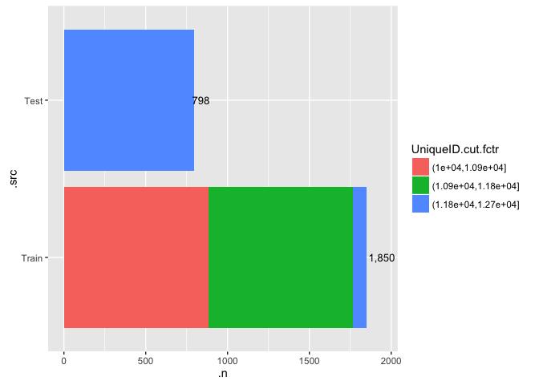
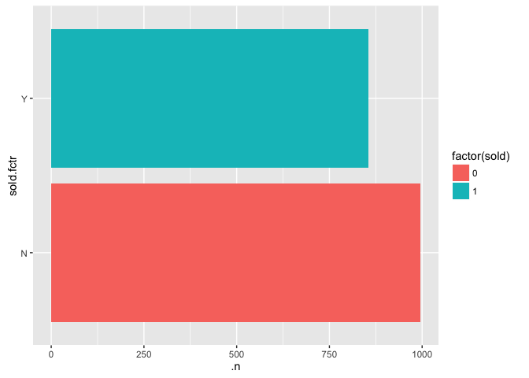
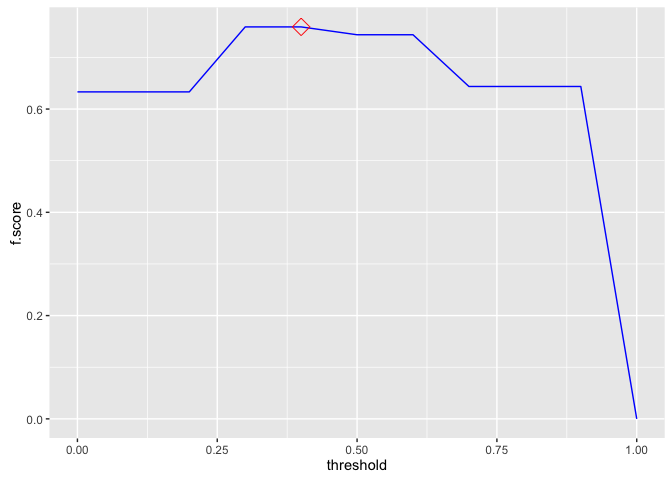
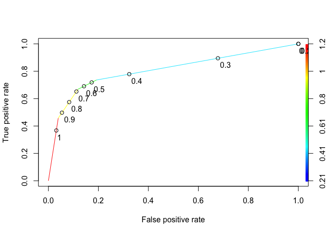
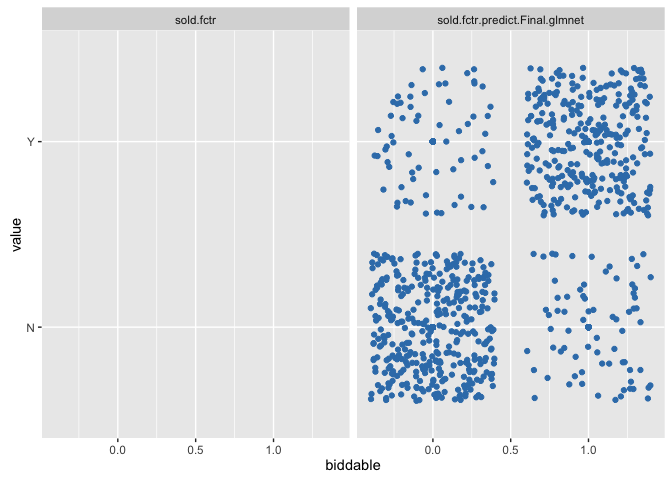

# eBay:iPads:: sold classification:: ebayipads_txt_n15
bdanalytics  

**  **    
**Date: (Tue) Nov 10, 2015**    

# Introduction:  

Data: 
Source: 
    Training:   https://inclass.kaggle.com/c/15-071x-the-analytics-edge-summer-2015/download/eBayiPadTrain.csv  
    New:        https://inclass.kaggle.com/c/15-071x-the-analytics-edge-summer-2015/download/eBayiPadTest.csv  
Time period: 


# Synopsis:

Based on analysis utilizing <> techniques, <conclusion heading>:  

Regression results:
First run:
    <glb_sel_mdl_id>: 
        OOB_RMSE=<0.4f>; new_RMSE=<0.4f>; <feat1>=<imp>; <feat2>=<imp>

Classification results:
template:
    prdline.my == "Unknown" -> 296
    Low.cor.X.glm: Leaderboard: 0.83458 -> Rank 288 / 1884 0.85514
        newobs_tbl=[N=471, Y=327]; submit_filename=template_Final_glm_submit.csv
        OOB_conf_mtrx=[YN=125, NY=76]=201; max.Accuracy.OOB=0.7710;
            opt.prob.threshold.OOB=0.6
            startprice=100.00; biddable=95.42; productline=49.22; 
            D.T.like=29.75; D.T.use=26.32; D.T.box=21.53; 

prdline: -> Worse than template
    prdline.my == "Unknown" -> 285
    All.X.no.rnorm.rf: Leaderboard: 0.82649
        newobs_tbl=[N=485, Y=313]; submit_filename=prdline_Final_rf_submit.csv
        OOB_conf_mtrx=[YN=119, NY=80]=199; max.Accuracy.OOB=0.8339;
            opt.prob.threshold.OOB=0.5
            startprice=100.00; biddable=84.25; D.sum.TfIdf=7.28; 
            D.T.use=4.26; D.T.veri=2.78; D.T.scratch=1.99; D.T.box=; D.T.like=; 
    Low.cor.X.glm: Leaderboard: 0.81234
        newobs_tbl=[N=471, Y=327]; submit_filename=prdline_Low_cor_X_glm_submit.csv
        OOB_conf_mtrx=[YN=125, NY=74]=199; max.Accuracy.OOB=0.8205;
            opt.prob.threshold.OOB=0.6
            startprice=100.00; biddable=96.07; prdline.my=51.37; 
            D.T.like=29.39; D.T.use=25.43; D.T.box=22.27; D.T.veri=; D.T.scratch=; 

oobssmpl: -> 
    Low.cor.X.glm: Leaderboard: 0.83402
        newobs_tbl=[N=440, Y=358]; submit_filename=oobsmpl_Final_glm_submit
        OOB_conf_mtrx=[YN=114, NY=84]=198; max.Accuracy.OOB=0.7780;
            opt.prob.threshold.OOB=0.5
            startprice=100.00; biddable=93.87; prdline.my=60.48; D.sum.TfIdf=; 
            D.T.condition=8.69; D.T.screen=7.96; D.T.use=7.50; D.T.veri=; D.T.scratch=;

category: -> 
    Low.cor.X.glm: Leaderboard: 0.82381
        newobs_tbl=[N=470, Y=328]; submit_filename=category_Final_glm_submit
        OOB_conf_mtrx=[YN=119, NY=57]=176; max.Accuracy.OOB=0.8011;
            opt.prob.threshold.OOB=0.6
            startprice=100.00; biddable=79.19; prdline.my=55.22; D.sum.TfIdf=; 
            D.T.ipad=27.05; D.T.like=21.44; D.T.box=20.67; D.T.condition=; D.T.screen=; 

dataclns: -> 
    All.X.no.rnorm.rf: Leaderboard: 0.82211
        newobs_tbl=[N=485, Y=313]; submit_filename=dataclns_Final_rf_submit
        OOB_conf_mtrx=[YN=104, NY=75]=179; max.Accuracy.OOB=0.7977;
            opt.prob.threshold.OOB=0.5
            startprice.log=100.00; biddable=65.85; prdline.my=7.74; D.sum.TfIdf=; 
            D.T.use=2.01; D.T.condition=1.87; D.T.veri=1.62; D.T.ipad=; D.T.like=;
    Low.cor.X.glm: Leaderboard: 0.79264
        newobs_tbl=[N=460, Y=338]; submit_filename=dataclns_Low_cor_X_glm_submit
        OOB_conf_mtrx=[YN=113, NY=74]=187; max.Accuracy.OOB=0.7977;
            opt.prob.threshold.OOB=0.5 -> different from prev run of 0.6
            biddable=100.00; startprice.log=91.85; prdline.my=38.34; D.sum.TfIdf=; 
            D.T.ipad=29.92; D.T.box=27.76; D.T.work=25.79; D.T.use=; D.T.condition=;

txtterms: -> top_n = c(10)
    Low.cor.X.glm: Leaderboard: 0.81448
        newobs_tbl=[N=442, Y=356]; submit_filename=txtterms_Final_glm_submit
        OOB_conf_mtrx=[YN=113, NY=69]=182; max.Accuracy.OOB=0.7943;
            opt.prob.threshold.OOB=0.5
            biddable=100.00; startprice.log=90.11; prdline.my=37.65; D.sum.TfIdf=; 
            D.T.ipad=28.67; D.T.work=24.90; D.T.great=21.44; 
# [1] "D.T.condit"    "D.T.condition" "D.T.good"      "D.T.ipad"      "D.T.new"      
# [6] "D.T.scratch"   "D.T.screen"    "D.T.this"      "D.T.use"       "D.T.work"     
            
    All.X.glm: Leaderboard: 0.81016
        newobs_tbl=[N=445, Y=353]; submit_filename=txtterms_Final_glm_submit
        OOB_conf_mtrx=[YN=108, NY=72]=180; max.Accuracy.OOB=0.7966;
            opt.prob.threshold.OOB=0.5
            biddable=100.00; startprice.log=88.24; prdline.my=33.81; D.sum.TfIdf=; 
            D.T.scratch=25.51; D.T.use=18.97; D.T.good=16.37; 
 [1] "D.T.condit"  "D.T.use"     "D.T.scratch" "D.T.new"     "D.T.good"    "D.T.screen" 
 [7] "D.T.great"   "D.T.excel"   "D.T.work"    "D.T.ipad"            

    Max.cor.Y.rpart: Leaderboard: 0.79258
        newobs_tbl=[N=439, Y=359]; submit_filename=txtterms_Final_rpart_submit
        OOB_conf_mtrx=[YN=105, NY=76]=181; max.Accuracy.OOB=0.7954802;
            opt.prob.threshold.OOB=0.5
            startprice.log=100; biddable=; prdline.my=; D.sum.TfIdf=; 
            D.T.scratch=; D.T.use=; D.T.good=; 
 [1] "D.T.condit"  "D.T.use"     "D.T.scratch" "D.T.new"     "D.T.good"    "D.T.screen" 
 [7] "D.T.ipad"    "D.T.great"   "D.T.work"    "D.T.excel"

    All.X.no.rnorm.rf: Leaderboard: 0.80929
        newobs_tbl=[N=545, Y=253]; submit_filename=txtterms_Final_rf_submit
        OOB_conf_mtrx=[YN=108, NY=61]=169; max.Accuracy.OOB=0.8090395
            opt.prob.threshold.OOB=0.5
            startprice.log=100.00; biddable=78.82; idseq.my=63.43; prdline.my=45.57;
            D.T.use=2.76; D.T.condit=2.35; D.T.scratch=2.00; D.T.good=; 
 [1] "D.T.condit"  "D.T.use"     "D.T.scratch" "D.T.new"     "D.T.good"    "D.T.screen" 
 [7] "D.T.ipad"    "D.T.great"   "D.T.work"    "D.T.excel"

txtclstr:
    All.X.no.rnorm.rf: Leaderboard: 0.79363 -> 0.79573
        newobs_tbl=[N=537, Y=261]; submit_filename=txtclstr_Final_rf_submit
        OOB_conf_mtrx=[YN=104, NY=61]=165; max.Accuracy.OOB=0.8135593
            opt.prob.threshold.OOB=0.5
            startprice.log=100.00; biddable=79.99; idseq.my=64.94; 
                prdline.my=4.14; prdline.my.clusterid=1.15; 
 [1] "D.T.condit"  "D.T.use"     "D.T.scratch" "D.T.new"     "D.T.good"    "D.T.screen" 
 [7] "D.T.ipad"    "D.T.great"   "D.T.work"    "D.T.excel"            
 
dupobs:
    All.X.no.rnorm.rf: Leaderboard: 0.79295
        newobs_tbl=[N=541, Y=257]; submit_filename=dupobs_Final_rf_submit
        OOB_conf_mtrx=[YN=114, NY=65]=179; max.Accuracy.OOB=0.7977401
            opt.prob.threshold.OOB=0.5
            startprice.log=100.00; biddable=94.49; idseq.my=67.40; 
                prdline.my=4.48; prdline.my.clusterid=1.99; 
 [1] "D.T.condit"  "D.T.use"     "D.T.scratch" "D.T.new"     "D.T.good"    "D.T.screen" 
 [7] "D.T.ipad"    "D.T.great"   "D.T.work"    "D.T.excel"            
 
    All.X.no.rnorm.rf: Leaderboard: 0.79652
        newobs_tbl=[N=523, Y=275]; submit_filename=dupobs_Final_rf_submit
        OOB_conf_mtrx=[YN=114, NY=65]=179; max.Accuracy.OOB=0.7977401
            opt.prob.threshold.OOB=0.5
            startprice.log=100.00; biddable=94.24; idseq.my=67.92; 
                prdline.my=4.33; prdline.my.clusterid=2.17; 
 [1] "D.T.condit"  "D.T.use"     "D.T.scratch" "D.T.new"     "D.T.good"    "D.T.screen" 
 [7] "D.T.ipad"    "D.T.great"   "D.T.work"    "D.T.excel"
 
csmmdl:
   All.X.no.rnorm.rf: Leaderboard: 0.79396
        newobs_tbl=[N=525, Y=273]; submit_filename=csmmdl_Final_rf_submit
        OOB_conf_mtrx=[YN=111, NY=66]=177; max.Accuracy.OOB=0.8000000
            opt.prob.threshold.OOB=0.5
            startprice.log=100.00; biddable=90.30; idseq.my=67.06; 
                prdline.my=4.40; cellular.fctr=3.57; prdline.my.clusterid=2.08; 

   All.Interact.X.no.rnorm.rf: Leaderboard: 0.77867
        newobs_tbl=[N=564, Y=234]; submit_filename=csmmdl_Final_rf_submit
        OOB_conf_mtrx=[YN=120, NY=53]=173; max.Accuracy.OOB=0.8045198
            opt.prob.threshold.OOB=0.5
            biddable=100.00; startprice.log=93.99; idseq.my=57.30; 
                prdline.my=9.09; cellular.fctr=3.30; prdline.my.clusterid=2.35; 

   All.Interact.X.no.rnorm.rf: Leaderboard: 0.77152
        newobs_tbl=[N=539, Y=259]; submit_filename=csmmdl_Final_rf_submit
        OOB_conf_mtrx=[YN=, NY=]=; max.Accuracy.OOB=0.8011299
            opt.prob.threshold.OOB=0.5
            biddable=100.00; startprice.log=94.93; idseq.my=57.12; 
                prdline.my=9.29; cellular.fctr=3.20; prdline.my.clusterid=2.50; 
 [1] "D.T.condit"  "D.T.use"     "D.T.scratch" "D.T.new"     "D.T.good"    "D.T.screen" 
 [7] "D.T.ipad"    "D.T.great"   "D.T.work"    "D.T.excel"
 
        All.X.glmnet: 
            fit_RMSE=???; OOB_RMSE=115.1247; new_RMSE=115.1247; 
            prdline.my.fctr=100.00; condition.fctrNew=88.53; D.npnct09.log=84.34
                biddable=16.48; idseq.my=57.27;
spdiff:                
    All.Interact.X.no.rnorm.rf: Leaderboard: 0.78218
        newobs_tbl=[N=517, Y=281]; submit_filename=spdiff_Final_rf_submit
        OOB_conf_mtrx=[YN=121, NY=38]=159; max.Accuracy.OOB=0.8203390
            opt.prob.threshold.OOB=0.6
            biddable=100.00; startprice.diff=57.53; idseq.my=41.31; 
                prdline.my=11.43; cellular.fctr=2.36; prdline.my.clusterid=1.82; 
 
        All.X.no.rnorm.rf: 
            fit_RMSE=92.19; OOB_RMSE=130.86; new_RMSE=130.86; 
            biddable=100.00; prdline.my.fctr=61.92; idseq.my=57.77;
                condition.fctr=29.53; storage.fctr=11.22; color.fctr=6.69;
                cellular.fctr=6.11
                
    All.X.no.rnorm.rf: Leaderboard: 0.77443
        newobs_tbl=[N=606, Y=192]; submit_filename=spdiff_Final_rf_submit
        OOB_conf_mtrx=[YN=112, NY=28]=140; max.Accuracy.OOB=0.8418079
            opt.prob.threshold.OOB=0.6
            startprice.diff=100.00; biddable=96.53; idseq.my=38.10; 
                prdline.my=3.65; cellular.fctr=2.21; prdline.my.clusterid=0.91; 
 [1] "D.T.condit"  "D.T.use"     "D.T.scratch" "D.T.new"     "D.T.good"    "D.T.screen" 
 [7] "D.T.ipad"    "D.T.great"   "D.T.work"    "D.T.excel"

 color:
        All.Interact.X.glmnet: 
            fit_RMSE=88.64520; 
            prdline.my.fctr:D.TfIdf.sum.stem.stop.Ratio=100.00;
            prdline.my.fctr:condition.fctr=77.35
            D.TfIdf.sum.stem.stop.Ratio=68.18
            prdline.my.fctr:color.fctr=68.12
            prdline.my.fctr:storage.fctr=63.32
            
    All.X.no.rnorm.rf: Leaderboard: 0.80638
        newobs_tbl=[N=550, Y=248]; submit_filename=color_Final_rf_submit
        OOB_conf_mtrx=[YN=108, NY=54]=162; max.Accuracy.OOB=0.8169492
            opt.prob.threshold.OOB=0.5
            biddable=100.00; startprice.diff=77.90; idseq.my=48.49; 
                D.ratio.sum.TfIdf.nwrds=6.48; storage.fctr=4.74;
                    D.TfIdf.sum.stem.stop.Ratio=4.57; prdline.my=4.32;
 [1] "D.T.condit"  "D.T.use"     "D.T.scratch" "D.T.new"     "D.T.good"    "D.T.screen" 
 [7] "D.T.ipad"    "D.T.great"   "D.T.work"    "D.T.excel"
            
    All.Interact.X.no.rnorm.rf: Leaderboard: 0.72974
        newobs_tbl=[N=682, Y=116]; submit_filename=assctxt_Final_rf_submit
        OOB_conf_mtrx=[YN=125, NY=43]=168; max.Accuracy.OOB=0.8101695; max.auc.OOB=???;
            opt.prob.threshold.OOB=0.6
            biddable=100.00; startprice.diff=51.04; idseq.my=29.51; 
                startprice.diff:biddable=28.70
                prdline.my.fctriPadmini:idseq.my=6.89
        Highest max.auc.OOB=???; for model:        

gbm w/startprice.unit9:
    Final.glment: min.RMSE.fit=30.32782
    Ensemble.glmnet: min.RMSE.fit=29.62348
startprice.predict.All.Interact.X.no.rnorm.rf    100.000
startprice.predict.All.X.no.rnorm.rf              73.521
startprice.predict.All.Interact.X.bayesglm        29.675
startprice.predict.Max.cor.Y.lm                   28.405

        All.X.glmnet: min.RMSE.fit=88.64271
prdl.my.descr.fctr                       100.00
D.TfIdf.sum.stem.stop.Ratio                        85.01
condition.fctr                                  80.28
carrier.fctr                                  77.48
prdl.my.descr.fctr:.clusterid.fctr5       65.78
D.npnct16.log                                      61.66
startprice.unit9                                   59.48
color.fctr                                    59.21
D.npnct01.log                                      53.78
D.npnct08.log                                      53.56
cellular.fctr                                     53.19

    Ensemble.glmnet: Leaderboard: not submitted -> lower max.auc.OOB of "Ensemble submission"
        newobs_tbl=[N=579, Y=219]; submit_filename=gbm_Final_glmnet_submit
        OOB_conf_mtrx=[YN=85, NY=54]=139; 
            max.Accuracy.OOB=0.8438202; max.auc.OOB=0.9127314; opt.prob.threshold.OOB=0.5
sold.fctr.predict.All.X.no.rnorm.rf.prob             100.0000
sold.fctr.predict.All.Interact.X.no.rnorm.rf.prob     98.7937            
        Highest max.auc.OOB=0.9167568; for model:All.Interact.X.gbm
biddable                                           100.0000
startprice.diff                                     96.2076
startprice.diff:biddable                            23.2114
idseq.my                                             7.8098        

mdlsel:
    Final.glment: min.RMSE.fit=30.47114 (higher than gbm w/startprice.unit9)
    Ensemble.glmnet: min.RMSE.fit=29.49418
startprice.predict.All.Interact.X.no.rnorm.rf                          100.000000
startprice.predict.All.X.no.rnorm.rf                                    71.213880
startprice.predict.All.X.bayesglm                                       24.166084

        All.X.glmnet: min.RMSE.fit=88.64271
prdl.my.descr.fctr                       100.00
D.TfIdf.sum.stem.stop.Ratio                        85.01
condition.fctr                                  80.28
carrier.fctr                                  77.48
prdl.my.descr.fctr:.clusterid.fctr5       65.78
D.npnct16.log                                      61.66
startprice.unit9                                   59.48
color.fctr                                    59.21
D.npnct01.log                                      53.78
D.npnct08.log                                      53.56
cellular.fctr                                     53.19

mdlsel(startprice.log):
    Final.Ensemble.rf: min.RMSE.fit=0.4563772
    Ensemble.rf: min.RMSE.fit=0.4283013
startprice.log.predict.All.Interact.X.no.rnorm.rf                  100.0000000
startprice.log.predict.All.X.no.rnorm.rf                            58.0967582
startprice.log.predict.All.Interact.X.gbm                            6.7197148

        All.X.no.rnorm.rf: min.RMSE.fit=1.4967021
biddable                                         100.00000000
idseq.my                                          98.00292371
startprice.unit9                                  34.31130220
prdl.my.descr.fctr                       18.10984741
D.ratio.sum.TfIdf.nwrds                           15.23549621
color.fctrUnknown                                 14.05520993
D.TfIdf.sum.stem.stop.Ratio                       13.00884673
D.ratio.nstopwrds.nwrds                           10.51165302

    All.X.gbm: Leaderboard: 0.75430
        newobs_tbl=[N=582, Y=216]; submit_filename=mdlsel_Final_gbm_submit
        OOB_conf_mtrx=[YN=58, NY=65]=123; 
            max.Accuracy.OOB=0.8617978; max.auc.OOB=0.9367161;
            opt.prob.threshold.OOB=0.5
startprice.diff                                           100.0000000 100.00000000
biddable                                                   66.6475055  65.40764971
idseq.my                                                    1.8632456   4.55963698

splogdiff:
    All.X.gbm: Leaderboard: 0.70111
        newobs_tbl=[N=553, Y=245]; submit_filename=splogdiff_Final_gbm_submit
        OOB_conf_mtrx=[YN=35, NY=101]=136; 
            max.Accuracy.OOB=0.8471910; max.auc.OOB=0.9388912;
            opt.prob.threshold.OOB=0.3
startprice.log.diff                                       100.0000000 100.0000000
biddable                                                   86.8563123  88.0261866
idseq.my                                                    8.3580281   2.9054298       

nofrcdups:
    All.X.gbm: Leaderboard: ???/0.67225
        newobs_tbl=[N=543, Y=255]; submit_filename=nofrcdups_Final_gbm_submit
        OOB_conf_mtrx=[YN=36, NY=101]=137; 
            opt.prob.threshold.OOB=0.3
            max.Accuracy.OOB=0.0.8460674; max.auc.OOB=0.9388582;
startprice.log.diff                                      100.00000000  93.3716491
biddable                                                  83.57786348 100.0000000
idseq.my                                                  11.54696712   1.1240259     
Forum Ideas:
I then focused on feature engineering, each new variable brought its own little improvement so in the end i just kept adding new ones and let the models do their thing. Here are some i used: model (productline:storage:condition), isNew, model2 (product:isNew), 50 common words from descr, descrLength, capsFactor (% of caps in description), number of cheaper items of same model2, number of dearer items of same model2, priceFactor (vs. mean of price for model), priceFactor2 (vs. mean of price for model2), bigID (if ID> 11000 because there seems to be a huge drop in sales after some time), timeline (year of product launch, reasoning is you want to spend less money on older products).

Get the median startprice for each level of productline and condition. Take the difference from startprice as a new variable. I find median works much better than the mean since startprice is not normally distributed. I also created another binary variable on whether this difference is positive or negative.

Square root startprice

scale and center all the variables except sold, including the dummies.

### Prediction Accuracy Enhancement Options:
- Not repeatable experiments:
    - gbm & ensembles that include gbm
    - rf that includes .rnorm ??? (now .rnorm has a set seed)
    
- import.data chunk:
    - which obs should be in fit vs. OOB (currently dirty.0 vs .1 is split 50%)
    
- inspect.data chunk:
    - For date variables
        - Appropriate factors ?
        - Different / More last* features ?
        
- scrub.data chunk:        
- transform.data chunk:
    - derive features from multiple features
    
- manage.missing.data chunk:
    - Not fill missing vars
    - Fill missing numerics with a different algorithm
    - Fill missing chars with data based on clusters 
    
- extract.features chunk:
    - Text variables: move to date extraction chunk ???
        - Mine acronyms
        - Mine places

- Review set_global_options chunk after features are finalized

### 

## Potential next steps include:
- Organization:
    - Categorize by chunk
    - Priority criteria:
        0. Ease of change
        1. Impacts report
        2. Cleans innards
        3. Bug report
        
- all chunks:
    - at chunk-end rm(!glb_<var>)
    
- manage.missing.data chunk:
    - cleaner way to manage re-splitting of training vs. new entity

- extract.features chunk:
    - Add n-grams for glbFeatsText
        - "RTextTools", "tau", "RWeka", and "textcat" packages
    - Convert user-specified mutate code to config specs
    
- fit.models chunk:
    - Prediction accuracy scatter graph:
    -   Add tiles (raw vs. PCA)
    -   Use shiny for drop-down of "important" features
    -   Use plot.ly for interactive plots ?
    
    - Change .fit suffix of model metrics to .mdl if it's data independent (e.g. AIC, Adj.R.Squared - is it truly data independent ?, etc.)
    - move model_type parameter to myfit_mdl before indep_vars_vctr (keep all model_* together)
    - create a custom model for rpart that has minbucket as a tuning parameter
    - varImp for randomForest crashes in caret version:6.0.41 -> submit bug report

- Probability handling for multinomials vs. desired binomial outcome
-   ROCR currently supports only evaluation of binary classification tasks (version 1.0.7)
-   extensions toward multiclass classification are scheduled for the next release

- Skip trControl.method="cv" for dummy classifier ?
- Add custom model to caret for a dummy (baseline) classifier (binomial & multinomial) that generates proba/outcomes which mimics the freq distribution of glb_rsp_var values; Right now glb_dmy_glm_mdl always generates most frequent outcome in training data
- glm_dmy_mdl should use the same method as glm_sel_mdl until custom dummy classifer is implemented

- fit.all.training chunk:
    - myplot_prediction_classification: displays 'x' instead of '+' when there are no prediction errors 
- Compare glb_sel_mdl vs. glb_fin_mdl:
    - varImp
    - Prediction differences (shd be minimal ?)

- Move glb_analytics_diag_plots to mydsutils.R: (+) Easier to debug (-) Too many glb vars used
- Add print(ggplot.petrinet(glb_analytics_pn) + coord_flip()) at the end of every major chunk
- Parameterize glb_analytics_pn
- Move glb_impute_missing_data to mydsutils.R: (-) Too many glb vars used; glb_<>_df reassigned
- Replicate myfit_mdl_classification features in myfit_mdl_regression
- Do non-glm methods handle interaction terms ?
- f-score computation for classifiers should be summation across outcomes (not just the desired one ?)
- Add accuracy computation to glb_dmy_mdl in predict.data.new chunk
- Why does splitting fit.data.training.all chunk into separate chunks add an overhead of ~30 secs ? It's not rbind b/c other chunks have lower elapsed time. Is it the number of plots ?
- Incorporate code chunks in print_sessionInfo
- Test against 
    - projects in github.com/bdanalytics
    - lectures in jhu-datascience track

# Analysis: 

```r
rm(list = ls())
set.seed(12345)
options(stringsAsFactors = FALSE)
source("~/Dropbox/datascience/R/myscript.R")
source("~/Dropbox/datascience/R/mydsutils.R")
```

```
## Loading required package: caret
## Loading required package: lattice
## Loading required package: ggplot2
```

```r
source("~/Dropbox/datascience/R/myplot.R")
source("~/Dropbox/datascience/R/mypetrinet.R")
source("~/Dropbox/datascience/R/myplclust.R")
source("~/Dropbox/datascience/R/mytm.R")
# Gather all package requirements here
suppressPackageStartupMessages(require(doMC))
registerDoMC(6) # # of cores on machine - 2
suppressPackageStartupMessages(require(caret))
source("~/Documents/Work/PullRequests/caret/pkg/caret/R/confusionMatrix.R")
source("~/Documents/Work/PullRequests/caret/pkg/caret/R/ggplot.R")
#packageVersion("tm")
#require(sos); findFn("cosine", maxPages=2, sortby="MaxScore")

# Analysis control global variables
# Inputs
glb_trnng_url <- "https://inclass.kaggle.com/c/15-071x-the-analytics-edge-summer-2015/download/eBayiPadTrain.csv"
glb_newdt_url <- "https://inclass.kaggle.com/c/15-071x-the-analytics-edge-summer-2015/download/eBayiPadTest.csv"
glbInpMerge <- # NULL #: default
    list(fnames = c("ebayipads_finmdl_bid0_sp_out.csv", "ebayipads_mdlens_bid1_sp_out.csv"))

glb_is_separate_newobs_dataset <- TRUE    # or TRUE
    glb_split_entity_newobs_datasets <- FALSE   # select from c(FALSE, TRUE)
    glb_split_newdata_method <- NULL # select from c(NULL, "condition", "sample", "copy")
    glb_split_newdata_condition <- NULL # or "is.na(<var>)"; "<var> <condition_operator> <value>"
    glb_split_newdata_size_ratio <- 0.3               # > 0 & < 1
    glb_split_sample.seed <- 123               # or any integer

glbObsDropCondition <- # default : NULL 
            "(UniqueID %in% c(NULL
                , 11234 #sold=0; 2 other dups(10306, 11503) are sold=1
                , 11844 #sold=0; 3 other dups(11721, 11738, 11812) are sold=1
                )) | 
            (productline %in% c('iPad 5', 'iPad mini Retina'))
                    # | (biddable != 0) # bid0_sp
                    # | (biddable == 0) # bid1_sp
            "
#parse(text=glbObsDropCondition)
#subset(glb_allobs_df, .grpid %in% c(31))
    
glb_obs_repartition_train_condition <- NULL 
#    "!is.na(sold) & (sold == 1)" # : bid._sp

glb_max_fitobs <- NULL # or any integer                         

glb_is_regression <- FALSE; glb_is_classification <- !glb_is_regression; 
    glb_is_binomial <- TRUE #or FALSE

glb_rsp_var_raw <- "sold" #: !_sp # "startprice" # : bid._sp # 

# for classification, the response variable has to be a factor
glb_rsp_var <- "sold.fctr" #:!_sp # "startprice.log10" :bid._sp # glb_rsp_var_raw :default

# if the response factor is based on numbers/logicals e.g (0/1 OR TRUE/FALSE vs. "A"/"B"), 
#   or contains spaces (e.g. "Not in Labor Force")
#   caret predict(..., type="prob") crashes
glb_map_rsp_raw_to_var <- function(raw) { # NULL
#     return(raw ^ 0.5)
#     return(log(1 + raw))
#     return(log10(raw)) # bid._sp
#     return(exp(-raw / 2))
    ret_vals <- rep_len(NA, length(raw)); ret_vals[!is.na(raw)] <- ifelse(raw[!is.na(raw)] == 1, "Y", "N"); return(relevel(as.factor(ret_vals), ref="N"))
#     #as.factor(paste0("B", raw))
#     #as.factor(gsub(" ", "\\.", raw))    
}
# glb_map_rsp_raw_to_var(tst <- c(NA, 0, 1)) # !_sp
# glb_map_rsp_raw_to_var(tst <- c(NA, 0, 2.99, 280.50, 1000.00)) # bid._sp

glb_map_rsp_var_to_raw <- function(var) { # NULL #
#     return(var ^ 2.0)
#     return(exp(var) - 1)
#     return(10 ^ var) # bid._sp
#     return(-log(var) * 2)
    as.numeric(var) - 1
#     #as.numeric(var)
#     #gsub("\\.", " ", levels(var)[as.numeric(var)])
#     c("<=50K", " >50K")[as.numeric(var)]
#     #c(FALSE, TRUE)[as.numeric(var)]
}
# glb_map_rsp_var_to_raw(glb_map_rsp_raw_to_var(tst))

if ((glb_rsp_var != glb_rsp_var_raw) && is.null(glb_map_rsp_raw_to_var))
    stop("glb_map_rsp_raw_to_var function expected")
glb_rsp_var_out <- paste0(glb_rsp_var, ".predict.") # mdl_id is appended later

# List info gathered for various columns
# <col_name>:   <description>; <notes>
# description = The text description of the product provided by the seller.
# biddable = Whether this is an auction (biddable=1) or a sale with a fixed price (biddable=0).
# startprice = The start price (in US Dollars) for the auction (if biddable=1) or the sale price (if biddable=0).
# condition = The condition of the product (new, used, etc.)
# cellular = Whether the iPad has cellular connectivity (cellular=1) or not (cellular=0).
# carrier = The cellular carrier for which the iPad is equipped (if cellular=1); listed as "None" if cellular=0.
# color = The color of the iPad.
# storage = The iPad's storage capacity (in gigabytes).
# productline = The name of the product being sold.

# If multiple vars are parts of id, consider concatenating them to create one id var
# If glb_id_var == NULL, ".rownames <- row.names()" is the default
# Derive a numeric feature from id var

# User-specified exclusions
# List feats that shd be excluded due to known causation by prediction variable
glbFeatsExclude <- c(NULL
### !_sp
    , "description", "descr.my", "productline"
    , "startprice", "startprice.log10.predict", "sprice.predict.diff"
### bid0_sp                                  
#                                   , "description", "productline"
#                                   , "sold", "startprice.log10.cut.fctr"
#     # List feats that are linear combinations (alias in glm)
#                                 , "D.terms.post.stem.n.log", "D.weight.sum"
#                                 #, "prdl.descr.my.fctriPad4#1:.clusterid.fctr3" This does not work
#     # if RFE is rated lower than Low.cor, list feats that are in RFE & not in Low.cor
#         # min.RMSE.fit(RFE.X.glmnet)=0.1138888
# #             D.chrs.n.log                 61.12483
# #             D.chrs.uppr.n.log            61.12483
# #             D.ratio.wrds.stop.n.wrds.n   61.12483
# #             D.terms.post.stop.n.log      61.12483
# #             D.weight.post.stem.sum       61.12483
# #             D.wrds.n.log                 61.12483
# #             D.wrds.stop.n.log            61.12483
# #             D.wrds.unq.n.log             61.12483
#                             #, "startprice.dcm2.is9" # min.RMSE.fit(RFE.X.glmnet)=0.1141991 (up)
#                             , "D.wrds.stop.n.log"    # min.RMSE.fit(RFE.X.glmnet)=0.1131232
### bid0_sp                            
### bid1_sp                                  
#                                   , "description", "productline"
#                                   , "sold", "startprice.log10.cut.fctr"
### bid1_sp                            
                                  ) 

glb_id_var <- c("UniqueID")
glb_category_var <- "prdl.descr.my.fctr" # "productline" # NULL 
glb_drop_vars <- c(NULL) # or c("<col_name>")

glb_map_vars <- NULL # or c("<var1>", "<var2>")
glb_map_urls <- list();
# glb_map_urls[["<var1>"]] <- "<var1.url>"

glb_assign_pairs_lst <- NULL; 
# glb_assign_pairs_lst[["<var1>"]] <- list(from=c(NA),
#                                            to=c("NA.my"))
glb_assign_vars <- names(glb_assign_pairs_lst)

# Derived features
glbFeatsDerive <- NULL;

# Add logs of numerics that are not distributed normally ->  do automatically ???
# Right skew: logp1; sqrt; ^ 1/3; logp1(logp1); log10; exp(-<feat>/constant)

# glbFeatsDerive[["prdline.my"]] <- list(
#     mapfn=function(productline) { return(productline) }    
#     , args=c("productline"))

### bid._sp
# glbFeatsDerive[["startprice.log10.cut.fctr"]] <- list(
#     mapfn=function(startprice.log10) { return(cut(startprice.log10, 3)) }    
#     , args=c("startprice.log10"))
### bid._sp
glbFeatsDerive[["sprice.root2"]] <- list(
    mapfn = function(startprice) { return(startprice ^ (1/2)) }    
    , args = c("startprice"))
glbFeatsDerive[["sprice.log10"]] <- list(
    mapfn = function(startprice) { return(log(startprice)) }    
    , args = c("startprice"))
glbFeatsDerive[["sprice.d20nexp"]] <- list(
    mapfn = function(startprice) { return(exp(-startprice / 20)) }    
    , args = c("startprice"))

glbFeatsDerive[["sprice.predict.diff"]] <- list(
    mapfn = function(startprice.log10.predict, startprice) { 
        spdiff <- (10 ^ startprice.log10.predict) - startprice; 
        return(spdiff) }    
    , args = c("startprice.log10.predict", "startprice"))
# glbFeatsDerive[["spdiff.root10"]] <- list(
#     mapfn = function(sprice.predict.diff) { 
#         return(sign(sprice.predict.diff) * (abs(sprice.predict.diff) ^ (1/10))) }    
#     , args = c("sprice.predict.diff"))
glbFeatsDerive[["spdiff.cut.fctr"]] <- list(
    mapfn = function(sprice.predict.diff) { 
        return(cut(sprice.predict.diff, c(-1000, -100, -10, -1, 0, 1, 10, 100, 1000))) }    
    , args = c("sprice.predict.diff"))
  
#glb_allobs_df[which(glb_post_stop_words_terms_mtrx_lst[[txt_var]][, subset(glb_post_stop_words_terms_df_lst[[txt_var]], term %in% c("conditionminimal"))$pos] > 0), "description"]
glbFeatsDerive[["descr.my"]] <- list(
    mapfn = function(description) { mod_raw <- description;
### bid._sp
#         # This is here because it does not work with txt_map_filename
        mod_raw <- gsub(paste0(c("\n", "\211", "\235", "\317", "\333"), collapse = "|"), " ",
                        mod_raw)
#         # This should go into txt_map_filename    
#         mod_raw <- gsub("\\.\\.", "\\. ", mod_raw);    
#         # Don't parse for "." because of ".com"; use customized gsub for that text
#         mod_raw <- gsub("(\\w)(!|\\*|,|-|/)(\\w)", "\\1\\2 \\3", mod_raw);
#mod_raw <- grep("&#034;", glb_allobs_df$descr.my, value = TRUE)        
        mod_raw <- gsub("&amp;", "&", mod_raw);
        mod_raw <- gsub("&lt;", "<", mod_raw);
        mod_raw <- gsub("&gt;", ">", mod_raw);
        mod_raw <- gsub("<br>", " ", mod_raw); # line break - add a count for it ???     
        mod_raw <- gsub("&#034;", " ", mod_raw); # justification meta-character        
        mod_raw <- gsub("&#(0*)37;", "%", mod_raw);        
        mod_raw <- gsub("&#039;", "'", mod_raw);
        mod_raw <- gsub("([[:digit:]])\\.([[:digit:]])\\.([[:digit:]])",
                        "\\1point\\2\\point\\3", mod_raw);        
        mod_raw <- gsub("([[:digit:]])\\.([[:digit:]])", "\\1point\\2", mod_raw);
        mod_raw <- gsub("([[:digit:]]),([[:digit:]])", "\\1\\2", mod_raw);        
        mod_raw <- gsub("\\b1st\\b", "first", mod_raw);        
        mod_raw <- gsub("\\b2nd\\b", "second", mod_raw);
        mod_raw <- gsub("\\b3rd\\b", "third", mod_raw);
        mod_raw <- gsub("\\b4th\\b", "fourth", mod_raw);        
        mod_raw <- gsub("\\.(com|COM)\\b", "dot\\1", mod_raw);        
#         
#         # Modifications for this exercise only
#         # Add dictionary to stemDocument e.g. stickers stemmed to sticker ???
#         mod_raw <- gsub("8\\.25", "825", mod_raw, ignore.case=TRUE);  
        mod_raw <- gsub("\\b10\\.SCREEN\\b", "10\\. SCREEN", mod_raw); 
        mod_raw <- gsub("\\b128 gb\\b", "128gb", mod_raw);  
        mod_raw <- gsub("\\b16G\\b", "16GB", mod_raw);          
#         mod_raw <- gsub(" 16 gig ", " 16gb ", mod_raw, ignore.case=TRUE);
#         mod_raw <- gsub(" 16 gb ", " 16gb ", mod_raw, ignore.case=TRUE);        
#         
#         mod_raw <- gsub("\\bAccounts\\b", "Account", mod_raw, ignore.case=FALSE);
#         mod_raw <- gsub("\\bactivated\\b", "activate", mod_raw, ignore.case=FALSE);        
#         mod_raw <- gsub(" actuuly ", " actual ", mod_raw, ignore.case=TRUE);
        mod_raw <- gsub("\\badaptor\\b", "adapter", mod_raw);
#         mod_raw <- gsub("\\baffects\\b", "affect", mod_raw, ignore.case=FALSE);           
        mod_raw <- gsub("\\bair-like\\b", "air -like", mod_raw);
        mod_raw <- gsub("\\bALL-JUST\\b", "ALL -JUST", mod_raw);        
        mod_raw <- gsub("\\bApple's\\b", "Apple'", mod_raw);        
# #mod_raw <- glb_allobs_df[c(1322), txt_var]; mod_raw        
        mod_raw <- gsub("\\bApple care\\b", "Applecare", mod_raw);
        mod_raw <- gsub("\\bAT&T\\b", "ATT", mod_raw);        
        
#         mod_raw <- gsub(" bacK!wiped ", " bacK ! wiped ", mod_raw, ignore.case=TRUE);
#         mod_raw <- gsub(" backplate", " back plate", mod_raw, ignore.case=TRUE);
#         mod_raw <- gsub("\\bbarley", "barely", mod_raw, ignore.case=TRUE);        
#         mod_raw <- gsub(" bend ", " bent ", mod_raw, ignore.case=TRUE);         
        mod_raw <- gsub("\\b(B|b)(EST|est) (B|b)(UY|uy)\\b", "\\1\\2\\3\\4", mod_raw);
#         mod_raw <- gsub(" black\\.Device ", " black \\. Device ", mod_raw,
#                         ignore.case=TRUE);        
#         mod_raw <- gsub("black\\),charger ", "black\\), charger ", mod_raw,
#                         ignore.case=TRUE);        
#         mod_raw <- gsub("\\bblacked\\b", "black", mod_raw, ignore.case=FALSE);
#         mod_raw <- gsub("\\bblemish\\b", "blemishes", mod_raw, ignore.case=FALSE);        
#         mod_raw <- gsub(" blocks", " blocked", mod_raw, ignore.case=TRUE);
#         mod_raw <- gsub(" book ", " manual ", mod_raw, ignore.case=TRUE);            
        mod_raw <- gsub("\\b(B|b)(RAND|rand)( |-)(N|n)(EW|ew)\\b", "\\1\\2\\4\\5", mod_raw)
            #mod_raw <- c("brand new", "BRAND new", "brand NEW", "BRAND NEW", "bbrand new", "brand-new", "brand newb")
        mod_raw <- gsub("\\bbrokenCharger\\b", "broken Charger", mod_raw);
#         
        mod_raw <- gsub("\\bC-Major\\b", "C -Major", mod_raw)    
#         mod_raw <- gsub(" perfectlycord ", " perfectly cord ", mod_raw, ignore.case=TRUE);
#         mod_raw <- gsub("\\bcord", "cable", mod_raw, ignore.case=TRUE);     
        mod_raw <- gsub("\\bcables\\.No\\b", "cables. No", mod_raw);        
#         mod_raw <- gsub("\\bcables\\b", "cable", mod_raw, ignore.case=TRUE);        
#         
        mod_raw <- gsub("\\bcare\\.The\\b", "care\\. The", mod_raw);
#         mod_raw <- gsub("\\b(cared|careful|CAREFUL)\\b", "care", mod_raw, ignore.case=FALSE);
#         mod_raw <- gsub("\\b(cases|casing)\\b", "case", mod_raw, ignore.case=TRUE);        
# #mod_raw <- glb_allobs_df[c(88,187,280,1040,1098), txt_var]; mod_raw        
        mod_raw <- gsub("\\bCase/Cover\\b", "Case/ Cover", mod_raw);
        mod_raw <- gsub("\\bCasing/Screen\\b", "Casing/ Screen", mod_raw);        
#         mod_raw <- gsub(" carefully ", " careful ", mod_raw, ignore.case=TRUE);        
#         mod_raw <- gsub("\\bchargers\\b", "charger", mod_raw, ignore.case=FALSE);        
        mod_raw <- gsub("\\bchip/crack\\b", "chip/ crack", mod_raw);        
#         mod_raw <- gsub("\\bchips\\b", "chip", mod_raw, ignore.case=FALSE);
        mod_raw <- gsub("\\bCLEAN\\!LIKE\\b", "CLEAN! LIKE", mod_raw);        
#         mod_raw <- gsub("\\bcleanly\\b", "clean", mod_raw, ignore.case=FALSE);        
#         mod_raw <- gsub("\\b(C|c)olor(.*)s\\b", "\\1olor", mod_raw, ignore.case=FALSE);
# #mod_raw <- glb_allobs_df[c(280,1411), txt_var]; mod_raw        
        mod_raw <- gsub("\\bColors,models\\b", "Colors ,models", mod_raw);   
#         mod_raw <- gsub("\\bcompletely\\b", "complete", mod_raw, ignore.case=FALSE);   
# #mod_raw <- glb_allobs_df[c(178), txt_var]; mod_raw        
#
        mod_raw <- gsub("\\bCONDITION..CLEAN\\b", "CONDITION ..CLEAN", mod_raw);
        mod_raw <- gsub("\\bcondition,comes\\b", "condition ,comes", mod_raw);
        mod_raw <- gsub("\\bcondition\\.Device\\b", "condition .Device", mod_raw);
        mod_raw <- gsub("\\bconditionHas\\b", "condition Has", mod_raw);        
        mod_raw <- gsub("\\bcondition\\.\\.\\.like\\b", "condition ...like", mod_raw);    
        mod_raw <- gsub("\\bcondition\\*Minimal\\b", "condition *Minimal", mod_raw);    
        mod_raw <- gsub("\\bCondition-Moderate\\b", "Condition -Moderate", mod_raw);
        mod_raw <- gsub("\\bcondition\\.The\\b", "condition .The", mod_raw);        
        mod_raw <- gsub("\\bCONDITION\\.VERY\\b", "CONDITION .VERY", mod_raw);        
#         mod_raw <- gsub(" (conditon|condtion|contidion|conditions)", " condition", mod_raw,
#         mod_raw <- gsub("\\b(conditon|condtion|contidion|conditions)\\b", "condition", mod_raw,
# ", "\\1\\. \\2", mod_raw,
#                         ignore.case=TRUE);
#         mod_raw <- gsub("(condition)(Has)", "\\1\\. \\2", mod_raw);
#         
#         mod_raw <- gsub("\\bCONNECTED\\b", "CONNECT", mod_raw, ignore.case=FALSE);        
#         mod_raw <- gsub("\\bconnects\\b", "connect", mod_raw, ignore.case=FALSE);        
#         mod_raw <- gsub(" consist ", " consistent ", mod_raw, ignore.case=TRUE);
# #mod_raw <- glb_allobs_df[c(195, 379, 437), txt_var]; mod_raw        
#         mod_raw <- gsub("\\bCosmetics\\b", "Cosmetic", mod_raw, ignore.case=FALSE);        
        mod_raw <- gsub("\\bCracked/Damaged\\b", "Cracked/ Damaged", mod_raw);        
        mod_raw <- gsub("\\bcracksNo\\b", "cracks No", mod_raw);        
#         
#         mod_raw <- gsub("\\b(D|d)amaged\\b", "\\1amage", mod_raw, ignore.case=TRUE);
# #mod_raw <- glb_allobs_df[c(116, 1360), txt_var]; mod_raw        
#         mod_raw <- gsub("\\bDays\\b", "Day", mod_raw, ignore.case=TRUE);        
#         mod_raw <- gsub(" DEFAULTING ", " DEFAULT ", mod_raw, ignore.case=TRUE);
#         mod_raw <- gsub("\\bdefect(ive)*\\b", "defects", mod_raw, ignore.case=FALSE);
#         mod_raw <- gsub(" definitely ", " definite ", mod_raw, ignore.case=TRUE);        
#         mod_raw <- gsub("\\b(D|d)ented\\b", "\\1ent", mod_raw, ignore.case=FALSE);    
#         mod_raw <- gsub(" described", " describe", mod_raw, ignore.case=TRUE);
#         mod_raw <- gsub(" desciption", " description", mod_raw, ignore.case=TRUE);    
#         mod_raw <- gsub(" devices", " device", mod_raw, ignore.case=TRUE);        
#         mod_raw <- gsub(" Digi\\.", " Digitizer\\.", mod_raw, ignore.case=TRUE);        
#         mod_raw <- gsub("\\b(ding|dinged)\\b", "dings", mod_raw, ignore.case=TRUE);   
#         mod_raw <- gsub(" display\\.New ", " display\\. New ", mod_raw, ignore.case=TRUE);
#         mod_raw <- gsub(" displays", " display", mod_raw, ignore.case=TRUE);
        mod_raw <- gsub("\\bdo( +)not\\b", "dont", mod_raw);
        mod_raw <- gsub("\\b(D|d)oes( +)(N|n)(O|o)(T|t)\\b", "\\1oes\\3\\5", mod_raw);
#         mod_raw <- gsub("\\b(drop|drops)\\b", "dropped", mod_raw, ignore.case=TRUE); 
        
#         mod_raw <- gsub("\\b(E|e)dge\\b", "\\1dges", mod_raw, ignore.case=FALSE);        
#         mod_raw <- gsub(" effect ", " affect ", mod_raw, ignore.case=TRUE);        
#         mod_raw <- gsub(" Excellant ", " Excellent ", mod_raw, ignore.case=TRUE);
#         mod_raw <- gsub(" excellently", " excellent", mod_raw, ignore.case=TRUE);
#         mod_raw <- gsub(" EUC ", " excellent used condition", mod_raw, ignore.case=TRUE);  
#         mod_raw <- gsub(" feels ", " feel ", mod_raw, ignore.case=TRUE);
        mod_raw <- gsub("\\bfineiCloud\\b", "fine iCloud", mod_raw, ignore.case = FALSE);
#         mod_raw <- gsub(" fine.Its ", " fine. Its ", mod_raw, ignore.case=TRUE);       
#         mod_raw <- gsub("\\bfix\\b", "fixed", mod_raw, ignore.case=TRUE);        
#         mod_raw <- gsub("\\bflaws\\b", "flaw", mod_raw, ignore.case=TRUE);
#         mod_raw <- gsub("\\bflawlessly\\b", "flawless", mod_raw, ignore.case=TRUE);        
#         mod_raw <- gsub(" Framing ", " Frame ", mod_raw, ignore.case=TRUE);        
#         
#         mod_raw <- gsub(" functioanlity", " functionality", mod_raw, ignore.case=TRUE);
#         mod_raw <- gsub("\\bfunction(ing|ality)\\b", "functional", mod_raw, ignore.case=TRUE); 
#         mod_raw <- gsub(" functional\\.Very little ", " functional\\. Very little ", mod_raw,
#                         ignore.case=TRUE); 
        
        mod_raw <- gsub("\\b([[:digit:]]+) (GB|gb)\\b", "\\1\\2", mod_raw);
        mod_raw <- gsub("\\b([[:digit:]]+) gig\\b", "\\1gb", mod_raw);        
        mod_raw <- gsub("\\b(G|g)(EEK|eek) (S|s)(QUAD|quad)\\b", "\\1\\2\\3\\4", mod_raw);
#         mod_raw <- gsub("^Gentle ", "Gently ", mod_raw, ignore.case=TRUE);
#         mod_raw <- gsub("\\(gray color", "\\(spacegray color", mod_raw, ignore.case=TRUE); 
#         mod_raw <- gsub(" GREAT\\.SCreen ", " GREAT\\. SCreen ", mod_raw,
#                         ignore.case=TRUE);        
        mod_raw <- gsub("\\bGUARANTEES-IT\\b", "GUARANTEES -IT", mod_raw);
#         mod_raw <- gsub("\\b(guarantee|guarantees)\\b", "guaranteed", mod_raw, ignore.case=TRUE);
#         mod_raw <- gsub("\\ba handful of times\\b", "sparingly", mod_raw, ignore.case=TRUE); 
#         mod_raw <- gsub("\\bhardly any\\b", "no", mod_raw, ignore.case=TRUE); 
#         mod_raw <- gsub("\\bhardly ever used\\b", "sparingly used", mod_raw, ignore.case=TRUE);
#         
        mod_raw <- gsub("\\biCL0UD\\b", "iCLOUD", mod_raw);        
        mod_raw <- gsub("\\bI (CLOUD|cloud)\\b", "I\\1", mod_raw);        
#         mod_raw <- gsub("^iPad Black 3rd generation ", "iPad 3 Black ", mod_raw,
#                         ignore.case=TRUE);  
        mod_raw <- gsub("\\bIMEINo\\b", "IMEI No", mod_raw);
        mod_raw <- gsub("\\bIMIE\\b", "IMEI", mod_raw);        
#         mod_raw <- gsub("\\bincluding\\b", "included", mod_raw, ignore.case=FALSE);        
#         mod_raw <- gsub(" install\\. ", " installed\\. ", mod_raw, ignore.case=TRUE);   
#         mod_raw <- gsub("inivisible", "invisible", mod_raw, ignore.case=TRUE);        
        mod_raw <- gsub("\\bI pad\\b", "Ipad", mod_raw);
        mod_raw <- gsub("\\b(I|i)(P|p)(A|a)(D|d) (A|a)(I|i)(R|r)\\b", "\\1\\2\\3\\4\\5\\6\\7",
                        mod_raw); 
        mod_raw <- gsub("\\b(I|i)(P|p)(A|a)(D|d) (M|m)ini\\b", "\\1\\2\\3\\4\\5ini", mod_raw);
        mod_raw <- gsub("\\b(I|i)(P|p)(A|a)(D|d) (M|m)inis\\b", "\\1\\2\\3\\4\\5ini", mod_raw);  
        mod_raw <- gsub("\\b(IPAD|Ipad|iPad|ipad) ([[:digit:]])\\b", "\\1\\2", mod_raw);
        mod_raw <- gsub("\\b(Ipadair|iPadAir|ipadair) ([[:digit:]])\\b", "\\1\\2",
                        mod_raw);
        mod_raw <- gsub("\\b(iPadMini|iPadmini) ([[:digit:]])\\b", "\\1\\2", mod_raw);
        mod_raw <- gsub("\\bI Phone\\b", "IPhone", mod_raw);        
        mod_raw <- gsub("\\bIS-NO\\b", "IS -NO", mod_raw, ignore.case = FALSE)
#
#         mod_raw <- gsub(" Keeped ", " Kept ", mod_raw, ignore.case=TRUE);        
#         mod_raw <- gsub(" knicks ", " nicks ", mod_raw, ignore.case=TRUE);
#         mod_raw <- gsub(" lightening ", " lightning ", mod_raw, ignore.case=TRUE);
        mod_raw <- gsub("\\bLightning-to-USB\\b", "Lightning- to- USB", mod_raw);        
        
        mod_raw <- gsub("\\b(L|l)(IKE|ike)( |-)(N|n)(EW|ew)\\b", "\\1\\2\\4\\5", mod_raw);
            #mod_raw <- c("like new", "LIKE new", "like NEW", "LIKE NEW", "blike new", "like-new", "like newb")
        mod_raw <- gsub("\\bLIKENEW!ONE\\b", "LIKENEW! ONE", mod_raw);        
#         mod_raw <- gsub("\\b(lock|locks)\\b", "locked", mod_raw, ignore.case=TRUE);
#         mod_raw <- gsub("\\blots\\b", "lot", mod_raw, ignore.case=TRUE);        
#         mod_raw <- gsub(" manuals ", " manual ", mod_raw, ignore.case=TRUE);
#         mod_raw <- gsub(" mars ", " marks ", mod_raw, ignore.case=TRUE);
#         mod_raw <- gsub(" marks\\.Absolutely ", " marks\\. Absolutely ", mod_raw,
#                         ignore.case=TRUE);        
#         mod_raw <- gsub("\\bmarkings\\b", "marks", mod_raw, ignore.case=TRUE);
#         mod_raw <- gsub("\\bminis\\b", "mini", mod_raw, ignore.case=FALSE);           
#         mod_raw <- gsub(" minimum", " minimal", mod_raw, ignore.case=TRUE);        
#         mod_raw <- gsub(" MINT\\.wiped ", " MINT\\. wiped ", mod_raw, ignore.case=TRUE);
#         mod_raw <- gsub("\\bmonth\\b", "months", mod_raw, ignore.case=TRUE);
# #mod_raw <- glb_allobs_df[c(1803), txt_var]; mod_raw
        
        mod_raw <- gsub("\\bNew-Other\\b", "New -Other", mod_raw);
#         mod_raw <- gsub(" NEW\\!(SCREEN|ONE) ", " NEW\\! \\1 ", mod_raw, ignore.case=TRUE);
#         mod_raw <- gsub(" new looking$", " looks new", mod_raw, ignore.case=TRUE);
#         mod_raw <- gsub(" newer ", " new ", mod_raw, ignore.case=TRUE);   
#         mod_raw <- gsub("\\bnoted\\b", "note", mod_raw, ignore.case=TRUE);        
        
#         mod_raw <- gsub(" oped ", " opened ", mod_raw, ignore.case=TRUE);        
#         mod_raw <- gsub(" opening", " opened", mod_raw, ignore.case=TRUE);
#         mod_raw <- gsub(" operated", " operational", mod_raw, ignore.case=TRUE);
        mod_raw <- gsub("\\botter box\\b", "otterbox", mod_raw);        
#         
#         mod_raw <- gsub("\\bpackage\\b", "packaging", mod_raw, ignore.case=FALSE);
#         mod_raw <- gsub("\\bPACKAGE\\b", "PACKAGing", mod_raw, ignore.case=FALSE);        
# #mod_raw <- glb_allobs_df[c(360, 1142), txt_var]; mod_raw        
        mod_raw <- gsub("\\bperfectlycord\\b", "perfectly cord", mod_raw);        
#         mod_raw <- gsub(" performance", " performs", mod_raw, ignore.case=TRUE);        
#         mod_raw <- gsub(" personalized ", " personal ", mod_raw, ignore.case=TRUE);
#         mod_raw <- gsub("\\bPhysically\\b", "Physical", mod_raw, ignore.case=FALSE);        
#         mod_raw <- gsub("\\b(picture|pictured)\\b", "pictures", mod_raw, ignore.case=FALSE);
#         mod_raw <- gsub("\\bPICTURE\\b", "PICTUREs", mod_raw, ignore.case=FALSE);
# #mod_raw <- glb_allobs_df[c(184, 892), txt_var]; mod_raw
#         mod_raw <- gsub("\\b[P|p]ower(ed|ing|s)\\b", "\\1ower", mod_raw, ignore.case=FALSE);
#         mod_raw <- gsub(" pre- owned ", " used ", mod_raw, ignore.case=TRUE);
#         mod_raw <- gsub("\\bprevious\\b", "previously", mod_raw, ignore.case=TRUE);
#         mod_raw <- gsub("\\bpreviously (owned|used)\\b", "used", mod_raw, ignore.case=TRUE);
        mod_raw <- gsub("\\b(P|p)reviously(.*)(O|o)wned\\b", "\\1reviously\\3wned\\2",
                        mod_raw); 
        mod_raw <- gsub("\\b(P|p)reviously(.*)(U|u)sed\\b", "\\1reviously\\3sed\\2", mod_raw);
#         mod_raw <- gsub("\\bproblem\\b", "problems", mod_raw, ignore.case=TRUE);
#         mod_raw <- gsub(" products ", " product ", mod_raw, ignore.case=TRUE);        
#         mod_raw <- gsub("\\bprotected\\b",  "protector", mod_raw, ignore.case=FALSE);       
#         mod_raw <- gsub("\\bprotection\\b", "protector", mod_raw, ignore.case=FALSE);
#         mod_raw <- gsub("\\bPROTECTION\\b", "PROTECTOR", mod_raw, ignore.case=FALSE);       
        
        mod_raw <- gsub("\\bREADiPad\\b", "READ iPad", mod_raw);
#         mod_raw <- gsub(" re- assemble ", " reassemble ", mod_raw, ignore.case=TRUE);
        mod_raw <- gsub("\\bREFURB\\.", "REFURBished.", mod_raw);
#         mod_raw <- gsub(" reponding", " respond", mod_raw, ignore.case=TRUE);   
        mod_raw <- gsub("\\bright-hand\\b", "right -hand", mod_raw);
#         mod_raw <- gsub(" rotation ", " rotate ", mod_raw, ignore.case=TRUE);   
#         
#         mod_raw <- gsub(" Sales ", " Sale ", mod_raw, ignore.case=TRUE);
        mod_raw <- gsub("\\bScratch-Free\\b", "Scratch- Free", mod_raw);
        mod_raw <- gsub("\\bSCRATCHES/BLEMISHES...SCRATCHES\\b", "SCRATCHES/ BLEMISHES... SCRATCHES", mod_raw);
        mod_raw <- gsub("\\bscratches,clear\\b", "scratches, clear", mod_raw);
        mod_raw <- gsub("\\bScratches/Dent\\b", "Scratches/ Dent", mod_raw);
        mod_raw <- gsub("\\bScratches/scuffs/nicks/scrapes\\b", "Scratches/ scuffs/ nicks/ scrapes", mod_raw);        
#         mod_raw <- gsub(" scratchs ", " scratches ", mod_raw, ignore.case=TRUE);        
#         mod_raw <- gsub("\\b(scratchs|scratching)\\b", "scratches", mod_raw, ignore.case=FALSE);
        mod_raw <- gsub("\\bset up\\b", "setup", mod_raw);        
#         mod_raw <- gsub(" shipped| Shipment", " ship", mod_raw, ignore.case=TRUE);
#         mod_raw <- gsub("\\bshowing\\b", "shows", mod_raw, ignore.case=FALSE);        
        mod_raw <- gsub("\\b(shrink|SHRINK) (wrap|WRAP)", "\\1\\2", mod_raw);        
#         mod_raw <- gsub("\\bshuts\\b", "shut", mod_raw, ignore.case=TRUE);        
#         mod_raw <- gsub(" sides ", " side ", mod_raw, ignore.case=TRUE);
#         mod_raw <- gsub(" skinned,", " skin,", mod_raw, ignore.case=TRUE);
#         mod_raw <- gsub("\\bSlightly\\b", "slight", mod_raw, ignore.case=FALSE);        
        mod_raw <- gsub("\\b(Space|space) (G|g)r(a|e)y\\b", "\\1\\2ray", mod_raw); 
#         mod_raw <- gsub(" spec ", " speck ", mod_raw, ignore.case=TRUE);        
        mod_raw <- gsub("\\bsomescratches\\b", "some scratches", mod_raw);  
#         mod_raw <- gsub(" Sticker ", " Stickers ", mod_raw, ignore.case=TRUE);
#         mod_raw <- gsub("\\bstoring", "store", mod_raw, ignore.case=FALSE);        
#         mod_raw <- gsub("SWAPPA\\.COM", "SWAPPAsdotCOM", mod_raw, ignore.case=TRUE);        
#         
#         mod_raw <- gsub(" T- Mobile", "  TMobile", mod_raw, ignore.case=TRUE);  
#         mod_raw <- gsub("\\b(tear|TEAR)(s|S)\\b", "\\1", mod_raw, ignore.case=FALSE);         
# #mod_raw <- glb_allobs_df[c(376), txt_var]; mod_raw        
        mod_raw <- gsub("\\b(touch|Touch|TOUCH) (screen|SCREEN)\\b", "\\1\\2", mod_raw);
#         mod_raw <- gsub("\\bTURN\\b", "TURNS", mod_raw, ignore.case=FALSE);        
#         
        mod_raw <- gsub("\\bUnlockedCracked\\b", "Unlocked Cracked", mod_raw);
#         mod_raw <- gsub("\\bUNUSABLE\\b", "UNUSED", mod_raw, ignore.case=FALSE);         
#         mod_raw <- gsub("\\b(update|updates)\\b", "updated", mod_raw, ignore.case=FALSE);
#         mod_raw <- gsub("\\bupgrade\\b", "upgraded", mod_raw, ignore.case=FALSE);        
#         mod_raw <- gsub(" uppser ", " upper ", mod_raw, ignore.case=TRUE); 
#         mod_raw <- gsub("use*Case\\b", "use *Case", mod_raw, ignore.case = FALSE)    
#         mod_raw <- gsub(" use\\.Scratches ", " use\\. Scratches ", mod_raw,
#                         ignore.case=TRUE);  
#         
#         mod_raw <- gsub(" verify ", " verified ", mod_raw, ignore.case=TRUE);        
#         mod_raw <- gsub(" wear\\.Device ", " wear\\. Device ", mod_raw, ignore.case=TRUE);
#         mod_raw <- gsub("\\bwears\\b", "\\wear", mod_raw, ignore.case=TRUE);
# #mod_raw <- glb_allobs_df[c(167, 272), txt_var]; mod_raw        
#         mod_raw <- gsub(" whats ", " what's ", mod_raw, ignore.case=TRUE);
#         mod_raw <- gsub(" WiFi\\+4G ", " WiFi \\+ 4G ", mod_raw, ignore.case=TRUE);
        mod_raw <- gsub("\\b(W|w)(IFI|ifi)( |-)(ONLY|only)\\b", "\\1\\2\\4", mod_raw);
        mod_raw <- gsub("\\bwill( +)not\\b", "wont", mod_raw);  
        
        mod_raw <- gsub("\\byr\\b", "year", mod_raw);         
        mod_raw <- gsub("\\bZa(a|g)g Invisible(.*)Shield\\b", "ZaagInvisibleShield", mod_raw);
### bid._sp
        return(mod_raw) }    
    , args = c("description"))
# To identify glb_id_vars with >=10 obs
#mod_raw <- glb_allobs_df[sel_obs(list(descr.my.contains="\\bdoes( +)not\\b")), glbFeatsText]
#mod_raw <- glb_allobs_df[sel_obs(list(descr.my.contains="\\bipad [[:digit:]]\\b")), glbFeatsText][01:10]
#mod_raw <- glb_allobs_df[sel_obs(list(descr.my.contains="pad mini")), glbFeatsText][11:20]
#mod_raw <- glb_allobs_df[sel_obs(list(descr.my.contains="pad mini")), glbFeatsText][21:30]
#mod_raw <- glb_allobs_df[sel_obs(list(descr.my.contains="pad mini")), glbFeatsText][31:40]

glbFeatsDerive[["prdl.descr.my.fctr"]] <- list(
    mapfn = function(productline, description) { 
        as.factor(paste(gsub(" ", "", productline), as.numeric(nchar(description) > 0), 
                        sep = "#")) }
    , args = c("productline", "description"))
#print(mycreate_sqlxtab_df(glb_allobs_df, c("prdl.descr.my.fctr", "sold")))

#     mapfn=function(startprice) { return(scale(log(startprice))) }    
#     , args=c("startprice"))
#     mapfn=function(Rasmussen) { return(ifelse(sign(Rasmussen) >= 0, 1, 0)) }
#     mapfn=function(PropR) { return(as.factor(ifelse(PropR >= 0.5, "Y", "N"))) }
#     mapfn=function(purpose) { return(relevel(as.factor(purpose), ref="all_other")) }
#     mapfn=function(Week) { return(substr(Week, 1, 10)) }
#     mapfn=function(raw) { tfr_raw <- as.character(cut(raw, 5)); 
#                           tfr_raw[is.na(tfr_raw)] <- "NA.my";
#                           return(as.factor(tfr_raw)) }
#     , args=c("raw"))
#     mapfn=function(PTS, oppPTS) { return(PTS - oppPTS) }
#     , args=c("PTS", "oppPTS"))

# # If glb_allobs_df is not sorted in the desired manner
#     mapfn=function(Week) { return(coredata(lag(zoo(orderBy(~Week, glb_allobs_df)$ILI), -2, na.pad=TRUE))) }
#     mapfn=function(ILI) { return(coredata(lag(zoo(ILI), -2, na.pad=TRUE))) }
#     mapfn=function(ILI.2.lag) { return(log(ILI.2.lag)) }

# glbFeatsDerive[["<txt_var>.niso8859.log"]] <- list(
#     mapfn=function(<txt_var>) { match_lst <- gregexpr("&#[[:digit:]]{3};", <txt_var>)
#                         match_num_vctr <- unlist(lapply(match_lst, 
#                                                         function(elem) length(elem)))
#                         return(log(1 + match_num_vctr)) }
#     , args=c("<txt_var>"))

#     mapfn=function(raw) { mod_raw <- raw;
#         mod_raw <- gsub("&#[[:digit:]]{3};", " ", mod_raw);
#         # Modifications for this exercise only
#         mod_raw <- gsub("\\bgoodIn ", "good In", mod_raw);
#                           return(mod_raw)

#         # Create user-specified pattern vectors 
# #sum(mycount_pattern_occ("Metropolitan Diary:", glb_allobs_df$Abstract) > 0)
#         if (txt_var %in% c("Snippet", "Abstract")) {
#             txt_X_df[, paste0(txt_var_pfx, ".P.metropolitan.diary.colon")] <-
#                 as.integer(0 + mycount_pattern_occ("Metropolitan Diary:", 
#                                                    glb_allobs_df[, txt_var]))
#summary(glb_allobs_df[ ,grep("P.on.this.day", names(glb_allobs_df), value=TRUE)])

# glb_allobs_df$<descriptor>.my <-
#     plyr::revalue(glb_allobs_df$<descriptor>.my, c(
#         "ABANDONED BUILDING" = "OTHER",
#         "##"                      = "##"
#     ))
# print(<descriptor>_freq_df <- mycreate_sqlxtab_df(glb_allobs_df, c("<descriptor>.my")))
# # print(dplyr::filter(<descriptor>_freq_df, grepl("(MEDICAL|DENTAL|OFFICE)", <descriptor>.my)))
# # print(dplyr::filter(dplyr::select(glb_allobs_df, -<var.zoo>), 
# #                     grepl("STORE", <descriptor>.my)))

# glbFeatsDerive[["<var1>"]] <- glbFeatsDerive[["<var2>"]]

glb_derive_vars <- names(glbFeatsDerive)
# tst <- "descr.my"; args_lst <- NULL; for (arg in glbFeatsDerive[[tst]]$args) args_lst[[arg]] <- glb_allobs_df[, arg]; print(head(args_lst[[arg]])); print(head(drv_vals <- do.call(glbFeatsDerive[[tst]]$mapfn, args_lst))); 
# print(which_ix <- which(args_lst[[arg]] == 0.75)); print(drv_vals[which_ix]); 

glb_date_vars <- NULL # or c("<date_var>")
glb_date_fmts <- list(); #glb_date_fmts[["<date_var>"]] <- "%m/%e/%y"
glb_date_tzs <- list();  #glb_date_tzs[["<date_var>"]] <- "America/New_York"
#grep("America/New", OlsonNames(), value=TRUE)

glbFeatsPrice <- c("startprice") #: bid._sp # NULL or c("<price_var>")

# Text Processing Step: custom modifications not present in txt_munge
glbFeatsText <- c("descr.my")   # NULL # 
Sys.setlocale("LC_ALL", "C") # For english
```

```
## [1] "C/C/C/C/C/en_US.UTF-8"
```

```r
# Text Processing Step: universal modifications
glb_txt_munge_filenames_pfx <- "ebay_mytxt_"

# Text Processing Step: tolower
# Text Processing Step: removePunctuation (use custom transformer to replace with space ???)
# Text Processing Step: removeWords
glb_txt_stop_words <- list()
# Remember to use unstemmed words; Check stemming of "significant" words - any stopped words that should be stemmed with them ?
if (!is.null(glbFeatsText)) {
    require(tm)

    glb_txt_stop_words[["descr.my"]] <- sort(c(NULL    
### bid._sp    
#         , setdiff(removePunctuation(stopwords("english")), "no")                                
#         ,"ac"
#         # cor.y.train == NA
#         ,unlist(strsplit(paste(c(NULL
#         ,"128gb,1st,32gb,3g,64gb,90,acceptable,activation,amount,average,bad,buttons,buy,came,camera,can,care,carrier"
#         #,casing 
#         ,"certified,charge,charging,cleaned,clear,come,components,contain,corner,correctly,covered,customer,earbuds"
#         ,"engraved,engraving,engravement" # somehow didn't show up in the cor.y.train == NA list
#         ,"entire,except,fair,features,feel,fine,generation,get,gift,got,heavily,heavy,however,imei,include,inspected,invisible,invisibleshield"
#         ,"ipad,ipads"
#         ,"issues"
#         #,items,
#         ,"keyboard,lightning,listing,little,looks,lower"
#         ,"manufacture,manufacturer"# somehow didn't show up in the cor.y.train == NA list
#         ,"meaning,model,near,need,needs,nicks,opened,operational,otherwise"
#         ,"person,personal"# somehow didn't show up in the cor.y.train == NA list
#         ,"phone,photos,pics,plastic,port,professionally"
#         ,"purchased,purchasing"# somehow didn't show up in the cor.y.train == NA list
#         ,"quality,questions,read,ready"
#         ,"receive,received"# somehow didn't show up in the cor.y.train == NA list
#         ,"removed,replaced,retail,return,returns,runs"
#         #,scratch,
#         ,"scuffing,sealed,sell,seller,selling,shape,ship,shown,silver,since,sold,sound,spacegray,stock,sync,tablet,taken,technician,tests,third,time,touch,units,unlocked,week,wifi,without"
#         ,"wrap" # somehow didn't show up in the cor.y.train == NA list
#         ,"zagg"
#         ), collapse=",")
#         , "[,]")) #err.abs.fit.sum=26.869473 w/o items,scratch
#         
#         # cor.y.abs is low
#         #,"always","comes","grade","moderate","protector"
### bid._sp
### !_sp
            # freq == 1; keep "gold"
            ,"09","17","28","34","360","5c","5point1point1","511","6428"
                ,"7point9","7point9in","79in"
                ,"8point5","8point25","82510"
                ,"910","9510","9point7","9point75","97510","99"
            ,"a1314","a1430","abused","accept","accounts","across","actuuly","add","advised"
                ,"affects","am","ans","antenna","anti","anyone","anything","applied","applying"
                ,"area","arizona","att","attached"
            ,"backlight","backlit","backplate","barley"
                ,"beetle","beginning","bend","besides","between"
                ,"bidder","binder","bonus","book","boot","bound","brick","broke","bruises"
                ,"buyers"
            ,"capacity","causing","cherished","chrome","classes","closely"
                ,"condtion","conditon","confidence","considerable","consist","consistent"
                    ,"consumer","contents","contidion","control"
                    ,"couldnt"
                ,"cream","customize","cuts"
            ,"daily","date","daughter"
                ,"deactivated","decent","deep","defender","defense","degree","demonstration"
                    ,"depicted","depress","desciption"
                ,"difficulty","digi","disclaimer","discoloration","distressed","divider"
                ,"dlxnqat9g5wt","dock","documents","done","durable","dust","duty"
            ,"each","effect","either","emblem","erased","esi","essentially","etch","etched"
                ,"euc","every","exact","exhibition","expires"
            ,"facing","faded","faint","february","film","final","five","flickers"
                ,"folding","forgot","forwarders"
                ,"freezes","freight"
                ,"functioanlity"
            ,"games","generic","genuine","glitter","goes","gray","grey","guide"
            ,"hairline","half","handstand","hdmi","here","high","higher"
                ,"hold","hole","hospital"
            ,"immaculate","impact"
                ,"inivisible","instead"
                    ,"intended","interest","interior","international","internationally"
                        ,"into","intro"
                ,"ios","isnt","itself","ive"
            ,"jack","july"
            ,"keyword","kids","kind","knicks"
            ,"l","largest","last","late","length","let","letters","level"
                ,"lifting","limited","literally","literature"
                ,"local","logic","long","longer","looping","loose","loss","lost"
            ,"mars"
                ,"mb292ll","mc707ll","mc916ll","mc991ll","md789ll","mf432ll"
                ,"mic","middle","mind","minimum","mixed"
                ,"myself"
            ,"neither","newer","non","none","nonviewing","nor","november"
            ,"occasional","oem","often","online","oped","outside","over"
            ,"padfolio","pairing","paperwork","past","period","pet","piece"
                ,"plate","played","plug"
                ,"poor","portfolio","portion","pouch"
                ,"preinstalled","pressure","price","proof","provided"
            ,"ranging","rather"
                ,"real","realized","reassemble","reboot","receipt","recently","red"
                    ,"reflected","refunds","relisting","remote","repeat","reponding"
                    ,"required"
                    ,"reserve","reshaped","residue","respond","restarts","result"
                    ,"reviewed"
                ,"ringer","roughly","rubber"
            ,"said","same","school","scratchs","screeb"
                ,"seamlessly","seem","seen","semi","send","september","serious"
                ,"shell","shipment","short","showroom"
                ,"sighs","site","size"
                ,"sleeve","slice"
                ,"smoke","smooth","smudge","sn"
                ,"softer","software","somewhat","soon"
                ,"space","sparingly","sparkiling","spec","special","speck","speed","speigen"
                ,"stains","standup","start","status","stopped","strictly"
                ,"subtle","sustained"
                ,"swappadotcom","swiped","swivel"
            ,"take","technical","tempered","texture"
                ,"thank","then","therefore","think","those","though"
                ,"toddler","topback","totally","touchy","toys"
                ,"tried","turn","typical"
            ,"u","university","unknown","untouched","uppser"
            ,"valid","vary","viewing","virtually"
            ,"want","wavy","website","whole","why","winning","worn"
            ,"zaag","zero","zombie","zoogue"

            # cor.y.train == NA
            ,"account","applecare","download","expect","fourth","greeting","maybe"
            ,"plus","purposes","significant","title","volume"

            # chisq.pval high (e.g. == 1); 
            #   keep
            #       carrier.fctr:  "sprint", "verizon"
            #       cellular.fctr:  "3g", "4g",wifion
            #       color.fctr:     "gold"
            #       prdl.descr.my.fctr: 
            #       storage.fctr:   "128gb"

            ,"2016"
            ,"acceptable","actual","amount","awesome"
            ,"beautiful","before","bent","best","blocked","blocks"
            ,"capable","converted"
            ,"find"
            ,"gift"
            ,"handled","handling","headphone"
            ,"im","information"
            ,"love"
            ,"march","meaning","means","medium","money"
            ,"necessary"
            ,"offer","once"
            ,"page","product","products"
            ,"second","seconds","should","silver","skin","skinned"
            ,"tape","thoroughly","twice"
            ,"user"
            ,"way","which"

            # nzv.freqRatio high (e.g. >= glb_nzv_freqCut); 
            #   keep
            #       carrier.fctr:       "sprint", "tmobile", "verizon"
            #       cellular.fctr:      "3g", "4g",wifionly
            #       color.fctr:         "gold",spacegray
            #       condition.fctr:     
            #           levels:
            #   "Used", "For parts or not working", "Manufacturer refurbished", "New", "New other (see details)", "Seller refurbished"     
            #           stemmed tokens:
            #   manufactur                    
            #       prdl.descr.my.fctr: "ipad1",ipad3,ipad4,ipadair2,ipadmini2
            #       storage.fctr:       "128gb"

            ,"14","2015","3","30","4","5","6","7","8","9","90","9point5","9point7in"
            ,"a1432","able","about","ac","activate","activated","activation"
                ,"additional","adult"
                ,"after"
                ,"ago"
                ,"air"
                ,"along","already","also"
                ,"another","answer"
                ,"appears","approved","april"
                ,"around"
                ,"asis","associated"
                ,"auction"
            ,"backside","bad","battery","because","bestbuy","bezel","blue","bluetooth"
                ,"board","body","both","bottom","bought"
                ,"bright"
                ,"bumps","buy","buying"
            ,"came","camera","cameras","cannot","cant","card","carrier","cellular"
                ,"changed","changing","check","chip","chips"
                ,"color","colors","company","complete","completely","components"
                    ,"connect","connected","connector","connects","contain","contains"
                    ,"corporate","correctly","couple"
                ,"customer"
            ,"data"
                ,"dead"
                    ,"default","defaulting","definite","definitely"
                    ,"delivered","demo","describe","described","details"
                ,"do","does","dont","down"
                ,"drop","dropped","drops"
                ,"due"
            ,"earbuds","easily","ebay","else","engraved","engravement","engraving","entire"
                ,"etc"
                ,"even","ever","everything"
                ,"except","exterior","extremely"
            ,"fantastic","fast","faulty","features","feel","feels","fine","fix","fixed"
                ,"flaw","flaws"
                ,"frame","framing"
            ,"geeksquad","general","get","got","guarantee","guaranteed","guarantees"
            ,"hand","handful","handset","happened","hard","hardly","heavy","home","however"
            ,"id","if","images","imperfections"
                ,"inside","inspected","install","installed","instructions","invisible"
                ,"iphone","iphones"
                ,"issue","issues"
                ,"itunes"
            ,"keyboard","know","known"
            ,"latest","lcd","least","leather","less"
                ,"life","lightening","lightning","like","line","lining"
                    ,"liquid","liquidation"
                ,"logo","lot","lots","lower"
            ,"magnetic","make","manual","manuals","many","me","memory","missing"
                ,"model","models","moderate","more","most","mostly"
                ,"multiple","musthave"
                ,"my"
            ,"name","network","networks","nice","nick","nicks"
                ,"nonfunctioning","noticeable","now"
            ,"off","old","operated","operational","otherwise","outer","own","owned"
            ,"party","passcode","password"
                ,"performance","performs","person","personal","personalized"
                ,"phone","physical","physically"
                ,"pin","pixels"
                ,"placed","places"
                ,"port","possible"
                ,"pretty","pristine","problem","problems","properly"
                ,"purchase","purchased","purchasing"
            ,"quality","question","questions"
            ,"rarely"
                ,"reactivated","really","rear","receive","received","regular","removed"
                    ,"repair","retail","retina"
                ,"rotate","rotation"
                ,"running","runs"
            ,"s","sale","sales","sameday","scrapes","scroll","setup","several"
                ,"shattered","shrinkwrap","shut","shuts"
                ,"side","sides","sim","single"
                ,"so","something","sometimes","sound"
                ,"speaker","specifics","spent"
                ,"sticker","stickers","storage","store","storing","stuck","stylus"
                ,"super","supply","sure","surface"
                ,"sync"
            ,"taken","technician","than","these","they","thin","third","three"
                ,"till","tiny"
                ,"too","took","touch","touching","touchscreen"
                ,"turns"
                ,"two"
            ,"unable","under","unnoticeable","unopened","unsealed","until"
                        ,"unused","unusable"
                ,"up","update","updated","updates","upgrade","upgraded","upper"
                ,"usage","usually"
            ,"verified","verify"
            ,"wall","water","we","week","weeks", "were","what","whats","where","while"
                ,"wiped","without"
                ,"would"
                ,"wrap","wrapped","wrong"
            ,"x"
            ,"year","years","your"
            ,"zagg","zaaginvisibleshield"
#
### !_sp
                                            ))
}
```

```
## Loading required package: tm
## Loading required package: NLP
## 
## Attaching package: 'NLP'
## 
## The following object is masked from 'package:ggplot2':
## 
##     annotate
```

```r
#orderBy(~term, glb_post_stem_words_terms_df_lst[[txt_var]][grep("^2", glb_post_stem_words_terms_df_lst[[txt_var]]$term), ])
#glb_allobs_df[glb_post_stem_words_terms_mtrx_lst[[txt_var]][, 6] > 0, glbFeatsText]

# To identify terms with a specific freq
#paste0(sort(subset(glb_post_stop_words_terms_df_lst[[txt_var]], freq == 1)$term), collapse = ",")
#paste0(sort(subset(glb_post_stem_words_terms_df_lst[[txt_var]], freq <= 2)$term), collapse = ",")

# To identify terms with a specific freq & 
#   are not stemmed together later OR is value of color.fctr (e.g. gold)
#paste0(sort(subset(glb_post_stop_words_terms_df_lst[[txt_var]], (freq == 1) & !(term %in% c("blacked","blemish","blocked","blocks","buying","cables","careful","carefully","changed","changing","chargers","cleanly","cleared","connect","connects","connected","contains","cosmetics","default","defaulting","defective","definitely","describe","described","devices","displays","drop","drops","engravement","excellant","excellently","feels","fix","flawlessly","frame","framing","gentle","gold","guarantee","guarantees","handled","handling","having","install","iphone","iphones","keeped","keeps","known","lights","line","lining","liquid","liquidation","looking","lots","manuals","manufacture","minis","most","mostly","network","networks","noted","opening","operated","performance","performs","person","personalized","photograph","physically","placed","places","powering","pre","previously","products","protection","purchasing","returned","rotate","rotation","running","sales","second","seconds","shipped","shuts","sides","skin","skinned","sticker","storing","thats","theres","touching","unusable","update","updates","upgrade","weeks","wrapped","verified","verify") ))$term), collapse = ",")

#print(subset(glb_post_stem_words_terms_df_lst[[txt_var]], (freq <= 2)))
#glb_allobs_df[which(terms_mtrx[, 229] > 0), glbFeatsText]

# To identify terms with cor.y == NA
#orderBy(~-freq+term, subset(glb_post_stop_words_terms_df_lst[[txt_var]], is.na(cor.y)))
#paste(sort(subset(glb_post_stop_words_terms_df_lst[[txt_var]], is.na(cor.y))[, "term"]), collapse=",")
#orderBy(~-freq+term, subset(glb_post_stem_words_terms_df_lst[[txt_var]], is.na(cor.y)))

# To identify terms with low cor.y.abs
#head(orderBy(~cor.y.abs+freq+term, subset(glb_post_stem_words_terms_df_lst[[txt_var]], !is.na(cor.y))), 5)

# To identify terms with high chisq.pval
#subset(glb_post_stem_words_terms_df_lst[[txt_var]], chisq.pval > 0.99)
#paste0(sort(subset(glb_post_stem_words_terms_df_lst[[txt_var]], (chisq.pval > 0.99) & (freq <= 10))$term), collapse=",")
#paste0(sort(subset(glb_post_stem_words_terms_df_lst[[txt_var]], (chisq.pval > 0.9))$term), collapse=",")
#head(orderBy(~-chisq.pval+freq+term, glb_post_stem_words_terms_df_lst[[txt_var]]), 5)
#glb_allobs_df[glb_post_stem_words_terms_mtrx_lst[[txt_var]][, 68] > 0, glbFeatsText]
#orderBy(~term, glb_post_stem_words_terms_df_lst[[txt_var]][grep("^m", glb_post_stem_words_terms_df_lst[[txt_var]]$term), ])

# To identify terms with high nzv.freqRatio
#summary(glb_post_stem_words_terms_df_lst[[txt_var]]$nzv.freqRatio)
#paste0(sort(setdiff(subset(glb_post_stem_words_terms_df_lst[[txt_var]], (nzv.freqRatio >= glb_nzv_freqCut) & (freq < 10) & (chisq.pval >= 0.05))$term, c( "128gb","3g","4g","gold","ipad1","ipad3","ipad4","ipadair2","ipadmini2","manufactur","spacegray","sprint","tmobil","verizon","wifion"))), collapse=",")

# To identify obs with a txt term
#tail(orderBy(~-freq+term, glb_post_stop_words_terms_df_lst[[txt_var]]), 20)
#mydsp_obs(list(descr.my.contains="non"), cols=c("color", "carrier", "cellular", "storage"))
#grep("ever", dimnames(terms_stop_mtrx)$Terms)
#which(terms_stop_mtrx[, grep("ipad", dimnames(terms_stop_mtrx)$Terms)] > 0)
#glb_allobs_df[which(terms_stop_mtrx[, grep("16", dimnames(terms_stop_mtrx)$Terms)[1]] > 0), c(glb_category_var, "storage", txt_var)]

# To identify whether terms shd be synonyms
#orderBy(~term, glb_post_stop_words_terms_df_lst[[txt_var]][grep("^moder", glb_post_stop_words_terms_df_lst[[txt_var]]$term), ])
# term_row_df <- glb_post_stop_words_terms_df_lst[[txt_var]][grep("^came$", glb_post_stop_words_terms_df_lst[[txt_var]]$term), ]
# 
# cor(glb_post_stop_words_terms_mtrx_lst[[txt_var]][glb_allobs_df$.lcn == "Fit", term_row_df$pos], glb_trnobs_df[, glb_rsp_var], use="pairwise.complete.obs")

# To identify which stopped words are "close" to a txt term
#sort(cluster_vars)

# Text Processing Step: stemDocument
# To identify stemmed txt terms
#glb_post_stop_words_terms_df_lst[[txt_var]][grep("condit", glb_post_stop_words_terms_df_lst[[txt_var]]$term), ]
#orderBy(~term, glb_post_stem_words_terms_df_lst[[txt_var]][grep("^con", glb_post_stem_words_terms_df_lst[[txt_var]]$term), ])
#glb_allobs_df[which(terms_stem_mtrx[, grep("use", dimnames(terms_stem_mtrx)$Terms)[[1]]] > 0), c(glb_id_var, "productline", txt_var)]
#glb_allobs_df[which(TfIdf_stem_mtrx[, 191] > 0), c(glb_id_var, glb_category_var, txt_var)]
#which(glb_allobs_df$UniqueID %in% c(11915, 11926, 12198))

# Text Processing Step: mycombineSynonyms
#   To identify which terms are associated with not -> combine "could not" & "couldn't"
#findAssocs(glb_full_DTM_lst[[txt_var]], "not", 0.05)
#   To identify which synonyms should be combined
#orderBy(~term, glb_post_stem_words_terms_df_lst[[txt_var]][grep("^c", glb_post_stem_words_terms_df_lst[[txt_var]]$term), ])
chk_comb_cor <- function(syn_lst) {
#     cor(terms_stem_mtrx[glb_allobs_df$.src == "Train", grep("^(damag|dent|ding)$", dimnames(terms_stem_mtrx)[[2]])], glb_trnobs_df[, glb_rsp_var], use="pairwise.complete.obs")
    print(subset(glb_post_stem_words_terms_df_lst[[txt_var]], term %in% syn_lst$syns))
    print(subset(get_corpus_terms(tm_map(glb_txt_corpus_lst[[txt_var]], mycombineSynonyms, list(syn_lst), lazy=FALSE)), term == syn_lst$word))
#     cor(terms_stop_mtrx[glb_allobs_df$.src == "Train", grep("^(damage|dent|ding)$", dimnames(terms_stop_mtrx)[[2]])], glb_trnobs_df[, glb_rsp_var], use="pairwise.complete.obs")
#     cor(rowSums(terms_stop_mtrx[glb_allobs_df$.src == "Train", grep("^(damage|dent|ding)$", dimnames(terms_stop_mtrx)[[2]])]), glb_trnobs_df[, glb_rsp_var], use="pairwise.complete.obs")
}
#chk_comb_cor(syn_lst=list(word="cabl",  syns=c("cabl", "cord")))
#chk_comb_cor(syn_lst=list(word="damag",  syns=c("damag", "dent", "ding")))
#chk_comb_cor(syn_lst=list(word="dent",  syns=c("dent", "ding")))
#chk_comb_cor(syn_lst=list(word="use",  syns=c("use", "usag")))

glb_txt_synonyms <- list()
glb_txt_synonyms[["descr.my"]] <- #NULL : default
    list(NULL
### bid._sp
#     , list(word="cabl",  syns=c("cabl", "cord"))#err.abs.fit.sum=26.863220  
# #     , list(word="charger",  syns=c("charg", "charger"))         
# #     , list(word="come",  syns=c("came", "come")) 
# #     , list(word="dent",  syns=c("dent", "ding")) 
# #     , list(word="damag",  syns=c(#"bad", "blemish", "broken", "crack", 
# #                                  #defect has +ve cor, others have -ve cor
# #                                  "damag", "dent", "ding",
# #                                  #"scratch", "scuff", "tear", "wear",
# #                                  NULL)) 
# #     # combining damag with defect & dent results in higher err.abs.fit.sum=26.885899
# #     # combining defect with dent in higher err.abs.fit.sum=26.894976    
# #     , list(word="defect",  syns=c(#"bad", "blemish", "broken", "crack", 
# #                     "defect", "dent", #"ding", ding has -ve cor, others have +ve cor 
# #                                  #"scratch", "scuff", "tear", "wear",
# #                                  NULL)) 
#     #, list(word="new", syns=c("brand")) ???
# #     , list(word="scuff",  syns=c("scuf", "scuff"))
# #     , list(word="show",   syns=c("show", "shown"))
# #     , list(word="tablet", syns=c("tab", "tablet"))
### bid._sp    
### !_sp
        ,list(word = "cabl", syns = c("cabl", "cord"))
        ,list(word = "cant", syns = c("cant", "cannot"))
        ,list(word = "descript", syns = c("descript", "discript"))
        ,list(word = "generat", syns = c("gen", "generat"))
        ,list(word = "ipadmini", syns = c("ipadmini", "mini"))
        ,list(word = "kept", syns = c("keep", "kept"))
        ,list(word = "know", syns = c("know", "known"))
        ,list(word = "lightn", syns = c("lighten", "lightn"))
        ,list(word = "passcod", syns = c("passcod", "password"))
        ,list(word = "photo", syns = c("photo", "photograph", "photos", "pic", "pictur"))
        ,list(word = "preown", syns = c("pre", "preown", "previous",
                                        "previouslyus", "previouslyown"))
        ,list(word = "protector", syns = c("protect", "protector"))
        ,list(word = "scuff",  syns = c("scuf", "scuff"))
        ,list(word = "tablet", syns = c("tab", "tablet"))
        ,list(word = "with", syns = c("w", "with"))
        ,list(word = "zagg", syns = c("zagg", "zaaginvisibleshield"))
### !_sp
    )
if (length(glb_txt_synonyms) > 0) names(glb_txt_synonyms) <- glbFeatsText

# Text Processing Step: filterTerms
if (!is.null(glbFeatsText)) {
    require(tm)
    
    # options include: weightTf, myweightTflog1p, myweightTfsqrt, weightTfIdf, weightBM25
    glb_txt_terms_control <- list(weighting = weightTfIdf # : default
                    # termFreq selection criteria across obs: default: list(global=c(1, Inf))
                        , bounds = list(global = c(1, Inf)) # bid._sp: list(global=c(3, Inf)) 
                    # default: c(3, Inf)
                        , wordLengths = c(1, Inf) # bid._sp: c(2, Inf)
                                  ) 
}
glb_txt_cor_var <- glb_rsp_var # bid._sp: "startprice.log10.cut.fctr" # default: glb_rsp_var
# select one from c("union.top.val.cor", "top.cor", default: "top.val", "top.chisq", "sparse")
glbFeatsTextFilter <- "top.chisq" 
glbFeatsTextTermsMax <- c(15) # bid._sp: c(20) # c(50) in (old) !_sp # default: rep(10, length(glbFeatsText))
names(glbFeatsTextTermsMax) <- glbFeatsText

# Text Processing Step: extractAssoc
glbFeatsTextAssocCor <- c(1.0) #bid._sp: c(0.4) #(old) !_sp: 0.2 #default: rep(1, length(glbFeatsText)) 
names(glbFeatsTextAssocCor) <- glbFeatsText

# Text Processing Step: extractPatterns (ngrams)
# Potential Enhancements
#   "Seller refurbished" -> D.P.refurbished.seller ?
#   "Like new" -> D.P.new.like ?
#   "No scratches" -> D.P.scratch.no ?
glb_important_terms <- list()
# Remember to use stemmed terms 

# Have to set it even if it is not used
glb_sprs_thresholds <- c(0.950) # Generates 8 terms
# Properties:
#   numrows(glb_feats_df) << numrows(glb_fitobs_df)
#   Select terms that appear in at least 0.2 * O(FP/FN(glb_OOBobs_df))
#       numrows(glb_OOBobs_df) = 1.1 * numrows(glb_newobs_df)
names(glb_sprs_thresholds) <- glbFeatsText

if (glb_rsp_var_raw != glb_rsp_var)
    glbFeatsExclude <- union(glbFeatsExclude, 
                                            glb_rsp_var_raw)

glbFctrMaxUniqVals <- 23 # default: 20
glb_impute_na_data <- FALSE # or TRUE
glb_mice_complete.seed <- 144 # or any integer

glb_cluster <- TRUE # bid._sp:TRUE # default:FALSE 
glb_cluster.seed <- 189 # or any integer
### !_sp
glb_cluster_entropy_var <- glb_rsp_var # c(glb_rsp_var, as.factor(cut(glb_rsp_var, 3)), default: NULL)
glbFeatsTextClusterVarsExclude <- FALSE # default FALSE
### bid._sp
# glb_cluster_entropy_var <- "sold" #"startprice.log10.cut.fctr" 
# glbFeatsTextClusterVarsExclude <- TRUE # default FALSE
### bid._sp

glb_interaction_only_feats_lst <- list()
### bid._sp
glb_interaction_only_feats_lst[["carrier.fctr"]] <- "cellular.fctr"

glb_nzv_freqCut <- 19 # 19 is caret default
glb_nzv_uniqueCut <- 10 # 4 : bid._sp # 10 : caret::default
### bid._sp

# outliers identified by car::outlierTest
glb_obsfit_outliers <- NULL
### bid._sp
#     c(NULL # default: NULL 
            # biddable == 0 & 1;      err.abs.fit.sum=423.55172
#             #   outliers
#     , 10813 # next  665 w/ rstudent=-5.091080; biddable=3.263257; err.abs.fit.sum=418.598755
#     , 10666 # next 1727 w/ rstudent=-5.163517; biddable=4.293465; err.abs.fit.sum=414.093609
#     , 11736 # next  780 w/ rstudent=-5.181343; biddable=5.670483; err.abs.fit.sum=401.817992
#     # old biddable importance above this
#     , 10781 # next 1323 w/ rstudent=-5.151062; biddable=13.30602; err.abs.fit.sum=396.393721
#     #, 10091 # next 91   w/ rstudent=-4.444452; biddable=; err.abs.fit.sum=402.673715 (up)    
#     #, 10166 # next 560  w/ rstudent=-5.006795; biddable=; err.abs.fit.sum=401.759324 (up)
#     #, 10281 # next 281 w/ rstudent=-4.245087; biddable=; err.abs.fit.sum=401.316926  (up)       
#     #, 10285 # next 285  w/ rstudent=-4.483190; biddable=; err.abs.fit.sum=402.608936 (up)    
#     #, 10446 # next 445  w/ rstudent=-4.663418; biddable=; err.abs.fit.sum=403.074523 (up)
#     #, 10542 # next 1323 w/ rstudent=-5.214517; biddable=; err.abs.fit.sum=401.04205  (up)
#     #, 10543 # next 1323 w/ rstudent=-5.214517; biddable=; err.abs.fit.sum=401.04205  (up)    
#     #, 10561 # next 542  w/ rstudent=-4.736154; biddable=; err.abs.fit.sum=401.56198  (up)    
#     #, 10631 # next 166  w/ rstudent=-5.073048; biddable=; err.abs.fit.sum=401.556788 (up)    
#     #, 11330 # next 630  w/ rstudent=-5.117659; biddable=; err.abs.fit.sum=401.732597 (up)
#     , 10091, 10166, 10281, 10285, 10446, 10542, 10543, 10561, 10631, 11330
#                 # biddable=18.93923; err.abs.fit.sum=359.388769    
#     , 10330 #biddable=19.06084; err.abs.fit.sum=355.895702
#     , 10402 #biddable= 0.0    ; err.abs.fit.sum=351.315181
#     , 10438 #biddable= 0.0    ; err.abs.fit.sum=347.821527
#     , 10624 #biddable= 0.0    ; err.abs.fit.sum=343.724904
#     , 10659 #biddable= 0.0    ; err.abs.fit.sum=331.873603
#     , 11323 #biddable=10.45901; err.abs.fit.sum=324.929562
#     , 11422 #biddable= 0.0    ; err.abs.fit.sum=334.839805 (up)
    
#             biddable == 0;      err.abs.fit.sum=26.713317
#                 , 11448 # outliers; next is 858 w/ rstudent=-5.855132; err.abs.fit.sum=24.212800
#                 , 11583 # outliers; next is 856 w/ rstudent=-4.792849; err.abs.fit.sum=22.164035
#                 , 11581 # outliers; next is 743 w/ rstudent=-4.005054; err.abs.fit.sum=18.842901
#                 , 10837 # outliers; next is 336 w/ rstudent=-5.279215; err.abs.fit.sum=18.124560
#                 , 11442 # outliers; next is 904 w/ rstudent=-4.474844; err.abs.fit.sum=15.533211
#                 , 11697 # outliers; next is 874 w/ rstudent=-3.678664; err.abs.fit.sum=13.829375
#                 , 10799 # .hatvalues == 1; total 8; iPadmini#1; err.abs.fit.sum=13.807283
#                 , 10017 # .hatvalues == 1; total 7; iPad3#1; err.abs.fit.sum=14.620782 (up)
#             , 10027, 10859 # .hatvalues == 1; total 7; iPad1#1; err.abs.fit.sum=14.570246 (up)
#                 , 10332 # .hatvalues == 1; total 7; iPad4#1; err.abs.fit.sum=13.706467
#                 , 11759 # .hatvalues == 1; total 6; iPadAir2#1; err.abs.fit.sum=13.643043
#                 , 10675 # .hatvalues == 1; total 5; iPadAir#1; err.abs.fit.sum=13.623787
#                 , 11119 # .hatvalues == 1; total 4; iPadmini3#1; err.abs.fit.sum=NA
#     , 10017, 10027, 10859 # .hatvalues == 1; total 1; iPad3#1 & iPad1#1; err.abs.fit.sum=13.438903
            
            # biddable == 1;      err.abs.fit.sum=361.78243
#                 , 10813 # outliers; next is 665 w/ rstudent=-5.021180; err.abs.fit.sum=356.83424
#                 , 10666 # outliers; next is 808 w/ rstudent=-4.764126; err.abs.fit.sum=352.46437
#                 , 11736 # outliers; next is 665 w/ rstudent=-4.614022; err.abs.fit.sum=348.59977
#                 , 10542 # outliers; next is 665 w/ rstudent=-4.654923; err.abs.fit.sum=344.18546
#                 , 11330 # outliers; next is 327 w/ rstudent=-4.628972; err.abs.fit.sum=336.12636
#                 , 10561 # outliers; next is 56  w/ rstudent=-4.612970; err.abs.fit.sum=329.50309
#                 , 10166 # outliers; next is 318 w/ rstudent=-4.717238; err.abs.fit.sum=318.50562
#                 , 10543 # outliers; next is 464 w/ rstudent=-4.811116; err.abs.fit.sum=314.32801
#                 , 10285 # outliers; next is 21  w/ rstudent=-4.850822; err.abs.fit.sum=310.19008
#         #, 10091 # outliers; next is 464 w/ rstudent=-4.941448; err.abs.fit.sum=312.94069 (up)
#         #, 10781 # outliers; next is 250 w/ rstudent=-4.793502; err.abs.fit.sum=313.03867 (up)
#                 , 10446 # outliers; next is 371  w/ rstudent=-4.787578; err.abs.fit.sum=307.15681
#                 , 10631 # outliers; next is 165  w/ rstudent=-4.130356; err.abs.fit.sum=303.34549
#         #, 10330 # outliers; next is 217 w/ rstudent=-4.067684; err.abs.fit.sum=312.75121 (up)
#         #, 10402 # outliers; next is 388 w/ rstudent=-4.067684; err.abs.fit.sum=311.84516 (up)
#         #, 10659 # outliers; next is 128 w/ rstudent=-3.982911; err.abs.fit.sum=311.84516 (up)
#         , 10091, 10781, 10330, 10402, 10659#, 10281 outliers; err.abs.fit.sum=282.381827; iPad4#0=13.806011; iPad4#1=7.799398
#         #, 10281 # outliers; next is NA  w/ rstudent=NA;        err.abs.fit.sum=287.147331 (up); iPad4#0=14.372770; iPad4#1=4.591408
#         #, 10624 # outliers; ignored along with 10281        err.abs.fit.sum=289.116467 (up); iPad4#0=; iPad4#1=
#         #, 10624 # outliers; ignored w/o 10281        err.abs.fit.sum=286.415040 (up); iPad4#0=; iPad4#1=
#                 #, 10636 # hatvalues==1; next is 11652; err.abs.fit.sum=290.50254 (up)
#                 , 11652 # hatvalues==1; next is 10636; err.abs.fit.sum=282.183867
#         #err.abs.fit.sum=282.227249
# )
### bid._sp
# influence.measures: car::outlier; rstudent; dffits; hatvalues; dfbeta; dfbetas
#print(outliers <- car::outlierTest(glb_models_lst[["RFE.X.glm"]]$finalModel))
#print(outliers_df <- data.frame(.Bonf.p=outliers$bonf.p))

#model_diags_df <- cbind(glb_fitobs_df, data.frame(.rstudent=stats::rstudent(glb_models_lst[["RFE.X.glm"]]$finalModel)), data.frame(.dffits=stats::dffits(glb_models_lst[["RFE.X.glm"]]$finalModel)), data.frame(.hatvalues=stats::hatvalues(glb_models_lst[["RFE.X.glm"]]$finalModel)))

#print(subset(model_diags_df, is.na(.dffits)))
#print(subset(model_diags_df, .hatvalues == 1))
#dffits_df <- merge(dffits_df, outliers_df, by="row.names", all.x=TRUE); row.names(dffits_df) <- dffits_df$Row.names; dffits_df <- subset(dffits_df, select=-Row.names)
#dffits_df <- merge(dffits_df, glb_fitobs_df, by="row.names", all.x=TRUE); row.names(dffits_df) <- dffits_df$Row.names; dffits_df <- subset(dffits_df, select=-Row.names)
#subset(dffits_df, !is.na(.Bonf.p))

#indep_vars <- myextract_actual_feats(row.names(orderBy(reformulate(c("-", paste0(glb_sel_mdl_id, ".importance"))), glb_featsimp_df))); indep_vars <- indep_vars[!grepl(".fctr", indep_vars, fixed=TRUE)]

#myplot_parcoord(obs_df=model_diags_df[, c(glb_id_var, glb_category_var, ".rstudent", ".dffits", ".hatvalues", glb_rsp_var, "startprice.log10.predict.RFE.X.glmnet", indep_vars[1:20])], obs_ix=row.names(model_diags_df) %in% names(outliers$rstudent)[1], id_var=glb_id_var, category_var=glb_category_var)
#model_diags_df[row.names(model_diags_df) %in% names(outliers$rstudent)[c(1:2)], ]
#ctgry_diags_df <- model_diags_df[model_diags_df[, glb_category_var] %in% c("Unknown#0"), ]
#myplot_parcoord(obs_df=ctgry_diags_df[, c(glb_id_var, glb_category_var, ".rstudent", ".dffits", ".hatvalues", glb_rsp_var, "startprice.log10.predict.RFE.X.glmnet", indep_vars[1:20])], obs_ix=row.names(ctgry_diags_df) %in% names(outliers$rstudent)[1], id_var=glb_id_var, category_var=glb_category_var)
#table(glb_fitobs_df[model_diags_df[, glb_category_var] %in% c("iPad1#1"), "startprice.log10.cut.fctr"])
#glb_fitobs_df[model_diags_df[, glb_category_var] %in% c("iPad1#1"), c(glb_id_var, "startprice")]

# No outliers & .dffits == NaN
#myplot_parcoord(obs_df=model_diags_df[, c(glb_id_var, glb_category_var, glb_rsp_var, "startprice.log10.predict.RFE.X.glmnet", indep_vars[1:10])], obs_ix=seq(1:nrow(model_diags_df))[is.na(model_diags_df$.dffits)], id_var=glb_id_var, category_var=glb_category_var)

#dffits_ctgry_df <- subset(dffits_df, prdl.descr.my.fctr %in% c("Unknown#0"))
#myplot_parcoord(obs_df=dffits_ctgry_df[, c(glb_id_var, glb_category_var, ".dffits", ".Bonf.p", glb_rsp_var, "startprice.log10.predict.RFE.X.glmnet", indep_vars[1:5])], obs_ix=seq(1:nrow(dffits_ctgry_df))[!is.na(dffits_ctgry_df$.Bonf.p)], id_var=glb_id_var, category_var=glb_category_var)
#
#car::influenceIndexPlot(glb_models_lst[["RFE.X.glm"]]$finalModel, id.n=3)

# myplot_parcoord(obs_df=glb_fitobs_df[, c(glb_id_var, glb_rsp_var,
#                                     "startprice.log10.predict.RFE.X.glmnet", 
#                            indep_vars[1:5])], obs_ix=hatobs_ix, id_var=glb_id_var)
# myplot_parcoord(x=glb_fitobs_df[, c(glb_rsp_var, "startprice.log10.predict.RFE.X.glmnet", 
#                            indep_vars[1:2])], obs_ix=hatobs_ix)
# hatvals <- hatvalues(glb_models_lst[["RFE.X.glm"]]$finalModel)
# hatobs_ix <- which(hatvals == max(hatvals))
# MASS::parcoord(x=glb_fitobs_df[, c(glb_rsp_var, "startprice.log10.predict.RFE.X.glmnet", 
#                            indep_vars[1:2])], var.label=TRUE)
#plot(hatvalues(glb_models_lst[["RFE.X.glm"]]$finalModel), type = "h")
#glb_fitobs_df[which(row.names(glb_fitobs_df) %in% c("972")), c(glb_id_var, glb_rsp_var, glb_rsp_var_raw, "sold", glb_category_var)]

#all.equal(glb_models_lst[[glb_sel_mdl_id]], glb_models_lst[[glb_fin_mdl_id]])

glb_obstrn_outliers <- c(glb_obsfit_outliers
                         )
#car::outlierTest(glb_models_lst[["RFE.X.glm"]]$finalModel)
#glb_trnobs_df[which(row.names(glb_fitobs_df) %in% c("972")), c(glb_id_var, glb_rsp_var, glb_rsp_var_raw, "sold", glb_category_var)]

glb_rfe_fit_sizes <- # NULL 
                    ### bid0_sp
#     c(106, 111, 116, 120, 128) # or NULL c(8, 16, 32, 64, 128, 140)
                    ### bid1_sp
#     c(8, 11, 16, 21, 32, 64, 128)
    c(4, 8, 16, 32, 64, 128)

glb_models_lst <- list(); glb_models_df <- data.frame()
# Regression
if (glb_is_regression) {
    glbMdlMethods <- c(NULL
        # deterministic
            #, "lm", 
            , "glm"
            #, "bayesglm"   # crashing w/ parallel processing
            , "glmnet", "rpart"
        # non-deterministic
            , "gbm", "rf" 
        # Unknown
            #, "nnet" , "avNNet" # predicts 1 for all obs in bid0_sp # runs 25 models per cv sample for tunelength=5
            , "svmLinear", "svmLinear2"
            #, "svmPoly"   # crashing w/ parallel processing #, "svmPoly" runs 75 models per cv sample for tunelength=5
            #, "svmRadial" # crashing w/ parallel processing
            , "earth", "bagEarth" # Takes a long time
            #, "parRF" # crashing w/ parallel processing
        )
} else
# Classification - Add ada,bagEarth (auto feature selection)
    if (glb_is_binomial)
        glbMdlMethods <- c(NULL
        # deterministic                     
            , "glm"
            , "bayesglm" # crashing w/ parallel processing
            , "glmnet", "rpart"
        # non-deterministic        
            , "gbm", "rf"
        ) else
            glbMdlMethods <- c("rpart", "rf", "gbm")

glb_mdl_family_lst <- list(); glb_mdl_feats_lst <- list()
# family: Choose from c("RFE.X", "CSM.X", "All.X", "Best.Interact")
#   methods: Choose from c(NULL, <method>, glbMdlMethods) 
glb_mdl_family_lst[["RFE.X"]] <- c("glmnet", "glm") # non-NULL list is mandatory
glb_mdl_family_lst[["All.X"]] <- "glmnet" # non-NULL list is mandatory
glb_mdl_family_lst[["Best.Interact"]] <- "glmnet" # non-NULL list is mandatory

### bid1_sp
# glb_mdl_family_lst[["CSM.X"]] <- "glmnet"
# glb_mdl_feats_lst[["CSM.X"]] <- c(NULL
#     # from RFE.X
#     , "startprice.dgt1.is9", "startprice.dcm2.is9", "startprice.dcm1.is9", "startprice.dgt2.is9"
#     #, "condition.fctr"
#     , "prdl.descr.my.fctr", "color.fctr"
#     #, "D.ratio.weight.sum.wrds.n"
#     , "cellular.fctr", "cellular.fctr:carrier.fctr"
#     
#     # from RFE.X.Interact
#     , "cellular.fctr:prdl.descr.my.fctr", "cellular.fctr:startprice.dgt2.is9", "cellular.fctr:startprice.dgt1.is9", "cellular.fctr:color.fctr"
#     , "cellular.fctr:condition.fctr" # RMSE up with keeping condition.fctr in the model
#                                 # RMSE & R.sq up with removing condition.fctr from the model
#     , "cellular.fctr:D.ratio.weight.sum.wrds.n"
#     )
### bid1_sp

### !_sp
# glb_mdl_family_lst[["CSM.X"]] <- "glmnet"
# glb_mdl_feats_lst[["CSM.X"]] <- c(NULL
#         , "D.ratio.sum.TfIdf.wrds.n", "D.TfIdf.sum.stem.stop.Ratio",
#         , "D.npnct15.log", "D.npnct03.log", "D.wrds.n.log", "D.chrs.n.log")
#         indep_vars <- union(setdiff(indep_vars, interact_vars_vctr),
#                                 paste(glb_category_var, interact_vars_vctr, 
#                             sep=ifelse(grepl("\\.fctr", glb_category_var), "*", ".fctr*")))
#         indep_vars <- union(setdiff(indep_vars, 
#                         c("startprice.log.diff", "startprice.unit9", "biddable", "cellular.fctr", "carrier.fctr")),
#                             c("startprice.log.diff*biddable", "startprice.unit9*biddable", "cellular.fctr*carrier.fctr"))
### !_sp

# Check if interaction features make fit better
# Check if tuning parameters make fit better
glb_tune_models_df <- data.frame()

    #RFE.X.avNNet    
### bid0_sp
    #   size=[1] 3 5 7 9; decay=[0] 1e-04 0.001  0.01   0.1; bag=[FALSE]; RMSE=1.3300906 
### bid1_sp
    #   size=[1] 3 5 7 9; decay=0 0.0001 [0.001] 0.01 0.1; bag=[FALSE]; RMSE=0.9285472
### bid0&1_sp

    #RFE.X.bagEarth
### bid0_sp
    #RFE.X.bagEarth degree=[1]; nprune=[33]; RMSE=0.1507259
### bid1_sp
    #RFE.X.bagEarth degree=[1]; nprune=[32]; RMSE=0.6379639
    #RFE.X.bagEarth degree=[1] 2 3; nprune=8 16 32 64 [128]; RMSE=0.6334405
    #RFE.X.bagEarth degree=1 [2]; nprune=16 32 64 128 [256]; RMSE=0.6211924

    #RFE.X.bagEarth degree=1 [2]; nprune=64 128 200 225 [256]; RMSE=0.6320776 (up)
    #RFE.X.bagEarth degree=[1] 2; nprune=64 128 225 256 [275]; RMSE=0.640644 (up)
    #RFE.X.bagEarth degree=1 [2] 3; nprune=64 128 200 [256] 300; RMSE=0.6496039 (up)
    #RFE.X.bagEarth degree=1 [2] 3; nprune=32 64 128 256 [512]; RMSE=0.6404529 (up)
    #RFE.X.bagEarth degree=1 [2] 3; nprune=64 128 256 512 [1024]; RMSE=0.6486663 (up)
# glb_tune_models_df <- myrbind_df(glb_tune_models_df, rbind(data.frame()
#     ,data.frame(method = "bagEarth", parameter = "nprune", vals = "256")
#     ,data.frame(method = "bagEarth", parameter = "degree", vals = "2")    
# ))
### bid0&1_sp

### bid0_sp
    #RFE.X.earth degree=[1]; nprune=2  [9] 17 25 33; RMSE=0.1334478
### bid0_sp
    
    #RFE.X.gbm 
### bid0_sp    
    #   shrinkage=[0.1]; n.trees=50 100 150 [200] 250; RMSE=0.2062651
    #   shrinkage=0.00 0.05 0.10 0.15 [0.20]; n.trees=50 [100] 150 200 250; interaction.depth=1 [2] 3 4 5; n.minobsinnode=[10]; RMSE=0.2019453       
    #   shrinkage=0.00 0.05 [0.10] 0.15 0.20; n.trees=50 100 150 200 [250]; interaction.depth=[1] 2 3 4 5; n.minobsinnode=[10]; RMSE=0.2008313     
    #   shrinkage=0.05 [0.10] 0.15 0.20 0.25; n.trees=100 150 200 [250] 300; interaction.depth=[1] 2 3 4 5; n.minobsinnode=[10]; RMSE=0.2008313     
# glb_tune_models_df <- myrbind_df(glb_tune_models_df, rbind(data.frame()
#     ,data.frame(method = "gbm", parameter = "shrinkage", min = 0.05, max = 0.25, by = 0.05)
#     ,data.frame(method = "gbm", parameter = "n.trees", min = 100, max = 300, by = 50)
#     ,data.frame(method = "gbm", parameter = "interaction.depth", min = 1, max = 5, by = 1)
#     ,data.frame(method = "gbm", parameter = "n.minobsinnode", min = 10, max = 10, by = 10)
#     #seq(from=0.05,  to=0.25, by=0.05)
# ))
### bid1_sp
    #   shrinkage=[0.1]; n.trees=50 100 150 200 [250]; interaction.depth=1 2 3 4 [5]; n.minobsinnode=[10]; RMSE=0.5054172
#   shrinkage=0.03 [0.04] 0.05 0.06 0.07; n.trees=100 [150] 200 250 300; interaction.depth=2 3 4 5 [6]; n.minobsinnode=6  [8] 10 12 14; RMSE=0.5036430
#   shrinkage=0.03 [0.04] 0.05 0.06 0.07; n.trees=100 150 [200] 250 300; interaction.depth=3 4 5 [6] 7; n.minobsinnode=6 8 [10] 12 14; RMSE=0.502774

#   shrinkage=0.04; n.trees=200; interaction.depth=6; n.minobsinnode=10; RMSE=0.502774

#   shrinkage=[0.05] 0.10 0.15 0.20 0.25; n.trees=100 [150] 200 250 300; interaction.depth=2 3 [4] 5 6; n.minobsinnode=[10]; RMSE=0.5058678 (up)
# glb_tune_models_df <- myrbind_df(glb_tune_models_df, rbind(data.frame()
#     ,data.frame(method = "gbm", parameter = "shrinkage", vals = "0.04")
#     ,data.frame(method = "gbm", parameter = "n.trees", vals = "200")
#     ,data.frame(method = "gbm", parameter = "interaction.depth", vals = "6")
#     ,data.frame(method = "gbm", parameter = "n.minobsinnode", vals = "10")
# ))
### bid0&1_sp

    #RFE.X.glmnet
### bid1_sp
    #   alpha=0.100 [0.325] 0.550 0.775 1.000; lambda=0.0005232693 0.0024288010 0.0112734954 [0.0523269304] 0.2428800957; RMSE=0.6164891
### bid1_sp

    #RFE.X.nnet    
### bid0_sp
    #   size=[1] 3 5 7 9; decay=[0] 1e-04 0.001  0.01   0.1; RMSE=1.3300906 
### bid1_sp
    #   size=1 3 5 7 [9]; decay=0e+00 1e-04 1e-03 1e-02 [1e-01]; RMSE=0.9289109
    #   size=3 5 [7] 9 11; decay=0.0001 0.001 0.01 [0.1] 0.2; RMSE=0.9287422
# glb_tune_models_df <- myrbind_df(glb_tune_models_df, rbind(data.frame()
#     ,data.frame(method = "nnet", parameter = "size", vals = "3 5 7 9 11")
#     ,data.frame(method = "nnet", parameter = "decay", vals = "0.0001 0.0010 0.0100 0.1000 0.2000")    
# ))
### bid0&1_sp

    #RFE.X.rf 
### bid0_sp
    #       mtry=2  35  [68] 101 134; RMSE=0.1331992
    #       mtry=2  35  68 [101] 134; RMSE=0.1339974
### bid0_sp

    #RFE.X.rpart 
### bid0_sp    
    #   cp=[0.03230142] 0.06012801 0.09395662 0.12251081 0.35258370; RMSE=0.1771138
    #   cp=0.020 [0.025] 0.030 0.035 0.040; RMSE=0.1770237
# glb_tune_models_df <- myrbind_df(glb_tune_models_df, rbind(data.frame()    
#     ,data.frame(method="rpart", parameter="cp", min=0.02, max=0.04, by=0.005)
# ))
### bid1_sp
    #   cp=[0.008081388] 0.016191995 0.027590245 0.299848193 0.361621486; RMSE=0.5294398
    #   cp=[0.005] 0.006 0.007 0.008 0.009 0.010; RMSE=0.522678
    #   cp=0.001 [0.003] 0.005 0.007 0.009; RMSE=0.5186586
# glb_tune_models_df <- myrbind_df(glb_tune_models_df, rbind(data.frame()    
#     ,data.frame(method="rpart", parameter="cp", min=0.001, max=0.010, by=0.002)
# ))
### bid0&1_sp
    
    #RFE.X.svmLinear
### bid0_sp
    #   C=[1]; RMSE=0.1374094    
    #   C=1e-02 [0.1] 5e-01 1e+00 2e+00 3e+00 4e+00 1e+01 1e+02; RMSE=0.1271318
    #   C=0.01 0.05 [0.10] 0.50 1.00 2.00 3.00 4.00; RMSE=0.1271318; 0.1296718
### bid1_sp
    #   C=[1]; RMSE=0.6614060
    #   C=1e-02 [1e-01] 1e+00 1e+01 1e+02; RMSE=0.6373977
    #   C=[0.05]  0.10  0.50  1.00 10.00; RMSE=0.6324697
    #   C=0.01 [0.05] 0.10 0.50 1.00; RMSE=0.6324697
    
# glb_tune_models_df <- myrbind_df(glb_tune_models_df, rbind(data.frame()
#     ,data.frame(method = "svmLinear", parameter = "C", vals = "0.01 0.05 0.1 0.5 1")
# ))
### bid0&1_sp

    #RFE.X.svmLinear2    
### bid0_sp
    #   cost=[0.25] 0.50 1.00 2.00 4.00; RMSE=0.1276354
    #   cost=0.0625 0.1250 [0.25] 0.50 1.00; RMSE=0.1276354 
# glb_tune_models_df <- myrbind_df(glb_tune_models_df, rbind(data.frame()
#     ,data.frame(method = "svmLinear2", parameter = "cost", vals = "0.0625 0.125 0.25 0.5 1")
### bid1_sp
    #   cost=[0.25] 0.50 1.00 2.00 4.00; RMSE=0.6483622
    #   cost=[0.0625] 0.1250 0.25 0.50 1.00; RMSE=0.6335311
    #   cost=0.0312 [0.0625] 0.1250 0.25 0.50; RMSE=0.6335311
# glb_tune_models_df <- myrbind_df(glb_tune_models_df, rbind(data.frame()
#     ,data.frame(method = "svmLinear2", parameter = "cost", vals = "0.0312 0.0625 0.125 0.25 0.50")
# ))
### bid0&1_sp

    #RFE.X.svmPoly    
### bid0_sp
    #   degree=[1] 2 3; scale=0.001 0.01 [0.1] 1 10; C=0.25 0.50 1.00 [2.00] 4.00; RMSE=0.1276130
    #   degree=[1] 2 3 4 5; scale=0.01 0.05 [0.1] 0.5 1; C=0.50 1.00 [2.00] 3.00 4.00; RMSE=0.1276130
# glb_tune_models_df <- myrbind_df(glb_tune_models_df, rbind(data.frame()
#     ,data.frame(method="svmPoly", parameter="degree", min=1, max=5, by=1) #seq(1, 5, 1)
# ))
# glb_tune_models_df <- myrbind_df(glb_tune_models_df, rbind(data.frame()
#     ,data.frame(method="svmPoly", parameter="scale", vals="0.01, 0.05, 0.1, 0.5, 1")
#     ,data.frame(method="svmPoly", parameter="C", vals="0.50, 1.00, 2.00, 3.00, 4.00")    
# ))
### bid0_sp

    #RFE.X.svmRadial
### bid0_sp
    #   sigma=[0.08674323]; C=0.25 0.50 1.00 [2.00] 4.00; RMSE=0.1614957
### bid0_sp

    #data.frame(parameter="mtry",  min=080, max=100, by=10),
    
#glb_to_sav(); all.equal(sav_models_df, glb_models_df)
#glb_models_df <- subset(sav_models_df, id != "RFE.X.gbm"); print(sort(glb_models_df$id))
    
glb_preproc_methods <- NULL
    ### bid0_sp
#                         c("YeoJohnson", "center.scale", 
#                               # crashes with train: all the RMSE metric values are missing
#                                   #   probably due to interaction vars
#                                   "range",   "pca", "ica", 
#                                   "spatialSign")
    ### bid0_sp
    ### bid1_sp
#                     c("YeoJohnson", "center.scale", "range", "pca", "ica", "spatialSign")
    ### bid1_sp

# Baseline prediction model feature(s)
glb_Baseline_mdl_var <- NULL # or c("<col_name>")

glbMdlMetric_terms <- NULL # or matrix(c(
#                               0,1,2,3,4,
#                               2,0,1,2,3,
#                               4,2,0,1,2,
#                               6,4,2,0,1,
#                               8,6,4,2,0
#                           ), byrow=TRUE, nrow=5)
glbMdlMetricSummary <- NULL # or "<metric_name>"
glbMdlMetricMaximize <- NULL # or FALSE (TRUE is not the default for both classification & regression) 
glbMdlMetricSummaryFn <- NULL # or function(data, lev=NULL, model=NULL) {
#     confusion_mtrx <- t(as.matrix(confusionMatrix(data$pred, data$obs)))
#     #print(confusion_mtrx)
#     #print(confusion_mtrx * glbMdlMetric_terms)
#     metric <- sum(confusion_mtrx * glbMdlMetric_terms) / nrow(data)
#     names(metric) <- glbMdlMetricSummary
#     return(metric)
# }

glb_rcv_n_folds <- 3 # or NULL
glb_rcv_n_repeats <- 3 # or NULL

glb_clf_proba_threshold <- NULL # 0.5

# Model selection criteria
if (glb_is_regression)
    glbMdlMetricsEval <- c("min.RMSE.OOB", "max.R.sq.OOB", "max.Adj.R.sq.fit")
    #glbMdlMetricsEval <- c("min.RMSE.fit", "max.R.sq.fit", "max.Adj.R.sq.fit")
if (glb_is_classification) {
    if (glb_is_binomial)
        glbMdlMetricsEval <- 
            c("max.AUCROCR.OOB", "max.AUCpROC.OOB", "max.Accuracy.OOB", "min.aic.fit",
              "max.Accuracy.fit") else
        glbMdlMetricsEval <- c("max.Accuracy.OOB", "max.Kappa.OOB")
}

# select from NULL [no ensemble models], "auto" [all models better than MFO or Baseline], c(mdl_ids in glb_models_lst) [Typically top-rated models in auto]
glb_mdl_ensemble <- NULL
    ### bid0_sp
#     c("RFE.X.glm"
#       #, "RFE.X.bayesglm"
#       , "RFE.X.glmnet", "RFE.X.rpart", "RFE.X.gbm", "RFE.X.rf", "RFE.X.svmLinear", "RFE.X.svmLinear2"
#       #, "RFE.X.svmPoly", "RFE.X.svmRadial"
#       , "RFE.X.earth", "RFE.X.bagEarth", "RFE.X.Interact.glmnet", "RFE.X.YeoJohnson.glmnet", "RFE.X.center.scale.glmnet", "RFE.X.spatialSign.glmnet")
    ### bid1_sp
    # "auto"; err.abs.fit.sum=76.699774; min.RMSE.fit=0.2186429
    # "RFE.X.*"; err.abs.fit.sum=; min.RMSE.fit=0.221114
    # c("RFE.X.spatialSign.rf", "RFE.X.YeoJohnson.rf", "RFE.X.center.scale.rf", "RFE.X.rf", "RFE.X.avNNet", "RFE.X.bagEarth", "RFE.X.earth", "RFE.X.gbm", "RFE.X.glmnet", "RFE.X.nnet", "RFE.X.svmLinear2", "RFE.X.glm", "RFE.X.svmLinear", "RFE.X.rpart")
    ### bid1_sp

glb_sel_mdl_id <- "All.X.glmnet" #NULL #select from c(NULL, "All.X.glmnet", "RFE.X.glmnet")
glb_fin_mdl_id <- NULL #select from c(NULL, glb_sel_mdl_id)

glb_dsp_cols <- c("sold", ".grpid", "color", "condition", "cellular", "carrier", "storage", "biddable", "startprice", "sprice.predict.diff")

glb_out_obs <- NULL # "all" for bid._sp # select from c(NULL, "all", "new", "trn")
glb_out_vars_lst <- list()
# glb_id_var will be the first output column, by default
### !_sp
glb_out_vars_lst[["Probability1"]] <- "%<d-% paste0(glb_rsp_var_out, glb_fin_mdl_id, '.prob')"
### !_sp   
### bid._sp
# glb_out_vars_lst[[glb_rsp_var_raw]] <- glb_rsp_var_raw
# glb_out_vars_lst[[paste0(head(unlist(strsplit(glb_rsp_var_out, "")), -1), collapse = "")]] <-
#     "%<d-% paste0(glb_rsp_var_out, glb_fin_mdl_id)"
### bid._sp   

glb_out_pfx <- "ebayipads_txt_n15_"
glb_save_envir <- FALSE # or TRUE

# Depict process
glb_analytics_pn <- petrinet(name="glb_analytics_pn",
                        trans_df=data.frame(id=1:6,
    name=c("data.training.all","data.new",
           "model.selected","model.final",
           "data.training.all.prediction","data.new.prediction"),
    x=c(   -5,-5,-15,-25,-25,-35),
    y=c(   -5, 5,  0,  0, -5,  5)
                        ),
                        places_df=data.frame(id=1:4,
    name=c("bgn","fit.data.training.all","predict.data.new","end"),
    x=c(   -0,   -20,                    -30,               -40),
    y=c(    0,     0,                      0,                 0),
    M0=c(   3,     0,                      0,                 0)
                        ),
                        arcs_df=data.frame(
    begin=c("bgn","bgn","bgn",        
            "data.training.all","model.selected","fit.data.training.all",
            "fit.data.training.all","model.final",    
            "data.new","predict.data.new",
            "data.training.all.prediction","data.new.prediction"),
    end  =c("data.training.all","data.new","model.selected",
            "fit.data.training.all","fit.data.training.all","model.final",
            "data.training.all.prediction","predict.data.new",
            "predict.data.new","data.new.prediction",
            "end","end")
                        ))
#print(ggplot.petrinet(glb_analytics_pn))
print(ggplot.petrinet(glb_analytics_pn) + coord_flip())
```

```
## Loading required package: grid
```

 

```r
glb_analytics_avl_objs <- NULL

glb_chunks_df <- myadd_chunk(NULL, "import.data")
```

```
##         label step_major step_minor label_minor    bgn end elapsed
## 1 import.data          1          0           0 10.462  NA      NA
```

## Step `1.0: import data`
#### chunk option: eval=<r condition>

```r
#glb_chunks_df <- myadd_chunk(NULL, "import.data")

glb_to_sav <- function() {
    sav_allobs_df <<- glb_allobs_df 
    sav_trnobs_df <<- glb_trnobs_df
    if (any(grepl("glb_fitobs_df", ls(envir=globalenv()), fixed=TRUE)) &&
        !is.null(glb_fitobs_df)) sav_fitobs_df <<- glb_fitobs_df    
    if (any(grepl("glb_OOBobs_df", ls(envir=globalenv()), fixed=TRUE)) &&
        !is.null(glb_OOBobs_df)) sav_OOBobs_df <<- glb_OOBobs_df    
    if (any(grepl("glb_newobs_df", ls(envir=globalenv()), fixed=TRUE)) &&
        !is.null(glb_newobs_df)) {
        #print("Attempting to save glb_newobs_df...")
        sav_newobs_df <<- glb_newobs_df    
    }

    if (any(grepl("glb_ctgry_df", ls(envir=globalenv()), fixed=TRUE)) &&
        !is.null(glb_ctgry_df)) sav_ctgry_df <<- glb_ctgry_df    

    if (!is.null(glb_models_lst )) sav_models_lst  <<- glb_models_lst
    if (!is.null(glb_models_df  )) sav_models_df   <<- glb_models_df

    if (any(grepl("glb_feats_df", ls(envir=globalenv()), fixed=TRUE)) &&
        !is.null(glb_feats_df)) sav_feats_df <<- glb_feats_df    
    if (any(grepl("glb_featsimp_df", ls(envir=globalenv()), fixed=TRUE)) &&
        !is.null(glb_featsimp_df)) sav_featsimp_df <<- glb_featsimp_df    
}

glb_trnobs_df <- myimport_data(url=glb_trnng_url, comment="glb_trnobs_df", 
                                force_header=TRUE)
```

```
## [1] "Reading file ./data/eBayiPadTrain.csv..."
## [1] "dimensions of data in ./data/eBayiPadTrain.csv: 1,861 rows x 11 cols"
##                                                                                            description
## 1                                                        iPad is in 8.5+ out of 10 cosmetic condition!
## 2 Previously used, please read description. May show signs of use such as scratches to the screen and 
## 3                                                                                                     
## 4                                                                                                     
## 5 Please feel free to buy. All products have been thoroughly inspected, cleaned and tested to be 100% 
## 6                                                                                                     
##   biddable startprice               condition cellular carrier      color
## 1        0     159.99                    Used        0    None      Black
## 2        1       0.99                    Used        1 Verizon    Unknown
## 3        0     199.99                    Used        0    None      White
## 4        0     235.00 New other (see details)        0    None    Unknown
## 5        0     199.99      Seller refurbished  Unknown Unknown    Unknown
## 6        1     175.00                    Used        1    AT&T Space Gray
##   storage productline sold UniqueID
## 1      16      iPad 2    0    10001
## 2      16      iPad 2    1    10002
## 3      16      iPad 4    1    10003
## 4      16 iPad mini 2    0    10004
## 5 Unknown     Unknown    0    10005
## 6      32 iPad mini 2    1    10006
##                                                                                                        description
## 65                                                                                                                
## 283                                                              Pristine condition, comes with a case and stylus.
## 948  \211\333\317Used Apple Ipad 16 gig 1st generation in Great working condition and 100% functional.Very little 
## 1354                                                                                                              
## 1366         Item still in complete working order, minor scratches, normal wear and tear but no damage. screen is 
## 1840                                                                                                              
##      biddable startprice          condition cellular carrier      color
## 65          0     195.00               Used        0    None    Unknown
## 283         1      20.00               Used        0    None    Unknown
## 948         0     110.00 Seller refurbished        0    None      Black
## 1354        0     300.00               Used        0    None      White
## 1366        1     125.00               Used  Unknown Unknown    Unknown
## 1840        0     249.99               Used        1  Sprint Space Gray
##      storage productline sold UniqueID
## 65        16   iPad mini    0    10065
## 283       64      iPad 1    0    10283
## 948       32      iPad 1    0    10948
## 1354      16    iPad Air    1    11354
## 1366 Unknown      iPad 1    1    11366
## 1840      16    iPad Air    1    11840
##                                                                                            description
## 1856  Overall item is in good condition and is fully operational and ready to use. Comes with box and 
## 1857 Used. Tested. Guaranteed to work. Physical condition grade B+ does have some light scratches and 
## 1858     This item is brand new and was never used; however, the box and/or packaging has been opened.
## 1859                                                                                                  
## 1860     This unit has minor scratches on case and several small scratches on the display. \nIt is in 
## 1861  30 Day Warranty.  Fully functional engraved iPad 1st Generation with signs of normal wear which 
##      biddable startprice               condition cellular carrier
## 1856        0      89.50                    Used        1    AT&T
## 1857        0     239.95                    Used        0    None
## 1858        0     329.99 New other (see details)        0    None
## 1859        0     400.00                     New        0    None
## 1860        0      89.00      Seller refurbished        0    None
## 1861        0     119.99                    Used        1    AT&T
##           color storage productline sold UniqueID
## 1856    Unknown      16      iPad 1    0    11856
## 1857      Black      32      iPad 4    1    11857
## 1858 Space Gray      16    iPad Air    0    11858
## 1859       Gold      16 iPad mini 3    0    11859
## 1860      Black      64      iPad 1    1    11860
## 1861      Black      64      iPad 1    0    11861
## 'data.frame':	1861 obs. of  11 variables:
##  $ description: chr  "iPad is in 8.5+ out of 10 cosmetic condition!" "Previously used, please read description. May show signs of use such as scratches to the screen and " "" "" ...
##  $ biddable   : int  0 1 0 0 0 1 1 0 1 1 ...
##  $ startprice : num  159.99 0.99 199.99 235 199.99 ...
##  $ condition  : chr  "Used" "Used" "Used" "New other (see details)" ...
##  $ cellular   : chr  "0" "1" "0" "0" ...
##  $ carrier    : chr  "None" "Verizon" "None" "None" ...
##  $ color      : chr  "Black" "Unknown" "White" "Unknown" ...
##  $ storage    : chr  "16" "16" "16" "16" ...
##  $ productline: chr  "iPad 2" "iPad 2" "iPad 4" "iPad mini 2" ...
##  $ sold       : int  0 1 1 0 0 1 1 0 1 1 ...
##  $ UniqueID   : int  10001 10002 10003 10004 10005 10006 10007 10008 10009 10010 ...
##  - attr(*, "comment")= chr "glb_trnobs_df"
## NULL
```

```r
# glb_trnobs_df <- read.delim("data/hygiene.txt", header=TRUE, fill=TRUE, sep="\t",
#                             fileEncoding='iso-8859-1')
# glb_trnobs_df <- read.table("data/hygiene.dat.labels", col.names=c("dirty"),
#                             na.strings="[none]")
# glb_trnobs_df$review <- readLines("data/hygiene.dat", n =-1)
# comment(glb_trnobs_df) <- "glb_trnobs_df"                                

# glb_trnobs_df <- data.frame()
# for (symbol in c("Boeing", "CocaCola", "GE", "IBM", "ProcterGamble")) {
#     sym_trnobs_df <- 
#         myimport_data(url=gsub("IBM", symbol, glb_trnng_url), comment="glb_trnobs_df", 
#                                     force_header=TRUE)
#     sym_trnobs_df$Symbol <- symbol
#     glb_trnobs_df <- myrbind_df(glb_trnobs_df, sym_trnobs_df)
# }
                                
# glb_trnobs_df <- 
#     glb_trnobs_df %>% dplyr::filter(Year >= 1999)
                                
if (glb_is_separate_newobs_dataset) {
    glb_newobs_df <- myimport_data(url=glb_newdt_url, comment="glb_newobs_df", 
                                   force_header=TRUE)
    
    # To make plots / stats / checks easier in chunk:inspectORexplore.data
    glb_allobs_df <- myrbind_df(glb_trnobs_df, glb_newobs_df); 
    comment(glb_allobs_df) <- "glb_allobs_df"
} else {
    glb_allobs_df <- glb_trnobs_df; comment(glb_allobs_df) <- "glb_allobs_df"
    if (!glb_split_entity_newobs_datasets) {
        stop("Not implemented yet") 
        glb_newobs_df <- glb_trnobs_df[sample(1:nrow(glb_trnobs_df),
                                          max(2, nrow(glb_trnobs_df) / 1000)),]                    
    } else      if (glb_split_newdata_method == "condition") {
            glb_newobs_df <- do.call("subset", 
                list(glb_trnobs_df, parse(text=glb_split_newdata_condition)))
            glb_trnobs_df <- do.call("subset", 
                list(glb_trnobs_df, parse(text=paste0("!(", 
                                                      glb_split_newdata_condition,
                                                      ")"))))
        } else if (glb_split_newdata_method == "sample") {
                require(caTools)
                
                set.seed(glb_split_sample.seed)
                split <- sample.split(glb_trnobs_df[, glb_rsp_var_raw], 
                                      SplitRatio=(1-glb_split_newdata_size_ratio))
                glb_newobs_df <- glb_trnobs_df[!split, ] 
                glb_trnobs_df <- glb_trnobs_df[split ,]
        } else if (glb_split_newdata_method == "copy") {  
            glb_trnobs_df <- glb_allobs_df
            comment(glb_trnobs_df) <- "glb_trnobs_df"
            glb_newobs_df <- glb_allobs_df
            comment(glb_newobs_df) <- "glb_newobs_df"
        } else stop("glb_split_newdata_method should be %in% c('condition', 'sample', 'copy')")   

    comment(glb_newobs_df) <- "glb_newobs_df"
    myprint_df(glb_newobs_df)
    str(glb_newobs_df)

    if (glb_split_entity_newobs_datasets) {
        myprint_df(glb_trnobs_df)
        str(glb_trnobs_df)        
    }
}         
```

```
## [1] "Reading file ./data/eBayiPadTest.csv..."
## [1] "dimensions of data in ./data/eBayiPadTest.csv: 798 rows x 10 cols"
##                                                                                                  description
## 1                                                                                                   like new
## 2 Item is in great shape. I upgraded to the iPad Air 2 and don&#039;t need the mini any longer, even though 
## 3        This iPad is working and is tested 100%. It runs great. It is in good condition. Cracked digitizer.
## 4                                                                                                           
## 5        Grade A condition means that the Ipad is 100% working condition. Cosmetically 8/9 out of 10 - Will 
## 6                   Brand new factory sealed iPad in an OPEN BOX...THE BOX ITSELF IS HEAVILY DISTRESSED(see 
##   biddable startprice                condition cellular carrier   color
## 1        0     105.00                     Used        1    AT&T Unknown
## 2        0     195.00                     Used        0    None Unknown
## 3        0     219.99                     Used        0    None Unknown
## 4        1     100.00                     Used        0    None Unknown
## 5        0     210.99 Manufacturer refurbished        0    None   Black
## 6        0     514.95  New other (see details)        0    None    Gold
##   storage productline UniqueID
## 1      32      iPad 1    11862
## 2      16 iPad mini 2    11863
## 3      64      iPad 3    11864
## 4      16   iPad mini    11865
## 5      32      iPad 3    11866
## 6      64  iPad Air 2    11867
##                                                                                               description
## 1                                                                                                like new
## 142                                             iPad mini 1st gen wi-fi 16gb is in perfect working order.
## 309     In excellent condition. Minor scratches on the back. Screen in mint condition. Comes in original 
## 312 iPad is in Great condition, the screen is in great condition showing only a few minor scratches, the 
## 320                                                                   Good condition and fully functional
## 369                                                                                                      
##     biddable startprice condition cellular carrier   color storage
## 1          0     105.00      Used        1    AT&T Unknown      32
## 142        1       0.99      Used        0    None Unknown      16
## 309        0     200.00      Used        1    AT&T   Black      32
## 312        1       0.99      Used        0    None Unknown      16
## 320        1      60.00      Used        0    None   White      16
## 369        1     197.97      Used        0    None Unknown      64
##     productline UniqueID
## 1        iPad 1    11862
## 142   iPad mini    12003
## 309      iPad 3    12170
## 312 iPad mini 2    12173
## 320      iPad 1    12181
## 369 iPad mini 3    12230
##                                                                                              description
## 793  Crack on digitizer near top. Top line of digitizer does not respond to touch. Other than that, all 
## 794                                                                                                     
## 795                                                                                                     
## 796                                                                                                     
## 797                                                                                                     
## 798 Slightly Used. Includes everything you need plus a nice leather case!\nThere is a slice mark on the 
##     biddable startprice                condition cellular carrier   color
## 793        0     104.00 For parts or not working        1 Unknown   Black
## 794        0      95.00                     Used        1    AT&T Unknown
## 795        1     199.99 Manufacturer refurbished        0    None   White
## 796        0     149.99                     Used        0    None Unknown
## 797        0       7.99                      New  Unknown Unknown Unknown
## 798        0     139.00                     Used        1 Unknown   Black
##     storage productline UniqueID
## 793      16      iPad 2    12654
## 794      64      iPad 1    12655
## 795      16      iPad 4    12656
## 796      16      iPad 2    12657
## 797 Unknown      iPad 3    12658
## 798      32     Unknown    12659
## 'data.frame':	798 obs. of  10 variables:
##  $ description: chr  "like new" "Item is in great shape. I upgraded to the iPad Air 2 and don&#039;t need the mini any longer, even though " "This iPad is working and is tested 100%. It runs great. It is in good condition. Cracked digitizer." "" ...
##  $ biddable   : int  0 0 0 1 0 0 0 0 0 1 ...
##  $ startprice : num  105 195 220 100 211 ...
##  $ condition  : chr  "Used" "Used" "Used" "Used" ...
##  $ cellular   : chr  "1" "0" "0" "0" ...
##  $ carrier    : chr  "AT&T" "None" "None" "None" ...
##  $ color      : chr  "Unknown" "Unknown" "Unknown" "Unknown" ...
##  $ storage    : chr  "32" "16" "64" "16" ...
##  $ productline: chr  "iPad 1" "iPad mini 2" "iPad 3" "iPad mini" ...
##  $ UniqueID   : int  11862 11863 11864 11865 11866 11867 11868 11869 11870 11871 ...
##  - attr(*, "comment")= chr "glb_newobs_df"
## NULL
```

```r
if ((num_nas <- sum(is.na(glb_trnobs_df[, glb_rsp_var_raw]))) > 0)
    stop("glb_trnobs_df$", glb_rsp_var_raw, " contains NAs for ", num_nas, " obs")

if (nrow(glb_trnobs_df) == nrow(glb_allobs_df))
    warning("glb_trnobs_df same as glb_allobs_df")
if (nrow(glb_newobs_df) == nrow(glb_allobs_df))
    warning("glb_newobs_df same as glb_allobs_df")

if (length(glb_drop_vars) > 0) {
    warning("dropping vars: ", paste0(glb_drop_vars, collapse=", "))
    glb_allobs_df <- glb_allobs_df[, setdiff(names(glb_allobs_df), glb_drop_vars)]
    glb_trnobs_df <- glb_trnobs_df[, setdiff(names(glb_trnobs_df), glb_drop_vars)]    
    glb_newobs_df <- glb_newobs_df[, setdiff(names(glb_newobs_df), glb_drop_vars)]    
}

#stop(here"); sav_allobs_df <- glb_allobs_df # glb_allobs_df <- sav_allobs_df
# Combine trnent & newobs into glb_allobs_df for easier manipulation
glb_trnobs_df$.src <- "Train"; glb_newobs_df$.src <- "Test"; 
glbFeatsExclude <- union(glbFeatsExclude, ".src")
glb_allobs_df <- myrbind_df(glb_trnobs_df, glb_newobs_df)
comment(glb_allobs_df) <- "glb_allobs_df"

# Check for duplicates in glb_id_var
if (length(glb_id_var) == 0) {
    warning("using .rownames as identifiers for observations")
    glb_allobs_df$.rownames <- rownames(glb_allobs_df)
    glb_trnobs_df$.rownames <- rownames(subset(glb_allobs_df, .src == "Train"))
    glb_newobs_df$.rownames <- rownames(subset(glb_allobs_df, .src == "Test"))    
    glb_id_var <- ".rownames"
}
if (sum(duplicated(glb_allobs_df[, glb_id_var, FALSE])) > 0)
    stop(glb_id_var, " duplicated in glb_allobs_df")
glbFeatsExclude <- union(glbFeatsExclude, glb_id_var)

glb_allobs_df <- orderBy(reformulate(glb_id_var), glb_allobs_df)
glb_trnobs_df <- glb_newobs_df <- NULL

# For Tableau
write.csv(glb_allobs_df, "data/eBayiPadAll.csv", row.names=FALSE)

#stop(here"); glb_to_sav()
# Make any data corrections here
glb_allobs_df[glb_allobs_df[, glb_id_var] == 10986, "cellular"] <- "1"
glb_allobs_df[glb_allobs_df[, glb_id_var] == 10986, "carrier"] <- "T-Mobile"

# - Merge glb_obs_stack_condition & glbObsDropCondition
# - Derive glb_obs_stack|drop_chk_vars from condition automatically
# - Implement glb_obs_stack_condition & glb_obs_stack_chk_vars options

dsp_partition_stats <- function(obs_df, vars=NULL) {
    
    lcl_vars <- NULL
    for (var in c(vars, glb_rsp_var_raw)) {
        if ((length(unique(obs_df[, var])) > 5) && is.numeric(obs_df[, var])) {
            cut_var <- paste0(var, ".cut.fctr")
            obs_df[, cut_var] <- cut(obs_df[, var], 3)
            lcl_vars <- union(lcl_vars, cut_var)
        } else lcl_vars <- union(lcl_vars, var)   
    }

    print("Partition stats:")
    print(mycreate_sqlxtab_df(obs_df, union(lcl_vars, ".src")))
    for (var in lcl_vars) {
        print(freq_df <- mycreate_sqlxtab_df(obs_df, union(var, ".src")))
        print(myplot_hbar(freq_df, ".src", ".n", colorcol_name=var))
    }
    print(mycreate_sqlxtab_df(obs_df, ".src"))
    
#     if (length(unique(glb_allobs_df[, glb_rsp_var_raw])) > 5) {
#         cut_var <- paste0(glb_rsp_var_raw, ".cut.fctr")
#         glb_allobs_df[, cut_var] <- cut(glb_allobs_df[, glb_rsp_var_raw], 3)
#         glbFeatsExclude <- union(glbFeatsExclude, cut_var)
#         glb_obs_stack_chk_vars <- union(cut_var, glb_obs_stack_chk_vars)
#     } else glb_obs_stack_chk_vars <- union(glb_rsp_var_raw, glb_obs_stack_chk_vars)
#     #glb_obs_stack_chk_vars <- union(glb_obs_stack_chk_vars, ".src")
#     print(mycreate_sqlxtab_df(glb_allobs_df, union(var, ".src")))
#     print(mycreate_sqlxtab_df(glb_allobs_df, union(glb_obs_stack_chk_vars, ".src")))
#     for (var in glb_obs_stack_chk_vars) {
#         print(mycreate_sqlxtab_df(glb_allobs_df, union(var, ".src")))
#     }
#     print(mycreate_sqlxtab_df(glb_allobs_df, ".src"))
    
}

myget_symbols <- function(txt) {
    if (is.null(txt)) return(NULL)
    #print(getParseData(parse(text=txt, keep.source=TRUE)))
    return(unique(subset(getParseData(parse(text=txt, keep.source=TRUE)), 
                         token == "SYMBOL")$text))
}
# tokens <- unlist(strsplit(gsub("[[:punct:]|[:space:]]", " ", glbObsDropCondition), " "))
# tokens <- tokens[tokens != ""]
# glb_obs_drop_chk_vars <- c("biddable") # or NULL

dsp_partition_stats(obs_df=glb_allobs_df, vars=myget_symbols(glbObsDropCondition))
```

```
## [1] "Partition stats:"
```

```
## Loading required package: sqldf
## Loading required package: gsubfn
## Loading required package: proto
## Loading required package: RSQLite
## Loading required package: DBI
## Loading required package: tcltk
```

```
##      UniqueID.cut.fctr      productline sold  .src  .n
## 1  (1.18e+04,1.27e+04]           iPad 2   NA  Test 154
## 2  (1.18e+04,1.27e+04]        iPad mini   NA  Test 111
## 3     (1e+04,1.09e+04]           iPad 2    1 Train 104
## 4  (1.18e+04,1.27e+04]          Unknown   NA  Test  92
## 5  (1.09e+04,1.18e+04]        iPad mini    0 Train  91
## 6     (1e+04,1.09e+04]           iPad 1    1 Train  91
## 7  (1.18e+04,1.27e+04]           iPad 1   NA  Test  88
## 8  (1.09e+04,1.18e+04]          Unknown    0 Train  84
## 9  (1.09e+04,1.18e+04]           iPad 2    0 Train  82
## 10 (1.18e+04,1.27e+04]         iPad Air   NA  Test  74
## 11    (1e+04,1.09e+04]        iPad mini    1 Train  74
## 12 (1.18e+04,1.27e+04]           iPad 4   NA  Test  68
## 13 (1.09e+04,1.18e+04]       iPad Air 2    0 Train  65
## 14 (1.18e+04,1.27e+04]       iPad Air 2   NA  Test  62
## 15    (1e+04,1.09e+04]           iPad 3    1 Train  61
## 16 (1.09e+04,1.18e+04]         iPad Air    0 Train  58
## 17 (1.18e+04,1.27e+04]      iPad mini 2   NA  Test  56
## 18 (1.18e+04,1.27e+04]           iPad 3   NA  Test  55
## 19 (1.09e+04,1.18e+04]        iPad mini    1 Train  54
## 20    (1e+04,1.09e+04]           iPad 2    0 Train  52
## 21    (1e+04,1.09e+04]         iPad Air    1 Train  51
## 22 (1.09e+04,1.18e+04]           iPad 1    0 Train  50
## 23    (1e+04,1.09e+04]        iPad mini    0 Train  48
## 24 (1.09e+04,1.18e+04]          Unknown    1 Train  47
## 25 (1.09e+04,1.18e+04]           iPad 4    0 Train  45
## 26    (1e+04,1.09e+04]           iPad 1    0 Train  44
## 27    (1e+04,1.09e+04]           iPad 4    0 Train  43
## 28 (1.09e+04,1.18e+04]      iPad mini 3    0 Train  41
## 29 (1.09e+04,1.18e+04]           iPad 2    1 Train  40
## 30    (1e+04,1.09e+04]           iPad 4    1 Train  40
## 31    (1e+04,1.09e+04]         iPad Air    0 Train  39
## 32 (1.18e+04,1.27e+04]      iPad mini 3   NA  Test  38
## 33 (1.09e+04,1.18e+04]      iPad mini 2    0 Train  36
## 34    (1e+04,1.09e+04]       iPad Air 2    1 Train  36
## 35    (1e+04,1.09e+04]           iPad 3    0 Train  35
## 36 (1.09e+04,1.18e+04]           iPad 3    0 Train  34
## 37 (1.09e+04,1.18e+04]       iPad Air 2    1 Train  33
## 38    (1e+04,1.09e+04]          Unknown    0 Train  29
## 39    (1e+04,1.09e+04]          Unknown    1 Train  29
## 40 (1.09e+04,1.18e+04]           iPad 1    1 Train  28
## 41    (1e+04,1.09e+04]       iPad Air 2    0 Train  28
## 42    (1e+04,1.09e+04]      iPad mini 2    1 Train  28
## 43 (1.09e+04,1.18e+04]         iPad Air    1 Train  25
## 44 (1.09e+04,1.18e+04]      iPad mini 2    1 Train  20
## 45    (1e+04,1.09e+04]      iPad mini 2    0 Train  20
## 46 (1.09e+04,1.18e+04]           iPad 4    1 Train  19
## 47 (1.09e+04,1.18e+04]           iPad 3    1 Train  17
## 48    (1e+04,1.09e+04]      iPad mini 3    0 Train  17
## 49    (1e+04,1.09e+04]      iPad mini 3    1 Train  15
## 50 (1.09e+04,1.18e+04]      iPad mini 3    1 Train  12
## 51 (1.18e+04,1.27e+04]          Unknown    0 Train   9
## 52 (1.18e+04,1.27e+04]           iPad 1    0 Train   8
## 53 (1.18e+04,1.27e+04]       iPad Air 2    0 Train   7
## 54 (1.18e+04,1.27e+04]          Unknown    1 Train   6
## 55 (1.18e+04,1.27e+04]           iPad 1    1 Train   6
## 56 (1.18e+04,1.27e+04]        iPad mini    0 Train   6
## 57 (1.18e+04,1.27e+04]           iPad 2    0 Train   5
## 58 (1.18e+04,1.27e+04]           iPad 4    0 Train   5
## 59 (1.18e+04,1.27e+04]           iPad 4    1 Train   5
## 60 (1.18e+04,1.27e+04]         iPad Air    0 Train   5
## 61 (1.18e+04,1.27e+04]      iPad mini 3    0 Train   5
## 62 (1.18e+04,1.27e+04]           iPad 3    0 Train   4
## 63 (1.18e+04,1.27e+04]        iPad mini    1 Train   4
## 64 (1.09e+04,1.18e+04] iPad mini Retina    0 Train   3
## 65 (1.18e+04,1.27e+04]           iPad 2    1 Train   3
## 66 (1.18e+04,1.27e+04]           iPad 3    1 Train   2
## 67 (1.18e+04,1.27e+04]         iPad Air    1 Train   2
## 68 (1.18e+04,1.27e+04]       iPad Air 2    1 Train   2
## 69 (1.18e+04,1.27e+04]      iPad mini 2    0 Train   2
## 70    (1e+04,1.09e+04] iPad mini Retina    1 Train   2
## 71 (1.09e+04,1.18e+04]           iPad 5    1 Train   1
## 72 (1.09e+04,1.18e+04] iPad mini Retina    1 Train   1
## 73 (1.18e+04,1.27e+04]      iPad mini 2    1 Train   1
## 74 (1.18e+04,1.27e+04] iPad mini Retina    1 Train   1
## 75    (1e+04,1.09e+04] iPad mini Retina    0 Train   1
##     UniqueID.cut.fctr  .src  .n
## 1    (1e+04,1.09e+04] Train 887
## 2 (1.09e+04,1.18e+04] Train 886
## 3 (1.18e+04,1.27e+04]  Test 798
## 4 (1.18e+04,1.27e+04] Train  88
```

 

```
##         productline  .src  .n
## 1            iPad 2 Train 286
## 2         iPad mini Train 277
## 3            iPad 1 Train 227
## 4           Unknown Train 204
## 5          iPad Air Train 180
## 6        iPad Air 2 Train 171
## 7            iPad 4 Train 157
## 8            iPad 2  Test 154
## 9            iPad 3 Train 153
## 10        iPad mini  Test 111
## 11      iPad mini 2 Train 107
## 12          Unknown  Test  92
## 13      iPad mini 3 Train  90
## 14           iPad 1  Test  88
## 15         iPad Air  Test  74
## 16           iPad 4  Test  68
## 17       iPad Air 2  Test  62
## 18      iPad mini 2  Test  56
## 19           iPad 3  Test  55
## 20      iPad mini 3  Test  38
## 21 iPad mini Retina Train   8
## 22           iPad 5 Train   1
```

 

```
##   sold  .src   .n
## 1    0 Train 1001
## 2    1 Train  860
## 3   NA  Test  798
```

 

```
##    .src   .n
## 1 Train 1861
## 2  Test  798
```

```r
if (!is.null(glbObsDropCondition)) {
    print(sprintf("Running glbObsDropCondition filter: %s", glbObsDropCondition))
    glb_allobs_df <- do.call("subset", 
                list(glb_allobs_df, parse(text=paste0("!(", glbObsDropCondition, ")"))))
    dsp_partition_stats(obs_df=glb_allobs_df, vars=myget_symbols(glbObsDropCondition))    
}
```

```
## [1] "Running glbObsDropCondition filter: (UniqueID %in% c(NULL\n                , 11234 #sold=0; 2 other dups(10306, 11503) are sold=1\n                , 11844 #sold=0; 3 other dups(11721, 11738, 11812) are sold=1\n                )) | \n            (productline %in% c('iPad 5', 'iPad mini Retina'))\n                    # | (biddable != 0) # bid0_sp\n                    # | (biddable == 0) # bid1_sp\n            "
## [1] "Partition stats:"
##      UniqueID.cut.fctr productline sold  .src  .n
## 1  (1.18e+04,1.27e+04]      iPad 2   NA  Test 154
## 2  (1.18e+04,1.27e+04]   iPad mini   NA  Test 111
## 3     (1e+04,1.09e+04]      iPad 2    1 Train 104
## 4  (1.18e+04,1.27e+04]     Unknown   NA  Test  92
## 5  (1.09e+04,1.18e+04]   iPad mini    0 Train  91
## 6     (1e+04,1.09e+04]      iPad 1    1 Train  91
## 7  (1.18e+04,1.27e+04]      iPad 1   NA  Test  88
## 8  (1.09e+04,1.18e+04]     Unknown    0 Train  84
## 9  (1.09e+04,1.18e+04]      iPad 2    0 Train  82
## 10 (1.18e+04,1.27e+04]    iPad Air   NA  Test  74
## 11    (1e+04,1.09e+04]   iPad mini    1 Train  74
## 12 (1.18e+04,1.27e+04]      iPad 4   NA  Test  68
## 13 (1.09e+04,1.18e+04]  iPad Air 2    0 Train  65
## 14 (1.18e+04,1.27e+04]  iPad Air 2   NA  Test  62
## 15    (1e+04,1.09e+04]      iPad 3    1 Train  61
## 16 (1.09e+04,1.18e+04]    iPad Air    0 Train  58
## 17 (1.18e+04,1.27e+04] iPad mini 2   NA  Test  56
## 18 (1.18e+04,1.27e+04]      iPad 3   NA  Test  55
## 19 (1.09e+04,1.18e+04]   iPad mini    1 Train  54
## 20    (1e+04,1.09e+04]      iPad 2    0 Train  52
## 21    (1e+04,1.09e+04]    iPad Air    1 Train  51
## 22 (1.09e+04,1.18e+04]      iPad 1    0 Train  49
## 23    (1e+04,1.09e+04]   iPad mini    0 Train  48
## 24 (1.09e+04,1.18e+04]     Unknown    1 Train  47
## 25 (1.09e+04,1.18e+04]      iPad 4    0 Train  45
## 26    (1e+04,1.09e+04]      iPad 1    0 Train  44
## 27    (1e+04,1.09e+04]      iPad 4    0 Train  43
## 28 (1.09e+04,1.18e+04] iPad mini 3    0 Train  41
## 29 (1.09e+04,1.18e+04]      iPad 2    1 Train  40
## 30    (1e+04,1.09e+04]      iPad 4    1 Train  40
## 31    (1e+04,1.09e+04]    iPad Air    0 Train  39
## 32 (1.18e+04,1.27e+04] iPad mini 3   NA  Test  38
## 33 (1.09e+04,1.18e+04] iPad mini 2    0 Train  36
## 34    (1e+04,1.09e+04]  iPad Air 2    1 Train  36
## 35    (1e+04,1.09e+04]      iPad 3    0 Train  35
## 36 (1.09e+04,1.18e+04]      iPad 3    0 Train  34
## 37 (1.09e+04,1.18e+04]  iPad Air 2    1 Train  33
## 38    (1e+04,1.09e+04]     Unknown    0 Train  29
## 39    (1e+04,1.09e+04]     Unknown    1 Train  29
## 40 (1.09e+04,1.18e+04]      iPad 1    1 Train  28
## 41    (1e+04,1.09e+04]  iPad Air 2    0 Train  28
## 42    (1e+04,1.09e+04] iPad mini 2    1 Train  28
## 43 (1.09e+04,1.18e+04]    iPad Air    1 Train  25
## 44 (1.09e+04,1.18e+04] iPad mini 2    1 Train  20
## 45    (1e+04,1.09e+04] iPad mini 2    0 Train  20
## 46 (1.09e+04,1.18e+04]      iPad 4    1 Train  19
## 47 (1.09e+04,1.18e+04]      iPad 3    1 Train  17
## 48    (1e+04,1.09e+04] iPad mini 3    0 Train  17
## 49    (1e+04,1.09e+04] iPad mini 3    1 Train  15
## 50 (1.09e+04,1.18e+04] iPad mini 3    1 Train  12
## 51 (1.18e+04,1.27e+04]     Unknown    0 Train   9
## 52 (1.18e+04,1.27e+04]      iPad 1    0 Train   7
## 53 (1.18e+04,1.27e+04]  iPad Air 2    0 Train   7
## 54 (1.18e+04,1.27e+04]     Unknown    1 Train   6
## 55 (1.18e+04,1.27e+04]      iPad 1    1 Train   6
## 56 (1.18e+04,1.27e+04]   iPad mini    0 Train   6
## 57 (1.18e+04,1.27e+04]      iPad 2    0 Train   5
## 58 (1.18e+04,1.27e+04]      iPad 4    0 Train   5
## 59 (1.18e+04,1.27e+04]      iPad 4    1 Train   5
## 60 (1.18e+04,1.27e+04]    iPad Air    0 Train   5
## 61 (1.18e+04,1.27e+04] iPad mini 3    0 Train   5
## 62 (1.18e+04,1.27e+04]      iPad 3    0 Train   4
## 63 (1.18e+04,1.27e+04]   iPad mini    1 Train   4
## 64 (1.18e+04,1.27e+04]      iPad 2    1 Train   3
## 65 (1.18e+04,1.27e+04]      iPad 3    1 Train   2
## 66 (1.18e+04,1.27e+04]    iPad Air    1 Train   2
## 67 (1.18e+04,1.27e+04]  iPad Air 2    1 Train   2
## 68 (1.18e+04,1.27e+04] iPad mini 2    0 Train   2
## 69 (1.18e+04,1.27e+04] iPad mini 2    1 Train   1
##     UniqueID.cut.fctr  .src  .n
## 1    (1e+04,1.09e+04] Train 884
## 2 (1.09e+04,1.18e+04] Train 880
## 3 (1.18e+04,1.27e+04]  Test 798
## 4 (1.18e+04,1.27e+04] Train  86
```

 

```
##    productline  .src  .n
## 1       iPad 2 Train 286
## 2    iPad mini Train 277
## 3       iPad 1 Train 225
## 4      Unknown Train 204
## 5     iPad Air Train 180
## 6   iPad Air 2 Train 171
## 7       iPad 4 Train 157
## 8       iPad 2  Test 154
## 9       iPad 3 Train 153
## 10   iPad mini  Test 111
## 11 iPad mini 2 Train 107
## 12     Unknown  Test  92
## 13 iPad mini 3 Train  90
## 14      iPad 1  Test  88
## 15    iPad Air  Test  74
## 16      iPad 4  Test  68
## 17  iPad Air 2  Test  62
## 18 iPad mini 2  Test  56
## 19      iPad 3  Test  55
## 20 iPad mini 3  Test  38
```

 

```
##   sold  .src  .n
## 1    0 Train 995
## 2    1 Train 855
## 3   NA  Test 798
```

 

```
##    .src   .n
## 1 Train 1850
## 2  Test  798
```

```r
# Check for duplicates by all features
require(gdata)
```

```
## Loading required package: gdata
## gdata: read.xls support for 'XLS' (Excel 97-2004) files ENABLED.
## 
## gdata: read.xls support for 'XLSX' (Excel 2007+) files ENABLED.
## 
## Attaching package: 'gdata'
## 
## The following object is masked from 'package:stats':
## 
##     nobs
## 
## The following object is masked from 'package:utils':
## 
##     object.size
```

```r
#print(names(glb_allobs_df))
dup_allobs_df <- glb_allobs_df[duplicated2(subset(glb_allobs_df, 
                                                  select=-c(UniqueID, sold, .src))), ]
dup_allobs_df <- orderBy(~productline+description+startprice+biddable, dup_allobs_df)
print(sprintf("Found %d duplicates by all features:", nrow(dup_allobs_df)))
```

```
## [1] "Found 304 duplicates by all features:"
```

```r
myprint_df(dup_allobs_df)
```

```
##      description biddable startprice                condition cellular
## 1711                    1       0.99 For parts or not working  Unknown
## 2608                    1       0.99 For parts or not working  Unknown
## 293                     1       5.00                     Used  Unknown
## 478                     1       5.00                     Used  Unknown
## 385                     0      15.00                     Used        0
## 390                     0      15.00                     Used        0
##      carrier   color storage productline sold UniqueID  .src
## 1711 Unknown Unknown      16     Unknown    1    11711 Train
## 2608 Unknown Unknown      16     Unknown   NA    12608  Test
## 293  Unknown   White      16     Unknown    1    10293 Train
## 478  Unknown   White      16     Unknown    1    10478 Train
## 385     None   Black      16     Unknown    0    10385 Train
## 390     None   Black      16     Unknown    0    10390 Train
##      description biddable startprice                condition cellular
## 1956                    1       0.99                     Used        0
## 828                     1     249.97 Manufacturer refurbished        1
## 3                       0     199.99                     Used        0
## 1649                    0     209.00 For parts or not working  Unknown
## 2111                    1     200.00                     Used        0
## 172                     0     269.00                     Used        0
##      carrier      color storage productline sold UniqueID  .src
## 1956    None    Unknown      16      iPad 2   NA    11956  Test
## 828  Unknown      Black      64      iPad 2    0    10828 Train
## 3       None      White      16      iPad 4    1    10003 Train
## 1649 Unknown    Unknown      16    iPad Air    0    11649 Train
## 2111    None Space Gray      64 iPad mini 2   NA    12111  Test
## 172     None    Unknown      32 iPad mini 2    0    10172 Train
##      description biddable startprice condition cellular carrier color
## 8                       0     329.99       New        0    None White
## 660                     0     329.99       New        0    None White
## 319                     0     345.00       New        0    None  Gold
## 1886                    0     345.00       New        0    None  Gold
## 1363                    0     498.88       New        1 Verizon  Gold
## 1394                    0     498.88       New        1 Verizon  Gold
##      storage productline sold UniqueID  .src
## 8         16 iPad mini 3    0    10008 Train
## 660       16 iPad mini 3    0    10660 Train
## 319       16 iPad mini 3    1    10319 Train
## 1886      16 iPad mini 3   NA    11886  Test
## 1363      16 iPad mini 3    0    11363 Train
## 1394      16 iPad mini 3    0    11394 Train
```

```r
# print(dup_allobs_df[, c(glb_id_var, glb_rsp_var_raw, 
#                          "description", "startprice", "biddable")])
# write.csv(dup_allobs_df[, c("UniqueID"), FALSE], "ebayipads_dups.csv", row.names=FALSE)

dupobs_df <- tidyr::unite(dup_allobs_df, "allfeats", -c(sold, UniqueID, .src), sep="#")
# dupobs_df <- dplyr::group_by(dupobs_df, allfeats)
# dupobs_df <- dupobs_df[, "UniqueID", FALSE]
# dupobs_df <- ungroup(dupobs_df)
# 
# dupobs_df$.rownames <- row.names(dupobs_df)
grpobs_df <- data.frame(allfeats=unique(dupobs_df[, "allfeats"]))
grpobs_df$.grpid <- row.names(grpobs_df)
dupobs_df <- merge(dupobs_df, grpobs_df)

# dupobs_tbl <- table(dupobs_df$.grpid)
# print(max(dupobs_tbl))
# print(dupobs_tbl[which.max(dupobs_tbl)])
# print(dupobs_df[dupobs_df$.grpid == names(dupobs_tbl[which.max(dupobs_tbl)]), ])
# print(dupobs_df[dupobs_df$.grpid == 106, ])
# for (grpid in c(9, 17, 31, 36, 53))
#     print(dupobs_df[dupobs_df$.grpid == grpid, ])
dupgrps_df <- as.data.frame(table(dupobs_df$.grpid, dupobs_df$sold, useNA="ifany"))
names(dupgrps_df)[c(1,2)] <- c(".grpid", "sold")
dupgrps_df$.grpid <- as.numeric(as.character(dupgrps_df$.grpid))
dupgrps_df <- tidyr::spread(dupgrps_df, sold, Freq)
names(dupgrps_df)[-1] <- paste("sold", names(dupgrps_df)[-1], sep=".")
dupgrps_df$.freq <- sapply(1:nrow(dupgrps_df), function(row) sum(dupgrps_df[row, -1]))
myprint_df(orderBy(~-.freq, dupgrps_df))
```

```
##     .grpid sold.0 sold.1 sold.NA .freq
## 40      40      0      6       3     9
## 106    106      0      4       1     5
## 9        9      0      1       3     4
## 17      17      0      3       1     4
## 36      36      0      3       1     4
## 53      53      0      2       2     4
##     .grpid sold.0 sold.1 sold.NA .freq
## 10      10      0      2       0     2
## 42      42      0      1       1     2
## 57      57      1      0       1     2
## 66      66      1      0       1     2
## 91      91      0      1       1     2
## 101    101      0      1       1     2
##     .grpid sold.0 sold.1 sold.NA .freq
## 130    130      1      0       1     2
## 131    131      1      1       0     2
## 132    132      0      1       1     2
## 133    133      2      0       0     2
## 134    134      0      1       1     2
## 135    135      2      0       0     2
```

```r
print("sold Conflicts:")
```

```
## [1] "sold Conflicts:"
```

```r
print(subset(dupgrps_df, (sold.0 > 0) & (sold.1 > 0)))
```

```
##     .grpid sold.0 sold.1 sold.NA .freq
## 4        4      1      1       0     2
## 22      22      1      1       0     2
## 23      23      1      1       0     2
## 74      74      1      1       0     2
## 83      83      1      1       0     2
## 84      84      1      1       0     2
## 95      95      1      1       0     2
## 102    102      1      1       0     2
## 109    109      1      1       0     2
## 111    111      1      1       0     2
## 122    122      1      1       0     2
## 131    131      1      1       0     2
```

```r
#dupobs_df[dupobs_df$.grpid == 4, ]
glb_allobs_df <- merge(glb_allobs_df, dupobs_df[, c(glb_id_var, ".grpid")], 
                       by=glb_id_var, all.x=TRUE)
if (nrow(subset(dupgrps_df, (sold.0 > 0) & (sold.1 > 0) & (sold.0 != sold.1))) > 0)
    stop("Duplicate conflicts are resolvable")
#subset(glb_allobs_df, .grpid %in% c(25))
#mydsp_obs(list(productline.contains="iPad 1", storage.contains="16", color.contains="Black", carrier.contains="None", cellular.contains="0", condition.contains="Used", startprice=80), cols=c("productline", "storage", "color", "carrier", "cellular", "condition", "startprice", "sold"))

print("Test & Train Groups:")
```

```
## [1] "Test & Train Groups:"
```

```r
print(subset(dupgrps_df, (sold.NA > 0)))
```

```
##     .grpid sold.0 sold.1 sold.NA .freq
## 1        1      0      1       1     2
## 5        5      1      0       1     2
## 7        7      0      0       2     2
## 8        8      1      0       1     2
## 9        9      0      1       3     4
## 12      12      0      0       2     2
## 14      14      0      1       1     2
## 15      15      0      0       2     2
## 17      17      0      3       1     4
## 18      18      0      2       1     3
## 19      19      0      2       1     3
## 24      24      0      2       1     3
## 26      26      1      0       1     2
## 28      28      1      0       1     2
## 30      30      0      1       1     2
## 32      32      0      0       2     2
## 33      33      0      1       1     2
## 35      35      0      2       1     3
## 36      36      0      3       1     4
## 37      37      0      0       2     2
## 38      38      0      1       1     2
## 40      40      0      6       3     9
## 41      41      0      0       2     2
## 42      42      0      1       1     2
## 43      43      0      1       1     2
## 44      44      0      2       1     3
## 47      47      0      1       1     2
## 48      48      0      0       2     2
## 49      49      0      1       2     3
## 51      51      0      1       1     2
## 53      53      0      2       2     4
## 54      54      0      1       1     2
## 55      55      1      0       2     3
## 56      56      1      0       1     2
## 57      57      1      0       1     2
## 58      58      0      0       2     2
## 59      59      1      0       1     2
## 60      60      1      0       1     2
## 63      63      0      1       1     2
## 66      66      1      0       1     2
## 67      67      1      0       1     2
## 68      68      0      0       2     2
## 69      69      1      0       1     2
## 73      73      0      1       1     2
## 76      76      0      2       1     3
## 86      86      0      0       2     2
## 87      87      1      0       1     2
## 89      89      1      0       1     2
## 90      90      0      0       2     2
## 91      91      0      1       1     2
## 93      93      0      1       1     2
## 94      94      1      0       1     2
## 99      99      0      1       1     2
## 101    101      0      1       1     2
## 103    103      0      1       1     2
## 104    104      1      0       1     2
## 106    106      0      4       1     5
## 107    107      0      1       1     2
## 108    108      0      1       1     2
## 112    112      1      0       1     2
## 114    114      0      1       1     2
## 115    115      0      1       1     2
## 116    116      1      0       1     2
## 117    117      0      2       1     3
## 118    118      0      1       1     2
## 121    121      1      0       1     2
## 124    124      1      0       1     2
## 128    128      0      1       1     2
## 130    130      1      0       1     2
## 132    132      0      1       1     2
## 134    134      0      1       1     2
```

```r
glbFeatsExclude <- c(".grpid", glbFeatsExclude)

#stop(here"); glb_to_sav(); all.equal(sav_allobs_df, glb_allobs_df); glb_allobs_df <- sav_allobs_df

if (!is.null(glbInpMerge)) {
    print("Running glbInpMerge specs...")
    obsMrg <- data.frame()
    for (fName in glbInpMerge$fnames) {
        print(sprintf("    Appending rows from %s...", fName))
        obsMrg <- rbind(obsMrg, read.csv(fName))
    }
    glb_allobs_df <- merge(glb_allobs_df, obsMrg, all.x = TRUE)
}
```

```
## [1] "Running glbInpMerge specs..."
## [1] "    Appending rows from ebayipads_finmdl_bid0_sp_out.csv..."
## [1] "    Appending rows from ebayipads_mdlens_bid1_sp_out.csv..."
```

```r
dsp_partition_stats(obs_df = glb_allobs_df,
                    vars = myget_symbols(glb_obs_repartition_train_condition))
```

```
## [1] "Partition stats:"
##   sold  .src  .n
## 1    0 Train 995
## 2    1 Train 855
## 3   NA  Test 798
##   sold  .src  .n
## 1    0 Train 995
## 2    1 Train 855
## 3   NA  Test 798
```

 

```
##    .src   .n
## 1 Train 1850
## 2  Test  798
```

```r
if (!is.null(glb_obs_repartition_train_condition)) {
    print(sprintf("Running glb_obs_repartition_train_condition filter: %s",
                  glb_obs_repartition_train_condition))
#     glb_allobs_df <- mutate(glb_allobs_df, .src=ifelse(!is.na(sold) & (sold == 1),
#                             "Train", "Test"))
#     glb_allobs_df <- mutate_(glb_allobs_df, 
#                         .src=interp(ifelse(eval(parse(text="!is.na(sold) & (sold == 1)")),
#                                         "Train", "Test")))
#     glb_allobs_df <- within(glb_allobs_df, {
#         .src <- ifelse(eval(parse(text="!is.na(sold) & (sold == 1)")),
#                                         "Train", "Test")
#     })
#     glb_allobs_df <- within(glb_allobs_df, {
#         if(eval(parse(text="!is.na(sold) & (sold == 1)"))) .src <- "Train" else
#             .src <- "Test"
#     })
#     with(glb_allobs_df, {
#         src <- ifelse(eval(parse(text="!is.na(sold) & (sold == 1)")),
#                                         "Train", "Test")
#     })
#     glb_allobs_df$.src <- sapply(1:nrow(glb_allobs_df), function (row_ix) ifelse)
#     glb_allobs_df[parse(text=paste0("!(", glbObsDropCondition, ")")), ".src"] <- do.call("subset", 
#                 list(glb_allobs_df, ))
    
    glb_trnobs_df <- do.call("subset", list(glb_allobs_df, 
                        parse(text=paste0(" (", glb_obs_repartition_train_condition, ")"))))
    glb_trnobs_df$.src <- "Train"
    glb_newobs_df <- do.call("subset", list(glb_allobs_df, 
                        parse(text=paste0("!(", glb_obs_repartition_train_condition, ")"))))
    glb_newobs_df$.src <- "Test"
    glb_allobs_df <- rbind(glb_trnobs_df, glb_newobs_df)

    dsp_partition_stats(obs_df = glb_allobs_df,
                        vars = myget_symbols(glb_obs_repartition_train_condition))    
}

glb_chunks_df <- myadd_chunk(glb_chunks_df, "inspect.data", major.inc=TRUE)
```

```
##          label step_major step_minor label_minor    bgn    end elapsed
## 1  import.data          1          0           0 10.462 23.872   13.41
## 2 inspect.data          2          0           0 23.872     NA      NA
```

## Step `2.0: inspect data`

```r
#print(str(glb_allobs_df))
#View(glb_allobs_df)

dsp_class_dstrb <- function(var) {
    xtab_df <- mycreate_xtab_df(glb_allobs_df, c(".src", var))
    rownames(xtab_df) <- xtab_df$.src
    xtab_df <- subset(xtab_df, select=-.src)
    print(xtab_df)
    print(xtab_df / rowSums(xtab_df, na.rm=TRUE))    
}    

# Performed repeatedly in other chunks
glb_chk_data <- function(featsExclude = glbFeatsExclude, 
                         fctrMaxUniqVals = glbFctrMaxUniqVals) {
    # Histogram of predictor in glb_trnobs_df & glb_newobs_df
    print(myplot_histogram(glb_allobs_df, glb_rsp_var_raw) + facet_wrap(~ .src))
    
    if (glb_is_classification) 
        dsp_class_dstrb(var=ifelse(glb_rsp_var %in% names(glb_allobs_df), 
                                   glb_rsp_var, glb_rsp_var_raw))
    mycheck_problem_data(glb_allobs_df, featsExclude, fctrMaxUniqVals)
}
glb_chk_data()
```

```
## `stat_bin()` using `bins = 30`. Pick better value with `binwidth`.
```

```
## Warning: Removed 798 rows containing non-finite values (stat_bin).
```

```
## Loading required package: reshape2
```

 

```
##       sold.0 sold.1 sold.NA
## Test      NA     NA     798
## Train    995    855      NA
##          sold.0    sold.1 sold.NA
## Test         NA        NA       1
## Train 0.5378378 0.4621622      NA
## [1] "numeric data missing in : "
## sold 
##  798 
## [1] "numeric data w/ 0s in : "
## biddable     sold 
##     1437      995 
## [1] "numeric data w/ Infs in : "
## named integer(0)
## [1] "numeric data w/ NaNs in : "
## named integer(0)
## [1] "string data missing in : "
## description   condition    cellular     carrier       color     storage 
##        1513           0           0           0           0           0 
## productline      .grpid 
##           0          NA
```

```r
# Create new features that help diagnostics
if (!is.null(glb_map_rsp_raw_to_var)) {
    glb_allobs_df[, glb_rsp_var] <- 
        glb_map_rsp_raw_to_var(glb_allobs_df[, glb_rsp_var_raw])
    mycheck_map_results(mapd_df=glb_allobs_df, 
                        from_col_name=glb_rsp_var_raw, to_col_name=glb_rsp_var)
        
    if (glb_is_classification) dsp_class_dstrb(glb_rsp_var)
}
```

```
##   sold sold.fctr  .n
## 1    0         N 995
## 2    1         Y 855
## 3   NA      <NA> 798
```

```
## Warning: Removed 1 rows containing missing values (position_stack).
```

 

```
##       sold.fctr.N sold.fctr.Y sold.fctr.NA
## Test           NA          NA          798
## Train         995         855           NA
##       sold.fctr.N sold.fctr.Y sold.fctr.NA
## Test           NA          NA            1
## Train   0.5378378   0.4621622           NA
```

```r
# check distribution of all numeric data
dsp_numeric_feats_dstrb <- function(feats_vctr) {
    grid.newpage()
    pushViewport(viewport(layout = grid.layout(ceiling(length(feats_vctr) / 2.0), 2)))
    pltIx <- 1
    for (feat in feats_vctr) {
        #print(sprintf("feat: %s", feat))
        if (glb_is_regression)
            gp <- myplot_scatter(df=glb_allobs_df, ycol_name=glb_rsp_var, xcol_name=feat,
                                 smooth=TRUE)
        if (glb_is_classification)
            #gp <- myplot_box(df=glb_allobs_df, ycol_names=feat, xcol_name=glb_rsp_var)
            gp <- myplot_violin(glb_allobs_df, ycol_names = feat, xcol_name = glb_rsp_var)
        if (inherits(glb_allobs_df[, feat], "factor"))
            gp <- gp + facet_wrap(reformulate(feat))
        print(gp + labs(title = feat), 
              vp = viewport(layout.pos.row = ceiling(pltIx / 2.0), 
                            layout.pos.col = ((pltIx - 1) %% 2) + 1))  
        
        pltIx <- pltIx + 1        
    }
}
# dsp_numeric_feats_dstrb(setdiff(names(glb_allobs_df), union(myfind_chr_cols_df(glb_allobs_df), c(glb_rsp_var_raw, glb_rsp_var)))[2:6])              # dsp_numeric_feats_dstrb(c("startprice", "sprice.root3", "sprice.predict.diff"))                                      
add_new_diag_feats <- function(obs_df, ref_df=glb_allobs_df) {
    require(plyr)
    
    set.seed(169)
    obs_df <- mutate(obs_df,
#         <col_name>.NA=is.na(<col_name>),

#         <col_name>.fctr=factor(<col_name>, 
#                     as.factor(union(obs_df$<col_name>, obs_twin_df$<col_name>))), 
#         <col_name>.fctr=relevel(factor(<col_name>, 
#                     as.factor(union(obs_df$<col_name>, obs_twin_df$<col_name>))),
#                                   "<ref_val>"), 
#         <col2_name>.fctr=relevel(factor(ifelse(<col1_name> == <val>, "<oth_val>", "<ref_val>")), 
#                               as.factor(c("R", "<ref_val>")),
#                               ref="<ref_val>"),

          # This doesn't work - use sapply instead
#         <col_name>.fctr_num=grep(<col_name>, levels(<col_name>.fctr)), 
#         
#         Date.my=as.Date(strptime(Date, "%m/%d/%y %H:%M")),
#         Year=year(Date.my),
#         Month=months(Date.my),
#         Weekday=weekdays(Date.my)

#         <col_name>=<table>[as.character(<col2_name>)],
#         <col_name>=as.numeric(<col2_name>),

#         <col_name> = trunc(<col2_name> / 100),

        .rnorm = rnorm(n=nrow(obs_df))
                        )

    # If levels of a factor are different across obs_df & glb_newobs_df; predict.glm fails  
    # Transformations not handled by mutate
#     obs_df$<col_name>.fctr.num <- sapply(1:nrow(obs_df), 
#         function(row_ix) grep(obs_df[row_ix, "<col_name>"],
#                               levels(obs_df[row_ix, "<col_name>.fctr"])))
    
    #print(summary(obs_df))
    #print(sapply(names(obs_df), function(col) sum(is.na(obs_df[, col]))))
    return(obs_df)
}
glb_allobs_df <- add_new_diag_feats(glb_allobs_df)
```

```
## Loading required package: plyr
```

```r
require(dplyr)
```

```
## Loading required package: dplyr
## 
## Attaching package: 'dplyr'
## 
## The following objects are masked from 'package:plyr':
## 
##     arrange, count, desc, failwith, id, mutate, rename, summarise,
##     summarize
## 
## The following objects are masked from 'package:gdata':
## 
##     combine, first, last
## 
## The following objects are masked from 'package:stats':
## 
##     filter, lag
## 
## The following objects are masked from 'package:base':
## 
##     intersect, setdiff, setequal, union
```

```r
#stop(here"); sav_allobs_df <- glb_allobs_df # glb_allobs_df <- sav_allobs_df
# Merge some <descriptor>
# glb_allobs_df$<descriptor>.my <- glb_allobs_df$<descriptor>
# glb_allobs_df[grepl("\\bAIRPORT\\b", glb_allobs_df$<descriptor>.my),
#               "<descriptor>.my"] <- "AIRPORT"

# Check distributions of newly transformed / extracted vars
#   Enhancement: remove vars that were displayed ealier
dsp_numeric_feats_dstrb(feats_vctr=setdiff(names(glb_allobs_df), 
        c(myfind_chr_cols_df(glb_allobs_df), glb_rsp_var_raw, glb_rsp_var, 
          glbFeatsExclude)))
```

 

```r
#   Convert factors to dummy variables
#   Build splines   require(splines); bsBasis <- bs(training$age, df=3)

#pairs(subset(glb_trnobs_df, select=-c(col_symbol)))
# Check for glb_newobs_df & glb_trnobs_df features range mismatches

# Other diagnostics:
# print(subset(glb_trnobs_df, <col1_name> == max(glb_trnobs_df$<col1_name>, na.rm=TRUE) & 
#                         <col2_name> <= mean(glb_trnobs_df$<col1_name>, na.rm=TRUE)))

# print(glb_trnobs_df[which.max(glb_trnobs_df$<col_name>),])

# print(<col_name>_freq_glb_trnobs_df <- mycreate_tbl_df(glb_trnobs_df, "<col_name>"))
# print(which.min(table(glb_trnobs_df$<col_name>)))
# print(which.max(table(glb_trnobs_df$<col_name>)))
# print(which.max(table(glb_trnobs_df$<col1_name>, glb_trnobs_df$<col2_name>)[, 2]))
# print(table(glb_trnobs_df$<col1_name>, glb_trnobs_df$<col2_name>))
# print(table(is.na(glb_trnobs_df$<col1_name>), glb_trnobs_df$<col2_name>))
# print(table(sign(glb_trnobs_df$<col1_name>), glb_trnobs_df$<col2_name>))
# print(mycreate_xtab_df(glb_trnobs_df, <col1_name>))
# print(mycreate_xtab_df(glb_trnobs_df, c(<col1_name>, <col2_name>)))
# print(<col1_name>_<col2_name>_xtab_glb_trnobs_df <- 
#   mycreate_xtab_df(glb_trnobs_df, c("<col1_name>", "<col2_name>")))
# <col1_name>_<col2_name>_xtab_glb_trnobs_df[is.na(<col1_name>_<col2_name>_xtab_glb_trnobs_df)] <- 0
# print(<col1_name>_<col2_name>_xtab_glb_trnobs_df <- 
#   mutate(<col1_name>_<col2_name>_xtab_glb_trnobs_df, 
#             <col3_name>=(<col1_name> * 1.0) / (<col1_name> + <col2_name>))) 
# print(mycreate_sqlxtab_df(glb_allobs_df, c("<col1_name>", "<col2_name>")))

# print(<col2_name>_min_entity_arr <- 
#    sort(tapply(glb_trnobs_df$<col1_name>, glb_trnobs_df$<col2_name>, min, na.rm=TRUE)))
# print(<col1_name>_na_by_<col2_name>_arr <- 
#    sort(tapply(glb_trnobs_df$<col1_name>.NA, glb_trnobs_df$<col2_name>, mean, na.rm=TRUE)))

# Other plots:
# print(myplot_box(df=glb_trnobs_df, ycol_names="<col1_name>"))
# print(myplot_box(df=glb_trnobs_df, ycol_names="<col1_name>", xcol_name="<col2_name>"))
# print(myplot_line(subset(glb_trnobs_df, Symbol %in% c("CocaCola", "ProcterGamble")), 
#                   "Date.POSIX", "StockPrice", facet_row_colnames="Symbol") + 
#     geom_vline(xintercept=as.numeric(as.POSIXlt("2003-03-01"))) +
#     geom_vline(xintercept=as.numeric(as.POSIXlt("1983-01-01")))        
#         )
# print(myplot_line(subset(glb_trnobs_df, Date.POSIX > as.POSIXct("2004-01-01")), 
#                   "Date.POSIX", "StockPrice") +
#     geom_line(aes(color=Symbol)) + 
#     coord_cartesian(xlim=c(as.POSIXct("1990-01-01"),
#                            as.POSIXct("2000-01-01"))) +     
#     coord_cartesian(ylim=c(0, 250)) +     
#     geom_vline(xintercept=as.numeric(as.POSIXlt("1997-09-01"))) +
#     geom_vline(xintercept=as.numeric(as.POSIXlt("1997-11-01")))        
#         )
# print(myplot_scatter(glb_allobs_df, "<col1_name>", "<col2_name>", smooth=TRUE))
# print(myplot_scatter(glb_allobs_df, "<col1_name>", "<col2_name>", colorcol_name="<Pred.fctr>") + 
#         geom_point(data=subset(glb_allobs_df, <condition>), 
#                     mapping=aes(x=<x_var>, y=<y_var>), color="red", shape=4, size=5) +
#         geom_vline(xintercept=84))

glb_chunks_df <- myadd_chunk(glb_chunks_df, "scrub.data", major.inc=FALSE)
```

```
##          label step_major step_minor label_minor    bgn    end elapsed
## 2 inspect.data          2          0           0 23.872 28.447   4.576
## 3   scrub.data          2          1           1 28.448     NA      NA
```

### Step `2.1: scrub data`

```r
mycheck_problem_data(glb_allobs_df, featsExclude = glbFeatsExclude, 
                     fctrMaxUniqVals = glbFctrMaxUniqVals)
```

```
## [1] "numeric data missing in : "
##      sold sold.fctr 
##       798       798 
## [1] "numeric data w/ 0s in : "
## biddable     sold 
##     1437      995 
## [1] "numeric data w/ Infs in : "
## named integer(0)
## [1] "numeric data w/ NaNs in : "
## named integer(0)
## [1] "string data missing in : "
## description   condition    cellular     carrier       color     storage 
##        1513           0           0           0           0           0 
## productline      .grpid 
##           0          NA
```

```r
findOffendingCharacter <- function(x, maxStringLength=256){  
  print(x)
  for (c in 1:maxStringLength){
    offendingChar <- substr(x,c,c)
    #print(offendingChar) #uncomment if you want the indiv characters printed
    #the next character is the offending multibyte Character
  }    
}
# string_vector <- c("test", "Se\x96ora", "works fine")
# lapply(string_vector, findOffendingCharacter)
# lapply(glb_allobs_df$description[29], findOffendingCharacter)

dsp_hdlxtab <- function(str) 
    print(mycreate_sqlxtab_df(glb_allobs_df[sel_obs(Headline.contains=str), ],
                           c("Headline.pfx", "Headline", glb_rsp_var)))
#dsp_hdlxtab("(1914)|(1939)")

dsp_catxtab <- function(str) 
    print(mycreate_sqlxtab_df(glb_allobs_df[sel_obs(Headline.contains=str), ],
        c("Headline.pfx", "NewsDesk", "SectionName", "SubsectionName", glb_rsp_var)))
# dsp_catxtab("1914)|(1939)")
# dsp_catxtab("19(14|39|64):")
# dsp_catxtab("19..:")

# Merge some categories
# glb_allobs_df$myCategory <-
#     plyr::revalue(glb_allobs_df$myCategory, c(      
#         "#Business Day#Dealbook"            = "Business#Business Day#Dealbook",
#         "#Business Day#Small Business"      = "Business#Business Day#Small Business",
#         "dummy" = "dummy"
#     ))

# ctgry_xtab_df <- orderBy(reformulate(c("-", ".n")),
#                           mycreate_sqlxtab_df(glb_allobs_df,
#     c("myCategory", "NewsDesk", "SectionName", "SubsectionName", glb_rsp_var)))
# myprint_df(ctgry_xtab_df)
# write.table(ctgry_xtab_df, paste0(glb_out_pfx, "ctgry_xtab.csv"), 
#             row.names=FALSE)

# ctgry_cast_df <- orderBy(~ -Y -NA, dcast(ctgry_xtab_df, 
#                        myCategory + NewsDesk + SectionName + SubsectionName ~ 
#                            Popular.fctr, sum, value.var=".n"))
# myprint_df(ctgry_cast_df)
# write.table(ctgry_cast_df, paste0(glb_out_pfx, "ctgry_cast.csv"), 
#             row.names=FALSE)

# print(ctgry_sum_tbl <- table(glb_allobs_df$myCategory, glb_allobs_df[, glb_rsp_var], 
#                              useNA="ifany"))

dsp_chisq.test <- function(...) {
    sel_df <- glb_allobs_df[sel_obs(...) & 
                            !is.na(glb_allobs_df$Popular), ]
    sel_df$.marker <- 1
    ref_df <- glb_allobs_df[!is.na(glb_allobs_df$Popular), ]
    mrg_df <- merge(ref_df[, c(glb_id_var, "Popular")],
                    sel_df[, c(glb_id_var, ".marker")], all.x=TRUE)
    mrg_df[is.na(mrg_df)] <- 0
    print(mrg_tbl <- table(mrg_df$.marker, mrg_df$Popular))
    print("Rows:Selected; Cols:Popular")
    #print(mrg_tbl)
    print(chisq.test(mrg_tbl))
}
# dsp_chisq.test(Headline.contains="[Ee]bola")
# dsp_chisq.test(Snippet.contains="[Ee]bola")
# dsp_chisq.test(Abstract.contains="[Ee]bola")

# print(mycreate_sqlxtab_df(glb_allobs_df[sel_obs(Headline.contains="[Ee]bola"), ], 
#                           c(glb_rsp_var, "NewsDesk", "SectionName", "SubsectionName")))

# print(table(glb_allobs_df$NewsDesk, glb_allobs_df$SectionName))
# print(table(glb_allobs_df$SectionName, glb_allobs_df$SubsectionName))
# print(table(glb_allobs_df$NewsDesk, glb_allobs_df$SectionName, glb_allobs_df$SubsectionName))

# glb_allobs_df$myCategory.fctr <- as.factor(glb_allobs_df$myCategory)

print(table(glb_allobs_df$cellular, glb_allobs_df$carrier, useNA="ifany"))
```

```
##          
##           AT&T None Other Sprint T-Mobile Unknown Verizon
##   0          0 1586     0      0        0       0       0
##   1        288    0     3     36       28     172     196
##   Unknown    4    4     2      0        0     329       0
```

```r
# glb_allobs_df[(glb_allobs_df$cellular %in% c("Unknown")) & 
#               (glb_allobs_df$carrier %in% c("AT&T", "Other")), 
#               c(glb_id_var, glb_rsp_var_raw, "description", "carrier", "cellular")]
glb_allobs_df[(glb_allobs_df$cellular %in% c("Unknown")) & 
              (glb_allobs_df$carrier %in% c("AT&T", "Other")), 
              "cellular"] <- "1"
# glb_allobs_df[(glb_allobs_df$cellular %in% c("Unknown")) & 
#               (glb_allobs_df$carrier %in% c("None")), 
#               c(glb_id_var, glb_rsp_var_raw, "description", "carrier", "cellular")]
glb_allobs_df[(glb_allobs_df$cellular %in% c("Unknown")) & 
              (glb_allobs_df$carrier %in% c("None")), 
              "cellular"] <- "0"
print(table(glb_allobs_df$cellular, glb_allobs_df$carrier, useNA="ifany"))
```

```
##          
##           AT&T None Other Sprint T-Mobile Unknown Verizon
##   0          0 1590     0      0        0       0       0
##   1        292    0     5     36       28     172     196
##   Unknown    0    0     0      0        0     329       0
```

### Step `2.1: scrub data`

```r
glb_chunks_df <- myadd_chunk(glb_chunks_df, "transform.data", major.inc=FALSE)
```

```
##            label step_major step_minor label_minor    bgn    end elapsed
## 3     scrub.data          2          1           1 28.448 29.493   1.045
## 4 transform.data          2          2           2 29.494     NA      NA
```

```r
### Mapping dictionary
#sav_allobs_df <- glb_allobs_df; glb_allobs_df <- sav_allobs_df
if (!is.null(glb_map_vars)) {
    for (feat in glb_map_vars) {
        map_df <- myimport_data(url=glb_map_urls[[feat]], 
                                            comment="map_df", 
                                           print_diagn=TRUE)
        glb_allobs_df <- mymap_codes(glb_allobs_df, feat, names(map_df)[2], 
                                     map_df, map_join_col_name=names(map_df)[1], 
                                     map_tgt_col_name=names(map_df)[2])
    }
    glbFeatsExclude <- union(glbFeatsExclude, glb_map_vars)
}

### Forced Assignments
#stop(here"); sav_allobs_df <- glb_allobs_df; glb_allobs_df <- sav_allobs_df
for (feat in glb_assign_vars) {
    new_feat <- paste0(feat, ".my")
    print(sprintf("Forced Assignments for: %s -> %s...", feat, new_feat))
    glb_allobs_df[, new_feat] <- glb_allobs_df[, feat]
    
    pairs <- glb_assign_pairs_lst[[feat]]
    for (pair_ix in 1:length(pairs$from)) {
        if (is.na(pairs$from[pair_ix]))
            nobs <- nrow(filter(glb_allobs_df, 
                                is.na(eval(parse(text=feat),
                                            envir=glb_allobs_df)))) else
            nobs <- sum(glb_allobs_df[, feat] == pairs$from[pair_ix])
        #nobs <- nrow(filter(glb_allobs_df, is.na(Married.fctr)))    ; print(nobs)
        
        if ((is.na(pairs$from[pair_ix])) && (is.na(pairs$to[pair_ix])))
            stop("what are you trying to do ???")
        if (is.na(pairs$from[pair_ix]))
            glb_allobs_df[is.na(glb_allobs_df[, feat]), new_feat] <- 
                pairs$to[pair_ix] else
            glb_allobs_df[glb_allobs_df[, feat] == pairs$from[pair_ix], new_feat] <- 
                pairs$to[pair_ix]
                    
        print(sprintf("    %s -> %s for %s obs", 
                      pairs$from[pair_ix], pairs$to[pair_ix], format(nobs, big.mark=",")))
    }

    glbFeatsExclude <- union(glbFeatsExclude, glb_assign_vars)
}

### Derivations using mapping functions
#stop(here"); sav_allobs_df <- glb_allobs_df; glb_allobs_df <- sav_allobs_df
for (new_feat in glb_derive_vars) {
    print(sprintf("Creating new feature: %s...", new_feat))
    args_lst <- NULL 
    for (arg in glbFeatsDerive[[new_feat]]$args) 
        args_lst[[arg]] <- glb_allobs_df[, arg]
    glb_allobs_df[, new_feat] <- do.call(glbFeatsDerive[[new_feat]]$mapfn, args_lst)
}
```

```
## [1] "Creating new feature: sprice.root2..."
## [1] "Creating new feature: sprice.log10..."
## [1] "Creating new feature: sprice.d20nexp..."
## [1] "Creating new feature: sprice.predict.diff..."
## [1] "Creating new feature: spdiff.cut.fctr..."
## [1] "Creating new feature: descr.my..."
## [1] "Creating new feature: prdl.descr.my.fctr..."
```

```r
#stop(here")
#hex_vctr <- c("\n", "\211", "\235", "\317", "\333")
hex_regex <- paste0(c("\n", "\211", "\235", "\317", "\333"), collapse="|")
for (obs_id in c(10029, 10948, 10136, 10178, 11514, 11904, 12157, 12210, 12659)) {
#     tmp_str <- unlist(strsplit(glb_allobs_df[row_pos, "descr.my"], ""))
#     glb_allobs_df[row_pos, "descr.my"] <- paste0(tmp_str[!tmp_str %in% hex_vctr],
#                                                          collapse="")
    row_pos <- which(glb_allobs_df$UniqueID == obs_id)
#     glb_allobs_df[row_pos, "descr.my"] <- 
#         gsub(hex_regex, " ", glb_allobs_df[row_pos, "descr.my"])
}
```

## Step `2.2: transform data`

```r
#```{r extract_features, cache=FALSE, eval=!is.null(glbFeatsText)}
glb_chunks_df <- myadd_chunk(glb_chunks_df, "extract.features", major.inc=TRUE)
```

```
##              label step_major step_minor label_minor    bgn    end elapsed
## 4   transform.data          2          2           2 29.494 30.091   0.598
## 5 extract.features          3          0           0 30.092     NA      NA
```

```r
extract.features_chunk_df <- myadd_chunk(NULL, "extract.features_bgn")
```

```
##                  label step_major step_minor label_minor  bgn end elapsed
## 1 extract.features_bgn          1          0           0 30.1  NA      NA
```

```r
# Create new features that help prediction
# <col_name>.lag.2 <- lag(zoo(glb_trnobs_df$<col_name>), -2, na.pad=TRUE)
# glb_trnobs_df[, "<col_name>.lag.2"] <- coredata(<col_name>.lag.2)
# <col_name>.lag.2 <- lag(zoo(glb_newobs_df$<col_name>), -2, na.pad=TRUE)
# glb_newobs_df[, "<col_name>.lag.2"] <- coredata(<col_name>.lag.2)
# 
# glb_newobs_df[1, "<col_name>.lag.2"] <- glb_trnobs_df[nrow(glb_trnobs_df) - 1, 
#                                                    "<col_name>"]
# glb_newobs_df[2, "<col_name>.lag.2"] <- glb_trnobs_df[nrow(glb_trnobs_df), 
#                                                    "<col_name>"]
                                                   
# glb_allobs_df <- mutate(glb_allobs_df,
#     A.P.http=ifelse(grepl("http",Added,fixed=TRUE), 1, 0)
#                     )
# 
# glb_trnobs_df <- mutate(glb_trnobs_df,
#                     )
# 
# glb_newobs_df <- mutate(glb_newobs_df,
#                     )

#   Convert dates to numbers 
#       typically, dates come in as chars; 
#           so this must be done before converting chars to factors

#stop(here"); sav_allobs_df <- glb_allobs_df #; glb_allobs_df <- sav_allobs_df
if (!is.null(glb_date_vars)) {
    glb_allobs_df <- cbind(glb_allobs_df, 
        myextract_dates_df(df=glb_allobs_df, vars=glb_date_vars, 
                           id_vars=glb_id_var, rsp_var=glb_rsp_var))
    for (sfx in c("", ".POSIX"))
        glbFeatsExclude <- 
            union(glbFeatsExclude, 
                    paste(glb_date_vars, sfx, sep=""))

    for (feat in glb_date_vars) {
        glb_allobs_df <- orderBy(reformulate(paste0(feat, ".POSIX")), glb_allobs_df)
#         print(myplot_scatter(glb_allobs_df, xcol_name=paste0(feat, ".POSIX"),
#                              ycol_name=glb_rsp_var, colorcol_name=glb_rsp_var))
        print(myplot_scatter(glb_allobs_df[glb_allobs_df[, paste0(feat, ".POSIX")] >=
                                               strptime("2012-12-01", "%Y-%m-%d"), ], 
                             xcol_name=paste0(feat, ".POSIX"),
                             ycol_name=glb_rsp_var, colorcol_name=paste0(feat, ".wkend")))

        # Create features that measure the gap between previous timestamp in the data
        require(zoo)
        z <- zoo(as.numeric(as.POSIXlt(glb_allobs_df[, paste0(feat, ".POSIX")])))
        glb_allobs_df[, paste0(feat, ".zoo")] <- z
        print(head(glb_allobs_df[, c(glb_id_var, feat, paste0(feat, ".zoo"))]))
        print(myplot_scatter(glb_allobs_df[glb_allobs_df[,  paste0(feat, ".POSIX")] >
                                            strptime("2012-10-01", "%Y-%m-%d"), ], 
                            xcol_name=paste0(feat, ".zoo"), ycol_name=glb_rsp_var,
                            colorcol_name=glb_rsp_var))
        b <- zoo(, seq(nrow(glb_allobs_df)))
        
        last1 <- as.numeric(merge(z-lag(z, -1), b, all=TRUE)); last1[is.na(last1)] <- 0
        glb_allobs_df[, paste0(feat, ".last1.log")] <- log(1 + last1)
        print(gp <- myplot_box(df=glb_allobs_df[glb_allobs_df[, 
                                                    paste0(feat, ".last1.log")] > 0, ], 
                               ycol_names=paste0(feat, ".last1.log"), 
                               xcol_name=glb_rsp_var))
        
        last2 <- as.numeric(merge(z-lag(z, -2), b, all=TRUE)); last2[is.na(last2)] <- 0
        glb_allobs_df[, paste0(feat, ".last2.log")] <- log(1 + last2)
        print(gp <- myplot_box(df=glb_allobs_df[glb_allobs_df[, 
                                                    paste0(feat, ".last2.log")] > 0, ], 
                               ycol_names=paste0(feat, ".last2.log"), 
                               xcol_name=glb_rsp_var))
        
        last10 <- as.numeric(merge(z-lag(z, -10), b, all=TRUE)); last10[is.na(last10)] <- 0
        glb_allobs_df[, paste0(feat, ".last10.log")] <- log(1 + last10)
        print(gp <- myplot_box(df=glb_allobs_df[glb_allobs_df[, 
                                                    paste0(feat, ".last10.log")] > 0, ], 
                               ycol_names=paste0(feat, ".last10.log"), 
                               xcol_name=glb_rsp_var))
        
        last100 <- as.numeric(merge(z-lag(z, -100), b, all=TRUE)); last100[is.na(last100)] <- 0
        glb_allobs_df[, paste0(feat, ".last100.log")] <- log(1 + last100)
        print(gp <- myplot_box(df=glb_allobs_df[glb_allobs_df[, 
                                                    paste0(feat, ".last100.log")] > 0, ], 
                               ycol_names=paste0(feat, ".last100.log"), 
                               xcol_name=glb_rsp_var))
        
        glb_allobs_df <- orderBy(reformulate(glb_id_var), glb_allobs_df)
        glbFeatsExclude <- union(glbFeatsExclude, 
                                                c(paste0(feat, ".zoo")))
        # all2$last3 = as.numeric(merge(z-lag(z, -3), b, all = TRUE))
        # all2$last5 = as.numeric(merge(z-lag(z, -5), b, all = TRUE))
        # all2$last10 = as.numeric(merge(z-lag(z, -10), b, all = TRUE))
        # all2$last20 = as.numeric(merge(z-lag(z, -20), b, all = TRUE))
        # all2$last50 = as.numeric(merge(z-lag(z, -50), b, all = TRUE))
        # 
        # 
        # # order table
        # all2 = all2[order(all2$id),]
        # 
        # ## fill in NAs
        # # count averages
        # na.avg = all2 %>% group_by(weekend, hour) %>% dplyr::summarise(
        #     last1=mean(last1, na.rm=TRUE),
        #     last3=mean(last3, na.rm=TRUE),
        #     last5=mean(last5, na.rm=TRUE),
        #     last10=mean(last10, na.rm=TRUE),
        #     last20=mean(last20, na.rm=TRUE),
        #     last50=mean(last50, na.rm=TRUE)
        # )
        # 
        # # fill in averages
        # na.merge = merge(all2, na.avg, by=c("weekend","hour"))
        # na.merge = na.merge[order(na.merge$id),]
        # for(i in c("last1", "last3", "last5", "last10", "last20", "last50")) {
        #     y = paste0(i, ".y")
        #     idx = is.na(all2[[i]])
        #     all2[idx,][[i]] <- na.merge[idx,][[y]]
        # }
        # rm(na.avg, na.merge, b, i, idx, n, pd, sec, sh, y, z)
    }
}
rm(last1, last10, last100)
```

```
## Warning in rm(last1, last10, last100): object 'last1' not found
```

```
## Warning in rm(last1, last10, last100): object 'last10' not found
```

```
## Warning in rm(last1, last10, last100): object 'last100' not found
```

```r
#   Create factors of string variables
extract.features_chunk_df <- myadd_chunk(extract.features_chunk_df, 
            paste0("extract.features_", "factorize.str.vars"), major.inc=TRUE)
```

```
##                                 label step_major step_minor label_minor
## 1                extract.features_bgn          1          0           0
## 2 extract.features_factorize.str.vars          2          0           0
##     bgn    end elapsed
## 1 30.10 30.119   0.019
## 2 30.12     NA      NA
```

```r
#stop(here"); sav_allobs_df <- glb_allobs_df; #glb_allobs_df <- sav_allobs_df
print(str_vars <- myfind_chr_cols_df(glb_allobs_df))
```

```
##   description     condition      cellular       carrier         color 
## "description"   "condition"    "cellular"     "carrier"       "color" 
##       storage   productline          .src        .grpid      descr.my 
##     "storage" "productline"        ".src"      ".grpid"    "descr.my"
```

```r
if (length(str_vars <- setdiff(str_vars, 
                               c(glbFeatsExclude, glbFeatsText))) > 0) {
    for (var in str_vars) {
        warning("Creating factors of string variable: ", var, 
                ": # of unique values: ", length(unique(glb_allobs_df[, var])))
        glb_allobs_df[, paste0(var, ".fctr")] <- 
            relevel(factor(glb_allobs_df[, var]),
                    names(which.max(table(glb_allobs_df[, var], useNA = "ifany"))))
    }
    glbFeatsExclude <- union(glbFeatsExclude, str_vars)
}
```

```
## Warning: Creating factors of string variable: condition: # of unique
## values: 6
```

```
## Warning: Creating factors of string variable: cellular: # of unique values:
## 3
```

```
## Warning: Creating factors of string variable: carrier: # of unique values:
## 7
```

```
## Warning: Creating factors of string variable: color: # of unique values: 5
```

```
## Warning: Creating factors of string variable: storage: # of unique values:
## 5
```

```r
if (!is.null(glbFeatsText)) {
    require(foreach)
    require(gsubfn)
    require(stringr)
    require(tm)
    
    extract.features_chunk_df <- myadd_chunk(extract.features_chunk_df, 
            paste0("extract.features_", "process.text"), major.inc=TRUE)
    
    chk_pattern_freq <- function(rex_str, ignore.case=TRUE) {
        match_mtrx <- str_extract_all(txt_vctr, regex(rex_str, ignore_case=ignore.case), 
                                      simplify=TRUE)
        match_df <- as.data.frame(match_mtrx[match_mtrx != ""])
        names(match_df) <- "pattern"
        return(mycreate_sqlxtab_df(match_df, "pattern"))        
    }

#     match_lst <- gregexpr("\\bok(?!ay)", txt_vctr[746], ignore.case = FALSE, perl=TRUE); print(match_lst)
    dsp_pattern <- function(rex_str, ignore.case=TRUE, print.all=TRUE) {
        match_lst <- gregexpr(rex_str, txt_vctr, ignore.case = ignore.case, perl=TRUE)
        match_lst <- regmatches(txt_vctr, match_lst)
        match_df <- data.frame(matches=sapply(match_lst, 
                                              function (elems) paste(elems, collapse="#")))
        match_df <- subset(match_df, matches != "")
        if (print.all)
            print(match_df)
        return(match_df)
    }
    
    dsp_matches <- function(rex_str, ix) {
        print(match_pos <- gregexpr(rex_str, txt_vctr[ix], perl=TRUE))
        print(str_sub(txt_vctr[ix], (match_pos[[1]] / 100) *  99 +   0, 
                                    (match_pos[[1]] / 100) * 100 + 100))        
    }

    myapply_gsub <- function(...) {
        if ((length_lst <- length(names(gsub_map_lst))) == 0)
            return(txt_vctr)
        for (ptn_ix in 1:length_lst) {
            if ((ptn_ix %% 10) == 0)
                print(sprintf("running gsub for %02d (of %02d): #%s#...", ptn_ix, 
                                length(names(gsub_map_lst)), names(gsub_map_lst)[ptn_ix]))
            txt_vctr <- gsub(names(gsub_map_lst)[ptn_ix], gsub_map_lst[[ptn_ix]], 
                               txt_vctr, ...)
        }
        return(txt_vctr)
    }    

    myapply_txtmap <- function(txt_vctr, ...) {
        nrows <- nrow(glb_txt_map_df)
        for (ptn_ix in 1:nrows) {
            if ((ptn_ix %% 10) == 0)
                print(sprintf("running gsub for %02d (of %02d): #%s#...", ptn_ix, 
                                nrows, glb_txt_map_df[ptn_ix, "rex_str"]))
            txt_vctr <- gsub(glb_txt_map_df[ptn_ix, "rex_str"], 
                             glb_txt_map_df[ptn_ix, "rpl_str"], 
                               txt_vctr, ...)
        }
        return(txt_vctr)
        #print(txt_vctr <- glb_allobs_df[glb_allobs_df$UniqueID == 11329, "descr.my"])
        #strsplit(txt_vctr, "")[[1]][1]
        #ptn_ix <- 2; glb_txt_map_df[ptn_ix, ]
        #gsub(glb_txt_map_df[ptn_ix, "rex_str"], glb_txt_map_df[ptn_ix, "rpl_str"], txt_vctr)
        #print(match_lst <- gregexpr(glb_txt_map_df[ptn_ix, "rex_str"], txt_vctr))
        #strsplit(glb_txt_map_df[ptn_ix, "rex_str"], "")[[1]]
    }    

    chk.equal <- function(bgn, end) {
        print(all.equal(sav_txt_lst[["Headline"]][bgn:end], 
                        glb_txt_chr_lst[["Headline"]][bgn:end]))
    }    
    dsp.equal <- function(bgn, end) {
        print(sav_txt_lst[["Headline"]][bgn:end])
        print(glb_txt_chr_lst[["Headline"]][bgn:end])
    }    
#sav_txt_lst <- glb_txt_chr_lst; all.equal(sav_txt_lst, glb_txt_chr_lst)
#all.equal(sav_txt_lst[["Headline"]][1:4200], glb_txt_chr_lst[["Headline"]][1:4200])
#chk.equal( 1, 100)
#dsp.equal(86, 90)
    
    txt_map_filename <- paste0(glb_txt_munge_filenames_pfx, "map.csv")
    if (!file.exists(txt_map_filename))
        stop(txt_map_filename, " not found!")
    glb_txt_map_df <- read.csv(txt_map_filename, comment.char="#", strip.white=TRUE)
    glb_txt_chr_lst <- list(); 
    print(sprintf("Building glb_txt_chr_lst..."))
    glb_txt_chr_lst <- foreach(txt_var = glbFeatsText) %dopar% {   
#     for (txt_var in glbFeatsText) {
        txt_vctr <- glb_allobs_df[, txt_var]
        names(txt_vctr) <- glb_allobs_df[, glb_id_var]
        
        # myapply_txtmap shd be created as a tm_map::content_transformer ?
        #print(glb_txt_map_df)
        #txt_var=glbFeatsText[3]; txt_vctr <- glb_txt_chr_lst[[txt_var]]
        #print(rex_str <- glb_txt_map_df[3, "rex_str"])
        #print(rex_str <- glb_txt_map_df[glb_txt_map_df$rex_str == "\\bWall St\\.", "rex_str"])
        #print(rex_str <- glb_txt_map_df[grepl("du Pont", glb_txt_map_df$rex_str), "rex_str"])        
        #print(rex_str <- glb_txt_map_df[glb_txt_map_df$rpl_str == "versus", "rex_str"])             
        #print(tmp_vctr <- grep(rex_str, txt_vctr, value=TRUE, ignore.case=FALSE))
        #ret_lst <- regexec(rex_str, txt_vctr, ignore.case=FALSE); ret_lst <- regmatches(txt_vctr, ret_lst); ret_vctr <- sapply(1:length(ret_lst), function(pos_ix) ifelse(length(ret_lst[[pos_ix]]) > 0, ret_lst[[pos_ix]], "")); print(ret_vctr <- ret_vctr[ret_vctr != ""])
        #gsub(rex_str, glb_txt_map_df[glb_txt_map_df$rex_str == rex_str, "rpl_str"], tmp_vctr, ignore.case=FALSE)
        #grep("Hong Hong", txt_vctr, value=TRUE)
    
        txt_vctr <- myapply_txtmap(txt_vctr, ignore.case=FALSE)    
    }
    names(glb_txt_chr_lst) <- glbFeatsText

    for (txt_var in glbFeatsText) {
        print(sprintf("Remaining OK in %s:", txt_var))
        txt_vctr <- glb_txt_chr_lst[[txt_var]]
        
        print(chk_pattern_freq(rex_str <- "(?<!(BO|HO|LO))OK(?!(E\\!|ED|IE|IN|S ))",
                               ignore.case=FALSE))
        match_df <- dsp_pattern(rex_str, ignore.case=FALSE, print.all=FALSE)
        for (row in row.names(match_df))
            dsp_matches(rex_str, ix=as.numeric(row))

        print(chk_pattern_freq(rex_str <- "Ok(?!(a\\.|ay|in|ra|um))", ignore.case=FALSE))
        match_df <- dsp_pattern(rex_str, ignore.case=FALSE, print.all=FALSE)
        for (row in row.names(match_df))
            dsp_matches(rex_str, ix=as.numeric(row))

        print(chk_pattern_freq(rex_str <- "(?<!( b| B| c| C| g| G| j| M| p| P| w| W| r| Z|\\(b|ar|bo|Bo|co|Co|Ew|gk|go|ho|ig|jo|kb|ke|Ke|ki|lo|Lo|mo|mt|no|No|po|ra|ro|sm|Sm|Sp|to|To))ok(?!(ay|bo|e |e\\)|e,|e\\.|eb|ed|el|en|er|es|ey|i |ie|in|it|ka|ke|ki|ly|on|oy|ra|st|u |uc|uy|yl|yo))",
                               ignore.case=FALSE))
        match_df <- dsp_pattern(rex_str, ignore.case=FALSE, print.all=FALSE)
        for (row in row.names(match_df))
            dsp_matches(rex_str, ix=as.numeric(row))
    }    
    # txt_vctr <- glb_txt_chr_lst[[glbFeatsText[1]]]
    # print(chk_pattern_freq(rex_str <- "(?<!( b| c| C| p|\\(b|bo|co|lo|Lo|Sp|to|To))ok(?!(ay|e |e\\)|e,|e\\.|ed|el|en|es|ey|ie|in|on|ra))", ignore.case=FALSE))
    # print(chk_pattern_freq(rex_str <- "ok(?!(ay|el|on|ra))", ignore.case=FALSE))
    # dsp_pattern(rex_str, ignore.case=FALSE, print.all=FALSE)
    # dsp_matches(rex_str, ix=8)
    # substr(txt_vctr[86], 5613, 5620)
    # substr(glb_allobs_df[301, "review"], 550, 650)

#stop(here"); sav_txt_lst <- glb_txt_chr_lst    
    for (txt_var in glbFeatsText) {
        print(sprintf("Remaining Acronyms in %s:", txt_var))
        txt_vctr <- glb_txt_chr_lst[[txt_var]]
        
        print(chk_pattern_freq(rex_str <- "([[:upper:]]\\.( *)){2,}", ignore.case=FALSE))
        
        # Check for names
        print(subset(chk_pattern_freq(rex_str <- "(([[:upper:]]+)\\.( *)){1}",
                                      ignore.case=FALSE),
                     .n > 1))
        # dsp_pattern(rex_str="(OK\\.( *)){1}", ignore.case=FALSE)
        # dsp_matches(rex_str="(OK\\.( *)){1}", ix=557)
        #dsp_matches(rex_str="\\bR\\.I\\.P(\\.*)(\\B)", ix=461)
        #dsp_matches(rex_str="\\bR\\.I\\.P(\\.*)", ix=461)        
        #print(str_sub(txt_vctr[676], 10100, 10200))
        #print(str_sub(txt_vctr[74], 1, -1))        
    }

    for (txt_var in glbFeatsText) {
        re_str <- "\\b(Fort|Ft\\.|Hong|Las|Los|New|Puerto|Saint|San|St\\.)( |-)(\\w)+"
        print(sprintf("Remaining #%s# terms in %s: ", re_str, txt_var))
        txt_vctr <- glb_txt_chr_lst[[txt_var]]        
        print(orderBy(~ -.n +pattern, subset(chk_pattern_freq(re_str, ignore.case=FALSE), 
                                             grepl("( |-)[[:upper:]]", pattern))))
        print("    consider cleaning if relevant to problem domain; geography name; .n > 1")
        #grep("New G", txt_vctr, value=TRUE, ignore.case=FALSE)
        #grep("St\\. Wins", txt_vctr, value=TRUE, ignore.case=FALSE)
    }        
        
#stop(here"); sav_txt_lst <- glb_txt_chr_lst    
    for (txt_var in glbFeatsText) {
        re_str <- "\\b(N|S|E|W|C)( |\\.)(\\w)+"
        print(sprintf("Remaining #%s# terms in %s: ", re_str, txt_var))        
        txt_vctr <- glb_txt_chr_lst[[txt_var]]                
        print(orderBy(~ -.n +pattern, subset(chk_pattern_freq(re_str, ignore.case=FALSE), 
                                             grepl(".", pattern))))
        #grep("N Weaver", txt_vctr, value=TRUE, ignore.case=FALSE)        
    }    

    for (txt_var in glbFeatsText) {
        re_str <- "\\b(North|South|East|West|Central)( |\\.)(\\w)+"
        print(sprintf("Remaining #%s# terms in %s: ", re_str, txt_var))        
        txt_vctr <- glb_txt_chr_lst[[txt_var]]
        if (nrow(filtered_df <- subset(chk_pattern_freq(re_str, ignore.case=FALSE), 
                                             grepl(".", pattern))) > 0)
            print(orderBy(~ -.n +pattern, filtered_df))
        #grep("Central (African|Bankers|Cast|Italy|Role|Spring)", txt_vctr, value=TRUE, ignore.case=FALSE)
        #grep("East (Africa|Berlin|London|Poland|Rivals|Spring)", txt_vctr, value=TRUE, ignore.case=FALSE)
        #grep("North (American|Korean|West)", txt_vctr, value=TRUE, ignore.case=FALSE)        
        #grep("South (Pacific|Street)", txt_vctr, value=TRUE, ignore.case=FALSE)
        #grep("St\\. Martins", txt_vctr, value=TRUE, ignore.case=FALSE)
    }    

    find_cmpnd_wrds <- function(txt_vctr) {
        # Enhancements:
        #   - arg should be txt_corpus instead of txt_vctr
        
        txt_corpus <- Corpus(VectorSource(txt_vctr))
        txt_corpus <- tm_map(txt_corpus, content_transformer(tolower), lazy = TRUE)
        txt_corpus <- tm_map(txt_corpus, PlainTextDocument, lazy = TRUE)
        txt_corpus <- tm_map(txt_corpus, removePunctuation,
                             preserve_intra_word_dashes = TRUE, lazy = FALSE)
        
        # Defaulting to Tf since TfIdf with normalize = TRUE throws a warning for empty docs
        terms_mtrx <- as.matrix(TermDocumentMatrix(txt_corpus,
                                                   control = list(weighting = weightTf)))
        terms_df <- orderBy(~ -Tf, data.frame(term = dimnames(terms_mtrx)$Terms,
                                              Tf = rowSums(terms_mtrx)))
        
        cmpnd_df <- subset(terms_df, grepl("-", term))
        if (nrow(cmpnd_df) == 0) {
            print("   No compounded terms found")
            return(FALSE)
        }
        
        txt_compound_filename <- paste0(glb_txt_munge_filenames_pfx, "compound.csv")
        if (!file.exists(txt_compound_filename))
            stop(txt_compound_filename, " not found!")
        filter_df <- read.csv(txt_compound_filename, comment.char="#", strip.white=TRUE)
        cmpnd_df$filter <- FALSE
        for (row_ix in 1:nrow(filter_df))
            cmpnd_df[!cmpnd_df$filter, "filter"] <- 
            grepl(filter_df[row_ix, "rex_str"], 
                  cmpnd_df[!cmpnd_df$filter, "term"], ignore.case=TRUE)
        cmpnd_df <- subset(cmpnd_df, !filter)
        # Bug in tm_map(txt_corpus, removePunctuation, preserve_intra_word_dashes=TRUE) ???
        #   "net-a-porter" gets converted to "net-aporter"
        #grep("net-a-porter", txt_vctr, ignore.case=TRUE, value=TRUE)
        #grep("maser-laser", txt_vctr, ignore.case=TRUE, value=TRUE)
        #txt_corpus[[which(grepl("net-a-porter", txt_vctr, ignore.case=TRUE))]]
        #grep("\\b(across|longer)-(\\w)", cmpnd_df$term, ignore.case=TRUE, value=TRUE)
        #grep("(\\w)-(affected|term)\\b", cmpnd_df$term, ignore.case=TRUE, value=TRUE)
        
        print(sprintf("nrow(cmpnd_df): %d", nrow(cmpnd_df)))
        myprint_df(cmpnd_df)
    }

    # This should be run after glb_txt_corpus_lst is created with tolower
    extract.features_chunk_df <- myadd_chunk(extract.features_chunk_df, 
            paste0("extract.features_", "process.text_reporting_compound_terms"), major.inc=FALSE)
    
#     for (txt_var in glbFeatsText) {
#         print(sprintf("Remaining compound terms in %s: ", txt_var))        
#         find_cmpnd_wrds(txt_vctr = glb_txt_chr_lst[[txt_var]])
#         #grep("thirty-five", txt_vctr, ignore.case=TRUE, value=TRUE)
#         #rex_str <- glb_txt_map_df[grepl("hirty", glb_txt_map_df$rex_str), "rex_str"]
#     }

    extract.features_chunk_df <- myadd_chunk(extract.features_chunk_df, 
            paste0("extract.features_", "build.corpus"), major.inc=TRUE)
    
    get_txt_terms <- function(terms_TDM) {
        terms_mtrx <- as.matrix(as.TermDocumentMatrix(terms_TDM))
        docms_mtrx <- as.matrix(as.DocumentTermMatrix(terms_TDM))        
        terms_df <- data.frame(term = dimnames(terms_mtrx)$Terms,
                               weight = rowSums(terms_mtrx),
                               freq = rowSums(terms_mtrx > 0))
        terms_df$pos <- 1:nrow(terms_df)
        terms_df$cor.y <- 
            cor(docms_mtrx[glb_allobs_df$.src == "Train",], 
                as.numeric(glb_allobs_df[glb_allobs_df$.src == "Train", glb_rsp_var]),
                              use = "pairwise.complete.obs")
        terms_df$cor.y.abs <- abs(terms_df$cor.y)
#         .rnorm.cor.y.abs <- abs(cor(glb_allobs_df[glb_allobs_df$.src == "Train", ".rnorm"],
#                         as.numeric(glb_allobs_df[glb_allobs_df$.src == "Train", glb_rsp_var]),
#                                 use = "pairwise.complete.obs"))
        
        terms_df$chisq.stat <- NA; terms_df$chisq.pval <- NA
        for (ix in 1:nrow(terms_df)) {
        #for (ix in 1:743) {
            if (length(unique(docms_mtrx[glb_allobs_df$.src == "Train", ix])) > 1) {
                chisq <- chisq.test(docms_mtrx[glb_allobs_df$.src == "Train", ix], 
                                    glb_allobs_df[glb_allobs_df$.src == "Train", glb_rsp_var])
                terms_df[ix, "chisq.stat"] <- chisq$statistic
                terms_df[ix, "chisq.pval"] <- chisq$p.value 
            }
        }
        
        nzv_df <- nzv(docms_mtrx[glb_allobs_df$.src == "Train",], freqCut = glb_nzv_freqCut,
                   uniqueCut = glb_nzv_uniqueCut, saveMetrics = TRUE)
        terms_df$nzv.freqRatio <- nzv_df$freqRatio
#         terms_df$nzv.freqRatio.cut.fctr <- cut(terms_df$nzv.freqRatio, 
#                                                 breaks = sort(c(min(terms_df$nzv.freqRatio), 
#                                                                 glb_nzv_freqCut,
#                                                                 max(terms_df$nzv.freqRatio))))
        terms_df$nzv.percentUnique <- nzv_df$percentUnique
#         terms_df$nzv.percentUnique.cut.fctr <- cut(terms_df$nzv.percentUnique, 
#                     breaks = sort(c(min(terms_df$nzv.percentUnique) - .Machine$double.neg.eps, 
#                                                             glb_nzv_uniqueCut,
#                                                             max(terms_df$nzv.percentUnique))))
#         terms_df$nzv.quad.fctr <- as.factor(paste0("fRatio:", terms_df$nzv.freqRatio.cut.fctr,
#                                             "\n%Unq:", terms_df$nzv.percentUnique.cut.fctr))
        terms_df$nzv <- nzv_df$nzv
        
        for (cls in unique(glb_allobs_df[, glb_txt_cor_var])) {
            if (!is.na(cls))
                terms_df[, paste0("weight.", as.character(cls))] <- 
                    colSums(t(terms_mtrx) * 
                            as.numeric(!is.na(glb_allobs_df[, glb_txt_cor_var]) &
                                        (glb_allobs_df[, glb_txt_cor_var] == cls))) else
                terms_df[, paste0("weight.", as.character(cls))] <- 
                    colSums(t(terms_mtrx) * 
                            as.numeric(is.na(glb_allobs_df[, glb_txt_cor_var])))
        }    
        
        # Check all calls to get_terms_DTM_terms to change returned order assumption
        return(terms_df <- orderBy(~ -weight, terms_df))
    }
    #plt_full_df <- get_terms_DTM_terms(terms_DTM=glb_full_terms_DTM_lst[[txt_var]])
    
    get_corpus_terms <- function(txt_corpus) {
        return(terms_df <- get_txt_terms(terms_TDM = 
                        TermDocumentMatrix(txt_corpus, control = glb_txt_terms_control)))
    }
    
    myreplacePunctuation <- function(x) {
        return(gsub("[[:punct:]]+", " ", gsub("('|-)", "", x)))
    }
    
#stop(here"); glb_to_sav()    
    glb_txt_corpus_lst <- list()
    print(sprintf("Building glb_txt_corpus_lst..."))
    glb_txt_corpus_lst <- foreach(txt_var = glbFeatsText, .verbose = FALSE) %dopar% {
    #glb_txt_corpus_lst <- foreach(txt_var = glbFeatsText, .verbose = TRUE) %do% {        
    #for (txt_var in glbFeatsText) {
        txt_corpus <- Corpus(VectorSource(glb_txt_chr_lst[[txt_var]]))
        txt_corpus <- tm_map(txt_corpus, PlainTextDocument, lazy = TRUE)
        txt_corpus <- tm_map(txt_corpus, content_transformer(tolower), lazy = TRUE) #nuppr
        # removePunctuation does not replace with whitespace. Use a custom transformer ???
        #txt_corpus <- tm_map(txt_corpus, removePunctuation, lazy = TRUE) #npnct<chr_ix>
        txt_corpus <- tm_map(txt_corpus, content_transformer(myreplacePunctuation)
                             , lazy = TRUE) #npnct<chr_ix>
#         txt-corpus <- tm_map(txt_corpus, content_transformer(function(x, pattern) gsub(pattern, "", x))   
        if (!is.null(glb_txt_stop_words[[txt_var]]))
            txt_corpus <- tm_map(txt_corpus, removeWords, glb_txt_stop_words[[txt_var]],
                                 lazy = FALSE)#, lazy=TRUE) #nstopwrds

        # foreach result is based on .Last.Eval
        txt_corpus <- txt_corpus
        # glb_txt_corpus_lst[[txt_var]] <- txt_corpus
    }
    names(glb_txt_corpus_lst) <- glbFeatsText
    
mycombineSynonyms <- content_transformer(function(x, syn=NULL) { 
    Reduce(function(a,b) {
        gsub(paste0("\\b(", paste(b$syns, collapse = "|"),")\\b"), b$word, a)}, syn, x)   
})    
    
#stop(here"); glb_to_sav(); sav_txt_corpus <- glb_txt_corpus_lst[[txt_var]]; all.equal(sav_txt_corpus, glb_txt_corpus_lst[[txt_var]]); glb_txt_corpus_lst[[txt_var]] <- sav_txt_corpus
    glb_post_stop_words_terms_df_lst <- list(); 
    glb_post_stop_words_terms_mtrx_lst <- list();     
    glb_post_stem_words_terms_df_lst <- list(); 
    glb_post_stem_words_terms_mtrx_lst <- list();     
    for (txt_var in glbFeatsText) {
        print(sprintf("    Top_n post-stop term weights for %s:", txt_var))
        # This impacts stemming probably due to lazy parameter
        print(myprint_df(full_terms_df <-
                             get_corpus_terms(txt_corpus=glb_txt_corpus_lst[[txt_var]]), 
                        glbFeatsTextTermsMax[[txt_var]]))
        glb_post_stop_words_terms_df_lst[[txt_var]] <- full_terms_df
        terms_stop_mtrx <- as.matrix(DocumentTermMatrix(glb_txt_corpus_lst[[txt_var]], 
                                        control=glb_txt_terms_control))
        rownames(terms_stop_mtrx) <- rownames(glb_allobs_df) # print undreadable otherwise
        glb_post_stop_words_terms_mtrx_lst[[txt_var]] <- terms_stop_mtrx
        
        tmp_allobs_df <- glb_allobs_df[, c(glb_id_var, glb_rsp_var)]
        tmp_allobs_df$terms.post.stop.n <- rowSums(terms_stop_mtrx > 0)
        tmp_allobs_df$terms.post.stop.n.log <- log(1 + tmp_allobs_df$terms.post.stop.n)
        tmp_allobs_df$weight.post.stop.sum <- rowSums(terms_stop_mtrx)        
        
        print(sprintf("    Top_n stem term weights for %s:", txt_var))        
        glb_txt_corpus_lst[[txt_var]] <- tm_map(glb_txt_corpus_lst[[txt_var]], stemDocument,
                                            "english", lazy=FALSE)
        if (!is.null(glb_txt_synonyms[[txt_var]])) {
            syn_lst <- myrmNullObj(glb_txt_synonyms[[txt_var]])
            glb_txt_corpus_lst[[txt_var]] <- tm_map(glb_txt_corpus_lst[[txt_var]],
                                                    mycombineSynonyms,
                                                    syn_lst, lazy=FALSE)
        }    
        
        print(myprint_df(full_terms_df <- get_corpus_terms(glb_txt_corpus_lst[[txt_var]]), 
                   glbFeatsTextTermsMax[[txt_var]]))
        glb_post_stem_words_terms_df_lst[[txt_var]] <- full_terms_df        
        terms_stem_mtrx <- as.matrix(DocumentTermMatrix(glb_txt_corpus_lst[[txt_var]], 
                                        control=glb_txt_terms_control))
        rownames(terms_stem_mtrx) <- rownames(glb_allobs_df) # print undreadable otherwise
        glb_post_stem_words_terms_mtrx_lst[[txt_var]] <- terms_stem_mtrx
        
        tmp_allobs_df$terms.post.stem.n <- rowSums(terms_stem_mtrx > 0)
        tmp_allobs_df$terms.post.stem.n.log <- log(1 + tmp_allobs_df$terms.post.stem.n)
        tmp_allobs_df$weight.post.stem.sum <- rowSums(terms_stem_mtrx)
        
        tmp_allobs_df$terms.n.stem.stop.Ratio <- 
            1.0 * tmp_allobs_df$terms.post.stem.n / tmp_allobs_df$terms.post.stop.n
        tmp_allobs_df[(is.nan(tmp_allobs_df$terms.n.stem.stop.Ratio) | 
                       is.infinite(tmp_allobs_df$terms.n.stem.stop.Ratio)), 
                      "terms.n.stem.stop.Ratio"] <- 1.0                
        if ((n.errors <- sum(tmp_allobs_df$terms.n.stem.stop.Ratio > 1)) > 0)
            stop(n.errors, " obs in tmp_allobs_df have terms.n.stem.stop.Ratio > 1", 
                 " happening due to terms filtered by glb_txt_terms_control$bounds$global[1] but stemmable to other terms")
        #print(head(subset(tmp_allobs_df, terms.n.stem.stop.Ratio > 1)))
        #glb_allobs_df[(row_ix <- which(glb_allobs_df$UniqueID == 10465)), ]
        #terms_stop_mtrx[row_ix, terms_stop_mtrx[row_ix, ] > 0]
        #setdiff(names(terms_stem_mtrx[row_ix, terms_stem_mtrx[row_ix, ] > 0]), names(terms_stop_mtrx[row_ix, terms_stop_mtrx[row_ix, ] > 0]))
        #mydsp_obs(list(descr.my.contains="updat"))
        
        tmp_allobs_df$weight.sum.stem.stop.Ratio <- 
            1.0 * tmp_allobs_df$weight.post.stem.sum / tmp_allobs_df$weight.post.stop.sum
        tmp_allobs_df[is.nan(tmp_allobs_df$weight.sum.stem.stop.Ratio) | 
                      is.infinite(tmp_allobs_df$weight.sum.stem.stop.Ratio), 
                      "weight.sum.stem.stop.Ratio"] <- 1.0                
        
        tmp_trnobs_df <- tmp_allobs_df[!is.na(tmp_allobs_df[, glb_rsp_var]), ]
        print(cor(as.matrix(tmp_trnobs_df[, -c(1, 2)]), 
                  as.numeric(tmp_trnobs_df[, glb_rsp_var])))
        
        txt_var_pfx <- toupper(substr(txt_var, 1, 1))
        tmp_allobs_df <- tmp_allobs_df[, -c(1, 2)]
        names(tmp_allobs_df) <- paste(paste0(txt_var_pfx, "."), names(tmp_allobs_df), sep = "")
        glb_allobs_df <- cbind(glb_allobs_df, tmp_allobs_df)
        glbFeatsExclude <- c(glbFeatsExclude, 
                paste(paste0(txt_var_pfx, ".terms.post."), c("stop.n", "stem.n"), sep = ""))
    }
    
    require(wordcloud)
    for (txt_var in glbFeatsText) {
        print(sprintf("    Wordcloud post-stem term weights for %s:", txt_var))
        m <- glb_post_stem_words_terms_mtrx_lst[[txt_var]]
        # calculate the frequency of words
        v <- sort(colSums(m), decreasing = TRUE)
        myNames <- names(v)
        d <- data.frame(word = myNames, freq = v)
        wordcloud(d$word, d$freq, min.freq = glb_txt_terms_control$bounds$global[1])
    }    

    for (txt_var in glbFeatsText) {    
        .rnorm.cor.y.abs <- abs(cor(glb_allobs_df[glb_allobs_df$.src == "Train", ".rnorm"],
                    as.numeric(glb_allobs_df[glb_allobs_df$.src == "Train", glb_rsp_var]),
                                use = "pairwise.complete.obs"))
        plt_df <- subset(glb_post_stem_words_terms_df_lst[[txt_var]], !is.na(cor.y))
        plt_df$nzv.freqRatio.cut.fctr <- cut(plt_df$nzv.freqRatio, 
                                            breaks = sort(c(min(plt_df$nzv.freqRatio), 
                                                                glb_nzv_freqCut,
                                                            max(plt_df$nzv.freqRatio))))
        plt_df$nzv.percentUnique.cut.fctr <- cut(plt_df$nzv.percentUnique, 
                breaks = sort(c(min(plt_df$nzv.percentUnique) - .Machine$double.neg.eps, 
                                                            glb_nzv_uniqueCut,
                                                        max(plt_df$nzv.percentUnique))))
        plt_df$nzv.quad.fctr <- as.factor(paste0("fRatio:", plt_df$nzv.freqRatio.cut.fctr,
                                            "\n%Unq:", plt_df$nzv.percentUnique.cut.fctr))
        labelCnd <- !plt_df$nzv | 
                    (!is.na(plt_df$chisq.pval) & (plt_df$chisq.pval < 0.05)) & 
                (!is.na(plt_df$cor.y.abs) & (plt_df$cor.y.abs > .rnorm.cor.y.abs))
        plt_df$label <- NA; plt_df[labelCnd, "label"] <- plt_df[labelCnd, "term"]
        print(ggplot(plt_df, aes(x = cor.y, y = chisq.stat)) + 
                  geom_point(aes(color = nzv.quad.fctr, size = weight)) +
                  geom_text(aes(label = label), color = "gray50") + 
                  # geom_vline(xintercept = 0) + 
            geom_vline(xintercept = c(-1, +1) * .rnorm.cor.y.abs, color = "gray", 
                       linetype = "dashed") + 
            ggtitle(txt_var))
    }    

    extract.features_chunk_df <- myadd_chunk(extract.features_chunk_df, 
            paste0("extract.features_", "extract.DTM"), major.inc=TRUE)

#stop(here")    
    glb_full_DTM_lst <- list(); glb_sprs_DTM_lst <- list();
    for (txt_var in glbFeatsText) {
        print(sprintf("Extracting term weights for %s...", txt_var))        
        txt_corpus <- glb_txt_corpus_lst[[txt_var]]
        
        full_DTM <- DocumentTermMatrix(txt_corpus, 
                                          control=glb_txt_terms_control)
        sprs_DTM <- removeSparseTerms(full_DTM, 
                                            glb_sprs_thresholds[txt_var])
        
        glb_full_DTM_lst[[txt_var]] <- full_DTM
        glb_sprs_DTM_lst[[txt_var]] <- sprs_DTM
    }

    extract.features_chunk_df <- myadd_chunk(extract.features_chunk_df, 
            paste0("extract.features_", "report.DTM"), major.inc=TRUE)

    require(reshape2)
    for (txt_var in glbFeatsText) {
        print(sprintf("Reporting term weights for %s...", txt_var))        
        full_DTM <- glb_full_DTM_lst[[txt_var]]
        sprs_DTM <- glb_sprs_DTM_lst[[txt_var]]        

        print("   Full TermMatrix:"); print(full_DTM)
        full_terms_df <- get_txt_terms(full_DTM)
#         full_terms_df <- full_terms_df[, c(2, 1, 3, 4)]
#         col_names <- names(full_terms_df)
#         col_names[2:length(col_names)] <- 
#             paste(col_names[2:length(col_names)], ".full", sep="")
#         names(full_terms_df) <- col_names

        print("   Sparse TermMatrix:"); print(sprs_DTM)
        sprs_terms_df <- get_txt_terms(sprs_DTM)
#         sprs_terms_df <- sprs_terms_df[, c(2, 1, 3, 4)]
#         col_names <- names(sprs_terms_df)
#         col_names[2:length(col_names)] <- 
#             paste(col_names[2:length(col_names)], ".sprs", sep="")
#         names(sprs_terms_df) <- col_names

        #intersect(names(full_terms_df), names(sprs_terms_df))
        terms_df <- merge(full_terms_df, sprs_terms_df, by = c("term", "weight", "freq",
                                        grep("weight\\.", names(full_terms_df), value = TRUE)),
                          all.x = TRUE, suffixes = c(".full", ".sprs"))
        terms_df$in.sprs <- !is.na(terms_df$pos.sprs)
        plt_terms_df <- subset(terms_df, 
                        weight >= min(terms_df$weight[!is.na(terms_df$pos.sprs)], na.rm=TRUE))
        plt_terms_df$label <- ""
        plt_terms_df[is.na(plt_terms_df$pos.sprs), "label"] <- 
            plt_terms_df[is.na(plt_terms_df$pos.sprs), "term"]
#         glb_important_terms[[txt_var]] <- union(glb_important_terms[[txt_var]],
#             plt_terms_df[is.na(plt_terms_df$TfIdf.sprs), "term"])
        print(myplot_scatter(plt_terms_df, "freq", "weight", 
                             colorcol_name="in.sprs") + 
                  geom_text(aes(label=label), color="Black", size=3.5))
        
        melt_terms_df <- orderBy(~ -value, 
                            melt(terms_df, id.vars="term", measure.vars = c("weight", "freq")))
        print(ggplot(melt_terms_df, aes(value, color=variable)) + stat_ecdf() + 
                  geom_hline(yintercept=glb_sprs_thresholds[txt_var], 
                             linetype = "dotted"))
        
        melt_terms_df <- orderBy(~ -value, 
                        melt(subset(terms_df, in.sprs), id.vars="term",
                             measure.vars=grep("weight.", names(terms_df), value=TRUE)))
        print(myplot_hbar(melt_terms_df, "term", "value", colorcol_name="variable"))
        
        melt_terms_df <- orderBy(~ -value, 
                        melt(subset(terms_df, !in.sprs), id.vars="term",
                             measure.vars=grep("weight.", names(terms_df), value=TRUE)))
        print(myplot_hbar(head(melt_terms_df, glbFeatsTextTermsMax[[txt_var]]), "term", "value",
                          colorcol_name="variable"))
    }

#     sav_full_DTM_lst <- glb_full_DTM_lst
#     print(identical(sav_glb_txt_corpus_lst, glb_txt_corpus_lst))
#     print(all.equal(length(sav_glb_txt_corpus_lst), length(glb_txt_corpus_lst)))
#     print(all.equal(names(sav_glb_txt_corpus_lst), names(glb_txt_corpus_lst)))
#     print(all.equal(sav_glb_txt_corpus_lst[["Headline"]], glb_txt_corpus_lst[["Headline"]]))

#     print(identical(sav_full_DTM_lst, glb_full_DTM_lst))
        
    rm(full_terms_mtrx)

    # Create txt features
    if ((length(glbFeatsText) > 1) &&
        (length(unique(pfxs <- sapply(glbFeatsText, 
                    function(txt) toupper(substr(txt, 1, 1))))) < length(glbFeatsText)))
            stop("Prefixes for corpus freq terms not unique: ", pfxs)
    
    extract.features_chunk_df <- myadd_chunk(extract.features_chunk_df, 
                            paste0("extract.features_", "bind.DTM"), 
                                         major.inc=TRUE)
#stop(here"); glb_to_sav(); all.equal(sav_allobs_df, glb_allobs_df); glb_allobs_df <- sav_allobs_df
    require(tidyr)
    for (txt_var in glbFeatsText) {
        print(sprintf("Binding DTM for %s...", txt_var))
        txt_var_pfx <- toupper(substr(txt_var, 1, 1))
        
        txt_full_X_df <- as.data.frame(as.matrix(glb_full_DTM_lst[[txt_var]]))
        terms_full_df <- get_txt_terms(glb_full_DTM_lst[[txt_var]])     
        # make.names adds a period to R keywords e.g. "in", "function"
        colnames(txt_full_X_df) <- paste(txt_var_pfx, ".T.",
                                    make.names(colnames(txt_full_X_df)), sep="")
        rownames(txt_full_X_df) <- rownames(glb_allobs_df) # warning otherwise
        
#         plt_full_df <- terms_full_df
#         names(plt_full_df)[grepl("weight$", names(plt_full_df))] <- "weight.all"
#     #     gather(plt_full_df[1:5, ], domain, TfIdf, -matches("!(TfIdf)"))
#     #     gather(plt_full_df[1:5, grepl("TfIdf", names(plt_full_df))], domain, TfIdf) 
#     #     gather(plt_full_df[1:5, ], domain, TfIdf, 
#     #            -names(plt_full_df)[!grepl("TfIdf", names(plt_full_df))]) 
#         plt_full_df <- gather(plt_full_df, domain, weight, 
#                               -c(term, freq, pos, cor.y, cor.y.abs))
#         plt_full_df$label <- NA
#         top_val_terms <- orderBy(~-weight, terms_full_df)$term[1:glbFeatsTextTermsMax[[txt_var]]]
#         plt_full_df[plt_full_df$term %in% top_val_terms, "label"] <- 
#             plt_full_df[plt_full_df$term %in% top_val_terms, "term"]
#         top_cor_terms <- orderBy(~-cor.y.abs,
#                                  terms_full_df)$term[1:glbFeatsTextTermsMax[[txt_var]]]
#         plt_full_df[plt_full_df$term %in% top_cor_terms, "label"] <- 
#             plt_full_df[plt_full_df$term %in% top_cor_terms, "term"]
#         #plt_full_df$type <- "none"
#         plt_full_df[plt_full_df$term %in% top_val_terms, "type"] <- "top.weight" 
#         plt_full_df[plt_full_df$term %in% top_cor_terms, "type"] <- "top.cor"
#         plt_full_df[plt_full_df$term %in% intersect(top_val_terms, top_cor_terms), "type"] <-
#             "top.both"
#         cor.y.rnorm <- cor(glb_allobs_df$.rnorm, as.numeric(glb_allobs_df[, glb_rsp_var]),
#                            use = "pairwise.complete.obs")
#         print(ggplot(plt_full_df, aes(x=weight, y=cor.y)) + facet_wrap(~ domain) + 
#                 geom_point(aes(size=freq), color="grey") + 
#                 geom_jitter() + 
#                 geom_text(aes(label=label, color=type), size=3.5) +
#         #geom_hline(yintercept=cor.y.rnorm, color="red") + 
#         geom_hline(yintercept=c(cor.y.rnorm, -cor.y.rnorm), color="red"))

#stop(here"); glb_to_sav()        
        if (glbFeatsTextFilter == "sparse") {
            txt_X_df <- as.data.frame(as.matrix(glb_sprs_DTM_lst[[txt_var]]))
            select_terms <- make.names(colnames(txt_X_df))
#             colnames(txt_X_df) <- paste(txt_var_pfx, ".T.",
#                                         make.names(colnames(txt_X_df)), sep="")
#             rownames(txt_X_df) <- rownames(glb_allobs_df) # warning otherwise
        } else if (glbFeatsTextFilter == "top.val") {
            select_terms <- orderBy(~-weight,
                                    terms_full_df)$term[1:glbFeatsTextTermsMax[[txt_var]]]
#             txt_X_df <- txt_full_X_df[, subset(terms_full_df, term %in% select_terms)$pos,
#                                       FALSE]
        } else if (glbFeatsTextFilter == "top.cor") {
            select_terms <- orderBy(~-cor.y.abs,
                                    terms_full_df)$term[1:glbFeatsTextTermsMax[[txt_var]]]
#             txt_X_df <- txt_full_X_df[, subset(terms_full_df, term %in% select_terms)$pos,
#                                       FALSE]
        } else if (glbFeatsTextFilter == "top.chisq") {
            select_terms <- orderBy(~-chisq.stat,
                                    subset(terms_full_df, chisq.pval < 0.05)
                                    )$term[1:glbFeatsTextTermsMax[[txt_var]]]
        } else if (glbFeatsTextFilter == "union.top.val.cor") {
            select_terms <- union(
                orderBy(~-weight   , terms_full_df)$term[1:glbFeatsTextTermsMax[[txt_var]]],
                orderBy(~-cor.y.abs, terms_full_df)$term[1:glbFeatsTextTermsMax[[txt_var]]])
        } else stop(
        "glbFeatsTextFilter should be one of c('sparse', 'top.val', 'top.cor', 'union.top.val.cor', 'top.chisq') vs. '",
                    glbFeatsTextFilter, "'")    
        
        assoc_terms_lst <- findAssocs(glb_full_DTM_lst[[txt_var]], select_terms, 
                                      glbFeatsTextAssocCor[[txt_var]])
        assoc_terms <- c(NULL)
        for (term in names(assoc_terms_lst))
            if (length(assoc_terms_lst[[term]]) > 0)
                assoc_terms <- union(assoc_terms, names(assoc_terms_lst[[term]]))

#stop(here"); glb_to_sav()
        txt_X_df <- txt_full_X_df[, 
                        subset(terms_full_df, term %in% c(select_terms, assoc_terms))$pos,
                                    FALSE]
        glb_allobs_df <- cbind(glb_allobs_df, txt_X_df) # TfIdf is normalized
        #glb_allobs_df <- cbind(glb_allobs_df, log_X_df) # if using non-normalized metrics 
    }
    #identical(chk_entity_df, glb_allobs_df)
    #chk_entity_df <- glb_allobs_df

    extract.features_chunk_df <- myadd_chunk(extract.features_chunk_df, 
                            paste0("extract.features_", "bind.DXM"), 
                                         major.inc=TRUE)

#stop(here"); sav_allobs_df <- glb_allobs_df; glb_allobs_df <- sav_allobs_df
    glb_punct_vctr <- c("!", "\"", "#", "\\$", "%", "&", "'", 
                        "\\(|\\)",# "\\(", "\\)", 
                        "\\*", "\\+", ",", "-", "\\.", "/", ":", ";", 
                        "<|>", # "<", 
                        "=", 
                        # ">", 
                        "\\?", "@", "\\[", "\\\\", "\\]", "\\^", "_", "`", 
                        "\\{", "\\|", "\\}", "~")
    txt_X_df <- glb_allobs_df[, c(glb_id_var, ".rnorm"), FALSE]
    txt_X_df <- foreach(txt_var=glbFeatsText, .combine=cbind) %dopar% {   
    #for (txt_var in glbFeatsText) {
        print(sprintf("Binding DXM for %s...", txt_var))
        txt_var_pfx <- toupper(substr(txt_var, 1, 1))        

        txt_full_DTM_mtrx <- as.matrix(glb_full_DTM_lst[[txt_var]])
        rownames(txt_full_DTM_mtrx) <- rownames(glb_allobs_df) # print undreadable otherwise
        #print(txt_full_DTM_mtrx[txt_full_DTM_mtrx[, "ebola"] != 0, "ebola"])
        
        # Create <txt_var>.T.<term> for glb_important_terms
        for (term in glb_important_terms[[txt_var]])
            txt_X_df[, paste0(txt_var_pfx, ".T.", make.names(term))] <- 
                txt_full_DTM_mtrx[, term]
                
        # Create <txt_var>.wrds.n.log & .wrds.unq.n.log
        txt_X_df[, paste0(txt_var_pfx, ".wrds.n.log")] <- 
            log(1 + mycount_pattern_occ("\\w+", glb_txt_chr_lst[[txt_var]]))
        txt_X_df[, paste0(txt_var_pfx, ".wrds.unq.n.log")] <- 
            log(1 + rowSums(txt_full_DTM_mtrx != 0))
        txt_X_df[, paste0(txt_var_pfx, ".weight.sum")] <- 
            rowSums(txt_full_DTM_mtrx) 
        txt_X_df[, paste0(txt_var_pfx, ".ratio.weight.sum.wrds.n")] <- 
            txt_X_df[, paste0(txt_var_pfx, ".weight.sum")] / 
            (exp(txt_X_df[, paste0(txt_var_pfx, ".wrds.n.log")]) - 1)
        txt_X_df[is.nan(txt_X_df[, paste0(txt_var_pfx, ".ratio.weight.sum.wrds.n")]),
                 paste0(txt_var_pfx, ".ratio.weight.sum.wrds.n")] <- 0

        # Create <txt_var>.chrs.n.log
        txt_X_df[, paste0(txt_var_pfx, ".chrs.n.log")] <- 
            log(1 + mycount_pattern_occ(".", glb_allobs_df[, txt_var]))
        txt_X_df[, paste0(txt_var_pfx, ".chrs.uppr.n.log")] <- 
            log(1 + mycount_pattern_occ("[[:upper:]]", glb_allobs_df[, txt_var]))
        txt_X_df[, paste0(txt_var_pfx, ".dgts.n.log")] <- 
            log(1 + mycount_pattern_occ("[[:digit:]]", glb_allobs_df[, txt_var]))

        # Create <txt_var>.npnct?.log
        # would this be faster if it's iterated over each row instead of 
        #   each created column ???
        for (punct_ix in 1:length(glb_punct_vctr)) { 
#             smp0 <- " "
#             smp1 <- "! \" # $ % & ' ( ) * + , - . / : ; < = > ? @ [ \ ] ^ _ ` { | } ~"
#             smp2 <- paste(smp1, smp1, sep=" ")
#             print(sprintf("Testing %s pattern:", glb_punct_vctr[punct_ix])) 
#             results <- mycount_pattern_occ(glb_punct_vctr[punct_ix], c(smp0, smp1, smp2))
#             names(results) <- NULL; print(results)
            txt_X_df[, 
                paste0(txt_var_pfx, ".chrs.pnct", sprintf("%02d", punct_ix), ".n.log")] <-
                log(1 + mycount_pattern_occ(glb_punct_vctr[punct_ix], 
                                            glb_allobs_df[, txt_var]))
        }
#         print(head(glb_allobs_df[glb_allobs_df[, "A.npnct23.log"] > 0, 
#                                     c("UniqueID", "Popular", "Abstract", "A.npnct23.log")]))    
        
        # Create <txt_var>.wrds.stop.n.log & <txt_var>ratio.wrds.stop.n.wrds.n
        if (!is.null(glb_txt_stop_words[[txt_var]])) {
            stop_words_rex_str <- paste0("\\b(", 
                                         paste0(glb_txt_stop_words[[txt_var]], collapse="|"),
                                         ")\\b")
            txt_X_df[, paste0(txt_var_pfx, ".wrds.stop.n", ".log")] <-
                log(1 + mycount_pattern_occ(stop_words_rex_str, glb_txt_chr_lst[[txt_var]]))
            txt_X_df[, paste0(txt_var_pfx, ".ratio.wrds.stop.n.wrds.n")] <-
                exp(txt_X_df[, paste0(txt_var_pfx, ".wrds.stop.n", ".log")] - 
                    txt_X_df[, paste0(txt_var_pfx, ".wrds.n", ".log")])
        }

        # Create <txt_var>.P.http
        txt_X_df[, paste(txt_var_pfx, ".P.http", sep="")] <- 
            as.integer(0 + mycount_pattern_occ("http", glb_allobs_df[, txt_var]))    
    
        # Create <txt_var>.P.mini & air
        txt_X_df[, paste(txt_var_pfx, ".P.mini", sep="")] <- 
            as.integer(0 + mycount_pattern_occ("mini(?!m)", glb_allobs_df[, txt_var],
                                               perl=TRUE))    
        txt_X_df[, paste(txt_var_pfx, ".P.air", sep="")] <- 
            as.integer(0 + mycount_pattern_occ("(?<![fhp])air", glb_allobs_df[, txt_var],
                                               perl=TRUE))    
        txt_X_df[, paste(txt_var_pfx, ".P.black", sep="")] <- 
            as.integer(0 + mycount_pattern_occ("black", glb_allobs_df[, txt_var],
                                               perl=TRUE))    
        txt_X_df[, paste(txt_var_pfx, ".P.white", sep="")] <- 
            as.integer(0 + mycount_pattern_occ("white", glb_allobs_df[, txt_var],
                                               perl=TRUE))    
        txt_X_df[, paste(txt_var_pfx, ".P.gold", sep="")] <- 
            as.integer(0 + mycount_pattern_occ("gold", glb_allobs_df[, txt_var],
                                               perl=TRUE))    
        txt_X_df[, paste(txt_var_pfx, ".P.spacegray", sep="")] <- 
            as.integer(0 + mycount_pattern_occ("spacegray", glb_allobs_df[, txt_var],
                                               perl=TRUE))    
    
        txt_X_df <- subset(txt_X_df, select=-.rnorm)
        txt_X_df <- txt_X_df[, -grep(glb_id_var, names(txt_X_df), fixed=TRUE), FALSE]
        #glb_allobs_df <- cbind(glb_allobs_df, txt_X_df)
    }
    glb_allobs_df <- cbind(glb_allobs_df, txt_X_df)
    #myplot_box(glb_allobs_df, "A.sum.TfIdf", glb_rsp_var)
    
#     if (sum(is.na(glb_allobs_df$D.P.http)) > 0)
#         stop("Why is this happening ?")

    # Generate summaries
#     print(summary(glb_allobs_df))
#     print(sapply(names(glb_allobs_df), function(col) sum(is.na(glb_allobs_df[, col]))))
#     print(summary(glb_trnobs_df))
#     print(sapply(names(glb_trnobs_df), function(col) sum(is.na(glb_trnobs_df[, col]))))
#     print(summary(glb_newobs_df))
#     print(sapply(names(glb_newobs_df), function(col) sum(is.na(glb_newobs_df[, col]))))

    glbFeatsExclude <- union(glbFeatsExclude, 
                                          glbFeatsText)
    rm(log_X_df, txt_X_df)
}
```

```
## Loading required package: stringr
```

```
##                                 label step_major step_minor label_minor
## 2 extract.features_factorize.str.vars          2          0           0
## 3       extract.features_process.text          3          0           0
##      bgn    end elapsed
## 2 30.120 30.203   0.084
## 3 30.204     NA      NA
## [1] "Building glb_txt_chr_lst..."
## [1] "running gsub for 10 (of 179): #\\bCentral African Republic\\b#..."
## [1] "running gsub for 20 (of 179): #\\bAlejandro G\\. I&ntilde;&aacute;rritu#..."
## [1] "running gsub for 30 (of 179): #\\bC\\.A\\.A\\.#..."
## [1] "running gsub for 40 (of 179): #\\bCV\\.#..."
## [1] "running gsub for 50 (of 179): #\\bE\\.P\\.A\\.#..."
## [1] "running gsub for 60 (of 179): #\\bG\\.I\\. Joe#..."
## [1] "running gsub for 70 (of 179): #\\bISIS\\.#..."
## [1] "running gsub for 80 (of 179): #\\bJ\\.K\\. Simmons#..."
## [1] "running gsub for 90 (of 179): #\\bM\\. Henri Pol#..."
## [1] "running gsub for 100 (of 179): #\\bN\\.Y\\.S\\.E\\.#..."
## [1] "running gsub for 110 (of 179): #\\bR\\.B\\.S\\.#..."
## [1] "running gsub for 120 (of 179): #\\bSteven A\\. Cohen#..."
## [1] "running gsub for 130 (of 179): #\\bV\\.A\\.#..."
## [1] "running gsub for 140 (of 179): #\\bWall Street#..."
## [1] "running gsub for 150 (of 179): #\\bSaint( |-)((Laurent|Lucia)\\b)+#..."
## [1] "running gsub for 160 (of 179): #\\bSouth( |\\\\.)(America|American|Africa|African|Carolina|Dakota|Korea|Korean|Sudan)\\b#..."
## [1] "running gsub for 170 (of 179): #(\\w)-a-year#..."
## [1] "Remaining OK in descr.my:"
##   pattern .n
## 1      OK  6
## [[1]]
## [1] NA
## attr(,"match.length")
## [1] NA
## 
## [1] NA
## [[1]]
## [1] NA
## attr(,"match.length")
## [1] NA
## 
## [1] NA
## [[1]]
## [1] NA
## attr(,"match.length")
## [1] NA
## 
## [1] NA
## [[1]]
## [1] NA
## attr(,"match.length")
## [1] NA
## 
## [1] NA
## [[1]]
## [1] NA
## attr(,"match.length")
## [1] NA
## 
## [1] NA
## [[1]]
## [1] NA
## attr(,"match.length")
## [1] NA
## 
## [1] NA
## [1] pattern .n     
## <0 rows> (or 0-length row.names)
## [1] pattern .n     
## <0 rows> (or 0-length row.names)
## [1] "Remaining Acronyms in descr.my:"
## [1] pattern .n     
## <0 rows> (or 0-length row.names)
##        pattern .n
## 1  CONDITION.   6
## 2        ONLY.  5
## 3         GB.   4
## 4       BOX.    2
## 5     CORNER.   2
## 6         ESN.  2
## 7       GOOD.   2
## 8      ICLOUD.  2
## 9        IMEI.  2
## 10      IPADS.  2
## 11    LOCKED.   2
## 12      LOCKS.  2
## 13         ON.  2
## 14 SCRATCHES.   2
## 15    TEARS.    2
## 16       USE.   2
## 17   WIFIONLY.  2
## [1] "Remaining #\\b(Fort|Ft\\.|Hong|Las|Los|New|Puerto|Saint|San|St\\.)( |-)(\\w)+# terms in descr.my: "
##         pattern .n
## 1      New Open  3
## 4 New Digitizer  1
## 5    New Opened  1
## 6    New Screen  1
## [1] "    consider cleaning if relevant to problem domain; geography name; .n > 1"
## [1] "Remaining #\\b(N|S|E|W|C)( |\\.)(\\w)+# terms in descr.my: "
##   pattern .n
## 1 C Stock  3
## 2  W blue  1
## [1] "Remaining #\\b(North|South|East|West|Central)( |\\.)(\\w)+# terms in descr.my: "
##                                                    label step_major
## 3                          extract.features_process.text          3
## 4 extract.features_process.text_reporting_compound_terms          3
##   step_minor label_minor    bgn    end elapsed
## 3          0           0 30.204 31.722   1.518
## 4          1           1 31.722     NA      NA
##                                                    label step_major
## 4 extract.features_process.text_reporting_compound_terms          3
## 5                          extract.features_build.corpus          4
##   step_minor label_minor    bgn    end elapsed
## 4          1           1 31.722 31.727   0.005
## 5          0           0 31.728     NA      NA
## [1] "Building glb_txt_corpus_lst..."
## [1] "    Top_n post-stop term weights for descr.my:"
```

```
## Warning in weighting(x): empty document(s): character(0) character(0)
## character(0) character(0) character(0) character(0) character(0)
## character(0) character(0) character(0) character(0) character(0)
## character(0) character(0) character(0) character(0) character(0)
## character(0) character(0) character(0) character(0) character(0)
## character(0) character(0) character(0) character(0) character(0)
## character(0) character(0) character(0) character(0) character(0)
## character(0) character(0) character(0) character(0) character(0)
## character(0) character(0) character(0) character(0) character(0)
## character(0) character(0) character(0) character(0) character(0)
## character(0) character(0) character(0) character(0) character(0)
## character(0) character(0) character(0) character(0) character(0)
## character(0) character(0) character(0) character(0) character(0)
## character(0) character(0) character(0) character(0) character(0)
## character(0) character(0) character(0) character(0) character(0)
## character(0) character(0) character(0) character(0) character(0)
## character(0) character(0) character(0) character(0) character(0)
## character(0) character(0) character(0) character(0) character(0)
## character(0) character(0) character(0) character(0) character(0)
## character(0) character(0) character(0) character(0) character(0)
## character(0) character(0) character(0) character(0) character(0)
## character(0) character(0) character(0) character(0) character(0)
## character(0) character(0) character(0) character(0) character(0)
## character(0) character(0) character(0) character(0) character(0)
## character(0) character(0) character(0) character(0) character(0)
## character(0) character(0) character(0) character(0) character(0)
## character(0) character(0) character(0) character(0) character(0)
## character(0) character(0) character(0) character(0) character(0)
## character(0) character(0) character(0) character(0) character(0)
## character(0) character(0) character(0) character(0) character(0)
## character(0) character(0) character(0) character(0) character(0)
## character(0) character(0) character(0) character(0) character(0)
## character(0) character(0) character(0) character(0) character(0)
## character(0) character(0) character(0) character(0) character(0)
## character(0) character(0) character(0) character(0) character(0)
## character(0) character(0) character(0) character(0) character(0)
## character(0) character(0) character(0) character(0) character(0)
## character(0) character(0) character(0) character(0) character(0)
## character(0) character(0) character(0) character(0) character(0)
## character(0) character(0) character(0) character(0) character(0)
## character(0) character(0) character(0) character(0) character(0)
## character(0) character(0) character(0) character(0) character(0)
## character(0) character(0) character(0) character(0) character(0)
## character(0) character(0) character(0) character(0) character(0)
## character(0) character(0) character(0) character(0) character(0)
## character(0) character(0) character(0) character(0) character(0)
## character(0) character(0) character(0) character(0) character(0)
## character(0) character(0) character(0) character(0) character(0)
## character(0) character(0) character(0) character(0) character(0)
## character(0) character(0) character(0) character(0) character(0)
## character(0) character(0) character(0) character(0) character(0)
## character(0) character(0) character(0) character(0) character(0)
## character(0) character(0) character(0) character(0) character(0)
## character(0) character(0) character(0) character(0) character(0)
## character(0) character(0) character(0) character(0) character(0)
## character(0) character(0) character(0) character(0) character(0)
## character(0) character(0) character(0) character(0) character(0)
## character(0) character(0) character(0) character(0) character(0)
## character(0) character(0) character(0) character(0) character(0)
## character(0) character(0) character(0) character(0) character(0)
## character(0) character(0) character(0) character(0) character(0)
## character(0) character(0) character(0) character(0) character(0)
## character(0) character(0) character(0) character(0) character(0)
## character(0) character(0) character(0) character(0) character(0)
## character(0) character(0) character(0) character(0) character(0)
## character(0) character(0) character(0) character(0) character(0)
## character(0) character(0) character(0) character(0) character(0)
## character(0) character(0) character(0) character(0) character(0)
## character(0) character(0) character(0) character(0) character(0)
## character(0) character(0) character(0) character(0) character(0)
## character(0) character(0) character(0) character(0) character(0)
## character(0) character(0) character(0) character(0) character(0)
## character(0) character(0) character(0) character(0) character(0)
## character(0) character(0) character(0) character(0) character(0)
## character(0) character(0) character(0) character(0) character(0)
## character(0) character(0) character(0) character(0) character(0)
## character(0) character(0) character(0) character(0) character(0)
## character(0) character(0) character(0) character(0) character(0)
## character(0) character(0) character(0) character(0) character(0)
## character(0) character(0) character(0) character(0) character(0)
## character(0) character(0) character(0) character(0) character(0)
## character(0) character(0) character(0) character(0) character(0)
## character(0) character(0) character(0) character(0) character(0)
## character(0) character(0) character(0) character(0) character(0)
## character(0) character(0) character(0) character(0) character(0)
## character(0) character(0) character(0) character(0) character(0)
## character(0) character(0) character(0) character(0) character(0)
## character(0) character(0) character(0) character(0) character(0)
## character(0) character(0) character(0) character(0) character(0)
## character(0) character(0) character(0) character(0) character(0)
## character(0) character(0) character(0) character(0) character(0)
## character(0) character(0) character(0) character(0) character(0)
## character(0) character(0) character(0) character(0) character(0)
## character(0) character(0) character(0) character(0) character(0)
## character(0) character(0) character(0) character(0) character(0)
## character(0) character(0) character(0) character(0) character(0)
## character(0) character(0) character(0) character(0) character(0)
## character(0) character(0) character(0) character(0) character(0)
## character(0) character(0) character(0) character(0) character(0)
## character(0) character(0) character(0) character(0) character(0)
## character(0) character(0) character(0) character(0) character(0)
## character(0) character(0) character(0) character(0) character(0)
## character(0) character(0) character(0) character(0) character(0)
## character(0) character(0) character(0) character(0) character(0)
## character(0) character(0) character(0) character(0) character(0)
## character(0) character(0) character(0) character(0) character(0)
## character(0) character(0) character(0) character(0) character(0)
## character(0) character(0) character(0) character(0) character(0)
## character(0) character(0) character(0) character(0) character(0)
## character(0) character(0) character(0) character(0) character(0)
## character(0) character(0) character(0) character(0) character(0)
## character(0) character(0) character(0) character(0) character(0)
## character(0) character(0) character(0) character(0) character(0)
## character(0) character(0) character(0) character(0) character(0)
## character(0) character(0) character(0) character(0) character(0)
## character(0) character(0) character(0) character(0) character(0)
## character(0) character(0) character(0) character(0) character(0)
## character(0) character(0) character(0) character(0) character(0)
## character(0) character(0) character(0) character(0) character(0)
## character(0) character(0) character(0) character(0) character(0)
## character(0) character(0) character(0) character(0) character(0)
## character(0) character(0) character(0) character(0) character(0)
## character(0) character(0) character(0) character(0) character(0)
## character(0) character(0) character(0) character(0) character(0)
## character(0) character(0) character(0) character(0) character(0)
## character(0) character(0) character(0) character(0) character(0)
## character(0) charact
```

```
## Warning in cor(docms_mtrx[glb_allobs_df$.src == "Train", ],
## as.numeric(glb_allobs_df[glb_allobs_df$.src == : the standard deviation is
## zero
```

```
## Warning in chisq.test(docms_mtrx[glb_allobs_df$.src == "Train", ix],
## glb_allobs_df[glb_allobs_df$.src == : Chi-squared approximation may be
## incorrect
```

```
## Warning in chisq.test(docms_mtrx[glb_allobs_df$.src == "Train", ix],
## glb_allobs_df[glb_allobs_df$.src == : Chi-squared approximation may be
## incorrect
```

```
## Warning in chisq.test(docms_mtrx[glb_allobs_df$.src == "Train", ix],
## glb_allobs_df[glb_allobs_df$.src == : Chi-squared approximation may be
## incorrect
```

```
## Warning in chisq.test(docms_mtrx[glb_allobs_df$.src == "Train", ix],
## glb_allobs_df[glb_allobs_df$.src == : Chi-squared approximation may be
## incorrect
```

```
## Warning in chisq.test(docms_mtrx[glb_allobs_df$.src == "Train", ix],
## glb_allobs_df[glb_allobs_df$.src == : Chi-squared approximation may be
## incorrect
```

```
## Warning in chisq.test(docms_mtrx[glb_allobs_df$.src == "Train", ix],
## glb_allobs_df[glb_allobs_df$.src == : Chi-squared approximation may be
## incorrect
```

```
## Warning in chisq.test(docms_mtrx[glb_allobs_df$.src == "Train", ix],
## glb_allobs_df[glb_allobs_df$.src == : Chi-squared approximation may be
## incorrect
```

```
## Warning in chisq.test(docms_mtrx[glb_allobs_df$.src == "Train", ix],
## glb_allobs_df[glb_allobs_df$.src == : Chi-squared approximation may be
## incorrect
```

```
## Warning in chisq.test(docms_mtrx[glb_allobs_df$.src == "Train", ix],
## glb_allobs_df[glb_allobs_df$.src == : Chi-squared approximation may be
## incorrect
```

```
## Warning in chisq.test(docms_mtrx[glb_allobs_df$.src == "Train", ix],
## glb_allobs_df[glb_allobs_df$.src == : Chi-squared approximation may be
## incorrect
```

```
## Warning in chisq.test(docms_mtrx[glb_allobs_df$.src == "Train", ix],
## glb_allobs_df[glb_allobs_df$.src == : Chi-squared approximation may be
## incorrect
```

```
## Warning in chisq.test(docms_mtrx[glb_allobs_df$.src == "Train", ix],
## glb_allobs_df[glb_allobs_df$.src == : Chi-squared approximation may be
## incorrect
```

```
## Warning in chisq.test(docms_mtrx[glb_allobs_df$.src == "Train", ix],
## glb_allobs_df[glb_allobs_df$.src == : Chi-squared approximation may be
## incorrect
```

```
## Warning in chisq.test(docms_mtrx[glb_allobs_df$.src == "Train", ix],
## glb_allobs_df[glb_allobs_df$.src == : Chi-squared approximation may be
## incorrect
```

```
## Warning in chisq.test(docms_mtrx[glb_allobs_df$.src == "Train", ix],
## glb_allobs_df[glb_allobs_df$.src == : Chi-squared approximation may be
## incorrect
```

```
## Warning in chisq.test(docms_mtrx[glb_allobs_df$.src == "Train", ix],
## glb_allobs_df[glb_allobs_df$.src == : Chi-squared approximation may be
## incorrect
```

```
## Warning in chisq.test(docms_mtrx[glb_allobs_df$.src == "Train", ix],
## glb_allobs_df[glb_allobs_df$.src == : Chi-squared approximation may be
## incorrect
```

```
## Warning in chisq.test(docms_mtrx[glb_allobs_df$.src == "Train", ix],
## glb_allobs_df[glb_allobs_df$.src == : Chi-squared approximation may be
## incorrect
```

```
## Warning in chisq.test(docms_mtrx[glb_allobs_df$.src == "Train", ix],
## glb_allobs_df[glb_allobs_df$.src == : Chi-squared approximation may be
## incorrect
```

```
## Warning in chisq.test(docms_mtrx[glb_allobs_df$.src == "Train", ix],
## glb_allobs_df[glb_allobs_df$.src == : Chi-squared approximation may be
## incorrect
```

```
## Warning in chisq.test(docms_mtrx[glb_allobs_df$.src == "Train", ix],
## glb_allobs_df[glb_allobs_df$.src == : Chi-squared approximation may be
## incorrect
```

```
## Warning in chisq.test(docms_mtrx[glb_allobs_df$.src == "Train", ix],
## glb_allobs_df[glb_allobs_df$.src == : Chi-squared approximation may be
## incorrect
```

```
## Warning in chisq.test(docms_mtrx[glb_allobs_df$.src == "Train", ix],
## glb_allobs_df[glb_allobs_df$.src == : Chi-squared approximation may be
## incorrect
```

```
## Warning in chisq.test(docms_mtrx[glb_allobs_df$.src == "Train", ix],
## glb_allobs_df[glb_allobs_df$.src == : Chi-squared approximation may be
## incorrect
```

```
## Warning in chisq.test(docms_mtrx[glb_allobs_df$.src == "Train", ix],
## glb_allobs_df[glb_allobs_df$.src == : Chi-squared approximation may be
## incorrect
```

```
## Warning in chisq.test(docms_mtrx[glb_allobs_df$.src == "Train", ix],
## glb_allobs_df[glb_allobs_df$.src == : Chi-squared approximation may be
## incorrect
```

```
## Warning in chisq.test(docms_mtrx[glb_allobs_df$.src == "Train", ix],
## glb_allobs_df[glb_allobs_df$.src == : Chi-squared approximation may be
## incorrect
```

```
## Warning in chisq.test(docms_mtrx[glb_allobs_df$.src == "Train", ix],
## glb_allobs_df[glb_allobs_df$.src == : Chi-squared approximation may be
## incorrect
```

```
## Warning in chisq.test(docms_mtrx[glb_allobs_df$.src == "Train", ix],
## glb_allobs_df[glb_allobs_df$.src == : Chi-squared approximation may be
## incorrect
```

```
## Warning in chisq.test(docms_mtrx[glb_allobs_df$.src == "Train", ix],
## glb_allobs_df[glb_allobs_df$.src == : Chi-squared approximation may be
## incorrect
```

```
## Warning in chisq.test(docms_mtrx[glb_allobs_df$.src == "Train", ix],
## glb_allobs_df[glb_allobs_df$.src == : Chi-squared approximation may be
## incorrect
```

```
## Warning in chisq.test(docms_mtrx[glb_allobs_df$.src == "Train", ix],
## glb_allobs_df[glb_allobs_df$.src == : Chi-squared approximation may be
## incorrect
```

```
## Warning in chisq.test(docms_mtrx[glb_allobs_df$.src == "Train", ix],
## glb_allobs_df[glb_allobs_df$.src == : Chi-squared approximation may be
## incorrect
```

```
## Warning in chisq.test(docms_mtrx[glb_allobs_df$.src == "Train", ix],
## glb_allobs_df[glb_allobs_df$.src == : Chi-squared approximation may be
## incorrect
```

```
## Warning in chisq.test(docms_mtrx[glb_allobs_df$.src == "Train", ix],
## glb_allobs_df[glb_allobs_df$.src == : Chi-squared approximation may be
## incorrect
```

```
## Warning in chisq.test(docms_mtrx[glb_allobs_df$.src == "Train", ix],
## glb_allobs_df[glb_allobs_df$.src == : Chi-squared approximation may be
## incorrect
```

```
## Warning in chisq.test(docms_mtrx[glb_allobs_df$.src == "Train", ix],
## glb_allobs_df[glb_allobs_df$.src == : Chi-squared approximation may be
## incorrect
```

```
## Warning in chisq.test(docms_mtrx[glb_allobs_df$.src == "Train", ix],
## glb_allobs_df[glb_allobs_df$.src == : Chi-squared approximation may be
## incorrect
```

```
## Warning in chisq.test(docms_mtrx[glb_allobs_df$.src == "Train", ix],
## glb_allobs_df[glb_allobs_df$.src == : Chi-squared approximation may be
## incorrect
```

```
## Warning in chisq.test(docms_mtrx[glb_allobs_df$.src == "Train", ix],
## glb_allobs_df[glb_allobs_df$.src == : Chi-squared approximation may be
## incorrect
```

```
## Warning in chisq.test(docms_mtrx[glb_allobs_df$.src == "Train", ix],
## glb_allobs_df[glb_allobs_df$.src == : Chi-squared approximation may be
## incorrect
```

```
## Warning in chisq.test(docms_mtrx[glb_allobs_df$.src == "Train", ix],
## glb_allobs_df[glb_allobs_df$.src == : Chi-squared approximation may be
## incorrect
```

```
## Warning in chisq.test(docms_mtrx[glb_allobs_df$.src == "Train", ix],
## glb_allobs_df[glb_allobs_df$.src == : Chi-squared approximation may be
## incorrect
```

```
## Warning in chisq.test(docms_mtrx[glb_allobs_df$.src == "Train", ix],
## glb_allobs_df[glb_allobs_df$.src == : Chi-squared approximation may be
## incorrect
```

```
## Warning in chisq.test(docms_mtrx[glb_allobs_df$.src == "Train", ix],
## glb_allobs_df[glb_allobs_df$.src == : Chi-squared approximation may be
## incorrect
```

```
## Warning in chisq.test(docms_mtrx[glb_allobs_df$.src == "Train", ix],
## glb_allobs_df[glb_allobs_df$.src == : Chi-squared approximation may be
## incorrect
```

```
## Warning in chisq.test(docms_mtrx[glb_allobs_df$.src == "Train", ix],
## glb_allobs_df[glb_allobs_df$.src == : Chi-squared approximation may be
## incorrect
```

```
## Warning in chisq.test(docms_mtrx[glb_allobs_df$.src == "Train", ix],
## glb_allobs_df[glb_allobs_df$.src == : Chi-squared approximation may be
## incorrect
```

```
## Warning in chisq.test(docms_mtrx[glb_allobs_df$.src == "Train", ix],
## glb_allobs_df[glb_allobs_df$.src == : Chi-squared approximation may be
## incorrect
```

```
## Warning in chisq.test(docms_mtrx[glb_allobs_df$.src == "Train", ix],
## glb_allobs_df[glb_allobs_df$.src == : Chi-squared approximation may be
## incorrect
```

```
## Warning in chisq.test(docms_mtrx[glb_allobs_df$.src == "Train", ix],
## glb_allobs_df[glb_allobs_df$.src == : Chi-squared approximation may be
## incorrect
```

```
## Warning in chisq.test(docms_mtrx[glb_allobs_df$.src == "Train", ix],
## glb_allobs_df[glb_allobs_df$.src == : Chi-squared approximation may be
## incorrect
```

```
## Warning in chisq.test(docms_mtrx[glb_allobs_df$.src == "Train", ix],
## glb_allobs_df[glb_allobs_df$.src == : Chi-squared approximation may be
## incorrect
```

```
## Warning in chisq.test(docms_mtrx[glb_allobs_df$.src == "Train", ix],
## glb_allobs_df[glb_allobs_df$.src == : Chi-squared approximation may be
## incorrect
```

```
## Warning in chisq.test(docms_mtrx[glb_allobs_df$.src == "Train", ix],
## glb_allobs_df[glb_allobs_df$.src == : Chi-squared approximation may be
## incorrect
```

```
## Warning in chisq.test(docms_mtrx[glb_allobs_df$.src == "Train", ix],
## glb_allobs_df[glb_allobs_df$.src == : Chi-squared approximation may be
## incorrect
```

```
## Warning in chisq.test(docms_mtrx[glb_allobs_df$.src == "Train", ix],
## glb_allobs_df[glb_allobs_df$.src == : Chi-squared approximation may be
## incorrect
```

```
## Warning in chisq.test(docms_mtrx[glb_allobs_df$.src == "Train", ix],
## glb_allobs_df[glb_allobs_df$.src == : Chi-squared approximation may be
## incorrect
```

```
## Warning in chisq.test(docms_mtrx[glb_allobs_df$.src == "Train", ix],
## glb_allobs_df[glb_allobs_df$.src == : Chi-squared approximation may be
## incorrect
```

```
## Warning in chisq.test(docms_mtrx[glb_allobs_df$.src == "Train", ix],
## glb_allobs_df[glb_allobs_df$.src == : Chi-squared approximation may be
## incorrect
```

```
## Warning in chisq.test(docms_mtrx[glb_allobs_df$.src == "Train", ix],
## glb_allobs_df[glb_allobs_df$.src == : Chi-squared approximation may be
## incorrect
```

```
## Warning in chisq.test(docms_mtrx[glb_allobs_df$.src == "Train", ix],
## glb_allobs_df[glb_allobs_df$.src == : Chi-squared approximation may be
## incorrect
```

```
## Warning in chisq.test(docms_mtrx[glb_allobs_df$.src == "Train", ix],
## glb_allobs_df[glb_allobs_df$.src == : Chi-squared approximation may be
## incorrect
```

```
## Warning in chisq.test(docms_mtrx[glb_allobs_df$.src == "Train", ix],
## glb_allobs_df[glb_allobs_df$.src == : Chi-squared approximation may be
## incorrect
```

```
## Warning in chisq.test(docms_mtrx[glb_allobs_df$.src == "Train", ix],
## glb_allobs_df[glb_allobs_df$.src == : Chi-squared approximation may be
## incorrect
```

```
## Warning in chisq.test(docms_mtrx[glb_allobs_df$.src == "Train", ix],
## glb_allobs_df[glb_allobs_df$.src == : Chi-squared approximation may be
## incorrect
```

```
## Warning in chisq.test(docms_mtrx[glb_allobs_df$.src == "Train", ix],
## glb_allobs_df[glb_allobs_df$.src == : Chi-squared approximation may be
## incorrect
```

```
## Warning in chisq.test(docms_mtrx[glb_allobs_df$.src == "Train", ix],
## glb_allobs_df[glb_allobs_df$.src == : Chi-squared approximation may be
## incorrect
```

```
## Warning in chisq.test(docms_mtrx[glb_allobs_df$.src == "Train", ix],
## glb_allobs_df[glb_allobs_df$.src == : Chi-squared approximation may be
## incorrect
```

```
## Warning in chisq.test(docms_mtrx[glb_allobs_df$.src == "Train", ix],
## glb_allobs_df[glb_allobs_df$.src == : Chi-squared approximation may be
## incorrect
```

```
## Warning in chisq.test(docms_mtrx[glb_allobs_df$.src == "Train", ix],
## glb_allobs_df[glb_allobs_df$.src == : Chi-squared approximation may be
## incorrect
```

```
## Warning in chisq.test(docms_mtrx[glb_allobs_df$.src == "Train", ix],
## glb_allobs_df[glb_allobs_df$.src == : Chi-squared approximation may be
## incorrect
```

```
## Warning in chisq.test(docms_mtrx[glb_allobs_df$.src == "Train", ix],
## glb_allobs_df[glb_allobs_df$.src == : Chi-squared approximation may be
## incorrect
```

```
## Warning in chisq.test(docms_mtrx[glb_allobs_df$.src == "Train", ix],
## glb_allobs_df[glb_allobs_df$.src == : Chi-squared approximation may be
## incorrect
```

```
## Warning in chisq.test(docms_mtrx[glb_allobs_df$.src == "Train", ix],
## glb_allobs_df[glb_allobs_df$.src == : Chi-squared approximation may be
## incorrect
```

```
## Warning in chisq.test(docms_mtrx[glb_allobs_df$.src == "Train", ix],
## glb_allobs_df[glb_allobs_df$.src == : Chi-squared approximation may be
## incorrect
```

```
## Warning in chisq.test(docms_mtrx[glb_allobs_df$.src == "Train", ix],
## glb_allobs_df[glb_allobs_df$.src == : Chi-squared approximation may be
## incorrect
```

```
## Warning in chisq.test(docms_mtrx[glb_allobs_df$.src == "Train", ix],
## glb_allobs_df[glb_allobs_df$.src == : Chi-squared approximation may be
## incorrect
```

```
## Warning in chisq.test(docms_mtrx[glb_allobs_df$.src == "Train", ix],
## glb_allobs_df[glb_allobs_df$.src == : Chi-squared approximation may be
## incorrect
```

```
## Warning in chisq.test(docms_mtrx[glb_allobs_df$.src == "Train", ix],
## glb_allobs_df[glb_allobs_df$.src == : Chi-squared approximation may be
## incorrect
```

```
## Warning in chisq.test(docms_mtrx[glb_allobs_df$.src == "Train", ix],
## glb_allobs_df[glb_allobs_df$.src == : Chi-squared approximation may be
## incorrect
```

```
## Warning in chisq.test(docms_mtrx[glb_allobs_df$.src == "Train", ix],
## glb_allobs_df[glb_allobs_df$.src == : Chi-squared approximation may be
## incorrect
```

```
## Warning in chisq.test(docms_mtrx[glb_allobs_df$.src == "Train", ix],
## glb_allobs_df[glb_allobs_df$.src == : Chi-squared approximation may be
## incorrect
```

```
## Warning in chisq.test(docms_mtrx[glb_allobs_df$.src == "Train", ix],
## glb_allobs_df[glb_allobs_df$.src == : Chi-squared approximation may be
## incorrect
```

```
## Warning in chisq.test(docms_mtrx[glb_allobs_df$.src == "Train", ix],
## glb_allobs_df[glb_allobs_df$.src == : Chi-squared approximation may be
## incorrect
```

```
## Warning in chisq.test(docms_mtrx[glb_allobs_df$.src == "Train", ix],
## glb_allobs_df[glb_allobs_df$.src == : Chi-squared approximation may be
## incorrect
```

```
## Warning in chisq.test(docms_mtrx[glb_allobs_df$.src == "Train", ix],
## glb_allobs_df[glb_allobs_df$.src == : Chi-squared approximation may be
## incorrect
```

```
## Warning in chisq.test(docms_mtrx[glb_allobs_df$.src == "Train", ix],
## glb_allobs_df[glb_allobs_df$.src == : Chi-squared approximation may be
## incorrect
```

```
## Warning in chisq.test(docms_mtrx[glb_allobs_df$.src == "Train", ix],
## glb_allobs_df[glb_allobs_df$.src == : Chi-squared approximation may be
## incorrect
```

```
## Warning in chisq.test(docms_mtrx[glb_allobs_df$.src == "Train", ix],
## glb_allobs_df[glb_allobs_df$.src == : Chi-squared approximation may be
## incorrect
```

```
## Warning in chisq.test(docms_mtrx[glb_allobs_df$.src == "Train", ix],
## glb_allobs_df[glb_allobs_df$.src == : Chi-squared approximation may be
## incorrect
```

```
## Warning in chisq.test(docms_mtrx[glb_allobs_df$.src == "Train", ix],
## glb_allobs_df[glb_allobs_df$.src == : Chi-squared approximation may be
## incorrect
```

```
## Warning in chisq.test(docms_mtrx[glb_allobs_df$.src == "Train", ix],
## glb_allobs_df[glb_allobs_df$.src == : Chi-squared approximation may be
## incorrect
```

```
## Warning in chisq.test(docms_mtrx[glb_allobs_df$.src == "Train", ix],
## glb_allobs_df[glb_allobs_df$.src == : Chi-squared approximation may be
## incorrect
```

```
## Warning in chisq.test(docms_mtrx[glb_allobs_df$.src == "Train", ix],
## glb_allobs_df[glb_allobs_df$.src == : Chi-squared approximation may be
## incorrect
```

```
## Warning in chisq.test(docms_mtrx[glb_allobs_df$.src == "Train", ix],
## glb_allobs_df[glb_allobs_df$.src == : Chi-squared approximation may be
## incorrect
```

```
## Warning in chisq.test(docms_mtrx[glb_allobs_df$.src == "Train", ix],
## glb_allobs_df[glb_allobs_df$.src == : Chi-squared approximation may be
## incorrect
```

```
## Warning in chisq.test(docms_mtrx[glb_allobs_df$.src == "Train", ix],
## glb_allobs_df[glb_allobs_df$.src == : Chi-squared approximation may be
## incorrect
```

```
## Warning in chisq.test(docms_mtrx[glb_allobs_df$.src == "Train", ix],
## glb_allobs_df[glb_allobs_df$.src == : Chi-squared approximation may be
## incorrect
```

```
## Warning in chisq.test(docms_mtrx[glb_allobs_df$.src == "Train", ix],
## glb_allobs_df[glb_allobs_df$.src == : Chi-squared approximation may be
## incorrect
```

```
## Warning in chisq.test(docms_mtrx[glb_allobs_df$.src == "Train", ix],
## glb_allobs_df[glb_allobs_df$.src == : Chi-squared approximation may be
## incorrect
```

```
## Warning in chisq.test(docms_mtrx[glb_allobs_df$.src == "Train", ix],
## glb_allobs_df[glb_allobs_df$.src == : Chi-squared approximation may be
## incorrect
```

```
## Warning in chisq.test(docms_mtrx[glb_allobs_df$.src == "Train", ix],
## glb_allobs_df[glb_allobs_df$.src == : Chi-squared approximation may be
## incorrect
```

```
## Warning in chisq.test(docms_mtrx[glb_allobs_df$.src == "Train", ix],
## glb_allobs_df[glb_allobs_df$.src == : Chi-squared approximation may be
## incorrect
```

```
## Warning in chisq.test(docms_mtrx[glb_allobs_df$.src == "Train", ix],
## glb_allobs_df[glb_allobs_df$.src == : Chi-squared approximation may be
## incorrect
```

```
## Warning in chisq.test(docms_mtrx[glb_allobs_df$.src == "Train", ix],
## glb_allobs_df[glb_allobs_df$.src == : Chi-squared approximation may be
## incorrect
```

```
## Warning in chisq.test(docms_mtrx[glb_allobs_df$.src == "Train", ix],
## glb_allobs_df[glb_allobs_df$.src == : Chi-squared approximation may be
## incorrect
```

```
## Warning in chisq.test(docms_mtrx[glb_allobs_df$.src == "Train", ix],
## glb_allobs_df[glb_allobs_df$.src == : Chi-squared approximation may be
## incorrect
```

```
## Warning in chisq.test(docms_mtrx[glb_allobs_df$.src == "Train", ix],
## glb_allobs_df[glb_allobs_df$.src == : Chi-squared approximation may be
## incorrect
```

```
## Warning in chisq.test(docms_mtrx[glb_allobs_df$.src == "Train", ix],
## glb_allobs_df[glb_allobs_df$.src == : Chi-squared approximation may be
## incorrect
```

```
## Warning in chisq.test(docms_mtrx[glb_allobs_df$.src == "Train", ix],
## glb_allobs_df[glb_allobs_df$.src == : Chi-squared approximation may be
## incorrect
```

```
## Warning in chisq.test(docms_mtrx[glb_allobs_df$.src == "Train", ix],
## glb_allobs_df[glb_allobs_df$.src == : Chi-squared approximation may be
## incorrect
```

```
## Warning in chisq.test(docms_mtrx[glb_allobs_df$.src == "Train", ix],
## glb_allobs_df[glb_allobs_df$.src == : Chi-squared approximation may be
## incorrect
```

```
## Warning in chisq.test(docms_mtrx[glb_allobs_df$.src == "Train", ix],
## glb_allobs_df[glb_allobs_df$.src == : Chi-squared approximation may be
## incorrect
```

```
## Warning in chisq.test(docms_mtrx[glb_allobs_df$.src == "Train", ix],
## glb_allobs_df[glb_allobs_df$.src == : Chi-squared approximation may be
## incorrect
```

```
## Warning in chisq.test(docms_mtrx[glb_allobs_df$.src == "Train", ix],
## glb_allobs_df[glb_allobs_df$.src == : Chi-squared approximation may be
## incorrect
```

```
## Warning in chisq.test(docms_mtrx[glb_allobs_df$.src == "Train", ix],
## glb_allobs_df[glb_allobs_df$.src == : Chi-squared approximation may be
## incorrect
```

```
## Warning in chisq.test(docms_mtrx[glb_allobs_df$.src == "Train", ix],
## glb_allobs_df[glb_allobs_df$.src == : Chi-squared approximation may be
## incorrect
```

```
## Warning in chisq.test(docms_mtrx[glb_allobs_df$.src == "Train", ix],
## glb_allobs_df[glb_allobs_df$.src == : Chi-squared approximation may be
## incorrect
```

```
## Warning in chisq.test(docms_mtrx[glb_allobs_df$.src == "Train", ix],
## glb_allobs_df[glb_allobs_df$.src == : Chi-squared approximation may be
## incorrect
```

```
## Warning in chisq.test(docms_mtrx[glb_allobs_df$.src == "Train", ix],
## glb_allobs_df[glb_allobs_df$.src == : Chi-squared approximation may be
## incorrect
```

```
## Warning in chisq.test(docms_mtrx[glb_allobs_df$.src == "Train", ix],
## glb_allobs_df[glb_allobs_df$.src == : Chi-squared approximation may be
## incorrect
```

```
## Warning in chisq.test(docms_mtrx[glb_allobs_df$.src == "Train", ix],
## glb_allobs_df[glb_allobs_df$.src == : Chi-squared approximation may be
## incorrect
```

```
## Warning in chisq.test(docms_mtrx[glb_allobs_df$.src == "Train", ix],
## glb_allobs_df[glb_allobs_df$.src == : Chi-squared approximation may be
## incorrect
```

```
## Warning in chisq.test(docms_mtrx[glb_allobs_df$.src == "Train", ix],
## glb_allobs_df[glb_allobs_df$.src == : Chi-squared approximation may be
## incorrect
```

```
## Warning in chisq.test(docms_mtrx[glb_allobs_df$.src == "Train", ix],
## glb_allobs_df[glb_allobs_df$.src == : Chi-squared approximation may be
## incorrect
```

```
## Warning in chisq.test(docms_mtrx[glb_allobs_df$.src == "Train", ix],
## glb_allobs_df[glb_allobs_df$.src == : Chi-squared approximation may be
## incorrect
```

```
## Warning in chisq.test(docms_mtrx[glb_allobs_df$.src == "Train", ix],
## glb_allobs_df[glb_allobs_df$.src == : Chi-squared approximation may be
## incorrect
```

```
## Warning in chisq.test(docms_mtrx[glb_allobs_df$.src == "Train", ix],
## glb_allobs_df[glb_allobs_df$.src == : Chi-squared approximation may be
## incorrect
```

```
## Warning in chisq.test(docms_mtrx[glb_allobs_df$.src == "Train", ix],
## glb_allobs_df[glb_allobs_df$.src == : Chi-squared approximation may be
## incorrect
```

```
## Warning in chisq.test(docms_mtrx[glb_allobs_df$.src == "Train", ix],
## glb_allobs_df[glb_allobs_df$.src == : Chi-squared approximation may be
## incorrect
```

```
## Warning in chisq.test(docms_mtrx[glb_allobs_df$.src == "Train", ix],
## glb_allobs_df[glb_allobs_df$.src == : Chi-squared approximation may be
## incorrect
```

```
## Warning in chisq.test(docms_mtrx[glb_allobs_df$.src == "Train", ix],
## glb_allobs_df[glb_allobs_df$.src == : Chi-squared approximation may be
## incorrect
```

```
## Warning in chisq.test(docms_mtrx[glb_allobs_df$.src == "Train", ix],
## glb_allobs_df[glb_allobs_df$.src == : Chi-squared approximation may be
## incorrect
```

```
## Warning in chisq.test(docms_mtrx[glb_allobs_df$.src == "Train", ix],
## glb_allobs_df[glb_allobs_df$.src == : Chi-squared approximation may be
## incorrect
```

```
## Warning in chisq.test(docms_mtrx[glb_allobs_df$.src == "Train", ix],
## glb_allobs_df[glb_allobs_df$.src == : Chi-squared approximation may be
## incorrect
```

```
## Warning in chisq.test(docms_mtrx[glb_allobs_df$.src == "Train", ix],
## glb_allobs_df[glb_allobs_df$.src == : Chi-squared approximation may be
## incorrect
```

```
## Warning in chisq.test(docms_mtrx[glb_allobs_df$.src == "Train", ix],
## glb_allobs_df[glb_allobs_df$.src == : Chi-squared approximation may be
## incorrect
```

```
## Warning in chisq.test(docms_mtrx[glb_allobs_df$.src == "Train", ix],
## glb_allobs_df[glb_allobs_df$.src == : Chi-squared approximation may be
## incorrect
```

```
## Warning in chisq.test(docms_mtrx[glb_allobs_df$.src == "Train", ix],
## glb_allobs_df[glb_allobs_df$.src == : Chi-squared approximation may be
## incorrect
```

```
## Warning in chisq.test(docms_mtrx[glb_allobs_df$.src == "Train", ix],
## glb_allobs_df[glb_allobs_df$.src == : Chi-squared approximation may be
## incorrect
```

```
## Warning in chisq.test(docms_mtrx[glb_allobs_df$.src == "Train", ix],
## glb_allobs_df[glb_allobs_df$.src == : Chi-squared approximation may be
## incorrect
```

```
## Warning in chisq.test(docms_mtrx[glb_allobs_df$.src == "Train", ix],
## glb_allobs_df[glb_allobs_df$.src == : Chi-squared approximation may be
## incorrect
```

```
## Warning in chisq.test(docms_mtrx[glb_allobs_df$.src == "Train", ix],
## glb_allobs_df[glb_allobs_df$.src == : Chi-squared approximation may be
## incorrect
```

```
## Warning in chisq.test(docms_mtrx[glb_allobs_df$.src == "Train", ix],
## glb_allobs_df[glb_allobs_df$.src == : Chi-squared approximation may be
## incorrect
```

```
## Warning in chisq.test(docms_mtrx[glb_allobs_df$.src == "Train", ix],
## glb_allobs_df[glb_allobs_df$.src == : Chi-squared approximation may be
## incorrect
```

```
## Warning in chisq.test(docms_mtrx[glb_allobs_df$.src == "Train", ix],
## glb_allobs_df[glb_allobs_df$.src == : Chi-squared approximation may be
## incorrect
```

```
## Warning in chisq.test(docms_mtrx[glb_allobs_df$.src == "Train", ix],
## glb_allobs_df[glb_allobs_df$.src == : Chi-squared approximation may be
## incorrect
```

```
## Warning in chisq.test(docms_mtrx[glb_allobs_df$.src == "Train", ix],
## glb_allobs_df[glb_allobs_df$.src == : Chi-squared approximation may be
## incorrect
```

```
## Warning in chisq.test(docms_mtrx[glb_allobs_df$.src == "Train", ix],
## glb_allobs_df[glb_allobs_df$.src == : Chi-squared approximation may be
## incorrect
```

```
## Warning in chisq.test(docms_mtrx[glb_allobs_df$.src == "Train", ix],
## glb_allobs_df[glb_allobs_df$.src == : Chi-squared approximation may be
## incorrect
```

```
## Warning in chisq.test(docms_mtrx[glb_allobs_df$.src == "Train", ix],
## glb_allobs_df[glb_allobs_df$.src == : Chi-squared approximation may be
## incorrect
```

```
## Warning in chisq.test(docms_mtrx[glb_allobs_df$.src == "Train", ix],
## glb_allobs_df[glb_allobs_df$.src == : Chi-squared approximation may be
## incorrect
```

```
## Warning in chisq.test(docms_mtrx[glb_allobs_df$.src == "Train", ix],
## glb_allobs_df[glb_allobs_df$.src == : Chi-squared approximation may be
## incorrect
```

```
## Warning in chisq.test(docms_mtrx[glb_allobs_df$.src == "Train", ix],
## glb_allobs_df[glb_allobs_df$.src == : Chi-squared approximation may be
## incorrect
```

```
## Warning in chisq.test(docms_mtrx[glb_allobs_df$.src == "Train", ix],
## glb_allobs_df[glb_allobs_df$.src == : Chi-squared approximation may be
## incorrect
```

```
## Warning in chisq.test(docms_mtrx[glb_allobs_df$.src == "Train", ix],
## glb_allobs_df[glb_allobs_df$.src == : Chi-squared approximation may be
## incorrect
```

```
## Warning in chisq.test(docms_mtrx[glb_allobs_df$.src == "Train", ix],
## glb_allobs_df[glb_allobs_df$.src == : Chi-squared approximation may be
## incorrect
```

```
## Warning in chisq.test(docms_mtrx[glb_allobs_df$.src == "Train", ix],
## glb_allobs_df[glb_allobs_df$.src == : Chi-squared approximation may be
## incorrect
```

```
## Warning in chisq.test(docms_mtrx[glb_allobs_df$.src == "Train", ix],
## glb_allobs_df[glb_allobs_df$.src == : Chi-squared approximation may be
## incorrect
```

```
## Warning in chisq.test(docms_mtrx[glb_allobs_df$.src == "Train", ix],
## glb_allobs_df[glb_allobs_df$.src == : Chi-squared approximation may be
## incorrect
```

```
## Warning in chisq.test(docms_mtrx[glb_allobs_df$.src == "Train", ix],
## glb_allobs_df[glb_allobs_df$.src == : Chi-squared approximation may be
## incorrect
```

```
## Warning in chisq.test(docms_mtrx[glb_allobs_df$.src == "Train", ix],
## glb_allobs_df[glb_allobs_df$.src == : Chi-squared approximation may be
## incorrect
```

```
## Warning in chisq.test(docms_mtrx[glb_allobs_df$.src == "Train", ix],
## glb_allobs_df[glb_allobs_df$.src == : Chi-squared approximation may be
## incorrect
```

```
## Warning in chisq.test(docms_mtrx[glb_allobs_df$.src == "Train", ix],
## glb_allobs_df[glb_allobs_df$.src == : Chi-squared approximation may be
## incorrect
```

```
## Warning in chisq.test(docms_mtrx[glb_allobs_df$.src == "Train", ix],
## glb_allobs_df[glb_allobs_df$.src == : Chi-squared approximation may be
## incorrect
```

```
## Warning in chisq.test(docms_mtrx[glb_allobs_df$.src == "Train", ix],
## glb_allobs_df[glb_allobs_df$.src == : Chi-squared approximation may be
## incorrect
```

```
## Warning in chisq.test(docms_mtrx[glb_allobs_df$.src == "Train", ix],
## glb_allobs_df[glb_allobs_df$.src == : Chi-squared approximation may be
## incorrect
```

```
## Warning in chisq.test(docms_mtrx[glb_allobs_df$.src == "Train", ix],
## glb_allobs_df[glb_allobs_df$.src == : Chi-squared approximation may be
## incorrect
```

```
## Warning in chisq.test(docms_mtrx[glb_allobs_df$.src == "Train", ix],
## glb_allobs_df[glb_allobs_df$.src == : Chi-squared approximation may be
## incorrect
```

```
## Warning in chisq.test(docms_mtrx[glb_allobs_df$.src == "Train", ix],
## glb_allobs_df[glb_allobs_df$.src == : Chi-squared approximation may be
## incorrect
```

```
## Warning in chisq.test(docms_mtrx[glb_allobs_df$.src == "Train", ix],
## glb_allobs_df[glb_allobs_df$.src == : Chi-squared approximation may be
## incorrect
```

```
## Warning in chisq.test(docms_mtrx[glb_allobs_df$.src == "Train", ix],
## glb_allobs_df[glb_allobs_df$.src == : Chi-squared approximation may be
## incorrect
```

```
## Warning in chisq.test(docms_mtrx[glb_allobs_df$.src == "Train", ix],
## glb_allobs_df[glb_allobs_df$.src == : Chi-squared approximation may be
## incorrect
```

```
## Warning in chisq.test(docms_mtrx[glb_allobs_df$.src == "Train", ix],
## glb_allobs_df[glb_allobs_df$.src == : Chi-squared approximation may be
## incorrect
```

```
## Warning in chisq.test(docms_mtrx[glb_allobs_df$.src == "Train", ix],
## glb_allobs_df[glb_allobs_df$.src == : Chi-squared approximation may be
## incorrect
```

```
## Warning in chisq.test(docms_mtrx[glb_allobs_df$.src == "Train", ix],
## glb_allobs_df[glb_allobs_df$.src == : Chi-squared approximation may be
## incorrect
```

```
## Warning in chisq.test(docms_mtrx[glb_allobs_df$.src == "Train", ix],
## glb_allobs_df[glb_allobs_df$.src == : Chi-squared approximation may be
## incorrect
```

```
## Warning in chisq.test(docms_mtrx[glb_allobs_df$.src == "Train", ix],
## glb_allobs_df[glb_allobs_df$.src == : Chi-squared approximation may be
## incorrect
```

```
## Warning in chisq.test(docms_mtrx[glb_allobs_df$.src == "Train", ix],
## glb_allobs_df[glb_allobs_df$.src == : Chi-squared approximation may be
## incorrect
```

```
## Warning in chisq.test(docms_mtrx[glb_allobs_df$.src == "Train", ix],
## glb_allobs_df[glb_allobs_df$.src == : Chi-squared approximation may be
## incorrect
```

```
## Warning in chisq.test(docms_mtrx[glb_allobs_df$.src == "Train", ix],
## glb_allobs_df[glb_allobs_df$.src == : Chi-squared approximation may be
## incorrect
```

```
## Warning in chisq.test(docms_mtrx[glb_allobs_df$.src == "Train", ix],
## glb_allobs_df[glb_allobs_df$.src == : Chi-squared approximation may be
## incorrect
```

```
## Warning in chisq.test(docms_mtrx[glb_allobs_df$.src == "Train", ix],
## glb_allobs_df[glb_allobs_df$.src == : Chi-squared approximation may be
## incorrect
```

```
## Warning in chisq.test(docms_mtrx[glb_allobs_df$.src == "Train", ix],
## glb_allobs_df[glb_allobs_df$.src == : Chi-squared approximation may be
## incorrect
```

```
## Warning in chisq.test(docms_mtrx[glb_allobs_df$.src == "Train", ix],
## glb_allobs_df[glb_allobs_df$.src == : Chi-squared approximation may be
## incorrect
```

```
## Warning in chisq.test(docms_mtrx[glb_allobs_df$.src == "Train", ix],
## glb_allobs_df[glb_allobs_df$.src == : Chi-squared approximation may be
## incorrect
```

```
## Warning in chisq.test(docms_mtrx[glb_allobs_df$.src == "Train", ix],
## glb_allobs_df[glb_allobs_df$.src == : Chi-squared approximation may be
## incorrect
```

```
## Warning in chisq.test(docms_mtrx[glb_allobs_df$.src == "Train", ix],
## glb_allobs_df[glb_allobs_df$.src == : Chi-squared approximation may be
## incorrect
```

```
## Warning in chisq.test(docms_mtrx[glb_allobs_df$.src == "Train", ix],
## glb_allobs_df[glb_allobs_df$.src == : Chi-squared approximation may be
## incorrect
```

```
## Warning in chisq.test(docms_mtrx[glb_allobs_df$.src == "Train", ix],
## glb_allobs_df[glb_allobs_df$.src == : Chi-squared approximation may be
## incorrect
```

```
## Warning in chisq.test(docms_mtrx[glb_allobs_df$.src == "Train", ix],
## glb_allobs_df[glb_allobs_df$.src == : Chi-squared approximation may be
## incorrect
```

```
## Warning in chisq.test(docms_mtrx[glb_allobs_df$.src == "Train", ix],
## glb_allobs_df[glb_allobs_df$.src == : Chi-squared approximation may be
## incorrect
```

```
## Warning in chisq.test(docms_mtrx[glb_allobs_df$.src == "Train", ix],
## glb_allobs_df[glb_allobs_df$.src == : Chi-squared approximation may be
## incorrect
```

```
## Warning in chisq.test(docms_mtrx[glb_allobs_df$.src == "Train", ix],
## glb_allobs_df[glb_allobs_df$.src == : Chi-squared approximation may be
## incorrect
```

```
## Warning in chisq.test(docms_mtrx[glb_allobs_df$.src == "Train", ix],
## glb_allobs_df[glb_allobs_df$.src == : Chi-squared approximation may be
## incorrect
```

```
## Warning in chisq.test(docms_mtrx[glb_allobs_df$.src == "Train", ix],
## glb_allobs_df[glb_allobs_df$.src == : Chi-squared approximation may be
## incorrect
```

```
## Warning in chisq.test(docms_mtrx[glb_allobs_df$.src == "Train", ix],
## glb_allobs_df[glb_allobs_df$.src == : Chi-squared approximation may be
## incorrect
```

```
## Warning in chisq.test(docms_mtrx[glb_allobs_df$.src == "Train", ix],
## glb_allobs_df[glb_allobs_df$.src == : Chi-squared approximation may be
## incorrect
```

```
## Warning in chisq.test(docms_mtrx[glb_allobs_df$.src == "Train", ix],
## glb_allobs_df[glb_allobs_df$.src == : Chi-squared approximation may be
## incorrect
```

```
## Warning in chisq.test(docms_mtrx[glb_allobs_df$.src == "Train", ix],
## glb_allobs_df[glb_allobs_df$.src == : Chi-squared approximation may be
## incorrect
```

```
## Warning in chisq.test(docms_mtrx[glb_allobs_df$.src == "Train", ix],
## glb_allobs_df[glb_allobs_df$.src == : Chi-squared approximation may be
## incorrect
```

```
## Warning in chisq.test(docms_mtrx[glb_allobs_df$.src == "Train", ix],
## glb_allobs_df[glb_allobs_df$.src == : Chi-squared approximation may be
## incorrect
```

```
## Warning in chisq.test(docms_mtrx[glb_allobs_df$.src == "Train", ix],
## glb_allobs_df[glb_allobs_df$.src == : Chi-squared approximation may be
## incorrect
```

```
## Warning in chisq.test(docms_mtrx[glb_allobs_df$.src == "Train", ix],
## glb_allobs_df[glb_allobs_df$.src == : Chi-squared approximation may be
## incorrect
```

```
## Warning in chisq.test(docms_mtrx[glb_allobs_df$.src == "Train", ix],
## glb_allobs_df[glb_allobs_df$.src == : Chi-squared approximation may be
## incorrect
```

```
## Warning in chisq.test(docms_mtrx[glb_allobs_df$.src == "Train", ix],
## glb_allobs_df[glb_allobs_df$.src == : Chi-squared approximation may be
## incorrect
```

```
## Warning in chisq.test(docms_mtrx[glb_allobs_df$.src == "Train", ix],
## glb_allobs_df[glb_allobs_df$.src == : Chi-squared approximation may be
## incorrect
```

```
## Warning in chisq.test(docms_mtrx[glb_allobs_df$.src == "Train", ix],
## glb_allobs_df[glb_allobs_df$.src == : Chi-squared approximation may be
## incorrect
```

```
## Warning in chisq.test(docms_mtrx[glb_allobs_df$.src == "Train", ix],
## glb_allobs_df[glb_allobs_df$.src == : Chi-squared approximation may be
## incorrect
```

```
## Warning in chisq.test(docms_mtrx[glb_allobs_df$.src == "Train", ix],
## glb_allobs_df[glb_allobs_df$.src == : Chi-squared approximation may be
## incorrect
```

```
## Warning in chisq.test(docms_mtrx[glb_allobs_df$.src == "Train", ix],
## glb_allobs_df[glb_allobs_df$.src == : Chi-squared approximation may be
## incorrect
```

```
## Warning in chisq.test(docms_mtrx[glb_allobs_df$.src == "Train", ix],
## glb_allobs_df[glb_allobs_df$.src == : Chi-squared approximation may be
## incorrect
```

```
## Warning in chisq.test(docms_mtrx[glb_allobs_df$.src == "Train", ix],
## glb_allobs_df[glb_allobs_df$.src == : Chi-squared approximation may be
## incorrect
```

```
## Warning in chisq.test(docms_mtrx[glb_allobs_df$.src == "Train", ix],
## glb_allobs_df[glb_allobs_df$.src == : Chi-squared approximation may be
## incorrect
```

```
## Warning in chisq.test(docms_mtrx[glb_allobs_df$.src == "Train", ix],
## glb_allobs_df[glb_allobs_df$.src == : Chi-squared approximation may be
## incorrect
```

```
## Warning in chisq.test(docms_mtrx[glb_allobs_df$.src == "Train", ix],
## glb_allobs_df[glb_allobs_df$.src == : Chi-squared approximation may be
## incorrect
```

```
## Warning in chisq.test(docms_mtrx[glb_allobs_df$.src == "Train", ix],
## glb_allobs_df[glb_allobs_df$.src == : Chi-squared approximation may be
## incorrect
```

```
## Warning in chisq.test(docms_mtrx[glb_allobs_df$.src == "Train", ix],
## glb_allobs_df[glb_allobs_df$.src == : Chi-squared approximation may be
## incorrect
```

```
## Warning in chisq.test(docms_mtrx[glb_allobs_df$.src == "Train", ix],
## glb_allobs_df[glb_allobs_df$.src == : Chi-squared approximation may be
## incorrect
```

```
## Warning in chisq.test(docms_mtrx[glb_allobs_df$.src == "Train", ix],
## glb_allobs_df[glb_allobs_df$.src == : Chi-squared approximation may be
## incorrect
```

```
## Warning in chisq.test(docms_mtrx[glb_allobs_df$.src == "Train", ix],
## glb_allobs_df[glb_allobs_df$.src == : Chi-squared approximation may be
## incorrect
```

```
## Warning in chisq.test(docms_mtrx[glb_allobs_df$.src == "Train", ix],
## glb_allobs_df[glb_allobs_df$.src == : Chi-squared approximation may be
## incorrect
```

```
## Warning in chisq.test(docms_mtrx[glb_allobs_df$.src == "Train", ix],
## glb_allobs_df[glb_allobs_df$.src == : Chi-squared approximation may be
## incorrect
```

```
## Warning in chisq.test(docms_mtrx[glb_allobs_df$.src == "Train", ix],
## glb_allobs_df[glb_allobs_df$.src == : Chi-squared approximation may be
## incorrect
```

```
## Warning in chisq.test(docms_mtrx[glb_allobs_df$.src == "Train", ix],
## glb_allobs_df[glb_allobs_df$.src == : Chi-squared approximation may be
## incorrect
```

```
## Warning in chisq.test(docms_mtrx[glb_allobs_df$.src == "Train", ix],
## glb_allobs_df[glb_allobs_df$.src == : Chi-squared approximation may be
## incorrect
```

```
## Warning in chisq.test(docms_mtrx[glb_allobs_df$.src == "Train", ix],
## glb_allobs_df[glb_allobs_df$.src == : Chi-squared approximation may be
## incorrect
```

```
## Warning in chisq.test(docms_mtrx[glb_allobs_df$.src == "Train", ix],
## glb_allobs_df[glb_allobs_df$.src == : Chi-squared approximation may be
## incorrect
```

```
## Warning in chisq.test(docms_mtrx[glb_allobs_df$.src == "Train", ix],
## glb_allobs_df[glb_allobs_df$.src == : Chi-squared approximation may be
## incorrect
```

```
## Warning in chisq.test(docms_mtrx[glb_allobs_df$.src == "Train", ix],
## glb_allobs_df[glb_allobs_df$.src == : Chi-squared approximation may be
## incorrect
```

```
## Warning in chisq.test(docms_mtrx[glb_allobs_df$.src == "Train", ix],
## glb_allobs_df[glb_allobs_df$.src == : Chi-squared approximation may be
## incorrect
```

```
## Warning in chisq.test(docms_mtrx[glb_allobs_df$.src == "Train", ix],
## glb_allobs_df[glb_allobs_df$.src == : Chi-squared approximation may be
## incorrect
```

```
## Warning in chisq.test(docms_mtrx[glb_allobs_df$.src == "Train", ix],
## glb_allobs_df[glb_allobs_df$.src == : Chi-squared approximation may be
## incorrect
```

```
## Warning in chisq.test(docms_mtrx[glb_allobs_df$.src == "Train", ix],
## glb_allobs_df[glb_allobs_df$.src == : Chi-squared approximation may be
## incorrect
```

```
## Warning in chisq.test(docms_mtrx[glb_allobs_df$.src == "Train", ix],
## glb_allobs_df[glb_allobs_df$.src == : Chi-squared approximation may be
## incorrect
```

```
## Warning in chisq.test(docms_mtrx[glb_allobs_df$.src == "Train", ix],
## glb_allobs_df[glb_allobs_df$.src == : Chi-squared approximation may be
## incorrect
```

```
## Warning in chisq.test(docms_mtrx[glb_allobs_df$.src == "Train", ix],
## glb_allobs_df[glb_allobs_df$.src == : Chi-squared approximation may be
## incorrect
```

```
## Warning in chisq.test(docms_mtrx[glb_allobs_df$.src == "Train", ix],
## glb_allobs_df[glb_allobs_df$.src == : Chi-squared approximation may be
## incorrect
```

```
## Warning in chisq.test(docms_mtrx[glb_allobs_df$.src == "Train", ix],
## glb_allobs_df[glb_allobs_df$.src == : Chi-squared approximation may be
## incorrect
```

```
## Warning in chisq.test(docms_mtrx[glb_allobs_df$.src == "Train", ix],
## glb_allobs_df[glb_allobs_df$.src == : Chi-squared approximation may be
## incorrect
```

```
## Warning in chisq.test(docms_mtrx[glb_allobs_df$.src == "Train", ix],
## glb_allobs_df[glb_allobs_df$.src == : Chi-squared approximation may be
## incorrect
```

```
## Warning in chisq.test(docms_mtrx[glb_allobs_df$.src == "Train", ix],
## glb_allobs_df[glb_allobs_df$.src == : Chi-squared approximation may be
## incorrect
```

```
## Warning in chisq.test(docms_mtrx[glb_allobs_df$.src == "Train", ix],
## glb_allobs_df[glb_allobs_df$.src == : Chi-squared approximation may be
## incorrect
```

```
## Warning in chisq.test(docms_mtrx[glb_allobs_df$.src == "Train", ix],
## glb_allobs_df[glb_allobs_df$.src == : Chi-squared approximation may be
## incorrect
```

```
## Warning in chisq.test(docms_mtrx[glb_allobs_df$.src == "Train", ix],
## glb_allobs_df[glb_allobs_df$.src == : Chi-squared approximation may be
## incorrect
```

```
## Warning in chisq.test(docms_mtrx[glb_allobs_df$.src == "Train", ix],
## glb_allobs_df[glb_allobs_df$.src == : Chi-squared approximation may be
## incorrect
```

```
## Warning in chisq.test(docms_mtrx[glb_allobs_df$.src == "Train", ix],
## glb_allobs_df[glb_allobs_df$.src == : Chi-squared approximation may be
## incorrect
```

```
## Warning in chisq.test(docms_mtrx[glb_allobs_df$.src == "Train", ix],
## glb_allobs_df[glb_allobs_df$.src == : Chi-squared approximation may be
## incorrect
```

```
## Warning in chisq.test(docms_mtrx[glb_allobs_df$.src == "Train", ix],
## glb_allobs_df[glb_allobs_df$.src == : Chi-squared approximation may be
## incorrect
```

```
## Warning in chisq.test(docms_mtrx[glb_allobs_df$.src == "Train", ix],
## glb_allobs_df[glb_allobs_df$.src == : Chi-squared approximation may be
## incorrect
```

```
## Warning in chisq.test(docms_mtrx[glb_allobs_df$.src == "Train", ix],
## glb_allobs_df[glb_allobs_df$.src == : Chi-squared approximation may be
## incorrect
```

```
## Warning in chisq.test(docms_mtrx[glb_allobs_df$.src == "Train", ix],
## glb_allobs_df[glb_allobs_df$.src == : Chi-squared approximation may be
## incorrect
```

```
## Warning in chisq.test(docms_mtrx[glb_allobs_df$.src == "Train", ix],
## glb_allobs_df[glb_allobs_df$.src == : Chi-squared approximation may be
## incorrect
```

```
## Warning in chisq.test(docms_mtrx[glb_allobs_df$.src == "Train", ix],
## glb_allobs_df[glb_allobs_df$.src == : Chi-squared approximation may be
## incorrect
```

```
## Warning in chisq.test(docms_mtrx[glb_allobs_df$.src == "Train", ix],
## glb_allobs_df[glb_allobs_df$.src == : Chi-squared approximation may be
## incorrect
```

```
## Warning in chisq.test(docms_mtrx[glb_allobs_df$.src == "Train", ix],
## glb_allobs_df[glb_allobs_df$.src == : Chi-squared approximation may be
## incorrect
```

```
## Warning in chisq.test(docms_mtrx[glb_allobs_df$.src == "Train", ix],
## glb_allobs_df[glb_allobs_df$.src == : Chi-squared approximation may be
## incorrect
```

```
## Warning in chisq.test(docms_mtrx[glb_allobs_df$.src == "Train", ix],
## glb_allobs_df[glb_allobs_df$.src == : Chi-squared approximation may be
## incorrect
```

```
## Warning in chisq.test(docms_mtrx[glb_allobs_df$.src == "Train", ix],
## glb_allobs_df[glb_allobs_df$.src == : Chi-squared approximation may be
## incorrect
```

```
## Warning in chisq.test(docms_mtrx[glb_allobs_df$.src == "Train", ix],
## glb_allobs_df[glb_allobs_df$.src == : Chi-squared approximation may be
## incorrect
```

```
## Warning in chisq.test(docms_mtrx[glb_allobs_df$.src == "Train", ix],
## glb_allobs_df[glb_allobs_df$.src == : Chi-squared approximation may be
## incorrect
```

```
## Warning in chisq.test(docms_mtrx[glb_allobs_df$.src == "Train", ix],
## glb_allobs_df[glb_allobs_df$.src == : Chi-squared approximation may be
## incorrect
```

```
## Warning in chisq.test(docms_mtrx[glb_allobs_df$.src == "Train", ix],
## glb_allobs_df[glb_allobs_df$.src == : Chi-squared approximation may be
## incorrect
```

```
## Warning in chisq.test(docms_mtrx[glb_allobs_df$.src == "Train", ix],
## glb_allobs_df[glb_allobs_df$.src == : Chi-squared approximation may be
## incorrect
```

```
## Warning in chisq.test(docms_mtrx[glb_allobs_df$.src == "Train", ix],
## glb_allobs_df[glb_allobs_df$.src == : Chi-squared approximation may be
## incorrect
```

```
## Warning in chisq.test(docms_mtrx[glb_allobs_df$.src == "Train", ix],
## glb_allobs_df[glb_allobs_df$.src == : Chi-squared approximation may be
## incorrect
```

```
## Warning in chisq.test(docms_mtrx[glb_allobs_df$.src == "Train", ix],
## glb_allobs_df[glb_allobs_df$.src == : Chi-squared approximation may be
## incorrect
```

```
## Warning in chisq.test(docms_mtrx[glb_allobs_df$.src == "Train", ix],
## glb_allobs_df[glb_allobs_df$.src == : Chi-squared approximation may be
## incorrect
```

```
## Warning in chisq.test(docms_mtrx[glb_allobs_df$.src == "Train", ix],
## glb_allobs_df[glb_allobs_df$.src == : Chi-squared approximation may be
## incorrect
```

```
## Warning in chisq.test(docms_mtrx[glb_allobs_df$.src == "Train", ix],
## glb_allobs_df[glb_allobs_df$.src == : Chi-squared approximation may be
## incorrect
```

```
## Warning in chisq.test(docms_mtrx[glb_allobs_df$.src == "Train", ix],
## glb_allobs_df[glb_allobs_df$.src == : Chi-squared approximation may be
## incorrect
```

```
## Warning in chisq.test(docms_mtrx[glb_allobs_df$.src == "Train", ix],
## glb_allobs_df[glb_allobs_df$.src == : Chi-squared approximation may be
## incorrect
```

```
## Warning in chisq.test(docms_mtrx[glb_allobs_df$.src == "Train", ix],
## glb_allobs_df[glb_allobs_df$.src == : Chi-squared approximation may be
## incorrect
```

```
## Warning in chisq.test(docms_mtrx[glb_allobs_df$.src == "Train", ix],
## glb_allobs_df[glb_allobs_df$.src == : Chi-squared approximation may be
## incorrect
```

```
## Warning in chisq.test(docms_mtrx[glb_allobs_df$.src == "Train", ix],
## glb_allobs_df[glb_allobs_df$.src == : Chi-squared approximation may be
## incorrect
```

```
## Warning in chisq.test(docms_mtrx[glb_allobs_df$.src == "Train", ix],
## glb_allobs_df[glb_allobs_df$.src == : Chi-squared approximation may be
## incorrect
```

```
## Warning in chisq.test(docms_mtrx[glb_allobs_df$.src == "Train", ix],
## glb_allobs_df[glb_allobs_df$.src == : Chi-squared approximation may be
## incorrect
```

```
## Warning in chisq.test(docms_mtrx[glb_allobs_df$.src == "Train", ix],
## glb_allobs_df[glb_allobs_df$.src == : Chi-squared approximation may be
## incorrect
```

```
## Warning in chisq.test(docms_mtrx[glb_allobs_df$.src == "Train", ix],
## glb_allobs_df[glb_allobs_df$.src == : Chi-squared approximation may be
## incorrect
```

```
## Warning in chisq.test(docms_mtrx[glb_allobs_df$.src == "Train", ix],
## glb_allobs_df[glb_allobs_df$.src == : Chi-squared approximation may be
## incorrect
```

```
## Warning in chisq.test(docms_mtrx[glb_allobs_df$.src == "Train", ix],
## glb_allobs_df[glb_allobs_df$.src == : Chi-squared approximation may be
## incorrect
```

```
## Warning in chisq.test(docms_mtrx[glb_allobs_df$.src == "Train", ix],
## glb_allobs_df[glb_allobs_df$.src == : Chi-squared approximation may be
## incorrect
```

```
## Warning in chisq.test(docms_mtrx[glb_allobs_df$.src == "Train", ix],
## glb_allobs_df[glb_allobs_df$.src == : Chi-squared approximation may be
## incorrect
```

```
## Warning in chisq.test(docms_mtrx[glb_allobs_df$.src == "Train", ix],
## glb_allobs_df[glb_allobs_df$.src == : Chi-squared approximation may be
## incorrect
```

```
## Warning in chisq.test(docms_mtrx[glb_allobs_df$.src == "Train", ix],
## glb_allobs_df[glb_allobs_df$.src == : Chi-squared approximation may be
## incorrect
```

```
## Warning in chisq.test(docms_mtrx[glb_allobs_df$.src == "Train", ix],
## glb_allobs_df[glb_allobs_df$.src == : Chi-squared approximation may be
## incorrect
```

```
## Warning in chisq.test(docms_mtrx[glb_allobs_df$.src == "Train", ix],
## glb_allobs_df[glb_allobs_df$.src == : Chi-squared approximation may be
## incorrect
```

```
## Warning in chisq.test(docms_mtrx[glb_allobs_df$.src == "Train", ix],
## glb_allobs_df[glb_allobs_df$.src == : Chi-squared approximation may be
## incorrect
```

```
## Warning in chisq.test(docms_mtrx[glb_allobs_df$.src == "Train", ix],
## glb_allobs_df[glb_allobs_df$.src == : Chi-squared approximation may be
## incorrect
```

```
## Warning in chisq.test(docms_mtrx[glb_allobs_df$.src == "Train", ix],
## glb_allobs_df[glb_allobs_df$.src == : Chi-squared approximation may be
## incorrect
```

```
## Warning in chisq.test(docms_mtrx[glb_allobs_df$.src == "Train", ix],
## glb_allobs_df[glb_allobs_df$.src == : Chi-squared approximation may be
## incorrect
```

```
## Warning in chisq.test(docms_mtrx[glb_allobs_df$.src == "Train", ix],
## glb_allobs_df[glb_allobs_df$.src == : Chi-squared approximation may be
## incorrect
```

```
## Warning in chisq.test(docms_mtrx[glb_allobs_df$.src == "Train", ix],
## glb_allobs_df[glb_allobs_df$.src == : Chi-squared approximation may be
## incorrect
```

```
## Warning in chisq.test(docms_mtrx[glb_allobs_df$.src == "Train", ix],
## glb_allobs_df[glb_allobs_df$.src == : Chi-squared approximation may be
## incorrect
```

```
## Warning in chisq.test(docms_mtrx[glb_allobs_df$.src == "Train", ix],
## glb_allobs_df[glb_allobs_df$.src == : Chi-squared approximation may be
## incorrect
```

```
## Warning in chisq.test(docms_mtrx[glb_allobs_df$.src == "Train", ix],
## glb_allobs_df[glb_allobs_df$.src == : Chi-squared approximation may be
## incorrect
```

```
## Warning in chisq.test(docms_mtrx[glb_allobs_df$.src == "Train", ix],
## glb_allobs_df[glb_allobs_df$.src == : Chi-squared approximation may be
## incorrect
```

```
## Warning in chisq.test(docms_mtrx[glb_allobs_df$.src == "Train", ix],
## glb_allobs_df[glb_allobs_df$.src == : Chi-squared approximation may be
## incorrect
```

```
## Warning in chisq.test(docms_mtrx[glb_allobs_df$.src == "Train", ix],
## glb_allobs_df[glb_allobs_df$.src == : Chi-squared approximation may be
## incorrect
```

```
## Warning in chisq.test(docms_mtrx[glb_allobs_df$.src == "Train", ix],
## glb_allobs_df[glb_allobs_df$.src == : Chi-squared approximation may be
## incorrect
```

```
## Warning in chisq.test(docms_mtrx[glb_allobs_df$.src == "Train", ix],
## glb_allobs_df[glb_allobs_df$.src == : Chi-squared approximation may be
## incorrect
```

```
## Warning in chisq.test(docms_mtrx[glb_allobs_df$.src == "Train", ix],
## glb_allobs_df[glb_allobs_df$.src == : Chi-squared approximation may be
## incorrect
```

```
## Warning in chisq.test(docms_mtrx[glb_allobs_df$.src == "Train", ix],
## glb_allobs_df[glb_allobs_df$.src == : Chi-squared approximation may be
## incorrect
```

```
## Warning in chisq.test(docms_mtrx[glb_allobs_df$.src == "Train", ix],
## glb_allobs_df[glb_allobs_df$.src == : Chi-squared approximation may be
## incorrect
```

```
## Warning in chisq.test(docms_mtrx[glb_allobs_df$.src == "Train", ix],
## glb_allobs_df[glb_allobs_df$.src == : Chi-squared approximation may be
## incorrect
```

```
## Warning in chisq.test(docms_mtrx[glb_allobs_df$.src == "Train", ix],
## glb_allobs_df[glb_allobs_df$.src == : Chi-squared approximation may be
## incorrect
```

```
## Warning in chisq.test(docms_mtrx[glb_allobs_df$.src == "Train", ix],
## glb_allobs_df[glb_allobs_df$.src == : Chi-squared approximation may be
## incorrect
```

```
## Warning in chisq.test(docms_mtrx[glb_allobs_df$.src == "Train", ix],
## glb_allobs_df[glb_allobs_df$.src == : Chi-squared approximation may be
## incorrect
```

```
## Warning in chisq.test(docms_mtrx[glb_allobs_df$.src == "Train", ix],
## glb_allobs_df[glb_allobs_df$.src == : Chi-squared approximation may be
## incorrect
```

```
## Warning in chisq.test(docms_mtrx[glb_allobs_df$.src == "Train", ix],
## glb_allobs_df[glb_allobs_df$.src == : Chi-squared approximation may be
## incorrect
```

```
## Warning in chisq.test(docms_mtrx[glb_allobs_df$.src == "Train", ix],
## glb_allobs_df[glb_allobs_df$.src == : Chi-squared approximation may be
## incorrect
```

```
## Warning in chisq.test(docms_mtrx[glb_allobs_df$.src == "Train", ix],
## glb_allobs_df[glb_allobs_df$.src == : Chi-squared approximation may be
## incorrect
```

```
## Warning in chisq.test(docms_mtrx[glb_allobs_df$.src == "Train", ix],
## glb_allobs_df[glb_allobs_df$.src == : Chi-squared approximation may be
## incorrect
```

```
## Warning in chisq.test(docms_mtrx[glb_allobs_df$.src == "Train", ix],
## glb_allobs_df[glb_allobs_df$.src == : Chi-squared approximation may be
## incorrect
```

```
## Warning in chisq.test(docms_mtrx[glb_allobs_df$.src == "Train", ix],
## glb_allobs_df[glb_allobs_df$.src == : Chi-squared approximation may be
## incorrect
```

```
## Warning in chisq.test(docms_mtrx[glb_allobs_df$.src == "Train", ix],
## glb_allobs_df[glb_allobs_df$.src == : Chi-squared approximation may be
## incorrect
```

```
## Warning in chisq.test(docms_mtrx[glb_allobs_df$.src == "Train", ix],
## glb_allobs_df[glb_allobs_df$.src == : Chi-squared approximation may be
## incorrect
```

```
## Warning in chisq.test(docms_mtrx[glb_allobs_df$.src == "Train", ix],
## glb_allobs_df[glb_allobs_df$.src == : Chi-squared approximation may be
## incorrect
```

```
## Warning in chisq.test(docms_mtrx[glb_allobs_df$.src == "Train", ix],
## glb_allobs_df[glb_allobs_df$.src == : Chi-squared approximation may be
## incorrect
```

```
## Warning in chisq.test(docms_mtrx[glb_allobs_df$.src == "Train", ix],
## glb_allobs_df[glb_allobs_df$.src == : Chi-squared approximation may be
## incorrect
```

```
## Warning in chisq.test(docms_mtrx[glb_allobs_df$.src == "Train", ix],
## glb_allobs_df[glb_allobs_df$.src == : Chi-squared approximation may be
## incorrect
```

```
## Warning in chisq.test(docms_mtrx[glb_allobs_df$.src == "Train", ix],
## glb_allobs_df[glb_allobs_df$.src == : Chi-squared approximation may be
## incorrect
```

```
## Warning in chisq.test(docms_mtrx[glb_allobs_df$.src == "Train", ix],
## glb_allobs_df[glb_allobs_df$.src == : Chi-squared approximation may be
## incorrect
```

```
## Warning in chisq.test(docms_mtrx[glb_allobs_df$.src == "Train", ix],
## glb_allobs_df[glb_allobs_df$.src == : Chi-squared approximation may be
## incorrect
```

```
## Warning in chisq.test(docms_mtrx[glb_allobs_df$.src == "Train", ix],
## glb_allobs_df[glb_allobs_df$.src == : Chi-squared approximation may be
## incorrect
```

```
## Warning in chisq.test(docms_mtrx[glb_allobs_df$.src == "Train", ix],
## glb_allobs_df[glb_allobs_df$.src == : Chi-squared approximation may be
## incorrect
```

```
## Warning in chisq.test(docms_mtrx[glb_allobs_df$.src == "Train", ix],
## glb_allobs_df[glb_allobs_df$.src == : Chi-squared approximation may be
## incorrect
```

```
## Warning in chisq.test(docms_mtrx[glb_allobs_df$.src == "Train", ix],
## glb_allobs_df[glb_allobs_df$.src == : Chi-squared approximation may be
## incorrect
```

```
## Warning in chisq.test(docms_mtrx[glb_allobs_df$.src == "Train", ix],
## glb_allobs_df[glb_allobs_df$.src == : Chi-squared approximation may be
## incorrect
```

```
## [1] "Rows: 347; Cols: 14"
##                term    weight freq pos        cor.y   cor.y.abs chisq.stat
## condition condition 160.57765  486  69 -0.034976682 0.034976682   69.49175
## likenew     likenew 123.78010   70 175 -0.043168766 0.043168766   22.07653
## in               in 102.43546  432 146 -0.071653919 0.071653919   40.30764
## used           used  96.66889  229 327  0.008747051 0.008747051   31.92471
## and             and  92.37461  331  21  0.006010357 0.006010357   38.45444
## is               is  87.72451  335 162 -0.042931491 0.042931491   26.34374
##             chisq.pval nzv.freqRatio nzv.percentUnique  nzv weight.N
## condition 2.609830e-06      36.97561          1.351351 TRUE 61.61577
## likenew   1.817939e-01     257.71429          0.972973 TRUE 54.11495
## in        1.981535e-02      33.52174          1.351351 TRUE 46.12932
## used      1.017193e-01      54.54839          1.297297 TRUE 33.84672
## and       7.095553e-02      55.24138          1.513514 TRUE 35.73653
## is        5.541564e-01      54.06667          1.567568 TRUE 35.26992
##           weight.Y weight.NA
## condition 42.65757  56.30431
## likenew   19.52427  50.14088
## in        26.82731  29.47884
## used      31.76561  31.05656
## and       31.78712  24.85096
## is        23.45595  28.99864
##                term    weight freq pos        cor.y   cor.y.abs chisq.stat
## case           case 33.533127   76  54 -0.009225083 0.009225083  16.106811
## protector protector 10.206604   18 253  0.006965022 0.006965022   8.315515
## contact     contact 10.006409   15  71  0.035032399 0.035032399   9.951124
## 64gb           64gb  8.260734   14  10 -0.030822325 0.030822325   8.352751
## otterbox   otterbox  7.546463   10 221 -0.013289954 0.013289954   4.917015
## look           look  1.267528    2 182 -0.030370111 0.030370111   1.720453
##           chisq.pval nzv.freqRatio nzv.percentUnique  nzv  weight.N
## case       0.5850931      198.4444         1.0270270 TRUE 16.019773
## protector  0.5026891      611.6667         0.5405405 TRUE  4.336370
## contact    0.0412591      262.5714         0.2702703 TRUE  2.440087
## 64gb       0.3025184      613.6667         0.4324324 TRUE  4.043603
## otterbox   0.5544999      921.5000         0.3783784 TRUE  3.401559
## look       0.4230663     1848.0000         0.1621622 TRUE  1.267528
##            weight.Y weight.NA
## case      12.327119  5.186234
## protector  4.386232  1.484003
## contact    5.843907  1.722415
## 64gb       1.260555  2.956575
## otterbox   1.826941  2.317964
## look       0.000000  0.000000
##                  term    weight freq pos       cor.y  cor.y.abs
## having         having 0.7106680    1 140          NA         NA
## shipped       shipped 0.7106680    1 284  0.02508765 0.02508765
## thats           thats 0.6688640    1 310 -0.02155773 0.02155773
## gentle         gentle 0.6317049    1 130 -0.02155773 0.02155773
## opening       opening 0.6317049    1 216  0.02508765 0.02508765
## previously previously 0.5984572    1 246          NA         NA
##              chisq.stat chisq.pval nzv.freqRatio nzv.percentUnique  nzv
## having               NA         NA             0        0.05405405 TRUE
## shipped    5.762908e-03  0.9394877          1849        0.10810811 TRUE
## thats      1.281078e-27  1.0000000          1849        0.10810811 TRUE
## gentle     1.281078e-27  1.0000000          1849        0.10810811 TRUE
## opening    5.762908e-03  0.9394877          1849        0.10810811 TRUE
## previously           NA         NA             0        0.05405405 TRUE
##             weight.N  weight.Y weight.NA
## having     0.0000000 0.0000000 0.7106680
## shipped    0.0000000 0.7106680 0.0000000
## thats      0.6688640 0.0000000 0.0000000
## gentle     0.6317049 0.0000000 0.0000000
## opening    0.0000000 0.6317049 0.0000000
## previously 0.0000000 0.0000000 0.5984572
##                  term    weight freq pos       cor.y  cor.y.abs
## having         having 0.7106680    1 140          NA         NA
## shipped       shipped 0.7106680    1 284  0.02508765 0.02508765
## thats           thats 0.6688640    1 310 -0.02155773 0.02155773
## gentle         gentle 0.6317049    1 130 -0.02155773 0.02155773
## opening       opening 0.6317049    1 216  0.02508765 0.02508765
## previously previously 0.5984572    1 246          NA         NA
##              chisq.stat chisq.pval nzv.freqRatio nzv.percentUnique  nzv
## having               NA         NA             0        0.05405405 TRUE
## shipped    5.762908e-03  0.9394877          1849        0.10810811 TRUE
## thats      1.281078e-27  1.0000000          1849        0.10810811 TRUE
## gentle     1.281078e-27  1.0000000          1849        0.10810811 TRUE
## opening    5.762908e-03  0.9394877          1849        0.10810811 TRUE
## previously           NA         NA             0        0.05405405 TRUE
##             weight.N  weight.Y weight.NA
## having     0.0000000 0.0000000 0.7106680
## shipped    0.0000000 0.7106680 0.0000000
## thats      0.6688640 0.0000000 0.0000000
## gentle     0.6317049 0.0000000 0.0000000
## opening    0.0000000 0.6317049 0.0000000
## previously 0.0000000 0.0000000 0.5984572
```

```
## Warning in weighting(x): empty document(s): character(0) character(0)
## character(0) character(0) character(0) character(0) character(0)
## character(0) character(0) character(0) character(0) character(0)
## character(0) character(0) character(0) character(0) character(0)
## character(0) character(0) character(0) character(0) character(0)
## character(0) character(0) character(0) character(0) character(0)
## character(0) character(0) character(0) character(0) character(0)
## character(0) character(0) character(0) character(0) character(0)
## character(0) character(0) character(0) character(0) character(0)
## character(0) character(0) character(0) character(0) character(0)
## character(0) character(0) character(0) character(0) character(0)
## character(0) character(0) character(0) character(0) character(0)
## character(0) character(0) character(0) character(0) character(0)
## character(0) character(0) character(0) character(0) character(0)
## character(0) character(0) character(0) character(0) character(0)
## character(0) character(0) character(0) character(0) character(0)
## character(0) character(0) character(0) character(0) character(0)
## character(0) character(0) character(0) character(0) character(0)
## character(0) character(0) character(0) character(0) character(0)
## character(0) character(0) character(0) character(0) character(0)
## character(0) character(0) character(0) character(0) character(0)
## character(0) character(0) character(0) character(0) character(0)
## character(0) character(0) character(0) character(0) character(0)
## character(0) character(0) character(0) character(0) character(0)
## character(0) character(0) character(0) character(0) character(0)
## character(0) character(0) character(0) character(0) character(0)
## character(0) character(0) character(0) character(0) character(0)
## character(0) character(0) character(0) character(0) character(0)
## character(0) character(0) character(0) character(0) character(0)
## character(0) character(0) character(0) character(0) character(0)
## character(0) character(0) character(0) character(0) character(0)
## character(0) character(0) character(0) character(0) character(0)
## character(0) character(0) character(0) character(0) character(0)
## character(0) character(0) character(0) character(0) character(0)
## character(0) character(0) character(0) character(0) character(0)
## character(0) character(0) character(0) character(0) character(0)
## character(0) character(0) character(0) character(0) character(0)
## character(0) character(0) character(0) character(0) character(0)
## character(0) character(0) character(0) character(0) character(0)
## character(0) character(0) character(0) character(0) character(0)
## character(0) character(0) character(0) character(0) character(0)
## character(0) character(0) character(0) character(0) character(0)
## character(0) character(0) character(0) character(0) character(0)
## character(0) character(0) character(0) character(0) character(0)
## character(0) character(0) character(0) character(0) character(0)
## character(0) character(0) character(0) character(0) character(0)
## character(0) character(0) character(0) character(0) character(0)
## character(0) character(0) character(0) character(0) character(0)
## character(0) character(0) character(0) character(0) character(0)
## character(0) character(0) character(0) character(0) character(0)
## character(0) character(0) character(0) character(0) character(0)
## character(0) character(0) character(0) character(0) character(0)
## character(0) character(0) character(0) character(0) character(0)
## character(0) character(0) character(0) character(0) character(0)
## character(0) character(0) character(0) character(0) character(0)
## character(0) character(0) character(0) character(0) character(0)
## character(0) character(0) character(0) character(0) character(0)
## character(0) character(0) character(0) character(0) character(0)
## character(0) character(0) character(0) character(0) character(0)
## character(0) character(0) character(0) character(0) character(0)
## character(0) character(0) character(0) character(0) character(0)
## character(0) character(0) character(0) character(0) character(0)
## character(0) character(0) character(0) character(0) character(0)
## character(0) character(0) character(0) character(0) character(0)
## character(0) character(0) character(0) character(0) character(0)
## character(0) character(0) character(0) character(0) character(0)
## character(0) character(0) character(0) character(0) character(0)
## character(0) character(0) character(0) character(0) character(0)
## character(0) character(0) character(0) character(0) character(0)
## character(0) character(0) character(0) character(0) character(0)
## character(0) character(0) character(0) character(0) character(0)
## character(0) character(0) character(0) character(0) character(0)
## character(0) character(0) character(0) character(0) character(0)
## character(0) character(0) character(0) character(0) character(0)
## character(0) character(0) character(0) character(0) character(0)
## character(0) character(0) character(0) character(0) character(0)
## character(0) character(0) character(0) character(0) character(0)
## character(0) character(0) character(0) character(0) character(0)
## character(0) character(0) character(0) character(0) character(0)
## character(0) character(0) character(0) character(0) character(0)
## character(0) character(0) character(0) character(0) character(0)
## character(0) character(0) character(0) character(0) character(0)
## character(0) character(0) character(0) character(0) character(0)
## character(0) character(0) character(0) character(0) character(0)
## character(0) character(0) character(0) character(0) character(0)
## character(0) character(0) character(0) character(0) character(0)
## character(0) character(0) character(0) character(0) character(0)
## character(0) character(0) character(0) character(0) character(0)
## character(0) character(0) character(0) character(0) character(0)
## character(0) character(0) character(0) character(0) character(0)
## character(0) character(0) character(0) character(0) character(0)
## character(0) character(0) character(0) character(0) character(0)
## character(0) character(0) character(0) character(0) character(0)
## character(0) character(0) character(0) character(0) character(0)
## character(0) character(0) character(0) character(0) character(0)
## character(0) character(0) character(0) character(0) character(0)
## character(0) character(0) character(0) character(0) character(0)
## character(0) character(0) character(0) character(0) character(0)
## character(0) character(0) character(0) character(0) character(0)
## character(0) character(0) character(0) character(0) character(0)
## character(0) character(0) character(0) character(0) character(0)
## character(0) character(0) character(0) character(0) character(0)
## character(0) character(0) character(0) character(0) character(0)
## character(0) character(0) character(0) character(0) character(0)
## character(0) character(0) character(0) character(0) character(0)
## character(0) character(0) character(0) character(0) character(0)
## character(0) character(0) character(0) character(0) character(0)
## character(0) character(0) character(0) character(0) character(0)
## character(0) character(0) character(0) character(0) character(0)
## character(0) character(0) character(0) character(0) character(0)
## character(0) character(0) character(0) character(0) character(0)
## character(0) character(0) character(0) character(0) character(0)
## character(0) character(0) character(0) character(0) character(0)
## character(0) character(0) character(0) character(0) character(0)
## character(0) character(0) character(0) character(0) character(0)
## character(0) character(0) character(0) character(0) character(0)
## character(0) character(0) character(0) character(0) character(0)
## character(0) character(0) character(0) character(0) character(0)
## character(0) character(0) character(0) character(0) character(0)
## character(0) character(0) character(0) character(0) character(0)
## character(0) character(0) character(0) character(0) character(0)
## character(0) character(0) character(0) character(0) character(0)
## character(0) character(0) character(0) character(0) character(0)
## character(0) character(0) character(0) character(0) character(0)
## character(0) character(0) character(0) character(0) character(0)
## character(0) character(0) character(0) character(0) character(0)
## character(0) charact
```

```
## [1] "    Top_n stem term weights for descr.my:"
```

```
## Warning in weighting(x): empty document(s): character(0) character(0)
## character(0) character(0) character(0) character(0) character(0)
## character(0) character(0) character(0) character(0) character(0)
## character(0) character(0) character(0) character(0) character(0)
## character(0) character(0) character(0) character(0) character(0)
## character(0) character(0) character(0) character(0) character(0)
## character(0) character(0) character(0) character(0) character(0)
## character(0) character(0) character(0) character(0) character(0)
## character(0) character(0) character(0) character(0) character(0)
## character(0) character(0) character(0) character(0) character(0)
## character(0) character(0) character(0) character(0) character(0)
## character(0) character(0) character(0) character(0) character(0)
## character(0) character(0) character(0) character(0) character(0)
## character(0) character(0) character(0) character(0) character(0)
## character(0) character(0) character(0) character(0) character(0)
## character(0) character(0) character(0) character(0) character(0)
## character(0) character(0) character(0) character(0) character(0)
## character(0) character(0) character(0) character(0) character(0)
## character(0) character(0) character(0) character(0) character(0)
## character(0) character(0) character(0) character(0) character(0)
## character(0) character(0) character(0) character(0) character(0)
## character(0) character(0) character(0) character(0) character(0)
## character(0) character(0) character(0) character(0) character(0)
## character(0) character(0) character(0) character(0) character(0)
## character(0) character(0) character(0) character(0) character(0)
## character(0) character(0) character(0) character(0) character(0)
## character(0) character(0) character(0) character(0) character(0)
## character(0) character(0) character(0) character(0) character(0)
## character(0) character(0) character(0) character(0) character(0)
## character(0) character(0) character(0) character(0) character(0)
## character(0) character(0) character(0) character(0) character(0)
## character(0) character(0) character(0) character(0) character(0)
## character(0) character(0) character(0) character(0) character(0)
## character(0) character(0) character(0) character(0) character(0)
## character(0) character(0) character(0) character(0) character(0)
## character(0) character(0) character(0) character(0) character(0)
## character(0) character(0) character(0) character(0) character(0)
## character(0) character(0) character(0) character(0) character(0)
## character(0) character(0) character(0) character(0) character(0)
## character(0) character(0) character(0) character(0) character(0)
## character(0) character(0) character(0) character(0) character(0)
## character(0) character(0) character(0) character(0) character(0)
## character(0) character(0) character(0) character(0) character(0)
## character(0) character(0) character(0) character(0) character(0)
## character(0) character(0) character(0) character(0) character(0)
## character(0) character(0) character(0) character(0) character(0)
## character(0) character(0) character(0) character(0) character(0)
## character(0) character(0) character(0) character(0) character(0)
## character(0) character(0) character(0) character(0) character(0)
## character(0) character(0) character(0) character(0) character(0)
## character(0) character(0) character(0) character(0) character(0)
## character(0) character(0) character(0) character(0) character(0)
## character(0) character(0) character(0) character(0) character(0)
## character(0) character(0) character(0) character(0) character(0)
## character(0) character(0) character(0) character(0) character(0)
## character(0) character(0) character(0) character(0) character(0)
## character(0) character(0) character(0) character(0) character(0)
## character(0) character(0) character(0) character(0) character(0)
## character(0) character(0) character(0) character(0) character(0)
## character(0) character(0) character(0) character(0) character(0)
## character(0) character(0) character(0) character(0) character(0)
## character(0) character(0) character(0) character(0) character(0)
## character(0) character(0) character(0) character(0) character(0)
## character(0) character(0) character(0) character(0) character(0)
## character(0) character(0) character(0) character(0) character(0)
## character(0) character(0) character(0) character(0) character(0)
## character(0) character(0) character(0) character(0) character(0)
## character(0) character(0) character(0) character(0) character(0)
## character(0) character(0) character(0) character(0) character(0)
## character(0) character(0) character(0) character(0) character(0)
## character(0) character(0) character(0) character(0) character(0)
## character(0) character(0) character(0) character(0) character(0)
## character(0) character(0) character(0) character(0) character(0)
## character(0) character(0) character(0) character(0) character(0)
## character(0) character(0) character(0) character(0) character(0)
## character(0) character(0) character(0) character(0) character(0)
## character(0) character(0) character(0) character(0) character(0)
## character(0) character(0) character(0) character(0) character(0)
## character(0) character(0) character(0) character(0) character(0)
## character(0) character(0) character(0) character(0) character(0)
## character(0) character(0) character(0) character(0) character(0)
## character(0) character(0) character(0) character(0) character(0)
## character(0) character(0) character(0) character(0) character(0)
## character(0) character(0) character(0) character(0) character(0)
## character(0) character(0) character(0) character(0) character(0)
## character(0) character(0) character(0) character(0) character(0)
## character(0) character(0) character(0) character(0) character(0)
## character(0) character(0) character(0) character(0) character(0)
## character(0) character(0) character(0) character(0) character(0)
## character(0) character(0) character(0) character(0) character(0)
## character(0) character(0) character(0) character(0) character(0)
## character(0) character(0) character(0) character(0) character(0)
## character(0) character(0) character(0) character(0) character(0)
## character(0) character(0) character(0) character(0) character(0)
## character(0) character(0) character(0) character(0) character(0)
## character(0) character(0) character(0) character(0) character(0)
## character(0) character(0) character(0) character(0) character(0)
## character(0) character(0) character(0) character(0) character(0)
## character(0) character(0) character(0) character(0) character(0)
## character(0) character(0) character(0) character(0) character(0)
## character(0) character(0) character(0) character(0) character(0)
## character(0) character(0) character(0) character(0) character(0)
## character(0) character(0) character(0) character(0) character(0)
## character(0) character(0) character(0) character(0) character(0)
## character(0) character(0) character(0) character(0) character(0)
## character(0) character(0) character(0) character(0) character(0)
## character(0) character(0) character(0) character(0) character(0)
## character(0) character(0) character(0) character(0) character(0)
## character(0) character(0) character(0) character(0) character(0)
## character(0) character(0) character(0) character(0) character(0)
## character(0) character(0) character(0) character(0) character(0)
## character(0) character(0) character(0) character(0) character(0)
## character(0) character(0) character(0) character(0) character(0)
## character(0) character(0) character(0) character(0) character(0)
## character(0) character(0) character(0) character(0) character(0)
## character(0) character(0) character(0) character(0) character(0)
## character(0) character(0) character(0) character(0) character(0)
## character(0) character(0) character(0) character(0) character(0)
## character(0) character(0) character(0) character(0) character(0)
## character(0) character(0) character(0) character(0) character(0)
## character(0) character(0) character(0) character(0) character(0)
## character(0) character(0) character(0) character(0) character(0)
## character(0) character(0) character(0) character(0) character(0)
## character(0) character(0) character(0) character(0) character(0)
## character(0) character(0) character(0) character(0) character(0)
## character(0) character(0) character(0) character(0) character(0)
## character(0) charact
```

```
## Warning in cor(docms_mtrx[glb_allobs_df$.src == "Train", ],
## as.numeric(glb_allobs_df[glb_allobs_df$.src == : the standard deviation is
## zero
```

```
## Warning in chisq.test(docms_mtrx[glb_allobs_df$.src == "Train", ix],
## glb_allobs_df[glb_allobs_df$.src == : Chi-squared approximation may be
## incorrect
```

```
## Warning in chisq.test(docms_mtrx[glb_allobs_df$.src == "Train", ix],
## glb_allobs_df[glb_allobs_df$.src == : Chi-squared approximation may be
## incorrect
```

```
## Warning in chisq.test(docms_mtrx[glb_allobs_df$.src == "Train", ix],
## glb_allobs_df[glb_allobs_df$.src == : Chi-squared approximation may be
## incorrect
```

```
## Warning in chisq.test(docms_mtrx[glb_allobs_df$.src == "Train", ix],
## glb_allobs_df[glb_allobs_df$.src == : Chi-squared approximation may be
## incorrect
```

```
## Warning in chisq.test(docms_mtrx[glb_allobs_df$.src == "Train", ix],
## glb_allobs_df[glb_allobs_df$.src == : Chi-squared approximation may be
## incorrect
```

```
## Warning in chisq.test(docms_mtrx[glb_allobs_df$.src == "Train", ix],
## glb_allobs_df[glb_allobs_df$.src == : Chi-squared approximation may be
## incorrect
```

```
## Warning in chisq.test(docms_mtrx[glb_allobs_df$.src == "Train", ix],
## glb_allobs_df[glb_allobs_df$.src == : Chi-squared approximation may be
## incorrect
```

```
## Warning in chisq.test(docms_mtrx[glb_allobs_df$.src == "Train", ix],
## glb_allobs_df[glb_allobs_df$.src == : Chi-squared approximation may be
## incorrect
```

```
## Warning in chisq.test(docms_mtrx[glb_allobs_df$.src == "Train", ix],
## glb_allobs_df[glb_allobs_df$.src == : Chi-squared approximation may be
## incorrect
```

```
## Warning in chisq.test(docms_mtrx[glb_allobs_df$.src == "Train", ix],
## glb_allobs_df[glb_allobs_df$.src == : Chi-squared approximation may be
## incorrect
```

```
## Warning in chisq.test(docms_mtrx[glb_allobs_df$.src == "Train", ix],
## glb_allobs_df[glb_allobs_df$.src == : Chi-squared approximation may be
## incorrect
```

```
## Warning in chisq.test(docms_mtrx[glb_allobs_df$.src == "Train", ix],
## glb_allobs_df[glb_allobs_df$.src == : Chi-squared approximation may be
## incorrect
```

```
## Warning in chisq.test(docms_mtrx[glb_allobs_df$.src == "Train", ix],
## glb_allobs_df[glb_allobs_df$.src == : Chi-squared approximation may be
## incorrect
```

```
## Warning in chisq.test(docms_mtrx[glb_allobs_df$.src == "Train", ix],
## glb_allobs_df[glb_allobs_df$.src == : Chi-squared approximation may be
## incorrect
```

```
## Warning in chisq.test(docms_mtrx[glb_allobs_df$.src == "Train", ix],
## glb_allobs_df[glb_allobs_df$.src == : Chi-squared approximation may be
## incorrect
```

```
## Warning in chisq.test(docms_mtrx[glb_allobs_df$.src == "Train", ix],
## glb_allobs_df[glb_allobs_df$.src == : Chi-squared approximation may be
## incorrect
```

```
## Warning in chisq.test(docms_mtrx[glb_allobs_df$.src == "Train", ix],
## glb_allobs_df[glb_allobs_df$.src == : Chi-squared approximation may be
## incorrect
```

```
## Warning in chisq.test(docms_mtrx[glb_allobs_df$.src == "Train", ix],
## glb_allobs_df[glb_allobs_df$.src == : Chi-squared approximation may be
## incorrect
```

```
## Warning in chisq.test(docms_mtrx[glb_allobs_df$.src == "Train", ix],
## glb_allobs_df[glb_allobs_df$.src == : Chi-squared approximation may be
## incorrect
```

```
## Warning in chisq.test(docms_mtrx[glb_allobs_df$.src == "Train", ix],
## glb_allobs_df[glb_allobs_df$.src == : Chi-squared approximation may be
## incorrect
```

```
## Warning in chisq.test(docms_mtrx[glb_allobs_df$.src == "Train", ix],
## glb_allobs_df[glb_allobs_df$.src == : Chi-squared approximation may be
## incorrect
```

```
## Warning in chisq.test(docms_mtrx[glb_allobs_df$.src == "Train", ix],
## glb_allobs_df[glb_allobs_df$.src == : Chi-squared approximation may be
## incorrect
```

```
## Warning in chisq.test(docms_mtrx[glb_allobs_df$.src == "Train", ix],
## glb_allobs_df[glb_allobs_df$.src == : Chi-squared approximation may be
## incorrect
```

```
## Warning in chisq.test(docms_mtrx[glb_allobs_df$.src == "Train", ix],
## glb_allobs_df[glb_allobs_df$.src == : Chi-squared approximation may be
## incorrect
```

```
## Warning in chisq.test(docms_mtrx[glb_allobs_df$.src == "Train", ix],
## glb_allobs_df[glb_allobs_df$.src == : Chi-squared approximation may be
## incorrect
```

```
## Warning in chisq.test(docms_mtrx[glb_allobs_df$.src == "Train", ix],
## glb_allobs_df[glb_allobs_df$.src == : Chi-squared approximation may be
## incorrect
```

```
## Warning in chisq.test(docms_mtrx[glb_allobs_df$.src == "Train", ix],
## glb_allobs_df[glb_allobs_df$.src == : Chi-squared approximation may be
## incorrect
```

```
## Warning in chisq.test(docms_mtrx[glb_allobs_df$.src == "Train", ix],
## glb_allobs_df[glb_allobs_df$.src == : Chi-squared approximation may be
## incorrect
```

```
## Warning in chisq.test(docms_mtrx[glb_allobs_df$.src == "Train", ix],
## glb_allobs_df[glb_allobs_df$.src == : Chi-squared approximation may be
## incorrect
```

```
## Warning in chisq.test(docms_mtrx[glb_allobs_df$.src == "Train", ix],
## glb_allobs_df[glb_allobs_df$.src == : Chi-squared approximation may be
## incorrect
```

```
## Warning in chisq.test(docms_mtrx[glb_allobs_df$.src == "Train", ix],
## glb_allobs_df[glb_allobs_df$.src == : Chi-squared approximation may be
## incorrect
```

```
## Warning in chisq.test(docms_mtrx[glb_allobs_df$.src == "Train", ix],
## glb_allobs_df[glb_allobs_df$.src == : Chi-squared approximation may be
## incorrect
```

```
## Warning in chisq.test(docms_mtrx[glb_allobs_df$.src == "Train", ix],
## glb_allobs_df[glb_allobs_df$.src == : Chi-squared approximation may be
## incorrect
```

```
## Warning in chisq.test(docms_mtrx[glb_allobs_df$.src == "Train", ix],
## glb_allobs_df[glb_allobs_df$.src == : Chi-squared approximation may be
## incorrect
```

```
## Warning in chisq.test(docms_mtrx[glb_allobs_df$.src == "Train", ix],
## glb_allobs_df[glb_allobs_df$.src == : Chi-squared approximation may be
## incorrect
```

```
## Warning in chisq.test(docms_mtrx[glb_allobs_df$.src == "Train", ix],
## glb_allobs_df[glb_allobs_df$.src == : Chi-squared approximation may be
## incorrect
```

```
## Warning in chisq.test(docms_mtrx[glb_allobs_df$.src == "Train", ix],
## glb_allobs_df[glb_allobs_df$.src == : Chi-squared approximation may be
## incorrect
```

```
## Warning in chisq.test(docms_mtrx[glb_allobs_df$.src == "Train", ix],
## glb_allobs_df[glb_allobs_df$.src == : Chi-squared approximation may be
## incorrect
```

```
## Warning in chisq.test(docms_mtrx[glb_allobs_df$.src == "Train", ix],
## glb_allobs_df[glb_allobs_df$.src == : Chi-squared approximation may be
## incorrect
```

```
## Warning in chisq.test(docms_mtrx[glb_allobs_df$.src == "Train", ix],
## glb_allobs_df[glb_allobs_df$.src == : Chi-squared approximation may be
## incorrect
```

```
## Warning in chisq.test(docms_mtrx[glb_allobs_df$.src == "Train", ix],
## glb_allobs_df[glb_allobs_df$.src == : Chi-squared approximation may be
## incorrect
```

```
## Warning in chisq.test(docms_mtrx[glb_allobs_df$.src == "Train", ix],
## glb_allobs_df[glb_allobs_df$.src == : Chi-squared approximation may be
## incorrect
```

```
## Warning in chisq.test(docms_mtrx[glb_allobs_df$.src == "Train", ix],
## glb_allobs_df[glb_allobs_df$.src == : Chi-squared approximation may be
## incorrect
```

```
## Warning in chisq.test(docms_mtrx[glb_allobs_df$.src == "Train", ix],
## glb_allobs_df[glb_allobs_df$.src == : Chi-squared approximation may be
## incorrect
```

```
## Warning in chisq.test(docms_mtrx[glb_allobs_df$.src == "Train", ix],
## glb_allobs_df[glb_allobs_df$.src == : Chi-squared approximation may be
## incorrect
```

```
## Warning in chisq.test(docms_mtrx[glb_allobs_df$.src == "Train", ix],
## glb_allobs_df[glb_allobs_df$.src == : Chi-squared approximation may be
## incorrect
```

```
## Warning in chisq.test(docms_mtrx[glb_allobs_df$.src == "Train", ix],
## glb_allobs_df[glb_allobs_df$.src == : Chi-squared approximation may be
## incorrect
```

```
## Warning in chisq.test(docms_mtrx[glb_allobs_df$.src == "Train", ix],
## glb_allobs_df[glb_allobs_df$.src == : Chi-squared approximation may be
## incorrect
```

```
## Warning in chisq.test(docms_mtrx[glb_allobs_df$.src == "Train", ix],
## glb_allobs_df[glb_allobs_df$.src == : Chi-squared approximation may be
## incorrect
```

```
## Warning in chisq.test(docms_mtrx[glb_allobs_df$.src == "Train", ix],
## glb_allobs_df[glb_allobs_df$.src == : Chi-squared approximation may be
## incorrect
```

```
## Warning in chisq.test(docms_mtrx[glb_allobs_df$.src == "Train", ix],
## glb_allobs_df[glb_allobs_df$.src == : Chi-squared approximation may be
## incorrect
```

```
## Warning in chisq.test(docms_mtrx[glb_allobs_df$.src == "Train", ix],
## glb_allobs_df[glb_allobs_df$.src == : Chi-squared approximation may be
## incorrect
```

```
## Warning in chisq.test(docms_mtrx[glb_allobs_df$.src == "Train", ix],
## glb_allobs_df[glb_allobs_df$.src == : Chi-squared approximation may be
## incorrect
```

```
## Warning in chisq.test(docms_mtrx[glb_allobs_df$.src == "Train", ix],
## glb_allobs_df[glb_allobs_df$.src == : Chi-squared approximation may be
## incorrect
```

```
## Warning in chisq.test(docms_mtrx[glb_allobs_df$.src == "Train", ix],
## glb_allobs_df[glb_allobs_df$.src == : Chi-squared approximation may be
## incorrect
```

```
## Warning in chisq.test(docms_mtrx[glb_allobs_df$.src == "Train", ix],
## glb_allobs_df[glb_allobs_df$.src == : Chi-squared approximation may be
## incorrect
```

```
## Warning in chisq.test(docms_mtrx[glb_allobs_df$.src == "Train", ix],
## glb_allobs_df[glb_allobs_df$.src == : Chi-squared approximation may be
## incorrect
```

```
## Warning in chisq.test(docms_mtrx[glb_allobs_df$.src == "Train", ix],
## glb_allobs_df[glb_allobs_df$.src == : Chi-squared approximation may be
## incorrect
```

```
## Warning in chisq.test(docms_mtrx[glb_allobs_df$.src == "Train", ix],
## glb_allobs_df[glb_allobs_df$.src == : Chi-squared approximation may be
## incorrect
```

```
## Warning in chisq.test(docms_mtrx[glb_allobs_df$.src == "Train", ix],
## glb_allobs_df[glb_allobs_df$.src == : Chi-squared approximation may be
## incorrect
```

```
## Warning in chisq.test(docms_mtrx[glb_allobs_df$.src == "Train", ix],
## glb_allobs_df[glb_allobs_df$.src == : Chi-squared approximation may be
## incorrect
```

```
## Warning in chisq.test(docms_mtrx[glb_allobs_df$.src == "Train", ix],
## glb_allobs_df[glb_allobs_df$.src == : Chi-squared approximation may be
## incorrect
```

```
## Warning in chisq.test(docms_mtrx[glb_allobs_df$.src == "Train", ix],
## glb_allobs_df[glb_allobs_df$.src == : Chi-squared approximation may be
## incorrect
```

```
## Warning in chisq.test(docms_mtrx[glb_allobs_df$.src == "Train", ix],
## glb_allobs_df[glb_allobs_df$.src == : Chi-squared approximation may be
## incorrect
```

```
## Warning in chisq.test(docms_mtrx[glb_allobs_df$.src == "Train", ix],
## glb_allobs_df[glb_allobs_df$.src == : Chi-squared approximation may be
## incorrect
```

```
## Warning in chisq.test(docms_mtrx[glb_allobs_df$.src == "Train", ix],
## glb_allobs_df[glb_allobs_df$.src == : Chi-squared approximation may be
## incorrect
```

```
## Warning in chisq.test(docms_mtrx[glb_allobs_df$.src == "Train", ix],
## glb_allobs_df[glb_allobs_df$.src == : Chi-squared approximation may be
## incorrect
```

```
## Warning in chisq.test(docms_mtrx[glb_allobs_df$.src == "Train", ix],
## glb_allobs_df[glb_allobs_df$.src == : Chi-squared approximation may be
## incorrect
```

```
## Warning in chisq.test(docms_mtrx[glb_allobs_df$.src == "Train", ix],
## glb_allobs_df[glb_allobs_df$.src == : Chi-squared approximation may be
## incorrect
```

```
## Warning in chisq.test(docms_mtrx[glb_allobs_df$.src == "Train", ix],
## glb_allobs_df[glb_allobs_df$.src == : Chi-squared approximation may be
## incorrect
```

```
## Warning in chisq.test(docms_mtrx[glb_allobs_df$.src == "Train", ix],
## glb_allobs_df[glb_allobs_df$.src == : Chi-squared approximation may be
## incorrect
```

```
## Warning in chisq.test(docms_mtrx[glb_allobs_df$.src == "Train", ix],
## glb_allobs_df[glb_allobs_df$.src == : Chi-squared approximation may be
## incorrect
```

```
## Warning in chisq.test(docms_mtrx[glb_allobs_df$.src == "Train", ix],
## glb_allobs_df[glb_allobs_df$.src == : Chi-squared approximation may be
## incorrect
```

```
## Warning in chisq.test(docms_mtrx[glb_allobs_df$.src == "Train", ix],
## glb_allobs_df[glb_allobs_df$.src == : Chi-squared approximation may be
## incorrect
```

```
## Warning in chisq.test(docms_mtrx[glb_allobs_df$.src == "Train", ix],
## glb_allobs_df[glb_allobs_df$.src == : Chi-squared approximation may be
## incorrect
```

```
## Warning in chisq.test(docms_mtrx[glb_allobs_df$.src == "Train", ix],
## glb_allobs_df[glb_allobs_df$.src == : Chi-squared approximation may be
## incorrect
```

```
## Warning in chisq.test(docms_mtrx[glb_allobs_df$.src == "Train", ix],
## glb_allobs_df[glb_allobs_df$.src == : Chi-squared approximation may be
## incorrect
```

```
## Warning in chisq.test(docms_mtrx[glb_allobs_df$.src == "Train", ix],
## glb_allobs_df[glb_allobs_df$.src == : Chi-squared approximation may be
## incorrect
```

```
## Warning in chisq.test(docms_mtrx[glb_allobs_df$.src == "Train", ix],
## glb_allobs_df[glb_allobs_df$.src == : Chi-squared approximation may be
## incorrect
```

```
## Warning in chisq.test(docms_mtrx[glb_allobs_df$.src == "Train", ix],
## glb_allobs_df[glb_allobs_df$.src == : Chi-squared approximation may be
## incorrect
```

```
## Warning in chisq.test(docms_mtrx[glb_allobs_df$.src == "Train", ix],
## glb_allobs_df[glb_allobs_df$.src == : Chi-squared approximation may be
## incorrect
```

```
## Warning in chisq.test(docms_mtrx[glb_allobs_df$.src == "Train", ix],
## glb_allobs_df[glb_allobs_df$.src == : Chi-squared approximation may be
## incorrect
```

```
## Warning in chisq.test(docms_mtrx[glb_allobs_df$.src == "Train", ix],
## glb_allobs_df[glb_allobs_df$.src == : Chi-squared approximation may be
## incorrect
```

```
## Warning in chisq.test(docms_mtrx[glb_allobs_df$.src == "Train", ix],
## glb_allobs_df[glb_allobs_df$.src == : Chi-squared approximation may be
## incorrect
```

```
## Warning in chisq.test(docms_mtrx[glb_allobs_df$.src == "Train", ix],
## glb_allobs_df[glb_allobs_df$.src == : Chi-squared approximation may be
## incorrect
```

```
## Warning in chisq.test(docms_mtrx[glb_allobs_df$.src == "Train", ix],
## glb_allobs_df[glb_allobs_df$.src == : Chi-squared approximation may be
## incorrect
```

```
## Warning in chisq.test(docms_mtrx[glb_allobs_df$.src == "Train", ix],
## glb_allobs_df[glb_allobs_df$.src == : Chi-squared approximation may be
## incorrect
```

```
## Warning in chisq.test(docms_mtrx[glb_allobs_df$.src == "Train", ix],
## glb_allobs_df[glb_allobs_df$.src == : Chi-squared approximation may be
## incorrect
```

```
## Warning in chisq.test(docms_mtrx[glb_allobs_df$.src == "Train", ix],
## glb_allobs_df[glb_allobs_df$.src == : Chi-squared approximation may be
## incorrect
```

```
## Warning in chisq.test(docms_mtrx[glb_allobs_df$.src == "Train", ix],
## glb_allobs_df[glb_allobs_df$.src == : Chi-squared approximation may be
## incorrect
```

```
## Warning in chisq.test(docms_mtrx[glb_allobs_df$.src == "Train", ix],
## glb_allobs_df[glb_allobs_df$.src == : Chi-squared approximation may be
## incorrect
```

```
## Warning in chisq.test(docms_mtrx[glb_allobs_df$.src == "Train", ix],
## glb_allobs_df[glb_allobs_df$.src == : Chi-squared approximation may be
## incorrect
```

```
## Warning in chisq.test(docms_mtrx[glb_allobs_df$.src == "Train", ix],
## glb_allobs_df[glb_allobs_df$.src == : Chi-squared approximation may be
## incorrect
```

```
## Warning in chisq.test(docms_mtrx[glb_allobs_df$.src == "Train", ix],
## glb_allobs_df[glb_allobs_df$.src == : Chi-squared approximation may be
## incorrect
```

```
## Warning in chisq.test(docms_mtrx[glb_allobs_df$.src == "Train", ix],
## glb_allobs_df[glb_allobs_df$.src == : Chi-squared approximation may be
## incorrect
```

```
## Warning in chisq.test(docms_mtrx[glb_allobs_df$.src == "Train", ix],
## glb_allobs_df[glb_allobs_df$.src == : Chi-squared approximation may be
## incorrect
```

```
## Warning in chisq.test(docms_mtrx[glb_allobs_df$.src == "Train", ix],
## glb_allobs_df[glb_allobs_df$.src == : Chi-squared approximation may be
## incorrect
```

```
## Warning in chisq.test(docms_mtrx[glb_allobs_df$.src == "Train", ix],
## glb_allobs_df[glb_allobs_df$.src == : Chi-squared approximation may be
## incorrect
```

```
## Warning in chisq.test(docms_mtrx[glb_allobs_df$.src == "Train", ix],
## glb_allobs_df[glb_allobs_df$.src == : Chi-squared approximation may be
## incorrect
```

```
## Warning in chisq.test(docms_mtrx[glb_allobs_df$.src == "Train", ix],
## glb_allobs_df[glb_allobs_df$.src == : Chi-squared approximation may be
## incorrect
```

```
## Warning in chisq.test(docms_mtrx[glb_allobs_df$.src == "Train", ix],
## glb_allobs_df[glb_allobs_df$.src == : Chi-squared approximation may be
## incorrect
```

```
## Warning in chisq.test(docms_mtrx[glb_allobs_df$.src == "Train", ix],
## glb_allobs_df[glb_allobs_df$.src == : Chi-squared approximation may be
## incorrect
```

```
## Warning in chisq.test(docms_mtrx[glb_allobs_df$.src == "Train", ix],
## glb_allobs_df[glb_allobs_df$.src == : Chi-squared approximation may be
## incorrect
```

```
## Warning in chisq.test(docms_mtrx[glb_allobs_df$.src == "Train", ix],
## glb_allobs_df[glb_allobs_df$.src == : Chi-squared approximation may be
## incorrect
```

```
## Warning in chisq.test(docms_mtrx[glb_allobs_df$.src == "Train", ix],
## glb_allobs_df[glb_allobs_df$.src == : Chi-squared approximation may be
## incorrect
```

```
## Warning in chisq.test(docms_mtrx[glb_allobs_df$.src == "Train", ix],
## glb_allobs_df[glb_allobs_df$.src == : Chi-squared approximation may be
## incorrect
```

```
## Warning in chisq.test(docms_mtrx[glb_allobs_df$.src == "Train", ix],
## glb_allobs_df[glb_allobs_df$.src == : Chi-squared approximation may be
## incorrect
```

```
## Warning in chisq.test(docms_mtrx[glb_allobs_df$.src == "Train", ix],
## glb_allobs_df[glb_allobs_df$.src == : Chi-squared approximation may be
## incorrect
```

```
## Warning in chisq.test(docms_mtrx[glb_allobs_df$.src == "Train", ix],
## glb_allobs_df[glb_allobs_df$.src == : Chi-squared approximation may be
## incorrect
```

```
## Warning in chisq.test(docms_mtrx[glb_allobs_df$.src == "Train", ix],
## glb_allobs_df[glb_allobs_df$.src == : Chi-squared approximation may be
## incorrect
```

```
## Warning in chisq.test(docms_mtrx[glb_allobs_df$.src == "Train", ix],
## glb_allobs_df[glb_allobs_df$.src == : Chi-squared approximation may be
## incorrect
```

```
## Warning in chisq.test(docms_mtrx[glb_allobs_df$.src == "Train", ix],
## glb_allobs_df[glb_allobs_df$.src == : Chi-squared approximation may be
## incorrect
```

```
## Warning in chisq.test(docms_mtrx[glb_allobs_df$.src == "Train", ix],
## glb_allobs_df[glb_allobs_df$.src == : Chi-squared approximation may be
## incorrect
```

```
## Warning in chisq.test(docms_mtrx[glb_allobs_df$.src == "Train", ix],
## glb_allobs_df[glb_allobs_df$.src == : Chi-squared approximation may be
## incorrect
```

```
## Warning in chisq.test(docms_mtrx[glb_allobs_df$.src == "Train", ix],
## glb_allobs_df[glb_allobs_df$.src == : Chi-squared approximation may be
## incorrect
```

```
## Warning in chisq.test(docms_mtrx[glb_allobs_df$.src == "Train", ix],
## glb_allobs_df[glb_allobs_df$.src == : Chi-squared approximation may be
## incorrect
```

```
## Warning in chisq.test(docms_mtrx[glb_allobs_df$.src == "Train", ix],
## glb_allobs_df[glb_allobs_df$.src == : Chi-squared approximation may be
## incorrect
```

```
## Warning in chisq.test(docms_mtrx[glb_allobs_df$.src == "Train", ix],
## glb_allobs_df[glb_allobs_df$.src == : Chi-squared approximation may be
## incorrect
```

```
## Warning in chisq.test(docms_mtrx[glb_allobs_df$.src == "Train", ix],
## glb_allobs_df[glb_allobs_df$.src == : Chi-squared approximation may be
## incorrect
```

```
## Warning in chisq.test(docms_mtrx[glb_allobs_df$.src == "Train", ix],
## glb_allobs_df[glb_allobs_df$.src == : Chi-squared approximation may be
## incorrect
```

```
## Warning in chisq.test(docms_mtrx[glb_allobs_df$.src == "Train", ix],
## glb_allobs_df[glb_allobs_df$.src == : Chi-squared approximation may be
## incorrect
```

```
## Warning in chisq.test(docms_mtrx[glb_allobs_df$.src == "Train", ix],
## glb_allobs_df[glb_allobs_df$.src == : Chi-squared approximation may be
## incorrect
```

```
## Warning in chisq.test(docms_mtrx[glb_allobs_df$.src == "Train", ix],
## glb_allobs_df[glb_allobs_df$.src == : Chi-squared approximation may be
## incorrect
```

```
## Warning in chisq.test(docms_mtrx[glb_allobs_df$.src == "Train", ix],
## glb_allobs_df[glb_allobs_df$.src == : Chi-squared approximation may be
## incorrect
```

```
## Warning in chisq.test(docms_mtrx[glb_allobs_df$.src == "Train", ix],
## glb_allobs_df[glb_allobs_df$.src == : Chi-squared approximation may be
## incorrect
```

```
## Warning in chisq.test(docms_mtrx[glb_allobs_df$.src == "Train", ix],
## glb_allobs_df[glb_allobs_df$.src == : Chi-squared approximation may be
## incorrect
```

```
## Warning in chisq.test(docms_mtrx[glb_allobs_df$.src == "Train", ix],
## glb_allobs_df[glb_allobs_df$.src == : Chi-squared approximation may be
## incorrect
```

```
## Warning in chisq.test(docms_mtrx[glb_allobs_df$.src == "Train", ix],
## glb_allobs_df[glb_allobs_df$.src == : Chi-squared approximation may be
## incorrect
```

```
## Warning in chisq.test(docms_mtrx[glb_allobs_df$.src == "Train", ix],
## glb_allobs_df[glb_allobs_df$.src == : Chi-squared approximation may be
## incorrect
```

```
## Warning in chisq.test(docms_mtrx[glb_allobs_df$.src == "Train", ix],
## glb_allobs_df[glb_allobs_df$.src == : Chi-squared approximation may be
## incorrect
```

```
## Warning in chisq.test(docms_mtrx[glb_allobs_df$.src == "Train", ix],
## glb_allobs_df[glb_allobs_df$.src == : Chi-squared approximation may be
## incorrect
```

```
## Warning in chisq.test(docms_mtrx[glb_allobs_df$.src == "Train", ix],
## glb_allobs_df[glb_allobs_df$.src == : Chi-squared approximation may be
## incorrect
```

```
## Warning in chisq.test(docms_mtrx[glb_allobs_df$.src == "Train", ix],
## glb_allobs_df[glb_allobs_df$.src == : Chi-squared approximation may be
## incorrect
```

```
## Warning in chisq.test(docms_mtrx[glb_allobs_df$.src == "Train", ix],
## glb_allobs_df[glb_allobs_df$.src == : Chi-squared approximation may be
## incorrect
```

```
## Warning in chisq.test(docms_mtrx[glb_allobs_df$.src == "Train", ix],
## glb_allobs_df[glb_allobs_df$.src == : Chi-squared approximation may be
## incorrect
```

```
## Warning in chisq.test(docms_mtrx[glb_allobs_df$.src == "Train", ix],
## glb_allobs_df[glb_allobs_df$.src == : Chi-squared approximation may be
## incorrect
```

```
## Warning in chisq.test(docms_mtrx[glb_allobs_df$.src == "Train", ix],
## glb_allobs_df[glb_allobs_df$.src == : Chi-squared approximation may be
## incorrect
```

```
## Warning in chisq.test(docms_mtrx[glb_allobs_df$.src == "Train", ix],
## glb_allobs_df[glb_allobs_df$.src == : Chi-squared approximation may be
## incorrect
```

```
## Warning in chisq.test(docms_mtrx[glb_allobs_df$.src == "Train", ix],
## glb_allobs_df[glb_allobs_df$.src == : Chi-squared approximation may be
## incorrect
```

```
## Warning in chisq.test(docms_mtrx[glb_allobs_df$.src == "Train", ix],
## glb_allobs_df[glb_allobs_df$.src == : Chi-squared approximation may be
## incorrect
```

```
## Warning in chisq.test(docms_mtrx[glb_allobs_df$.src == "Train", ix],
## glb_allobs_df[glb_allobs_df$.src == : Chi-squared approximation may be
## incorrect
```

```
## Warning in chisq.test(docms_mtrx[glb_allobs_df$.src == "Train", ix],
## glb_allobs_df[glb_allobs_df$.src == : Chi-squared approximation may be
## incorrect
```

```
## Warning in chisq.test(docms_mtrx[glb_allobs_df$.src == "Train", ix],
## glb_allobs_df[glb_allobs_df$.src == : Chi-squared approximation may be
## incorrect
```

```
## Warning in chisq.test(docms_mtrx[glb_allobs_df$.src == "Train", ix],
## glb_allobs_df[glb_allobs_df$.src == : Chi-squared approximation may be
## incorrect
```

```
## Warning in chisq.test(docms_mtrx[glb_allobs_df$.src == "Train", ix],
## glb_allobs_df[glb_allobs_df$.src == : Chi-squared approximation may be
## incorrect
```

```
## Warning in chisq.test(docms_mtrx[glb_allobs_df$.src == "Train", ix],
## glb_allobs_df[glb_allobs_df$.src == : Chi-squared approximation may be
## incorrect
```

```
## Warning in chisq.test(docms_mtrx[glb_allobs_df$.src == "Train", ix],
## glb_allobs_df[glb_allobs_df$.src == : Chi-squared approximation may be
## incorrect
```

```
## Warning in chisq.test(docms_mtrx[glb_allobs_df$.src == "Train", ix],
## glb_allobs_df[glb_allobs_df$.src == : Chi-squared approximation may be
## incorrect
```

```
## Warning in chisq.test(docms_mtrx[glb_allobs_df$.src == "Train", ix],
## glb_allobs_df[glb_allobs_df$.src == : Chi-squared approximation may be
## incorrect
```

```
## Warning in chisq.test(docms_mtrx[glb_allobs_df$.src == "Train", ix],
## glb_allobs_df[glb_allobs_df$.src == : Chi-squared approximation may be
## incorrect
```

```
## Warning in chisq.test(docms_mtrx[glb_allobs_df$.src == "Train", ix],
## glb_allobs_df[glb_allobs_df$.src == : Chi-squared approximation may be
## incorrect
```

```
## Warning in chisq.test(docms_mtrx[glb_allobs_df$.src == "Train", ix],
## glb_allobs_df[glb_allobs_df$.src == : Chi-squared approximation may be
## incorrect
```

```
## Warning in chisq.test(docms_mtrx[glb_allobs_df$.src == "Train", ix],
## glb_allobs_df[glb_allobs_df$.src == : Chi-squared approximation may be
## incorrect
```

```
## Warning in chisq.test(docms_mtrx[glb_allobs_df$.src == "Train", ix],
## glb_allobs_df[glb_allobs_df$.src == : Chi-squared approximation may be
## incorrect
```

```
## Warning in chisq.test(docms_mtrx[glb_allobs_df$.src == "Train", ix],
## glb_allobs_df[glb_allobs_df$.src == : Chi-squared approximation may be
## incorrect
```

```
## Warning in chisq.test(docms_mtrx[glb_allobs_df$.src == "Train", ix],
## glb_allobs_df[glb_allobs_df$.src == : Chi-squared approximation may be
## incorrect
```

```
## Warning in chisq.test(docms_mtrx[glb_allobs_df$.src == "Train", ix],
## glb_allobs_df[glb_allobs_df$.src == : Chi-squared approximation may be
## incorrect
```

```
## Warning in chisq.test(docms_mtrx[glb_allobs_df$.src == "Train", ix],
## glb_allobs_df[glb_allobs_df$.src == : Chi-squared approximation may be
## incorrect
```

```
## Warning in chisq.test(docms_mtrx[glb_allobs_df$.src == "Train", ix],
## glb_allobs_df[glb_allobs_df$.src == : Chi-squared approximation may be
## incorrect
```

```
## Warning in chisq.test(docms_mtrx[glb_allobs_df$.src == "Train", ix],
## glb_allobs_df[glb_allobs_df$.src == : Chi-squared approximation may be
## incorrect
```

```
## Warning in chisq.test(docms_mtrx[glb_allobs_df$.src == "Train", ix],
## glb_allobs_df[glb_allobs_df$.src == : Chi-squared approximation may be
## incorrect
```

```
## Warning in chisq.test(docms_mtrx[glb_allobs_df$.src == "Train", ix],
## glb_allobs_df[glb_allobs_df$.src == : Chi-squared approximation may be
## incorrect
```

```
## Warning in chisq.test(docms_mtrx[glb_allobs_df$.src == "Train", ix],
## glb_allobs_df[glb_allobs_df$.src == : Chi-squared approximation may be
## incorrect
```

```
## Warning in chisq.test(docms_mtrx[glb_allobs_df$.src == "Train", ix],
## glb_allobs_df[glb_allobs_df$.src == : Chi-squared approximation may be
## incorrect
```

```
## Warning in chisq.test(docms_mtrx[glb_allobs_df$.src == "Train", ix],
## glb_allobs_df[glb_allobs_df$.src == : Chi-squared approximation may be
## incorrect
```

```
## Warning in chisq.test(docms_mtrx[glb_allobs_df$.src == "Train", ix],
## glb_allobs_df[glb_allobs_df$.src == : Chi-squared approximation may be
## incorrect
```

```
## Warning in chisq.test(docms_mtrx[glb_allobs_df$.src == "Train", ix],
## glb_allobs_df[glb_allobs_df$.src == : Chi-squared approximation may be
## incorrect
```

```
## Warning in chisq.test(docms_mtrx[glb_allobs_df$.src == "Train", ix],
## glb_allobs_df[glb_allobs_df$.src == : Chi-squared approximation may be
## incorrect
```

```
## Warning in chisq.test(docms_mtrx[glb_allobs_df$.src == "Train", ix],
## glb_allobs_df[glb_allobs_df$.src == : Chi-squared approximation may be
## incorrect
```

```
## Warning in chisq.test(docms_mtrx[glb_allobs_df$.src == "Train", ix],
## glb_allobs_df[glb_allobs_df$.src == : Chi-squared approximation may be
## incorrect
```

```
## Warning in chisq.test(docms_mtrx[glb_allobs_df$.src == "Train", ix],
## glb_allobs_df[glb_allobs_df$.src == : Chi-squared approximation may be
## incorrect
```

```
## Warning in chisq.test(docms_mtrx[glb_allobs_df$.src == "Train", ix],
## glb_allobs_df[glb_allobs_df$.src == : Chi-squared approximation may be
## incorrect
```

```
## Warning in chisq.test(docms_mtrx[glb_allobs_df$.src == "Train", ix],
## glb_allobs_df[glb_allobs_df$.src == : Chi-squared approximation may be
## incorrect
```

```
## Warning in chisq.test(docms_mtrx[glb_allobs_df$.src == "Train", ix],
## glb_allobs_df[glb_allobs_df$.src == : Chi-squared approximation may be
## incorrect
```

```
## Warning in chisq.test(docms_mtrx[glb_allobs_df$.src == "Train", ix],
## glb_allobs_df[glb_allobs_df$.src == : Chi-squared approximation may be
## incorrect
```

```
## Warning in chisq.test(docms_mtrx[glb_allobs_df$.src == "Train", ix],
## glb_allobs_df[glb_allobs_df$.src == : Chi-squared approximation may be
## incorrect
```

```
## Warning in chisq.test(docms_mtrx[glb_allobs_df$.src == "Train", ix],
## glb_allobs_df[glb_allobs_df$.src == : Chi-squared approximation may be
## incorrect
```

```
## Warning in chisq.test(docms_mtrx[glb_allobs_df$.src == "Train", ix],
## glb_allobs_df[glb_allobs_df$.src == : Chi-squared approximation may be
## incorrect
```

```
## Warning in chisq.test(docms_mtrx[glb_allobs_df$.src == "Train", ix],
## glb_allobs_df[glb_allobs_df$.src == : Chi-squared approximation may be
## incorrect
```

```
## Warning in chisq.test(docms_mtrx[glb_allobs_df$.src == "Train", ix],
## glb_allobs_df[glb_allobs_df$.src == : Chi-squared approximation may be
## incorrect
```

```
## Warning in chisq.test(docms_mtrx[glb_allobs_df$.src == "Train", ix],
## glb_allobs_df[glb_allobs_df$.src == : Chi-squared approximation may be
## incorrect
```

```
## Warning in chisq.test(docms_mtrx[glb_allobs_df$.src == "Train", ix],
## glb_allobs_df[glb_allobs_df$.src == : Chi-squared approximation may be
## incorrect
```

```
## Warning in chisq.test(docms_mtrx[glb_allobs_df$.src == "Train", ix],
## glb_allobs_df[glb_allobs_df$.src == : Chi-squared approximation may be
## incorrect
```

```
## Warning in chisq.test(docms_mtrx[glb_allobs_df$.src == "Train", ix],
## glb_allobs_df[glb_allobs_df$.src == : Chi-squared approximation may be
## incorrect
```

```
## Warning in chisq.test(docms_mtrx[glb_allobs_df$.src == "Train", ix],
## glb_allobs_df[glb_allobs_df$.src == : Chi-squared approximation may be
## incorrect
```

```
## Warning in chisq.test(docms_mtrx[glb_allobs_df$.src == "Train", ix],
## glb_allobs_df[glb_allobs_df$.src == : Chi-squared approximation may be
## incorrect
```

```
## Warning in chisq.test(docms_mtrx[glb_allobs_df$.src == "Train", ix],
## glb_allobs_df[glb_allobs_df$.src == : Chi-squared approximation may be
## incorrect
```

```
## Warning in chisq.test(docms_mtrx[glb_allobs_df$.src == "Train", ix],
## glb_allobs_df[glb_allobs_df$.src == : Chi-squared approximation may be
## incorrect
```

```
## Warning in chisq.test(docms_mtrx[glb_allobs_df$.src == "Train", ix],
## glb_allobs_df[glb_allobs_df$.src == : Chi-squared approximation may be
## incorrect
```

```
## Warning in chisq.test(docms_mtrx[glb_allobs_df$.src == "Train", ix],
## glb_allobs_df[glb_allobs_df$.src == : Chi-squared approximation may be
## incorrect
```

```
## Warning in chisq.test(docms_mtrx[glb_allobs_df$.src == "Train", ix],
## glb_allobs_df[glb_allobs_df$.src == : Chi-squared approximation may be
## incorrect
```

```
## Warning in chisq.test(docms_mtrx[glb_allobs_df$.src == "Train", ix],
## glb_allobs_df[glb_allobs_df$.src == : Chi-squared approximation may be
## incorrect
```

```
## Warning in chisq.test(docms_mtrx[glb_allobs_df$.src == "Train", ix],
## glb_allobs_df[glb_allobs_df$.src == : Chi-squared approximation may be
## incorrect
```

```
## Warning in chisq.test(docms_mtrx[glb_allobs_df$.src == "Train", ix],
## glb_allobs_df[glb_allobs_df$.src == : Chi-squared approximation may be
## incorrect
```

```
## Warning in chisq.test(docms_mtrx[glb_allobs_df$.src == "Train", ix],
## glb_allobs_df[glb_allobs_df$.src == : Chi-squared approximation may be
## incorrect
```

```
## Warning in chisq.test(docms_mtrx[glb_allobs_df$.src == "Train", ix],
## glb_allobs_df[glb_allobs_df$.src == : Chi-squared approximation may be
## incorrect
```

```
## Warning in chisq.test(docms_mtrx[glb_allobs_df$.src == "Train", ix],
## glb_allobs_df[glb_allobs_df$.src == : Chi-squared approximation may be
## incorrect
```

```
## Warning in chisq.test(docms_mtrx[glb_allobs_df$.src == "Train", ix],
## glb_allobs_df[glb_allobs_df$.src == : Chi-squared approximation may be
## incorrect
```

```
## Warning in chisq.test(docms_mtrx[glb_allobs_df$.src == "Train", ix],
## glb_allobs_df[glb_allobs_df$.src == : Chi-squared approximation may be
## incorrect
```

```
## Warning in chisq.test(docms_mtrx[glb_allobs_df$.src == "Train", ix],
## glb_allobs_df[glb_allobs_df$.src == : Chi-squared approximation may be
## incorrect
```

```
## Warning in chisq.test(docms_mtrx[glb_allobs_df$.src == "Train", ix],
## glb_allobs_df[glb_allobs_df$.src == : Chi-squared approximation may be
## incorrect
```

```
## Warning in chisq.test(docms_mtrx[glb_allobs_df$.src == "Train", ix],
## glb_allobs_df[glb_allobs_df$.src == : Chi-squared approximation may be
## incorrect
```

```
## Warning in chisq.test(docms_mtrx[glb_allobs_df$.src == "Train", ix],
## glb_allobs_df[glb_allobs_df$.src == : Chi-squared approximation may be
## incorrect
```

```
## Warning in chisq.test(docms_mtrx[glb_allobs_df$.src == "Train", ix],
## glb_allobs_df[glb_allobs_df$.src == : Chi-squared approximation may be
## incorrect
```

```
## Warning in chisq.test(docms_mtrx[glb_allobs_df$.src == "Train", ix],
## glb_allobs_df[glb_allobs_df$.src == : Chi-squared approximation may be
## incorrect
```

```
## Warning in chisq.test(docms_mtrx[glb_allobs_df$.src == "Train", ix],
## glb_allobs_df[glb_allobs_df$.src == : Chi-squared approximation may be
## incorrect
```

```
## Warning in chisq.test(docms_mtrx[glb_allobs_df$.src == "Train", ix],
## glb_allobs_df[glb_allobs_df$.src == : Chi-squared approximation may be
## incorrect
```

```
## Warning in chisq.test(docms_mtrx[glb_allobs_df$.src == "Train", ix],
## glb_allobs_df[glb_allobs_df$.src == : Chi-squared approximation may be
## incorrect
```

```
## Warning in chisq.test(docms_mtrx[glb_allobs_df$.src == "Train", ix],
## glb_allobs_df[glb_allobs_df$.src == : Chi-squared approximation may be
## incorrect
```

```
## Warning in chisq.test(docms_mtrx[glb_allobs_df$.src == "Train", ix],
## glb_allobs_df[glb_allobs_df$.src == : Chi-squared approximation may be
## incorrect
```

```
## Warning in chisq.test(docms_mtrx[glb_allobs_df$.src == "Train", ix],
## glb_allobs_df[glb_allobs_df$.src == : Chi-squared approximation may be
## incorrect
```

```
## Warning in chisq.test(docms_mtrx[glb_allobs_df$.src == "Train", ix],
## glb_allobs_df[glb_allobs_df$.src == : Chi-squared approximation may be
## incorrect
```

```
## Warning in chisq.test(docms_mtrx[glb_allobs_df$.src == "Train", ix],
## glb_allobs_df[glb_allobs_df$.src == : Chi-squared approximation may be
## incorrect
```

```
## Warning in chisq.test(docms_mtrx[glb_allobs_df$.src == "Train", ix],
## glb_allobs_df[glb_allobs_df$.src == : Chi-squared approximation may be
## incorrect
```

```
## Warning in chisq.test(docms_mtrx[glb_allobs_df$.src == "Train", ix],
## glb_allobs_df[glb_allobs_df$.src == : Chi-squared approximation may be
## incorrect
```

```
## Warning in chisq.test(docms_mtrx[glb_allobs_df$.src == "Train", ix],
## glb_allobs_df[glb_allobs_df$.src == : Chi-squared approximation may be
## incorrect
```

```
## Warning in chisq.test(docms_mtrx[glb_allobs_df$.src == "Train", ix],
## glb_allobs_df[glb_allobs_df$.src == : Chi-squared approximation may be
## incorrect
```

```
## Warning in chisq.test(docms_mtrx[glb_allobs_df$.src == "Train", ix],
## glb_allobs_df[glb_allobs_df$.src == : Chi-squared approximation may be
## incorrect
```

```
## Warning in chisq.test(docms_mtrx[glb_allobs_df$.src == "Train", ix],
## glb_allobs_df[glb_allobs_df$.src == : Chi-squared approximation may be
## incorrect
```

```
## Warning in chisq.test(docms_mtrx[glb_allobs_df$.src == "Train", ix],
## glb_allobs_df[glb_allobs_df$.src == : Chi-squared approximation may be
## incorrect
```

```
## Warning in chisq.test(docms_mtrx[glb_allobs_df$.src == "Train", ix],
## glb_allobs_df[glb_allobs_df$.src == : Chi-squared approximation may be
## incorrect
```

```
## Warning in chisq.test(docms_mtrx[glb_allobs_df$.src == "Train", ix],
## glb_allobs_df[glb_allobs_df$.src == : Chi-squared approximation may be
## incorrect
```

```
## Warning in chisq.test(docms_mtrx[glb_allobs_df$.src == "Train", ix],
## glb_allobs_df[glb_allobs_df$.src == : Chi-squared approximation may be
## incorrect
```

```
## Warning in chisq.test(docms_mtrx[glb_allobs_df$.src == "Train", ix],
## glb_allobs_df[glb_allobs_df$.src == : Chi-squared approximation may be
## incorrect
```

```
## Warning in chisq.test(docms_mtrx[glb_allobs_df$.src == "Train", ix],
## glb_allobs_df[glb_allobs_df$.src == : Chi-squared approximation may be
## incorrect
```

```
## [1] "Rows: 226; Cols: 14"
##            term    weight freq pos        cor.y   cor.y.abs chisq.stat
## condit   condit 160.55353  492  52 -0.033248924 0.033248924   68.76178
## likenew likenew 123.78010   70 117 -0.043168766 0.043168766   22.07653
## use         use 111.06226  285 210  0.003025811 0.003025811   45.28121
## in           in 102.43546  432  98 -0.071653919 0.071653919   40.30764
## and         and  92.37461  331  20  0.006010357 0.006010357   38.45444
## is           is  87.72451  335 110 -0.042931491 0.042931491   26.34374
##           chisq.pval nzv.freqRatio nzv.percentUnique  nzv weight.N
## condit  3.361980e-06      36.82927          1.351351 TRUE 61.51671
## likenew 1.817939e-01     257.71429          0.972973 TRUE 54.11495
## use     1.518411e-02      86.63158          1.513514 TRUE 40.77891
## in      1.981535e-02      33.52174          1.351351 TRUE 46.12932
## and     7.095553e-02      55.24138          1.513514 TRUE 35.73653
## is      5.541564e-01      54.06667          1.567568 TRUE 35.26992
##         weight.Y weight.NA
## condit  43.14002  55.89681
## likenew 19.52427  50.14088
## use     35.93377  34.34958
## in      26.82731  29.47884
## and     31.78712  24.85096
## is      23.45595  28.99864
##              term    weight freq pos        cor.y   cor.y.abs chisq.stat
## brandnew brandnew 37.154496   30  36 -0.014982381 0.014982381  13.498032
## doesnt     doesnt 25.357692   57  67 -0.052798870 0.052798870  20.355151
## never       never 11.829767   15 132 -0.003422891 0.003422891   7.655336
## set           set 10.427103   13 178  0.035657781 0.035657781   8.724937
## restor     restor  9.331353   13 168 -0.005404144 0.005404144   9.811595
## absolut   absolut  8.451809   12  12  0.066008565 0.066008565   9.350376
##          chisq.pval nzv.freqRatio nzv.percentUnique  nzv  weight.N
## brandnew 0.56388835      609.0000         0.8648649 TRUE 21.081563
## doesnt   0.06065895      129.4286         0.7027027 TRUE 11.924374
## never    0.36396438      459.7500         0.4324324 TRUE  4.776183
## set      0.18964858      920.0000         0.3783784 TRUE  2.246840
## restor   0.19950403      613.3333         0.4324324 TRUE  4.584716
## absolut  0.15481081      921.0000         0.3783784 TRUE  0.000000
##           weight.Y weight.NA
## brandnew 11.651061  4.421872
## doesnt    4.248782  9.184536
## never     3.700799  3.352785
## set       5.534968  2.645295
## restor    3.357971  1.388666
## absolut   6.251752  2.200057
##            term   weight freq pos         cor.y    cor.y.abs   chisq.stat
## 4g           4g 2.200200    3   9  0.0002965679 0.0002965679 2.023052e+00
## sprint   sprint 2.037099    2 191 -0.0215577316 0.0215577316 1.281078e-27
## verizon verizon 2.037099    2 212 -0.0215577316 0.0215577316 1.281078e-27
## tmobil   tmobil 1.893062    2 203  0.0094480109 0.0094480109 2.023052e+00
## ipad1     ipad1 1.834814    2 101  0.0067428569 0.0067428569 2.023052e+00
## gold       gold 1.137069    1  86 -0.0215577316 0.0215577316 1.281078e-27
##         chisq.pval nzv.freqRatio nzv.percentUnique  nzv  weight.N
## 4g       0.3636637          1848         0.1621622 TRUE 0.6989804
## sprint   1.0000000          1849         0.1081081 TRUE 0.7407634
## verizon  1.0000000          1849         0.1081081 TRUE 0.7407634
## tmobil   0.3636637          1848         0.1621622 TRUE 0.7407634
## ipad1    0.3636637          1848         0.1621622 TRUE 0.7977452
## gold     1.0000000          1849         0.1081081 TRUE 1.1370687
##          weight.Y weight.NA
## 4g      0.6116078 0.8896114
## sprint  0.0000000 1.2963359
## verizon 0.0000000 1.2963359
## tmobil  1.1522986 0.0000000
## ipad1   1.0370687 0.0000000
## gold    0.0000000 0.0000000
##            term   weight freq pos         cor.y    cor.y.abs   chisq.stat
## 4g           4g 2.200200    3   9  0.0002965679 0.0002965679 2.023052e+00
## sprint   sprint 2.037099    2 191 -0.0215577316 0.0215577316 1.281078e-27
## verizon verizon 2.037099    2 212 -0.0215577316 0.0215577316 1.281078e-27
## tmobil   tmobil 1.893062    2 203  0.0094480109 0.0094480109 2.023052e+00
## ipad1     ipad1 1.834814    2 101  0.0067428569 0.0067428569 2.023052e+00
## gold       gold 1.137069    1  86 -0.0215577316 0.0215577316 1.281078e-27
##         chisq.pval nzv.freqRatio nzv.percentUnique  nzv  weight.N
## 4g       0.3636637          1848         0.1621622 TRUE 0.6989804
## sprint   1.0000000          1849         0.1081081 TRUE 0.7407634
## verizon  1.0000000          1849         0.1081081 TRUE 0.7407634
## tmobil   0.3636637          1848         0.1621622 TRUE 0.7407634
## ipad1    0.3636637          1848         0.1621622 TRUE 0.7977452
## gold     1.0000000          1849         0.1081081 TRUE 1.1370687
##          weight.Y weight.NA
## 4g      0.6116078 0.8896114
## sprint  0.0000000 1.2963359
## verizon 0.0000000 1.2963359
## tmobil  1.1522986 0.0000000
## ipad1   1.0370687 0.0000000
## gold    0.0000000 0.0000000
```

```
## Warning in weighting(x): empty document(s): character(0) character(0)
## character(0) character(0) character(0) character(0) character(0)
## character(0) character(0) character(0) character(0) character(0)
## character(0) character(0) character(0) character(0) character(0)
## character(0) character(0) character(0) character(0) character(0)
## character(0) character(0) character(0) character(0) character(0)
## character(0) character(0) character(0) character(0) character(0)
## character(0) character(0) character(0) character(0) character(0)
## character(0) character(0) character(0) character(0) character(0)
## character(0) character(0) character(0) character(0) character(0)
## character(0) character(0) character(0) character(0) character(0)
## character(0) character(0) character(0) character(0) character(0)
## character(0) character(0) character(0) character(0) character(0)
## character(0) character(0) character(0) character(0) character(0)
## character(0) character(0) character(0) character(0) character(0)
## character(0) character(0) character(0) character(0) character(0)
## character(0) character(0) character(0) character(0) character(0)
## character(0) character(0) character(0) character(0) character(0)
## character(0) character(0) character(0) character(0) character(0)
## character(0) character(0) character(0) character(0) character(0)
## character(0) character(0) character(0) character(0) character(0)
## character(0) character(0) character(0) character(0) character(0)
## character(0) character(0) character(0) character(0) character(0)
## character(0) character(0) character(0) character(0) character(0)
## character(0) character(0) character(0) character(0) character(0)
## character(0) character(0) character(0) character(0) character(0)
## character(0) character(0) character(0) character(0) character(0)
## character(0) character(0) character(0) character(0) character(0)
## character(0) character(0) character(0) character(0) character(0)
## character(0) character(0) character(0) character(0) character(0)
## character(0) character(0) character(0) character(0) character(0)
## character(0) character(0) character(0) character(0) character(0)
## character(0) character(0) character(0) character(0) character(0)
## character(0) character(0) character(0) character(0) character(0)
## character(0) character(0) character(0) character(0) character(0)
## character(0) character(0) character(0) character(0) character(0)
## character(0) character(0) character(0) character(0) character(0)
## character(0) character(0) character(0) character(0) character(0)
## character(0) character(0) character(0) character(0) character(0)
## character(0) character(0) character(0) character(0) character(0)
## character(0) character(0) character(0) character(0) character(0)
## character(0) character(0) character(0) character(0) character(0)
## character(0) character(0) character(0) character(0) character(0)
## character(0) character(0) character(0) character(0) character(0)
## character(0) character(0) character(0) character(0) character(0)
## character(0) character(0) character(0) character(0) character(0)
## character(0) character(0) character(0) character(0) character(0)
## character(0) character(0) character(0) character(0) character(0)
## character(0) character(0) character(0) character(0) character(0)
## character(0) character(0) character(0) character(0) character(0)
## character(0) character(0) character(0) character(0) character(0)
## character(0) character(0) character(0) character(0) character(0)
## character(0) character(0) character(0) character(0) character(0)
## character(0) character(0) character(0) character(0) character(0)
## character(0) character(0) character(0) character(0) character(0)
## character(0) character(0) character(0) character(0) character(0)
## character(0) character(0) character(0) character(0) character(0)
## character(0) character(0) character(0) character(0) character(0)
## character(0) character(0) character(0) character(0) character(0)
## character(0) character(0) character(0) character(0) character(0)
## character(0) character(0) character(0) character(0) character(0)
## character(0) character(0) character(0) character(0) character(0)
## character(0) character(0) character(0) character(0) character(0)
## character(0) character(0) character(0) character(0) character(0)
## character(0) character(0) character(0) character(0) character(0)
## character(0) character(0) character(0) character(0) character(0)
## character(0) character(0) character(0) character(0) character(0)
## character(0) character(0) character(0) character(0) character(0)
## character(0) character(0) character(0) character(0) character(0)
## character(0) character(0) character(0) character(0) character(0)
## character(0) character(0) character(0) character(0) character(0)
## character(0) character(0) character(0) character(0) character(0)
## character(0) character(0) character(0) character(0) character(0)
## character(0) character(0) character(0) character(0) character(0)
## character(0) character(0) character(0) character(0) character(0)
## character(0) character(0) character(0) character(0) character(0)
## character(0) character(0) character(0) character(0) character(0)
## character(0) character(0) character(0) character(0) character(0)
## character(0) character(0) character(0) character(0) character(0)
## character(0) character(0) character(0) character(0) character(0)
## character(0) character(0) character(0) character(0) character(0)
## character(0) character(0) character(0) character(0) character(0)
## character(0) character(0) character(0) character(0) character(0)
## character(0) character(0) character(0) character(0) character(0)
## character(0) character(0) character(0) character(0) character(0)
## character(0) character(0) character(0) character(0) character(0)
## character(0) character(0) character(0) character(0) character(0)
## character(0) character(0) character(0) character(0) character(0)
## character(0) character(0) character(0) character(0) character(0)
## character(0) character(0) character(0) character(0) character(0)
## character(0) character(0) character(0) character(0) character(0)
## character(0) character(0) character(0) character(0) character(0)
## character(0) character(0) character(0) character(0) character(0)
## character(0) character(0) character(0) character(0) character(0)
## character(0) character(0) character(0) character(0) character(0)
## character(0) character(0) character(0) character(0) character(0)
## character(0) character(0) character(0) character(0) character(0)
## character(0) character(0) character(0) character(0) character(0)
## character(0) character(0) character(0) character(0) character(0)
## character(0) character(0) character(0) character(0) character(0)
## character(0) character(0) character(0) character(0) character(0)
## character(0) character(0) character(0) character(0) character(0)
## character(0) character(0) character(0) character(0) character(0)
## character(0) character(0) character(0) character(0) character(0)
## character(0) character(0) character(0) character(0) character(0)
## character(0) character(0) character(0) character(0) character(0)
## character(0) character(0) character(0) character(0) character(0)
## character(0) character(0) character(0) character(0) character(0)
## character(0) character(0) character(0) character(0) character(0)
## character(0) character(0) character(0) character(0) character(0)
## character(0) character(0) character(0) character(0) character(0)
## character(0) character(0) character(0) character(0) character(0)
## character(0) character(0) character(0) character(0) character(0)
## character(0) character(0) character(0) character(0) character(0)
## character(0) character(0) character(0) character(0) character(0)
## character(0) character(0) character(0) character(0) character(0)
## character(0) character(0) character(0) character(0) character(0)
## character(0) character(0) character(0) character(0) character(0)
## character(0) character(0) character(0) character(0) character(0)
## character(0) character(0) character(0) character(0) character(0)
## character(0) character(0) character(0) character(0) character(0)
## character(0) character(0) character(0) character(0) character(0)
## character(0) character(0) character(0) character(0) character(0)
## character(0) character(0) character(0) character(0) character(0)
## character(0) character(0) character(0) character(0) character(0)
## character(0) character(0) character(0) character(0) character(0)
## character(0) charact
```

```
##                                    [,1]
## terms.post.stop.n          -0.075731613
## terms.post.stop.n.log      -0.062526435
## weight.post.stop.sum       -0.045009208
## terms.post.stem.n          -0.074990216
## terms.post.stem.n.log      -0.062220631
## weight.post.stem.sum       -0.047105442
## terms.n.stem.stop.Ratio     0.043562113
## weight.sum.stem.stop.Ratio  0.002381527
```

```
## Loading required package: wordcloud
## Loading required package: RColorBrewer
```

```
## [1] "    Wordcloud post-stem term weights for descr.my:"
```

```
## Warning in wordcloud(d$word, d$freq, min.freq = glb_txt_terms_control
## $bounds$global[1]): likenew could not be fit on page. It will not be
## plotted.
```

 

```
## Warning: Removed 195 rows containing missing values (geom_text).
```

```
##                           label step_major step_minor label_minor    bgn
## 5 extract.features_build.corpus          4          0           0 31.728
## 6  extract.features_extract.DTM          5          0           0 53.309
##      end elapsed
## 5 53.309  21.581
## 6     NA      NA
## [1] "Extracting term weights for descr.my..."
```

```
## Warning in weighting(x): empty document(s): character(0) character(0)
## character(0) character(0) character(0) character(0) character(0)
## character(0) character(0) character(0) character(0) character(0)
## character(0) character(0) character(0) character(0) character(0)
## character(0) character(0) character(0) character(0) character(0)
## character(0) character(0) character(0) character(0) character(0)
## character(0) character(0) character(0) character(0) character(0)
## character(0) character(0) character(0) character(0) character(0)
## character(0) character(0) character(0) character(0) character(0)
## character(0) character(0) character(0) character(0) character(0)
## character(0) character(0) character(0) character(0) character(0)
## character(0) character(0) character(0) character(0) character(0)
## character(0) character(0) character(0) character(0) character(0)
## character(0) character(0) character(0) character(0) character(0)
## character(0) character(0) character(0) character(0) character(0)
## character(0) character(0) character(0) character(0) character(0)
## character(0) character(0) character(0) character(0) character(0)
## character(0) character(0) character(0) character(0) character(0)
## character(0) character(0) character(0) character(0) character(0)
## character(0) character(0) character(0) character(0) character(0)
## character(0) character(0) character(0) character(0) character(0)
## character(0) character(0) character(0) character(0) character(0)
## character(0) character(0) character(0) character(0) character(0)
## character(0) character(0) character(0) character(0) character(0)
## character(0) character(0) character(0) character(0) character(0)
## character(0) character(0) character(0) character(0) character(0)
## character(0) character(0) character(0) character(0) character(0)
## character(0) character(0) character(0) character(0) character(0)
## character(0) character(0) character(0) character(0) character(0)
## character(0) character(0) character(0) character(0) character(0)
## character(0) character(0) character(0) character(0) character(0)
## character(0) character(0) character(0) character(0) character(0)
## character(0) character(0) character(0) character(0) character(0)
## character(0) character(0) character(0) character(0) character(0)
## character(0) character(0) character(0) character(0) character(0)
## character(0) character(0) character(0) character(0) character(0)
## character(0) character(0) character(0) character(0) character(0)
## character(0) character(0) character(0) character(0) character(0)
## character(0) character(0) character(0) character(0) character(0)
## character(0) character(0) character(0) character(0) character(0)
## character(0) character(0) character(0) character(0) character(0)
## character(0) character(0) character(0) character(0) character(0)
## character(0) character(0) character(0) character(0) character(0)
## character(0) character(0) character(0) character(0) character(0)
## character(0) character(0) character(0) character(0) character(0)
## character(0) character(0) character(0) character(0) character(0)
## character(0) character(0) character(0) character(0) character(0)
## character(0) character(0) character(0) character(0) character(0)
## character(0) character(0) character(0) character(0) character(0)
## character(0) character(0) character(0) character(0) character(0)
## character(0) character(0) character(0) character(0) character(0)
## character(0) character(0) character(0) character(0) character(0)
## character(0) character(0) character(0) character(0) character(0)
## character(0) character(0) character(0) character(0) character(0)
## character(0) character(0) character(0) character(0) character(0)
## character(0) character(0) character(0) character(0) character(0)
## character(0) character(0) character(0) character(0) character(0)
## character(0) character(0) character(0) character(0) character(0)
## character(0) character(0) character(0) character(0) character(0)
## character(0) character(0) character(0) character(0) character(0)
## character(0) character(0) character(0) character(0) character(0)
## character(0) character(0) character(0) character(0) character(0)
## character(0) character(0) character(0) character(0) character(0)
## character(0) character(0) character(0) character(0) character(0)
## character(0) character(0) character(0) character(0) character(0)
## character(0) character(0) character(0) character(0) character(0)
## character(0) character(0) character(0) character(0) character(0)
## character(0) character(0) character(0) character(0) character(0)
## character(0) character(0) character(0) character(0) character(0)
## character(0) character(0) character(0) character(0) character(0)
## character(0) character(0) character(0) character(0) character(0)
## character(0) character(0) character(0) character(0) character(0)
## character(0) character(0) character(0) character(0) character(0)
## character(0) character(0) character(0) character(0) character(0)
## character(0) character(0) character(0) character(0) character(0)
## character(0) character(0) character(0) character(0) character(0)
## character(0) character(0) character(0) character(0) character(0)
## character(0) character(0) character(0) character(0) character(0)
## character(0) character(0) character(0) character(0) character(0)
## character(0) character(0) character(0) character(0) character(0)
## character(0) character(0) character(0) character(0) character(0)
## character(0) character(0) character(0) character(0) character(0)
## character(0) character(0) character(0) character(0) character(0)
## character(0) character(0) character(0) character(0) character(0)
## character(0) character(0) character(0) character(0) character(0)
## character(0) character(0) character(0) character(0) character(0)
## character(0) character(0) character(0) character(0) character(0)
## character(0) character(0) character(0) character(0) character(0)
## character(0) character(0) character(0) character(0) character(0)
## character(0) character(0) character(0) character(0) character(0)
## character(0) character(0) character(0) character(0) character(0)
## character(0) character(0) character(0) character(0) character(0)
## character(0) character(0) character(0) character(0) character(0)
## character(0) character(0) character(0) character(0) character(0)
## character(0) character(0) character(0) character(0) character(0)
## character(0) character(0) character(0) character(0) character(0)
## character(0) character(0) character(0) character(0) character(0)
## character(0) character(0) character(0) character(0) character(0)
## character(0) character(0) character(0) character(0) character(0)
## character(0) character(0) character(0) character(0) character(0)
## character(0) character(0) character(0) character(0) character(0)
## character(0) character(0) character(0) character(0) character(0)
## character(0) character(0) character(0) character(0) character(0)
## character(0) character(0) character(0) character(0) character(0)
## character(0) character(0) character(0) character(0) character(0)
## character(0) character(0) character(0) character(0) character(0)
## character(0) character(0) character(0) character(0) character(0)
## character(0) character(0) character(0) character(0) character(0)
## character(0) character(0) character(0) character(0) character(0)
## character(0) character(0) character(0) character(0) character(0)
## character(0) character(0) character(0) character(0) character(0)
## character(0) character(0) character(0) character(0) character(0)
## character(0) character(0) character(0) character(0) character(0)
## character(0) character(0) character(0) character(0) character(0)
## character(0) character(0) character(0) character(0) character(0)
## character(0) character(0) character(0) character(0) character(0)
## character(0) character(0) character(0) character(0) character(0)
## character(0) character(0) character(0) character(0) character(0)
## character(0) character(0) character(0) character(0) character(0)
## character(0) character(0) character(0) character(0) character(0)
## character(0) character(0) character(0) character(0) character(0)
## character(0) character(0) character(0) character(0) character(0)
## character(0) character(0) character(0) character(0) character(0)
## character(0) character(0) character(0) character(0) character(0)
## character(0) character(0) character(0) character(0) character(0)
## character(0) character(0) character(0) character(0) character(0)
## character(0) charact
```

```
##                          label step_major step_minor label_minor    bgn
## 6 extract.features_extract.DTM          5          0           0 53.309
## 7  extract.features_report.DTM          6          0           0 54.709
##      end elapsed
## 6 54.708   1.399
## 7     NA      NA
## [1] "Reporting term weights for descr.my..."
## [1] "   Full TermMatrix:"
## <<DocumentTermMatrix (documents: 2648, terms: 226)>>
## Non-/sparse entries: 11341/587107
## Sparsity           : 98%
## Maximal term length: 10
## Weighting          : term frequency - inverse document frequency (normalized) (tf-idf)
```

```
## Warning in cor(docms_mtrx[glb_allobs_df$.src == "Train", ],
## as.numeric(glb_allobs_df[glb_allobs_df$.src == : the standard deviation is
## zero
```

```
## Warning in chisq.test(docms_mtrx[glb_allobs_df$.src == "Train", ix],
## glb_allobs_df[glb_allobs_df$.src == : Chi-squared approximation may be
## incorrect
```

```
## Warning in chisq.test(docms_mtrx[glb_allobs_df$.src == "Train", ix],
## glb_allobs_df[glb_allobs_df$.src == : Chi-squared approximation may be
## incorrect
```

```
## Warning in chisq.test(docms_mtrx[glb_allobs_df$.src == "Train", ix],
## glb_allobs_df[glb_allobs_df$.src == : Chi-squared approximation may be
## incorrect
```

```
## Warning in chisq.test(docms_mtrx[glb_allobs_df$.src == "Train", ix],
## glb_allobs_df[glb_allobs_df$.src == : Chi-squared approximation may be
## incorrect
```

```
## Warning in chisq.test(docms_mtrx[glb_allobs_df$.src == "Train", ix],
## glb_allobs_df[glb_allobs_df$.src == : Chi-squared approximation may be
## incorrect
```

```
## Warning in chisq.test(docms_mtrx[glb_allobs_df$.src == "Train", ix],
## glb_allobs_df[glb_allobs_df$.src == : Chi-squared approximation may be
## incorrect
```

```
## Warning in chisq.test(docms_mtrx[glb_allobs_df$.src == "Train", ix],
## glb_allobs_df[glb_allobs_df$.src == : Chi-squared approximation may be
## incorrect
```

```
## Warning in chisq.test(docms_mtrx[glb_allobs_df$.src == "Train", ix],
## glb_allobs_df[glb_allobs_df$.src == : Chi-squared approximation may be
## incorrect
```

```
## Warning in chisq.test(docms_mtrx[glb_allobs_df$.src == "Train", ix],
## glb_allobs_df[glb_allobs_df$.src == : Chi-squared approximation may be
## incorrect
```

```
## Warning in chisq.test(docms_mtrx[glb_allobs_df$.src == "Train", ix],
## glb_allobs_df[glb_allobs_df$.src == : Chi-squared approximation may be
## incorrect
```

```
## Warning in chisq.test(docms_mtrx[glb_allobs_df$.src == "Train", ix],
## glb_allobs_df[glb_allobs_df$.src == : Chi-squared approximation may be
## incorrect
```

```
## Warning in chisq.test(docms_mtrx[glb_allobs_df$.src == "Train", ix],
## glb_allobs_df[glb_allobs_df$.src == : Chi-squared approximation may be
## incorrect
```

```
## Warning in chisq.test(docms_mtrx[glb_allobs_df$.src == "Train", ix],
## glb_allobs_df[glb_allobs_df$.src == : Chi-squared approximation may be
## incorrect
```

```
## Warning in chisq.test(docms_mtrx[glb_allobs_df$.src == "Train", ix],
## glb_allobs_df[glb_allobs_df$.src == : Chi-squared approximation may be
## incorrect
```

```
## Warning in chisq.test(docms_mtrx[glb_allobs_df$.src == "Train", ix],
## glb_allobs_df[glb_allobs_df$.src == : Chi-squared approximation may be
## incorrect
```

```
## Warning in chisq.test(docms_mtrx[glb_allobs_df$.src == "Train", ix],
## glb_allobs_df[glb_allobs_df$.src == : Chi-squared approximation may be
## incorrect
```

```
## Warning in chisq.test(docms_mtrx[glb_allobs_df$.src == "Train", ix],
## glb_allobs_df[glb_allobs_df$.src == : Chi-squared approximation may be
## incorrect
```

```
## Warning in chisq.test(docms_mtrx[glb_allobs_df$.src == "Train", ix],
## glb_allobs_df[glb_allobs_df$.src == : Chi-squared approximation may be
## incorrect
```

```
## Warning in chisq.test(docms_mtrx[glb_allobs_df$.src == "Train", ix],
## glb_allobs_df[glb_allobs_df$.src == : Chi-squared approximation may be
## incorrect
```

```
## Warning in chisq.test(docms_mtrx[glb_allobs_df$.src == "Train", ix],
## glb_allobs_df[glb_allobs_df$.src == : Chi-squared approximation may be
## incorrect
```

```
## Warning in chisq.test(docms_mtrx[glb_allobs_df$.src == "Train", ix],
## glb_allobs_df[glb_allobs_df$.src == : Chi-squared approximation may be
## incorrect
```

```
## Warning in chisq.test(docms_mtrx[glb_allobs_df$.src == "Train", ix],
## glb_allobs_df[glb_allobs_df$.src == : Chi-squared approximation may be
## incorrect
```

```
## Warning in chisq.test(docms_mtrx[glb_allobs_df$.src == "Train", ix],
## glb_allobs_df[glb_allobs_df$.src == : Chi-squared approximation may be
## incorrect
```

```
## Warning in chisq.test(docms_mtrx[glb_allobs_df$.src == "Train", ix],
## glb_allobs_df[glb_allobs_df$.src == : Chi-squared approximation may be
## incorrect
```

```
## Warning in chisq.test(docms_mtrx[glb_allobs_df$.src == "Train", ix],
## glb_allobs_df[glb_allobs_df$.src == : Chi-squared approximation may be
## incorrect
```

```
## Warning in chisq.test(docms_mtrx[glb_allobs_df$.src == "Train", ix],
## glb_allobs_df[glb_allobs_df$.src == : Chi-squared approximation may be
## incorrect
```

```
## Warning in chisq.test(docms_mtrx[glb_allobs_df$.src == "Train", ix],
## glb_allobs_df[glb_allobs_df$.src == : Chi-squared approximation may be
## incorrect
```

```
## Warning in chisq.test(docms_mtrx[glb_allobs_df$.src == "Train", ix],
## glb_allobs_df[glb_allobs_df$.src == : Chi-squared approximation may be
## incorrect
```

```
## Warning in chisq.test(docms_mtrx[glb_allobs_df$.src == "Train", ix],
## glb_allobs_df[glb_allobs_df$.src == : Chi-squared approximation may be
## incorrect
```

```
## Warning in chisq.test(docms_mtrx[glb_allobs_df$.src == "Train", ix],
## glb_allobs_df[glb_allobs_df$.src == : Chi-squared approximation may be
## incorrect
```

```
## Warning in chisq.test(docms_mtrx[glb_allobs_df$.src == "Train", ix],
## glb_allobs_df[glb_allobs_df$.src == : Chi-squared approximation may be
## incorrect
```

```
## Warning in chisq.test(docms_mtrx[glb_allobs_df$.src == "Train", ix],
## glb_allobs_df[glb_allobs_df$.src == : Chi-squared approximation may be
## incorrect
```

```
## Warning in chisq.test(docms_mtrx[glb_allobs_df$.src == "Train", ix],
## glb_allobs_df[glb_allobs_df$.src == : Chi-squared approximation may be
## incorrect
```

```
## Warning in chisq.test(docms_mtrx[glb_allobs_df$.src == "Train", ix],
## glb_allobs_df[glb_allobs_df$.src == : Chi-squared approximation may be
## incorrect
```

```
## Warning in chisq.test(docms_mtrx[glb_allobs_df$.src == "Train", ix],
## glb_allobs_df[glb_allobs_df$.src == : Chi-squared approximation may be
## incorrect
```

```
## Warning in chisq.test(docms_mtrx[glb_allobs_df$.src == "Train", ix],
## glb_allobs_df[glb_allobs_df$.src == : Chi-squared approximation may be
## incorrect
```

```
## Warning in chisq.test(docms_mtrx[glb_allobs_df$.src == "Train", ix],
## glb_allobs_df[glb_allobs_df$.src == : Chi-squared approximation may be
## incorrect
```

```
## Warning in chisq.test(docms_mtrx[glb_allobs_df$.src == "Train", ix],
## glb_allobs_df[glb_allobs_df$.src == : Chi-squared approximation may be
## incorrect
```

```
## Warning in chisq.test(docms_mtrx[glb_allobs_df$.src == "Train", ix],
## glb_allobs_df[glb_allobs_df$.src == : Chi-squared approximation may be
## incorrect
```

```
## Warning in chisq.test(docms_mtrx[glb_allobs_df$.src == "Train", ix],
## glb_allobs_df[glb_allobs_df$.src == : Chi-squared approximation may be
## incorrect
```

```
## Warning in chisq.test(docms_mtrx[glb_allobs_df$.src == "Train", ix],
## glb_allobs_df[glb_allobs_df$.src == : Chi-squared approximation may be
## incorrect
```

```
## Warning in chisq.test(docms_mtrx[glb_allobs_df$.src == "Train", ix],
## glb_allobs_df[glb_allobs_df$.src == : Chi-squared approximation may be
## incorrect
```

```
## Warning in chisq.test(docms_mtrx[glb_allobs_df$.src == "Train", ix],
## glb_allobs_df[glb_allobs_df$.src == : Chi-squared approximation may be
## incorrect
```

```
## Warning in chisq.test(docms_mtrx[glb_allobs_df$.src == "Train", ix],
## glb_allobs_df[glb_allobs_df$.src == : Chi-squared approximation may be
## incorrect
```

```
## Warning in chisq.test(docms_mtrx[glb_allobs_df$.src == "Train", ix],
## glb_allobs_df[glb_allobs_df$.src == : Chi-squared approximation may be
## incorrect
```

```
## Warning in chisq.test(docms_mtrx[glb_allobs_df$.src == "Train", ix],
## glb_allobs_df[glb_allobs_df$.src == : Chi-squared approximation may be
## incorrect
```

```
## Warning in chisq.test(docms_mtrx[glb_allobs_df$.src == "Train", ix],
## glb_allobs_df[glb_allobs_df$.src == : Chi-squared approximation may be
## incorrect
```

```
## Warning in chisq.test(docms_mtrx[glb_allobs_df$.src == "Train", ix],
## glb_allobs_df[glb_allobs_df$.src == : Chi-squared approximation may be
## incorrect
```

```
## Warning in chisq.test(docms_mtrx[glb_allobs_df$.src == "Train", ix],
## glb_allobs_df[glb_allobs_df$.src == : Chi-squared approximation may be
## incorrect
```

```
## Warning in chisq.test(docms_mtrx[glb_allobs_df$.src == "Train", ix],
## glb_allobs_df[glb_allobs_df$.src == : Chi-squared approximation may be
## incorrect
```

```
## Warning in chisq.test(docms_mtrx[glb_allobs_df$.src == "Train", ix],
## glb_allobs_df[glb_allobs_df$.src == : Chi-squared approximation may be
## incorrect
```

```
## Warning in chisq.test(docms_mtrx[glb_allobs_df$.src == "Train", ix],
## glb_allobs_df[glb_allobs_df$.src == : Chi-squared approximation may be
## incorrect
```

```
## Warning in chisq.test(docms_mtrx[glb_allobs_df$.src == "Train", ix],
## glb_allobs_df[glb_allobs_df$.src == : Chi-squared approximation may be
## incorrect
```

```
## Warning in chisq.test(docms_mtrx[glb_allobs_df$.src == "Train", ix],
## glb_allobs_df[glb_allobs_df$.src == : Chi-squared approximation may be
## incorrect
```

```
## Warning in chisq.test(docms_mtrx[glb_allobs_df$.src == "Train", ix],
## glb_allobs_df[glb_allobs_df$.src == : Chi-squared approximation may be
## incorrect
```

```
## Warning in chisq.test(docms_mtrx[glb_allobs_df$.src == "Train", ix],
## glb_allobs_df[glb_allobs_df$.src == : Chi-squared approximation may be
## incorrect
```

```
## Warning in chisq.test(docms_mtrx[glb_allobs_df$.src == "Train", ix],
## glb_allobs_df[glb_allobs_df$.src == : Chi-squared approximation may be
## incorrect
```

```
## Warning in chisq.test(docms_mtrx[glb_allobs_df$.src == "Train", ix],
## glb_allobs_df[glb_allobs_df$.src == : Chi-squared approximation may be
## incorrect
```

```
## Warning in chisq.test(docms_mtrx[glb_allobs_df$.src == "Train", ix],
## glb_allobs_df[glb_allobs_df$.src == : Chi-squared approximation may be
## incorrect
```

```
## Warning in chisq.test(docms_mtrx[glb_allobs_df$.src == "Train", ix],
## glb_allobs_df[glb_allobs_df$.src == : Chi-squared approximation may be
## incorrect
```

```
## Warning in chisq.test(docms_mtrx[glb_allobs_df$.src == "Train", ix],
## glb_allobs_df[glb_allobs_df$.src == : Chi-squared approximation may be
## incorrect
```

```
## Warning in chisq.test(docms_mtrx[glb_allobs_df$.src == "Train", ix],
## glb_allobs_df[glb_allobs_df$.src == : Chi-squared approximation may be
## incorrect
```

```
## Warning in chisq.test(docms_mtrx[glb_allobs_df$.src == "Train", ix],
## glb_allobs_df[glb_allobs_df$.src == : Chi-squared approximation may be
## incorrect
```

```
## Warning in chisq.test(docms_mtrx[glb_allobs_df$.src == "Train", ix],
## glb_allobs_df[glb_allobs_df$.src == : Chi-squared approximation may be
## incorrect
```

```
## Warning in chisq.test(docms_mtrx[glb_allobs_df$.src == "Train", ix],
## glb_allobs_df[glb_allobs_df$.src == : Chi-squared approximation may be
## incorrect
```

```
## Warning in chisq.test(docms_mtrx[glb_allobs_df$.src == "Train", ix],
## glb_allobs_df[glb_allobs_df$.src == : Chi-squared approximation may be
## incorrect
```

```
## Warning in chisq.test(docms_mtrx[glb_allobs_df$.src == "Train", ix],
## glb_allobs_df[glb_allobs_df$.src == : Chi-squared approximation may be
## incorrect
```

```
## Warning in chisq.test(docms_mtrx[glb_allobs_df$.src == "Train", ix],
## glb_allobs_df[glb_allobs_df$.src == : Chi-squared approximation may be
## incorrect
```

```
## Warning in chisq.test(docms_mtrx[glb_allobs_df$.src == "Train", ix],
## glb_allobs_df[glb_allobs_df$.src == : Chi-squared approximation may be
## incorrect
```

```
## Warning in chisq.test(docms_mtrx[glb_allobs_df$.src == "Train", ix],
## glb_allobs_df[glb_allobs_df$.src == : Chi-squared approximation may be
## incorrect
```

```
## Warning in chisq.test(docms_mtrx[glb_allobs_df$.src == "Train", ix],
## glb_allobs_df[glb_allobs_df$.src == : Chi-squared approximation may be
## incorrect
```

```
## Warning in chisq.test(docms_mtrx[glb_allobs_df$.src == "Train", ix],
## glb_allobs_df[glb_allobs_df$.src == : Chi-squared approximation may be
## incorrect
```

```
## Warning in chisq.test(docms_mtrx[glb_allobs_df$.src == "Train", ix],
## glb_allobs_df[glb_allobs_df$.src == : Chi-squared approximation may be
## incorrect
```

```
## Warning in chisq.test(docms_mtrx[glb_allobs_df$.src == "Train", ix],
## glb_allobs_df[glb_allobs_df$.src == : Chi-squared approximation may be
## incorrect
```

```
## Warning in chisq.test(docms_mtrx[glb_allobs_df$.src == "Train", ix],
## glb_allobs_df[glb_allobs_df$.src == : Chi-squared approximation may be
## incorrect
```

```
## Warning in chisq.test(docms_mtrx[glb_allobs_df$.src == "Train", ix],
## glb_allobs_df[glb_allobs_df$.src == : Chi-squared approximation may be
## incorrect
```

```
## Warning in chisq.test(docms_mtrx[glb_allobs_df$.src == "Train", ix],
## glb_allobs_df[glb_allobs_df$.src == : Chi-squared approximation may be
## incorrect
```

```
## Warning in chisq.test(docms_mtrx[glb_allobs_df$.src == "Train", ix],
## glb_allobs_df[glb_allobs_df$.src == : Chi-squared approximation may be
## incorrect
```

```
## Warning in chisq.test(docms_mtrx[glb_allobs_df$.src == "Train", ix],
## glb_allobs_df[glb_allobs_df$.src == : Chi-squared approximation may be
## incorrect
```

```
## Warning in chisq.test(docms_mtrx[glb_allobs_df$.src == "Train", ix],
## glb_allobs_df[glb_allobs_df$.src == : Chi-squared approximation may be
## incorrect
```

```
## Warning in chisq.test(docms_mtrx[glb_allobs_df$.src == "Train", ix],
## glb_allobs_df[glb_allobs_df$.src == : Chi-squared approximation may be
## incorrect
```

```
## Warning in chisq.test(docms_mtrx[glb_allobs_df$.src == "Train", ix],
## glb_allobs_df[glb_allobs_df$.src == : Chi-squared approximation may be
## incorrect
```

```
## Warning in chisq.test(docms_mtrx[glb_allobs_df$.src == "Train", ix],
## glb_allobs_df[glb_allobs_df$.src == : Chi-squared approximation may be
## incorrect
```

```
## Warning in chisq.test(docms_mtrx[glb_allobs_df$.src == "Train", ix],
## glb_allobs_df[glb_allobs_df$.src == : Chi-squared approximation may be
## incorrect
```

```
## Warning in chisq.test(docms_mtrx[glb_allobs_df$.src == "Train", ix],
## glb_allobs_df[glb_allobs_df$.src == : Chi-squared approximation may be
## incorrect
```

```
## Warning in chisq.test(docms_mtrx[glb_allobs_df$.src == "Train", ix],
## glb_allobs_df[glb_allobs_df$.src == : Chi-squared approximation may be
## incorrect
```

```
## Warning in chisq.test(docms_mtrx[glb_allobs_df$.src == "Train", ix],
## glb_allobs_df[glb_allobs_df$.src == : Chi-squared approximation may be
## incorrect
```

```
## Warning in chisq.test(docms_mtrx[glb_allobs_df$.src == "Train", ix],
## glb_allobs_df[glb_allobs_df$.src == : Chi-squared approximation may be
## incorrect
```

```
## Warning in chisq.test(docms_mtrx[glb_allobs_df$.src == "Train", ix],
## glb_allobs_df[glb_allobs_df$.src == : Chi-squared approximation may be
## incorrect
```

```
## Warning in chisq.test(docms_mtrx[glb_allobs_df$.src == "Train", ix],
## glb_allobs_df[glb_allobs_df$.src == : Chi-squared approximation may be
## incorrect
```

```
## Warning in chisq.test(docms_mtrx[glb_allobs_df$.src == "Train", ix],
## glb_allobs_df[glb_allobs_df$.src == : Chi-squared approximation may be
## incorrect
```

```
## Warning in chisq.test(docms_mtrx[glb_allobs_df$.src == "Train", ix],
## glb_allobs_df[glb_allobs_df$.src == : Chi-squared approximation may be
## incorrect
```

```
## Warning in chisq.test(docms_mtrx[glb_allobs_df$.src == "Train", ix],
## glb_allobs_df[glb_allobs_df$.src == : Chi-squared approximation may be
## incorrect
```

```
## Warning in chisq.test(docms_mtrx[glb_allobs_df$.src == "Train", ix],
## glb_allobs_df[glb_allobs_df$.src == : Chi-squared approximation may be
## incorrect
```

```
## Warning in chisq.test(docms_mtrx[glb_allobs_df$.src == "Train", ix],
## glb_allobs_df[glb_allobs_df$.src == : Chi-squared approximation may be
## incorrect
```

```
## Warning in chisq.test(docms_mtrx[glb_allobs_df$.src == "Train", ix],
## glb_allobs_df[glb_allobs_df$.src == : Chi-squared approximation may be
## incorrect
```

```
## Warning in chisq.test(docms_mtrx[glb_allobs_df$.src == "Train", ix],
## glb_allobs_df[glb_allobs_df$.src == : Chi-squared approximation may be
## incorrect
```

```
## Warning in chisq.test(docms_mtrx[glb_allobs_df$.src == "Train", ix],
## glb_allobs_df[glb_allobs_df$.src == : Chi-squared approximation may be
## incorrect
```

```
## Warning in chisq.test(docms_mtrx[glb_allobs_df$.src == "Train", ix],
## glb_allobs_df[glb_allobs_df$.src == : Chi-squared approximation may be
## incorrect
```

```
## Warning in chisq.test(docms_mtrx[glb_allobs_df$.src == "Train", ix],
## glb_allobs_df[glb_allobs_df$.src == : Chi-squared approximation may be
## incorrect
```

```
## Warning in chisq.test(docms_mtrx[glb_allobs_df$.src == "Train", ix],
## glb_allobs_df[glb_allobs_df$.src == : Chi-squared approximation may be
## incorrect
```

```
## Warning in chisq.test(docms_mtrx[glb_allobs_df$.src == "Train", ix],
## glb_allobs_df[glb_allobs_df$.src == : Chi-squared approximation may be
## incorrect
```

```
## Warning in chisq.test(docms_mtrx[glb_allobs_df$.src == "Train", ix],
## glb_allobs_df[glb_allobs_df$.src == : Chi-squared approximation may be
## incorrect
```

```
## Warning in chisq.test(docms_mtrx[glb_allobs_df$.src == "Train", ix],
## glb_allobs_df[glb_allobs_df$.src == : Chi-squared approximation may be
## incorrect
```

```
## Warning in chisq.test(docms_mtrx[glb_allobs_df$.src == "Train", ix],
## glb_allobs_df[glb_allobs_df$.src == : Chi-squared approximation may be
## incorrect
```

```
## Warning in chisq.test(docms_mtrx[glb_allobs_df$.src == "Train", ix],
## glb_allobs_df[glb_allobs_df$.src == : Chi-squared approximation may be
## incorrect
```

```
## Warning in chisq.test(docms_mtrx[glb_allobs_df$.src == "Train", ix],
## glb_allobs_df[glb_allobs_df$.src == : Chi-squared approximation may be
## incorrect
```

```
## Warning in chisq.test(docms_mtrx[glb_allobs_df$.src == "Train", ix],
## glb_allobs_df[glb_allobs_df$.src == : Chi-squared approximation may be
## incorrect
```

```
## Warning in chisq.test(docms_mtrx[glb_allobs_df$.src == "Train", ix],
## glb_allobs_df[glb_allobs_df$.src == : Chi-squared approximation may be
## incorrect
```

```
## Warning in chisq.test(docms_mtrx[glb_allobs_df$.src == "Train", ix],
## glb_allobs_df[glb_allobs_df$.src == : Chi-squared approximation may be
## incorrect
```

```
## Warning in chisq.test(docms_mtrx[glb_allobs_df$.src == "Train", ix],
## glb_allobs_df[glb_allobs_df$.src == : Chi-squared approximation may be
## incorrect
```

```
## Warning in chisq.test(docms_mtrx[glb_allobs_df$.src == "Train", ix],
## glb_allobs_df[glb_allobs_df$.src == : Chi-squared approximation may be
## incorrect
```

```
## Warning in chisq.test(docms_mtrx[glb_allobs_df$.src == "Train", ix],
## glb_allobs_df[glb_allobs_df$.src == : Chi-squared approximation may be
## incorrect
```

```
## Warning in chisq.test(docms_mtrx[glb_allobs_df$.src == "Train", ix],
## glb_allobs_df[glb_allobs_df$.src == : Chi-squared approximation may be
## incorrect
```

```
## Warning in chisq.test(docms_mtrx[glb_allobs_df$.src == "Train", ix],
## glb_allobs_df[glb_allobs_df$.src == : Chi-squared approximation may be
## incorrect
```

```
## Warning in chisq.test(docms_mtrx[glb_allobs_df$.src == "Train", ix],
## glb_allobs_df[glb_allobs_df$.src == : Chi-squared approximation may be
## incorrect
```

```
## Warning in chisq.test(docms_mtrx[glb_allobs_df$.src == "Train", ix],
## glb_allobs_df[glb_allobs_df$.src == : Chi-squared approximation may be
## incorrect
```

```
## Warning in chisq.test(docms_mtrx[glb_allobs_df$.src == "Train", ix],
## glb_allobs_df[glb_allobs_df$.src == : Chi-squared approximation may be
## incorrect
```

```
## Warning in chisq.test(docms_mtrx[glb_allobs_df$.src == "Train", ix],
## glb_allobs_df[glb_allobs_df$.src == : Chi-squared approximation may be
## incorrect
```

```
## Warning in chisq.test(docms_mtrx[glb_allobs_df$.src == "Train", ix],
## glb_allobs_df[glb_allobs_df$.src == : Chi-squared approximation may be
## incorrect
```

```
## Warning in chisq.test(docms_mtrx[glb_allobs_df$.src == "Train", ix],
## glb_allobs_df[glb_allobs_df$.src == : Chi-squared approximation may be
## incorrect
```

```
## Warning in chisq.test(docms_mtrx[glb_allobs_df$.src == "Train", ix],
## glb_allobs_df[glb_allobs_df$.src == : Chi-squared approximation may be
## incorrect
```

```
## Warning in chisq.test(docms_mtrx[glb_allobs_df$.src == "Train", ix],
## glb_allobs_df[glb_allobs_df$.src == : Chi-squared approximation may be
## incorrect
```

```
## Warning in chisq.test(docms_mtrx[glb_allobs_df$.src == "Train", ix],
## glb_allobs_df[glb_allobs_df$.src == : Chi-squared approximation may be
## incorrect
```

```
## Warning in chisq.test(docms_mtrx[glb_allobs_df$.src == "Train", ix],
## glb_allobs_df[glb_allobs_df$.src == : Chi-squared approximation may be
## incorrect
```

```
## Warning in chisq.test(docms_mtrx[glb_allobs_df$.src == "Train", ix],
## glb_allobs_df[glb_allobs_df$.src == : Chi-squared approximation may be
## incorrect
```

```
## Warning in chisq.test(docms_mtrx[glb_allobs_df$.src == "Train", ix],
## glb_allobs_df[glb_allobs_df$.src == : Chi-squared approximation may be
## incorrect
```

```
## Warning in chisq.test(docms_mtrx[glb_allobs_df$.src == "Train", ix],
## glb_allobs_df[glb_allobs_df$.src == : Chi-squared approximation may be
## incorrect
```

```
## Warning in chisq.test(docms_mtrx[glb_allobs_df$.src == "Train", ix],
## glb_allobs_df[glb_allobs_df$.src == : Chi-squared approximation may be
## incorrect
```

```
## Warning in chisq.test(docms_mtrx[glb_allobs_df$.src == "Train", ix],
## glb_allobs_df[glb_allobs_df$.src == : Chi-squared approximation may be
## incorrect
```

```
## Warning in chisq.test(docms_mtrx[glb_allobs_df$.src == "Train", ix],
## glb_allobs_df[glb_allobs_df$.src == : Chi-squared approximation may be
## incorrect
```

```
## Warning in chisq.test(docms_mtrx[glb_allobs_df$.src == "Train", ix],
## glb_allobs_df[glb_allobs_df$.src == : Chi-squared approximation may be
## incorrect
```

```
## Warning in chisq.test(docms_mtrx[glb_allobs_df$.src == "Train", ix],
## glb_allobs_df[glb_allobs_df$.src == : Chi-squared approximation may be
## incorrect
```

```
## Warning in chisq.test(docms_mtrx[glb_allobs_df$.src == "Train", ix],
## glb_allobs_df[glb_allobs_df$.src == : Chi-squared approximation may be
## incorrect
```

```
## Warning in chisq.test(docms_mtrx[glb_allobs_df$.src == "Train", ix],
## glb_allobs_df[glb_allobs_df$.src == : Chi-squared approximation may be
## incorrect
```

```
## Warning in chisq.test(docms_mtrx[glb_allobs_df$.src == "Train", ix],
## glb_allobs_df[glb_allobs_df$.src == : Chi-squared approximation may be
## incorrect
```

```
## Warning in chisq.test(docms_mtrx[glb_allobs_df$.src == "Train", ix],
## glb_allobs_df[glb_allobs_df$.src == : Chi-squared approximation may be
## incorrect
```

```
## Warning in chisq.test(docms_mtrx[glb_allobs_df$.src == "Train", ix],
## glb_allobs_df[glb_allobs_df$.src == : Chi-squared approximation may be
## incorrect
```

```
## Warning in chisq.test(docms_mtrx[glb_allobs_df$.src == "Train", ix],
## glb_allobs_df[glb_allobs_df$.src == : Chi-squared approximation may be
## incorrect
```

```
## Warning in chisq.test(docms_mtrx[glb_allobs_df$.src == "Train", ix],
## glb_allobs_df[glb_allobs_df$.src == : Chi-squared approximation may be
## incorrect
```

```
## Warning in chisq.test(docms_mtrx[glb_allobs_df$.src == "Train", ix],
## glb_allobs_df[glb_allobs_df$.src == : Chi-squared approximation may be
## incorrect
```

```
## Warning in chisq.test(docms_mtrx[glb_allobs_df$.src == "Train", ix],
## glb_allobs_df[glb_allobs_df$.src == : Chi-squared approximation may be
## incorrect
```

```
## Warning in chisq.test(docms_mtrx[glb_allobs_df$.src == "Train", ix],
## glb_allobs_df[glb_allobs_df$.src == : Chi-squared approximation may be
## incorrect
```

```
## Warning in chisq.test(docms_mtrx[glb_allobs_df$.src == "Train", ix],
## glb_allobs_df[glb_allobs_df$.src == : Chi-squared approximation may be
## incorrect
```

```
## Warning in chisq.test(docms_mtrx[glb_allobs_df$.src == "Train", ix],
## glb_allobs_df[glb_allobs_df$.src == : Chi-squared approximation may be
## incorrect
```

```
## Warning in chisq.test(docms_mtrx[glb_allobs_df$.src == "Train", ix],
## glb_allobs_df[glb_allobs_df$.src == : Chi-squared approximation may be
## incorrect
```

```
## Warning in chisq.test(docms_mtrx[glb_allobs_df$.src == "Train", ix],
## glb_allobs_df[glb_allobs_df$.src == : Chi-squared approximation may be
## incorrect
```

```
## Warning in chisq.test(docms_mtrx[glb_allobs_df$.src == "Train", ix],
## glb_allobs_df[glb_allobs_df$.src == : Chi-squared approximation may be
## incorrect
```

```
## Warning in chisq.test(docms_mtrx[glb_allobs_df$.src == "Train", ix],
## glb_allobs_df[glb_allobs_df$.src == : Chi-squared approximation may be
## incorrect
```

```
## Warning in chisq.test(docms_mtrx[glb_allobs_df$.src == "Train", ix],
## glb_allobs_df[glb_allobs_df$.src == : Chi-squared approximation may be
## incorrect
```

```
## Warning in chisq.test(docms_mtrx[glb_allobs_df$.src == "Train", ix],
## glb_allobs_df[glb_allobs_df$.src == : Chi-squared approximation may be
## incorrect
```

```
## Warning in chisq.test(docms_mtrx[glb_allobs_df$.src == "Train", ix],
## glb_allobs_df[glb_allobs_df$.src == : Chi-squared approximation may be
## incorrect
```

```
## Warning in chisq.test(docms_mtrx[glb_allobs_df$.src == "Train", ix],
## glb_allobs_df[glb_allobs_df$.src == : Chi-squared approximation may be
## incorrect
```

```
## Warning in chisq.test(docms_mtrx[glb_allobs_df$.src == "Train", ix],
## glb_allobs_df[glb_allobs_df$.src == : Chi-squared approximation may be
## incorrect
```

```
## Warning in chisq.test(docms_mtrx[glb_allobs_df$.src == "Train", ix],
## glb_allobs_df[glb_allobs_df$.src == : Chi-squared approximation may be
## incorrect
```

```
## Warning in chisq.test(docms_mtrx[glb_allobs_df$.src == "Train", ix],
## glb_allobs_df[glb_allobs_df$.src == : Chi-squared approximation may be
## incorrect
```

```
## Warning in chisq.test(docms_mtrx[glb_allobs_df$.src == "Train", ix],
## glb_allobs_df[glb_allobs_df$.src == : Chi-squared approximation may be
## incorrect
```

```
## Warning in chisq.test(docms_mtrx[glb_allobs_df$.src == "Train", ix],
## glb_allobs_df[glb_allobs_df$.src == : Chi-squared approximation may be
## incorrect
```

```
## Warning in chisq.test(docms_mtrx[glb_allobs_df$.src == "Train", ix],
## glb_allobs_df[glb_allobs_df$.src == : Chi-squared approximation may be
## incorrect
```

```
## Warning in chisq.test(docms_mtrx[glb_allobs_df$.src == "Train", ix],
## glb_allobs_df[glb_allobs_df$.src == : Chi-squared approximation may be
## incorrect
```

```
## Warning in chisq.test(docms_mtrx[glb_allobs_df$.src == "Train", ix],
## glb_allobs_df[glb_allobs_df$.src == : Chi-squared approximation may be
## incorrect
```

```
## Warning in chisq.test(docms_mtrx[glb_allobs_df$.src == "Train", ix],
## glb_allobs_df[glb_allobs_df$.src == : Chi-squared approximation may be
## incorrect
```

```
## Warning in chisq.test(docms_mtrx[glb_allobs_df$.src == "Train", ix],
## glb_allobs_df[glb_allobs_df$.src == : Chi-squared approximation may be
## incorrect
```

```
## Warning in chisq.test(docms_mtrx[glb_allobs_df$.src == "Train", ix],
## glb_allobs_df[glb_allobs_df$.src == : Chi-squared approximation may be
## incorrect
```

```
## Warning in chisq.test(docms_mtrx[glb_allobs_df$.src == "Train", ix],
## glb_allobs_df[glb_allobs_df$.src == : Chi-squared approximation may be
## incorrect
```

```
## Warning in chisq.test(docms_mtrx[glb_allobs_df$.src == "Train", ix],
## glb_allobs_df[glb_allobs_df$.src == : Chi-squared approximation may be
## incorrect
```

```
## Warning in chisq.test(docms_mtrx[glb_allobs_df$.src == "Train", ix],
## glb_allobs_df[glb_allobs_df$.src == : Chi-squared approximation may be
## incorrect
```

```
## Warning in chisq.test(docms_mtrx[glb_allobs_df$.src == "Train", ix],
## glb_allobs_df[glb_allobs_df$.src == : Chi-squared approximation may be
## incorrect
```

```
## Warning in chisq.test(docms_mtrx[glb_allobs_df$.src == "Train", ix],
## glb_allobs_df[glb_allobs_df$.src == : Chi-squared approximation may be
## incorrect
```

```
## Warning in chisq.test(docms_mtrx[glb_allobs_df$.src == "Train", ix],
## glb_allobs_df[glb_allobs_df$.src == : Chi-squared approximation may be
## incorrect
```

```
## Warning in chisq.test(docms_mtrx[glb_allobs_df$.src == "Train", ix],
## glb_allobs_df[glb_allobs_df$.src == : Chi-squared approximation may be
## incorrect
```

```
## Warning in chisq.test(docms_mtrx[glb_allobs_df$.src == "Train", ix],
## glb_allobs_df[glb_allobs_df$.src == : Chi-squared approximation may be
## incorrect
```

```
## Warning in chisq.test(docms_mtrx[glb_allobs_df$.src == "Train", ix],
## glb_allobs_df[glb_allobs_df$.src == : Chi-squared approximation may be
## incorrect
```

```
## Warning in chisq.test(docms_mtrx[glb_allobs_df$.src == "Train", ix],
## glb_allobs_df[glb_allobs_df$.src == : Chi-squared approximation may be
## incorrect
```

```
## Warning in chisq.test(docms_mtrx[glb_allobs_df$.src == "Train", ix],
## glb_allobs_df[glb_allobs_df$.src == : Chi-squared approximation may be
## incorrect
```

```
## Warning in chisq.test(docms_mtrx[glb_allobs_df$.src == "Train", ix],
## glb_allobs_df[glb_allobs_df$.src == : Chi-squared approximation may be
## incorrect
```

```
## Warning in chisq.test(docms_mtrx[glb_allobs_df$.src == "Train", ix],
## glb_allobs_df[glb_allobs_df$.src == : Chi-squared approximation may be
## incorrect
```

```
## Warning in chisq.test(docms_mtrx[glb_allobs_df$.src == "Train", ix],
## glb_allobs_df[glb_allobs_df$.src == : Chi-squared approximation may be
## incorrect
```

```
## Warning in chisq.test(docms_mtrx[glb_allobs_df$.src == "Train", ix],
## glb_allobs_df[glb_allobs_df$.src == : Chi-squared approximation may be
## incorrect
```

```
## Warning in chisq.test(docms_mtrx[glb_allobs_df$.src == "Train", ix],
## glb_allobs_df[glb_allobs_df$.src == : Chi-squared approximation may be
## incorrect
```

```
## Warning in chisq.test(docms_mtrx[glb_allobs_df$.src == "Train", ix],
## glb_allobs_df[glb_allobs_df$.src == : Chi-squared approximation may be
## incorrect
```

```
## Warning in chisq.test(docms_mtrx[glb_allobs_df$.src == "Train", ix],
## glb_allobs_df[glb_allobs_df$.src == : Chi-squared approximation may be
## incorrect
```

```
## Warning in chisq.test(docms_mtrx[glb_allobs_df$.src == "Train", ix],
## glb_allobs_df[glb_allobs_df$.src == : Chi-squared approximation may be
## incorrect
```

```
## Warning in chisq.test(docms_mtrx[glb_allobs_df$.src == "Train", ix],
## glb_allobs_df[glb_allobs_df$.src == : Chi-squared approximation may be
## incorrect
```

```
## Warning in chisq.test(docms_mtrx[glb_allobs_df$.src == "Train", ix],
## glb_allobs_df[glb_allobs_df$.src == : Chi-squared approximation may be
## incorrect
```

```
## Warning in chisq.test(docms_mtrx[glb_allobs_df$.src == "Train", ix],
## glb_allobs_df[glb_allobs_df$.src == : Chi-squared approximation may be
## incorrect
```

```
## Warning in chisq.test(docms_mtrx[glb_allobs_df$.src == "Train", ix],
## glb_allobs_df[glb_allobs_df$.src == : Chi-squared approximation may be
## incorrect
```

```
## Warning in chisq.test(docms_mtrx[glb_allobs_df$.src == "Train", ix],
## glb_allobs_df[glb_allobs_df$.src == : Chi-squared approximation may be
## incorrect
```

```
## Warning in chisq.test(docms_mtrx[glb_allobs_df$.src == "Train", ix],
## glb_allobs_df[glb_allobs_df$.src == : Chi-squared approximation may be
## incorrect
```

```
## Warning in chisq.test(docms_mtrx[glb_allobs_df$.src == "Train", ix],
## glb_allobs_df[glb_allobs_df$.src == : Chi-squared approximation may be
## incorrect
```

```
## Warning in chisq.test(docms_mtrx[glb_allobs_df$.src == "Train", ix],
## glb_allobs_df[glb_allobs_df$.src == : Chi-squared approximation may be
## incorrect
```

```
## Warning in chisq.test(docms_mtrx[glb_allobs_df$.src == "Train", ix],
## glb_allobs_df[glb_allobs_df$.src == : Chi-squared approximation may be
## incorrect
```

```
## Warning in chisq.test(docms_mtrx[glb_allobs_df$.src == "Train", ix],
## glb_allobs_df[glb_allobs_df$.src == : Chi-squared approximation may be
## incorrect
```

```
## Warning in chisq.test(docms_mtrx[glb_allobs_df$.src == "Train", ix],
## glb_allobs_df[glb_allobs_df$.src == : Chi-squared approximation may be
## incorrect
```

```
## Warning in chisq.test(docms_mtrx[glb_allobs_df$.src == "Train", ix],
## glb_allobs_df[glb_allobs_df$.src == : Chi-squared approximation may be
## incorrect
```

```
## Warning in chisq.test(docms_mtrx[glb_allobs_df$.src == "Train", ix],
## glb_allobs_df[glb_allobs_df$.src == : Chi-squared approximation may be
## incorrect
```

```
## Warning in chisq.test(docms_mtrx[glb_allobs_df$.src == "Train", ix],
## glb_allobs_df[glb_allobs_df$.src == : Chi-squared approximation may be
## incorrect
```

```
## Warning in chisq.test(docms_mtrx[glb_allobs_df$.src == "Train", ix],
## glb_allobs_df[glb_allobs_df$.src == : Chi-squared approximation may be
## incorrect
```

```
## Warning in chisq.test(docms_mtrx[glb_allobs_df$.src == "Train", ix],
## glb_allobs_df[glb_allobs_df$.src == : Chi-squared approximation may be
## incorrect
```

```
## Warning in chisq.test(docms_mtrx[glb_allobs_df$.src == "Train", ix],
## glb_allobs_df[glb_allobs_df$.src == : Chi-squared approximation may be
## incorrect
```

```
## Warning in chisq.test(docms_mtrx[glb_allobs_df$.src == "Train", ix],
## glb_allobs_df[glb_allobs_df$.src == : Chi-squared approximation may be
## incorrect
```

```
## Warning in chisq.test(docms_mtrx[glb_allobs_df$.src == "Train", ix],
## glb_allobs_df[glb_allobs_df$.src == : Chi-squared approximation may be
## incorrect
```

```
## Warning in chisq.test(docms_mtrx[glb_allobs_df$.src == "Train", ix],
## glb_allobs_df[glb_allobs_df$.src == : Chi-squared approximation may be
## incorrect
```

```
## Warning in chisq.test(docms_mtrx[glb_allobs_df$.src == "Train", ix],
## glb_allobs_df[glb_allobs_df$.src == : Chi-squared approximation may be
## incorrect
```

```
## Warning in chisq.test(docms_mtrx[glb_allobs_df$.src == "Train", ix],
## glb_allobs_df[glb_allobs_df$.src == : Chi-squared approximation may be
## incorrect
```

```
## Warning in chisq.test(docms_mtrx[glb_allobs_df$.src == "Train", ix],
## glb_allobs_df[glb_allobs_df$.src == : Chi-squared approximation may be
## incorrect
```

```
## Warning in chisq.test(docms_mtrx[glb_allobs_df$.src == "Train", ix],
## glb_allobs_df[glb_allobs_df$.src == : Chi-squared approximation may be
## incorrect
```

```
## Warning in chisq.test(docms_mtrx[glb_allobs_df$.src == "Train", ix],
## glb_allobs_df[glb_allobs_df$.src == : Chi-squared approximation may be
## incorrect
```

```
## Warning in chisq.test(docms_mtrx[glb_allobs_df$.src == "Train", ix],
## glb_allobs_df[glb_allobs_df$.src == : Chi-squared approximation may be
## incorrect
```

```
## Warning in chisq.test(docms_mtrx[glb_allobs_df$.src == "Train", ix],
## glb_allobs_df[glb_allobs_df$.src == : Chi-squared approximation may be
## incorrect
```

```
## Warning in chisq.test(docms_mtrx[glb_allobs_df$.src == "Train", ix],
## glb_allobs_df[glb_allobs_df$.src == : Chi-squared approximation may be
## incorrect
```

```
## Warning in chisq.test(docms_mtrx[glb_allobs_df$.src == "Train", ix],
## glb_allobs_df[glb_allobs_df$.src == : Chi-squared approximation may be
## incorrect
```

```
## Warning in chisq.test(docms_mtrx[glb_allobs_df$.src == "Train", ix],
## glb_allobs_df[glb_allobs_df$.src == : Chi-squared approximation may be
## incorrect
```

```
## Warning in chisq.test(docms_mtrx[glb_allobs_df$.src == "Train", ix],
## glb_allobs_df[glb_allobs_df$.src == : Chi-squared approximation may be
## incorrect
```

```
## Warning in chisq.test(docms_mtrx[glb_allobs_df$.src == "Train", ix],
## glb_allobs_df[glb_allobs_df$.src == : Chi-squared approximation may be
## incorrect
```

```
## Warning in chisq.test(docms_mtrx[glb_allobs_df$.src == "Train", ix],
## glb_allobs_df[glb_allobs_df$.src == : Chi-squared approximation may be
## incorrect
```

```
## Warning in chisq.test(docms_mtrx[glb_allobs_df$.src == "Train", ix],
## glb_allobs_df[glb_allobs_df$.src == : Chi-squared approximation may be
## incorrect
```

```
## Warning in chisq.test(docms_mtrx[glb_allobs_df$.src == "Train", ix],
## glb_allobs_df[glb_allobs_df$.src == : Chi-squared approximation may be
## incorrect
```

```
## Warning in chisq.test(docms_mtrx[glb_allobs_df$.src == "Train", ix],
## glb_allobs_df[glb_allobs_df$.src == : Chi-squared approximation may be
## incorrect
```

```
## Warning in chisq.test(docms_mtrx[glb_allobs_df$.src == "Train", ix],
## glb_allobs_df[glb_allobs_df$.src == : Chi-squared approximation may be
## incorrect
```

```
## Warning in chisq.test(docms_mtrx[glb_allobs_df$.src == "Train", ix],
## glb_allobs_df[glb_allobs_df$.src == : Chi-squared approximation may be
## incorrect
```

```
## Warning in chisq.test(docms_mtrx[glb_allobs_df$.src == "Train", ix],
## glb_allobs_df[glb_allobs_df$.src == : Chi-squared approximation may be
## incorrect
```

```
## Warning in chisq.test(docms_mtrx[glb_allobs_df$.src == "Train", ix],
## glb_allobs_df[glb_allobs_df$.src == : Chi-squared approximation may be
## incorrect
```

```
## Warning in chisq.test(docms_mtrx[glb_allobs_df$.src == "Train", ix],
## glb_allobs_df[glb_allobs_df$.src == : Chi-squared approximation may be
## incorrect
```

```
## Warning in chisq.test(docms_mtrx[glb_allobs_df$.src == "Train", ix],
## glb_allobs_df[glb_allobs_df$.src == : Chi-squared approximation may be
## incorrect
```

```
## [1] "   Sparse TermMatrix:"
## <<DocumentTermMatrix (documents: 2648, terms: 19)>>
## Non-/sparse entries: 4701/45611
## Sparsity           : 91%
## Maximal term length: 7
## Weighting          : term frequency - inverse document frequency (normalized) (tf-idf)
```

```
## Warning in chisq.test(docms_mtrx[glb_allobs_df$.src == "Train", ix],
## glb_allobs_df[glb_allobs_df$.src == : Chi-squared approximation may be
## incorrect
```

```
## Warning in chisq.test(docms_mtrx[glb_allobs_df$.src == "Train", ix],
## glb_allobs_df[glb_allobs_df$.src == : Chi-squared approximation may be
## incorrect
```

```
## Warning in chisq.test(docms_mtrx[glb_allobs_df$.src == "Train", ix],
## glb_allobs_df[glb_allobs_df$.src == : Chi-squared approximation may be
## incorrect
```

```
## Warning in chisq.test(docms_mtrx[glb_allobs_df$.src == "Train", ix],
## glb_allobs_df[glb_allobs_df$.src == : Chi-squared approximation may be
## incorrect
```

```
## Warning in chisq.test(docms_mtrx[glb_allobs_df$.src == "Train", ix],
## glb_allobs_df[glb_allobs_df$.src == : Chi-squared approximation may be
## incorrect
```

```
## Warning in chisq.test(docms_mtrx[glb_allobs_df$.src == "Train", ix],
## glb_allobs_df[glb_allobs_df$.src == : Chi-squared approximation may be
## incorrect
```

```
## Warning in chisq.test(docms_mtrx[glb_allobs_df$.src == "Train", ix],
## glb_allobs_df[glb_allobs_df$.src == : Chi-squared approximation may be
## incorrect
```

```
## Warning in chisq.test(docms_mtrx[glb_allobs_df$.src == "Train", ix],
## glb_allobs_df[glb_allobs_df$.src == : Chi-squared approximation may be
## incorrect
```

```
## Warning in chisq.test(docms_mtrx[glb_allobs_df$.src == "Train", ix],
## glb_allobs_df[glb_allobs_df$.src == : Chi-squared approximation may be
## incorrect
```

```
## Warning in chisq.test(docms_mtrx[glb_allobs_df$.src == "Train", ix],
## glb_allobs_df[glb_allobs_df$.src == : Chi-squared approximation may be
## incorrect
```

```
## Warning in chisq.test(docms_mtrx[glb_allobs_df$.src == "Train", ix],
## glb_allobs_df[glb_allobs_df$.src == : Chi-squared approximation may be
## incorrect
```

```
## Warning in chisq.test(docms_mtrx[glb_allobs_df$.src == "Train", ix],
## glb_allobs_df[glb_allobs_df$.src == : Chi-squared approximation may be
## incorrect
```

```
## Warning in chisq.test(docms_mtrx[glb_allobs_df$.src == "Train", ix],
## glb_allobs_df[glb_allobs_df$.src == : Chi-squared approximation may be
## incorrect
```

```
## Warning in chisq.test(docms_mtrx[glb_allobs_df$.src == "Train", ix],
## glb_allobs_df[glb_allobs_df$.src == : Chi-squared approximation may be
## incorrect
```

```
## Warning in chisq.test(docms_mtrx[glb_allobs_df$.src == "Train", ix],
## glb_allobs_df[glb_allobs_df$.src == : Chi-squared approximation may be
## incorrect
```

```
## Warning in chisq.test(docms_mtrx[glb_allobs_df$.src == "Train", ix],
## glb_allobs_df[glb_allobs_df$.src == : Chi-squared approximation may be
## incorrect
```

```
## Warning in chisq.test(docms_mtrx[glb_allobs_df$.src == "Train", ix],
## glb_allobs_df[glb_allobs_df$.src == : Chi-squared approximation may be
## incorrect
```

```
## Warning in chisq.test(docms_mtrx[glb_allobs_df$.src == "Train", ix],
## glb_allobs_df[glb_allobs_df$.src == : Chi-squared approximation may be
## incorrect
```

```
## Warning in chisq.test(docms_mtrx[glb_allobs_df$.src == "Train", ix],
## glb_allobs_df[glb_allobs_df$.src == : Chi-squared approximation may be
## incorrect
```

```
## Warning in myplot_scatter(plt_terms_df, "freq", "weight", colorcol_name =
## "in.sprs"): converting in.sprs to class:factor
```

    

```
## Warning in rm(full_terms_mtrx): object 'full_terms_mtrx' not found
```

```
##                         label step_major step_minor label_minor    bgn
## 7 extract.features_report.DTM          6          0           0 54.709
## 8   extract.features_bind.DTM          7          0           0 59.173
##      end elapsed
## 7 59.173   4.464
## 8     NA      NA
```

```
## Loading required package: tidyr
```

```
## [1] "Binding DTM for descr.my..."
```

```
## Warning in cor(docms_mtrx[glb_allobs_df$.src == "Train", ],
## as.numeric(glb_allobs_df[glb_allobs_df$.src == : the standard deviation is
## zero
```

```
## Warning in chisq.test(docms_mtrx[glb_allobs_df$.src == "Train", ix],
## glb_allobs_df[glb_allobs_df$.src == : Chi-squared approximation may be
## incorrect
```

```
## Warning in chisq.test(docms_mtrx[glb_allobs_df$.src == "Train", ix],
## glb_allobs_df[glb_allobs_df$.src == : Chi-squared approximation may be
## incorrect
```

```
## Warning in chisq.test(docms_mtrx[glb_allobs_df$.src == "Train", ix],
## glb_allobs_df[glb_allobs_df$.src == : Chi-squared approximation may be
## incorrect
```

```
## Warning in chisq.test(docms_mtrx[glb_allobs_df$.src == "Train", ix],
## glb_allobs_df[glb_allobs_df$.src == : Chi-squared approximation may be
## incorrect
```

```
## Warning in chisq.test(docms_mtrx[glb_allobs_df$.src == "Train", ix],
## glb_allobs_df[glb_allobs_df$.src == : Chi-squared approximation may be
## incorrect
```

```
## Warning in chisq.test(docms_mtrx[glb_allobs_df$.src == "Train", ix],
## glb_allobs_df[glb_allobs_df$.src == : Chi-squared approximation may be
## incorrect
```

```
## Warning in chisq.test(docms_mtrx[glb_allobs_df$.src == "Train", ix],
## glb_allobs_df[glb_allobs_df$.src == : Chi-squared approximation may be
## incorrect
```

```
## Warning in chisq.test(docms_mtrx[glb_allobs_df$.src == "Train", ix],
## glb_allobs_df[glb_allobs_df$.src == : Chi-squared approximation may be
## incorrect
```

```
## Warning in chisq.test(docms_mtrx[glb_allobs_df$.src == "Train", ix],
## glb_allobs_df[glb_allobs_df$.src == : Chi-squared approximation may be
## incorrect
```

```
## Warning in chisq.test(docms_mtrx[glb_allobs_df$.src == "Train", ix],
## glb_allobs_df[glb_allobs_df$.src == : Chi-squared approximation may be
## incorrect
```

```
## Warning in chisq.test(docms_mtrx[glb_allobs_df$.src == "Train", ix],
## glb_allobs_df[glb_allobs_df$.src == : Chi-squared approximation may be
## incorrect
```

```
## Warning in chisq.test(docms_mtrx[glb_allobs_df$.src == "Train", ix],
## glb_allobs_df[glb_allobs_df$.src == : Chi-squared approximation may be
## incorrect
```

```
## Warning in chisq.test(docms_mtrx[glb_allobs_df$.src == "Train", ix],
## glb_allobs_df[glb_allobs_df$.src == : Chi-squared approximation may be
## incorrect
```

```
## Warning in chisq.test(docms_mtrx[glb_allobs_df$.src == "Train", ix],
## glb_allobs_df[glb_allobs_df$.src == : Chi-squared approximation may be
## incorrect
```

```
## Warning in chisq.test(docms_mtrx[glb_allobs_df$.src == "Train", ix],
## glb_allobs_df[glb_allobs_df$.src == : Chi-squared approximation may be
## incorrect
```

```
## Warning in chisq.test(docms_mtrx[glb_allobs_df$.src == "Train", ix],
## glb_allobs_df[glb_allobs_df$.src == : Chi-squared approximation may be
## incorrect
```

```
## Warning in chisq.test(docms_mtrx[glb_allobs_df$.src == "Train", ix],
## glb_allobs_df[glb_allobs_df$.src == : Chi-squared approximation may be
## incorrect
```

```
## Warning in chisq.test(docms_mtrx[glb_allobs_df$.src == "Train", ix],
## glb_allobs_df[glb_allobs_df$.src == : Chi-squared approximation may be
## incorrect
```

```
## Warning in chisq.test(docms_mtrx[glb_allobs_df$.src == "Train", ix],
## glb_allobs_df[glb_allobs_df$.src == : Chi-squared approximation may be
## incorrect
```

```
## Warning in chisq.test(docms_mtrx[glb_allobs_df$.src == "Train", ix],
## glb_allobs_df[glb_allobs_df$.src == : Chi-squared approximation may be
## incorrect
```

```
## Warning in chisq.test(docms_mtrx[glb_allobs_df$.src == "Train", ix],
## glb_allobs_df[glb_allobs_df$.src == : Chi-squared approximation may be
## incorrect
```

```
## Warning in chisq.test(docms_mtrx[glb_allobs_df$.src == "Train", ix],
## glb_allobs_df[glb_allobs_df$.src == : Chi-squared approximation may be
## incorrect
```

```
## Warning in chisq.test(docms_mtrx[glb_allobs_df$.src == "Train", ix],
## glb_allobs_df[glb_allobs_df$.src == : Chi-squared approximation may be
## incorrect
```

```
## Warning in chisq.test(docms_mtrx[glb_allobs_df$.src == "Train", ix],
## glb_allobs_df[glb_allobs_df$.src == : Chi-squared approximation may be
## incorrect
```

```
## Warning in chisq.test(docms_mtrx[glb_allobs_df$.src == "Train", ix],
## glb_allobs_df[glb_allobs_df$.src == : Chi-squared approximation may be
## incorrect
```

```
## Warning in chisq.test(docms_mtrx[glb_allobs_df$.src == "Train", ix],
## glb_allobs_df[glb_allobs_df$.src == : Chi-squared approximation may be
## incorrect
```

```
## Warning in chisq.test(docms_mtrx[glb_allobs_df$.src == "Train", ix],
## glb_allobs_df[glb_allobs_df$.src == : Chi-squared approximation may be
## incorrect
```

```
## Warning in chisq.test(docms_mtrx[glb_allobs_df$.src == "Train", ix],
## glb_allobs_df[glb_allobs_df$.src == : Chi-squared approximation may be
## incorrect
```

```
## Warning in chisq.test(docms_mtrx[glb_allobs_df$.src == "Train", ix],
## glb_allobs_df[glb_allobs_df$.src == : Chi-squared approximation may be
## incorrect
```

```
## Warning in chisq.test(docms_mtrx[glb_allobs_df$.src == "Train", ix],
## glb_allobs_df[glb_allobs_df$.src == : Chi-squared approximation may be
## incorrect
```

```
## Warning in chisq.test(docms_mtrx[glb_allobs_df$.src == "Train", ix],
## glb_allobs_df[glb_allobs_df$.src == : Chi-squared approximation may be
## incorrect
```

```
## Warning in chisq.test(docms_mtrx[glb_allobs_df$.src == "Train", ix],
## glb_allobs_df[glb_allobs_df$.src == : Chi-squared approximation may be
## incorrect
```

```
## Warning in chisq.test(docms_mtrx[glb_allobs_df$.src == "Train", ix],
## glb_allobs_df[glb_allobs_df$.src == : Chi-squared approximation may be
## incorrect
```

```
## Warning in chisq.test(docms_mtrx[glb_allobs_df$.src == "Train", ix],
## glb_allobs_df[glb_allobs_df$.src == : Chi-squared approximation may be
## incorrect
```

```
## Warning in chisq.test(docms_mtrx[glb_allobs_df$.src == "Train", ix],
## glb_allobs_df[glb_allobs_df$.src == : Chi-squared approximation may be
## incorrect
```

```
## Warning in chisq.test(docms_mtrx[glb_allobs_df$.src == "Train", ix],
## glb_allobs_df[glb_allobs_df$.src == : Chi-squared approximation may be
## incorrect
```

```
## Warning in chisq.test(docms_mtrx[glb_allobs_df$.src == "Train", ix],
## glb_allobs_df[glb_allobs_df$.src == : Chi-squared approximation may be
## incorrect
```

```
## Warning in chisq.test(docms_mtrx[glb_allobs_df$.src == "Train", ix],
## glb_allobs_df[glb_allobs_df$.src == : Chi-squared approximation may be
## incorrect
```

```
## Warning in chisq.test(docms_mtrx[glb_allobs_df$.src == "Train", ix],
## glb_allobs_df[glb_allobs_df$.src == : Chi-squared approximation may be
## incorrect
```

```
## Warning in chisq.test(docms_mtrx[glb_allobs_df$.src == "Train", ix],
## glb_allobs_df[glb_allobs_df$.src == : Chi-squared approximation may be
## incorrect
```

```
## Warning in chisq.test(docms_mtrx[glb_allobs_df$.src == "Train", ix],
## glb_allobs_df[glb_allobs_df$.src == : Chi-squared approximation may be
## incorrect
```

```
## Warning in chisq.test(docms_mtrx[glb_allobs_df$.src == "Train", ix],
## glb_allobs_df[glb_allobs_df$.src == : Chi-squared approximation may be
## incorrect
```

```
## Warning in chisq.test(docms_mtrx[glb_allobs_df$.src == "Train", ix],
## glb_allobs_df[glb_allobs_df$.src == : Chi-squared approximation may be
## incorrect
```

```
## Warning in chisq.test(docms_mtrx[glb_allobs_df$.src == "Train", ix],
## glb_allobs_df[glb_allobs_df$.src == : Chi-squared approximation may be
## incorrect
```

```
## Warning in chisq.test(docms_mtrx[glb_allobs_df$.src == "Train", ix],
## glb_allobs_df[glb_allobs_df$.src == : Chi-squared approximation may be
## incorrect
```

```
## Warning in chisq.test(docms_mtrx[glb_allobs_df$.src == "Train", ix],
## glb_allobs_df[glb_allobs_df$.src == : Chi-squared approximation may be
## incorrect
```

```
## Warning in chisq.test(docms_mtrx[glb_allobs_df$.src == "Train", ix],
## glb_allobs_df[glb_allobs_df$.src == : Chi-squared approximation may be
## incorrect
```

```
## Warning in chisq.test(docms_mtrx[glb_allobs_df$.src == "Train", ix],
## glb_allobs_df[glb_allobs_df$.src == : Chi-squared approximation may be
## incorrect
```

```
## Warning in chisq.test(docms_mtrx[glb_allobs_df$.src == "Train", ix],
## glb_allobs_df[glb_allobs_df$.src == : Chi-squared approximation may be
## incorrect
```

```
## Warning in chisq.test(docms_mtrx[glb_allobs_df$.src == "Train", ix],
## glb_allobs_df[glb_allobs_df$.src == : Chi-squared approximation may be
## incorrect
```

```
## Warning in chisq.test(docms_mtrx[glb_allobs_df$.src == "Train", ix],
## glb_allobs_df[glb_allobs_df$.src == : Chi-squared approximation may be
## incorrect
```

```
## Warning in chisq.test(docms_mtrx[glb_allobs_df$.src == "Train", ix],
## glb_allobs_df[glb_allobs_df$.src == : Chi-squared approximation may be
## incorrect
```

```
## Warning in chisq.test(docms_mtrx[glb_allobs_df$.src == "Train", ix],
## glb_allobs_df[glb_allobs_df$.src == : Chi-squared approximation may be
## incorrect
```

```
## Warning in chisq.test(docms_mtrx[glb_allobs_df$.src == "Train", ix],
## glb_allobs_df[glb_allobs_df$.src == : Chi-squared approximation may be
## incorrect
```

```
## Warning in chisq.test(docms_mtrx[glb_allobs_df$.src == "Train", ix],
## glb_allobs_df[glb_allobs_df$.src == : Chi-squared approximation may be
## incorrect
```

```
## Warning in chisq.test(docms_mtrx[glb_allobs_df$.src == "Train", ix],
## glb_allobs_df[glb_allobs_df$.src == : Chi-squared approximation may be
## incorrect
```

```
## Warning in chisq.test(docms_mtrx[glb_allobs_df$.src == "Train", ix],
## glb_allobs_df[glb_allobs_df$.src == : Chi-squared approximation may be
## incorrect
```

```
## Warning in chisq.test(docms_mtrx[glb_allobs_df$.src == "Train", ix],
## glb_allobs_df[glb_allobs_df$.src == : Chi-squared approximation may be
## incorrect
```

```
## Warning in chisq.test(docms_mtrx[glb_allobs_df$.src == "Train", ix],
## glb_allobs_df[glb_allobs_df$.src == : Chi-squared approximation may be
## incorrect
```

```
## Warning in chisq.test(docms_mtrx[glb_allobs_df$.src == "Train", ix],
## glb_allobs_df[glb_allobs_df$.src == : Chi-squared approximation may be
## incorrect
```

```
## Warning in chisq.test(docms_mtrx[glb_allobs_df$.src == "Train", ix],
## glb_allobs_df[glb_allobs_df$.src == : Chi-squared approximation may be
## incorrect
```

```
## Warning in chisq.test(docms_mtrx[glb_allobs_df$.src == "Train", ix],
## glb_allobs_df[glb_allobs_df$.src == : Chi-squared approximation may be
## incorrect
```

```
## Warning in chisq.test(docms_mtrx[glb_allobs_df$.src == "Train", ix],
## glb_allobs_df[glb_allobs_df$.src == : Chi-squared approximation may be
## incorrect
```

```
## Warning in chisq.test(docms_mtrx[glb_allobs_df$.src == "Train", ix],
## glb_allobs_df[glb_allobs_df$.src == : Chi-squared approximation may be
## incorrect
```

```
## Warning in chisq.test(docms_mtrx[glb_allobs_df$.src == "Train", ix],
## glb_allobs_df[glb_allobs_df$.src == : Chi-squared approximation may be
## incorrect
```

```
## Warning in chisq.test(docms_mtrx[glb_allobs_df$.src == "Train", ix],
## glb_allobs_df[glb_allobs_df$.src == : Chi-squared approximation may be
## incorrect
```

```
## Warning in chisq.test(docms_mtrx[glb_allobs_df$.src == "Train", ix],
## glb_allobs_df[glb_allobs_df$.src == : Chi-squared approximation may be
## incorrect
```

```
## Warning in chisq.test(docms_mtrx[glb_allobs_df$.src == "Train", ix],
## glb_allobs_df[glb_allobs_df$.src == : Chi-squared approximation may be
## incorrect
```

```
## Warning in chisq.test(docms_mtrx[glb_allobs_df$.src == "Train", ix],
## glb_allobs_df[glb_allobs_df$.src == : Chi-squared approximation may be
## incorrect
```

```
## Warning in chisq.test(docms_mtrx[glb_allobs_df$.src == "Train", ix],
## glb_allobs_df[glb_allobs_df$.src == : Chi-squared approximation may be
## incorrect
```

```
## Warning in chisq.test(docms_mtrx[glb_allobs_df$.src == "Train", ix],
## glb_allobs_df[glb_allobs_df$.src == : Chi-squared approximation may be
## incorrect
```

```
## Warning in chisq.test(docms_mtrx[glb_allobs_df$.src == "Train", ix],
## glb_allobs_df[glb_allobs_df$.src == : Chi-squared approximation may be
## incorrect
```

```
## Warning in chisq.test(docms_mtrx[glb_allobs_df$.src == "Train", ix],
## glb_allobs_df[glb_allobs_df$.src == : Chi-squared approximation may be
## incorrect
```

```
## Warning in chisq.test(docms_mtrx[glb_allobs_df$.src == "Train", ix],
## glb_allobs_df[glb_allobs_df$.src == : Chi-squared approximation may be
## incorrect
```

```
## Warning in chisq.test(docms_mtrx[glb_allobs_df$.src == "Train", ix],
## glb_allobs_df[glb_allobs_df$.src == : Chi-squared approximation may be
## incorrect
```

```
## Warning in chisq.test(docms_mtrx[glb_allobs_df$.src == "Train", ix],
## glb_allobs_df[glb_allobs_df$.src == : Chi-squared approximation may be
## incorrect
```

```
## Warning in chisq.test(docms_mtrx[glb_allobs_df$.src == "Train", ix],
## glb_allobs_df[glb_allobs_df$.src == : Chi-squared approximation may be
## incorrect
```

```
## Warning in chisq.test(docms_mtrx[glb_allobs_df$.src == "Train", ix],
## glb_allobs_df[glb_allobs_df$.src == : Chi-squared approximation may be
## incorrect
```

```
## Warning in chisq.test(docms_mtrx[glb_allobs_df$.src == "Train", ix],
## glb_allobs_df[glb_allobs_df$.src == : Chi-squared approximation may be
## incorrect
```

```
## Warning in chisq.test(docms_mtrx[glb_allobs_df$.src == "Train", ix],
## glb_allobs_df[glb_allobs_df$.src == : Chi-squared approximation may be
## incorrect
```

```
## Warning in chisq.test(docms_mtrx[glb_allobs_df$.src == "Train", ix],
## glb_allobs_df[glb_allobs_df$.src == : Chi-squared approximation may be
## incorrect
```

```
## Warning in chisq.test(docms_mtrx[glb_allobs_df$.src == "Train", ix],
## glb_allobs_df[glb_allobs_df$.src == : Chi-squared approximation may be
## incorrect
```

```
## Warning in chisq.test(docms_mtrx[glb_allobs_df$.src == "Train", ix],
## glb_allobs_df[glb_allobs_df$.src == : Chi-squared approximation may be
## incorrect
```

```
## Warning in chisq.test(docms_mtrx[glb_allobs_df$.src == "Train", ix],
## glb_allobs_df[glb_allobs_df$.src == : Chi-squared approximation may be
## incorrect
```

```
## Warning in chisq.test(docms_mtrx[glb_allobs_df$.src == "Train", ix],
## glb_allobs_df[glb_allobs_df$.src == : Chi-squared approximation may be
## incorrect
```

```
## Warning in chisq.test(docms_mtrx[glb_allobs_df$.src == "Train", ix],
## glb_allobs_df[glb_allobs_df$.src == : Chi-squared approximation may be
## incorrect
```

```
## Warning in chisq.test(docms_mtrx[glb_allobs_df$.src == "Train", ix],
## glb_allobs_df[glb_allobs_df$.src == : Chi-squared approximation may be
## incorrect
```

```
## Warning in chisq.test(docms_mtrx[glb_allobs_df$.src == "Train", ix],
## glb_allobs_df[glb_allobs_df$.src == : Chi-squared approximation may be
## incorrect
```

```
## Warning in chisq.test(docms_mtrx[glb_allobs_df$.src == "Train", ix],
## glb_allobs_df[glb_allobs_df$.src == : Chi-squared approximation may be
## incorrect
```

```
## Warning in chisq.test(docms_mtrx[glb_allobs_df$.src == "Train", ix],
## glb_allobs_df[glb_allobs_df$.src == : Chi-squared approximation may be
## incorrect
```

```
## Warning in chisq.test(docms_mtrx[glb_allobs_df$.src == "Train", ix],
## glb_allobs_df[glb_allobs_df$.src == : Chi-squared approximation may be
## incorrect
```

```
## Warning in chisq.test(docms_mtrx[glb_allobs_df$.src == "Train", ix],
## glb_allobs_df[glb_allobs_df$.src == : Chi-squared approximation may be
## incorrect
```

```
## Warning in chisq.test(docms_mtrx[glb_allobs_df$.src == "Train", ix],
## glb_allobs_df[glb_allobs_df$.src == : Chi-squared approximation may be
## incorrect
```

```
## Warning in chisq.test(docms_mtrx[glb_allobs_df$.src == "Train", ix],
## glb_allobs_df[glb_allobs_df$.src == : Chi-squared approximation may be
## incorrect
```

```
## Warning in chisq.test(docms_mtrx[glb_allobs_df$.src == "Train", ix],
## glb_allobs_df[glb_allobs_df$.src == : Chi-squared approximation may be
## incorrect
```

```
## Warning in chisq.test(docms_mtrx[glb_allobs_df$.src == "Train", ix],
## glb_allobs_df[glb_allobs_df$.src == : Chi-squared approximation may be
## incorrect
```

```
## Warning in chisq.test(docms_mtrx[glb_allobs_df$.src == "Train", ix],
## glb_allobs_df[glb_allobs_df$.src == : Chi-squared approximation may be
## incorrect
```

```
## Warning in chisq.test(docms_mtrx[glb_allobs_df$.src == "Train", ix],
## glb_allobs_df[glb_allobs_df$.src == : Chi-squared approximation may be
## incorrect
```

```
## Warning in chisq.test(docms_mtrx[glb_allobs_df$.src == "Train", ix],
## glb_allobs_df[glb_allobs_df$.src == : Chi-squared approximation may be
## incorrect
```

```
## Warning in chisq.test(docms_mtrx[glb_allobs_df$.src == "Train", ix],
## glb_allobs_df[glb_allobs_df$.src == : Chi-squared approximation may be
## incorrect
```

```
## Warning in chisq.test(docms_mtrx[glb_allobs_df$.src == "Train", ix],
## glb_allobs_df[glb_allobs_df$.src == : Chi-squared approximation may be
## incorrect
```

```
## Warning in chisq.test(docms_mtrx[glb_allobs_df$.src == "Train", ix],
## glb_allobs_df[glb_allobs_df$.src == : Chi-squared approximation may be
## incorrect
```

```
## Warning in chisq.test(docms_mtrx[glb_allobs_df$.src == "Train", ix],
## glb_allobs_df[glb_allobs_df$.src == : Chi-squared approximation may be
## incorrect
```

```
## Warning in chisq.test(docms_mtrx[glb_allobs_df$.src == "Train", ix],
## glb_allobs_df[glb_allobs_df$.src == : Chi-squared approximation may be
## incorrect
```

```
## Warning in chisq.test(docms_mtrx[glb_allobs_df$.src == "Train", ix],
## glb_allobs_df[glb_allobs_df$.src == : Chi-squared approximation may be
## incorrect
```

```
## Warning in chisq.test(docms_mtrx[glb_allobs_df$.src == "Train", ix],
## glb_allobs_df[glb_allobs_df$.src == : Chi-squared approximation may be
## incorrect
```

```
## Warning in chisq.test(docms_mtrx[glb_allobs_df$.src == "Train", ix],
## glb_allobs_df[glb_allobs_df$.src == : Chi-squared approximation may be
## incorrect
```

```
## Warning in chisq.test(docms_mtrx[glb_allobs_df$.src == "Train", ix],
## glb_allobs_df[glb_allobs_df$.src == : Chi-squared approximation may be
## incorrect
```

```
## Warning in chisq.test(docms_mtrx[glb_allobs_df$.src == "Train", ix],
## glb_allobs_df[glb_allobs_df$.src == : Chi-squared approximation may be
## incorrect
```

```
## Warning in chisq.test(docms_mtrx[glb_allobs_df$.src == "Train", ix],
## glb_allobs_df[glb_allobs_df$.src == : Chi-squared approximation may be
## incorrect
```

```
## Warning in chisq.test(docms_mtrx[glb_allobs_df$.src == "Train", ix],
## glb_allobs_df[glb_allobs_df$.src == : Chi-squared approximation may be
## incorrect
```

```
## Warning in chisq.test(docms_mtrx[glb_allobs_df$.src == "Train", ix],
## glb_allobs_df[glb_allobs_df$.src == : Chi-squared approximation may be
## incorrect
```

```
## Warning in chisq.test(docms_mtrx[glb_allobs_df$.src == "Train", ix],
## glb_allobs_df[glb_allobs_df$.src == : Chi-squared approximation may be
## incorrect
```

```
## Warning in chisq.test(docms_mtrx[glb_allobs_df$.src == "Train", ix],
## glb_allobs_df[glb_allobs_df$.src == : Chi-squared approximation may be
## incorrect
```

```
## Warning in chisq.test(docms_mtrx[glb_allobs_df$.src == "Train", ix],
## glb_allobs_df[glb_allobs_df$.src == : Chi-squared approximation may be
## incorrect
```

```
## Warning in chisq.test(docms_mtrx[glb_allobs_df$.src == "Train", ix],
## glb_allobs_df[glb_allobs_df$.src == : Chi-squared approximation may be
## incorrect
```

```
## Warning in chisq.test(docms_mtrx[glb_allobs_df$.src == "Train", ix],
## glb_allobs_df[glb_allobs_df$.src == : Chi-squared approximation may be
## incorrect
```

```
## Warning in chisq.test(docms_mtrx[glb_allobs_df$.src == "Train", ix],
## glb_allobs_df[glb_allobs_df$.src == : Chi-squared approximation may be
## incorrect
```

```
## Warning in chisq.test(docms_mtrx[glb_allobs_df$.src == "Train", ix],
## glb_allobs_df[glb_allobs_df$.src == : Chi-squared approximation may be
## incorrect
```

```
## Warning in chisq.test(docms_mtrx[glb_allobs_df$.src == "Train", ix],
## glb_allobs_df[glb_allobs_df$.src == : Chi-squared approximation may be
## incorrect
```

```
## Warning in chisq.test(docms_mtrx[glb_allobs_df$.src == "Train", ix],
## glb_allobs_df[glb_allobs_df$.src == : Chi-squared approximation may be
## incorrect
```

```
## Warning in chisq.test(docms_mtrx[glb_allobs_df$.src == "Train", ix],
## glb_allobs_df[glb_allobs_df$.src == : Chi-squared approximation may be
## incorrect
```

```
## Warning in chisq.test(docms_mtrx[glb_allobs_df$.src == "Train", ix],
## glb_allobs_df[glb_allobs_df$.src == : Chi-squared approximation may be
## incorrect
```

```
## Warning in chisq.test(docms_mtrx[glb_allobs_df$.src == "Train", ix],
## glb_allobs_df[glb_allobs_df$.src == : Chi-squared approximation may be
## incorrect
```

```
## Warning in chisq.test(docms_mtrx[glb_allobs_df$.src == "Train", ix],
## glb_allobs_df[glb_allobs_df$.src == : Chi-squared approximation may be
## incorrect
```

```
## Warning in chisq.test(docms_mtrx[glb_allobs_df$.src == "Train", ix],
## glb_allobs_df[glb_allobs_df$.src == : Chi-squared approximation may be
## incorrect
```

```
## Warning in chisq.test(docms_mtrx[glb_allobs_df$.src == "Train", ix],
## glb_allobs_df[glb_allobs_df$.src == : Chi-squared approximation may be
## incorrect
```

```
## Warning in chisq.test(docms_mtrx[glb_allobs_df$.src == "Train", ix],
## glb_allobs_df[glb_allobs_df$.src == : Chi-squared approximation may be
## incorrect
```

```
## Warning in chisq.test(docms_mtrx[glb_allobs_df$.src == "Train", ix],
## glb_allobs_df[glb_allobs_df$.src == : Chi-squared approximation may be
## incorrect
```

```
## Warning in chisq.test(docms_mtrx[glb_allobs_df$.src == "Train", ix],
## glb_allobs_df[glb_allobs_df$.src == : Chi-squared approximation may be
## incorrect
```

```
## Warning in chisq.test(docms_mtrx[glb_allobs_df$.src == "Train", ix],
## glb_allobs_df[glb_allobs_df$.src == : Chi-squared approximation may be
## incorrect
```

```
## Warning in chisq.test(docms_mtrx[glb_allobs_df$.src == "Train", ix],
## glb_allobs_df[glb_allobs_df$.src == : Chi-squared approximation may be
## incorrect
```

```
## Warning in chisq.test(docms_mtrx[glb_allobs_df$.src == "Train", ix],
## glb_allobs_df[glb_allobs_df$.src == : Chi-squared approximation may be
## incorrect
```

```
## Warning in chisq.test(docms_mtrx[glb_allobs_df$.src == "Train", ix],
## glb_allobs_df[glb_allobs_df$.src == : Chi-squared approximation may be
## incorrect
```

```
## Warning in chisq.test(docms_mtrx[glb_allobs_df$.src == "Train", ix],
## glb_allobs_df[glb_allobs_df$.src == : Chi-squared approximation may be
## incorrect
```

```
## Warning in chisq.test(docms_mtrx[glb_allobs_df$.src == "Train", ix],
## glb_allobs_df[glb_allobs_df$.src == : Chi-squared approximation may be
## incorrect
```

```
## Warning in chisq.test(docms_mtrx[glb_allobs_df$.src == "Train", ix],
## glb_allobs_df[glb_allobs_df$.src == : Chi-squared approximation may be
## incorrect
```

```
## Warning in chisq.test(docms_mtrx[glb_allobs_df$.src == "Train", ix],
## glb_allobs_df[glb_allobs_df$.src == : Chi-squared approximation may be
## incorrect
```

```
## Warning in chisq.test(docms_mtrx[glb_allobs_df$.src == "Train", ix],
## glb_allobs_df[glb_allobs_df$.src == : Chi-squared approximation may be
## incorrect
```

```
## Warning in chisq.test(docms_mtrx[glb_allobs_df$.src == "Train", ix],
## glb_allobs_df[glb_allobs_df$.src == : Chi-squared approximation may be
## incorrect
```

```
## Warning in chisq.test(docms_mtrx[glb_allobs_df$.src == "Train", ix],
## glb_allobs_df[glb_allobs_df$.src == : Chi-squared approximation may be
## incorrect
```

```
## Warning in chisq.test(docms_mtrx[glb_allobs_df$.src == "Train", ix],
## glb_allobs_df[glb_allobs_df$.src == : Chi-squared approximation may be
## incorrect
```

```
## Warning in chisq.test(docms_mtrx[glb_allobs_df$.src == "Train", ix],
## glb_allobs_df[glb_allobs_df$.src == : Chi-squared approximation may be
## incorrect
```

```
## Warning in chisq.test(docms_mtrx[glb_allobs_df$.src == "Train", ix],
## glb_allobs_df[glb_allobs_df$.src == : Chi-squared approximation may be
## incorrect
```

```
## Warning in chisq.test(docms_mtrx[glb_allobs_df$.src == "Train", ix],
## glb_allobs_df[glb_allobs_df$.src == : Chi-squared approximation may be
## incorrect
```

```
## Warning in chisq.test(docms_mtrx[glb_allobs_df$.src == "Train", ix],
## glb_allobs_df[glb_allobs_df$.src == : Chi-squared approximation may be
## incorrect
```

```
## Warning in chisq.test(docms_mtrx[glb_allobs_df$.src == "Train", ix],
## glb_allobs_df[glb_allobs_df$.src == : Chi-squared approximation may be
## incorrect
```

```
## Warning in chisq.test(docms_mtrx[glb_allobs_df$.src == "Train", ix],
## glb_allobs_df[glb_allobs_df$.src == : Chi-squared approximation may be
## incorrect
```

```
## Warning in chisq.test(docms_mtrx[glb_allobs_df$.src == "Train", ix],
## glb_allobs_df[glb_allobs_df$.src == : Chi-squared approximation may be
## incorrect
```

```
## Warning in chisq.test(docms_mtrx[glb_allobs_df$.src == "Train", ix],
## glb_allobs_df[glb_allobs_df$.src == : Chi-squared approximation may be
## incorrect
```

```
## Warning in chisq.test(docms_mtrx[glb_allobs_df$.src == "Train", ix],
## glb_allobs_df[glb_allobs_df$.src == : Chi-squared approximation may be
## incorrect
```

```
## Warning in chisq.test(docms_mtrx[glb_allobs_df$.src == "Train", ix],
## glb_allobs_df[glb_allobs_df$.src == : Chi-squared approximation may be
## incorrect
```

```
## Warning in chisq.test(docms_mtrx[glb_allobs_df$.src == "Train", ix],
## glb_allobs_df[glb_allobs_df$.src == : Chi-squared approximation may be
## incorrect
```

```
## Warning in chisq.test(docms_mtrx[glb_allobs_df$.src == "Train", ix],
## glb_allobs_df[glb_allobs_df$.src == : Chi-squared approximation may be
## incorrect
```

```
## Warning in chisq.test(docms_mtrx[glb_allobs_df$.src == "Train", ix],
## glb_allobs_df[glb_allobs_df$.src == : Chi-squared approximation may be
## incorrect
```

```
## Warning in chisq.test(docms_mtrx[glb_allobs_df$.src == "Train", ix],
## glb_allobs_df[glb_allobs_df$.src == : Chi-squared approximation may be
## incorrect
```

```
## Warning in chisq.test(docms_mtrx[glb_allobs_df$.src == "Train", ix],
## glb_allobs_df[glb_allobs_df$.src == : Chi-squared approximation may be
## incorrect
```

```
## Warning in chisq.test(docms_mtrx[glb_allobs_df$.src == "Train", ix],
## glb_allobs_df[glb_allobs_df$.src == : Chi-squared approximation may be
## incorrect
```

```
## Warning in chisq.test(docms_mtrx[glb_allobs_df$.src == "Train", ix],
## glb_allobs_df[glb_allobs_df$.src == : Chi-squared approximation may be
## incorrect
```

```
## Warning in chisq.test(docms_mtrx[glb_allobs_df$.src == "Train", ix],
## glb_allobs_df[glb_allobs_df$.src == : Chi-squared approximation may be
## incorrect
```

```
## Warning in chisq.test(docms_mtrx[glb_allobs_df$.src == "Train", ix],
## glb_allobs_df[glb_allobs_df$.src == : Chi-squared approximation may be
## incorrect
```

```
## Warning in chisq.test(docms_mtrx[glb_allobs_df$.src == "Train", ix],
## glb_allobs_df[glb_allobs_df$.src == : Chi-squared approximation may be
## incorrect
```

```
## Warning in chisq.test(docms_mtrx[glb_allobs_df$.src == "Train", ix],
## glb_allobs_df[glb_allobs_df$.src == : Chi-squared approximation may be
## incorrect
```

```
## Warning in chisq.test(docms_mtrx[glb_allobs_df$.src == "Train", ix],
## glb_allobs_df[glb_allobs_df$.src == : Chi-squared approximation may be
## incorrect
```

```
## Warning in chisq.test(docms_mtrx[glb_allobs_df$.src == "Train", ix],
## glb_allobs_df[glb_allobs_df$.src == : Chi-squared approximation may be
## incorrect
```

```
## Warning in chisq.test(docms_mtrx[glb_allobs_df$.src == "Train", ix],
## glb_allobs_df[glb_allobs_df$.src == : Chi-squared approximation may be
## incorrect
```

```
## Warning in chisq.test(docms_mtrx[glb_allobs_df$.src == "Train", ix],
## glb_allobs_df[glb_allobs_df$.src == : Chi-squared approximation may be
## incorrect
```

```
## Warning in chisq.test(docms_mtrx[glb_allobs_df$.src == "Train", ix],
## glb_allobs_df[glb_allobs_df$.src == : Chi-squared approximation may be
## incorrect
```

```
## Warning in chisq.test(docms_mtrx[glb_allobs_df$.src == "Train", ix],
## glb_allobs_df[glb_allobs_df$.src == : Chi-squared approximation may be
## incorrect
```

```
## Warning in chisq.test(docms_mtrx[glb_allobs_df$.src == "Train", ix],
## glb_allobs_df[glb_allobs_df$.src == : Chi-squared approximation may be
## incorrect
```

```
## Warning in chisq.test(docms_mtrx[glb_allobs_df$.src == "Train", ix],
## glb_allobs_df[glb_allobs_df$.src == : Chi-squared approximation may be
## incorrect
```

```
## Warning in chisq.test(docms_mtrx[glb_allobs_df$.src == "Train", ix],
## glb_allobs_df[glb_allobs_df$.src == : Chi-squared approximation may be
## incorrect
```

```
## Warning in chisq.test(docms_mtrx[glb_allobs_df$.src == "Train", ix],
## glb_allobs_df[glb_allobs_df$.src == : Chi-squared approximation may be
## incorrect
```

```
## Warning in chisq.test(docms_mtrx[glb_allobs_df$.src == "Train", ix],
## glb_allobs_df[glb_allobs_df$.src == : Chi-squared approximation may be
## incorrect
```

```
## Warning in chisq.test(docms_mtrx[glb_allobs_df$.src == "Train", ix],
## glb_allobs_df[glb_allobs_df$.src == : Chi-squared approximation may be
## incorrect
```

```
## Warning in chisq.test(docms_mtrx[glb_allobs_df$.src == "Train", ix],
## glb_allobs_df[glb_allobs_df$.src == : Chi-squared approximation may be
## incorrect
```

```
## Warning in chisq.test(docms_mtrx[glb_allobs_df$.src == "Train", ix],
## glb_allobs_df[glb_allobs_df$.src == : Chi-squared approximation may be
## incorrect
```

```
## Warning in chisq.test(docms_mtrx[glb_allobs_df$.src == "Train", ix],
## glb_allobs_df[glb_allobs_df$.src == : Chi-squared approximation may be
## incorrect
```

```
## Warning in chisq.test(docms_mtrx[glb_allobs_df$.src == "Train", ix],
## glb_allobs_df[glb_allobs_df$.src == : Chi-squared approximation may be
## incorrect
```

```
## Warning in chisq.test(docms_mtrx[glb_allobs_df$.src == "Train", ix],
## glb_allobs_df[glb_allobs_df$.src == : Chi-squared approximation may be
## incorrect
```

```
## Warning in chisq.test(docms_mtrx[glb_allobs_df$.src == "Train", ix],
## glb_allobs_df[glb_allobs_df$.src == : Chi-squared approximation may be
## incorrect
```

```
## Warning in chisq.test(docms_mtrx[glb_allobs_df$.src == "Train", ix],
## glb_allobs_df[glb_allobs_df$.src == : Chi-squared approximation may be
## incorrect
```

```
## Warning in chisq.test(docms_mtrx[glb_allobs_df$.src == "Train", ix],
## glb_allobs_df[glb_allobs_df$.src == : Chi-squared approximation may be
## incorrect
```

```
## Warning in chisq.test(docms_mtrx[glb_allobs_df$.src == "Train", ix],
## glb_allobs_df[glb_allobs_df$.src == : Chi-squared approximation may be
## incorrect
```

```
## Warning in chisq.test(docms_mtrx[glb_allobs_df$.src == "Train", ix],
## glb_allobs_df[glb_allobs_df$.src == : Chi-squared approximation may be
## incorrect
```

```
## Warning in chisq.test(docms_mtrx[glb_allobs_df$.src == "Train", ix],
## glb_allobs_df[glb_allobs_df$.src == : Chi-squared approximation may be
## incorrect
```

```
## Warning in chisq.test(docms_mtrx[glb_allobs_df$.src == "Train", ix],
## glb_allobs_df[glb_allobs_df$.src == : Chi-squared approximation may be
## incorrect
```

```
## Warning in chisq.test(docms_mtrx[glb_allobs_df$.src == "Train", ix],
## glb_allobs_df[glb_allobs_df$.src == : Chi-squared approximation may be
## incorrect
```

```
## Warning in chisq.test(docms_mtrx[glb_allobs_df$.src == "Train", ix],
## glb_allobs_df[glb_allobs_df$.src == : Chi-squared approximation may be
## incorrect
```

```
## Warning in chisq.test(docms_mtrx[glb_allobs_df$.src == "Train", ix],
## glb_allobs_df[glb_allobs_df$.src == : Chi-squared approximation may be
## incorrect
```

```
## Warning in chisq.test(docms_mtrx[glb_allobs_df$.src == "Train", ix],
## glb_allobs_df[glb_allobs_df$.src == : Chi-squared approximation may be
## incorrect
```

```
## Warning in chisq.test(docms_mtrx[glb_allobs_df$.src == "Train", ix],
## glb_allobs_df[glb_allobs_df$.src == : Chi-squared approximation may be
## incorrect
```

```
## Warning in chisq.test(docms_mtrx[glb_allobs_df$.src == "Train", ix],
## glb_allobs_df[glb_allobs_df$.src == : Chi-squared approximation may be
## incorrect
```

```
## Warning in chisq.test(docms_mtrx[glb_allobs_df$.src == "Train", ix],
## glb_allobs_df[glb_allobs_df$.src == : Chi-squared approximation may be
## incorrect
```

```
## Warning in chisq.test(docms_mtrx[glb_allobs_df$.src == "Train", ix],
## glb_allobs_df[glb_allobs_df$.src == : Chi-squared approximation may be
## incorrect
```

```
## Warning in chisq.test(docms_mtrx[glb_allobs_df$.src == "Train", ix],
## glb_allobs_df[glb_allobs_df$.src == : Chi-squared approximation may be
## incorrect
```

```
## Warning in chisq.test(docms_mtrx[glb_allobs_df$.src == "Train", ix],
## glb_allobs_df[glb_allobs_df$.src == : Chi-squared approximation may be
## incorrect
```

```
## Warning in chisq.test(docms_mtrx[glb_allobs_df$.src == "Train", ix],
## glb_allobs_df[glb_allobs_df$.src == : Chi-squared approximation may be
## incorrect
```

```
## Warning in chisq.test(docms_mtrx[glb_allobs_df$.src == "Train", ix],
## glb_allobs_df[glb_allobs_df$.src == : Chi-squared approximation may be
## incorrect
```

```
## Warning in chisq.test(docms_mtrx[glb_allobs_df$.src == "Train", ix],
## glb_allobs_df[glb_allobs_df$.src == : Chi-squared approximation may be
## incorrect
```

```
## Warning in chisq.test(docms_mtrx[glb_allobs_df$.src == "Train", ix],
## glb_allobs_df[glb_allobs_df$.src == : Chi-squared approximation may be
## incorrect
```

```
## Warning in chisq.test(docms_mtrx[glb_allobs_df$.src == "Train", ix],
## glb_allobs_df[glb_allobs_df$.src == : Chi-squared approximation may be
## incorrect
```

```
## Warning in chisq.test(docms_mtrx[glb_allobs_df$.src == "Train", ix],
## glb_allobs_df[glb_allobs_df$.src == : Chi-squared approximation may be
## incorrect
```

```
## Warning in chisq.test(docms_mtrx[glb_allobs_df$.src == "Train", ix],
## glb_allobs_df[glb_allobs_df$.src == : Chi-squared approximation may be
## incorrect
```

```
## Warning in chisq.test(docms_mtrx[glb_allobs_df$.src == "Train", ix],
## glb_allobs_df[glb_allobs_df$.src == : Chi-squared approximation may be
## incorrect
```

```
## Warning in chisq.test(docms_mtrx[glb_allobs_df$.src == "Train", ix],
## glb_allobs_df[glb_allobs_df$.src == : Chi-squared approximation may be
## incorrect
```

```
## Warning in chisq.test(docms_mtrx[glb_allobs_df$.src == "Train", ix],
## glb_allobs_df[glb_allobs_df$.src == : Chi-squared approximation may be
## incorrect
```

```
## Warning in chisq.test(docms_mtrx[glb_allobs_df$.src == "Train", ix],
## glb_allobs_df[glb_allobs_df$.src == : Chi-squared approximation may be
## incorrect
```

```
## Warning in chisq.test(docms_mtrx[glb_allobs_df$.src == "Train", ix],
## glb_allobs_df[glb_allobs_df$.src == : Chi-squared approximation may be
## incorrect
```

```
## Warning in chisq.test(docms_mtrx[glb_allobs_df$.src == "Train", ix],
## glb_allobs_df[glb_allobs_df$.src == : Chi-squared approximation may be
## incorrect
```

```
## Warning in chisq.test(docms_mtrx[glb_allobs_df$.src == "Train", ix],
## glb_allobs_df[glb_allobs_df$.src == : Chi-squared approximation may be
## incorrect
```

```
## Warning in chisq.test(docms_mtrx[glb_allobs_df$.src == "Train", ix],
## glb_allobs_df[glb_allobs_df$.src == : Chi-squared approximation may be
## incorrect
```

```
## Warning in chisq.test(docms_mtrx[glb_allobs_df$.src == "Train", ix],
## glb_allobs_df[glb_allobs_df$.src == : Chi-squared approximation may be
## incorrect
```

```
## Warning in chisq.test(docms_mtrx[glb_allobs_df$.src == "Train", ix],
## glb_allobs_df[glb_allobs_df$.src == : Chi-squared approximation may be
## incorrect
```

```
## Warning in chisq.test(docms_mtrx[glb_allobs_df$.src == "Train", ix],
## glb_allobs_df[glb_allobs_df$.src == : Chi-squared approximation may be
## incorrect
```

```
## Warning in chisq.test(docms_mtrx[glb_allobs_df$.src == "Train", ix],
## glb_allobs_df[glb_allobs_df$.src == : Chi-squared approximation may be
## incorrect
```

```
## Warning in chisq.test(docms_mtrx[glb_allobs_df$.src == "Train", ix],
## glb_allobs_df[glb_allobs_df$.src == : Chi-squared approximation may be
## incorrect
```

```
## Warning in chisq.test(docms_mtrx[glb_allobs_df$.src == "Train", ix],
## glb_allobs_df[glb_allobs_df$.src == : Chi-squared approximation may be
## incorrect
```

```
## Warning in chisq.test(docms_mtrx[glb_allobs_df$.src == "Train", ix],
## glb_allobs_df[glb_allobs_df$.src == : Chi-squared approximation may be
## incorrect
```

```
## Warning in chisq.test(docms_mtrx[glb_allobs_df$.src == "Train", ix],
## glb_allobs_df[glb_allobs_df$.src == : Chi-squared approximation may be
## incorrect
```

```
## Warning in chisq.test(docms_mtrx[glb_allobs_df$.src == "Train", ix],
## glb_allobs_df[glb_allobs_df$.src == : Chi-squared approximation may be
## incorrect
```

```
## Warning in chisq.test(docms_mtrx[glb_allobs_df$.src == "Train", ix],
## glb_allobs_df[glb_allobs_df$.src == : Chi-squared approximation may be
## incorrect
```

```
## Warning in chisq.test(docms_mtrx[glb_allobs_df$.src == "Train", ix],
## glb_allobs_df[glb_allobs_df$.src == : Chi-squared approximation may be
## incorrect
```

```
## Warning in chisq.test(docms_mtrx[glb_allobs_df$.src == "Train", ix],
## glb_allobs_df[glb_allobs_df$.src == : Chi-squared approximation may be
## incorrect
```

```
## Warning in chisq.test(docms_mtrx[glb_allobs_df$.src == "Train", ix],
## glb_allobs_df[glb_allobs_df$.src == : Chi-squared approximation may be
## incorrect
```

```
##                       label step_major step_minor label_minor    bgn
## 8 extract.features_bind.DTM          7          0           0 59.173
## 9 extract.features_bind.DXM          8          0           0 61.848
##      end elapsed
## 8 61.848   2.675
## 9     NA      NA
## [1] "Binding DXM for descr.my..."
```

```
## Warning in rm(log_X_df, txt_X_df): object 'log_X_df' not found
```

 

```r
# Use model info provided in description
# mydsp_obs(list(description.contains="a[[:digit:]]"), cols=glb_dsp_cols, all=TRUE)
# glb_allobs_df[glb_allobs_df$UniqueID == 12474, "prdline.my"] <- "iPad mini"
# glb_allobs_df[glb_allobs_df$UniqueID == 12474, "color"] <- "Space Gray"
# glb_allobs_df[glb_allobs_df$UniqueID == 12474, "cellular"] <- "0"
# glb_allobs_df[glb_allobs_df$UniqueID == 12474, "carrier"] <- "None"
# 
# mydsp_obs(list(description.contains="m(.{4})ll"), cols=glb_dsp_cols, all=TRUE)
# glb_allobs_df[glb_allobs_df$UniqueID == 11360, "color"] <- "Black"
# glb_allobs_df[glb_allobs_df$UniqueID == 11360, "storage"] <- "64"
# glb_allobs_df[glb_allobs_df$UniqueID == 11360, "cellular"] <- "0"
# glb_allobs_df[glb_allobs_df$UniqueID == 11360, "carrier"] <- "None"
# 
# glb_allobs_df[glb_allobs_df$UniqueID == 11361, "prdline.my"] <- "iPad Air"
# glb_allobs_df[glb_allobs_df$UniqueID == 11361, "storage"] <- "32"
# glb_allobs_df[glb_allobs_df$UniqueID == 11361, "color"] <- "White"
# glb_allobs_df[glb_allobs_df$UniqueID == 11361, "cellular"] <- "0"
# glb_allobs_df[glb_allobs_df$UniqueID == 11361, "carrier"] <- "None"

# mydsp_obs(list(description.contains="mini(?!m)"), perl=TRUE, cols="D.P.mini", all=TRUE)
# mydsp_obs(list(D.P.mini=1), cols="D.P.mini", all=TRUE)
# mydsp_obs(list(D.P.mini=1, productline="Unknown"), cols="D.P.mini", all=TRUE)

# mydsp_obs(list(description.contains="(?<![fhp])air"), perl=TRUE, all=TRUE)
# mydsp_obs(list(description.contains="air"), perl=FALSE, cols="D.P.air", all=TRUE)
# mydsp_obs(list(D.P.air=1, productline="Unknown"), cols="D.P.air", all=TRUE)

# print(mycreate_sqlxtab_df(glb_allobs_df, c("prdline.my", "productline", "D.P.mini",
#                                            glb_rsp_var)))
# print(glb_allobs_df[(glb_allobs_df$productline == "Unknown") & 
#                     (glb_allobs_df$D.P.mini > 0), 
#                     c(glb_id_var, glb_category_var, glb_dsp_cols, glbFeatsText)])
# glb_allobs_df[(glb_allobs_df$D.P.mini == 1) & (glb_allobs_df$productline == "Unknown"),
#               "prdline.my"] <- "iPad mini"

# print(mycreate_sqlxtab_df(glb_allobs_df, c("prdline.my", "productline", "D.P.air",
#                                            glb_rsp_var)))
# print(glb_allobs_df[(glb_allobs_df$productline == "Unknown") & 
#                     (glb_allobs_df$D.P.air > 0), 
#                     c(glb_id_var, glb_category_var, glb_dsp_cols, glbFeatsText)])
# #glb_allobs_df[glb_allobs_df$UniqueID == 11863, "D.P.air"] <- 0
# glb_allobs_df[(glb_allobs_df$D.P.air == 1) & (glb_allobs_df$productline == "Unknown"),
#               "prdline.my"] <- "iPad Air"

# print(glb_allobs_df[(glb_allobs_df$UniqueID %in% c(11767, 11811, 12156)),
#                     c(glb_id_var, "sold",
#     "prdline.my", "color", "condition", "cellular", "carrier", "storage"
#     #, "descr.my"
#     )])
# glb_allobs_df[glb_allobs_df$UniqueID == 11767, "prdline.my"] <- "iPad 2"
# glb_allobs_df[glb_allobs_df$UniqueID == 11767, "storage"] <- "32"
# glb_allobs_df[glb_allobs_df$UniqueID == 11811, "prdline.my"] <- "iPad 2"
# glb_allobs_df[glb_allobs_df$UniqueID == 12156, "prdline.my"] <- "iPad 1"

# mydsp_obs(list(prdline.my="Unknown"), all=TRUE)

# tmp_allobs_df <- glb_allobs_df[, "prdline.my", FALSE]
# names(tmp_allobs_df) <- "old.prdline.my"
# glb_allobs_df$prdline.my <-
#     plyr::revalue(glb_allobs_df$prdline.my, c(      
#         # "iPad 1"    = "iPad",
#         # "iPad 2"    = "iPad2+",
#         "iPad 3"    = "iPad 3+",
#         "iPad 4"    = "iPad 3+",
#         "iPad 5"    = "iPad 3+",
#         
#         "iPad Air"      = "iPadAir",
#         "iPad Air 2"    = "iPadAir",
#         
#         "iPad mini"         = "iPadmini",
#         "iPad mini 2"       = "iPadmini 2+",
#         "iPad mini 3"       = "iPadmini 2+",
#         "iPad mini Retina"  = "iPadmini 2+"
#     ))
# tmp_allobs_df$prdline.my <- glb_allobs_df[, "prdline.my"]
# print(mycreate_sqlxtab_df(tmp_allobs_df, c("prdline.my", "old.prdline.my")))
# print(mycreate_sqlxtab_df(tmp_allobs_df, c("prdline.my")))

# print(mycreate_sqlxtab_df(subset(glb_allobs_df, color == "Unknown"), 
#                         c("color", "D.P.black", "D.P.gold", "D.P.spacegray", "D.P.white")))
# print(glb_allobs_df[(glb_allobs_df$color == "Unknown") & (glb_allobs_df$D.P.black > 0), 
#                     c(glb_id_var, "color", "D.P.black", "sold", "prdline.my", "condition",
#                       "cellular", "carrier", "storage", "descr.my")])
# glb_allobs_df[glb_allobs_df$UniqueID == 12137, "color"] <- "Black"

# print(glb_allobs_df[(glb_allobs_df$color == "Unknown") & (glb_allobs_df$D.P.spacegray > 0),
#                     c(glb_id_var, "color", "D.P.spacegray", "prdline.my", "condition",
#                       "cellular", "carrier", "storage", "descr.my")])
# glb_allobs_df[glb_allobs_df$UniqueID %in% c(12106), "color"] <- "Space Gray"

# print(glb_allobs_df[(glb_allobs_df$color == "Unknown") & (glb_allobs_df$D.P.white > 0),
#                     c(glb_id_var, "color", "D.P.white", "prdline.my", "condition",
#                       "cellular", "carrier", "storage", "descr.my")])
# glb_allobs_df[glb_allobs_df$UniqueID %in% c(10573, 10809, 10925, 11735), "color"] <-
#     "White"

glb_allobs_df$carrier.fctr <- as.factor(glb_allobs_df$carrier)
glb_allobs_df$cellular.fctr <- as.factor(glb_allobs_df$cellular)
glb_allobs_df$color.fctr <- as.factor(glb_allobs_df$color)
# glb_allobs_df$prdline.my.fctr <- as.factor(glb_allobs_df$prdline.my)
glb_allobs_df$storage.fctr <- as.factor(glb_allobs_df$storage)

#stop(here"); sav_allobs_df <- glb_allobs_df; glb_allobs_df <- sav_allobs_df
# glb_allobs_df %>% 
#     unite(prdl.descr.my, c(productline, as.numeric(D.chrs.n.log > 0), sep="#"))
#     unite_("prdl.descr.my", interp(~c("productline", as.numeric(D.chrs.n.log > 0), sep="#")))
# print(sapply(names(glb_trnobs_df), function(col) sum(is.na(glb_trnobs_df[, col]))))
# print(sapply(names(glb_newobs_df), function(col) sum(is.na(glb_newobs_df[, col]))))

# print(myplot_scatter(glb_trnobs_df, "<col1_name>", "<col2_name>", smooth=TRUE))

#stop(here"); glb_to_sav(); glb_allobs_df <- sav_allobs_df
if (!is.null(glbFeatsPrice)) {
    for (var in glbFeatsPrice) {
        for (digit in 1:(log10(max(glb_allobs_df[, var], na.rm=TRUE)) + 1)) {
            glb_allobs_df[, paste0(var, ".dgt", digit, ".is9")] <- 
                as.numeric(as.integer((as.integer(glb_allobs_df[, var]) %% (10 ^ digit)) / 
                                          (10 ^ (digit - 1))) == 9)
#             glb_allobs_df[, paste0(var, ".dgt", digit, ".is9.fctr")] <- 
#                 as.factor(as.integer((as.integer(glb_allobs_df[, var]) %% (10 ^ digit)) / 
#                                           (10 ^ (digit - 1))) == 9)
        }
        for (decimal in 1:2) {
            glb_allobs_df[, paste0(var, ".dcm", decimal, ".is9")] <- 
                as.numeric(as.integer(glb_allobs_df[, var] * (10 ^ decimal)) %% 10 == 9)
#             glb_allobs_df[, paste0(var, ".dcm", decimal, ".is9.fctr")] <- 
#                 as.factor(as.integer(glb_allobs_df[, var] * (10 ^ decimal)) %% 10 == 9)
        }
    }
    #as.numeric((as.integer(startprice) %% 10) == 9)    
}

rm(corpus_lst
   , glb_sprs_DTM_lst #, glb_full_DTM_lst
   , txt_corpus, txt_vctr)
```

```
## Warning in rm(corpus_lst, glb_sprs_DTM_lst, txt_corpus, txt_vctr): object
## 'corpus_lst' not found
```

```r
extract.features_chunk_df <- myadd_chunk(extract.features_chunk_df, "extract.features_end", 
                                     major.inc=TRUE)
```

```
##                        label step_major step_minor label_minor     bgn
## 9  extract.features_bind.DXM          8          0           0  61.848
## 10      extract.features_end          9          0           0 250.759
##        end elapsed
## 9  250.759 188.911
## 10      NA      NA
```

```r
myplt_chunk(extract.features_chunk_df)
```

```
##                                                    label step_major
## 9                              extract.features_bind.DXM          8
## 5                          extract.features_build.corpus          4
## 7                            extract.features_report.DTM          6
## 8                              extract.features_bind.DTM          7
## 3                          extract.features_process.text          3
## 6                           extract.features_extract.DTM          5
## 2                    extract.features_factorize.str.vars          2
## 1                                   extract.features_bgn          1
## 4 extract.features_process.text_reporting_compound_terms          3
##   step_minor label_minor    bgn     end elapsed duration
## 9          0           0 61.848 250.759 188.911  188.911
## 5          0           0 31.728  53.309  21.581   21.581
## 7          0           0 54.709  59.173   4.464    4.464
## 8          0           0 59.173  61.848   2.675    2.675
## 3          0           0 30.204  31.722   1.518    1.518
## 6          0           0 53.309  54.708   1.399    1.399
## 2          0           0 30.120  30.203   0.084    0.083
## 1          0           0 30.100  30.119   0.019    0.019
## 4          1           1 31.722  31.727   0.005    0.005
## [1] "Total Elapsed Time: 250.759 secs"
```

 

```r
# if (glb_save_envir)
#     save(glb_feats_df, 
#          glb_allobs_df, #glb_trnobs_df, glb_fitobs_df, glb_OOBobs_df, glb_newobs_df,
#          file=paste0(glb_out_pfx, "extract_features_dsk.RData"))
# load(paste0(glb_out_pfx, "extract_features_dsk.RData"))

replay.petrisim(pn=glb_analytics_pn, 
    replay.trans=(glb_analytics_avl_objs <- c(glb_analytics_avl_objs, 
        "data.training.all","data.new")), flip_coord=TRUE)
```

```
## time	trans	 "bgn " "fit.data.training.all " "predict.data.new " "end " 
## 0.0000 	multiple enabled transitions:  data.training.all data.new model.selected 	firing:  data.training.all 
## 1.0000 	 1 	 2 1 0 0 
## 1.0000 	multiple enabled transitions:  data.training.all data.new model.selected model.final data.training.all.prediction 	firing:  data.new 
## 2.0000 	 2 	 1 1 1 0
```

 

```r
#glb_chunks_df <- myadd_chunk(glb_chunks_df, "manage.missing.data", major.inc=TRUE)
```

### Step `3.0: extract features`

```r
glb_chunks_df <- myadd_chunk(glb_chunks_df, "manage.missing.data", major.inc=FALSE)
```

```
##                 label step_major step_minor label_minor     bgn     end
## 5    extract.features          3          0           0  30.092 256.037
## 6 manage.missing.data          3          1           1 256.038      NA
##   elapsed
## 5 225.946
## 6      NA
```

```r
# If mice crashes with error: Error in get(as.character(FUN), mode = "function", envir = envir) : object 'State' of mode 'function' was not found
#   consider excluding 'State' as a feature

# print(sapply(names(glb_trnobs_df), function(col) sum(is.na(glb_trnobs_df[, col]))))
# print(sapply(names(glb_newobs_df), function(col) sum(is.na(glb_newobs_df[, col]))))
# glb_trnobs_df <- na.omit(glb_trnobs_df)
# glb_newobs_df <- na.omit(glb_newobs_df)
# df[is.na(df)] <- 0

mycheck_problem_data(glb_allobs_df, featsExclude = glbFeatsExclude, 
                     fctrMaxUniqVals = glbFctrMaxUniqVals)
```

```
## [1] "numeric data missing in : "
##      sold sold.fctr 
##       798       798 
## [1] "numeric data w/ 0s in : "
##                  biddable                      sold 
##                      1437                       995 
##              sprice.log10             cellular.fctr 
##                        31                      1590 
##       D.terms.post.stop.n   D.terms.post.stop.n.log 
##                      1516                      1516 
##    D.weight.post.stop.sum       D.terms.post.stem.n 
##                      1516                      1516 
##   D.terms.post.stem.n.log    D.weight.post.stem.sum 
##                      1516                      1516 
##                D.T.condit                   D.T.use 
##                      2156                      2363 
##                   D.T.in.                  D.T.good 
##                      2216                      2451 
##                D.T.screen                  D.T.with 
##                      2440                      2434 
##                    D.T.of                  D.T.mint 
##                      2497                      2585 
##                    D.T.or                D.T.cosmet 
##                      2523                      2531 
##                 D.T.minor                 D.T.light 
##                      2531                      2567 
##                  D.T.X100                  D.T.from 
##                      2584                      2591 
##                  D.T.hous              D.wrds.n.log 
##                      2576                      1513 
##          D.wrds.unq.n.log              D.weight.sum 
##                      1516                      1516 
## D.ratio.weight.sum.wrds.n              D.chrs.n.log 
##                      1516                      1513 
##         D.chrs.uppr.n.log              D.dgts.n.log 
##                      1515                      2452 
##       D.chrs.pnct01.n.log       D.chrs.pnct02.n.log 
##                      2570                      2648 
##       D.chrs.pnct03.n.log       D.chrs.pnct04.n.log 
##                      2647                      2648 
##       D.chrs.pnct05.n.log       D.chrs.pnct06.n.log 
##                      2582                      2596 
##       D.chrs.pnct07.n.log       D.chrs.pnct08.n.log 
##                      2611                      2572 
##       D.chrs.pnct09.n.log       D.chrs.pnct10.n.log 
##                      2632                      2639 
##       D.chrs.pnct11.n.log       D.chrs.pnct12.n.log 
##                      2294                      2534 
##       D.chrs.pnct13.n.log       D.chrs.pnct14.n.log 
##                      1930                      2574 
##       D.chrs.pnct15.n.log       D.chrs.pnct16.n.log 
##                      2628                      2639 
##       D.chrs.pnct17.n.log       D.chrs.pnct18.n.log 
##                      2646                      2647 
##       D.chrs.pnct19.n.log       D.chrs.pnct20.n.log 
##                      2648                      2648 
##       D.chrs.pnct21.n.log       D.chrs.pnct22.n.log 
##                      2648                      2648 
##       D.chrs.pnct23.n.log       D.chrs.pnct24.n.log 
##                      2648                      2648 
##       D.chrs.pnct25.n.log       D.chrs.pnct26.n.log 
##                      2648                      2648 
##       D.chrs.pnct27.n.log       D.chrs.pnct28.n.log 
##                      2648                      2640 
##       D.chrs.pnct29.n.log       D.chrs.pnct30.n.log 
##                      2648                      2648 
##         D.wrds.stop.n.log                  D.P.http 
##                      1965                      2648 
##                  D.P.mini                   D.P.air 
##                      2615                      2627 
##                 D.P.black                 D.P.white 
##                      2631                      2638 
##                  D.P.gold             D.P.spacegray 
##                      2647                      2642 
##       startprice.dgt1.is9       startprice.dgt2.is9 
##                      1779                      2290 
##       startprice.dgt3.is9       startprice.dcm1.is9 
##                      2643                      1653 
##       startprice.dcm2.is9 
##                      1826 
## [1] "numeric data w/ Infs in : "
## named integer(0)
## [1] "numeric data w/ NaNs in : "
## named integer(0)
## [1] "string data missing in : "
## description   condition    cellular     carrier       color     storage 
##        1513           0           0           0           0           0 
## productline      .grpid    descr.my 
##           0          NA        1513
```

```r
# glb_allobs_df <- na.omit(glb_allobs_df)

# Not refactored into mydsutils.R since glb_*_df might be reassigned
glb_impute_missing_data <- function() {
    
    require(mice)
    set.seed(glb_mice_complete.seed)
    inp_impent_df <- glb_allobs_df[, setdiff(names(glb_allobs_df), 
                                union(glbFeatsExclude, glb_rsp_var))]
    print("Summary before imputation: ")
    print(summary(inp_impent_df))
    out_impent_df <- complete(mice(inp_impent_df))
    print(summary(out_impent_df))
    
    ret_vars <- sapply(names(out_impent_df), 
                       function(col) ifelse(!identical(out_impent_df[, col],
                                                       inp_impent_df[, col]), 
                                            col, ""))
    ret_vars <- ret_vars[ret_vars != ""]
    
    # complete(mice()) changes attributes of factors even though values don't change
    for (col in ret_vars) {
        if (inherits(out_impent_df[, col], "factor")) {
            if (identical(as.numeric(out_impent_df[, col]), 
                          as.numeric(inp_impent_df[, col])))
                ret_vars <- setdiff(ret_vars, col)
        }
    }
    return(out_impent_df[, ret_vars])
}

if (glb_impute_na_data && 
    (length(myfind_numerics_missing(glb_allobs_df)) > 0) &&
    (ncol(nonna_df <- glb_impute_missing_data()) > 0)) {
    for (col in names(nonna_df)) {
        glb_allobs_df[, paste0(col, ".nonNA")] <- nonna_df[, col]
        glbFeatsExclude <- c(glbFeatsExclude, col)        
    }
}    
    
mycheck_problem_data(glb_allobs_df, featsExclude = glbFeatsExclude, 
                     fctrMaxUniqVals = glbFctrMaxUniqVals, terminate = TRUE)
```

```
## [1] "numeric data missing in : "
##      sold sold.fctr 
##       798       798 
## [1] "numeric data w/ 0s in : "
##                  biddable                      sold 
##                      1437                       995 
##              sprice.log10             cellular.fctr 
##                        31                      1590 
##       D.terms.post.stop.n   D.terms.post.stop.n.log 
##                      1516                      1516 
##    D.weight.post.stop.sum       D.terms.post.stem.n 
##                      1516                      1516 
##   D.terms.post.stem.n.log    D.weight.post.stem.sum 
##                      1516                      1516 
##                D.T.condit                   D.T.use 
##                      2156                      2363 
##                   D.T.in.                  D.T.good 
##                      2216                      2451 
##                D.T.screen                  D.T.with 
##                      2440                      2434 
##                    D.T.of                  D.T.mint 
##                      2497                      2585 
##                    D.T.or                D.T.cosmet 
##                      2523                      2531 
##                 D.T.minor                 D.T.light 
##                      2531                      2567 
##                  D.T.X100                  D.T.from 
##                      2584                      2591 
##                  D.T.hous              D.wrds.n.log 
##                      2576                      1513 
##          D.wrds.unq.n.log              D.weight.sum 
##                      1516                      1516 
## D.ratio.weight.sum.wrds.n              D.chrs.n.log 
##                      1516                      1513 
##         D.chrs.uppr.n.log              D.dgts.n.log 
##                      1515                      2452 
##       D.chrs.pnct01.n.log       D.chrs.pnct02.n.log 
##                      2570                      2648 
##       D.chrs.pnct03.n.log       D.chrs.pnct04.n.log 
##                      2647                      2648 
##       D.chrs.pnct05.n.log       D.chrs.pnct06.n.log 
##                      2582                      2596 
##       D.chrs.pnct07.n.log       D.chrs.pnct08.n.log 
##                      2611                      2572 
##       D.chrs.pnct09.n.log       D.chrs.pnct10.n.log 
##                      2632                      2639 
##       D.chrs.pnct11.n.log       D.chrs.pnct12.n.log 
##                      2294                      2534 
##       D.chrs.pnct13.n.log       D.chrs.pnct14.n.log 
##                      1930                      2574 
##       D.chrs.pnct15.n.log       D.chrs.pnct16.n.log 
##                      2628                      2639 
##       D.chrs.pnct17.n.log       D.chrs.pnct18.n.log 
##                      2646                      2647 
##       D.chrs.pnct19.n.log       D.chrs.pnct20.n.log 
##                      2648                      2648 
##       D.chrs.pnct21.n.log       D.chrs.pnct22.n.log 
##                      2648                      2648 
##       D.chrs.pnct23.n.log       D.chrs.pnct24.n.log 
##                      2648                      2648 
##       D.chrs.pnct25.n.log       D.chrs.pnct26.n.log 
##                      2648                      2648 
##       D.chrs.pnct27.n.log       D.chrs.pnct28.n.log 
##                      2648                      2640 
##       D.chrs.pnct29.n.log       D.chrs.pnct30.n.log 
##                      2648                      2648 
##         D.wrds.stop.n.log                  D.P.http 
##                      1965                      2648 
##                  D.P.mini                   D.P.air 
##                      2615                      2627 
##                 D.P.black                 D.P.white 
##                      2631                      2638 
##                  D.P.gold             D.P.spacegray 
##                      2647                      2642 
##       startprice.dgt1.is9       startprice.dgt2.is9 
##                      1779                      2290 
##       startprice.dgt3.is9       startprice.dcm1.is9 
##                      2643                      1653 
##       startprice.dcm2.is9 
##                      1826 
## [1] "numeric data w/ Infs in : "
## named integer(0)
## [1] "numeric data w/ NaNs in : "
## named integer(0)
## [1] "string data missing in : "
## description   condition    cellular     carrier       color     storage 
##        1513           0           0           0           0           0 
## productline      .grpid    descr.my 
##           0          NA        1513
```

## Step `3.1: manage missing data`

```r
glb_chunks_df <- myadd_chunk(glb_chunks_df, "cluster.data", major.inc=FALSE)
```

```
##                 label step_major step_minor label_minor     bgn     end
## 6 manage.missing.data          3          1           1 256.038 256.198
## 7        cluster.data          3          2           2 256.199      NA
##   elapsed
## 6   0.161
## 7      NA
```

```r
mycompute_entropy_df <- function(obs_df, entropy_var, by_var=NULL) {   
    require(lazyeval)
    require(dplyr)
    require(tidyr)

    if (is.null(by_var)) {
        by_var <- ".default"
        obs_df$.default <- as.factor(".default") 
    }
    
    if (!any(grepl(".clusterid", names(obs_df), fixed=TRUE)))
        obs_df$.clusterid <- 1
        
    cluster_df <- obs_df %>%
            count_(c(by_var, ".clusterid", entropy_var)) %>%
            dplyr::filter(n > 0) %>%
            dplyr::filter_(interp(~(!is.na(var)), var=as.name(entropy_var))) %>%
            unite_(paste0(by_var, ".clusterid"),
                   c(interp(by_var), ".clusterid")) %>%
            spread_(interp(entropy_var), "n", fill=0) 

#     head(cluster_df)
#     sum(cluster_df$n)
    tmp.entropy <- sapply(1:nrow(cluster_df),
            function(row) entropy(as.numeric(cluster_df[row, -1]), method = "ML"))
    tmp.knt <- sapply(1:nrow(cluster_df),
                    function(row) sum(as.numeric(cluster_df[row, -1])))
    cluster_df$.entropy <- tmp.entropy; cluster_df$.knt <- tmp.knt
    #print(cluster_df)
    return(cluster_df)
}
    
if (glb_cluster) {
    require(proxy)
    #require(hash)
    require(dynamicTreeCut)
    require(entropy)
    require(tidyr)
    require(ggdendro)

    mywgtdcosine_dist <- function(x, y=NULL, weights=NULL) {
        if (!inherits(x, "matrix"))
            x <- as.matrix(x)
    
        if (is.null(weights))
            weights <- rep(1, ncol(x))
    
        wgtsx <- matrix(rep(weights / sum(weights), nrow(x)), nrow = nrow(x),
                        byrow = TRUE)
        wgtdx <- x * wgtsx
    
        wgtdxsqsum <- as.matrix(rowSums((x ^ 2) * wgtsx), byrow=FALSE)
        denom <- sqrt(wgtdxsqsum %*% t(wgtdxsqsum))
    
        ret_mtrx <- 1 - ((sum(weights) ^ 1) * (wgtdx %*% t(wgtdx)) / denom)
        ret_mtrx[is.nan(ret_mtrx)] <- 1
        diag(ret_mtrx) <- 0
        return(ret_mtrx)
    }
    #pr_DB$delete_entry("mywgtdcosine"); 
    # Need to do this only once across runs ?
    if (!pr_DB$entry_exists("mywgtdcosine")) {
        pr_DB$set_entry(FUN = mywgtdcosine_dist, names = c("mywgtdcosine"))
        pr_DB$modify_entry(names="mywgtdcosine", type="metric", loop=FALSE)
    }
    #pr_DB$get_entry("mywgtdcosine")

#     glb_hash <- hash(key=unique(glb_allobs_df$myCategory), 
#                      values=1:length(unique(glb_allobs_df$myCategory)))
#     glb_hash_lst <- hash(key=unique(glb_allobs_df$myCategory), 
#                      values=1:length(unique(glb_allobs_df$myCategory)))
#stop(here"); glb_to_sav(); glb_allobs_df <- sav_allobs_df
    cluster_vars <- grep(paste0("[", 
                        toupper(paste0(substr(glbFeatsText, 1, 1), collapse = "")),
                                      "]\\.[PT]\\."), 
                               names(glb_allobs_df), value = TRUE)
    # Assign correlations with rsp_var as weights for cosine distance
    print("Clustering features: ")
    cluster_vars_df <- data.frame(abs.cor.y = abs(cor(
                        glb_allobs_df[glb_allobs_df$.src == "Train", cluster_vars],
            as.numeric(glb_allobs_df[glb_allobs_df$.src == "Train", glb_rsp_var]),
                                    use = "pairwise.complete.obs")))
    print(tail(cluster_vars_df <- orderBy(~ abs.cor.y, 
                                    subset(cluster_vars_df, !is.na(abs.cor.y))), 5))
    print(sprintf("    .rnorm cor: %0.4f",
        cor(glb_allobs_df[glb_allobs_df$.src == "Train", ".rnorm"], 
            as.numeric(glb_allobs_df[glb_allobs_df$.src == "Train", glb_rsp_var]),
            use = "pairwise.complete.obs")))
    
    print(sprintf("glb_allobs_df Entropy: %0.4f", 
        allobs_ent <- entropy(table(glb_allobs_df[, glb_cluster_entropy_var]),
                              method="ML")))
    
    print(category_df <- mycompute_entropy_df(obs_df=glb_allobs_df,
                                             entropy_var=glb_cluster_entropy_var,
                                             by_var=glb_category_var))
    print(sprintf("glb_allobs_df$%s Entropy: %0.4f (%0.4f pct)",
                    glb_category_var,
            category_ent <- weighted.mean(category_df$.entropy, category_df$.knt),
                    100 * category_ent / allobs_ent))

    glb_allobs_df$.clusterid <- 1    
    #print(max(table(glb_allobs_df$myCategory.fctr) / 20))
    
#stop(here"); glb_to_sav()    
    grp_ids <- sort(unique(glb_allobs_df[, glb_category_var]))
    glb_cluster_size_df_lst <- list()
    png(paste0(glb_out_pfx, "FeatsTxtClusters.png"), 
        width = 480 * 2, height = 480 * length(grp_ids))
    grid.newpage()
    pushViewport(viewport(layout = grid.layout(nrow = length(grp_ids), ncol = 2)))
    pltIx <- 1
    for (grp in grp_ids) {
# if (grep(grp, levels(grp_ids)) <= 6) next                
# if (grep(grp, levels(grp_ids)) > 9) next        
# if (grep(grp, levels(grp_ids)) != 10) next        
        print(sprintf("Category: %s", grp))
        ctgry_allobs_df <- glb_allobs_df[glb_allobs_df[, glb_category_var] == grp, ]
        if (!inherits(ctgry_allobs_df[, glb_cluster_entropy_var], "factor"))
            ctgry_allobs_df[, glb_cluster_entropy_var] <- 
                as.factor(ctgry_allobs_df[, glb_cluster_entropy_var])
        
        #dstns_dist <- proxy::dist(ctgry_allobs_df[, cluster_vars], method = "cosine")
        dstns_dist <- proxy::dist(ctgry_allobs_df[, row.names(cluster_vars_df)], 
                                  method = "mywgtdcosine",
                                  weights = cluster_vars_df$abs.cor.y)
        # Custom distance functions return a crossdist object
        #dstns_mtrx <- as.matrix(dstns_dist)
        dstns_mtrx <- matrix(as.vector(dstns_dist), nrow=attr(dstns_dist, "dim")[1],
                             dimnames=attr(dstns_dist, "dimnames"))
        dstns_dist <- as.dist(dstns_mtrx)

        print(sprintf("max distance(%0.4f) pair:", max(dstns_mtrx)))
#         print(dim(dstns_mtrx))        
#         print(sprintf("which.max: %d", which.max(dstns_mtrx)))
        row_ix <- ceiling(which.max(dstns_mtrx) / ncol(dstns_mtrx))
        col_ix <- which.max(dstns_mtrx[row_ix, ])
#         print(sprintf("row_ix: %d", row_ix)); print(sprintf("col_ix: %d", col_ix));
#         print(dim(ctgry_allobs_df))
        print(ctgry_allobs_df[c(row_ix, col_ix), 
            c(glb_id_var, glb_cluster_entropy_var, glb_category_var, glbFeatsText, cluster_vars)])
    
        min_dstns_mtrx <- dstns_mtrx
        diag(min_dstns_mtrx) <- 1
        # Float representations issue -2.22e-16 vs. 0.0000
        print(sprintf("min distance(%0.4f) pair:", min(min_dstns_mtrx)))
        row_ix <- ceiling(which.min(min_dstns_mtrx) / ncol(min_dstns_mtrx))
        col_ix <- which.min(min_dstns_mtrx[row_ix, ])
        print(ctgry_allobs_df[c(row_ix, col_ix), 
            c(glb_id_var, glb_cluster_entropy_var, glb_category_var, glbFeatsText,
              cluster_vars)])
    
        set.seed(glb_cluster.seed)
        clusters <- hclust(dstns_dist, method = "ward.D2")
        # Workaround to avoid "Error in cutree(dendro, h = heightcutoff) : the 'height' component of 'tree' is not sorted (increasingly)"
        if (with(clusters,all.equal(height,sort(height))))
            clusters$height <- round(clusters$height,6)
        
        clusters$labels <- ctgry_allobs_df[, glb_id_var]
        clustersDD <- dendro_data(clusters)
        clustersDD$labels[, glb_rsp_var] <- sapply(clustersDD$labels$label, function(id)
            ctgry_allobs_df[id == ctgry_allobs_df[, glb_id_var], glb_rsp_var])
        print(ggdendrogram(clustersDD, rotate = TRUE, size = 2) + 
                geom_point(data = clustersDD$labels, 
            aes_string(x = "x", color = glb_rsp_var), y = min(clustersDD$segments$y)) + 
                coord_flip(ylim = c(min(clustersDD$segments$y),
                                         max(clustersDD$segments$y))) + 
                ggtitle(grp),
            vp = viewport(layout.pos.row = pltIx, layout.pos.col = 1))  
        
#         clusters$labels <- ctgry_allobs_df[, glb_id_var]
#         clustersDD <- dendro_data(clusters)
#         clustersDD$labels$color <- sapply(clustersDD$labels$label, function(id)
#             ctgry_allobs_df[id == ctgry_allobs_df[, glb_id_var], glb_rsp_var])
#         print(ggdendrogram(clustersDD, rotate = TRUE, size = 2) + 
#                 geom_point(data = clustersDD$labels, 
#                 aes_string(x = "x", color = "color"), y = min(clustersDD$segments$y)) + 
#                 coord_flip(ylim = c(min(clustersDD$segments$y),
#                                          max(clustersDD$segments$y))))
#         print(ggdendrogram(clustersDD, rotate = TRUE, size = 2) + 
#                 geom_point(data = clustersDD$labels, 
#                           aes_string(x = "x", y = "y", color = "color")))
#         myplclust(clusters, lab=ctgry_allobs_df[, glb_id_var], 
#                   lab.col=unclass(ctgry_allobs_df[, glb_cluster_entropy_var]))

        opt_minclustersize_df <- data.frame(minclustersize = nrow(ctgry_allobs_df), 
            entropy = entropy(table(ctgry_allobs_df[, glb_cluster_entropy_var]),
                              method = "ML"))
        for (minclustersize in 
             as.integer(seq(nrow(ctgry_allobs_df) / 2, nrow(ctgry_allobs_df) / 10, 
                            length = 5))) {
            clusterGroups <- cutreeDynamic(clusters, minClusterSize = minclustersize,
                                           method = "tree", deepSplit = 0)
            # Unassigned groups are labeled 0; the largest group has label 1
            clusterGroups[clusterGroups == 0] <- 1
            ctgry_allobs_df$.clusterid <- clusterGroups
            ctgry_clstrs_df <- mycompute_entropy_df(ctgry_allobs_df,
                                                    glb_cluster_entropy_var)
            opt_minclustersize_df <- rbind(opt_minclustersize_df, 
                                           data.frame(minclustersize = minclustersize,
                entropy = weighted.mean(ctgry_clstrs_df$.entropy, ctgry_clstrs_df$.knt)))
        }
        opt_minclustersize <-
            opt_minclustersize_df$minclustersize[which.min(opt_minclustersize_df$entropy)]
        opt_minclustersize_df$.color <- 
            ifelse(opt_minclustersize_df$minclustersize == opt_minclustersize,
                   "red", "blue")
        print(ggplot(data = opt_minclustersize_df, 
                     mapping = aes(x = minclustersize, y = entropy)) + 
                geom_point(aes(color = .color)) + scale_color_identity() + 
                guides(color = "none") + geom_line(),
            vp = viewport(layout.pos.row = pltIx, layout.pos.col = 2))
        glb_cluster_size_df_lst[[grp]] <- opt_minclustersize_df
        
        # select minclustersize that minimizes entropy
        clusterGroups <- cutreeDynamic(clusters, minClusterSize = opt_minclustersize,
                                       method = "tree",
                                       deepSplit = 0)
        # Unassigned groups are labeled 0; the largest group has label 1
        table(clusterGroups, ctgry_allobs_df[, glb_cluster_entropy_var], 
              useNA = "ifany")   
        clusterGroups[clusterGroups == 0] <- 1
        table(clusterGroups, ctgry_allobs_df[, glb_cluster_entropy_var], useNA = "ifany") 
        glb_allobs_df[glb_allobs_df[, glb_category_var] == grp,]$.clusterid <-
            clusterGroups
        
        pltIx <- pltIx + 1
    }
    dev.off()
    #all.equal(sav_allobs_df_clusterid, glb_allobs_df$.clusterid)
    
    print(cluster_df <- mycompute_entropy_df(obs_df=glb_allobs_df,
                                             entropy_var=glb_cluster_entropy_var,
                                             by_var=glb_category_var))
    print(sprintf("glb_allobs_df$%s$.clusterid Entropy: %0.4f (%0.4f pct)",
                    glb_category_var,
                cluster_ent <- weighted.mean(cluster_df$.entropy, cluster_df$.knt),
                    100 * cluster_ent / category_ent))

    glb_allobs_df$.clusterid.fctr <- as.factor(glb_allobs_df$.clusterid)
    # .clusterid.fctr is created automatically (probably ?) later
    glbFeatsExclude <- c(glbFeatsExclude, ".clusterid")
    if (!is.null(glb_category_var))
#         glb_interaction_only_feats_lst[ifelse(grepl("\\.fctr", glb_category_var),
#                                             glb_category_var, 
#                                             paste0(glb_category_var, ".fctr"))] <-
#             c(".clusterid.fctr")
        glb_interaction_only_feats_lst[[".clusterid.fctr"]] <-
            ifelse(grepl("\\.fctr", glb_category_var), glb_category_var, 
                                                        paste0(glb_category_var, ".fctr"))
            
    if (glbFeatsTextClusterVarsExclude)
        glbFeatsExclude <- c(glbFeatsExclude, cluster_vars)
}
```

```
## Loading required package: proxy
## 
## Attaching package: 'proxy'
## 
## The following objects are masked from 'package:stats':
## 
##     as.dist, dist
## 
## The following object is masked from 'package:base':
## 
##     as.matrix
## 
## Loading required package: dynamicTreeCut
## Loading required package: entropy
## Loading required package: ggdendro
```

```
## [1] "Clustering features: "
```

```
## Warning in cor(glb_allobs_df[glb_allobs_df$.src == "Train",
## cluster_vars], : the standard deviation is zero
```

```
##             abs.cor.y
## D.T.with   0.06608760
## D.T.in.    0.07165392
## D.T.cosmet 0.08848086
## D.T.X100   0.11139850
## D.T.hous   0.12927488
## [1] "    .rnorm cor: -0.0013"
## [1] "glb_allobs_df Entropy: 0.6903"
```

```
## Loading required package: lazyeval
```

```
## Source: local data frame [20 x 5]
## 
##    prdl.descr.my.fctr.clusterid     N     Y  .entropy  .knt
##                           (chr) (dbl) (dbl)     (dbl) (dbl)
## 1                   Unknown#0_1    72    47 0.6709143   119
## 2                   Unknown#1_1    50    35 0.6774944    85
## 3                     iPad1#0_1    53    69 0.6845225   122
## 4                     iPad1#1_1    47    56 0.6893248   103
## 5                     iPad2#0_1    57    80 0.6789878   137
## 6                     iPad2#1_1    82    67 0.6880712   149
## 7                     iPad3#0_1    25    46 0.6487447    71
## 8                     iPad3#1_1    48    34 0.6785009    82
## 9                     iPad4#0_1    33    40 0.6885426    73
## 10                    iPad4#1_1    60    24 0.5982696    84
## 11                  iPadAir#0_1    48    45 0.6926268    93
## 12                  iPadAir#1_1    54    33 0.6637255    87
## 13                 iPadAir2#0_1    77    50 0.6703747   127
## 14                 iPadAir2#1_1    23    21 0.6921138    44
## 15                 iPadmini#0_1    94    79 0.6893836   173
## 16                 iPadmini#1_1    51    53 0.6929623   104
## 17                iPadmini2#0_1    37    33 0.6915136    70
## 18                iPadmini2#1_1    21    16 0.6839884    37
## 19                iPadmini3#0_1    55    23 0.6064564    78
## 20                iPadmini3#1_1     8     4 0.6365142    12
## [1] "glb_allobs_df$prdl.descr.my.fctr Entropy: 0.6743 (97.6832 pct)"
```

```
## [1] "Category: Unknown#0"
## [1] "max distance(1.0000) pair:"
##    UniqueID sold.fctr prdl.descr.my.fctr descr.my D.T.condit D.T.use
## 24    10024         N          Unknown#0                   0       0
## 66    10066         N          Unknown#0                   0       0
##    D.T.in. D.T.good D.T.screen D.T.with D.T.of D.T.mint D.T.or D.T.cosmet
## 24       0        0          0        0      0        0      0          0
## 66       0        0          0        0      0        0      0          0
##    D.T.minor D.T.light D.T.X100 D.T.from D.T.hous D.P.http D.P.mini
## 24         0         0        0        0        0        0        0
## 66         0         0        0        0        0        0        0
##    D.P.air D.P.black D.P.white D.P.gold D.P.spacegray
## 24       0         0         0        0             0
## 66       0         0         0        0             0
## [1] "min distance(1.0000) pair:"
##      UniqueID sold.fctr prdl.descr.my.fctr descr.my D.T.condit D.T.use
## 24      10024         N          Unknown#0                   0       0
## 24.1    10024         N          Unknown#0                   0       0
##      D.T.in. D.T.good D.T.screen D.T.with D.T.of D.T.mint D.T.or
## 24         0        0          0        0      0        0      0
## 24.1       0        0          0        0      0        0      0
##      D.T.cosmet D.T.minor D.T.light D.T.X100 D.T.from D.T.hous D.P.http
## 24            0         0         0        0        0        0        0
## 24.1          0         0         0        0        0        0        0
##      D.P.mini D.P.air D.P.black D.P.white D.P.gold D.P.spacegray
## 24          0       0         0         0        0             0
## 24.1        0       0         0         0        0             0
```

```
## Warning in max(vapply(evaled, length, integer(1))): no non-missing
## arguments to max; returning -Inf
```

```
## [1] "No module detected"
## [1] "No module detected"
## [1] "No module detected"
## [1] "No module detected"
## [1] "No module detected"
## [1] "No module detected"
## [1] "Category: Unknown#1"
## [1] "max distance(1.0000) pair:"
##     UniqueID sold.fctr prdl.descr.my.fctr
## 5      10005         N          Unknown#1
## 130    10130         Y          Unknown#1
##                                                                                                 descr.my
## 5   Please feel free to buy. All products have been thoroughly inspected, cleaned and tested to be 100% 
## 130                                                                    New - Open Box. Charger included.
##     D.T.condit D.T.use D.T.in. D.T.good D.T.screen D.T.with D.T.of
## 5            0       0       0        0          0        0      0
## 130          0       0       0        0          0        0      0
##     D.T.mint D.T.or D.T.cosmet D.T.minor D.T.light  D.T.X100 D.T.from
## 5          0      0          0         0         0 0.4475573        0
## 130        0      0          0         0         0 0.0000000        0
##     D.T.hous D.P.http D.P.mini D.P.air D.P.black D.P.white D.P.gold
## 5          0        0        0       0         0         0        0
## 130        0        0        0       0         0         0        0
##     D.P.spacegray
## 5               0
## 130             0
## [1] "min distance(0.8891) pair:"
##     UniqueID sold.fctr prdl.descr.my.fctr
## 5      10005         N          Unknown#1
## 419    10420         Y          Unknown#1
##                                                                                                  descr.my
## 5    Please feel free to buy. All products have been thoroughly inspected, cleaned and tested to be 100% 
## 419 THIS ITEM WAS A STORE DEMO BUT HAS 100% BEEN RESTORED TO FACTORY SETTINGS AND IS READY FOR USE. DOES 
##     D.T.condit   D.T.use D.T.in. D.T.good D.T.screen D.T.with D.T.of
## 5            0 0.0000000       0        0          0        0      0
## 419          0 0.1891688       0        0          0        0      0
##     D.T.mint D.T.or D.T.cosmet D.T.minor D.T.light  D.T.X100 D.T.from
## 5          0      0          0         0         0 0.4475573        0
## 419        0      0          0         0         0 0.3159228        0
##     D.T.hous D.P.http D.P.mini D.P.air D.P.black D.P.white D.P.gold
## 5          0        0        0       0         0         0        0
## 419        0        0        0       0         0         0        0
##     D.P.spacegray
## 5               0
## 419             0
```

```
## Warning in max(vapply(evaled, length, integer(1))): no non-missing
## arguments to max; returning -Inf
```

```
## [1] "Category: iPad1#0"
## [1] "max distance(1.0000) pair:"
##    UniqueID sold.fctr prdl.descr.my.fctr descr.my D.T.condit D.T.use
## 9     10009         Y            iPad1#0                   0       0
## 12    10012         N            iPad1#0                   0       0
##    D.T.in. D.T.good D.T.screen D.T.with D.T.of D.T.mint D.T.or D.T.cosmet
## 9        0        0          0        0      0        0      0          0
## 12       0        0          0        0      0        0      0          0
##    D.T.minor D.T.light D.T.X100 D.T.from D.T.hous D.P.http D.P.mini
## 9          0         0        0        0        0        0        0
## 12         0         0        0        0        0        0        0
##    D.P.air D.P.black D.P.white D.P.gold D.P.spacegray
## 9        0         0         0        0             0
## 12       0         0         0        0             0
## [1] "min distance(1.0000) pair:"
##     UniqueID sold.fctr prdl.descr.my.fctr descr.my D.T.condit D.T.use
## 9      10009         Y            iPad1#0                   0       0
## 9.1    10009         Y            iPad1#0                   0       0
##     D.T.in. D.T.good D.T.screen D.T.with D.T.of D.T.mint D.T.or D.T.cosmet
## 9         0        0          0        0      0        0      0          0
## 9.1       0        0          0        0      0        0      0          0
##     D.T.minor D.T.light D.T.X100 D.T.from D.T.hous D.P.http D.P.mini
## 9           0         0        0        0        0        0        0
## 9.1         0         0        0        0        0        0        0
##     D.P.air D.P.black D.P.white D.P.gold D.P.spacegray
## 9         0         0         0        0             0
## 9.1       0         0         0        0             0
```

```
## Warning in max(vapply(evaled, length, integer(1))): no non-missing
## arguments to max; returning -Inf
```

```
## [1] "No module detected"
## [1] "No module detected"
## [1] "No module detected"
## [1] "No module detected"
## [1] "No module detected"
## [1] "No module detected"
## [1] "Category: iPad1#1"
## [1] "max distance(1.0000) pair:"
##    UniqueID sold.fctr prdl.descr.my.fctr
## 13    10013         Y            iPad1#1
## 27    10027         Y            iPad1#1
##                                                                                             descr.my
## 13 GOOD CONDITION ..CLEAN ICLOUD..NO LOCKS..CLEAN IMEI..This tablet has been fully tested and works 
## 27                                                                                  FULLY FUNCTIONAL
##    D.T.condit D.T.use D.T.in.  D.T.good D.T.screen D.T.with D.T.of
## 13  0.1517608       0       0 0.2342897          0        0      0
## 27  0.0000000       0       0 0.0000000          0        0      0
##    D.T.mint D.T.or D.T.cosmet D.T.minor D.T.light D.T.X100 D.T.from
## 13        0      0          0         0         0        0        0
## 27        0      0          0         0         0        0        0
##    D.T.hous D.P.http D.P.mini D.P.air D.P.black D.P.white D.P.gold
## 13        0        0        0       0         0         0        0
## 27        0        0        0       0         0         0        0
##    D.P.spacegray
## 13             0
## 27             0
## [1] "min distance(0.8976) pair:"
##      UniqueID sold.fctr prdl.descr.my.fctr
## 2290    12301      <NA>            iPad1#1
## 2326    12337      <NA>            iPad1#1
##                                                                                                 descr.my
## 2290 A device listed in Average/Fair  condition with some scratches, scuffs on the housing & screen (do 
## 2326 A device listed in Average/Fair  condition with some scratches, scuffs on the housing & screen (do 
##      D.T.condit D.T.use   D.T.in. D.T.good D.T.screen D.T.with D.T.of
## 2290  0.1618782       0 0.1743867        0  0.2446832 0.241948      0
## 2326  0.1618782       0 0.1743867        0  0.2446832 0.241948      0
##      D.T.mint D.T.or D.T.cosmet D.T.minor D.T.light D.T.X100 D.T.from
## 2290        0      0          0         0         0        0        0
## 2326        0      0          0         0         0        0        0
##       D.T.hous D.P.http D.P.mini D.P.air D.P.black D.P.white D.P.gold
## 2290 0.3467175        0        0       0         0         0        0
## 2326 0.3467175        0        0       0         0         0        0
##      D.P.spacegray
## 2290             0
## 2326             0
```

```
## Warning in max(vapply(evaled, length, integer(1))): no non-missing
## arguments to max; returning -Inf
```

```
## [1] "Category: iPad2#0"
## [1] "max distance(1.0000) pair:"
##    UniqueID sold.fctr prdl.descr.my.fctr descr.my D.T.condit D.T.use
## 39    10039         N            iPad2#0                   0       0
## 73    10073         Y            iPad2#0                   0       0
##    D.T.in. D.T.good D.T.screen D.T.with D.T.of D.T.mint D.T.or D.T.cosmet
## 39       0        0          0        0      0        0      0          0
## 73       0        0          0        0      0        0      0          0
##    D.T.minor D.T.light D.T.X100 D.T.from D.T.hous D.P.http D.P.mini
## 39         0         0        0        0        0        0        0
## 73         0         0        0        0        0        0        0
##    D.P.air D.P.black D.P.white D.P.gold D.P.spacegray
## 39       0         0         0        0             0
## 73       0         0         0        0             0
## [1] "min distance(1.0000) pair:"
##      UniqueID sold.fctr prdl.descr.my.fctr descr.my D.T.condit D.T.use
## 39      10039         N            iPad2#0                   0       0
## 39.1    10039         N            iPad2#0                   0       0
##      D.T.in. D.T.good D.T.screen D.T.with D.T.of D.T.mint D.T.or
## 39         0        0          0        0      0        0      0
## 39.1       0        0          0        0      0        0      0
##      D.T.cosmet D.T.minor D.T.light D.T.X100 D.T.from D.T.hous D.P.http
## 39            0         0         0        0        0        0        0
## 39.1          0         0         0        0        0        0        0
##      D.P.mini D.P.air D.P.black D.P.white D.P.gold D.P.spacegray
## 39          0       0         0         0        0             0
## 39.1        0       0         0         0        0             0
```

```
## Warning in max(vapply(evaled, length, integer(1))): no non-missing
## arguments to max; returning -Inf
```

```
## [1] "No module detected"
## [1] "No module detected"
## [1] "No module detected"
## [1] "No module detected"
## [1] "No module detected"
## [1] "No module detected"
## [1] "Category: iPad2#1"
## [1] "max distance(1.0000) pair:"
##    UniqueID sold.fctr prdl.descr.my.fctr
## 1     10001         N            iPad2#1
## 21    10021         Y            iPad2#1
##                                             descr.my D.T.condit D.T.use
## 1  iPad is in 8point5+ out of 10 cosmetic condition!  0.3035216       0
## 21                                  Crack on screen.  0.0000000       0
##     D.T.in. D.T.good D.T.screen D.T.with    D.T.of D.T.mint D.T.or
## 1  0.326975        0   0.000000        0 0.5165353        0      0
## 21 0.000000        0   1.223416        0 0.0000000        0      0
##    D.T.cosmet D.T.minor D.T.light D.T.X100 D.T.from D.T.hous D.P.http
## 1   0.5625403         0         0        0        0        0        0
## 21  0.0000000         0         0        0        0        0        0
##    D.P.mini D.P.air D.P.black D.P.white D.P.gold D.P.spacegray
## 1         0       0         0         0        0             0
## 21        0       0         0         0        0             0
## [1] "min distance(0.8886) pair:"
##     UniqueID sold.fctr prdl.descr.my.fctr
## 431    10432         N            iPad2#1
## 664    10665         N            iPad2#1
##                                                                                                 descr.my
## 431  *FREE* Same-Day Ship | Factory Refurbished | 90-Day Warranty | 100% Functional, Includes All Major 
## 664 100% Fully Functional, Clean ESN & iCloud Clear, professionally restored, inspected, & tested. This 
##     D.T.condit D.T.use D.T.in. D.T.good D.T.screen D.T.with D.T.of
## 431          0       0       0        0          0        0      0
## 664          0       0       0        0          0        0      0
##     D.T.mint D.T.or D.T.cosmet D.T.minor D.T.light  D.T.X100 D.T.from
## 431        0      0          0         0         0 0.4882443        0
## 664        0      0          0         0         0 0.4882443        0
##     D.T.hous D.P.http D.P.mini D.P.air D.P.black D.P.white D.P.gold
## 431        0        0        0       0         0         0        0
## 664        0        0        0       0         0         0        0
##     D.P.spacegray
## 431             0
## 664             0
```

```
## Warning in max(vapply(evaled, length, integer(1))): no non-missing
## arguments to max; returning -Inf
```

```
## [1] "Category: iPad3#0"
## [1] "max distance(1.0000) pair:"
##    UniqueID sold.fctr prdl.descr.my.fctr descr.my D.T.condit D.T.use
## 41    10041         Y            iPad3#0                   0       0
## 97    10097         Y            iPad3#0                   0       0
##    D.T.in. D.T.good D.T.screen D.T.with D.T.of D.T.mint D.T.or D.T.cosmet
## 41       0        0          0        0      0        0      0          0
## 97       0        0          0        0      0        0      0          0
##    D.T.minor D.T.light D.T.X100 D.T.from D.T.hous D.P.http D.P.mini
## 41         0         0        0        0        0        0        0
## 97         0         0        0        0        0        0        0
##    D.P.air D.P.black D.P.white D.P.gold D.P.spacegray
## 41       0         0         0        0             0
## 97       0         0         0        0             0
## [1] "min distance(1.0000) pair:"
##      UniqueID sold.fctr prdl.descr.my.fctr descr.my D.T.condit D.T.use
## 41      10041         Y            iPad3#0                   0       0
## 41.1    10041         Y            iPad3#0                   0       0
##      D.T.in. D.T.good D.T.screen D.T.with D.T.of D.T.mint D.T.or
## 41         0        0          0        0      0        0      0
## 41.1       0        0          0        0      0        0      0
##      D.T.cosmet D.T.minor D.T.light D.T.X100 D.T.from D.T.hous D.P.http
## 41            0         0         0        0        0        0        0
## 41.1          0         0         0        0        0        0        0
##      D.P.mini D.P.air D.P.black D.P.white D.P.gold D.P.spacegray
## 41          0       0         0         0        0             0
## 41.1        0       0         0         0        0             0
```

```
## Warning in max(vapply(evaled, length, integer(1))): no non-missing
## arguments to max; returning -Inf
```

```
## [1] "No module detected"
## [1] "No module detected"
## [1] "No module detected"
## [1] "No module detected"
## [1] "No module detected"
## [1] "No module detected"
## [1] "Category: iPad3#1"
## [1] "max distance(1.0000) pair:"
##    UniqueID sold.fctr prdl.descr.my.fctr
## 17    10017         Y            iPad3#1
## 37    10037         Y            iPad3#1
##                                                                                                descr.my
## 17 Great working iPad.  Very minor surface scratches on back as pictured.  Other very light scratching 
## 37                                                                                 Rarely ever used it.
##    D.T.condit  D.T.use D.T.in. D.T.good D.T.screen D.T.with D.T.of
## 17          0 0.000000       0        0          0        0      0
## 37          0 1.607935       0        0          0        0      0
##    D.T.mint D.T.or D.T.cosmet D.T.minor D.T.light D.T.X100 D.T.from
## 17        0      0          0 0.3214516 0.3593455        0        0
## 37        0      0          0 0.0000000 0.0000000        0        0
##    D.T.hous D.P.http D.P.mini D.P.air D.P.black D.P.white D.P.gold
## 17        0        0        0       0         0         0        0
## 37        0        0        0       0         0         0        0
##    D.P.spacegray
## 17             0
## 37             0
## [1] "min distance(0.8886) pair:"
##      UniqueID sold.fctr prdl.descr.my.fctr
## 946     10949         N            iPad3#1
## 1910    11921      <NA>            iPad3#1
##                                                                                              descr.my
## 946  *FREE* Same-Day Ship | 90-Day Warranty | 100% Functional, Includes All Major Accessories, Shows 
## 1910 *FREE* Same-Day Ship | 90-Day Warranty | 100% Functional, Includes All Major Accessories, Shows 
##      D.T.condit D.T.use D.T.in. D.T.good D.T.screen D.T.with D.T.of
## 946           0       0       0        0          0        0      0
## 1910          0       0       0        0          0        0      0
##      D.T.mint D.T.or D.T.cosmet D.T.minor D.T.light  D.T.X100 D.T.from
## 946         0      0          0         0         0 0.4882443        0
## 1910        0      0          0         0         0 0.4882443        0
##      D.T.hous D.P.http D.P.mini D.P.air D.P.black D.P.white D.P.gold
## 946         0        0        0       0         0         0        0
## 1910        0        0        0       0         0         0        0
##      D.P.spacegray
## 946              0
## 1910             0
```

```
## Warning in max(vapply(evaled, length, integer(1))): no non-missing
## arguments to max; returning -Inf
```

```
## [1] "Category: iPad4#0"
## [1] "max distance(1.0000) pair:"
##    UniqueID sold.fctr prdl.descr.my.fctr descr.my D.T.condit D.T.use
## 3     10003         Y            iPad4#0                   0       0
## 10    10010         Y            iPad4#0                   0       0
##    D.T.in. D.T.good D.T.screen D.T.with D.T.of D.T.mint D.T.or D.T.cosmet
## 3        0        0          0        0      0        0      0          0
## 10       0        0          0        0      0        0      0          0
##    D.T.minor D.T.light D.T.X100 D.T.from D.T.hous D.P.http D.P.mini
## 3          0         0        0        0        0        0        0
## 10         0         0        0        0        0        0        0
##    D.P.air D.P.black D.P.white D.P.gold D.P.spacegray
## 3        0         0         0        0             0
## 10       0         0         0        0             0
## [1] "min distance(1.0000) pair:"
##     UniqueID sold.fctr prdl.descr.my.fctr descr.my D.T.condit D.T.use
## 3      10003         Y            iPad4#0                   0       0
## 3.1    10003         Y            iPad4#0                   0       0
##     D.T.in. D.T.good D.T.screen D.T.with D.T.of D.T.mint D.T.or D.T.cosmet
## 3         0        0          0        0      0        0      0          0
## 3.1       0        0          0        0      0        0      0          0
##     D.T.minor D.T.light D.T.X100 D.T.from D.T.hous D.P.http D.P.mini
## 3           0         0        0        0        0        0        0
## 3.1         0         0        0        0        0        0        0
##     D.P.air D.P.black D.P.white D.P.gold D.P.spacegray
## 3         0         0         0        0             0
## 3.1       0         0         0        0             0
```

```
## Warning in max(vapply(evaled, length, integer(1))): no non-missing
## arguments to max; returning -Inf
```

```
## [1] "No module detected"
## [1] "No module detected"
## [1] "No module detected"
## [1] "No module detected"
## [1] "No module detected"
## [1] "No module detected"
## [1] "Category: iPad4#1"
## [1] "max distance(1.0000) pair:"
##    UniqueID sold.fctr prdl.descr.my.fctr
## 11    10011         Y            iPad4#1
## 15    10015         Y            iPad4#1
##                                                                                              descr.my
## 11       good condition, minor wear and tear on body some light scratches on screen. functions great.
## 15 New Digitizer installed. Some scratches on back + small dent on top right and bottom left corners.
##    D.T.condit D.T.use D.T.in.  D.T.good D.T.screen D.T.with D.T.of
## 11  0.1734409       0       0 0.2677597  0.2621605        0      0
## 15  0.0000000       0       0 0.0000000  0.0000000        0      0
##    D.T.mint D.T.or D.T.cosmet D.T.minor D.T.light D.T.X100 D.T.from
## 11        0      0          0 0.3214516 0.3593455        0        0
## 15        0      0          0 0.0000000 0.0000000        0        0
##    D.T.hous D.P.http D.P.mini D.P.air D.P.black D.P.white D.P.gold
## 11        0        0        0       0         0         0        0
## 15        0        0        0       0         0         0        0
##    D.P.spacegray
## 11             0
## 15             0
## [1] "min distance(0.8886) pair:"
##      UniqueID sold.fctr prdl.descr.my.fctr
## 63      10063         N            iPad4#1
## 2308    12319      <NA>            iPad4#1
##                                                                                              descr.my
## 63   *FREE* Same-Day Ship | 90-Day Warranty | 100% Functional, Includes All Major Accessories, Shows 
## 2308 *FREE* Same-Day Ship | 90-Day Warranty | 100% Functional, Includes All Major Accessories, Shows 
##      D.T.condit D.T.use D.T.in. D.T.good D.T.screen D.T.with D.T.of
## 63            0       0       0        0          0        0      0
## 2308          0       0       0        0          0        0      0
##      D.T.mint D.T.or D.T.cosmet D.T.minor D.T.light  D.T.X100 D.T.from
## 63          0      0          0         0         0 0.4882443        0
## 2308        0      0          0         0         0 0.4882443        0
##      D.T.hous D.P.http D.P.mini D.P.air D.P.black D.P.white D.P.gold
## 63          0        0        0       0         0         0        0
## 2308        0        0        0       0         0         0        0
##      D.P.spacegray
## 63               0
## 2308             0
```

```
## Warning in max(vapply(evaled, length, integer(1))): no non-missing
## arguments to max; returning -Inf
```

```
## [1] "Category: iPadAir#0"
## [1] "max distance(1.0000) pair:"
##    UniqueID sold.fctr prdl.descr.my.fctr descr.my D.T.condit D.T.use
## 16    10016         N          iPadAir#0                   0       0
## 25    10025         N          iPadAir#0                   0       0
##    D.T.in. D.T.good D.T.screen D.T.with D.T.of D.T.mint D.T.or D.T.cosmet
## 16       0        0          0        0      0        0      0          0
## 25       0        0          0        0      0        0      0          0
##    D.T.minor D.T.light D.T.X100 D.T.from D.T.hous D.P.http D.P.mini
## 16         0         0        0        0        0        0        0
## 25         0         0        0        0        0        0        0
##    D.P.air D.P.black D.P.white D.P.gold D.P.spacegray
## 16       0         0         0        0             0
## 25       0         0         0        0             0
## [1] "min distance(1.0000) pair:"
##      UniqueID sold.fctr prdl.descr.my.fctr descr.my D.T.condit D.T.use
## 16      10016         N          iPadAir#0                   0       0
## 16.1    10016         N          iPadAir#0                   0       0
##      D.T.in. D.T.good D.T.screen D.T.with D.T.of D.T.mint D.T.or
## 16         0        0          0        0      0        0      0
## 16.1       0        0          0        0      0        0      0
##      D.T.cosmet D.T.minor D.T.light D.T.X100 D.T.from D.T.hous D.P.http
## 16            0         0         0        0        0        0        0
## 16.1          0         0         0        0        0        0        0
##      D.P.mini D.P.air D.P.black D.P.white D.P.gold D.P.spacegray
## 16          0       0         0         0        0             0
## 16.1        0       0         0         0        0             0
```

```
## Warning in max(vapply(evaled, length, integer(1))): no non-missing
## arguments to max; returning -Inf
```

```
## [1] "No module detected"
## [1] "No module detected"
## [1] "No module detected"
## [1] "No module detected"
## [1] "No module detected"
## [1] "No module detected"
## [1] "Category: iPadAir#1"
## [1] "max distance(1.0000) pair:"
##    UniqueID sold.fctr prdl.descr.my.fctr
## 30    10030         Y          iPadAir#1
## 33    10033         N          iPadAir#1
##                                                                                                descr.my
## 30                              Comes with USB Cable and wall adapter.  May have minor dings or scuffs.
## 33 We are selling good quality iPads that have been fully tested by an Apple Certified Technician. The 
##    D.T.condit D.T.use D.T.in.  D.T.good D.T.screen D.T.with D.T.of
## 30          0       0       0 0.0000000          0 0.302435      0
## 33          0       0       0 0.2677597          0 0.000000      0
##    D.T.mint    D.T.or D.T.cosmet D.T.minor D.T.light D.T.X100 D.T.from
## 30        0 0.3670753          0 0.3750269         0        0        0
## 33        0 0.0000000          0 0.0000000         0        0        0
##    D.T.hous D.P.http D.P.mini D.P.air D.P.black D.P.white D.P.gold
## 30        0        0        0       0         0         0        0
## 33        0        0        0       0         0         0        0
##    D.P.spacegray
## 30             0
## 33             0
## [1] "min distance(0.8886) pair:"
##      UniqueID sold.fctr prdl.descr.my.fctr
## 167     10167         N          iPadAir#1
## 1156    11162         N          iPadAir#1
##                                                                                              descr.my
## 167                                                           LIKE BRANDNEW 100% MONEY BACK GUARANTEE
## 1156 *FREE* Same-Day Ship | 90-Day Warranty | 100% Functional, Includes All Major Accessories, Shows 
##      D.T.condit D.T.use D.T.in. D.T.good D.T.screen D.T.with D.T.of
## 167           0       0       0        0          0        0      0
## 1156          0       0       0        0          0        0      0
##      D.T.mint D.T.or D.T.cosmet D.T.minor D.T.light  D.T.X100 D.T.from
## 167         0      0          0         0         0 1.7902291        0
## 1156        0      0          0         0         0 0.4882443        0
##      D.T.hous D.P.http D.P.mini D.P.air D.P.black D.P.white D.P.gold
## 167         0        0        0       0         0         0        0
## 1156        0        0        0       0         0         0        0
##      D.P.spacegray
## 167              0
## 1156             0
```

```
## Warning in max(vapply(evaled, length, integer(1))): no non-missing
## arguments to max; returning -Inf
```

```
## [1] "Category: iPadAir2#0"
## [1] "max distance(1.0000) pair:"
##    UniqueID sold.fctr prdl.descr.my.fctr descr.my D.T.condit D.T.use
## 19    10019         Y         iPadAir2#0                   0       0
## 35    10035         N         iPadAir2#0                   0       0
##    D.T.in. D.T.good D.T.screen D.T.with D.T.of D.T.mint D.T.or D.T.cosmet
## 19       0        0          0        0      0        0      0          0
## 35       0        0          0        0      0        0      0          0
##    D.T.minor D.T.light D.T.X100 D.T.from D.T.hous D.P.http D.P.mini
## 19         0         0        0        0        0        0        0
## 35         0         0        0        0        0        0        0
##    D.P.air D.P.black D.P.white D.P.gold D.P.spacegray
## 19       0         0         0        0             0
## 35       0         0         0        0             0
## [1] "min distance(1.0000) pair:"
##      UniqueID sold.fctr prdl.descr.my.fctr descr.my D.T.condit D.T.use
## 19      10019         Y         iPadAir2#0                   0       0
## 19.1    10019         Y         iPadAir2#0                   0       0
##      D.T.in. D.T.good D.T.screen D.T.with D.T.of D.T.mint D.T.or
## 19         0        0          0        0      0        0      0
## 19.1       0        0          0        0      0        0      0
##      D.T.cosmet D.T.minor D.T.light D.T.X100 D.T.from D.T.hous D.P.http
## 19            0         0         0        0        0        0        0
## 19.1          0         0         0        0        0        0        0
##      D.P.mini D.P.air D.P.black D.P.white D.P.gold D.P.spacegray
## 19          0       0         0         0        0             0
## 19.1        0       0         0         0        0             0
```

```
## Warning in max(vapply(evaled, length, integer(1))): no non-missing
## arguments to max; returning -Inf
```

```
## [1] "No module detected"
## [1] "No module detected"
## [1] "No module detected"
## [1] "No module detected"
## [1] "No module detected"
## [1] "No module detected"
## [1] "Category: iPadAir2#1"
## [1] "max distance(1.0000) pair:"
##     UniqueID sold.fctr prdl.descr.my.fctr
## 36     10036         N         iPadAir2#1
## 219    10219         N         iPadAir2#1
##                                                                                                 descr.my
## 36                          Used only 1 month, likenew condition, include smart case and all accessories
## 219 An item that has been restored to working order by the eBay seller or a third party not approved by 
##     D.T.condit   D.T.use D.T.in. D.T.good D.T.screen D.T.with D.T.of
## 36   0.2023477 0.2679891       0        0          0        0      0
## 219  0.0000000 0.0000000       0        0          0        0      0
##     D.T.mint    D.T.or D.T.cosmet D.T.minor D.T.light D.T.X100 D.T.from
## 36         0 0.0000000          0         0         0        0        0
## 219        0 0.2753064          0         0         0        0        0
##     D.T.hous D.P.http D.P.mini D.P.air D.P.black D.P.white D.P.gold
## 36         0        0        0       0         0         0        0
## 219        0        0        0       0         0         0        0
##     D.P.spacegray
## 36              0
## 219             0
## [1] "min distance(0.9283) pair:"
##      UniqueID sold.fctr prdl.descr.my.fctr
## 1214    11220         N         iPadAir2#1
## 1856    11867      <NA>         iPadAir2#1
##                                                                                               descr.my
## 1214 Brandnew, iPad untouched and still wrapped in original plastic inside box. Opened only to verify 
## 1856           Brandnew factory sealed iPad in an OPEN BOX...THE BOX ITSELF IS HEAVILY DISTRESSED(see 
##      D.T.condit D.T.use   D.T.in. D.T.good D.T.screen D.T.with D.T.of
## 1214          0       0 0.2378000        0          0        0      0
## 1856          0       0 0.2012154        0          0        0      0
##      D.T.mint D.T.or D.T.cosmet D.T.minor D.T.light D.T.X100 D.T.from
## 1214        0      0          0         0         0        0        0
## 1856        0      0          0         0         0        0        0
##      D.T.hous D.P.http D.P.mini D.P.air D.P.black D.P.white D.P.gold
## 1214        0        0        0       0         0         0        0
## 1856        0        0        0       0         0         0        0
##      D.P.spacegray
## 1214             0
## 1856             0
```

```
## Warning in max(vapply(evaled, length, integer(1))): no non-missing
## arguments to max; returning -Inf
```

```
## [1] "Category: iPadmini#0"
## [1] "max distance(1.0000) pair:"
##    UniqueID sold.fctr prdl.descr.my.fctr descr.my D.T.condit D.T.use
## 7     10007         Y         iPadmini#0                   0       0
## 57    10057         N         iPadmini#0                   0       0
##    D.T.in. D.T.good D.T.screen D.T.with D.T.of D.T.mint D.T.or D.T.cosmet
## 7        0        0          0        0      0        0      0          0
## 57       0        0          0        0      0        0      0          0
##    D.T.minor D.T.light D.T.X100 D.T.from D.T.hous D.P.http D.P.mini
## 7          0         0        0        0        0        0        0
## 57         0         0        0        0        0        0        0
##    D.P.air D.P.black D.P.white D.P.gold D.P.spacegray
## 7        0         0         0        0             0
## 57       0         0         0        0             0
## [1] "min distance(1.0000) pair:"
##     UniqueID sold.fctr prdl.descr.my.fctr descr.my D.T.condit D.T.use
## 7      10007         Y         iPadmini#0                   0       0
## 7.1    10007         Y         iPadmini#0                   0       0
##     D.T.in. D.T.good D.T.screen D.T.with D.T.of D.T.mint D.T.or D.T.cosmet
## 7         0        0          0        0      0        0      0          0
## 7.1       0        0          0        0      0        0      0          0
##     D.T.minor D.T.light D.T.X100 D.T.from D.T.hous D.P.http D.P.mini
## 7           0         0        0        0        0        0        0
## 7.1         0         0        0        0        0        0        0
##     D.P.air D.P.black D.P.white D.P.gold D.P.spacegray
## 7         0         0         0        0             0
## 7.1       0         0         0        0             0
```

```
## Warning in max(vapply(evaled, length, integer(1))): no non-missing
## arguments to max; returning -Inf
```

```
## [1] "No module detected"
## [1] "No module detected"
## [1] "No module detected"
## [1] "No module detected"
## [1] "No module detected"
## [1] "No module detected"
## [1] "Category: iPadmini#1"
## [1] "max distance(1.0000) pair:"
##    UniqueID sold.fctr prdl.descr.my.fctr
## 60    10060         N         iPadmini#1
## 93    10093         N         iPadmini#1
##                                                                                            descr.my
## 60                           Minor scuffs in the back. Otherwise looks flawless.  See all pictures.
## 93 *FREE* Same-Day Ship | 90-Day Warranty | 100% Functional, Includes All Major Accessories, Shows 
##    D.T.condit D.T.use D.T.in. D.T.good D.T.screen D.T.with D.T.of D.T.mint
## 60          0       0 0.26158        0          0        0      0        0
## 93          0       0 0.00000        0          0        0      0        0
##    D.T.or D.T.cosmet D.T.minor D.T.light  D.T.X100 D.T.from D.T.hous
## 60      0          0 0.4500323         0 0.0000000        0        0
## 93      0          0 0.0000000         0 0.4882443        0        0
##    D.P.http D.P.mini D.P.air D.P.black D.P.white D.P.gold D.P.spacegray
## 60        0        0       0         0         0        0             0
## 93        0        0       0         0         0        0             0
## [1] "min distance(0.8919) pair:"
##      UniqueID sold.fctr prdl.descr.my.fctr
## 93      10093         N         iPadmini#1
## 2364    12375      <NA>         iPadmini#1
##                                                                                               descr.my
## 93    *FREE* Same-Day Ship | 90-Day Warranty | 100% Functional, Includes All Major Accessories, Shows 
## 2364 100% working condition, No icloud blocks, tablet is ready for new user. See item description for 
##      D.T.condit D.T.use D.T.in. D.T.good D.T.screen D.T.with D.T.of
## 93    0.0000000       0       0        0          0        0      0
## 2364  0.1734409       0       0        0          0        0      0
##      D.T.mint D.T.or D.T.cosmet D.T.minor D.T.light  D.T.X100 D.T.from
## 93          0      0          0         0         0 0.4882443        0
## 2364        0      0          0         0         0 0.3836205        0
##      D.T.hous D.P.http D.P.mini D.P.air D.P.black D.P.white D.P.gold
## 93          0        0        0       0         0         0        0
## 2364        0        0        0       0         0         0        0
##      D.P.spacegray
## 93               0
## 2364             0
```

```
## Warning in max(vapply(evaled, length, integer(1))): no non-missing
## arguments to max; returning -Inf
```

```
## [1] "Category: iPadmini2#0"
## [1] "max distance(1.0000) pair:"
##   UniqueID sold.fctr prdl.descr.my.fctr descr.my D.T.condit D.T.use
## 4    10004         N        iPadmini2#0                   0       0
## 6    10006         Y        iPadmini2#0                   0       0
##   D.T.in. D.T.good D.T.screen D.T.with D.T.of D.T.mint D.T.or D.T.cosmet
## 4       0        0          0        0      0        0      0          0
## 6       0        0          0        0      0        0      0          0
##   D.T.minor D.T.light D.T.X100 D.T.from D.T.hous D.P.http D.P.mini D.P.air
## 4         0         0        0        0        0        0        0       0
## 6         0         0        0        0        0        0        0       0
##   D.P.black D.P.white D.P.gold D.P.spacegray
## 4         0         0        0             0
## 6         0         0        0             0
## [1] "min distance(1.0000) pair:"
##     UniqueID sold.fctr prdl.descr.my.fctr descr.my D.T.condit D.T.use
## 4      10004         N        iPadmini2#0                   0       0
## 4.1    10004         N        iPadmini2#0                   0       0
##     D.T.in. D.T.good D.T.screen D.T.with D.T.of D.T.mint D.T.or D.T.cosmet
## 4         0        0          0        0      0        0      0          0
## 4.1       0        0          0        0      0        0      0          0
##     D.T.minor D.T.light D.T.X100 D.T.from D.T.hous D.P.http D.P.mini
## 4           0         0        0        0        0        0        0
## 4.1         0         0        0        0        0        0        0
##     D.P.air D.P.black D.P.white D.P.gold D.P.spacegray
## 4         0         0         0        0             0
## 4.1       0         0         0        0             0
```

```
## Warning in max(vapply(evaled, length, integer(1))): no non-missing
## arguments to max; returning -Inf
```

```
## [1] "No module detected"
## [1] "No module detected"
## [1] "No module detected"
## [1] "No module detected"
## [1] "No module detected"
## [1] "No module detected"
## [1] "Category: iPadmini2#1"
## [1] "max distance(1.0000) pair:"
##     UniqueID sold.fctr prdl.descr.my.fctr
## 18     10018         N        iPadmini2#1
## 101    10101         Y        iPadmini2#1
##                                                                                                 descr.my
## 18  We are selling good quality iPads that have been fully tested by an Apple Certified Technician. The 
## 101      This item is in Excellent cosmetic condition. It wont have any scratches on the screen. It may 
##     D.T.condit D.T.use   D.T.in.  D.T.good D.T.screen D.T.with D.T.of
## 18   0.0000000       0 0.0000000 0.2677597  0.0000000        0      0
## 101  0.1428337       0 0.1538706 0.0000000  0.2158969        0      0
##     D.T.mint D.T.or D.T.cosmet D.T.minor D.T.light D.T.X100 D.T.from
## 18         0      0  0.0000000         0         0        0        0
## 101        0      0  0.2647249         0         0        0        0
##     D.T.hous D.P.http D.P.mini D.P.air D.P.black D.P.white D.P.gold
## 18         0        0        0       0         0         0        0
## 101        0        0        0       0         0         0        0
##     D.P.spacegray
## 18              0
## 101             0
## [1] "min distance(0.9126) pair:"
##      UniqueID sold.fctr prdl.descr.my.fctr
## 927     10930         N        iPadmini2#1
## 2020    12031      <NA>        iPadmini2#1
##                                                                                                       descr.my
## 927                   Flawless Condition(10/10) 100% functional with Flawless Retina Display. Unit is free of 
## 2020 Good Condition(8point25/10), 100% functional with Flawless Retina Display. Unit has a dent on upper left 
##      D.T.condit D.T.use D.T.in.  D.T.good D.T.screen  D.T.with    D.T.of
## 927   0.1867825       0       0 0.0000000          0 0.2791708 0.3178679
## 2020  0.1734409       0       0 0.2677597          0 0.2592300 0.0000000
##      D.T.mint D.T.or D.T.cosmet D.T.minor D.T.light  D.T.X100 D.T.from
## 927         0      0          0         0         0 0.4131298        0
## 2020        0      0          0         0         0 0.3836205        0
##      D.T.hous D.P.http D.P.mini D.P.air D.P.black D.P.white D.P.gold
## 927         0        0        0       0         0         0        0
## 2020        0        0        0       0         0         0        0
##      D.P.spacegray
## 927              0
## 2020             0
```

```
## Warning in max(vapply(evaled, length, integer(1))): no non-missing
## arguments to max; returning -Inf
```

```
## [1] "Category: iPadmini3#0"
## [1] "max distance(1.0000) pair:"
##     UniqueID sold.fctr prdl.descr.my.fctr descr.my D.T.condit D.T.use
## 8      10008         N        iPadmini3#0                   0       0
## 120    10120         N        iPadmini3#0                   0       0
##     D.T.in. D.T.good D.T.screen D.T.with D.T.of D.T.mint D.T.or D.T.cosmet
## 8         0        0          0        0      0        0      0          0
## 120       0        0          0        0      0        0      0          0
##     D.T.minor D.T.light D.T.X100 D.T.from D.T.hous D.P.http D.P.mini
## 8           0         0        0        0        0        0        0
## 120         0         0        0        0        0        0        0
##     D.P.air D.P.black D.P.white D.P.gold D.P.spacegray
## 8         0         0         0        0             0
## 120       0         0         0        0             0
## [1] "min distance(1.0000) pair:"
##     UniqueID sold.fctr prdl.descr.my.fctr descr.my D.T.condit D.T.use
## 8      10008         N        iPadmini3#0                   0       0
## 8.1    10008         N        iPadmini3#0                   0       0
##     D.T.in. D.T.good D.T.screen D.T.with D.T.of D.T.mint D.T.or D.T.cosmet
## 8         0        0          0        0      0        0      0          0
## 8.1       0        0          0        0      0        0      0          0
##     D.T.minor D.T.light D.T.X100 D.T.from D.T.hous D.P.http D.P.mini
## 8           0         0        0        0        0        0        0
## 8.1         0         0        0        0        0        0        0
##     D.P.air D.P.black D.P.white D.P.gold D.P.spacegray
## 8         0         0         0        0             0
## 8.1       0         0         0        0             0
```

```
## Warning in max(vapply(evaled, length, integer(1))): no non-missing
## arguments to max; returning -Inf
```

```
## [1] "No module detected"
## [1] "No module detected"
## [1] "No module detected"
## [1] "No module detected"
## [1] "No module detected"
## [1] "No module detected"
## [1] "Category: iPadmini3#1"
## [1] "max distance(1.0000) pair:"
##     UniqueID sold.fctr prdl.descr.my.fctr
## 155    10155         N        iPadmini3#1
## 227    10227         Y        iPadmini3#1
##                                       descr.my D.T.condit   D.T.use
## 155     This listing doesnt include a charger.          0 0.0000000
## 227 Used for only two days mint!! W blue cover          0 0.4594099
##     D.T.in. D.T.good D.T.screen  D.T.with D.T.of  D.T.mint D.T.or
## 155       0        0          0 0.0000000      0 0.0000000      0
## 227       0        0          0 0.5184601      0 0.7704868      0
##     D.T.cosmet D.T.minor D.T.light D.T.X100 D.T.from D.T.hous D.P.http
## 155          0         0         0        0        0        0        0
## 227          0         0         0        0        0        0        0
##     D.P.mini D.P.air D.P.black D.P.white D.P.gold D.P.spacegray
## 155        0       0         0         0        0             0
## 227        0       0         0         0        0             0
## [1] "min distance(0.9488) pair:"
##      UniqueID sold.fctr prdl.descr.my.fctr
## 1011    11014         N        iPadmini3#1
## 1115    11121         N        iPadmini3#1
##                                                                                                  descr.my
## 1011   Brandnew IpadMini, still in plastic wrap and box provided by hospital with cords and new unopened 
## 1115 Bought for one day and removed iPad plastic cover, never used. In original box with all accessories!
##      D.T.condit   D.T.use   D.T.in. D.T.good D.T.screen D.T.with D.T.of
## 1011          0 0.0000000 0.2179833        0          0 0.302435      0
## 1115          0 0.2143913 0.1743867        0          0 0.241948      0
##      D.T.mint D.T.or D.T.cosmet D.T.minor D.T.light D.T.X100 D.T.from
## 1011        0      0          0         0         0        0        0
## 1115        0      0          0         0         0        0        0
##      D.T.hous D.P.http D.P.mini D.P.air D.P.black D.P.white D.P.gold
## 1011        0        0        1       0         0         0        0
## 1115        0        0        0       0         0         0        0
##      D.P.spacegray
## 1011             0
## 1115             0
```

```
## Warning in max(vapply(evaled, length, integer(1))): no non-missing
## arguments to max; returning -Inf
```

```
## Source: local data frame [46 x 5]
## 
##    prdl.descr.my.fctr.clusterid     N     Y  .entropy  .knt
##                           (chr) (dbl) (dbl)     (dbl) (dbl)
## 1                   Unknown#0_1    72    47 0.6709143   119
## 2                   Unknown#1_1    32    16 0.6365142    48
## 3                   Unknown#1_2     3     8 0.5859526    11
## 4                   Unknown#1_3     8     5 0.6662784    13
## 5                   Unknown#1_4     7     6 0.6901857    13
## 6                     iPad1#0_1    53    69 0.6845225   122
## 7                     iPad1#1_1    11    37 0.5382675    48
## 8                     iPad1#1_2    17     9 0.6450332    26
## 9                     iPad1#1_3    12     6 0.6365142    18
## 10                    iPad1#1_4     7     4 0.6554818    11
## ..                          ...   ...   ...       ...   ...
## [1] "glb_allobs_df$prdl.descr.my.fctr$.clusterid Entropy: 0.6532 (96.8665 pct)"
```

```r
# Last call for data modifications 
#stop(here") # sav_allobs_df <- glb_allobs_df
# glb_allobs_df[(glb_allobs_df$PropR == 0.75) & (glb_allobs_df$State == "Hawaii"), "PropR.fctr"] <- "N"

# Re-partition
glb_trnobs_df <- subset(glb_allobs_df, .src == "Train")
glb_newobs_df <- subset(glb_allobs_df, .src == "Test")

glb_chunks_df <- myadd_chunk(glb_chunks_df, "partition.data.training", major.inc=TRUE)
```

```
##                     label step_major step_minor label_minor     bgn
## 7            cluster.data          3          2           2 256.199
## 8 partition.data.training          4          0           0 314.499
##       end elapsed
## 7 314.499    58.3
## 8      NA      NA
```

## Step `4.0: partition data training`

```r
if (all(is.na(glb_newobs_df[, glb_rsp_var]))) {
    
    set.seed(glb_split_sample.seed)
    
    OOB_size <- nrow(glb_newobs_df) * 1.1
    if (is.null(glb_category_var)) {
        require(caTools)
        split <- sample.split(glb_trnobs_df[, glb_rsp_var_raw], 
                              SplitRatio=OOB_size / nrow(glb_trnobs_df))
        glb_OOBobs_df <- glb_trnobs_df[split ,]            
        glb_fitobs_df <- glb_trnobs_df[!split, ] 
    } else {
        sample_vars <- c(glb_rsp_var_raw, glb_category_var)
        rspvar_freq_df <- orderBy(reformulate(glb_rsp_var_raw), 
                                  mycreate_sqlxtab_df(glb_trnobs_df, glb_rsp_var_raw))
        OOB_rspvar_size <- 1.0 * OOB_size * rspvar_freq_df$.n / sum(rspvar_freq_df$.n) 
        newobs_freq_df <- orderBy(reformulate(glb_category_var),
                                  mycreate_sqlxtab_df(glb_newobs_df, glb_category_var))
        trnobs_freq_df <- orderBy(reformulate(glb_category_var),
                                  mycreate_sqlxtab_df(glb_trnobs_df, glb_category_var))
        allobs_freq_df <- merge(newobs_freq_df, trnobs_freq_df, by=glb_category_var,
                                all=TRUE, sort=TRUE, suffixes=c(".Tst", ".Train"))
        allobs_freq_df[is.na(allobs_freq_df)] <- 0
        OOB_strata_size <- ceiling(
            as.vector(matrix(allobs_freq_df$.n.Tst * 1.0 / sum(allobs_freq_df$.n.Tst)) %*%
                      matrix(OOB_rspvar_size, nrow = 1)))
        OOB_strata_size[OOB_strata_size == 0] <- 1
        OOB_strata_df <- expand.grid(glb_rsp_var_raw=rspvar_freq_df[, glb_rsp_var_raw],
                                     glb_category_var=allobs_freq_df[, glb_category_var])
        names(OOB_strata_df) <- sample_vars
        OOB_strata_df <- orderBy(reformulate(sample_vars), OOB_strata_df)
        
        trnobs_univ_df <- orderBy(reformulate(sample_vars),
                                       mycreate_sqlxtab_df(glb_trnobs_df, sample_vars))
        trnobs_univ_df <- merge(trnobs_univ_df, OOB_strata_df, all=TRUE)
        tmp_trnobs_df <- orderBy(reformulate(c(glb_rsp_var_raw, glb_category_var)),
                                glb_trnobs_df)
        
        # Adjust OOB_strata_size (desired # of OOB obs) if > # of trn obs
        ix <- which(!is.na(trnobs_univ_df$.n) & (OOB_strata_size > trnobs_univ_df$.n))
        OOB_strata_size[ix] <- trnobs_univ_df[ix, ".n"]
            
        require(sampling)
        split_strata <- sampling::strata(tmp_trnobs_df, 
                               stratanames = c(glb_rsp_var_raw, glb_category_var),
                               size = OOB_strata_size[!is.na(trnobs_univ_df$.n)],
                               method = "srswor")
        glb_OOBobs_df <- getdata(tmp_trnobs_df, split_strata)[, names(glb_trnobs_df)]
        glb_fitobs_df <- glb_trnobs_df[!glb_trnobs_df[, glb_id_var] %in% 
                                        glb_OOBobs_df[, glb_id_var], ]
    }
} else {
    print(sprintf("Newdata contains non-NA data for %s; setting OOB to Newdata", 
                  glb_rsp_var))
    glb_fitobs_df <- glb_trnobs_df; glb_OOBobs_df <- glb_newobs_df
}
```

```
## Loading required package: sampling
## 
## Attaching package: 'sampling'
## 
## The following objects are masked from 'package:survival':
## 
##     cluster, strata
## 
## The following object is masked from 'package:caret':
## 
##     cluster
```

```r
if (!is.null(glb_max_fitobs) && (nrow(glb_fitobs_df) > glb_max_fitobs)) {
    warning("glb_fitobs_df restricted to glb_max_fitobs: ", 
            format(glb_max_fitobs, big.mark=","))
    org_fitobs_df <- glb_fitobs_df
    glb_fitobs_df <- 
        org_fitobs_df[split <- sample.split(org_fitobs_df[, glb_rsp_var_raw], 
                                            SplitRatio=glb_max_fitobs), ]
    org_fitobs_df <- NULL
}

if (!is.null(glb_obsfit_outliers)) {
    glb_OOBobs_df <- rbind(glb_OOBobs_df, 
                           glb_fitobs_df[glb_fitobs_df[, glb_id_var] %in% glb_obsfit_outliers, ])
    glb_fitobs_df <- glb_fitobs_df[!(glb_fitobs_df[, glb_id_var] %in% glb_obsfit_outliers), ]
}

glb_allobs_df$.lcn <- ""; glb_trnobs_df$.lcn <- "";
glb_allobs_df[glb_allobs_df[, glb_id_var] %in% 
              glb_fitobs_df[, glb_id_var], ".lcn"] <- "Fit"
glb_trnobs_df[glb_trnobs_df[, glb_id_var] %in% 
              glb_fitobs_df[, glb_id_var], ".lcn"] <- "Fit"
glb_allobs_df[glb_allobs_df[, glb_id_var] %in% 
              glb_OOBobs_df[, glb_id_var], ".lcn"] <- "OOB"
glb_trnobs_df[glb_trnobs_df[, glb_id_var] %in% 
              glb_OOBobs_df[, glb_id_var], ".lcn"] <- "OOB"

dsp_class_dstrb <- function(obs_df, location_var, partition_var) {
    xtab_df <- mycreate_xtab_df(obs_df, c(location_var, partition_var))
    rownames(xtab_df) <- xtab_df[, location_var]
    xtab_df <- xtab_df[, -grepl(location_var, names(xtab_df))]
    print(xtab_df)
    print(xtab_df / rowSums(xtab_df, na.rm=TRUE))    
}    

# Ensure proper splits by glb_rsp_var_raw & user-specified feature for OOB vs. new
if (!is.null(glb_category_var)) {
    if (glb_is_classification)
        dsp_class_dstrb(glb_allobs_df, ".lcn", glb_rsp_var_raw)
    newobs_ctgry_df <- mycreate_sqlxtab_df(subset(glb_allobs_df, .src == "Test"), 
                                           glb_category_var)
    OOBobs_ctgry_df <- mycreate_sqlxtab_df(subset(glb_allobs_df, .lcn == "OOB"), 
                                           glb_category_var)
    glb_ctgry_df <- merge(newobs_ctgry_df, OOBobs_ctgry_df, by=glb_category_var
                          , all=TRUE, suffixes=c(".Tst", ".OOB"))
    glb_ctgry_df$.freqRatio.Tst <- glb_ctgry_df$.n.Tst / sum(glb_ctgry_df$.n.Tst, na.rm=TRUE)
    glb_ctgry_df$.freqRatio.OOB <- glb_ctgry_df$.n.OOB / sum(glb_ctgry_df$.n.OOB, na.rm=TRUE)
    print(orderBy(~-.freqRatio.Tst-.freqRatio.OOB, glb_ctgry_df))
}
```

```
##     sold.0 sold.1 sold.NA
##         NA     NA     798
## Fit    512    442      NA
## OOB    483    413      NA
##        sold.0    sold.1 sold.NA
##            NA        NA       1
## Fit 0.5366876 0.4633124      NA
## OOB 0.5390625 0.4609375      NA
##    prdl.descr.my.fctr .n.Tst .n.OOB .freqRatio.Tst .freqRatio.OOB
## 5             iPad2#0     83     93     0.10401003     0.10379464
## 6             iPad2#1     71     80     0.08897243     0.08928571
## 15         iPadmini#0     65     73     0.08145363     0.08147321
## 2           Unknown#1     47     52     0.05889724     0.05803571
## 13         iPadAir2#0     47     52     0.05889724     0.05803571
## 3             iPad1#0     46     52     0.05764411     0.05803571
## 16         iPadmini#1     46     52     0.05764411     0.05803571
## 1           Unknown#0     45     50     0.05639098     0.05580357
## 4             iPad1#1     42     47     0.05263158     0.05245536
## 11          iPadAir#0     41     46     0.05137845     0.05133929
## 10            iPad4#1     39     44     0.04887218     0.04910714
## 17        iPadmini2#0     35     39     0.04385965     0.04352679
## 12          iPadAir#1     33     37     0.04135338     0.04129464
## 7             iPad3#0     30     34     0.03759398     0.03794643
## 9             iPad4#0     29     33     0.03634085     0.03683036
## 19        iPadmini3#0     29     33     0.03634085     0.03683036
## 8             iPad3#1     25     28     0.03132832     0.03125000
## 18        iPadmini2#1     21     24     0.02631579     0.02678571
## 14         iPadAir2#1     15     17     0.01879699     0.01897321
## 20        iPadmini3#1      9     10     0.01127820     0.01116071
```

```r
print("glb_allobs_df: "); print(dim(glb_allobs_df))
```

```
## [1] "glb_allobs_df: "
```

```
## [1] 2648  105
```

```r
print("glb_trnobs_df: "); print(dim(glb_trnobs_df))
```

```
## [1] "glb_trnobs_df: "
```

```
## [1] 1850  105
```

```r
print("glb_fitobs_df: "); print(dim(glb_fitobs_df))
```

```
## [1] "glb_fitobs_df: "
```

```
## [1] 954 104
```

```r
print("glb_OOBobs_df: "); print(dim(glb_OOBobs_df))
```

```
## [1] "glb_OOBobs_df: "
```

```
## [1] 896 104
```

```r
print("glb_newobs_df: "); print(dim(glb_newobs_df))
```

```
## [1] "glb_newobs_df: "
```

```
## [1] 798 104
```

```r
# # Does not handle NULL or length(glb_id_var) > 1

if (glb_save_envir)
    save(glb_allobs_df, #glb_trnobs_df, glb_fitobs_df, glb_OOBobs_df, glb_newobs_df,
         file=paste0(glb_out_pfx, "blddfs_dsk.RData"))
# load(paste0(glb_out_pfx, "blddfs_dsk.RData"))

rm(split)
```

```
## Warning in rm(split): object 'split' not found
```

```r
glb_chunks_df <- myadd_chunk(glb_chunks_df, "select.features", major.inc=TRUE)
```

```
##                     label step_major step_minor label_minor     bgn
## 8 partition.data.training          4          0           0 314.499
## 9         select.features          5          0           0 315.549
##       end elapsed
## 8 315.549    1.05
## 9      NA      NA
```

## Step `5.0: select features`

```r
#stop(here"); glb_to_sav(); glb_allobs_df <- sav_allobs_df
print(glb_feats_df <- myselect_features(entity_df=glb_trnobs_df, 
                       exclude_vars_as_features=glbFeatsExclude, 
                       rsp_var=glb_rsp_var))
```

```
## Warning in cor(data.matrix(entity_df[, sel_feats]), y =
## as.numeric(entity_df[, : the standard deviation is zero
```

```
##                                                        id        cor.y
## sold                                                 sold  1.000000000
## biddable                                         biddable  0.549242842
## sprice.root2                                 sprice.root2 -0.511275385
## sprice.log10                                 sprice.log10 -0.469398937
## startprice                                     startprice -0.458981936
## startprice.log10.predict         startprice.log10.predict -0.408722051
## sprice.d20nexp                             sprice.d20nexp  0.397995133
## spdiff.cut.fctr                           spdiff.cut.fctr  0.290604966
## sprice.predict.diff                   sprice.predict.diff  0.271458109
## UniqueID                                         UniqueID -0.190626150
## condition.fctr                             condition.fctr -0.155283820
## startprice.dgt1.is9                   startprice.dgt1.is9 -0.138476687
## D.T.hous                                         D.T.hous -0.129274878
## D.chrs.pnct05.n.log                   D.chrs.pnct05.n.log -0.120173065
## D.T.X100                                         D.T.X100 -0.111398502
## D.chrs.pnct06.n.log                   D.chrs.pnct06.n.log -0.095888068
## D.T.cosmet                                     D.T.cosmet -0.088480863
## D.dgts.n.log                                 D.dgts.n.log -0.082741631
## D.chrs.pnct14.n.log                   D.chrs.pnct14.n.log -0.075911474
## D.terms.post.stop.n                   D.terms.post.stop.n -0.075731613
## D.terms.post.stem.n                   D.terms.post.stem.n -0.074990216
## cellular.fctr                               cellular.fctr -0.073025939
## D.T.in.                                           D.T.in. -0.071653919
## .clusterid                                     .clusterid -0.069182920
## .clusterid.fctr                           .clusterid.fctr -0.069182920
## D.T.with                                         D.T.with -0.066087601
## D.terms.post.stop.n.log           D.terms.post.stop.n.log -0.062526435
## D.terms.post.stem.n.log           D.terms.post.stem.n.log -0.062220631
## D.wrds.unq.n.log                         D.wrds.unq.n.log -0.062220631
## D.chrs.pnct09.n.log                   D.chrs.pnct09.n.log -0.061919863
## D.ratio.wrds.stop.n.wrds.n     D.ratio.wrds.stop.n.wrds.n  0.059547328
## prdl.descr.my.fctr                     prdl.descr.my.fctr -0.058731346
## carrier.fctr                                 carrier.fctr -0.058701911
## D.T.mint                                         D.T.mint -0.055691207
## D.wrds.n.log                                 D.wrds.n.log -0.055678363
## D.chrs.n.log                                 D.chrs.n.log -0.055576665
## D.chrs.uppr.n.log                       D.chrs.uppr.n.log -0.054491610
## D.chrs.pnct28.n.log                   D.chrs.pnct28.n.log -0.052538378
## D.T.of                                             D.T.of  0.052259530
## D.chrs.pnct12.n.log                   D.chrs.pnct12.n.log -0.049684867
## D.chrs.pnct15.n.log                   D.chrs.pnct15.n.log  0.048611857
## startprice.dcm2.is9                   startprice.dcm2.is9  0.047716416
## D.weight.post.stem.sum             D.weight.post.stem.sum -0.047105442
## D.weight.sum                                 D.weight.sum -0.047105442
## D.weight.post.stop.sum             D.weight.post.stop.sum -0.045009208
## color.fctr                                     color.fctr -0.044231522
## D.terms.n.stem.stop.Ratio       D.terms.n.stem.stop.Ratio  0.043562113
## startprice.dgt3.is9                   startprice.dgt3.is9 -0.043150483
## D.T.minor                                       D.T.minor -0.042692360
## D.T.screen                                     D.T.screen  0.040605274
## startprice.dgt2.is9                   startprice.dgt2.is9 -0.039616843
## D.chrs.pnct08.n.log                   D.chrs.pnct08.n.log -0.039606364
## D.T.condit                                     D.T.condit -0.033248924
## D.T.light                                       D.T.light -0.032814746
## D.chrs.pnct13.n.log                   D.chrs.pnct13.n.log -0.032095777
## D.T.from                                         D.T.from -0.030653359
## D.chrs.pnct17.n.log                   D.chrs.pnct17.n.log  0.025087653
## D.chrs.pnct07.n.log                   D.chrs.pnct07.n.log  0.024330390
## D.chrs.pnct10.n.log                   D.chrs.pnct10.n.log -0.024107007
## D.T.or                                             D.T.or -0.022614420
## D.chrs.pnct03.n.log                   D.chrs.pnct03.n.log -0.021557732
## D.chrs.pnct18.n.log                   D.chrs.pnct18.n.log -0.021557732
## D.P.gold                                         D.P.gold -0.021557732
## D.chrs.pnct11.n.log                   D.chrs.pnct11.n.log -0.020186238
## D.P.white                                       D.P.white  0.018597281
## D.T.good                                         D.T.good  0.016394675
## D.chrs.pnct16.n.log                   D.chrs.pnct16.n.log  0.015642041
## storage.fctr                                 storage.fctr -0.014549906
## D.P.air                                           D.P.air -0.009203749
## startprice.dcm1.is9                   startprice.dcm1.is9 -0.008364097
## D.P.mini                                         D.P.mini -0.006894908
## D.chrs.pnct01.n.log                   D.chrs.pnct01.n.log  0.004291712
## D.wrds.stop.n.log                       D.wrds.stop.n.log  0.003851183
## D.P.spacegray                               D.P.spacegray  0.003532788
## D.T.use                                           D.T.use  0.003025811
## D.weight.sum.stem.stop.Ratio D.weight.sum.stem.stop.Ratio  0.002381527
## .rnorm                                             .rnorm -0.001273806
## D.P.black                                       D.P.black -0.001181544
## D.ratio.weight.sum.wrds.n       D.ratio.weight.sum.wrds.n -0.001080251
## D.chrs.pnct02.n.log                   D.chrs.pnct02.n.log           NA
## D.chrs.pnct04.n.log                   D.chrs.pnct04.n.log           NA
## D.chrs.pnct19.n.log                   D.chrs.pnct19.n.log           NA
## D.chrs.pnct20.n.log                   D.chrs.pnct20.n.log           NA
## D.chrs.pnct21.n.log                   D.chrs.pnct21.n.log           NA
## D.chrs.pnct22.n.log                   D.chrs.pnct22.n.log           NA
## D.chrs.pnct23.n.log                   D.chrs.pnct23.n.log           NA
## D.chrs.pnct24.n.log                   D.chrs.pnct24.n.log           NA
## D.chrs.pnct25.n.log                   D.chrs.pnct25.n.log           NA
## D.chrs.pnct26.n.log                   D.chrs.pnct26.n.log           NA
## D.chrs.pnct27.n.log                   D.chrs.pnct27.n.log           NA
## D.chrs.pnct29.n.log                   D.chrs.pnct29.n.log           NA
## D.chrs.pnct30.n.log                   D.chrs.pnct30.n.log           NA
## D.P.http                                         D.P.http           NA
##                              exclude.as.feat   cor.y.abs
## sold                                       1 1.000000000
## biddable                                   0 0.549242842
## sprice.root2                               0 0.511275385
## sprice.log10                               0 0.469398937
## startprice                                 1 0.458981936
## startprice.log10.predict                   1 0.408722051
## sprice.d20nexp                             0 0.397995133
## spdiff.cut.fctr                            0 0.290604966
## sprice.predict.diff                        1 0.271458109
## UniqueID                                   1 0.190626150
## condition.fctr                             0 0.155283820
## startprice.dgt1.is9                        0 0.138476687
## D.T.hous                                   0 0.129274878
## D.chrs.pnct05.n.log                        0 0.120173065
## D.T.X100                                   0 0.111398502
## D.chrs.pnct06.n.log                        0 0.095888068
## D.T.cosmet                                 0 0.088480863
## D.dgts.n.log                               0 0.082741631
## D.chrs.pnct14.n.log                        0 0.075911474
## D.terms.post.stop.n                        1 0.075731613
## D.terms.post.stem.n                        1 0.074990216
## cellular.fctr                              0 0.073025939
## D.T.in.                                    0 0.071653919
## .clusterid                                 1 0.069182920
## .clusterid.fctr                            0 0.069182920
## D.T.with                                   0 0.066087601
## D.terms.post.stop.n.log                    0 0.062526435
## D.terms.post.stem.n.log                    0 0.062220631
## D.wrds.unq.n.log                           0 0.062220631
## D.chrs.pnct09.n.log                        0 0.061919863
## D.ratio.wrds.stop.n.wrds.n                 0 0.059547328
## prdl.descr.my.fctr                         0 0.058731346
## carrier.fctr                               0 0.058701911
## D.T.mint                                   0 0.055691207
## D.wrds.n.log                               0 0.055678363
## D.chrs.n.log                               0 0.055576665
## D.chrs.uppr.n.log                          0 0.054491610
## D.chrs.pnct28.n.log                        0 0.052538378
## D.T.of                                     0 0.052259530
## D.chrs.pnct12.n.log                        0 0.049684867
## D.chrs.pnct15.n.log                        0 0.048611857
## startprice.dcm2.is9                        0 0.047716416
## D.weight.post.stem.sum                     0 0.047105442
## D.weight.sum                               0 0.047105442
## D.weight.post.stop.sum                     0 0.045009208
## color.fctr                                 0 0.044231522
## D.terms.n.stem.stop.Ratio                  0 0.043562113
## startprice.dgt3.is9                        0 0.043150483
## D.T.minor                                  0 0.042692360
## D.T.screen                                 0 0.040605274
## startprice.dgt2.is9                        0 0.039616843
## D.chrs.pnct08.n.log                        0 0.039606364
## D.T.condit                                 0 0.033248924
## D.T.light                                  0 0.032814746
## D.chrs.pnct13.n.log                        0 0.032095777
## D.T.from                                   0 0.030653359
## D.chrs.pnct17.n.log                        0 0.025087653
## D.chrs.pnct07.n.log                        0 0.024330390
## D.chrs.pnct10.n.log                        0 0.024107007
## D.T.or                                     0 0.022614420
## D.chrs.pnct03.n.log                        0 0.021557732
## D.chrs.pnct18.n.log                        0 0.021557732
## D.P.gold                                   0 0.021557732
## D.chrs.pnct11.n.log                        0 0.020186238
## D.P.white                                  0 0.018597281
## D.T.good                                   0 0.016394675
## D.chrs.pnct16.n.log                        0 0.015642041
## storage.fctr                               0 0.014549906
## D.P.air                                    0 0.009203749
## startprice.dcm1.is9                        0 0.008364097
## D.P.mini                                   0 0.006894908
## D.chrs.pnct01.n.log                        0 0.004291712
## D.wrds.stop.n.log                          0 0.003851183
## D.P.spacegray                              0 0.003532788
## D.T.use                                    0 0.003025811
## D.weight.sum.stem.stop.Ratio               0 0.002381527
## .rnorm                                     0 0.001273806
## D.P.black                                  0 0.001181544
## D.ratio.weight.sum.wrds.n                  0 0.001080251
## D.chrs.pnct02.n.log                        0          NA
## D.chrs.pnct04.n.log                        0          NA
## D.chrs.pnct19.n.log                        0          NA
## D.chrs.pnct20.n.log                        0          NA
## D.chrs.pnct21.n.log                        0          NA
## D.chrs.pnct22.n.log                        0          NA
## D.chrs.pnct23.n.log                        0          NA
## D.chrs.pnct24.n.log                        0          NA
## D.chrs.pnct25.n.log                        0          NA
## D.chrs.pnct26.n.log                        0          NA
## D.chrs.pnct27.n.log                        0          NA
## D.chrs.pnct29.n.log                        0          NA
## D.chrs.pnct30.n.log                        0          NA
## D.P.http                                   0          NA
```

```r
print(glb_feats_df <- orderBy(~-cor.y, 
          myfind_cor_features(feats_df=glb_feats_df, obs_df=glb_trnobs_df, rsp_var=glb_rsp_var,
                              nzv.freqCut=glb_nzv_freqCut, nzv.uniqueCut=glb_nzv_uniqueCut)))
```

```
## [1] "cor(D.terms.post.stem.n.log, D.wrds.unq.n.log)=1.0000"
## [1] "cor(sold.fctr, D.terms.post.stem.n.log)=-0.0622"
## [1] "cor(sold.fctr, D.wrds.unq.n.log)=-0.0622"
```

```
## Warning in myfind_cor_features(feats_df = glb_feats_df, obs_df =
## glb_trnobs_df, : Identified D.wrds.unq.n.log as highly correlated with
## D.terms.post.stem.n.log
```

```
## [1] "cor(D.weight.post.stem.sum, D.weight.sum)=1.0000"
## [1] "cor(sold.fctr, D.weight.post.stem.sum)=-0.0471"
## [1] "cor(sold.fctr, D.weight.sum)=-0.0471"
```

```
## Warning in myfind_cor_features(feats_df = glb_feats_df, obs_df =
## glb_trnobs_df, : Identified D.weight.sum as highly correlated with
## D.weight.post.stem.sum
```

```
## [1] "cor(D.terms.post.stem.n.log, D.terms.post.stop.n.log)=0.9999"
## [1] "cor(sold.fctr, D.terms.post.stem.n.log)=-0.0622"
## [1] "cor(sold.fctr, D.terms.post.stop.n.log)=-0.0625"
```

```
## Warning in myfind_cor_features(feats_df = glb_feats_df, obs_df =
## glb_trnobs_df, : Identified D.terms.post.stem.n.log as highly correlated
## with D.terms.post.stop.n.log
```

```
## [1] "cor(D.chrs.n.log, D.chrs.uppr.n.log)=0.9996"
## [1] "cor(sold.fctr, D.chrs.n.log)=-0.0556"
## [1] "cor(sold.fctr, D.chrs.uppr.n.log)=-0.0545"
```

```
## Warning in myfind_cor_features(feats_df = glb_feats_df, obs_df =
## glb_trnobs_df, : Identified D.chrs.uppr.n.log as highly correlated with
## D.chrs.n.log
```

```
## [1] "cor(D.weight.post.stem.sum, D.weight.post.stop.sum)=0.9981"
## [1] "cor(sold.fctr, D.weight.post.stem.sum)=-0.0471"
## [1] "cor(sold.fctr, D.weight.post.stop.sum)=-0.0450"
```

```
## Warning in myfind_cor_features(feats_df = glb_feats_df, obs_df =
## glb_trnobs_df, : Identified D.weight.post.stop.sum as highly correlated
## with D.weight.post.stem.sum
```

```
## [1] "cor(D.terms.post.stop.n.log, D.wrds.n.log)=0.9956"
## [1] "cor(sold.fctr, D.terms.post.stop.n.log)=-0.0625"
## [1] "cor(sold.fctr, D.wrds.n.log)=-0.0557"
```

```
## Warning in myfind_cor_features(feats_df = glb_feats_df, obs_df =
## glb_trnobs_df, : Identified D.wrds.n.log as highly correlated with
## D.terms.post.stop.n.log
```

```
## [1] "cor(D.chrs.n.log, D.terms.post.stop.n.log)=0.9889"
## [1] "cor(sold.fctr, D.chrs.n.log)=-0.0556"
## [1] "cor(sold.fctr, D.terms.post.stop.n.log)=-0.0625"
```

```
## Warning in myfind_cor_features(feats_df = glb_feats_df, obs_df =
## glb_trnobs_df, : Identified D.chrs.n.log as highly correlated with
## D.terms.post.stop.n.log
```

```
## [1] "cor(D.ratio.wrds.stop.n.wrds.n, D.terms.post.stop.n.log)=-0.9745"
## [1] "cor(sold.fctr, D.ratio.wrds.stop.n.wrds.n)=0.0595"
## [1] "cor(sold.fctr, D.terms.post.stop.n.log)=-0.0625"
```

```
## Warning in myfind_cor_features(feats_df = glb_feats_df, obs_df =
## glb_trnobs_df, : Identified D.ratio.wrds.stop.n.wrds.n as highly correlated
## with D.terms.post.stop.n.log
```

```
## [1] "cor(sprice.d20nexp, sprice.log10)=-0.9316"
## [1] "cor(sold.fctr, sprice.d20nexp)=0.3980"
## [1] "cor(sold.fctr, sprice.log10)=-0.4694"
```

```
## Warning in myfind_cor_features(feats_df = glb_feats_df, obs_df =
## glb_trnobs_df, : Identified sprice.d20nexp as highly correlated with
## sprice.log10
```

```
## [1] "cor(D.terms.post.stop.n.log, D.weight.post.stem.sum)=0.9316"
## [1] "cor(sold.fctr, D.terms.post.stop.n.log)=-0.0625"
## [1] "cor(sold.fctr, D.weight.post.stem.sum)=-0.0471"
```

```
## Warning in myfind_cor_features(feats_df = glb_feats_df, obs_df =
## glb_trnobs_df, : Identified D.weight.post.stem.sum as highly correlated
## with D.terms.post.stop.n.log
```

```
## [1] "cor(D.T.X100, D.chrs.pnct05.n.log)=0.8813"
## [1] "cor(sold.fctr, D.T.X100)=-0.1114"
## [1] "cor(sold.fctr, D.chrs.pnct05.n.log)=-0.1202"
```

```
## Warning in myfind_cor_features(feats_df = glb_feats_df, obs_df
## = glb_trnobs_df, : Identified D.T.X100 as highly correlated with
## D.chrs.pnct05.n.log
```

```
## [1] "cor(sprice.log10, sprice.root2)=0.8701"
## [1] "cor(sold.fctr, sprice.log10)=-0.4694"
## [1] "cor(sold.fctr, sprice.root2)=-0.5113"
```

```
## Warning in myfind_cor_features(feats_df = glb_feats_df, obs_df =
## glb_trnobs_df, : Identified sprice.log10 as highly correlated with
## sprice.root2
```

```
## [1] "cor(startprice.dcm1.is9, startprice.dcm2.is9)=0.8054"
## [1] "cor(sold.fctr, startprice.dcm1.is9)=-0.0084"
## [1] "cor(sold.fctr, startprice.dcm2.is9)=0.0477"
```

```
## Warning in myfind_cor_features(feats_df = glb_feats_df, obs_df =
## glb_trnobs_df, : Identified startprice.dcm1.is9 as highly correlated with
## startprice.dcm2.is9
```

```
## [1] "cor(D.chrs.pnct13.n.log, D.terms.post.stop.n.log)=0.7218"
## [1] "cor(sold.fctr, D.chrs.pnct13.n.log)=-0.0321"
## [1] "cor(sold.fctr, D.terms.post.stop.n.log)=-0.0625"
```

```
## Warning in myfind_cor_features(feats_df = glb_feats_df, obs_df =
## glb_trnobs_df, : Identified D.chrs.pnct13.n.log as highly correlated with
## D.terms.post.stop.n.log
```

```
## [1] "cor(carrier.fctr, cellular.fctr)=0.7131"
## [1] "cor(sold.fctr, carrier.fctr)=-0.0587"
## [1] "cor(sold.fctr, cellular.fctr)=-0.0730"
```

```
## Warning in myfind_cor_features(feats_df = glb_feats_df, obs_df =
## glb_trnobs_df, : Identified carrier.fctr as highly correlated with
## cellular.fctr
```

```
##                                                        id        cor.y
## sold                                                 sold  1.000000000
## biddable                                         biddable  0.549242842
## sprice.d20nexp                             sprice.d20nexp  0.397995133
## spdiff.cut.fctr                           spdiff.cut.fctr  0.290604966
## sprice.predict.diff                   sprice.predict.diff  0.271458109
## D.ratio.wrds.stop.n.wrds.n     D.ratio.wrds.stop.n.wrds.n  0.059547328
## D.T.of                                             D.T.of  0.052259530
## D.chrs.pnct15.n.log                   D.chrs.pnct15.n.log  0.048611857
## startprice.dcm2.is9                   startprice.dcm2.is9  0.047716416
## D.terms.n.stem.stop.Ratio       D.terms.n.stem.stop.Ratio  0.043562113
## D.T.screen                                     D.T.screen  0.040605274
## D.chrs.pnct17.n.log                   D.chrs.pnct17.n.log  0.025087653
## D.chrs.pnct07.n.log                   D.chrs.pnct07.n.log  0.024330390
## D.P.white                                       D.P.white  0.018597281
## D.T.good                                         D.T.good  0.016394675
## D.chrs.pnct16.n.log                   D.chrs.pnct16.n.log  0.015642041
## D.chrs.pnct01.n.log                   D.chrs.pnct01.n.log  0.004291712
## D.wrds.stop.n.log                       D.wrds.stop.n.log  0.003851183
## D.P.spacegray                               D.P.spacegray  0.003532788
## D.T.use                                           D.T.use  0.003025811
## D.weight.sum.stem.stop.Ratio D.weight.sum.stem.stop.Ratio  0.002381527
## D.ratio.weight.sum.wrds.n       D.ratio.weight.sum.wrds.n -0.001080251
## D.P.black                                       D.P.black -0.001181544
## .rnorm                                             .rnorm -0.001273806
## D.P.mini                                         D.P.mini -0.006894908
## startprice.dcm1.is9                   startprice.dcm1.is9 -0.008364097
## D.P.air                                           D.P.air -0.009203749
## storage.fctr                                 storage.fctr -0.014549906
## D.chrs.pnct11.n.log                   D.chrs.pnct11.n.log -0.020186238
## D.P.gold                                         D.P.gold -0.021557732
## D.chrs.pnct03.n.log                   D.chrs.pnct03.n.log -0.021557732
## D.chrs.pnct18.n.log                   D.chrs.pnct18.n.log -0.021557732
## D.T.or                                             D.T.or -0.022614420
## D.chrs.pnct10.n.log                   D.chrs.pnct10.n.log -0.024107007
## D.T.from                                         D.T.from -0.030653359
## D.chrs.pnct13.n.log                   D.chrs.pnct13.n.log -0.032095777
## D.T.light                                       D.T.light -0.032814746
## D.T.condit                                     D.T.condit -0.033248924
## D.chrs.pnct08.n.log                   D.chrs.pnct08.n.log -0.039606364
## startprice.dgt2.is9                   startprice.dgt2.is9 -0.039616843
## D.T.minor                                       D.T.minor -0.042692360
## startprice.dgt3.is9                   startprice.dgt3.is9 -0.043150483
## color.fctr                                     color.fctr -0.044231522
## D.weight.post.stop.sum             D.weight.post.stop.sum -0.045009208
## D.weight.post.stem.sum             D.weight.post.stem.sum -0.047105442
## D.weight.sum                                 D.weight.sum -0.047105442
## D.chrs.pnct12.n.log                   D.chrs.pnct12.n.log -0.049684867
## D.chrs.pnct28.n.log                   D.chrs.pnct28.n.log -0.052538378
## D.chrs.uppr.n.log                       D.chrs.uppr.n.log -0.054491610
## D.chrs.n.log                                 D.chrs.n.log -0.055576665
## D.wrds.n.log                                 D.wrds.n.log -0.055678363
## D.T.mint                                         D.T.mint -0.055691207
## carrier.fctr                                 carrier.fctr -0.058701911
## prdl.descr.my.fctr                     prdl.descr.my.fctr -0.058731346
## D.chrs.pnct09.n.log                   D.chrs.pnct09.n.log -0.061919863
## D.terms.post.stem.n.log           D.terms.post.stem.n.log -0.062220631
## D.wrds.unq.n.log                         D.wrds.unq.n.log -0.062220631
## D.terms.post.stop.n.log           D.terms.post.stop.n.log -0.062526435
## D.T.with                                         D.T.with -0.066087601
## .clusterid                                     .clusterid -0.069182920
## .clusterid.fctr                           .clusterid.fctr -0.069182920
## D.T.in.                                           D.T.in. -0.071653919
## cellular.fctr                               cellular.fctr -0.073025939
## D.terms.post.stem.n                   D.terms.post.stem.n -0.074990216
## D.terms.post.stop.n                   D.terms.post.stop.n -0.075731613
## D.chrs.pnct14.n.log                   D.chrs.pnct14.n.log -0.075911474
## D.dgts.n.log                                 D.dgts.n.log -0.082741631
## D.T.cosmet                                     D.T.cosmet -0.088480863
## D.chrs.pnct06.n.log                   D.chrs.pnct06.n.log -0.095888068
## D.T.X100                                         D.T.X100 -0.111398502
## D.chrs.pnct05.n.log                   D.chrs.pnct05.n.log -0.120173065
## D.T.hous                                         D.T.hous -0.129274878
## startprice.dgt1.is9                   startprice.dgt1.is9 -0.138476687
## condition.fctr                             condition.fctr -0.155283820
## UniqueID                                         UniqueID -0.190626150
## startprice.log10.predict         startprice.log10.predict -0.408722051
## startprice                                     startprice -0.458981936
## sprice.log10                                 sprice.log10 -0.469398937
## sprice.root2                                 sprice.root2 -0.511275385
## D.P.http                                         D.P.http           NA
## D.chrs.pnct02.n.log                   D.chrs.pnct02.n.log           NA
## D.chrs.pnct04.n.log                   D.chrs.pnct04.n.log           NA
## D.chrs.pnct19.n.log                   D.chrs.pnct19.n.log           NA
## D.chrs.pnct20.n.log                   D.chrs.pnct20.n.log           NA
## D.chrs.pnct21.n.log                   D.chrs.pnct21.n.log           NA
## D.chrs.pnct22.n.log                   D.chrs.pnct22.n.log           NA
## D.chrs.pnct23.n.log                   D.chrs.pnct23.n.log           NA
## D.chrs.pnct24.n.log                   D.chrs.pnct24.n.log           NA
## D.chrs.pnct25.n.log                   D.chrs.pnct25.n.log           NA
## D.chrs.pnct26.n.log                   D.chrs.pnct26.n.log           NA
## D.chrs.pnct27.n.log                   D.chrs.pnct27.n.log           NA
## D.chrs.pnct29.n.log                   D.chrs.pnct29.n.log           NA
## D.chrs.pnct30.n.log                   D.chrs.pnct30.n.log           NA
##                              exclude.as.feat   cor.y.abs
## sold                                       1 1.000000000
## biddable                                   0 0.549242842
## sprice.d20nexp                             0 0.397995133
## spdiff.cut.fctr                            0 0.290604966
## sprice.predict.diff                        1 0.271458109
## D.ratio.wrds.stop.n.wrds.n                 0 0.059547328
## D.T.of                                     0 0.052259530
## D.chrs.pnct15.n.log                        0 0.048611857
## startprice.dcm2.is9                        0 0.047716416
## D.terms.n.stem.stop.Ratio                  0 0.043562113
## D.T.screen                                 0 0.040605274
## D.chrs.pnct17.n.log                        0 0.025087653
## D.chrs.pnct07.n.log                        0 0.024330390
## D.P.white                                  0 0.018597281
## D.T.good                                   0 0.016394675
## D.chrs.pnct16.n.log                        0 0.015642041
## D.chrs.pnct01.n.log                        0 0.004291712
## D.wrds.stop.n.log                          0 0.003851183
## D.P.spacegray                              0 0.003532788
## D.T.use                                    0 0.003025811
## D.weight.sum.stem.stop.Ratio               0 0.002381527
## D.ratio.weight.sum.wrds.n                  0 0.001080251
## D.P.black                                  0 0.001181544
## .rnorm                                     0 0.001273806
## D.P.mini                                   0 0.006894908
## startprice.dcm1.is9                        0 0.008364097
## D.P.air                                    0 0.009203749
## storage.fctr                               0 0.014549906
## D.chrs.pnct11.n.log                        0 0.020186238
## D.P.gold                                   0 0.021557732
## D.chrs.pnct03.n.log                        0 0.021557732
## D.chrs.pnct18.n.log                        0 0.021557732
## D.T.or                                     0 0.022614420
## D.chrs.pnct10.n.log                        0 0.024107007
## D.T.from                                   0 0.030653359
## D.chrs.pnct13.n.log                        0 0.032095777
## D.T.light                                  0 0.032814746
## D.T.condit                                 0 0.033248924
## D.chrs.pnct08.n.log                        0 0.039606364
## startprice.dgt2.is9                        0 0.039616843
## D.T.minor                                  0 0.042692360
## startprice.dgt3.is9                        0 0.043150483
## color.fctr                                 0 0.044231522
## D.weight.post.stop.sum                     0 0.045009208
## D.weight.post.stem.sum                     0 0.047105442
## D.weight.sum                               0 0.047105442
## D.chrs.pnct12.n.log                        0 0.049684867
## D.chrs.pnct28.n.log                        0 0.052538378
## D.chrs.uppr.n.log                          0 0.054491610
## D.chrs.n.log                               0 0.055576665
## D.wrds.n.log                               0 0.055678363
## D.T.mint                                   0 0.055691207
## carrier.fctr                               0 0.058701911
## prdl.descr.my.fctr                         0 0.058731346
## D.chrs.pnct09.n.log                        0 0.061919863
## D.terms.post.stem.n.log                    0 0.062220631
## D.wrds.unq.n.log                           0 0.062220631
## D.terms.post.stop.n.log                    0 0.062526435
## D.T.with                                   0 0.066087601
## .clusterid                                 1 0.069182920
## .clusterid.fctr                            0 0.069182920
## D.T.in.                                    0 0.071653919
## cellular.fctr                              0 0.073025939
## D.terms.post.stem.n                        1 0.074990216
## D.terms.post.stop.n                        1 0.075731613
## D.chrs.pnct14.n.log                        0 0.075911474
## D.dgts.n.log                               0 0.082741631
## D.T.cosmet                                 0 0.088480863
## D.chrs.pnct06.n.log                        0 0.095888068
## D.T.X100                                   0 0.111398502
## D.chrs.pnct05.n.log                        0 0.120173065
## D.T.hous                                   0 0.129274878
## startprice.dgt1.is9                        0 0.138476687
## condition.fctr                             0 0.155283820
## UniqueID                                   1 0.190626150
## startprice.log10.predict                   1 0.408722051
## startprice                                 1 0.458981936
## sprice.log10                               0 0.469398937
## sprice.root2                               0 0.511275385
## D.P.http                                   0          NA
## D.chrs.pnct02.n.log                        0          NA
## D.chrs.pnct04.n.log                        0          NA
## D.chrs.pnct19.n.log                        0          NA
## D.chrs.pnct20.n.log                        0          NA
## D.chrs.pnct21.n.log                        0          NA
## D.chrs.pnct22.n.log                        0          NA
## D.chrs.pnct23.n.log                        0          NA
## D.chrs.pnct24.n.log                        0          NA
## D.chrs.pnct25.n.log                        0          NA
## D.chrs.pnct26.n.log                        0          NA
## D.chrs.pnct27.n.log                        0          NA
## D.chrs.pnct29.n.log                        0          NA
## D.chrs.pnct30.n.log                        0          NA
##                                           cor.high.X   freqRatio
## sold                                            <NA>    1.163743
## biddable                                        <NA>    1.215569
## sprice.d20nexp                          sprice.log10    2.807692
## spdiff.cut.fctr                                 <NA>    1.668605
## sprice.predict.diff                             <NA>    1.000000
## D.ratio.wrds.stop.n.wrds.n   D.terms.post.stop.n.log   18.067797
## D.T.of                                          <NA>  145.000000
## D.chrs.pnct15.n.log                             <NA>  152.666667
## startprice.dcm2.is9                             <NA>    2.195164
## D.terms.n.stem.stop.Ratio                       <NA>   85.142857
## D.T.screen                                      <NA>   70.916667
## D.chrs.pnct17.n.log                             <NA> 1849.000000
## D.chrs.pnct07.n.log                             <NA>  107.529412
## D.P.white                                       <NA>  230.125000
## D.T.good                                        <NA>   95.166667
## D.chrs.pnct16.n.log                             <NA>  263.142857
## D.chrs.pnct01.n.log                             <NA>   52.705882
## D.wrds.stop.n.log                               <NA>    8.732484
## D.P.spacegray                                   <NA>  461.500000
## D.T.use                                         <NA>   86.631579
## D.weight.sum.stem.stop.Ratio                    <NA>   64.470588
## D.ratio.weight.sum.wrds.n                       <NA>   62.705882
## D.P.black                                       <NA>  167.181818
## .rnorm                                          <NA>    1.000000
## D.P.mini                                        <NA>   96.315789
## startprice.dcm1.is9              startprice.dcm2.is9    1.616690
## D.P.air                                         <NA>  122.266667
## storage.fctr                                    <NA>    2.750742
## D.chrs.pnct11.n.log                             <NA>    9.382353
## D.P.gold                                        <NA> 1849.000000
## D.chrs.pnct03.n.log                             <NA> 1849.000000
## D.chrs.pnct18.n.log                             <NA> 1849.000000
## D.T.or                                          <NA>   87.950000
## D.chrs.pnct10.n.log                             <NA>  307.166667
## D.T.from                                        <NA>   95.315789
## D.chrs.pnct13.n.log          D.terms.post.stop.n.log    5.272374
## D.T.light                                       <NA>   99.277778
## D.T.condit                                      <NA>   36.829268
## D.chrs.pnct08.n.log                             <NA>   69.230769
## startprice.dgt2.is9                             <NA>    6.905983
## D.T.minor                                       <NA>   92.526316
## startprice.dgt3.is9                             <NA>  461.500000
## color.fctr                                      <NA>    1.592342
## D.weight.post.stop.sum        D.weight.post.stem.sum   62.705882
## D.weight.post.stem.sum       D.terms.post.stop.n.log   62.705882
## D.weight.sum                  D.weight.post.stem.sum   62.705882
## D.chrs.pnct12.n.log                             <NA>   28.467742
## D.chrs.pnct28.n.log                             <NA>  461.000000
## D.chrs.uppr.n.log                       D.chrs.n.log   15.661765
## D.chrs.n.log                 D.terms.post.stop.n.log   13.455696
## D.wrds.n.log                 D.terms.post.stop.n.log   11.430108
## D.T.mint                                        <NA>   94.894737
## carrier.fctr                           cellular.fctr    3.184971
## prdl.descr.my.fctr                              <NA>    1.161074
## D.chrs.pnct09.n.log                             <NA>  306.833333
## D.terms.post.stem.n.log      D.terms.post.stop.n.log   11.714286
## D.wrds.unq.n.log             D.terms.post.stem.n.log   11.714286
## D.terms.post.stop.n.log                         <NA>   13.325000
## D.T.with                                        <NA>   46.888889
## .clusterid                                      <NA>    6.691943
## .clusterid.fctr                                 <NA>    6.691943
## D.T.in.                                         <NA>   33.521739
## cellular.fctr                                   <NA>    2.103053
## D.terms.post.stem.n                             <NA>   11.714286
## D.terms.post.stop.n                             <NA>   13.325000
## D.chrs.pnct14.n.log                             <NA>   35.176471
## D.dgts.n.log                                    <NA>   34.340000
## D.T.cosmet                                      <NA>   88.400000
## D.chrs.pnct06.n.log                             <NA>   60.466667
## D.T.X100                         D.chrs.pnct05.n.log  180.500000
## D.chrs.pnct05.n.log                             <NA>   39.217391
## D.T.hous                                        <NA>   81.681818
## startprice.dgt1.is9                             <NA>    2.042763
## condition.fctr                                  <NA>    4.010453
## UniqueID                                        <NA>    1.000000
## startprice.log10.predict                        <NA>    1.230769
## startprice                                      <NA>    2.807692
## sprice.log10                            sprice.root2    2.807692
## sprice.root2                                    <NA>    2.807692
## D.P.http                                        <NA>    0.000000
## D.chrs.pnct02.n.log                             <NA>    0.000000
## D.chrs.pnct04.n.log                             <NA>    0.000000
## D.chrs.pnct19.n.log                             <NA>    0.000000
## D.chrs.pnct20.n.log                             <NA>    0.000000
## D.chrs.pnct21.n.log                             <NA>    0.000000
## D.chrs.pnct22.n.log                             <NA>    0.000000
## D.chrs.pnct23.n.log                             <NA>    0.000000
## D.chrs.pnct24.n.log                             <NA>    0.000000
## D.chrs.pnct25.n.log                             <NA>    0.000000
## D.chrs.pnct26.n.log                             <NA>    0.000000
## D.chrs.pnct27.n.log                             <NA>    0.000000
## D.chrs.pnct29.n.log                             <NA>    0.000000
## D.chrs.pnct30.n.log                             <NA>    0.000000
##                              percentUnique zeroVar   nzv is.cor.y.abs.low
## sold                            0.10810811   FALSE FALSE            FALSE
## biddable                        0.10810811   FALSE FALSE            FALSE
## sprice.d20nexp                 30.21621622   FALSE FALSE            FALSE
## spdiff.cut.fctr                 0.43243243   FALSE FALSE            FALSE
## sprice.predict.diff            96.10810811   FALSE FALSE            FALSE
## D.ratio.wrds.stop.n.wrds.n      4.27027027   FALSE FALSE            FALSE
## D.T.of                          1.13513514   FALSE  TRUE            FALSE
## D.chrs.pnct15.n.log             0.16216216   FALSE  TRUE            FALSE
## startprice.dcm2.is9             0.10810811   FALSE FALSE            FALSE
## D.terms.n.stem.stop.Ratio       0.64864865   FALSE  TRUE            FALSE
## D.T.screen                      1.13513514   FALSE  TRUE            FALSE
## D.chrs.pnct17.n.log             0.10810811   FALSE  TRUE            FALSE
## D.chrs.pnct07.n.log             0.16216216   FALSE  TRUE            FALSE
## D.P.white                       0.16216216   FALSE  TRUE            FALSE
## D.T.good                        1.18918919   FALSE  TRUE            FALSE
## D.chrs.pnct16.n.log             0.16216216   FALSE  TRUE            FALSE
## D.chrs.pnct01.n.log             0.32432432   FALSE  TRUE            FALSE
## D.wrds.stop.n.log               0.54054054   FALSE FALSE            FALSE
## D.P.spacegray                   0.10810811   FALSE  TRUE            FALSE
## D.T.use                         1.51351351   FALSE  TRUE            FALSE
## D.weight.sum.stem.stop.Ratio   33.56756757   FALSE FALSE            FALSE
## D.ratio.weight.sum.wrds.n      34.81081081   FALSE FALSE             TRUE
## D.P.black                       0.10810811   FALSE  TRUE             TRUE
## .rnorm                        100.00000000   FALSE FALSE            FALSE
## D.P.mini                        0.16216216   FALSE  TRUE            FALSE
## startprice.dcm1.is9             0.10810811   FALSE FALSE            FALSE
## D.P.air                         0.16216216   FALSE  TRUE            FALSE
## storage.fctr                    0.27027027   FALSE FALSE            FALSE
## D.chrs.pnct11.n.log             0.37837838   FALSE FALSE            FALSE
## D.P.gold                        0.10810811   FALSE  TRUE            FALSE
## D.chrs.pnct03.n.log             0.10810811   FALSE  TRUE            FALSE
## D.chrs.pnct18.n.log             0.10810811   FALSE  TRUE            FALSE
## D.T.or                          1.08108108   FALSE  TRUE            FALSE
## D.chrs.pnct10.n.log             0.16216216   FALSE  TRUE            FALSE
## D.T.from                        0.70270270   FALSE  TRUE            FALSE
## D.chrs.pnct13.n.log             0.48648649   FALSE FALSE            FALSE
## D.T.light                       0.91891892   FALSE  TRUE            FALSE
## D.T.condit                      1.35135135   FALSE  TRUE            FALSE
## D.chrs.pnct08.n.log             0.21621622   FALSE  TRUE            FALSE
## startprice.dgt2.is9             0.10810811   FALSE FALSE            FALSE
## D.T.minor                       0.97297297   FALSE  TRUE            FALSE
## startprice.dgt3.is9             0.10810811   FALSE  TRUE            FALSE
## color.fctr                      0.27027027   FALSE FALSE            FALSE
## D.weight.post.stop.sum         34.75675676   FALSE FALSE            FALSE
## D.weight.post.stem.sum         34.64864865   FALSE FALSE            FALSE
## D.weight.sum                   34.64864865   FALSE FALSE            FALSE
## D.chrs.pnct12.n.log             0.21621622   FALSE  TRUE            FALSE
## D.chrs.pnct28.n.log             0.16216216   FALSE  TRUE            FALSE
## D.chrs.uppr.n.log               4.48648649   FALSE FALSE            FALSE
## D.chrs.n.log                    5.35135135   FALSE FALSE            FALSE
## D.wrds.n.log                    1.29729730   FALSE FALSE            FALSE
## D.T.mint                        1.02702703   FALSE  TRUE            FALSE
## carrier.fctr                    0.37837838   FALSE FALSE            FALSE
## prdl.descr.my.fctr              1.08108108   FALSE FALSE            FALSE
## D.chrs.pnct09.n.log             0.21621622   FALSE  TRUE            FALSE
## D.terms.post.stem.n.log         1.13513514   FALSE FALSE            FALSE
## D.wrds.unq.n.log                1.13513514   FALSE FALSE            FALSE
## D.terms.post.stop.n.log         1.13513514   FALSE FALSE            FALSE
## D.T.with                        1.02702703   FALSE  TRUE            FALSE
## .clusterid                      0.27027027   FALSE FALSE            FALSE
## .clusterid.fctr                 0.27027027   FALSE FALSE            FALSE
## D.T.in.                         1.35135135   FALSE  TRUE            FALSE
## cellular.fctr                   0.16216216   FALSE FALSE            FALSE
## D.terms.post.stem.n             1.13513514   FALSE FALSE            FALSE
## D.terms.post.stop.n             1.13513514   FALSE FALSE            FALSE
## D.chrs.pnct14.n.log             0.27027027   FALSE  TRUE            FALSE
## D.dgts.n.log                    0.59459459   FALSE  TRUE            FALSE
## D.T.cosmet                      0.81081081   FALSE  TRUE            FALSE
## D.chrs.pnct06.n.log             0.16216216   FALSE  TRUE            FALSE
## D.T.X100                        0.64864865   FALSE  TRUE            FALSE
## D.chrs.pnct05.n.log             0.10810811   FALSE  TRUE            FALSE
## D.T.hous                        0.54054054   FALSE  TRUE            FALSE
## startprice.dgt1.is9             0.10810811   FALSE FALSE            FALSE
## condition.fctr                  0.32432432   FALSE FALSE            FALSE
## UniqueID                      100.00000000   FALSE FALSE            FALSE
## startprice.log10.predict       87.94594595   FALSE FALSE            FALSE
## startprice                     30.21621622   FALSE FALSE            FALSE
## sprice.log10                   30.21621622   FALSE FALSE            FALSE
## sprice.root2                   30.21621622   FALSE FALSE            FALSE
## D.P.http                        0.05405405    TRUE  TRUE               NA
## D.chrs.pnct02.n.log             0.05405405    TRUE  TRUE               NA
## D.chrs.pnct04.n.log             0.05405405    TRUE  TRUE               NA
## D.chrs.pnct19.n.log             0.05405405    TRUE  TRUE               NA
## D.chrs.pnct20.n.log             0.05405405    TRUE  TRUE               NA
## D.chrs.pnct21.n.log             0.05405405    TRUE  TRUE               NA
## D.chrs.pnct22.n.log             0.05405405    TRUE  TRUE               NA
## D.chrs.pnct23.n.log             0.05405405    TRUE  TRUE               NA
## D.chrs.pnct24.n.log             0.05405405    TRUE  TRUE               NA
## D.chrs.pnct25.n.log             0.05405405    TRUE  TRUE               NA
## D.chrs.pnct26.n.log             0.05405405    TRUE  TRUE               NA
## D.chrs.pnct27.n.log             0.05405405    TRUE  TRUE               NA
## D.chrs.pnct29.n.log             0.05405405    TRUE  TRUE               NA
## D.chrs.pnct30.n.log             0.05405405    TRUE  TRUE               NA
```

```r
plt_feats_df <- glb_feats_df
print(myplot_scatter(plt_feats_df, "percentUnique", "freqRatio", 
                     colorcol_name="nzv", jitter=TRUE) + 
          #geom_point(aes(shape=nzv)) +           
          geom_point() + 
          xlim(-5, 25) + 
          geom_hline(yintercept=glb_nzv_freqCut) +
          geom_vline(xintercept=glb_nzv_uniqueCut))
```

```
## Warning in myplot_scatter(plt_feats_df, "percentUnique", "freqRatio",
## colorcol_name = "nzv", : converting nzv to class:factor
```

```
## Warning: Removed 13 rows containing missing values (geom_point).
```

```
## Warning: Removed 13 rows containing missing values (geom_point).
```

```
## Warning: Removed 13 rows containing missing values (geom_point).
```

 

```r
print(subset(glb_feats_df, nzv))
```

```
##                                                  id        cor.y
## D.T.of                                       D.T.of  0.052259530
## D.chrs.pnct15.n.log             D.chrs.pnct15.n.log  0.048611857
## D.terms.n.stem.stop.Ratio D.terms.n.stem.stop.Ratio  0.043562113
## D.T.screen                               D.T.screen  0.040605274
## D.chrs.pnct17.n.log             D.chrs.pnct17.n.log  0.025087653
## D.chrs.pnct07.n.log             D.chrs.pnct07.n.log  0.024330390
## D.P.white                                 D.P.white  0.018597281
## D.T.good                                   D.T.good  0.016394675
## D.chrs.pnct16.n.log             D.chrs.pnct16.n.log  0.015642041
## D.chrs.pnct01.n.log             D.chrs.pnct01.n.log  0.004291712
## D.P.spacegray                         D.P.spacegray  0.003532788
## D.T.use                                     D.T.use  0.003025811
## D.P.black                                 D.P.black -0.001181544
## D.P.mini                                   D.P.mini -0.006894908
## D.P.air                                     D.P.air -0.009203749
## D.P.gold                                   D.P.gold -0.021557732
## D.chrs.pnct03.n.log             D.chrs.pnct03.n.log -0.021557732
## D.chrs.pnct18.n.log             D.chrs.pnct18.n.log -0.021557732
## D.T.or                                       D.T.or -0.022614420
## D.chrs.pnct10.n.log             D.chrs.pnct10.n.log -0.024107007
## D.T.from                                   D.T.from -0.030653359
## D.T.light                                 D.T.light -0.032814746
## D.T.condit                               D.T.condit -0.033248924
## D.chrs.pnct08.n.log             D.chrs.pnct08.n.log -0.039606364
## D.T.minor                                 D.T.minor -0.042692360
## startprice.dgt3.is9             startprice.dgt3.is9 -0.043150483
## D.chrs.pnct12.n.log             D.chrs.pnct12.n.log -0.049684867
## D.chrs.pnct28.n.log             D.chrs.pnct28.n.log -0.052538378
## D.T.mint                                   D.T.mint -0.055691207
## D.chrs.pnct09.n.log             D.chrs.pnct09.n.log -0.061919863
## D.T.with                                   D.T.with -0.066087601
## D.T.in.                                     D.T.in. -0.071653919
## D.chrs.pnct14.n.log             D.chrs.pnct14.n.log -0.075911474
## D.dgts.n.log                           D.dgts.n.log -0.082741631
## D.T.cosmet                               D.T.cosmet -0.088480863
## D.chrs.pnct06.n.log             D.chrs.pnct06.n.log -0.095888068
## D.T.X100                                   D.T.X100 -0.111398502
## D.chrs.pnct05.n.log             D.chrs.pnct05.n.log -0.120173065
## D.T.hous                                   D.T.hous -0.129274878
## D.P.http                                   D.P.http           NA
## D.chrs.pnct02.n.log             D.chrs.pnct02.n.log           NA
## D.chrs.pnct04.n.log             D.chrs.pnct04.n.log           NA
## D.chrs.pnct19.n.log             D.chrs.pnct19.n.log           NA
## D.chrs.pnct20.n.log             D.chrs.pnct20.n.log           NA
## D.chrs.pnct21.n.log             D.chrs.pnct21.n.log           NA
## D.chrs.pnct22.n.log             D.chrs.pnct22.n.log           NA
## D.chrs.pnct23.n.log             D.chrs.pnct23.n.log           NA
## D.chrs.pnct24.n.log             D.chrs.pnct24.n.log           NA
## D.chrs.pnct25.n.log             D.chrs.pnct25.n.log           NA
## D.chrs.pnct26.n.log             D.chrs.pnct26.n.log           NA
## D.chrs.pnct27.n.log             D.chrs.pnct27.n.log           NA
## D.chrs.pnct29.n.log             D.chrs.pnct29.n.log           NA
## D.chrs.pnct30.n.log             D.chrs.pnct30.n.log           NA
##                           exclude.as.feat   cor.y.abs          cor.high.X
## D.T.of                                  0 0.052259530                <NA>
## D.chrs.pnct15.n.log                     0 0.048611857                <NA>
## D.terms.n.stem.stop.Ratio               0 0.043562113                <NA>
## D.T.screen                              0 0.040605274                <NA>
## D.chrs.pnct17.n.log                     0 0.025087653                <NA>
## D.chrs.pnct07.n.log                     0 0.024330390                <NA>
## D.P.white                               0 0.018597281                <NA>
## D.T.good                                0 0.016394675                <NA>
## D.chrs.pnct16.n.log                     0 0.015642041                <NA>
## D.chrs.pnct01.n.log                     0 0.004291712                <NA>
## D.P.spacegray                           0 0.003532788                <NA>
## D.T.use                                 0 0.003025811                <NA>
## D.P.black                               0 0.001181544                <NA>
## D.P.mini                                0 0.006894908                <NA>
## D.P.air                                 0 0.009203749                <NA>
## D.P.gold                                0 0.021557732                <NA>
## D.chrs.pnct03.n.log                     0 0.021557732                <NA>
## D.chrs.pnct18.n.log                     0 0.021557732                <NA>
## D.T.or                                  0 0.022614420                <NA>
## D.chrs.pnct10.n.log                     0 0.024107007                <NA>
## D.T.from                                0 0.030653359                <NA>
## D.T.light                               0 0.032814746                <NA>
## D.T.condit                              0 0.033248924                <NA>
## D.chrs.pnct08.n.log                     0 0.039606364                <NA>
## D.T.minor                               0 0.042692360                <NA>
## startprice.dgt3.is9                     0 0.043150483                <NA>
## D.chrs.pnct12.n.log                     0 0.049684867                <NA>
## D.chrs.pnct28.n.log                     0 0.052538378                <NA>
## D.T.mint                                0 0.055691207                <NA>
## D.chrs.pnct09.n.log                     0 0.061919863                <NA>
## D.T.with                                0 0.066087601                <NA>
## D.T.in.                                 0 0.071653919                <NA>
## D.chrs.pnct14.n.log                     0 0.075911474                <NA>
## D.dgts.n.log                            0 0.082741631                <NA>
## D.T.cosmet                              0 0.088480863                <NA>
## D.chrs.pnct06.n.log                     0 0.095888068                <NA>
## D.T.X100                                0 0.111398502 D.chrs.pnct05.n.log
## D.chrs.pnct05.n.log                     0 0.120173065                <NA>
## D.T.hous                                0 0.129274878                <NA>
## D.P.http                                0          NA                <NA>
## D.chrs.pnct02.n.log                     0          NA                <NA>
## D.chrs.pnct04.n.log                     0          NA                <NA>
## D.chrs.pnct19.n.log                     0          NA                <NA>
## D.chrs.pnct20.n.log                     0          NA                <NA>
## D.chrs.pnct21.n.log                     0          NA                <NA>
## D.chrs.pnct22.n.log                     0          NA                <NA>
## D.chrs.pnct23.n.log                     0          NA                <NA>
## D.chrs.pnct24.n.log                     0          NA                <NA>
## D.chrs.pnct25.n.log                     0          NA                <NA>
## D.chrs.pnct26.n.log                     0          NA                <NA>
## D.chrs.pnct27.n.log                     0          NA                <NA>
## D.chrs.pnct29.n.log                     0          NA                <NA>
## D.chrs.pnct30.n.log                     0          NA                <NA>
##                            freqRatio percentUnique zeroVar  nzv
## D.T.of                     145.00000    1.13513514   FALSE TRUE
## D.chrs.pnct15.n.log        152.66667    0.16216216   FALSE TRUE
## D.terms.n.stem.stop.Ratio   85.14286    0.64864865   FALSE TRUE
## D.T.screen                  70.91667    1.13513514   FALSE TRUE
## D.chrs.pnct17.n.log       1849.00000    0.10810811   FALSE TRUE
## D.chrs.pnct07.n.log        107.52941    0.16216216   FALSE TRUE
## D.P.white                  230.12500    0.16216216   FALSE TRUE
## D.T.good                    95.16667    1.18918919   FALSE TRUE
## D.chrs.pnct16.n.log        263.14286    0.16216216   FALSE TRUE
## D.chrs.pnct01.n.log         52.70588    0.32432432   FALSE TRUE
## D.P.spacegray              461.50000    0.10810811   FALSE TRUE
## D.T.use                     86.63158    1.51351351   FALSE TRUE
## D.P.black                  167.18182    0.10810811   FALSE TRUE
## D.P.mini                    96.31579    0.16216216   FALSE TRUE
## D.P.air                    122.26667    0.16216216   FALSE TRUE
## D.P.gold                  1849.00000    0.10810811   FALSE TRUE
## D.chrs.pnct03.n.log       1849.00000    0.10810811   FALSE TRUE
## D.chrs.pnct18.n.log       1849.00000    0.10810811   FALSE TRUE
## D.T.or                      87.95000    1.08108108   FALSE TRUE
## D.chrs.pnct10.n.log        307.16667    0.16216216   FALSE TRUE
## D.T.from                    95.31579    0.70270270   FALSE TRUE
## D.T.light                   99.27778    0.91891892   FALSE TRUE
## D.T.condit                  36.82927    1.35135135   FALSE TRUE
## D.chrs.pnct08.n.log         69.23077    0.21621622   FALSE TRUE
## D.T.minor                   92.52632    0.97297297   FALSE TRUE
## startprice.dgt3.is9        461.50000    0.10810811   FALSE TRUE
## D.chrs.pnct12.n.log         28.46774    0.21621622   FALSE TRUE
## D.chrs.pnct28.n.log        461.00000    0.16216216   FALSE TRUE
## D.T.mint                    94.89474    1.02702703   FALSE TRUE
## D.chrs.pnct09.n.log        306.83333    0.21621622   FALSE TRUE
## D.T.with                    46.88889    1.02702703   FALSE TRUE
## D.T.in.                     33.52174    1.35135135   FALSE TRUE
## D.chrs.pnct14.n.log         35.17647    0.27027027   FALSE TRUE
## D.dgts.n.log                34.34000    0.59459459   FALSE TRUE
## D.T.cosmet                  88.40000    0.81081081   FALSE TRUE
## D.chrs.pnct06.n.log         60.46667    0.16216216   FALSE TRUE
## D.T.X100                   180.50000    0.64864865   FALSE TRUE
## D.chrs.pnct05.n.log         39.21739    0.10810811   FALSE TRUE
## D.T.hous                    81.68182    0.54054054   FALSE TRUE
## D.P.http                     0.00000    0.05405405    TRUE TRUE
## D.chrs.pnct02.n.log          0.00000    0.05405405    TRUE TRUE
## D.chrs.pnct04.n.log          0.00000    0.05405405    TRUE TRUE
## D.chrs.pnct19.n.log          0.00000    0.05405405    TRUE TRUE
## D.chrs.pnct20.n.log          0.00000    0.05405405    TRUE TRUE
## D.chrs.pnct21.n.log          0.00000    0.05405405    TRUE TRUE
## D.chrs.pnct22.n.log          0.00000    0.05405405    TRUE TRUE
## D.chrs.pnct23.n.log          0.00000    0.05405405    TRUE TRUE
## D.chrs.pnct24.n.log          0.00000    0.05405405    TRUE TRUE
## D.chrs.pnct25.n.log          0.00000    0.05405405    TRUE TRUE
## D.chrs.pnct26.n.log          0.00000    0.05405405    TRUE TRUE
## D.chrs.pnct27.n.log          0.00000    0.05405405    TRUE TRUE
## D.chrs.pnct29.n.log          0.00000    0.05405405    TRUE TRUE
## D.chrs.pnct30.n.log          0.00000    0.05405405    TRUE TRUE
##                           is.cor.y.abs.low
## D.T.of                               FALSE
## D.chrs.pnct15.n.log                  FALSE
## D.terms.n.stem.stop.Ratio            FALSE
## D.T.screen                           FALSE
## D.chrs.pnct17.n.log                  FALSE
## D.chrs.pnct07.n.log                  FALSE
## D.P.white                            FALSE
## D.T.good                             FALSE
## D.chrs.pnct16.n.log                  FALSE
## D.chrs.pnct01.n.log                  FALSE
## D.P.spacegray                        FALSE
## D.T.use                              FALSE
## D.P.black                             TRUE
## D.P.mini                             FALSE
## D.P.air                              FALSE
## D.P.gold                             FALSE
## D.chrs.pnct03.n.log                  FALSE
## D.chrs.pnct18.n.log                  FALSE
## D.T.or                               FALSE
## D.chrs.pnct10.n.log                  FALSE
## D.T.from                             FALSE
## D.T.light                            FALSE
## D.T.condit                           FALSE
## D.chrs.pnct08.n.log                  FALSE
## D.T.minor                            FALSE
## startprice.dgt3.is9                  FALSE
## D.chrs.pnct12.n.log                  FALSE
## D.chrs.pnct28.n.log                  FALSE
## D.T.mint                             FALSE
## D.chrs.pnct09.n.log                  FALSE
## D.T.with                             FALSE
## D.T.in.                              FALSE
## D.chrs.pnct14.n.log                  FALSE
## D.dgts.n.log                         FALSE
## D.T.cosmet                           FALSE
## D.chrs.pnct06.n.log                  FALSE
## D.T.X100                             FALSE
## D.chrs.pnct05.n.log                  FALSE
## D.T.hous                             FALSE
## D.P.http                                NA
## D.chrs.pnct02.n.log                     NA
## D.chrs.pnct04.n.log                     NA
## D.chrs.pnct19.n.log                     NA
## D.chrs.pnct20.n.log                     NA
## D.chrs.pnct21.n.log                     NA
## D.chrs.pnct22.n.log                     NA
## D.chrs.pnct23.n.log                     NA
## D.chrs.pnct24.n.log                     NA
## D.chrs.pnct25.n.log                     NA
## D.chrs.pnct26.n.log                     NA
## D.chrs.pnct27.n.log                     NA
## D.chrs.pnct29.n.log                     NA
## D.chrs.pnct30.n.log                     NA
```

```r
tmp_allobs_df <- 
    glb_allobs_df[, union(setdiff(names(glb_allobs_df), subset(glb_feats_df, nzv)$id),
                          glb_cluster_entropy_var)]
glb_trnobs_df <- subset(tmp_allobs_df, .src == "Train")
glb_newobs_df <- subset(tmp_allobs_df, .src == "Test")

glb_feats_df$interaction.feat <- NA
for (feat in names(glb_interaction_only_feats_lst))
    glb_feats_df[glb_feats_df$id %in% feat, "interaction.feat"] <-
        glb_interaction_only_feats_lst[[feat]]
        
#stop(here"); glb_to_sav(); glb_allobs_df <- sav_allobs_df
indep_vars <- subset(glb_feats_df, !nzv & (exclude.as.feat != 1))[, "id"]
numeric_indep_vars <- indep_vars[!grepl(".fctr", indep_vars, fixed=TRUE)]
glb_feats_df$shapiro.test.p.value <- NA
glb_feats_df[glb_feats_df$id %in% numeric_indep_vars, "shapiro.test.p.value"] <- 
    sapply(numeric_indep_vars, function(var) shapiro.test(glb_trnobs_df[, var])$p.value)
not_nrml_feats_df <- glb_feats_df %>%
                        subset(!is.na(shapiro.test.p.value)) %>%
                        subset((shapiro.test.p.value < 0.05) || (id == ".rnorm")) %>%
                        arrange(shapiro.test.p.value)
row.names(not_nrml_feats_df) <- not_nrml_feats_df$id

#plt_trnobs_df <- glb_trnobs_df[, c("D.npnct05.log", ".rnorm")]
plt_trnobs_df <- glb_trnobs_df[, c(union(not_nrml_feats_df$id[1:min(5, nrow(not_nrml_feats_df))],
                                   ".rnorm"), glb_cluster_entropy_var)]
print(myplot_violin(plt_trnobs_df, setdiff(names(plt_trnobs_df), glb_cluster_entropy_var), 
                    xcol_name = glb_cluster_entropy_var) +
          facet_wrap(~variable, scales="free"))
```

 

```r
#myplot_histogram(plt_trnobs_df, "D.npnct11.log", fill_col_name="sold", show_stats = TRUE)

myadjust_interaction_feats <- function(vars_vctr) {
    for (feat in subset(glb_feats_df, !is.na(interaction.feat))$id)
        if (feat %in% vars_vctr)
            vars_vctr <- union(setdiff(vars_vctr, feat), 
                paste0(glb_feats_df[glb_feats_df$id == feat, "interaction.feat"], ":",
                       feat))
    return(vars_vctr)
}

# shd .clusterid.fctr be excluded from this ? or include encoding of glb_category_var:.clusterid.fctr ?
indep_vars <- 
    myadjust_interaction_feats(subset(glb_feats_df, !nzv & (exclude.as.feat != 1))[, "id"])

myrun_rfe <- function(obs_df, indep_vars, sizes=NULL) {
    rfe_obs_df <- myget_vectorized_obs_df(obs_df, glb_rsp_var, indep_vars)
    predictors_vctr <- setdiff(names(rfe_obs_df), glb_rsp_var)
    
    if (is.null(sizes))
        sizes <- tail(2 ^ (1:as.integer(log2(length(predictors_vctr)))), 5)
    
    rfe_control <- rfeControl(functions = rfFuncs, method = "repeatedcv",
                              number = glb_rcv_n_folds, repeats = glb_rcv_n_repeats,
                              verbose = TRUE, returnResamp = "all",
        seeds = mygen_seeds(seeds_lst_len = 
                                (glb_rcv_n_folds * glb_rcv_n_repeats) + 1,
                            seeds_elmnt_lst_len = (length(sizes) + 1)))
    set.seed(113)
    rfe_results <- rfe(rfe_obs_df[, predictors_vctr], 
                       rfe_obs_df[, glb_rsp_var],
                       sizes = sizes, 
                       # metric = unlist(strsplit(glbMdlMetricsEval, "[.]"))[2],
#         maximize = ifelse(unlist(strsplit(glbMdlMetricsEval, "[.]"))[1] == "max",
#                                        TRUE, FALSE),
                       rfeControl = rfe_control)
    print(rfe_results)
    print(predictors(rfe_results))
    # print(plot(rfe_results, type=c("g", "o")))
    # print(plot(rfe_results))
    print(ggplot(rfe_results))

    return(rfe_results)
}
rfe_fit_results <- myrun_rfe(glb_fitobs_df, indep_vars, glb_rfe_fit_sizes)
```

```
## 
## Recursive feature selection
## 
## Outer resampling method: Cross-Validated (3 fold, repeated 3 times) 
## 
## Resampling performance over subset size:
## 
##  Variables Accuracy  Kappa AccuracySD KappaSD Selected
##          4   0.7411 0.4792    0.02862 0.05672         
##          8   0.8173 0.6300    0.01493 0.02976        *
##         16   0.8155 0.6270    0.01472 0.02955         
##         32   0.8155 0.6267    0.01442 0.02878         
##         64   0.8155 0.6265    0.01717 0.03408         
##        128   0.8117 0.6180    0.01847 0.03755         
##        164   0.8159 0.6265    0.01511 0.03039         
## 
## The top 5 variables (out of 8):
##    biddable, sprice.root2, sprice.d20nexp, sprice.log10, spdiff.cut.fctr(-1e+03,-100]
## 
## [1] "biddable"                     "sprice.root2"                
## [3] "sprice.d20nexp"               "sprice.log10"                
## [5] "spdiff.cut.fctr(-1e+03,-100]" "spdiff.cut.fctr(-1,0]"       
## [7] "spdiff.cut.fctr(-100,-10]"    "spdiff.cut.fctr(100,1e+03]"
```

 

```r
# print(all.equal(rfe_results[-which(names(rfe_results) == "times")], 
#                 sav_rfe_results[-which(names(sav_rfe_results) == "times")]))

# require(mRMRe)
# indep_vars_vctr <- subset(glb_feats_df, !nzv &
#                                         (exclude.as.feat != 1))[, "id"]
# indep_vars_vctr <- setdiff(indep_vars_vctr, 
#                     myfind_fctr_cols_df(glb_trnobs_df[, c(glb_rsp_var, indep_vars_vctr)]))
# tmp_trnobs_df <- glb_trnobs_df[, c(glb_rsp_var, indep_vars_vctr)]
# tmp_trnobs_df$biddable <- as.numeric(tmp_trnobs_df$biddable)
# dd <- mRMR.data(data = tmp_trnobs_df)
# mRMRe.fltr <- mRMR.classic(data = dd, target_indices = c(1), feature_count = 10)
# print(solutions(mRMRe.fltr)[[1]])
# print(apply(solutions(mRMRe.fltr)[[1]], 2, function(x, y) { return(y[x]) },
#             y=featureNames(dd)))
# print(featureNames(dd)[solutions(mRMRe.fltr)[[1]]])
# print(mRMRe.fltr@filters); print(mRMRe.fltr@scores)

mycheck_problem_data(glb_allobs_df, featsExclude = glbFeatsExclude, 
                     fctrMaxUniqVals = glbFctrMaxUniqVals, terminate = TRUE)
```

```
## [1] "numeric data missing in : "
##      sold sold.fctr 
##       798       798 
## [1] "numeric data w/ 0s in : "
##                  biddable                      sold 
##                      1437                       995 
##              sprice.log10             cellular.fctr 
##                        31                      1590 
##       D.terms.post.stop.n   D.terms.post.stop.n.log 
##                      1516                      1516 
##    D.weight.post.stop.sum       D.terms.post.stem.n 
##                      1516                      1516 
##   D.terms.post.stem.n.log    D.weight.post.stem.sum 
##                      1516                      1516 
##                D.T.condit                   D.T.use 
##                      2156                      2363 
##                   D.T.in.                  D.T.good 
##                      2216                      2451 
##                D.T.screen                  D.T.with 
##                      2440                      2434 
##                    D.T.of                  D.T.mint 
##                      2497                      2585 
##                    D.T.or                D.T.cosmet 
##                      2523                      2531 
##                 D.T.minor                 D.T.light 
##                      2531                      2567 
##                  D.T.X100                  D.T.from 
##                      2584                      2591 
##                  D.T.hous              D.wrds.n.log 
##                      2576                      1513 
##          D.wrds.unq.n.log              D.weight.sum 
##                      1516                      1516 
## D.ratio.weight.sum.wrds.n              D.chrs.n.log 
##                      1516                      1513 
##         D.chrs.uppr.n.log              D.dgts.n.log 
##                      1515                      2452 
##       D.chrs.pnct01.n.log       D.chrs.pnct02.n.log 
##                      2570                      2648 
##       D.chrs.pnct03.n.log       D.chrs.pnct04.n.log 
##                      2647                      2648 
##       D.chrs.pnct05.n.log       D.chrs.pnct06.n.log 
##                      2582                      2596 
##       D.chrs.pnct07.n.log       D.chrs.pnct08.n.log 
##                      2611                      2572 
##       D.chrs.pnct09.n.log       D.chrs.pnct10.n.log 
##                      2632                      2639 
##       D.chrs.pnct11.n.log       D.chrs.pnct12.n.log 
##                      2294                      2534 
##       D.chrs.pnct13.n.log       D.chrs.pnct14.n.log 
##                      1930                      2574 
##       D.chrs.pnct15.n.log       D.chrs.pnct16.n.log 
##                      2628                      2639 
##       D.chrs.pnct17.n.log       D.chrs.pnct18.n.log 
##                      2646                      2647 
##       D.chrs.pnct19.n.log       D.chrs.pnct20.n.log 
##                      2648                      2648 
##       D.chrs.pnct21.n.log       D.chrs.pnct22.n.log 
##                      2648                      2648 
##       D.chrs.pnct23.n.log       D.chrs.pnct24.n.log 
##                      2648                      2648 
##       D.chrs.pnct25.n.log       D.chrs.pnct26.n.log 
##                      2648                      2648 
##       D.chrs.pnct27.n.log       D.chrs.pnct28.n.log 
##                      2648                      2640 
##       D.chrs.pnct29.n.log       D.chrs.pnct30.n.log 
##                      2648                      2648 
##         D.wrds.stop.n.log                  D.P.http 
##                      1965                      2648 
##                  D.P.mini                   D.P.air 
##                      2615                      2627 
##                 D.P.black                 D.P.white 
##                      2631                      2638 
##                  D.P.gold             D.P.spacegray 
##                      2647                      2642 
##       startprice.dgt1.is9       startprice.dgt2.is9 
##                      1779                      2290 
##       startprice.dgt3.is9       startprice.dcm1.is9 
##                      2643                      1653 
##       startprice.dcm2.is9 
##                      1826 
## [1] "numeric data w/ Infs in : "
## named integer(0)
## [1] "numeric data w/ NaNs in : "
## named integer(0)
## [1] "string data missing in : "
## description   condition    cellular     carrier       color     storage 
##        1513           0           0           0           0           0 
## productline      .grpid    descr.my        .lcn 
##           0          NA        1513         798
```

```r
# glb_allobs_df %>% filter(is.na(Married.fctr)) %>% tbl_df()
# glb_allobs_df %>% count(Married.fctr)
# levels(glb_allobs_df$Married.fctr)

print("glb_feats_df:");   print(dim(glb_feats_df))
```

```
## [1] "glb_feats_df:"
```

```
## [1] 93 12
```

```r
sav_feats_df <- glb_feats_df
glb_feats_df <- sav_feats_df

glb_feats_df[, "rsp_var_raw"] <- FALSE
glb_feats_df[glb_feats_df$id == glb_rsp_var_raw, "rsp_var_raw"] <- TRUE 
glb_feats_df$exclude.as.feat <- (glb_feats_df$exclude.as.feat == 1)
if (!is.null(glb_id_var) && glb_id_var != ".rownames")
    glb_feats_df[glb_feats_df$id %in% glb_id_var, "id_var"] <- TRUE 
add_feats_df <- data.frame(id=glb_rsp_var, exclude.as.feat=TRUE, rsp_var=TRUE)
row.names(add_feats_df) <- add_feats_df$id; print(add_feats_df)
```

```
##                  id exclude.as.feat rsp_var
## sold.fctr sold.fctr            TRUE    TRUE
```

```r
glb_feats_df <- myrbind_df(glb_feats_df, add_feats_df)
if (glb_id_var != ".rownames")
    print(subset(glb_feats_df, rsp_var_raw | rsp_var | id_var)) else
    print(subset(glb_feats_df, rsp_var_raw | rsp_var))    
```

```
##                  id      cor.y exclude.as.feat cor.y.abs cor.high.X
## sold           sold  1.0000000            TRUE 1.0000000       <NA>
## UniqueID   UniqueID -0.1906261            TRUE 0.1906261       <NA>
## sold.fctr sold.fctr         NA            TRUE        NA       <NA>
##           freqRatio percentUnique zeroVar   nzv is.cor.y.abs.low
## sold       1.163743     0.1081081   FALSE FALSE            FALSE
## UniqueID   1.000000   100.0000000   FALSE FALSE            FALSE
## sold.fctr        NA            NA      NA    NA               NA
##           interaction.feat shapiro.test.p.value rsp_var_raw id_var rsp_var
## sold                  <NA>                   NA        TRUE     NA      NA
## UniqueID              <NA>                   NA       FALSE   TRUE      NA
## sold.fctr             <NA>                   NA          NA     NA    TRUE
```

```r
print("glb_feats_df vs. glb_allobs_df: "); 
```

```
## [1] "glb_feats_df vs. glb_allobs_df: "
```

```r
print(setdiff(glb_feats_df$id, names(glb_allobs_df)))
```

```
## character(0)
```

```r
print("glb_allobs_df vs. glb_feats_df: "); 
```

```
## [1] "glb_allobs_df vs. glb_feats_df: "
```

```r
# Ensure these are only chr vars
print(setdiff(setdiff(names(glb_allobs_df), glb_feats_df$id), 
                myfind_chr_cols_df(glb_allobs_df)))
```

```
## character(0)
```

```r
if (glb_save_envir)
    save(glb_feats_df, 
         glb_allobs_df, #glb_trnobs_df, glb_fitobs_df, glb_OOBobs_df, glb_newobs_df,
         file=paste0(glb_out_pfx, "selfts_dsk.RData"))
# load(paste0(glb_out_pfx, "blddfs_dsk.RData"))

# if (!all.equal(tmp_feats_df, glb_feats_df))
#     stop("glb_feats_df r/w not working")
# if (!all.equal(tmp_entity_df, glb_allobs_df))
#     stop("glb_allobs_df r/w not working")

glb_chunks_df <- myadd_chunk(glb_chunks_df, "fit.models", major.inc=TRUE)
```

```
##              label step_major step_minor label_minor     bgn     end
## 9  select.features          5          0           0 315.549 360.356
## 10      fit.models          6          0           0 360.357      NA
##    elapsed
## 9   44.808
## 10      NA
```

## Step `6.0: fit models`

```r
# load(paste0(glb_out_pfx, "dsk.RData"))

get_model_sel_frmla <- function() {
    model_evl_terms <- c(NULL)
    # min.aic.fit might not be avl
    lclMdlEvlCriteria <- 
        glbMdlMetricsEval[glbMdlMetricsEval %in% names(glb_models_df)]
    for (metric in lclMdlEvlCriteria)
        model_evl_terms <- c(model_evl_terms, 
                             ifelse(length(grep("max", metric)) > 0, "-", "+"), metric)
    if (glb_is_classification && glb_is_binomial)
        model_evl_terms <- c(model_evl_terms, "-", "opt.prob.threshold.OOB")
    model_sel_frmla <- as.formula(paste(c("~ ", model_evl_terms), collapse = " "))
    return(model_sel_frmla)
}

get_dsp_models_df <- function() {
    dsp_models_cols <- c("id", 
                    glbMdlMetricsEval[glbMdlMetricsEval %in% names(glb_models_df)],
                    grep("opt.", names(glb_models_df), fixed = TRUE, value = TRUE)) 
    dsp_models_df <- 
        #orderBy(get_model_sel_frmla(), glb_models_df)[, c("id", glbMdlMetricsEval)]
        orderBy(get_model_sel_frmla(), glb_models_df)[, dsp_models_cols]    
    nCvMdl <- sapply(glb_models_lst, function(mdl) nrow(mdl$results))
    nParams <- sapply(glb_models_lst, function(mdl) ifelse(mdl$method == "custom", 0, 
        nrow(subset(modelLookup(mdl$method), parameter != "parameter"))))
    
#     nCvMdl <- nCvMdl[names(nCvMdl) != "avNNet"]
#     nParams <- nParams[names(nParams) != "avNNet"]    
    
    if (length(cvMdlProblems <- nCvMdl[nCvMdl <= nParams]) > 0) {
        print("Cross Validation issues:")
        warning("Cross Validation issues:")        
        print(cvMdlProblems)
    }
    
    pltMdls <- setdiff(names(nCvMdl), names(cvMdlProblems))
    pltMdls <- setdiff(pltMdls, names(nParams[nParams == 0]))
    
    # length(pltMdls) == 21
    png(paste0(glb_out_pfx, "bestTune.png"), width = 480 * 2, height = 480 * 4)
    grid.newpage()
    pushViewport(viewport(layout = grid.layout(ceiling(length(pltMdls) / 2.0), 2)))
    pltIx <- 1
    for (mdlId in pltMdls) {
        print(ggplot(glb_models_lst[[mdlId]], highBestTune = TRUE) + labs(title = mdlId),   
              vp = viewport(layout.pos.row = ceiling(pltIx / 2.0), 
                            layout.pos.col = ((pltIx - 1) %% 2) + 1))  
        pltIx <- pltIx + 1
    }
    dev.off()

    return(dsp_models_df)
}    
#get_dsp_models_df()

if (glb_is_classification && glb_is_binomial && 
        (length(unique(glb_fitobs_df[, glb_rsp_var])) < 2))
    stop("glb_fitobs_df$", glb_rsp_var, ": contains less than 2 unique values: ",
         paste0(unique(glb_fitobs_df[, glb_rsp_var]), collapse=", "))

max_cor_y_x_vars <- orderBy(~ -cor.y.abs, 
        subset(glb_feats_df, (exclude.as.feat == 0) & !nzv & !is.cor.y.abs.low & 
                                is.na(cor.high.X)))[1:2, "id"]
# while(length(max_cor_y_x_vars) < 2) {
#     max_cor_y_x_vars <- c(max_cor_y_x_vars, orderBy(~ -cor.y.abs, 
#             subset(glb_feats_df, (exclude.as.feat == 0) & !is.cor.y.abs.low))[3, "id"])    
# }

#stop(here"); glb_to_sav(); glb_models_lst <- sav_models_lst; glb_models_df <- sav_models_df
if (!is.null(glb_Baseline_mdl_var)) {
    if ((max_cor_y_x_vars[1] != glb_Baseline_mdl_var) & 
        (glb_feats_df[glb_feats_df$id == max_cor_y_x_vars[1], "cor.y.abs"] > 
         glb_feats_df[glb_feats_df$id == glb_Baseline_mdl_var, "cor.y.abs"]))
        stop(max_cor_y_x_vars[1], " has a higher correlation with ", glb_rsp_var, 
             " than the Baseline var: ", glb_Baseline_mdl_var)
}

glb_model_type <- ifelse(glb_is_regression, "regression", "classification")
    
# Model specs
c("id.prefix", "method", "type",
  # trainControl params
  "preProc.method", "cv.n.folds", "cv.n.repeats", "summary.fn",
  # train params
  "metric", "metric.maximize", "tune.df")
```

```
##  [1] "id.prefix"       "method"          "type"           
##  [4] "preProc.method"  "cv.n.folds"      "cv.n.repeats"   
##  [7] "summary.fn"      "metric"          "metric.maximize"
## [10] "tune.df"
```

```r
# Baseline
if (!is.null(glb_Baseline_mdl_var)) 
    ret_lst <- myfit_mdl(mdl_id="Baseline", 
                         model_method="mybaseln_classfr",
                        indep_vars_vctr=glb_Baseline_mdl_var,
                        rsp_var=glb_rsp_var, rsp_var_out=glb_rsp_var_out,
                        fit_df=glb_fitobs_df, OOB_df=glb_OOBobs_df)

# Most Frequent Outcome "MFO" model: mean(y) for regression
#   Not using caret's nullModel since model stats not avl
#   Cannot use rpart for multinomial classification since it predicts non-MFO
ret_lst <- myfit_mdl(mdl_specs_lst = myinit_mdl_specs_lst(mdl_specs_lst = list(
    id.prefix = "MFO", type = glb_model_type, trainControl.method = "none",
    train.method = ifelse(glb_is_regression, "lm", "myMFO_classfr"))),
                        indep_vars = ".rnorm", rsp_var = glb_rsp_var,
                        fit_df = glb_fitobs_df, OOB_df = glb_OOBobs_df)
```

```
## [1] "fitting model: MFO.myMFO_classfr"
## [1] "    indep_vars: .rnorm"
```

```
## Warning in if (mdl_specs_lst[["train.method"]] %in% c("bayesglm", "glm", :
## the condition has length > 1 and only the first element will be used
```

```
## Fitting parameter = none on full training set
## [1] "in MFO.Classifier$fit"
## [1] "unique.vals:"
## [1] N Y
## Levels: N Y
## [1] "unique.prob:"
## y
##         N         Y 
## 0.5366876 0.4633124 
## [1] "MFO.val:"
## [1] "N"
##             Length Class      Mode     
## unique.vals 2      factor     numeric  
## unique.prob 2      -none-     numeric  
## MFO.val     1      -none-     character
## x.names     1      -none-     character
## xNames      1      -none-     character
## problemType 1      -none-     character
## tuneValue   1      data.frame list     
## obsLevels   2      -none-     character
```

```
## Loading required namespace: pROC
```

```
## [1] "entr MFO.Classifier$predict"
## [1] "exit MFO.Classifier$predict"
```

```
## Loading required package: ROCR
## Loading required package: gplots
## 
## Attaching package: 'gplots'
## 
## The following object is masked from 'package:wordcloud':
## 
##     textplot
## 
## The following object is masked from 'package:stats':
## 
##     lowess
```

```
## [1] "in MFO.Classifier$prob"
##           N         Y
## 1 0.5366876 0.4633124
## 2 0.5366876 0.4633124
## 3 0.5366876 0.4633124
## 4 0.5366876 0.4633124
## 5 0.5366876 0.4633124
## 6 0.5366876 0.4633124
```

 

```
##   sold.fctr sold.fctr.predict.MFO.myMFO_classfr.Y
## 1         N                                   512
## 2         Y                                   442
##          Prediction
## Reference   N   Y
##         N   0 512
##         Y   0 442
##       Accuracy          Kappa  AccuracyLower  AccuracyUpper   AccuracyNull 
##   4.633124e-01   0.000000e+00   4.313008e-01   4.955510e-01   5.366876e-01 
## AccuracyPValue  McnemarPValue 
##   9.999976e-01  6.335629e-113 
## [1] "entr MFO.Classifier$predict"
## [1] "exit MFO.Classifier$predict"
## [1] "in MFO.Classifier$prob"
##           N         Y
## 1 0.5366876 0.4633124
## 2 0.5366876 0.4633124
## 3 0.5366876 0.4633124
## 4 0.5366876 0.4633124
## 5 0.5366876 0.4633124
## 6 0.5366876 0.4633124
```

 

```
##   sold.fctr sold.fctr.predict.MFO.myMFO_classfr.Y
## 1         N                                   483
## 2         Y                                   413
##          Prediction
## Reference   N   Y
##         N   0 483
##         Y   0 413
##       Accuracy          Kappa  AccuracyLower  AccuracyUpper   AccuracyNull 
##   4.609375e-01   0.000000e+00   4.279151e-01   4.942175e-01   5.390625e-01 
## AccuracyPValue  McnemarPValue 
##   9.999988e-01  1.293290e-106 
##                  id  feats max.nTuningRuns min.elapsedtime.everything
## 1 MFO.myMFO_classfr .rnorm               0                        0.3
##   min.elapsedtime.final max.AUCpROC.fit max.Sens.fit max.Spec.fit
## 1                 0.003             0.5            1            0
##   max.AUCROCR.fit opt.prob.threshold.fit max.f.score.fit max.Accuracy.fit
## 1             0.5                    0.4       0.6332378        0.4633124
##   max.AccuracyLower.fit max.AccuracyUpper.fit max.Kappa.fit
## 1             0.4313008              0.495551             0
##   max.AUCpROC.OOB max.Sens.OOB max.Spec.OOB max.AUCROCR.OOB
## 1             0.5            1            0             0.5
##   opt.prob.threshold.OOB max.f.score.OOB max.Accuracy.OOB
## 1                    0.4        0.631016        0.4609375
##   max.AccuracyLower.OOB max.AccuracyUpper.OOB max.Kappa.OOB
## 1             0.4279151             0.4942175             0
```

```r
if (glb_is_classification)
    # "random" model - only for classification; 
    #   none needed for regression since it is same as MFO
    ret_lst <- myfit_mdl(mdl_specs_lst = myinit_mdl_specs_lst(mdl_specs_lst = list(
        id.prefix = "Random", type = glb_model_type, trainControl.method = "none",
        train.method = "myrandom_classfr")),
                        indep_vars = ".rnorm", rsp_var = glb_rsp_var,
                        fit_df = glb_fitobs_df, OOB_df = glb_OOBobs_df)
```

```
## [1] "fitting model: Random.myrandom_classfr"
## [1] "    indep_vars: .rnorm"
```

```
## Warning in if (mdl_specs_lst[["train.method"]] %in% c("bayesglm", "glm", :
## the condition has length > 1 and only the first element will be used
```

```
## Fitting parameter = none on full training set
##             Length Class      Mode     
## unique.vals 2      factor     numeric  
## unique.prob 2      table      numeric  
## xNames      1      -none-     character
## problemType 1      -none-     character
## tuneValue   1      data.frame list     
## obsLevels   2      -none-     character
## [1] "in Random.Classifier$prob"
```

  

```
##   sold.fctr sold.fctr.predict.Random.myrandom_classfr.Y
## 1         N                                         512
## 2         Y                                         442
##          Prediction
## Reference   N   Y
##         N   0 512
##         Y   0 442
##       Accuracy          Kappa  AccuracyLower  AccuracyUpper   AccuracyNull 
##   4.633124e-01   0.000000e+00   4.313008e-01   4.955510e-01   5.366876e-01 
## AccuracyPValue  McnemarPValue 
##   9.999976e-01  6.335629e-113 
## [1] "in Random.Classifier$prob"
```

  

```
##   sold.fctr sold.fctr.predict.Random.myrandom_classfr.Y
## 1         N                                         483
## 2         Y                                         413
##          Prediction
## Reference   N   Y
##         N   0 483
##         Y   0 413
##       Accuracy          Kappa  AccuracyLower  AccuracyUpper   AccuracyNull 
##   4.609375e-01   0.000000e+00   4.279151e-01   4.942175e-01   5.390625e-01 
## AccuracyPValue  McnemarPValue 
##   9.999988e-01  1.293290e-106 
##                        id  feats max.nTuningRuns
## 1 Random.myrandom_classfr .rnorm               0
##   min.elapsedtime.everything min.elapsedtime.final max.AUCpROC.fit
## 1                        0.3                 0.002       0.4905349
##   max.Sens.fit max.Spec.fit max.AUCROCR.fit opt.prob.threshold.fit
## 1    0.5195312    0.4615385        0.482771                    0.4
##   max.f.score.fit max.Accuracy.fit max.AccuracyLower.fit
## 1       0.6332378        0.4633124             0.4313008
##   max.AccuracyUpper.fit max.Kappa.fit max.AUCpROC.OOB max.Sens.OOB
## 1              0.495551             0       0.5119486    0.5590062
##   max.Spec.OOB max.AUCROCR.OOB opt.prob.threshold.OOB max.f.score.OOB
## 1     0.464891       0.4837702                    0.4        0.631016
##   max.Accuracy.OOB max.AccuracyLower.OOB max.AccuracyUpper.OOB
## 1        0.4609375             0.4279151             0.4942175
##   max.Kappa.OOB
## 1             0
```

```r
#     ret_lst <- myfit_mdl(mdl_id = "Random", model_method = "myrandom_classfr",
#                             model_type = glb_model_type,                         
#                             indep_vars_vctr = ".rnorm",
#                             rsp_var = glb_rsp_var, rsp_var_out = glb_rsp_var_out,
#                             fit_df = glb_fitobs_df, OOB_df = glb_OOBobs_df)

# Any models that have tuning parameters has "better" results with cross-validation
#   (except bag & rf) & "different" results for different outcome metrics

# Max.cor.Y
#   Check impact of cv
#       rpart is not a good candidate since caret does not optimize cp (only tuning parameter of rpart) well
ret_lst <- myfit_mdl(mdl_specs_lst=myinit_mdl_specs_lst(mdl_specs_lst=list(
    id.prefix="Max.cor.Y.rcv.1X1", type=glb_model_type, trainControl.method="none",
    train.method="glmnet")),
                    indep_vars=max_cor_y_x_vars, rsp_var=glb_rsp_var, 
                    fit_df=glb_fitobs_df, OOB_df=glb_OOBobs_df)
```

```
## [1] "fitting model: Max.cor.Y.rcv.1X1.glmnet"
## [1] "    indep_vars: biddable,sprice.root2"
```

```
## Loading required package: glmnet
## Loading required package: Matrix
## 
## Attaching package: 'Matrix'
## 
## The following object is masked from 'package:tidyr':
## 
##     expand
## 
## Loaded glmnet 2.0-2
```

```
## Fitting alpha = 0.1, lambda = 0.00551 on full training set
```

 

```
##             Length Class      Mode     
## a0           79    -none-     numeric  
## beta        158    dgCMatrix  S4       
## df           79    -none-     numeric  
## dim           2    -none-     numeric  
## lambda       79    -none-     numeric  
## dev.ratio    79    -none-     numeric  
## nulldev       1    -none-     numeric  
## npasses       1    -none-     numeric  
## jerr          1    -none-     numeric  
## offset        1    -none-     logical  
## classnames    2    -none-     character
## call          5    -none-     call     
## nobs          1    -none-     numeric  
## lambdaOpt     1    -none-     numeric  
## xNames        2    -none-     character
## problemType   1    -none-     character
## tuneValue     2    data.frame list     
## obsLevels     2    -none-     character
## [1] "min lambda > lambdaOpt:"
##  (Intercept)     biddable sprice.root2 
##    1.1598875    1.7667997   -0.1632177 
## [1] "max lambda < lambdaOpt:"
##  (Intercept)     biddable sprice.root2 
##    1.1685048    1.7713634   -0.1640252
```

  

```
##   sold.fctr sold.fctr.predict.Max.cor.Y.rcv.1X1.glmnet.N
## 1         N                                          400
## 2         Y                                           91
##   sold.fctr.predict.Max.cor.Y.rcv.1X1.glmnet.Y
## 1                                          112
## 2                                          351
##          Prediction
## Reference   N   Y
##         N 400 112
##         Y  91 351
##       Accuracy          Kappa  AccuracyLower  AccuracyUpper   AccuracyNull 
##   7.872117e-01   5.735050e-01   7.598491e-01   8.127882e-01   5.366876e-01 
## AccuracyPValue  McnemarPValue 
##   2.072037e-58   1.604008e-01
```

  

```
##   sold.fctr sold.fctr.predict.Max.cor.Y.rcv.1X1.glmnet.N
## 1         N                                          399
## 2         Y                                          113
##   sold.fctr.predict.Max.cor.Y.rcv.1X1.glmnet.Y
## 1                                           84
## 2                                          300
##          Prediction
## Reference   N   Y
##         N 399  84
##         Y 113 300
##       Accuracy          Kappa  AccuracyLower  AccuracyUpper   AccuracyNull 
##   7.801339e-01   5.553047e-01   7.515595e-01   8.068527e-01   5.390625e-01 
## AccuracyPValue  McnemarPValue 
##   6.337220e-51   4.605189e-02 
##                         id                 feats max.nTuningRuns
## 1 Max.cor.Y.rcv.1X1.glmnet biddable,sprice.root2               0
##   min.elapsedtime.everything min.elapsedtime.final max.AUCpROC.fit
## 1                      0.742                 0.022       0.7822221
##   max.Sens.fit max.Spec.fit max.AUCROCR.fit opt.prob.threshold.fit
## 1    0.8359375    0.7285068       0.8611028                    0.4
##   max.f.score.fit max.Accuracy.fit max.AccuracyLower.fit
## 1       0.7756906        0.7872117             0.7598491
##   max.AccuracyUpper.fit max.Kappa.fit max.AUCpROC.OOB max.Sens.OOB
## 1             0.8127882      0.573505       0.7762396     0.826087
##   max.Spec.OOB max.AUCROCR.OOB opt.prob.threshold.OOB max.f.score.OOB
## 1    0.7263923       0.8224349                    0.5       0.7528231
##   max.Accuracy.OOB max.AccuracyLower.OOB max.AccuracyUpper.OOB
## 1        0.7801339             0.7515595             0.8068527
##   max.Kappa.OOB
## 1     0.5553047
```

```r
# rcv_n_folds == 1 & rcv_n_repeats > 1 crashes
for (rcv_n_folds in seq(3, glb_rcv_n_folds + 2, 2))
    for (rcv_n_repeats in seq(1, glb_rcv_n_repeats + 2, 2)) {
        ret_lst <- myfit_mdl(mdl_specs_lst = myinit_mdl_specs_lst(mdl_specs_lst = list(
            id.prefix = paste0("Max.cor.Y.rcv.", rcv_n_folds, "X", rcv_n_repeats), 
            type = glb_model_type, trainControl.method = "repeatedcv",
            trainControl.number = rcv_n_folds, trainControl.repeats = rcv_n_repeats,
            trainControl.classProbs = glb_is_classification,
            trainControl.summaryFunction = glbMdlMetricSummaryFn,
            train.method = "glmnet", train.metric = glbMdlMetricSummary, 
            train.maximize = glbMdlMetricMaximize)),
                            indep_vars = max_cor_y_x_vars, rsp_var = glb_rsp_var, 
                            fit_df = glb_fitobs_df, OOB_df = glb_OOBobs_df)
    }
```

```
## [1] "fitting model: Max.cor.Y.rcv.3X1.glmnet"
## [1] "    indep_vars: biddable,sprice.root2"
## Aggregating results
## Selecting tuning parameters
## Fitting alpha = 0.1, lambda = 0.119 on full training set
```

```
## Warning in myfit_mdl(mdl_specs_lst = myinit_mdl_specs_lst(mdl_specs_lst =
## list(id.prefix = paste0("Max.cor.Y.rcv.", : model's bestTune found at an
## extreme of tuneGrid for parameter: alpha
```

```
## Warning in myfit_mdl(mdl_specs_lst = myinit_mdl_specs_lst(mdl_specs_lst =
## list(id.prefix = paste0("Max.cor.Y.rcv.", : model's bestTune found at an
## extreme of tuneGrid for parameter: lambda
```

  

```
##             Length Class      Mode     
## a0           79    -none-     numeric  
## beta        158    dgCMatrix  S4       
## df           79    -none-     numeric  
## dim           2    -none-     numeric  
## lambda       79    -none-     numeric  
## dev.ratio    79    -none-     numeric  
## nulldev       1    -none-     numeric  
## npasses       1    -none-     numeric  
## jerr          1    -none-     numeric  
## offset        1    -none-     logical  
## classnames    2    -none-     character
## call          5    -none-     call     
## nobs          1    -none-     numeric  
## lambdaOpt     1    -none-     numeric  
## xNames        2    -none-     character
## problemType   1    -none-     character
## tuneValue     2    data.frame list     
## obsLevels     2    -none-     character
## [1] "min lambda > lambdaOpt:"
##  (Intercept)     biddable sprice.root2 
##   0.46554982   1.16277505  -0.08905673 
## [1] "max lambda < lambdaOpt:"
##  (Intercept)     biddable sprice.root2 
##   0.49229414   1.19941672  -0.09242769
```

  

```
##   sold.fctr sold.fctr.predict.Max.cor.Y.rcv.3X1.glmnet.N
## 1         N                                          390
## 2         Y                                           86
##   sold.fctr.predict.Max.cor.Y.rcv.3X1.glmnet.Y
## 1                                          122
## 2                                          356
##          Prediction
## Reference   N   Y
##         N 390 122
##         Y  86 356
##       Accuracy          Kappa  AccuracyLower  AccuracyUpper   AccuracyNull 
##   7.819706e-01   5.640084e-01   7.543949e-01   8.077932e-01   5.366876e-01 
## AccuracyPValue  McnemarPValue 
##   6.404779e-56   1.523209e-02
```

  

```
##   sold.fctr sold.fctr.predict.Max.cor.Y.rcv.3X1.glmnet.N
## 1         N                                          400
## 2         Y                                          116
##   sold.fctr.predict.Max.cor.Y.rcv.3X1.glmnet.Y
## 1                                           83
## 2                                          297
##          Prediction
## Reference   N   Y
##         N 400  83
##         Y 116 297
##       Accuracy          Kappa  AccuracyLower  AccuracyUpper   AccuracyNull 
##   7.779018e-01   5.504730e-01   7.492369e-01   8.047260e-01   5.390625e-01 
## AccuracyPValue  McnemarPValue 
##   5.774127e-50   2.330363e-02 
##                         id                 feats max.nTuningRuns
## 1 Max.cor.Y.rcv.3X1.glmnet biddable,sprice.root2              25
##   min.elapsedtime.everything min.elapsedtime.final max.AUCpROC.fit
## 1                      1.471                 0.017        0.779805
##   max.Sens.fit max.Spec.fit max.AUCROCR.fit opt.prob.threshold.fit
## 1    0.8378906    0.7217195       0.8612088                    0.4
##   max.f.score.fit max.Accuracy.fit max.AccuracyLower.fit
## 1        0.773913        0.7860962             0.7543949
##   max.AccuracyUpper.fit max.Kappa.fit max.AUCpROC.OOB max.Sens.OOB
## 1             0.8077932      0.567504       0.7736428    0.8281573
##   max.Spec.OOB max.AUCROCR.OOB opt.prob.threshold.OOB max.f.score.OOB
## 1    0.7191283        0.822851                    0.5       0.7490542
##   max.Accuracy.OOB max.AccuracyLower.OOB max.AccuracyUpper.OOB
## 1        0.7779018             0.7492369              0.804726
##   max.Kappa.OOB max.AccuracySD.fit max.KappaSD.fit
## 1      0.550473         0.03598393      0.07166205
## [1] "fitting model: Max.cor.Y.rcv.3X3.glmnet"
## [1] "    indep_vars: biddable,sprice.root2"
## Aggregating results
## Selecting tuning parameters
## Fitting alpha = 0.1, lambda = 0.119 on full training set
```

```
## Warning in myfit_mdl(mdl_specs_lst = myinit_mdl_specs_lst(mdl_specs_lst =
## list(id.prefix = paste0("Max.cor.Y.rcv.", : model's bestTune found at an
## extreme of tuneGrid for parameter: alpha
```

```
## Warning in myfit_mdl(mdl_specs_lst = myinit_mdl_specs_lst(mdl_specs_lst =
## list(id.prefix = paste0("Max.cor.Y.rcv.", : model's bestTune found at an
## extreme of tuneGrid for parameter: lambda
```

  

```
##             Length Class      Mode     
## a0           79    -none-     numeric  
## beta        158    dgCMatrix  S4       
## df           79    -none-     numeric  
## dim           2    -none-     numeric  
## lambda       79    -none-     numeric  
## dev.ratio    79    -none-     numeric  
## nulldev       1    -none-     numeric  
## npasses       1    -none-     numeric  
## jerr          1    -none-     numeric  
## offset        1    -none-     logical  
## classnames    2    -none-     character
## call          5    -none-     call     
## nobs          1    -none-     numeric  
## lambdaOpt     1    -none-     numeric  
## xNames        2    -none-     character
## problemType   1    -none-     character
## tuneValue     2    data.frame list     
## obsLevels     2    -none-     character
## [1] "min lambda > lambdaOpt:"
##  (Intercept)     biddable sprice.root2 
##   0.46554982   1.16277505  -0.08905673 
## [1] "max lambda < lambdaOpt:"
##  (Intercept)     biddable sprice.root2 
##   0.49229414   1.19941672  -0.09242769
```

  

```
##   sold.fctr sold.fctr.predict.Max.cor.Y.rcv.3X3.glmnet.N
## 1         N                                          390
## 2         Y                                           86
##   sold.fctr.predict.Max.cor.Y.rcv.3X3.glmnet.Y
## 1                                          122
## 2                                          356
##          Prediction
## Reference   N   Y
##         N 390 122
##         Y  86 356
##       Accuracy          Kappa  AccuracyLower  AccuracyUpper   AccuracyNull 
##   7.819706e-01   5.640084e-01   7.543949e-01   8.077932e-01   5.366876e-01 
## AccuracyPValue  McnemarPValue 
##   6.404779e-56   1.523209e-02
```

  

```
##   sold.fctr sold.fctr.predict.Max.cor.Y.rcv.3X3.glmnet.N
## 1         N                                          400
## 2         Y                                          116
##   sold.fctr.predict.Max.cor.Y.rcv.3X3.glmnet.Y
## 1                                           83
## 2                                          297
##          Prediction
## Reference   N   Y
##         N 400  83
##         Y 116 297
##       Accuracy          Kappa  AccuracyLower  AccuracyUpper   AccuracyNull 
##   7.779018e-01   5.504730e-01   7.492369e-01   8.047260e-01   5.390625e-01 
## AccuracyPValue  McnemarPValue 
##   5.774127e-50   2.330363e-02 
##                         id                 feats max.nTuningRuns
## 1 Max.cor.Y.rcv.3X3.glmnet biddable,sprice.root2              25
##   min.elapsedtime.everything min.elapsedtime.final max.AUCpROC.fit
## 1                      2.158                 0.018        0.779805
##   max.Sens.fit max.Spec.fit max.AUCROCR.fit opt.prob.threshold.fit
## 1    0.8378906    0.7217195       0.8612088                    0.4
##   max.f.score.fit max.Accuracy.fit max.AccuracyLower.fit
## 1        0.773913         0.784743             0.7543949
##   max.AccuracyUpper.fit max.Kappa.fit max.AUCpROC.OOB max.Sens.OOB
## 1             0.8077932     0.5647803       0.7736428    0.8281573
##   max.Spec.OOB max.AUCROCR.OOB opt.prob.threshold.OOB max.f.score.OOB
## 1    0.7191283        0.822851                    0.5       0.7490542
##   max.Accuracy.OOB max.AccuracyLower.OOB max.AccuracyUpper.OOB
## 1        0.7779018             0.7492369              0.804726
##   max.Kappa.OOB max.AccuracySD.fit max.KappaSD.fit
## 1      0.550473          0.0248649      0.05010596
## [1] "fitting model: Max.cor.Y.rcv.3X5.glmnet"
## [1] "    indep_vars: biddable,sprice.root2"
## Aggregating results
## Selecting tuning parameters
## Fitting alpha = 0.1, lambda = 0.0256 on full training set
```

```
## Warning in myfit_mdl(mdl_specs_lst = myinit_mdl_specs_lst(mdl_specs_lst =
## list(id.prefix = paste0("Max.cor.Y.rcv.", : model's bestTune found at an
## extreme of tuneGrid for parameter: alpha
```

  

```
##             Length Class      Mode     
## a0           79    -none-     numeric  
## beta        158    dgCMatrix  S4       
## df           79    -none-     numeric  
## dim           2    -none-     numeric  
## lambda       79    -none-     numeric  
## dev.ratio    79    -none-     numeric  
## nulldev       1    -none-     numeric  
## npasses       1    -none-     numeric  
## jerr          1    -none-     numeric  
## offset        1    -none-     logical  
## classnames    2    -none-     character
## call          5    -none-     call     
## nobs          1    -none-     numeric  
## lambdaOpt     1    -none-     numeric  
## xNames        2    -none-     character
## problemType   1    -none-     character
## tuneValue     2    data.frame list     
## obsLevels     2    -none-     character
## [1] "min lambda > lambdaOpt:"
##  (Intercept)     biddable sprice.root2 
##    0.9125184    1.6143206   -0.1392114 
## [1] "max lambda < lambdaOpt:"
##  (Intercept)     biddable sprice.root2 
##    0.9345954    1.6299016   -0.1414300
```

  

```
##   sold.fctr sold.fctr.predict.Max.cor.Y.rcv.3X5.glmnet.N
## 1         N                                          402
## 2         Y                                           94
##   sold.fctr.predict.Max.cor.Y.rcv.3X5.glmnet.Y
## 1                                          110
## 2                                          348
##          Prediction
## Reference   N   Y
##         N 402 110
##         Y  94 348
##       Accuracy          Kappa  AccuracyLower  AccuracyUpper   AccuracyNull 
##   7.861635e-01   5.710734e-01   7.587578e-01   8.117897e-01   5.366876e-01 
## AccuracyPValue  McnemarPValue 
##   6.603754e-58   2.936215e-01
```

  

```
##   sold.fctr sold.fctr.predict.Max.cor.Y.rcv.3X5.glmnet.N
## 1         N                                          399
## 2         Y                                          114
##   sold.fctr.predict.Max.cor.Y.rcv.3X5.glmnet.Y
## 1                                           84
## 2                                          299
##          Prediction
## Reference   N   Y
##         N 399  84
##         Y 114 299
##       Accuracy          Kappa  AccuracyLower  AccuracyUpper   AccuracyNull 
##   7.790179e-01   5.529686e-01   7.503980e-01   8.057895e-01   5.390625e-01 
## AccuracyPValue  McnemarPValue 
##   1.919081e-50   3.930874e-02 
##                         id                 feats max.nTuningRuns
## 1 Max.cor.Y.rcv.3X5.glmnet biddable,sprice.root2              25
##   min.elapsedtime.everything min.elapsedtime.final max.AUCpROC.fit
## 1                      2.811                  0.02       0.7823768
##   max.Sens.fit max.Spec.fit max.AUCROCR.fit opt.prob.threshold.fit
## 1    0.8339844    0.7307692       0.8612044                    0.4
##   max.f.score.fit max.Accuracy.fit max.AccuracyLower.fit
## 1       0.7733333         0.784678             0.7587578
##   max.AccuracyUpper.fit max.Kappa.fit max.AUCpROC.OOB max.Sens.OOB
## 1             0.8117897      0.564659        0.775029     0.826087
##   max.Spec.OOB max.AUCROCR.OOB opt.prob.threshold.OOB max.f.score.OOB
## 1    0.7239709       0.8225302                    0.5       0.7512563
##   max.Accuracy.OOB max.AccuracyLower.OOB max.AccuracyUpper.OOB
## 1        0.7790179              0.750398             0.8057895
##   max.Kappa.OOB max.AccuracySD.fit max.KappaSD.fit
## 1     0.5529686         0.02653054      0.05322889
## [1] "fitting model: Max.cor.Y.rcv.5X1.glmnet"
## [1] "    indep_vars: biddable,sprice.root2"
## Aggregating results
## Selecting tuning parameters
## Fitting alpha = 0.1, lambda = 0.00551 on full training set
```

```
## Warning in myfit_mdl(mdl_specs_lst = myinit_mdl_specs_lst(mdl_specs_lst =
## list(id.prefix = paste0("Max.cor.Y.rcv.", : model's bestTune found at an
## extreme of tuneGrid for parameter: alpha
```

  

```
##             Length Class      Mode     
## a0           79    -none-     numeric  
## beta        158    dgCMatrix  S4       
## df           79    -none-     numeric  
## dim           2    -none-     numeric  
## lambda       79    -none-     numeric  
## dev.ratio    79    -none-     numeric  
## nulldev       1    -none-     numeric  
## npasses       1    -none-     numeric  
## jerr          1    -none-     numeric  
## offset        1    -none-     logical  
## classnames    2    -none-     character
## call          5    -none-     call     
## nobs          1    -none-     numeric  
## lambdaOpt     1    -none-     numeric  
## xNames        2    -none-     character
## problemType   1    -none-     character
## tuneValue     2    data.frame list     
## obsLevels     2    -none-     character
## [1] "min lambda > lambdaOpt:"
##  (Intercept)     biddable sprice.root2 
##    1.1598875    1.7667997   -0.1632177 
## [1] "max lambda < lambdaOpt:"
##  (Intercept)     biddable sprice.root2 
##    1.1685048    1.7713634   -0.1640252
```

  

```
##   sold.fctr sold.fctr.predict.Max.cor.Y.rcv.5X1.glmnet.N
## 1         N                                          400
## 2         Y                                           91
##   sold.fctr.predict.Max.cor.Y.rcv.5X1.glmnet.Y
## 1                                          112
## 2                                          351
##          Prediction
## Reference   N   Y
##         N 400 112
##         Y  91 351
##       Accuracy          Kappa  AccuracyLower  AccuracyUpper   AccuracyNull 
##   7.872117e-01   5.735050e-01   7.598491e-01   8.127882e-01   5.366876e-01 
## AccuracyPValue  McnemarPValue 
##   2.072037e-58   1.604008e-01
```

  

```
##   sold.fctr sold.fctr.predict.Max.cor.Y.rcv.5X1.glmnet.N
## 1         N                                          399
## 2         Y                                          113
##   sold.fctr.predict.Max.cor.Y.rcv.5X1.glmnet.Y
## 1                                           84
## 2                                          300
##          Prediction
## Reference   N   Y
##         N 399  84
##         Y 113 300
##       Accuracy          Kappa  AccuracyLower  AccuracyUpper   AccuracyNull 
##   7.801339e-01   5.553047e-01   7.515595e-01   8.068527e-01   5.390625e-01 
## AccuracyPValue  McnemarPValue 
##   6.337220e-51   4.605189e-02 
##                         id                 feats max.nTuningRuns
## 1 Max.cor.Y.rcv.5X1.glmnet biddable,sprice.root2              25
##   min.elapsedtime.everything min.elapsedtime.final max.AUCpROC.fit
## 1                      1.874                 0.021       0.7822221
##   max.Sens.fit max.Spec.fit max.AUCROCR.fit opt.prob.threshold.fit
## 1    0.8359375    0.7285068       0.8611028                    0.4
##   max.f.score.fit max.Accuracy.fit max.AccuracyLower.fit
## 1       0.7756906        0.7882778             0.7598491
##   max.AccuracyUpper.fit max.Kappa.fit max.AUCpROC.OOB max.Sens.OOB
## 1             0.8127882     0.5720842       0.7762396     0.826087
##   max.Spec.OOB max.AUCROCR.OOB opt.prob.threshold.OOB max.f.score.OOB
## 1    0.7263923       0.8224349                    0.5       0.7528231
##   max.Accuracy.OOB max.AccuracyLower.OOB max.AccuracyUpper.OOB
## 1        0.7801339             0.7515595             0.8068527
##   max.Kappa.OOB max.AccuracySD.fit max.KappaSD.fit
## 1     0.5553047         0.02026153      0.04098299
## [1] "fitting model: Max.cor.Y.rcv.5X3.glmnet"
## [1] "    indep_vars: biddable,sprice.root2"
## Aggregating results
## Selecting tuning parameters
## Fitting alpha = 0.1, lambda = 0.00551 on full training set
```

```
## Warning in myfit_mdl(mdl_specs_lst = myinit_mdl_specs_lst(mdl_specs_lst =
## list(id.prefix = paste0("Max.cor.Y.rcv.", : model's bestTune found at an
## extreme of tuneGrid for parameter: alpha
```

  

```
##             Length Class      Mode     
## a0           79    -none-     numeric  
## beta        158    dgCMatrix  S4       
## df           79    -none-     numeric  
## dim           2    -none-     numeric  
## lambda       79    -none-     numeric  
## dev.ratio    79    -none-     numeric  
## nulldev       1    -none-     numeric  
## npasses       1    -none-     numeric  
## jerr          1    -none-     numeric  
## offset        1    -none-     logical  
## classnames    2    -none-     character
## call          5    -none-     call     
## nobs          1    -none-     numeric  
## lambdaOpt     1    -none-     numeric  
## xNames        2    -none-     character
## problemType   1    -none-     character
## tuneValue     2    data.frame list     
## obsLevels     2    -none-     character
## [1] "min lambda > lambdaOpt:"
##  (Intercept)     biddable sprice.root2 
##    1.1598875    1.7667997   -0.1632177 
## [1] "max lambda < lambdaOpt:"
##  (Intercept)     biddable sprice.root2 
##    1.1685048    1.7713634   -0.1640252
```

  

```
##   sold.fctr sold.fctr.predict.Max.cor.Y.rcv.5X3.glmnet.N
## 1         N                                          400
## 2         Y                                           91
##   sold.fctr.predict.Max.cor.Y.rcv.5X3.glmnet.Y
## 1                                          112
## 2                                          351
##          Prediction
## Reference   N   Y
##         N 400 112
##         Y  91 351
##       Accuracy          Kappa  AccuracyLower  AccuracyUpper   AccuracyNull 
##   7.872117e-01   5.735050e-01   7.598491e-01   8.127882e-01   5.366876e-01 
## AccuracyPValue  McnemarPValue 
##   2.072037e-58   1.604008e-01
```

  

```
##   sold.fctr sold.fctr.predict.Max.cor.Y.rcv.5X3.glmnet.N
## 1         N                                          399
## 2         Y                                          113
##   sold.fctr.predict.Max.cor.Y.rcv.5X3.glmnet.Y
## 1                                           84
## 2                                          300
##          Prediction
## Reference   N   Y
##         N 399  84
##         Y 113 300
##       Accuracy          Kappa  AccuracyLower  AccuracyUpper   AccuracyNull 
##   7.801339e-01   5.553047e-01   7.515595e-01   8.068527e-01   5.390625e-01 
## AccuracyPValue  McnemarPValue 
##   6.337220e-51   4.605189e-02 
##                         id                 feats max.nTuningRuns
## 1 Max.cor.Y.rcv.5X3.glmnet biddable,sprice.root2              25
##   min.elapsedtime.everything min.elapsedtime.final max.AUCpROC.fit
## 1                      2.635                 0.017       0.7822221
##   max.Sens.fit max.Spec.fit max.AUCROCR.fit opt.prob.threshold.fit
## 1    0.8359375    0.7285068       0.8611028                    0.4
##   max.f.score.fit max.Accuracy.fit max.AccuracyLower.fit
## 1       0.7756906        0.7861808             0.7598491
##   max.AccuracyUpper.fit max.Kappa.fit max.AUCpROC.OOB max.Sens.OOB
## 1             0.8127882     0.5675903       0.7762396     0.826087
##   max.Spec.OOB max.AUCROCR.OOB opt.prob.threshold.OOB max.f.score.OOB
## 1    0.7263923       0.8224349                    0.5       0.7528231
##   max.Accuracy.OOB max.AccuracyLower.OOB max.AccuracyUpper.OOB
## 1        0.7801339             0.7515595             0.8068527
##   max.Kappa.OOB max.AccuracySD.fit max.KappaSD.fit
## 1     0.5553047         0.02010318      0.04089888
## [1] "fitting model: Max.cor.Y.rcv.5X5.glmnet"
## [1] "    indep_vars: biddable,sprice.root2"
## Aggregating results
## Selecting tuning parameters
## Fitting alpha = 0.1, lambda = 0.0256 on full training set
```

```
## Warning in myfit_mdl(mdl_specs_lst = myinit_mdl_specs_lst(mdl_specs_lst =
## list(id.prefix = paste0("Max.cor.Y.rcv.", : model's bestTune found at an
## extreme of tuneGrid for parameter: alpha
```

  

```
##             Length Class      Mode     
## a0           79    -none-     numeric  
## beta        158    dgCMatrix  S4       
## df           79    -none-     numeric  
## dim           2    -none-     numeric  
## lambda       79    -none-     numeric  
## dev.ratio    79    -none-     numeric  
## nulldev       1    -none-     numeric  
## npasses       1    -none-     numeric  
## jerr          1    -none-     numeric  
## offset        1    -none-     logical  
## classnames    2    -none-     character
## call          5    -none-     call     
## nobs          1    -none-     numeric  
## lambdaOpt     1    -none-     numeric  
## xNames        2    -none-     character
## problemType   1    -none-     character
## tuneValue     2    data.frame list     
## obsLevels     2    -none-     character
## [1] "min lambda > lambdaOpt:"
##  (Intercept)     biddable sprice.root2 
##    0.9125184    1.6143206   -0.1392114 
## [1] "max lambda < lambdaOpt:"
##  (Intercept)     biddable sprice.root2 
##    0.9345954    1.6299016   -0.1414300
```

  

```
##   sold.fctr sold.fctr.predict.Max.cor.Y.rcv.5X5.glmnet.N
## 1         N                                          402
## 2         Y                                           94
##   sold.fctr.predict.Max.cor.Y.rcv.5X5.glmnet.Y
## 1                                          110
## 2                                          348
##          Prediction
## Reference   N   Y
##         N 402 110
##         Y  94 348
##       Accuracy          Kappa  AccuracyLower  AccuracyUpper   AccuracyNull 
##   7.861635e-01   5.710734e-01   7.587578e-01   8.117897e-01   5.366876e-01 
## AccuracyPValue  McnemarPValue 
##   6.603754e-58   2.936215e-01
```

  

```
##   sold.fctr sold.fctr.predict.Max.cor.Y.rcv.5X5.glmnet.N
## 1         N                                          399
## 2         Y                                          114
##   sold.fctr.predict.Max.cor.Y.rcv.5X5.glmnet.Y
## 1                                           84
## 2                                          299
##          Prediction
## Reference   N   Y
##         N 399  84
##         Y 114 299
##       Accuracy          Kappa  AccuracyLower  AccuracyUpper   AccuracyNull 
##   7.790179e-01   5.529686e-01   7.503980e-01   8.057895e-01   5.390625e-01 
## AccuracyPValue  McnemarPValue 
##   1.919081e-50   3.930874e-02 
##                         id                 feats max.nTuningRuns
## 1 Max.cor.Y.rcv.5X5.glmnet biddable,sprice.root2              25
##   min.elapsedtime.everything min.elapsedtime.final max.AUCpROC.fit
## 1                       3.32                 0.021       0.7823768
##   max.Sens.fit max.Spec.fit max.AUCROCR.fit opt.prob.threshold.fit
## 1    0.8339844    0.7307692       0.8612044                    0.4
##   max.f.score.fit max.Accuracy.fit max.AccuracyLower.fit
## 1       0.7733333          0.78555             0.7587578
##   max.AccuracyUpper.fit max.Kappa.fit max.AUCpROC.OOB max.Sens.OOB
## 1             0.8117897     0.5664052        0.775029     0.826087
##   max.Spec.OOB max.AUCROCR.OOB opt.prob.threshold.OOB max.f.score.OOB
## 1    0.7239709       0.8225302                    0.5       0.7512563
##   max.Accuracy.OOB max.AccuracyLower.OOB max.AccuracyUpper.OOB
## 1        0.7790179              0.750398             0.8057895
##   max.Kappa.OOB max.AccuracySD.fit max.KappaSD.fit
## 1     0.5529686         0.02425064      0.04939501
```

```r
# Add parallel coordinates graph of glb_models_df[, glbMdlMetricsEval] to evaluate cv parameters
tmp_models_cols <- c("id", "max.nTuningRuns",
                    glbMdlMetricsEval[glbMdlMetricsEval %in% names(glb_models_df)],
                    grep("opt.", names(glb_models_df), fixed = TRUE, value = TRUE)) 
print(myplot_parcoord(obs_df = subset(glb_models_df, 
                                      grepl("Max.cor.Y.rcv.", id, fixed = TRUE), 
                                        select = -feats)[, tmp_models_cols],
                      id_var = "id"))
```

 

```r
ret_lst <- myfit_mdl(mdl_specs_lst=myinit_mdl_specs_lst(mdl_specs_lst=list(
    id.prefix="Max.cor.Y.rcv.1X1.cp.0", type=glb_model_type, trainControl.method="none",
    train.method="rpart",
    tune.df=data.frame(method="rpart", parameter="cp", min=0.0, max=0.0, by=0.1))),
                    indep_vars=max_cor_y_x_vars, rsp_var=glb_rsp_var, 
                    fit_df=glb_fitobs_df, OOB_df=glb_OOBobs_df)
```

```
## [1] "fitting model: Max.cor.Y.rcv.1X1.cp.0.rpart"
## [1] "    indep_vars: biddable,sprice.root2"
```

```
## Loading required package: rpart
```

```
## Fitting cp = 0 on full training set
```

```
## Loading required package: rpart.plot
```

 

```
## Call:
## rpart(formula = .outcome ~ ., control = list(minsplit = 20, minbucket = 7, 
##     cp = 0, maxcompete = 4, maxsurrogate = 5, usesurrogate = 2, 
##     surrogatestyle = 0, maxdepth = 30, xval = 0))
##   n= 954 
## 
##            CP nsplit rel error
## 1 0.520361991      0 1.0000000
## 2 0.014705882      1 0.4796380
## 3 0.011312217      3 0.4502262
## 4 0.003016591      5 0.4276018
## 5 0.002262443     14 0.3959276
## 6 0.000000000     17 0.3891403
## 
## Variable importance
##     biddable sprice.root2 
##           51           49 
## 
## Node number 1: 954 observations,    complexity param=0.520362
##   predicted class=N  expected loss=0.4633124  P(node) =1
##     class counts:   512   442
##    probabilities: 0.537 0.463 
##   left son=2 (516 obs) right son=3 (438 obs)
##   Primary splits:
##       biddable     < 0.5      to the left,  improve=145.0293, (0 missing)
##       sprice.root2 < 10.02494 to the right, improve=124.7823, (0 missing)
##   Surrogate splits:
##       sprice.root2 < 10.02494 to the right, agree=0.743, adj=0.441, (0 split)
## 
## Node number 2: 516 observations,    complexity param=0.003016591
##   predicted class=N  expected loss=0.2093023  P(node) =0.5408805
##     class counts:   408   108
##    probabilities: 0.791 0.209 
##   left son=4 (263 obs) right son=5 (253 obs)
##   Primary splits:
##       sprice.root2 < 15.85852 to the right, improve=9.729666, (0 missing)
## 
## Node number 3: 438 observations,    complexity param=0.01470588
##   predicted class=Y  expected loss=0.2374429  P(node) =0.4591195
##     class counts:   104   334
##    probabilities: 0.237 0.763 
##   left son=6 (212 obs) right son=7 (226 obs)
##   Primary splits:
##       sprice.root2 < 9.973687 to the right, improve=33.27701, (0 missing)
## 
## Node number 4: 263 observations
##   predicted class=N  expected loss=0.1140684  P(node) =0.2756813
##     class counts:   233    30
##    probabilities: 0.886 0.114 
## 
## Node number 5: 253 observations,    complexity param=0.003016591
##   predicted class=N  expected loss=0.3083004  P(node) =0.2651992
##     class counts:   175    78
##    probabilities: 0.692 0.308 
##   left son=10 (204 obs) right son=11 (49 obs)
##   Primary splits:
##       sprice.root2 < 9.643093 to the right, improve=4.003578, (0 missing)
## 
## Node number 6: 212 observations,    complexity param=0.01470588
##   predicted class=Y  expected loss=0.4386792  P(node) =0.2222222
##     class counts:    93   119
##    probabilities: 0.439 0.561 
##   left son=12 (103 obs) right son=13 (109 obs)
##   Primary splits:
##       sprice.root2 < 14.31676 to the right, improve=6.203113, (0 missing)
## 
## Node number 7: 226 observations
##   predicted class=Y  expected loss=0.04867257  P(node) =0.2368973
##     class counts:    11   215
##    probabilities: 0.049 0.951 
## 
## Node number 10: 204 observations,    complexity param=0.003016591
##   predicted class=N  expected loss=0.2647059  P(node) =0.2138365
##     class counts:   150    54
##    probabilities: 0.735 0.265 
##   left son=20 (45 obs) right son=21 (159 obs)
##   Primary splits:
##       sprice.root2 < 11.40153 to the left,  improve=0.8725614, (0 missing)
## 
## Node number 11: 49 observations,    complexity param=0.003016591
##   predicted class=N  expected loss=0.4897959  P(node) =0.05136268
##     class counts:    25    24
##    probabilities: 0.510 0.490 
##   left son=22 (9 obs) right son=23 (40 obs)
##   Primary splits:
##       sprice.root2 < 5.383908 to the left,  improve=1.578685, (0 missing)
## 
## Node number 12: 103 observations,    complexity param=0.01131222
##   predicted class=N  expected loss=0.4368932  P(node) =0.1079665
##     class counts:    58    45
##    probabilities: 0.563 0.437 
##   left son=24 (14 obs) right son=25 (89 obs)
##   Primary splits:
##       sprice.root2 < 15.50799 to the left,  improve=2.801602, (0 missing)
## 
## Node number 13: 109 observations
##   predicted class=Y  expected loss=0.3211009  P(node) =0.1142558
##     class counts:    35    74
##    probabilities: 0.321 0.679 
## 
## Node number 20: 45 observations
##   predicted class=N  expected loss=0.1777778  P(node) =0.04716981
##     class counts:    37     8
##    probabilities: 0.822 0.178 
## 
## Node number 21: 159 observations,    complexity param=0.003016591
##   predicted class=N  expected loss=0.2893082  P(node) =0.1666667
##     class counts:   113    46
##    probabilities: 0.711 0.289 
##   left son=42 (135 obs) right son=43 (24 obs)
##   Primary splits:
##       sprice.root2 < 12.32836 to the right, improve=3.600314, (0 missing)
## 
## Node number 22: 9 observations
##   predicted class=N  expected loss=0.2222222  P(node) =0.009433962
##     class counts:     7     2
##    probabilities: 0.778 0.222 
## 
## Node number 23: 40 observations,    complexity param=0.003016591
##   predicted class=Y  expected loss=0.45  P(node) =0.04192872
##     class counts:    18    22
##    probabilities: 0.450 0.550 
##   left son=46 (20 obs) right son=47 (20 obs)
##   Primary splits:
##       sprice.root2 < 8.689026 to the right, improve=0.8, (0 missing)
## 
## Node number 24: 14 observations
##   predicted class=N  expected loss=0.1428571  P(node) =0.01467505
##     class counts:    12     2
##    probabilities: 0.857 0.143 
## 
## Node number 25: 89 observations,    complexity param=0.01131222
##   predicted class=N  expected loss=0.4831461  P(node) =0.0932914
##     class counts:    46    43
##    probabilities: 0.517 0.483 
##   left son=50 (41 obs) right son=51 (48 obs)
##   Primary splits:
##       sprice.root2 < 18.70815 to the right, improve=3.05208, (0 missing)
## 
## Node number 42: 135 observations,    complexity param=0.003016591
##   predicted class=N  expected loss=0.2444444  P(node) =0.1415094
##     class counts:   102    33
##    probabilities: 0.756 0.244 
##   left son=84 (35 obs) right son=85 (100 obs)
##   Primary splits:
##       sprice.root2 < 13.25271 to the left,  improve=1.600952, (0 missing)
## 
## Node number 43: 24 observations,    complexity param=0.003016591
##   predicted class=Y  expected loss=0.4583333  P(node) =0.02515723
##     class counts:    11    13
##    probabilities: 0.458 0.542 
##   left son=86 (8 obs) right son=87 (16 obs)
##   Primary splits:
##       sprice.root2 < 12.03776 to the left,  improve=0.6666667, (0 missing)
## 
## Node number 46: 20 observations,    complexity param=0.002262443
##   predicted class=N  expected loss=0.45  P(node) =0.02096436
##     class counts:    11     9
##    probabilities: 0.550 0.450 
##   left son=92 (9 obs) right son=93 (11 obs)
##   Primary splits:
##       sprice.root2 < 9.164169 to the left,  improve=0.4454545, (0 missing)
## 
## Node number 47: 20 observations
##   predicted class=Y  expected loss=0.35  P(node) =0.02096436
##     class counts:     7    13
##    probabilities: 0.350 0.650 
## 
## Node number 50: 41 observations
##   predicted class=N  expected loss=0.3414634  P(node) =0.04297694
##     class counts:    27    14
##    probabilities: 0.659 0.341 
## 
## Node number 51: 48 observations,    complexity param=0.002262443
##   predicted class=Y  expected loss=0.3958333  P(node) =0.05031447
##     class counts:    19    29
##    probabilities: 0.396 0.604 
##   left son=102 (21 obs) right son=103 (27 obs)
##   Primary splits:
##       sprice.root2 < 16.43097 to the left,  improve=1.222884, (0 missing)
## 
## Node number 84: 35 observations
##   predicted class=N  expected loss=0.1142857  P(node) =0.03668763
##     class counts:    31     4
##    probabilities: 0.886 0.114 
## 
## Node number 85: 100 observations,    complexity param=0.003016591
##   predicted class=N  expected loss=0.29  P(node) =0.1048218
##     class counts:    71    29
##    probabilities: 0.710 0.290 
##   left son=170 (88 obs) right son=171 (12 obs)
##   Primary splits:
##       sprice.root2 < 13.61047 to the right, improve=3.869394, (0 missing)
## 
## Node number 86: 8 observations
##   predicted class=N  expected loss=0.375  P(node) =0.008385744
##     class counts:     5     3
##    probabilities: 0.625 0.375 
## 
## Node number 87: 16 observations
##   predicted class=Y  expected loss=0.375  P(node) =0.01677149
##     class counts:     6    10
##    probabilities: 0.375 0.625 
## 
## Node number 92: 9 observations
##   predicted class=N  expected loss=0.3333333  P(node) =0.009433962
##     class counts:     6     3
##    probabilities: 0.667 0.333 
## 
## Node number 93: 11 observations
##   predicted class=Y  expected loss=0.4545455  P(node) =0.0115304
##     class counts:     5     6
##    probabilities: 0.455 0.545 
## 
## Node number 102: 21 observations,    complexity param=0.002262443
##   predicted class=N  expected loss=0.4761905  P(node) =0.02201258
##     class counts:    11    10
##    probabilities: 0.524 0.476 
##   left son=204 (14 obs) right son=205 (7 obs)
##   Primary splits:
##       sprice.root2 < 15.81107 to the right, improve=0.1904762, (0 missing)
## 
## Node number 103: 27 observations
##   predicted class=Y  expected loss=0.2962963  P(node) =0.02830189
##     class counts:     8    19
##    probabilities: 0.296 0.704 
## 
## Node number 170: 88 observations
##   predicted class=N  expected loss=0.2386364  P(node) =0.09224319
##     class counts:    67    21
##    probabilities: 0.761 0.239 
## 
## Node number 171: 12 observations
##   predicted class=Y  expected loss=0.3333333  P(node) =0.01257862
##     class counts:     4     8
##    probabilities: 0.333 0.667 
## 
## Node number 204: 14 observations
##   predicted class=N  expected loss=0.4285714  P(node) =0.01467505
##     class counts:     8     6
##    probabilities: 0.571 0.429 
## 
## Node number 205: 7 observations
##   predicted class=Y  expected loss=0.4285714  P(node) =0.007337526
##     class counts:     3     4
##    probabilities: 0.429 0.571 
## 
## n= 954 
## 
## node), split, n, loss, yval, (yprob)
##       * denotes terminal node
## 
##   1) root 954 442 N (0.53668763 0.46331237)  
##     2) biddable< 0.5 516 108 N (0.79069767 0.20930233)  
##       4) sprice.root2>=15.85852 263  30 N (0.88593156 0.11406844) *
##       5) sprice.root2< 15.85852 253  78 N (0.69169960 0.30830040)  
##        10) sprice.root2>=9.643093 204  54 N (0.73529412 0.26470588)  
##          20) sprice.root2< 11.40153 45   8 N (0.82222222 0.17777778) *
##          21) sprice.root2>=11.40153 159  46 N (0.71069182 0.28930818)  
##            42) sprice.root2>=12.32836 135  33 N (0.75555556 0.24444444)  
##              84) sprice.root2< 13.25271 35   4 N (0.88571429 0.11428571) *
##              85) sprice.root2>=13.25271 100  29 N (0.71000000 0.29000000)  
##               170) sprice.root2>=13.61047 88  21 N (0.76136364 0.23863636) *
##               171) sprice.root2< 13.61047 12   4 Y (0.33333333 0.66666667) *
##            43) sprice.root2< 12.32836 24  11 Y (0.45833333 0.54166667)  
##              86) sprice.root2< 12.03776 8   3 N (0.62500000 0.37500000) *
##              87) sprice.root2>=12.03776 16   6 Y (0.37500000 0.62500000) *
##        11) sprice.root2< 9.643093 49  24 N (0.51020408 0.48979592)  
##          22) sprice.root2< 5.383908 9   2 N (0.77777778 0.22222222) *
##          23) sprice.root2>=5.383908 40  18 Y (0.45000000 0.55000000)  
##            46) sprice.root2>=8.689026 20   9 N (0.55000000 0.45000000)  
##              92) sprice.root2< 9.164169 9   3 N (0.66666667 0.33333333) *
##              93) sprice.root2>=9.164169 11   5 Y (0.45454545 0.54545455) *
##            47) sprice.root2< 8.689026 20   7 Y (0.35000000 0.65000000) *
##     3) biddable>=0.5 438 104 Y (0.23744292 0.76255708)  
##       6) sprice.root2>=9.973687 212  93 Y (0.43867925 0.56132075)  
##        12) sprice.root2>=14.31676 103  45 N (0.56310680 0.43689320)  
##          24) sprice.root2< 15.50799 14   2 N (0.85714286 0.14285714) *
##          25) sprice.root2>=15.50799 89  43 N (0.51685393 0.48314607)  
##            50) sprice.root2>=18.70815 41  14 N (0.65853659 0.34146341) *
##            51) sprice.root2< 18.70815 48  19 Y (0.39583333 0.60416667)  
##             102) sprice.root2< 16.43097 21  10 N (0.52380952 0.47619048)  
##               204) sprice.root2>=15.81107 14   6 N (0.57142857 0.42857143) *
##               205) sprice.root2< 15.81107 7   3 Y (0.42857143 0.57142857) *
##             103) sprice.root2>=16.43097 27   8 Y (0.29629630 0.70370370) *
##        13) sprice.root2< 14.31676 109  35 Y (0.32110092 0.67889908) *
##       7) sprice.root2< 9.973687 226  11 Y (0.04867257 0.95132743) *
```

  

```
##   sold.fctr sold.fctr.predict.Max.cor.Y.rcv.1X1.cp.0.rpart.N
## 1         N                                              425
## 2         Y                                               87
##   sold.fctr.predict.Max.cor.Y.rcv.1X1.cp.0.rpart.Y
## 1                                               87
## 2                                              355
##          Prediction
## Reference   N   Y
##         N 425  87
##         Y  87 355
##       Accuracy          Kappa  AccuracyLower  AccuracyUpper   AccuracyNull 
##   8.176101e-01   6.332455e-01   7.916137e-01   8.416283e-01   5.366876e-01 
## AccuracyPValue  McnemarPValue 
##   3.148510e-74   1.000000e+00
```

  

```
##   sold.fctr sold.fctr.predict.Max.cor.Y.rcv.1X1.cp.0.rpart.N
## 1         N                                              363
## 2         Y                                               98
##   sold.fctr.predict.Max.cor.Y.rcv.1X1.cp.0.rpart.Y
## 1                                              120
## 2                                              315
##          Prediction
## Reference   N   Y
##         N 363 120
##         Y  98 315
##       Accuracy          Kappa  AccuracyLower  AccuracyUpper   AccuracyNull 
##   7.566964e-01   5.122872e-01   7.272264e-01   7.844676e-01   5.390625e-01 
## AccuracyPValue  McnemarPValue 
##   2.145731e-41   1.549393e-01 
##                             id                 feats max.nTuningRuns
## 1 Max.cor.Y.rcv.1X1.cp.0.rpart biddable,sprice.root2               0
##   min.elapsedtime.everything min.elapsedtime.final max.AUCpROC.fit
## 1                      0.739                 0.019       0.8176479
##   max.Sens.fit max.Spec.fit max.AUCROCR.fit opt.prob.threshold.fit
## 1    0.8457031    0.7895928       0.8748719                    0.4
##   max.f.score.fit max.Accuracy.fit max.AccuracyLower.fit
## 1       0.8031674        0.8176101             0.7916137
##   max.AccuracyUpper.fit max.Kappa.fit max.AUCpROC.OOB max.Sens.OOB
## 1             0.8416283     0.6332455       0.7550444    0.7619048
##   max.Spec.OOB max.AUCROCR.OOB opt.prob.threshold.OOB max.f.score.OOB
## 1     0.748184       0.8135117                    0.4       0.7429245
##   max.Accuracy.OOB max.AccuracyLower.OOB max.AccuracyUpper.OOB
## 1        0.7566964             0.7272264             0.7844676
##   max.Kappa.OOB
## 1     0.5122872
```

```r
#stop(here"); glb_to_sav(); all.equal(glb_models_df, sav_models_df)
# if (glb_is_regression || glb_is_binomial) # For multinomials this model will be run next by default
ret_lst <- myfit_mdl(mdl_specs_lst=myinit_mdl_specs_lst(mdl_specs_lst=list(
    id.prefix="Max.cor.Y", 
    type=glb_model_type, trainControl.method="repeatedcv",
    trainControl.number=glb_rcv_n_folds, trainControl.repeats=glb_rcv_n_repeats,
            trainControl.classProbs = glb_is_classification,
            trainControl.summaryFunction = glbMdlMetricSummaryFn,
            train.metric = glbMdlMetricSummary, 
            train.maximize = glbMdlMetricMaximize,    
    train.method="rpart")),
    indep_vars=max_cor_y_x_vars, rsp_var=glb_rsp_var, 
    fit_df=glb_fitobs_df, OOB_df=glb_OOBobs_df)
```

```
## [1] "fitting model: Max.cor.Y.rpart"
## [1] "    indep_vars: biddable,sprice.root2"
## + Fold1.Rep1: cp=0.002262 
## - Fold1.Rep1: cp=0.002262 
## + Fold2.Rep1: cp=0.002262 
## - Fold2.Rep1: cp=0.002262 
## + Fold3.Rep1: cp=0.002262 
## - Fold3.Rep1: cp=0.002262 
## + Fold1.Rep2: cp=0.002262 
## - Fold1.Rep2: cp=0.002262 
## + Fold2.Rep2: cp=0.002262 
## - Fold2.Rep2: cp=0.002262 
## + Fold3.Rep2: cp=0.002262 
## - Fold3.Rep2: cp=0.002262 
## + Fold1.Rep3: cp=0.002262 
## - Fold1.Rep3: cp=0.002262 
## + Fold2.Rep3: cp=0.002262 
## - Fold2.Rep3: cp=0.002262 
## + Fold3.Rep3: cp=0.002262 
## - Fold3.Rep3: cp=0.002262 
## Aggregating results
## Selecting tuning parameters
## Fitting cp = 0.0113 on full training set
```

  

```
## Call:
## rpart(formula = .outcome ~ ., control = list(minsplit = 20, minbucket = 7, 
##     cp = 0, maxcompete = 4, maxsurrogate = 5, usesurrogate = 2, 
##     surrogatestyle = 0, maxdepth = 30, xval = 0))
##   n= 954 
## 
##           CP nsplit rel error
## 1 0.52036199      0 1.0000000
## 2 0.01470588      1 0.4796380
## 3 0.01131222      3 0.4502262
## 
## Variable importance
##     biddable sprice.root2 
##           58           42 
## 
## Node number 1: 954 observations,    complexity param=0.520362
##   predicted class=N  expected loss=0.4633124  P(node) =1
##     class counts:   512   442
##    probabilities: 0.537 0.463 
##   left son=2 (516 obs) right son=3 (438 obs)
##   Primary splits:
##       biddable     < 0.5      to the left,  improve=145.0293, (0 missing)
##       sprice.root2 < 10.02494 to the right, improve=124.7823, (0 missing)
##   Surrogate splits:
##       sprice.root2 < 10.02494 to the right, agree=0.743, adj=0.441, (0 split)
## 
## Node number 2: 516 observations
##   predicted class=N  expected loss=0.2093023  P(node) =0.5408805
##     class counts:   408   108
##    probabilities: 0.791 0.209 
## 
## Node number 3: 438 observations,    complexity param=0.01470588
##   predicted class=Y  expected loss=0.2374429  P(node) =0.4591195
##     class counts:   104   334
##    probabilities: 0.237 0.763 
##   left son=6 (212 obs) right son=7 (226 obs)
##   Primary splits:
##       sprice.root2 < 9.973687 to the right, improve=33.27701, (0 missing)
## 
## Node number 6: 212 observations,    complexity param=0.01470588
##   predicted class=Y  expected loss=0.4386792  P(node) =0.2222222
##     class counts:    93   119
##    probabilities: 0.439 0.561 
##   left son=12 (103 obs) right son=13 (109 obs)
##   Primary splits:
##       sprice.root2 < 14.31676 to the right, improve=6.203113, (0 missing)
## 
## Node number 7: 226 observations
##   predicted class=Y  expected loss=0.04867257  P(node) =0.2368973
##     class counts:    11   215
##    probabilities: 0.049 0.951 
## 
## Node number 12: 103 observations
##   predicted class=N  expected loss=0.4368932  P(node) =0.1079665
##     class counts:    58    45
##    probabilities: 0.563 0.437 
## 
## Node number 13: 109 observations
##   predicted class=Y  expected loss=0.3211009  P(node) =0.1142558
##     class counts:    35    74
##    probabilities: 0.321 0.679 
## 
## n= 954 
## 
## node), split, n, loss, yval, (yprob)
##       * denotes terminal node
## 
##  1) root 954 442 N (0.53668763 0.46331237)  
##    2) biddable< 0.5 516 108 N (0.79069767 0.20930233) *
##    3) biddable>=0.5 438 104 Y (0.23744292 0.76255708)  
##      6) sprice.root2>=9.973687 212  93 Y (0.43867925 0.56132075)  
##       12) sprice.root2>=14.31676 103  45 N (0.56310680 0.43689320) *
##       13) sprice.root2< 14.31676 109  35 Y (0.32110092 0.67889908) *
##      7) sprice.root2< 9.973687 226  11 Y (0.04867257 0.95132743) *
```

  

```
##   sold.fctr sold.fctr.predict.Max.cor.Y.rpart.N
## 1         N                                 408
## 2         Y                                 108
##   sold.fctr.predict.Max.cor.Y.rpart.Y
## 1                                 104
## 2                                 334
##          Prediction
## Reference   N   Y
##         N 408 104
##         Y 108 334
##       Accuracy          Kappa  AccuracyLower  AccuracyUpper   AccuracyNull 
##   7.777778e-01   5.528731e-01   7.500361e-01   8.037927e-01   5.366876e-01 
## AccuracyPValue  McnemarPValue 
##   5.632376e-54   8.367590e-01
```

  

```
##   sold.fctr sold.fctr.predict.Max.cor.Y.rpart.N
## 1         N                                 390
## 2         Y                                 109
##   sold.fctr.predict.Max.cor.Y.rpart.Y
## 1                                  93
## 2                                 304
##          Prediction
## Reference   N   Y
##         N 390  93
##         Y 109 304
##       Accuracy          Kappa  AccuracyLower  AccuracyUpper   AccuracyNull 
##   7.745536e-01   5.450611e-01   7.457550e-01   8.015339e-01   5.390625e-01 
## AccuracyPValue  McnemarPValue 
##   1.513417e-48   2.912441e-01 
##                id                 feats max.nTuningRuns
## 1 Max.cor.Y.rpart biddable,sprice.root2               5
##   min.elapsedtime.everything min.elapsedtime.final max.AUCpROC.fit
## 1                      1.613                 0.016       0.7820012
##   max.Sens.fit max.Spec.fit max.AUCROCR.fit opt.prob.threshold.fit
## 1    0.9101562    0.6538462       0.8235537                    0.4
##   max.f.score.fit max.Accuracy.fit max.AccuracyLower.fit
## 1       0.7590909        0.7795062             0.7500361
##   max.AccuracyUpper.fit max.Kappa.fit max.AUCpROC.OOB max.Sens.OOB
## 1             0.8037927     0.5534963       0.7751342    0.8819876
##   max.Spec.OOB max.AUCROCR.OOB opt.prob.threshold.OOB max.f.score.OOB
## 1    0.6682809       0.8065285                    0.4       0.7506173
##   max.Accuracy.OOB max.AccuracyLower.OOB max.AccuracyUpper.OOB
## 1        0.7745536              0.745755             0.8015339
##   max.Kappa.OOB max.AccuracySD.fit max.KappaSD.fit
## 1     0.5450611         0.01815873      0.03544035
```

```r
if (!is.null(glb_date_vars) && 
    (sum(grepl(paste(glb_date_vars, "\\.day\\.minutes\\.poly\\.", sep=""),
               names(glb_allobs_df))) > 0)) {
# ret_lst <- myfit_mdl(mdl_id="Max.cor.Y.TmSrs.poly1", 
#                         model_method=ifelse(glb_is_regression, "lm", 
#                                         ifelse(glb_is_binomial, "glm", "rpart")),
#                      model_type=glb_model_type,
#                         indep_vars_vctr=c(max_cor_y_x_vars, paste0(glb_date_vars, ".day.minutes")),
#                         rsp_var=glb_rsp_var, rsp_var_out=glb_rsp_var_out,
#                         fit_df=glb_fitobs_df, OOB_df=glb_OOBobs_df,
#                         n_cv_folds=glb_rcv_n_folds, tune_models_df=NULL)
# 
ret_lst <- myfit_mdl(mdl_id="Max.cor.Y.TmSrs.poly", 
                        model_method=ifelse(glb_is_regression, "lm", 
                                        ifelse(glb_is_binomial, "glm", "rpart")),
                     model_type=glb_model_type,
                        indep_vars_vctr=c(max_cor_y_x_vars, 
            grep(paste(glb_date_vars, "\\.day\\.minutes\\.poly\\.", sep=""),
                        names(glb_allobs_df), value=TRUE)),
                        rsp_var=glb_rsp_var, rsp_var_out=glb_rsp_var_out,
                        fit_df=glb_fitobs_df, OOB_df=glb_OOBobs_df,
                        n_cv_folds=glb_rcv_n_folds, tune_models_df=NULL)
}

# Interactions.High.cor.Y
if (length(int_feats <- setdiff(setdiff(unique(glb_feats_df$cor.high.X), NA), 
                                subset(glb_feats_df, nzv)$id)) > 0) {
    ret_lst <- myfit_mdl(mdl_specs_lst=myinit_mdl_specs_lst(mdl_specs_lst=list(
        id.prefix="Interact.High.cor.Y", 
        type=glb_model_type, trainControl.method="repeatedcv",
        trainControl.number=glb_rcv_n_folds, trainControl.repeats=glb_rcv_n_repeats,
            trainControl.classProbs = glb_is_classification,
            trainControl.summaryFunction = glbMdlMetricSummaryFn,
            train.metric = glbMdlMetricSummary, 
            train.maximize = glbMdlMetricMaximize,    
        train.method="glmnet")),
        indep_vars=c(max_cor_y_x_vars, paste(max_cor_y_x_vars[1], int_feats, sep=":")),
        rsp_var=glb_rsp_var, 
        fit_df=glb_fitobs_df, OOB_df=glb_OOBobs_df)
}    
```

```
## [1] "fitting model: Interact.High.cor.Y.glmnet"
## [1] "    indep_vars: biddable,sprice.root2,biddable:sprice.log10,biddable:D.terms.post.stop.n.log,biddable:startprice.dcm2.is9,biddable:D.weight.post.stem.sum,biddable:D.chrs.n.log,biddable:cellular.fctr,biddable:D.terms.post.stem.n.log,biddable:sprice.root2"
## Aggregating results
## Selecting tuning parameters
## Fitting alpha = 0.1, lambda = 0.00119 on full training set
```

```
## Warning in myfit_mdl(mdl_specs_lst = myinit_mdl_specs_lst(mdl_specs_lst
## = list(id.prefix = "Interact.High.cor.Y", : model's bestTune found at an
## extreme of tuneGrid for parameter: alpha
```

  

```
##             Length Class      Mode     
## a0           100   -none-     numeric  
## beta        1100   dgCMatrix  S4       
## df           100   -none-     numeric  
## dim            2   -none-     numeric  
## lambda       100   -none-     numeric  
## dev.ratio    100   -none-     numeric  
## nulldev        1   -none-     numeric  
## npasses        1   -none-     numeric  
## jerr           1   -none-     numeric  
## offset         1   -none-     logical  
## classnames     2   -none-     character
## call           5   -none-     call     
## nobs           1   -none-     numeric  
## lambdaOpt      1   -none-     numeric  
## xNames        11   -none-     character
## problemType    1   -none-     character
## tuneValue      2   data.frame list     
## obsLevels      2   -none-     character
## [1] "min lambda > lambdaOpt:"
##                      (Intercept)                         biddable 
##                      0.678454422                      4.015558787 
##                     sprice.root2            biddable:D.chrs.n.log 
##                     -0.130756904                      0.252160689 
## biddable:D.terms.post.stem.n.log biddable:D.terms.post.stop.n.log 
##                     -0.382878986                     -0.265638261 
##  biddable:D.weight.post.stem.sum          biddable:cellular.fctr1 
##                     -0.007419559                      0.317744264 
##    biddable:cellular.fctrUnknown            biddable:sprice.log10 
##                     -1.386169446                     -0.373001911 
##            biddable:sprice.root2     biddable:startprice.dcm2.is9 
##                     -0.008482178                     -0.002190452 
## [1] "max lambda < lambdaOpt:"
##                      (Intercept)                         biddable 
##                      0.671598259                      4.087898243 
##                     sprice.root2            biddable:D.chrs.n.log 
##                     -0.130350344                      0.274920584 
## biddable:D.terms.post.stem.n.log biddable:D.terms.post.stop.n.log 
##                     -0.402960261                     -0.275426471 
##  biddable:D.weight.post.stem.sum          biddable:cellular.fctr1 
##                     -0.013319013                      0.316911914 
##    biddable:cellular.fctrUnknown            biddable:sprice.log10 
##                     -1.393603074                     -0.393708431 
##            biddable:sprice.root2     biddable:startprice.dcm2.is9 
##                     -0.005705609                     -0.012404123
```

  

```
##   sold.fctr sold.fctr.predict.Interact.High.cor.Y.glmnet.N
## 1         N                                            423
## 2         Y                                            112
##   sold.fctr.predict.Interact.High.cor.Y.glmnet.Y
## 1                                             89
## 2                                            330
##          Prediction
## Reference   N   Y
##         N 423  89
##         Y 112 330
##       Accuracy          Kappa  AccuracyLower  AccuracyUpper   AccuracyNull 
##   7.893082e-01   5.748229e-01   7.620325e-01   8.147845e-01   5.366876e-01 
## AccuracyPValue  McnemarPValue 
##   2.002095e-59   1.207196e-01
```

  

```
##   sold.fctr sold.fctr.predict.Interact.High.cor.Y.glmnet.N
## 1         N                                            392
## 2         Y                                            111
##   sold.fctr.predict.Interact.High.cor.Y.glmnet.Y
## 1                                             91
## 2                                            302
##          Prediction
## Reference   N   Y
##         N 392  91
##         Y 111 302
##       Accuracy          Kappa  AccuracyLower  AccuracyUpper   AccuracyNull 
##   7.745536e-01   5.447406e-01   7.457550e-01   8.015339e-01   5.390625e-01 
## AccuracyPValue  McnemarPValue 
##   1.513417e-48   1.812764e-01 
##                           id
## 1 Interact.High.cor.Y.glmnet
##                                                                                                                                                                                                                                           feats
## 1 biddable,sprice.root2,biddable:sprice.log10,biddable:D.terms.post.stop.n.log,biddable:startprice.dcm2.is9,biddable:D.weight.post.stem.sum,biddable:D.chrs.n.log,biddable:cellular.fctr,biddable:D.terms.post.stem.n.log,biddable:sprice.root2
##   max.nTuningRuns min.elapsedtime.everything min.elapsedtime.final
## 1              25                      2.864                 0.094
##   max.AUCpROC.fit max.Sens.fit max.Spec.fit max.AUCROCR.fit
## 1       0.7872022    0.8730469    0.7013575       0.8659392
##   opt.prob.threshold.fit max.f.score.fit max.Accuracy.fit
## 1                    0.4       0.7665505        0.7889381
##   max.AccuracyLower.fit max.AccuracyUpper.fit max.Kappa.fit
## 1             0.7620325             0.8147845     0.5713222
##   max.AUCpROC.OOB max.Sens.OOB max.Spec.OOB max.AUCROCR.OOB
## 1       0.7677475    0.8405797    0.6949153       0.8196727
##   opt.prob.threshold.OOB max.f.score.OOB max.Accuracy.OOB
## 1                    0.4       0.7493797        0.7745536
##   max.AccuracyLower.OOB max.AccuracyUpper.OOB max.Kappa.OOB
## 1              0.745755             0.8015339     0.5447406
##   max.AccuracySD.fit max.KappaSD.fit
## 1         0.02469326      0.05023793
```

```r
# Low.cor.X
# if (glb_is_classification && glb_is_binomial)
#     indep_vars_vctr <- subset(glb_feats_df, is.na(cor.high.X) & 
#                                             is.ConditionalX.y & 
#                                             (exclude.as.feat != 1))[, "id"] else
indep_vars <- subset(glb_feats_df, is.na(cor.high.X) & !nzv & 
                              (exclude.as.feat != 1))[, "id"]  
indep_vars <- myadjust_interaction_feats(indep_vars)
ret_lst <- myfit_mdl(mdl_specs_lst=myinit_mdl_specs_lst(mdl_specs_lst=list(
        id.prefix="Low.cor.X", 
        type=glb_model_type, trainControl.method="repeatedcv",
        trainControl.number=glb_rcv_n_folds, trainControl.repeats=glb_rcv_n_repeats,
            trainControl.classProbs = glb_is_classification,
            trainControl.summaryFunction = glbMdlMetricSummaryFn,
            train.metric = glbMdlMetricSummary, 
            train.maximize = glbMdlMetricMaximize,    
        train.method="glmnet")),
        indep_vars=indep_vars, rsp_var=glb_rsp_var, 
        fit_df=glb_fitobs_df, OOB_df=glb_OOBobs_df)
```

```
## [1] "fitting model: Low.cor.X.glmnet"
## [1] "    indep_vars: biddable,spdiff.cut.fctr,startprice.dcm2.is9,D.wrds.stop.n.log,D.weight.sum.stem.stop.Ratio,D.ratio.weight.sum.wrds.n,.rnorm,storage.fctr,D.chrs.pnct11.n.log,startprice.dgt2.is9,color.fctr,prdl.descr.my.fctr,D.terms.post.stop.n.log,cellular.fctr,startprice.dgt1.is9,condition.fctr,sprice.root2,prdl.descr.my.fctr:.clusterid.fctr"
## Aggregating results
## Selecting tuning parameters
## Fitting alpha = 0.1, lambda = 0.00551 on full training set
```

```
## Warning in myfit_mdl(mdl_specs_lst = myinit_mdl_specs_lst(mdl_specs_lst
## = list(id.prefix = "Low.cor.X", : model's bestTune found at an extreme of
## tuneGrid for parameter: alpha
```

  

```
##             Length Class      Mode     
## a0            100  -none-     numeric  
## beta        13200  dgCMatrix  S4       
## df            100  -none-     numeric  
## dim             2  -none-     numeric  
## lambda        100  -none-     numeric  
## dev.ratio     100  -none-     numeric  
## nulldev         1  -none-     numeric  
## npasses         1  -none-     numeric  
## jerr            1  -none-     numeric  
## offset          1  -none-     logical  
## classnames      2  -none-     character
## call            5  -none-     call     
## nobs            1  -none-     numeric  
## lambdaOpt       1  -none-     numeric  
## xNames        132  -none-     character
## problemType     1  -none-     character
## tuneValue       2  data.frame list     
## obsLevels       2  -none-     character
## [1] "min lambda > lambdaOpt:"
##                                    (Intercept) 
##                                     2.58810241 
##                                         .rnorm 
##                                    -0.03511381 
##                            D.chrs.pnct11.n.log 
##                                    -0.24259043 
##                      D.ratio.weight.sum.wrds.n 
##                                    -0.02839855 
##                        D.terms.post.stop.n.log 
##                                    -0.18350460 
##                   D.weight.sum.stem.stop.Ratio 
##                                    -3.30378874 
##                              D.wrds.stop.n.log 
##                                     0.08152224 
##                                       biddable 
##                                     2.04730796 
##                                 cellular.fctr1 
##                                     0.15714865 
##                           cellular.fctrUnknown 
##                                    -0.68484300 
##                                 color.fctrGold 
##                                     0.48735838 
##                           color.fctrSpace Gray 
##                                     0.16659045 
##                              color.fctrUnknown 
##                                    -0.08252057 
##                                color.fctrWhite 
##                                     0.20303403 
##         condition.fctrFor parts or not working 
##                                    -0.32757316 
##         condition.fctrManufacturer refurbished 
##                                    -0.01068584 
##                              condition.fctrNew 
##                                    -0.16130244 
##          condition.fctrNew other (see details) 
##                                     0.64981494 
##               condition.fctrSeller refurbished 
##                                    -0.64147071 
##                    prdl.descr.my.fctrUnknown#1 
##                                     0.37438562 
##                      prdl.descr.my.fctriPad1#0 
##                                    -0.50448644 
##                      prdl.descr.my.fctriPad1#1 
##                                     1.28068762 
##                      prdl.descr.my.fctriPad2#0 
##                                     1.23871783 
##                      prdl.descr.my.fctriPad2#1 
##                                    -0.63684241 
##                      prdl.descr.my.fctriPad3#0 
##                                     0.84985196 
##                      prdl.descr.my.fctriPad3#1 
##                                    -0.04217036 
##                      prdl.descr.my.fctriPad4#0 
##                                     0.69304983 
##                      prdl.descr.my.fctriPad4#1 
##                                    -1.76582250 
##                    prdl.descr.my.fctriPadAir#0 
##                                     1.16674003 
##                    prdl.descr.my.fctriPadAir#1 
##                                     0.20613209 
##                   prdl.descr.my.fctriPadAir2#0 
##                                     0.70379679 
##                   prdl.descr.my.fctriPadAir2#1 
##                                     0.91830359 
##                   prdl.descr.my.fctriPadmini#0 
##                                    -0.40390490 
##                   prdl.descr.my.fctriPadmini#1 
##                                     0.28223879 
##                  prdl.descr.my.fctriPadmini2#0 
##                                     0.40022759 
##                  prdl.descr.my.fctriPadmini2#1 
##                                    -0.14432433 
##                  prdl.descr.my.fctriPadmini3#0 
##                                    -0.74700175 
##                  prdl.descr.my.fctriPadmini3#1 
##                                    -0.80323235 
##                      spdiff.cut.fctr(-100,-10] 
##                                     1.05667501 
##                        spdiff.cut.fctr(-10,-1] 
##                                     2.73134807 
##                          spdiff.cut.fctr(-1,0] 
##                                     4.66826148 
##                           spdiff.cut.fctr(0,1] 
##                                     3.75192484 
##                          spdiff.cut.fctr(1,10] 
##                                     3.09746712 
##                        spdiff.cut.fctr(10,100] 
##                                     2.28182333 
##                     spdiff.cut.fctr(100,1e+03] 
##                                     0.55116641 
##                                   sprice.root2 
##                                    -0.13014772 
##                            startprice.dcm2.is9 
##                                    -0.30636802 
##                            startprice.dgt1.is9 
##                                     0.10982685 
##                            startprice.dgt2.is9 
##                                    -0.25500688 
##                                 storage.fctr16 
##                                    -0.20870239 
##                                 storage.fctr32 
##                                    -0.43947315 
##                                 storage.fctr64 
##                                    -0.01819738 
##                            storage.fctrUnknown 
##                                     0.26705553 
##     prdl.descr.my.fctriPad1#1:.clusterid.fctr2 
##                                    -3.06864157 
##     prdl.descr.my.fctriPad2#1:.clusterid.fctr2 
##                                     0.31227335 
##     prdl.descr.my.fctriPad3#1:.clusterid.fctr2 
##                                    -0.25291218 
##     prdl.descr.my.fctriPad4#1:.clusterid.fctr2 
##                                     1.97787976 
##   prdl.descr.my.fctriPadAir#1:.clusterid.fctr2 
##                                     0.16709469 
##  prdl.descr.my.fctriPadAir2#1:.clusterid.fctr2 
##                                     1.44076257 
##  prdl.descr.my.fctriPadmini#1:.clusterid.fctr2 
##                                     0.99870987 
## prdl.descr.my.fctriPadmini2#1:.clusterid.fctr2 
##                                     1.08745673 
## prdl.descr.my.fctriPadmini3#1:.clusterid.fctr2 
##                                    -0.80317333 
##   prdl.descr.my.fctrUnknown#1:.clusterid.fctr3 
##                                    -1.05584319 
##     prdl.descr.my.fctriPad1#1:.clusterid.fctr3 
##                                    -3.54795561 
##     prdl.descr.my.fctriPad3#1:.clusterid.fctr3 
##                                    -0.78513949 
##     prdl.descr.my.fctriPad4#1:.clusterid.fctr3 
##                                    -0.93715524 
##   prdl.descr.my.fctriPadAir#1:.clusterid.fctr3 
##                                     0.87281853 
##  prdl.descr.my.fctriPadmini#1:.clusterid.fctr3 
##                                     0.69097871 
## prdl.descr.my.fctriPadmini2#1:.clusterid.fctr3 
##                                     0.54661212 
##   prdl.descr.my.fctrUnknown#1:.clusterid.fctr4 
##                                    -2.34518414 
##     prdl.descr.my.fctriPad1#1:.clusterid.fctr4 
##                                    -3.14571380 
##     prdl.descr.my.fctriPad2#1:.clusterid.fctr4 
##                                    -2.38185039 
##     prdl.descr.my.fctriPad3#1:.clusterid.fctr4 
##                                     1.43760724 
##     prdl.descr.my.fctriPad4#1:.clusterid.fctr4 
##                                    -0.57069588 
##   prdl.descr.my.fctriPadAir#1:.clusterid.fctr4 
##                                    -0.87653367 
##     prdl.descr.my.fctriPad2#1:.clusterid.fctr5 
##                                    -0.71930144 
##     prdl.descr.my.fctriPad3#1:.clusterid.fctr5 
##                                    -1.57666766 
## [1] "max lambda < lambdaOpt:"
##                                    (Intercept) 
##                                     2.60788888 
##                                         .rnorm 
##                                    -0.03599600 
##                            D.chrs.pnct11.n.log 
##                                    -0.24687471 
##                      D.ratio.weight.sum.wrds.n 
##                                    -0.03464059 
##                        D.terms.post.stop.n.log 
##                                    -0.19225493 
##                   D.weight.sum.stem.stop.Ratio 
##                                    -3.38298352 
##                              D.wrds.stop.n.log 
##                                     0.08241592 
##                                       biddable 
##                                     2.07440409 
##                                 cellular.fctr1 
##                                     0.16137810 
##                           cellular.fctrUnknown 
##                                    -0.69901435 
##                                 color.fctrGold 
##                                     0.51272818 
##                           color.fctrSpace Gray 
##                                     0.17462268 
##                              color.fctrUnknown 
##                                    -0.07671911 
##                                color.fctrWhite 
##                                     0.21218926 
##         condition.fctrFor parts or not working 
##                                    -0.33520510 
##         condition.fctrManufacturer refurbished 
##                                    -0.01696423 
##                              condition.fctrNew 
##                                    -0.15690356 
##          condition.fctrNew other (see details) 
##                                     0.66866289 
##               condition.fctrSeller refurbished 
##                                    -0.65503360 
##                    prdl.descr.my.fctrUnknown#1 
##                                     0.40729406 
##                      prdl.descr.my.fctriPad1#0 
##                                    -0.51405060 
##                      prdl.descr.my.fctriPad1#1 
##                                     1.33943307 
##                      prdl.descr.my.fctriPad2#0 
##                                     1.25583257 
##                      prdl.descr.my.fctriPad2#1 
##                                    -0.62601421 
##                      prdl.descr.my.fctriPad3#0 
##                                     0.86813546 
##                      prdl.descr.my.fctriPad3#1 
##                                    -0.03005270 
##                      prdl.descr.my.fctriPad4#0 
##                                     0.70016059 
##                      prdl.descr.my.fctriPad4#1 
##                                    -1.80280765 
##                    prdl.descr.my.fctriPadAir#0 
##                                     1.18404174 
##                    prdl.descr.my.fctriPadAir#1 
##                                     0.23113473 
##                   prdl.descr.my.fctriPadAir2#0 
##                                     0.70387383 
##                   prdl.descr.my.fctriPadAir2#1 
##                                     0.96218696 
##                   prdl.descr.my.fctriPadmini#0 
##                                    -0.40830085 
##                   prdl.descr.my.fctriPadmini#1 
##                                     0.31224799 
##                  prdl.descr.my.fctriPadmini2#0 
##                                     0.40183814 
##                  prdl.descr.my.fctriPadmini2#1 
##                                    -0.14887559 
##                  prdl.descr.my.fctriPadmini3#0 
##                                    -0.76356868 
##                  prdl.descr.my.fctriPadmini3#1 
##                                    -0.81960673 
##                      spdiff.cut.fctr(-100,-10] 
##                                     1.11067704 
##                        spdiff.cut.fctr(-10,-1] 
##                                     2.80673689 
##                          spdiff.cut.fctr(-1,0] 
##                                     4.83133485 
##                           spdiff.cut.fctr(0,1] 
##                                     3.89197867 
##                          spdiff.cut.fctr(1,10] 
##                                     3.18225389 
##                        spdiff.cut.fctr(10,100] 
##                                     2.34941352 
##                     spdiff.cut.fctr(100,1e+03] 
##                                     0.60966542 
##                                   sprice.root2 
##                                    -0.13007402 
##                            startprice.dcm2.is9 
##                                    -0.31746232 
##                            startprice.dgt1.is9 
##                                     0.11789703 
##                            startprice.dgt2.is9 
##                                    -0.26162638 
##                                 storage.fctr16 
##                                    -0.22824487 
##                                 storage.fctr32 
##                                    -0.45891832 
##                                 storage.fctr64 
##                                    -0.03374283 
##                            storage.fctrUnknown 
##                                     0.26778844 
##     prdl.descr.my.fctriPad1#1:.clusterid.fctr2 
##                                    -3.14538370 
##     prdl.descr.my.fctriPad2#1:.clusterid.fctr2 
##                                     0.31871127 
##     prdl.descr.my.fctriPad3#1:.clusterid.fctr2 
##                                    -0.26279395 
##     prdl.descr.my.fctriPad4#1:.clusterid.fctr2 
##                                     2.06798958 
##   prdl.descr.my.fctriPadAir#1:.clusterid.fctr2 
##                                     0.17506924 
##  prdl.descr.my.fctriPadAir2#1:.clusterid.fctr2 
##                                     1.44661239 
##  prdl.descr.my.fctriPadmini#1:.clusterid.fctr2 
##                                     1.01042449 
## prdl.descr.my.fctriPadmini2#1:.clusterid.fctr2 
##                                     1.11014996 
## prdl.descr.my.fctriPadmini3#1:.clusterid.fctr2 
##                                    -0.81970828 
##   prdl.descr.my.fctrUnknown#1:.clusterid.fctr3 
##                                    -1.11499711 
##     prdl.descr.my.fctriPad1#1:.clusterid.fctr3 
##                                    -3.63250331 
##     prdl.descr.my.fctriPad3#1:.clusterid.fctr3 
##                                    -0.79040730 
##     prdl.descr.my.fctriPad4#1:.clusterid.fctr3 
##                                    -0.96213250 
##   prdl.descr.my.fctriPadAir#1:.clusterid.fctr3 
##                                     0.90223780 
##  prdl.descr.my.fctriPadmini#1:.clusterid.fctr3 
##                                     0.70002666 
## prdl.descr.my.fctriPadmini2#1:.clusterid.fctr3 
##                                     0.57776480 
##   prdl.descr.my.fctrUnknown#1:.clusterid.fctr4 
##                                    -2.41395436 
##     prdl.descr.my.fctriPad1#1:.clusterid.fctr4 
##                                    -3.20733801 
##     prdl.descr.my.fctriPad2#1:.clusterid.fctr4 
##                                    -2.44532733 
##     prdl.descr.my.fctriPad3#1:.clusterid.fctr4 
##                                     1.47157807 
##     prdl.descr.my.fctriPad4#1:.clusterid.fctr4 
##                                    -0.56672415 
##   prdl.descr.my.fctriPadAir#1:.clusterid.fctr4 
##                                    -0.90847715 
##     prdl.descr.my.fctriPad2#1:.clusterid.fctr5 
##                                    -0.73977685 
##     prdl.descr.my.fctriPad3#1:.clusterid.fctr5 
##                                    -1.61544905
```

  

```
##   sold.fctr sold.fctr.predict.Low.cor.X.glmnet.N
## 1         N                                  444
## 2         Y                                   50
##   sold.fctr.predict.Low.cor.X.glmnet.Y
## 1                                   68
## 2                                  392
##          Prediction
## Reference   N   Y
##         N 444  68
##         Y  50 392
##       Accuracy          Kappa  AccuracyLower  AccuracyUpper   AccuracyNull 
##   8.763103e-01   7.519719e-01   8.537269e-01   8.965390e-01   5.366876e-01 
## AccuracyPValue  McnemarPValue 
##  2.155724e-112   1.175883e-01
```

  

```
##   sold.fctr sold.fctr.predict.Low.cor.X.glmnet.N
## 1         N                                  331
## 2         Y                                   68
##   sold.fctr.predict.Low.cor.X.glmnet.Y
## 1                                  152
## 2                                  345
##          Prediction
## Reference   N   Y
##         N 331 152
##         Y  68 345
##       Accuracy          Kappa  AccuracyLower  AccuracyUpper   AccuracyNull 
##   7.544643e-01   5.130892e-01   7.249151e-01   7.823296e-01   5.390625e-01 
## AccuracyPValue  McnemarPValue 
##   1.505523e-40   2.195322e-08 
##                 id
## 1 Low.cor.X.glmnet
##                                                                                                                                                                                                                                                                                                                                      feats
## 1 biddable,spdiff.cut.fctr,startprice.dcm2.is9,D.wrds.stop.n.log,D.weight.sum.stem.stop.Ratio,D.ratio.weight.sum.wrds.n,.rnorm,storage.fctr,D.chrs.pnct11.n.log,startprice.dgt2.is9,color.fctr,prdl.descr.my.fctr,D.terms.post.stop.n.log,cellular.fctr,startprice.dgt1.is9,condition.fctr,sprice.root2,prdl.descr.my.fctr:.clusterid.fctr
##   max.nTuningRuns min.elapsedtime.everything min.elapsedtime.final
## 1              25                      4.234                 0.236
##   max.AUCpROC.fit max.Sens.fit max.Spec.fit max.AUCROCR.fit
## 1       0.8621633    0.9121094    0.8122172       0.9428114
##   opt.prob.threshold.fit max.f.score.fit max.Accuracy.fit
## 1                    0.4       0.8691796        0.8322722
##   max.AccuracyLower.fit max.AccuracyUpper.fit max.Kappa.fit
## 1             0.8537269              0.896539     0.6608079
##   max.AUCpROC.OOB max.Sens.OOB max.Spec.OOB max.AUCROCR.OOB
## 1       0.7764326    0.8095238    0.7433414       0.8532076
##   opt.prob.threshold.OOB max.f.score.OOB max.Accuracy.OOB
## 1                    0.3       0.7582418        0.7544643
##   max.AccuracyLower.OOB max.AccuracyUpper.OOB max.Kappa.OOB
## 1             0.7249151             0.7823296     0.5130892
##   max.AccuracySD.fit max.KappaSD.fit
## 1         0.01862269      0.03835778
```

```r
rm(ret_lst)

glb_chunks_df <- myadd_chunk(glb_chunks_df, "fit.models", major.inc=FALSE)
```

```
##         label step_major step_minor label_minor     bgn     end elapsed
## 10 fit.models          6          0           0 360.357 431.123  70.767
## 11 fit.models          6          1           1 431.124      NA      NA
```


```r
fit.models_1_chunk_df <- myadd_chunk(NULL, "fit.models_1_bgn", label.minor="setup")
```

```
##              label step_major step_minor label_minor    bgn end elapsed
## 1 fit.models_1_bgn          1          0       setup 441.92  NA      NA
```

```r
#stop(here"); glb_to_sav(); all.equal(glb_models_df, sav_models_df)
topindep_var <- NULL; interact_vars <- NULL;
for (mdl_id_pfx in names(glb_mdl_family_lst)) {
    fit.models_1_chunk_df <- myadd_chunk(fit.models_1_chunk_df, 
                    paste0("fit.models_1_", mdl_id_pfx), major.inc=TRUE, label.minor="setup")

    indep_vars <- NULL;

    if (grepl("\\.Interact", mdl_id_pfx)) {
        if (is.null(topindep_var) && is.null(interact_vars)) {
        #   select best glmnet model upto now
            dsp_models_df <- orderBy(model_sel_frmla <- get_model_sel_frmla(), glb_models_df)
            dsp_models_df <- subset(dsp_models_df, grepl(".glmnet", id, fixed=TRUE))
            bst_mdl_id <- dsp_models_df$id[1]
            mdl_id_pfx <- 
                paste(c(head(unlist(strsplit(bst_mdl_id, "[.]")), -1), "Interact"),
                      collapse=".")
        #   select most importance feature
            if (is.null(bst_featsimp_df <- 
                        myget_feats_importance(glb_models_lst[[bst_mdl_id]]))) {
                warning("Base model for RFE.Interact: ", bst_mdl_id, 
                        " has no important features")
                next
            }    
            
            topindep_ix <- 1
            while (is.null(topindep_var) && (topindep_ix <= nrow(bst_featsimp_df))) {
                topindep_var <- row.names(bst_featsimp_df)[topindep_ix]
                if (grepl(".fctr", topindep_var, fixed=TRUE))
                    topindep_var <- paste0(unlist(strsplit(topindep_var, ".fctr"))[1],
                                           ".fctr")
                if (topindep_var %in% names(glb_interaction_only_feats_lst)) {
                    topindep_var <- NULL; topindep_ix <- topindep_ix + 1
                } else break
            }
            
        #   select features with importance > max(10, importance of .rnorm) & is not highest
        #       combine factor dummy features to just the factor feature
            if (length(pos_rnorm <- 
                       grep(".rnorm", row.names(bst_featsimp_df), fixed=TRUE)) > 0)
                imp_rnorm <- bst_featsimp_df[pos_rnorm, 1] else
                imp_rnorm <- NA    
            importance_cutoff <- max(10, imp_rnorm, na.rm=TRUE)
            interact_vars <- 
                tail(row.names(subset(bst_featsimp_df, importance > importance_cutoff)), -1)
            if (length(interact_vars) > 0) {
                interact_vars <-
                    myadjust_interaction_feats(myextract_actual_feats(interact_vars))
                interact_vars <- 
                    interact_vars[!grepl(topindep_var, interact_vars, fixed=TRUE)]
            }
            ### bid0_sp only
#             interact_vars <- c(
#     "biddable", "D.ratio.sum.TfIdf.wrds.n", "D.TfIdf.sum.stem.stop.Ratio", "D.sum.TfIdf",
#     "D.TfIdf.sum.post.stop", "D.TfIdf.sum.post.stem", "D.ratio.wrds.stop.n.wrds.n", "D.chrs.uppr.n.log",
#     "D.chrs.n.log", "color.fctr"
#     # , "condition.fctr", "prdl.my.descr.fctr"
#                                 )
#            interact_vars <- setdiff(interact_vars, c("startprice.dgt2.is9", "color.fctr"))
            ###
            indep_vars <- myextract_actual_feats(row.names(bst_featsimp_df))
            indep_vars <- setdiff(indep_vars, topindep_var)
            if (length(interact_vars) > 0) {
                indep_vars <- setdiff(indep_vars, myextract_actual_feats(interact_vars))
                indep_vars <- c(indep_vars, 
                        paste(topindep_var, setdiff(interact_vars, topindep_var), sep = "*"))
            } else indep_vars <- union(indep_vars, topindep_var)
        }
    }
    
    if (is.null(indep_vars))
        indep_vars <- glb_mdl_feats_lst[[mdl_id_pfx]]
    
    if (is.null(indep_vars) && grepl("RFE\\.", mdl_id_pfx))
        indep_vars <- myextract_actual_feats(predictors(rfe_fit_results))
    
    if (is.null(indep_vars))
        indep_vars <- subset(glb_feats_df, !nzv & (exclude.as.feat != 1))[, "id"]
        
    indep_vars <- myadjust_interaction_feats(indep_vars)
    
    if (grepl("\\.Interact", mdl_id_pfx)) { 
        # if (method != tail(unlist(strsplit(bst_mdl_id, "[.]")), 1)) next
        if (is.null(glb_mdl_family_lst[[mdl_id_pfx]])) {
            if (!is.null(glb_mdl_family_lst[["Best.Interact"]]))
                glb_mdl_family_lst[[mdl_id_pfx]] <- glb_mdl_family_lst[["Best.Interact"]]
        }
    }
    
    if (is.null(glb_mdl_family_lst[[mdl_id_pfx]]))
        mdl_methods <- glbMdlMethods else
        mdl_methods <- glb_mdl_family_lst[[mdl_id_pfx]]    

    for (method in mdl_methods) {
        if (method %in% c("rpart", "rf")) {
            # rpart:    fubar's the tree
            # rf:       skip the scenario w/ .rnorm for speed
            indep_vars <- setdiff(indep_vars, c(".rnorm"))
            #mdl_id <- paste0(mdl_id_pfx, ".no.rnorm")
        } 

        fit.models_1_chunk_df <- myadd_chunk(fit.models_1_chunk_df, 
                                    paste0("fit.models_1_", mdl_id_pfx), major.inc = FALSE,
                                    label.minor = method)
        ret_lst <- myfit_mdl(mdl_specs_lst=myinit_mdl_specs_lst(mdl_specs_lst=list(
            id.prefix=mdl_id_pfx, 
            type=glb_model_type, tune.df=glb_tune_models_df,
            trainControl.method="repeatedcv",
            trainControl.number=glb_rcv_n_folds, trainControl.repeats=glb_rcv_n_repeats,
            trainControl.classProbs = glb_is_classification,
            trainControl.summaryFunction = glbMdlMetricSummaryFn,
            train.metric = glbMdlMetricSummary, 
            train.maximize = glbMdlMetricMaximize,    
            train.method=method)),
            indep_vars=indep_vars, rsp_var=glb_rsp_var, 
            fit_df=glb_fitobs_df, OOB_df=glb_OOBobs_df)
    }
}
```

```
##                label step_major step_minor label_minor     bgn    end
## 1   fit.models_1_bgn          1          0       setup 441.920 441.93
## 2 fit.models_1_RFE.X          2          0       setup 441.931     NA
##   elapsed
## 1    0.01
## 2      NA
##                label step_major step_minor label_minor     bgn     end
## 2 fit.models_1_RFE.X          2          0       setup 441.931 441.937
## 3 fit.models_1_RFE.X          2          1      glmnet 441.938      NA
##   elapsed
## 2   0.006
## 3      NA
## [1] "fitting model: RFE.X.glmnet"
## [1] "    indep_vars: biddable,sprice.root2,sprice.d20nexp,sprice.log10,spdiff.cut.fctr"
## Aggregating results
## Selecting tuning parameters
## Fitting alpha = 0.325, lambda = 0.00551 on full training set
```

  

```
##             Length Class      Mode     
## a0            98   -none-     numeric  
## beta        1078   dgCMatrix  S4       
## df            98   -none-     numeric  
## dim            2   -none-     numeric  
## lambda        98   -none-     numeric  
## dev.ratio     98   -none-     numeric  
## nulldev        1   -none-     numeric  
## npasses        1   -none-     numeric  
## jerr           1   -none-     numeric  
## offset         1   -none-     logical  
## classnames     2   -none-     character
## call           5   -none-     call     
## nobs           1   -none-     numeric  
## lambdaOpt      1   -none-     numeric  
## xNames        11   -none-     character
## problemType    1   -none-     character
## tuneValue      2   data.frame list     
## obsLevels      2   -none-     character
## [1] "min lambda > lambdaOpt:"
##                (Intercept)                   biddable 
##                 -1.6419698                  2.2542421 
##  spdiff.cut.fctr(-100,-10]    spdiff.cut.fctr(-10,-1] 
##                  1.2657562                  2.7878030 
##      spdiff.cut.fctr(-1,0]       spdiff.cut.fctr(0,1] 
##                  4.2800563                  2.9071455 
##      spdiff.cut.fctr(1,10]    spdiff.cut.fctr(10,100] 
##                  2.8541063                  2.3506805 
## spdiff.cut.fctr(100,1e+03]             sprice.d20nexp 
##                  0.6375353                  1.0162064 
##               sprice.log10               sprice.root2 
##                 -0.2097159                 -0.0224760 
## [1] "max lambda < lambdaOpt:"
##                (Intercept)                   biddable 
##                -1.72414722                 2.28212905 
##  spdiff.cut.fctr(-100,-10]    spdiff.cut.fctr(-10,-1] 
##                 1.32104880                 2.85629527 
##      spdiff.cut.fctr(-1,0]       spdiff.cut.fctr(0,1] 
##                 4.42664751                 3.02344599 
##      spdiff.cut.fctr(1,10]    spdiff.cut.fctr(10,100] 
##                 2.92693517                 2.41503395 
## spdiff.cut.fctr(100,1e+03]             sprice.d20nexp 
##                 0.70485672                 1.03898200 
##               sprice.log10               sprice.root2 
##                -0.21403362                -0.01979456
```

  

```
##   sold.fctr sold.fctr.predict.RFE.X.glmnet.N
## 1         N                              431
## 2         Y                               79
##   sold.fctr.predict.RFE.X.glmnet.Y
## 1                               81
## 2                              363
##          Prediction
## Reference   N   Y
##         N 431  81
##         Y  79 363
##       Accuracy          Kappa  AccuracyLower  AccuracyUpper   AccuracyNull 
##   8.322851e-01   6.628588e-01   8.070362e-01   8.554626e-01   5.366876e-01 
## AccuracyPValue  McnemarPValue 
##   9.219264e-83   9.369873e-01
```

  

```
##   sold.fctr sold.fctr.predict.RFE.X.glmnet.N
## 1         N                              388
## 2         Y                               83
##   sold.fctr.predict.RFE.X.glmnet.Y
## 1                               95
## 2                              330
##          Prediction
## Reference   N   Y
##         N 388  95
##         Y  83 330
##       Accuracy          Kappa  AccuracyLower  AccuracyUpper   AccuracyNull 
##   8.013393e-01   6.010785e-01   7.736834e-01   8.269971e-01   5.390625e-01 
## AccuracyPValue  McnemarPValue 
##   1.295891e-60   4.096641e-01 
##             id
## 1 RFE.X.glmnet
##                                                               feats
## 1 biddable,sprice.root2,sprice.d20nexp,sprice.log10,spdiff.cut.fctr
##   max.nTuningRuns min.elapsedtime.everything min.elapsedtime.final
## 1              25                      2.676                 0.057
##   max.AUCpROC.fit max.Sens.fit max.Spec.fit max.AUCROCR.fit
## 1       0.8238078    0.8964844    0.7511312       0.9099508
##   opt.prob.threshold.fit max.f.score.fit max.Accuracy.fit
## 1                    0.4       0.8194131        0.8280739
##   max.AccuracyLower.fit max.AccuracyUpper.fit max.Kappa.fit
## 1             0.8070362             0.8554626     0.6512882
##   max.AUCpROC.OOB max.Sens.OOB max.Spec.OOB max.AUCROCR.OOB
## 1       0.7917676    0.8571429    0.7263923       0.8718562
##   opt.prob.threshold.OOB max.f.score.OOB max.Accuracy.OOB
## 1                    0.4       0.7875895        0.8013393
##   max.AccuracyLower.OOB max.AccuracyUpper.OOB max.Kappa.OOB
## 1             0.7736834             0.8269971     0.6010785
##   max.AccuracySD.fit max.KappaSD.fit
## 1         0.01925093      0.03963903
##                label step_major step_minor label_minor     bgn     end
## 3 fit.models_1_RFE.X          2          1      glmnet 441.938 448.765
## 4 fit.models_1_RFE.X          2          2         glm 448.766      NA
##   elapsed
## 3   6.827
## 4      NA
## [1] "fitting model: RFE.X.glm"
## [1] "    indep_vars: biddable,sprice.root2,sprice.d20nexp,sprice.log10,spdiff.cut.fctr"
## + Fold1.Rep1: parameter=none 
## - Fold1.Rep1: parameter=none 
## + Fold2.Rep1: parameter=none 
## - Fold2.Rep1: parameter=none 
## + Fold3.Rep1: parameter=none 
## - Fold3.Rep1: parameter=none 
## + Fold1.Rep2: parameter=none 
## - Fold1.Rep2: parameter=none 
## + Fold2.Rep2: parameter=none 
## - Fold2.Rep2: parameter=none 
## + Fold3.Rep2: parameter=none 
## - Fold3.Rep2: parameter=none 
## + Fold1.Rep3: parameter=none 
## - Fold1.Rep3: parameter=none 
## + Fold2.Rep3: parameter=none 
## - Fold2.Rep3: parameter=none 
## + Fold3.Rep3: parameter=none 
## - Fold3.Rep3: parameter=none 
## Aggregating results
## Fitting final model on full training set
```

    

```
## 
## Call:
## NULL
## 
## Deviance Residuals: 
##     Min       1Q   Median       3Q      Max  
## -2.5527  -0.5352  -0.1698   0.4008   2.9232  
## 
## Coefficients:
##                               Estimate Std. Error z value Pr(>|z|)    
## (Intercept)                    -0.3095     3.6990  -0.084  0.93333    
## biddable                        2.6780     0.2363  11.332  < 2e-16 ***
## `spdiff.cut.fctr(-100,-10]`     2.1823     0.3558   6.133 8.62e-10 ***
## `spdiff.cut.fctr(-10,-1]`       3.9069     0.4436   8.807  < 2e-16 ***
## `spdiff.cut.fctr(-1,0]`        19.8870   637.1598   0.031  0.97510    
## `spdiff.cut.fctr(0,1]`         17.9878  1131.4170   0.016  0.98732    
## `spdiff.cut.fctr(1,10]`         4.0334     0.4801   8.400  < 2e-16 ***
## `spdiff.cut.fctr(10,100]`       3.4121     0.3993   8.545  < 2e-16 ***
## `spdiff.cut.fctr(100,1e+03]`    1.7258     0.6273   2.751  0.00593 ** 
## sprice.d20nexp                 -0.7557     3.2293  -0.234  0.81498    
## sprice.log10                   -1.0803     1.0705  -1.009  0.31289    
## sprice.root2                    0.1275     0.1416   0.900  0.36792    
## ---
## Signif. codes:  0 '***' 0.001 '**' 0.01 '*' 0.05 '.' 0.1 ' ' 1
## 
## (Dispersion parameter for binomial family taken to be 1)
## 
##     Null deviance: 1317.38  on 953  degrees of freedom
## Residual deviance:  693.64  on 942  degrees of freedom
## AIC: 717.64
## 
## Number of Fisher Scoring iterations: 17
```

  

```
##   sold.fctr sold.fctr.predict.RFE.X.glm.N sold.fctr.predict.RFE.X.glm.Y
## 1         N                           420                            92
## 2         Y                            71                           371
##          Prediction
## Reference   N   Y
##         N 420  92
##         Y  71 371
##       Accuracy          Kappa  AccuracyLower  AccuracyUpper   AccuracyNull 
##   8.291405e-01   6.575434e-01   8.037261e-01   8.525034e-01   5.366876e-01 
## AccuracyPValue  McnemarPValue 
##   7.005281e-81   1.172267e-01
```

  

```
##   sold.fctr sold.fctr.predict.RFE.X.glm.N sold.fctr.predict.RFE.X.glm.Y
## 1         N                           384                            99
## 2         Y                            76                           337
##          Prediction
## Reference   N   Y
##         N 384  99
##         Y  76 337
##       Accuracy          Kappa  AccuracyLower  AccuracyUpper   AccuracyNull 
##   8.046875e-01   6.085559e-01   7.771868e-01   8.301675e-01   5.390625e-01 
## AccuracyPValue  McnemarPValue 
##   3.053524e-62   9.630369e-02 
##          id
## 1 RFE.X.glm
##                                                               feats
## 1 biddable,sprice.root2,sprice.d20nexp,sprice.log10,spdiff.cut.fctr
##   max.nTuningRuns min.elapsedtime.everything min.elapsedtime.final
## 1               1                      1.356                 0.029
##   max.AUCpROC.fit max.Sens.fit max.Spec.fit max.AUCROCR.fit
## 1       0.8280234    0.9003906    0.7556561       0.9120983
##   opt.prob.threshold.fit max.f.score.fit max.Accuracy.fit
## 1                    0.4       0.8198895        0.8256291
##   max.AccuracyLower.fit max.AccuracyUpper.fit max.Kappa.fit
## 1             0.8037261             0.8525034     0.6467185
##   max.AUCpROC.OOB max.Sens.OOB max.Spec.OOB max.AUCROCR.OOB
## 1       0.8045584     0.863354    0.7457627       0.8745382
##   opt.prob.threshold.OOB max.f.score.OOB max.Accuracy.OOB
## 1                    0.4       0.7938751        0.8046875
##   max.AccuracyLower.OOB max.AccuracyUpper.OOB max.Kappa.OOB
## 1             0.7771868             0.8301675     0.6085559
##   max.AccuracySD.fit max.KappaSD.fit
## 1         0.01474102      0.03055883
##                label step_major step_minor label_minor     bgn     end
## 4 fit.models_1_RFE.X          2          2         glm 448.766 454.466
## 5 fit.models_1_All.X          3          0       setup 454.467      NA
##   elapsed
## 4   5.701
## 5      NA
##                label step_major step_minor label_minor     bgn     end
## 5 fit.models_1_All.X          3          0       setup 454.467 454.474
## 6 fit.models_1_All.X          3          1      glmnet 454.474      NA
##   elapsed
## 5   0.007
## 6      NA
## [1] "fitting model: All.X.glmnet"
## [1] "    indep_vars: biddable,sprice.d20nexp,spdiff.cut.fctr,D.ratio.wrds.stop.n.wrds.n,startprice.dcm2.is9,D.wrds.stop.n.log,D.weight.sum.stem.stop.Ratio,D.ratio.weight.sum.wrds.n,.rnorm,startprice.dcm1.is9,storage.fctr,D.chrs.pnct11.n.log,D.chrs.pnct13.n.log,startprice.dgt2.is9,color.fctr,D.weight.post.stop.sum,D.weight.post.stem.sum,D.weight.sum,D.chrs.uppr.n.log,D.chrs.n.log,D.wrds.n.log,prdl.descr.my.fctr,D.terms.post.stem.n.log,D.wrds.unq.n.log,D.terms.post.stop.n.log,cellular.fctr,startprice.dgt1.is9,condition.fctr,sprice.log10,sprice.root2,cellular.fctr:carrier.fctr,prdl.descr.my.fctr:.clusterid.fctr"
## Aggregating results
## Selecting tuning parameters
## Fitting alpha = 0.55, lambda = 0.00551 on full training set
```

  

```
##             Length Class      Mode     
## a0            100  -none-     numeric  
## beta        16300  dgCMatrix  S4       
## df            100  -none-     numeric  
## dim             2  -none-     numeric  
## lambda        100  -none-     numeric  
## dev.ratio     100  -none-     numeric  
## nulldev         1  -none-     numeric  
## npasses         1  -none-     numeric  
## jerr            1  -none-     numeric  
## offset          1  -none-     logical  
## classnames      2  -none-     character
## call            5  -none-     call     
## nobs            1  -none-     numeric  
## lambdaOpt       1  -none-     numeric  
## xNames        163  -none-     character
## problemType     1  -none-     character
## tuneValue       2  data.frame list     
## obsLevels       2  -none-     character
## [1] "min lambda > lambdaOpt:"
##                                    (Intercept) 
##                                    1.426694454 
##                                         .rnorm 
##                                   -0.004856336 
##                            D.chrs.pnct11.n.log 
##                                   -0.181724315 
##                            D.chrs.pnct13.n.log 
##                                   -0.068439261 
##                        D.terms.post.stop.n.log 
##                                   -0.012560750 
##                   D.weight.sum.stem.stop.Ratio 
##                                   -1.737224699 
##                                       biddable 
##                                    1.995813494 
##                                 cellular.fctr1 
##                                    0.047205031 
##                           cellular.fctrUnknown 
##                                   -0.319913483 
##                                 color.fctrGold 
##                                    0.207719833 
##                              color.fctrUnknown 
##                                   -0.144566527 
##                                color.fctrWhite 
##                                    0.042465741 
##         condition.fctrFor parts or not working 
##                                   -0.158513102 
##                              condition.fctrNew 
##                                   -0.126554069 
##          condition.fctrNew other (see details) 
##                                    0.526513911 
##               condition.fctrSeller refurbished 
##                                   -0.444448222 
##                    prdl.descr.my.fctrUnknown#1 
##                                    0.011613751 
##                      prdl.descr.my.fctriPad1#0 
##                                   -0.334675330 
##                      prdl.descr.my.fctriPad1#1 
##                                    0.893146367 
##                      prdl.descr.my.fctriPad2#0 
##                                    1.156319488 
##                      prdl.descr.my.fctriPad2#1 
##                                   -0.649959329 
##                      prdl.descr.my.fctriPad3#0 
##                                    0.620277819 
##                      prdl.descr.my.fctriPad3#1 
##                                   -0.283128260 
##                      prdl.descr.my.fctriPad4#0 
##                                    0.538511028 
##                      prdl.descr.my.fctriPad4#1 
##                                   -1.778225298 
##                    prdl.descr.my.fctriPadAir#0 
##                                    0.977175240 
##                   prdl.descr.my.fctriPadAir2#0 
##                                    0.532576283 
##                   prdl.descr.my.fctriPadAir2#1 
##                                    0.532387397 
##                   prdl.descr.my.fctriPadmini#0 
##                                   -0.399626446 
##                  prdl.descr.my.fctriPadmini2#0 
##                                    0.162132349 
##                  prdl.descr.my.fctriPadmini3#0 
##                                   -0.718434509 
##                  prdl.descr.my.fctriPadmini3#1 
##                                   -0.257751185 
##                      spdiff.cut.fctr(-100,-10] 
##                                    1.042818238 
##                        spdiff.cut.fctr(-10,-1] 
##                                    2.632012908 
##                          spdiff.cut.fctr(-1,0] 
##                                    4.230988895 
##                           spdiff.cut.fctr(0,1] 
##                                    2.944342450 
##                          spdiff.cut.fctr(1,10] 
##                                    2.946015690 
##                        spdiff.cut.fctr(10,100] 
##                                    2.257157089 
##                     spdiff.cut.fctr(100,1e+03] 
##                                    0.290502811 
##                                 sprice.d20nexp 
##                                    0.917910282 
##                                   sprice.log10 
##                                   -0.222238789 
##                                   sprice.root2 
##                                   -0.068742918 
##                            startprice.dcm1.is9 
##                                   -0.669122167 
##                            startprice.dgt1.is9 
##                                    0.262430240 
##                            startprice.dgt2.is9 
##                                   -0.104150629 
##                                 storage.fctr16 
##                                   -0.046181028 
##                                 storage.fctr32 
##                                   -0.301129443 
##                            storage.fctrUnknown 
##                                    0.193829024 
##              cellular.fctr1:carrier.fctrSprint 
##                                    0.286479418 
##            cellular.fctr1:carrier.fctrT-Mobile 
##                                    0.164786742 
##       cellular.fctrUnknown:carrier.fctrUnknown 
##                                   -0.304583863 
##     prdl.descr.my.fctriPad1#1:.clusterid.fctr2 
##                                   -2.916330329 
##     prdl.descr.my.fctriPad3#1:.clusterid.fctr2 
##                                   -0.162573941 
##     prdl.descr.my.fctriPad4#1:.clusterid.fctr2 
##                                    1.539631568 
##  prdl.descr.my.fctriPadAir2#1:.clusterid.fctr2 
##                                    1.098624960 
##  prdl.descr.my.fctriPadmini#1:.clusterid.fctr2 
##                                    0.623318361 
## prdl.descr.my.fctriPadmini2#1:.clusterid.fctr2 
##                                    0.246892219 
## prdl.descr.my.fctriPadmini3#1:.clusterid.fctr2 
##                                   -0.210599524 
##     prdl.descr.my.fctriPad1#1:.clusterid.fctr3 
##                                   -3.440837553 
##     prdl.descr.my.fctriPad3#1:.clusterid.fctr3 
##                                   -0.619195039 
##     prdl.descr.my.fctriPad4#1:.clusterid.fctr3 
##                                   -0.144862125 
##   prdl.descr.my.fctriPadAir#1:.clusterid.fctr3 
##                                    0.639854035 
##  prdl.descr.my.fctriPadmini#1:.clusterid.fctr3 
##                                    0.539868412 
## prdl.descr.my.fctriPadmini2#1:.clusterid.fctr3 
##                                    0.061724741 
##   prdl.descr.my.fctrUnknown#1:.clusterid.fctr4 
##                                   -1.962706019 
##     prdl.descr.my.fctriPad1#1:.clusterid.fctr4 
##                                   -2.656429808 
##     prdl.descr.my.fctriPad2#1:.clusterid.fctr4 
##                                   -2.001108397 
##     prdl.descr.my.fctriPad3#1:.clusterid.fctr4 
##                                    1.443740567 
##   prdl.descr.my.fctriPadAir#1:.clusterid.fctr4 
##                                   -0.035782455 
##     prdl.descr.my.fctriPad2#1:.clusterid.fctr5 
##                                   -0.613968429 
##     prdl.descr.my.fctriPad3#1:.clusterid.fctr5 
##                                   -1.264695851 
## [1] "max lambda < lambdaOpt:"
##                                    (Intercept) 
##                                    1.531007889 
##                                         .rnorm 
##                                   -0.007060374 
##                            D.chrs.pnct11.n.log 
##                                   -0.195595494 
##                            D.chrs.pnct13.n.log 
##                                   -0.078441733 
##                        D.terms.post.stop.n.log 
##                                   -0.016088048 
##                   D.weight.sum.stem.stop.Ratio 
##                                   -1.932713086 
##                                       biddable 
##                                    2.030195860 
##                                 cellular.fctr1 
##                                    0.048331502 
##                           cellular.fctrUnknown 
##                                   -0.336382705 
##                                 color.fctrGold 
##                                    0.247182229 
##                              color.fctrUnknown 
##                                   -0.142216502 
##                                color.fctrWhite 
##                                    0.056516913 
##         condition.fctrFor parts or not working 
##                                   -0.166633802 
##                              condition.fctrNew 
##                                   -0.127828164 
##          condition.fctrNew other (see details) 
##                                    0.557064671 
##               condition.fctrSeller refurbished 
##                                   -0.468981030 
##                    prdl.descr.my.fctrUnknown#1 
##                                    0.049065768 
##                      prdl.descr.my.fctriPad1#0 
##                                   -0.347744408 
##                      prdl.descr.my.fctriPad1#1 
##                                    0.973994648 
##                      prdl.descr.my.fctriPad2#0 
##                                    1.184044087 
##                      prdl.descr.my.fctriPad2#1 
##                                   -0.644986219 
##                      prdl.descr.my.fctriPad3#0 
##                                    0.644909006 
##                      prdl.descr.my.fctriPad3#1 
##                                   -0.294835602 
##                      prdl.descr.my.fctriPad4#0 
##                                    0.551590069 
##                      prdl.descr.my.fctriPad4#1 
##                                   -1.849439866 
##                    prdl.descr.my.fctriPadAir#0 
##                                    1.003564416 
##                   prdl.descr.my.fctriPadAir2#0 
##                                    0.528837126 
##                   prdl.descr.my.fctriPadAir2#1 
##                                    0.569322364 
##                   prdl.descr.my.fctriPadmini#0 
##                                   -0.405139751 
##                  prdl.descr.my.fctriPadmini2#0 
##                                    0.165192282 
##                  prdl.descr.my.fctriPadmini3#0 
##                                   -0.746454062 
##                  prdl.descr.my.fctriPadmini3#1 
##                                   -0.279466694 
##                      spdiff.cut.fctr(-100,-10] 
##                                    1.116032770 
##                        spdiff.cut.fctr(-10,-1] 
##                                    2.728438784 
##                          spdiff.cut.fctr(-1,0] 
##                                    4.426666820 
##                           spdiff.cut.fctr(0,1] 
##                                    3.109751423 
##                          spdiff.cut.fctr(1,10] 
##                                    3.054370709 
##                        spdiff.cut.fctr(10,100] 
##                                    2.345072453 
##                     spdiff.cut.fctr(100,1e+03] 
##                                    0.371619191 
##                                 sprice.d20nexp 
##                                    0.948448980 
##                                   sprice.log10 
##                                   -0.225282288 
##                                   sprice.root2 
##                                   -0.067135825 
##                            startprice.dcm1.is9 
##                                   -0.696598751 
##                            startprice.dgt1.is9 
##                                    0.286811367 
##                            startprice.dgt2.is9 
##                                   -0.119352517 
##                                 storage.fctr16 
##                                   -0.059349093 
##                                 storage.fctr32 
##                                   -0.314642234 
##                            storage.fctrUnknown 
##                                    0.218586151 
##              cellular.fctr1:carrier.fctrSprint 
##                                    0.289722457 
##            cellular.fctr1:carrier.fctrT-Mobile 
##                                    0.203263167 
##       cellular.fctrUnknown:carrier.fctrUnknown 
##                                   -0.319137101 
##     prdl.descr.my.fctriPad1#1:.clusterid.fctr2 
##                                   -3.040333693 
##     prdl.descr.my.fctriPad3#1:.clusterid.fctr2 
##                                   -0.173451506 
##     prdl.descr.my.fctriPad4#1:.clusterid.fctr2 
##                                    1.661497948 
##   prdl.descr.my.fctriPadAir#1:.clusterid.fctr2 
##                                    0.028062672 
##  prdl.descr.my.fctriPadAir2#1:.clusterid.fctr2 
##                                    1.101672428 
##  prdl.descr.my.fctriPadmini#1:.clusterid.fctr2 
##                                    0.658738308 
## prdl.descr.my.fctriPadmini2#1:.clusterid.fctr2 
##                                    0.260054784 
## prdl.descr.my.fctriPadmini3#1:.clusterid.fctr2 
##                                   -0.237794522 
##     prdl.descr.my.fctriPad1#1:.clusterid.fctr3 
##                                   -3.576077436 
##     prdl.descr.my.fctriPad3#1:.clusterid.fctr3 
##                                   -0.632572988 
##     prdl.descr.my.fctriPad4#1:.clusterid.fctr3 
##                                   -0.160416520 
##   prdl.descr.my.fctriPadAir#1:.clusterid.fctr3 
##                                    0.705217638 
##  prdl.descr.my.fctriPadmini#1:.clusterid.fctr3 
##                                    0.589809820 
## prdl.descr.my.fctriPadmini2#1:.clusterid.fctr3 
##                                    0.101060970 
##   prdl.descr.my.fctrUnknown#1:.clusterid.fctr4 
##                                   -2.071928726 
##     prdl.descr.my.fctriPad1#1:.clusterid.fctr4 
##                                   -2.759298607 
##     prdl.descr.my.fctriPad2#1:.clusterid.fctr4 
##                                   -2.090298329 
##     prdl.descr.my.fctriPad3#1:.clusterid.fctr4 
##                                    1.511507014 
##   prdl.descr.my.fctriPadAir#1:.clusterid.fctr4 
##                                   -0.057523382 
##     prdl.descr.my.fctriPad2#1:.clusterid.fctr5 
##                                   -0.648309301 
##     prdl.descr.my.fctriPad3#1:.clusterid.fctr5 
##                                   -1.315650944
```

  

```
##   sold.fctr sold.fctr.predict.All.X.glmnet.N
## 1         N                              445
## 2         Y                               51
##   sold.fctr.predict.All.X.glmnet.Y
## 1                               67
## 2                              391
##          Prediction
## Reference   N   Y
##         N 445  67
##         Y  51 391
##       Accuracy          Kappa  AccuracyLower  AccuracyUpper   AccuracyNull 
##   8.763103e-01   7.518954e-01   8.537269e-01   8.965390e-01   5.366876e-01 
## AccuracyPValue  McnemarPValue 
##  2.155724e-112   1.673214e-01
```

  

```
##   sold.fctr sold.fctr.predict.All.X.glmnet.N
## 1         N                              367
## 2         Y                               85
##   sold.fctr.predict.All.X.glmnet.Y
## 1                              116
## 2                              328
##          Prediction
## Reference   N   Y
##         N 367 116
##         Y  85 328
##       Accuracy          Kappa  AccuracyLower  AccuracyUpper   AccuracyNull 
##   7.756696e-01   5.510261e-01   7.469153e-01   8.025982e-01   5.390625e-01 
## AccuracyPValue  McnemarPValue 
##   5.127539e-49   3.434167e-02 
##             id
## 1 All.X.glmnet
##                                                                                                                                                                                                                                                                                                                                                                                                                                                                                                                                                                                                                feats
## 1 biddable,sprice.d20nexp,spdiff.cut.fctr,D.ratio.wrds.stop.n.wrds.n,startprice.dcm2.is9,D.wrds.stop.n.log,D.weight.sum.stem.stop.Ratio,D.ratio.weight.sum.wrds.n,.rnorm,startprice.dcm1.is9,storage.fctr,D.chrs.pnct11.n.log,D.chrs.pnct13.n.log,startprice.dgt2.is9,color.fctr,D.weight.post.stop.sum,D.weight.post.stem.sum,D.weight.sum,D.chrs.uppr.n.log,D.chrs.n.log,D.wrds.n.log,prdl.descr.my.fctr,D.terms.post.stem.n.log,D.wrds.unq.n.log,D.terms.post.stop.n.log,cellular.fctr,startprice.dgt1.is9,condition.fctr,sprice.log10,sprice.root2,cellular.fctr:carrier.fctr,prdl.descr.my.fctr:.clusterid.fctr
##   max.nTuningRuns min.elapsedtime.everything min.elapsedtime.final
## 1              25                     21.955                 2.053
##   max.AUCpROC.fit max.Sens.fit max.Spec.fit max.AUCROCR.fit
## 1       0.8660695    0.9199219    0.8122172       0.9436378
##   opt.prob.threshold.fit max.f.score.fit max.Accuracy.fit
## 1                    0.4       0.8688889        0.8340149
##   max.AccuracyLower.fit max.AccuracyUpper.fit max.Kappa.fit
## 1             0.8537269              0.896539      0.664253
##   max.AUCpROC.OOB max.Sens.OOB max.Spec.OOB max.AUCROCR.OOB
## 1       0.7847142     0.826087    0.7433414       0.8581455
##   opt.prob.threshold.OOB max.f.score.OOB max.Accuracy.OOB
## 1                    0.4       0.7654609        0.7756696
##   max.AccuracyLower.OOB max.AccuracyUpper.OOB max.Kappa.OOB
## 1             0.7469153             0.8025982     0.5510261
##   max.AccuracySD.fit max.KappaSD.fit
## 1         0.02005982       0.0411422
##                        label step_major step_minor label_minor     bgn
## 6         fit.models_1_All.X          3          1      glmnet 454.474
## 7 fit.models_1_Best.Interact          4          0       setup 481.312
##       end elapsed
## 6 481.311  26.838
## 7      NA      NA
##                         label step_major step_minor label_minor     bgn
## 7  fit.models_1_Best.Interact          4          0       setup 481.312
## 8 fit.models_1_RFE.X.Interact          4          1      glmnet 481.344
##       end elapsed
## 7 481.344   0.032
## 8      NA      NA
## [1] "fitting model: RFE.X.Interact.glmnet"
## [1] "    indep_vars: sprice.root2,sprice.log10,spdiff.cut.fctr*biddable,spdiff.cut.fctr*sprice.d20nexp"
## Aggregating results
## Selecting tuning parameters
## Fitting alpha = 0.325, lambda = 0.000256 on full training set
```

```
## Warning in myfit_mdl(mdl_specs_lst = myinit_mdl_specs_lst(mdl_specs_lst
## = list(id.prefix = mdl_id_pfx, : model's bestTune found at an extreme of
## tuneGrid for parameter: lambda
```

  

```
##             Length Class      Mode     
## a0           100   -none-     numeric  
## beta        2500   dgCMatrix  S4       
## df           100   -none-     numeric  
## dim            2   -none-     numeric  
## lambda       100   -none-     numeric  
## dev.ratio    100   -none-     numeric  
## nulldev        1   -none-     numeric  
## npasses        1   -none-     numeric  
## jerr           1   -none-     numeric  
## offset         1   -none-     logical  
## classnames     2   -none-     character
## call           5   -none-     call     
## nobs           1   -none-     numeric  
## lambdaOpt      1   -none-     numeric  
## xNames        25   -none-     character
## problemType    1   -none-     character
## tuneValue      2   data.frame list     
## obsLevels      2   -none-     character
## [1] "min lambda > lambdaOpt:"
##                               (Intercept) 
##                               -1.64564180 
##                 spdiff.cut.fctr(-100,-10] 
##                                2.08154946 
##                   spdiff.cut.fctr(-10,-1] 
##                                3.82260638 
##                     spdiff.cut.fctr(-1,0] 
##                                7.87515593 
##                      spdiff.cut.fctr(0,1] 
##                                3.23599066 
##                     spdiff.cut.fctr(1,10] 
##                                3.47407159 
##                   spdiff.cut.fctr(10,100] 
##                                3.16965151 
##                spdiff.cut.fctr(100,1e+03] 
##                               -0.03563455 
##                                  biddable 
##                                2.51834507 
##                            sprice.d20nexp 
##                                0.68014733 
##                              sprice.log10 
##                               -0.55597470 
##                              sprice.root2 
##                                0.04502250 
##        spdiff.cut.fctr(-100,-10]:biddable 
##                               -0.19631575 
##          spdiff.cut.fctr(-10,-1]:biddable 
##                               -0.61463348 
##             spdiff.cut.fctr(0,1]:biddable 
##                                3.11435805 
##            spdiff.cut.fctr(1,10]:biddable 
##                                3.81277632 
##          spdiff.cut.fctr(10,100]:biddable 
##                                0.38038725 
##       spdiff.cut.fctr(100,1e+03]:biddable 
##                                7.18481619 
##  spdiff.cut.fctr(-100,-10]:sprice.d20nexp 
##                                7.03559523 
##    spdiff.cut.fctr(-10,-1]:sprice.d20nexp 
##                                0.13359441 
##      spdiff.cut.fctr(1,10]:sprice.d20nexp 
##                                8.66204662 
##    spdiff.cut.fctr(10,100]:sprice.d20nexp 
##                               -2.79884178 
## spdiff.cut.fctr(100,1e+03]:sprice.d20nexp 
##                                2.27457545 
## [1] "max lambda < lambdaOpt:"
##                               (Intercept) 
##                               -1.62386083 
##                 spdiff.cut.fctr(-100,-10] 
##                                2.11153992 
##                   spdiff.cut.fctr(-10,-1] 
##                                3.85323892 
##                     spdiff.cut.fctr(-1,0] 
##                                7.97740273 
##                      spdiff.cut.fctr(0,1] 
##                                3.27601144 
##                     spdiff.cut.fctr(1,10] 
##                                3.50304720 
##                   spdiff.cut.fctr(10,100] 
##                                3.19999613 
##                spdiff.cut.fctr(100,1e+03] 
##                               -0.01185164 
##                                  biddable 
##                                2.54773139 
##                            sprice.d20nexp 
##                                0.65837219 
##                              sprice.log10 
##                               -0.57242067 
##                              sprice.root2 
##                                0.04744696 
##        spdiff.cut.fctr(-100,-10]:biddable 
##                               -0.22564412 
##          spdiff.cut.fctr(-10,-1]:biddable 
##                               -0.64563242 
##             spdiff.cut.fctr(0,1]:biddable 
##                                3.13789004 
##            spdiff.cut.fctr(1,10]:biddable 
##                                3.85218734 
##          spdiff.cut.fctr(10,100]:biddable 
##                                0.35238909 
##       spdiff.cut.fctr(100,1e+03]:biddable 
##                                7.24212476 
##  spdiff.cut.fctr(-100,-10]:sprice.d20nexp 
##                                7.01811444 
##    spdiff.cut.fctr(-10,-1]:sprice.d20nexp 
##                                0.12266034 
##      spdiff.cut.fctr(1,10]:sprice.d20nexp 
##                                8.81033447 
##    spdiff.cut.fctr(10,100]:sprice.d20nexp 
##                               -2.83810778 
## spdiff.cut.fctr(100,1e+03]:sprice.d20nexp 
##                                2.26858984
```

  

```
##   sold.fctr sold.fctr.predict.RFE.X.Interact.glmnet.N
## 1         N                                       433
## 2         Y                                        78
##   sold.fctr.predict.RFE.X.Interact.glmnet.Y
## 1                                        79
## 2                                       364
##          Prediction
## Reference   N   Y
##         N 433  79
##         Y  78 364
##       Accuracy          Kappa  AccuracyLower  AccuracyUpper   AccuracyNull 
##   8.354298e-01   6.691290e-01   8.103492e-01   8.584188e-01   5.366876e-01 
## AccuracyPValue  McnemarPValue 
##   1.134319e-84   1.000000e+00
```

  

```
##   sold.fctr sold.fctr.predict.RFE.X.Interact.glmnet.N
## 1         N                                       400
## 2         Y                                        89
##   sold.fctr.predict.RFE.X.Interact.glmnet.Y
## 1                                        83
## 2                                       324
##          Prediction
## Reference   N   Y
##         N 400  83
##         Y  89 324
##       Accuracy          Kappa  AccuracyLower  AccuracyUpper   AccuracyNull 
##   8.080357e-01   6.133066e-01   7.806932e-01   8.333351e-01   5.390625e-01 
## AccuracyPValue  McnemarPValue 
##   6.751568e-64   7.030204e-01 
##                      id
## 1 RFE.X.Interact.glmnet
##                                                                               feats
## 1 sprice.root2,sprice.log10,spdiff.cut.fctr*biddable,spdiff.cut.fctr*sprice.d20nexp
##   max.nTuningRuns min.elapsedtime.everything min.elapsedtime.final
## 1              25                       3.28                 0.126
##   max.AUCpROC.fit max.Sens.fit max.Spec.fit max.AUCROCR.fit
## 1       0.8330608    0.9082031    0.7579186        0.913614
##   opt.prob.threshold.fit max.f.score.fit max.Accuracy.fit
## 1                    0.4       0.8225989        0.8301758
##   max.AccuracyLower.fit max.AccuracyUpper.fit max.Kappa.fit
## 1             0.8103492             0.8584188     0.6559572
##   max.AUCpROC.OOB max.Sens.OOB max.Spec.OOB max.AUCROCR.OOB
## 1       0.8064533    0.8695652    0.7433414        0.874844
##   opt.prob.threshold.OOB max.f.score.OOB max.Accuracy.OOB
## 1                    0.4       0.7902439        0.8080357
##   max.AccuracyLower.OOB max.AccuracyUpper.OOB max.Kappa.OOB
## 1             0.7806932             0.8333351     0.6133066
##   max.AccuracySD.fit max.KappaSD.fit
## 1         0.01990775      0.04138983
```

```r
# Check if other preProcess methods improve model performance
mdl_id <- orderBy(get_model_sel_frmla(), glb_models_df)[1, "id"]
indep_vars_vctr <- 
    trim(unlist(strsplit(glb_models_df[glb_models_df$id == mdl_id, "feats"], "[,]")))
method <- tail(unlist(strsplit(mdl_id, "[.]")), 1)
mdl_id_pfx <- paste0(head(unlist(strsplit(mdl_id, "[.]")), -1), collapse=".")
for (prePr in glb_preproc_methods) {   
    # The operations are applied in this order: 
    #   Box-Cox/Yeo-Johnson transformation, centering, scaling, range, imputation, PCA, ICA then spatial sign.
    
    ret_lst <- myfit_mdl(mdl_specs_lst=myinit_mdl_specs_lst(mdl_specs_lst=list(
            id.prefix=mdl_id_pfx, 
            type=glb_model_type, tune.df=glb_tune_models_df,
            trainControl.method="repeatedcv",
            trainControl.number=glb_rcv_n_folds, trainControl.repeats=glb_rcv_n_repeats,
            trainControl.classProbs = glb_is_classification,
            trainControl.summaryFunction = glbMdlMetricSummaryFn,
            train.metric = glbMdlMetricSummary, 
            train.maximize = glbMdlMetricMaximize,    
            train.method=method, train.preProcess=prePr)),
            indep_vars=indep_vars_vctr, rsp_var=glb_rsp_var, 
            fit_df=glb_fitobs_df, OOB_df=glb_OOBobs_df)
}            

    # If (All|RFE).X.glm is less accurate than Low.Cor.X.glm
    #   check NA coefficients & filter appropriate terms in indep_vars_vctr
#     if (method == "glm") {
#         orig_glm <- glb_models_lst[[paste0(mdl_id, ".", model_method)]]$finalModel
#         orig_glm <- glb_models_lst[["All.X.glm"]]$finalModel; print(summary(orig_glm))
#         orig_glm <- glb_models_lst[["RFE.X.glm"]]$finalModel; print(summary(orig_glm))
#           require(car)
#           vif_orig_glm <- vif(orig_glm); print(vif_orig_glm)
#           # if vif errors out with "there are aliased coefficients in the model"
#               alias_orig_glm <- alias(orig_glm); alias_complete_orig_glm <- (alias_orig_glm$Complete > 0); alias_complete_orig_glm <- alias_complete_orig_glm[rowSums(alias_complete_orig_glm) > 0, colSums(alias_complete_orig_glm) > 0]; print(alias_complete_orig_glm)
#           print(vif_orig_glm[!is.na(vif_orig_glm) & (vif_orig_glm == Inf)])
#           print(which.max(vif_orig_glm))
#           print(sort(vif_orig_glm[vif_orig_glm >= 1.0e+03], decreasing=TRUE))
#           glb_fitobs_df[c(1143, 3637, 3953, 4105), c("UniqueID", "Popular", "H.P.quandary", "Headline")]
#           glb_feats_df[glb_feats_df$id %in% grep("[HSA]\\.chrs.n.log", glb_feats_df$id, value=TRUE) | glb_feats_df$cor.high.X %in%    grep("[HSA]\\.chrs.n.log", glb_feats_df$id, value=TRUE), ]
#           all.equal(glb_allobs_df$S.chrs.uppr.n.log, glb_allobs_df$A.chrs.uppr.n.log)
#           cor(glb_allobs_df$S.T.herald, glb_allobs_df$S.T.tribun)
#           mydsp_obs(Abstract.contains="[Dd]iar", cols=("Abstract"), all=TRUE)
#           subset(glb_feats_df, cor.y.abs <= glb_feats_df[glb_feats_df$id == ".rnorm", "cor.y.abs"])
#         corxx_mtrx <- cor(data.matrix(glb_allobs_df[, setdiff(names(glb_allobs_df), myfind_chr_cols_df(glb_allobs_df))]), use="pairwise.complete.obs"); abs_corxx_mtrx <- abs(corxx_mtrx); diag(abs_corxx_mtrx) <- 0
#           which.max(abs_corxx_mtrx["S.T.tribun", ])
#           abs_corxx_mtrx["A.npnct08.log", "S.npnct08.log"]
#         step_glm <- step(orig_glm)
#     }
    # Since caret does not optimize rpart well
#     if (method == "rpart")
#         ret_lst <- myfit_mdl(mdl_id=paste0(mdl_id_pfx, ".cp.0"), model_method=method,
#                                 indep_vars_vctr=indep_vars_vctr,
#                                 model_type=glb_model_type,
#                                 rsp_var=glb_rsp_var, rsp_var_out=glb_rsp_var_out,
#                                 fit_df=glb_fitobs_df, OOB_df=glb_OOBobs_df,        
#             n_cv_folds=0, tune_models_df=data.frame(parameter="cp", min=0.0, max=0.0, by=0.1))

# User specified
#   Ensure at least 2 vars in each regression; else varImp crashes
# sav_models_lst <- glb_models_lst; sav_models_df <- glb_models_df; sav_featsimp_df <- glb_featsimp_df; all.equal(sav_featsimp_df, glb_featsimp_df)
# glb_models_lst <- sav_models_lst; glb_models_df <- sav_models_df; glm_featsimp_df <- sav_featsimp_df

    # easier to exclude features
# require(gdata) # needed for trim
# mdl_id <- "";
# indep_vars_vctr <- head(subset(glb_models_df, grepl("All\\.X\\.", mdl_id), select=feats)
#                         , 1)[, "feats"]
# indep_vars_vctr <- trim(unlist(strsplit(indep_vars_vctr, "[,]")))
# indep_vars_vctr <- setdiff(indep_vars_vctr, ".rnorm")

    # easier to include features
#stop(here"); sav_models_df <- glb_models_df; glb_models_df <- sav_models_df
# !_sp
# mdl_id <- "csm"; indep_vars_vctr <- c(NULL
#     ,"prdline.my.fctr", "prdline.my.fctr:.clusterid.fctr"
#     ,"prdline.my.fctr*biddable"
#     #,"prdline.my.fctr*startprice.log"
#     #,"prdline.my.fctr*startprice.diff"    
#     ,"prdline.my.fctr*condition.fctr"
#     ,"prdline.my.fctr*D.terms.post.stop.n"
#     #,"prdline.my.fctr*D.terms.post.stem.n"
#     ,"prdline.my.fctr*cellular.fctr"    
# #    ,"<feat1>:<feat2>"
#                                            )
# for (method in glbMdlMethods) {
#     ret_lst <- myfit_mdl(mdl_id=mdl_id, model_method=method,
#                                 indep_vars_vctr=indep_vars_vctr,
#                                 model_type=glb_model_type,
#                                 rsp_var=glb_rsp_var, rsp_var_out=glb_rsp_var_out,
#                                 fit_df=glb_fitobs_df, OOB_df=glb_OOBobs_df,
#                     n_cv_folds=glb_rcv_n_folds, tune_models_df=glb_tune_models_df)
#     csm_mdl_id <- paste0(mdl_id, ".", method)
#     csm_featsimp_df <- myget_feats_importance(glb_models_lst[[paste0(mdl_id, ".",
#                                                                      method)]]);               print(head(csm_featsimp_df))
# }
###

# Ntv.1.lm <- lm(reformulate(indep_vars_vctr, glb_rsp_var), glb_trnobs_df); print(summary(Ntv.1.lm))

#glb_models_df[, "max.Accuracy.OOB", FALSE]
#varImp(glb_models_lst[["Low.cor.X.glm"]])
#orderBy(~ -Overall, varImp(glb_models_lst[["All.X.2.glm"]])$importance)
#orderBy(~ -Overall, varImp(glb_models_lst[["All.X.3.glm"]])$importance)
#glb_feats_df[grepl("npnct28", glb_feats_df$id), ]

    # User specified bivariate models
#     indep_vars_vctr_lst <- list()
#     for (feat in setdiff(names(glb_fitobs_df), 
#                          union(glb_rsp_var, glbFeatsExclude)))
#         indep_vars_vctr_lst[["feat"]] <- feat

    # User specified combinatorial models
#     indep_vars_vctr_lst <- list()
#     combn_mtrx <- combn(c("<feat1_name>", "<feat2_name>", "<featn_name>"), 
#                           <num_feats_to_choose>)
#     for (combn_ix in 1:ncol(combn_mtrx))
#         #print(combn_mtrx[, combn_ix])
#         indep_vars_vctr_lst[[combn_ix]] <- combn_mtrx[, combn_ix]
    
    # template for myfit_mdl
    #   rf is hard-coded in caret to recognize only Accuracy / Kappa evaluation metrics
    #       only for OOB in trainControl ?
    
#     ret_lst <- myfit_mdl_fn(mdl_id=paste0(mdl_id_pfx, ""), model_method=method,
#                             indep_vars_vctr=indep_vars_vctr,
#                             rsp_var=glb_rsp_var, rsp_var_out=glb_rsp_var_out,
#                             fit_df=glb_fitobs_df, OOB_df=glb_OOBobs_df,
#                             n_cv_folds=glb_rcv_n_folds, tune_models_df=glb_tune_models_df,
#                             model_loss_mtrx=glbMdlMetric_terms,
#                             model_summaryFunction=glbMdlMetricSummaryFn,
#                             model_metric=glbMdlMetricSummary,
#                             model_metric_maximize=glbMdlMetricMaximize)

# Simplify a model
# fit_df <- glb_fitobs_df; glb_mdl <- step(<complex>_mdl)

# Non-caret models
#     rpart_area_mdl <- rpart(reformulate("Area", response=glb_rsp_var), 
#                                data=glb_fitobs_df, #method="class", 
#                                control=rpart.control(cp=0.12),
#                            parms=list(loss=glbMdlMetric_terms))
#     print("rpart_sel_wlm_mdl"); prp(rpart_sel_wlm_mdl)
# 

print(glb_models_df)
```

```
##                                                        id
## MFO.myMFO_classfr                       MFO.myMFO_classfr
## Random.myrandom_classfr           Random.myrandom_classfr
## Max.cor.Y.rcv.1X1.glmnet         Max.cor.Y.rcv.1X1.glmnet
## Max.cor.Y.rcv.3X1.glmnet         Max.cor.Y.rcv.3X1.glmnet
## Max.cor.Y.rcv.3X3.glmnet         Max.cor.Y.rcv.3X3.glmnet
## Max.cor.Y.rcv.3X5.glmnet         Max.cor.Y.rcv.3X5.glmnet
## Max.cor.Y.rcv.5X1.glmnet         Max.cor.Y.rcv.5X1.glmnet
## Max.cor.Y.rcv.5X3.glmnet         Max.cor.Y.rcv.5X3.glmnet
## Max.cor.Y.rcv.5X5.glmnet         Max.cor.Y.rcv.5X5.glmnet
## Max.cor.Y.rcv.1X1.cp.0.rpart Max.cor.Y.rcv.1X1.cp.0.rpart
## Max.cor.Y.rpart                           Max.cor.Y.rpart
## Interact.High.cor.Y.glmnet     Interact.High.cor.Y.glmnet
## Low.cor.X.glmnet                         Low.cor.X.glmnet
## RFE.X.glmnet                                 RFE.X.glmnet
## RFE.X.glm                                       RFE.X.glm
## All.X.glmnet                                 All.X.glmnet
## RFE.X.Interact.glmnet               RFE.X.Interact.glmnet
##                                                                                                                                                                                                                                                                                                                                                                                                                                                                                                                                                                                                                                           feats
## MFO.myMFO_classfr                                                                                                                                                                                                                                                                                                                                                                                                                                                                                                                                                                                                                        .rnorm
## Random.myrandom_classfr                                                                                                                                                                                                                                                                                                                                                                                                                                                                                                                                                                                                                  .rnorm
## Max.cor.Y.rcv.1X1.glmnet                                                                                                                                                                                                                                                                                                                                                                                                                                                                                                                                                                                                  biddable,sprice.root2
## Max.cor.Y.rcv.3X1.glmnet                                                                                                                                                                                                                                                                                                                                                                                                                                                                                                                                                                                                  biddable,sprice.root2
## Max.cor.Y.rcv.3X3.glmnet                                                                                                                                                                                                                                                                                                                                                                                                                                                                                                                                                                                                  biddable,sprice.root2
## Max.cor.Y.rcv.3X5.glmnet                                                                                                                                                                                                                                                                                                                                                                                                                                                                                                                                                                                                  biddable,sprice.root2
## Max.cor.Y.rcv.5X1.glmnet                                                                                                                                                                                                                                                                                                                                                                                                                                                                                                                                                                                                  biddable,sprice.root2
## Max.cor.Y.rcv.5X3.glmnet                                                                                                                                                                                                                                                                                                                                                                                                                                                                                                                                                                                                  biddable,sprice.root2
## Max.cor.Y.rcv.5X5.glmnet                                                                                                                                                                                                                                                                                                                                                                                                                                                                                                                                                                                                  biddable,sprice.root2
## Max.cor.Y.rcv.1X1.cp.0.rpart                                                                                                                                                                                                                                                                                                                                                                                                                                                                                                                                                                                              biddable,sprice.root2
## Max.cor.Y.rpart                                                                                                                                                                                                                                                                                                                                                                                                                                                                                                                                                                                                           biddable,sprice.root2
## Interact.High.cor.Y.glmnet                                                                                                                                                                                                                                                                                                                                                                        biddable,sprice.root2,biddable:sprice.log10,biddable:D.terms.post.stop.n.log,biddable:startprice.dcm2.is9,biddable:D.weight.post.stem.sum,biddable:D.chrs.n.log,biddable:cellular.fctr,biddable:D.terms.post.stem.n.log,biddable:sprice.root2
## Low.cor.X.glmnet                                                                                                                                                                                                                                                                                       biddable,spdiff.cut.fctr,startprice.dcm2.is9,D.wrds.stop.n.log,D.weight.sum.stem.stop.Ratio,D.ratio.weight.sum.wrds.n,.rnorm,storage.fctr,D.chrs.pnct11.n.log,startprice.dgt2.is9,color.fctr,prdl.descr.my.fctr,D.terms.post.stop.n.log,cellular.fctr,startprice.dgt1.is9,condition.fctr,sprice.root2,prdl.descr.my.fctr:.clusterid.fctr
## RFE.X.glmnet                                                                                                                                                                                                                                                                                                                                                                                                                                                                                                                                                                  biddable,sprice.root2,sprice.d20nexp,sprice.log10,spdiff.cut.fctr
## RFE.X.glm                                                                                                                                                                                                                                                                                                                                                                                                                                                                                                                                                                     biddable,sprice.root2,sprice.d20nexp,sprice.log10,spdiff.cut.fctr
## All.X.glmnet                 biddable,sprice.d20nexp,spdiff.cut.fctr,D.ratio.wrds.stop.n.wrds.n,startprice.dcm2.is9,D.wrds.stop.n.log,D.weight.sum.stem.stop.Ratio,D.ratio.weight.sum.wrds.n,.rnorm,startprice.dcm1.is9,storage.fctr,D.chrs.pnct11.n.log,D.chrs.pnct13.n.log,startprice.dgt2.is9,color.fctr,D.weight.post.stop.sum,D.weight.post.stem.sum,D.weight.sum,D.chrs.uppr.n.log,D.chrs.n.log,D.wrds.n.log,prdl.descr.my.fctr,D.terms.post.stem.n.log,D.wrds.unq.n.log,D.terms.post.stop.n.log,cellular.fctr,startprice.dgt1.is9,condition.fctr,sprice.log10,sprice.root2,cellular.fctr:carrier.fctr,prdl.descr.my.fctr:.clusterid.fctr
## RFE.X.Interact.glmnet                                                                                                                                                                                                                                                                                                                                                                                                                                                                                                                                         sprice.root2,sprice.log10,spdiff.cut.fctr*biddable,spdiff.cut.fctr*sprice.d20nexp
##                              max.nTuningRuns min.elapsedtime.everything
## MFO.myMFO_classfr                          0                      0.300
## Random.myrandom_classfr                    0                      0.300
## Max.cor.Y.rcv.1X1.glmnet                   0                      0.742
## Max.cor.Y.rcv.3X1.glmnet                  25                      1.471
## Max.cor.Y.rcv.3X3.glmnet                  25                      2.158
## Max.cor.Y.rcv.3X5.glmnet                  25                      2.811
## Max.cor.Y.rcv.5X1.glmnet                  25                      1.874
## Max.cor.Y.rcv.5X3.glmnet                  25                      2.635
## Max.cor.Y.rcv.5X5.glmnet                  25                      3.320
## Max.cor.Y.rcv.1X1.cp.0.rpart               0                      0.739
## Max.cor.Y.rpart                            5                      1.613
## Interact.High.cor.Y.glmnet                25                      2.864
## Low.cor.X.glmnet                          25                      4.234
## RFE.X.glmnet                              25                      2.676
## RFE.X.glm                                  1                      1.356
## All.X.glmnet                              25                     21.955
## RFE.X.Interact.glmnet                     25                      3.280
##                              min.elapsedtime.final max.AUCpROC.fit
## MFO.myMFO_classfr                            0.003       0.5000000
## Random.myrandom_classfr                      0.002       0.4905349
## Max.cor.Y.rcv.1X1.glmnet                     0.022       0.7822221
## Max.cor.Y.rcv.3X1.glmnet                     0.017       0.7798050
## Max.cor.Y.rcv.3X3.glmnet                     0.018       0.7798050
## Max.cor.Y.rcv.3X5.glmnet                     0.020       0.7823768
## Max.cor.Y.rcv.5X1.glmnet                     0.021       0.7822221
## Max.cor.Y.rcv.5X3.glmnet                     0.017       0.7822221
## Max.cor.Y.rcv.5X5.glmnet                     0.021       0.7823768
## Max.cor.Y.rcv.1X1.cp.0.rpart                 0.019       0.8176479
## Max.cor.Y.rpart                              0.016       0.7820012
## Interact.High.cor.Y.glmnet                   0.094       0.7872022
## Low.cor.X.glmnet                             0.236       0.8621633
## RFE.X.glmnet                                 0.057       0.8238078
## RFE.X.glm                                    0.029       0.8280234
## All.X.glmnet                                 2.053       0.8660695
## RFE.X.Interact.glmnet                        0.126       0.8330608
##                              max.Sens.fit max.Spec.fit max.AUCROCR.fit
## MFO.myMFO_classfr               1.0000000    0.0000000       0.5000000
## Random.myrandom_classfr         0.5195312    0.4615385       0.4827710
## Max.cor.Y.rcv.1X1.glmnet        0.8359375    0.7285068       0.8611028
## Max.cor.Y.rcv.3X1.glmnet        0.8378906    0.7217195       0.8612088
## Max.cor.Y.rcv.3X3.glmnet        0.8378906    0.7217195       0.8612088
## Max.cor.Y.rcv.3X5.glmnet        0.8339844    0.7307692       0.8612044
## Max.cor.Y.rcv.5X1.glmnet        0.8359375    0.7285068       0.8611028
## Max.cor.Y.rcv.5X3.glmnet        0.8359375    0.7285068       0.8611028
## Max.cor.Y.rcv.5X5.glmnet        0.8339844    0.7307692       0.8612044
## Max.cor.Y.rcv.1X1.cp.0.rpart    0.8457031    0.7895928       0.8748719
## Max.cor.Y.rpart                 0.9101562    0.6538462       0.8235537
## Interact.High.cor.Y.glmnet      0.8730469    0.7013575       0.8659392
## Low.cor.X.glmnet                0.9121094    0.8122172       0.9428114
## RFE.X.glmnet                    0.8964844    0.7511312       0.9099508
## RFE.X.glm                       0.9003906    0.7556561       0.9120983
## All.X.glmnet                    0.9199219    0.8122172       0.9436378
## RFE.X.Interact.glmnet           0.9082031    0.7579186       0.9136140
##                              opt.prob.threshold.fit max.f.score.fit
## MFO.myMFO_classfr                               0.4       0.6332378
## Random.myrandom_classfr                         0.4       0.6332378
## Max.cor.Y.rcv.1X1.glmnet                        0.4       0.7756906
## Max.cor.Y.rcv.3X1.glmnet                        0.4       0.7739130
## Max.cor.Y.rcv.3X3.glmnet                        0.4       0.7739130
## Max.cor.Y.rcv.3X5.glmnet                        0.4       0.7733333
## Max.cor.Y.rcv.5X1.glmnet                        0.4       0.7756906
## Max.cor.Y.rcv.5X3.glmnet                        0.4       0.7756906
## Max.cor.Y.rcv.5X5.glmnet                        0.4       0.7733333
## Max.cor.Y.rcv.1X1.cp.0.rpart                    0.4       0.8031674
## Max.cor.Y.rpart                                 0.4       0.7590909
## Interact.High.cor.Y.glmnet                      0.4       0.7665505
## Low.cor.X.glmnet                                0.4       0.8691796
## RFE.X.glmnet                                    0.4       0.8194131
## RFE.X.glm                                       0.4       0.8198895
## All.X.glmnet                                    0.4       0.8688889
## RFE.X.Interact.glmnet                           0.4       0.8225989
##                              max.Accuracy.fit max.AccuracyLower.fit
## MFO.myMFO_classfr                   0.4633124             0.4313008
## Random.myrandom_classfr             0.4633124             0.4313008
## Max.cor.Y.rcv.1X1.glmnet            0.7872117             0.7598491
## Max.cor.Y.rcv.3X1.glmnet            0.7860962             0.7543949
## Max.cor.Y.rcv.3X3.glmnet            0.7847430             0.7543949
## Max.cor.Y.rcv.3X5.glmnet            0.7846780             0.7587578
## Max.cor.Y.rcv.5X1.glmnet            0.7882778             0.7598491
## Max.cor.Y.rcv.5X3.glmnet            0.7861808             0.7598491
## Max.cor.Y.rcv.5X5.glmnet            0.7855500             0.7587578
## Max.cor.Y.rcv.1X1.cp.0.rpart        0.8176101             0.7916137
## Max.cor.Y.rpart                     0.7795062             0.7500361
## Interact.High.cor.Y.glmnet          0.7889381             0.7620325
## Low.cor.X.glmnet                    0.8322722             0.8537269
## RFE.X.glmnet                        0.8280739             0.8070362
## RFE.X.glm                           0.8256291             0.8037261
## All.X.glmnet                        0.8340149             0.8537269
## RFE.X.Interact.glmnet               0.8301758             0.8103492
##                              max.AccuracyUpper.fit max.Kappa.fit
## MFO.myMFO_classfr                        0.4955510     0.0000000
## Random.myrandom_classfr                  0.4955510     0.0000000
## Max.cor.Y.rcv.1X1.glmnet                 0.8127882     0.5735050
## Max.cor.Y.rcv.3X1.glmnet                 0.8077932     0.5675040
## Max.cor.Y.rcv.3X3.glmnet                 0.8077932     0.5647803
## Max.cor.Y.rcv.3X5.glmnet                 0.8117897     0.5646590
## Max.cor.Y.rcv.5X1.glmnet                 0.8127882     0.5720842
## Max.cor.Y.rcv.5X3.glmnet                 0.8127882     0.5675903
## Max.cor.Y.rcv.5X5.glmnet                 0.8117897     0.5664052
## Max.cor.Y.rcv.1X1.cp.0.rpart             0.8416283     0.6332455
## Max.cor.Y.rpart                          0.8037927     0.5534963
## Interact.High.cor.Y.glmnet               0.8147845     0.5713222
## Low.cor.X.glmnet                         0.8965390     0.6608079
## RFE.X.glmnet                             0.8554626     0.6512882
## RFE.X.glm                                0.8525034     0.6467185
## All.X.glmnet                             0.8965390     0.6642530
## RFE.X.Interact.glmnet                    0.8584188     0.6559572
##                              max.AUCpROC.OOB max.Sens.OOB max.Spec.OOB
## MFO.myMFO_classfr                  0.5000000    1.0000000    0.0000000
## Random.myrandom_classfr            0.5119486    0.5590062    0.4648910
## Max.cor.Y.rcv.1X1.glmnet           0.7762396    0.8260870    0.7263923
## Max.cor.Y.rcv.3X1.glmnet           0.7736428    0.8281573    0.7191283
## Max.cor.Y.rcv.3X3.glmnet           0.7736428    0.8281573    0.7191283
## Max.cor.Y.rcv.3X5.glmnet           0.7750290    0.8260870    0.7239709
## Max.cor.Y.rcv.5X1.glmnet           0.7762396    0.8260870    0.7263923
## Max.cor.Y.rcv.5X3.glmnet           0.7762396    0.8260870    0.7263923
## Max.cor.Y.rcv.5X5.glmnet           0.7750290    0.8260870    0.7239709
## Max.cor.Y.rcv.1X1.cp.0.rpart       0.7550444    0.7619048    0.7481840
## Max.cor.Y.rpart                    0.7751342    0.8819876    0.6682809
## Interact.High.cor.Y.glmnet         0.7677475    0.8405797    0.6949153
## Low.cor.X.glmnet                   0.7764326    0.8095238    0.7433414
## RFE.X.glmnet                       0.7917676    0.8571429    0.7263923
## RFE.X.glm                          0.8045584    0.8633540    0.7457627
## All.X.glmnet                       0.7847142    0.8260870    0.7433414
## RFE.X.Interact.glmnet              0.8064533    0.8695652    0.7433414
##                              max.AUCROCR.OOB opt.prob.threshold.OOB
## MFO.myMFO_classfr                  0.5000000                    0.4
## Random.myrandom_classfr            0.4837702                    0.4
## Max.cor.Y.rcv.1X1.glmnet           0.8224349                    0.5
## Max.cor.Y.rcv.3X1.glmnet           0.8228510                    0.5
## Max.cor.Y.rcv.3X3.glmnet           0.8228510                    0.5
## Max.cor.Y.rcv.3X5.glmnet           0.8225302                    0.5
## Max.cor.Y.rcv.5X1.glmnet           0.8224349                    0.5
## Max.cor.Y.rcv.5X3.glmnet           0.8224349                    0.5
## Max.cor.Y.rcv.5X5.glmnet           0.8225302                    0.5
## Max.cor.Y.rcv.1X1.cp.0.rpart       0.8135117                    0.4
## Max.cor.Y.rpart                    0.8065285                    0.4
## Interact.High.cor.Y.glmnet         0.8196727                    0.4
## Low.cor.X.glmnet                   0.8532076                    0.3
## RFE.X.glmnet                       0.8718562                    0.4
## RFE.X.glm                          0.8745382                    0.4
## All.X.glmnet                       0.8581455                    0.4
## RFE.X.Interact.glmnet              0.8748440                    0.4
##                              max.f.score.OOB max.Accuracy.OOB
## MFO.myMFO_classfr                  0.6310160        0.4609375
## Random.myrandom_classfr            0.6310160        0.4609375
## Max.cor.Y.rcv.1X1.glmnet           0.7528231        0.7801339
## Max.cor.Y.rcv.3X1.glmnet           0.7490542        0.7779018
## Max.cor.Y.rcv.3X3.glmnet           0.7490542        0.7779018
## Max.cor.Y.rcv.3X5.glmnet           0.7512563        0.7790179
## Max.cor.Y.rcv.5X1.glmnet           0.7528231        0.7801339
## Max.cor.Y.rcv.5X3.glmnet           0.7528231        0.7801339
## Max.cor.Y.rcv.5X5.glmnet           0.7512563        0.7790179
## Max.cor.Y.rcv.1X1.cp.0.rpart       0.7429245        0.7566964
## Max.cor.Y.rpart                    0.7506173        0.7745536
## Interact.High.cor.Y.glmnet         0.7493797        0.7745536
## Low.cor.X.glmnet                   0.7582418        0.7544643
## RFE.X.glmnet                       0.7875895        0.8013393
## RFE.X.glm                          0.7938751        0.8046875
## All.X.glmnet                       0.7654609        0.7756696
## RFE.X.Interact.glmnet              0.7902439        0.8080357
##                              max.AccuracyLower.OOB max.AccuracyUpper.OOB
## MFO.myMFO_classfr                        0.4279151             0.4942175
## Random.myrandom_classfr                  0.4279151             0.4942175
## Max.cor.Y.rcv.1X1.glmnet                 0.7515595             0.8068527
## Max.cor.Y.rcv.3X1.glmnet                 0.7492369             0.8047260
## Max.cor.Y.rcv.3X3.glmnet                 0.7492369             0.8047260
## Max.cor.Y.rcv.3X5.glmnet                 0.7503980             0.8057895
## Max.cor.Y.rcv.5X1.glmnet                 0.7515595             0.8068527
## Max.cor.Y.rcv.5X3.glmnet                 0.7515595             0.8068527
## Max.cor.Y.rcv.5X5.glmnet                 0.7503980             0.8057895
## Max.cor.Y.rcv.1X1.cp.0.rpart             0.7272264             0.7844676
## Max.cor.Y.rpart                          0.7457550             0.8015339
## Interact.High.cor.Y.glmnet               0.7457550             0.8015339
## Low.cor.X.glmnet                         0.7249151             0.7823296
## RFE.X.glmnet                             0.7736834             0.8269971
## RFE.X.glm                                0.7771868             0.8301675
## All.X.glmnet                             0.7469153             0.8025982
## RFE.X.Interact.glmnet                    0.7806932             0.8333351
##                              max.Kappa.OOB max.AccuracySD.fit
## MFO.myMFO_classfr                0.0000000                 NA
## Random.myrandom_classfr          0.0000000                 NA
## Max.cor.Y.rcv.1X1.glmnet         0.5553047                 NA
## Max.cor.Y.rcv.3X1.glmnet         0.5504730         0.03598393
## Max.cor.Y.rcv.3X3.glmnet         0.5504730         0.02486490
## Max.cor.Y.rcv.3X5.glmnet         0.5529686         0.02653054
## Max.cor.Y.rcv.5X1.glmnet         0.5553047         0.02026153
## Max.cor.Y.rcv.5X3.glmnet         0.5553047         0.02010318
## Max.cor.Y.rcv.5X5.glmnet         0.5529686         0.02425064
## Max.cor.Y.rcv.1X1.cp.0.rpart     0.5122872                 NA
## Max.cor.Y.rpart                  0.5450611         0.01815873
## Interact.High.cor.Y.glmnet       0.5447406         0.02469326
## Low.cor.X.glmnet                 0.5130892         0.01862269
## RFE.X.glmnet                     0.6010785         0.01925093
## RFE.X.glm                        0.6085559         0.01474102
## All.X.glmnet                     0.5510261         0.02005982
## RFE.X.Interact.glmnet            0.6133066         0.01990775
##                              max.KappaSD.fit
## MFO.myMFO_classfr                         NA
## Random.myrandom_classfr                   NA
## Max.cor.Y.rcv.1X1.glmnet                  NA
## Max.cor.Y.rcv.3X1.glmnet          0.07166205
## Max.cor.Y.rcv.3X3.glmnet          0.05010596
## Max.cor.Y.rcv.3X5.glmnet          0.05322889
## Max.cor.Y.rcv.5X1.glmnet          0.04098299
## Max.cor.Y.rcv.5X3.glmnet          0.04089888
## Max.cor.Y.rcv.5X5.glmnet          0.04939501
## Max.cor.Y.rcv.1X1.cp.0.rpart              NA
## Max.cor.Y.rpart                   0.03544035
## Interact.High.cor.Y.glmnet        0.05023793
## Low.cor.X.glmnet                  0.03835778
## RFE.X.glmnet                      0.03963903
## RFE.X.glm                         0.03055883
## All.X.glmnet                      0.04114220
## RFE.X.Interact.glmnet             0.04138983
```

```r
rm(ret_lst)
fit.models_1_chunk_df <- myadd_chunk(fit.models_1_chunk_df, "fit.models_1_end", 
                                     major.inc=TRUE, label.minor="teardown")
```

```
##                         label step_major step_minor label_minor     bgn
## 8 fit.models_1_RFE.X.Interact          4          1      glmnet 481.344
## 9            fit.models_1_end          5          0    teardown 489.386
##       end elapsed
## 8 489.385   8.041
## 9      NA      NA
```

```r
glb_chunks_df <- myadd_chunk(glb_chunks_df, "fit.models", major.inc=FALSE)
```

```
##         label step_major step_minor label_minor     bgn     end elapsed
## 11 fit.models          6          1           1 431.124 489.395  58.271
## 12 fit.models          6          2           2 489.396      NA      NA
```


```r
#stop(here"); glb_to_sav(); all.equal(glb_models_df, sav_models_df)
# if (!is.null(glbMdlMetricSummaryFn)) {
#     stats_df <- glb_models_df[, "id", FALSE]
# 
#     stats_mdl_df <- data.frame()
#     for (mdl_id in stats_df$id) {
#         stats_mdl_df <- rbind(stats_mdl_df, 
#             mypredict_mdl(glb_models_lst[[mdl_id]], glb_fitobs_df, glb_rsp_var, 
#                           glb_rsp_var_out, mdl_id, "fit",
#         						glbMdlMetricSummaryFn, glbMdlMetricSummary, 
#         						glbMdlMetricMaximize, ret_type="stats"))
#     }
#     stats_df <- merge(stats_df, stats_mdl_df, all.x=TRUE)
#     
#     stats_mdl_df <- data.frame()
#     for (mdl_id in stats_df$id) {
#         stats_mdl_df <- rbind(stats_mdl_df, 
#             mypredict_mdl(glb_models_lst[[mdl_id]], glb_OOBobs_df, glb_rsp_var, 
#                           glb_rsp_var_out, mdl_id, "OOB",
#             					glbMdlMetricSummaryFn, glbMdlMetricSummary, 
#         						glbMdlMetricMaximize, ret_type="stats"))
#     }
#     stats_df <- merge(stats_df, stats_mdl_df, all.x=TRUE)
#     
#     print("Merging following data into glb_models_df:")
#     print(stats_mrg_df <- stats_df[, c(1, grep(glbMdlMetricSummary, names(stats_df)))])
#     print(tmp_models_df <- orderBy(~id, glb_models_df[, c("id",
#                                     grep(glbMdlMetricSummary, names(stats_df), value=TRUE))]))
# 
#     tmp2_models_df <- glb_models_df[, c("id", setdiff(names(glb_models_df),
#                                     grep(glbMdlMetricSummary, names(stats_df), value=TRUE)))]
#     tmp3_models_df <- merge(tmp2_models_df, stats_mrg_df, all.x=TRUE, sort=FALSE)
#     print(tmp3_models_df)
#     print(names(tmp3_models_df))
#     print(glb_models_df <- subset(tmp3_models_df, select=-id.1))
# }

plt_models_df <- glb_models_df[, -grep("SD|Upper|Lower", names(glb_models_df))]
for (var in grep("^min.", names(plt_models_df), value=TRUE)) {
    plt_models_df[, sub("min.", "inv.", var)] <- 
        #ifelse(all(is.na(tmp <- plt_models_df[, var])), NA, 1.0 / tmp)
        1.0 / plt_models_df[, var]
    plt_models_df <- plt_models_df[ , -grep(var, names(plt_models_df))]
}
print(plt_models_df)
```

```
##                                                        id
## MFO.myMFO_classfr                       MFO.myMFO_classfr
## Random.myrandom_classfr           Random.myrandom_classfr
## Max.cor.Y.rcv.1X1.glmnet         Max.cor.Y.rcv.1X1.glmnet
## Max.cor.Y.rcv.3X1.glmnet         Max.cor.Y.rcv.3X1.glmnet
## Max.cor.Y.rcv.3X3.glmnet         Max.cor.Y.rcv.3X3.glmnet
## Max.cor.Y.rcv.3X5.glmnet         Max.cor.Y.rcv.3X5.glmnet
## Max.cor.Y.rcv.5X1.glmnet         Max.cor.Y.rcv.5X1.glmnet
## Max.cor.Y.rcv.5X3.glmnet         Max.cor.Y.rcv.5X3.glmnet
## Max.cor.Y.rcv.5X5.glmnet         Max.cor.Y.rcv.5X5.glmnet
## Max.cor.Y.rcv.1X1.cp.0.rpart Max.cor.Y.rcv.1X1.cp.0.rpart
## Max.cor.Y.rpart                           Max.cor.Y.rpart
## Interact.High.cor.Y.glmnet     Interact.High.cor.Y.glmnet
## Low.cor.X.glmnet                         Low.cor.X.glmnet
## RFE.X.glmnet                                 RFE.X.glmnet
## RFE.X.glm                                       RFE.X.glm
## All.X.glmnet                                 All.X.glmnet
## RFE.X.Interact.glmnet               RFE.X.Interact.glmnet
##                                                                                                                                                                                                                                                                                                                                                                                                                                                                                                                                                                                                                                           feats
## MFO.myMFO_classfr                                                                                                                                                                                                                                                                                                                                                                                                                                                                                                                                                                                                                        .rnorm
## Random.myrandom_classfr                                                                                                                                                                                                                                                                                                                                                                                                                                                                                                                                                                                                                  .rnorm
## Max.cor.Y.rcv.1X1.glmnet                                                                                                                                                                                                                                                                                                                                                                                                                                                                                                                                                                                                  biddable,sprice.root2
## Max.cor.Y.rcv.3X1.glmnet                                                                                                                                                                                                                                                                                                                                                                                                                                                                                                                                                                                                  biddable,sprice.root2
## Max.cor.Y.rcv.3X3.glmnet                                                                                                                                                                                                                                                                                                                                                                                                                                                                                                                                                                                                  biddable,sprice.root2
## Max.cor.Y.rcv.3X5.glmnet                                                                                                                                                                                                                                                                                                                                                                                                                                                                                                                                                                                                  biddable,sprice.root2
## Max.cor.Y.rcv.5X1.glmnet                                                                                                                                                                                                                                                                                                                                                                                                                                                                                                                                                                                                  biddable,sprice.root2
## Max.cor.Y.rcv.5X3.glmnet                                                                                                                                                                                                                                                                                                                                                                                                                                                                                                                                                                                                  biddable,sprice.root2
## Max.cor.Y.rcv.5X5.glmnet                                                                                                                                                                                                                                                                                                                                                                                                                                                                                                                                                                                                  biddable,sprice.root2
## Max.cor.Y.rcv.1X1.cp.0.rpart                                                                                                                                                                                                                                                                                                                                                                                                                                                                                                                                                                                              biddable,sprice.root2
## Max.cor.Y.rpart                                                                                                                                                                                                                                                                                                                                                                                                                                                                                                                                                                                                           biddable,sprice.root2
## Interact.High.cor.Y.glmnet                                                                                                                                                                                                                                                                                                                                                                        biddable,sprice.root2,biddable:sprice.log10,biddable:D.terms.post.stop.n.log,biddable:startprice.dcm2.is9,biddable:D.weight.post.stem.sum,biddable:D.chrs.n.log,biddable:cellular.fctr,biddable:D.terms.post.stem.n.log,biddable:sprice.root2
## Low.cor.X.glmnet                                                                                                                                                                                                                                                                                       biddable,spdiff.cut.fctr,startprice.dcm2.is9,D.wrds.stop.n.log,D.weight.sum.stem.stop.Ratio,D.ratio.weight.sum.wrds.n,.rnorm,storage.fctr,D.chrs.pnct11.n.log,startprice.dgt2.is9,color.fctr,prdl.descr.my.fctr,D.terms.post.stop.n.log,cellular.fctr,startprice.dgt1.is9,condition.fctr,sprice.root2,prdl.descr.my.fctr:.clusterid.fctr
## RFE.X.glmnet                                                                                                                                                                                                                                                                                                                                                                                                                                                                                                                                                                  biddable,sprice.root2,sprice.d20nexp,sprice.log10,spdiff.cut.fctr
## RFE.X.glm                                                                                                                                                                                                                                                                                                                                                                                                                                                                                                                                                                     biddable,sprice.root2,sprice.d20nexp,sprice.log10,spdiff.cut.fctr
## All.X.glmnet                 biddable,sprice.d20nexp,spdiff.cut.fctr,D.ratio.wrds.stop.n.wrds.n,startprice.dcm2.is9,D.wrds.stop.n.log,D.weight.sum.stem.stop.Ratio,D.ratio.weight.sum.wrds.n,.rnorm,startprice.dcm1.is9,storage.fctr,D.chrs.pnct11.n.log,D.chrs.pnct13.n.log,startprice.dgt2.is9,color.fctr,D.weight.post.stop.sum,D.weight.post.stem.sum,D.weight.sum,D.chrs.uppr.n.log,D.chrs.n.log,D.wrds.n.log,prdl.descr.my.fctr,D.terms.post.stem.n.log,D.wrds.unq.n.log,D.terms.post.stop.n.log,cellular.fctr,startprice.dgt1.is9,condition.fctr,sprice.log10,sprice.root2,cellular.fctr:carrier.fctr,prdl.descr.my.fctr:.clusterid.fctr
## RFE.X.Interact.glmnet                                                                                                                                                                                                                                                                                                                                                                                                                                                                                                                                         sprice.root2,sprice.log10,spdiff.cut.fctr*biddable,spdiff.cut.fctr*sprice.d20nexp
##                              max.nTuningRuns max.AUCpROC.fit max.Sens.fit
## MFO.myMFO_classfr                          0       0.5000000    1.0000000
## Random.myrandom_classfr                    0       0.4905349    0.5195312
## Max.cor.Y.rcv.1X1.glmnet                   0       0.7822221    0.8359375
## Max.cor.Y.rcv.3X1.glmnet                  25       0.7798050    0.8378906
## Max.cor.Y.rcv.3X3.glmnet                  25       0.7798050    0.8378906
## Max.cor.Y.rcv.3X5.glmnet                  25       0.7823768    0.8339844
## Max.cor.Y.rcv.5X1.glmnet                  25       0.7822221    0.8359375
## Max.cor.Y.rcv.5X3.glmnet                  25       0.7822221    0.8359375
## Max.cor.Y.rcv.5X5.glmnet                  25       0.7823768    0.8339844
## Max.cor.Y.rcv.1X1.cp.0.rpart               0       0.8176479    0.8457031
## Max.cor.Y.rpart                            5       0.7820012    0.9101562
## Interact.High.cor.Y.glmnet                25       0.7872022    0.8730469
## Low.cor.X.glmnet                          25       0.8621633    0.9121094
## RFE.X.glmnet                              25       0.8238078    0.8964844
## RFE.X.glm                                  1       0.8280234    0.9003906
## All.X.glmnet                              25       0.8660695    0.9199219
## RFE.X.Interact.glmnet                     25       0.8330608    0.9082031
##                              max.Spec.fit max.AUCROCR.fit
## MFO.myMFO_classfr               0.0000000       0.5000000
## Random.myrandom_classfr         0.4615385       0.4827710
## Max.cor.Y.rcv.1X1.glmnet        0.7285068       0.8611028
## Max.cor.Y.rcv.3X1.glmnet        0.7217195       0.8612088
## Max.cor.Y.rcv.3X3.glmnet        0.7217195       0.8612088
## Max.cor.Y.rcv.3X5.glmnet        0.7307692       0.8612044
## Max.cor.Y.rcv.5X1.glmnet        0.7285068       0.8611028
## Max.cor.Y.rcv.5X3.glmnet        0.7285068       0.8611028
## Max.cor.Y.rcv.5X5.glmnet        0.7307692       0.8612044
## Max.cor.Y.rcv.1X1.cp.0.rpart    0.7895928       0.8748719
## Max.cor.Y.rpart                 0.6538462       0.8235537
## Interact.High.cor.Y.glmnet      0.7013575       0.8659392
## Low.cor.X.glmnet                0.8122172       0.9428114
## RFE.X.glmnet                    0.7511312       0.9099508
## RFE.X.glm                       0.7556561       0.9120983
## All.X.glmnet                    0.8122172       0.9436378
## RFE.X.Interact.glmnet           0.7579186       0.9136140
##                              opt.prob.threshold.fit max.f.score.fit
## MFO.myMFO_classfr                               0.4       0.6332378
## Random.myrandom_classfr                         0.4       0.6332378
## Max.cor.Y.rcv.1X1.glmnet                        0.4       0.7756906
## Max.cor.Y.rcv.3X1.glmnet                        0.4       0.7739130
## Max.cor.Y.rcv.3X3.glmnet                        0.4       0.7739130
## Max.cor.Y.rcv.3X5.glmnet                        0.4       0.7733333
## Max.cor.Y.rcv.5X1.glmnet                        0.4       0.7756906
## Max.cor.Y.rcv.5X3.glmnet                        0.4       0.7756906
## Max.cor.Y.rcv.5X5.glmnet                        0.4       0.7733333
## Max.cor.Y.rcv.1X1.cp.0.rpart                    0.4       0.8031674
## Max.cor.Y.rpart                                 0.4       0.7590909
## Interact.High.cor.Y.glmnet                      0.4       0.7665505
## Low.cor.X.glmnet                                0.4       0.8691796
## RFE.X.glmnet                                    0.4       0.8194131
## RFE.X.glm                                       0.4       0.8198895
## All.X.glmnet                                    0.4       0.8688889
## RFE.X.Interact.glmnet                           0.4       0.8225989
##                              max.Accuracy.fit max.Kappa.fit
## MFO.myMFO_classfr                   0.4633124     0.0000000
## Random.myrandom_classfr             0.4633124     0.0000000
## Max.cor.Y.rcv.1X1.glmnet            0.7872117     0.5735050
## Max.cor.Y.rcv.3X1.glmnet            0.7860962     0.5675040
## Max.cor.Y.rcv.3X3.glmnet            0.7847430     0.5647803
## Max.cor.Y.rcv.3X5.glmnet            0.7846780     0.5646590
## Max.cor.Y.rcv.5X1.glmnet            0.7882778     0.5720842
## Max.cor.Y.rcv.5X3.glmnet            0.7861808     0.5675903
## Max.cor.Y.rcv.5X5.glmnet            0.7855500     0.5664052
## Max.cor.Y.rcv.1X1.cp.0.rpart        0.8176101     0.6332455
## Max.cor.Y.rpart                     0.7795062     0.5534963
## Interact.High.cor.Y.glmnet          0.7889381     0.5713222
## Low.cor.X.glmnet                    0.8322722     0.6608079
## RFE.X.glmnet                        0.8280739     0.6512882
## RFE.X.glm                           0.8256291     0.6467185
## All.X.glmnet                        0.8340149     0.6642530
## RFE.X.Interact.glmnet               0.8301758     0.6559572
##                              max.AUCpROC.OOB max.Sens.OOB max.Spec.OOB
## MFO.myMFO_classfr                  0.5000000    1.0000000    0.0000000
## Random.myrandom_classfr            0.5119486    0.5590062    0.4648910
## Max.cor.Y.rcv.1X1.glmnet           0.7762396    0.8260870    0.7263923
## Max.cor.Y.rcv.3X1.glmnet           0.7736428    0.8281573    0.7191283
## Max.cor.Y.rcv.3X3.glmnet           0.7736428    0.8281573    0.7191283
## Max.cor.Y.rcv.3X5.glmnet           0.7750290    0.8260870    0.7239709
## Max.cor.Y.rcv.5X1.glmnet           0.7762396    0.8260870    0.7263923
## Max.cor.Y.rcv.5X3.glmnet           0.7762396    0.8260870    0.7263923
## Max.cor.Y.rcv.5X5.glmnet           0.7750290    0.8260870    0.7239709
## Max.cor.Y.rcv.1X1.cp.0.rpart       0.7550444    0.7619048    0.7481840
## Max.cor.Y.rpart                    0.7751342    0.8819876    0.6682809
## Interact.High.cor.Y.glmnet         0.7677475    0.8405797    0.6949153
## Low.cor.X.glmnet                   0.7764326    0.8095238    0.7433414
## RFE.X.glmnet                       0.7917676    0.8571429    0.7263923
## RFE.X.glm                          0.8045584    0.8633540    0.7457627
## All.X.glmnet                       0.7847142    0.8260870    0.7433414
## RFE.X.Interact.glmnet              0.8064533    0.8695652    0.7433414
##                              max.AUCROCR.OOB opt.prob.threshold.OOB
## MFO.myMFO_classfr                  0.5000000                    0.4
## Random.myrandom_classfr            0.4837702                    0.4
## Max.cor.Y.rcv.1X1.glmnet           0.8224349                    0.5
## Max.cor.Y.rcv.3X1.glmnet           0.8228510                    0.5
## Max.cor.Y.rcv.3X3.glmnet           0.8228510                    0.5
## Max.cor.Y.rcv.3X5.glmnet           0.8225302                    0.5
## Max.cor.Y.rcv.5X1.glmnet           0.8224349                    0.5
## Max.cor.Y.rcv.5X3.glmnet           0.8224349                    0.5
## Max.cor.Y.rcv.5X5.glmnet           0.8225302                    0.5
## Max.cor.Y.rcv.1X1.cp.0.rpart       0.8135117                    0.4
## Max.cor.Y.rpart                    0.8065285                    0.4
## Interact.High.cor.Y.glmnet         0.8196727                    0.4
## Low.cor.X.glmnet                   0.8532076                    0.3
## RFE.X.glmnet                       0.8718562                    0.4
## RFE.X.glm                          0.8745382                    0.4
## All.X.glmnet                       0.8581455                    0.4
## RFE.X.Interact.glmnet              0.8748440                    0.4
##                              max.f.score.OOB max.Accuracy.OOB
## MFO.myMFO_classfr                  0.6310160        0.4609375
## Random.myrandom_classfr            0.6310160        0.4609375
## Max.cor.Y.rcv.1X1.glmnet           0.7528231        0.7801339
## Max.cor.Y.rcv.3X1.glmnet           0.7490542        0.7779018
## Max.cor.Y.rcv.3X3.glmnet           0.7490542        0.7779018
## Max.cor.Y.rcv.3X5.glmnet           0.7512563        0.7790179
## Max.cor.Y.rcv.5X1.glmnet           0.7528231        0.7801339
## Max.cor.Y.rcv.5X3.glmnet           0.7528231        0.7801339
## Max.cor.Y.rcv.5X5.glmnet           0.7512563        0.7790179
## Max.cor.Y.rcv.1X1.cp.0.rpart       0.7429245        0.7566964
## Max.cor.Y.rpart                    0.7506173        0.7745536
## Interact.High.cor.Y.glmnet         0.7493797        0.7745536
## Low.cor.X.glmnet                   0.7582418        0.7544643
## RFE.X.glmnet                       0.7875895        0.8013393
## RFE.X.glm                          0.7938751        0.8046875
## All.X.glmnet                       0.7654609        0.7756696
## RFE.X.Interact.glmnet              0.7902439        0.8080357
##                              max.Kappa.OOB inv.elapsedtime.everything
## MFO.myMFO_classfr                0.0000000                 3.33333333
## Random.myrandom_classfr          0.0000000                 3.33333333
## Max.cor.Y.rcv.1X1.glmnet         0.5553047                 1.34770889
## Max.cor.Y.rcv.3X1.glmnet         0.5504730                 0.67980965
## Max.cor.Y.rcv.3X3.glmnet         0.5504730                 0.46339203
## Max.cor.Y.rcv.3X5.glmnet         0.5529686                 0.35574529
## Max.cor.Y.rcv.5X1.glmnet         0.5553047                 0.53361793
## Max.cor.Y.rcv.5X3.glmnet         0.5553047                 0.37950664
## Max.cor.Y.rcv.5X5.glmnet         0.5529686                 0.30120482
## Max.cor.Y.rcv.1X1.cp.0.rpart     0.5122872                 1.35317997
## Max.cor.Y.rpart                  0.5450611                 0.61996280
## Interact.High.cor.Y.glmnet       0.5447406                 0.34916201
## Low.cor.X.glmnet                 0.5130892                 0.23618328
## RFE.X.glmnet                     0.6010785                 0.37369208
## RFE.X.glm                        0.6085559                 0.73746313
## All.X.glmnet                     0.5510261                 0.04554771
## RFE.X.Interact.glmnet            0.6133066                 0.30487805
##                              inv.elapsedtime.final
## MFO.myMFO_classfr                      333.3333333
## Random.myrandom_classfr                500.0000000
## Max.cor.Y.rcv.1X1.glmnet                45.4545455
## Max.cor.Y.rcv.3X1.glmnet                58.8235294
## Max.cor.Y.rcv.3X3.glmnet                55.5555556
## Max.cor.Y.rcv.3X5.glmnet                50.0000000
## Max.cor.Y.rcv.5X1.glmnet                47.6190476
## Max.cor.Y.rcv.5X3.glmnet                58.8235294
## Max.cor.Y.rcv.5X5.glmnet                47.6190476
## Max.cor.Y.rcv.1X1.cp.0.rpart            52.6315789
## Max.cor.Y.rpart                         62.5000000
## Interact.High.cor.Y.glmnet              10.6382979
## Low.cor.X.glmnet                         4.2372881
## RFE.X.glmnet                            17.5438596
## RFE.X.glm                               34.4827586
## All.X.glmnet                             0.4870921
## RFE.X.Interact.glmnet                    7.9365079
```

```r
print(myplot_radar(radar_inp_df=plt_models_df))
```

```
## Warning in RColorBrewer::brewer.pal(n, pal): n too large, allowed maximum for palette Set1 is 9
## Returning the palette you asked for with that many colors
```

```
## Warning: The shape palette can deal with a maximum of 6 discrete values
## because more than 6 becomes difficult to discriminate; you have
## 17. Consider specifying shapes manually if you must have them.
```

```
## Warning: Removed 220 rows containing missing values (geom_point).
```

```
## Warning in RColorBrewer::brewer.pal(n, pal): n too large, allowed maximum for palette Set1 is 9
## Returning the palette you asked for with that many colors
```

```
## Warning: The shape palette can deal with a maximum of 6 discrete values
## because more than 6 becomes difficult to discriminate; you have
## 17. Consider specifying shapes manually if you must have them.
```

 

```r
# print(myplot_radar(radar_inp_df=subset(plt_models_df, 
#         !(mdl_id %in% grep("random|MFO", plt_models_df$id, value=TRUE)))))

# Compute CI for <metric>SD
glb_models_df <- mutate(glb_models_df, 
                max.df = ifelse(max.nTuningRuns > 1, max.nTuningRuns - 1, NA),
                min.sd2ci.scaler = ifelse(is.na(max.df), NA, qt(0.975, max.df)))
for (var in grep("SD", names(glb_models_df), value=TRUE)) {
    # Does CI alredy exist ?
    var_components <- unlist(strsplit(var, "SD"))
    varActul <- paste0(var_components[1],          var_components[2])
    varUpper <- paste0(var_components[1], "Upper", var_components[2])
    varLower <- paste0(var_components[1], "Lower", var_components[2])
    if (varUpper %in% names(glb_models_df)) {
        warning(varUpper, " already exists in glb_models_df")
        # Assuming Lower also exists
        next
    }    
    print(sprintf("var:%s", var))
    # CI is dependent on sample size in t distribution; df=n-1
    glb_models_df[, varUpper] <- glb_models_df[, varActul] + 
        glb_models_df[, "min.sd2ci.scaler"] * glb_models_df[, var]
    glb_models_df[, varLower] <- glb_models_df[, varActul] - 
        glb_models_df[, "min.sd2ci.scaler"] * glb_models_df[, var]
}
```

```
## Warning: max.AccuracyUpper.fit already exists in glb_models_df
```

```
## [1] "var:max.KappaSD.fit"
```

```r
# Plot metrics with CI
plt_models_df <- glb_models_df[, "id", FALSE]
pltCI_models_df <- glb_models_df[, "id", FALSE]
for (var in grep("Upper", names(glb_models_df), value=TRUE)) {
    var_components <- unlist(strsplit(var, "Upper"))
    col_name <- unlist(paste(var_components, collapse=""))
    plt_models_df[, col_name] <- glb_models_df[, col_name]
    for (name in paste0(var_components[1], c("Upper", "Lower"), var_components[2]))
        pltCI_models_df[, name] <- glb_models_df[, name]
}

build_statsCI_data <- function(plt_models_df) {
    mltd_models_df <- melt(plt_models_df, id.vars="id")
    mltd_models_df$data <- sapply(1:nrow(mltd_models_df), 
        function(row_ix) tail(unlist(strsplit(as.character(
            mltd_models_df[row_ix, "variable"]), "[.]")), 1))
    mltd_models_df$label <- sapply(1:nrow(mltd_models_df), 
        function(row_ix) head(unlist(strsplit(as.character(
            mltd_models_df[row_ix, "variable"]), 
            paste0(".", mltd_models_df[row_ix, "data"]))), 1))
    #print(mltd_models_df)
    
    return(mltd_models_df)
}
mltd_models_df <- build_statsCI_data(plt_models_df)

mltdCI_models_df <- melt(pltCI_models_df, id.vars="id")
for (row_ix in 1:nrow(mltdCI_models_df)) {
    for (type in c("Upper", "Lower")) {
        if (length(var_components <- unlist(strsplit(
                as.character(mltdCI_models_df[row_ix, "variable"]), type))) > 1) {
            #print(sprintf("row_ix:%d; type:%s; ", row_ix, type))
            mltdCI_models_df[row_ix, "label"] <- var_components[1]
            mltdCI_models_df[row_ix, "data"] <- 
                unlist(strsplit(var_components[2], "[.]"))[2]
            mltdCI_models_df[row_ix, "type"] <- type
            break
        }
    }    
}
wideCI_models_df <- reshape(subset(mltdCI_models_df, select=-variable), 
                            timevar="type", 
        idvar=setdiff(names(mltdCI_models_df), c("type", "value", "variable")), 
                            direction="wide")
#print(wideCI_models_df)
mrgdCI_models_df <- merge(wideCI_models_df, mltd_models_df, all.x=TRUE)
#print(mrgdCI_models_df)

# Merge stats back in if CIs don't exist
goback_vars <- c()
for (var in unique(mltd_models_df$label)) {
    for (type in unique(mltd_models_df$data)) {
        var_type <- paste0(var, ".", type)
        # if this data is already present, next
        if (var_type %in% unique(paste(mltd_models_df$label, mltd_models_df$data,
                                       sep=".")))
            next
        #print(sprintf("var_type:%s", var_type))
        goback_vars <- c(goback_vars, var_type)
    }
}

if (length(goback_vars) > 0) {
    mltd_goback_df <- build_statsCI_data(glb_models_df[, c("id", goback_vars)])
    mltd_models_df <- rbind(mltd_models_df, mltd_goback_df)
}

# mltd_models_df <- merge(mltd_models_df, glb_models_df[, c("id", "model_method")], 
#                         all.x=TRUE)

png(paste0(glb_out_pfx, "models_bar.png"), width=480*3, height=480*2)
#print(gp <- myplot_bar(mltd_models_df, "id", "value", colorcol_name="model_method") + 
print(gp <- myplot_bar(df=mltd_models_df, xcol_name="id", ycol_names="value") + 
        geom_errorbar(data=mrgdCI_models_df, 
            mapping=aes(x=mdl_id, ymax=value.Upper, ymin=value.Lower), width=0.5) + 
          facet_grid(label ~ data, scales="free") + 
          theme(axis.text.x = element_text(angle = 90,vjust = 0.5)))
```

```
## Warning: Removed 5 rows containing missing values (geom_errorbar).
```

```r
dev.off()
```

```
## quartz_off_screen 
##                 2
```

```r
print(gp)
```

```
## Warning: Removed 5 rows containing missing values (geom_errorbar).
```

 

```r
dsp_models_cols <- c("id", 
                    glbMdlMetricsEval[glbMdlMetricsEval %in% names(glb_models_df)],
                    grep("opt.", names(glb_models_df), fixed = TRUE, value = TRUE)) 
# if (glb_is_classification && glb_is_binomial) 
#     dsp_models_cols <- c(dsp_models_cols, "opt.prob.threshold.OOB")
print(dsp_models_df <- orderBy(get_model_sel_frmla(), glb_models_df)[, dsp_models_cols])
```

```
##                              id max.AUCROCR.OOB max.AUCpROC.OOB
## 17        RFE.X.Interact.glmnet       0.8748440       0.8064533
## 15                    RFE.X.glm       0.8745382       0.8045584
## 14                 RFE.X.glmnet       0.8718562       0.7917676
## 16                 All.X.glmnet       0.8581455       0.7847142
## 13             Low.cor.X.glmnet       0.8532076       0.7764326
## 4      Max.cor.Y.rcv.3X1.glmnet       0.8228510       0.7736428
## 5      Max.cor.Y.rcv.3X3.glmnet       0.8228510       0.7736428
## 9      Max.cor.Y.rcv.5X5.glmnet       0.8225302       0.7750290
## 6      Max.cor.Y.rcv.3X5.glmnet       0.8225302       0.7750290
## 7      Max.cor.Y.rcv.5X1.glmnet       0.8224349       0.7762396
## 3      Max.cor.Y.rcv.1X1.glmnet       0.8224349       0.7762396
## 8      Max.cor.Y.rcv.5X3.glmnet       0.8224349       0.7762396
## 12   Interact.High.cor.Y.glmnet       0.8196727       0.7677475
## 10 Max.cor.Y.rcv.1X1.cp.0.rpart       0.8135117       0.7550444
## 11              Max.cor.Y.rpart       0.8065285       0.7751342
## 1             MFO.myMFO_classfr       0.5000000       0.5000000
## 2       Random.myrandom_classfr       0.4837702       0.5119486
##    max.Accuracy.OOB max.Accuracy.fit opt.prob.threshold.fit
## 17        0.8080357        0.8301758                    0.4
## 15        0.8046875        0.8256291                    0.4
## 14        0.8013393        0.8280739                    0.4
## 16        0.7756696        0.8340149                    0.4
## 13        0.7544643        0.8322722                    0.4
## 4         0.7779018        0.7860962                    0.4
## 5         0.7779018        0.7847430                    0.4
## 9         0.7790179        0.7855500                    0.4
## 6         0.7790179        0.7846780                    0.4
## 7         0.7801339        0.7882778                    0.4
## 3         0.7801339        0.7872117                    0.4
## 8         0.7801339        0.7861808                    0.4
## 12        0.7745536        0.7889381                    0.4
## 10        0.7566964        0.8176101                    0.4
## 11        0.7745536        0.7795062                    0.4
## 1         0.4609375        0.4633124                    0.4
## 2         0.4609375        0.4633124                    0.4
##    opt.prob.threshold.OOB
## 17                    0.4
## 15                    0.4
## 14                    0.4
## 16                    0.4
## 13                    0.3
## 4                     0.5
## 5                     0.5
## 9                     0.5
## 6                     0.5
## 7                     0.5
## 3                     0.5
## 8                     0.5
## 12                    0.4
## 10                    0.4
## 11                    0.4
## 1                     0.4
## 2                     0.4
```

```r
print(myplot_radar(radar_inp_df = dsp_models_df))
```

```
## Warning in RColorBrewer::brewer.pal(n, pal): n too large, allowed maximum for palette Set1 is 9
## Returning the palette you asked for with that many colors
```

```
## Warning: The shape palette can deal with a maximum of 6 discrete values
## because more than 6 becomes difficult to discriminate; you have
## 17. Consider specifying shapes manually if you must have them.
```

```
## Warning: Removed 77 rows containing missing values (geom_point).
```

```
## Warning in RColorBrewer::brewer.pal(n, pal): n too large, allowed maximum for palette Set1 is 9
## Returning the palette you asked for with that many colors
```

```
## Warning: The shape palette can deal with a maximum of 6 discrete values
## because more than 6 becomes difficult to discriminate; you have
## 17. Consider specifying shapes manually if you must have them.
```

 

```r
print("Metrics used for model selection:"); print(get_model_sel_frmla())
```

```
## [1] "Metrics used for model selection:"
```

```
## ~-max.AUCROCR.OOB - max.AUCpROC.OOB - max.Accuracy.OOB - max.Accuracy.fit - 
##     opt.prob.threshold.OOB
## <environment: 0x7f8c7ce120a8>
```

```r
print(sprintf("Best model id: %s", dsp_models_df[1, "id"]))
```

```
## [1] "Best model id: RFE.X.Interact.glmnet"
```

```r
glb_get_predictions <- function(df, mdl_id, rsp_var_out, prob_threshold_def=NULL, verbose=FALSE) {
    mdl <- glb_models_lst[[mdl_id]]
    #rsp_var_out <- paste0(rsp_var_out, mdl_id)

    rsp_var_out <- paste0(glb_rsp_var, ".predict.")
    predct_var_name <- paste0(rsp_var_out, mdl_id)        
    predct_prob_var_name <- paste0(rsp_var_out, mdl_id, ".prob")    
    predct_accurate_var_name <- paste0(rsp_var_out, mdl_id, ".accurate")
    predct_error_var_name <- paste0(rsp_var_out, mdl_id, ".err")
    predct_erabs_var_name <- paste0(rsp_var_out, mdl_id, ".err.abs")

    if (glb_is_regression) {
        df[, predct_var_name] <- predict(mdl, newdata=df, type="raw")
        if (verbose) print(myplot_scatter(df, glb_rsp_var, predct_var_name) + 
                  facet_wrap(reformulate(glb_category_var), scales = "free") + 
                  stat_smooth(method="glm"))

        df[, predct_error_var_name] <- df[, predct_var_name] - df[, glb_rsp_var]
        if (verbose) print(myplot_scatter(df, predct_var_name, predct_error_var_name) + 
                  #facet_wrap(reformulate(glb_category_var), scales = "free") + 
                  stat_smooth(method="auto"))
        if (verbose) print(myplot_scatter(df, glb_rsp_var, predct_error_var_name) + 
                  #facet_wrap(reformulate(glb_category_var), scales = "free") + 
                  stat_smooth(method="glm"))
        
        df[, predct_erabs_var_name] <- abs(df[, predct_error_var_name])
        if (verbose) print(head(orderBy(reformulate(c("-", predct_erabs_var_name)), df)))
        
        df[, predct_accurate_var_name] <- (df[, glb_rsp_var] == df[, predct_var_name])
    }

    if (glb_is_classification && glb_is_binomial) {
        prob_threshold <- glb_models_df[glb_models_df$id == mdl_id, 
                                        "opt.prob.threshold.OOB"]
        if (is.null(prob_threshold) || is.na(prob_threshold)) {
            warning("Using default probability threshold: ", prob_threshold_def)
            if (is.null(prob_threshold <- prob_threshold_def))
                stop("Default probability threshold is NULL")
        }
        
        df[, predct_prob_var_name] <- predict(mdl, newdata = df, type = "prob")[, 2]
        df[, predct_var_name] <- 
        		factor(levels(df[, glb_rsp_var])[
    				(df[, predct_prob_var_name] >=
    					prob_threshold) * 1 + 1], levels(df[, glb_rsp_var]))
    
#         if (verbose) print(myplot_scatter(df, glb_rsp_var, predct_var_name) + 
#                   facet_wrap(reformulate(glb_category_var), scales = "free") + 
#                   stat_smooth(method="glm"))

        df[, predct_error_var_name] <- df[, predct_var_name] == df[, glb_rsp_var]
#         if (verbose) print(myplot_scatter(df, predct_var_name, predct_error_var_name) + 
#                   #facet_wrap(reformulate(glb_category_var), scales = "free") + 
#                   stat_smooth(method="auto"))
#         if (verbose) print(myplot_scatter(df, glb_rsp_var, predct_error_var_name) + 
#                   #facet_wrap(reformulate(glb_category_var), scales = "free") + 
#                   stat_smooth(method="glm"))
        
        # if prediction is a TP (true +ve), measure distance from 1.0
        tp <- which((df[, predct_var_name] == df[, glb_rsp_var]) &
                    (df[, predct_var_name] == levels(df[, glb_rsp_var])[2]))
        df[tp, predct_erabs_var_name] <- abs(1 - df[tp, predct_prob_var_name])
        #rowIx <- which.max(df[tp, predct_erabs_var_name]); df[tp, c(glb_id_var, glb_rsp_var, predct_var_name, predct_prob_var_name, predct_erabs_var_name)][rowIx, ]
        
        # if prediction is a TN (true -ve), measure distance from 0.0
        tn <- which((df[, predct_var_name] == df[, glb_rsp_var]) &
                    (df[, predct_var_name] == levels(df[, glb_rsp_var])[1]))
        df[tn, predct_erabs_var_name] <- abs(0 - df[tn, predct_prob_var_name])
        #rowIx <- which.max(df[tn, predct_erabs_var_name]); df[tn, c(glb_id_var, glb_rsp_var, predct_var_name, predct_prob_var_name, predct_erabs_var_name)][rowIx, ]
        
        # if prediction is a FP (flse +ve), measure distance from 0.0
        fp <- which((df[, predct_var_name] != df[, glb_rsp_var]) &
                    (df[, predct_var_name] == levels(df[, glb_rsp_var])[2]))
        df[fp, predct_erabs_var_name] <- abs(0 - df[fp, predct_prob_var_name])
        #rowIx <- which.max(df[fp, predct_erabs_var_name]); df[fp, c(glb_id_var, glb_rsp_var, predct_var_name, predct_prob_var_name, predct_erabs_var_name)][rowIx, ]
        
        # if prediction is a FN (flse -ve), measure distance from 1.0
        fn <- which((df[, predct_var_name] != df[, glb_rsp_var]) &
                    (df[, predct_var_name] == levels(df[, glb_rsp_var])[1]))
        df[fn, predct_erabs_var_name] <- abs(1 - df[fn, predct_prob_var_name])
        #rowIx <- which.max(df[fn, predct_erabs_var_name]); df[fn, c(glb_id_var, glb_rsp_var, predct_var_name, predct_prob_var_name, predct_erabs_var_name)][rowIx, ]

        
        if (verbose) print(head(orderBy(reformulate(c("-", predct_erabs_var_name)), df)))
        
        df[, predct_accurate_var_name] <- (df[, glb_rsp_var] == df[, predct_var_name])
    }    
    
    if (glb_is_classification && !glb_is_binomial) {
        df[, predct_var_name] <- predict(mdl, newdata = df, type = "raw")
        df[, paste0(predct_var_name, ".prob")] <- 
            predict(mdl, newdata = df, type = "prob")
        stop("Multinomial prediction error calculation needs to be implemented...")
    }

    return(df)
}    

#stop(here"); glb_to_sav(); glb_allobs_df <- sav_allobs_df; glb_trnobs_df <- sav_trnobs_df; glb_fitobs_df <- sav_fitobs_df; glb_OOBobs_df <- sav_OOBobs_df; sav_models_df <- glb_models_df; glb_models_df <- sav_models_df; glb_featsimp_df <- sav_featsimp_df    

myget_category_stats <- function(obs_df, mdl_id, label) {
    require(dplyr)
    require(lazyeval)
    
    predct_var_name <- paste0(glb_rsp_var_out, mdl_id)        
    predct_error_var_name <- paste0(glb_rsp_var_out, mdl_id, ".err.abs")
    
    if (!predct_var_name %in% names(obs_df))
        obs_df <- glb_get_predictions(obs_df, mdl_id, glb_rsp_var_out)
    
    tmp_obs_df <- obs_df %>%
        dplyr::select_(glb_category_var, glb_rsp_var, predct_var_name, predct_error_var_name) 
    #dplyr::rename(startprice.log10.predict.RFE.X.glmnet.err=error_abs_OOB)
    names(tmp_obs_df)[length(names(tmp_obs_df))] <- paste0("err.abs.", label)
    
    ret_ctgry_df <- tmp_obs_df %>%
        dplyr::group_by_(glb_category_var) %>%
        dplyr::summarise_(#interp(~sum(abs(var)), var=as.name(glb_rsp_var)), 
            interp(~sum(var), var=as.name(paste0("err.abs.", label))), 
            interp(~mean(var), var=as.name(paste0("err.abs.", label))),
            interp(~n()))
    names(ret_ctgry_df) <- c(glb_category_var, 
                             #paste0(glb_rsp_var, ".abs.", label, ".sum"),
                             paste0("err.abs.", label, ".sum"),                             
                             paste0("err.abs.", label, ".mean"), 
                             paste0(".n.", label))
    ret_ctgry_df <- dplyr::ungroup(ret_ctgry_df)
    #colSums(ret_ctgry_df[, -grep(glb_category_var, names(ret_ctgry_df))])
    
    return(ret_ctgry_df)    
}
#print(colSums((ctgry_df <- myget_category_stats(obs_df=glb_fitobs_df, mdl_id="", label="fit"))[, -grep(glb_category_var, names(ctgry_df))]))

if (!is.null(glb_mdl_ensemble)) {
    mdl_id_pfx <- "Ensemble"

    if (#(glb_is_regression) | 
        ((glb_is_classification) & (!glb_is_binomial)))
        stop("Ensemble models not implemented yet for multinomial classification")
    
    if (glb_mdl_ensemble == "auto") {
        mdl_id_pfx <- paste0(mdl_id_pfx, ".auto")
        tmp_models_df <- orderBy(get_model_sel_frmla(), glb_models_df)
        row.names(tmp_models_df) <- tmp_models_df$id
    #     mdl_threshold_pos <- min(which(tmp_models_df$id %in% 
    #                                 c("MFO.myMFO_classfr", "Baseline.mybaseln_classfr"))) - 1
        mdl_threshold_pos <- 
            min(which(grepl("MFO|Random|Baseline", tmp_models_df$id))) - 1
        glb_mdl_ensemble <- tmp_models_df$id[1:mdl_threshold_pos]
    }
    
    for (mdl_id in glb_mdl_ensemble) {
        glb_fitobs_df <- glb_get_predictions(df=glb_fitobs_df, mdl_id, glb_rsp_var_out)
        glb_OOBobs_df <- glb_get_predictions(df=glb_OOBobs_df, mdl_id, glb_rsp_var_out)
    }
    
#mdl_id_pfx <- "Ensemble.RFE"; mdlId <- paste0(mdl_id_pfx, ".glmnet")
#glb_mdl_ensemble <- gsub(glb_rsp_var_out, "", grep("RFE\\.X\\.(?!Interact)", row.names(glb_featsimp_df), perl = TRUE, value = TRUE), fixed = TRUE)
#varImp(glb_models_lst[[mdlId]])
    
#cor_df <- data.frame(cor=cor(glb_fitobs_df[, glb_rsp_var], glb_fitobs_df[, paste(glb_rsp_var_out, glb_mdl_ensemble)], use="pairwise.complete.obs"))
#glb_fitobs_df <- glb_get_predictions(df=glb_fitobs_df, "Ensemble.glmnet", glb_rsp_var_out);print(colSums((ctgry_df <- myget_category_stats(obs_df=glb_fitobs_df, mdl_id="Ensemble.glmnet", label="fit"))[, -grep(glb_category_var, names(ctgry_df))]))
    
    ### bid0_sp
    #  Better than MFO; models.n=28; min.RMSE.fit=0.0521233; err.abs.fit.sum=7.3631895
    #  old: Top x from auto; models.n= 5; min.RMSE.fit=0.06311047; err.abs.fit.sum=9.5937080
    #  RFE only ;       models.n=16; min.RMSE.fit=0.05148588; err.abs.fit.sum=7.2875091
    #  RFE subset only ;models.n= 5; min.RMSE.fit=0.06040702; err.abs.fit.sum=9.059088
    #  RFE subset only ;models.n= 9; min.RMSE.fit=0.05933167; err.abs.fit.sum=8.7421288
    #  RFE subset only ;models.n=15; min.RMSE.fit=0.0584607; err.abs.fit.sum=8.5902066
    #  RFE subset only ;models.n=17; min.RMSE.fit=0.05496899; err.abs.fit.sum=8.0170431
    #  RFE subset only ;models.n=18; min.RMSE.fit=0.05441577; err.abs.fit.sum=7.837223
    #  RFE subset only ;models.n=16; min.RMSE.fit=0.05441577; err.abs.fit.sum=7.837223
    ### bid0_sp
    ### bid1_sp
    # "auto"; err.abs.fit.sum=76.699774; min.RMSE.fit=0.2186429
    # "RFE.X.*"; err.abs.fit.sum=; min.RMSE.fit=0.221114
    ### bid1_sp

    indep_vars <- paste(glb_rsp_var_out, glb_mdl_ensemble, sep = "")
    if (glb_is_classification)
        indep_vars <- paste(indep_vars, ".prob", sep = "")
    
#     indep_vars <- grep(glb_rsp_var_out, names(glb_fitobs_df), fixed=TRUE, value=TRUE)
#     if (glb_is_regression)
#         indep_vars <- indep_vars[!grepl("(err\\.abs|accurate)$", indep_vars)]
#     if (glb_is_classification && glb_is_binomial)
#         indep_vars <- grep("prob$", indep_vars, value=TRUE) else
#         indep_vars <- indep_vars[!grepl("err$", indep_vars)]

    #rfe_fit_ens_results <- myrun_rfe(glb_fitobs_df, indep_vars)
    
    for (method in c("glmnet")) {
        #sav_models_df <- glb_models_df; all.equal(sav_models_df, glb_models_df)
        #glb_models_df <- sav_models_df; print(glb_models_df$id)
        ret_lst <- myfit_mdl(mdl_specs_lst=myinit_mdl_specs_lst(mdl_specs_lst=list(
            id.prefix=mdl_id_pfx, 
            type="regression", tune.df=NULL,
            trainControl.method="repeatedcv",
            trainControl.number=glb_rcv_n_folds, trainControl.repeats=glb_rcv_n_repeats,
            trainControl.classProbs = glb_is_classification,
            trainControl.summaryFunction = glbMdlMetricSummaryFn,
            train.metric = glbMdlMetricSummary, 
            train.maximize = glbMdlMetricMaximize,    
            train.method=method)),
            indep_vars=indep_vars, rsp_var=glb_rsp_var, 
            fit_df=glb_fitobs_df, OOB_df=glb_OOBobs_df)
    }
    dsp_models_df <- get_dsp_models_df()
}

if (is.null(glb_sel_mdl_id)) 
    glb_sel_mdl_id <- dsp_models_df[1, "id"] else 
    print(sprintf("User specified selection: %s", glb_sel_mdl_id))   
```

```
## [1] "User specified selection: All.X.glmnet"
```

```r
myprint_mdl(glb_sel_mdl <- glb_models_lst[[glb_sel_mdl_id]])
```

 

```
##             Length Class      Mode     
## a0            100  -none-     numeric  
## beta        16300  dgCMatrix  S4       
## df            100  -none-     numeric  
## dim             2  -none-     numeric  
## lambda        100  -none-     numeric  
## dev.ratio     100  -none-     numeric  
## nulldev         1  -none-     numeric  
## npasses         1  -none-     numeric  
## jerr            1  -none-     numeric  
## offset          1  -none-     logical  
## classnames      2  -none-     character
## call            5  -none-     call     
## nobs            1  -none-     numeric  
## lambdaOpt       1  -none-     numeric  
## xNames        163  -none-     character
## problemType     1  -none-     character
## tuneValue       2  data.frame list     
## obsLevels       2  -none-     character
## [1] "min lambda > lambdaOpt:"
##                                    (Intercept) 
##                                    1.426694454 
##                                         .rnorm 
##                                   -0.004856336 
##                            D.chrs.pnct11.n.log 
##                                   -0.181724315 
##                            D.chrs.pnct13.n.log 
##                                   -0.068439261 
##                        D.terms.post.stop.n.log 
##                                   -0.012560750 
##                   D.weight.sum.stem.stop.Ratio 
##                                   -1.737224699 
##                                       biddable 
##                                    1.995813494 
##                                 cellular.fctr1 
##                                    0.047205031 
##                           cellular.fctrUnknown 
##                                   -0.319913483 
##                                 color.fctrGold 
##                                    0.207719833 
##                              color.fctrUnknown 
##                                   -0.144566527 
##                                color.fctrWhite 
##                                    0.042465741 
##         condition.fctrFor parts or not working 
##                                   -0.158513102 
##                              condition.fctrNew 
##                                   -0.126554069 
##          condition.fctrNew other (see details) 
##                                    0.526513911 
##               condition.fctrSeller refurbished 
##                                   -0.444448222 
##                    prdl.descr.my.fctrUnknown#1 
##                                    0.011613751 
##                      prdl.descr.my.fctriPad1#0 
##                                   -0.334675330 
##                      prdl.descr.my.fctriPad1#1 
##                                    0.893146367 
##                      prdl.descr.my.fctriPad2#0 
##                                    1.156319488 
##                      prdl.descr.my.fctriPad2#1 
##                                   -0.649959329 
##                      prdl.descr.my.fctriPad3#0 
##                                    0.620277819 
##                      prdl.descr.my.fctriPad3#1 
##                                   -0.283128260 
##                      prdl.descr.my.fctriPad4#0 
##                                    0.538511028 
##                      prdl.descr.my.fctriPad4#1 
##                                   -1.778225298 
##                    prdl.descr.my.fctriPadAir#0 
##                                    0.977175240 
##                   prdl.descr.my.fctriPadAir2#0 
##                                    0.532576283 
##                   prdl.descr.my.fctriPadAir2#1 
##                                    0.532387397 
##                   prdl.descr.my.fctriPadmini#0 
##                                   -0.399626446 
##                  prdl.descr.my.fctriPadmini2#0 
##                                    0.162132349 
##                  prdl.descr.my.fctriPadmini3#0 
##                                   -0.718434509 
##                  prdl.descr.my.fctriPadmini3#1 
##                                   -0.257751185 
##                      spdiff.cut.fctr(-100,-10] 
##                                    1.042818238 
##                        spdiff.cut.fctr(-10,-1] 
##                                    2.632012908 
##                          spdiff.cut.fctr(-1,0] 
##                                    4.230988895 
##                           spdiff.cut.fctr(0,1] 
##                                    2.944342450 
##                          spdiff.cut.fctr(1,10] 
##                                    2.946015690 
##                        spdiff.cut.fctr(10,100] 
##                                    2.257157089 
##                     spdiff.cut.fctr(100,1e+03] 
##                                    0.290502811 
##                                 sprice.d20nexp 
##                                    0.917910282 
##                                   sprice.log10 
##                                   -0.222238789 
##                                   sprice.root2 
##                                   -0.068742918 
##                            startprice.dcm1.is9 
##                                   -0.669122167 
##                            startprice.dgt1.is9 
##                                    0.262430240 
##                            startprice.dgt2.is9 
##                                   -0.104150629 
##                                 storage.fctr16 
##                                   -0.046181028 
##                                 storage.fctr32 
##                                   -0.301129443 
##                            storage.fctrUnknown 
##                                    0.193829024 
##              cellular.fctr1:carrier.fctrSprint 
##                                    0.286479418 
##            cellular.fctr1:carrier.fctrT-Mobile 
##                                    0.164786742 
##       cellular.fctrUnknown:carrier.fctrUnknown 
##                                   -0.304583863 
##     prdl.descr.my.fctriPad1#1:.clusterid.fctr2 
##                                   -2.916330329 
##     prdl.descr.my.fctriPad3#1:.clusterid.fctr2 
##                                   -0.162573941 
##     prdl.descr.my.fctriPad4#1:.clusterid.fctr2 
##                                    1.539631568 
##  prdl.descr.my.fctriPadAir2#1:.clusterid.fctr2 
##                                    1.098624960 
##  prdl.descr.my.fctriPadmini#1:.clusterid.fctr2 
##                                    0.623318361 
## prdl.descr.my.fctriPadmini2#1:.clusterid.fctr2 
##                                    0.246892219 
## prdl.descr.my.fctriPadmini3#1:.clusterid.fctr2 
##                                   -0.210599524 
##     prdl.descr.my.fctriPad1#1:.clusterid.fctr3 
##                                   -3.440837553 
##     prdl.descr.my.fctriPad3#1:.clusterid.fctr3 
##                                   -0.619195039 
##     prdl.descr.my.fctriPad4#1:.clusterid.fctr3 
##                                   -0.144862125 
##   prdl.descr.my.fctriPadAir#1:.clusterid.fctr3 
##                                    0.639854035 
##  prdl.descr.my.fctriPadmini#1:.clusterid.fctr3 
##                                    0.539868412 
## prdl.descr.my.fctriPadmini2#1:.clusterid.fctr3 
##                                    0.061724741 
##   prdl.descr.my.fctrUnknown#1:.clusterid.fctr4 
##                                   -1.962706019 
##     prdl.descr.my.fctriPad1#1:.clusterid.fctr4 
##                                   -2.656429808 
##     prdl.descr.my.fctriPad2#1:.clusterid.fctr4 
##                                   -2.001108397 
##     prdl.descr.my.fctriPad3#1:.clusterid.fctr4 
##                                    1.443740567 
##   prdl.descr.my.fctriPadAir#1:.clusterid.fctr4 
##                                   -0.035782455 
##     prdl.descr.my.fctriPad2#1:.clusterid.fctr5 
##                                   -0.613968429 
##     prdl.descr.my.fctriPad3#1:.clusterid.fctr5 
##                                   -1.264695851 
## [1] "max lambda < lambdaOpt:"
##                                    (Intercept) 
##                                    1.531007889 
##                                         .rnorm 
##                                   -0.007060374 
##                            D.chrs.pnct11.n.log 
##                                   -0.195595494 
##                            D.chrs.pnct13.n.log 
##                                   -0.078441733 
##                        D.terms.post.stop.n.log 
##                                   -0.016088048 
##                   D.weight.sum.stem.stop.Ratio 
##                                   -1.932713086 
##                                       biddable 
##                                    2.030195860 
##                                 cellular.fctr1 
##                                    0.048331502 
##                           cellular.fctrUnknown 
##                                   -0.336382705 
##                                 color.fctrGold 
##                                    0.247182229 
##                              color.fctrUnknown 
##                                   -0.142216502 
##                                color.fctrWhite 
##                                    0.056516913 
##         condition.fctrFor parts or not working 
##                                   -0.166633802 
##                              condition.fctrNew 
##                                   -0.127828164 
##          condition.fctrNew other (see details) 
##                                    0.557064671 
##               condition.fctrSeller refurbished 
##                                   -0.468981030 
##                    prdl.descr.my.fctrUnknown#1 
##                                    0.049065768 
##                      prdl.descr.my.fctriPad1#0 
##                                   -0.347744408 
##                      prdl.descr.my.fctriPad1#1 
##                                    0.973994648 
##                      prdl.descr.my.fctriPad2#0 
##                                    1.184044087 
##                      prdl.descr.my.fctriPad2#1 
##                                   -0.644986219 
##                      prdl.descr.my.fctriPad3#0 
##                                    0.644909006 
##                      prdl.descr.my.fctriPad3#1 
##                                   -0.294835602 
##                      prdl.descr.my.fctriPad4#0 
##                                    0.551590069 
##                      prdl.descr.my.fctriPad4#1 
##                                   -1.849439866 
##                    prdl.descr.my.fctriPadAir#0 
##                                    1.003564416 
##                   prdl.descr.my.fctriPadAir2#0 
##                                    0.528837126 
##                   prdl.descr.my.fctriPadAir2#1 
##                                    0.569322364 
##                   prdl.descr.my.fctriPadmini#0 
##                                   -0.405139751 
##                  prdl.descr.my.fctriPadmini2#0 
##                                    0.165192282 
##                  prdl.descr.my.fctriPadmini3#0 
##                                   -0.746454062 
##                  prdl.descr.my.fctriPadmini3#1 
##                                   -0.279466694 
##                      spdiff.cut.fctr(-100,-10] 
##                                    1.116032770 
##                        spdiff.cut.fctr(-10,-1] 
##                                    2.728438784 
##                          spdiff.cut.fctr(-1,0] 
##                                    4.426666820 
##                           spdiff.cut.fctr(0,1] 
##                                    3.109751423 
##                          spdiff.cut.fctr(1,10] 
##                                    3.054370709 
##                        spdiff.cut.fctr(10,100] 
##                                    2.345072453 
##                     spdiff.cut.fctr(100,1e+03] 
##                                    0.371619191 
##                                 sprice.d20nexp 
##                                    0.948448980 
##                                   sprice.log10 
##                                   -0.225282288 
##                                   sprice.root2 
##                                   -0.067135825 
##                            startprice.dcm1.is9 
##                                   -0.696598751 
##                            startprice.dgt1.is9 
##                                    0.286811367 
##                            startprice.dgt2.is9 
##                                   -0.119352517 
##                                 storage.fctr16 
##                                   -0.059349093 
##                                 storage.fctr32 
##                                   -0.314642234 
##                            storage.fctrUnknown 
##                                    0.218586151 
##              cellular.fctr1:carrier.fctrSprint 
##                                    0.289722457 
##            cellular.fctr1:carrier.fctrT-Mobile 
##                                    0.203263167 
##       cellular.fctrUnknown:carrier.fctrUnknown 
##                                   -0.319137101 
##     prdl.descr.my.fctriPad1#1:.clusterid.fctr2 
##                                   -3.040333693 
##     prdl.descr.my.fctriPad3#1:.clusterid.fctr2 
##                                   -0.173451506 
##     prdl.descr.my.fctriPad4#1:.clusterid.fctr2 
##                                    1.661497948 
##   prdl.descr.my.fctriPadAir#1:.clusterid.fctr2 
##                                    0.028062672 
##  prdl.descr.my.fctriPadAir2#1:.clusterid.fctr2 
##                                    1.101672428 
##  prdl.descr.my.fctriPadmini#1:.clusterid.fctr2 
##                                    0.658738308 
## prdl.descr.my.fctriPadmini2#1:.clusterid.fctr2 
##                                    0.260054784 
## prdl.descr.my.fctriPadmini3#1:.clusterid.fctr2 
##                                   -0.237794522 
##     prdl.descr.my.fctriPad1#1:.clusterid.fctr3 
##                                   -3.576077436 
##     prdl.descr.my.fctriPad3#1:.clusterid.fctr3 
##                                   -0.632572988 
##     prdl.descr.my.fctriPad4#1:.clusterid.fctr3 
##                                   -0.160416520 
##   prdl.descr.my.fctriPadAir#1:.clusterid.fctr3 
##                                    0.705217638 
##  prdl.descr.my.fctriPadmini#1:.clusterid.fctr3 
##                                    0.589809820 
## prdl.descr.my.fctriPadmini2#1:.clusterid.fctr3 
##                                    0.101060970 
##   prdl.descr.my.fctrUnknown#1:.clusterid.fctr4 
##                                   -2.071928726 
##     prdl.descr.my.fctriPad1#1:.clusterid.fctr4 
##                                   -2.759298607 
##     prdl.descr.my.fctriPad2#1:.clusterid.fctr4 
##                                   -2.090298329 
##     prdl.descr.my.fctriPad3#1:.clusterid.fctr4 
##                                    1.511507014 
##   prdl.descr.my.fctriPadAir#1:.clusterid.fctr4 
##                                   -0.057523382 
##     prdl.descr.my.fctriPad2#1:.clusterid.fctr5 
##                                   -0.648309301 
##     prdl.descr.my.fctriPad3#1:.clusterid.fctr5 
##                                   -1.315650944
```

```
## [1] TRUE
```

```r
#stop(here"); glb_to_sav()
# From here to save(), this should all be in one function
#   these are executed in the same seq twice more:
#       fit.data.training & predict.data.new chunks
print(sprintf("%s fit prediction diagnostics:", glb_sel_mdl_id))
```

```
## [1] "All.X.glmnet fit prediction diagnostics:"
```

```r
glb_fitobs_df <- glb_get_predictions(df=glb_fitobs_df, mdl_id=glb_sel_mdl_id, 
                                     rsp_var_out=glb_rsp_var_out)
print(sprintf("%s OOB prediction diagnostics:", glb_sel_mdl_id))
```

```
## [1] "All.X.glmnet OOB prediction diagnostics:"
```

```r
glb_OOBobs_df <- glb_get_predictions(df = glb_OOBobs_df, mdl_id = glb_sel_mdl_id, 
                                     rsp_var_out = glb_rsp_var_out)

glb_featsimp_df <- 
    myget_feats_importance(mdl=glb_sel_mdl, featsimp_df=NULL)
glb_featsimp_df[, paste0(glb_sel_mdl_id, ".importance")] <- glb_featsimp_df$importance
#mdl_id <-"RFE.X.glmnet"; glb_featsimp_df <- myget_feats_importance(glb_models_lst[[mdl_id]], glb_featsimp_df); glb_featsimp_df[, paste0(mdl_id, ".importance")] <- glb_featsimp_df$importance; print(glb_featsimp_df)
#print(head(sbst_featsimp_df <- subset(glb_featsimp_df, is.na(RFE.X.glmnet.importance) | (abs(RFE.X.YeoJohnson.glmnet.importance - RFE.X.glmnet.importance) > 0.0001), select=-importance)))
#print(orderBy(~ -cor.y.abs, subset(glb_feats_df, id %in% c(row.names(sbst_featsimp_df), "startprice.dcm1.is9", "D.weight.post.stop.sum"))))
print(glb_featsimp_df)
```

```
##                                                importance
## spdiff.cut.fctr(-1,0]                          100.000000
## spdiff.cut.fctr(0,1]                            83.385845
## spdiff.cut.fctr(1,10]                           83.052386
## spdiff.cut.fctr(-10,-1]                         78.969496
## spdiff.cut.fctr(10,100]                         74.130990
## biddable                                        70.461636
## prdl.descr.my.fctriPad4#1:.clusterid.fctr2      65.181877
## prdl.descr.my.fctriPad3#1:.clusterid.fctr4      63.621240
## prdl.descr.my.fctriPad2#0                       59.702870
## prdl.descr.my.fctriPadAir2#1:.clusterid.fctr2   58.812848
## spdiff.cut.fctr(-100,-10]                       58.536766
## prdl.descr.my.fctriPadAir#0                     57.407529
## sprice.d20nexp                                  56.676731
## prdl.descr.my.fctriPad1#1                       56.673461
## prdl.descr.my.fctriPadAir#1:.clusterid.fctr3    53.343517
## prdl.descr.my.fctriPadmini#1:.clusterid.fctr2   52.946194
## prdl.descr.my.fctriPad3#0                       52.840282
## prdl.descr.my.fctriPadmini#1:.clusterid.fctr3   51.971144
## prdl.descr.my.fctriPadAir2#1                    51.794750
## prdl.descr.my.fctriPad4#0                       51.724567
## condition.fctrNew other (see details)           51.680063
## prdl.descr.my.fctriPadAir2#0                    51.544208
## spdiff.cut.fctr(100,1e+03]                      48.981508
## cellular.fctr1:carrier.fctrSprint               48.445846
## startprice.dgt1.is9                             48.270282
## prdl.descr.my.fctriPadmini2#1:.clusterid.fctr2  48.002148
## color.fctrGold                                  47.665615
## storage.fctrUnknown                             47.396826
## cellular.fctr1:carrier.fctrT-Mobile             47.111380
## prdl.descr.my.fctriPadmini2#0                   46.857237
## prdl.descr.my.fctriPadmini2#1:.clusterid.fctr3  45.800991
## color.fctrWhite                                 45.397874
## cellular.fctr1                                  45.377998
## prdl.descr.my.fctrUnknown#1                     45.149534
## prdl.descr.my.fctriPadAir#1:.clusterid.fctr2    44.942875
## D.chrs.n.log                                    44.768352
## D.chrs.uppr.n.log                               44.768352
## D.ratio.weight.sum.wrds.n                       44.768352
## D.ratio.wrds.stop.n.wrds.n                      44.768352
## D.terms.post.stem.n.log                         44.768352
## D.weight.post.stem.sum                          44.768352
## D.weight.post.stop.sum                          44.768352
## D.weight.sum                                    44.768352
## D.wrds.n.log                                    44.768352
## D.wrds.stop.n.log                               44.768352
## D.wrds.unq.n.log                                44.768352
## color.fctrSpace Gray                            44.768352
## condition.fctrManufacturer refurbished          44.768352
## prdl.descr.my.fctriPadAir#1                     44.768352
## prdl.descr.my.fctriPadmini#1                    44.768352
## prdl.descr.my.fctriPadmini2#1                   44.768352
## startprice.dcm2.is9                             44.768352
## storage.fctr64                                  44.768352
## cellular.fctr0:carrier.fctrNone                 44.768352
## cellular.fctr1:carrier.fctrNone                 44.768352
## cellular.fctrUnknown:carrier.fctrNone           44.768352
## cellular.fctr0:carrier.fctrOther                44.768352
## cellular.fctr1:carrier.fctrOther                44.768352
## cellular.fctrUnknown:carrier.fctrOther          44.768352
## cellular.fctr0:carrier.fctrSprint               44.768352
## cellular.fctrUnknown:carrier.fctrSprint         44.768352
## cellular.fctr0:carrier.fctrT-Mobile             44.768352
## cellular.fctrUnknown:carrier.fctrT-Mobile       44.768352
## cellular.fctr0:carrier.fctrUnknown              44.768352
## cellular.fctr1:carrier.fctrUnknown              44.768352
## cellular.fctr0:carrier.fctrVerizon              44.768352
## cellular.fctr1:carrier.fctrVerizon              44.768352
## cellular.fctrUnknown:carrier.fctrVerizon        44.768352
## prdl.descr.my.fctrUnknown#0:.clusterid.fctr2    44.768352
## prdl.descr.my.fctrUnknown#1:.clusterid.fctr2    44.768352
## prdl.descr.my.fctriPad1#0:.clusterid.fctr2      44.768352
## prdl.descr.my.fctriPad2#0:.clusterid.fctr2      44.768352
## prdl.descr.my.fctriPad2#1:.clusterid.fctr2      44.768352
## prdl.descr.my.fctriPad3#0:.clusterid.fctr2      44.768352
## prdl.descr.my.fctriPad4#0:.clusterid.fctr2      44.768352
## prdl.descr.my.fctriPadAir#0:.clusterid.fctr2    44.768352
## prdl.descr.my.fctriPadAir2#0:.clusterid.fctr2   44.768352
## prdl.descr.my.fctriPadmini#0:.clusterid.fctr2   44.768352
## prdl.descr.my.fctriPadmini2#0:.clusterid.fctr2  44.768352
## prdl.descr.my.fctriPadmini3#0:.clusterid.fctr2  44.768352
## prdl.descr.my.fctrUnknown#0:.clusterid.fctr3    44.768352
## prdl.descr.my.fctrUnknown#1:.clusterid.fctr3    44.768352
## prdl.descr.my.fctriPad1#0:.clusterid.fctr3      44.768352
## prdl.descr.my.fctriPad2#0:.clusterid.fctr3      44.768352
## prdl.descr.my.fctriPad2#1:.clusterid.fctr3      44.768352
## prdl.descr.my.fctriPad3#0:.clusterid.fctr3      44.768352
## prdl.descr.my.fctriPad4#0:.clusterid.fctr3      44.768352
## prdl.descr.my.fctriPadAir#0:.clusterid.fctr3    44.768352
## prdl.descr.my.fctriPadAir2#0:.clusterid.fctr3   44.768352
## prdl.descr.my.fctriPadAir2#1:.clusterid.fctr3   44.768352
## prdl.descr.my.fctriPadmini#0:.clusterid.fctr3   44.768352
## prdl.descr.my.fctriPadmini2#0:.clusterid.fctr3  44.768352
## prdl.descr.my.fctriPadmini3#0:.clusterid.fctr3  44.768352
## prdl.descr.my.fctriPadmini3#1:.clusterid.fctr3  44.768352
## prdl.descr.my.fctrUnknown#0:.clusterid.fctr4    44.768352
## prdl.descr.my.fctriPad1#0:.clusterid.fctr4      44.768352
## prdl.descr.my.fctriPad2#0:.clusterid.fctr4      44.768352
## prdl.descr.my.fctriPad3#0:.clusterid.fctr4      44.768352
## prdl.descr.my.fctriPad4#0:.clusterid.fctr4      44.768352
## prdl.descr.my.fctriPad4#1:.clusterid.fctr4      44.768352
## prdl.descr.my.fctriPadAir#0:.clusterid.fctr4    44.768352
## prdl.descr.my.fctriPadAir2#0:.clusterid.fctr4   44.768352
## prdl.descr.my.fctriPadAir2#1:.clusterid.fctr4   44.768352
## prdl.descr.my.fctriPadmini#0:.clusterid.fctr4   44.768352
## prdl.descr.my.fctriPadmini#1:.clusterid.fctr4   44.768352
## prdl.descr.my.fctriPadmini2#0:.clusterid.fctr4  44.768352
## prdl.descr.my.fctriPadmini2#1:.clusterid.fctr4  44.768352
## prdl.descr.my.fctriPadmini3#0:.clusterid.fctr4  44.768352
## prdl.descr.my.fctriPadmini3#1:.clusterid.fctr4  44.768352
## prdl.descr.my.fctrUnknown#0:.clusterid.fctr5    44.768352
## prdl.descr.my.fctrUnknown#1:.clusterid.fctr5    44.768352
## prdl.descr.my.fctriPad1#0:.clusterid.fctr5      44.768352
## prdl.descr.my.fctriPad1#1:.clusterid.fctr5      44.768352
## prdl.descr.my.fctriPad2#0:.clusterid.fctr5      44.768352
## prdl.descr.my.fctriPad3#0:.clusterid.fctr5      44.768352
## prdl.descr.my.fctriPad4#0:.clusterid.fctr5      44.768352
## prdl.descr.my.fctriPad4#1:.clusterid.fctr5      44.768352
## prdl.descr.my.fctriPadAir#0:.clusterid.fctr5    44.768352
## prdl.descr.my.fctriPadAir#1:.clusterid.fctr5    44.768352
## prdl.descr.my.fctriPadAir2#0:.clusterid.fctr5   44.768352
## prdl.descr.my.fctriPadAir2#1:.clusterid.fctr5   44.768352
## prdl.descr.my.fctriPadmini#0:.clusterid.fctr5   44.768352
## prdl.descr.my.fctriPadmini#1:.clusterid.fctr5   44.768352
## prdl.descr.my.fctriPadmini2#0:.clusterid.fctr5  44.768352
## prdl.descr.my.fctriPadmini2#1:.clusterid.fctr5  44.768352
## prdl.descr.my.fctriPadmini3#0:.clusterid.fctr5  44.768352
## prdl.descr.my.fctriPadmini3#1:.clusterid.fctr5  44.768352
## .rnorm                                          44.692647
## D.terms.post.stop.n.log                         44.586059
## prdl.descr.my.fctriPadAir#1:.clusterid.fctr4    44.176329
## storage.fctr16                                  44.096891
## sprice.root2                                    43.900743
## D.chrs.pnct13.n.log                             43.832420
## startprice.dgt2.is9                             43.344177
## condition.fctrNew                               43.144782
## color.fctrUnknown                               42.937365
## prdl.descr.my.fctriPad4#1:.clusterid.fctr3      42.822243
## condition.fctrFor parts or not working          42.694199
## prdl.descr.my.fctriPad3#1:.clusterid.fctr2      42.625211
## D.chrs.pnct11.n.log                             42.362112
## sprice.log10                                    41.912223
## prdl.descr.my.fctriPadmini3#1:.clusterid.fctr2  41.910616
## prdl.descr.my.fctriPadmini3#1                   41.342734
## prdl.descr.my.fctriPad3#1                       41.081000
## storage.fctr32                                  40.839961
## cellular.fctrUnknown:carrier.fctrUnknown        40.789389
## cellular.fctrUnknown                            40.581769
## prdl.descr.my.fctriPad1#0                       40.414458
## prdl.descr.my.fctriPadmini#0                    39.632252
## condition.fctrSeller refurbished                38.941754
## prdl.descr.my.fctriPad3#1:.clusterid.fctr3      36.780230
## prdl.descr.my.fctriPad2#1:.clusterid.fctr5      36.716586
## prdl.descr.my.fctriPad2#1                       36.501605
## startprice.dcm1.is9                             36.055157
## prdl.descr.my.fctriPadmini3#0                   35.422237
## prdl.descr.my.fctriPad3#1:.clusterid.fctr5      28.305780
## prdl.descr.my.fctriPad4#1                       21.623837
## D.weight.sum.stem.stop.Ratio                    21.374405
## prdl.descr.my.fctrUnknown#1:.clusterid.fctr4    19.032298
## prdl.descr.my.fctriPad2#1:.clusterid.fctr4      18.666621
## prdl.descr.my.fctriPad1#1:.clusterid.fctr4      10.215421
## prdl.descr.my.fctriPad1#1:.clusterid.fctr2       6.765977
## prdl.descr.my.fctriPad1#1:.clusterid.fctr3       0.000000
##                                                All.X.glmnet.importance
## spdiff.cut.fctr(-1,0]                                       100.000000
## spdiff.cut.fctr(0,1]                                         83.385845
## spdiff.cut.fctr(1,10]                                        83.052386
## spdiff.cut.fctr(-10,-1]                                      78.969496
## spdiff.cut.fctr(10,100]                                      74.130990
## biddable                                                     70.461636
## prdl.descr.my.fctriPad4#1:.clusterid.fctr2                   65.181877
## prdl.descr.my.fctriPad3#1:.clusterid.fctr4                   63.621240
## prdl.descr.my.fctriPad2#0                                    59.702870
## prdl.descr.my.fctriPadAir2#1:.clusterid.fctr2                58.812848
## spdiff.cut.fctr(-100,-10]                                    58.536766
## prdl.descr.my.fctriPadAir#0                                  57.407529
## sprice.d20nexp                                               56.676731
## prdl.descr.my.fctriPad1#1                                    56.673461
## prdl.descr.my.fctriPadAir#1:.clusterid.fctr3                 53.343517
## prdl.descr.my.fctriPadmini#1:.clusterid.fctr2                52.946194
## prdl.descr.my.fctriPad3#0                                    52.840282
## prdl.descr.my.fctriPadmini#1:.clusterid.fctr3                51.971144
## prdl.descr.my.fctriPadAir2#1                                 51.794750
## prdl.descr.my.fctriPad4#0                                    51.724567
## condition.fctrNew other (see details)                        51.680063
## prdl.descr.my.fctriPadAir2#0                                 51.544208
## spdiff.cut.fctr(100,1e+03]                                   48.981508
## cellular.fctr1:carrier.fctrSprint                            48.445846
## startprice.dgt1.is9                                          48.270282
## prdl.descr.my.fctriPadmini2#1:.clusterid.fctr2               48.002148
## color.fctrGold                                               47.665615
## storage.fctrUnknown                                          47.396826
## cellular.fctr1:carrier.fctrT-Mobile                          47.111380
## prdl.descr.my.fctriPadmini2#0                                46.857237
## prdl.descr.my.fctriPadmini2#1:.clusterid.fctr3               45.800991
## color.fctrWhite                                              45.397874
## cellular.fctr1                                               45.377998
## prdl.descr.my.fctrUnknown#1                                  45.149534
## prdl.descr.my.fctriPadAir#1:.clusterid.fctr2                 44.942875
## D.chrs.n.log                                                 44.768352
## D.chrs.uppr.n.log                                            44.768352
## D.ratio.weight.sum.wrds.n                                    44.768352
## D.ratio.wrds.stop.n.wrds.n                                   44.768352
## D.terms.post.stem.n.log                                      44.768352
## D.weight.post.stem.sum                                       44.768352
## D.weight.post.stop.sum                                       44.768352
## D.weight.sum                                                 44.768352
## D.wrds.n.log                                                 44.768352
## D.wrds.stop.n.log                                            44.768352
## D.wrds.unq.n.log                                             44.768352
## color.fctrSpace Gray                                         44.768352
## condition.fctrManufacturer refurbished                       44.768352
## prdl.descr.my.fctriPadAir#1                                  44.768352
## prdl.descr.my.fctriPadmini#1                                 44.768352
## prdl.descr.my.fctriPadmini2#1                                44.768352
## startprice.dcm2.is9                                          44.768352
## storage.fctr64                                               44.768352
## cellular.fctr0:carrier.fctrNone                              44.768352
## cellular.fctr1:carrier.fctrNone                              44.768352
## cellular.fctrUnknown:carrier.fctrNone                        44.768352
## cellular.fctr0:carrier.fctrOther                             44.768352
## cellular.fctr1:carrier.fctrOther                             44.768352
## cellular.fctrUnknown:carrier.fctrOther                       44.768352
## cellular.fctr0:carrier.fctrSprint                            44.768352
## cellular.fctrUnknown:carrier.fctrSprint                      44.768352
## cellular.fctr0:carrier.fctrT-Mobile                          44.768352
## cellular.fctrUnknown:carrier.fctrT-Mobile                    44.768352
## cellular.fctr0:carrier.fctrUnknown                           44.768352
## cellular.fctr1:carrier.fctrUnknown                           44.768352
## cellular.fctr0:carrier.fctrVerizon                           44.768352
## cellular.fctr1:carrier.fctrVerizon                           44.768352
## cellular.fctrUnknown:carrier.fctrVerizon                     44.768352
## prdl.descr.my.fctrUnknown#0:.clusterid.fctr2                 44.768352
## prdl.descr.my.fctrUnknown#1:.clusterid.fctr2                 44.768352
## prdl.descr.my.fctriPad1#0:.clusterid.fctr2                   44.768352
## prdl.descr.my.fctriPad2#0:.clusterid.fctr2                   44.768352
## prdl.descr.my.fctriPad2#1:.clusterid.fctr2                   44.768352
## prdl.descr.my.fctriPad3#0:.clusterid.fctr2                   44.768352
## prdl.descr.my.fctriPad4#0:.clusterid.fctr2                   44.768352
## prdl.descr.my.fctriPadAir#0:.clusterid.fctr2                 44.768352
## prdl.descr.my.fctriPadAir2#0:.clusterid.fctr2                44.768352
## prdl.descr.my.fctriPadmini#0:.clusterid.fctr2                44.768352
## prdl.descr.my.fctriPadmini2#0:.clusterid.fctr2               44.768352
## prdl.descr.my.fctriPadmini3#0:.clusterid.fctr2               44.768352
## prdl.descr.my.fctrUnknown#0:.clusterid.fctr3                 44.768352
## prdl.descr.my.fctrUnknown#1:.clusterid.fctr3                 44.768352
## prdl.descr.my.fctriPad1#0:.clusterid.fctr3                   44.768352
## prdl.descr.my.fctriPad2#0:.clusterid.fctr3                   44.768352
## prdl.descr.my.fctriPad2#1:.clusterid.fctr3                   44.768352
## prdl.descr.my.fctriPad3#0:.clusterid.fctr3                   44.768352
## prdl.descr.my.fctriPad4#0:.clusterid.fctr3                   44.768352
## prdl.descr.my.fctriPadAir#0:.clusterid.fctr3                 44.768352
## prdl.descr.my.fctriPadAir2#0:.clusterid.fctr3                44.768352
## prdl.descr.my.fctriPadAir2#1:.clusterid.fctr3                44.768352
## prdl.descr.my.fctriPadmini#0:.clusterid.fctr3                44.768352
## prdl.descr.my.fctriPadmini2#0:.clusterid.fctr3               44.768352
## prdl.descr.my.fctriPadmini3#0:.clusterid.fctr3               44.768352
## prdl.descr.my.fctriPadmini3#1:.clusterid.fctr3               44.768352
## prdl.descr.my.fctrUnknown#0:.clusterid.fctr4                 44.768352
## prdl.descr.my.fctriPad1#0:.clusterid.fctr4                   44.768352
## prdl.descr.my.fctriPad2#0:.clusterid.fctr4                   44.768352
## prdl.descr.my.fctriPad3#0:.clusterid.fctr4                   44.768352
## prdl.descr.my.fctriPad4#0:.clusterid.fctr4                   44.768352
## prdl.descr.my.fctriPad4#1:.clusterid.fctr4                   44.768352
## prdl.descr.my.fctriPadAir#0:.clusterid.fctr4                 44.768352
## prdl.descr.my.fctriPadAir2#0:.clusterid.fctr4                44.768352
## prdl.descr.my.fctriPadAir2#1:.clusterid.fctr4                44.768352
## prdl.descr.my.fctriPadmini#0:.clusterid.fctr4                44.768352
## prdl.descr.my.fctriPadmini#1:.clusterid.fctr4                44.768352
## prdl.descr.my.fctriPadmini2#0:.clusterid.fctr4               44.768352
## prdl.descr.my.fctriPadmini2#1:.clusterid.fctr4               44.768352
## prdl.descr.my.fctriPadmini3#0:.clusterid.fctr4               44.768352
## prdl.descr.my.fctriPadmini3#1:.clusterid.fctr4               44.768352
## prdl.descr.my.fctrUnknown#0:.clusterid.fctr5                 44.768352
## prdl.descr.my.fctrUnknown#1:.clusterid.fctr5                 44.768352
## prdl.descr.my.fctriPad1#0:.clusterid.fctr5                   44.768352
## prdl.descr.my.fctriPad1#1:.clusterid.fctr5                   44.768352
## prdl.descr.my.fctriPad2#0:.clusterid.fctr5                   44.768352
## prdl.descr.my.fctriPad3#0:.clusterid.fctr5                   44.768352
## prdl.descr.my.fctriPad4#0:.clusterid.fctr5                   44.768352
## prdl.descr.my.fctriPad4#1:.clusterid.fctr5                   44.768352
## prdl.descr.my.fctriPadAir#0:.clusterid.fctr5                 44.768352
## prdl.descr.my.fctriPadAir#1:.clusterid.fctr5                 44.768352
## prdl.descr.my.fctriPadAir2#0:.clusterid.fctr5                44.768352
## prdl.descr.my.fctriPadAir2#1:.clusterid.fctr5                44.768352
## prdl.descr.my.fctriPadmini#0:.clusterid.fctr5                44.768352
## prdl.descr.my.fctriPadmini#1:.clusterid.fctr5                44.768352
## prdl.descr.my.fctriPadmini2#0:.clusterid.fctr5               44.768352
## prdl.descr.my.fctriPadmini2#1:.clusterid.fctr5               44.768352
## prdl.descr.my.fctriPadmini3#0:.clusterid.fctr5               44.768352
## prdl.descr.my.fctriPadmini3#1:.clusterid.fctr5               44.768352
## .rnorm                                                       44.692647
## D.terms.post.stop.n.log                                      44.586059
## prdl.descr.my.fctriPadAir#1:.clusterid.fctr4                 44.176329
## storage.fctr16                                               44.096891
## sprice.root2                                                 43.900743
## D.chrs.pnct13.n.log                                          43.832420
## startprice.dgt2.is9                                          43.344177
## condition.fctrNew                                            43.144782
## color.fctrUnknown                                            42.937365
## prdl.descr.my.fctriPad4#1:.clusterid.fctr3                   42.822243
## condition.fctrFor parts or not working                       42.694199
## prdl.descr.my.fctriPad3#1:.clusterid.fctr2                   42.625211
## D.chrs.pnct11.n.log                                          42.362112
## sprice.log10                                                 41.912223
## prdl.descr.my.fctriPadmini3#1:.clusterid.fctr2               41.910616
## prdl.descr.my.fctriPadmini3#1                                41.342734
## prdl.descr.my.fctriPad3#1                                    41.081000
## storage.fctr32                                               40.839961
## cellular.fctrUnknown:carrier.fctrUnknown                     40.789389
## cellular.fctrUnknown                                         40.581769
## prdl.descr.my.fctriPad1#0                                    40.414458
## prdl.descr.my.fctriPadmini#0                                 39.632252
## condition.fctrSeller refurbished                             38.941754
## prdl.descr.my.fctriPad3#1:.clusterid.fctr3                   36.780230
## prdl.descr.my.fctriPad2#1:.clusterid.fctr5                   36.716586
## prdl.descr.my.fctriPad2#1                                    36.501605
## startprice.dcm1.is9                                          36.055157
## prdl.descr.my.fctriPadmini3#0                                35.422237
## prdl.descr.my.fctriPad3#1:.clusterid.fctr5                   28.305780
## prdl.descr.my.fctriPad4#1                                    21.623837
## D.weight.sum.stem.stop.Ratio                                 21.374405
## prdl.descr.my.fctrUnknown#1:.clusterid.fctr4                 19.032298
## prdl.descr.my.fctriPad2#1:.clusterid.fctr4                   18.666621
## prdl.descr.my.fctriPad1#1:.clusterid.fctr4                   10.215421
## prdl.descr.my.fctriPad1#1:.clusterid.fctr2                    6.765977
## prdl.descr.my.fctriPad1#1:.clusterid.fctr3                    0.000000
```

```r
# Used again in fit.data.training & predict.data.new chunks
glb_analytics_diag_plots <- function(obs_df, mdl_id, prob_threshold=NULL) {
    if (!is.null(featsimp_df <- glb_featsimp_df)) {
        featsimp_df$feat <- gsub("`(.*?)`", "\\1", row.names(featsimp_df))    
        featsimp_df$feat.interact <- gsub("(.*?):(.*)", "\\2", featsimp_df$feat)
        featsimp_df$feat <- gsub("(.*?):(.*)", "\\1", featsimp_df$feat)    
        featsimp_df$feat.interact <- ifelse(featsimp_df$feat.interact == featsimp_df$feat, 
                                            NA, featsimp_df$feat.interact)
        featsimp_df$feat <- gsub("(.*?)\\.fctr(.*)", "\\1\\.fctr", featsimp_df$feat)
        featsimp_df$feat.interact <- gsub("(.*?)\\.fctr(.*)", "\\1\\.fctr", featsimp_df$feat.interact) 
        featsimp_df <- orderBy(~ -importance.max, summaryBy(importance ~ feat + feat.interact, 
                                                            data=featsimp_df, FUN=max))    
        #rex_str=":(.*)"; txt_vctr=tail(featsimp_df$feat); ret_lst <- regexec(rex_str, txt_vctr); ret_lst <- regmatches(txt_vctr, ret_lst); ret_vctr <- sapply(1:length(ret_lst), function(pos_ix) ifelse(length(ret_lst[[pos_ix]]) > 0, ret_lst[[pos_ix]], "")); print(ret_vctr <- ret_vctr[ret_vctr != ""])    
        
        featsimp_df <- subset(featsimp_df, !is.na(importance.max))
        if (nrow(featsimp_df) > 5) {
            warning("Limiting important feature scatter plots to 5 out of ", nrow(featsimp_df))
            featsimp_df <- head(featsimp_df, 5)
        }
        
    #     if (!all(is.na(featsimp_df$feat.interact)))
    #         stop("not implemented yet")
        rsp_var_out <- paste0(glb_rsp_var_out, mdl_id)
        for (var in featsimp_df$feat) {
            plot_df <- melt(obs_df, id.vars=var, 
                            measure.vars=c(glb_rsp_var, rsp_var_out))
    
    #         if (var == "<feat_name>") print(myplot_scatter(plot_df, var, "value", 
    #                                              facet_colcol_name="variable") + 
    #                       geom_vline(xintercept=<divider_val>, linetype="dotted")) else     
                print(myplot_scatter(plot_df, var, "value", colorcol_name="variable",
                                     facet_colcol_name="variable", jitter=TRUE) + 
                          guides(color=FALSE))
        }
    }
    
    if (glb_is_regression) {
        if (is.null(featsimp_df) || (nrow(featsimp_df) == 0))
            warning("No important features in glb_fin_mdl") else
            print(myplot_prediction_regression(df=obs_df, 
                        feat_x=ifelse(nrow(featsimp_df) > 1, featsimp_df$feat[2],
                                      ".rownames"), 
                                               feat_y=featsimp_df$feat[1],
                        rsp_var=glb_rsp_var, rsp_var_out=rsp_var_out,
                        id_vars=glb_id_var)
    #               + facet_wrap(reformulate(featsimp_df$feat[2])) # if [1 or 2] is a factor
    #               + geom_point(aes_string(color="<col_name>.fctr")) #  to color the plot
                  )
    }    
    
    if (glb_is_classification) {
        if (is.null(featsimp_df) || (nrow(featsimp_df) == 0))
            warning("No features in selected model are statistically important")
        else print(myplot_prediction_classification(df=obs_df, 
                feat_x=ifelse(nrow(featsimp_df) > 1, featsimp_df$feat[2], 
                              ".rownames"),
                                               feat_y=featsimp_df$feat[1],
                     rsp_var=glb_rsp_var, 
                     rsp_var_out=rsp_var_out, 
                     id_vars=glb_id_var,
                    prob_threshold=prob_threshold)
#               + geom_hline(yintercept=<divider_val>, linetype = "dotted")
                )
    }    
}

if (glb_is_classification && glb_is_binomial)
    glb_analytics_diag_plots(obs_df = glb_OOBobs_df, mdl_id = glb_sel_mdl_id, 
            prob_threshold = glb_models_df[glb_models_df$id == glb_sel_mdl_id, 
                                           "opt.prob.threshold.OOB"]) else
    glb_analytics_diag_plots(obs_df=glb_OOBobs_df, mdl_id=glb_sel_mdl_id)                  
```

```
## Warning in glb_analytics_diag_plots(obs_df = glb_OOBobs_df, mdl_id =
## glb_sel_mdl_id, : Limiting important feature scatter plots to 5 out of 32
```

     

```
## [1] "Min/Max Boundaries: "
##      UniqueID sold.fctr sold.fctr.predict.All.X.glmnet.prob
## 94      10094         N                           0.2967925
## 997     11000         N                           0.2243452
## 82      10082         N                           0.4179748
## 1593    11602         N                           0.4442101
## 1758    11767         N                           0.4958039
## 1828    11838         N                           0.5320702
## 1754    11763         N                           0.5512191
## 1752    11761         N                           0.5647698
## 1787    11796         N                           0.5822424
## 54      10054         N                           0.5868724
## 563     10564         N                           0.6136759
## 657     10658         N                           0.6443599
## 742     10743         N                           0.8858465
## 199     10199         N                           0.9302725
##      sold.fctr.predict.All.X.glmnet sold.fctr.predict.All.X.glmnet.err
## 94                                N                               TRUE
## 997                               N                               TRUE
## 82                                Y                              FALSE
## 1593                              Y                              FALSE
## 1758                              Y                              FALSE
## 1828                              Y                              FALSE
## 1754                              Y                              FALSE
## 1752                              Y                              FALSE
## 1787                              Y                              FALSE
## 54                                Y                              FALSE
## 563                               Y                              FALSE
## 657                               Y                              FALSE
## 742                               Y                              FALSE
## 199                               Y                              FALSE
##      sold.fctr.predict.All.X.glmnet.err.abs
## 94                                0.2967925
## 997                               0.2243452
## 82                                0.4179748
## 1593                              0.4442101
## 1758                              0.4958039
## 1828                              0.5320702
## 1754                              0.5512191
## 1752                              0.5647698
## 1787                              0.5822424
## 54                                0.5868724
## 563                               0.6136759
## 657                               0.6443599
## 742                               0.8858465
## 199                               0.9302725
##      sold.fctr.predict.All.X.glmnet.accurate
## 94                                      TRUE
## 997                                     TRUE
## 82                                     FALSE
## 1593                                   FALSE
## 1758                                   FALSE
## 1828                                   FALSE
## 1754                                   FALSE
## 1752                                   FALSE
## 1787                                   FALSE
## 54                                     FALSE
## 563                                    FALSE
## 657                                    FALSE
## 742                                    FALSE
## 199                                    FALSE
##      sold.fctr.predict.All.X.glmnet.error .label
## 94                             0.00000000  10094
## 997                            0.00000000  11000
## 82                             0.01797478  10082
## 1593                           0.04421012  11602
## 1758                           0.09580387  11767
## 1828                           0.13207020  11838
## 1754                           0.15121912  11763
## 1752                           0.16476980  11761
## 1787                           0.18224244  11796
## 54                             0.18687237  10054
## 563                            0.21367595  10564
## 657                            0.24435994  10658
## 742                            0.48584655  10743
## 199                            0.53027246  10199
## [1] "Inaccurate: "
##      UniqueID sold.fctr sold.fctr.predict.All.X.glmnet.prob
## 332     10332         Y                         0.007288125
## 716     10717         Y                         0.012713042
## 1807    11817         Y                         0.016271917
## 1775    11784         Y                         0.016976950
## 843     10846         Y                         0.032230706
## 1113    11119         Y                         0.041272629
##      sold.fctr.predict.All.X.glmnet sold.fctr.predict.All.X.glmnet.err
## 332                               N                              FALSE
## 716                               N                              FALSE
## 1807                              N                              FALSE
## 1775                              N                              FALSE
## 843                               N                              FALSE
## 1113                              N                              FALSE
##      sold.fctr.predict.All.X.glmnet.err.abs
## 332                               0.9927119
## 716                               0.9872870
## 1807                              0.9837281
## 1775                              0.9830231
## 843                               0.9677693
## 1113                              0.9587274
##      sold.fctr.predict.All.X.glmnet.accurate
## 332                                    FALSE
## 716                                    FALSE
## 1807                                   FALSE
## 1775                                   FALSE
## 843                                    FALSE
## 1113                                   FALSE
##      sold.fctr.predict.All.X.glmnet.error
## 332                            -0.3927119
## 716                            -0.3872870
## 1807                           -0.3837281
## 1775                           -0.3830231
## 843                            -0.3677693
## 1113                           -0.3587274
##      UniqueID sold.fctr sold.fctr.predict.All.X.glmnet.prob
## 959     10962         Y                           0.2989755
## 968     10971         Y                           0.3954598
## 1021    11024         N                           0.4189594
## 750     10751         N                           0.4489563
## 914     10917         N                           0.5378563
## 1464    11471         N                           0.9975653
##      sold.fctr.predict.All.X.glmnet sold.fctr.predict.All.X.glmnet.err
## 959                               N                              FALSE
## 968                               N                              FALSE
## 1021                              Y                              FALSE
## 750                               Y                              FALSE
## 914                               Y                              FALSE
## 1464                              Y                              FALSE
##      sold.fctr.predict.All.X.glmnet.err.abs
## 959                               0.7010245
## 968                               0.6045402
## 1021                              0.4189594
## 750                               0.4489563
## 914                               0.5378563
## 1464                              0.9975653
##      sold.fctr.predict.All.X.glmnet.accurate
## 959                                    FALSE
## 968                                    FALSE
## 1021                                   FALSE
## 750                                    FALSE
## 914                                    FALSE
## 1464                                   FALSE
##      sold.fctr.predict.All.X.glmnet.error
## 959                          -0.101024546
## 968                          -0.004540222
## 1021                          0.018959427
## 750                           0.048956336
## 914                           0.137856274
## 1464                          0.597565331
##      UniqueID sold.fctr sold.fctr.predict.All.X.glmnet.prob
## 694     10695         N                           0.9399024
## 1384    11391         N                           0.9641699
## 503     10504         N                           0.9661106
## 490     10491         N                           0.9803079
## 1682    11691         N                           0.9814824
## 1464    11471         N                           0.9975653
##      sold.fctr.predict.All.X.glmnet sold.fctr.predict.All.X.glmnet.err
## 694                               Y                              FALSE
## 1384                              Y                              FALSE
## 503                               Y                              FALSE
## 490                               Y                              FALSE
## 1682                              Y                              FALSE
## 1464                              Y                              FALSE
##      sold.fctr.predict.All.X.glmnet.err.abs
## 694                               0.9399024
## 1384                              0.9641699
## 503                               0.9661106
## 490                               0.9803079
## 1682                              0.9814824
## 1464                              0.9975653
##      sold.fctr.predict.All.X.glmnet.accurate
## 694                                    FALSE
## 1384                                   FALSE
## 503                                    FALSE
## 490                                    FALSE
## 1682                                   FALSE
## 1464                                   FALSE
##      sold.fctr.predict.All.X.glmnet.error
## 694                             0.5399024
## 1384                            0.5641699
## 503                             0.5661106
## 490                             0.5803079
## 1682                            0.5814824
## 1464                            0.5975653
```

 

```r
glb_ctgry_df <- merge(glb_ctgry_df, 
        myget_category_stats(obs_df = glb_fitobs_df, mdl_id = glb_sel_mdl_id, label = "fit"),
                      by = glb_category_var, all = TRUE)
row.names(glb_ctgry_df) <- glb_ctgry_df[, glb_category_var]
glb_ctgry_df <- merge(glb_ctgry_df, 
            myget_category_stats(obs_df=glb_OOBobs_df, mdl_id=glb_sel_mdl_id, label="OOB"),
                      #by=glb_category_var, all=TRUE) glb_ctgry-df already contains .n.OOB ?
                      all=TRUE)
row.names(glb_ctgry_df) <- glb_ctgry_df[, glb_category_var]
if (any(grepl("OOB", glbMdlMetricsEval)))
    print(orderBy(~-err.abs.OOB.mean, glb_ctgry_df)) else
        print(orderBy(~-err.abs.fit.mean, glb_ctgry_df))
```

```
##             prdl.descr.my.fctr .n.OOB .n.Tst .freqRatio.Tst .freqRatio.OOB
## iPadmini2#1        iPadmini2#1     24     21     0.02631579     0.02678571
## iPadmini3#0        iPadmini3#0     33     29     0.03634085     0.03683036
## iPad2#0                iPad2#0     93     83     0.10401003     0.10379464
## iPadmini2#0        iPadmini2#0     39     35     0.04385965     0.04352679
## iPadmini#1          iPadmini#1     52     46     0.05764411     0.05803571
## iPadAir2#0          iPadAir2#0     52     47     0.05889724     0.05803571
## iPadmini#0          iPadmini#0     73     65     0.08145363     0.08147321
## iPad3#1                iPad3#1     28     25     0.03132832     0.03125000
## iPad3#0                iPad3#0     34     30     0.03759398     0.03794643
## iPad1#0                iPad1#0     52     46     0.05764411     0.05803571
## Unknown#1            Unknown#1     52     47     0.05889724     0.05803571
## iPad4#0                iPad4#0     33     29     0.03634085     0.03683036
## Unknown#0            Unknown#0     50     45     0.05639098     0.05580357
## iPad2#1                iPad2#1     80     71     0.08897243     0.08928571
## iPadAir#0            iPadAir#0     46     41     0.05137845     0.05133929
## iPad1#1                iPad1#1     47     42     0.05263158     0.05245536
## iPad4#1                iPad4#1     44     39     0.04887218     0.04910714
## iPadAir2#1          iPadAir2#1     17     15     0.01879699     0.01897321
## iPadmini3#1        iPadmini3#1     10      9     0.01127820     0.01116071
## iPadAir#1            iPadAir#1     37     33     0.04135338     0.04129464
##             err.abs.fit.sum err.abs.fit.mean .n.fit err.abs.OOB.sum
## iPadmini2#1       3.1581390       0.24293377     13        8.261482
## iPadmini3#0       6.7187335       0.14930519     45       10.646930
## iPad2#0           6.6981422       0.15223050     44       29.767011
## iPadmini2#0       8.1659647       0.26341822     31       12.437150
## iPadmini#1       10.4522858       0.20100550     52       16.491934
## iPadAir2#0       19.4733630       0.25964484     75       15.974322
## iPadmini#0       23.3987221       0.23398722    100       22.064253
## iPad3#1          13.5062554       0.25011584     54        8.450943
## iPad3#0           6.8181519       0.18427437     37       10.029104
## iPad1#0          14.6422566       0.20917509     70       14.876452
## Unknown#1         7.8414664       0.23762019     33       13.851549
## iPad4#0           9.7103240       0.24275810     40        8.525650
## Unknown#0        19.9704933       0.28942744     69       12.835212
## iPad2#1          14.5421495       0.21075579     69       19.901275
## iPadAir#0         9.6795978       0.20594889     47       11.285710
## iPad1#1           9.6880354       0.17300063     56       10.971812
## iPad4#1           3.8613857       0.09653464     40       10.130048
## iPadAir2#1        3.6728524       0.13603157     27        3.525846
## iPadmini3#1       0.1333172       0.06665862      2        1.780920
## iPadAir#1         7.7401099       0.15480220     50        5.976745
##             err.abs.OOB.mean
## iPadmini2#1        0.3442284
## iPadmini3#0        0.3226342
## iPad2#0            0.3200754
## iPadmini2#0        0.3189013
## iPadmini#1         0.3171526
## iPadAir2#0         0.3071985
## iPadmini#0         0.3022500
## iPad3#1            0.3018194
## iPad3#0            0.2949736
## iPad1#0            0.2860856
## Unknown#1          0.2663759
## iPad4#0            0.2583530
## Unknown#0          0.2567042
## iPad2#1            0.2487659
## iPadAir#0          0.2453415
## iPad1#1            0.2334428
## iPad4#1            0.2302284
## iPadAir2#1         0.2074027
## iPadmini3#1        0.1780920
## iPadAir#1          0.1615337
```

```r
print(colSums(glb_ctgry_df[, -grep(glb_category_var, names(glb_ctgry_df))]))
```

```
##           .n.OOB           .n.Tst   .freqRatio.Tst   .freqRatio.OOB 
##       896.000000       798.000000         1.000000         1.000000 
##  err.abs.fit.sum err.abs.fit.mean           .n.fit  err.abs.OOB.sum 
##       199.871746         3.959629       954.000000       247.784348 
## err.abs.OOB.mean 
##         5.401559
```

```r
write.csv(glb_OOBobs_df[, c(glb_id_var, 
                grep(glb_rsp_var, names(glb_OOBobs_df), fixed=TRUE, value=TRUE))], 
    paste0(gsub(".", "_", paste0(glb_out_pfx, glb_sel_mdl_id), fixed=TRUE), 
           "_OOBobs.csv"), row.names=FALSE)

glb_chunks_df <- myadd_chunk(glb_chunks_df, "fit.models", major.inc=FALSE)
```

```
##         label step_major step_minor label_minor     bgn     end elapsed
## 12 fit.models          6          2           2 489.396 512.279  22.883
## 13 fit.models          6          3           3 512.280      NA      NA
```


```r
# if (sum(is.na(glb_allobs_df$D.P.http)) > 0)
#         stop("fit.models_3: Why is this happening ?")

#stop(here"); glb_to_sav()
sync_glb_obs_df <- function() {
    # Merge or cbind ?
    for (col in setdiff(names(glb_fitobs_df), names(glb_trnobs_df)))
        glb_trnobs_df[glb_trnobs_df$.lcn == "Fit", col] <<- glb_fitobs_df[, col]
    for (col in setdiff(names(glb_fitobs_df), names(glb_allobs_df)))
        glb_allobs_df[glb_allobs_df$.lcn == "Fit", col] <<- glb_fitobs_df[, col]
    if (all(is.na(glb_newobs_df[, glb_rsp_var])))
        for (col in setdiff(names(glb_OOBobs_df), names(glb_trnobs_df)))
            glb_trnobs_df[glb_trnobs_df$.lcn == "OOB", col] <<- glb_OOBobs_df[, col]
    for (col in setdiff(names(glb_OOBobs_df), names(glb_allobs_df)))
        glb_allobs_df[glb_allobs_df$.lcn == "OOB", col] <<- glb_OOBobs_df[, col]
}
sync_glb_obs_df()

print(setdiff(names(glb_newobs_df), names(glb_allobs_df)))
```

```
## character(0)
```

```r
if (glb_save_envir)
    save(glb_feats_df, 
         glb_allobs_df, #glb_trnobs_df, glb_fitobs_df, glb_OOBobs_df, glb_newobs_df,
         glb_models_df, dsp_models_df, glb_models_lst, glb_sel_mdl, glb_sel_mdl_id,
         glb_model_type,
        file=paste0(glb_out_pfx, "selmdl_dsk.RData"))
#load(paste0(glb_out_pfx, "selmdl_dsk.RData"))

rm(ret_lst)
```

```
## Warning in rm(ret_lst): object 'ret_lst' not found
```

```r
replay.petrisim(pn=glb_analytics_pn, 
    replay.trans=(glb_analytics_avl_objs <- c(glb_analytics_avl_objs, 
        "model.selected")), flip_coord=TRUE)
```

```
## time	trans	 "bgn " "fit.data.training.all " "predict.data.new " "end " 
## 0.0000 	multiple enabled transitions:  data.training.all data.new model.selected 	firing:  data.training.all 
## 1.0000 	 1 	 2 1 0 0 
## 1.0000 	multiple enabled transitions:  data.training.all data.new model.selected model.final data.training.all.prediction 	firing:  data.new 
## 2.0000 	 2 	 1 1 1 0 
## 2.0000 	multiple enabled transitions:  data.training.all data.new model.selected model.final data.training.all.prediction data.new.prediction 	firing:  model.selected 
## 3.0000 	 3 	 0 2 1 0
```

 

```r
glb_chunks_df <- myadd_chunk(glb_chunks_df, "fit.data.training", major.inc=TRUE)
```

```
##                label step_major step_minor label_minor     bgn     end
## 13        fit.models          6          3           3 512.280 519.257
## 14 fit.data.training          7          0           0 519.258      NA
##    elapsed
## 13   6.977
## 14      NA
```

## Step `7.0: fit data training`

```r
#load(paste0(glb_inp_pfx, "dsk.RData"))

#stop(here"); glb_to_sav()
if (!is.null(glb_fin_mdl_id) && (glb_fin_mdl_id %in% names(glb_models_lst))) {
    warning("Final model same as user selected model")
    glb_fin_mdl <- glb_models_lst[[glb_fin_mdl_id]]
} else if (nrow(glb_fitobs_df) + length(glb_obsfit_outliers) == nrow(glb_trnobs_df)) {    
    warning("Final model same as glb_sel_mdl_id")
    glb_fin_mdl_id <- paste0("Final.", glb_sel_mdl_id)
    glb_fin_mdl <- glb_sel_mdl
    glb_models_lst[[glb_fin_mdl_id]] <- glb_fin_mdl
} else {    

    if (grepl("RFE", glb_sel_mdl_id) || 
        (!is.null(glb_mdl_ensemble) && grepl("RFE", glb_mdl_ensemble))) {
        print("***************")
        print("RFE indep_vars should be based on glb_trnobs_df. Also, outliers in OOB.\nNot implemented yet")
        print("***************")
    }    

    if (grepl("Ensemble", glb_sel_mdl_id)) {
        # Find which models are relevant
        mdlimp_df <- subset(myget_feats_importance(glb_sel_mdl), importance > 5)
        # Fit selected models on glb_trnobs_df
        for (mdl_id in gsub(".prob", "", 
                        gsub(glb_rsp_var_out, "", row.names(mdlimp_df), fixed=TRUE),
                            fixed=TRUE)) {
            mdl_id_components <- unlist(strsplit(mdl_id, "[.]"))
            ret_lst <- 
                myfit_mdl(mdl_id=paste0(c(head(mdl_id_components, -1), "Train"),
                                          collapse="."), 
                        model_method=tail(mdl_id_components, 1),
                        indep_vars_vctr=trim(unlist(strsplit(
                glb_models_df[glb_models_df$id == mdl_id, "feats"], "[,]"))),
                        model_type=glb_model_type,
                        rsp_var=glb_rsp_var, rsp_var_out=glb_rsp_var_out, 
                        fit_df=glb_trnobs_df, OOB_df=NULL,
                        n_cv_folds=glb_rcv_n_folds, tune_models_df=glb_tune_models_df)
            glb_trnobs_df <- glb_get_predictions(df=glb_trnobs_df,
                                            mdl_id=tail(glb_models_df$id, 1), 
                                                rsp_var_out=glb_rsp_var_out,
                                            prob_threshold_def=subset(glb_models_df,
                                        mdl_id == mdl_id)$opt.prob.threshold.OOB)
            glb_newobs_df <- glb_get_predictions(df=glb_newobs_df,
                                            mdl_id=tail(glb_models_df$id, 1), 
                                                rsp_var_out=glb_rsp_var_out,
                                            prob_threshold_def=subset(glb_models_df,
                                        mdl_id == mdl_id)$opt.prob.threshold.OOB)
        }    
    }
    
    # "Final" model
    if ((model_method <- glb_sel_mdl$method) == "custom")
        # get actual method from the mdl_id
        model_method <- tail(unlist(strsplit(glb_sel_mdl_id, "[.]")), 1)
    
    if (grepl("Ensemble", glb_sel_mdl_id)) {
        # Find which models are relevant
        mdlimp_df <- subset(myget_feats_importance(glb_sel_mdl), importance > 5)
        if (glb_is_classification && glb_is_binomial)
            indep_vars_vctr <- gsub("(.*)\\.(.*)\\.prob", "\\1\\.Train\\.\\2\\.prob",
                                    row.names(mdlimp_df)) else
            indep_vars_vctr <- gsub("(.*)\\.(.*)", "\\1\\.Train\\.\\2",
                                    row.names(mdlimp_df))
    } else indep_vars_vctr <- 
                trim(unlist(strsplit(glb_models_df[glb_models_df$id ==
                                                   glb_sel_mdl_id
                                                   , "feats"], "[,]")))
        
    # Discontinuing use of tune_finmdl_df; 
    #   since final model needs to be cved on glb_trnobs_df
    tune_finmdl_df <- NULL
    if (nrow(glb_sel_mdl$bestTune) > 0) {
        for (param in names(glb_sel_mdl$bestTune)) {
            #print(sprintf("param: %s", param))
            if (glb_sel_mdl$bestTune[1, param] != "none")
                tune_finmdl_df <- rbind(tune_finmdl_df, 
                    data.frame(parameter=param, 
                               min=glb_sel_mdl$bestTune[1, param], 
                               max=glb_sel_mdl$bestTune[1, param], 
                               by=1)) # by val does not matter
        }
    } 
    
    # Sync with parameters in mydsutils.R
#stop(here"); glb_to_sav(); glb_models_lst <- sav_models_lst; glb_models_df <- sav_models_df
    if (!is.null(glb_preproc_methods) &&
        ((match_pos <- regexpr(gsub(".", "\\.", paste(glb_preproc_methods, collapse="|"),
                                   fixed=TRUE), glb_sel_mdl_id)) != -1))
        ths_preProcess <- str_sub(glb_sel_mdl_id, match_pos, 
                                  match_pos + attr(match_pos, "match.length") - 1) else
        ths_preProcess <- NULL                                      

    fit_trnobs_df <- if (is.null(glb_obstrn_outliers)) glb_trnobs_df else 
        glb_trnobs_df[!(glb_trnobs_df[, glb_id_var] %in% glb_obstrn_outliers), ]
        
    # Force fitting of Final.glm to identify outliers
    method_vctr <- unique(c("glm", tail(unlist(strsplit(glb_sel_mdl_id, "[.]")), 1)))
    for (method in method_vctr) {
        #source("caret_nominalTrainWorkflow.R")
        ret_lst <- myfit_mdl(mdl_specs_lst = myinit_mdl_specs_lst(mdl_specs_lst = list(
                id.prefix = ifelse(grepl("Ensemble", glb_sel_mdl_id), "Final.Ensemble",
                                   "Final"), 
                type = glb_model_type, trainControl.method = "repeatedcv",
                trainControl.number = glb_rcv_n_folds, 
                trainControl.repeats = glb_rcv_n_repeats,
            trainControl.classProbs = glb_is_classification,
            trainControl.summaryFunction = glbMdlMetricSummaryFn,
            train.metric = glbMdlMetricSummary, 
            train.maximize = glbMdlMetricMaximize,    
                train.method = method,
                train.preProcess = ths_preProcess)),
                indep_vars = indep_vars_vctr, rsp_var = glb_rsp_var, 
                fit_df = fit_trnobs_df, OOB_df = NULL)
        
        if ((length(method_vctr) == 1) || (method != "glm")) {
            glb_fin_mdl <- glb_models_lst[[length(glb_models_lst)]] 
            glb_fin_mdl_id <- glb_models_df[length(glb_models_lst), "id"]
        }    
    }
}
```

```
## [1] "fitting model: Final.glm"
## [1] "    indep_vars: biddable,sprice.d20nexp,spdiff.cut.fctr,D.ratio.wrds.stop.n.wrds.n,startprice.dcm2.is9,D.wrds.stop.n.log,D.weight.sum.stem.stop.Ratio,D.ratio.weight.sum.wrds.n,.rnorm,startprice.dcm1.is9,storage.fctr,D.chrs.pnct11.n.log,D.chrs.pnct13.n.log,startprice.dgt2.is9,color.fctr,D.weight.post.stop.sum,D.weight.post.stem.sum,D.weight.sum,D.chrs.uppr.n.log,D.chrs.n.log,D.wrds.n.log,prdl.descr.my.fctr,D.terms.post.stem.n.log,D.wrds.unq.n.log,D.terms.post.stop.n.log,cellular.fctr,startprice.dgt1.is9,condition.fctr,sprice.log10,sprice.root2,cellular.fctr:carrier.fctr,prdl.descr.my.fctr:.clusterid.fctr"
## + Fold1.Rep1: parameter=none
```

```
## Warning in predict.lm(object, newdata, se.fit, scale = 1, type =
## ifelse(type == : prediction from a rank-deficient fit may be misleading
```

```
## - Fold1.Rep1: parameter=none 
## + Fold2.Rep1: parameter=none
```

```
## Warning in predict.lm(object, newdata, se.fit, scale = 1, type =
## ifelse(type == : prediction from a rank-deficient fit may be misleading
```

```
## - Fold2.Rep1: parameter=none 
## + Fold3.Rep1: parameter=none
```

```
## Warning in predict.lm(object, newdata, se.fit, scale = 1, type =
## ifelse(type == : prediction from a rank-deficient fit may be misleading
```

```
## - Fold3.Rep1: parameter=none 
## + Fold1.Rep2: parameter=none
```

```
## Warning in predict.lm(object, newdata, se.fit, scale = 1, type =
## ifelse(type == : prediction from a rank-deficient fit may be misleading
```

```
## - Fold1.Rep2: parameter=none 
## + Fold2.Rep2: parameter=none
```

```
## Warning in predict.lm(object, newdata, se.fit, scale = 1, type =
## ifelse(type == : prediction from a rank-deficient fit may be misleading
```

```
## - Fold2.Rep2: parameter=none 
## + Fold3.Rep2: parameter=none
```

```
## Warning in predict.lm(object, newdata, se.fit, scale = 1, type =
## ifelse(type == : prediction from a rank-deficient fit may be misleading
```

```
## - Fold3.Rep2: parameter=none 
## + Fold1.Rep3: parameter=none
```

```
## Warning in predict.lm(object, newdata, se.fit, scale = 1, type =
## ifelse(type == : prediction from a rank-deficient fit may be misleading
```

```
## - Fold1.Rep3: parameter=none 
## + Fold2.Rep3: parameter=none
```

```
## Warning in predict.lm(object, newdata, se.fit, scale = 1, type =
## ifelse(type == : prediction from a rank-deficient fit may be misleading
```

```
## - Fold2.Rep3: parameter=none 
## + Fold3.Rep3: parameter=none
```

```
## Warning in predict.lm(object, newdata, se.fit, scale = 1, type =
## ifelse(type == : prediction from a rank-deficient fit may be misleading
```

```
## - Fold3.Rep3: parameter=none 
## Aggregating results
## Fitting final model on full training set
```

   

```
## 
## Call:
## NULL
## 
## Deviance Residuals: 
##     Min       1Q   Median       3Q      Max  
## -3.0848  -0.5593  -0.1241   0.4099   3.2689  
## 
## Coefficients: (69 not defined because of singularities)
##                                                    Estimate Std. Error
## (Intercept)                                        -1.88852   21.58211
## .rnorm                                             -0.02108    0.07300
## D.chrs.n.log                                       -5.13401    2.43418
## D.chrs.pnct11.n.log                                 0.11085    0.29882
## D.chrs.pnct13.n.log                                -0.10808    0.27327
## D.chrs.uppr.n.log                                   2.22827    1.81471
## D.ratio.weight.sum.wrds.n                          -0.29692    0.31489
## D.ratio.wrds.stop.n.wrds.n                         -4.06757    3.45004
## D.terms.post.stem.n.log                             8.54152    7.05030
## D.terms.post.stop.n.log                           -12.21526    7.10107
## D.weight.post.stem.sum                             -2.14254    3.81163
## D.weight.post.stop.sum                              2.01352    3.70120
## D.weight.sum                                             NA         NA
## D.weight.sum.stem.stop.Ratio                        7.55488   21.36381
## D.wrds.n.log                                        5.67018    1.71394
## D.wrds.stop.n.log                                   0.12326    0.53493
## D.wrds.unq.n.log                                         NA         NA
## biddable                                            2.28429    0.20022
## cellular.fctr1                                      0.11060    0.24911
## cellular.fctrUnknown                               -0.79752    0.38107
## color.fctrGold                                     -0.31105    0.48478
## `color.fctrSpace Gray`                             -0.03539    0.29484
## color.fctrUnknown                                  -0.12410    0.20579
## color.fctrWhite                                    -0.28588    0.22685
## `condition.fctrFor parts or not working`           -0.71228    0.31070
## `condition.fctrManufacturer refurbished`           -0.23674    0.51809
## condition.fctrNew                                   0.25906    0.27851
## `condition.fctrNew other (see details)`             0.68193    0.39630
## `condition.fctrSeller refurbished`                 -0.72177    0.34831
## `prdl.descr.my.fctrUnknown#1`                       4.47984    3.14107
## `prdl.descr.my.fctriPad1#0`                        -1.34990    0.49445
## `prdl.descr.my.fctriPad1#1`                         4.91621    3.12739
## `prdl.descr.my.fctriPad2#0`                        -0.34775    0.45440
## `prdl.descr.my.fctriPad2#1`                         3.35899    3.04929
## `prdl.descr.my.fctriPad3#0`                         0.15646    0.51764
## `prdl.descr.my.fctriPad3#1`                         4.11196    3.13971
## `prdl.descr.my.fctriPad4#0`                         0.45140    0.50673
## `prdl.descr.my.fctriPad4#1`                         3.77656    3.15674
## `prdl.descr.my.fctriPadAir#0`                       1.35648    0.49892
## `prdl.descr.my.fctriPadAir#1`                       4.91167    3.11268
## `prdl.descr.my.fctriPadAir2#0`                      1.17653    0.53300
## `prdl.descr.my.fctriPadAir2#1`                      7.02810    3.17615
## `prdl.descr.my.fctriPadmini#0`                     -0.54648    0.43280
## `prdl.descr.my.fctriPadmini#1`                      3.49622    3.14401
## `prdl.descr.my.fctriPadmini2#0`                     0.29078    0.51112
## `prdl.descr.my.fctriPadmini2#1`                     3.95237    3.19433
## `prdl.descr.my.fctriPadmini3#0`                     0.15647    0.56473
## `prdl.descr.my.fctriPadmini3#1`                     6.45586    3.32441
## `spdiff.cut.fctr(-100,-10]`                         2.34991    0.29627
## `spdiff.cut.fctr(-10,-1]`                           4.16792    0.38224
## `spdiff.cut.fctr(-1,0]`                             6.07344    0.77099
## `spdiff.cut.fctr(0,1]`                              5.35191    0.83378
## `spdiff.cut.fctr(1,10]`                             4.09748    0.39457
## `spdiff.cut.fctr(10,100]`                           3.43895    0.35118
## `spdiff.cut.fctr(100,1e+03]`                        1.21130    0.54011
## sprice.d20nexp                                     -2.33079    1.96176
## sprice.log10                                       -0.65096    0.56648
## sprice.root2                                       -0.07994    0.08595
## startprice.dcm1.is9                                -0.80954    0.27924
## startprice.dcm2.is9                                 0.27680    0.27694
## startprice.dgt1.is9                                 0.07089    0.19470
## startprice.dgt2.is9                                 0.04976    0.22584
## storage.fctr16                                     -0.87714    0.45415
## storage.fctr32                                     -0.86674    0.46902
## storage.fctr64                                     -0.34854    0.44608
## storage.fctrUnknown                                -0.14096    0.57514
## `cellular.fctr0:carrier.fctrNone`                        NA         NA
## `cellular.fctr1:carrier.fctrNone`                        NA         NA
## `cellular.fctrUnknown:carrier.fctrNone`                  NA         NA
## `cellular.fctr0:carrier.fctrOther`                       NA         NA
## `cellular.fctr1:carrier.fctrOther`                 12.66157 1642.34100
## `cellular.fctrUnknown:carrier.fctrOther`                 NA         NA
## `cellular.fctr0:carrier.fctrSprint`                      NA         NA
## `cellular.fctr1:carrier.fctrSprint`                 0.46407    0.56404
## `cellular.fctrUnknown:carrier.fctrSprint`                NA         NA
## `cellular.fctr0:carrier.fctrT-Mobile`                    NA         NA
## `cellular.fctr1:carrier.fctrT-Mobile`               0.22923    0.70550
## `cellular.fctrUnknown:carrier.fctrT-Mobile`              NA         NA
## `cellular.fctr0:carrier.fctrUnknown`                     NA         NA
## `cellular.fctr1:carrier.fctrUnknown`               -0.23374    0.40174
## `cellular.fctrUnknown:carrier.fctrUnknown`               NA         NA
## `cellular.fctr0:carrier.fctrVerizon`                     NA         NA
## `cellular.fctr1:carrier.fctrVerizon`                0.20806    0.36356
## `cellular.fctrUnknown:carrier.fctrVerizon`               NA         NA
## `prdl.descr.my.fctrUnknown#0:.clusterid.fctr2`           NA         NA
## `prdl.descr.my.fctrUnknown#1:.clusterid.fctr2`      1.19065    1.06565
## `prdl.descr.my.fctriPad1#0:.clusterid.fctr2`             NA         NA
## `prdl.descr.my.fctriPad1#1:.clusterid.fctr2`       -2.63094    0.85011
## `prdl.descr.my.fctriPad2#0:.clusterid.fctr2`             NA         NA
## `prdl.descr.my.fctriPad2#1:.clusterid.fctr2`        0.37256    0.66133
## `prdl.descr.my.fctriPad3#0:.clusterid.fctr2`             NA         NA
## `prdl.descr.my.fctriPad3#1:.clusterid.fctr2`        0.02456    0.96561
## `prdl.descr.my.fctriPad4#0:.clusterid.fctr2`             NA         NA
## `prdl.descr.my.fctriPad4#1:.clusterid.fctr2`        1.90645    0.86520
## `prdl.descr.my.fctriPadAir#0:.clusterid.fctr2`           NA         NA
## `prdl.descr.my.fctriPadAir#1:.clusterid.fctr2`      0.86873    0.91492
## `prdl.descr.my.fctriPadAir2#0:.clusterid.fctr2`          NA         NA
## `prdl.descr.my.fctriPadAir2#1:.clusterid.fctr2`    -0.36070    1.26492
## `prdl.descr.my.fctriPadmini#0:.clusterid.fctr2`          NA         NA
## `prdl.descr.my.fctriPadmini#1:.clusterid.fctr2`     1.37356    0.71615
## `prdl.descr.my.fctriPadmini2#0:.clusterid.fctr2`         NA         NA
## `prdl.descr.my.fctriPadmini2#1:.clusterid.fctr2`    2.17229    1.20661
## `prdl.descr.my.fctriPadmini3#0:.clusterid.fctr2`         NA         NA
## `prdl.descr.my.fctriPadmini3#1:.clusterid.fctr2`   -2.20804    2.55637
## `prdl.descr.my.fctrUnknown#0:.clusterid.fctr3`           NA         NA
## `prdl.descr.my.fctrUnknown#1:.clusterid.fctr3`      1.20808    0.86928
## `prdl.descr.my.fctriPad1#0:.clusterid.fctr3`             NA         NA
## `prdl.descr.my.fctriPad1#1:.clusterid.fctr3`       -3.84335    0.93915
## `prdl.descr.my.fctriPad2#0:.clusterid.fctr3`             NA         NA
## `prdl.descr.my.fctriPad2#1:.clusterid.fctr3`        0.76032    0.82641
## `prdl.descr.my.fctriPad3#0:.clusterid.fctr3`             NA         NA
## `prdl.descr.my.fctriPad3#1:.clusterid.fctr3`       -0.01437    0.91216
## `prdl.descr.my.fctriPad4#0:.clusterid.fctr3`             NA         NA
## `prdl.descr.my.fctriPad4#1:.clusterid.fctr3`      -14.14334  539.63259
## `prdl.descr.my.fctriPadAir#0:.clusterid.fctr3`           NA         NA
## `prdl.descr.my.fctriPadAir#1:.clusterid.fctr3`      1.24283    0.98332
## `prdl.descr.my.fctriPadAir2#0:.clusterid.fctr3`          NA         NA
## `prdl.descr.my.fctriPadAir2#1:.clusterid.fctr3`          NA         NA
## `prdl.descr.my.fctriPadmini#0:.clusterid.fctr3`          NA         NA
## `prdl.descr.my.fctriPadmini#1:.clusterid.fctr3`     1.28905    0.96257
## `prdl.descr.my.fctriPadmini2#0:.clusterid.fctr3`         NA         NA
## `prdl.descr.my.fctriPadmini2#1:.clusterid.fctr3`    0.17922    1.38609
## `prdl.descr.my.fctriPadmini3#0:.clusterid.fctr3`         NA         NA
## `prdl.descr.my.fctriPadmini3#1:.clusterid.fctr3`         NA         NA
## `prdl.descr.my.fctrUnknown#0:.clusterid.fctr4`           NA         NA
## `prdl.descr.my.fctrUnknown#1:.clusterid.fctr4`     -2.01695    1.09744
## `prdl.descr.my.fctriPad1#0:.clusterid.fctr4`             NA         NA
## `prdl.descr.my.fctriPad1#1:.clusterid.fctr4`       -2.53880    1.01342
## `prdl.descr.my.fctriPad2#0:.clusterid.fctr4`             NA         NA
## `prdl.descr.my.fctriPad2#1:.clusterid.fctr4`       -0.94878    1.21232
## `prdl.descr.my.fctriPad3#0:.clusterid.fctr4`             NA         NA
## `prdl.descr.my.fctriPad3#1:.clusterid.fctr4`        1.18561    0.90917
## `prdl.descr.my.fctriPad4#0:.clusterid.fctr4`             NA         NA
## `prdl.descr.my.fctriPad4#1:.clusterid.fctr4`        2.67204    1.36412
## `prdl.descr.my.fctriPadAir#0:.clusterid.fctr4`           NA         NA
## `prdl.descr.my.fctriPadAir#1:.clusterid.fctr4`    -12.77694  778.81136
## `prdl.descr.my.fctriPadAir2#0:.clusterid.fctr4`          NA         NA
## `prdl.descr.my.fctriPadAir2#1:.clusterid.fctr4`          NA         NA
## `prdl.descr.my.fctriPadmini#0:.clusterid.fctr4`          NA         NA
## `prdl.descr.my.fctriPadmini#1:.clusterid.fctr4`          NA         NA
## `prdl.descr.my.fctriPadmini2#0:.clusterid.fctr4`         NA         NA
## `prdl.descr.my.fctriPadmini2#1:.clusterid.fctr4`         NA         NA
## `prdl.descr.my.fctriPadmini3#0:.clusterid.fctr4`         NA         NA
## `prdl.descr.my.fctriPadmini3#1:.clusterid.fctr4`         NA         NA
## `prdl.descr.my.fctrUnknown#0:.clusterid.fctr5`           NA         NA
## `prdl.descr.my.fctrUnknown#1:.clusterid.fctr5`           NA         NA
## `prdl.descr.my.fctriPad1#0:.clusterid.fctr5`             NA         NA
## `prdl.descr.my.fctriPad1#1:.clusterid.fctr5`             NA         NA
## `prdl.descr.my.fctriPad2#0:.clusterid.fctr5`             NA         NA
## `prdl.descr.my.fctriPad2#1:.clusterid.fctr5`        0.46876    0.82059
## `prdl.descr.my.fctriPad3#0:.clusterid.fctr5`             NA         NA
## `prdl.descr.my.fctriPad3#1:.clusterid.fctr5`       -1.55755    2.18278
## `prdl.descr.my.fctriPad4#0:.clusterid.fctr5`             NA         NA
## `prdl.descr.my.fctriPad4#1:.clusterid.fctr5`             NA         NA
## `prdl.descr.my.fctriPadAir#0:.clusterid.fctr5`           NA         NA
## `prdl.descr.my.fctriPadAir#1:.clusterid.fctr5`           NA         NA
## `prdl.descr.my.fctriPadAir2#0:.clusterid.fctr5`          NA         NA
## `prdl.descr.my.fctriPadAir2#1:.clusterid.fctr5`          NA         NA
## `prdl.descr.my.fctriPadmini#0:.clusterid.fctr5`          NA         NA
## `prdl.descr.my.fctriPadmini#1:.clusterid.fctr5`          NA         NA
## `prdl.descr.my.fctriPadmini2#0:.clusterid.fctr5`         NA         NA
## `prdl.descr.my.fctriPadmini2#1:.clusterid.fctr5`         NA         NA
## `prdl.descr.my.fctriPadmini3#0:.clusterid.fctr5`         NA         NA
## `prdl.descr.my.fctriPadmini3#1:.clusterid.fctr5`         NA         NA
##                                                  z value Pr(>|z|)    
## (Intercept)                                       -0.088 0.930271    
## .rnorm                                            -0.289 0.772775    
## D.chrs.n.log                                      -2.109 0.034933 *  
## D.chrs.pnct11.n.log                                0.371 0.710671    
## D.chrs.pnct13.n.log                               -0.395 0.692478    
## D.chrs.uppr.n.log                                  1.228 0.219487    
## D.ratio.weight.sum.wrds.n                         -0.943 0.345716    
## D.ratio.wrds.stop.n.wrds.n                        -1.179 0.238401    
## D.terms.post.stem.n.log                            1.212 0.225699    
## D.terms.post.stop.n.log                           -1.720 0.085396 .  
## D.weight.post.stem.sum                            -0.562 0.574044    
## D.weight.post.stop.sum                             0.544 0.586429    
## D.weight.sum                                          NA       NA    
## D.weight.sum.stem.stop.Ratio                       0.354 0.723616    
## D.wrds.n.log                                       3.308 0.000939 ***
## D.wrds.stop.n.log                                  0.230 0.817756    
## D.wrds.unq.n.log                                      NA       NA    
## biddable                                          11.409  < 2e-16 ***
## cellular.fctr1                                     0.444 0.657046    
## cellular.fctrUnknown                              -2.093 0.036363 *  
## color.fctrGold                                    -0.642 0.521110    
## `color.fctrSpace Gray`                            -0.120 0.904462    
## color.fctrUnknown                                 -0.603 0.546475    
## color.fctrWhite                                   -1.260 0.207588    
## `condition.fctrFor parts or not working`          -2.293 0.021877 *  
## `condition.fctrManufacturer refurbished`          -0.457 0.647711    
## condition.fctrNew                                  0.930 0.352279    
## `condition.fctrNew other (see details)`            1.721 0.085295 .  
## `condition.fctrSeller refurbished`                -2.072 0.038249 *  
## `prdl.descr.my.fctrUnknown#1`                      1.426 0.153807    
## `prdl.descr.my.fctriPad1#0`                       -2.730 0.006331 ** 
## `prdl.descr.my.fctriPad1#1`                        1.572 0.115953    
## `prdl.descr.my.fctriPad2#0`                       -0.765 0.444096    
## `prdl.descr.my.fctriPad2#1`                        1.102 0.270651    
## `prdl.descr.my.fctriPad3#0`                        0.302 0.762458    
## `prdl.descr.my.fctriPad3#1`                        1.310 0.190311    
## `prdl.descr.my.fctriPad4#0`                        0.891 0.373029    
## `prdl.descr.my.fctriPad4#1`                        1.196 0.231561    
## `prdl.descr.my.fctriPadAir#0`                      2.719 0.006551 ** 
## `prdl.descr.my.fctriPadAir#1`                      1.578 0.114576    
## `prdl.descr.my.fctriPadAir2#0`                     2.207 0.027287 *  
## `prdl.descr.my.fctriPadAir2#1`                     2.213 0.026913 *  
## `prdl.descr.my.fctriPadmini#0`                    -1.263 0.206707    
## `prdl.descr.my.fctriPadmini#1`                     1.112 0.266128    
## `prdl.descr.my.fctriPadmini2#0`                    0.569 0.569421    
## `prdl.descr.my.fctriPadmini2#1`                    1.237 0.215973    
## `prdl.descr.my.fctriPadmini3#0`                    0.277 0.781731    
## `prdl.descr.my.fctriPadmini3#1`                    1.942 0.052142 .  
## `spdiff.cut.fctr(-100,-10]`                        7.932 2.16e-15 ***
## `spdiff.cut.fctr(-10,-1]`                         10.904  < 2e-16 ***
## `spdiff.cut.fctr(-1,0]`                            7.877 3.34e-15 ***
## `spdiff.cut.fctr(0,1]`                             6.419 1.37e-10 ***
## `spdiff.cut.fctr(1,10]`                           10.385  < 2e-16 ***
## `spdiff.cut.fctr(10,100]`                          9.792  < 2e-16 ***
## `spdiff.cut.fctr(100,1e+03]`                       2.243 0.024918 *  
## sprice.d20nexp                                    -1.188 0.234790    
## sprice.log10                                      -1.149 0.250496    
## sprice.root2                                      -0.930 0.352301    
## startprice.dcm1.is9                               -2.899 0.003742 ** 
## startprice.dcm2.is9                                1.000 0.317544    
## startprice.dgt1.is9                                0.364 0.715764    
## startprice.dgt2.is9                                0.220 0.825609    
## storage.fctr16                                    -1.931 0.053437 .  
## storage.fctr32                                    -1.848 0.064604 .  
## storage.fctr64                                    -0.781 0.434604    
## storage.fctrUnknown                               -0.245 0.806381    
## `cellular.fctr0:carrier.fctrNone`                     NA       NA    
## `cellular.fctr1:carrier.fctrNone`                     NA       NA    
## `cellular.fctrUnknown:carrier.fctrNone`               NA       NA    
## `cellular.fctr0:carrier.fctrOther`                    NA       NA    
## `cellular.fctr1:carrier.fctrOther`                 0.008 0.993849    
## `cellular.fctrUnknown:carrier.fctrOther`              NA       NA    
## `cellular.fctr0:carrier.fctrSprint`                   NA       NA    
## `cellular.fctr1:carrier.fctrSprint`                0.823 0.410645    
## `cellular.fctrUnknown:carrier.fctrSprint`             NA       NA    
## `cellular.fctr0:carrier.fctrT-Mobile`                 NA       NA    
## `cellular.fctr1:carrier.fctrT-Mobile`              0.325 0.745241    
## `cellular.fctrUnknown:carrier.fctrT-Mobile`           NA       NA    
## `cellular.fctr0:carrier.fctrUnknown`                  NA       NA    
## `cellular.fctr1:carrier.fctrUnknown`              -0.582 0.560697    
## `cellular.fctrUnknown:carrier.fctrUnknown`            NA       NA    
## `cellular.fctr0:carrier.fctrVerizon`                  NA       NA    
## `cellular.fctr1:carrier.fctrVerizon`               0.572 0.567132    
## `cellular.fctrUnknown:carrier.fctrVerizon`            NA       NA    
## `prdl.descr.my.fctrUnknown#0:.clusterid.fctr2`        NA       NA    
## `prdl.descr.my.fctrUnknown#1:.clusterid.fctr2`     1.117 0.263867    
## `prdl.descr.my.fctriPad1#0:.clusterid.fctr2`          NA       NA    
## `prdl.descr.my.fctriPad1#1:.clusterid.fctr2`      -3.095 0.001969 ** 
## `prdl.descr.my.fctriPad2#0:.clusterid.fctr2`          NA       NA    
## `prdl.descr.my.fctriPad2#1:.clusterid.fctr2`       0.563 0.573198    
## `prdl.descr.my.fctriPad3#0:.clusterid.fctr2`          NA       NA    
## `prdl.descr.my.fctriPad3#1:.clusterid.fctr2`       0.025 0.979711    
## `prdl.descr.my.fctriPad4#0:.clusterid.fctr2`          NA       NA    
## `prdl.descr.my.fctriPad4#1:.clusterid.fctr2`       2.203 0.027560 *  
## `prdl.descr.my.fctriPadAir#0:.clusterid.fctr2`        NA       NA    
## `prdl.descr.my.fctriPadAir#1:.clusterid.fctr2`     0.950 0.342359    
## `prdl.descr.my.fctriPadAir2#0:.clusterid.fctr2`       NA       NA    
## `prdl.descr.my.fctriPadAir2#1:.clusterid.fctr2`   -0.285 0.775522    
## `prdl.descr.my.fctriPadmini#0:.clusterid.fctr2`       NA       NA    
## `prdl.descr.my.fctriPadmini#1:.clusterid.fctr2`    1.918 0.055113 .  
## `prdl.descr.my.fctriPadmini2#0:.clusterid.fctr2`      NA       NA    
## `prdl.descr.my.fctriPadmini2#1:.clusterid.fctr2`   1.800 0.071808 .  
## `prdl.descr.my.fctriPadmini3#0:.clusterid.fctr2`      NA       NA    
## `prdl.descr.my.fctriPadmini3#1:.clusterid.fctr2`  -0.864 0.387730    
## `prdl.descr.my.fctrUnknown#0:.clusterid.fctr3`        NA       NA    
## `prdl.descr.my.fctrUnknown#1:.clusterid.fctr3`     1.390 0.164602    
## `prdl.descr.my.fctriPad1#0:.clusterid.fctr3`          NA       NA    
## `prdl.descr.my.fctriPad1#1:.clusterid.fctr3`      -4.092 4.27e-05 ***
## `prdl.descr.my.fctriPad2#0:.clusterid.fctr3`          NA       NA    
## `prdl.descr.my.fctriPad2#1:.clusterid.fctr3`       0.920 0.357561    
## `prdl.descr.my.fctriPad3#0:.clusterid.fctr3`          NA       NA    
## `prdl.descr.my.fctriPad3#1:.clusterid.fctr3`      -0.016 0.987432    
## `prdl.descr.my.fctriPad4#0:.clusterid.fctr3`          NA       NA    
## `prdl.descr.my.fctriPad4#1:.clusterid.fctr3`      -0.026 0.979090    
## `prdl.descr.my.fctriPadAir#0:.clusterid.fctr3`        NA       NA    
## `prdl.descr.my.fctriPadAir#1:.clusterid.fctr3`     1.264 0.206262    
## `prdl.descr.my.fctriPadAir2#0:.clusterid.fctr3`       NA       NA    
## `prdl.descr.my.fctriPadAir2#1:.clusterid.fctr3`       NA       NA    
## `prdl.descr.my.fctriPadmini#0:.clusterid.fctr3`       NA       NA    
## `prdl.descr.my.fctriPadmini#1:.clusterid.fctr3`    1.339 0.180514    
## `prdl.descr.my.fctriPadmini2#0:.clusterid.fctr3`      NA       NA    
## `prdl.descr.my.fctriPadmini2#1:.clusterid.fctr3`   0.129 0.897119    
## `prdl.descr.my.fctriPadmini3#0:.clusterid.fctr3`      NA       NA    
## `prdl.descr.my.fctriPadmini3#1:.clusterid.fctr3`      NA       NA    
## `prdl.descr.my.fctrUnknown#0:.clusterid.fctr4`        NA       NA    
## `prdl.descr.my.fctrUnknown#1:.clusterid.fctr4`    -1.838 0.066081 .  
## `prdl.descr.my.fctriPad1#0:.clusterid.fctr4`          NA       NA    
## `prdl.descr.my.fctriPad1#1:.clusterid.fctr4`      -2.505 0.012239 *  
## `prdl.descr.my.fctriPad2#0:.clusterid.fctr4`          NA       NA    
## `prdl.descr.my.fctriPad2#1:.clusterid.fctr4`      -0.783 0.433855    
## `prdl.descr.my.fctriPad3#0:.clusterid.fctr4`          NA       NA    
## `prdl.descr.my.fctriPad3#1:.clusterid.fctr4`       1.304 0.192213    
## `prdl.descr.my.fctriPad4#0:.clusterid.fctr4`          NA       NA    
## `prdl.descr.my.fctriPad4#1:.clusterid.fctr4`       1.959 0.050136 .  
## `prdl.descr.my.fctriPadAir#0:.clusterid.fctr4`        NA       NA    
## `prdl.descr.my.fctriPadAir#1:.clusterid.fctr4`    -0.016 0.986911    
## `prdl.descr.my.fctriPadAir2#0:.clusterid.fctr4`       NA       NA    
## `prdl.descr.my.fctriPadAir2#1:.clusterid.fctr4`       NA       NA    
## `prdl.descr.my.fctriPadmini#0:.clusterid.fctr4`       NA       NA    
## `prdl.descr.my.fctriPadmini#1:.clusterid.fctr4`       NA       NA    
## `prdl.descr.my.fctriPadmini2#0:.clusterid.fctr4`      NA       NA    
## `prdl.descr.my.fctriPadmini2#1:.clusterid.fctr4`      NA       NA    
## `prdl.descr.my.fctriPadmini3#0:.clusterid.fctr4`      NA       NA    
## `prdl.descr.my.fctriPadmini3#1:.clusterid.fctr4`      NA       NA    
## `prdl.descr.my.fctrUnknown#0:.clusterid.fctr5`        NA       NA    
## `prdl.descr.my.fctrUnknown#1:.clusterid.fctr5`        NA       NA    
## `prdl.descr.my.fctriPad1#0:.clusterid.fctr5`          NA       NA    
## `prdl.descr.my.fctriPad1#1:.clusterid.fctr5`          NA       NA    
## `prdl.descr.my.fctriPad2#0:.clusterid.fctr5`          NA       NA    
## `prdl.descr.my.fctriPad2#1:.clusterid.fctr5`       0.571 0.567833    
## `prdl.descr.my.fctriPad3#0:.clusterid.fctr5`          NA       NA    
## `prdl.descr.my.fctriPad3#1:.clusterid.fctr5`      -0.714 0.475499    
## `prdl.descr.my.fctriPad4#0:.clusterid.fctr5`          NA       NA    
## `prdl.descr.my.fctriPad4#1:.clusterid.fctr5`          NA       NA    
## `prdl.descr.my.fctriPadAir#0:.clusterid.fctr5`        NA       NA    
## `prdl.descr.my.fctriPadAir#1:.clusterid.fctr5`        NA       NA    
## `prdl.descr.my.fctriPadAir2#0:.clusterid.fctr5`       NA       NA    
## `prdl.descr.my.fctriPadAir2#1:.clusterid.fctr5`       NA       NA    
## `prdl.descr.my.fctriPadmini#0:.clusterid.fctr5`       NA       NA    
## `prdl.descr.my.fctriPadmini#1:.clusterid.fctr5`       NA       NA    
## `prdl.descr.my.fctriPadmini2#0:.clusterid.fctr5`      NA       NA    
## `prdl.descr.my.fctriPadmini2#1:.clusterid.fctr5`      NA       NA    
## `prdl.descr.my.fctriPadmini3#0:.clusterid.fctr5`      NA       NA    
## `prdl.descr.my.fctriPadmini3#1:.clusterid.fctr5`      NA       NA    
## ---
## Signif. codes:  0 '***' 0.001 '**' 0.01 '*' 0.05 '.' 0.1 ' ' 1
## 
## (Dispersion parameter for binomial family taken to be 1)
## 
##     Null deviance: 2554.0  on 1849  degrees of freedom
## Residual deviance: 1285.8  on 1755  degrees of freedom
## AIC: 1475.8
## 
## Number of Fisher Scoring iterations: 15
```

```
## Warning in predict.lm(object, newdata, se.fit, scale = 1, type =
## ifelse(type == : prediction from a rank-deficient fit may be misleading
```

```
## Warning in predict.lm(object, newdata, se.fit, scale = 1, type =
## ifelse(type == : prediction from a rank-deficient fit may be misleading
```

   

```
##   sold.fctr sold.fctr.predict.Final.glm.N sold.fctr.predict.Final.glm.Y
## 1         N                           844                           151
## 2         Y                           126                           729
##          Prediction
## Reference   N   Y
##         N 844 151
##         Y 126 729
##       Accuracy          Kappa  AccuracyLower  AccuracyUpper   AccuracyNull 
##   8.502703e-01   6.994340e-01   8.331870e-01   8.662345e-01   5.378378e-01 
## AccuracyPValue  McnemarPValue 
##  1.672257e-179   1.492967e-01 
##          id
## 1 Final.glm
##                                                                                                                                                                                                                                                                                                                                                                                                                                                                                                                                                                                                                feats
## 1 biddable,sprice.d20nexp,spdiff.cut.fctr,D.ratio.wrds.stop.n.wrds.n,startprice.dcm2.is9,D.wrds.stop.n.log,D.weight.sum.stem.stop.Ratio,D.ratio.weight.sum.wrds.n,.rnorm,startprice.dcm1.is9,storage.fctr,D.chrs.pnct11.n.log,D.chrs.pnct13.n.log,startprice.dgt2.is9,color.fctr,D.weight.post.stop.sum,D.weight.post.stem.sum,D.weight.sum,D.chrs.uppr.n.log,D.chrs.n.log,D.wrds.n.log,prdl.descr.my.fctr,D.terms.post.stem.n.log,D.wrds.unq.n.log,D.terms.post.stop.n.log,cellular.fctr,startprice.dgt1.is9,condition.fctr,sprice.log10,sprice.root2,cellular.fctr:carrier.fctr,prdl.descr.my.fctr:.clusterid.fctr
##   max.nTuningRuns min.elapsedtime.everything min.elapsedtime.final
## 1               1                      8.487                 0.785
##   max.AUCpROC.fit max.Sens.fit max.Spec.fit max.AUCROCR.fit
## 1       0.8465691    0.8954774    0.7976608       0.9242305
##   opt.prob.threshold.fit max.f.score.fit max.Accuracy.fit
## 1                    0.4       0.8403458        0.8156764
##   max.AccuracyLower.fit max.AccuracyUpper.fit max.Kappa.fit
## 1              0.833187             0.8662345     0.6271274
##   max.AccuracySD.fit max.KappaSD.fit
## 1        0.005347897       0.0115876
## [1] "fitting model: Final.glmnet"
## [1] "    indep_vars: biddable,sprice.d20nexp,spdiff.cut.fctr,D.ratio.wrds.stop.n.wrds.n,startprice.dcm2.is9,D.wrds.stop.n.log,D.weight.sum.stem.stop.Ratio,D.ratio.weight.sum.wrds.n,.rnorm,startprice.dcm1.is9,storage.fctr,D.chrs.pnct11.n.log,D.chrs.pnct13.n.log,startprice.dgt2.is9,color.fctr,D.weight.post.stop.sum,D.weight.post.stem.sum,D.weight.sum,D.chrs.uppr.n.log,D.chrs.n.log,D.wrds.n.log,prdl.descr.my.fctr,D.terms.post.stem.n.log,D.wrds.unq.n.log,D.terms.post.stop.n.log,cellular.fctr,startprice.dgt1.is9,condition.fctr,sprice.log10,sprice.root2,cellular.fctr:carrier.fctr,prdl.descr.my.fctr:.clusterid.fctr"
## Aggregating results
## Selecting tuning parameters
## Fitting alpha = 1, lambda = 0.00548 on full training set
```

```
## Warning in myfit_mdl(mdl_specs_lst = myinit_mdl_specs_lst(mdl_specs_lst =
## list(id.prefix = ifelse(grepl("Ensemble", : model's bestTune found at an
## extreme of tuneGrid for parameter: alpha
```

  

```
##             Length Class      Mode     
## a0             86  -none-     numeric  
## beta        14018  dgCMatrix  S4       
## df             86  -none-     numeric  
## dim             2  -none-     numeric  
## lambda         86  -none-     numeric  
## dev.ratio      86  -none-     numeric  
## nulldev         1  -none-     numeric  
## npasses         1  -none-     numeric  
## jerr            1  -none-     numeric  
## offset          1  -none-     logical  
## classnames      2  -none-     character
## call            5  -none-     call     
## nobs            1  -none-     numeric  
## lambdaOpt       1  -none-     numeric  
## xNames        163  -none-     character
## problemType     1  -none-     character
## tuneValue       2  data.frame list     
## obsLevels       2  -none-     character
## [1] "min lambda > lambdaOpt:"
##                                    (Intercept) 
##                                   -0.607855826 
##                                       biddable 
##                                    1.949263180 
##                                 cellular.fctr1 
##                                    0.031396464 
##                           cellular.fctrUnknown 
##                                   -0.138458963 
##                                color.fctrWhite 
##                                   -0.066146030 
##         condition.fctrFor parts or not working 
##                                   -0.247779881 
##          condition.fctrNew other (see details) 
##                                    0.422521396 
##               condition.fctrSeller refurbished 
##                                   -0.429782991 
##                      prdl.descr.my.fctriPad1#0 
##                                   -0.500049416 
##                      prdl.descr.my.fctriPad2#1 
##                                   -0.409828007 
##                      prdl.descr.my.fctriPad3#0 
##                                    0.022114330 
##                      prdl.descr.my.fctriPad4#0 
##                                    0.195629357 
##                      prdl.descr.my.fctriPad4#1 
##                                   -0.001200999 
##                    prdl.descr.my.fctriPadAir#0 
##                                    0.875665655 
##                   prdl.descr.my.fctriPadAir2#0 
##                                    0.781460021 
##                   prdl.descr.my.fctriPadAir2#1 
##                                    1.167242730 
##                   prdl.descr.my.fctriPadmini#0 
##                                   -0.176959159 
##                  prdl.descr.my.fctriPadmini2#0 
##                                    0.129973999 
##                      spdiff.cut.fctr(-100,-10] 
##                                    1.102511468 
##                        spdiff.cut.fctr(-10,-1] 
##                                    2.593531856 
##                          spdiff.cut.fctr(-1,0] 
##                                    3.661933151 
##                           spdiff.cut.fctr(0,1] 
##                                    2.856310124 
##                          spdiff.cut.fctr(1,10] 
##                                    2.490504573 
##                        spdiff.cut.fctr(10,100] 
##                                    2.075016540 
##                     spdiff.cut.fctr(100,1e+03] 
##                                    0.260772745 
##                                   sprice.log10 
##                                   -0.163103040 
##                                   sprice.root2 
##                                   -0.080478518 
##                            startprice.dcm1.is9 
##                                   -0.305480181 
##                                 storage.fctr32 
##                                   -0.022391728 
##                                 storage.fctr64 
##                                    0.197647239 
##              cellular.fctr1:carrier.fctrSprint 
##                                    0.172641432 
##            cellular.fctr1:carrier.fctrT-Mobile 
##                                    0.085969728 
##       cellular.fctrUnknown:carrier.fctrUnknown 
##                                   -0.012455859 
##   prdl.descr.my.fctrUnknown#1:.clusterid.fctr2 
##                                    0.029624193 
##     prdl.descr.my.fctriPad1#1:.clusterid.fctr2 
##                                   -1.015648335 
##     prdl.descr.my.fctriPad4#1:.clusterid.fctr2 
##                                    0.446963979 
##   prdl.descr.my.fctriPadAir#1:.clusterid.fctr2 
##                                    0.211060953 
##  prdl.descr.my.fctriPadmini#1:.clusterid.fctr2 
##                                    0.169685272 
## prdl.descr.my.fctriPadmini2#1:.clusterid.fctr2 
##                                    1.075597600 
##   prdl.descr.my.fctrUnknown#1:.clusterid.fctr3 
##                                    0.651014386 
##     prdl.descr.my.fctriPad1#1:.clusterid.fctr3 
##                                   -1.890590288 
##     prdl.descr.my.fctriPad2#1:.clusterid.fctr3 
##                                    0.101919345 
##     prdl.descr.my.fctriPad4#1:.clusterid.fctr3 
##                                   -1.040591354 
##   prdl.descr.my.fctriPadAir#1:.clusterid.fctr3 
##                                    0.632132975 
##  prdl.descr.my.fctriPadmini#1:.clusterid.fctr3 
##                                    0.149937806 
##   prdl.descr.my.fctrUnknown#1:.clusterid.fctr4 
##                                   -0.521014164 
##     prdl.descr.my.fctriPad1#1:.clusterid.fctr4 
##                                   -0.913455580 
##     prdl.descr.my.fctriPad2#1:.clusterid.fctr4 
##                                   -0.962458993 
##     prdl.descr.my.fctriPad3#1:.clusterid.fctr4 
##                                    0.156171654 
##     prdl.descr.my.fctriPad4#1:.clusterid.fctr4 
##                                    0.541978498 
##     prdl.descr.my.fctriPad3#1:.clusterid.fctr5 
##                                   -0.442763725 
## [1] "max lambda < lambdaOpt:"
##                                    (Intercept) 
##                                   -0.675578804 
##                            D.chrs.pnct13.n.log 
##                                   -0.001142113 
##                                       biddable 
##                                    1.975347823 
##                                 cellular.fctr1 
##                                    0.035940883 
##                           cellular.fctrUnknown 
##                                   -0.149157767 
##                                color.fctrWhite 
##                                   -0.079936437 
##         condition.fctrFor parts or not working 
##                                   -0.262038273 
##          condition.fctrNew other (see details) 
##                                    0.446319464 
##               condition.fctrSeller refurbished 
##                                   -0.452697852 
##                      prdl.descr.my.fctriPad1#0 
##                                   -0.535329641 
##                      prdl.descr.my.fctriPad2#1 
##                                   -0.434977354 
##                      prdl.descr.my.fctriPad3#0 
##                                    0.036119566 
##                      prdl.descr.my.fctriPad4#0 
##                                    0.213395506 
##                      prdl.descr.my.fctriPad4#1 
##                                   -0.049875580 
##                    prdl.descr.my.fctriPadAir#0 
##                                    0.907575818 
##                   prdl.descr.my.fctriPadAir2#0 
##                                    0.796927044 
##                   prdl.descr.my.fctriPadAir2#1 
##                                    1.238962100 
##                   prdl.descr.my.fctriPadmini#0 
##                                   -0.195393165 
##                   prdl.descr.my.fctriPadmini#1 
##                                   -0.038903695 
##                  prdl.descr.my.fctriPadmini2#0 
##                                    0.143339798 
##                      spdiff.cut.fctr(-100,-10] 
##                                    1.185065482 
##                        spdiff.cut.fctr(-10,-1] 
##                                    2.695505524 
##                          spdiff.cut.fctr(-1,0] 
##                                    3.808869571 
##                           spdiff.cut.fctr(0,1] 
##                                    3.010010155 
##                          spdiff.cut.fctr(1,10] 
##                                    2.597161727 
##                        spdiff.cut.fctr(10,100] 
##                                    2.168365729 
##                     spdiff.cut.fctr(100,1e+03] 
##                                    0.350264847 
##                                   sprice.log10 
##                                   -0.166199294 
##                                   sprice.root2 
##                                   -0.080444109 
##                            startprice.dcm1.is9 
##                                   -0.317960692 
##                                 storage.fctr32 
##                                   -0.030032959 
##                                 storage.fctr64 
##                                    0.207141699 
##              cellular.fctr1:carrier.fctrSprint 
##                                    0.202346233 
##            cellular.fctr1:carrier.fctrT-Mobile 
##                                    0.102970733 
##       cellular.fctrUnknown:carrier.fctrUnknown 
##                                   -0.017553137 
##             cellular.fctr1:carrier.fctrVerizon 
##                                    0.004967695 
##   prdl.descr.my.fctrUnknown#1:.clusterid.fctr2 
##                                    0.099119499 
##     prdl.descr.my.fctriPad1#1:.clusterid.fctr2 
##                                   -1.062359215 
##     prdl.descr.my.fctriPad4#1:.clusterid.fctr2 
##                                    0.557444730 
##   prdl.descr.my.fctriPadAir#1:.clusterid.fctr2 
##                                    0.267900127 
##  prdl.descr.my.fctriPadmini#1:.clusterid.fctr2 
##                                    0.234070519 
## prdl.descr.my.fctriPadmini2#1:.clusterid.fctr2 
##                                    1.101196704 
##   prdl.descr.my.fctrUnknown#1:.clusterid.fctr3 
##                                    0.711896710 
##     prdl.descr.my.fctriPad1#1:.clusterid.fctr3 
##                                   -1.968980992 
##     prdl.descr.my.fctriPad2#1:.clusterid.fctr3 
##                                    0.144354399 
##     prdl.descr.my.fctriPad4#1:.clusterid.fctr3 
##                                   -1.104704603 
##   prdl.descr.my.fctriPadAir#1:.clusterid.fctr3 
##                                    0.700619178 
##  prdl.descr.my.fctriPadmini#1:.clusterid.fctr3 
##                                    0.227107932 
##   prdl.descr.my.fctrUnknown#1:.clusterid.fctr4 
##                                   -0.584521007 
##     prdl.descr.my.fctriPad1#1:.clusterid.fctr4 
##                                   -0.958637589 
##     prdl.descr.my.fctriPad2#1:.clusterid.fctr4 
##                                   -0.992377879 
##     prdl.descr.my.fctriPad3#1:.clusterid.fctr4 
##                                    0.207747673 
##     prdl.descr.my.fctriPad4#1:.clusterid.fctr4 
##                                    0.710693166 
##     prdl.descr.my.fctriPad3#1:.clusterid.fctr5 
##                                   -0.512127747
```

  

```
##   sold.fctr sold.fctr.predict.Final.glmnet.N
## 1         N                              819
## 2         Y                              138
##   sold.fctr.predict.Final.glmnet.Y
## 1                              176
## 2                              717
##          Prediction
## Reference   N   Y
##         N 819 176
##         Y 138 717
##       Accuracy          Kappa  AccuracyLower  AccuracyUpper   AccuracyNull 
##   8.302703e-01   6.596495e-01   8.123738e-01   8.471126e-01   5.378378e-01 
## AccuracyPValue  McnemarPValue 
##  2.959718e-155   3.679506e-02 
##             id
## 1 Final.glmnet
##                                                                                                                                                                                                                                                                                                                                                                                                                                                                                                                                                                                                                feats
## 1 biddable,sprice.d20nexp,spdiff.cut.fctr,D.ratio.wrds.stop.n.wrds.n,startprice.dcm2.is9,D.wrds.stop.n.log,D.weight.sum.stem.stop.Ratio,D.ratio.weight.sum.wrds.n,.rnorm,startprice.dcm1.is9,storage.fctr,D.chrs.pnct11.n.log,D.chrs.pnct13.n.log,startprice.dgt2.is9,color.fctr,D.weight.post.stop.sum,D.weight.post.stem.sum,D.weight.sum,D.chrs.uppr.n.log,D.chrs.n.log,D.wrds.n.log,prdl.descr.my.fctr,D.terms.post.stem.n.log,D.wrds.unq.n.log,D.terms.post.stop.n.log,cellular.fctr,startprice.dgt1.is9,condition.fctr,sprice.log10,sprice.root2,cellular.fctr:carrier.fctr,prdl.descr.my.fctr:.clusterid.fctr
##   max.nTuningRuns min.elapsedtime.everything min.elapsedtime.final
## 1              25                     24.787                 2.722
##   max.AUCpROC.fit max.Sens.fit max.Spec.fit max.AUCROCR.fit
## 1       0.8367187    0.9015075    0.7719298       0.9122055
##   opt.prob.threshold.fit max.f.score.fit max.Accuracy.fit
## 1                    0.4       0.8203661        0.8221653
##   max.AccuracyLower.fit max.AccuracyUpper.fit max.Kappa.fit
## 1             0.8123738             0.8471126     0.6393362
##   max.AccuracySD.fit max.KappaSD.fit
## 1        0.008921409       0.0190083
```

```r
rm(ret_lst)
glb_chunks_df <- myadd_chunk(glb_chunks_df, "fit.data.training", major.inc=FALSE)
```

```
##                label step_major step_minor label_minor     bgn    end
## 14 fit.data.training          7          0           0 519.258 560.24
## 15 fit.data.training          7          1           1 560.240     NA
##    elapsed
## 14  40.982
## 15      NA
```


```r
#stop(here"); glb_to_sav()
if (glb_is_classification && glb_is_binomial) 
    prob_threshold <- glb_models_df[glb_models_df$id == glb_sel_mdl_id,
                                        "opt.prob.threshold.OOB"] else 
    prob_threshold <- NULL

if (grepl("Ensemble", glb_fin_mdl_id)) {
    # Get predictions for each model in ensemble; Outliers that have been moved to OOB might not have been predicted yet
    for (mdl_id in glb_mdl_ensemble) {
        glb_trnobs_df <- glb_get_predictions(df=glb_trnobs_df, mdl_id=mdl_id, 
                                            rsp_var_out=glb_rsp_var_out,
                                            prob_threshold_def=prob_threshold)
        glb_newobs_df <- glb_get_predictions(df=glb_newobs_df, mdl_id=mdl_id, 
                                            rsp_var_out=glb_rsp_var_out,
                                            prob_threshold_def=prob_threshold)
    }    
}
glb_trnobs_df <- glb_get_predictions(df=glb_trnobs_df, mdl_id=glb_fin_mdl_id, 
                                     rsp_var_out=glb_rsp_var_out,
                                    prob_threshold_def=prob_threshold)
```

```
## Warning in glb_get_predictions(df = glb_trnobs_df, mdl_id =
## glb_fin_mdl_id, : Using default probability threshold: 0.4
```

```r
glb_featsimp_df <- myget_feats_importance(mdl=glb_fin_mdl,
                                          featsimp_df=glb_featsimp_df)
glb_featsimp_df[, paste0(glb_fin_mdl_id, ".importance")] <- glb_featsimp_df$importance
print(glb_featsimp_df)
```

```
##                                                All.X.glmnet.importance
## spdiff.cut.fctr(-1,0]                                       100.000000
## spdiff.cut.fctr(0,1]                                         83.385845
## spdiff.cut.fctr(-10,-1]                                      78.969496
## spdiff.cut.fctr(1,10]                                        83.052386
## spdiff.cut.fctr(10,100]                                      74.130990
## biddable                                                     70.461636
## prdl.descr.my.fctriPadAir2#1                                 51.794750
## spdiff.cut.fctr(-100,-10]                                    58.536766
## prdl.descr.my.fctriPadmini2#1:.clusterid.fctr2               48.002148
## prdl.descr.my.fctriPadAir#0                                  57.407529
## prdl.descr.my.fctriPadAir2#0                                 51.544208
## prdl.descr.my.fctrUnknown#1:.clusterid.fctr3                 44.768352
## prdl.descr.my.fctriPadAir#1:.clusterid.fctr3                 53.343517
## prdl.descr.my.fctriPad4#1:.clusterid.fctr4                   44.768352
## prdl.descr.my.fctriPad4#1:.clusterid.fctr2                   65.181877
## condition.fctrNew other (see details)                        51.680063
## spdiff.cut.fctr(100,1e+03]                                   48.981508
## prdl.descr.my.fctriPadAir#1:.clusterid.fctr2                 44.942875
## storage.fctr64                                               44.768352
## prdl.descr.my.fctriPad4#0                                    51.724567
## cellular.fctr1:carrier.fctrSprint                            48.445846
## prdl.descr.my.fctriPadmini#1:.clusterid.fctr2                52.946194
## prdl.descr.my.fctriPad3#1:.clusterid.fctr4                   63.621240
## prdl.descr.my.fctriPadmini#1:.clusterid.fctr3                51.971144
## prdl.descr.my.fctriPadmini2#0                                46.857237
## prdl.descr.my.fctriPad2#1:.clusterid.fctr3                   44.768352
## cellular.fctr1:carrier.fctrT-Mobile                          47.111380
## prdl.descr.my.fctrUnknown#1:.clusterid.fctr2                 44.768352
## cellular.fctr1                                               45.377998
## prdl.descr.my.fctriPad3#0                                    52.840282
## cellular.fctr1:carrier.fctrVerizon                           44.768352
## .rnorm                                                       44.692647
## D.chrs.n.log                                                 44.768352
## D.chrs.pnct11.n.log                                          42.362112
## D.chrs.uppr.n.log                                            44.768352
## D.ratio.weight.sum.wrds.n                                    44.768352
## D.ratio.wrds.stop.n.wrds.n                                   44.768352
## D.terms.post.stem.n.log                                      44.768352
## D.terms.post.stop.n.log                                      44.586059
## D.weight.post.stem.sum                                       44.768352
## D.weight.post.stop.sum                                       44.768352
## D.weight.sum                                                 44.768352
## D.weight.sum.stem.stop.Ratio                                 21.374405
## D.wrds.n.log                                                 44.768352
## D.wrds.stop.n.log                                            44.768352
## D.wrds.unq.n.log                                             44.768352
## cellular.fctr0:carrier.fctrNone                              44.768352
## cellular.fctr0:carrier.fctrOther                             44.768352
## cellular.fctr0:carrier.fctrSprint                            44.768352
## cellular.fctr0:carrier.fctrT-Mobile                          44.768352
## cellular.fctr0:carrier.fctrUnknown                           44.768352
## cellular.fctr0:carrier.fctrVerizon                           44.768352
## cellular.fctr1:carrier.fctrNone                              44.768352
## cellular.fctr1:carrier.fctrOther                             44.768352
## cellular.fctr1:carrier.fctrUnknown                           44.768352
## cellular.fctrUnknown:carrier.fctrNone                        44.768352
## cellular.fctrUnknown:carrier.fctrOther                       44.768352
## cellular.fctrUnknown:carrier.fctrSprint                      44.768352
## cellular.fctrUnknown:carrier.fctrT-Mobile                    44.768352
## cellular.fctrUnknown:carrier.fctrVerizon                     44.768352
## color.fctrGold                                               47.665615
## color.fctrSpace Gray                                         44.768352
## color.fctrUnknown                                            42.937365
## condition.fctrManufacturer refurbished                       44.768352
## condition.fctrNew                                            43.144782
## prdl.descr.my.fctrUnknown#0:.clusterid.fctr2                 44.768352
## prdl.descr.my.fctrUnknown#0:.clusterid.fctr3                 44.768352
## prdl.descr.my.fctrUnknown#0:.clusterid.fctr4                 44.768352
## prdl.descr.my.fctrUnknown#0:.clusterid.fctr5                 44.768352
## prdl.descr.my.fctrUnknown#1                                  45.149534
## prdl.descr.my.fctrUnknown#1:.clusterid.fctr5                 44.768352
## prdl.descr.my.fctriPad1#0:.clusterid.fctr2                   44.768352
## prdl.descr.my.fctriPad1#0:.clusterid.fctr3                   44.768352
## prdl.descr.my.fctriPad1#0:.clusterid.fctr4                   44.768352
## prdl.descr.my.fctriPad1#0:.clusterid.fctr5                   44.768352
## prdl.descr.my.fctriPad1#1                                    56.673461
## prdl.descr.my.fctriPad1#1:.clusterid.fctr5                   44.768352
## prdl.descr.my.fctriPad2#0                                    59.702870
## prdl.descr.my.fctriPad2#0:.clusterid.fctr2                   44.768352
## prdl.descr.my.fctriPad2#0:.clusterid.fctr3                   44.768352
## prdl.descr.my.fctriPad2#0:.clusterid.fctr4                   44.768352
## prdl.descr.my.fctriPad2#0:.clusterid.fctr5                   44.768352
## prdl.descr.my.fctriPad2#1:.clusterid.fctr2                   44.768352
## prdl.descr.my.fctriPad2#1:.clusterid.fctr5                   36.716586
## prdl.descr.my.fctriPad3#0:.clusterid.fctr2                   44.768352
## prdl.descr.my.fctriPad3#0:.clusterid.fctr3                   44.768352
## prdl.descr.my.fctriPad3#0:.clusterid.fctr4                   44.768352
## prdl.descr.my.fctriPad3#0:.clusterid.fctr5                   44.768352
## prdl.descr.my.fctriPad3#1                                    41.081000
## prdl.descr.my.fctriPad3#1:.clusterid.fctr2                   42.625211
## prdl.descr.my.fctriPad3#1:.clusterid.fctr3                   36.780230
## prdl.descr.my.fctriPad4#0:.clusterid.fctr2                   44.768352
## prdl.descr.my.fctriPad4#0:.clusterid.fctr3                   44.768352
## prdl.descr.my.fctriPad4#0:.clusterid.fctr4                   44.768352
## prdl.descr.my.fctriPad4#0:.clusterid.fctr5                   44.768352
## prdl.descr.my.fctriPad4#1:.clusterid.fctr5                   44.768352
## prdl.descr.my.fctriPadAir#0:.clusterid.fctr2                 44.768352
## prdl.descr.my.fctriPadAir#0:.clusterid.fctr3                 44.768352
## prdl.descr.my.fctriPadAir#0:.clusterid.fctr4                 44.768352
## prdl.descr.my.fctriPadAir#0:.clusterid.fctr5                 44.768352
## prdl.descr.my.fctriPadAir#1                                  44.768352
## prdl.descr.my.fctriPadAir#1:.clusterid.fctr4                 44.176329
## prdl.descr.my.fctriPadAir#1:.clusterid.fctr5                 44.768352
## prdl.descr.my.fctriPadAir2#0:.clusterid.fctr2                44.768352
## prdl.descr.my.fctriPadAir2#0:.clusterid.fctr3                44.768352
## prdl.descr.my.fctriPadAir2#0:.clusterid.fctr4                44.768352
## prdl.descr.my.fctriPadAir2#0:.clusterid.fctr5                44.768352
## prdl.descr.my.fctriPadAir2#1:.clusterid.fctr2                58.812848
## prdl.descr.my.fctriPadAir2#1:.clusterid.fctr3                44.768352
## prdl.descr.my.fctriPadAir2#1:.clusterid.fctr4                44.768352
## prdl.descr.my.fctriPadAir2#1:.clusterid.fctr5                44.768352
## prdl.descr.my.fctriPadmini#0:.clusterid.fctr2                44.768352
## prdl.descr.my.fctriPadmini#0:.clusterid.fctr3                44.768352
## prdl.descr.my.fctriPadmini#0:.clusterid.fctr4                44.768352
## prdl.descr.my.fctriPadmini#0:.clusterid.fctr5                44.768352
## prdl.descr.my.fctriPadmini#1:.clusterid.fctr4                44.768352
## prdl.descr.my.fctriPadmini#1:.clusterid.fctr5                44.768352
## prdl.descr.my.fctriPadmini2#0:.clusterid.fctr2               44.768352
## prdl.descr.my.fctriPadmini2#0:.clusterid.fctr3               44.768352
## prdl.descr.my.fctriPadmini2#0:.clusterid.fctr4               44.768352
## prdl.descr.my.fctriPadmini2#0:.clusterid.fctr5               44.768352
## prdl.descr.my.fctriPadmini2#1                                44.768352
## prdl.descr.my.fctriPadmini2#1:.clusterid.fctr3               45.800991
## prdl.descr.my.fctriPadmini2#1:.clusterid.fctr4               44.768352
## prdl.descr.my.fctriPadmini2#1:.clusterid.fctr5               44.768352
## prdl.descr.my.fctriPadmini3#0                                35.422237
## prdl.descr.my.fctriPadmini3#0:.clusterid.fctr2               44.768352
## prdl.descr.my.fctriPadmini3#0:.clusterid.fctr3               44.768352
## prdl.descr.my.fctriPadmini3#0:.clusterid.fctr4               44.768352
## prdl.descr.my.fctriPadmini3#0:.clusterid.fctr5               44.768352
## prdl.descr.my.fctriPadmini3#1                                41.342734
## prdl.descr.my.fctriPadmini3#1:.clusterid.fctr2               41.910616
## prdl.descr.my.fctriPadmini3#1:.clusterid.fctr3               44.768352
## prdl.descr.my.fctriPadmini3#1:.clusterid.fctr4               44.768352
## prdl.descr.my.fctriPadmini3#1:.clusterid.fctr5               44.768352
## sprice.d20nexp                                               56.676731
## startprice.dcm2.is9                                          44.768352
## startprice.dgt1.is9                                          48.270282
## startprice.dgt2.is9                                          43.344177
## storage.fctr16                                               44.096891
## storage.fctrUnknown                                          47.396826
## D.chrs.pnct13.n.log                                          43.832420
## prdl.descr.my.fctriPadmini#1                                 44.768352
## prdl.descr.my.fctriPad4#1                                    21.623837
## cellular.fctrUnknown:carrier.fctrUnknown                     40.789389
## storage.fctr32                                               40.839961
## color.fctrWhite                                              45.397874
## sprice.root2                                                 43.900743
## cellular.fctrUnknown                                         40.581769
## sprice.log10                                                 41.912223
## prdl.descr.my.fctriPadmini#0                                 39.632252
## condition.fctrFor parts or not working                       42.694199
## startprice.dcm1.is9                                          36.055157
## prdl.descr.my.fctriPad2#1                                    36.501605
## condition.fctrSeller refurbished                             38.941754
## prdl.descr.my.fctriPad3#1:.clusterid.fctr5                   28.305780
## prdl.descr.my.fctriPad1#0                                    40.414458
## prdl.descr.my.fctrUnknown#1:.clusterid.fctr4                 19.032298
## prdl.descr.my.fctriPad1#1:.clusterid.fctr4                   10.215421
## prdl.descr.my.fctriPad2#1:.clusterid.fctr4                   18.666621
## prdl.descr.my.fctriPad1#1:.clusterid.fctr2                    6.765977
## prdl.descr.my.fctriPad4#1:.clusterid.fctr3                   42.822243
## prdl.descr.my.fctriPad1#1:.clusterid.fctr3                    0.000000
##                                                importance
## spdiff.cut.fctr(-1,0]                           100.00000
## spdiff.cut.fctr(0,1]                             85.52755
## spdiff.cut.fctr(-10,-1]                          80.75678
## spdiff.cut.fctr(1,10]                            78.90952
## spdiff.cut.fctr(10,100]                          71.42995
## biddable                                         69.10737
## prdl.descr.my.fctriPadAir2#1                     55.09524
## spdiff.cut.fctr(-100,-10]                        53.94196
## prdl.descr.my.fctriPadmini2#1:.clusterid.fctr2   53.40531
## prdl.descr.my.fctriPadAir#0                      49.81798
## prdl.descr.my.fctriPadAir2#0                     48.10962
## prdl.descr.my.fctrUnknown#1:.clusterid.fctr3     45.80746
## prdl.descr.my.fctriPadAir#1:.clusterid.fctr3     45.47519
## prdl.descr.my.fctriPad4#1:.clusterid.fctr4       43.94810
## prdl.descr.my.fctriPad4#1:.clusterid.fctr2       42.18635
## condition.fctrNew other (see details)            41.66648
## spdiff.cut.fctr(100,1e+03]                       38.82059
## prdl.descr.my.fctriPadAir#1:.clusterid.fctr2     37.89681
## storage.fctr64                                   37.61172
## prdl.descr.my.fctriPad4#0                        37.58315
## cellular.fctr1:carrier.fctrSprint                37.18110
## prdl.descr.my.fctriPadmini#1:.clusterid.fctr2    37.16022
## prdl.descr.my.fctriPad3#1:.clusterid.fctr4       36.90544
## prdl.descr.my.fctriPadmini#1:.clusterid.fctr3    36.81720
## prdl.descr.my.fctriPadmini2#0                    36.39909
## prdl.descr.my.fctriPad2#1:.clusterid.fctr3       35.92191
## cellular.fctr1:carrier.fctrT-Mobile              35.61162
## prdl.descr.my.fctrUnknown#1:.clusterid.fctr2     34.64777
## cellular.fctr1                                   34.61924
## prdl.descr.my.fctriPad3#0                        34.46122
## cellular.fctr1:carrier.fctrVerizon               34.05538
## .rnorm                                           34.05076
## D.chrs.n.log                                     34.05076
## D.chrs.pnct11.n.log                              34.05076
## D.chrs.uppr.n.log                                34.05076
## D.ratio.weight.sum.wrds.n                        34.05076
## D.ratio.wrds.stop.n.wrds.n                       34.05076
## D.terms.post.stem.n.log                          34.05076
## D.terms.post.stop.n.log                          34.05076
## D.weight.post.stem.sum                           34.05076
## D.weight.post.stop.sum                           34.05076
## D.weight.sum                                     34.05076
## D.weight.sum.stem.stop.Ratio                     34.05076
## D.wrds.n.log                                     34.05076
## D.wrds.stop.n.log                                34.05076
## D.wrds.unq.n.log                                 34.05076
## cellular.fctr0:carrier.fctrNone                  34.05076
## cellular.fctr0:carrier.fctrOther                 34.05076
## cellular.fctr0:carrier.fctrSprint                34.05076
## cellular.fctr0:carrier.fctrT-Mobile              34.05076
## cellular.fctr0:carrier.fctrUnknown               34.05076
## cellular.fctr0:carrier.fctrVerizon               34.05076
## cellular.fctr1:carrier.fctrNone                  34.05076
## cellular.fctr1:carrier.fctrOther                 34.05076
## cellular.fctr1:carrier.fctrUnknown               34.05076
## cellular.fctrUnknown:carrier.fctrNone            34.05076
## cellular.fctrUnknown:carrier.fctrOther           34.05076
## cellular.fctrUnknown:carrier.fctrSprint          34.05076
## cellular.fctrUnknown:carrier.fctrT-Mobile        34.05076
## cellular.fctrUnknown:carrier.fctrVerizon         34.05076
## color.fctrGold                                   34.05076
## color.fctrSpace Gray                             34.05076
## color.fctrUnknown                                34.05076
## condition.fctrManufacturer refurbished           34.05076
## condition.fctrNew                                34.05076
## prdl.descr.my.fctrUnknown#0:.clusterid.fctr2     34.05076
## prdl.descr.my.fctrUnknown#0:.clusterid.fctr3     34.05076
## prdl.descr.my.fctrUnknown#0:.clusterid.fctr4     34.05076
## prdl.descr.my.fctrUnknown#0:.clusterid.fctr5     34.05076
## prdl.descr.my.fctrUnknown#1                      34.05076
## prdl.descr.my.fctrUnknown#1:.clusterid.fctr5     34.05076
## prdl.descr.my.fctriPad1#0:.clusterid.fctr2       34.05076
## prdl.descr.my.fctriPad1#0:.clusterid.fctr3       34.05076
## prdl.descr.my.fctriPad1#0:.clusterid.fctr4       34.05076
## prdl.descr.my.fctriPad1#0:.clusterid.fctr5       34.05076
## prdl.descr.my.fctriPad1#1                        34.05076
## prdl.descr.my.fctriPad1#1:.clusterid.fctr5       34.05076
## prdl.descr.my.fctriPad2#0                        34.05076
## prdl.descr.my.fctriPad2#0:.clusterid.fctr2       34.05076
## prdl.descr.my.fctriPad2#0:.clusterid.fctr3       34.05076
## prdl.descr.my.fctriPad2#0:.clusterid.fctr4       34.05076
## prdl.descr.my.fctriPad2#0:.clusterid.fctr5       34.05076
## prdl.descr.my.fctriPad2#1:.clusterid.fctr2       34.05076
## prdl.descr.my.fctriPad2#1:.clusterid.fctr5       34.05076
## prdl.descr.my.fctriPad3#0:.clusterid.fctr2       34.05076
## prdl.descr.my.fctriPad3#0:.clusterid.fctr3       34.05076
## prdl.descr.my.fctriPad3#0:.clusterid.fctr4       34.05076
## prdl.descr.my.fctriPad3#0:.clusterid.fctr5       34.05076
## prdl.descr.my.fctriPad3#1                        34.05076
## prdl.descr.my.fctriPad3#1:.clusterid.fctr2       34.05076
## prdl.descr.my.fctriPad3#1:.clusterid.fctr3       34.05076
## prdl.descr.my.fctriPad4#0:.clusterid.fctr2       34.05076
## prdl.descr.my.fctriPad4#0:.clusterid.fctr3       34.05076
## prdl.descr.my.fctriPad4#0:.clusterid.fctr4       34.05076
## prdl.descr.my.fctriPad4#0:.clusterid.fctr5       34.05076
## prdl.descr.my.fctriPad4#1:.clusterid.fctr5       34.05076
## prdl.descr.my.fctriPadAir#0:.clusterid.fctr2     34.05076
## prdl.descr.my.fctriPadAir#0:.clusterid.fctr3     34.05076
## prdl.descr.my.fctriPadAir#0:.clusterid.fctr4     34.05076
## prdl.descr.my.fctriPadAir#0:.clusterid.fctr5     34.05076
## prdl.descr.my.fctriPadAir#1                      34.05076
## prdl.descr.my.fctriPadAir#1:.clusterid.fctr4     34.05076
## prdl.descr.my.fctriPadAir#1:.clusterid.fctr5     34.05076
## prdl.descr.my.fctriPadAir2#0:.clusterid.fctr2    34.05076
## prdl.descr.my.fctriPadAir2#0:.clusterid.fctr3    34.05076
## prdl.descr.my.fctriPadAir2#0:.clusterid.fctr4    34.05076
## prdl.descr.my.fctriPadAir2#0:.clusterid.fctr5    34.05076
## prdl.descr.my.fctriPadAir2#1:.clusterid.fctr2    34.05076
## prdl.descr.my.fctriPadAir2#1:.clusterid.fctr3    34.05076
## prdl.descr.my.fctriPadAir2#1:.clusterid.fctr4    34.05076
## prdl.descr.my.fctriPadAir2#1:.clusterid.fctr5    34.05076
## prdl.descr.my.fctriPadmini#0:.clusterid.fctr2    34.05076
## prdl.descr.my.fctriPadmini#0:.clusterid.fctr3    34.05076
## prdl.descr.my.fctriPadmini#0:.clusterid.fctr4    34.05076
## prdl.descr.my.fctriPadmini#0:.clusterid.fctr5    34.05076
## prdl.descr.my.fctriPadmini#1:.clusterid.fctr4    34.05076
## prdl.descr.my.fctriPadmini#1:.clusterid.fctr5    34.05076
## prdl.descr.my.fctriPadmini2#0:.clusterid.fctr2   34.05076
## prdl.descr.my.fctriPadmini2#0:.clusterid.fctr3   34.05076
## prdl.descr.my.fctriPadmini2#0:.clusterid.fctr4   34.05076
## prdl.descr.my.fctriPadmini2#0:.clusterid.fctr5   34.05076
## prdl.descr.my.fctriPadmini2#1                    34.05076
## prdl.descr.my.fctriPadmini2#1:.clusterid.fctr3   34.05076
## prdl.descr.my.fctriPadmini2#1:.clusterid.fctr4   34.05076
## prdl.descr.my.fctriPadmini2#1:.clusterid.fctr5   34.05076
## prdl.descr.my.fctriPadmini3#0                    34.05076
## prdl.descr.my.fctriPadmini3#0:.clusterid.fctr2   34.05076
## prdl.descr.my.fctriPadmini3#0:.clusterid.fctr3   34.05076
## prdl.descr.my.fctriPadmini3#0:.clusterid.fctr4   34.05076
## prdl.descr.my.fctriPadmini3#0:.clusterid.fctr5   34.05076
## prdl.descr.my.fctriPadmini3#1                    34.05076
## prdl.descr.my.fctriPadmini3#1:.clusterid.fctr2   34.05076
## prdl.descr.my.fctriPadmini3#1:.clusterid.fctr3   34.05076
## prdl.descr.my.fctriPadmini3#1:.clusterid.fctr4   34.05076
## prdl.descr.my.fctriPadmini3#1:.clusterid.fctr5   34.05076
## sprice.d20nexp                                   34.05076
## startprice.dcm2.is9                              34.05076
## startprice.dgt1.is9                              34.05076
## startprice.dgt2.is9                              34.05076
## storage.fctr16                                   34.05076
## storage.fctrUnknown                              34.05076
## D.chrs.pnct13.n.log                              34.04970
## prdl.descr.my.fctriPadmini#1                     34.01459
## prdl.descr.my.fctriPad4#1                        33.98393
## cellular.fctrUnknown:carrier.fctrUnknown         33.82216
## storage.fctr32                                   33.64123
## color.fctrWhite                                  32.84916
## sprice.root2                                     32.60442
## cellular.fctrUnknown                             31.55241
## sprice.log10                                     31.11658
## prdl.descr.my.fctriPadmini#0                     30.85329
## condition.fctrFor parts or not working           29.58438
## startprice.dcm1.is9                              28.54904
## prdl.descr.my.fctriPad2#1                        26.66191
## condition.fctrSeller refurbished                 26.30535
## prdl.descr.my.fctriPad3#1:.clusterid.fctr5       26.02888
## prdl.descr.my.fctriPad1#0                        25.03102
## prdl.descr.my.fctrUnknown#1:.clusterid.fctr4     24.62800
## prdl.descr.my.fctriPad1#1:.clusterid.fctr4       17.59204
## prdl.descr.my.fctriPad2#1:.clusterid.fctr4       16.72553
## prdl.descr.my.fctriPad1#1:.clusterid.fctr2       15.75400
## prdl.descr.my.fctriPad4#1:.clusterid.fctr3       15.28954
## prdl.descr.my.fctriPad1#1:.clusterid.fctr3        0.00000
##                                                Final.glmnet.importance
## spdiff.cut.fctr(-1,0]                                        100.00000
## spdiff.cut.fctr(0,1]                                          85.52755
## spdiff.cut.fctr(-10,-1]                                       80.75678
## spdiff.cut.fctr(1,10]                                         78.90952
## spdiff.cut.fctr(10,100]                                       71.42995
## biddable                                                      69.10737
## prdl.descr.my.fctriPadAir2#1                                  55.09524
## spdiff.cut.fctr(-100,-10]                                     53.94196
## prdl.descr.my.fctriPadmini2#1:.clusterid.fctr2                53.40531
## prdl.descr.my.fctriPadAir#0                                   49.81798
## prdl.descr.my.fctriPadAir2#0                                  48.10962
## prdl.descr.my.fctrUnknown#1:.clusterid.fctr3                  45.80746
## prdl.descr.my.fctriPadAir#1:.clusterid.fctr3                  45.47519
## prdl.descr.my.fctriPad4#1:.clusterid.fctr4                    43.94810
## prdl.descr.my.fctriPad4#1:.clusterid.fctr2                    42.18635
## condition.fctrNew other (see details)                         41.66648
## spdiff.cut.fctr(100,1e+03]                                    38.82059
## prdl.descr.my.fctriPadAir#1:.clusterid.fctr2                  37.89681
## storage.fctr64                                                37.61172
## prdl.descr.my.fctriPad4#0                                     37.58315
## cellular.fctr1:carrier.fctrSprint                             37.18110
## prdl.descr.my.fctriPadmini#1:.clusterid.fctr2                 37.16022
## prdl.descr.my.fctriPad3#1:.clusterid.fctr4                    36.90544
## prdl.descr.my.fctriPadmini#1:.clusterid.fctr3                 36.81720
## prdl.descr.my.fctriPadmini2#0                                 36.39909
## prdl.descr.my.fctriPad2#1:.clusterid.fctr3                    35.92191
## cellular.fctr1:carrier.fctrT-Mobile                           35.61162
## prdl.descr.my.fctrUnknown#1:.clusterid.fctr2                  34.64777
## cellular.fctr1                                                34.61924
## prdl.descr.my.fctriPad3#0                                     34.46122
## cellular.fctr1:carrier.fctrVerizon                            34.05538
## .rnorm                                                        34.05076
## D.chrs.n.log                                                  34.05076
## D.chrs.pnct11.n.log                                           34.05076
## D.chrs.uppr.n.log                                             34.05076
## D.ratio.weight.sum.wrds.n                                     34.05076
## D.ratio.wrds.stop.n.wrds.n                                    34.05076
## D.terms.post.stem.n.log                                       34.05076
## D.terms.post.stop.n.log                                       34.05076
## D.weight.post.stem.sum                                        34.05076
## D.weight.post.stop.sum                                        34.05076
## D.weight.sum                                                  34.05076
## D.weight.sum.stem.stop.Ratio                                  34.05076
## D.wrds.n.log                                                  34.05076
## D.wrds.stop.n.log                                             34.05076
## D.wrds.unq.n.log                                              34.05076
## cellular.fctr0:carrier.fctrNone                               34.05076
## cellular.fctr0:carrier.fctrOther                              34.05076
## cellular.fctr0:carrier.fctrSprint                             34.05076
## cellular.fctr0:carrier.fctrT-Mobile                           34.05076
## cellular.fctr0:carrier.fctrUnknown                            34.05076
## cellular.fctr0:carrier.fctrVerizon                            34.05076
## cellular.fctr1:carrier.fctrNone                               34.05076
## cellular.fctr1:carrier.fctrOther                              34.05076
## cellular.fctr1:carrier.fctrUnknown                            34.05076
## cellular.fctrUnknown:carrier.fctrNone                         34.05076
## cellular.fctrUnknown:carrier.fctrOther                        34.05076
## cellular.fctrUnknown:carrier.fctrSprint                       34.05076
## cellular.fctrUnknown:carrier.fctrT-Mobile                     34.05076
## cellular.fctrUnknown:carrier.fctrVerizon                      34.05076
## color.fctrGold                                                34.05076
## color.fctrSpace Gray                                          34.05076
## color.fctrUnknown                                             34.05076
## condition.fctrManufacturer refurbished                        34.05076
## condition.fctrNew                                             34.05076
## prdl.descr.my.fctrUnknown#0:.clusterid.fctr2                  34.05076
## prdl.descr.my.fctrUnknown#0:.clusterid.fctr3                  34.05076
## prdl.descr.my.fctrUnknown#0:.clusterid.fctr4                  34.05076
## prdl.descr.my.fctrUnknown#0:.clusterid.fctr5                  34.05076
## prdl.descr.my.fctrUnknown#1                                   34.05076
## prdl.descr.my.fctrUnknown#1:.clusterid.fctr5                  34.05076
## prdl.descr.my.fctriPad1#0:.clusterid.fctr2                    34.05076
## prdl.descr.my.fctriPad1#0:.clusterid.fctr3                    34.05076
## prdl.descr.my.fctriPad1#0:.clusterid.fctr4                    34.05076
## prdl.descr.my.fctriPad1#0:.clusterid.fctr5                    34.05076
## prdl.descr.my.fctriPad1#1                                     34.05076
## prdl.descr.my.fctriPad1#1:.clusterid.fctr5                    34.05076
## prdl.descr.my.fctriPad2#0                                     34.05076
## prdl.descr.my.fctriPad2#0:.clusterid.fctr2                    34.05076
## prdl.descr.my.fctriPad2#0:.clusterid.fctr3                    34.05076
## prdl.descr.my.fctriPad2#0:.clusterid.fctr4                    34.05076
## prdl.descr.my.fctriPad2#0:.clusterid.fctr5                    34.05076
## prdl.descr.my.fctriPad2#1:.clusterid.fctr2                    34.05076
## prdl.descr.my.fctriPad2#1:.clusterid.fctr5                    34.05076
## prdl.descr.my.fctriPad3#0:.clusterid.fctr2                    34.05076
## prdl.descr.my.fctriPad3#0:.clusterid.fctr3                    34.05076
## prdl.descr.my.fctriPad3#0:.clusterid.fctr4                    34.05076
## prdl.descr.my.fctriPad3#0:.clusterid.fctr5                    34.05076
## prdl.descr.my.fctriPad3#1                                     34.05076
## prdl.descr.my.fctriPad3#1:.clusterid.fctr2                    34.05076
## prdl.descr.my.fctriPad3#1:.clusterid.fctr3                    34.05076
## prdl.descr.my.fctriPad4#0:.clusterid.fctr2                    34.05076
## prdl.descr.my.fctriPad4#0:.clusterid.fctr3                    34.05076
## prdl.descr.my.fctriPad4#0:.clusterid.fctr4                    34.05076
## prdl.descr.my.fctriPad4#0:.clusterid.fctr5                    34.05076
## prdl.descr.my.fctriPad4#1:.clusterid.fctr5                    34.05076
## prdl.descr.my.fctriPadAir#0:.clusterid.fctr2                  34.05076
## prdl.descr.my.fctriPadAir#0:.clusterid.fctr3                  34.05076
## prdl.descr.my.fctriPadAir#0:.clusterid.fctr4                  34.05076
## prdl.descr.my.fctriPadAir#0:.clusterid.fctr5                  34.05076
## prdl.descr.my.fctriPadAir#1                                   34.05076
## prdl.descr.my.fctriPadAir#1:.clusterid.fctr4                  34.05076
## prdl.descr.my.fctriPadAir#1:.clusterid.fctr5                  34.05076
## prdl.descr.my.fctriPadAir2#0:.clusterid.fctr2                 34.05076
## prdl.descr.my.fctriPadAir2#0:.clusterid.fctr3                 34.05076
## prdl.descr.my.fctriPadAir2#0:.clusterid.fctr4                 34.05076
## prdl.descr.my.fctriPadAir2#0:.clusterid.fctr5                 34.05076
## prdl.descr.my.fctriPadAir2#1:.clusterid.fctr2                 34.05076
## prdl.descr.my.fctriPadAir2#1:.clusterid.fctr3                 34.05076
## prdl.descr.my.fctriPadAir2#1:.clusterid.fctr4                 34.05076
## prdl.descr.my.fctriPadAir2#1:.clusterid.fctr5                 34.05076
## prdl.descr.my.fctriPadmini#0:.clusterid.fctr2                 34.05076
## prdl.descr.my.fctriPadmini#0:.clusterid.fctr3                 34.05076
## prdl.descr.my.fctriPadmini#0:.clusterid.fctr4                 34.05076
## prdl.descr.my.fctriPadmini#0:.clusterid.fctr5                 34.05076
## prdl.descr.my.fctriPadmini#1:.clusterid.fctr4                 34.05076
## prdl.descr.my.fctriPadmini#1:.clusterid.fctr5                 34.05076
## prdl.descr.my.fctriPadmini2#0:.clusterid.fctr2                34.05076
## prdl.descr.my.fctriPadmini2#0:.clusterid.fctr3                34.05076
## prdl.descr.my.fctriPadmini2#0:.clusterid.fctr4                34.05076
## prdl.descr.my.fctriPadmini2#0:.clusterid.fctr5                34.05076
## prdl.descr.my.fctriPadmini2#1                                 34.05076
## prdl.descr.my.fctriPadmini2#1:.clusterid.fctr3                34.05076
## prdl.descr.my.fctriPadmini2#1:.clusterid.fctr4                34.05076
## prdl.descr.my.fctriPadmini2#1:.clusterid.fctr5                34.05076
## prdl.descr.my.fctriPadmini3#0                                 34.05076
## prdl.descr.my.fctriPadmini3#0:.clusterid.fctr2                34.05076
## prdl.descr.my.fctriPadmini3#0:.clusterid.fctr3                34.05076
## prdl.descr.my.fctriPadmini3#0:.clusterid.fctr4                34.05076
## prdl.descr.my.fctriPadmini3#0:.clusterid.fctr5                34.05076
## prdl.descr.my.fctriPadmini3#1                                 34.05076
## prdl.descr.my.fctriPadmini3#1:.clusterid.fctr2                34.05076
## prdl.descr.my.fctriPadmini3#1:.clusterid.fctr3                34.05076
## prdl.descr.my.fctriPadmini3#1:.clusterid.fctr4                34.05076
## prdl.descr.my.fctriPadmini3#1:.clusterid.fctr5                34.05076
## sprice.d20nexp                                                34.05076
## startprice.dcm2.is9                                           34.05076
## startprice.dgt1.is9                                           34.05076
## startprice.dgt2.is9                                           34.05076
## storage.fctr16                                                34.05076
## storage.fctrUnknown                                           34.05076
## D.chrs.pnct13.n.log                                           34.04970
## prdl.descr.my.fctriPadmini#1                                  34.01459
## prdl.descr.my.fctriPad4#1                                     33.98393
## cellular.fctrUnknown:carrier.fctrUnknown                      33.82216
## storage.fctr32                                                33.64123
## color.fctrWhite                                               32.84916
## sprice.root2                                                  32.60442
## cellular.fctrUnknown                                          31.55241
## sprice.log10                                                  31.11658
## prdl.descr.my.fctriPadmini#0                                  30.85329
## condition.fctrFor parts or not working                        29.58438
## startprice.dcm1.is9                                           28.54904
## prdl.descr.my.fctriPad2#1                                     26.66191
## condition.fctrSeller refurbished                              26.30535
## prdl.descr.my.fctriPad3#1:.clusterid.fctr5                    26.02888
## prdl.descr.my.fctriPad1#0                                     25.03102
## prdl.descr.my.fctrUnknown#1:.clusterid.fctr4                  24.62800
## prdl.descr.my.fctriPad1#1:.clusterid.fctr4                    17.59204
## prdl.descr.my.fctriPad2#1:.clusterid.fctr4                    16.72553
## prdl.descr.my.fctriPad1#1:.clusterid.fctr2                    15.75400
## prdl.descr.my.fctriPad4#1:.clusterid.fctr3                    15.28954
## prdl.descr.my.fctriPad1#1:.clusterid.fctr3                     0.00000
```

```r
if (glb_is_classification && glb_is_binomial)
    glb_analytics_diag_plots(obs_df=glb_trnobs_df, mdl_id=glb_fin_mdl_id, 
            prob_threshold=glb_models_df[glb_models_df$id == glb_sel_mdl_id, 
                                         "opt.prob.threshold.OOB"]) else
    glb_analytics_diag_plots(obs_df=glb_trnobs_df, mdl_id=glb_fin_mdl_id)                  
```

```
## Warning in glb_analytics_diag_plots(obs_df = glb_trnobs_df, mdl_id =
## glb_fin_mdl_id, : Limiting important feature scatter plots to 5 out of 32
```

     

```
## [1] "Min/Max Boundaries: "
##     UniqueID sold.fctr sold.fctr.predict.All.X.glmnet.prob
## 15     10015         Y                           0.1903349
## 142    10142         Y                           0.4198764
## 3      10003         Y                           0.4515366
## 32     10032         Y                                  NA
## 27     10027         Y                           0.5130211
## 1      10001         N                           0.3104073
## 2      10002         Y                           0.9946122
## 20     10020         N                           0.4734507
## 22     10022         N                           0.3661545
## 135    10135         N                           0.6397254
## 127    10127         N                           0.6207730
## 120    10120         N                           0.4488643
## 182    10182         N                           0.6763940
## 103    10103         N                                  NA
##     sold.fctr.predict.All.X.glmnet sold.fctr.predict.All.X.glmnet.err
## 15                               N                              FALSE
## 142                              Y                               TRUE
## 3                                Y                               TRUE
## 32                            <NA>                                 NA
## 27                               Y                               TRUE
## 1                                N                               TRUE
## 2                                Y                               TRUE
## 20                               Y                              FALSE
## 22                               N                               TRUE
## 135                              Y                              FALSE
## 127                              Y                              FALSE
## 120                              Y                              FALSE
## 182                              Y                              FALSE
## 103                           <NA>                                 NA
##     sold.fctr.predict.All.X.glmnet.err.abs
## 15                             0.809665106
## 142                            0.580123554
## 3                              0.548463369
## 32                                      NA
## 27                             0.486978934
## 1                              0.310407322
## 2                              0.005387817
## 20                             0.473450723
## 22                             0.366154484
## 135                            0.639725408
## 127                            0.620773037
## 120                            0.448864276
## 182                            0.676394018
## 103                                     NA
##     sold.fctr.predict.All.X.glmnet.accurate
## 15                                    FALSE
## 142                                    TRUE
## 3                                      TRUE
## 32                                       NA
## 27                                     TRUE
## 1                                      TRUE
## 2                                      TRUE
## 20                                    FALSE
## 22                                     TRUE
## 135                                   FALSE
## 127                                   FALSE
## 120                                   FALSE
## 182                                   FALSE
## 103                                      NA
##     sold.fctr.predict.Final.glmnet.prob sold.fctr.predict.Final.glmnet
## 15                            0.2911782                              N
## 142                           0.3026744                              N
## 3                             0.3293675                              N
## 32                            0.3708014                              N
## 27                            0.3761187                              N
## 1                             0.3840959                              N
## 2                             0.9858661                              Y
## 20                            0.4837347                              Y
## 22                            0.5077309                              Y
## 135                           0.5378887                              Y
## 127                           0.5956901                              Y
## 120                           0.6070778                              Y
## 182                           0.6496062                              Y
## 103                           0.8900754                              Y
##     sold.fctr.predict.Final.glmnet.err
## 15                               FALSE
## 142                              FALSE
## 3                                FALSE
## 32                               FALSE
## 27                               FALSE
## 1                                 TRUE
## 2                                 TRUE
## 20                               FALSE
## 22                               FALSE
## 135                              FALSE
## 127                              FALSE
## 120                              FALSE
## 182                              FALSE
## 103                              FALSE
##     sold.fctr.predict.Final.glmnet.err.abs
## 15                              0.70882178
## 142                             0.69732564
## 3                               0.67063248
## 32                              0.62919863
## 27                              0.62388131
## 1                               0.38409594
## 2                               0.01413385
## 20                              0.48373465
## 22                              0.50773094
## 135                             0.53788870
## 127                             0.59569005
## 120                             0.60707783
## 182                             0.64960618
## 103                             0.89007544
##     sold.fctr.predict.Final.glmnet.accurate
## 15                                    FALSE
## 142                                   FALSE
## 3                                     FALSE
## 32                                    FALSE
## 27                                    FALSE
## 1                                      TRUE
## 2                                      TRUE
## 20                                    FALSE
## 22                                    FALSE
## 135                                   FALSE
## 127                                   FALSE
## 120                                   FALSE
## 182                                   FALSE
## 103                                   FALSE
##     sold.fctr.predict.Final.glmnet.error .label
## 15                           -0.10882178  10015
## 142                          -0.09732564  10142
## 3                            -0.07063248  10003
## 32                           -0.02919863  10032
## 27                           -0.02388131  10027
## 1                             0.00000000  10001
## 2                             0.00000000  10002
## 20                            0.08373465  10020
## 22                            0.10773094  10022
## 135                           0.13788870  10135
## 127                           0.19569005  10127
## 120                           0.20707783  10120
## 182                           0.24960618  10182
## 103                           0.49007544  10103
## [1] "Inaccurate: "
##      UniqueID sold.fctr sold.fctr.predict.All.X.glmnet.prob
## 716     10717         Y                                  NA
## 1807    11817         Y                                  NA
## 1688    11697         Y                          0.13490591
## 1794    11804         Y                          0.08417173
## 1696    11705         Y                          0.03782553
## 1352    11359         Y                          0.03987180
##      sold.fctr.predict.All.X.glmnet sold.fctr.predict.All.X.glmnet.err
## 716                            <NA>                                 NA
## 1807                           <NA>                                 NA
## 1688                              N                              FALSE
## 1794                              N                              FALSE
## 1696                              N                              FALSE
## 1352                              N                              FALSE
##      sold.fctr.predict.All.X.glmnet.err.abs
## 716                                      NA
## 1807                                     NA
## 1688                              0.8650941
## 1794                              0.9158283
## 1696                              0.9621745
## 1352                              0.9601282
##      sold.fctr.predict.All.X.glmnet.accurate
## 716                                       NA
## 1807                                      NA
## 1688                                   FALSE
## 1794                                   FALSE
## 1696                                   FALSE
## 1352                                   FALSE
##      sold.fctr.predict.Final.glmnet.prob sold.fctr.predict.Final.glmnet
## 716                           0.03897904                              N
## 1807                          0.04519572                              N
## 1688                          0.04592307                              N
## 1794                          0.05271684                              N
## 1696                          0.06182777                              N
## 1352                          0.06523099                              N
##      sold.fctr.predict.Final.glmnet.err
## 716                               FALSE
## 1807                              FALSE
## 1688                              FALSE
## 1794                              FALSE
## 1696                              FALSE
## 1352                              FALSE
##      sold.fctr.predict.Final.glmnet.err.abs
## 716                               0.9610210
## 1807                              0.9548043
## 1688                              0.9540769
## 1794                              0.9472832
## 1696                              0.9381722
## 1352                              0.9347690
##      sold.fctr.predict.Final.glmnet.accurate
## 716                                    FALSE
## 1807                                   FALSE
## 1688                                   FALSE
## 1794                                   FALSE
## 1696                                   FALSE
## 1352                                   FALSE
##      sold.fctr.predict.Final.glmnet.error
## 716                            -0.3610210
## 1807                           -0.3548043
## 1688                           -0.3540769
## 1794                           -0.3472832
## 1696                           -0.3381722
## 1352                           -0.3347690
##      UniqueID sold.fctr sold.fctr.predict.All.X.glmnet.prob
## 798     10799         Y                                  NA
## 380     10381         Y                                  NA
## 1077    11081         N                           0.1703224
## 287     10287         N                           0.4159519
## 54      10054         N                                  NA
## 199     10199         N                                  NA
##      sold.fctr.predict.All.X.glmnet sold.fctr.predict.All.X.glmnet.err
## 798                            <NA>                                 NA
## 380                            <NA>                                 NA
## 1077                              N                               TRUE
## 287                               Y                              FALSE
## 54                             <NA>                                 NA
## 199                            <NA>                                 NA
##      sold.fctr.predict.All.X.glmnet.err.abs
## 798                                      NA
## 380                                      NA
## 1077                              0.1703224
## 287                               0.4159519
## 54                                       NA
## 199                                      NA
##      sold.fctr.predict.All.X.glmnet.accurate
## 798                                       NA
## 380                                       NA
## 1077                                    TRUE
## 287                                    FALSE
## 54                                        NA
## 199                                       NA
##      sold.fctr.predict.Final.glmnet.prob sold.fctr.predict.Final.glmnet
## 798                            0.3441109                              N
## 380                            0.3500782                              N
## 1077                           0.4055198                              Y
## 287                            0.4204270                              Y
## 54                             0.4279535                              Y
## 199                            0.9012586                              Y
##      sold.fctr.predict.Final.glmnet.err
## 798                               FALSE
## 380                               FALSE
## 1077                              FALSE
## 287                               FALSE
## 54                                FALSE
## 199                               FALSE
##      sold.fctr.predict.Final.glmnet.err.abs
## 798                               0.6558891
## 380                               0.6499218
## 1077                              0.4055198
## 287                               0.4204270
## 54                                0.4279535
## 199                               0.9012586
##      sold.fctr.predict.Final.glmnet.accurate
## 798                                    FALSE
## 380                                    FALSE
## 1077                                   FALSE
## 287                                    FALSE
## 54                                     FALSE
## 199                                    FALSE
##      sold.fctr.predict.Final.glmnet.error
## 798                          -0.055889087
## 380                          -0.049921752
## 1077                          0.005519754
## 287                           0.020427013
## 54                            0.027953526
## 199                           0.501258605
##      UniqueID sold.fctr sold.fctr.predict.All.X.glmnet.prob
## 694     10695         N                                  NA
## 1384    11391         N                                  NA
## 1760    11769         N                           0.9667795
## 490     10491         N                                  NA
## 1682    11691         N                                  NA
## 1464    11471         N                                  NA
##      sold.fctr.predict.All.X.glmnet sold.fctr.predict.All.X.glmnet.err
## 694                            <NA>                                 NA
## 1384                           <NA>                                 NA
## 1760                              Y                              FALSE
## 490                            <NA>                                 NA
## 1682                           <NA>                                 NA
## 1464                           <NA>                                 NA
##      sold.fctr.predict.All.X.glmnet.err.abs
## 694                                      NA
## 1384                                     NA
## 1760                              0.9667795
## 490                                      NA
## 1682                                     NA
## 1464                                     NA
##      sold.fctr.predict.All.X.glmnet.accurate
## 694                                       NA
## 1384                                      NA
## 1760                                   FALSE
## 490                                       NA
## 1682                                      NA
## 1464                                      NA
##      sold.fctr.predict.Final.glmnet.prob sold.fctr.predict.Final.glmnet
## 694                            0.9156820                              Y
## 1384                           0.9318156                              Y
## 1760                           0.9367177                              Y
## 490                            0.9514029                              Y
## 1682                           0.9719570                              Y
## 1464                           0.9754154                              Y
##      sold.fctr.predict.Final.glmnet.err
## 694                               FALSE
## 1384                              FALSE
## 1760                              FALSE
## 490                               FALSE
## 1682                              FALSE
## 1464                              FALSE
##      sold.fctr.predict.Final.glmnet.err.abs
## 694                               0.9156820
## 1384                              0.9318156
## 1760                              0.9367177
## 490                               0.9514029
## 1682                              0.9719570
## 1464                              0.9754154
##      sold.fctr.predict.Final.glmnet.accurate
## 694                                    FALSE
## 1384                                   FALSE
## 1760                                   FALSE
## 490                                    FALSE
## 1682                                   FALSE
## 1464                                   FALSE
##      sold.fctr.predict.Final.glmnet.error
## 694                             0.5156820
## 1384                            0.5318156
## 1760                            0.5367177
## 490                             0.5514029
## 1682                            0.5719570
## 1464                            0.5754154
```

 

```r
dsp_feats_vctr <- c(NULL)
for(var in grep(".importance", names(glb_feats_df), fixed=TRUE, value=TRUE))
    dsp_feats_vctr <- union(dsp_feats_vctr, 
                            glb_feats_df[!is.na(glb_feats_df[, var]), "id"])

# print(glb_trnobs_df[glb_trnobs_df$UniqueID %in% FN_OOB_ids, 
#                     grep(glb_rsp_var, names(glb_trnobs_df), value=TRUE)])

print(setdiff(names(glb_trnobs_df), names(glb_allobs_df)))
```

```
## [1] "sold.fctr.predict.Final.glmnet.prob"    
## [2] "sold.fctr.predict.Final.glmnet"         
## [3] "sold.fctr.predict.Final.glmnet.err"     
## [4] "sold.fctr.predict.Final.glmnet.err.abs" 
## [5] "sold.fctr.predict.Final.glmnet.accurate"
```

```r
for (col in setdiff(names(glb_trnobs_df), names(glb_allobs_df)))
    # Merge or cbind ?
    glb_allobs_df[glb_allobs_df$.src == "Train", col] <- glb_trnobs_df[, col]

print(setdiff(names(glb_fitobs_df), names(glb_allobs_df)))
```

```
## character(0)
```

```r
print(setdiff(names(glb_OOBobs_df), names(glb_allobs_df)))
```

```
## character(0)
```

```r
for (col in setdiff(names(glb_OOBobs_df), names(glb_allobs_df)))
    # Merge or cbind ?
    glb_allobs_df[glb_allobs_df$.lcn == "OOB", col] <- glb_OOBobs_df[, col]
    
print(setdiff(names(glb_newobs_df), names(glb_allobs_df)))
```

```
## character(0)
```

```r
if (glb_save_envir)
    save(glb_feats_df, glb_allobs_df, 
         #glb_trnobs_df, glb_fitobs_df, glb_OOBobs_df, glb_newobs_df,
         glb_models_df, dsp_models_df, glb_models_lst, glb_model_type,
         glb_sel_mdl, glb_sel_mdl_id,
         glb_fin_mdl, glb_fin_mdl_id,
        file=paste0(glb_out_pfx, "dsk.RData"))

replay.petrisim(pn=glb_analytics_pn, 
    replay.trans=(glb_analytics_avl_objs <- c(glb_analytics_avl_objs, 
        "data.training.all.prediction","model.final")), flip_coord=TRUE)
```

```
## time	trans	 "bgn " "fit.data.training.all " "predict.data.new " "end " 
## 0.0000 	multiple enabled transitions:  data.training.all data.new model.selected 	firing:  data.training.all 
## 1.0000 	 1 	 2 1 0 0 
## 1.0000 	multiple enabled transitions:  data.training.all data.new model.selected model.final data.training.all.prediction 	firing:  data.new 
## 2.0000 	 2 	 1 1 1 0 
## 2.0000 	multiple enabled transitions:  data.training.all data.new model.selected model.final data.training.all.prediction data.new.prediction 	firing:  model.selected 
## 3.0000 	 3 	 0 2 1 0 
## 3.0000 	multiple enabled transitions:  model.final data.training.all.prediction data.new.prediction 	firing:  data.training.all.prediction 
## 4.0000 	 5 	 0 1 1 1 
## 4.0000 	multiple enabled transitions:  model.final data.training.all.prediction data.new.prediction 	firing:  model.final 
## 5.0000 	 4 	 0 0 2 1
```

 

```r
glb_chunks_df <- myadd_chunk(glb_chunks_df, "predict.data.new", major.inc=TRUE)
```

```
##                label step_major step_minor label_minor     bgn     end
## 15 fit.data.training          7          1           1 560.240 569.613
## 16  predict.data.new          8          0           0 569.614      NA
##    elapsed
## 15   9.374
## 16      NA
```

## Step `8.0: predict data new`

```r
# Compute final model predictions

#glb_to_sav(); all.equal(sav_allobs_df, glb_allobs_df); all.equal(sav_trnobs_df, glb_trnobs_df); all.equal(sav_newobs_df, glb_newobs_df)  
if (glb_is_classification && glb_is_binomial)
    prob_threshold_def <- 
        glb_models_df[glb_models_df$id == glb_sel_mdl_id, "opt.prob.threshold.OOB"] else
    prob_threshold_def <- NULL
for (obsSet in c("trn", "new")) {
    obs_df <- switch(obsSet, all = glb_allobs_df, trn = glb_trnobs_df, new = glb_newobs_df)
    obs_df <- glb_get_predictions(obs_df, mdl_id = glb_fin_mdl_id, 
                    rsp_var_out = glb_rsp_var_out, prob_threshold_def = prob_threshold_def)
    if (obsSet == "all") glb_allobs_df <- obs_df else
    if (obsSet == "trn") glb_trnobs_df <- obs_df else
    if (obsSet == "new") glb_newobs_df <- obs_df
}
```

```
## Warning in glb_get_predictions(obs_df, mdl_id = glb_fin_mdl_id, rsp_var_out
## = glb_rsp_var_out, : Using default probability threshold: 0.4
```

```
## Warning in glb_get_predictions(obs_df, mdl_id = glb_fin_mdl_id, rsp_var_out
## = glb_rsp_var_out, : Using default probability threshold: 0.4
```

```r
rm(obs_df)
glb_allobs_df <- orderBy(reformulate(glb_id_var), myrbind_df(glb_trnobs_df, glb_newobs_df))

glb_analytics_diag_plots(obs_df = glb_newobs_df, mdl_id = glb_fin_mdl_id, 
                         prob_threshold = prob_threshold_def)
```

```
## Warning in glb_analytics_diag_plots(obs_df = glb_newobs_df, mdl_id =
## glb_fin_mdl_id, : Limiting important feature scatter plots to 5 out of 32
```

```
## Warning: Removed 798 rows containing missing values (geom_point).
```

```
## Warning: Removed 798 rows containing missing values (geom_point).
```

 

```
## Warning: Removed 798 rows containing missing values (geom_point).
```

```
## Warning: Removed 798 rows containing missing values (geom_point).
```

 

```
## Warning: Removed 798 rows containing missing values (geom_point).
```

```
## Warning: Removed 798 rows containing missing values (geom_point).
```

 

```
## Warning: Removed 798 rows containing missing values (geom_point).
```

```
## Warning: Removed 798 rows containing missing values (geom_point).
```

 

```
## Warning: Removed 798 rows containing missing values (geom_point).
```

```
## Warning: Removed 798 rows containing missing values (geom_point).
```

 

```
## [1] "Min/Max Boundaries: "
##      UniqueID sold.fctr sold.fctr.predict.Final.glmnet.prob
## 1851    11862      <NA>                           0.5766523
## 1854    11865      <NA>                           0.8435079
##      sold.fctr.predict.Final.glmnet sold.fctr.predict.Final.glmnet.err
## 1851                              Y                                 NA
## 1854                              Y                                 NA
##      sold.fctr.predict.Final.glmnet.err.abs
## 1851                                     NA
## 1854                                     NA
##      sold.fctr.predict.Final.glmnet.accurate
## 1851                                      NA
## 1854                                      NA
##      sold.fctr.predict.Final.glmnet.error .label
## 1851                                    0  11862
## 1854                                    0  11865
## [1] "Inaccurate: "
##      UniqueID sold.fctr sold.fctr.predict.Final.glmnet.prob
## NA         NA      <NA>                                  NA
## NA.1       NA      <NA>                                  NA
## NA.2       NA      <NA>                                  NA
## NA.3       NA      <NA>                                  NA
## NA.4       NA      <NA>                                  NA
## NA.5       NA      <NA>                                  NA
##      sold.fctr.predict.Final.glmnet sold.fctr.predict.Final.glmnet.err
## NA                             <NA>                                 NA
## NA.1                           <NA>                                 NA
## NA.2                           <NA>                                 NA
## NA.3                           <NA>                                 NA
## NA.4                           <NA>                                 NA
## NA.5                           <NA>                                 NA
##      sold.fctr.predict.Final.glmnet.err.abs
## NA                                       NA
## NA.1                                     NA
## NA.2                                     NA
## NA.3                                     NA
## NA.4                                     NA
## NA.5                                     NA
##      sold.fctr.predict.Final.glmnet.accurate
## NA                                        NA
## NA.1                                      NA
## NA.2                                      NA
## NA.3                                      NA
## NA.4                                      NA
## NA.5                                      NA
##      sold.fctr.predict.Final.glmnet.error
## NA                                     NA
## NA.1                                   NA
## NA.2                                   NA
## NA.3                                   NA
## NA.4                                   NA
## NA.5                                   NA
##        UniqueID sold.fctr sold.fctr.predict.Final.glmnet.prob
## NA.6         NA      <NA>                                  NA
## NA.227       NA      <NA>                                  NA
## NA.241       NA      <NA>                                  NA
## NA.380       NA      <NA>                                  NA
## NA.446       NA      <NA>                                  NA
## NA.507       NA      <NA>                                  NA
##        sold.fctr.predict.Final.glmnet sold.fctr.predict.Final.glmnet.err
## NA.6                             <NA>                                 NA
## NA.227                           <NA>                                 NA
## NA.241                           <NA>                                 NA
## NA.380                           <NA>                                 NA
## NA.446                           <NA>                                 NA
## NA.507                           <NA>                                 NA
##        sold.fctr.predict.Final.glmnet.err.abs
## NA.6                                       NA
## NA.227                                     NA
## NA.241                                     NA
## NA.380                                     NA
## NA.446                                     NA
## NA.507                                     NA
##        sold.fctr.predict.Final.glmnet.accurate
## NA.6                                        NA
## NA.227                                      NA
## NA.241                                      NA
## NA.380                                      NA
## NA.446                                      NA
## NA.507                                      NA
##        sold.fctr.predict.Final.glmnet.error
## NA.6                                     NA
## NA.227                                   NA
## NA.241                                   NA
## NA.380                                   NA
## NA.446                                   NA
## NA.507                                   NA
##        UniqueID sold.fctr sold.fctr.predict.Final.glmnet.prob
## NA.792       NA      <NA>                                  NA
## NA.793       NA      <NA>                                  NA
## NA.794       NA      <NA>                                  NA
## NA.795       NA      <NA>                                  NA
## NA.796       NA      <NA>                                  NA
## NA.797       NA      <NA>                                  NA
##        sold.fctr.predict.Final.glmnet sold.fctr.predict.Final.glmnet.err
## NA.792                           <NA>                                 NA
## NA.793                           <NA>                                 NA
## NA.794                           <NA>                                 NA
## NA.795                           <NA>                                 NA
## NA.796                           <NA>                                 NA
## NA.797                           <NA>                                 NA
##        sold.fctr.predict.Final.glmnet.err.abs
## NA.792                                     NA
## NA.793                                     NA
## NA.794                                     NA
## NA.795                                     NA
## NA.796                                     NA
## NA.797                                     NA
##        sold.fctr.predict.Final.glmnet.accurate
## NA.792                                      NA
## NA.793                                      NA
## NA.794                                      NA
## NA.795                                      NA
## NA.796                                      NA
## NA.797                                      NA
##        sold.fctr.predict.Final.glmnet.error
## NA.792                                   NA
## NA.793                                   NA
## NA.794                                   NA
## NA.795                                   NA
## NA.796                                   NA
## NA.797                                   NA
```

```
## Warning: Removed 798 rows containing missing values (geom_point).
```

 

```r
if (is.null(glb_out_obs)) obs_df <- glb_newobs_df else
    obs_df <- switch(glb_out_obs, 
                     all = glb_allobs_df, trn = glb_trnobs_df, new = glb_newobs_df)

require(stringr)
if (glb_is_classification && glb_is_binomial) {
#     submit_df <- glb_newobs_df[, c(glb_id_var, 
#                                    paste0(glb_rsp_var_out, glb_fin_mdl_id, ".prob"))]
#     names(submit_df)[2] <- "Probability1"
    obsout_df <- obs_df[, glb_id_var, FALSE]
    for (clmn in names(glb_out_vars_lst))
        if (!grepl("^%<d-%", glb_out_vars_lst[[clmn]]))
            obsout_df[, clmn] <- obs_df[, glb_out_vars_lst[[clmn]]] else {
            feat <- str_trim(unlist(strsplit(glb_out_vars_lst[[clmn]], "%<d-%"))[2])
            obsout_df[, clmn] <- obs_df[, eval(parse(text = feat))]
        }                                        
    
    glb_force_prediction_lst <- list()
    glb_force_prediction_lst[["0"]] <- c(11885, 11907, 11932, 11943, 
                                         12050, 12115, 12171, 
                                         12253, 12285, 12367, 12388, 12399,
                                         12585)
    for (obs_id in glb_force_prediction_lst[["0"]]) {
        if (is.na(glb_allobs_df[glb_allobs_df[, glb_id_var] == obs_id, ".grpid"]))
            stop(".grpid is NA")
#         submit_df[submit_df[, glb_id_var] == obs_id, "Probability1"] <-
#             max(0, submit_df[submit_df[, glb_id_var] == obs_id, "Probability1"] - 0.5)
    }
    
    glb_force_prediction_lst[["1"]] <- c(11871, 11875, 11886, 
                        11913, 11931, 11937, 11967, 11982, 11990, 11991, 11994, 11999,
                                      12000, 12002, 12004, 12018, 12021, 12065, 12072,
                                         12111, 12114, 12126, 12134, 12152, 12172,
                                         12213, 12214, 12233, 12265, 12278, 12299, 
                                         12446, 12491, 
                                         12505, 12576, 12608, 12630)
    for (obs_id in glb_force_prediction_lst[["1"]]) {
        if (is.na(glb_allobs_df[glb_allobs_df[, glb_id_var] == obs_id, ".grpid"]))
            stop(".grpid is NA")
#         submit_df[submit_df[, glb_id_var] == obs_id, "Probability1"] <-
#             min(0.9999, submit_df[submit_df[, glb_id_var] == obs_id, "Probability1"] + 0.5)
    }
    
    rsp_var_out <- paste0(glb_rsp_var_out, glb_fin_mdl_id)
    for (obs_id in glb_newobs_df[!is.na(glb_newobs_df[, rsp_var_out]) & 
                                 (glb_newobs_df[, rsp_var_out] == "Y") & 
                                 (glb_newobs_df[ , "startprice"] > 675), "UniqueID"]) {
#         submit_df[submit_df[, glb_id_var] == obs_id, "Probability1"] <-
#             max(0, submit_df[submit_df[, glb_id_var] == obs_id, "Probability1"] - 0.5)
    }    
} else {
#     submit_df <- glb_newobs_df[, c(glb_id_var, 
#                                    paste0(glb_rsp_var_out, glb_fin_mdl_id))]
    obsout_df <- obs_df[, glb_id_var, FALSE]
    for (clmn in names(glb_out_vars_lst))
        if (!grepl("^%<d-%", glb_out_vars_lst[[clmn]]))
            obsout_df[, clmn] <- obs_df[, glb_out_vars_lst[[clmn]]] else {
            feat <- str_trim(unlist(strsplit(glb_out_vars_lst[[clmn]], "%<d-%"))[2])
            obsout_df[, clmn] <- obs_df[, eval(parse(text=feat))]
        }                                        
}    

if (glb_is_classification) {
    rsp_var_out <- paste0(glb_rsp_var_out, glb_fin_mdl_id)
    tmp_newobs_df <- subset(glb_newobs_df[, c(glb_id_var, ".grpid", rsp_var_out)],
                            !is.na(.grpid))
    tmp_newobs_df <- merge(tmp_newobs_df, dupgrps_df, by = ".grpid", all.x = TRUE)
    tmp_newobs_df <- merge(tmp_newobs_df, obsout_df, by = glb_id_var, all.x = TRUE)
    tmp_newobs_df$.err <- 
        ((tmp_newobs_df$Probability1 > 0.5) & (tmp_newobs_df$sold.0 > 0) |
         (tmp_newobs_df$Probability1 < 0.5) & (tmp_newobs_df$sold.1 > 0))
    tmp_newobs_df <- orderBy(~UniqueID, subset(tmp_newobs_df, .err == TRUE))
    print(sprintf("Prediction errors in duplicates: %d", nrow(tmp_newobs_df)))
    print(tmp_newobs_df)
    
#     if (nrow(tmp_newobs_df) > 0)
#         stop("check Prediction errors in duplicates")
    #print(dupobs_df[dupobs_df$.grpid == 26, ])
    
    tmp_newobs_df <- cbind(glb_newobs_df, obsout_df[, "Probability1", FALSE])
#     if (max(glb_newobs_df[!is.na(glb_newobs_df[, rsp_var_out]) & 
#                       (tmp_newobs_df[, "Probability1"] >= 0.5), "startprice"]) > 
#         max(glb_allobs_df[!is.na(glb_allobs_df[, glb_rsp_var]) & 
#                       (glb_allobs_df[, glb_rsp_var] == "Y"), "startprice"]))
#         stop("startprice for some +ve predictions > 675")
    
    # Check predictions that are outside of data ranges
#stop(here")
    require(stringr)
    tmp_feats_df <- subset(glb_feats_df, 
                           !nzv & 
                            (exclude.as.feat != 1) & 
                            !grepl(".fctr", id, fixed=TRUE))[, "id", FALSE]
    ranges_all_df <- glb_allobs_df[, tmp_feats_df$id] %>% 
                        dplyr::summarise_each(funs(min(., na.rm=TRUE), 
                                                   max(., na.rm=TRUE))) %>%
                        tidyr::gather() %>%
                        dplyr::mutate(id=str_sub(key, 1, -5), 
                                      stat=str_sub(key, -3)) %>% 
                        dplyr::select(-key) %>%
                        tidyr::spread(stat, value)
    
#     sav_ranges_trn_df <- ranges_trn_df; all.equal(sav_ranges_trn_df, ranges_trn_df)
#     sav_ranges_new_df <- ranges_new_df; all.equal(sav_ranges_new_df, ranges_new_df)    
    get_ranges_df <- function(obs_df, feats, class_var) {
        require(tidyr)
        ranges_df <- obs_df[, c(class_var, feats)] %>% 
            dplyr::group_by_(class_var) %>%
            dplyr::summarise_each(funs(min(., na.rm=TRUE), 
                                       max(., na.rm=TRUE))) %>%
            tidyr::gather(key, value, -1) %>%
            mutate(id=str_sub(key, 1, -5), 
                   stat.vname=paste0(str_sub(key, -3), ".", class_var)) %>%
            unite_("stat.class", c("stat.vname", class_var), sep=".") %>% 
            dplyr::select(-key) %>%
            spread(stat.class, value)
        return(ranges_df)
    }
    rsp_var_out_OOB <- paste0(glb_rsp_var_out, glb_sel_mdl_id)
    rsp_var_out_new <- paste0(glb_rsp_var_out, glb_fin_mdl_id)    
    ranges_trn_df <- get_ranges_df(obs_df=glb_trnobs_df, feats=tmp_feats_df$id, 
                                   class_var=glb_rsp_var)
    ranges_fit_df <- get_ranges_df(obs_df=glb_fitobs_df, feats=tmp_feats_df$id, 
                                   class_var=glb_rsp_var)
    ranges_OOB_df <- get_ranges_df(obs_df=glb_OOBobs_df, feats=tmp_feats_df$id, 
                                   class_var=rsp_var_out_OOB)
    ranges_new_df <- get_ranges_df(obs_df=glb_newobs_df, feats=tmp_feats_df$id, 
                                   class_var=rsp_var_out_new)

    for (obsset in c("OOB", "new")) {
        if (obsset == "OOB") { 
            ranges_ref_df <- ranges_fit_df; obs_df <- glb_OOBobs_df; 
            rsp_var_out_obs <- rsp_var_out_OOB; sprintf_pfx <- "OOBobs";
        } else { 
            ranges_ref_df <- ranges_trn_df; obs_df <- glb_newobs_df; 
            rsp_var_out_obs <- rsp_var_out_new; sprintf_pfx <- "newobs"; 
        }
        plt_feats_df <- glb_feats_df %>% 
                            merge(ranges_all_df, all=TRUE) %>%
                            merge(ranges_ref_df, all=TRUE) %>%
                            merge(ranges_OOB_df, all=TRUE) %>%        
                            merge(ranges_new_df, all=TRUE) %>%
                            subset(!is.na(min) & (id != ".rnorm"))
        row.names(plt_feats_df) <- plt_feats_df$id
        range_outlier_ids <- c(NULL)
        for (clss in unique(obs_df[, rsp_var_out_obs])) {
            for (stat in c("min", "max")) {
                if (stat == "min") {
                    dsp_feats <- plt_feats_df[
                            which(plt_feats_df[, paste("min", rsp_var_out_obs, clss, sep=".")] < 
                                  plt_feats_df[, paste("min", glb_rsp_var, clss, sep=".")]), "id"]
                } else {
                    dsp_feats <- plt_feats_df[
                            which(plt_feats_df[, paste("max", rsp_var_out_obs, clss, sep=".")] > 
                                  plt_feats_df[, paste("max", glb_rsp_var, clss, sep=".")]), "id"]
                }
                if (length(dsp_feats) > 0) {
                    ths_ids <- c(NULL)
                    for (feat in dsp_feats) {
                        if (stat == "min") {
                            ths_ids <- union(ths_ids, 
                                             obs_df[(obs_df[, rsp_var_out_obs] == clss) &
                                                           (obs_df[, feat] < 
                plt_feats_df[plt_feats_df$id == feat, paste("min", glb_rsp_var, clss, sep=".")]), 
                                                            glb_id_var])
                        } else {
                        ths_ids <- union(ths_ids, 
                                             obs_df[(obs_df[, rsp_var_out_obs] == clss) &
                                                           (obs_df[, feat] > 
                plt_feats_df[plt_feats_df$id == feat, paste("max", glb_rsp_var, clss, sep=".")]), 
                                                            glb_id_var])
                        }
                    }
                    tmp_obs_df <- obs_df[obs_df[, glb_id_var] %in% ths_ids, 
                                                   c(glb_id_var, rsp_var_out_obs, dsp_feats)]
                    if (stat == "min") {
                        print(sprintf("%s %s %s: min < min of Train range: %d", 
                                      sprintf_pfx, rsp_var_out_obs, clss, nrow(tmp_obs_df)))
                    } else {
                        print(sprintf("%s %s %s: max > max of Train range: %d", 
                                      sprintf_pfx, rsp_var_out_obs, clss, nrow(tmp_obs_df)))
                    }
                    myprint_df(tmp_obs_df)
                    print(subset(plt_feats_df, id %in% dsp_feats))
                    
                    range_outlier_ids <- union(range_outlier_ids, ths_ids)
                }
            }
        }
        print(sprintf("%s total range outliers: %d", sprintf_pfx, length(range_outlier_ids)))
    }
}    
```

```
## [1] "Prediction errors in duplicates: 12"
##    UniqueID .grpid sold.fctr.predict.Final.glmnet sold.0 sold.1 sold.NA
## 4     11886    134                              N      0      1       1
## 23    11994    101                              Y      0      1       1
## 24    11999    115                              Y      0      1       1
## 42    12111    128                              Y      0      1       1
## 44    12115     56                              Y      1      0       1
## 59    12233     30                              Y      0      1       1
## 68    12285     55                              Y      1      0       2
## 72    12367     55                              Y      1      0       2
## 76    12446    103                              N      0      1       1
## 81    12576     93                              N      0      1       1
## 82    12585    112                              Y      1      0       1
## 87    12630     76                              N      0      2       1
##    .freq Probability1 .err
## 4      2    0.3625850 TRUE
## 23     2    0.4055642 TRUE
## 24     2    0.4140819 TRUE
## 42     2    0.4170061 TRUE
## 44     2    0.5874069 TRUE
## 59     2    0.4363402 TRUE
## 68     3    0.6252331 TRUE
## 72     3    0.6252331 TRUE
## 76     2    0.1935819 TRUE
## 81     2    0.2437054 TRUE
## 82     2    0.5225549 TRUE
## 87     3    0.3450113 TRUE
## [1] "OOBobs sold.fctr.predict.All.X.glmnet N: min < min of Train range: 6"
##      UniqueID sold.fctr.predict.All.X.glmnet D.ratio.wrds.stop.n.wrds.n
## 1582    11591                              N                 1.00000000
## 1390    11397                              N                 1.00000000
## 1535    11543                              N                 0.04347826
## 1807    11817                              N                 0.04761905
## 1811    11821                              N                 0.04761905
## 915     10918                              N                 0.04347826
##      sprice.d20nexp sprice.log10 sprice.root2
## 1582   8.611384e-01     1.095273     1.729162
## 1390   2.027639e-22     6.906755    31.606961
## 1535   2.753645e-05     5.347108    14.491377
## 1807   7.586353e-10     6.040231    20.493658
## 1811   3.356304e-04     5.075111    12.648715
## 915    1.585406e-04     5.164729    13.228379
##                                                    id       cor.y
## D.ratio.wrds.stop.n.wrds.n D.ratio.wrds.stop.n.wrds.n  0.05954733
## sprice.d20nexp                         sprice.d20nexp  0.39799513
## sprice.log10                             sprice.log10 -0.46939894
## sprice.root2                             sprice.root2 -0.51127538
##                            exclude.as.feat  cor.y.abs
## D.ratio.wrds.stop.n.wrds.n           FALSE 0.05954733
## sprice.d20nexp                       FALSE 0.39799513
## sprice.log10                         FALSE 0.46939894
## sprice.root2                         FALSE 0.51127538
##                                         cor.high.X freqRatio percentUnique
## D.ratio.wrds.stop.n.wrds.n D.terms.post.stop.n.log 18.067797       4.27027
## sprice.d20nexp                        sprice.log10  2.807692      30.21622
## sprice.log10                          sprice.root2  2.807692      30.21622
## sprice.root2                                  <NA>  2.807692      30.21622
##                            zeroVar   nzv is.cor.y.abs.low interaction.feat
## D.ratio.wrds.stop.n.wrds.n   FALSE FALSE            FALSE             <NA>
## sprice.d20nexp               FALSE FALSE            FALSE             <NA>
## sprice.log10                 FALSE FALSE            FALSE             <NA>
## sprice.root2                 FALSE FALSE            FALSE             <NA>
##                            shapiro.test.p.value rsp_var_raw id_var rsp_var
## D.ratio.wrds.stop.n.wrds.n         5.138767e-49       FALSE     NA      NA
## sprice.d20nexp                     1.494597e-59       FALSE     NA      NA
## sprice.log10                       1.697609e-47       FALSE     NA      NA
## sprice.root2                       6.339275e-16       FALSE     NA      NA
##                                   max           min max.sold.fctr.N
## D.ratio.wrds.stop.n.wrds.n  1.0000000  4.347826e-02       1.0000000
## sprice.d20nexp              0.9995001  1.929714e-22       0.8191402
## sprice.log10                6.9077453 -4.605170e+00       6.8553877
## sprice.root2               31.6226185  1.000000e-01      30.8055190
##                            max.sold.fctr.Y min.sold.fctr.N min.sold.fctr.Y
## D.ratio.wrds.stop.n.wrds.n       1.0000000    5.000000e-02    5.000000e-02
## sprice.d20nexp                   0.9995001    2.472641e-21    2.682345e-14
## sprice.log10                     6.4377356    1.383791e+00   -4.605170e+00
## sprice.root2                    24.9998000    1.997498e+00    1.000000e-01
##                            max.sold.fctr.predict.All.X.glmnet.N
## D.ratio.wrds.stop.n.wrds.n                            1.0000000
## sprice.d20nexp                                        0.8611384
## sprice.log10                                          6.9067548
## sprice.root2                                         31.6069613
##                            max.sold.fctr.predict.All.X.glmnet.Y
## D.ratio.wrds.stop.n.wrds.n                            1.0000000
## sprice.d20nexp                                        0.9995001
## sprice.log10                                          6.3969297
## sprice.root2                                         24.4948974
##                            min.sold.fctr.predict.All.X.glmnet.N
## D.ratio.wrds.stop.n.wrds.n                         4.347826e-02
## sprice.d20nexp                                     2.027639e-22
## sprice.log10                                       1.095273e+00
## sprice.root2                                       1.729162e+00
##                            min.sold.fctr.predict.All.X.glmnet.Y
## D.ratio.wrds.stop.n.wrds.n                         4.545455e-02
## sprice.d20nexp                                     9.357623e-14
## sprice.log10                                      -4.605170e+00
## sprice.root2                                       1.000000e-01
##                            max.sold.fctr.predict.Final.glmnet.N
## D.ratio.wrds.stop.n.wrds.n                            1.0000000
## sprice.d20nexp                                        0.7538966
## sprice.log10                                          6.9077453
## sprice.root2                                         31.6226185
##                            max.sold.fctr.predict.Final.glmnet.Y
## D.ratio.wrds.stop.n.wrds.n                            1.0000000
## sprice.d20nexp                                        0.9995001
## sprice.log10                                          6.4377516
## sprice.root2                                         25.0000000
##                            min.sold.fctr.predict.Final.glmnet.N
## D.ratio.wrds.stop.n.wrds.n                         5.000000e-02
## sprice.d20nexp                                     1.929714e-22
## sprice.log10                                       1.731656e+00
## sprice.root2                                       2.376973e+00
##                            min.sold.fctr.predict.Final.glmnet.Y
## D.ratio.wrds.stop.n.wrds.n                         5.263158e-02
## sprice.d20nexp                                     2.681004e-14
## sprice.log10                                      -4.605170e+00
## sprice.root2                                       1.000000e-01
## [1] "OOBobs sold.fctr.predict.All.X.glmnet N: max > max of Train range: 10"
##      UniqueID sold.fctr.predict.All.X.glmnet D.chrs.n.log
## 1582    11591                              N     0.000000
## 1166    11172                              N     4.584967
## 1382    11389                              N     2.484907
## 1410    11417                              N     4.682131
## 1601    11610                              N     2.484907
## 604     10605                              N     4.624973
## 1633    11642                              N     2.944439
## 1390    11397                              N     0.000000
## 717     10718                              N     4.043051
## 915     10918                              N     4.624973
##      D.chrs.pnct11.n.log D.chrs.pnct13.n.log D.ratio.weight.sum.wrds.n
## 1582           0.0000000           0.0000000                 0.0000000
## 1166           0.0000000           1.9459101                 0.2904918
## 1382           0.0000000           0.0000000                 6.2832246
## 1410           0.6931472           0.6931472                 0.3033882
## 1601           0.0000000           0.0000000                 2.8642823
## 604            1.7917595           1.3862944                 0.3626616
## 1633           0.0000000           1.0986123                 2.3057474
## 1390           0.0000000           0.0000000                 0.0000000
## 717            0.0000000           0.0000000                 0.7606164
## 915            0.6931472           0.6931472                 0.2101390
##      D.terms.post.stem.n.log D.terms.post.stop.n.log
## 1582               0.0000000               0.0000000
## 1166               2.7725887               2.7725887
## 1382               0.6931472               0.6931472
## 1410               2.3025851               2.3025851
## 1601               1.0986123               1.0986123
## 604                2.3025851               2.3978953
## 1633               1.0986123               1.0986123
## 1390               0.0000000               0.0000000
## 717                2.0794415               2.0794415
## 915                3.0445224               3.0445224
##      D.weight.post.stem.sum D.weight.post.stop.sum D.weight.sum
## 1582               0.000000               0.000000     0.000000
## 1166               5.519345               5.742950     5.519345
## 1382               6.283225               6.283225     6.283225
## 1410               4.854212               5.012488     4.854212
## 1601               5.728565               7.149216     5.728565
## 604                5.077263               5.921795     5.077263
## 1633               6.917242               6.917242     6.917242
## 1390               0.000000               0.000000     0.000000
## 717                6.084931               7.202321     6.084931
## 915                4.623058               4.738354     4.623058
##      D.wrds.unq.n.log sprice.d20nexp sprice.log10 sprice.root2
## 1582        0.0000000   8.611384e-01     1.095273     1.729162
## 1166        2.7725887   5.533610e-04     5.010569    12.247040
## 1382        0.6931472   2.248673e-04     5.123964    12.961481
## 1410        2.3025851   7.083409e-03     4.595120     9.949874
## 1601        1.0986123   1.504191e-03     4.867458    11.401316
## 604         2.3025851   1.139992e-12     6.309918    23.452079
## 1633        1.0986123   1.139992e-12     6.309918    23.452079
## 1390        0.0000000   2.027639e-22     6.906755    31.606961
## 717         2.0794415   3.363023e-04     5.074861    12.647134
## 915         3.0445224   1.585406e-04     5.164729    13.228379
##                                                  id        cor.y
## D.chrs.n.log                           D.chrs.n.log -0.055576665
## D.chrs.pnct11.n.log             D.chrs.pnct11.n.log -0.020186238
## D.chrs.pnct13.n.log             D.chrs.pnct13.n.log -0.032095777
## D.ratio.weight.sum.wrds.n D.ratio.weight.sum.wrds.n -0.001080251
## D.terms.post.stem.n.log     D.terms.post.stem.n.log -0.062220631
## D.terms.post.stop.n.log     D.terms.post.stop.n.log -0.062526435
## D.weight.post.stem.sum       D.weight.post.stem.sum -0.047105442
## D.weight.post.stop.sum       D.weight.post.stop.sum -0.045009208
## D.weight.sum                           D.weight.sum -0.047105442
## D.wrds.unq.n.log                   D.wrds.unq.n.log -0.062220631
## sprice.d20nexp                       sprice.d20nexp  0.397995133
## sprice.log10                           sprice.log10 -0.469398937
## sprice.root2                           sprice.root2 -0.511275385
##                           exclude.as.feat   cor.y.abs
## D.chrs.n.log                        FALSE 0.055576665
## D.chrs.pnct11.n.log                 FALSE 0.020186238
## D.chrs.pnct13.n.log                 FALSE 0.032095777
## D.ratio.weight.sum.wrds.n           FALSE 0.001080251
## D.terms.post.stem.n.log             FALSE 0.062220631
## D.terms.post.stop.n.log             FALSE 0.062526435
## D.weight.post.stem.sum              FALSE 0.047105442
## D.weight.post.stop.sum              FALSE 0.045009208
## D.weight.sum                        FALSE 0.047105442
## D.wrds.unq.n.log                    FALSE 0.062220631
## sprice.d20nexp                      FALSE 0.397995133
## sprice.log10                        FALSE 0.469398937
## sprice.root2                        FALSE 0.511275385
##                                        cor.high.X freqRatio percentUnique
## D.chrs.n.log              D.terms.post.stop.n.log 13.455696     5.3513514
## D.chrs.pnct11.n.log                          <NA>  9.382353     0.3783784
## D.chrs.pnct13.n.log       D.terms.post.stop.n.log  5.272374     0.4864865
## D.ratio.weight.sum.wrds.n                    <NA> 62.705882    34.8108108
## D.terms.post.stem.n.log   D.terms.post.stop.n.log 11.714286     1.1351351
## D.terms.post.stop.n.log                      <NA> 13.325000     1.1351351
## D.weight.post.stem.sum    D.terms.post.stop.n.log 62.705882    34.6486486
## D.weight.post.stop.sum     D.weight.post.stem.sum 62.705882    34.7567568
## D.weight.sum               D.weight.post.stem.sum 62.705882    34.6486486
## D.wrds.unq.n.log          D.terms.post.stem.n.log 11.714286     1.1351351
## sprice.d20nexp                       sprice.log10  2.807692    30.2162162
## sprice.log10                         sprice.root2  2.807692    30.2162162
## sprice.root2                                 <NA>  2.807692    30.2162162
##                           zeroVar   nzv is.cor.y.abs.low interaction.feat
## D.chrs.n.log                FALSE FALSE            FALSE             <NA>
## D.chrs.pnct11.n.log         FALSE FALSE            FALSE             <NA>
## D.chrs.pnct13.n.log         FALSE FALSE            FALSE             <NA>
## D.ratio.weight.sum.wrds.n   FALSE FALSE             TRUE             <NA>
## D.terms.post.stem.n.log     FALSE FALSE            FALSE             <NA>
## D.terms.post.stop.n.log     FALSE FALSE            FALSE             <NA>
## D.weight.post.stem.sum      FALSE FALSE            FALSE             <NA>
## D.weight.post.stop.sum      FALSE FALSE            FALSE             <NA>
## D.weight.sum                FALSE FALSE            FALSE             <NA>
## D.wrds.unq.n.log            FALSE FALSE            FALSE             <NA>
## sprice.d20nexp              FALSE FALSE            FALSE             <NA>
## sprice.log10                FALSE FALSE            FALSE             <NA>
## sprice.root2                FALSE FALSE            FALSE             <NA>
##                           shapiro.test.p.value rsp_var_raw id_var rsp_var
## D.chrs.n.log                      4.162678e-50       FALSE     NA      NA
## D.chrs.pnct11.n.log               1.598999e-60       FALSE     NA      NA
## D.chrs.pnct13.n.log               1.157759e-53       FALSE     NA      NA
## D.ratio.weight.sum.wrds.n         1.286452e-59       FALSE     NA      NA
## D.terms.post.stem.n.log           1.386439e-48       FALSE     NA      NA
## D.terms.post.stop.n.log           1.391188e-48       FALSE     NA      NA
## D.weight.post.stem.sum            2.197748e-48       FALSE     NA      NA
## D.weight.post.stop.sum            2.648991e-48       FALSE     NA      NA
## D.weight.sum                      2.197748e-48       FALSE     NA      NA
## D.wrds.unq.n.log                  1.386439e-48       FALSE     NA      NA
## sprice.d20nexp                    1.494597e-59       FALSE     NA      NA
## sprice.log10                      1.697609e-47       FALSE     NA      NA
## sprice.root2                      6.339275e-16       FALSE     NA      NA
##                                  max           min max.sold.fctr.N
## D.chrs.n.log               4.6821312  0.000000e+00       4.6443909
## D.chrs.pnct11.n.log        1.9459101  0.000000e+00       1.6094379
## D.chrs.pnct13.n.log        2.7080502  0.000000e+00       1.6094379
## D.ratio.weight.sum.wrds.n  7.0487593  0.000000e+00       5.2414044
## D.terms.post.stem.n.log    3.0445224  0.000000e+00       2.9957323
## D.terms.post.stop.n.log    3.0445224  0.000000e+00       2.9957323
## D.weight.post.stem.sum     8.0487593  0.000000e+00       6.8249673
## D.weight.post.stop.sum     8.5633325  0.000000e+00       7.0205846
## D.weight.sum               8.0487593  0.000000e+00       6.8249673
## D.wrds.unq.n.log           3.0445224  0.000000e+00       2.9957323
## sprice.d20nexp             0.9995001  1.929714e-22       0.8191402
## sprice.log10               6.9077453 -4.605170e+00       6.8553877
## sprice.root2              31.6226185  1.000000e-01      30.8055190
##                           max.sold.fctr.Y min.sold.fctr.N min.sold.fctr.Y
## D.chrs.n.log                    4.6347290    0.000000e+00    0.000000e+00
## D.chrs.pnct11.n.log             1.9459101    0.000000e+00    0.000000e+00
## D.chrs.pnct13.n.log             1.7917595    0.000000e+00    0.000000e+00
## D.ratio.weight.sum.wrds.n       7.0487593    0.000000e+00    0.000000e+00
## D.terms.post.stem.n.log         2.9957323    0.000000e+00    0.000000e+00
## D.terms.post.stop.n.log         2.9957323    0.000000e+00    0.000000e+00
## D.weight.post.stem.sum          7.3322796    0.000000e+00    0.000000e+00
## D.weight.post.stop.sum          7.4849146    0.000000e+00    0.000000e+00
## D.weight.sum                    7.3322796    0.000000e+00    0.000000e+00
## D.wrds.unq.n.log                2.9957323    0.000000e+00    0.000000e+00
## sprice.d20nexp                  0.9995001    2.472641e-21    2.682345e-14
## sprice.log10                    6.4377356    1.383791e+00   -4.605170e+00
## sprice.root2                   24.9998000    1.997498e+00    1.000000e-01
##                           max.sold.fctr.predict.All.X.glmnet.N
## D.chrs.n.log                                         4.6821312
## D.chrs.pnct11.n.log                                  1.7917595
## D.chrs.pnct13.n.log                                  1.9459101
## D.ratio.weight.sum.wrds.n                            6.2832246
## D.terms.post.stem.n.log                              3.0445224
## D.terms.post.stop.n.log                              3.0445224
## D.weight.post.stem.sum                               6.9172421
## D.weight.post.stop.sum                               7.2023215
## D.weight.sum                                         6.9172421
## D.wrds.unq.n.log                                     3.0445224
## sprice.d20nexp                                       0.8611384
## sprice.log10                                         6.9067548
## sprice.root2                                        31.6069613
##                           max.sold.fctr.predict.All.X.glmnet.Y
## D.chrs.n.log                                         4.6249728
## D.chrs.pnct11.n.log                                  1.3862944
## D.chrs.pnct13.n.log                                  2.1972246
## D.ratio.weight.sum.wrds.n                            5.2414044
## D.terms.post.stem.n.log                              2.9957323
## D.terms.post.stop.n.log                              2.9957323
## D.weight.post.stem.sum                               8.0487593
## D.weight.post.stop.sum                               8.5633325
## D.weight.sum                                         8.0487593
## D.wrds.unq.n.log                                     2.9957323
## sprice.d20nexp                                       0.9995001
## sprice.log10                                         6.3969297
## sprice.root2                                        24.4948974
##                           min.sold.fctr.predict.All.X.glmnet.N
## D.chrs.n.log                                      0.000000e+00
## D.chrs.pnct11.n.log                               0.000000e+00
## D.chrs.pnct13.n.log                               0.000000e+00
## D.ratio.weight.sum.wrds.n                         0.000000e+00
## D.terms.post.stem.n.log                           0.000000e+00
## D.terms.post.stop.n.log                           0.000000e+00
## D.weight.post.stem.sum                            0.000000e+00
## D.weight.post.stop.sum                            0.000000e+00
## D.weight.sum                                      0.000000e+00
## D.wrds.unq.n.log                                  0.000000e+00
## sprice.d20nexp                                    2.027639e-22
## sprice.log10                                      1.095273e+00
## sprice.root2                                      1.729162e+00
##                           min.sold.fctr.predict.All.X.glmnet.Y
## D.chrs.n.log                                      0.000000e+00
## D.chrs.pnct11.n.log                               0.000000e+00
## D.chrs.pnct13.n.log                               0.000000e+00
## D.ratio.weight.sum.wrds.n                         0.000000e+00
## D.terms.post.stem.n.log                           0.000000e+00
## D.terms.post.stop.n.log                           0.000000e+00
## D.weight.post.stem.sum                            0.000000e+00
## D.weight.post.stop.sum                            0.000000e+00
## D.weight.sum                                      0.000000e+00
## D.wrds.unq.n.log                                  0.000000e+00
## sprice.d20nexp                                    9.357623e-14
## sprice.log10                                     -4.605170e+00
## sprice.root2                                      1.000000e-01
##                           max.sold.fctr.predict.Final.glmnet.N
## D.chrs.n.log                                         4.6634391
## D.chrs.pnct11.n.log                                  1.3862944
## D.chrs.pnct13.n.log                                  1.7917595
## D.ratio.weight.sum.wrds.n                            5.2414044
## D.terms.post.stem.n.log                              2.9444390
## D.terms.post.stop.n.log                              2.9444390
## D.weight.post.stem.sum                               6.6058764
## D.weight.post.stop.sum                               6.6829329
## D.weight.sum                                         6.6058764
## D.wrds.unq.n.log                                     2.9444390
## sprice.d20nexp                                       0.7538966
## sprice.log10                                         6.9077453
## sprice.root2                                        31.6226185
##                           max.sold.fctr.predict.Final.glmnet.Y
## D.chrs.n.log                                         4.6634391
## D.chrs.pnct11.n.log                                  1.6094379
## D.chrs.pnct13.n.log                                  2.7080502
## D.ratio.weight.sum.wrds.n                            5.2414044
## D.terms.post.stem.n.log                              2.9444390
## D.terms.post.stop.n.log                              2.9444390
## D.weight.post.stem.sum                               6.2533200
## D.weight.post.stop.sum                               6.8514483
## D.weight.sum                                         6.2533200
## D.wrds.unq.n.log                                     2.9444390
## sprice.d20nexp                                       0.9995001
## sprice.log10                                         6.4377516
## sprice.root2                                        25.0000000
##                           min.sold.fctr.predict.Final.glmnet.N
## D.chrs.n.log                                      0.000000e+00
## D.chrs.pnct11.n.log                               0.000000e+00
## D.chrs.pnct13.n.log                               0.000000e+00
## D.ratio.weight.sum.wrds.n                         0.000000e+00
## D.terms.post.stem.n.log                           0.000000e+00
## D.terms.post.stop.n.log                           0.000000e+00
## D.weight.post.stem.sum                            0.000000e+00
## D.weight.post.stop.sum                            0.000000e+00
## D.weight.sum                                      0.000000e+00
## D.wrds.unq.n.log                                  0.000000e+00
## sprice.d20nexp                                    1.929714e-22
## sprice.log10                                      1.731656e+00
## sprice.root2                                      2.376973e+00
##                           min.sold.fctr.predict.Final.glmnet.Y
## D.chrs.n.log                                      0.000000e+00
## D.chrs.pnct11.n.log                               0.000000e+00
## D.chrs.pnct13.n.log                               0.000000e+00
## D.ratio.weight.sum.wrds.n                         0.000000e+00
## D.terms.post.stem.n.log                           0.000000e+00
## D.terms.post.stop.n.log                           0.000000e+00
## D.weight.post.stem.sum                            0.000000e+00
## D.weight.post.stop.sum                            0.000000e+00
## D.weight.sum                                      0.000000e+00
## D.wrds.unq.n.log                                  0.000000e+00
## sprice.d20nexp                                    2.681004e-14
## sprice.log10                                     -4.605170e+00
## sprice.root2                                      1.000000e-01
## [1] "OOBobs sold.fctr.predict.All.X.glmnet Y: min < min of Train range: 3"
##      UniqueID sold.fctr.predict.All.X.glmnet D.ratio.wrds.stop.n.wrds.n
## 1128    11134                              Y                 0.04545455
## 1594    11603                              Y                 0.40000000
## 227     10227                              Y                 0.30000000
##      D.weight.sum.stem.stop.Ratio
## 1128                    0.9875018
## 1594                    0.7143207
## 227                     0.7741412
##                                                        id       cor.y
## D.ratio.wrds.stop.n.wrds.n     D.ratio.wrds.stop.n.wrds.n 0.059547328
## D.weight.sum.stem.stop.Ratio D.weight.sum.stem.stop.Ratio 0.002381527
##                              exclude.as.feat   cor.y.abs
## D.ratio.wrds.stop.n.wrds.n             FALSE 0.059547328
## D.weight.sum.stem.stop.Ratio           FALSE 0.002381527
##                                           cor.high.X freqRatio
## D.ratio.wrds.stop.n.wrds.n   D.terms.post.stop.n.log  18.06780
## D.weight.sum.stem.stop.Ratio                    <NA>  64.47059
##                              percentUnique zeroVar   nzv is.cor.y.abs.low
## D.ratio.wrds.stop.n.wrds.n         4.27027   FALSE FALSE            FALSE
## D.weight.sum.stem.stop.Ratio      33.56757   FALSE FALSE            FALSE
##                              interaction.feat shapiro.test.p.value
## D.ratio.wrds.stop.n.wrds.n               <NA>         5.138767e-49
## D.weight.sum.stem.stop.Ratio             <NA>         7.686585e-54
##                              rsp_var_raw id_var rsp_var max        min
## D.ratio.wrds.stop.n.wrds.n         FALSE     NA      NA   1 0.04347826
## D.weight.sum.stem.stop.Ratio       FALSE     NA      NA   1 0.71432071
##                              max.sold.fctr.N max.sold.fctr.Y
## D.ratio.wrds.stop.n.wrds.n                 1               1
## D.weight.sum.stem.stop.Ratio               1               1
##                              min.sold.fctr.N min.sold.fctr.Y
## D.ratio.wrds.stop.n.wrds.n         0.0500000       0.0500000
## D.weight.sum.stem.stop.Ratio       0.7658006       0.8126674
##                              max.sold.fctr.predict.All.X.glmnet.N
## D.ratio.wrds.stop.n.wrds.n                                      1
## D.weight.sum.stem.stop.Ratio                                    1
##                              max.sold.fctr.predict.All.X.glmnet.Y
## D.ratio.wrds.stop.n.wrds.n                                      1
## D.weight.sum.stem.stop.Ratio                                    1
##                              min.sold.fctr.predict.All.X.glmnet.N
## D.ratio.wrds.stop.n.wrds.n                             0.04347826
## D.weight.sum.stem.stop.Ratio                           0.80128574
##                              min.sold.fctr.predict.All.X.glmnet.Y
## D.ratio.wrds.stop.n.wrds.n                             0.04545455
## D.weight.sum.stem.stop.Ratio                           0.71432071
##                              max.sold.fctr.predict.Final.glmnet.N
## D.ratio.wrds.stop.n.wrds.n                                      1
## D.weight.sum.stem.stop.Ratio                                    1
##                              max.sold.fctr.predict.Final.glmnet.Y
## D.ratio.wrds.stop.n.wrds.n                                      1
## D.weight.sum.stem.stop.Ratio                                    1
##                              min.sold.fctr.predict.Final.glmnet.N
## D.ratio.wrds.stop.n.wrds.n                              0.0500000
## D.weight.sum.stem.stop.Ratio                            0.8220163
##                              min.sold.fctr.predict.Final.glmnet.Y
## D.ratio.wrds.stop.n.wrds.n                             0.05263158
## D.weight.sum.stem.stop.Ratio                           0.72846321
## [1] "OOBobs sold.fctr.predict.All.X.glmnet Y: max > max of Train range: 3"
##      UniqueID sold.fctr.predict.All.X.glmnet D.chrs.pnct13.n.log
## 13      10013                              Y           2.1972246
## 1602    11611                              Y           2.0794415
## 812     10814                              Y           0.6931472
##      D.weight.post.stem.sum D.weight.post.stop.sum D.weight.sum
## 13                 4.831020               5.324515     4.831020
## 1602               5.312971               5.686487     5.312971
## 812                8.048759               8.563332     8.048759
##                                            id       cor.y exclude.as.feat
## D.chrs.pnct13.n.log       D.chrs.pnct13.n.log -0.03209578           FALSE
## D.weight.post.stem.sum D.weight.post.stem.sum -0.04710544           FALSE
## D.weight.post.stop.sum D.weight.post.stop.sum -0.04500921           FALSE
## D.weight.sum                     D.weight.sum -0.04710544           FALSE
##                         cor.y.abs              cor.high.X freqRatio
## D.chrs.pnct13.n.log    0.03209578 D.terms.post.stop.n.log  5.272374
## D.weight.post.stem.sum 0.04710544 D.terms.post.stop.n.log 62.705882
## D.weight.post.stop.sum 0.04500921  D.weight.post.stem.sum 62.705882
## D.weight.sum           0.04710544  D.weight.post.stem.sum 62.705882
##                        percentUnique zeroVar   nzv is.cor.y.abs.low
## D.chrs.pnct13.n.log        0.4864865   FALSE FALSE            FALSE
## D.weight.post.stem.sum    34.6486486   FALSE FALSE            FALSE
## D.weight.post.stop.sum    34.7567568   FALSE FALSE            FALSE
## D.weight.sum              34.6486486   FALSE FALSE            FALSE
##                        interaction.feat shapiro.test.p.value rsp_var_raw
## D.chrs.pnct13.n.log                <NA>         1.157759e-53       FALSE
## D.weight.post.stem.sum             <NA>         2.197748e-48       FALSE
## D.weight.post.stop.sum             <NA>         2.648991e-48       FALSE
## D.weight.sum                       <NA>         2.197748e-48       FALSE
##                        id_var rsp_var      max min max.sold.fctr.N
## D.chrs.pnct13.n.log        NA      NA 2.708050   0        1.609438
## D.weight.post.stem.sum     NA      NA 8.048759   0        6.824967
## D.weight.post.stop.sum     NA      NA 8.563332   0        7.020585
## D.weight.sum               NA      NA 8.048759   0        6.824967
##                        max.sold.fctr.Y min.sold.fctr.N min.sold.fctr.Y
## D.chrs.pnct13.n.log           1.791759               0               0
## D.weight.post.stem.sum        7.332280               0               0
## D.weight.post.stop.sum        7.484915               0               0
## D.weight.sum                  7.332280               0               0
##                        max.sold.fctr.predict.All.X.glmnet.N
## D.chrs.pnct13.n.log                                1.945910
## D.weight.post.stem.sum                             6.917242
## D.weight.post.stop.sum                             7.202321
## D.weight.sum                                       6.917242
##                        max.sold.fctr.predict.All.X.glmnet.Y
## D.chrs.pnct13.n.log                                2.197225
## D.weight.post.stem.sum                             8.048759
## D.weight.post.stop.sum                             8.563332
## D.weight.sum                                       8.048759
##                        min.sold.fctr.predict.All.X.glmnet.N
## D.chrs.pnct13.n.log                                       0
## D.weight.post.stem.sum                                    0
## D.weight.post.stop.sum                                    0
## D.weight.sum                                              0
##                        min.sold.fctr.predict.All.X.glmnet.Y
## D.chrs.pnct13.n.log                                       0
## D.weight.post.stem.sum                                    0
## D.weight.post.stop.sum                                    0
## D.weight.sum                                              0
##                        max.sold.fctr.predict.Final.glmnet.N
## D.chrs.pnct13.n.log                                1.791759
## D.weight.post.stem.sum                             6.605876
## D.weight.post.stop.sum                             6.682933
## D.weight.sum                                       6.605876
##                        max.sold.fctr.predict.Final.glmnet.Y
## D.chrs.pnct13.n.log                                2.708050
## D.weight.post.stem.sum                             6.253320
## D.weight.post.stop.sum                             6.851448
## D.weight.sum                                       6.253320
##                        min.sold.fctr.predict.Final.glmnet.N
## D.chrs.pnct13.n.log                                       0
## D.weight.post.stem.sum                                    0
## D.weight.post.stop.sum                                    0
## D.weight.sum                                              0
##                        min.sold.fctr.predict.Final.glmnet.Y
## D.chrs.pnct13.n.log                                       0
## D.weight.post.stem.sum                                    0
## D.weight.post.stop.sum                                    0
## D.weight.sum                                              0
## [1] "OOBobs total range outliers: 19"
## [1] "newobs sold.fctr.predict.Final.glmnet Y: max > max of Train range: 4"
##      UniqueID sold.fctr.predict.Final.glmnet D.chrs.n.log
## 2020    12031                              Y     4.663439
## 2048    12059                              Y     3.737670
## 2076    12087                              Y     4.663439
## 2329    12340                              Y     4.624973
##      D.chrs.pnct13.n.log D.wrds.stop.n.log
## 2020           0.6931472          1.386294
## 2048           2.7080502          0.000000
## 2076           0.0000000          1.098612
## 2329           0.0000000          2.564949
##                                      id        cor.y exclude.as.feat
## D.chrs.n.log               D.chrs.n.log -0.055576665           FALSE
## D.chrs.pnct13.n.log D.chrs.pnct13.n.log -0.032095777           FALSE
## D.wrds.stop.n.log     D.wrds.stop.n.log  0.003851183           FALSE
##                       cor.y.abs              cor.high.X freqRatio
## D.chrs.n.log        0.055576665 D.terms.post.stop.n.log 13.455696
## D.chrs.pnct13.n.log 0.032095777 D.terms.post.stop.n.log  5.272374
## D.wrds.stop.n.log   0.003851183                    <NA>  8.732484
##                     percentUnique zeroVar   nzv is.cor.y.abs.low
## D.chrs.n.log            5.3513514   FALSE FALSE            FALSE
## D.chrs.pnct13.n.log     0.4864865   FALSE FALSE            FALSE
## D.wrds.stop.n.log       0.5405405   FALSE FALSE            FALSE
##                     interaction.feat shapiro.test.p.value rsp_var_raw
## D.chrs.n.log                    <NA>         4.162678e-50       FALSE
## D.chrs.pnct13.n.log             <NA>         1.157759e-53       FALSE
## D.wrds.stop.n.log               <NA>         4.444633e-54       FALSE
##                     id_var rsp_var      max min max.sold.fctr.N
## D.chrs.n.log            NA      NA 4.682131   0        4.682131
## D.chrs.pnct13.n.log     NA      NA 2.708050   0        1.945910
## D.wrds.stop.n.log       NA      NA 2.564949   0        2.302585
##                     max.sold.fctr.Y min.sold.fctr.N min.sold.fctr.Y
## D.chrs.n.log               4.644391               0               0
## D.chrs.pnct13.n.log        2.197225               0               0
## D.wrds.stop.n.log          2.302585               0               0
##                     max.sold.fctr.predict.All.X.glmnet.N
## D.chrs.n.log                                    4.682131
## D.chrs.pnct13.n.log                             1.945910
## D.wrds.stop.n.log                               2.302585
##                     max.sold.fctr.predict.All.X.glmnet.Y
## D.chrs.n.log                                    4.624973
## D.chrs.pnct13.n.log                             2.197225
## D.wrds.stop.n.log                               2.302585
##                     min.sold.fctr.predict.All.X.glmnet.N
## D.chrs.n.log                                           0
## D.chrs.pnct13.n.log                                    0
## D.wrds.stop.n.log                                      0
##                     min.sold.fctr.predict.All.X.glmnet.Y
## D.chrs.n.log                                           0
## D.chrs.pnct13.n.log                                    0
## D.wrds.stop.n.log                                      0
##                     max.sold.fctr.predict.Final.glmnet.N
## D.chrs.n.log                                    4.663439
## D.chrs.pnct13.n.log                             1.791759
## D.wrds.stop.n.log                               2.397895
##                     max.sold.fctr.predict.Final.glmnet.Y
## D.chrs.n.log                                    4.663439
## D.chrs.pnct13.n.log                             2.708050
## D.wrds.stop.n.log                               2.564949
##                     min.sold.fctr.predict.Final.glmnet.N
## D.chrs.n.log                                           0
## D.chrs.pnct13.n.log                                    0
## D.wrds.stop.n.log                                      0
##                     min.sold.fctr.predict.Final.glmnet.Y
## D.chrs.n.log                                           0
## D.chrs.pnct13.n.log                                    0
## D.wrds.stop.n.log                                      0
## [1] "newobs sold.fctr.predict.Final.glmnet N: min < min of Train range: 1"
##      UniqueID sold.fctr.predict.Final.glmnet sprice.d20nexp
## 2614    12625                              N   1.929714e-22
##                            id     cor.y exclude.as.feat cor.y.abs
## sprice.d20nexp sprice.d20nexp 0.3979951           FALSE 0.3979951
##                  cor.high.X freqRatio percentUnique zeroVar   nzv
## sprice.d20nexp sprice.log10  2.807692      30.21622   FALSE FALSE
##                is.cor.y.abs.low interaction.feat shapiro.test.p.value
## sprice.d20nexp            FALSE             <NA>         1.494597e-59
##                rsp_var_raw id_var rsp_var       max          min
## sprice.d20nexp       FALSE     NA      NA 0.9995001 1.929714e-22
##                max.sold.fctr.N max.sold.fctr.Y min.sold.fctr.N
## sprice.d20nexp       0.9517052       0.9995001    2.027639e-22
##                min.sold.fctr.Y max.sold.fctr.predict.All.X.glmnet.N
## sprice.d20nexp    2.200702e-15                            0.8611384
##                max.sold.fctr.predict.All.X.glmnet.Y
## sprice.d20nexp                            0.9995001
##                min.sold.fctr.predict.All.X.glmnet.N
## sprice.d20nexp                         2.027639e-22
##                min.sold.fctr.predict.All.X.glmnet.Y
## sprice.d20nexp                         9.357623e-14
##                max.sold.fctr.predict.Final.glmnet.N
## sprice.d20nexp                            0.7538966
##                max.sold.fctr.predict.Final.glmnet.Y
## sprice.d20nexp                            0.9995001
##                min.sold.fctr.predict.Final.glmnet.N
## sprice.d20nexp                         1.929714e-22
##                min.sold.fctr.predict.Final.glmnet.Y
## sprice.d20nexp                         2.681004e-14
## [1] "newobs sold.fctr.predict.Final.glmnet N: max > max of Train range: 1"
##      UniqueID sold.fctr.predict.Final.glmnet D.wrds.stop.n.log
## 2614    12625                              N          2.397895
##      sprice.log10 sprice.root2
## 2614     6.907745     31.62262
##                                  id        cor.y exclude.as.feat
## D.wrds.stop.n.log D.wrds.stop.n.log  0.003851183           FALSE
## sprice.log10           sprice.log10 -0.469398937           FALSE
## sprice.root2           sprice.root2 -0.511275385           FALSE
##                     cor.y.abs   cor.high.X freqRatio percentUnique zeroVar
## D.wrds.stop.n.log 0.003851183         <NA>  8.732484     0.5405405   FALSE
## sprice.log10      0.469398937 sprice.root2  2.807692    30.2162162   FALSE
## sprice.root2      0.511275385         <NA>  2.807692    30.2162162   FALSE
##                     nzv is.cor.y.abs.low interaction.feat
## D.wrds.stop.n.log FALSE            FALSE             <NA>
## sprice.log10      FALSE            FALSE             <NA>
## sprice.root2      FALSE            FALSE             <NA>
##                   shapiro.test.p.value rsp_var_raw id_var rsp_var
## D.wrds.stop.n.log         4.444633e-54       FALSE     NA      NA
## sprice.log10              1.697609e-47       FALSE     NA      NA
## sprice.root2              6.339275e-16       FALSE     NA      NA
##                         max      min max.sold.fctr.N max.sold.fctr.Y
## D.wrds.stop.n.log  2.564949  0.00000        2.302585        2.302585
## sprice.log10       6.907745 -4.60517        6.906755        6.514713
## sprice.root2      31.622618  0.10000       31.606961       25.980762
##                   min.sold.fctr.N min.sold.fctr.Y
## D.wrds.stop.n.log      0.00000000         0.00000
## sprice.log10          -0.01005034        -4.60517
## sprice.root2           0.99498744         0.10000
##                   max.sold.fctr.predict.All.X.glmnet.N
## D.wrds.stop.n.log                             2.302585
## sprice.log10                                  6.906755
## sprice.root2                                 31.606961
##                   max.sold.fctr.predict.All.X.glmnet.Y
## D.wrds.stop.n.log                             2.302585
## sprice.log10                                  6.396930
## sprice.root2                                 24.494897
##                   min.sold.fctr.predict.All.X.glmnet.N
## D.wrds.stop.n.log                             0.000000
## sprice.log10                                  1.095273
## sprice.root2                                  1.729162
##                   min.sold.fctr.predict.All.X.glmnet.Y
## D.wrds.stop.n.log                              0.00000
## sprice.log10                                  -4.60517
## sprice.root2                                   0.10000
##                   max.sold.fctr.predict.Final.glmnet.N
## D.wrds.stop.n.log                             2.397895
## sprice.log10                                  6.907745
## sprice.root2                                 31.622618
##                   max.sold.fctr.predict.Final.glmnet.Y
## D.wrds.stop.n.log                             2.564949
## sprice.log10                                  6.437752
## sprice.root2                                 25.000000
##                   min.sold.fctr.predict.Final.glmnet.N
## D.wrds.stop.n.log                             0.000000
## sprice.log10                                  1.731656
## sprice.root2                                  2.376973
##                   min.sold.fctr.predict.Final.glmnet.Y
## D.wrds.stop.n.log                              0.00000
## sprice.log10                                  -4.60517
## sprice.root2                                   0.10000
## [1] "newobs total range outliers: 5"
```

```r
out_fname <- paste0(glb_out_pfx, "out.csv")
write.csv(obsout_df, out_fname, quote=FALSE, row.names=FALSE)
#cat(" ", "\n", file=submit_fn, append=TRUE)

# print(orderBy(~ -max.auc.OOB, glb_models_df[, c("id", 
#             "max.auc.OOB", "max.Accuracy.OOB")]))
for (txt_var in glbFeatsText) {
    # Print post-stem-words but need post-stop-words for debugging ?
    print(sprintf("    All post-stem-words term weights for %s:", txt_var))
    myprint_df(glb_post_stem_words_terms_df_lst[[txt_var]])
    terms_mtrx <- glb_post_stem_words_terms_mtrx_lst[[txt_var]]
    print(glb_allobs_df[
        which(terms_mtrx[, tail(glb_post_stem_words_terms_df_lst[[txt_var]], 1)$pos] > 0), 
                        c(glb_id_var, glbFeatsText)])
    print(nrow(subset(glb_post_stem_words_terms_df_lst[[txt_var]], freq == 1)))
    #print(glb_allobs_df[which(terms_mtrx[, 207] > 0), c(glb_id_var, glbFeatsText)])
    #unlist(strsplit(glb_allobs_df[2157, "description"], ""))
    #glb_allobs_df[2442, c(glb_id_var, glbFeatsText)]
    #terms_mtrx[2442, terms_mtrx[2442, ] > 0]  
    
    print(sprintf("    All post-stem-words term freq distribution for %s:", txt_var))
    print(table(glb_post_stem_words_terms_df_lst[[txt_var]]$freq))
    print(sprintf("    All post-stem-words term length distribution for %s:", txt_var))
    print(table(nchar(glb_post_stem_words_terms_df_lst[[txt_var]]$term)))
    print(subset(glb_post_stem_words_terms_df_lst[[txt_var]], nchar(term) >= 10))

    print(sprintf("    Analyzed term weights for %s:", txt_var))
    tmp_df <- glb_post_stem_words_terms_df_lst[[txt_var]]
    anl_terms_vctr <- union(select_terms, assoc_terms)
    print(subset(tmp_df, term %in% anl_terms_vctr))
#     tmp_freq1_df <- subset(tmp_df, freq == 1)
#     tmp_freq1_df$top_n <- grepl(paste0(top_n_vctr, collapse="|"), tmp_freq1_df$term)
#     print(subset(tmp_freq1_df, top_n == TRUE))
}
```

```
## [1] "    All post-stem-words term weights for descr.my:"
##            term    weight freq pos        cor.y   cor.y.abs chisq.stat
## condit   condit 160.55353  492  52 -0.033248924 0.033248924   68.76178
## likenew likenew 123.78010   70 117 -0.043168766 0.043168766   22.07653
## use         use 111.06226  285 210  0.003025811 0.003025811   45.28121
## in           in 102.43546  432  98 -0.071653919 0.071653919   40.30764
## and         and  92.37461  331  20  0.006010357 0.006010357   38.45444
## is           is  87.72451  335 110 -0.042931491 0.042931491   26.34374
##           chisq.pval nzv.freqRatio nzv.percentUnique  nzv weight.N
## condit  3.361980e-06      36.82927          1.351351 TRUE 61.51671
## likenew 1.817939e-01     257.71429          0.972973 TRUE 54.11495
## use     1.518411e-02      86.63158          1.513514 TRUE 40.77891
## in      1.981535e-02      33.52174          1.351351 TRUE 46.12932
## and     7.095553e-02      55.24138          1.513514 TRUE 35.73653
## is      5.541564e-01      54.06667          1.567568 TRUE 35.26992
##         weight.Y weight.NA
## condit  43.14002  55.89681
## likenew 19.52427  50.14088
## use     35.93377  34.34958
## in      26.82731  29.47884
## and     31.78712  24.85096
## is      23.45595  28.99864
##              term    weight freq pos        cor.y   cor.y.abs chisq.stat
## has           has 59.117295  176  91  0.041309583 0.041309583  19.172726
## day           day 16.506195   31  59 -0.031464000 0.031464000  10.200442
## owner       owner 11.215175   14 151 -0.010637108 0.010637108   5.718283
## ipadair2 ipadair2  8.168607    9 106  0.017806052 0.017806052   4.057710
## can           can  7.358665   12  43  0.009697873 0.009697873   6.069230
## wifion     wifion  4.580205    6 221 -0.035036304 0.035036304   2.582077
##          chisq.pval nzv.freqRatio nzv.percentUnique  nzv  weight.N
## has       0.5740608        86.300         1.1891892 TRUE 18.221776
## day       0.2512385       228.125         0.4864865 TRUE  8.657983
## owner     0.2211980       614.000         0.2702703 TRUE  4.254375
## ipadair2  0.5411374       922.000         0.3243243 TRUE  2.196428
## can       0.4154798      1844.000         0.3783784 TRUE  1.550491
## wifion    0.4606404      1847.000         0.2162162 TRUE  2.164131
##           weight.Y weight.NA
## has      21.925360 18.970159
## day       4.166689  3.681523
## owner     2.417015  4.543785
## ipadair2  3.820810  2.151369
## can       1.885367  3.922808
## wifion    0.000000  2.416074
##            term   weight freq pos         cor.y    cor.y.abs   chisq.stat
## 4g           4g 2.200200    3   9  0.0002965679 0.0002965679 2.023052e+00
## sprint   sprint 2.037099    2 191 -0.0215577316 0.0215577316 1.281078e-27
## verizon verizon 2.037099    2 212 -0.0215577316 0.0215577316 1.281078e-27
## tmobil   tmobil 1.893062    2 203  0.0094480109 0.0094480109 2.023052e+00
## ipad1     ipad1 1.834814    2 101  0.0067428569 0.0067428569 2.023052e+00
## gold       gold 1.137069    1  86 -0.0215577316 0.0215577316 1.281078e-27
##         chisq.pval nzv.freqRatio nzv.percentUnique  nzv  weight.N
## 4g       0.3636637          1848         0.1621622 TRUE 0.6989804
## sprint   1.0000000          1849         0.1081081 TRUE 0.7407634
## verizon  1.0000000          1849         0.1081081 TRUE 0.7407634
## tmobil   0.3636637          1848         0.1621622 TRUE 0.7407634
## ipad1    0.3636637          1848         0.1621622 TRUE 0.7977452
## gold     1.0000000          1849         0.1081081 TRUE 1.1370687
##          weight.Y weight.NA
## 4g      0.6116078 0.8896114
## sprint  0.0000000 1.2963359
## verizon 0.0000000 1.2963359
## tmobil  1.1522986 0.0000000
## ipad1   1.0370687 0.0000000
## gold    0.0000000 0.0000000
##      UniqueID
## 1177    11183
##                                                                                descr.my
## 1177 *** Likenew, Apple iPadAir2 Gold 128GB. Comes with AC adapter and lightning cable.
## [1] 1
## [1] "    All post-stem-words term freq distribution for descr.my:"
## 
##   1   2   3   4   5   6   8   9  10  11  12  13  14  15  16  17  18  19 
##   1   4   3   3   1   2   1   1  13   8  13   6  13   5   9   5   6   8 
##  20  21  22  23  24  25  26  27  28  30  31  32  34  35  36  37  38  40 
##   2   5   1   3   1   2   5   8   3   1   7   2   3   1   1   3   2   2 
##  42  43  44  45  46  50  51  52  53  54  55  57  58  59  61  63  64  65 
##   1   2   1   2   2   1   1   2   1   1   1   2   3   1   1   1   1   1 
##  67  70  72  75  77  78  79  80  81  82  88  97  99 100 101 106 109 117 
##   1   1   2   2   3   1   1   1   1   2   1   1   1   1   1   1   2   2 
## 125 129 151 154 160 167 176 197 198 208 211 214 249 279 285 286 331 335 
##   2   1   1   1   1   1   2   1   1   1   1   1   1   1   1   1   1   1 
## 432 492 
##   1   1 
## [1] "    All post-stem-words term length distribution for descr.my:"
## 
##  1  2  3  4  5  6  7  8  9 10 
##  6 17 28 64 51 29 15  8  6  2 
##                  term   weight freq pos       cor.y  cor.y.abs chisq.stat
## profession profession 9.495620   16 160 -0.07142724 0.07142724   9.508800
## manufactur manufactur 8.616795    8 123  0.01332077 0.01332077   6.928535
##            chisq.pval nzv.freqRatio nzv.percentUnique  nzv weight.N
## profession 0.04956674         613.0         0.2702703 TRUE 6.606743
## manufactur 0.32750691         921.5         0.3783784 TRUE 3.089182
##            weight.Y weight.NA
## profession 0.000000  2.888877
## manufactur 4.481277  1.046336
## [1] "    Analyzed term weights for descr.my:"
##          term    weight freq pos        cor.y   cor.y.abs chisq.stat
## condit condit 160.55353  492  52 -0.033248924 0.033248924   68.76178
## use       use 111.06226  285 210  0.003025811 0.003025811   45.28121
## in         in 102.43546  432  98 -0.071653919 0.071653919   40.30764
## good     good  86.95851  197  87  0.016394675 0.016394675   33.86257
## screen screen  73.07057  208 172  0.040605274 0.040605274   32.79902
## with     with  63.69164  214 223 -0.066087601 0.066087601   33.25670
## of         of  52.99927  151 139  0.052259530 0.052259530   34.49697
## mint     mint  52.07871   63 128 -0.055691207 0.055691207   32.30119
## or         or  51.11272  125 144 -0.022614420 0.022614420   36.49790
## cosmet cosmet  43.18436  117  55 -0.088480863 0.088480863   32.40489
## minor   minor  41.27081  117 127 -0.042692360 0.042692360   33.12974
## light   light  36.41889   81 116 -0.032814746 0.032814746   35.12786
## 100       100  27.52852   64   3 -0.111398502 0.111398502   30.45739
## from     from  24.73125   57  78 -0.030653359 0.030653359   34.28905
## hous     hous  24.59165   72  94 -0.129274878 0.129274878   41.95872
##          chisq.pval nzv.freqRatio nzv.percentUnique  nzv weight.N
## condit 3.361980e-06      36.82927         1.3513514 TRUE 61.51671
## use    1.518411e-02      86.63158         1.5135135 TRUE 40.77891
## in     1.981535e-02      33.52174         1.3513514 TRUE 46.12932
## good   3.748545e-02      95.16667         1.1891892 TRUE 29.35392
## screen 3.549380e-02      70.91667         1.1351351 TRUE 23.12678
## with   1.553541e-02      46.88889         1.0270270 TRUE 30.89756
## of     2.295297e-02     145.00000         1.1351351 TRUE 16.02233
## mint   2.024848e-02      94.89474         1.0270270 TRUE 24.27170
## or     9.163373e-03      87.95000         1.0810811 TRUE 22.27352
## cosmet 3.507470e-03      88.40000         0.8108108 TRUE 22.73428
## minor  1.085239e-02      92.52632         0.9729730 TRUE 20.58455
## light  3.817238e-03      99.27778         0.9189189 TRUE 17.42219
## 100    1.342479e-03     180.50000         0.6486486 TRUE 18.16396
## from   6.072414e-04      95.31579         0.7027027 TRUE 10.97996
## hous   3.344151e-06      81.68182         0.5405405 TRUE 17.25642
##         weight.Y weight.NA
## condit 43.140019 55.896806
## use    35.933771 34.349578
## in     26.827307 29.478838
## good   30.064015 27.540573
## screen 28.028461 21.915331
## with   16.195788 16.598293
## of     21.710580 15.266363
## mint    6.994811 20.812208
## or     15.175342 13.663856
## cosmet  7.055599 13.394481
## minor  11.627271  9.058990
## light  10.171779  8.824924
## 100     1.314682  8.049871
## from    5.861552  7.889737
## hous    1.193859  6.141364
```

```r
if (glb_is_classification && glb_is_binomial)
    print(glb_models_df[glb_models_df$id == glb_sel_mdl_id, 
                        "opt.prob.threshold.OOB"])
```

```
## [1] 0.4
```

```r
print(sprintf("glb_sel_mdl_id: %s", glb_sel_mdl_id))
```

```
## [1] "glb_sel_mdl_id: All.X.glmnet"
```

```r
print(sprintf("glb_fin_mdl_id: %s", glb_fin_mdl_id))
```

```
## [1] "glb_fin_mdl_id: Final.glmnet"
```

```r
get_dsp_models_df()
```

```
## [1] "Cross Validation issues:"
```

```
## Warning in get_dsp_models_df(): Cross Validation issues:
```

```
##            MFO.myMFO_classfr      Random.myrandom_classfr 
##                            0                            0 
##     Max.cor.Y.rcv.1X1.glmnet Max.cor.Y.rcv.1X1.cp.0.rpart 
##                            0                            0
```

```
##                                                        id max.AUCROCR.OOB
## RFE.X.Interact.glmnet               RFE.X.Interact.glmnet       0.8748440
## RFE.X.glm                                       RFE.X.glm       0.8745382
## RFE.X.glmnet                                 RFE.X.glmnet       0.8718562
## All.X.glmnet                                 All.X.glmnet       0.8581455
## Low.cor.X.glmnet                         Low.cor.X.glmnet       0.8532076
## Max.cor.Y.rcv.3X1.glmnet         Max.cor.Y.rcv.3X1.glmnet       0.8228510
## Max.cor.Y.rcv.3X3.glmnet         Max.cor.Y.rcv.3X3.glmnet       0.8228510
## Max.cor.Y.rcv.5X5.glmnet         Max.cor.Y.rcv.5X5.glmnet       0.8225302
## Max.cor.Y.rcv.3X5.glmnet         Max.cor.Y.rcv.3X5.glmnet       0.8225302
## Max.cor.Y.rcv.5X1.glmnet         Max.cor.Y.rcv.5X1.glmnet       0.8224349
## Max.cor.Y.rcv.1X1.glmnet         Max.cor.Y.rcv.1X1.glmnet       0.8224349
## Max.cor.Y.rcv.5X3.glmnet         Max.cor.Y.rcv.5X3.glmnet       0.8224349
## Interact.High.cor.Y.glmnet     Interact.High.cor.Y.glmnet       0.8196727
## Max.cor.Y.rcv.1X1.cp.0.rpart Max.cor.Y.rcv.1X1.cp.0.rpart       0.8135117
## Max.cor.Y.rpart                           Max.cor.Y.rpart       0.8065285
## MFO.myMFO_classfr                       MFO.myMFO_classfr       0.5000000
## Random.myrandom_classfr           Random.myrandom_classfr       0.4837702
## Final.glmnet                                 Final.glmnet              NA
## Final.glm                                       Final.glm              NA
##                              max.AUCpROC.OOB max.Accuracy.OOB
## RFE.X.Interact.glmnet              0.8064533        0.8080357
## RFE.X.glm                          0.8045584        0.8046875
## RFE.X.glmnet                       0.7917676        0.8013393
## All.X.glmnet                       0.7847142        0.7756696
## Low.cor.X.glmnet                   0.7764326        0.7544643
## Max.cor.Y.rcv.3X1.glmnet           0.7736428        0.7779018
## Max.cor.Y.rcv.3X3.glmnet           0.7736428        0.7779018
## Max.cor.Y.rcv.5X5.glmnet           0.7750290        0.7790179
## Max.cor.Y.rcv.3X5.glmnet           0.7750290        0.7790179
## Max.cor.Y.rcv.5X1.glmnet           0.7762396        0.7801339
## Max.cor.Y.rcv.1X1.glmnet           0.7762396        0.7801339
## Max.cor.Y.rcv.5X3.glmnet           0.7762396        0.7801339
## Interact.High.cor.Y.glmnet         0.7677475        0.7745536
## Max.cor.Y.rcv.1X1.cp.0.rpart       0.7550444        0.7566964
## Max.cor.Y.rpart                    0.7751342        0.7745536
## MFO.myMFO_classfr                  0.5000000        0.4609375
## Random.myrandom_classfr            0.5119486        0.4609375
## Final.glmnet                              NA               NA
## Final.glm                                 NA               NA
##                              max.Accuracy.fit opt.prob.threshold.fit
## RFE.X.Interact.glmnet               0.8301758                    0.4
## RFE.X.glm                           0.8256291                    0.4
## RFE.X.glmnet                        0.8280739                    0.4
## All.X.glmnet                        0.8340149                    0.4
## Low.cor.X.glmnet                    0.8322722                    0.4
## Max.cor.Y.rcv.3X1.glmnet            0.7860962                    0.4
## Max.cor.Y.rcv.3X3.glmnet            0.7847430                    0.4
## Max.cor.Y.rcv.5X5.glmnet            0.7855500                    0.4
## Max.cor.Y.rcv.3X5.glmnet            0.7846780                    0.4
## Max.cor.Y.rcv.5X1.glmnet            0.7882778                    0.4
## Max.cor.Y.rcv.1X1.glmnet            0.7872117                    0.4
## Max.cor.Y.rcv.5X3.glmnet            0.7861808                    0.4
## Interact.High.cor.Y.glmnet          0.7889381                    0.4
## Max.cor.Y.rcv.1X1.cp.0.rpart        0.8176101                    0.4
## Max.cor.Y.rpart                     0.7795062                    0.4
## MFO.myMFO_classfr                   0.4633124                    0.4
## Random.myrandom_classfr             0.4633124                    0.4
## Final.glmnet                        0.8221653                    0.4
## Final.glm                           0.8156764                    0.4
##                              opt.prob.threshold.OOB
## RFE.X.Interact.glmnet                           0.4
## RFE.X.glm                                       0.4
## RFE.X.glmnet                                    0.4
## All.X.glmnet                                    0.4
## Low.cor.X.glmnet                                0.3
## Max.cor.Y.rcv.3X1.glmnet                        0.5
## Max.cor.Y.rcv.3X3.glmnet                        0.5
## Max.cor.Y.rcv.5X5.glmnet                        0.5
## Max.cor.Y.rcv.3X5.glmnet                        0.5
## Max.cor.Y.rcv.5X1.glmnet                        0.5
## Max.cor.Y.rcv.1X1.glmnet                        0.5
## Max.cor.Y.rcv.5X3.glmnet                        0.5
## Interact.High.cor.Y.glmnet                      0.4
## Max.cor.Y.rcv.1X1.cp.0.rpart                    0.4
## Max.cor.Y.rpart                                 0.4
## MFO.myMFO_classfr                               0.4
## Random.myrandom_classfr                         0.4
## Final.glmnet                                     NA
## Final.glm                                        NA
```

```r
if (glb_is_regression) {
    print(sprintf("%s OOB RMSE: %0.4f", glb_sel_mdl_id,
            glb_models_df[glb_models_df$id == glb_sel_mdl_id, "min.RMSE.OOB"]))

    if (!is.null(glb_category_var)) {
#stop(here"); glb_to_sav(); glb_ctgry_df <- sav_ctgry_df        

#         OOB_ctgry_df <- myget_category_stats(glb_OOBobs_df, glb_sel_mdl_id, "OOB")
#         glb_ctgry_df <- merge(glb_ctgry_df, subset(OOB_ctgry_df, select=-.n.OOB),
#                               by=glb_category_var, all=TRUE)
#         
#         #glb_fitobs_df <- glb_get_predictions(glb_fitobs_df, glb_sel_mdl_id, glb_rsp_var_out)
#         glb_ctgry_df <- merge(glb_ctgry_df, 
#             myget_category_stats(obs_df=glb_fitobs_df, mdl_id=glb_sel_mdl_id, label="fit"),
#                               by=glb_category_var, all=TRUE)
#         row.names(glb_ctgry_df) <- glb_ctgry_df[, glb_category_var]
        glb_ctgry_df <- merge(glb_ctgry_df, 
            myget_category_stats(obs_df=glb_trnobs_df, mdl_id=glb_fin_mdl_id, label="trn"),
                              by=glb_category_var, all=TRUE)
        row.names(glb_ctgry_df) <- glb_ctgry_df[, glb_category_var]
        
        glb_ctgry_df <- merge(glb_ctgry_df, 
            myget_category_stats(obs_df=glb_newobs_df, mdl_id=glb_fin_mdl_id, label="new"),
                              by=glb_category_var, all=TRUE)
        row.names(glb_ctgry_df) <- glb_ctgry_df[, glb_category_var]
        
        if (any(grepl("OOB", glbMdlMetricsEval)))
            print(orderBy(~-err.abs.OOB.mean, glb_ctgry_df)) else
            print(orderBy(~-err.abs.fit.mean, glb_ctgry_df))
        print(colSums(glb_ctgry_df[, -grep(glb_category_var, names(glb_ctgry_df))]))
    }
    
    if ((glb_rsp_var %in% names(glb_newobs_df)) &&
        !(any(is.na(glb_newobs_df[, glb_rsp_var])))) {
            pred_stats_df <- 
                mypredict_mdl(mdl=glb_models_lst[[glb_fin_mdl_id]], 
                              df=glb_newobs_df, 
                              rsp_var=glb_rsp_var, 
                              rsp_var_out=glb_rsp_var_out, 
                              mdl_id=glb_fin_mdl_id, 
                              label="new",
						      model_summaryFunction=glb_sel_mdl$control$summaryFunction, 
						      model_metric=glb_sel_mdl$metric,
						      model_metric_maximize=glb_sel_mdl$maximize,
						      ret_type="stats")        
            print(sprintf("%s prediction stats for glb_newobs_df:", glb_fin_mdl_id))
            print(pred_stats_df)
    }    
}

if (glb_is_classification) {
    print(sprintf("%s OOB confusion matrix & accuracy: ", glb_sel_mdl_id))
    print(t(confusionMatrix(glb_OOBobs_df[, paste0(glb_rsp_var_out, glb_sel_mdl_id)], 
                            glb_OOBobs_df[, glb_rsp_var])$table))

    if (!is.null(glb_category_var)) {
        glb_ctgry_df <- merge(glb_ctgry_df, 
            myget_category_stats(obs_df=glb_trnobs_df, mdl_id=glb_fin_mdl_id, label="trn"),
                              by=glb_category_var, all=TRUE)
        row.names(glb_ctgry_df) <- glb_ctgry_df[, glb_category_var]
        
        glb_ctgry_df <- merge(glb_ctgry_df, 
            myget_category_stats(obs_df=glb_newobs_df, mdl_id=glb_fin_mdl_id, label="new"),
                              by=glb_category_var, all=TRUE)
        row.names(glb_ctgry_df) <- glb_ctgry_df[, glb_category_var]
        
        if (any(grepl("OOB", glbMdlMetricsEval)))
            print(orderBy(~-err.abs.OOB.mean, glb_ctgry_df)) else
            print(orderBy(~-err.abs.fit.mean, glb_ctgry_df))
        print(colSums(glb_ctgry_df[, -grep(glb_category_var, names(glb_ctgry_df))]))
        
#         print("Top category OOB errors:")
#         print(glb_OOBobs_df[(glb_OOBobs_df[, glb_category_var] == 
#                                 dsp_ctgry_df[1, glb_category_var]) & 
#                             !glb_OOBobs_df[, predct_accurate_var_name], 
#             c(glb_id_var, glb_rsp_var_raw, paste0(glb_rsp_var_out, glb_sel_mdl_id),
#               glb_category_var,
#                           row.names(head(myget_feats_importance(glb_sel_mdl), 5)),
#                               # "biddable", "startprice", "condition",
#                           glbFeatsText)])
    }
    
    if ((glb_rsp_var %in% names(glb_newobs_df)) &&
        !(any(is.na(glb_newobs_df[, glb_rsp_var])))) {
        print(sprintf("%s new confusion matrix & accuracy: ", glb_fin_mdl_id))
        print(t(confusionMatrix(glb_newobs_df[, paste0(glb_rsp_var_out, glb_fin_mdl_id)], 
                                glb_newobs_df[, glb_rsp_var])$table))
    }    
}    
```

```
## [1] "All.X.glmnet OOB confusion matrix & accuracy: "
##          Prediction
## Reference   N   Y
##         N 367 116
##         Y  85 328
##             prdl.descr.my.fctr .n.OOB .n.Tst .freqRatio.Tst .freqRatio.OOB
## iPadmini2#1        iPadmini2#1     24     21     0.02631579     0.02678571
## iPadmini3#0        iPadmini3#0     33     29     0.03634085     0.03683036
## iPad2#0                iPad2#0     93     83     0.10401003     0.10379464
## iPadmini2#0        iPadmini2#0     39     35     0.04385965     0.04352679
## iPadmini#1          iPadmini#1     52     46     0.05764411     0.05803571
## iPadAir2#0          iPadAir2#0     52     47     0.05889724     0.05803571
## iPadmini#0          iPadmini#0     73     65     0.08145363     0.08147321
## iPad3#1                iPad3#1     28     25     0.03132832     0.03125000
## iPad3#0                iPad3#0     34     30     0.03759398     0.03794643
## iPad1#0                iPad1#0     52     46     0.05764411     0.05803571
## Unknown#1            Unknown#1     52     47     0.05889724     0.05803571
## iPad4#0                iPad4#0     33     29     0.03634085     0.03683036
## Unknown#0            Unknown#0     50     45     0.05639098     0.05580357
## iPad2#1                iPad2#1     80     71     0.08897243     0.08928571
## iPadAir#0            iPadAir#0     46     41     0.05137845     0.05133929
## iPad1#1                iPad1#1     47     42     0.05263158     0.05245536
## iPad4#1                iPad4#1     44     39     0.04887218     0.04910714
## iPadAir2#1          iPadAir2#1     17     15     0.01879699     0.01897321
## iPadmini3#1        iPadmini3#1     10      9     0.01127820     0.01116071
## iPadAir#1            iPadAir#1     37     33     0.04135338     0.04129464
##             err.abs.fit.sum err.abs.fit.mean .n.fit err.abs.OOB.sum
## iPadmini2#1       3.1581390       0.24293377     13        8.261482
## iPadmini3#0       6.7187335       0.14930519     45       10.646930
## iPad2#0           6.6981422       0.15223050     44       29.767011
## iPadmini2#0       8.1659647       0.26341822     31       12.437150
## iPadmini#1       10.4522858       0.20100550     52       16.491934
## iPadAir2#0       19.4733630       0.25964484     75       15.974322
## iPadmini#0       23.3987221       0.23398722    100       22.064253
## iPad3#1          13.5062554       0.25011584     54        8.450943
## iPad3#0           6.8181519       0.18427437     37       10.029104
## iPad1#0          14.6422566       0.20917509     70       14.876452
## Unknown#1         7.8414664       0.23762019     33       13.851549
## iPad4#0           9.7103240       0.24275810     40        8.525650
## Unknown#0        19.9704933       0.28942744     69       12.835212
## iPad2#1          14.5421495       0.21075579     69       19.901275
## iPadAir#0         9.6795978       0.20594889     47       11.285710
## iPad1#1           9.6880354       0.17300063     56       10.971812
## iPad4#1           3.8613857       0.09653464     40       10.130048
## iPadAir2#1        3.6728524       0.13603157     27        3.525846
## iPadmini3#1       0.1333172       0.06665862      2        1.780920
## iPadAir#1         7.7401099       0.15480220     50        5.976745
##             err.abs.OOB.mean err.abs.trn.sum err.abs.trn.mean .n.trn
## iPadmini2#1        0.3442284       11.018284        0.2977915     37
## iPadmini3#0        0.3226342       19.280869        0.2471906     78
## iPad2#0            0.3200754       34.198655        0.2496252    137
## iPadmini2#0        0.3189013       20.701025        0.2957289     70
## iPadmini#1         0.3171526       27.596276        0.2653488    104
## iPadAir2#0         0.3071985       36.319112        0.2859773    127
## iPadmini#0         0.3022500       47.837945        0.2765199    173
## iPad3#1            0.3018194       22.299427        0.2719442     82
## iPad3#0            0.2949736       17.490535        0.2463456     71
## iPad1#0            0.2860856       31.259984        0.2562294    122
## Unknown#1          0.2663759       22.420965        0.2637761     85
## iPad4#0            0.2583530       19.030436        0.2606909     73
## Unknown#0          0.2567042       33.260293        0.2794983    119
## iPad2#1            0.2487659       37.683636        0.2529103    149
## iPadAir#0          0.2453415       21.199713        0.2279539     93
## iPad1#1            0.2334428       25.180547        0.2444713    103
## iPad4#1            0.2302284       17.151547        0.2041851     84
## iPadAir2#1         0.2074027        7.784352        0.1769171     44
## iPadmini3#1        0.1780920        2.211686        0.1843071     12
## iPadAir#1          0.1615337       14.462413        0.1662346     87
##             err.abs.new.sum err.abs.new.mean .n.new
## iPadmini2#1              NA               NA     21
## iPadmini3#0              NA               NA     29
## iPad2#0                  NA               NA     83
## iPadmini2#0              NA               NA     35
## iPadmini#1               NA               NA     46
## iPadAir2#0               NA               NA     47
## iPadmini#0               NA               NA     65
## iPad3#1                  NA               NA     25
## iPad3#0                  NA               NA     30
## iPad1#0                  NA               NA     46
## Unknown#1                NA               NA     47
## iPad4#0                  NA               NA     29
## Unknown#0                NA               NA     45
## iPad2#1                  NA               NA     71
## iPadAir#0                NA               NA     41
## iPad1#1                  NA               NA     42
## iPad4#1                  NA               NA     39
## iPadAir2#1               NA               NA     15
## iPadmini3#1              NA               NA      9
## iPadAir#1                NA               NA     33
##           .n.OOB           .n.Tst   .freqRatio.Tst   .freqRatio.OOB 
##       896.000000       798.000000         1.000000         1.000000 
##  err.abs.fit.sum err.abs.fit.mean           .n.fit  err.abs.OOB.sum 
##       199.871746         3.959629       954.000000       247.784348 
## err.abs.OOB.mean  err.abs.trn.sum err.abs.trn.mean           .n.trn 
##         5.401559       468.387702         4.953646      1850.000000 
##  err.abs.new.sum err.abs.new.mean           .n.new 
##               NA               NA       798.000000
```

```r
if (!is.null(glb_featsimp_df))
    print(orderBy(as.formula(paste0("~ -", glb_sel_mdl_id, ".importance")), 
                  subset(glb_featsimp_df, importance > 10)))
```

```
##                                                All.X.glmnet.importance
## spdiff.cut.fctr(-1,0]                                       100.000000
## spdiff.cut.fctr(0,1]                                         83.385845
## spdiff.cut.fctr(1,10]                                        83.052386
## spdiff.cut.fctr(-10,-1]                                      78.969496
## spdiff.cut.fctr(10,100]                                      74.130990
## biddable                                                     70.461636
## prdl.descr.my.fctriPad4#1:.clusterid.fctr2                   65.181877
## prdl.descr.my.fctriPad3#1:.clusterid.fctr4                   63.621240
## prdl.descr.my.fctriPad2#0                                    59.702870
## prdl.descr.my.fctriPadAir2#1:.clusterid.fctr2                58.812848
## spdiff.cut.fctr(-100,-10]                                    58.536766
## prdl.descr.my.fctriPadAir#0                                  57.407529
## sprice.d20nexp                                               56.676731
## prdl.descr.my.fctriPad1#1                                    56.673461
## prdl.descr.my.fctriPadAir#1:.clusterid.fctr3                 53.343517
## prdl.descr.my.fctriPadmini#1:.clusterid.fctr2                52.946194
## prdl.descr.my.fctriPad3#0                                    52.840282
## prdl.descr.my.fctriPadmini#1:.clusterid.fctr3                51.971144
## prdl.descr.my.fctriPadAir2#1                                 51.794750
## prdl.descr.my.fctriPad4#0                                    51.724567
## condition.fctrNew other (see details)                        51.680063
## prdl.descr.my.fctriPadAir2#0                                 51.544208
## spdiff.cut.fctr(100,1e+03]                                   48.981508
## cellular.fctr1:carrier.fctrSprint                            48.445846
## startprice.dgt1.is9                                          48.270282
## prdl.descr.my.fctriPadmini2#1:.clusterid.fctr2               48.002148
## color.fctrGold                                               47.665615
## storage.fctrUnknown                                          47.396826
## cellular.fctr1:carrier.fctrT-Mobile                          47.111380
## prdl.descr.my.fctriPadmini2#0                                46.857237
## prdl.descr.my.fctriPadmini2#1:.clusterid.fctr3               45.800991
## color.fctrWhite                                              45.397874
## cellular.fctr1                                               45.377998
## prdl.descr.my.fctrUnknown#1                                  45.149534
## prdl.descr.my.fctriPadAir#1:.clusterid.fctr2                 44.942875
## prdl.descr.my.fctrUnknown#1:.clusterid.fctr3                 44.768352
## prdl.descr.my.fctriPad4#1:.clusterid.fctr4                   44.768352
## storage.fctr64                                               44.768352
## prdl.descr.my.fctriPad2#1:.clusterid.fctr3                   44.768352
## prdl.descr.my.fctrUnknown#1:.clusterid.fctr2                 44.768352
## cellular.fctr1:carrier.fctrVerizon                           44.768352
## D.chrs.n.log                                                 44.768352
## D.chrs.uppr.n.log                                            44.768352
## D.ratio.weight.sum.wrds.n                                    44.768352
## D.ratio.wrds.stop.n.wrds.n                                   44.768352
## D.terms.post.stem.n.log                                      44.768352
## D.weight.post.stem.sum                                       44.768352
## D.weight.post.stop.sum                                       44.768352
## D.weight.sum                                                 44.768352
## D.wrds.n.log                                                 44.768352
## D.wrds.stop.n.log                                            44.768352
## D.wrds.unq.n.log                                             44.768352
## cellular.fctr0:carrier.fctrNone                              44.768352
## cellular.fctr0:carrier.fctrOther                             44.768352
## cellular.fctr0:carrier.fctrSprint                            44.768352
## cellular.fctr0:carrier.fctrT-Mobile                          44.768352
## cellular.fctr0:carrier.fctrUnknown                           44.768352
## cellular.fctr0:carrier.fctrVerizon                           44.768352
## cellular.fctr1:carrier.fctrNone                              44.768352
## cellular.fctr1:carrier.fctrOther                             44.768352
## cellular.fctr1:carrier.fctrUnknown                           44.768352
## cellular.fctrUnknown:carrier.fctrNone                        44.768352
## cellular.fctrUnknown:carrier.fctrOther                       44.768352
## cellular.fctrUnknown:carrier.fctrSprint                      44.768352
## cellular.fctrUnknown:carrier.fctrT-Mobile                    44.768352
## cellular.fctrUnknown:carrier.fctrVerizon                     44.768352
## color.fctrSpace Gray                                         44.768352
## condition.fctrManufacturer refurbished                       44.768352
## prdl.descr.my.fctrUnknown#0:.clusterid.fctr2                 44.768352
## prdl.descr.my.fctrUnknown#0:.clusterid.fctr3                 44.768352
## prdl.descr.my.fctrUnknown#0:.clusterid.fctr4                 44.768352
## prdl.descr.my.fctrUnknown#0:.clusterid.fctr5                 44.768352
## prdl.descr.my.fctrUnknown#1:.clusterid.fctr5                 44.768352
## prdl.descr.my.fctriPad1#0:.clusterid.fctr2                   44.768352
## prdl.descr.my.fctriPad1#0:.clusterid.fctr3                   44.768352
## prdl.descr.my.fctriPad1#0:.clusterid.fctr4                   44.768352
## prdl.descr.my.fctriPad1#0:.clusterid.fctr5                   44.768352
## prdl.descr.my.fctriPad1#1:.clusterid.fctr5                   44.768352
## prdl.descr.my.fctriPad2#0:.clusterid.fctr2                   44.768352
## prdl.descr.my.fctriPad2#0:.clusterid.fctr3                   44.768352
## prdl.descr.my.fctriPad2#0:.clusterid.fctr4                   44.768352
## prdl.descr.my.fctriPad2#0:.clusterid.fctr5                   44.768352
## prdl.descr.my.fctriPad2#1:.clusterid.fctr2                   44.768352
## prdl.descr.my.fctriPad3#0:.clusterid.fctr2                   44.768352
## prdl.descr.my.fctriPad3#0:.clusterid.fctr3                   44.768352
## prdl.descr.my.fctriPad3#0:.clusterid.fctr4                   44.768352
## prdl.descr.my.fctriPad3#0:.clusterid.fctr5                   44.768352
## prdl.descr.my.fctriPad4#0:.clusterid.fctr2                   44.768352
## prdl.descr.my.fctriPad4#0:.clusterid.fctr3                   44.768352
## prdl.descr.my.fctriPad4#0:.clusterid.fctr4                   44.768352
## prdl.descr.my.fctriPad4#0:.clusterid.fctr5                   44.768352
## prdl.descr.my.fctriPad4#1:.clusterid.fctr5                   44.768352
## prdl.descr.my.fctriPadAir#0:.clusterid.fctr2                 44.768352
## prdl.descr.my.fctriPadAir#0:.clusterid.fctr3                 44.768352
## prdl.descr.my.fctriPadAir#0:.clusterid.fctr4                 44.768352
## prdl.descr.my.fctriPadAir#0:.clusterid.fctr5                 44.768352
## prdl.descr.my.fctriPadAir#1                                  44.768352
## prdl.descr.my.fctriPadAir#1:.clusterid.fctr5                 44.768352
## prdl.descr.my.fctriPadAir2#0:.clusterid.fctr2                44.768352
## prdl.descr.my.fctriPadAir2#0:.clusterid.fctr3                44.768352
## prdl.descr.my.fctriPadAir2#0:.clusterid.fctr4                44.768352
## prdl.descr.my.fctriPadAir2#0:.clusterid.fctr5                44.768352
## prdl.descr.my.fctriPadAir2#1:.clusterid.fctr3                44.768352
## prdl.descr.my.fctriPadAir2#1:.clusterid.fctr4                44.768352
## prdl.descr.my.fctriPadAir2#1:.clusterid.fctr5                44.768352
## prdl.descr.my.fctriPadmini#0:.clusterid.fctr2                44.768352
## prdl.descr.my.fctriPadmini#0:.clusterid.fctr3                44.768352
## prdl.descr.my.fctriPadmini#0:.clusterid.fctr4                44.768352
## prdl.descr.my.fctriPadmini#0:.clusterid.fctr5                44.768352
## prdl.descr.my.fctriPadmini#1:.clusterid.fctr4                44.768352
## prdl.descr.my.fctriPadmini#1:.clusterid.fctr5                44.768352
## prdl.descr.my.fctriPadmini2#0:.clusterid.fctr2               44.768352
## prdl.descr.my.fctriPadmini2#0:.clusterid.fctr3               44.768352
## prdl.descr.my.fctriPadmini2#0:.clusterid.fctr4               44.768352
## prdl.descr.my.fctriPadmini2#0:.clusterid.fctr5               44.768352
## prdl.descr.my.fctriPadmini2#1                                44.768352
## prdl.descr.my.fctriPadmini2#1:.clusterid.fctr4               44.768352
## prdl.descr.my.fctriPadmini2#1:.clusterid.fctr5               44.768352
## prdl.descr.my.fctriPadmini3#0:.clusterid.fctr2               44.768352
## prdl.descr.my.fctriPadmini3#0:.clusterid.fctr3               44.768352
## prdl.descr.my.fctriPadmini3#0:.clusterid.fctr4               44.768352
## prdl.descr.my.fctriPadmini3#0:.clusterid.fctr5               44.768352
## prdl.descr.my.fctriPadmini3#1:.clusterid.fctr3               44.768352
## prdl.descr.my.fctriPadmini3#1:.clusterid.fctr4               44.768352
## prdl.descr.my.fctriPadmini3#1:.clusterid.fctr5               44.768352
## startprice.dcm2.is9                                          44.768352
## prdl.descr.my.fctriPadmini#1                                 44.768352
## .rnorm                                                       44.692647
## D.terms.post.stop.n.log                                      44.586059
## prdl.descr.my.fctriPadAir#1:.clusterid.fctr4                 44.176329
## storage.fctr16                                               44.096891
## sprice.root2                                                 43.900743
## D.chrs.pnct13.n.log                                          43.832420
## startprice.dgt2.is9                                          43.344177
## condition.fctrNew                                            43.144782
## color.fctrUnknown                                            42.937365
## prdl.descr.my.fctriPad4#1:.clusterid.fctr3                   42.822243
## condition.fctrFor parts or not working                       42.694199
## prdl.descr.my.fctriPad3#1:.clusterid.fctr2                   42.625211
## D.chrs.pnct11.n.log                                          42.362112
## sprice.log10                                                 41.912223
## prdl.descr.my.fctriPadmini3#1:.clusterid.fctr2               41.910616
## prdl.descr.my.fctriPadmini3#1                                41.342734
## prdl.descr.my.fctriPad3#1                                    41.081000
## storage.fctr32                                               40.839961
## cellular.fctrUnknown:carrier.fctrUnknown                     40.789389
## cellular.fctrUnknown                                         40.581769
## prdl.descr.my.fctriPad1#0                                    40.414458
## prdl.descr.my.fctriPadmini#0                                 39.632252
## condition.fctrSeller refurbished                             38.941754
## prdl.descr.my.fctriPad3#1:.clusterid.fctr3                   36.780230
## prdl.descr.my.fctriPad2#1:.clusterid.fctr5                   36.716586
## prdl.descr.my.fctriPad2#1                                    36.501605
## startprice.dcm1.is9                                          36.055157
## prdl.descr.my.fctriPadmini3#0                                35.422237
## prdl.descr.my.fctriPad3#1:.clusterid.fctr5                   28.305780
## prdl.descr.my.fctriPad4#1                                    21.623837
## D.weight.sum.stem.stop.Ratio                                 21.374405
## prdl.descr.my.fctrUnknown#1:.clusterid.fctr4                 19.032298
## prdl.descr.my.fctriPad2#1:.clusterid.fctr4                   18.666621
## prdl.descr.my.fctriPad1#1:.clusterid.fctr4                   10.215421
## prdl.descr.my.fctriPad1#1:.clusterid.fctr2                    6.765977
##                                                importance
## spdiff.cut.fctr(-1,0]                           100.00000
## spdiff.cut.fctr(0,1]                             85.52755
## spdiff.cut.fctr(1,10]                            78.90952
## spdiff.cut.fctr(-10,-1]                          80.75678
## spdiff.cut.fctr(10,100]                          71.42995
## biddable                                         69.10737
## prdl.descr.my.fctriPad4#1:.clusterid.fctr2       42.18635
## prdl.descr.my.fctriPad3#1:.clusterid.fctr4       36.90544
## prdl.descr.my.fctriPad2#0                        34.05076
## prdl.descr.my.fctriPadAir2#1:.clusterid.fctr2    34.05076
## spdiff.cut.fctr(-100,-10]                        53.94196
## prdl.descr.my.fctriPadAir#0                      49.81798
## sprice.d20nexp                                   34.05076
## prdl.descr.my.fctriPad1#1                        34.05076
## prdl.descr.my.fctriPadAir#1:.clusterid.fctr3     45.47519
## prdl.descr.my.fctriPadmini#1:.clusterid.fctr2    37.16022
## prdl.descr.my.fctriPad3#0                        34.46122
## prdl.descr.my.fctriPadmini#1:.clusterid.fctr3    36.81720
## prdl.descr.my.fctriPadAir2#1                     55.09524
## prdl.descr.my.fctriPad4#0                        37.58315
## condition.fctrNew other (see details)            41.66648
## prdl.descr.my.fctriPadAir2#0                     48.10962
## spdiff.cut.fctr(100,1e+03]                       38.82059
## cellular.fctr1:carrier.fctrSprint                37.18110
## startprice.dgt1.is9                              34.05076
## prdl.descr.my.fctriPadmini2#1:.clusterid.fctr2   53.40531
## color.fctrGold                                   34.05076
## storage.fctrUnknown                              34.05076
## cellular.fctr1:carrier.fctrT-Mobile              35.61162
## prdl.descr.my.fctriPadmini2#0                    36.39909
## prdl.descr.my.fctriPadmini2#1:.clusterid.fctr3   34.05076
## color.fctrWhite                                  32.84916
## cellular.fctr1                                   34.61924
## prdl.descr.my.fctrUnknown#1                      34.05076
## prdl.descr.my.fctriPadAir#1:.clusterid.fctr2     37.89681
## prdl.descr.my.fctrUnknown#1:.clusterid.fctr3     45.80746
## prdl.descr.my.fctriPad4#1:.clusterid.fctr4       43.94810
## storage.fctr64                                   37.61172
## prdl.descr.my.fctriPad2#1:.clusterid.fctr3       35.92191
## prdl.descr.my.fctrUnknown#1:.clusterid.fctr2     34.64777
## cellular.fctr1:carrier.fctrVerizon               34.05538
## D.chrs.n.log                                     34.05076
## D.chrs.uppr.n.log                                34.05076
## D.ratio.weight.sum.wrds.n                        34.05076
## D.ratio.wrds.stop.n.wrds.n                       34.05076
## D.terms.post.stem.n.log                          34.05076
## D.weight.post.stem.sum                           34.05076
## D.weight.post.stop.sum                           34.05076
## D.weight.sum                                     34.05076
## D.wrds.n.log                                     34.05076
## D.wrds.stop.n.log                                34.05076
## D.wrds.unq.n.log                                 34.05076
## cellular.fctr0:carrier.fctrNone                  34.05076
## cellular.fctr0:carrier.fctrOther                 34.05076
## cellular.fctr0:carrier.fctrSprint                34.05076
## cellular.fctr0:carrier.fctrT-Mobile              34.05076
## cellular.fctr0:carrier.fctrUnknown               34.05076
## cellular.fctr0:carrier.fctrVerizon               34.05076
## cellular.fctr1:carrier.fctrNone                  34.05076
## cellular.fctr1:carrier.fctrOther                 34.05076
## cellular.fctr1:carrier.fctrUnknown               34.05076
## cellular.fctrUnknown:carrier.fctrNone            34.05076
## cellular.fctrUnknown:carrier.fctrOther           34.05076
## cellular.fctrUnknown:carrier.fctrSprint          34.05076
## cellular.fctrUnknown:carrier.fctrT-Mobile        34.05076
## cellular.fctrUnknown:carrier.fctrVerizon         34.05076
## color.fctrSpace Gray                             34.05076
## condition.fctrManufacturer refurbished           34.05076
## prdl.descr.my.fctrUnknown#0:.clusterid.fctr2     34.05076
## prdl.descr.my.fctrUnknown#0:.clusterid.fctr3     34.05076
## prdl.descr.my.fctrUnknown#0:.clusterid.fctr4     34.05076
## prdl.descr.my.fctrUnknown#0:.clusterid.fctr5     34.05076
## prdl.descr.my.fctrUnknown#1:.clusterid.fctr5     34.05076
## prdl.descr.my.fctriPad1#0:.clusterid.fctr2       34.05076
## prdl.descr.my.fctriPad1#0:.clusterid.fctr3       34.05076
## prdl.descr.my.fctriPad1#0:.clusterid.fctr4       34.05076
## prdl.descr.my.fctriPad1#0:.clusterid.fctr5       34.05076
## prdl.descr.my.fctriPad1#1:.clusterid.fctr5       34.05076
## prdl.descr.my.fctriPad2#0:.clusterid.fctr2       34.05076
## prdl.descr.my.fctriPad2#0:.clusterid.fctr3       34.05076
## prdl.descr.my.fctriPad2#0:.clusterid.fctr4       34.05076
## prdl.descr.my.fctriPad2#0:.clusterid.fctr5       34.05076
## prdl.descr.my.fctriPad2#1:.clusterid.fctr2       34.05076
## prdl.descr.my.fctriPad3#0:.clusterid.fctr2       34.05076
## prdl.descr.my.fctriPad3#0:.clusterid.fctr3       34.05076
## prdl.descr.my.fctriPad3#0:.clusterid.fctr4       34.05076
## prdl.descr.my.fctriPad3#0:.clusterid.fctr5       34.05076
## prdl.descr.my.fctriPad4#0:.clusterid.fctr2       34.05076
## prdl.descr.my.fctriPad4#0:.clusterid.fctr3       34.05076
## prdl.descr.my.fctriPad4#0:.clusterid.fctr4       34.05076
## prdl.descr.my.fctriPad4#0:.clusterid.fctr5       34.05076
## prdl.descr.my.fctriPad4#1:.clusterid.fctr5       34.05076
## prdl.descr.my.fctriPadAir#0:.clusterid.fctr2     34.05076
## prdl.descr.my.fctriPadAir#0:.clusterid.fctr3     34.05076
## prdl.descr.my.fctriPadAir#0:.clusterid.fctr4     34.05076
## prdl.descr.my.fctriPadAir#0:.clusterid.fctr5     34.05076
## prdl.descr.my.fctriPadAir#1                      34.05076
## prdl.descr.my.fctriPadAir#1:.clusterid.fctr5     34.05076
## prdl.descr.my.fctriPadAir2#0:.clusterid.fctr2    34.05076
## prdl.descr.my.fctriPadAir2#0:.clusterid.fctr3    34.05076
## prdl.descr.my.fctriPadAir2#0:.clusterid.fctr4    34.05076
## prdl.descr.my.fctriPadAir2#0:.clusterid.fctr5    34.05076
## prdl.descr.my.fctriPadAir2#1:.clusterid.fctr3    34.05076
## prdl.descr.my.fctriPadAir2#1:.clusterid.fctr4    34.05076
## prdl.descr.my.fctriPadAir2#1:.clusterid.fctr5    34.05076
## prdl.descr.my.fctriPadmini#0:.clusterid.fctr2    34.05076
## prdl.descr.my.fctriPadmini#0:.clusterid.fctr3    34.05076
## prdl.descr.my.fctriPadmini#0:.clusterid.fctr4    34.05076
## prdl.descr.my.fctriPadmini#0:.clusterid.fctr5    34.05076
## prdl.descr.my.fctriPadmini#1:.clusterid.fctr4    34.05076
## prdl.descr.my.fctriPadmini#1:.clusterid.fctr5    34.05076
## prdl.descr.my.fctriPadmini2#0:.clusterid.fctr2   34.05076
## prdl.descr.my.fctriPadmini2#0:.clusterid.fctr3   34.05076
## prdl.descr.my.fctriPadmini2#0:.clusterid.fctr4   34.05076
## prdl.descr.my.fctriPadmini2#0:.clusterid.fctr5   34.05076
## prdl.descr.my.fctriPadmini2#1                    34.05076
## prdl.descr.my.fctriPadmini2#1:.clusterid.fctr4   34.05076
## prdl.descr.my.fctriPadmini2#1:.clusterid.fctr5   34.05076
## prdl.descr.my.fctriPadmini3#0:.clusterid.fctr2   34.05076
## prdl.descr.my.fctriPadmini3#0:.clusterid.fctr3   34.05076
## prdl.descr.my.fctriPadmini3#0:.clusterid.fctr4   34.05076
## prdl.descr.my.fctriPadmini3#0:.clusterid.fctr5   34.05076
## prdl.descr.my.fctriPadmini3#1:.clusterid.fctr3   34.05076
## prdl.descr.my.fctriPadmini3#1:.clusterid.fctr4   34.05076
## prdl.descr.my.fctriPadmini3#1:.clusterid.fctr5   34.05076
## startprice.dcm2.is9                              34.05076
## prdl.descr.my.fctriPadmini#1                     34.01459
## .rnorm                                           34.05076
## D.terms.post.stop.n.log                          34.05076
## prdl.descr.my.fctriPadAir#1:.clusterid.fctr4     34.05076
## storage.fctr16                                   34.05076
## sprice.root2                                     32.60442
## D.chrs.pnct13.n.log                              34.04970
## startprice.dgt2.is9                              34.05076
## condition.fctrNew                                34.05076
## color.fctrUnknown                                34.05076
## prdl.descr.my.fctriPad4#1:.clusterid.fctr3       15.28954
## condition.fctrFor parts or not working           29.58438
## prdl.descr.my.fctriPad3#1:.clusterid.fctr2       34.05076
## D.chrs.pnct11.n.log                              34.05076
## sprice.log10                                     31.11658
## prdl.descr.my.fctriPadmini3#1:.clusterid.fctr2   34.05076
## prdl.descr.my.fctriPadmini3#1                    34.05076
## prdl.descr.my.fctriPad3#1                        34.05076
## storage.fctr32                                   33.64123
## cellular.fctrUnknown:carrier.fctrUnknown         33.82216
## cellular.fctrUnknown                             31.55241
## prdl.descr.my.fctriPad1#0                        25.03102
## prdl.descr.my.fctriPadmini#0                     30.85329
## condition.fctrSeller refurbished                 26.30535
## prdl.descr.my.fctriPad3#1:.clusterid.fctr3       34.05076
## prdl.descr.my.fctriPad2#1:.clusterid.fctr5       34.05076
## prdl.descr.my.fctriPad2#1                        26.66191
## startprice.dcm1.is9                              28.54904
## prdl.descr.my.fctriPadmini3#0                    34.05076
## prdl.descr.my.fctriPad3#1:.clusterid.fctr5       26.02888
## prdl.descr.my.fctriPad4#1                        33.98393
## D.weight.sum.stem.stop.Ratio                     34.05076
## prdl.descr.my.fctrUnknown#1:.clusterid.fctr4     24.62800
## prdl.descr.my.fctriPad2#1:.clusterid.fctr4       16.72553
## prdl.descr.my.fctriPad1#1:.clusterid.fctr4       17.59204
## prdl.descr.my.fctriPad1#1:.clusterid.fctr2       15.75400
##                                                Final.glmnet.importance
## spdiff.cut.fctr(-1,0]                                        100.00000
## spdiff.cut.fctr(0,1]                                          85.52755
## spdiff.cut.fctr(1,10]                                         78.90952
## spdiff.cut.fctr(-10,-1]                                       80.75678
## spdiff.cut.fctr(10,100]                                       71.42995
## biddable                                                      69.10737
## prdl.descr.my.fctriPad4#1:.clusterid.fctr2                    42.18635
## prdl.descr.my.fctriPad3#1:.clusterid.fctr4                    36.90544
## prdl.descr.my.fctriPad2#0                                     34.05076
## prdl.descr.my.fctriPadAir2#1:.clusterid.fctr2                 34.05076
## spdiff.cut.fctr(-100,-10]                                     53.94196
## prdl.descr.my.fctriPadAir#0                                   49.81798
## sprice.d20nexp                                                34.05076
## prdl.descr.my.fctriPad1#1                                     34.05076
## prdl.descr.my.fctriPadAir#1:.clusterid.fctr3                  45.47519
## prdl.descr.my.fctriPadmini#1:.clusterid.fctr2                 37.16022
## prdl.descr.my.fctriPad3#0                                     34.46122
## prdl.descr.my.fctriPadmini#1:.clusterid.fctr3                 36.81720
## prdl.descr.my.fctriPadAir2#1                                  55.09524
## prdl.descr.my.fctriPad4#0                                     37.58315
## condition.fctrNew other (see details)                         41.66648
## prdl.descr.my.fctriPadAir2#0                                  48.10962
## spdiff.cut.fctr(100,1e+03]                                    38.82059
## cellular.fctr1:carrier.fctrSprint                             37.18110
## startprice.dgt1.is9                                           34.05076
## prdl.descr.my.fctriPadmini2#1:.clusterid.fctr2                53.40531
## color.fctrGold                                                34.05076
## storage.fctrUnknown                                           34.05076
## cellular.fctr1:carrier.fctrT-Mobile                           35.61162
## prdl.descr.my.fctriPadmini2#0                                 36.39909
## prdl.descr.my.fctriPadmini2#1:.clusterid.fctr3                34.05076
## color.fctrWhite                                               32.84916
## cellular.fctr1                                                34.61924
## prdl.descr.my.fctrUnknown#1                                   34.05076
## prdl.descr.my.fctriPadAir#1:.clusterid.fctr2                  37.89681
## prdl.descr.my.fctrUnknown#1:.clusterid.fctr3                  45.80746
## prdl.descr.my.fctriPad4#1:.clusterid.fctr4                    43.94810
## storage.fctr64                                                37.61172
## prdl.descr.my.fctriPad2#1:.clusterid.fctr3                    35.92191
## prdl.descr.my.fctrUnknown#1:.clusterid.fctr2                  34.64777
## cellular.fctr1:carrier.fctrVerizon                            34.05538
## D.chrs.n.log                                                  34.05076
## D.chrs.uppr.n.log                                             34.05076
## D.ratio.weight.sum.wrds.n                                     34.05076
## D.ratio.wrds.stop.n.wrds.n                                    34.05076
## D.terms.post.stem.n.log                                       34.05076
## D.weight.post.stem.sum                                        34.05076
## D.weight.post.stop.sum                                        34.05076
## D.weight.sum                                                  34.05076
## D.wrds.n.log                                                  34.05076
## D.wrds.stop.n.log                                             34.05076
## D.wrds.unq.n.log                                              34.05076
## cellular.fctr0:carrier.fctrNone                               34.05076
## cellular.fctr0:carrier.fctrOther                              34.05076
## cellular.fctr0:carrier.fctrSprint                             34.05076
## cellular.fctr0:carrier.fctrT-Mobile                           34.05076
## cellular.fctr0:carrier.fctrUnknown                            34.05076
## cellular.fctr0:carrier.fctrVerizon                            34.05076
## cellular.fctr1:carrier.fctrNone                               34.05076
## cellular.fctr1:carrier.fctrOther                              34.05076
## cellular.fctr1:carrier.fctrUnknown                            34.05076
## cellular.fctrUnknown:carrier.fctrNone                         34.05076
## cellular.fctrUnknown:carrier.fctrOther                        34.05076
## cellular.fctrUnknown:carrier.fctrSprint                       34.05076
## cellular.fctrUnknown:carrier.fctrT-Mobile                     34.05076
## cellular.fctrUnknown:carrier.fctrVerizon                      34.05076
## color.fctrSpace Gray                                          34.05076
## condition.fctrManufacturer refurbished                        34.05076
## prdl.descr.my.fctrUnknown#0:.clusterid.fctr2                  34.05076
## prdl.descr.my.fctrUnknown#0:.clusterid.fctr3                  34.05076
## prdl.descr.my.fctrUnknown#0:.clusterid.fctr4                  34.05076
## prdl.descr.my.fctrUnknown#0:.clusterid.fctr5                  34.05076
## prdl.descr.my.fctrUnknown#1:.clusterid.fctr5                  34.05076
## prdl.descr.my.fctriPad1#0:.clusterid.fctr2                    34.05076
## prdl.descr.my.fctriPad1#0:.clusterid.fctr3                    34.05076
## prdl.descr.my.fctriPad1#0:.clusterid.fctr4                    34.05076
## prdl.descr.my.fctriPad1#0:.clusterid.fctr5                    34.05076
## prdl.descr.my.fctriPad1#1:.clusterid.fctr5                    34.05076
## prdl.descr.my.fctriPad2#0:.clusterid.fctr2                    34.05076
## prdl.descr.my.fctriPad2#0:.clusterid.fctr3                    34.05076
## prdl.descr.my.fctriPad2#0:.clusterid.fctr4                    34.05076
## prdl.descr.my.fctriPad2#0:.clusterid.fctr5                    34.05076
## prdl.descr.my.fctriPad2#1:.clusterid.fctr2                    34.05076
## prdl.descr.my.fctriPad3#0:.clusterid.fctr2                    34.05076
## prdl.descr.my.fctriPad3#0:.clusterid.fctr3                    34.05076
## prdl.descr.my.fctriPad3#0:.clusterid.fctr4                    34.05076
## prdl.descr.my.fctriPad3#0:.clusterid.fctr5                    34.05076
## prdl.descr.my.fctriPad4#0:.clusterid.fctr2                    34.05076
## prdl.descr.my.fctriPad4#0:.clusterid.fctr3                    34.05076
## prdl.descr.my.fctriPad4#0:.clusterid.fctr4                    34.05076
## prdl.descr.my.fctriPad4#0:.clusterid.fctr5                    34.05076
## prdl.descr.my.fctriPad4#1:.clusterid.fctr5                    34.05076
## prdl.descr.my.fctriPadAir#0:.clusterid.fctr2                  34.05076
## prdl.descr.my.fctriPadAir#0:.clusterid.fctr3                  34.05076
## prdl.descr.my.fctriPadAir#0:.clusterid.fctr4                  34.05076
## prdl.descr.my.fctriPadAir#0:.clusterid.fctr5                  34.05076
## prdl.descr.my.fctriPadAir#1                                   34.05076
## prdl.descr.my.fctriPadAir#1:.clusterid.fctr5                  34.05076
## prdl.descr.my.fctriPadAir2#0:.clusterid.fctr2                 34.05076
## prdl.descr.my.fctriPadAir2#0:.clusterid.fctr3                 34.05076
## prdl.descr.my.fctriPadAir2#0:.clusterid.fctr4                 34.05076
## prdl.descr.my.fctriPadAir2#0:.clusterid.fctr5                 34.05076
## prdl.descr.my.fctriPadAir2#1:.clusterid.fctr3                 34.05076
## prdl.descr.my.fctriPadAir2#1:.clusterid.fctr4                 34.05076
## prdl.descr.my.fctriPadAir2#1:.clusterid.fctr5                 34.05076
## prdl.descr.my.fctriPadmini#0:.clusterid.fctr2                 34.05076
## prdl.descr.my.fctriPadmini#0:.clusterid.fctr3                 34.05076
## prdl.descr.my.fctriPadmini#0:.clusterid.fctr4                 34.05076
## prdl.descr.my.fctriPadmini#0:.clusterid.fctr5                 34.05076
## prdl.descr.my.fctriPadmini#1:.clusterid.fctr4                 34.05076
## prdl.descr.my.fctriPadmini#1:.clusterid.fctr5                 34.05076
## prdl.descr.my.fctriPadmini2#0:.clusterid.fctr2                34.05076
## prdl.descr.my.fctriPadmini2#0:.clusterid.fctr3                34.05076
## prdl.descr.my.fctriPadmini2#0:.clusterid.fctr4                34.05076
## prdl.descr.my.fctriPadmini2#0:.clusterid.fctr5                34.05076
## prdl.descr.my.fctriPadmini2#1                                 34.05076
## prdl.descr.my.fctriPadmini2#1:.clusterid.fctr4                34.05076
## prdl.descr.my.fctriPadmini2#1:.clusterid.fctr5                34.05076
## prdl.descr.my.fctriPadmini3#0:.clusterid.fctr2                34.05076
## prdl.descr.my.fctriPadmini3#0:.clusterid.fctr3                34.05076
## prdl.descr.my.fctriPadmini3#0:.clusterid.fctr4                34.05076
## prdl.descr.my.fctriPadmini3#0:.clusterid.fctr5                34.05076
## prdl.descr.my.fctriPadmini3#1:.clusterid.fctr3                34.05076
## prdl.descr.my.fctriPadmini3#1:.clusterid.fctr4                34.05076
## prdl.descr.my.fctriPadmini3#1:.clusterid.fctr5                34.05076
## startprice.dcm2.is9                                           34.05076
## prdl.descr.my.fctriPadmini#1                                  34.01459
## .rnorm                                                        34.05076
## D.terms.post.stop.n.log                                       34.05076
## prdl.descr.my.fctriPadAir#1:.clusterid.fctr4                  34.05076
## storage.fctr16                                                34.05076
## sprice.root2                                                  32.60442
## D.chrs.pnct13.n.log                                           34.04970
## startprice.dgt2.is9                                           34.05076
## condition.fctrNew                                             34.05076
## color.fctrUnknown                                             34.05076
## prdl.descr.my.fctriPad4#1:.clusterid.fctr3                    15.28954
## condition.fctrFor parts or not working                        29.58438
## prdl.descr.my.fctriPad3#1:.clusterid.fctr2                    34.05076
## D.chrs.pnct11.n.log                                           34.05076
## sprice.log10                                                  31.11658
## prdl.descr.my.fctriPadmini3#1:.clusterid.fctr2                34.05076
## prdl.descr.my.fctriPadmini3#1                                 34.05076
## prdl.descr.my.fctriPad3#1                                     34.05076
## storage.fctr32                                                33.64123
## cellular.fctrUnknown:carrier.fctrUnknown                      33.82216
## cellular.fctrUnknown                                          31.55241
## prdl.descr.my.fctriPad1#0                                     25.03102
## prdl.descr.my.fctriPadmini#0                                  30.85329
## condition.fctrSeller refurbished                              26.30535
## prdl.descr.my.fctriPad3#1:.clusterid.fctr3                    34.05076
## prdl.descr.my.fctriPad2#1:.clusterid.fctr5                    34.05076
## prdl.descr.my.fctriPad2#1                                     26.66191
## startprice.dcm1.is9                                           28.54904
## prdl.descr.my.fctriPadmini3#0                                 34.05076
## prdl.descr.my.fctriPad3#1:.clusterid.fctr5                    26.02888
## prdl.descr.my.fctriPad4#1                                     33.98393
## D.weight.sum.stem.stop.Ratio                                  34.05076
## prdl.descr.my.fctrUnknown#1:.clusterid.fctr4                  24.62800
## prdl.descr.my.fctriPad2#1:.clusterid.fctr4                    16.72553
## prdl.descr.my.fctriPad1#1:.clusterid.fctr4                    17.59204
## prdl.descr.my.fctriPad1#1:.clusterid.fctr2                    15.75400
```

```r
print("glb_newobs_df prediction stats:")
```

```
## [1] "glb_newobs_df prediction stats:"
```

```r
if (glb_is_regression)
    print(myplot_histogram(glb_newobs_df, paste0(glb_rsp_var_out, glb_fin_mdl_id)))
if (glb_is_classification)
    print(table(glb_newobs_df[, paste0(glb_rsp_var_out, glb_fin_mdl_id)]))
```

```
## 
##   N   Y 
## 430 368
```

```r
# Use this to see how prediction changes by changing one or more values
# players_df <- data.frame(id=c("Chavez", "Giambi", "Menechino", "Myers", "Pena"),
#                          OBP=c(0.338, 0.391, 0.369, 0.313, 0.361),
#                          SLG=c(0.540, 0.450, 0.374, 0.447, 0.500),
#                         cost=c(1400000, 1065000, 295000, 800000, 300000))
# players_df$RS.predict <- predict(glb_models_lst[[csm_mdl_id]], players_df)
# print(orderBy(~ -RS.predict, players_df))
# dsp_chisq.test(Headline.contains="[Vi]deo")

if ((length(diff <- setdiff(names(glb_trnobs_df), names(glb_allobs_df))) > 0) ||
    (length(diff <- setdiff(names(glb_fitobs_df), names(glb_allobs_df))) > 0) ||
    (length(diff <- setdiff(names(glb_OOBobs_df), names(glb_allobs_df))) > 0) ||
    (length(diff <- setdiff(names(glb_newobs_df), names(glb_allobs_df))) > 0)) {
    print(diff)
    stop("glb_*obs_df not in sync")
}

if (glb_save_envir)
    save(glb_feats_df, glb_allobs_df, 
         #glb_trnobs_df, glb_fitobs_df, glb_OOBobs_df, glb_newobs_df,
         glb_models_df, dsp_models_df, glb_models_lst, glb_model_type,
         glb_sel_mdl, glb_sel_mdl_id,
         glb_fin_mdl, glb_fin_mdl_id,
        file=paste0(glb_out_pfx, "prdnew_dsk.RData"))

sav_fin_mdl <- glb_fin_mdl; sav_sel_mdl <- glb_sel_mdl
save(sav_fin_mdl, sav_sel_mdl, file=paste0(glb_out_pfx, "sav_mdl.RData"))
# load(file=paste0(glb_out_pfx, "sav_mdl_01.RData"), verbose=TRUE)
# prv_fin_mdl <- sav_fin_mdl; prv_sel_mdl <- sav_sel_mdl
# load(file=paste0(glb_out_pfx, "sav_mdl.RData"), verbose=TRUE)
# cur_fin_mdl <- sav_fin_mdl; cur_sel_mdl <- sav_sel_mdl
# all.equal(cur_fin_mdl, prv_fin_mdl)
# cur_fitobs_df <- cur_fin_mdl$trainingData; prv_fitobs_df <- prv_fin_mdl$trainingData; all.equal(cur_fitobs_df, prv_fitobs_df)
# nrow(cur_fitobs_df); nrow(prv_fitobs_df)
# names(cur_fitobs_df); names(prv_fitobs_df)
# all.equal(cur_fin_mdl$bestTune, prv_fin_mdl$bestTune)

# all.equal(glb_sel_mdl, sav_sel_mdl)
# cur_fitobs_df <- cur_sel_mdl$trainingData; prv_fitobs_df <- prv_sel_mdl$trainingData; all.equal(cur_fitobs_df, prv_fitobs_df)
# head(myget_feats_importance(glb_sel_mdl)); head(myget_feats_importance(sav_sel_mdl))
# head(myget_feats_importance(cur_sel_mdl)); head(myget_feats_importance(prv_sel_mdl))

# tmp_replay_lst <- replay.petrisim(pn=glb_analytics_pn, 
#     replay.trans=(glb_analytics_avl_objs <- c(glb_analytics_avl_objs, 
#         "data.new.prediction")), flip_coord=TRUE)
# print(ggplot.petrinet(tmp_replay_lst[["pn"]]) + coord_flip())

glb_chunks_df <- myadd_chunk(glb_chunks_df, "display.session.info", major.inc=TRUE)
```

```
##                   label step_major step_minor label_minor     bgn     end
## 16     predict.data.new          8          0           0 569.614 609.862
## 17 display.session.info          9          0           0 609.862      NA
##    elapsed
## 16  40.248
## 17      NA
```

Null Hypothesis ($\sf{H_{0}}$): mpg is not impacted by am_fctr.  
The variance by am_fctr appears to be independent. 
#```{r q1, cache=FALSE}
# print(t.test(subset(cars_df, am_fctr == "automatic")$mpg, 
#              subset(cars_df, am_fctr == "manual")$mpg, 
#              var.equal=FALSE)$conf)
#```
We reject the null hypothesis i.e. we have evidence to conclude that am_fctr impacts mpg (95% confidence). Manual transmission is better for miles per gallon versus automatic transmission.


```
##                      label step_major step_minor label_minor     bgn
## 5         extract.features          3          0           0  30.092
## 10              fit.models          6          0           0 360.357
## 7             cluster.data          3          2           2 256.199
## 11              fit.models          6          1           1 431.124
## 9          select.features          5          0           0 315.549
## 14       fit.data.training          7          0           0 519.258
## 16        predict.data.new          8          0           0 569.614
## 12              fit.models          6          2           2 489.396
## 1              import.data          1          0           0  10.462
## 15       fit.data.training          7          1           1 560.240
## 13              fit.models          6          3           3 512.280
## 2             inspect.data          2          0           0  23.872
## 8  partition.data.training          4          0           0 314.499
## 3               scrub.data          2          1           1  28.448
## 4           transform.data          2          2           2  29.494
## 6      manage.missing.data          3          1           1 256.038
##        end elapsed duration
## 5  256.037 225.946  225.945
## 10 431.123  70.767   70.766
## 7  314.499  58.300   58.300
## 11 489.395  58.271   58.271
## 9  360.356  44.808   44.807
## 14 560.240  40.982   40.982
## 16 609.862  40.248   40.248
## 12 512.279  22.883   22.883
## 1   23.872  13.410   13.410
## 15 569.613   9.374    9.373
## 13 519.257   6.977    6.977
## 2   28.447   4.576    4.575
## 8  315.549   1.050    1.050
## 3   29.493   1.045    1.045
## 4   30.091   0.598    0.597
## 6  256.198   0.161    0.160
## [1] "Total Elapsed Time: 609.862 secs"
```

 

```
##                                                    label step_major
## 9                              extract.features_bind.DXM          8
## 5                          extract.features_build.corpus          4
## 7                            extract.features_report.DTM          6
## 8                              extract.features_bind.DTM          7
## 3                          extract.features_process.text          3
## 6                           extract.features_extract.DTM          5
## 2                    extract.features_factorize.str.vars          2
## 1                                   extract.features_bgn          1
## 4 extract.features_process.text_reporting_compound_terms          3
##   step_minor label_minor    bgn     end elapsed duration
## 9          0           0 61.848 250.759 188.911  188.911
## 5          0           0 31.728  53.309  21.581   21.581
## 7          0           0 54.709  59.173   4.464    4.464
## 8          0           0 59.173  61.848   2.675    2.675
## 3          0           0 30.204  31.722   1.518    1.518
## 6          0           0 53.309  54.708   1.399    1.399
## 2          0           0 30.120  30.203   0.084    0.083
## 1          0           0 30.100  30.119   0.019    0.019
## 4          1           1 31.722  31.727   0.005    0.005
## [1] "Total Elapsed Time: 250.759 secs"
```

 
