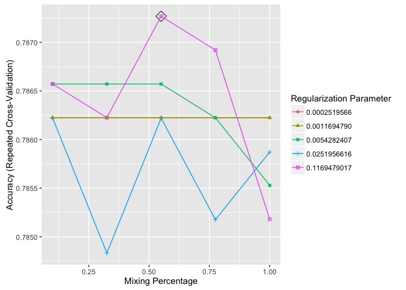
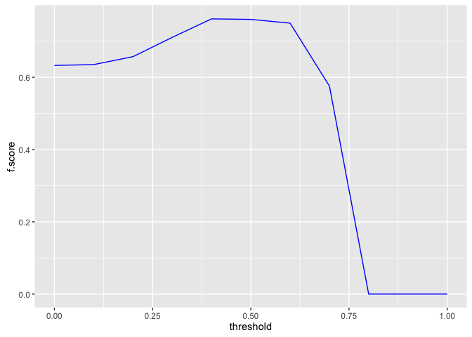
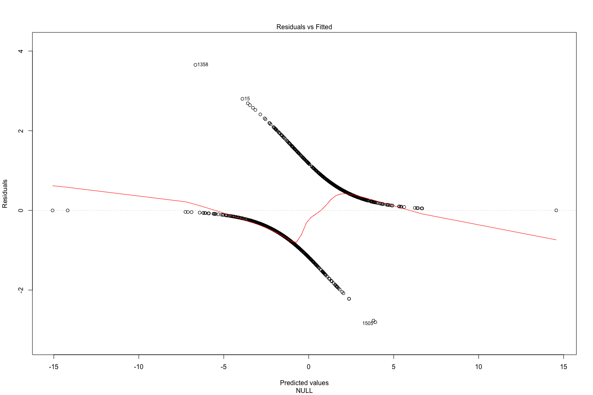
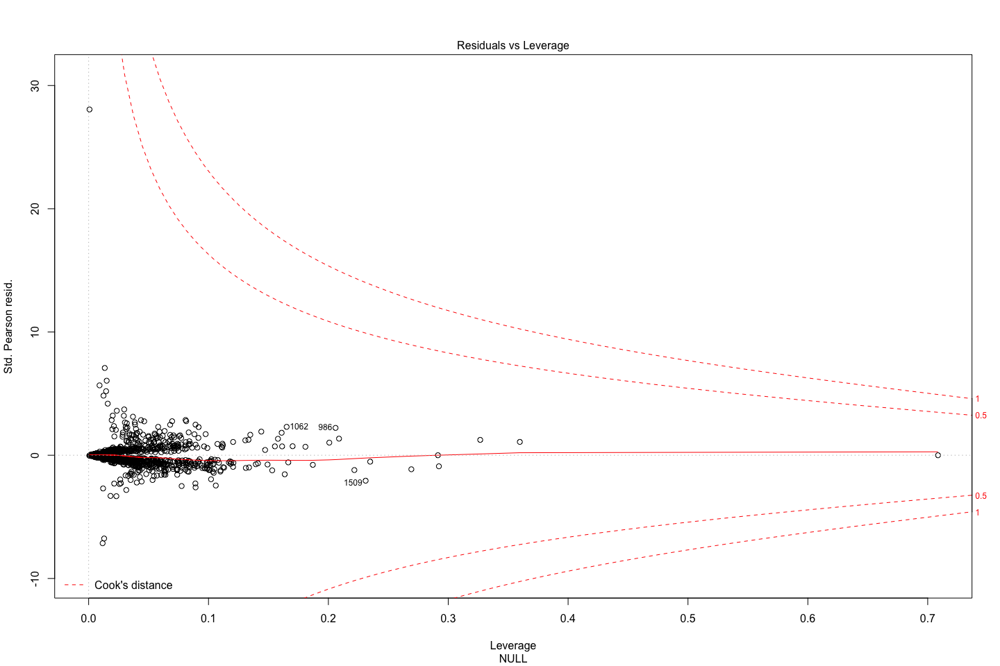
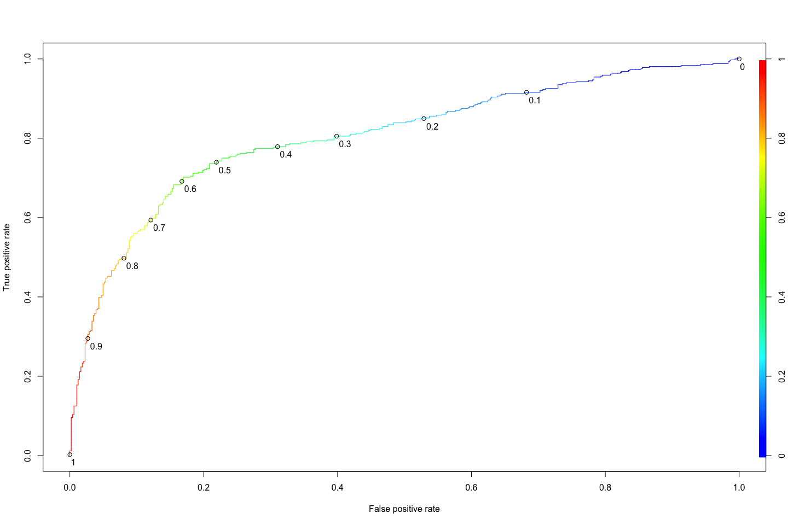
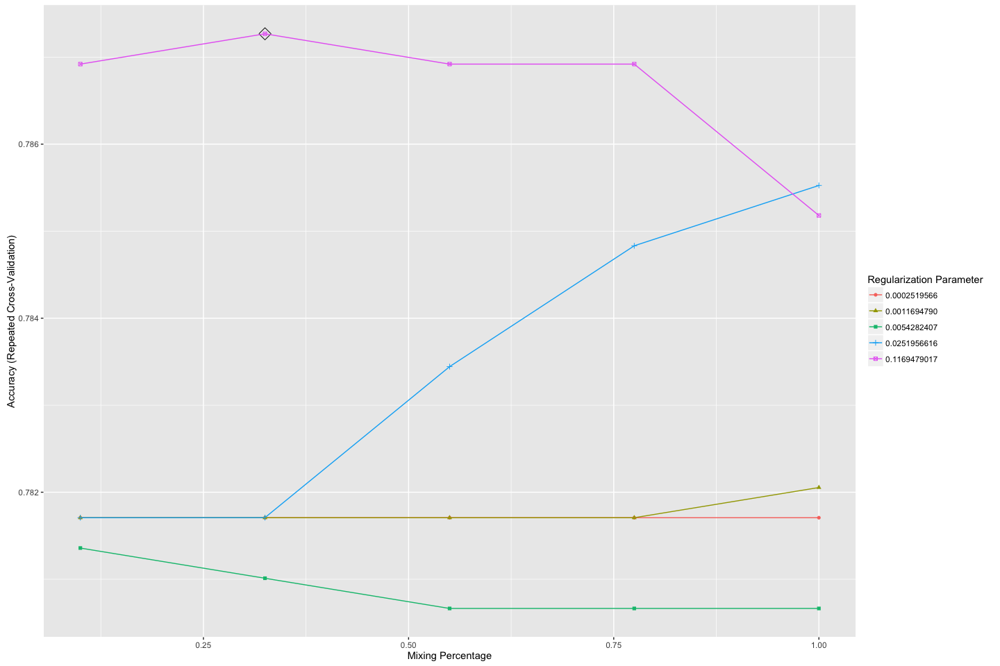
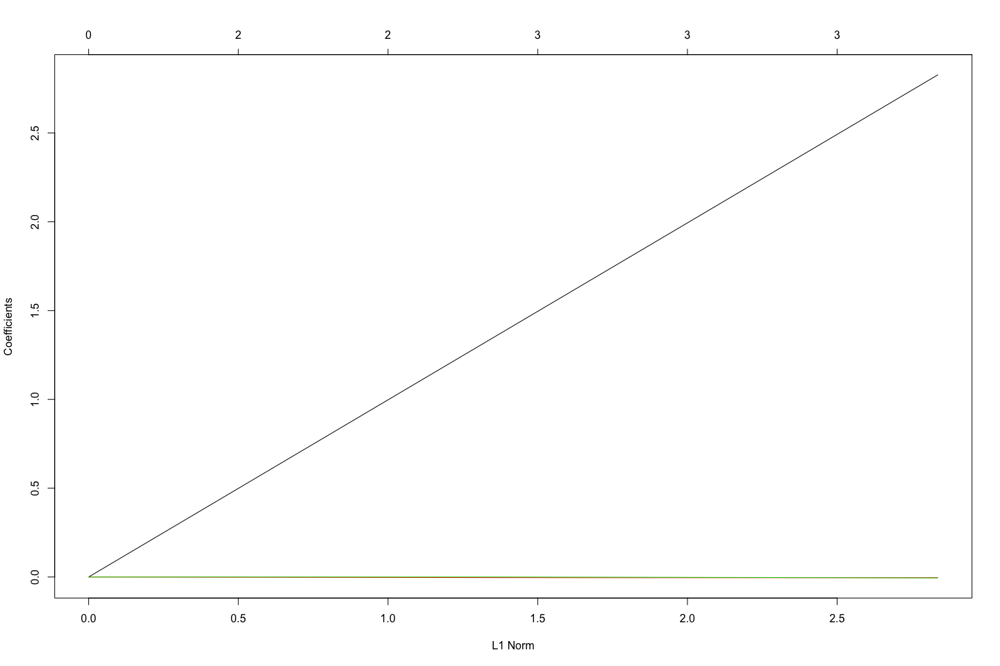
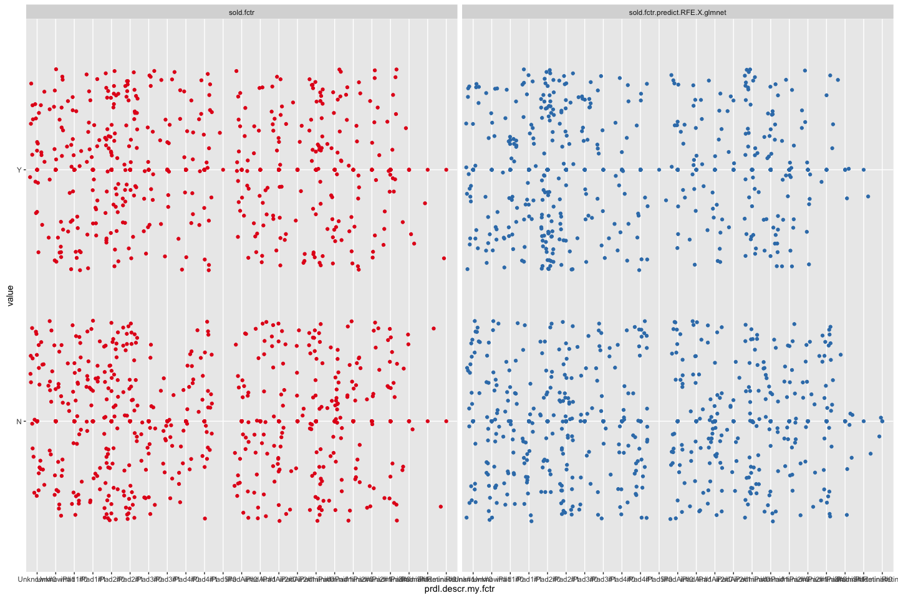
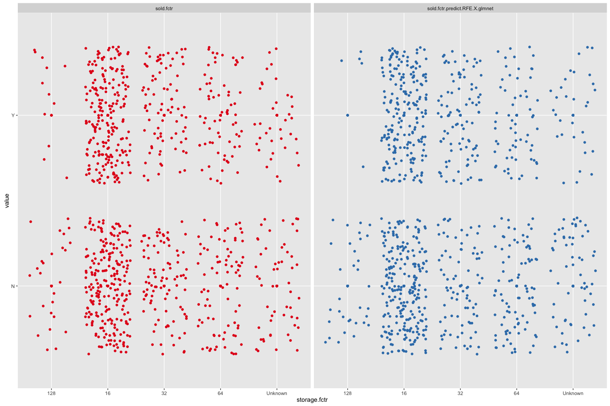
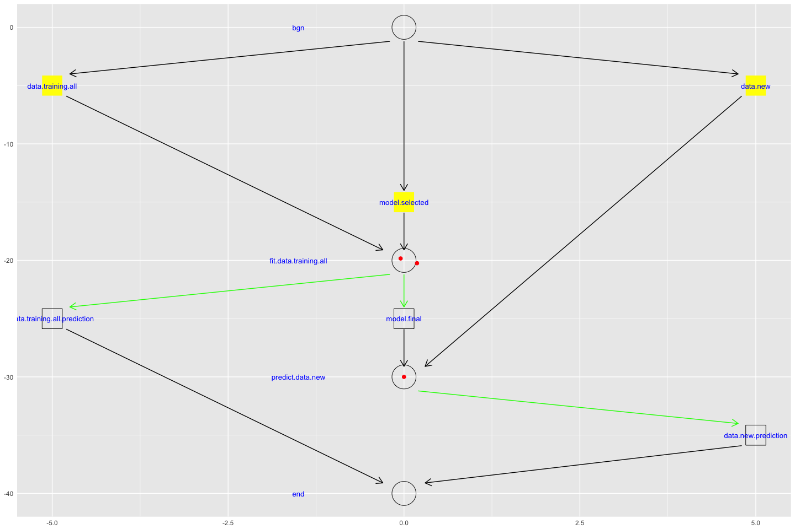

# eBay:iPads:: sold classification:: ebayipads_base
bdanalytics  

**  **    
**Date: (Tue) Oct 20, 2015**    

# Introduction:  

Data: 
Source: 
    Training:   https://inclass.kaggle.com/c/15-071x-the-analytics-edge-summer-2015/download/eBayiPadTrain.csv  
    New:        https://inclass.kaggle.com/c/15-071x-the-analytics-edge-summer-2015/download/eBayiPadTest.csv  
Time period: 


# Synopsis:

Based on analysis utilizing <> techniques, <conclusion heading>:  

Regression results:
First run:
    <glb_sel_mdl_id>: 
        OOB_RMSE=<0.4f>; new_RMSE=<0.4f>; <feat1>=<imp>; <feat2>=<imp>

Classification results:
template:
    prdline.my == "Unknown" -> 296
    Low.cor.X.glm: Leaderboard: 0.83458 -> Rank 288 / 1884 0.85514
        newobs_tbl=[N=471, Y=327]; submit_filename=template_Final_glm_submit.csv
        OOB_conf_mtrx=[YN=125, NY=76]=201; max.Accuracy.OOB=0.7710;
            opt.prob.threshold.OOB=0.6
            startprice=100.00; biddable=95.42; productline=49.22; 
            D.T.like=29.75; D.T.use=26.32; D.T.box=21.53; 

prdline: -> Worse than template
    prdline.my == "Unknown" -> 285
    All.X.no.rnorm.rf: Leaderboard: 0.82649
        newobs_tbl=[N=485, Y=313]; submit_filename=prdline_Final_rf_submit.csv
        OOB_conf_mtrx=[YN=119, NY=80]=199; max.Accuracy.OOB=0.8339;
            opt.prob.threshold.OOB=0.5
            startprice=100.00; biddable=84.25; D.sum.TfIdf=7.28; 
            D.T.use=4.26; D.T.veri=2.78; D.T.scratch=1.99; D.T.box=; D.T.like=; 
    Low.cor.X.glm: Leaderboard: 0.81234
        newobs_tbl=[N=471, Y=327]; submit_filename=prdline_Low_cor_X_glm_submit.csv
        OOB_conf_mtrx=[YN=125, NY=74]=199; max.Accuracy.OOB=0.8205;
            opt.prob.threshold.OOB=0.6
            startprice=100.00; biddable=96.07; prdline.my=51.37; 
            D.T.like=29.39; D.T.use=25.43; D.T.box=22.27; D.T.veri=; D.T.scratch=; 

oobssmpl: -> 
    Low.cor.X.glm: Leaderboard: 0.83402
        newobs_tbl=[N=440, Y=358]; submit_filename=oobsmpl_Final_glm_submit
        OOB_conf_mtrx=[YN=114, NY=84]=198; max.Accuracy.OOB=0.7780;
            opt.prob.threshold.OOB=0.5
            startprice=100.00; biddable=93.87; prdline.my=60.48; D.sum.TfIdf=; 
            D.T.condition=8.69; D.T.screen=7.96; D.T.use=7.50; D.T.veri=; D.T.scratch=;

category: -> 
    Low.cor.X.glm: Leaderboard: 0.82381
        newobs_tbl=[N=470, Y=328]; submit_filename=category_Final_glm_submit
        OOB_conf_mtrx=[YN=119, NY=57]=176; max.Accuracy.OOB=0.8011;
            opt.prob.threshold.OOB=0.6
            startprice=100.00; biddable=79.19; prdline.my=55.22; D.sum.TfIdf=; 
            D.T.ipad=27.05; D.T.like=21.44; D.T.box=20.67; D.T.condition=; D.T.screen=; 

dataclns: -> 
    All.X.no.rnorm.rf: Leaderboard: 0.82211
        newobs_tbl=[N=485, Y=313]; submit_filename=dataclns_Final_rf_submit
        OOB_conf_mtrx=[YN=104, NY=75]=179; max.Accuracy.OOB=0.7977;
            opt.prob.threshold.OOB=0.5
            startprice.log=100.00; biddable=65.85; prdline.my=7.74; D.sum.TfIdf=; 
            D.T.use=2.01; D.T.condition=1.87; D.T.veri=1.62; D.T.ipad=; D.T.like=;
    Low.cor.X.glm: Leaderboard: 0.79264
        newobs_tbl=[N=460, Y=338]; submit_filename=dataclns_Low_cor_X_glm_submit
        OOB_conf_mtrx=[YN=113, NY=74]=187; max.Accuracy.OOB=0.7977;
            opt.prob.threshold.OOB=0.5 -> different from prev run of 0.6
            biddable=100.00; startprice.log=91.85; prdline.my=38.34; D.sum.TfIdf=; 
            D.T.ipad=29.92; D.T.box=27.76; D.T.work=25.79; D.T.use=; D.T.condition=;

txtterms: -> top_n = c(10)
    Low.cor.X.glm: Leaderboard: 0.81448
        newobs_tbl=[N=442, Y=356]; submit_filename=txtterms_Final_glm_submit
        OOB_conf_mtrx=[YN=113, NY=69]=182; max.Accuracy.OOB=0.7943;
            opt.prob.threshold.OOB=0.5
            biddable=100.00; startprice.log=90.11; prdline.my=37.65; D.sum.TfIdf=; 
            D.T.ipad=28.67; D.T.work=24.90; D.T.great=21.44; 
# [1] "D.T.condit"    "D.T.condition" "D.T.good"      "D.T.ipad"      "D.T.new"      
# [6] "D.T.scratch"   "D.T.screen"    "D.T.this"      "D.T.use"       "D.T.work"     
            
    All.X.glm: Leaderboard: 0.81016
        newobs_tbl=[N=445, Y=353]; submit_filename=txtterms_Final_glm_submit
        OOB_conf_mtrx=[YN=108, NY=72]=180; max.Accuracy.OOB=0.7966;
            opt.prob.threshold.OOB=0.5
            biddable=100.00; startprice.log=88.24; prdline.my=33.81; D.sum.TfIdf=; 
            D.T.scratch=25.51; D.T.use=18.97; D.T.good=16.37; 
 [1] "D.T.condit"  "D.T.use"     "D.T.scratch" "D.T.new"     "D.T.good"    "D.T.screen" 
 [7] "D.T.great"   "D.T.excel"   "D.T.work"    "D.T.ipad"            

    Max.cor.Y.rpart: Leaderboard: 0.79258
        newobs_tbl=[N=439, Y=359]; submit_filename=txtterms_Final_rpart_submit
        OOB_conf_mtrx=[YN=105, NY=76]=181; max.Accuracy.OOB=0.7954802;
            opt.prob.threshold.OOB=0.5
            startprice.log=100; biddable=; prdline.my=; D.sum.TfIdf=; 
            D.T.scratch=; D.T.use=; D.T.good=; 
 [1] "D.T.condit"  "D.T.use"     "D.T.scratch" "D.T.new"     "D.T.good"    "D.T.screen" 
 [7] "D.T.ipad"    "D.T.great"   "D.T.work"    "D.T.excel"

    All.X.no.rnorm.rf: Leaderboard: 0.80929
        newobs_tbl=[N=545, Y=253]; submit_filename=txtterms_Final_rf_submit
        OOB_conf_mtrx=[YN=108, NY=61]=169; max.Accuracy.OOB=0.8090395
            opt.prob.threshold.OOB=0.5
            startprice.log=100.00; biddable=78.82; idseq.my=63.43; prdline.my=45.57;
            D.T.use=2.76; D.T.condit=2.35; D.T.scratch=2.00; D.T.good=; 
 [1] "D.T.condit"  "D.T.use"     "D.T.scratch" "D.T.new"     "D.T.good"    "D.T.screen" 
 [7] "D.T.ipad"    "D.T.great"   "D.T.work"    "D.T.excel"

txtclstr:
    All.X.no.rnorm.rf: Leaderboard: 0.79363 -> 0.79573
        newobs_tbl=[N=537, Y=261]; submit_filename=txtclstr_Final_rf_submit
        OOB_conf_mtrx=[YN=104, NY=61]=165; max.Accuracy.OOB=0.8135593
            opt.prob.threshold.OOB=0.5
            startprice.log=100.00; biddable=79.99; idseq.my=64.94; 
                prdline.my=4.14; prdline.my.clusterid=1.15; 
 [1] "D.T.condit"  "D.T.use"     "D.T.scratch" "D.T.new"     "D.T.good"    "D.T.screen" 
 [7] "D.T.ipad"    "D.T.great"   "D.T.work"    "D.T.excel"            
 
dupobs:
    All.X.no.rnorm.rf: Leaderboard: 0.79295
        newobs_tbl=[N=541, Y=257]; submit_filename=dupobs_Final_rf_submit
        OOB_conf_mtrx=[YN=114, NY=65]=179; max.Accuracy.OOB=0.7977401
            opt.prob.threshold.OOB=0.5
            startprice.log=100.00; biddable=94.49; idseq.my=67.40; 
                prdline.my=4.48; prdline.my.clusterid=1.99; 
 [1] "D.T.condit"  "D.T.use"     "D.T.scratch" "D.T.new"     "D.T.good"    "D.T.screen" 
 [7] "D.T.ipad"    "D.T.great"   "D.T.work"    "D.T.excel"            
 
    All.X.no.rnorm.rf: Leaderboard: 0.79652
        newobs_tbl=[N=523, Y=275]; submit_filename=dupobs_Final_rf_submit
        OOB_conf_mtrx=[YN=114, NY=65]=179; max.Accuracy.OOB=0.7977401
            opt.prob.threshold.OOB=0.5
            startprice.log=100.00; biddable=94.24; idseq.my=67.92; 
                prdline.my=4.33; prdline.my.clusterid=2.17; 
 [1] "D.T.condit"  "D.T.use"     "D.T.scratch" "D.T.new"     "D.T.good"    "D.T.screen" 
 [7] "D.T.ipad"    "D.T.great"   "D.T.work"    "D.T.excel"
 
csmmdl:
   All.X.no.rnorm.rf: Leaderboard: 0.79396
        newobs_tbl=[N=525, Y=273]; submit_filename=csmmdl_Final_rf_submit
        OOB_conf_mtrx=[YN=111, NY=66]=177; max.Accuracy.OOB=0.8000000
            opt.prob.threshold.OOB=0.5
            startprice.log=100.00; biddable=90.30; idseq.my=67.06; 
                prdline.my=4.40; cellular.fctr=3.57; prdline.my.clusterid=2.08; 

   All.Interact.X.no.rnorm.rf: Leaderboard: 0.77867
        newobs_tbl=[N=564, Y=234]; submit_filename=csmmdl_Final_rf_submit
        OOB_conf_mtrx=[YN=120, NY=53]=173; max.Accuracy.OOB=0.8045198
            opt.prob.threshold.OOB=0.5
            biddable=100.00; startprice.log=93.99; idseq.my=57.30; 
                prdline.my=9.09; cellular.fctr=3.30; prdline.my.clusterid=2.35; 

   All.Interact.X.no.rnorm.rf: Leaderboard: 0.77152
        newobs_tbl=[N=539, Y=259]; submit_filename=csmmdl_Final_rf_submit
        OOB_conf_mtrx=[YN=, NY=]=; max.Accuracy.OOB=0.8011299
            opt.prob.threshold.OOB=0.5
            biddable=100.00; startprice.log=94.93; idseq.my=57.12; 
                prdline.my=9.29; cellular.fctr=3.20; prdline.my.clusterid=2.50; 
 [1] "D.T.condit"  "D.T.use"     "D.T.scratch" "D.T.new"     "D.T.good"    "D.T.screen" 
 [7] "D.T.ipad"    "D.T.great"   "D.T.work"    "D.T.excel"
 
        All.X.glmnet: 
            fit_RMSE=???; OOB_RMSE=115.1247; new_RMSE=115.1247; 
            prdline.my.fctr=100.00; condition.fctrNew=88.53; D.npnct09.log=84.34
                biddable=16.48; idseq.my=57.27;
spdiff:                
    All.Interact.X.no.rnorm.rf: Leaderboard: 0.78218
        newobs_tbl=[N=517, Y=281]; submit_filename=spdiff_Final_rf_submit
        OOB_conf_mtrx=[YN=121, NY=38]=159; max.Accuracy.OOB=0.8203390
            opt.prob.threshold.OOB=0.6
            biddable=100.00; startprice.diff=57.53; idseq.my=41.31; 
                prdline.my=11.43; cellular.fctr=2.36; prdline.my.clusterid=1.82; 
 
        All.X.no.rnorm.rf: 
            fit_RMSE=92.19; OOB_RMSE=130.86; new_RMSE=130.86; 
            biddable=100.00; prdline.my.fctr=61.92; idseq.my=57.77;
                condition.fctr=29.53; storage.fctr=11.22; color.fctr=6.69;
                cellular.fctr=6.11
                
    All.X.no.rnorm.rf: Leaderboard: 0.77443
        newobs_tbl=[N=606, Y=192]; submit_filename=spdiff_Final_rf_submit
        OOB_conf_mtrx=[YN=112, NY=28]=140; max.Accuracy.OOB=0.8418079
            opt.prob.threshold.OOB=0.6
            startprice.diff=100.00; biddable=96.53; idseq.my=38.10; 
                prdline.my=3.65; cellular.fctr=2.21; prdline.my.clusterid=0.91; 
 [1] "D.T.condit"  "D.T.use"     "D.T.scratch" "D.T.new"     "D.T.good"    "D.T.screen" 
 [7] "D.T.ipad"    "D.T.great"   "D.T.work"    "D.T.excel"

 color:
        All.Interact.X.glmnet: 
            fit_RMSE=88.64520; 
            prdline.my.fctr:D.TfIdf.sum.stem.stop.Ratio=100.00;
            prdline.my.fctr:condition.fctr=77.35
            D.TfIdf.sum.stem.stop.Ratio=68.18
            prdline.my.fctr:color.fctr=68.12
            prdline.my.fctr:storage.fctr=63.32
            
    All.X.no.rnorm.rf: Leaderboard: 0.80638
        newobs_tbl=[N=550, Y=248]; submit_filename=color_Final_rf_submit
        OOB_conf_mtrx=[YN=108, NY=54]=162; max.Accuracy.OOB=0.8169492
            opt.prob.threshold.OOB=0.5
            biddable=100.00; startprice.diff=77.90; idseq.my=48.49; 
                D.ratio.sum.TfIdf.nwrds=6.48; storage.fctr=4.74;
                    D.TfIdf.sum.stem.stop.Ratio=4.57; prdline.my=4.32;
 [1] "D.T.condit"  "D.T.use"     "D.T.scratch" "D.T.new"     "D.T.good"    "D.T.screen" 
 [7] "D.T.ipad"    "D.T.great"   "D.T.work"    "D.T.excel"
            
assctxt:
        select_terms:
[1] "condit"   "use"      "scratch"  "new"      "good"     "ipad"     "screen"   "great"   
 [9] "work"     "excel"    "like"     "box"      "function" "item"     "fulli"    "minor" 
[17] "cosmet"   "crack"    "mint"     "wear"  
        assoc_terms:
 [1] "bare"      "sign"      "light"     "back"      "hous"      "tab"       "dent"     
 [8] "brand"     "open"      "mini"      "appl"      "air"       "wifi"      "affect"   
[15] "protector" "shape"     "perfect"   "order"     "button"    "origin"    "retail"   
[22] "seal"      "includ"    "100"       "may"       "show"      "overal"    "bodi"     
[29] "phone"     "will"      "damag"     "near"      "top"       "normal"    "tear"     
[36] "expect"    "minim"          
        glb_allobs_df$prdline.my$.clusterid Entropy: 0.6665 (97.3037 pct)
        All.Interact.X.glmnet: 
            fit_RMSE=88.40723; 
            prdline.my.fctr:D.TfIdf.sum.stem.stop.Ratio=100.00;
            prdline.my.fctriPadAir:D.npnct01.log=79.67748;
            D.TfIdf.sum.stem.stop.Ratio=79.08192;
            prdline.my.fctriPadmini 2+:condition.fctrNew other (see details)=78.24020;
            prdline.my.fctriPad 3+:color.fctrSpace Gray=77.05886;
            prdline.my.fctriPadmini 2+:storage.fctrUnknown=75.68145;
            prdline.my.fctrUnknown:.clusterid.fctr3=74.23727;

    All.Interact.X.no.rnorm.rf: Leaderboard: 0.72974
        newobs_tbl=[N=682, Y=116]; submit_filename=assctxt_Final_rf_submit
        OOB_conf_mtrx=[YN=125, NY=43]=168; max.Accuracy.OOB=0.8101695; max.auc.OOB=???;
            opt.prob.threshold.OOB=0.6
            biddable=100.00; startprice.diff=51.04; idseq.my=29.51; 
                startprice.diff:biddable=28.70
                prdline.my.fctriPadmini:idseq.my=6.89
        Highest max.auc.OOB=???; for model:        

ctgry2:
        select_terms: 50
        assoc_terms: 103
        glb_allobs_df$prdline.my$.clusterid Entropy: 0.6559 (96.7556 pct)
        All.Interact.X.glmnet: next: All.X.glmnet
            fit_RMSE=88.80010;
prdl.my.descr.fctr:storage.fctr                    100.00
prdl.my.descr.fctr:condition.fctr           93.96
prdl.my.descr.fctr:D.npnct01.log                           89.94
D.TfIdf.sum.stem.stop.Ratio                                             75.90
prdl.my.descr.fctr:color.fctr                              72.43
prdl.my.descr.fctr:.clusterid.fctr7                             63.97
prdl.my.descr.fctr:D.npnct08.log                               63.46
prdl.my.descr.fctr                                             63.05
prdl.my.descr.fctr:D.TfIdf.sum.stem.stop.Ratio                 62.91
prdl.my.descr.fctr:D.npnct16.log                               62.39

    Ensemble.glmnet: Leaderboard: 0.80480
        newobs_tbl=[N=473, Y=325]; submit_filename=ctgry2_Final_glmnet_submit
        OOB_conf_mtrx=[YN=79, NY=101]=180; 
            max.Accuracy.OOB=0.7977528; max.auc.OOB=0.8554068; opt.prob.threshold.OOB=0.4
        Highest max.auc.OOB=0.8587215; for model:All.X.no.rnorm.rf     
            biddable                        100.000
            startprice.diff                  71.793
            idseq.my                         43.511
            
ensemble:
        select_terms: 50
        assoc_terms: 103
        glb_allobs_df$prdline.my$.clusterid Entropy: 0.6570 (96.9282 pct)
        Final.glment: min.RMSE.fit=31.45801
        Ensemble.glmnet: min.RMSE.fit=30.67172
startprice.predict.All.Interact.X.no.rnorm.rf    100.000
startprice.predict.All.X.no.rnorm.rf              75.381
        All.X.glmnet: min.RMSE.fit=88.98066
prdl.my.descr.fctr                       100.00
D.TfIdf.sum.stem.stop.Ratio                        92.16
condition.fctr                                  79.01
prdl.my.descr.fctr:.clusterid.fctr5       69.91
D.npnct16.log                                      61.70
color.fctrWhite                                    59.42
D.npnct01.log                                      55.07
cellular.fctr1                                     53.35
D.terms.n.post.stop                                52.92    

    Ensemble.glmnet: Leaderboard: 0.73183
        newobs_tbl=[N=557, Y=241]; submit_filename=ensemble_Final_glmnet_submit
        OOB_conf_mtrx=[YN=75, NY=60]=135; 
            max.Accuracy.OOB=0.8483146; max.auc.OOB=0.9187365;
            opt.prob.threshold.OOB=0.5
sold.fctr.predict.All.X.no.rnorm.rf.prob                                100.000000        
sold.fctr.predict.All.Interact.X.no.rnorm.rf.prob                        98.873608        
        Highest max.auc.OOB=0.9180131; for model:All.X.no.rnorm.rf  
startprice.diff             100.000
biddable                     95.318
idseq.my                     33.365        

ncv7:
        select_terms: 50
        assoc_terms: 103
        glb_allobs_df$prdline.my$.clusterid Entropy: 0.6570 (96.9282 pct)
        Final.glment: min.RMSE.fit=31.45704
        Ensemble.glmnet: min.RMSE.fit=29.93289
startprice.predict.All.Interact.X.no.rnorm.rf    100.000
startprice.predict.All.X.no.rnorm.rf              82.878
startprice.predict.Low.cor.X.lm                   42.664        
        All.Interact.X.glmnet: min.RMSE.fit=87.30181
prdl.my.descr.fctr:D.npnct01.log                          100.00
prdl.my.descr.fctr:condition.fctr           99.98
prdl.my.descr.fctr:storage.fctr                     96.26
prdl.my.descr.fctriPadAir                                             79.65
prdl.my.descr.fctr:color.fctr                         79.30
prdl.my.descr.fctr:D.TfIdf.sum.stem.stop.Ratio                 74.90
D.TfIdf.sum.stem.stop.Ratio                                             74.77
prdl.my.descr.fctr:D.npnct08.log                               67.38
prdl.my.descr.fctr:D.npnct01.log                               67.38

    Ensemble.glmnet: Leaderboard: not submitted -> lower max.auc.OOB of "Ensemble submission"
        newobs_tbl=[N=561, Y=237]; submit_filename=ncv7_Final_glmnet_submit
        OOB_conf_mtrx=[YN=79, NY=55]=134; 
            max.Accuracy.OOB=0.8494382; max.auc.OOB=0.9130918; opt.prob.threshold.OOB=0.5
sold.fctr.predict.All.X.no.rnorm.rf.prob                                100.000
sold.fctr.predict.All.Interact.X.no.rnorm.rf.prob                        99.348      
        Highest max.auc.OOB=0.9117720; for model:All.X.no.rnorm.rf  
startprice.diff             100.000
biddable                     96.383
idseq.my                     32.634   

gbm w/startprice.unit9:
    Final.glment: min.RMSE.fit=30.32782
    Ensemble.glmnet: min.RMSE.fit=29.62348
startprice.predict.All.Interact.X.no.rnorm.rf    100.000
startprice.predict.All.X.no.rnorm.rf              73.521
startprice.predict.All.Interact.X.bayesglm        29.675
startprice.predict.Max.cor.Y.lm                   28.405

        All.X.glmnet: min.RMSE.fit=88.64271
prdl.my.descr.fctr                       100.00
D.TfIdf.sum.stem.stop.Ratio                        85.01
condition.fctr                                  80.28
carrier.fctr                                  77.48
prdl.my.descr.fctr:.clusterid.fctr5       65.78
D.npnct16.log                                      61.66
startprice.unit9                                   59.48
color.fctr                                    59.21
D.npnct01.log                                      53.78
D.npnct08.log                                      53.56
cellular.fctr                                     53.19

    Ensemble.glmnet: Leaderboard: not submitted -> lower max.auc.OOB of "Ensemble submission"
        newobs_tbl=[N=579, Y=219]; submit_filename=gbm_Final_glmnet_submit
        OOB_conf_mtrx=[YN=85, NY=54]=139; 
            max.Accuracy.OOB=0.8438202; max.auc.OOB=0.9127314; opt.prob.threshold.OOB=0.5
sold.fctr.predict.All.X.no.rnorm.rf.prob             100.0000
sold.fctr.predict.All.Interact.X.no.rnorm.rf.prob     98.7937            
        Highest max.auc.OOB=0.9167568; for model:All.Interact.X.gbm
biddable                                           100.0000
startprice.diff                                     96.2076
startprice.diff:biddable                            23.2114
idseq.my                                             7.8098        

mdlsel:
    Final.glment: min.RMSE.fit=30.47114 (higher than gbm w/startprice.unit9)
    Ensemble.glmnet: min.RMSE.fit=29.49418
startprice.predict.All.Interact.X.no.rnorm.rf                          100.000000
startprice.predict.All.X.no.rnorm.rf                                    71.213880
startprice.predict.All.X.bayesglm                                       24.166084

        All.X.glmnet: min.RMSE.fit=88.64271
prdl.my.descr.fctr                       100.00
D.TfIdf.sum.stem.stop.Ratio                        85.01
condition.fctr                                  80.28
carrier.fctr                                  77.48
prdl.my.descr.fctr:.clusterid.fctr5       65.78
D.npnct16.log                                      61.66
startprice.unit9                                   59.48
color.fctr                                    59.21
D.npnct01.log                                      53.78
D.npnct08.log                                      53.56
cellular.fctr                                     53.19

mdlsel(startprice.log):
    Final.Ensemble.rf: min.RMSE.fit=0.4563772
    Ensemble.rf: min.RMSE.fit=0.4283013
startprice.log.predict.All.Interact.X.no.rnorm.rf                  100.0000000
startprice.log.predict.All.X.no.rnorm.rf                            58.0967582
startprice.log.predict.All.Interact.X.gbm                            6.7197148

        All.X.no.rnorm.rf: min.RMSE.fit=1.4967021
biddable                                         100.00000000
idseq.my                                          98.00292371
startprice.unit9                                  34.31130220
prdl.my.descr.fctr                       18.10984741
D.ratio.sum.TfIdf.nwrds                           15.23549621
color.fctrUnknown                                 14.05520993
D.TfIdf.sum.stem.stop.Ratio                       13.00884673
D.ratio.nstopwrds.nwrds                           10.51165302

    All.X.gbm: Leaderboard: 0.75430
        newobs_tbl=[N=582, Y=216]; submit_filename=mdlsel_Final_gbm_submit
        OOB_conf_mtrx=[YN=58, NY=65]=123; 
            max.Accuracy.OOB=0.8617978; max.auc.OOB=0.9367161;
            opt.prob.threshold.OOB=0.5
startprice.diff                                           100.0000000 100.00000000
biddable                                                   66.6475055  65.40764971
idseq.my                                                    1.8632456   4.55963698

splogdiff:
    All.X.gbm: Leaderboard: 0.70111
        newobs_tbl=[N=553, Y=245]; submit_filename=splogdiff_Final_gbm_submit
        OOB_conf_mtrx=[YN=35, NY=101]=136; 
            max.Accuracy.OOB=0.8471910; max.auc.OOB=0.9388912;
            opt.prob.threshold.OOB=0.3
startprice.log.diff                                       100.0000000 100.0000000
biddable                                                   86.8563123  88.0261866
idseq.my                                                    8.3580281   2.9054298       

nofrcdups:
    All.X.gbm: Leaderboard: ???/0.67225
        newobs_tbl=[N=543, Y=255]; submit_filename=nofrcdups_Final_gbm_submit
        OOB_conf_mtrx=[YN=36, NY=101]=137; 
            opt.prob.threshold.OOB=0.3
            max.Accuracy.OOB=0.0.8460674; max.auc.OOB=0.9388582;
startprice.log.diff                                      100.00000000  93.3716491
biddable                                                  83.57786348 100.0000000
idseq.my                                                  11.54696712   1.1240259     
  
nofrcdups w/ glb_sel_mdl_id=All.X.no.rnorm.rf:
    All.X.no.rnorm.rf: Leaderboard: ???/0.57475 -> ???/0.59937 with force dups
        newobs_tbl=[N=630, Y=168]; newobs_range_outliers=798; 
            submit_filename=nofrcdups_Final_rf_submit
        OOB_conf_mtrx=[YN=70, NY=62]=132; OOBobs_range_outliers=27
            opt.prob.threshold.OOB=0.5
            max.Accuracy.OOB=0.8516854; max.auc.OOB=0.9335308;
startprice.log.diff                                              100.00
biddable                                                         87.61
idseq.my                                                         26.79

Forum Ideas:
I then focused on feature engineering, each new variable brought its own little improvement so in the end i just kept adding new ones and let the models do their thing. Here are some i used: model (productline:storage:condition), isNew, model2 (product:isNew), 50 common words from descr, descrLength, capsFactor (% of caps in description), number of cheaper items of same model2, number of dearer items of same model2, priceFactor (vs. mean of price for model), priceFactor2 (vs. mean of price for model2), bigID (if ID> 11000 because there seems to be a huge drop in sales after some time), timeline (year of product launch, reasoning is you want to spend less money on older products).

Get the median startprice for each level of productline and condition. Take the difference from startprice as a new variable. I find median works much better than the mean since startprice is not normally distributed. I also created another binary variable on whether this difference is positive or negative.

Square root startprice

scale and center all the variables except sold, including the dummies.

### Prediction Accuracy Enhancement Options:
- Not repeatable experiments:
    - gbm & ensembles that include gbm
    - rf that includes .rnorm ??? (now .rnorm has a set seed)
    
- import.data chunk:
    - which obs should be in fit vs. OOB (currently dirty.0 vs .1 is split 50%)
    
- inspect.data chunk:
    - For date variables
        - Appropriate factors ?
        - Different / More last* features ?
        
- scrub.data chunk:        
- transform.data chunk:
    - derive features from multiple features
    
- manage.missing.data chunk:
    - Not fill missing vars
    - Fill missing numerics with a different algorithm
    - Fill missing chars with data based on clusters 
    
- extract.features chunk:
    - Text variables: move to date extraction chunk ???
        - Mine acronyms
        - Mine places

- Review set_global_options chunk after features are finalized

### 

## Potential next steps include:
- Organization:
    - Categorize by chunk
    - Priority criteria:
        0. Ease of change
        1. Impacts report
        2. Cleans innards
        3. Bug report
        
- all chunks:
    - at chunk-end rm(!glb_<var>)
    
- manage.missing.data chunk:
    - cleaner way to manage re-splitting of training vs. new entity

- extract.features chunk:
    - Add n-grams for glb_txt_vars
        - "RTextTools", "tau", "RWeka", and "textcat" packages
    - Convert user-specified mutate code to config specs
    
- fit.models chunk:
    - Prediction accuracy scatter graph:
    -   Add tiles (raw vs. PCA)
    -   Use shiny for drop-down of "important" features
    -   Use plot.ly for interactive plots ?
    
    - Change .fit suffix of model metrics to .mdl if it's data independent (e.g. AIC, Adj.R.Squared - is it truly data independent ?, etc.)
    - move model_type parameter to myfit_mdl before indep_vars_vctr (keep all model_* together)
    - create a custom model for rpart that has minbucket as a tuning parameter
    - varImp for randomForest crashes in caret version:6.0.41 -> submit bug report

- Probability handling for multinomials vs. desired binomial outcome
-   ROCR currently supports only evaluation of binary classification tasks (version 1.0.7)
-   extensions toward multiclass classification are scheduled for the next release

- Skip trControl.method="cv" for dummy classifier ?
- Add custom model to caret for a dummy (baseline) classifier (binomial & multinomial) that generates proba/outcomes which mimics the freq distribution of glb_rsp_var values; Right now glb_dmy_glm_mdl always generates most frequent outcome in training data
- glm_dmy_mdl should use the same method as glm_sel_mdl until custom dummy classifer is implemented

- fit.all.training chunk:
    - myplot_prediction_classification: displays 'x' instead of '+' when there are no prediction errors 
- Compare glb_sel_mdl vs. glb_fin_mdl:
    - varImp
    - Prediction differences (shd be minimal ?)

- Move glb_analytics_diag_plots to mydsutils.R: (+) Easier to debug (-) Too many glb vars used
- Add print(ggplot.petrinet(glb_analytics_pn) + coord_flip()) at the end of every major chunk
- Parameterize glb_analytics_pn
- Move glb_impute_missing_data to mydsutils.R: (-) Too many glb vars used; glb_<>_df reassigned
- Replicate myfit_mdl_classification features in myfit_mdl_regression
- Do non-glm methods handle interaction terms ?
- f-score computation for classifiers should be summation across outcomes (not just the desired one ?)
- Add accuracy computation to glb_dmy_mdl in predict.data.new chunk
- Why does splitting fit.data.training.all chunk into separate chunks add an overhead of ~30 secs ? It's not rbind b/c other chunks have lower elapsed time. Is it the number of plots ?
- Incorporate code chunks in print_sessionInfo
- Test against 
    - projects in github.com/bdanalytics
    - lectures in jhu-datascience track

# Analysis: 

```r
rm(list = ls())
set.seed(12345)
options(stringsAsFactors = FALSE)
source("~/Dropbox/datascience/R/myscript.R")
source("~/Dropbox/datascience/R/mydsutils.R")
```

```
## Loading required package: caret
## Loading required package: lattice
## Loading required package: ggplot2
```

```r
source("~/Dropbox/datascience/R/myplot.R")
source("~/Dropbox/datascience/R/mypetrinet.R")
source("~/Dropbox/datascience/R/myplclust.R")
source("~/Dropbox/datascience/R/mytm.R")
# Gather all package requirements here
suppressPackageStartupMessages(require(doMC))
registerDoMC(6) # # of cores on machine - 2
suppressPackageStartupMessages(require(caret))
source("~/Documents/Work/PullRequests/caret/pkg/caret/R/confusionMatrix.R")
source("~/Documents/Work/PullRequests/caret/pkg/caret/R/ggplot.R")
#packageVersion("tm")
#require(sos); findFn("cosine", maxPages=2, sortby="MaxScore")

# Analysis control global variables
glb_trnng_url <- "https://inclass.kaggle.com/c/15-071x-the-analytics-edge-summer-2015/download/eBayiPadTrain.csv"
glb_newdt_url <- "https://inclass.kaggle.com/c/15-071x-the-analytics-edge-summer-2015/download/eBayiPadTest.csv"
glb_out_pfx <- "ebayipads_base_"
glb_save_envir <- FALSE # or TRUE

glb_is_separate_newobs_dataset <- TRUE    # or TRUE
    glb_split_entity_newobs_datasets <- FALSE   # select from c(FALSE, TRUE)
    glb_split_newdata_method <- NULL # select from c(NULL, "condition", "sample", "copy")
    glb_split_newdata_condition <- NULL # or "is.na(<var>)"; "<var> <condition_operator> <value>"
    glb_split_newdata_size_ratio <- 0.3               # > 0 & < 1
    glb_split_sample.seed <- 123               # or any integer

glb_obs_drop_condition <- # default : NULL 
            "(UniqueID %in% c(NULL
                , 11234 #sold=0; 2 other dups(10306, 11503) are sold=1
                , 11844 #sold=0; 3 other dups(11721, 11738, 11812) are sold=1
                ))  
                    # | (productline %in% c('iPad 5', 'iPad mini Retina'))
                    # | (biddable != 0) # bid0_sp
                    # | (biddable == 0) # bid1_sp
            "
#parse(text=glb_obs_drop_condition)
#subset(glb_allobs_df, .grpid %in% c(31))
    
glb_obs_repartition_train_condition <- NULL 
#    "!is.na(sold) & (sold == 1)" # : bid._sp

glb_max_fitobs <- NULL # or any integer                         

glb_is_regression <- FALSE; glb_is_classification <- !glb_is_regression; 
    glb_is_binomial <- TRUE #or FALSE

glb_rsp_var_raw <- "sold" #: !_sp # "startprice" # : bid._sp # 

# for classification, the response variable has to be a factor
glb_rsp_var <- "sold.fctr" #:!_sp # "startprice.log10" :bid._sp # glb_rsp_var_raw :default

# if the response factor is based on numbers/logicals e.g (0/1 OR TRUE/FALSE vs. "A"/"B"), 
#   or contains spaces (e.g. "Not in Labor Force")
#   caret predict(..., type="prob") crashes
glb_map_rsp_raw_to_var <- function(raw) { # NULL
#     return(raw ^ 0.5)
#     return(log(1 + raw))
#     return(log10(raw)) # bid._sp
#     return(exp(-raw / 2))
    ret_vals <- rep_len(NA, length(raw)); ret_vals[!is.na(raw)] <- ifelse(raw[!is.na(raw)] == 1, "Y", "N"); return(relevel(as.factor(ret_vals), ref="N"))
#     #as.factor(paste0("B", raw))
#     #as.factor(gsub(" ", "\\.", raw))    
}
# glb_map_rsp_raw_to_var(tst <- c(NA, 0, 1)) # !_sp
# glb_map_rsp_raw_to_var(tst <- c(NA, 0, 2.99, 280.50, 1000.00)) # bid._sp

glb_map_rsp_var_to_raw <- function(var) { # NULL #
#     return(var ^ 2.0)
#     return(exp(var) - 1)
#     return(10 ^ var) # bid._sp
#     return(-log(var) * 2)
    as.numeric(var) - 1
#     #as.numeric(var)
#     #gsub("\\.", " ", levels(var)[as.numeric(var)])
#     c("<=50K", " >50K")[as.numeric(var)]
#     #c(FALSE, TRUE)[as.numeric(var)]
}
# glb_map_rsp_var_to_raw(glb_map_rsp_raw_to_var(tst))

if ((glb_rsp_var != glb_rsp_var_raw) && is.null(glb_map_rsp_raw_to_var))
    stop("glb_map_rsp_raw_to_var function expected")
glb_rsp_var_out <- paste0(glb_rsp_var, ".predict.") # mdl_id is appended later

# List info gathered for various columns
# <col_name>:   <description>; <notes>
# description = The text description of the product provided by the seller.
# biddable = Whether this is an auction (biddable=1) or a sale with a fixed price (biddable=0).
# startprice = The start price (in US Dollars) for the auction (if biddable=1) or the sale price (if biddable=0).
# condition = The condition of the product (new, used, etc.)
# cellular = Whether the iPad has cellular connectivity (cellular=1) or not (cellular=0).
# carrier = The cellular carrier for which the iPad is equipped (if cellular=1); listed as "None" if cellular=0.
# color = The color of the iPad.
# storage = The iPad's storage capacity (in gigabytes).
# productline = The name of the product being sold.

# If multiple vars are parts of id, consider concatenating them to create one id var
# If glb_id_var == NULL, ".rownames <- row.names()" is the default
# Derive a numeric feature from id var

# User-specified exclusions
# List feats that shd be excluded due to known causation by prediction variable
glb_exclude_vars_as_features <- c(NULL
### !_sp
    , "description", "descr.my", "productline"
### bid0_sp                                  
#                                   , "description", "productline"
#                                   , "sold", "startprice.log10.cut.fctr"
#     # List feats that are linear combinations (alias in glm)
#                                 , "D.terms.post.stem.n.log", "D.weight.sum"
#                                 #, "prdl.descr.my.fctriPad4#1:.clusterid.fctr3" This does not work
#     # if RFE is rated lower than Low.cor, list feats that are in RFE & not in Low.cor
#         # min.RMSE.fit(RFE.X.glmnet)=0.1138888
# #             D.chrs.n.log                 61.12483
# #             D.chrs.uppr.n.log            61.12483
# #             D.ratio.wrds.stop.n.wrds.n   61.12483
# #             D.terms.post.stop.n.log      61.12483
# #             D.weight.post.stem.sum       61.12483
# #             D.wrds.n.log                 61.12483
# #             D.wrds.stop.n.log            61.12483
# #             D.wrds.unq.n.log             61.12483
#                             #, "startprice.dcm2.is9" # min.RMSE.fit(RFE.X.glmnet)=0.1141991 (up)
#                             , "D.wrds.stop.n.log"    # min.RMSE.fit(RFE.X.glmnet)=0.1131232
### bid0_sp                            
### bid1_sp                                  
#                                   , "description", "productline"
#                                   , "sold", "startprice.log10.cut.fctr"
### bid1_sp                            
                                  ) 

glb_id_var <- c("UniqueID")
glb_category_var <- "prdl.descr.my.fctr" # "productline" # NULL 
glb_drop_vars <- c(NULL) # or c("<col_name>")

glb_map_vars <- NULL # or c("<var1>", "<var2>")
glb_map_urls <- list();
# glb_map_urls[["<var1>"]] <- "<var1.url>"

glb_assign_pairs_lst <- NULL; 
# glb_assign_pairs_lst[["<var1>"]] <- list(from=c(NA),
#                                            to=c("NA.my"))
glb_assign_vars <- names(glb_assign_pairs_lst)

# Derived features
glb_derive_lst <- NULL;

# Add logs of numerics that are not distributed normally ->  do automatically ???
# Right skew: logp1; sqrt; ^ 1/3; logp1(logp1); log10; exp(-<feat>/constant)

# glb_derive_lst[["prdline.my"]] <- list(
#     mapfn=function(productline) { return(productline) }    
#     , args=c("productline"))

### bid._sp
# glb_derive_lst[["startprice.log10.cut.fctr"]] <- list(
#     mapfn=function(startprice.log10) { return(cut(startprice.log10, 3)) }    
#     , args=c("startprice.log10"))
### bid._sp
 
glb_derive_lst[["descr.my"]] <- list(
    mapfn=function(description) { mod_raw <- description;
### bid._sp
#         # This is here because it does not work with txt_map_filename
#         mod_raw <- gsub(paste0(c("\n", "\211", "\235", "\317", "\333"), collapse="|"), " ",
#                         mod_raw)
#         # This should go into txt_map_filename    
#         mod_raw <- gsub("\\.\\.", "\\. ", mod_raw);    
#         # Don't parse for "." because of ".com"; use customized gsub for that text
#         mod_raw <- gsub("(\\w)(!|\\*|,|-|/)(\\w)", "\\1\\2 \\3", mod_raw);
#         
#         # Modifications for this exercise only
#         # Add dictionary to stemDocument e.g. stickers stemmed to sticker ???
#         mod_raw <- gsub("8\\.25", "825", mod_raw, ignore.case=TRUE);  
#         mod_raw <- gsub(" 10\\.SCREEN ", " 10\\. SCREEN ", mod_raw, ignore.case=TRUE); 
#         mod_raw <- gsub(" 128 gb ", " 128gb ", mod_raw, ignore.case=TRUE);  
#         mod_raw <- gsub(" 16G, ", " 16GB, ", mod_raw, ignore.case=TRUE);          
#         mod_raw <- gsub(" 16 gig ", " 16gb ", mod_raw, ignore.case=TRUE);
#         mod_raw <- gsub(" 16 gb ", " 16gb ", mod_raw, ignore.case=TRUE);        
#         
#         mod_raw <- gsub("\\bAccounts\\b", "Account", mod_raw, ignore.case=FALSE);
#         mod_raw <- gsub("\\bactivated\\b", "activate", mod_raw, ignore.case=FALSE);        
#         mod_raw <- gsub(" actuuly ", " actual ", mod_raw, ignore.case=TRUE);
#         mod_raw <- gsub(" Apple care ", " Applecare ", mod_raw, ignore.case=TRUE);        
#         mod_raw <- gsub("\\baffects\\b", "affect", mod_raw, ignore.case=FALSE);   
#         mod_raw <- gsub("\\bApple\\&#039;s", "Apple", mod_raw, ignore.case=FALSE);        
# #mod_raw <- glb_allobs_df[c(665), txt_var]; mod_raw        
#         mod_raw <- gsub(" Apple care ", " Applecare ", mod_raw, ignore.case=FALSE);        
# ub(" bacK!wiped ", " bacK ! wiped ", mod_raw, ignore.case=TRUE);
#         mod_raw <- gsub(" backplate", " back plate", mod_raw, ignore.case=TRUE);
#         mod_raw <- gsub("\\bbarley", "barely", mod_raw, ignore.case=TRUE);        
#         mod_raw <- gsub(" bend ", " bent ", mod_raw, ignore.case=TRUE);         
#         mod_raw <- gsub("Best Buy", "BestBuy", mod_raw, ignore.case=TRUE);
#         mod_raw <- gsub(" black\\.Device ", " black \\. Device ", mod_raw,
#                         ignore.case=TRUE);        
#         mod_raw <- gsub("black\\),charger ", "black\\), charger ", mod_raw,
#                         ignore.case=TRUE);        
#         mod_raw <- gsub("\\bblacked\\b", "black", mod_raw, ignore.case=FALSE);
#         mod_raw <- gsub("\\bblemish\\b", "blemishes", mod_raw, ignore.case=FALSE);        
#         mod_raw <- gsub(" blocks", " blocked", mod_raw, ignore.case=TRUE);
#         mod_raw <- gsub(" brokenCharger ", " broken Charger ", mod_raw, ignore.case=TRUE);
#         
#         mod_raw <- gsub(" perfectlycord ", " perfectly cord ", mod_raw, ignore.case=TRUE);
#         mod_raw <- gsub("\\bcord", "cable", mod_raw, ignore.case=TRUE);        
#         mod_raw <- gsub("\\bcables\\b", "cable", mod_raw, ignore.case=TRUE);        
#         
#         mod_raw <- gsub(" care\\.The ", " care\\. The ", mod_raw, ignore.case=TRUE);
#         mod_raw <- gsub("\\b(cared|careful|CAREFUL)\\b", "care", mod_raw, ignore.case=FALSE);
#         mod_raw <- gsub("\\b(cases|casing)\\b", "case", mod_raw, ignore.case=TRUE);        
# #mod_raw <- glb_allobs_df[c(88,187,280,1040,1098), txt_var]; mod_raw        
#         mod_raw <- gsub(" carefully ", " careful ", mod_raw, ignore.case=TRUE);        
#         mod_raw <- gsub("\\bchargers\\b", "charger", mod_raw, ignore.case=FALSE);        
#         mod_raw <- gsub("\\bchips\\b", "chip", mod_raw, ignore.case=FALSE);
#         mod_raw <- gsub("\\bcleanly\\b", "clean", mod_raw, ignore.case=FALSE);        
#         mod_raw <- gsub("\\b(C|c)olor(.*)s\\b", "\\1olor", mod_raw, ignore.case=FALSE);
# #mod_raw <- glb_allobs_df[c(280,1411), txt_var]; mod_raw        
#         mod_raw <- gsub("\\bcompletely\\b", "complete", mod_raw, ignore.case=FALSE);   
# #mod_raw <- glb_allobs_df[c(42,502,676), txt_var]; mod_raw        
#         
#         mod_raw <- gsub(" (conditon|condtion|contidion|conditions)", " condition", mod_raw,
#         mod_raw <- gsub("\\b(conditon|condtion|contidion|conditions)\\b", "condition", mod_raw,
# ", "\\1\\. \\2", mod_raw,
#                         ignore.case=TRUE);
#         mod_raw <- gsub("(condition)(Has)", "\\1\\. \\2", mod_raw);
#         
#         mod_raw <- gsub("\\bCONNECTED\\b", "CONNECT", mod_raw, ignore.case=FALSE);        
#         mod_raw <- gsub("\\bconnects\\b", "connect", mod_raw, ignore.case=FALSE);        
#         mod_raw <- gsub(" consist ", " consistent ", mod_raw, ignore.case=TRUE);
# #mod_raw <- glb_allobs_df[c(195, 379, 437), txt_var]; mod_raw        
#         mod_raw <- gsub("\\bCosmetics\\b", "Cosmetic", mod_raw, ignore.case=FALSE);        
#         mod_raw <- gsub(" cracksNo ", " cracks No ", mod_raw, ignore.case=TRUE);        
#         
#         mod_raw <- gsub("\\b(D|d)amaged\\b", "\\1amage", mod_raw, ignore.case=TRUE);
# #mod_raw <- glb_allobs_df[c(116, 1360), txt_var]; mod_raw        
#         mod_raw <- gsub("\\bDays\\b", "Day", mod_raw, ignore.case=TRUE);        
#         mod_raw <- gsub(" DEFAULTING ", " DEFAULT ", mod_raw, ignore.case=TRUE);
#         mod_raw <- gsub("\\bdefect(ive)*\\b", "defects", mod_raw, ignore.case=FALSE);        
# #mod_raw <- glb_allobs_df[c(1403), txt_var]; mod_raw        
#         mod_raw <- gsub(" definitely ", " definite ", mod_raw, ignore.case=TRUE);        
#         mod_raw <- gsub("\\b(D|d)ented\\b", "\\1ent", mod_raw, ignore.case=FALSE);        
#         mod_raw <- gsub(" described", " describe", mod_raw, ignore.case=TRUE);
#         mod_raw <- gsub(" desciption", " description", mod_raw, ignore.case=TRUE);        
#         mod_raw <- gsub(" devices", " device", mod_raw, ignore.case=TRUE);        
#         mod_raw <- gsub(" Digi\\.", " Digitizer\\.", mod_raw, ignore.case=TRUE);        
#         mod_raw <- gsub("\\b(ding|dinged)\\b", "dings", mod_raw, ignore.case=TRUE);        
#         mod_raw <- gsub(" display\\.New ", " display\\. New ", mod_raw, ignore.case=TRUE);
#         mod_raw <- gsub(" displays", " display", mod_raw, ignore.case=TRUE);
#         mod_raw <- gsub("\\b(drop|drops)\\b", "dropped", mod_raw, ignore.case=TRUE); 
#         mod_raw <- gsub("\\b(E|e)dge\\b", "\\1dges", mod_raw, ignore.case=FALSE);        
#         mod_raw <- gsub(" effect ", " affect ", mod_raw, ignore.case=TRUE);        
#         mod_raw <- gsub(" Excellant ", " Excellent ", mod_raw, ignore.case=TRUE);
#         mod_raw <- gsub(" excellently", " excellent", mod_raw, ignore.case=TRUE);
#         mod_raw <- gsub(" EUC ", " excellent used condition", mod_raw, ignore.case=TRUE);  
#         mod_raw <- gsub(" feels ", " feel ", mod_raw, ignore.case=TRUE);
#         mod_raw <- gsub(" fineiCloud ", " fine iCloud ", mod_raw, ignore.case=TRUE);
#         mod_raw <- gsub(" fine.Its ", " fine. Its ", mod_raw, ignore.case=TRUE);       
#         mod_raw <- gsub("\\bfix\\b", "fixed", mod_raw, ignore.case=TRUE);        
#         mod_raw <- gsub("\\bflaws\\b", "flaw", mod_raw, ignore.case=TRUE);
#         mod_raw <- gsub("\\bflawlessly\\b", "flawless", mod_raw, ignore.case=TRUE);        
#         mod_raw <- gsub(" Framing ", " Frame ", mod_raw, ignore.case=TRUE);        
#         
#         mod_raw <- gsub(" functioanlity", " functionality", mod_raw, ignore.case=TRUE);
#         mod_raw <- gsub("\\bfunction(ing|ality)\\b", "functional", mod_raw, ignore.case=TRUE); 
#         mod_raw <- gsub(" functional\\.Very little ", " functional\\. Very little ", mod_raw,
#                         ignore.case=TRUE);        
#         mod_raw <- gsub("^Gentle ", "Gently ", mod_raw, ignore.case=TRUE);
#         mod_raw <- gsub("\\(gray color", "\\(spacegray color", mod_raw, ignore.case=TRUE); 
#         mod_raw <- gsub(" GREAT\\.SCreen ", " GREAT\\. SCreen ", mod_raw,
#                         ignore.case=TRUE);        
#         mod_raw <- gsub("\\b(guarantee|guarantees)\\b", "guaranteed", mod_raw, ignore.case=TRUE);
#         mod_raw <- gsub("\\ba handful of times\\b", "sparingly", mod_raw, ignore.case=TRUE); 
#         mod_raw <- gsub("\\bhardly any\\b", "no", mod_raw, ignore.case=TRUE); 
#         mod_raw <- gsub("\\bhardly ever used\\b", "sparingly used", mod_raw, ignore.case=TRUE);
#         
#         mod_raw <- gsub("iCL0UD", "iCLOUD", mod_raw, ignore.case=TRUE);        
#         mod_raw <- gsub("----I cloud ", " ----Icloud ", mod_raw,
#                         ignore.case=TRUE);        
#         mod_raw <- gsub("^iPad Black 3rd generation ", "iPad 3 Black ", mod_raw,
#                         ignore.case=TRUE);  
#         mod_raw <- gsub(" IMEINo ", " IMEI No ", mod_raw, ignore.case=TRUE);
#         mod_raw <- gsub("\\bincluding\\b", "included", mod_raw, ignore.case=FALSE);        
#         mod_raw <- gsub(" install\\. ", " installed\\. ", mod_raw, ignore.case=TRUE);   
#         mod_raw <- gsub("inivisible", "invisible", mod_raw, ignore.case=TRUE);        
#         mod_raw <- gsub("^I pad ", "Ipad ", mod_raw, ignore.case=TRUE);
#         
#         mod_raw <- gsub("\\b(lock|locks)\\b", "locked", mod_raw, ignore.case=TRUE);
#         mod_raw <- gsub("\\blots\\b", "lot", mod_raw, ignore.case=TRUE);        
#         mod_raw <- gsub(" manuals ", " manual ", mod_raw, ignore.case=TRUE);
#         mod_raw <- gsub(" book ", " manual ", mod_raw, ignore.case=TRUE);        
#         mod_raw <- gsub(" mars ", " marks ", mod_raw, ignore.case=TRUE);
#         mod_raw <- gsub(" marks\\.Absolutely ", " marks\\. Absolutely ", mod_raw,
#                         ignore.case=TRUE);        
#         mod_raw <- gsub("\\bmarkings\\b", "marks", mod_raw, ignore.case=TRUE);
# #mod_raw <- glb_allobs_df[c(200, 1301), txt_var]; mod_raw
#         mod_raw <- gsub(" minimum", " minimal", mod_raw, ignore.case=TRUE);        
#         mod_raw <- gsub(" MINT\\.wiped ", " MINT\\. wiped ", mod_raw, ignore.case=TRUE);
#         mod_raw <- gsub("\\bmonth\\b", "months", mod_raw, ignore.case=TRUE);
# #mod_raw <- glb_allobs_df[c(29, 38, 194, 511, 789, 819), txt_var]; mod_raw
#         mod_raw <- gsub(" NEW\\!(SCREEN|ONE) ", " NEW\\! \\1 ", mod_raw, ignore.case=TRUE);
#         mod_raw <- gsub(" new looking$", " looks new", mod_raw, ignore.case=TRUE);
#         mod_raw <- gsub(" newer ", " new ", mod_raw, ignore.case=TRUE);   
#         mod_raw <- gsub("\\bnoted\\b", "note", mod_raw, ignore.case=TRUE);        
#         mod_raw <- gsub(" oped ", " opened ", mod_raw, ignore.case=TRUE);        
#         mod_raw <- gsub(" opening", " opened", mod_raw, ignore.case=TRUE);
#         mod_raw <- gsub(" operated", " operational", mod_raw, ignore.case=TRUE);
#         mod_raw <- gsub("otter box", "otterbox", mod_raw, ignore.case=TRUE);        
#         
#         mod_raw <- gsub("\\bpackage\\b", "packaging", mod_raw, ignore.case=FALSE);
#         mod_raw <- gsub("\\bPACKAGE\\b", "PACKAGing", mod_raw, ignore.case=FALSE);        
# #mod_raw <- glb_allobs_df[c(360, 1142), txt_var]; mod_raw        
#         mod_raw <- gsub(" performance", " performs", mod_raw, ignore.case=TRUE);        
#         mod_raw <- gsub(" personalized ", " personal ", mod_raw, ignore.case=TRUE);
#         mod_raw <- gsub("\\bPhysically\\b", "Physical", mod_raw, ignore.case=FALSE);        
#         mod_raw <- gsub("\\b(picture|pictured)\\b", "pictures", mod_raw, ignore.case=FALSE);
#         mod_raw <- gsub("\\bPICTURE\\b", "PICTUREs", mod_raw, ignore.case=FALSE);
# #mod_raw <- glb_allobs_df[c(184, 892), txt_var]; mod_raw
#         mod_raw <- gsub("\\b[P|p]ower(ed|ing|s)\\b", "\\1ower", mod_raw, ignore.case=FALSE);
#         mod_raw <- gsub(" pre- owned ", " used ", mod_raw, ignore.case=TRUE);
#         mod_raw <- gsub("\\bprevious\\b", "previously", mod_raw, ignore.case=TRUE);
#         mod_raw <- gsub("\\bpreviously (owned|used)\\b", "used", mod_raw, ignore.case=TRUE);
#         mod_raw <- gsub("\\bproblem\\b", "problems", mod_raw, ignore.case=TRUE);
#         mod_raw <- gsub(" products ", " product ", mod_raw, ignore.case=TRUE);        
#         mod_raw <- gsub("\\bprotected\\b",  "protector", mod_raw, ignore.case=FALSE);        
#         mod_raw <- gsub("\\bprotection\\b", "protector", mod_raw, ignore.case=FALSE);
#         mod_raw <- gsub("\\bPROTECTION\\b", "PROTECTOR", mod_raw, ignore.case=FALSE);        
#         
#         mod_raw <- gsub(" Keeped ", " Kept ", mod_raw, ignore.case=TRUE);        
#         mod_raw <- gsub(" knicks ", " nicks ", mod_raw, ignore.case=TRUE);
#         mod_raw <- gsub(" lightening ", " lightning ", mod_raw, ignore.case=TRUE);
#         mod_raw <- gsub("\\bminis\\b", "mini", mod_raw, ignore.case=FALSE);        
#         mod_raw <- gsub("^READiPad ", "READ iPad ", mod_raw, ignore.case=TRUE);
#         mod_raw <- gsub(" re- assemble ", " reassemble ", mod_raw, ignore.case=TRUE);
#         mod_raw <- gsub(" REFURB\\.", "  REFURBISHED\\.", mod_raw, ignore.case=TRUE);
#         mod_raw <- gsub(" reponding", " respond", mod_raw, ignore.case=TRUE);        
#         mod_raw <- gsub(" rotation ", " rotate ", mod_raw, ignore.case=TRUE);   
#         
#         mod_raw <- gsub(" Sales ", " Sale ", mod_raw, ignore.case=TRUE);
#         mod_raw <- gsub(" scratchs ", " scratches ", mod_raw, ignore.case=TRUE);        
#         mod_raw <- gsub("\\b(scratchs|scratching)\\b", "scratches", mod_raw, ignore.case=FALSE);
# aw <- gsub(" shipped| Shipment", " ship", mod_raw, ignore.case=TRUE);
#         mod_raw <- gsub("\\bshowing\\b", "shows", mod_raw, ignore.case=FALSE);        
#         mod_raw <- gsub("shrink wrap", "shrinkwrap", mod_raw, ignore.case=TRUE);        
#         mod_raw <- gsub("\\bshuts\\b", "shut", mod_raw, ignore.case=TRUE);        
#         mod_raw <- gsub(" sides ", " side ", mod_raw, ignore.case=TRUE);
#         mod_raw <- gsub(" skinned,", " skin,", mod_raw, ignore.case=TRUE);
#         mod_raw <- gsub("\\bSlightly\\b", "slight", mod_raw, ignore.case=FALSE);        
#         mod_raw <- gsub("\\bspace (grey|gray)", "spacegray", mod_raw, ignore.case=TRUE); 
#         mod_raw <- gsub(" spec ", " speck ", mod_raw, ignore.case=TRUE);        
#         mod_raw <- gsub("^somescratches ", "some scratches ", mod_raw, ignore.case=TRUE);  
#         mod_raw <- gsub(" Sticker ", " Stickers ", mod_raw, ignore.case=TRUE);
#         mod_raw <- gsub("\\bstoring", "store", mod_raw, ignore.case=FALSE);        
#         mod_raw <- gsub("SWAPPA\\.COM", "SWAPPAsdotCOM", mod_raw, ignore.case=TRUE);        
#         
#         mod_raw <- gsub(" T- Mobile", "  TMobile", mod_raw, ignore.case=TRUE);  
#         mod_raw <- gsub("\\b(tear|TEAR)(s|S)\\b", "\\1", mod_raw, ignore.case=FALSE);         
# #mod_raw <- glb_allobs_df[c(376), txt_var]; mod_raw        
#         mod_raw <- gsub(" touchscreen ", " touch screen ", mod_raw, ignore.case=TRUE);
#         mod_raw <- gsub("\\bTURN\\b", "TURNS", mod_raw, ignore.case=FALSE);        
#         
#         mod_raw <- gsub(" UnlockedCracked ", " Unlocked Cracked ", mod_raw, ignore.case=TRUE);
#         mod_raw <- gsub("\\bUNUSABLE\\b", "UNUSED", mod_raw, ignore.case=FALSE);         
#         mod_raw <- gsub("\\b(update|updates)\\b", "updated", mod_raw, ignore.case=FALSE);
#         mod_raw <- gsub("\\bupgrade\\b", "upgraded", mod_raw, ignore.case=FALSE);        
#         mod_raw <- gsub(" uppser ", " upper ", mod_raw, ignore.case=TRUE); 
#         mod_raw <- gsub(" use\\.Scratches ", " use\\. Scratches ", mod_raw,
#                         ignore.case=TRUE);  
#         
#         mod_raw <- gsub(" verify ", " verified ", mod_raw, ignore.case=TRUE);        
#         mod_raw <- gsub(" wear\\.Device ", " wear\\. Device ", mod_raw, ignore.case=TRUE);
#         mod_raw <- gsub("\\bwears\\b", "\\wear", mod_raw, ignore.case=TRUE);
# #mod_raw <- glb_allobs_df[c(167, 272), txt_var]; mod_raw        
#         mod_raw <- gsub(" whats ", " what's ", mod_raw, ignore.case=TRUE);
#         mod_raw <- gsub(" WiFi\\+4G ", " WiFi \\+ 4G ", mod_raw, ignore.case=TRUE);
#         mod_raw <- gsub(" Zaag Invisible Shield", " Zaag InvisibleShield", mod_raw,
#                         ignore.case=TRUE);
### bid._sp
        return(mod_raw) }    
    , args = c("description"))

glb_derive_lst[["prdl.descr.my.fctr"]] <- list(
    mapfn = function(productline, description) { 
        as.factor(paste(gsub(" ", "", productline), as.numeric(nchar(description) > 0), 
                        sep = "#")) }
    , args = c("productline", "description"))
#print(mycreate_sqlxtab_df(glb_allobs_df, c("prdl.descr.my.fctr", "sold")))

#     mapfn=function(startprice) { return(scale(log(startprice))) }    
#     , args=c("startprice"))
#     mapfn=function(Rasmussen) { return(ifelse(sign(Rasmussen) >= 0, 1, 0)) }
#     mapfn=function(PropR) { return(as.factor(ifelse(PropR >= 0.5, "Y", "N"))) }
#     mapfn=function(purpose) { return(relevel(as.factor(purpose), ref="all_other")) }
#     mapfn=function(Week) { return(substr(Week, 1, 10)) }
#     mapfn=function(raw) { tfr_raw <- as.character(cut(raw, 5)); 
#                           tfr_raw[is.na(tfr_raw)] <- "NA.my";
#                           return(as.factor(tfr_raw)) }
#     , args=c("raw"))
#     mapfn=function(PTS, oppPTS) { return(PTS - oppPTS) }
#     , args=c("PTS", "oppPTS"))

# # If glb_allobs_df is not sorted in the desired manner
#     mapfn=function(Week) { return(coredata(lag(zoo(orderBy(~Week, glb_allobs_df)$ILI), -2, na.pad=TRUE))) }
#     mapfn=function(ILI) { return(coredata(lag(zoo(ILI), -2, na.pad=TRUE))) }
#     mapfn=function(ILI.2.lag) { return(log(ILI.2.lag)) }

# glb_derive_lst[["<txt_var>.niso8859.log"]] <- list(
#     mapfn=function(<txt_var>) { match_lst <- gregexpr("&#[[:digit:]]{3};", <txt_var>)
#                         match_num_vctr <- unlist(lapply(match_lst, 
#                                                         function(elem) length(elem)))
#                         return(log(1 + match_num_vctr)) }
#     , args=c("<txt_var>"))

#     mapfn=function(raw) { mod_raw <- raw;
#         mod_raw <- gsub("&#[[:digit:]]{3};", " ", mod_raw);
#         # Modifications for this exercise only
#         mod_raw <- gsub("\\bgoodIn ", "good In", mod_raw);
#                           return(mod_raw)

#         # Create user-specified pattern vectors 
# #sum(mycount_pattern_occ("Metropolitan Diary:", glb_allobs_df$Abstract) > 0)
#         if (txt_var %in% c("Snippet", "Abstract")) {
#             txt_X_df[, paste0(txt_var_pfx, ".P.metropolitan.diary.colon")] <-
#                 as.integer(0 + mycount_pattern_occ("Metropolitan Diary:", 
#                                                    glb_allobs_df[, txt_var]))
#summary(glb_allobs_df[ ,grep("P.on.this.day", names(glb_allobs_df), value=TRUE)])

# glb_allobs_df$<descriptor>.my <-
#     plyr::revalue(glb_allobs_df$<descriptor>.my, c(
#         "ABANDONED BUILDING" = "OTHER",
#         "##"                      = "##"
#     ))
# print(<descriptor>_freq_df <- mycreate_sqlxtab_df(glb_allobs_df, c("<descriptor>.my")))
# # print(dplyr::filter(<descriptor>_freq_df, grepl("(MEDICAL|DENTAL|OFFICE)", <descriptor>.my)))
# # print(dplyr::filter(dplyr::select(glb_allobs_df, -<var.zoo>), 
# #                     grepl("STORE", <descriptor>.my)))

# glb_derive_lst[["<var1>"]] <- glb_derive_lst[["<var2>"]]

glb_derive_vars <- names(glb_derive_lst)
# tst <- "descr.my"; args_lst <- NULL; for (arg in glb_derive_lst[[tst]]$args) args_lst[[arg]] <- glb_allobs_df[, arg]; print(head(args_lst[[arg]])); print(head(drv_vals <- do.call(glb_derive_lst[[tst]]$mapfn, args_lst))); 
# print(which_ix <- which(args_lst[[arg]] == 0.75)); print(drv_vals[which_ix]); 

glb_date_vars <- NULL # or c("<date_var>")
glb_date_fmts <- list(); #glb_date_fmts[["<date_var>"]] <- "%m/%e/%y"
glb_date_tzs <- list();  #glb_date_tzs[["<date_var>"]] <- "America/New_York"
#grep("America/New", OlsonNames(), value=TRUE)

glb_price_vars <- NULL # c("startprice") : bid._sp # NULL or c("<price_var>")

# Text Processing Step: custom modifications not present in txt_munge
glb_txt_vars <- NULL # c("descr.my")   # NULL # 
Sys.setlocale("LC_ALL", "C") # For english
```

```
## [1] "C/C/C/C/C/en_US.UTF-8"
```

```r
# Text Processing Step: universal modifications
glb_txt_munge_filenames_pfx <- "ebay_mytxt_"

# Text Processing Step: tolower
# Text Processing Step: removePunctuation (use custom transformer to replace with space ???)
# Text Processing Step: removeWords
glb_txt_stop_words <- list()
# Remember to use unstemmed words; Check stemming of "significant" words - any stopped words that should be stemmed with them ?
if (!is.null(glb_txt_vars)) {
    require(tm)

### bid._sp    
#     glb_txt_stop_words[["descr.my"]] <- sort(c(NULL
#         , setdiff(removePunctuation(stopwords("english")), "no")                                
#         ,"ac"
#         # cor.y.train == NA
#         ,unlist(strsplit(paste(c(NULL
#         ,"128gb,1st,32gb,3g,64gb,90,acceptable,activation,amount,average,bad,buttons,buy,came,camera,can,care,carrier"
#         #,casing 
#         ,"certified,charge,charging,cleaned,clear,come,components,contain,corner,correctly,covered,customer,earbuds"
#         ,"engraved,engraving,engravement" # somehow didn't show up in the cor.y.train == NA list
#         ,"entire,except,fair,features,feel,fine,generation,get,gift,got,heavily,heavy,however,imei,include,inspected,invisible,invisibleshield"
#         ,"ipad,ipads"
#         ,"issues"
#         #,items,
#         ,"keyboard,lightning,listing,little,looks,lower"
#         ,"manufacture,manufacturer"# somehow didn't show up in the cor.y.train == NA list
#         ,"meaning,model,near,need,needs,nicks,opened,operational,otherwise"
#         ,"person,personal"# somehow didn't show up in the cor.y.train == NA list
#         ,"phone,photos,pics,plastic,port,professionally"
#         ,"purchased,purchasing"# somehow didn't show up in the cor.y.train == NA list
#         ,"quality,questions,read,ready"
#         ,"receive,received"# somehow didn't show up in the cor.y.train == NA list
#         ,"removed,replaced,retail,return,returns,runs"
#         #,scratch,
#         ,"scuffing,sealed,sell,seller,selling,shape,ship,shown,silver,since,sold,sound,spacegray,stock,sync,tablet,taken,technician,tests,third,time,touch,units,unlocked,week,wifi,without"
#         ,"wrap" # somehow didn't show up in the cor.y.train == NA list
#         ,"zagg"
#         ), collapse=",")
#         , "[,]")) #err.abs.fit.sum=26.869473 w/o items,scratch
#         
#         # cor.y.abs is low
#         #,"always","comes","grade","moderate","protector"
#                                             ))
### bid._sp                                                
}    
# To identify terms with cor.y == NA
#orderBy(~-freq+term, subset(glb_post_stop_words_terms_df_lst[[txt_var]], is.na(cor.y)))
#paste(sort(subset(glb_post_stop_words_terms_df_lst[[txt_var]], is.na(cor.y))[, "term"]), collapse=",")
#orderBy(~-freq+term, subset(glb_post_stem_words_terms_df_lst[[txt_var]], is.na(cor.y)))

# To identify terms with low cor.y.abs
#head(orderBy(~cor.y.abs+term, subset(glb_post_stem_words_terms_df_lst[[txt_var]], !is.na(cor.y))), 5)

# To identify obs with a txt term
#tail(orderBy(~-freq+term, glb_post_stop_words_terms_df_lst[[txt_var]]), 20)
#mydsp_obs(list(descr.my.contains="non"), cols=c("color", "carrier", "cellular", "storage"))
#grep("ever", dimnames(terms_stop_mtrx)$Terms)
#which(terms_stop_mtrx[, grep("ipad", dimnames(terms_stop_mtrx)$Terms)] > 0)
#glb_allobs_df[which(terms_stop_mtrx[, grep("16", dimnames(terms_stop_mtrx)$Terms)[1]] > 0), c(glb_category_var, "storage", txt_var)]

# To identify whether terms shd be synonyms
#orderBy(~term, glb_post_stop_words_terms_df_lst[[txt_var]][grep("^moder", glb_post_stop_words_terms_df_lst[[txt_var]]$term), ])
# term_row_df <- glb_post_stop_words_terms_df_lst[[txt_var]][grep("^came$", glb_post_stop_words_terms_df_lst[[txt_var]]$term), ]
# 
# cor(glb_post_stop_words_terms_mtrx_lst[[txt_var]][glb_allobs_df$.lcn == "Fit", term_row_df$pos], glb_trnobs_df[, glb_rsp_var], use="pairwise.complete.obs")

# To identify which stopped words are "close" to a txt term
#sort(cluster_vars)

# Text Processing Step: stemDocument
# To identify stemmed txt terms
#glb_post_stop_words_terms_df_lst[[txt_var]][grep("condit", glb_post_stop_words_terms_df_lst[[txt_var]]$term), ]
#orderBy(~term, glb_post_stem_words_terms_df_lst[[txt_var]][grep("^p", glb_post_stem_words_terms_df_lst[[txt_var]]$term), ])
#glb_allobs_df[which(terms_stem_mtrx[, grep("use", dimnames(terms_stem_mtrx)$Terms)[[1]]] > 0), c(glb_id_var, "productline", txt_var)]
#glb_allobs_df[which(TfIdf_stem_mtrx[, 191] > 0), c(glb_id_var, glb_category_var, txt_var)]
#which(glb_allobs_df$UniqueID %in% c(11915, 11926, 12198))

# Text Processing Step: mycombineSynonyms
#   To identify which synonyms should be combined
#orderBy(~term, glb_post_stem_words_terms_df_lst[[txt_var]][grep("^c", glb_post_stem_words_terms_df_lst[[txt_var]]$term), ])
chk_comb_cor <- function(syn_lst) {
#     cor(terms_stem_mtrx[glb_allobs_df$.src == "Train", grep("^(damag|dent|ding)$", dimnames(terms_stem_mtrx)[[2]])], glb_trnobs_df[, glb_rsp_var], use="pairwise.complete.obs")
    print(subset(glb_post_stem_words_terms_df_lst[[txt_var]], term %in% syn_lst$syns))
    print(subset(get_corpus_terms(tm_map(glb_txt_corpus_lst[[txt_var]], mycombineSynonyms, list(syn_lst), lazy=FALSE)), term == syn_lst$word))
#     cor(terms_stop_mtrx[glb_allobs_df$.src == "Train", grep("^(damage|dent|ding)$", dimnames(terms_stop_mtrx)[[2]])], glb_trnobs_df[, glb_rsp_var], use="pairwise.complete.obs")
#     cor(rowSums(terms_stop_mtrx[glb_allobs_df$.src == "Train", grep("^(damage|dent|ding)$", dimnames(terms_stop_mtrx)[[2]])]), glb_trnobs_df[, glb_rsp_var], use="pairwise.complete.obs")
}
#chk_comb_cor(syn_lst=list(word="cabl",  syns=c("cabl", "cord")))
#chk_comb_cor(syn_lst=list(word="damag",  syns=c("damag", "dent", "ding")))
#chk_comb_cor(syn_lst=list(word="dent",  syns=c("dent", "ding")))
#chk_comb_cor(syn_lst=list(word="use",  syns=c("use", "usag")))

glb_txt_synonyms <- list()
glb_txt_synonyms[["descr.my"]] <- NULL #: default
### bid._sp
#     list(NULL
#     , list(word="cabl",  syns=c("cabl", "cord"))#err.abs.fit.sum=26.863220  
# #     , list(word="charger",  syns=c("charg", "charger"))         
# #     , list(word="come",  syns=c("came", "come")) 
# #     , list(word="dent",  syns=c("dent", "ding")) 
# #     , list(word="damag",  syns=c(#"bad", "blemish", "broken", "crack", 
# #                                  #defect has +ve cor, others have -ve cor
# #                                  "damag", "dent", "ding",
# #                                  #"scratch", "scuff", "tear", "wear",
# #                                  NULL)) 
# #     # combining damag with defect & dent results in higher err.abs.fit.sum=26.885899
# #     # combining defect with dent in higher err.abs.fit.sum=26.894976    
# #     , list(word="defect",  syns=c(#"bad", "blemish", "broken", "crack", 
# #                     "defect", "dent", #"ding", ding has -ve cor, others have +ve cor 
# #                                  #"scratch", "scuff", "tear", "wear",
# #                                  NULL)) 
#     #, list(word="new", syns=c("brand")) ???
# #     , list(word="scuff",  syns=c("scuf", "scuff"))
# #     , list(word="show",   syns=c("show", "shown"))
# #     , list(word="tablet", syns=c("tab", "tablet"))
#     )
### bid._sp    
if (length(glb_txt_synonyms) > 0) names(glb_txt_synonyms) <- glb_txt_vars

# Text Processing Step: filterTerms
if (!is.null(glb_txt_vars)) {
    require(tm)
    
    # options include: weightTf, myweightTflog1p, myweightTfsqrt, weightTfIdf, weightBM25
    glb_txt_terms_control <- list(weighting = weightTfIdf # : default
                    # termFreq selection criteria across obs: default: list(global=c(1, Inf))
                        , bounds = list(global = c(1, Inf)) # bid._sp: list(global=c(3, Inf)) 
                    # default: c(3, Inf)
                        , wordLengths = c(3, Inf) # bid._sp: c(2, Inf)
                                  ) 
}
glb_txt_cor_var <- glb_rsp_var # bid._sp: "startprice.log10.cut.fctr" # default: glb_rsp_var
# select one from c("union.top.val.cor", "top.cor", default: "top.val", "sparse")
glb_txt_terms_filter <- "top.val" 
glb_txt_top_n <- c(10) # bid._sp: c(20) # c(50) in (old) !_sp # default: rep(10, length(glb_txt_vars))
names(glb_txt_top_n) <- glb_txt_vars

# Text Processing Step: extractAssoc
glb_txt_assoc_cor <- c(1) #bid._sp: c(0.4) #(old) !_sp: 0.2 #default: rep(1, length(glb_txt_vars)) 
names(glb_txt_assoc_cor) <- glb_txt_vars

# Text Processing Step: extractPatterns (ngrams)
# Potential Enhancements
#   "Seller refurbished" -> D.P.refurbished.seller ?
#   "Like new" -> D.P.new.like ?
#   "No scratches" -> D.P.scratch.no ?
glb_important_terms <- list()
# Remember to use stemmed terms 

# Have to set it even if it is not used
glb_sprs_thresholds <- c(0.950) # Generates 8 terms
# Properties:
#   numrows(glb_feats_df) << numrows(glb_fitobs_df)
#   Select terms that appear in at least 0.2 * O(FP/FN(glb_OOBobs_df))
#       numrows(glb_OOBobs_df) = 1.1 * numrows(glb_newobs_df)
names(glb_sprs_thresholds) <- glb_txt_vars

if (glb_rsp_var_raw != glb_rsp_var)
    glb_exclude_vars_as_features <- union(glb_exclude_vars_as_features, 
                                            glb_rsp_var_raw)

glbFctrMaxUniqVals <- 23 # default: 20
glb_impute_na_data <- FALSE # or TRUE
glb_mice_complete.seed <- 144 # or any integer

glb_cluster <- FALSE # bid._sp:TRUE # default:FALSE 
glb_cluster.seed <- 189 # or any integer
### !_sp
glb_cluster_entropy_var <- NULL # c(glb_rsp_var, as.factor(cut(glb_rsp_var, 3)), default: NULL)
### bid._sp
# glb_cluster_entropy_var <- "sold" #"startprice.log10.cut.fctr" 
# glb_exclude_cluster_vars_as_features <- TRUE # default FALSE
### bid._sp

glb_interaction_only_feats_lst <- list()
### bid._sp
glb_interaction_only_feats_lst[["carrier.fctr"]] <- "cellular.fctr"

glb_nzv_freqCut <- 19 # 19 is caret default
glb_nzv_uniqueCut <- 10 # 4 : bid._sp # 10 : caret::default
### bid._sp

# outliers identified by car::outlierTest
glb_obsfit_outliers <- NULL
### bid._sp
#     c(NULL # default: NULL 
            # biddable == 0 & 1;      err.abs.fit.sum=423.55172
#             #   outliers
#     , 10813 # next  665 w/ rstudent=-5.091080; biddable=3.263257; err.abs.fit.sum=418.598755
#     , 10666 # next 1727 w/ rstudent=-5.163517; biddable=4.293465; err.abs.fit.sum=414.093609
#     , 11736 # next  780 w/ rstudent=-5.181343; biddable=5.670483; err.abs.fit.sum=401.817992
#     # old biddable importance above this
#     , 10781 # next 1323 w/ rstudent=-5.151062; biddable=13.30602; err.abs.fit.sum=396.393721
#     #, 10091 # next 91   w/ rstudent=-4.444452; biddable=; err.abs.fit.sum=402.673715 (up)    
#     #, 10166 # next 560  w/ rstudent=-5.006795; biddable=; err.abs.fit.sum=401.759324 (up)
#     #, 10281 # next 281 w/ rstudent=-4.245087; biddable=; err.abs.fit.sum=401.316926  (up)       
#     #, 10285 # next 285  w/ rstudent=-4.483190; biddable=; err.abs.fit.sum=402.608936 (up)    
#     #, 10446 # next 445  w/ rstudent=-4.663418; biddable=; err.abs.fit.sum=403.074523 (up)
#     #, 10542 # next 1323 w/ rstudent=-5.214517; biddable=; err.abs.fit.sum=401.04205  (up)
#     #, 10543 # next 1323 w/ rstudent=-5.214517; biddable=; err.abs.fit.sum=401.04205  (up)    
#     #, 10561 # next 542  w/ rstudent=-4.736154; biddable=; err.abs.fit.sum=401.56198  (up)    
#     #, 10631 # next 166  w/ rstudent=-5.073048; biddable=; err.abs.fit.sum=401.556788 (up)    
#     #, 11330 # next 630  w/ rstudent=-5.117659; biddable=; err.abs.fit.sum=401.732597 (up)
#     , 10091, 10166, 10281, 10285, 10446, 10542, 10543, 10561, 10631, 11330
#                 # biddable=18.93923; err.abs.fit.sum=359.388769    
#     , 10330 #biddable=19.06084; err.abs.fit.sum=355.895702
#     , 10402 #biddable= 0.0    ; err.abs.fit.sum=351.315181
#     , 10438 #biddable= 0.0    ; err.abs.fit.sum=347.821527
#     , 10624 #biddable= 0.0    ; err.abs.fit.sum=343.724904
#     , 10659 #biddable= 0.0    ; err.abs.fit.sum=331.873603
#     , 11323 #biddable=10.45901; err.abs.fit.sum=324.929562
#     , 11422 #biddable= 0.0    ; err.abs.fit.sum=334.839805 (up)
    
#             biddable == 0;      err.abs.fit.sum=26.713317
#                 , 11448 # outliers; next is 858 w/ rstudent=-5.855132; err.abs.fit.sum=24.212800
#                 , 11583 # outliers; next is 856 w/ rstudent=-4.792849; err.abs.fit.sum=22.164035
#                 , 11581 # outliers; next is 743 w/ rstudent=-4.005054; err.abs.fit.sum=18.842901
#                 , 10837 # outliers; next is 336 w/ rstudent=-5.279215; err.abs.fit.sum=18.124560
#                 , 11442 # outliers; next is 904 w/ rstudent=-4.474844; err.abs.fit.sum=15.533211
#                 , 11697 # outliers; next is 874 w/ rstudent=-3.678664; err.abs.fit.sum=13.829375
#                 , 10799 # .hatvalues == 1; total 8; iPadmini#1; err.abs.fit.sum=13.807283
#                 , 10017 # .hatvalues == 1; total 7; iPad3#1; err.abs.fit.sum=14.620782 (up)
#             , 10027, 10859 # .hatvalues == 1; total 7; iPad1#1; err.abs.fit.sum=14.570246 (up)
#                 , 10332 # .hatvalues == 1; total 7; iPad4#1; err.abs.fit.sum=13.706467
#                 , 11759 # .hatvalues == 1; total 6; iPadAir2#1; err.abs.fit.sum=13.643043
#                 , 10675 # .hatvalues == 1; total 5; iPadAir#1; err.abs.fit.sum=13.623787
#                 , 11119 # .hatvalues == 1; total 4; iPadmini3#1; err.abs.fit.sum=NA
#     , 10017, 10027, 10859 # .hatvalues == 1; total 1; iPad3#1 & iPad1#1; err.abs.fit.sum=13.438903
            
            # biddable == 1;      err.abs.fit.sum=361.78243
#                 , 10813 # outliers; next is 665 w/ rstudent=-5.021180; err.abs.fit.sum=356.83424
#                 , 10666 # outliers; next is 808 w/ rstudent=-4.764126; err.abs.fit.sum=352.46437
#                 , 11736 # outliers; next is 665 w/ rstudent=-4.614022; err.abs.fit.sum=348.59977
#                 , 10542 # outliers; next is 665 w/ rstudent=-4.654923; err.abs.fit.sum=344.18546
#                 , 11330 # outliers; next is 327 w/ rstudent=-4.628972; err.abs.fit.sum=336.12636
#                 , 10561 # outliers; next is 56  w/ rstudent=-4.612970; err.abs.fit.sum=329.50309
#                 , 10166 # outliers; next is 318 w/ rstudent=-4.717238; err.abs.fit.sum=318.50562
#                 , 10543 # outliers; next is 464 w/ rstudent=-4.811116; err.abs.fit.sum=314.32801
#                 , 10285 # outliers; next is 21  w/ rstudent=-4.850822; err.abs.fit.sum=310.19008
#         #, 10091 # outliers; next is 464 w/ rstudent=-4.941448; err.abs.fit.sum=312.94069 (up)
#         #, 10781 # outliers; next is 250 w/ rstudent=-4.793502; err.abs.fit.sum=313.03867 (up)
#                 , 10446 # outliers; next is 371  w/ rstudent=-4.787578; err.abs.fit.sum=307.15681
#                 , 10631 # outliers; next is 165  w/ rstudent=-4.130356; err.abs.fit.sum=303.34549
#         #, 10330 # outliers; next is 217 w/ rstudent=-4.067684; err.abs.fit.sum=312.75121 (up)
#         #, 10402 # outliers; next is 388 w/ rstudent=-4.067684; err.abs.fit.sum=311.84516 (up)
#         #, 10659 # outliers; next is 128 w/ rstudent=-3.982911; err.abs.fit.sum=311.84516 (up)
#         , 10091, 10781, 10330, 10402, 10659#, 10281 outliers; err.abs.fit.sum=282.381827; iPad4#0=13.806011; iPad4#1=7.799398
#         #, 10281 # outliers; next is NA  w/ rstudent=NA;        err.abs.fit.sum=287.147331 (up); iPad4#0=14.372770; iPad4#1=4.591408
#         #, 10624 # outliers; ignored along with 10281        err.abs.fit.sum=289.116467 (up); iPad4#0=; iPad4#1=
#         #, 10624 # outliers; ignored w/o 10281        err.abs.fit.sum=286.415040 (up); iPad4#0=; iPad4#1=
#                 #, 10636 # hatvalues==1; next is 11652; err.abs.fit.sum=290.50254 (up)
#                 , 11652 # hatvalues==1; next is 10636; err.abs.fit.sum=282.183867
#         #err.abs.fit.sum=282.227249
# )
### bid._sp
# influence.measures: car::outlier; rstudent; dffits; hatvalues; dfbeta; dfbetas
#print(outliers <- car::outlierTest(glb_models_lst[["RFE.X.glm"]]$finalModel))
#print(outliers_df <- data.frame(.Bonf.p=outliers$bonf.p))

#model_diags_df <- cbind(glb_fitobs_df, data.frame(.rstudent=stats::rstudent(glb_models_lst[["RFE.X.glm"]]$finalModel)), data.frame(.dffits=stats::dffits(glb_models_lst[["RFE.X.glm"]]$finalModel)), data.frame(.hatvalues=stats::hatvalues(glb_models_lst[["RFE.X.glm"]]$finalModel)))

#print(subset(model_diags_df, is.na(.dffits)))
#print(subset(model_diags_df, .hatvalues == 1))
#dffits_df <- merge(dffits_df, outliers_df, by="row.names", all.x=TRUE); row.names(dffits_df) <- dffits_df$Row.names; dffits_df <- subset(dffits_df, select=-Row.names)
#dffits_df <- merge(dffits_df, glb_fitobs_df, by="row.names", all.x=TRUE); row.names(dffits_df) <- dffits_df$Row.names; dffits_df <- subset(dffits_df, select=-Row.names)
#subset(dffits_df, !is.na(.Bonf.p))

#indep_vars <- myextract_actual_feats(row.names(orderBy(reformulate(c("-", paste0(glb_sel_mdl_id, ".importance"))), glb_featsimp_df))); indep_vars <- indep_vars[!grepl(".fctr", indep_vars, fixed=TRUE)]

#myplot_parcoord(obs_df=model_diags_df[, c(glb_id_var, glb_category_var, ".rstudent", ".dffits", ".hatvalues", glb_rsp_var, "startprice.log10.predict.RFE.X.glmnet", indep_vars[1:20])], obs_ix=row.names(model_diags_df) %in% names(outliers$rstudent)[1], id_var=glb_id_var, category_var=glb_category_var)
#model_diags_df[row.names(model_diags_df) %in% names(outliers$rstudent)[c(1:2)], ]
#ctgry_diags_df <- model_diags_df[model_diags_df[, glb_category_var] %in% c("Unknown#0"), ]
#myplot_parcoord(obs_df=ctgry_diags_df[, c(glb_id_var, glb_category_var, ".rstudent", ".dffits", ".hatvalues", glb_rsp_var, "startprice.log10.predict.RFE.X.glmnet", indep_vars[1:20])], obs_ix=row.names(ctgry_diags_df) %in% names(outliers$rstudent)[1], id_var=glb_id_var, category_var=glb_category_var)
#table(glb_fitobs_df[model_diags_df[, glb_category_var] %in% c("iPad1#1"), "startprice.log10.cut.fctr"])
#glb_fitobs_df[model_diags_df[, glb_category_var] %in% c("iPad1#1"), c(glb_id_var, "startprice")]

# No outliers & .dffits == NaN
#myplot_parcoord(obs_df=model_diags_df[, c(glb_id_var, glb_category_var, glb_rsp_var, "startprice.log10.predict.RFE.X.glmnet", indep_vars[1:10])], obs_ix=seq(1:nrow(model_diags_df))[is.na(model_diags_df$.dffits)], id_var=glb_id_var, category_var=glb_category_var)

#dffits_ctgry_df <- subset(dffits_df, prdl.descr.my.fctr %in% c("Unknown#0"))
#myplot_parcoord(obs_df=dffits_ctgry_df[, c(glb_id_var, glb_category_var, ".dffits", ".Bonf.p", glb_rsp_var, "startprice.log10.predict.RFE.X.glmnet", indep_vars[1:5])], obs_ix=seq(1:nrow(dffits_ctgry_df))[!is.na(dffits_ctgry_df$.Bonf.p)], id_var=glb_id_var, category_var=glb_category_var)
#
#car::influenceIndexPlot(glb_models_lst[["RFE.X.glm"]]$finalModel, id.n=3)

myplot_parcoord <- function (obs_df, obs_ix=1:nrow(obs_df), id_var=".rownames", category_var=NULL) {
    # Setup id_df & remove id_var from range computation
    if (id_var != ".rownames") {
        id_df <- obs_df[obs_ix, id_var, FALSE]
        obs_df <- obs_df[, setdiff(names(obs_df), id_var), FALSE]
    } else id_df <- data.frame(.rownames=row.names(obs_df)[obs_ix])
    
    # Setup category_var -> Create a facet ???
    category_df <- id_df
    if (is.null(category_var)) {
        category_var <- ".category"; category_df[, category_var] <- as.factor(0)
    } else {
        category_df[, category_var] <- obs_df[obs_ix, category_var]
        obs_df <- obs_df[, setdiff(names(obs_df), category_var), FALSE]
    }    
    
    
    ranges_mtrx <- apply(obs_df, 2L, range, na.rm = TRUE)
    obs_scld_df <- as.data.frame(apply(obs_df, 2L, 
        function(feat) { feat_rng <- max(feat, na.rm = TRUE) - min(feat, na.rm = TRUE);
            feat_rng <- ifelse(feat_rng == 0, 1, feat_rng);
            return((feat - min(feat, na.rm = TRUE)) / feat_rng) }))
    
    obsT_df <- as.data.frame(t(obs_df))
    names(obsT_df) <- paste(".obs", names(obsT_df), sep="."); 
    obsT_df$.var.name <- row.names(obsT_df)
    obsT_df$.var.pos <- 1:length(row.names(obsT_df))
    
    obsST_df <- as.data.frame(t(obs_scld_df))
    names(obsST_df) <- paste(".obs", names(obsST_df), sep="."); 
    obsST_df$.var.name <- row.names(obsST_df)
    obsST_df$.var.pos <- 1:length(row.names(obsST_df))
    plt_violin_df <- tidyr::gather(obsST_df, key=obs, value=value, -.var.name, -.var.pos)
  
    obsHST_df <- as.data.frame(t(obs_scld_df[obs_ix, ])); 
    names(obsHST_df) <- as.character(id_df[, id_var])
    obsHST_df$.var.name <- row.names(obsHST_df)
    obsHST_df$.var.pos <- 1:length(row.names(obsHST_df))
    #plt_df <- tidyr::gather(xt_df, key=obs, value=value, -c(.var.name, .var.pos))
#     plt_df <- tidyr::gather_(xt_df, key=interp(id_var), value="value", quote(-c(.var.name, .var.pos)))
    plt_obsHST_df <- tidyr::gather_(obsHST_df, key=interp(id_var), value="value", 
                             -grep("(\\.var\\.name|\\.var\\.pos)", names(obsHST_df)))
    
    ranges_df <- cbind(as.data.frame(ranges_mtrx), data.frame(.type=c("min", "max")))
    ranges_df <- tidyr::gather(ranges_df, key=.var, value=value, -.type)
    ranges_df$.y <- ifelse(ranges_df$.type == "min", -0.05, 1.05)
    ranges_df <- merge(ranges_df, obsT_df[, c(".var.name", ".var.pos")], 
                   by.x=".var", by.y=".var.name", all.x=TRUE)
    ranges_df$.x <- ranges_df$.var.pos
    ranges_df <- subset(ranges_df, select=-.var.pos)
    
    plt_obsHST_df <- merge(plt_obsHST_df, category_df, x.all=TRUE)
#     plt_obsHST_df[, category_var] <- NA
#     plt_obsHST_df[plt_obsHST_df[, id_var] == 11448, glb_category_var] <- "Unknown#0"
#     plt_obsHST_df[plt_obsHST_df[, id_var] == 11581, glb_category_var] <- "iPad4#1"
#     plt_obsHST_df[plt_obsHST_df[, id_var] == 11583, glb_category_var] <- "Unknown#0"
    gp <- ggplot(plt_obsHST_df, aes(x=reorder(.var.name, .var.pos), y=value)) + 
        geom_violin(data=plt_violin_df, aes(x=reorder(.var.name, .var.pos), y=value),
                    color="grey80", scale="width") + 
        geom_line(data=plt_obsHST_df, 
                  aes_string(group=id_var, color=id_var, linetype=category_var), size=1) +
        geom_point(data=plt_obsHST_df, aes_string(shape=category_var), size=3) + 
        scale_color_brewer(type="qual", palette="Set1") + 
        geom_vline(xintercept=1:length(names(obs_df)), color="grey50") +
        geom_text(data=ranges_df, 
                  aes_string(x=".x", y=".y", label="myformat_number(value)"), 
                  size=3.5) + 
        theme(axis.text.x=element_text(hjust=1, angle=45), 
              axis.text.y=element_blank(), axis.ticks.y=element_blank()) +
        xlab("") + ylab("")      
        # ggtitle("Dummy")    
    
    return(gp)
}
# myplot_parcoord(obs_df=glb_fitobs_df[, c(glb_id_var, glb_rsp_var,
#                                     "startprice.log10.predict.RFE.X.glmnet", 
#                            indep_vars[1:5])], obs_ix=hatobs_ix, id_var=glb_id_var)
# myplot_parcoord(x=glb_fitobs_df[, c(glb_rsp_var, "startprice.log10.predict.RFE.X.glmnet", 
#                            indep_vars[1:2])], obs_ix=hatobs_ix)
# hatvals <- hatvalues(glb_models_lst[["RFE.X.glm"]]$finalModel)
# hatobs_ix <- which(hatvals == max(hatvals))
# MASS::parcoord(x=glb_fitobs_df[, c(glb_rsp_var, "startprice.log10.predict.RFE.X.glmnet", 
#                            indep_vars[1:2])], var.label=TRUE)
#plot(hatvalues(glb_models_lst[["RFE.X.glm"]]$finalModel), type = "h")
#glb_fitobs_df[which(row.names(glb_fitobs_df) %in% c("972")), c(glb_id_var, glb_rsp_var, glb_rsp_var_raw, "sold", glb_category_var)]

#all.equal(glb_models_lst[[glb_sel_mdl_id]], glb_models_lst[[glb_fin_mdl_id]])

glb_obstrn_outliers <- c(glb_obsfit_outliers
                         )
#car::outlierTest(glb_models_lst[["RFE.X.glm"]]$finalModel)
#glb_trnobs_df[which(row.names(glb_fitobs_df) %in% c("972")), c(glb_id_var, glb_rsp_var, glb_rsp_var_raw, "sold", glb_category_var)]

glb_rfe_fit_sizes <- NULL 
                    ### bid0_sp
#     c(106, 111, 116, 120, 128) # or NULL c(8, 16, 32, 64, 128, 140)
                    ### bid1_sp
#     c(8, 11, 16, 21, 32, 64, 128)

glb_models_lst <- list(); glb_models_df <- data.frame()
# Regression
if (glb_is_regression) {
    glb_mdl_methods <- c(NULL
        # deterministic
            #, "lm", 
            , "glm"
            #, "bayesglm"   # crashing w/ parallel processing
            , "glmnet", "rpart"
        # non-deterministic
            , "gbm", "rf" 
        # Unknown
            #, "nnet" , "avNNet" # predicts 1 for all obs in bid0_sp # runs 25 models per cv sample for tunelength=5
            , "svmLinear", "svmLinear2"
            #, "svmPoly"   # crashing w/ parallel processing #, "svmPoly" runs 75 models per cv sample for tunelength=5
            #, "svmRadial" # crashing w/ parallel processing
            , "earth", "bagEarth" # Takes a long time
            #, "parRF" # crashing w/ parallel processing
        )
} else
# Classification - Add ada,bagEarth (auto feature selection)
    if (glb_is_binomial)
        glb_mdl_methods <- c(NULL
        # deterministic                     
            , "glm"
            , "bayesglm" # crashing w/ parallel processing
            , "glmnet", "rpart"
        # non-deterministic        
            , "gbm", "rf"
        ) else
            glb_mdl_methods <- c("rpart", "rf", "gbm")

glb_mdl_family_lst <- list(); glb_mdl_feats_lst <- list()
# family: Choose from c("RFE.X", "CSM.X", "All.X", "Best.Interact")
#   methods: Choose from c(NULL, <method>, glb_mdl_methods) 
glb_mdl_family_lst[["RFE.X"]] <- glb_mdl_methods # non-NULL list is mandatory
glb_mdl_family_lst[["All.X"]] <- "glmnet" # non-NULL list is mandatory
glb_mdl_family_lst[["Best.Interact"]] <- "glmnet" # non-NULL list is mandatory

### bid1_sp
# glb_mdl_family_lst[["CSM.X"]] <- "glmnet"
# glb_mdl_feats_lst[["CSM.X"]] <- c(NULL
#     # from RFE.X
#     , "startprice.dgt1.is9", "startprice.dcm2.is9", "startprice.dcm1.is9", "startprice.dgt2.is9"
#     #, "condition.fctr"
#     , "prdl.descr.my.fctr", "color.fctr"
#     #, "D.ratio.weight.sum.wrds.n"
#     , "cellular.fctr", "cellular.fctr:carrier.fctr"
#     
#     # from RFE.X.Interact
#     , "cellular.fctr:prdl.descr.my.fctr", "cellular.fctr:startprice.dgt2.is9", "cellular.fctr:startprice.dgt1.is9", "cellular.fctr:color.fctr"
#     , "cellular.fctr:condition.fctr" # RMSE up with keeping condition.fctr in the model
#                                 # RMSE & R.sq up with removing condition.fctr from the model
#     , "cellular.fctr:D.ratio.weight.sum.wrds.n"
#     )
### bid1_sp

### !_sp
# glb_mdl_family_lst[["CSM.X"]] <- "glmnet"
# glb_mdl_feats_lst[["CSM.X"]] <- c(NULL
#         , "D.ratio.sum.TfIdf.wrds.n", "D.TfIdf.sum.stem.stop.Ratio",
#         , "D.npnct15.log", "D.npnct03.log", "D.wrds.n.log", "D.chrs.n.log")
#         indep_vars <- union(setdiff(indep_vars, interact_vars_vctr),
#                                 paste(glb_category_var, interact_vars_vctr, 
#                             sep=ifelse(grepl("\\.fctr", glb_category_var), "*", ".fctr*")))
#         indep_vars <- union(setdiff(indep_vars, 
#                         c("startprice.log.diff", "startprice.unit9", "biddable", "cellular.fctr", "carrier.fctr")),
#                             c("startprice.log.diff*biddable", "startprice.unit9*biddable", "cellular.fctr*carrier.fctr"))
### !_sp

# Check if interaction features make fit better
# Check if tuning parameters make fit better
glb_tune_models_df <- data.frame()

    #RFE.X.avNNet    
### bid0_sp
    #   size=[1] 3 5 7 9; decay=[0] 1e-04 0.001  0.01   0.1; bag=[FALSE]; RMSE=1.3300906 
### bid1_sp
    #   size=[1] 3 5 7 9; decay=0 0.0001 [0.001] 0.01 0.1; bag=[FALSE]; RMSE=0.9285472
### bid0&1_sp

    #RFE.X.bagEarth
### bid0_sp
    #RFE.X.bagEarth degree=[1]; nprune=[33]; RMSE=0.1507259
### bid1_sp
    #RFE.X.bagEarth degree=[1]; nprune=[32]; RMSE=0.6379639
    #RFE.X.bagEarth degree=[1] 2 3; nprune=8 16 32 64 [128]; RMSE=0.6334405
    #RFE.X.bagEarth degree=1 [2]; nprune=16 32 64 128 [256]; RMSE=0.6211924

    #RFE.X.bagEarth degree=1 [2]; nprune=64 128 200 225 [256]; RMSE=0.6320776 (up)
    #RFE.X.bagEarth degree=[1] 2; nprune=64 128 225 256 [275]; RMSE=0.640644 (up)
    #RFE.X.bagEarth degree=1 [2] 3; nprune=64 128 200 [256] 300; RMSE=0.6496039 (up)
    #RFE.X.bagEarth degree=1 [2] 3; nprune=32 64 128 256 [512]; RMSE=0.6404529 (up)
    #RFE.X.bagEarth degree=1 [2] 3; nprune=64 128 256 512 [1024]; RMSE=0.6486663 (up)
# glb_tune_models_df <- myrbind_df(glb_tune_models_df, rbind(data.frame()
#     ,data.frame(method = "bagEarth", parameter = "nprune", vals = "256")
#     ,data.frame(method = "bagEarth", parameter = "degree", vals = "2")    
# ))
### bid0&1_sp

### bid0_sp
    #RFE.X.earth degree=[1]; nprune=2  [9] 17 25 33; RMSE=0.1334478
### bid0_sp
    
    #RFE.X.gbm 
### bid0_sp    
    #   shrinkage=[0.1]; n.trees=50 100 150 [200] 250; RMSE=0.2062651
    #   shrinkage=0.00 0.05 0.10 0.15 [0.20]; n.trees=50 [100] 150 200 250; interaction.depth=1 [2] 3 4 5; n.minobsinnode=[10]; RMSE=0.2019453       
    #   shrinkage=0.00 0.05 [0.10] 0.15 0.20; n.trees=50 100 150 200 [250]; interaction.depth=[1] 2 3 4 5; n.minobsinnode=[10]; RMSE=0.2008313     
    #   shrinkage=0.05 [0.10] 0.15 0.20 0.25; n.trees=100 150 200 [250] 300; interaction.depth=[1] 2 3 4 5; n.minobsinnode=[10]; RMSE=0.2008313     
# glb_tune_models_df <- myrbind_df(glb_tune_models_df, rbind(data.frame()
#     ,data.frame(method = "gbm", parameter = "shrinkage", min = 0.05, max = 0.25, by = 0.05)
#     ,data.frame(method = "gbm", parameter = "n.trees", min = 100, max = 300, by = 50)
#     ,data.frame(method = "gbm", parameter = "interaction.depth", min = 1, max = 5, by = 1)
#     ,data.frame(method = "gbm", parameter = "n.minobsinnode", min = 10, max = 10, by = 10)
#     #seq(from=0.05,  to=0.25, by=0.05)
# ))
### bid1_sp
    #   shrinkage=[0.1]; n.trees=50 100 150 200 [250]; interaction.depth=1 2 3 4 [5]; n.minobsinnode=[10]; RMSE=0.5054172
#   shrinkage=0.03 [0.04] 0.05 0.06 0.07; n.trees=100 [150] 200 250 300; interaction.depth=2 3 4 5 [6]; n.minobsinnode=6  [8] 10 12 14; RMSE=0.5036430
#   shrinkage=0.03 [0.04] 0.05 0.06 0.07; n.trees=100 150 [200] 250 300; interaction.depth=3 4 5 [6] 7; n.minobsinnode=6 8 [10] 12 14; RMSE=0.502774

#   shrinkage=0.04; n.trees=200; interaction.depth=6; n.minobsinnode=10; RMSE=0.502774

#   shrinkage=[0.05] 0.10 0.15 0.20 0.25; n.trees=100 [150] 200 250 300; interaction.depth=2 3 [4] 5 6; n.minobsinnode=[10]; RMSE=0.5058678 (up)
# glb_tune_models_df <- myrbind_df(glb_tune_models_df, rbind(data.frame()
#     ,data.frame(method = "gbm", parameter = "shrinkage", vals = "0.04")
#     ,data.frame(method = "gbm", parameter = "n.trees", vals = "200")
#     ,data.frame(method = "gbm", parameter = "interaction.depth", vals = "6")
#     ,data.frame(method = "gbm", parameter = "n.minobsinnode", vals = "10")
# ))
### bid0&1_sp

    #RFE.X.glmnet
### bid1_sp
    #   alpha=0.100 [0.325] 0.550 0.775 1.000; lambda=0.0005232693 0.0024288010 0.0112734954 [0.0523269304] 0.2428800957; RMSE=0.6164891
### bid1_sp

    #RFE.X.nnet    
### bid0_sp
    #   size=[1] 3 5 7 9; decay=[0] 1e-04 0.001  0.01   0.1; RMSE=1.3300906 
### bid1_sp
    #   size=1 3 5 7 [9]; decay=0e+00 1e-04 1e-03 1e-02 [1e-01]; RMSE=0.9289109
    #   size=3 5 [7] 9 11; decay=0.0001 0.001 0.01 [0.1] 0.2; RMSE=0.9287422
# glb_tune_models_df <- myrbind_df(glb_tune_models_df, rbind(data.frame()
#     ,data.frame(method = "nnet", parameter = "size", vals = "3 5 7 9 11")
#     ,data.frame(method = "nnet", parameter = "decay", vals = "0.0001 0.0010 0.0100 0.1000 0.2000")    
# ))
### bid0&1_sp

    #RFE.X.rf 
### bid0_sp
    #       mtry=2  35  [68] 101 134; RMSE=0.1331992
    #       mtry=2  35  68 [101] 134; RMSE=0.1339974
### bid0_sp

    #RFE.X.rpart 
### bid0_sp    
    #   cp=[0.03230142] 0.06012801 0.09395662 0.12251081 0.35258370; RMSE=0.1771138
    #   cp=0.020 [0.025] 0.030 0.035 0.040; RMSE=0.1770237
# glb_tune_models_df <- myrbind_df(glb_tune_models_df, rbind(data.frame()    
#     ,data.frame(method="rpart", parameter="cp", min=0.02, max=0.04, by=0.005)
# ))
### bid1_sp
    #   cp=[0.008081388] 0.016191995 0.027590245 0.299848193 0.361621486; RMSE=0.5294398
    #   cp=[0.005] 0.006 0.007 0.008 0.009 0.010; RMSE=0.522678
    #   cp=0.001 [0.003] 0.005 0.007 0.009; RMSE=0.5186586
# glb_tune_models_df <- myrbind_df(glb_tune_models_df, rbind(data.frame()    
#     ,data.frame(method="rpart", parameter="cp", min=0.001, max=0.010, by=0.002)
# ))
### bid0&1_sp
    
    #RFE.X.svmLinear
### bid0_sp
    #   C=[1]; RMSE=0.1374094    
    #   C=1e-02 [0.1] 5e-01 1e+00 2e+00 3e+00 4e+00 1e+01 1e+02; RMSE=0.1271318
    #   C=0.01 0.05 [0.10] 0.50 1.00 2.00 3.00 4.00; RMSE=0.1271318; 0.1296718
### bid1_sp
    #   C=[1]; RMSE=0.6614060
    #   C=1e-02 [1e-01] 1e+00 1e+01 1e+02; RMSE=0.6373977
    #   C=[0.05]  0.10  0.50  1.00 10.00; RMSE=0.6324697
    #   C=0.01 [0.05] 0.10 0.50 1.00; RMSE=0.6324697
    
# glb_tune_models_df <- myrbind_df(glb_tune_models_df, rbind(data.frame()
#     ,data.frame(method = "svmLinear", parameter = "C", vals = "0.01 0.05 0.1 0.5 1")
# ))
### bid0&1_sp

    #RFE.X.svmLinear2    
### bid0_sp
    #   cost=[0.25] 0.50 1.00 2.00 4.00; RMSE=0.1276354
    #   cost=0.0625 0.1250 [0.25] 0.50 1.00; RMSE=0.1276354 
# glb_tune_models_df <- myrbind_df(glb_tune_models_df, rbind(data.frame()
#     ,data.frame(method = "svmLinear2", parameter = "cost", vals = "0.0625 0.125 0.25 0.5 1")
### bid1_sp
    #   cost=[0.25] 0.50 1.00 2.00 4.00; RMSE=0.6483622
    #   cost=[0.0625] 0.1250 0.25 0.50 1.00; RMSE=0.6335311
    #   cost=0.0312 [0.0625] 0.1250 0.25 0.50; RMSE=0.6335311
# glb_tune_models_df <- myrbind_df(glb_tune_models_df, rbind(data.frame()
#     ,data.frame(method = "svmLinear2", parameter = "cost", vals = "0.0312 0.0625 0.125 0.25 0.50")
# ))
### bid0&1_sp

    #RFE.X.svmPoly    
### bid0_sp
    #   degree=[1] 2 3; scale=0.001 0.01 [0.1] 1 10; C=0.25 0.50 1.00 [2.00] 4.00; RMSE=0.1276130
    #   degree=[1] 2 3 4 5; scale=0.01 0.05 [0.1] 0.5 1; C=0.50 1.00 [2.00] 3.00 4.00; RMSE=0.1276130
# glb_tune_models_df <- myrbind_df(glb_tune_models_df, rbind(data.frame()
#     ,data.frame(method="svmPoly", parameter="degree", min=1, max=5, by=1) #seq(1, 5, 1)
# ))
# glb_tune_models_df <- myrbind_df(glb_tune_models_df, rbind(data.frame()
#     ,data.frame(method="svmPoly", parameter="scale", vals="0.01, 0.05, 0.1, 0.5, 1")
#     ,data.frame(method="svmPoly", parameter="C", vals="0.50, 1.00, 2.00, 3.00, 4.00")    
# ))
### bid0_sp

    #RFE.X.svmRadial
### bid0_sp
    #   sigma=[0.08674323]; C=0.25 0.50 1.00 [2.00] 4.00; RMSE=0.1614957
### bid0_sp

    #data.frame(parameter="mtry",  min=080, max=100, by=10),
    
#glb_to_sav(); all.equal(sav_models_df, glb_models_df)
#glb_models_df <- subset(sav_models_df, id != "RFE.X.gbm"); print(sort(glb_models_df$id))
    
glb_preproc_methods <- NULL
    ### bid0_sp
#                         c("YeoJohnson", "center.scale", 
#                               # crashes with train: all the RMSE metric values are missing
#                                   #   probably due to interaction vars
#                                   "range",   "pca", "ica", 
#                                   "spatialSign")
    ### bid0_sp
    ### bid1_sp
#                     c("YeoJohnson", "center.scale", "range", "pca", "ica", "spatialSign")
    ### bid1_sp

# Baseline prediction model feature(s)
glb_Baseline_mdl_var <- NULL # or c("<col_name>")

glb_model_metric_terms <- NULL # or matrix(c(
#                               0,1,2,3,4,
#                               2,0,1,2,3,
#                               4,2,0,1,2,
#                               6,4,2,0,1,
#                               8,6,4,2,0
#                           ), byrow=TRUE, nrow=5)
glb_model_metric <- NULL # or "<metric_name>"
glb_model_metric_maximize <- NULL # or FALSE (TRUE is not the default for both classification & regression) 
glb_model_metric_smmry <- NULL # or function(data, lev=NULL, model=NULL) {
#     confusion_mtrx <- t(as.matrix(confusionMatrix(data$pred, data$obs)))
#     #print(confusion_mtrx)
#     #print(confusion_mtrx * glb_model_metric_terms)
#     metric <- sum(confusion_mtrx * glb_model_metric_terms) / nrow(data)
#     names(metric) <- glb_model_metric
#     return(metric)
# }

glb_rcv_n_folds <- 3 # or NULL
glb_rcv_n_repeats <- 3 # or NULL

glb_clf_proba_threshold <- NULL # 0.5

# Model selection criteria
if (glb_is_regression)
    glb_model_evl_criteria <- c("min.RMSE.OOB", "max.R.sq.OOB", "max.Adj.R.sq.fit")
    #glb_model_evl_criteria <- c("min.RMSE.fit", "max.R.sq.fit", "max.Adj.R.sq.fit")
if (glb_is_classification) {
    if (glb_is_binomial)
        glb_model_evl_criteria <- 
            c("max.auc.OOB", "max.Accuracy.OOB", "max.Kappa.OOB", "min.aic.fit") else
        glb_model_evl_criteria <- c("max.Accuracy.OOB", "max.Kappa.OOB")
}

# select from NULL [no ensemble models], "auto" [all models better than MFO or Baseline], c(mdl_ids in glb_models_lst) [Typically top-rated models in auto]
glb_mdl_ensemble <- NULL
    ### bid0_sp
#     c("RFE.X.glm"
#       #, "RFE.X.bayesglm"
#       , "RFE.X.glmnet", "RFE.X.rpart", "RFE.X.gbm", "RFE.X.rf", "RFE.X.svmLinear", "RFE.X.svmLinear2"
#       #, "RFE.X.svmPoly", "RFE.X.svmRadial"
#       , "RFE.X.earth", "RFE.X.bagEarth", "RFE.X.Interact.glmnet", "RFE.X.YeoJohnson.glmnet", "RFE.X.center.scale.glmnet", "RFE.X.spatialSign.glmnet")
    ### bid1_sp
    # "auto"; err.abs.fit.sum=76.699774; min.RMSE.fit=0.2186429
    # "RFE.X.*"; err.abs.fit.sum=; min.RMSE.fit=0.221114
    # c("RFE.X.spatialSign.rf", "RFE.X.YeoJohnson.rf", "RFE.X.center.scale.rf", "RFE.X.rf", "RFE.X.avNNet", "RFE.X.bagEarth", "RFE.X.earth", "RFE.X.gbm", "RFE.X.glmnet", "RFE.X.nnet", "RFE.X.svmLinear2", "RFE.X.glm", "RFE.X.svmLinear", "RFE.X.rpart")
    ### bid1_sp

glb_sel_mdl_id <- "RFE.X.glmnet" # NULL #select from c(NULL, "RFE.X.glmnet")
glb_fin_mdl_id <- NULL #select from c(NULL, glb_sel_mdl_id)

glb_dsp_cols <- c("sold", ".grpid", "color", "condition", "cellular", "carrier", "storage")

glb_out_obs <- NULL # "all" for bid._sp # select from c(NULL, "all", "new", "trn")
glb_out_vars_lst <- list()
# glb_id_var will be the first output column, by default
### !_sp
glb_out_vars_lst[["Probability1"]] <- "%<d-% paste0(glb_rsp_var_out, glb_fin_mdl_id, '.prob')"
### !_sp   
### bid._sp
# glb_out_vars_lst[[glb_rsp_var_raw]] <- glb_rsp_var_raw
# glb_out_vars_lst[[paste0(head(unlist(strsplit(glb_rsp_var_out, "")), -1), collapse = "")]] <-
#     "%<d-% paste0(glb_rsp_var_out, glb_fin_mdl_id)"
### bid._sp   

# Depict process
glb_analytics_pn <- petrinet(name="glb_analytics_pn",
                        trans_df=data.frame(id=1:6,
    name=c("data.training.all","data.new",
           "model.selected","model.final",
           "data.training.all.prediction","data.new.prediction"),
    x=c(   -5,-5,-15,-25,-25,-35),
    y=c(   -5, 5,  0,  0, -5,  5)
                        ),
                        places_df=data.frame(id=1:4,
    name=c("bgn","fit.data.training.all","predict.data.new","end"),
    x=c(   -0,   -20,                    -30,               -40),
    y=c(    0,     0,                      0,                 0),
    M0=c(   3,     0,                      0,                 0)
                        ),
                        arcs_df=data.frame(
    begin=c("bgn","bgn","bgn",        
            "data.training.all","model.selected","fit.data.training.all",
            "fit.data.training.all","model.final",    
            "data.new","predict.data.new",
            "data.training.all.prediction","data.new.prediction"),
    end  =c("data.training.all","data.new","model.selected",
            "fit.data.training.all","fit.data.training.all","model.final",
            "data.training.all.prediction","predict.data.new",
            "predict.data.new","data.new.prediction",
            "end","end")
                        ))
#print(ggplot.petrinet(glb_analytics_pn))
print(ggplot.petrinet(glb_analytics_pn) + coord_flip())
```

```
## Loading required package: grid
```

 

```r
glb_analytics_avl_objs <- NULL

glb_chunks_df <- myadd_chunk(NULL, "import.data")
```

```
##         label step_major step_minor label_minor    bgn end elapsed
## 1 import.data          1          0           0 11.272  NA      NA
```

## Step `1.0: import data`
#### chunk option: eval=<r condition>

```r
#glb_chunks_df <- myadd_chunk(NULL, "import.data")

glb_to_sav <- function() {
    sav_allobs_df <<- glb_allobs_df 
    sav_trnobs_df <<- glb_trnobs_df
    if (any(grepl("glb_fitobs_df", ls(envir=globalenv()), fixed=TRUE)) &&
        !is.null(glb_fitobs_df)) sav_fitobs_df <<- glb_fitobs_df    
    if (any(grepl("glb_OOBobs_df", ls(envir=globalenv()), fixed=TRUE)) &&
        !is.null(glb_OOBobs_df)) sav_OOBobs_df <<- glb_OOBobs_df    
    if (any(grepl("glb_newobs_df", ls(envir=globalenv()), fixed=TRUE)) &&
        !is.null(glb_newobs_df)) {
        #print("Attempting to save glb_newobs_df...")
        sav_newobs_df <<- glb_newobs_df    
    }

    if (any(grepl("glb_ctgry_df", ls(envir=globalenv()), fixed=TRUE)) &&
        !is.null(glb_ctgry_df)) sav_ctgry_df <<- glb_ctgry_df    

    if (!is.null(glb_models_lst )) sav_models_lst  <<- glb_models_lst
    if (!is.null(glb_models_df  )) sav_models_df   <<- glb_models_df

    if (any(grepl("glb_feats_df", ls(envir=globalenv()), fixed=TRUE)) &&
        !is.null(glb_feats_df)) sav_feats_df <<- glb_feats_df    
    if (any(grepl("glb_featsimp_df", ls(envir=globalenv()), fixed=TRUE)) &&
        !is.null(glb_featsimp_df)) sav_featsimp_df <<- glb_featsimp_df    
}

glb_trnobs_df <- myimport_data(url=glb_trnng_url, comment="glb_trnobs_df", 
                                force_header=TRUE)
```

```
## [1] "Reading file ./data/eBayiPadTrain.csv..."
## [1] "dimensions of data in ./data/eBayiPadTrain.csv: 1,861 rows x 11 cols"
##                                                                                            description
## 1                                                        iPad is in 8.5+ out of 10 cosmetic condition!
## 2 Previously used, please read description. May show signs of use such as scratches to the screen and 
## 3                                                                                                     
## 4                                                                                                     
## 5 Please feel free to buy. All products have been thoroughly inspected, cleaned and tested to be 100% 
## 6                                                                                                     
##   biddable startprice               condition cellular carrier      color
## 1        0     159.99                    Used        0    None      Black
## 2        1       0.99                    Used        1 Verizon    Unknown
## 3        0     199.99                    Used        0    None      White
## 4        0     235.00 New other (see details)        0    None    Unknown
## 5        0     199.99      Seller refurbished  Unknown Unknown    Unknown
## 6        1     175.00                    Used        1    AT&T Space Gray
##   storage productline sold UniqueID
## 1      16      iPad 2    0    10001
## 2      16      iPad 2    1    10002
## 3      16      iPad 4    1    10003
## 4      16 iPad mini 2    0    10004
## 5 Unknown     Unknown    0    10005
## 6      32 iPad mini 2    1    10006
##                                                                                                        description
## 65                                                                                                                
## 283                                                              Pristine condition, comes with a case and stylus.
## 948  \211\333\317Used Apple Ipad 16 gig 1st generation in Great working condition and 100% functional.Very little 
## 1354                                                                                                              
## 1366         Item still in complete working order, minor scratches, normal wear and tear but no damage. screen is 
## 1840                                                                                                              
##      biddable startprice          condition cellular carrier      color
## 65          0     195.00               Used        0    None    Unknown
## 283         1      20.00               Used        0    None    Unknown
## 948         0     110.00 Seller refurbished        0    None      Black
## 1354        0     300.00               Used        0    None      White
## 1366        1     125.00               Used  Unknown Unknown    Unknown
## 1840        0     249.99               Used        1  Sprint Space Gray
##      storage productline sold UniqueID
## 65        16   iPad mini    0    10065
## 283       64      iPad 1    0    10283
## 948       32      iPad 1    0    10948
## 1354      16    iPad Air    1    11354
## 1366 Unknown      iPad 1    1    11366
## 1840      16    iPad Air    1    11840
##                                                                                            description
## 1856  Overall item is in good condition and is fully operational and ready to use. Comes with box and 
## 1857 Used. Tested. Guaranteed to work. Physical condition grade B+ does have some light scratches and 
## 1858     This item is brand new and was never used; however, the box and/or packaging has been opened.
## 1859                                                                                                  
## 1860     This unit has minor scratches on case and several small scratches on the display. \nIt is in 
## 1861  30 Day Warranty.  Fully functional engraved iPad 1st Generation with signs of normal wear which 
##      biddable startprice               condition cellular carrier
## 1856        0      89.50                    Used        1    AT&T
## 1857        0     239.95                    Used        0    None
## 1858        0     329.99 New other (see details)        0    None
## 1859        0     400.00                     New        0    None
## 1860        0      89.00      Seller refurbished        0    None
## 1861        0     119.99                    Used        1    AT&T
##           color storage productline sold UniqueID
## 1856    Unknown      16      iPad 1    0    11856
## 1857      Black      32      iPad 4    1    11857
## 1858 Space Gray      16    iPad Air    0    11858
## 1859       Gold      16 iPad mini 3    0    11859
## 1860      Black      64      iPad 1    1    11860
## 1861      Black      64      iPad 1    0    11861
## 'data.frame':	1861 obs. of  11 variables:
##  $ description: chr  "iPad is in 8.5+ out of 10 cosmetic condition!" "Previously used, please read description. May show signs of use such as scratches to the screen and " "" "" ...
##  $ biddable   : int  0 1 0 0 0 1 1 0 1 1 ...
##  $ startprice : num  159.99 0.99 199.99 235 199.99 ...
##  $ condition  : chr  "Used" "Used" "Used" "New other (see details)" ...
##  $ cellular   : chr  "0" "1" "0" "0" ...
##  $ carrier    : chr  "None" "Verizon" "None" "None" ...
##  $ color      : chr  "Black" "Unknown" "White" "Unknown" ...
##  $ storage    : chr  "16" "16" "16" "16" ...
##  $ productline: chr  "iPad 2" "iPad 2" "iPad 4" "iPad mini 2" ...
##  $ sold       : int  0 1 1 0 0 1 1 0 1 1 ...
##  $ UniqueID   : int  10001 10002 10003 10004 10005 10006 10007 10008 10009 10010 ...
##  - attr(*, "comment")= chr "glb_trnobs_df"
## NULL
```

```r
# glb_trnobs_df <- read.delim("data/hygiene.txt", header=TRUE, fill=TRUE, sep="\t",
#                             fileEncoding='iso-8859-1')
# glb_trnobs_df <- read.table("data/hygiene.dat.labels", col.names=c("dirty"),
#                             na.strings="[none]")
# glb_trnobs_df$review <- readLines("data/hygiene.dat", n =-1)
# comment(glb_trnobs_df) <- "glb_trnobs_df"                                

# glb_trnobs_df <- data.frame()
# for (symbol in c("Boeing", "CocaCola", "GE", "IBM", "ProcterGamble")) {
#     sym_trnobs_df <- 
#         myimport_data(url=gsub("IBM", symbol, glb_trnng_url), comment="glb_trnobs_df", 
#                                     force_header=TRUE)
#     sym_trnobs_df$Symbol <- symbol
#     glb_trnobs_df <- myrbind_df(glb_trnobs_df, sym_trnobs_df)
# }
                                
# glb_trnobs_df <- 
#     glb_trnobs_df %>% dplyr::filter(Year >= 1999)
                                
if (glb_is_separate_newobs_dataset) {
    glb_newobs_df <- myimport_data(url=glb_newdt_url, comment="glb_newobs_df", 
                                   force_header=TRUE)
    
    # To make plots / stats / checks easier in chunk:inspectORexplore.data
    glb_allobs_df <- myrbind_df(glb_trnobs_df, glb_newobs_df); 
    comment(glb_allobs_df) <- "glb_allobs_df"
} else {
    glb_allobs_df <- glb_trnobs_df; comment(glb_allobs_df) <- "glb_allobs_df"
    if (!glb_split_entity_newobs_datasets) {
        stop("Not implemented yet") 
        glb_newobs_df <- glb_trnobs_df[sample(1:nrow(glb_trnobs_df),
                                          max(2, nrow(glb_trnobs_df) / 1000)),]                    
    } else      if (glb_split_newdata_method == "condition") {
            glb_newobs_df <- do.call("subset", 
                list(glb_trnobs_df, parse(text=glb_split_newdata_condition)))
            glb_trnobs_df <- do.call("subset", 
                list(glb_trnobs_df, parse(text=paste0("!(", 
                                                      glb_split_newdata_condition,
                                                      ")"))))
        } else if (glb_split_newdata_method == "sample") {
                require(caTools)
                
                set.seed(glb_split_sample.seed)
                split <- sample.split(glb_trnobs_df[, glb_rsp_var_raw], 
                                      SplitRatio=(1-glb_split_newdata_size_ratio))
                glb_newobs_df <- glb_trnobs_df[!split, ] 
                glb_trnobs_df <- glb_trnobs_df[split ,]
        } else if (glb_split_newdata_method == "copy") {  
            glb_trnobs_df <- glb_allobs_df
            comment(glb_trnobs_df) <- "glb_trnobs_df"
            glb_newobs_df <- glb_allobs_df
            comment(glb_newobs_df) <- "glb_newobs_df"
        } else stop("glb_split_newdata_method should be %in% c('condition', 'sample', 'copy')")   

    comment(glb_newobs_df) <- "glb_newobs_df"
    myprint_df(glb_newobs_df)
    str(glb_newobs_df)

    if (glb_split_entity_newobs_datasets) {
        myprint_df(glb_trnobs_df)
        str(glb_trnobs_df)        
    }
}         
```

```
## [1] "Reading file ./data/eBayiPadTest.csv..."
## [1] "dimensions of data in ./data/eBayiPadTest.csv: 798 rows x 10 cols"
##                                                                                                  description
## 1                                                                                                   like new
## 2 Item is in great shape. I upgraded to the iPad Air 2 and don&#039;t need the mini any longer, even though 
## 3        This iPad is working and is tested 100%. It runs great. It is in good condition. Cracked digitizer.
## 4                                                                                                           
## 5        Grade A condition means that the Ipad is 100% working condition. Cosmetically 8/9 out of 10 - Will 
## 6                   Brand new factory sealed iPad in an OPEN BOX...THE BOX ITSELF IS HEAVILY DISTRESSED(see 
##   biddable startprice                condition cellular carrier   color
## 1        0     105.00                     Used        1    AT&T Unknown
## 2        0     195.00                     Used        0    None Unknown
## 3        0     219.99                     Used        0    None Unknown
## 4        1     100.00                     Used        0    None Unknown
## 5        0     210.99 Manufacturer refurbished        0    None   Black
## 6        0     514.95  New other (see details)        0    None    Gold
##   storage productline UniqueID
## 1      32      iPad 1    11862
## 2      16 iPad mini 2    11863
## 3      64      iPad 3    11864
## 4      16   iPad mini    11865
## 5      32      iPad 3    11866
## 6      64  iPad Air 2    11867
##                                                                                               description
## 1                                                                                                like new
## 142                                             iPad mini 1st gen wi-fi 16gb is in perfect working order.
## 309     In excellent condition. Minor scratches on the back. Screen in mint condition. Comes in original 
## 312 iPad is in Great condition, the screen is in great condition showing only a few minor scratches, the 
## 320                                                                   Good condition and fully functional
## 369                                                                                                      
##     biddable startprice condition cellular carrier   color storage
## 1          0     105.00      Used        1    AT&T Unknown      32
## 142        1       0.99      Used        0    None Unknown      16
## 309        0     200.00      Used        1    AT&T   Black      32
## 312        1       0.99      Used        0    None Unknown      16
## 320        1      60.00      Used        0    None   White      16
## 369        1     197.97      Used        0    None Unknown      64
##     productline UniqueID
## 1        iPad 1    11862
## 142   iPad mini    12003
## 309      iPad 3    12170
## 312 iPad mini 2    12173
## 320      iPad 1    12181
## 369 iPad mini 3    12230
##                                                                                              description
## 793  Crack on digitizer near top. Top line of digitizer does not respond to touch. Other than that, all 
## 794                                                                                                     
## 795                                                                                                     
## 796                                                                                                     
## 797                                                                                                     
## 798 Slightly Used. Includes everything you need plus a nice leather case!\nThere is a slice mark on the 
##     biddable startprice                condition cellular carrier   color
## 793        0     104.00 For parts or not working        1 Unknown   Black
## 794        0      95.00                     Used        1    AT&T Unknown
## 795        1     199.99 Manufacturer refurbished        0    None   White
## 796        0     149.99                     Used        0    None Unknown
## 797        0       7.99                      New  Unknown Unknown Unknown
## 798        0     139.00                     Used        1 Unknown   Black
##     storage productline UniqueID
## 793      16      iPad 2    12654
## 794      64      iPad 1    12655
## 795      16      iPad 4    12656
## 796      16      iPad 2    12657
## 797 Unknown      iPad 3    12658
## 798      32     Unknown    12659
## 'data.frame':	798 obs. of  10 variables:
##  $ description: chr  "like new" "Item is in great shape. I upgraded to the iPad Air 2 and don&#039;t need the mini any longer, even though " "This iPad is working and is tested 100%. It runs great. It is in good condition. Cracked digitizer." "" ...
##  $ biddable   : int  0 0 0 1 0 0 0 0 0 1 ...
##  $ startprice : num  105 195 220 100 211 ...
##  $ condition  : chr  "Used" "Used" "Used" "Used" ...
##  $ cellular   : chr  "1" "0" "0" "0" ...
##  $ carrier    : chr  "AT&T" "None" "None" "None" ...
##  $ color      : chr  "Unknown" "Unknown" "Unknown" "Unknown" ...
##  $ storage    : chr  "32" "16" "64" "16" ...
##  $ productline: chr  "iPad 1" "iPad mini 2" "iPad 3" "iPad mini" ...
##  $ UniqueID   : int  11862 11863 11864 11865 11866 11867 11868 11869 11870 11871 ...
##  - attr(*, "comment")= chr "glb_newobs_df"
## NULL
```

```r
if ((num_nas <- sum(is.na(glb_trnobs_df[, glb_rsp_var_raw]))) > 0)
    stop("glb_trnobs_df$", glb_rsp_var_raw, " contains NAs for ", num_nas, " obs")

if (nrow(glb_trnobs_df) == nrow(glb_allobs_df))
    warning("glb_trnobs_df same as glb_allobs_df")
if (nrow(glb_newobs_df) == nrow(glb_allobs_df))
    warning("glb_newobs_df same as glb_allobs_df")

if (length(glb_drop_vars) > 0) {
    warning("dropping vars: ", paste0(glb_drop_vars, collapse=", "))
    glb_allobs_df <- glb_allobs_df[, setdiff(names(glb_allobs_df), glb_drop_vars)]
    glb_trnobs_df <- glb_trnobs_df[, setdiff(names(glb_trnobs_df), glb_drop_vars)]    
    glb_newobs_df <- glb_newobs_df[, setdiff(names(glb_newobs_df), glb_drop_vars)]    
}

#stop(here"); sav_allobs_df <- glb_allobs_df # glb_allobs_df <- sav_allobs_df
# Combine trnent & newobs into glb_allobs_df for easier manipulation
glb_trnobs_df$.src <- "Train"; glb_newobs_df$.src <- "Test"; 
glb_exclude_vars_as_features <- union(glb_exclude_vars_as_features, ".src")
glb_allobs_df <- myrbind_df(glb_trnobs_df, glb_newobs_df)
comment(glb_allobs_df) <- "glb_allobs_df"

# Check for duplicates in glb_id_var
if (length(glb_id_var) == 0) {
    warning("using .rownames as identifiers for observations")
    glb_allobs_df$.rownames <- rownames(glb_allobs_df)
    glb_trnobs_df$.rownames <- rownames(subset(glb_allobs_df, .src == "Train"))
    glb_newobs_df$.rownames <- rownames(subset(glb_allobs_df, .src == "Test"))    
    glb_id_var <- ".rownames"
}
if (sum(duplicated(glb_allobs_df[, glb_id_var, FALSE])) > 0)
    stop(glb_id_var, " duplicated in glb_allobs_df")
glb_exclude_vars_as_features <- union(glb_exclude_vars_as_features, glb_id_var)

glb_allobs_df <- orderBy(reformulate(glb_id_var), glb_allobs_df)
glb_trnobs_df <- glb_newobs_df <- NULL

# For Tableau
write.csv(glb_allobs_df, "data/eBayiPadAll.csv", row.names=FALSE)

#stop(here"); glb_to_sav()
# Make any data corrections here
glb_allobs_df[glb_allobs_df[, glb_id_var] == 10986, "cellular"] <- "1"
glb_allobs_df[glb_allobs_df[, glb_id_var] == 10986, "carrier"] <- "T-Mobile"

# if (!is.null(glb_drop_obs_condition))
#     glb_allobs_df <- do.call("subset", 
#                 list(glb_allobs_df, parse(text=paste0("!(", glb_drop_obs_condition, ")"))))

# - Merge glb_obs_stack_condition & glb_obs_drop_condition
# - Derive glb_obs_stack|drop_chk_vars from condition automatically
# - Implement glb_obs_stack_condition & glb_obs_stack_chk_vars options

dsp_partition_stats <- function(obs_df, vars=NULL) {
    
    lcl_vars <- NULL
    for (var in c(vars, glb_rsp_var_raw)) {
        if ((length(unique(obs_df[, var])) > 5) && is.numeric(obs_df[, var])) {
            cut_var <- paste0(var, ".cut.fctr")
            obs_df[, cut_var] <- cut(obs_df[, var], 3)
            lcl_vars <- union(lcl_vars, cut_var)
        } else lcl_vars <- union(lcl_vars, var)   
    }

    print("Partition stats:")
    print(mycreate_sqlxtab_df(obs_df, union(lcl_vars, ".src")))
    for (var in lcl_vars) {
        print(freq_df <- mycreate_sqlxtab_df(obs_df, union(var, ".src")))
        print(myplot_hbar(freq_df, ".src", ".n", colorcol_name=var))
    }
    print(mycreate_sqlxtab_df(obs_df, ".src"))
    
#     if (length(unique(glb_allobs_df[, glb_rsp_var_raw])) > 5) {
#         cut_var <- paste0(glb_rsp_var_raw, ".cut.fctr")
#         glb_allobs_df[, cut_var] <- cut(glb_allobs_df[, glb_rsp_var_raw], 3)
#         glb_exclude_vars_as_features <- union(glb_exclude_vars_as_features, cut_var)
#         glb_obs_stack_chk_vars <- union(cut_var, glb_obs_stack_chk_vars)
#     } else glb_obs_stack_chk_vars <- union(glb_rsp_var_raw, glb_obs_stack_chk_vars)
#     #glb_obs_stack_chk_vars <- union(glb_obs_stack_chk_vars, ".src")
#     print(mycreate_sqlxtab_df(glb_allobs_df, union(var, ".src")))
#     print(mycreate_sqlxtab_df(glb_allobs_df, union(glb_obs_stack_chk_vars, ".src")))
#     for (var in glb_obs_stack_chk_vars) {
#         print(mycreate_sqlxtab_df(glb_allobs_df, union(var, ".src")))
#     }
#     print(mycreate_sqlxtab_df(glb_allobs_df, ".src"))
    
}

myget_symbols <- function(txt) {
    if (is.null(txt)) return(NULL)
    #print(getParseData(parse(text=txt, keep.source=TRUE)))
    return(unique(subset(getParseData(parse(text=txt, keep.source=TRUE)), 
                         token == "SYMBOL")$text))
}
# tokens <- unlist(strsplit(gsub("[[:punct:]|[:space:]]", " ", glb_obs_drop_condition), " "))
# tokens <- tokens[tokens != ""]
# glb_obs_drop_chk_vars <- c("biddable") # or NULL

dsp_partition_stats(obs_df=glb_allobs_df, vars=myget_symbols(glb_obs_drop_condition))
```

```
## [1] "Partition stats:"
```

```
## Loading required package: sqldf
## Loading required package: gsubfn
## Loading required package: proto
## Loading required package: RSQLite
## Loading required package: DBI
## Loading required package: tcltk
```

```
##     UniqueID.cut.fctr sold  .src  .n
## 1 (1.18e+04,1.27e+04]   NA  Test 798
## 2 (1.09e+04,1.18e+04]    0 Train 589
## 3    (1e+04,1.09e+04]    1 Train 531
## 4    (1e+04,1.09e+04]    0 Train 356
## 5 (1.09e+04,1.18e+04]    1 Train 297
## 6 (1.18e+04,1.27e+04]    0 Train  56
## 7 (1.18e+04,1.27e+04]    1 Train  32
##     UniqueID.cut.fctr  .src  .n
## 1    (1e+04,1.09e+04] Train 887
## 2 (1.09e+04,1.18e+04] Train 886
## 3 (1.18e+04,1.27e+04]  Test 798
## 4 (1.18e+04,1.27e+04] Train  88
```

 

```
##   sold  .src   .n
## 1    0 Train 1001
## 2    1 Train  860
## 3   NA  Test  798
```

 

```
##    .src   .n
## 1 Train 1861
## 2  Test  798
```

```r
if (!is.null(glb_obs_drop_condition)) {
    print(sprintf("Running glb_obs_drop_condition filter: %s", glb_obs_drop_condition))
    glb_allobs_df <- do.call("subset", 
                list(glb_allobs_df, parse(text=paste0("!(", glb_obs_drop_condition, ")"))))
    dsp_partition_stats(obs_df=glb_allobs_df, vars=myget_symbols(glb_obs_drop_condition))    
}
```

```
## [1] "Running glb_obs_drop_condition filter: (UniqueID %in% c(NULL\n                , 11234 #sold=0; 2 other dups(10306, 11503) are sold=1\n                , 11844 #sold=0; 3 other dups(11721, 11738, 11812) are sold=1\n                ))  \n                    # | (productline %in% c('iPad 5', 'iPad mini Retina'))\n                    # | (biddable != 0) # bid0_sp\n                    # | (biddable == 0) # bid1_sp\n            "
## [1] "Partition stats:"
##     UniqueID.cut.fctr sold  .src  .n
## 1 (1.18e+04,1.27e+04]   NA  Test 798
## 2 (1.09e+04,1.18e+04]    0 Train 588
## 3    (1e+04,1.09e+04]    1 Train 531
## 4    (1e+04,1.09e+04]    0 Train 356
## 5 (1.09e+04,1.18e+04]    1 Train 297
## 6 (1.18e+04,1.27e+04]    0 Train  55
## 7 (1.18e+04,1.27e+04]    1 Train  32
##     UniqueID.cut.fctr  .src  .n
## 1    (1e+04,1.09e+04] Train 887
## 2 (1.09e+04,1.18e+04] Train 885
## 3 (1.18e+04,1.27e+04]  Test 798
## 4 (1.18e+04,1.27e+04] Train  87
```

 

```
##   sold  .src  .n
## 1    0 Train 999
## 2    1 Train 860
## 3   NA  Test 798
```

 

```
##    .src   .n
## 1 Train 1859
## 2  Test  798
```

```r
# Check for duplicates by all features
require(gdata)
```

```
## Loading required package: gdata
## gdata: read.xls support for 'XLS' (Excel 97-2004) files ENABLED.
## 
## gdata: read.xls support for 'XLSX' (Excel 2007+) files ENABLED.
## 
## Attaching package: 'gdata'
## 
## The following object is masked from 'package:stats':
## 
##     nobs
## 
## The following object is masked from 'package:utils':
## 
##     object.size
```

```r
#print(names(glb_allobs_df))
dup_allobs_df <- glb_allobs_df[duplicated2(subset(glb_allobs_df, 
                                                  select=-c(UniqueID, sold, .src))), ]
dup_allobs_df <- orderBy(~productline+description+startprice+biddable, dup_allobs_df)
print(sprintf("Found %d duplicates by all features:", nrow(dup_allobs_df)))
```

```
## [1] "Found 304 duplicates by all features:"
```

```r
myprint_df(dup_allobs_df)
```

```
##      description biddable startprice                condition cellular
## 1711                    1       0.99 For parts or not working  Unknown
## 2608                    1       0.99 For parts or not working  Unknown
## 293                     1       5.00                     Used  Unknown
## 478                     1       5.00                     Used  Unknown
## 385                     0      15.00                     Used        0
## 390                     0      15.00                     Used        0
##      carrier   color storage productline sold UniqueID  .src
## 1711 Unknown Unknown      16     Unknown    1    11711 Train
## 2608 Unknown Unknown      16     Unknown   NA    12608  Test
## 293  Unknown   White      16     Unknown    1    10293 Train
## 478  Unknown   White      16     Unknown    1    10478 Train
## 385     None   Black      16     Unknown    0    10385 Train
## 390     None   Black      16     Unknown    0    10390 Train
##      description biddable startprice                condition cellular
## 1956                    1       0.99                     Used        0
## 828                     1     249.97 Manufacturer refurbished        1
## 3                       0     199.99                     Used        0
## 1649                    0     209.00 For parts or not working  Unknown
## 2111                    1     200.00                     Used        0
## 172                     0     269.00                     Used        0
##      carrier      color storage productline sold UniqueID  .src
## 1956    None    Unknown      16      iPad 2   NA    11956  Test
## 828  Unknown      Black      64      iPad 2    0    10828 Train
## 3       None      White      16      iPad 4    1    10003 Train
## 1649 Unknown    Unknown      16    iPad Air    0    11649 Train
## 2111    None Space Gray      64 iPad mini 2   NA    12111  Test
## 172     None    Unknown      32 iPad mini 2    0    10172 Train
##      description biddable startprice condition cellular carrier color
## 8                       0     329.99       New        0    None White
## 660                     0     329.99       New        0    None White
## 319                     0     345.00       New        0    None  Gold
## 1886                    0     345.00       New        0    None  Gold
## 1363                    0     498.88       New        1 Verizon  Gold
## 1394                    0     498.88       New        1 Verizon  Gold
##      storage productline sold UniqueID  .src
## 8         16 iPad mini 3    0    10008 Train
## 660       16 iPad mini 3    0    10660 Train
## 319       16 iPad mini 3    1    10319 Train
## 1886      16 iPad mini 3   NA    11886  Test
## 1363      16 iPad mini 3    0    11363 Train
## 1394      16 iPad mini 3    0    11394 Train
```

```r
# print(dup_allobs_df[, c(glb_id_var, glb_rsp_var_raw, 
#                          "description", "startprice", "biddable")])
# write.csv(dup_allobs_df[, c("UniqueID"), FALSE], "ebayipads_dups.csv", row.names=FALSE)

dupobs_df <- tidyr::unite(dup_allobs_df, "allfeats", -c(sold, UniqueID, .src), sep="#")
# dupobs_df <- dplyr::group_by(dupobs_df, allfeats)
# dupobs_df <- dupobs_df[, "UniqueID", FALSE]
# dupobs_df <- ungroup(dupobs_df)
# 
# dupobs_df$.rownames <- row.names(dupobs_df)
grpobs_df <- data.frame(allfeats=unique(dupobs_df[, "allfeats"]))
grpobs_df$.grpid <- row.names(grpobs_df)
dupobs_df <- merge(dupobs_df, grpobs_df)

# dupobs_tbl <- table(dupobs_df$.grpid)
# print(max(dupobs_tbl))
# print(dupobs_tbl[which.max(dupobs_tbl)])
# print(dupobs_df[dupobs_df$.grpid == names(dupobs_tbl[which.max(dupobs_tbl)]), ])
# print(dupobs_df[dupobs_df$.grpid == 106, ])
# for (grpid in c(9, 17, 31, 36, 53))
#     print(dupobs_df[dupobs_df$.grpid == grpid, ])
dupgrps_df <- as.data.frame(table(dupobs_df$.grpid, dupobs_df$sold, useNA="ifany"))
names(dupgrps_df)[c(1,2)] <- c(".grpid", "sold")
dupgrps_df$.grpid <- as.numeric(as.character(dupgrps_df$.grpid))
dupgrps_df <- tidyr::spread(dupgrps_df, sold, Freq)
names(dupgrps_df)[-1] <- paste("sold", names(dupgrps_df)[-1], sep=".")
dupgrps_df$.freq <- sapply(1:nrow(dupgrps_df), function(row) sum(dupgrps_df[row, -1]))
myprint_df(orderBy(~-.freq, dupgrps_df))
```

```
##     .grpid sold.0 sold.1 sold.NA .freq
## 40      40      0      6       3     9
## 106    106      0      4       1     5
## 9        9      0      1       3     4
## 17      17      0      3       1     4
## 36      36      0      3       1     4
## 53      53      0      2       2     4
##     .grpid sold.0 sold.1 sold.NA .freq
## 10      10      0      2       0     2
## 42      42      0      1       1     2
## 57      57      1      0       1     2
## 66      66      1      0       1     2
## 91      91      0      1       1     2
## 101    101      0      1       1     2
##     .grpid sold.0 sold.1 sold.NA .freq
## 130    130      1      0       1     2
## 131    131      1      1       0     2
## 132    132      0      1       1     2
## 133    133      2      0       0     2
## 134    134      0      1       1     2
## 135    135      2      0       0     2
```

```r
print("sold Conflicts:")
```

```
## [1] "sold Conflicts:"
```

```r
print(subset(dupgrps_df, (sold.0 > 0) & (sold.1 > 0)))
```

```
##     .grpid sold.0 sold.1 sold.NA .freq
## 4        4      1      1       0     2
## 22      22      1      1       0     2
## 23      23      1      1       0     2
## 74      74      1      1       0     2
## 83      83      1      1       0     2
## 84      84      1      1       0     2
## 95      95      1      1       0     2
## 102    102      1      1       0     2
## 109    109      1      1       0     2
## 111    111      1      1       0     2
## 122    122      1      1       0     2
## 131    131      1      1       0     2
```

```r
#dupobs_df[dupobs_df$.grpid == 4, ]
glb_allobs_df <- merge(glb_allobs_df, dupobs_df[, c(glb_id_var, ".grpid")], 
                       by=glb_id_var, all.x=TRUE)
if (nrow(subset(dupgrps_df, (sold.0 > 0) & (sold.1 > 0) & (sold.0 != sold.1))) > 0)
    stop("Duplicate conflicts are resolvable")
#subset(glb_allobs_df, .grpid %in% c(25))
#mydsp_obs(list(productline.contains="iPad 1", storage.contains="16", color.contains="Black", carrier.contains="None", cellular.contains="0", condition.contains="Used", startprice=80), cols=c("productline", "storage", "color", "carrier", "cellular", "condition", "startprice", "sold"))

print("Test & Train Groups:")
```

```
## [1] "Test & Train Groups:"
```

```r
print(subset(dupgrps_df, (sold.NA > 0)))
```

```
##     .grpid sold.0 sold.1 sold.NA .freq
## 1        1      0      1       1     2
## 5        5      1      0       1     2
## 7        7      0      0       2     2
## 8        8      1      0       1     2
## 9        9      0      1       3     4
## 12      12      0      0       2     2
## 14      14      0      1       1     2
## 15      15      0      0       2     2
## 17      17      0      3       1     4
## 18      18      0      2       1     3
## 19      19      0      2       1     3
## 24      24      0      2       1     3
## 26      26      1      0       1     2
## 28      28      1      0       1     2
## 30      30      0      1       1     2
## 32      32      0      0       2     2
## 33      33      0      1       1     2
## 35      35      0      2       1     3
## 36      36      0      3       1     4
## 37      37      0      0       2     2
## 38      38      0      1       1     2
## 40      40      0      6       3     9
## 41      41      0      0       2     2
## 42      42      0      1       1     2
## 43      43      0      1       1     2
## 44      44      0      2       1     3
## 47      47      0      1       1     2
## 48      48      0      0       2     2
## 49      49      0      1       2     3
## 51      51      0      1       1     2
## 53      53      0      2       2     4
## 54      54      0      1       1     2
## 55      55      1      0       2     3
## 56      56      1      0       1     2
## 57      57      1      0       1     2
## 58      58      0      0       2     2
## 59      59      1      0       1     2
## 60      60      1      0       1     2
## 63      63      0      1       1     2
## 66      66      1      0       1     2
## 67      67      1      0       1     2
## 68      68      0      0       2     2
## 69      69      1      0       1     2
## 73      73      0      1       1     2
## 76      76      0      2       1     3
## 86      86      0      0       2     2
## 87      87      1      0       1     2
## 89      89      1      0       1     2
## 90      90      0      0       2     2
## 91      91      0      1       1     2
## 93      93      0      1       1     2
## 94      94      1      0       1     2
## 99      99      0      1       1     2
## 101    101      0      1       1     2
## 103    103      0      1       1     2
## 104    104      1      0       1     2
## 106    106      0      4       1     5
## 107    107      0      1       1     2
## 108    108      0      1       1     2
## 112    112      1      0       1     2
## 114    114      0      1       1     2
## 115    115      0      1       1     2
## 116    116      1      0       1     2
## 117    117      0      2       1     3
## 118    118      0      1       1     2
## 121    121      1      0       1     2
## 124    124      1      0       1     2
## 128    128      0      1       1     2
## 130    130      1      0       1     2
## 132    132      0      1       1     2
## 134    134      0      1       1     2
```

```r
glb_exclude_vars_as_features <- c(".grpid", glb_exclude_vars_as_features)

#stop("Implement code for glb_inp_merge_lst")
# spd_allobs_df <- read.csv(paste0(glb_out_pfx, "sp_predict.csv"))
# if (nrow(spd_allobs_df) != nrow(glb_allobs_df))
#     stop("mismatches between spd_allobs_df & glb_allobs_df")
# mrg_allobs_df <- merge(glb_allobs_df, spd_allobs_df)
# if (nrow(mrg_allobs_df) != nrow(glb_allobs_df))
#     stop("mismatches between mrg_allobs_df & glb_allobs_df")
# mrg_allobs_df$startprice.diff <- mrg_allobs_df$startprice -
#                                  (exp(mrg_allobs_df$startprice.log.predict.) - 1)
# mrg_allobs_df$startprice.log.diff <- log(1 + mrg_allobs_df$startprice) -
#                                     mrg_allobs_df$startprice.log.predict.
# print(myplot_scatter(mrg_allobs_df, "startprice", "startprice.diff", 
#                      colorcol_name = "biddable"))
# print(myplot_scatter(mrg_allobs_df, "startprice", "startprice.log.diff", 
#                      colorcol_name = "biddable"))
# print(myplot_histogram(mrg_allobs_df, "startprice.diff", 
#                      fill_col_name = "biddable"))
# print(myplot_histogram(mrg_allobs_df, "startprice.log.diff", 
#                      fill_col_name = "biddable"))
# glb_allobs_df <- mrg_allobs_df
# glb_exclude_vars_as_features <- c(glb_exclude_vars_as_features, 
#                         "startprice.diff", "startprice.log", "startprice.log.predict.")

#stop(here"); glb_to_sav(); all.equal(sav_allobs_df, glb_allobs_df); glb_allobs_df <- sav_allobs_df

dsp_partition_stats(obs_df=glb_allobs_df,
                    vars=myget_symbols(glb_obs_repartition_train_condition))
```

```
## [1] "Partition stats:"
##   sold  .src  .n
## 1    0 Train 999
## 2    1 Train 860
## 3   NA  Test 798
##   sold  .src  .n
## 1    0 Train 999
## 2    1 Train 860
## 3   NA  Test 798
```

 

```
##    .src   .n
## 1 Train 1859
## 2  Test  798
```

```r
if (!is.null(glb_obs_repartition_train_condition)) {
    print(sprintf("Running glb_obs_repartition_train_condition filter: %s",
                  glb_obs_repartition_train_condition))
#     glb_allobs_df <- mutate(glb_allobs_df, .src=ifelse(!is.na(sold) & (sold == 1),
#                             "Train", "Test"))
#     glb_allobs_df <- mutate_(glb_allobs_df, 
#                         .src=interp(ifelse(eval(parse(text="!is.na(sold) & (sold == 1)")),
#                                         "Train", "Test")))
#     glb_allobs_df <- within(glb_allobs_df, {
#         .src <- ifelse(eval(parse(text="!is.na(sold) & (sold == 1)")),
#                                         "Train", "Test")
#     })
#     glb_allobs_df <- within(glb_allobs_df, {
#         if(eval(parse(text="!is.na(sold) & (sold == 1)"))) .src <- "Train" else
#             .src <- "Test"
#     })
#     with(glb_allobs_df, {
#         src <- ifelse(eval(parse(text="!is.na(sold) & (sold == 1)")),
#                                         "Train", "Test")
#     })
#     glb_allobs_df$.src <- sapply(1:nrow(glb_allobs_df), function (row_ix) ifelse)
#     glb_allobs_df[parse(text=paste0("!(", glb_obs_drop_condition, ")")), ".src"] <- do.call("subset", 
#                 list(glb_allobs_df, ))
    
    glb_trnobs_df <- do.call("subset", list(glb_allobs_df, 
                        parse(text=paste0(" (", glb_obs_repartition_train_condition, ")"))))
    glb_trnobs_df$.src <- "Train"
    glb_newobs_df <- do.call("subset", list(glb_allobs_df, 
                        parse(text=paste0("!(", glb_obs_repartition_train_condition, ")"))))
    glb_newobs_df$.src <- "Test"
    glb_allobs_df <- rbind(glb_trnobs_df, glb_newobs_df)

    dsp_partition_stats(obs_df=glb_allobs_df,
                        vars=myget_symbols(glb_obs_repartition_train_condition))    
}

glb_chunks_df <- myadd_chunk(glb_chunks_df, "inspect.data", major.inc=TRUE)
```

```
##          label step_major step_minor label_minor    bgn    end elapsed
## 1  import.data          1          0           0 11.272 22.337  11.065
## 2 inspect.data          2          0           0 22.338     NA      NA
```

## Step `2.0: inspect data`

```r
#print(str(glb_allobs_df))
#View(glb_allobs_df)

dsp_class_dstrb <- function(var) {
    xtab_df <- mycreate_xtab_df(glb_allobs_df, c(".src", var))
    rownames(xtab_df) <- xtab_df$.src
    xtab_df <- subset(xtab_df, select=-.src)
    print(xtab_df)
    print(xtab_df / rowSums(xtab_df, na.rm=TRUE))    
}    

# Performed repeatedly in other chunks
glb_chk_data <- function(fctrMaxUniqVals = glbFctrMaxUniqVals) {
    # Histogram of predictor in glb_trnobs_df & glb_newobs_df
    print(myplot_histogram(glb_allobs_df, glb_rsp_var_raw) + facet_wrap(~ .src))
    
    if (glb_is_classification) 
        dsp_class_dstrb(var=ifelse(glb_rsp_var %in% names(glb_allobs_df), 
                                   glb_rsp_var, glb_rsp_var_raw))
    mycheck_problem_data(glb_allobs_df, fctrMaxUniqVals)
}
glb_chk_data()
```

```
## `stat_bin()` using `bins = 30`. Pick better value with `binwidth`.
```

```
## Warning: Removed 798 rows containing non-finite values (stat_bin).
```

```
## Loading required package: reshape2
```

 

```
##       sold.0 sold.1 sold.NA
## Test      NA     NA     798
## Train    999    860      NA
##          sold.0    sold.1 sold.NA
## Test         NA        NA       1
## Train 0.5373857 0.4626143      NA
## [1] "numeric data missing in : "
## sold 
##  798 
## [1] "numeric data w/ 0s in : "
## biddable     sold 
##     1444      999 
## [1] "numeric data w/ Infs in : "
## named integer(0)
## [1] "numeric data w/ NaNs in : "
## named integer(0)
## [1] "string data missing in : "
## description   condition    cellular     carrier       color     storage 
##        1520           0           0           0           0           0 
## productline      .grpid 
##           0          NA
```

```r
# Create new features that help diagnostics
if (!is.null(glb_map_rsp_raw_to_var)) {
    glb_allobs_df[, glb_rsp_var] <- 
        glb_map_rsp_raw_to_var(glb_allobs_df[, glb_rsp_var_raw])
    mycheck_map_results(mapd_df=glb_allobs_df, 
                        from_col_name=glb_rsp_var_raw, to_col_name=glb_rsp_var)
        
    if (glb_is_classification) dsp_class_dstrb(glb_rsp_var)
}
```

```
##   sold sold.fctr  .n
## 1    0         N 999
## 2    1         Y 860
## 3   NA      <NA> 798
```

```
## Warning: Removed 1 rows containing missing values (position_stack).
```

 

```
##       sold.fctr.N sold.fctr.Y sold.fctr.NA
## Test           NA          NA          798
## Train         999         860           NA
##       sold.fctr.N sold.fctr.Y sold.fctr.NA
## Test           NA          NA            1
## Train   0.5373857   0.4626143           NA
```

```r
# check distribution of all numeric data
dsp_numeric_feats_dstrb <- function(feats_vctr) {
    for (feat in feats_vctr) {
        print(sprintf("feat: %s", feat))
        if (glb_is_regression)
            gp <- myplot_scatter(df=glb_allobs_df, ycol_name=glb_rsp_var, xcol_name=feat,
                                 smooth=TRUE)
        if (glb_is_classification)
            gp <- myplot_box(df=glb_allobs_df, ycol_names=feat, xcol_name=glb_rsp_var)
        if (inherits(glb_allobs_df[, feat], "factor"))
            gp <- gp + facet_wrap(reformulate(feat))
        print(gp)
    }
}
# dsp_numeric_vars_dstrb(setdiff(names(glb_allobs_df), 
#                                 union(myfind_chr_cols_df(glb_allobs_df), 
#                                       c(glb_rsp_var_raw, glb_rsp_var))))                                      

add_new_diag_feats <- function(obs_df, ref_df=glb_allobs_df) {
    require(plyr)
    
    set.seed(169)
    obs_df <- mutate(obs_df,
#         <col_name>.NA=is.na(<col_name>),

#         <col_name>.fctr=factor(<col_name>, 
#                     as.factor(union(obs_df$<col_name>, obs_twin_df$<col_name>))), 
#         <col_name>.fctr=relevel(factor(<col_name>, 
#                     as.factor(union(obs_df$<col_name>, obs_twin_df$<col_name>))),
#                                   "<ref_val>"), 
#         <col2_name>.fctr=relevel(factor(ifelse(<col1_name> == <val>, "<oth_val>", "<ref_val>")), 
#                               as.factor(c("R", "<ref_val>")),
#                               ref="<ref_val>"),

          # This doesn't work - use sapply instead
#         <col_name>.fctr_num=grep(<col_name>, levels(<col_name>.fctr)), 
#         
#         Date.my=as.Date(strptime(Date, "%m/%d/%y %H:%M")),
#         Year=year(Date.my),
#         Month=months(Date.my),
#         Weekday=weekdays(Date.my)

#         <col_name>=<table>[as.character(<col2_name>)],
#         <col_name>=as.numeric(<col2_name>),

#         <col_name> = trunc(<col2_name> / 100),

        .rnorm = rnorm(n=nrow(obs_df))
                        )

    # If levels of a factor are different across obs_df & glb_newobs_df; predict.glm fails  
    # Transformations not handled by mutate
#     obs_df$<col_name>.fctr.num <- sapply(1:nrow(obs_df), 
#         function(row_ix) grep(obs_df[row_ix, "<col_name>"],
#                               levels(obs_df[row_ix, "<col_name>.fctr"])))
    
    #print(summary(obs_df))
    #print(sapply(names(obs_df), function(col) sum(is.na(obs_df[, col]))))
    return(obs_df)
}
glb_allobs_df <- add_new_diag_feats(glb_allobs_df)
```

```
## Loading required package: plyr
```

```r
require(dplyr)
```

```
## Loading required package: dplyr
## 
## Attaching package: 'dplyr'
## 
## The following objects are masked from 'package:plyr':
## 
##     arrange, count, desc, failwith, id, mutate, rename, summarise,
##     summarize
## 
## The following objects are masked from 'package:gdata':
## 
##     combine, first, last
## 
## The following objects are masked from 'package:stats':
## 
##     filter, lag
## 
## The following objects are masked from 'package:base':
## 
##     intersect, setdiff, setequal, union
```

```r
#stop(here"); sav_allobs_df <- glb_allobs_df # glb_allobs_df <- sav_allobs_df
# Merge some <descriptor>
# glb_allobs_df$<descriptor>.my <- glb_allobs_df$<descriptor>
# glb_allobs_df[grepl("\\bAIRPORT\\b", glb_allobs_df$<descriptor>.my),
#               "<descriptor>.my"] <- "AIRPORT"

# Check distributions of newly transformed / extracted vars
#   Enhancement: remove vars that were displayed ealier
dsp_numeric_feats_dstrb(feats_vctr=setdiff(names(glb_allobs_df), 
        c(myfind_chr_cols_df(glb_allobs_df), glb_rsp_var_raw, glb_rsp_var, 
          glb_exclude_vars_as_features)))
```

```
## [1] "feat: biddable"
```

 

```
## [1] "feat: startprice"
```

 

```
## [1] "feat: .rnorm"
```

 

```r
#   Convert factors to dummy variables
#   Build splines   require(splines); bsBasis <- bs(training$age, df=3)

#pairs(subset(glb_trnobs_df, select=-c(col_symbol)))
# Check for glb_newobs_df & glb_trnobs_df features range mismatches

# Other diagnostics:
# print(subset(glb_trnobs_df, <col1_name> == max(glb_trnobs_df$<col1_name>, na.rm=TRUE) & 
#                         <col2_name> <= mean(glb_trnobs_df$<col1_name>, na.rm=TRUE)))

# print(glb_trnobs_df[which.max(glb_trnobs_df$<col_name>),])

# print(<col_name>_freq_glb_trnobs_df <- mycreate_tbl_df(glb_trnobs_df, "<col_name>"))
# print(which.min(table(glb_trnobs_df$<col_name>)))
# print(which.max(table(glb_trnobs_df$<col_name>)))
# print(which.max(table(glb_trnobs_df$<col1_name>, glb_trnobs_df$<col2_name>)[, 2]))
# print(table(glb_trnobs_df$<col1_name>, glb_trnobs_df$<col2_name>))
# print(table(is.na(glb_trnobs_df$<col1_name>), glb_trnobs_df$<col2_name>))
# print(table(sign(glb_trnobs_df$<col1_name>), glb_trnobs_df$<col2_name>))
# print(mycreate_xtab_df(glb_trnobs_df, <col1_name>))
# print(mycreate_xtab_df(glb_trnobs_df, c(<col1_name>, <col2_name>)))
# print(<col1_name>_<col2_name>_xtab_glb_trnobs_df <- 
#   mycreate_xtab_df(glb_trnobs_df, c("<col1_name>", "<col2_name>")))
# <col1_name>_<col2_name>_xtab_glb_trnobs_df[is.na(<col1_name>_<col2_name>_xtab_glb_trnobs_df)] <- 0
# print(<col1_name>_<col2_name>_xtab_glb_trnobs_df <- 
#   mutate(<col1_name>_<col2_name>_xtab_glb_trnobs_df, 
#             <col3_name>=(<col1_name> * 1.0) / (<col1_name> + <col2_name>))) 
# print(mycreate_sqlxtab_df(glb_allobs_df, c("<col1_name>", "<col2_name>")))

# print(<col2_name>_min_entity_arr <- 
#    sort(tapply(glb_trnobs_df$<col1_name>, glb_trnobs_df$<col2_name>, min, na.rm=TRUE)))
# print(<col1_name>_na_by_<col2_name>_arr <- 
#    sort(tapply(glb_trnobs_df$<col1_name>.NA, glb_trnobs_df$<col2_name>, mean, na.rm=TRUE)))

# Other plots:
# print(myplot_box(df=glb_trnobs_df, ycol_names="<col1_name>"))
# print(myplot_box(df=glb_trnobs_df, ycol_names="<col1_name>", xcol_name="<col2_name>"))
# print(myplot_line(subset(glb_trnobs_df, Symbol %in% c("CocaCola", "ProcterGamble")), 
#                   "Date.POSIX", "StockPrice", facet_row_colnames="Symbol") + 
#     geom_vline(xintercept=as.numeric(as.POSIXlt("2003-03-01"))) +
#     geom_vline(xintercept=as.numeric(as.POSIXlt("1983-01-01")))        
#         )
# print(myplot_line(subset(glb_trnobs_df, Date.POSIX > as.POSIXct("2004-01-01")), 
#                   "Date.POSIX", "StockPrice") +
#     geom_line(aes(color=Symbol)) + 
#     coord_cartesian(xlim=c(as.POSIXct("1990-01-01"),
#                            as.POSIXct("2000-01-01"))) +     
#     coord_cartesian(ylim=c(0, 250)) +     
#     geom_vline(xintercept=as.numeric(as.POSIXlt("1997-09-01"))) +
#     geom_vline(xintercept=as.numeric(as.POSIXlt("1997-11-01")))        
#         )
# print(myplot_scatter(glb_allobs_df, "<col1_name>", "<col2_name>", smooth=TRUE))
# print(myplot_scatter(glb_allobs_df, "<col1_name>", "<col2_name>", colorcol_name="<Pred.fctr>") + 
#         geom_point(data=subset(glb_allobs_df, <condition>), 
#                     mapping=aes(x=<x_var>, y=<y_var>), color="red", shape=4, size=5) +
#         geom_vline(xintercept=84))

glb_chunks_df <- myadd_chunk(glb_chunks_df, "scrub.data", major.inc=FALSE)
```

```
##          label step_major step_minor label_minor    bgn    end elapsed
## 2 inspect.data          2          0           0 22.338 26.486   4.149
## 3   scrub.data          2          1           1 26.487     NA      NA
```

### Step `2.1: scrub data`

```r
mycheck_problem_data(glb_allobs_df, fctrMaxUniqVals = glbFctrMaxUniqVals)
```

```
## [1] "numeric data missing in : "
##      sold sold.fctr 
##       798       798 
## [1] "numeric data w/ 0s in : "
## biddable     sold 
##     1444      999 
## [1] "numeric data w/ Infs in : "
## named integer(0)
## [1] "numeric data w/ NaNs in : "
## named integer(0)
## [1] "string data missing in : "
## description   condition    cellular     carrier       color     storage 
##        1520           0           0           0           0           0 
## productline      .grpid 
##           0          NA
```

```r
findOffendingCharacter <- function(x, maxStringLength=256){  
  print(x)
  for (c in 1:maxStringLength){
    offendingChar <- substr(x,c,c)
    #print(offendingChar) #uncomment if you want the indiv characters printed
    #the next character is the offending multibyte Character
  }    
}
# string_vector <- c("test", "Se\x96ora", "works fine")
# lapply(string_vector, findOffendingCharacter)
# lapply(glb_allobs_df$description[29], findOffendingCharacter)

dsp_hdlxtab <- function(str) 
    print(mycreate_sqlxtab_df(glb_allobs_df[sel_obs(Headline.contains=str), ],
                           c("Headline.pfx", "Headline", glb_rsp_var)))
#dsp_hdlxtab("(1914)|(1939)")

dsp_catxtab <- function(str) 
    print(mycreate_sqlxtab_df(glb_allobs_df[sel_obs(Headline.contains=str), ],
        c("Headline.pfx", "NewsDesk", "SectionName", "SubsectionName", glb_rsp_var)))
# dsp_catxtab("1914)|(1939)")
# dsp_catxtab("19(14|39|64):")
# dsp_catxtab("19..:")

# Merge some categories
# glb_allobs_df$myCategory <-
#     plyr::revalue(glb_allobs_df$myCategory, c(      
#         "#Business Day#Dealbook"            = "Business#Business Day#Dealbook",
#         "#Business Day#Small Business"      = "Business#Business Day#Small Business",
#         "dummy" = "dummy"
#     ))

# ctgry_xtab_df <- orderBy(reformulate(c("-", ".n")),
#                           mycreate_sqlxtab_df(glb_allobs_df,
#     c("myCategory", "NewsDesk", "SectionName", "SubsectionName", glb_rsp_var)))
# myprint_df(ctgry_xtab_df)
# write.table(ctgry_xtab_df, paste0(glb_out_pfx, "ctgry_xtab.csv"), 
#             row.names=FALSE)

# ctgry_cast_df <- orderBy(~ -Y -NA, dcast(ctgry_xtab_df, 
#                        myCategory + NewsDesk + SectionName + SubsectionName ~ 
#                            Popular.fctr, sum, value.var=".n"))
# myprint_df(ctgry_cast_df)
# write.table(ctgry_cast_df, paste0(glb_out_pfx, "ctgry_cast.csv"), 
#             row.names=FALSE)

# print(ctgry_sum_tbl <- table(glb_allobs_df$myCategory, glb_allobs_df[, glb_rsp_var], 
#                              useNA="ifany"))

dsp_chisq.test <- function(...) {
    sel_df <- glb_allobs_df[sel_obs(...) & 
                            !is.na(glb_allobs_df$Popular), ]
    sel_df$.marker <- 1
    ref_df <- glb_allobs_df[!is.na(glb_allobs_df$Popular), ]
    mrg_df <- merge(ref_df[, c(glb_id_var, "Popular")],
                    sel_df[, c(glb_id_var, ".marker")], all.x=TRUE)
    mrg_df[is.na(mrg_df)] <- 0
    print(mrg_tbl <- table(mrg_df$.marker, mrg_df$Popular))
    print("Rows:Selected; Cols:Popular")
    #print(mrg_tbl)
    print(chisq.test(mrg_tbl))
}
# dsp_chisq.test(Headline.contains="[Ee]bola")
# dsp_chisq.test(Snippet.contains="[Ee]bola")
# dsp_chisq.test(Abstract.contains="[Ee]bola")

# print(mycreate_sqlxtab_df(glb_allobs_df[sel_obs(Headline.contains="[Ee]bola"), ], 
#                           c(glb_rsp_var, "NewsDesk", "SectionName", "SubsectionName")))

# print(table(glb_allobs_df$NewsDesk, glb_allobs_df$SectionName))
# print(table(glb_allobs_df$SectionName, glb_allobs_df$SubsectionName))
# print(table(glb_allobs_df$NewsDesk, glb_allobs_df$SectionName, glb_allobs_df$SubsectionName))

# glb_allobs_df$myCategory.fctr <- as.factor(glb_allobs_df$myCategory)

print(table(glb_allobs_df$cellular, glb_allobs_df$carrier, useNA="ifany"))
```

```
##          
##           AT&T None Other Sprint T-Mobile Unknown Verizon
##   0          0 1593     0      0        0       0       0
##   1        288    0     4     36       28     172     196
##   Unknown    4    4     2      0        0     330       0
```

```r
# glb_allobs_df[(glb_allobs_df$cellular %in% c("Unknown")) & 
#               (glb_allobs_df$carrier %in% c("AT&T", "Other")), 
#               c(glb_id_var, glb_rsp_var_raw, "description", "carrier", "cellular")]
glb_allobs_df[(glb_allobs_df$cellular %in% c("Unknown")) & 
              (glb_allobs_df$carrier %in% c("AT&T", "Other")), 
              "cellular"] <- "1"
# glb_allobs_df[(glb_allobs_df$cellular %in% c("Unknown")) & 
#               (glb_allobs_df$carrier %in% c("None")), 
#               c(glb_id_var, glb_rsp_var_raw, "description", "carrier", "cellular")]
glb_allobs_df[(glb_allobs_df$cellular %in% c("Unknown")) & 
              (glb_allobs_df$carrier %in% c("None")), 
              "cellular"] <- "0"
print(table(glb_allobs_df$cellular, glb_allobs_df$carrier, useNA="ifany"))
```

```
##          
##           AT&T None Other Sprint T-Mobile Unknown Verizon
##   0          0 1597     0      0        0       0       0
##   1        292    0     6     36       28     172     196
##   Unknown    0    0     0      0        0     330       0
```

### Step `2.1: scrub data`

```r
glb_chunks_df <- myadd_chunk(glb_chunks_df, "transform.data", major.inc=FALSE)
```

```
##            label step_major step_minor label_minor    bgn    end elapsed
## 3     scrub.data          2          1           1 26.487 27.672   1.185
## 4 transform.data          2          2           2 27.673     NA      NA
```

```r
### Mapping dictionary
#sav_allobs_df <- glb_allobs_df; glb_allobs_df <- sav_allobs_df
if (!is.null(glb_map_vars)) {
    for (feat in glb_map_vars) {
        map_df <- myimport_data(url=glb_map_urls[[feat]], 
                                            comment="map_df", 
                                           print_diagn=TRUE)
        glb_allobs_df <- mymap_codes(glb_allobs_df, feat, names(map_df)[2], 
                                     map_df, map_join_col_name=names(map_df)[1], 
                                     map_tgt_col_name=names(map_df)[2])
    }
    glb_exclude_vars_as_features <- union(glb_exclude_vars_as_features, glb_map_vars)
}

### Forced Assignments
#stop(here"); sav_allobs_df <- glb_allobs_df; glb_allobs_df <- sav_allobs_df
for (feat in glb_assign_vars) {
    new_feat <- paste0(feat, ".my")
    print(sprintf("Forced Assignments for: %s -> %s...", feat, new_feat))
    glb_allobs_df[, new_feat] <- glb_allobs_df[, feat]
    
    pairs <- glb_assign_pairs_lst[[feat]]
    for (pair_ix in 1:length(pairs$from)) {
        if (is.na(pairs$from[pair_ix]))
            nobs <- nrow(filter(glb_allobs_df, 
                                is.na(eval(parse(text=feat),
                                            envir=glb_allobs_df)))) else
            nobs <- sum(glb_allobs_df[, feat] == pairs$from[pair_ix])
        #nobs <- nrow(filter(glb_allobs_df, is.na(Married.fctr)))    ; print(nobs)
        
        if ((is.na(pairs$from[pair_ix])) && (is.na(pairs$to[pair_ix])))
            stop("what are you trying to do ???")
        if (is.na(pairs$from[pair_ix]))
            glb_allobs_df[is.na(glb_allobs_df[, feat]), new_feat] <- 
                pairs$to[pair_ix] else
            glb_allobs_df[glb_allobs_df[, feat] == pairs$from[pair_ix], new_feat] <- 
                pairs$to[pair_ix]
                    
        print(sprintf("    %s -> %s for %s obs", 
                      pairs$from[pair_ix], pairs$to[pair_ix], format(nobs, big.mark=",")))
    }

    glb_exclude_vars_as_features <- union(glb_exclude_vars_as_features, glb_assign_vars)
}

### Derivations using mapping functions
#stop(here"); sav_allobs_df <- glb_allobs_df; glb_allobs_df <- sav_allobs_df
for (new_feat in glb_derive_vars) {
    print(sprintf("Creating new feature: %s...", new_feat))
    args_lst <- NULL 
    for (arg in glb_derive_lst[[new_feat]]$args) 
        args_lst[[arg]] <- glb_allobs_df[, arg]
    glb_allobs_df[, new_feat] <- do.call(glb_derive_lst[[new_feat]]$mapfn, args_lst)
}
```

```
## [1] "Creating new feature: descr.my..."
## [1] "Creating new feature: prdl.descr.my.fctr..."
```

```r
#stop(here")
#hex_vctr <- c("\n", "\211", "\235", "\317", "\333")
hex_regex <- paste0(c("\n", "\211", "\235", "\317", "\333"), collapse="|")
for (obs_id in c(10029, 10948, 10136, 10178, 11514, 11904, 12157, 12210, 12659)) {
#     tmp_str <- unlist(strsplit(glb_allobs_df[row_pos, "descr.my"], ""))
#     glb_allobs_df[row_pos, "descr.my"] <- paste0(tmp_str[!tmp_str %in% hex_vctr],
#                                                          collapse="")
    row_pos <- which(glb_allobs_df$UniqueID == obs_id)
#     glb_allobs_df[row_pos, "descr.my"] <- 
#         gsub(hex_regex, " ", glb_allobs_df[row_pos, "descr.my"])
}
```

## Step `2.2: transform data`

```r
#```{r extract_features, cache=FALSE, eval=!is.null(glb_txt_vars)}
glb_chunks_df <- myadd_chunk(glb_chunks_df, "extract.features", major.inc=TRUE)
```

```
##              label step_major step_minor label_minor    bgn    end elapsed
## 4   transform.data          2          2           2 27.673 27.765   0.092
## 5 extract.features          3          0           0 27.765     NA      NA
```

```r
extract.features_chunk_df <- myadd_chunk(NULL, "extract.features_bgn")
```

```
##                  label step_major step_minor label_minor    bgn end
## 1 extract.features_bgn          1          0           0 27.773  NA
##   elapsed
## 1      NA
```

```r
# Create new features that help prediction
# <col_name>.lag.2 <- lag(zoo(glb_trnobs_df$<col_name>), -2, na.pad=TRUE)
# glb_trnobs_df[, "<col_name>.lag.2"] <- coredata(<col_name>.lag.2)
# <col_name>.lag.2 <- lag(zoo(glb_newobs_df$<col_name>), -2, na.pad=TRUE)
# glb_newobs_df[, "<col_name>.lag.2"] <- coredata(<col_name>.lag.2)
# 
# glb_newobs_df[1, "<col_name>.lag.2"] <- glb_trnobs_df[nrow(glb_trnobs_df) - 1, 
#                                                    "<col_name>"]
# glb_newobs_df[2, "<col_name>.lag.2"] <- glb_trnobs_df[nrow(glb_trnobs_df), 
#                                                    "<col_name>"]
                                                   
# glb_allobs_df <- mutate(glb_allobs_df,
#     A.P.http=ifelse(grepl("http",Added,fixed=TRUE), 1, 0)
#                     )
# 
# glb_trnobs_df <- mutate(glb_trnobs_df,
#                     )
# 
# glb_newobs_df <- mutate(glb_newobs_df,
#                     )

#   Convert dates to numbers 
#       typically, dates come in as chars; 
#           so this must be done before converting chars to factors

#stop(here"); sav_allobs_df <- glb_allobs_df #; glb_allobs_df <- sav_allobs_df
if (!is.null(glb_date_vars)) {
    glb_allobs_df <- cbind(glb_allobs_df, 
        myextract_dates_df(df=glb_allobs_df, vars=glb_date_vars, 
                           id_vars=glb_id_var, rsp_var=glb_rsp_var))
    for (sfx in c("", ".POSIX"))
        glb_exclude_vars_as_features <- 
            union(glb_exclude_vars_as_features, 
                    paste(glb_date_vars, sfx, sep=""))

    for (feat in glb_date_vars) {
        glb_allobs_df <- orderBy(reformulate(paste0(feat, ".POSIX")), glb_allobs_df)
#         print(myplot_scatter(glb_allobs_df, xcol_name=paste0(feat, ".POSIX"),
#                              ycol_name=glb_rsp_var, colorcol_name=glb_rsp_var))
        print(myplot_scatter(glb_allobs_df[glb_allobs_df[, paste0(feat, ".POSIX")] >=
                                               strptime("2012-12-01", "%Y-%m-%d"), ], 
                             xcol_name=paste0(feat, ".POSIX"),
                             ycol_name=glb_rsp_var, colorcol_name=paste0(feat, ".wkend")))

        # Create features that measure the gap between previous timestamp in the data
        require(zoo)
        z <- zoo(as.numeric(as.POSIXlt(glb_allobs_df[, paste0(feat, ".POSIX")])))
        glb_allobs_df[, paste0(feat, ".zoo")] <- z
        print(head(glb_allobs_df[, c(glb_id_var, feat, paste0(feat, ".zoo"))]))
        print(myplot_scatter(glb_allobs_df[glb_allobs_df[,  paste0(feat, ".POSIX")] >
                                            strptime("2012-10-01", "%Y-%m-%d"), ], 
                            xcol_name=paste0(feat, ".zoo"), ycol_name=glb_rsp_var,
                            colorcol_name=glb_rsp_var))
        b <- zoo(, seq(nrow(glb_allobs_df)))
        
        last1 <- as.numeric(merge(z-lag(z, -1), b, all=TRUE)); last1[is.na(last1)] <- 0
        glb_allobs_df[, paste0(feat, ".last1.log")] <- log(1 + last1)
        print(gp <- myplot_box(df=glb_allobs_df[glb_allobs_df[, 
                                                    paste0(feat, ".last1.log")] > 0, ], 
                               ycol_names=paste0(feat, ".last1.log"), 
                               xcol_name=glb_rsp_var))
        
        last2 <- as.numeric(merge(z-lag(z, -2), b, all=TRUE)); last2[is.na(last2)] <- 0
        glb_allobs_df[, paste0(feat, ".last2.log")] <- log(1 + last2)
        print(gp <- myplot_box(df=glb_allobs_df[glb_allobs_df[, 
                                                    paste0(feat, ".last2.log")] > 0, ], 
                               ycol_names=paste0(feat, ".last2.log"), 
                               xcol_name=glb_rsp_var))
        
        last10 <- as.numeric(merge(z-lag(z, -10), b, all=TRUE)); last10[is.na(last10)] <- 0
        glb_allobs_df[, paste0(feat, ".last10.log")] <- log(1 + last10)
        print(gp <- myplot_box(df=glb_allobs_df[glb_allobs_df[, 
                                                    paste0(feat, ".last10.log")] > 0, ], 
                               ycol_names=paste0(feat, ".last10.log"), 
                               xcol_name=glb_rsp_var))
        
        last100 <- as.numeric(merge(z-lag(z, -100), b, all=TRUE)); last100[is.na(last100)] <- 0
        glb_allobs_df[, paste0(feat, ".last100.log")] <- log(1 + last100)
        print(gp <- myplot_box(df=glb_allobs_df[glb_allobs_df[, 
                                                    paste0(feat, ".last100.log")] > 0, ], 
                               ycol_names=paste0(feat, ".last100.log"), 
                               xcol_name=glb_rsp_var))
        
        glb_allobs_df <- orderBy(reformulate(glb_id_var), glb_allobs_df)
        glb_exclude_vars_as_features <- union(glb_exclude_vars_as_features, 
                                                c(paste0(feat, ".zoo")))
        # all2$last3 = as.numeric(merge(z-lag(z, -3), b, all = TRUE))
        # all2$last5 = as.numeric(merge(z-lag(z, -5), b, all = TRUE))
        # all2$last10 = as.numeric(merge(z-lag(z, -10), b, all = TRUE))
        # all2$last20 = as.numeric(merge(z-lag(z, -20), b, all = TRUE))
        # all2$last50 = as.numeric(merge(z-lag(z, -50), b, all = TRUE))
        # 
        # 
        # # order table
        # all2 = all2[order(all2$id),]
        # 
        # ## fill in NAs
        # # count averages
        # na.avg = all2 %>% group_by(weekend, hour) %>% dplyr::summarise(
        #     last1=mean(last1, na.rm=TRUE),
        #     last3=mean(last3, na.rm=TRUE),
        #     last5=mean(last5, na.rm=TRUE),
        #     last10=mean(last10, na.rm=TRUE),
        #     last20=mean(last20, na.rm=TRUE),
        #     last50=mean(last50, na.rm=TRUE)
        # )
        # 
        # # fill in averages
        # na.merge = merge(all2, na.avg, by=c("weekend","hour"))
        # na.merge = na.merge[order(na.merge$id),]
        # for(i in c("last1", "last3", "last5", "last10", "last20", "last50")) {
        #     y = paste0(i, ".y")
        #     idx = is.na(all2[[i]])
        #     all2[idx,][[i]] <- na.merge[idx,][[y]]
        # }
        # rm(na.avg, na.merge, b, i, idx, n, pd, sec, sh, y, z)
    }
}
rm(last1, last10, last100)
```

```
## Warning in rm(last1, last10, last100): object 'last1' not found
```

```
## Warning in rm(last1, last10, last100): object 'last10' not found
```

```
## Warning in rm(last1, last10, last100): object 'last100' not found
```

```r
#   Create factors of string variables
extract.features_chunk_df <- myadd_chunk(extract.features_chunk_df, 
            paste0("extract.features_", "factorize.str.vars"), major.inc=TRUE)
```

```
##                                 label step_major step_minor label_minor
## 1                extract.features_bgn          1          0           0
## 2 extract.features_factorize.str.vars          2          0           0
##      bgn    end elapsed
## 1 27.773 27.788   0.015
## 2 27.789     NA      NA
```

```r
#stop(here"); sav_allobs_df <- glb_allobs_df; #glb_allobs_df <- sav_allobs_df
print(str_vars <- myfind_chr_cols_df(glb_allobs_df))
```

```
##   description     condition      cellular       carrier         color 
## "description"   "condition"    "cellular"     "carrier"       "color" 
##       storage   productline          .src        .grpid      descr.my 
##     "storage" "productline"        ".src"      ".grpid"    "descr.my"
```

```r
if (length(str_vars <- setdiff(str_vars, 
                               c(glb_exclude_vars_as_features, glb_txt_vars))) > 0) {
    for (var in str_vars) {
        warning("Creating factors of string variable: ", var, 
                ": # of unique values: ", length(unique(glb_allobs_df[, var])))
        glb_allobs_df[, paste0(var, ".fctr")] <- 
            relevel(factor(glb_allobs_df[, var]),
                    names(which.max(table(glb_allobs_df[, var], useNA = "ifany"))))
    }
    glb_exclude_vars_as_features <- union(glb_exclude_vars_as_features, str_vars)
}
```

```
## Warning: Creating factors of string variable: condition: # of unique
## values: 6
```

```
## Warning: Creating factors of string variable: cellular: # of unique values:
## 3
```

```
## Warning: Creating factors of string variable: carrier: # of unique values:
## 7
```

```
## Warning: Creating factors of string variable: color: # of unique values: 5
```

```
## Warning: Creating factors of string variable: storage: # of unique values:
## 5
```

```r
if (!is.null(glb_txt_vars)) {
    require(foreach)
    require(gsubfn)
    require(stringr)
    require(tm)
    
    extract.features_chunk_df <- myadd_chunk(extract.features_chunk_df, 
            paste0("extract.features_", "process.text"), major.inc=TRUE)
    
    chk_pattern_freq <- function(rex_str, ignore.case=TRUE) {
        match_mtrx <- str_extract_all(txt_vctr, regex(rex_str, ignore_case=ignore.case), 
                                      simplify=TRUE)
        match_df <- as.data.frame(match_mtrx[match_mtrx != ""])
        names(match_df) <- "pattern"
        return(mycreate_sqlxtab_df(match_df, "pattern"))        
    }

#     match_lst <- gregexpr("\\bok(?!ay)", txt_vctr[746], ignore.case = FALSE, perl=TRUE); print(match_lst)
    dsp_pattern <- function(rex_str, ignore.case=TRUE, print.all=TRUE) {
        match_lst <- gregexpr(rex_str, txt_vctr, ignore.case = ignore.case, perl=TRUE)
        match_lst <- regmatches(txt_vctr, match_lst)
        match_df <- data.frame(matches=sapply(match_lst, 
                                              function (elems) paste(elems, collapse="#")))
        match_df <- subset(match_df, matches != "")
        if (print.all)
            print(match_df)
        return(match_df)
    }
    
    dsp_matches <- function(rex_str, ix) {
        print(match_pos <- gregexpr(rex_str, txt_vctr[ix], perl=TRUE))
        print(str_sub(txt_vctr[ix], (match_pos[[1]] / 100) *  99 +   0, 
                                    (match_pos[[1]] / 100) * 100 + 100))        
    }

    myapply_gsub <- function(...) {
        if ((length_lst <- length(names(gsub_map_lst))) == 0)
            return(txt_vctr)
        for (ptn_ix in 1:length_lst) {
            if ((ptn_ix %% 10) == 0)
                print(sprintf("running gsub for %02d (of %02d): #%s#...", ptn_ix, 
                                length(names(gsub_map_lst)), names(gsub_map_lst)[ptn_ix]))
            txt_vctr <- gsub(names(gsub_map_lst)[ptn_ix], gsub_map_lst[[ptn_ix]], 
                               txt_vctr, ...)
        }
        return(txt_vctr)
    }    

    myapply_txtmap <- function(txt_vctr, ...) {
        nrows <- nrow(glb_txt_map_df)
        for (ptn_ix in 1:nrows) {
            if ((ptn_ix %% 10) == 0)
                print(sprintf("running gsub for %02d (of %02d): #%s#...", ptn_ix, 
                                nrows, glb_txt_map_df[ptn_ix, "rex_str"]))
            txt_vctr <- gsub(glb_txt_map_df[ptn_ix, "rex_str"], 
                             glb_txt_map_df[ptn_ix, "rpl_str"], 
                               txt_vctr, ...)
        }
        return(txt_vctr)
        #print(txt_vctr <- glb_allobs_df[glb_allobs_df$UniqueID == 11329, "descr.my"])
        #strsplit(txt_vctr, "")[[1]][1]
        #ptn_ix <- 2; glb_txt_map_df[ptn_ix, ]
        #gsub(glb_txt_map_df[ptn_ix, "rex_str"], glb_txt_map_df[ptn_ix, "rpl_str"], txt_vctr)
        #print(match_lst <- gregexpr(glb_txt_map_df[ptn_ix, "rex_str"], txt_vctr))
        #strsplit(glb_txt_map_df[ptn_ix, "rex_str"], "")[[1]]
    }    

    chk.equal <- function(bgn, end) {
        print(all.equal(sav_txt_lst[["Headline"]][bgn:end], 
                        glb_txt_chr_lst[["Headline"]][bgn:end]))
    }    
    dsp.equal <- function(bgn, end) {
        print(sav_txt_lst[["Headline"]][bgn:end])
        print(glb_txt_chr_lst[["Headline"]][bgn:end])
    }    
#sav_txt_lst <- glb_txt_chr_lst; all.equal(sav_txt_lst, glb_txt_chr_lst)
#all.equal(sav_txt_lst[["Headline"]][1:4200], glb_txt_chr_lst[["Headline"]][1:4200])
#chk.equal( 1, 100)
#dsp.equal(86, 90)
    
#stop(here"); glb_to_sav(); glb_allobs_df <- sav_allobs_df
    txt_map_filename <- paste0(glb_txt_munge_filenames_pfx, "map.csv")
    if (!file.exists(txt_map_filename))
        stop(txt_map_filename, " not found!")
    glb_txt_map_df <- read.csv(txt_map_filename, comment.char="#", strip.white=TRUE)
    glb_txt_chr_lst <- list(); 
    print(sprintf("Building glb_txt_chr_lst..."))
    glb_txt_chr_lst <- foreach(txt_var=glb_txt_vars) %dopar% {   
#     for (txt_var in glb_txt_vars) {
        txt_vctr <- glb_allobs_df[, txt_var]
        names(txt_vctr) <- glb_allobs_df[, glb_id_var]
        
        # myapply_txtmap shd be created as a tm_map::content_transformer ?
        #print(glb_txt_map_df)
        #txt_var=glb_txt_vars[3]; txt_vctr <- glb_txt_chr_lst[[txt_var]]
        #print(rex_str <- glb_txt_map_df[3, "rex_str"])
        #print(rex_str <- glb_txt_map_df[glb_txt_map_df$rex_str == "\\bWall St\\.", "rex_str"])
        #print(rex_str <- glb_txt_map_df[grepl("du Pont", glb_txt_map_df$rex_str), "rex_str"])        
        #print(rex_str <- glb_txt_map_df[glb_txt_map_df$rpl_str == "versus", "rex_str"])             
        #print(tmp_vctr <- grep(rex_str, txt_vctr, value=TRUE, ignore.case=FALSE))
        #ret_lst <- regexec(rex_str, txt_vctr, ignore.case=FALSE); ret_lst <- regmatches(txt_vctr, ret_lst); ret_vctr <- sapply(1:length(ret_lst), function(pos_ix) ifelse(length(ret_lst[[pos_ix]]) > 0, ret_lst[[pos_ix]], "")); print(ret_vctr <- ret_vctr[ret_vctr != ""])
        #gsub(rex_str, glb_txt_map_df[glb_txt_map_df$rex_str == rex_str, "rpl_str"], tmp_vctr, ignore.case=FALSE)
        #grep("Hong Hong", txt_vctr, value=TRUE)
    
        txt_vctr <- myapply_txtmap(txt_vctr, ignore.case=FALSE)    
    }
    names(glb_txt_chr_lst) <- glb_txt_vars

    for (txt_var in glb_txt_vars) {
        print(sprintf("Remaining OK in %s:", txt_var))
        txt_vctr <- glb_txt_chr_lst[[txt_var]]
        
        print(chk_pattern_freq(rex_str <- "(?<!(BO|HO|LO))OK(?!(E\\!|ED|IE|IN|S ))",
                               ignore.case=FALSE))
        match_df <- dsp_pattern(rex_str, ignore.case=FALSE, print.all=FALSE)
        for (row in row.names(match_df))
            dsp_matches(rex_str, ix=as.numeric(row))

        print(chk_pattern_freq(rex_str <- "Ok(?!(a\\.|ay|in|ra|um))", ignore.case=FALSE))
        match_df <- dsp_pattern(rex_str, ignore.case=FALSE, print.all=FALSE)
        for (row in row.names(match_df))
            dsp_matches(rex_str, ix=as.numeric(row))

        print(chk_pattern_freq(rex_str <- "(?<!( b| B| c| C| g| G| j| M| p| P| w| W| r| Z|\\(b|ar|bo|Bo|co|Co|Ew|gk|go|ho|ig|jo|kb|ke|Ke|ki|lo|Lo|mo|mt|no|No|po|ra|ro|sm|Sm|Sp|to|To))ok(?!(ay|bo|e |e\\)|e,|e\\.|eb|ed|el|en|er|es|ey|i |ie|in|it|ka|ke|ki|ly|on|oy|ra|st|u |uc|uy|yl|yo))",
                               ignore.case=FALSE))
        match_df <- dsp_pattern(rex_str, ignore.case=FALSE, print.all=FALSE)
        for (row in row.names(match_df))
            dsp_matches(rex_str, ix=as.numeric(row))
    }    
    # txt_vctr <- glb_txt_chr_lst[[glb_txt_vars[1]]]
    # print(chk_pattern_freq(rex_str <- "(?<!( b| c| C| p|\\(b|bo|co|lo|Lo|Sp|to|To))ok(?!(ay|e |e\\)|e,|e\\.|ed|el|en|es|ey|ie|in|on|ra))", ignore.case=FALSE))
    # print(chk_pattern_freq(rex_str <- "ok(?!(ay|el|on|ra))", ignore.case=FALSE))
    # dsp_pattern(rex_str, ignore.case=FALSE, print.all=FALSE)
    # dsp_matches(rex_str, ix=8)
    # substr(txt_vctr[86], 5613, 5620)
    # substr(glb_allobs_df[301, "review"], 550, 650)

#stop(here"); sav_txt_lst <- glb_txt_chr_lst    
    for (txt_var in glb_txt_vars) {
        print(sprintf("Remaining Acronyms in %s:", txt_var))
        txt_vctr <- glb_txt_chr_lst[[txt_var]]
        
        print(chk_pattern_freq(rex_str <- "([[:upper:]]\\.( *)){2,}", ignore.case=FALSE))
        
        # Check for names
        print(subset(chk_pattern_freq(rex_str <- "(([[:upper:]]+)\\.( *)){1}",
                                      ignore.case=FALSE),
                     .n > 1))
        # dsp_pattern(rex_str="(OK\\.( *)){1}", ignore.case=FALSE)
        # dsp_matches(rex_str="(OK\\.( *)){1}", ix=557)
        #dsp_matches(rex_str="\\bR\\.I\\.P(\\.*)(\\B)", ix=461)
        #dsp_matches(rex_str="\\bR\\.I\\.P(\\.*)", ix=461)        
        #print(str_sub(txt_vctr[676], 10100, 10200))
        #print(str_sub(txt_vctr[74], 1, -1))        
    }

    for (txt_var in glb_txt_vars) {
        re_str <- "\\b(Fort|Ft\\.|Hong|Las|Los|New|Puerto|Saint|San|St\\.)( |-)(\\w)+"
        print(sprintf("Remaining #%s# terms in %s: ", re_str, txt_var))
        txt_vctr <- glb_txt_chr_lst[[txt_var]]        
        print(orderBy(~ -.n +pattern, subset(chk_pattern_freq(re_str, ignore.case=FALSE), 
                                             grepl("( |-)[[:upper:]]", pattern))))
        print("    consider cleaning if relevant to problem domain; geography name; .n > 1")
        #grep("New G", txt_vctr, value=TRUE, ignore.case=FALSE)
        #grep("St\\. Wins", txt_vctr, value=TRUE, ignore.case=FALSE)
    }        
        
#stop(here"); sav_txt_lst <- glb_txt_chr_lst    
    for (txt_var in glb_txt_vars) {
        re_str <- "\\b(N|S|E|W|C)( |\\.)(\\w)+"
        print(sprintf("Remaining #%s# terms in %s: ", re_str, txt_var))        
        txt_vctr <- glb_txt_chr_lst[[txt_var]]                
        print(orderBy(~ -.n +pattern, subset(chk_pattern_freq(re_str, ignore.case=FALSE), 
                                             grepl(".", pattern))))
        #grep("N Weaver", txt_vctr, value=TRUE, ignore.case=FALSE)        
    }    

    for (txt_var in glb_txt_vars) {
        re_str <- "\\b(North|South|East|West|Central)( |\\.)(\\w)+"
        print(sprintf("Remaining #%s# terms in %s: ", re_str, txt_var))        
        txt_vctr <- glb_txt_chr_lst[[txt_var]]
        if (nrow(filtered_df <- subset(chk_pattern_freq(re_str, ignore.case=FALSE), 
                                             grepl(".", pattern))) > 0)
            print(orderBy(~ -.n +pattern, filtered_df))
        #grep("Central (African|Bankers|Cast|Italy|Role|Spring)", txt_vctr, value=TRUE, ignore.case=FALSE)
        #grep("East (Africa|Berlin|London|Poland|Rivals|Spring)", txt_vctr, value=TRUE, ignore.case=FALSE)
        #grep("North (American|Korean|West)", txt_vctr, value=TRUE, ignore.case=FALSE)        
        #grep("South (Pacific|Street)", txt_vctr, value=TRUE, ignore.case=FALSE)
        #grep("St\\. Martins", txt_vctr, value=TRUE, ignore.case=FALSE)
    }    

    find_cmpnd_wrds <- function(txt_vctr) {
        # Enhancements:
        #   - arg should be txt_corpus instead of txt_vctr
        
        txt_corpus <- Corpus(VectorSource(txt_vctr))
        txt_corpus <- tm_map(txt_corpus, content_transformer(tolower), lazy=TRUE)
        txt_corpus <- tm_map(txt_corpus, PlainTextDocument, lazy=TRUE)
        txt_corpus <- tm_map(txt_corpus, removePunctuation,
                             preserve_intra_word_dashes=TRUE, lazy=FALSE)
        
        # Defaulting to Tf since TfIdf with normalize = TRUE throws a warning for empty docs
        terms_mtrx <- as.matrix(TermDocumentMatrix(txt_corpus, control=list(weighting=weightTf)))
        terms_df <- orderBy(~ -Tf, data.frame(term=dimnames(terms_mtrx)$Terms,
                                              Tf=rowSums(terms_mtrx)))
        
        cmpnd_df <- subset(terms_df, grepl("-", term))
        if (nrow(cmpnd_df) == 0) {
            print("   No compounded terms found")
            return(FALSE)
        }
        
        txt_compound_filename <- paste0(glb_txt_munge_filenames_pfx, "compound.csv")
        if (!file.exists(txt_compound_filename))
            stop(txt_compound_filename, " not found!")
        filter_df <- read.csv(txt_compound_filename, comment.char="#", strip.white=TRUE)
        cmpnd_df$filter <- FALSE
        for (row_ix in 1:nrow(filter_df))
            cmpnd_df[!cmpnd_df$filter, "filter"] <- 
            grepl(filter_df[row_ix, "rex_str"], 
                  cmpnd_df[!cmpnd_df$filter, "term"], ignore.case=TRUE)
        cmpnd_df <- subset(cmpnd_df, !filter)
        # Bug in tm_map(txt_corpus, removePunctuation, preserve_intra_word_dashes=TRUE) ???
        #   "net-a-porter" gets converted to "net-aporter"
        #grep("net-a-porter", txt_vctr, ignore.case=TRUE, value=TRUE)
        #grep("maser-laser", txt_vctr, ignore.case=TRUE, value=TRUE)
        #txt_corpus[[which(grepl("net-a-porter", txt_vctr, ignore.case=TRUE))]]
        #grep("\\b(across|longer)-(\\w)", cmpnd_df$term, ignore.case=TRUE, value=TRUE)
        #grep("(\\w)-(affected|term)\\b", cmpnd_df$term, ignore.case=TRUE, value=TRUE)
        
        print(sprintf("nrow(cmpnd_df): %d", nrow(cmpnd_df)))
        myprint_df(cmpnd_df)
    }

    # This should be run after glb_txt_corpus_lst is created with tolower
    extract.features_chunk_df <- myadd_chunk(extract.features_chunk_df, 
            paste0("extract.features_", "process.text_reporting_compound_terms"), major.inc=FALSE)
    
    for (txt_var in glb_txt_vars) {
        print(sprintf("Remaining compound terms in %s: ", txt_var))        
        find_cmpnd_wrds(txt_vctr=glb_txt_chr_lst[[txt_var]])
        #grep("thirty-five", txt_vctr, ignore.case=TRUE, value=TRUE)
        #rex_str <- glb_txt_map_df[grepl("hirty", glb_txt_map_df$rex_str), "rex_str"]
    }

    extract.features_chunk_df <- myadd_chunk(extract.features_chunk_df, 
            paste0("extract.features_", "build.corpus"), major.inc=TRUE)
    
    get_txt_terms <- function(terms_TDM) {
        terms_mtrx <- as.matrix(as.TermDocumentMatrix(terms_TDM))
        terms_df <- data.frame(term=dimnames(terms_mtrx)$Terms, weight=rowSums(terms_mtrx),
                               freq=rowSums(terms_mtrx > 0))
        terms_df$pos <- 1:nrow(terms_df)
        terms_df$cor.y <- 
            cor(as.matrix(as.DocumentTermMatrix(terms_TDM))[glb_allobs_df$.src == "Train",], 
                          as.numeric(glb_allobs_df[glb_allobs_df$.src == "Train", glb_rsp_var]),
                              use="pairwise.complete.obs")
        terms_df$cor.y.abs <- abs(terms_df$cor.y)

        for (cls in unique(glb_allobs_df[, glb_txt_cor_var])) {
            if (!is.na(cls))
                terms_df[, paste0("weight.", as.character(cls))] <- 
                    colSums(t(terms_mtrx) * 
                            as.numeric(!is.na(glb_allobs_df[, glb_txt_cor_var]) &
                                        (glb_allobs_df[, glb_txt_cor_var] == cls))) else
                terms_df[, paste0("weight.", as.character(cls))] <- 
                    colSums(t(terms_mtrx) * 
                            as.numeric(is.na(glb_allobs_df[, glb_txt_cor_var])))
        }    
        
        # Check all calls to get_terms_DTM_terms to change returned order assumption
        return(terms_df <- orderBy(~ -weight, terms_df))
    }
    #plt_full_df <- get_terms_DTM_terms(terms_DTM=glb_full_terms_DTM_lst[[txt_var]])
    
    get_corpus_terms <- function(txt_corpus) {
        return(terms_df <- get_txt_terms(terms_TDM=TermDocumentMatrix(txt_corpus,
                                                                control=glb_txt_terms_control)))
    }
    
#stop(here"); glb_to_sav()    
    glb_txt_corpus_lst <- list()
    print(sprintf("Building glb_txt_corpus_lst..."))
    glb_txt_corpus_lst <- foreach(txt_var=glb_txt_vars) %dopar% {   
    # for (txt_var in glb_txt_vars) {
        txt_corpus <- Corpus(VectorSource(glb_txt_chr_lst[[txt_var]]))
        txt_corpus <- tm_map(txt_corpus, PlainTextDocument, lazy=FALSE)
        txt_corpus <- tm_map(txt_corpus, content_transformer(tolower), lazy=FALSE) #nuppr
        # removePunctuation does not replace with whitespace. Use a custom transformer ???
        txt_corpus <- tm_map(txt_corpus, removePunctuation, lazy=TRUE) #npnct<chr_ix>
#         txt-corpus <- tm_map(txt_corpus, content_transformer(function(x, pattern) gsub(pattern, "", x))   
        if (!is.null(glb_txt_stop_words[[txt_var]]))
            txt_corpus <- tm_map(txt_corpus, removeWords, glb_txt_stop_words[[txt_var]],
                                 lazy=FALSE)#, lazy=TRUE) #nstopwrds
        #print("StoppedWords:"); stopped_words_TfIdf_df <- inspect_terms(txt_corpus)
        #stopped_words_TfIdf_df[grepl("cond", stopped_words_TfIdf_df$term, ignore.case=TRUE), ]
        #txt_X_mtrx <- as.matrix(DocumentTermMatrix(txt_corpus, control=list(weighting=weightTfIdf)))
        #which(txt_X_mtrx[, 211] > 0)
        #glb_allobs_df[which(txt_X_mtrx[, 211] > 0), glb_txt_vars]        
        #txt_X_mtrx[2159, txt_X_mtrx[2159, ] > 0]
        
        # txt_corpus <- tm_map(txt_corpus, stemDocument, "english", lazy=TRUE) #Done below
        #txt_corpus <- tm_map(txt_corpus, content_transformer(stemDocument))        
        #print("StemmedWords:"); stemmed_words_TfIdf_df <- inspect_terms(txt_corpus)
        #stemmed_words_TfIdf_df[grepl("cond", stemmed_words_TfIdf_df$term, ignore.case=TRUE), ]
        #stm_X_mtrx <- as.matrix(DocumentTermMatrix(txt_corpus, control=list(weighting=weightTfIdf)))
        #glb_allobs_df[which((stm_X_mtrx[, 180] > 0) | (stm_X_mtrx[, 181] > 0)), glb_txt_vars]
        #glb_allobs_df[which((stm_X_mtrx[, 181] > 0)), glb_txt_vars]

        # glb_txt_corpus_lst[[txt_var]] <- txt_corpus
    }
    names(glb_txt_corpus_lst) <- glb_txt_vars
    
mycombineSynonyms <- content_transformer(function(x, syn=NULL) { 
    Reduce(function(a,b) {
        gsub(paste0("\\b(", paste(b$syns, collapse="|"),")\\b"), b$word, a)}, syn, x)   
})    
    
#stop(here"); glb_to_sav(); sav_txt_corpus <- glb_txt_corpus_lst[[txt_var]]; all.equal(sav_txt_corpus, glb_txt_corpus_lst[[txt_var]]); glb_txt_corpus_lst[[txt_var]] <- sav_txt_corpus
    glb_post_stop_words_terms_df_lst <- list(); 
    glb_post_stop_words_terms_mtrx_lst <- list();     
    glb_post_stem_words_terms_df_lst <- list(); 
    glb_post_stem_words_terms_mtrx_lst <- list();     
    for (txt_var in glb_txt_vars) {
        print(sprintf("    Top_n stop term weights for %s:", txt_var))
        # This impacts stemming probably due to lazy parameter
        print(myprint_df(full_terms_df <-
                             get_corpus_terms(txt_corpus=glb_txt_corpus_lst[[txt_var]]), 
                        glb_txt_top_n[[txt_var]]))
        glb_post_stop_words_terms_df_lst[[txt_var]] <- full_terms_df
        terms_stop_mtrx <- as.matrix(DocumentTermMatrix(glb_txt_corpus_lst[[txt_var]], 
                                        control=glb_txt_terms_control))
        rownames(terms_stop_mtrx) <- rownames(glb_allobs_df) # print undreadable otherwise
        glb_post_stop_words_terms_mtrx_lst[[txt_var]] <- terms_stop_mtrx
        
        tmp_allobs_df <- glb_allobs_df[, c(glb_id_var, glb_rsp_var)]
        tmp_allobs_df$terms.post.stop.n <- rowSums(terms_stop_mtrx > 0)
        tmp_allobs_df$terms.post.stop.n.log <- log(1 + tmp_allobs_df$terms.post.stop.n)
        tmp_allobs_df$weight.post.stop.sum <- rowSums(terms_stop_mtrx)        
        
        print(sprintf("    Top_n stem term weights for %s:", txt_var))        
        glb_txt_corpus_lst[[txt_var]] <- tm_map(glb_txt_corpus_lst[[txt_var]], stemDocument,
                                            "english", lazy=FALSE)
        if (!is.null(glb_txt_synonyms[[txt_var]])) {
            syn_lst <- myrmNullObj(glb_txt_synonyms[[txt_var]])
            glb_txt_corpus_lst[[txt_var]] <- tm_map(glb_txt_corpus_lst[[txt_var]],
                                                    mycombineSynonyms,
                                                    syn_lst, lazy=FALSE)
        }    
        
        print(myprint_df(full_terms_df <- get_corpus_terms(glb_txt_corpus_lst[[txt_var]]), 
                   glb_txt_top_n[[txt_var]]))
        glb_post_stem_words_terms_df_lst[[txt_var]] <- full_terms_df        
        terms_stem_mtrx <- as.matrix(DocumentTermMatrix(glb_txt_corpus_lst[[txt_var]], 
                                        control=glb_txt_terms_control))
        rownames(terms_stem_mtrx) <- rownames(glb_allobs_df) # print undreadable otherwise
        glb_post_stem_words_terms_mtrx_lst[[txt_var]] <- terms_stem_mtrx
        
        tmp_allobs_df$terms.post.stem.n <- rowSums(terms_stem_mtrx > 0)
        tmp_allobs_df$terms.post.stem.n.log <- log(1 + tmp_allobs_df$terms.post.stem.n)
        tmp_allobs_df$weight.post.stem.sum <- rowSums(terms_stem_mtrx)
        
        tmp_allobs_df$terms.n.stem.stop.Ratio <- 
            1.0 * tmp_allobs_df$terms.post.stem.n / tmp_allobs_df$terms.post.stop.n
        tmp_allobs_df[(is.nan(tmp_allobs_df$terms.n.stem.stop.Ratio) | 
                       is.infinite(tmp_allobs_df$terms.n.stem.stop.Ratio)), 
                      "terms.n.stem.stop.Ratio"] <- 1.0                
        if ((n.errors <- sum(tmp_allobs_df$terms.n.stem.stop.Ratio > 1)) > 0)
            stop(n.errors, " obs in tmp_allobs_df have terms.n.stem.stop.Ratio > 1", 
                 " happening due to terms filtered by glb_txt_terms_control$bounds$global[1] but stemmable to other terms")
        #print(head(subset(tmp_allobs_df, terms.n.stem.stop.Ratio > 1)))
        #glb_allobs_df[(row_ix <- which(glb_allobs_df$UniqueID == 10465)), ]
        #terms_stop_mtrx[row_ix, terms_stop_mtrx[row_ix, ] > 0]
        #setdiff(names(terms_stem_mtrx[row_ix, terms_stem_mtrx[row_ix, ] > 0]), names(terms_stop_mtrx[row_ix, terms_stop_mtrx[row_ix, ] > 0]))
        #mydsp_obs(list(descr.my.contains="updat"))
        
        tmp_allobs_df$weight.sum.stem.stop.Ratio <- 
            1.0 * tmp_allobs_df$weight.post.stem.sum / tmp_allobs_df$weight.post.stop.sum
        tmp_allobs_df[is.nan(tmp_allobs_df$weight.sum.stem.stop.Ratio) | 
                      is.infinite(tmp_allobs_df$weight.sum.stem.stop.Ratio), 
                      "weight.sum.stem.stop.Ratio"] <- 1.0                
        
        tmp_trnobs_df <- tmp_allobs_df[!is.na(tmp_allobs_df[, glb_rsp_var]), ]
        print(cor(as.matrix(tmp_trnobs_df[, -c(1, 2)]), 
                  as.numeric(tmp_trnobs_df[, glb_rsp_var])))
        
        txt_var_pfx <- toupper(substr(txt_var, 1, 1))
        tmp_allobs_df <- tmp_allobs_df[, -c(1, 2)]
        names(tmp_allobs_df) <- paste(paste0(txt_var_pfx, "."), names(tmp_allobs_df),
                                      sep="")
        glb_allobs_df <- cbind(glb_allobs_df, tmp_allobs_df)
        glb_exclude_vars_as_features <- c(glb_exclude_vars_as_features, 
                        paste(paste0(txt_var_pfx, ".terms.post."), c("stop.n", "stem.n"), sep=""))
    }
    
    extract.features_chunk_df <- myadd_chunk(extract.features_chunk_df, 
            paste0("extract.features_", "extract.DTM"), major.inc=TRUE)

#stop(here")    
    glb_full_DTM_lst <- list(); glb_sprs_DTM_lst <- list();
    for (txt_var in glb_txt_vars) {
        print(sprintf("Extracting term weights for %s...", txt_var))        
        txt_corpus <- glb_txt_corpus_lst[[txt_var]]
        
        full_DTM <- DocumentTermMatrix(txt_corpus, 
                                          control=glb_txt_terms_control)
        sprs_DTM <- removeSparseTerms(full_DTM, 
                                            glb_sprs_thresholds[txt_var])
        
        glb_full_DTM_lst[[txt_var]] <- full_DTM
        glb_sprs_DTM_lst[[txt_var]] <- sprs_DTM
    }

    extract.features_chunk_df <- myadd_chunk(extract.features_chunk_df, 
            paste0("extract.features_", "report.DTM"), major.inc=TRUE)

    require(reshape2)
    for (txt_var in glb_txt_vars) {
        print(sprintf("Reporting term weights for %s...", txt_var))        
        full_DTM <- glb_full_DTM_lst[[txt_var]]
        sprs_DTM <- glb_sprs_DTM_lst[[txt_var]]        

        print("   Full TermMatrix:"); print(full_DTM)
        full_terms_df <- get_txt_terms(full_DTM)
#         full_terms_df <- full_terms_df[, c(2, 1, 3, 4)]
#         col_names <- names(full_terms_df)
#         col_names[2:length(col_names)] <- 
#             paste(col_names[2:length(col_names)], ".full", sep="")
#         names(full_terms_df) <- col_names

        print("   Sparse TermMatrix:"); print(sprs_DTM)
        sprs_terms_df <- get_txt_terms(sprs_DTM)
#         sprs_terms_df <- sprs_terms_df[, c(2, 1, 3, 4)]
#         col_names <- names(sprs_terms_df)
#         col_names[2:length(col_names)] <- 
#             paste(col_names[2:length(col_names)], ".sprs", sep="")
#         names(sprs_terms_df) <- col_names

        intersect(names(full_terms_df), names(sprs_terms_df))
        terms_df <- merge(full_terms_df, sprs_terms_df, 
                         by=setdiff(intersect(names(full_terms_df), names(sprs_terms_df)), "pos"),
                          all.x=TRUE, suffixes=c(".full", ".sprs"))
        terms_df$in.sprs <- !is.na(terms_df$pos.sprs)
        plt_terms_df <- subset(terms_df, 
                            weight >= min(terms_df$weight[!is.na(terms_df$pos.sprs)], na.rm=TRUE))
        plt_terms_df$label <- ""
        plt_terms_df[is.na(plt_terms_df$pos.sprs), "label"] <- 
            plt_terms_df[is.na(plt_terms_df$pos.sprs), "term"]
#         glb_important_terms[[txt_var]] <- union(glb_important_terms[[txt_var]],
#             plt_terms_df[is.na(plt_terms_df$TfIdf.sprs), "term"])
        print(myplot_scatter(plt_terms_df, "freq", "weight", 
                             colorcol_name="in.sprs") + 
                  geom_text(aes(label=label), color="Black", size=3.5))
        
        melt_terms_df <- orderBy(~ -value, 
                            melt(terms_df, id.vars="term", measure.vars = c("weight", "freq")))
        print(ggplot(melt_terms_df, aes(value, color=variable)) + stat_ecdf() + 
                  geom_hline(yintercept=glb_sprs_thresholds[txt_var], 
                             linetype = "dotted"))
        
        melt_terms_df <- orderBy(~ -value, 
                        melt(subset(terms_df, in.sprs), id.vars="term",
                             measure.vars=grep("weight.", names(terms_df), value=TRUE)))
        print(myplot_hbar(melt_terms_df, "term", "value", colorcol_name="variable"))
        
        melt_terms_df <- orderBy(~ -value, 
                        melt(subset(terms_df, !in.sprs), id.vars="term",
                             measure.vars=grep("weight.", names(terms_df), value=TRUE)))
        print(myplot_hbar(head(melt_terms_df, glb_txt_top_n[[txt_var]]), "term", "value",
                          colorcol_name="variable"))
    }

#     sav_full_DTM_lst <- glb_full_DTM_lst
#     print(identical(sav_glb_txt_corpus_lst, glb_txt_corpus_lst))
#     print(all.equal(length(sav_glb_txt_corpus_lst), length(glb_txt_corpus_lst)))
#     print(all.equal(names(sav_glb_txt_corpus_lst), names(glb_txt_corpus_lst)))
#     print(all.equal(sav_glb_txt_corpus_lst[["Headline"]], glb_txt_corpus_lst[["Headline"]]))

#     print(identical(sav_full_DTM_lst, glb_full_DTM_lst))
        
    rm(full_terms_mtrx)

    # Create txt features
    if ((length(glb_txt_vars) > 1) &&
        (length(unique(pfxs <- sapply(glb_txt_vars, 
                    function(txt) toupper(substr(txt, 1, 1))))) < length(glb_txt_vars)))
            stop("Prefixes for corpus freq terms not unique: ", pfxs)
    
    extract.features_chunk_df <- myadd_chunk(extract.features_chunk_df, 
                            paste0("extract.features_", "bind.DTM"), 
                                         major.inc=TRUE)
#stop(here"); glb_to_sav(); all.equal(sav_allobs_df, glb_allobs_df); glb_allobs_df <- sav_allobs_df
    require(tidyr)
    for (txt_var in glb_txt_vars) {
        print(sprintf("Binding DTM for %s...", txt_var))
        txt_var_pfx <- toupper(substr(txt_var, 1, 1))
        
        txt_full_X_df <- as.data.frame(as.matrix(glb_full_DTM_lst[[txt_var]]))
        terms_full_df <- get_txt_terms(glb_full_DTM_lst[[txt_var]])        
        colnames(txt_full_X_df) <- paste(txt_var_pfx, ".T.",
                                    make.names(colnames(txt_full_X_df)), sep="")
        rownames(txt_full_X_df) <- rownames(glb_allobs_df) # warning otherwise
        
        plt_full_df <- terms_full_df
        names(plt_full_df)[grepl("weight$", names(plt_full_df))] <- "weight.all"
    #     gather(plt_full_df[1:5, ], domain, TfIdf, -matches("!(TfIdf)"))
    #     gather(plt_full_df[1:5, grepl("TfIdf", names(plt_full_df))], domain, TfIdf) 
    #     gather(plt_full_df[1:5, ], domain, TfIdf, 
    #            -names(plt_full_df)[!grepl("TfIdf", names(plt_full_df))]) 
        plt_full_df <- gather(plt_full_df, domain, weight, 
                              -c(term, freq, pos, cor.y, cor.y.abs))
        plt_full_df$label <- NA
        top_val_terms <- orderBy(~-weight, terms_full_df)$term[1:glb_txt_top_n[[txt_var]]]
        plt_full_df[plt_full_df$term %in% top_val_terms, "label"] <- 
            plt_full_df[plt_full_df$term %in% top_val_terms, "term"]
        top_cor_terms <- orderBy(~-cor.y.abs,
                                 terms_full_df)$term[1:glb_txt_top_n[[txt_var]]]
        plt_full_df[plt_full_df$term %in% top_cor_terms, "label"] <- 
            plt_full_df[plt_full_df$term %in% top_cor_terms, "term"]
        #plt_full_df$type <- "none"
        plt_full_df[plt_full_df$term %in% top_val_terms, "type"] <- "top.weight" 
        plt_full_df[plt_full_df$term %in% top_cor_terms, "type"] <- "top.cor"
        plt_full_df[plt_full_df$term %in% intersect(top_val_terms, top_cor_terms), "type"] <-
            "top.both"
        cor.y.rnorm <- cor(glb_allobs_df$.rnorm, glb_allobs_df[, glb_rsp_var],
                           use="pairwise.complete.obs")
        print(ggplot(plt_full_df, aes(x=weight, y=cor.y)) + facet_wrap(~ domain) + 
                geom_point(aes(size=freq), color="grey") + 
                geom_jitter() + 
                geom_text(aes(label=label, color=type), size=3.5) +
        #geom_hline(yintercept=cor.y.rnorm, color="red") + 
        geom_hline(yintercept=c(cor.y.rnorm, -cor.y.rnorm), color="red"))

        if (glb_txt_terms_filter == "sparse") {
            txt_X_df <- as.data.frame(as.matrix(glb_sprs_DTM_lst[[txt_var]]))
            select_terms <- make.names(colnames(txt_X_df))
#             colnames(txt_X_df) <- paste(txt_var_pfx, ".T.",
#                                         make.names(colnames(txt_X_df)), sep="")
#             rownames(txt_X_df) <- rownames(glb_allobs_df) # warning otherwise
        } else if (glb_txt_terms_filter == "top.val") {
            select_terms <- orderBy(~-weight,
                                    terms_full_df)$term[1:glb_txt_top_n[[txt_var]]]
#             txt_X_df <- txt_full_X_df[, subset(terms_full_df, term %in% select_terms)$pos,
#                                       FALSE]
        } else if (glb_txt_terms_filter == "top.cor") {
            select_terms <- orderBy(~-cor.y.abs,
                                    terms_full_df)$term[1:glb_txt_top_n[[txt_var]]]
#             txt_X_df <- txt_full_X_df[, subset(terms_full_df, term %in% select_terms)$pos,
#                                       FALSE]
        } else if (glb_txt_terms_filter == "union.top.val.cor") {
            select_terms <- union(
                orderBy(~-weight   , terms_full_df)$term[1:glb_txt_top_n[[txt_var]]],
                orderBy(~-cor.y.abs, terms_full_df)$term[1:glb_txt_top_n[[txt_var]]])
        } else stop(
        "glb_txt_terms_filter should be one of c('sparse', 'top.val', 'top.cor', 'union.top.val.cor') vs. '",
                    glb_txt_terms_filter, "'")    
        
        assoc_terms_lst <- findAssocs(glb_full_DTM_lst[[txt_var]], select_terms, 
                                      glb_txt_assoc_cor[[txt_var]])
        assoc_terms <- c(NULL)
        for (term in names(assoc_terms_lst))
            if (length(assoc_terms_lst[[term]]) > 0)
                assoc_terms <- union(assoc_terms, names(assoc_terms_lst[[term]]))
        
        txt_X_df <- txt_full_X_df[, 
                        subset(terms_full_df, term %in% c(select_terms, assoc_terms))$pos,
                                    FALSE]
        glb_allobs_df <- cbind(glb_allobs_df, txt_X_df) # TfIdf is normalized
        #glb_allobs_df <- cbind(glb_allobs_df, log_X_df) # if using non-normalized metrics 
    }
    #identical(chk_entity_df, glb_allobs_df)
    #chk_entity_df <- glb_allobs_df

    extract.features_chunk_df <- myadd_chunk(extract.features_chunk_df, 
                            paste0("extract.features_", "bind.DXM"), 
                                         major.inc=TRUE)

#stop(here"); sav_allobs_df <- glb_allobs_df; glb_allobs_df <- sav_allobs_df
    glb_punct_vctr <- c("!", "\"", "#", "\\$", "%", "&", "'", 
                        "\\(|\\)",# "\\(", "\\)", 
                        "\\*", "\\+", ",", "-", "\\.", "/", ":", ";", 
                        "<|>", # "<", 
                        "=", 
                        # ">", 
                        "\\?", "@", "\\[", "\\\\", "\\]", "\\^", "_", "`", 
                        "\\{", "\\|", "\\}", "~")
    txt_X_df <- glb_allobs_df[, c(glb_id_var, ".rnorm"), FALSE]
    txt_X_df <- foreach(txt_var=glb_txt_vars, .combine=cbind) %dopar% {   
    #for (txt_var in glb_txt_vars) {
        print(sprintf("Binding DXM for %s...", txt_var))
        txt_var_pfx <- toupper(substr(txt_var, 1, 1))        

        txt_full_DTM_mtrx <- as.matrix(glb_full_DTM_lst[[txt_var]])
        rownames(txt_full_DTM_mtrx) <- rownames(glb_allobs_df) # print undreadable otherwise
        #print(txt_full_DTM_mtrx[txt_full_DTM_mtrx[, "ebola"] != 0, "ebola"])
        
        # Create <txt_var>.T.<term> for glb_important_terms
        for (term in glb_important_terms[[txt_var]])
            txt_X_df[, paste0(txt_var_pfx, ".T.", make.names(term))] <- 
                txt_full_DTM_mtrx[, term]
                
        # Create <txt_var>.wrds.n.log & .wrds.unq.n.log
        txt_X_df[, paste0(txt_var_pfx, ".wrds.n.log")] <- 
            log(1 + mycount_pattern_occ("\\w+", glb_txt_chr_lst[[txt_var]]))
        txt_X_df[, paste0(txt_var_pfx, ".wrds.unq.n.log")] <- 
            log(1 + rowSums(txt_full_DTM_mtrx != 0))
        txt_X_df[, paste0(txt_var_pfx, ".weight.sum")] <- 
            rowSums(txt_full_DTM_mtrx) 
        txt_X_df[, paste0(txt_var_pfx, ".ratio.weight.sum.wrds.n")] <- 
            txt_X_df[, paste0(txt_var_pfx, ".weight.sum")] / 
            (exp(txt_X_df[, paste0(txt_var_pfx, ".wrds.n.log")]) - 1)
        txt_X_df[is.nan(txt_X_df[, paste0(txt_var_pfx, ".ratio.weight.sum.wrds.n")]),
                 paste0(txt_var_pfx, ".ratio.weight.sum.wrds.n")] <- 0

        # Create <txt_var>.chrs.n.log
        txt_X_df[, paste0(txt_var_pfx, ".chrs.n.log")] <- 
            log(1 + mycount_pattern_occ(".", glb_allobs_df[, txt_var]))
        txt_X_df[, paste0(txt_var_pfx, ".chrs.uppr.n.log")] <- 
            log(1 + mycount_pattern_occ("[[:upper:]]", glb_allobs_df[, txt_var]))
        txt_X_df[, paste0(txt_var_pfx, ".dgts.n.log")] <- 
            log(1 + mycount_pattern_occ("[[:digit:]]", glb_allobs_df[, txt_var]))

        # Create <txt_var>.npnct?.log
        # would this be faster if it's iterated over each row instead of 
        #   each created column ???
        for (punct_ix in 1:length(glb_punct_vctr)) { 
#             smp0 <- " "
#             smp1 <- "! \" # $ % & ' ( ) * + , - . / : ; < = > ? @ [ \ ] ^ _ ` { | } ~"
#             smp2 <- paste(smp1, smp1, sep=" ")
#             print(sprintf("Testing %s pattern:", glb_punct_vctr[punct_ix])) 
#             results <- mycount_pattern_occ(glb_punct_vctr[punct_ix], c(smp0, smp1, smp2))
#             names(results) <- NULL; print(results)
            txt_X_df[, 
                paste0(txt_var_pfx, ".chrs.pnct", sprintf("%02d", punct_ix), ".n.log")] <-
                log(1 + mycount_pattern_occ(glb_punct_vctr[punct_ix], 
                                            glb_allobs_df[, txt_var]))
        }
#         print(head(glb_allobs_df[glb_allobs_df[, "A.npnct23.log"] > 0, 
#                                     c("UniqueID", "Popular", "Abstract", "A.npnct23.log")]))    
        
        # Create <txt_var>.wrds.stop.n.log & <txt_var>ratio.wrds.stop.n.wrds.n
        if (!is.null(glb_txt_stop_words[[txt_var]])) {
            stop_words_rex_str <- paste0("\\b(", 
                                         paste0(glb_txt_stop_words[[txt_var]], collapse="|"),
                                         ")\\b")
            txt_X_df[, paste0(txt_var_pfx, ".wrds.stop.n", ".log")] <-
                log(1 + mycount_pattern_occ(stop_words_rex_str, glb_txt_chr_lst[[txt_var]]))
            txt_X_df[, paste0(txt_var_pfx, ".ratio.wrds.stop.n.wrds.n")] <-
                exp(txt_X_df[, paste0(txt_var_pfx, ".wrds.stop.n", ".log")] - 
                    txt_X_df[, paste0(txt_var_pfx, ".wrds.n", ".log")])
        }

        # Create <txt_var>.P.http
        txt_X_df[, paste(txt_var_pfx, ".P.http", sep="")] <- 
            as.integer(0 + mycount_pattern_occ("http", glb_allobs_df[, txt_var]))    
    
        # Create <txt_var>.P.mini & air
        txt_X_df[, paste(txt_var_pfx, ".P.mini", sep="")] <- 
            as.integer(0 + mycount_pattern_occ("mini(?!m)", glb_allobs_df[, txt_var],
                                               perl=TRUE))    
        txt_X_df[, paste(txt_var_pfx, ".P.air", sep="")] <- 
            as.integer(0 + mycount_pattern_occ("(?<![fhp])air", glb_allobs_df[, txt_var],
                                               perl=TRUE))    
        txt_X_df[, paste(txt_var_pfx, ".P.black", sep="")] <- 
            as.integer(0 + mycount_pattern_occ("black", glb_allobs_df[, txt_var],
                                               perl=TRUE))    
        txt_X_df[, paste(txt_var_pfx, ".P.white", sep="")] <- 
            as.integer(0 + mycount_pattern_occ("white", glb_allobs_df[, txt_var],
                                               perl=TRUE))    
        txt_X_df[, paste(txt_var_pfx, ".P.gold", sep="")] <- 
            as.integer(0 + mycount_pattern_occ("gold", glb_allobs_df[, txt_var],
                                               perl=TRUE))    
        txt_X_df[, paste(txt_var_pfx, ".P.spacegray", sep="")] <- 
            as.integer(0 + mycount_pattern_occ("spacegray", glb_allobs_df[, txt_var],
                                               perl=TRUE))    
    
        txt_X_df <- subset(txt_X_df, select=-.rnorm)
        txt_X_df <- txt_X_df[, -grep(glb_id_var, names(txt_X_df), fixed=TRUE), FALSE]
        #glb_allobs_df <- cbind(glb_allobs_df, txt_X_df)
    }
    glb_allobs_df <- cbind(glb_allobs_df, txt_X_df)
    #myplot_box(glb_allobs_df, "A.sum.TfIdf", glb_rsp_var)
    
#     if (sum(is.na(glb_allobs_df$D.P.http)) > 0)
#         stop("Why is this happening ?")

    # Generate summaries
#     print(summary(glb_allobs_df))
#     print(sapply(names(glb_allobs_df), function(col) sum(is.na(glb_allobs_df[, col]))))
#     print(summary(glb_trnobs_df))
#     print(sapply(names(glb_trnobs_df), function(col) sum(is.na(glb_trnobs_df[, col]))))
#     print(summary(glb_newobs_df))
#     print(sapply(names(glb_newobs_df), function(col) sum(is.na(glb_newobs_df[, col]))))

    glb_exclude_vars_as_features <- union(glb_exclude_vars_as_features, 
                                          glb_txt_vars)
    rm(log_X_df, txt_X_df)
}

# Use model info provided in description
# mydsp_obs(list(description.contains="a[[:digit:]]"), cols=glb_dsp_cols, all=TRUE)
# glb_allobs_df[glb_allobs_df$UniqueID == 12474, "prdline.my"] <- "iPad mini"
# glb_allobs_df[glb_allobs_df$UniqueID == 12474, "color"] <- "Space Gray"
# glb_allobs_df[glb_allobs_df$UniqueID == 12474, "cellular"] <- "0"
# glb_allobs_df[glb_allobs_df$UniqueID == 12474, "carrier"] <- "None"
# 
# mydsp_obs(list(description.contains="m(.{4})ll"), cols=glb_dsp_cols, all=TRUE)
# glb_allobs_df[glb_allobs_df$UniqueID == 11360, "color"] <- "Black"
# glb_allobs_df[glb_allobs_df$UniqueID == 11360, "storage"] <- "64"
# glb_allobs_df[glb_allobs_df$UniqueID == 11360, "cellular"] <- "0"
# glb_allobs_df[glb_allobs_df$UniqueID == 11360, "carrier"] <- "None"
# 
# glb_allobs_df[glb_allobs_df$UniqueID == 11361, "prdline.my"] <- "iPad Air"
# glb_allobs_df[glb_allobs_df$UniqueID == 11361, "storage"] <- "32"
# glb_allobs_df[glb_allobs_df$UniqueID == 11361, "color"] <- "White"
# glb_allobs_df[glb_allobs_df$UniqueID == 11361, "cellular"] <- "0"
# glb_allobs_df[glb_allobs_df$UniqueID == 11361, "carrier"] <- "None"

# mydsp_obs(list(description.contains="mini(?!m)"), perl=TRUE, cols="D.P.mini", all=TRUE)
# mydsp_obs(list(D.P.mini=1), cols="D.P.mini", all=TRUE)
# mydsp_obs(list(D.P.mini=1, productline="Unknown"), cols="D.P.mini", all=TRUE)

# mydsp_obs(list(description.contains="(?<![fhp])air"), perl=TRUE, all=TRUE)
# mydsp_obs(list(description.contains="air"), perl=FALSE, cols="D.P.air", all=TRUE)
# mydsp_obs(list(D.P.air=1, productline="Unknown"), cols="D.P.air", all=TRUE)

# print(mycreate_sqlxtab_df(glb_allobs_df, c("prdline.my", "productline", "D.P.mini",
#                                            glb_rsp_var)))
# print(glb_allobs_df[(glb_allobs_df$productline == "Unknown") & 
#                     (glb_allobs_df$D.P.mini > 0), 
#                     c(glb_id_var, glb_category_var, glb_dsp_cols, glb_txt_vars)])
# glb_allobs_df[(glb_allobs_df$D.P.mini == 1) & (glb_allobs_df$productline == "Unknown"),
#               "prdline.my"] <- "iPad mini"

# print(mycreate_sqlxtab_df(glb_allobs_df, c("prdline.my", "productline", "D.P.air",
#                                            glb_rsp_var)))
# print(glb_allobs_df[(glb_allobs_df$productline == "Unknown") & 
#                     (glb_allobs_df$D.P.air > 0), 
#                     c(glb_id_var, glb_category_var, glb_dsp_cols, glb_txt_vars)])
# #glb_allobs_df[glb_allobs_df$UniqueID == 11863, "D.P.air"] <- 0
# glb_allobs_df[(glb_allobs_df$D.P.air == 1) & (glb_allobs_df$productline == "Unknown"),
#               "prdline.my"] <- "iPad Air"

# print(glb_allobs_df[(glb_allobs_df$UniqueID %in% c(11767, 11811, 12156)),
#                     c(glb_id_var, "sold",
#     "prdline.my", "color", "condition", "cellular", "carrier", "storage"
#     #, "descr.my"
#     )])
# glb_allobs_df[glb_allobs_df$UniqueID == 11767, "prdline.my"] <- "iPad 2"
# glb_allobs_df[glb_allobs_df$UniqueID == 11767, "storage"] <- "32"
# glb_allobs_df[glb_allobs_df$UniqueID == 11811, "prdline.my"] <- "iPad 2"
# glb_allobs_df[glb_allobs_df$UniqueID == 12156, "prdline.my"] <- "iPad 1"

# mydsp_obs(list(prdline.my="Unknown"), all=TRUE)

# tmp_allobs_df <- glb_allobs_df[, "prdline.my", FALSE]
# names(tmp_allobs_df) <- "old.prdline.my"
# glb_allobs_df$prdline.my <-
#     plyr::revalue(glb_allobs_df$prdline.my, c(      
#         # "iPad 1"    = "iPad",
#         # "iPad 2"    = "iPad2+",
#         "iPad 3"    = "iPad 3+",
#         "iPad 4"    = "iPad 3+",
#         "iPad 5"    = "iPad 3+",
#         
#         "iPad Air"      = "iPadAir",
#         "iPad Air 2"    = "iPadAir",
#         
#         "iPad mini"         = "iPadmini",
#         "iPad mini 2"       = "iPadmini 2+",
#         "iPad mini 3"       = "iPadmini 2+",
#         "iPad mini Retina"  = "iPadmini 2+"
#     ))
# tmp_allobs_df$prdline.my <- glb_allobs_df[, "prdline.my"]
# print(mycreate_sqlxtab_df(tmp_allobs_df, c("prdline.my", "old.prdline.my")))
# print(mycreate_sqlxtab_df(tmp_allobs_df, c("prdline.my")))

# print(mycreate_sqlxtab_df(subset(glb_allobs_df, color == "Unknown"), 
#                         c("color", "D.P.black", "D.P.gold", "D.P.spacegray", "D.P.white")))
# print(glb_allobs_df[(glb_allobs_df$color == "Unknown") & (glb_allobs_df$D.P.black > 0), 
#                     c(glb_id_var, "color", "D.P.black", "sold", "prdline.my", "condition",
#                       "cellular", "carrier", "storage", "descr.my")])
# glb_allobs_df[glb_allobs_df$UniqueID == 12137, "color"] <- "Black"

# print(glb_allobs_df[(glb_allobs_df$color == "Unknown") & (glb_allobs_df$D.P.spacegray > 0),
#                     c(glb_id_var, "color", "D.P.spacegray", "prdline.my", "condition",
#                       "cellular", "carrier", "storage", "descr.my")])
# glb_allobs_df[glb_allobs_df$UniqueID %in% c(12106), "color"] <- "Space Gray"

# print(glb_allobs_df[(glb_allobs_df$color == "Unknown") & (glb_allobs_df$D.P.white > 0),
#                     c(glb_id_var, "color", "D.P.white", "prdline.my", "condition",
#                       "cellular", "carrier", "storage", "descr.my")])
# glb_allobs_df[glb_allobs_df$UniqueID %in% c(10573, 10809, 10925, 11735), "color"] <-
#     "White"

glb_allobs_df$carrier.fctr <- as.factor(glb_allobs_df$carrier)
glb_allobs_df$cellular.fctr <- as.factor(glb_allobs_df$cellular)
glb_allobs_df$color.fctr <- as.factor(glb_allobs_df$color)
# glb_allobs_df$prdline.my.fctr <- as.factor(glb_allobs_df$prdline.my)
glb_allobs_df$storage.fctr <- as.factor(glb_allobs_df$storage)

#stop(here"); sav_allobs_df <- glb_allobs_df; glb_allobs_df <- sav_allobs_df
# glb_allobs_df %>% 
#     unite(prdl.descr.my, c(productline, as.numeric(D.chrs.n.log > 0), sep="#"))
#     unite_("prdl.descr.my", interp(~c("productline", as.numeric(D.chrs.n.log > 0), sep="#")))
# print(sapply(names(glb_trnobs_df), function(col) sum(is.na(glb_trnobs_df[, col]))))
# print(sapply(names(glb_newobs_df), function(col) sum(is.na(glb_newobs_df[, col]))))

# print(myplot_scatter(glb_trnobs_df, "<col1_name>", "<col2_name>", smooth=TRUE))

#stop(here"); glb_to_sav(); glb_allobs_df <- sav_allobs_df
if (!is.null(glb_price_vars)) {
    for (var in glb_price_vars) {
        for (digit in 1:(log10(max(glb_allobs_df[, var], na.rm=TRUE)) + 1)) {
            glb_allobs_df[, paste0(var, ".dgt", digit, ".is9")] <- 
                as.numeric(as.integer((as.integer(glb_allobs_df[, var]) %% (10 ^ digit)) / 
                                          (10 ^ (digit - 1))) == 9)
        }
        for (decimal in 1:2) {
            glb_allobs_df[, paste0(var, ".dcm", decimal, ".is9")] <- 
                as.numeric(as.integer(glb_allobs_df[, var] * (10 ^ decimal)) %% 10 == 9)
        }
    }
    #as.numeric((as.integer(startprice) %% 10) == 9)    
}

rm(corpus_lst
   , glb_sprs_DTM_lst #, glb_full_DTM_lst
   , txt_corpus, txt_vctr)
```

```
## Warning in rm(corpus_lst, glb_sprs_DTM_lst, txt_corpus, txt_vctr): object
## 'corpus_lst' not found
```

```
## Warning in rm(corpus_lst, glb_sprs_DTM_lst, txt_corpus, txt_vctr): object
## 'glb_sprs_DTM_lst' not found
```

```
## Warning in rm(corpus_lst, glb_sprs_DTM_lst, txt_corpus, txt_vctr): object
## 'txt_corpus' not found
```

```
## Warning in rm(corpus_lst, glb_sprs_DTM_lst, txt_corpus, txt_vctr): object
## 'txt_vctr' not found
```

```r
extract.features_chunk_df <- myadd_chunk(extract.features_chunk_df, "extract.features_end", 
                                     major.inc=TRUE)
```

```
##                                 label step_major step_minor label_minor
## 2 extract.features_factorize.str.vars          2          0           0
## 3                extract.features_end          3          0           0
##      bgn   end elapsed
## 2 27.789 27.85   0.061
## 3 27.850    NA      NA
```

```r
myplt_chunk(extract.features_chunk_df)
```

```
##                                 label step_major step_minor label_minor
## 2 extract.features_factorize.str.vars          2          0           0
## 1                extract.features_bgn          1          0           0
##      bgn    end elapsed duration
## 2 27.789 27.850   0.061    0.061
## 1 27.773 27.788   0.015    0.015
## [1] "Total Elapsed Time: 27.85 secs"
```

 

```r
# if (glb_save_envir)
#     save(glb_feats_df, 
#          glb_allobs_df, #glb_trnobs_df, glb_fitobs_df, glb_OOBobs_df, glb_newobs_df,
#          file=paste0(glb_out_pfx, "extract_features_dsk.RData"))
# load(paste0(glb_out_pfx, "extract_features_dsk.RData"))

replay.petrisim(pn=glb_analytics_pn, 
    replay.trans=(glb_analytics_avl_objs <- c(glb_analytics_avl_objs, 
        "data.training.all","data.new")), flip_coord=TRUE)
```

```
## time	trans	 "bgn " "fit.data.training.all " "predict.data.new " "end " 
## 0.0000 	multiple enabled transitions:  data.training.all data.new model.selected 	firing:  data.training.all 
## 1.0000 	 1 	 2 1 0 0 
## 1.0000 	multiple enabled transitions:  data.training.all data.new model.selected model.final data.training.all.prediction 	firing:  data.new 
## 2.0000 	 2 	 1 1 1 0
```

 

```r
glb_chunks_df <- myadd_chunk(glb_chunks_df, "cluster.data", major.inc=TRUE)
```

```
##              label step_major step_minor label_minor    bgn    end elapsed
## 5 extract.features          3          0           0 27.765 29.087   1.322
## 6     cluster.data          4          0           0 29.087     NA      NA
```

### Step `4.0: cluster data`

```r
glb_chunks_df <- myadd_chunk(glb_chunks_df, "manage.missing.data", major.inc=FALSE)
```

```
##                 label step_major step_minor label_minor    bgn    end
## 6        cluster.data          4          0           0 29.087 29.529
## 7 manage.missing.data          4          1           1 29.530     NA
##   elapsed
## 6   0.442
## 7      NA
```

```r
# If mice crashes with error: Error in get(as.character(FUN), mode = "function", envir = envir) : object 'State' of mode 'function' was not found
#   consider excluding 'State' as a feature

# print(sapply(names(glb_trnobs_df), function(col) sum(is.na(glb_trnobs_df[, col]))))
# print(sapply(names(glb_newobs_df), function(col) sum(is.na(glb_newobs_df[, col]))))
# glb_trnobs_df <- na.omit(glb_trnobs_df)
# glb_newobs_df <- na.omit(glb_newobs_df)
# df[is.na(df)] <- 0

mycheck_problem_data(glb_allobs_df, fctrMaxUniqVals = glbFctrMaxUniqVals)
```

```
## [1] "numeric data missing in : "
##      sold sold.fctr 
##       798       798 
## [1] "numeric data w/ 0s in : "
##      biddable          sold cellular.fctr 
##          1444           999          1597 
## [1] "numeric data w/ Infs in : "
## named integer(0)
## [1] "numeric data w/ NaNs in : "
## named integer(0)
## [1] "string data missing in : "
## description   condition    cellular     carrier       color     storage 
##        1520           0           0           0           0           0 
## productline      .grpid    descr.my 
##           0          NA        1520
```

```r
# glb_allobs_df <- na.omit(glb_allobs_df)

# Not refactored into mydsutils.R since glb_*_df might be reassigned
glb_impute_missing_data <- function() {
    
    require(mice)
    set.seed(glb_mice_complete.seed)
    inp_impent_df <- glb_allobs_df[, setdiff(names(glb_allobs_df), 
                                union(glb_exclude_vars_as_features, glb_rsp_var))]
    print("Summary before imputation: ")
    print(summary(inp_impent_df))
    out_impent_df <- complete(mice(inp_impent_df))
    print(summary(out_impent_df))
    
    ret_vars <- sapply(names(out_impent_df), 
                       function(col) ifelse(!identical(out_impent_df[, col],
                                                       inp_impent_df[, col]), 
                                            col, ""))
    ret_vars <- ret_vars[ret_vars != ""]
    
    # complete(mice()) changes attributes of factors even though values don't change
    for (col in ret_vars) {
        if (inherits(out_impent_df[, col], "factor")) {
            if (identical(as.numeric(out_impent_df[, col]), 
                          as.numeric(inp_impent_df[, col])))
                ret_vars <- setdiff(ret_vars, col)
        }
    }
    return(out_impent_df[, ret_vars])
}

if (glb_impute_na_data && 
    (length(myfind_numerics_missing(glb_allobs_df)) > 0) &&
    (ncol(nonna_df <- glb_impute_missing_data()) > 0)) {
    for (col in names(nonna_df)) {
        glb_allobs_df[, paste0(col, ".nonNA")] <- nonna_df[, col]
        glb_exclude_vars_as_features <- c(glb_exclude_vars_as_features, col)        
    }
}    
    
mycheck_problem_data(glb_allobs_df, fctrMaxUniqVals = glbFctrMaxUniqVals, terminate = TRUE)
```

```
## [1] "numeric data missing in : "
##      sold sold.fctr 
##       798       798 
## [1] "numeric data w/ 0s in : "
##      biddable          sold cellular.fctr 
##          1444           999          1597 
## [1] "numeric data w/ Infs in : "
## named integer(0)
## [1] "numeric data w/ NaNs in : "
## named integer(0)
## [1] "string data missing in : "
## description   condition    cellular     carrier       color     storage 
##        1520           0           0           0           0           0 
## productline      .grpid    descr.my 
##           0          NA        1520
```

## Step `4.1: manage missing data`

```r
mycompute_entropy_df <- function(obs_df, entropy_var, by_var=NULL) {   
    require(lazyeval)
    require(dplyr)
    require(tidyr)

    if (is.null(by_var)) {
        by_var <- ".default"
        obs_df$.default <- as.factor(".default") 
    }
    
    if (!any(grepl(".clusterid", names(obs_df), fixed=TRUE)))
        obs_df$.clusterid <- 1
        
    cluster_df <- obs_df %>%
            count_(c(by_var, ".clusterid", entropy_var)) %>%
            dplyr::filter(n > 0) %>%
            dplyr::filter_(interp(~(!is.na(var)), var=as.name(entropy_var))) %>%
            unite_(paste0(by_var, ".clusterid"),
                   c(interp(by_var), ".clusterid")) %>%
            spread_(interp(entropy_var), "n", fill=0) 

#     head(cluster_df)
#     sum(cluster_df$n)
    tmp.entropy <- sapply(1:nrow(cluster_df),
                    function(row) entropy(as.numeric(cluster_df[row, -1]), method="ML"))
    tmp.knt <- sapply(1:nrow(cluster_df),
                    function(row) sum(as.numeric(cluster_df[row, -1])))
    cluster_df$.entropy <- tmp.entropy; cluster_df$.knt <- tmp.knt
    #print(cluster_df)
    return(cluster_df)
}
    
if (glb_cluster) {
    require(proxy)
    #require(hash)
    require(dynamicTreeCut)
    require(entropy)
    require(tidyr)

    mywgtdcosine_dist <- function(x, y=NULL, weights=NULL) {
        if (!inherits(x, "matrix"))
            x <- as.matrix(x)
    
        if (is.null(weights))
            weights <- rep(1, ncol(x))
    
        wgtsx <- matrix(rep(weights / sum(weights), nrow(x)), nrow=nrow(x), byrow=TRUE)
        wgtdx <- x * wgtsx
    
        wgtdxsqsum <- as.matrix(rowSums((x ^ 2) * wgtsx), byrow=FALSE)
        denom <- sqrt(wgtdxsqsum %*% t(wgtdxsqsum))
    
        ret_mtrx <- 1 - ((sum(weights) ^ 1) * (wgtdx %*% t(wgtdx)) / denom)
        ret_mtrx[is.nan(ret_mtrx)] <- 1
        diag(ret_mtrx) <- 0
        return(ret_mtrx)
    }
    #pr_DB$delete_entry("mywgtdcosine"); 
    # Need to do this only once across runs ?
    if (!pr_DB$entry_exists("mywgtdcosine")) {
        pr_DB$set_entry(FUN = mywgtdcosine_dist, names = c("mywgtdcosine"))
        pr_DB$modify_entry(names="mywgtdcosine", type="metric", loop=FALSE)
    }
    #pr_DB$get_entry("mywgtdcosine")

#     glb_hash <- hash(key=unique(glb_allobs_df$myCategory), 
#                      values=1:length(unique(glb_allobs_df$myCategory)))
#     glb_hash_lst <- hash(key=unique(glb_allobs_df$myCategory), 
#                      values=1:length(unique(glb_allobs_df$myCategory)))
#stop(here"); glb_to_sav(); glb_allobs_df <- sav_allobs_df
    cluster_vars <- grep(paste0("[", 
                                toupper(paste0(substr(glb_txt_vars, 1, 1), collapse="")),
                                      "]\\.[PT]\\."), 
                               names(glb_allobs_df), value=TRUE)
    # Assign correlations with rsp_var as weights for cosine distance
    print("Clustering features: ")
    cluster_vars_df <- data.frame(abs.cor.y=abs(cor(
                                    glb_allobs_df[glb_allobs_df$.src == "Train", cluster_vars],
                                    glb_allobs_df[glb_allobs_df$.src == "Train", glb_rsp_var],
                                    use="pairwise.complete.obs")))
    print(tail(cluster_vars_df <- orderBy(~ abs.cor.y, subset(cluster_vars_df, !is.na(abs.cor.y))), 5))
    print(sprintf("    .rnorm cor: %0.4f",
        cor(glb_allobs_df[glb_allobs_df$.src == "Train", ".rnorm"], 
            glb_allobs_df[glb_allobs_df$.src == "Train", glb_rsp_var], use="pairwise.complete.obs")))
    
    print(sprintf("glb_allobs_df Entropy: %0.4f", 
        allobs_ent <- entropy(table(glb_allobs_df[, glb_cluster_entropy_var]),
                              method="ML")))
    
    print(category_df <- mycompute_entropy_df(obs_df=glb_allobs_df,
                                             entropy_var=glb_cluster_entropy_var,
                                             by_var=glb_category_var))
    print(sprintf("glb_allobs_df$%s Entropy: %0.4f (%0.4f pct)",
                    glb_category_var,
                    category_ent <- weighted.mean(category_df$.entropy, category_df$.knt),
                    100 * category_ent / allobs_ent))

    glb_allobs_df$.clusterid <- 1    
    #print(max(table(glb_allobs_df$myCategory.fctr) / 20))
    
    grp_ids <- sort(unique(glb_allobs_df[, glb_category_var]))
    glb_cluster_size_df_lst <- list()
    for (grp in grp_ids) {
# if (grep(grp, levels(grp_ids)) <= 6) next                
# if (grep(grp, levels(grp_ids)) > 9) next        
# if (grep(grp, levels(grp_ids)) != 10) next        
        print(sprintf("Category: %s", grp))
        ctgry_allobs_df <- glb_allobs_df[glb_allobs_df[, glb_category_var] == grp, ]
        if (!inherits(ctgry_allobs_df[, glb_cluster_entropy_var], "factor"))
            ctgry_allobs_df[, glb_cluster_entropy_var] <- 
                as.factor(ctgry_allobs_df[, glb_cluster_entropy_var])
        
        #dstns_dist <- proxy::dist(ctgry_allobs_df[, cluster_vars], method = "cosine")
        dstns_dist <- proxy::dist(ctgry_allobs_df[, row.names(cluster_vars_df)], 
                                  method = "mywgtdcosine",
                                  weights=cluster_vars_df$abs.cor.y)
        # Custom distance functions return a crossdist object
        #dstns_mtrx <- as.matrix(dstns_dist)
        dstns_mtrx <- matrix(as.vector(dstns_dist), nrow=attr(dstns_dist, "dim")[1],
                             dimnames=attr(dstns_dist, "dimnames"))
        dstns_dist <- as.dist(dstns_mtrx)

        print(sprintf("max distance(%0.4f) pair:", max(dstns_mtrx)))
#         print(dim(dstns_mtrx))        
#         print(sprintf("which.max: %d", which.max(dstns_mtrx)))
        row_ix <- ceiling(which.max(dstns_mtrx) / ncol(dstns_mtrx))
        col_ix <- which.max(dstns_mtrx[row_ix, ])
#         print(sprintf("row_ix: %d", row_ix)); print(sprintf("col_ix: %d", col_ix));
#         print(dim(ctgry_allobs_df))
        print(ctgry_allobs_df[c(row_ix, col_ix), 
            c(glb_id_var, glb_cluster_entropy_var, glb_category_var, glb_txt_vars, cluster_vars)])
    
        min_dstns_mtrx <- dstns_mtrx
        diag(min_dstns_mtrx) <- 1
        # Float representations issue -2.22e-16 vs. 0.0000
        print(sprintf("min distance(%0.4f) pair:", min(min_dstns_mtrx)))
        row_ix <- ceiling(which.min(min_dstns_mtrx) / ncol(min_dstns_mtrx))
        col_ix <- which.min(min_dstns_mtrx[row_ix, ])
        print(ctgry_allobs_df[c(row_ix, col_ix), 
            c(glb_id_var, glb_cluster_entropy_var, glb_category_var, glb_txt_vars,
              cluster_vars)])
    
        set.seed(glb_cluster.seed)
        clusters <- hclust(dstns_dist, method = "ward.D2")
        # Workaround to avoid "Error in cutree(dendro, h = heightcutoff) : the 'height' component of 'tree' is not sorted (increasingly)"
        if (with(clusters,all.equal(height,sort(height))))
            clusters$height <- round(clusters$height,6)
        
        myplclust(clusters, lab=ctgry_allobs_df[, glb_id_var], 
                  lab.col=unclass(ctgry_allobs_df[, glb_cluster_entropy_var]))
        
        opt_minclustersize_df <- data.frame(minclustersize=nrow(ctgry_allobs_df), 
            entropy=entropy(table(ctgry_allobs_df[, glb_cluster_entropy_var]),
                              method="ML"))
        for (minclustersize in 
             as.integer(seq(nrow(ctgry_allobs_df) / 2, nrow(ctgry_allobs_df) / 10, length=5))) {
            clusterGroups <- cutreeDynamic(clusters, minClusterSize=minclustersize, method="tree",
                                           deepSplit=0)
            # Unassigned groups are labeled 0; the largest group has label 1
            clusterGroups[clusterGroups == 0] <- 1
            ctgry_allobs_df$.clusterid <- clusterGroups
            ctgry_clstrs_df <- mycompute_entropy_df(ctgry_allobs_df, glb_cluster_entropy_var)
            opt_minclustersize_df <- rbind(opt_minclustersize_df, 
                                           data.frame(minclustersize=minclustersize,
                        entropy=weighted.mean(ctgry_clstrs_df$.entropy, ctgry_clstrs_df$.knt)))
        }
        opt_minclustersize <-
            opt_minclustersize_df$minclustersize[which.min(opt_minclustersize_df$entropy)]
        opt_minclustersize_df$.color <- 
            ifelse(opt_minclustersize_df$minclustersize == opt_minclustersize,
                   "red", "blue")
        print(ggplot(data=opt_minclustersize_df, mapping=aes(x=minclustersize, y=entropy)) + 
                geom_point(aes(color=.color)) + scale_color_identity() + guides(color = "none") +
                geom_line())
        glb_cluster_size_df_lst[[grp]] <- opt_minclustersize_df
        
        # select minclustersize that minimizes entropy
        clusterGroups <- cutreeDynamic(clusters, minClusterSize=opt_minclustersize,
                                       method="tree",
                                       deepSplit=0)
        # Unassigned groups are labeled 0; the largest group has label 1
        table(clusterGroups, ctgry_allobs_df[, glb_cluster_entropy_var], useNA="ifany")   
        clusterGroups[clusterGroups == 0] <- 1
        table(clusterGroups, ctgry_allobs_df[, glb_cluster_entropy_var], useNA="ifany")        
        glb_allobs_df[glb_allobs_df[, glb_category_var]==grp,]$.clusterid <- clusterGroups
    }
    #all.equal(sav_allobs_df_clusterid, glb_allobs_df$.clusterid)
    
    print(cluster_df <- mycompute_entropy_df(obs_df=glb_allobs_df,
                                             entropy_var=glb_cluster_entropy_var,
                                             by_var=glb_category_var))
    print(sprintf("glb_allobs_df$%s$.clusterid Entropy: %0.4f (%0.4f pct)",
                    glb_category_var,
                    cluster_ent <- weighted.mean(cluster_df$.entropy, cluster_df$.knt),
                    100 * cluster_ent / category_ent))

    glb_allobs_df$.clusterid.fctr <- as.factor(glb_allobs_df$.clusterid)
    # .clusterid.fctr is created automatically (probably ?) later
    glb_exclude_vars_as_features <- c(glb_exclude_vars_as_features, ".clusterid")
    if (!is.null(glb_category_var))
#         glb_interaction_only_feats_lst[ifelse(grepl("\\.fctr", glb_category_var),
#                                             glb_category_var, 
#                                             paste0(glb_category_var, ".fctr"))] <-
#             c(".clusterid.fctr")
        glb_interaction_only_feats_lst[[".clusterid.fctr"]] <-
            ifelse(grepl("\\.fctr", glb_category_var), glb_category_var, 
                                                        paste0(glb_category_var, ".fctr"))
            
    if (glb_exclude_cluster_vars_as_features)
        glb_exclude_vars_as_features <- c(glb_exclude_vars_as_features, 
                                          cluster_vars)
}

# Last call for data modifications 
#stop(here") # sav_allobs_df <- glb_allobs_df
# glb_allobs_df[(glb_allobs_df$PropR == 0.75) & (glb_allobs_df$State == "Hawaii"), "PropR.fctr"] <- "N"

# Re-partition
glb_trnobs_df <- subset(glb_allobs_df, .src == "Train")
glb_newobs_df <- subset(glb_allobs_df, .src == "Test")

glb_chunks_df <- myadd_chunk(glb_chunks_df, "partition.data.training", major.inc=TRUE)
```

```
##                     label step_major step_minor label_minor    bgn    end
## 7     manage.missing.data          4          1           1 29.530 29.623
## 8 partition.data.training          5          0           0 29.624     NA
##   elapsed
## 7   0.093
## 8      NA
```

## Step `5.0: partition data training`

```r
if (all(is.na(glb_newobs_df[, glb_rsp_var]))) {
    
    set.seed(glb_split_sample.seed)
    
    OOB_size <- nrow(glb_newobs_df) * 1.1
    if (is.null(glb_category_var)) {
        require(caTools)
        split <- sample.split(glb_trnobs_df[, glb_rsp_var_raw], 
                              SplitRatio=OOB_size / nrow(glb_trnobs_df))
        glb_OOBobs_df <- glb_trnobs_df[split ,]            
        glb_fitobs_df <- glb_trnobs_df[!split, ] 
    } else {
        sample_vars <- c(glb_rsp_var_raw, glb_category_var)
        rspvar_freq_df <- orderBy(reformulate(glb_rsp_var_raw), 
                                  mycreate_sqlxtab_df(glb_trnobs_df, glb_rsp_var_raw))
        OOB_rspvar_size <- 1.0 * OOB_size * rspvar_freq_df$.n / sum(rspvar_freq_df$.n) 
        newobs_freq_df <- orderBy(reformulate(glb_category_var),
                                  mycreate_sqlxtab_df(glb_newobs_df, glb_category_var))
        trnobs_freq_df <- orderBy(reformulate(glb_category_var),
                                  mycreate_sqlxtab_df(glb_trnobs_df, glb_category_var))
        allobs_freq_df <- merge(newobs_freq_df, trnobs_freq_df, by=glb_category_var,
                                all=TRUE, sort=TRUE, suffixes=c(".Tst", ".Train"))
        allobs_freq_df[is.na(allobs_freq_df)] <- 0
        OOB_strata_size <- ceiling(
            as.vector(matrix(allobs_freq_df$.n.Tst * 1.0 / sum(allobs_freq_df$.n.Tst)) %*%
                      matrix(OOB_rspvar_size, nrow = 1)))
        OOB_strata_size[OOB_strata_size == 0] <- 1
        OOB_strata_df <- expand.grid(glb_rsp_var_raw=rspvar_freq_df[, glb_rsp_var_raw],
                                     glb_category_var=allobs_freq_df[, glb_category_var])
        names(OOB_strata_df) <- sample_vars
        OOB_strata_df <- orderBy(reformulate(sample_vars), OOB_strata_df)
        
        trnobs_univ_df <- orderBy(reformulate(sample_vars),
                                       mycreate_sqlxtab_df(glb_trnobs_df, sample_vars))
        trnobs_univ_df <- merge(trnobs_univ_df, OOB_strata_df, all=TRUE)
        tmp_trnobs_df <- orderBy(reformulate(c(glb_rsp_var_raw, glb_category_var)),
                                glb_trnobs_df)
        
        # Adjust OOB_strata_size (desired # of OOB obs) if > # of trn obs
        ix <- which(!is.na(trnobs_univ_df$.n) & (OOB_strata_size > trnobs_univ_df$.n))
        OOB_strata_size[ix] <- trnobs_univ_df[ix, ".n"]
            
        require(sampling)
        split_strata <- sampling::strata(tmp_trnobs_df, 
                               stratanames = c(glb_rsp_var_raw, glb_category_var),
                               size = OOB_strata_size[!is.na(trnobs_univ_df$.n)],
                               method = "srswor")
        glb_OOBobs_df <- getdata(tmp_trnobs_df, split_strata)[, names(glb_trnobs_df)]
        glb_fitobs_df <- glb_trnobs_df[!glb_trnobs_df[, glb_id_var] %in% 
                                        glb_OOBobs_df[, glb_id_var], ]
    }
} else {
    print(sprintf("Newdata contains non-NA data for %s; setting OOB to Newdata", 
                  glb_rsp_var))
    glb_fitobs_df <- glb_trnobs_df; glb_OOBobs_df <- glb_newobs_df
}
```

```
## Loading required package: sampling
## 
## Attaching package: 'sampling'
## 
## The following objects are masked from 'package:survival':
## 
##     cluster, strata
## 
## The following object is masked from 'package:caret':
## 
##     cluster
```

```r
if (!is.null(glb_max_fitobs) && (nrow(glb_fitobs_df) > glb_max_fitobs)) {
    warning("glb_fitobs_df restricted to glb_max_fitobs: ", 
            format(glb_max_fitobs, big.mark=","))
    org_fitobs_df <- glb_fitobs_df
    glb_fitobs_df <- 
        org_fitobs_df[split <- sample.split(org_fitobs_df[, glb_rsp_var_raw], 
                                            SplitRatio=glb_max_fitobs), ]
    org_fitobs_df <- NULL
}

if (!is.null(glb_obsfit_outliers)) {
    glb_OOBobs_df <- rbind(glb_OOBobs_df, 
                           glb_fitobs_df[glb_fitobs_df[, glb_id_var] %in% glb_obsfit_outliers, ])
    glb_fitobs_df <- glb_fitobs_df[!(glb_fitobs_df[, glb_id_var] %in% glb_obsfit_outliers), ]
}

glb_allobs_df$.lcn <- ""; glb_trnobs_df$.lcn <- "";
glb_allobs_df[glb_allobs_df[, glb_id_var] %in% 
              glb_fitobs_df[, glb_id_var], ".lcn"] <- "Fit"
glb_trnobs_df[glb_trnobs_df[, glb_id_var] %in% 
              glb_fitobs_df[, glb_id_var], ".lcn"] <- "Fit"
glb_allobs_df[glb_allobs_df[, glb_id_var] %in% 
              glb_OOBobs_df[, glb_id_var], ".lcn"] <- "OOB"
glb_trnobs_df[glb_trnobs_df[, glb_id_var] %in% 
              glb_OOBobs_df[, glb_id_var], ".lcn"] <- "OOB"

dsp_class_dstrb <- function(obs_df, location_var, partition_var) {
    xtab_df <- mycreate_xtab_df(obs_df, c(location_var, partition_var))
    rownames(xtab_df) <- xtab_df[, location_var]
    xtab_df <- xtab_df[, -grepl(location_var, names(xtab_df))]
    print(xtab_df)
    print(xtab_df / rowSums(xtab_df, na.rm=TRUE))    
}    

# Ensure proper splits by glb_rsp_var_raw & user-specified feature for OOB vs. new
if (!is.null(glb_category_var)) {
    if (glb_is_classification)
        dsp_class_dstrb(glb_allobs_df, ".lcn", glb_rsp_var_raw)
    newobs_ctgry_df <- mycreate_sqlxtab_df(subset(glb_allobs_df, .src == "Test"), 
                                           glb_category_var)
    OOBobs_ctgry_df <- mycreate_sqlxtab_df(subset(glb_allobs_df, .lcn == "OOB"), 
                                           glb_category_var)
    glb_ctgry_df <- merge(newobs_ctgry_df, OOBobs_ctgry_df, by=glb_category_var
                          , all=TRUE, suffixes=c(".Tst", ".OOB"))
    glb_ctgry_df$.freqRatio.Tst <- glb_ctgry_df$.n.Tst / sum(glb_ctgry_df$.n.Tst, na.rm=TRUE)
    glb_ctgry_df$.freqRatio.OOB <- glb_ctgry_df$.n.OOB / sum(glb_ctgry_df$.n.OOB, na.rm=TRUE)
    print(orderBy(~-.freqRatio.Tst-.freqRatio.OOB, glb_ctgry_df))
}
```

```
##     sold.0 sold.1 sold.NA
##         NA     NA     798
## Fit    515    444      NA
## OOB    484    416      NA
##        sold.0    sold.1 sold.NA
##            NA        NA       1
## Fit 0.5370177 0.4629823      NA
## OOB 0.5377778 0.4622222      NA
##    prdl.descr.my.fctr .n.Tst .n.OOB .freqRatio.Tst .freqRatio.OOB
## 5             iPad2#0     83     93     0.10401003    0.103333333
## 6             iPad2#1     71     79     0.08897243    0.087777778
## 16         iPadmini#0     65     73     0.08145363    0.081111111
## 2           Unknown#1     47     52     0.05889724    0.057777778
## 14         iPadAir2#0     47     52     0.05889724    0.057777778
## 3             iPad1#0     46     52     0.05764411    0.057777778
## 17         iPadmini#1     46     52     0.05764411    0.057777778
## 1           Unknown#0     45     50     0.05639098    0.055555556
## 4             iPad1#1     42     47     0.05263158    0.052222222
## 12          iPadAir#0     41     46     0.05137845    0.051111111
## 10            iPad4#1     39     44     0.04887218    0.048888889
## 18        iPadmini2#0     35     39     0.04385965    0.043333333
## 13          iPadAir#1     33     37     0.04135338    0.041111111
## 7             iPad3#0     30     34     0.03759398    0.037777778
## 9             iPad4#0     29     33     0.03634085    0.036666667
## 20        iPadmini3#0     29     33     0.03634085    0.036666667
## 8             iPad3#1     25     28     0.03132832    0.031111111
## 19        iPadmini2#1     21     24     0.02631579    0.026666667
## 15         iPadAir2#1     15     17     0.01879699    0.018888889
## 21        iPadmini3#1      9     10     0.01127820    0.011111111
## 22   iPadminiRetina#0     NA      2             NA    0.002222222
## 23   iPadminiRetina#1     NA      2             NA    0.002222222
## 11            iPad5#0     NA      1             NA    0.001111111
```

```r
print("glb_allobs_df: "); print(dim(glb_allobs_df))
```

```
## [1] "glb_allobs_df: "
```

```
## [1] 2657   23
```

```r
print("glb_trnobs_df: "); print(dim(glb_trnobs_df))
```

```
## [1] "glb_trnobs_df: "
```

```
## [1] 1859   23
```

```r
print("glb_fitobs_df: "); print(dim(glb_fitobs_df))
```

```
## [1] "glb_fitobs_df: "
```

```
## [1] 959  22
```

```r
print("glb_OOBobs_df: "); print(dim(glb_OOBobs_df))
```

```
## [1] "glb_OOBobs_df: "
```

```
## [1] 900  22
```

```r
print("glb_newobs_df: "); print(dim(glb_newobs_df))
```

```
## [1] "glb_newobs_df: "
```

```
## [1] 798  22
```

```r
# # Does not handle NULL or length(glb_id_var) > 1

if (glb_save_envir)
    save(glb_allobs_df, #glb_trnobs_df, glb_fitobs_df, glb_OOBobs_df, glb_newobs_df,
         file=paste0(glb_out_pfx, "blddfs_dsk.RData"))
# load(paste0(glb_out_pfx, "blddfs_dsk.RData"))

rm(split)
```

```
## Warning in rm(split): object 'split' not found
```

```r
glb_chunks_df <- myadd_chunk(glb_chunks_df, "select.features", major.inc=TRUE)
```

```
##                     label step_major step_minor label_minor    bgn    end
## 8 partition.data.training          5          0           0 29.624 30.402
## 9         select.features          6          0           0 30.402     NA
##   elapsed
## 8   0.778
## 9      NA
```

## Step `6.0: select features`

```r
#stop(here"); glb_to_sav(); glb_allobs_df <- sav_allobs_df
print(glb_feats_df <- myselect_features(entity_df=glb_trnobs_df, 
                       exclude_vars_as_features=glb_exclude_vars_as_features, 
                       rsp_var=glb_rsp_var))
```

```
##                                    id        cor.y exclude.as.feat
## sold                             sold  1.000000000               1
## biddable                     biddable  0.548178838               0
## startprice                 startprice -0.456976721               0
## UniqueID                     UniqueID -0.189546626               1
## condition.fctr         condition.fctr -0.153549007               0
## cellular.fctr           cellular.fctr -0.073944342               0
## carrier.fctr             carrier.fctr -0.059689081               0
## prdl.descr.my.fctr prdl.descr.my.fctr -0.057328786               0
## color.fctr                 color.fctr -0.040738354               0
## storage.fctr             storage.fctr -0.011948513               0
## .rnorm                         .rnorm -0.001435011               0
##                      cor.y.abs
## sold               1.000000000
## biddable           0.548178838
## startprice         0.456976721
## UniqueID           0.189546626
## condition.fctr     0.153549007
## cellular.fctr      0.073944342
## carrier.fctr       0.059689081
## prdl.descr.my.fctr 0.057328786
## color.fctr         0.040738354
## storage.fctr       0.011948513
## .rnorm             0.001435011
```

```r
print(glb_feats_df <- orderBy(~-cor.y, 
          myfind_cor_features(feats_df=glb_feats_df, obs_df=glb_trnobs_df, rsp_var=glb_rsp_var,
                              nzv.freqCut=glb_nzv_freqCut, nzv.uniqueCut=glb_nzv_uniqueCut)))
```

```
## [1] "cor(carrier.fctr, cellular.fctr)=0.7138"
## [1] "cor(sold.fctr, carrier.fctr)=-0.0597"
## [1] "cor(sold.fctr, cellular.fctr)=-0.0739"
```

```
## Warning in myfind_cor_features(feats_df = glb_feats_df, obs_df =
## glb_trnobs_df, : Identified carrier.fctr as highly correlated with
## cellular.fctr
```

```
##                                    id        cor.y exclude.as.feat
## sold                             sold  1.000000000               1
## biddable                     biddable  0.548178838               0
## .rnorm                         .rnorm -0.001435011               0
## storage.fctr             storage.fctr -0.011948513               0
## color.fctr                 color.fctr -0.040738354               0
## prdl.descr.my.fctr prdl.descr.my.fctr -0.057328786               0
## carrier.fctr             carrier.fctr -0.059689081               0
## cellular.fctr           cellular.fctr -0.073944342               0
## condition.fctr         condition.fctr -0.153549007               0
## UniqueID                     UniqueID -0.189546626               1
## startprice                 startprice -0.456976721               0
##                      cor.y.abs    cor.high.X freqRatio percentUnique
## sold               1.000000000          <NA>  1.161628     0.1075847
## biddable           0.548178838          <NA>  1.221027     0.1075847
## .rnorm             0.001435011          <NA>  1.000000   100.0000000
## storage.fctr       0.011948513          <NA>  2.741176     0.2689618
## color.fctr         0.040738354          <NA>  1.574610     0.2689618
## prdl.descr.my.fctr 0.057328786          <NA>  1.161074     1.2372243
## carrier.fctr       0.059689081 cellular.fctr  3.195965     0.3765465
## cellular.fctr      0.073944342          <NA>  2.112381     0.1613771
## condition.fctr     0.153549007          <NA>  4.003460     0.3227542
## UniqueID           0.189546626          <NA>  1.000000   100.0000000
## startprice         0.456976721          <NA>  2.807692    30.1775148
##                    zeroVar   nzv is.cor.y.abs.low
## sold                 FALSE FALSE            FALSE
## biddable             FALSE FALSE            FALSE
## .rnorm               FALSE FALSE            FALSE
## storage.fctr         FALSE FALSE            FALSE
## color.fctr           FALSE FALSE            FALSE
## prdl.descr.my.fctr   FALSE FALSE            FALSE
## carrier.fctr         FALSE FALSE            FALSE
## cellular.fctr        FALSE FALSE            FALSE
## condition.fctr       FALSE FALSE            FALSE
## UniqueID             FALSE FALSE            FALSE
## startprice           FALSE FALSE            FALSE
```

```r
plt_feats_df <- glb_feats_df
print(myplot_scatter(plt_feats_df, "percentUnique", "freqRatio", 
                     colorcol_name="nzv", jitter=TRUE) + 
          #geom_point(aes(shape=nzv)) +           
          geom_point() + 
          xlim(-5, 25) + 
          geom_hline(yintercept=glb_nzv_freqCut) +
          geom_vline(xintercept=glb_nzv_uniqueCut))
```

```
## Warning in myplot_scatter(plt_feats_df, "percentUnique", "freqRatio",
## colorcol_name = "nzv", : converting nzv to class:factor
```

```
## Warning: Removed 3 rows containing missing values (geom_point).
```

```
## Warning: Removed 3 rows containing missing values (geom_point).
```

```
## Warning: Removed 3 rows containing missing values (geom_point).
```

 

```r
print(subset(glb_feats_df, nzv))
```

```
##  [1] id               cor.y            exclude.as.feat  cor.y.abs       
##  [5] cor.high.X       freqRatio        percentUnique    zeroVar         
##  [9] nzv              is.cor.y.abs.low
## <0 rows> (or 0-length row.names)
```

```r
tmp_allobs_df <- 
    glb_allobs_df[, union(setdiff(names(glb_allobs_df), subset(glb_feats_df, nzv)$id),
                          glb_cluster_entropy_var)]
glb_trnobs_df <- subset(tmp_allobs_df, .src == "Train")
glb_newobs_df <- subset(tmp_allobs_df, .src == "Test")

glb_feats_df$interaction.feat <- NA
for (feat in names(glb_interaction_only_feats_lst))
    glb_feats_df[glb_feats_df$id %in% feat, "interaction.feat"] <-
        glb_interaction_only_feats_lst[[feat]]
        
#stop(here"); glb_to_sav(); glb_allobs_df <- sav_allobs_df
indep_vars <- subset(glb_feats_df, !nzv & (exclude.as.feat != 1))[, "id"]
numeric_indep_vars <- indep_vars[!grepl(".fctr", indep_vars, fixed=TRUE)]
glb_feats_df$shapiro.test.p.value <- NA
glb_feats_df[glb_feats_df$id %in% numeric_indep_vars, "shapiro.test.p.value"] <- 
    sapply(numeric_indep_vars, function(var) shapiro.test(glb_trnobs_df[, var])$p.value)
not_nrml_feats_df <- glb_feats_df %>%
                        subset(!is.na(shapiro.test.p.value)) %>%
                        subset((shapiro.test.p.value < 0.05) || (id == ".rnorm")) %>%
                        arrange(shapiro.test.p.value)
row.names(not_nrml_feats_df) <- not_nrml_feats_df$id

#plt_trnobs_df <- glb_trnobs_df[, c("D.npnct05.log", ".rnorm")]
plt_trnobs_df <- glb_trnobs_df[, c(union(not_nrml_feats_df$id[1:min(5, nrow(not_nrml_feats_df))],
                                   ".rnorm"), glb_cluster_entropy_var)]
print(myplot_violin(plt_trnobs_df, setdiff(names(plt_trnobs_df), glb_cluster_entropy_var), 
                    xcol_name = glb_cluster_entropy_var) +
          facet_wrap(~variable, scales="free"))
```

 

```r
#myplot_histogram(plt_trnobs_df, "D.npnct11.log", fill_col_name="sold", show_stats = TRUE)

myadjust_interaction_feats <- function(vars_vctr) {
    for (feat in subset(glb_feats_df, !is.na(interaction.feat))$id)
        if (feat %in% vars_vctr)
            vars_vctr <- union(setdiff(vars_vctr, feat), 
                paste0(glb_feats_df[glb_feats_df$id == feat, "interaction.feat"], ":",
                       feat))
    return(vars_vctr)
}

# shd .clusterid.fctr be excluded from this ? or include encoding of glb_category_var:.clusterid.fctr ?
indep_vars <- 
    myadjust_interaction_feats(subset(glb_feats_df, !nzv & (exclude.as.feat != 1))[, "id"])

myrun_rfe <- function(obs_df, indep_vars, sizes=NULL) {
    rfe_obs_df <- myget_vectorized_obs_df(obs_df, glb_rsp_var, indep_vars)
    predictors_vctr <- setdiff(names(rfe_obs_df), glb_rsp_var)
    
    if (is.null(sizes))
        sizes <- tail(2^(1:as.integer(log2(length(predictors_vctr)))), 5)
    
    rfe_control <- rfeControl(functions=rfFuncs, method="repeatedcv", number=glb_rcv_n_folds,
                    repeats=glb_rcv_n_repeats, verbose=TRUE, returnResamp = "all",
                    seeds=mygen_seeds(seeds_lst_len=(glb_rcv_n_folds * glb_rcv_n_repeats) + 1,
                                      seeds_elmnt_lst_len=(length(sizes) + 1)))
    set.seed(113)
    rfe_results <- rfe(rfe_obs_df[, predictors_vctr], 
                       rfe_obs_df[, glb_rsp_var],
                       sizes=sizes, metric=unlist(strsplit(glb_model_evl_criteria, "[.]"))[2],
                       maximize=ifelse(unlist(strsplit(glb_model_evl_criteria, "[.]"))[1] == "max",
                                       TRUE, FALSE),
                       rfeControl=rfe_control)
    print(rfe_results)
    print(predictors(rfe_results))
    # print(plot(rfe_results, type=c("g", "o")))
    # print(plot(rfe_results))
    print(ggplot(rfe_results))

    return(rfe_results)
}
rfe_fit_results <- myrun_rfe(glb_fitobs_df, indep_vars, glb_rfe_fit_sizes)
```

```
## Warning in rfe.default(rfe_obs_df[, predictors_vctr], rfe_obs_df[,
## glb_rsp_var], : Metric 'auc' is not created by the summary function;
## 'Accuracy' will be used instead
```

```
## 
## Recursive feature selection
## 
## Outer resampling method: Cross-Validated (3 fold, repeated 3 times) 
## 
## Resampling performance over subset size:
## 
##  Variables Accuracy  Kappa AccuracySD KappaSD Selected
##          2   0.7842 0.5620    0.02634 0.05287         
##          4   0.7835 0.5604    0.01896 0.03886         
##          8   0.7873 0.5684    0.02452 0.04945         
##         16   0.7908 0.5751    0.02504 0.05086         
##         32   0.7977 0.5903    0.02178 0.04394         
##         59   0.8040 0.6028    0.02053 0.04151        *
## 
## The top 5 variables (out of 59):
##    startprice, biddable, prdl.descr.my.fctriPad4#1, prdl.descr.my.fctriPad2#0, condition.fctrNew
## 
##  [1] "startprice"                               
##  [2] "biddable"                                 
##  [3] "prdl.descr.my.fctriPad4#1"                
##  [4] "prdl.descr.my.fctriPad2#0"                
##  [5] "condition.fctrNew"                        
##  [6] "prdl.descr.my.fctriPad3#0"                
##  [7] "condition.fctrFor parts or not working"   
##  [8] "cellular.fctrUnknown"                     
##  [9] "prdl.descr.my.fctriPadmini3#0"            
## [10] "cellular.fctrUnknown:carrier.fctrUnknown" 
## [11] "storage.fctr128"                          
## [12] "storage.fctr16"                           
## [13] "storage.fctrUnknown"                      
## [14] "prdl.descr.my.fctriPad1#0"                
## [15] "prdl.descr.my.fctriPad2#1"                
## [16] "storage.fctr32"                           
## [17] "prdl.descr.my.fctriPadAir#1"              
## [18] "prdl.descr.my.fctriPad4#0"                
## [19] "prdl.descr.my.fctriPadAir#0"              
## [20] "cellular.fctr0:carrier.fctrNone"          
## [21] "cellular.fctr1"                           
## [22] "prdl.descr.my.fctrUnknown#1"              
## [23] "condition.fctrSeller refurbished"         
## [24] "cellular.fctr1:carrier.fctrVerizon"       
## [25] "prdl.descr.my.fctriPadmini2#0"            
## [26] "prdl.descr.my.fctriPadAir2#0"             
## [27] "prdl.descr.my.fctriPadminiRetina#0"       
## [28] "prdl.descr.my.fctriPadmini#0"             
## [29] ".rnorm"                                   
## [30] "storage.fctr64"                           
## [31] "prdl.descr.my.fctriPad1#1"                
## [32] "condition.fctrNew other (see details)"    
## [33] "prdl.descr.my.fctriPadmini#1"             
## [34] "cellular.fctr1:carrier.fctrT-Mobile"      
## [35] "color.fctrWhite"                          
## [36] "prdl.descr.my.fctriPadmini3#1"            
## [37] "prdl.descr.my.fctriPadAir2#1"             
## [38] "color.fctrUnknown"                        
## [39] "cellular.fctr1:carrier.fctrUnknown"       
## [40] "color.fctrSpace Gray"                     
## [41] "cellular.fctr0:carrier.fctrOther"         
## [42] "cellular.fctr0:carrier.fctrSprint"        
## [43] "cellular.fctr0:carrier.fctrT-Mobile"      
## [44] "cellular.fctr0:carrier.fctrUnknown"       
## [45] "cellular.fctr0:carrier.fctrVerizon"       
## [46] "cellular.fctr1:carrier.fctrNone"          
## [47] "cellular.fctr1:carrier.fctrOther"         
## [48] "cellular.fctrUnknown:carrier.fctrNone"    
## [49] "cellular.fctrUnknown:carrier.fctrOther"   
## [50] "cellular.fctrUnknown:carrier.fctrSprint"  
## [51] "cellular.fctrUnknown:carrier.fctrT-Mobile"
## [52] "cellular.fctrUnknown:carrier.fctrVerizon" 
## [53] "prdl.descr.my.fctriPad5#0"                
## [54] "prdl.descr.my.fctriPadminiRetina#1"       
## [55] "condition.fctrManufacturer refurbished"   
## [56] "prdl.descr.my.fctriPadmini2#1"            
## [57] "color.fctrGold"                           
## [58] "cellular.fctr1:carrier.fctrSprint"        
## [59] "prdl.descr.my.fctriPad3#1"
```

 

```r
# print(all.equal(rfe_results[-which(names(rfe_results) == "times")], 
#                 sav_rfe_results[-which(names(sav_rfe_results) == "times")]))

# require(mRMRe)
# indep_vars_vctr <- subset(glb_feats_df, !nzv &
#                                         (exclude.as.feat != 1))[, "id"]
# indep_vars_vctr <- setdiff(indep_vars_vctr, 
#                     myfind_fctr_cols_df(glb_trnobs_df[, c(glb_rsp_var, indep_vars_vctr)]))
# tmp_trnobs_df <- glb_trnobs_df[, c(glb_rsp_var, indep_vars_vctr)]
# tmp_trnobs_df$biddable <- as.numeric(tmp_trnobs_df$biddable)
# dd <- mRMR.data(data = tmp_trnobs_df)
# mRMRe.fltr <- mRMR.classic(data = dd, target_indices = c(1), feature_count = 10)
# print(solutions(mRMRe.fltr)[[1]])
# print(apply(solutions(mRMRe.fltr)[[1]], 2, function(x, y) { return(y[x]) },
#             y=featureNames(dd)))
# print(featureNames(dd)[solutions(mRMRe.fltr)[[1]]])
# print(mRMRe.fltr@filters); print(mRMRe.fltr@scores)

mycheck_problem_data(glb_allobs_df, fctrMaxUniqVals = glbFctrMaxUniqVals, terminate = TRUE)
```

```
## [1] "numeric data missing in : "
##      sold sold.fctr 
##       798       798 
## [1] "numeric data w/ 0s in : "
##      biddable          sold cellular.fctr 
##          1444           999          1597 
## [1] "numeric data w/ Infs in : "
## named integer(0)
## [1] "numeric data w/ NaNs in : "
## named integer(0)
## [1] "string data missing in : "
## description   condition    cellular     carrier       color     storage 
##        1520           0           0           0           0           0 
## productline      .grpid    descr.my        .lcn 
##           0          NA        1520         798
```

```r
# glb_allobs_df %>% filter(is.na(Married.fctr)) %>% tbl_df()
# glb_allobs_df %>% count(Married.fctr)
# levels(glb_allobs_df$Married.fctr)

print("glb_feats_df:");   print(dim(glb_feats_df))
```

```
## [1] "glb_feats_df:"
```

```
## [1] 11 12
```

```r
sav_feats_df <- glb_feats_df
glb_feats_df <- sav_feats_df

glb_feats_df[, "rsp_var_raw"] <- FALSE
glb_feats_df[glb_feats_df$id == glb_rsp_var_raw, "rsp_var_raw"] <- TRUE 
glb_feats_df$exclude.as.feat <- (glb_feats_df$exclude.as.feat == 1)
if (!is.null(glb_id_var) && glb_id_var != ".rownames")
    glb_feats_df[glb_feats_df$id %in% glb_id_var, "id_var"] <- TRUE 
add_feats_df <- data.frame(id=glb_rsp_var, exclude.as.feat=TRUE, rsp_var=TRUE)
row.names(add_feats_df) <- add_feats_df$id; print(add_feats_df)
```

```
##                  id exclude.as.feat rsp_var
## sold.fctr sold.fctr            TRUE    TRUE
```

```r
glb_feats_df <- myrbind_df(glb_feats_df, add_feats_df)
if (glb_id_var != ".rownames")
    print(subset(glb_feats_df, rsp_var_raw | rsp_var | id_var)) else
    print(subset(glb_feats_df, rsp_var_raw | rsp_var))    
```

```
##                  id      cor.y exclude.as.feat cor.y.abs cor.high.X
## sold           sold  1.0000000            TRUE 1.0000000       <NA>
## UniqueID   UniqueID -0.1895466            TRUE 0.1895466       <NA>
## sold.fctr sold.fctr         NA            TRUE        NA       <NA>
##           freqRatio percentUnique zeroVar   nzv is.cor.y.abs.low
## sold       1.161628     0.1075847   FALSE FALSE            FALSE
## UniqueID   1.000000   100.0000000   FALSE FALSE            FALSE
## sold.fctr        NA            NA      NA    NA               NA
##           interaction.feat shapiro.test.p.value rsp_var_raw id_var rsp_var
## sold                  <NA>                   NA        TRUE     NA      NA
## UniqueID              <NA>                   NA       FALSE   TRUE      NA
## sold.fctr             <NA>                   NA          NA     NA    TRUE
```

```r
print("glb_feats_df vs. glb_allobs_df: "); 
```

```
## [1] "glb_feats_df vs. glb_allobs_df: "
```

```r
print(setdiff(glb_feats_df$id, names(glb_allobs_df)))
```

```
## character(0)
```

```r
print("glb_allobs_df vs. glb_feats_df: "); 
```

```
## [1] "glb_allobs_df vs. glb_feats_df: "
```

```r
# Ensure these are only chr vars
print(setdiff(setdiff(names(glb_allobs_df), glb_feats_df$id), 
                myfind_chr_cols_df(glb_allobs_df)))
```

```
## character(0)
```

```r
if (glb_save_envir)
    save(glb_feats_df, 
         glb_allobs_df, #glb_trnobs_df, glb_fitobs_df, glb_OOBobs_df, glb_newobs_df,
         file=paste0(glb_out_pfx, "selfts_dsk.RData"))
# load(paste0(glb_out_pfx, "blddfs_dsk.RData"))

# if (!all.equal(tmp_feats_df, glb_feats_df))
#     stop("glb_feats_df r/w not working")
# if (!all.equal(tmp_entity_df, glb_allobs_df))
#     stop("glb_allobs_df r/w not working")

glb_chunks_df <- myadd_chunk(glb_chunks_df, "fit.models", major.inc=TRUE)
```

```
##              label step_major step_minor label_minor    bgn    end elapsed
## 9  select.features          6          0           0 30.402 52.896  22.494
## 10      fit.models          7          0           0 52.896     NA      NA
```

## Step `7.0: fit models`

```r
# load(paste0(glb_out_pfx, "dsk.RData"))

get_model_sel_frmla <- function() {
    model_evl_terms <- c(NULL)
    # min.aic.fit might not be avl
    lclMdlEvlCriteria <- 
        glb_model_evl_criteria[glb_model_evl_criteria %in% names(glb_models_df)]
    for (metric in lclMdlEvlCriteria)
        model_evl_terms <- c(model_evl_terms, 
                             ifelse(length(grep("max", metric)) > 0, "-", "+"), metric)
    if (glb_is_classification && glb_is_binomial)
        model_evl_terms <- c(model_evl_terms, "-", "opt.prob.threshold.OOB")
    model_sel_frmla <- as.formula(paste(c("~ ", model_evl_terms), collapse = " "))
    return(model_sel_frmla)
}

get_dsp_models_df <- function() {
    dsp_models_df <- 
        #orderBy(get_model_sel_frmla(), glb_models_df)[, c("id", glb_model_evl_criteria)]
        orderBy(get_model_sel_frmla(), glb_models_df)[, dsp_models_cols]    
    nCvMdl <- sapply(glb_models_lst, function(mdl) nrow(mdl$results))
    nParams <- sapply(glb_models_lst, function(mdl) ifelse(mdl$method == "custom", 0, 
        nrow(subset(modelLookup(mdl$method), parameter != "parameter"))))
    
#     nCvMdl <- nCvMdl[names(nCvMdl) != "avNNet"]
#     nParams <- nParams[names(nParams) != "avNNet"]    
    
    if (length(cvMdlProblems <- nCvMdl[nCvMdl <= nParams]) > 0) {
        print("Cross Validation issues:")
        warning("Cross Validation issues:")        
        print(cvMdlProblems)
    }
    
    pltMdls <- setdiff(names(nCvMdl), names(cvMdlProblems))
    pltMdls <- setdiff(pltMdls, names(nParams[nParams == 0]))
    
    # length(pltMdls) == 21
    png(paste0(glb_out_pfx, "bestTune.png"), width = 480 * 2, height = 480 * 4)
    grid.newpage()
    pushViewport(viewport(layout = grid.layout(ceiling(length(pltMdls) / 2.0), 2)))
    pltIx <- 1
    for (mdlId in pltMdls) {
        print(ggplot(glb_models_lst[[mdlId]], highBestTune = TRUE) + labs(title = mdlId),   
              vp = viewport(layout.pos.row = ceiling(pltIx / 2.0), 
                            layout.pos.col = ((pltIx - 1) %% 2) + 1))  
        pltIx <- pltIx + 1
    }
    dev.off()

    return(dsp_models_df)
}    
#get_dsp_models_df()

if (glb_is_classification && glb_is_binomial && 
        (length(unique(glb_fitobs_df[, glb_rsp_var])) < 2))
    stop("glb_fitobs_df$", glb_rsp_var, ": contains less than 2 unique values: ",
         paste0(unique(glb_fitobs_df[, glb_rsp_var]), collapse=", "))

max_cor_y_x_vars <- orderBy(~ -cor.y.abs, 
        subset(glb_feats_df, (exclude.as.feat == 0) & !nzv & !is.cor.y.abs.low & 
                                is.na(cor.high.X)))[1:2, "id"]
# while(length(max_cor_y_x_vars) < 2) {
#     max_cor_y_x_vars <- c(max_cor_y_x_vars, orderBy(~ -cor.y.abs, 
#             subset(glb_feats_df, (exclude.as.feat == 0) & !is.cor.y.abs.low))[3, "id"])    
# }

#stop(here"); glb_to_sav(); glb_models_lst <- sav_models_lst; glb_models_df <- sav_models_df
if (!is.null(glb_Baseline_mdl_var)) {
    if ((max_cor_y_x_vars[1] != glb_Baseline_mdl_var) & 
        (glb_feats_df[glb_feats_df$id == max_cor_y_x_vars[1], "cor.y.abs"] > 
         glb_feats_df[glb_feats_df$id == glb_Baseline_mdl_var, "cor.y.abs"]))
        stop(max_cor_y_x_vars[1], " has a higher correlation with ", glb_rsp_var, 
             " than the Baseline var: ", glb_Baseline_mdl_var)
}

glb_model_type <- ifelse(glb_is_regression, "regression", "classification")
    
# Model specs
c("id.prefix", "method", "type",
  # trainControl params
  "preProc.method", "cv.n.folds", "cv.n.repeats", "summary.fn",
  # train params
  "metric", "metric.maximize", "tune.df")
```

```
##  [1] "id.prefix"       "method"          "type"           
##  [4] "preProc.method"  "cv.n.folds"      "cv.n.repeats"   
##  [7] "summary.fn"      "metric"          "metric.maximize"
## [10] "tune.df"
```

```r
# Baseline
if (!is.null(glb_Baseline_mdl_var)) 
    ret_lst <- myfit_mdl(mdl_id="Baseline", 
                         model_method="mybaseln_classfr",
                        indep_vars_vctr=glb_Baseline_mdl_var,
                        rsp_var=glb_rsp_var, rsp_var_out=glb_rsp_var_out,
                        fit_df=glb_fitobs_df, OOB_df=glb_OOBobs_df)

# Most Frequent Outcome "MFO" model: mean(y) for regression
#   Not using caret's nullModel since model stats not avl
#   Cannot use rpart for multinomial classification since it predicts non-MFO
ret_lst <- myfit_mdl(mdl_specs_lst = myinit_mdl_specs_lst(mdl_specs_lst = list(
    id.prefix = "MFO", type = glb_model_type, trainControl.method = "none",
    train.method = ifelse(glb_is_regression, "lm", "myMFO_classfr"))),
                        indep_vars = ".rnorm", rsp_var = glb_rsp_var,
                        fit_df = glb_fitobs_df, OOB_df = glb_OOBobs_df)
```

```
## [1] "fitting model: MFO.myMFO_classfr"
## [1] "    indep_vars: .rnorm"
```

```
## Warning in if (mdl_specs_lst[["train.method"]] %in% c("bayesglm", "glm"))
## allowPar <- FALSE: the condition has length > 1 and only the first element
## will be used
```

```
## Fitting parameter = none on full training set
## [1] "in MFO.Classifier$fit"
## [1] "unique.vals:"
## [1] N Y
## Levels: N Y
## [1] "unique.prob:"
## y
##         N         Y 
## 0.5370177 0.4629823 
## [1] "MFO.val:"
## [1] "N"
##             Length Class      Mode     
## unique.vals 2      factor     numeric  
## unique.prob 2      -none-     numeric  
## MFO.val     1      -none-     character
## x.names     1      -none-     character
## xNames      1      -none-     character
## problemType 1      -none-     character
## tuneValue   1      data.frame list     
## obsLevels   2      -none-     character
## [1] "    calling mypredict_mdl for fit:"
```

```
## Loading required package: ROCR
## Loading required package: gplots
## 
## Attaching package: 'gplots'
## 
## The following object is masked from 'package:stats':
## 
##     lowess
```

```
## [1] "in MFO.Classifier$prob"
##           N         Y
## 1 0.5370177 0.4629823
## 2 0.5370177 0.4629823
## 3 0.5370177 0.4629823
## 4 0.5370177 0.4629823
## 5 0.5370177 0.4629823
## 6 0.5370177 0.4629823
## [1] "Classifier Probability Threshold: 0.5000 to maximize f.score.fit"
##   sold.fctr sold.fctr.predict.MFO.myMFO_classfr.N
## 1         N                                   515
## 2         Y                                   444
##          Prediction
## Reference   N   Y
##         N 515   0
##         Y 444   0
##       Accuracy          Kappa  AccuracyLower  AccuracyUpper   AccuracyNull 
##   5.370177e-01   0.000000e+00   5.048652e-01   5.689423e-01   5.370177e-01 
## AccuracyPValue  McnemarPValue 
##   5.132330e-01   3.969001e-98
```

```
## Warning in mypredict_mdl(mdl, df = obs_df, rsp_var, rsp_var_out,
## mdl_specs_lst[["id"]], : Expecting 1 metric: ; recd: Accuracy, Kappa;
## retaining Accuracy only
```

```
## [1] "    calling mypredict_mdl for OOB:"
## [1] "in MFO.Classifier$prob"
##           N         Y
## 1 0.5370177 0.4629823
## 2 0.5370177 0.4629823
## 3 0.5370177 0.4629823
## 4 0.5370177 0.4629823
## 5 0.5370177 0.4629823
## 6 0.5370177 0.4629823
## [1] "Classifier Probability Threshold: 0.5000 to maximize f.score.OOB"
##   sold.fctr sold.fctr.predict.MFO.myMFO_classfr.N
## 1         N                                   484
## 2         Y                                   416
##          Prediction
## Reference   N   Y
##         N 484   0
##         Y 416   0
##       Accuracy          Kappa  AccuracyLower  AccuracyUpper   AccuracyNull 
##   5.377778e-01   0.000000e+00   5.045709e-01   5.707366e-01   5.377778e-01 
## AccuracyPValue  McnemarPValue 
##   5.136679e-01   4.930786e-92
```

```
## Warning in mypredict_mdl(mdl, df = obs_df, rsp_var, rsp_var_out,
## mdl_specs_lst[["id"]], : Expecting 1 metric: ; recd: Accuracy, Kappa;
## retaining Accuracy only
```

```
##                  id  feats max.nTuningRuns min.elapsedtime.everything
## 1 MFO.myMFO_classfr .rnorm               0                      0.265
##   min.elapsedtime.final max.auc.fit opt.prob.threshold.fit max.f.score.fit
## 1                 0.003         0.5                    0.5               0
##   max.Accuracy.fit max.AccuracyLower.fit max.AccuracyUpper.fit
## 1        0.5370177             0.5048652             0.5689423
##   max.Kappa.fit      .fit max.auc.OOB opt.prob.threshold.OOB
## 1             0 0.5370177         0.5                    0.5
##   max.f.score.OOB max.Accuracy.OOB max.AccuracyLower.OOB
## 1               0        0.5377778             0.5045709
##   max.AccuracyUpper.OOB max.Kappa.OOB      .OOB
## 1             0.5707366             0 0.5377778
```

```r
if (glb_is_classification)
    # "random" model - only for classification; 
    #   none needed for regression since it is same as MFO
    ret_lst <- myfit_mdl(mdl_specs_lst = myinit_mdl_specs_lst(mdl_specs_lst = list(
        id.prefix = "Random", type = glb_model_type, trainControl.method = "none",
        train.method = "myrandom_classfr")),
                        indep_vars = ".rnorm", rsp_var = glb_rsp_var,
                        fit_df = glb_fitobs_df, OOB_df = glb_OOBobs_df)
```

```
## [1] "fitting model: Random.myrandom_classfr"
## [1] "    indep_vars: .rnorm"
```

```
## Warning in if (mdl_specs_lst[["train.method"]] %in% c("bayesglm", "glm"))
## allowPar <- FALSE: the condition has length > 1 and only the first element
## will be used
```

```
## Fitting parameter = none on full training set
##             Length Class      Mode     
## unique.vals 2      factor     numeric  
## unique.prob 2      table      numeric  
## xNames      1      -none-     character
## problemType 1      -none-     character
## tuneValue   1      data.frame list     
## obsLevels   2      -none-     character
## [1] "    calling mypredict_mdl for fit:"
## [1] "in Random.Classifier$prob"
```

 

```
##    threshold   f.score
## 1        0.0 0.6329294
## 2        0.1 0.6329294
## 3        0.2 0.6329294
## 4        0.3 0.6329294
## 5        0.4 0.6329294
## 6        0.5 0.4608501
## 7        0.6 0.0000000
## 8        0.7 0.0000000
## 9        0.8 0.0000000
## 10       0.9 0.0000000
## 11       1.0 0.0000000
```

```
## [1] "Classifier Probability Threshold: 0.4000 to maximize f.score.fit"
##   sold.fctr sold.fctr.predict.Random.myrandom_classfr.Y
## 1         N                                         515
## 2         Y                                         444
##          Prediction
## Reference   N   Y
##         N   0 515
##         Y   0 444
##       Accuracy          Kappa  AccuracyLower  AccuracyUpper   AccuracyNull 
##   4.629823e-01   0.000000e+00   4.310577e-01   4.951348e-01   5.370177e-01 
## AccuracyPValue  McnemarPValue 
##   9.999981e-01  1.409554e-113
```

```
## Warning in mypredict_mdl(mdl, df = obs_df, rsp_var, rsp_var_out,
## mdl_specs_lst[["id"]], : Expecting 1 metric: ; recd: Accuracy, Kappa;
## retaining Accuracy only
```

 

```
## [1] "    calling mypredict_mdl for OOB:"
## [1] "in Random.Classifier$prob"
```

 

```
##    threshold   f.score
## 1        0.0 0.6322188
## 2        0.1 0.6322188
## 3        0.2 0.6322188
## 4        0.3 0.6322188
## 5        0.4 0.6322188
## 6        0.5 0.4801921
## 7        0.6 0.0000000
## 8        0.7 0.0000000
## 9        0.8 0.0000000
## 10       0.9 0.0000000
## 11       1.0 0.0000000
```

```
## [1] "Classifier Probability Threshold: 0.4000 to maximize f.score.OOB"
##   sold.fctr sold.fctr.predict.Random.myrandom_classfr.Y
## 1         N                                         484
## 2         Y                                         416
##          Prediction
## Reference   N   Y
##         N   0 484
##         Y   0 416
##       Accuracy          Kappa  AccuracyLower  AccuracyUpper   AccuracyNull 
##   4.622222e-01   0.000000e+00   4.292634e-01   4.954291e-01   5.377778e-01 
## AccuracyPValue  McnemarPValue 
##   9.999976e-01  7.836108e-107
```

```
## Warning in mypredict_mdl(mdl, df = obs_df, rsp_var, rsp_var_out,
## mdl_specs_lst[["id"]], : Expecting 1 metric: ; recd: Accuracy, Kappa;
## retaining Accuracy only
```

 

```
##                        id  feats max.nTuningRuns
## 1 Random.myrandom_classfr .rnorm               0
##   min.elapsedtime.everything min.elapsedtime.final max.auc.fit
## 1                      0.253                 0.002   0.4950888
##   opt.prob.threshold.fit max.f.score.fit max.Accuracy.fit
## 1                    0.4       0.6329294        0.4629823
##   max.AccuracyLower.fit max.AccuracyUpper.fit max.Kappa.fit      .fit
## 1             0.4310577             0.4951348             0 0.4629823
##   max.auc.OOB opt.prob.threshold.OOB max.f.score.OOB max.Accuracy.OOB
## 1   0.5162111                    0.4       0.6322188        0.4622222
##   max.AccuracyLower.OOB max.AccuracyUpper.OOB max.Kappa.OOB      .OOB
## 1             0.4292634             0.4954291             0 0.4622222
```

```r
#     ret_lst <- myfit_mdl(mdl_id = "Random", model_method = "myrandom_classfr",
#                             model_type = glb_model_type,                         
#                             indep_vars_vctr = ".rnorm",
#                             rsp_var = glb_rsp_var, rsp_var_out = glb_rsp_var_out,
#                             fit_df = glb_fitobs_df, OOB_df = glb_OOBobs_df)

# Any models that have tuning parameters has "better" results with cross-validation
#   (except bag & rf) & "different" results for different outcome metrics

# Max.cor.Y
#   Check impact of cv
#       rpart is not a good candidate since caret does not optimize cp (only tuning parameter of rpart) well
ret_lst <- myfit_mdl(mdl_specs_lst=myinit_mdl_specs_lst(mdl_specs_lst=list(
    id.prefix="Max.cor.Y.rcv.1X1", type=glb_model_type, trainControl.method="none",
    train.method="glmnet")),
                    indep_vars=max_cor_y_x_vars, rsp_var=glb_rsp_var, 
                    fit_df=glb_fitobs_df, OOB_df=glb_OOBobs_df)
```

```
## [1] "fitting model: Max.cor.Y.rcv.1X1.glmnet"
## [1] "    indep_vars: biddable,startprice"
```

```
## Loading required package: glmnet
## Loading required package: Matrix
## Loaded glmnet 2.0-2
```

```
## Fitting alpha = 0.1, lambda = 0.00543 on full training set
```

 

```
##             Length Class      Mode     
## a0           78    -none-     numeric  
## beta        156    dgCMatrix  S4       
## df           78    -none-     numeric  
## dim           2    -none-     numeric  
## lambda       78    -none-     numeric  
## dev.ratio    78    -none-     numeric  
## nulldev       1    -none-     numeric  
## npasses       1    -none-     numeric  
## jerr          1    -none-     numeric  
## offset        1    -none-     logical  
## classnames    2    -none-     character
## call          5    -none-     call     
## nobs          1    -none-     numeric  
## lambdaOpt     1    -none-     numeric  
## xNames        2    -none-     character
## problemType   1    -none-     character
## tuneValue     2    data.frame list     
## obsLevels     2    -none-     character
## [1] "min lambda > lambdaOpt:"
##  (Intercept)     biddable   startprice 
##  0.164304024  1.815169774 -0.005789624 
## [1] "max lambda < lambdaOpt:"
##  (Intercept)     biddable   startprice 
##  0.167441051  1.819499338 -0.005816932 
## [1] "    calling mypredict_mdl for fit:"
```

 

```
##    threshold   f.score
## 1        0.0 0.6329294
## 2        0.1 0.6646059
## 3        0.2 0.7144105
## 4        0.3 0.7417747
## 5        0.4 0.7714286
## 6        0.5 0.7549824
## 7        0.6 0.7439024
## 8        0.7 0.7431551
## 9        0.8 0.6912181
## 10       0.9 0.0000000
## 11       1.0 0.0000000
```

```
## [1] "Classifier Probability Threshold: 0.4000 to maximize f.score.fit"
##   sold.fctr sold.fctr.predict.Max.cor.Y.rcv.1X1.glmnet.N
## 1         N                                          400
## 2         Y                                           93
##   sold.fctr.predict.Max.cor.Y.rcv.1X1.glmnet.Y
## 1                                          115
## 2                                          351
##          Prediction
## Reference   N   Y
##         N 400 115
##         Y  93 351
##       Accuracy          Kappa  AccuracyLower  AccuracyUpper   AccuracyNull 
##   7.831074e-01   5.653087e-01   7.556528e-01   8.088110e-01   5.370177e-01 
## AccuracyPValue  McnemarPValue 
##   1.325363e-56   1.453683e-01
```

```
## Warning in mypredict_mdl(mdl, df = obs_df, rsp_var, rsp_var_out,
## mdl_specs_lst[["id"]], : Expecting 1 metric: ; recd: Accuracy, Kappa;
## retaining Accuracy only
```

 

```
## [1] "    calling mypredict_mdl for OOB:"
```

 

```
##    threshold   f.score
## 1        0.0 0.6322188
## 2        0.1 0.6563518
## 3        0.2 0.6899724
## 4        0.3 0.7201690
## 5        0.4 0.7473561
## 6        0.5 0.7474747
## 7        0.6 0.7421875
## 8        0.7 0.7140903
## 9        0.8 0.6554364
## 10       0.9 0.0000000
## 11       1.0 0.0000000
```

```
## [1] "Classifier Probability Threshold: 0.5000 to maximize f.score.OOB"
##   sold.fctr sold.fctr.predict.Max.cor.Y.rcv.1X1.glmnet.N
## 1         N                                          404
## 2         Y                                          120
##   sold.fctr.predict.Max.cor.Y.rcv.1X1.glmnet.Y
## 1                                           80
## 2                                          296
##          Prediction
## Reference   N   Y
##         N 404  80
##         Y 120 296
##       Accuracy          Kappa  AccuracyLower  AccuracyUpper   AccuracyNull 
##   7.777778e-01   5.499640e-01   7.491748e-01   8.045491e-01   5.377778e-01 
## AccuracyPValue  McnemarPValue 
##   1.303387e-50   5.820666e-03
```

```
## Warning in mypredict_mdl(mdl, df = obs_df, rsp_var, rsp_var_out,
## mdl_specs_lst[["id"]], : Expecting 1 metric: ; recd: Accuracy, Kappa;
## retaining Accuracy only
```

 

```
##                         id               feats max.nTuningRuns
## 1 Max.cor.Y.rcv.1X1.glmnet biddable,startprice               0
##   min.elapsedtime.everything min.elapsedtime.final max.auc.fit
## 1                       0.65                  0.02   0.8570235
##   opt.prob.threshold.fit max.f.score.fit max.Accuracy.fit
## 1                    0.4       0.7714286        0.7831074
##   max.AccuracyLower.fit max.AccuracyUpper.fit max.Kappa.fit      .fit
## 1             0.7556528              0.808811     0.5653087 0.7831074
##   max.auc.OOB opt.prob.threshold.OOB max.f.score.OOB max.Accuracy.OOB
## 1   0.8253362                    0.5       0.7474747        0.7777778
##   max.AccuracyLower.OOB max.AccuracyUpper.OOB max.Kappa.OOB      .OOB
## 1             0.7491748             0.8045491      0.549964 0.7777778
```

```r
# rcv_n_folds == 1 & rcv_n_repeats > 1 crashes
for (rcv_n_folds in seq(3, glb_rcv_n_folds + 2, 2))
    for (rcv_n_repeats in seq(1, glb_rcv_n_repeats + 2, 2)) {
    ret_lst <- myfit_mdl(mdl_specs_lst=myinit_mdl_specs_lst(mdl_specs_lst=list(
        id.prefix=paste0("Max.cor.Y.rcv.", rcv_n_folds, "X", rcv_n_repeats), 
        type=glb_model_type, trainControl.method="repeatedcv",
        trainControl.number=rcv_n_folds, trainControl.repeats=rcv_n_repeats,
        train.method="glmnet")),
                        indep_vars=max_cor_y_x_vars, rsp_var=glb_rsp_var, 
                        fit_df=glb_fitobs_df, OOB_df=glb_OOBobs_df)
    }
```

```
## [1] "fitting model: Max.cor.Y.rcv.3X1.glmnet"
## [1] "    indep_vars: biddable,startprice"
## Aggregating results
## Selecting tuning parameters
## Fitting alpha = 1, lambda = 0.117 on full training set
```

```
## Warning in myfit_mdl(mdl_specs_lst = myinit_mdl_specs_lst(mdl_specs_lst =
## list(id.prefix = paste0("Max.cor.Y.rcv.", : model's bestTune found at an
## extreme of tuneGrid for parameter: alpha
```

```
## Warning in myfit_mdl(mdl_specs_lst = myinit_mdl_specs_lst(mdl_specs_lst =
## list(id.prefix = paste0("Max.cor.Y.rcv.", : model's bestTune found at an
## extreme of tuneGrid for parameter: lambda
```

  

```
##             Length Class      Mode     
## a0           54    -none-     numeric  
## beta        108    dgCMatrix  S4       
## df           54    -none-     numeric  
## dim           2    -none-     numeric  
## lambda       54    -none-     numeric  
## dev.ratio    54    -none-     numeric  
## nulldev       1    -none-     numeric  
## npasses       1    -none-     numeric  
## jerr          1    -none-     numeric  
## offset        1    -none-     logical  
## classnames    2    -none-     character
## call          5    -none-     call     
## nobs          1    -none-     numeric  
## lambdaOpt     1    -none-     numeric  
## xNames        2    -none-     character
## problemType   1    -none-     character
## tuneValue     2    data.frame list     
## obsLevels     2    -none-     character
## [1] "min lambda > lambdaOpt:"
##  (Intercept)     biddable   startprice 
## -0.177882622  0.988626419 -0.002047359 
## [1] "max lambda < lambdaOpt:"
##  (Intercept)     biddable   startprice 
## -0.159987259  1.053567455 -0.002286253 
## [1] "    calling mypredict_mdl for fit:"
```

 

```
##    threshold   f.score
## 1        0.0 0.6329294
## 2        0.1 0.6329294
## 3        0.2 0.6419214
## 4        0.3 0.6912972
## 5        0.4 0.7600849
## 6        0.5 0.7576471
## 7        0.6 0.7431551
## 8        0.7 0.0000000
## 9        0.8 0.0000000
## 10       0.9 0.0000000
## 11       1.0 0.0000000
```

```
## [1] "Classifier Probability Threshold: 0.4000 to maximize f.score.fit"
##   sold.fctr sold.fctr.predict.Max.cor.Y.rcv.3X1.glmnet.N
## 1         N                                          375
## 2         Y                                           86
##   sold.fctr.predict.Max.cor.Y.rcv.3X1.glmnet.Y
## 1                                          140
## 2                                          358
##          Prediction
## Reference   N   Y
##         N 375 140
##         Y  86 358
##       Accuracy          Kappa  AccuracyLower  AccuracyUpper   AccuracyNull 
##   7.643379e-01   5.300182e-01   7.361668e-01   7.908752e-01   5.370177e-01 
## AccuracyPValue  McnemarPValue 
##   3.860897e-48   4.226721e-04
```

```
## Warning in mypredict_mdl(mdl, df = obs_df, rsp_var, rsp_var_out,
## mdl_specs_lst[["id"]], : Expecting 1 metric: ; recd: Accuracy, Kappa;
## retaining Accuracy only
```

 

```
## [1] "    calling mypredict_mdl for OOB:"
```

 

```
##    threshold   f.score
## 1        0.0 0.6322188
## 2        0.1 0.6326996
## 3        0.2 0.6387597
## 4        0.3 0.6678141
## 5        0.4 0.7350620
## 6        0.5 0.7568922
## 7        0.6 0.7140903
## 8        0.7 0.0000000
## 9        0.8 0.0000000
## 10       0.9 0.0000000
## 11       1.0 0.0000000
```

```
## [1] "Classifier Probability Threshold: 0.5000 to maximize f.score.OOB"
##   sold.fctr sold.fctr.predict.Max.cor.Y.rcv.3X1.glmnet.N
## 1         N                                          404
## 2         Y                                          114
##   sold.fctr.predict.Max.cor.Y.rcv.3X1.glmnet.Y
## 1                                           80
## 2                                          302
##          Prediction
## Reference   N   Y
##         N 404  80
##         Y 114 302
##       Accuracy          Kappa  AccuracyLower  AccuracyUpper   AccuracyNull 
##   7.844444e-01   5.639099e-01   7.561144e-01   8.108984e-01   5.377778e-01 
## AccuracyPValue  McnemarPValue 
##   1.553108e-53   1.782363e-02
```

```
## Warning in mypredict_mdl(mdl, df = obs_df, rsp_var, rsp_var_out,
## mdl_specs_lst[["id"]], : Expecting 1 metric: ; recd: Accuracy, Kappa;
## retaining Accuracy only
```

 

```
##                         id               feats max.nTuningRuns
## 1 Max.cor.Y.rcv.3X1.glmnet biddable,startprice              25
##   min.elapsedtime.everything min.elapsedtime.final max.auc.fit
## 1                      1.367                 0.017   0.8560789
##   opt.prob.threshold.fit max.f.score.fit max.Accuracy.fit
## 1                    0.4       0.7600849        0.7883033
##   max.AccuracyLower.fit max.AccuracyUpper.fit max.Kappa.fit      .fit
## 1             0.7361668             0.7908752     0.5717602 0.7643379
##   max.auc.OOB opt.prob.threshold.OOB max.f.score.OOB max.Accuracy.OOB
## 1   0.8266524                    0.5       0.7568922        0.7844444
##   max.AccuracyLower.OOB max.AccuracyUpper.OOB max.Kappa.OOB      .OOB
## 1             0.7561144             0.8108984     0.5639099 0.7844444
##   max.AccuracySD.fit max.KappaSD.fit
## 1         0.01755885      0.03350704
## [1] "fitting model: Max.cor.Y.rcv.3X3.glmnet"
## [1] "    indep_vars: biddable,startprice"
## Aggregating results
## Selecting tuning parameters
## Fitting alpha = 0.1, lambda = 0.117 on full training set
```

```
## Warning in myfit_mdl(mdl_specs_lst = myinit_mdl_specs_lst(mdl_specs_lst =
## list(id.prefix = paste0("Max.cor.Y.rcv.", : model's bestTune found at an
## extreme of tuneGrid for parameter: alpha
```

```
## Warning in myfit_mdl(mdl_specs_lst = myinit_mdl_specs_lst(mdl_specs_lst =
## list(id.prefix = paste0("Max.cor.Y.rcv.", : model's bestTune found at an
## extreme of tuneGrid for parameter: lambda
```

  

```
##             Length Class      Mode     
## a0           78    -none-     numeric  
## beta        156    dgCMatrix  S4       
## df           78    -none-     numeric  
## dim           2    -none-     numeric  
## lambda       78    -none-     numeric  
## dev.ratio    78    -none-     numeric  
## nulldev       1    -none-     numeric  
## npasses       1    -none-     numeric  
## jerr          1    -none-     numeric  
## offset        1    -none-     logical  
## classnames    2    -none-     character
## call          5    -none-     call     
## nobs          1    -none-     numeric  
## lambdaOpt     1    -none-     numeric  
## xNames        2    -none-     character
## problemType   1    -none-     character
## tuneValue     2    data.frame list     
## obsLevels     2    -none-     character
## [1] "min lambda > lambdaOpt:"
## (Intercept)    biddable  startprice 
## -0.05041454  1.20160751 -0.00318479 
## [1] "max lambda < lambdaOpt:"
##  (Intercept)     biddable   startprice 
## -0.044399804  1.239783450 -0.003306171 
## [1] "    calling mypredict_mdl for fit:"
```

 

```
##    threshold   f.score
## 1        0.0 0.6329294
## 2        0.1 0.6388489
## 3        0.2 0.6640986
## 4        0.3 0.7220733
## 5        0.4 0.7647691
## 6        0.5 0.7603306
## 7        0.6 0.7450000
## 8        0.7 0.6912181
## 9        0.8 0.0000000
## 10       0.9 0.0000000
## 11       1.0 0.0000000
```

```
## [1] "Classifier Probability Threshold: 0.4000 to maximize f.score.fit"
##   sold.fctr sold.fctr.predict.Max.cor.Y.rcv.3X3.glmnet.N
## 1         N                                          384
## 2         Y                                           88
##   sold.fctr.predict.Max.cor.Y.rcv.3X3.glmnet.Y
## 1                                          131
## 2                                          356
##          Prediction
## Reference   N   Y
##         N 384 131
##         Y  88 356
##       Accuracy          Kappa  AccuracyLower  AccuracyUpper   AccuracyNull 
##   7.716371e-01   5.438025e-01   7.437357e-01   7.978592e-01   5.370177e-01 
## AccuracyPValue  McnemarPValue 
##   2.476899e-51   4.538339e-03
```

```
## Warning in mypredict_mdl(mdl, df = obs_df, rsp_var, rsp_var_out,
## mdl_specs_lst[["id"]], : Expecting 1 metric: ; recd: Accuracy, Kappa;
## retaining Accuracy only
```

 

```
## [1] "    calling mypredict_mdl for OOB:"
```

 

```
##    threshold   f.score
## 1        0.0 0.6322188
## 2        0.1 0.6369916
## 3        0.2 0.6563518
## 4        0.3 0.6977186
## 5        0.4 0.7382857
## 6        0.5 0.7522013
## 7        0.6 0.7272727
## 8        0.7 0.6554364
## 9        0.8 0.0000000
## 10       0.9 0.0000000
## 11       1.0 0.0000000
```

```
## [1] "Classifier Probability Threshold: 0.5000 to maximize f.score.OOB"
##   sold.fctr sold.fctr.predict.Max.cor.Y.rcv.3X3.glmnet.N
## 1         N                                          404
## 2         Y                                          117
##   sold.fctr.predict.Max.cor.Y.rcv.3X3.glmnet.Y
## 1                                           80
## 2                                          299
##          Prediction
## Reference   N   Y
##         N 404  80
##         Y 117 299
##       Accuracy          Kappa  AccuracyLower  AccuracyUpper   AccuracyNull 
##   7.811111e-01   5.569405e-01   7.526434e-01   8.077250e-01   5.377778e-01 
## AccuracyPValue  McnemarPValue 
##   4.632073e-52   1.032074e-02
```

```
## Warning in mypredict_mdl(mdl, df = obs_df, rsp_var, rsp_var_out,
## mdl_specs_lst[["id"]], : Expecting 1 metric: ; recd: Accuracy, Kappa;
## retaining Accuracy only
```

 

```
##                         id               feats max.nTuningRuns
## 1 Max.cor.Y.rcv.3X3.glmnet biddable,startprice              25
##   min.elapsedtime.everything min.elapsedtime.final max.auc.fit
## 1                      1.834                 0.016   0.8568573
##   opt.prob.threshold.fit max.f.score.fit max.Accuracy.fit
## 1                    0.4       0.7647691        0.7876154
##   max.AccuracyLower.fit max.AccuracyUpper.fit max.Kappa.fit      .fit
## 1             0.7437357             0.7978592     0.5701499 0.7716371
##   max.auc.OOB opt.prob.threshold.OOB max.f.score.OOB max.Accuracy.OOB
## 1   0.8260961                    0.5       0.7522013        0.7811111
##   max.AccuracyLower.OOB max.AccuracyUpper.OOB max.Kappa.OOB      .OOB
## 1             0.7526434              0.807725     0.5569405 0.7811111
##   max.AccuracySD.fit max.KappaSD.fit
## 1         0.01255994      0.02551235
## [1] "fitting model: Max.cor.Y.rcv.3X5.glmnet"
## [1] "    indep_vars: biddable,startprice"
## Aggregating results
## Selecting tuning parameters
## Fitting alpha = 0.1, lambda = 0.117 on full training set
```

```
## Warning in myfit_mdl(mdl_specs_lst = myinit_mdl_specs_lst(mdl_specs_lst =
## list(id.prefix = paste0("Max.cor.Y.rcv.", : model's bestTune found at an
## extreme of tuneGrid for parameter: alpha
```

```
## Warning in myfit_mdl(mdl_specs_lst = myinit_mdl_specs_lst(mdl_specs_lst =
## list(id.prefix = paste0("Max.cor.Y.rcv.", : model's bestTune found at an
## extreme of tuneGrid for parameter: lambda
```

  

```
##             Length Class      Mode     
## a0           78    -none-     numeric  
## beta        156    dgCMatrix  S4       
## df           78    -none-     numeric  
## dim           2    -none-     numeric  
## lambda       78    -none-     numeric  
## dev.ratio    78    -none-     numeric  
## nulldev       1    -none-     numeric  
## npasses       1    -none-     numeric  
## jerr          1    -none-     numeric  
## offset        1    -none-     logical  
## classnames    2    -none-     character
## call          5    -none-     call     
## nobs          1    -none-     numeric  
## lambdaOpt     1    -none-     numeric  
## xNames        2    -none-     character
## problemType   1    -none-     character
## tuneValue     2    data.frame list     
## obsLevels     2    -none-     character
## [1] "min lambda > lambdaOpt:"
## (Intercept)    biddable  startprice 
## -0.05041454  1.20160751 -0.00318479 
## [1] "max lambda < lambdaOpt:"
##  (Intercept)     biddable   startprice 
## -0.044399804  1.239783450 -0.003306171 
## [1] "    calling mypredict_mdl for fit:"
```

 

```
##    threshold   f.score
## 1        0.0 0.6329294
## 2        0.1 0.6388489
## 3        0.2 0.6640986
## 4        0.3 0.7220733
## 5        0.4 0.7647691
## 6        0.5 0.7603306
## 7        0.6 0.7450000
## 8        0.7 0.6912181
## 9        0.8 0.0000000
## 10       0.9 0.0000000
## 11       1.0 0.0000000
```

```
## [1] "Classifier Probability Threshold: 0.4000 to maximize f.score.fit"
##   sold.fctr sold.fctr.predict.Max.cor.Y.rcv.3X5.glmnet.N
## 1         N                                          384
## 2         Y                                           88
##   sold.fctr.predict.Max.cor.Y.rcv.3X5.glmnet.Y
## 1                                          131
## 2                                          356
##          Prediction
## Reference   N   Y
##         N 384 131
##         Y  88 356
##       Accuracy          Kappa  AccuracyLower  AccuracyUpper   AccuracyNull 
##   7.716371e-01   5.438025e-01   7.437357e-01   7.978592e-01   5.370177e-01 
## AccuracyPValue  McnemarPValue 
##   2.476899e-51   4.538339e-03
```

```
## Warning in mypredict_mdl(mdl, df = obs_df, rsp_var, rsp_var_out,
## mdl_specs_lst[["id"]], : Expecting 1 metric: ; recd: Accuracy, Kappa;
## retaining Accuracy only
```

 

```
## [1] "    calling mypredict_mdl for OOB:"
```

 

```
##    threshold   f.score
## 1        0.0 0.6322188
## 2        0.1 0.6369916
## 3        0.2 0.6563518
## 4        0.3 0.6977186
## 5        0.4 0.7382857
## 6        0.5 0.7522013
## 7        0.6 0.7272727
## 8        0.7 0.6554364
## 9        0.8 0.0000000
## 10       0.9 0.0000000
## 11       1.0 0.0000000
```

```
## [1] "Classifier Probability Threshold: 0.5000 to maximize f.score.OOB"
##   sold.fctr sold.fctr.predict.Max.cor.Y.rcv.3X5.glmnet.N
## 1         N                                          404
## 2         Y                                          117
##   sold.fctr.predict.Max.cor.Y.rcv.3X5.glmnet.Y
## 1                                           80
## 2                                          299
##          Prediction
## Reference   N   Y
##         N 404  80
##         Y 117 299
##       Accuracy          Kappa  AccuracyLower  AccuracyUpper   AccuracyNull 
##   7.811111e-01   5.569405e-01   7.526434e-01   8.077250e-01   5.377778e-01 
## AccuracyPValue  McnemarPValue 
##   4.632073e-52   1.032074e-02
```

```
## Warning in mypredict_mdl(mdl, df = obs_df, rsp_var, rsp_var_out,
## mdl_specs_lst[["id"]], : Expecting 1 metric: ; recd: Accuracy, Kappa;
## retaining Accuracy only
```

 

```
##                         id               feats max.nTuningRuns
## 1 Max.cor.Y.rcv.3X5.glmnet biddable,startprice              25
##   min.elapsedtime.everything min.elapsedtime.final max.auc.fit
## 1                      2.335                 0.017   0.8568573
##   opt.prob.threshold.fit max.f.score.fit max.Accuracy.fit
## 1                    0.4       0.7647691        0.7879043
##   max.AccuracyLower.fit max.AccuracyUpper.fit max.Kappa.fit      .fit
## 1             0.7437357             0.7978592     0.5707133 0.7716371
##   max.auc.OOB opt.prob.threshold.OOB max.f.score.OOB max.Accuracy.OOB
## 1   0.8260961                    0.5       0.7522013        0.7811111
##   max.AccuracyLower.OOB max.AccuracyUpper.OOB max.Kappa.OOB      .OOB
## 1             0.7526434              0.807725     0.5569405 0.7811111
##   max.AccuracySD.fit max.KappaSD.fit
## 1           0.016552      0.03392463
## [1] "fitting model: Max.cor.Y.rcv.5X1.glmnet"
## [1] "    indep_vars: biddable,startprice"
## Aggregating results
## Selecting tuning parameters
## Fitting alpha = 1, lambda = 0.117 on full training set
```

```
## Warning in myfit_mdl(mdl_specs_lst = myinit_mdl_specs_lst(mdl_specs_lst =
## list(id.prefix = paste0("Max.cor.Y.rcv.", : model's bestTune found at an
## extreme of tuneGrid for parameter: alpha
```

```
## Warning in myfit_mdl(mdl_specs_lst = myinit_mdl_specs_lst(mdl_specs_lst =
## list(id.prefix = paste0("Max.cor.Y.rcv.", : model's bestTune found at an
## extreme of tuneGrid for parameter: lambda
```

  

```
##             Length Class      Mode     
## a0           54    -none-     numeric  
## beta        108    dgCMatrix  S4       
## df           54    -none-     numeric  
## dim           2    -none-     numeric  
## lambda       54    -none-     numeric  
## dev.ratio    54    -none-     numeric  
## nulldev       1    -none-     numeric  
## npasses       1    -none-     numeric  
## jerr          1    -none-     numeric  
## offset        1    -none-     logical  
## classnames    2    -none-     character
## call          5    -none-     call     
## nobs          1    -none-     numeric  
## lambdaOpt     1    -none-     numeric  
## xNames        2    -none-     character
## problemType   1    -none-     character
## tuneValue     2    data.frame list     
## obsLevels     2    -none-     character
## [1] "min lambda > lambdaOpt:"
##  (Intercept)     biddable   startprice 
## -0.177882622  0.988626419 -0.002047359 
## [1] "max lambda < lambdaOpt:"
##  (Intercept)     biddable   startprice 
## -0.159987259  1.053567455 -0.002286253 
## [1] "    calling mypredict_mdl for fit:"
```

 

```
##    threshold   f.score
## 1        0.0 0.6329294
## 2        0.1 0.6329294
## 3        0.2 0.6419214
## 4        0.3 0.6912972
## 5        0.4 0.7600849
## 6        0.5 0.7576471
## 7        0.6 0.7431551
## 8        0.7 0.0000000
## 9        0.8 0.0000000
## 10       0.9 0.0000000
## 11       1.0 0.0000000
```

```
## [1] "Classifier Probability Threshold: 0.4000 to maximize f.score.fit"
##   sold.fctr sold.fctr.predict.Max.cor.Y.rcv.5X1.glmnet.N
## 1         N                                          375
## 2         Y                                           86
##   sold.fctr.predict.Max.cor.Y.rcv.5X1.glmnet.Y
## 1                                          140
## 2                                          358
##          Prediction
## Reference   N   Y
##         N 375 140
##         Y  86 358
##       Accuracy          Kappa  AccuracyLower  AccuracyUpper   AccuracyNull 
##   7.643379e-01   5.300182e-01   7.361668e-01   7.908752e-01   5.370177e-01 
## AccuracyPValue  McnemarPValue 
##   3.860897e-48   4.226721e-04
```

```
## Warning in mypredict_mdl(mdl, df = obs_df, rsp_var, rsp_var_out,
## mdl_specs_lst[["id"]], : Expecting 1 metric: ; recd: Accuracy, Kappa;
## retaining Accuracy only
```

 

```
## [1] "    calling mypredict_mdl for OOB:"
```

 

```
##    threshold   f.score
## 1        0.0 0.6322188
## 2        0.1 0.6326996
## 3        0.2 0.6387597
## 4        0.3 0.6678141
## 5        0.4 0.7350620
## 6        0.5 0.7568922
## 7        0.6 0.7140903
## 8        0.7 0.0000000
## 9        0.8 0.0000000
## 10       0.9 0.0000000
## 11       1.0 0.0000000
```

```
## [1] "Classifier Probability Threshold: 0.5000 to maximize f.score.OOB"
##   sold.fctr sold.fctr.predict.Max.cor.Y.rcv.5X1.glmnet.N
## 1         N                                          404
## 2         Y                                          114
##   sold.fctr.predict.Max.cor.Y.rcv.5X1.glmnet.Y
## 1                                           80
## 2                                          302
##          Prediction
## Reference   N   Y
##         N 404  80
##         Y 114 302
##       Accuracy          Kappa  AccuracyLower  AccuracyUpper   AccuracyNull 
##   7.844444e-01   5.639099e-01   7.561144e-01   8.108984e-01   5.377778e-01 
## AccuracyPValue  McnemarPValue 
##   1.553108e-53   1.782363e-02
```

```
## Warning in mypredict_mdl(mdl, df = obs_df, rsp_var, rsp_var_out,
## mdl_specs_lst[["id"]], : Expecting 1 metric: ; recd: Accuracy, Kappa;
## retaining Accuracy only
```

 

```
##                         id               feats max.nTuningRuns
## 1 Max.cor.Y.rcv.5X1.glmnet biddable,startprice              25
##   min.elapsedtime.everything min.elapsedtime.final max.auc.fit
## 1                      1.558                 0.014   0.8560789
##   opt.prob.threshold.fit max.f.score.fit max.Accuracy.fit
## 1                    0.4       0.7600849        0.7872982
##   max.AccuracyLower.fit max.AccuracyUpper.fit max.Kappa.fit      .fit
## 1             0.7361668             0.7908752     0.5698703 0.7643379
##   max.auc.OOB opt.prob.threshold.OOB max.f.score.OOB max.Accuracy.OOB
## 1   0.8266524                    0.5       0.7568922        0.7844444
##   max.AccuracyLower.OOB max.AccuracyUpper.OOB max.Kappa.OOB      .OOB
## 1             0.7561144             0.8108984     0.5639099 0.7844444
##   max.AccuracySD.fit max.KappaSD.fit
## 1         0.01714756      0.03415616
## [1] "fitting model: Max.cor.Y.rcv.5X3.glmnet"
## [1] "    indep_vars: biddable,startprice"
## Aggregating results
## Selecting tuning parameters
## Fitting alpha = 0.1, lambda = 0.117 on full training set
```

```
## Warning in myfit_mdl(mdl_specs_lst = myinit_mdl_specs_lst(mdl_specs_lst =
## list(id.prefix = paste0("Max.cor.Y.rcv.", : model's bestTune found at an
## extreme of tuneGrid for parameter: alpha
```

```
## Warning in myfit_mdl(mdl_specs_lst = myinit_mdl_specs_lst(mdl_specs_lst =
## list(id.prefix = paste0("Max.cor.Y.rcv.", : model's bestTune found at an
## extreme of tuneGrid for parameter: lambda
```

  

```
##             Length Class      Mode     
## a0           78    -none-     numeric  
## beta        156    dgCMatrix  S4       
## df           78    -none-     numeric  
## dim           2    -none-     numeric  
## lambda       78    -none-     numeric  
## dev.ratio    78    -none-     numeric  
## nulldev       1    -none-     numeric  
## npasses       1    -none-     numeric  
## jerr          1    -none-     numeric  
## offset        1    -none-     logical  
## classnames    2    -none-     character
## call          5    -none-     call     
## nobs          1    -none-     numeric  
## lambdaOpt     1    -none-     numeric  
## xNames        2    -none-     character
## problemType   1    -none-     character
## tuneValue     2    data.frame list     
## obsLevels     2    -none-     character
## [1] "min lambda > lambdaOpt:"
## (Intercept)    biddable  startprice 
## -0.05041454  1.20160751 -0.00318479 
## [1] "max lambda < lambdaOpt:"
##  (Intercept)     biddable   startprice 
## -0.044399804  1.239783450 -0.003306171 
## [1] "    calling mypredict_mdl for fit:"
```

 

```
##    threshold   f.score
## 1        0.0 0.6329294
## 2        0.1 0.6388489
## 3        0.2 0.6640986
## 4        0.3 0.7220733
## 5        0.4 0.7647691
## 6        0.5 0.7603306
## 7        0.6 0.7450000
## 8        0.7 0.6912181
## 9        0.8 0.0000000
## 10       0.9 0.0000000
## 11       1.0 0.0000000
```

```
## [1] "Classifier Probability Threshold: 0.4000 to maximize f.score.fit"
##   sold.fctr sold.fctr.predict.Max.cor.Y.rcv.5X3.glmnet.N
## 1         N                                          384
## 2         Y                                           88
##   sold.fctr.predict.Max.cor.Y.rcv.5X3.glmnet.Y
## 1                                          131
## 2                                          356
##          Prediction
## Reference   N   Y
##         N 384 131
##         Y  88 356
##       Accuracy          Kappa  AccuracyLower  AccuracyUpper   AccuracyNull 
##   7.716371e-01   5.438025e-01   7.437357e-01   7.978592e-01   5.370177e-01 
## AccuracyPValue  McnemarPValue 
##   2.476899e-51   4.538339e-03
```

```
## Warning in mypredict_mdl(mdl, df = obs_df, rsp_var, rsp_var_out,
## mdl_specs_lst[["id"]], : Expecting 1 metric: ; recd: Accuracy, Kappa;
## retaining Accuracy only
```

 

```
## [1] "    calling mypredict_mdl for OOB:"
```

 

```
##    threshold   f.score
## 1        0.0 0.6322188
## 2        0.1 0.6369916
## 3        0.2 0.6563518
## 4        0.3 0.6977186
## 5        0.4 0.7382857
## 6        0.5 0.7522013
## 7        0.6 0.7272727
## 8        0.7 0.6554364
## 9        0.8 0.0000000
## 10       0.9 0.0000000
## 11       1.0 0.0000000
```

```
## [1] "Classifier Probability Threshold: 0.5000 to maximize f.score.OOB"
##   sold.fctr sold.fctr.predict.Max.cor.Y.rcv.5X3.glmnet.N
## 1         N                                          404
## 2         Y                                          117
##   sold.fctr.predict.Max.cor.Y.rcv.5X3.glmnet.Y
## 1                                           80
## 2                                          299
##          Prediction
## Reference   N   Y
##         N 404  80
##         Y 117 299
##       Accuracy          Kappa  AccuracyLower  AccuracyUpper   AccuracyNull 
##   7.811111e-01   5.569405e-01   7.526434e-01   8.077250e-01   5.377778e-01 
## AccuracyPValue  McnemarPValue 
##   4.632073e-52   1.032074e-02
```

```
## Warning in mypredict_mdl(mdl, df = obs_df, rsp_var, rsp_var_out,
## mdl_specs_lst[["id"]], : Expecting 1 metric: ; recd: Accuracy, Kappa;
## retaining Accuracy only
```

 

```
##                         id               feats max.nTuningRuns
## 1 Max.cor.Y.rcv.5X3.glmnet biddable,startprice              25
##   min.elapsedtime.everything min.elapsedtime.final max.auc.fit
## 1                      2.252                 0.017   0.8568573
##   opt.prob.threshold.fit max.f.score.fit max.Accuracy.fit
## 1                    0.4       0.7647691        0.7879781
##   max.AccuracyLower.fit max.AccuracyUpper.fit max.Kappa.fit      .fit
## 1             0.7437357             0.7978592     0.5707928 0.7716371
##   max.auc.OOB opt.prob.threshold.OOB max.f.score.OOB max.Accuracy.OOB
## 1   0.8260961                    0.5       0.7522013        0.7811111
##   max.AccuracyLower.OOB max.AccuracyUpper.OOB max.Kappa.OOB      .OOB
## 1             0.7526434              0.807725     0.5569405 0.7811111
##   max.AccuracySD.fit max.KappaSD.fit
## 1         0.02067742      0.04250265
## [1] "fitting model: Max.cor.Y.rcv.5X5.glmnet"
## [1] "    indep_vars: biddable,startprice"
## Aggregating results
## Selecting tuning parameters
## Fitting alpha = 0.1, lambda = 0.117 on full training set
```

```
## Warning in myfit_mdl(mdl_specs_lst = myinit_mdl_specs_lst(mdl_specs_lst =
## list(id.prefix = paste0("Max.cor.Y.rcv.", : model's bestTune found at an
## extreme of tuneGrid for parameter: alpha
```

```
## Warning in myfit_mdl(mdl_specs_lst = myinit_mdl_specs_lst(mdl_specs_lst =
## list(id.prefix = paste0("Max.cor.Y.rcv.", : model's bestTune found at an
## extreme of tuneGrid for parameter: lambda
```

  

```
##             Length Class      Mode     
## a0           78    -none-     numeric  
## beta        156    dgCMatrix  S4       
## df           78    -none-     numeric  
## dim           2    -none-     numeric  
## lambda       78    -none-     numeric  
## dev.ratio    78    -none-     numeric  
## nulldev       1    -none-     numeric  
## npasses       1    -none-     numeric  
## jerr          1    -none-     numeric  
## offset        1    -none-     logical  
## classnames    2    -none-     character
## call          5    -none-     call     
## nobs          1    -none-     numeric  
## lambdaOpt     1    -none-     numeric  
## xNames        2    -none-     character
## problemType   1    -none-     character
## tuneValue     2    data.frame list     
## obsLevels     2    -none-     character
## [1] "min lambda > lambdaOpt:"
## (Intercept)    biddable  startprice 
## -0.05041454  1.20160751 -0.00318479 
## [1] "max lambda < lambdaOpt:"
##  (Intercept)     biddable   startprice 
## -0.044399804  1.239783450 -0.003306171 
## [1] "    calling mypredict_mdl for fit:"
```

 

```
##    threshold   f.score
## 1        0.0 0.6329294
## 2        0.1 0.6388489
## 3        0.2 0.6640986
## 4        0.3 0.7220733
## 5        0.4 0.7647691
## 6        0.5 0.7603306
## 7        0.6 0.7450000
## 8        0.7 0.6912181
## 9        0.8 0.0000000
## 10       0.9 0.0000000
## 11       1.0 0.0000000
```

```
## [1] "Classifier Probability Threshold: 0.4000 to maximize f.score.fit"
##   sold.fctr sold.fctr.predict.Max.cor.Y.rcv.5X5.glmnet.N
## 1         N                                          384
## 2         Y                                           88
##   sold.fctr.predict.Max.cor.Y.rcv.5X5.glmnet.Y
## 1                                          131
## 2                                          356
##          Prediction
## Reference   N   Y
##         N 384 131
##         Y  88 356
##       Accuracy          Kappa  AccuracyLower  AccuracyUpper   AccuracyNull 
##   7.716371e-01   5.438025e-01   7.437357e-01   7.978592e-01   5.370177e-01 
## AccuracyPValue  McnemarPValue 
##   2.476899e-51   4.538339e-03
```

```
## Warning in mypredict_mdl(mdl, df = obs_df, rsp_var, rsp_var_out,
## mdl_specs_lst[["id"]], : Expecting 1 metric: ; recd: Accuracy, Kappa;
## retaining Accuracy only
```

 

```
## [1] "    calling mypredict_mdl for OOB:"
```

 

```
##    threshold   f.score
## 1        0.0 0.6322188
## 2        0.1 0.6369916
## 3        0.2 0.6563518
## 4        0.3 0.6977186
## 5        0.4 0.7382857
## 6        0.5 0.7522013
## 7        0.6 0.7272727
## 8        0.7 0.6554364
## 9        0.8 0.0000000
## 10       0.9 0.0000000
## 11       1.0 0.0000000
```

```
## [1] "Classifier Probability Threshold: 0.5000 to maximize f.score.OOB"
##   sold.fctr sold.fctr.predict.Max.cor.Y.rcv.5X5.glmnet.N
## 1         N                                          404
## 2         Y                                          117
##   sold.fctr.predict.Max.cor.Y.rcv.5X5.glmnet.Y
## 1                                           80
## 2                                          299
##          Prediction
## Reference   N   Y
##         N 404  80
##         Y 117 299
##       Accuracy          Kappa  AccuracyLower  AccuracyUpper   AccuracyNull 
##   7.811111e-01   5.569405e-01   7.526434e-01   8.077250e-01   5.377778e-01 
## AccuracyPValue  McnemarPValue 
##   4.632073e-52   1.032074e-02
```

```
## Warning in mypredict_mdl(mdl, df = obs_df, rsp_var, rsp_var_out,
## mdl_specs_lst[["id"]], : Expecting 1 metric: ; recd: Accuracy, Kappa;
## retaining Accuracy only
```

 

```
##                         id               feats max.nTuningRuns
## 1 Max.cor.Y.rcv.5X5.glmnet biddable,startprice              25
##   min.elapsedtime.everything min.elapsedtime.final max.auc.fit
## 1                      2.869                 0.016   0.8568573
##   opt.prob.threshold.fit max.f.score.fit max.Accuracy.fit
## 1                    0.4       0.7647691        0.7874989
##   max.AccuracyLower.fit max.AccuracyUpper.fit max.Kappa.fit      .fit
## 1             0.7437357             0.7978592     0.5698279 0.7716371
##   max.auc.OOB opt.prob.threshold.OOB max.f.score.OOB max.Accuracy.OOB
## 1   0.8260961                    0.5       0.7522013        0.7811111
##   max.AccuracyLower.OOB max.AccuracyUpper.OOB max.Kappa.OOB      .OOB
## 1             0.7526434              0.807725     0.5569405 0.7811111
##   max.AccuracySD.fit max.KappaSD.fit
## 1         0.02952906      0.06009372
```

```r
# Add parallel coordinates graph of glb_models_df[, glb_model_evl_criteria] to evaluate cv parameters

ret_lst <- myfit_mdl(mdl_specs_lst=myinit_mdl_specs_lst(mdl_specs_lst=list(
    id.prefix="Max.cor.Y.rcv.1X1.cp.0", type=glb_model_type, trainControl.method="none",
    train.method="rpart",
    tune.df=data.frame(method="rpart", parameter="cp", min=0.0, max=0.0, by=0.1))),
                    indep_vars=max_cor_y_x_vars, rsp_var=glb_rsp_var, 
                    fit_df=glb_fitobs_df, OOB_df=glb_OOBobs_df)
```

```
## [1] "fitting model: Max.cor.Y.rcv.1X1.cp.0.rpart"
## [1] "    indep_vars: biddable,startprice"
```

```
## Loading required package: rpart
```

```
## Fitting cp = 0 on full training set
```

```
## Loading required package: rpart.plot
```

 

```
## Call:
## rpart(formula = .outcome ~ ., control = list(minsplit = 20, minbucket = 7, 
##     cp = 0, maxcompete = 4, maxsurrogate = 5, usesurrogate = 2, 
##     surrogatestyle = 0, maxdepth = 30, xval = 0))
##   n= 959 
## 
##              CP nsplit rel error
## 1  0.5112612613      0 1.0000000
## 2  0.0270270270      1 0.4887387
## 3  0.0056306306      3 0.4346847
## 4  0.0045045045      5 0.4234234
## 5  0.0030030030     10 0.4009009
## 6  0.0015015015     14 0.3851351
## 7  0.0011261261     20 0.3761261
## 8  0.0007507508     22 0.3738739
## 9  0.0003753754     25 0.3716216
## 10 0.0000000000     31 0.3693694
## 
## Variable importance
## startprice   biddable 
##         53         47 
## 
## Node number 1: 959 observations,    complexity param=0.5112613
##   predicted class=N  expected loss=0.4629823  P(node) =1
##     class counts:   515   444
##    probabilities: 0.537 0.463 
##   left son=2 (526 obs) right son=3 (433 obs)
##   Primary splits:
##       biddable   < 0.5     to the left,  improve=141.2885, (0 missing)
##       startprice < 100.5   to the right, improve=136.2337, (0 missing)
##   Surrogate splits:
##       startprice < 100.5   to the right, agree=0.755, adj=0.457, (0 split)
## 
## Node number 2: 526 observations,    complexity param=0.005630631
##   predicted class=N  expected loss=0.21673  P(node) =0.548488
##     class counts:   412   114
##    probabilities: 0.783 0.217 
##   left son=4 (474 obs) right son=5 (52 obs)
##   Primary splits:
##       startprice < 93      to the right, improve=9.260657, (0 missing)
## 
## Node number 3: 433 observations,    complexity param=0.02702703
##   predicted class=Y  expected loss=0.2378753  P(node) =0.451512
##     class counts:   103   330
##    probabilities: 0.238 0.762 
##   left son=6 (153 obs) right son=7 (280 obs)
##   Primary splits:
##       startprice < 129.995 to the right, improve=38.43639, (0 missing)
## 
## Node number 4: 474 observations,    complexity param=0.004504505
##   predicted class=N  expected loss=0.185654  P(node) =0.4942649
##     class counts:   386    88
##    probabilities: 0.814 0.186 
##   left son=8 (271 obs) right son=9 (203 obs)
##   Primary splits:
##       startprice < 249.995 to the right, improve=3.529864, (0 missing)
## 
## Node number 5: 52 observations,    complexity param=0.005630631
##   predicted class=N  expected loss=0.5  P(node) =0.05422315
##     class counts:    26    26
##    probabilities: 0.500 0.500 
##   left son=10 (9 obs) right son=11 (43 obs)
##   Primary splits:
##       startprice < 28.975  to the left,  improve=1.679587, (0 missing)
## 
## Node number 6: 153 observations,    complexity param=0.02702703
##   predicted class=N  expected loss=0.4771242  P(node) =0.1595412
##     class counts:    80    73
##    probabilities: 0.523 0.477 
##   left son=12 (92 obs) right son=13 (61 obs)
##   Primary splits:
##       startprice < 205     to the right, improve=5.339157, (0 missing)
## 
## Node number 7: 280 observations,    complexity param=0.0007507508
##   predicted class=Y  expected loss=0.08214286  P(node) =0.2919708
##     class counts:    23   257
##    probabilities: 0.082 0.918 
##   left son=14 (63 obs) right son=15 (217 obs)
##   Primary splits:
##       startprice < 93.74   to the right, improve=3.954147, (0 missing)
## 
## Node number 8: 271 observations,    complexity param=0.004504505
##   predicted class=N  expected loss=0.1328413  P(node) =0.282586
##     class counts:   235    36
##    probabilities: 0.867 0.133 
##   left son=16 (98 obs) right son=17 (173 obs)
##   Primary splits:
##       startprice < 424.995 to the right, improve=0.8051306, (0 missing)
## 
## Node number 9: 203 observations,    complexity param=0.004504505
##   predicted class=N  expected loss=0.2561576  P(node) =0.2116788
##     class counts:   151    52
##    probabilities: 0.744 0.256 
##   left son=18 (101 obs) right son=19 (102 obs)
##   Primary splits:
##       startprice < 175.635 to the left,  improve=1.358829, (0 missing)
## 
## Node number 10: 9 observations
##   predicted class=N  expected loss=0.2222222  P(node) =0.009384776
##     class counts:     7     2
##    probabilities: 0.778 0.222 
## 
## Node number 11: 43 observations,    complexity param=0.001501502
##   predicted class=Y  expected loss=0.4418605  P(node) =0.04483837
##     class counts:    19    24
##    probabilities: 0.442 0.558 
##   left son=22 (31 obs) right son=23 (12 obs)
##   Primary splits:
##       startprice < 59.5    to the right, improve=0.392098, (0 missing)
## 
## Node number 12: 92 observations,    complexity param=0.003003003
##   predicted class=N  expected loss=0.3695652  P(node) =0.09593326
##     class counts:    58    34
##    probabilities: 0.630 0.370 
##   left son=24 (17 obs) right son=25 (75 obs)
##   Primary splits:
##       startprice < 240.995 to the left,  improve=2.64682, (0 missing)
## 
## Node number 13: 61 observations,    complexity param=0.001126126
##   predicted class=Y  expected loss=0.3606557  P(node) =0.06360792
##     class counts:    22    39
##    probabilities: 0.361 0.639 
##   left son=26 (27 obs) right son=27 (34 obs)
##   Primary splits:
##       startprice < 157.495 to the left,  improve=1.414372, (0 missing)
## 
## Node number 14: 63 observations,    complexity param=0.0007507508
##   predicted class=Y  expected loss=0.2380952  P(node) =0.06569343
##     class counts:    15    48
##    probabilities: 0.238 0.762 
##   left son=28 (52 obs) right son=29 (11 obs)
##   Primary splits:
##       startprice < 122.5   to the left,  improve=0.5774226, (0 missing)
## 
## Node number 15: 217 observations
##   predicted class=Y  expected loss=0.03686636  P(node) =0.2262774
##     class counts:     8   209
##    probabilities: 0.037 0.963 
## 
## Node number 16: 98 observations
##   predicted class=N  expected loss=0.08163265  P(node) =0.1021898
##     class counts:    90     8
##    probabilities: 0.918 0.082 
## 
## Node number 17: 173 observations,    complexity param=0.004504505
##   predicted class=N  expected loss=0.1618497  P(node) =0.1803962
##     class counts:   145    28
##    probabilities: 0.838 0.162 
##   left son=34 (166 obs) right son=35 (7 obs)
##   Primary splits:
##       startprice < 404     to the left,  improve=7.053456, (0 missing)
## 
## Node number 18: 101 observations,    complexity param=0.001501502
##   predicted class=N  expected loss=0.1980198  P(node) =0.105318
##     class counts:    81    20
##    probabilities: 0.802 0.198 
##   left son=36 (38 obs) right son=37 (63 obs)
##   Primary splits:
##       startprice < 152.43  to the right, improve=1.727495, (0 missing)
## 
## Node number 19: 102 observations,    complexity param=0.004504505
##   predicted class=N  expected loss=0.3137255  P(node) =0.1063608
##     class counts:    70    32
##    probabilities: 0.686 0.314 
##   left son=38 (89 obs) right son=39 (13 obs)
##   Primary splits:
##       startprice < 185.245 to the right, improve=4.270748, (0 missing)
## 
## Node number 22: 31 observations,    complexity param=0.001501502
##   predicted class=Y  expected loss=0.483871  P(node) =0.03232534
##     class counts:    15    16
##    probabilities: 0.484 0.516 
##   left son=44 (7 obs) right son=45 (24 obs)
##   Primary splits:
##       startprice < 74.975  to the left,  improve=0.1386329, (0 missing)
## 
## Node number 23: 12 observations
##   predicted class=Y  expected loss=0.3333333  P(node) =0.01251303
##     class counts:     4     8
##    probabilities: 0.333 0.667 
## 
## Node number 24: 17 observations
##   predicted class=N  expected loss=0.1176471  P(node) =0.0177268
##     class counts:    15     2
##    probabilities: 0.882 0.118 
## 
## Node number 25: 75 observations,    complexity param=0.003003003
##   predicted class=N  expected loss=0.4266667  P(node) =0.07820647
##     class counts:    43    32
##    probabilities: 0.573 0.427 
##   left son=50 (15 obs) right son=51 (60 obs)
##   Primary splits:
##       startprice < 494.995 to the right, improve=3.226667, (0 missing)
## 
## Node number 26: 27 observations,    complexity param=0.001126126
##   predicted class=Y  expected loss=0.4814815  P(node) =0.02815433
##     class counts:    13    14
##    probabilities: 0.481 0.519 
##   left son=52 (17 obs) right son=53 (10 obs)
##   Primary splits:
##       startprice < 149.995 to the right, improve=0.2108932, (0 missing)
## 
## Node number 27: 34 observations
##   predicted class=Y  expected loss=0.2647059  P(node) =0.0354536
##     class counts:     9    25
##    probabilities: 0.265 0.735 
## 
## Node number 28: 52 observations,    complexity param=0.0007507508
##   predicted class=Y  expected loss=0.2692308  P(node) =0.05422315
##     class counts:    14    38
##    probabilities: 0.269 0.731 
##   left son=56 (7 obs) right son=57 (45 obs)
##   Primary splits:
##       startprice < 105     to the right, improve=1.477411, (0 missing)
## 
## Node number 29: 11 observations
##   predicted class=Y  expected loss=0.09090909  P(node) =0.01147028
##     class counts:     1    10
##    probabilities: 0.091 0.909 
## 
## Node number 34: 166 observations
##   predicted class=N  expected loss=0.1325301  P(node) =0.173097
##     class counts:   144    22
##    probabilities: 0.867 0.133 
## 
## Node number 35: 7 observations
##   predicted class=Y  expected loss=0.1428571  P(node) =0.00729927
##     class counts:     1     6
##    probabilities: 0.143 0.857 
## 
## Node number 36: 38 observations
##   predicted class=N  expected loss=0.07894737  P(node) =0.03962461
##     class counts:    35     3
##    probabilities: 0.921 0.079 
## 
## Node number 37: 63 observations,    complexity param=0.001501502
##   predicted class=N  expected loss=0.2698413  P(node) =0.06569343
##     class counts:    46    17
##    probabilities: 0.730 0.270 
##   left son=74 (39 obs) right son=75 (24 obs)
##   Primary splits:
##       startprice < 129.995 to the left,  improve=2.754884, (0 missing)
## 
## Node number 38: 89 observations,    complexity param=0.0003753754
##   predicted class=N  expected loss=0.258427  P(node) =0.09280501
##     class counts:    66    23
##    probabilities: 0.742 0.258 
##   left son=76 (9 obs) right son=77 (80 obs)
##   Primary splits:
##       startprice < 189.495 to the left,  improve=1.33736, (0 missing)
## 
## Node number 39: 13 observations
##   predicted class=Y  expected loss=0.3076923  P(node) =0.01355579
##     class counts:     4     9
##    probabilities: 0.308 0.692 
## 
## Node number 44: 7 observations
##   predicted class=N  expected loss=0.4285714  P(node) =0.00729927
##     class counts:     4     3
##    probabilities: 0.571 0.429 
## 
## Node number 45: 24 observations,    complexity param=0.001501502
##   predicted class=Y  expected loss=0.4583333  P(node) =0.02502607
##     class counts:    11    13
##    probabilities: 0.458 0.542 
##   left son=90 (7 obs) right son=91 (17 obs)
##   Primary splits:
##       startprice < 89.25   to the right, improve=0.2528011, (0 missing)
## 
## Node number 50: 15 observations
##   predicted class=N  expected loss=0.1333333  P(node) =0.01564129
##     class counts:    13     2
##    probabilities: 0.867 0.133 
## 
## Node number 51: 60 observations,    complexity param=0.003003003
##   predicted class=N  expected loss=0.5  P(node) =0.06256517
##     class counts:    30    30
##    probabilities: 0.500 0.500 
##   left son=102 (18 obs) right son=103 (42 obs)
##   Primary splits:
##       startprice < 270     to the left,  improve=0.6349206, (0 missing)
## 
## Node number 52: 17 observations
##   predicted class=N  expected loss=0.4705882  P(node) =0.0177268
##     class counts:     9     8
##    probabilities: 0.529 0.471 
## 
## Node number 53: 10 observations
##   predicted class=Y  expected loss=0.4  P(node) =0.01042753
##     class counts:     4     6
##    probabilities: 0.400 0.600 
## 
## Node number 56: 7 observations
##   predicted class=N  expected loss=0.4285714  P(node) =0.00729927
##     class counts:     4     3
##    probabilities: 0.571 0.429 
## 
## Node number 57: 45 observations
##   predicted class=Y  expected loss=0.2222222  P(node) =0.04692388
##     class counts:    10    35
##    probabilities: 0.222 0.778 
## 
## Node number 74: 39 observations
##   predicted class=N  expected loss=0.1538462  P(node) =0.04066736
##     class counts:    33     6
##    probabilities: 0.846 0.154 
## 
## Node number 75: 24 observations,    complexity param=0.001501502
##   predicted class=N  expected loss=0.4583333  P(node) =0.02502607
##     class counts:    13    11
##    probabilities: 0.542 0.458 
##   left son=150 (14 obs) right son=151 (10 obs)
##   Primary splits:
##       startprice < 149.995 to the left,  improve=0.6880952, (0 missing)
## 
## Node number 76: 9 observations
##   predicted class=N  expected loss=0  P(node) =0.009384776
##     class counts:     9     0
##    probabilities: 1.000 0.000 
## 
## Node number 77: 80 observations,    complexity param=0.0003753754
##   predicted class=N  expected loss=0.2875  P(node) =0.08342023
##     class counts:    57    23
##    probabilities: 0.713 0.287 
##   left son=154 (71 obs) right son=155 (9 obs)
##   Primary splits:
##       startprice < 240.94  to the left,  improve=0.4995696, (0 missing)
## 
## Node number 90: 7 observations
##   predicted class=N  expected loss=0.4285714  P(node) =0.00729927
##     class counts:     4     3
##    probabilities: 0.571 0.429 
## 
## Node number 91: 17 observations
##   predicted class=Y  expected loss=0.4117647  P(node) =0.0177268
##     class counts:     7    10
##    probabilities: 0.412 0.588 
## 
## Node number 102: 18 observations
##   predicted class=N  expected loss=0.3888889  P(node) =0.01876955
##     class counts:    11     7
##    probabilities: 0.611 0.389 
## 
## Node number 103: 42 observations,    complexity param=0.003003003
##   predicted class=Y  expected loss=0.452381  P(node) =0.04379562
##     class counts:    19    23
##    probabilities: 0.452 0.548 
##   left son=206 (21 obs) right son=207 (21 obs)
##   Primary splits:
##       startprice < 319.995 to the right, improve=1.190476, (0 missing)
## 
## Node number 150: 14 observations
##   predicted class=N  expected loss=0.3571429  P(node) =0.01459854
##     class counts:     9     5
##    probabilities: 0.643 0.357 
## 
## Node number 151: 10 observations
##   predicted class=Y  expected loss=0.4  P(node) =0.01042753
##     class counts:     4     6
##    probabilities: 0.400 0.600 
## 
## Node number 154: 71 observations,    complexity param=0.0003753754
##   predicted class=N  expected loss=0.2676056  P(node) =0.07403545
##     class counts:    52    19
##    probabilities: 0.732 0.268 
##   left son=308 (9 obs) right son=309 (62 obs)
##   Primary splits:
##       startprice < 229.995 to the right, improve=0.504821, (0 missing)
## 
## Node number 155: 9 observations
##   predicted class=N  expected loss=0.4444444  P(node) =0.009384776
##     class counts:     5     4
##    probabilities: 0.556 0.444 
## 
## Node number 206: 21 observations
##   predicted class=N  expected loss=0.4285714  P(node) =0.02189781
##     class counts:    12     9
##    probabilities: 0.571 0.429 
## 
## Node number 207: 21 observations
##   predicted class=Y  expected loss=0.3333333  P(node) =0.02189781
##     class counts:     7    14
##    probabilities: 0.333 0.667 
## 
## Node number 308: 9 observations
##   predicted class=N  expected loss=0.1111111  P(node) =0.009384776
##     class counts:     8     1
##    probabilities: 0.889 0.111 
## 
## Node number 309: 62 observations,    complexity param=0.0003753754
##   predicted class=N  expected loss=0.2903226  P(node) =0.06465068
##     class counts:    44    18
##    probabilities: 0.710 0.290 
##   left son=618 (55 obs) right son=619 (7 obs)
##   Primary splits:
##       startprice < 226.44  to the left,  improve=0.3016339, (0 missing)
## 
## Node number 618: 55 observations,    complexity param=0.0003753754
##   predicted class=N  expected loss=0.2727273  P(node) =0.05735141
##     class counts:    40    15
##    probabilities: 0.727 0.273 
##   left son=1236 (10 obs) right son=1237 (45 obs)
##   Primary splits:
##       startprice < 219.995 to the right, improve=0.7292929, (0 missing)
## 
## Node number 619: 7 observations
##   predicted class=N  expected loss=0.4285714  P(node) =0.00729927
##     class counts:     4     3
##    probabilities: 0.571 0.429 
## 
## Node number 1236: 10 observations
##   predicted class=N  expected loss=0.1  P(node) =0.01042753
##     class counts:     9     1
##    probabilities: 0.900 0.100 
## 
## Node number 1237: 45 observations,    complexity param=0.0003753754
##   predicted class=N  expected loss=0.3111111  P(node) =0.04692388
##     class counts:    31    14
##    probabilities: 0.689 0.311 
##   left son=2474 (38 obs) right son=2475 (7 obs)
##   Primary splits:
##       startprice < 214.995 to the left,  improve=1.123475, (0 missing)
## 
## Node number 2474: 38 observations
##   predicted class=N  expected loss=0.2631579  P(node) =0.03962461
##     class counts:    28    10
##    probabilities: 0.737 0.263 
## 
## Node number 2475: 7 observations
##   predicted class=Y  expected loss=0.4285714  P(node) =0.00729927
##     class counts:     3     4
##    probabilities: 0.429 0.571 
## 
## n= 959 
## 
## node), split, n, loss, yval, (yprob)
##       * denotes terminal node
## 
##    1) root 959 444 N (0.53701773 0.46298227)  
##      2) biddable< 0.5 526 114 N (0.78326996 0.21673004)  
##        4) startprice>=93 474  88 N (0.81434599 0.18565401)  
##          8) startprice>=249.995 271  36 N (0.86715867 0.13284133)  
##           16) startprice>=424.995 98   8 N (0.91836735 0.08163265) *
##           17) startprice< 424.995 173  28 N (0.83815029 0.16184971)  
##             34) startprice< 404 166  22 N (0.86746988 0.13253012) *
##             35) startprice>=404 7   1 Y (0.14285714 0.85714286) *
##          9) startprice< 249.995 203  52 N (0.74384236 0.25615764)  
##           18) startprice< 175.635 101  20 N (0.80198020 0.19801980)  
##             36) startprice>=152.43 38   3 N (0.92105263 0.07894737) *
##             37) startprice< 152.43 63  17 N (0.73015873 0.26984127)  
##               74) startprice< 129.995 39   6 N (0.84615385 0.15384615) *
##               75) startprice>=129.995 24  11 N (0.54166667 0.45833333)  
##                150) startprice< 149.995 14   5 N (0.64285714 0.35714286) *
##                151) startprice>=149.995 10   4 Y (0.40000000 0.60000000) *
##           19) startprice>=175.635 102  32 N (0.68627451 0.31372549)  
##             38) startprice>=185.245 89  23 N (0.74157303 0.25842697)  
##               76) startprice< 189.495 9   0 N (1.00000000 0.00000000) *
##               77) startprice>=189.495 80  23 N (0.71250000 0.28750000)  
##                154) startprice< 240.94 71  19 N (0.73239437 0.26760563)  
##                  308) startprice>=229.995 9   1 N (0.88888889 0.11111111) *
##                  309) startprice< 229.995 62  18 N (0.70967742 0.29032258)  
##                    618) startprice< 226.44 55  15 N (0.72727273 0.27272727)  
##                     1236) startprice>=219.995 10   1 N (0.90000000 0.10000000) *
##                     1237) startprice< 219.995 45  14 N (0.68888889 0.31111111)  
##                       2474) startprice< 214.995 38  10 N (0.73684211 0.26315789) *
##                       2475) startprice>=214.995 7   3 Y (0.42857143 0.57142857) *
##                    619) startprice>=226.44 7   3 N (0.57142857 0.42857143) *
##                155) startprice>=240.94 9   4 N (0.55555556 0.44444444) *
##             39) startprice< 185.245 13   4 Y (0.30769231 0.69230769) *
##        5) startprice< 93 52  26 N (0.50000000 0.50000000)  
##         10) startprice< 28.975 9   2 N (0.77777778 0.22222222) *
##         11) startprice>=28.975 43  19 Y (0.44186047 0.55813953)  
##           22) startprice>=59.5 31  15 Y (0.48387097 0.51612903)  
##             44) startprice< 74.975 7   3 N (0.57142857 0.42857143) *
##             45) startprice>=74.975 24  11 Y (0.45833333 0.54166667)  
##               90) startprice>=89.25 7   3 N (0.57142857 0.42857143) *
##               91) startprice< 89.25 17   7 Y (0.41176471 0.58823529) *
##           23) startprice< 59.5 12   4 Y (0.33333333 0.66666667) *
##      3) biddable>=0.5 433 103 Y (0.23787529 0.76212471)  
##        6) startprice>=129.995 153  73 N (0.52287582 0.47712418)  
##         12) startprice>=205 92  34 N (0.63043478 0.36956522)  
##           24) startprice< 240.995 17   2 N (0.88235294 0.11764706) *
##           25) startprice>=240.995 75  32 N (0.57333333 0.42666667)  
##             50) startprice>=494.995 15   2 N (0.86666667 0.13333333) *
##             51) startprice< 494.995 60  30 N (0.50000000 0.50000000)  
##              102) startprice< 270 18   7 N (0.61111111 0.38888889) *
##              103) startprice>=270 42  19 Y (0.45238095 0.54761905)  
##                206) startprice>=319.995 21   9 N (0.57142857 0.42857143) *
##                207) startprice< 319.995 21   7 Y (0.33333333 0.66666667) *
##         13) startprice< 205 61  22 Y (0.36065574 0.63934426)  
##           26) startprice< 157.495 27  13 Y (0.48148148 0.51851852)  
##             52) startprice>=149.995 17   8 N (0.52941176 0.47058824) *
##             53) startprice< 149.995 10   4 Y (0.40000000 0.60000000) *
##           27) startprice>=157.495 34   9 Y (0.26470588 0.73529412) *
##        7) startprice< 129.995 280  23 Y (0.08214286 0.91785714)  
##         14) startprice>=93.74 63  15 Y (0.23809524 0.76190476)  
##           28) startprice< 122.5 52  14 Y (0.26923077 0.73076923)  
##             56) startprice>=105 7   3 N (0.57142857 0.42857143) *
##             57) startprice< 105 45  10 Y (0.22222222 0.77777778) *
##           29) startprice>=122.5 11   1 Y (0.09090909 0.90909091) *
##         15) startprice< 93.74 217   8 Y (0.03686636 0.96313364) *
## [1] "    calling mypredict_mdl for fit:"
```

 

```
##    threshold   f.score
## 1        0.0 0.6329294
## 2        0.1 0.6923077
## 3        0.2 0.7964072
## 4        0.3 0.8104712
## 5        0.4 0.8125677
## 6        0.5 0.8066038
## 7        0.6 0.7860697
## 8        0.7 0.7519789
## 9        0.8 0.6627393
## 10       0.9 0.6517857
## 11       1.0 0.0000000
```

```
## [1] "Classifier Probability Threshold: 0.4000 to maximize f.score.fit"
##   sold.fctr sold.fctr.predict.Max.cor.Y.rcv.1X1.cp.0.rpart.N
## 1         N                                              411
## 2         Y                                               69
##   sold.fctr.predict.Max.cor.Y.rcv.1X1.cp.0.rpart.Y
## 1                                              104
## 2                                              375
##          Prediction
## Reference   N   Y
##         N 411 104
##         Y  69 375
##       Accuracy          Kappa  AccuracyLower  AccuracyUpper   AccuracyNull 
##   8.196038e-01   6.391797e-01   7.937768e-01   8.434503e-01   5.370177e-01 
## AccuracyPValue  McnemarPValue 
##   1.399521e-75   9.738687e-03
```

```
## Warning in mypredict_mdl(mdl, df = obs_df, rsp_var, rsp_var_out,
## mdl_specs_lst[["id"]], : Expecting 1 metric: ; recd: Accuracy, Kappa;
## retaining Accuracy only
```

 

```
## [1] "    calling mypredict_mdl for OOB:"
```

 

```
##    threshold   f.score
## 1        0.0 0.6322188
## 2        0.1 0.6600000
## 3        0.2 0.7110656
## 4        0.3 0.7260870
## 5        0.4 0.7137970
## 6        0.5 0.6983312
## 7        0.6 0.6937669
## 8        0.7 0.6751773
## 9        0.8 0.5797101
## 10       0.9 0.5798046
## 11       1.0 0.0000000
```

```
## [1] "Classifier Probability Threshold: 0.3000 to maximize f.score.OOB"
##   sold.fctr sold.fctr.predict.Max.cor.Y.rcv.1X1.cp.0.rpart.N
## 1         N                                              314
## 2         Y                                               82
##   sold.fctr.predict.Max.cor.Y.rcv.1X1.cp.0.rpart.Y
## 1                                              170
## 2                                              334
##          Prediction
## Reference   N   Y
##         N 314 170
##         Y  82 334
##       Accuracy          Kappa  AccuracyLower  AccuracyUpper   AccuracyNull 
##   7.200000e-01   4.450317e-01   6.894226e-01   7.491296e-01   5.377778e-01 
## AccuracyPValue  McnemarPValue 
##   2.941697e-29   4.241618e-08
```

```
## Warning in mypredict_mdl(mdl, df = obs_df, rsp_var, rsp_var_out,
## mdl_specs_lst[["id"]], : Expecting 1 metric: ; recd: Accuracy, Kappa;
## retaining Accuracy only
```

 

```
##                             id               feats max.nTuningRuns
## 1 Max.cor.Y.rcv.1X1.cp.0.rpart biddable,startprice               0
##   min.elapsedtime.everything min.elapsedtime.final max.auc.fit
## 1                      0.693                 0.012   0.8939014
##   opt.prob.threshold.fit max.f.score.fit max.Accuracy.fit
## 1                    0.4       0.8125677        0.8196038
##   max.AccuracyLower.fit max.AccuracyUpper.fit max.Kappa.fit      .fit
## 1             0.7937768             0.8434503     0.6391797 0.8196038
##   max.auc.OOB opt.prob.threshold.OOB max.f.score.OOB max.Accuracy.OOB
## 1   0.7971655                    0.3        0.726087             0.72
##   max.AccuracyLower.OOB max.AccuracyUpper.OOB max.Kappa.OOB .OOB
## 1             0.6894226             0.7491296     0.4450317 0.72
```

```r
# if (glb_is_regression || glb_is_binomial) # For multinomials this model will be run next by default
ret_lst <- myfit_mdl(mdl_specs_lst=myinit_mdl_specs_lst(mdl_specs_lst=list(
    id.prefix="Max.cor.Y", 
    type=glb_model_type, trainControl.method="repeatedcv",
    trainControl.number=glb_rcv_n_folds, trainControl.repeats=glb_rcv_n_repeats,
    train.method="rpart")),
    indep_vars=max_cor_y_x_vars, rsp_var=glb_rsp_var, 
    fit_df=glb_fitobs_df, OOB_df=glb_OOBobs_df)
```

```
## [1] "fitting model: Max.cor.Y.rpart"
## [1] "    indep_vars: biddable,startprice"
## Aggregating results
## Selecting tuning parameters
## Fitting cp = 0.00563 on full training set
```

  

```
## Call:
## rpart(formula = .outcome ~ ., control = list(minsplit = 20, minbucket = 7, 
##     cp = 0, maxcompete = 4, maxsurrogate = 5, usesurrogate = 2, 
##     surrogatestyle = 0, maxdepth = 30, xval = 0))
##   n= 959 
## 
##            CP nsplit rel error
## 1 0.511261261      0 1.0000000
## 2 0.027027027      1 0.4887387
## 3 0.005630631      3 0.4346847
## 
## Variable importance
##   biddable startprice 
##         57         43 
## 
## Node number 1: 959 observations,    complexity param=0.5112613
##   predicted class=N  expected loss=0.4629823  P(node) =1
##     class counts:   515   444
##    probabilities: 0.537 0.463 
##   left son=2 (526 obs) right son=3 (433 obs)
##   Primary splits:
##       biddable   < 0.5     to the left,  improve=141.2885, (0 missing)
##       startprice < 100.5   to the right, improve=136.2337, (0 missing)
##   Surrogate splits:
##       startprice < 100.5   to the right, agree=0.755, adj=0.457, (0 split)
## 
## Node number 2: 526 observations
##   predicted class=N  expected loss=0.21673  P(node) =0.548488
##     class counts:   412   114
##    probabilities: 0.783 0.217 
## 
## Node number 3: 433 observations,    complexity param=0.02702703
##   predicted class=Y  expected loss=0.2378753  P(node) =0.451512
##     class counts:   103   330
##    probabilities: 0.238 0.762 
##   left son=6 (153 obs) right son=7 (280 obs)
##   Primary splits:
##       startprice < 129.995 to the right, improve=38.43639, (0 missing)
## 
## Node number 6: 153 observations,    complexity param=0.02702703
##   predicted class=N  expected loss=0.4771242  P(node) =0.1595412
##     class counts:    80    73
##    probabilities: 0.523 0.477 
##   left son=12 (92 obs) right son=13 (61 obs)
##   Primary splits:
##       startprice < 205     to the right, improve=5.339157, (0 missing)
## 
## Node number 7: 280 observations
##   predicted class=Y  expected loss=0.08214286  P(node) =0.2919708
##     class counts:    23   257
##    probabilities: 0.082 0.918 
## 
## Node number 12: 92 observations
##   predicted class=N  expected loss=0.3695652  P(node) =0.09593326
##     class counts:    58    34
##    probabilities: 0.630 0.370 
## 
## Node number 13: 61 observations
##   predicted class=Y  expected loss=0.3606557  P(node) =0.06360792
##     class counts:    22    39
##    probabilities: 0.361 0.639 
## 
## n= 959 
## 
## node), split, n, loss, yval, (yprob)
##       * denotes terminal node
## 
##  1) root 959 444 N (0.53701773 0.46298227)  
##    2) biddable< 0.5 526 114 N (0.78326996 0.21673004) *
##    3) biddable>=0.5 433 103 Y (0.23787529 0.76212471)  
##      6) startprice>=129.995 153  73 N (0.52287582 0.47712418)  
##       12) startprice>=205 92  34 N (0.63043478 0.36956522) *
##       13) startprice< 205 61  22 Y (0.36065574 0.63934426) *
##      7) startprice< 129.995 280  23 Y (0.08214286 0.91785714) *
## [1] "    calling mypredict_mdl for fit:"
```

 

```
##    threshold   f.score
## 1        0.0 0.6329294
## 2        0.1 0.6329294
## 3        0.2 0.6329294
## 4        0.3 0.7525656
## 5        0.4 0.7541401
## 6        0.5 0.7541401
## 7        0.6 0.7541401
## 8        0.7 0.7099448
## 9        0.8 0.7099448
## 10       0.9 0.7099448
## 11       1.0 0.0000000
```

```
## [1] "Classifier Probability Threshold: 0.6000 to maximize f.score.fit"
##   sold.fctr sold.fctr.predict.Max.cor.Y.rpart.N
## 1         N                                 470
## 2         Y                                 148
##   sold.fctr.predict.Max.cor.Y.rpart.Y
## 1                                  45
## 2                                 296
##          Prediction
## Reference   N   Y
##         N 470  45
##         Y 148 296
##       Accuracy          Kappa  AccuracyLower  AccuracyUpper   AccuracyNull 
##   7.987487e-01   5.887020e-01   7.719514e-01   8.236969e-01   5.370177e-01 
## AccuracyPValue  McnemarPValue 
##   2.591755e-64   2.102357e-13
```

```
## Warning in mypredict_mdl(mdl, df = obs_df, rsp_var, rsp_var_out,
## mdl_specs_lst[["id"]], : Expecting 1 metric: ; recd: Accuracy, Kappa;
## retaining Accuracy only
```

 

```
## [1] "    calling mypredict_mdl for OOB:"
```

 

```
##    threshold   f.score
## 1        0.0 0.6322188
## 2        0.1 0.6322188
## 3        0.2 0.6322188
## 4        0.3 0.7560976
## 5        0.4 0.7258065
## 6        0.5 0.7258065
## 7        0.6 0.7258065
## 8        0.7 0.6845238
## 9        0.8 0.6845238
## 10       0.9 0.6845238
## 11       1.0 0.0000000
```

```
## [1] "Classifier Probability Threshold: 0.3000 to maximize f.score.OOB"
##   sold.fctr sold.fctr.predict.Max.cor.Y.rpart.N
## 1         N                                 390
## 2         Y                                 106
##   sold.fctr.predict.Max.cor.Y.rpart.Y
## 1                                  94
## 2                                 310
##          Prediction
## Reference   N   Y
##         N 390  94
##         Y 106 310
##       Accuracy          Kappa  AccuracyLower  AccuracyUpper   AccuracyNull 
##   7.777778e-01   5.520962e-01   7.491748e-01   8.045491e-01   5.377778e-01 
## AccuracyPValue  McnemarPValue 
##   1.303387e-50   4.366766e-01
```

```
## Warning in mypredict_mdl(mdl, df = obs_df, rsp_var, rsp_var_out,
## mdl_specs_lst[["id"]], : Expecting 1 metric: ; recd: Accuracy, Kappa;
## retaining Accuracy only
```

 

```
##                id               feats max.nTuningRuns
## 1 Max.cor.Y.rpart biddable,startprice               5
##   min.elapsedtime.everything min.elapsedtime.final max.auc.fit
## 1                      1.605                 0.012   0.8162184
##   opt.prob.threshold.fit max.f.score.fit max.Accuracy.fit
## 1                    0.6       0.7541401        0.7824049
##   max.AccuracyLower.fit max.AccuracyUpper.fit max.Kappa.fit      .fit
## 1             0.7719514             0.8236969     0.5580889 0.7987487
##   max.auc.OOB opt.prob.threshold.OOB max.f.score.OOB max.Accuracy.OOB
## 1   0.8095598                    0.3       0.7560976        0.7777778
##   max.AccuracyLower.OOB max.AccuracyUpper.OOB max.Kappa.OOB      .OOB
## 1             0.7491748             0.8045491     0.5520962 0.7777778
##   max.AccuracySD.fit max.KappaSD.fit
## 1         0.01313272      0.02681447
```

```r
if (!is.null(glb_date_vars) && 
    (sum(grepl(paste(glb_date_vars, "\\.day\\.minutes\\.poly\\.", sep=""),
               names(glb_allobs_df))) > 0)) {
# ret_lst <- myfit_mdl(mdl_id="Max.cor.Y.TmSrs.poly1", 
#                         model_method=ifelse(glb_is_regression, "lm", 
#                                         ifelse(glb_is_binomial, "glm", "rpart")),
#                      model_type=glb_model_type,
#                         indep_vars_vctr=c(max_cor_y_x_vars, paste0(glb_date_vars, ".day.minutes")),
#                         rsp_var=glb_rsp_var, rsp_var_out=glb_rsp_var_out,
#                         fit_df=glb_fitobs_df, OOB_df=glb_OOBobs_df,
#                         n_cv_folds=glb_rcv_n_folds, tune_models_df=NULL)
# 
ret_lst <- myfit_mdl(mdl_id="Max.cor.Y.TmSrs.poly", 
                        model_method=ifelse(glb_is_regression, "lm", 
                                        ifelse(glb_is_binomial, "glm", "rpart")),
                     model_type=glb_model_type,
                        indep_vars_vctr=c(max_cor_y_x_vars, 
            grep(paste(glb_date_vars, "\\.day\\.minutes\\.poly\\.", sep=""),
                        names(glb_allobs_df), value=TRUE)),
                        rsp_var=glb_rsp_var, rsp_var_out=glb_rsp_var_out,
                        fit_df=glb_fitobs_df, OOB_df=glb_OOBobs_df,
                        n_cv_folds=glb_rcv_n_folds, tune_models_df=NULL)
}

# Interactions.High.cor.Y
if (length(int_feats <- setdiff(setdiff(unique(glb_feats_df$cor.high.X), NA), 
                                subset(glb_feats_df, nzv)$id)) > 0) {
    ret_lst <- myfit_mdl(mdl_specs_lst=myinit_mdl_specs_lst(mdl_specs_lst=list(
        id.prefix="Interact.High.cor.Y", 
        type=glb_model_type, trainControl.method="repeatedcv",
        trainControl.number=glb_rcv_n_folds, trainControl.repeats=glb_rcv_n_repeats,
        train.method="glmnet")),
        indep_vars=c(max_cor_y_x_vars, paste(max_cor_y_x_vars[1], int_feats, sep=":")),
        rsp_var=glb_rsp_var, 
        fit_df=glb_fitobs_df, OOB_df=glb_OOBobs_df)
}    
```

```
## [1] "fitting model: Interact.High.cor.Y.glmnet"
## [1] "    indep_vars: biddable,startprice,biddable:cellular.fctr"
## Aggregating results
## Selecting tuning parameters
## Fitting alpha = 0.55, lambda = 0.117 on full training set
```

```
## Warning in myfit_mdl(mdl_specs_lst = myinit_mdl_specs_lst(mdl_specs_lst
## = list(id.prefix = "Interact.High.cor.Y", : model's bestTune found at an
## extreme of tuneGrid for parameter: lambda
```

  

```
##             Length Class      Mode     
## a0           62    -none-     numeric  
## beta        248    dgCMatrix  S4       
## df           62    -none-     numeric  
## dim           2    -none-     numeric  
## lambda       62    -none-     numeric  
## dev.ratio    62    -none-     numeric  
## nulldev       1    -none-     numeric  
## npasses       1    -none-     numeric  
## jerr          1    -none-     numeric  
## offset        1    -none-     logical  
## classnames    2    -none-     character
## call          5    -none-     call     
## nobs          1    -none-     numeric  
## lambdaOpt     1    -none-     numeric  
## xNames        4    -none-     character
## problemType   1    -none-     character
## tuneValue     2    data.frame list     
## obsLevels     2    -none-     character
## [1] "min lambda > lambdaOpt:"
##  (Intercept)     biddable   startprice 
## -0.098477805  1.095843998 -0.002692227 
## [1] "max lambda < lambdaOpt:"
##  (Intercept)     biddable   startprice 
## -0.088581422  1.146387537 -0.002860876 
## [1] "    calling mypredict_mdl for fit:"
```

 

```
##    threshold   f.score
## 1        0.0 0.6329294
## 2        0.1 0.6351931
## 3        0.2 0.6571429
## 4        0.3 0.7105719
## 5        0.4 0.7617021
## 6        0.5 0.7603306
## 7        0.6 0.7500000
## 8        0.7 0.5759494
## 9        0.8 0.0000000
## 10       0.9 0.0000000
## 11       1.0 0.0000000
```

```
## [1] "Classifier Probability Threshold: 0.4000 to maximize f.score.fit"
##   sold.fctr sold.fctr.predict.Interact.High.cor.Y.glmnet.N
## 1         N                                            377
## 2         Y                                             86
##   sold.fctr.predict.Interact.High.cor.Y.glmnet.Y
## 1                                            138
## 2                                            358
##          Prediction
## Reference   N   Y
##         N 377 138
##         Y  86 358
##       Accuracy          Kappa  AccuracyLower  AccuracyUpper   AccuracyNull 
##   7.664234e-01   5.340338e-01   7.383282e-01   7.928718e-01   5.370177e-01 
## AccuracyPValue  McnemarPValue 
##   4.865086e-49   6.554149e-04
```

```
## Warning in mypredict_mdl(mdl, df = obs_df, rsp_var, rsp_var_out,
## mdl_specs_lst[["id"]], : Expecting 1 metric: ; recd: Accuracy, Kappa;
## retaining Accuracy only
```

 

```
## [1] "    calling mypredict_mdl for OOB:"
```

 

```
##    threshold   f.score
## 1        0.0 0.6322188
## 2        0.1 0.6346301
## 3        0.2 0.6517572
## 4        0.3 0.6887052
## 5        0.4 0.7324263
## 6        0.5 0.7522013
## 7        0.6 0.7275168
## 8        0.7 0.5139860
## 9        0.8 0.0000000
## 10       0.9 0.0000000
## 11       1.0 0.0000000
```

```
## [1] "Classifier Probability Threshold: 0.5000 to maximize f.score.OOB"
##   sold.fctr sold.fctr.predict.Interact.High.cor.Y.glmnet.N
## 1         N                                            404
## 2         Y                                            117
##   sold.fctr.predict.Interact.High.cor.Y.glmnet.Y
## 1                                             80
## 2                                            299
##          Prediction
## Reference   N   Y
##         N 404  80
##         Y 117 299
##       Accuracy          Kappa  AccuracyLower  AccuracyUpper   AccuracyNull 
##   7.811111e-01   5.569405e-01   7.526434e-01   8.077250e-01   5.377778e-01 
## AccuracyPValue  McnemarPValue 
##   4.632073e-52   1.032074e-02
```

```
## Warning in mypredict_mdl(mdl, df = obs_df, rsp_var, rsp_var_out,
## mdl_specs_lst[["id"]], : Expecting 1 metric: ; recd: Accuracy, Kappa;
## retaining Accuracy only
```

 

```
##                           id                                      feats
## 1 Interact.High.cor.Y.glmnet biddable,startprice,biddable:cellular.fctr
##   max.nTuningRuns min.elapsedtime.everything min.elapsedtime.final
## 1              25                      2.219                 0.016
##   max.auc.fit opt.prob.threshold.fit max.f.score.fit max.Accuracy.fit
## 1   0.8567917                    0.4       0.7617021        0.7872682
##   max.AccuracyLower.fit max.AccuracyUpper.fit max.Kappa.fit      .fit
## 1             0.7383282             0.7928718     0.5695577 0.7664234
##   max.auc.OOB opt.prob.threshold.OOB max.f.score.OOB max.Accuracy.OOB
## 1   0.8262948                    0.5       0.7522013        0.7811111
##   max.AccuracyLower.OOB max.AccuracyUpper.OOB max.Kappa.OOB      .OOB
## 1             0.7526434              0.807725     0.5569405 0.7811111
##   max.AccuracySD.fit max.KappaSD.fit
## 1         0.01250943       0.0254017
```

```r
# Low.cor.X
# if (glb_is_classification && glb_is_binomial)
#     indep_vars_vctr <- subset(glb_feats_df, is.na(cor.high.X) & 
#                                             is.ConditionalX.y & 
#                                             (exclude.as.feat != 1))[, "id"] else
indep_vars <- subset(glb_feats_df, is.na(cor.high.X) & !nzv & 
                              (exclude.as.feat != 1))[, "id"]  
indep_vars <- myadjust_interaction_feats(indep_vars)
ret_lst <- myfit_mdl(mdl_specs_lst=myinit_mdl_specs_lst(mdl_specs_lst=list(
        id.prefix="Low.cor.X", 
        type=glb_model_type, trainControl.method="repeatedcv",
        trainControl.number=glb_rcv_n_folds, trainControl.repeats=glb_rcv_n_repeats,
        train.method="glmnet")),
        indep_vars=indep_vars, rsp_var=glb_rsp_var, 
        fit_df=glb_fitobs_df, OOB_df=glb_OOBobs_df)
```

```
## [1] "fitting model: Low.cor.X.glmnet"
## [1] "    indep_vars: biddable,.rnorm,storage.fctr,color.fctr,prdl.descr.my.fctr,cellular.fctr,condition.fctr,startprice"
## Aggregating results
## Selecting tuning parameters
## Fitting alpha = 1, lambda = 0.00117 on full training set
```

```
## Warning in myfit_mdl(mdl_specs_lst = myinit_mdl_specs_lst(mdl_specs_lst
## = list(id.prefix = "Low.cor.X", : model's bestTune found at an extreme of
## tuneGrid for parameter: alpha
```

  

```
##             Length Class      Mode     
## a0            83   -none-     numeric  
## beta        3320   dgCMatrix  S4       
## df            83   -none-     numeric  
## dim            2   -none-     numeric  
## lambda        83   -none-     numeric  
## dev.ratio     83   -none-     numeric  
## nulldev        1   -none-     numeric  
## npasses        1   -none-     numeric  
## jerr           1   -none-     numeric  
## offset         1   -none-     logical  
## classnames     2   -none-     character
## call           5   -none-     call     
## nobs           1   -none-     numeric  
## lambdaOpt      1   -none-     numeric  
## xNames        40   -none-     character
## problemType    1   -none-     character
## tuneValue      2   data.frame list     
## obsLevels      2   -none-     character
## [1] "min lambda > lambdaOpt:"
##                            (Intercept) 
##                            1.180693564 
##                                 .rnorm 
##                            0.009044142 
##                               biddable 
##                            1.497480151 
##                         cellular.fctr1 
##                            0.490901786 
##                   cellular.fctrUnknown 
##                           -1.458476711 
##                         color.fctrGold 
##                           -0.313532469 
##                        color.fctrWhite 
##                           -0.029751545 
## condition.fctrFor parts or not working 
##                           -0.175408730 
## condition.fctrManufacturer refurbished 
##                           -0.191315673 
##  condition.fctrNew other (see details) 
##                            0.249073922 
##       condition.fctrSeller refurbished 
##                           -0.933349976 
##            prdl.descr.my.fctrUnknown#1 
##                           -0.331779103 
##              prdl.descr.my.fctriPad1#0 
##                           -0.124076944 
##              prdl.descr.my.fctriPad1#1 
##                           -0.155117419 
##              prdl.descr.my.fctriPad2#0 
##                            1.390608514 
##              prdl.descr.my.fctriPad2#1 
##                           -0.337242687 
##              prdl.descr.my.fctriPad3#0 
##                            0.936090211 
##              prdl.descr.my.fctriPad3#1 
##                            0.233944009 
##              prdl.descr.my.fctriPad4#0 
##                            1.130305279 
##              prdl.descr.my.fctriPad4#1 
##                           -1.227643968 
##            prdl.descr.my.fctriPadAir#0 
##                            1.775578495 
##            prdl.descr.my.fctriPadAir#1 
##                            0.490802449 
##           prdl.descr.my.fctriPadAir2#0 
##                            2.627043374 
##           prdl.descr.my.fctriPadAir2#1 
##                            2.288130703 
##           prdl.descr.my.fctriPadmini#0 
##                            0.005542525 
##           prdl.descr.my.fctriPadmini#1 
##                            0.361393096 
##          prdl.descr.my.fctriPadmini2#0 
##                            1.387642207 
##          prdl.descr.my.fctriPadmini2#1 
##                            0.682004597 
##          prdl.descr.my.fctriPadmini3#0 
##                            0.427819092 
##     prdl.descr.my.fctriPadminiRetina#0 
##                            2.847067519 
##                             startprice 
##                           -0.010683192 
##                         storage.fctr16 
##                           -0.489462335 
##                         storage.fctr32 
##                           -0.522875231 
##                    storage.fctrUnknown 
##                            0.740981443 
## [1] "max lambda < lambdaOpt:"
##                            (Intercept) 
##                             1.19319936 
##                                 .rnorm 
##                             0.01003220 
##                               biddable 
##                             1.49528038 
##                         cellular.fctr1 
##                             0.49603851 
##                   cellular.fctrUnknown 
##                            -1.46207317 
##                         color.fctrGold 
##                            -0.32857353 
##                        color.fctrWhite 
##                            -0.03219910 
## condition.fctrFor parts or not working 
##                            -0.18210509 
## condition.fctrManufacturer refurbished 
##                            -0.19739634 
##  condition.fctrNew other (see details) 
##                             0.25395874 
##       condition.fctrSeller refurbished 
##                            -0.93890819 
##            prdl.descr.my.fctrUnknown#1 
##                            -0.32134934 
##              prdl.descr.my.fctriPad1#0 
##                            -0.10611686 
##              prdl.descr.my.fctriPad1#1 
##                            -0.13676885 
##              prdl.descr.my.fctriPad2#0 
##                             1.42438036 
##              prdl.descr.my.fctriPad2#1 
##                            -0.31504308 
##              prdl.descr.my.fctriPad3#0 
##                             0.97158422 
##              prdl.descr.my.fctriPad3#1 
##                             0.26523820 
##              prdl.descr.my.fctriPad4#0 
##                             1.16509663 
##              prdl.descr.my.fctriPad4#1 
##                            -1.20418512 
##            prdl.descr.my.fctriPadAir#0 
##                             1.81672777 
##            prdl.descr.my.fctriPadAir#1 
##                             0.53100360 
##           prdl.descr.my.fctriPadAir2#0 
##                             2.68547656 
##           prdl.descr.my.fctriPadAir2#1 
##                             2.34603324 
##           prdl.descr.my.fctriPadmini#0 
##                             0.03710263 
##           prdl.descr.my.fctriPadmini#1 
##                             0.39361956 
##          prdl.descr.my.fctriPadmini2#0 
##                             1.42899968 
##          prdl.descr.my.fctriPadmini2#1 
##                             0.72459539 
##          prdl.descr.my.fctriPadmini3#0 
##                             0.47881757 
##     prdl.descr.my.fctriPadminiRetina#0 
##                             2.89424860 
##                             startprice 
##                            -0.01077053 
##                         storage.fctr16 
##                            -0.51705400 
##                         storage.fctr32 
##                            -0.54769432 
##                         storage.fctr64 
##                            -0.02595004 
##                    storage.fctrUnknown 
##                             0.73616137 
## [1] "    calling mypredict_mdl for fit:"
```

 

```
##    threshold   f.score
## 1        0.0 0.6329294
## 2        0.1 0.7072368
## 3        0.2 0.7497725
## 4        0.3 0.7782258
## 5        0.4 0.7938931
## 6        0.5 0.8013937
## 7        0.6 0.7936893
## 8        0.7 0.7704280
## 9        0.8 0.7050562
## 10       0.9 0.4444444
## 11       1.0 0.0000000
```

```
## [1] "Classifier Probability Threshold: 0.5000 to maximize f.score.fit"
##   sold.fctr sold.fctr.predict.Low.cor.X.glmnet.N
## 1         N                                  443
## 2         Y                                   99
##   sold.fctr.predict.Low.cor.X.glmnet.Y
## 1                                   72
## 2                                  345
##          Prediction
## Reference   N   Y
##         N 443  72
##         Y  99 345
##       Accuracy          Kappa  AccuracyLower  AccuracyUpper   AccuracyNull 
##   8.216893e-01   6.399036e-01   7.959657e-01   8.454193e-01   5.370177e-01 
## AccuracyPValue  McnemarPValue 
##   8.991371e-77   4.678187e-02
```

```
## Warning in mypredict_mdl(mdl, df = obs_df, rsp_var, rsp_var_out,
## mdl_specs_lst[["id"]], : Expecting 1 metric: ; recd: Accuracy, Kappa;
## retaining Accuracy only
```

 

```
## [1] "    calling mypredict_mdl for OOB:"
```

 

```
##    threshold   f.score
## 1        0.0 0.6322188
## 2        0.1 0.6730769
## 3        0.2 0.6981678
## 4        0.3 0.7105538
## 5        0.4 0.7252252
## 6        0.5 0.7436209
## 7        0.6 0.7298335
## 8        0.7 0.6861925
## 9        0.8 0.6234568
## 10       0.9 0.4375000
## 11       1.0 0.0000000
```

```
## [1] "Classifier Probability Threshold: 0.5000 to maximize f.score.OOB"
##   sold.fctr sold.fctr.predict.Low.cor.X.glmnet.N
## 1         N                                  383
## 2         Y                                  110
##   sold.fctr.predict.Low.cor.X.glmnet.Y
## 1                                  101
## 2                                  306
##          Prediction
## Reference   N   Y
##         N 383 101
##         Y 110 306
##       Accuracy          Kappa  AccuracyLower  AccuracyUpper   AccuracyNull 
##   7.655556e-01   5.277012e-01   7.364780e-01   7.928829e-01   5.377778e-01 
## AccuracyPValue  McnemarPValue 
##   1.649155e-45   5.818101e-01
```

```
## Warning in mypredict_mdl(mdl, df = obs_df, rsp_var, rsp_var_out,
## mdl_specs_lst[["id"]], : Expecting 1 metric: ; recd: Accuracy, Kappa;
## retaining Accuracy only
```

 

```
##                 id
## 1 Low.cor.X.glmnet
##                                                                                                feats
## 1 biddable,.rnorm,storage.fctr,color.fctr,prdl.descr.my.fctr,cellular.fctr,condition.fctr,startprice
##   max.nTuningRuns min.elapsedtime.everything min.elapsedtime.final
## 1              25                      2.596                 0.083
##   max.auc.fit opt.prob.threshold.fit max.f.score.fit max.Accuracy.fit
## 1   0.8903306                    0.5       0.8013937        0.7942268
##   max.AccuracyLower.fit max.AccuracyUpper.fit max.Kappa.fit      .fit
## 1             0.7959657             0.8454193     0.5846679 0.8216893
##   max.auc.OOB opt.prob.threshold.OOB max.f.score.OOB max.Accuracy.OOB
## 1   0.8131655                    0.5       0.7436209        0.7655556
##   max.AccuracyLower.OOB max.AccuracyUpper.OOB max.Kappa.OOB      .OOB
## 1              0.736478             0.7928829     0.5277012 0.7655556
##   max.AccuracySD.fit max.KappaSD.fit
## 1         0.01985552      0.03967914
```

```r
rm(ret_lst)

glb_chunks_df <- myadd_chunk(glb_chunks_df, "fit.models", major.inc=FALSE)
```

```
##         label step_major step_minor label_minor     bgn     end elapsed
## 10 fit.models          7          0           0  52.896 110.358  57.462
## 11 fit.models          7          1           1 110.358      NA      NA
```


```r
fit.models_1_chunk_df <- myadd_chunk(NULL, "fit.models_1_bgn", label.minor="setup")
```

```
##              label step_major step_minor label_minor     bgn end elapsed
## 1 fit.models_1_bgn          1          0       setup 119.857  NA      NA
```

```r
#stop(here"); glb_to_sav(); glb_models_lst <- sav_models_lst; glb_models_df <- sav_models_df
topindep_var <- NULL; interact_vars <- NULL;
for (mdl_id_pfx in names(glb_mdl_family_lst)) {
    fit.models_1_chunk_df <- myadd_chunk(fit.models_1_chunk_df, 
                    paste0("fit.models_1_", mdl_id_pfx), major.inc=TRUE, label.minor="setup")

    indep_vars <- NULL;

    if (grepl("\\.Interact", mdl_id_pfx)) {
        if (is.null(topindep_var) && is.null(interact_vars)) {
        #   select best glmnet model upto now
            dsp_models_df <- orderBy(model_sel_frmla <- get_model_sel_frmla(), glb_models_df)
            dsp_models_df <- subset(dsp_models_df, grepl(".glmnet", id, fixed=TRUE))
            bst_mdl_id <- dsp_models_df$id[1]
            mdl_id_pfx <- 
                paste(c(head(unlist(strsplit(bst_mdl_id, "[.]")), -1), "Interact"),
                      collapse=".")
        #   select most importance feature
            if (is.null(bst_featsimp_df <- 
                        myget_feats_importance(glb_models_lst[[bst_mdl_id]]))) {
                warning("Base model for RFE.Interact: ", bst_mdl_id, 
                        " has no important features")
                next
            }    
            
            topindep_ix <- 1
            while (is.null(topindep_var) && (topindep_ix <= nrow(bst_featsimp_df))) {
                topindep_var <- row.names(bst_featsimp_df)[topindep_ix]
                if (grepl(".fctr", topindep_var, fixed=TRUE))
                    topindep_var <- paste0(unlist(strsplit(topindep_var, ".fctr"))[1], ".fctr")
                if (topindep_var %in% names(glb_interaction_only_feats_lst)) {
                    topindep_var <- NULL; topindep_ix <- topindep_ix + 1
                } else break
            }
            
        #   select features with importance > max(10, importance of .rnorm) & is not highest
        #       combine factor dummy features to just the factor feature
            if (length(pos_rnorm <- 
                       grep(".rnorm", row.names(bst_featsimp_df), fixed=TRUE)) > 0)
                imp_rnorm <- bst_featsimp_df[pos_rnorm, 1] else
                imp_rnorm <- NA    
            importance_cutoff <- max(10, imp_rnorm, na.rm=TRUE)
            interact_vars <- 
                tail(row.names(subset(bst_featsimp_df, importance > importance_cutoff)), -1)
            interact_vars <- myadjust_interaction_feats(myextract_actual_feats(interact_vars))
            interact_vars <- interact_vars[!grepl(topindep_var, interact_vars, fixed=TRUE)]
            ### bid0_sp only
#             interact_vars <- c(
#     "biddable", "D.ratio.sum.TfIdf.wrds.n", "D.TfIdf.sum.stem.stop.Ratio", "D.sum.TfIdf",
#     "D.TfIdf.sum.post.stop", "D.TfIdf.sum.post.stem", "D.ratio.wrds.stop.n.wrds.n", "D.chrs.uppr.n.log",
#     "D.chrs.n.log", "color.fctr"
#     # , "condition.fctr", "prdl.my.descr.fctr"
#                                 )
#            interact_vars <- setdiff(interact_vars, c("startprice.dgt2.is9", "color.fctr"))
            ###
            indep_vars <- myextract_actual_feats(row.names(bst_featsimp_df))
            indep_vars <- setdiff(indep_vars, topindep_var)
            indep_vars <- setdiff(indep_vars, myextract_actual_feats(interact_vars))
            indep_vars <- c(indep_vars, 
                            paste(topindep_var, setdiff(interact_vars, topindep_var), sep="*"))
        }
    }
    
    if (is.null(indep_vars))
        indep_vars <- glb_mdl_feats_lst[[mdl_id_pfx]]
    
    if (is.null(indep_vars) && grepl("RFE\\.", mdl_id_pfx))
        indep_vars <- myextract_actual_feats(predictors(rfe_fit_results))
    
    if (is.null(indep_vars))
        indep_vars <- subset(glb_feats_df, !nzv & (exclude.as.feat != 1))[, "id"]
        
    indep_vars <- myadjust_interaction_feats(indep_vars)
    
    if (grepl("\\.Interact", mdl_id_pfx)) { 
        # if (method != tail(unlist(strsplit(bst_mdl_id, "[.]")), 1)) next
        if (is.null(glb_mdl_family_lst[[mdl_id_pfx]])) {
            if (!is.null(glb_mdl_family_lst[["Best.Interact"]]))
                glb_mdl_family_lst[[mdl_id_pfx]] <- glb_mdl_family_lst[["Best.Interact"]]
        }
    }
    
    if (is.null(glb_mdl_family_lst[[mdl_id_pfx]]))
        mdl_methods <- glb_mdl_methods else
        mdl_methods <- glb_mdl_family_lst[[mdl_id_pfx]]    

    for (method in mdl_methods) {
        if (method %in% c("rpart", "rf")) {
            # rpart:    fubar's the tree
            # rf:       skip the scenario w/ .rnorm for speed
            indep_vars <- setdiff(indep_vars, c(".rnorm"))
            #mdl_id <- paste0(mdl_id_pfx, ".no.rnorm")
        } 

        fit.models_1_chunk_df <- myadd_chunk(fit.models_1_chunk_df, 
                                    paste0("fit.models_1_", mdl_id_pfx), major.inc = FALSE,
                                    label.minor = method)
        ret_lst <- myfit_mdl(mdl_specs_lst=myinit_mdl_specs_lst(mdl_specs_lst=list(
            id.prefix=mdl_id_pfx, 
            type=glb_model_type, tune.df=glb_tune_models_df,
            trainControl.method="repeatedcv",
            trainControl.number=glb_rcv_n_folds, trainControl.repeats=glb_rcv_n_repeats,
            train.method=method)),
            indep_vars=indep_vars, rsp_var=glb_rsp_var, 
            fit_df=glb_fitobs_df, OOB_df=glb_OOBobs_df)
    }
}
```

```
##                label step_major step_minor label_minor     bgn     end
## 1   fit.models_1_bgn          1          0       setup 119.857 119.867
## 2 fit.models_1_RFE.X          2          0       setup 119.868      NA
##   elapsed
## 1   0.011
## 2      NA
##                label step_major step_minor label_minor     bgn     end
## 2 fit.models_1_RFE.X          2          0       setup 119.868 119.874
## 3 fit.models_1_RFE.X          2          1         glm 119.875      NA
##   elapsed
## 2   0.007
## 3      NA
## [1] "fitting model: RFE.X.glm"
## [1] "    indep_vars: startprice,biddable,prdl.descr.my.fctr,condition.fctr,cellular.fctr,storage.fctr,.rnorm,color.fctr,cellular.fctr:carrier.fctr"
## + Fold1.Rep1: parameter=none
```

```
## Warning in predict.lm(object, newdata, se.fit, scale = 1, type =
## ifelse(type == : prediction from a rank-deficient fit may be misleading
```

```
## - Fold1.Rep1: parameter=none 
## + Fold2.Rep1: parameter=none
```

```
## Warning in predict.lm(object, newdata, se.fit, scale = 1, type =
## ifelse(type == : prediction from a rank-deficient fit may be misleading
```

```
## - Fold2.Rep1: parameter=none 
## + Fold3.Rep1: parameter=none
```

```
## Warning in predict.lm(object, newdata, se.fit, scale = 1, type =
## ifelse(type == : prediction from a rank-deficient fit may be misleading
```

```
## - Fold3.Rep1: parameter=none 
## + Fold1.Rep2: parameter=none
```

```
## Warning in predict.lm(object, newdata, se.fit, scale = 1, type =
## ifelse(type == : prediction from a rank-deficient fit may be misleading
```

```
## - Fold1.Rep2: parameter=none 
## + Fold2.Rep2: parameter=none
```

```
## Warning in predict.lm(object, newdata, se.fit, scale = 1, type =
## ifelse(type == : prediction from a rank-deficient fit may be misleading
```

```
## - Fold2.Rep2: parameter=none 
## + Fold3.Rep2: parameter=none
```

```
## Warning in predict.lm(object, newdata, se.fit, scale = 1, type =
## ifelse(type == : prediction from a rank-deficient fit may be misleading
```

```
## - Fold3.Rep2: parameter=none 
## + Fold1.Rep3: parameter=none
```

```
## Warning in predict.lm(object, newdata, se.fit, scale = 1, type =
## ifelse(type == : prediction from a rank-deficient fit may be misleading
```

```
## - Fold1.Rep3: parameter=none 
## + Fold2.Rep3: parameter=none
```

```
## Warning in predict.lm(object, newdata, se.fit, scale = 1, type =
## ifelse(type == : prediction from a rank-deficient fit may be misleading
```

```
## - Fold2.Rep3: parameter=none 
## + Fold3.Rep3: parameter=none
```

```
## Warning in predict.lm(object, newdata, se.fit, scale = 1, type =
## ifelse(type == : prediction from a rank-deficient fit may be misleading
```

```
## - Fold3.Rep3: parameter=none 
## Aggregating results
## Fitting final model on full training set
```

```
## Warning: not plotting observations with leverage one:
##   632
```

  

```
## Warning: not plotting observations with leverage one:
##   632
```

 

```
## 
## Call:
## NULL
## 
## Deviance Residuals: 
##     Min       1Q   Median       3Q      Max  
## -2.8070  -0.6506  -0.1634   0.5519   3.6522  
## 
## Coefficients: (15 not defined because of singularities)
##                                               Estimate Std. Error z value
## (Intercept)                                   1.527309   0.842013   1.814
## .rnorm                                        0.048634   0.090837   0.535
## biddable                                      1.466504   0.203525   7.206
## cellular.fctr1                                0.099985   0.293406   0.341
## cellular.fctrUnknown                         -1.405923   0.529180  -2.657
## color.fctrGold                               -0.545864   0.773849  -0.705
## `color.fctrSpace Gray`                       -0.079646   0.367823  -0.217
## color.fctrUnknown                            -0.035726   0.262761  -0.136
## color.fctrWhite                              -0.075860   0.296990  -0.255
## `condition.fctrFor parts or not working`     -0.323789   0.322695  -1.003
## `condition.fctrManufacturer refurbished`     -0.373566   0.707124  -0.528
## condition.fctrNew                            -0.036170   0.345302  -0.105
## `condition.fctrNew other (see details)`       0.232572   0.502264   0.463
## `condition.fctrSeller refurbished`           -0.970790   0.410514  -2.365
## `prdl.descr.my.fctrUnknown#1`                -0.081642   0.597144  -0.137
## `prdl.descr.my.fctriPad1#0`                   0.148480   0.544708   0.273
## `prdl.descr.my.fctriPad1#1`                   0.177083   0.555149   0.319
## `prdl.descr.my.fctriPad2#0`                   1.853308   0.675704   2.743
## `prdl.descr.my.fctriPad2#1`                  -0.077611   0.546213  -0.142
## `prdl.descr.my.fctriPad3#0`                   1.341347   0.680622   1.971
## `prdl.descr.my.fctriPad3#1`                   0.706333   0.572402   1.234
## `prdl.descr.my.fctriPad4#0`                   1.673896   0.625625   2.676
## `prdl.descr.my.fctriPad4#1`                  -0.966609   0.841416  -1.149
## `prdl.descr.my.fctriPad5#0`                         NA         NA      NA
## `prdl.descr.my.fctriPadAir#0`                 2.363317   0.670859   3.523
## `prdl.descr.my.fctriPadAir#1`                 1.001925   0.670291   1.495
## `prdl.descr.my.fctriPadAir2#0`                3.455228   0.741144   4.662
## `prdl.descr.my.fctriPadAir2#1`                3.202026   0.870236   3.679
## `prdl.descr.my.fctriPadmini#0`                0.458368   0.517834   0.885
## `prdl.descr.my.fctriPadmini#1`                0.824096   0.582674   1.414
## `prdl.descr.my.fctriPadmini2#0`               1.876058   0.674030   2.783
## `prdl.descr.my.fctriPadmini2#1`               0.967575   0.898406   1.077
## `prdl.descr.my.fctriPadmini3#0`               1.170204   0.776048   1.508
## `prdl.descr.my.fctriPadmini3#1`             -10.119782 614.033655  -0.016
## `prdl.descr.my.fctriPadminiRetina#0`          3.541400   1.222350   2.897
## `prdl.descr.my.fctriPadminiRetina#1`                NA         NA      NA
## startprice                                   -0.012203   0.001341  -9.101
## storage.fctr16                               -0.952616   0.634389  -1.502
## storage.fctr32                               -0.949899   0.648002  -1.466
## storage.fctr64                               -0.427307   0.643610  -0.664
## storage.fctrUnknown                           0.432248   0.791122   0.546
## `cellular.fctr0:carrier.fctrNone`                   NA         NA      NA
## `cellular.fctr1:carrier.fctrNone`                   NA         NA      NA
## `cellular.fctrUnknown:carrier.fctrNone`             NA         NA      NA
## `cellular.fctr0:carrier.fctrOther`                  NA         NA      NA
## `cellular.fctr1:carrier.fctrOther`           12.196891 882.743862   0.014
## `cellular.fctrUnknown:carrier.fctrOther`            NA         NA      NA
## `cellular.fctr0:carrier.fctrSprint`                 NA         NA      NA
## `cellular.fctr1:carrier.fctrSprint`           1.046346   0.943176   1.109
## `cellular.fctrUnknown:carrier.fctrSprint`           NA         NA      NA
## `cellular.fctr0:carrier.fctrT-Mobile`               NA         NA      NA
## `cellular.fctr1:carrier.fctrT-Mobile`         1.849648   0.883572   2.093
## `cellular.fctrUnknown:carrier.fctrT-Mobile`         NA         NA      NA
## `cellular.fctr0:carrier.fctrUnknown`                NA         NA      NA
## `cellular.fctr1:carrier.fctrUnknown`          0.881239   0.494560   1.782
## `cellular.fctrUnknown:carrier.fctrUnknown`          NA         NA      NA
## `cellular.fctr0:carrier.fctrVerizon`                NA         NA      NA
## `cellular.fctr1:carrier.fctrVerizon`          0.678137   0.451610   1.502
## `cellular.fctrUnknown:carrier.fctrVerizon`          NA         NA      NA
##                                             Pr(>|z|)    
## (Intercept)                                 0.069696 .  
## .rnorm                                      0.592377    
## biddable                                    5.78e-13 ***
## cellular.fctr1                              0.733273    
## cellular.fctrUnknown                        0.007889 ** 
## color.fctrGold                              0.480568    
## `color.fctrSpace Gray`                      0.828572    
## color.fctrUnknown                           0.891850    
## color.fctrWhite                             0.798392    
## `condition.fctrFor parts or not working`    0.315672    
## `condition.fctrManufacturer refurbished`    0.597298    
## condition.fctrNew                           0.916575    
## `condition.fctrNew other (see details)`     0.643331    
## `condition.fctrSeller refurbished`          0.018039 *  
## `prdl.descr.my.fctrUnknown#1`               0.891252    
## `prdl.descr.my.fctriPad1#0`                 0.785172    
## `prdl.descr.my.fctriPad1#1`                 0.749740    
## `prdl.descr.my.fctriPad2#0`                 0.006092 ** 
## `prdl.descr.my.fctriPad2#1`                 0.887009    
## `prdl.descr.my.fctriPad3#0`                 0.048751 *  
## `prdl.descr.my.fctriPad3#1`                 0.217210    
## `prdl.descr.my.fctriPad4#0`                 0.007461 ** 
## `prdl.descr.my.fctriPad4#1`                 0.250643    
## `prdl.descr.my.fctriPad5#0`                       NA    
## `prdl.descr.my.fctriPadAir#0`               0.000427 ***
## `prdl.descr.my.fctriPadAir#1`               0.134977    
## `prdl.descr.my.fctriPadAir2#0`              3.13e-06 ***
## `prdl.descr.my.fctriPadAir2#1`              0.000234 ***
## `prdl.descr.my.fctriPadmini#0`              0.376068    
## `prdl.descr.my.fctriPadmini#1`              0.157264    
## `prdl.descr.my.fctriPadmini2#0`             0.005380 ** 
## `prdl.descr.my.fctriPadmini2#1`             0.281484    
## `prdl.descr.my.fctriPadmini3#0`             0.131580    
## `prdl.descr.my.fctriPadmini3#1`             0.986851    
## `prdl.descr.my.fctriPadminiRetina#0`        0.003765 ** 
## `prdl.descr.my.fctriPadminiRetina#1`              NA    
## startprice                                   < 2e-16 ***
## storage.fctr16                              0.133193    
## storage.fctr32                              0.142678    
## storage.fctr64                              0.506740    
## storage.fctrUnknown                         0.584810    
## `cellular.fctr0:carrier.fctrNone`                 NA    
## `cellular.fctr1:carrier.fctrNone`                 NA    
## `cellular.fctrUnknown:carrier.fctrNone`           NA    
## `cellular.fctr0:carrier.fctrOther`                NA    
## `cellular.fctr1:carrier.fctrOther`          0.988976    
## `cellular.fctrUnknown:carrier.fctrOther`          NA    
## `cellular.fctr0:carrier.fctrSprint`               NA    
## `cellular.fctr1:carrier.fctrSprint`         0.267264    
## `cellular.fctrUnknown:carrier.fctrSprint`         NA    
## `cellular.fctr0:carrier.fctrT-Mobile`             NA    
## `cellular.fctr1:carrier.fctrT-Mobile`       0.036316 *  
## `cellular.fctrUnknown:carrier.fctrT-Mobile`       NA    
## `cellular.fctr0:carrier.fctrUnknown`              NA    
## `cellular.fctr1:carrier.fctrUnknown`        0.074771 .  
## `cellular.fctrUnknown:carrier.fctrUnknown`        NA    
## `cellular.fctr0:carrier.fctrVerizon`              NA    
## `cellular.fctr1:carrier.fctrVerizon`        0.133200    
## `cellular.fctrUnknown:carrier.fctrVerizon`        NA    
## ---
## Signif. codes:  0 '***' 0.001 '**' 0.01 '*' 0.05 '.' 0.1 ' ' 1
## 
## (Dispersion parameter for binomial family taken to be 1)
## 
##     Null deviance: 1324.19  on 958  degrees of freedom
## Residual deviance:  783.87  on 915  degrees of freedom
## AIC: 871.87
## 
## Number of Fisher Scoring iterations: 13
## 
## [1] "    calling mypredict_mdl for fit:"
```

```
## Warning in predict.lm(object, newdata, se.fit, scale = 1, type =
## ifelse(type == : prediction from a rank-deficient fit may be misleading
```

  

```
##    threshold   f.score
## 1        0.0 0.6329294
## 2        0.1 0.7164179
## 3        0.2 0.7550645
## 4        0.3 0.7746479
## 5        0.4 0.8000000
## 6        0.5 0.7981330
## 7        0.6 0.8044010
## 8        0.7 0.7708333
## 9        0.8 0.7088608
## 10       0.9 0.4890388
## 11       1.0 0.0000000
```

```
## [1] "Classifier Probability Threshold: 0.6000 to maximize f.score.fit"
##   sold.fctr sold.fctr.predict.RFE.X.glm.N sold.fctr.predict.RFE.X.glm.Y
## 1         N                           470                            45
## 2         Y                           115                           329
##          Prediction
## Reference   N   Y
##         N 470  45
##         Y 115 329
##       Accuracy          Kappa  AccuracyLower  AccuracyUpper   AccuracyNull 
##   8.331595e-01   6.607936e-01   8.080269e-01   8.562261e-01   5.370177e-01 
## AccuracyPValue  McnemarPValue 
##   1.491981e-83   4.899243e-08
```

```
## Warning in mypredict_mdl(mdl, df = obs_df, rsp_var, rsp_var_out,
## mdl_specs_lst[["id"]], : Expecting 1 metric: ; recd: Accuracy, Kappa;
## retaining Accuracy only
```

```
## [1] "    calling mypredict_mdl for OOB:"
```

```
## Warning in predict.lm(object, newdata, se.fit, scale = 1, type =
## ifelse(type == : prediction from a rank-deficient fit may be misleading
```

  

```
##    threshold   f.score
## 1        0.0 0.6322188
## 2        0.1 0.6761313
## 3        0.2 0.6887805
## 4        0.3 0.7104984
## 5        0.4 0.7280899
## 6        0.5 0.7406514
## 7        0.6 0.7321429
## 8        0.7 0.6851595
## 9        0.8 0.6253776
## 10       0.9 0.4428312
## 11       1.0 0.0000000
```

```
## [1] "Classifier Probability Threshold: 0.5000 to maximize f.score.OOB"
##   sold.fctr sold.fctr.predict.RFE.X.glm.N sold.fctr.predict.RFE.X.glm.Y
## 1         N                           378                           106
## 2         Y                           109                           307
##          Prediction
## Reference   N   Y
##         N 378 106
##         Y 109 307
##       Accuracy          Kappa  AccuracyLower  AccuracyUpper   AccuracyNull 
##   7.611111e-01   5.192355e-01   7.318690e-01   7.886326e-01   5.377778e-01 
## AccuracyPValue  McnemarPValue 
##   9.811484e-44   8.915060e-01
```

```
## Warning in mypredict_mdl(mdl, df = obs_df, rsp_var, rsp_var_out,
## mdl_specs_lst[["id"]], : Expecting 1 metric: ; recd: Accuracy, Kappa;
## retaining Accuracy only
```

```
##          id
## 1 RFE.X.glm
##                                                                                                                           feats
## 1 startprice,biddable,prdl.descr.my.fctr,condition.fctr,cellular.fctr,storage.fctr,.rnorm,color.fctr,cellular.fctr:carrier.fctr
##   max.nTuningRuns min.elapsedtime.everything min.elapsedtime.final
## 1               1                      1.844                 0.087
##   max.auc.fit opt.prob.threshold.fit max.f.score.fit max.Accuracy.fit
## 1   0.8930683                    0.6        0.804401        0.7900546
##   max.AccuracyLower.fit max.AccuracyUpper.fit max.Kappa.fit      .fit
## 1             0.8080269             0.8562261     0.5764108 0.8331595
##   max.auc.OOB opt.prob.threshold.OOB max.f.score.OOB max.Accuracy.OOB
## 1   0.8055666                    0.5       0.7406514        0.7611111
##   max.AccuracyLower.OOB max.AccuracyUpper.OOB max.Kappa.OOB      .OOB
## 1              0.731869             0.7886326     0.5192355 0.7611111
##   max.AccuracySD.fit max.KappaSD.fit
## 1         0.01572842      0.03141904
##                label step_major step_minor label_minor     bgn     end
## 3 fit.models_1_RFE.X          2          1         glm 119.875 125.572
## 4 fit.models_1_RFE.X          2          2    bayesglm 125.573      NA
##   elapsed
## 3   5.697
## 4      NA
## [1] "fitting model: RFE.X.bayesglm"
## [1] "    indep_vars: startprice,biddable,prdl.descr.my.fctr,condition.fctr,cellular.fctr,storage.fctr,.rnorm,color.fctr,cellular.fctr:carrier.fctr"
```

```
## Loading required package: arm
## Loading required package: MASS
## 
## Attaching package: 'MASS'
## 
## The following object is masked from 'package:dplyr':
## 
##     select
## 
## Loading required package: lme4
## 
## arm (Version 1.8-6, built: 2015-7-7)
## 
## Working directory is /Users/bbalaji-2012/Documents/Work/Courses/MIT/Analytics_Edge_15_071x/Assignments/Kaggle_eBay_iPads
```

 

```
## + Fold1.Rep1: parameter=none 
## - Fold1.Rep1: parameter=none 
## + Fold2.Rep1: parameter=none 
## - Fold2.Rep1: parameter=none 
## + Fold3.Rep1: parameter=none 
## - Fold3.Rep1: parameter=none 
## + Fold1.Rep2: parameter=none 
## - Fold1.Rep2: parameter=none 
## + Fold2.Rep2: parameter=none 
## - Fold2.Rep2: parameter=none 
## + Fold3.Rep2: parameter=none 
## - Fold3.Rep2: parameter=none 
## + Fold1.Rep3: parameter=none 
## - Fold1.Rep3: parameter=none 
## + Fold2.Rep3: parameter=none 
## - Fold2.Rep3: parameter=none 
## + Fold3.Rep3: parameter=none 
## - Fold3.Rep3: parameter=none 
## Aggregating results
## Fitting final model on full training set
## 
## Call:
## NULL
## 
## Deviance Residuals: 
##     Min       1Q   Median       3Q      Max  
## -2.7000  -0.6625  -0.1939   0.5765   3.4697  
## 
## Coefficients:
##                                              Estimate Std. Error z value
## (Intercept)                                  1.381226   1.462489   0.944
## .rnorm                                       0.039732   0.088785   0.448
## biddable                                     1.492119   0.198137   7.531
## cellular.fctr1                               0.349056   1.299723   0.269
## cellular.fctrUnknown                        -0.670616   1.686255  -0.398
## color.fctrGold                              -0.367656   0.677668  -0.543
## `color.fctrSpace Gray`                      -0.030909   0.350778  -0.088
## color.fctrUnknown                           -0.003907   0.251943  -0.016
## color.fctrWhite                             -0.045438   0.283871  -0.160
## `condition.fctrFor parts or not working`    -0.258200   0.311399  -0.829
## `condition.fctrManufacturer refurbished`    -0.330185   0.654715  -0.504
## condition.fctrNew                           -0.045651   0.330699  -0.138
## `condition.fctrNew other (see details)`      0.218212   0.476067   0.458
## `condition.fctrSeller refurbished`          -0.905440   0.395683  -2.288
## `prdl.descr.my.fctrUnknown#1`               -0.361189   0.526891  -0.686
## `prdl.descr.my.fctriPad1#0`                 -0.236775   0.448236  -0.528
## `prdl.descr.my.fctriPad1#1`                 -0.221093   0.459072  -0.482
## `prdl.descr.my.fctriPad2#0`                  1.305779   0.569833   2.292
## `prdl.descr.my.fctriPad2#1`                 -0.494174   0.442130  -1.118
## `prdl.descr.my.fctriPad3#0`                  0.797209   0.566697   1.407
## `prdl.descr.my.fctriPad3#1`                  0.212243   0.465850   0.456
## `prdl.descr.my.fctriPad4#0`                  1.092840   0.515833   2.119
## `prdl.descr.my.fctriPad4#1`                 -1.345568   0.694620  -1.937
## `prdl.descr.my.fctriPad5#0`                  0.000000   2.500000   0.000
## `prdl.descr.my.fctriPadAir#0`                1.693095   0.544699   3.108
## `prdl.descr.my.fctriPadAir#1`                0.402444   0.542095   0.742
## `prdl.descr.my.fctriPadAir2#0`               2.608403   0.597371   4.366
## `prdl.descr.my.fctriPadAir2#1`               2.305341   0.714819   3.225
## `prdl.descr.my.fctriPadmini#0`              -0.035991   0.406448  -0.089
## `prdl.descr.my.fctriPadmini#1`               0.313264   0.471860   0.664
## `prdl.descr.my.fctriPadmini2#0`              1.236774   0.556311   2.223
## `prdl.descr.my.fctriPadmini2#1`              0.380766   0.754266   0.505
## `prdl.descr.my.fctriPadmini3#0`              0.473279   0.640112   0.739
## `prdl.descr.my.fctriPadmini3#1`             -0.235435   2.088252  -0.113
## `prdl.descr.my.fctriPadminiRetina#0`         2.484276   1.078128   2.304
## `prdl.descr.my.fctriPadminiRetina#1`         0.000000   2.500000   0.000
## startprice                                  -0.011128   0.001191  -9.344
## storage.fctr16                              -0.729506   0.528230  -1.381
## storage.fctr32                              -0.751807   0.543453  -1.383
## storage.fctr64                              -0.236144   0.541853  -0.436
## storage.fctrUnknown                          0.522825   0.670939   0.779
## `cellular.fctr0:carrier.fctrNone`            0.215070   1.295365   0.166
## `cellular.fctr1:carrier.fctrNone`            0.000000   2.500000   0.000
## `cellular.fctrUnknown:carrier.fctrNone`      0.000000   2.500000   0.000
## `cellular.fctr0:carrier.fctrOther`           0.000000   2.500000   0.000
## `cellular.fctr1:carrier.fctrOther`           0.362403   1.971100   0.184
## `cellular.fctrUnknown:carrier.fctrOther`     0.000000   2.500000   0.000
## `cellular.fctr0:carrier.fctrSprint`          0.000000   2.500000   0.000
## `cellular.fctr1:carrier.fctrSprint`          0.831634   0.838362   0.992
## `cellular.fctrUnknown:carrier.fctrSprint`    0.000000   2.500000   0.000
## `cellular.fctr0:carrier.fctrT-Mobile`        0.000000   2.500000   0.000
## `cellular.fctr1:carrier.fctrT-Mobile`        1.510817   0.807764   1.870
## `cellular.fctrUnknown:carrier.fctrT-Mobile`  0.000000   2.500000   0.000
## `cellular.fctr0:carrier.fctrUnknown`         0.000000   2.500000   0.000
## `cellular.fctr1:carrier.fctrUnknown`         0.739794   0.465708   1.589
## `cellular.fctrUnknown:carrier.fctrUnknown`  -0.670616   1.686255  -0.398
## `cellular.fctr0:carrier.fctrVerizon`         0.000000   2.500000   0.000
## `cellular.fctr1:carrier.fctrVerizon`         0.586465   0.425240   1.379
## `cellular.fctrUnknown:carrier.fctrVerizon`   0.000000   2.500000   0.000
##                                             Pr(>|z|)    
## (Intercept)                                  0.34495    
## .rnorm                                       0.65451    
## biddable                                    5.05e-14 ***
## cellular.fctr1                               0.78827    
## cellular.fctrUnknown                         0.69085    
## color.fctrGold                               0.58745    
## `color.fctrSpace Gray`                       0.92978    
## color.fctrUnknown                            0.98763    
## color.fctrWhite                              0.87283    
## `condition.fctrFor parts or not working`     0.40701    
## `condition.fctrManufacturer refurbished`     0.61404    
## condition.fctrNew                            0.89021    
## `condition.fctrNew other (see details)`      0.64669    
## `condition.fctrSeller refurbished`           0.02212 *  
## `prdl.descr.my.fctrUnknown#1`                0.49302    
## `prdl.descr.my.fctriPad1#0`                  0.59733    
## `prdl.descr.my.fctriPad1#1`                  0.63008    
## `prdl.descr.my.fctriPad2#0`                  0.02193 *  
## `prdl.descr.my.fctriPad2#1`                  0.26369    
## `prdl.descr.my.fctriPad3#0`                  0.15950    
## `prdl.descr.my.fctriPad3#1`                  0.64867    
## `prdl.descr.my.fctriPad4#0`                  0.03412 *  
## `prdl.descr.my.fctriPad4#1`                  0.05273 .  
## `prdl.descr.my.fctriPad5#0`                  1.00000    
## `prdl.descr.my.fctriPadAir#0`                0.00188 ** 
## `prdl.descr.my.fctriPadAir#1`                0.45785    
## `prdl.descr.my.fctriPadAir2#0`              1.26e-05 ***
## `prdl.descr.my.fctriPadAir2#1`               0.00126 ** 
## `prdl.descr.my.fctriPadmini#0`               0.92944    
## `prdl.descr.my.fctriPadmini#1`               0.50676    
## `prdl.descr.my.fctriPadmini2#0`              0.02620 *  
## `prdl.descr.my.fctriPadmini2#1`              0.61369    
## `prdl.descr.my.fctriPadmini3#0`              0.45968    
## `prdl.descr.my.fctriPadmini3#1`              0.91023    
## `prdl.descr.my.fctriPadminiRetina#0`         0.02121 *  
## `prdl.descr.my.fctriPadminiRetina#1`         1.00000    
## startprice                                   < 2e-16 ***
## storage.fctr16                               0.16727    
## storage.fctr32                               0.16655    
## storage.fctr64                               0.66298    
## storage.fctrUnknown                          0.43584    
## `cellular.fctr0:carrier.fctrNone`            0.86813    
## `cellular.fctr1:carrier.fctrNone`            1.00000    
## `cellular.fctrUnknown:carrier.fctrNone`      1.00000    
## `cellular.fctr0:carrier.fctrOther`           1.00000    
## `cellular.fctr1:carrier.fctrOther`           0.85412    
## `cellular.fctrUnknown:carrier.fctrOther`     1.00000    
## `cellular.fctr0:carrier.fctrSprint`          1.00000    
## `cellular.fctr1:carrier.fctrSprint`          0.32121    
## `cellular.fctrUnknown:carrier.fctrSprint`    1.00000    
## `cellular.fctr0:carrier.fctrT-Mobile`        1.00000    
## `cellular.fctr1:carrier.fctrT-Mobile`        0.06143 .  
## `cellular.fctrUnknown:carrier.fctrT-Mobile`  1.00000    
## `cellular.fctr0:carrier.fctrUnknown`         1.00000    
## `cellular.fctr1:carrier.fctrUnknown`         0.11217    
## `cellular.fctrUnknown:carrier.fctrUnknown`   0.69085    
## `cellular.fctr0:carrier.fctrVerizon`         1.00000    
## `cellular.fctr1:carrier.fctrVerizon`         0.16785    
## `cellular.fctrUnknown:carrier.fctrVerizon`   1.00000    
## ---
## Signif. codes:  0 '***' 0.001 '**' 0.01 '*' 0.05 '.' 0.1 ' ' 1
## 
## (Dispersion parameter for binomial family taken to be 1)
## 
##     Null deviance: 1324.19  on 958  degrees of freedom
## Residual deviance:  786.44  on 900  degrees of freedom
## AIC: 904.44
## 
## Number of Fisher Scoring iterations: 11
## 
## [1] "    calling mypredict_mdl for fit:"
```

 

```
##    threshold   f.score
## 1        0.0 0.6329294
## 2        0.1 0.7120591
## 3        0.2 0.7557182
## 4        0.3 0.7751004
## 5        0.4 0.7934426
## 6        0.5 0.7972028
## 7        0.6 0.7960928
## 8        0.7 0.7688312
## 9        0.8 0.7032349
## 10       0.9 0.4551724
## 11       1.0 0.0000000
```

```
## [1] "Classifier Probability Threshold: 0.5000 to maximize f.score.fit"
##   sold.fctr sold.fctr.predict.RFE.X.bayesglm.N
## 1         N                                443
## 2         Y                                102
##   sold.fctr.predict.RFE.X.bayesglm.Y
## 1                                 72
## 2                                342
##          Prediction
## Reference   N   Y
##         N 443  72
##         Y 102 342
##       Accuracy          Kappa  AccuracyLower  AccuracyUpper   AccuracyNull 
##   8.185610e-01   6.334146e-01   7.926828e-01   8.424654e-01   5.370177e-01 
## AccuracyPValue  McnemarPValue 
##   5.463537e-75   2.791461e-02
```

```
## Warning in mypredict_mdl(mdl, df = obs_df, rsp_var, rsp_var_out,
## mdl_specs_lst[["id"]], : Expecting 1 metric: ; recd: Accuracy, Kappa;
## retaining Accuracy only
```

 

```
## [1] "    calling mypredict_mdl for OOB:"
```

 

```
##    threshold   f.score
## 1        0.0 0.6322188
## 2        0.1 0.6736475
## 3        0.2 0.6937198
## 4        0.3 0.7094737
## 5        0.4 0.7266592
## 6        0.5 0.7442424
## 7        0.6 0.7330779
## 8        0.7 0.6934813
## 9        0.8 0.6196319
## 10       0.9 0.4309392
## 11       1.0 0.0000000
```

```
## [1] "Classifier Probability Threshold: 0.5000 to maximize f.score.OOB"
##   sold.fctr sold.fctr.predict.RFE.X.bayesglm.N
## 1         N                                382
## 2         Y                                109
##   sold.fctr.predict.RFE.X.bayesglm.Y
## 1                                102
## 2                                307
##          Prediction
## Reference   N   Y
##         N 382 102
##         Y 109 307
##       Accuracy          Kappa  AccuracyLower  AccuracyUpper   AccuracyNull 
##   7.655556e-01   5.278609e-01   7.364780e-01   7.928829e-01   5.377778e-01 
## AccuracyPValue  McnemarPValue 
##   1.649155e-45   6.795648e-01
```

```
## Warning in mypredict_mdl(mdl, df = obs_df, rsp_var, rsp_var_out,
## mdl_specs_lst[["id"]], : Expecting 1 metric: ; recd: Accuracy, Kappa;
## retaining Accuracy only
```

 

```
##               id
## 1 RFE.X.bayesglm
##                                                                                                                           feats
## 1 startprice,biddable,prdl.descr.my.fctr,condition.fctr,cellular.fctr,storage.fctr,.rnorm,color.fctr,cellular.fctr:carrier.fctr
##   max.nTuningRuns min.elapsedtime.everything min.elapsedtime.final
## 1               1                      2.819                 0.125
##   max.auc.fit opt.prob.threshold.fit max.f.score.fit max.Accuracy.fit
## 1   0.8919881                    0.5       0.7972028         0.790404
##   max.AccuracyLower.fit max.AccuracyUpper.fit max.Kappa.fit     .fit
## 1             0.7926828             0.8424654     0.5769613 0.818561
##   max.auc.OOB opt.prob.threshold.OOB max.f.score.OOB max.Accuracy.OOB
## 1   0.8111689                    0.5       0.7442424        0.7655556
##   max.AccuracyLower.OOB max.AccuracyUpper.OOB max.Kappa.OOB      .OOB
## 1              0.736478             0.7928829     0.5278609 0.7655556
##   max.AccuracySD.fit max.KappaSD.fit
## 1         0.01825537      0.03653979
##                label step_major step_minor label_minor     bgn     end
## 4 fit.models_1_RFE.X          2          2    bayesglm 125.573 131.602
## 5 fit.models_1_RFE.X          2          3      glmnet 131.602      NA
##   elapsed
## 4   6.029
## 5      NA
## [1] "fitting model: RFE.X.glmnet"
## [1] "    indep_vars: startprice,biddable,prdl.descr.my.fctr,condition.fctr,cellular.fctr,storage.fctr,.rnorm,color.fctr,cellular.fctr:carrier.fctr"
## Aggregating results
## Selecting tuning parameters
## Fitting alpha = 0.55, lambda = 0.0252 on full training set
```

  

```
##             Length Class      Mode     
## a0            86   -none-     numeric  
## beta        4988   dgCMatrix  S4       
## df            86   -none-     numeric  
## dim            2   -none-     numeric  
## lambda        86   -none-     numeric  
## dev.ratio     86   -none-     numeric  
## nulldev        1   -none-     numeric  
## npasses        1   -none-     numeric  
## jerr           1   -none-     numeric  
## offset         1   -none-     logical  
## classnames     2   -none-     character
## call           5   -none-     call     
## nobs           1   -none-     numeric  
## lambdaOpt      1   -none-     numeric  
## xNames        58   -none-     character
## problemType    1   -none-     character
## tuneValue      2   data.frame list     
## obsLevels      2   -none-     character
## [1] "min lambda > lambdaOpt:"
##                              (Intercept) 
##                              0.212280420 
##                                 biddable 
##                              1.517695590 
##                           cellular.fctr1 
##                              0.111291692 
##                     cellular.fctrUnknown 
##                             -0.240821550 
##         condition.fctrSeller refurbished 
##                             -0.303613584 
##              prdl.descr.my.fctrUnknown#1 
##                             -0.001428038 
##                prdl.descr.my.fctriPad2#0 
##                              0.578460972 
##                prdl.descr.my.fctriPad2#1 
##                             -0.138431499 
##                prdl.descr.my.fctriPad3#0 
##                              0.193090727 
##                prdl.descr.my.fctriPad4#0 
##                              0.239392597 
##                prdl.descr.my.fctriPad4#1 
##                             -0.926942426 
##              prdl.descr.my.fctriPadAir#0 
##                              0.356239530 
##             prdl.descr.my.fctriPadAir2#0 
##                              0.496926272 
##             prdl.descr.my.fctriPadAir2#1 
##                              0.329623264 
##             prdl.descr.my.fctriPadmini#0 
##                             -0.054182251 
##            prdl.descr.my.fctriPadmini2#0 
##                              0.071308286 
##            prdl.descr.my.fctriPadmini3#0 
##                             -0.058991667 
##       prdl.descr.my.fctriPadminiRetina#0 
##                              0.615538025 
##                               startprice 
##                             -0.005378116 
##                           storage.fctr32 
##                             -0.012610177 
##                           storage.fctr64 
##                              0.062650081 
##      cellular.fctr1:carrier.fctrT-Mobile 
##                              0.198632683 
## cellular.fctrUnknown:carrier.fctrUnknown 
##                             -0.232792402 
##       cellular.fctr1:carrier.fctrVerizon 
##                              0.039311991 
## [1] "max lambda < lambdaOpt:"
##                              (Intercept) 
##                              0.242008407 
##                                 biddable 
##                              1.519615706 
##                           cellular.fctr1 
##                              0.118581035 
##                     cellular.fctrUnknown 
##                             -0.251456870 
##         condition.fctrSeller refurbished 
##                             -0.341299917 
##              prdl.descr.my.fctrUnknown#1 
##                             -0.016706048 
##                prdl.descr.my.fctriPad2#0 
##                              0.620952079 
##                prdl.descr.my.fctriPad2#1 
##                             -0.167333182 
##                prdl.descr.my.fctriPad3#0 
##                              0.225106750 
##                prdl.descr.my.fctriPad4#0 
##                              0.288944274 
##                prdl.descr.my.fctriPad4#1 
##                             -0.963264406 
##              prdl.descr.my.fctriPadAir#0 
##                              0.426395470 
##             prdl.descr.my.fctriPadAir2#0 
##                              0.587153313 
##             prdl.descr.my.fctriPadAir2#1 
##                              0.421222039 
##             prdl.descr.my.fctriPadmini#0 
##                             -0.066928131 
##            prdl.descr.my.fctriPadmini2#0 
##                              0.133141513 
##            prdl.descr.my.fctriPadmini3#0 
##                             -0.059558089 
##       prdl.descr.my.fctriPadminiRetina#0 
##                              0.775062295 
##                               startprice 
##                             -0.005612763 
##                           storage.fctr32 
##                             -0.029076706 
##                           storage.fctr64 
##                              0.078190707 
##      cellular.fctr1:carrier.fctrT-Mobile 
##                              0.294925866 
##       cellular.fctr1:carrier.fctrUnknown 
##                              0.024140616 
## cellular.fctrUnknown:carrier.fctrUnknown 
##                             -0.241582561 
##       cellular.fctr1:carrier.fctrVerizon 
##                              0.069556614 
## [1] "    calling mypredict_mdl for fit:"
```

 

```
##    threshold   f.score
## 1        0.0 0.6329294
## 2        0.1 0.6666667
## 3        0.2 0.7179487
## 4        0.3 0.7579556
## 5        0.4 0.7662338
## 6        0.5 0.7792208
## 7        0.6 0.7660099
## 8        0.7 0.7591623
## 9        0.8 0.5931677
## 10       0.9 0.0944206
## 11       1.0 0.0000000
```

```
## [1] "Classifier Probability Threshold: 0.5000 to maximize f.score.fit"
##   sold.fctr sold.fctr.predict.RFE.X.glmnet.N
## 1         N                              442
## 2         Y                              114
##   sold.fctr.predict.RFE.X.glmnet.Y
## 1                               73
## 2                              330
##          Prediction
## Reference   N   Y
##         N 442  73
##         Y 114 330
##       Accuracy          Kappa  AccuracyLower  AccuracyUpper   AccuracyNull 
##   8.050052e-01   6.053489e-01   7.784873e-01   8.296347e-01   5.370177e-01 
## AccuracyPValue  McnemarPValue 
##   1.430019e-67   3.443570e-03
```

```
## Warning in mypredict_mdl(mdl, df = obs_df, rsp_var, rsp_var_out,
## mdl_specs_lst[["id"]], : Expecting 1 metric: ; recd: Accuracy, Kappa;
## retaining Accuracy only
```

 

```
## [1] "    calling mypredict_mdl for OOB:"
```

 

```
##    threshold    f.score
## 1        0.0 0.63221884
## 2        0.1 0.65329053
## 3        0.2 0.68177697
## 4        0.3 0.70647773
## 5        0.4 0.73198198
## 6        0.5 0.75735294
## 7        0.6 0.73850197
## 8        0.7 0.69132290
## 9        0.8 0.51027397
## 10       0.9 0.08715596
## 11       1.0 0.00000000
```

```
## [1] "Classifier Probability Threshold: 0.5000 to maximize f.score.OOB"
##   sold.fctr sold.fctr.predict.RFE.X.glmnet.N
## 1         N                              393
## 2         Y                              107
##   sold.fctr.predict.RFE.X.glmnet.Y
## 1                               91
## 2                              309
##          Prediction
## Reference   N   Y
##         N 393  91
##         Y 107 309
##       Accuracy          Kappa  AccuracyLower  AccuracyUpper   AccuracyNull 
##   7.800000e-01   5.562749e-01   7.514869e-01   8.066667e-01   5.377778e-01 
## AccuracyPValue  McnemarPValue 
##   1.417978e-51   2.864220e-01
```

```
## Warning in mypredict_mdl(mdl, df = obs_df, rsp_var, rsp_var_out,
## mdl_specs_lst[["id"]], : Expecting 1 metric: ; recd: Accuracy, Kappa;
## retaining Accuracy only
```

 

```
##             id
## 1 RFE.X.glmnet
##                                                                                                                           feats
## 1 startprice,biddable,prdl.descr.my.fctr,condition.fctr,cellular.fctr,storage.fctr,.rnorm,color.fctr,cellular.fctr:carrier.fctr
##   max.nTuningRuns min.elapsedtime.everything min.elapsedtime.final
## 1              25                      2.675                 0.096
##   max.auc.fit opt.prob.threshold.fit max.f.score.fit max.Accuracy.fit
## 1   0.8767777                    0.5       0.7792208        0.7949168
##   max.AccuracyLower.fit max.AccuracyUpper.fit max.Kappa.fit      .fit
## 1             0.7784873             0.8296347     0.5850163 0.8050052
##   max.auc.OOB opt.prob.threshold.OOB max.f.score.OOB max.Accuracy.OOB
## 1   0.8178863                    0.5       0.7573529             0.78
##   max.AccuracyLower.OOB max.AccuracyUpper.OOB max.Kappa.OOB .OOB
## 1             0.7514869             0.8066667     0.5562749 0.78
##   max.AccuracySD.fit max.KappaSD.fit
## 1        0.008376313      0.01748681
##                label step_major step_minor label_minor     bgn     end
## 5 fit.models_1_RFE.X          2          3      glmnet 131.602 138.244
## 6 fit.models_1_RFE.X          2          4       rpart 138.244      NA
##   elapsed
## 5   6.642
## 6      NA
## [1] "fitting model: RFE.X.rpart"
## [1] "    indep_vars: startprice,biddable,prdl.descr.my.fctr,condition.fctr,cellular.fctr,storage.fctr,color.fctr,cellular.fctr:carrier.fctr"
## Aggregating results
## Selecting tuning parameters
## Fitting cp = 0.00901 on full training set
```

```
## Warning in myfit_mdl(mdl_specs_lst = myinit_mdl_specs_lst(mdl_specs_lst
## = list(id.prefix = mdl_id_pfx, : model's bestTune found at an extreme of
## tuneGrid for parameter: cp
```

  

```
## Call:
## rpart(formula = .outcome ~ ., control = list(minsplit = 20, minbucket = 7, 
##     cp = 0, maxcompete = 4, maxsurrogate = 5, usesurrogate = 2, 
##     surrogatestyle = 0, maxdepth = 30, xval = 0))
##   n= 959 
## 
##            CP nsplit rel error
## 1 0.511261261      0 1.0000000
## 2 0.027027027      1 0.4887387
## 3 0.015765766      3 0.4346847
## 4 0.011261261      4 0.4189189
## 5 0.009009009      5 0.4076577
## 
## Variable importance
##                               biddable 
##                                     46 
##                             startprice 
##                                     35 
##              prdl.descr.my.fctriPad3#0 
##                                      3 
## condition.fctrFor parts or not working 
##                                      3 
##              prdl.descr.my.fctriPad2#0 
##                                      2 
##                      condition.fctrNew 
##                                      2 
##            prdl.descr.my.fctriPadAir#0 
##                                      2 
##                      color.fctrUnknown 
##                                      1 
##           prdl.descr.my.fctriPadAir2#0 
##                                      1 
##              prdl.descr.my.fctriPad1#0 
##                                      1 
##          prdl.descr.my.fctriPadmini3#0 
##                                      1 
##            prdl.descr.my.fctriPadAir#1 
##                                      1 
## 
## Node number 1: 959 observations,    complexity param=0.5112613
##   predicted class=N  expected loss=0.4629823  P(node) =1
##     class counts:   515   444
##    probabilities: 0.537 0.463 
##   left son=2 (526 obs) right son=3 (433 obs)
##   Primary splits:
##       biddable                  < 0.5     to the left,  improve=141.28850, (0 missing)
##       startprice                < 100.5   to the right, improve=136.23370, (0 missing)
##       condition.fctrNew         < 0.5     to the right, improve= 15.58147, (0 missing)
##       prdl.descr.my.fctriPad2#0 < 0.5     to the left,  improve= 13.17333, (0 missing)
##       prdl.descr.my.fctriPad4#1 < 0.5     to the right, improve= 10.99927, (0 missing)
##   Surrogate splits:
##       startprice                             < 100.5   to the right, agree=0.755, adj=0.457, (0 split)
##       prdl.descr.my.fctriPad3#0              < 0.5     to the left,  agree=0.579, adj=0.067, (0 split)
##       condition.fctrFor parts or not working < 0.5     to the left,  agree=0.572, adj=0.053, (0 split)
##       prdl.descr.my.fctriPad2#0              < 0.5     to the left,  agree=0.571, adj=0.051, (0 split)
##       prdl.descr.my.fctriPad1#0              < 0.5     to the left,  agree=0.557, adj=0.018, (0 split)
## 
## Node number 2: 526 observations
##   predicted class=N  expected loss=0.21673  P(node) =0.548488
##     class counts:   412   114
##    probabilities: 0.783 0.217 
## 
## Node number 3: 433 observations,    complexity param=0.02702703
##   predicted class=Y  expected loss=0.2378753  P(node) =0.451512
##     class counts:   103   330
##    probabilities: 0.238 0.762 
##   left son=6 (153 obs) right son=7 (280 obs)
##   Primary splits:
##       startprice                    < 129.995 to the right, improve=38.436390, (0 missing)
##       prdl.descr.my.fctriPad4#1     < 0.5     to the right, improve= 6.469085, (0 missing)
##       condition.fctrNew             < 0.5     to the right, improve= 4.644165, (0 missing)
##       prdl.descr.my.fctriPadmini3#0 < 0.5     to the right, improve= 3.501587, (0 missing)
##       prdl.descr.my.fctriPad2#0     < 0.5     to the left,  improve= 3.078297, (0 missing)
##   Surrogate splits:
##       condition.fctrNew             < 0.5     to the right, agree=0.709, adj=0.176, (0 split)
##       prdl.descr.my.fctriPadAir2#0  < 0.5     to the right, agree=0.674, adj=0.078, (0 split)
##       prdl.descr.my.fctriPadmini3#0 < 0.5     to the right, agree=0.670, adj=0.065, (0 split)
##       prdl.descr.my.fctriPadAir#0   < 0.5     to the right, agree=0.661, adj=0.039, (0 split)
##       prdl.descr.my.fctriPadAir#1   < 0.5     to the right, agree=0.661, adj=0.039, (0 split)
## 
## Node number 6: 153 observations,    complexity param=0.02702703
##   predicted class=N  expected loss=0.4771242  P(node) =0.1595412
##     class counts:    80    73
##    probabilities: 0.523 0.477 
##   left son=12 (92 obs) right son=13 (61 obs)
##   Primary splits:
##       startprice                         < 205     to the right, improve=5.339157, (0 missing)
##       prdl.descr.my.fctriPad4#1          < 0.5     to the right, improve=3.339869, (0 missing)
##       cellular.fctr1                     < 0.5     to the left,  improve=3.032296, (0 missing)
##       prdl.descr.my.fctriPadAir#0        < 0.5     to the left,  improve=2.934936, (0 missing)
##       cellular.fctr1:carrier.fctrVerizon < 0.5     to the left,  improve=2.757283, (0 missing)
##   Surrogate splits:
##       storage.fctr16              < 0.5     to the left,  agree=0.660, adj=0.148, (0 split)
##       prdl.descr.my.fctriPad3#0   < 0.5     to the left,  agree=0.654, adj=0.131, (0 split)
##       prdl.descr.my.fctriPad2#0   < 0.5     to the left,  agree=0.627, adj=0.066, (0 split)
##       prdl.descr.my.fctriPadAir#1 < 0.5     to the left,  agree=0.627, adj=0.066, (0 split)
##       prdl.descr.my.fctriPad4#0   < 0.5     to the left,  agree=0.621, adj=0.049, (0 split)
## 
## Node number 7: 280 observations
##   predicted class=Y  expected loss=0.08214286  P(node) =0.2919708
##     class counts:    23   257
##    probabilities: 0.082 0.918 
## 
## Node number 12: 92 observations,    complexity param=0.01576577
##   predicted class=N  expected loss=0.3695652  P(node) =0.09593326
##     class counts:    58    34
##    probabilities: 0.630 0.370 
##   left son=24 (81 obs) right son=25 (11 obs)
##   Primary splits:
##       prdl.descr.my.fctriPadAir#0  < 0.5     to the left,  improve=5.028937, (0 missing)
##       startprice                   < 240.995 to the left,  improve=2.646820, (0 missing)
##       prdl.descr.my.fctriPadmini#0 < 0.5     to the right, improve=1.332751, (0 missing)
##       storage.fctr16               < 0.5     to the right, improve=1.185995, (0 missing)
##       storage.fctr32               < 0.5     to the left,  improve=1.176703, (0 missing)
## 
## Node number 13: 61 observations,    complexity param=0.01126126
##   predicted class=Y  expected loss=0.3606557  P(node) =0.06360792
##     class counts:    22    39
##    probabilities: 0.361 0.639 
##   left son=26 (23 obs) right son=27 (38 obs)
##   Primary splits:
##       color.fctrUnknown < 0.5     to the right, improve=4.543047, (0 missing)
##       cellular.fctr1    < 0.5     to the left,  improve=4.512100, (0 missing)
##       storage.fctr16    < 0.5     to the left,  improve=3.203499, (0 missing)
##       color.fctrWhite   < 0.5     to the left,  improve=3.180243, (0 missing)
##       startprice        < 157.495 to the left,  improve=1.414372, (0 missing)
##   Surrogate splits:
##       condition.fctrFor parts or not working < 0.5     to the right, agree=0.689, adj=0.174, (0 split)
##       prdl.descr.my.fctriPadmini#1           < 0.5     to the right, agree=0.689, adj=0.174, (0 split)
##       storage.fctrUnknown                    < 0.5     to the right, agree=0.689, adj=0.174, (0 split)
##       color.fctrWhite                        < 0.5     to the left,  agree=0.672, adj=0.130, (0 split)
##       cellular.fctrUnknown                   < 0.5     to the right, agree=0.656, adj=0.087, (0 split)
## 
## Node number 24: 81 observations
##   predicted class=N  expected loss=0.308642  P(node) =0.08446298
##     class counts:    56    25
##    probabilities: 0.691 0.309 
## 
## Node number 25: 11 observations
##   predicted class=Y  expected loss=0.1818182  P(node) =0.01147028
##     class counts:     2     9
##    probabilities: 0.182 0.818 
## 
## Node number 26: 23 observations
##   predicted class=N  expected loss=0.3913043  P(node) =0.02398332
##     class counts:    14     9
##    probabilities: 0.609 0.391 
## 
## Node number 27: 38 observations
##   predicted class=Y  expected loss=0.2105263  P(node) =0.03962461
##     class counts:     8    30
##    probabilities: 0.211 0.789 
## 
## n= 959 
## 
## node), split, n, loss, yval, (yprob)
##       * denotes terminal node
## 
##  1) root 959 444 N (0.53701773 0.46298227)  
##    2) biddable< 0.5 526 114 N (0.78326996 0.21673004) *
##    3) biddable>=0.5 433 103 Y (0.23787529 0.76212471)  
##      6) startprice>=129.995 153  73 N (0.52287582 0.47712418)  
##       12) startprice>=205 92  34 N (0.63043478 0.36956522)  
##         24) prdl.descr.my.fctriPadAir#0< 0.5 81  25 N (0.69135802 0.30864198) *
##         25) prdl.descr.my.fctriPadAir#0>=0.5 11   2 Y (0.18181818 0.81818182) *
##       13) startprice< 205 61  22 Y (0.36065574 0.63934426)  
##         26) color.fctrUnknown>=0.5 23   9 N (0.60869565 0.39130435) *
##         27) color.fctrUnknown< 0.5 38   8 Y (0.21052632 0.78947368) *
##      7) startprice< 129.995 280  23 Y (0.08214286 0.91785714) *
## [1] "    calling mypredict_mdl for fit:"
```

 

```
##    threshold   f.score
## 1        0.0 0.6329294
## 2        0.1 0.6329294
## 3        0.2 0.6329294
## 4        0.3 0.7525656
## 5        0.4 0.7658473
## 6        0.5 0.7658473
## 7        0.6 0.7658473
## 8        0.7 0.7658473
## 9        0.8 0.7238095
## 10       0.9 0.7099448
## 11       1.0 0.0000000
```

```
## [1] "Classifier Probability Threshold: 0.7000 to maximize f.score.fit"
##   sold.fctr sold.fctr.predict.RFE.X.rpart.N
## 1         N                             482
## 2         Y                             148
##   sold.fctr.predict.RFE.X.rpart.Y
## 1                              33
## 2                             296
##          Prediction
## Reference   N   Y
##         N 482  33
##         Y 148 296
##       Accuracy          Kappa  AccuracyLower  AccuracyUpper   AccuracyNull 
##   8.112617e-01   6.135432e-01   7.850331e-01   8.355626e-01   5.370177e-01 
## AccuracyPValue  McnemarPValue 
##   6.218110e-71   2.380189e-17
```

```
## Warning in mypredict_mdl(mdl, df = obs_df, rsp_var, rsp_var_out,
## mdl_specs_lst[["id"]], : Expecting 1 metric: ; recd: Accuracy, Kappa;
## retaining Accuracy only
```

 

```
## [1] "    calling mypredict_mdl for OOB:"
```

 

```
##    threshold   f.score
## 1        0.0 0.6322188
## 2        0.1 0.6322188
## 3        0.2 0.6322188
## 4        0.3 0.7560976
## 5        0.4 0.7127072
## 6        0.5 0.7127072
## 7        0.6 0.7127072
## 8        0.7 0.7127072
## 9        0.8 0.6882353
## 10       0.9 0.6845238
## 11       1.0 0.0000000
```

```
## [1] "Classifier Probability Threshold: 0.3000 to maximize f.score.OOB"
##   sold.fctr sold.fctr.predict.RFE.X.rpart.N
## 1         N                             390
## 2         Y                             106
##   sold.fctr.predict.RFE.X.rpart.Y
## 1                              94
## 2                             310
##          Prediction
## Reference   N   Y
##         N 390  94
##         Y 106 310
##       Accuracy          Kappa  AccuracyLower  AccuracyUpper   AccuracyNull 
##   7.777778e-01   5.520962e-01   7.491748e-01   8.045491e-01   5.377778e-01 
## AccuracyPValue  McnemarPValue 
##   1.303387e-50   4.366766e-01
```

```
## Warning in mypredict_mdl(mdl, df = obs_df, rsp_var, rsp_var_out,
## mdl_specs_lst[["id"]], : Expecting 1 metric: ; recd: Accuracy, Kappa;
## retaining Accuracy only
```

```
##            id
## 1 RFE.X.rpart
##                                                                                                                    feats
## 1 startprice,biddable,prdl.descr.my.fctr,condition.fctr,cellular.fctr,storage.fctr,color.fctr,cellular.fctr:carrier.fctr
##   max.nTuningRuns min.elapsedtime.everything min.elapsedtime.final
## 1               5                      1.827                 0.046
##   max.auc.fit opt.prob.threshold.fit max.f.score.fit max.Accuracy.fit
## 1   0.8184969                    0.7       0.7658473        0.7921358
##   max.AccuracyLower.fit max.AccuracyUpper.fit max.Kappa.fit      .fit
## 1             0.7850331             0.8355626     0.5756141 0.8112617
##   max.auc.OOB opt.prob.threshold.OOB max.f.score.OOB max.Accuracy.OOB
## 1   0.8092816                    0.3       0.7560976        0.7777778
##   max.AccuracyLower.OOB max.AccuracyUpper.OOB max.Kappa.OOB      .OOB
## 1             0.7491748             0.8045491     0.5520962 0.7777778
##   max.AccuracySD.fit max.KappaSD.fit
## 1          0.0157784      0.03339769
##                label step_major step_minor label_minor     bgn     end
## 6 fit.models_1_RFE.X          2          4       rpart 138.244 143.727
## 7 fit.models_1_RFE.X          2          5         gbm 143.727      NA
##   elapsed
## 6   5.483
## 7      NA
## [1] "fitting model: RFE.X.gbm"
## [1] "    indep_vars: startprice,biddable,prdl.descr.my.fctr,condition.fctr,cellular.fctr,storage.fctr,color.fctr,cellular.fctr:carrier.fctr"
```

```
## Loading required package: gbm
## Loading required package: splines
## Loaded gbm 2.1.1
```

```
## Aggregating results
## Selecting tuning parameters
## Fitting n.trees = 100, interaction.depth = 5, shrinkage = 0.1, n.minobsinnode = 10 on full training set
```

```
## Warning in gbm.fit(x = structure(c(0, 1, 0, 0, 0, 1, 0, 1, 0, 0, 0, 0, 0, :
## variable 22: prdl.descr.my.fctriPad5#0 has no variation.
```

```
## Warning in gbm.fit(x = structure(c(0, 1, 0, 0, 0, 1, 0, 1, 0, 0, 0, 0, 0, :
## variable 34: prdl.descr.my.fctriPadminiRetina#1 has no variation.
```

```
## Warning in gbm.fit(x = structure(c(0, 1, 0, 0, 0, 1, 0, 1, 0, 0, 0, 0, 0, :
## variable 41: cellular.fctr1:carrier.fctrNone has no variation.
```

```
## Warning in gbm.fit(x = structure(c(0, 1, 0, 0, 0, 1, 0, 1, 0, 0, 0, 0, 0, :
## variable 42: cellular.fctrUnknown:carrier.fctrNone has no variation.
```

```
## Warning in gbm.fit(x = structure(c(0, 1, 0, 0, 0, 1, 0, 1, 0, 0, 0, 0, 0, :
## variable 43: cellular.fctr0:carrier.fctrOther has no variation.
```

```
## Warning in gbm.fit(x = structure(c(0, 1, 0, 0, 0, 1, 0, 1, 0, 0, 0, 0, 0, :
## variable 45: cellular.fctrUnknown:carrier.fctrOther has no variation.
```

```
## Warning in gbm.fit(x = structure(c(0, 1, 0, 0, 0, 1, 0, 1, 0, 0, 0, 0, 0, :
## variable 46: cellular.fctr0:carrier.fctrSprint has no variation.
```

```
## Warning in gbm.fit(x = structure(c(0, 1, 0, 0, 0, 1, 0, 1, 0, 0, 0, 0, 0, :
## variable 48: cellular.fctrUnknown:carrier.fctrSprint has no variation.
```

```
## Warning in gbm.fit(x = structure(c(0, 1, 0, 0, 0, 1, 0, 1, 0, 0, 0, 0, 0, :
## variable 49: cellular.fctr0:carrier.fctrT-Mobile has no variation.
```

```
## Warning in gbm.fit(x = structure(c(0, 1, 0, 0, 0, 1, 0, 1, 0, 0, 0, 0, 0, :
## variable 51: cellular.fctrUnknown:carrier.fctrT-Mobile has no variation.
```

```
## Warning in gbm.fit(x = structure(c(0, 1, 0, 0, 0, 1, 0, 1, 0, 0, 0, 0, 0, :
## variable 52: cellular.fctr0:carrier.fctrUnknown has no variation.
```

```
## Warning in gbm.fit(x = structure(c(0, 1, 0, 0, 0, 1, 0, 1, 0, 0, 0, 0, 0, :
## variable 55: cellular.fctr0:carrier.fctrVerizon has no variation.
```

```
## Warning in gbm.fit(x = structure(c(0, 1, 0, 0, 0, 1, 0, 1, 0, 0, 0, 0, 0, :
## variable 57: cellular.fctrUnknown:carrier.fctrVerizon has no variation.
```

 

```
## Iter   TrainDeviance   ValidDeviance   StepSize   Improve
##      1        1.3031             nan     0.1000    0.0378
##      2        1.2387             nan     0.1000    0.0289
##      3        1.1817             nan     0.1000    0.0252
##      4        1.1325             nan     0.1000    0.0215
##      5        1.0939             nan     0.1000    0.0161
##      6        1.0588             nan     0.1000    0.0158
##      7        1.0321             nan     0.1000    0.0110
##      8        1.0091             nan     0.1000    0.0111
##      9        0.9895             nan     0.1000    0.0075
##     10        0.9698             nan     0.1000    0.0083
##     20        0.8611             nan     0.1000    0.0010
##     40        0.7742             nan     0.1000   -0.0015
##     60        0.7214             nan     0.1000    0.0006
##     80        0.6809             nan     0.1000   -0.0018
##    100        0.6442             nan     0.1000   -0.0010
```

```
## Warning in myfit_mdl(mdl_specs_lst = myinit_mdl_specs_lst(mdl_specs_lst
## = list(id.prefix = mdl_id_pfx, : model's bestTune found at an extreme of
## tuneGrid for parameter: interaction.depth
```

```
## Warning in myfit_mdl(mdl_specs_lst = myinit_mdl_specs_lst(mdl_specs_lst
## = list(id.prefix = mdl_id_pfx, : model's bestTune found at an extreme of
## tuneGrid for parameter: shrinkage
```

```
## Warning in myfit_mdl(mdl_specs_lst = myinit_mdl_specs_lst(mdl_specs_lst
## = list(id.prefix = mdl_id_pfx, : model's bestTune found at an extreme of
## tuneGrid for parameter: n.minobsinnode
```

   

```
##                                                                                 var
## startprice                                                               startprice
## biddable                                                                   biddable
## condition.fctrFor parts or not working       condition.fctrFor parts or not working
## cellular.fctrUnknown                                           cellular.fctrUnknown
## color.fctrUnknown                                                 color.fctrUnknown
## prdl.descr.my.fctriPadAir#0                             prdl.descr.my.fctriPadAir#0
## cellular.fctr1                                                       cellular.fctr1
## storage.fctr16                                                       storage.fctr16
## prdl.descr.my.fctriPadAir2#0                           prdl.descr.my.fctriPadAir2#0
## prdl.descr.my.fctriPadmini2#0                         prdl.descr.my.fctriPadmini2#0
## storage.fctrUnknown                                             storage.fctrUnknown
## prdl.descr.my.fctriPad4#0                                 prdl.descr.my.fctriPad4#0
## prdl.descr.my.fctriPad1#0                                 prdl.descr.my.fctriPad1#0
## storage.fctr64                                                       storage.fctr64
## condition.fctrNew                                                 condition.fctrNew
## color.fctrWhite                                                     color.fctrWhite
## prdl.descr.my.fctriPad4#1                                 prdl.descr.my.fctriPad4#1
## prdl.descr.my.fctriPadmini#1                           prdl.descr.my.fctriPadmini#1
## condition.fctrSeller refurbished                   condition.fctrSeller refurbished
## cellular.fctr1:carrier.fctrUnknown               cellular.fctr1:carrier.fctrUnknown
## prdl.descr.my.fctriPadmini#0                           prdl.descr.my.fctriPadmini#0
## prdl.descr.my.fctriPad2#1                                 prdl.descr.my.fctriPad2#1
## color.fctrSpace Gray                                           color.fctrSpace Gray
## cellular.fctr1:carrier.fctrVerizon               cellular.fctr1:carrier.fctrVerizon
## prdl.descr.my.fctriPad3#0                                 prdl.descr.my.fctriPad3#0
## prdl.descr.my.fctriPad1#1                                 prdl.descr.my.fctriPad1#1
## prdl.descr.my.fctrUnknown#1                             prdl.descr.my.fctrUnknown#1
## prdl.descr.my.fctriPadAir#1                             prdl.descr.my.fctriPadAir#1
## prdl.descr.my.fctriPadAir2#1                           prdl.descr.my.fctriPadAir2#1
## prdl.descr.my.fctriPad3#1                                 prdl.descr.my.fctriPad3#1
## prdl.descr.my.fctriPad2#0                                 prdl.descr.my.fctriPad2#0
## storage.fctr32                                                       storage.fctr32
## cellular.fctr0:carrier.fctrNone                     cellular.fctr0:carrier.fctrNone
## condition.fctrNew other (see details)         condition.fctrNew other (see details)
## prdl.descr.my.fctriPadmini3#0                         prdl.descr.my.fctriPadmini3#0
## condition.fctrManufacturer refurbished       condition.fctrManufacturer refurbished
## color.fctrGold                                                       color.fctrGold
## prdl.descr.my.fctriPad5#0                                 prdl.descr.my.fctriPad5#0
## prdl.descr.my.fctriPadmini2#1                         prdl.descr.my.fctriPadmini2#1
## prdl.descr.my.fctriPadmini3#1                         prdl.descr.my.fctriPadmini3#1
## prdl.descr.my.fctriPadminiRetina#0               prdl.descr.my.fctriPadminiRetina#0
## prdl.descr.my.fctriPadminiRetina#1               prdl.descr.my.fctriPadminiRetina#1
## cellular.fctr1:carrier.fctrNone                     cellular.fctr1:carrier.fctrNone
## cellular.fctrUnknown:carrier.fctrNone         cellular.fctrUnknown:carrier.fctrNone
## cellular.fctr0:carrier.fctrOther                   cellular.fctr0:carrier.fctrOther
## cellular.fctr1:carrier.fctrOther                   cellular.fctr1:carrier.fctrOther
## cellular.fctrUnknown:carrier.fctrOther       cellular.fctrUnknown:carrier.fctrOther
## cellular.fctr0:carrier.fctrSprint                 cellular.fctr0:carrier.fctrSprint
## cellular.fctr1:carrier.fctrSprint                 cellular.fctr1:carrier.fctrSprint
## cellular.fctrUnknown:carrier.fctrSprint     cellular.fctrUnknown:carrier.fctrSprint
## cellular.fctr0:carrier.fctrT-Mobile             cellular.fctr0:carrier.fctrT-Mobile
## cellular.fctr1:carrier.fctrT-Mobile             cellular.fctr1:carrier.fctrT-Mobile
## cellular.fctrUnknown:carrier.fctrT-Mobile cellular.fctrUnknown:carrier.fctrT-Mobile
## cellular.fctr0:carrier.fctrUnknown               cellular.fctr0:carrier.fctrUnknown
## cellular.fctrUnknown:carrier.fctrUnknown   cellular.fctrUnknown:carrier.fctrUnknown
## cellular.fctr0:carrier.fctrVerizon               cellular.fctr0:carrier.fctrVerizon
## cellular.fctrUnknown:carrier.fctrVerizon   cellular.fctrUnknown:carrier.fctrVerizon
##                                               rel.inf
## startprice                                46.11376401
## biddable                                  24.73060134
## condition.fctrFor parts or not working     2.73836141
## cellular.fctrUnknown                       2.36114504
## color.fctrUnknown                          1.60146118
## prdl.descr.my.fctriPadAir#0                1.52853619
## cellular.fctr1                             1.46086616
## storage.fctr16                             1.32277291
## prdl.descr.my.fctriPadAir2#0               1.23623248
## prdl.descr.my.fctriPadmini2#0              1.15288755
## storage.fctrUnknown                        1.12538832
## prdl.descr.my.fctriPad4#0                  1.03744553
## prdl.descr.my.fctriPad1#0                  1.02337341
## storage.fctr64                             0.90453384
## condition.fctrNew                          0.85365474
## color.fctrWhite                            0.83343812
## prdl.descr.my.fctriPad4#1                  0.81880817
## prdl.descr.my.fctriPadmini#1               0.80829167
## condition.fctrSeller refurbished           0.76721021
## cellular.fctr1:carrier.fctrUnknown         0.58755084
## prdl.descr.my.fctriPadmini#0               0.58300210
## prdl.descr.my.fctriPad2#1                  0.57910339
## color.fctrSpace Gray                       0.57770042
## cellular.fctr1:carrier.fctrVerizon         0.54659663
## prdl.descr.my.fctriPad3#0                  0.54439306
## prdl.descr.my.fctriPad1#1                  0.54172357
## prdl.descr.my.fctrUnknown#1                0.48262843
## prdl.descr.my.fctriPadAir#1                0.47007372
## prdl.descr.my.fctriPadAir2#1               0.43976300
## prdl.descr.my.fctriPad3#1                  0.42716371
## prdl.descr.my.fctriPad2#0                  0.42510531
## storage.fctr32                             0.40573118
## cellular.fctr0:carrier.fctrNone            0.36061748
## condition.fctrNew other (see details)      0.26636286
## prdl.descr.my.fctriPadmini3#0              0.14974242
## condition.fctrManufacturer refurbished     0.12892288
## color.fctrGold                             0.06504671
## prdl.descr.my.fctriPad5#0                  0.00000000
## prdl.descr.my.fctriPadmini2#1              0.00000000
## prdl.descr.my.fctriPadmini3#1              0.00000000
## prdl.descr.my.fctriPadminiRetina#0         0.00000000
## prdl.descr.my.fctriPadminiRetina#1         0.00000000
## cellular.fctr1:carrier.fctrNone            0.00000000
## cellular.fctrUnknown:carrier.fctrNone      0.00000000
## cellular.fctr0:carrier.fctrOther           0.00000000
## cellular.fctr1:carrier.fctrOther           0.00000000
## cellular.fctrUnknown:carrier.fctrOther     0.00000000
## cellular.fctr0:carrier.fctrSprint          0.00000000
## cellular.fctr1:carrier.fctrSprint          0.00000000
## cellular.fctrUnknown:carrier.fctrSprint    0.00000000
## cellular.fctr0:carrier.fctrT-Mobile        0.00000000
## cellular.fctr1:carrier.fctrT-Mobile        0.00000000
## cellular.fctrUnknown:carrier.fctrT-Mobile  0.00000000
## cellular.fctr0:carrier.fctrUnknown         0.00000000
## cellular.fctrUnknown:carrier.fctrUnknown   0.00000000
## cellular.fctr0:carrier.fctrVerizon         0.00000000
## cellular.fctrUnknown:carrier.fctrVerizon   0.00000000
## [1] "    calling mypredict_mdl for fit:"
```

 

```
##    threshold   f.score
## 1        0.0 0.6329294
## 2        0.1 0.7084337
## 3        0.2 0.8064516
## 4        0.3 0.8531915
## 5        0.4 0.8532423
## 6        0.5 0.8497041
## 7        0.6 0.8189763
## 8        0.7 0.7968750
## 9        0.8 0.7438017
## 10       0.9 0.6341463
## 11       1.0 0.0000000
```

```
## [1] "Classifier Probability Threshold: 0.4000 to maximize f.score.fit"
##   sold.fctr sold.fctr.predict.RFE.X.gbm.N sold.fctr.predict.RFE.X.gbm.Y
## 1         N                           455                            60
## 2         Y                            69                           375
##          Prediction
## Reference   N   Y
##         N 455  60
##         Y  69 375
##       Accuracy          Kappa  AccuracyLower  AccuracyUpper   AccuracyNull 
##   8.654849e-01   7.291085e-01   8.422444e-01   8.864530e-01   5.370177e-01 
## AccuracyPValue  McnemarPValue 
##  7.485894e-105   4.812082e-01
```

```
## Warning in mypredict_mdl(mdl, df = obs_df, rsp_var, rsp_var_out,
## mdl_specs_lst[["id"]], : Expecting 1 metric: ; recd: Accuracy, Kappa;
## retaining Accuracy only
```

 

```
## [1] "    calling mypredict_mdl for OOB:"
```

 

```
##    threshold   f.score
## 1        0.0 0.6322188
## 2        0.1 0.6649874
## 3        0.2 0.7195243
## 4        0.3 0.7248908
## 5        0.4 0.7311321
## 6        0.5 0.7279597
## 7        0.6 0.7148594
## 8        0.7 0.7028571
## 9        0.8 0.6544901
## 10       0.9 0.5704809
## 11       1.0 0.0000000
```

```
## [1] "Classifier Probability Threshold: 0.4000 to maximize f.score.OOB"
##   sold.fctr sold.fctr.predict.RFE.X.gbm.N sold.fctr.predict.RFE.X.gbm.Y
## 1         N                           362                           122
## 2         Y                           106                           310
##          Prediction
## Reference   N   Y
##         N 362 122
##         Y 106 310
##       Accuracy          Kappa  AccuracyLower  AccuracyUpper   AccuracyNull 
##   7.466667e-01   4.917974e-01   7.169179e-01   7.747908e-01   5.377778e-01 
## AccuracyPValue  McnemarPValue 
##   2.950210e-38   3.205154e-01
```

```
## Warning in mypredict_mdl(mdl, df = obs_df, rsp_var, rsp_var_out,
## mdl_specs_lst[["id"]], : Expecting 1 metric: ; recd: Accuracy, Kappa;
## retaining Accuracy only
```

```
##          id
## 1 RFE.X.gbm
##                                                                                                                    feats
## 1 startprice,biddable,prdl.descr.my.fctr,condition.fctr,cellular.fctr,storage.fctr,color.fctr,cellular.fctr:carrier.fctr
##   max.nTuningRuns min.elapsedtime.everything min.elapsedtime.final
## 1              25                      7.066                 0.523
##   max.auc.fit opt.prob.threshold.fit max.f.score.fit max.Accuracy.fit
## 1    0.940921                    0.4       0.8532423        0.8057003
##   max.AccuracyLower.fit max.AccuracyUpper.fit max.Kappa.fit      .fit
## 1             0.8422444              0.886453     0.6066585 0.8654849
##   max.auc.OOB opt.prob.threshold.OOB max.f.score.OOB max.Accuracy.OOB
## 1   0.8223538                    0.4       0.7311321        0.7466667
##   max.AccuracyLower.OOB max.AccuracyUpper.OOB max.Kappa.OOB      .OOB
## 1             0.7169179             0.7747908     0.4917974 0.7466667
##   max.AccuracySD.fit max.KappaSD.fit
## 1         0.01445201      0.02952749
##                label step_major step_minor label_minor     bgn     end
## 7 fit.models_1_RFE.X          2          5         gbm 143.727 154.863
## 8 fit.models_1_RFE.X          2          6          rf 154.863      NA
##   elapsed
## 7  11.136
## 8      NA
## [1] "fitting model: RFE.X.rf"
## [1] "    indep_vars: startprice,biddable,prdl.descr.my.fctr,condition.fctr,cellular.fctr,storage.fctr,color.fctr,cellular.fctr:carrier.fctr"
```

```
## Loading required package: randomForest
## randomForest 4.6-12
## Type rfNews() to see new features/changes/bug fixes.
## 
## Attaching package: 'randomForest'
## 
## The following object is masked from 'package:dplyr':
## 
##     combine
## 
## The following object is masked from 'package:gdata':
## 
##     combine
## 
## The following object is masked from 'package:ggplot2':
## 
##     margin
```

 

```
## Aggregating results
## Selecting tuning parameters
## Fitting mtry = 43 on full training set
```

  

```
##                 Length Class      Mode     
## call               4   -none-     call     
## type               1   -none-     character
## predicted        959   factor     numeric  
## err.rate        1500   -none-     numeric  
## confusion          6   -none-     numeric  
## votes           1918   matrix     numeric  
## oob.times        959   -none-     numeric  
## classes            2   -none-     character
## importance        57   -none-     numeric  
## importanceSD       0   -none-     NULL     
## localImportance    0   -none-     NULL     
## proximity          0   -none-     NULL     
## ntree              1   -none-     numeric  
## mtry               1   -none-     numeric  
## forest            14   -none-     list     
## y                959   factor     numeric  
## test               0   -none-     NULL     
## inbag              0   -none-     NULL     
## xNames            57   -none-     character
## problemType        1   -none-     character
## tuneValue          1   data.frame list     
## obsLevels          2   -none-     character
## [1] "    calling mypredict_mdl for fit:"
```

 

```
##    threshold   f.score
## 1        0.0 0.6329294
## 2        0.1 0.8222222
## 3        0.2 0.9367089
## 4        0.3 0.9768977
## 5        0.4 0.9955157
## 6        0.5 0.9988726
## 7        0.6 0.9966102
## 8        0.7 0.9415971
## 9        0.8 0.8759494
## 10       0.9 0.7802198
## 11       1.0 0.3646409
```

```
## [1] "Classifier Probability Threshold: 0.5000 to maximize f.score.fit"
##   sold.fctr sold.fctr.predict.RFE.X.rf.N sold.fctr.predict.RFE.X.rf.Y
## 1         N                          515                           NA
## 2         Y                            1                          443
##          Prediction
## Reference   N   Y
##         N 515   0
##         Y   1 443
##       Accuracy          Kappa  AccuracyLower  AccuracyUpper   AccuracyNull 
##   9.989572e-01   9.979027e-01   9.942040e-01   9.999736e-01   5.370177e-01 
## AccuracyPValue  McnemarPValue 
##  9.484352e-257   1.000000e+00
```

```
## Warning in mypredict_mdl(mdl, df = obs_df, rsp_var, rsp_var_out,
## mdl_specs_lst[["id"]], : Expecting 1 metric: ; recd: Accuracy, Kappa;
## retaining Accuracy only
```

 

```
## [1] "    calling mypredict_mdl for OOB:"
```

 

```
##    threshold   f.score
## 1        0.0 0.6322188
## 2        0.1 0.6800000
## 3        0.2 0.7098646
## 4        0.3 0.7268908
## 5        0.4 0.7303754
## 6        0.5 0.7227723
## 7        0.6 0.7197875
## 8        0.7 0.6857963
## 9        0.8 0.6606335
## 10       0.9 0.5934426
## 11       1.0 0.2792608
```

```
## [1] "Classifier Probability Threshold: 0.4000 to maximize f.score.OOB"
##   sold.fctr sold.fctr.predict.RFE.X.rf.N sold.fctr.predict.RFE.X.rf.Y
## 1         N                          342                          142
## 2         Y                           95                          321
##          Prediction
## Reference   N   Y
##         N 342 142
##         Y  95 321
##       Accuracy          Kappa  AccuracyLower  AccuracyUpper   AccuracyNull 
##   7.366667e-01   4.744804e-01   7.065915e-01   7.651836e-01   5.377778e-01 
## AccuracyPValue  McnemarPValue 
##   1.024035e-34   2.807902e-03
```

```
## Warning in mypredict_mdl(mdl, df = obs_df, rsp_var, rsp_var_out,
## mdl_specs_lst[["id"]], : Expecting 1 metric: ; recd: Accuracy, Kappa;
## retaining Accuracy only
```

 

```
##         id
## 1 RFE.X.rf
##                                                                                                                    feats
## 1 startprice,biddable,prdl.descr.my.fctr,condition.fctr,cellular.fctr,storage.fctr,color.fctr,cellular.fctr:carrier.fctr
##   max.nTuningRuns min.elapsedtime.everything min.elapsedtime.final
## 1               5                      9.261                 3.682
##   max.auc.fit opt.prob.threshold.fit max.f.score.fit max.Accuracy.fit
## 1   0.9999978                    0.5       0.9988726        0.8216893
##   max.AccuracyLower.fit max.AccuracyUpper.fit max.Kappa.fit      .fit
## 1              0.994204             0.9999736     0.6393413 0.9989572
##   max.auc.OOB opt.prob.threshold.OOB max.f.score.OOB max.Accuracy.OOB
## 1   0.8240549                    0.4       0.7303754        0.7366667
##   max.AccuracyLower.OOB max.AccuracyUpper.OOB max.Kappa.OOB      .OOB
## 1             0.7065915             0.7651836     0.4744804 0.7366667
##                label step_major step_minor label_minor     bgn     end
## 8 fit.models_1_RFE.X          2          6          rf 154.863 167.584
## 9 fit.models_1_All.X          3          0       setup 167.585      NA
##   elapsed
## 8  12.721
## 9      NA
##                 label step_major step_minor label_minor     bgn     end
## 9  fit.models_1_All.X          3          0       setup 167.585 167.591
## 10 fit.models_1_All.X          3          1      glmnet 167.592      NA
##    elapsed
## 9    0.006
## 10      NA
## [1] "fitting model: All.X.glmnet"
## [1] "    indep_vars: biddable,.rnorm,storage.fctr,color.fctr,prdl.descr.my.fctr,cellular.fctr,condition.fctr,startprice,cellular.fctr:carrier.fctr"
## Aggregating results
## Selecting tuning parameters
## Fitting alpha = 0.55, lambda = 0.0252 on full training set
```

  

```
##             Length Class      Mode     
## a0            86   -none-     numeric  
## beta        4988   dgCMatrix  S4       
## df            86   -none-     numeric  
## dim            2   -none-     numeric  
## lambda        86   -none-     numeric  
## dev.ratio     86   -none-     numeric  
## nulldev        1   -none-     numeric  
## npasses        1   -none-     numeric  
## jerr           1   -none-     numeric  
## offset         1   -none-     logical  
## classnames     2   -none-     character
## call           5   -none-     call     
## nobs           1   -none-     numeric  
## lambdaOpt      1   -none-     numeric  
## xNames        58   -none-     character
## problemType    1   -none-     character
## tuneValue      2   data.frame list     
## obsLevels      2   -none-     character
## [1] "min lambda > lambdaOpt:"
##                              (Intercept) 
##                              0.212280420 
##                                 biddable 
##                              1.517695590 
##                           cellular.fctr1 
##                              0.111291692 
##                     cellular.fctrUnknown 
##                             -0.240821550 
##         condition.fctrSeller refurbished 
##                             -0.303613584 
##              prdl.descr.my.fctrUnknown#1 
##                             -0.001428038 
##                prdl.descr.my.fctriPad2#0 
##                              0.578460972 
##                prdl.descr.my.fctriPad2#1 
##                             -0.138431499 
##                prdl.descr.my.fctriPad3#0 
##                              0.193090727 
##                prdl.descr.my.fctriPad4#0 
##                              0.239392597 
##                prdl.descr.my.fctriPad4#1 
##                             -0.926942426 
##              prdl.descr.my.fctriPadAir#0 
##                              0.356239530 
##             prdl.descr.my.fctriPadAir2#0 
##                              0.496926272 
##             prdl.descr.my.fctriPadAir2#1 
##                              0.329623264 
##             prdl.descr.my.fctriPadmini#0 
##                             -0.054182251 
##            prdl.descr.my.fctriPadmini2#0 
##                              0.071308286 
##            prdl.descr.my.fctriPadmini3#0 
##                             -0.058991667 
##       prdl.descr.my.fctriPadminiRetina#0 
##                              0.615538025 
##                               startprice 
##                             -0.005378116 
##                           storage.fctr32 
##                             -0.012610177 
##                           storage.fctr64 
##                              0.062650081 
##      cellular.fctr1:carrier.fctrT-Mobile 
##                              0.198632683 
## cellular.fctrUnknown:carrier.fctrUnknown 
##                             -0.232792402 
##       cellular.fctr1:carrier.fctrVerizon 
##                              0.039311991 
## [1] "max lambda < lambdaOpt:"
##                              (Intercept) 
##                              0.242008407 
##                                 biddable 
##                              1.519615706 
##                           cellular.fctr1 
##                              0.118581035 
##                     cellular.fctrUnknown 
##                             -0.251456870 
##         condition.fctrSeller refurbished 
##                             -0.341299917 
##              prdl.descr.my.fctrUnknown#1 
##                             -0.016706048 
##                prdl.descr.my.fctriPad2#0 
##                              0.620952079 
##                prdl.descr.my.fctriPad2#1 
##                             -0.167333182 
##                prdl.descr.my.fctriPad3#0 
##                              0.225106750 
##                prdl.descr.my.fctriPad4#0 
##                              0.288944274 
##                prdl.descr.my.fctriPad4#1 
##                             -0.963264406 
##              prdl.descr.my.fctriPadAir#0 
##                              0.426395470 
##             prdl.descr.my.fctriPadAir2#0 
##                              0.587153313 
##             prdl.descr.my.fctriPadAir2#1 
##                              0.421222039 
##             prdl.descr.my.fctriPadmini#0 
##                             -0.066928131 
##            prdl.descr.my.fctriPadmini2#0 
##                              0.133141513 
##            prdl.descr.my.fctriPadmini3#0 
##                             -0.059558089 
##       prdl.descr.my.fctriPadminiRetina#0 
##                              0.775062295 
##                               startprice 
##                             -0.005612763 
##                           storage.fctr32 
##                             -0.029076706 
##                           storage.fctr64 
##                              0.078190707 
##      cellular.fctr1:carrier.fctrT-Mobile 
##                              0.294925866 
##       cellular.fctr1:carrier.fctrUnknown 
##                              0.024140616 
## cellular.fctrUnknown:carrier.fctrUnknown 
##                             -0.241582561 
##       cellular.fctr1:carrier.fctrVerizon 
##                              0.069556614 
## [1] "    calling mypredict_mdl for fit:"
```

 

```
##    threshold   f.score
## 1        0.0 0.6329294
## 2        0.1 0.6666667
## 3        0.2 0.7179487
## 4        0.3 0.7579556
## 5        0.4 0.7662338
## 6        0.5 0.7792208
## 7        0.6 0.7660099
## 8        0.7 0.7591623
## 9        0.8 0.5931677
## 10       0.9 0.0944206
## 11       1.0 0.0000000
```

```
## [1] "Classifier Probability Threshold: 0.5000 to maximize f.score.fit"
##   sold.fctr sold.fctr.predict.All.X.glmnet.N
## 1         N                              442
## 2         Y                              114
##   sold.fctr.predict.All.X.glmnet.Y
## 1                               73
## 2                              330
##          Prediction
## Reference   N   Y
##         N 442  73
##         Y 114 330
##       Accuracy          Kappa  AccuracyLower  AccuracyUpper   AccuracyNull 
##   8.050052e-01   6.053489e-01   7.784873e-01   8.296347e-01   5.370177e-01 
## AccuracyPValue  McnemarPValue 
##   1.430019e-67   3.443570e-03
```

```
## Warning in mypredict_mdl(mdl, df = obs_df, rsp_var, rsp_var_out,
## mdl_specs_lst[["id"]], : Expecting 1 metric: ; recd: Accuracy, Kappa;
## retaining Accuracy only
```

 

```
## [1] "    calling mypredict_mdl for OOB:"
```

 

```
##    threshold    f.score
## 1        0.0 0.63221884
## 2        0.1 0.65329053
## 3        0.2 0.68177697
## 4        0.3 0.70647773
## 5        0.4 0.73198198
## 6        0.5 0.75735294
## 7        0.6 0.73850197
## 8        0.7 0.69132290
## 9        0.8 0.51027397
## 10       0.9 0.08715596
## 11       1.0 0.00000000
```

```
## [1] "Classifier Probability Threshold: 0.5000 to maximize f.score.OOB"
##   sold.fctr sold.fctr.predict.All.X.glmnet.N
## 1         N                              393
## 2         Y                              107
##   sold.fctr.predict.All.X.glmnet.Y
## 1                               91
## 2                              309
##          Prediction
## Reference   N   Y
##         N 393  91
##         Y 107 309
##       Accuracy          Kappa  AccuracyLower  AccuracyUpper   AccuracyNull 
##   7.800000e-01   5.562749e-01   7.514869e-01   8.066667e-01   5.377778e-01 
## AccuracyPValue  McnemarPValue 
##   1.417978e-51   2.864220e-01
```

```
## Warning in mypredict_mdl(mdl, df = obs_df, rsp_var, rsp_var_out,
## mdl_specs_lst[["id"]], : Expecting 1 metric: ; recd: Accuracy, Kappa;
## retaining Accuracy only
```

 

```
##             id
## 1 All.X.glmnet
##                                                                                                                           feats
## 1 biddable,.rnorm,storage.fctr,color.fctr,prdl.descr.my.fctr,cellular.fctr,condition.fctr,startprice,cellular.fctr:carrier.fctr
##   max.nTuningRuns min.elapsedtime.everything min.elapsedtime.final
## 1              25                       2.81                 0.095
##   max.auc.fit opt.prob.threshold.fit max.f.score.fit max.Accuracy.fit
## 1   0.8767777                    0.5       0.7792208        0.7949168
##   max.AccuracyLower.fit max.AccuracyUpper.fit max.Kappa.fit      .fit
## 1             0.7784873             0.8296347     0.5850163 0.8050052
##   max.auc.OOB opt.prob.threshold.OOB max.f.score.OOB max.Accuracy.OOB
## 1   0.8178863                    0.5       0.7573529             0.78
##   max.AccuracyLower.OOB max.AccuracyUpper.OOB max.Kappa.OOB .OOB
## 1             0.7514869             0.8066667     0.5562749 0.78
##   max.AccuracySD.fit max.KappaSD.fit
## 1        0.008376313      0.01748681
##                         label step_major step_minor label_minor     bgn
## 10         fit.models_1_All.X          3          1      glmnet 167.592
## 11 fit.models_1_Best.Interact          4          0       setup 174.376
##        end elapsed
## 10 174.375   6.783
## 11      NA      NA
##                                      label step_major step_minor
## 11              fit.models_1_Best.Interact          4          0
## 12 fit.models_1_Max.cor.Y.rcv.3X1.Interact          4          1
##    label_minor     bgn     end elapsed
## 11       setup 174.376 174.401   0.025
## 12      glmnet 174.402      NA      NA
## [1] "fitting model: Max.cor.Y.rcv.3X1.Interact.glmnet"
## [1] "    indep_vars: startprice,biddable*"
## Aggregating results
## Selecting tuning parameters
## Fitting alpha = 0.325, lambda = 0.117 on full training set
```

```
## Warning in myfit_mdl(mdl_specs_lst = myinit_mdl_specs_lst(mdl_specs_lst
## = list(id.prefix = mdl_id_pfx, : model's bestTune found at an extreme of
## tuneGrid for parameter: lambda
```

  

```
##             Length Class      Mode     
## a0           73    -none-     numeric  
## beta        219    dgCMatrix  S4       
## df           73    -none-     numeric  
## dim           2    -none-     numeric  
## lambda       73    -none-     numeric  
## dev.ratio    73    -none-     numeric  
## nulldev       1    -none-     numeric  
## npasses       1    -none-     numeric  
## jerr          1    -none-     numeric  
## offset        1    -none-     logical  
## classnames    2    -none-     character
## call          5    -none-     call     
## nobs          1    -none-     numeric  
## lambdaOpt     1    -none-     numeric  
## xNames        3    -none-     character
## problemType   1    -none-     character
## tuneValue     2    data.frame list     
## obsLevels     2    -none-     character
## [1] "min lambda > lambdaOpt:"
##  (Intercept)     biddable   startprice 
## -0.067691308  1.172894109 -0.003029053 
## [1] "max lambda < lambdaOpt:"
##  (Intercept)     biddable   startprice 
## -0.059896920  1.215957253 -0.003170641 
## [1] "    calling mypredict_mdl for fit:"
```

 

```
##    threshold   f.score
## 1        0.0 0.6329294
## 2        0.1 0.6374731
## 3        0.2 0.6631179
## 4        0.3 0.7170475
## 5        0.4 0.7636364
## 6        0.5 0.7603306
## 7        0.6 0.7450000
## 8        0.7 0.6219512
## 9        0.8 0.0000000
## 10       0.9 0.0000000
## 11       1.0 0.0000000
```

```
## [1] "Classifier Probability Threshold: 0.4000 to maximize f.score.fit"
##   sold.fctr sold.fctr.predict.Max.cor.Y.rcv.3X1.Interact.glmnet.N
## 1         N                                                   381
## 2         Y                                                    87
##   sold.fctr.predict.Max.cor.Y.rcv.3X1.Interact.glmnet.Y
## 1                                                   134
## 2                                                   357
##          Prediction
## Reference   N   Y
##         N 381 134
##         Y  87 357
##       Accuracy          Kappa  AccuracyLower  AccuracyUpper   AccuracyNull 
##   7.695516e-01   5.399202e-01   7.415720e-01   7.958649e-01   5.370177e-01 
## AccuracyPValue  McnemarPValue 
##   2.083514e-50   1.972813e-03
```

```
## Warning in mypredict_mdl(mdl, df = obs_df, rsp_var, rsp_var_out,
## mdl_specs_lst[["id"]], : Expecting 1 metric: ; recd: Accuracy, Kappa;
## retaining Accuracy only
```

 

```
## [1] "    calling mypredict_mdl for OOB:"
```

 

```
##    threshold   f.score
## 1        0.0 0.6322188
## 2        0.1 0.6370597
## 3        0.2 0.6558966
## 4        0.3 0.6920223
## 5        0.4 0.7357631
## 6        0.5 0.7522013
## 7        0.6 0.7272727
## 8        0.7 0.5623960
## 9        0.8 0.0000000
## 10       0.9 0.0000000
## 11       1.0 0.0000000
```

```
## [1] "Classifier Probability Threshold: 0.5000 to maximize f.score.OOB"
##   sold.fctr sold.fctr.predict.Max.cor.Y.rcv.3X1.Interact.glmnet.N
## 1         N                                                   404
## 2         Y                                                   117
##   sold.fctr.predict.Max.cor.Y.rcv.3X1.Interact.glmnet.Y
## 1                                                    80
## 2                                                   299
##          Prediction
## Reference   N   Y
##         N 404  80
##         Y 117 299
##       Accuracy          Kappa  AccuracyLower  AccuracyUpper   AccuracyNull 
##   7.811111e-01   5.569405e-01   7.526434e-01   8.077250e-01   5.377778e-01 
## AccuracyPValue  McnemarPValue 
##   4.632073e-52   1.032074e-02
```

```
## Warning in mypredict_mdl(mdl, df = obs_df, rsp_var, rsp_var_out,
## mdl_specs_lst[["id"]], : Expecting 1 metric: ; recd: Accuracy, Kappa;
## retaining Accuracy only
```

 

```
##                                  id                feats max.nTuningRuns
## 1 Max.cor.Y.rcv.3X1.Interact.glmnet startprice,biddable*              25
##   min.elapsedtime.everything min.elapsedtime.final max.auc.fit
## 1                       2.17                 0.019   0.8568748
##   opt.prob.threshold.fit max.f.score.fit max.Accuracy.fit
## 1                    0.4       0.7636364        0.7872682
##   max.AccuracyLower.fit max.AccuracyUpper.fit max.Kappa.fit      .fit
## 1              0.741572             0.7958649     0.5694675 0.7695516
##   max.auc.OOB opt.prob.threshold.OOB max.f.score.OOB max.Accuracy.OOB
## 1   0.8262948                    0.5       0.7522013        0.7811111
##   max.AccuracyLower.OOB max.AccuracyUpper.OOB max.Kappa.OOB      .OOB
## 1             0.7526434              0.807725     0.5569405 0.7811111
##   max.AccuracySD.fit max.KappaSD.fit
## 1         0.01250943      0.02544908
```

```r
# Check if other preProcess methods improve model performance
mdl_id <- orderBy(get_model_sel_frmla(), glb_models_df)[1, "id"]
indep_vars_vctr <- 
    trim(unlist(strsplit(glb_models_df[glb_models_df$id == mdl_id, "feats"], "[,]")))
method <- tail(unlist(strsplit(mdl_id, "[.]")), 1)
mdl_id_pfx <- paste0(head(unlist(strsplit(mdl_id, "[.]")), -1), collapse=".")
for (prePr in glb_preproc_methods) {   
    # The operations are applied in this order: 
    #   Box-Cox/Yeo-Johnson transformation, centering, scaling, range, imputation, PCA, ICA then spatial sign.
    
    ret_lst <- myfit_mdl(mdl_specs_lst=myinit_mdl_specs_lst(mdl_specs_lst=list(
            id.prefix=mdl_id_pfx, 
            type=glb_model_type, tune.df=glb_tune_models_df,
            trainControl.method="repeatedcv",
            trainControl.number=glb_rcv_n_folds, trainControl.repeats=glb_rcv_n_repeats,
            train.method=method, train.preProcess=prePr)),
            indep_vars=indep_vars_vctr, rsp_var=glb_rsp_var, 
            fit_df=glb_fitobs_df, OOB_df=glb_OOBobs_df)
}            

    # If (All|RFE).X.glm is less accurate than Low.Cor.X.glm
    #   check NA coefficients & filter appropriate terms in indep_vars_vctr
#     if (method == "glm") {
#         orig_glm <- glb_models_lst[[paste0(mdl_id, ".", model_method)]]$finalModel
#         orig_glm <- glb_models_lst[["All.X.glm"]]$finalModel; print(summary(orig_glm))
#         orig_glm <- glb_models_lst[["RFE.X.glm"]]$finalModel; print(summary(orig_glm))
#           require(car)
#           vif_orig_glm <- vif(orig_glm); print(vif_orig_glm)
#           # if vif errors out with "there are aliased coefficients in the model"
#               alias_orig_glm <- alias(orig_glm); alias_complete_orig_glm <- (alias_orig_glm$Complete > 0); alias_complete_orig_glm <- alias_complete_orig_glm[rowSums(alias_complete_orig_glm) > 0, colSums(alias_complete_orig_glm) > 0]; print(alias_complete_orig_glm)
#           print(vif_orig_glm[!is.na(vif_orig_glm) & (vif_orig_glm == Inf)])
#           print(which.max(vif_orig_glm))
#           print(sort(vif_orig_glm[vif_orig_glm >= 1.0e+03], decreasing=TRUE))
#           glb_fitobs_df[c(1143, 3637, 3953, 4105), c("UniqueID", "Popular", "H.P.quandary", "Headline")]
#           glb_feats_df[glb_feats_df$id %in% grep("[HSA]\\.chrs.n.log", glb_feats_df$id, value=TRUE) | glb_feats_df$cor.high.X %in%    grep("[HSA]\\.chrs.n.log", glb_feats_df$id, value=TRUE), ]
#           all.equal(glb_allobs_df$S.chrs.uppr.n.log, glb_allobs_df$A.chrs.uppr.n.log)
#           cor(glb_allobs_df$S.T.herald, glb_allobs_df$S.T.tribun)
#           mydsp_obs(Abstract.contains="[Dd]iar", cols=("Abstract"), all=TRUE)
#           subset(glb_feats_df, cor.y.abs <= glb_feats_df[glb_feats_df$id == ".rnorm", "cor.y.abs"])
#         corxx_mtrx <- cor(data.matrix(glb_allobs_df[, setdiff(names(glb_allobs_df), myfind_chr_cols_df(glb_allobs_df))]), use="pairwise.complete.obs"); abs_corxx_mtrx <- abs(corxx_mtrx); diag(abs_corxx_mtrx) <- 0
#           which.max(abs_corxx_mtrx["S.T.tribun", ])
#           abs_corxx_mtrx["A.npnct08.log", "S.npnct08.log"]
#         step_glm <- step(orig_glm)
#     }
    # Since caret does not optimize rpart well
#     if (method == "rpart")
#         ret_lst <- myfit_mdl(mdl_id=paste0(mdl_id_pfx, ".cp.0"), model_method=method,
#                                 indep_vars_vctr=indep_vars_vctr,
#                                 model_type=glb_model_type,
#                                 rsp_var=glb_rsp_var, rsp_var_out=glb_rsp_var_out,
#                                 fit_df=glb_fitobs_df, OOB_df=glb_OOBobs_df,        
#             n_cv_folds=0, tune_models_df=data.frame(parameter="cp", min=0.0, max=0.0, by=0.1))

# User specified
#   Ensure at least 2 vars in each regression; else varImp crashes
# sav_models_lst <- glb_models_lst; sav_models_df <- glb_models_df; sav_featsimp_df <- glb_featsimp_df; all.equal(sav_featsimp_df, glb_featsimp_df)
# glb_models_lst <- sav_models_lst; glb_models_df <- sav_models_df; glm_featsimp_df <- sav_featsimp_df

    # easier to exclude features
# require(gdata) # needed for trim
# mdl_id <- "";
# indep_vars_vctr <- head(subset(glb_models_df, grepl("All\\.X\\.", mdl_id), select=feats)
#                         , 1)[, "feats"]
# indep_vars_vctr <- trim(unlist(strsplit(indep_vars_vctr, "[,]")))
# indep_vars_vctr <- setdiff(indep_vars_vctr, ".rnorm")

    # easier to include features
#stop(here"); sav_models_df <- glb_models_df; glb_models_df <- sav_models_df
# !_sp
# mdl_id <- "csm"; indep_vars_vctr <- c(NULL
#     ,"prdline.my.fctr", "prdline.my.fctr:.clusterid.fctr"
#     ,"prdline.my.fctr*biddable"
#     #,"prdline.my.fctr*startprice.log"
#     #,"prdline.my.fctr*startprice.diff"    
#     ,"prdline.my.fctr*condition.fctr"
#     ,"prdline.my.fctr*D.terms.post.stop.n"
#     #,"prdline.my.fctr*D.terms.post.stem.n"
#     ,"prdline.my.fctr*cellular.fctr"    
# #    ,"<feat1>:<feat2>"
#                                            )
# for (method in glb_mdl_methods) {
#     ret_lst <- myfit_mdl(mdl_id=mdl_id, model_method=method,
#                                 indep_vars_vctr=indep_vars_vctr,
#                                 model_type=glb_model_type,
#                                 rsp_var=glb_rsp_var, rsp_var_out=glb_rsp_var_out,
#                                 fit_df=glb_fitobs_df, OOB_df=glb_OOBobs_df,
#                     n_cv_folds=glb_rcv_n_folds, tune_models_df=glb_tune_models_df)
#     csm_mdl_id <- paste0(mdl_id, ".", method)
#     csm_featsimp_df <- myget_feats_importance(glb_models_lst[[paste0(mdl_id, ".",
#                                                                      method)]]);               print(head(csm_featsimp_df))
# }
###

# Ntv.1.lm <- lm(reformulate(indep_vars_vctr, glb_rsp_var), glb_trnobs_df); print(summary(Ntv.1.lm))

#glb_models_df[, "max.Accuracy.OOB", FALSE]
#varImp(glb_models_lst[["Low.cor.X.glm"]])
#orderBy(~ -Overall, varImp(glb_models_lst[["All.X.2.glm"]])$importance)
#orderBy(~ -Overall, varImp(glb_models_lst[["All.X.3.glm"]])$importance)
#glb_feats_df[grepl("npnct28", glb_feats_df$id), ]

    # User specified bivariate models
#     indep_vars_vctr_lst <- list()
#     for (feat in setdiff(names(glb_fitobs_df), 
#                          union(glb_rsp_var, glb_exclude_vars_as_features)))
#         indep_vars_vctr_lst[["feat"]] <- feat

    # User specified combinatorial models
#     indep_vars_vctr_lst <- list()
#     combn_mtrx <- combn(c("<feat1_name>", "<feat2_name>", "<featn_name>"), 
#                           <num_feats_to_choose>)
#     for (combn_ix in 1:ncol(combn_mtrx))
#         #print(combn_mtrx[, combn_ix])
#         indep_vars_vctr_lst[[combn_ix]] <- combn_mtrx[, combn_ix]
    
    # template for myfit_mdl
    #   rf is hard-coded in caret to recognize only Accuracy / Kappa evaluation metrics
    #       only for OOB in trainControl ?
    
#     ret_lst <- myfit_mdl_fn(mdl_id=paste0(mdl_id_pfx, ""), model_method=method,
#                             indep_vars_vctr=indep_vars_vctr,
#                             rsp_var=glb_rsp_var, rsp_var_out=glb_rsp_var_out,
#                             fit_df=glb_fitobs_df, OOB_df=glb_OOBobs_df,
#                             n_cv_folds=glb_rcv_n_folds, tune_models_df=glb_tune_models_df,
#                             model_loss_mtrx=glb_model_metric_terms,
#                             model_summaryFunction=glb_model_metric_smmry,
#                             model_metric=glb_model_metric,
#                             model_metric_maximize=glb_model_metric_maximize)

# Simplify a model
# fit_df <- glb_fitobs_df; glb_mdl <- step(<complex>_mdl)

# Non-caret models
#     rpart_area_mdl <- rpart(reformulate("Area", response=glb_rsp_var), 
#                                data=glb_fitobs_df, #method="class", 
#                                control=rpart.control(cp=0.12),
#                            parms=list(loss=glb_model_metric_terms))
#     print("rpart_sel_wlm_mdl"); prp(rpart_sel_wlm_mdl)
# 

print(glb_models_df)
```

```
##                                                                  id
## MFO.myMFO_classfr                                 MFO.myMFO_classfr
## Random.myrandom_classfr                     Random.myrandom_classfr
## Max.cor.Y.rcv.1X1.glmnet                   Max.cor.Y.rcv.1X1.glmnet
## Max.cor.Y.rcv.3X1.glmnet                   Max.cor.Y.rcv.3X1.glmnet
## Max.cor.Y.rcv.3X3.glmnet                   Max.cor.Y.rcv.3X3.glmnet
## Max.cor.Y.rcv.3X5.glmnet                   Max.cor.Y.rcv.3X5.glmnet
## Max.cor.Y.rcv.5X1.glmnet                   Max.cor.Y.rcv.5X1.glmnet
## Max.cor.Y.rcv.5X3.glmnet                   Max.cor.Y.rcv.5X3.glmnet
## Max.cor.Y.rcv.5X5.glmnet                   Max.cor.Y.rcv.5X5.glmnet
## Max.cor.Y.rcv.1X1.cp.0.rpart           Max.cor.Y.rcv.1X1.cp.0.rpart
## Max.cor.Y.rpart                                     Max.cor.Y.rpart
## Interact.High.cor.Y.glmnet               Interact.High.cor.Y.glmnet
## Low.cor.X.glmnet                                   Low.cor.X.glmnet
## RFE.X.glm                                                 RFE.X.glm
## RFE.X.bayesglm                                       RFE.X.bayesglm
## RFE.X.glmnet                                           RFE.X.glmnet
## RFE.X.rpart                                             RFE.X.rpart
## RFE.X.gbm                                                 RFE.X.gbm
## RFE.X.rf                                                   RFE.X.rf
## All.X.glmnet                                           All.X.glmnet
## Max.cor.Y.rcv.3X1.Interact.glmnet Max.cor.Y.rcv.3X1.Interact.glmnet
##                                                                                                                                                           feats
## MFO.myMFO_classfr                                                                                                                                        .rnorm
## Random.myrandom_classfr                                                                                                                                  .rnorm
## Max.cor.Y.rcv.1X1.glmnet                                                                                                                    biddable,startprice
## Max.cor.Y.rcv.3X1.glmnet                                                                                                                    biddable,startprice
## Max.cor.Y.rcv.3X3.glmnet                                                                                                                    biddable,startprice
## Max.cor.Y.rcv.3X5.glmnet                                                                                                                    biddable,startprice
## Max.cor.Y.rcv.5X1.glmnet                                                                                                                    biddable,startprice
## Max.cor.Y.rcv.5X3.glmnet                                                                                                                    biddable,startprice
## Max.cor.Y.rcv.5X5.glmnet                                                                                                                    biddable,startprice
## Max.cor.Y.rcv.1X1.cp.0.rpart                                                                                                                biddable,startprice
## Max.cor.Y.rpart                                                                                                                             biddable,startprice
## Interact.High.cor.Y.glmnet                                                                                           biddable,startprice,biddable:cellular.fctr
## Low.cor.X.glmnet                                             biddable,.rnorm,storage.fctr,color.fctr,prdl.descr.my.fctr,cellular.fctr,condition.fctr,startprice
## RFE.X.glm                         startprice,biddable,prdl.descr.my.fctr,condition.fctr,cellular.fctr,storage.fctr,.rnorm,color.fctr,cellular.fctr:carrier.fctr
## RFE.X.bayesglm                    startprice,biddable,prdl.descr.my.fctr,condition.fctr,cellular.fctr,storage.fctr,.rnorm,color.fctr,cellular.fctr:carrier.fctr
## RFE.X.glmnet                      startprice,biddable,prdl.descr.my.fctr,condition.fctr,cellular.fctr,storage.fctr,.rnorm,color.fctr,cellular.fctr:carrier.fctr
## RFE.X.rpart                              startprice,biddable,prdl.descr.my.fctr,condition.fctr,cellular.fctr,storage.fctr,color.fctr,cellular.fctr:carrier.fctr
## RFE.X.gbm                                startprice,biddable,prdl.descr.my.fctr,condition.fctr,cellular.fctr,storage.fctr,color.fctr,cellular.fctr:carrier.fctr
## RFE.X.rf                                 startprice,biddable,prdl.descr.my.fctr,condition.fctr,cellular.fctr,storage.fctr,color.fctr,cellular.fctr:carrier.fctr
## All.X.glmnet                      biddable,.rnorm,storage.fctr,color.fctr,prdl.descr.my.fctr,cellular.fctr,condition.fctr,startprice,cellular.fctr:carrier.fctr
## Max.cor.Y.rcv.3X1.Interact.glmnet                                                                                                          startprice,biddable*
##                                   max.nTuningRuns
## MFO.myMFO_classfr                               0
## Random.myrandom_classfr                         0
## Max.cor.Y.rcv.1X1.glmnet                        0
## Max.cor.Y.rcv.3X1.glmnet                       25
## Max.cor.Y.rcv.3X3.glmnet                       25
## Max.cor.Y.rcv.3X5.glmnet                       25
## Max.cor.Y.rcv.5X1.glmnet                       25
## Max.cor.Y.rcv.5X3.glmnet                       25
## Max.cor.Y.rcv.5X5.glmnet                       25
## Max.cor.Y.rcv.1X1.cp.0.rpart                    0
## Max.cor.Y.rpart                                 5
## Interact.High.cor.Y.glmnet                     25
## Low.cor.X.glmnet                               25
## RFE.X.glm                                       1
## RFE.X.bayesglm                                  1
## RFE.X.glmnet                                   25
## RFE.X.rpart                                     5
## RFE.X.gbm                                      25
## RFE.X.rf                                        5
## All.X.glmnet                                   25
## Max.cor.Y.rcv.3X1.Interact.glmnet              25
##                                   min.elapsedtime.everything
## MFO.myMFO_classfr                                      0.265
## Random.myrandom_classfr                                0.253
## Max.cor.Y.rcv.1X1.glmnet                               0.650
## Max.cor.Y.rcv.3X1.glmnet                               1.367
## Max.cor.Y.rcv.3X3.glmnet                               1.834
## Max.cor.Y.rcv.3X5.glmnet                               2.335
## Max.cor.Y.rcv.5X1.glmnet                               1.558
## Max.cor.Y.rcv.5X3.glmnet                               2.252
## Max.cor.Y.rcv.5X5.glmnet                               2.869
## Max.cor.Y.rcv.1X1.cp.0.rpart                           0.693
## Max.cor.Y.rpart                                        1.605
## Interact.High.cor.Y.glmnet                             2.219
## Low.cor.X.glmnet                                       2.596
## RFE.X.glm                                              1.844
## RFE.X.bayesglm                                         2.819
## RFE.X.glmnet                                           2.675
## RFE.X.rpart                                            1.827
## RFE.X.gbm                                              7.066
## RFE.X.rf                                               9.261
## All.X.glmnet                                           2.810
## Max.cor.Y.rcv.3X1.Interact.glmnet                      2.170
##                                   min.elapsedtime.final max.auc.fit
## MFO.myMFO_classfr                                 0.003   0.5000000
## Random.myrandom_classfr                           0.002   0.4950888
## Max.cor.Y.rcv.1X1.glmnet                          0.020   0.8570235
## Max.cor.Y.rcv.3X1.glmnet                          0.017   0.8560789
## Max.cor.Y.rcv.3X3.glmnet                          0.016   0.8568573
## Max.cor.Y.rcv.3X5.glmnet                          0.017   0.8568573
## Max.cor.Y.rcv.5X1.glmnet                          0.014   0.8560789
## Max.cor.Y.rcv.5X3.glmnet                          0.017   0.8568573
## Max.cor.Y.rcv.5X5.glmnet                          0.016   0.8568573
## Max.cor.Y.rcv.1X1.cp.0.rpart                      0.012   0.8939014
## Max.cor.Y.rpart                                   0.012   0.8162184
## Interact.High.cor.Y.glmnet                        0.016   0.8567917
## Low.cor.X.glmnet                                  0.083   0.8903306
## RFE.X.glm                                         0.087   0.8930683
## RFE.X.bayesglm                                    0.125   0.8919881
## RFE.X.glmnet                                      0.096   0.8767777
## RFE.X.rpart                                       0.046   0.8184969
## RFE.X.gbm                                         0.523   0.9409210
## RFE.X.rf                                          3.682   0.9999978
## All.X.glmnet                                      0.095   0.8767777
## Max.cor.Y.rcv.3X1.Interact.glmnet                 0.019   0.8568748
##                                   opt.prob.threshold.fit max.f.score.fit
## MFO.myMFO_classfr                                    0.5       0.0000000
## Random.myrandom_classfr                              0.4       0.6329294
## Max.cor.Y.rcv.1X1.glmnet                             0.4       0.7714286
## Max.cor.Y.rcv.3X1.glmnet                             0.4       0.7600849
## Max.cor.Y.rcv.3X3.glmnet                             0.4       0.7647691
## Max.cor.Y.rcv.3X5.glmnet                             0.4       0.7647691
## Max.cor.Y.rcv.5X1.glmnet                             0.4       0.7600849
## Max.cor.Y.rcv.5X3.glmnet                             0.4       0.7647691
## Max.cor.Y.rcv.5X5.glmnet                             0.4       0.7647691
## Max.cor.Y.rcv.1X1.cp.0.rpart                         0.4       0.8125677
## Max.cor.Y.rpart                                      0.6       0.7541401
## Interact.High.cor.Y.glmnet                           0.4       0.7617021
## Low.cor.X.glmnet                                     0.5       0.8013937
## RFE.X.glm                                            0.6       0.8044010
## RFE.X.bayesglm                                       0.5       0.7972028
## RFE.X.glmnet                                         0.5       0.7792208
## RFE.X.rpart                                          0.7       0.7658473
## RFE.X.gbm                                            0.4       0.8532423
## RFE.X.rf                                             0.5       0.9988726
## All.X.glmnet                                         0.5       0.7792208
## Max.cor.Y.rcv.3X1.Interact.glmnet                    0.4       0.7636364
##                                   max.Accuracy.fit max.AccuracyLower.fit
## MFO.myMFO_classfr                        0.5370177             0.5048652
## Random.myrandom_classfr                  0.4629823             0.4310577
## Max.cor.Y.rcv.1X1.glmnet                 0.7831074             0.7556528
## Max.cor.Y.rcv.3X1.glmnet                 0.7883033             0.7361668
## Max.cor.Y.rcv.3X3.glmnet                 0.7876154             0.7437357
## Max.cor.Y.rcv.3X5.glmnet                 0.7879043             0.7437357
## Max.cor.Y.rcv.5X1.glmnet                 0.7872982             0.7361668
## Max.cor.Y.rcv.5X3.glmnet                 0.7879781             0.7437357
## Max.cor.Y.rcv.5X5.glmnet                 0.7874989             0.7437357
## Max.cor.Y.rcv.1X1.cp.0.rpart             0.8196038             0.7937768
## Max.cor.Y.rpart                          0.7824049             0.7719514
## Interact.High.cor.Y.glmnet               0.7872682             0.7383282
## Low.cor.X.glmnet                         0.7942268             0.7959657
## RFE.X.glm                                0.7900546             0.8080269
## RFE.X.bayesglm                           0.7904040             0.7926828
## RFE.X.glmnet                             0.7949168             0.7784873
## RFE.X.rpart                              0.7921358             0.7850331
## RFE.X.gbm                                0.8057003             0.8422444
## RFE.X.rf                                 0.8216893             0.9942040
## All.X.glmnet                             0.7949168             0.7784873
## Max.cor.Y.rcv.3X1.Interact.glmnet        0.7872682             0.7415720
##                                   max.AccuracyUpper.fit max.Kappa.fit
## MFO.myMFO_classfr                             0.5689423     0.0000000
## Random.myrandom_classfr                       0.4951348     0.0000000
## Max.cor.Y.rcv.1X1.glmnet                      0.8088110     0.5653087
## Max.cor.Y.rcv.3X1.glmnet                      0.7908752     0.5717602
## Max.cor.Y.rcv.3X3.glmnet                      0.7978592     0.5701499
## Max.cor.Y.rcv.3X5.glmnet                      0.7978592     0.5707133
## Max.cor.Y.rcv.5X1.glmnet                      0.7908752     0.5698703
## Max.cor.Y.rcv.5X3.glmnet                      0.7978592     0.5707928
## Max.cor.Y.rcv.5X5.glmnet                      0.7978592     0.5698279
## Max.cor.Y.rcv.1X1.cp.0.rpart                  0.8434503     0.6391797
## Max.cor.Y.rpart                               0.8236969     0.5580889
## Interact.High.cor.Y.glmnet                    0.7928718     0.5695577
## Low.cor.X.glmnet                              0.8454193     0.5846679
## RFE.X.glm                                     0.8562261     0.5764108
## RFE.X.bayesglm                                0.8424654     0.5769613
## RFE.X.glmnet                                  0.8296347     0.5850163
## RFE.X.rpart                                   0.8355626     0.5756141
## RFE.X.gbm                                     0.8864530     0.6066585
## RFE.X.rf                                      0.9999736     0.6393413
## All.X.glmnet                                  0.8296347     0.5850163
## Max.cor.Y.rcv.3X1.Interact.glmnet             0.7958649     0.5694675
##                                        .fit max.auc.OOB
## MFO.myMFO_classfr                 0.5370177   0.5000000
## Random.myrandom_classfr           0.4629823   0.5162111
## Max.cor.Y.rcv.1X1.glmnet          0.7831074   0.8253362
## Max.cor.Y.rcv.3X1.glmnet          0.7643379   0.8266524
## Max.cor.Y.rcv.3X3.glmnet          0.7716371   0.8260961
## Max.cor.Y.rcv.3X5.glmnet          0.7716371   0.8260961
## Max.cor.Y.rcv.5X1.glmnet          0.7643379   0.8266524
## Max.cor.Y.rcv.5X3.glmnet          0.7716371   0.8260961
## Max.cor.Y.rcv.5X5.glmnet          0.7716371   0.8260961
## Max.cor.Y.rcv.1X1.cp.0.rpart      0.8196038   0.7971655
## Max.cor.Y.rpart                   0.7987487   0.8095598
## Interact.High.cor.Y.glmnet        0.7664234   0.8262948
## Low.cor.X.glmnet                  0.8216893   0.8131655
## RFE.X.glm                         0.8331595   0.8055666
## RFE.X.bayesglm                    0.8185610   0.8111689
## RFE.X.glmnet                      0.8050052   0.8178863
## RFE.X.rpart                       0.8112617   0.8092816
## RFE.X.gbm                         0.8654849   0.8223538
## RFE.X.rf                          0.9989572   0.8240549
## All.X.glmnet                      0.8050052   0.8178863
## Max.cor.Y.rcv.3X1.Interact.glmnet 0.7695516   0.8262948
##                                   opt.prob.threshold.OOB max.f.score.OOB
## MFO.myMFO_classfr                                    0.5       0.0000000
## Random.myrandom_classfr                              0.4       0.6322188
## Max.cor.Y.rcv.1X1.glmnet                             0.5       0.7474747
## Max.cor.Y.rcv.3X1.glmnet                             0.5       0.7568922
## Max.cor.Y.rcv.3X3.glmnet                             0.5       0.7522013
## Max.cor.Y.rcv.3X5.glmnet                             0.5       0.7522013
## Max.cor.Y.rcv.5X1.glmnet                             0.5       0.7568922
## Max.cor.Y.rcv.5X3.glmnet                             0.5       0.7522013
## Max.cor.Y.rcv.5X5.glmnet                             0.5       0.7522013
## Max.cor.Y.rcv.1X1.cp.0.rpart                         0.3       0.7260870
## Max.cor.Y.rpart                                      0.3       0.7560976
## Interact.High.cor.Y.glmnet                           0.5       0.7522013
## Low.cor.X.glmnet                                     0.5       0.7436209
## RFE.X.glm                                            0.5       0.7406514
## RFE.X.bayesglm                                       0.5       0.7442424
## RFE.X.glmnet                                         0.5       0.7573529
## RFE.X.rpart                                          0.3       0.7560976
## RFE.X.gbm                                            0.4       0.7311321
## RFE.X.rf                                             0.4       0.7303754
## All.X.glmnet                                         0.5       0.7573529
## Max.cor.Y.rcv.3X1.Interact.glmnet                    0.5       0.7522013
##                                   max.Accuracy.OOB max.AccuracyLower.OOB
## MFO.myMFO_classfr                        0.5377778             0.5045709
## Random.myrandom_classfr                  0.4622222             0.4292634
## Max.cor.Y.rcv.1X1.glmnet                 0.7777778             0.7491748
## Max.cor.Y.rcv.3X1.glmnet                 0.7844444             0.7561144
## Max.cor.Y.rcv.3X3.glmnet                 0.7811111             0.7526434
## Max.cor.Y.rcv.3X5.glmnet                 0.7811111             0.7526434
## Max.cor.Y.rcv.5X1.glmnet                 0.7844444             0.7561144
## Max.cor.Y.rcv.5X3.glmnet                 0.7811111             0.7526434
## Max.cor.Y.rcv.5X5.glmnet                 0.7811111             0.7526434
## Max.cor.Y.rcv.1X1.cp.0.rpart             0.7200000             0.6894226
## Max.cor.Y.rpart                          0.7777778             0.7491748
## Interact.High.cor.Y.glmnet               0.7811111             0.7526434
## Low.cor.X.glmnet                         0.7655556             0.7364780
## RFE.X.glm                                0.7611111             0.7318690
## RFE.X.bayesglm                           0.7655556             0.7364780
## RFE.X.glmnet                             0.7800000             0.7514869
## RFE.X.rpart                              0.7777778             0.7491748
## RFE.X.gbm                                0.7466667             0.7169179
## RFE.X.rf                                 0.7366667             0.7065915
## All.X.glmnet                             0.7800000             0.7514869
## Max.cor.Y.rcv.3X1.Interact.glmnet        0.7811111             0.7526434
##                                   max.AccuracyUpper.OOB max.Kappa.OOB
## MFO.myMFO_classfr                             0.5707366     0.0000000
## Random.myrandom_classfr                       0.4954291     0.0000000
## Max.cor.Y.rcv.1X1.glmnet                      0.8045491     0.5499640
## Max.cor.Y.rcv.3X1.glmnet                      0.8108984     0.5639099
## Max.cor.Y.rcv.3X3.glmnet                      0.8077250     0.5569405
## Max.cor.Y.rcv.3X5.glmnet                      0.8077250     0.5569405
## Max.cor.Y.rcv.5X1.glmnet                      0.8108984     0.5639099
## Max.cor.Y.rcv.5X3.glmnet                      0.8077250     0.5569405
## Max.cor.Y.rcv.5X5.glmnet                      0.8077250     0.5569405
## Max.cor.Y.rcv.1X1.cp.0.rpart                  0.7491296     0.4450317
## Max.cor.Y.rpart                               0.8045491     0.5520962
## Interact.High.cor.Y.glmnet                    0.8077250     0.5569405
## Low.cor.X.glmnet                              0.7928829     0.5277012
## RFE.X.glm                                     0.7886326     0.5192355
## RFE.X.bayesglm                                0.7928829     0.5278609
## RFE.X.glmnet                                  0.8066667     0.5562749
## RFE.X.rpart                                   0.8045491     0.5520962
## RFE.X.gbm                                     0.7747908     0.4917974
## RFE.X.rf                                      0.7651836     0.4744804
## All.X.glmnet                                  0.8066667     0.5562749
## Max.cor.Y.rcv.3X1.Interact.glmnet             0.8077250     0.5569405
##                                        .OOB max.AccuracySD.fit
## MFO.myMFO_classfr                 0.5377778                 NA
## Random.myrandom_classfr           0.4622222                 NA
## Max.cor.Y.rcv.1X1.glmnet          0.7777778                 NA
## Max.cor.Y.rcv.3X1.glmnet          0.7844444        0.017558849
## Max.cor.Y.rcv.3X3.glmnet          0.7811111        0.012559941
## Max.cor.Y.rcv.3X5.glmnet          0.7811111        0.016551996
## Max.cor.Y.rcv.5X1.glmnet          0.7844444        0.017147557
## Max.cor.Y.rcv.5X3.glmnet          0.7811111        0.020677417
## Max.cor.Y.rcv.5X5.glmnet          0.7811111        0.029529064
## Max.cor.Y.rcv.1X1.cp.0.rpart      0.7200000                 NA
## Max.cor.Y.rpart                   0.7777778        0.013132721
## Interact.High.cor.Y.glmnet        0.7811111        0.012509433
## Low.cor.X.glmnet                  0.7655556        0.019855515
## RFE.X.glm                         0.7611111        0.015728416
## RFE.X.bayesglm                    0.7655556        0.018255372
## RFE.X.glmnet                      0.7800000        0.008376313
## RFE.X.rpart                       0.7777778        0.015778402
## RFE.X.gbm                         0.7466667        0.014452010
## RFE.X.rf                          0.7366667                 NA
## All.X.glmnet                      0.7800000        0.008376313
## Max.cor.Y.rcv.3X1.Interact.glmnet 0.7811111        0.012509433
##                                   max.KappaSD.fit
## MFO.myMFO_classfr                              NA
## Random.myrandom_classfr                        NA
## Max.cor.Y.rcv.1X1.glmnet                       NA
## Max.cor.Y.rcv.3X1.glmnet               0.03350704
## Max.cor.Y.rcv.3X3.glmnet               0.02551235
## Max.cor.Y.rcv.3X5.glmnet               0.03392463
## Max.cor.Y.rcv.5X1.glmnet               0.03415616
## Max.cor.Y.rcv.5X3.glmnet               0.04250265
## Max.cor.Y.rcv.5X5.glmnet               0.06009372
## Max.cor.Y.rcv.1X1.cp.0.rpart                   NA
## Max.cor.Y.rpart                        0.02681447
## Interact.High.cor.Y.glmnet             0.02540170
## Low.cor.X.glmnet                       0.03967914
## RFE.X.glm                              0.03141904
## RFE.X.bayesglm                         0.03653979
## RFE.X.glmnet                           0.01748681
## RFE.X.rpart                            0.03339769
## RFE.X.gbm                              0.02952749
## RFE.X.rf                                       NA
## All.X.glmnet                           0.01748681
## Max.cor.Y.rcv.3X1.Interact.glmnet      0.02544908
```

```r
rm(ret_lst)
fit.models_1_chunk_df <- myadd_chunk(fit.models_1_chunk_df, "fit.models_1_end", 
                                     major.inc=TRUE, label.minor="teardown")
```

```
##                                      label step_major step_minor
## 12 fit.models_1_Max.cor.Y.rcv.3X1.Interact          4          1
## 13                        fit.models_1_end          5          0
##    label_minor     bgn     end elapsed
## 12      glmnet 174.402 180.203   5.801
## 13    teardown 180.204      NA      NA
```

```r
glb_chunks_df <- myadd_chunk(glb_chunks_df, "fit.models", major.inc=FALSE)
```

```
##         label step_major step_minor label_minor     bgn     end elapsed
## 11 fit.models          7          1           1 110.358 180.213  69.855
## 12 fit.models          7          2           2 180.214      NA      NA
```


```r
if (!is.null(glb_model_metric_smmry)) {
    stats_df <- glb_models_df[, "id", FALSE]

    stats_mdl_df <- data.frame()
    for (mdl_id in stats_df$id) {
        stats_mdl_df <- rbind(stats_mdl_df, 
            mypredict_mdl(glb_models_lst[[mdl_id]], glb_fitobs_df, glb_rsp_var, 
                          glb_rsp_var_out, mdl_id, "fit",
        						glb_model_metric_smmry, glb_model_metric, 
        						glb_model_metric_maximize, ret_type="stats"))
    }
    stats_df <- merge(stats_df, stats_mdl_df, all.x=TRUE)
    
    stats_mdl_df <- data.frame()
    for (mdl_id in stats_df$id) {
        stats_mdl_df <- rbind(stats_mdl_df, 
            mypredict_mdl(glb_models_lst[[mdl_id]], glb_OOBobs_df, glb_rsp_var, 
                          glb_rsp_var_out, mdl_id, "OOB",
            					glb_model_metric_smmry, glb_model_metric, 
        						glb_model_metric_maximize, ret_type="stats"))
    }
    stats_df <- merge(stats_df, stats_mdl_df, all.x=TRUE)
    
    print("Merging following data into glb_models_df:")
    print(stats_mrg_df <- stats_df[, c(1, grep(glb_model_metric, names(stats_df)))])
    print(tmp_models_df <- orderBy(~mdl_id, glb_models_df[, c("id",
                                    grep(glb_model_metric, names(stats_df), value=TRUE))]))

    tmp2_models_df <- glb_models_df[, c("id", setdiff(names(glb_models_df),
                                    grep(glb_model_metric, names(stats_df), value=TRUE)))]
    tmp3_models_df <- merge(tmp2_models_df, stats_mrg_df, all.x=TRUE, sort=FALSE)
    print(tmp3_models_df)
    print(names(tmp3_models_df))
    print(glb_models_df <- subset(tmp3_models_df, select=-mdl_id.1))
}

plt_models_df <- glb_models_df[, -grep("SD|Upper|Lower", names(glb_models_df))]
for (var in grep("^min.", names(plt_models_df), value=TRUE)) {
    plt_models_df[, sub("min.", "inv.", var)] <- 
        #ifelse(all(is.na(tmp <- plt_models_df[, var])), NA, 1.0 / tmp)
        1.0 / plt_models_df[, var]
    plt_models_df <- plt_models_df[ , -grep(var, names(plt_models_df))]
}
print(plt_models_df)
```

```
##                                                                  id
## MFO.myMFO_classfr                                 MFO.myMFO_classfr
## Random.myrandom_classfr                     Random.myrandom_classfr
## Max.cor.Y.rcv.1X1.glmnet                   Max.cor.Y.rcv.1X1.glmnet
## Max.cor.Y.rcv.3X1.glmnet                   Max.cor.Y.rcv.3X1.glmnet
## Max.cor.Y.rcv.3X3.glmnet                   Max.cor.Y.rcv.3X3.glmnet
## Max.cor.Y.rcv.3X5.glmnet                   Max.cor.Y.rcv.3X5.glmnet
## Max.cor.Y.rcv.5X1.glmnet                   Max.cor.Y.rcv.5X1.glmnet
## Max.cor.Y.rcv.5X3.glmnet                   Max.cor.Y.rcv.5X3.glmnet
## Max.cor.Y.rcv.5X5.glmnet                   Max.cor.Y.rcv.5X5.glmnet
## Max.cor.Y.rcv.1X1.cp.0.rpart           Max.cor.Y.rcv.1X1.cp.0.rpart
## Max.cor.Y.rpart                                     Max.cor.Y.rpart
## Interact.High.cor.Y.glmnet               Interact.High.cor.Y.glmnet
## Low.cor.X.glmnet                                   Low.cor.X.glmnet
## RFE.X.glm                                                 RFE.X.glm
## RFE.X.bayesglm                                       RFE.X.bayesglm
## RFE.X.glmnet                                           RFE.X.glmnet
## RFE.X.rpart                                             RFE.X.rpart
## RFE.X.gbm                                                 RFE.X.gbm
## RFE.X.rf                                                   RFE.X.rf
## All.X.glmnet                                           All.X.glmnet
## Max.cor.Y.rcv.3X1.Interact.glmnet Max.cor.Y.rcv.3X1.Interact.glmnet
##                                                                                                                                                           feats
## MFO.myMFO_classfr                                                                                                                                        .rnorm
## Random.myrandom_classfr                                                                                                                                  .rnorm
## Max.cor.Y.rcv.1X1.glmnet                                                                                                                    biddable,startprice
## Max.cor.Y.rcv.3X1.glmnet                                                                                                                    biddable,startprice
## Max.cor.Y.rcv.3X3.glmnet                                                                                                                    biddable,startprice
## Max.cor.Y.rcv.3X5.glmnet                                                                                                                    biddable,startprice
## Max.cor.Y.rcv.5X1.glmnet                                                                                                                    biddable,startprice
## Max.cor.Y.rcv.5X3.glmnet                                                                                                                    biddable,startprice
## Max.cor.Y.rcv.5X5.glmnet                                                                                                                    biddable,startprice
## Max.cor.Y.rcv.1X1.cp.0.rpart                                                                                                                biddable,startprice
## Max.cor.Y.rpart                                                                                                                             biddable,startprice
## Interact.High.cor.Y.glmnet                                                                                           biddable,startprice,biddable:cellular.fctr
## Low.cor.X.glmnet                                             biddable,.rnorm,storage.fctr,color.fctr,prdl.descr.my.fctr,cellular.fctr,condition.fctr,startprice
## RFE.X.glm                         startprice,biddable,prdl.descr.my.fctr,condition.fctr,cellular.fctr,storage.fctr,.rnorm,color.fctr,cellular.fctr:carrier.fctr
## RFE.X.bayesglm                    startprice,biddable,prdl.descr.my.fctr,condition.fctr,cellular.fctr,storage.fctr,.rnorm,color.fctr,cellular.fctr:carrier.fctr
## RFE.X.glmnet                      startprice,biddable,prdl.descr.my.fctr,condition.fctr,cellular.fctr,storage.fctr,.rnorm,color.fctr,cellular.fctr:carrier.fctr
## RFE.X.rpart                              startprice,biddable,prdl.descr.my.fctr,condition.fctr,cellular.fctr,storage.fctr,color.fctr,cellular.fctr:carrier.fctr
## RFE.X.gbm                                startprice,biddable,prdl.descr.my.fctr,condition.fctr,cellular.fctr,storage.fctr,color.fctr,cellular.fctr:carrier.fctr
## RFE.X.rf                                 startprice,biddable,prdl.descr.my.fctr,condition.fctr,cellular.fctr,storage.fctr,color.fctr,cellular.fctr:carrier.fctr
## All.X.glmnet                      biddable,.rnorm,storage.fctr,color.fctr,prdl.descr.my.fctr,cellular.fctr,condition.fctr,startprice,cellular.fctr:carrier.fctr
## Max.cor.Y.rcv.3X1.Interact.glmnet                                                                                                          startprice,biddable*
##                                   max.nTuningRuns max.auc.fit
## MFO.myMFO_classfr                               0   0.5000000
## Random.myrandom_classfr                         0   0.4950888
## Max.cor.Y.rcv.1X1.glmnet                        0   0.8570235
## Max.cor.Y.rcv.3X1.glmnet                       25   0.8560789
## Max.cor.Y.rcv.3X3.glmnet                       25   0.8568573
## Max.cor.Y.rcv.3X5.glmnet                       25   0.8568573
## Max.cor.Y.rcv.5X1.glmnet                       25   0.8560789
## Max.cor.Y.rcv.5X3.glmnet                       25   0.8568573
## Max.cor.Y.rcv.5X5.glmnet                       25   0.8568573
## Max.cor.Y.rcv.1X1.cp.0.rpart                    0   0.8939014
## Max.cor.Y.rpart                                 5   0.8162184
## Interact.High.cor.Y.glmnet                     25   0.8567917
## Low.cor.X.glmnet                               25   0.8903306
## RFE.X.glm                                       1   0.8930683
## RFE.X.bayesglm                                  1   0.8919881
## RFE.X.glmnet                                   25   0.8767777
## RFE.X.rpart                                     5   0.8184969
## RFE.X.gbm                                      25   0.9409210
## RFE.X.rf                                        5   0.9999978
## All.X.glmnet                                   25   0.8767777
## Max.cor.Y.rcv.3X1.Interact.glmnet              25   0.8568748
##                                   opt.prob.threshold.fit max.f.score.fit
## MFO.myMFO_classfr                                    0.5       0.0000000
## Random.myrandom_classfr                              0.4       0.6329294
## Max.cor.Y.rcv.1X1.glmnet                             0.4       0.7714286
## Max.cor.Y.rcv.3X1.glmnet                             0.4       0.7600849
## Max.cor.Y.rcv.3X3.glmnet                             0.4       0.7647691
## Max.cor.Y.rcv.3X5.glmnet                             0.4       0.7647691
## Max.cor.Y.rcv.5X1.glmnet                             0.4       0.7600849
## Max.cor.Y.rcv.5X3.glmnet                             0.4       0.7647691
## Max.cor.Y.rcv.5X5.glmnet                             0.4       0.7647691
## Max.cor.Y.rcv.1X1.cp.0.rpart                         0.4       0.8125677
## Max.cor.Y.rpart                                      0.6       0.7541401
## Interact.High.cor.Y.glmnet                           0.4       0.7617021
## Low.cor.X.glmnet                                     0.5       0.8013937
## RFE.X.glm                                            0.6       0.8044010
## RFE.X.bayesglm                                       0.5       0.7972028
## RFE.X.glmnet                                         0.5       0.7792208
## RFE.X.rpart                                          0.7       0.7658473
## RFE.X.gbm                                            0.4       0.8532423
## RFE.X.rf                                             0.5       0.9988726
## All.X.glmnet                                         0.5       0.7792208
## Max.cor.Y.rcv.3X1.Interact.glmnet                    0.4       0.7636364
##                                   max.Accuracy.fit max.Kappa.fit      .fit
## MFO.myMFO_classfr                        0.5370177     0.0000000 0.5370177
## Random.myrandom_classfr                  0.4629823     0.0000000 0.4629823
## Max.cor.Y.rcv.1X1.glmnet                 0.7831074     0.5653087 0.7831074
## Max.cor.Y.rcv.3X1.glmnet                 0.7883033     0.5717602 0.7643379
## Max.cor.Y.rcv.3X3.glmnet                 0.7876154     0.5701499 0.7716371
## Max.cor.Y.rcv.3X5.glmnet                 0.7879043     0.5707133 0.7716371
## Max.cor.Y.rcv.5X1.glmnet                 0.7872982     0.5698703 0.7643379
## Max.cor.Y.rcv.5X3.glmnet                 0.7879781     0.5707928 0.7716371
## Max.cor.Y.rcv.5X5.glmnet                 0.7874989     0.5698279 0.7716371
## Max.cor.Y.rcv.1X1.cp.0.rpart             0.8196038     0.6391797 0.8196038
## Max.cor.Y.rpart                          0.7824049     0.5580889 0.7987487
## Interact.High.cor.Y.glmnet               0.7872682     0.5695577 0.7664234
## Low.cor.X.glmnet                         0.7942268     0.5846679 0.8216893
## RFE.X.glm                                0.7900546     0.5764108 0.8331595
## RFE.X.bayesglm                           0.7904040     0.5769613 0.8185610
## RFE.X.glmnet                             0.7949168     0.5850163 0.8050052
## RFE.X.rpart                              0.7921358     0.5756141 0.8112617
## RFE.X.gbm                                0.8057003     0.6066585 0.8654849
## RFE.X.rf                                 0.8216893     0.6393413 0.9989572
## All.X.glmnet                             0.7949168     0.5850163 0.8050052
## Max.cor.Y.rcv.3X1.Interact.glmnet        0.7872682     0.5694675 0.7695516
##                                   max.auc.OOB opt.prob.threshold.OOB
## MFO.myMFO_classfr                   0.5000000                    0.5
## Random.myrandom_classfr             0.5162111                    0.4
## Max.cor.Y.rcv.1X1.glmnet            0.8253362                    0.5
## Max.cor.Y.rcv.3X1.glmnet            0.8266524                    0.5
## Max.cor.Y.rcv.3X3.glmnet            0.8260961                    0.5
## Max.cor.Y.rcv.3X5.glmnet            0.8260961                    0.5
## Max.cor.Y.rcv.5X1.glmnet            0.8266524                    0.5
## Max.cor.Y.rcv.5X3.glmnet            0.8260961                    0.5
## Max.cor.Y.rcv.5X5.glmnet            0.8260961                    0.5
## Max.cor.Y.rcv.1X1.cp.0.rpart        0.7971655                    0.3
## Max.cor.Y.rpart                     0.8095598                    0.3
## Interact.High.cor.Y.glmnet          0.8262948                    0.5
## Low.cor.X.glmnet                    0.8131655                    0.5
## RFE.X.glm                           0.8055666                    0.5
## RFE.X.bayesglm                      0.8111689                    0.5
## RFE.X.glmnet                        0.8178863                    0.5
## RFE.X.rpart                         0.8092816                    0.3
## RFE.X.gbm                           0.8223538                    0.4
## RFE.X.rf                            0.8240549                    0.4
## All.X.glmnet                        0.8178863                    0.5
## Max.cor.Y.rcv.3X1.Interact.glmnet   0.8262948                    0.5
##                                   max.f.score.OOB max.Accuracy.OOB
## MFO.myMFO_classfr                       0.0000000        0.5377778
## Random.myrandom_classfr                 0.6322188        0.4622222
## Max.cor.Y.rcv.1X1.glmnet                0.7474747        0.7777778
## Max.cor.Y.rcv.3X1.glmnet                0.7568922        0.7844444
## Max.cor.Y.rcv.3X3.glmnet                0.7522013        0.7811111
## Max.cor.Y.rcv.3X5.glmnet                0.7522013        0.7811111
## Max.cor.Y.rcv.5X1.glmnet                0.7568922        0.7844444
## Max.cor.Y.rcv.5X3.glmnet                0.7522013        0.7811111
## Max.cor.Y.rcv.5X5.glmnet                0.7522013        0.7811111
## Max.cor.Y.rcv.1X1.cp.0.rpart            0.7260870        0.7200000
## Max.cor.Y.rpart                         0.7560976        0.7777778
## Interact.High.cor.Y.glmnet              0.7522013        0.7811111
## Low.cor.X.glmnet                        0.7436209        0.7655556
## RFE.X.glm                               0.7406514        0.7611111
## RFE.X.bayesglm                          0.7442424        0.7655556
## RFE.X.glmnet                            0.7573529        0.7800000
## RFE.X.rpart                             0.7560976        0.7777778
## RFE.X.gbm                               0.7311321        0.7466667
## RFE.X.rf                                0.7303754        0.7366667
## All.X.glmnet                            0.7573529        0.7800000
## Max.cor.Y.rcv.3X1.Interact.glmnet       0.7522013        0.7811111
##                                   max.Kappa.OOB      .OOB
## MFO.myMFO_classfr                     0.0000000 0.5377778
## Random.myrandom_classfr               0.0000000 0.4622222
## Max.cor.Y.rcv.1X1.glmnet              0.5499640 0.7777778
## Max.cor.Y.rcv.3X1.glmnet              0.5639099 0.7844444
## Max.cor.Y.rcv.3X3.glmnet              0.5569405 0.7811111
## Max.cor.Y.rcv.3X5.glmnet              0.5569405 0.7811111
## Max.cor.Y.rcv.5X1.glmnet              0.5639099 0.7844444
## Max.cor.Y.rcv.5X3.glmnet              0.5569405 0.7811111
## Max.cor.Y.rcv.5X5.glmnet              0.5569405 0.7811111
## Max.cor.Y.rcv.1X1.cp.0.rpart          0.4450317 0.7200000
## Max.cor.Y.rpart                       0.5520962 0.7777778
## Interact.High.cor.Y.glmnet            0.5569405 0.7811111
## Low.cor.X.glmnet                      0.5277012 0.7655556
## RFE.X.glm                             0.5192355 0.7611111
## RFE.X.bayesglm                        0.5278609 0.7655556
## RFE.X.glmnet                          0.5562749 0.7800000
## RFE.X.rpart                           0.5520962 0.7777778
## RFE.X.gbm                             0.4917974 0.7466667
## RFE.X.rf                              0.4744804 0.7366667
## All.X.glmnet                          0.5562749 0.7800000
## Max.cor.Y.rcv.3X1.Interact.glmnet     0.5569405 0.7811111
##                                   inv.elapsedtime.everything
## MFO.myMFO_classfr                                  3.7735849
## Random.myrandom_classfr                            3.9525692
## Max.cor.Y.rcv.1X1.glmnet                           1.5384615
## Max.cor.Y.rcv.3X1.glmnet                           0.7315289
## Max.cor.Y.rcv.3X3.glmnet                           0.5452563
## Max.cor.Y.rcv.3X5.glmnet                           0.4282655
## Max.cor.Y.rcv.5X1.glmnet                           0.6418485
## Max.cor.Y.rcv.5X3.glmnet                           0.4440497
## Max.cor.Y.rcv.5X5.glmnet                           0.3485535
## Max.cor.Y.rcv.1X1.cp.0.rpart                       1.4430014
## Max.cor.Y.rpart                                    0.6230530
## Interact.High.cor.Y.glmnet                         0.4506534
## Low.cor.X.glmnet                                   0.3852080
## RFE.X.glm                                          0.5422993
## RFE.X.bayesglm                                     0.3547357
## RFE.X.glmnet                                       0.3738318
## RFE.X.rpart                                        0.5473454
## RFE.X.gbm                                          0.1415228
## RFE.X.rf                                           0.1079797
## All.X.glmnet                                       0.3558719
## Max.cor.Y.rcv.3X1.Interact.glmnet                  0.4608295
##                                   inv.elapsedtime.final
## MFO.myMFO_classfr                           333.3333333
## Random.myrandom_classfr                     500.0000000
## Max.cor.Y.rcv.1X1.glmnet                     50.0000000
## Max.cor.Y.rcv.3X1.glmnet                     58.8235294
## Max.cor.Y.rcv.3X3.glmnet                     62.5000000
## Max.cor.Y.rcv.3X5.glmnet                     58.8235294
## Max.cor.Y.rcv.5X1.glmnet                     71.4285714
## Max.cor.Y.rcv.5X3.glmnet                     58.8235294
## Max.cor.Y.rcv.5X5.glmnet                     62.5000000
## Max.cor.Y.rcv.1X1.cp.0.rpart                 83.3333333
## Max.cor.Y.rpart                              83.3333333
## Interact.High.cor.Y.glmnet                   62.5000000
## Low.cor.X.glmnet                             12.0481928
## RFE.X.glm                                    11.4942529
## RFE.X.bayesglm                                8.0000000
## RFE.X.glmnet                                 10.4166667
## RFE.X.rpart                                  21.7391304
## RFE.X.gbm                                     1.9120459
## RFE.X.rf                                      0.2715915
## All.X.glmnet                                 10.5263158
## Max.cor.Y.rcv.3X1.Interact.glmnet            52.6315789
```

```r
print(myplot_radar(radar_inp_df=plt_models_df))
```

```
## Warning in RColorBrewer::brewer.pal(n, pal): n too large, allowed maximum for palette Set1 is 9
## Returning the palette you asked for with that many colors
```

```
## Warning: The shape palette can deal with a maximum of 6 discrete values
## because more than 6 becomes difficult to discriminate; you have
## 21. Consider specifying shapes manually if you must have them.
```

```
## Warning: Removed 240 rows containing missing values (geom_point).
```

```
## Warning in RColorBrewer::brewer.pal(n, pal): n too large, allowed maximum for palette Set1 is 9
## Returning the palette you asked for with that many colors
```

```
## Warning: The shape palette can deal with a maximum of 6 discrete values
## because more than 6 becomes difficult to discriminate; you have
## 21. Consider specifying shapes manually if you must have them.
```

 

```r
# print(myplot_radar(radar_inp_df=subset(plt_models_df, 
#         !(mdl_id %in% grep("random|MFO", plt_models_df$id, value=TRUE)))))

# Compute CI for <metric>SD
glb_models_df <- mutate(glb_models_df, 
                max.df = ifelse(max.nTuningRuns > 1, max.nTuningRuns - 1, NA),
                min.sd2ci.scaler = ifelse(is.na(max.df), NA, qt(0.975, max.df)))
for (var in grep("SD", names(glb_models_df), value=TRUE)) {
    # Does CI alredy exist ?
    var_components <- unlist(strsplit(var, "SD"))
    varActul <- paste0(var_components[1],          var_components[2])
    varUpper <- paste0(var_components[1], "Upper", var_components[2])
    varLower <- paste0(var_components[1], "Lower", var_components[2])
    if (varUpper %in% names(glb_models_df)) {
        warning(varUpper, " already exists in glb_models_df")
        # Assuming Lower also exists
        next
    }    
    print(sprintf("var:%s", var))
    # CI is dependent on sample size in t distribution; df=n-1
    glb_models_df[, varUpper] <- glb_models_df[, varActul] + 
        glb_models_df[, "min.sd2ci.scaler"] * glb_models_df[, var]
    glb_models_df[, varLower] <- glb_models_df[, varActul] - 
        glb_models_df[, "min.sd2ci.scaler"] * glb_models_df[, var]
}
```

```
## Warning: max.AccuracyUpper.fit already exists in glb_models_df
```

```
## [1] "var:max.KappaSD.fit"
```

```r
# Plot metrics with CI
plt_models_df <- glb_models_df[, "id", FALSE]
pltCI_models_df <- glb_models_df[, "id", FALSE]
for (var in grep("Upper", names(glb_models_df), value=TRUE)) {
    var_components <- unlist(strsplit(var, "Upper"))
    col_name <- unlist(paste(var_components, collapse=""))
    plt_models_df[, col_name] <- glb_models_df[, col_name]
    for (name in paste0(var_components[1], c("Upper", "Lower"), var_components[2]))
        pltCI_models_df[, name] <- glb_models_df[, name]
}

build_statsCI_data <- function(plt_models_df) {
    mltd_models_df <- melt(plt_models_df, id.vars="id")
    mltd_models_df$data <- sapply(1:nrow(mltd_models_df), 
        function(row_ix) tail(unlist(strsplit(as.character(
            mltd_models_df[row_ix, "variable"]), "[.]")), 1))
    mltd_models_df$label <- sapply(1:nrow(mltd_models_df), 
        function(row_ix) head(unlist(strsplit(as.character(
            mltd_models_df[row_ix, "variable"]), 
            paste0(".", mltd_models_df[row_ix, "data"]))), 1))
    #print(mltd_models_df)
    
    return(mltd_models_df)
}
mltd_models_df <- build_statsCI_data(plt_models_df)

mltdCI_models_df <- melt(pltCI_models_df, id.vars="id")
for (row_ix in 1:nrow(mltdCI_models_df)) {
    for (type in c("Upper", "Lower")) {
        if (length(var_components <- unlist(strsplit(
                as.character(mltdCI_models_df[row_ix, "variable"]), type))) > 1) {
            #print(sprintf("row_ix:%d; type:%s; ", row_ix, type))
            mltdCI_models_df[row_ix, "label"] <- var_components[1]
            mltdCI_models_df[row_ix, "data"] <- 
                unlist(strsplit(var_components[2], "[.]"))[2]
            mltdCI_models_df[row_ix, "type"] <- type
            break
        }
    }    
}
wideCI_models_df <- reshape(subset(mltdCI_models_df, select=-variable), 
                            timevar="type", 
        idvar=setdiff(names(mltdCI_models_df), c("type", "value", "variable")), 
                            direction="wide")
#print(wideCI_models_df)
mrgdCI_models_df <- merge(wideCI_models_df, mltd_models_df, all.x=TRUE)
#print(mrgdCI_models_df)

# Merge stats back in if CIs don't exist
goback_vars <- c()
for (var in unique(mltd_models_df$label)) {
    for (type in unique(mltd_models_df$data)) {
        var_type <- paste0(var, ".", type)
        # if this data is already present, next
        if (var_type %in% unique(paste(mltd_models_df$label, mltd_models_df$data,
                                       sep=".")))
            next
        #print(sprintf("var_type:%s", var_type))
        goback_vars <- c(goback_vars, var_type)
    }
}

if (length(goback_vars) > 0) {
    mltd_goback_df <- build_statsCI_data(glb_models_df[, c("id", goback_vars)])
    mltd_models_df <- rbind(mltd_models_df, mltd_goback_df)
}

# mltd_models_df <- merge(mltd_models_df, glb_models_df[, c("id", "model_method")], 
#                         all.x=TRUE)

png(paste0(glb_out_pfx, "models_bar.png"), width=480*3, height=480*2)
#print(gp <- myplot_bar(mltd_models_df, "id", "value", colorcol_name="model_method") + 
print(gp <- myplot_bar(df=mltd_models_df, xcol_name="id", ycol_names="value") + 
        geom_errorbar(data=mrgdCI_models_df, 
            mapping=aes(x=mdl_id, ymax=value.Upper, ymin=value.Lower), width=0.5) + 
          facet_grid(label ~ data, scales="free") + 
          theme(axis.text.x = element_text(angle = 90,vjust = 0.5)))
```

```
## Warning: Removed 7 rows containing missing values (geom_errorbar).
```

```r
dev.off()
```

```
## quartz_off_screen 
##                 2
```

```r
print(gp)
```

```
## Warning: Removed 7 rows containing missing values (geom_errorbar).
```

 

```r
dsp_models_cols <- c("id", 
                    glb_model_evl_criteria[glb_model_evl_criteria %in% names(glb_models_df)]) 
if (glb_is_classification && glb_is_binomial) 
    dsp_models_cols <- c(dsp_models_cols, "opt.prob.threshold.OOB")
print(dsp_models_df <- orderBy(get_model_sel_frmla(), glb_models_df)[, dsp_models_cols])
```

```
##                                   id max.auc.OOB max.Accuracy.OOB
## 4           Max.cor.Y.rcv.3X1.glmnet   0.8266524        0.7844444
## 7           Max.cor.Y.rcv.5X1.glmnet   0.8266524        0.7844444
## 12        Interact.High.cor.Y.glmnet   0.8262948        0.7811111
## 21 Max.cor.Y.rcv.3X1.Interact.glmnet   0.8262948        0.7811111
## 5           Max.cor.Y.rcv.3X3.glmnet   0.8260961        0.7811111
## 6           Max.cor.Y.rcv.3X5.glmnet   0.8260961        0.7811111
## 8           Max.cor.Y.rcv.5X3.glmnet   0.8260961        0.7811111
## 9           Max.cor.Y.rcv.5X5.glmnet   0.8260961        0.7811111
## 3           Max.cor.Y.rcv.1X1.glmnet   0.8253362        0.7777778
## 19                          RFE.X.rf   0.8240549        0.7366667
## 18                         RFE.X.gbm   0.8223538        0.7466667
## 16                      RFE.X.glmnet   0.8178863        0.7800000
## 20                      All.X.glmnet   0.8178863        0.7800000
## 13                  Low.cor.X.glmnet   0.8131655        0.7655556
## 15                    RFE.X.bayesglm   0.8111689        0.7655556
## 11                   Max.cor.Y.rpart   0.8095598        0.7777778
## 17                       RFE.X.rpart   0.8092816        0.7777778
## 14                         RFE.X.glm   0.8055666        0.7611111
## 10      Max.cor.Y.rcv.1X1.cp.0.rpart   0.7971655        0.7200000
## 2            Random.myrandom_classfr   0.5162111        0.4622222
## 1                  MFO.myMFO_classfr   0.5000000        0.5377778
##    max.Kappa.OOB opt.prob.threshold.OOB
## 4      0.5639099                    0.5
## 7      0.5639099                    0.5
## 12     0.5569405                    0.5
## 21     0.5569405                    0.5
## 5      0.5569405                    0.5
## 6      0.5569405                    0.5
## 8      0.5569405                    0.5
## 9      0.5569405                    0.5
## 3      0.5499640                    0.5
## 19     0.4744804                    0.4
## 18     0.4917974                    0.4
## 16     0.5562749                    0.5
## 20     0.5562749                    0.5
## 13     0.5277012                    0.5
## 15     0.5278609                    0.5
## 11     0.5520962                    0.3
## 17     0.5520962                    0.3
## 14     0.5192355                    0.5
## 10     0.4450317                    0.3
## 2      0.0000000                    0.4
## 1      0.0000000                    0.5
```

```r
print(myplot_radar(radar_inp_df = dsp_models_df))
```

```
## Warning in RColorBrewer::brewer.pal(n, pal): n too large, allowed maximum for palette Set1 is 9
## Returning the palette you asked for with that many colors
```

```
## Warning: The shape palette can deal with a maximum of 6 discrete values
## because more than 6 becomes difficult to discriminate; you have
## 21. Consider specifying shapes manually if you must have them.
```

```
## Warning: Removed 75 rows containing missing values (geom_point).
```

```
## Warning in RColorBrewer::brewer.pal(n, pal): n too large, allowed maximum for palette Set1 is 9
## Returning the palette you asked for with that many colors
```

```
## Warning: The shape palette can deal with a maximum of 6 discrete values
## because more than 6 becomes difficult to discriminate; you have
## 21. Consider specifying shapes manually if you must have them.
```

 

```r
print("Metrics used for model selection:"); print(get_model_sel_frmla())
```

```
## [1] "Metrics used for model selection:"
```

```
## ~-max.auc.OOB - max.Accuracy.OOB - max.Kappa.OOB - opt.prob.threshold.OOB
## <environment: 0x7faed6fbacd8>
```

```r
print(sprintf("Best model id: %s", dsp_models_df[1, "id"]))
```

```
## [1] "Best model id: Max.cor.Y.rcv.3X1.glmnet"
```

```r
glb_get_predictions <- function(df, mdl_id, rsp_var_out, prob_threshold_def=NULL, verbose=FALSE) {
    mdl <- glb_models_lst[[mdl_id]]
    #rsp_var_out <- paste0(rsp_var_out, mdl_id)

    rsp_var_out <- paste0(glb_rsp_var, ".predict.")
    predct_var_name <- paste0(rsp_var_out, mdl_id)        
    predct_prob_var_name <- paste0(rsp_var_out, mdl_id, ".prob")    
    predct_accurate_var_name <- paste0(rsp_var_out, mdl_id, ".accurate")
    predct_error_var_name <- paste0(rsp_var_out, mdl_id, ".err")
    predct_erabs_var_name <- paste0(rsp_var_out, mdl_id, ".err.abs")

    if (glb_is_regression) {
        df[, predct_var_name] <- predict(mdl, newdata=df, type="raw")
        if (verbose) print(myplot_scatter(df, glb_rsp_var, predct_var_name) + 
                  facet_wrap(reformulate(glb_category_var), scales = "free") + 
                  stat_smooth(method="glm"))

        df[, predct_error_var_name] <- df[, predct_var_name] - df[, glb_rsp_var]
        if (verbose) print(myplot_scatter(df, predct_var_name, predct_error_var_name) + 
                  #facet_wrap(reformulate(glb_category_var), scales = "free") + 
                  stat_smooth(method="auto"))
        if (verbose) print(myplot_scatter(df, glb_rsp_var, predct_error_var_name) + 
                  #facet_wrap(reformulate(glb_category_var), scales = "free") + 
                  stat_smooth(method="glm"))
        
        df[, predct_erabs_var_name] <- abs(df[, predct_error_var_name])
        if (verbose) print(head(orderBy(reformulate(c("-", predct_erabs_var_name)), df)))
        
        df[, predct_accurate_var_name] <- (df[, glb_rsp_var] == df[, predct_var_name])
    }

    if (glb_is_classification && glb_is_binomial) {
        prob_threshold <- glb_models_df[glb_models_df$id == mdl_id, 
                                        "opt.prob.threshold.OOB"]
        if (is.null(prob_threshold) || is.na(prob_threshold)) {
            warning("Using default probability threshold: ", prob_threshold_def)
            if (is.null(prob_threshold <- prob_threshold_def))
                stop("Default probability threshold is NULL")
        }
        
        df[, predct_prob_var_name] <- predict(mdl, newdata = df, type = "prob")[, 2]
        df[, predct_var_name] <- 
        		factor(levels(df[, glb_rsp_var])[
    				(df[, predct_prob_var_name] >=
    					prob_threshold) * 1 + 1], levels(df[, glb_rsp_var]))
    
#         if (verbose) print(myplot_scatter(df, glb_rsp_var, predct_var_name) + 
#                   facet_wrap(reformulate(glb_category_var), scales = "free") + 
#                   stat_smooth(method="glm"))

        df[, predct_error_var_name] <- df[, predct_var_name] == df[, glb_rsp_var]
#         if (verbose) print(myplot_scatter(df, predct_var_name, predct_error_var_name) + 
#                   #facet_wrap(reformulate(glb_category_var), scales = "free") + 
#                   stat_smooth(method="auto"))
#         if (verbose) print(myplot_scatter(df, glb_rsp_var, predct_error_var_name) + 
#                   #facet_wrap(reformulate(glb_category_var), scales = "free") + 
#                   stat_smooth(method="glm"))
        
        # if prediction is a TP (true +ve), measure distance from 1.0
        tp <- which((df[, predct_var_name] == df[, glb_rsp_var]) &
                    (df[, predct_var_name] == levels(df[, glb_rsp_var])[2]))
        df[tp, predct_erabs_var_name] <- abs(1 - df[tp, predct_prob_var_name])
        #rowIx <- which.max(df[tp, predct_erabs_var_name]); df[tp, c(glb_id_var, glb_rsp_var, predct_var_name, predct_prob_var_name, predct_erabs_var_name)][rowIx, ]
        
        # if prediction is a TN (true -ve), measure distance from 0.0
        tn <- which((df[, predct_var_name] == df[, glb_rsp_var]) &
                    (df[, predct_var_name] == levels(df[, glb_rsp_var])[1]))
        df[tn, predct_erabs_var_name] <- abs(0 - df[tn, predct_prob_var_name])
        #rowIx <- which.max(df[tn, predct_erabs_var_name]); df[tn, c(glb_id_var, glb_rsp_var, predct_var_name, predct_prob_var_name, predct_erabs_var_name)][rowIx, ]
        
        # if prediction is a FP (flse +ve), measure distance from 0.0
        fp <- which((df[, predct_var_name] != df[, glb_rsp_var]) &
                    (df[, predct_var_name] == levels(df[, glb_rsp_var])[2]))
        df[fp, predct_erabs_var_name] <- abs(0 - df[fp, predct_prob_var_name])
        #rowIx <- which.max(df[fp, predct_erabs_var_name]); df[fp, c(glb_id_var, glb_rsp_var, predct_var_name, predct_prob_var_name, predct_erabs_var_name)][rowIx, ]
        
        # if prediction is a FN (flse -ve), measure distance from 1.0
        fn <- which((df[, predct_var_name] != df[, glb_rsp_var]) &
                    (df[, predct_var_name] == levels(df[, glb_rsp_var])[1]))
        df[fn, predct_erabs_var_name] <- abs(1 - df[fn, predct_prob_var_name])
        #rowIx <- which.max(df[fn, predct_erabs_var_name]); df[fn, c(glb_id_var, glb_rsp_var, predct_var_name, predct_prob_var_name, predct_erabs_var_name)][rowIx, ]

        
        if (verbose) print(head(orderBy(reformulate(c("-", predct_erabs_var_name)), df)))
        
        df[, predct_accurate_var_name] <- (df[, glb_rsp_var] == df[, predct_var_name])
    }    
    
    if (glb_is_classification && !glb_is_binomial) {
        df[, predct_var_name] <- predict(mdl, newdata = df, type = "raw")
        df[, paste0(predct_var_name, ".prob")] <- 
            predict(mdl, newdata = df, type = "prob")
        stop("Multinomial prediction error calculation needs to be implemented...")
    }

    return(df)
}    

#stop(here"); glb_to_sav(); glb_allobs_df <- sav_allobs_df; glb_trnobs_df <- sav_trnobs_df; glb_fitobs_df <- sav_fitobs_df; glb_OOBobs_df <- sav_OOBobs_df; sav_models_df <- glb_models_df; glb_models_df <- sav_models_df; glb_featsimp_df <- sav_featsimp_df    

myget_category_stats <- function(obs_df, mdl_id, label) {
    require(dplyr)
    require(lazyeval)
    
    predct_var_name <- paste0(glb_rsp_var_out, mdl_id)        
    predct_error_var_name <- paste0(glb_rsp_var_out, mdl_id, ".err.abs")
    
    if (!predct_var_name %in% names(obs_df))
        obs_df <- glb_get_predictions(obs_df, mdl_id, glb_rsp_var_out)
    
    tmp_obs_df <- obs_df %>%
        dplyr::select_(glb_category_var, glb_rsp_var, predct_var_name, predct_error_var_name) 
    #dplyr::rename(startprice.log10.predict.RFE.X.glmnet.err=error_abs_OOB)
    names(tmp_obs_df)[length(names(tmp_obs_df))] <- paste0("err.abs.", label)
    
    ret_ctgry_df <- tmp_obs_df %>%
        dplyr::group_by_(glb_category_var) %>%
        dplyr::summarise_(#interp(~sum(abs(var)), var=as.name(glb_rsp_var)), 
            interp(~sum(var), var=as.name(paste0("err.abs.", label))), 
            interp(~mean(var), var=as.name(paste0("err.abs.", label))),
            interp(~n()))
    names(ret_ctgry_df) <- c(glb_category_var, 
                             #paste0(glb_rsp_var, ".abs.", label, ".sum"),
                             paste0("err.abs.", label, ".sum"),                             
                             paste0("err.abs.", label, ".mean"), 
                             paste0(".n.", label))
    ret_ctgry_df <- dplyr::ungroup(ret_ctgry_df)
    #colSums(ret_ctgry_df[, -grep(glb_category_var, names(ret_ctgry_df))])
    
    return(ret_ctgry_df)    
}
#print(colSums((ctgry_df <- myget_category_stats(obs_df=glb_fitobs_df, mdl_id="", label="fit"))[, -grep(glb_category_var, names(ctgry_df))]))

if (!is.null(glb_mdl_ensemble)) {
    mdl_id_pfx <- "Ensemble"

    if (#(glb_is_regression) | 
        ((glb_is_classification) & (!glb_is_binomial)))
        stop("Ensemble models not implemented yet for multinomial classification")
    
    if (glb_mdl_ensemble == "auto") {
        mdl_id_pfx <- paste0(mdl_id_pfx, ".auto")
        tmp_models_df <- orderBy(get_model_sel_frmla(), glb_models_df)
        row.names(tmp_models_df) <- tmp_models_df$id
    #     mdl_threshold_pos <- min(which(tmp_models_df$id %in% 
    #                                 c("MFO.myMFO_classfr", "Baseline.mybaseln_classfr"))) - 1
        mdl_threshold_pos <- 
            min(which(grepl("MFO|Random|Baseline", tmp_models_df$id))) - 1
        glb_mdl_ensemble <- tmp_models_df$id[1:mdl_threshold_pos]
    }
    
    for (mdl_id in glb_mdl_ensemble) {
        glb_fitobs_df <- glb_get_predictions(df=glb_fitobs_df, mdl_id, glb_rsp_var_out)
        glb_OOBobs_df <- glb_get_predictions(df=glb_OOBobs_df, mdl_id, glb_rsp_var_out)
    }
    
#mdl_id_pfx <- "Ensemble.RFE"; mdlId <- paste0(mdl_id_pfx, ".glmnet")
#glb_mdl_ensemble <- gsub(glb_rsp_var_out, "", grep("RFE\\.X\\.(?!Interact)", row.names(glb_featsimp_df), perl = TRUE, value = TRUE), fixed = TRUE)
#varImp(glb_models_lst[[mdlId]])
    
#cor_df <- data.frame(cor=cor(glb_fitobs_df[, glb_rsp_var], glb_fitobs_df[, paste(glb_rsp_var_out, glb_mdl_ensemble)], use="pairwise.complete.obs"))
#glb_fitobs_df <- glb_get_predictions(df=glb_fitobs_df, "Ensemble.glmnet", glb_rsp_var_out);print(colSums((ctgry_df <- myget_category_stats(obs_df=glb_fitobs_df, mdl_id="Ensemble.glmnet", label="fit"))[, -grep(glb_category_var, names(ctgry_df))]))
    
    ### bid0_sp
    #  Better than MFO; models.n=28; min.RMSE.fit=0.0521233; err.abs.fit.sum=7.3631895
    #  old: Top x from auto; models.n= 5; min.RMSE.fit=0.06311047; err.abs.fit.sum=9.5937080
    #  RFE only ;       models.n=16; min.RMSE.fit=0.05148588; err.abs.fit.sum=7.2875091
    #  RFE subset only ;models.n= 5; min.RMSE.fit=0.06040702; err.abs.fit.sum=9.059088
    #  RFE subset only ;models.n= 9; min.RMSE.fit=0.05933167; err.abs.fit.sum=8.7421288
    #  RFE subset only ;models.n=15; min.RMSE.fit=0.0584607; err.abs.fit.sum=8.5902066
    #  RFE subset only ;models.n=17; min.RMSE.fit=0.05496899; err.abs.fit.sum=8.0170431
    #  RFE subset only ;models.n=18; min.RMSE.fit=0.05441577; err.abs.fit.sum=7.837223
    #  RFE subset only ;models.n=16; min.RMSE.fit=0.05441577; err.abs.fit.sum=7.837223
    ### bid0_sp
    ### bid1_sp
    # "auto"; err.abs.fit.sum=76.699774; min.RMSE.fit=0.2186429
    # "RFE.X.*"; err.abs.fit.sum=; min.RMSE.fit=0.221114
    ### bid1_sp

    indep_vars <- paste(glb_rsp_var_out, glb_mdl_ensemble, sep = "")
    if (glb_is_classification)
        indep_vars <- paste(indep_vars, ".prob", sep = "")
    
#     indep_vars <- grep(glb_rsp_var_out, names(glb_fitobs_df), fixed=TRUE, value=TRUE)
#     if (glb_is_regression)
#         indep_vars <- indep_vars[!grepl("(err\\.abs|accurate)$", indep_vars)]
#     if (glb_is_classification && glb_is_binomial)
#         indep_vars <- grep("prob$", indep_vars, value=TRUE) else
#         indep_vars <- indep_vars[!grepl("err$", indep_vars)]

    #rfe_fit_ens_results <- myrun_rfe(glb_fitobs_df, indep_vars)
    
    for (method in c("glmnet")) {
        #sav_models_df <- glb_models_df; all.equal(sav_models_df, glb_models_df)
        #glb_models_df <- sav_models_df; print(glb_models_df$id)
        ret_lst <- myfit_mdl(mdl_specs_lst=myinit_mdl_specs_lst(mdl_specs_lst=list(
            id.prefix=mdl_id_pfx, 
            type="regression", tune.df=NULL,
            trainControl.method="repeatedcv",
            trainControl.number=glb_rcv_n_folds, trainControl.repeats=glb_rcv_n_repeats,
            train.method=method)),
            indep_vars=indep_vars, rsp_var=glb_rsp_var, 
            fit_df=glb_fitobs_df, OOB_df=glb_OOBobs_df)
    }
    dsp_models_df <- get_dsp_models_df()
}

if (is.null(glb_sel_mdl_id)) 
    glb_sel_mdl_id <- dsp_models_df[1, "id"] else 
    print(sprintf("User specified selection: %s", glb_sel_mdl_id))   
```

```
## [1] "User specified selection: RFE.X.glmnet"
```

```r
myprint_mdl(glb_sel_mdl <- glb_models_lst[[glb_sel_mdl_id]])
```

 

```
##             Length Class      Mode     
## a0            86   -none-     numeric  
## beta        4988   dgCMatrix  S4       
## df            86   -none-     numeric  
## dim            2   -none-     numeric  
## lambda        86   -none-     numeric  
## dev.ratio     86   -none-     numeric  
## nulldev        1   -none-     numeric  
## npasses        1   -none-     numeric  
## jerr           1   -none-     numeric  
## offset         1   -none-     logical  
## classnames     2   -none-     character
## call           5   -none-     call     
## nobs           1   -none-     numeric  
## lambdaOpt      1   -none-     numeric  
## xNames        58   -none-     character
## problemType    1   -none-     character
## tuneValue      2   data.frame list     
## obsLevels      2   -none-     character
## [1] "min lambda > lambdaOpt:"
##                              (Intercept) 
##                              0.212280420 
##                                 biddable 
##                              1.517695590 
##                           cellular.fctr1 
##                              0.111291692 
##                     cellular.fctrUnknown 
##                             -0.240821550 
##         condition.fctrSeller refurbished 
##                             -0.303613584 
##              prdl.descr.my.fctrUnknown#1 
##                             -0.001428038 
##                prdl.descr.my.fctriPad2#0 
##                              0.578460972 
##                prdl.descr.my.fctriPad2#1 
##                             -0.138431499 
##                prdl.descr.my.fctriPad3#0 
##                              0.193090727 
##                prdl.descr.my.fctriPad4#0 
##                              0.239392597 
##                prdl.descr.my.fctriPad4#1 
##                             -0.926942426 
##              prdl.descr.my.fctriPadAir#0 
##                              0.356239530 
##             prdl.descr.my.fctriPadAir2#0 
##                              0.496926272 
##             prdl.descr.my.fctriPadAir2#1 
##                              0.329623264 
##             prdl.descr.my.fctriPadmini#0 
##                             -0.054182251 
##            prdl.descr.my.fctriPadmini2#0 
##                              0.071308286 
##            prdl.descr.my.fctriPadmini3#0 
##                             -0.058991667 
##       prdl.descr.my.fctriPadminiRetina#0 
##                              0.615538025 
##                               startprice 
##                             -0.005378116 
##                           storage.fctr32 
##                             -0.012610177 
##                           storage.fctr64 
##                              0.062650081 
##      cellular.fctr1:carrier.fctrT-Mobile 
##                              0.198632683 
## cellular.fctrUnknown:carrier.fctrUnknown 
##                             -0.232792402 
##       cellular.fctr1:carrier.fctrVerizon 
##                              0.039311991 
## [1] "max lambda < lambdaOpt:"
##                              (Intercept) 
##                              0.242008407 
##                                 biddable 
##                              1.519615706 
##                           cellular.fctr1 
##                              0.118581035 
##                     cellular.fctrUnknown 
##                             -0.251456870 
##         condition.fctrSeller refurbished 
##                             -0.341299917 
##              prdl.descr.my.fctrUnknown#1 
##                             -0.016706048 
##                prdl.descr.my.fctriPad2#0 
##                              0.620952079 
##                prdl.descr.my.fctriPad2#1 
##                             -0.167333182 
##                prdl.descr.my.fctriPad3#0 
##                              0.225106750 
##                prdl.descr.my.fctriPad4#0 
##                              0.288944274 
##                prdl.descr.my.fctriPad4#1 
##                             -0.963264406 
##              prdl.descr.my.fctriPadAir#0 
##                              0.426395470 
##             prdl.descr.my.fctriPadAir2#0 
##                              0.587153313 
##             prdl.descr.my.fctriPadAir2#1 
##                              0.421222039 
##             prdl.descr.my.fctriPadmini#0 
##                             -0.066928131 
##            prdl.descr.my.fctriPadmini2#0 
##                              0.133141513 
##            prdl.descr.my.fctriPadmini3#0 
##                             -0.059558089 
##       prdl.descr.my.fctriPadminiRetina#0 
##                              0.775062295 
##                               startprice 
##                             -0.005612763 
##                           storage.fctr32 
##                             -0.029076706 
##                           storage.fctr64 
##                              0.078190707 
##      cellular.fctr1:carrier.fctrT-Mobile 
##                              0.294925866 
##       cellular.fctr1:carrier.fctrUnknown 
##                              0.024140616 
## cellular.fctrUnknown:carrier.fctrUnknown 
##                             -0.241582561 
##       cellular.fctr1:carrier.fctrVerizon 
##                              0.069556614
```

```
## [1] TRUE
```

```r
#stop(here"); glb_to_sav()
# From here to save(), this should all be in one function
#   these are executed in the same seq twice more:
#       fit.data.training & predict.data.new chunks
print(sprintf("%s fit prediction diagnostics:", glb_sel_mdl_id))
```

```
## [1] "RFE.X.glmnet fit prediction diagnostics:"
```

```r
glb_fitobs_df <- glb_get_predictions(df=glb_fitobs_df, mdl_id=glb_sel_mdl_id, 
                                     rsp_var_out=glb_rsp_var_out)
print(sprintf("%s OOB prediction diagnostics:", glb_sel_mdl_id))
```

```
## [1] "RFE.X.glmnet OOB prediction diagnostics:"
```

```r
glb_OOBobs_df <- glb_get_predictions(df = glb_OOBobs_df, mdl_id = glb_sel_mdl_id, 
                                     rsp_var_out = glb_rsp_var_out)

glb_featsimp_df <- 
    myget_feats_importance(mdl=glb_sel_mdl, featsimp_df=NULL)
glb_featsimp_df[, paste0(glb_sel_mdl_id, ".importance")] <- glb_featsimp_df$importance
#mdl_id <-"RFE.X.glmnet"; glb_featsimp_df <- myget_feats_importance(glb_models_lst[[mdl_id]], glb_featsimp_df); glb_featsimp_df[, paste0(mdl_id, ".importance")] <- glb_featsimp_df$importance; print(glb_featsimp_df)
#print(head(sbst_featsimp_df <- subset(glb_featsimp_df, is.na(RFE.X.glmnet.importance) | (abs(RFE.X.YeoJohnson.glmnet.importance - RFE.X.glmnet.importance) > 0.0001), select=-importance)))
#print(orderBy(~ -cor.y.abs, subset(glb_feats_df, id %in% c(row.names(sbst_featsimp_df), "startprice.dcm1.is9", "D.weight.post.stop.sum"))))
print(glb_featsimp_df)
```

```
##                                           importance
## biddable                                   100.00000
## prdl.descr.my.fctriPadminiRetina#0          69.85328
## prdl.descr.my.fctriPad2#0                   63.75435
## prdl.descr.my.fctriPadAir2#0                62.34763
## prdl.descr.my.fctriPadAir#0                 55.88955
## prdl.descr.my.fctriPadAir2#1                55.66092
## cellular.fctr1:carrier.fctrT-Mobile         50.56798
## prdl.descr.my.fctriPad4#0                   50.37100
## prdl.descr.my.fctriPad3#0                   47.81549
## prdl.descr.my.fctriPadmini2#0               44.08210
## cellular.fctr1                              43.54682
## storage.fctr64                              41.91171
## cellular.fctr1:carrier.fctrVerizon          41.54999
## cellular.fctr1:carrier.fctrUnknown          39.72591
## .rnorm                                      38.77602
## color.fctrGold                              38.77602
## color.fctrSpace Gray                        38.77602
## color.fctrUnknown                           38.77602
## color.fctrWhite                             38.77602
## condition.fctrFor parts or not working      38.77602
## condition.fctrManufacturer refurbished      38.77602
## condition.fctrNew                           38.77602
## condition.fctrNew other (see details)       38.77602
## prdl.descr.my.fctriPad1#0                   38.77602
## prdl.descr.my.fctriPad1#1                   38.77602
## prdl.descr.my.fctriPad3#1                   38.77602
## prdl.descr.my.fctriPad5#0                   38.77602
## prdl.descr.my.fctriPadAir#1                 38.77602
## prdl.descr.my.fctriPadmini#1                38.77602
## prdl.descr.my.fctriPadmini2#1               38.77602
## prdl.descr.my.fctriPadmini3#1               38.77602
## prdl.descr.my.fctriPadminiRetina#1          38.77602
## storage.fctr16                              38.77602
## storage.fctrUnknown                         38.77602
## cellular.fctr0:carrier.fctrNone             38.77602
## cellular.fctr1:carrier.fctrNone             38.77602
## cellular.fctrUnknown:carrier.fctrNone       38.77602
## cellular.fctr0:carrier.fctrOther            38.77602
## cellular.fctr1:carrier.fctrOther            38.77602
## cellular.fctrUnknown:carrier.fctrOther      38.77602
## cellular.fctr0:carrier.fctrSprint           38.77602
## cellular.fctr1:carrier.fctrSprint           38.77602
## cellular.fctrUnknown:carrier.fctrSprint     38.77602
## cellular.fctr0:carrier.fctrT-Mobile         38.77602
## cellular.fctrUnknown:carrier.fctrT-Mobile   38.77602
## cellular.fctr0:carrier.fctrUnknown          38.77602
## cellular.fctr0:carrier.fctrVerizon          38.77602
## cellular.fctrUnknown:carrier.fctrVerizon    38.77602
## startprice                                  38.55010
## prdl.descr.my.fctrUnknown#1                 38.11731
## storage.fctr32                              37.62001
## prdl.descr.my.fctriPadmini3#0               36.37694
## prdl.descr.my.fctriPadmini#0                36.09147
## prdl.descr.my.fctriPad2#1                   32.06133
## cellular.fctrUnknown:carrier.fctrUnknown    29.05086
## cellular.fctrUnknown                        28.65476
## condition.fctrSeller refurbished            25.06043
## prdl.descr.my.fctriPad4#1                    0.00000
##                                           RFE.X.glmnet.importance
## biddable                                                100.00000
## prdl.descr.my.fctriPadminiRetina#0                       69.85328
## prdl.descr.my.fctriPad2#0                                63.75435
## prdl.descr.my.fctriPadAir2#0                             62.34763
## prdl.descr.my.fctriPadAir#0                              55.88955
## prdl.descr.my.fctriPadAir2#1                             55.66092
## cellular.fctr1:carrier.fctrT-Mobile                      50.56798
## prdl.descr.my.fctriPad4#0                                50.37100
## prdl.descr.my.fctriPad3#0                                47.81549
## prdl.descr.my.fctriPadmini2#0                            44.08210
## cellular.fctr1                                           43.54682
## storage.fctr64                                           41.91171
## cellular.fctr1:carrier.fctrVerizon                       41.54999
## cellular.fctr1:carrier.fctrUnknown                       39.72591
## .rnorm                                                   38.77602
## color.fctrGold                                           38.77602
## color.fctrSpace Gray                                     38.77602
## color.fctrUnknown                                        38.77602
## color.fctrWhite                                          38.77602
## condition.fctrFor parts or not working                   38.77602
## condition.fctrManufacturer refurbished                   38.77602
## condition.fctrNew                                        38.77602
## condition.fctrNew other (see details)                    38.77602
## prdl.descr.my.fctriPad1#0                                38.77602
## prdl.descr.my.fctriPad1#1                                38.77602
## prdl.descr.my.fctriPad3#1                                38.77602
## prdl.descr.my.fctriPad5#0                                38.77602
## prdl.descr.my.fctriPadAir#1                              38.77602
## prdl.descr.my.fctriPadmini#1                             38.77602
## prdl.descr.my.fctriPadmini2#1                            38.77602
## prdl.descr.my.fctriPadmini3#1                            38.77602
## prdl.descr.my.fctriPadminiRetina#1                       38.77602
## storage.fctr16                                           38.77602
## storage.fctrUnknown                                      38.77602
## cellular.fctr0:carrier.fctrNone                          38.77602
## cellular.fctr1:carrier.fctrNone                          38.77602
## cellular.fctrUnknown:carrier.fctrNone                    38.77602
## cellular.fctr0:carrier.fctrOther                         38.77602
## cellular.fctr1:carrier.fctrOther                         38.77602
## cellular.fctrUnknown:carrier.fctrOther                   38.77602
## cellular.fctr0:carrier.fctrSprint                        38.77602
## cellular.fctr1:carrier.fctrSprint                        38.77602
## cellular.fctrUnknown:carrier.fctrSprint                  38.77602
## cellular.fctr0:carrier.fctrT-Mobile                      38.77602
## cellular.fctrUnknown:carrier.fctrT-Mobile                38.77602
## cellular.fctr0:carrier.fctrUnknown                       38.77602
## cellular.fctr0:carrier.fctrVerizon                       38.77602
## cellular.fctrUnknown:carrier.fctrVerizon                 38.77602
## startprice                                               38.55010
## prdl.descr.my.fctrUnknown#1                              38.11731
## storage.fctr32                                           37.62001
## prdl.descr.my.fctriPadmini3#0                            36.37694
## prdl.descr.my.fctriPadmini#0                             36.09147
## prdl.descr.my.fctriPad2#1                                32.06133
## cellular.fctrUnknown:carrier.fctrUnknown                 29.05086
## cellular.fctrUnknown                                     28.65476
## condition.fctrSeller refurbished                         25.06043
## prdl.descr.my.fctriPad4#1                                 0.00000
```

```r
# Used again in fit.data.training & predict.data.new chunks
glb_analytics_diag_plots <- function(obs_df, mdl_id, prob_threshold=NULL) {
    if (!is.null(featsimp_df <- glb_featsimp_df)) {
        featsimp_df$feat <- gsub("`(.*?)`", "\\1", row.names(featsimp_df))    
        featsimp_df$feat.interact <- gsub("(.*?):(.*)", "\\2", featsimp_df$feat)
        featsimp_df$feat <- gsub("(.*?):(.*)", "\\1", featsimp_df$feat)    
        featsimp_df$feat.interact <- ifelse(featsimp_df$feat.interact == featsimp_df$feat, 
                                            NA, featsimp_df$feat.interact)
        featsimp_df$feat <- gsub("(.*?)\\.fctr(.*)", "\\1\\.fctr", featsimp_df$feat)
        featsimp_df$feat.interact <- gsub("(.*?)\\.fctr(.*)", "\\1\\.fctr", featsimp_df$feat.interact) 
        featsimp_df <- orderBy(~ -importance.max, summaryBy(importance ~ feat + feat.interact, 
                                                            data=featsimp_df, FUN=max))    
        #rex_str=":(.*)"; txt_vctr=tail(featsimp_df$feat); ret_lst <- regexec(rex_str, txt_vctr); ret_lst <- regmatches(txt_vctr, ret_lst); ret_vctr <- sapply(1:length(ret_lst), function(pos_ix) ifelse(length(ret_lst[[pos_ix]]) > 0, ret_lst[[pos_ix]], "")); print(ret_vctr <- ret_vctr[ret_vctr != ""])    
        
        featsimp_df <- subset(featsimp_df, !is.na(importance.max))
        if (nrow(featsimp_df) > 5) {
            warning("Limiting important feature scatter plots to 5 out of ", nrow(featsimp_df))
            featsimp_df <- head(featsimp_df, 5)
        }
        
    #     if (!all(is.na(featsimp_df$feat.interact)))
    #         stop("not implemented yet")
        rsp_var_out <- paste0(glb_rsp_var_out, mdl_id)
        for (var in featsimp_df$feat) {
            plot_df <- melt(obs_df, id.vars=var, 
                            measure.vars=c(glb_rsp_var, rsp_var_out))
    
    #         if (var == "<feat_name>") print(myplot_scatter(plot_df, var, "value", 
    #                                              facet_colcol_name="variable") + 
    #                       geom_vline(xintercept=<divider_val>, linetype="dotted")) else     
                print(myplot_scatter(plot_df, var, "value", colorcol_name="variable",
                                     facet_colcol_name="variable", jitter=TRUE) + 
                          guides(color=FALSE))
        }
    }
    
    if (glb_is_regression) {
        if (is.null(featsimp_df) || (nrow(featsimp_df) == 0))
            warning("No important features in glb_fin_mdl") else
            print(myplot_prediction_regression(df=obs_df, 
                        feat_x=ifelse(nrow(featsimp_df) > 1, featsimp_df$feat[2],
                                      ".rownames"), 
                                               feat_y=featsimp_df$feat[1],
                        rsp_var=glb_rsp_var, rsp_var_out=rsp_var_out,
                        id_vars=glb_id_var)
    #               + facet_wrap(reformulate(featsimp_df$feat[2])) # if [1 or 2] is a factor
    #               + geom_point(aes_string(color="<col_name>.fctr")) #  to color the plot
                  )
    }    
    
    if (glb_is_classification) {
        if (is.null(featsimp_df) || (nrow(featsimp_df) == 0))
            warning("No features in selected model are statistically important")
        else print(myplot_prediction_classification(df=obs_df, 
                feat_x=ifelse(nrow(featsimp_df) > 1, featsimp_df$feat[2], 
                              ".rownames"),
                                               feat_y=featsimp_df$feat[1],
                     rsp_var=glb_rsp_var, 
                     rsp_var_out=rsp_var_out, 
                     id_vars=glb_id_var,
                    prob_threshold=prob_threshold)
#               + geom_hline(yintercept=<divider_val>, linetype = "dotted")
                )
    }    
}

if (glb_is_classification && glb_is_binomial)
    glb_analytics_diag_plots(obs_df = glb_OOBobs_df, mdl_id = glb_sel_mdl_id, 
            prob_threshold = glb_models_df[glb_models_df$id == glb_sel_mdl_id, 
                                           "opt.prob.threshold.OOB"]) else
    glb_analytics_diag_plots(obs_df=glb_OOBobs_df, mdl_id=glb_sel_mdl_id)                  
```

```
## Warning in glb_analytics_diag_plots(obs_df = glb_OOBobs_df, mdl_id =
## glb_sel_mdl_id, : Limiting important feature scatter plots to 5 out of 9
```

     

```
## [1] "Min/Max Boundaries: "
##      UniqueID sold.fctr sold.fctr.predict.RFE.X.glmnet.prob
## 94      10094         N                           0.2084461
## 1000    11000         N                           0.2235163
## 591     10591         N                           0.5050450
## 274     10274         N                           0.5120659
## 390     10390         N                           0.5392203
## 1204    11204         N                           0.5392203
## 325     10325         N                           0.5413975
## 1436    11437         N                           0.5643877
## 1306    11307         N                           0.6052334
## 1601    11602         N                           0.6446219
## 184     10184         N                           0.6850684
## 1795    11796         N                           0.6941762
## 1747    11748         N                           0.7083692
## 199     10199         N                           0.8121699
##      sold.fctr.predict.RFE.X.glmnet sold.fctr.predict.RFE.X.glmnet.err
## 94                                N                               TRUE
## 1000                              N                               TRUE
## 591                               Y                              FALSE
## 274                               Y                              FALSE
## 390                               Y                              FALSE
## 1204                              Y                              FALSE
## 325                               Y                              FALSE
## 1436                              Y                              FALSE
## 1306                              Y                              FALSE
## 1601                              Y                              FALSE
## 184                               Y                              FALSE
## 1795                              Y                              FALSE
## 1747                              Y                              FALSE
## 199                               Y                              FALSE
##      sold.fctr.predict.RFE.X.glmnet.err.abs
## 94                                0.2084461
## 1000                              0.2235163
## 591                               0.5050450
## 274                               0.5120659
## 390                               0.5392203
## 1204                              0.5392203
## 325                               0.5413975
## 1436                              0.5643877
## 1306                              0.6052334
## 1601                              0.6446219
## 184                               0.6850684
## 1795                              0.6941762
## 1747                              0.7083692
## 199                               0.8121699
##      sold.fctr.predict.RFE.X.glmnet.accurate
## 94                                      TRUE
## 1000                                    TRUE
## 591                                    FALSE
## 274                                    FALSE
## 390                                    FALSE
## 1204                                   FALSE
## 325                                    FALSE
## 1436                                   FALSE
## 1306                                   FALSE
## 1601                                   FALSE
## 184                                    FALSE
## 1795                                   FALSE
## 1747                                   FALSE
## 199                                    FALSE
##      sold.fctr.predict.RFE.X.glmnet.error .label
## 94                            0.000000000  10094
## 1000                          0.000000000  11000
## 591                           0.005044997  10591
## 274                           0.012065941  10274
## 390                           0.039220348  10390
## 1204                          0.039220348  11204
## 325                           0.041397491  10325
## 1436                          0.064387737  11437
## 1306                          0.105233392  11307
## 1601                          0.144621911  11602
## 184                           0.185068396  10184
## 1795                          0.194176209  11796
## 1747                          0.208369237  11748
## 199                           0.312169868  10199
## [1] "Inaccurate: "
##      UniqueID sold.fctr sold.fctr.predict.RFE.X.glmnet.prob
## 1704    11705         Y                          0.02766410
## 1523    11524         Y                          0.03407404
## 935     10935         Y                          0.06072571
## 1217    11217         Y                          0.06427596
## 1816    11817         Y                          0.06769666
## 332     10332         Y                          0.07184129
##      sold.fctr.predict.RFE.X.glmnet sold.fctr.predict.RFE.X.glmnet.err
## 1704                              N                              FALSE
## 1523                              N                              FALSE
## 935                               N                              FALSE
## 1217                              N                              FALSE
## 1816                              N                              FALSE
## 332                               N                              FALSE
##      sold.fctr.predict.RFE.X.glmnet.err.abs
## 1704                              0.9723359
## 1523                              0.9659260
## 935                               0.9392743
## 1217                              0.9357240
## 1816                              0.9323033
## 332                               0.9281587
##      sold.fctr.predict.RFE.X.glmnet.accurate
## 1704                                   FALSE
## 1523                                   FALSE
## 935                                    FALSE
## 1217                                   FALSE
## 1816                                   FALSE
## 332                                    FALSE
##      sold.fctr.predict.RFE.X.glmnet.error
## 1704                           -0.4723359
## 1523                           -0.4659260
## 935                            -0.4392743
## 1217                           -0.4357240
## 1816                           -0.4323033
## 332                            -0.4281587
##      UniqueID sold.fctr sold.fctr.predict.RFE.X.glmnet.prob
## 161     10161         Y                          0.09057689
## 1569    11570         Y                          0.15849882
## 101     10101         Y                          0.21870126
## 1190    11190         Y                          0.40746370
## 325     10325         N                          0.54139749
## 1052    11052         N                          0.69622842
##      sold.fctr.predict.RFE.X.glmnet sold.fctr.predict.RFE.X.glmnet.err
## 161                               N                              FALSE
## 1569                              N                              FALSE
## 101                               N                              FALSE
## 1190                              N                              FALSE
## 325                               Y                              FALSE
## 1052                              Y                              FALSE
##      sold.fctr.predict.RFE.X.glmnet.err.abs
## 161                               0.9094231
## 1569                              0.8415012
## 101                               0.7812987
## 1190                              0.5925363
## 325                               0.5413975
## 1052                              0.6962284
##      sold.fctr.predict.RFE.X.glmnet.accurate
## 161                                    FALSE
## 1569                                   FALSE
## 101                                    FALSE
## 1190                                   FALSE
## 325                                    FALSE
## 1052                                   FALSE
##      sold.fctr.predict.RFE.X.glmnet.error
## 161                           -0.40942311
## 1569                          -0.34150118
## 101                           -0.28129874
## 1190                          -0.09253630
## 325                            0.04139749
## 1052                           0.19622842
##      UniqueID sold.fctr sold.fctr.predict.RFE.X.glmnet.prob
## 628     10628         N                           0.8408622
## 504     10504         N                           0.8453152
## 1690    11691         N                           0.8489823
## 491     10491         N                           0.8497763
## 1643    11644         N                           0.8734995
## 1470    11471         N                           0.9334156
##      sold.fctr.predict.RFE.X.glmnet sold.fctr.predict.RFE.X.glmnet.err
## 628                               Y                              FALSE
## 504                               Y                              FALSE
## 1690                              Y                              FALSE
## 491                               Y                              FALSE
## 1643                              Y                              FALSE
## 1470                              Y                              FALSE
##      sold.fctr.predict.RFE.X.glmnet.err.abs
## 628                               0.8408622
## 504                               0.8453152
## 1690                              0.8489823
## 491                               0.8497763
## 1643                              0.8734995
## 1470                              0.9334156
##      sold.fctr.predict.RFE.X.glmnet.accurate
## 628                                    FALSE
## 504                                    FALSE
## 1690                                   FALSE
## 491                                    FALSE
## 1643                                   FALSE
## 1470                                   FALSE
##      sold.fctr.predict.RFE.X.glmnet.error
## 628                             0.3408622
## 504                             0.3453152
## 1690                            0.3489823
## 491                             0.3497763
## 1643                            0.3734995
## 1470                            0.4334156
```

 

```r
glb_ctgry_df <- merge(glb_ctgry_df, 
        myget_category_stats(obs_df = glb_fitobs_df, mdl_id = glb_sel_mdl_id, label = "fit"),
                      by = glb_category_var, all = TRUE)
```

```
## Loading required package: lazyeval
```

```r
row.names(glb_ctgry_df) <- glb_ctgry_df[, glb_category_var]
glb_ctgry_df <- merge(glb_ctgry_df, 
            myget_category_stats(obs_df=glb_OOBobs_df, mdl_id=glb_sel_mdl_id, label="OOB"),
                      by=glb_category_var, all=TRUE)
row.names(glb_ctgry_df) <- glb_ctgry_df[, glb_category_var]
if (any(grepl("OOB", glb_model_evl_criteria)))
    print(orderBy(~-err.abs.OOB.mean, glb_ctgry_df)) else
        print(orderBy(~-err.abs.fit.mean, glb_ctgry_df))
```

```
##                  prdl.descr.my.fctr .n.Tst .n.OOB.x .freqRatio.Tst
## iPadminiRetina#1   iPadminiRetina#1     NA        2             NA
## iPad5#0                     iPad5#0     NA        1             NA
## iPad2#0                     iPad2#0     83       93     0.10401003
## iPad1#1                     iPad1#1     42       47     0.05263158
## Unknown#1                 Unknown#1     47       52     0.05889724
## iPad2#1                     iPad2#1     71       79     0.08897243
## iPad1#0                     iPad1#0     46       52     0.05764411
## iPadmini#1               iPadmini#1     46       52     0.05764411
## iPad3#0                     iPad3#0     30       34     0.03759398
## iPadmini#0               iPadmini#0     65       73     0.08145363
## Unknown#0                 Unknown#0     45       50     0.05639098
## iPad4#0                     iPad4#0     29       33     0.03634085
## iPadmini3#0             iPadmini3#0     29       33     0.03634085
## iPadmini2#1             iPadmini2#1     21       24     0.02631579
## iPad3#1                     iPad3#1     25       28     0.03132832
## iPadAir2#0               iPadAir2#0     47       52     0.05889724
## iPadAir2#1               iPadAir2#1     15       17     0.01879699
## iPadAir#0                 iPadAir#0     41       46     0.05137845
## iPad4#1                     iPad4#1     39       44     0.04887218
## iPadmini2#0             iPadmini2#0     35       39     0.04385965
## iPadmini3#1             iPadmini3#1      9       10     0.01127820
## iPadminiRetina#0   iPadminiRetina#0     NA        2             NA
## iPadAir#1                 iPadAir#1     33       37     0.04135338
##                  .freqRatio.OOB err.abs.fit.sum err.abs.fit.mean .n.fit
## iPadminiRetina#1    0.002222222              NA               NA     NA
## iPad5#0             0.001111111              NA               NA     NA
## iPad2#0             0.103333333       9.3686815        0.2129246     44
## iPad1#1             0.052222222      19.9350980        0.3559839     56
## Unknown#1           0.057777778      12.1033794        0.3667691     33
## iPad2#1             0.087777778      22.2690424        0.3181292     70
## iPad1#0             0.057777778      23.4721073        0.3353158     70
## iPadmini#1          0.057777778      17.2037432        0.3308412     52
## iPad3#0             0.037777778       9.4308076        0.2548867     37
## iPadmini#0          0.081111111      34.6998466        0.3469985    100
## Unknown#0           0.055555556      26.1411829        0.3788577     69
## iPad4#0             0.036666667      13.1137754        0.3278444     40
## iPadmini3#0         0.036666667       8.9633487        0.1991855     45
## iPadmini2#1         0.026666667       4.6215934        0.3555072     13
## iPad3#1             0.031111111      18.4753679        0.3421364     54
## iPadAir2#0          0.057777778      20.9263375        0.2790178     75
## iPadAir2#1          0.018888889       6.6020765        0.2445214     27
## iPadAir#0           0.051111111      13.3454357        0.2839454     47
## iPad4#1             0.048888889       7.8246254        0.1956156     40
## iPadmini2#0         0.043333333      12.1895562        0.3932115     31
## iPadmini3#1         0.011111111       0.2077954        0.1038977      2
## iPadminiRetina#0    0.002222222       2.1227793        0.5306948      4
## iPadAir#1           0.041111111      11.9615695        0.2392314     50
##                  err.abs.OOB.sum err.abs.OOB.mean .n.OOB.y
## iPadminiRetina#1       0.9496705        0.4748353        2
## iPad5#0                0.4579943        0.4579943        1
## iPad2#0               35.8776572        0.3857813       93
## iPad1#1               17.2801034        0.3676618       47
## Unknown#1             19.0108650        0.3655936       52
## iPad2#1               28.7900280        0.3644307       79
## iPad1#0               18.5486352        0.3567045       52
## iPadmini#1            18.2005569        0.3500107       52
## iPad3#0               11.6504459        0.3426602       34
## iPadmini#0            24.6734074        0.3379919       73
## Unknown#0             16.7861405        0.3357228       50
## iPad4#0               11.0562541        0.3350380       33
## iPadmini3#0           10.9791835        0.3327025       33
## iPadmini2#1            7.9783124        0.3324297       24
## iPad3#1                9.1650063        0.3273217       28
## iPadAir2#0            16.6505538        0.3202030       52
## iPadAir2#1             5.2910291        0.3112370       17
## iPadAir#0             14.3134845        0.3111627       46
## iPad4#1               13.4125718        0.3048312       44
## iPadmini2#0           11.7336648        0.3008632       39
## iPadmini3#1            2.7265614        0.2726561       10
## iPadminiRetina#0       0.5069519        0.2534760        2
## iPadAir#1              9.2942141        0.2511950       37
```

```r
print(colSums(glb_ctgry_df[, -grep(glb_category_var, names(glb_ctgry_df))]))
```

```
##           .n.Tst         .n.OOB.x   .freqRatio.Tst   .freqRatio.OOB 
##               NA       900.000000               NA         1.000000 
##  err.abs.fit.sum err.abs.fit.mean           .n.fit  err.abs.OOB.sum 
##               NA               NA               NA       305.333292 
## err.abs.OOB.mean         .n.OOB.y 
##         7.792503       900.000000
```

```r
write.csv(glb_OOBobs_df[, c(glb_id_var, 
                grep(glb_rsp_var, names(glb_OOBobs_df), fixed=TRUE, value=TRUE))], 
    paste0(gsub(".", "_", paste0(glb_out_pfx, glb_sel_mdl_id), fixed=TRUE), 
           "_OOBobs.csv"), row.names=FALSE)

glb_chunks_df <- myadd_chunk(glb_chunks_df, "fit.models", major.inc=FALSE)
```

```
##         label step_major step_minor label_minor     bgn     end elapsed
## 12 fit.models          7          2           2 180.214 205.309  25.095
## 13 fit.models          7          3           3 205.309      NA      NA
```


```r
# if (sum(is.na(glb_allobs_df$D.P.http)) > 0)
#         stop("fit.models_3: Why is this happening ?")

#stop(here"); glb_to_sav()
sync_glb_obs_df <- function() {
    # Merge or cbind ?
    for (col in setdiff(names(glb_fitobs_df), names(glb_trnobs_df)))
        glb_trnobs_df[glb_trnobs_df$.lcn == "Fit", col] <<- glb_fitobs_df[, col]
    for (col in setdiff(names(glb_fitobs_df), names(glb_allobs_df)))
        glb_allobs_df[glb_allobs_df$.lcn == "Fit", col] <<- glb_fitobs_df[, col]
    if (all(is.na(glb_newobs_df[, glb_rsp_var])))
        for (col in setdiff(names(glb_OOBobs_df), names(glb_trnobs_df)))
            glb_trnobs_df[glb_trnobs_df$.lcn == "OOB", col] <<- glb_OOBobs_df[, col]
    for (col in setdiff(names(glb_OOBobs_df), names(glb_allobs_df)))
        glb_allobs_df[glb_allobs_df$.lcn == "OOB", col] <<- glb_OOBobs_df[, col]
}
sync_glb_obs_df()

print(setdiff(names(glb_newobs_df), names(glb_allobs_df)))
```

```
## character(0)
```

```r
if (glb_save_envir)
    save(glb_feats_df, 
         glb_allobs_df, #glb_trnobs_df, glb_fitobs_df, glb_OOBobs_df, glb_newobs_df,
         glb_models_df, dsp_models_df, glb_models_lst, glb_sel_mdl, glb_sel_mdl_id,
         glb_model_type,
        file=paste0(glb_out_pfx, "selmdl_dsk.RData"))
#load(paste0(glb_out_pfx, "selmdl_dsk.RData"))

rm(ret_lst)
```

```
## Warning in rm(ret_lst): object 'ret_lst' not found
```

```r
replay.petrisim(pn=glb_analytics_pn, 
    replay.trans=(glb_analytics_avl_objs <- c(glb_analytics_avl_objs, 
        "model.selected")), flip_coord=TRUE)
```

```
## time	trans	 "bgn " "fit.data.training.all " "predict.data.new " "end " 
## 0.0000 	multiple enabled transitions:  data.training.all data.new model.selected 	firing:  data.training.all 
## 1.0000 	 1 	 2 1 0 0 
## 1.0000 	multiple enabled transitions:  data.training.all data.new model.selected model.final data.training.all.prediction 	firing:  data.new 
## 2.0000 	 2 	 1 1 1 0 
## 2.0000 	multiple enabled transitions:  data.training.all data.new model.selected model.final data.training.all.prediction data.new.prediction 	firing:  model.selected 
## 3.0000 	 3 	 0 2 1 0
```

 

```r
glb_chunks_df <- myadd_chunk(glb_chunks_df, "fit.data.training", major.inc=TRUE)
```

```
##                label step_major step_minor label_minor     bgn     end
## 13        fit.models          7          3           3 205.309 210.915
## 14 fit.data.training          8          0           0 210.916      NA
##    elapsed
## 13   5.606
## 14      NA
```

## Step `8.0: fit data training`

```r
#load(paste0(glb_inp_pfx, "dsk.RData"))

if (!is.null(glb_fin_mdl_id) && (glb_fin_mdl_id %in% names(glb_models_lst))) {
    warning("Final model same as user selected model")
    glb_fin_mdl <- glb_models_lst[[glb_fin_mdl_id]]
} else if (nrow(glb_fitobs_df) + length(glb_obsfit_outliers) == nrow(glb_trnobs_df)) {    
    warning("Final model same as glb_sel_mdl_id")
    glb_fin_mdl_id <- paste0("Final.", glb_sel_mdl_id)
    glb_fin_mdl <- glb_sel_mdl
    glb_models_lst[[glb_fin_mdl_id]] <- glb_fin_mdl
} else {    

    if (grepl("RFE", glb_sel_mdl_id) || grepl("RFE", glb_mdl_ensemble)) {
        print("***************")
        print("RFE indep_vars should be based on glb_trnobs_df. Also, outliers in OOB.\nNot implemented yet")
        print("***************")
    }    

    if (grepl("Ensemble", glb_sel_mdl_id)) {
        # Find which models are relevant
        mdlimp_df <- subset(myget_feats_importance(glb_sel_mdl), importance > 5)
        # Fit selected models on glb_trnobs_df
        for (mdl_id in gsub(".prob", "", 
                        gsub(glb_rsp_var_out, "", row.names(mdlimp_df), fixed=TRUE),
                            fixed=TRUE)) {
            mdl_id_components <- unlist(strsplit(mdl_id, "[.]"))
            ret_lst <- 
                myfit_mdl(mdl_id=paste0(c(head(mdl_id_components, -1), "Train"),
                                          collapse="."), 
                        model_method=tail(mdl_id_components, 1),
                        indep_vars_vctr=trim(unlist(strsplit(
                glb_models_df[glb_models_df$id == mdl_id, "feats"], "[,]"))),
                        model_type=glb_model_type,
                        rsp_var=glb_rsp_var, rsp_var_out=glb_rsp_var_out, 
                        fit_df=glb_trnobs_df, OOB_df=NULL,
                        n_cv_folds=glb_rcv_n_folds, tune_models_df=glb_tune_models_df)
            glb_trnobs_df <- glb_get_predictions(df=glb_trnobs_df,
                                            mdl_id=tail(glb_models_df$id, 1), 
                                                rsp_var_out=glb_rsp_var_out,
                                            prob_threshold_def=subset(glb_models_df,
                                        mdl_id == mdl_id)$opt.prob.threshold.OOB)
            glb_newobs_df <- glb_get_predictions(df=glb_newobs_df,
                                            mdl_id=tail(glb_models_df$id, 1), 
                                                rsp_var_out=glb_rsp_var_out,
                                            prob_threshold_def=subset(glb_models_df,
                                        mdl_id == mdl_id)$opt.prob.threshold.OOB)
        }    
    }
    
    # "Final" model
    if ((model_method <- glb_sel_mdl$method) == "custom")
        # get actual method from the mdl_id
        model_method <- tail(unlist(strsplit(glb_sel_mdl_id, "[.]")), 1)
    
    if (grepl("Ensemble", glb_sel_mdl_id)) {
        # Find which models are relevant
        mdlimp_df <- subset(myget_feats_importance(glb_sel_mdl), importance > 5)
        if (glb_is_classification && glb_is_binomial)
            indep_vars_vctr <- gsub("(.*)\\.(.*)\\.prob", "\\1\\.Train\\.\\2\\.prob",
                                    row.names(mdlimp_df)) else
            indep_vars_vctr <- gsub("(.*)\\.(.*)", "\\1\\.Train\\.\\2",
                                    row.names(mdlimp_df))
    } else indep_vars_vctr <- 
                trim(unlist(strsplit(glb_models_df[glb_models_df$id ==
                                                   glb_sel_mdl_id
                                                   , "feats"], "[,]")))
        
    # Discontinuing use of tune_finmdl_df; 
    #   since final model needs to be cved on glb_trnobs_df
    tune_finmdl_df <- NULL
    if (nrow(glb_sel_mdl$bestTune) > 0) {
        for (param in names(glb_sel_mdl$bestTune)) {
            #print(sprintf("param: %s", param))
            if (glb_sel_mdl$bestTune[1, param] != "none")
                tune_finmdl_df <- rbind(tune_finmdl_df, 
                    data.frame(parameter=param, 
                               min=glb_sel_mdl$bestTune[1, param], 
                               max=glb_sel_mdl$bestTune[1, param], 
                               by=1)) # by val does not matter
        }
    } 
    
    # Sync with parameters in mydsutils.R
#stop(here"); glb_to_sav(); glb_models_lst <- sav_models_lst; glb_models_df <- sav_models_df
    if (!is.null(glb_preproc_methods) &&
        ((match_pos <- regexpr(gsub(".", "\\.", paste(glb_preproc_methods, collapse="|"),
                                   fixed=TRUE), glb_sel_mdl_id)) != -1))
        ths_preProcess <- str_sub(glb_sel_mdl_id, match_pos, 
                                  match_pos + attr(match_pos, "match.length") - 1) else
        ths_preProcess <- NULL                                      

    fit_trnobs_df <- if (is.null(glb_obstrn_outliers)) glb_trnobs_df else 
        glb_trnobs_df[!(glb_trnobs_df[, glb_id_var] %in% glb_obstrn_outliers), ]
        
    # Force fitting of Final.glm to identify outliers
    method_vctr <- unique(c("glm", tail(unlist(strsplit(glb_sel_mdl_id, "[.]")), 1)))
    for (method in method_vctr) {
        #source("caret_nominalTrainWorkflow.R")
        ret_lst <- myfit_mdl(mdl_specs_lst = myinit_mdl_specs_lst(mdl_specs_lst = list(
                id.prefix = ifelse(grepl("Ensemble", glb_sel_mdl_id), "Final.Ensemble",
                                   "Final"), 
                type = glb_model_type, trainControl.method = "repeatedcv",
                trainControl.number = glb_rcv_n_folds, 
                trainControl.repeats = glb_rcv_n_repeats,
                train.method = method,
                train.preProcess = ths_preProcess)),
                indep_vars = indep_vars_vctr, rsp_var = glb_rsp_var, 
                fit_df = fit_trnobs_df, OOB_df = NULL)
        
        if ((length(method_vctr) == 1) || (method != "glm")) {
            glb_fin_mdl <- glb_models_lst[[length(glb_models_lst)]] 
            glb_fin_mdl_id <- glb_models_df[length(glb_models_lst), "id"]
        }    
    }
}
```

```
## [1] "***************"
## [1] "RFE indep_vars should be based on glb_trnobs_df. Also, outliers in OOB.\nNot implemented yet"
## [1] "***************"
## [1] "fitting model: Final.glm"
## [1] "    indep_vars: startprice,biddable,prdl.descr.my.fctr,condition.fctr,cellular.fctr,storage.fctr,.rnorm,color.fctr,cellular.fctr:carrier.fctr"
## + Fold1.Rep1: parameter=none
```

```
## Warning in predict.lm(object, newdata, se.fit, scale = 1, type =
## ifelse(type == : prediction from a rank-deficient fit may be misleading
```

```
## - Fold1.Rep1: parameter=none 
## + Fold2.Rep1: parameter=none
```

```
## Warning in predict.lm(object, newdata, se.fit, scale = 1, type =
## ifelse(type == : prediction from a rank-deficient fit may be misleading
```

```
## - Fold2.Rep1: parameter=none 
## + Fold3.Rep1: parameter=none
```

```
## Warning in predict.lm(object, newdata, se.fit, scale = 1, type =
## ifelse(type == : prediction from a rank-deficient fit may be misleading
```

```
## - Fold3.Rep1: parameter=none 
## + Fold1.Rep2: parameter=none
```

```
## Warning in predict.lm(object, newdata, se.fit, scale = 1, type =
## ifelse(type == : prediction from a rank-deficient fit may be misleading
```

```
## - Fold1.Rep2: parameter=none 
## + Fold2.Rep2: parameter=none
```

```
## Warning in predict.lm(object, newdata, se.fit, scale = 1, type =
## ifelse(type == : prediction from a rank-deficient fit may be misleading
```

```
## - Fold2.Rep2: parameter=none 
## + Fold3.Rep2: parameter=none
```

```
## Warning in predict.lm(object, newdata, se.fit, scale = 1, type =
## ifelse(type == : prediction from a rank-deficient fit may be misleading
```

```
## - Fold3.Rep2: parameter=none 
## + Fold1.Rep3: parameter=none
```

```
## Warning in predict.lm(object, newdata, se.fit, scale = 1, type =
## ifelse(type == : prediction from a rank-deficient fit may be misleading
```

```
## - Fold1.Rep3: parameter=none 
## + Fold2.Rep3: parameter=none
```

```
## Warning in predict.lm(object, newdata, se.fit, scale = 1, type =
## ifelse(type == : prediction from a rank-deficient fit may be misleading
```

```
## - Fold2.Rep3: parameter=none 
## + Fold3.Rep3: parameter=none
```

```
## Warning in predict.lm(object, newdata, se.fit, scale = 1, type =
## ifelse(type == : prediction from a rank-deficient fit may be misleading
```

```
## - Fold3.Rep3: parameter=none 
## Aggregating results
## Fitting final model on full training set
```

```
## Warning: not plotting observations with leverage one:
##   1057
```

  

```
## Warning: not plotting observations with leverage one:
##   1057
```

 

```
## 
## Call:
## NULL
## 
## Deviance Residuals: 
##     Min       1Q   Median       3Q      Max  
## -2.7626  -0.7251  -0.2595   0.6352   3.6592  
## 
## Coefficients: (13 not defined because of singularities)
##                                               Estimate Std. Error z value
## (Intercept)                                  1.920e+00  5.816e-01   3.301
## .rnorm                                       6.403e-02  6.060e-02   1.057
## biddable                                     1.501e+00  1.379e-01  10.881
## cellular.fctr1                               6.236e-02  2.067e-01   0.302
## cellular.fctrUnknown                        -5.927e-01  3.242e-01  -1.828
## color.fctrGold                              -5.585e-01  4.585e-01  -1.218
## `color.fctrSpace Gray`                      -1.521e-01  2.540e-01  -0.599
## color.fctrUnknown                           -1.369e-01  1.697e-01  -0.807
## color.fctrWhite                             -1.934e-01  1.849e-01  -1.046
## `condition.fctrFor parts or not working`    -5.884e-01  2.157e-01  -2.728
## `condition.fctrManufacturer refurbished`     1.992e-01  4.475e-01   0.445
## condition.fctrNew                            2.299e-01  2.447e-01   0.940
## `condition.fctrNew other (see details)`      3.979e-01  3.266e-01   1.218
## `condition.fctrSeller refurbished`          -5.919e-01  2.790e-01  -2.121
## `prdl.descr.my.fctrUnknown#1`                3.858e-01  3.858e-01   1.000
## `prdl.descr.my.fctriPad1#0`                 -2.969e-01  3.868e-01  -0.768
## `prdl.descr.my.fctriPad1#1`                 -1.657e-01  3.930e-01  -0.422
## `prdl.descr.my.fctriPad2#0`                  2.981e-01  3.792e-01   0.786
## `prdl.descr.my.fctriPad2#1`                  8.407e-02  3.756e-01   0.224
## `prdl.descr.my.fctriPad3#0`                  7.254e-01  4.485e-01   1.618
## `prdl.descr.my.fctriPad3#1`                  6.859e-01  4.249e-01   1.614
## `prdl.descr.my.fctriPad4#0`                  1.358e+00  4.475e-01   3.034
## `prdl.descr.my.fctriPad4#1`                  3.707e-01  4.618e-01   0.803
## `prdl.descr.my.fctriPad5#0`                  2.738e+00  6.523e+02   0.004
## `prdl.descr.my.fctriPadAir#0`                2.115e+00  4.514e-01   4.685
## `prdl.descr.my.fctriPadAir#1`                1.212e+00  4.706e-01   2.576
## `prdl.descr.my.fctriPadAir2#0`               3.321e+00  5.081e-01   6.536
## `prdl.descr.my.fctriPadAir2#1`               2.926e+00  6.106e-01   4.793
## `prdl.descr.my.fctriPadmini#0`               3.836e-01  3.668e-01   1.046
## `prdl.descr.my.fctriPadmini#1`               3.419e-01  4.008e-01   0.853
## `prdl.descr.my.fctriPadmini2#0`              1.550e+00  4.601e-01   3.370
## `prdl.descr.my.fctriPadmini2#1`              1.053e+00  5.420e-01   1.942
## `prdl.descr.my.fctriPadmini3#0`              1.962e+00  5.119e-01   3.832
## `prdl.descr.my.fctriPadmini3#1`              1.966e+00  9.957e-01   1.974
## `prdl.descr.my.fctriPadminiRetina#0`         2.744e+00  9.930e-01   2.763
## `prdl.descr.my.fctriPadminiRetina#1`         2.915e+00  1.515e+00   1.924
## startprice                                  -1.166e-02  9.261e-04 -12.594
## storage.fctr16                              -1.215e+00  4.224e-01  -2.877
## storage.fctr32                              -1.164e+00  4.324e-01  -2.693
## storage.fctr64                              -6.341e-01  4.226e-01  -1.500
## storage.fctrUnknown                         -7.814e-01  5.294e-01  -1.476
## `cellular.fctr0:carrier.fctrNone`                   NA         NA      NA
## `cellular.fctr1:carrier.fctrNone`                   NA         NA      NA
## `cellular.fctrUnknown:carrier.fctrNone`             NA         NA      NA
## `cellular.fctr0:carrier.fctrOther`                  NA         NA      NA
## `cellular.fctr1:carrier.fctrOther`           1.175e+01  3.726e+02   0.032
## `cellular.fctrUnknown:carrier.fctrOther`            NA         NA      NA
## `cellular.fctr0:carrier.fctrSprint`                 NA         NA      NA
## `cellular.fctr1:carrier.fctrSprint`          6.699e-01  5.461e-01   1.227
## `cellular.fctrUnknown:carrier.fctrSprint`           NA         NA      NA
## `cellular.fctr0:carrier.fctrT-Mobile`               NA         NA      NA
## `cellular.fctr1:carrier.fctrT-Mobile`        4.616e-01  7.352e-01   0.628
## `cellular.fctrUnknown:carrier.fctrT-Mobile`         NA         NA      NA
## `cellular.fctr0:carrier.fctrUnknown`                NA         NA      NA
## `cellular.fctr1:carrier.fctrUnknown`         7.421e-02  3.438e-01   0.216
## `cellular.fctrUnknown:carrier.fctrUnknown`          NA         NA      NA
## `cellular.fctr0:carrier.fctrVerizon`                NA         NA      NA
## `cellular.fctr1:carrier.fctrVerizon`         2.627e-01  2.970e-01   0.885
## `cellular.fctrUnknown:carrier.fctrVerizon`          NA         NA      NA
##                                             Pr(>|z|)    
## (Intercept)                                 0.000964 ***
## .rnorm                                      0.290665    
## biddable                                     < 2e-16 ***
## cellular.fctr1                              0.762903    
## cellular.fctrUnknown                        0.067488 .  
## color.fctrGold                              0.223205    
## `color.fctrSpace Gray`                      0.549354    
## color.fctrUnknown                           0.419683    
## color.fctrWhite                             0.295712    
## `condition.fctrFor parts or not working`    0.006379 ** 
## `condition.fctrManufacturer refurbished`    0.656269    
## condition.fctrNew                           0.347374    
## `condition.fctrNew other (see details)`     0.223123    
## `condition.fctrSeller refurbished`          0.033890 *  
## `prdl.descr.my.fctrUnknown#1`               0.317385    
## `prdl.descr.my.fctriPad1#0`                 0.442700    
## `prdl.descr.my.fctriPad1#1`                 0.673209    
## `prdl.descr.my.fctriPad2#0`                 0.431895    
## `prdl.descr.my.fctriPad2#1`                 0.822913    
## `prdl.descr.my.fctriPad3#0`                 0.105758    
## `prdl.descr.my.fctriPad3#1`                 0.106496    
## `prdl.descr.my.fctriPad4#0`                 0.002415 ** 
## `prdl.descr.my.fctriPad4#1`                 0.422145    
## `prdl.descr.my.fctriPad5#0`                 0.996651    
## `prdl.descr.my.fctriPadAir#0`               2.80e-06 ***
## `prdl.descr.my.fctriPadAir#1`               0.009996 ** 
## `prdl.descr.my.fctriPadAir2#0`              6.31e-11 ***
## `prdl.descr.my.fctriPadAir2#1`              1.65e-06 ***
## `prdl.descr.my.fctriPadmini#0`              0.295626    
## `prdl.descr.my.fctriPadmini#1`              0.393566    
## `prdl.descr.my.fctriPadmini2#0`             0.000752 ***
## `prdl.descr.my.fctriPadmini2#1`             0.052093 .  
## `prdl.descr.my.fctriPadmini3#0`             0.000127 ***
## `prdl.descr.my.fctriPadmini3#1`             0.048371 *  
## `prdl.descr.my.fctriPadminiRetina#0`        0.005723 ** 
## `prdl.descr.my.fctriPadminiRetina#1`        0.054388 .  
## startprice                                   < 2e-16 ***
## storage.fctr16                              0.004009 ** 
## storage.fctr32                              0.007082 ** 
## storage.fctr64                              0.133487    
## storage.fctrUnknown                         0.139936    
## `cellular.fctr0:carrier.fctrNone`                 NA    
## `cellular.fctr1:carrier.fctrNone`                 NA    
## `cellular.fctrUnknown:carrier.fctrNone`           NA    
## `cellular.fctr0:carrier.fctrOther`                NA    
## `cellular.fctr1:carrier.fctrOther`          0.974840    
## `cellular.fctrUnknown:carrier.fctrOther`          NA    
## `cellular.fctr0:carrier.fctrSprint`               NA    
## `cellular.fctr1:carrier.fctrSprint`         0.219910    
## `cellular.fctrUnknown:carrier.fctrSprint`         NA    
## `cellular.fctr0:carrier.fctrT-Mobile`             NA    
## `cellular.fctr1:carrier.fctrT-Mobile`       0.530121    
## `cellular.fctrUnknown:carrier.fctrT-Mobile`       NA    
## `cellular.fctr0:carrier.fctrUnknown`              NA    
## `cellular.fctr1:carrier.fctrUnknown`        0.829079    
## `cellular.fctrUnknown:carrier.fctrUnknown`        NA    
## `cellular.fctr0:carrier.fctrVerizon`              NA    
## `cellular.fctr1:carrier.fctrVerizon`        0.376416    
## `cellular.fctrUnknown:carrier.fctrVerizon`        NA    
## ---
## Signif. codes:  0 '***' 0.001 '**' 0.01 '*' 0.05 '.' 0.1 ' ' 1
## 
## (Dispersion parameter for binomial family taken to be 1)
## 
##     Null deviance: 2566.7  on 1858  degrees of freedom
## Residual deviance: 1675.7  on 1813  degrees of freedom
## AIC: 1767.7
## 
## Number of Fisher Scoring iterations: 12
## 
## [1] "    calling mypredict_mdl for fit:"
```

```
## Warning in predict.lm(object, newdata, se.fit, scale = 1, type =
## ifelse(type == : prediction from a rank-deficient fit may be misleading
```

  

```
##    threshold   f.score
## 1        0.0 0.6325855
## 2        0.1 0.6843393
## 3        0.2 0.7228585
## 4        0.3 0.7528557
## 5        0.4 0.7692308
## 6        0.5 0.7748184
## 7        0.6 0.7813485
## 8        0.7 0.7678812
## 9        0.8 0.6535254
## 10       0.9 0.3775701
## 11       1.0 0.0000000
```

```
## [1] "Classifier Probability Threshold: 0.6000 to maximize f.score.fit"
##   sold.fctr sold.fctr.predict.Final.glm.N sold.fctr.predict.Final.glm.Y
## 1         N                           892                           107
## 2         Y                           240                           620
##          Prediction
## Reference   N   Y
##         N 892 107
##         Y 240 620
##       Accuracy          Kappa  AccuracyLower  AccuracyUpper   AccuracyNull 
##   8.133405e-01   6.204991e-01   7.948702e-01   8.308164e-01   5.373857e-01 
## AccuracyPValue  McnemarPValue 
##  1.403435e-137   1.379130e-12
```

```
## Warning in mypredict_mdl(mdl, df = obs_df, rsp_var, rsp_var_out,
## mdl_specs_lst[["id"]], : Expecting 1 metric: ; recd: Accuracy, Kappa;
## retaining Accuracy only
```

 

```
## [1] "    calling mypredict_mdl for OOB:"
##          id
## 1 Final.glm
##                                                                                                                           feats
## 1 startprice,biddable,prdl.descr.my.fctr,condition.fctr,cellular.fctr,storage.fctr,.rnorm,color.fctr,cellular.fctr:carrier.fctr
##   max.nTuningRuns min.elapsedtime.everything min.elapsedtime.final
## 1               1                      2.573                 0.141
##   max.auc.fit opt.prob.threshold.fit max.f.score.fit max.Accuracy.fit
## 1   0.8665514                    0.6       0.7813485        0.7939766
##   max.AccuracyLower.fit max.AccuracyUpper.fit max.Kappa.fit      .fit
## 1             0.7948702             0.8308164     0.5835849 0.8133405
##   max.AccuracySD.fit max.KappaSD.fit
## 1         0.01020258      0.02104005
## [1] "fitting model: Final.glmnet"
## [1] "    indep_vars: startprice,biddable,prdl.descr.my.fctr,condition.fctr,cellular.fctr,storage.fctr,.rnorm,color.fctr,cellular.fctr:carrier.fctr"
## Aggregating results
## Selecting tuning parameters
## Fitting alpha = 0.55, lambda = 0.000254 on full training set
```

```
## Warning in myfit_mdl(mdl_specs_lst = myinit_mdl_specs_lst(mdl_specs_lst =
## list(id.prefix = ifelse(grepl("Ensemble", : model's bestTune found at an
## extreme of tuneGrid for parameter: lambda
```

  

```
##             Length Class      Mode     
## a0            86   -none-     numeric  
## beta        4988   dgCMatrix  S4       
## df            86   -none-     numeric  
## dim            2   -none-     numeric  
## lambda        86   -none-     numeric  
## dev.ratio     86   -none-     numeric  
## nulldev        1   -none-     numeric  
## npasses        1   -none-     numeric  
## jerr           1   -none-     numeric  
## offset         1   -none-     logical  
## classnames     2   -none-     character
## call           5   -none-     call     
## nobs           1   -none-     numeric  
## lambdaOpt      1   -none-     numeric  
## xNames        58   -none-     character
## problemType    1   -none-     character
## tuneValue      2   data.frame list     
## obsLevels      2   -none-     character
## [1] "min lambda > lambdaOpt:"
##                              (Intercept) 
##                              1.818972664 
##                                   .rnorm 
##                              0.062273775 
##                                 biddable 
##                              1.512131444 
##                           cellular.fctr1 
##                              0.061578533 
##                     cellular.fctrUnknown 
##                             -0.298481843 
##                           color.fctrGold 
##                             -0.522188744 
##                     color.fctrSpace Gray 
##                             -0.139152442 
##                        color.fctrUnknown 
##                             -0.124440067 
##                          color.fctrWhite 
##                             -0.180545444 
##   condition.fctrFor parts or not working 
##                             -0.564130273 
##   condition.fctrManufacturer refurbished 
##                              0.184606297 
##                        condition.fctrNew 
##                              0.209244111 
##    condition.fctrNew other (see details) 
##                              0.386905808 
##         condition.fctrSeller refurbished 
##                             -0.583499097 
##              prdl.descr.my.fctrUnknown#1 
##                              0.305449477 
##                prdl.descr.my.fctriPad1#0 
##                             -0.366624726 
##                prdl.descr.my.fctriPad1#1 
##                             -0.239913909 
##                prdl.descr.my.fctriPad2#0 
##                              0.202850449 
##                prdl.descr.my.fctriPad2#1 
##                             -0.005648497 
##                prdl.descr.my.fctriPad3#0 
##                              0.614988893 
##                prdl.descr.my.fctriPad3#1 
##                              0.574362350 
##                prdl.descr.my.fctriPad4#0 
##                              1.238185814 
##                prdl.descr.my.fctriPad4#1 
##                              0.249048428 
##                prdl.descr.my.fctriPad5#0 
##                              1.754420812 
##              prdl.descr.my.fctriPadAir#0 
##                              1.980458189 
##              prdl.descr.my.fctriPadAir#1 
##                              1.075235285 
##             prdl.descr.my.fctriPadAir2#0 
##                              3.139130080 
##             prdl.descr.my.fctriPadAir2#1 
##                              2.745604232 
##             prdl.descr.my.fctriPadmini#0 
##                              0.277780402 
##             prdl.descr.my.fctriPadmini#1 
##                              0.236907249 
##            prdl.descr.my.fctriPadmini2#0 
##                              1.420399913 
##            prdl.descr.my.fctriPadmini2#1 
##                              0.922163407 
##            prdl.descr.my.fctriPadmini3#0 
##                              1.806630231 
##            prdl.descr.my.fctriPadmini3#1 
##                              1.780439114 
##       prdl.descr.my.fctriPadminiRetina#0 
##                              2.594507360 
##       prdl.descr.my.fctriPadminiRetina#1 
##                              2.741191910 
##                               startprice 
##                             -0.011346194 
##                           storage.fctr16 
##                             -1.073518533 
##                           storage.fctr32 
##                             -1.027931875 
##                           storage.fctr64 
##                             -0.506969948 
##                      storage.fctrUnknown 
##                             -0.645247952 
##         cellular.fctr1:carrier.fctrOther 
##                              4.056406785 
##        cellular.fctr1:carrier.fctrSprint 
##                              0.665432931 
##      cellular.fctr1:carrier.fctrT-Mobile 
##                              0.447268039 
##       cellular.fctr1:carrier.fctrUnknown 
##                              0.068115574 
## cellular.fctrUnknown:carrier.fctrUnknown 
##                             -0.328074731 
##       cellular.fctr1:carrier.fctrVerizon 
##                              0.254345420 
## [1] "max lambda < lambdaOpt:"
##                              (Intercept) 
##                               1.82728327 
##                                   .rnorm 
##                               0.06242624 
##                                 biddable 
##                               1.51120758 
##                           cellular.fctr1 
##                               0.06160843 
##                     cellular.fctrUnknown 
##                              -0.29686685 
##                           color.fctrGold 
##                              -0.52528302 
##                     color.fctrSpace Gray 
##                              -0.14037101 
##                        color.fctrUnknown 
##                              -0.12549578 
##                          color.fctrWhite 
##                              -0.18164400 
##   condition.fctrFor parts or not working 
##                              -0.56608177 
##   condition.fctrManufacturer refurbished 
##                               0.18576830 
##                        condition.fctrNew 
##                               0.21094054 
##    condition.fctrNew other (see details) 
##                               0.38779076 
##         condition.fctrSeller refurbished 
##                              -0.58422113 
##              prdl.descr.my.fctrUnknown#1 
##                               0.31178050 
##                prdl.descr.my.fctriPad1#0 
##                              -0.36141556 
##                prdl.descr.my.fctriPad1#1 
##                              -0.23433002 
##                prdl.descr.my.fctriPad2#0 
##                               0.21013667 
##                prdl.descr.my.fctriPad3#0 
##                               0.62344066 
##                prdl.descr.my.fctriPad3#1 
##                               0.58291929 
##                prdl.descr.my.fctriPad4#0 
##                               1.24742303 
##                prdl.descr.my.fctriPad4#1 
##                               0.25840994 
##                prdl.descr.my.fctriPad5#0 
##                               1.77111430 
##              prdl.descr.my.fctriPadAir#0 
##                               1.99098152 
##              prdl.descr.my.fctriPadAir#1 
##                               1.08592171 
##             prdl.descr.my.fctriPadAir2#0 
##                               3.15343725 
##             prdl.descr.my.fctriPadAir2#1 
##                               2.75985871 
##             prdl.descr.my.fctriPadmini#0 
##                               0.28585121 
##             prdl.descr.my.fctriPadmini#1 
##                               0.24491332 
##            prdl.descr.my.fctriPadmini2#0 
##                               1.43047407 
##            prdl.descr.my.fctriPadmini2#1 
##                               0.93226725 
##            prdl.descr.my.fctriPadmini3#0 
##                               1.81872680 
##            prdl.descr.my.fctriPadmini3#1 
##                               1.79511424 
##       prdl.descr.my.fctriPadminiRetina#0 
##                               2.60617964 
##       prdl.descr.my.fctriPadminiRetina#1 
##                               2.75491972 
##                               startprice 
##                              -0.01137189 
##                           storage.fctr16 
##                              -1.08452378 
##                           storage.fctr32 
##                              -1.03850314 
##                           storage.fctr64 
##                              -0.51679349 
##                      storage.fctrUnknown 
##                              -0.65602396 
##         cellular.fctr1:carrier.fctrOther 
##                               4.14404816 
##        cellular.fctr1:carrier.fctrSprint 
##                               0.66590285 
##      cellular.fctr1:carrier.fctrT-Mobile 
##                               0.44850810 
##       cellular.fctr1:carrier.fctrUnknown 
##                               0.06869847 
## cellular.fctrUnknown:carrier.fctrUnknown 
##                              -0.32715773 
##       cellular.fctr1:carrier.fctrVerizon 
##                               0.25527076 
## [1] "    calling mypredict_mdl for fit:"
```

 

```
##    threshold   f.score
## 1        0.0 0.6325855
## 2        0.1 0.6845966
## 3        0.2 0.7231121
## 4        0.3 0.7524650
## 5        0.4 0.7680827
## 6        0.5 0.7762280
## 7        0.6 0.7831021
## 8        0.7 0.7715054
## 9        0.8 0.6494297
## 10       0.9 0.3656927
## 11       1.0 0.0000000
```

```
## [1] "Classifier Probability Threshold: 0.6000 to maximize f.score.fit"
##   sold.fctr sold.fctr.predict.Final.glmnet.N
## 1         N                              894
## 2         Y                              239
##   sold.fctr.predict.Final.glmnet.Y
## 1                              105
## 2                              621
##          Prediction
## Reference   N   Y
##         N 894 105
##         Y 239 621
##       Accuracy          Kappa  AccuracyLower  AccuracyUpper   AccuracyNull 
##   8.149543e-01   6.237493e-01   7.965405e-01   8.323684e-01   5.373857e-01 
## AccuracyPValue  McnemarPValue 
##  2.615624e-139   7.451752e-13
```

```
## Warning in mypredict_mdl(mdl, df = obs_df, rsp_var, rsp_var_out,
## mdl_specs_lst[["id"]], : Expecting 1 metric: ; recd: Accuracy, Kappa;
## retaining Accuracy only
```

 

```
## [1] "    calling mypredict_mdl for OOB:"
##             id
## 1 Final.glmnet
##                                                                                                                           feats
## 1 startprice,biddable,prdl.descr.my.fctr,condition.fctr,cellular.fctr,storage.fctr,.rnorm,color.fctr,cellular.fctr:carrier.fctr
##   max.nTuningRuns min.elapsedtime.everything min.elapsedtime.final
## 1              25                      3.569                 0.197
##   max.auc.fit opt.prob.threshold.fit max.f.score.fit max.Accuracy.fit
## 1   0.8665293                    0.6       0.7831021        0.7930797
##   max.AccuracyLower.fit max.AccuracyUpper.fit max.Kappa.fit      .fit
## 1             0.7965405             0.8323684     0.5818559 0.8149543
##   max.AccuracySD.fit max.KappaSD.fit
## 1         0.01070114      0.02193226
```

```r
rm(ret_lst)
glb_chunks_df <- myadd_chunk(glb_chunks_df, "fit.data.training", major.inc=FALSE)
```

```
##                label step_major step_minor label_minor     bgn     end
## 14 fit.data.training          8          0           0 210.916 223.101
## 15 fit.data.training          8          1           1 223.102      NA
##    elapsed
## 14  12.185
## 15      NA
```


```r
#stop(here"); glb_to_sav()
if (glb_is_classification && glb_is_binomial) 
    prob_threshold <- glb_models_df[glb_models_df$id == glb_sel_mdl_id,
                                        "opt.prob.threshold.OOB"] else 
    prob_threshold <- NULL

if (grepl("Ensemble", glb_fin_mdl_id)) {
    # Get predictions for each model in ensemble; Outliers that have been moved to OOB might not have been predicted yet
    for (mdl_id in glb_mdl_ensemble) {
        glb_trnobs_df <- glb_get_predictions(df=glb_trnobs_df, mdl_id=mdl_id, 
                                            rsp_var_out=glb_rsp_var_out,
                                            prob_threshold_def=prob_threshold)
        glb_newobs_df <- glb_get_predictions(df=glb_newobs_df, mdl_id=mdl_id, 
                                            rsp_var_out=glb_rsp_var_out,
                                            prob_threshold_def=prob_threshold)
    }    
}
glb_trnobs_df <- glb_get_predictions(df=glb_trnobs_df, mdl_id=glb_fin_mdl_id, 
                                     rsp_var_out=glb_rsp_var_out,
                                    prob_threshold_def=prob_threshold)
```

```
## Warning in glb_get_predictions(df = glb_trnobs_df, mdl_id =
## glb_fin_mdl_id, : Using default probability threshold: 0.5
```

```r
glb_featsimp_df <- myget_feats_importance(mdl=glb_fin_mdl,
                                          featsimp_df=glb_featsimp_df)
glb_featsimp_df[, paste0(glb_fin_mdl_id, ".importance")] <- glb_featsimp_df$importance
print(glb_featsimp_df)
```

```
##                                           RFE.X.glmnet.importance
## cellular.fctr1:carrier.fctrOther                         38.77602
## prdl.descr.my.fctriPadAir2#0                             62.34763
## prdl.descr.my.fctriPadAir2#1                             55.66092
## prdl.descr.my.fctriPadminiRetina#1                       38.77602
## prdl.descr.my.fctriPadminiRetina#0                       69.85328
## prdl.descr.my.fctriPadAir#0                              55.88955
## prdl.descr.my.fctriPadmini3#0                            36.37694
## prdl.descr.my.fctriPadmini3#1                            38.77602
## prdl.descr.my.fctriPad5#0                                38.77602
## biddable                                                100.00000
## prdl.descr.my.fctriPadmini2#0                            44.08210
## prdl.descr.my.fctriPad4#0                                50.37100
## prdl.descr.my.fctriPadAir#1                              38.77602
## prdl.descr.my.fctriPadmini2#1                            38.77602
## cellular.fctr1:carrier.fctrSprint                        38.77602
## prdl.descr.my.fctriPad3#0                                47.81549
## prdl.descr.my.fctriPad3#1                                38.77602
## cellular.fctr1:carrier.fctrT-Mobile                      50.56798
## condition.fctrNew other (see details)                    38.77602
## prdl.descr.my.fctrUnknown#1                              38.11731
## prdl.descr.my.fctriPadmini#0                             36.09147
## cellular.fctr1:carrier.fctrVerizon                       41.54999
## prdl.descr.my.fctriPad4#1                                 0.00000
## prdl.descr.my.fctriPadmini#1                             38.77602
## condition.fctrNew                                        38.77602
## prdl.descr.my.fctriPad2#0                                63.75435
## condition.fctrManufacturer refurbished                   38.77602
## cellular.fctr1:carrier.fctrUnknown                       39.72591
## .rnorm                                                   38.77602
## cellular.fctr1                                           43.54682
## cellular.fctr0:carrier.fctrNone                          38.77602
## cellular.fctr0:carrier.fctrOther                         38.77602
## cellular.fctr0:carrier.fctrSprint                        38.77602
## cellular.fctr0:carrier.fctrT-Mobile                      38.77602
## cellular.fctr0:carrier.fctrUnknown                       38.77602
## cellular.fctr0:carrier.fctrVerizon                       38.77602
## cellular.fctr1:carrier.fctrNone                          38.77602
## cellular.fctrUnknown:carrier.fctrNone                    38.77602
## cellular.fctrUnknown:carrier.fctrOther                   38.77602
## cellular.fctrUnknown:carrier.fctrSprint                  38.77602
## cellular.fctrUnknown:carrier.fctrT-Mobile                38.77602
## cellular.fctrUnknown:carrier.fctrVerizon                 38.77602
## prdl.descr.my.fctriPad2#1                                32.06133
## startprice                                               38.55010
## color.fctrUnknown                                        38.77602
## color.fctrSpace Gray                                     38.77602
## color.fctrWhite                                          38.77602
## prdl.descr.my.fctriPad1#1                                38.77602
## cellular.fctrUnknown                                     28.65476
## cellular.fctrUnknown:carrier.fctrUnknown                 29.05086
## prdl.descr.my.fctriPad1#0                                38.77602
## storage.fctr64                                           41.91171
## color.fctrGold                                           38.77602
## condition.fctrFor parts or not working                   38.77602
## condition.fctrSeller refurbished                         25.06043
## storage.fctrUnknown                                      38.77602
## storage.fctr32                                           37.62001
## storage.fctr16                                           38.77602
##                                            importance
## cellular.fctr1:carrier.fctrOther          100.0000000
## prdl.descr.my.fctriPadAir2#0               81.5951263
## prdl.descr.my.fctriPadAir2#1               73.9946427
## prdl.descr.my.fctriPadminiRetina#1         73.9044747
## prdl.descr.my.fctriPadminiRetina#0         71.0522837
## prdl.descr.my.fctriPadAir#0                59.1826188
## prdl.descr.my.fctriPadmini3#0              55.8403584
## prdl.descr.my.fctriPadmini3#1              55.3587999
## prdl.descr.my.fctriPad5#0                  54.8753087
## biddable                                   50.0303408
## prdl.descr.my.fctriPadmini2#0              48.3622392
## prdl.descr.my.fctriPad4#0                  44.8353463
## prdl.descr.my.fctriPadAir#1                41.7019899
## prdl.descr.my.fctriPadmini2#1              38.7403007
## cellular.fctr1:carrier.fctrSprint          33.6915454
## prdl.descr.my.fctriPad3#0                  32.7924348
## prdl.descr.my.fctriPad3#1                  32.0088221
## cellular.fctr1:carrier.fctrT-Mobile        29.4854703
## condition.fctrNew other (see details)      28.3163808
## prdl.descr.my.fctrUnknown#1                26.7944874
## prdl.descr.my.fctriPadmini#0               26.2764947
## cellular.fctr1:carrier.fctrVerizon         25.7566816
## prdl.descr.my.fctriPad4#1                  25.7337498
## prdl.descr.my.fctriPadmini#1               25.4865208
## condition.fctrNew                          24.8929146
## prdl.descr.my.fctriPad2#0                  24.8220248
## condition.fctrManufacturer refurbished     24.4120678
## cellular.fctr1:carrier.fctrUnknown         22.1568866
## .rnorm                                     22.0400171
## cellular.fctr1                             22.0254370
## cellular.fctr0:carrier.fctrNone            20.8359173
## cellular.fctr0:carrier.fctrOther           20.8359173
## cellular.fctr0:carrier.fctrSprint          20.8359173
## cellular.fctr0:carrier.fctrT-Mobile        20.8359173
## cellular.fctr0:carrier.fctrUnknown         20.8359173
## cellular.fctr0:carrier.fctrVerizon         20.8359173
## cellular.fctr1:carrier.fctrNone            20.8359173
## cellular.fctrUnknown:carrier.fctrNone      20.8359173
## cellular.fctrUnknown:carrier.fctrOther     20.8359173
## cellular.fctrUnknown:carrier.fctrSprint    20.8359173
## cellular.fctrUnknown:carrier.fctrT-Mobile  20.8359173
## cellular.fctrUnknown:carrier.fctrVerizon   20.8359173
## prdl.descr.my.fctriPad2#1                  20.7799709
## startprice                                 20.6165515
## color.fctrUnknown                          18.4227302
## color.fctrSpace Gray                       18.1370645
## color.fctrWhite                            17.3387891
## prdl.descr.my.fctriPad1#1                  16.2551004
## cellular.fctrUnknown                       15.0866653
## cellular.fctrUnknown:carrier.fctrUnknown   14.5085844
## prdl.descr.my.fctriPad1#0                  13.8044660
## storage.fctr64                             10.9526155
## color.fctrGold                             10.7220100
## condition.fctrFor parts or not working      9.9227633
## condition.fctrSeller refurbished            9.5602685
## storage.fctrUnknown                         8.2731539
## storage.fctr32                              0.8844774
## storage.fctr16                              0.0000000
##                                           Final.glmnet.importance
## cellular.fctr1:carrier.fctrOther                      100.0000000
## prdl.descr.my.fctriPadAir2#0                           81.5951263
## prdl.descr.my.fctriPadAir2#1                           73.9946427
## prdl.descr.my.fctriPadminiRetina#1                     73.9044747
## prdl.descr.my.fctriPadminiRetina#0                     71.0522837
## prdl.descr.my.fctriPadAir#0                            59.1826188
## prdl.descr.my.fctriPadmini3#0                          55.8403584
## prdl.descr.my.fctriPadmini3#1                          55.3587999
## prdl.descr.my.fctriPad5#0                              54.8753087
## biddable                                               50.0303408
## prdl.descr.my.fctriPadmini2#0                          48.3622392
## prdl.descr.my.fctriPad4#0                              44.8353463
## prdl.descr.my.fctriPadAir#1                            41.7019899
## prdl.descr.my.fctriPadmini2#1                          38.7403007
## cellular.fctr1:carrier.fctrSprint                      33.6915454
## prdl.descr.my.fctriPad3#0                              32.7924348
## prdl.descr.my.fctriPad3#1                              32.0088221
## cellular.fctr1:carrier.fctrT-Mobile                    29.4854703
## condition.fctrNew other (see details)                  28.3163808
## prdl.descr.my.fctrUnknown#1                            26.7944874
## prdl.descr.my.fctriPadmini#0                           26.2764947
## cellular.fctr1:carrier.fctrVerizon                     25.7566816
## prdl.descr.my.fctriPad4#1                              25.7337498
## prdl.descr.my.fctriPadmini#1                           25.4865208
## condition.fctrNew                                      24.8929146
## prdl.descr.my.fctriPad2#0                              24.8220248
## condition.fctrManufacturer refurbished                 24.4120678
## cellular.fctr1:carrier.fctrUnknown                     22.1568866
## .rnorm                                                 22.0400171
## cellular.fctr1                                         22.0254370
## cellular.fctr0:carrier.fctrNone                        20.8359173
## cellular.fctr0:carrier.fctrOther                       20.8359173
## cellular.fctr0:carrier.fctrSprint                      20.8359173
## cellular.fctr0:carrier.fctrT-Mobile                    20.8359173
## cellular.fctr0:carrier.fctrUnknown                     20.8359173
## cellular.fctr0:carrier.fctrVerizon                     20.8359173
## cellular.fctr1:carrier.fctrNone                        20.8359173
## cellular.fctrUnknown:carrier.fctrNone                  20.8359173
## cellular.fctrUnknown:carrier.fctrOther                 20.8359173
## cellular.fctrUnknown:carrier.fctrSprint                20.8359173
## cellular.fctrUnknown:carrier.fctrT-Mobile              20.8359173
## cellular.fctrUnknown:carrier.fctrVerizon               20.8359173
## prdl.descr.my.fctriPad2#1                              20.7799709
## startprice                                             20.6165515
## color.fctrUnknown                                      18.4227302
## color.fctrSpace Gray                                   18.1370645
## color.fctrWhite                                        17.3387891
## prdl.descr.my.fctriPad1#1                              16.2551004
## cellular.fctrUnknown                                   15.0866653
## cellular.fctrUnknown:carrier.fctrUnknown               14.5085844
## prdl.descr.my.fctriPad1#0                              13.8044660
## storage.fctr64                                         10.9526155
## color.fctrGold                                         10.7220100
## condition.fctrFor parts or not working                  9.9227633
## condition.fctrSeller refurbished                        9.5602685
## storage.fctrUnknown                                     8.2731539
## storage.fctr32                                          0.8844774
## storage.fctr16                                          0.0000000
```

```r
if (glb_is_classification && glb_is_binomial)
    glb_analytics_diag_plots(obs_df=glb_trnobs_df, mdl_id=glb_fin_mdl_id, 
            prob_threshold=glb_models_df[glb_models_df$id == glb_sel_mdl_id, 
                                         "opt.prob.threshold.OOB"]) else
    glb_analytics_diag_plots(obs_df=glb_trnobs_df, mdl_id=glb_fin_mdl_id)                  
```

```
## Warning in glb_analytics_diag_plots(obs_df = glb_trnobs_df, mdl_id =
## glb_fin_mdl_id, : Limiting important feature scatter plots to 5 out of 9
```

     

```
## [1] "Min/Max Boundaries: "
##  [1] UniqueID                               
##  [2] sold.fctr                              
##  [3] sold.fctr.predict.RFE.X.glmnet.prob    
##  [4] sold.fctr.predict.RFE.X.glmnet         
##  [5] sold.fctr.predict.RFE.X.glmnet.err     
##  [6] sold.fctr.predict.RFE.X.glmnet.err.abs 
##  [7] sold.fctr.predict.RFE.X.glmnet.accurate
##  [8] sold.fctr.predict.Final.glmnet.prob    
##  [9] sold.fctr.predict.Final.glmnet         
## [10] sold.fctr.predict.Final.glmnet.err     
## [11] sold.fctr.predict.Final.glmnet.err.abs 
## [12] sold.fctr.predict.Final.glmnet.accurate
## [13] sold.fctr.predict.Final.glmnet.error   
## [14] .label                                 
## <0 rows> (or 0-length row.names)
## [1] "Inaccurate: "
##      UniqueID sold.fctr sold.fctr.predict.RFE.X.glmnet.prob
## 1704    11705         Y                                  NA
## 1358    11359         Y                          0.02691986
## 1816    11817         Y                                  NA
## 1803    11804         Y                                  NA
## 1523    11524         Y                                  NA
## 525     10525         Y                                  NA
##      sold.fctr.predict.RFE.X.glmnet sold.fctr.predict.RFE.X.glmnet.err
## 1704                           <NA>                                 NA
## 1358                              N                              FALSE
## 1816                           <NA>                                 NA
## 1803                           <NA>                                 NA
## 1523                           <NA>                                 NA
## 525                            <NA>                                 NA
##      sold.fctr.predict.RFE.X.glmnet.err.abs
## 1704                                     NA
## 1358                              0.9730801
## 1816                                     NA
## 1803                                     NA
## 1523                                     NA
## 525                                      NA
##      sold.fctr.predict.RFE.X.glmnet.accurate
## 1704                                      NA
## 1358                                   FALSE
## 1816                                      NA
## 1803                                      NA
## 1523                                      NA
## 525                                       NA
##      sold.fctr.predict.Final.glmnet.prob sold.fctr.predict.Final.glmnet
## 1704                         0.001477871                              N
## 1358                         0.002513302                              N
## 1816                         0.017219214                              N
## 1803                         0.019473215                              N
## 1523                         0.026338251                              N
## 525                          0.047825108                              N
##      sold.fctr.predict.Final.glmnet.err
## 1704                              FALSE
## 1358                              FALSE
## 1816                              FALSE
## 1803                              FALSE
## 1523                              FALSE
## 525                               FALSE
##      sold.fctr.predict.Final.glmnet.err.abs
## 1704                              0.9985221
## 1358                              0.9974867
## 1816                              0.9827808
## 1803                              0.9805268
## 1523                              0.9736617
## 525                               0.9521749
##      sold.fctr.predict.Final.glmnet.accurate
## 1704                                   FALSE
## 1358                                   FALSE
## 1816                                   FALSE
## 1803                                   FALSE
## 1523                                   FALSE
## 525                                    FALSE
##      sold.fctr.predict.Final.glmnet.error
## 1704                           -0.4985221
## 1358                           -0.4974867
## 1816                           -0.4827808
## 1803                           -0.4805268
## 1523                           -0.4736617
## 525                            -0.4521749
##      UniqueID sold.fctr sold.fctr.predict.RFE.X.glmnet.prob
## 353     10353         Y                           0.1980042
## 21      10021         Y                           0.3483605
## 1240    11241         Y                                  NA
## 1458    11459         N                                  NA
## 1092    11092         N                                  NA
## 25      10025         N                                  NA
##      sold.fctr.predict.RFE.X.glmnet sold.fctr.predict.RFE.X.glmnet.err
## 353                               N                              FALSE
## 21                                N                              FALSE
## 1240                           <NA>                                 NA
## 1458                           <NA>                                 NA
## 1092                           <NA>                                 NA
## 25                             <NA>                                 NA
##      sold.fctr.predict.RFE.X.glmnet.err.abs
## 353                               0.8019958
## 21                                0.6516395
## 1240                                     NA
## 1458                                     NA
## 1092                                     NA
## 25                                       NA
##      sold.fctr.predict.RFE.X.glmnet.accurate
## 353                                    FALSE
## 21                                     FALSE
## 1240                                      NA
## 1458                                      NA
## 1092                                      NA
## 25                                        NA
##      sold.fctr.predict.Final.glmnet.prob sold.fctr.predict.Final.glmnet
## 353                            0.1839583                              N
## 21                             0.3304191                              N
## 1240                           0.4865456                              N
## 1458                           0.5610813                              Y
## 1092                           0.6442881                              Y
## 25                             0.8688154                              Y
##      sold.fctr.predict.Final.glmnet.err
## 353                               FALSE
## 21                                FALSE
## 1240                              FALSE
## 1458                              FALSE
## 1092                              FALSE
## 25                                FALSE
##      sold.fctr.predict.Final.glmnet.err.abs
## 353                               0.8160417
## 21                                0.6695809
## 1240                              0.5134544
## 1458                              0.5610813
## 1092                              0.6442881
## 25                                0.8688154
##      sold.fctr.predict.Final.glmnet.accurate
## 353                                    FALSE
## 21                                     FALSE
## 1240                                   FALSE
## 1458                                   FALSE
## 1092                                   FALSE
## 25                                     FALSE
##      sold.fctr.predict.Final.glmnet.error
## 353                           -0.31604168
## 21                            -0.16958091
## 1240                          -0.01345439
## 1458                           0.06108135
## 1092                           0.14428810
## 25                             0.36881540
##      UniqueID sold.fctr sold.fctr.predict.RFE.X.glmnet.prob
## 491     10491         N                                  NA
## 1249    11250         N                                  NA
## 1390    11391         N                                  NA
## 1505    11506         N                           0.7978426
## 1470    11471         N                                  NA
## 594     10594         N                           0.6382435
##      sold.fctr.predict.RFE.X.glmnet sold.fctr.predict.RFE.X.glmnet.err
## 491                            <NA>                                 NA
## 1249                           <NA>                                 NA
## 1390                           <NA>                                 NA
## 1505                              Y                              FALSE
## 1470                           <NA>                                 NA
## 594                               Y                              FALSE
##      sold.fctr.predict.RFE.X.glmnet.err.abs
## 491                                      NA
## 1249                                     NA
## 1390                                     NA
## 1505                              0.7978426
## 1470                                     NA
## 594                               0.6382435
##      sold.fctr.predict.RFE.X.glmnet.accurate
## 491                                       NA
## 1249                                      NA
## 1390                                      NA
## 1505                                   FALSE
## 1470                                      NA
## 594                                    FALSE
##      sold.fctr.predict.Final.glmnet.prob sold.fctr.predict.Final.glmnet
## 491                            0.9187431                              Y
## 1249                           0.9343948                              Y
## 1390                           0.9477133                              Y
## 1505                           0.9557130                              Y
## 1470                           0.9593088                              Y
## 594                            0.9752247                              Y
##      sold.fctr.predict.Final.glmnet.err
## 491                               FALSE
## 1249                              FALSE
## 1390                              FALSE
## 1505                              FALSE
## 1470                              FALSE
## 594                               FALSE
##      sold.fctr.predict.Final.glmnet.err.abs
## 491                               0.9187431
## 1249                              0.9343948
## 1390                              0.9477133
## 1505                              0.9557130
## 1470                              0.9593088
## 594                               0.9752247
##      sold.fctr.predict.Final.glmnet.accurate
## 491                                    FALSE
## 1249                                   FALSE
## 1390                                   FALSE
## 1505                                   FALSE
## 1470                                   FALSE
## 594                                    FALSE
##      sold.fctr.predict.Final.glmnet.error
## 491                             0.4187431
## 1249                            0.4343948
## 1390                            0.4477133
## 1505                            0.4557130
## 1470                            0.4593088
## 594                             0.4752247
```

 

```r
dsp_feats_vctr <- c(NULL)
for(var in grep(".importance", names(glb_feats_df), fixed=TRUE, value=TRUE))
    dsp_feats_vctr <- union(dsp_feats_vctr, 
                            glb_feats_df[!is.na(glb_feats_df[, var]), "id"])

# print(glb_trnobs_df[glb_trnobs_df$UniqueID %in% FN_OOB_ids, 
#                     grep(glb_rsp_var, names(glb_trnobs_df), value=TRUE)])

print(setdiff(names(glb_trnobs_df), names(glb_allobs_df)))
```

```
## [1] "sold.fctr.predict.Final.glmnet.prob"    
## [2] "sold.fctr.predict.Final.glmnet"         
## [3] "sold.fctr.predict.Final.glmnet.err"     
## [4] "sold.fctr.predict.Final.glmnet.err.abs" 
## [5] "sold.fctr.predict.Final.glmnet.accurate"
```

```r
for (col in setdiff(names(glb_trnobs_df), names(glb_allobs_df)))
    # Merge or cbind ?
    glb_allobs_df[glb_allobs_df$.src == "Train", col] <- glb_trnobs_df[, col]

print(setdiff(names(glb_fitobs_df), names(glb_allobs_df)))
```

```
## character(0)
```

```r
print(setdiff(names(glb_OOBobs_df), names(glb_allobs_df)))
```

```
## character(0)
```

```r
for (col in setdiff(names(glb_OOBobs_df), names(glb_allobs_df)))
    # Merge or cbind ?
    glb_allobs_df[glb_allobs_df$.lcn == "OOB", col] <- glb_OOBobs_df[, col]
    
print(setdiff(names(glb_newobs_df), names(glb_allobs_df)))
```

```
## character(0)
```

```r
if (glb_save_envir)
    save(glb_feats_df, glb_allobs_df, 
         #glb_trnobs_df, glb_fitobs_df, glb_OOBobs_df, glb_newobs_df,
         glb_models_df, dsp_models_df, glb_models_lst, glb_model_type,
         glb_sel_mdl, glb_sel_mdl_id,
         glb_fin_mdl, glb_fin_mdl_id,
        file=paste0(glb_out_pfx, "dsk.RData"))

replay.petrisim(pn=glb_analytics_pn, 
    replay.trans=(glb_analytics_avl_objs <- c(glb_analytics_avl_objs, 
        "data.training.all.prediction","model.final")), flip_coord=TRUE)
```

```
## time	trans	 "bgn " "fit.data.training.all " "predict.data.new " "end " 
## 0.0000 	multiple enabled transitions:  data.training.all data.new model.selected 	firing:  data.training.all 
## 1.0000 	 1 	 2 1 0 0 
## 1.0000 	multiple enabled transitions:  data.training.all data.new model.selected model.final data.training.all.prediction 	firing:  data.new 
## 2.0000 	 2 	 1 1 1 0 
## 2.0000 	multiple enabled transitions:  data.training.all data.new model.selected model.final data.training.all.prediction data.new.prediction 	firing:  model.selected 
## 3.0000 	 3 	 0 2 1 0 
## 3.0000 	multiple enabled transitions:  model.final data.training.all.prediction data.new.prediction 	firing:  data.training.all.prediction 
## 4.0000 	 5 	 0 1 1 1 
## 4.0000 	multiple enabled transitions:  model.final data.training.all.prediction data.new.prediction 	firing:  model.final 
## 5.0000 	 4 	 0 0 2 1
```

 

```r
glb_chunks_df <- myadd_chunk(glb_chunks_df, "predict.data.new", major.inc=TRUE)
```

```
##                label step_major step_minor label_minor     bgn     end
## 15 fit.data.training          8          1           1 223.102 230.388
## 16  predict.data.new          9          0           0 230.389      NA
##    elapsed
## 15   7.286
## 16      NA
```

## Step `9.0: predict data new`

```r
# Compute final model predictions

#glb_to_sav(); all.equal(sav_allobs_df, glb_allobs_df); all.equal(sav_trnobs_df, glb_trnobs_df); all.equal(sav_newobs_df, glb_newobs_df)  
if (glb_is_classification && glb_is_binomial)
    prob_threshold_def <- 
        glb_models_df[glb_models_df$id == glb_sel_mdl_id, "opt.prob.threshold.OOB"] else
    prob_threshold_def <- NULL
for (obsSet in c("trn", "new")) {
    obs_df <- switch(obsSet, all = glb_allobs_df, trn = glb_trnobs_df, new = glb_newobs_df)
    obs_df <- glb_get_predictions(obs_df, mdl_id = glb_fin_mdl_id, 
                    rsp_var_out = glb_rsp_var_out, prob_threshold_def = prob_threshold_def)
    if (obsSet == "all") glb_allobs_df <- obs_df else
    if (obsSet == "trn") glb_trnobs_df <- obs_df else
    if (obsSet == "new") glb_newobs_df <- obs_df
}
```

```
## Warning in glb_get_predictions(obs_df, mdl_id = glb_fin_mdl_id, rsp_var_out
## = glb_rsp_var_out, : Using default probability threshold: 0.5
```

```
## Warning in glb_get_predictions(obs_df, mdl_id = glb_fin_mdl_id, rsp_var_out
## = glb_rsp_var_out, : Using default probability threshold: 0.5
```

```r
rm(obs_df)
glb_allobs_df <- orderBy(reformulate(glb_id_var), myrbind_df(glb_trnobs_df, glb_newobs_df))

glb_analytics_diag_plots(obs_df = glb_newobs_df, mdl_id = glb_fin_mdl_id, 
                         prob_threshold = prob_threshold_def)
```

```
## Warning in glb_analytics_diag_plots(obs_df = glb_newobs_df, mdl_id =
## glb_fin_mdl_id, : Limiting important feature scatter plots to 5 out of 9
```

```
## Warning: Removed 798 rows containing missing values (geom_point).
```

```
## Warning: Removed 798 rows containing missing values (geom_point).
```

 

```
## Warning: Removed 798 rows containing missing values (geom_point).
```

```
## Warning: Removed 798 rows containing missing values (geom_point).
```

 

```
## Warning: Removed 798 rows containing missing values (geom_point).
```

```
## Warning: Removed 798 rows containing missing values (geom_point).
```

 

```
## Warning: Removed 798 rows containing missing values (geom_point).
```

```
## Warning: Removed 798 rows containing missing values (geom_point).
```

 

```
## Warning: Removed 798 rows containing missing values (geom_point).
```

```
## Warning: Removed 798 rows containing missing values (geom_point).
```

 

```
## [1] "Min/Max Boundaries: "
## [1] UniqueID                               
## [2] sold.fctr                              
## [3] sold.fctr.predict.Final.glmnet.prob    
## [4] sold.fctr.predict.Final.glmnet         
## [5] sold.fctr.predict.Final.glmnet.err     
## [6] sold.fctr.predict.Final.glmnet.err.abs 
## [7] sold.fctr.predict.Final.glmnet.accurate
## [8] sold.fctr.predict.Final.glmnet.error   
## [9] .label                                 
## <0 rows> (or 0-length row.names)
## [1] "Inaccurate: "
##      UniqueID sold.fctr sold.fctr.predict.Final.glmnet.prob
## NA         NA      <NA>                                  NA
## NA.1       NA      <NA>                                  NA
## NA.2       NA      <NA>                                  NA
## NA.3       NA      <NA>                                  NA
## NA.4       NA      <NA>                                  NA
## NA.5       NA      <NA>                                  NA
##      sold.fctr.predict.Final.glmnet sold.fctr.predict.Final.glmnet.err
## NA                             <NA>                                 NA
## NA.1                           <NA>                                 NA
## NA.2                           <NA>                                 NA
## NA.3                           <NA>                                 NA
## NA.4                           <NA>                                 NA
## NA.5                           <NA>                                 NA
##      sold.fctr.predict.Final.glmnet.err.abs
## NA                                       NA
## NA.1                                     NA
## NA.2                                     NA
## NA.3                                     NA
## NA.4                                     NA
## NA.5                                     NA
##      sold.fctr.predict.Final.glmnet.accurate
## NA                                        NA
## NA.1                                      NA
## NA.2                                      NA
## NA.3                                      NA
## NA.4                                      NA
## NA.5                                      NA
##      sold.fctr.predict.Final.glmnet.error
## NA                                     NA
## NA.1                                   NA
## NA.2                                   NA
## NA.3                                   NA
## NA.4                                   NA
## NA.5                                   NA
##        UniqueID sold.fctr sold.fctr.predict.Final.glmnet.prob
## NA.80        NA      <NA>                                  NA
## NA.333       NA      <NA>                                  NA
## NA.433       NA      <NA>                                  NA
## NA.434       NA      <NA>                                  NA
## NA.460       NA      <NA>                                  NA
## NA.740       NA      <NA>                                  NA
##        sold.fctr.predict.Final.glmnet sold.fctr.predict.Final.glmnet.err
## NA.80                            <NA>                                 NA
## NA.333                           <NA>                                 NA
## NA.433                           <NA>                                 NA
## NA.434                           <NA>                                 NA
## NA.460                           <NA>                                 NA
## NA.740                           <NA>                                 NA
##        sold.fctr.predict.Final.glmnet.err.abs
## NA.80                                      NA
## NA.333                                     NA
## NA.433                                     NA
## NA.434                                     NA
## NA.460                                     NA
## NA.740                                     NA
##        sold.fctr.predict.Final.glmnet.accurate
## NA.80                                       NA
## NA.333                                      NA
## NA.433                                      NA
## NA.434                                      NA
## NA.460                                      NA
## NA.740                                      NA
##        sold.fctr.predict.Final.glmnet.error
## NA.80                                    NA
## NA.333                                   NA
## NA.433                                   NA
## NA.434                                   NA
## NA.460                                   NA
## NA.740                                   NA
##        UniqueID sold.fctr sold.fctr.predict.Final.glmnet.prob
## NA.792       NA      <NA>                                  NA
## NA.793       NA      <NA>                                  NA
## NA.794       NA      <NA>                                  NA
## NA.795       NA      <NA>                                  NA
## NA.796       NA      <NA>                                  NA
## NA.797       NA      <NA>                                  NA
##        sold.fctr.predict.Final.glmnet sold.fctr.predict.Final.glmnet.err
## NA.792                           <NA>                                 NA
## NA.793                           <NA>                                 NA
## NA.794                           <NA>                                 NA
## NA.795                           <NA>                                 NA
## NA.796                           <NA>                                 NA
## NA.797                           <NA>                                 NA
##        sold.fctr.predict.Final.glmnet.err.abs
## NA.792                                     NA
## NA.793                                     NA
## NA.794                                     NA
## NA.795                                     NA
## NA.796                                     NA
## NA.797                                     NA
##        sold.fctr.predict.Final.glmnet.accurate
## NA.792                                      NA
## NA.793                                      NA
## NA.794                                      NA
## NA.795                                      NA
## NA.796                                      NA
## NA.797                                      NA
##        sold.fctr.predict.Final.glmnet.error
## NA.792                                   NA
## NA.793                                   NA
## NA.794                                   NA
## NA.795                                   NA
## NA.796                                   NA
## NA.797                                   NA
```

```
## Warning: Removed 798 rows containing missing values (geom_point).
```

 

```r
if (is.null(glb_out_obs)) obs_df <- glb_newobs_df else
    obs_df <- switch(glb_out_obs, 
                     all = glb_allobs_df, trn = glb_trnobs_df, new = glb_newobs_df)

require(stringr)
```

```
## Loading required package: stringr
```

```r
if (glb_is_classification && glb_is_binomial) {
#     submit_df <- glb_newobs_df[, c(glb_id_var, 
#                                    paste0(glb_rsp_var_out, glb_fin_mdl_id, ".prob"))]
#     names(submit_df)[2] <- "Probability1"
    obsout_df <- obs_df[, glb_id_var, FALSE]
    for (clmn in names(glb_out_vars_lst))
        if (!grepl("^%<d-%", glb_out_vars_lst[[clmn]]))
            obsout_df[, clmn] <- obs_df[, glb_out_vars_lst[[clmn]]] else {
            feat <- str_trim(unlist(strsplit(glb_out_vars_lst[[clmn]], "%<d-%"))[2])
            obsout_df[, clmn] <- obs_df[, eval(parse(text = feat))]
        }                                        
    
    glb_force_prediction_lst <- list()
    glb_force_prediction_lst[["0"]] <- c(11885, 11907, 11932, 11943, 
                                         12050, 12115, 12171, 
                                         12253, 12285, 12367, 12388, 12399,
                                         12585)
    for (obs_id in glb_force_prediction_lst[["0"]]) {
        if (is.na(glb_allobs_df[glb_allobs_df[, glb_id_var] == obs_id, ".grpid"]))
            stop(".grpid is NA")
#         submit_df[submit_df[, glb_id_var] == obs_id, "Probability1"] <-
#             max(0, submit_df[submit_df[, glb_id_var] == obs_id, "Probability1"] - 0.5)
    }
    
    glb_force_prediction_lst[["1"]] <- c(11871, 11875, 11886, 
                        11913, 11931, 11937, 11967, 11982, 11990, 11991, 11994, 11999,
                                      12000, 12002, 12004, 12018, 12021, 12065, 12072,
                                         12111, 12114, 12126, 12134, 12152, 12172,
                                         12213, 12214, 12233, 12265, 12278, 12299, 
                                         12446, 12491, 
                                         12505, 12576, 12608, 12630)
    for (obs_id in glb_force_prediction_lst[["1"]]) {
        if (is.na(glb_allobs_df[glb_allobs_df[, glb_id_var] == obs_id, ".grpid"]))
            stop(".grpid is NA")
#         submit_df[submit_df[, glb_id_var] == obs_id, "Probability1"] <-
#             min(0.9999, submit_df[submit_df[, glb_id_var] == obs_id, "Probability1"] + 0.5)
    }
    
    rsp_var_out <- paste0(glb_rsp_var_out, glb_fin_mdl_id)
    for (obs_id in glb_newobs_df[!is.na(glb_newobs_df[, rsp_var_out]) & 
                                 (glb_newobs_df[, rsp_var_out] == "Y") & 
                                 (glb_newobs_df[ , "startprice"] > 675), "UniqueID"]) {
#         submit_df[submit_df[, glb_id_var] == obs_id, "Probability1"] <-
#             max(0, submit_df[submit_df[, glb_id_var] == obs_id, "Probability1"] - 0.5)
    }    
} else {
#     submit_df <- glb_newobs_df[, c(glb_id_var, 
#                                    paste0(glb_rsp_var_out, glb_fin_mdl_id))]
    obsout_df <- obs_df[, glb_id_var, FALSE]
    for (clmn in names(glb_out_vars_lst))
        if (!grepl("^%<d-%", glb_out_vars_lst[[clmn]]))
            obsout_df[, clmn] <- obs_df[, glb_out_vars_lst[[clmn]]] else {
            feat <- str_trim(unlist(strsplit(glb_out_vars_lst[[clmn]], "%<d-%"))[2])
            obsout_df[, clmn] <- obs_df[, eval(parse(text=feat))]
        }                                        
}    

if (glb_is_classification) {
    rsp_var_out <- paste0(glb_rsp_var_out, glb_fin_mdl_id)
    tmp_newobs_df <- subset(glb_newobs_df[, c(glb_id_var, ".grpid", rsp_var_out)],
                            !is.na(.grpid))
    tmp_newobs_df <- merge(tmp_newobs_df, dupgrps_df, by = ".grpid", all.x = TRUE)
    tmp_newobs_df <- merge(tmp_newobs_df, obsout_df, by = glb_id_var, all.x = TRUE)
    tmp_newobs_df$.err <- 
        ((tmp_newobs_df$Probability1 > 0.5) & (tmp_newobs_df$sold.0 > 0) |
         (tmp_newobs_df$Probability1 < 0.5) & (tmp_newobs_df$sold.1 > 0))
    tmp_newobs_df <- orderBy(~UniqueID, subset(tmp_newobs_df, .err == TRUE))
    print("Prediction errors in duplicates:")
    print(tmp_newobs_df)
    
#     if (nrow(tmp_newobs_df) > 0)
#         stop("check Prediction errors in duplicates")
    #print(dupobs_df[dupobs_df$.grpid == 26, ])
    
    tmp_newobs_df <- cbind(glb_newobs_df, obsout_df[, "Probability1", FALSE])
#     if (max(glb_newobs_df[!is.na(glb_newobs_df[, rsp_var_out]) & 
#                       (tmp_newobs_df[, "Probability1"] >= 0.5), "startprice"]) > 
#         max(glb_allobs_df[!is.na(glb_allobs_df[, glb_rsp_var]) & 
#                       (glb_allobs_df[, glb_rsp_var] == "Y"), "startprice"]))
#         stop("startprice for some +ve predictions > 675")
    
    # Check predictions that are outside of data ranges
#stop(here")
    require(stringr)
    tmp_feats_df <- subset(glb_feats_df, 
                           !nzv & 
                            (exclude.as.feat != 1) & 
                            !grepl(".fctr", id, fixed=TRUE))[, "id", FALSE]
    ranges_all_df <- glb_allobs_df[, tmp_feats_df$id] %>% 
                        dplyr::summarise_each(funs(min(., na.rm=TRUE), 
                                                   max(., na.rm=TRUE))) %>%
                        tidyr::gather() %>%
                        dplyr::mutate(id=str_sub(key, 1, -5), 
                                      stat=str_sub(key, -3)) %>% 
                        dplyr::select(-key) %>%
                        tidyr::spread(stat, value)
    
#     sav_ranges_trn_df <- ranges_trn_df; all.equal(sav_ranges_trn_df, ranges_trn_df)
#     sav_ranges_new_df <- ranges_new_df; all.equal(sav_ranges_new_df, ranges_new_df)    
    get_ranges_df <- function(obs_df, feats, class_var) {
        require(tidyr)
        ranges_df <- obs_df[, c(class_var, feats)] %>% 
            dplyr::group_by_(class_var) %>%
            dplyr::summarise_each(funs(min(., na.rm=TRUE), 
                                       max(., na.rm=TRUE))) %>%
            tidyr::gather(key, value, -1) %>%
            mutate(id=str_sub(key, 1, -5), 
                   stat.vname=paste0(str_sub(key, -3), ".", class_var)) %>%
            unite_("stat.class", c("stat.vname", class_var), sep=".") %>% 
            dplyr::select(-key) %>%
            spread(stat.class, value)
        return(ranges_df)
    }
    rsp_var_out_OOB <- paste0(glb_rsp_var_out, glb_sel_mdl_id)
    rsp_var_out_new <- paste0(glb_rsp_var_out, glb_fin_mdl_id)    
    ranges_trn_df <- get_ranges_df(obs_df=glb_trnobs_df, feats=tmp_feats_df$id, 
                                   class_var=glb_rsp_var)
    ranges_fit_df <- get_ranges_df(obs_df=glb_fitobs_df, feats=tmp_feats_df$id, 
                                   class_var=glb_rsp_var)
    ranges_OOB_df <- get_ranges_df(obs_df=glb_OOBobs_df, feats=tmp_feats_df$id, 
                                   class_var=rsp_var_out_OOB)
    ranges_new_df <- get_ranges_df(obs_df=glb_newobs_df, feats=tmp_feats_df$id, 
                                   class_var=rsp_var_out_new)

    for (obsset in c("OOB", "new")) {
        if (obsset == "OOB") { 
            ranges_ref_df <- ranges_fit_df; obs_df <- glb_OOBobs_df; 
            rsp_var_out_obs <- rsp_var_out_OOB; sprintf_pfx <- "OOBobs";
        } else { 
            ranges_ref_df <- ranges_trn_df; obs_df <- glb_newobs_df; 
            rsp_var_out_obs <- rsp_var_out_new; sprintf_pfx <- "newobs"; 
        }
        plt_feats_df <- glb_feats_df %>% 
                            merge(ranges_all_df, all=TRUE) %>%
                            merge(ranges_ref_df, all=TRUE) %>%
                            merge(ranges_OOB_df, all=TRUE) %>%        
                            merge(ranges_new_df, all=TRUE) %>%
                            subset(!is.na(min) & (id != ".rnorm"))
        row.names(plt_feats_df) <- plt_feats_df$id
        range_outlier_ids <- c(NULL)
        for (clss in unique(obs_df[, rsp_var_out_obs])) {
            for (stat in c("min", "max")) {
                if (stat == "min") {
                    dsp_feats <- plt_feats_df[
                            which(plt_feats_df[, paste("min", rsp_var_out_obs, clss, sep=".")] < 
                                  plt_feats_df[, paste("min", glb_rsp_var, clss, sep=".")]), "id"]
                } else {
                    dsp_feats <- plt_feats_df[
                            which(plt_feats_df[, paste("max", rsp_var_out_obs, clss, sep=".")] > 
                                  plt_feats_df[, paste("max", glb_rsp_var, clss, sep=".")]), "id"]
                }
                if (length(dsp_feats) > 0) {
                    ths_ids <- c(NULL)
                    for (feat in dsp_feats) {
                        if (stat == "min") {
                            ths_ids <- union(ths_ids, 
                                             obs_df[(obs_df[, rsp_var_out_obs] == clss) &
                                                           (obs_df[, feat] < 
                plt_feats_df[plt_feats_df$id == feat, paste("min", glb_rsp_var, clss, sep=".")]), 
                                                            glb_id_var])
                        } else {
                        ths_ids <- union(ths_ids, 
                                             obs_df[(obs_df[, rsp_var_out_obs] == clss) &
                                                           (obs_df[, feat] > 
                plt_feats_df[plt_feats_df$id == feat, paste("max", glb_rsp_var, clss, sep=".")]), 
                                                            glb_id_var])
                        }
                    }
                    tmp_obs_df <- obs_df[obs_df[, glb_id_var] %in% ths_ids, 
                                                   c(glb_id_var, rsp_var_out_obs, dsp_feats)]
                    if (stat == "min") {
                        print(sprintf("%s %s %s: min < min of Train range: %d", 
                                      sprintf_pfx, rsp_var_out_obs, clss, nrow(tmp_obs_df)))
                    } else {
                        print(sprintf("%s %s %s: max > max of Train range: %d", 
                                      sprintf_pfx, rsp_var_out_obs, clss, nrow(tmp_obs_df)))
                    }
                    myprint_df(tmp_obs_df)
                    print(subset(plt_feats_df, id %in% dsp_feats))
                    
                    range_outlier_ids <- union(range_outlier_ids, ths_ids)
                }
            }
        }
        print(sprintf("%s total range outliers: %d", sprintf_pfx, length(range_outlier_ids)))
    }
}    
```

```
## [1] "Prediction errors in duplicates:"
##    UniqueID .grpid sold.fctr.predict.Final.glmnet sold.0 sold.1 sold.NA
## 4     11886    134                              N      0      1       1
## 9     11931     53                              N      0      2       2
## 23    11994    101                              N      0      1       1
## 24    11999    115                              N      0      1       1
## 44    12115     56                              Y      1      0       1
## 59    12233     30                              N      0      1       1
## 63    12253     57                              Y      1      0       1
## 68    12285     55                              Y      1      0       2
## 69    12299     53                              N      0      2       2
## 72    12367     55                              Y      1      0       2
## 73    12388    124                              Y      1      0       1
## 76    12446    103                              N      0      1       1
## 80    12505     54                              N      0      1       1
## 81    12576     93                              N      0      1       1
## 82    12585    112                              Y      1      0       1
##    .freq Probability1 .err
## 4      2    0.1590218 TRUE
## 9      4    0.2836153 TRUE
## 23     2    0.2998070 TRUE
## 24     2    0.3858952 TRUE
## 44     2    0.5143733 TRUE
## 59     2    0.2903443 TRUE
## 63     2    0.6319957 TRUE
## 68     3    0.6135146 TRUE
## 69     4    0.2759853 TRUE
## 72     3    0.6131161 TRUE
## 73     2    0.6167362 TRUE
## 76     2    0.2358354 TRUE
## 80     2    0.3128248 TRUE
## 81     2    0.2464955 TRUE
## 82     2    0.6264435 TRUE
```

```
## Loading required package: tidyr
## 
## Attaching package: 'tidyr'
## 
## The following object is masked from 'package:Matrix':
## 
##     expand
```

```
## [1] "OOBobs sold.fctr.predict.RFE.X.glmnet N: min < min of Train range: 1"
##      UniqueID sold.fctr.predict.RFE.X.glmnet startprice
## 1590    11591                              N       2.99
##                    id      cor.y exclude.as.feat cor.y.abs cor.high.X
## startprice startprice -0.4569767           FALSE 0.4569767       <NA>
##            freqRatio percentUnique zeroVar   nzv is.cor.y.abs.low
## startprice  2.807692      30.17751   FALSE FALSE            FALSE
##            interaction.feat shapiro.test.p.value rsp_var_raw id_var
## startprice             <NA>         1.656423e-29       FALSE     NA
##            rsp_var    max  min max.sold.fctr.N max.sold.fctr.Y
## startprice      NA 999.99 0.01             939             650
##            min.sold.fctr.N min.sold.fctr.Y
## startprice            3.99            0.01
##            max.sold.fctr.predict.RFE.X.glmnet.N
## startprice                                  999
##            max.sold.fctr.predict.RFE.X.glmnet.Y
## startprice                                  450
##            min.sold.fctr.predict.RFE.X.glmnet.N
## startprice                                 2.99
##            min.sold.fctr.predict.RFE.X.glmnet.Y
## startprice                                 0.01
##            max.sold.fctr.predict.Final.glmnet.N
## startprice                               999.99
##            max.sold.fctr.predict.Final.glmnet.Y
## startprice                                  550
##            min.sold.fctr.predict.Final.glmnet.N
## startprice                                   30
##            min.sold.fctr.predict.Final.glmnet.Y
## startprice                                 0.01
## [1] "OOBobs sold.fctr.predict.RFE.X.glmnet N: max > max of Train range: 2"
##      UniqueID sold.fctr.predict.RFE.X.glmnet startprice
## 1396    11397                              N     999.00
## 1282    11283                              N     948.98
##                    id      cor.y exclude.as.feat cor.y.abs cor.high.X
## startprice startprice -0.4569767           FALSE 0.4569767       <NA>
##            freqRatio percentUnique zeroVar   nzv is.cor.y.abs.low
## startprice  2.807692      30.17751   FALSE FALSE            FALSE
##            interaction.feat shapiro.test.p.value rsp_var_raw id_var
## startprice             <NA>         1.656423e-29       FALSE     NA
##            rsp_var    max  min max.sold.fctr.N max.sold.fctr.Y
## startprice      NA 999.99 0.01             939             650
##            min.sold.fctr.N min.sold.fctr.Y
## startprice            3.99            0.01
##            max.sold.fctr.predict.RFE.X.glmnet.N
## startprice                                  999
##            max.sold.fctr.predict.RFE.X.glmnet.Y
## startprice                                  450
##            min.sold.fctr.predict.RFE.X.glmnet.N
## startprice                                 2.99
##            min.sold.fctr.predict.RFE.X.glmnet.Y
## startprice                                 0.01
##            max.sold.fctr.predict.Final.glmnet.N
## startprice                               999.99
##            max.sold.fctr.predict.Final.glmnet.Y
## startprice                                  550
##            min.sold.fctr.predict.Final.glmnet.N
## startprice                                   30
##            min.sold.fctr.predict.Final.glmnet.Y
## startprice                                 0.01
## [1] "OOBobs total range outliers: 3"
## [1] "newobs sold.fctr.predict.Final.glmnet N: max > max of Train range: 1"
##      UniqueID sold.fctr.predict.Final.glmnet startprice
## 2623    12625                              N     999.99
##                    id      cor.y exclude.as.feat cor.y.abs cor.high.X
## startprice startprice -0.4569767           FALSE 0.4569767       <NA>
##            freqRatio percentUnique zeroVar   nzv is.cor.y.abs.low
## startprice  2.807692      30.17751   FALSE FALSE            FALSE
##            interaction.feat shapiro.test.p.value rsp_var_raw id_var
## startprice             <NA>         1.656423e-29       FALSE     NA
##            rsp_var    max  min max.sold.fctr.N max.sold.fctr.Y
## startprice      NA 999.99 0.01             999             675
##            min.sold.fctr.N min.sold.fctr.Y
## startprice            0.99            0.01
##            max.sold.fctr.predict.RFE.X.glmnet.N
## startprice                                  999
##            max.sold.fctr.predict.RFE.X.glmnet.Y
## startprice                                  450
##            min.sold.fctr.predict.RFE.X.glmnet.N
## startprice                                 2.99
##            min.sold.fctr.predict.RFE.X.glmnet.Y
## startprice                                 0.01
##            max.sold.fctr.predict.Final.glmnet.N
## startprice                               999.99
##            max.sold.fctr.predict.Final.glmnet.Y
## startprice                                  550
##            min.sold.fctr.predict.Final.glmnet.N
## startprice                                   30
##            min.sold.fctr.predict.Final.glmnet.Y
## startprice                                 0.01
## [1] "newobs total range outliers: 1"
```

```r
out_fname <- paste0(glb_out_pfx, "out.csv")
write.csv(obsout_df, out_fname, quote=FALSE, row.names=FALSE)
#cat(" ", "\n", file=submit_fn, append=TRUE)

# print(orderBy(~ -max.auc.OOB, glb_models_df[, c("id", 
#             "max.auc.OOB", "max.Accuracy.OOB")]))
for (txt_var in glb_txt_vars) {
    # Print post-stem-words but need post-stop-words for debugging ?
    print(sprintf("    All post-stem-words term weights for %s:", txt_var))
    myprint_df(glb_post_stem_words_terms_df_lst[[txt_var]])
    terms_mtrx <- glb_post_stem_words_terms_mtrx_lst[[txt_var]]
    print(glb_allobs_df[
        which(terms_mtrx[, tail(glb_post_stem_words_terms_df_lst[[txt_var]], 1)$pos] > 0), 
                        c(glb_id_var, glb_txt_vars)])
    print(nrow(subset(glb_post_stem_words_terms_df_lst[[txt_var]], freq == 1)))
    #print(glb_allobs_df[which(terms_mtrx[, 207] > 0), c(glb_id_var, glb_txt_vars)])
    #unlist(strsplit(glb_allobs_df[2157, "description"], ""))
    #glb_allobs_df[2442, c(glb_id_var, glb_txt_vars)]
    #terms_mtrx[2442, terms_mtrx[2442, ] > 0]  
    
    print(sprintf("    All post-stem-words term freq distribution for %s:", txt_var))
    print(table(glb_post_stem_words_terms_df_lst[[txt_var]]$freq))
    print(sprintf("    All post-stem-words term length distribution for %s:", txt_var))
    print(table(nchar(glb_post_stem_words_terms_df_lst[[txt_var]]$term)))
    print(subset(glb_post_stem_words_terms_df_lst[[txt_var]], nchar(term) >= 10))

    print(sprintf("    Analyzed term weights for %s:", txt_var))
    tmp_df <- glb_post_stem_words_terms_df_lst[[txt_var]]
    anl_terms_vctr <- union(select_terms, assoc_terms)
    print(subset(tmp_df, term %in% anl_terms_vctr))
#     tmp_freq1_df <- subset(tmp_df, freq == 1)
#     tmp_freq1_df$top_n <- grepl(paste0(top_n_vctr, collapse="|"), tmp_freq1_df$term)
#     print(subset(tmp_freq1_df, top_n == TRUE))
}

if (glb_is_classification && glb_is_binomial)
    print(glb_models_df[glb_models_df$id == glb_sel_mdl_id, 
                        "opt.prob.threshold.OOB"])
```

```
## [1] 0.5
```

```r
print(sprintf("glb_sel_mdl_id: %s", glb_sel_mdl_id))
```

```
## [1] "glb_sel_mdl_id: RFE.X.glmnet"
```

```r
print(sprintf("glb_fin_mdl_id: %s", glb_fin_mdl_id))
```

```
## [1] "glb_fin_mdl_id: Final.glmnet"
```

```r
get_dsp_models_df()
```

```
## [1] "Cross Validation issues:"
```

```
## Warning in get_dsp_models_df(): Cross Validation issues:
```

```
##            MFO.myMFO_classfr      Random.myrandom_classfr 
##                            0                            0 
##     Max.cor.Y.rcv.1X1.glmnet Max.cor.Y.rcv.1X1.cp.0.rpart 
##                            0                            0
```

```
##                                                                  id
## Max.cor.Y.rcv.3X1.glmnet                   Max.cor.Y.rcv.3X1.glmnet
## Max.cor.Y.rcv.5X1.glmnet                   Max.cor.Y.rcv.5X1.glmnet
## Interact.High.cor.Y.glmnet               Interact.High.cor.Y.glmnet
## Max.cor.Y.rcv.3X1.Interact.glmnet Max.cor.Y.rcv.3X1.Interact.glmnet
## Max.cor.Y.rcv.3X3.glmnet                   Max.cor.Y.rcv.3X3.glmnet
## Max.cor.Y.rcv.3X5.glmnet                   Max.cor.Y.rcv.3X5.glmnet
## Max.cor.Y.rcv.5X3.glmnet                   Max.cor.Y.rcv.5X3.glmnet
## Max.cor.Y.rcv.5X5.glmnet                   Max.cor.Y.rcv.5X5.glmnet
## Max.cor.Y.rcv.1X1.glmnet                   Max.cor.Y.rcv.1X1.glmnet
## RFE.X.rf                                                   RFE.X.rf
## RFE.X.gbm                                                 RFE.X.gbm
## RFE.X.glmnet                                           RFE.X.glmnet
## All.X.glmnet                                           All.X.glmnet
## Low.cor.X.glmnet                                   Low.cor.X.glmnet
## RFE.X.bayesglm                                       RFE.X.bayesglm
## Max.cor.Y.rpart                                     Max.cor.Y.rpart
## RFE.X.rpart                                             RFE.X.rpart
## RFE.X.glm                                                 RFE.X.glm
## Max.cor.Y.rcv.1X1.cp.0.rpart           Max.cor.Y.rcv.1X1.cp.0.rpart
## Random.myrandom_classfr                     Random.myrandom_classfr
## MFO.myMFO_classfr                                 MFO.myMFO_classfr
## Final.glm                                                 Final.glm
## Final.glmnet                                           Final.glmnet
##                                   max.auc.OOB max.Accuracy.OOB
## Max.cor.Y.rcv.3X1.glmnet            0.8266524        0.7844444
## Max.cor.Y.rcv.5X1.glmnet            0.8266524        0.7844444
## Interact.High.cor.Y.glmnet          0.8262948        0.7811111
## Max.cor.Y.rcv.3X1.Interact.glmnet   0.8262948        0.7811111
## Max.cor.Y.rcv.3X3.glmnet            0.8260961        0.7811111
## Max.cor.Y.rcv.3X5.glmnet            0.8260961        0.7811111
## Max.cor.Y.rcv.5X3.glmnet            0.8260961        0.7811111
## Max.cor.Y.rcv.5X5.glmnet            0.8260961        0.7811111
## Max.cor.Y.rcv.1X1.glmnet            0.8253362        0.7777778
## RFE.X.rf                            0.8240549        0.7366667
## RFE.X.gbm                           0.8223538        0.7466667
## RFE.X.glmnet                        0.8178863        0.7800000
## All.X.glmnet                        0.8178863        0.7800000
## Low.cor.X.glmnet                    0.8131655        0.7655556
## RFE.X.bayesglm                      0.8111689        0.7655556
## Max.cor.Y.rpart                     0.8095598        0.7777778
## RFE.X.rpart                         0.8092816        0.7777778
## RFE.X.glm                           0.8055666        0.7611111
## Max.cor.Y.rcv.1X1.cp.0.rpart        0.7971655        0.7200000
## Random.myrandom_classfr             0.5162111        0.4622222
## MFO.myMFO_classfr                   0.5000000        0.5377778
## Final.glm                                  NA               NA
## Final.glmnet                               NA               NA
##                                   max.Kappa.OOB opt.prob.threshold.OOB
## Max.cor.Y.rcv.3X1.glmnet              0.5639099                    0.5
## Max.cor.Y.rcv.5X1.glmnet              0.5639099                    0.5
## Interact.High.cor.Y.glmnet            0.5569405                    0.5
## Max.cor.Y.rcv.3X1.Interact.glmnet     0.5569405                    0.5
## Max.cor.Y.rcv.3X3.glmnet              0.5569405                    0.5
## Max.cor.Y.rcv.3X5.glmnet              0.5569405                    0.5
## Max.cor.Y.rcv.5X3.glmnet              0.5569405                    0.5
## Max.cor.Y.rcv.5X5.glmnet              0.5569405                    0.5
## Max.cor.Y.rcv.1X1.glmnet              0.5499640                    0.5
## RFE.X.rf                              0.4744804                    0.4
## RFE.X.gbm                             0.4917974                    0.4
## RFE.X.glmnet                          0.5562749                    0.5
## All.X.glmnet                          0.5562749                    0.5
## Low.cor.X.glmnet                      0.5277012                    0.5
## RFE.X.bayesglm                        0.5278609                    0.5
## Max.cor.Y.rpart                       0.5520962                    0.3
## RFE.X.rpart                           0.5520962                    0.3
## RFE.X.glm                             0.5192355                    0.5
## Max.cor.Y.rcv.1X1.cp.0.rpart          0.4450317                    0.3
## Random.myrandom_classfr               0.0000000                    0.4
## MFO.myMFO_classfr                     0.0000000                    0.5
## Final.glm                                    NA                     NA
## Final.glmnet                                 NA                     NA
```

```r
if (glb_is_regression) {
    print(sprintf("%s OOB RMSE: %0.4f", glb_sel_mdl_id,
            glb_models_df[glb_models_df$id == glb_sel_mdl_id, "min.RMSE.OOB"]))

    if (!is.null(glb_category_var)) {
#stop(here"); glb_to_sav(); glb_ctgry_df <- sav_ctgry_df        

#         OOB_ctgry_df <- myget_category_stats(glb_OOBobs_df, glb_sel_mdl_id, "OOB")
#         glb_ctgry_df <- merge(glb_ctgry_df, subset(OOB_ctgry_df, select=-.n.OOB),
#                               by=glb_category_var, all=TRUE)
#         
#         #glb_fitobs_df <- glb_get_predictions(glb_fitobs_df, glb_sel_mdl_id, glb_rsp_var_out)
#         glb_ctgry_df <- merge(glb_ctgry_df, 
#             myget_category_stats(obs_df=glb_fitobs_df, mdl_id=glb_sel_mdl_id, label="fit"),
#                               by=glb_category_var, all=TRUE)
#         row.names(glb_ctgry_df) <- glb_ctgry_df[, glb_category_var]
        glb_ctgry_df <- merge(glb_ctgry_df, 
            myget_category_stats(obs_df=glb_trnobs_df, mdl_id=glb_fin_mdl_id, label="trn"),
                              by=glb_category_var, all=TRUE)
        row.names(glb_ctgry_df) <- glb_ctgry_df[, glb_category_var]
        
        glb_ctgry_df <- merge(glb_ctgry_df, 
            myget_category_stats(obs_df=glb_newobs_df, mdl_id=glb_fin_mdl_id, label="new"),
                              by=glb_category_var, all=TRUE)
        row.names(glb_ctgry_df) <- glb_ctgry_df[, glb_category_var]
        
        if (any(grepl("OOB", glb_model_evl_criteria)))
            print(orderBy(~-err.abs.OOB.mean, glb_ctgry_df)) else
            print(orderBy(~-err.abs.fit.mean, glb_ctgry_df))
        print(colSums(glb_ctgry_df[, -grep(glb_category_var, names(glb_ctgry_df))]))
    }
    
    if ((glb_rsp_var %in% names(glb_newobs_df)) &&
        !(any(is.na(glb_newobs_df[, glb_rsp_var])))) {
            pred_stats_df <- 
                mypredict_mdl(mdl=glb_models_lst[[glb_fin_mdl_id]], 
                              df=glb_newobs_df, 
                              rsp_var=glb_rsp_var, 
                              rsp_var_out=glb_rsp_var_out, 
                              mdl_id=glb_fin_mdl_id, 
                              label="new",
						      model_summaryFunction=glb_sel_mdl$control$summaryFunction, 
						      model_metric=glb_sel_mdl$metric,
						      model_metric_maximize=glb_sel_mdl$maximize,
						      ret_type="stats")        
            print(sprintf("%s prediction stats for glb_newobs_df:", glb_fin_mdl_id))
            print(pred_stats_df)
    }    
}

if (glb_is_classification) {
    print(sprintf("%s OOB confusion matrix & accuracy: ", glb_sel_mdl_id))
    print(t(confusionMatrix(glb_OOBobs_df[, paste0(glb_rsp_var_out, glb_sel_mdl_id)], 
                            glb_OOBobs_df[, glb_rsp_var])$table))

    if (!is.null(glb_category_var)) {
        glb_ctgry_df <- merge(glb_ctgry_df, 
            myget_category_stats(obs_df=glb_trnobs_df, mdl_id=glb_fin_mdl_id, label="trn"),
                              by=glb_category_var, all=TRUE)
        row.names(glb_ctgry_df) <- glb_ctgry_df[, glb_category_var]
        
        glb_ctgry_df <- merge(glb_ctgry_df, 
            myget_category_stats(obs_df=glb_newobs_df, mdl_id=glb_fin_mdl_id, label="new"),
                              by=glb_category_var, all=TRUE)
        row.names(glb_ctgry_df) <- glb_ctgry_df[, glb_category_var]
        
        if (any(grepl("OOB", glb_model_evl_criteria)))
            print(orderBy(~-err.abs.OOB.mean, glb_ctgry_df)) else
            print(orderBy(~-err.abs.fit.mean, glb_ctgry_df))
        print(colSums(glb_ctgry_df[, -grep(glb_category_var, names(glb_ctgry_df))]))
        
#         print("Top category OOB errors:")
#         print(glb_OOBobs_df[(glb_OOBobs_df[, glb_category_var] == 
#                                 dsp_ctgry_df[1, glb_category_var]) & 
#                             !glb_OOBobs_df[, predct_accurate_var_name], 
#             c(glb_id_var, glb_rsp_var_raw, paste0(glb_rsp_var_out, glb_sel_mdl_id),
#               glb_category_var,
#                           row.names(head(myget_feats_importance(glb_sel_mdl), 5)),
#                               # "biddable", "startprice", "condition",
#                           glb_txt_vars)])
    }
    
    if ((glb_rsp_var %in% names(glb_newobs_df)) &&
        !(any(is.na(glb_newobs_df[, glb_rsp_var])))) {
        print(sprintf("%s new confusion matrix & accuracy: ", glb_fin_mdl_id))
        print(t(confusionMatrix(glb_newobs_df[, paste0(glb_rsp_var_out, glb_fin_mdl_id)], 
                                glb_newobs_df[, glb_rsp_var])$table))
    }    
}    
```

```
## [1] "RFE.X.glmnet OOB confusion matrix & accuracy: "
##          Prediction
## Reference   N   Y
##         N 393  91
##         Y 107 309
##                  prdl.descr.my.fctr .n.Tst .n.OOB.x .freqRatio.Tst
## iPadminiRetina#1   iPadminiRetina#1     NA        2             NA
## iPad5#0                     iPad5#0     NA        1             NA
## iPad2#0                     iPad2#0     83       93     0.10401003
## iPad1#1                     iPad1#1     42       47     0.05263158
## Unknown#1                 Unknown#1     47       52     0.05889724
## iPad2#1                     iPad2#1     71       79     0.08897243
## iPad1#0                     iPad1#0     46       52     0.05764411
## iPadmini#1               iPadmini#1     46       52     0.05764411
## iPad3#0                     iPad3#0     30       34     0.03759398
## iPadmini#0               iPadmini#0     65       73     0.08145363
## Unknown#0                 Unknown#0     45       50     0.05639098
## iPad4#0                     iPad4#0     29       33     0.03634085
## iPadmini3#0             iPadmini3#0     29       33     0.03634085
## iPadmini2#1             iPadmini2#1     21       24     0.02631579
## iPad3#1                     iPad3#1     25       28     0.03132832
## iPadAir2#0               iPadAir2#0     47       52     0.05889724
## iPadAir2#1               iPadAir2#1     15       17     0.01879699
## iPadAir#0                 iPadAir#0     41       46     0.05137845
## iPad4#1                     iPad4#1     39       44     0.04887218
## iPadmini2#0             iPadmini2#0     35       39     0.04385965
## iPadmini3#1             iPadmini3#1      9       10     0.01127820
## iPadminiRetina#0   iPadminiRetina#0     NA        2             NA
## iPadAir#1                 iPadAir#1     33       37     0.04135338
##                  .freqRatio.OOB err.abs.fit.sum err.abs.fit.mean .n.fit
## iPadminiRetina#1    0.002222222              NA               NA     NA
## iPad5#0             0.001111111              NA               NA     NA
## iPad2#0             0.103333333       9.3686815        0.2129246     44
## iPad1#1             0.052222222      19.9350980        0.3559839     56
## Unknown#1           0.057777778      12.1033794        0.3667691     33
## iPad2#1             0.087777778      22.2690424        0.3181292     70
## iPad1#0             0.057777778      23.4721073        0.3353158     70
## iPadmini#1          0.057777778      17.2037432        0.3308412     52
## iPad3#0             0.037777778       9.4308076        0.2548867     37
## iPadmini#0          0.081111111      34.6998466        0.3469985    100
## Unknown#0           0.055555556      26.1411829        0.3788577     69
## iPad4#0             0.036666667      13.1137754        0.3278444     40
## iPadmini3#0         0.036666667       8.9633487        0.1991855     45
## iPadmini2#1         0.026666667       4.6215934        0.3555072     13
## iPad3#1             0.031111111      18.4753679        0.3421364     54
## iPadAir2#0          0.057777778      20.9263375        0.2790178     75
## iPadAir2#1          0.018888889       6.6020765        0.2445214     27
## iPadAir#0           0.051111111      13.3454357        0.2839454     47
## iPad4#1             0.048888889       7.8246254        0.1956156     40
## iPadmini2#0         0.043333333      12.1895562        0.3932115     31
## iPadmini3#1         0.011111111       0.2077954        0.1038977      2
## iPadminiRetina#0    0.002222222       2.1227793        0.5306948      4
## iPadAir#1           0.041111111      11.9615695        0.2392314     50
##                  err.abs.OOB.sum err.abs.OOB.mean .n.OOB.y err.abs.trn.sum
## iPadminiRetina#1       0.9496705        0.4748353        2     0.771011349
## iPad5#0                0.4579943        0.4579943        1     0.006209032
## iPad2#0               35.8776572        0.3857813       93    40.278045532
## iPad1#1               17.2801034        0.3676618       47    34.600991046
## Unknown#1             19.0108650        0.3655936       52    28.932180025
## iPad2#1               28.7900280        0.3644307       79    45.288476577
## iPad1#0               18.5486352        0.3567045       52    38.338025581
## iPadmini#1            18.2005569        0.3500107       52    30.333049850
## iPad3#0               11.6504459        0.3426602       34    18.602080969
## iPadmini#0            24.6734074        0.3379919       73    52.449666294
## Unknown#0             16.7861405        0.3357228       50    41.343101737
## iPad4#0               11.0562541        0.3350380       33    20.842614700
## iPadmini3#0           10.9791835        0.3327025       33    17.953337229
## iPadmini2#1            7.9783124        0.3324297       24    11.204272576
## iPad3#1                9.1650063        0.3273217       28    23.938639227
## iPadAir2#0            16.6505538        0.3202030       52    34.047727948
## iPadAir2#1             5.2910291        0.3112370       17    10.277586994
## iPadAir#0             14.3134845        0.3111627       46    24.439356271
## iPad4#1               13.4125718        0.3048312       44    18.223908377
## iPadmini2#0           11.7336648        0.3008632       39    22.368417557
## iPadmini3#1            2.7265614        0.2726561       10     2.457434929
## iPadminiRetina#0       0.5069519        0.2534760        2     2.790257070
## iPadAir#1              9.2942141        0.2511950       37    17.432762337
##                  err.abs.trn.mean .n.trn err.abs.new.sum err.abs.new.mean
## iPadminiRetina#1      0.385505675      2              NA               NA
## iPad5#0               0.006209032      1              NA               NA
## iPad2#0               0.294000332    137              NA               NA
## iPad1#1               0.335931952    103              NA               NA
## Unknown#1             0.340378589     85              NA               NA
## iPad2#1               0.303949507    149              NA               NA
## iPad1#0               0.314246111    122              NA               NA
## iPadmini#1            0.291663941    104              NA               NA
## iPad3#0               0.262001140     71              NA               NA
## iPadmini#0            0.303177262    173              NA               NA
## Unknown#0             0.347421023    119              NA               NA
## iPad4#0               0.285515270     73              NA               NA
## iPadmini3#0           0.230170990     78              NA               NA
## iPadmini2#1           0.302818178     37              NA               NA
## iPad3#1               0.291934625     82              NA               NA
## iPadAir2#0            0.268092346    127              NA               NA
## iPadAir2#1            0.233581523     44              NA               NA
## iPadAir#0             0.262788777     93              NA               NA
## iPad4#1               0.216951290     84              NA               NA
## iPadmini2#0           0.319548822     70              NA               NA
## iPadmini3#1           0.204786244     12              NA               NA
## iPadminiRetina#0      0.465042845      6              NA               NA
## iPadAir#1             0.200376579     87              NA               NA
##                  .n.new
## iPadminiRetina#1     NA
## iPad5#0              NA
## iPad2#0              83
## iPad1#1              42
## Unknown#1            47
## iPad2#1              71
## iPad1#0              46
## iPadmini#1           46
## iPad3#0              30
## iPadmini#0           65
## Unknown#0            45
## iPad4#0              29
## iPadmini3#0          29
## iPadmini2#1          21
## iPad3#1              25
## iPadAir2#0           47
## iPadAir2#1           15
## iPadAir#0            41
## iPad4#1              39
## iPadmini2#0          35
## iPadmini3#1           9
## iPadminiRetina#0     NA
## iPadAir#1            33
##           .n.Tst         .n.OOB.x   .freqRatio.Tst   .freqRatio.OOB 
##               NA       900.000000               NA         1.000000 
##  err.abs.fit.sum err.abs.fit.mean           .n.fit  err.abs.OOB.sum 
##               NA               NA               NA       305.333292 
## err.abs.OOB.mean         .n.OOB.y  err.abs.trn.sum err.abs.trn.mean 
##         7.792503       900.000000       536.919153         6.466092 
##           .n.trn  err.abs.new.sum err.abs.new.mean           .n.new 
##      1859.000000               NA               NA               NA
```

```r
if (!is.null(glb_featsimp_df))
    print(orderBy(as.formula(paste0("~ -", glb_sel_mdl_id, ".importance")), 
                  subset(glb_featsimp_df, importance > 10)))
```

```
##                                           RFE.X.glmnet.importance
## biddable                                                100.00000
## prdl.descr.my.fctriPadminiRetina#0                       69.85328
## prdl.descr.my.fctriPad2#0                                63.75435
## prdl.descr.my.fctriPadAir2#0                             62.34763
## prdl.descr.my.fctriPadAir#0                              55.88955
## prdl.descr.my.fctriPadAir2#1                             55.66092
## cellular.fctr1:carrier.fctrT-Mobile                      50.56798
## prdl.descr.my.fctriPad4#0                                50.37100
## prdl.descr.my.fctriPad3#0                                47.81549
## prdl.descr.my.fctriPadmini2#0                            44.08210
## cellular.fctr1                                           43.54682
## storage.fctr64                                           41.91171
## cellular.fctr1:carrier.fctrVerizon                       41.54999
## cellular.fctr1:carrier.fctrUnknown                       39.72591
## cellular.fctr1:carrier.fctrOther                         38.77602
## prdl.descr.my.fctriPadminiRetina#1                       38.77602
## prdl.descr.my.fctriPadmini3#1                            38.77602
## prdl.descr.my.fctriPad5#0                                38.77602
## prdl.descr.my.fctriPadAir#1                              38.77602
## prdl.descr.my.fctriPadmini2#1                            38.77602
## cellular.fctr1:carrier.fctrSprint                        38.77602
## prdl.descr.my.fctriPad3#1                                38.77602
## condition.fctrNew other (see details)                    38.77602
## prdl.descr.my.fctriPadmini#1                             38.77602
## condition.fctrNew                                        38.77602
## condition.fctrManufacturer refurbished                   38.77602
## .rnorm                                                   38.77602
## cellular.fctr0:carrier.fctrNone                          38.77602
## cellular.fctr0:carrier.fctrOther                         38.77602
## cellular.fctr0:carrier.fctrSprint                        38.77602
## cellular.fctr0:carrier.fctrT-Mobile                      38.77602
## cellular.fctr0:carrier.fctrUnknown                       38.77602
## cellular.fctr0:carrier.fctrVerizon                       38.77602
## cellular.fctr1:carrier.fctrNone                          38.77602
## cellular.fctrUnknown:carrier.fctrNone                    38.77602
## cellular.fctrUnknown:carrier.fctrOther                   38.77602
## cellular.fctrUnknown:carrier.fctrSprint                  38.77602
## cellular.fctrUnknown:carrier.fctrT-Mobile                38.77602
## cellular.fctrUnknown:carrier.fctrVerizon                 38.77602
## color.fctrUnknown                                        38.77602
## color.fctrSpace Gray                                     38.77602
## color.fctrWhite                                          38.77602
## prdl.descr.my.fctriPad1#1                                38.77602
## prdl.descr.my.fctriPad1#0                                38.77602
## color.fctrGold                                           38.77602
## startprice                                               38.55010
## prdl.descr.my.fctrUnknown#1                              38.11731
## prdl.descr.my.fctriPadmini3#0                            36.37694
## prdl.descr.my.fctriPadmini#0                             36.09147
## prdl.descr.my.fctriPad2#1                                32.06133
## cellular.fctrUnknown:carrier.fctrUnknown                 29.05086
## cellular.fctrUnknown                                     28.65476
## prdl.descr.my.fctriPad4#1                                 0.00000
##                                           importance
## biddable                                    50.03034
## prdl.descr.my.fctriPadminiRetina#0          71.05228
## prdl.descr.my.fctriPad2#0                   24.82202
## prdl.descr.my.fctriPadAir2#0                81.59513
## prdl.descr.my.fctriPadAir#0                 59.18262
## prdl.descr.my.fctriPadAir2#1                73.99464
## cellular.fctr1:carrier.fctrT-Mobile         29.48547
## prdl.descr.my.fctriPad4#0                   44.83535
## prdl.descr.my.fctriPad3#0                   32.79243
## prdl.descr.my.fctriPadmini2#0               48.36224
## cellular.fctr1                              22.02544
## storage.fctr64                              10.95262
## cellular.fctr1:carrier.fctrVerizon          25.75668
## cellular.fctr1:carrier.fctrUnknown          22.15689
## cellular.fctr1:carrier.fctrOther           100.00000
## prdl.descr.my.fctriPadminiRetina#1          73.90447
## prdl.descr.my.fctriPadmini3#1               55.35880
## prdl.descr.my.fctriPad5#0                   54.87531
## prdl.descr.my.fctriPadAir#1                 41.70199
## prdl.descr.my.fctriPadmini2#1               38.74030
## cellular.fctr1:carrier.fctrSprint           33.69155
## prdl.descr.my.fctriPad3#1                   32.00882
## condition.fctrNew other (see details)       28.31638
## prdl.descr.my.fctriPadmini#1                25.48652
## condition.fctrNew                           24.89291
## condition.fctrManufacturer refurbished      24.41207
## .rnorm                                      22.04002
## cellular.fctr0:carrier.fctrNone             20.83592
## cellular.fctr0:carrier.fctrOther            20.83592
## cellular.fctr0:carrier.fctrSprint           20.83592
## cellular.fctr0:carrier.fctrT-Mobile         20.83592
## cellular.fctr0:carrier.fctrUnknown          20.83592
## cellular.fctr0:carrier.fctrVerizon          20.83592
## cellular.fctr1:carrier.fctrNone             20.83592
## cellular.fctrUnknown:carrier.fctrNone       20.83592
## cellular.fctrUnknown:carrier.fctrOther      20.83592
## cellular.fctrUnknown:carrier.fctrSprint     20.83592
## cellular.fctrUnknown:carrier.fctrT-Mobile   20.83592
## cellular.fctrUnknown:carrier.fctrVerizon    20.83592
## color.fctrUnknown                           18.42273
## color.fctrSpace Gray                        18.13706
## color.fctrWhite                             17.33879
## prdl.descr.my.fctriPad1#1                   16.25510
## prdl.descr.my.fctriPad1#0                   13.80447
## color.fctrGold                              10.72201
## startprice                                  20.61655
## prdl.descr.my.fctrUnknown#1                 26.79449
## prdl.descr.my.fctriPadmini3#0               55.84036
## prdl.descr.my.fctriPadmini#0                26.27649
## prdl.descr.my.fctriPad2#1                   20.77997
## cellular.fctrUnknown:carrier.fctrUnknown    14.50858
## cellular.fctrUnknown                        15.08667
## prdl.descr.my.fctriPad4#1                   25.73375
##                                           Final.glmnet.importance
## biddable                                                 50.03034
## prdl.descr.my.fctriPadminiRetina#0                       71.05228
## prdl.descr.my.fctriPad2#0                                24.82202
## prdl.descr.my.fctriPadAir2#0                             81.59513
## prdl.descr.my.fctriPadAir#0                              59.18262
## prdl.descr.my.fctriPadAir2#1                             73.99464
## cellular.fctr1:carrier.fctrT-Mobile                      29.48547
## prdl.descr.my.fctriPad4#0                                44.83535
## prdl.descr.my.fctriPad3#0                                32.79243
## prdl.descr.my.fctriPadmini2#0                            48.36224
## cellular.fctr1                                           22.02544
## storage.fctr64                                           10.95262
## cellular.fctr1:carrier.fctrVerizon                       25.75668
## cellular.fctr1:carrier.fctrUnknown                       22.15689
## cellular.fctr1:carrier.fctrOther                        100.00000
## prdl.descr.my.fctriPadminiRetina#1                       73.90447
## prdl.descr.my.fctriPadmini3#1                            55.35880
## prdl.descr.my.fctriPad5#0                                54.87531
## prdl.descr.my.fctriPadAir#1                              41.70199
## prdl.descr.my.fctriPadmini2#1                            38.74030
## cellular.fctr1:carrier.fctrSprint                        33.69155
## prdl.descr.my.fctriPad3#1                                32.00882
## condition.fctrNew other (see details)                    28.31638
## prdl.descr.my.fctriPadmini#1                             25.48652
## condition.fctrNew                                        24.89291
## condition.fctrManufacturer refurbished                   24.41207
## .rnorm                                                   22.04002
## cellular.fctr0:carrier.fctrNone                          20.83592
## cellular.fctr0:carrier.fctrOther                         20.83592
## cellular.fctr0:carrier.fctrSprint                        20.83592
## cellular.fctr0:carrier.fctrT-Mobile                      20.83592
## cellular.fctr0:carrier.fctrUnknown                       20.83592
## cellular.fctr0:carrier.fctrVerizon                       20.83592
## cellular.fctr1:carrier.fctrNone                          20.83592
## cellular.fctrUnknown:carrier.fctrNone                    20.83592
## cellular.fctrUnknown:carrier.fctrOther                   20.83592
## cellular.fctrUnknown:carrier.fctrSprint                  20.83592
## cellular.fctrUnknown:carrier.fctrT-Mobile                20.83592
## cellular.fctrUnknown:carrier.fctrVerizon                 20.83592
## color.fctrUnknown                                        18.42273
## color.fctrSpace Gray                                     18.13706
## color.fctrWhite                                          17.33879
## prdl.descr.my.fctriPad1#1                                16.25510
## prdl.descr.my.fctriPad1#0                                13.80447
## color.fctrGold                                           10.72201
## startprice                                               20.61655
## prdl.descr.my.fctrUnknown#1                              26.79449
## prdl.descr.my.fctriPadmini3#0                            55.84036
## prdl.descr.my.fctriPadmini#0                             26.27649
## prdl.descr.my.fctriPad2#1                                20.77997
## cellular.fctrUnknown:carrier.fctrUnknown                 14.50858
## cellular.fctrUnknown                                     15.08667
## prdl.descr.my.fctriPad4#1                                25.73375
```

```r
print("glb_newobs_df prediction stats:")
```

```
## [1] "glb_newobs_df prediction stats:"
```

```r
if (glb_is_regression)
    print(myplot_histogram(glb_newobs_df, paste0(glb_rsp_var_out, glb_fin_mdl_id)))
if (glb_is_classification)
    print(table(glb_newobs_df[, paste0(glb_rsp_var_out, glb_fin_mdl_id)]))
```

```
## 
##   N   Y 
## 446 352
```

```r
# Use this to see how prediction changes by changing one or more values
# players_df <- data.frame(id=c("Chavez", "Giambi", "Menechino", "Myers", "Pena"),
#                          OBP=c(0.338, 0.391, 0.369, 0.313, 0.361),
#                          SLG=c(0.540, 0.450, 0.374, 0.447, 0.500),
#                         cost=c(1400000, 1065000, 295000, 800000, 300000))
# players_df$RS.predict <- predict(glb_models_lst[[csm_mdl_id]], players_df)
# print(orderBy(~ -RS.predict, players_df))
# dsp_chisq.test(Headline.contains="[Vi]deo")

if ((length(diff <- setdiff(names(glb_trnobs_df), names(glb_allobs_df))) > 0) ||
    (length(diff <- setdiff(names(glb_fitobs_df), names(glb_allobs_df))) > 0) ||
    (length(diff <- setdiff(names(glb_OOBobs_df), names(glb_allobs_df))) > 0) ||
    (length(diff <- setdiff(names(glb_newobs_df), names(glb_allobs_df))) > 0)) {
    print(diff)
    stop("glb_*obs_df not in sync")
}

if (glb_save_envir)
    save(glb_feats_df, glb_allobs_df, 
         #glb_trnobs_df, glb_fitobs_df, glb_OOBobs_df, glb_newobs_df,
         glb_models_df, dsp_models_df, glb_models_lst, glb_model_type,
         glb_sel_mdl, glb_sel_mdl_id,
         glb_fin_mdl, glb_fin_mdl_id,
        file=paste0(glb_out_pfx, "prdnew_dsk.RData"))

sav_fin_mdl <- glb_fin_mdl; sav_sel_mdl <- glb_sel_mdl
save(sav_fin_mdl, sav_sel_mdl, file=paste0(glb_out_pfx, "sav_mdl.RData"))
# load(file=paste0(glb_out_pfx, "sav_mdl_01.RData"), verbose=TRUE)
# prv_fin_mdl <- sav_fin_mdl; prv_sel_mdl <- sav_sel_mdl
# load(file=paste0(glb_out_pfx, "sav_mdl.RData"), verbose=TRUE)
# cur_fin_mdl <- sav_fin_mdl; cur_sel_mdl <- sav_sel_mdl
# all.equal(cur_fin_mdl, prv_fin_mdl)
# cur_fitobs_df <- cur_fin_mdl$trainingData; prv_fitobs_df <- prv_fin_mdl$trainingData; all.equal(cur_fitobs_df, prv_fitobs_df)
# nrow(cur_fitobs_df); nrow(prv_fitobs_df)
# names(cur_fitobs_df); names(prv_fitobs_df)
# all.equal(cur_fin_mdl$bestTune, prv_fin_mdl$bestTune)

# all.equal(glb_sel_mdl, sav_sel_mdl)
# cur_fitobs_df <- cur_sel_mdl$trainingData; prv_fitobs_df <- prv_sel_mdl$trainingData; all.equal(cur_fitobs_df, prv_fitobs_df)
# head(myget_feats_importance(glb_sel_mdl)); head(myget_feats_importance(sav_sel_mdl))
# head(myget_feats_importance(cur_sel_mdl)); head(myget_feats_importance(prv_sel_mdl))

# tmp_replay_lst <- replay.petrisim(pn=glb_analytics_pn, 
#     replay.trans=(glb_analytics_avl_objs <- c(glb_analytics_avl_objs, 
#         "data.new.prediction")), flip_coord=TRUE)
# print(ggplot.petrinet(tmp_replay_lst[["pn"]]) + coord_flip())

glb_chunks_df <- myadd_chunk(glb_chunks_df, "display.session.info", major.inc=TRUE)
```

```
##                   label step_major step_minor label_minor     bgn    end
## 16     predict.data.new          9          0           0 230.389 276.84
## 17 display.session.info         10          0           0 276.840     NA
##    elapsed
## 16  46.451
## 17      NA
```

Null Hypothesis ($\sf{H_{0}}$): mpg is not impacted by am_fctr.  
The variance by am_fctr appears to be independent. 
#```{r q1, cache=FALSE}
# print(t.test(subset(cars_df, am_fctr == "automatic")$mpg, 
#              subset(cars_df, am_fctr == "manual")$mpg, 
#              var.equal=FALSE)$conf)
#```
We reject the null hypothesis i.e. we have evidence to conclude that am_fctr impacts mpg (95% confidence). Manual transmission is better for miles per gallon versus automatic transmission.


```
##                      label step_major step_minor label_minor     bgn
## 11              fit.models          7          1           1 110.358
## 10              fit.models          7          0           0  52.896
## 16        predict.data.new          9          0           0 230.389
## 12              fit.models          7          2           2 180.214
## 9          select.features          6          0           0  30.402
## 14       fit.data.training          8          0           0 210.916
## 1              import.data          1          0           0  11.272
## 15       fit.data.training          8          1           1 223.102
## 13              fit.models          7          3           3 205.309
## 2             inspect.data          2          0           0  22.338
## 5         extract.features          3          0           0  27.765
## 3               scrub.data          2          1           1  26.487
## 8  partition.data.training          5          0           0  29.624
## 6             cluster.data          4          0           0  29.087
## 7      manage.missing.data          4          1           1  29.530
## 4           transform.data          2          2           2  27.673
##        end elapsed duration
## 11 180.213  69.855   69.855
## 10 110.358  57.462   57.462
## 16 276.840  46.451   46.451
## 12 205.309  25.095   25.095
## 9   52.896  22.494   22.494
## 14 223.101  12.185   12.185
## 1   22.337  11.065   11.065
## 15 230.388   7.286    7.286
## 13 210.915   5.606    5.606
## 2   26.486   4.149    4.148
## 5   29.087   1.322    1.322
## 3   27.672   1.185    1.185
## 8   30.402   0.778    0.778
## 6   29.529   0.442    0.442
## 7   29.623   0.093    0.093
## 4   27.765   0.092    0.092
## [1] "Total Elapsed Time: 276.84 secs"
```

 
