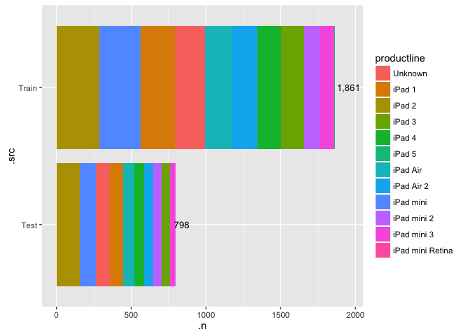
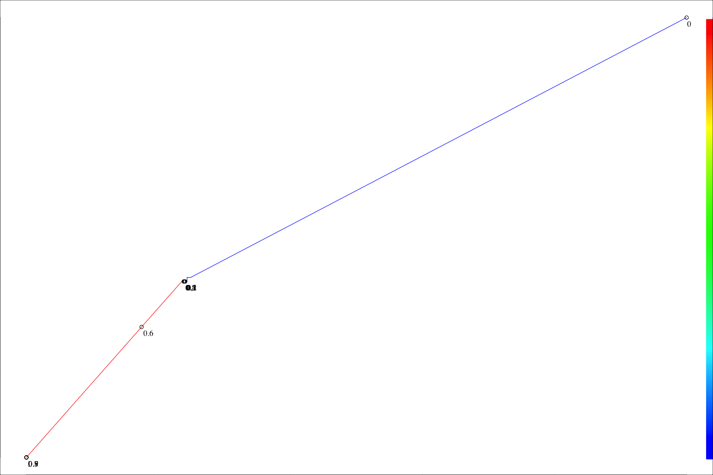
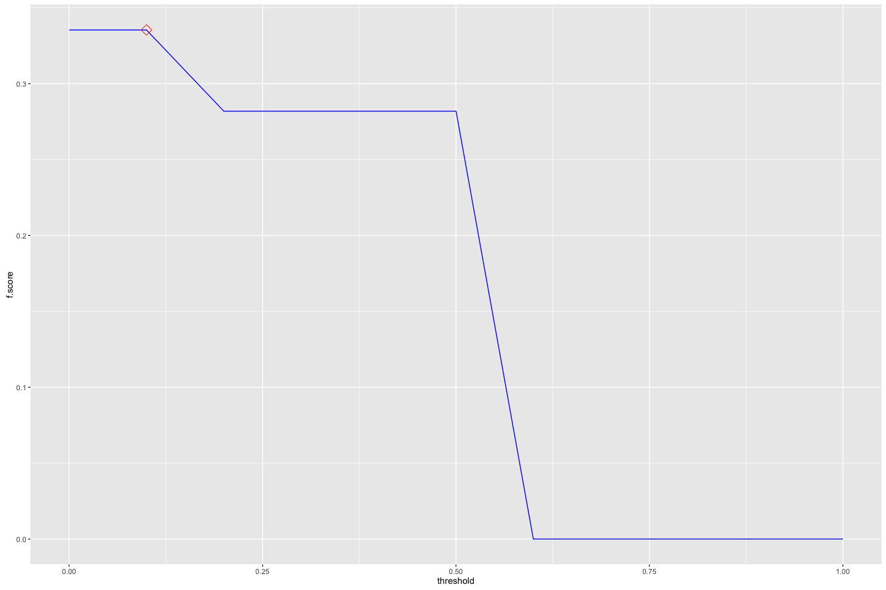
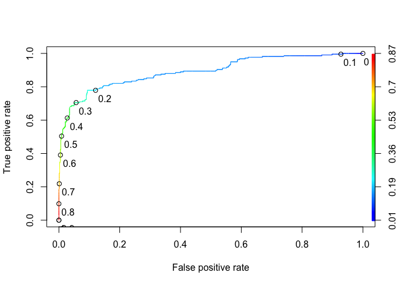
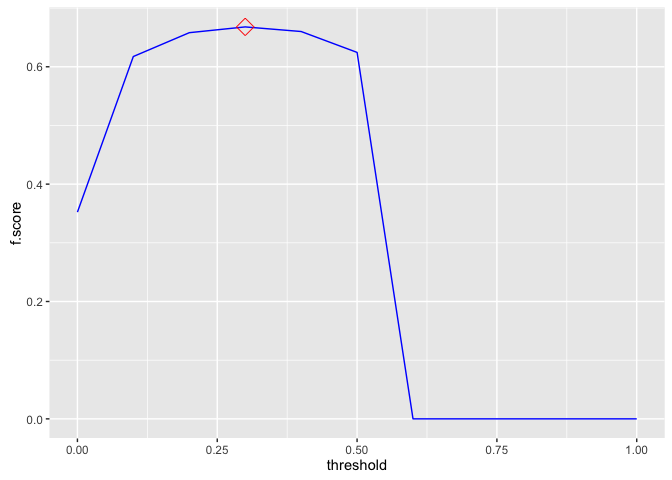
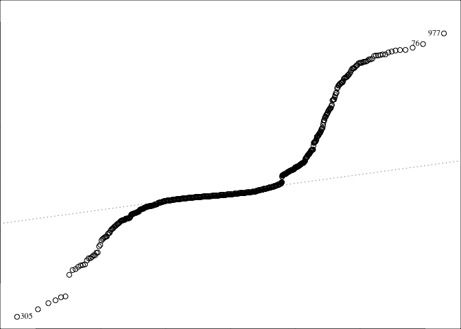
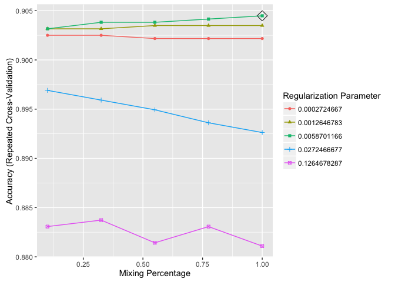
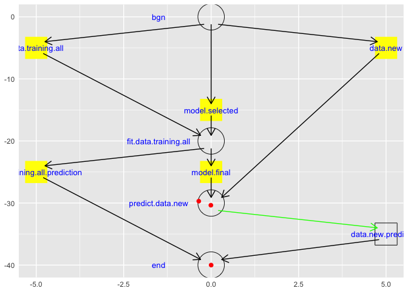

# eBay:iPads:: sold classification:: ebayipads_finmdl_RFE_sizes_bid0
bdanalytics  

**  **    
**Date: (Wed) Nov 04, 2015**    

# Introduction:  

Data: 
Source: 
    Training:   https://inclass.kaggle.com/c/15-071x-the-analytics-edge-summer-2015/download/eBayiPadTrain.csv  
    New:        https://inclass.kaggle.com/c/15-071x-the-analytics-edge-summer-2015/download/eBayiPadTest.csv  
Time period: 


# Synopsis:

Based on analysis utilizing <> techniques, <conclusion heading>:  

Regression results:
First run:
    <glb_sel_mdl_id>: 
        OOB_RMSE=<0.4f>; new_RMSE=<0.4f>; <feat1>=<imp>; <feat2>=<imp>

Classification results:
template:
    prdline.my == "Unknown" -> 296
    Low.cor.X.glm: Leaderboard: 0.83458 -> Rank 288 / 1884 0.85514
        newobs_tbl=[N=471, Y=327]; submit_filename=template_Final_glm_submit.csv
        OOB_conf_mtrx=[YN=125, NY=76]=201; max.Accuracy.OOB=0.7710;
            opt.prob.threshold.OOB=0.6
            startprice=100.00; biddable=95.42; productline=49.22; 
            D.T.like=29.75; D.T.use=26.32; D.T.box=21.53; 

prdline: -> Worse than template
    prdline.my == "Unknown" -> 285
    All.X.no.rnorm.rf: Leaderboard: 0.82649
        newobs_tbl=[N=485, Y=313]; submit_filename=prdline_Final_rf_submit.csv
        OOB_conf_mtrx=[YN=119, NY=80]=199; max.Accuracy.OOB=0.8339;
            opt.prob.threshold.OOB=0.5
            startprice=100.00; biddable=84.25; D.sum.TfIdf=7.28; 
            D.T.use=4.26; D.T.veri=2.78; D.T.scratch=1.99; D.T.box=; D.T.like=; 
    Low.cor.X.glm: Leaderboard: 0.81234
        newobs_tbl=[N=471, Y=327]; submit_filename=prdline_Low_cor_X_glm_submit.csv
        OOB_conf_mtrx=[YN=125, NY=74]=199; max.Accuracy.OOB=0.8205;
            opt.prob.threshold.OOB=0.6
            startprice=100.00; biddable=96.07; prdline.my=51.37; 
            D.T.like=29.39; D.T.use=25.43; D.T.box=22.27; D.T.veri=; D.T.scratch=; 

oobssmpl: -> 
    Low.cor.X.glm: Leaderboard: 0.83402
        newobs_tbl=[N=440, Y=358]; submit_filename=oobsmpl_Final_glm_submit
        OOB_conf_mtrx=[YN=114, NY=84]=198; max.Accuracy.OOB=0.7780;
            opt.prob.threshold.OOB=0.5
            startprice=100.00; biddable=93.87; prdline.my=60.48; D.sum.TfIdf=; 
            D.T.condition=8.69; D.T.screen=7.96; D.T.use=7.50; D.T.veri=; D.T.scratch=;

category: -> 
    Low.cor.X.glm: Leaderboard: 0.82381
        newobs_tbl=[N=470, Y=328]; submit_filename=category_Final_glm_submit
        OOB_conf_mtrx=[YN=119, NY=57]=176; max.Accuracy.OOB=0.8011;
            opt.prob.threshold.OOB=0.6
            startprice=100.00; biddable=79.19; prdline.my=55.22; D.sum.TfIdf=; 
            D.T.ipad=27.05; D.T.like=21.44; D.T.box=20.67; D.T.condition=; D.T.screen=; 

dataclns: -> 
    All.X.no.rnorm.rf: Leaderboard: 0.82211
        newobs_tbl=[N=485, Y=313]; submit_filename=dataclns_Final_rf_submit
        OOB_conf_mtrx=[YN=104, NY=75]=179; max.Accuracy.OOB=0.7977;
            opt.prob.threshold.OOB=0.5
            startprice.log=100.00; biddable=65.85; prdline.my=7.74; D.sum.TfIdf=; 
            D.T.use=2.01; D.T.condition=1.87; D.T.veri=1.62; D.T.ipad=; D.T.like=;
    Low.cor.X.glm: Leaderboard: 0.79264
        newobs_tbl=[N=460, Y=338]; submit_filename=dataclns_Low_cor_X_glm_submit
        OOB_conf_mtrx=[YN=113, NY=74]=187; max.Accuracy.OOB=0.7977;
            opt.prob.threshold.OOB=0.5 -> different from prev run of 0.6
            biddable=100.00; startprice.log=91.85; prdline.my=38.34; D.sum.TfIdf=; 
            D.T.ipad=29.92; D.T.box=27.76; D.T.work=25.79; D.T.use=; D.T.condition=;

txtterms: -> top_n = c(10)
    Low.cor.X.glm: Leaderboard: 0.81448
        newobs_tbl=[N=442, Y=356]; submit_filename=txtterms_Final_glm_submit
        OOB_conf_mtrx=[YN=113, NY=69]=182; max.Accuracy.OOB=0.7943;
            opt.prob.threshold.OOB=0.5
            biddable=100.00; startprice.log=90.11; prdline.my=37.65; D.sum.TfIdf=; 
            D.T.ipad=28.67; D.T.work=24.90; D.T.great=21.44; 
# [1] "D.T.condit"    "D.T.condition" "D.T.good"      "D.T.ipad"      "D.T.new"      
# [6] "D.T.scratch"   "D.T.screen"    "D.T.this"      "D.T.use"       "D.T.work"     
            
    All.X.glm: Leaderboard: 0.81016
        newobs_tbl=[N=445, Y=353]; submit_filename=txtterms_Final_glm_submit
        OOB_conf_mtrx=[YN=108, NY=72]=180; max.Accuracy.OOB=0.7966;
            opt.prob.threshold.OOB=0.5
            biddable=100.00; startprice.log=88.24; prdline.my=33.81; D.sum.TfIdf=; 
            D.T.scratch=25.51; D.T.use=18.97; D.T.good=16.37; 
 [1] "D.T.condit"  "D.T.use"     "D.T.scratch" "D.T.new"     "D.T.good"    "D.T.screen" 
 [7] "D.T.great"   "D.T.excel"   "D.T.work"    "D.T.ipad"            

    Max.cor.Y.rpart: Leaderboard: 0.79258
        newobs_tbl=[N=439, Y=359]; submit_filename=txtterms_Final_rpart_submit
        OOB_conf_mtrx=[YN=105, NY=76]=181; max.Accuracy.OOB=0.7954802;
            opt.prob.threshold.OOB=0.5
            startprice.log=100; biddable=; prdline.my=; D.sum.TfIdf=; 
            D.T.scratch=; D.T.use=; D.T.good=; 
 [1] "D.T.condit"  "D.T.use"     "D.T.scratch" "D.T.new"     "D.T.good"    "D.T.screen" 
 [7] "D.T.ipad"    "D.T.great"   "D.T.work"    "D.T.excel"

    All.X.no.rnorm.rf: Leaderboard: 0.80929
        newobs_tbl=[N=545, Y=253]; submit_filename=txtterms_Final_rf_submit
        OOB_conf_mtrx=[YN=108, NY=61]=169; max.Accuracy.OOB=0.8090395
            opt.prob.threshold.OOB=0.5
            startprice.log=100.00; biddable=78.82; idseq.my=63.43; prdline.my=45.57;
            D.T.use=2.76; D.T.condit=2.35; D.T.scratch=2.00; D.T.good=; 
 [1] "D.T.condit"  "D.T.use"     "D.T.scratch" "D.T.new"     "D.T.good"    "D.T.screen" 
 [7] "D.T.ipad"    "D.T.great"   "D.T.work"    "D.T.excel"

txtclstr:
    All.X.no.rnorm.rf: Leaderboard: 0.79363 -> 0.79573
        newobs_tbl=[N=537, Y=261]; submit_filename=txtclstr_Final_rf_submit
        OOB_conf_mtrx=[YN=104, NY=61]=165; max.Accuracy.OOB=0.8135593
            opt.prob.threshold.OOB=0.5
            startprice.log=100.00; biddable=79.99; idseq.my=64.94; 
                prdline.my=4.14; prdline.my.clusterid=1.15; 
 [1] "D.T.condit"  "D.T.use"     "D.T.scratch" "D.T.new"     "D.T.good"    "D.T.screen" 
 [7] "D.T.ipad"    "D.T.great"   "D.T.work"    "D.T.excel"            
 
dupobs:
    All.X.no.rnorm.rf: Leaderboard: 0.79295
        newobs_tbl=[N=541, Y=257]; submit_filename=dupobs_Final_rf_submit
        OOB_conf_mtrx=[YN=114, NY=65]=179; max.Accuracy.OOB=0.7977401
            opt.prob.threshold.OOB=0.5
            startprice.log=100.00; biddable=94.49; idseq.my=67.40; 
                prdline.my=4.48; prdline.my.clusterid=1.99; 
 [1] "D.T.condit"  "D.T.use"     "D.T.scratch" "D.T.new"     "D.T.good"    "D.T.screen" 
 [7] "D.T.ipad"    "D.T.great"   "D.T.work"    "D.T.excel"            
 
    All.X.no.rnorm.rf: Leaderboard: 0.79652
        newobs_tbl=[N=523, Y=275]; submit_filename=dupobs_Final_rf_submit
        OOB_conf_mtrx=[YN=114, NY=65]=179; max.Accuracy.OOB=0.7977401
            opt.prob.threshold.OOB=0.5
            startprice.log=100.00; biddable=94.24; idseq.my=67.92; 
                prdline.my=4.33; prdline.my.clusterid=2.17; 
 [1] "D.T.condit"  "D.T.use"     "D.T.scratch" "D.T.new"     "D.T.good"    "D.T.screen" 
 [7] "D.T.ipad"    "D.T.great"   "D.T.work"    "D.T.excel"
 
csmmdl:
   All.X.no.rnorm.rf: Leaderboard: 0.79396
        newobs_tbl=[N=525, Y=273]; submit_filename=csmmdl_Final_rf_submit
        OOB_conf_mtrx=[YN=111, NY=66]=177; max.Accuracy.OOB=0.8000000
            opt.prob.threshold.OOB=0.5
            startprice.log=100.00; biddable=90.30; idseq.my=67.06; 
                prdline.my=4.40; cellular.fctr=3.57; prdline.my.clusterid=2.08; 

   All.Interact.X.no.rnorm.rf: Leaderboard: 0.77867
        newobs_tbl=[N=564, Y=234]; submit_filename=csmmdl_Final_rf_submit
        OOB_conf_mtrx=[YN=120, NY=53]=173; max.Accuracy.OOB=0.8045198
            opt.prob.threshold.OOB=0.5
            biddable=100.00; startprice.log=93.99; idseq.my=57.30; 
                prdline.my=9.09; cellular.fctr=3.30; prdline.my.clusterid=2.35; 

   All.Interact.X.no.rnorm.rf: Leaderboard: 0.77152
        newobs_tbl=[N=539, Y=259]; submit_filename=csmmdl_Final_rf_submit
        OOB_conf_mtrx=[YN=, NY=]=; max.Accuracy.OOB=0.8011299
            opt.prob.threshold.OOB=0.5
            biddable=100.00; startprice.log=94.93; idseq.my=57.12; 
                prdline.my=9.29; cellular.fctr=3.20; prdline.my.clusterid=2.50; 
 [1] "D.T.condit"  "D.T.use"     "D.T.scratch" "D.T.new"     "D.T.good"    "D.T.screen" 
 [7] "D.T.ipad"    "D.T.great"   "D.T.work"    "D.T.excel"
 
        All.X.glmnet: 
            fit_RMSE=???; OOB_RMSE=115.1247; new_RMSE=115.1247; 
            prdline.my.fctr=100.00; condition.fctrNew=88.53; D.npnct09.log=84.34
                biddable=16.48; idseq.my=57.27;
spdiff:                
    All.Interact.X.no.rnorm.rf: Leaderboard: 0.78218
        newobs_tbl=[N=517, Y=281]; submit_filename=spdiff_Final_rf_submit
        OOB_conf_mtrx=[YN=121, NY=38]=159; max.Accuracy.OOB=0.8203390
            opt.prob.threshold.OOB=0.6
            biddable=100.00; startprice.diff=57.53; idseq.my=41.31; 
                prdline.my=11.43; cellular.fctr=2.36; prdline.my.clusterid=1.82; 
 
        All.X.no.rnorm.rf: 
            fit_RMSE=92.19; OOB_RMSE=130.86; new_RMSE=130.86; 
            biddable=100.00; prdline.my.fctr=61.92; idseq.my=57.77;
                condition.fctr=29.53; storage.fctr=11.22; color.fctr=6.69;
                cellular.fctr=6.11
                
    All.X.no.rnorm.rf: Leaderboard: 0.77443
        newobs_tbl=[N=606, Y=192]; submit_filename=spdiff_Final_rf_submit
        OOB_conf_mtrx=[YN=112, NY=28]=140; max.Accuracy.OOB=0.8418079
            opt.prob.threshold.OOB=0.6
            startprice.diff=100.00; biddable=96.53; idseq.my=38.10; 
                prdline.my=3.65; cellular.fctr=2.21; prdline.my.clusterid=0.91; 
 [1] "D.T.condit"  "D.T.use"     "D.T.scratch" "D.T.new"     "D.T.good"    "D.T.screen" 
 [7] "D.T.ipad"    "D.T.great"   "D.T.work"    "D.T.excel"

 color:
        All.Interact.X.glmnet: 
            fit_RMSE=88.64520; 
            prdline.my.fctr:D.TfIdf.sum.stem.stop.Ratio=100.00;
            prdline.my.fctr:condition.fctr=77.35
            D.TfIdf.sum.stem.stop.Ratio=68.18
            prdline.my.fctr:color.fctr=68.12
            prdline.my.fctr:storage.fctr=63.32
            
    All.X.no.rnorm.rf: Leaderboard: 0.80638
        newobs_tbl=[N=550, Y=248]; submit_filename=color_Final_rf_submit
        OOB_conf_mtrx=[YN=108, NY=54]=162; max.Accuracy.OOB=0.8169492
            opt.prob.threshold.OOB=0.5
            biddable=100.00; startprice.diff=77.90; idseq.my=48.49; 
                D.ratio.sum.TfIdf.nwrds=6.48; storage.fctr=4.74;
                    D.TfIdf.sum.stem.stop.Ratio=4.57; prdline.my=4.32;
 [1] "D.T.condit"  "D.T.use"     "D.T.scratch" "D.T.new"     "D.T.good"    "D.T.screen" 
 [7] "D.T.ipad"    "D.T.great"   "D.T.work"    "D.T.excel"
            
    All.Interact.X.no.rnorm.rf: Leaderboard: 0.72974
        newobs_tbl=[N=682, Y=116]; submit_filename=assctxt_Final_rf_submit
        OOB_conf_mtrx=[YN=125, NY=43]=168; max.Accuracy.OOB=0.8101695; max.auc.OOB=???;
            opt.prob.threshold.OOB=0.6
            biddable=100.00; startprice.diff=51.04; idseq.my=29.51; 
                startprice.diff:biddable=28.70
                prdline.my.fctriPadmini:idseq.my=6.89
        Highest max.auc.OOB=???; for model:        

gbm w/startprice.unit9:
    Final.glment: min.RMSE.fit=30.32782
    Ensemble.glmnet: min.RMSE.fit=29.62348
startprice.predict.All.Interact.X.no.rnorm.rf    100.000
startprice.predict.All.X.no.rnorm.rf              73.521
startprice.predict.All.Interact.X.bayesglm        29.675
startprice.predict.Max.cor.Y.lm                   28.405

        All.X.glmnet: min.RMSE.fit=88.64271
prdl.my.descr.fctr                       100.00
D.TfIdf.sum.stem.stop.Ratio                        85.01
condition.fctr                                  80.28
carrier.fctr                                  77.48
prdl.my.descr.fctr:.clusterid.fctr5       65.78
D.npnct16.log                                      61.66
startprice.unit9                                   59.48
color.fctr                                    59.21
D.npnct01.log                                      53.78
D.npnct08.log                                      53.56
cellular.fctr                                     53.19

    Ensemble.glmnet: Leaderboard: not submitted -> lower max.auc.OOB of "Ensemble submission"
        newobs_tbl=[N=579, Y=219]; submit_filename=gbm_Final_glmnet_submit
        OOB_conf_mtrx=[YN=85, NY=54]=139; 
            max.Accuracy.OOB=0.8438202; max.auc.OOB=0.9127314; opt.prob.threshold.OOB=0.5
sold.fctr.predict.All.X.no.rnorm.rf.prob             100.0000
sold.fctr.predict.All.Interact.X.no.rnorm.rf.prob     98.7937            
        Highest max.auc.OOB=0.9167568; for model:All.Interact.X.gbm
biddable                                           100.0000
startprice.diff                                     96.2076
startprice.diff:biddable                            23.2114
idseq.my                                             7.8098        

mdlsel:
    Final.glment: min.RMSE.fit=30.47114 (higher than gbm w/startprice.unit9)
    Ensemble.glmnet: min.RMSE.fit=29.49418
startprice.predict.All.Interact.X.no.rnorm.rf                          100.000000
startprice.predict.All.X.no.rnorm.rf                                    71.213880
startprice.predict.All.X.bayesglm                                       24.166084

        All.X.glmnet: min.RMSE.fit=88.64271
prdl.my.descr.fctr                       100.00
D.TfIdf.sum.stem.stop.Ratio                        85.01
condition.fctr                                  80.28
carrier.fctr                                  77.48
prdl.my.descr.fctr:.clusterid.fctr5       65.78
D.npnct16.log                                      61.66
startprice.unit9                                   59.48
color.fctr                                    59.21
D.npnct01.log                                      53.78
D.npnct08.log                                      53.56
cellular.fctr                                     53.19

mdlsel(startprice.log):
    Final.Ensemble.rf: min.RMSE.fit=0.4563772
    Ensemble.rf: min.RMSE.fit=0.4283013
startprice.log.predict.All.Interact.X.no.rnorm.rf                  100.0000000
startprice.log.predict.All.X.no.rnorm.rf                            58.0967582
startprice.log.predict.All.Interact.X.gbm                            6.7197148

        All.X.no.rnorm.rf: min.RMSE.fit=1.4967021
biddable                                         100.00000000
idseq.my                                          98.00292371
startprice.unit9                                  34.31130220
prdl.my.descr.fctr                       18.10984741
D.ratio.sum.TfIdf.nwrds                           15.23549621
color.fctrUnknown                                 14.05520993
D.TfIdf.sum.stem.stop.Ratio                       13.00884673
D.ratio.nstopwrds.nwrds                           10.51165302

    All.X.gbm: Leaderboard: 0.75430
        newobs_tbl=[N=582, Y=216]; submit_filename=mdlsel_Final_gbm_submit
        OOB_conf_mtrx=[YN=58, NY=65]=123; 
            max.Accuracy.OOB=0.8617978; max.auc.OOB=0.9367161;
            opt.prob.threshold.OOB=0.5
startprice.diff                                           100.0000000 100.00000000
biddable                                                   66.6475055  65.40764971
idseq.my                                                    1.8632456   4.55963698

splogdiff:
    All.X.gbm: Leaderboard: 0.70111
        newobs_tbl=[N=553, Y=245]; submit_filename=splogdiff_Final_gbm_submit
        OOB_conf_mtrx=[YN=35, NY=101]=136; 
            max.Accuracy.OOB=0.8471910; max.auc.OOB=0.9388912;
            opt.prob.threshold.OOB=0.3
startprice.log.diff                                       100.0000000 100.0000000
biddable                                                   86.8563123  88.0261866
idseq.my                                                    8.3580281   2.9054298       
Forum Ideas:
I then focused on feature engineering, each new variable brought its own little improvement so in the end i just kept adding new ones and let the models do their thing. Here are some i used: model (productline:storage:condition), isNew, model2 (product:isNew), 50 common words from descr, descrLength, capsFactor (% of caps in description), number of cheaper items of same model2, number of dearer items of same model2, priceFactor (vs. mean of price for model), priceFactor2 (vs. mean of price for model2), bigID (if ID> 11000 because there seems to be a huge drop in sales after some time), timeline (year of product launch, reasoning is you want to spend less money on older products).

Get the median startprice for each level of productline and condition. Take the difference from startprice as a new variable. I find median works much better than the mean since startprice is not normally distributed. I also created another binary variable on whether this difference is positive or negative.

Square root startprice

scale and center all the variables except sold, including the dummies.

### Prediction Accuracy Enhancement Options:
- Not repeatable experiments:
    - gbm & ensembles that include gbm
    - rf that includes .rnorm ??? (now .rnorm has a set seed)
    
- import.data chunk:
    - which obs should be in fit vs. OOB (currently dirty.0 vs .1 is split 50%)
    
- inspect.data chunk:
    - For date variables
        - Appropriate factors ?
        - Different / More last* features ?
        
- scrub.data chunk:        
- transform.data chunk:
    - derive features from multiple features
    
- manage.missing.data chunk:
    - Not fill missing vars
    - Fill missing numerics with a different algorithm
    - Fill missing chars with data based on clusters 
    
- extract.features chunk:
    - Text variables: move to date extraction chunk ???
        - Mine acronyms
        - Mine places

- Review set_global_options chunk after features are finalized

### 

## Potential next steps include:
- Organization:
    - Categorize by chunk
    - Priority criteria:
        0. Ease of change
        1. Impacts report
        2. Cleans innards
        3. Bug report
        
- all chunks:
    - at chunk-end rm(!glb_<var>)
    
- manage.missing.data chunk:
    - cleaner way to manage re-splitting of training vs. new entity

- extract.features chunk:
    - Add n-grams for glbFeatsText
        - "RTextTools", "tau", "RWeka", and "textcat" packages
    - Convert user-specified mutate code to config specs
    
- fit.models chunk:
    - Prediction accuracy scatter graph:
    -   Add tiles (raw vs. PCA)
    -   Use shiny for drop-down of "important" features
    -   Use plot.ly for interactive plots ?
    
    - Change .fit suffix of model metrics to .mdl if it's data independent (e.g. AIC, Adj.R.Squared - is it truly data independent ?, etc.)
    - move model_type parameter to myfit_mdl before indep_vars_vctr (keep all model_* together)
    - create a custom model for rpart that has minbucket as a tuning parameter
    - varImp for randomForest crashes in caret version:6.0.41 -> submit bug report

- Probability handling for multinomials vs. desired binomial outcome
-   ROCR currently supports only evaluation of binary classification tasks (version 1.0.7)
-   extensions toward multiclass classification are scheduled for the next release

- Skip trControl.method="cv" for dummy classifier ?
- Add custom model to caret for a dummy (baseline) classifier (binomial & multinomial) that generates proba/outcomes which mimics the freq distribution of glb_rsp_var values; Right now glb_dmy_glm_mdl always generates most frequent outcome in training data
- glm_dmy_mdl should use the same method as glm_sel_mdl until custom dummy classifer is implemented

- fit.all.training chunk:
    - myplot_prediction_classification: displays 'x' instead of '+' when there are no prediction errors 
- Compare glb_sel_mdl vs. glb_fin_mdl:
    - varImp
    - Prediction differences (shd be minimal ?)

- Move glb_analytics_diag_plots to mydsutils.R: (+) Easier to debug (-) Too many glb vars used
- Add print(ggplot.petrinet(glb_analytics_pn) + coord_flip()) at the end of every major chunk
- Parameterize glb_analytics_pn
- Move glb_impute_missing_data to mydsutils.R: (-) Too many glb vars used; glb_<>_df reassigned
- Replicate myfit_mdl_classification features in myfit_mdl_regression
- Do non-glm methods handle interaction terms ?
- f-score computation for classifiers should be summation across outcomes (not just the desired one ?)
- Add accuracy computation to glb_dmy_mdl in predict.data.new chunk
- Why does splitting fit.data.training.all chunk into separate chunks add an overhead of ~30 secs ? It's not rbind b/c other chunks have lower elapsed time. Is it the number of plots ?
- Incorporate code chunks in print_sessionInfo
- Test against 
    - projects in github.com/bdanalytics
    - lectures in jhu-datascience track

# Analysis: 

```r
rm(list = ls())
set.seed(12345)
options(stringsAsFactors = FALSE)
source("~/Dropbox/datascience/R/myscript.R")
source("~/Dropbox/datascience/R/mydsutils.R")
```

```
## Loading required package: caret
## Loading required package: lattice
## Loading required package: ggplot2
```

```r
source("~/Dropbox/datascience/R/myplot.R")
source("~/Dropbox/datascience/R/mypetrinet.R")
source("~/Dropbox/datascience/R/myplclust.R")
source("~/Dropbox/datascience/R/mytm.R")
# Gather all package requirements here
suppressPackageStartupMessages(require(doMC))
registerDoMC(6) # # of cores on machine - 2
suppressPackageStartupMessages(require(caret))
source("~/Documents/Work/PullRequests/caret/pkg/caret/R/confusionMatrix.R")
source("~/Documents/Work/PullRequests/caret/pkg/caret/R/ggplot.R")
#packageVersion("tm")
#require(sos); findFn("cosine", maxPages=2, sortby="MaxScore")

# Analysis control global variables
# Inputs
glb_trnng_url <- "https://inclass.kaggle.com/c/15-071x-the-analytics-edge-summer-2015/download/eBayiPadTrain.csv"
glb_newdt_url <- "https://inclass.kaggle.com/c/15-071x-the-analytics-edge-summer-2015/download/eBayiPadTest.csv"
glbInpMerge <- # NULL #: default
    list(fnames = c("ebayipads_finmdl_bid0_sp_out.csv", "ebayipads_mdlens_bid1_sp_out.csv"))

glb_is_separate_newobs_dataset <- TRUE    # or TRUE
    glb_split_entity_newobs_datasets <- FALSE   # select from c(FALSE, TRUE)
    glb_split_newdata_method <- NULL # select from c(NULL, "condition", "sample", "copy")
    glb_split_newdata_condition <- NULL # or "is.na(<var>)"; "<var> <condition_operator> <value>"
    glb_split_newdata_size_ratio <- 0.3               # > 0 & < 1
    glb_split_sample.seed <- 123               # or any integer

glbObsDropCondition <- # default : NULL 
            "(UniqueID %in% c(NULL
                , 11234 #sold=0; 2 other dups(10306, 11503) are sold=1
                , 11844 #sold=0; 3 other dups(11721, 11738, 11812) are sold=1
                )) | 
            (productline %in% c('iPad 5', 'iPad mini Retina')) |
                    (biddable != 0) # bid0_sp
                    # | (biddable == 0) # bid1_sp
            "
#parse(text=glbObsDropCondition)
#subset(glb_allobs_df, .grpid %in% c(31))
    
glb_obs_repartition_train_condition <- NULL 
#    "!is.na(sold) & (sold == 1)" # : bid._sp

glb_max_fitobs <- NULL # or any integer                         

glb_is_regression <- FALSE; glb_is_classification <- !glb_is_regression; 
    glb_is_binomial <- TRUE #or FALSE

glb_rsp_var_raw <- "sold" #: !_sp # "startprice" # : bid._sp # 

# for classification, the response variable has to be a factor
glb_rsp_var <- "sold.fctr" #:!_sp # "startprice.log10" :bid._sp # glb_rsp_var_raw :default

# if the response factor is based on numbers/logicals e.g (0/1 OR TRUE/FALSE vs. "A"/"B"), 
#   or contains spaces (e.g. "Not in Labor Force")
#   caret predict(..., type="prob") crashes
glb_map_rsp_raw_to_var <- function(raw) { # NULL
#     return(raw ^ 0.5)
#     return(log(1 + raw))
#     return(log10(raw)) # bid._sp
#     return(exp(-raw / 2))
    ret_vals <- rep_len(NA, length(raw)); ret_vals[!is.na(raw)] <- ifelse(raw[!is.na(raw)] == 1, "Y", "N"); return(relevel(as.factor(ret_vals), ref="N"))
#     #as.factor(paste0("B", raw))
#     #as.factor(gsub(" ", "\\.", raw))    
}
# glb_map_rsp_raw_to_var(tst <- c(NA, 0, 1)) # !_sp
# glb_map_rsp_raw_to_var(tst <- c(NA, 0, 2.99, 280.50, 1000.00)) # bid._sp

glb_map_rsp_var_to_raw <- function(var) { # NULL #
#     return(var ^ 2.0)
#     return(exp(var) - 1)
#     return(10 ^ var) # bid._sp
#     return(-log(var) * 2)
    as.numeric(var) - 1
#     #as.numeric(var)
#     #gsub("\\.", " ", levels(var)[as.numeric(var)])
#     c("<=50K", " >50K")[as.numeric(var)]
#     #c(FALSE, TRUE)[as.numeric(var)]
}
# glb_map_rsp_var_to_raw(glb_map_rsp_raw_to_var(tst))

if ((glb_rsp_var != glb_rsp_var_raw) && is.null(glb_map_rsp_raw_to_var))
    stop("glb_map_rsp_raw_to_var function expected")
glb_rsp_var_out <- paste0(glb_rsp_var, ".predict.") # mdl_id is appended later

# List info gathered for various columns
# <col_name>:   <description>; <notes>
# description = The text description of the product provided by the seller.
# biddable = Whether this is an auction (biddable=1) or a sale with a fixed price (biddable=0).
# startprice = The start price (in US Dollars) for the auction (if biddable=1) or the sale price (if biddable=0).
# condition = The condition of the product (new, used, etc.)
# cellular = Whether the iPad has cellular connectivity (cellular=1) or not (cellular=0).
# carrier = The cellular carrier for which the iPad is equipped (if cellular=1); listed as "None" if cellular=0.
# color = The color of the iPad.
# storage = The iPad's storage capacity (in gigabytes).
# productline = The name of the product being sold.

# If multiple vars are parts of id, consider concatenating them to create one id var
# If glb_id_var == NULL, ".rownames <- row.names()" is the default
# Derive a numeric feature from id var

# User-specified exclusions
# List feats that shd be excluded due to known causation by prediction variable
glbFeatsExclude <- c(NULL
### !_sp
    , "description", "descr.my", "productline"
    , "startprice", "startprice.log10.predict", "sprice.predict.diff"
### bid0_sp                                  
#                                   , "description", "productline"
#                                   , "sold", "startprice.log10.cut.fctr"
#     # List feats that are linear combinations (alias in glm)
#                                 , "D.terms.post.stem.n.log", "D.weight.sum"
#                                 #, "prdl.descr.my.fctriPad4#1:.clusterid.fctr3" This does not work
#     # if RFE is rated lower than Low.cor, list feats that are in RFE & not in Low.cor
#         # min.RMSE.fit(RFE.X.glmnet)=0.1138888
# #             D.chrs.n.log                 61.12483
# #             D.chrs.uppr.n.log            61.12483
# #             D.ratio.wrds.stop.n.wrds.n   61.12483
# #             D.terms.post.stop.n.log      61.12483
# #             D.weight.post.stem.sum       61.12483
# #             D.wrds.n.log                 61.12483
# #             D.wrds.stop.n.log            61.12483
# #             D.wrds.unq.n.log             61.12483
#                             #, "startprice.dcm2.is9" # min.RMSE.fit(RFE.X.glmnet)=0.1141991 (up)
#                             , "D.wrds.stop.n.log"    # min.RMSE.fit(RFE.X.glmnet)=0.1131232
### bid0_sp                            
### bid1_sp                                  
#                                   , "description", "productline"
#                                   , "sold", "startprice.log10.cut.fctr"
### bid1_sp                            
                                  ) 

glb_id_var <- c("UniqueID")
glb_category_var <- "prdl.descr.my.fctr" # "productline" # NULL 
glb_drop_vars <- c(NULL) # or c("<col_name>")

glb_map_vars <- NULL # or c("<var1>", "<var2>")
glb_map_urls <- list();
# glb_map_urls[["<var1>"]] <- "<var1.url>"

glb_assign_pairs_lst <- NULL; 
# glb_assign_pairs_lst[["<var1>"]] <- list(from=c(NA),
#                                            to=c("NA.my"))
glb_assign_vars <- names(glb_assign_pairs_lst)

# Derived features
glbFeatsDerive <- NULL;

# Add logs of numerics that are not distributed normally ->  do automatically ???
# Right skew: logp1; sqrt; ^ 1/3; logp1(logp1); log10; exp(-<feat>/constant)

# glbFeatsDerive[["prdline.my"]] <- list(
#     mapfn=function(productline) { return(productline) }    
#     , args=c("productline"))

### bid._sp
# glbFeatsDerive[["startprice.log10.cut.fctr"]] <- list(
#     mapfn=function(startprice.log10) { return(cut(startprice.log10, 3)) }    
#     , args=c("startprice.log10"))
### bid._sp
glbFeatsDerive[["sprice.root2"]] <- list(
    mapfn = function(startprice) { return(startprice ^ (1/2)) }    
    , args = c("startprice"))
glbFeatsDerive[["sprice.log10"]] <- list(
    mapfn = function(startprice) { return(log(startprice)) }    
    , args = c("startprice"))
glbFeatsDerive[["sprice.d20nexp"]] <- list(
    mapfn = function(startprice) { return(exp(-startprice / 20)) }    
    , args = c("startprice"))

glbFeatsDerive[["sprice.predict.diff"]] <- list(
    mapfn = function(startprice.log10.predict, startprice) { 
        spdiff <- (10 ^ startprice.log10.predict) - startprice; 
        return(spdiff) }    
    , args = c("startprice.log10.predict", "startprice"))
# glbFeatsDerive[["spdiff.root10"]] <- list(
#     mapfn = function(sprice.predict.diff) { 
#         return(sign(sprice.predict.diff) * (abs(sprice.predict.diff) ^ (1/10))) }    
#     , args = c("sprice.predict.diff"))
glbFeatsDerive[["spdiff.cut.fctr"]] <- list(
    mapfn = function(sprice.predict.diff) { 
        return(cut(sprice.predict.diff, c(-1000, -100, -10, -1, 0, 1, 10, 100, 1000))) }    
    , args = c("sprice.predict.diff"))
  
#glb_allobs_df[which(glb_post_stop_words_terms_mtrx_lst[[txt_var]][, subset(glb_post_stop_words_terms_df_lst[[txt_var]], term %in% c("conditionminimal"))$pos] > 0), "description"]
glbFeatsDerive[["descr.my"]] <- list(
    mapfn = function(description) { mod_raw <- description;
### bid._sp
#         # This is here because it does not work with txt_map_filename
        mod_raw <- gsub(paste0(c("\n", "\211", "\235", "\317", "\333"), collapse = "|"), " ",
                        mod_raw)
#         # This should go into txt_map_filename    
#         mod_raw <- gsub("\\.\\.", "\\. ", mod_raw);    
#         # Don't parse for "." because of ".com"; use customized gsub for that text
#         mod_raw <- gsub("(\\w)(!|\\*|,|-|/)(\\w)", "\\1\\2 \\3", mod_raw);
#mod_raw <- grep("&#034;", glb_allobs_df$descr.my, value = TRUE)        
        mod_raw <- gsub("&amp;", "&", mod_raw);
        mod_raw <- gsub("&lt;", "<", mod_raw);
        mod_raw <- gsub("&gt;", ">", mod_raw);
        mod_raw <- gsub("<br>", " ", mod_raw); # line break - add a count for it ???     
        mod_raw <- gsub("&#034;", " ", mod_raw); # justification meta-character        
        mod_raw <- gsub("&#(0*)37;", "%", mod_raw);        
        mod_raw <- gsub("&#039;", "'", mod_raw);
        mod_raw <- gsub("([[:digit:]])\\.([[:digit:]])\\.([[:digit:]])",
                        "\\1point\\2\\point\\3", mod_raw);        
        mod_raw <- gsub("([[:digit:]])\\.([[:digit:]])", "\\1point\\2", mod_raw);
        mod_raw <- gsub("([[:digit:]]),([[:digit:]])", "\\1\\2", mod_raw);        
        mod_raw <- gsub("\\b1st\\b", "first", mod_raw);        
        mod_raw <- gsub("\\b2nd\\b", "second", mod_raw);
        mod_raw <- gsub("\\b3rd\\b", "third", mod_raw);
        mod_raw <- gsub("\\b4th\\b", "fourth", mod_raw);        
        mod_raw <- gsub("\\.(com|COM)\\b", "dot\\1", mod_raw);        
#         
#         # Modifications for this exercise only
#         # Add dictionary to stemDocument e.g. stickers stemmed to sticker ???
#         mod_raw <- gsub("8\\.25", "825", mod_raw, ignore.case=TRUE);  
        mod_raw <- gsub("\\b10\\.SCREEN\\b", "10\\. SCREEN", mod_raw); 
        mod_raw <- gsub("\\b128 gb\\b", "128gb", mod_raw);  
        mod_raw <- gsub("\\b16G\\b", "16GB", mod_raw);          
#         mod_raw <- gsub(" 16 gig ", " 16gb ", mod_raw, ignore.case=TRUE);
#         mod_raw <- gsub(" 16 gb ", " 16gb ", mod_raw, ignore.case=TRUE);        
#         
#         mod_raw <- gsub("\\bAccounts\\b", "Account", mod_raw, ignore.case=FALSE);
#         mod_raw <- gsub("\\bactivated\\b", "activate", mod_raw, ignore.case=FALSE);        
#         mod_raw <- gsub(" actuuly ", " actual ", mod_raw, ignore.case=TRUE);
        mod_raw <- gsub("\\badaptor\\b", "adapter", mod_raw);
#         mod_raw <- gsub("\\baffects\\b", "affect", mod_raw, ignore.case=FALSE);           
        mod_raw <- gsub("\\bair-like\\b", "air -like", mod_raw);
        mod_raw <- gsub("\\bALL-JUST\\b", "ALL -JUST", mod_raw);        
        mod_raw <- gsub("\\bApple's\\b", "Apple'", mod_raw);        
# #mod_raw <- glb_allobs_df[c(1322), txt_var]; mod_raw        
        mod_raw <- gsub("\\bApple care\\b", "Applecare", mod_raw);
        mod_raw <- gsub("\\bAT&T\\b", "ATT", mod_raw);        
        
#         mod_raw <- gsub(" bacK!wiped ", " bacK ! wiped ", mod_raw, ignore.case=TRUE);
#         mod_raw <- gsub(" backplate", " back plate", mod_raw, ignore.case=TRUE);
#         mod_raw <- gsub("\\bbarley", "barely", mod_raw, ignore.case=TRUE);        
#         mod_raw <- gsub(" bend ", " bent ", mod_raw, ignore.case=TRUE);         
        mod_raw <- gsub("\\b(B|b)(EST|est) (B|b)(UY|uy)\\b", "\\1\\2\\3\\4", mod_raw);
#         mod_raw <- gsub(" black\\.Device ", " black \\. Device ", mod_raw,
#                         ignore.case=TRUE);        
#         mod_raw <- gsub("black\\),charger ", "black\\), charger ", mod_raw,
#                         ignore.case=TRUE);        
#         mod_raw <- gsub("\\bblacked\\b", "black", mod_raw, ignore.case=FALSE);
#         mod_raw <- gsub("\\bblemish\\b", "blemishes", mod_raw, ignore.case=FALSE);        
#         mod_raw <- gsub(" blocks", " blocked", mod_raw, ignore.case=TRUE);
#         mod_raw <- gsub(" book ", " manual ", mod_raw, ignore.case=TRUE);            
        mod_raw <- gsub("\\b(B|b)(RAND|rand)( |-)(N|n)(EW|ew)\\b", "\\1\\2\\4\\5", mod_raw)
            #mod_raw <- c("brand new", "BRAND new", "brand NEW", "BRAND NEW", "bbrand new", "brand-new", "brand newb")
        mod_raw <- gsub("\\bbrokenCharger\\b", "broken Charger", mod_raw);
#         
        mod_raw <- gsub("\\bC-Major\\b", "C -Major", mod_raw)    
#         mod_raw <- gsub(" perfectlycord ", " perfectly cord ", mod_raw, ignore.case=TRUE);
#         mod_raw <- gsub("\\bcord", "cable", mod_raw, ignore.case=TRUE);     
        mod_raw <- gsub("\\bcables\\.No\\b", "cables. No", mod_raw);        
#         mod_raw <- gsub("\\bcables\\b", "cable", mod_raw, ignore.case=TRUE);        
#         
        mod_raw <- gsub("\\bcare\\.The\\b", "care\\. The", mod_raw);
#         mod_raw <- gsub("\\b(cared|careful|CAREFUL)\\b", "care", mod_raw, ignore.case=FALSE);
#         mod_raw <- gsub("\\b(cases|casing)\\b", "case", mod_raw, ignore.case=TRUE);        
# #mod_raw <- glb_allobs_df[c(88,187,280,1040,1098), txt_var]; mod_raw        
        mod_raw <- gsub("\\bCase/Cover\\b", "Case/ Cover", mod_raw);
        mod_raw <- gsub("\\bCasing/Screen\\b", "Casing/ Screen", mod_raw);        
#         mod_raw <- gsub(" carefully ", " careful ", mod_raw, ignore.case=TRUE);        
#         mod_raw <- gsub("\\bchargers\\b", "charger", mod_raw, ignore.case=FALSE);        
        mod_raw <- gsub("\\bchip/crack\\b", "chip/ crack", mod_raw);        
#         mod_raw <- gsub("\\bchips\\b", "chip", mod_raw, ignore.case=FALSE);
        mod_raw <- gsub("\\bCLEAN\\!LIKE\\b", "CLEAN! LIKE", mod_raw);        
#         mod_raw <- gsub("\\bcleanly\\b", "clean", mod_raw, ignore.case=FALSE);        
#         mod_raw <- gsub("\\b(C|c)olor(.*)s\\b", "\\1olor", mod_raw, ignore.case=FALSE);
# #mod_raw <- glb_allobs_df[c(280,1411), txt_var]; mod_raw        
        mod_raw <- gsub("\\bColors,models\\b", "Colors ,models", mod_raw);   
#         mod_raw <- gsub("\\bcompletely\\b", "complete", mod_raw, ignore.case=FALSE);   
# #mod_raw <- glb_allobs_df[c(178), txt_var]; mod_raw        
#
        mod_raw <- gsub("\\bCONDITION..CLEAN\\b", "CONDITION ..CLEAN", mod_raw);
        mod_raw <- gsub("\\bcondition,comes\\b", "condition ,comes", mod_raw);
        mod_raw <- gsub("\\bcondition\\.Device\\b", "condition .Device", mod_raw);
        mod_raw <- gsub("\\bconditionHas\\b", "condition Has", mod_raw);        
        mod_raw <- gsub("\\bcondition\\.\\.\\.like\\b", "condition ...like", mod_raw);    
        mod_raw <- gsub("\\bcondition\\*Minimal\\b", "condition *Minimal", mod_raw);    
        mod_raw <- gsub("\\bCondition-Moderate\\b", "Condition -Moderate", mod_raw);
        mod_raw <- gsub("\\bcondition\\.The\\b", "condition .The", mod_raw);        
        mod_raw <- gsub("\\bCONDITION\\.VERY\\b", "CONDITION .VERY", mod_raw);        
#         mod_raw <- gsub(" (conditon|condtion|contidion|conditions)", " condition", mod_raw,
#         mod_raw <- gsub("\\b(conditon|condtion|contidion|conditions)\\b", "condition", mod_raw,
# ", "\\1\\. \\2", mod_raw,
#                         ignore.case=TRUE);
#         mod_raw <- gsub("(condition)(Has)", "\\1\\. \\2", mod_raw);
#         
#         mod_raw <- gsub("\\bCONNECTED\\b", "CONNECT", mod_raw, ignore.case=FALSE);        
#         mod_raw <- gsub("\\bconnects\\b", "connect", mod_raw, ignore.case=FALSE);        
#         mod_raw <- gsub(" consist ", " consistent ", mod_raw, ignore.case=TRUE);
# #mod_raw <- glb_allobs_df[c(195, 379, 437), txt_var]; mod_raw        
#         mod_raw <- gsub("\\bCosmetics\\b", "Cosmetic", mod_raw, ignore.case=FALSE);        
        mod_raw <- gsub("\\bCracked/Damaged\\b", "Cracked/ Damaged", mod_raw);        
        mod_raw <- gsub("\\bcracksNo\\b", "cracks No", mod_raw);        
#         
#         mod_raw <- gsub("\\b(D|d)amaged\\b", "\\1amage", mod_raw, ignore.case=TRUE);
# #mod_raw <- glb_allobs_df[c(116, 1360), txt_var]; mod_raw        
#         mod_raw <- gsub("\\bDays\\b", "Day", mod_raw, ignore.case=TRUE);        
#         mod_raw <- gsub(" DEFAULTING ", " DEFAULT ", mod_raw, ignore.case=TRUE);
#         mod_raw <- gsub("\\bdefect(ive)*\\b", "defects", mod_raw, ignore.case=FALSE);
#         mod_raw <- gsub(" definitely ", " definite ", mod_raw, ignore.case=TRUE);        
#         mod_raw <- gsub("\\b(D|d)ented\\b", "\\1ent", mod_raw, ignore.case=FALSE);    
#         mod_raw <- gsub(" described", " describe", mod_raw, ignore.case=TRUE);
#         mod_raw <- gsub(" desciption", " description", mod_raw, ignore.case=TRUE);    
#         mod_raw <- gsub(" devices", " device", mod_raw, ignore.case=TRUE);        
#         mod_raw <- gsub(" Digi\\.", " Digitizer\\.", mod_raw, ignore.case=TRUE);        
#         mod_raw <- gsub("\\b(ding|dinged)\\b", "dings", mod_raw, ignore.case=TRUE);   
#         mod_raw <- gsub(" display\\.New ", " display\\. New ", mod_raw, ignore.case=TRUE);
#         mod_raw <- gsub(" displays", " display", mod_raw, ignore.case=TRUE);
        mod_raw <- gsub("\\bdo( +)not\\b", "dont", mod_raw);
        mod_raw <- gsub("\\b(D|d)oes( +)(N|n)(O|o)(T|t)\\b", "\\1oes\\3\\5", mod_raw);
#         mod_raw <- gsub("\\b(drop|drops)\\b", "dropped", mod_raw, ignore.case=TRUE); 
        
#         mod_raw <- gsub("\\b(E|e)dge\\b", "\\1dges", mod_raw, ignore.case=FALSE);        
#         mod_raw <- gsub(" effect ", " affect ", mod_raw, ignore.case=TRUE);        
#         mod_raw <- gsub(" Excellant ", " Excellent ", mod_raw, ignore.case=TRUE);
#         mod_raw <- gsub(" excellently", " excellent", mod_raw, ignore.case=TRUE);
#         mod_raw <- gsub(" EUC ", " excellent used condition", mod_raw, ignore.case=TRUE);  
#         mod_raw <- gsub(" feels ", " feel ", mod_raw, ignore.case=TRUE);
        mod_raw <- gsub("\\bfineiCloud\\b", "fine iCloud", mod_raw, ignore.case = FALSE);
#         mod_raw <- gsub(" fine.Its ", " fine. Its ", mod_raw, ignore.case=TRUE);       
#         mod_raw <- gsub("\\bfix\\b", "fixed", mod_raw, ignore.case=TRUE);        
#         mod_raw <- gsub("\\bflaws\\b", "flaw", mod_raw, ignore.case=TRUE);
#         mod_raw <- gsub("\\bflawlessly\\b", "flawless", mod_raw, ignore.case=TRUE);        
#         mod_raw <- gsub(" Framing ", " Frame ", mod_raw, ignore.case=TRUE);        
#         
#         mod_raw <- gsub(" functioanlity", " functionality", mod_raw, ignore.case=TRUE);
#         mod_raw <- gsub("\\bfunction(ing|ality)\\b", "functional", mod_raw, ignore.case=TRUE); 
#         mod_raw <- gsub(" functional\\.Very little ", " functional\\. Very little ", mod_raw,
#                         ignore.case=TRUE); 
        
        mod_raw <- gsub("\\b([[:digit:]]+) (GB|gb)\\b", "\\1\\2", mod_raw);
        mod_raw <- gsub("\\b([[:digit:]]+) gig\\b", "\\1gb", mod_raw);        
        mod_raw <- gsub("\\b(G|g)(EEK|eek) (S|s)(QUAD|quad)\\b", "\\1\\2\\3\\4", mod_raw);
#         mod_raw <- gsub("^Gentle ", "Gently ", mod_raw, ignore.case=TRUE);
#         mod_raw <- gsub("\\(gray color", "\\(spacegray color", mod_raw, ignore.case=TRUE); 
#         mod_raw <- gsub(" GREAT\\.SCreen ", " GREAT\\. SCreen ", mod_raw,
#                         ignore.case=TRUE);        
        mod_raw <- gsub("\\bGUARANTEES-IT\\b", "GUARANTEES -IT", mod_raw);
#         mod_raw <- gsub("\\b(guarantee|guarantees)\\b", "guaranteed", mod_raw, ignore.case=TRUE);
#         mod_raw <- gsub("\\ba handful of times\\b", "sparingly", mod_raw, ignore.case=TRUE); 
#         mod_raw <- gsub("\\bhardly any\\b", "no", mod_raw, ignore.case=TRUE); 
#         mod_raw <- gsub("\\bhardly ever used\\b", "sparingly used", mod_raw, ignore.case=TRUE);
#         
        mod_raw <- gsub("\\biCL0UD\\b", "iCLOUD", mod_raw);        
        mod_raw <- gsub("\\bI (CLOUD|cloud)\\b", "I\\1", mod_raw);        
#         mod_raw <- gsub("^iPad Black 3rd generation ", "iPad 3 Black ", mod_raw,
#                         ignore.case=TRUE);  
        mod_raw <- gsub("\\bIMEINo\\b", "IMEI No", mod_raw);
        mod_raw <- gsub("\\bIMIE\\b", "IMEI", mod_raw);        
#         mod_raw <- gsub("\\bincluding\\b", "included", mod_raw, ignore.case=FALSE);        
#         mod_raw <- gsub(" install\\. ", " installed\\. ", mod_raw, ignore.case=TRUE);   
#         mod_raw <- gsub("inivisible", "invisible", mod_raw, ignore.case=TRUE);        
        mod_raw <- gsub("\\bI pad\\b", "Ipad", mod_raw);
        mod_raw <- gsub("\\b(I|i)(P|p)(A|a)(D|d) (A|a)(I|i)(R|r)\\b", "\\1\\2\\3\\4\\5\\6\\7",
                        mod_raw); 
        mod_raw <- gsub("\\b(I|i)(P|p)(A|a)(D|d) (M|m)ini\\b", "\\1\\2\\3\\4\\5ini", mod_raw);
        mod_raw <- gsub("\\b(I|i)(P|p)(A|a)(D|d) (M|m)inis\\b", "\\1\\2\\3\\4\\5ini", mod_raw);  
        mod_raw <- gsub("\\b(IPAD|Ipad|iPad|ipad) ([[:digit:]])\\b", "\\1\\2", mod_raw);
        mod_raw <- gsub("\\b(Ipadair|iPadAir|ipadair) ([[:digit:]])\\b", "\\1\\2",
                        mod_raw);
        mod_raw <- gsub("\\b(iPadMini|iPadmini) ([[:digit:]])\\b", "\\1\\2", mod_raw);
        mod_raw <- gsub("\\bI Phone\\b", "IPhone", mod_raw);        
        mod_raw <- gsub("\\bIS-NO\\b", "IS -NO", mod_raw, ignore.case = FALSE)
#
#         mod_raw <- gsub(" Keeped ", " Kept ", mod_raw, ignore.case=TRUE);        
#         mod_raw <- gsub(" knicks ", " nicks ", mod_raw, ignore.case=TRUE);
#         mod_raw <- gsub(" lightening ", " lightning ", mod_raw, ignore.case=TRUE);
        mod_raw <- gsub("\\bLightning-to-USB\\b", "Lightning- to- USB", mod_raw);        
        
        mod_raw <- gsub("\\b(L|l)(IKE|ike)( |-)(N|n)(EW|ew)\\b", "\\1\\2\\4\\5", mod_raw);
            #mod_raw <- c("like new", "LIKE new", "like NEW", "LIKE NEW", "blike new", "like-new", "like newb")
        mod_raw <- gsub("\\bLIKENEW!ONE\\b", "LIKENEW! ONE", mod_raw);        
#         mod_raw <- gsub("\\b(lock|locks)\\b", "locked", mod_raw, ignore.case=TRUE);
#         mod_raw <- gsub("\\blots\\b", "lot", mod_raw, ignore.case=TRUE);        
#         mod_raw <- gsub(" manuals ", " manual ", mod_raw, ignore.case=TRUE);
#         mod_raw <- gsub(" mars ", " marks ", mod_raw, ignore.case=TRUE);
#         mod_raw <- gsub(" marks\\.Absolutely ", " marks\\. Absolutely ", mod_raw,
#                         ignore.case=TRUE);        
#         mod_raw <- gsub("\\bmarkings\\b", "marks", mod_raw, ignore.case=TRUE);
#         mod_raw <- gsub("\\bminis\\b", "mini", mod_raw, ignore.case=FALSE);           
#         mod_raw <- gsub(" minimum", " minimal", mod_raw, ignore.case=TRUE);        
#         mod_raw <- gsub(" MINT\\.wiped ", " MINT\\. wiped ", mod_raw, ignore.case=TRUE);
#         mod_raw <- gsub("\\bmonth\\b", "months", mod_raw, ignore.case=TRUE);
# #mod_raw <- glb_allobs_df[c(1803), txt_var]; mod_raw
        
        mod_raw <- gsub("\\bNew-Other\\b", "New -Other", mod_raw);
#         mod_raw <- gsub(" NEW\\!(SCREEN|ONE) ", " NEW\\! \\1 ", mod_raw, ignore.case=TRUE);
#         mod_raw <- gsub(" new looking$", " looks new", mod_raw, ignore.case=TRUE);
#         mod_raw <- gsub(" newer ", " new ", mod_raw, ignore.case=TRUE);   
#         mod_raw <- gsub("\\bnoted\\b", "note", mod_raw, ignore.case=TRUE);        
        
#         mod_raw <- gsub(" oped ", " opened ", mod_raw, ignore.case=TRUE);        
#         mod_raw <- gsub(" opening", " opened", mod_raw, ignore.case=TRUE);
#         mod_raw <- gsub(" operated", " operational", mod_raw, ignore.case=TRUE);
        mod_raw <- gsub("\\botter box\\b", "otterbox", mod_raw);        
#         
#         mod_raw <- gsub("\\bpackage\\b", "packaging", mod_raw, ignore.case=FALSE);
#         mod_raw <- gsub("\\bPACKAGE\\b", "PACKAGing", mod_raw, ignore.case=FALSE);        
# #mod_raw <- glb_allobs_df[c(360, 1142), txt_var]; mod_raw        
        mod_raw <- gsub("\\bperfectlycord\\b", "perfectly cord", mod_raw);        
#         mod_raw <- gsub(" performance", " performs", mod_raw, ignore.case=TRUE);        
#         mod_raw <- gsub(" personalized ", " personal ", mod_raw, ignore.case=TRUE);
#         mod_raw <- gsub("\\bPhysically\\b", "Physical", mod_raw, ignore.case=FALSE);        
#         mod_raw <- gsub("\\b(picture|pictured)\\b", "pictures", mod_raw, ignore.case=FALSE);
#         mod_raw <- gsub("\\bPICTURE\\b", "PICTUREs", mod_raw, ignore.case=FALSE);
# #mod_raw <- glb_allobs_df[c(184, 892), txt_var]; mod_raw
#         mod_raw <- gsub("\\b[P|p]ower(ed|ing|s)\\b", "\\1ower", mod_raw, ignore.case=FALSE);
#         mod_raw <- gsub(" pre- owned ", " used ", mod_raw, ignore.case=TRUE);
#         mod_raw <- gsub("\\bprevious\\b", "previously", mod_raw, ignore.case=TRUE);
#         mod_raw <- gsub("\\bpreviously (owned|used)\\b", "used", mod_raw, ignore.case=TRUE);
        mod_raw <- gsub("\\b(P|p)reviously(.*)(O|o)wned\\b", "\\1reviously\\3wned\\2",
                        mod_raw); 
        mod_raw <- gsub("\\b(P|p)reviously(.*)(U|u)sed\\b", "\\1reviously\\3sed\\2", mod_raw);
#         mod_raw <- gsub("\\bproblem\\b", "problems", mod_raw, ignore.case=TRUE);
#         mod_raw <- gsub(" products ", " product ", mod_raw, ignore.case=TRUE);        
#         mod_raw <- gsub("\\bprotected\\b",  "protector", mod_raw, ignore.case=FALSE);       
#         mod_raw <- gsub("\\bprotection\\b", "protector", mod_raw, ignore.case=FALSE);
#         mod_raw <- gsub("\\bPROTECTION\\b", "PROTECTOR", mod_raw, ignore.case=FALSE);       
        
        mod_raw <- gsub("\\bREADiPad\\b", "READ iPad", mod_raw);
#         mod_raw <- gsub(" re- assemble ", " reassemble ", mod_raw, ignore.case=TRUE);
        mod_raw <- gsub("\\bREFURB\\.", "REFURBished.", mod_raw);
#         mod_raw <- gsub(" reponding", " respond", mod_raw, ignore.case=TRUE);   
        mod_raw <- gsub("\\bright-hand\\b", "right -hand", mod_raw);
#         mod_raw <- gsub(" rotation ", " rotate ", mod_raw, ignore.case=TRUE);   
#         
#         mod_raw <- gsub(" Sales ", " Sale ", mod_raw, ignore.case=TRUE);
        mod_raw <- gsub("\\bScratch-Free\\b", "Scratch- Free", mod_raw);
        mod_raw <- gsub("\\bSCRATCHES/BLEMISHES...SCRATCHES\\b", "SCRATCHES/ BLEMISHES... SCRATCHES", mod_raw);
        mod_raw <- gsub("\\bscratches,clear\\b", "scratches, clear", mod_raw);
        mod_raw <- gsub("\\bScratches/Dent\\b", "Scratches/ Dent", mod_raw);
        mod_raw <- gsub("\\bScratches/scuffs/nicks/scrapes\\b", "Scratches/ scuffs/ nicks/ scrapes", mod_raw);        
#         mod_raw <- gsub(" scratchs ", " scratches ", mod_raw, ignore.case=TRUE);        
#         mod_raw <- gsub("\\b(scratchs|scratching)\\b", "scratches", mod_raw, ignore.case=FALSE);
        mod_raw <- gsub("\\bset up\\b", "setup", mod_raw);        
#         mod_raw <- gsub(" shipped| Shipment", " ship", mod_raw, ignore.case=TRUE);
#         mod_raw <- gsub("\\bshowing\\b", "shows", mod_raw, ignore.case=FALSE);        
        mod_raw <- gsub("\\b(shrink|SHRINK) (wrap|WRAP)", "\\1\\2", mod_raw);        
#         mod_raw <- gsub("\\bshuts\\b", "shut", mod_raw, ignore.case=TRUE);        
#         mod_raw <- gsub(" sides ", " side ", mod_raw, ignore.case=TRUE);
#         mod_raw <- gsub(" skinned,", " skin,", mod_raw, ignore.case=TRUE);
#         mod_raw <- gsub("\\bSlightly\\b", "slight", mod_raw, ignore.case=FALSE);        
        mod_raw <- gsub("\\b(Space|space) (G|g)r(a|e)y\\b", "\\1\\2ray", mod_raw); 
#         mod_raw <- gsub(" spec ", " speck ", mod_raw, ignore.case=TRUE);        
        mod_raw <- gsub("\\bsomescratches\\b", "some scratches", mod_raw);  
#         mod_raw <- gsub(" Sticker ", " Stickers ", mod_raw, ignore.case=TRUE);
#         mod_raw <- gsub("\\bstoring", "store", mod_raw, ignore.case=FALSE);        
#         mod_raw <- gsub("SWAPPA\\.COM", "SWAPPAsdotCOM", mod_raw, ignore.case=TRUE);        
#         
#         mod_raw <- gsub(" T- Mobile", "  TMobile", mod_raw, ignore.case=TRUE);  
#         mod_raw <- gsub("\\b(tear|TEAR)(s|S)\\b", "\\1", mod_raw, ignore.case=FALSE);         
# #mod_raw <- glb_allobs_df[c(376), txt_var]; mod_raw        
        mod_raw <- gsub("\\b(touch|Touch|TOUCH) (screen|SCREEN)\\b", "\\1\\2", mod_raw);
#         mod_raw <- gsub("\\bTURN\\b", "TURNS", mod_raw, ignore.case=FALSE);        
#         
        mod_raw <- gsub("\\bUnlockedCracked\\b", "Unlocked Cracked", mod_raw);
#         mod_raw <- gsub("\\bUNUSABLE\\b", "UNUSED", mod_raw, ignore.case=FALSE);         
#         mod_raw <- gsub("\\b(update|updates)\\b", "updated", mod_raw, ignore.case=FALSE);
#         mod_raw <- gsub("\\bupgrade\\b", "upgraded", mod_raw, ignore.case=FALSE);        
#         mod_raw <- gsub(" uppser ", " upper ", mod_raw, ignore.case=TRUE); 
#         mod_raw <- gsub("use*Case\\b", "use *Case", mod_raw, ignore.case = FALSE)    
#         mod_raw <- gsub(" use\\.Scratches ", " use\\. Scratches ", mod_raw,
#                         ignore.case=TRUE);  
#         
#         mod_raw <- gsub(" verify ", " verified ", mod_raw, ignore.case=TRUE);        
#         mod_raw <- gsub(" wear\\.Device ", " wear\\. Device ", mod_raw, ignore.case=TRUE);
#         mod_raw <- gsub("\\bwears\\b", "\\wear", mod_raw, ignore.case=TRUE);
# #mod_raw <- glb_allobs_df[c(167, 272), txt_var]; mod_raw        
#         mod_raw <- gsub(" whats ", " what's ", mod_raw, ignore.case=TRUE);
#         mod_raw <- gsub(" WiFi\\+4G ", " WiFi \\+ 4G ", mod_raw, ignore.case=TRUE);
        mod_raw <- gsub("\\b(W|w)(IFI|ifi)( |-)(ONLY|only)\\b", "\\1\\2\\4", mod_raw);
        mod_raw <- gsub("\\bwill( +)not\\b", "wont", mod_raw);  
        
        mod_raw <- gsub("\\byr\\b", "year", mod_raw);         
        mod_raw <- gsub("\\bZa(a|g)g Invisible(.*)Shield\\b", "ZaagInvisibleShield", mod_raw);
### bid._sp
        return(mod_raw) }    
    , args = c("description"))
# To identify glb_id_vars with >=10 obs
#mod_raw <- glb_allobs_df[sel_obs(list(descr.my.contains="\\bdoes( +)not\\b")), glbFeatsText]
#mod_raw <- glb_allobs_df[sel_obs(list(descr.my.contains="\\bipad [[:digit:]]\\b")), glbFeatsText][01:10]
#mod_raw <- glb_allobs_df[sel_obs(list(descr.my.contains="pad mini")), glbFeatsText][11:20]
#mod_raw <- glb_allobs_df[sel_obs(list(descr.my.contains="pad mini")), glbFeatsText][21:30]
#mod_raw <- glb_allobs_df[sel_obs(list(descr.my.contains="pad mini")), glbFeatsText][31:40]

glbFeatsDerive[["prdl.descr.my.fctr"]] <- list(
    mapfn = function(productline, description) { 
        as.factor(paste(gsub(" ", "", productline), as.numeric(nchar(description) > 0), 
                        sep = "#")) }
    , args = c("productline", "description"))
#print(mycreate_sqlxtab_df(glb_allobs_df, c("prdl.descr.my.fctr", "sold")))

#     mapfn=function(startprice) { return(scale(log(startprice))) }    
#     , args=c("startprice"))
#     mapfn=function(Rasmussen) { return(ifelse(sign(Rasmussen) >= 0, 1, 0)) }
#     mapfn=function(PropR) { return(as.factor(ifelse(PropR >= 0.5, "Y", "N"))) }
#     mapfn=function(purpose) { return(relevel(as.factor(purpose), ref="all_other")) }
#     mapfn=function(Week) { return(substr(Week, 1, 10)) }
#     mapfn=function(raw) { tfr_raw <- as.character(cut(raw, 5)); 
#                           tfr_raw[is.na(tfr_raw)] <- "NA.my";
#                           return(as.factor(tfr_raw)) }
#     , args=c("raw"))
#     mapfn=function(PTS, oppPTS) { return(PTS - oppPTS) }
#     , args=c("PTS", "oppPTS"))

# # If glb_allobs_df is not sorted in the desired manner
#     mapfn=function(Week) { return(coredata(lag(zoo(orderBy(~Week, glb_allobs_df)$ILI), -2, na.pad=TRUE))) }
#     mapfn=function(ILI) { return(coredata(lag(zoo(ILI), -2, na.pad=TRUE))) }
#     mapfn=function(ILI.2.lag) { return(log(ILI.2.lag)) }

# glbFeatsDerive[["<txt_var>.niso8859.log"]] <- list(
#     mapfn=function(<txt_var>) { match_lst <- gregexpr("&#[[:digit:]]{3};", <txt_var>)
#                         match_num_vctr <- unlist(lapply(match_lst, 
#                                                         function(elem) length(elem)))
#                         return(log(1 + match_num_vctr)) }
#     , args=c("<txt_var>"))

#     mapfn=function(raw) { mod_raw <- raw;
#         mod_raw <- gsub("&#[[:digit:]]{3};", " ", mod_raw);
#         # Modifications for this exercise only
#         mod_raw <- gsub("\\bgoodIn ", "good In", mod_raw);
#                           return(mod_raw)

#         # Create user-specified pattern vectors 
# #sum(mycount_pattern_occ("Metropolitan Diary:", glb_allobs_df$Abstract) > 0)
#         if (txt_var %in% c("Snippet", "Abstract")) {
#             txt_X_df[, paste0(txt_var_pfx, ".P.metropolitan.diary.colon")] <-
#                 as.integer(0 + mycount_pattern_occ("Metropolitan Diary:", 
#                                                    glb_allobs_df[, txt_var]))
#summary(glb_allobs_df[ ,grep("P.on.this.day", names(glb_allobs_df), value=TRUE)])

# glb_allobs_df$<descriptor>.my <-
#     plyr::revalue(glb_allobs_df$<descriptor>.my, c(
#         "ABANDONED BUILDING" = "OTHER",
#         "##"                      = "##"
#     ))
# print(<descriptor>_freq_df <- mycreate_sqlxtab_df(glb_allobs_df, c("<descriptor>.my")))
# # print(dplyr::filter(<descriptor>_freq_df, grepl("(MEDICAL|DENTAL|OFFICE)", <descriptor>.my)))
# # print(dplyr::filter(dplyr::select(glb_allobs_df, -<var.zoo>), 
# #                     grepl("STORE", <descriptor>.my)))

# glbFeatsDerive[["<var1>"]] <- glbFeatsDerive[["<var2>"]]

glb_derive_vars <- names(glbFeatsDerive)
# tst <- "descr.my"; args_lst <- NULL; for (arg in glbFeatsDerive[[tst]]$args) args_lst[[arg]] <- glb_allobs_df[, arg]; print(head(args_lst[[arg]])); print(head(drv_vals <- do.call(glbFeatsDerive[[tst]]$mapfn, args_lst))); 
# print(which_ix <- which(args_lst[[arg]] == 0.75)); print(drv_vals[which_ix]); 

glb_date_vars <- NULL # or c("<date_var>")
glb_date_fmts <- list(); #glb_date_fmts[["<date_var>"]] <- "%m/%e/%y"
glb_date_tzs <- list();  #glb_date_tzs[["<date_var>"]] <- "America/New_York"
#grep("America/New", OlsonNames(), value=TRUE)

glbFeatsPrice <- c("startprice") #: bid._sp # NULL or c("<price_var>")

# Text Processing Step: custom modifications not present in txt_munge
glbFeatsText <- c("descr.my")   # NULL # 
Sys.setlocale("LC_ALL", "C") # For english
```

```
## [1] "C/C/C/C/C/en_US.UTF-8"
```

```r
# Text Processing Step: universal modifications
glb_txt_munge_filenames_pfx <- "ebay_mytxt_"

# Text Processing Step: tolower
# Text Processing Step: removePunctuation (use custom transformer to replace with space ???)
# Text Processing Step: removeWords
glb_txt_stop_words <- list()
# Remember to use unstemmed words; Check stemming of "significant" words - any stopped words that should be stemmed with them ?
if (!is.null(glbFeatsText)) {
    require(tm)

    glb_txt_stop_words[["descr.my"]] <- sort(c(NULL    
### bid._sp    
#         , setdiff(removePunctuation(stopwords("english")), "no")                                
#         ,"ac"
#         # cor.y.train == NA
#         ,unlist(strsplit(paste(c(NULL
#         ,"128gb,1st,32gb,3g,64gb,90,acceptable,activation,amount,average,bad,buttons,buy,came,camera,can,care,carrier"
#         #,casing 
#         ,"certified,charge,charging,cleaned,clear,come,components,contain,corner,correctly,covered,customer,earbuds"
#         ,"engraved,engraving,engravement" # somehow didn't show up in the cor.y.train == NA list
#         ,"entire,except,fair,features,feel,fine,generation,get,gift,got,heavily,heavy,however,imei,include,inspected,invisible,invisibleshield"
#         ,"ipad,ipads"
#         ,"issues"
#         #,items,
#         ,"keyboard,lightning,listing,little,looks,lower"
#         ,"manufacture,manufacturer"# somehow didn't show up in the cor.y.train == NA list
#         ,"meaning,model,near,need,needs,nicks,opened,operational,otherwise"
#         ,"person,personal"# somehow didn't show up in the cor.y.train == NA list
#         ,"phone,photos,pics,plastic,port,professionally"
#         ,"purchased,purchasing"# somehow didn't show up in the cor.y.train == NA list
#         ,"quality,questions,read,ready"
#         ,"receive,received"# somehow didn't show up in the cor.y.train == NA list
#         ,"removed,replaced,retail,return,returns,runs"
#         #,scratch,
#         ,"scuffing,sealed,sell,seller,selling,shape,ship,shown,silver,since,sold,sound,spacegray,stock,sync,tablet,taken,technician,tests,third,time,touch,units,unlocked,week,wifi,without"
#         ,"wrap" # somehow didn't show up in the cor.y.train == NA list
#         ,"zagg"
#         ), collapse=",")
#         , "[,]")) #err.abs.fit.sum=26.869473 w/o items,scratch
#         
#         # cor.y.abs is low
#         #,"always","comes","grade","moderate","protector"
### bid._sp
### !_sp
            # freq == 1; keep "gold"
            ,"09","17","28","34","360","5c","5point1point1","511","6428"
                ,"7point9","7point9in","79in"
                ,"8point5","8point25","82510"
                ,"910","9510","9point7","9point75","97510","99"
            ,"a1314","a1430","abused","accept","accounts","across","actuuly","add","advised"
                ,"affects","am","ans","antenna","anti","anyone","anything","applied","applying"
                ,"area","arizona","att","attached"
            ,"backlight","backlit","backplate","barley"
                ,"beetle","beginning","bend","besides","between"
                ,"bidder","binder","bonus","book","boot","bound","brick","broke","bruises"
                ,"buyers"
            ,"capacity","causing","cherished","chrome","classes","closely"
                ,"condtion","conditon","confidence","considerable","consist","consistent"
                    ,"consumer","contents","contidion","control"
                    ,"couldnt"
                ,"cream","customize","cuts"
            ,"daily","date","daughter"
                ,"deactivated","decent","deep","defender","defense","degree","demonstration"
                    ,"depicted","depress","desciption"
                ,"difficulty","digi","disclaimer","discoloration","distressed","divider"
                ,"dlxnqat9g5wt","dock","documents","done","durable","dust","duty"
            ,"each","effect","either","emblem","erased","esi","essentially","etch","etched"
                ,"euc","every","exact","exhibition","expires"
            ,"facing","faded","faint","february","film","final","five","flickers"
                ,"folding","forgot","forwarders"
                ,"freezes","freight"
                ,"functioanlity"
            ,"games","generic","genuine","glitter","goes","gray","grey","guide"
            ,"hairline","half","handstand","hdmi","here","high","higher"
                ,"hold","hole","hospital"
            ,"immaculate","impact"
                ,"inivisible","instead"
                    ,"intended","interest","interior","international","internationally"
                        ,"into","intro"
                ,"ios","isnt","itself","ive"
            ,"jack","july"
            ,"keyword","kids","kind","knicks"
            ,"l","largest","last","late","length","let","letters","level"
                ,"lifting","limited","literally","literature"
                ,"local","logic","long","longer","looping","loose","loss","lost"
            ,"mars"
                ,"mb292ll","mc707ll","mc916ll","mc991ll","md789ll","mf432ll"
                ,"mic","middle","mind","minimum","mixed"
                ,"myself"
            ,"neither","newer","non","none","nonviewing","nor","november"
            ,"occasional","oem","often","online","oped","outside","over"
            ,"padfolio","pairing","paperwork","past","period","pet","piece"
                ,"plate","played","plug"
                ,"poor","portfolio","portion","pouch"
                ,"preinstalled","pressure","price","proof","provided"
            ,"ranging","rather"
                ,"real","realized","reassemble","reboot","receipt","recently","red"
                    ,"reflected","refunds","relisting","remote","repeat","reponding"
                    ,"required"
                    ,"reserve","reshaped","residue","respond","restarts","result"
                    ,"reviewed"
                ,"ringer","roughly","rubber"
            ,"said","same","school","scratchs","screeb"
                ,"seamlessly","seem","seen","semi","send","september","serious"
                ,"shell","shipment","short","showroom"
                ,"sighs","site","size"
                ,"sleeve","slice"
                ,"smoke","smooth","smudge","sn"
                ,"softer","software","somewhat","soon"
                ,"space","sparingly","sparkiling","spec","special","speck","speed","speigen"
                ,"stains","standup","start","status","stopped","strictly"
                ,"subtle","sustained"
                ,"swappadotcom","swiped","swivel"
            ,"take","technical","tempered","texture"
                ,"thank","then","therefore","think","those","though"
                ,"toddler","topback","totally","touchy","toys"
                ,"tried","turn","typical"
            ,"u","university","unknown","untouched","uppser"
            ,"valid","vary","viewing","virtually"
            ,"want","wavy","website","whole","why","winning","worn"
            ,"zaag","zero","zombie","zoogue"

            # cor.y.train == NA
            ,"account","applecare","download","expect","fourth","greeting","maybe"
            ,"plus","purposes","significant","title","volume"

            # chisq.pval high (e.g. == 1); 
            #   keep
            #       carrier.fctr:  "sprint", "verizon"
            #       cellular.fctr:  "3g", "4g",wifion
            #       color.fctr:     "gold"
            #       prdl.descr.my.fctr: 
            #       storage.fctr:   "128gb"

            ,"2016"
            ,"acceptable","actual","amount","awesome"
            ,"beautiful","before","bent","best","blocked","blocks"
            ,"capable","converted"
            ,"find"
            ,"gift"
            ,"handled","handling","headphone"
            ,"im","information"
            ,"love"
            ,"march","meaning","means","medium","money"
            ,"necessary"
            ,"offer","once"
            ,"page","product","products"
            ,"second","seconds","should","silver","skin","skinned"
            ,"tape","thoroughly","twice"
            ,"user"
            ,"way","which"

            # nzv.freqRatio high (e.g. >= glb_nzv_freqCut); 
            #   keep
            #       carrier.fctr:       "sprint", "tmobile", "verizon"
            #       cellular.fctr:      "3g", "4g",wifionly
            #       color.fctr:         "gold",spacegray
            #       condition.fctr:     
            #           levels:
            #   "Used", "For parts or not working", "Manufacturer refurbished", "New", "New other (see details)", "Seller refurbished"     
            #           stemmed tokens:
            #   manufactur                    
            #       prdl.descr.my.fctr: "ipad1",ipad3,ipad4,ipadair2,ipadmini2
            #       storage.fctr:       "128gb"

            ,"14","2015","3","30","4","5","6","7","8","9","90","9point5","9point7in"
            ,"a1432","able","about","ac","activate","activated","activation"
                ,"additional","adult"
                ,"after"
                ,"ago"
                ,"air"
                ,"along","already","also"
                ,"another","answer"
                ,"appears","approved","april"
                ,"around"
                ,"asis","associated"
                ,"auction"
            ,"backside","bad","battery","because","bestbuy","bezel","blue","bluetooth"
                ,"board","body","both","bottom","bought"
                ,"bright"
                ,"bumps","buy","buying"
            ,"came","camera","cameras","cannot","cant","card","carrier","cellular"
                ,"changed","changing","check","chip","chips"
                ,"color","colors","company","complete","completely","components"
                    ,"connect","connected","connector","connects","contain","contains"
                    ,"corporate","correctly","couple"
                ,"customer"
            ,"data"
                ,"dead"
                    ,"default","defaulting","definite","definitely"
                    ,"delivered","demo","describe","described","details"
                ,"do","does","dont","down"
                ,"drop","dropped","drops"
                ,"due"
            ,"earbuds","easily","ebay","else","engraved","engravement","engraving","entire"
                ,"etc"
                ,"even","ever","everything"
                ,"except","exterior","extremely"
            ,"fantastic","fast","faulty","features","feel","feels","fine","fix","fixed"
                ,"flaw","flaws"
                ,"frame","framing"
            ,"geeksquad","general","get","got","guarantee","guaranteed","guarantees"
            ,"hand","handful","handset","happened","hard","hardly","heavy","home","however"
            ,"id","if","images","imperfections"
                ,"inside","inspected","install","installed","instructions","invisible"
                ,"iphone","iphones"
                ,"issue","issues"
                ,"itunes"
            ,"keyboard","know","known"
            ,"latest","lcd","least","leather","less"
                ,"life","lightening","lightning","like","line","lining"
                    ,"liquid","liquidation"
                ,"logo","lot","lots","lower"
            ,"magnetic","make","manual","manuals","many","me","memory","missing"
                ,"model","models","moderate","more","most","mostly"
                ,"multiple","musthave"
                ,"my"
            ,"name","network","networks","nice","nick","nicks"
                ,"nonfunctioning","noticeable","now"
            ,"off","old","operated","operational","otherwise","outer","own","owned"
            ,"party","passcode","password"
                ,"performance","performs","person","personal","personalized"
                ,"phone","physical","physically"
                ,"pin","pixels"
                ,"placed","places"
                ,"port","possible"
                ,"pretty","pristine","problem","problems","properly"
                ,"purchase","purchased","purchasing"
            ,"quality","question","questions"
            ,"rarely"
                ,"reactivated","really","rear","receive","received","regular","removed"
                    ,"repair","retail","retina"
                ,"rotate","rotation"
                ,"running","runs"
            ,"s","sale","sales","sameday","scrapes","scroll","setup","several"
                ,"shattered","shrinkwrap","shut","shuts"
                ,"side","sides","sim","single"
                ,"so","something","sometimes","sound"
                ,"speaker","specifics","spent"
                ,"sticker","stickers","storage","store","storing","stuck","stylus"
                ,"super","supply","sure","surface"
                ,"sync"
            ,"taken","technician","than","these","they","thin","third","three"
                ,"till","tiny"
                ,"too","took","touch","touching","touchscreen"
                ,"turns"
                ,"two"
            ,"unable","under","unnoticeable","unopened","unsealed","until"
                        ,"unused","unusable"
                ,"up","update","updated","updates","upgrade","upgraded","upper"
                ,"usage","usually"
            ,"verified","verify"
            ,"wall","water","we","week","weeks", "were","what","whats","where","while"
                ,"wiped","without"
                ,"would"
                ,"wrap","wrapped","wrong"
            ,"x"
            ,"year","years","your"
            ,"zagg","zaaginvisibleshield"
#
### !_sp
                                            ))
}
```

```
## Loading required package: tm
## Loading required package: NLP
## 
## Attaching package: 'NLP'
## 
## The following object is masked from 'package:ggplot2':
## 
##     annotate
```

```r
#orderBy(~term, glb_post_stem_words_terms_df_lst[[txt_var]][grep("^2", glb_post_stem_words_terms_df_lst[[txt_var]]$term), ])
#glb_allobs_df[glb_post_stem_words_terms_mtrx_lst[[txt_var]][, 6] > 0, glbFeatsText]

# To identify terms with a specific freq
#paste0(sort(subset(glb_post_stop_words_terms_df_lst[[txt_var]], freq == 1)$term), collapse = ",")
#paste0(sort(subset(glb_post_stem_words_terms_df_lst[[txt_var]], freq <= 2)$term), collapse = ",")

# To identify terms with a specific freq & 
#   are not stemmed together later OR is value of color.fctr (e.g. gold)
#paste0(sort(subset(glb_post_stop_words_terms_df_lst[[txt_var]], (freq == 1) & !(term %in% c("blacked","blemish","blocked","blocks","buying","cables","careful","carefully","changed","changing","chargers","cleanly","cleared","connect","connects","connected","contains","cosmetics","default","defaulting","defective","definitely","describe","described","devices","displays","drop","drops","engravement","excellant","excellently","feels","fix","flawlessly","frame","framing","gentle","gold","guarantee","guarantees","handled","handling","having","install","iphone","iphones","keeped","keeps","known","lights","line","lining","liquid","liquidation","looking","lots","manuals","manufacture","minis","most","mostly","network","networks","noted","opening","operated","performance","performs","person","personalized","photograph","physically","placed","places","powering","pre","previously","products","protection","purchasing","returned","rotate","rotation","running","sales","second","seconds","shipped","shuts","sides","skin","skinned","sticker","storing","thats","theres","touching","unusable","update","updates","upgrade","weeks","wrapped","verified","verify") ))$term), collapse = ",")

#print(subset(glb_post_stem_words_terms_df_lst[[txt_var]], (freq <= 2)))
#glb_allobs_df[which(terms_mtrx[, 229] > 0), glbFeatsText]

# To identify terms with cor.y == NA
#orderBy(~-freq+term, subset(glb_post_stop_words_terms_df_lst[[txt_var]], is.na(cor.y)))
#paste(sort(subset(glb_post_stop_words_terms_df_lst[[txt_var]], is.na(cor.y))[, "term"]), collapse=",")
#orderBy(~-freq+term, subset(glb_post_stem_words_terms_df_lst[[txt_var]], is.na(cor.y)))

# To identify terms with low cor.y.abs
#head(orderBy(~cor.y.abs+freq+term, subset(glb_post_stem_words_terms_df_lst[[txt_var]], !is.na(cor.y))), 5)

# To identify terms with high chisq.pval
#subset(glb_post_stem_words_terms_df_lst[[txt_var]], chisq.pval > 0.99)
#paste0(sort(subset(glb_post_stem_words_terms_df_lst[[txt_var]], (chisq.pval > 0.99) & (freq <= 10))$term), collapse=",")
#paste0(sort(subset(glb_post_stem_words_terms_df_lst[[txt_var]], (chisq.pval > 0.9))$term), collapse=",")
#head(orderBy(~-chisq.pval+freq+term, glb_post_stem_words_terms_df_lst[[txt_var]]), 5)
#glb_allobs_df[glb_post_stem_words_terms_mtrx_lst[[txt_var]][, 68] > 0, glbFeatsText]
#orderBy(~term, glb_post_stem_words_terms_df_lst[[txt_var]][grep("^m", glb_post_stem_words_terms_df_lst[[txt_var]]$term), ])

# To identify terms with high nzv.freqRatio
#summary(glb_post_stem_words_terms_df_lst[[txt_var]]$nzv.freqRatio)
#paste0(sort(setdiff(subset(glb_post_stem_words_terms_df_lst[[txt_var]], (nzv.freqRatio >= glb_nzv_freqCut) & (freq < 10) & (chisq.pval >= 0.05))$term, c( "128gb","3g","4g","gold","ipad1","ipad3","ipad4","ipadair2","ipadmini2","manufactur","spacegray","sprint","tmobil","verizon","wifion"))), collapse=",")

# To identify obs with a txt term
#tail(orderBy(~-freq+term, glb_post_stop_words_terms_df_lst[[txt_var]]), 20)
#mydsp_obs(list(descr.my.contains="non"), cols=c("color", "carrier", "cellular", "storage"))
#grep("ever", dimnames(terms_stop_mtrx)$Terms)
#which(terms_stop_mtrx[, grep("ipad", dimnames(terms_stop_mtrx)$Terms)] > 0)
#glb_allobs_df[which(terms_stop_mtrx[, grep("16", dimnames(terms_stop_mtrx)$Terms)[1]] > 0), c(glb_category_var, "storage", txt_var)]

# To identify whether terms shd be synonyms
#orderBy(~term, glb_post_stop_words_terms_df_lst[[txt_var]][grep("^moder", glb_post_stop_words_terms_df_lst[[txt_var]]$term), ])
# term_row_df <- glb_post_stop_words_terms_df_lst[[txt_var]][grep("^came$", glb_post_stop_words_terms_df_lst[[txt_var]]$term), ]
# 
# cor(glb_post_stop_words_terms_mtrx_lst[[txt_var]][glb_allobs_df$.lcn == "Fit", term_row_df$pos], glb_trnobs_df[, glb_rsp_var], use="pairwise.complete.obs")

# To identify which stopped words are "close" to a txt term
#sort(cluster_vars)

# Text Processing Step: stemDocument
# To identify stemmed txt terms
#glb_post_stop_words_terms_df_lst[[txt_var]][grep("condit", glb_post_stop_words_terms_df_lst[[txt_var]]$term), ]
#orderBy(~term, glb_post_stem_words_terms_df_lst[[txt_var]][grep("^con", glb_post_stem_words_terms_df_lst[[txt_var]]$term), ])
#glb_allobs_df[which(terms_stem_mtrx[, grep("use", dimnames(terms_stem_mtrx)$Terms)[[1]]] > 0), c(glb_id_var, "productline", txt_var)]
#glb_allobs_df[which(TfIdf_stem_mtrx[, 191] > 0), c(glb_id_var, glb_category_var, txt_var)]
#which(glb_allobs_df$UniqueID %in% c(11915, 11926, 12198))

# Text Processing Step: mycombineSynonyms
#   To identify which terms are associated with not -> combine "could not" & "couldn't"
#findAssocs(glb_full_DTM_lst[[txt_var]], "not", 0.05)
#   To identify which synonyms should be combined
#orderBy(~term, glb_post_stem_words_terms_df_lst[[txt_var]][grep("^c", glb_post_stem_words_terms_df_lst[[txt_var]]$term), ])
chk_comb_cor <- function(syn_lst) {
#     cor(terms_stem_mtrx[glb_allobs_df$.src == "Train", grep("^(damag|dent|ding)$", dimnames(terms_stem_mtrx)[[2]])], glb_trnobs_df[, glb_rsp_var], use="pairwise.complete.obs")
    print(subset(glb_post_stem_words_terms_df_lst[[txt_var]], term %in% syn_lst$syns))
    print(subset(get_corpus_terms(tm_map(glb_txt_corpus_lst[[txt_var]], mycombineSynonyms, list(syn_lst), lazy=FALSE)), term == syn_lst$word))
#     cor(terms_stop_mtrx[glb_allobs_df$.src == "Train", grep("^(damage|dent|ding)$", dimnames(terms_stop_mtrx)[[2]])], glb_trnobs_df[, glb_rsp_var], use="pairwise.complete.obs")
#     cor(rowSums(terms_stop_mtrx[glb_allobs_df$.src == "Train", grep("^(damage|dent|ding)$", dimnames(terms_stop_mtrx)[[2]])]), glb_trnobs_df[, glb_rsp_var], use="pairwise.complete.obs")
}
#chk_comb_cor(syn_lst=list(word="cabl",  syns=c("cabl", "cord")))
#chk_comb_cor(syn_lst=list(word="damag",  syns=c("damag", "dent", "ding")))
#chk_comb_cor(syn_lst=list(word="dent",  syns=c("dent", "ding")))
#chk_comb_cor(syn_lst=list(word="use",  syns=c("use", "usag")))

glb_txt_synonyms <- list()
glb_txt_synonyms[["descr.my"]] <- #NULL : default
    list(NULL
### bid._sp
#     , list(word="cabl",  syns=c("cabl", "cord"))#err.abs.fit.sum=26.863220  
# #     , list(word="charger",  syns=c("charg", "charger"))         
# #     , list(word="come",  syns=c("came", "come")) 
# #     , list(word="dent",  syns=c("dent", "ding")) 
# #     , list(word="damag",  syns=c(#"bad", "blemish", "broken", "crack", 
# #                                  #defect has +ve cor, others have -ve cor
# #                                  "damag", "dent", "ding",
# #                                  #"scratch", "scuff", "tear", "wear",
# #                                  NULL)) 
# #     # combining damag with defect & dent results in higher err.abs.fit.sum=26.885899
# #     # combining defect with dent in higher err.abs.fit.sum=26.894976    
# #     , list(word="defect",  syns=c(#"bad", "blemish", "broken", "crack", 
# #                     "defect", "dent", #"ding", ding has -ve cor, others have +ve cor 
# #                                  #"scratch", "scuff", "tear", "wear",
# #                                  NULL)) 
#     #, list(word="new", syns=c("brand")) ???
# #     , list(word="scuff",  syns=c("scuf", "scuff"))
# #     , list(word="show",   syns=c("show", "shown"))
# #     , list(word="tablet", syns=c("tab", "tablet"))
### bid._sp    
### !_sp
        ,list(word = "cabl", syns = c("cabl", "cord"))
        ,list(word = "cant", syns = c("cant", "cannot"))
        ,list(word = "descript", syns = c("descript", "discript"))
        ,list(word = "generat", syns = c("gen", "generat"))
        ,list(word = "ipadmini", syns = c("ipadmini", "mini"))
        ,list(word = "kept", syns = c("keep", "kept"))
        ,list(word = "know", syns = c("know", "known"))
        ,list(word = "lightn", syns = c("lighten", "lightn"))
        ,list(word = "passcod", syns = c("passcod", "password"))
        ,list(word = "photo", syns = c("photo", "photograph", "photos", "pic", "pictur"))
        ,list(word = "preown", syns = c("pre", "preown", "previous",
                                        "previouslyus", "previouslyown"))
        ,list(word = "protector", syns = c("protect", "protector"))
        ,list(word = "scuff",  syns = c("scuf", "scuff"))
        ,list(word = "tablet", syns = c("tab", "tablet"))
        ,list(word = "with", syns = c("w", "with"))
        ,list(word = "zagg", syns = c("zagg", "zaaginvisibleshield"))
### !_sp
    )
if (length(glb_txt_synonyms) > 0) names(glb_txt_synonyms) <- glbFeatsText

# Text Processing Step: filterTerms
if (!is.null(glbFeatsText)) {
    require(tm)
    
    # options include: weightTf, myweightTflog1p, myweightTfsqrt, weightTfIdf, weightBM25
    glb_txt_terms_control <- list(weighting = weightTfIdf # : default
                    # termFreq selection criteria across obs: default: list(global=c(1, Inf))
                        , bounds = list(global = c(1, Inf)) # bid._sp: list(global=c(3, Inf)) 
                    # default: c(3, Inf)
                        , wordLengths = c(1, Inf) # bid._sp: c(2, Inf)
                                  ) 
}
glb_txt_cor_var <- glb_rsp_var # bid._sp: "startprice.log10.cut.fctr" # default: glb_rsp_var
# select one from c("union.top.val.cor", "top.cor", default: "top.val", "top.chisq", "sparse")
glbFeatsTextFilter <- "top.chisq" 
glbFeatsTextTermsMax <- c(15) # bid._sp: c(20) # c(50) in (old) !_sp # default: rep(10, length(glbFeatsText))
names(glbFeatsTextTermsMax) <- glbFeatsText

# Text Processing Step: extractAssoc
glbFeatsTextAssocCor <- c(0.45) #bid._sp: c(0.4) #(old) !_sp: 0.2 #default: rep(1, length(glbFeatsText)) 
names(glbFeatsTextAssocCor) <- glbFeatsText

# Text Processing Step: extractPatterns (ngrams)
# Potential Enhancements
#   "Seller refurbished" -> D.P.refurbished.seller ?
#   "Like new" -> D.P.new.like ?
#   "No scratches" -> D.P.scratch.no ?
glb_important_terms <- list()
# Remember to use stemmed terms 

# Have to set it even if it is not used
glb_sprs_thresholds <- c(0.950) # Generates 8 terms
# Properties:
#   numrows(glb_feats_df) << numrows(glb_fitobs_df)
#   Select terms that appear in at least 0.2 * O(FP/FN(glb_OOBobs_df))
#       numrows(glb_OOBobs_df) = 1.1 * numrows(glb_newobs_df)
names(glb_sprs_thresholds) <- glbFeatsText

if (glb_rsp_var_raw != glb_rsp_var)
    glbFeatsExclude <- union(glbFeatsExclude, 
                                            glb_rsp_var_raw)

glbFctrMaxUniqVals <- 23 # default: 20
glb_impute_na_data <- FALSE # or TRUE
glb_mice_complete.seed <- 144 # or any integer

glb_cluster <- TRUE # bid._sp:TRUE # default:FALSE 
glb_cluster.seed <- 189 # or any integer
### !_sp
glb_cluster_entropy_var <- glb_rsp_var # c(glb_rsp_var, as.factor(cut(glb_rsp_var, 3)), default: NULL)
glbFeatsTextClusterVarsExclude <- FALSE # default FALSE
### bid._sp
# glb_cluster_entropy_var <- "sold" #"startprice.log10.cut.fctr" 
# glbFeatsTextClusterVarsExclude <- TRUE # default FALSE
### bid._sp

glb_interaction_only_feats_lst <- list()
### bid._sp
glb_interaction_only_feats_lst[["carrier.fctr"]] <- "cellular.fctr"

glb_nzv_freqCut <- 19 # 19 is caret default
glb_nzv_uniqueCut <- 10 # 4 : bid._sp # 10 : caret::default
### bid._sp

glb_rfe_fit_sizes <- # NULL 
                    ### bid0_sp
#     c(106, 111, 116, 120, 128) # or NULL c(8, 16, 32, 64, 128, 140)
                    ### bid1_sp
#     c(8, 11, 16, 21, 32, 64, 128)
    c(47,48,49,50,51,52,53,54)

# outliers identified by car::outlierTest
glb_obsfit_outliers <- #NULL
### bid._sp
#     c(NULL # default: NULL 
            # biddable == 0 & 1;      err.abs.fit.sum=423.55172
#             #   outliers
#     , 10813 # next  665 w/ rstudent=-5.091080; biddable=3.263257; err.abs.fit.sum=418.598755
#     , 10666 # next 1727 w/ rstudent=-5.163517; biddable=4.293465; err.abs.fit.sum=414.093609
#     , 11736 # next  780 w/ rstudent=-5.181343; biddable=5.670483; err.abs.fit.sum=401.817992
#     # old biddable importance above this
#     , 10781 # next 1323 w/ rstudent=-5.151062; biddable=13.30602; err.abs.fit.sum=396.393721
#     #, 10091 # next 91   w/ rstudent=-4.444452; biddable=; err.abs.fit.sum=402.673715 (up)    
#     #, 10166 # next 560  w/ rstudent=-5.006795; biddable=; err.abs.fit.sum=401.759324 (up)
#     #, 10281 # next 281 w/ rstudent=-4.245087; biddable=; err.abs.fit.sum=401.316926  (up)       
#     #, 10285 # next 285  w/ rstudent=-4.483190; biddable=; err.abs.fit.sum=402.608936 (up)    
#     #, 10446 # next 445  w/ rstudent=-4.663418; biddable=; err.abs.fit.sum=403.074523 (up)
#     #, 10542 # next 1323 w/ rstudent=-5.214517; biddable=; err.abs.fit.sum=401.04205  (up)
#     #, 10543 # next 1323 w/ rstudent=-5.214517; biddable=; err.abs.fit.sum=401.04205  (up)    
#     #, 10561 # next 542  w/ rstudent=-4.736154; biddable=; err.abs.fit.sum=401.56198  (up)    
#     #, 10631 # next 166  w/ rstudent=-5.073048; biddable=; err.abs.fit.sum=401.556788 (up)    
#     #, 11330 # next 630  w/ rstudent=-5.117659; biddable=; err.abs.fit.sum=401.732597 (up)
#     , 10091, 10166, 10281, 10285, 10446, 10542, 10543, 10561, 10631, 11330
#                 # biddable=18.93923; err.abs.fit.sum=359.388769    
#     , 10330 #biddable=19.06084; err.abs.fit.sum=355.895702
#     , 10402 #biddable= 0.0    ; err.abs.fit.sum=351.315181
#     , 10438 #biddable= 0.0    ; err.abs.fit.sum=347.821527
#     , 10624 #biddable= 0.0    ; err.abs.fit.sum=343.724904
#     , 10659 #biddable= 0.0    ; err.abs.fit.sum=331.873603
#     , 11323 #biddable=10.45901; err.abs.fit.sum=324.929562
#     , 11422 #biddable= 0.0    ; err.abs.fit.sum=334.839805 (up)
    
#             biddable == 0;      err.abs.fit.sum=26.713317
#                 , 11448 # outliers; next is 858 w/ rstudent=-5.855132; err.abs.fit.sum=24.212800
#                 , 11583 # outliers; next is 856 w/ rstudent=-4.792849; err.abs.fit.sum=22.164035
#                 , 11581 # outliers; next is 743 w/ rstudent=-4.005054; err.abs.fit.sum=18.842901
#                 , 10837 # outliers; next is 336 w/ rstudent=-5.279215; err.abs.fit.sum=18.124560
#                 , 11442 # outliers; next is 904 w/ rstudent=-4.474844; err.abs.fit.sum=15.533211
#                 , 11697 # outliers; next is 874 w/ rstudent=-3.678664; err.abs.fit.sum=13.829375
#                 , 10799 # .hatvalues == 1; total 8; iPadmini#1; err.abs.fit.sum=13.807283
#                 , 10017 # .hatvalues == 1; total 7; iPad3#1; err.abs.fit.sum=14.620782 (up)
#             , 10027, 10859 # .hatvalues == 1; total 7; iPad1#1; err.abs.fit.sum=14.570246 (up)
#                 , 10332 # .hatvalues == 1; total 7; iPad4#1; err.abs.fit.sum=13.706467
#                 , 11759 # .hatvalues == 1; total 6; iPadAir2#1; err.abs.fit.sum=13.643043
#                 , 10675 # .hatvalues == 1; total 5; iPadAir#1; err.abs.fit.sum=13.623787
#                 , 11119 # .hatvalues == 1; total 4; iPadmini3#1; err.abs.fit.sum=NA
#     , 10017, 10027, 10859 # .hatvalues == 1; total 1; iPad3#1 & iPad1#1; err.abs.fit.sum=13.438903
            
            # biddable == 1;      err.abs.fit.sum=361.78243
#                 , 10813 # outliers; next is 665 w/ rstudent=-5.021180; err.abs.fit.sum=356.83424
#                 , 10666 # outliers; next is 808 w/ rstudent=-4.764126; err.abs.fit.sum=352.46437
#                 , 11736 # outliers; next is 665 w/ rstudent=-4.614022; err.abs.fit.sum=348.59977
#                 , 10542 # outliers; next is 665 w/ rstudent=-4.654923; err.abs.fit.sum=344.18546
#                 , 11330 # outliers; next is 327 w/ rstudent=-4.628972; err.abs.fit.sum=336.12636
#                 , 10561 # outliers; next is 56  w/ rstudent=-4.612970; err.abs.fit.sum=329.50309
#                 , 10166 # outliers; next is 318 w/ rstudent=-4.717238; err.abs.fit.sum=318.50562
#                 , 10543 # outliers; next is 464 w/ rstudent=-4.811116; err.abs.fit.sum=314.32801
#                 , 10285 # outliers; next is 21  w/ rstudent=-4.850822; err.abs.fit.sum=310.19008
#         #, 10091 # outliers; next is 464 w/ rstudent=-4.941448; err.abs.fit.sum=312.94069 (up)
#         #, 10781 # outliers; next is 250 w/ rstudent=-4.793502; err.abs.fit.sum=313.03867 (up)
#                 , 10446 # outliers; next is 371  w/ rstudent=-4.787578; err.abs.fit.sum=307.15681
#                 , 10631 # outliers; next is 165  w/ rstudent=-4.130356; err.abs.fit.sum=303.34549
#         #, 10330 # outliers; next is 217 w/ rstudent=-4.067684; err.abs.fit.sum=312.75121 (up)
#         #, 10402 # outliers; next is 388 w/ rstudent=-4.067684; err.abs.fit.sum=311.84516 (up)
#         #, 10659 # outliers; next is 128 w/ rstudent=-3.982911; err.abs.fit.sum=311.84516 (up)
#         , 10091, 10781, 10330, 10402, 10659#, 10281 outliers; err.abs.fit.sum=282.381827; iPad4#0=13.806011; iPad4#1=7.799398
#         #, 10281 # outliers; next is NA  w/ rstudent=NA;        err.abs.fit.sum=287.147331 (up); iPad4#0=14.372770; iPad4#1=4.591408
#         #, 10624 # outliers; ignored along with 10281        err.abs.fit.sum=289.116467 (up); iPad4#0=; iPad4#1=
#         #, 10624 # outliers; ignored w/o 10281        err.abs.fit.sum=286.415040 (up); iPad4#0=; iPad4#1=
#                 #, 10636 # hatvalues==1; next is 11652; err.abs.fit.sum=290.50254 (up)
#                 , 11652 # hatvalues==1; next is 10636; err.abs.fit.sum=282.183867
#         #err.abs.fit.sum=282.227249
# )
### bid._sp
    # .hatvalues == 1
    c(10096, 11062, 11233, 11660, 11768)

# influence.measures: car::outlier; rstudent; dffits; hatvalues; dfbeta; dfbetas
#print(outliers <- car::outlierTest(glb_models_lst[["RFE.X.glm"]]$finalModel))
#print(outliers_df <- data.frame(.Bonf.p=outliers$bonf.p))

#obs_df <- glb_trnobs_df; mdlId <- "RFE.X.Train.glm"
#model_diags_df <- cbind(obs_df, data.frame(.rstudent=stats::rstudent(glb_models_lst[[mdlId]]$finalModel)), data.frame(.dffits=stats::dffits(glb_models_lst[[mdlId]]$finalModel)), data.frame(.hatvalues=stats::hatvalues(glb_models_lst[[mdlId]]$finalModel)))
#print(summary(model_diags_df[, c(".rstudent",".dffits",".hatvalues")]))

#print(subset(model_diags_df, is.na(.dffits)))
#print(subset(model_diags_df, .hatvalues == 1))
#dffits_df <- merge(dffits_df, outliers_df, by="row.names", all.x=TRUE); row.names(dffits_df) <- dffits_df$Row.names; dffits_df <- subset(dffits_df, select=-Row.names)
#dffits_df <- merge(dffits_df, glb_fitobs_df, by="row.names", all.x=TRUE); row.names(dffits_df) <- dffits_df$Row.names; dffits_df <- subset(dffits_df, select=-Row.names)
#subset(dffits_df, !is.na(.Bonf.p))

#indep_vars <- myextract_actual_feats(row.names(orderBy(reformulate(c("-", paste0(glb_sel_mdl_id, ".importance"))), glb_featsimp_df))); indep_vars <- indep_vars[!grepl(".fctr", indep_vars, fixed=TRUE)]

#myplot_parcoord(obs_df=model_diags_df[, c(glb_id_var, glb_category_var, ".rstudent", ".dffits", ".hatvalues", glb_rsp_var, "startprice.log10.predict.RFE.X.glmnet", indep_vars[1:20])], obs_ix=row.names(model_diags_df) %in% names(outliers$rstudent)[1], id_var=glb_id_var, category_var=glb_category_var)
#model_diags_df[row.names(model_diags_df) %in% names(outliers$rstudent)[c(1:2)], ]
#ctgry_diags_df <- model_diags_df[model_diags_df[, glb_category_var] %in% c("Unknown#0"), ]
#myplot_parcoord(obs_df=ctgry_diags_df[, c(glb_id_var, glb_category_var, ".rstudent", ".dffits", ".hatvalues", glb_rsp_var, "startprice.log10.predict.RFE.X.glmnet", indep_vars[1:20])], obs_ix=row.names(ctgry_diags_df) %in% names(outliers$rstudent)[1], id_var=glb_id_var, category_var=glb_category_var)
#table(glb_fitobs_df[model_diags_df[, glb_category_var] %in% c("iPad1#1"), "startprice.log10.cut.fctr"])
#glb_fitobs_df[model_diags_df[, glb_category_var] %in% c("iPad1#1"), c(glb_id_var, "startprice")]

# No outliers & .dffits == NaN
#myplot_parcoord(obs_df=model_diags_df[, c(glb_id_var, glb_category_var, glb_rsp_var, "startprice.log10.predict.RFE.X.glmnet", indep_vars[1:10])], obs_ix=seq(1:nrow(model_diags_df))[is.na(model_diags_df$.dffits)], id_var=glb_id_var, category_var=glb_category_var)

#dffits_ctgry_df <- subset(dffits_df, prdl.descr.my.fctr %in% c("Unknown#0"))
#myplot_parcoord(obs_df=dffits_ctgry_df[, c(glb_id_var, glb_category_var, ".dffits", ".Bonf.p", glb_rsp_var, "startprice.log10.predict.RFE.X.glmnet", indep_vars[1:5])], obs_ix=seq(1:nrow(dffits_ctgry_df))[!is.na(dffits_ctgry_df$.Bonf.p)], id_var=glb_id_var, category_var=glb_category_var)
#
#car::influenceIndexPlot(glb_models_lst[["RFE.X.glm"]]$finalModel, id.n=3)

# myplot_parcoord(obs_df=glb_fitobs_df[, c(glb_id_var, glb_rsp_var,
#                                     "startprice.log10.predict.RFE.X.glmnet", 
#                            indep_vars[1:5])], obs_ix=hatobs_ix, id_var=glb_id_var)
# myplot_parcoord(x=glb_fitobs_df[, c(glb_rsp_var, "startprice.log10.predict.RFE.X.glmnet", 
#                            indep_vars[1:2])], obs_ix=hatobs_ix)
# hatvals <- hatvalues(glb_models_lst[["RFE.X.glm"]]$finalModel)
# hatobs_ix <- which(hatvals == max(hatvals))
# MASS::parcoord(x=glb_fitobs_df[, c(glb_rsp_var, "startprice.log10.predict.RFE.X.glmnet", 
#                            indep_vars[1:2])], var.label=TRUE)
#plot(hatvalues(glb_models_lst[["RFE.X.glm"]]$finalModel), type = "h")
#glb_fitobs_df[which(row.names(glb_fitobs_df) %in% c("972")), c(glb_id_var, glb_rsp_var, glb_rsp_var_raw, "sold", glb_category_var)]

#all.equal(glb_models_lst[[glb_sel_mdl_id]], glb_models_lst[[glb_fin_mdl_id]])

glb_obstrn_outliers <- c(glb_obsfit_outliers
                         )
#car::outlierTest(glb_models_lst[["RFE.X.glm"]]$finalModel)
#glb_trnobs_df[which(row.names(glb_fitobs_df) %in% c("972")), c(glb_id_var, glb_rsp_var, glb_rsp_var_raw, "sold", glb_category_var)]

glb_models_lst <- list(); glb_models_df <- data.frame()
# Regression
if (glb_is_regression) {
    glbMdlMethods <- c(NULL
        # deterministic
            #, "lm", 
            , "glm"
            #, "bayesglm"   # crashing w/ parallel processing
            , "glmnet", "rpart"
        # non-deterministic
            , "gbm", "rf" 
        # Unknown
            #, "nnet" , "avNNet" # predicts 1 for all obs in bid0_sp # runs 25 models per cv sample for tunelength=5
            , "svmLinear", "svmLinear2"
            #, "svmPoly"   # crashing w/ parallel processing #, "svmPoly" runs 75 models per cv sample for tunelength=5
            #, "svmRadial" # crashing w/ parallel processing
            , "earth"
            #, "bagEarth" # Takes a long time
        )
} else
# Classification - Add ada,bagEarth (auto feature selection)
    if (glb_is_binomial)
        glbMdlMethods <- c(NULL
        # deterministic                     
            , "glm"
            , "bayesglm" # crashing w/ parallel processing
            , "glmnet", "rpart"
        # non-deterministic        
            , "gbm", "rf"
        # Unknown
            , "nnet" , "avNNet" # runs 25 models per cv sample for tunelength=5
            #, "svmLinear" # crashing with interaction variables
            #, "svmLinear2" # crashing with interaction variables
            #, "svmPoly"   # crashing with interaction variables #, "svmPoly" runs 75 models per cv sample for tunelength=5
            #, "svmRadial" # crashing with interaction variables 
            , "earth"
            #, "bagEarth" # Takes a long time
        ) else
            glbMdlMethods <- c("rpart", "rf", "gbm")

glb_mdl_family_lst <- list(); glb_mdl_feats_lst <- list()
# family: Choose from c("RFE.X", "CSM.X", "All.X", "Best.Interact")
#   methods: Choose from c(NULL, <method>, glbMdlMethods) 
glb_mdl_family_lst[["RFE.X"]] <- glbMdlMethods # non-NULL list is mandatory
glb_mdl_family_lst[["All.X"]] <- "glmnet" # non-NULL list is mandatory
glb_mdl_family_lst[["Best.Interact"]] <- "glmnet" # non-NULL list is mandatory

### bid1_sp
# glb_mdl_family_lst[["CSM.X"]] <- "glmnet"
# glb_mdl_feats_lst[["CSM.X"]] <- c(NULL
#     # from RFE.X
#     , "startprice.dgt1.is9", "startprice.dcm2.is9", "startprice.dcm1.is9", "startprice.dgt2.is9"
#     #, "condition.fctr"
#     , "prdl.descr.my.fctr", "color.fctr"
#     #, "D.ratio.weight.sum.wrds.n"
#     , "cellular.fctr", "cellular.fctr:carrier.fctr"
#     
#     # from RFE.X.Interact
#     , "cellular.fctr:prdl.descr.my.fctr", "cellular.fctr:startprice.dgt2.is9", "cellular.fctr:startprice.dgt1.is9", "cellular.fctr:color.fctr"
#     , "cellular.fctr:condition.fctr" # RMSE up with keeping condition.fctr in the model
#                                 # RMSE & R.sq up with removing condition.fctr from the model
#     , "cellular.fctr:D.ratio.weight.sum.wrds.n"
#     )
### bid1_sp

### !_sp
# glb_mdl_family_lst[["CSM.X"]] <- "glmnet"
# glb_mdl_feats_lst[["CSM.X"]] <- c(NULL
#         , "D.ratio.sum.TfIdf.wrds.n", "D.TfIdf.sum.stem.stop.Ratio",
#         , "D.npnct15.log", "D.npnct03.log", "D.wrds.n.log", "D.chrs.n.log")
#         indep_vars <- union(setdiff(indep_vars, interact_vars_vctr),
#                                 paste(glb_category_var, interact_vars_vctr, 
#                             sep=ifelse(grepl("\\.fctr", glb_category_var), "*", ".fctr*")))
#         indep_vars <- union(setdiff(indep_vars, 
#                         c("startprice.log.diff", "startprice.unit9", "biddable", "cellular.fctr", "carrier.fctr")),
#                             c("startprice.log.diff*biddable", "startprice.unit9*biddable", "cellular.fctr*carrier.fctr"))
### !_sp

# Check if interaction features make fit better
# Check if tuning parameters make fit better
glb_tune_models_df <- data.frame()

    #RFE.X.avNNet    
### bid0_sp
    #   size=[1] 3 5 7 9; decay=[0] 1e-04 0.001  0.01   0.1; bag=[FALSE]; RMSE=1.3300906 
### bid1_sp
    #   size=[1] 3 5 7 9; decay=0 0.0001 [0.001] 0.01 0.1; bag=[FALSE]; RMSE=0.9285472
### bid0&1_sp

    #RFE.X.bagEarth
### bid0_sp
    #RFE.X.bagEarth degree=[1]; nprune=[33]; RMSE=0.1507259
### bid1_sp
    #RFE.X.bagEarth degree=[1]; nprune=[32]; RMSE=0.6379639
    #RFE.X.bagEarth degree=[1] 2 3; nprune=8 16 32 64 [128]; RMSE=0.6334405
    #RFE.X.bagEarth degree=1 [2]; nprune=16 32 64 128 [256]; RMSE=0.6211924

    #RFE.X.bagEarth degree=1 [2]; nprune=64 128 200 225 [256]; RMSE=0.6320776 (up)
    #RFE.X.bagEarth degree=[1] 2; nprune=64 128 225 256 [275]; RMSE=0.640644 (up)
    #RFE.X.bagEarth degree=1 [2] 3; nprune=64 128 200 [256] 300; RMSE=0.6496039 (up)
    #RFE.X.bagEarth degree=1 [2] 3; nprune=32 64 128 256 [512]; RMSE=0.6404529 (up)
    #RFE.X.bagEarth degree=1 [2] 3; nprune=64 128 256 512 [1024]; RMSE=0.6486663 (up)
# glb_tune_models_df <- myrbind_df(glb_tune_models_df, rbind(data.frame()
#     ,data.frame(method = "bagEarth", parameter = "nprune", vals = "256")
#     ,data.frame(method = "bagEarth", parameter = "degree", vals = "2")    
# ))
### bid0&1_sp

### bid0_sp
    #RFE.X.earth degree=[1]; nprune=2  [9] 17 25 33; RMSE=0.1334478
### bid0_sp
    
    #RFE.X.gbm 
### bid0_sp    
    #   shrinkage=[0.1]; n.trees=50 100 150 [200] 250; RMSE=0.2062651
    #   shrinkage=0.00 0.05 0.10 0.15 [0.20]; n.trees=50 [100] 150 200 250; interaction.depth=1 [2] 3 4 5; n.minobsinnode=[10]; RMSE=0.2019453       
    #   shrinkage=0.00 0.05 [0.10] 0.15 0.20; n.trees=50 100 150 200 [250]; interaction.depth=[1] 2 3 4 5; n.minobsinnode=[10]; RMSE=0.2008313     
    #   shrinkage=0.05 [0.10] 0.15 0.20 0.25; n.trees=100 150 200 [250] 300; interaction.depth=[1] 2 3 4 5; n.minobsinnode=[10]; RMSE=0.2008313     
# glb_tune_models_df <- myrbind_df(glb_tune_models_df, rbind(data.frame()
#     ,data.frame(method = "gbm", parameter = "shrinkage", min = 0.05, max = 0.25, by = 0.05)
#     ,data.frame(method = "gbm", parameter = "n.trees", min = 100, max = 300, by = 50)
#     ,data.frame(method = "gbm", parameter = "interaction.depth", min = 1, max = 5, by = 1)
#     ,data.frame(method = "gbm", parameter = "n.minobsinnode", min = 10, max = 10, by = 10)
#     #seq(from=0.05,  to=0.25, by=0.05)
# ))
### bid1_sp
    #   shrinkage=[0.1]; n.trees=50 100 150 200 [250]; interaction.depth=1 2 3 4 [5]; n.minobsinnode=[10]; RMSE=0.5054172
#   shrinkage=0.03 [0.04] 0.05 0.06 0.07; n.trees=100 [150] 200 250 300; interaction.depth=2 3 4 5 [6]; n.minobsinnode=6  [8] 10 12 14; RMSE=0.5036430
#   shrinkage=0.03 [0.04] 0.05 0.06 0.07; n.trees=100 150 [200] 250 300; interaction.depth=3 4 5 [6] 7; n.minobsinnode=6 8 [10] 12 14; RMSE=0.502774

#   shrinkage=0.04; n.trees=200; interaction.depth=6; n.minobsinnode=10; RMSE=0.502774

#   shrinkage=[0.05] 0.10 0.15 0.20 0.25; n.trees=100 [150] 200 250 300; interaction.depth=2 3 [4] 5 6; n.minobsinnode=[10]; RMSE=0.5058678 (up)
# glb_tune_models_df <- myrbind_df(glb_tune_models_df, rbind(data.frame()
#     ,data.frame(method = "gbm", parameter = "shrinkage", vals = "0.04")
#     ,data.frame(method = "gbm", parameter = "n.trees", vals = "200")
#     ,data.frame(method = "gbm", parameter = "interaction.depth", vals = "6")
#     ,data.frame(method = "gbm", parameter = "n.minobsinnode", vals = "10")
# ))
### bid0&1_sp

    #RFE.X.glmnet
### bid1_sp
    #   alpha=0.100 [0.325] 0.550 0.775 1.000; lambda=0.0005232693 0.0024288010 0.0112734954 [0.0523269304] 0.2428800957; RMSE=0.6164891
### bid1_sp

    #RFE.X.nnet    
### bid0_sp
    #   size=[1] 3 5 7 9; decay=[0] 1e-04 0.001  0.01   0.1; RMSE=1.3300906 
### bid1_sp
    #   size=1 3 5 7 [9]; decay=0e+00 1e-04 1e-03 1e-02 [1e-01]; RMSE=0.9289109
    #   size=3 5 [7] 9 11; decay=0.0001 0.001 0.01 [0.1] 0.2; RMSE=0.9287422
# glb_tune_models_df <- myrbind_df(glb_tune_models_df, rbind(data.frame()
#     ,data.frame(method = "nnet", parameter = "size", vals = "3 5 7 9 11")
#     ,data.frame(method = "nnet", parameter = "decay", vals = "0.0001 0.0010 0.0100 0.1000 0.2000")    
# ))
### bid0&1_sp

    #RFE.X.rf 
### bid0_sp
    #       mtry=2  35  [68] 101 134; RMSE=0.1331992
    #       mtry=2  35  68 [101] 134; RMSE=0.1339974
### bid0_sp
    #       mtry=2  41  81 121 [161]; Accuracy=0.8398314
    #       mtry=41 81 [121] 161 181; Accuracy=0.8282403
# glb_tune_models_df <- myrbind_df(glb_tune_models_df, rbind(data.frame()
#     ,data.frame(method = "rf", parameter = "mtry", vals = "41 81 121 141 161")
# ))

    #RFE.X.rpart 
### bid0_sp    
    #   cp=[0.03230142] 0.06012801 0.09395662 0.12251081 0.35258370; RMSE=0.1771138
    #   cp=0.020 [0.025] 0.030 0.035 0.040; RMSE=0.1770237
# glb_tune_models_df <- myrbind_df(glb_tune_models_df, rbind(data.frame()    
#     ,data.frame(method="rpart", parameter="cp", min=0.02, max=0.04, by=0.005)
# ))
### bid1_sp
    #   cp=[0.008081388] 0.016191995 0.027590245 0.299848193 0.361621486; RMSE=0.5294398
    #   cp=[0.005] 0.006 0.007 0.008 0.009 0.010; RMSE=0.522678
    #   cp=0.001 [0.003] 0.005 0.007 0.009; RMSE=0.5186586
# glb_tune_models_df <- myrbind_df(glb_tune_models_df, rbind(data.frame()    
#     ,data.frame(method="rpart", parameter="cp", min=0.001, max=0.010, by=0.002)
# ))
### bid0&1_sp
    
    #RFE.X.svmLinear
### bid0_sp
    #   C=[1]; RMSE=0.1374094    
    #   C=1e-02 [0.1] 5e-01 1e+00 2e+00 3e+00 4e+00 1e+01 1e+02; RMSE=0.1271318
    #   C=0.01 0.05 [0.10] 0.50 1.00 2.00 3.00 4.00; RMSE=0.1271318; 0.1296718
### bid1_sp
    #   C=[1]; RMSE=0.6614060
    #   C=1e-02 [1e-01] 1e+00 1e+01 1e+02; RMSE=0.6373977
    #   C=[0.05]  0.10  0.50  1.00 10.00; RMSE=0.6324697
    #   C=0.01 [0.05] 0.10 0.50 1.00; RMSE=0.6324697
    
# glb_tune_models_df <- myrbind_df(glb_tune_models_df, rbind(data.frame()
#     ,data.frame(method = "svmLinear", parameter = "C", vals = "0.01 0.05 0.1 0.5 1")
# ))
### bid0&1_sp

    #RFE.X.svmLinear2    
### bid0_sp
    #   cost=[0.25] 0.50 1.00 2.00 4.00; RMSE=0.1276354
    #   cost=0.0625 0.1250 [0.25] 0.50 1.00; RMSE=0.1276354 
# glb_tune_models_df <- myrbind_df(glb_tune_models_df, rbind(data.frame()
#     ,data.frame(method = "svmLinear2", parameter = "cost", vals = "0.0625 0.125 0.25 0.5 1")
### bid1_sp
    #   cost=[0.25] 0.50 1.00 2.00 4.00; RMSE=0.6483622
    #   cost=[0.0625] 0.1250 0.25 0.50 1.00; RMSE=0.6335311
    #   cost=0.0312 [0.0625] 0.1250 0.25 0.50; RMSE=0.6335311
# glb_tune_models_df <- myrbind_df(glb_tune_models_df, rbind(data.frame()
#     ,data.frame(method = "svmLinear2", parameter = "cost", vals = "0.0312 0.0625 0.125 0.25 0.50")
# ))
### bid0&1_sp

    #RFE.X.svmPoly    
### bid0_sp
    #   degree=[1] 2 3; scale=0.001 0.01 [0.1] 1 10; C=0.25 0.50 1.00 [2.00] 4.00; RMSE=0.1276130
    #   degree=[1] 2 3 4 5; scale=0.01 0.05 [0.1] 0.5 1; C=0.50 1.00 [2.00] 3.00 4.00; RMSE=0.1276130
# glb_tune_models_df <- myrbind_df(glb_tune_models_df, rbind(data.frame()
#     ,data.frame(method="svmPoly", parameter="degree", min=1, max=5, by=1) #seq(1, 5, 1)
# ))
# glb_tune_models_df <- myrbind_df(glb_tune_models_df, rbind(data.frame()
#     ,data.frame(method="svmPoly", parameter="scale", vals="0.01, 0.05, 0.1, 0.5, 1")
#     ,data.frame(method="svmPoly", parameter="C", vals="0.50, 1.00, 2.00, 3.00, 4.00")    
# ))
### bid0_sp

    #RFE.X.svmRadial
### bid0_sp
    #   sigma=[0.08674323]; C=0.25 0.50 1.00 [2.00] 4.00; RMSE=0.1614957
### bid0_sp

    #data.frame(parameter="mtry",  min=080, max=100, by=10),
    
#glb_to_sav(); all.equal(sav_models_df, glb_models_df)
#glb_models_df <- subset(sav_models_df, id != "RFE.X.rf"); print(sort(glb_models_df$id))
    
glb_preproc_methods <- #NULL
    ### bid0_sp
#                         c("YeoJohnson", "center.scale", 
#                               # crashes with train: all the RMSE metric values are missing
#                                   #   probably due to interaction vars
#                                   "range",   "pca", "ica", 
#                                   "spatialSign")
    ### bid0_sp
    ### bid1_sp
#                     c("YeoJohnson", "center.scale", "range", "pca", "ica", "spatialSign")
    ### bid1_sp
    c("YeoJohnson", "center.scale", "range", "pca", "ica", "spatialSign")

# Baseline prediction model feature(s)
glb_Baseline_mdl_var <- NULL # or c("<col_name>")

glbMdlMetric_terms <- NULL # or matrix(c(
#                               0,1,2,3,4,
#                               2,0,1,2,3,
#                               4,2,0,1,2,
#                               6,4,2,0,1,
#                               8,6,4,2,0
#                           ), byrow=TRUE, nrow=5)
glbMdlMetricSummary <- NULL # or "<metric_name>"
glbMdlMetricMaximize <- NULL # or FALSE (TRUE is not the default for both classification & regression) 
glbMdlMetricSummaryFn <- NULL # or function(data, lev=NULL, model=NULL) {
#     confusion_mtrx <- t(as.matrix(confusionMatrix(data$pred, data$obs)))
#     #print(confusion_mtrx)
#     #print(confusion_mtrx * glbMdlMetric_terms)
#     metric <- sum(confusion_mtrx * glbMdlMetric_terms) / nrow(data)
#     names(metric) <- glbMdlMetricSummary
#     return(metric)
# }

glb_rcv_n_folds <- 3 # or NULL
glb_rcv_n_repeats <- 3 # or NULL

glb_clf_proba_threshold <- NULL # 0.5

# Model selection criteria
if (glb_is_regression)
    glbMdlMetricsEval <- c("min.RMSE.OOB", "max.R.sq.OOB", "max.Adj.R.sq.fit")
    #glbMdlMetricsEval <- c("min.RMSE.fit", "max.R.sq.fit", "max.Adj.R.sq.fit")
if (glb_is_classification) {
    if (glb_is_binomial)
        glbMdlMetricsEval <- 
            c("max.AUCROCR.OOB", "max.AUCpROC.OOB", "max.Accuracy.OOB", "min.aic.fit",
              "max.Accuracy.fit") else
        glbMdlMetricsEval <- c("max.Accuracy.OOB", "max.Kappa.OOB")
}

# select from NULL [no ensemble models], "auto" [all models better than MFO or Baseline], c(mdl_ids in glb_models_lst) [Typically top-rated models in auto]
glb_mdl_ensemble <- #"auto"
    ### bid0_sp
#     c("RFE.X.glm"
#       #, "RFE.X.bayesglm"
#       , "RFE.X.glmnet", "RFE.X.rpart", "RFE.X.gbm", "RFE.X.rf", "RFE.X.svmLinear", "RFE.X.svmLinear2"
#       #, "RFE.X.svmPoly", "RFE.X.svmRadial"
#       , "RFE.X.earth", "RFE.X.bagEarth", "RFE.X.Interact.glmnet", "RFE.X.YeoJohnson.glmnet", "RFE.X.center.scale.glmnet", "RFE.X.spatialSign.glmnet")
    ### bid1_sp
    # "auto"; err.abs.fit.sum=76.699774; min.RMSE.fit=0.2186429
    # "RFE.X.*"; err.abs.fit.sum=; min.RMSE.fit=0.221114
    # c("RFE.X.spatialSign.rf", "RFE.X.YeoJohnson.rf", "RFE.X.center.scale.rf", "RFE.X.rf", "RFE.X.avNNet", "RFE.X.bagEarth", "RFE.X.earth", "RFE.X.gbm", "RFE.X.glmnet", "RFE.X.nnet", "RFE.X.svmLinear2", "RFE.X.glm", "RFE.X.svmLinear", "RFE.X.rpart")
    ### bid1_sp
    c("RFE.X.rpart", "RFE.X.earth", "RFE.X.glmnet", "RFE.X.glm", "RFE.X.bayesglm", "RFE.X.nnet", "RFE.X.avNNet", "RFE.X.Interact.glmnet", "RFE.X.gbm"
      #,"RFE.X.bagEarth" #takes a long time
      )

# Only for classifications; for regressions remove "(.*)\\.prob" form the regex
# tmp_fitobs_df <- glb_fitobs_df[, grep(paste0("^", gsub(".", "\\.", glb_rsp_var_out, fixed = TRUE), "RFE\\.X\\.(.*)\\.prob"), names(glb_fitobs_df), value = TRUE)]; cor_mtrx <- cor(tmp_fitobs_df); cor_vctr <- sort(cor_mtrx[row.names(orderBy(~-Overall, varImp(glb_models_lst[[glb_sel_mdl_id]])$importance))[1], ]); summary(cor_vctr); cor_vctr

glb_sel_mdl_id <- "Ensemble.glmnet" #select from c(NULL, "All.X.glmnet", "RFE.X.glmnet", "Ensemble.auto.glmnet", "Ensemble.glmnet")
glb_fin_mdl_id <- NULL #select from c(NULL, glb_sel_mdl_id)

glb_dsp_cols <- c("sold", ".grpid", "color", "condition", "cellular", "carrier", "storage", "biddable", "startprice", "sprice.predict.diff")

glb_out_obs <- NULL # "all" for bid._sp # select from c(NULL, "all", "new", "trn")
glb_out_vars_lst <- list()
# glb_id_var will be the first output column, by default
### !_sp
glb_out_vars_lst[["Probability1"]] <- "%<d-% paste0(glb_rsp_var_out, glb_fin_mdl_id, '.prob')"
### !_sp   
### bid._sp
# glb_out_vars_lst[[glb_rsp_var_raw]] <- glb_rsp_var_raw
# glb_out_vars_lst[[paste0(head(unlist(strsplit(glb_rsp_var_out, "")), -1), collapse = "")]] <-
#     "%<d-% paste0(glb_rsp_var_out, glb_fin_mdl_id)"
### bid._sp   

glb_out_pfx <- "ebayipads_finmdl_RFE_sizes_bid0_"
glb_save_envir <- FALSE # or TRUE

# Depict process
glb_analytics_pn <- petrinet(name="glb_analytics_pn",
                        trans_df=data.frame(id=1:6,
    name=c("data.training.all","data.new",
           "model.selected","model.final",
           "data.training.all.prediction","data.new.prediction"),
    x=c(   -5,-5,-15,-25,-25,-35),
    y=c(   -5, 5,  0,  0, -5,  5)
                        ),
                        places_df=data.frame(id=1:4,
    name=c("bgn","fit.data.training.all","predict.data.new","end"),
    x=c(   -0,   -20,                    -30,               -40),
    y=c(    0,     0,                      0,                 0),
    M0=c(   3,     0,                      0,                 0)
                        ),
                        arcs_df=data.frame(
    begin=c("bgn","bgn","bgn",        
            "data.training.all","model.selected","fit.data.training.all",
            "fit.data.training.all","model.final",    
            "data.new","predict.data.new",
            "data.training.all.prediction","data.new.prediction"),
    end  =c("data.training.all","data.new","model.selected",
            "fit.data.training.all","fit.data.training.all","model.final",
            "data.training.all.prediction","predict.data.new",
            "predict.data.new","data.new.prediction",
            "end","end")
                        ))
#print(ggplot.petrinet(glb_analytics_pn))
print(ggplot.petrinet(glb_analytics_pn) + coord_flip())
```

```
## Loading required package: grid
```

 

```r
glb_analytics_avl_objs <- NULL

glb_chunks_df <- myadd_chunk(NULL, "import.data")
```

```
##         label step_major step_minor label_minor   bgn end elapsed
## 1 import.data          1          0           0 9.734  NA      NA
```

## Step `1.0: import data`
#### chunk option: eval=<r condition>

```r
#glb_chunks_df <- myadd_chunk(NULL, "import.data")

glb_to_sav <- function() {
    sav_allobs_df <<- glb_allobs_df 
    sav_trnobs_df <<- glb_trnobs_df
    if (any(grepl("glb_fitobs_df", ls(envir=globalenv()), fixed=TRUE)) &&
        !is.null(glb_fitobs_df)) sav_fitobs_df <<- glb_fitobs_df    
    if (any(grepl("glb_OOBobs_df", ls(envir=globalenv()), fixed=TRUE)) &&
        !is.null(glb_OOBobs_df)) sav_OOBobs_df <<- glb_OOBobs_df    
    if (any(grepl("glb_newobs_df", ls(envir=globalenv()), fixed=TRUE)) &&
        !is.null(glb_newobs_df)) {
        #print("Attempting to save glb_newobs_df...")
        sav_newobs_df <<- glb_newobs_df    
    }

    if (any(grepl("glb_ctgry_df", ls(envir=globalenv()), fixed=TRUE)) &&
        !is.null(glb_ctgry_df)) sav_ctgry_df <<- glb_ctgry_df    

    if (!is.null(glb_models_lst )) sav_models_lst  <<- glb_models_lst
    if (!is.null(glb_models_df  )) sav_models_df   <<- glb_models_df

    if (any(grepl("glb_feats_df", ls(envir=globalenv()), fixed=TRUE)) &&
        !is.null(glb_feats_df)) sav_feats_df <<- glb_feats_df    
    if (any(grepl("glb_featsimp_df", ls(envir=globalenv()), fixed=TRUE)) &&
        !is.null(glb_featsimp_df)) sav_featsimp_df <<- glb_featsimp_df    
}

glb_trnobs_df <- myimport_data(url=glb_trnng_url, comment="glb_trnobs_df", 
                                force_header=TRUE)
```

```
## [1] "Reading file ./data/eBayiPadTrain.csv..."
## [1] "dimensions of data in ./data/eBayiPadTrain.csv: 1,861 rows x 11 cols"
##                                                                                            description
## 1                                                        iPad is in 8.5+ out of 10 cosmetic condition!
## 2 Previously used, please read description. May show signs of use such as scratches to the screen and 
## 3                                                                                                     
## 4                                                                                                     
## 5 Please feel free to buy. All products have been thoroughly inspected, cleaned and tested to be 100% 
## 6                                                                                                     
##   biddable startprice               condition cellular carrier      color
## 1        0     159.99                    Used        0    None      Black
## 2        1       0.99                    Used        1 Verizon    Unknown
## 3        0     199.99                    Used        0    None      White
## 4        0     235.00 New other (see details)        0    None    Unknown
## 5        0     199.99      Seller refurbished  Unknown Unknown    Unknown
## 6        1     175.00                    Used        1    AT&T Space Gray
##   storage productline sold UniqueID
## 1      16      iPad 2    0    10001
## 2      16      iPad 2    1    10002
## 3      16      iPad 4    1    10003
## 4      16 iPad mini 2    0    10004
## 5 Unknown     Unknown    0    10005
## 6      32 iPad mini 2    1    10006
##                                                                                                        description
## 65                                                                                                                
## 283                                                              Pristine condition, comes with a case and stylus.
## 948  \211\333\317Used Apple Ipad 16 gig 1st generation in Great working condition and 100% functional.Very little 
## 1354                                                                                                              
## 1366         Item still in complete working order, minor scratches, normal wear and tear but no damage. screen is 
## 1840                                                                                                              
##      biddable startprice          condition cellular carrier      color
## 65          0     195.00               Used        0    None    Unknown
## 283         1      20.00               Used        0    None    Unknown
## 948         0     110.00 Seller refurbished        0    None      Black
## 1354        0     300.00               Used        0    None      White
## 1366        1     125.00               Used  Unknown Unknown    Unknown
## 1840        0     249.99               Used        1  Sprint Space Gray
##      storage productline sold UniqueID
## 65        16   iPad mini    0    10065
## 283       64      iPad 1    0    10283
## 948       32      iPad 1    0    10948
## 1354      16    iPad Air    1    11354
## 1366 Unknown      iPad 1    1    11366
## 1840      16    iPad Air    1    11840
##                                                                                            description
## 1856  Overall item is in good condition and is fully operational and ready to use. Comes with box and 
## 1857 Used. Tested. Guaranteed to work. Physical condition grade B+ does have some light scratches and 
## 1858     This item is brand new and was never used; however, the box and/or packaging has been opened.
## 1859                                                                                                  
## 1860     This unit has minor scratches on case and several small scratches on the display. \nIt is in 
## 1861  30 Day Warranty.  Fully functional engraved iPad 1st Generation with signs of normal wear which 
##      biddable startprice               condition cellular carrier
## 1856        0      89.50                    Used        1    AT&T
## 1857        0     239.95                    Used        0    None
## 1858        0     329.99 New other (see details)        0    None
## 1859        0     400.00                     New        0    None
## 1860        0      89.00      Seller refurbished        0    None
## 1861        0     119.99                    Used        1    AT&T
##           color storage productline sold UniqueID
## 1856    Unknown      16      iPad 1    0    11856
## 1857      Black      32      iPad 4    1    11857
## 1858 Space Gray      16    iPad Air    0    11858
## 1859       Gold      16 iPad mini 3    0    11859
## 1860      Black      64      iPad 1    1    11860
## 1861      Black      64      iPad 1    0    11861
## 'data.frame':	1861 obs. of  11 variables:
##  $ description: chr  "iPad is in 8.5+ out of 10 cosmetic condition!" "Previously used, please read description. May show signs of use such as scratches to the screen and " "" "" ...
##  $ biddable   : int  0 1 0 0 0 1 1 0 1 1 ...
##  $ startprice : num  159.99 0.99 199.99 235 199.99 ...
##  $ condition  : chr  "Used" "Used" "Used" "New other (see details)" ...
##  $ cellular   : chr  "0" "1" "0" "0" ...
##  $ carrier    : chr  "None" "Verizon" "None" "None" ...
##  $ color      : chr  "Black" "Unknown" "White" "Unknown" ...
##  $ storage    : chr  "16" "16" "16" "16" ...
##  $ productline: chr  "iPad 2" "iPad 2" "iPad 4" "iPad mini 2" ...
##  $ sold       : int  0 1 1 0 0 1 1 0 1 1 ...
##  $ UniqueID   : int  10001 10002 10003 10004 10005 10006 10007 10008 10009 10010 ...
##  - attr(*, "comment")= chr "glb_trnobs_df"
## NULL
```

```r
# glb_trnobs_df <- read.delim("data/hygiene.txt", header=TRUE, fill=TRUE, sep="\t",
#                             fileEncoding='iso-8859-1')
# glb_trnobs_df <- read.table("data/hygiene.dat.labels", col.names=c("dirty"),
#                             na.strings="[none]")
# glb_trnobs_df$review <- readLines("data/hygiene.dat", n =-1)
# comment(glb_trnobs_df) <- "glb_trnobs_df"                                

# glb_trnobs_df <- data.frame()
# for (symbol in c("Boeing", "CocaCola", "GE", "IBM", "ProcterGamble")) {
#     sym_trnobs_df <- 
#         myimport_data(url=gsub("IBM", symbol, glb_trnng_url), comment="glb_trnobs_df", 
#                                     force_header=TRUE)
#     sym_trnobs_df$Symbol <- symbol
#     glb_trnobs_df <- myrbind_df(glb_trnobs_df, sym_trnobs_df)
# }
                                
# glb_trnobs_df <- 
#     glb_trnobs_df %>% dplyr::filter(Year >= 1999)
                                
if (glb_is_separate_newobs_dataset) {
    glb_newobs_df <- myimport_data(url=glb_newdt_url, comment="glb_newobs_df", 
                                   force_header=TRUE)
    
    # To make plots / stats / checks easier in chunk:inspectORexplore.data
    glb_allobs_df <- myrbind_df(glb_trnobs_df, glb_newobs_df); 
    comment(glb_allobs_df) <- "glb_allobs_df"
} else {
    glb_allobs_df <- glb_trnobs_df; comment(glb_allobs_df) <- "glb_allobs_df"
    if (!glb_split_entity_newobs_datasets) {
        stop("Not implemented yet") 
        glb_newobs_df <- glb_trnobs_df[sample(1:nrow(glb_trnobs_df),
                                          max(2, nrow(glb_trnobs_df) / 1000)),]                    
    } else      if (glb_split_newdata_method == "condition") {
            glb_newobs_df <- do.call("subset", 
                list(glb_trnobs_df, parse(text=glb_split_newdata_condition)))
            glb_trnobs_df <- do.call("subset", 
                list(glb_trnobs_df, parse(text=paste0("!(", 
                                                      glb_split_newdata_condition,
                                                      ")"))))
        } else if (glb_split_newdata_method == "sample") {
                require(caTools)
                
                set.seed(glb_split_sample.seed)
                split <- sample.split(glb_trnobs_df[, glb_rsp_var_raw], 
                                      SplitRatio=(1-glb_split_newdata_size_ratio))
                glb_newobs_df <- glb_trnobs_df[!split, ] 
                glb_trnobs_df <- glb_trnobs_df[split ,]
        } else if (glb_split_newdata_method == "copy") {  
            glb_trnobs_df <- glb_allobs_df
            comment(glb_trnobs_df) <- "glb_trnobs_df"
            glb_newobs_df <- glb_allobs_df
            comment(glb_newobs_df) <- "glb_newobs_df"
        } else stop("glb_split_newdata_method should be %in% c('condition', 'sample', 'copy')")   

    comment(glb_newobs_df) <- "glb_newobs_df"
    myprint_df(glb_newobs_df)
    str(glb_newobs_df)

    if (glb_split_entity_newobs_datasets) {
        myprint_df(glb_trnobs_df)
        str(glb_trnobs_df)        
    }
}         
```

```
## [1] "Reading file ./data/eBayiPadTest.csv..."
## [1] "dimensions of data in ./data/eBayiPadTest.csv: 798 rows x 10 cols"
##                                                                                                  description
## 1                                                                                                   like new
## 2 Item is in great shape. I upgraded to the iPad Air 2 and don&#039;t need the mini any longer, even though 
## 3        This iPad is working and is tested 100%. It runs great. It is in good condition. Cracked digitizer.
## 4                                                                                                           
## 5        Grade A condition means that the Ipad is 100% working condition. Cosmetically 8/9 out of 10 - Will 
## 6                   Brand new factory sealed iPad in an OPEN BOX...THE BOX ITSELF IS HEAVILY DISTRESSED(see 
##   biddable startprice                condition cellular carrier   color
## 1        0     105.00                     Used        1    AT&T Unknown
## 2        0     195.00                     Used        0    None Unknown
## 3        0     219.99                     Used        0    None Unknown
## 4        1     100.00                     Used        0    None Unknown
## 5        0     210.99 Manufacturer refurbished        0    None   Black
## 6        0     514.95  New other (see details)        0    None    Gold
##   storage productline UniqueID
## 1      32      iPad 1    11862
## 2      16 iPad mini 2    11863
## 3      64      iPad 3    11864
## 4      16   iPad mini    11865
## 5      32      iPad 3    11866
## 6      64  iPad Air 2    11867
##                                                                                               description
## 1                                                                                                like new
## 142                                             iPad mini 1st gen wi-fi 16gb is in perfect working order.
## 309     In excellent condition. Minor scratches on the back. Screen in mint condition. Comes in original 
## 312 iPad is in Great condition, the screen is in great condition showing only a few minor scratches, the 
## 320                                                                   Good condition and fully functional
## 369                                                                                                      
##     biddable startprice condition cellular carrier   color storage
## 1          0     105.00      Used        1    AT&T Unknown      32
## 142        1       0.99      Used        0    None Unknown      16
## 309        0     200.00      Used        1    AT&T   Black      32
## 312        1       0.99      Used        0    None Unknown      16
## 320        1      60.00      Used        0    None   White      16
## 369        1     197.97      Used        0    None Unknown      64
##     productline UniqueID
## 1        iPad 1    11862
## 142   iPad mini    12003
## 309      iPad 3    12170
## 312 iPad mini 2    12173
## 320      iPad 1    12181
## 369 iPad mini 3    12230
##                                                                                              description
## 793  Crack on digitizer near top. Top line of digitizer does not respond to touch. Other than that, all 
## 794                                                                                                     
## 795                                                                                                     
## 796                                                                                                     
## 797                                                                                                     
## 798 Slightly Used. Includes everything you need plus a nice leather case!\nThere is a slice mark on the 
##     biddable startprice                condition cellular carrier   color
## 793        0     104.00 For parts or not working        1 Unknown   Black
## 794        0      95.00                     Used        1    AT&T Unknown
## 795        1     199.99 Manufacturer refurbished        0    None   White
## 796        0     149.99                     Used        0    None Unknown
## 797        0       7.99                      New  Unknown Unknown Unknown
## 798        0     139.00                     Used        1 Unknown   Black
##     storage productline UniqueID
## 793      16      iPad 2    12654
## 794      64      iPad 1    12655
## 795      16      iPad 4    12656
## 796      16      iPad 2    12657
## 797 Unknown      iPad 3    12658
## 798      32     Unknown    12659
## 'data.frame':	798 obs. of  10 variables:
##  $ description: chr  "like new" "Item is in great shape. I upgraded to the iPad Air 2 and don&#039;t need the mini any longer, even though " "This iPad is working and is tested 100%. It runs great. It is in good condition. Cracked digitizer." "" ...
##  $ biddable   : int  0 0 0 1 0 0 0 0 0 1 ...
##  $ startprice : num  105 195 220 100 211 ...
##  $ condition  : chr  "Used" "Used" "Used" "Used" ...
##  $ cellular   : chr  "1" "0" "0" "0" ...
##  $ carrier    : chr  "AT&T" "None" "None" "None" ...
##  $ color      : chr  "Unknown" "Unknown" "Unknown" "Unknown" ...
##  $ storage    : chr  "32" "16" "64" "16" ...
##  $ productline: chr  "iPad 1" "iPad mini 2" "iPad 3" "iPad mini" ...
##  $ UniqueID   : int  11862 11863 11864 11865 11866 11867 11868 11869 11870 11871 ...
##  - attr(*, "comment")= chr "glb_newobs_df"
## NULL
```

```r
if ((num_nas <- sum(is.na(glb_trnobs_df[, glb_rsp_var_raw]))) > 0)
    stop("glb_trnobs_df$", glb_rsp_var_raw, " contains NAs for ", num_nas, " obs")

if (nrow(glb_trnobs_df) == nrow(glb_allobs_df))
    warning("glb_trnobs_df same as glb_allobs_df")
if (nrow(glb_newobs_df) == nrow(glb_allobs_df))
    warning("glb_newobs_df same as glb_allobs_df")

if (length(glb_drop_vars) > 0) {
    warning("dropping vars: ", paste0(glb_drop_vars, collapse=", "))
    glb_allobs_df <- glb_allobs_df[, setdiff(names(glb_allobs_df), glb_drop_vars)]
    glb_trnobs_df <- glb_trnobs_df[, setdiff(names(glb_trnobs_df), glb_drop_vars)]    
    glb_newobs_df <- glb_newobs_df[, setdiff(names(glb_newobs_df), glb_drop_vars)]    
}

#stop(here"); sav_allobs_df <- glb_allobs_df # glb_allobs_df <- sav_allobs_df
# Combine trnent & newobs into glb_allobs_df for easier manipulation
glb_trnobs_df$.src <- "Train"; glb_newobs_df$.src <- "Test"; 
glbFeatsExclude <- union(glbFeatsExclude, ".src")
glb_allobs_df <- myrbind_df(glb_trnobs_df, glb_newobs_df)
comment(glb_allobs_df) <- "glb_allobs_df"

# Check for duplicates in glb_id_var
if (length(glb_id_var) == 0) {
    warning("using .rownames as identifiers for observations")
    glb_allobs_df$.rownames <- rownames(glb_allobs_df)
    glb_trnobs_df$.rownames <- rownames(subset(glb_allobs_df, .src == "Train"))
    glb_newobs_df$.rownames <- rownames(subset(glb_allobs_df, .src == "Test"))    
    glb_id_var <- ".rownames"
}
if (sum(duplicated(glb_allobs_df[, glb_id_var, FALSE])) > 0)
    stop(glb_id_var, " duplicated in glb_allobs_df")
glbFeatsExclude <- union(glbFeatsExclude, glb_id_var)

glb_allobs_df <- orderBy(reformulate(glb_id_var), glb_allobs_df)
glb_trnobs_df <- glb_newobs_df <- NULL

# For Tableau
write.csv(glb_allobs_df, "data/eBayiPadAll.csv", row.names=FALSE)

#stop(here"); glb_to_sav()
# Make any data corrections here
glb_allobs_df[glb_allobs_df[, glb_id_var] == 10986, "cellular"] <- "1"
glb_allobs_df[glb_allobs_df[, glb_id_var] == 10986, "carrier"] <- "T-Mobile"

# - Merge glb_obs_stack_condition & glbObsDropCondition
# - Derive glb_obs_stack|drop_chk_vars from condition automatically
# - Implement glb_obs_stack_condition & glb_obs_stack_chk_vars options

dsp_partition_stats <- function(obs_df, vars=NULL) {
    
    lcl_vars <- NULL
    for (var in c(vars, glb_rsp_var_raw)) {
        if ((length(unique(obs_df[, var])) > 5) && is.numeric(obs_df[, var])) {
            cut_var <- paste0(var, ".cut.fctr")
            obs_df[, cut_var] <- cut(obs_df[, var], 3)
            lcl_vars <- union(lcl_vars, cut_var)
        } else lcl_vars <- union(lcl_vars, var)   
    }

    print("Partition stats:")
    print(mycreate_sqlxtab_df(obs_df, union(lcl_vars, ".src")))
    for (var in lcl_vars) {
        print(freq_df <- mycreate_sqlxtab_df(obs_df, union(var, ".src")))
        print(myplot_hbar(freq_df, ".src", ".n", colorcol_name=var))
    }
    print(mycreate_sqlxtab_df(obs_df, ".src"))
    
#     if (length(unique(glb_allobs_df[, glb_rsp_var_raw])) > 5) {
#         cut_var <- paste0(glb_rsp_var_raw, ".cut.fctr")
#         glb_allobs_df[, cut_var] <- cut(glb_allobs_df[, glb_rsp_var_raw], 3)
#         glbFeatsExclude <- union(glbFeatsExclude, cut_var)
#         glb_obs_stack_chk_vars <- union(cut_var, glb_obs_stack_chk_vars)
#     } else glb_obs_stack_chk_vars <- union(glb_rsp_var_raw, glb_obs_stack_chk_vars)
#     #glb_obs_stack_chk_vars <- union(glb_obs_stack_chk_vars, ".src")
#     print(mycreate_sqlxtab_df(glb_allobs_df, union(var, ".src")))
#     print(mycreate_sqlxtab_df(glb_allobs_df, union(glb_obs_stack_chk_vars, ".src")))
#     for (var in glb_obs_stack_chk_vars) {
#         print(mycreate_sqlxtab_df(glb_allobs_df, union(var, ".src")))
#     }
#     print(mycreate_sqlxtab_df(glb_allobs_df, ".src"))
    
}

myget_symbols <- function(txt) {
    if (is.null(txt)) return(NULL)
    #print(getParseData(parse(text=txt, keep.source=TRUE)))
    return(unique(subset(getParseData(parse(text=txt, keep.source=TRUE)), 
                         token == "SYMBOL")$text))
}
# tokens <- unlist(strsplit(gsub("[[:punct:]|[:space:]]", " ", glbObsDropCondition), " "))
# tokens <- tokens[tokens != ""]
# glb_obs_drop_chk_vars <- c("biddable") # or NULL

dsp_partition_stats(obs_df=glb_allobs_df, vars=myget_symbols(glbObsDropCondition))
```

```
## [1] "Partition stats:"
```

```
## Loading required package: sqldf
## Loading required package: gsubfn
## Loading required package: proto
## Loading required package: RSQLite
## Loading required package: DBI
## Loading required package: tcltk
```

```
##       UniqueID.cut.fctr      productline biddable sold  .src .n
## 1      (1e+04,1.09e+04]           iPad 2        1    1 Train 90
## 2   (1.18e+04,1.27e+04]           iPad 2        0   NA  Test 84
## 3      (1e+04,1.09e+04]           iPad 1        1    1 Train 78
## 4   (1.18e+04,1.27e+04]           iPad 2        1   NA  Test 70
## 5   (1.09e+04,1.18e+04]        iPad mini        0    0 Train 68
## 6   (1.09e+04,1.18e+04]           iPad 2        0    0 Train 67
## 7   (1.09e+04,1.18e+04]          Unknown        0    0 Train 64
## 8      (1e+04,1.09e+04]        iPad mini        1    1 Train 60
## 9   (1.18e+04,1.27e+04]        iPad mini        1   NA  Test 59
## 10  (1.09e+04,1.18e+04]       iPad Air 2        0    0 Train 54
## 11  (1.18e+04,1.27e+04]          Unknown        0   NA  Test 54
## 12  (1.09e+04,1.18e+04]         iPad Air        0    0 Train 52
## 13  (1.18e+04,1.27e+04]        iPad mini        0   NA  Test 52
## 14  (1.18e+04,1.27e+04]           iPad 1        1   NA  Test 50
## 15     (1e+04,1.09e+04]           iPad 3        1    1 Train 50
## 16  (1.09e+04,1.18e+04]           iPad 1        0    0 Train 43
## 17  (1.18e+04,1.27e+04]           iPad 4        0   NA  Test 42
## 18     (1e+04,1.09e+04]           iPad 2        0    0 Train 42
## 19     (1e+04,1.09e+04]         iPad Air        1    1 Train 42
## 20  (1.18e+04,1.27e+04]          Unknown        1   NA  Test 38
## 21  (1.18e+04,1.27e+04]           iPad 1        0   NA  Test 38
## 22  (1.18e+04,1.27e+04]         iPad Air        0   NA  Test 38
## 23  (1.09e+04,1.18e+04]           iPad 4        0    0 Train 36
## 24  (1.09e+04,1.18e+04]        iPad mini        1    1 Train 36
## 25  (1.18e+04,1.27e+04]         iPad Air        1   NA  Test 36
## 26  (1.18e+04,1.27e+04]       iPad Air 2        0   NA  Test 36
## 27  (1.18e+04,1.27e+04]      iPad mini 2        1   NA  Test 34
## 28     (1e+04,1.09e+04]        iPad mini        0    0 Train 34
## 29  (1.09e+04,1.18e+04]      iPad mini 3        0    0 Train 33
## 30     (1e+04,1.09e+04]           iPad 4        0    0 Train 33
## 31  (1.09e+04,1.18e+04]          Unknown        1    1 Train 32
## 32  (1.18e+04,1.27e+04]           iPad 3        0   NA  Test 32
## 33     (1e+04,1.09e+04]           iPad 4        1    1 Train 32
## 34     (1e+04,1.09e+04]         iPad Air        0    0 Train 32
## 35  (1.09e+04,1.18e+04]           iPad 3        0    0 Train 29
## 36     (1e+04,1.09e+04]           iPad 1        0    0 Train 29
## 37     (1e+04,1.09e+04]       iPad Air 2        1    1 Train 29
## 38  (1.09e+04,1.18e+04]      iPad mini 2        0    0 Train 28
## 39  (1.18e+04,1.27e+04]           iPad 4        1   NA  Test 26
## 40  (1.18e+04,1.27e+04]       iPad Air 2        1   NA  Test 26
## 41     (1e+04,1.09e+04]           iPad 3        0    0 Train 26
## 42  (1.18e+04,1.27e+04]      iPad mini 3        0   NA  Test 24
## 43     (1e+04,1.09e+04]          Unknown        1    1 Train 24
## 44     (1e+04,1.09e+04]       iPad Air 2        0    0 Train 24
## 45     (1e+04,1.09e+04]      iPad mini 2        1    1 Train 24
## 46  (1.09e+04,1.18e+04]           iPad 2        1    1 Train 23
## 47  (1.09e+04,1.18e+04]        iPad mini        1    0 Train 23
## 48  (1.18e+04,1.27e+04]           iPad 3        1   NA  Test 23
## 49     (1e+04,1.09e+04]          Unknown        0    0 Train 23
## 50  (1.18e+04,1.27e+04]      iPad mini 2        0   NA  Test 22
## 51  (1.09e+04,1.18e+04]       iPad Air 2        1    1 Train 21
## 52  (1.09e+04,1.18e+04]          Unknown        1    0 Train 20
## 53  (1.09e+04,1.18e+04]         iPad Air        1    1 Train 19
## 54  (1.09e+04,1.18e+04]        iPad mini        0    1 Train 18
## 55  (1.09e+04,1.18e+04]           iPad 2        0    1 Train 17
## 56     (1e+04,1.09e+04]      iPad mini 2        0    0 Train 16
## 57  (1.09e+04,1.18e+04]          Unknown        0    1 Train 15
## 58  (1.09e+04,1.18e+04]           iPad 1        1    1 Train 15
## 59  (1.09e+04,1.18e+04]           iPad 2        1    0 Train 15
## 60     (1e+04,1.09e+04]           iPad 1        1    0 Train 15
## 61  (1.18e+04,1.27e+04]      iPad mini 3        1   NA  Test 14
## 62     (1e+04,1.09e+04]           iPad 2        0    1 Train 14
## 63     (1e+04,1.09e+04]        iPad mini        0    1 Train 14
## 64     (1e+04,1.09e+04]        iPad mini        1    0 Train 14
## 65     (1e+04,1.09e+04]      iPad mini 3        0    0 Train 14
## 66  (1.09e+04,1.18e+04]           iPad 1        0    1 Train 13
## 67     (1e+04,1.09e+04]           iPad 1        0    1 Train 13
## 68  (1.09e+04,1.18e+04]           iPad 3        1    1 Train 12
## 69  (1.09e+04,1.18e+04]       iPad Air 2        0    1 Train 12
## 70     (1e+04,1.09e+04]      iPad mini 3        1    1 Train 12
## 71  (1.09e+04,1.18e+04]           iPad 4        1    1 Train 11
## 72  (1.09e+04,1.18e+04]       iPad Air 2        1    0 Train 11
## 73     (1e+04,1.09e+04]           iPad 3        0    1 Train 11
## 74  (1.09e+04,1.18e+04]      iPad mini 2        0    1 Train 10
## 75  (1.09e+04,1.18e+04]      iPad mini 2        1    1 Train 10
## 76     (1e+04,1.09e+04]           iPad 2        1    0 Train 10
## 77     (1e+04,1.09e+04]           iPad 4        1    0 Train 10
## 78  (1.09e+04,1.18e+04]           iPad 4        1    0 Train  9
## 79     (1e+04,1.09e+04]           iPad 3        1    0 Train  9
## 80     (1e+04,1.09e+04]         iPad Air        0    1 Train  9
## 81  (1.09e+04,1.18e+04]           iPad 4        0    1 Train  8
## 82  (1.09e+04,1.18e+04]      iPad mini 2        1    0 Train  8
## 83  (1.09e+04,1.18e+04]      iPad mini 3        1    0 Train  8
## 84  (1.18e+04,1.27e+04]           iPad 1        0    0 Train  8
## 85     (1e+04,1.09e+04]           iPad 4        0    1 Train  8
## 86  (1.09e+04,1.18e+04]           iPad 1        1    0 Train  7
## 87  (1.18e+04,1.27e+04]          Unknown        0    0 Train  7
## 88  (1.18e+04,1.27e+04]       iPad Air 2        0    0 Train  7
## 89     (1e+04,1.09e+04]         iPad Air        1    0 Train  7
## 90     (1e+04,1.09e+04]       iPad Air 2        0    1 Train  7
## 91  (1.09e+04,1.18e+04]         iPad Air        0    1 Train  6
## 92  (1.09e+04,1.18e+04]         iPad Air        1    0 Train  6
## 93  (1.09e+04,1.18e+04]      iPad mini 3        0    1 Train  6
## 94  (1.09e+04,1.18e+04]      iPad mini 3        1    1 Train  6
## 95  (1.18e+04,1.27e+04]          Unknown        0    1 Train  6
## 96  (1.18e+04,1.27e+04]        iPad mini        0    0 Train  6
## 97     (1e+04,1.09e+04]          Unknown        1    0 Train  6
## 98  (1.09e+04,1.18e+04]           iPad 3        0    1 Train  5
## 99  (1.09e+04,1.18e+04]           iPad 3        1    0 Train  5
## 100 (1.18e+04,1.27e+04]           iPad 2        0    0 Train  5
## 101 (1.18e+04,1.27e+04]           iPad 4        0    0 Train  5
## 102 (1.18e+04,1.27e+04]         iPad Air        0    0 Train  5
## 103    (1e+04,1.09e+04]          Unknown        0    1 Train  5
## 104 (1.18e+04,1.27e+04]           iPad 3        0    0 Train  4
## 105 (1.18e+04,1.27e+04]      iPad mini 3        0    0 Train  4
## 106    (1e+04,1.09e+04]       iPad Air 2        1    0 Train  4
## 107    (1e+04,1.09e+04]      iPad mini 2        0    1 Train  4
## 108    (1e+04,1.09e+04]      iPad mini 2        1    0 Train  4
## 109 (1.09e+04,1.18e+04] iPad mini Retina        0    0 Train  3
## 110 (1.18e+04,1.27e+04]           iPad 1        0    1 Train  3
## 111 (1.18e+04,1.27e+04]           iPad 1        1    1 Train  3
## 112 (1.18e+04,1.27e+04]           iPad 4        0    1 Train  3
## 113 (1.18e+04,1.27e+04]        iPad mini        1    1 Train  3
## 114    (1e+04,1.09e+04]      iPad mini 3        0    1 Train  3
## 115    (1e+04,1.09e+04]      iPad mini 3        1    0 Train  3
## 116 (1.18e+04,1.27e+04]          Unknown        1    0 Train  2
## 117 (1.18e+04,1.27e+04]           iPad 2        1    1 Train  2
## 118 (1.18e+04,1.27e+04]           iPad 4        1    1 Train  2
## 119 (1.18e+04,1.27e+04]         iPad Air        0    1 Train  2
## 120 (1.18e+04,1.27e+04]      iPad mini 2        0    0 Train  2
## 121 (1.09e+04,1.18e+04]           iPad 5        1    1 Train  1
## 122 (1.09e+04,1.18e+04] iPad mini Retina        0    1 Train  1
## 123 (1.18e+04,1.27e+04]           iPad 2        0    1 Train  1
## 124 (1.18e+04,1.27e+04]           iPad 3        0    1 Train  1
## 125 (1.18e+04,1.27e+04]           iPad 3        1    1 Train  1
## 126 (1.18e+04,1.27e+04]       iPad Air 2        0    1 Train  1
## 127 (1.18e+04,1.27e+04]       iPad Air 2        1    1 Train  1
## 128 (1.18e+04,1.27e+04]        iPad mini        0    1 Train  1
## 129 (1.18e+04,1.27e+04]      iPad mini 2        0    1 Train  1
## 130 (1.18e+04,1.27e+04]      iPad mini 3        1    0 Train  1
## 131 (1.18e+04,1.27e+04] iPad mini Retina        0    1 Train  1
## 132    (1e+04,1.09e+04] iPad mini Retina        0    0 Train  1
## 133    (1e+04,1.09e+04] iPad mini Retina        0    1 Train  1
## 134    (1e+04,1.09e+04] iPad mini Retina        1    1 Train  1
##     UniqueID.cut.fctr  .src  .n
## 1    (1e+04,1.09e+04] Train 887
## 2 (1.09e+04,1.18e+04] Train 886
## 3 (1.18e+04,1.27e+04]  Test 798
## 4 (1.18e+04,1.27e+04] Train  88
```

 

```
##         productline  .src  .n
## 1            iPad 2 Train 286
## 2         iPad mini Train 277
## 3            iPad 1 Train 227
## 4           Unknown Train 204
## 5          iPad Air Train 180
## 6        iPad Air 2 Train 171
## 7            iPad 4 Train 157
## 8            iPad 2  Test 154
## 9            iPad 3 Train 153
## 10        iPad mini  Test 111
## 11      iPad mini 2 Train 107
## 12          Unknown  Test  92
## 13      iPad mini 3 Train  90
## 14           iPad 1  Test  88
## 15         iPad Air  Test  74
## 16           iPad 4  Test  68
## 17       iPad Air 2  Test  62
## 18      iPad mini 2  Test  56
## 19           iPad 3  Test  55
## 20      iPad mini 3  Test  38
## 21 iPad mini Retina Train   8
## 22           iPad 5 Train   1
```

 

```
##   biddable  .src   .n
## 1        0 Train 1024
## 2        1 Train  837
## 3        0  Test  422
## 4        1  Test  376
```

 

```
##   sold  .src   .n
## 1    0 Train 1001
## 2    1 Train  860
## 3   NA  Test  798
```

 

```
##    .src   .n
## 1 Train 1861
## 2  Test  798
```

```r
if (!is.null(glbObsDropCondition)) {
    print(sprintf("Running glbObsDropCondition filter: %s", glbObsDropCondition))
    glb_allobs_df <- do.call("subset", 
                list(glb_allobs_df, parse(text=paste0("!(", glbObsDropCondition, ")"))))
    dsp_partition_stats(obs_df=glb_allobs_df, vars=myget_symbols(glbObsDropCondition))    
}
```

```
## [1] "Running glbObsDropCondition filter: (UniqueID %in% c(NULL\n                , 11234 #sold=0; 2 other dups(10306, 11503) are sold=1\n                , 11844 #sold=0; 3 other dups(11721, 11738, 11812) are sold=1\n                )) | \n            (productline %in% c('iPad 5', 'iPad mini Retina')) |\n                    (biddable != 0) # bid0_sp\n                    # | (biddable == 0) # bid1_sp\n            "
## [1] "Partition stats:"
##      UniqueID.cut.fctr productline biddable sold  .src .n
## 1  (1.18e+04,1.27e+04]      iPad 2        0   NA  Test 84
## 2  (1.09e+04,1.18e+04]   iPad mini        0    0 Train 68
## 3  (1.09e+04,1.18e+04]      iPad 2        0    0 Train 67
## 4  (1.09e+04,1.18e+04]     Unknown        0    0 Train 64
## 5  (1.09e+04,1.18e+04]  iPad Air 2        0    0 Train 54
## 6  (1.18e+04,1.27e+04]     Unknown        0   NA  Test 54
## 7  (1.09e+04,1.18e+04]    iPad Air        0    0 Train 52
## 8  (1.18e+04,1.27e+04]   iPad mini        0   NA  Test 52
## 9  (1.09e+04,1.18e+04]      iPad 1        0    0 Train 42
## 10 (1.18e+04,1.27e+04]      iPad 4        0   NA  Test 42
## 11    (1e+04,1.09e+04]      iPad 2        0    0 Train 42
## 12 (1.18e+04,1.27e+04]      iPad 1        0   NA  Test 38
## 13 (1.18e+04,1.27e+04]    iPad Air        0   NA  Test 38
## 14 (1.09e+04,1.18e+04]      iPad 4        0    0 Train 36
## 15 (1.18e+04,1.27e+04]  iPad Air 2        0   NA  Test 36
## 16    (1e+04,1.09e+04]   iPad mini        0    0 Train 34
## 17 (1.09e+04,1.18e+04] iPad mini 3        0    0 Train 33
## 18    (1e+04,1.09e+04]      iPad 4        0    0 Train 33
## 19 (1.18e+04,1.27e+04]      iPad 3        0   NA  Test 32
## 20    (1e+04,1.09e+04]    iPad Air        0    0 Train 32
## 21 (1.09e+04,1.18e+04]      iPad 3        0    0 Train 29
## 22    (1e+04,1.09e+04]      iPad 1        0    0 Train 29
## 23 (1.09e+04,1.18e+04] iPad mini 2        0    0 Train 28
## 24    (1e+04,1.09e+04]      iPad 3        0    0 Train 26
## 25 (1.18e+04,1.27e+04] iPad mini 3        0   NA  Test 24
## 26    (1e+04,1.09e+04]  iPad Air 2        0    0 Train 24
## 27    (1e+04,1.09e+04]     Unknown        0    0 Train 23
## 28 (1.18e+04,1.27e+04] iPad mini 2        0   NA  Test 22
## 29 (1.09e+04,1.18e+04]   iPad mini        0    1 Train 18
## 30 (1.09e+04,1.18e+04]      iPad 2        0    1 Train 17
## 31    (1e+04,1.09e+04] iPad mini 2        0    0 Train 16
## 32 (1.09e+04,1.18e+04]     Unknown        0    1 Train 15
## 33    (1e+04,1.09e+04]      iPad 2        0    1 Train 14
## 34    (1e+04,1.09e+04]   iPad mini        0    1 Train 14
## 35    (1e+04,1.09e+04] iPad mini 3        0    0 Train 14
## 36 (1.09e+04,1.18e+04]      iPad 1        0    1 Train 13
## 37    (1e+04,1.09e+04]      iPad 1        0    1 Train 13
## 38 (1.09e+04,1.18e+04]  iPad Air 2        0    1 Train 12
## 39    (1e+04,1.09e+04]      iPad 3        0    1 Train 11
## 40 (1.09e+04,1.18e+04] iPad mini 2        0    1 Train 10
## 41    (1e+04,1.09e+04]    iPad Air        0    1 Train  9
## 42 (1.09e+04,1.18e+04]      iPad 4        0    1 Train  8
## 43    (1e+04,1.09e+04]      iPad 4        0    1 Train  8
## 44 (1.18e+04,1.27e+04]     Unknown        0    0 Train  7
## 45 (1.18e+04,1.27e+04]      iPad 1        0    0 Train  7
## 46 (1.18e+04,1.27e+04]  iPad Air 2        0    0 Train  7
## 47    (1e+04,1.09e+04]  iPad Air 2        0    1 Train  7
## 48 (1.09e+04,1.18e+04]    iPad Air        0    1 Train  6
## 49 (1.09e+04,1.18e+04] iPad mini 3        0    1 Train  6
## 50 (1.18e+04,1.27e+04]     Unknown        0    1 Train  6
## 51 (1.18e+04,1.27e+04]   iPad mini        0    0 Train  6
## 52 (1.09e+04,1.18e+04]      iPad 3        0    1 Train  5
## 53 (1.18e+04,1.27e+04]      iPad 2        0    0 Train  5
## 54 (1.18e+04,1.27e+04]      iPad 4        0    0 Train  5
## 55 (1.18e+04,1.27e+04]    iPad Air        0    0 Train  5
## 56    (1e+04,1.09e+04]     Unknown        0    1 Train  5
## 57 (1.18e+04,1.27e+04]      iPad 3        0    0 Train  4
## 58 (1.18e+04,1.27e+04] iPad mini 3        0    0 Train  4
## 59    (1e+04,1.09e+04] iPad mini 2        0    1 Train  4
## 60 (1.18e+04,1.27e+04]      iPad 1        0    1 Train  3
## 61 (1.18e+04,1.27e+04]      iPad 4        0    1 Train  3
## 62    (1e+04,1.09e+04] iPad mini 3        0    1 Train  3
## 63 (1.18e+04,1.27e+04]    iPad Air        0    1 Train  2
## 64 (1.18e+04,1.27e+04] iPad mini 2        0    0 Train  2
## 65 (1.18e+04,1.27e+04]      iPad 2        0    1 Train  1
## 66 (1.18e+04,1.27e+04]      iPad 3        0    1 Train  1
## 67 (1.18e+04,1.27e+04]  iPad Air 2        0    1 Train  1
## 68 (1.18e+04,1.27e+04]   iPad mini        0    1 Train  1
## 69 (1.18e+04,1.27e+04] iPad mini 2        0    1 Train  1
##     UniqueID.cut.fctr  .src  .n
## 1 (1.09e+04,1.18e+04] Train 583
## 2 (1.18e+04,1.27e+04]  Test 422
## 3    (1e+04,1.09e+04] Train 361
## 4 (1.18e+04,1.27e+04] Train  71
```

 

```
##    productline  .src  .n
## 1       iPad 2 Train 146
## 2    iPad mini Train 141
## 3      Unknown Train 120
## 4       iPad 1 Train 107
## 5     iPad Air Train 106
## 6   iPad Air 2 Train 105
## 7       iPad 4 Train  93
## 8       iPad 2  Test  84
## 9       iPad 3 Train  76
## 10 iPad mini 2 Train  61
## 11 iPad mini 3 Train  60
## 12     Unknown  Test  54
## 13   iPad mini  Test  52
## 14      iPad 4  Test  42
## 15      iPad 1  Test  38
## 16    iPad Air  Test  38
## 17  iPad Air 2  Test  36
## 18      iPad 3  Test  32
## 19 iPad mini 3  Test  24
## 20 iPad mini 2  Test  22
```

 

```
##   biddable  .src   .n
## 1        0 Train 1015
## 2        0  Test  422
```

 

```
##   sold  .src  .n
## 1    0 Train 798
## 2   NA  Test 422
## 3    1 Train 217
```

 

```
##    .src   .n
## 1 Train 1015
## 2  Test  422
```

```r
# Check for duplicates by all features
require(gdata)
```

```
## Loading required package: gdata
## gdata: read.xls support for 'XLS' (Excel 97-2004) files ENABLED.
## 
## gdata: read.xls support for 'XLSX' (Excel 2007+) files ENABLED.
## 
## Attaching package: 'gdata'
## 
## The following object is masked from 'package:stats':
## 
##     nobs
## 
## The following object is masked from 'package:utils':
## 
##     object.size
```

```r
#print(names(glb_allobs_df))
dup_allobs_df <- glb_allobs_df[duplicated2(subset(glb_allobs_df, 
                                                  select=-c(UniqueID, sold, .src))), ]
dup_allobs_df <- orderBy(~productline+description+startprice+biddable, dup_allobs_df)
print(sprintf("Found %d duplicates by all features:", nrow(dup_allobs_df)))
```

```
## [1] "Found 139 duplicates by all features:"
```

```r
myprint_df(dup_allobs_df)
```

```
##                                                                                             description
## 385                                                                                                    
## 390                                                                                                    
## 1204                                                                                                   
## 1315                                                                                                   
## 2464                                                                                                   
## 1029 A device listed in near mint used cosmetic condition with light blemishes from use. Housing &amp; 
##      biddable startprice condition cellular carrier color storage
## 385         0         15      Used        0    None Black      16
## 390         0         15      Used        0    None Black      16
## 1204        0         15      Used        0    None Black      16
## 1315        0        399      Used  Unknown    AT&T White      32
## 2464        0        399      Used  Unknown    AT&T White      32
## 1029        0        108      Used        1    AT&T White      32
##      productline sold UniqueID  .src
## 385      Unknown    0    10385 Train
## 390      Unknown    0    10390 Train
## 1204     Unknown    0    11204 Train
## 1315     Unknown    0    11315 Train
## 2464     Unknown   NA    12464  Test
## 1029     Unknown    0    11029 Train
##                                                                                             description
## 934  A device listed in near mint used cosmetic condition with light blemishes from use. Housing &amp; 
## 737                                                   Near perfect cosmetic, perfect working condition.
## 1605                                                                                                   
## 239                                                                                            Like New
## 1167                                                                                                   
## 1569                                                                                                   
##      biddable startprice                condition cellular carrier   color
## 934         0     162.00                     Used        1 Verizon   White
## 737         0     220.00                     Used        0    None Unknown
## 1605        0     229.00 For parts or not working  Unknown Unknown Unknown
## 239         0     398.99                     Used        0    None Unknown
## 1167        0     375.00                     Used        0    None   White
## 1569        0     375.00                     Used        0    None   White
##      storage productline sold UniqueID  .src
## 934       16      iPad 2    0    10934 Train
## 737       16      iPad 3    0    10737 Train
## 1605      16    iPad Air    1    11605 Train
## 239      128    iPad Air    0    10239 Train
## 1167      64 iPad mini 2    1    11167 Train
## 1569      64 iPad mini 2    0    11569 Train
##      description biddable startprice condition cellular carrier color
## 8                       0     329.99       New        0    None White
## 660                     0     329.99       New        0    None White
## 319                     0     345.00       New        0    None  Gold
## 1886                    0     345.00       New        0    None  Gold
## 1363                    0     498.88       New        1 Verizon  Gold
## 1394                    0     498.88       New        1 Verizon  Gold
##      storage productline sold UniqueID  .src
## 8         16 iPad mini 3    0    10008 Train
## 660       16 iPad mini 3    0    10660 Train
## 319       16 iPad mini 3    1    10319 Train
## 1886      16 iPad mini 3   NA    11886  Test
## 1363      16 iPad mini 3    0    11363 Train
## 1394      16 iPad mini 3    0    11394 Train
```

```r
# print(dup_allobs_df[, c(glb_id_var, glb_rsp_var_raw, 
#                          "description", "startprice", "biddable")])
# write.csv(dup_allobs_df[, c("UniqueID"), FALSE], "ebayipads_dups.csv", row.names=FALSE)

dupobs_df <- tidyr::unite(dup_allobs_df, "allfeats", -c(sold, UniqueID, .src), sep="#")
# dupobs_df <- dplyr::group_by(dupobs_df, allfeats)
# dupobs_df <- dupobs_df[, "UniqueID", FALSE]
# dupobs_df <- ungroup(dupobs_df)
# 
# dupobs_df$.rownames <- row.names(dupobs_df)
grpobs_df <- data.frame(allfeats=unique(dupobs_df[, "allfeats"]))
grpobs_df$.grpid <- row.names(grpobs_df)
dupobs_df <- merge(dupobs_df, grpobs_df)

# dupobs_tbl <- table(dupobs_df$.grpid)
# print(max(dupobs_tbl))
# print(dupobs_tbl[which.max(dupobs_tbl)])
# print(dupobs_df[dupobs_df$.grpid == names(dupobs_tbl[which.max(dupobs_tbl)]), ])
# print(dupobs_df[dupobs_df$.grpid == 106, ])
# for (grpid in c(9, 17, 31, 36, 53))
#     print(dupobs_df[dupobs_df$.grpid == grpid, ])
dupgrps_df <- as.data.frame(table(dupobs_df$.grpid, dupobs_df$sold, useNA="ifany"))
names(dupgrps_df)[c(1,2)] <- c(".grpid", "sold")
dupgrps_df$.grpid <- as.numeric(as.character(dupgrps_df$.grpid))
dupgrps_df <- tidyr::spread(dupgrps_df, sold, Freq)
names(dupgrps_df)[-1] <- paste("sold", names(dupgrps_df)[-1], sep=".")
dupgrps_df$.freq <- sapply(1:nrow(dupgrps_df), function(row) sum(dupgrps_df[row, -1]))
myprint_df(orderBy(~-.freq, dupgrps_df))
```

```
##    .grpid sold.0 sold.1 sold.NA .freq
## 18     18      0      2       2     4
## 1       1      3      0       0     3
## 16     16      0      3       0     3
## 31     31      3      0       0     3
## 37     37      3      0       0     3
## 55     55      3      0       0     3
##    .grpid sold.0 sold.1 sold.NA .freq
## 10     10      0      2       0     2
## 23     23      1      0       1     2
## 28     28      2      0       0     2
## 33     33      1      1       0     2
## 45     45      2      0       0     2
## 48     48      0      1       1     2
##    .grpid sold.0 sold.1 sold.NA .freq
## 61     61      2      0       0     2
## 62     62      1      0       1     2
## 63     63      1      1       0     2
## 64     64      2      0       0     2
## 65     65      0      1       1     2
## 66     66      2      0       0     2
```

```r
print("sold Conflicts:")
```

```
## [1] "sold Conflicts:"
```

```r
print(subset(dupgrps_df, (sold.0 > 0) & (sold.1 > 0)))
```

```
##    .grpid sold.0 sold.1 sold.NA .freq
## 8       8      1      1       0     2
## 9       9      1      1       0     2
## 27     27      1      1       0     2
## 32     32      1      1       0     2
## 33     33      1      1       0     2
## 43     43      1      1       0     2
## 47     47      1      1       0     2
## 57     57      1      1       0     2
## 63     63      1      1       0     2
```

```r
#dupobs_df[dupobs_df$.grpid == 4, ]
glb_allobs_df <- merge(glb_allobs_df, dupobs_df[, c(glb_id_var, ".grpid")], 
                       by=glb_id_var, all.x=TRUE)
if (nrow(subset(dupgrps_df, (sold.0 > 0) & (sold.1 > 0) & (sold.0 != sold.1))) > 0)
    stop("Duplicate conflicts are resolvable")
#subset(glb_allobs_df, .grpid %in% c(25))
#mydsp_obs(list(productline.contains="iPad 1", storage.contains="16", color.contains="Black", carrier.contains="None", cellular.contains="0", condition.contains="Used", startprice=80), cols=c("productline", "storage", "color", "carrier", "cellular", "condition", "startprice", "sold"))

print("Test & Train Groups:")
```

```
## [1] "Test & Train Groups:"
```

```r
print(subset(dupgrps_df, (sold.NA > 0)))
```

```
##    .grpid sold.0 sold.1 sold.NA .freq
## 2       2      1      0       1     2
## 4       4      0      0       2     2
## 5       5      1      0       1     2
## 7       7      0      0       2     2
## 11     11      1      0       1     2
## 13     13      1      0       1     2
## 15     15      0      1       1     2
## 17     17      0      0       2     2
## 18     18      0      2       2     4
## 19     19      0      1       1     2
## 20     20      0      0       2     2
## 21     21      1      0       1     2
## 22     22      1      0       1     2
## 23     23      1      0       1     2
## 24     24      1      0       1     2
## 25     25      0      0       2     2
## 26     26      1      0       1     2
## 35     35      0      0       2     2
## 36     36      1      0       1     2
## 38     38      1      0       1     2
## 39     39      0      0       2     2
## 41     41      0      1       1     2
## 42     42      1      0       1     2
## 46     46      0      1       1     2
## 48     48      0      1       1     2
## 49     49      1      0       1     2
## 52     52      0      1       1     2
## 53     53      1      0       1     2
## 56     56      1      0       1     2
## 62     62      1      0       1     2
## 65     65      0      1       1     2
```

```r
glbFeatsExclude <- c(".grpid", glbFeatsExclude)

#stop(here"); glb_to_sav(); all.equal(sav_allobs_df, glb_allobs_df); glb_allobs_df <- sav_allobs_df

if (!is.null(glbInpMerge)) {
    print("Running glbInpMerge specs...")
    obsMrg <- data.frame()
    for (fName in glbInpMerge$fnames) {
        print(sprintf("    Appending rows from %s...", fName))
        obsMrg <- rbind(obsMrg, read.csv(fName))
    }
    glb_allobs_df <- merge(glb_allobs_df, obsMrg, all.x = TRUE)
}
```

```
## [1] "Running glbInpMerge specs..."
## [1] "    Appending rows from ebayipads_finmdl_bid0_sp_out.csv..."
## [1] "    Appending rows from ebayipads_mdlens_bid1_sp_out.csv..."
```

```r
dsp_partition_stats(obs_df = glb_allobs_df,
                    vars = myget_symbols(glb_obs_repartition_train_condition))
```

```
## [1] "Partition stats:"
##   sold  .src  .n
## 1    0 Train 798
## 2   NA  Test 422
## 3    1 Train 217
##   sold  .src  .n
## 1    0 Train 798
## 2   NA  Test 422
## 3    1 Train 217
```

 

```
##    .src   .n
## 1 Train 1015
## 2  Test  422
```

```r
if (!is.null(glb_obs_repartition_train_condition)) {
    print(sprintf("Running glb_obs_repartition_train_condition filter: %s",
                  glb_obs_repartition_train_condition))
#     glb_allobs_df <- mutate(glb_allobs_df, .src=ifelse(!is.na(sold) & (sold == 1),
#                             "Train", "Test"))
#     glb_allobs_df <- mutate_(glb_allobs_df, 
#                         .src=interp(ifelse(eval(parse(text="!is.na(sold) & (sold == 1)")),
#                                         "Train", "Test")))
#     glb_allobs_df <- within(glb_allobs_df, {
#         .src <- ifelse(eval(parse(text="!is.na(sold) & (sold == 1)")),
#                                         "Train", "Test")
#     })
#     glb_allobs_df <- within(glb_allobs_df, {
#         if(eval(parse(text="!is.na(sold) & (sold == 1)"))) .src <- "Train" else
#             .src <- "Test"
#     })
#     with(glb_allobs_df, {
#         src <- ifelse(eval(parse(text="!is.na(sold) & (sold == 1)")),
#                                         "Train", "Test")
#     })
#     glb_allobs_df$.src <- sapply(1:nrow(glb_allobs_df), function (row_ix) ifelse)
#     glb_allobs_df[parse(text=paste0("!(", glbObsDropCondition, ")")), ".src"] <- do.call("subset", 
#                 list(glb_allobs_df, ))
    
    glb_trnobs_df <- do.call("subset", list(glb_allobs_df, 
                        parse(text=paste0(" (", glb_obs_repartition_train_condition, ")"))))
    glb_trnobs_df$.src <- "Train"
    glb_newobs_df <- do.call("subset", list(glb_allobs_df, 
                        parse(text=paste0("!(", glb_obs_repartition_train_condition, ")"))))
    glb_newobs_df$.src <- "Test"
    glb_allobs_df <- rbind(glb_trnobs_df, glb_newobs_df)

    dsp_partition_stats(obs_df = glb_allobs_df,
                        vars = myget_symbols(glb_obs_repartition_train_condition))    
}

glb_chunks_df <- myadd_chunk(glb_chunks_df, "inspect.data", major.inc=TRUE)
```

```
##          label step_major step_minor label_minor    bgn    end elapsed
## 1  import.data          1          0           0  9.734 20.675  10.942
## 2 inspect.data          2          0           0 20.676     NA      NA
```

## Step `2.0: inspect data`

```r
#print(str(glb_allobs_df))
#View(glb_allobs_df)

dsp_class_dstrb <- function(var) {
    xtab_df <- mycreate_xtab_df(glb_allobs_df, c(".src", var))
    rownames(xtab_df) <- xtab_df$.src
    xtab_df <- subset(xtab_df, select=-.src)
    print(xtab_df)
    print(xtab_df / rowSums(xtab_df, na.rm=TRUE))    
}    

# Performed repeatedly in other chunks
glb_chk_data <- function(featsExclude = glbFeatsExclude, 
                         fctrMaxUniqVals = glbFctrMaxUniqVals) {
    # Histogram of predictor in glb_trnobs_df & glb_newobs_df
    print(myplot_histogram(glb_allobs_df, glb_rsp_var_raw) + facet_wrap(~ .src))
    
    if (glb_is_classification) 
        dsp_class_dstrb(var=ifelse(glb_rsp_var %in% names(glb_allobs_df), 
                                   glb_rsp_var, glb_rsp_var_raw))
    mycheck_problem_data(glb_allobs_df, featsExclude, fctrMaxUniqVals)
}
glb_chk_data()
```

```
## `stat_bin()` using `bins = 30`. Pick better value with `binwidth`.
```

```
## Warning: Removed 422 rows containing non-finite values (stat_bin).
```

```
## Loading required package: reshape2
```

 

```
##       sold.0 sold.1 sold.NA
## Test      NA     NA     422
## Train    798    217      NA
##          sold.0    sold.1 sold.NA
## Test         NA        NA       1
## Train 0.7862069 0.2137931      NA
## [1] "numeric data missing in : "
## sold 
##  422 
## [1] "numeric data w/ 0s in : "
## biddable     sold 
##     1437      798 
## [1] "numeric data w/ Infs in : "
## named integer(0)
## [1] "numeric data w/ NaNs in : "
## named integer(0)
## [1] "string data missing in : "
## description   condition    cellular     carrier       color     storage 
##         760           0           0           0           0           0 
## productline      .grpid 
##           0          NA
```

```r
# Create new features that help diagnostics
if (!is.null(glb_map_rsp_raw_to_var)) {
    glb_allobs_df[, glb_rsp_var] <- 
        glb_map_rsp_raw_to_var(glb_allobs_df[, glb_rsp_var_raw])
    mycheck_map_results(mapd_df=glb_allobs_df, 
                        from_col_name=glb_rsp_var_raw, to_col_name=glb_rsp_var)
        
    if (glb_is_classification) dsp_class_dstrb(glb_rsp_var)
}
```

```
##   sold sold.fctr  .n
## 1    0         N 798
## 2   NA      <NA> 422
## 3    1         Y 217
```

```
## Warning: Removed 1 rows containing missing values (position_stack).
```

 

```
##       sold.fctr.N sold.fctr.Y sold.fctr.NA
## Test           NA          NA          422
## Train         798         217           NA
##       sold.fctr.N sold.fctr.Y sold.fctr.NA
## Test           NA          NA            1
## Train   0.7862069   0.2137931           NA
```

```r
# check distribution of all numeric data
dsp_numeric_feats_dstrb <- function(feats_vctr) {
    grid.newpage()
    pushViewport(viewport(layout = grid.layout(ceiling(length(feats_vctr) / 2.0), 2)))
    pltIx <- 1
    for (feat in feats_vctr) {
        #print(sprintf("feat: %s", feat))
        if (glb_is_regression)
            gp <- myplot_scatter(df=glb_allobs_df, ycol_name=glb_rsp_var, xcol_name=feat,
                                 smooth=TRUE)
        if (glb_is_classification)
            #gp <- myplot_box(df=glb_allobs_df, ycol_names=feat, xcol_name=glb_rsp_var)
            gp <- myplot_violin(glb_allobs_df, ycol_names = feat, xcol_name = glb_rsp_var)
        if (inherits(glb_allobs_df[, feat], "factor"))
            gp <- gp + facet_wrap(reformulate(feat))
        print(gp + labs(title = feat), 
              vp = viewport(layout.pos.row = ceiling(pltIx / 2.0), 
                            layout.pos.col = ((pltIx - 1) %% 2) + 1))  
        
        pltIx <- pltIx + 1        
    }
}
# dsp_numeric_feats_dstrb(setdiff(names(glb_allobs_df), union(myfind_chr_cols_df(glb_allobs_df), c(glb_rsp_var_raw, glb_rsp_var)))[2:6])              # dsp_numeric_feats_dstrb(c("startprice", "sprice.root3", "sprice.predict.diff"))                                      
add_new_diag_feats <- function(obs_df, ref_df=glb_allobs_df) {
    require(plyr)
    
    set.seed(169)
    obs_df <- mutate(obs_df,
#         <col_name>.NA=is.na(<col_name>),

#         <col_name>.fctr=factor(<col_name>, 
#                     as.factor(union(obs_df$<col_name>, obs_twin_df$<col_name>))), 
#         <col_name>.fctr=relevel(factor(<col_name>, 
#                     as.factor(union(obs_df$<col_name>, obs_twin_df$<col_name>))),
#                                   "<ref_val>"), 
#         <col2_name>.fctr=relevel(factor(ifelse(<col1_name> == <val>, "<oth_val>", "<ref_val>")), 
#                               as.factor(c("R", "<ref_val>")),
#                               ref="<ref_val>"),

          # This doesn't work - use sapply instead
#         <col_name>.fctr_num=grep(<col_name>, levels(<col_name>.fctr)), 
#         
#         Date.my=as.Date(strptime(Date, "%m/%d/%y %H:%M")),
#         Year=year(Date.my),
#         Month=months(Date.my),
#         Weekday=weekdays(Date.my)

#         <col_name>=<table>[as.character(<col2_name>)],
#         <col_name>=as.numeric(<col2_name>),

#         <col_name> = trunc(<col2_name> / 100),

        .rnorm = rnorm(n=nrow(obs_df))
                        )

    # If levels of a factor are different across obs_df & glb_newobs_df; predict.glm fails  
    # Transformations not handled by mutate
#     obs_df$<col_name>.fctr.num <- sapply(1:nrow(obs_df), 
#         function(row_ix) grep(obs_df[row_ix, "<col_name>"],
#                               levels(obs_df[row_ix, "<col_name>.fctr"])))
    
    #print(summary(obs_df))
    #print(sapply(names(obs_df), function(col) sum(is.na(obs_df[, col]))))
    return(obs_df)
}
glb_allobs_df <- add_new_diag_feats(glb_allobs_df)
```

```
## Loading required package: plyr
```

```r
require(dplyr)
```

```
## Loading required package: dplyr
## 
## Attaching package: 'dplyr'
## 
## The following objects are masked from 'package:plyr':
## 
##     arrange, count, desc, failwith, id, mutate, rename, summarise,
##     summarize
## 
## The following objects are masked from 'package:gdata':
## 
##     combine, first, last
## 
## The following objects are masked from 'package:stats':
## 
##     filter, lag
## 
## The following objects are masked from 'package:base':
## 
##     intersect, setdiff, setequal, union
```

```r
#stop(here"); sav_allobs_df <- glb_allobs_df # glb_allobs_df <- sav_allobs_df
# Merge some <descriptor>
# glb_allobs_df$<descriptor>.my <- glb_allobs_df$<descriptor>
# glb_allobs_df[grepl("\\bAIRPORT\\b", glb_allobs_df$<descriptor>.my),
#               "<descriptor>.my"] <- "AIRPORT"

# Check distributions of newly transformed / extracted vars
#   Enhancement: remove vars that were displayed ealier
dsp_numeric_feats_dstrb(feats_vctr=setdiff(names(glb_allobs_df), 
        c(myfind_chr_cols_df(glb_allobs_df), glb_rsp_var_raw, glb_rsp_var, 
          glbFeatsExclude)))
```

 

```r
#   Convert factors to dummy variables
#   Build splines   require(splines); bsBasis <- bs(training$age, df=3)

#pairs(subset(glb_trnobs_df, select=-c(col_symbol)))
# Check for glb_newobs_df & glb_trnobs_df features range mismatches

# Other diagnostics:
# print(subset(glb_trnobs_df, <col1_name> == max(glb_trnobs_df$<col1_name>, na.rm=TRUE) & 
#                         <col2_name> <= mean(glb_trnobs_df$<col1_name>, na.rm=TRUE)))

# print(glb_trnobs_df[which.max(glb_trnobs_df$<col_name>),])

# print(<col_name>_freq_glb_trnobs_df <- mycreate_tbl_df(glb_trnobs_df, "<col_name>"))
# print(which.min(table(glb_trnobs_df$<col_name>)))
# print(which.max(table(glb_trnobs_df$<col_name>)))
# print(which.max(table(glb_trnobs_df$<col1_name>, glb_trnobs_df$<col2_name>)[, 2]))
# print(table(glb_trnobs_df$<col1_name>, glb_trnobs_df$<col2_name>))
# print(table(is.na(glb_trnobs_df$<col1_name>), glb_trnobs_df$<col2_name>))
# print(table(sign(glb_trnobs_df$<col1_name>), glb_trnobs_df$<col2_name>))
# print(mycreate_xtab_df(glb_trnobs_df, <col1_name>))
# print(mycreate_xtab_df(glb_trnobs_df, c(<col1_name>, <col2_name>)))
# print(<col1_name>_<col2_name>_xtab_glb_trnobs_df <- 
#   mycreate_xtab_df(glb_trnobs_df, c("<col1_name>", "<col2_name>")))
# <col1_name>_<col2_name>_xtab_glb_trnobs_df[is.na(<col1_name>_<col2_name>_xtab_glb_trnobs_df)] <- 0
# print(<col1_name>_<col2_name>_xtab_glb_trnobs_df <- 
#   mutate(<col1_name>_<col2_name>_xtab_glb_trnobs_df, 
#             <col3_name>=(<col1_name> * 1.0) / (<col1_name> + <col2_name>))) 
# print(mycreate_sqlxtab_df(glb_allobs_df, c("<col1_name>", "<col2_name>")))

# print(<col2_name>_min_entity_arr <- 
#    sort(tapply(glb_trnobs_df$<col1_name>, glb_trnobs_df$<col2_name>, min, na.rm=TRUE)))
# print(<col1_name>_na_by_<col2_name>_arr <- 
#    sort(tapply(glb_trnobs_df$<col1_name>.NA, glb_trnobs_df$<col2_name>, mean, na.rm=TRUE)))

# Other plots:
# print(myplot_box(df=glb_trnobs_df, ycol_names="<col1_name>"))
# print(myplot_box(df=glb_trnobs_df, ycol_names="<col1_name>", xcol_name="<col2_name>"))
# print(myplot_line(subset(glb_trnobs_df, Symbol %in% c("CocaCola", "ProcterGamble")), 
#                   "Date.POSIX", "StockPrice", facet_row_colnames="Symbol") + 
#     geom_vline(xintercept=as.numeric(as.POSIXlt("2003-03-01"))) +
#     geom_vline(xintercept=as.numeric(as.POSIXlt("1983-01-01")))        
#         )
# print(myplot_line(subset(glb_trnobs_df, Date.POSIX > as.POSIXct("2004-01-01")), 
#                   "Date.POSIX", "StockPrice") +
#     geom_line(aes(color=Symbol)) + 
#     coord_cartesian(xlim=c(as.POSIXct("1990-01-01"),
#                            as.POSIXct("2000-01-01"))) +     
#     coord_cartesian(ylim=c(0, 250)) +     
#     geom_vline(xintercept=as.numeric(as.POSIXlt("1997-09-01"))) +
#     geom_vline(xintercept=as.numeric(as.POSIXlt("1997-11-01")))        
#         )
# print(myplot_scatter(glb_allobs_df, "<col1_name>", "<col2_name>", smooth=TRUE))
# print(myplot_scatter(glb_allobs_df, "<col1_name>", "<col2_name>", colorcol_name="<Pred.fctr>") + 
#         geom_point(data=subset(glb_allobs_df, <condition>), 
#                     mapping=aes(x=<x_var>, y=<y_var>), color="red", shape=4, size=5) +
#         geom_vline(xintercept=84))

glb_chunks_df <- myadd_chunk(glb_chunks_df, "scrub.data", major.inc=FALSE)
```

```
##          label step_major step_minor label_minor    bgn    end elapsed
## 2 inspect.data          2          0           0 20.676 25.487   4.811
## 3   scrub.data          2          1           1 25.488     NA      NA
```

### Step `2.1: scrub data`

```r
mycheck_problem_data(glb_allobs_df, featsExclude = glbFeatsExclude, 
                     fctrMaxUniqVals = glbFctrMaxUniqVals)
```

```
## [1] "numeric data missing in : "
##      sold sold.fctr 
##       422       422 
## [1] "numeric data w/ 0s in : "
## biddable     sold 
##     1437      798 
## [1] "numeric data w/ Infs in : "
## named integer(0)
## [1] "numeric data w/ NaNs in : "
## named integer(0)
## [1] "string data missing in : "
## description   condition    cellular     carrier       color     storage 
##         760           0           0           0           0           0 
## productline      .grpid 
##           0          NA
```

```r
findOffendingCharacter <- function(x, maxStringLength=256){  
  print(x)
  for (c in 1:maxStringLength){
    offendingChar <- substr(x,c,c)
    #print(offendingChar) #uncomment if you want the indiv characters printed
    #the next character is the offending multibyte Character
  }    
}
# string_vector <- c("test", "Se\x96ora", "works fine")
# lapply(string_vector, findOffendingCharacter)
# lapply(glb_allobs_df$description[29], findOffendingCharacter)

dsp_hdlxtab <- function(str) 
    print(mycreate_sqlxtab_df(glb_allobs_df[sel_obs(Headline.contains=str), ],
                           c("Headline.pfx", "Headline", glb_rsp_var)))
#dsp_hdlxtab("(1914)|(1939)")

dsp_catxtab <- function(str) 
    print(mycreate_sqlxtab_df(glb_allobs_df[sel_obs(Headline.contains=str), ],
        c("Headline.pfx", "NewsDesk", "SectionName", "SubsectionName", glb_rsp_var)))
# dsp_catxtab("1914)|(1939)")
# dsp_catxtab("19(14|39|64):")
# dsp_catxtab("19..:")

# Merge some categories
# glb_allobs_df$myCategory <-
#     plyr::revalue(glb_allobs_df$myCategory, c(      
#         "#Business Day#Dealbook"            = "Business#Business Day#Dealbook",
#         "#Business Day#Small Business"      = "Business#Business Day#Small Business",
#         "dummy" = "dummy"
#     ))

# ctgry_xtab_df <- orderBy(reformulate(c("-", ".n")),
#                           mycreate_sqlxtab_df(glb_allobs_df,
#     c("myCategory", "NewsDesk", "SectionName", "SubsectionName", glb_rsp_var)))
# myprint_df(ctgry_xtab_df)
# write.table(ctgry_xtab_df, paste0(glb_out_pfx, "ctgry_xtab.csv"), 
#             row.names=FALSE)

# ctgry_cast_df <- orderBy(~ -Y -NA, dcast(ctgry_xtab_df, 
#                        myCategory + NewsDesk + SectionName + SubsectionName ~ 
#                            Popular.fctr, sum, value.var=".n"))
# myprint_df(ctgry_cast_df)
# write.table(ctgry_cast_df, paste0(glb_out_pfx, "ctgry_cast.csv"), 
#             row.names=FALSE)

# print(ctgry_sum_tbl <- table(glb_allobs_df$myCategory, glb_allobs_df[, glb_rsp_var], 
#                              useNA="ifany"))

dsp_chisq.test <- function(...) {
    sel_df <- glb_allobs_df[sel_obs(...) & 
                            !is.na(glb_allobs_df$Popular), ]
    sel_df$.marker <- 1
    ref_df <- glb_allobs_df[!is.na(glb_allobs_df$Popular), ]
    mrg_df <- merge(ref_df[, c(glb_id_var, "Popular")],
                    sel_df[, c(glb_id_var, ".marker")], all.x=TRUE)
    mrg_df[is.na(mrg_df)] <- 0
    print(mrg_tbl <- table(mrg_df$.marker, mrg_df$Popular))
    print("Rows:Selected; Cols:Popular")
    #print(mrg_tbl)
    print(chisq.test(mrg_tbl))
}
# dsp_chisq.test(Headline.contains="[Ee]bola")
# dsp_chisq.test(Snippet.contains="[Ee]bola")
# dsp_chisq.test(Abstract.contains="[Ee]bola")

# print(mycreate_sqlxtab_df(glb_allobs_df[sel_obs(Headline.contains="[Ee]bola"), ], 
#                           c(glb_rsp_var, "NewsDesk", "SectionName", "SubsectionName")))

# print(table(glb_allobs_df$NewsDesk, glb_allobs_df$SectionName))
# print(table(glb_allobs_df$SectionName, glb_allobs_df$SubsectionName))
# print(table(glb_allobs_df$NewsDesk, glb_allobs_df$SectionName, glb_allobs_df$SubsectionName))

# glb_allobs_df$myCategory.fctr <- as.factor(glb_allobs_df$myCategory)

print(table(glb_allobs_df$cellular, glb_allobs_df$carrier, useNA="ifany"))
```

```
##          
##           AT&T None Sprint T-Mobile Unknown Verizon
##   0          0  798      0        0       0       0
##   1        172    0     25       17      98     120
##   Unknown    3    3      0        0     201       0
```

```r
# glb_allobs_df[(glb_allobs_df$cellular %in% c("Unknown")) & 
#               (glb_allobs_df$carrier %in% c("AT&T", "Other")), 
#               c(glb_id_var, glb_rsp_var_raw, "description", "carrier", "cellular")]
glb_allobs_df[(glb_allobs_df$cellular %in% c("Unknown")) & 
              (glb_allobs_df$carrier %in% c("AT&T", "Other")), 
              "cellular"] <- "1"
# glb_allobs_df[(glb_allobs_df$cellular %in% c("Unknown")) & 
#               (glb_allobs_df$carrier %in% c("None")), 
#               c(glb_id_var, glb_rsp_var_raw, "description", "carrier", "cellular")]
glb_allobs_df[(glb_allobs_df$cellular %in% c("Unknown")) & 
              (glb_allobs_df$carrier %in% c("None")), 
              "cellular"] <- "0"
print(table(glb_allobs_df$cellular, glb_allobs_df$carrier, useNA="ifany"))
```

```
##          
##           AT&T None Sprint T-Mobile Unknown Verizon
##   0          0  801      0        0       0       0
##   1        175    0     25       17      98     120
##   Unknown    0    0      0        0     201       0
```

### Step `2.1: scrub data`

```r
glb_chunks_df <- myadd_chunk(glb_chunks_df, "transform.data", major.inc=FALSE)
```

```
##            label step_major step_minor label_minor    bgn    end elapsed
## 3     scrub.data          2          1           1 25.488 26.509   1.021
## 4 transform.data          2          2           2 26.509     NA      NA
```

```r
### Mapping dictionary
#sav_allobs_df <- glb_allobs_df; glb_allobs_df <- sav_allobs_df
if (!is.null(glb_map_vars)) {
    for (feat in glb_map_vars) {
        map_df <- myimport_data(url=glb_map_urls[[feat]], 
                                            comment="map_df", 
                                           print_diagn=TRUE)
        glb_allobs_df <- mymap_codes(glb_allobs_df, feat, names(map_df)[2], 
                                     map_df, map_join_col_name=names(map_df)[1], 
                                     map_tgt_col_name=names(map_df)[2])
    }
    glbFeatsExclude <- union(glbFeatsExclude, glb_map_vars)
}

### Forced Assignments
#stop(here"); sav_allobs_df <- glb_allobs_df; glb_allobs_df <- sav_allobs_df
for (feat in glb_assign_vars) {
    new_feat <- paste0(feat, ".my")
    print(sprintf("Forced Assignments for: %s -> %s...", feat, new_feat))
    glb_allobs_df[, new_feat] <- glb_allobs_df[, feat]
    
    pairs <- glb_assign_pairs_lst[[feat]]
    for (pair_ix in 1:length(pairs$from)) {
        if (is.na(pairs$from[pair_ix]))
            nobs <- nrow(filter(glb_allobs_df, 
                                is.na(eval(parse(text=feat),
                                            envir=glb_allobs_df)))) else
            nobs <- sum(glb_allobs_df[, feat] == pairs$from[pair_ix])
        #nobs <- nrow(filter(glb_allobs_df, is.na(Married.fctr)))    ; print(nobs)
        
        if ((is.na(pairs$from[pair_ix])) && (is.na(pairs$to[pair_ix])))
            stop("what are you trying to do ???")
        if (is.na(pairs$from[pair_ix]))
            glb_allobs_df[is.na(glb_allobs_df[, feat]), new_feat] <- 
                pairs$to[pair_ix] else
            glb_allobs_df[glb_allobs_df[, feat] == pairs$from[pair_ix], new_feat] <- 
                pairs$to[pair_ix]
                    
        print(sprintf("    %s -> %s for %s obs", 
                      pairs$from[pair_ix], pairs$to[pair_ix], format(nobs, big.mark=",")))
    }

    glbFeatsExclude <- union(glbFeatsExclude, glb_assign_vars)
}

### Derivations using mapping functions
#stop(here"); sav_allobs_df <- glb_allobs_df; glb_allobs_df <- sav_allobs_df
for (new_feat in glb_derive_vars) {
    print(sprintf("Creating new feature: %s...", new_feat))
    args_lst <- NULL 
    for (arg in glbFeatsDerive[[new_feat]]$args) 
        args_lst[[arg]] <- glb_allobs_df[, arg]
    glb_allobs_df[, new_feat] <- do.call(glbFeatsDerive[[new_feat]]$mapfn, args_lst)
}
```

```
## [1] "Creating new feature: sprice.root2..."
## [1] "Creating new feature: sprice.log10..."
## [1] "Creating new feature: sprice.d20nexp..."
## [1] "Creating new feature: sprice.predict.diff..."
## [1] "Creating new feature: spdiff.cut.fctr..."
## [1] "Creating new feature: descr.my..."
## [1] "Creating new feature: prdl.descr.my.fctr..."
```

```r
#stop(here")
#hex_vctr <- c("\n", "\211", "\235", "\317", "\333")
hex_regex <- paste0(c("\n", "\211", "\235", "\317", "\333"), collapse="|")
for (obs_id in c(10029, 10948, 10136, 10178, 11514, 11904, 12157, 12210, 12659)) {
#     tmp_str <- unlist(strsplit(glb_allobs_df[row_pos, "descr.my"], ""))
#     glb_allobs_df[row_pos, "descr.my"] <- paste0(tmp_str[!tmp_str %in% hex_vctr],
#                                                          collapse="")
    row_pos <- which(glb_allobs_df$UniqueID == obs_id)
#     glb_allobs_df[row_pos, "descr.my"] <- 
#         gsub(hex_regex, " ", glb_allobs_df[row_pos, "descr.my"])
}
```

## Step `2.2: transform data`

```r
#```{r extract_features, cache=FALSE, eval=!is.null(glbFeatsText)}
glb_chunks_df <- myadd_chunk(glb_chunks_df, "extract.features", major.inc=TRUE)
```

```
##              label step_major step_minor label_minor    bgn    end elapsed
## 4   transform.data          2          2           2 26.509 26.903   0.394
## 5 extract.features          3          0           0 26.903     NA      NA
```

```r
extract.features_chunk_df <- myadd_chunk(NULL, "extract.features_bgn")
```

```
##                  label step_major step_minor label_minor    bgn end
## 1 extract.features_bgn          1          0           0 26.911  NA
##   elapsed
## 1      NA
```

```r
# Create new features that help prediction
# <col_name>.lag.2 <- lag(zoo(glb_trnobs_df$<col_name>), -2, na.pad=TRUE)
# glb_trnobs_df[, "<col_name>.lag.2"] <- coredata(<col_name>.lag.2)
# <col_name>.lag.2 <- lag(zoo(glb_newobs_df$<col_name>), -2, na.pad=TRUE)
# glb_newobs_df[, "<col_name>.lag.2"] <- coredata(<col_name>.lag.2)
# 
# glb_newobs_df[1, "<col_name>.lag.2"] <- glb_trnobs_df[nrow(glb_trnobs_df) - 1, 
#                                                    "<col_name>"]
# glb_newobs_df[2, "<col_name>.lag.2"] <- glb_trnobs_df[nrow(glb_trnobs_df), 
#                                                    "<col_name>"]
                                                   
# glb_allobs_df <- mutate(glb_allobs_df,
#     A.P.http=ifelse(grepl("http",Added,fixed=TRUE), 1, 0)
#                     )
# 
# glb_trnobs_df <- mutate(glb_trnobs_df,
#                     )
# 
# glb_newobs_df <- mutate(glb_newobs_df,
#                     )

#   Convert dates to numbers 
#       typically, dates come in as chars; 
#           so this must be done before converting chars to factors

#stop(here"); sav_allobs_df <- glb_allobs_df #; glb_allobs_df <- sav_allobs_df
if (!is.null(glb_date_vars)) {
    glb_allobs_df <- cbind(glb_allobs_df, 
        myextract_dates_df(df=glb_allobs_df, vars=glb_date_vars, 
                           id_vars=glb_id_var, rsp_var=glb_rsp_var))
    for (sfx in c("", ".POSIX"))
        glbFeatsExclude <- 
            union(glbFeatsExclude, 
                    paste(glb_date_vars, sfx, sep=""))

    for (feat in glb_date_vars) {
        glb_allobs_df <- orderBy(reformulate(paste0(feat, ".POSIX")), glb_allobs_df)
#         print(myplot_scatter(glb_allobs_df, xcol_name=paste0(feat, ".POSIX"),
#                              ycol_name=glb_rsp_var, colorcol_name=glb_rsp_var))
        print(myplot_scatter(glb_allobs_df[glb_allobs_df[, paste0(feat, ".POSIX")] >=
                                               strptime("2012-12-01", "%Y-%m-%d"), ], 
                             xcol_name=paste0(feat, ".POSIX"),
                             ycol_name=glb_rsp_var, colorcol_name=paste0(feat, ".wkend")))

        # Create features that measure the gap between previous timestamp in the data
        require(zoo)
        z <- zoo(as.numeric(as.POSIXlt(glb_allobs_df[, paste0(feat, ".POSIX")])))
        glb_allobs_df[, paste0(feat, ".zoo")] <- z
        print(head(glb_allobs_df[, c(glb_id_var, feat, paste0(feat, ".zoo"))]))
        print(myplot_scatter(glb_allobs_df[glb_allobs_df[,  paste0(feat, ".POSIX")] >
                                            strptime("2012-10-01", "%Y-%m-%d"), ], 
                            xcol_name=paste0(feat, ".zoo"), ycol_name=glb_rsp_var,
                            colorcol_name=glb_rsp_var))
        b <- zoo(, seq(nrow(glb_allobs_df)))
        
        last1 <- as.numeric(merge(z-lag(z, -1), b, all=TRUE)); last1[is.na(last1)] <- 0
        glb_allobs_df[, paste0(feat, ".last1.log")] <- log(1 + last1)
        print(gp <- myplot_box(df=glb_allobs_df[glb_allobs_df[, 
                                                    paste0(feat, ".last1.log")] > 0, ], 
                               ycol_names=paste0(feat, ".last1.log"), 
                               xcol_name=glb_rsp_var))
        
        last2 <- as.numeric(merge(z-lag(z, -2), b, all=TRUE)); last2[is.na(last2)] <- 0
        glb_allobs_df[, paste0(feat, ".last2.log")] <- log(1 + last2)
        print(gp <- myplot_box(df=glb_allobs_df[glb_allobs_df[, 
                                                    paste0(feat, ".last2.log")] > 0, ], 
                               ycol_names=paste0(feat, ".last2.log"), 
                               xcol_name=glb_rsp_var))
        
        last10 <- as.numeric(merge(z-lag(z, -10), b, all=TRUE)); last10[is.na(last10)] <- 0
        glb_allobs_df[, paste0(feat, ".last10.log")] <- log(1 + last10)
        print(gp <- myplot_box(df=glb_allobs_df[glb_allobs_df[, 
                                                    paste0(feat, ".last10.log")] > 0, ], 
                               ycol_names=paste0(feat, ".last10.log"), 
                               xcol_name=glb_rsp_var))
        
        last100 <- as.numeric(merge(z-lag(z, -100), b, all=TRUE)); last100[is.na(last100)] <- 0
        glb_allobs_df[, paste0(feat, ".last100.log")] <- log(1 + last100)
        print(gp <- myplot_box(df=glb_allobs_df[glb_allobs_df[, 
                                                    paste0(feat, ".last100.log")] > 0, ], 
                               ycol_names=paste0(feat, ".last100.log"), 
                               xcol_name=glb_rsp_var))
        
        glb_allobs_df <- orderBy(reformulate(glb_id_var), glb_allobs_df)
        glbFeatsExclude <- union(glbFeatsExclude, 
                                                c(paste0(feat, ".zoo")))
        # all2$last3 = as.numeric(merge(z-lag(z, -3), b, all = TRUE))
        # all2$last5 = as.numeric(merge(z-lag(z, -5), b, all = TRUE))
        # all2$last10 = as.numeric(merge(z-lag(z, -10), b, all = TRUE))
        # all2$last20 = as.numeric(merge(z-lag(z, -20), b, all = TRUE))
        # all2$last50 = as.numeric(merge(z-lag(z, -50), b, all = TRUE))
        # 
        # 
        # # order table
        # all2 = all2[order(all2$id),]
        # 
        # ## fill in NAs
        # # count averages
        # na.avg = all2 %>% group_by(weekend, hour) %>% dplyr::summarise(
        #     last1=mean(last1, na.rm=TRUE),
        #     last3=mean(last3, na.rm=TRUE),
        #     last5=mean(last5, na.rm=TRUE),
        #     last10=mean(last10, na.rm=TRUE),
        #     last20=mean(last20, na.rm=TRUE),
        #     last50=mean(last50, na.rm=TRUE)
        # )
        # 
        # # fill in averages
        # na.merge = merge(all2, na.avg, by=c("weekend","hour"))
        # na.merge = na.merge[order(na.merge$id),]
        # for(i in c("last1", "last3", "last5", "last10", "last20", "last50")) {
        #     y = paste0(i, ".y")
        #     idx = is.na(all2[[i]])
        #     all2[idx,][[i]] <- na.merge[idx,][[y]]
        # }
        # rm(na.avg, na.merge, b, i, idx, n, pd, sec, sh, y, z)
    }
}
rm(last1, last10, last100)
```

```
## Warning in rm(last1, last10, last100): object 'last1' not found
```

```
## Warning in rm(last1, last10, last100): object 'last10' not found
```

```
## Warning in rm(last1, last10, last100): object 'last100' not found
```

```r
#   Create factors of string variables
extract.features_chunk_df <- myadd_chunk(extract.features_chunk_df, 
            paste0("extract.features_", "factorize.str.vars"), major.inc=TRUE)
```

```
##                                 label step_major step_minor label_minor
## 1                extract.features_bgn          1          0           0
## 2 extract.features_factorize.str.vars          2          0           0
##      bgn    end elapsed
## 1 26.911 26.926   0.016
## 2 26.927     NA      NA
```

```r
#stop(here"); sav_allobs_df <- glb_allobs_df; #glb_allobs_df <- sav_allobs_df
print(str_vars <- myfind_chr_cols_df(glb_allobs_df))
```

```
##   description     condition      cellular       carrier         color 
## "description"   "condition"    "cellular"     "carrier"       "color" 
##       storage   productline          .src        .grpid      descr.my 
##     "storage" "productline"        ".src"      ".grpid"    "descr.my"
```

```r
if (length(str_vars <- setdiff(str_vars, 
                               c(glbFeatsExclude, glbFeatsText))) > 0) {
    for (var in str_vars) {
        warning("Creating factors of string variable: ", var, 
                ": # of unique values: ", length(unique(glb_allobs_df[, var])))
        glb_allobs_df[, paste0(var, ".fctr")] <- 
            relevel(factor(glb_allobs_df[, var]),
                    names(which.max(table(glb_allobs_df[, var], useNA = "ifany"))))
    }
    glbFeatsExclude <- union(glbFeatsExclude, str_vars)
}
```

```
## Warning: Creating factors of string variable: condition: # of unique
## values: 6
```

```
## Warning: Creating factors of string variable: cellular: # of unique values:
## 3
```

```
## Warning: Creating factors of string variable: carrier: # of unique values:
## 6
```

```
## Warning: Creating factors of string variable: color: # of unique values: 5
```

```
## Warning: Creating factors of string variable: storage: # of unique values:
## 5
```

```r
if (!is.null(glbFeatsText)) {
    require(foreach)
    require(gsubfn)
    require(stringr)
    require(tm)
    
    extract.features_chunk_df <- myadd_chunk(extract.features_chunk_df, 
            paste0("extract.features_", "process.text"), major.inc=TRUE)
    
    chk_pattern_freq <- function(rex_str, ignore.case=TRUE) {
        match_mtrx <- str_extract_all(txt_vctr, regex(rex_str, ignore_case=ignore.case), 
                                      simplify=TRUE)
        match_df <- as.data.frame(match_mtrx[match_mtrx != ""])
        names(match_df) <- "pattern"
        return(mycreate_sqlxtab_df(match_df, "pattern"))        
    }

#     match_lst <- gregexpr("\\bok(?!ay)", txt_vctr[746], ignore.case = FALSE, perl=TRUE); print(match_lst)
    dsp_pattern <- function(rex_str, ignore.case=TRUE, print.all=TRUE) {
        match_lst <- gregexpr(rex_str, txt_vctr, ignore.case = ignore.case, perl=TRUE)
        match_lst <- regmatches(txt_vctr, match_lst)
        match_df <- data.frame(matches=sapply(match_lst, 
                                              function (elems) paste(elems, collapse="#")))
        match_df <- subset(match_df, matches != "")
        if (print.all)
            print(match_df)
        return(match_df)
    }
    
    dsp_matches <- function(rex_str, ix) {
        print(match_pos <- gregexpr(rex_str, txt_vctr[ix], perl=TRUE))
        print(str_sub(txt_vctr[ix], (match_pos[[1]] / 100) *  99 +   0, 
                                    (match_pos[[1]] / 100) * 100 + 100))        
    }

    myapply_gsub <- function(...) {
        if ((length_lst <- length(names(gsub_map_lst))) == 0)
            return(txt_vctr)
        for (ptn_ix in 1:length_lst) {
            if ((ptn_ix %% 10) == 0)
                print(sprintf("running gsub for %02d (of %02d): #%s#...", ptn_ix, 
                                length(names(gsub_map_lst)), names(gsub_map_lst)[ptn_ix]))
            txt_vctr <- gsub(names(gsub_map_lst)[ptn_ix], gsub_map_lst[[ptn_ix]], 
                               txt_vctr, ...)
        }
        return(txt_vctr)
    }    

    myapply_txtmap <- function(txt_vctr, ...) {
        nrows <- nrow(glb_txt_map_df)
        for (ptn_ix in 1:nrows) {
            if ((ptn_ix %% 10) == 0)
                print(sprintf("running gsub for %02d (of %02d): #%s#...", ptn_ix, 
                                nrows, glb_txt_map_df[ptn_ix, "rex_str"]))
            txt_vctr <- gsub(glb_txt_map_df[ptn_ix, "rex_str"], 
                             glb_txt_map_df[ptn_ix, "rpl_str"], 
                               txt_vctr, ...)
        }
        return(txt_vctr)
        #print(txt_vctr <- glb_allobs_df[glb_allobs_df$UniqueID == 11329, "descr.my"])
        #strsplit(txt_vctr, "")[[1]][1]
        #ptn_ix <- 2; glb_txt_map_df[ptn_ix, ]
        #gsub(glb_txt_map_df[ptn_ix, "rex_str"], glb_txt_map_df[ptn_ix, "rpl_str"], txt_vctr)
        #print(match_lst <- gregexpr(glb_txt_map_df[ptn_ix, "rex_str"], txt_vctr))
        #strsplit(glb_txt_map_df[ptn_ix, "rex_str"], "")[[1]]
    }    

    chk.equal <- function(bgn, end) {
        print(all.equal(sav_txt_lst[["Headline"]][bgn:end], 
                        glb_txt_chr_lst[["Headline"]][bgn:end]))
    }    
    dsp.equal <- function(bgn, end) {
        print(sav_txt_lst[["Headline"]][bgn:end])
        print(glb_txt_chr_lst[["Headline"]][bgn:end])
    }    
#sav_txt_lst <- glb_txt_chr_lst; all.equal(sav_txt_lst, glb_txt_chr_lst)
#all.equal(sav_txt_lst[["Headline"]][1:4200], glb_txt_chr_lst[["Headline"]][1:4200])
#chk.equal( 1, 100)
#dsp.equal(86, 90)
    
    txt_map_filename <- paste0(glb_txt_munge_filenames_pfx, "map.csv")
    if (!file.exists(txt_map_filename))
        stop(txt_map_filename, " not found!")
    glb_txt_map_df <- read.csv(txt_map_filename, comment.char="#", strip.white=TRUE)
    glb_txt_chr_lst <- list(); 
    print(sprintf("Building glb_txt_chr_lst..."))
    glb_txt_chr_lst <- foreach(txt_var = glbFeatsText) %dopar% {   
#     for (txt_var in glbFeatsText) {
        txt_vctr <- glb_allobs_df[, txt_var]
        names(txt_vctr) <- glb_allobs_df[, glb_id_var]
        
        # myapply_txtmap shd be created as a tm_map::content_transformer ?
        #print(glb_txt_map_df)
        #txt_var=glbFeatsText[3]; txt_vctr <- glb_txt_chr_lst[[txt_var]]
        #print(rex_str <- glb_txt_map_df[3, "rex_str"])
        #print(rex_str <- glb_txt_map_df[glb_txt_map_df$rex_str == "\\bWall St\\.", "rex_str"])
        #print(rex_str <- glb_txt_map_df[grepl("du Pont", glb_txt_map_df$rex_str), "rex_str"])        
        #print(rex_str <- glb_txt_map_df[glb_txt_map_df$rpl_str == "versus", "rex_str"])             
        #print(tmp_vctr <- grep(rex_str, txt_vctr, value=TRUE, ignore.case=FALSE))
        #ret_lst <- regexec(rex_str, txt_vctr, ignore.case=FALSE); ret_lst <- regmatches(txt_vctr, ret_lst); ret_vctr <- sapply(1:length(ret_lst), function(pos_ix) ifelse(length(ret_lst[[pos_ix]]) > 0, ret_lst[[pos_ix]], "")); print(ret_vctr <- ret_vctr[ret_vctr != ""])
        #gsub(rex_str, glb_txt_map_df[glb_txt_map_df$rex_str == rex_str, "rpl_str"], tmp_vctr, ignore.case=FALSE)
        #grep("Hong Hong", txt_vctr, value=TRUE)
    
        txt_vctr <- myapply_txtmap(txt_vctr, ignore.case=FALSE)    
    }
    names(glb_txt_chr_lst) <- glbFeatsText

    for (txt_var in glbFeatsText) {
        print(sprintf("Remaining OK in %s:", txt_var))
        txt_vctr <- glb_txt_chr_lst[[txt_var]]
        
        print(chk_pattern_freq(rex_str <- "(?<!(BO|HO|LO))OK(?!(E\\!|ED|IE|IN|S ))",
                               ignore.case=FALSE))
        match_df <- dsp_pattern(rex_str, ignore.case=FALSE, print.all=FALSE)
        for (row in row.names(match_df))
            dsp_matches(rex_str, ix=as.numeric(row))

        print(chk_pattern_freq(rex_str <- "Ok(?!(a\\.|ay|in|ra|um))", ignore.case=FALSE))
        match_df <- dsp_pattern(rex_str, ignore.case=FALSE, print.all=FALSE)
        for (row in row.names(match_df))
            dsp_matches(rex_str, ix=as.numeric(row))

        print(chk_pattern_freq(rex_str <- "(?<!( b| B| c| C| g| G| j| M| p| P| w| W| r| Z|\\(b|ar|bo|Bo|co|Co|Ew|gk|go|ho|ig|jo|kb|ke|Ke|ki|lo|Lo|mo|mt|no|No|po|ra|ro|sm|Sm|Sp|to|To))ok(?!(ay|bo|e |e\\)|e,|e\\.|eb|ed|el|en|er|es|ey|i |ie|in|it|ka|ke|ki|ly|on|oy|ra|st|u |uc|uy|yl|yo))",
                               ignore.case=FALSE))
        match_df <- dsp_pattern(rex_str, ignore.case=FALSE, print.all=FALSE)
        for (row in row.names(match_df))
            dsp_matches(rex_str, ix=as.numeric(row))
    }    
    # txt_vctr <- glb_txt_chr_lst[[glbFeatsText[1]]]
    # print(chk_pattern_freq(rex_str <- "(?<!( b| c| C| p|\\(b|bo|co|lo|Lo|Sp|to|To))ok(?!(ay|e |e\\)|e,|e\\.|ed|el|en|es|ey|ie|in|on|ra))", ignore.case=FALSE))
    # print(chk_pattern_freq(rex_str <- "ok(?!(ay|el|on|ra))", ignore.case=FALSE))
    # dsp_pattern(rex_str, ignore.case=FALSE, print.all=FALSE)
    # dsp_matches(rex_str, ix=8)
    # substr(txt_vctr[86], 5613, 5620)
    # substr(glb_allobs_df[301, "review"], 550, 650)

#stop(here"); sav_txt_lst <- glb_txt_chr_lst    
    for (txt_var in glbFeatsText) {
        print(sprintf("Remaining Acronyms in %s:", txt_var))
        txt_vctr <- glb_txt_chr_lst[[txt_var]]
        
        print(chk_pattern_freq(rex_str <- "([[:upper:]]\\.( *)){2,}", ignore.case=FALSE))
        
        # Check for names
        print(subset(chk_pattern_freq(rex_str <- "(([[:upper:]]+)\\.( *)){1}",
                                      ignore.case=FALSE),
                     .n > 1))
        # dsp_pattern(rex_str="(OK\\.( *)){1}", ignore.case=FALSE)
        # dsp_matches(rex_str="(OK\\.( *)){1}", ix=557)
        #dsp_matches(rex_str="\\bR\\.I\\.P(\\.*)(\\B)", ix=461)
        #dsp_matches(rex_str="\\bR\\.I\\.P(\\.*)", ix=461)        
        #print(str_sub(txt_vctr[676], 10100, 10200))
        #print(str_sub(txt_vctr[74], 1, -1))        
    }

    for (txt_var in glbFeatsText) {
        re_str <- "\\b(Fort|Ft\\.|Hong|Las|Los|New|Puerto|Saint|San|St\\.)( |-)(\\w)+"
        print(sprintf("Remaining #%s# terms in %s: ", re_str, txt_var))
        txt_vctr <- glb_txt_chr_lst[[txt_var]]        
        print(orderBy(~ -.n +pattern, subset(chk_pattern_freq(re_str, ignore.case=FALSE), 
                                             grepl("( |-)[[:upper:]]", pattern))))
        print("    consider cleaning if relevant to problem domain; geography name; .n > 1")
        #grep("New G", txt_vctr, value=TRUE, ignore.case=FALSE)
        #grep("St\\. Wins", txt_vctr, value=TRUE, ignore.case=FALSE)
    }        
        
#stop(here"); sav_txt_lst <- glb_txt_chr_lst    
    for (txt_var in glbFeatsText) {
        re_str <- "\\b(N|S|E|W|C)( |\\.)(\\w)+"
        print(sprintf("Remaining #%s# terms in %s: ", re_str, txt_var))        
        txt_vctr <- glb_txt_chr_lst[[txt_var]]                
        print(orderBy(~ -.n +pattern, subset(chk_pattern_freq(re_str, ignore.case=FALSE), 
                                             grepl(".", pattern))))
        #grep("N Weaver", txt_vctr, value=TRUE, ignore.case=FALSE)        
    }    

    for (txt_var in glbFeatsText) {
        re_str <- "\\b(North|South|East|West|Central)( |\\.)(\\w)+"
        print(sprintf("Remaining #%s# terms in %s: ", re_str, txt_var))        
        txt_vctr <- glb_txt_chr_lst[[txt_var]]
        if (nrow(filtered_df <- subset(chk_pattern_freq(re_str, ignore.case=FALSE), 
                                             grepl(".", pattern))) > 0)
            print(orderBy(~ -.n +pattern, filtered_df))
        #grep("Central (African|Bankers|Cast|Italy|Role|Spring)", txt_vctr, value=TRUE, ignore.case=FALSE)
        #grep("East (Africa|Berlin|London|Poland|Rivals|Spring)", txt_vctr, value=TRUE, ignore.case=FALSE)
        #grep("North (American|Korean|West)", txt_vctr, value=TRUE, ignore.case=FALSE)        
        #grep("South (Pacific|Street)", txt_vctr, value=TRUE, ignore.case=FALSE)
        #grep("St\\. Martins", txt_vctr, value=TRUE, ignore.case=FALSE)
    }    

    find_cmpnd_wrds <- function(txt_vctr) {
        # Enhancements:
        #   - arg should be txt_corpus instead of txt_vctr
        
        txt_corpus <- Corpus(VectorSource(txt_vctr))
        txt_corpus <- tm_map(txt_corpus, content_transformer(tolower), lazy = TRUE)
        txt_corpus <- tm_map(txt_corpus, PlainTextDocument, lazy = TRUE)
        txt_corpus <- tm_map(txt_corpus, removePunctuation,
                             preserve_intra_word_dashes = TRUE, lazy = FALSE)
        
        # Defaulting to Tf since TfIdf with normalize = TRUE throws a warning for empty docs
        terms_mtrx <- as.matrix(TermDocumentMatrix(txt_corpus,
                                                   control = list(weighting = weightTf)))
        terms_df <- orderBy(~ -Tf, data.frame(term = dimnames(terms_mtrx)$Terms,
                                              Tf = rowSums(terms_mtrx)))
        
        cmpnd_df <- subset(terms_df, grepl("-", term))
        if (nrow(cmpnd_df) == 0) {
            print("   No compounded terms found")
            return(FALSE)
        }
        
        txt_compound_filename <- paste0(glb_txt_munge_filenames_pfx, "compound.csv")
        if (!file.exists(txt_compound_filename))
            stop(txt_compound_filename, " not found!")
        filter_df <- read.csv(txt_compound_filename, comment.char="#", strip.white=TRUE)
        cmpnd_df$filter <- FALSE
        for (row_ix in 1:nrow(filter_df))
            cmpnd_df[!cmpnd_df$filter, "filter"] <- 
            grepl(filter_df[row_ix, "rex_str"], 
                  cmpnd_df[!cmpnd_df$filter, "term"], ignore.case=TRUE)
        cmpnd_df <- subset(cmpnd_df, !filter)
        # Bug in tm_map(txt_corpus, removePunctuation, preserve_intra_word_dashes=TRUE) ???
        #   "net-a-porter" gets converted to "net-aporter"
        #grep("net-a-porter", txt_vctr, ignore.case=TRUE, value=TRUE)
        #grep("maser-laser", txt_vctr, ignore.case=TRUE, value=TRUE)
        #txt_corpus[[which(grepl("net-a-porter", txt_vctr, ignore.case=TRUE))]]
        #grep("\\b(across|longer)-(\\w)", cmpnd_df$term, ignore.case=TRUE, value=TRUE)
        #grep("(\\w)-(affected|term)\\b", cmpnd_df$term, ignore.case=TRUE, value=TRUE)
        
        print(sprintf("nrow(cmpnd_df): %d", nrow(cmpnd_df)))
        myprint_df(cmpnd_df)
    }

    # This should be run after glb_txt_corpus_lst is created with tolower
    extract.features_chunk_df <- myadd_chunk(extract.features_chunk_df, 
            paste0("extract.features_", "process.text_reporting_compound_terms"), major.inc=FALSE)
    
#     for (txt_var in glbFeatsText) {
#         print(sprintf("Remaining compound terms in %s: ", txt_var))        
#         find_cmpnd_wrds(txt_vctr = glb_txt_chr_lst[[txt_var]])
#         #grep("thirty-five", txt_vctr, ignore.case=TRUE, value=TRUE)
#         #rex_str <- glb_txt_map_df[grepl("hirty", glb_txt_map_df$rex_str), "rex_str"]
#     }

    extract.features_chunk_df <- myadd_chunk(extract.features_chunk_df, 
            paste0("extract.features_", "build.corpus"), major.inc=TRUE)
    
    get_txt_terms <- function(terms_TDM) {
        terms_mtrx <- as.matrix(as.TermDocumentMatrix(terms_TDM))
        docms_mtrx <- as.matrix(as.DocumentTermMatrix(terms_TDM))        
        terms_df <- data.frame(term = dimnames(terms_mtrx)$Terms,
                               weight = rowSums(terms_mtrx),
                               freq = rowSums(terms_mtrx > 0))
        terms_df$pos <- 1:nrow(terms_df)
        terms_df$cor.y <- 
            cor(docms_mtrx[glb_allobs_df$.src == "Train",], 
                as.numeric(glb_allobs_df[glb_allobs_df$.src == "Train", glb_rsp_var]),
                              use = "pairwise.complete.obs")
        terms_df$cor.y.abs <- abs(terms_df$cor.y)
#         .rnorm.cor.y.abs <- abs(cor(glb_allobs_df[glb_allobs_df$.src == "Train", ".rnorm"],
#                         as.numeric(glb_allobs_df[glb_allobs_df$.src == "Train", glb_rsp_var]),
#                                 use = "pairwise.complete.obs"))
        
        terms_df$chisq.stat <- NA; terms_df$chisq.pval <- NA
        for (ix in 1:nrow(terms_df)) {
        #for (ix in 1:743) {
            if (length(unique(docms_mtrx[glb_allobs_df$.src == "Train", ix])) > 1) {
                chisq <- chisq.test(docms_mtrx[glb_allobs_df$.src == "Train", ix], 
                                    glb_allobs_df[glb_allobs_df$.src == "Train", glb_rsp_var])
                terms_df[ix, "chisq.stat"] <- chisq$statistic
                terms_df[ix, "chisq.pval"] <- chisq$p.value 
            }
        }
        
        nzv_df <- nzv(docms_mtrx[glb_allobs_df$.src == "Train",], freqCut = glb_nzv_freqCut,
                   uniqueCut = glb_nzv_uniqueCut, saveMetrics = TRUE)
        terms_df$nzv.freqRatio <- nzv_df$freqRatio
#         terms_df$nzv.freqRatio.cut.fctr <- cut(terms_df$nzv.freqRatio, 
#                                                 breaks = sort(c(min(terms_df$nzv.freqRatio), 
#                                                                 glb_nzv_freqCut,
#                                                                 max(terms_df$nzv.freqRatio))))
        terms_df$nzv.percentUnique <- nzv_df$percentUnique
#         terms_df$nzv.percentUnique.cut.fctr <- cut(terms_df$nzv.percentUnique, 
#                     breaks = sort(c(min(terms_df$nzv.percentUnique) - .Machine$double.neg.eps, 
#                                                             glb_nzv_uniqueCut,
#                                                             max(terms_df$nzv.percentUnique))))
#         terms_df$nzv.quad.fctr <- as.factor(paste0("fRatio:", terms_df$nzv.freqRatio.cut.fctr,
#                                             "\n%Unq:", terms_df$nzv.percentUnique.cut.fctr))
        terms_df$nzv <- nzv_df$nzv
        
        for (cls in unique(glb_allobs_df[, glb_txt_cor_var])) {
            if (!is.na(cls))
                terms_df[, paste0("weight.", as.character(cls))] <- 
                    colSums(t(terms_mtrx) * 
                            as.numeric(!is.na(glb_allobs_df[, glb_txt_cor_var]) &
                                        (glb_allobs_df[, glb_txt_cor_var] == cls))) else
                terms_df[, paste0("weight.", as.character(cls))] <- 
                    colSums(t(terms_mtrx) * 
                            as.numeric(is.na(glb_allobs_df[, glb_txt_cor_var])))
        }    
        
        # Check all calls to get_terms_DTM_terms to change returned order assumption
        return(terms_df <- orderBy(~ -weight, terms_df))
    }
    #plt_full_df <- get_terms_DTM_terms(terms_DTM=glb_full_terms_DTM_lst[[txt_var]])
    
    get_corpus_terms <- function(txt_corpus) {
        return(terms_df <- get_txt_terms(terms_TDM = 
                        TermDocumentMatrix(txt_corpus, control = glb_txt_terms_control)))
    }
    
    myreplacePunctuation <- function(x) {
        return(gsub("[[:punct:]]+", " ", gsub("('|-)", "", x)))
    }
    
#stop(here"); glb_to_sav()    
    glb_txt_corpus_lst <- list()
    print(sprintf("Building glb_txt_corpus_lst..."))
    glb_txt_corpus_lst <- foreach(txt_var = glbFeatsText, .verbose = FALSE) %dopar% {
    #glb_txt_corpus_lst <- foreach(txt_var = glbFeatsText, .verbose = TRUE) %do% {        
    #for (txt_var in glbFeatsText) {
        txt_corpus <- Corpus(VectorSource(glb_txt_chr_lst[[txt_var]]))
        txt_corpus <- tm_map(txt_corpus, PlainTextDocument, lazy = TRUE)
        txt_corpus <- tm_map(txt_corpus, content_transformer(tolower), lazy = TRUE) #nuppr
        # removePunctuation does not replace with whitespace. Use a custom transformer ???
        #txt_corpus <- tm_map(txt_corpus, removePunctuation, lazy = TRUE) #npnct<chr_ix>
        txt_corpus <- tm_map(txt_corpus, content_transformer(myreplacePunctuation)
                             , lazy = TRUE) #npnct<chr_ix>
#         txt-corpus <- tm_map(txt_corpus, content_transformer(function(x, pattern) gsub(pattern, "", x))   
        if (!is.null(glb_txt_stop_words[[txt_var]]))
            txt_corpus <- tm_map(txt_corpus, removeWords, glb_txt_stop_words[[txt_var]],
                                 lazy = FALSE)#, lazy=TRUE) #nstopwrds

        # foreach result is based on .Last.Eval
        txt_corpus <- txt_corpus
        # glb_txt_corpus_lst[[txt_var]] <- txt_corpus
    }
    names(glb_txt_corpus_lst) <- glbFeatsText
    
mycombineSynonyms <- content_transformer(function(x, syn=NULL) { 
    Reduce(function(a,b) {
        gsub(paste0("\\b(", paste(b$syns, collapse = "|"),")\\b"), b$word, a)}, syn, x)   
})    
    
#stop(here"); glb_to_sav(); sav_txt_corpus <- glb_txt_corpus_lst[[txt_var]]; all.equal(sav_txt_corpus, glb_txt_corpus_lst[[txt_var]]); glb_txt_corpus_lst[[txt_var]] <- sav_txt_corpus
    glb_post_stop_words_terms_df_lst <- list(); 
    glb_post_stop_words_terms_mtrx_lst <- list();     
    glb_post_stem_words_terms_df_lst <- list(); 
    glb_post_stem_words_terms_mtrx_lst <- list();     
    for (txt_var in glbFeatsText) {
        print(sprintf("    Top_n post-stop term weights for %s:", txt_var))
        # This impacts stemming probably due to lazy parameter
        print(myprint_df(full_terms_df <-
                             get_corpus_terms(txt_corpus=glb_txt_corpus_lst[[txt_var]]), 
                        glbFeatsTextTermsMax[[txt_var]]))
        glb_post_stop_words_terms_df_lst[[txt_var]] <- full_terms_df
        terms_stop_mtrx <- as.matrix(DocumentTermMatrix(glb_txt_corpus_lst[[txt_var]], 
                                        control=glb_txt_terms_control))
        rownames(terms_stop_mtrx) <- rownames(glb_allobs_df) # print undreadable otherwise
        glb_post_stop_words_terms_mtrx_lst[[txt_var]] <- terms_stop_mtrx
        
        tmp_allobs_df <- glb_allobs_df[, c(glb_id_var, glb_rsp_var)]
        tmp_allobs_df$terms.post.stop.n <- rowSums(terms_stop_mtrx > 0)
        tmp_allobs_df$terms.post.stop.n.log <- log(1 + tmp_allobs_df$terms.post.stop.n)
        tmp_allobs_df$weight.post.stop.sum <- rowSums(terms_stop_mtrx)        
        
        print(sprintf("    Top_n stem term weights for %s:", txt_var))        
        glb_txt_corpus_lst[[txt_var]] <- tm_map(glb_txt_corpus_lst[[txt_var]], stemDocument,
                                            "english", lazy=FALSE)
        if (!is.null(glb_txt_synonyms[[txt_var]])) {
            syn_lst <- myrmNullObj(glb_txt_synonyms[[txt_var]])
            glb_txt_corpus_lst[[txt_var]] <- tm_map(glb_txt_corpus_lst[[txt_var]],
                                                    mycombineSynonyms,
                                                    syn_lst, lazy=FALSE)
        }    
        
        print(myprint_df(full_terms_df <- get_corpus_terms(glb_txt_corpus_lst[[txt_var]]), 
                   glbFeatsTextTermsMax[[txt_var]]))
        glb_post_stem_words_terms_df_lst[[txt_var]] <- full_terms_df        
        terms_stem_mtrx <- as.matrix(DocumentTermMatrix(glb_txt_corpus_lst[[txt_var]], 
                                        control=glb_txt_terms_control))
        rownames(terms_stem_mtrx) <- rownames(glb_allobs_df) # print undreadable otherwise
        glb_post_stem_words_terms_mtrx_lst[[txt_var]] <- terms_stem_mtrx
        
        tmp_allobs_df$terms.post.stem.n <- rowSums(terms_stem_mtrx > 0)
        tmp_allobs_df$terms.post.stem.n.log <- log(1 + tmp_allobs_df$terms.post.stem.n)
        tmp_allobs_df$weight.post.stem.sum <- rowSums(terms_stem_mtrx)
        
        tmp_allobs_df$terms.n.stem.stop.Ratio <- 
            1.0 * tmp_allobs_df$terms.post.stem.n / tmp_allobs_df$terms.post.stop.n
        tmp_allobs_df[(is.nan(tmp_allobs_df$terms.n.stem.stop.Ratio) | 
                       is.infinite(tmp_allobs_df$terms.n.stem.stop.Ratio)), 
                      "terms.n.stem.stop.Ratio"] <- 1.0                
        if ((n.errors <- sum(tmp_allobs_df$terms.n.stem.stop.Ratio > 1)) > 0)
            stop(n.errors, " obs in tmp_allobs_df have terms.n.stem.stop.Ratio > 1", 
                 " happening due to terms filtered by glb_txt_terms_control$bounds$global[1] but stemmable to other terms")
        #print(head(subset(tmp_allobs_df, terms.n.stem.stop.Ratio > 1)))
        #glb_allobs_df[(row_ix <- which(glb_allobs_df$UniqueID == 10465)), ]
        #terms_stop_mtrx[row_ix, terms_stop_mtrx[row_ix, ] > 0]
        #setdiff(names(terms_stem_mtrx[row_ix, terms_stem_mtrx[row_ix, ] > 0]), names(terms_stop_mtrx[row_ix, terms_stop_mtrx[row_ix, ] > 0]))
        #mydsp_obs(list(descr.my.contains="updat"))
        
        tmp_allobs_df$weight.sum.stem.stop.Ratio <- 
            1.0 * tmp_allobs_df$weight.post.stem.sum / tmp_allobs_df$weight.post.stop.sum
        tmp_allobs_df[is.nan(tmp_allobs_df$weight.sum.stem.stop.Ratio) | 
                      is.infinite(tmp_allobs_df$weight.sum.stem.stop.Ratio), 
                      "weight.sum.stem.stop.Ratio"] <- 1.0                
        
        tmp_trnobs_df <- tmp_allobs_df[!is.na(tmp_allobs_df[, glb_rsp_var]), ]
        print(cor(as.matrix(tmp_trnobs_df[, -c(1, 2)]), 
                  as.numeric(tmp_trnobs_df[, glb_rsp_var])))
        
        txt_var_pfx <- toupper(substr(txt_var, 1, 1))
        tmp_allobs_df <- tmp_allobs_df[, -c(1, 2)]
        names(tmp_allobs_df) <- paste(paste0(txt_var_pfx, "."), names(tmp_allobs_df), sep = "")
        glb_allobs_df <- cbind(glb_allobs_df, tmp_allobs_df)
        glbFeatsExclude <- c(glbFeatsExclude, 
                paste(paste0(txt_var_pfx, ".terms.post."), c("stop.n", "stem.n"), sep = ""))
    }
    
    require(wordcloud)
    for (txt_var in glbFeatsText) {
        print(sprintf("    Wordcloud post-stem term weights for %s:", txt_var))
        m <- glb_post_stem_words_terms_mtrx_lst[[txt_var]]
        # calculate the frequency of words
        v <- sort(colSums(m), decreasing = TRUE)
        myNames <- names(v)
        d <- data.frame(word = myNames, freq = v)
        wordcloud(d$word, d$freq, min.freq = glb_txt_terms_control$bounds$global[1])
    }    

    for (txt_var in glbFeatsText) {    
        .rnorm.cor.y.abs <- abs(cor(glb_allobs_df[glb_allobs_df$.src == "Train", ".rnorm"],
                    as.numeric(glb_allobs_df[glb_allobs_df$.src == "Train", glb_rsp_var]),
                                use = "pairwise.complete.obs"))
        plt_df <- subset(glb_post_stem_words_terms_df_lst[[txt_var]], !is.na(cor.y))
        plt_df$nzv.freqRatio.cut.fctr <- cut(plt_df$nzv.freqRatio, 
                                            breaks = sort(c(min(plt_df$nzv.freqRatio), 
                                                                glb_nzv_freqCut,
                                                            max(plt_df$nzv.freqRatio))))
        plt_df$nzv.percentUnique.cut.fctr <- cut(plt_df$nzv.percentUnique, 
                breaks = sort(c(min(plt_df$nzv.percentUnique) - .Machine$double.neg.eps, 
                                                            glb_nzv_uniqueCut,
                                                        max(plt_df$nzv.percentUnique))))
        plt_df$nzv.quad.fctr <- as.factor(paste0("fRatio:", plt_df$nzv.freqRatio.cut.fctr,
                                            "\n%Unq:", plt_df$nzv.percentUnique.cut.fctr))
        labelCnd <- !plt_df$nzv | 
                    (!is.na(plt_df$chisq.pval) & (plt_df$chisq.pval < 0.05)) & 
                (!is.na(plt_df$cor.y.abs) & (plt_df$cor.y.abs > .rnorm.cor.y.abs))
        plt_df$label <- NA; plt_df[labelCnd, "label"] <- plt_df[labelCnd, "term"]
        print(ggplot(plt_df, aes(x = cor.y, y = chisq.stat)) + 
                  geom_point(aes(color = nzv.quad.fctr, size = weight)) +
                  geom_text(aes(label = label), color = "gray50") + 
                  # geom_vline(xintercept = 0) + 
            geom_vline(xintercept = c(-1, +1) * .rnorm.cor.y.abs, color = "gray", 
                       linetype = "dashed") + 
            ggtitle(txt_var))
    }    

    extract.features_chunk_df <- myadd_chunk(extract.features_chunk_df, 
            paste0("extract.features_", "extract.DTM"), major.inc=TRUE)

#stop(here")    
    glb_full_DTM_lst <- list(); glb_sprs_DTM_lst <- list();
    for (txt_var in glbFeatsText) {
        print(sprintf("Extracting term weights for %s...", txt_var))        
        txt_corpus <- glb_txt_corpus_lst[[txt_var]]
        
        full_DTM <- DocumentTermMatrix(txt_corpus, 
                                          control=glb_txt_terms_control)
        sprs_DTM <- removeSparseTerms(full_DTM, 
                                            glb_sprs_thresholds[txt_var])
        
        glb_full_DTM_lst[[txt_var]] <- full_DTM
        glb_sprs_DTM_lst[[txt_var]] <- sprs_DTM
    }

    extract.features_chunk_df <- myadd_chunk(extract.features_chunk_df, 
            paste0("extract.features_", "report.DTM"), major.inc=TRUE)

    require(reshape2)
    for (txt_var in glbFeatsText) {
        print(sprintf("Reporting term weights for %s...", txt_var))        
        full_DTM <- glb_full_DTM_lst[[txt_var]]
        sprs_DTM <- glb_sprs_DTM_lst[[txt_var]]        

        print("   Full TermMatrix:"); print(full_DTM)
        full_terms_df <- get_txt_terms(full_DTM)
#         full_terms_df <- full_terms_df[, c(2, 1, 3, 4)]
#         col_names <- names(full_terms_df)
#         col_names[2:length(col_names)] <- 
#             paste(col_names[2:length(col_names)], ".full", sep="")
#         names(full_terms_df) <- col_names

        print("   Sparse TermMatrix:"); print(sprs_DTM)
        sprs_terms_df <- get_txt_terms(sprs_DTM)
#         sprs_terms_df <- sprs_terms_df[, c(2, 1, 3, 4)]
#         col_names <- names(sprs_terms_df)
#         col_names[2:length(col_names)] <- 
#             paste(col_names[2:length(col_names)], ".sprs", sep="")
#         names(sprs_terms_df) <- col_names

        #intersect(names(full_terms_df), names(sprs_terms_df))
        terms_df <- merge(full_terms_df, sprs_terms_df, by = c("term", "weight", "freq",
                                        grep("weight\\.", names(full_terms_df), value = TRUE)),
                          all.x = TRUE, suffixes = c(".full", ".sprs"))
        terms_df$in.sprs <- !is.na(terms_df$pos.sprs)
        plt_terms_df <- subset(terms_df, 
                        weight >= min(terms_df$weight[!is.na(terms_df$pos.sprs)], na.rm=TRUE))
        plt_terms_df$label <- ""
        plt_terms_df[is.na(plt_terms_df$pos.sprs), "label"] <- 
            plt_terms_df[is.na(plt_terms_df$pos.sprs), "term"]
#         glb_important_terms[[txt_var]] <- union(glb_important_terms[[txt_var]],
#             plt_terms_df[is.na(plt_terms_df$TfIdf.sprs), "term"])
        print(myplot_scatter(plt_terms_df, "freq", "weight", 
                             colorcol_name="in.sprs") + 
                  geom_text(aes(label=label), color="Black", size=3.5))
        
        melt_terms_df <- orderBy(~ -value, 
                            melt(terms_df, id.vars="term", measure.vars = c("weight", "freq")))
        print(ggplot(melt_terms_df, aes(value, color=variable)) + stat_ecdf() + 
                  geom_hline(yintercept=glb_sprs_thresholds[txt_var], 
                             linetype = "dotted"))
        
        melt_terms_df <- orderBy(~ -value, 
                        melt(subset(terms_df, in.sprs), id.vars="term",
                             measure.vars=grep("weight.", names(terms_df), value=TRUE)))
        print(myplot_hbar(melt_terms_df, "term", "value", colorcol_name="variable"))
        
        melt_terms_df <- orderBy(~ -value, 
                        melt(subset(terms_df, !in.sprs), id.vars="term",
                             measure.vars=grep("weight.", names(terms_df), value=TRUE)))
        print(myplot_hbar(head(melt_terms_df, glbFeatsTextTermsMax[[txt_var]]), "term", "value",
                          colorcol_name="variable"))
    }

#     sav_full_DTM_lst <- glb_full_DTM_lst
#     print(identical(sav_glb_txt_corpus_lst, glb_txt_corpus_lst))
#     print(all.equal(length(sav_glb_txt_corpus_lst), length(glb_txt_corpus_lst)))
#     print(all.equal(names(sav_glb_txt_corpus_lst), names(glb_txt_corpus_lst)))
#     print(all.equal(sav_glb_txt_corpus_lst[["Headline"]], glb_txt_corpus_lst[["Headline"]]))

#     print(identical(sav_full_DTM_lst, glb_full_DTM_lst))
        
    rm(full_terms_mtrx)

    # Create txt features
    if ((length(glbFeatsText) > 1) &&
        (length(unique(pfxs <- sapply(glbFeatsText, 
                    function(txt) toupper(substr(txt, 1, 1))))) < length(glbFeatsText)))
            stop("Prefixes for corpus freq terms not unique: ", pfxs)
    
    extract.features_chunk_df <- myadd_chunk(extract.features_chunk_df, 
                            paste0("extract.features_", "bind.DTM"), 
                                         major.inc=TRUE)
#stop(here"); glb_to_sav(); all.equal(sav_allobs_df, glb_allobs_df); glb_allobs_df <- sav_allobs_df
    require(tidyr)
    for (txt_var in glbFeatsText) {
        print(sprintf("Binding DTM for %s...", txt_var))
        txt_var_pfx <- toupper(substr(txt_var, 1, 1))
        
        txt_full_X_df <- as.data.frame(as.matrix(glb_full_DTM_lst[[txt_var]]))
        terms_full_df <- get_txt_terms(glb_full_DTM_lst[[txt_var]])     
        # make.names adds a period to R keywords e.g. "in", "function"
        colnames(txt_full_X_df) <- paste(txt_var_pfx, ".T.",
                                    make.names(colnames(txt_full_X_df)), sep="")
        rownames(txt_full_X_df) <- rownames(glb_allobs_df) # warning otherwise
        
#         plt_full_df <- terms_full_df
#         names(plt_full_df)[grepl("weight$", names(plt_full_df))] <- "weight.all"
#     #     gather(plt_full_df[1:5, ], domain, TfIdf, -matches("!(TfIdf)"))
#     #     gather(plt_full_df[1:5, grepl("TfIdf", names(plt_full_df))], domain, TfIdf) 
#     #     gather(plt_full_df[1:5, ], domain, TfIdf, 
#     #            -names(plt_full_df)[!grepl("TfIdf", names(plt_full_df))]) 
#         plt_full_df <- gather(plt_full_df, domain, weight, 
#                               -c(term, freq, pos, cor.y, cor.y.abs))
#         plt_full_df$label <- NA
#         top_val_terms <- orderBy(~-weight, terms_full_df)$term[1:glbFeatsTextTermsMax[[txt_var]]]
#         plt_full_df[plt_full_df$term %in% top_val_terms, "label"] <- 
#             plt_full_df[plt_full_df$term %in% top_val_terms, "term"]
#         top_cor_terms <- orderBy(~-cor.y.abs,
#                                  terms_full_df)$term[1:glbFeatsTextTermsMax[[txt_var]]]
#         plt_full_df[plt_full_df$term %in% top_cor_terms, "label"] <- 
#             plt_full_df[plt_full_df$term %in% top_cor_terms, "term"]
#         #plt_full_df$type <- "none"
#         plt_full_df[plt_full_df$term %in% top_val_terms, "type"] <- "top.weight" 
#         plt_full_df[plt_full_df$term %in% top_cor_terms, "type"] <- "top.cor"
#         plt_full_df[plt_full_df$term %in% intersect(top_val_terms, top_cor_terms), "type"] <-
#             "top.both"
#         cor.y.rnorm <- cor(glb_allobs_df$.rnorm, as.numeric(glb_allobs_df[, glb_rsp_var]),
#                            use = "pairwise.complete.obs")
#         print(ggplot(plt_full_df, aes(x=weight, y=cor.y)) + facet_wrap(~ domain) + 
#                 geom_point(aes(size=freq), color="grey") + 
#                 geom_jitter() + 
#                 geom_text(aes(label=label, color=type), size=3.5) +
#         #geom_hline(yintercept=cor.y.rnorm, color="red") + 
#         geom_hline(yintercept=c(cor.y.rnorm, -cor.y.rnorm), color="red"))

#stop(here"); glb_to_sav()        
        if (glbFeatsTextFilter == "sparse") {
            txt_X_df <- as.data.frame(as.matrix(glb_sprs_DTM_lst[[txt_var]]))
            select_terms <- make.names(colnames(txt_X_df))
#             colnames(txt_X_df) <- paste(txt_var_pfx, ".T.",
#                                         make.names(colnames(txt_X_df)), sep="")
#             rownames(txt_X_df) <- rownames(glb_allobs_df) # warning otherwise
        } else if (glbFeatsTextFilter == "top.val") {
            select_terms <- orderBy(~-weight,
                                    terms_full_df)$term[1:glbFeatsTextTermsMax[[txt_var]]]
#             txt_X_df <- txt_full_X_df[, subset(terms_full_df, term %in% select_terms)$pos,
#                                       FALSE]
        } else if (glbFeatsTextFilter == "top.cor") {
            select_terms <- orderBy(~-cor.y.abs,
                                    terms_full_df)$term[1:glbFeatsTextTermsMax[[txt_var]]]
#             txt_X_df <- txt_full_X_df[, subset(terms_full_df, term %in% select_terms)$pos,
#                                       FALSE]
        } else if (glbFeatsTextFilter == "top.chisq") {
            select_terms <- orderBy(~-chisq.stat,
                                    subset(terms_full_df, chisq.pval < 0.05)
                                    )$term[1:glbFeatsTextTermsMax[[txt_var]]]
        } else if (glbFeatsTextFilter == "union.top.val.cor") {
            select_terms <- union(
                orderBy(~-weight   , terms_full_df)$term[1:glbFeatsTextTermsMax[[txt_var]]],
                orderBy(~-cor.y.abs, terms_full_df)$term[1:glbFeatsTextTermsMax[[txt_var]]])
        } else stop(
        "glbFeatsTextFilter should be one of c('sparse', 'top.val', 'top.cor', 'union.top.val.cor', 'top.chisq') vs. '",
                    glbFeatsTextFilter, "'")    
        
        assoc_terms_lst <- findAssocs(glb_full_DTM_lst[[txt_var]], select_terms, 
                                      glbFeatsTextAssocCor[[txt_var]])
        assoc_terms <- c(NULL)
        for (term in names(assoc_terms_lst))
            if (length(assoc_terms_lst[[term]]) > 0)
                assoc_terms <- union(assoc_terms, names(assoc_terms_lst[[term]]))

#stop(here"); glb_to_sav()
        txt_X_df <- txt_full_X_df[, 
                        subset(terms_full_df, term %in% c(select_terms, assoc_terms))$pos,
                                    FALSE]
        glb_allobs_df <- cbind(glb_allobs_df, txt_X_df) # TfIdf is normalized
        #glb_allobs_df <- cbind(glb_allobs_df, log_X_df) # if using non-normalized metrics 
    }
    #identical(chk_entity_df, glb_allobs_df)
    #chk_entity_df <- glb_allobs_df

    extract.features_chunk_df <- myadd_chunk(extract.features_chunk_df, 
                            paste0("extract.features_", "bind.DXM"), 
                                         major.inc=TRUE)

#stop(here"); sav_allobs_df <- glb_allobs_df; glb_allobs_df <- sav_allobs_df
    glb_punct_vctr <- c("!", "\"", "#", "\\$", "%", "&", "'", 
                        "\\(|\\)",# "\\(", "\\)", 
                        "\\*", "\\+", ",", "-", "\\.", "/", ":", ";", 
                        "<|>", # "<", 
                        "=", 
                        # ">", 
                        "\\?", "@", "\\[", "\\\\", "\\]", "\\^", "_", "`", 
                        "\\{", "\\|", "\\}", "~")
    txt_X_df <- glb_allobs_df[, c(glb_id_var, ".rnorm"), FALSE]
    txt_X_df <- foreach(txt_var=glbFeatsText, .combine=cbind) %dopar% {   
    #for (txt_var in glbFeatsText) {
        print(sprintf("Binding DXM for %s...", txt_var))
        txt_var_pfx <- toupper(substr(txt_var, 1, 1))        

        txt_full_DTM_mtrx <- as.matrix(glb_full_DTM_lst[[txt_var]])
        rownames(txt_full_DTM_mtrx) <- rownames(glb_allobs_df) # print undreadable otherwise
        #print(txt_full_DTM_mtrx[txt_full_DTM_mtrx[, "ebola"] != 0, "ebola"])
        
        # Create <txt_var>.T.<term> for glb_important_terms
        for (term in glb_important_terms[[txt_var]])
            txt_X_df[, paste0(txt_var_pfx, ".T.", make.names(term))] <- 
                txt_full_DTM_mtrx[, term]
                
        # Create <txt_var>.wrds.n.log & .wrds.unq.n.log
        txt_X_df[, paste0(txt_var_pfx, ".wrds.n.log")] <- 
            log(1 + mycount_pattern_occ("\\w+", glb_txt_chr_lst[[txt_var]]))
        txt_X_df[, paste0(txt_var_pfx, ".wrds.unq.n.log")] <- 
            log(1 + rowSums(txt_full_DTM_mtrx != 0))
        txt_X_df[, paste0(txt_var_pfx, ".weight.sum")] <- 
            rowSums(txt_full_DTM_mtrx) 
        txt_X_df[, paste0(txt_var_pfx, ".ratio.weight.sum.wrds.n")] <- 
            txt_X_df[, paste0(txt_var_pfx, ".weight.sum")] / 
            (exp(txt_X_df[, paste0(txt_var_pfx, ".wrds.n.log")]) - 1)
        txt_X_df[is.nan(txt_X_df[, paste0(txt_var_pfx, ".ratio.weight.sum.wrds.n")]),
                 paste0(txt_var_pfx, ".ratio.weight.sum.wrds.n")] <- 0

        # Create <txt_var>.chrs.n.log
        txt_X_df[, paste0(txt_var_pfx, ".chrs.n.log")] <- 
            log(1 + mycount_pattern_occ(".", glb_allobs_df[, txt_var]))
        txt_X_df[, paste0(txt_var_pfx, ".chrs.uppr.n.log")] <- 
            log(1 + mycount_pattern_occ("[[:upper:]]", glb_allobs_df[, txt_var]))
        txt_X_df[, paste0(txt_var_pfx, ".dgts.n.log")] <- 
            log(1 + mycount_pattern_occ("[[:digit:]]", glb_allobs_df[, txt_var]))

        # Create <txt_var>.npnct?.log
        # would this be faster if it's iterated over each row instead of 
        #   each created column ???
        for (punct_ix in 1:length(glb_punct_vctr)) { 
#             smp0 <- " "
#             smp1 <- "! \" # $ % & ' ( ) * + , - . / : ; < = > ? @ [ \ ] ^ _ ` { | } ~"
#             smp2 <- paste(smp1, smp1, sep=" ")
#             print(sprintf("Testing %s pattern:", glb_punct_vctr[punct_ix])) 
#             results <- mycount_pattern_occ(glb_punct_vctr[punct_ix], c(smp0, smp1, smp2))
#             names(results) <- NULL; print(results)
            txt_X_df[, 
                paste0(txt_var_pfx, ".chrs.pnct", sprintf("%02d", punct_ix), ".n.log")] <-
                log(1 + mycount_pattern_occ(glb_punct_vctr[punct_ix], 
                                            glb_allobs_df[, txt_var]))
        }
#         print(head(glb_allobs_df[glb_allobs_df[, "A.npnct23.log"] > 0, 
#                                     c("UniqueID", "Popular", "Abstract", "A.npnct23.log")]))    
        
        # Create <txt_var>.wrds.stop.n.log & <txt_var>ratio.wrds.stop.n.wrds.n
        if (!is.null(glb_txt_stop_words[[txt_var]])) {
            stop_words_rex_str <- paste0("\\b(", 
                                         paste0(glb_txt_stop_words[[txt_var]], collapse="|"),
                                         ")\\b")
            txt_X_df[, paste0(txt_var_pfx, ".wrds.stop.n", ".log")] <-
                log(1 + mycount_pattern_occ(stop_words_rex_str, glb_txt_chr_lst[[txt_var]]))
            txt_X_df[, paste0(txt_var_pfx, ".ratio.wrds.stop.n.wrds.n")] <-
                exp(txt_X_df[, paste0(txt_var_pfx, ".wrds.stop.n", ".log")] - 
                    txt_X_df[, paste0(txt_var_pfx, ".wrds.n", ".log")])
        }

        # Create <txt_var>.P.http
        txt_X_df[, paste(txt_var_pfx, ".P.http", sep="")] <- 
            as.integer(0 + mycount_pattern_occ("http", glb_allobs_df[, txt_var]))    
    
        # Create <txt_var>.P.mini & air
        txt_X_df[, paste(txt_var_pfx, ".P.mini", sep="")] <- 
            as.integer(0 + mycount_pattern_occ("mini(?!m)", glb_allobs_df[, txt_var],
                                               perl=TRUE))    
        txt_X_df[, paste(txt_var_pfx, ".P.air", sep="")] <- 
            as.integer(0 + mycount_pattern_occ("(?<![fhp])air", glb_allobs_df[, txt_var],
                                               perl=TRUE))    
        txt_X_df[, paste(txt_var_pfx, ".P.black", sep="")] <- 
            as.integer(0 + mycount_pattern_occ("black", glb_allobs_df[, txt_var],
                                               perl=TRUE))    
        txt_X_df[, paste(txt_var_pfx, ".P.white", sep="")] <- 
            as.integer(0 + mycount_pattern_occ("white", glb_allobs_df[, txt_var],
                                               perl=TRUE))    
        txt_X_df[, paste(txt_var_pfx, ".P.gold", sep="")] <- 
            as.integer(0 + mycount_pattern_occ("gold", glb_allobs_df[, txt_var],
                                               perl=TRUE))    
        txt_X_df[, paste(txt_var_pfx, ".P.spacegray", sep="")] <- 
            as.integer(0 + mycount_pattern_occ("spacegray", glb_allobs_df[, txt_var],
                                               perl=TRUE))    
    
        txt_X_df <- subset(txt_X_df, select=-.rnorm)
        txt_X_df <- txt_X_df[, -grep(glb_id_var, names(txt_X_df), fixed=TRUE), FALSE]
        #glb_allobs_df <- cbind(glb_allobs_df, txt_X_df)
    }
    glb_allobs_df <- cbind(glb_allobs_df, txt_X_df)
    #myplot_box(glb_allobs_df, "A.sum.TfIdf", glb_rsp_var)
    
#     if (sum(is.na(glb_allobs_df$D.P.http)) > 0)
#         stop("Why is this happening ?")

    # Generate summaries
#     print(summary(glb_allobs_df))
#     print(sapply(names(glb_allobs_df), function(col) sum(is.na(glb_allobs_df[, col]))))
#     print(summary(glb_trnobs_df))
#     print(sapply(names(glb_trnobs_df), function(col) sum(is.na(glb_trnobs_df[, col]))))
#     print(summary(glb_newobs_df))
#     print(sapply(names(glb_newobs_df), function(col) sum(is.na(glb_newobs_df[, col]))))

    glbFeatsExclude <- union(glbFeatsExclude, 
                                          glbFeatsText)
    rm(log_X_df, txt_X_df)
}
```

```
## Loading required package: stringr
```

```
##                                 label step_major step_minor label_minor
## 2 extract.features_factorize.str.vars          2          0           0
## 3       extract.features_process.text          3          0           0
##      bgn    end elapsed
## 2 26.927 27.004   0.077
## 3 27.004     NA      NA
## [1] "Building glb_txt_chr_lst..."
## [1] "running gsub for 10 (of 179): #\\bCentral African Republic\\b#..."
## [1] "running gsub for 20 (of 179): #\\bAlejandro G\\. I&ntilde;&aacute;rritu#..."
## [1] "running gsub for 30 (of 179): #\\bC\\.A\\.A\\.#..."
## [1] "running gsub for 40 (of 179): #\\bCV\\.#..."
## [1] "running gsub for 50 (of 179): #\\bE\\.P\\.A\\.#..."
## [1] "running gsub for 60 (of 179): #\\bG\\.I\\. Joe#..."
## [1] "running gsub for 70 (of 179): #\\bISIS\\.#..."
## [1] "running gsub for 80 (of 179): #\\bJ\\.K\\. Simmons#..."
## [1] "running gsub for 90 (of 179): #\\bM\\. Henri Pol#..."
## [1] "running gsub for 100 (of 179): #\\bN\\.Y\\.S\\.E\\.#..."
## [1] "running gsub for 110 (of 179): #\\bR\\.B\\.S\\.#..."
## [1] "running gsub for 120 (of 179): #\\bSteven A\\. Cohen#..."
## [1] "running gsub for 130 (of 179): #\\bV\\.A\\.#..."
## [1] "running gsub for 140 (of 179): #\\bWall Street#..."
## [1] "running gsub for 150 (of 179): #\\bSaint( |-)((Laurent|Lucia)\\b)+#..."
## [1] "running gsub for 160 (of 179): #\\bSouth( |\\\\.)(America|American|Africa|African|Carolina|Dakota|Korea|Korean|Sudan)\\b#..."
## [1] "running gsub for 170 (of 179): #(\\w)-a-year#..."
## [1] "Remaining OK in descr.my:"
##   pattern .n
## 1      OK  5
## [[1]]
## [1] NA
## attr(,"match.length")
## [1] NA
## 
## [1] NA
## [[1]]
## [1] NA
## attr(,"match.length")
## [1] NA
## 
## [1] NA
## [[1]]
## [1] NA
## attr(,"match.length")
## [1] NA
## 
## [1] NA
## [[1]]
## [1] NA
## attr(,"match.length")
## [1] NA
## 
## [1] NA
## [[1]]
## [1] NA
## attr(,"match.length")
## [1] NA
## 
## [1] NA
## [1] pattern .n     
## <0 rows> (or 0-length row.names)
## [1] pattern .n     
## <0 rows> (or 0-length row.names)
## [1] "Remaining Acronyms in descr.my:"
## [1] pattern .n     
## <0 rows> (or 0-length row.names)
##       pattern .n
## 1        GB.   4
## 2 CONDITION.   3
## 3       ONLY.  3
## 4      BOX.    2
## 5        ESN.  2
## 6      GOOD.   2
## 7      IPADS.  2
## 8    TEARS.    2
## 9   WIFIONLY.  2
## [1] "Remaining #\\b(Fort|Ft\\.|Hong|Las|Los|New|Puerto|Saint|San|St\\.)( |-)(\\w)+# terms in descr.my: "
##         pattern .n
## 1      New Open  3
## 3 New Digitizer  1
## 4    New Opened  1
## [1] "    consider cleaning if relevant to problem domain; geography name; .n > 1"
## [1] "Remaining #\\b(N|S|E|W|C)( |\\.)(\\w)+# terms in descr.my: "
##   pattern .n
## 1 C Stock  3
## [1] "Remaining #\\b(North|South|East|West|Central)( |\\.)(\\w)+# terms in descr.my: "
##                                                    label step_major
## 3                          extract.features_process.text          3
## 4 extract.features_process.text_reporting_compound_terms          3
##   step_minor label_minor    bgn    end elapsed
## 3          0           0 27.004 28.011   1.007
## 4          1           1 28.011     NA      NA
##                                                    label step_major
## 4 extract.features_process.text_reporting_compound_terms          3
## 5                          extract.features_build.corpus          4
##   step_minor label_minor    bgn    end elapsed
## 4          1           1 28.011 28.016   0.005
## 5          0           0 28.017     NA      NA
## [1] "Building glb_txt_corpus_lst..."
## [1] "    Top_n post-stop term weights for descr.my:"
```

```
## Warning in weighting(x): empty document(s): character(0) character(0)
## character(0) character(0) character(0) character(0) character(0)
## character(0) character(0) character(0) character(0) character(0)
## character(0) character(0) character(0) character(0) character(0)
## character(0) character(0) character(0) character(0) character(0)
## character(0) character(0) character(0) character(0) character(0)
## character(0) character(0) character(0) character(0) character(0)
## character(0) character(0) character(0) character(0) character(0)
## character(0) character(0) character(0) character(0) character(0)
## character(0) character(0) character(0) character(0) character(0)
## character(0) character(0) character(0) character(0) character(0)
## character(0) character(0) character(0) character(0) character(0)
## character(0) character(0) character(0) character(0) character(0)
## character(0) character(0) character(0) character(0) character(0)
## character(0) character(0) character(0) character(0) character(0)
## character(0) character(0) character(0) character(0) character(0)
## character(0) character(0) character(0) character(0) character(0)
## character(0) character(0) character(0) character(0) character(0)
## character(0) character(0) character(0) character(0) character(0)
## character(0) character(0) character(0) character(0) character(0)
## character(0) character(0) character(0) character(0) character(0)
## character(0) character(0) character(0) character(0) character(0)
## character(0) character(0) character(0) character(0) character(0)
## character(0) character(0) character(0) character(0) character(0)
## character(0) character(0) character(0) character(0) character(0)
## character(0) character(0) character(0) character(0) character(0)
## character(0) character(0) character(0) character(0) character(0)
## character(0) character(0) character(0) character(0) character(0)
## character(0) character(0) character(0) character(0) character(0)
## character(0) character(0) character(0) character(0) character(0)
## character(0) character(0) character(0) character(0) character(0)
## character(0) character(0) character(0) character(0) character(0)
## character(0) character(0) character(0) character(0) character(0)
## character(0) character(0) character(0) character(0) character(0)
## character(0) character(0) character(0) character(0) character(0)
## character(0) character(0) character(0) character(0) character(0)
## character(0) character(0) character(0) character(0) character(0)
## character(0) character(0) character(0) character(0) character(0)
## character(0) character(0) character(0) character(0) character(0)
## character(0) character(0) character(0) character(0) character(0)
## character(0) character(0) character(0) character(0) character(0)
## character(0) character(0) character(0) character(0) character(0)
## character(0) character(0) character(0) character(0) character(0)
## character(0) character(0) character(0) character(0) character(0)
## character(0) character(0) character(0) character(0) character(0)
## character(0) character(0) character(0) character(0) character(0)
## character(0) character(0) character(0) character(0) character(0)
## character(0) character(0) character(0) character(0) character(0)
## character(0) character(0) character(0) character(0) character(0)
## character(0) character(0) character(0) character(0) character(0)
## character(0) character(0) character(0) character(0) character(0)
## character(0) character(0) character(0) character(0) character(0)
## character(0) character(0) character(0) character(0) character(0)
## character(0) character(0) character(0) character(0) character(0)
## character(0) character(0) character(0) character(0) character(0)
## character(0) character(0) character(0) character(0) character(0)
## character(0) character(0) character(0) character(0) character(0)
## character(0) character(0) character(0) character(0) character(0)
## character(0) character(0) character(0) character(0) character(0)
## character(0) character(0) character(0) character(0) character(0)
## character(0) character(0) character(0) character(0) character(0)
## character(0) character(0) character(0) character(0) character(0)
## character(0) character(0) character(0) character(0) character(0)
## character(0) character(0) character(0) character(0) character(0)
## character(0) character(0) character(0) character(0) character(0)
## character(0) character(0) character(0) character(0) character(0)
## character(0) character(0) character(0) character(0) character(0)
## character(0) character(0) character(0) character(0) character(0)
## character(0) character(0) character(0) character(0) character(0)
## character(0) character(0) character(0) character(0) character(0)
## character(0) character(0) character(0) character(0) character(0)
## character(0) character(0) character(0) character(0) character(0)
## character(0) character(0) character(0) character(0) character(0)
## character(0) character(0) character(0) character(0) character(0)
## character(0) character(0) character(0) character(0) character(0)
## character(0) character(0) character(0) character(0) character(0)
## character(0) character(0) character(0) character(0) character(0)
## character(0) character(0) character(0) character(0) character(0)
## character(0) character(0) character(0) character(0) character(0)
## character(0) character(0) character(0) character(0) character(0)
## character(0) character(0) character(0) character(0) character(0)
## character(0) character(0) character(0) character(0) character(0)
## character(0) character(0) character(0) character(0) character(0)
## character(0) character(0) character(0) character(0) character(0)
## character(0) character(0) character(0) character(0) character(0)
## character(0) character(0) character(0) character(0) character(0)
## character(0) character(0) character(0) character(0) character(0)
## character(0) character(0) character(0) character(0) character(0)
## character(0) character(0) character(0) character(0) character(0)
## character(0) character(0) character(0) character(0) character(0)
## character(0) character(0) character(0) character(0) character(0)
## character(0) character(0) character(0) character(0) character(0)
## character(0) character(0) character(0) character(0) character(0)
## character(0) character(0) character(0) character(0) character(0)
## character(0) character(0) character(0) character(0) character(0)
## character(0) character(0) character(0) character(0) character(0)
## character(0) character(0) character(0) character(0) character(0)
## character(0) character(0) character(0) character(0) character(0)
## character(0) character(0) character(0) character(0) character(0)
## character(0) character(0) character(0) character(0) character(0)
## character(0) character(0) character(0) character(0) character(0)
## character(0) character(0) character(0) character(0) character(0)
## character(0) character(0) character(0) character(0) character(0)
## character(0) character(0) character(0) character(0) character(0)
## character(0) character(0) character(0) character(0) character(0)
## character(0) character(0) character(0) character(0) character(0)
## character(0) character(0) character(0) character(0) character(0)
## character(0) character(0) character(0) character(0) character(0)
## character(0) character(0) character(0) character(0) character(0)
## character(0) character(0) character(0) character(0) character(0)
## character(0) character(0) character(0) character(0) character(0)
## character(0) character(0) character(0) character(0) character(0)
## character(0) character(0) character(0) character(0) character(0)
## character(0) character(0) character(0) character(0) character(0)
## character(0) character(0) character(0) character(0) character(0)
## character(0) character(0) character(0) character(0) character(0)
## character(0) character(0) character(0) character(0) character(0)
## character(0) character(0) character(0) character(0) character(0)
## character(0) character(0) character(0) character(0) character(0)
## character(0) character(0) character(0) character(0) character(0)
## character(0) character(0) character(0) character(0) character(0)
## character(0) character(0) character(0) character(0) character(0)
## character(0) character(0) character(0) character(0) character(0)
## character(0) character(0) character(0) character(0) character(0)
## character(0) character(0) character(0) character(0) character(0)
## character(0) character(0) character(0) character(0) character(0)
## character(0) charact
```

```
## Warning in cor(docms_mtrx[glb_allobs_df$.src == "Train", ],
## as.numeric(glb_allobs_df[glb_allobs_df$.src == : the standard deviation is
## zero
```

```
## Warning in chisq.test(docms_mtrx[glb_allobs_df$.src == "Train", ix],
## glb_allobs_df[glb_allobs_df$.src == : Chi-squared approximation may be
## incorrect
```

```
## Warning in chisq.test(docms_mtrx[glb_allobs_df$.src == "Train", ix],
## glb_allobs_df[glb_allobs_df$.src == : Chi-squared approximation may be
## incorrect
```

```
## Warning in chisq.test(docms_mtrx[glb_allobs_df$.src == "Train", ix],
## glb_allobs_df[glb_allobs_df$.src == : Chi-squared approximation may be
## incorrect
```

```
## Warning in chisq.test(docms_mtrx[glb_allobs_df$.src == "Train", ix],
## glb_allobs_df[glb_allobs_df$.src == : Chi-squared approximation may be
## incorrect
```

```
## Warning in chisq.test(docms_mtrx[glb_allobs_df$.src == "Train", ix],
## glb_allobs_df[glb_allobs_df$.src == : Chi-squared approximation may be
## incorrect
```

```
## Warning in chisq.test(docms_mtrx[glb_allobs_df$.src == "Train", ix],
## glb_allobs_df[glb_allobs_df$.src == : Chi-squared approximation may be
## incorrect
```

```
## Warning in chisq.test(docms_mtrx[glb_allobs_df$.src == "Train", ix],
## glb_allobs_df[glb_allobs_df$.src == : Chi-squared approximation may be
## incorrect
```

```
## Warning in chisq.test(docms_mtrx[glb_allobs_df$.src == "Train", ix],
## glb_allobs_df[glb_allobs_df$.src == : Chi-squared approximation may be
## incorrect
```

```
## Warning in chisq.test(docms_mtrx[glb_allobs_df$.src == "Train", ix],
## glb_allobs_df[glb_allobs_df$.src == : Chi-squared approximation may be
## incorrect
```

```
## Warning in chisq.test(docms_mtrx[glb_allobs_df$.src == "Train", ix],
## glb_allobs_df[glb_allobs_df$.src == : Chi-squared approximation may be
## incorrect
```

```
## Warning in chisq.test(docms_mtrx[glb_allobs_df$.src == "Train", ix],
## glb_allobs_df[glb_allobs_df$.src == : Chi-squared approximation may be
## incorrect
```

```
## Warning in chisq.test(docms_mtrx[glb_allobs_df$.src == "Train", ix],
## glb_allobs_df[glb_allobs_df$.src == : Chi-squared approximation may be
## incorrect
```

```
## Warning in chisq.test(docms_mtrx[glb_allobs_df$.src == "Train", ix],
## glb_allobs_df[glb_allobs_df$.src == : Chi-squared approximation may be
## incorrect
```

```
## Warning in chisq.test(docms_mtrx[glb_allobs_df$.src == "Train", ix],
## glb_allobs_df[glb_allobs_df$.src == : Chi-squared approximation may be
## incorrect
```

```
## Warning in chisq.test(docms_mtrx[glb_allobs_df$.src == "Train", ix],
## glb_allobs_df[glb_allobs_df$.src == : Chi-squared approximation may be
## incorrect
```

```
## Warning in chisq.test(docms_mtrx[glb_allobs_df$.src == "Train", ix],
## glb_allobs_df[glb_allobs_df$.src == : Chi-squared approximation may be
## incorrect
```

```
## Warning in chisq.test(docms_mtrx[glb_allobs_df$.src == "Train", ix],
## glb_allobs_df[glb_allobs_df$.src == : Chi-squared approximation may be
## incorrect
```

```
## Warning in chisq.test(docms_mtrx[glb_allobs_df$.src == "Train", ix],
## glb_allobs_df[glb_allobs_df$.src == : Chi-squared approximation may be
## incorrect
```

```
## Warning in chisq.test(docms_mtrx[glb_allobs_df$.src == "Train", ix],
## glb_allobs_df[glb_allobs_df$.src == : Chi-squared approximation may be
## incorrect
```

```
## Warning in chisq.test(docms_mtrx[glb_allobs_df$.src == "Train", ix],
## glb_allobs_df[glb_allobs_df$.src == : Chi-squared approximation may be
## incorrect
```

```
## Warning in chisq.test(docms_mtrx[glb_allobs_df$.src == "Train", ix],
## glb_allobs_df[glb_allobs_df$.src == : Chi-squared approximation may be
## incorrect
```

```
## Warning in chisq.test(docms_mtrx[glb_allobs_df$.src == "Train", ix],
## glb_allobs_df[glb_allobs_df$.src == : Chi-squared approximation may be
## incorrect
```

```
## Warning in chisq.test(docms_mtrx[glb_allobs_df$.src == "Train", ix],
## glb_allobs_df[glb_allobs_df$.src == : Chi-squared approximation may be
## incorrect
```

```
## Warning in chisq.test(docms_mtrx[glb_allobs_df$.src == "Train", ix],
## glb_allobs_df[glb_allobs_df$.src == : Chi-squared approximation may be
## incorrect
```

```
## Warning in chisq.test(docms_mtrx[glb_allobs_df$.src == "Train", ix],
## glb_allobs_df[glb_allobs_df$.src == : Chi-squared approximation may be
## incorrect
```

```
## Warning in chisq.test(docms_mtrx[glb_allobs_df$.src == "Train", ix],
## glb_allobs_df[glb_allobs_df$.src == : Chi-squared approximation may be
## incorrect
```

```
## Warning in chisq.test(docms_mtrx[glb_allobs_df$.src == "Train", ix],
## glb_allobs_df[glb_allobs_df$.src == : Chi-squared approximation may be
## incorrect
```

```
## Warning in chisq.test(docms_mtrx[glb_allobs_df$.src == "Train", ix],
## glb_allobs_df[glb_allobs_df$.src == : Chi-squared approximation may be
## incorrect
```

```
## Warning in chisq.test(docms_mtrx[glb_allobs_df$.src == "Train", ix],
## glb_allobs_df[glb_allobs_df$.src == : Chi-squared approximation may be
## incorrect
```

```
## Warning in chisq.test(docms_mtrx[glb_allobs_df$.src == "Train", ix],
## glb_allobs_df[glb_allobs_df$.src == : Chi-squared approximation may be
## incorrect
```

```
## Warning in chisq.test(docms_mtrx[glb_allobs_df$.src == "Train", ix],
## glb_allobs_df[glb_allobs_df$.src == : Chi-squared approximation may be
## incorrect
```

```
## Warning in chisq.test(docms_mtrx[glb_allobs_df$.src == "Train", ix],
## glb_allobs_df[glb_allobs_df$.src == : Chi-squared approximation may be
## incorrect
```

```
## Warning in chisq.test(docms_mtrx[glb_allobs_df$.src == "Train", ix],
## glb_allobs_df[glb_allobs_df$.src == : Chi-squared approximation may be
## incorrect
```

```
## Warning in chisq.test(docms_mtrx[glb_allobs_df$.src == "Train", ix],
## glb_allobs_df[glb_allobs_df$.src == : Chi-squared approximation may be
## incorrect
```

```
## Warning in chisq.test(docms_mtrx[glb_allobs_df$.src == "Train", ix],
## glb_allobs_df[glb_allobs_df$.src == : Chi-squared approximation may be
## incorrect
```

```
## Warning in chisq.test(docms_mtrx[glb_allobs_df$.src == "Train", ix],
## glb_allobs_df[glb_allobs_df$.src == : Chi-squared approximation may be
## incorrect
```

```
## Warning in chisq.test(docms_mtrx[glb_allobs_df$.src == "Train", ix],
## glb_allobs_df[glb_allobs_df$.src == : Chi-squared approximation may be
## incorrect
```

```
## Warning in chisq.test(docms_mtrx[glb_allobs_df$.src == "Train", ix],
## glb_allobs_df[glb_allobs_df$.src == : Chi-squared approximation may be
## incorrect
```

```
## Warning in chisq.test(docms_mtrx[glb_allobs_df$.src == "Train", ix],
## glb_allobs_df[glb_allobs_df$.src == : Chi-squared approximation may be
## incorrect
```

```
## Warning in chisq.test(docms_mtrx[glb_allobs_df$.src == "Train", ix],
## glb_allobs_df[glb_allobs_df$.src == : Chi-squared approximation may be
## incorrect
```

```
## Warning in chisq.test(docms_mtrx[glb_allobs_df$.src == "Train", ix],
## glb_allobs_df[glb_allobs_df$.src == : Chi-squared approximation may be
## incorrect
```

```
## Warning in chisq.test(docms_mtrx[glb_allobs_df$.src == "Train", ix],
## glb_allobs_df[glb_allobs_df$.src == : Chi-squared approximation may be
## incorrect
```

```
## Warning in chisq.test(docms_mtrx[glb_allobs_df$.src == "Train", ix],
## glb_allobs_df[glb_allobs_df$.src == : Chi-squared approximation may be
## incorrect
```

```
## Warning in chisq.test(docms_mtrx[glb_allobs_df$.src == "Train", ix],
## glb_allobs_df[glb_allobs_df$.src == : Chi-squared approximation may be
## incorrect
```

```
## Warning in chisq.test(docms_mtrx[glb_allobs_df$.src == "Train", ix],
## glb_allobs_df[glb_allobs_df$.src == : Chi-squared approximation may be
## incorrect
```

```
## Warning in chisq.test(docms_mtrx[glb_allobs_df$.src == "Train", ix],
## glb_allobs_df[glb_allobs_df$.src == : Chi-squared approximation may be
## incorrect
```

```
## Warning in chisq.test(docms_mtrx[glb_allobs_df$.src == "Train", ix],
## glb_allobs_df[glb_allobs_df$.src == : Chi-squared approximation may be
## incorrect
```

```
## Warning in chisq.test(docms_mtrx[glb_allobs_df$.src == "Train", ix],
## glb_allobs_df[glb_allobs_df$.src == : Chi-squared approximation may be
## incorrect
```

```
## Warning in chisq.test(docms_mtrx[glb_allobs_df$.src == "Train", ix],
## glb_allobs_df[glb_allobs_df$.src == : Chi-squared approximation may be
## incorrect
```

```
## Warning in chisq.test(docms_mtrx[glb_allobs_df$.src == "Train", ix],
## glb_allobs_df[glb_allobs_df$.src == : Chi-squared approximation may be
## incorrect
```

```
## Warning in chisq.test(docms_mtrx[glb_allobs_df$.src == "Train", ix],
## glb_allobs_df[glb_allobs_df$.src == : Chi-squared approximation may be
## incorrect
```

```
## Warning in chisq.test(docms_mtrx[glb_allobs_df$.src == "Train", ix],
## glb_allobs_df[glb_allobs_df$.src == : Chi-squared approximation may be
## incorrect
```

```
## Warning in chisq.test(docms_mtrx[glb_allobs_df$.src == "Train", ix],
## glb_allobs_df[glb_allobs_df$.src == : Chi-squared approximation may be
## incorrect
```

```
## Warning in chisq.test(docms_mtrx[glb_allobs_df$.src == "Train", ix],
## glb_allobs_df[glb_allobs_df$.src == : Chi-squared approximation may be
## incorrect
```

```
## Warning in chisq.test(docms_mtrx[glb_allobs_df$.src == "Train", ix],
## glb_allobs_df[glb_allobs_df$.src == : Chi-squared approximation may be
## incorrect
```

```
## Warning in chisq.test(docms_mtrx[glb_allobs_df$.src == "Train", ix],
## glb_allobs_df[glb_allobs_df$.src == : Chi-squared approximation may be
## incorrect
```

```
## Warning in chisq.test(docms_mtrx[glb_allobs_df$.src == "Train", ix],
## glb_allobs_df[glb_allobs_df$.src == : Chi-squared approximation may be
## incorrect
```

```
## Warning in chisq.test(docms_mtrx[glb_allobs_df$.src == "Train", ix],
## glb_allobs_df[glb_allobs_df$.src == : Chi-squared approximation may be
## incorrect
```

```
## Warning in chisq.test(docms_mtrx[glb_allobs_df$.src == "Train", ix],
## glb_allobs_df[glb_allobs_df$.src == : Chi-squared approximation may be
## incorrect
```

```
## Warning in chisq.test(docms_mtrx[glb_allobs_df$.src == "Train", ix],
## glb_allobs_df[glb_allobs_df$.src == : Chi-squared approximation may be
## incorrect
```

```
## Warning in chisq.test(docms_mtrx[glb_allobs_df$.src == "Train", ix],
## glb_allobs_df[glb_allobs_df$.src == : Chi-squared approximation may be
## incorrect
```

```
## Warning in chisq.test(docms_mtrx[glb_allobs_df$.src == "Train", ix],
## glb_allobs_df[glb_allobs_df$.src == : Chi-squared approximation may be
## incorrect
```

```
## Warning in chisq.test(docms_mtrx[glb_allobs_df$.src == "Train", ix],
## glb_allobs_df[glb_allobs_df$.src == : Chi-squared approximation may be
## incorrect
```

```
## Warning in chisq.test(docms_mtrx[glb_allobs_df$.src == "Train", ix],
## glb_allobs_df[glb_allobs_df$.src == : Chi-squared approximation may be
## incorrect
```

```
## Warning in chisq.test(docms_mtrx[glb_allobs_df$.src == "Train", ix],
## glb_allobs_df[glb_allobs_df$.src == : Chi-squared approximation may be
## incorrect
```

```
## Warning in chisq.test(docms_mtrx[glb_allobs_df$.src == "Train", ix],
## glb_allobs_df[glb_allobs_df$.src == : Chi-squared approximation may be
## incorrect
```

```
## Warning in chisq.test(docms_mtrx[glb_allobs_df$.src == "Train", ix],
## glb_allobs_df[glb_allobs_df$.src == : Chi-squared approximation may be
## incorrect
```

```
## Warning in chisq.test(docms_mtrx[glb_allobs_df$.src == "Train", ix],
## glb_allobs_df[glb_allobs_df$.src == : Chi-squared approximation may be
## incorrect
```

```
## Warning in chisq.test(docms_mtrx[glb_allobs_df$.src == "Train", ix],
## glb_allobs_df[glb_allobs_df$.src == : Chi-squared approximation may be
## incorrect
```

```
## Warning in chisq.test(docms_mtrx[glb_allobs_df$.src == "Train", ix],
## glb_allobs_df[glb_allobs_df$.src == : Chi-squared approximation may be
## incorrect
```

```
## Warning in chisq.test(docms_mtrx[glb_allobs_df$.src == "Train", ix],
## glb_allobs_df[glb_allobs_df$.src == : Chi-squared approximation may be
## incorrect
```

```
## Warning in chisq.test(docms_mtrx[glb_allobs_df$.src == "Train", ix],
## glb_allobs_df[glb_allobs_df$.src == : Chi-squared approximation may be
## incorrect
```

```
## Warning in chisq.test(docms_mtrx[glb_allobs_df$.src == "Train", ix],
## glb_allobs_df[glb_allobs_df$.src == : Chi-squared approximation may be
## incorrect
```

```
## Warning in chisq.test(docms_mtrx[glb_allobs_df$.src == "Train", ix],
## glb_allobs_df[glb_allobs_df$.src == : Chi-squared approximation may be
## incorrect
```

```
## Warning in chisq.test(docms_mtrx[glb_allobs_df$.src == "Train", ix],
## glb_allobs_df[glb_allobs_df$.src == : Chi-squared approximation may be
## incorrect
```

```
## Warning in chisq.test(docms_mtrx[glb_allobs_df$.src == "Train", ix],
## glb_allobs_df[glb_allobs_df$.src == : Chi-squared approximation may be
## incorrect
```

```
## Warning in chisq.test(docms_mtrx[glb_allobs_df$.src == "Train", ix],
## glb_allobs_df[glb_allobs_df$.src == : Chi-squared approximation may be
## incorrect
```

```
## Warning in chisq.test(docms_mtrx[glb_allobs_df$.src == "Train", ix],
## glb_allobs_df[glb_allobs_df$.src == : Chi-squared approximation may be
## incorrect
```

```
## Warning in chisq.test(docms_mtrx[glb_allobs_df$.src == "Train", ix],
## glb_allobs_df[glb_allobs_df$.src == : Chi-squared approximation may be
## incorrect
```

```
## Warning in chisq.test(docms_mtrx[glb_allobs_df$.src == "Train", ix],
## glb_allobs_df[glb_allobs_df$.src == : Chi-squared approximation may be
## incorrect
```

```
## Warning in chisq.test(docms_mtrx[glb_allobs_df$.src == "Train", ix],
## glb_allobs_df[glb_allobs_df$.src == : Chi-squared approximation may be
## incorrect
```

```
## Warning in chisq.test(docms_mtrx[glb_allobs_df$.src == "Train", ix],
## glb_allobs_df[glb_allobs_df$.src == : Chi-squared approximation may be
## incorrect
```

```
## Warning in chisq.test(docms_mtrx[glb_allobs_df$.src == "Train", ix],
## glb_allobs_df[glb_allobs_df$.src == : Chi-squared approximation may be
## incorrect
```

```
## Warning in chisq.test(docms_mtrx[glb_allobs_df$.src == "Train", ix],
## glb_allobs_df[glb_allobs_df$.src == : Chi-squared approximation may be
## incorrect
```

```
## Warning in chisq.test(docms_mtrx[glb_allobs_df$.src == "Train", ix],
## glb_allobs_df[glb_allobs_df$.src == : Chi-squared approximation may be
## incorrect
```

```
## Warning in chisq.test(docms_mtrx[glb_allobs_df$.src == "Train", ix],
## glb_allobs_df[glb_allobs_df$.src == : Chi-squared approximation may be
## incorrect
```

```
## Warning in chisq.test(docms_mtrx[glb_allobs_df$.src == "Train", ix],
## glb_allobs_df[glb_allobs_df$.src == : Chi-squared approximation may be
## incorrect
```

```
## Warning in chisq.test(docms_mtrx[glb_allobs_df$.src == "Train", ix],
## glb_allobs_df[glb_allobs_df$.src == : Chi-squared approximation may be
## incorrect
```

```
## Warning in chisq.test(docms_mtrx[glb_allobs_df$.src == "Train", ix],
## glb_allobs_df[glb_allobs_df$.src == : Chi-squared approximation may be
## incorrect
```

```
## Warning in chisq.test(docms_mtrx[glb_allobs_df$.src == "Train", ix],
## glb_allobs_df[glb_allobs_df$.src == : Chi-squared approximation may be
## incorrect
```

```
## Warning in chisq.test(docms_mtrx[glb_allobs_df$.src == "Train", ix],
## glb_allobs_df[glb_allobs_df$.src == : Chi-squared approximation may be
## incorrect
```

```
## Warning in chisq.test(docms_mtrx[glb_allobs_df$.src == "Train", ix],
## glb_allobs_df[glb_allobs_df$.src == : Chi-squared approximation may be
## incorrect
```

```
## Warning in chisq.test(docms_mtrx[glb_allobs_df$.src == "Train", ix],
## glb_allobs_df[glb_allobs_df$.src == : Chi-squared approximation may be
## incorrect
```

```
## Warning in chisq.test(docms_mtrx[glb_allobs_df$.src == "Train", ix],
## glb_allobs_df[glb_allobs_df$.src == : Chi-squared approximation may be
## incorrect
```

```
## Warning in chisq.test(docms_mtrx[glb_allobs_df$.src == "Train", ix],
## glb_allobs_df[glb_allobs_df$.src == : Chi-squared approximation may be
## incorrect
```

```
## Warning in chisq.test(docms_mtrx[glb_allobs_df$.src == "Train", ix],
## glb_allobs_df[glb_allobs_df$.src == : Chi-squared approximation may be
## incorrect
```

```
## Warning in chisq.test(docms_mtrx[glb_allobs_df$.src == "Train", ix],
## glb_allobs_df[glb_allobs_df$.src == : Chi-squared approximation may be
## incorrect
```

```
## Warning in chisq.test(docms_mtrx[glb_allobs_df$.src == "Train", ix],
## glb_allobs_df[glb_allobs_df$.src == : Chi-squared approximation may be
## incorrect
```

```
## Warning in chisq.test(docms_mtrx[glb_allobs_df$.src == "Train", ix],
## glb_allobs_df[glb_allobs_df$.src == : Chi-squared approximation may be
## incorrect
```

```
## Warning in chisq.test(docms_mtrx[glb_allobs_df$.src == "Train", ix],
## glb_allobs_df[glb_allobs_df$.src == : Chi-squared approximation may be
## incorrect
```

```
## Warning in chisq.test(docms_mtrx[glb_allobs_df$.src == "Train", ix],
## glb_allobs_df[glb_allobs_df$.src == : Chi-squared approximation may be
## incorrect
```

```
## Warning in chisq.test(docms_mtrx[glb_allobs_df$.src == "Train", ix],
## glb_allobs_df[glb_allobs_df$.src == : Chi-squared approximation may be
## incorrect
```

```
## Warning in chisq.test(docms_mtrx[glb_allobs_df$.src == "Train", ix],
## glb_allobs_df[glb_allobs_df$.src == : Chi-squared approximation may be
## incorrect
```

```
## Warning in chisq.test(docms_mtrx[glb_allobs_df$.src == "Train", ix],
## glb_allobs_df[glb_allobs_df$.src == : Chi-squared approximation may be
## incorrect
```

```
## Warning in chisq.test(docms_mtrx[glb_allobs_df$.src == "Train", ix],
## glb_allobs_df[glb_allobs_df$.src == : Chi-squared approximation may be
## incorrect
```

```
## Warning in chisq.test(docms_mtrx[glb_allobs_df$.src == "Train", ix],
## glb_allobs_df[glb_allobs_df$.src == : Chi-squared approximation may be
## incorrect
```

```
## Warning in chisq.test(docms_mtrx[glb_allobs_df$.src == "Train", ix],
## glb_allobs_df[glb_allobs_df$.src == : Chi-squared approximation may be
## incorrect
```

```
## Warning in chisq.test(docms_mtrx[glb_allobs_df$.src == "Train", ix],
## glb_allobs_df[glb_allobs_df$.src == : Chi-squared approximation may be
## incorrect
```

```
## Warning in chisq.test(docms_mtrx[glb_allobs_df$.src == "Train", ix],
## glb_allobs_df[glb_allobs_df$.src == : Chi-squared approximation may be
## incorrect
```

```
## Warning in chisq.test(docms_mtrx[glb_allobs_df$.src == "Train", ix],
## glb_allobs_df[glb_allobs_df$.src == : Chi-squared approximation may be
## incorrect
```

```
## Warning in chisq.test(docms_mtrx[glb_allobs_df$.src == "Train", ix],
## glb_allobs_df[glb_allobs_df$.src == : Chi-squared approximation may be
## incorrect
```

```
## Warning in chisq.test(docms_mtrx[glb_allobs_df$.src == "Train", ix],
## glb_allobs_df[glb_allobs_df$.src == : Chi-squared approximation may be
## incorrect
```

```
## Warning in chisq.test(docms_mtrx[glb_allobs_df$.src == "Train", ix],
## glb_allobs_df[glb_allobs_df$.src == : Chi-squared approximation may be
## incorrect
```

```
## Warning in chisq.test(docms_mtrx[glb_allobs_df$.src == "Train", ix],
## glb_allobs_df[glb_allobs_df$.src == : Chi-squared approximation may be
## incorrect
```

```
## Warning in chisq.test(docms_mtrx[glb_allobs_df$.src == "Train", ix],
## glb_allobs_df[glb_allobs_df$.src == : Chi-squared approximation may be
## incorrect
```

```
## Warning in chisq.test(docms_mtrx[glb_allobs_df$.src == "Train", ix],
## glb_allobs_df[glb_allobs_df$.src == : Chi-squared approximation may be
## incorrect
```

```
## Warning in chisq.test(docms_mtrx[glb_allobs_df$.src == "Train", ix],
## glb_allobs_df[glb_allobs_df$.src == : Chi-squared approximation may be
## incorrect
```

```
## Warning in chisq.test(docms_mtrx[glb_allobs_df$.src == "Train", ix],
## glb_allobs_df[glb_allobs_df$.src == : Chi-squared approximation may be
## incorrect
```

```
## Warning in chisq.test(docms_mtrx[glb_allobs_df$.src == "Train", ix],
## glb_allobs_df[glb_allobs_df$.src == : Chi-squared approximation may be
## incorrect
```

```
## Warning in chisq.test(docms_mtrx[glb_allobs_df$.src == "Train", ix],
## glb_allobs_df[glb_allobs_df$.src == : Chi-squared approximation may be
## incorrect
```

```
## Warning in chisq.test(docms_mtrx[glb_allobs_df$.src == "Train", ix],
## glb_allobs_df[glb_allobs_df$.src == : Chi-squared approximation may be
## incorrect
```

```
## Warning in chisq.test(docms_mtrx[glb_allobs_df$.src == "Train", ix],
## glb_allobs_df[glb_allobs_df$.src == : Chi-squared approximation may be
## incorrect
```

```
## Warning in chisq.test(docms_mtrx[glb_allobs_df$.src == "Train", ix],
## glb_allobs_df[glb_allobs_df$.src == : Chi-squared approximation may be
## incorrect
```

```
## Warning in chisq.test(docms_mtrx[glb_allobs_df$.src == "Train", ix],
## glb_allobs_df[glb_allobs_df$.src == : Chi-squared approximation may be
## incorrect
```

```
## Warning in chisq.test(docms_mtrx[glb_allobs_df$.src == "Train", ix],
## glb_allobs_df[glb_allobs_df$.src == : Chi-squared approximation may be
## incorrect
```

```
## Warning in chisq.test(docms_mtrx[glb_allobs_df$.src == "Train", ix],
## glb_allobs_df[glb_allobs_df$.src == : Chi-squared approximation may be
## incorrect
```

```
## Warning in chisq.test(docms_mtrx[glb_allobs_df$.src == "Train", ix],
## glb_allobs_df[glb_allobs_df$.src == : Chi-squared approximation may be
## incorrect
```

```
## Warning in chisq.test(docms_mtrx[glb_allobs_df$.src == "Train", ix],
## glb_allobs_df[glb_allobs_df$.src == : Chi-squared approximation may be
## incorrect
```

```
## Warning in chisq.test(docms_mtrx[glb_allobs_df$.src == "Train", ix],
## glb_allobs_df[glb_allobs_df$.src == : Chi-squared approximation may be
## incorrect
```

```
## Warning in chisq.test(docms_mtrx[glb_allobs_df$.src == "Train", ix],
## glb_allobs_df[glb_allobs_df$.src == : Chi-squared approximation may be
## incorrect
```

```
## Warning in chisq.test(docms_mtrx[glb_allobs_df$.src == "Train", ix],
## glb_allobs_df[glb_allobs_df$.src == : Chi-squared approximation may be
## incorrect
```

```
## Warning in chisq.test(docms_mtrx[glb_allobs_df$.src == "Train", ix],
## glb_allobs_df[glb_allobs_df$.src == : Chi-squared approximation may be
## incorrect
```

```
## Warning in chisq.test(docms_mtrx[glb_allobs_df$.src == "Train", ix],
## glb_allobs_df[glb_allobs_df$.src == : Chi-squared approximation may be
## incorrect
```

```
## Warning in chisq.test(docms_mtrx[glb_allobs_df$.src == "Train", ix],
## glb_allobs_df[glb_allobs_df$.src == : Chi-squared approximation may be
## incorrect
```

```
## Warning in chisq.test(docms_mtrx[glb_allobs_df$.src == "Train", ix],
## glb_allobs_df[glb_allobs_df$.src == : Chi-squared approximation may be
## incorrect
```

```
## Warning in chisq.test(docms_mtrx[glb_allobs_df$.src == "Train", ix],
## glb_allobs_df[glb_allobs_df$.src == : Chi-squared approximation may be
## incorrect
```

```
## Warning in chisq.test(docms_mtrx[glb_allobs_df$.src == "Train", ix],
## glb_allobs_df[glb_allobs_df$.src == : Chi-squared approximation may be
## incorrect
```

```
## Warning in chisq.test(docms_mtrx[glb_allobs_df$.src == "Train", ix],
## glb_allobs_df[glb_allobs_df$.src == : Chi-squared approximation may be
## incorrect
```

```
## Warning in chisq.test(docms_mtrx[glb_allobs_df$.src == "Train", ix],
## glb_allobs_df[glb_allobs_df$.src == : Chi-squared approximation may be
## incorrect
```

```
## Warning in chisq.test(docms_mtrx[glb_allobs_df$.src == "Train", ix],
## glb_allobs_df[glb_allobs_df$.src == : Chi-squared approximation may be
## incorrect
```

```
## Warning in chisq.test(docms_mtrx[glb_allobs_df$.src == "Train", ix],
## glb_allobs_df[glb_allobs_df$.src == : Chi-squared approximation may be
## incorrect
```

```
## Warning in chisq.test(docms_mtrx[glb_allobs_df$.src == "Train", ix],
## glb_allobs_df[glb_allobs_df$.src == : Chi-squared approximation may be
## incorrect
```

```
## Warning in chisq.test(docms_mtrx[glb_allobs_df$.src == "Train", ix],
## glb_allobs_df[glb_allobs_df$.src == : Chi-squared approximation may be
## incorrect
```

```
## Warning in chisq.test(docms_mtrx[glb_allobs_df$.src == "Train", ix],
## glb_allobs_df[glb_allobs_df$.src == : Chi-squared approximation may be
## incorrect
```

```
## Warning in chisq.test(docms_mtrx[glb_allobs_df$.src == "Train", ix],
## glb_allobs_df[glb_allobs_df$.src == : Chi-squared approximation may be
## incorrect
```

```
## Warning in chisq.test(docms_mtrx[glb_allobs_df$.src == "Train", ix],
## glb_allobs_df[glb_allobs_df$.src == : Chi-squared approximation may be
## incorrect
```

```
## Warning in chisq.test(docms_mtrx[glb_allobs_df$.src == "Train", ix],
## glb_allobs_df[glb_allobs_df$.src == : Chi-squared approximation may be
## incorrect
```

```
## Warning in chisq.test(docms_mtrx[glb_allobs_df$.src == "Train", ix],
## glb_allobs_df[glb_allobs_df$.src == : Chi-squared approximation may be
## incorrect
```

```
## Warning in chisq.test(docms_mtrx[glb_allobs_df$.src == "Train", ix],
## glb_allobs_df[glb_allobs_df$.src == : Chi-squared approximation may be
## incorrect
```

```
## Warning in chisq.test(docms_mtrx[glb_allobs_df$.src == "Train", ix],
## glb_allobs_df[glb_allobs_df$.src == : Chi-squared approximation may be
## incorrect
```

```
## Warning in chisq.test(docms_mtrx[glb_allobs_df$.src == "Train", ix],
## glb_allobs_df[glb_allobs_df$.src == : Chi-squared approximation may be
## incorrect
```

```
## Warning in chisq.test(docms_mtrx[glb_allobs_df$.src == "Train", ix],
## glb_allobs_df[glb_allobs_df$.src == : Chi-squared approximation may be
## incorrect
```

```
## Warning in chisq.test(docms_mtrx[glb_allobs_df$.src == "Train", ix],
## glb_allobs_df[glb_allobs_df$.src == : Chi-squared approximation may be
## incorrect
```

```
## Warning in chisq.test(docms_mtrx[glb_allobs_df$.src == "Train", ix],
## glb_allobs_df[glb_allobs_df$.src == : Chi-squared approximation may be
## incorrect
```

```
## Warning in chisq.test(docms_mtrx[glb_allobs_df$.src == "Train", ix],
## glb_allobs_df[glb_allobs_df$.src == : Chi-squared approximation may be
## incorrect
```

```
## Warning in chisq.test(docms_mtrx[glb_allobs_df$.src == "Train", ix],
## glb_allobs_df[glb_allobs_df$.src == : Chi-squared approximation may be
## incorrect
```

```
## Warning in chisq.test(docms_mtrx[glb_allobs_df$.src == "Train", ix],
## glb_allobs_df[glb_allobs_df$.src == : Chi-squared approximation may be
## incorrect
```

```
## Warning in chisq.test(docms_mtrx[glb_allobs_df$.src == "Train", ix],
## glb_allobs_df[glb_allobs_df$.src == : Chi-squared approximation may be
## incorrect
```

```
## Warning in chisq.test(docms_mtrx[glb_allobs_df$.src == "Train", ix],
## glb_allobs_df[glb_allobs_df$.src == : Chi-squared approximation may be
## incorrect
```

```
## Warning in chisq.test(docms_mtrx[glb_allobs_df$.src == "Train", ix],
## glb_allobs_df[glb_allobs_df$.src == : Chi-squared approximation may be
## incorrect
```

```
## Warning in chisq.test(docms_mtrx[glb_allobs_df$.src == "Train", ix],
## glb_allobs_df[glb_allobs_df$.src == : Chi-squared approximation may be
## incorrect
```

```
## Warning in chisq.test(docms_mtrx[glb_allobs_df$.src == "Train", ix],
## glb_allobs_df[glb_allobs_df$.src == : Chi-squared approximation may be
## incorrect
```

```
## Warning in chisq.test(docms_mtrx[glb_allobs_df$.src == "Train", ix],
## glb_allobs_df[glb_allobs_df$.src == : Chi-squared approximation may be
## incorrect
```

```
## Warning in chisq.test(docms_mtrx[glb_allobs_df$.src == "Train", ix],
## glb_allobs_df[glb_allobs_df$.src == : Chi-squared approximation may be
## incorrect
```

```
## Warning in chisq.test(docms_mtrx[glb_allobs_df$.src == "Train", ix],
## glb_allobs_df[glb_allobs_df$.src == : Chi-squared approximation may be
## incorrect
```

```
## Warning in chisq.test(docms_mtrx[glb_allobs_df$.src == "Train", ix],
## glb_allobs_df[glb_allobs_df$.src == : Chi-squared approximation may be
## incorrect
```

```
## Warning in chisq.test(docms_mtrx[glb_allobs_df$.src == "Train", ix],
## glb_allobs_df[glb_allobs_df$.src == : Chi-squared approximation may be
## incorrect
```

```
## Warning in chisq.test(docms_mtrx[glb_allobs_df$.src == "Train", ix],
## glb_allobs_df[glb_allobs_df$.src == : Chi-squared approximation may be
## incorrect
```

```
## Warning in chisq.test(docms_mtrx[glb_allobs_df$.src == "Train", ix],
## glb_allobs_df[glb_allobs_df$.src == : Chi-squared approximation may be
## incorrect
```

```
## Warning in chisq.test(docms_mtrx[glb_allobs_df$.src == "Train", ix],
## glb_allobs_df[glb_allobs_df$.src == : Chi-squared approximation may be
## incorrect
```

```
## Warning in chisq.test(docms_mtrx[glb_allobs_df$.src == "Train", ix],
## glb_allobs_df[glb_allobs_df$.src == : Chi-squared approximation may be
## incorrect
```

```
## Warning in chisq.test(docms_mtrx[glb_allobs_df$.src == "Train", ix],
## glb_allobs_df[glb_allobs_df$.src == : Chi-squared approximation may be
## incorrect
```

```
## Warning in chisq.test(docms_mtrx[glb_allobs_df$.src == "Train", ix],
## glb_allobs_df[glb_allobs_df$.src == : Chi-squared approximation may be
## incorrect
```

```
## Warning in chisq.test(docms_mtrx[glb_allobs_df$.src == "Train", ix],
## glb_allobs_df[glb_allobs_df$.src == : Chi-squared approximation may be
## incorrect
```

```
## Warning in chisq.test(docms_mtrx[glb_allobs_df$.src == "Train", ix],
## glb_allobs_df[glb_allobs_df$.src == : Chi-squared approximation may be
## incorrect
```

```
## Warning in chisq.test(docms_mtrx[glb_allobs_df$.src == "Train", ix],
## glb_allobs_df[glb_allobs_df$.src == : Chi-squared approximation may be
## incorrect
```

```
## Warning in chisq.test(docms_mtrx[glb_allobs_df$.src == "Train", ix],
## glb_allobs_df[glb_allobs_df$.src == : Chi-squared approximation may be
## incorrect
```

```
## Warning in chisq.test(docms_mtrx[glb_allobs_df$.src == "Train", ix],
## glb_allobs_df[glb_allobs_df$.src == : Chi-squared approximation may be
## incorrect
```

```
## Warning in chisq.test(docms_mtrx[glb_allobs_df$.src == "Train", ix],
## glb_allobs_df[glb_allobs_df$.src == : Chi-squared approximation may be
## incorrect
```

```
## Warning in chisq.test(docms_mtrx[glb_allobs_df$.src == "Train", ix],
## glb_allobs_df[glb_allobs_df$.src == : Chi-squared approximation may be
## incorrect
```

```
## Warning in chisq.test(docms_mtrx[glb_allobs_df$.src == "Train", ix],
## glb_allobs_df[glb_allobs_df$.src == : Chi-squared approximation may be
## incorrect
```

```
## Warning in chisq.test(docms_mtrx[glb_allobs_df$.src == "Train", ix],
## glb_allobs_df[glb_allobs_df$.src == : Chi-squared approximation may be
## incorrect
```

```
## Warning in chisq.test(docms_mtrx[glb_allobs_df$.src == "Train", ix],
## glb_allobs_df[glb_allobs_df$.src == : Chi-squared approximation may be
## incorrect
```

```
## Warning in chisq.test(docms_mtrx[glb_allobs_df$.src == "Train", ix],
## glb_allobs_df[glb_allobs_df$.src == : Chi-squared approximation may be
## incorrect
```

```
## Warning in chisq.test(docms_mtrx[glb_allobs_df$.src == "Train", ix],
## glb_allobs_df[glb_allobs_df$.src == : Chi-squared approximation may be
## incorrect
```

```
## Warning in chisq.test(docms_mtrx[glb_allobs_df$.src == "Train", ix],
## glb_allobs_df[glb_allobs_df$.src == : Chi-squared approximation may be
## incorrect
```

```
## Warning in chisq.test(docms_mtrx[glb_allobs_df$.src == "Train", ix],
## glb_allobs_df[glb_allobs_df$.src == : Chi-squared approximation may be
## incorrect
```

```
## Warning in chisq.test(docms_mtrx[glb_allobs_df$.src == "Train", ix],
## glb_allobs_df[glb_allobs_df$.src == : Chi-squared approximation may be
## incorrect
```

```
## Warning in chisq.test(docms_mtrx[glb_allobs_df$.src == "Train", ix],
## glb_allobs_df[glb_allobs_df$.src == : Chi-squared approximation may be
## incorrect
```

```
## Warning in chisq.test(docms_mtrx[glb_allobs_df$.src == "Train", ix],
## glb_allobs_df[glb_allobs_df$.src == : Chi-squared approximation may be
## incorrect
```

```
## Warning in chisq.test(docms_mtrx[glb_allobs_df$.src == "Train", ix],
## glb_allobs_df[glb_allobs_df$.src == : Chi-squared approximation may be
## incorrect
```

```
## Warning in chisq.test(docms_mtrx[glb_allobs_df$.src == "Train", ix],
## glb_allobs_df[glb_allobs_df$.src == : Chi-squared approximation may be
## incorrect
```

```
## Warning in chisq.test(docms_mtrx[glb_allobs_df$.src == "Train", ix],
## glb_allobs_df[glb_allobs_df$.src == : Chi-squared approximation may be
## incorrect
```

```
## Warning in chisq.test(docms_mtrx[glb_allobs_df$.src == "Train", ix],
## glb_allobs_df[glb_allobs_df$.src == : Chi-squared approximation may be
## incorrect
```

```
## Warning in chisq.test(docms_mtrx[glb_allobs_df$.src == "Train", ix],
## glb_allobs_df[glb_allobs_df$.src == : Chi-squared approximation may be
## incorrect
```

```
## Warning in chisq.test(docms_mtrx[glb_allobs_df$.src == "Train", ix],
## glb_allobs_df[glb_allobs_df$.src == : Chi-squared approximation may be
## incorrect
```

```
## Warning in chisq.test(docms_mtrx[glb_allobs_df$.src == "Train", ix],
## glb_allobs_df[glb_allobs_df$.src == : Chi-squared approximation may be
## incorrect
```

```
## Warning in chisq.test(docms_mtrx[glb_allobs_df$.src == "Train", ix],
## glb_allobs_df[glb_allobs_df$.src == : Chi-squared approximation may be
## incorrect
```

```
## Warning in chisq.test(docms_mtrx[glb_allobs_df$.src == "Train", ix],
## glb_allobs_df[glb_allobs_df$.src == : Chi-squared approximation may be
## incorrect
```

```
## Warning in chisq.test(docms_mtrx[glb_allobs_df$.src == "Train", ix],
## glb_allobs_df[glb_allobs_df$.src == : Chi-squared approximation may be
## incorrect
```

```
## Warning in chisq.test(docms_mtrx[glb_allobs_df$.src == "Train", ix],
## glb_allobs_df[glb_allobs_df$.src == : Chi-squared approximation may be
## incorrect
```

```
## Warning in chisq.test(docms_mtrx[glb_allobs_df$.src == "Train", ix],
## glb_allobs_df[glb_allobs_df$.src == : Chi-squared approximation may be
## incorrect
```

```
## Warning in chisq.test(docms_mtrx[glb_allobs_df$.src == "Train", ix],
## glb_allobs_df[glb_allobs_df$.src == : Chi-squared approximation may be
## incorrect
```

```
## Warning in chisq.test(docms_mtrx[glb_allobs_df$.src == "Train", ix],
## glb_allobs_df[glb_allobs_df$.src == : Chi-squared approximation may be
## incorrect
```

```
## Warning in chisq.test(docms_mtrx[glb_allobs_df$.src == "Train", ix],
## glb_allobs_df[glb_allobs_df$.src == : Chi-squared approximation may be
## incorrect
```

```
## Warning in chisq.test(docms_mtrx[glb_allobs_df$.src == "Train", ix],
## glb_allobs_df[glb_allobs_df$.src == : Chi-squared approximation may be
## incorrect
```

```
## Warning in chisq.test(docms_mtrx[glb_allobs_df$.src == "Train", ix],
## glb_allobs_df[glb_allobs_df$.src == : Chi-squared approximation may be
## incorrect
```

```
## Warning in chisq.test(docms_mtrx[glb_allobs_df$.src == "Train", ix],
## glb_allobs_df[glb_allobs_df$.src == : Chi-squared approximation may be
## incorrect
```

```
## Warning in chisq.test(docms_mtrx[glb_allobs_df$.src == "Train", ix],
## glb_allobs_df[glb_allobs_df$.src == : Chi-squared approximation may be
## incorrect
```

```
## Warning in chisq.test(docms_mtrx[glb_allobs_df$.src == "Train", ix],
## glb_allobs_df[glb_allobs_df$.src == : Chi-squared approximation may be
## incorrect
```

```
## Warning in chisq.test(docms_mtrx[glb_allobs_df$.src == "Train", ix],
## glb_allobs_df[glb_allobs_df$.src == : Chi-squared approximation may be
## incorrect
```

```
## Warning in chisq.test(docms_mtrx[glb_allobs_df$.src == "Train", ix],
## glb_allobs_df[glb_allobs_df$.src == : Chi-squared approximation may be
## incorrect
```

```
## Warning in chisq.test(docms_mtrx[glb_allobs_df$.src == "Train", ix],
## glb_allobs_df[glb_allobs_df$.src == : Chi-squared approximation may be
## incorrect
```

```
## Warning in chisq.test(docms_mtrx[glb_allobs_df$.src == "Train", ix],
## glb_allobs_df[glb_allobs_df$.src == : Chi-squared approximation may be
## incorrect
```

```
## Warning in chisq.test(docms_mtrx[glb_allobs_df$.src == "Train", ix],
## glb_allobs_df[glb_allobs_df$.src == : Chi-squared approximation may be
## incorrect
```

```
## Warning in chisq.test(docms_mtrx[glb_allobs_df$.src == "Train", ix],
## glb_allobs_df[glb_allobs_df$.src == : Chi-squared approximation may be
## incorrect
```

```
## Warning in chisq.test(docms_mtrx[glb_allobs_df$.src == "Train", ix],
## glb_allobs_df[glb_allobs_df$.src == : Chi-squared approximation may be
## incorrect
```

```
## Warning in chisq.test(docms_mtrx[glb_allobs_df$.src == "Train", ix],
## glb_allobs_df[glb_allobs_df$.src == : Chi-squared approximation may be
## incorrect
```

```
## Warning in chisq.test(docms_mtrx[glb_allobs_df$.src == "Train", ix],
## glb_allobs_df[glb_allobs_df$.src == : Chi-squared approximation may be
## incorrect
```

```
## Warning in chisq.test(docms_mtrx[glb_allobs_df$.src == "Train", ix],
## glb_allobs_df[glb_allobs_df$.src == : Chi-squared approximation may be
## incorrect
```

```
## Warning in chisq.test(docms_mtrx[glb_allobs_df$.src == "Train", ix],
## glb_allobs_df[glb_allobs_df$.src == : Chi-squared approximation may be
## incorrect
```

```
## Warning in chisq.test(docms_mtrx[glb_allobs_df$.src == "Train", ix],
## glb_allobs_df[glb_allobs_df$.src == : Chi-squared approximation may be
## incorrect
```

```
## Warning in chisq.test(docms_mtrx[glb_allobs_df$.src == "Train", ix],
## glb_allobs_df[glb_allobs_df$.src == : Chi-squared approximation may be
## incorrect
```

```
## Warning in chisq.test(docms_mtrx[glb_allobs_df$.src == "Train", ix],
## glb_allobs_df[glb_allobs_df$.src == : Chi-squared approximation may be
## incorrect
```

```
## Warning in chisq.test(docms_mtrx[glb_allobs_df$.src == "Train", ix],
## glb_allobs_df[glb_allobs_df$.src == : Chi-squared approximation may be
## incorrect
```

```
## Warning in chisq.test(docms_mtrx[glb_allobs_df$.src == "Train", ix],
## glb_allobs_df[glb_allobs_df$.src == : Chi-squared approximation may be
## incorrect
```

```
## Warning in chisq.test(docms_mtrx[glb_allobs_df$.src == "Train", ix],
## glb_allobs_df[glb_allobs_df$.src == : Chi-squared approximation may be
## incorrect
```

```
## Warning in chisq.test(docms_mtrx[glb_allobs_df$.src == "Train", ix],
## glb_allobs_df[glb_allobs_df$.src == : Chi-squared approximation may be
## incorrect
```

```
## Warning in chisq.test(docms_mtrx[glb_allobs_df$.src == "Train", ix],
## glb_allobs_df[glb_allobs_df$.src == : Chi-squared approximation may be
## incorrect
```

```
## Warning in chisq.test(docms_mtrx[glb_allobs_df$.src == "Train", ix],
## glb_allobs_df[glb_allobs_df$.src == : Chi-squared approximation may be
## incorrect
```

```
## Warning in chisq.test(docms_mtrx[glb_allobs_df$.src == "Train", ix],
## glb_allobs_df[glb_allobs_df$.src == : Chi-squared approximation may be
## incorrect
```

```
## Warning in chisq.test(docms_mtrx[glb_allobs_df$.src == "Train", ix],
## glb_allobs_df[glb_allobs_df$.src == : Chi-squared approximation may be
## incorrect
```

```
## Warning in chisq.test(docms_mtrx[glb_allobs_df$.src == "Train", ix],
## glb_allobs_df[glb_allobs_df$.src == : Chi-squared approximation may be
## incorrect
```

```
## Warning in chisq.test(docms_mtrx[glb_allobs_df$.src == "Train", ix],
## glb_allobs_df[glb_allobs_df$.src == : Chi-squared approximation may be
## incorrect
```

```
## Warning in chisq.test(docms_mtrx[glb_allobs_df$.src == "Train", ix],
## glb_allobs_df[glb_allobs_df$.src == : Chi-squared approximation may be
## incorrect
```

```
## Warning in chisq.test(docms_mtrx[glb_allobs_df$.src == "Train", ix],
## glb_allobs_df[glb_allobs_df$.src == : Chi-squared approximation may be
## incorrect
```

```
## Warning in chisq.test(docms_mtrx[glb_allobs_df$.src == "Train", ix],
## glb_allobs_df[glb_allobs_df$.src == : Chi-squared approximation may be
## incorrect
```

```
## Warning in chisq.test(docms_mtrx[glb_allobs_df$.src == "Train", ix],
## glb_allobs_df[glb_allobs_df$.src == : Chi-squared approximation may be
## incorrect
```

```
## Warning in chisq.test(docms_mtrx[glb_allobs_df$.src == "Train", ix],
## glb_allobs_df[glb_allobs_df$.src == : Chi-squared approximation may be
## incorrect
```

```
## Warning in chisq.test(docms_mtrx[glb_allobs_df$.src == "Train", ix],
## glb_allobs_df[glb_allobs_df$.src == : Chi-squared approximation may be
## incorrect
```

```
## Warning in chisq.test(docms_mtrx[glb_allobs_df$.src == "Train", ix],
## glb_allobs_df[glb_allobs_df$.src == : Chi-squared approximation may be
## incorrect
```

```
## Warning in chisq.test(docms_mtrx[glb_allobs_df$.src == "Train", ix],
## glb_allobs_df[glb_allobs_df$.src == : Chi-squared approximation may be
## incorrect
```

```
## Warning in chisq.test(docms_mtrx[glb_allobs_df$.src == "Train", ix],
## glb_allobs_df[glb_allobs_df$.src == : Chi-squared approximation may be
## incorrect
```

```
## Warning in chisq.test(docms_mtrx[glb_allobs_df$.src == "Train", ix],
## glb_allobs_df[glb_allobs_df$.src == : Chi-squared approximation may be
## incorrect
```

```
## Warning in chisq.test(docms_mtrx[glb_allobs_df$.src == "Train", ix],
## glb_allobs_df[glb_allobs_df$.src == : Chi-squared approximation may be
## incorrect
```

```
## Warning in chisq.test(docms_mtrx[glb_allobs_df$.src == "Train", ix],
## glb_allobs_df[glb_allobs_df$.src == : Chi-squared approximation may be
## incorrect
```

```
## Warning in chisq.test(docms_mtrx[glb_allobs_df$.src == "Train", ix],
## glb_allobs_df[glb_allobs_df$.src == : Chi-squared approximation may be
## incorrect
```

```
## Warning in chisq.test(docms_mtrx[glb_allobs_df$.src == "Train", ix],
## glb_allobs_df[glb_allobs_df$.src == : Chi-squared approximation may be
## incorrect
```

```
## Warning in chisq.test(docms_mtrx[glb_allobs_df$.src == "Train", ix],
## glb_allobs_df[glb_allobs_df$.src == : Chi-squared approximation may be
## incorrect
```

```
## Warning in chisq.test(docms_mtrx[glb_allobs_df$.src == "Train", ix],
## glb_allobs_df[glb_allobs_df$.src == : Chi-squared approximation may be
## incorrect
```

```
## Warning in chisq.test(docms_mtrx[glb_allobs_df$.src == "Train", ix],
## glb_allobs_df[glb_allobs_df$.src == : Chi-squared approximation may be
## incorrect
```

```
## Warning in chisq.test(docms_mtrx[glb_allobs_df$.src == "Train", ix],
## glb_allobs_df[glb_allobs_df$.src == : Chi-squared approximation may be
## incorrect
```

```
## Warning in chisq.test(docms_mtrx[glb_allobs_df$.src == "Train", ix],
## glb_allobs_df[glb_allobs_df$.src == : Chi-squared approximation may be
## incorrect
```

```
## Warning in chisq.test(docms_mtrx[glb_allobs_df$.src == "Train", ix],
## glb_allobs_df[glb_allobs_df$.src == : Chi-squared approximation may be
## incorrect
```

```
## Warning in chisq.test(docms_mtrx[glb_allobs_df$.src == "Train", ix],
## glb_allobs_df[glb_allobs_df$.src == : Chi-squared approximation may be
## incorrect
```

```
## Warning in chisq.test(docms_mtrx[glb_allobs_df$.src == "Train", ix],
## glb_allobs_df[glb_allobs_df$.src == : Chi-squared approximation may be
## incorrect
```

```
## Warning in chisq.test(docms_mtrx[glb_allobs_df$.src == "Train", ix],
## glb_allobs_df[glb_allobs_df$.src == : Chi-squared approximation may be
## incorrect
```

```
## Warning in chisq.test(docms_mtrx[glb_allobs_df$.src == "Train", ix],
## glb_allobs_df[glb_allobs_df$.src == : Chi-squared approximation may be
## incorrect
```

```
## Warning in chisq.test(docms_mtrx[glb_allobs_df$.src == "Train", ix],
## glb_allobs_df[glb_allobs_df$.src == : Chi-squared approximation may be
## incorrect
```

```
## Warning in chisq.test(docms_mtrx[glb_allobs_df$.src == "Train", ix],
## glb_allobs_df[glb_allobs_df$.src == : Chi-squared approximation may be
## incorrect
```

```
## Warning in chisq.test(docms_mtrx[glb_allobs_df$.src == "Train", ix],
## glb_allobs_df[glb_allobs_df$.src == : Chi-squared approximation may be
## incorrect
```

```
## Warning in chisq.test(docms_mtrx[glb_allobs_df$.src == "Train", ix],
## glb_allobs_df[glb_allobs_df$.src == : Chi-squared approximation may be
## incorrect
```

```
## Warning in chisq.test(docms_mtrx[glb_allobs_df$.src == "Train", ix],
## glb_allobs_df[glb_allobs_df$.src == : Chi-squared approximation may be
## incorrect
```

```
## Warning in chisq.test(docms_mtrx[glb_allobs_df$.src == "Train", ix],
## glb_allobs_df[glb_allobs_df$.src == : Chi-squared approximation may be
## incorrect
```

```
## Warning in chisq.test(docms_mtrx[glb_allobs_df$.src == "Train", ix],
## glb_allobs_df[glb_allobs_df$.src == : Chi-squared approximation may be
## incorrect
```

```
## Warning in chisq.test(docms_mtrx[glb_allobs_df$.src == "Train", ix],
## glb_allobs_df[glb_allobs_df$.src == : Chi-squared approximation may be
## incorrect
```

```
## Warning in chisq.test(docms_mtrx[glb_allobs_df$.src == "Train", ix],
## glb_allobs_df[glb_allobs_df$.src == : Chi-squared approximation may be
## incorrect
```

```
## Warning in chisq.test(docms_mtrx[glb_allobs_df$.src == "Train", ix],
## glb_allobs_df[glb_allobs_df$.src == : Chi-squared approximation may be
## incorrect
```

```
## Warning in chisq.test(docms_mtrx[glb_allobs_df$.src == "Train", ix],
## glb_allobs_df[glb_allobs_df$.src == : Chi-squared approximation may be
## incorrect
```

```
## Warning in chisq.test(docms_mtrx[glb_allobs_df$.src == "Train", ix],
## glb_allobs_df[glb_allobs_df$.src == : Chi-squared approximation may be
## incorrect
```

```
## Warning in chisq.test(docms_mtrx[glb_allobs_df$.src == "Train", ix],
## glb_allobs_df[glb_allobs_df$.src == : Chi-squared approximation may be
## incorrect
```

```
## Warning in chisq.test(docms_mtrx[glb_allobs_df$.src == "Train", ix],
## glb_allobs_df[glb_allobs_df$.src == : Chi-squared approximation may be
## incorrect
```

```
## Warning in chisq.test(docms_mtrx[glb_allobs_df$.src == "Train", ix],
## glb_allobs_df[glb_allobs_df$.src == : Chi-squared approximation may be
## incorrect
```

```
## Warning in chisq.test(docms_mtrx[glb_allobs_df$.src == "Train", ix],
## glb_allobs_df[glb_allobs_df$.src == : Chi-squared approximation may be
## incorrect
```

```
## Warning in chisq.test(docms_mtrx[glb_allobs_df$.src == "Train", ix],
## glb_allobs_df[glb_allobs_df$.src == : Chi-squared approximation may be
## incorrect
```

```
## Warning in chisq.test(docms_mtrx[glb_allobs_df$.src == "Train", ix],
## glb_allobs_df[glb_allobs_df$.src == : Chi-squared approximation may be
## incorrect
```

```
## Warning in chisq.test(docms_mtrx[glb_allobs_df$.src == "Train", ix],
## glb_allobs_df[glb_allobs_df$.src == : Chi-squared approximation may be
## incorrect
```

```
## Warning in chisq.test(docms_mtrx[glb_allobs_df$.src == "Train", ix],
## glb_allobs_df[glb_allobs_df$.src == : Chi-squared approximation may be
## incorrect
```

```
## Warning in chisq.test(docms_mtrx[glb_allobs_df$.src == "Train", ix],
## glb_allobs_df[glb_allobs_df$.src == : Chi-squared approximation may be
## incorrect
```

```
## Warning in chisq.test(docms_mtrx[glb_allobs_df$.src == "Train", ix],
## glb_allobs_df[glb_allobs_df$.src == : Chi-squared approximation may be
## incorrect
```

```
## Warning in chisq.test(docms_mtrx[glb_allobs_df$.src == "Train", ix],
## glb_allobs_df[glb_allobs_df$.src == : Chi-squared approximation may be
## incorrect
```

```
## Warning in chisq.test(docms_mtrx[glb_allobs_df$.src == "Train", ix],
## glb_allobs_df[glb_allobs_df$.src == : Chi-squared approximation may be
## incorrect
```

```
## Warning in chisq.test(docms_mtrx[glb_allobs_df$.src == "Train", ix],
## glb_allobs_df[glb_allobs_df$.src == : Chi-squared approximation may be
## incorrect
```

```
## Warning in chisq.test(docms_mtrx[glb_allobs_df$.src == "Train", ix],
## glb_allobs_df[glb_allobs_df$.src == : Chi-squared approximation may be
## incorrect
```

```
## Warning in chisq.test(docms_mtrx[glb_allobs_df$.src == "Train", ix],
## glb_allobs_df[glb_allobs_df$.src == : Chi-squared approximation may be
## incorrect
```

```
## Warning in chisq.test(docms_mtrx[glb_allobs_df$.src == "Train", ix],
## glb_allobs_df[glb_allobs_df$.src == : Chi-squared approximation may be
## incorrect
```

```
## Warning in chisq.test(docms_mtrx[glb_allobs_df$.src == "Train", ix],
## glb_allobs_df[glb_allobs_df$.src == : Chi-squared approximation may be
## incorrect
```

```
## Warning in chisq.test(docms_mtrx[glb_allobs_df$.src == "Train", ix],
## glb_allobs_df[glb_allobs_df$.src == : Chi-squared approximation may be
## incorrect
```

```
## Warning in chisq.test(docms_mtrx[glb_allobs_df$.src == "Train", ix],
## glb_allobs_df[glb_allobs_df$.src == : Chi-squared approximation may be
## incorrect
```

```
## Warning in chisq.test(docms_mtrx[glb_allobs_df$.src == "Train", ix],
## glb_allobs_df[glb_allobs_df$.src == : Chi-squared approximation may be
## incorrect
```

```
## Warning in chisq.test(docms_mtrx[glb_allobs_df$.src == "Train", ix],
## glb_allobs_df[glb_allobs_df$.src == : Chi-squared approximation may be
## incorrect
```

```
## Warning in chisq.test(docms_mtrx[glb_allobs_df$.src == "Train", ix],
## glb_allobs_df[glb_allobs_df$.src == : Chi-squared approximation may be
## incorrect
```

```
## Warning in chisq.test(docms_mtrx[glb_allobs_df$.src == "Train", ix],
## glb_allobs_df[glb_allobs_df$.src == : Chi-squared approximation may be
## incorrect
```

```
## Warning in chisq.test(docms_mtrx[glb_allobs_df$.src == "Train", ix],
## glb_allobs_df[glb_allobs_df$.src == : Chi-squared approximation may be
## incorrect
```

```
## Warning in chisq.test(docms_mtrx[glb_allobs_df$.src == "Train", ix],
## glb_allobs_df[glb_allobs_df$.src == : Chi-squared approximation may be
## incorrect
```

```
## Warning in chisq.test(docms_mtrx[glb_allobs_df$.src == "Train", ix],
## glb_allobs_df[glb_allobs_df$.src == : Chi-squared approximation may be
## incorrect
```

```
## Warning in chisq.test(docms_mtrx[glb_allobs_df$.src == "Train", ix],
## glb_allobs_df[glb_allobs_df$.src == : Chi-squared approximation may be
## incorrect
```

```
## Warning in chisq.test(docms_mtrx[glb_allobs_df$.src == "Train", ix],
## glb_allobs_df[glb_allobs_df$.src == : Chi-squared approximation may be
## incorrect
```

```
## Warning in chisq.test(docms_mtrx[glb_allobs_df$.src == "Train", ix],
## glb_allobs_df[glb_allobs_df$.src == : Chi-squared approximation may be
## incorrect
```

```
## Warning in chisq.test(docms_mtrx[glb_allobs_df$.src == "Train", ix],
## glb_allobs_df[glb_allobs_df$.src == : Chi-squared approximation may be
## incorrect
```

```
## Warning in chisq.test(docms_mtrx[glb_allobs_df$.src == "Train", ix],
## glb_allobs_df[glb_allobs_df$.src == : Chi-squared approximation may be
## incorrect
```

```
## Warning in chisq.test(docms_mtrx[glb_allobs_df$.src == "Train", ix],
## glb_allobs_df[glb_allobs_df$.src == : Chi-squared approximation may be
## incorrect
```

```
## Warning in chisq.test(docms_mtrx[glb_allobs_df$.src == "Train", ix],
## glb_allobs_df[glb_allobs_df$.src == : Chi-squared approximation may be
## incorrect
```

```
## Warning in chisq.test(docms_mtrx[glb_allobs_df$.src == "Train", ix],
## glb_allobs_df[glb_allobs_df$.src == : Chi-squared approximation may be
## incorrect
```

```
## Warning in chisq.test(docms_mtrx[glb_allobs_df$.src == "Train", ix],
## glb_allobs_df[glb_allobs_df$.src == : Chi-squared approximation may be
## incorrect
```

```
## [1] "Rows: 318; Cols: 14"
##                term   weight freq pos         cor.y    cor.y.abs
## condition condition 82.63381  328  62 -0.0193107438 0.0193107438
## likenew     likenew 67.91742   46 159 -0.0249509081 0.0249509081
## in               in 58.77724  291 132 -0.0750731463 0.0750731463
## is               is 51.07423  217 148  0.0076303864 0.0076303864
## used           used 50.85205  132 298  0.0001369895 0.0001369895
## and             and 49.98953  201  19  0.0264391360 0.0264391360
##           chisq.stat  chisq.pval nzv.freqRatio nzv.percentUnique  nzv
## condition   34.99889 0.028243004      22.37143          2.167488 TRUE
## likenew     11.19258 0.738827061     196.60000          1.576355 TRUE
## in          29.13620 0.141013206      22.55556          2.266010 TRUE
## is          50.21794 0.006114667      43.75000          2.857143 TRUE
## used        34.87666 0.014452154      41.86364          1.970443 TRUE
## and         31.35854 0.089008983      54.25000          2.266010 TRUE
##           weight.N  weight.Y weight.NA
## condition 45.66614 10.882849  26.08482
## likenew   36.90375  5.416672  25.59700
## in        35.19219  5.786290  17.79877
## is        25.75795  7.373010  17.94327
## used      27.35227  7.448567  16.05121
## and       27.56305  8.827670  13.59881
##            term    weight freq pos        cor.y   cor.y.abs chisq.stat
## likenew likenew 67.917419   46 159 -0.024950908 0.024950908  11.192580
## by           by  9.868168   12  41 -0.023343140 0.023343140   6.132453
## just       just  7.065618   13 153  0.009503472 0.009503472   9.802940
## never     never  5.732774    8 183  0.027236548 0.027236548   4.765167
## mark       mark  5.004191   13 170 -0.001533752 0.001533752   4.324709
## usb         usb  3.270302    5 296  0.037815608 0.037815608   5.201060
##         chisq.pval nzv.freqRatio nzv.percentUnique  nzv  weight.N
## likenew  0.7388271       196.600         1.5763547 TRUE 36.903749
## by       0.4085175       251.250         0.6896552 TRUE  8.109322
## just     0.2000184       200.800         0.7881773 TRUE  4.655125
## never    0.3122523       505.000         0.4926108 TRUE  1.952691
## mark     0.2284689       125.625         0.3940887 TRUE  2.985877
## usb      0.1576529       505.000         0.3940887 TRUE  1.847279
##          weight.Y  weight.NA
## likenew 5.4166717 25.5969980
## by      0.6903882  1.0684579
## just    1.5868998  0.8235932
## never   1.2481407  2.5319426
## mark    0.7815597  1.2367539
## usb     1.4230233  0.0000000
##            term    weight freq pos       cor.y  cor.y.abs   chisq.stat
## photo     photo 0.6992563    1 210 -0.01637606 0.01637606 4.077526e-28
## cleared cleared 0.6555528    1  59 -0.01637606 0.01637606 4.077526e-28
## devices devices 0.6555528    1  89          NA         NA           NA
## defect   defect 0.6169908    1  81          NA         NA           NA
## gentle   gentle 0.5827136    1 117 -0.01637606 0.01637606 4.077526e-28
## look       look 0.5827136    1 165 -0.01637606 0.01637606 4.077526e-28
##         chisq.pval nzv.freqRatio nzv.percentUnique  nzv  weight.N weight.Y
## photo            1          1014        0.19704433 TRUE 0.6992563        0
## cleared          1          1014        0.19704433 TRUE 0.6555528        0
## devices         NA             0        0.09852217 TRUE 0.0000000        0
## defect          NA             0        0.09852217 TRUE 0.0000000        0
## gentle           1          1014        0.19704433 TRUE 0.5827136        0
## look             1          1014        0.19704433 TRUE 0.5827136        0
##         weight.NA
## photo   0.0000000
## cleared 0.0000000
## devices 0.6555528
## defect  0.6169908
## gentle  0.0000000
## look    0.0000000
##            term    weight freq pos       cor.y  cor.y.abs   chisq.stat
## photo     photo 0.6992563    1 210 -0.01637606 0.01637606 4.077526e-28
## cleared cleared 0.6555528    1  59 -0.01637606 0.01637606 4.077526e-28
## devices devices 0.6555528    1  89          NA         NA           NA
## defect   defect 0.6169908    1  81          NA         NA           NA
## gentle   gentle 0.5827136    1 117 -0.01637606 0.01637606 4.077526e-28
## look       look 0.5827136    1 165 -0.01637606 0.01637606 4.077526e-28
##         chisq.pval nzv.freqRatio nzv.percentUnique  nzv  weight.N weight.Y
## photo            1          1014        0.19704433 TRUE 0.6992563        0
## cleared          1          1014        0.19704433 TRUE 0.6555528        0
## devices         NA             0        0.09852217 TRUE 0.0000000        0
## defect          NA             0        0.09852217 TRUE 0.0000000        0
## gentle           1          1014        0.19704433 TRUE 0.5827136        0
## look             1          1014        0.19704433 TRUE 0.5827136        0
##         weight.NA
## photo   0.0000000
## cleared 0.0000000
## devices 0.6555528
## defect  0.6169908
## gentle  0.0000000
## look    0.0000000
```

```
## Warning in weighting(x): empty document(s): character(0) character(0)
## character(0) character(0) character(0) character(0) character(0)
## character(0) character(0) character(0) character(0) character(0)
## character(0) character(0) character(0) character(0) character(0)
## character(0) character(0) character(0) character(0) character(0)
## character(0) character(0) character(0) character(0) character(0)
## character(0) character(0) character(0) character(0) character(0)
## character(0) character(0) character(0) character(0) character(0)
## character(0) character(0) character(0) character(0) character(0)
## character(0) character(0) character(0) character(0) character(0)
## character(0) character(0) character(0) character(0) character(0)
## character(0) character(0) character(0) character(0) character(0)
## character(0) character(0) character(0) character(0) character(0)
## character(0) character(0) character(0) character(0) character(0)
## character(0) character(0) character(0) character(0) character(0)
## character(0) character(0) character(0) character(0) character(0)
## character(0) character(0) character(0) character(0) character(0)
## character(0) character(0) character(0) character(0) character(0)
## character(0) character(0) character(0) character(0) character(0)
## character(0) character(0) character(0) character(0) character(0)
## character(0) character(0) character(0) character(0) character(0)
## character(0) character(0) character(0) character(0) character(0)
## character(0) character(0) character(0) character(0) character(0)
## character(0) character(0) character(0) character(0) character(0)
## character(0) character(0) character(0) character(0) character(0)
## character(0) character(0) character(0) character(0) character(0)
## character(0) character(0) character(0) character(0) character(0)
## character(0) character(0) character(0) character(0) character(0)
## character(0) character(0) character(0) character(0) character(0)
## character(0) character(0) character(0) character(0) character(0)
## character(0) character(0) character(0) character(0) character(0)
## character(0) character(0) character(0) character(0) character(0)
## character(0) character(0) character(0) character(0) character(0)
## character(0) character(0) character(0) character(0) character(0)
## character(0) character(0) character(0) character(0) character(0)
## character(0) character(0) character(0) character(0) character(0)
## character(0) character(0) character(0) character(0) character(0)
## character(0) character(0) character(0) character(0) character(0)
## character(0) character(0) character(0) character(0) character(0)
## character(0) character(0) character(0) character(0) character(0)
## character(0) character(0) character(0) character(0) character(0)
## character(0) character(0) character(0) character(0) character(0)
## character(0) character(0) character(0) character(0) character(0)
## character(0) character(0) character(0) character(0) character(0)
## character(0) character(0) character(0) character(0) character(0)
## character(0) character(0) character(0) character(0) character(0)
## character(0) character(0) character(0) character(0) character(0)
## character(0) character(0) character(0) character(0) character(0)
## character(0) character(0) character(0) character(0) character(0)
## character(0) character(0) character(0) character(0) character(0)
## character(0) character(0) character(0) character(0) character(0)
## character(0) character(0) character(0) character(0) character(0)
## character(0) character(0) character(0) character(0) character(0)
## character(0) character(0) character(0) character(0) character(0)
## character(0) character(0) character(0) character(0) character(0)
## character(0) character(0) character(0) character(0) character(0)
## character(0) character(0) character(0) character(0) character(0)
## character(0) character(0) character(0) character(0) character(0)
## character(0) character(0) character(0) character(0) character(0)
## character(0) character(0) character(0) character(0) character(0)
## character(0) character(0) character(0) character(0) character(0)
## character(0) character(0) character(0) character(0) character(0)
## character(0) character(0) character(0) character(0) character(0)
## character(0) character(0) character(0) character(0) character(0)
## character(0) character(0) character(0) character(0) character(0)
## character(0) character(0) character(0) character(0) character(0)
## character(0) character(0) character(0) character(0) character(0)
## character(0) character(0) character(0) character(0) character(0)
## character(0) character(0) character(0) character(0) character(0)
## character(0) character(0) character(0) character(0) character(0)
## character(0) character(0) character(0) character(0) character(0)
## character(0) character(0) character(0) character(0) character(0)
## character(0) character(0) character(0) character(0) character(0)
## character(0) character(0) character(0) character(0) character(0)
## character(0) character(0) character(0) character(0) character(0)
## character(0) character(0) character(0) character(0) character(0)
## character(0) character(0) character(0) character(0) character(0)
## character(0) character(0) character(0) character(0) character(0)
## character(0) character(0) character(0) character(0) character(0)
## character(0) character(0) character(0) character(0) character(0)
## character(0) character(0) character(0) character(0) character(0)
## character(0) character(0) character(0) character(0) character(0)
## character(0) character(0) character(0) character(0) character(0)
## character(0) character(0) character(0) character(0) character(0)
## character(0) character(0) character(0) character(0) character(0)
## character(0) character(0) character(0) character(0) character(0)
## character(0) character(0) character(0) character(0) character(0)
## character(0) character(0) character(0) character(0) character(0)
## character(0) character(0) character(0) character(0) character(0)
## character(0) character(0) character(0) character(0) character(0)
## character(0) character(0) character(0) character(0) character(0)
## character(0) character(0) character(0) character(0) character(0)
## character(0) character(0) character(0) character(0) character(0)
## character(0) character(0) character(0) character(0) character(0)
## character(0) character(0) character(0) character(0) character(0)
## character(0) character(0) character(0) character(0) character(0)
## character(0) character(0) character(0) character(0) character(0)
## character(0) character(0) character(0) character(0) character(0)
## character(0) character(0) character(0) character(0) character(0)
## character(0) character(0) character(0) character(0) character(0)
## character(0) character(0) character(0) character(0) character(0)
## character(0) character(0) character(0) character(0) character(0)
## character(0) character(0) character(0) character(0) character(0)
## character(0) character(0) character(0) character(0) character(0)
## character(0) character(0) character(0) character(0) character(0)
## character(0) character(0) character(0) character(0) character(0)
## character(0) character(0) character(0) character(0) character(0)
## character(0) character(0) character(0) character(0) character(0)
## character(0) character(0) character(0) character(0) character(0)
## character(0) character(0) character(0) character(0) character(0)
## character(0) character(0) character(0) character(0) character(0)
## character(0) character(0) character(0) character(0) character(0)
## character(0) character(0) character(0) character(0) character(0)
## character(0) character(0) character(0) character(0) character(0)
## character(0) character(0) character(0) character(0) character(0)
## character(0) character(0) character(0) character(0) character(0)
## character(0) character(0) character(0) character(0) character(0)
## character(0) character(0) character(0) character(0) character(0)
## character(0) character(0) character(0) character(0) character(0)
## character(0) character(0) character(0) character(0) character(0)
## character(0) character(0) character(0) character(0) character(0)
## character(0) character(0) character(0) character(0) character(0)
## character(0) character(0) character(0) character(0) character(0)
## character(0) character(0) character(0) character(0) character(0)
## character(0) character(0) character(0) character(0) character(0)
## character(0) character(0) character(0) character(0) character(0)
## character(0) charact
```

```
## [1] "    Top_n stem term weights for descr.my:"
```

```
## Warning in weighting(x): empty document(s): character(0) character(0)
## character(0) character(0) character(0) character(0) character(0)
## character(0) character(0) character(0) character(0) character(0)
## character(0) character(0) character(0) character(0) character(0)
## character(0) character(0) character(0) character(0) character(0)
## character(0) character(0) character(0) character(0) character(0)
## character(0) character(0) character(0) character(0) character(0)
## character(0) character(0) character(0) character(0) character(0)
## character(0) character(0) character(0) character(0) character(0)
## character(0) character(0) character(0) character(0) character(0)
## character(0) character(0) character(0) character(0) character(0)
## character(0) character(0) character(0) character(0) character(0)
## character(0) character(0) character(0) character(0) character(0)
## character(0) character(0) character(0) character(0) character(0)
## character(0) character(0) character(0) character(0) character(0)
## character(0) character(0) character(0) character(0) character(0)
## character(0) character(0) character(0) character(0) character(0)
## character(0) character(0) character(0) character(0) character(0)
## character(0) character(0) character(0) character(0) character(0)
## character(0) character(0) character(0) character(0) character(0)
## character(0) character(0) character(0) character(0) character(0)
## character(0) character(0) character(0) character(0) character(0)
## character(0) character(0) character(0) character(0) character(0)
## character(0) character(0) character(0) character(0) character(0)
## character(0) character(0) character(0) character(0) character(0)
## character(0) character(0) character(0) character(0) character(0)
## character(0) character(0) character(0) character(0) character(0)
## character(0) character(0) character(0) character(0) character(0)
## character(0) character(0) character(0) character(0) character(0)
## character(0) character(0) character(0) character(0) character(0)
## character(0) character(0) character(0) character(0) character(0)
## character(0) character(0) character(0) character(0) character(0)
## character(0) character(0) character(0) character(0) character(0)
## character(0) character(0) character(0) character(0) character(0)
## character(0) character(0) character(0) character(0) character(0)
## character(0) character(0) character(0) character(0) character(0)
## character(0) character(0) character(0) character(0) character(0)
## character(0) character(0) character(0) character(0) character(0)
## character(0) character(0) character(0) character(0) character(0)
## character(0) character(0) character(0) character(0) character(0)
## character(0) character(0) character(0) character(0) character(0)
## character(0) character(0) character(0) character(0) character(0)
## character(0) character(0) character(0) character(0) character(0)
## character(0) character(0) character(0) character(0) character(0)
## character(0) character(0) character(0) character(0) character(0)
## character(0) character(0) character(0) character(0) character(0)
## character(0) character(0) character(0) character(0) character(0)
## character(0) character(0) character(0) character(0) character(0)
## character(0) character(0) character(0) character(0) character(0)
## character(0) character(0) character(0) character(0) character(0)
## character(0) character(0) character(0) character(0) character(0)
## character(0) character(0) character(0) character(0) character(0)
## character(0) character(0) character(0) character(0) character(0)
## character(0) character(0) character(0) character(0) character(0)
## character(0) character(0) character(0) character(0) character(0)
## character(0) character(0) character(0) character(0) character(0)
## character(0) character(0) character(0) character(0) character(0)
## character(0) character(0) character(0) character(0) character(0)
## character(0) character(0) character(0) character(0) character(0)
## character(0) character(0) character(0) character(0) character(0)
## character(0) character(0) character(0) character(0) character(0)
## character(0) character(0) character(0) character(0) character(0)
## character(0) character(0) character(0) character(0) character(0)
## character(0) character(0) character(0) character(0) character(0)
## character(0) character(0) character(0) character(0) character(0)
## character(0) character(0) character(0) character(0) character(0)
## character(0) character(0) character(0) character(0) character(0)
## character(0) character(0) character(0) character(0) character(0)
## character(0) character(0) character(0) character(0) character(0)
## character(0) character(0) character(0) character(0) character(0)
## character(0) character(0) character(0) character(0) character(0)
## character(0) character(0) character(0) character(0) character(0)
## character(0) character(0) character(0) character(0) character(0)
## character(0) character(0) character(0) character(0) character(0)
## character(0) character(0) character(0) character(0) character(0)
## character(0) character(0) character(0) character(0) character(0)
## character(0) character(0) character(0) character(0) character(0)
## character(0) character(0) character(0) character(0) character(0)
## character(0) character(0) character(0) character(0) character(0)
## character(0) character(0) character(0) character(0) character(0)
## character(0) character(0) character(0) character(0) character(0)
## character(0) character(0) character(0) character(0) character(0)
## character(0) character(0) character(0) character(0) character(0)
## character(0) character(0) character(0) character(0) character(0)
## character(0) character(0) character(0) character(0) character(0)
## character(0) character(0) character(0) character(0) character(0)
## character(0) character(0) character(0) character(0) character(0)
## character(0) character(0) character(0) character(0) character(0)
## character(0) character(0) character(0) character(0) character(0)
## character(0) character(0) character(0) character(0) character(0)
## character(0) character(0) character(0) character(0) character(0)
## character(0) character(0) character(0) character(0) character(0)
## character(0) character(0) character(0) character(0) character(0)
## character(0) character(0) character(0) character(0) character(0)
## character(0) character(0) character(0) character(0) character(0)
## character(0) character(0) character(0) character(0) character(0)
## character(0) character(0) character(0) character(0) character(0)
## character(0) character(0) character(0) character(0) character(0)
## character(0) character(0) character(0) character(0) character(0)
## character(0) character(0) character(0) character(0) character(0)
## character(0) character(0) character(0) character(0) character(0)
## character(0) character(0) character(0) character(0) character(0)
## character(0) character(0) character(0) character(0) character(0)
## character(0) character(0) character(0) character(0) character(0)
## character(0) character(0) character(0) character(0) character(0)
## character(0) character(0) character(0) character(0) character(0)
## character(0) character(0) character(0) character(0) character(0)
## character(0) character(0) character(0) character(0) character(0)
## character(0) character(0) character(0) character(0) character(0)
## character(0) character(0) character(0) character(0) character(0)
## character(0) character(0) character(0) character(0) character(0)
## character(0) character(0) character(0) character(0) character(0)
## character(0) character(0) character(0) character(0) character(0)
## character(0) character(0) character(0) character(0) character(0)
## character(0) character(0) character(0) character(0) character(0)
## character(0) character(0) character(0) character(0) character(0)
## character(0) character(0) character(0) character(0) character(0)
## character(0) character(0) character(0) character(0) character(0)
## character(0) character(0) character(0) character(0) character(0)
## character(0) character(0) character(0) character(0) character(0)
## character(0) character(0) character(0) character(0) character(0)
## character(0) character(0) character(0) character(0) character(0)
## character(0) character(0) character(0) character(0) character(0)
## character(0) character(0) character(0) character(0) character(0)
## character(0) character(0) character(0) character(0) character(0)
## character(0) character(0) character(0) character(0) character(0)
## character(0) charact
```

```
## Warning in cor(docms_mtrx[glb_allobs_df$.src == "Train", ],
## as.numeric(glb_allobs_df[glb_allobs_df$.src == : the standard deviation is
## zero
```

```
## Warning in chisq.test(docms_mtrx[glb_allobs_df$.src == "Train", ix],
## glb_allobs_df[glb_allobs_df$.src == : Chi-squared approximation may be
## incorrect
```

```
## Warning in chisq.test(docms_mtrx[glb_allobs_df$.src == "Train", ix],
## glb_allobs_df[glb_allobs_df$.src == : Chi-squared approximation may be
## incorrect
```

```
## Warning in chisq.test(docms_mtrx[glb_allobs_df$.src == "Train", ix],
## glb_allobs_df[glb_allobs_df$.src == : Chi-squared approximation may be
## incorrect
```

```
## Warning in chisq.test(docms_mtrx[glb_allobs_df$.src == "Train", ix],
## glb_allobs_df[glb_allobs_df$.src == : Chi-squared approximation may be
## incorrect
```

```
## Warning in chisq.test(docms_mtrx[glb_allobs_df$.src == "Train", ix],
## glb_allobs_df[glb_allobs_df$.src == : Chi-squared approximation may be
## incorrect
```

```
## Warning in chisq.test(docms_mtrx[glb_allobs_df$.src == "Train", ix],
## glb_allobs_df[glb_allobs_df$.src == : Chi-squared approximation may be
## incorrect
```

```
## Warning in chisq.test(docms_mtrx[glb_allobs_df$.src == "Train", ix],
## glb_allobs_df[glb_allobs_df$.src == : Chi-squared approximation may be
## incorrect
```

```
## Warning in chisq.test(docms_mtrx[glb_allobs_df$.src == "Train", ix],
## glb_allobs_df[glb_allobs_df$.src == : Chi-squared approximation may be
## incorrect
```

```
## Warning in chisq.test(docms_mtrx[glb_allobs_df$.src == "Train", ix],
## glb_allobs_df[glb_allobs_df$.src == : Chi-squared approximation may be
## incorrect
```

```
## Warning in chisq.test(docms_mtrx[glb_allobs_df$.src == "Train", ix],
## glb_allobs_df[glb_allobs_df$.src == : Chi-squared approximation may be
## incorrect
```

```
## Warning in chisq.test(docms_mtrx[glb_allobs_df$.src == "Train", ix],
## glb_allobs_df[glb_allobs_df$.src == : Chi-squared approximation may be
## incorrect
```

```
## Warning in chisq.test(docms_mtrx[glb_allobs_df$.src == "Train", ix],
## glb_allobs_df[glb_allobs_df$.src == : Chi-squared approximation may be
## incorrect
```

```
## Warning in chisq.test(docms_mtrx[glb_allobs_df$.src == "Train", ix],
## glb_allobs_df[glb_allobs_df$.src == : Chi-squared approximation may be
## incorrect
```

```
## Warning in chisq.test(docms_mtrx[glb_allobs_df$.src == "Train", ix],
## glb_allobs_df[glb_allobs_df$.src == : Chi-squared approximation may be
## incorrect
```

```
## Warning in chisq.test(docms_mtrx[glb_allobs_df$.src == "Train", ix],
## glb_allobs_df[glb_allobs_df$.src == : Chi-squared approximation may be
## incorrect
```

```
## Warning in chisq.test(docms_mtrx[glb_allobs_df$.src == "Train", ix],
## glb_allobs_df[glb_allobs_df$.src == : Chi-squared approximation may be
## incorrect
```

```
## Warning in chisq.test(docms_mtrx[glb_allobs_df$.src == "Train", ix],
## glb_allobs_df[glb_allobs_df$.src == : Chi-squared approximation may be
## incorrect
```

```
## Warning in chisq.test(docms_mtrx[glb_allobs_df$.src == "Train", ix],
## glb_allobs_df[glb_allobs_df$.src == : Chi-squared approximation may be
## incorrect
```

```
## Warning in chisq.test(docms_mtrx[glb_allobs_df$.src == "Train", ix],
## glb_allobs_df[glb_allobs_df$.src == : Chi-squared approximation may be
## incorrect
```

```
## Warning in chisq.test(docms_mtrx[glb_allobs_df$.src == "Train", ix],
## glb_allobs_df[glb_allobs_df$.src == : Chi-squared approximation may be
## incorrect
```

```
## Warning in chisq.test(docms_mtrx[glb_allobs_df$.src == "Train", ix],
## glb_allobs_df[glb_allobs_df$.src == : Chi-squared approximation may be
## incorrect
```

```
## Warning in chisq.test(docms_mtrx[glb_allobs_df$.src == "Train", ix],
## glb_allobs_df[glb_allobs_df$.src == : Chi-squared approximation may be
## incorrect
```

```
## Warning in chisq.test(docms_mtrx[glb_allobs_df$.src == "Train", ix],
## glb_allobs_df[glb_allobs_df$.src == : Chi-squared approximation may be
## incorrect
```

```
## Warning in chisq.test(docms_mtrx[glb_allobs_df$.src == "Train", ix],
## glb_allobs_df[glb_allobs_df$.src == : Chi-squared approximation may be
## incorrect
```

```
## Warning in chisq.test(docms_mtrx[glb_allobs_df$.src == "Train", ix],
## glb_allobs_df[glb_allobs_df$.src == : Chi-squared approximation may be
## incorrect
```

```
## Warning in chisq.test(docms_mtrx[glb_allobs_df$.src == "Train", ix],
## glb_allobs_df[glb_allobs_df$.src == : Chi-squared approximation may be
## incorrect
```

```
## Warning in chisq.test(docms_mtrx[glb_allobs_df$.src == "Train", ix],
## glb_allobs_df[glb_allobs_df$.src == : Chi-squared approximation may be
## incorrect
```

```
## Warning in chisq.test(docms_mtrx[glb_allobs_df$.src == "Train", ix],
## glb_allobs_df[glb_allobs_df$.src == : Chi-squared approximation may be
## incorrect
```

```
## Warning in chisq.test(docms_mtrx[glb_allobs_df$.src == "Train", ix],
## glb_allobs_df[glb_allobs_df$.src == : Chi-squared approximation may be
## incorrect
```

```
## Warning in chisq.test(docms_mtrx[glb_allobs_df$.src == "Train", ix],
## glb_allobs_df[glb_allobs_df$.src == : Chi-squared approximation may be
## incorrect
```

```
## Warning in chisq.test(docms_mtrx[glb_allobs_df$.src == "Train", ix],
## glb_allobs_df[glb_allobs_df$.src == : Chi-squared approximation may be
## incorrect
```

```
## Warning in chisq.test(docms_mtrx[glb_allobs_df$.src == "Train", ix],
## glb_allobs_df[glb_allobs_df$.src == : Chi-squared approximation may be
## incorrect
```

```
## Warning in chisq.test(docms_mtrx[glb_allobs_df$.src == "Train", ix],
## glb_allobs_df[glb_allobs_df$.src == : Chi-squared approximation may be
## incorrect
```

```
## Warning in chisq.test(docms_mtrx[glb_allobs_df$.src == "Train", ix],
## glb_allobs_df[glb_allobs_df$.src == : Chi-squared approximation may be
## incorrect
```

```
## Warning in chisq.test(docms_mtrx[glb_allobs_df$.src == "Train", ix],
## glb_allobs_df[glb_allobs_df$.src == : Chi-squared approximation may be
## incorrect
```

```
## Warning in chisq.test(docms_mtrx[glb_allobs_df$.src == "Train", ix],
## glb_allobs_df[glb_allobs_df$.src == : Chi-squared approximation may be
## incorrect
```

```
## Warning in chisq.test(docms_mtrx[glb_allobs_df$.src == "Train", ix],
## glb_allobs_df[glb_allobs_df$.src == : Chi-squared approximation may be
## incorrect
```

```
## Warning in chisq.test(docms_mtrx[glb_allobs_df$.src == "Train", ix],
## glb_allobs_df[glb_allobs_df$.src == : Chi-squared approximation may be
## incorrect
```

```
## Warning in chisq.test(docms_mtrx[glb_allobs_df$.src == "Train", ix],
## glb_allobs_df[glb_allobs_df$.src == : Chi-squared approximation may be
## incorrect
```

```
## Warning in chisq.test(docms_mtrx[glb_allobs_df$.src == "Train", ix],
## glb_allobs_df[glb_allobs_df$.src == : Chi-squared approximation may be
## incorrect
```

```
## Warning in chisq.test(docms_mtrx[glb_allobs_df$.src == "Train", ix],
## glb_allobs_df[glb_allobs_df$.src == : Chi-squared approximation may be
## incorrect
```

```
## Warning in chisq.test(docms_mtrx[glb_allobs_df$.src == "Train", ix],
## glb_allobs_df[glb_allobs_df$.src == : Chi-squared approximation may be
## incorrect
```

```
## Warning in chisq.test(docms_mtrx[glb_allobs_df$.src == "Train", ix],
## glb_allobs_df[glb_allobs_df$.src == : Chi-squared approximation may be
## incorrect
```

```
## Warning in chisq.test(docms_mtrx[glb_allobs_df$.src == "Train", ix],
## glb_allobs_df[glb_allobs_df$.src == : Chi-squared approximation may be
## incorrect
```

```
## Warning in chisq.test(docms_mtrx[glb_allobs_df$.src == "Train", ix],
## glb_allobs_df[glb_allobs_df$.src == : Chi-squared approximation may be
## incorrect
```

```
## Warning in chisq.test(docms_mtrx[glb_allobs_df$.src == "Train", ix],
## glb_allobs_df[glb_allobs_df$.src == : Chi-squared approximation may be
## incorrect
```

```
## Warning in chisq.test(docms_mtrx[glb_allobs_df$.src == "Train", ix],
## glb_allobs_df[glb_allobs_df$.src == : Chi-squared approximation may be
## incorrect
```

```
## Warning in chisq.test(docms_mtrx[glb_allobs_df$.src == "Train", ix],
## glb_allobs_df[glb_allobs_df$.src == : Chi-squared approximation may be
## incorrect
```

```
## Warning in chisq.test(docms_mtrx[glb_allobs_df$.src == "Train", ix],
## glb_allobs_df[glb_allobs_df$.src == : Chi-squared approximation may be
## incorrect
```

```
## Warning in chisq.test(docms_mtrx[glb_allobs_df$.src == "Train", ix],
## glb_allobs_df[glb_allobs_df$.src == : Chi-squared approximation may be
## incorrect
```

```
## Warning in chisq.test(docms_mtrx[glb_allobs_df$.src == "Train", ix],
## glb_allobs_df[glb_allobs_df$.src == : Chi-squared approximation may be
## incorrect
```

```
## Warning in chisq.test(docms_mtrx[glb_allobs_df$.src == "Train", ix],
## glb_allobs_df[glb_allobs_df$.src == : Chi-squared approximation may be
## incorrect
```

```
## Warning in chisq.test(docms_mtrx[glb_allobs_df$.src == "Train", ix],
## glb_allobs_df[glb_allobs_df$.src == : Chi-squared approximation may be
## incorrect
```

```
## Warning in chisq.test(docms_mtrx[glb_allobs_df$.src == "Train", ix],
## glb_allobs_df[glb_allobs_df$.src == : Chi-squared approximation may be
## incorrect
```

```
## Warning in chisq.test(docms_mtrx[glb_allobs_df$.src == "Train", ix],
## glb_allobs_df[glb_allobs_df$.src == : Chi-squared approximation may be
## incorrect
```

```
## Warning in chisq.test(docms_mtrx[glb_allobs_df$.src == "Train", ix],
## glb_allobs_df[glb_allobs_df$.src == : Chi-squared approximation may be
## incorrect
```

```
## Warning in chisq.test(docms_mtrx[glb_allobs_df$.src == "Train", ix],
## glb_allobs_df[glb_allobs_df$.src == : Chi-squared approximation may be
## incorrect
```

```
## Warning in chisq.test(docms_mtrx[glb_allobs_df$.src == "Train", ix],
## glb_allobs_df[glb_allobs_df$.src == : Chi-squared approximation may be
## incorrect
```

```
## Warning in chisq.test(docms_mtrx[glb_allobs_df$.src == "Train", ix],
## glb_allobs_df[glb_allobs_df$.src == : Chi-squared approximation may be
## incorrect
```

```
## Warning in chisq.test(docms_mtrx[glb_allobs_df$.src == "Train", ix],
## glb_allobs_df[glb_allobs_df$.src == : Chi-squared approximation may be
## incorrect
```

```
## Warning in chisq.test(docms_mtrx[glb_allobs_df$.src == "Train", ix],
## glb_allobs_df[glb_allobs_df$.src == : Chi-squared approximation may be
## incorrect
```

```
## Warning in chisq.test(docms_mtrx[glb_allobs_df$.src == "Train", ix],
## glb_allobs_df[glb_allobs_df$.src == : Chi-squared approximation may be
## incorrect
```

```
## Warning in chisq.test(docms_mtrx[glb_allobs_df$.src == "Train", ix],
## glb_allobs_df[glb_allobs_df$.src == : Chi-squared approximation may be
## incorrect
```

```
## Warning in chisq.test(docms_mtrx[glb_allobs_df$.src == "Train", ix],
## glb_allobs_df[glb_allobs_df$.src == : Chi-squared approximation may be
## incorrect
```

```
## Warning in chisq.test(docms_mtrx[glb_allobs_df$.src == "Train", ix],
## glb_allobs_df[glb_allobs_df$.src == : Chi-squared approximation may be
## incorrect
```

```
## Warning in chisq.test(docms_mtrx[glb_allobs_df$.src == "Train", ix],
## glb_allobs_df[glb_allobs_df$.src == : Chi-squared approximation may be
## incorrect
```

```
## Warning in chisq.test(docms_mtrx[glb_allobs_df$.src == "Train", ix],
## glb_allobs_df[glb_allobs_df$.src == : Chi-squared approximation may be
## incorrect
```

```
## Warning in chisq.test(docms_mtrx[glb_allobs_df$.src == "Train", ix],
## glb_allobs_df[glb_allobs_df$.src == : Chi-squared approximation may be
## incorrect
```

```
## Warning in chisq.test(docms_mtrx[glb_allobs_df$.src == "Train", ix],
## glb_allobs_df[glb_allobs_df$.src == : Chi-squared approximation may be
## incorrect
```

```
## Warning in chisq.test(docms_mtrx[glb_allobs_df$.src == "Train", ix],
## glb_allobs_df[glb_allobs_df$.src == : Chi-squared approximation may be
## incorrect
```

```
## Warning in chisq.test(docms_mtrx[glb_allobs_df$.src == "Train", ix],
## glb_allobs_df[glb_allobs_df$.src == : Chi-squared approximation may be
## incorrect
```

```
## Warning in chisq.test(docms_mtrx[glb_allobs_df$.src == "Train", ix],
## glb_allobs_df[glb_allobs_df$.src == : Chi-squared approximation may be
## incorrect
```

```
## Warning in chisq.test(docms_mtrx[glb_allobs_df$.src == "Train", ix],
## glb_allobs_df[glb_allobs_df$.src == : Chi-squared approximation may be
## incorrect
```

```
## Warning in chisq.test(docms_mtrx[glb_allobs_df$.src == "Train", ix],
## glb_allobs_df[glb_allobs_df$.src == : Chi-squared approximation may be
## incorrect
```

```
## Warning in chisq.test(docms_mtrx[glb_allobs_df$.src == "Train", ix],
## glb_allobs_df[glb_allobs_df$.src == : Chi-squared approximation may be
## incorrect
```

```
## Warning in chisq.test(docms_mtrx[glb_allobs_df$.src == "Train", ix],
## glb_allobs_df[glb_allobs_df$.src == : Chi-squared approximation may be
## incorrect
```

```
## Warning in chisq.test(docms_mtrx[glb_allobs_df$.src == "Train", ix],
## glb_allobs_df[glb_allobs_df$.src == : Chi-squared approximation may be
## incorrect
```

```
## Warning in chisq.test(docms_mtrx[glb_allobs_df$.src == "Train", ix],
## glb_allobs_df[glb_allobs_df$.src == : Chi-squared approximation may be
## incorrect
```

```
## Warning in chisq.test(docms_mtrx[glb_allobs_df$.src == "Train", ix],
## glb_allobs_df[glb_allobs_df$.src == : Chi-squared approximation may be
## incorrect
```

```
## Warning in chisq.test(docms_mtrx[glb_allobs_df$.src == "Train", ix],
## glb_allobs_df[glb_allobs_df$.src == : Chi-squared approximation may be
## incorrect
```

```
## Warning in chisq.test(docms_mtrx[glb_allobs_df$.src == "Train", ix],
## glb_allobs_df[glb_allobs_df$.src == : Chi-squared approximation may be
## incorrect
```

```
## Warning in chisq.test(docms_mtrx[glb_allobs_df$.src == "Train", ix],
## glb_allobs_df[glb_allobs_df$.src == : Chi-squared approximation may be
## incorrect
```

```
## Warning in chisq.test(docms_mtrx[glb_allobs_df$.src == "Train", ix],
## glb_allobs_df[glb_allobs_df$.src == : Chi-squared approximation may be
## incorrect
```

```
## Warning in chisq.test(docms_mtrx[glb_allobs_df$.src == "Train", ix],
## glb_allobs_df[glb_allobs_df$.src == : Chi-squared approximation may be
## incorrect
```

```
## Warning in chisq.test(docms_mtrx[glb_allobs_df$.src == "Train", ix],
## glb_allobs_df[glb_allobs_df$.src == : Chi-squared approximation may be
## incorrect
```

```
## Warning in chisq.test(docms_mtrx[glb_allobs_df$.src == "Train", ix],
## glb_allobs_df[glb_allobs_df$.src == : Chi-squared approximation may be
## incorrect
```

```
## Warning in chisq.test(docms_mtrx[glb_allobs_df$.src == "Train", ix],
## glb_allobs_df[glb_allobs_df$.src == : Chi-squared approximation may be
## incorrect
```

```
## Warning in chisq.test(docms_mtrx[glb_allobs_df$.src == "Train", ix],
## glb_allobs_df[glb_allobs_df$.src == : Chi-squared approximation may be
## incorrect
```

```
## Warning in chisq.test(docms_mtrx[glb_allobs_df$.src == "Train", ix],
## glb_allobs_df[glb_allobs_df$.src == : Chi-squared approximation may be
## incorrect
```

```
## Warning in chisq.test(docms_mtrx[glb_allobs_df$.src == "Train", ix],
## glb_allobs_df[glb_allobs_df$.src == : Chi-squared approximation may be
## incorrect
```

```
## Warning in chisq.test(docms_mtrx[glb_allobs_df$.src == "Train", ix],
## glb_allobs_df[glb_allobs_df$.src == : Chi-squared approximation may be
## incorrect
```

```
## Warning in chisq.test(docms_mtrx[glb_allobs_df$.src == "Train", ix],
## glb_allobs_df[glb_allobs_df$.src == : Chi-squared approximation may be
## incorrect
```

```
## Warning in chisq.test(docms_mtrx[glb_allobs_df$.src == "Train", ix],
## glb_allobs_df[glb_allobs_df$.src == : Chi-squared approximation may be
## incorrect
```

```
## Warning in chisq.test(docms_mtrx[glb_allobs_df$.src == "Train", ix],
## glb_allobs_df[glb_allobs_df$.src == : Chi-squared approximation may be
## incorrect
```

```
## Warning in chisq.test(docms_mtrx[glb_allobs_df$.src == "Train", ix],
## glb_allobs_df[glb_allobs_df$.src == : Chi-squared approximation may be
## incorrect
```

```
## Warning in chisq.test(docms_mtrx[glb_allobs_df$.src == "Train", ix],
## glb_allobs_df[glb_allobs_df$.src == : Chi-squared approximation may be
## incorrect
```

```
## Warning in chisq.test(docms_mtrx[glb_allobs_df$.src == "Train", ix],
## glb_allobs_df[glb_allobs_df$.src == : Chi-squared approximation may be
## incorrect
```

```
## Warning in chisq.test(docms_mtrx[glb_allobs_df$.src == "Train", ix],
## glb_allobs_df[glb_allobs_df$.src == : Chi-squared approximation may be
## incorrect
```

```
## Warning in chisq.test(docms_mtrx[glb_allobs_df$.src == "Train", ix],
## glb_allobs_df[glb_allobs_df$.src == : Chi-squared approximation may be
## incorrect
```

```
## Warning in chisq.test(docms_mtrx[glb_allobs_df$.src == "Train", ix],
## glb_allobs_df[glb_allobs_df$.src == : Chi-squared approximation may be
## incorrect
```

```
## Warning in chisq.test(docms_mtrx[glb_allobs_df$.src == "Train", ix],
## glb_allobs_df[glb_allobs_df$.src == : Chi-squared approximation may be
## incorrect
```

```
## Warning in chisq.test(docms_mtrx[glb_allobs_df$.src == "Train", ix],
## glb_allobs_df[glb_allobs_df$.src == : Chi-squared approximation may be
## incorrect
```

```
## Warning in chisq.test(docms_mtrx[glb_allobs_df$.src == "Train", ix],
## glb_allobs_df[glb_allobs_df$.src == : Chi-squared approximation may be
## incorrect
```

```
## Warning in chisq.test(docms_mtrx[glb_allobs_df$.src == "Train", ix],
## glb_allobs_df[glb_allobs_df$.src == : Chi-squared approximation may be
## incorrect
```

```
## Warning in chisq.test(docms_mtrx[glb_allobs_df$.src == "Train", ix],
## glb_allobs_df[glb_allobs_df$.src == : Chi-squared approximation may be
## incorrect
```

```
## Warning in chisq.test(docms_mtrx[glb_allobs_df$.src == "Train", ix],
## glb_allobs_df[glb_allobs_df$.src == : Chi-squared approximation may be
## incorrect
```

```
## Warning in chisq.test(docms_mtrx[glb_allobs_df$.src == "Train", ix],
## glb_allobs_df[glb_allobs_df$.src == : Chi-squared approximation may be
## incorrect
```

```
## Warning in chisq.test(docms_mtrx[glb_allobs_df$.src == "Train", ix],
## glb_allobs_df[glb_allobs_df$.src == : Chi-squared approximation may be
## incorrect
```

```
## Warning in chisq.test(docms_mtrx[glb_allobs_df$.src == "Train", ix],
## glb_allobs_df[glb_allobs_df$.src == : Chi-squared approximation may be
## incorrect
```

```
## Warning in chisq.test(docms_mtrx[glb_allobs_df$.src == "Train", ix],
## glb_allobs_df[glb_allobs_df$.src == : Chi-squared approximation may be
## incorrect
```

```
## Warning in chisq.test(docms_mtrx[glb_allobs_df$.src == "Train", ix],
## glb_allobs_df[glb_allobs_df$.src == : Chi-squared approximation may be
## incorrect
```

```
## Warning in chisq.test(docms_mtrx[glb_allobs_df$.src == "Train", ix],
## glb_allobs_df[glb_allobs_df$.src == : Chi-squared approximation may be
## incorrect
```

```
## Warning in chisq.test(docms_mtrx[glb_allobs_df$.src == "Train", ix],
## glb_allobs_df[glb_allobs_df$.src == : Chi-squared approximation may be
## incorrect
```

```
## Warning in chisq.test(docms_mtrx[glb_allobs_df$.src == "Train", ix],
## glb_allobs_df[glb_allobs_df$.src == : Chi-squared approximation may be
## incorrect
```

```
## Warning in chisq.test(docms_mtrx[glb_allobs_df$.src == "Train", ix],
## glb_allobs_df[glb_allobs_df$.src == : Chi-squared approximation may be
## incorrect
```

```
## Warning in chisq.test(docms_mtrx[glb_allobs_df$.src == "Train", ix],
## glb_allobs_df[glb_allobs_df$.src == : Chi-squared approximation may be
## incorrect
```

```
## Warning in chisq.test(docms_mtrx[glb_allobs_df$.src == "Train", ix],
## glb_allobs_df[glb_allobs_df$.src == : Chi-squared approximation may be
## incorrect
```

```
## Warning in chisq.test(docms_mtrx[glb_allobs_df$.src == "Train", ix],
## glb_allobs_df[glb_allobs_df$.src == : Chi-squared approximation may be
## incorrect
```

```
## Warning in chisq.test(docms_mtrx[glb_allobs_df$.src == "Train", ix],
## glb_allobs_df[glb_allobs_df$.src == : Chi-squared approximation may be
## incorrect
```

```
## Warning in chisq.test(docms_mtrx[glb_allobs_df$.src == "Train", ix],
## glb_allobs_df[glb_allobs_df$.src == : Chi-squared approximation may be
## incorrect
```

```
## Warning in chisq.test(docms_mtrx[glb_allobs_df$.src == "Train", ix],
## glb_allobs_df[glb_allobs_df$.src == : Chi-squared approximation may be
## incorrect
```

```
## Warning in chisq.test(docms_mtrx[glb_allobs_df$.src == "Train", ix],
## glb_allobs_df[glb_allobs_df$.src == : Chi-squared approximation may be
## incorrect
```

```
## Warning in chisq.test(docms_mtrx[glb_allobs_df$.src == "Train", ix],
## glb_allobs_df[glb_allobs_df$.src == : Chi-squared approximation may be
## incorrect
```

```
## Warning in chisq.test(docms_mtrx[glb_allobs_df$.src == "Train", ix],
## glb_allobs_df[glb_allobs_df$.src == : Chi-squared approximation may be
## incorrect
```

```
## Warning in chisq.test(docms_mtrx[glb_allobs_df$.src == "Train", ix],
## glb_allobs_df[glb_allobs_df$.src == : Chi-squared approximation may be
## incorrect
```

```
## Warning in chisq.test(docms_mtrx[glb_allobs_df$.src == "Train", ix],
## glb_allobs_df[glb_allobs_df$.src == : Chi-squared approximation may be
## incorrect
```

```
## Warning in chisq.test(docms_mtrx[glb_allobs_df$.src == "Train", ix],
## glb_allobs_df[glb_allobs_df$.src == : Chi-squared approximation may be
## incorrect
```

```
## Warning in chisq.test(docms_mtrx[glb_allobs_df$.src == "Train", ix],
## glb_allobs_df[glb_allobs_df$.src == : Chi-squared approximation may be
## incorrect
```

```
## Warning in chisq.test(docms_mtrx[glb_allobs_df$.src == "Train", ix],
## glb_allobs_df[glb_allobs_df$.src == : Chi-squared approximation may be
## incorrect
```

```
## Warning in chisq.test(docms_mtrx[glb_allobs_df$.src == "Train", ix],
## glb_allobs_df[glb_allobs_df$.src == : Chi-squared approximation may be
## incorrect
```

```
## Warning in chisq.test(docms_mtrx[glb_allobs_df$.src == "Train", ix],
## glb_allobs_df[glb_allobs_df$.src == : Chi-squared approximation may be
## incorrect
```

```
## Warning in chisq.test(docms_mtrx[glb_allobs_df$.src == "Train", ix],
## glb_allobs_df[glb_allobs_df$.src == : Chi-squared approximation may be
## incorrect
```

```
## Warning in chisq.test(docms_mtrx[glb_allobs_df$.src == "Train", ix],
## glb_allobs_df[glb_allobs_df$.src == : Chi-squared approximation may be
## incorrect
```

```
## Warning in chisq.test(docms_mtrx[glb_allobs_df$.src == "Train", ix],
## glb_allobs_df[glb_allobs_df$.src == : Chi-squared approximation may be
## incorrect
```

```
## Warning in chisq.test(docms_mtrx[glb_allobs_df$.src == "Train", ix],
## glb_allobs_df[glb_allobs_df$.src == : Chi-squared approximation may be
## incorrect
```

```
## Warning in chisq.test(docms_mtrx[glb_allobs_df$.src == "Train", ix],
## glb_allobs_df[glb_allobs_df$.src == : Chi-squared approximation may be
## incorrect
```

```
## Warning in chisq.test(docms_mtrx[glb_allobs_df$.src == "Train", ix],
## glb_allobs_df[glb_allobs_df$.src == : Chi-squared approximation may be
## incorrect
```

```
## Warning in chisq.test(docms_mtrx[glb_allobs_df$.src == "Train", ix],
## glb_allobs_df[glb_allobs_df$.src == : Chi-squared approximation may be
## incorrect
```

```
## Warning in chisq.test(docms_mtrx[glb_allobs_df$.src == "Train", ix],
## glb_allobs_df[glb_allobs_df$.src == : Chi-squared approximation may be
## incorrect
```

```
## Warning in chisq.test(docms_mtrx[glb_allobs_df$.src == "Train", ix],
## glb_allobs_df[glb_allobs_df$.src == : Chi-squared approximation may be
## incorrect
```

```
## Warning in chisq.test(docms_mtrx[glb_allobs_df$.src == "Train", ix],
## glb_allobs_df[glb_allobs_df$.src == : Chi-squared approximation may be
## incorrect
```

```
## Warning in chisq.test(docms_mtrx[glb_allobs_df$.src == "Train", ix],
## glb_allobs_df[glb_allobs_df$.src == : Chi-squared approximation may be
## incorrect
```

```
## Warning in chisq.test(docms_mtrx[glb_allobs_df$.src == "Train", ix],
## glb_allobs_df[glb_allobs_df$.src == : Chi-squared approximation may be
## incorrect
```

```
## Warning in chisq.test(docms_mtrx[glb_allobs_df$.src == "Train", ix],
## glb_allobs_df[glb_allobs_df$.src == : Chi-squared approximation may be
## incorrect
```

```
## Warning in chisq.test(docms_mtrx[glb_allobs_df$.src == "Train", ix],
## glb_allobs_df[glb_allobs_df$.src == : Chi-squared approximation may be
## incorrect
```

```
## Warning in chisq.test(docms_mtrx[glb_allobs_df$.src == "Train", ix],
## glb_allobs_df[glb_allobs_df$.src == : Chi-squared approximation may be
## incorrect
```

```
## Warning in chisq.test(docms_mtrx[glb_allobs_df$.src == "Train", ix],
## glb_allobs_df[glb_allobs_df$.src == : Chi-squared approximation may be
## incorrect
```

```
## Warning in chisq.test(docms_mtrx[glb_allobs_df$.src == "Train", ix],
## glb_allobs_df[glb_allobs_df$.src == : Chi-squared approximation may be
## incorrect
```

```
## Warning in chisq.test(docms_mtrx[glb_allobs_df$.src == "Train", ix],
## glb_allobs_df[glb_allobs_df$.src == : Chi-squared approximation may be
## incorrect
```

```
## Warning in chisq.test(docms_mtrx[glb_allobs_df$.src == "Train", ix],
## glb_allobs_df[glb_allobs_df$.src == : Chi-squared approximation may be
## incorrect
```

```
## Warning in chisq.test(docms_mtrx[glb_allobs_df$.src == "Train", ix],
## glb_allobs_df[glb_allobs_df$.src == : Chi-squared approximation may be
## incorrect
```

```
## Warning in chisq.test(docms_mtrx[glb_allobs_df$.src == "Train", ix],
## glb_allobs_df[glb_allobs_df$.src == : Chi-squared approximation may be
## incorrect
```

```
## Warning in chisq.test(docms_mtrx[glb_allobs_df$.src == "Train", ix],
## glb_allobs_df[glb_allobs_df$.src == : Chi-squared approximation may be
## incorrect
```

```
## Warning in chisq.test(docms_mtrx[glb_allobs_df$.src == "Train", ix],
## glb_allobs_df[glb_allobs_df$.src == : Chi-squared approximation may be
## incorrect
```

```
## Warning in chisq.test(docms_mtrx[glb_allobs_df$.src == "Train", ix],
## glb_allobs_df[glb_allobs_df$.src == : Chi-squared approximation may be
## incorrect
```

```
## Warning in chisq.test(docms_mtrx[glb_allobs_df$.src == "Train", ix],
## glb_allobs_df[glb_allobs_df$.src == : Chi-squared approximation may be
## incorrect
```

```
## Warning in chisq.test(docms_mtrx[glb_allobs_df$.src == "Train", ix],
## glb_allobs_df[glb_allobs_df$.src == : Chi-squared approximation may be
## incorrect
```

```
## Warning in chisq.test(docms_mtrx[glb_allobs_df$.src == "Train", ix],
## glb_allobs_df[glb_allobs_df$.src == : Chi-squared approximation may be
## incorrect
```

```
## Warning in chisq.test(docms_mtrx[glb_allobs_df$.src == "Train", ix],
## glb_allobs_df[glb_allobs_df$.src == : Chi-squared approximation may be
## incorrect
```

```
## Warning in chisq.test(docms_mtrx[glb_allobs_df$.src == "Train", ix],
## glb_allobs_df[glb_allobs_df$.src == : Chi-squared approximation may be
## incorrect
```

```
## Warning in chisq.test(docms_mtrx[glb_allobs_df$.src == "Train", ix],
## glb_allobs_df[glb_allobs_df$.src == : Chi-squared approximation may be
## incorrect
```

```
## Warning in chisq.test(docms_mtrx[glb_allobs_df$.src == "Train", ix],
## glb_allobs_df[glb_allobs_df$.src == : Chi-squared approximation may be
## incorrect
```

```
## Warning in chisq.test(docms_mtrx[glb_allobs_df$.src == "Train", ix],
## glb_allobs_df[glb_allobs_df$.src == : Chi-squared approximation may be
## incorrect
```

```
## Warning in chisq.test(docms_mtrx[glb_allobs_df$.src == "Train", ix],
## glb_allobs_df[glb_allobs_df$.src == : Chi-squared approximation may be
## incorrect
```

```
## Warning in chisq.test(docms_mtrx[glb_allobs_df$.src == "Train", ix],
## glb_allobs_df[glb_allobs_df$.src == : Chi-squared approximation may be
## incorrect
```

```
## Warning in chisq.test(docms_mtrx[glb_allobs_df$.src == "Train", ix],
## glb_allobs_df[glb_allobs_df$.src == : Chi-squared approximation may be
## incorrect
```

```
## Warning in chisq.test(docms_mtrx[glb_allobs_df$.src == "Train", ix],
## glb_allobs_df[glb_allobs_df$.src == : Chi-squared approximation may be
## incorrect
```

```
## Warning in chisq.test(docms_mtrx[glb_allobs_df$.src == "Train", ix],
## glb_allobs_df[glb_allobs_df$.src == : Chi-squared approximation may be
## incorrect
```

```
## Warning in chisq.test(docms_mtrx[glb_allobs_df$.src == "Train", ix],
## glb_allobs_df[glb_allobs_df$.src == : Chi-squared approximation may be
## incorrect
```

```
## Warning in chisq.test(docms_mtrx[glb_allobs_df$.src == "Train", ix],
## glb_allobs_df[glb_allobs_df$.src == : Chi-squared approximation may be
## incorrect
```

```
## Warning in chisq.test(docms_mtrx[glb_allobs_df$.src == "Train", ix],
## glb_allobs_df[glb_allobs_df$.src == : Chi-squared approximation may be
## incorrect
```

```
## Warning in chisq.test(docms_mtrx[glb_allobs_df$.src == "Train", ix],
## glb_allobs_df[glb_allobs_df$.src == : Chi-squared approximation may be
## incorrect
```

```
## Warning in chisq.test(docms_mtrx[glb_allobs_df$.src == "Train", ix],
## glb_allobs_df[glb_allobs_df$.src == : Chi-squared approximation may be
## incorrect
```

```
## Warning in chisq.test(docms_mtrx[glb_allobs_df$.src == "Train", ix],
## glb_allobs_df[glb_allobs_df$.src == : Chi-squared approximation may be
## incorrect
```

```
## Warning in chisq.test(docms_mtrx[glb_allobs_df$.src == "Train", ix],
## glb_allobs_df[glb_allobs_df$.src == : Chi-squared approximation may be
## incorrect
```

```
## Warning in chisq.test(docms_mtrx[glb_allobs_df$.src == "Train", ix],
## glb_allobs_df[glb_allobs_df$.src == : Chi-squared approximation may be
## incorrect
```

```
## Warning in chisq.test(docms_mtrx[glb_allobs_df$.src == "Train", ix],
## glb_allobs_df[glb_allobs_df$.src == : Chi-squared approximation may be
## incorrect
```

```
## Warning in chisq.test(docms_mtrx[glb_allobs_df$.src == "Train", ix],
## glb_allobs_df[glb_allobs_df$.src == : Chi-squared approximation may be
## incorrect
```

```
## Warning in chisq.test(docms_mtrx[glb_allobs_df$.src == "Train", ix],
## glb_allobs_df[glb_allobs_df$.src == : Chi-squared approximation may be
## incorrect
```

```
## Warning in chisq.test(docms_mtrx[glb_allobs_df$.src == "Train", ix],
## glb_allobs_df[glb_allobs_df$.src == : Chi-squared approximation may be
## incorrect
```

```
## Warning in chisq.test(docms_mtrx[glb_allobs_df$.src == "Train", ix],
## glb_allobs_df[glb_allobs_df$.src == : Chi-squared approximation may be
## incorrect
```

```
## Warning in chisq.test(docms_mtrx[glb_allobs_df$.src == "Train", ix],
## glb_allobs_df[glb_allobs_df$.src == : Chi-squared approximation may be
## incorrect
```

```
## Warning in chisq.test(docms_mtrx[glb_allobs_df$.src == "Train", ix],
## glb_allobs_df[glb_allobs_df$.src == : Chi-squared approximation may be
## incorrect
```

```
## Warning in chisq.test(docms_mtrx[glb_allobs_df$.src == "Train", ix],
## glb_allobs_df[glb_allobs_df$.src == : Chi-squared approximation may be
## incorrect
```

```
## Warning in chisq.test(docms_mtrx[glb_allobs_df$.src == "Train", ix],
## glb_allobs_df[glb_allobs_df$.src == : Chi-squared approximation may be
## incorrect
```

```
## Warning in chisq.test(docms_mtrx[glb_allobs_df$.src == "Train", ix],
## glb_allobs_df[glb_allobs_df$.src == : Chi-squared approximation may be
## incorrect
```

```
## Warning in chisq.test(docms_mtrx[glb_allobs_df$.src == "Train", ix],
## glb_allobs_df[glb_allobs_df$.src == : Chi-squared approximation may be
## incorrect
```

```
## Warning in chisq.test(docms_mtrx[glb_allobs_df$.src == "Train", ix],
## glb_allobs_df[glb_allobs_df$.src == : Chi-squared approximation may be
## incorrect
```

```
## Warning in chisq.test(docms_mtrx[glb_allobs_df$.src == "Train", ix],
## glb_allobs_df[glb_allobs_df$.src == : Chi-squared approximation may be
## incorrect
```

```
## Warning in chisq.test(docms_mtrx[glb_allobs_df$.src == "Train", ix],
## glb_allobs_df[glb_allobs_df$.src == : Chi-squared approximation may be
## incorrect
```

```
## Warning in chisq.test(docms_mtrx[glb_allobs_df$.src == "Train", ix],
## glb_allobs_df[glb_allobs_df$.src == : Chi-squared approximation may be
## incorrect
```

```
## Warning in chisq.test(docms_mtrx[glb_allobs_df$.src == "Train", ix],
## glb_allobs_df[glb_allobs_df$.src == : Chi-squared approximation may be
## incorrect
```

```
## Warning in chisq.test(docms_mtrx[glb_allobs_df$.src == "Train", ix],
## glb_allobs_df[glb_allobs_df$.src == : Chi-squared approximation may be
## incorrect
```

```
## Warning in chisq.test(docms_mtrx[glb_allobs_df$.src == "Train", ix],
## glb_allobs_df[glb_allobs_df$.src == : Chi-squared approximation may be
## incorrect
```

```
## Warning in chisq.test(docms_mtrx[glb_allobs_df$.src == "Train", ix],
## glb_allobs_df[glb_allobs_df$.src == : Chi-squared approximation may be
## incorrect
```

```
## Warning in chisq.test(docms_mtrx[glb_allobs_df$.src == "Train", ix],
## glb_allobs_df[glb_allobs_df$.src == : Chi-squared approximation may be
## incorrect
```

```
## Warning in chisq.test(docms_mtrx[glb_allobs_df$.src == "Train", ix],
## glb_allobs_df[glb_allobs_df$.src == : Chi-squared approximation may be
## incorrect
```

```
## Warning in chisq.test(docms_mtrx[glb_allobs_df$.src == "Train", ix],
## glb_allobs_df[glb_allobs_df$.src == : Chi-squared approximation may be
## incorrect
```

```
## Warning in chisq.test(docms_mtrx[glb_allobs_df$.src == "Train", ix],
## glb_allobs_df[glb_allobs_df$.src == : Chi-squared approximation may be
## incorrect
```

```
## Warning in chisq.test(docms_mtrx[glb_allobs_df$.src == "Train", ix],
## glb_allobs_df[glb_allobs_df$.src == : Chi-squared approximation may be
## incorrect
```

```
## Warning in chisq.test(docms_mtrx[glb_allobs_df$.src == "Train", ix],
## glb_allobs_df[glb_allobs_df$.src == : Chi-squared approximation may be
## incorrect
```

```
## Warning in chisq.test(docms_mtrx[glb_allobs_df$.src == "Train", ix],
## glb_allobs_df[glb_allobs_df$.src == : Chi-squared approximation may be
## incorrect
```

```
## Warning in chisq.test(docms_mtrx[glb_allobs_df$.src == "Train", ix],
## glb_allobs_df[glb_allobs_df$.src == : Chi-squared approximation may be
## incorrect
```

```
## Warning in chisq.test(docms_mtrx[glb_allobs_df$.src == "Train", ix],
## glb_allobs_df[glb_allobs_df$.src == : Chi-squared approximation may be
## incorrect
```

```
## Warning in chisq.test(docms_mtrx[glb_allobs_df$.src == "Train", ix],
## glb_allobs_df[glb_allobs_df$.src == : Chi-squared approximation may be
## incorrect
```

```
## Warning in chisq.test(docms_mtrx[glb_allobs_df$.src == "Train", ix],
## glb_allobs_df[glb_allobs_df$.src == : Chi-squared approximation may be
## incorrect
```

```
## Warning in chisq.test(docms_mtrx[glb_allobs_df$.src == "Train", ix],
## glb_allobs_df[glb_allobs_df$.src == : Chi-squared approximation may be
## incorrect
```

```
## Warning in chisq.test(docms_mtrx[glb_allobs_df$.src == "Train", ix],
## glb_allobs_df[glb_allobs_df$.src == : Chi-squared approximation may be
## incorrect
```

```
## Warning in chisq.test(docms_mtrx[glb_allobs_df$.src == "Train", ix],
## glb_allobs_df[glb_allobs_df$.src == : Chi-squared approximation may be
## incorrect
```

```
## Warning in chisq.test(docms_mtrx[glb_allobs_df$.src == "Train", ix],
## glb_allobs_df[glb_allobs_df$.src == : Chi-squared approximation may be
## incorrect
```

```
## Warning in chisq.test(docms_mtrx[glb_allobs_df$.src == "Train", ix],
## glb_allobs_df[glb_allobs_df$.src == : Chi-squared approximation may be
## incorrect
```

```
## Warning in chisq.test(docms_mtrx[glb_allobs_df$.src == "Train", ix],
## glb_allobs_df[glb_allobs_df$.src == : Chi-squared approximation may be
## incorrect
```

```
## Warning in chisq.test(docms_mtrx[glb_allobs_df$.src == "Train", ix],
## glb_allobs_df[glb_allobs_df$.src == : Chi-squared approximation may be
## incorrect
```

```
## Warning in chisq.test(docms_mtrx[glb_allobs_df$.src == "Train", ix],
## glb_allobs_df[glb_allobs_df$.src == : Chi-squared approximation may be
## incorrect
```

```
## Warning in chisq.test(docms_mtrx[glb_allobs_df$.src == "Train", ix],
## glb_allobs_df[glb_allobs_df$.src == : Chi-squared approximation may be
## incorrect
```

```
## Warning in chisq.test(docms_mtrx[glb_allobs_df$.src == "Train", ix],
## glb_allobs_df[glb_allobs_df$.src == : Chi-squared approximation may be
## incorrect
```

```
## Warning in chisq.test(docms_mtrx[glb_allobs_df$.src == "Train", ix],
## glb_allobs_df[glb_allobs_df$.src == : Chi-squared approximation may be
## incorrect
```

```
## Warning in chisq.test(docms_mtrx[glb_allobs_df$.src == "Train", ix],
## glb_allobs_df[glb_allobs_df$.src == : Chi-squared approximation may be
## incorrect
```

```
## Warning in chisq.test(docms_mtrx[glb_allobs_df$.src == "Train", ix],
## glb_allobs_df[glb_allobs_df$.src == : Chi-squared approximation may be
## incorrect
```

```
## Warning in chisq.test(docms_mtrx[glb_allobs_df$.src == "Train", ix],
## glb_allobs_df[glb_allobs_df$.src == : Chi-squared approximation may be
## incorrect
```

```
## Warning in chisq.test(docms_mtrx[glb_allobs_df$.src == "Train", ix],
## glb_allobs_df[glb_allobs_df$.src == : Chi-squared approximation may be
## incorrect
```

```
## Warning in chisq.test(docms_mtrx[glb_allobs_df$.src == "Train", ix],
## glb_allobs_df[glb_allobs_df$.src == : Chi-squared approximation may be
## incorrect
```

```
## Warning in chisq.test(docms_mtrx[glb_allobs_df$.src == "Train", ix],
## glb_allobs_df[glb_allobs_df$.src == : Chi-squared approximation may be
## incorrect
```

```
## Warning in chisq.test(docms_mtrx[glb_allobs_df$.src == "Train", ix],
## glb_allobs_df[glb_allobs_df$.src == : Chi-squared approximation may be
## incorrect
```

```
## [1] "Rows: 225; Cols: 14"
##            term   weight freq pos        cor.y   cor.y.abs chisq.stat
## condit   condit 82.65906  333  51 -0.013082326 0.013082326   39.43564
## likenew likenew 67.91742   46 116 -0.024950908 0.024950908   11.19258
## use         use 59.22119  162 209 -0.006636197 0.006636197   32.24507
## in           in 58.77724  291  97 -0.075073146 0.075073146   29.13620
## is           is 51.07423  217 109  0.007630386 0.007630386   50.21794
## and         and 49.98953  201  19  0.026439136 0.026439136   31.35854
##          chisq.pval nzv.freqRatio nzv.percentUnique  nzv weight.N
## condit  0.008703004      22.22857          2.167488 TRUE 45.49983
## likenew 0.738827061     196.60000          1.576355 TRUE 36.90375
## use     0.073312742      49.88889          2.266010 TRUE 33.13193
## in      0.141013206      22.55556          2.266010 TRUE 35.19219
## is      0.006114667      43.75000          2.857143 TRUE 25.75795
## and     0.089008983      54.25000          2.266010 TRUE 27.56305
##          weight.Y weight.NA
## condit  11.341542  25.81769
## likenew  5.416672  25.59700
## use      8.493944  17.59532
## in       5.786290  17.79877
## is       7.373010  17.94327
## and      8.827670  13.59881
##            term    weight freq pos        cor.y   cor.y.abs chisq.stat
## this       this 30.522817  128 200 -0.008850439 0.008850439  22.897336
## devic     devic 21.897804   68  62  0.020563983 0.020563983  25.017626
## may         may 11.279836   30 124  0.056996964 0.056996964   8.434436
## factori factori 10.579543   18  70 -0.024745597 0.024745597   6.407545
## had         had  4.471834   10  89  0.019521472 0.019521472   8.986913
## defect   defect  3.031242    5  59  0.059079189 0.059079189   7.637620
##          chisq.pval nzv.freqRatio nzv.percentUnique  nzv   weight.N
## this    0.086344067      54.88235         1.5763547 TRUE 15.9363259
## devic   0.009062673      48.25000         1.1822660 TRUE 12.1205231
## may     0.207970960     166.50000         0.6896552 TRUE  3.5068483
## factori 0.601680039     251.00000         0.8866995 TRUE  6.3031466
## had     0.174315394     335.66667         0.6896552 TRUE  2.4785585
## defect  0.054125873    1012.00000         0.3940887 TRUE  0.6805764
##          weight.Y  weight.NA
## this    4.0061123 10.5803784
## devic   4.1059479  5.6713334
## may     2.3642176  5.4087696
## factori 0.7898649  3.4865316
## had     1.0938977  0.8993777
## defect  1.3257981  1.0248679
##          term    weight freq pos       cor.y  cor.y.abs   chisq.stat
## 4g         4g 1.5403968    2   9 -0.01637606 0.01637606 4.077526e-28
## gold     gold 1.0488844    1  85 -0.01637606 0.01637606 4.077526e-28
## such     such 0.9488844    2 193  0.08520829 0.08520829 3.427842e+00
## ipad4   ipad4 0.8740704    1 103 -0.01637606 0.01637606 4.077526e-28
## ipad1   ipad1 0.8068342    1 100 -0.01637606 0.01637606 4.077526e-28
## sprint sprint 0.7492032    1 190 -0.01637606 0.01637606 4.077526e-28
##        chisq.pval nzv.freqRatio nzv.percentUnique  nzv  weight.N  weight.Y
## 4g      1.0000000        1014.0         0.1970443 TRUE 0.6777746 0.0000000
## gold    1.0000000        1014.0         0.1970443 TRUE 1.0488844 0.0000000
## such    0.0641058         506.5         0.1970443 TRUE 0.0000000 0.9488844
## ipad4   1.0000000        1014.0         0.1970443 TRUE 0.8740704 0.0000000
## ipad1   1.0000000        1014.0         0.1970443 TRUE 0.8068342 0.0000000
## sprint  1.0000000        1014.0         0.1970443 TRUE 0.7492032 0.0000000
##        weight.NA
## 4g     0.8626222
## gold   0.0000000
## such   0.0000000
## ipad4  0.0000000
## ipad1  0.0000000
## sprint 0.0000000
##          term    weight freq pos       cor.y  cor.y.abs   chisq.stat
## 4g         4g 1.5403968    2   9 -0.01637606 0.01637606 4.077526e-28
## gold     gold 1.0488844    1  85 -0.01637606 0.01637606 4.077526e-28
## such     such 0.9488844    2 193  0.08520829 0.08520829 3.427842e+00
## ipad4   ipad4 0.8740704    1 103 -0.01637606 0.01637606 4.077526e-28
## ipad1   ipad1 0.8068342    1 100 -0.01637606 0.01637606 4.077526e-28
## sprint sprint 0.7492032    1 190 -0.01637606 0.01637606 4.077526e-28
##        chisq.pval nzv.freqRatio nzv.percentUnique  nzv  weight.N  weight.Y
## 4g      1.0000000        1014.0         0.1970443 TRUE 0.6777746 0.0000000
## gold    1.0000000        1014.0         0.1970443 TRUE 1.0488844 0.0000000
## such    0.0641058         506.5         0.1970443 TRUE 0.0000000 0.9488844
## ipad4   1.0000000        1014.0         0.1970443 TRUE 0.8740704 0.0000000
## ipad1   1.0000000        1014.0         0.1970443 TRUE 0.8068342 0.0000000
## sprint  1.0000000        1014.0         0.1970443 TRUE 0.7492032 0.0000000
##        weight.NA
## 4g     0.8626222
## gold   0.0000000
## such   0.0000000
## ipad4  0.0000000
## ipad1  0.0000000
## sprint 0.0000000
```

```
## Warning in weighting(x): empty document(s): character(0) character(0)
## character(0) character(0) character(0) character(0) character(0)
## character(0) character(0) character(0) character(0) character(0)
## character(0) character(0) character(0) character(0) character(0)
## character(0) character(0) character(0) character(0) character(0)
## character(0) character(0) character(0) character(0) character(0)
## character(0) character(0) character(0) character(0) character(0)
## character(0) character(0) character(0) character(0) character(0)
## character(0) character(0) character(0) character(0) character(0)
## character(0) character(0) character(0) character(0) character(0)
## character(0) character(0) character(0) character(0) character(0)
## character(0) character(0) character(0) character(0) character(0)
## character(0) character(0) character(0) character(0) character(0)
## character(0) character(0) character(0) character(0) character(0)
## character(0) character(0) character(0) character(0) character(0)
## character(0) character(0) character(0) character(0) character(0)
## character(0) character(0) character(0) character(0) character(0)
## character(0) character(0) character(0) character(0) character(0)
## character(0) character(0) character(0) character(0) character(0)
## character(0) character(0) character(0) character(0) character(0)
## character(0) character(0) character(0) character(0) character(0)
## character(0) character(0) character(0) character(0) character(0)
## character(0) character(0) character(0) character(0) character(0)
## character(0) character(0) character(0) character(0) character(0)
## character(0) character(0) character(0) character(0) character(0)
## character(0) character(0) character(0) character(0) character(0)
## character(0) character(0) character(0) character(0) character(0)
## character(0) character(0) character(0) character(0) character(0)
## character(0) character(0) character(0) character(0) character(0)
## character(0) character(0) character(0) character(0) character(0)
## character(0) character(0) character(0) character(0) character(0)
## character(0) character(0) character(0) character(0) character(0)
## character(0) character(0) character(0) character(0) character(0)
## character(0) character(0) character(0) character(0) character(0)
## character(0) character(0) character(0) character(0) character(0)
## character(0) character(0) character(0) character(0) character(0)
## character(0) character(0) character(0) character(0) character(0)
## character(0) character(0) character(0) character(0) character(0)
## character(0) character(0) character(0) character(0) character(0)
## character(0) character(0) character(0) character(0) character(0)
## character(0) character(0) character(0) character(0) character(0)
## character(0) character(0) character(0) character(0) character(0)
## character(0) character(0) character(0) character(0) character(0)
## character(0) character(0) character(0) character(0) character(0)
## character(0) character(0) character(0) character(0) character(0)
## character(0) character(0) character(0) character(0) character(0)
## character(0) character(0) character(0) character(0) character(0)
## character(0) character(0) character(0) character(0) character(0)
## character(0) character(0) character(0) character(0) character(0)
## character(0) character(0) character(0) character(0) character(0)
## character(0) character(0) character(0) character(0) character(0)
## character(0) character(0) character(0) character(0) character(0)
## character(0) character(0) character(0) character(0) character(0)
## character(0) character(0) character(0) character(0) character(0)
## character(0) character(0) character(0) character(0) character(0)
## character(0) character(0) character(0) character(0) character(0)
## character(0) character(0) character(0) character(0) character(0)
## character(0) character(0) character(0) character(0) character(0)
## character(0) character(0) character(0) character(0) character(0)
## character(0) character(0) character(0) character(0) character(0)
## character(0) character(0) character(0) character(0) character(0)
## character(0) character(0) character(0) character(0) character(0)
## character(0) character(0) character(0) character(0) character(0)
## character(0) character(0) character(0) character(0) character(0)
## character(0) character(0) character(0) character(0) character(0)
## character(0) character(0) character(0) character(0) character(0)
## character(0) character(0) character(0) character(0) character(0)
## character(0) character(0) character(0) character(0) character(0)
## character(0) character(0) character(0) character(0) character(0)
## character(0) character(0) character(0) character(0) character(0)
## character(0) character(0) character(0) character(0) character(0)
## character(0) character(0) character(0) character(0) character(0)
## character(0) character(0) character(0) character(0) character(0)
## character(0) character(0) character(0) character(0) character(0)
## character(0) character(0) character(0) character(0) character(0)
## character(0) character(0) character(0) character(0) character(0)
## character(0) character(0) character(0) character(0) character(0)
## character(0) character(0) character(0) character(0) character(0)
## character(0) character(0) character(0) character(0) character(0)
## character(0) character(0) character(0) character(0) character(0)
## character(0) character(0) character(0) character(0) character(0)
## character(0) character(0) character(0) character(0) character(0)
## character(0) character(0) character(0) character(0) character(0)
## character(0) character(0) character(0) character(0) character(0)
## character(0) character(0) character(0) character(0) character(0)
## character(0) character(0) character(0) character(0) character(0)
## character(0) character(0) character(0) character(0) character(0)
## character(0) character(0) character(0) character(0) character(0)
## character(0) character(0) character(0) character(0) character(0)
## character(0) character(0) character(0) character(0) character(0)
## character(0) character(0) character(0) character(0) character(0)
## character(0) character(0) character(0) character(0) character(0)
## character(0) character(0) character(0) character(0) character(0)
## character(0) character(0) character(0) character(0) character(0)
## character(0) character(0) character(0) character(0) character(0)
## character(0) character(0) character(0) character(0) character(0)
## character(0) character(0) character(0) character(0) character(0)
## character(0) character(0) character(0) character(0) character(0)
## character(0) character(0) character(0) character(0) character(0)
## character(0) character(0) character(0) character(0) character(0)
## character(0) character(0) character(0) character(0) character(0)
## character(0) character(0) character(0) character(0) character(0)
## character(0) character(0) character(0) character(0) character(0)
## character(0) character(0) character(0) character(0) character(0)
## character(0) character(0) character(0) character(0) character(0)
## character(0) character(0) character(0) character(0) character(0)
## character(0) character(0) character(0) character(0) character(0)
## character(0) character(0) character(0) character(0) character(0)
## character(0) character(0) character(0) character(0) character(0)
## character(0) character(0) character(0) character(0) character(0)
## character(0) character(0) character(0) character(0) character(0)
## character(0) character(0) character(0) character(0) character(0)
## character(0) character(0) character(0) character(0) character(0)
## character(0) character(0) character(0) character(0) character(0)
## character(0) character(0) character(0) character(0) character(0)
## character(0) character(0) character(0) character(0) character(0)
## character(0) character(0) character(0) character(0) character(0)
## character(0) character(0) character(0) character(0) character(0)
## character(0) character(0) character(0) character(0) character(0)
## character(0) character(0) character(0) character(0) character(0)
## character(0) character(0) character(0) character(0) character(0)
## character(0) character(0) character(0) character(0) character(0)
## character(0) character(0) character(0) character(0) character(0)
## character(0) character(0) character(0) character(0) character(0)
## character(0) character(0) character(0) character(0) character(0)
## character(0) character(0) character(0) character(0) character(0)
## character(0) charact
```

```
##                                    [,1]
## terms.post.stop.n          -0.038467757
## terms.post.stop.n.log      -0.033752177
## weight.post.stop.sum       -0.017806251
## terms.post.stem.n          -0.037108281
## terms.post.stem.n.log      -0.033160500
## weight.post.stem.sum       -0.019167392
## terms.n.stem.stop.Ratio     0.061427272
## weight.sum.stem.stop.Ratio -0.003205858
```

```
## Loading required package: wordcloud
## Loading required package: RColorBrewer
```

```
## [1] "    Wordcloud post-stem term weights for descr.my:"
```

```
## Warning in wordcloud(d$word, d$freq, min.freq = glb_txt_terms_control
## $bounds$global[1]): condit could not be fit on page. It will not be
## plotted.
```

 

```
## Warning: Removed 201 rows containing missing values (geom_text).
```

```
##                           label step_major step_minor label_minor    bgn
## 5 extract.features_build.corpus          4          0           0 28.017
## 6  extract.features_extract.DTM          5          0           0 43.610
##     end elapsed
## 5 43.61  15.593
## 6    NA      NA
## [1] "Extracting term weights for descr.my..."
```

```
## Warning in weighting(x): empty document(s): character(0) character(0)
## character(0) character(0) character(0) character(0) character(0)
## character(0) character(0) character(0) character(0) character(0)
## character(0) character(0) character(0) character(0) character(0)
## character(0) character(0) character(0) character(0) character(0)
## character(0) character(0) character(0) character(0) character(0)
## character(0) character(0) character(0) character(0) character(0)
## character(0) character(0) character(0) character(0) character(0)
## character(0) character(0) character(0) character(0) character(0)
## character(0) character(0) character(0) character(0) character(0)
## character(0) character(0) character(0) character(0) character(0)
## character(0) character(0) character(0) character(0) character(0)
## character(0) character(0) character(0) character(0) character(0)
## character(0) character(0) character(0) character(0) character(0)
## character(0) character(0) character(0) character(0) character(0)
## character(0) character(0) character(0) character(0) character(0)
## character(0) character(0) character(0) character(0) character(0)
## character(0) character(0) character(0) character(0) character(0)
## character(0) character(0) character(0) character(0) character(0)
## character(0) character(0) character(0) character(0) character(0)
## character(0) character(0) character(0) character(0) character(0)
## character(0) character(0) character(0) character(0) character(0)
## character(0) character(0) character(0) character(0) character(0)
## character(0) character(0) character(0) character(0) character(0)
## character(0) character(0) character(0) character(0) character(0)
## character(0) character(0) character(0) character(0) character(0)
## character(0) character(0) character(0) character(0) character(0)
## character(0) character(0) character(0) character(0) character(0)
## character(0) character(0) character(0) character(0) character(0)
## character(0) character(0) character(0) character(0) character(0)
## character(0) character(0) character(0) character(0) character(0)
## character(0) character(0) character(0) character(0) character(0)
## character(0) character(0) character(0) character(0) character(0)
## character(0) character(0) character(0) character(0) character(0)
## character(0) character(0) character(0) character(0) character(0)
## character(0) character(0) character(0) character(0) character(0)
## character(0) character(0) character(0) character(0) character(0)
## character(0) character(0) character(0) character(0) character(0)
## character(0) character(0) character(0) character(0) character(0)
## character(0) character(0) character(0) character(0) character(0)
## character(0) character(0) character(0) character(0) character(0)
## character(0) character(0) character(0) character(0) character(0)
## character(0) character(0) character(0) character(0) character(0)
## character(0) character(0) character(0) character(0) character(0)
## character(0) character(0) character(0) character(0) character(0)
## character(0) character(0) character(0) character(0) character(0)
## character(0) character(0) character(0) character(0) character(0)
## character(0) character(0) character(0) character(0) character(0)
## character(0) character(0) character(0) character(0) character(0)
## character(0) character(0) character(0) character(0) character(0)
## character(0) character(0) character(0) character(0) character(0)
## character(0) character(0) character(0) character(0) character(0)
## character(0) character(0) character(0) character(0) character(0)
## character(0) character(0) character(0) character(0) character(0)
## character(0) character(0) character(0) character(0) character(0)
## character(0) character(0) character(0) character(0) character(0)
## character(0) character(0) character(0) character(0) character(0)
## character(0) character(0) character(0) character(0) character(0)
## character(0) character(0) character(0) character(0) character(0)
## character(0) character(0) character(0) character(0) character(0)
## character(0) character(0) character(0) character(0) character(0)
## character(0) character(0) character(0) character(0) character(0)
## character(0) character(0) character(0) character(0) character(0)
## character(0) character(0) character(0) character(0) character(0)
## character(0) character(0) character(0) character(0) character(0)
## character(0) character(0) character(0) character(0) character(0)
## character(0) character(0) character(0) character(0) character(0)
## character(0) character(0) character(0) character(0) character(0)
## character(0) character(0) character(0) character(0) character(0)
## character(0) character(0) character(0) character(0) character(0)
## character(0) character(0) character(0) character(0) character(0)
## character(0) character(0) character(0) character(0) character(0)
## character(0) character(0) character(0) character(0) character(0)
## character(0) character(0) character(0) character(0) character(0)
## character(0) character(0) character(0) character(0) character(0)
## character(0) character(0) character(0) character(0) character(0)
## character(0) character(0) character(0) character(0) character(0)
## character(0) character(0) character(0) character(0) character(0)
## character(0) character(0) character(0) character(0) character(0)
## character(0) character(0) character(0) character(0) character(0)
## character(0) character(0) character(0) character(0) character(0)
## character(0) character(0) character(0) character(0) character(0)
## character(0) character(0) character(0) character(0) character(0)
## character(0) character(0) character(0) character(0) character(0)
## character(0) character(0) character(0) character(0) character(0)
## character(0) character(0) character(0) character(0) character(0)
## character(0) character(0) character(0) character(0) character(0)
## character(0) character(0) character(0) character(0) character(0)
## character(0) character(0) character(0) character(0) character(0)
## character(0) character(0) character(0) character(0) character(0)
## character(0) character(0) character(0) character(0) character(0)
## character(0) character(0) character(0) character(0) character(0)
## character(0) character(0) character(0) character(0) character(0)
## character(0) character(0) character(0) character(0) character(0)
## character(0) character(0) character(0) character(0) character(0)
## character(0) character(0) character(0) character(0) character(0)
## character(0) character(0) character(0) character(0) character(0)
## character(0) character(0) character(0) character(0) character(0)
## character(0) character(0) character(0) character(0) character(0)
## character(0) character(0) character(0) character(0) character(0)
## character(0) character(0) character(0) character(0) character(0)
## character(0) character(0) character(0) character(0) character(0)
## character(0) character(0) character(0) character(0) character(0)
## character(0) character(0) character(0) character(0) character(0)
## character(0) character(0) character(0) character(0) character(0)
## character(0) character(0) character(0) character(0) character(0)
## character(0) character(0) character(0) character(0) character(0)
## character(0) character(0) character(0) character(0) character(0)
## character(0) character(0) character(0) character(0) character(0)
## character(0) character(0) character(0) character(0) character(0)
## character(0) character(0) character(0) character(0) character(0)
## character(0) character(0) character(0) character(0) character(0)
## character(0) character(0) character(0) character(0) character(0)
## character(0) character(0) character(0) character(0) character(0)
## character(0) character(0) character(0) character(0) character(0)
## character(0) character(0) character(0) character(0) character(0)
## character(0) character(0) character(0) character(0) character(0)
## character(0) character(0) character(0) character(0) character(0)
## character(0) character(0) character(0) character(0) character(0)
## character(0) character(0) character(0) character(0) character(0)
## character(0) character(0) character(0) character(0) character(0)
## character(0) character(0) character(0) character(0) character(0)
## character(0) character(0) character(0) character(0) character(0)
## character(0) character(0) character(0) character(0) character(0)
## character(0) character(0) character(0) character(0) character(0)
## character(0) character(0) character(0) character(0) character(0)
## character(0) charact
```

```
##                          label step_major step_minor label_minor    bgn
## 6 extract.features_extract.DTM          5          0           0 43.610
## 7  extract.features_report.DTM          6          0           0 44.445
##      end elapsed
## 6 44.444   0.834
## 7     NA      NA
## [1] "Reporting term weights for descr.my..."
## [1] "   Full TermMatrix:"
## <<DocumentTermMatrix (documents: 1437, terms: 225)>>
## Non-/sparse entries: 7123/316202
## Sparsity           : 98%
## Maximal term length: 10
## Weighting          : term frequency - inverse document frequency (normalized) (tf-idf)
```

```
## Warning in cor(docms_mtrx[glb_allobs_df$.src == "Train", ],
## as.numeric(glb_allobs_df[glb_allobs_df$.src == : the standard deviation is
## zero
```

```
## Warning in chisq.test(docms_mtrx[glb_allobs_df$.src == "Train", ix],
## glb_allobs_df[glb_allobs_df$.src == : Chi-squared approximation may be
## incorrect
```

```
## Warning in chisq.test(docms_mtrx[glb_allobs_df$.src == "Train", ix],
## glb_allobs_df[glb_allobs_df$.src == : Chi-squared approximation may be
## incorrect
```

```
## Warning in chisq.test(docms_mtrx[glb_allobs_df$.src == "Train", ix],
## glb_allobs_df[glb_allobs_df$.src == : Chi-squared approximation may be
## incorrect
```

```
## Warning in chisq.test(docms_mtrx[glb_allobs_df$.src == "Train", ix],
## glb_allobs_df[glb_allobs_df$.src == : Chi-squared approximation may be
## incorrect
```

```
## Warning in chisq.test(docms_mtrx[glb_allobs_df$.src == "Train", ix],
## glb_allobs_df[glb_allobs_df$.src == : Chi-squared approximation may be
## incorrect
```

```
## Warning in chisq.test(docms_mtrx[glb_allobs_df$.src == "Train", ix],
## glb_allobs_df[glb_allobs_df$.src == : Chi-squared approximation may be
## incorrect
```

```
## Warning in chisq.test(docms_mtrx[glb_allobs_df$.src == "Train", ix],
## glb_allobs_df[glb_allobs_df$.src == : Chi-squared approximation may be
## incorrect
```

```
## Warning in chisq.test(docms_mtrx[glb_allobs_df$.src == "Train", ix],
## glb_allobs_df[glb_allobs_df$.src == : Chi-squared approximation may be
## incorrect
```

```
## Warning in chisq.test(docms_mtrx[glb_allobs_df$.src == "Train", ix],
## glb_allobs_df[glb_allobs_df$.src == : Chi-squared approximation may be
## incorrect
```

```
## Warning in chisq.test(docms_mtrx[glb_allobs_df$.src == "Train", ix],
## glb_allobs_df[glb_allobs_df$.src == : Chi-squared approximation may be
## incorrect
```

```
## Warning in chisq.test(docms_mtrx[glb_allobs_df$.src == "Train", ix],
## glb_allobs_df[glb_allobs_df$.src == : Chi-squared approximation may be
## incorrect
```

```
## Warning in chisq.test(docms_mtrx[glb_allobs_df$.src == "Train", ix],
## glb_allobs_df[glb_allobs_df$.src == : Chi-squared approximation may be
## incorrect
```

```
## Warning in chisq.test(docms_mtrx[glb_allobs_df$.src == "Train", ix],
## glb_allobs_df[glb_allobs_df$.src == : Chi-squared approximation may be
## incorrect
```

```
## Warning in chisq.test(docms_mtrx[glb_allobs_df$.src == "Train", ix],
## glb_allobs_df[glb_allobs_df$.src == : Chi-squared approximation may be
## incorrect
```

```
## Warning in chisq.test(docms_mtrx[glb_allobs_df$.src == "Train", ix],
## glb_allobs_df[glb_allobs_df$.src == : Chi-squared approximation may be
## incorrect
```

```
## Warning in chisq.test(docms_mtrx[glb_allobs_df$.src == "Train", ix],
## glb_allobs_df[glb_allobs_df$.src == : Chi-squared approximation may be
## incorrect
```

```
## Warning in chisq.test(docms_mtrx[glb_allobs_df$.src == "Train", ix],
## glb_allobs_df[glb_allobs_df$.src == : Chi-squared approximation may be
## incorrect
```

```
## Warning in chisq.test(docms_mtrx[glb_allobs_df$.src == "Train", ix],
## glb_allobs_df[glb_allobs_df$.src == : Chi-squared approximation may be
## incorrect
```

```
## Warning in chisq.test(docms_mtrx[glb_allobs_df$.src == "Train", ix],
## glb_allobs_df[glb_allobs_df$.src == : Chi-squared approximation may be
## incorrect
```

```
## Warning in chisq.test(docms_mtrx[glb_allobs_df$.src == "Train", ix],
## glb_allobs_df[glb_allobs_df$.src == : Chi-squared approximation may be
## incorrect
```

```
## Warning in chisq.test(docms_mtrx[glb_allobs_df$.src == "Train", ix],
## glb_allobs_df[glb_allobs_df$.src == : Chi-squared approximation may be
## incorrect
```

```
## Warning in chisq.test(docms_mtrx[glb_allobs_df$.src == "Train", ix],
## glb_allobs_df[glb_allobs_df$.src == : Chi-squared approximation may be
## incorrect
```

```
## Warning in chisq.test(docms_mtrx[glb_allobs_df$.src == "Train", ix],
## glb_allobs_df[glb_allobs_df$.src == : Chi-squared approximation may be
## incorrect
```

```
## Warning in chisq.test(docms_mtrx[glb_allobs_df$.src == "Train", ix],
## glb_allobs_df[glb_allobs_df$.src == : Chi-squared approximation may be
## incorrect
```

```
## Warning in chisq.test(docms_mtrx[glb_allobs_df$.src == "Train", ix],
## glb_allobs_df[glb_allobs_df$.src == : Chi-squared approximation may be
## incorrect
```

```
## Warning in chisq.test(docms_mtrx[glb_allobs_df$.src == "Train", ix],
## glb_allobs_df[glb_allobs_df$.src == : Chi-squared approximation may be
## incorrect
```

```
## Warning in chisq.test(docms_mtrx[glb_allobs_df$.src == "Train", ix],
## glb_allobs_df[glb_allobs_df$.src == : Chi-squared approximation may be
## incorrect
```

```
## Warning in chisq.test(docms_mtrx[glb_allobs_df$.src == "Train", ix],
## glb_allobs_df[glb_allobs_df$.src == : Chi-squared approximation may be
## incorrect
```

```
## Warning in chisq.test(docms_mtrx[glb_allobs_df$.src == "Train", ix],
## glb_allobs_df[glb_allobs_df$.src == : Chi-squared approximation may be
## incorrect
```

```
## Warning in chisq.test(docms_mtrx[glb_allobs_df$.src == "Train", ix],
## glb_allobs_df[glb_allobs_df$.src == : Chi-squared approximation may be
## incorrect
```

```
## Warning in chisq.test(docms_mtrx[glb_allobs_df$.src == "Train", ix],
## glb_allobs_df[glb_allobs_df$.src == : Chi-squared approximation may be
## incorrect
```

```
## Warning in chisq.test(docms_mtrx[glb_allobs_df$.src == "Train", ix],
## glb_allobs_df[glb_allobs_df$.src == : Chi-squared approximation may be
## incorrect
```

```
## Warning in chisq.test(docms_mtrx[glb_allobs_df$.src == "Train", ix],
## glb_allobs_df[glb_allobs_df$.src == : Chi-squared approximation may be
## incorrect
```

```
## Warning in chisq.test(docms_mtrx[glb_allobs_df$.src == "Train", ix],
## glb_allobs_df[glb_allobs_df$.src == : Chi-squared approximation may be
## incorrect
```

```
## Warning in chisq.test(docms_mtrx[glb_allobs_df$.src == "Train", ix],
## glb_allobs_df[glb_allobs_df$.src == : Chi-squared approximation may be
## incorrect
```

```
## Warning in chisq.test(docms_mtrx[glb_allobs_df$.src == "Train", ix],
## glb_allobs_df[glb_allobs_df$.src == : Chi-squared approximation may be
## incorrect
```

```
## Warning in chisq.test(docms_mtrx[glb_allobs_df$.src == "Train", ix],
## glb_allobs_df[glb_allobs_df$.src == : Chi-squared approximation may be
## incorrect
```

```
## Warning in chisq.test(docms_mtrx[glb_allobs_df$.src == "Train", ix],
## glb_allobs_df[glb_allobs_df$.src == : Chi-squared approximation may be
## incorrect
```

```
## Warning in chisq.test(docms_mtrx[glb_allobs_df$.src == "Train", ix],
## glb_allobs_df[glb_allobs_df$.src == : Chi-squared approximation may be
## incorrect
```

```
## Warning in chisq.test(docms_mtrx[glb_allobs_df$.src == "Train", ix],
## glb_allobs_df[glb_allobs_df$.src == : Chi-squared approximation may be
## incorrect
```

```
## Warning in chisq.test(docms_mtrx[glb_allobs_df$.src == "Train", ix],
## glb_allobs_df[glb_allobs_df$.src == : Chi-squared approximation may be
## incorrect
```

```
## Warning in chisq.test(docms_mtrx[glb_allobs_df$.src == "Train", ix],
## glb_allobs_df[glb_allobs_df$.src == : Chi-squared approximation may be
## incorrect
```

```
## Warning in chisq.test(docms_mtrx[glb_allobs_df$.src == "Train", ix],
## glb_allobs_df[glb_allobs_df$.src == : Chi-squared approximation may be
## incorrect
```

```
## Warning in chisq.test(docms_mtrx[glb_allobs_df$.src == "Train", ix],
## glb_allobs_df[glb_allobs_df$.src == : Chi-squared approximation may be
## incorrect
```

```
## Warning in chisq.test(docms_mtrx[glb_allobs_df$.src == "Train", ix],
## glb_allobs_df[glb_allobs_df$.src == : Chi-squared approximation may be
## incorrect
```

```
## Warning in chisq.test(docms_mtrx[glb_allobs_df$.src == "Train", ix],
## glb_allobs_df[glb_allobs_df$.src == : Chi-squared approximation may be
## incorrect
```

```
## Warning in chisq.test(docms_mtrx[glb_allobs_df$.src == "Train", ix],
## glb_allobs_df[glb_allobs_df$.src == : Chi-squared approximation may be
## incorrect
```

```
## Warning in chisq.test(docms_mtrx[glb_allobs_df$.src == "Train", ix],
## glb_allobs_df[glb_allobs_df$.src == : Chi-squared approximation may be
## incorrect
```

```
## Warning in chisq.test(docms_mtrx[glb_allobs_df$.src == "Train", ix],
## glb_allobs_df[glb_allobs_df$.src == : Chi-squared approximation may be
## incorrect
```

```
## Warning in chisq.test(docms_mtrx[glb_allobs_df$.src == "Train", ix],
## glb_allobs_df[glb_allobs_df$.src == : Chi-squared approximation may be
## incorrect
```

```
## Warning in chisq.test(docms_mtrx[glb_allobs_df$.src == "Train", ix],
## glb_allobs_df[glb_allobs_df$.src == : Chi-squared approximation may be
## incorrect
```

```
## Warning in chisq.test(docms_mtrx[glb_allobs_df$.src == "Train", ix],
## glb_allobs_df[glb_allobs_df$.src == : Chi-squared approximation may be
## incorrect
```

```
## Warning in chisq.test(docms_mtrx[glb_allobs_df$.src == "Train", ix],
## glb_allobs_df[glb_allobs_df$.src == : Chi-squared approximation may be
## incorrect
```

```
## Warning in chisq.test(docms_mtrx[glb_allobs_df$.src == "Train", ix],
## glb_allobs_df[glb_allobs_df$.src == : Chi-squared approximation may be
## incorrect
```

```
## Warning in chisq.test(docms_mtrx[glb_allobs_df$.src == "Train", ix],
## glb_allobs_df[glb_allobs_df$.src == : Chi-squared approximation may be
## incorrect
```

```
## Warning in chisq.test(docms_mtrx[glb_allobs_df$.src == "Train", ix],
## glb_allobs_df[glb_allobs_df$.src == : Chi-squared approximation may be
## incorrect
```

```
## Warning in chisq.test(docms_mtrx[glb_allobs_df$.src == "Train", ix],
## glb_allobs_df[glb_allobs_df$.src == : Chi-squared approximation may be
## incorrect
```

```
## Warning in chisq.test(docms_mtrx[glb_allobs_df$.src == "Train", ix],
## glb_allobs_df[glb_allobs_df$.src == : Chi-squared approximation may be
## incorrect
```

```
## Warning in chisq.test(docms_mtrx[glb_allobs_df$.src == "Train", ix],
## glb_allobs_df[glb_allobs_df$.src == : Chi-squared approximation may be
## incorrect
```

```
## Warning in chisq.test(docms_mtrx[glb_allobs_df$.src == "Train", ix],
## glb_allobs_df[glb_allobs_df$.src == : Chi-squared approximation may be
## incorrect
```

```
## Warning in chisq.test(docms_mtrx[glb_allobs_df$.src == "Train", ix],
## glb_allobs_df[glb_allobs_df$.src == : Chi-squared approximation may be
## incorrect
```

```
## Warning in chisq.test(docms_mtrx[glb_allobs_df$.src == "Train", ix],
## glb_allobs_df[glb_allobs_df$.src == : Chi-squared approximation may be
## incorrect
```

```
## Warning in chisq.test(docms_mtrx[glb_allobs_df$.src == "Train", ix],
## glb_allobs_df[glb_allobs_df$.src == : Chi-squared approximation may be
## incorrect
```

```
## Warning in chisq.test(docms_mtrx[glb_allobs_df$.src == "Train", ix],
## glb_allobs_df[glb_allobs_df$.src == : Chi-squared approximation may be
## incorrect
```

```
## Warning in chisq.test(docms_mtrx[glb_allobs_df$.src == "Train", ix],
## glb_allobs_df[glb_allobs_df$.src == : Chi-squared approximation may be
## incorrect
```

```
## Warning in chisq.test(docms_mtrx[glb_allobs_df$.src == "Train", ix],
## glb_allobs_df[glb_allobs_df$.src == : Chi-squared approximation may be
## incorrect
```

```
## Warning in chisq.test(docms_mtrx[glb_allobs_df$.src == "Train", ix],
## glb_allobs_df[glb_allobs_df$.src == : Chi-squared approximation may be
## incorrect
```

```
## Warning in chisq.test(docms_mtrx[glb_allobs_df$.src == "Train", ix],
## glb_allobs_df[glb_allobs_df$.src == : Chi-squared approximation may be
## incorrect
```

```
## Warning in chisq.test(docms_mtrx[glb_allobs_df$.src == "Train", ix],
## glb_allobs_df[glb_allobs_df$.src == : Chi-squared approximation may be
## incorrect
```

```
## Warning in chisq.test(docms_mtrx[glb_allobs_df$.src == "Train", ix],
## glb_allobs_df[glb_allobs_df$.src == : Chi-squared approximation may be
## incorrect
```

```
## Warning in chisq.test(docms_mtrx[glb_allobs_df$.src == "Train", ix],
## glb_allobs_df[glb_allobs_df$.src == : Chi-squared approximation may be
## incorrect
```

```
## Warning in chisq.test(docms_mtrx[glb_allobs_df$.src == "Train", ix],
## glb_allobs_df[glb_allobs_df$.src == : Chi-squared approximation may be
## incorrect
```

```
## Warning in chisq.test(docms_mtrx[glb_allobs_df$.src == "Train", ix],
## glb_allobs_df[glb_allobs_df$.src == : Chi-squared approximation may be
## incorrect
```

```
## Warning in chisq.test(docms_mtrx[glb_allobs_df$.src == "Train", ix],
## glb_allobs_df[glb_allobs_df$.src == : Chi-squared approximation may be
## incorrect
```

```
## Warning in chisq.test(docms_mtrx[glb_allobs_df$.src == "Train", ix],
## glb_allobs_df[glb_allobs_df$.src == : Chi-squared approximation may be
## incorrect
```

```
## Warning in chisq.test(docms_mtrx[glb_allobs_df$.src == "Train", ix],
## glb_allobs_df[glb_allobs_df$.src == : Chi-squared approximation may be
## incorrect
```

```
## Warning in chisq.test(docms_mtrx[glb_allobs_df$.src == "Train", ix],
## glb_allobs_df[glb_allobs_df$.src == : Chi-squared approximation may be
## incorrect
```

```
## Warning in chisq.test(docms_mtrx[glb_allobs_df$.src == "Train", ix],
## glb_allobs_df[glb_allobs_df$.src == : Chi-squared approximation may be
## incorrect
```

```
## Warning in chisq.test(docms_mtrx[glb_allobs_df$.src == "Train", ix],
## glb_allobs_df[glb_allobs_df$.src == : Chi-squared approximation may be
## incorrect
```

```
## Warning in chisq.test(docms_mtrx[glb_allobs_df$.src == "Train", ix],
## glb_allobs_df[glb_allobs_df$.src == : Chi-squared approximation may be
## incorrect
```

```
## Warning in chisq.test(docms_mtrx[glb_allobs_df$.src == "Train", ix],
## glb_allobs_df[glb_allobs_df$.src == : Chi-squared approximation may be
## incorrect
```

```
## Warning in chisq.test(docms_mtrx[glb_allobs_df$.src == "Train", ix],
## glb_allobs_df[glb_allobs_df$.src == : Chi-squared approximation may be
## incorrect
```

```
## Warning in chisq.test(docms_mtrx[glb_allobs_df$.src == "Train", ix],
## glb_allobs_df[glb_allobs_df$.src == : Chi-squared approximation may be
## incorrect
```

```
## Warning in chisq.test(docms_mtrx[glb_allobs_df$.src == "Train", ix],
## glb_allobs_df[glb_allobs_df$.src == : Chi-squared approximation may be
## incorrect
```

```
## Warning in chisq.test(docms_mtrx[glb_allobs_df$.src == "Train", ix],
## glb_allobs_df[glb_allobs_df$.src == : Chi-squared approximation may be
## incorrect
```

```
## Warning in chisq.test(docms_mtrx[glb_allobs_df$.src == "Train", ix],
## glb_allobs_df[glb_allobs_df$.src == : Chi-squared approximation may be
## incorrect
```

```
## Warning in chisq.test(docms_mtrx[glb_allobs_df$.src == "Train", ix],
## glb_allobs_df[glb_allobs_df$.src == : Chi-squared approximation may be
## incorrect
```

```
## Warning in chisq.test(docms_mtrx[glb_allobs_df$.src == "Train", ix],
## glb_allobs_df[glb_allobs_df$.src == : Chi-squared approximation may be
## incorrect
```

```
## Warning in chisq.test(docms_mtrx[glb_allobs_df$.src == "Train", ix],
## glb_allobs_df[glb_allobs_df$.src == : Chi-squared approximation may be
## incorrect
```

```
## Warning in chisq.test(docms_mtrx[glb_allobs_df$.src == "Train", ix],
## glb_allobs_df[glb_allobs_df$.src == : Chi-squared approximation may be
## incorrect
```

```
## Warning in chisq.test(docms_mtrx[glb_allobs_df$.src == "Train", ix],
## glb_allobs_df[glb_allobs_df$.src == : Chi-squared approximation may be
## incorrect
```

```
## Warning in chisq.test(docms_mtrx[glb_allobs_df$.src == "Train", ix],
## glb_allobs_df[glb_allobs_df$.src == : Chi-squared approximation may be
## incorrect
```

```
## Warning in chisq.test(docms_mtrx[glb_allobs_df$.src == "Train", ix],
## glb_allobs_df[glb_allobs_df$.src == : Chi-squared approximation may be
## incorrect
```

```
## Warning in chisq.test(docms_mtrx[glb_allobs_df$.src == "Train", ix],
## glb_allobs_df[glb_allobs_df$.src == : Chi-squared approximation may be
## incorrect
```

```
## Warning in chisq.test(docms_mtrx[glb_allobs_df$.src == "Train", ix],
## glb_allobs_df[glb_allobs_df$.src == : Chi-squared approximation may be
## incorrect
```

```
## Warning in chisq.test(docms_mtrx[glb_allobs_df$.src == "Train", ix],
## glb_allobs_df[glb_allobs_df$.src == : Chi-squared approximation may be
## incorrect
```

```
## Warning in chisq.test(docms_mtrx[glb_allobs_df$.src == "Train", ix],
## glb_allobs_df[glb_allobs_df$.src == : Chi-squared approximation may be
## incorrect
```

```
## Warning in chisq.test(docms_mtrx[glb_allobs_df$.src == "Train", ix],
## glb_allobs_df[glb_allobs_df$.src == : Chi-squared approximation may be
## incorrect
```

```
## Warning in chisq.test(docms_mtrx[glb_allobs_df$.src == "Train", ix],
## glb_allobs_df[glb_allobs_df$.src == : Chi-squared approximation may be
## incorrect
```

```
## Warning in chisq.test(docms_mtrx[glb_allobs_df$.src == "Train", ix],
## glb_allobs_df[glb_allobs_df$.src == : Chi-squared approximation may be
## incorrect
```

```
## Warning in chisq.test(docms_mtrx[glb_allobs_df$.src == "Train", ix],
## glb_allobs_df[glb_allobs_df$.src == : Chi-squared approximation may be
## incorrect
```

```
## Warning in chisq.test(docms_mtrx[glb_allobs_df$.src == "Train", ix],
## glb_allobs_df[glb_allobs_df$.src == : Chi-squared approximation may be
## incorrect
```

```
## Warning in chisq.test(docms_mtrx[glb_allobs_df$.src == "Train", ix],
## glb_allobs_df[glb_allobs_df$.src == : Chi-squared approximation may be
## incorrect
```

```
## Warning in chisq.test(docms_mtrx[glb_allobs_df$.src == "Train", ix],
## glb_allobs_df[glb_allobs_df$.src == : Chi-squared approximation may be
## incorrect
```

```
## Warning in chisq.test(docms_mtrx[glb_allobs_df$.src == "Train", ix],
## glb_allobs_df[glb_allobs_df$.src == : Chi-squared approximation may be
## incorrect
```

```
## Warning in chisq.test(docms_mtrx[glb_allobs_df$.src == "Train", ix],
## glb_allobs_df[glb_allobs_df$.src == : Chi-squared approximation may be
## incorrect
```

```
## Warning in chisq.test(docms_mtrx[glb_allobs_df$.src == "Train", ix],
## glb_allobs_df[glb_allobs_df$.src == : Chi-squared approximation may be
## incorrect
```

```
## Warning in chisq.test(docms_mtrx[glb_allobs_df$.src == "Train", ix],
## glb_allobs_df[glb_allobs_df$.src == : Chi-squared approximation may be
## incorrect
```

```
## Warning in chisq.test(docms_mtrx[glb_allobs_df$.src == "Train", ix],
## glb_allobs_df[glb_allobs_df$.src == : Chi-squared approximation may be
## incorrect
```

```
## Warning in chisq.test(docms_mtrx[glb_allobs_df$.src == "Train", ix],
## glb_allobs_df[glb_allobs_df$.src == : Chi-squared approximation may be
## incorrect
```

```
## Warning in chisq.test(docms_mtrx[glb_allobs_df$.src == "Train", ix],
## glb_allobs_df[glb_allobs_df$.src == : Chi-squared approximation may be
## incorrect
```

```
## Warning in chisq.test(docms_mtrx[glb_allobs_df$.src == "Train", ix],
## glb_allobs_df[glb_allobs_df$.src == : Chi-squared approximation may be
## incorrect
```

```
## Warning in chisq.test(docms_mtrx[glb_allobs_df$.src == "Train", ix],
## glb_allobs_df[glb_allobs_df$.src == : Chi-squared approximation may be
## incorrect
```

```
## Warning in chisq.test(docms_mtrx[glb_allobs_df$.src == "Train", ix],
## glb_allobs_df[glb_allobs_df$.src == : Chi-squared approximation may be
## incorrect
```

```
## Warning in chisq.test(docms_mtrx[glb_allobs_df$.src == "Train", ix],
## glb_allobs_df[glb_allobs_df$.src == : Chi-squared approximation may be
## incorrect
```

```
## Warning in chisq.test(docms_mtrx[glb_allobs_df$.src == "Train", ix],
## glb_allobs_df[glb_allobs_df$.src == : Chi-squared approximation may be
## incorrect
```

```
## Warning in chisq.test(docms_mtrx[glb_allobs_df$.src == "Train", ix],
## glb_allobs_df[glb_allobs_df$.src == : Chi-squared approximation may be
## incorrect
```

```
## Warning in chisq.test(docms_mtrx[glb_allobs_df$.src == "Train", ix],
## glb_allobs_df[glb_allobs_df$.src == : Chi-squared approximation may be
## incorrect
```

```
## Warning in chisq.test(docms_mtrx[glb_allobs_df$.src == "Train", ix],
## glb_allobs_df[glb_allobs_df$.src == : Chi-squared approximation may be
## incorrect
```

```
## Warning in chisq.test(docms_mtrx[glb_allobs_df$.src == "Train", ix],
## glb_allobs_df[glb_allobs_df$.src == : Chi-squared approximation may be
## incorrect
```

```
## Warning in chisq.test(docms_mtrx[glb_allobs_df$.src == "Train", ix],
## glb_allobs_df[glb_allobs_df$.src == : Chi-squared approximation may be
## incorrect
```

```
## Warning in chisq.test(docms_mtrx[glb_allobs_df$.src == "Train", ix],
## glb_allobs_df[glb_allobs_df$.src == : Chi-squared approximation may be
## incorrect
```

```
## Warning in chisq.test(docms_mtrx[glb_allobs_df$.src == "Train", ix],
## glb_allobs_df[glb_allobs_df$.src == : Chi-squared approximation may be
## incorrect
```

```
## Warning in chisq.test(docms_mtrx[glb_allobs_df$.src == "Train", ix],
## glb_allobs_df[glb_allobs_df$.src == : Chi-squared approximation may be
## incorrect
```

```
## Warning in chisq.test(docms_mtrx[glb_allobs_df$.src == "Train", ix],
## glb_allobs_df[glb_allobs_df$.src == : Chi-squared approximation may be
## incorrect
```

```
## Warning in chisq.test(docms_mtrx[glb_allobs_df$.src == "Train", ix],
## glb_allobs_df[glb_allobs_df$.src == : Chi-squared approximation may be
## incorrect
```

```
## Warning in chisq.test(docms_mtrx[glb_allobs_df$.src == "Train", ix],
## glb_allobs_df[glb_allobs_df$.src == : Chi-squared approximation may be
## incorrect
```

```
## Warning in chisq.test(docms_mtrx[glb_allobs_df$.src == "Train", ix],
## glb_allobs_df[glb_allobs_df$.src == : Chi-squared approximation may be
## incorrect
```

```
## Warning in chisq.test(docms_mtrx[glb_allobs_df$.src == "Train", ix],
## glb_allobs_df[glb_allobs_df$.src == : Chi-squared approximation may be
## incorrect
```

```
## Warning in chisq.test(docms_mtrx[glb_allobs_df$.src == "Train", ix],
## glb_allobs_df[glb_allobs_df$.src == : Chi-squared approximation may be
## incorrect
```

```
## Warning in chisq.test(docms_mtrx[glb_allobs_df$.src == "Train", ix],
## glb_allobs_df[glb_allobs_df$.src == : Chi-squared approximation may be
## incorrect
```

```
## Warning in chisq.test(docms_mtrx[glb_allobs_df$.src == "Train", ix],
## glb_allobs_df[glb_allobs_df$.src == : Chi-squared approximation may be
## incorrect
```

```
## Warning in chisq.test(docms_mtrx[glb_allobs_df$.src == "Train", ix],
## glb_allobs_df[glb_allobs_df$.src == : Chi-squared approximation may be
## incorrect
```

```
## Warning in chisq.test(docms_mtrx[glb_allobs_df$.src == "Train", ix],
## glb_allobs_df[glb_allobs_df$.src == : Chi-squared approximation may be
## incorrect
```

```
## Warning in chisq.test(docms_mtrx[glb_allobs_df$.src == "Train", ix],
## glb_allobs_df[glb_allobs_df$.src == : Chi-squared approximation may be
## incorrect
```

```
## Warning in chisq.test(docms_mtrx[glb_allobs_df$.src == "Train", ix],
## glb_allobs_df[glb_allobs_df$.src == : Chi-squared approximation may be
## incorrect
```

```
## Warning in chisq.test(docms_mtrx[glb_allobs_df$.src == "Train", ix],
## glb_allobs_df[glb_allobs_df$.src == : Chi-squared approximation may be
## incorrect
```

```
## Warning in chisq.test(docms_mtrx[glb_allobs_df$.src == "Train", ix],
## glb_allobs_df[glb_allobs_df$.src == : Chi-squared approximation may be
## incorrect
```

```
## Warning in chisq.test(docms_mtrx[glb_allobs_df$.src == "Train", ix],
## glb_allobs_df[glb_allobs_df$.src == : Chi-squared approximation may be
## incorrect
```

```
## Warning in chisq.test(docms_mtrx[glb_allobs_df$.src == "Train", ix],
## glb_allobs_df[glb_allobs_df$.src == : Chi-squared approximation may be
## incorrect
```

```
## Warning in chisq.test(docms_mtrx[glb_allobs_df$.src == "Train", ix],
## glb_allobs_df[glb_allobs_df$.src == : Chi-squared approximation may be
## incorrect
```

```
## Warning in chisq.test(docms_mtrx[glb_allobs_df$.src == "Train", ix],
## glb_allobs_df[glb_allobs_df$.src == : Chi-squared approximation may be
## incorrect
```

```
## Warning in chisq.test(docms_mtrx[glb_allobs_df$.src == "Train", ix],
## glb_allobs_df[glb_allobs_df$.src == : Chi-squared approximation may be
## incorrect
```

```
## Warning in chisq.test(docms_mtrx[glb_allobs_df$.src == "Train", ix],
## glb_allobs_df[glb_allobs_df$.src == : Chi-squared approximation may be
## incorrect
```

```
## Warning in chisq.test(docms_mtrx[glb_allobs_df$.src == "Train", ix],
## glb_allobs_df[glb_allobs_df$.src == : Chi-squared approximation may be
## incorrect
```

```
## Warning in chisq.test(docms_mtrx[glb_allobs_df$.src == "Train", ix],
## glb_allobs_df[glb_allobs_df$.src == : Chi-squared approximation may be
## incorrect
```

```
## Warning in chisq.test(docms_mtrx[glb_allobs_df$.src == "Train", ix],
## glb_allobs_df[glb_allobs_df$.src == : Chi-squared approximation may be
## incorrect
```

```
## Warning in chisq.test(docms_mtrx[glb_allobs_df$.src == "Train", ix],
## glb_allobs_df[glb_allobs_df$.src == : Chi-squared approximation may be
## incorrect
```

```
## Warning in chisq.test(docms_mtrx[glb_allobs_df$.src == "Train", ix],
## glb_allobs_df[glb_allobs_df$.src == : Chi-squared approximation may be
## incorrect
```

```
## Warning in chisq.test(docms_mtrx[glb_allobs_df$.src == "Train", ix],
## glb_allobs_df[glb_allobs_df$.src == : Chi-squared approximation may be
## incorrect
```

```
## Warning in chisq.test(docms_mtrx[glb_allobs_df$.src == "Train", ix],
## glb_allobs_df[glb_allobs_df$.src == : Chi-squared approximation may be
## incorrect
```

```
## Warning in chisq.test(docms_mtrx[glb_allobs_df$.src == "Train", ix],
## glb_allobs_df[glb_allobs_df$.src == : Chi-squared approximation may be
## incorrect
```

```
## Warning in chisq.test(docms_mtrx[glb_allobs_df$.src == "Train", ix],
## glb_allobs_df[glb_allobs_df$.src == : Chi-squared approximation may be
## incorrect
```

```
## Warning in chisq.test(docms_mtrx[glb_allobs_df$.src == "Train", ix],
## glb_allobs_df[glb_allobs_df$.src == : Chi-squared approximation may be
## incorrect
```

```
## Warning in chisq.test(docms_mtrx[glb_allobs_df$.src == "Train", ix],
## glb_allobs_df[glb_allobs_df$.src == : Chi-squared approximation may be
## incorrect
```

```
## Warning in chisq.test(docms_mtrx[glb_allobs_df$.src == "Train", ix],
## glb_allobs_df[glb_allobs_df$.src == : Chi-squared approximation may be
## incorrect
```

```
## Warning in chisq.test(docms_mtrx[glb_allobs_df$.src == "Train", ix],
## glb_allobs_df[glb_allobs_df$.src == : Chi-squared approximation may be
## incorrect
```

```
## Warning in chisq.test(docms_mtrx[glb_allobs_df$.src == "Train", ix],
## glb_allobs_df[glb_allobs_df$.src == : Chi-squared approximation may be
## incorrect
```

```
## Warning in chisq.test(docms_mtrx[glb_allobs_df$.src == "Train", ix],
## glb_allobs_df[glb_allobs_df$.src == : Chi-squared approximation may be
## incorrect
```

```
## Warning in chisq.test(docms_mtrx[glb_allobs_df$.src == "Train", ix],
## glb_allobs_df[glb_allobs_df$.src == : Chi-squared approximation may be
## incorrect
```

```
## Warning in chisq.test(docms_mtrx[glb_allobs_df$.src == "Train", ix],
## glb_allobs_df[glb_allobs_df$.src == : Chi-squared approximation may be
## incorrect
```

```
## Warning in chisq.test(docms_mtrx[glb_allobs_df$.src == "Train", ix],
## glb_allobs_df[glb_allobs_df$.src == : Chi-squared approximation may be
## incorrect
```

```
## Warning in chisq.test(docms_mtrx[glb_allobs_df$.src == "Train", ix],
## glb_allobs_df[glb_allobs_df$.src == : Chi-squared approximation may be
## incorrect
```

```
## Warning in chisq.test(docms_mtrx[glb_allobs_df$.src == "Train", ix],
## glb_allobs_df[glb_allobs_df$.src == : Chi-squared approximation may be
## incorrect
```

```
## Warning in chisq.test(docms_mtrx[glb_allobs_df$.src == "Train", ix],
## glb_allobs_df[glb_allobs_df$.src == : Chi-squared approximation may be
## incorrect
```

```
## Warning in chisq.test(docms_mtrx[glb_allobs_df$.src == "Train", ix],
## glb_allobs_df[glb_allobs_df$.src == : Chi-squared approximation may be
## incorrect
```

```
## Warning in chisq.test(docms_mtrx[glb_allobs_df$.src == "Train", ix],
## glb_allobs_df[glb_allobs_df$.src == : Chi-squared approximation may be
## incorrect
```

```
## Warning in chisq.test(docms_mtrx[glb_allobs_df$.src == "Train", ix],
## glb_allobs_df[glb_allobs_df$.src == : Chi-squared approximation may be
## incorrect
```

```
## Warning in chisq.test(docms_mtrx[glb_allobs_df$.src == "Train", ix],
## glb_allobs_df[glb_allobs_df$.src == : Chi-squared approximation may be
## incorrect
```

```
## Warning in chisq.test(docms_mtrx[glb_allobs_df$.src == "Train", ix],
## glb_allobs_df[glb_allobs_df$.src == : Chi-squared approximation may be
## incorrect
```

```
## Warning in chisq.test(docms_mtrx[glb_allobs_df$.src == "Train", ix],
## glb_allobs_df[glb_allobs_df$.src == : Chi-squared approximation may be
## incorrect
```

```
## Warning in chisq.test(docms_mtrx[glb_allobs_df$.src == "Train", ix],
## glb_allobs_df[glb_allobs_df$.src == : Chi-squared approximation may be
## incorrect
```

```
## Warning in chisq.test(docms_mtrx[glb_allobs_df$.src == "Train", ix],
## glb_allobs_df[glb_allobs_df$.src == : Chi-squared approximation may be
## incorrect
```

```
## Warning in chisq.test(docms_mtrx[glb_allobs_df$.src == "Train", ix],
## glb_allobs_df[glb_allobs_df$.src == : Chi-squared approximation may be
## incorrect
```

```
## Warning in chisq.test(docms_mtrx[glb_allobs_df$.src == "Train", ix],
## glb_allobs_df[glb_allobs_df$.src == : Chi-squared approximation may be
## incorrect
```

```
## Warning in chisq.test(docms_mtrx[glb_allobs_df$.src == "Train", ix],
## glb_allobs_df[glb_allobs_df$.src == : Chi-squared approximation may be
## incorrect
```

```
## Warning in chisq.test(docms_mtrx[glb_allobs_df$.src == "Train", ix],
## glb_allobs_df[glb_allobs_df$.src == : Chi-squared approximation may be
## incorrect
```

```
## Warning in chisq.test(docms_mtrx[glb_allobs_df$.src == "Train", ix],
## glb_allobs_df[glb_allobs_df$.src == : Chi-squared approximation may be
## incorrect
```

```
## Warning in chisq.test(docms_mtrx[glb_allobs_df$.src == "Train", ix],
## glb_allobs_df[glb_allobs_df$.src == : Chi-squared approximation may be
## incorrect
```

```
## Warning in chisq.test(docms_mtrx[glb_allobs_df$.src == "Train", ix],
## glb_allobs_df[glb_allobs_df$.src == : Chi-squared approximation may be
## incorrect
```

```
## Warning in chisq.test(docms_mtrx[glb_allobs_df$.src == "Train", ix],
## glb_allobs_df[glb_allobs_df$.src == : Chi-squared approximation may be
## incorrect
```

```
## Warning in chisq.test(docms_mtrx[glb_allobs_df$.src == "Train", ix],
## glb_allobs_df[glb_allobs_df$.src == : Chi-squared approximation may be
## incorrect
```

```
## Warning in chisq.test(docms_mtrx[glb_allobs_df$.src == "Train", ix],
## glb_allobs_df[glb_allobs_df$.src == : Chi-squared approximation may be
## incorrect
```

```
## Warning in chisq.test(docms_mtrx[glb_allobs_df$.src == "Train", ix],
## glb_allobs_df[glb_allobs_df$.src == : Chi-squared approximation may be
## incorrect
```

```
## Warning in chisq.test(docms_mtrx[glb_allobs_df$.src == "Train", ix],
## glb_allobs_df[glb_allobs_df$.src == : Chi-squared approximation may be
## incorrect
```

```
## Warning in chisq.test(docms_mtrx[glb_allobs_df$.src == "Train", ix],
## glb_allobs_df[glb_allobs_df$.src == : Chi-squared approximation may be
## incorrect
```

```
## Warning in chisq.test(docms_mtrx[glb_allobs_df$.src == "Train", ix],
## glb_allobs_df[glb_allobs_df$.src == : Chi-squared approximation may be
## incorrect
```

```
## Warning in chisq.test(docms_mtrx[glb_allobs_df$.src == "Train", ix],
## glb_allobs_df[glb_allobs_df$.src == : Chi-squared approximation may be
## incorrect
```

```
## Warning in chisq.test(docms_mtrx[glb_allobs_df$.src == "Train", ix],
## glb_allobs_df[glb_allobs_df$.src == : Chi-squared approximation may be
## incorrect
```

```
## Warning in chisq.test(docms_mtrx[glb_allobs_df$.src == "Train", ix],
## glb_allobs_df[glb_allobs_df$.src == : Chi-squared approximation may be
## incorrect
```

```
## Warning in chisq.test(docms_mtrx[glb_allobs_df$.src == "Train", ix],
## glb_allobs_df[glb_allobs_df$.src == : Chi-squared approximation may be
## incorrect
```

```
## Warning in chisq.test(docms_mtrx[glb_allobs_df$.src == "Train", ix],
## glb_allobs_df[glb_allobs_df$.src == : Chi-squared approximation may be
## incorrect
```

```
## Warning in chisq.test(docms_mtrx[glb_allobs_df$.src == "Train", ix],
## glb_allobs_df[glb_allobs_df$.src == : Chi-squared approximation may be
## incorrect
```

```
## Warning in chisq.test(docms_mtrx[glb_allobs_df$.src == "Train", ix],
## glb_allobs_df[glb_allobs_df$.src == : Chi-squared approximation may be
## incorrect
```

```
## Warning in chisq.test(docms_mtrx[glb_allobs_df$.src == "Train", ix],
## glb_allobs_df[glb_allobs_df$.src == : Chi-squared approximation may be
## incorrect
```

```
## Warning in chisq.test(docms_mtrx[glb_allobs_df$.src == "Train", ix],
## glb_allobs_df[glb_allobs_df$.src == : Chi-squared approximation may be
## incorrect
```

```
## Warning in chisq.test(docms_mtrx[glb_allobs_df$.src == "Train", ix],
## glb_allobs_df[glb_allobs_df$.src == : Chi-squared approximation may be
## incorrect
```

```
## Warning in chisq.test(docms_mtrx[glb_allobs_df$.src == "Train", ix],
## glb_allobs_df[glb_allobs_df$.src == : Chi-squared approximation may be
## incorrect
```

```
## Warning in chisq.test(docms_mtrx[glb_allobs_df$.src == "Train", ix],
## glb_allobs_df[glb_allobs_df$.src == : Chi-squared approximation may be
## incorrect
```

```
## Warning in chisq.test(docms_mtrx[glb_allobs_df$.src == "Train", ix],
## glb_allobs_df[glb_allobs_df$.src == : Chi-squared approximation may be
## incorrect
```

```
## Warning in chisq.test(docms_mtrx[glb_allobs_df$.src == "Train", ix],
## glb_allobs_df[glb_allobs_df$.src == : Chi-squared approximation may be
## incorrect
```

```
## Warning in chisq.test(docms_mtrx[glb_allobs_df$.src == "Train", ix],
## glb_allobs_df[glb_allobs_df$.src == : Chi-squared approximation may be
## incorrect
```

```
## Warning in chisq.test(docms_mtrx[glb_allobs_df$.src == "Train", ix],
## glb_allobs_df[glb_allobs_df$.src == : Chi-squared approximation may be
## incorrect
```

```
## Warning in chisq.test(docms_mtrx[glb_allobs_df$.src == "Train", ix],
## glb_allobs_df[glb_allobs_df$.src == : Chi-squared approximation may be
## incorrect
```

```
## Warning in chisq.test(docms_mtrx[glb_allobs_df$.src == "Train", ix],
## glb_allobs_df[glb_allobs_df$.src == : Chi-squared approximation may be
## incorrect
```

```
## Warning in chisq.test(docms_mtrx[glb_allobs_df$.src == "Train", ix],
## glb_allobs_df[glb_allobs_df$.src == : Chi-squared approximation may be
## incorrect
```

```
## Warning in chisq.test(docms_mtrx[glb_allobs_df$.src == "Train", ix],
## glb_allobs_df[glb_allobs_df$.src == : Chi-squared approximation may be
## incorrect
```

```
## Warning in chisq.test(docms_mtrx[glb_allobs_df$.src == "Train", ix],
## glb_allobs_df[glb_allobs_df$.src == : Chi-squared approximation may be
## incorrect
```

```
## Warning in chisq.test(docms_mtrx[glb_allobs_df$.src == "Train", ix],
## glb_allobs_df[glb_allobs_df$.src == : Chi-squared approximation may be
## incorrect
```

```
## Warning in chisq.test(docms_mtrx[glb_allobs_df$.src == "Train", ix],
## glb_allobs_df[glb_allobs_df$.src == : Chi-squared approximation may be
## incorrect
```

```
## Warning in chisq.test(docms_mtrx[glb_allobs_df$.src == "Train", ix],
## glb_allobs_df[glb_allobs_df$.src == : Chi-squared approximation may be
## incorrect
```

```
## Warning in chisq.test(docms_mtrx[glb_allobs_df$.src == "Train", ix],
## glb_allobs_df[glb_allobs_df$.src == : Chi-squared approximation may be
## incorrect
```

```
## Warning in chisq.test(docms_mtrx[glb_allobs_df$.src == "Train", ix],
## glb_allobs_df[glb_allobs_df$.src == : Chi-squared approximation may be
## incorrect
```

```
## Warning in chisq.test(docms_mtrx[glb_allobs_df$.src == "Train", ix],
## glb_allobs_df[glb_allobs_df$.src == : Chi-squared approximation may be
## incorrect
```

```
## Warning in chisq.test(docms_mtrx[glb_allobs_df$.src == "Train", ix],
## glb_allobs_df[glb_allobs_df$.src == : Chi-squared approximation may be
## incorrect
```

```
## Warning in chisq.test(docms_mtrx[glb_allobs_df$.src == "Train", ix],
## glb_allobs_df[glb_allobs_df$.src == : Chi-squared approximation may be
## incorrect
```

```
## Warning in chisq.test(docms_mtrx[glb_allobs_df$.src == "Train", ix],
## glb_allobs_df[glb_allobs_df$.src == : Chi-squared approximation may be
## incorrect
```

```
## Warning in chisq.test(docms_mtrx[glb_allobs_df$.src == "Train", ix],
## glb_allobs_df[glb_allobs_df$.src == : Chi-squared approximation may be
## incorrect
```

```
## Warning in chisq.test(docms_mtrx[glb_allobs_df$.src == "Train", ix],
## glb_allobs_df[glb_allobs_df$.src == : Chi-squared approximation may be
## incorrect
```

```
## Warning in chisq.test(docms_mtrx[glb_allobs_df$.src == "Train", ix],
## glb_allobs_df[glb_allobs_df$.src == : Chi-squared approximation may be
## incorrect
```

```
## Warning in chisq.test(docms_mtrx[glb_allobs_df$.src == "Train", ix],
## glb_allobs_df[glb_allobs_df$.src == : Chi-squared approximation may be
## incorrect
```

```
## Warning in chisq.test(docms_mtrx[glb_allobs_df$.src == "Train", ix],
## glb_allobs_df[glb_allobs_df$.src == : Chi-squared approximation may be
## incorrect
```

```
## Warning in chisq.test(docms_mtrx[glb_allobs_df$.src == "Train", ix],
## glb_allobs_df[glb_allobs_df$.src == : Chi-squared approximation may be
## incorrect
```

```
## Warning in chisq.test(docms_mtrx[glb_allobs_df$.src == "Train", ix],
## glb_allobs_df[glb_allobs_df$.src == : Chi-squared approximation may be
## incorrect
```

```
## [1] "   Sparse TermMatrix:"
## <<DocumentTermMatrix (documents: 1437, terms: 24)>>
## Non-/sparse entries: 3358/31130
## Sparsity           : 90%
## Maximal term length: 7
## Weighting          : term frequency - inverse document frequency (normalized) (tf-idf)
```

```
## Warning in chisq.test(docms_mtrx[glb_allobs_df$.src == "Train", ix],
## glb_allobs_df[glb_allobs_df$.src == : Chi-squared approximation may be
## incorrect
```

```
## Warning in chisq.test(docms_mtrx[glb_allobs_df$.src == "Train", ix],
## glb_allobs_df[glb_allobs_df$.src == : Chi-squared approximation may be
## incorrect
```

```
## Warning in chisq.test(docms_mtrx[glb_allobs_df$.src == "Train", ix],
## glb_allobs_df[glb_allobs_df$.src == : Chi-squared approximation may be
## incorrect
```

```
## Warning in chisq.test(docms_mtrx[glb_allobs_df$.src == "Train", ix],
## glb_allobs_df[glb_allobs_df$.src == : Chi-squared approximation may be
## incorrect
```

```
## Warning in chisq.test(docms_mtrx[glb_allobs_df$.src == "Train", ix],
## glb_allobs_df[glb_allobs_df$.src == : Chi-squared approximation may be
## incorrect
```

```
## Warning in chisq.test(docms_mtrx[glb_allobs_df$.src == "Train", ix],
## glb_allobs_df[glb_allobs_df$.src == : Chi-squared approximation may be
## incorrect
```

```
## Warning in chisq.test(docms_mtrx[glb_allobs_df$.src == "Train", ix],
## glb_allobs_df[glb_allobs_df$.src == : Chi-squared approximation may be
## incorrect
```

```
## Warning in chisq.test(docms_mtrx[glb_allobs_df$.src == "Train", ix],
## glb_allobs_df[glb_allobs_df$.src == : Chi-squared approximation may be
## incorrect
```

```
## Warning in chisq.test(docms_mtrx[glb_allobs_df$.src == "Train", ix],
## glb_allobs_df[glb_allobs_df$.src == : Chi-squared approximation may be
## incorrect
```

```
## Warning in chisq.test(docms_mtrx[glb_allobs_df$.src == "Train", ix],
## glb_allobs_df[glb_allobs_df$.src == : Chi-squared approximation may be
## incorrect
```

```
## Warning in chisq.test(docms_mtrx[glb_allobs_df$.src == "Train", ix],
## glb_allobs_df[glb_allobs_df$.src == : Chi-squared approximation may be
## incorrect
```

```
## Warning in chisq.test(docms_mtrx[glb_allobs_df$.src == "Train", ix],
## glb_allobs_df[glb_allobs_df$.src == : Chi-squared approximation may be
## incorrect
```

```
## Warning in chisq.test(docms_mtrx[glb_allobs_df$.src == "Train", ix],
## glb_allobs_df[glb_allobs_df$.src == : Chi-squared approximation may be
## incorrect
```

```
## Warning in chisq.test(docms_mtrx[glb_allobs_df$.src == "Train", ix],
## glb_allobs_df[glb_allobs_df$.src == : Chi-squared approximation may be
## incorrect
```

```
## Warning in chisq.test(docms_mtrx[glb_allobs_df$.src == "Train", ix],
## glb_allobs_df[glb_allobs_df$.src == : Chi-squared approximation may be
## incorrect
```

```
## Warning in chisq.test(docms_mtrx[glb_allobs_df$.src == "Train", ix],
## glb_allobs_df[glb_allobs_df$.src == : Chi-squared approximation may be
## incorrect
```

```
## Warning in chisq.test(docms_mtrx[glb_allobs_df$.src == "Train", ix],
## glb_allobs_df[glb_allobs_df$.src == : Chi-squared approximation may be
## incorrect
```

```
## Warning in chisq.test(docms_mtrx[glb_allobs_df$.src == "Train", ix],
## glb_allobs_df[glb_allobs_df$.src == : Chi-squared approximation may be
## incorrect
```

```
## Warning in chisq.test(docms_mtrx[glb_allobs_df$.src == "Train", ix],
## glb_allobs_df[glb_allobs_df$.src == : Chi-squared approximation may be
## incorrect
```

```
## Warning in chisq.test(docms_mtrx[glb_allobs_df$.src == "Train", ix],
## glb_allobs_df[glb_allobs_df$.src == : Chi-squared approximation may be
## incorrect
```

```
## Warning in chisq.test(docms_mtrx[glb_allobs_df$.src == "Train", ix],
## glb_allobs_df[glb_allobs_df$.src == : Chi-squared approximation may be
## incorrect
```

```
## Warning in chisq.test(docms_mtrx[glb_allobs_df$.src == "Train", ix],
## glb_allobs_df[glb_allobs_df$.src == : Chi-squared approximation may be
## incorrect
```

```
## Warning in chisq.test(docms_mtrx[glb_allobs_df$.src == "Train", ix],
## glb_allobs_df[glb_allobs_df$.src == : Chi-squared approximation may be
## incorrect
```

```
## Warning in chisq.test(docms_mtrx[glb_allobs_df$.src == "Train", ix],
## glb_allobs_df[glb_allobs_df$.src == : Chi-squared approximation may be
## incorrect
```

```
## Warning in myplot_scatter(plt_terms_df, "freq", "weight", colorcol_name =
## "in.sprs"): converting in.sprs to class:factor
```

    

```
## Warning in rm(full_terms_mtrx): object 'full_terms_mtrx' not found
```

```
##                         label step_major step_minor label_minor    bgn
## 7 extract.features_report.DTM          6          0           0 44.445
## 8   extract.features_bind.DTM          7          0           0 48.333
##      end elapsed
## 7 48.333   3.888
## 8     NA      NA
```

```
## Loading required package: tidyr
```

```
## [1] "Binding DTM for descr.my..."
```

```
## Warning in cor(docms_mtrx[glb_allobs_df$.src == "Train", ],
## as.numeric(glb_allobs_df[glb_allobs_df$.src == : the standard deviation is
## zero
```

```
## Warning in chisq.test(docms_mtrx[glb_allobs_df$.src == "Train", ix],
## glb_allobs_df[glb_allobs_df$.src == : Chi-squared approximation may be
## incorrect
```

```
## Warning in chisq.test(docms_mtrx[glb_allobs_df$.src == "Train", ix],
## glb_allobs_df[glb_allobs_df$.src == : Chi-squared approximation may be
## incorrect
```

```
## Warning in chisq.test(docms_mtrx[glb_allobs_df$.src == "Train", ix],
## glb_allobs_df[glb_allobs_df$.src == : Chi-squared approximation may be
## incorrect
```

```
## Warning in chisq.test(docms_mtrx[glb_allobs_df$.src == "Train", ix],
## glb_allobs_df[glb_allobs_df$.src == : Chi-squared approximation may be
## incorrect
```

```
## Warning in chisq.test(docms_mtrx[glb_allobs_df$.src == "Train", ix],
## glb_allobs_df[glb_allobs_df$.src == : Chi-squared approximation may be
## incorrect
```

```
## Warning in chisq.test(docms_mtrx[glb_allobs_df$.src == "Train", ix],
## glb_allobs_df[glb_allobs_df$.src == : Chi-squared approximation may be
## incorrect
```

```
## Warning in chisq.test(docms_mtrx[glb_allobs_df$.src == "Train", ix],
## glb_allobs_df[glb_allobs_df$.src == : Chi-squared approximation may be
## incorrect
```

```
## Warning in chisq.test(docms_mtrx[glb_allobs_df$.src == "Train", ix],
## glb_allobs_df[glb_allobs_df$.src == : Chi-squared approximation may be
## incorrect
```

```
## Warning in chisq.test(docms_mtrx[glb_allobs_df$.src == "Train", ix],
## glb_allobs_df[glb_allobs_df$.src == : Chi-squared approximation may be
## incorrect
```

```
## Warning in chisq.test(docms_mtrx[glb_allobs_df$.src == "Train", ix],
## glb_allobs_df[glb_allobs_df$.src == : Chi-squared approximation may be
## incorrect
```

```
## Warning in chisq.test(docms_mtrx[glb_allobs_df$.src == "Train", ix],
## glb_allobs_df[glb_allobs_df$.src == : Chi-squared approximation may be
## incorrect
```

```
## Warning in chisq.test(docms_mtrx[glb_allobs_df$.src == "Train", ix],
## glb_allobs_df[glb_allobs_df$.src == : Chi-squared approximation may be
## incorrect
```

```
## Warning in chisq.test(docms_mtrx[glb_allobs_df$.src == "Train", ix],
## glb_allobs_df[glb_allobs_df$.src == : Chi-squared approximation may be
## incorrect
```

```
## Warning in chisq.test(docms_mtrx[glb_allobs_df$.src == "Train", ix],
## glb_allobs_df[glb_allobs_df$.src == : Chi-squared approximation may be
## incorrect
```

```
## Warning in chisq.test(docms_mtrx[glb_allobs_df$.src == "Train", ix],
## glb_allobs_df[glb_allobs_df$.src == : Chi-squared approximation may be
## incorrect
```

```
## Warning in chisq.test(docms_mtrx[glb_allobs_df$.src == "Train", ix],
## glb_allobs_df[glb_allobs_df$.src == : Chi-squared approximation may be
## incorrect
```

```
## Warning in chisq.test(docms_mtrx[glb_allobs_df$.src == "Train", ix],
## glb_allobs_df[glb_allobs_df$.src == : Chi-squared approximation may be
## incorrect
```

```
## Warning in chisq.test(docms_mtrx[glb_allobs_df$.src == "Train", ix],
## glb_allobs_df[glb_allobs_df$.src == : Chi-squared approximation may be
## incorrect
```

```
## Warning in chisq.test(docms_mtrx[glb_allobs_df$.src == "Train", ix],
## glb_allobs_df[glb_allobs_df$.src == : Chi-squared approximation may be
## incorrect
```

```
## Warning in chisq.test(docms_mtrx[glb_allobs_df$.src == "Train", ix],
## glb_allobs_df[glb_allobs_df$.src == : Chi-squared approximation may be
## incorrect
```

```
## Warning in chisq.test(docms_mtrx[glb_allobs_df$.src == "Train", ix],
## glb_allobs_df[glb_allobs_df$.src == : Chi-squared approximation may be
## incorrect
```

```
## Warning in chisq.test(docms_mtrx[glb_allobs_df$.src == "Train", ix],
## glb_allobs_df[glb_allobs_df$.src == : Chi-squared approximation may be
## incorrect
```

```
## Warning in chisq.test(docms_mtrx[glb_allobs_df$.src == "Train", ix],
## glb_allobs_df[glb_allobs_df$.src == : Chi-squared approximation may be
## incorrect
```

```
## Warning in chisq.test(docms_mtrx[glb_allobs_df$.src == "Train", ix],
## glb_allobs_df[glb_allobs_df$.src == : Chi-squared approximation may be
## incorrect
```

```
## Warning in chisq.test(docms_mtrx[glb_allobs_df$.src == "Train", ix],
## glb_allobs_df[glb_allobs_df$.src == : Chi-squared approximation may be
## incorrect
```

```
## Warning in chisq.test(docms_mtrx[glb_allobs_df$.src == "Train", ix],
## glb_allobs_df[glb_allobs_df$.src == : Chi-squared approximation may be
## incorrect
```

```
## Warning in chisq.test(docms_mtrx[glb_allobs_df$.src == "Train", ix],
## glb_allobs_df[glb_allobs_df$.src == : Chi-squared approximation may be
## incorrect
```

```
## Warning in chisq.test(docms_mtrx[glb_allobs_df$.src == "Train", ix],
## glb_allobs_df[glb_allobs_df$.src == : Chi-squared approximation may be
## incorrect
```

```
## Warning in chisq.test(docms_mtrx[glb_allobs_df$.src == "Train", ix],
## glb_allobs_df[glb_allobs_df$.src == : Chi-squared approximation may be
## incorrect
```

```
## Warning in chisq.test(docms_mtrx[glb_allobs_df$.src == "Train", ix],
## glb_allobs_df[glb_allobs_df$.src == : Chi-squared approximation may be
## incorrect
```

```
## Warning in chisq.test(docms_mtrx[glb_allobs_df$.src == "Train", ix],
## glb_allobs_df[glb_allobs_df$.src == : Chi-squared approximation may be
## incorrect
```

```
## Warning in chisq.test(docms_mtrx[glb_allobs_df$.src == "Train", ix],
## glb_allobs_df[glb_allobs_df$.src == : Chi-squared approximation may be
## incorrect
```

```
## Warning in chisq.test(docms_mtrx[glb_allobs_df$.src == "Train", ix],
## glb_allobs_df[glb_allobs_df$.src == : Chi-squared approximation may be
## incorrect
```

```
## Warning in chisq.test(docms_mtrx[glb_allobs_df$.src == "Train", ix],
## glb_allobs_df[glb_allobs_df$.src == : Chi-squared approximation may be
## incorrect
```

```
## Warning in chisq.test(docms_mtrx[glb_allobs_df$.src == "Train", ix],
## glb_allobs_df[glb_allobs_df$.src == : Chi-squared approximation may be
## incorrect
```

```
## Warning in chisq.test(docms_mtrx[glb_allobs_df$.src == "Train", ix],
## glb_allobs_df[glb_allobs_df$.src == : Chi-squared approximation may be
## incorrect
```

```
## Warning in chisq.test(docms_mtrx[glb_allobs_df$.src == "Train", ix],
## glb_allobs_df[glb_allobs_df$.src == : Chi-squared approximation may be
## incorrect
```

```
## Warning in chisq.test(docms_mtrx[glb_allobs_df$.src == "Train", ix],
## glb_allobs_df[glb_allobs_df$.src == : Chi-squared approximation may be
## incorrect
```

```
## Warning in chisq.test(docms_mtrx[glb_allobs_df$.src == "Train", ix],
## glb_allobs_df[glb_allobs_df$.src == : Chi-squared approximation may be
## incorrect
```

```
## Warning in chisq.test(docms_mtrx[glb_allobs_df$.src == "Train", ix],
## glb_allobs_df[glb_allobs_df$.src == : Chi-squared approximation may be
## incorrect
```

```
## Warning in chisq.test(docms_mtrx[glb_allobs_df$.src == "Train", ix],
## glb_allobs_df[glb_allobs_df$.src == : Chi-squared approximation may be
## incorrect
```

```
## Warning in chisq.test(docms_mtrx[glb_allobs_df$.src == "Train", ix],
## glb_allobs_df[glb_allobs_df$.src == : Chi-squared approximation may be
## incorrect
```

```
## Warning in chisq.test(docms_mtrx[glb_allobs_df$.src == "Train", ix],
## glb_allobs_df[glb_allobs_df$.src == : Chi-squared approximation may be
## incorrect
```

```
## Warning in chisq.test(docms_mtrx[glb_allobs_df$.src == "Train", ix],
## glb_allobs_df[glb_allobs_df$.src == : Chi-squared approximation may be
## incorrect
```

```
## Warning in chisq.test(docms_mtrx[glb_allobs_df$.src == "Train", ix],
## glb_allobs_df[glb_allobs_df$.src == : Chi-squared approximation may be
## incorrect
```

```
## Warning in chisq.test(docms_mtrx[glb_allobs_df$.src == "Train", ix],
## glb_allobs_df[glb_allobs_df$.src == : Chi-squared approximation may be
## incorrect
```

```
## Warning in chisq.test(docms_mtrx[glb_allobs_df$.src == "Train", ix],
## glb_allobs_df[glb_allobs_df$.src == : Chi-squared approximation may be
## incorrect
```

```
## Warning in chisq.test(docms_mtrx[glb_allobs_df$.src == "Train", ix],
## glb_allobs_df[glb_allobs_df$.src == : Chi-squared approximation may be
## incorrect
```

```
## Warning in chisq.test(docms_mtrx[glb_allobs_df$.src == "Train", ix],
## glb_allobs_df[glb_allobs_df$.src == : Chi-squared approximation may be
## incorrect
```

```
## Warning in chisq.test(docms_mtrx[glb_allobs_df$.src == "Train", ix],
## glb_allobs_df[glb_allobs_df$.src == : Chi-squared approximation may be
## incorrect
```

```
## Warning in chisq.test(docms_mtrx[glb_allobs_df$.src == "Train", ix],
## glb_allobs_df[glb_allobs_df$.src == : Chi-squared approximation may be
## incorrect
```

```
## Warning in chisq.test(docms_mtrx[glb_allobs_df$.src == "Train", ix],
## glb_allobs_df[glb_allobs_df$.src == : Chi-squared approximation may be
## incorrect
```

```
## Warning in chisq.test(docms_mtrx[glb_allobs_df$.src == "Train", ix],
## glb_allobs_df[glb_allobs_df$.src == : Chi-squared approximation may be
## incorrect
```

```
## Warning in chisq.test(docms_mtrx[glb_allobs_df$.src == "Train", ix],
## glb_allobs_df[glb_allobs_df$.src == : Chi-squared approximation may be
## incorrect
```

```
## Warning in chisq.test(docms_mtrx[glb_allobs_df$.src == "Train", ix],
## glb_allobs_df[glb_allobs_df$.src == : Chi-squared approximation may be
## incorrect
```

```
## Warning in chisq.test(docms_mtrx[glb_allobs_df$.src == "Train", ix],
## glb_allobs_df[glb_allobs_df$.src == : Chi-squared approximation may be
## incorrect
```

```
## Warning in chisq.test(docms_mtrx[glb_allobs_df$.src == "Train", ix],
## glb_allobs_df[glb_allobs_df$.src == : Chi-squared approximation may be
## incorrect
```

```
## Warning in chisq.test(docms_mtrx[glb_allobs_df$.src == "Train", ix],
## glb_allobs_df[glb_allobs_df$.src == : Chi-squared approximation may be
## incorrect
```

```
## Warning in chisq.test(docms_mtrx[glb_allobs_df$.src == "Train", ix],
## glb_allobs_df[glb_allobs_df$.src == : Chi-squared approximation may be
## incorrect
```

```
## Warning in chisq.test(docms_mtrx[glb_allobs_df$.src == "Train", ix],
## glb_allobs_df[glb_allobs_df$.src == : Chi-squared approximation may be
## incorrect
```

```
## Warning in chisq.test(docms_mtrx[glb_allobs_df$.src == "Train", ix],
## glb_allobs_df[glb_allobs_df$.src == : Chi-squared approximation may be
## incorrect
```

```
## Warning in chisq.test(docms_mtrx[glb_allobs_df$.src == "Train", ix],
## glb_allobs_df[glb_allobs_df$.src == : Chi-squared approximation may be
## incorrect
```

```
## Warning in chisq.test(docms_mtrx[glb_allobs_df$.src == "Train", ix],
## glb_allobs_df[glb_allobs_df$.src == : Chi-squared approximation may be
## incorrect
```

```
## Warning in chisq.test(docms_mtrx[glb_allobs_df$.src == "Train", ix],
## glb_allobs_df[glb_allobs_df$.src == : Chi-squared approximation may be
## incorrect
```

```
## Warning in chisq.test(docms_mtrx[glb_allobs_df$.src == "Train", ix],
## glb_allobs_df[glb_allobs_df$.src == : Chi-squared approximation may be
## incorrect
```

```
## Warning in chisq.test(docms_mtrx[glb_allobs_df$.src == "Train", ix],
## glb_allobs_df[glb_allobs_df$.src == : Chi-squared approximation may be
## incorrect
```

```
## Warning in chisq.test(docms_mtrx[glb_allobs_df$.src == "Train", ix],
## glb_allobs_df[glb_allobs_df$.src == : Chi-squared approximation may be
## incorrect
```

```
## Warning in chisq.test(docms_mtrx[glb_allobs_df$.src == "Train", ix],
## glb_allobs_df[glb_allobs_df$.src == : Chi-squared approximation may be
## incorrect
```

```
## Warning in chisq.test(docms_mtrx[glb_allobs_df$.src == "Train", ix],
## glb_allobs_df[glb_allobs_df$.src == : Chi-squared approximation may be
## incorrect
```

```
## Warning in chisq.test(docms_mtrx[glb_allobs_df$.src == "Train", ix],
## glb_allobs_df[glb_allobs_df$.src == : Chi-squared approximation may be
## incorrect
```

```
## Warning in chisq.test(docms_mtrx[glb_allobs_df$.src == "Train", ix],
## glb_allobs_df[glb_allobs_df$.src == : Chi-squared approximation may be
## incorrect
```

```
## Warning in chisq.test(docms_mtrx[glb_allobs_df$.src == "Train", ix],
## glb_allobs_df[glb_allobs_df$.src == : Chi-squared approximation may be
## incorrect
```

```
## Warning in chisq.test(docms_mtrx[glb_allobs_df$.src == "Train", ix],
## glb_allobs_df[glb_allobs_df$.src == : Chi-squared approximation may be
## incorrect
```

```
## Warning in chisq.test(docms_mtrx[glb_allobs_df$.src == "Train", ix],
## glb_allobs_df[glb_allobs_df$.src == : Chi-squared approximation may be
## incorrect
```

```
## Warning in chisq.test(docms_mtrx[glb_allobs_df$.src == "Train", ix],
## glb_allobs_df[glb_allobs_df$.src == : Chi-squared approximation may be
## incorrect
```

```
## Warning in chisq.test(docms_mtrx[glb_allobs_df$.src == "Train", ix],
## glb_allobs_df[glb_allobs_df$.src == : Chi-squared approximation may be
## incorrect
```

```
## Warning in chisq.test(docms_mtrx[glb_allobs_df$.src == "Train", ix],
## glb_allobs_df[glb_allobs_df$.src == : Chi-squared approximation may be
## incorrect
```

```
## Warning in chisq.test(docms_mtrx[glb_allobs_df$.src == "Train", ix],
## glb_allobs_df[glb_allobs_df$.src == : Chi-squared approximation may be
## incorrect
```

```
## Warning in chisq.test(docms_mtrx[glb_allobs_df$.src == "Train", ix],
## glb_allobs_df[glb_allobs_df$.src == : Chi-squared approximation may be
## incorrect
```

```
## Warning in chisq.test(docms_mtrx[glb_allobs_df$.src == "Train", ix],
## glb_allobs_df[glb_allobs_df$.src == : Chi-squared approximation may be
## incorrect
```

```
## Warning in chisq.test(docms_mtrx[glb_allobs_df$.src == "Train", ix],
## glb_allobs_df[glb_allobs_df$.src == : Chi-squared approximation may be
## incorrect
```

```
## Warning in chisq.test(docms_mtrx[glb_allobs_df$.src == "Train", ix],
## glb_allobs_df[glb_allobs_df$.src == : Chi-squared approximation may be
## incorrect
```

```
## Warning in chisq.test(docms_mtrx[glb_allobs_df$.src == "Train", ix],
## glb_allobs_df[glb_allobs_df$.src == : Chi-squared approximation may be
## incorrect
```

```
## Warning in chisq.test(docms_mtrx[glb_allobs_df$.src == "Train", ix],
## glb_allobs_df[glb_allobs_df$.src == : Chi-squared approximation may be
## incorrect
```

```
## Warning in chisq.test(docms_mtrx[glb_allobs_df$.src == "Train", ix],
## glb_allobs_df[glb_allobs_df$.src == : Chi-squared approximation may be
## incorrect
```

```
## Warning in chisq.test(docms_mtrx[glb_allobs_df$.src == "Train", ix],
## glb_allobs_df[glb_allobs_df$.src == : Chi-squared approximation may be
## incorrect
```

```
## Warning in chisq.test(docms_mtrx[glb_allobs_df$.src == "Train", ix],
## glb_allobs_df[glb_allobs_df$.src == : Chi-squared approximation may be
## incorrect
```

```
## Warning in chisq.test(docms_mtrx[glb_allobs_df$.src == "Train", ix],
## glb_allobs_df[glb_allobs_df$.src == : Chi-squared approximation may be
## incorrect
```

```
## Warning in chisq.test(docms_mtrx[glb_allobs_df$.src == "Train", ix],
## glb_allobs_df[glb_allobs_df$.src == : Chi-squared approximation may be
## incorrect
```

```
## Warning in chisq.test(docms_mtrx[glb_allobs_df$.src == "Train", ix],
## glb_allobs_df[glb_allobs_df$.src == : Chi-squared approximation may be
## incorrect
```

```
## Warning in chisq.test(docms_mtrx[glb_allobs_df$.src == "Train", ix],
## glb_allobs_df[glb_allobs_df$.src == : Chi-squared approximation may be
## incorrect
```

```
## Warning in chisq.test(docms_mtrx[glb_allobs_df$.src == "Train", ix],
## glb_allobs_df[glb_allobs_df$.src == : Chi-squared approximation may be
## incorrect
```

```
## Warning in chisq.test(docms_mtrx[glb_allobs_df$.src == "Train", ix],
## glb_allobs_df[glb_allobs_df$.src == : Chi-squared approximation may be
## incorrect
```

```
## Warning in chisq.test(docms_mtrx[glb_allobs_df$.src == "Train", ix],
## glb_allobs_df[glb_allobs_df$.src == : Chi-squared approximation may be
## incorrect
```

```
## Warning in chisq.test(docms_mtrx[glb_allobs_df$.src == "Train", ix],
## glb_allobs_df[glb_allobs_df$.src == : Chi-squared approximation may be
## incorrect
```

```
## Warning in chisq.test(docms_mtrx[glb_allobs_df$.src == "Train", ix],
## glb_allobs_df[glb_allobs_df$.src == : Chi-squared approximation may be
## incorrect
```

```
## Warning in chisq.test(docms_mtrx[glb_allobs_df$.src == "Train", ix],
## glb_allobs_df[glb_allobs_df$.src == : Chi-squared approximation may be
## incorrect
```

```
## Warning in chisq.test(docms_mtrx[glb_allobs_df$.src == "Train", ix],
## glb_allobs_df[glb_allobs_df$.src == : Chi-squared approximation may be
## incorrect
```

```
## Warning in chisq.test(docms_mtrx[glb_allobs_df$.src == "Train", ix],
## glb_allobs_df[glb_allobs_df$.src == : Chi-squared approximation may be
## incorrect
```

```
## Warning in chisq.test(docms_mtrx[glb_allobs_df$.src == "Train", ix],
## glb_allobs_df[glb_allobs_df$.src == : Chi-squared approximation may be
## incorrect
```

```
## Warning in chisq.test(docms_mtrx[glb_allobs_df$.src == "Train", ix],
## glb_allobs_df[glb_allobs_df$.src == : Chi-squared approximation may be
## incorrect
```

```
## Warning in chisq.test(docms_mtrx[glb_allobs_df$.src == "Train", ix],
## glb_allobs_df[glb_allobs_df$.src == : Chi-squared approximation may be
## incorrect
```

```
## Warning in chisq.test(docms_mtrx[glb_allobs_df$.src == "Train", ix],
## glb_allobs_df[glb_allobs_df$.src == : Chi-squared approximation may be
## incorrect
```

```
## Warning in chisq.test(docms_mtrx[glb_allobs_df$.src == "Train", ix],
## glb_allobs_df[glb_allobs_df$.src == : Chi-squared approximation may be
## incorrect
```

```
## Warning in chisq.test(docms_mtrx[glb_allobs_df$.src == "Train", ix],
## glb_allobs_df[glb_allobs_df$.src == : Chi-squared approximation may be
## incorrect
```

```
## Warning in chisq.test(docms_mtrx[glb_allobs_df$.src == "Train", ix],
## glb_allobs_df[glb_allobs_df$.src == : Chi-squared approximation may be
## incorrect
```

```
## Warning in chisq.test(docms_mtrx[glb_allobs_df$.src == "Train", ix],
## glb_allobs_df[glb_allobs_df$.src == : Chi-squared approximation may be
## incorrect
```

```
## Warning in chisq.test(docms_mtrx[glb_allobs_df$.src == "Train", ix],
## glb_allobs_df[glb_allobs_df$.src == : Chi-squared approximation may be
## incorrect
```

```
## Warning in chisq.test(docms_mtrx[glb_allobs_df$.src == "Train", ix],
## glb_allobs_df[glb_allobs_df$.src == : Chi-squared approximation may be
## incorrect
```

```
## Warning in chisq.test(docms_mtrx[glb_allobs_df$.src == "Train", ix],
## glb_allobs_df[glb_allobs_df$.src == : Chi-squared approximation may be
## incorrect
```

```
## Warning in chisq.test(docms_mtrx[glb_allobs_df$.src == "Train", ix],
## glb_allobs_df[glb_allobs_df$.src == : Chi-squared approximation may be
## incorrect
```

```
## Warning in chisq.test(docms_mtrx[glb_allobs_df$.src == "Train", ix],
## glb_allobs_df[glb_allobs_df$.src == : Chi-squared approximation may be
## incorrect
```

```
## Warning in chisq.test(docms_mtrx[glb_allobs_df$.src == "Train", ix],
## glb_allobs_df[glb_allobs_df$.src == : Chi-squared approximation may be
## incorrect
```

```
## Warning in chisq.test(docms_mtrx[glb_allobs_df$.src == "Train", ix],
## glb_allobs_df[glb_allobs_df$.src == : Chi-squared approximation may be
## incorrect
```

```
## Warning in chisq.test(docms_mtrx[glb_allobs_df$.src == "Train", ix],
## glb_allobs_df[glb_allobs_df$.src == : Chi-squared approximation may be
## incorrect
```

```
## Warning in chisq.test(docms_mtrx[glb_allobs_df$.src == "Train", ix],
## glb_allobs_df[glb_allobs_df$.src == : Chi-squared approximation may be
## incorrect
```

```
## Warning in chisq.test(docms_mtrx[glb_allobs_df$.src == "Train", ix],
## glb_allobs_df[glb_allobs_df$.src == : Chi-squared approximation may be
## incorrect
```

```
## Warning in chisq.test(docms_mtrx[glb_allobs_df$.src == "Train", ix],
## glb_allobs_df[glb_allobs_df$.src == : Chi-squared approximation may be
## incorrect
```

```
## Warning in chisq.test(docms_mtrx[glb_allobs_df$.src == "Train", ix],
## glb_allobs_df[glb_allobs_df$.src == : Chi-squared approximation may be
## incorrect
```

```
## Warning in chisq.test(docms_mtrx[glb_allobs_df$.src == "Train", ix],
## glb_allobs_df[glb_allobs_df$.src == : Chi-squared approximation may be
## incorrect
```

```
## Warning in chisq.test(docms_mtrx[glb_allobs_df$.src == "Train", ix],
## glb_allobs_df[glb_allobs_df$.src == : Chi-squared approximation may be
## incorrect
```

```
## Warning in chisq.test(docms_mtrx[glb_allobs_df$.src == "Train", ix],
## glb_allobs_df[glb_allobs_df$.src == : Chi-squared approximation may be
## incorrect
```

```
## Warning in chisq.test(docms_mtrx[glb_allobs_df$.src == "Train", ix],
## glb_allobs_df[glb_allobs_df$.src == : Chi-squared approximation may be
## incorrect
```

```
## Warning in chisq.test(docms_mtrx[glb_allobs_df$.src == "Train", ix],
## glb_allobs_df[glb_allobs_df$.src == : Chi-squared approximation may be
## incorrect
```

```
## Warning in chisq.test(docms_mtrx[glb_allobs_df$.src == "Train", ix],
## glb_allobs_df[glb_allobs_df$.src == : Chi-squared approximation may be
## incorrect
```

```
## Warning in chisq.test(docms_mtrx[glb_allobs_df$.src == "Train", ix],
## glb_allobs_df[glb_allobs_df$.src == : Chi-squared approximation may be
## incorrect
```

```
## Warning in chisq.test(docms_mtrx[glb_allobs_df$.src == "Train", ix],
## glb_allobs_df[glb_allobs_df$.src == : Chi-squared approximation may be
## incorrect
```

```
## Warning in chisq.test(docms_mtrx[glb_allobs_df$.src == "Train", ix],
## glb_allobs_df[glb_allobs_df$.src == : Chi-squared approximation may be
## incorrect
```

```
## Warning in chisq.test(docms_mtrx[glb_allobs_df$.src == "Train", ix],
## glb_allobs_df[glb_allobs_df$.src == : Chi-squared approximation may be
## incorrect
```

```
## Warning in chisq.test(docms_mtrx[glb_allobs_df$.src == "Train", ix],
## glb_allobs_df[glb_allobs_df$.src == : Chi-squared approximation may be
## incorrect
```

```
## Warning in chisq.test(docms_mtrx[glb_allobs_df$.src == "Train", ix],
## glb_allobs_df[glb_allobs_df$.src == : Chi-squared approximation may be
## incorrect
```

```
## Warning in chisq.test(docms_mtrx[glb_allobs_df$.src == "Train", ix],
## glb_allobs_df[glb_allobs_df$.src == : Chi-squared approximation may be
## incorrect
```

```
## Warning in chisq.test(docms_mtrx[glb_allobs_df$.src == "Train", ix],
## glb_allobs_df[glb_allobs_df$.src == : Chi-squared approximation may be
## incorrect
```

```
## Warning in chisq.test(docms_mtrx[glb_allobs_df$.src == "Train", ix],
## glb_allobs_df[glb_allobs_df$.src == : Chi-squared approximation may be
## incorrect
```

```
## Warning in chisq.test(docms_mtrx[glb_allobs_df$.src == "Train", ix],
## glb_allobs_df[glb_allobs_df$.src == : Chi-squared approximation may be
## incorrect
```

```
## Warning in chisq.test(docms_mtrx[glb_allobs_df$.src == "Train", ix],
## glb_allobs_df[glb_allobs_df$.src == : Chi-squared approximation may be
## incorrect
```

```
## Warning in chisq.test(docms_mtrx[glb_allobs_df$.src == "Train", ix],
## glb_allobs_df[glb_allobs_df$.src == : Chi-squared approximation may be
## incorrect
```

```
## Warning in chisq.test(docms_mtrx[glb_allobs_df$.src == "Train", ix],
## glb_allobs_df[glb_allobs_df$.src == : Chi-squared approximation may be
## incorrect
```

```
## Warning in chisq.test(docms_mtrx[glb_allobs_df$.src == "Train", ix],
## glb_allobs_df[glb_allobs_df$.src == : Chi-squared approximation may be
## incorrect
```

```
## Warning in chisq.test(docms_mtrx[glb_allobs_df$.src == "Train", ix],
## glb_allobs_df[glb_allobs_df$.src == : Chi-squared approximation may be
## incorrect
```

```
## Warning in chisq.test(docms_mtrx[glb_allobs_df$.src == "Train", ix],
## glb_allobs_df[glb_allobs_df$.src == : Chi-squared approximation may be
## incorrect
```

```
## Warning in chisq.test(docms_mtrx[glb_allobs_df$.src == "Train", ix],
## glb_allobs_df[glb_allobs_df$.src == : Chi-squared approximation may be
## incorrect
```

```
## Warning in chisq.test(docms_mtrx[glb_allobs_df$.src == "Train", ix],
## glb_allobs_df[glb_allobs_df$.src == : Chi-squared approximation may be
## incorrect
```

```
## Warning in chisq.test(docms_mtrx[glb_allobs_df$.src == "Train", ix],
## glb_allobs_df[glb_allobs_df$.src == : Chi-squared approximation may be
## incorrect
```

```
## Warning in chisq.test(docms_mtrx[glb_allobs_df$.src == "Train", ix],
## glb_allobs_df[glb_allobs_df$.src == : Chi-squared approximation may be
## incorrect
```

```
## Warning in chisq.test(docms_mtrx[glb_allobs_df$.src == "Train", ix],
## glb_allobs_df[glb_allobs_df$.src == : Chi-squared approximation may be
## incorrect
```

```
## Warning in chisq.test(docms_mtrx[glb_allobs_df$.src == "Train", ix],
## glb_allobs_df[glb_allobs_df$.src == : Chi-squared approximation may be
## incorrect
```

```
## Warning in chisq.test(docms_mtrx[glb_allobs_df$.src == "Train", ix],
## glb_allobs_df[glb_allobs_df$.src == : Chi-squared approximation may be
## incorrect
```

```
## Warning in chisq.test(docms_mtrx[glb_allobs_df$.src == "Train", ix],
## glb_allobs_df[glb_allobs_df$.src == : Chi-squared approximation may be
## incorrect
```

```
## Warning in chisq.test(docms_mtrx[glb_allobs_df$.src == "Train", ix],
## glb_allobs_df[glb_allobs_df$.src == : Chi-squared approximation may be
## incorrect
```

```
## Warning in chisq.test(docms_mtrx[glb_allobs_df$.src == "Train", ix],
## glb_allobs_df[glb_allobs_df$.src == : Chi-squared approximation may be
## incorrect
```

```
## Warning in chisq.test(docms_mtrx[glb_allobs_df$.src == "Train", ix],
## glb_allobs_df[glb_allobs_df$.src == : Chi-squared approximation may be
## incorrect
```

```
## Warning in chisq.test(docms_mtrx[glb_allobs_df$.src == "Train", ix],
## glb_allobs_df[glb_allobs_df$.src == : Chi-squared approximation may be
## incorrect
```

```
## Warning in chisq.test(docms_mtrx[glb_allobs_df$.src == "Train", ix],
## glb_allobs_df[glb_allobs_df$.src == : Chi-squared approximation may be
## incorrect
```

```
## Warning in chisq.test(docms_mtrx[glb_allobs_df$.src == "Train", ix],
## glb_allobs_df[glb_allobs_df$.src == : Chi-squared approximation may be
## incorrect
```

```
## Warning in chisq.test(docms_mtrx[glb_allobs_df$.src == "Train", ix],
## glb_allobs_df[glb_allobs_df$.src == : Chi-squared approximation may be
## incorrect
```

```
## Warning in chisq.test(docms_mtrx[glb_allobs_df$.src == "Train", ix],
## glb_allobs_df[glb_allobs_df$.src == : Chi-squared approximation may be
## incorrect
```

```
## Warning in chisq.test(docms_mtrx[glb_allobs_df$.src == "Train", ix],
## glb_allobs_df[glb_allobs_df$.src == : Chi-squared approximation may be
## incorrect
```

```
## Warning in chisq.test(docms_mtrx[glb_allobs_df$.src == "Train", ix],
## glb_allobs_df[glb_allobs_df$.src == : Chi-squared approximation may be
## incorrect
```

```
## Warning in chisq.test(docms_mtrx[glb_allobs_df$.src == "Train", ix],
## glb_allobs_df[glb_allobs_df$.src == : Chi-squared approximation may be
## incorrect
```

```
## Warning in chisq.test(docms_mtrx[glb_allobs_df$.src == "Train", ix],
## glb_allobs_df[glb_allobs_df$.src == : Chi-squared approximation may be
## incorrect
```

```
## Warning in chisq.test(docms_mtrx[glb_allobs_df$.src == "Train", ix],
## glb_allobs_df[glb_allobs_df$.src == : Chi-squared approximation may be
## incorrect
```

```
## Warning in chisq.test(docms_mtrx[glb_allobs_df$.src == "Train", ix],
## glb_allobs_df[glb_allobs_df$.src == : Chi-squared approximation may be
## incorrect
```

```
## Warning in chisq.test(docms_mtrx[glb_allobs_df$.src == "Train", ix],
## glb_allobs_df[glb_allobs_df$.src == : Chi-squared approximation may be
## incorrect
```

```
## Warning in chisq.test(docms_mtrx[glb_allobs_df$.src == "Train", ix],
## glb_allobs_df[glb_allobs_df$.src == : Chi-squared approximation may be
## incorrect
```

```
## Warning in chisq.test(docms_mtrx[glb_allobs_df$.src == "Train", ix],
## glb_allobs_df[glb_allobs_df$.src == : Chi-squared approximation may be
## incorrect
```

```
## Warning in chisq.test(docms_mtrx[glb_allobs_df$.src == "Train", ix],
## glb_allobs_df[glb_allobs_df$.src == : Chi-squared approximation may be
## incorrect
```

```
## Warning in chisq.test(docms_mtrx[glb_allobs_df$.src == "Train", ix],
## glb_allobs_df[glb_allobs_df$.src == : Chi-squared approximation may be
## incorrect
```

```
## Warning in chisq.test(docms_mtrx[glb_allobs_df$.src == "Train", ix],
## glb_allobs_df[glb_allobs_df$.src == : Chi-squared approximation may be
## incorrect
```

```
## Warning in chisq.test(docms_mtrx[glb_allobs_df$.src == "Train", ix],
## glb_allobs_df[glb_allobs_df$.src == : Chi-squared approximation may be
## incorrect
```

```
## Warning in chisq.test(docms_mtrx[glb_allobs_df$.src == "Train", ix],
## glb_allobs_df[glb_allobs_df$.src == : Chi-squared approximation may be
## incorrect
```

```
## Warning in chisq.test(docms_mtrx[glb_allobs_df$.src == "Train", ix],
## glb_allobs_df[glb_allobs_df$.src == : Chi-squared approximation may be
## incorrect
```

```
## Warning in chisq.test(docms_mtrx[glb_allobs_df$.src == "Train", ix],
## glb_allobs_df[glb_allobs_df$.src == : Chi-squared approximation may be
## incorrect
```

```
## Warning in chisq.test(docms_mtrx[glb_allobs_df$.src == "Train", ix],
## glb_allobs_df[glb_allobs_df$.src == : Chi-squared approximation may be
## incorrect
```

```
## Warning in chisq.test(docms_mtrx[glb_allobs_df$.src == "Train", ix],
## glb_allobs_df[glb_allobs_df$.src == : Chi-squared approximation may be
## incorrect
```

```
## Warning in chisq.test(docms_mtrx[glb_allobs_df$.src == "Train", ix],
## glb_allobs_df[glb_allobs_df$.src == : Chi-squared approximation may be
## incorrect
```

```
## Warning in chisq.test(docms_mtrx[glb_allobs_df$.src == "Train", ix],
## glb_allobs_df[glb_allobs_df$.src == : Chi-squared approximation may be
## incorrect
```

```
## Warning in chisq.test(docms_mtrx[glb_allobs_df$.src == "Train", ix],
## glb_allobs_df[glb_allobs_df$.src == : Chi-squared approximation may be
## incorrect
```

```
## Warning in chisq.test(docms_mtrx[glb_allobs_df$.src == "Train", ix],
## glb_allobs_df[glb_allobs_df$.src == : Chi-squared approximation may be
## incorrect
```

```
## Warning in chisq.test(docms_mtrx[glb_allobs_df$.src == "Train", ix],
## glb_allobs_df[glb_allobs_df$.src == : Chi-squared approximation may be
## incorrect
```

```
## Warning in chisq.test(docms_mtrx[glb_allobs_df$.src == "Train", ix],
## glb_allobs_df[glb_allobs_df$.src == : Chi-squared approximation may be
## incorrect
```

```
## Warning in chisq.test(docms_mtrx[glb_allobs_df$.src == "Train", ix],
## glb_allobs_df[glb_allobs_df$.src == : Chi-squared approximation may be
## incorrect
```

```
## Warning in chisq.test(docms_mtrx[glb_allobs_df$.src == "Train", ix],
## glb_allobs_df[glb_allobs_df$.src == : Chi-squared approximation may be
## incorrect
```

```
## Warning in chisq.test(docms_mtrx[glb_allobs_df$.src == "Train", ix],
## glb_allobs_df[glb_allobs_df$.src == : Chi-squared approximation may be
## incorrect
```

```
## Warning in chisq.test(docms_mtrx[glb_allobs_df$.src == "Train", ix],
## glb_allobs_df[glb_allobs_df$.src == : Chi-squared approximation may be
## incorrect
```

```
## Warning in chisq.test(docms_mtrx[glb_allobs_df$.src == "Train", ix],
## glb_allobs_df[glb_allobs_df$.src == : Chi-squared approximation may be
## incorrect
```

```
## Warning in chisq.test(docms_mtrx[glb_allobs_df$.src == "Train", ix],
## glb_allobs_df[glb_allobs_df$.src == : Chi-squared approximation may be
## incorrect
```

```
## Warning in chisq.test(docms_mtrx[glb_allobs_df$.src == "Train", ix],
## glb_allobs_df[glb_allobs_df$.src == : Chi-squared approximation may be
## incorrect
```

```
## Warning in chisq.test(docms_mtrx[glb_allobs_df$.src == "Train", ix],
## glb_allobs_df[glb_allobs_df$.src == : Chi-squared approximation may be
## incorrect
```

```
## Warning in chisq.test(docms_mtrx[glb_allobs_df$.src == "Train", ix],
## glb_allobs_df[glb_allobs_df$.src == : Chi-squared approximation may be
## incorrect
```

```
## Warning in chisq.test(docms_mtrx[glb_allobs_df$.src == "Train", ix],
## glb_allobs_df[glb_allobs_df$.src == : Chi-squared approximation may be
## incorrect
```

```
## Warning in chisq.test(docms_mtrx[glb_allobs_df$.src == "Train", ix],
## glb_allobs_df[glb_allobs_df$.src == : Chi-squared approximation may be
## incorrect
```

```
## Warning in chisq.test(docms_mtrx[glb_allobs_df$.src == "Train", ix],
## glb_allobs_df[glb_allobs_df$.src == : Chi-squared approximation may be
## incorrect
```

```
## Warning in chisq.test(docms_mtrx[glb_allobs_df$.src == "Train", ix],
## glb_allobs_df[glb_allobs_df$.src == : Chi-squared approximation may be
## incorrect
```

```
## Warning in chisq.test(docms_mtrx[glb_allobs_df$.src == "Train", ix],
## glb_allobs_df[glb_allobs_df$.src == : Chi-squared approximation may be
## incorrect
```

```
## Warning in chisq.test(docms_mtrx[glb_allobs_df$.src == "Train", ix],
## glb_allobs_df[glb_allobs_df$.src == : Chi-squared approximation may be
## incorrect
```

```
## Warning in chisq.test(docms_mtrx[glb_allobs_df$.src == "Train", ix],
## glb_allobs_df[glb_allobs_df$.src == : Chi-squared approximation may be
## incorrect
```

```
## Warning in chisq.test(docms_mtrx[glb_allobs_df$.src == "Train", ix],
## glb_allobs_df[glb_allobs_df$.src == : Chi-squared approximation may be
## incorrect
```

```
## Warning in chisq.test(docms_mtrx[glb_allobs_df$.src == "Train", ix],
## glb_allobs_df[glb_allobs_df$.src == : Chi-squared approximation may be
## incorrect
```

```
## Warning in chisq.test(docms_mtrx[glb_allobs_df$.src == "Train", ix],
## glb_allobs_df[glb_allobs_df$.src == : Chi-squared approximation may be
## incorrect
```

```
## Warning in chisq.test(docms_mtrx[glb_allobs_df$.src == "Train", ix],
## glb_allobs_df[glb_allobs_df$.src == : Chi-squared approximation may be
## incorrect
```

```
## Warning in chisq.test(docms_mtrx[glb_allobs_df$.src == "Train", ix],
## glb_allobs_df[glb_allobs_df$.src == : Chi-squared approximation may be
## incorrect
```

```
## Warning in chisq.test(docms_mtrx[glb_allobs_df$.src == "Train", ix],
## glb_allobs_df[glb_allobs_df$.src == : Chi-squared approximation may be
## incorrect
```

```
## Warning in chisq.test(docms_mtrx[glb_allobs_df$.src == "Train", ix],
## glb_allobs_df[glb_allobs_df$.src == : Chi-squared approximation may be
## incorrect
```

```
## Warning in chisq.test(docms_mtrx[glb_allobs_df$.src == "Train", ix],
## glb_allobs_df[glb_allobs_df$.src == : Chi-squared approximation may be
## incorrect
```

```
## Warning in chisq.test(docms_mtrx[glb_allobs_df$.src == "Train", ix],
## glb_allobs_df[glb_allobs_df$.src == : Chi-squared approximation may be
## incorrect
```

```
## Warning in chisq.test(docms_mtrx[glb_allobs_df$.src == "Train", ix],
## glb_allobs_df[glb_allobs_df$.src == : Chi-squared approximation may be
## incorrect
```

```
## Warning in chisq.test(docms_mtrx[glb_allobs_df$.src == "Train", ix],
## glb_allobs_df[glb_allobs_df$.src == : Chi-squared approximation may be
## incorrect
```

```
## Warning in chisq.test(docms_mtrx[glb_allobs_df$.src == "Train", ix],
## glb_allobs_df[glb_allobs_df$.src == : Chi-squared approximation may be
## incorrect
```

```
## Warning in chisq.test(docms_mtrx[glb_allobs_df$.src == "Train", ix],
## glb_allobs_df[glb_allobs_df$.src == : Chi-squared approximation may be
## incorrect
```

```
## Warning in chisq.test(docms_mtrx[glb_allobs_df$.src == "Train", ix],
## glb_allobs_df[glb_allobs_df$.src == : Chi-squared approximation may be
## incorrect
```

```
## Warning in chisq.test(docms_mtrx[glb_allobs_df$.src == "Train", ix],
## glb_allobs_df[glb_allobs_df$.src == : Chi-squared approximation may be
## incorrect
```

```
## Warning in chisq.test(docms_mtrx[glb_allobs_df$.src == "Train", ix],
## glb_allobs_df[glb_allobs_df$.src == : Chi-squared approximation may be
## incorrect
```

```
## Warning in chisq.test(docms_mtrx[glb_allobs_df$.src == "Train", ix],
## glb_allobs_df[glb_allobs_df$.src == : Chi-squared approximation may be
## incorrect
```

```
## Warning in chisq.test(docms_mtrx[glb_allobs_df$.src == "Train", ix],
## glb_allobs_df[glb_allobs_df$.src == : Chi-squared approximation may be
## incorrect
```

```
## Warning in chisq.test(docms_mtrx[glb_allobs_df$.src == "Train", ix],
## glb_allobs_df[glb_allobs_df$.src == : Chi-squared approximation may be
## incorrect
```

```
## Warning in chisq.test(docms_mtrx[glb_allobs_df$.src == "Train", ix],
## glb_allobs_df[glb_allobs_df$.src == : Chi-squared approximation may be
## incorrect
```

```
## Warning in chisq.test(docms_mtrx[glb_allobs_df$.src == "Train", ix],
## glb_allobs_df[glb_allobs_df$.src == : Chi-squared approximation may be
## incorrect
```

```
## Warning in chisq.test(docms_mtrx[glb_allobs_df$.src == "Train", ix],
## glb_allobs_df[glb_allobs_df$.src == : Chi-squared approximation may be
## incorrect
```

```
## Warning in chisq.test(docms_mtrx[glb_allobs_df$.src == "Train", ix],
## glb_allobs_df[glb_allobs_df$.src == : Chi-squared approximation may be
## incorrect
```

```
## Warning in chisq.test(docms_mtrx[glb_allobs_df$.src == "Train", ix],
## glb_allobs_df[glb_allobs_df$.src == : Chi-squared approximation may be
## incorrect
```

```
## Warning in chisq.test(docms_mtrx[glb_allobs_df$.src == "Train", ix],
## glb_allobs_df[glb_allobs_df$.src == : Chi-squared approximation may be
## incorrect
```

```
## Warning in chisq.test(docms_mtrx[glb_allobs_df$.src == "Train", ix],
## glb_allobs_df[glb_allobs_df$.src == : Chi-squared approximation may be
## incorrect
```

```
## Warning in chisq.test(docms_mtrx[glb_allobs_df$.src == "Train", ix],
## glb_allobs_df[glb_allobs_df$.src == : Chi-squared approximation may be
## incorrect
```

```
##                       label step_major step_minor label_minor    bgn   end
## 8 extract.features_bind.DTM          7          0           0 48.333 50.39
## 9 extract.features_bind.DXM          8          0           0 50.391    NA
##   elapsed
## 8   2.057
## 9      NA
## [1] "Binding DXM for descr.my..."
```

```
## Warning in rm(log_X_df, txt_X_df): object 'log_X_df' not found
```

 

```r
# Use model info provided in description
# mydsp_obs(list(description.contains="a[[:digit:]]"), cols=glb_dsp_cols, all=TRUE)
# glb_allobs_df[glb_allobs_df$UniqueID == 12474, "prdline.my"] <- "iPad mini"
# glb_allobs_df[glb_allobs_df$UniqueID == 12474, "color"] <- "Space Gray"
# glb_allobs_df[glb_allobs_df$UniqueID == 12474, "cellular"] <- "0"
# glb_allobs_df[glb_allobs_df$UniqueID == 12474, "carrier"] <- "None"
# 
# mydsp_obs(list(description.contains="m(.{4})ll"), cols=glb_dsp_cols, all=TRUE)
# glb_allobs_df[glb_allobs_df$UniqueID == 11360, "color"] <- "Black"
# glb_allobs_df[glb_allobs_df$UniqueID == 11360, "storage"] <- "64"
# glb_allobs_df[glb_allobs_df$UniqueID == 11360, "cellular"] <- "0"
# glb_allobs_df[glb_allobs_df$UniqueID == 11360, "carrier"] <- "None"
# 
# glb_allobs_df[glb_allobs_df$UniqueID == 11361, "prdline.my"] <- "iPad Air"
# glb_allobs_df[glb_allobs_df$UniqueID == 11361, "storage"] <- "32"
# glb_allobs_df[glb_allobs_df$UniqueID == 11361, "color"] <- "White"
# glb_allobs_df[glb_allobs_df$UniqueID == 11361, "cellular"] <- "0"
# glb_allobs_df[glb_allobs_df$UniqueID == 11361, "carrier"] <- "None"

# mydsp_obs(list(description.contains="mini(?!m)"), perl=TRUE, cols="D.P.mini", all=TRUE)
# mydsp_obs(list(D.P.mini=1), cols="D.P.mini", all=TRUE)
# mydsp_obs(list(D.P.mini=1, productline="Unknown"), cols="D.P.mini", all=TRUE)

# mydsp_obs(list(description.contains="(?<![fhp])air"), perl=TRUE, all=TRUE)
# mydsp_obs(list(description.contains="air"), perl=FALSE, cols="D.P.air", all=TRUE)
# mydsp_obs(list(D.P.air=1, productline="Unknown"), cols="D.P.air", all=TRUE)

# print(mycreate_sqlxtab_df(glb_allobs_df, c("prdline.my", "productline", "D.P.mini",
#                                            glb_rsp_var)))
# print(glb_allobs_df[(glb_allobs_df$productline == "Unknown") & 
#                     (glb_allobs_df$D.P.mini > 0), 
#                     c(glb_id_var, glb_category_var, glb_dsp_cols, glbFeatsText)])
# glb_allobs_df[(glb_allobs_df$D.P.mini == 1) & (glb_allobs_df$productline == "Unknown"),
#               "prdline.my"] <- "iPad mini"

# print(mycreate_sqlxtab_df(glb_allobs_df, c("prdline.my", "productline", "D.P.air",
#                                            glb_rsp_var)))
# print(glb_allobs_df[(glb_allobs_df$productline == "Unknown") & 
#                     (glb_allobs_df$D.P.air > 0), 
#                     c(glb_id_var, glb_category_var, glb_dsp_cols, glbFeatsText)])
# #glb_allobs_df[glb_allobs_df$UniqueID == 11863, "D.P.air"] <- 0
# glb_allobs_df[(glb_allobs_df$D.P.air == 1) & (glb_allobs_df$productline == "Unknown"),
#               "prdline.my"] <- "iPad Air"

# print(glb_allobs_df[(glb_allobs_df$UniqueID %in% c(11767, 11811, 12156)),
#                     c(glb_id_var, "sold",
#     "prdline.my", "color", "condition", "cellular", "carrier", "storage"
#     #, "descr.my"
#     )])
# glb_allobs_df[glb_allobs_df$UniqueID == 11767, "prdline.my"] <- "iPad 2"
# glb_allobs_df[glb_allobs_df$UniqueID == 11767, "storage"] <- "32"
# glb_allobs_df[glb_allobs_df$UniqueID == 11811, "prdline.my"] <- "iPad 2"
# glb_allobs_df[glb_allobs_df$UniqueID == 12156, "prdline.my"] <- "iPad 1"

# mydsp_obs(list(prdline.my="Unknown"), all=TRUE)

# tmp_allobs_df <- glb_allobs_df[, "prdline.my", FALSE]
# names(tmp_allobs_df) <- "old.prdline.my"
# glb_allobs_df$prdline.my <-
#     plyr::revalue(glb_allobs_df$prdline.my, c(      
#         # "iPad 1"    = "iPad",
#         # "iPad 2"    = "iPad2+",
#         "iPad 3"    = "iPad 3+",
#         "iPad 4"    = "iPad 3+",
#         "iPad 5"    = "iPad 3+",
#         
#         "iPad Air"      = "iPadAir",
#         "iPad Air 2"    = "iPadAir",
#         
#         "iPad mini"         = "iPadmini",
#         "iPad mini 2"       = "iPadmini 2+",
#         "iPad mini 3"       = "iPadmini 2+",
#         "iPad mini Retina"  = "iPadmini 2+"
#     ))
# tmp_allobs_df$prdline.my <- glb_allobs_df[, "prdline.my"]
# print(mycreate_sqlxtab_df(tmp_allobs_df, c("prdline.my", "old.prdline.my")))
# print(mycreate_sqlxtab_df(tmp_allobs_df, c("prdline.my")))

# print(mycreate_sqlxtab_df(subset(glb_allobs_df, color == "Unknown"), 
#                         c("color", "D.P.black", "D.P.gold", "D.P.spacegray", "D.P.white")))
# print(glb_allobs_df[(glb_allobs_df$color == "Unknown") & (glb_allobs_df$D.P.black > 0), 
#                     c(glb_id_var, "color", "D.P.black", "sold", "prdline.my", "condition",
#                       "cellular", "carrier", "storage", "descr.my")])
# glb_allobs_df[glb_allobs_df$UniqueID == 12137, "color"] <- "Black"

# print(glb_allobs_df[(glb_allobs_df$color == "Unknown") & (glb_allobs_df$D.P.spacegray > 0),
#                     c(glb_id_var, "color", "D.P.spacegray", "prdline.my", "condition",
#                       "cellular", "carrier", "storage", "descr.my")])
# glb_allobs_df[glb_allobs_df$UniqueID %in% c(12106), "color"] <- "Space Gray"

# print(glb_allobs_df[(glb_allobs_df$color == "Unknown") & (glb_allobs_df$D.P.white > 0),
#                     c(glb_id_var, "color", "D.P.white", "prdline.my", "condition",
#                       "cellular", "carrier", "storage", "descr.my")])
# glb_allobs_df[glb_allobs_df$UniqueID %in% c(10573, 10809, 10925, 11735), "color"] <-
#     "White"

glb_allobs_df$carrier.fctr <- as.factor(glb_allobs_df$carrier)
glb_allobs_df$cellular.fctr <- as.factor(glb_allobs_df$cellular)
glb_allobs_df$color.fctr <- as.factor(glb_allobs_df$color)
# glb_allobs_df$prdline.my.fctr <- as.factor(glb_allobs_df$prdline.my)
glb_allobs_df$storage.fctr <- as.factor(glb_allobs_df$storage)

#stop(here"); sav_allobs_df <- glb_allobs_df; glb_allobs_df <- sav_allobs_df
# glb_allobs_df %>% 
#     unite(prdl.descr.my, c(productline, as.numeric(D.chrs.n.log > 0), sep="#"))
#     unite_("prdl.descr.my", interp(~c("productline", as.numeric(D.chrs.n.log > 0), sep="#")))
# print(sapply(names(glb_trnobs_df), function(col) sum(is.na(glb_trnobs_df[, col]))))
# print(sapply(names(glb_newobs_df), function(col) sum(is.na(glb_newobs_df[, col]))))

# print(myplot_scatter(glb_trnobs_df, "<col1_name>", "<col2_name>", smooth=TRUE))

#stop(here"); glb_to_sav(); glb_allobs_df <- sav_allobs_df
if (!is.null(glbFeatsPrice)) {
    for (var in glbFeatsPrice) {
        for (digit in 1:(log10(max(glb_allobs_df[, var], na.rm=TRUE)) + 1)) {
            glb_allobs_df[, paste0(var, ".dgt", digit, ".is9")] <- 
                as.numeric(as.integer((as.integer(glb_allobs_df[, var]) %% (10 ^ digit)) / 
                                          (10 ^ (digit - 1))) == 9)
#             glb_allobs_df[, paste0(var, ".dgt", digit, ".is9.fctr")] <- 
#                 as.factor(as.integer((as.integer(glb_allobs_df[, var]) %% (10 ^ digit)) / 
#                                           (10 ^ (digit - 1))) == 9)
        }
        for (decimal in 1:2) {
            glb_allobs_df[, paste0(var, ".dcm", decimal, ".is9")] <- 
                as.numeric(as.integer(glb_allobs_df[, var] * (10 ^ decimal)) %% 10 == 9)
#             glb_allobs_df[, paste0(var, ".dcm", decimal, ".is9.fctr")] <- 
#                 as.factor(as.integer(glb_allobs_df[, var] * (10 ^ decimal)) %% 10 == 9)
        }
    }
    #as.numeric((as.integer(startprice) %% 10) == 9)    
}

rm(corpus_lst
   , glb_sprs_DTM_lst #, glb_full_DTM_lst
   , txt_corpus, txt_vctr)
```

```
## Warning in rm(corpus_lst, glb_sprs_DTM_lst, txt_corpus, txt_vctr): object
## 'corpus_lst' not found
```

```r
extract.features_chunk_df <- myadd_chunk(extract.features_chunk_df, "extract.features_end", 
                                     major.inc=TRUE)
```

```
##                        label step_major step_minor label_minor     bgn
## 9  extract.features_bind.DXM          8          0           0  50.391
## 10      extract.features_end          9          0           0 149.320
##        end elapsed
## 9  149.319  98.928
## 10      NA      NA
```

```r
myplt_chunk(extract.features_chunk_df)
```

```
##                                                    label step_major
## 9                              extract.features_bind.DXM          8
## 5                          extract.features_build.corpus          4
## 7                            extract.features_report.DTM          6
## 8                              extract.features_bind.DTM          7
## 3                          extract.features_process.text          3
## 6                           extract.features_extract.DTM          5
## 2                    extract.features_factorize.str.vars          2
## 1                                   extract.features_bgn          1
## 4 extract.features_process.text_reporting_compound_terms          3
##   step_minor label_minor    bgn     end elapsed duration
## 9          0           0 50.391 149.319  98.928   98.928
## 5          0           0 28.017  43.610  15.593   15.593
## 7          0           0 44.445  48.333   3.888    3.888
## 8          0           0 48.333  50.390   2.057    2.057
## 3          0           0 27.004  28.011   1.007    1.007
## 6          0           0 43.610  44.444   0.834    0.834
## 2          0           0 26.927  27.004   0.077    0.077
## 1          0           0 26.911  26.926   0.016    0.015
## 4          1           1 28.011  28.016   0.005    0.005
## [1] "Total Elapsed Time: 149.319 secs"
```

 

```r
# if (glb_save_envir)
#     save(glb_feats_df, 
#          glb_allobs_df, #glb_trnobs_df, glb_fitobs_df, glb_OOBobs_df, glb_newobs_df,
#          file=paste0(glb_out_pfx, "extract_features_dsk.RData"))
# load(paste0(glb_out_pfx, "extract_features_dsk.RData"))

replay.petrisim(pn=glb_analytics_pn, 
    replay.trans=(glb_analytics_avl_objs <- c(glb_analytics_avl_objs, 
        "data.training.all","data.new")), flip_coord=TRUE)
```

```
## time	trans	 "bgn " "fit.data.training.all " "predict.data.new " "end " 
## 0.0000 	multiple enabled transitions:  data.training.all data.new model.selected 	firing:  data.training.all 
## 1.0000 	 1 	 2 1 0 0 
## 1.0000 	multiple enabled transitions:  data.training.all data.new model.selected model.final data.training.all.prediction 	firing:  data.new 
## 2.0000 	 2 	 1 1 1 0
```

 

```r
#glb_chunks_df <- myadd_chunk(glb_chunks_df, "manage.missing.data", major.inc=TRUE)
```

### Step `3.0: extract features`

```r
glb_chunks_df <- myadd_chunk(glb_chunks_df, "manage.missing.data", major.inc=FALSE)
```

```
##                 label step_major step_minor label_minor     bgn     end
## 5    extract.features          3          0           0  26.903 154.461
## 6 manage.missing.data          3          1           1 154.462      NA
##   elapsed
## 5 127.559
## 6      NA
```

```r
# If mice crashes with error: Error in get(as.character(FUN), mode = "function", envir = envir) : object 'State' of mode 'function' was not found
#   consider excluding 'State' as a feature

# print(sapply(names(glb_trnobs_df), function(col) sum(is.na(glb_trnobs_df[, col]))))
# print(sapply(names(glb_newobs_df), function(col) sum(is.na(glb_newobs_df[, col]))))
# glb_trnobs_df <- na.omit(glb_trnobs_df)
# glb_newobs_df <- na.omit(glb_newobs_df)
# df[is.na(df)] <- 0

mycheck_problem_data(glb_allobs_df, featsExclude = glbFeatsExclude, 
                     fctrMaxUniqVals = glbFctrMaxUniqVals)
```

```
## [1] "numeric data missing in : "
##      sold sold.fctr 
##       422       422 
## [1] "numeric data w/ 0s in : "
##                  biddable                      sold 
##                      1437                       798 
##             cellular.fctr       D.terms.post.stop.n 
##                       801                       762 
##   D.terms.post.stop.n.log    D.weight.post.stop.sum 
##                       762                       762 
##       D.terms.post.stem.n   D.terms.post.stem.n.log 
##                       762                       762 
##    D.weight.post.stem.sum                D.T.condit 
##                       762                      1104 
##                    D.T.is                   D.T.has 
##                      1220                      1340 
##                    D.T.or                  D.T.this 
##                      1350                      1309 
##                    D.T.it                    D.T.of 
##                      1352                      1346 
##                  D.T.some                  D.T.have 
##                      1381                      1377 
##                 D.T.devic                  D.T.for. 
##                      1369                      1400 
##                  D.T.wear                   D.T.but 
##                      1371                      1382 
##                  D.T.been                D.T.broken 
##                      1390                      1424 
##                  D.T.will                  D.T.from 
##                      1413                      1392 
##                 D.T.damag                  D.T.sign 
##                      1420                      1392 
##                  D.T.list                 D.T.cover 
##                      1398                      1423 
##                  D.T.part                  D.T.tear 
##                      1424                      1414 
##                 D.T.smart              D.wrds.n.log 
##                      1429                       760 
##          D.wrds.unq.n.log              D.weight.sum 
##                       762                       762 
## D.ratio.weight.sum.wrds.n              D.chrs.n.log 
##                       762                       760 
##         D.chrs.uppr.n.log              D.dgts.n.log 
##                       762                      1293 
##       D.chrs.pnct01.n.log       D.chrs.pnct02.n.log 
##                      1397                      1437 
##       D.chrs.pnct03.n.log       D.chrs.pnct04.n.log 
##                      1436                      1437 
##       D.chrs.pnct05.n.log       D.chrs.pnct06.n.log 
##                      1378                      1390 
##       D.chrs.pnct07.n.log       D.chrs.pnct08.n.log 
##                      1420                      1378 
##       D.chrs.pnct09.n.log       D.chrs.pnct10.n.log 
##                      1422                      1428 
##       D.chrs.pnct11.n.log       D.chrs.pnct12.n.log 
##                      1234                      1369 
##       D.chrs.pnct13.n.log       D.chrs.pnct14.n.log 
##                      1007                      1383 
##       D.chrs.pnct15.n.log       D.chrs.pnct16.n.log 
##                      1423                      1432 
##       D.chrs.pnct17.n.log       D.chrs.pnct18.n.log 
##                      1436                      1436 
##       D.chrs.pnct19.n.log       D.chrs.pnct20.n.log 
##                      1437                      1437 
##       D.chrs.pnct21.n.log       D.chrs.pnct22.n.log 
##                      1437                      1437 
##       D.chrs.pnct23.n.log       D.chrs.pnct24.n.log 
##                      1437                      1437 
##       D.chrs.pnct25.n.log       D.chrs.pnct26.n.log 
##                      1437                      1437 
##       D.chrs.pnct27.n.log       D.chrs.pnct28.n.log 
##                      1437                      1429 
##       D.chrs.pnct29.n.log       D.chrs.pnct30.n.log 
##                      1437                      1437 
##         D.wrds.stop.n.log                  D.P.http 
##                      1042                      1437 
##                  D.P.mini                   D.P.air 
##                      1418                      1425 
##                 D.P.black                 D.P.white 
##                      1432                      1432 
##                  D.P.gold             D.P.spacegray 
##                      1436                      1435 
##       startprice.dgt1.is9       startprice.dgt2.is9 
##                       871                      1226 
##       startprice.dgt3.is9       startprice.dcm1.is9 
##                      1432                       878 
##       startprice.dcm2.is9 
##                       996 
## [1] "numeric data w/ Infs in : "
## named integer(0)
## [1] "numeric data w/ NaNs in : "
## named integer(0)
## [1] "string data missing in : "
## description   condition    cellular     carrier       color     storage 
##         760           0           0           0           0           0 
## productline      .grpid    descr.my 
##           0          NA         760
```

```r
# glb_allobs_df <- na.omit(glb_allobs_df)

# Not refactored into mydsutils.R since glb_*_df might be reassigned
glb_impute_missing_data <- function() {
    
    require(mice)
    set.seed(glb_mice_complete.seed)
    inp_impent_df <- glb_allobs_df[, setdiff(names(glb_allobs_df), 
                                union(glbFeatsExclude, glb_rsp_var))]
    print("Summary before imputation: ")
    print(summary(inp_impent_df))
    out_impent_df <- complete(mice(inp_impent_df))
    print(summary(out_impent_df))
    
    ret_vars <- sapply(names(out_impent_df), 
                       function(col) ifelse(!identical(out_impent_df[, col],
                                                       inp_impent_df[, col]), 
                                            col, ""))
    ret_vars <- ret_vars[ret_vars != ""]
    
    # complete(mice()) changes attributes of factors even though values don't change
    for (col in ret_vars) {
        if (inherits(out_impent_df[, col], "factor")) {
            if (identical(as.numeric(out_impent_df[, col]), 
                          as.numeric(inp_impent_df[, col])))
                ret_vars <- setdiff(ret_vars, col)
        }
    }
    return(out_impent_df[, ret_vars])
}

if (glb_impute_na_data && 
    (length(myfind_numerics_missing(glb_allobs_df)) > 0) &&
    (ncol(nonna_df <- glb_impute_missing_data()) > 0)) {
    for (col in names(nonna_df)) {
        glb_allobs_df[, paste0(col, ".nonNA")] <- nonna_df[, col]
        glbFeatsExclude <- c(glbFeatsExclude, col)        
    }
}    
    
mycheck_problem_data(glb_allobs_df, featsExclude = glbFeatsExclude, 
                     fctrMaxUniqVals = glbFctrMaxUniqVals, terminate = TRUE)
```

```
## [1] "numeric data missing in : "
##      sold sold.fctr 
##       422       422 
## [1] "numeric data w/ 0s in : "
##                  biddable                      sold 
##                      1437                       798 
##             cellular.fctr       D.terms.post.stop.n 
##                       801                       762 
##   D.terms.post.stop.n.log    D.weight.post.stop.sum 
##                       762                       762 
##       D.terms.post.stem.n   D.terms.post.stem.n.log 
##                       762                       762 
##    D.weight.post.stem.sum                D.T.condit 
##                       762                      1104 
##                    D.T.is                   D.T.has 
##                      1220                      1340 
##                    D.T.or                  D.T.this 
##                      1350                      1309 
##                    D.T.it                    D.T.of 
##                      1352                      1346 
##                  D.T.some                  D.T.have 
##                      1381                      1377 
##                 D.T.devic                  D.T.for. 
##                      1369                      1400 
##                  D.T.wear                   D.T.but 
##                      1371                      1382 
##                  D.T.been                D.T.broken 
##                      1390                      1424 
##                  D.T.will                  D.T.from 
##                      1413                      1392 
##                 D.T.damag                  D.T.sign 
##                      1420                      1392 
##                  D.T.list                 D.T.cover 
##                      1398                      1423 
##                  D.T.part                  D.T.tear 
##                      1424                      1414 
##                 D.T.smart              D.wrds.n.log 
##                      1429                       760 
##          D.wrds.unq.n.log              D.weight.sum 
##                       762                       762 
## D.ratio.weight.sum.wrds.n              D.chrs.n.log 
##                       762                       760 
##         D.chrs.uppr.n.log              D.dgts.n.log 
##                       762                      1293 
##       D.chrs.pnct01.n.log       D.chrs.pnct02.n.log 
##                      1397                      1437 
##       D.chrs.pnct03.n.log       D.chrs.pnct04.n.log 
##                      1436                      1437 
##       D.chrs.pnct05.n.log       D.chrs.pnct06.n.log 
##                      1378                      1390 
##       D.chrs.pnct07.n.log       D.chrs.pnct08.n.log 
##                      1420                      1378 
##       D.chrs.pnct09.n.log       D.chrs.pnct10.n.log 
##                      1422                      1428 
##       D.chrs.pnct11.n.log       D.chrs.pnct12.n.log 
##                      1234                      1369 
##       D.chrs.pnct13.n.log       D.chrs.pnct14.n.log 
##                      1007                      1383 
##       D.chrs.pnct15.n.log       D.chrs.pnct16.n.log 
##                      1423                      1432 
##       D.chrs.pnct17.n.log       D.chrs.pnct18.n.log 
##                      1436                      1436 
##       D.chrs.pnct19.n.log       D.chrs.pnct20.n.log 
##                      1437                      1437 
##       D.chrs.pnct21.n.log       D.chrs.pnct22.n.log 
##                      1437                      1437 
##       D.chrs.pnct23.n.log       D.chrs.pnct24.n.log 
##                      1437                      1437 
##       D.chrs.pnct25.n.log       D.chrs.pnct26.n.log 
##                      1437                      1437 
##       D.chrs.pnct27.n.log       D.chrs.pnct28.n.log 
##                      1437                      1429 
##       D.chrs.pnct29.n.log       D.chrs.pnct30.n.log 
##                      1437                      1437 
##         D.wrds.stop.n.log                  D.P.http 
##                      1042                      1437 
##                  D.P.mini                   D.P.air 
##                      1418                      1425 
##                 D.P.black                 D.P.white 
##                      1432                      1432 
##                  D.P.gold             D.P.spacegray 
##                      1436                      1435 
##       startprice.dgt1.is9       startprice.dgt2.is9 
##                       871                      1226 
##       startprice.dgt3.is9       startprice.dcm1.is9 
##                      1432                       878 
##       startprice.dcm2.is9 
##                       996 
## [1] "numeric data w/ Infs in : "
## named integer(0)
## [1] "numeric data w/ NaNs in : "
## named integer(0)
## [1] "string data missing in : "
## description   condition    cellular     carrier       color     storage 
##         760           0           0           0           0           0 
## productline      .grpid    descr.my 
##           0          NA         760
```

## Step `3.1: manage missing data`

```r
glb_chunks_df <- myadd_chunk(glb_chunks_df, "cluster.data", major.inc=FALSE)
```

```
##                 label step_major step_minor label_minor     bgn     end
## 6 manage.missing.data          3          1           1 154.462 154.625
## 7        cluster.data          3          2           2 154.626      NA
##   elapsed
## 6   0.163
## 7      NA
```

```r
mycompute_entropy_df <- function(obs_df, entropy_var, by_var=NULL) {   
    require(lazyeval)
    require(dplyr)
    require(tidyr)

    if (is.null(by_var)) {
        by_var <- ".default"
        obs_df$.default <- as.factor(".default") 
    }
    
    if (!any(grepl(".clusterid", names(obs_df), fixed=TRUE)))
        obs_df$.clusterid <- 1
        
    cluster_df <- obs_df %>%
            count_(c(by_var, ".clusterid", entropy_var)) %>%
            dplyr::filter(n > 0) %>%
            dplyr::filter_(interp(~(!is.na(var)), var=as.name(entropy_var))) %>%
            unite_(paste0(by_var, ".clusterid"),
                   c(interp(by_var), ".clusterid")) %>%
            spread_(interp(entropy_var), "n", fill=0) 

#     head(cluster_df)
#     sum(cluster_df$n)
    tmp.entropy <- sapply(1:nrow(cluster_df),
            function(row) entropy(as.numeric(cluster_df[row, -1]), method = "ML"))
    tmp.knt <- sapply(1:nrow(cluster_df),
                    function(row) sum(as.numeric(cluster_df[row, -1])))
    cluster_df$.entropy <- tmp.entropy; cluster_df$.knt <- tmp.knt
    #print(cluster_df)
    return(cluster_df)
}
    
if (glb_cluster) {
    require(proxy)
    #require(hash)
    require(dynamicTreeCut)
    require(entropy)
    require(tidyr)
    require(ggdendro)

    mywgtdcosine_dist <- function(x, y=NULL, weights=NULL) {
        if (!inherits(x, "matrix"))
            x <- as.matrix(x)
    
        if (is.null(weights))
            weights <- rep(1, ncol(x))
    
        wgtsx <- matrix(rep(weights / sum(weights), nrow(x)), nrow = nrow(x),
                        byrow = TRUE)
        wgtdx <- x * wgtsx
    
        wgtdxsqsum <- as.matrix(rowSums((x ^ 2) * wgtsx), byrow=FALSE)
        denom <- sqrt(wgtdxsqsum %*% t(wgtdxsqsum))
    
        ret_mtrx <- 1 - ((sum(weights) ^ 1) * (wgtdx %*% t(wgtdx)) / denom)
        ret_mtrx[is.nan(ret_mtrx)] <- 1
        diag(ret_mtrx) <- 0
        return(ret_mtrx)
    }
    #pr_DB$delete_entry("mywgtdcosine"); 
    # Need to do this only once across runs ?
    if (!pr_DB$entry_exists("mywgtdcosine")) {
        pr_DB$set_entry(FUN = mywgtdcosine_dist, names = c("mywgtdcosine"))
        pr_DB$modify_entry(names="mywgtdcosine", type="metric", loop=FALSE)
    }
    #pr_DB$get_entry("mywgtdcosine")

#     glb_hash <- hash(key=unique(glb_allobs_df$myCategory), 
#                      values=1:length(unique(glb_allobs_df$myCategory)))
#     glb_hash_lst <- hash(key=unique(glb_allobs_df$myCategory), 
#                      values=1:length(unique(glb_allobs_df$myCategory)))
#stop(here"); glb_to_sav(); glb_allobs_df <- sav_allobs_df
    cluster_vars <- grep(paste0("[", 
                        toupper(paste0(substr(glbFeatsText, 1, 1), collapse = "")),
                                      "]\\.[PT]\\."), 
                               names(glb_allobs_df), value = TRUE)
    # Assign correlations with rsp_var as weights for cosine distance
    print("Clustering features: ")
    cluster_vars_df <- data.frame(abs.cor.y = abs(cor(
                        glb_allobs_df[glb_allobs_df$.src == "Train", cluster_vars],
            as.numeric(glb_allobs_df[glb_allobs_df$.src == "Train", glb_rsp_var]),
                                    use = "pairwise.complete.obs")))
    print(tail(cluster_vars_df <- orderBy(~ abs.cor.y, 
                                    subset(cluster_vars_df, !is.na(abs.cor.y))), 5))
    print(sprintf("    .rnorm cor: %0.4f",
        cor(glb_allobs_df[glb_allobs_df$.src == "Train", ".rnorm"], 
            as.numeric(glb_allobs_df[glb_allobs_df$.src == "Train", glb_rsp_var]),
            use = "pairwise.complete.obs")))
    
    print(sprintf("glb_allobs_df Entropy: %0.4f", 
        allobs_ent <- entropy(table(glb_allobs_df[, glb_cluster_entropy_var]),
                              method="ML")))
    
    print(category_df <- mycompute_entropy_df(obs_df=glb_allobs_df,
                                             entropy_var=glb_cluster_entropy_var,
                                             by_var=glb_category_var))
    print(sprintf("glb_allobs_df$%s Entropy: %0.4f (%0.4f pct)",
                    glb_category_var,
            category_ent <- weighted.mean(category_df$.entropy, category_df$.knt),
                    100 * category_ent / allobs_ent))

    glb_allobs_df$.clusterid <- 1    
    #print(max(table(glb_allobs_df$myCategory.fctr) / 20))
    
#stop(here"); glb_to_sav()    
    grp_ids <- sort(unique(glb_allobs_df[, glb_category_var]))
    glb_cluster_size_df_lst <- list()
    png(paste0(glb_out_pfx, "FeatsTxtClusters.png"), 
        width = 480 * 2, height = 480 * length(grp_ids))
    grid.newpage()
    pushViewport(viewport(layout = grid.layout(nrow = length(grp_ids), ncol = 2)))
    pltIx <- 1
    for (grp in grp_ids) {
# if (grep(grp, levels(grp_ids)) <= 6) next                
# if (grep(grp, levels(grp_ids)) > 9) next        
# if (grep(grp, levels(grp_ids)) != 10) next        
        print(sprintf("Category: %s", grp))
        ctgry_allobs_df <- glb_allobs_df[glb_allobs_df[, glb_category_var] == grp, ]
        if (!inherits(ctgry_allobs_df[, glb_cluster_entropy_var], "factor"))
            ctgry_allobs_df[, glb_cluster_entropy_var] <- 
                as.factor(ctgry_allobs_df[, glb_cluster_entropy_var])
        
        #dstns_dist <- proxy::dist(ctgry_allobs_df[, cluster_vars], method = "cosine")
        dstns_dist <- proxy::dist(ctgry_allobs_df[, row.names(cluster_vars_df)], 
                                  method = "mywgtdcosine",
                                  weights = cluster_vars_df$abs.cor.y)
        # Custom distance functions return a crossdist object
        #dstns_mtrx <- as.matrix(dstns_dist)
        dstns_mtrx <- matrix(as.vector(dstns_dist), nrow=attr(dstns_dist, "dim")[1],
                             dimnames=attr(dstns_dist, "dimnames"))
        dstns_dist <- as.dist(dstns_mtrx)

        print(sprintf("max distance(%0.4f) pair:", max(dstns_mtrx)))
#         print(dim(dstns_mtrx))        
#         print(sprintf("which.max: %d", which.max(dstns_mtrx)))
        row_ix <- ceiling(which.max(dstns_mtrx) / ncol(dstns_mtrx))
        col_ix <- which.max(dstns_mtrx[row_ix, ])
#         print(sprintf("row_ix: %d", row_ix)); print(sprintf("col_ix: %d", col_ix));
#         print(dim(ctgry_allobs_df))
        print(ctgry_allobs_df[c(row_ix, col_ix), 
            c(glb_id_var, glb_cluster_entropy_var, glb_category_var, glbFeatsText, cluster_vars)])
    
        min_dstns_mtrx <- dstns_mtrx
        diag(min_dstns_mtrx) <- 1
        # Float representations issue -2.22e-16 vs. 0.0000
        print(sprintf("min distance(%0.4f) pair:", min(min_dstns_mtrx)))
        row_ix <- ceiling(which.min(min_dstns_mtrx) / ncol(min_dstns_mtrx))
        col_ix <- which.min(min_dstns_mtrx[row_ix, ])
        print(ctgry_allobs_df[c(row_ix, col_ix), 
            c(glb_id_var, glb_cluster_entropy_var, glb_category_var, glbFeatsText,
              cluster_vars)])
    
        set.seed(glb_cluster.seed)
        clusters <- hclust(dstns_dist, method = "ward.D2")
        # Workaround to avoid "Error in cutree(dendro, h = heightcutoff) : the 'height' component of 'tree' is not sorted (increasingly)"
        if (with(clusters,all.equal(height,sort(height))))
            clusters$height <- round(clusters$height,6)
        
        clusters$labels <- ctgry_allobs_df[, glb_id_var]
        clustersDD <- dendro_data(clusters)
        clustersDD$labels[, glb_rsp_var] <- sapply(clustersDD$labels$label, function(id)
            ctgry_allobs_df[id == ctgry_allobs_df[, glb_id_var], glb_rsp_var])
        print(ggdendrogram(clustersDD, rotate = TRUE, size = 2) + 
                geom_point(data = clustersDD$labels, 
            aes_string(x = "x", color = glb_rsp_var), y = min(clustersDD$segments$y)) + 
                coord_flip(ylim = c(min(clustersDD$segments$y),
                                         max(clustersDD$segments$y))) + 
                ggtitle(grp),
            vp = viewport(layout.pos.row = pltIx, layout.pos.col = 1))  
        
#         clusters$labels <- ctgry_allobs_df[, glb_id_var]
#         clustersDD <- dendro_data(clusters)
#         clustersDD$labels$color <- sapply(clustersDD$labels$label, function(id)
#             ctgry_allobs_df[id == ctgry_allobs_df[, glb_id_var], glb_rsp_var])
#         print(ggdendrogram(clustersDD, rotate = TRUE, size = 2) + 
#                 geom_point(data = clustersDD$labels, 
#                 aes_string(x = "x", color = "color"), y = min(clustersDD$segments$y)) + 
#                 coord_flip(ylim = c(min(clustersDD$segments$y),
#                                          max(clustersDD$segments$y))))
#         print(ggdendrogram(clustersDD, rotate = TRUE, size = 2) + 
#                 geom_point(data = clustersDD$labels, 
#                           aes_string(x = "x", y = "y", color = "color")))
#         myplclust(clusters, lab=ctgry_allobs_df[, glb_id_var], 
#                   lab.col=unclass(ctgry_allobs_df[, glb_cluster_entropy_var]))

        opt_minclustersize_df <- data.frame(minclustersize = nrow(ctgry_allobs_df), 
            entropy = entropy(table(ctgry_allobs_df[, glb_cluster_entropy_var]),
                              method = "ML"))
        for (minclustersize in 
             as.integer(seq(nrow(ctgry_allobs_df) / 2, nrow(ctgry_allobs_df) / 10, 
                            length = 5))) {
            clusterGroups <- cutreeDynamic(clusters, minClusterSize = minclustersize,
                                           method = "tree", deepSplit = 0)
            # Unassigned groups are labeled 0; the largest group has label 1
            clusterGroups[clusterGroups == 0] <- 1
            ctgry_allobs_df$.clusterid <- clusterGroups
            ctgry_clstrs_df <- mycompute_entropy_df(ctgry_allobs_df,
                                                    glb_cluster_entropy_var)
            opt_minclustersize_df <- rbind(opt_minclustersize_df, 
                                           data.frame(minclustersize = minclustersize,
                entropy = weighted.mean(ctgry_clstrs_df$.entropy, ctgry_clstrs_df$.knt)))
        }
        opt_minclustersize <-
            opt_minclustersize_df$minclustersize[which.min(opt_minclustersize_df$entropy)]
        opt_minclustersize_df$.color <- 
            ifelse(opt_minclustersize_df$minclustersize == opt_minclustersize,
                   "red", "blue")
        print(ggplot(data = opt_minclustersize_df, 
                     mapping = aes(x = minclustersize, y = entropy)) + 
                geom_point(aes(color = .color)) + scale_color_identity() + 
                guides(color = "none") + geom_line(),
            vp = viewport(layout.pos.row = pltIx, layout.pos.col = 2))
        glb_cluster_size_df_lst[[grp]] <- opt_minclustersize_df
        
        # select minclustersize that minimizes entropy
        clusterGroups <- cutreeDynamic(clusters, minClusterSize = opt_minclustersize,
                                       method = "tree",
                                       deepSplit = 0)
        # Unassigned groups are labeled 0; the largest group has label 1
        table(clusterGroups, ctgry_allobs_df[, glb_cluster_entropy_var], 
              useNA = "ifany")   
        clusterGroups[clusterGroups == 0] <- 1
        table(clusterGroups, ctgry_allobs_df[, glb_cluster_entropy_var], useNA = "ifany") 
        glb_allobs_df[glb_allobs_df[, glb_category_var] == grp,]$.clusterid <-
            clusterGroups
        
        pltIx <- pltIx + 1
    }
    dev.off()
    #all.equal(sav_allobs_df_clusterid, glb_allobs_df$.clusterid)
    
    print(cluster_df <- mycompute_entropy_df(obs_df=glb_allobs_df,
                                             entropy_var=glb_cluster_entropy_var,
                                             by_var=glb_category_var))
    print(sprintf("glb_allobs_df$%s$.clusterid Entropy: %0.4f (%0.4f pct)",
                    glb_category_var,
                cluster_ent <- weighted.mean(cluster_df$.entropy, cluster_df$.knt),
                    100 * cluster_ent / category_ent))

    glb_allobs_df$.clusterid.fctr <- as.factor(glb_allobs_df$.clusterid)
    # .clusterid.fctr is created automatically (probably ?) later
    glbFeatsExclude <- c(glbFeatsExclude, ".clusterid")
    if (!is.null(glb_category_var))
#         glb_interaction_only_feats_lst[ifelse(grepl("\\.fctr", glb_category_var),
#                                             glb_category_var, 
#                                             paste0(glb_category_var, ".fctr"))] <-
#             c(".clusterid.fctr")
        glb_interaction_only_feats_lst[[".clusterid.fctr"]] <-
            ifelse(grepl("\\.fctr", glb_category_var), glb_category_var, 
                                                        paste0(glb_category_var, ".fctr"))
            
    if (glbFeatsTextClusterVarsExclude)
        glbFeatsExclude <- c(glbFeatsExclude, cluster_vars)
}
```

```
## Loading required package: proxy
## 
## Attaching package: 'proxy'
## 
## The following objects are masked from 'package:stats':
## 
##     as.dist, dist
## 
## The following object is masked from 'package:base':
## 
##     as.matrix
## 
## Loading required package: dynamicTreeCut
## Loading required package: entropy
## Loading required package: ggdendro
```

```
## [1] "Clustering features: "
```

```
## Warning in cor(glb_allobs_df[glb_allobs_df$.src == "Train",
## cluster_vars], : the standard deviation is zero
```

```
##             abs.cor.y
## D.T.has    0.08174596
## D.T.cover  0.08403793
## D.T.it     0.09036475
## D.T.broken 0.09137980
## D.T.of     0.09613121
## [1] "    .rnorm cor: 0.0138"
## [1] "glb_allobs_df Entropy: 0.5189"
```

```
## Loading required package: lazyeval
```

```
## Source: local data frame [20 x 5]
## 
##    prdl.descr.my.fctr.clusterid     N     Y  .entropy  .knt
##                           (chr) (dbl) (dbl)     (dbl) (dbl)
## 1                   Unknown#0_1    52    15 0.5317758    67
## 2                   Unknown#1_1    42    11 0.5106887    53
## 3                     iPad1#0_1    41    14 0.5672740    55
## 4                     iPad1#1_1    37    15 0.6007684    52
## 5                     iPad2#0_1    41    13 0.5519323    54
## 6                     iPad2#1_1    73    19 0.5093116    92
## 7                     iPad3#0_1    16     3 0.4361623    19
## 8                     iPad3#1_1    43    14 0.5574652    57
## 9                     iPad4#0_1    24    11 0.6224869    35
## 10                    iPad4#1_1    50     8 0.4011899    58
## 11                  iPadAir#0_1    41    12 0.5349082    53
## 12                  iPadAir#1_1    48     5 0.3124648    53
## 13                 iPadAir2#0_1    64    15 0.4860394    79
## 14                 iPadAir2#1_1    21     5 0.4895519    26
## 15                 iPadmini#0_1    71    20 0.5266297    91
## 16                 iPadmini#1_1    37    13 0.5730569    50
## 17                iPadmini2#0_1    30    11 0.5815533    41
## 18                iPadmini2#1_1    16     4 0.5004024    20
## 19                iPadmini3#0_1    45     8 0.4243420    53
## 20                iPadmini3#1_1     6     1 0.4101163     7
## [1] "glb_allobs_df$prdl.descr.my.fctr Entropy: 0.5111 (98.4844 pct)"
```

```
## [1] "Category: Unknown#0"
## [1] "max distance(1.0000) pair:"
##    UniqueID sold.fctr prdl.descr.my.fctr descr.my D.T.condit D.T.is
## 18    10024         N          Unknown#0                   0      0
## 53    10066         N          Unknown#0                   0      0
##    D.T.has D.T.or D.T.this D.T.it D.T.of D.T.some D.T.have D.T.devic
## 18       0      0        0      0      0        0        0         0
## 53       0      0        0      0      0        0        0         0
##    D.T.for. D.T.wear D.T.but D.T.been D.T.broken D.T.will D.T.from
## 18        0        0       0        0          0        0        0
## 53        0        0       0        0          0        0        0
##    D.T.damag D.T.sign D.T.list D.T.cover D.T.part D.T.tear D.T.smart
## 18         0        0        0         0        0        0         0
## 53         0        0        0         0        0        0         0
##    D.P.http D.P.mini D.P.air D.P.black D.P.white D.P.gold D.P.spacegray
## 18        0        0       0         0         0        0             0
## 53        0        0       0         0         0        0             0
## [1] "min distance(1.0000) pair:"
##      UniqueID sold.fctr prdl.descr.my.fctr descr.my D.T.condit D.T.is
## 18      10024         N          Unknown#0                   0      0
## 18.1    10024         N          Unknown#0                   0      0
##      D.T.has D.T.or D.T.this D.T.it D.T.of D.T.some D.T.have D.T.devic
## 18         0      0        0      0      0        0        0         0
## 18.1       0      0        0      0      0        0        0         0
##      D.T.for. D.T.wear D.T.but D.T.been D.T.broken D.T.will D.T.from
## 18          0        0       0        0          0        0        0
## 18.1        0        0       0        0          0        0        0
##      D.T.damag D.T.sign D.T.list D.T.cover D.T.part D.T.tear D.T.smart
## 18           0        0        0         0        0        0         0
## 18.1         0        0        0         0        0        0         0
##      D.P.http D.P.mini D.P.air D.P.black D.P.white D.P.gold D.P.spacegray
## 18          0        0       0         0         0        0             0
## 18.1        0        0       0         0         0        0             0
```

```
## Warning in max(vapply(evaled, length, integer(1))): no non-missing
## arguments to max; returning -Inf
```

```
## [1] "No module detected"
## [1] "No module detected"
## [1] "No module detected"
## [1] "No module detected"
## [1] "No module detected"
## [1] "No module detected"
## [1] "Category: Unknown#1"
## [1] "max distance(1.0000) pair:"
##     UniqueID sold.fctr prdl.descr.my.fctr
## 4      10005         N          Unknown#1
## 141    10244         N          Unknown#1
##                                                                                                 descr.my
## 4   Please feel free to buy. All products have been thoroughly inspected, cleaned and tested to be 100% 
## 141 Sync/Charge cable included.  Unit is in perfect working order with only minimal scuffs.  No earbuds 
##     D.T.condit    D.T.is D.T.has D.T.or D.T.this D.T.it D.T.of D.T.some
## 4            0 0.0000000       0      0        0      0      0        0
## 141          0 0.1948067       0      0        0      0      0        0
##      D.T.have D.T.devic D.T.for. D.T.wear D.T.but D.T.been D.T.broken
## 4   0.3818295         0        0        0       0 0.411188          0
## 141 0.0000000         0        0        0       0 0.000000          0
##     D.T.will D.T.from D.T.damag D.T.sign D.T.list D.T.cover D.T.part
## 4          0        0         0        0        0         0        0
## 141        0        0         0        0        0         0        0
##     D.T.tear D.T.smart D.P.http D.P.mini D.P.air D.P.black D.P.white
## 4          0         0        0        0       0         0         0
## 141        0         0        0        0       0         0         0
##     D.P.gold D.P.spacegray
## 4          0             0
## 141        0             0
## [1] "min distance(0.9073) pair:"
##      UniqueID sold.fctr prdl.descr.my.fctr
## 231     10557         Y          Unknown#1
## 1072    11948      <NA>          Unknown#1
##                                                                                                  descr.my
## 231                                                                              condition is 9 out of 10
## 1072 Please scroll all the way down to the bottom of the page and read the entire page thoroughly BEFORE 
##      D.T.condit    D.T.is D.T.has D.T.or D.T.this D.T.it    D.T.of
## 231   0.4218932 0.5454586       0      0        0      0 0.7962099
## 1072  0.0000000 0.0000000       0      0        0      0 0.3981050
##      D.T.some D.T.have D.T.devic D.T.for. D.T.wear D.T.but D.T.been
## 231         0        0         0        0        0       0        0
## 1072        0        0         0        0        0       0        0
##      D.T.broken D.T.will D.T.from D.T.damag D.T.sign D.T.list D.T.cover
## 231           0        0        0         0        0        0         0
## 1072          0        0        0         0        0        0         0
##      D.T.part D.T.tear D.T.smart D.P.http D.P.mini D.P.air D.P.black
## 231         0        0         0        0        0       0         0
## 1072        0        0         0        0        0       0         0
##      D.P.white D.P.gold D.P.spacegray
## 231          0        0             0
## 1072         0        0             0
```

```
## Warning in max(vapply(evaled, length, integer(1))): no non-missing
## arguments to max; returning -Inf
```

```
## [1] "Category: iPad1#0"
## [1] "max distance(1.0000) pair:"
##   UniqueID sold.fctr prdl.descr.my.fctr descr.my D.T.condit D.T.is D.T.has
## 7    10012         N            iPad1#0                   0      0       0
## 8    10014         Y            iPad1#0                   0      0       0
##   D.T.or D.T.this D.T.it D.T.of D.T.some D.T.have D.T.devic D.T.for.
## 7      0        0      0      0        0        0         0        0
## 8      0        0      0      0        0        0         0        0
##   D.T.wear D.T.but D.T.been D.T.broken D.T.will D.T.from D.T.damag
## 7        0       0        0          0        0        0         0
## 8        0       0        0          0        0        0         0
##   D.T.sign D.T.list D.T.cover D.T.part D.T.tear D.T.smart D.P.http
## 7        0        0         0        0        0         0        0
## 8        0        0         0        0        0         0        0
##   D.P.mini D.P.air D.P.black D.P.white D.P.gold D.P.spacegray
## 7        0       0         0         0        0             0
## 8        0       0         0         0        0             0
## [1] "min distance(1.0000) pair:"
##     UniqueID sold.fctr prdl.descr.my.fctr descr.my D.T.condit D.T.is
## 7      10012         N            iPad1#0                   0      0
## 7.1    10012         N            iPad1#0                   0      0
##     D.T.has D.T.or D.T.this D.T.it D.T.of D.T.some D.T.have D.T.devic
## 7         0      0        0      0      0        0        0         0
## 7.1       0      0        0      0      0        0        0         0
##     D.T.for. D.T.wear D.T.but D.T.been D.T.broken D.T.will D.T.from
## 7          0        0       0        0          0        0        0
## 7.1        0        0       0        0          0        0        0
##     D.T.damag D.T.sign D.T.list D.T.cover D.T.part D.T.tear D.T.smart
## 7           0        0        0         0        0        0         0
## 7.1         0        0        0         0        0        0         0
##     D.P.http D.P.mini D.P.air D.P.black D.P.white D.P.gold D.P.spacegray
## 7          0        0       0         0         0        0             0
## 7.1        0        0       0         0         0        0             0
```

```
## Warning in max(vapply(evaled, length, integer(1))): no non-missing
## arguments to max; returning -Inf
```

```
## [1] "No module detected"
## [1] "No module detected"
## [1] "No module detected"
## [1] "No module detected"
## [1] "No module detected"
## [1] "No module detected"
## [1] "Category: iPad1#1"
## [1] "max distance(1.0000) pair:"
##    UniqueID sold.fctr prdl.descr.my.fctr
## 21    10027         Y            iPad1#1
## 26    10032         Y            iPad1#1
##                                                                                              descr.my
## 21                                                                                   FULLY FUNCTIONAL
## 26 In very good conditions, does show sign of use but mostly had a case on at all times. Still has a 
##    D.T.condit D.T.is   D.T.has D.T.or D.T.this D.T.it    D.T.of D.T.some
## 21  0.0000000      0 0.0000000      0        0      0 0.0000000        0
## 26  0.1110245      0 0.2046806      0        0      0 0.2095289        0
##    D.T.have D.T.devic D.T.for. D.T.wear   D.T.but D.T.been D.T.broken
## 21        0         0        0        0 0.0000000        0          0
## 26        0         0        0        0 0.2477623        0          0
##    D.T.will D.T.from D.T.damag  D.T.sign D.T.list D.T.cover D.T.part
## 21        0        0         0 0.0000000        0         0        0
## 26        0        0         0 0.2629995        0         0        0
##    D.T.tear D.T.smart D.P.http D.P.mini D.P.air D.P.black D.P.white
## 21        0         0        0        0       0         0         0
## 26        0         0        0        0       0         0         0
##    D.P.gold D.P.spacegray
## 21        0             0
## 26        0             0
## [1] "min distance(0.9222) pair:"
##      UniqueID sold.fctr prdl.descr.my.fctr
## 432     11008         N            iPad1#1
## 1014    11860         Y            iPad1#1
##                                                                                                   descr.my
## 432  Fully functional, no issues with it. Just have newer models now and want to sell. This model has the 
## 1014          This unit has minor scratches on case and several small scratches on the display.  It is in 
##      D.T.condit    D.T.is   D.T.has D.T.or  D.T.this    D.T.it D.T.of
## 432           0 0.0000000 0.2991486      0 0.2683726 0.3138041      0
## 1014          0 0.1704558 0.2430582      0 0.2180528 0.2549658      0
##      D.T.some D.T.have D.T.devic D.T.for. D.T.wear D.T.but D.T.been
## 432         0 0.352458         0        0        0       0        0
## 1014        0 0.000000         0        0        0       0        0
##      D.T.broken D.T.will D.T.from D.T.damag D.T.sign D.T.list D.T.cover
## 432           0        0        0         0        0        0         0
## 1014          0        0        0         0        0        0         0
##      D.T.part D.T.tear D.T.smart D.P.http D.P.mini D.P.air D.P.black
## 432         0        0         0        0        0       0         0
## 1014        0        0         0        0        0       0         0
##      D.P.white D.P.gold D.P.spacegray
## 432          0        0             0
## 1014         0        0             0
```

```
## Warning in max(vapply(evaled, length, integer(1))): no non-missing
## arguments to max; returning -Inf
```

```
## [1] "Category: iPad2#0"
## [1] "max distance(1.0000) pair:"
##    UniqueID sold.fctr prdl.descr.my.fctr descr.my D.T.condit D.T.is
## 32    10039         N            iPad2#0                   0      0
## 61    10079         N            iPad2#0                   0      0
##    D.T.has D.T.or D.T.this D.T.it D.T.of D.T.some D.T.have D.T.devic
## 32       0      0        0      0      0        0        0         0
## 61       0      0        0      0      0        0        0         0
##    D.T.for. D.T.wear D.T.but D.T.been D.T.broken D.T.will D.T.from
## 32        0        0       0        0          0        0        0
## 61        0        0       0        0          0        0        0
##    D.T.damag D.T.sign D.T.list D.T.cover D.T.part D.T.tear D.T.smart
## 32         0        0        0         0        0        0         0
## 61         0        0        0         0        0        0         0
##    D.P.http D.P.mini D.P.air D.P.black D.P.white D.P.gold D.P.spacegray
## 32        0        0       0         0         0        0             0
## 61        0        0       0         0         0        0             0
## [1] "min distance(1.0000) pair:"
##      UniqueID sold.fctr prdl.descr.my.fctr descr.my D.T.condit D.T.is
## 32      10039         N            iPad2#0                   0      0
## 32.1    10039         N            iPad2#0                   0      0
##      D.T.has D.T.or D.T.this D.T.it D.T.of D.T.some D.T.have D.T.devic
## 32         0      0        0      0      0        0        0         0
## 32.1       0      0        0      0      0        0        0         0
##      D.T.for. D.T.wear D.T.but D.T.been D.T.broken D.T.will D.T.from
## 32          0        0       0        0          0        0        0
## 32.1        0        0       0        0          0        0        0
##      D.T.damag D.T.sign D.T.list D.T.cover D.T.part D.T.tear D.T.smart
## 32           0        0        0         0        0        0         0
## 32.1         0        0        0         0        0        0         0
##      D.P.http D.P.mini D.P.air D.P.black D.P.white D.P.gold D.P.spacegray
## 32          0        0       0         0         0        0             0
## 32.1        0        0       0         0         0        0             0
```

```
## Warning in max(vapply(evaled, length, integer(1))): no non-missing
## arguments to max; returning -Inf
```

```
## [1] "No module detected"
## [1] "No module detected"
## [1] "No module detected"
## [1] "No module detected"
## [1] "No module detected"
## [1] "No module detected"
## [1] "Category: iPad2#1"
## [1] "max distance(1.0000) pair:"
##    UniqueID sold.fctr prdl.descr.my.fctr
## 1     10001         N            iPad2#1
## 15    10021         Y            iPad2#1
##                                             descr.my D.T.condit    D.T.is
## 1  iPad is in 8point5+ out of 10 cosmetic condition!  0.2636832 0.3409116
## 15                                  Crack on screen.  0.0000000 0.0000000
##    D.T.has D.T.or D.T.this D.T.it    D.T.of D.T.some D.T.have D.T.devic
## 1        0      0        0      0 0.4976312        0        0         0
## 15       0      0        0      0 0.0000000        0        0         0
##    D.T.for. D.T.wear D.T.but D.T.been D.T.broken D.T.will D.T.from
## 1         0        0       0        0          0        0        0
## 15        0        0       0        0          0        0        0
##    D.T.damag D.T.sign D.T.list D.T.cover D.T.part D.T.tear D.T.smart
## 1          0        0        0         0        0        0         0
## 15         0        0        0         0        0        0         0
##    D.P.http D.P.mini D.P.air D.P.black D.P.white D.P.gold D.P.spacegray
## 1         0        0       0         0         0        0             0
## 15        0        0       0         0         0        0             0
## [1] "min distance(0.9057) pair:"
##      UniqueID sold.fctr prdl.descr.my.fctr
## 1419    12634      <NA>            iPad2#1
## 1433    12654      <NA>            iPad2#1
##                                                                                               descr.my
## 1419                                         Good condition IPAD2 32gb wifi + 3g verizon. LOT OF FIVE.
## 1433 Crack on digitizer near top. Top line of digitizer doesnt respond to touch. Other than that, all 
##      D.T.condit D.T.is D.T.has D.T.or D.T.this D.T.it    D.T.of D.T.some
## 1419  0.2636832      0       0      0        0      0 0.4976312        0
## 1433  0.0000000      0       0      0        0      0 0.3062346        0
##      D.T.have D.T.devic D.T.for. D.T.wear D.T.but D.T.been D.T.broken
## 1419        0         0        0        0       0        0          0
## 1433        0         0        0        0       0        0          0
##      D.T.will D.T.from D.T.damag D.T.sign D.T.list D.T.cover D.T.part
## 1419        0        0         0        0        0         0        0
## 1433        0        0         0        0        0         0        0
##      D.T.tear D.T.smart D.P.http D.P.mini D.P.air D.P.black D.P.white
## 1419        0         0        0        0       0         0         0
## 1433        0         0        0        0       0         0         0
##      D.P.gold D.P.spacegray
## 1419        0             0
## 1433        0             0
```

```
## Warning in max(vapply(evaled, length, integer(1))): no non-missing
## arguments to max; returning -Inf
```

```
## [1] "Category: iPad3#0"
## [1] "max distance(1.0000) pair:"
##    UniqueID sold.fctr prdl.descr.my.fctr descr.my D.T.condit D.T.is
## 34    10041         Y            iPad3#0                   0      0
## 75    10100         N            iPad3#0                   0      0
##    D.T.has D.T.or D.T.this D.T.it D.T.of D.T.some D.T.have D.T.devic
## 34       0      0        0      0      0        0        0         0
## 75       0      0        0      0      0        0        0         0
##    D.T.for. D.T.wear D.T.but D.T.been D.T.broken D.T.will D.T.from
## 34        0        0       0        0          0        0        0
## 75        0        0       0        0          0        0        0
##    D.T.damag D.T.sign D.T.list D.T.cover D.T.part D.T.tear D.T.smart
## 34         0        0        0         0        0        0         0
## 75         0        0        0         0        0        0         0
##    D.P.http D.P.mini D.P.air D.P.black D.P.white D.P.gold D.P.spacegray
## 34        0        0       0         0         0        0             0
## 75        0        0       0         0         0        0             0
## [1] "min distance(1.0000) pair:"
##      UniqueID sold.fctr prdl.descr.my.fctr descr.my D.T.condit D.T.is
## 34      10041         Y            iPad3#0                   0      0
## 34.1    10041         Y            iPad3#0                   0      0
##      D.T.has D.T.or D.T.this D.T.it D.T.of D.T.some D.T.have D.T.devic
## 34         0      0        0      0      0        0        0         0
## 34.1       0      0        0      0      0        0        0         0
##      D.T.for. D.T.wear D.T.but D.T.been D.T.broken D.T.will D.T.from
## 34          0        0       0        0          0        0        0
## 34.1        0        0       0        0          0        0        0
##      D.T.damag D.T.sign D.T.list D.T.cover D.T.part D.T.tear D.T.smart
## 34           0        0        0         0        0        0         0
## 34.1         0        0        0         0        0        0         0
##      D.P.http D.P.mini D.P.air D.P.black D.P.white D.P.gold D.P.spacegray
## 34          0        0       0         0         0        0             0
## 34.1        0        0       0         0         0        0             0
```

```
## Warning in max(vapply(evaled, length, integer(1))): no non-missing
## arguments to max; returning -Inf
```

```
## [1] "No module detected"
## [1] "No module detected"
## [1] "No module detected"
## [1] "No module detected"
## [1] "No module detected"
## [1] "No module detected"
## [1] "Category: iPad3#1"
## [1] "max distance(1.0000) pair:"
##    UniqueID sold.fctr prdl.descr.my.fctr
## 11    10017         Y            iPad3#1
## 16    10022         N            iPad3#1
##                                                                                                descr.my
## 11 Great working iPad.  Very minor surface scratches on back as pictured.  Other very light scratching 
## 16                 Great working iPad.  Only light scratching consistent with typical wear as pictured.
##    D.T.condit D.T.is D.T.has D.T.or D.T.this D.T.it D.T.of D.T.some
## 11          0      0       0      0        0      0      0        0
## 16          0      0       0      0        0      0      0        0
##    D.T.have D.T.devic D.T.for. D.T.wear D.T.but D.T.been D.T.broken
## 11        0         0        0 0.000000       0        0          0
## 16        0         0        0 0.444445       0        0          0
##    D.T.will D.T.from D.T.damag D.T.sign D.T.list D.T.cover D.T.part
## 11        0        0         0        0        0         0        0
## 16        0        0         0        0        0         0        0
##    D.T.tear D.T.smart D.P.http D.P.mini D.P.air D.P.black D.P.white
## 11        0         0        0        0       0         0         0
## 16        0         0        0        0       0         0         0
##    D.P.gold D.P.spacegray
## 11        0             0
## 16        0             0
## [1] "min distance(0.9097) pair:"
##      UniqueID sold.fctr prdl.descr.my.fctr
## 998     11842         N            iPad3#1
## 1005    11851         N            iPad3#1
##                                                                                                  descr.my
## 998  Item specifics: Condition:  The screen got broken and it was replaced, the unit works great. Seller 
## 1005    Item Specifics: Condition: USED    The screen got broken and it was replaced and works great.    
##      D.T.condit D.T.is D.T.has D.T.or D.T.this    D.T.it D.T.of D.T.some
## 998   0.1506761      0       0      0        0 0.2913895      0        0
## 1005  0.1622666      0       0      0        0 0.3138041      0        0
##      D.T.have D.T.devic D.T.for. D.T.wear D.T.but D.T.been D.T.broken
## 998         0         0        0        0       0        0   0.484886
## 1005        0         0        0        0       0        0   0.522185
##      D.T.will D.T.from D.T.damag D.T.sign D.T.list D.T.cover D.T.part
## 998         0        0         0        0        0         0        0
## 1005        0        0         0        0        0         0        0
##      D.T.tear D.T.smart D.P.http D.P.mini D.P.air D.P.black D.P.white
## 998         0         0        0        0       0         0         0
## 1005        0         0        0        0       0         0         0
##      D.P.gold D.P.spacegray
## 998         0             0
## 1005        0             0
```

```
## Warning in max(vapply(evaled, length, integer(1))): no non-missing
## arguments to max; returning -Inf
```

```
## [1] "Category: iPad4#0"
## [1] "max distance(1.0000) pair:"
##    UniqueID sold.fctr prdl.descr.my.fctr descr.my D.T.condit D.T.is
## 2     10003         Y            iPad4#0                   0      0
## 44    10053         N            iPad4#0                   0      0
##    D.T.has D.T.or D.T.this D.T.it D.T.of D.T.some D.T.have D.T.devic
## 2        0      0        0      0      0        0        0         0
## 44       0      0        0      0      0        0        0         0
##    D.T.for. D.T.wear D.T.but D.T.been D.T.broken D.T.will D.T.from
## 2         0        0       0        0          0        0        0
## 44        0        0       0        0          0        0        0
##    D.T.damag D.T.sign D.T.list D.T.cover D.T.part D.T.tear D.T.smart
## 2          0        0        0         0        0        0         0
## 44         0        0        0         0        0        0         0
##    D.P.http D.P.mini D.P.air D.P.black D.P.white D.P.gold D.P.spacegray
## 2         0        0       0         0         0        0             0
## 44        0        0       0         0         0        0             0
## [1] "min distance(1.0000) pair:"
##     UniqueID sold.fctr prdl.descr.my.fctr descr.my D.T.condit D.T.is
## 2      10003         Y            iPad4#0                   0      0
## 2.1    10003         Y            iPad4#0                   0      0
##     D.T.has D.T.or D.T.this D.T.it D.T.of D.T.some D.T.have D.T.devic
## 2         0      0        0      0      0        0        0         0
## 2.1       0      0        0      0      0        0        0         0
##     D.T.for. D.T.wear D.T.but D.T.been D.T.broken D.T.will D.T.from
## 2          0        0       0        0          0        0        0
## 2.1        0        0       0        0          0        0        0
##     D.T.damag D.T.sign D.T.list D.T.cover D.T.part D.T.tear D.T.smart
## 2           0        0        0         0        0        0         0
## 2.1         0        0        0         0        0        0         0
##     D.P.http D.P.mini D.P.air D.P.black D.P.white D.P.gold D.P.spacegray
## 2          0        0       0         0         0        0             0
## 2.1        0        0       0         0         0        0             0
```

```
## Warning in max(vapply(evaled, length, integer(1))): no non-missing
## arguments to max; returning -Inf
```

```
## [1] "No module detected"
## [1] "No module detected"
## [1] "No module detected"
## [1] "No module detected"
## [1] "No module detected"
## [1] "No module detected"
## [1] "Category: iPad4#1"
## [1] "max distance(1.0000) pair:"
##    UniqueID sold.fctr prdl.descr.my.fctr
## 6     10011         Y            iPad4#1
## 51    10063         N            iPad4#1
##                                                                                            descr.my
## 6      good condition, minor wear and tear on body some light scratches on screen. functions great.
## 51 *FREE* Same-Day Ship | 90-Day Warranty | 100% Functional, Includes All Major Accessories, Shows 
##    D.T.condit D.T.is D.T.has D.T.or D.T.this D.T.it D.T.of  D.T.some
## 6   0.1506761      0       0      0        0      0      0 0.3343921
## 51  0.0000000      0       0      0        0      0      0 0.0000000
##    D.T.have D.T.devic D.T.for.  D.T.wear D.T.but D.T.been D.T.broken
## 6         0         0        0 0.3174607       0        0          0
## 51        0         0        0 0.0000000       0        0          0
##    D.T.will D.T.from D.T.damag D.T.sign D.T.list D.T.cover D.T.part
## 6         0        0         0        0        0         0        0
## 51        0        0         0        0        0         0        0
##     D.T.tear D.T.smart D.P.http D.P.mini D.P.air D.P.black D.P.white
## 6  0.4260916         0        0        0       0         0         0
## 51 0.0000000         0        0        0       0         0         0
##    D.P.gold D.P.spacegray
## 6         0             0
## 51        0             0
## [1] "min distance(0.9084) pair:"
##     UniqueID sold.fctr prdl.descr.my.fctr
## 23     10029         N            iPad4#1
## 410    10977         N            iPad4#1
##                                                                                                 descr.my
## 23            Customer or Carrier Return. Cosmetic condition is 9point5 of 10.    NOT IN ORIGINAL BOX   
## 410 Out of retail box. There's a small scratch and a smudge/mark down the length of screen.  Neither of 
##     D.T.condit    D.T.is D.T.has    D.T.or D.T.this D.T.it    D.T.of
## 23   0.1917696 0.2479357       0 0.3678092        0      0 0.3619136
## 410  0.0000000 0.0000000       0 0.0000000        0      0 0.8530821
##     D.T.some D.T.have D.T.devic D.T.for. D.T.wear D.T.but D.T.been
## 23         0        0         0        0        0       0        0
## 410        0        0         0        0        0       0        0
##     D.T.broken D.T.will D.T.from D.T.damag D.T.sign D.T.list D.T.cover
## 23           0        0        0         0        0        0         0
## 410          0        0        0         0        0        0         0
##     D.T.part D.T.tear D.T.smart D.P.http D.P.mini D.P.air D.P.black
## 23         0        0         0        0        0       0         0
## 410        0        0         0        0        0       0         0
##     D.P.white D.P.gold D.P.spacegray
## 23          0        0             0
## 410         0        0             0
```

```
## Warning in max(vapply(evaled, length, integer(1))): no non-missing
## arguments to max; returning -Inf
```

```
## [1] "Category: iPadAir#0"
## [1] "max distance(1.0000) pair:"
##    UniqueID sold.fctr prdl.descr.my.fctr descr.my D.T.condit D.T.is
## 10    10016         N          iPadAir#0                   0      0
## 19    10025         N          iPadAir#0                   0      0
##    D.T.has D.T.or D.T.this D.T.it D.T.of D.T.some D.T.have D.T.devic
## 10       0      0        0      0      0        0        0         0
## 19       0      0        0      0      0        0        0         0
##    D.T.for. D.T.wear D.T.but D.T.been D.T.broken D.T.will D.T.from
## 10        0        0       0        0          0        0        0
## 19        0        0       0        0          0        0        0
##    D.T.damag D.T.sign D.T.list D.T.cover D.T.part D.T.tear D.T.smart
## 10         0        0        0         0        0        0         0
## 19         0        0        0         0        0        0         0
##    D.P.http D.P.mini D.P.air D.P.black D.P.white D.P.gold D.P.spacegray
## 10        0        0       0         0         0        0             0
## 19        0        0       0         0         0        0             0
## [1] "min distance(1.0000) pair:"
##      UniqueID sold.fctr prdl.descr.my.fctr descr.my D.T.condit D.T.is
## 10      10016         N          iPadAir#0                   0      0
## 10.1    10016         N          iPadAir#0                   0      0
##      D.T.has D.T.or D.T.this D.T.it D.T.of D.T.some D.T.have D.T.devic
## 10         0      0        0      0      0        0        0         0
## 10.1       0      0        0      0      0        0        0         0
##      D.T.for. D.T.wear D.T.but D.T.been D.T.broken D.T.will D.T.from
## 10          0        0       0        0          0        0        0
## 10.1        0        0       0        0          0        0        0
##      D.T.damag D.T.sign D.T.list D.T.cover D.T.part D.T.tear D.T.smart
## 10           0        0        0         0        0        0         0
## 10.1         0        0        0         0        0        0         0
##      D.P.http D.P.mini D.P.air D.P.black D.P.white D.P.gold D.P.spacegray
## 10          0        0       0         0         0        0             0
## 10.1        0        0       0         0         0        0             0
```

```
## Warning in max(vapply(evaled, length, integer(1))): no non-missing
## arguments to max; returning -Inf
```

```
## [1] "No module detected"
## [1] "No module detected"
## [1] "No module detected"
## [1] "No module detected"
## [1] "No module detected"
## [1] "No module detected"
## [1] "Category: iPadAir#1"
## [1] "max distance(1.0000) pair:"
##    UniqueID sold.fctr prdl.descr.my.fctr
## 24    10030         Y          iPadAir#1
## 46    10055         N          iPadAir#1
##                                                                   descr.my
## 24 Comes with USB Cable and wall adapter.  May have minor dings or scuffs.
## 46                                                                 LikeNew
##    D.T.condit D.T.is D.T.has    D.T.or D.T.this D.T.it D.T.of D.T.some
## 24          0      0       0 0.3371584        0      0      0        0
## 46          0      0       0 0.0000000        0      0      0        0
##     D.T.have D.T.devic D.T.for. D.T.wear D.T.but D.T.been D.T.broken
## 24 0.3818295         0        0        0       0        0          0
## 46 0.0000000         0        0        0       0        0          0
##    D.T.will D.T.from D.T.damag D.T.sign D.T.list D.T.cover D.T.part
## 24        0        0         0        0        0         0        0
## 46        0        0         0        0        0         0        0
##    D.T.tear D.T.smart D.P.http D.P.mini D.P.air D.P.black D.P.white
## 24        0         0        0        0       0         0         0
## 46        0         0        0        0       0         0         0
##    D.P.gold D.P.spacegray
## 24        0             0
## 46        0             0
## [1] "min distance(0.9143) pair:"
##      UniqueID sold.fctr prdl.descr.my.fctr
## 266     10647         N          iPadAir#1
## 1180    12281      <NA>          iPadAir#1
##                                                                                                  descr.my
## 266  Has been covered with a ZaagInvisibleShield since it came out of the box and kept in a case.  Front 
## 1180 Has been covered with a ZaagInvisibleShield since it came out of the box and kept in a case.  Front 
##      D.T.condit D.T.is   D.T.has D.T.or D.T.this    D.T.it    D.T.of
## 266           0      0 0.2287607      0        0 0.2399678 0.2341794
## 1180          0      0 0.2287607      0        0 0.2399678 0.2341794
##      D.T.some D.T.have D.T.devic D.T.for. D.T.wear D.T.but  D.T.been
## 266         0        0         0        0        0       0 0.2902503
## 1180        0        0         0        0        0       0 0.2902503
##      D.T.broken D.T.will D.T.from D.T.damag D.T.sign D.T.list D.T.cover
## 266           0        0        0         0        0        0 0.3930288
## 1180          0        0        0         0        0        0 0.3930288
##      D.T.part D.T.tear D.T.smart D.P.http D.P.mini D.P.air D.P.black
## 266         0        0         0        0        0       0         0
## 1180        0        0         0        0        0       0         0
##      D.P.white D.P.gold D.P.spacegray
## 266          0        0             0
## 1180         0        0             0
```

```
## Warning in max(vapply(evaled, length, integer(1))): no non-missing
## arguments to max; returning -Inf
```

```
## [1] "Category: iPadAir2#0"
## [1] "max distance(1.0000) pair:"
##    UniqueID sold.fctr prdl.descr.my.fctr descr.my D.T.condit D.T.is
## 13    10019         Y         iPadAir2#0                   0      0
## 28    10035         N         iPadAir2#0                   0      0
##    D.T.has D.T.or D.T.this D.T.it D.T.of D.T.some D.T.have D.T.devic
## 13       0      0        0      0      0        0        0         0
## 28       0      0        0      0      0        0        0         0
##    D.T.for. D.T.wear D.T.but D.T.been D.T.broken D.T.will D.T.from
## 13        0        0       0        0          0        0        0
## 28        0        0       0        0          0        0        0
##    D.T.damag D.T.sign D.T.list D.T.cover D.T.part D.T.tear D.T.smart
## 13         0        0        0         0        0        0         0
## 28         0        0        0         0        0        0         0
##    D.P.http D.P.mini D.P.air D.P.black D.P.white D.P.gold D.P.spacegray
## 13        0        0       0         0         0        0             0
## 28        0        0       0         0         0        0             0
## [1] "min distance(1.0000) pair:"
##      UniqueID sold.fctr prdl.descr.my.fctr descr.my D.T.condit D.T.is
## 13      10019         Y         iPadAir2#0                   0      0
## 13.1    10019         Y         iPadAir2#0                   0      0
##      D.T.has D.T.or D.T.this D.T.it D.T.of D.T.some D.T.have D.T.devic
## 13         0      0        0      0      0        0        0         0
## 13.1       0      0        0      0      0        0        0         0
##      D.T.for. D.T.wear D.T.but D.T.been D.T.broken D.T.will D.T.from
## 13          0        0       0        0          0        0        0
## 13.1        0        0       0        0          0        0        0
##      D.T.damag D.T.sign D.T.list D.T.cover D.T.part D.T.tear D.T.smart
## 13           0        0        0         0        0        0         0
## 13.1         0        0        0         0        0        0         0
##      D.P.http D.P.mini D.P.air D.P.black D.P.white D.P.gold D.P.spacegray
## 13          0        0       0         0         0        0             0
## 13.1        0        0       0         0         0        0             0
```

```
## Warning in max(vapply(evaled, length, integer(1))): no non-missing
## arguments to max; returning -Inf
```

```
## [1] "No module detected"
## [1] "No module detected"
## [1] "No module detected"
## [1] "No module detected"
## [1] "No module detected"
## [1] "No module detected"
## [1] "Category: iPadAir2#1"
## [1] "max distance(1.0000) pair:"
##     UniqueID sold.fctr prdl.descr.my.fctr
## 29     10036         N         iPadAir2#1
## 132    10219         N         iPadAir2#1
##                                                                                                 descr.my
## 29                          Used only 1 month, likenew condition, include smart case and all accessories
## 132 An item that has been restored to working order by the eBay seller or a third party not approved by 
##     D.T.condit D.T.is   D.T.has    D.T.or D.T.this D.T.it D.T.of D.T.some
## 29   0.1757888      0 0.0000000 0.0000000        0      0      0        0
## 132  0.0000000      0 0.2430582 0.2528688        0      0      0        0
##     D.T.have D.T.devic D.T.for. D.T.wear D.T.but D.T.been D.T.broken
## 29         0         0        0        0       0 0.000000          0
## 132        0         0        0        0       0 0.308391          0
##     D.T.will D.T.from D.T.damag D.T.sign D.T.list D.T.cover D.T.part
## 29         0        0         0        0        0         0        0
## 132        0        0         0        0        0         0        0
##     D.T.tear D.T.smart D.P.http D.P.mini D.P.air D.P.black D.P.white
## 29         0 0.6240704        0        0       0         0         0
## 132        0 0.0000000        0        0       0         0         0
##     D.P.gold D.P.spacegray
## 29         0             0
## 132        0             0
## [1] "min distance(0.9183) pair:"
##     UniqueID sold.fctr prdl.descr.my.fctr
## 148    10266         N         iPadAir2#1
## 235    10563         N         iPadAir2#1
##                                                                                                descr.my
## 148  Used. Tested Cameras, speaker, charge port, buttons and touch. Has light scratches on case. Light 
## 235 Used. Tested Cameras, speaker, charge port, headphone jack, buttons and touch. Has light scratches 
##     D.T.condit D.T.is   D.T.has D.T.or D.T.this D.T.it D.T.of D.T.some
## 148          0      0 0.3535392      0        0      0      0        0
## 235          0      0 0.4861164      0        0      0      0        0
##     D.T.have D.T.devic D.T.for. D.T.wear D.T.but D.T.been D.T.broken
## 148        0         0        0        0       0        0          0
## 235        0         0        0        0       0        0          0
##     D.T.will D.T.from D.T.damag D.T.sign D.T.list D.T.cover D.T.part
## 148        0        0         0        0        0         0        0
## 235        0        0         0        0        0         0        0
##     D.T.tear D.T.smart D.P.http D.P.mini D.P.air D.P.black D.P.white
## 148        0         0        0        0       0         0         0
## 235        0         0        0        0       0         0         0
##     D.P.gold D.P.spacegray
## 148        0             0
## 235        0             0
```

```
## Warning in max(vapply(evaled, length, integer(1))): no non-missing
## arguments to max; returning -Inf
```

```
## [1] "Category: iPadmini#0"
## [1] "max distance(1.0000) pair:"
##    UniqueID sold.fctr prdl.descr.my.fctr descr.my D.T.condit D.T.is
## 47    10057         N         iPadmini#0                   0      0
## 52    10065         N         iPadmini#0                   0      0
##    D.T.has D.T.or D.T.this D.T.it D.T.of D.T.some D.T.have D.T.devic
## 47       0      0        0      0      0        0        0         0
## 52       0      0        0      0      0        0        0         0
##    D.T.for. D.T.wear D.T.but D.T.been D.T.broken D.T.will D.T.from
## 47        0        0       0        0          0        0        0
## 52        0        0       0        0          0        0        0
##    D.T.damag D.T.sign D.T.list D.T.cover D.T.part D.T.tear D.T.smart
## 47         0        0        0         0        0        0         0
## 52         0        0        0         0        0        0         0
##    D.P.http D.P.mini D.P.air D.P.black D.P.white D.P.gold D.P.spacegray
## 47        0        0       0         0         0        0             0
## 52        0        0       0         0         0        0             0
## [1] "min distance(1.0000) pair:"
##      UniqueID sold.fctr prdl.descr.my.fctr descr.my D.T.condit D.T.is
## 47      10057         N         iPadmini#0                   0      0
## 47.1    10057         N         iPadmini#0                   0      0
##      D.T.has D.T.or D.T.this D.T.it D.T.of D.T.some D.T.have D.T.devic
## 47         0      0        0      0      0        0        0         0
## 47.1       0      0        0      0      0        0        0         0
##      D.T.for. D.T.wear D.T.but D.T.been D.T.broken D.T.will D.T.from
## 47          0        0       0        0          0        0        0
## 47.1        0        0       0        0          0        0        0
##      D.T.damag D.T.sign D.T.list D.T.cover D.T.part D.T.tear D.T.smart
## 47           0        0        0         0        0        0         0
## 47.1         0        0        0         0        0        0         0
##      D.P.http D.P.mini D.P.air D.P.black D.P.white D.P.gold D.P.spacegray
## 47          0        0       0         0         0        0             0
## 47.1        0        0       0         0         0        0             0
```

```
## Warning in max(vapply(evaled, length, integer(1))): no non-missing
## arguments to max; returning -Inf
```

```
## [1] "No module detected"
## [1] "No module detected"
## [1] "No module detected"
## [1] "No module detected"
## [1] "No module detected"
## [1] "No module detected"
## [1] "Category: iPadmini#1"
## [1] "max distance(1.0000) pair:"
##    UniqueID sold.fctr prdl.descr.my.fctr
## 50    10060         N         iPadmini#1
## 59    10076         Y         iPadmini#1
##                                                                                         descr.my
## 50                        Minor scuffs in the back. Otherwise looks flawless.  See all pictures.
## 59 Works perfectly, NOT iCloud locked, 1 owner. It is in not in very good conditions, but works 
##    D.T.condit   D.T.is D.T.has D.T.or D.T.this    D.T.it D.T.of D.T.some
## 50  0.0000000 0.000000       0      0        0 0.0000000      0        0
## 59  0.1240862 0.160429       0      0        0 0.2399678      0        0
##    D.T.have D.T.devic D.T.for. D.T.wear   D.T.but D.T.been D.T.broken
## 50        0         0        0        0 0.0000000        0          0
## 59        0         0        0        0 0.2769109        0          0
##    D.T.will D.T.from D.T.damag D.T.sign D.T.list D.T.cover D.T.part
## 50        0        0         0        0        0         0        0
## 59        0        0         0        0        0         0        0
##    D.T.tear D.T.smart D.P.http D.P.mini D.P.air D.P.black D.P.white
## 50        0         0        0        0       0         0         0
## 59        0         0        0        0       0         0         0
##    D.P.gold D.P.spacegray
## 50        0             0
## 59        0             0
## [1] "min distance(0.9138) pair:"
##     UniqueID sold.fctr prdl.descr.my.fctr
## 352    10872         Y         iPadmini#1
## 488    11089         N         iPadmini#1
##                                                                                            descr.my
## 352 This item is in Excellent cosmetic condition. It wont have any scratches on the screen. It may 
## 488                                                            It works perfect. Just minor scuffs.
##     D.T.condit   D.T.is D.T.has D.T.or  D.T.this    D.T.it D.T.of D.T.some
## 352  0.1240862 0.160429       0      0 0.2052261 0.4799357      0        0
## 488  0.0000000 0.000000       0      0 0.0000000 0.6799089      0        0
##      D.T.have D.T.devic D.T.for. D.T.wear D.T.but D.T.been D.T.broken
## 352 0.2695267         0        0        0       0        0          0
## 488 0.0000000         0        0        0       0        0          0
##     D.T.will D.T.from D.T.damag D.T.sign D.T.list D.T.cover D.T.part
## 352        0        0         0        0        0         0        0
## 488        0        0         0        0        0         0        0
##     D.T.tear D.T.smart D.P.http D.P.mini D.P.air D.P.black D.P.white
## 352        0         0        0        0       0         0         0
## 488        0         0        0        0       0         0         0
##     D.P.gold D.P.spacegray
## 352        0             0
## 488        0             0
```

```
## Warning in max(vapply(evaled, length, integer(1))): no non-missing
## arguments to max; returning -Inf
```

```
## [1] "Category: iPadmini2#0"
## [1] "max distance(1.0000) pair:"
##     UniqueID sold.fctr prdl.descr.my.fctr descr.my D.T.condit D.T.is
## 3      10004         N        iPadmini2#0                   0      0
## 101    10148         N        iPadmini2#0                   0      0
##     D.T.has D.T.or D.T.this D.T.it D.T.of D.T.some D.T.have D.T.devic
## 3         0      0        0      0      0        0        0         0
## 101       0      0        0      0      0        0        0         0
##     D.T.for. D.T.wear D.T.but D.T.been D.T.broken D.T.will D.T.from
## 3          0        0       0        0          0        0        0
## 101        0        0       0        0          0        0        0
##     D.T.damag D.T.sign D.T.list D.T.cover D.T.part D.T.tear D.T.smart
## 3           0        0        0         0        0        0         0
## 101         0        0        0         0        0        0         0
##     D.P.http D.P.mini D.P.air D.P.black D.P.white D.P.gold D.P.spacegray
## 3          0        0       0         0         0        0             0
## 101        0        0       0         0         0        0             0
## [1] "min distance(1.0000) pair:"
##     UniqueID sold.fctr prdl.descr.my.fctr descr.my D.T.condit D.T.is
## 3      10004         N        iPadmini2#0                   0      0
## 3.1    10004         N        iPadmini2#0                   0      0
##     D.T.has D.T.or D.T.this D.T.it D.T.of D.T.some D.T.have D.T.devic
## 3         0      0        0      0      0        0        0         0
## 3.1       0      0        0      0      0        0        0         0
##     D.T.for. D.T.wear D.T.but D.T.been D.T.broken D.T.will D.T.from
## 3          0        0       0        0          0        0        0
## 3.1        0        0       0        0          0        0        0
##     D.T.damag D.T.sign D.T.list D.T.cover D.T.part D.T.tear D.T.smart
## 3           0        0        0         0        0        0         0
## 3.1         0        0        0         0        0        0         0
##     D.P.http D.P.mini D.P.air D.P.black D.P.white D.P.gold D.P.spacegray
## 3          0        0       0         0         0        0             0
## 3.1        0        0       0         0         0        0             0
```

```
## Warning in max(vapply(evaled, length, integer(1))): no non-missing
## arguments to max; returning -Inf
```

```
## [1] "No module detected"
## [1] "No module detected"
## [1] "No module detected"
## [1] "No module detected"
## [1] "No module detected"
## [1] "No module detected"
## [1] "Category: iPadmini2#1"
## [1] "max distance(1.0000) pair:"
##    UniqueID sold.fctr prdl.descr.my.fctr
## 12    10018         N        iPadmini2#1
## 20    10026         N        iPadmini2#1
##                                                                                                descr.my
## 12 We are selling good quality iPads that have been fully tested by an Apple Certified Technician. The 
## 20         iPadmini2 is an open box item, good condition. Doesnt include original box. Include Genuine 
##    D.T.condit    D.T.is D.T.has D.T.or D.T.this D.T.it D.T.of D.T.some
## 12  0.0000000 0.0000000       0      0        0      0      0        0
## 20  0.1622666 0.2097918       0      0        0      0      0        0
##     D.T.have D.T.devic D.T.for. D.T.wear D.T.but  D.T.been D.T.broken
## 12 0.3272824         0        0        0       0 0.3524468          0
## 20 0.0000000         0        0        0       0 0.0000000          0
##    D.T.will D.T.from D.T.damag D.T.sign D.T.list D.T.cover D.T.part
## 12        0        0         0        0        0         0        0
## 20        0        0         0        0        0         0        0
##    D.T.tear D.T.smart D.P.http D.P.mini D.P.air D.P.black D.P.white
## 12        0         0        0        0       0         0         0
## 20        0         0        0        1       0         0         0
##    D.P.gold D.P.spacegray
## 12        0             0
## 20        0             0
## [1] "min distance(0.9166) pair:"
##      UniqueID sold.fctr prdl.descr.my.fctr
## 76      10101         Y        iPadmini2#1
## 1183    12287      <NA>        iPadmini2#1
##                                                                                             descr.my
## 76   This item is in Excellent cosmetic condition. It wont have any scratches on the screen. It may 
## 1183                                                         it is LOCKED  otherwise good condition.
##      D.T.condit    D.T.is D.T.has D.T.or  D.T.this    D.T.it D.T.of
## 76    0.1240862 0.1604290       0      0 0.2052261 0.4799357      0
## 1183  0.4218932 0.5454586       0      0 0.0000000 0.8158907      0
##      D.T.some  D.T.have D.T.devic D.T.for. D.T.wear D.T.but D.T.been
## 76          0 0.2695267         0        0        0       0        0
## 1183        0 0.0000000         0        0        0       0        0
##      D.T.broken D.T.will D.T.from D.T.damag D.T.sign D.T.list D.T.cover
## 76            0        0        0         0        0        0         0
## 1183          0        0        0         0        0        0         0
##      D.T.part D.T.tear D.T.smart D.P.http D.P.mini D.P.air D.P.black
## 76          0        0         0        0        0       0         0
## 1183        0        0         0        0        0       0         0
##      D.P.white D.P.gold D.P.spacegray
## 76           0        0             0
## 1183         0        0             0
```

```
## Warning in max(vapply(evaled, length, integer(1))): no non-missing
## arguments to max; returning -Inf
```

```
## [1] "Category: iPadmini3#0"
## [1] "max distance(1.0000) pair:"
##     UniqueID sold.fctr prdl.descr.my.fctr descr.my D.T.condit D.T.is
## 5      10008         N        iPadmini3#0                   0      0
## 136    10232         N        iPadmini3#0                   0      0
##     D.T.has D.T.or D.T.this D.T.it D.T.of D.T.some D.T.have D.T.devic
## 5         0      0        0      0      0        0        0         0
## 136       0      0        0      0      0        0        0         0
##     D.T.for. D.T.wear D.T.but D.T.been D.T.broken D.T.will D.T.from
## 5          0        0       0        0          0        0        0
## 136        0        0       0        0          0        0        0
##     D.T.damag D.T.sign D.T.list D.T.cover D.T.part D.T.tear D.T.smart
## 5           0        0        0         0        0        0         0
## 136         0        0        0         0        0        0         0
##     D.P.http D.P.mini D.P.air D.P.black D.P.white D.P.gold D.P.spacegray
## 5          0        0       0         0         0        0             0
## 136        0        0       0         0         0        0             0
## [1] "min distance(1.0000) pair:"
##     UniqueID sold.fctr prdl.descr.my.fctr descr.my D.T.condit D.T.is
## 5      10008         N        iPadmini3#0                   0      0
## 5.1    10008         N        iPadmini3#0                   0      0
##     D.T.has D.T.or D.T.this D.T.it D.T.of D.T.some D.T.have D.T.devic
## 5         0      0        0      0      0        0        0         0
## 5.1       0      0        0      0      0        0        0         0
##     D.T.for. D.T.wear D.T.but D.T.been D.T.broken D.T.will D.T.from
## 5          0        0       0        0          0        0        0
## 5.1        0        0       0        0          0        0        0
##     D.T.damag D.T.sign D.T.list D.T.cover D.T.part D.T.tear D.T.smart
## 5           0        0        0         0        0        0         0
## 5.1         0        0        0         0        0        0         0
##     D.P.http D.P.mini D.P.air D.P.black D.P.white D.P.gold D.P.spacegray
## 5          0        0       0         0         0        0             0
## 5.1        0        0       0         0         0        0             0
```

```
## Warning in max(vapply(evaled, length, integer(1))): no non-missing
## arguments to max; returning -Inf
```

```
## [1] "No module detected"
## [1] "No module detected"
## [1] "No module detected"
## [1] "No module detected"
## [1] "No module detected"
## [1] "No module detected"
## [1] "Category: iPadmini3#1"
## [1] "max distance(1.0000) pair:"
##     UniqueID sold.fctr prdl.descr.my.fctr
## 104    10155         N        iPadmini3#1
## 276    10668         N        iPadmini3#1
##                                         descr.my D.T.condit D.T.is D.T.has
## 104       This listing doesnt include a charger.          0      0       0
## 276 New Open Box, see pics and description below          0      0       0
##     D.T.or  D.T.this D.T.it D.T.of D.T.some D.T.have D.T.devic D.T.for.
## 104      0 0.5814741      0      0        0        0         0        0
## 276      0 0.0000000      0      0        0        0         0        0
##     D.T.wear D.T.but D.T.been D.T.broken D.T.will D.T.from D.T.damag
## 104        0       0        0          0        0        0         0
## 276        0       0        0          0        0        0         0
##     D.T.sign  D.T.list D.T.cover D.T.part D.T.tear D.T.smart D.P.http
## 104        0 0.8672404         0        0        0         0        0
## 276        0 0.0000000         0        0        0         0        0
##     D.P.mini D.P.air D.P.black D.P.white D.P.gold D.P.spacegray
## 104        0       0         0         0        0             0
## 276        0       0         0         0        0             0
## [1] "min distance(0.9147) pair:"
##      UniqueID sold.fctr prdl.descr.my.fctr
## 381     10924         N        iPadmini3#1
## 1290    12430      <NA>        iPadmini3#1
##                                                                                             descr.my
## 381                                            Overall excellent condition, very minor signs of use.
## 1290 Excellent condition. Under Applecare November 09, 2015. Working and tested. Minor sign of use. 
##      D.T.condit D.T.is D.T.has D.T.or D.T.this D.T.it    D.T.of D.T.some
## 381   0.2636832      0       0      0        0      0 0.4976312        0
## 1290  0.2343851      0       0      0        0      0 0.4423389        0
##      D.T.have D.T.devic D.T.for. D.T.wear D.T.but D.T.been D.T.broken
## 381         0         0        0        0       0        0          0
## 1290        0         0        0        0       0        0          0
##      D.T.will D.T.from D.T.damag  D.T.sign D.T.list D.T.cover D.T.part
## 381         0        0         0 0.6246239        0         0        0
## 1290        0        0         0 0.5552213        0         0        0
##      D.T.tear D.T.smart D.P.http D.P.mini D.P.air D.P.black D.P.white
## 381         0         0        0        0       0         0         0
## 1290        0         0        0        0       0         0         0
##      D.P.gold D.P.spacegray
## 381         0             0
## 1290        0             0
```

```
## Warning in max(vapply(evaled, length, integer(1))): no non-missing
## arguments to max; returning -Inf
```

```
## Source: local data frame [43 x 5]
## 
##    prdl.descr.my.fctr.clusterid     N     Y  .entropy  .knt
##                           (chr) (dbl) (dbl)     (dbl) (dbl)
## 1                   Unknown#0_1    52    15 0.5317758    67
## 2                   Unknown#1_1    15     4 0.5146532    19
## 3                   Unknown#1_2    18     0 0.0000000    18
## 4                   Unknown#1_3     4     6 0.6730117    10
## 5                   Unknown#1_4     5     1 0.4505612     6
## 6                     iPad1#0_1    41    14 0.5672740    55
## 7                     iPad1#1_1    19     4 0.4620369    23
## 8                     iPad1#1_2    12     2 0.4101163    14
## 9                     iPad1#1_3     6     9 0.6730117    15
## 10                    iPad2#0_1    41    13 0.5519323    54
## ..                          ...   ...   ...       ...   ...
## [1] "glb_allobs_df$prdl.descr.my.fctr$.clusterid Entropy: 0.4871 (95.3162 pct)"
```

```r
# Last call for data modifications 
#stop(here") # sav_allobs_df <- glb_allobs_df
# glb_allobs_df[(glb_allobs_df$PropR == 0.75) & (glb_allobs_df$State == "Hawaii"), "PropR.fctr"] <- "N"

# Re-partition
glb_trnobs_df <- subset(glb_allobs_df, .src == "Train")
glb_newobs_df <- subset(glb_allobs_df, .src == "Test")

glb_chunks_df <- myadd_chunk(glb_chunks_df, "partition.data.training", major.inc=TRUE)
```

```
##                     label step_major step_minor label_minor     bgn
## 7            cluster.data          3          2           2 154.626
## 8 partition.data.training          4          0           0 193.695
##       end elapsed
## 7 193.695  39.069
## 8      NA      NA
```

## Step `4.0: partition data training`

```r
if (all(is.na(glb_newobs_df[, glb_rsp_var]))) {
    
    set.seed(glb_split_sample.seed)
    
    OOB_size <- nrow(glb_newobs_df) * 1.1
    if (is.null(glb_category_var)) {
        require(caTools)
        split <- sample.split(glb_trnobs_df[, glb_rsp_var_raw], 
                              SplitRatio=OOB_size / nrow(glb_trnobs_df))
        glb_OOBobs_df <- glb_trnobs_df[split ,]            
        glb_fitobs_df <- glb_trnobs_df[!split, ] 
    } else {
        sample_vars <- c(glb_rsp_var_raw, glb_category_var)
        rspvar_freq_df <- orderBy(reformulate(glb_rsp_var_raw), 
                                  mycreate_sqlxtab_df(glb_trnobs_df, glb_rsp_var_raw))
        OOB_rspvar_size <- 1.0 * OOB_size * rspvar_freq_df$.n / sum(rspvar_freq_df$.n) 
        newobs_freq_df <- orderBy(reformulate(glb_category_var),
                                  mycreate_sqlxtab_df(glb_newobs_df, glb_category_var))
        trnobs_freq_df <- orderBy(reformulate(glb_category_var),
                                  mycreate_sqlxtab_df(glb_trnobs_df, glb_category_var))
        allobs_freq_df <- merge(newobs_freq_df, trnobs_freq_df, by=glb_category_var,
                                all=TRUE, sort=TRUE, suffixes=c(".Tst", ".Train"))
        allobs_freq_df[is.na(allobs_freq_df)] <- 0
        OOB_strata_size <- ceiling(
            as.vector(matrix(allobs_freq_df$.n.Tst * 1.0 / sum(allobs_freq_df$.n.Tst)) %*%
                      matrix(OOB_rspvar_size, nrow = 1)))
        OOB_strata_size[OOB_strata_size == 0] <- 1
        OOB_strata_df <- expand.grid(glb_rsp_var_raw=rspvar_freq_df[, glb_rsp_var_raw],
                                     glb_category_var=allobs_freq_df[, glb_category_var])
        names(OOB_strata_df) <- sample_vars
        OOB_strata_df <- orderBy(reformulate(sample_vars), OOB_strata_df)
        
        trnobs_univ_df <- orderBy(reformulate(sample_vars),
                                       mycreate_sqlxtab_df(glb_trnobs_df, sample_vars))
        trnobs_univ_df <- merge(trnobs_univ_df, OOB_strata_df, all=TRUE)
        tmp_trnobs_df <- orderBy(reformulate(c(glb_rsp_var_raw, glb_category_var)),
                                glb_trnobs_df)
        
        # Adjust OOB_strata_size (desired # of OOB obs) if > # of trn obs
        ix <- which(!is.na(trnobs_univ_df$.n) & (OOB_strata_size > trnobs_univ_df$.n))
        OOB_strata_size[ix] <- trnobs_univ_df[ix, ".n"]
            
        require(sampling)
        split_strata <- sampling::strata(tmp_trnobs_df, 
                               stratanames = c(glb_rsp_var_raw, glb_category_var),
                               size = OOB_strata_size[!is.na(trnobs_univ_df$.n)],
                               method = "srswor")
        glb_OOBobs_df <- getdata(tmp_trnobs_df, split_strata)[, names(glb_trnobs_df)]
        glb_fitobs_df <- glb_trnobs_df[!glb_trnobs_df[, glb_id_var] %in% 
                                        glb_OOBobs_df[, glb_id_var], ]
    }
} else {
    print(sprintf("Newdata contains non-NA data for %s; setting OOB to Newdata", 
                  glb_rsp_var))
    glb_fitobs_df <- glb_trnobs_df; glb_OOBobs_df <- glb_newobs_df
}
```

```
## Loading required package: sampling
## 
## Attaching package: 'sampling'
## 
## The following objects are masked from 'package:survival':
## 
##     cluster, strata
## 
## The following object is masked from 'package:caret':
## 
##     cluster
```

```r
if (!is.null(glb_max_fitobs) && (nrow(glb_fitobs_df) > glb_max_fitobs)) {
    warning("glb_fitobs_df restricted to glb_max_fitobs: ", 
            format(glb_max_fitobs, big.mark=","))
    org_fitobs_df <- glb_fitobs_df
    glb_fitobs_df <- 
        org_fitobs_df[split <- sample.split(org_fitobs_df[, glb_rsp_var_raw], 
                                            SplitRatio=glb_max_fitobs), ]
    org_fitobs_df <- NULL
}

if (!is.null(glb_obsfit_outliers)) {
    glb_OOBobs_df <- rbind(glb_OOBobs_df, 
                           glb_fitobs_df[glb_fitobs_df[, glb_id_var] %in% glb_obsfit_outliers, ])
    glb_fitobs_df <- glb_fitobs_df[!(glb_fitobs_df[, glb_id_var] %in% glb_obsfit_outliers), ]
}

glb_allobs_df$.lcn <- ""; glb_trnobs_df$.lcn <- "";
glb_allobs_df[glb_allobs_df[, glb_id_var] %in% 
              glb_fitobs_df[, glb_id_var], ".lcn"] <- "Fit"
glb_trnobs_df[glb_trnobs_df[, glb_id_var] %in% 
              glb_fitobs_df[, glb_id_var], ".lcn"] <- "Fit"
glb_allobs_df[glb_allobs_df[, glb_id_var] %in% 
              glb_OOBobs_df[, glb_id_var], ".lcn"] <- "OOB"
glb_trnobs_df[glb_trnobs_df[, glb_id_var] %in% 
              glb_OOBobs_df[, glb_id_var], ".lcn"] <- "OOB"

dsp_class_dstrb <- function(obs_df, location_var, partition_var) {
    xtab_df <- mycreate_xtab_df(obs_df, c(location_var, partition_var))
    rownames(xtab_df) <- xtab_df[, location_var]
    xtab_df <- xtab_df[, -grepl(location_var, names(xtab_df))]
    print(xtab_df)
    print(xtab_df / rowSums(xtab_df, na.rm=TRUE))    
}    

# Ensure proper splits by glb_rsp_var_raw & user-specified feature for OOB vs. new
if (!is.null(glb_category_var)) {
    if (glb_is_classification)
        dsp_class_dstrb(glb_allobs_df, ".lcn", glb_rsp_var_raw)
    newobs_ctgry_df <- mycreate_sqlxtab_df(subset(glb_allobs_df, .src == "Test"), 
                                           glb_category_var)
    OOBobs_ctgry_df <- mycreate_sqlxtab_df(subset(glb_allobs_df, .lcn == "OOB"), 
                                           glb_category_var)
    glb_ctgry_df <- merge(newobs_ctgry_df, OOBobs_ctgry_df, by=glb_category_var
                          , all=TRUE, suffixes=c(".Tst", ".OOB"))
    glb_ctgry_df$.freqRatio.Tst <- glb_ctgry_df$.n.Tst / sum(glb_ctgry_df$.n.Tst, na.rm=TRUE)
    glb_ctgry_df$.freqRatio.OOB <- glb_ctgry_df$.n.OOB / sum(glb_ctgry_df$.n.OOB, na.rm=TRUE)
    print(orderBy(~-.freqRatio.Tst-.freqRatio.OOB, glb_ctgry_df))
}
```

```
##     sold.0 sold.1 sold.NA
##         NA     NA     422
## Fit    424    107      NA
## OOB    374    110      NA
##        sold.0    sold.1 sold.NA
##            NA        NA       1
## Fit 0.7984934 0.2015066      NA
## OOB 0.7727273 0.2272727      NA
##    prdl.descr.my.fctr .n.Tst .n.OOB .freqRatio.Tst .freqRatio.OOB
## 6             iPad2#1     53     59     0.12559242     0.12190083
## 1           Unknown#0     31     35     0.07345972     0.07231405
## 5             iPad2#0     31     35     0.07345972     0.07231405
## 13         iPadAir2#0     28     32     0.06635071     0.06611570
## 16         iPadmini#1     26     31     0.06161137     0.06404959
## 15         iPadmini#0     26     30     0.06161137     0.06198347
## 10            iPad4#1     24     27     0.05687204     0.05578512
## 2           Unknown#1     23     26     0.05450237     0.05371901
## 4             iPad1#1     22     26     0.05213270     0.05371901
## 8             iPad3#1     20     23     0.04739336     0.04752066
## 11          iPadAir#0     19     22     0.04502370     0.04545455
## 12          iPadAir#1     19     22     0.04502370     0.04545455
## 9             iPad4#0     18     21     0.04265403     0.04338843
## 19        iPadmini3#0     18     21     0.04265403     0.04338843
## 3             iPad1#0     16     18     0.03791469     0.03719008
## 17        iPadmini2#0     14     17     0.03317536     0.03512397
## 7             iPad3#0     12     14     0.02843602     0.02892562
## 14         iPadAir2#1      8      9     0.01895735     0.01859504
## 18        iPadmini2#1      8      9     0.01895735     0.01859504
## 20        iPadmini3#1      6      7     0.01421801     0.01446281
```

```r
print("glb_allobs_df: "); print(dim(glb_allobs_df))
```

```
## [1] "glb_allobs_df: "
```

```
## [1] 1437  114
```

```r
print("glb_trnobs_df: "); print(dim(glb_trnobs_df))
```

```
## [1] "glb_trnobs_df: "
```

```
## [1] 1015  114
```

```r
print("glb_fitobs_df: "); print(dim(glb_fitobs_df))
```

```
## [1] "glb_fitobs_df: "
```

```
## [1] 531 113
```

```r
print("glb_OOBobs_df: "); print(dim(glb_OOBobs_df))
```

```
## [1] "glb_OOBobs_df: "
```

```
## [1] 484 113
```

```r
print("glb_newobs_df: "); print(dim(glb_newobs_df))
```

```
## [1] "glb_newobs_df: "
```

```
## [1] 422 113
```

```r
# # Does not handle NULL or length(glb_id_var) > 1

if (glb_save_envir)
    save(glb_allobs_df, #glb_trnobs_df, glb_fitobs_df, glb_OOBobs_df, glb_newobs_df,
         file=paste0(glb_out_pfx, "blddfs_dsk.RData"))
# load(paste0(glb_out_pfx, "blddfs_dsk.RData"))

rm(split)
```

```
## Warning in rm(split): object 'split' not found
```

```r
glb_chunks_df <- myadd_chunk(glb_chunks_df, "select.features", major.inc=TRUE)
```

```
##                     label step_major step_minor label_minor     bgn
## 8 partition.data.training          4          0           0 193.695
## 9         select.features          5          0           0 194.566
##       end elapsed
## 8 194.566   0.871
## 9      NA      NA
```

## Step `5.0: select features`

```r
#stop(here"); glb_to_sav(); glb_allobs_df <- sav_allobs_df
print(glb_feats_df <- myselect_features(entity_df=glb_trnobs_df, 
                       exclude_vars_as_features=glbFeatsExclude, 
                       rsp_var=glb_rsp_var))
```

```
## Warning in cor(data.matrix(entity_df[, sel_feats]), y =
## as.numeric(entity_df[, : the standard deviation is zero
```

```
##                                                        id        cor.y
## sold                                                 sold  1.000000000
## spdiff.cut.fctr                           spdiff.cut.fctr  0.184272206
## sprice.root2                                 sprice.root2 -0.158256112
## sprice.predict.diff                   sprice.predict.diff  0.156628104
## startprice                                     startprice -0.153924173
## sprice.log10                                 sprice.log10 -0.150032840
## D.chrs.pnct15.n.log                   D.chrs.pnct15.n.log  0.128054077
## D.T.of                                             D.T.of  0.096131208
## D.chrs.pnct06.n.log                   D.chrs.pnct06.n.log -0.092298979
## D.T.broken                                     D.T.broken  0.091379799
## D.T.it                                             D.T.it  0.090364752
## D.chrs.pnct05.n.log                   D.chrs.pnct05.n.log -0.084210486
## D.T.cover                                       D.T.cover  0.084037929
## D.chrs.pnct16.n.log                   D.chrs.pnct16.n.log  0.082266220
## D.T.has                                           D.T.has  0.081745956
## D.T.sign                                         D.T.sign  0.079164120
## startprice.log10.predict         startprice.log10.predict -0.078370786
## D.T.list                                         D.T.list -0.072729364
## condition.fctr                             condition.fctr -0.071404008
## D.T.for.                                         D.T.for.  0.070528147
## D.T.part                                         D.T.part  0.062899486
## D.terms.n.stem.stop.Ratio       D.terms.n.stem.stop.Ratio  0.061427272
## startprice.dcm1.is9                   startprice.dcm1.is9 -0.053556098
## sprice.d20nexp                             sprice.d20nexp  0.050688215
## D.chrs.pnct12.n.log                   D.chrs.pnct12.n.log -0.047796912
## D.chrs.pnct09.n.log                   D.chrs.pnct09.n.log -0.047112729
## D.T.some                                         D.T.some  0.044306219
## D.T.tear                                         D.T.tear  0.043092211
## D.chrs.pnct08.n.log                   D.chrs.pnct08.n.log -0.043039010
## D.dgts.n.log                                 D.dgts.n.log -0.042077589
## D.chrs.pnct13.n.log                   D.chrs.pnct13.n.log -0.041480651
## D.T.wear                                         D.T.wear  0.040531333
## D.chrs.pnct28.n.log                   D.chrs.pnct28.n.log -0.039954067
## color.fctr                                     color.fctr -0.038964633
## .clusterid                                     .clusterid  0.038727962
## .clusterid.fctr                           .clusterid.fctr  0.038727962
## D.terms.post.stop.n                   D.terms.post.stop.n -0.038467757
## D.chrs.pnct14.n.log                   D.chrs.pnct14.n.log -0.037263745
## storage.fctr                                 storage.fctr  0.037263476
## D.terms.post.stem.n                   D.terms.post.stem.n -0.037108281
## startprice.dcm2.is9                   startprice.dcm2.is9 -0.036879506
## D.chrs.pnct11.n.log                   D.chrs.pnct11.n.log -0.034402855
## D.terms.post.stop.n.log           D.terms.post.stop.n.log -0.033752177
## prdl.descr.my.fctr                     prdl.descr.my.fctr -0.033343866
## D.terms.post.stem.n.log           D.terms.post.stem.n.log -0.033160500
## D.wrds.unq.n.log                         D.wrds.unq.n.log -0.033160500
## startprice.dgt3.is9                   startprice.dgt3.is9 -0.032800679
## D.chrs.n.log                                 D.chrs.n.log -0.032754921
## D.T.will                                         D.T.will -0.032522829
## D.ratio.wrds.stop.n.wrds.n     D.ratio.wrds.stop.n.wrds.n  0.032325360
## D.chrs.uppr.n.log                       D.chrs.uppr.n.log -0.032193462
## D.wrds.n.log                                 D.wrds.n.log -0.029259294
## D.T.from                                         D.T.from -0.025989943
## D.chrs.pnct01.n.log                   D.chrs.pnct01.n.log -0.024885276
## carrier.fctr                                 carrier.fctr -0.021728112
## startprice.dgt1.is9                   startprice.dgt1.is9 -0.021465682
## D.P.air                                           D.P.air -0.021410325
## D.T.smart                                       D.T.smart  0.021146840
## D.T.devic                                       D.T.devic  0.020563983
## D.weight.post.stem.sum             D.weight.post.stem.sum -0.019167392
## D.weight.sum                                 D.weight.sum -0.019167392
## D.ratio.weight.sum.wrds.n       D.ratio.weight.sum.wrds.n  0.018621089
## D.weight.post.stop.sum             D.weight.post.stop.sum -0.017806251
## D.T.have                                         D.T.have  0.017801186
## D.chrs.pnct03.n.log                   D.chrs.pnct03.n.log -0.016376061
## D.chrs.pnct18.n.log                   D.chrs.pnct18.n.log -0.016376061
## D.P.gold                                         D.P.gold -0.016376061
## D.P.spacegray                               D.P.spacegray -0.016376061
## D.chrs.pnct07.n.log                   D.chrs.pnct07.n.log -0.016366426
## UniqueID                                         UniqueID -0.015687428
## D.P.mini                                         D.P.mini  0.013828986
## .rnorm                                             .rnorm  0.013801593
## D.T.condit                                     D.T.condit -0.013082326
## D.T.but                                           D.T.but  0.011210903
## D.chrs.pnct10.n.log                   D.chrs.pnct10.n.log  0.009962551
## D.T.this                                         D.T.this -0.008850439
## startprice.dgt2.is9                   startprice.dgt2.is9  0.008359669
## D.T.is                                             D.T.is  0.007630386
## cellular.fctr                               cellular.fctr -0.006974300
## D.T.been                                         D.T.been -0.005901474
## D.P.black                                       D.P.black  0.005554954
## D.P.white                                       D.P.white  0.005554954
## D.T.damag                                       D.T.damag -0.005225674
## D.weight.sum.stem.stop.Ratio D.weight.sum.stem.stop.Ratio -0.003205858
## D.T.or                                             D.T.or -0.002368073
## D.wrds.stop.n.log                       D.wrds.stop.n.log -0.001512415
## biddable                                         biddable           NA
## D.chrs.pnct02.n.log                   D.chrs.pnct02.n.log           NA
## D.chrs.pnct04.n.log                   D.chrs.pnct04.n.log           NA
## D.chrs.pnct17.n.log                   D.chrs.pnct17.n.log           NA
## D.chrs.pnct19.n.log                   D.chrs.pnct19.n.log           NA
## D.chrs.pnct20.n.log                   D.chrs.pnct20.n.log           NA
## D.chrs.pnct21.n.log                   D.chrs.pnct21.n.log           NA
## D.chrs.pnct22.n.log                   D.chrs.pnct22.n.log           NA
## D.chrs.pnct23.n.log                   D.chrs.pnct23.n.log           NA
## D.chrs.pnct24.n.log                   D.chrs.pnct24.n.log           NA
## D.chrs.pnct25.n.log                   D.chrs.pnct25.n.log           NA
## D.chrs.pnct26.n.log                   D.chrs.pnct26.n.log           NA
## D.chrs.pnct27.n.log                   D.chrs.pnct27.n.log           NA
## D.chrs.pnct29.n.log                   D.chrs.pnct29.n.log           NA
## D.chrs.pnct30.n.log                   D.chrs.pnct30.n.log           NA
## D.P.http                                         D.P.http           NA
##                              exclude.as.feat   cor.y.abs
## sold                                       1 1.000000000
## spdiff.cut.fctr                            0 0.184272206
## sprice.root2                               0 0.158256112
## sprice.predict.diff                        1 0.156628104
## startprice                                 1 0.153924173
## sprice.log10                               0 0.150032840
## D.chrs.pnct15.n.log                        0 0.128054077
## D.T.of                                     0 0.096131208
## D.chrs.pnct06.n.log                        0 0.092298979
## D.T.broken                                 0 0.091379799
## D.T.it                                     0 0.090364752
## D.chrs.pnct05.n.log                        0 0.084210486
## D.T.cover                                  0 0.084037929
## D.chrs.pnct16.n.log                        0 0.082266220
## D.T.has                                    0 0.081745956
## D.T.sign                                   0 0.079164120
## startprice.log10.predict                   1 0.078370786
## D.T.list                                   0 0.072729364
## condition.fctr                             0 0.071404008
## D.T.for.                                   0 0.070528147
## D.T.part                                   0 0.062899486
## D.terms.n.stem.stop.Ratio                  0 0.061427272
## startprice.dcm1.is9                        0 0.053556098
## sprice.d20nexp                             0 0.050688215
## D.chrs.pnct12.n.log                        0 0.047796912
## D.chrs.pnct09.n.log                        0 0.047112729
## D.T.some                                   0 0.044306219
## D.T.tear                                   0 0.043092211
## D.chrs.pnct08.n.log                        0 0.043039010
## D.dgts.n.log                               0 0.042077589
## D.chrs.pnct13.n.log                        0 0.041480651
## D.T.wear                                   0 0.040531333
## D.chrs.pnct28.n.log                        0 0.039954067
## color.fctr                                 0 0.038964633
## .clusterid                                 1 0.038727962
## .clusterid.fctr                            0 0.038727962
## D.terms.post.stop.n                        1 0.038467757
## D.chrs.pnct14.n.log                        0 0.037263745
## storage.fctr                               0 0.037263476
## D.terms.post.stem.n                        1 0.037108281
## startprice.dcm2.is9                        0 0.036879506
## D.chrs.pnct11.n.log                        0 0.034402855
## D.terms.post.stop.n.log                    0 0.033752177
## prdl.descr.my.fctr                         0 0.033343866
## D.terms.post.stem.n.log                    0 0.033160500
## D.wrds.unq.n.log                           0 0.033160500
## startprice.dgt3.is9                        0 0.032800679
## D.chrs.n.log                               0 0.032754921
## D.T.will                                   0 0.032522829
## D.ratio.wrds.stop.n.wrds.n                 0 0.032325360
## D.chrs.uppr.n.log                          0 0.032193462
## D.wrds.n.log                               0 0.029259294
## D.T.from                                   0 0.025989943
## D.chrs.pnct01.n.log                        0 0.024885276
## carrier.fctr                               0 0.021728112
## startprice.dgt1.is9                        0 0.021465682
## D.P.air                                    0 0.021410325
## D.T.smart                                  0 0.021146840
## D.T.devic                                  0 0.020563983
## D.weight.post.stem.sum                     0 0.019167392
## D.weight.sum                               0 0.019167392
## D.ratio.weight.sum.wrds.n                  0 0.018621089
## D.weight.post.stop.sum                     0 0.017806251
## D.T.have                                   0 0.017801186
## D.chrs.pnct03.n.log                        0 0.016376061
## D.chrs.pnct18.n.log                        0 0.016376061
## D.P.gold                                   0 0.016376061
## D.P.spacegray                              0 0.016376061
## D.chrs.pnct07.n.log                        0 0.016366426
## UniqueID                                   1 0.015687428
## D.P.mini                                   0 0.013828986
## .rnorm                                     0 0.013801593
## D.T.condit                                 0 0.013082326
## D.T.but                                    0 0.011210903
## D.chrs.pnct10.n.log                        0 0.009962551
## D.T.this                                   0 0.008850439
## startprice.dgt2.is9                        0 0.008359669
## D.T.is                                     0 0.007630386
## cellular.fctr                              0 0.006974300
## D.T.been                                   0 0.005901474
## D.P.black                                  0 0.005554954
## D.P.white                                  0 0.005554954
## D.T.damag                                  0 0.005225674
## D.weight.sum.stem.stop.Ratio               0 0.003205858
## D.T.or                                     0 0.002368073
## D.wrds.stop.n.log                          0 0.001512415
## biddable                                   0          NA
## D.chrs.pnct02.n.log                        0          NA
## D.chrs.pnct04.n.log                        0          NA
## D.chrs.pnct17.n.log                        0          NA
## D.chrs.pnct19.n.log                        0          NA
## D.chrs.pnct20.n.log                        0          NA
## D.chrs.pnct21.n.log                        0          NA
## D.chrs.pnct22.n.log                        0          NA
## D.chrs.pnct23.n.log                        0          NA
## D.chrs.pnct24.n.log                        0          NA
## D.chrs.pnct25.n.log                        0          NA
## D.chrs.pnct26.n.log                        0          NA
## D.chrs.pnct27.n.log                        0          NA
## D.chrs.pnct29.n.log                        0          NA
## D.chrs.pnct30.n.log                        0          NA
## D.P.http                                   0          NA
```

```r
print(glb_feats_df <- orderBy(~-cor.y, 
          myfind_cor_features(feats_df=glb_feats_df, obs_df=glb_trnobs_df, rsp_var=glb_rsp_var,
                              nzv.freqCut=glb_nzv_freqCut, nzv.uniqueCut=glb_nzv_uniqueCut)))
```

```
## [1] "cor(D.terms.post.stem.n.log, D.wrds.unq.n.log)=1.0000"
## [1] "cor(sold.fctr, D.terms.post.stem.n.log)=-0.0332"
## [1] "cor(sold.fctr, D.wrds.unq.n.log)=-0.0332"
```

```
## Warning in myfind_cor_features(feats_df = glb_feats_df, obs_df =
## glb_trnobs_df, : Identified D.wrds.unq.n.log as highly correlated with
## D.terms.post.stem.n.log
```

```
## [1] "cor(D.weight.post.stem.sum, D.weight.sum)=1.0000"
## [1] "cor(sold.fctr, D.weight.post.stem.sum)=-0.0192"
## [1] "cor(sold.fctr, D.weight.sum)=-0.0192"
```

```
## Warning in myfind_cor_features(feats_df = glb_feats_df, obs_df =
## glb_trnobs_df, : Identified D.weight.sum as highly correlated with
## D.weight.post.stem.sum
```

```
## [1] "cor(D.terms.post.stem.n.log, D.terms.post.stop.n.log)=0.9999"
## [1] "cor(sold.fctr, D.terms.post.stem.n.log)=-0.0332"
## [1] "cor(sold.fctr, D.terms.post.stop.n.log)=-0.0338"
```

```
## Warning in myfind_cor_features(feats_df = glb_feats_df, obs_df =
## glb_trnobs_df, : Identified D.terms.post.stem.n.log as highly correlated
## with D.terms.post.stop.n.log
```

```
## [1] "cor(D.chrs.n.log, D.chrs.uppr.n.log)=0.9993"
## [1] "cor(sold.fctr, D.chrs.n.log)=-0.0328"
## [1] "cor(sold.fctr, D.chrs.uppr.n.log)=-0.0322"
```

```
## Warning in myfind_cor_features(feats_df = glb_feats_df, obs_df =
## glb_trnobs_df, : Identified D.chrs.uppr.n.log as highly correlated with
## D.chrs.n.log
```

```
## [1] "cor(D.weight.post.stem.sum, D.weight.post.stop.sum)=0.9980"
## [1] "cor(sold.fctr, D.weight.post.stem.sum)=-0.0192"
## [1] "cor(sold.fctr, D.weight.post.stop.sum)=-0.0178"
```

```
## Warning in myfind_cor_features(feats_df = glb_feats_df, obs_df =
## glb_trnobs_df, : Identified D.weight.post.stop.sum as highly correlated
## with D.weight.post.stem.sum
```

```
## [1] "cor(D.terms.post.stop.n.log, D.wrds.n.log)=0.9960"
## [1] "cor(sold.fctr, D.terms.post.stop.n.log)=-0.0338"
## [1] "cor(sold.fctr, D.wrds.n.log)=-0.0293"
```

```
## Warning in myfind_cor_features(feats_df = glb_feats_df, obs_df =
## glb_trnobs_df, : Identified D.wrds.n.log as highly correlated with
## D.terms.post.stop.n.log
```

```
## [1] "cor(D.chrs.n.log, D.terms.post.stop.n.log)=0.9895"
## [1] "cor(sold.fctr, D.chrs.n.log)=-0.0328"
## [1] "cor(sold.fctr, D.terms.post.stop.n.log)=-0.0338"
```

```
## Warning in myfind_cor_features(feats_df = glb_feats_df, obs_df =
## glb_trnobs_df, : Identified D.chrs.n.log as highly correlated with
## D.terms.post.stop.n.log
```

```
## [1] "cor(D.ratio.wrds.stop.n.wrds.n, D.terms.post.stop.n.log)=-0.9756"
## [1] "cor(sold.fctr, D.ratio.wrds.stop.n.wrds.n)=0.0323"
## [1] "cor(sold.fctr, D.terms.post.stop.n.log)=-0.0338"
```

```
## Warning in myfind_cor_features(feats_df = glb_feats_df, obs_df =
## glb_trnobs_df, : Identified D.ratio.wrds.stop.n.wrds.n as highly correlated
## with D.terms.post.stop.n.log
```

```
## [1] "cor(sprice.log10, sprice.root2)=0.9521"
## [1] "cor(sold.fctr, sprice.log10)=-0.1500"
## [1] "cor(sold.fctr, sprice.root2)=-0.1583"
```

```
## Warning in myfind_cor_features(feats_df = glb_feats_df, obs_df =
## glb_trnobs_df, : Identified sprice.log10 as highly correlated with
## sprice.root2
```

```
## [1] "cor(D.terms.post.stop.n.log, D.weight.post.stem.sum)=0.9196"
## [1] "cor(sold.fctr, D.terms.post.stop.n.log)=-0.0338"
## [1] "cor(sold.fctr, D.weight.post.stem.sum)=-0.0192"
```

```
## Warning in myfind_cor_features(feats_df = glb_feats_df, obs_df =
## glb_trnobs_df, : Identified D.weight.post.stem.sum as highly correlated
## with D.terms.post.stop.n.log
```

```
## [1] "cor(startprice.dcm1.is9, startprice.dcm2.is9)=0.7421"
## [1] "cor(sold.fctr, startprice.dcm1.is9)=-0.0536"
## [1] "cor(sold.fctr, startprice.dcm2.is9)=-0.0369"
```

```
## Warning in myfind_cor_features(feats_df = glb_feats_df, obs_df =
## glb_trnobs_df, : Identified startprice.dcm2.is9 as highly correlated with
## startprice.dcm1.is9
```

```
## [1] "cor(D.chrs.pnct05.n.log, D.dgts.n.log)=0.7419"
## [1] "cor(sold.fctr, D.chrs.pnct05.n.log)=-0.0842"
## [1] "cor(sold.fctr, D.dgts.n.log)=-0.0421"
```

```
## Warning in myfind_cor_features(feats_df = glb_feats_df, obs_df =
## glb_trnobs_df, : Identified D.dgts.n.log as highly correlated with
## D.chrs.pnct05.n.log
```

```
##                                                        id        cor.y
## sold                                                 sold  1.000000000
## spdiff.cut.fctr                           spdiff.cut.fctr  0.184272206
## sprice.predict.diff                   sprice.predict.diff  0.156628104
## D.chrs.pnct15.n.log                   D.chrs.pnct15.n.log  0.128054077
## D.T.of                                             D.T.of  0.096131208
## D.T.broken                                     D.T.broken  0.091379799
## D.T.it                                             D.T.it  0.090364752
## D.T.cover                                       D.T.cover  0.084037929
## D.chrs.pnct16.n.log                   D.chrs.pnct16.n.log  0.082266220
## D.T.has                                           D.T.has  0.081745956
## D.T.sign                                         D.T.sign  0.079164120
## D.T.for.                                         D.T.for.  0.070528147
## D.T.part                                         D.T.part  0.062899486
## D.terms.n.stem.stop.Ratio       D.terms.n.stem.stop.Ratio  0.061427272
## sprice.d20nexp                             sprice.d20nexp  0.050688215
## D.T.some                                         D.T.some  0.044306219
## D.T.tear                                         D.T.tear  0.043092211
## D.T.wear                                         D.T.wear  0.040531333
## .clusterid                                     .clusterid  0.038727962
## .clusterid.fctr                           .clusterid.fctr  0.038727962
## storage.fctr                                 storage.fctr  0.037263476
## D.ratio.wrds.stop.n.wrds.n     D.ratio.wrds.stop.n.wrds.n  0.032325360
## D.T.smart                                       D.T.smart  0.021146840
## D.T.devic                                       D.T.devic  0.020563983
## D.ratio.weight.sum.wrds.n       D.ratio.weight.sum.wrds.n  0.018621089
## D.T.have                                         D.T.have  0.017801186
## D.P.mini                                         D.P.mini  0.013828986
## .rnorm                                             .rnorm  0.013801593
## D.T.but                                           D.T.but  0.011210903
## D.chrs.pnct10.n.log                   D.chrs.pnct10.n.log  0.009962551
## startprice.dgt2.is9                   startprice.dgt2.is9  0.008359669
## D.T.is                                             D.T.is  0.007630386
## D.P.black                                       D.P.black  0.005554954
## D.P.white                                       D.P.white  0.005554954
## D.wrds.stop.n.log                       D.wrds.stop.n.log -0.001512415
## D.T.or                                             D.T.or -0.002368073
## D.weight.sum.stem.stop.Ratio D.weight.sum.stem.stop.Ratio -0.003205858
## D.T.damag                                       D.T.damag -0.005225674
## D.T.been                                         D.T.been -0.005901474
## cellular.fctr                               cellular.fctr -0.006974300
## D.T.this                                         D.T.this -0.008850439
## D.T.condit                                     D.T.condit -0.013082326
## UniqueID                                         UniqueID -0.015687428
## D.chrs.pnct07.n.log                   D.chrs.pnct07.n.log -0.016366426
## D.P.gold                                         D.P.gold -0.016376061
## D.P.spacegray                               D.P.spacegray -0.016376061
## D.chrs.pnct03.n.log                   D.chrs.pnct03.n.log -0.016376061
## D.chrs.pnct18.n.log                   D.chrs.pnct18.n.log -0.016376061
## D.weight.post.stop.sum             D.weight.post.stop.sum -0.017806251
## D.weight.post.stem.sum             D.weight.post.stem.sum -0.019167392
## D.weight.sum                                 D.weight.sum -0.019167392
## D.P.air                                           D.P.air -0.021410325
## startprice.dgt1.is9                   startprice.dgt1.is9 -0.021465682
## carrier.fctr                                 carrier.fctr -0.021728112
## D.chrs.pnct01.n.log                   D.chrs.pnct01.n.log -0.024885276
## D.T.from                                         D.T.from -0.025989943
## D.wrds.n.log                                 D.wrds.n.log -0.029259294
## D.chrs.uppr.n.log                       D.chrs.uppr.n.log -0.032193462
## D.T.will                                         D.T.will -0.032522829
## D.chrs.n.log                                 D.chrs.n.log -0.032754921
## startprice.dgt3.is9                   startprice.dgt3.is9 -0.032800679
## D.terms.post.stem.n.log           D.terms.post.stem.n.log -0.033160500
## D.wrds.unq.n.log                         D.wrds.unq.n.log -0.033160500
## prdl.descr.my.fctr                     prdl.descr.my.fctr -0.033343866
## D.terms.post.stop.n.log           D.terms.post.stop.n.log -0.033752177
## D.chrs.pnct11.n.log                   D.chrs.pnct11.n.log -0.034402855
## startprice.dcm2.is9                   startprice.dcm2.is9 -0.036879506
## D.terms.post.stem.n                   D.terms.post.stem.n -0.037108281
## D.chrs.pnct14.n.log                   D.chrs.pnct14.n.log -0.037263745
## D.terms.post.stop.n                   D.terms.post.stop.n -0.038467757
## color.fctr                                     color.fctr -0.038964633
## D.chrs.pnct28.n.log                   D.chrs.pnct28.n.log -0.039954067
## D.chrs.pnct13.n.log                   D.chrs.pnct13.n.log -0.041480651
## D.dgts.n.log                                 D.dgts.n.log -0.042077589
## D.chrs.pnct08.n.log                   D.chrs.pnct08.n.log -0.043039010
## D.chrs.pnct09.n.log                   D.chrs.pnct09.n.log -0.047112729
## D.chrs.pnct12.n.log                   D.chrs.pnct12.n.log -0.047796912
## startprice.dcm1.is9                   startprice.dcm1.is9 -0.053556098
## condition.fctr                             condition.fctr -0.071404008
## D.T.list                                         D.T.list -0.072729364
## startprice.log10.predict         startprice.log10.predict -0.078370786
## D.chrs.pnct05.n.log                   D.chrs.pnct05.n.log -0.084210486
## D.chrs.pnct06.n.log                   D.chrs.pnct06.n.log -0.092298979
## sprice.log10                                 sprice.log10 -0.150032840
## startprice                                     startprice -0.153924173
## sprice.root2                                 sprice.root2 -0.158256112
## D.P.http                                         D.P.http           NA
## D.chrs.pnct02.n.log                   D.chrs.pnct02.n.log           NA
## D.chrs.pnct04.n.log                   D.chrs.pnct04.n.log           NA
## D.chrs.pnct17.n.log                   D.chrs.pnct17.n.log           NA
## D.chrs.pnct19.n.log                   D.chrs.pnct19.n.log           NA
## D.chrs.pnct20.n.log                   D.chrs.pnct20.n.log           NA
## D.chrs.pnct21.n.log                   D.chrs.pnct21.n.log           NA
## D.chrs.pnct22.n.log                   D.chrs.pnct22.n.log           NA
## D.chrs.pnct23.n.log                   D.chrs.pnct23.n.log           NA
## D.chrs.pnct24.n.log                   D.chrs.pnct24.n.log           NA
## D.chrs.pnct25.n.log                   D.chrs.pnct25.n.log           NA
## D.chrs.pnct26.n.log                   D.chrs.pnct26.n.log           NA
## D.chrs.pnct27.n.log                   D.chrs.pnct27.n.log           NA
## D.chrs.pnct29.n.log                   D.chrs.pnct29.n.log           NA
## D.chrs.pnct30.n.log                   D.chrs.pnct30.n.log           NA
## biddable                                         biddable           NA
##                              exclude.as.feat   cor.y.abs
## sold                                       1 1.000000000
## spdiff.cut.fctr                            0 0.184272206
## sprice.predict.diff                        1 0.156628104
## D.chrs.pnct15.n.log                        0 0.128054077
## D.T.of                                     0 0.096131208
## D.T.broken                                 0 0.091379799
## D.T.it                                     0 0.090364752
## D.T.cover                                  0 0.084037929
## D.chrs.pnct16.n.log                        0 0.082266220
## D.T.has                                    0 0.081745956
## D.T.sign                                   0 0.079164120
## D.T.for.                                   0 0.070528147
## D.T.part                                   0 0.062899486
## D.terms.n.stem.stop.Ratio                  0 0.061427272
## sprice.d20nexp                             0 0.050688215
## D.T.some                                   0 0.044306219
## D.T.tear                                   0 0.043092211
## D.T.wear                                   0 0.040531333
## .clusterid                                 1 0.038727962
## .clusterid.fctr                            0 0.038727962
## storage.fctr                               0 0.037263476
## D.ratio.wrds.stop.n.wrds.n                 0 0.032325360
## D.T.smart                                  0 0.021146840
## D.T.devic                                  0 0.020563983
## D.ratio.weight.sum.wrds.n                  0 0.018621089
## D.T.have                                   0 0.017801186
## D.P.mini                                   0 0.013828986
## .rnorm                                     0 0.013801593
## D.T.but                                    0 0.011210903
## D.chrs.pnct10.n.log                        0 0.009962551
## startprice.dgt2.is9                        0 0.008359669
## D.T.is                                     0 0.007630386
## D.P.black                                  0 0.005554954
## D.P.white                                  0 0.005554954
## D.wrds.stop.n.log                          0 0.001512415
## D.T.or                                     0 0.002368073
## D.weight.sum.stem.stop.Ratio               0 0.003205858
## D.T.damag                                  0 0.005225674
## D.T.been                                   0 0.005901474
## cellular.fctr                              0 0.006974300
## D.T.this                                   0 0.008850439
## D.T.condit                                 0 0.013082326
## UniqueID                                   1 0.015687428
## D.chrs.pnct07.n.log                        0 0.016366426
## D.P.gold                                   0 0.016376061
## D.P.spacegray                              0 0.016376061
## D.chrs.pnct03.n.log                        0 0.016376061
## D.chrs.pnct18.n.log                        0 0.016376061
## D.weight.post.stop.sum                     0 0.017806251
## D.weight.post.stem.sum                     0 0.019167392
## D.weight.sum                               0 0.019167392
## D.P.air                                    0 0.021410325
## startprice.dgt1.is9                        0 0.021465682
## carrier.fctr                               0 0.021728112
## D.chrs.pnct01.n.log                        0 0.024885276
## D.T.from                                   0 0.025989943
## D.wrds.n.log                               0 0.029259294
## D.chrs.uppr.n.log                          0 0.032193462
## D.T.will                                   0 0.032522829
## D.chrs.n.log                               0 0.032754921
## startprice.dgt3.is9                        0 0.032800679
## D.terms.post.stem.n.log                    0 0.033160500
## D.wrds.unq.n.log                           0 0.033160500
## prdl.descr.my.fctr                         0 0.033343866
## D.terms.post.stop.n.log                    0 0.033752177
## D.chrs.pnct11.n.log                        0 0.034402855
## startprice.dcm2.is9                        0 0.036879506
## D.terms.post.stem.n                        1 0.037108281
## D.chrs.pnct14.n.log                        0 0.037263745
## D.terms.post.stop.n                        1 0.038467757
## color.fctr                                 0 0.038964633
## D.chrs.pnct28.n.log                        0 0.039954067
## D.chrs.pnct13.n.log                        0 0.041480651
## D.dgts.n.log                               0 0.042077589
## D.chrs.pnct08.n.log                        0 0.043039010
## D.chrs.pnct09.n.log                        0 0.047112729
## D.chrs.pnct12.n.log                        0 0.047796912
## startprice.dcm1.is9                        0 0.053556098
## condition.fctr                             0 0.071404008
## D.T.list                                   0 0.072729364
## startprice.log10.predict                   1 0.078370786
## D.chrs.pnct05.n.log                        0 0.084210486
## D.chrs.pnct06.n.log                        0 0.092298979
## sprice.log10                               0 0.150032840
## startprice                                 1 0.153924173
## sprice.root2                               0 0.158256112
## D.P.http                                   0          NA
## D.chrs.pnct02.n.log                        0          NA
## D.chrs.pnct04.n.log                        0          NA
## D.chrs.pnct17.n.log                        0          NA
## D.chrs.pnct19.n.log                        0          NA
## D.chrs.pnct20.n.log                        0          NA
## D.chrs.pnct21.n.log                        0          NA
## D.chrs.pnct22.n.log                        0          NA
## D.chrs.pnct23.n.log                        0          NA
## D.chrs.pnct24.n.log                        0          NA
## D.chrs.pnct25.n.log                        0          NA
## D.chrs.pnct26.n.log                        0          NA
## D.chrs.pnct27.n.log                        0          NA
## D.chrs.pnct29.n.log                        0          NA
## D.chrs.pnct30.n.log                        0          NA
## biddable                                   0          NA
##                                           cor.high.X   freqRatio
## sold                                            <NA>    3.677419
## spdiff.cut.fctr                                 <NA>    1.930000
## sprice.predict.diff                             <NA>    1.000000
## D.chrs.pnct15.n.log                             <NA>  143.142857
## D.T.of                                          <NA>   95.100000
## D.T.broken                                      <NA>  251.000000
## D.T.it                                          <NA>  137.000000
## D.T.cover                                       <NA>  502.000000
## D.chrs.pnct16.n.log                             <NA>  252.750000
## D.T.has                                         <NA>   95.100000
## D.T.sign                                        <NA>  140.285714
## D.T.for.                                        <NA>  198.000000
## D.T.part                                        <NA>  251.250000
## D.terms.n.stem.stop.Ratio                       <NA>   54.222222
## sprice.d20nexp                                  <NA>    1.312500
## D.T.some                                        <NA>  195.200000
## D.T.tear                                        <NA>  250.250000
## D.T.wear                                        <NA>  138.714286
## .clusterid                                      <NA>    5.388889
## .clusterid.fctr                                 <NA>    5.388889
## storage.fctr                                    <NA>    2.719101
## D.ratio.wrds.stop.n.wrds.n   D.terms.post.stop.n.log   16.147059
## D.T.smart                                       <NA>  336.000000
## D.T.devic                                       <NA>   48.250000
## D.ratio.weight.sum.wrds.n                       <NA>   32.294118
## D.T.have                                        <NA>  139.714286
## D.P.mini                                        <NA>  111.666667
## .rnorm                                          <NA>    1.000000
## D.T.but                                         <NA>  121.875000
## D.chrs.pnct10.n.log                             <NA>  168.000000
## startprice.dgt2.is9                             <NA>    6.048611
## D.T.is                                          <NA>   43.750000
## D.P.black                                       <NA>  252.750000
## D.P.white                                       <NA>  252.750000
## D.wrds.stop.n.log                               <NA>    8.222222
## D.T.or                                          <NA>   50.157895
## D.weight.sum.stem.stop.Ratio                    <NA>   33.411765
## D.T.damag                                       <NA>  251.250000
## D.T.been                                        <NA>  140.285714
## cellular.fctr                                   <NA>    1.779180
## D.T.this                                        <NA>   54.882353
## D.T.condit                                      <NA>   22.228571
## UniqueID                                        <NA>    1.000000
## D.chrs.pnct07.n.log                             <NA>  168.000000
## D.P.gold                                        <NA> 1014.000000
## D.P.spacegray                                   <NA> 1014.000000
## D.chrs.pnct03.n.log                             <NA> 1014.000000
## D.chrs.pnct18.n.log                             <NA> 1014.000000
## D.weight.post.stop.sum        D.weight.post.stem.sum   32.294118
## D.weight.post.stem.sum       D.terms.post.stop.n.log   32.294118
## D.weight.sum                  D.weight.post.stem.sum   32.294118
## D.P.air                                         <NA>  143.857143
## startprice.dgt1.is9                             <NA>    1.512376
## carrier.fctr                                    <NA>    2.792079
## D.chrs.pnct01.n.log                             <NA>   61.562500
## D.T.from                                        <NA>   51.736842
## D.wrds.n.log                 D.terms.post.stop.n.log    8.546875
## D.chrs.uppr.n.log                       D.chrs.n.log   12.477273
## D.T.will                                        <NA>  249.750000
## D.chrs.n.log                 D.terms.post.stop.n.log   11.395833
## startprice.dgt3.is9                             <NA>  252.750000
## D.terms.post.stem.n.log      D.terms.post.stop.n.log    8.318182
## D.wrds.unq.n.log             D.terms.post.stem.n.log    8.318182
## prdl.descr.my.fctr                              <NA>    1.010989
## D.terms.post.stop.n.log                         <NA>   10.557692
## D.chrs.pnct11.n.log                             <NA>    9.797753
## startprice.dcm2.is9              startprice.dcm1.is9    2.284790
## D.terms.post.stem.n                             <NA>    8.318182
## D.chrs.pnct14.n.log                             <NA>   25.578947
## D.terms.post.stop.n                             <NA>   10.557692
## color.fctr                                      <NA>    1.564516
## D.chrs.pnct28.n.log                             <NA>  252.250000
## D.chrs.pnct13.n.log                             <NA>    4.664516
## D.dgts.n.log                     D.chrs.pnct05.n.log   22.414634
## D.chrs.pnct08.n.log                             <NA>   42.478261
## D.chrs.pnct09.n.log                             <NA>  167.666667
## D.chrs.pnct12.n.log                             <NA>   29.242424
## startprice.dcm1.is9                             <NA>    1.556675
## condition.fctr                                  <NA>    2.823529
## D.T.list                                        <NA>   51.947368
## startprice.log10.predict                        <NA>    1.000000
## D.chrs.pnct05.n.log                             <NA>   23.166667
## D.chrs.pnct06.n.log                             <NA>   36.407407
## sprice.log10                            sprice.root2    1.312500
## startprice                                      <NA>    1.312500
## sprice.root2                                    <NA>    1.312500
## D.P.http                                        <NA>    0.000000
## D.chrs.pnct02.n.log                             <NA>    0.000000
## D.chrs.pnct04.n.log                             <NA>    0.000000
## D.chrs.pnct17.n.log                             <NA>    0.000000
## D.chrs.pnct19.n.log                             <NA>    0.000000
## D.chrs.pnct20.n.log                             <NA>    0.000000
## D.chrs.pnct21.n.log                             <NA>    0.000000
## D.chrs.pnct22.n.log                             <NA>    0.000000
## D.chrs.pnct23.n.log                             <NA>    0.000000
## D.chrs.pnct24.n.log                             <NA>    0.000000
## D.chrs.pnct25.n.log                             <NA>    0.000000
## D.chrs.pnct26.n.log                             <NA>    0.000000
## D.chrs.pnct27.n.log                             <NA>    0.000000
## D.chrs.pnct29.n.log                             <NA>    0.000000
## D.chrs.pnct30.n.log                             <NA>    0.000000
## biddable                                        <NA>    0.000000
##                              percentUnique zeroVar   nzv is.cor.y.abs.low
## sold                            0.19704433   FALSE FALSE            FALSE
## spdiff.cut.fctr                 0.78817734   FALSE FALSE            FALSE
## sprice.predict.diff           100.00000000   FALSE FALSE            FALSE
## D.chrs.pnct15.n.log             0.29556650   FALSE  TRUE            FALSE
## D.T.of                          1.77339901   FALSE  TRUE            FALSE
## D.T.broken                      0.78817734   FALSE  TRUE            FALSE
## D.T.it                          1.97044335   FALSE  TRUE            FALSE
## D.T.cover                       0.98522167   FALSE  TRUE            FALSE
## D.chrs.pnct16.n.log             0.19704433   FALSE  TRUE            FALSE
## D.T.has                         1.67487685   FALSE  TRUE            FALSE
## D.T.sign                        1.28078818   FALSE  TRUE            FALSE
## D.T.for.                        1.37931034   FALSE  TRUE            FALSE
## D.T.part                        0.68965517   FALSE  TRUE            FALSE
## D.terms.n.stem.stop.Ratio       0.98522167   FALSE  TRUE            FALSE
## sprice.d20nexp                 46.20689655   FALSE FALSE            FALSE
## D.T.some                        1.57635468   FALSE  TRUE            FALSE
## D.T.tear                        0.78817734   FALSE  TRUE            FALSE
## D.T.wear                        1.28078818   FALSE  TRUE            FALSE
## .clusterid                      0.39408867   FALSE FALSE            FALSE
## .clusterid.fctr                 0.39408867   FALSE FALSE            FALSE
## storage.fctr                    0.49261084   FALSE FALSE            FALSE
## D.ratio.wrds.stop.n.wrds.n      6.50246305   FALSE FALSE            FALSE
## D.T.smart                       0.59113300   FALSE  TRUE            FALSE
## D.T.devic                       1.18226601   FALSE  TRUE            FALSE
## D.ratio.weight.sum.wrds.n      36.45320197   FALSE FALSE            FALSE
## D.T.have                        1.18226601   FALSE  TRUE            FALSE
## D.P.mini                        0.29556650   FALSE  TRUE            FALSE
## .rnorm                        100.00000000   FALSE FALSE            FALSE
## D.T.but                         1.28078818   FALSE  TRUE             TRUE
## D.chrs.pnct10.n.log             0.29556650   FALSE  TRUE             TRUE
## startprice.dgt2.is9             0.19704433   FALSE FALSE             TRUE
## D.T.is                          2.85714286   FALSE  TRUE             TRUE
## D.P.black                       0.19704433   FALSE  TRUE             TRUE
## D.P.white                       0.19704433   FALSE  TRUE             TRUE
## D.wrds.stop.n.log               0.88669951   FALSE FALSE             TRUE
## D.T.or                          1.57635468   FALSE  TRUE             TRUE
## D.weight.sum.stem.stop.Ratio   34.97536946   FALSE FALSE             TRUE
## D.T.damag                       0.68965517   FALSE  TRUE             TRUE
## D.T.been                        0.98522167   FALSE  TRUE             TRUE
## cellular.fctr                   0.29556650   FALSE FALSE             TRUE
## D.T.this                        1.57635468   FALSE  TRUE             TRUE
## D.T.condit                      2.16748768   FALSE  TRUE             TRUE
## UniqueID                      100.00000000   FALSE FALSE            FALSE
## D.chrs.pnct07.n.log             0.29556650   FALSE  TRUE            FALSE
## D.P.gold                        0.19704433   FALSE  TRUE            FALSE
## D.P.spacegray                   0.19704433   FALSE  TRUE            FALSE
## D.chrs.pnct03.n.log             0.19704433   FALSE  TRUE            FALSE
## D.chrs.pnct18.n.log             0.19704433   FALSE  TRUE            FALSE
## D.weight.post.stop.sum         36.55172414   FALSE FALSE            FALSE
## D.weight.post.stem.sum         36.35467980   FALSE FALSE            FALSE
## D.weight.sum                   36.35467980   FALSE FALSE            FALSE
## D.P.air                         0.29556650   FALSE  TRUE            FALSE
## startprice.dgt1.is9             0.19704433   FALSE FALSE            FALSE
## carrier.fctr                    0.59113300   FALSE FALSE            FALSE
## D.chrs.pnct01.n.log             0.59113300   FALSE  TRUE            FALSE
## D.T.from                        0.98522167   FALSE  TRUE            FALSE
## D.wrds.n.log                    2.26600985   FALSE FALSE            FALSE
## D.chrs.uppr.n.log               7.09359606   FALSE FALSE            FALSE
## D.T.will                        0.88669951   FALSE  TRUE            FALSE
## D.chrs.n.log                    8.96551724   FALSE FALSE            FALSE
## startprice.dgt3.is9             0.19704433   FALSE  TRUE            FALSE
## D.terms.post.stem.n.log         2.06896552   FALSE FALSE            FALSE
## D.wrds.unq.n.log                2.06896552   FALSE FALSE            FALSE
## prdl.descr.my.fctr              1.97044335   FALSE FALSE            FALSE
## D.terms.post.stop.n.log         2.06896552   FALSE FALSE            FALSE
## D.chrs.pnct11.n.log             0.68965517   FALSE FALSE            FALSE
## startprice.dcm2.is9             0.19704433   FALSE FALSE            FALSE
## D.terms.post.stem.n             2.06896552   FALSE FALSE            FALSE
## D.chrs.pnct14.n.log             0.49261084   FALSE  TRUE            FALSE
## D.terms.post.stop.n             2.06896552   FALSE FALSE            FALSE
## color.fctr                      0.49261084   FALSE FALSE            FALSE
## D.chrs.pnct28.n.log             0.29556650   FALSE  TRUE            FALSE
## D.chrs.pnct13.n.log             0.59113300   FALSE FALSE            FALSE
## D.dgts.n.log                    0.88669951   FALSE  TRUE            FALSE
## D.chrs.pnct08.n.log             0.39408867   FALSE  TRUE            FALSE
## D.chrs.pnct09.n.log             0.39408867   FALSE  TRUE            FALSE
## D.chrs.pnct12.n.log             0.39408867   FALSE  TRUE            FALSE
## startprice.dcm1.is9             0.19704433   FALSE FALSE            FALSE
## condition.fctr                  0.59113300   FALSE FALSE            FALSE
## D.T.list                        0.39408867   FALSE  TRUE            FALSE
## startprice.log10.predict      100.00000000   FALSE FALSE            FALSE
## D.chrs.pnct05.n.log             0.19704433   FALSE  TRUE            FALSE
## D.chrs.pnct06.n.log             0.29556650   FALSE  TRUE            FALSE
## sprice.log10                   46.20689655   FALSE FALSE            FALSE
## startprice                     46.20689655   FALSE FALSE            FALSE
## sprice.root2                   46.20689655   FALSE FALSE            FALSE
## D.P.http                        0.09852217    TRUE  TRUE               NA
## D.chrs.pnct02.n.log             0.09852217    TRUE  TRUE               NA
## D.chrs.pnct04.n.log             0.09852217    TRUE  TRUE               NA
## D.chrs.pnct17.n.log             0.09852217    TRUE  TRUE               NA
## D.chrs.pnct19.n.log             0.09852217    TRUE  TRUE               NA
## D.chrs.pnct20.n.log             0.09852217    TRUE  TRUE               NA
## D.chrs.pnct21.n.log             0.09852217    TRUE  TRUE               NA
## D.chrs.pnct22.n.log             0.09852217    TRUE  TRUE               NA
## D.chrs.pnct23.n.log             0.09852217    TRUE  TRUE               NA
## D.chrs.pnct24.n.log             0.09852217    TRUE  TRUE               NA
## D.chrs.pnct25.n.log             0.09852217    TRUE  TRUE               NA
## D.chrs.pnct26.n.log             0.09852217    TRUE  TRUE               NA
## D.chrs.pnct27.n.log             0.09852217    TRUE  TRUE               NA
## D.chrs.pnct29.n.log             0.09852217    TRUE  TRUE               NA
## D.chrs.pnct30.n.log             0.09852217    TRUE  TRUE               NA
## biddable                        0.09852217    TRUE  TRUE               NA
```

```r
plt_feats_df <- glb_feats_df
print(myplot_scatter(plt_feats_df, "percentUnique", "freqRatio", 
                     colorcol_name="nzv", jitter=TRUE) + 
          #geom_point(aes(shape=nzv)) +           
          geom_point() + 
          xlim(-5, 25) + 
          geom_hline(yintercept=glb_nzv_freqCut) +
          geom_vline(xintercept=glb_nzv_uniqueCut))
```

```
## Warning in myplot_scatter(plt_feats_df, "percentUnique", "freqRatio",
## colorcol_name = "nzv", : converting nzv to class:factor
```

```
## Warning: Removed 13 rows containing missing values (geom_point).
```

```
## Warning: Removed 13 rows containing missing values (geom_point).
```

```
## Warning: Removed 13 rows containing missing values (geom_point).
```

 

```r
print(subset(glb_feats_df, nzv))
```

```
##                                                  id        cor.y
## D.chrs.pnct15.n.log             D.chrs.pnct15.n.log  0.128054077
## D.T.of                                       D.T.of  0.096131208
## D.T.broken                               D.T.broken  0.091379799
## D.T.it                                       D.T.it  0.090364752
## D.T.cover                                 D.T.cover  0.084037929
## D.chrs.pnct16.n.log             D.chrs.pnct16.n.log  0.082266220
## D.T.has                                     D.T.has  0.081745956
## D.T.sign                                   D.T.sign  0.079164120
## D.T.for.                                   D.T.for.  0.070528147
## D.T.part                                   D.T.part  0.062899486
## D.terms.n.stem.stop.Ratio D.terms.n.stem.stop.Ratio  0.061427272
## D.T.some                                   D.T.some  0.044306219
## D.T.tear                                   D.T.tear  0.043092211
## D.T.wear                                   D.T.wear  0.040531333
## D.T.smart                                 D.T.smart  0.021146840
## D.T.devic                                 D.T.devic  0.020563983
## D.T.have                                   D.T.have  0.017801186
## D.P.mini                                   D.P.mini  0.013828986
## D.T.but                                     D.T.but  0.011210903
## D.chrs.pnct10.n.log             D.chrs.pnct10.n.log  0.009962551
## D.T.is                                       D.T.is  0.007630386
## D.P.black                                 D.P.black  0.005554954
## D.P.white                                 D.P.white  0.005554954
## D.T.or                                       D.T.or -0.002368073
## D.T.damag                                 D.T.damag -0.005225674
## D.T.been                                   D.T.been -0.005901474
## D.T.this                                   D.T.this -0.008850439
## D.T.condit                               D.T.condit -0.013082326
## D.chrs.pnct07.n.log             D.chrs.pnct07.n.log -0.016366426
## D.P.gold                                   D.P.gold -0.016376061
## D.P.spacegray                         D.P.spacegray -0.016376061
## D.chrs.pnct03.n.log             D.chrs.pnct03.n.log -0.016376061
## D.chrs.pnct18.n.log             D.chrs.pnct18.n.log -0.016376061
## D.P.air                                     D.P.air -0.021410325
## D.chrs.pnct01.n.log             D.chrs.pnct01.n.log -0.024885276
## D.T.from                                   D.T.from -0.025989943
## D.T.will                                   D.T.will -0.032522829
## startprice.dgt3.is9             startprice.dgt3.is9 -0.032800679
## D.chrs.pnct14.n.log             D.chrs.pnct14.n.log -0.037263745
## D.chrs.pnct28.n.log             D.chrs.pnct28.n.log -0.039954067
## D.dgts.n.log                           D.dgts.n.log -0.042077589
## D.chrs.pnct08.n.log             D.chrs.pnct08.n.log -0.043039010
## D.chrs.pnct09.n.log             D.chrs.pnct09.n.log -0.047112729
## D.chrs.pnct12.n.log             D.chrs.pnct12.n.log -0.047796912
## D.T.list                                   D.T.list -0.072729364
## D.chrs.pnct05.n.log             D.chrs.pnct05.n.log -0.084210486
## D.chrs.pnct06.n.log             D.chrs.pnct06.n.log -0.092298979
## D.P.http                                   D.P.http           NA
## D.chrs.pnct02.n.log             D.chrs.pnct02.n.log           NA
## D.chrs.pnct04.n.log             D.chrs.pnct04.n.log           NA
## D.chrs.pnct17.n.log             D.chrs.pnct17.n.log           NA
## D.chrs.pnct19.n.log             D.chrs.pnct19.n.log           NA
## D.chrs.pnct20.n.log             D.chrs.pnct20.n.log           NA
## D.chrs.pnct21.n.log             D.chrs.pnct21.n.log           NA
## D.chrs.pnct22.n.log             D.chrs.pnct22.n.log           NA
## D.chrs.pnct23.n.log             D.chrs.pnct23.n.log           NA
## D.chrs.pnct24.n.log             D.chrs.pnct24.n.log           NA
## D.chrs.pnct25.n.log             D.chrs.pnct25.n.log           NA
## D.chrs.pnct26.n.log             D.chrs.pnct26.n.log           NA
## D.chrs.pnct27.n.log             D.chrs.pnct27.n.log           NA
## D.chrs.pnct29.n.log             D.chrs.pnct29.n.log           NA
## D.chrs.pnct30.n.log             D.chrs.pnct30.n.log           NA
## biddable                                   biddable           NA
##                           exclude.as.feat   cor.y.abs          cor.high.X
## D.chrs.pnct15.n.log                     0 0.128054077                <NA>
## D.T.of                                  0 0.096131208                <NA>
## D.T.broken                              0 0.091379799                <NA>
## D.T.it                                  0 0.090364752                <NA>
## D.T.cover                               0 0.084037929                <NA>
## D.chrs.pnct16.n.log                     0 0.082266220                <NA>
## D.T.has                                 0 0.081745956                <NA>
## D.T.sign                                0 0.079164120                <NA>
## D.T.for.                                0 0.070528147                <NA>
## D.T.part                                0 0.062899486                <NA>
## D.terms.n.stem.stop.Ratio               0 0.061427272                <NA>
## D.T.some                                0 0.044306219                <NA>
## D.T.tear                                0 0.043092211                <NA>
## D.T.wear                                0 0.040531333                <NA>
## D.T.smart                               0 0.021146840                <NA>
## D.T.devic                               0 0.020563983                <NA>
## D.T.have                                0 0.017801186                <NA>
## D.P.mini                                0 0.013828986                <NA>
## D.T.but                                 0 0.011210903                <NA>
## D.chrs.pnct10.n.log                     0 0.009962551                <NA>
## D.T.is                                  0 0.007630386                <NA>
## D.P.black                               0 0.005554954                <NA>
## D.P.white                               0 0.005554954                <NA>
## D.T.or                                  0 0.002368073                <NA>
## D.T.damag                               0 0.005225674                <NA>
## D.T.been                                0 0.005901474                <NA>
## D.T.this                                0 0.008850439                <NA>
## D.T.condit                              0 0.013082326                <NA>
## D.chrs.pnct07.n.log                     0 0.016366426                <NA>
## D.P.gold                                0 0.016376061                <NA>
## D.P.spacegray                           0 0.016376061                <NA>
## D.chrs.pnct03.n.log                     0 0.016376061                <NA>
## D.chrs.pnct18.n.log                     0 0.016376061                <NA>
## D.P.air                                 0 0.021410325                <NA>
## D.chrs.pnct01.n.log                     0 0.024885276                <NA>
## D.T.from                                0 0.025989943                <NA>
## D.T.will                                0 0.032522829                <NA>
## startprice.dgt3.is9                     0 0.032800679                <NA>
## D.chrs.pnct14.n.log                     0 0.037263745                <NA>
## D.chrs.pnct28.n.log                     0 0.039954067                <NA>
## D.dgts.n.log                            0 0.042077589 D.chrs.pnct05.n.log
## D.chrs.pnct08.n.log                     0 0.043039010                <NA>
## D.chrs.pnct09.n.log                     0 0.047112729                <NA>
## D.chrs.pnct12.n.log                     0 0.047796912                <NA>
## D.T.list                                0 0.072729364                <NA>
## D.chrs.pnct05.n.log                     0 0.084210486                <NA>
## D.chrs.pnct06.n.log                     0 0.092298979                <NA>
## D.P.http                                0          NA                <NA>
## D.chrs.pnct02.n.log                     0          NA                <NA>
## D.chrs.pnct04.n.log                     0          NA                <NA>
## D.chrs.pnct17.n.log                     0          NA                <NA>
## D.chrs.pnct19.n.log                     0          NA                <NA>
## D.chrs.pnct20.n.log                     0          NA                <NA>
## D.chrs.pnct21.n.log                     0          NA                <NA>
## D.chrs.pnct22.n.log                     0          NA                <NA>
## D.chrs.pnct23.n.log                     0          NA                <NA>
## D.chrs.pnct24.n.log                     0          NA                <NA>
## D.chrs.pnct25.n.log                     0          NA                <NA>
## D.chrs.pnct26.n.log                     0          NA                <NA>
## D.chrs.pnct27.n.log                     0          NA                <NA>
## D.chrs.pnct29.n.log                     0          NA                <NA>
## D.chrs.pnct30.n.log                     0          NA                <NA>
## biddable                                0          NA                <NA>
##                            freqRatio percentUnique zeroVar  nzv
## D.chrs.pnct15.n.log        143.14286    0.29556650   FALSE TRUE
## D.T.of                      95.10000    1.77339901   FALSE TRUE
## D.T.broken                 251.00000    0.78817734   FALSE TRUE
## D.T.it                     137.00000    1.97044335   FALSE TRUE
## D.T.cover                  502.00000    0.98522167   FALSE TRUE
## D.chrs.pnct16.n.log        252.75000    0.19704433   FALSE TRUE
## D.T.has                     95.10000    1.67487685   FALSE TRUE
## D.T.sign                   140.28571    1.28078818   FALSE TRUE
## D.T.for.                   198.00000    1.37931034   FALSE TRUE
## D.T.part                   251.25000    0.68965517   FALSE TRUE
## D.terms.n.stem.stop.Ratio   54.22222    0.98522167   FALSE TRUE
## D.T.some                   195.20000    1.57635468   FALSE TRUE
## D.T.tear                   250.25000    0.78817734   FALSE TRUE
## D.T.wear                   138.71429    1.28078818   FALSE TRUE
## D.T.smart                  336.00000    0.59113300   FALSE TRUE
## D.T.devic                   48.25000    1.18226601   FALSE TRUE
## D.T.have                   139.71429    1.18226601   FALSE TRUE
## D.P.mini                   111.66667    0.29556650   FALSE TRUE
## D.T.but                    121.87500    1.28078818   FALSE TRUE
## D.chrs.pnct10.n.log        168.00000    0.29556650   FALSE TRUE
## D.T.is                      43.75000    2.85714286   FALSE TRUE
## D.P.black                  252.75000    0.19704433   FALSE TRUE
## D.P.white                  252.75000    0.19704433   FALSE TRUE
## D.T.or                      50.15789    1.57635468   FALSE TRUE
## D.T.damag                  251.25000    0.68965517   FALSE TRUE
## D.T.been                   140.28571    0.98522167   FALSE TRUE
## D.T.this                    54.88235    1.57635468   FALSE TRUE
## D.T.condit                  22.22857    2.16748768   FALSE TRUE
## D.chrs.pnct07.n.log        168.00000    0.29556650   FALSE TRUE
## D.P.gold                  1014.00000    0.19704433   FALSE TRUE
## D.P.spacegray             1014.00000    0.19704433   FALSE TRUE
## D.chrs.pnct03.n.log       1014.00000    0.19704433   FALSE TRUE
## D.chrs.pnct18.n.log       1014.00000    0.19704433   FALSE TRUE
## D.P.air                    143.85714    0.29556650   FALSE TRUE
## D.chrs.pnct01.n.log         61.56250    0.59113300   FALSE TRUE
## D.T.from                    51.73684    0.98522167   FALSE TRUE
## D.T.will                   249.75000    0.88669951   FALSE TRUE
## startprice.dgt3.is9        252.75000    0.19704433   FALSE TRUE
## D.chrs.pnct14.n.log         25.57895    0.49261084   FALSE TRUE
## D.chrs.pnct28.n.log        252.25000    0.29556650   FALSE TRUE
## D.dgts.n.log                22.41463    0.88669951   FALSE TRUE
## D.chrs.pnct08.n.log         42.47826    0.39408867   FALSE TRUE
## D.chrs.pnct09.n.log        167.66667    0.39408867   FALSE TRUE
## D.chrs.pnct12.n.log         29.24242    0.39408867   FALSE TRUE
## D.T.list                    51.94737    0.39408867   FALSE TRUE
## D.chrs.pnct05.n.log         23.16667    0.19704433   FALSE TRUE
## D.chrs.pnct06.n.log         36.40741    0.29556650   FALSE TRUE
## D.P.http                     0.00000    0.09852217    TRUE TRUE
## D.chrs.pnct02.n.log          0.00000    0.09852217    TRUE TRUE
## D.chrs.pnct04.n.log          0.00000    0.09852217    TRUE TRUE
## D.chrs.pnct17.n.log          0.00000    0.09852217    TRUE TRUE
## D.chrs.pnct19.n.log          0.00000    0.09852217    TRUE TRUE
## D.chrs.pnct20.n.log          0.00000    0.09852217    TRUE TRUE
## D.chrs.pnct21.n.log          0.00000    0.09852217    TRUE TRUE
## D.chrs.pnct22.n.log          0.00000    0.09852217    TRUE TRUE
## D.chrs.pnct23.n.log          0.00000    0.09852217    TRUE TRUE
## D.chrs.pnct24.n.log          0.00000    0.09852217    TRUE TRUE
## D.chrs.pnct25.n.log          0.00000    0.09852217    TRUE TRUE
## D.chrs.pnct26.n.log          0.00000    0.09852217    TRUE TRUE
## D.chrs.pnct27.n.log          0.00000    0.09852217    TRUE TRUE
## D.chrs.pnct29.n.log          0.00000    0.09852217    TRUE TRUE
## D.chrs.pnct30.n.log          0.00000    0.09852217    TRUE TRUE
## biddable                     0.00000    0.09852217    TRUE TRUE
##                           is.cor.y.abs.low
## D.chrs.pnct15.n.log                  FALSE
## D.T.of                               FALSE
## D.T.broken                           FALSE
## D.T.it                               FALSE
## D.T.cover                            FALSE
## D.chrs.pnct16.n.log                  FALSE
## D.T.has                              FALSE
## D.T.sign                             FALSE
## D.T.for.                             FALSE
## D.T.part                             FALSE
## D.terms.n.stem.stop.Ratio            FALSE
## D.T.some                             FALSE
## D.T.tear                             FALSE
## D.T.wear                             FALSE
## D.T.smart                            FALSE
## D.T.devic                            FALSE
## D.T.have                             FALSE
## D.P.mini                             FALSE
## D.T.but                               TRUE
## D.chrs.pnct10.n.log                   TRUE
## D.T.is                                TRUE
## D.P.black                             TRUE
## D.P.white                             TRUE
## D.T.or                                TRUE
## D.T.damag                             TRUE
## D.T.been                              TRUE
## D.T.this                              TRUE
## D.T.condit                            TRUE
## D.chrs.pnct07.n.log                  FALSE
## D.P.gold                             FALSE
## D.P.spacegray                        FALSE
## D.chrs.pnct03.n.log                  FALSE
## D.chrs.pnct18.n.log                  FALSE
## D.P.air                              FALSE
## D.chrs.pnct01.n.log                  FALSE
## D.T.from                             FALSE
## D.T.will                             FALSE
## startprice.dgt3.is9                  FALSE
## D.chrs.pnct14.n.log                  FALSE
## D.chrs.pnct28.n.log                  FALSE
## D.dgts.n.log                         FALSE
## D.chrs.pnct08.n.log                  FALSE
## D.chrs.pnct09.n.log                  FALSE
## D.chrs.pnct12.n.log                  FALSE
## D.T.list                             FALSE
## D.chrs.pnct05.n.log                  FALSE
## D.chrs.pnct06.n.log                  FALSE
## D.P.http                                NA
## D.chrs.pnct02.n.log                     NA
## D.chrs.pnct04.n.log                     NA
## D.chrs.pnct17.n.log                     NA
## D.chrs.pnct19.n.log                     NA
## D.chrs.pnct20.n.log                     NA
## D.chrs.pnct21.n.log                     NA
## D.chrs.pnct22.n.log                     NA
## D.chrs.pnct23.n.log                     NA
## D.chrs.pnct24.n.log                     NA
## D.chrs.pnct25.n.log                     NA
## D.chrs.pnct26.n.log                     NA
## D.chrs.pnct27.n.log                     NA
## D.chrs.pnct29.n.log                     NA
## D.chrs.pnct30.n.log                     NA
## biddable                                NA
```

```r
tmp_allobs_df <- 
    glb_allobs_df[, union(setdiff(names(glb_allobs_df), subset(glb_feats_df, nzv)$id),
                          glb_cluster_entropy_var)]
glb_trnobs_df <- subset(tmp_allobs_df, .src == "Train")
glb_newobs_df <- subset(tmp_allobs_df, .src == "Test")

glb_feats_df$interaction.feat <- NA
for (feat in names(glb_interaction_only_feats_lst))
    glb_feats_df[glb_feats_df$id %in% feat, "interaction.feat"] <-
        glb_interaction_only_feats_lst[[feat]]
        
#stop(here"); glb_to_sav(); glb_allobs_df <- sav_allobs_df
indep_vars <- subset(glb_feats_df, !nzv & (exclude.as.feat != 1))[, "id"]
numeric_indep_vars <- indep_vars[!grepl(".fctr", indep_vars, fixed=TRUE)]
glb_feats_df$shapiro.test.p.value <- NA
glb_feats_df[glb_feats_df$id %in% numeric_indep_vars, "shapiro.test.p.value"] <- 
    sapply(numeric_indep_vars, function(var) shapiro.test(glb_trnobs_df[, var])$p.value)
not_nrml_feats_df <- glb_feats_df %>%
                        subset(!is.na(shapiro.test.p.value)) %>%
                        subset((shapiro.test.p.value < 0.05) || (id == ".rnorm")) %>%
                        arrange(shapiro.test.p.value)
row.names(not_nrml_feats_df) <- not_nrml_feats_df$id

#plt_trnobs_df <- glb_trnobs_df[, c("D.npnct05.log", ".rnorm")]
plt_trnobs_df <- glb_trnobs_df[, c(union(not_nrml_feats_df$id[1:min(5, nrow(not_nrml_feats_df))],
                                   ".rnorm"), glb_cluster_entropy_var)]
print(myplot_violin(plt_trnobs_df, setdiff(names(plt_trnobs_df), glb_cluster_entropy_var), 
                    xcol_name = glb_cluster_entropy_var) +
          facet_wrap(~variable, scales="free"))
```

 

```r
#myplot_histogram(plt_trnobs_df, "D.npnct11.log", fill_col_name="sold", show_stats = TRUE)

myadjust_interaction_feats <- function(vars_vctr) {
    for (feat in subset(glb_feats_df, !is.na(interaction.feat))$id)
        if (feat %in% vars_vctr)
            vars_vctr <- union(setdiff(vars_vctr, feat), 
                paste0(glb_feats_df[glb_feats_df$id == feat, "interaction.feat"], ":",
                       feat))
    return(vars_vctr)
}

# shd .clusterid.fctr be excluded from this ? or include encoding of glb_category_var:.clusterid.fctr ?
indep_vars <- myadjust_interaction_feats(subset(glb_feats_df, 
                                                !nzv & (exclude.as.feat != 1))$id)

myrun_rfe <- function(obs_df, indep_vars, sizes=NULL) {
    rfe_obs_df <- myget_vectorized_obs_df(obs_df, glb_rsp_var, indep_vars)
    predictors_vctr <- setdiff(names(rfe_obs_df), glb_rsp_var)
    
    if (is.null(sizes))
        sizes <- tail(2 ^ (1:as.integer(log2(length(predictors_vctr)))), 5)
    
    rfe_control <- rfeControl(functions = rfFuncs, method = "repeatedcv",
                              number = glb_rcv_n_folds, repeats = glb_rcv_n_repeats,
                              verbose = TRUE, returnResamp = "all",
        seeds = mygen_seeds(seeds_lst_len = 
                                (glb_rcv_n_folds * glb_rcv_n_repeats) + 1,
                            seeds_elmnt_lst_len = (length(sizes) + 1)))
    set.seed(113)
    rfe_results <- rfe(rfe_obs_df[, predictors_vctr], 
                       rfe_obs_df[, glb_rsp_var],
                       sizes = sizes, 
                       # metric = unlist(strsplit(glbMdlMetricsEval, "[.]"))[2],
#         maximize = ifelse(unlist(strsplit(glbMdlMetricsEval, "[.]"))[1] == "max",
#                                        TRUE, FALSE),
                       rfeControl = rfe_control)
    print(rfe_results)
    print(predictors(rfe_results))
    # print(plot(rfe_results, type=c("g", "o")))
    # print(plot(rfe_results))
    print(ggplot(rfe_results))

    return(rfe_results)
}
rfe_fit_results <- myrun_rfe(glb_fitobs_df, indep_vars, glb_rfe_fit_sizes)
```

```
## 
## Recursive feature selection
## 
## Outer resampling method: Cross-Validated (3 fold, repeated 3 times) 
## 
## Resampling performance over subset size:
## 
##  Variables Accuracy   Kappa AccuracySD KappaSD Selected
##         47   0.7991 0.13837   0.011086 0.05097         
##         48   0.7997 0.13099   0.012114 0.06462         
##         49   0.7991 0.15147   0.006807 0.04573         
##         50   0.7979 0.15259   0.012709 0.04648         
##         51   0.7979 0.14968   0.010120 0.04119         
##         52   0.8004 0.14609   0.008965 0.04817         
##         53   0.8041 0.16752   0.010527 0.05464        *
##         54   0.8016 0.16486   0.009077 0.04280         
##        140   0.7991 0.08836   0.008763 0.05230         
## 
## The top 5 variables (out of 53):
##    spdiff.cut.fctr(-1e+03,-100], spdiff.cut.fctr(-10,-1], spdiff.cut.fctr(-1,0], prdl.descr.my.fctrUnknown#1:.clusterid.fctr3, sprice.d20nexp
## 
##  [1] "spdiff.cut.fctr(-1e+03,-100]"                 
##  [2] "spdiff.cut.fctr(-10,-1]"                      
##  [3] "spdiff.cut.fctr(-1,0]"                        
##  [4] "prdl.descr.my.fctrUnknown#1:.clusterid.fctr3" 
##  [5] "sprice.d20nexp"                               
##  [6] "sprice.log10"                                 
##  [7] "spdiff.cut.fctr(-100,-10]"                    
##  [8] "sprice.root2"                                 
##  [9] "spdiff.cut.fctr(100,1e+03]"                   
## [10] "condition.fctrNew"                            
## [11] "prdl.descr.my.fctriPadmini#1:.clusterid.fctr3"
## [12] "D.terms.post.stop.n.log"                      
## [13] "spdiff.cut.fctr(10,100]"                      
## [14] "D.terms.post.stem.n.log"                      
## [15] "D.chrs.n.log"                                 
## [16] "prdl.descr.my.fctriPad3#0"                    
## [17] "prdl.descr.my.fctriPad1#1:.clusterid.fctr3"   
## [18] "D.wrds.unq.n.log"                             
## [19] "startprice.dcm1.is9"                          
## [20] "cellular.fctr1"                               
## [21] "D.ratio.weight.sum.wrds.n"                    
## [22] "D.ratio.wrds.stop.n.wrds.n"                   
## [23] "spdiff.cut.fctr(1,10]"                        
## [24] "prdl.descr.my.fctriPadmini3#0"                
## [25] "D.chrs.uppr.n.log"                            
## [26] "prdl.descr.my.fctriPad4#0"                    
## [27] "prdl.descr.my.fctriPad1#1"                    
## [28] "D.wrds.n.log"                                 
## [29] "prdl.descr.my.fctriPadAir2#1:.clusterid.fctr2"
## [30] "D.weight.post.stem.sum"                       
## [31] "prdl.descr.my.fctriPadAir#1"                  
## [32] "condition.fctrFor parts or not working"       
## [33] "cellular.fctr0:carrier.fctrNone"              
## [34] "D.weight.sum"                                 
## [35] "D.chrs.pnct11.n.log"                          
## [36] "prdl.descr.my.fctriPad2#1:.clusterid.fctr2"   
## [37] "D.weight.post.stop.sum"                       
## [38] "prdl.descr.my.fctriPadmini#1:.clusterid.fctr2"
## [39] "cellular.fctr1:carrier.fctrVerizon"           
## [40] "prdl.descr.my.fctrUnknown#1"                  
## [41] "cellular.fctrUnknown:carrier.fctrUnknown"     
## [42] "color.fctrWhite"                              
## [43] "cellular.fctr1:carrier.fctrUnknown"           
## [44] "D.wrds.stop.n.log"                            
## [45] "prdl.descr.my.fctriPadAir2#1"                 
## [46] "prdl.descr.my.fctriPadAir2#0"                 
## [47] "storage.fctr16"                               
## [48] "startprice.dgt2.is9"                          
## [49] "prdl.descr.my.fctriPadmini#0"                 
## [50] "prdl.descr.my.fctriPadmini2#0"                
## [51] "prdl.descr.my.fctriPadAir#0"                  
## [52] "cellular.fctr1:carrier.fctrT-Mobile"          
## [53] "cellular.fctrUnknown"
```

 

```r
# print(all.equal(rfe_results[-which(names(rfe_results) == "times")], 
#                 sav_rfe_results[-which(names(sav_rfe_results) == "times")]))

# require(mRMRe)
# indep_vars_vctr <- subset(glb_feats_df, !nzv &
#                                         (exclude.as.feat != 1))[, "id"]
# indep_vars_vctr <- setdiff(indep_vars_vctr, 
#                     myfind_fctr_cols_df(glb_trnobs_df[, c(glb_rsp_var, indep_vars_vctr)]))
# tmp_trnobs_df <- glb_trnobs_df[, c(glb_rsp_var, indep_vars_vctr)]
# tmp_trnobs_df$biddable <- as.numeric(tmp_trnobs_df$biddable)
# dd <- mRMR.data(data = tmp_trnobs_df)
# mRMRe.fltr <- mRMR.classic(data = dd, target_indices = c(1), feature_count = 10)
# print(solutions(mRMRe.fltr)[[1]])
# print(apply(solutions(mRMRe.fltr)[[1]], 2, function(x, y) { return(y[x]) },
#             y=featureNames(dd)))
# print(featureNames(dd)[solutions(mRMRe.fltr)[[1]]])
# print(mRMRe.fltr@filters); print(mRMRe.fltr@scores)

mycheck_problem_data(glb_allobs_df, featsExclude = glbFeatsExclude, 
                     fctrMaxUniqVals = glbFctrMaxUniqVals, terminate = TRUE)
```

```
## [1] "numeric data missing in : "
##      sold sold.fctr 
##       422       422 
## [1] "numeric data w/ 0s in : "
##                  biddable                      sold 
##                      1437                       798 
##             cellular.fctr       D.terms.post.stop.n 
##                       801                       762 
##   D.terms.post.stop.n.log    D.weight.post.stop.sum 
##                       762                       762 
##       D.terms.post.stem.n   D.terms.post.stem.n.log 
##                       762                       762 
##    D.weight.post.stem.sum                D.T.condit 
##                       762                      1104 
##                    D.T.is                   D.T.has 
##                      1220                      1340 
##                    D.T.or                  D.T.this 
##                      1350                      1309 
##                    D.T.it                    D.T.of 
##                      1352                      1346 
##                  D.T.some                  D.T.have 
##                      1381                      1377 
##                 D.T.devic                  D.T.for. 
##                      1369                      1400 
##                  D.T.wear                   D.T.but 
##                      1371                      1382 
##                  D.T.been                D.T.broken 
##                      1390                      1424 
##                  D.T.will                  D.T.from 
##                      1413                      1392 
##                 D.T.damag                  D.T.sign 
##                      1420                      1392 
##                  D.T.list                 D.T.cover 
##                      1398                      1423 
##                  D.T.part                  D.T.tear 
##                      1424                      1414 
##                 D.T.smart              D.wrds.n.log 
##                      1429                       760 
##          D.wrds.unq.n.log              D.weight.sum 
##                       762                       762 
## D.ratio.weight.sum.wrds.n              D.chrs.n.log 
##                       762                       760 
##         D.chrs.uppr.n.log              D.dgts.n.log 
##                       762                      1293 
##       D.chrs.pnct01.n.log       D.chrs.pnct02.n.log 
##                      1397                      1437 
##       D.chrs.pnct03.n.log       D.chrs.pnct04.n.log 
##                      1436                      1437 
##       D.chrs.pnct05.n.log       D.chrs.pnct06.n.log 
##                      1378                      1390 
##       D.chrs.pnct07.n.log       D.chrs.pnct08.n.log 
##                      1420                      1378 
##       D.chrs.pnct09.n.log       D.chrs.pnct10.n.log 
##                      1422                      1428 
##       D.chrs.pnct11.n.log       D.chrs.pnct12.n.log 
##                      1234                      1369 
##       D.chrs.pnct13.n.log       D.chrs.pnct14.n.log 
##                      1007                      1383 
##       D.chrs.pnct15.n.log       D.chrs.pnct16.n.log 
##                      1423                      1432 
##       D.chrs.pnct17.n.log       D.chrs.pnct18.n.log 
##                      1436                      1436 
##       D.chrs.pnct19.n.log       D.chrs.pnct20.n.log 
##                      1437                      1437 
##       D.chrs.pnct21.n.log       D.chrs.pnct22.n.log 
##                      1437                      1437 
##       D.chrs.pnct23.n.log       D.chrs.pnct24.n.log 
##                      1437                      1437 
##       D.chrs.pnct25.n.log       D.chrs.pnct26.n.log 
##                      1437                      1437 
##       D.chrs.pnct27.n.log       D.chrs.pnct28.n.log 
##                      1437                      1429 
##       D.chrs.pnct29.n.log       D.chrs.pnct30.n.log 
##                      1437                      1437 
##         D.wrds.stop.n.log                  D.P.http 
##                      1042                      1437 
##                  D.P.mini                   D.P.air 
##                      1418                      1425 
##                 D.P.black                 D.P.white 
##                      1432                      1432 
##                  D.P.gold             D.P.spacegray 
##                      1436                      1435 
##       startprice.dgt1.is9       startprice.dgt2.is9 
##                       871                      1226 
##       startprice.dgt3.is9       startprice.dcm1.is9 
##                      1432                       878 
##       startprice.dcm2.is9 
##                       996 
## [1] "numeric data w/ Infs in : "
## named integer(0)
## [1] "numeric data w/ NaNs in : "
## named integer(0)
## [1] "string data missing in : "
## description   condition    cellular     carrier       color     storage 
##         760           0           0           0           0           0 
## productline      .grpid    descr.my        .lcn 
##           0          NA         760         422
```

```r
# glb_allobs_df %>% filter(is.na(Married.fctr)) %>% tbl_df()
# glb_allobs_df %>% count(Married.fctr)
# levels(glb_allobs_df$Married.fctr)

print("glb_feats_df:");   print(dim(glb_feats_df))
```

```
## [1] "glb_feats_df:"
```

```
## [1] 102  12
```

```r
sav_feats_df <- glb_feats_df
glb_feats_df <- sav_feats_df

glb_feats_df[, "rsp_var_raw"] <- FALSE
glb_feats_df[glb_feats_df$id == glb_rsp_var_raw, "rsp_var_raw"] <- TRUE 
glb_feats_df$exclude.as.feat <- (glb_feats_df$exclude.as.feat == 1)
if (!is.null(glb_id_var) && glb_id_var != ".rownames")
    glb_feats_df[glb_feats_df$id %in% glb_id_var, "id_var"] <- TRUE 
add_feats_df <- data.frame(id=glb_rsp_var, exclude.as.feat=TRUE, rsp_var=TRUE)
row.names(add_feats_df) <- add_feats_df$id; print(add_feats_df)
```

```
##                  id exclude.as.feat rsp_var
## sold.fctr sold.fctr            TRUE    TRUE
```

```r
glb_feats_df <- myrbind_df(glb_feats_df, add_feats_df)
if (glb_id_var != ".rownames")
    print(subset(glb_feats_df, rsp_var_raw | rsp_var | id_var)) else
    print(subset(glb_feats_df, rsp_var_raw | rsp_var))    
```

```
##                  id       cor.y exclude.as.feat  cor.y.abs cor.high.X
## sold           sold  1.00000000            TRUE 1.00000000       <NA>
## UniqueID   UniqueID -0.01568743            TRUE 0.01568743       <NA>
## sold.fctr sold.fctr          NA            TRUE         NA       <NA>
##           freqRatio percentUnique zeroVar   nzv is.cor.y.abs.low
## sold       3.677419     0.1970443   FALSE FALSE            FALSE
## UniqueID   1.000000   100.0000000   FALSE FALSE            FALSE
## sold.fctr        NA            NA      NA    NA               NA
##           interaction.feat shapiro.test.p.value rsp_var_raw id_var rsp_var
## sold                  <NA>                   NA        TRUE     NA      NA
## UniqueID              <NA>                   NA       FALSE   TRUE      NA
## sold.fctr             <NA>                   NA          NA     NA    TRUE
```

```r
print("glb_feats_df vs. glb_allobs_df: "); 
```

```
## [1] "glb_feats_df vs. glb_allobs_df: "
```

```r
print(setdiff(glb_feats_df$id, names(glb_allobs_df)))
```

```
## character(0)
```

```r
print("glb_allobs_df vs. glb_feats_df: "); 
```

```
## [1] "glb_allobs_df vs. glb_feats_df: "
```

```r
# Ensure these are only chr vars
print(setdiff(setdiff(names(glb_allobs_df), glb_feats_df$id), 
                myfind_chr_cols_df(glb_allobs_df)))
```

```
## character(0)
```

```r
if (glb_save_envir)
    save(glb_feats_df, 
         glb_allobs_df, #glb_trnobs_df, glb_fitobs_df, glb_OOBobs_df, glb_newobs_df,
         file=paste0(glb_out_pfx, "selfts_dsk.RData"))
# load(paste0(glb_out_pfx, "blddfs_dsk.RData"))

# if (!all.equal(tmp_feats_df, glb_feats_df))
#     stop("glb_feats_df r/w not working")
# if (!all.equal(tmp_entity_df, glb_allobs_df))
#     stop("glb_allobs_df r/w not working")

glb_chunks_df <- myadd_chunk(glb_chunks_df, "fit.models", major.inc=TRUE)
```

```
##              label step_major step_minor label_minor     bgn     end
## 9  select.features          5          0           0 194.566 221.813
## 10      fit.models          6          0           0 221.813      NA
##    elapsed
## 9   27.247
## 10      NA
```

## Step `6.0: fit models`

```r
# load(paste0(glb_out_pfx, "dsk.RData"))

get_model_sel_frmla <- function() {
    model_evl_terms <- c(NULL)
    # min.aic.fit might not be avl
    lclMdlEvlCriteria <- 
        glbMdlMetricsEval[glbMdlMetricsEval %in% names(glb_models_df)]
    for (metric in lclMdlEvlCriteria)
        model_evl_terms <- c(model_evl_terms, 
                             ifelse(length(grep("max", metric)) > 0, "-", "+"), metric)
    if (glb_is_classification && glb_is_binomial)
        model_evl_terms <- c(model_evl_terms, "-", "opt.prob.threshold.OOB")
    model_sel_frmla <- as.formula(paste(c("~ ", model_evl_terms), collapse = " "))
    return(model_sel_frmla)
}

get_dsp_models_df <- function() {
    dsp_models_cols <- c("id", 
                    glbMdlMetricsEval[glbMdlMetricsEval %in% names(glb_models_df)],
                    grep("opt.", names(glb_models_df), fixed = TRUE, value = TRUE)) 
    dsp_models_df <- 
        #orderBy(get_model_sel_frmla(), glb_models_df)[, c("id", glbMdlMetricsEval)]
        orderBy(get_model_sel_frmla(), glb_models_df)[, dsp_models_cols]    
    nCvMdl <- sapply(glb_models_lst, function(mdl) nrow(mdl$results))
    nParams <- sapply(glb_models_lst, function(mdl) ifelse(mdl$method == "custom", 0, 
        nrow(subset(modelLookup(mdl$method), parameter != "parameter"))))
    
#     nCvMdl <- nCvMdl[names(nCvMdl) != "avNNet"]
#     nParams <- nParams[names(nParams) != "avNNet"]    
    
    if (length(cvMdlProblems <- nCvMdl[nCvMdl <= nParams]) > 0) {
        print("Cross Validation issues:")
        warning("Cross Validation issues:")        
        print(cvMdlProblems)
    }
    
    pltMdls <- setdiff(names(nCvMdl), names(cvMdlProblems))
    pltMdls <- setdiff(pltMdls, names(nParams[nParams == 0]))
    
    # length(pltMdls) == 21
    png(paste0(glb_out_pfx, "bestTune.png"), width = 480 * 2, height = 480 * 4)
    grid.newpage()
    pushViewport(viewport(layout = grid.layout(ceiling(length(pltMdls) / 2.0), 2)))
    pltIx <- 1
    for (mdlId in pltMdls) {
        print(ggplot(glb_models_lst[[mdlId]], highBestTune = TRUE) + labs(title = mdlId),   
              vp = viewport(layout.pos.row = ceiling(pltIx / 2.0), 
                            layout.pos.col = ((pltIx - 1) %% 2) + 1))  
        pltIx <- pltIx + 1
    }
    dev.off()

    return(dsp_models_df)
}    
#get_dsp_models_df()

if (glb_is_classification && glb_is_binomial && 
        (length(unique(glb_fitobs_df[, glb_rsp_var])) < 2))
    stop("glb_fitobs_df$", glb_rsp_var, ": contains less than 2 unique values: ",
         paste0(unique(glb_fitobs_df[, glb_rsp_var]), collapse=", "))

max_cor_y_x_vars <- orderBy(~ -cor.y.abs, 
        subset(glb_feats_df, (exclude.as.feat == 0) & !nzv & !is.cor.y.abs.low & 
                                is.na(cor.high.X)))[1:2, "id"]
# while(length(max_cor_y_x_vars) < 2) {
#     max_cor_y_x_vars <- c(max_cor_y_x_vars, orderBy(~ -cor.y.abs, 
#             subset(glb_feats_df, (exclude.as.feat == 0) & !is.cor.y.abs.low))[3, "id"])    
# }

#stop(here"); glb_to_sav(); glb_models_lst <- sav_models_lst; glb_models_df <- sav_models_df
if (!is.null(glb_Baseline_mdl_var)) {
    if ((max_cor_y_x_vars[1] != glb_Baseline_mdl_var) & 
        (glb_feats_df[glb_feats_df$id == max_cor_y_x_vars[1], "cor.y.abs"] > 
         glb_feats_df[glb_feats_df$id == glb_Baseline_mdl_var, "cor.y.abs"]))
        stop(max_cor_y_x_vars[1], " has a higher correlation with ", glb_rsp_var, 
             " than the Baseline var: ", glb_Baseline_mdl_var)
}

glb_model_type <- ifelse(glb_is_regression, "regression", "classification")
    
# Model specs
c("id.prefix", "method", "type",
  # trainControl params
  "preProc.method", "cv.n.folds", "cv.n.repeats", "summary.fn",
  # train params
  "metric", "metric.maximize", "tune.df")
```

```
##  [1] "id.prefix"       "method"          "type"           
##  [4] "preProc.method"  "cv.n.folds"      "cv.n.repeats"   
##  [7] "summary.fn"      "metric"          "metric.maximize"
## [10] "tune.df"
```

```r
# Baseline
if (!is.null(glb_Baseline_mdl_var)) 
    ret_lst <- myfit_mdl(mdl_id="Baseline", 
                         model_method="mybaseln_classfr",
                        indep_vars_vctr=glb_Baseline_mdl_var,
                        rsp_var=glb_rsp_var, rsp_var_out=glb_rsp_var_out,
                        fit_df=glb_fitobs_df, OOB_df=glb_OOBobs_df)

# Most Frequent Outcome "MFO" model: mean(y) for regression
#   Not using caret's nullModel since model stats not avl
#   Cannot use rpart for multinomial classification since it predicts non-MFO
ret_lst <- myfit_mdl(mdl_specs_lst = myinit_mdl_specs_lst(mdl_specs_lst = list(
    id.prefix = "MFO", type = glb_model_type, trainControl.method = "none",
    train.method = ifelse(glb_is_regression, "lm", "myMFO_classfr"))),
                        indep_vars = ".rnorm", rsp_var = glb_rsp_var,
                        fit_df = glb_fitobs_df, OOB_df = glb_OOBobs_df)
```

```
## [1] "fitting model: MFO.myMFO_classfr"
## [1] "    indep_vars: .rnorm"
```

```
## Warning in if (mdl_specs_lst[["train.method"]] %in% c("bayesglm", "glm", :
## the condition has length > 1 and only the first element will be used
```

```
## Fitting parameter = none on full training set
## [1] "in MFO.Classifier$fit"
## [1] "unique.vals:"
## [1] N Y
## Levels: N Y
## [1] "unique.prob:"
## y
##         N         Y 
## 0.7984934 0.2015066 
## [1] "MFO.val:"
## [1] "N"
##             Length Class      Mode     
## unique.vals 2      factor     numeric  
## unique.prob 2      -none-     numeric  
## MFO.val     1      -none-     character
## x.names     1      -none-     character
## xNames      1      -none-     character
## problemType 1      -none-     character
## tuneValue   1      data.frame list     
## obsLevels   2      -none-     character
```

```
## Loading required namespace: pROC
```

```
## [1] "entr MFO.Classifier$predict"
## [1] "exit MFO.Classifier$predict"
```

```
## Loading required package: ROCR
## Loading required package: gplots
## 
## Attaching package: 'gplots'
## 
## The following object is masked from 'package:wordcloud':
## 
##     textplot
## 
## The following object is masked from 'package:stats':
## 
##     lowess
```

```
## [1] "in MFO.Classifier$prob"
##           N         Y
## 1 0.7984934 0.2015066
## 2 0.7984934 0.2015066
## 3 0.7984934 0.2015066
## 4 0.7984934 0.2015066
## 5 0.7984934 0.2015066
## 6 0.7984934 0.2015066
```

 

```
##   sold.fctr sold.fctr.predict.MFO.myMFO_classfr.Y
## 1         N                                   424
## 2         Y                                   107
##          Prediction
## Reference   N   Y
##         N   0 424
##         Y   0 107
##       Accuracy          Kappa  AccuracyLower  AccuracyUpper   AccuracyNull 
##   2.015066e-01   0.000000e+00   1.681880e-01   2.381872e-01   7.984934e-01 
## AccuracyPValue  McnemarPValue 
##   1.000000e+00   8.945646e-94 
## [1] "entr MFO.Classifier$predict"
## [1] "exit MFO.Classifier$predict"
## [1] "in MFO.Classifier$prob"
##           N         Y
## 1 0.7984934 0.2015066
## 2 0.7984934 0.2015066
## 3 0.7984934 0.2015066
## 4 0.7984934 0.2015066
## 5 0.7984934 0.2015066
## 6 0.7984934 0.2015066
```

 

```
##   sold.fctr sold.fctr.predict.MFO.myMFO_classfr.Y
## 1         N                                   374
## 2         Y                                   110
##          Prediction
## Reference   N   Y
##         N   0 374
##         Y   0 110
##       Accuracy          Kappa  AccuracyLower  AccuracyUpper   AccuracyNull 
##   2.272727e-01   0.000000e+00   1.906680e-01   2.672469e-01   7.727273e-01 
## AccuracyPValue  McnemarPValue 
##   1.000000e+00   6.857299e-83 
##                  id  feats max.nTuningRuns min.elapsedtime.everything
## 1 MFO.myMFO_classfr .rnorm               0                      0.277
##   min.elapsedtime.final max.AUCpROC.fit max.Sens.fit max.Spec.fit
## 1                 0.003             0.5            1            0
##   max.AUCROCR.fit opt.prob.threshold.fit max.f.score.fit max.Accuracy.fit
## 1             0.5                    0.2       0.3354232        0.2015066
##   max.AccuracyLower.fit max.AccuracyUpper.fit max.Kappa.fit
## 1              0.168188             0.2381872             0
##   max.AUCpROC.OOB max.Sens.OOB max.Spec.OOB max.AUCROCR.OOB
## 1             0.5            1            0             0.5
##   opt.prob.threshold.OOB max.f.score.OOB max.Accuracy.OOB
## 1                    0.2       0.3703704        0.2272727
##   max.AccuracyLower.OOB max.AccuracyUpper.OOB max.Kappa.OOB
## 1              0.190668             0.2672469             0
```

```r
if (glb_is_classification)
    # "random" model - only for classification; 
    #   none needed for regression since it is same as MFO
    ret_lst <- myfit_mdl(mdl_specs_lst = myinit_mdl_specs_lst(mdl_specs_lst = list(
        id.prefix = "Random", type = glb_model_type, trainControl.method = "none",
        train.method = "myrandom_classfr")),
                        indep_vars = ".rnorm", rsp_var = glb_rsp_var,
                        fit_df = glb_fitobs_df, OOB_df = glb_OOBobs_df)
```

```
## [1] "fitting model: Random.myrandom_classfr"
## [1] "    indep_vars: .rnorm"
```

```
## Warning in if (mdl_specs_lst[["train.method"]] %in% c("bayesglm", "glm", :
## the condition has length > 1 and only the first element will be used
```

```
## Fitting parameter = none on full training set
##             Length Class      Mode     
## unique.vals 2      factor     numeric  
## unique.prob 2      table      numeric  
## xNames      1      -none-     character
## problemType 1      -none-     character
## tuneValue   1      data.frame list     
## obsLevels   2      -none-     character
## [1] "in Random.Classifier$prob"
```

  

```
##   sold.fctr sold.fctr.predict.Random.myrandom_classfr.Y
## 1         N                                         424
## 2         Y                                         107
##          Prediction
## Reference   N   Y
##         N   0 424
##         Y   0 107
##       Accuracy          Kappa  AccuracyLower  AccuracyUpper   AccuracyNull 
##   2.015066e-01   0.000000e+00   1.681880e-01   2.381872e-01   7.984934e-01 
## AccuracyPValue  McnemarPValue 
##   1.000000e+00   8.945646e-94 
## [1] "in Random.Classifier$prob"
```

  

```
##   sold.fctr sold.fctr.predict.Random.myrandom_classfr.Y
## 1         N                                         374
## 2         Y                                         110
##          Prediction
## Reference   N   Y
##         N   0 374
##         Y   0 110
##       Accuracy          Kappa  AccuracyLower  AccuracyUpper   AccuracyNull 
##   2.272727e-01   0.000000e+00   1.906680e-01   2.672469e-01   7.727273e-01 
## AccuracyPValue  McnemarPValue 
##   1.000000e+00   6.857299e-83 
##                        id  feats max.nTuningRuns
## 1 Random.myrandom_classfr .rnorm               0
##   min.elapsedtime.everything min.elapsedtime.final max.AUCpROC.fit
## 1                      0.287                 0.002       0.5282909
##   max.Sens.fit max.Spec.fit max.AUCROCR.fit opt.prob.threshold.fit
## 1    0.8042453    0.2523364       0.5050586                    0.2
##   max.f.score.fit max.Accuracy.fit max.AccuracyLower.fit
## 1       0.3354232        0.2015066              0.168188
##   max.AccuracyUpper.fit max.Kappa.fit max.AUCpROC.OOB max.Sens.OOB
## 1             0.2381872             0       0.5168449     0.815508
##   max.Spec.OOB max.AUCROCR.OOB opt.prob.threshold.OOB max.f.score.OOB
## 1    0.2181818       0.4962567                    0.2       0.3703704
##   max.Accuracy.OOB max.AccuracyLower.OOB max.AccuracyUpper.OOB
## 1        0.2272727              0.190668             0.2672469
##   max.Kappa.OOB
## 1             0
```

```r
#     ret_lst <- myfit_mdl(mdl_id = "Random", model_method = "myrandom_classfr",
#                             model_type = glb_model_type,                         
#                             indep_vars_vctr = ".rnorm",
#                             rsp_var = glb_rsp_var, rsp_var_out = glb_rsp_var_out,
#                             fit_df = glb_fitobs_df, OOB_df = glb_OOBobs_df)

# Any models that have tuning parameters has "better" results with cross-validation
#   (except bag & rf) & "different" results for different outcome metrics

# Max.cor.Y
#   Check impact of cv
#       rpart is not a good candidate since caret does not optimize cp (only tuning parameter of rpart) well
ret_lst <- myfit_mdl(mdl_specs_lst=myinit_mdl_specs_lst(mdl_specs_lst=list(
    id.prefix="Max.cor.Y.rcv.1X1", type=glb_model_type, trainControl.method="none",
    train.method="glmnet")),
                    indep_vars=max_cor_y_x_vars, rsp_var=glb_rsp_var, 
                    fit_df=glb_fitobs_df, OOB_df=glb_OOBobs_df)
```

```
## [1] "fitting model: Max.cor.Y.rcv.1X1.glmnet"
## [1] "    indep_vars: spdiff.cut.fctr,sprice.root2"
```

```
## Loading required package: glmnet
## Loading required package: Matrix
## 
## Attaching package: 'Matrix'
## 
## The following object is masked from 'package:tidyr':
## 
##     expand
## 
## Loaded glmnet 2.0-2
```

```
## Fitting alpha = 0.1, lambda = 0.00175 on full training set
```

 

```
##             Length Class      Mode     
## a0           96    -none-     numeric  
## beta        768    dgCMatrix  S4       
## df           96    -none-     numeric  
## dim           2    -none-     numeric  
## lambda       96    -none-     numeric  
## dev.ratio    96    -none-     numeric  
## nulldev       1    -none-     numeric  
## npasses       1    -none-     numeric  
## jerr          1    -none-     numeric  
## offset        1    -none-     logical  
## classnames    2    -none-     character
## call          5    -none-     call     
## nobs          1    -none-     numeric  
## lambdaOpt     1    -none-     numeric  
## xNames        8    -none-     character
## problemType   1    -none-     character
## tuneValue     2    data.frame list     
## obsLevels     2    -none-     character
## [1] "min lambda > lambdaOpt:"
##                (Intercept)  spdiff.cut.fctr(-100,-10] 
##                 -2.9190137                  1.9085131 
##    spdiff.cut.fctr(-10,-1]      spdiff.cut.fctr(-1,0] 
##                  3.4381308                  7.5473894 
##       spdiff.cut.fctr(0,1]      spdiff.cut.fctr(1,10] 
##                  3.2635976                  2.8847349 
##    spdiff.cut.fctr(10,100] spdiff.cut.fctr(100,1e+03] 
##                  2.6158061                  0.9264224 
##               sprice.root2 
##                 -0.0394647 
## [1] "max lambda < lambdaOpt:"
##                (Intercept)  spdiff.cut.fctr(-100,-10] 
##                -2.97511399                 1.95697679 
##    spdiff.cut.fctr(-10,-1]      spdiff.cut.fctr(-1,0] 
##                 3.48869407                 7.67710579 
##       spdiff.cut.fctr(0,1]      spdiff.cut.fctr(1,10] 
##                 3.31726627                 2.93595250 
##    spdiff.cut.fctr(10,100] spdiff.cut.fctr(100,1e+03] 
##                 2.66542761                 0.97921940 
##               sprice.root2 
##                -0.03892456
```

  

```
##   sold.fctr sold.fctr.predict.Max.cor.Y.rcv.1X1.glmnet.N
## 1         N                                          308
## 2         Y                                           37
##   sold.fctr.predict.Max.cor.Y.rcv.1X1.glmnet.Y
## 1                                          116
## 2                                           70
##          Prediction
## Reference   N   Y
##         N 308 116
##         Y  37  70
##       Accuracy          Kappa  AccuracyLower  AccuracyUpper   AccuracyNull 
##   7.118644e-01   2.982924e-01   6.712958e-01   7.500560e-01   7.984934e-01 
## AccuracyPValue  McnemarPValue 
##   9.999993e-01   2.864754e-10
```

  

```
##   sold.fctr sold.fctr.predict.Max.cor.Y.rcv.1X1.glmnet.N
## 1         N                                          252
## 2         Y                                           29
##   sold.fctr.predict.Max.cor.Y.rcv.1X1.glmnet.Y
## 1                                          122
## 2                                           81
##          Prediction
## Reference   N   Y
##         N 252 122
##         Y  29  81
##       Accuracy          Kappa  AccuracyLower  AccuracyUpper   AccuracyNull 
##   6.880165e-01   3.158979e-01   6.446506e-01   7.290671e-01   7.727273e-01 
## AccuracyPValue  McnemarPValue 
##   9.999929e-01   7.054420e-14 
##                         id                        feats max.nTuningRuns
## 1 Max.cor.Y.rcv.1X1.glmnet spdiff.cut.fctr,sprice.root2               0
##   min.elapsedtime.everything min.elapsedtime.final max.AUCpROC.fit
## 1                      0.722                 0.032       0.5653324
##   max.Sens.fit max.Spec.fit max.AUCROCR.fit opt.prob.threshold.fit
## 1    0.9811321    0.1495327       0.7580453                    0.2
##   max.f.score.fit max.Accuracy.fit max.AccuracyLower.fit
## 1       0.4778157        0.7118644             0.6712958
##   max.AccuracyUpper.fit max.Kappa.fit max.AUCpROC.OOB max.Sens.OOB
## 1              0.750056     0.2982924       0.5529412    0.9786096
##   max.Spec.OOB max.AUCROCR.OOB opt.prob.threshold.OOB max.f.score.OOB
## 1    0.1272727       0.7423189                    0.2       0.5175719
##   max.Accuracy.OOB max.AccuracyLower.OOB max.AccuracyUpper.OOB
## 1        0.6880165             0.6446506             0.7290671
##   max.Kappa.OOB
## 1     0.3158979
```

```r
# rcv_n_folds == 1 & rcv_n_repeats > 1 crashes
for (rcv_n_folds in seq(3, glb_rcv_n_folds + 2, 2))
    for (rcv_n_repeats in seq(1, glb_rcv_n_repeats + 2, 2)) {
        ret_lst <- myfit_mdl(mdl_specs_lst = myinit_mdl_specs_lst(mdl_specs_lst = list(
            id.prefix = paste0("Max.cor.Y.rcv.", rcv_n_folds, "X", rcv_n_repeats), 
            type = glb_model_type, trainControl.method = "repeatedcv",
            trainControl.number = rcv_n_folds, trainControl.repeats = rcv_n_repeats,
            trainControl.classProbs = glb_is_classification,
            trainControl.summaryFunction = glbMdlMetricSummaryFn,
            train.method = "glmnet", train.metric = glbMdlMetricSummary, 
            train.maximize = glbMdlMetricMaximize)),
                            indep_vars = max_cor_y_x_vars, rsp_var = glb_rsp_var, 
                            fit_df = glb_fitobs_df, OOB_df = glb_OOBobs_df)
    }
```

```
## [1] "fitting model: Max.cor.Y.rcv.3X1.glmnet"
## [1] "    indep_vars: spdiff.cut.fctr,sprice.root2"
## Aggregating results
## Selecting tuning parameters
## Fitting alpha = 0.775, lambda = 0.0377 on full training set
```

```
## Warning in myfit_mdl(mdl_specs_lst = myinit_mdl_specs_lst(mdl_specs_lst =
## list(id.prefix = paste0("Max.cor.Y.rcv.", : model's bestTune found at an
## extreme of tuneGrid for parameter: lambda
```

  

```
##             Length Class      Mode     
## a0           74    -none-     numeric  
## beta        592    dgCMatrix  S4       
## df           74    -none-     numeric  
## dim           2    -none-     numeric  
## lambda       74    -none-     numeric  
## dev.ratio    74    -none-     numeric  
## nulldev       1    -none-     numeric  
## npasses       1    -none-     numeric  
## jerr          1    -none-     numeric  
## offset        1    -none-     logical  
## classnames    2    -none-     character
## call          5    -none-     call     
## nobs          1    -none-     numeric  
## lambdaOpt     1    -none-     numeric  
## xNames        8    -none-     character
## problemType   1    -none-     character
## tuneValue     2    data.frame list     
## obsLevels     2    -none-     character
## [1] "min lambda > lambdaOpt:"
##             (Intercept) spdiff.cut.fctr(-10,-1]   spdiff.cut.fctr(-1,0] 
##             -1.03165954              1.06135700              2.07411021 
##   spdiff.cut.fctr(1,10] spdiff.cut.fctr(10,100]            sprice.root2 
##              0.43394590              0.34905684             -0.03670655 
## [1] "max lambda < lambdaOpt:"
##             (Intercept) spdiff.cut.fctr(-10,-1]   spdiff.cut.fctr(-1,0] 
##             -1.03888845              1.13028806              2.22933838 
##   spdiff.cut.fctr(1,10] spdiff.cut.fctr(10,100]            sprice.root2 
##              0.51041350              0.41018734             -0.03819162
```

  

```
##   sold.fctr sold.fctr.predict.Max.cor.Y.rcv.3X1.glmnet.N
## 1         N                                          306
## 2         Y                                           39
##   sold.fctr.predict.Max.cor.Y.rcv.3X1.glmnet.Y
## 1                                          118
## 2                                           68
##          Prediction
## Reference   N   Y
##         N 306 118
##         Y  39  68
##       Accuracy          Kappa  AccuracyLower  AccuracyUpper   AccuracyNull 
##   7.043315e-01   2.799471e-01   6.635135e-01   7.428574e-01   7.984934e-01 
## AccuracyPValue  McnemarPValue 
##   9.999999e-01   4.813174e-10
```

  

```
##   sold.fctr sold.fctr.predict.Max.cor.Y.rcv.3X1.glmnet.N
## 1         N                                          254
## 2         Y                                           36
##   sold.fctr.predict.Max.cor.Y.rcv.3X1.glmnet.Y
## 1                                          120
## 2                                           74
##          Prediction
## Reference   N   Y
##         N 254 120
##         Y  36  74
##       Accuracy          Kappa  AccuracyLower  AccuracyUpper   AccuracyNull 
##   6.776860e-01   2.771693e-01   6.340242e-01   7.191601e-01   7.727273e-01 
## AccuracyPValue  McnemarPValue 
##   9.999994e-01   3.025623e-11 
##                         id                        feats max.nTuningRuns
## 1 Max.cor.Y.rcv.3X1.glmnet spdiff.cut.fctr,sprice.root2              25
##   min.elapsedtime.everything min.elapsedtime.final max.AUCpROC.fit
## 1                      1.469                 0.026       0.5233645
##   max.Sens.fit max.Spec.fit max.AUCROCR.fit opt.prob.threshold.fit
## 1            1   0.04672897       0.7289279                    0.2
##   max.f.score.fit max.Accuracy.fit max.AccuracyLower.fit
## 1       0.4641638        0.8098207             0.6635135
##   max.AccuracyUpper.fit max.Kappa.fit max.AUCpROC.OOB max.Sens.OOB
## 1             0.7428574     0.0866275       0.5187166    0.9919786
##   max.Spec.OOB max.AUCROCR.OOB opt.prob.threshold.OOB max.f.score.OOB
## 1   0.04545455       0.7148517                    0.2       0.4868421
##   max.Accuracy.OOB max.AccuracyLower.OOB max.AccuracyUpper.OOB
## 1         0.677686             0.6340242             0.7191601
##   max.Kappa.OOB max.AccuracySD.fit max.KappaSD.fit
## 1     0.2771693        0.007588213      0.04350633
## [1] "fitting model: Max.cor.Y.rcv.3X3.glmnet"
## [1] "    indep_vars: spdiff.cut.fctr,sprice.root2"
## Aggregating results
## Selecting tuning parameters
## Fitting alpha = 0.775, lambda = 0.0377 on full training set
```

```
## Warning in myfit_mdl(mdl_specs_lst = myinit_mdl_specs_lst(mdl_specs_lst =
## list(id.prefix = paste0("Max.cor.Y.rcv.", : model's bestTune found at an
## extreme of tuneGrid for parameter: lambda
```

  

```
##             Length Class      Mode     
## a0           74    -none-     numeric  
## beta        592    dgCMatrix  S4       
## df           74    -none-     numeric  
## dim           2    -none-     numeric  
## lambda       74    -none-     numeric  
## dev.ratio    74    -none-     numeric  
## nulldev       1    -none-     numeric  
## npasses       1    -none-     numeric  
## jerr          1    -none-     numeric  
## offset        1    -none-     logical  
## classnames    2    -none-     character
## call          5    -none-     call     
## nobs          1    -none-     numeric  
## lambdaOpt     1    -none-     numeric  
## xNames        8    -none-     character
## problemType   1    -none-     character
## tuneValue     2    data.frame list     
## obsLevels     2    -none-     character
## [1] "min lambda > lambdaOpt:"
##             (Intercept) spdiff.cut.fctr(-10,-1]   spdiff.cut.fctr(-1,0] 
##             -1.03165954              1.06135700              2.07411021 
##   spdiff.cut.fctr(1,10] spdiff.cut.fctr(10,100]            sprice.root2 
##              0.43394590              0.34905684             -0.03670655 
## [1] "max lambda < lambdaOpt:"
##             (Intercept) spdiff.cut.fctr(-10,-1]   spdiff.cut.fctr(-1,0] 
##             -1.03888845              1.13028806              2.22933838 
##   spdiff.cut.fctr(1,10] spdiff.cut.fctr(10,100]            sprice.root2 
##              0.51041350              0.41018734             -0.03819162
```

  

```
##   sold.fctr sold.fctr.predict.Max.cor.Y.rcv.3X3.glmnet.N
## 1         N                                          306
## 2         Y                                           39
##   sold.fctr.predict.Max.cor.Y.rcv.3X3.glmnet.Y
## 1                                          118
## 2                                           68
##          Prediction
## Reference   N   Y
##         N 306 118
##         Y  39  68
##       Accuracy          Kappa  AccuracyLower  AccuracyUpper   AccuracyNull 
##   7.043315e-01   2.799471e-01   6.635135e-01   7.428574e-01   7.984934e-01 
## AccuracyPValue  McnemarPValue 
##   9.999999e-01   4.813174e-10
```

  

```
##   sold.fctr sold.fctr.predict.Max.cor.Y.rcv.3X3.glmnet.N
## 1         N                                          254
## 2         Y                                           36
##   sold.fctr.predict.Max.cor.Y.rcv.3X3.glmnet.Y
## 1                                          120
## 2                                           74
##          Prediction
## Reference   N   Y
##         N 254 120
##         Y  36  74
##       Accuracy          Kappa  AccuracyLower  AccuracyUpper   AccuracyNull 
##   6.776860e-01   2.771693e-01   6.340242e-01   7.191601e-01   7.727273e-01 
## AccuracyPValue  McnemarPValue 
##   9.999994e-01   3.025623e-11 
##                         id                        feats max.nTuningRuns
## 1 Max.cor.Y.rcv.3X3.glmnet spdiff.cut.fctr,sprice.root2              25
##   min.elapsedtime.everything min.elapsedtime.final max.AUCpROC.fit
## 1                      2.097                 0.024       0.5233645
##   max.Sens.fit max.Spec.fit max.AUCROCR.fit opt.prob.threshold.fit
## 1            1   0.04672897       0.7289279                    0.2
##   max.f.score.fit max.Accuracy.fit max.AccuracyLower.fit
## 1       0.4641638        0.8110598             0.6635135
##   max.AccuracyUpper.fit max.Kappa.fit max.AUCpROC.OOB max.Sens.OOB
## 1             0.7428574    0.09445917       0.5187166    0.9919786
##   max.Spec.OOB max.AUCROCR.OOB opt.prob.threshold.OOB max.f.score.OOB
## 1   0.04545455       0.7148517                    0.2       0.4868421
##   max.Accuracy.OOB max.AccuracyLower.OOB max.AccuracyUpper.OOB
## 1         0.677686             0.6340242             0.7191601
##   max.Kappa.OOB max.AccuracySD.fit max.KappaSD.fit
## 1     0.2771693        0.008672284      0.06210202
## [1] "fitting model: Max.cor.Y.rcv.3X5.glmnet"
## [1] "    indep_vars: spdiff.cut.fctr,sprice.root2"
## Aggregating results
## Selecting tuning parameters
## Fitting alpha = 0.775, lambda = 0.0377 on full training set
```

```
## Warning in myfit_mdl(mdl_specs_lst = myinit_mdl_specs_lst(mdl_specs_lst =
## list(id.prefix = paste0("Max.cor.Y.rcv.", : model's bestTune found at an
## extreme of tuneGrid for parameter: lambda
```

  

```
##             Length Class      Mode     
## a0           74    -none-     numeric  
## beta        592    dgCMatrix  S4       
## df           74    -none-     numeric  
## dim           2    -none-     numeric  
## lambda       74    -none-     numeric  
## dev.ratio    74    -none-     numeric  
## nulldev       1    -none-     numeric  
## npasses       1    -none-     numeric  
## jerr          1    -none-     numeric  
## offset        1    -none-     logical  
## classnames    2    -none-     character
## call          5    -none-     call     
## nobs          1    -none-     numeric  
## lambdaOpt     1    -none-     numeric  
## xNames        8    -none-     character
## problemType   1    -none-     character
## tuneValue     2    data.frame list     
## obsLevels     2    -none-     character
## [1] "min lambda > lambdaOpt:"
##             (Intercept) spdiff.cut.fctr(-10,-1]   spdiff.cut.fctr(-1,0] 
##             -1.03165954              1.06135700              2.07411021 
##   spdiff.cut.fctr(1,10] spdiff.cut.fctr(10,100]            sprice.root2 
##              0.43394590              0.34905684             -0.03670655 
## [1] "max lambda < lambdaOpt:"
##             (Intercept) spdiff.cut.fctr(-10,-1]   spdiff.cut.fctr(-1,0] 
##             -1.03888845              1.13028806              2.22933838 
##   spdiff.cut.fctr(1,10] spdiff.cut.fctr(10,100]            sprice.root2 
##              0.51041350              0.41018734             -0.03819162
```

  

```
##   sold.fctr sold.fctr.predict.Max.cor.Y.rcv.3X5.glmnet.N
## 1         N                                          306
## 2         Y                                           39
##   sold.fctr.predict.Max.cor.Y.rcv.3X5.glmnet.Y
## 1                                          118
## 2                                           68
##          Prediction
## Reference   N   Y
##         N 306 118
##         Y  39  68
##       Accuracy          Kappa  AccuracyLower  AccuracyUpper   AccuracyNull 
##   7.043315e-01   2.799471e-01   6.635135e-01   7.428574e-01   7.984934e-01 
## AccuracyPValue  McnemarPValue 
##   9.999999e-01   4.813174e-10
```

  

```
##   sold.fctr sold.fctr.predict.Max.cor.Y.rcv.3X5.glmnet.N
## 1         N                                          254
## 2         Y                                           36
##   sold.fctr.predict.Max.cor.Y.rcv.3X5.glmnet.Y
## 1                                          120
## 2                                           74
##          Prediction
## Reference   N   Y
##         N 254 120
##         Y  36  74
##       Accuracy          Kappa  AccuracyLower  AccuracyUpper   AccuracyNull 
##   6.776860e-01   2.771693e-01   6.340242e-01   7.191601e-01   7.727273e-01 
## AccuracyPValue  McnemarPValue 
##   9.999994e-01   3.025623e-11 
##                         id                        feats max.nTuningRuns
## 1 Max.cor.Y.rcv.3X5.glmnet spdiff.cut.fctr,sprice.root2              25
##   min.elapsedtime.everything min.elapsedtime.final max.AUCpROC.fit
## 1                      2.487                 0.026       0.5233645
##   max.Sens.fit max.Spec.fit max.AUCROCR.fit opt.prob.threshold.fit
## 1            1   0.04672897       0.7289279                    0.2
##   max.f.score.fit max.Accuracy.fit max.AccuracyLower.fit
## 1       0.4641638        0.8098088             0.6635135
##   max.AccuracyUpper.fit max.Kappa.fit max.AUCpROC.OOB max.Sens.OOB
## 1             0.7428574    0.08571096       0.5187166    0.9919786
##   max.Spec.OOB max.AUCROCR.OOB opt.prob.threshold.OOB max.f.score.OOB
## 1   0.04545455       0.7148517                    0.2       0.4868421
##   max.Accuracy.OOB max.AccuracyLower.OOB max.AccuracyUpper.OOB
## 1         0.677686             0.6340242             0.7191601
##   max.Kappa.OOB max.AccuracySD.fit max.KappaSD.fit
## 1     0.2771693        0.007730242      0.05270539
## [1] "fitting model: Max.cor.Y.rcv.5X1.glmnet"
## [1] "    indep_vars: spdiff.cut.fctr,sprice.root2"
## Aggregating results
## Selecting tuning parameters
## Fitting alpha = 0.55, lambda = 0.00812 on full training set
```

  

```
##             Length Class      Mode     
## a0           77    -none-     numeric  
## beta        616    dgCMatrix  S4       
## df           77    -none-     numeric  
## dim           2    -none-     numeric  
## lambda       77    -none-     numeric  
## dev.ratio    77    -none-     numeric  
## nulldev       1    -none-     numeric  
## npasses       1    -none-     numeric  
## jerr          1    -none-     numeric  
## offset        1    -none-     logical  
## classnames    2    -none-     character
## call          5    -none-     call     
## nobs          1    -none-     numeric  
## lambdaOpt     1    -none-     numeric  
## xNames        8    -none-     character
## problemType   1    -none-     character
## tuneValue     2    data.frame list     
## obsLevels     2    -none-     character
## [1] "min lambda > lambdaOpt:"
##               (Intercept) spdiff.cut.fctr(-100,-10] 
##               -1.76500819                0.85025858 
##   spdiff.cut.fctr(-10,-1]     spdiff.cut.fctr(-1,0] 
##                2.32618922                4.86968673 
##      spdiff.cut.fctr(0,1]     spdiff.cut.fctr(1,10] 
##                1.87614108                1.75357654 
##   spdiff.cut.fctr(10,100]              sprice.root2 
##                1.53358399               -0.04816437 
## [1] "max lambda < lambdaOpt:"
##               (Intercept) spdiff.cut.fctr(-100,-10] 
##               -1.81305070                0.90535740 
##   spdiff.cut.fctr(-10,-1]     spdiff.cut.fctr(-1,0] 
##                2.38450212                5.01047282 
##      spdiff.cut.fctr(0,1]     spdiff.cut.fctr(1,10] 
##                1.95616980                1.81203035 
##   spdiff.cut.fctr(10,100]              sprice.root2 
##                1.58966923               -0.04830913
```

  

```
##   sold.fctr sold.fctr.predict.Max.cor.Y.rcv.5X1.glmnet.N
## 1         N                                          308
## 2         Y                                           37
##   sold.fctr.predict.Max.cor.Y.rcv.5X1.glmnet.Y
## 1                                          116
## 2                                           70
##          Prediction
## Reference   N   Y
##         N 308 116
##         Y  37  70
##       Accuracy          Kappa  AccuracyLower  AccuracyUpper   AccuracyNull 
##   7.118644e-01   2.982924e-01   6.712958e-01   7.500560e-01   7.984934e-01 
## AccuracyPValue  McnemarPValue 
##   9.999993e-01   2.864754e-10
```

  

```
##   sold.fctr sold.fctr.predict.Max.cor.Y.rcv.5X1.glmnet.N
## 1         N                                          250
## 2         Y                                           31
##   sold.fctr.predict.Max.cor.Y.rcv.5X1.glmnet.Y
## 1                                          124
## 2                                           79
##          Prediction
## Reference   N   Y
##         N 250 124
##         Y  31  79
##       Accuracy          Kappa  AccuracyLower  AccuracyUpper   AccuracyNull 
##   6.797521e-01   2.977759e-01   6.361476e-01   7.211434e-01   7.727273e-01 
## AccuracyPValue  McnemarPValue 
##   9.999990e-01   1.472514e-13 
##                         id                        feats max.nTuningRuns
## 1 Max.cor.Y.rcv.5X1.glmnet spdiff.cut.fctr,sprice.root2              25
##   min.elapsedtime.everything min.elapsedtime.final max.AUCpROC.fit
## 1                      1.685                 0.025       0.5536722
##   max.Sens.fit max.Spec.fit max.AUCROCR.fit opt.prob.threshold.fit
## 1    0.9858491    0.1214953       0.7585302                    0.2
##   max.f.score.fit max.Accuracy.fit max.AccuracyLower.fit
## 1       0.4778157        0.8154583             0.6712958
##   max.AccuracyUpper.fit max.Kappa.fit max.AUCpROC.OOB max.Sens.OOB
## 1              0.750056     0.1627272       0.5497326    0.9812834
##   max.Spec.OOB max.AUCROCR.OOB opt.prob.threshold.OOB max.f.score.OOB
## 1    0.1181818       0.7398882                    0.2       0.5047923
##   max.Accuracy.OOB max.AccuracyLower.OOB max.AccuracyUpper.OOB
## 1        0.6797521             0.6361476             0.7211434
##   max.Kappa.OOB max.AccuracySD.fit max.KappaSD.fit
## 1     0.2977759        0.004163174      0.04402859
## [1] "fitting model: Max.cor.Y.rcv.5X3.glmnet"
## [1] "    indep_vars: spdiff.cut.fctr,sprice.root2"
## Aggregating results
## Selecting tuning parameters
## Fitting alpha = 0.55, lambda = 0.00812 on full training set
```

  

```
##             Length Class      Mode     
## a0           77    -none-     numeric  
## beta        616    dgCMatrix  S4       
## df           77    -none-     numeric  
## dim           2    -none-     numeric  
## lambda       77    -none-     numeric  
## dev.ratio    77    -none-     numeric  
## nulldev       1    -none-     numeric  
## npasses       1    -none-     numeric  
## jerr          1    -none-     numeric  
## offset        1    -none-     logical  
## classnames    2    -none-     character
## call          5    -none-     call     
## nobs          1    -none-     numeric  
## lambdaOpt     1    -none-     numeric  
## xNames        8    -none-     character
## problemType   1    -none-     character
## tuneValue     2    data.frame list     
## obsLevels     2    -none-     character
## [1] "min lambda > lambdaOpt:"
##               (Intercept) spdiff.cut.fctr(-100,-10] 
##               -1.76500819                0.85025858 
##   spdiff.cut.fctr(-10,-1]     spdiff.cut.fctr(-1,0] 
##                2.32618922                4.86968673 
##      spdiff.cut.fctr(0,1]     spdiff.cut.fctr(1,10] 
##                1.87614108                1.75357654 
##   spdiff.cut.fctr(10,100]              sprice.root2 
##                1.53358399               -0.04816437 
## [1] "max lambda < lambdaOpt:"
##               (Intercept) spdiff.cut.fctr(-100,-10] 
##               -1.81305070                0.90535740 
##   spdiff.cut.fctr(-10,-1]     spdiff.cut.fctr(-1,0] 
##                2.38450212                5.01047282 
##      spdiff.cut.fctr(0,1]     spdiff.cut.fctr(1,10] 
##                1.95616980                1.81203035 
##   spdiff.cut.fctr(10,100]              sprice.root2 
##                1.58966923               -0.04830913
```

  

```
##   sold.fctr sold.fctr.predict.Max.cor.Y.rcv.5X3.glmnet.N
## 1         N                                          308
## 2         Y                                           37
##   sold.fctr.predict.Max.cor.Y.rcv.5X3.glmnet.Y
## 1                                          116
## 2                                           70
##          Prediction
## Reference   N   Y
##         N 308 116
##         Y  37  70
##       Accuracy          Kappa  AccuracyLower  AccuracyUpper   AccuracyNull 
##   7.118644e-01   2.982924e-01   6.712958e-01   7.500560e-01   7.984934e-01 
## AccuracyPValue  McnemarPValue 
##   9.999993e-01   2.864754e-10
```

  

```
##   sold.fctr sold.fctr.predict.Max.cor.Y.rcv.5X3.glmnet.N
## 1         N                                          250
## 2         Y                                           31
##   sold.fctr.predict.Max.cor.Y.rcv.5X3.glmnet.Y
## 1                                          124
## 2                                           79
##          Prediction
## Reference   N   Y
##         N 250 124
##         Y  31  79
##       Accuracy          Kappa  AccuracyLower  AccuracyUpper   AccuracyNull 
##   6.797521e-01   2.977759e-01   6.361476e-01   7.211434e-01   7.727273e-01 
## AccuracyPValue  McnemarPValue 
##   9.999990e-01   1.472514e-13 
##                         id                        feats max.nTuningRuns
## 1 Max.cor.Y.rcv.5X3.glmnet spdiff.cut.fctr,sprice.root2              25
##   min.elapsedtime.everything min.elapsedtime.final max.AUCpROC.fit
## 1                      2.469                 0.024       0.5536722
##   max.Sens.fit max.Spec.fit max.AUCROCR.fit opt.prob.threshold.fit
## 1    0.9858491    0.1214953       0.7585302                    0.2
##   max.f.score.fit max.Accuracy.fit max.AccuracyLower.fit
## 1       0.4778157        0.8123155             0.6712958
##   max.AccuracyUpper.fit max.Kappa.fit max.AUCpROC.OOB max.Sens.OOB
## 1              0.750056     0.1464828       0.5497326    0.9812834
##   max.Spec.OOB max.AUCROCR.OOB opt.prob.threshold.OOB max.f.score.OOB
## 1    0.1181818       0.7398882                    0.2       0.5047923
##   max.Accuracy.OOB max.AccuracyLower.OOB max.AccuracyUpper.OOB
## 1        0.6797521             0.6361476             0.7211434
##   max.Kappa.OOB max.AccuracySD.fit max.KappaSD.fit
## 1     0.2977759         0.01330353      0.07756812
## [1] "fitting model: Max.cor.Y.rcv.5X5.glmnet"
## [1] "    indep_vars: spdiff.cut.fctr,sprice.root2"
## Aggregating results
## Selecting tuning parameters
## Fitting alpha = 0.55, lambda = 0.00812 on full training set
```

  

```
##             Length Class      Mode     
## a0           77    -none-     numeric  
## beta        616    dgCMatrix  S4       
## df           77    -none-     numeric  
## dim           2    -none-     numeric  
## lambda       77    -none-     numeric  
## dev.ratio    77    -none-     numeric  
## nulldev       1    -none-     numeric  
## npasses       1    -none-     numeric  
## jerr          1    -none-     numeric  
## offset        1    -none-     logical  
## classnames    2    -none-     character
## call          5    -none-     call     
## nobs          1    -none-     numeric  
## lambdaOpt     1    -none-     numeric  
## xNames        8    -none-     character
## problemType   1    -none-     character
## tuneValue     2    data.frame list     
## obsLevels     2    -none-     character
## [1] "min lambda > lambdaOpt:"
##               (Intercept) spdiff.cut.fctr(-100,-10] 
##               -1.76500819                0.85025858 
##   spdiff.cut.fctr(-10,-1]     spdiff.cut.fctr(-1,0] 
##                2.32618922                4.86968673 
##      spdiff.cut.fctr(0,1]     spdiff.cut.fctr(1,10] 
##                1.87614108                1.75357654 
##   spdiff.cut.fctr(10,100]              sprice.root2 
##                1.53358399               -0.04816437 
## [1] "max lambda < lambdaOpt:"
##               (Intercept) spdiff.cut.fctr(-100,-10] 
##               -1.81305070                0.90535740 
##   spdiff.cut.fctr(-10,-1]     spdiff.cut.fctr(-1,0] 
##                2.38450212                5.01047282 
##      spdiff.cut.fctr(0,1]     spdiff.cut.fctr(1,10] 
##                1.95616980                1.81203035 
##   spdiff.cut.fctr(10,100]              sprice.root2 
##                1.58966923               -0.04830913
```

  

```
##   sold.fctr sold.fctr.predict.Max.cor.Y.rcv.5X5.glmnet.N
## 1         N                                          308
## 2         Y                                           37
##   sold.fctr.predict.Max.cor.Y.rcv.5X5.glmnet.Y
## 1                                          116
## 2                                           70
##          Prediction
## Reference   N   Y
##         N 308 116
##         Y  37  70
##       Accuracy          Kappa  AccuracyLower  AccuracyUpper   AccuracyNull 
##   7.118644e-01   2.982924e-01   6.712958e-01   7.500560e-01   7.984934e-01 
## AccuracyPValue  McnemarPValue 
##   9.999993e-01   2.864754e-10
```

  

```
##   sold.fctr sold.fctr.predict.Max.cor.Y.rcv.5X5.glmnet.N
## 1         N                                          250
## 2         Y                                           31
##   sold.fctr.predict.Max.cor.Y.rcv.5X5.glmnet.Y
## 1                                          124
## 2                                           79
##          Prediction
## Reference   N   Y
##         N 250 124
##         Y  31  79
##       Accuracy          Kappa  AccuracyLower  AccuracyUpper   AccuracyNull 
##   6.797521e-01   2.977759e-01   6.361476e-01   7.211434e-01   7.727273e-01 
## AccuracyPValue  McnemarPValue 
##   9.999990e-01   1.472514e-13 
##                         id                        feats max.nTuningRuns
## 1 Max.cor.Y.rcv.5X5.glmnet spdiff.cut.fctr,sprice.root2              25
##   min.elapsedtime.everything min.elapsedtime.final max.AUCpROC.fit
## 1                      3.077                 0.024       0.5536722
##   max.Sens.fit max.Spec.fit max.AUCROCR.fit opt.prob.threshold.fit
## 1    0.9858491    0.1214953       0.7585302                    0.2
##   max.f.score.fit max.Accuracy.fit max.AccuracyLower.fit
## 1       0.4778157        0.8101741             0.6712958
##   max.AccuracyUpper.fit max.Kappa.fit max.AUCpROC.OOB max.Sens.OOB
## 1              0.750056     0.1450438       0.5497326    0.9812834
##   max.Spec.OOB max.AUCROCR.OOB opt.prob.threshold.OOB max.f.score.OOB
## 1    0.1181818       0.7398882                    0.2       0.5047923
##   max.Accuracy.OOB max.AccuracyLower.OOB max.AccuracyUpper.OOB
## 1        0.6797521             0.6361476             0.7211434
##   max.Kappa.OOB max.AccuracySD.fit max.KappaSD.fit
## 1     0.2977759         0.01366974      0.07197471
```

```r
# Add parallel coordinates graph of glb_models_df[, glbMdlMetricsEval] to evaluate cv parameters
tmp_models_cols <- c("id", "max.nTuningRuns",
                    glbMdlMetricsEval[glbMdlMetricsEval %in% names(glb_models_df)],
                    grep("opt.", names(glb_models_df), fixed = TRUE, value = TRUE)) 
print(myplot_parcoord(obs_df = subset(glb_models_df, 
                                      grepl("Max.cor.Y.rcv.", id, fixed = TRUE), 
                                        select = -feats)[, tmp_models_cols],
                      id_var = "id"))
```

 

```r
ret_lst <- myfit_mdl(mdl_specs_lst=myinit_mdl_specs_lst(mdl_specs_lst=list(
    id.prefix="Max.cor.Y.rcv.1X1.cp.0", type=glb_model_type, trainControl.method="none",
    train.method="rpart",
    tune.df=data.frame(method="rpart", parameter="cp", min=0.0, max=0.0, by=0.1))),
                    indep_vars=max_cor_y_x_vars, rsp_var=glb_rsp_var, 
                    fit_df=glb_fitobs_df, OOB_df=glb_OOBobs_df)
```

```
## [1] "fitting model: Max.cor.Y.rcv.1X1.cp.0.rpart"
## [1] "    indep_vars: spdiff.cut.fctr,sprice.root2"
```

```
## Loading required package: rpart
```

```
## Fitting cp = 0 on full training set
```

```
## Loading required package: rpart.plot
```

 

```
## Call:
## rpart(formula = .outcome ~ ., control = list(minsplit = 20, minbucket = 7, 
##     cp = 0, maxcompete = 4, maxsurrogate = 5, usesurrogate = 2, 
##     surrogatestyle = 0, maxdepth = 30, xval = 0))
##   n= 531 
## 
##            CP nsplit rel error
## 1 0.028037383      0 1.0000000
## 2 0.007009346      2 0.9439252
## 3 0.003115265     12 0.8504673
## 4 0.000000000     15 0.8411215
## 
## Variable importance
##               sprice.root2    spdiff.cut.fctr(-10,-1] 
##                         49                         22 
## spdiff.cut.fctr(100,1e+03]      spdiff.cut.fctr(1,10] 
##                          9                          8 
##    spdiff.cut.fctr(10,100]  spdiff.cut.fctr(-100,-10] 
##                          7                          6 
## 
## Node number 1: 531 observations,    complexity param=0.02803738
##   predicted class=N  expected loss=0.2015066  P(node) =1
##     class counts:   424   107
##    probabilities: 0.798 0.202 
##   left son=2 (489 obs) right son=3 (42 obs)
##   Primary splits:
##       spdiff.cut.fctr(-10,-1]   < 0.5      to the left,  improve=8.127078, (0 missing)
##       sprice.root2              < 15.49177 to the right, improve=7.398770, (0 missing)
##       spdiff.cut.fctr(1,10]     < 0.5      to the left,  improve=2.488378, (0 missing)
##       spdiff.cut.fctr(10,100]   < 0.5      to the left,  improve=2.142471, (0 missing)
##       spdiff.cut.fctr(-100,-10] < 0.5      to the right, improve=1.046415, (0 missing)
## 
## Node number 2: 489 observations,    complexity param=0.007009346
##   predicted class=N  expected loss=0.1758691  P(node) =0.920904
##     class counts:   403    86
##    probabilities: 0.824 0.176 
##   left son=4 (279 obs) right son=5 (210 obs)
##   Primary splits:
##       sprice.root2               < 15.57156 to the right, improve=4.8624420, (0 missing)
##       spdiff.cut.fctr(10,100]    < 0.5      to the left,  improve=3.5327020, (0 missing)
##       spdiff.cut.fctr(1,10]      < 0.5      to the left,  improve=3.2831590, (0 missing)
##       spdiff.cut.fctr(100,1e+03] < 0.5      to the right, improve=0.5612417, (0 missing)
##       spdiff.cut.fctr(-100,-10]  < 0.5      to the right, improve=0.1392625, (0 missing)
##   Surrogate splits:
##       spdiff.cut.fctr(10,100]    < 0.5      to the left,  agree=0.628, adj=0.133, (0 split)
##       spdiff.cut.fctr(1,10]      < 0.5      to the left,  agree=0.626, adj=0.129, (0 split)
##       spdiff.cut.fctr(100,1e+03] < 0.5      to the left,  agree=0.616, adj=0.105, (0 split)
##       spdiff.cut.fctr(-1,0]      < 0.5      to the left,  agree=0.581, adj=0.024, (0 split)
##       spdiff.cut.fctr(0,1]       < 0.5      to the left,  agree=0.575, adj=0.010, (0 split)
## 
## Node number 3: 42 observations,    complexity param=0.02803738
##   predicted class=N  expected loss=0.5  P(node) =0.07909605
##     class counts:    21    21
##    probabilities: 0.500 0.500 
##   left son=6 (18 obs) right son=7 (24 obs)
##   Primary splits:
##       sprice.root2 < 14.22432 to the right, improve=1.75, (0 missing)
## 
## Node number 4: 279 observations
##   predicted class=N  expected loss=0.1146953  P(node) =0.5254237
##     class counts:   247    32
##    probabilities: 0.885 0.115 
## 
## Node number 5: 210 observations,    complexity param=0.007009346
##   predicted class=N  expected loss=0.2571429  P(node) =0.3954802
##     class counts:   156    54
##    probabilities: 0.743 0.257 
##   left son=10 (74 obs) right son=11 (136 obs)
##   Primary splits:
##       spdiff.cut.fctr(-100,-10]  < 0.5      to the right, improve=2.0616400, (0 missing)
##       spdiff.cut.fctr(1,10]      < 0.5      to the left,  improve=1.6787120, (0 missing)
##       spdiff.cut.fctr(100,1e+03] < 0.5      to the right, improve=1.4538460, (0 missing)
##       sprice.root2               < 10.23938 to the right, improve=1.3747700, (0 missing)
##       spdiff.cut.fctr(10,100]    < 0.5      to the left,  improve=0.6548753, (0 missing)
##   Surrogate splits:
##       sprice.root2            < 14.98331 to the right, agree=0.671, adj=0.068, (0 split)
##       spdiff.cut.fctr(10,100] < 0.5      to the left,  agree=0.652, adj=0.014, (0 split)
## 
## Node number 6: 18 observations
##   predicted class=N  expected loss=0.3333333  P(node) =0.03389831
##     class counts:    12     6
##    probabilities: 0.667 0.333 
## 
## Node number 7: 24 observations
##   predicted class=Y  expected loss=0.375  P(node) =0.04519774
##     class counts:     9    15
##    probabilities: 0.375 0.625 
## 
## Node number 10: 74 observations
##   predicted class=N  expected loss=0.1621622  P(node) =0.1393597
##     class counts:    62    12
##    probabilities: 0.838 0.162 
## 
## Node number 11: 136 observations,    complexity param=0.007009346
##   predicted class=N  expected loss=0.3088235  P(node) =0.2561205
##     class counts:    94    42
##    probabilities: 0.691 0.309 
##   left son=22 (28 obs) right son=23 (108 obs)
##   Primary splits:
##       spdiff.cut.fctr(100,1e+03] < 0.5      to the right, improve=2.8683470, (0 missing)
##       spdiff.cut.fctr(1,10]      < 0.5      to the left,  improve=0.7944005, (0 missing)
##       sprice.root2               < 9.643093 to the right, improve=0.4963235, (0 missing)
##       spdiff.cut.fctr(10,100]    < 0.5      to the left,  improve=0.0175102, (0 missing)
##   Surrogate splits:
##       sprice.root2 < 5.417281 to the left,  agree=0.875, adj=0.393, (0 split)
## 
## Node number 22: 28 observations
##   predicted class=N  expected loss=0.1071429  P(node) =0.0527307
##     class counts:    25     3
##    probabilities: 0.893 0.107 
## 
## Node number 23: 108 observations,    complexity param=0.007009346
##   predicted class=N  expected loss=0.3611111  P(node) =0.2033898
##     class counts:    69    39
##    probabilities: 0.639 0.361 
##   left son=46 (101 obs) right son=47 (7 obs)
##   Primary splits:
##       sprice.root2            < 8.366301 to the right, improve=1.8672800, (0 missing)
##       spdiff.cut.fctr(10,100] < 0.5      to the right, improve=0.5761905, (0 missing)
##       spdiff.cut.fctr(1,10]   < 0.5      to the left,  improve=0.1853070, (0 missing)
## 
## Node number 46: 101 observations,    complexity param=0.007009346
##   predicted class=N  expected loss=0.3366337  P(node) =0.1902072
##     class counts:    67    34
##    probabilities: 0.663 0.337 
##   left son=92 (39 obs) right son=93 (62 obs)
##   Primary splits:
##       sprice.root2            < 13.60037 to the right, improve=0.378555200, (0 missing)
##       spdiff.cut.fctr(10,100] < 0.5      to the right, improve=0.023664990, (0 missing)
##       spdiff.cut.fctr(1,10]   < 0.5      to the left,  improve=0.005462615, (0 missing)
## 
## Node number 47: 7 observations
##   predicted class=Y  expected loss=0.2857143  P(node) =0.01318267
##     class counts:     2     5
##    probabilities: 0.286 0.714 
## 
## Node number 92: 39 observations,    complexity param=0.003115265
##   predicted class=N  expected loss=0.2820513  P(node) =0.07344633
##     class counts:    28    11
##    probabilities: 0.718 0.282 
##   left son=184 (8 obs) right son=185 (31 obs)
##   Primary splits:
##       sprice.root2            < 13.92834 to the left,  improve=1.6013230000, (0 missing)
##       spdiff.cut.fctr(10,100] < 0.5      to the left,  improve=0.2005861000, (0 missing)
##       spdiff.cut.fctr(1,10]   < 0.5      to the left,  improve=0.0002289377, (0 missing)
## 
## Node number 93: 62 observations,    complexity param=0.007009346
##   predicted class=N  expected loss=0.3709677  P(node) =0.1167608
##     class counts:    39    23
##    probabilities: 0.629 0.371 
##   left son=186 (54 obs) right son=187 (8 obs)
##   Primary splits:
##       sprice.root2            < 13.25271 to the left,  improve=1.185484000, (0 missing)
##       spdiff.cut.fctr(10,100] < 0.5      to the right, improve=0.243176200, (0 missing)
##       spdiff.cut.fctr(1,10]   < 0.5      to the right, improve=0.003665689, (0 missing)
## 
## Node number 184: 8 observations
##   predicted class=N  expected loss=0  P(node) =0.01506591
##     class counts:     8     0
##    probabilities: 1.000 0.000 
## 
## Node number 185: 31 observations,    complexity param=0.003115265
##   predicted class=N  expected loss=0.3548387  P(node) =0.05838041
##     class counts:    20    11
##    probabilities: 0.645 0.355 
##   left son=370 (11 obs) right son=371 (20 obs)
##   Primary splits:
##       spdiff.cut.fctr(10,100] < 0.5      to the left,  improve=0.22991200, (0 missing)
##       sprice.root2            < 14.98331 to the left,  improve=0.09831029, (0 missing)
##   Surrogate splits:
##       spdiff.cut.fctr(1,10] < 0.5      to the right, agree=0.774, adj=0.364, (0 split)
## 
## Node number 186: 54 observations,    complexity param=0.007009346
##   predicted class=N  expected loss=0.3333333  P(node) =0.1016949
##     class counts:    36    18
##    probabilities: 0.667 0.333 
##   left son=372 (14 obs) right son=373 (40 obs)
##   Primary splits:
##       sprice.root2            < 12.32836 to the right, improve=0.5357143, (0 missing)
##       spdiff.cut.fctr(10,100] < 0.5      to the right, improve=0.1500000, (0 missing)
## 
## Node number 187: 8 observations
##   predicted class=Y  expected loss=0.375  P(node) =0.01506591
##     class counts:     3     5
##    probabilities: 0.375 0.625 
## 
## Node number 370: 11 observations
##   predicted class=N  expected loss=0.2727273  P(node) =0.02071563
##     class counts:     8     3
##    probabilities: 0.727 0.273 
## 
## Node number 371: 20 observations,    complexity param=0.003115265
##   predicted class=N  expected loss=0.4  P(node) =0.03766478
##     class counts:    12     8
##    probabilities: 0.600 0.400 
##   left son=742 (13 obs) right son=743 (7 obs)
##   Primary splits:
##       sprice.root2 < 14.14196 to the right, improve=0.632967, (0 missing)
## 
## Node number 372: 14 observations
##   predicted class=N  expected loss=0.2142857  P(node) =0.02636535
##     class counts:    11     3
##    probabilities: 0.786 0.214 
## 
## Node number 373: 40 observations,    complexity param=0.007009346
##   predicted class=N  expected loss=0.375  P(node) =0.07532957
##     class counts:    25    15
##    probabilities: 0.625 0.375 
##   left son=746 (33 obs) right son=747 (7 obs)
##   Primary splits:
##       sprice.root2            < 12.16525 to the left,  improve=1.9534630, (0 missing)
##       spdiff.cut.fctr(10,100] < 0.5      to the right, improve=0.1535088, (0 missing)
## 
## Node number 742: 13 observations
##   predicted class=N  expected loss=0.3076923  P(node) =0.02448211
##     class counts:     9     4
##    probabilities: 0.692 0.308 
## 
## Node number 743: 7 observations
##   predicted class=Y  expected loss=0.4285714  P(node) =0.01318267
##     class counts:     3     4
##    probabilities: 0.429 0.571 
## 
## Node number 746: 33 observations,    complexity param=0.007009346
##   predicted class=N  expected loss=0.3030303  P(node) =0.06214689
##     class counts:    23    10
##    probabilities: 0.697 0.303 
##   left son=1492 (7 obs) right son=1493 (26 obs)
##   Primary splits:
##       sprice.root2            < 10.83799 to the right, improve=1.63170200, (0 missing)
##       spdiff.cut.fctr(1,10]   < 0.5      to the right, improve=0.70129870, (0 missing)
##       spdiff.cut.fctr(10,100] < 0.5      to the left,  improve=0.07272727, (0 missing)
## 
## Node number 747: 7 observations
##   predicted class=Y  expected loss=0.2857143  P(node) =0.01318267
##     class counts:     2     5
##    probabilities: 0.286 0.714 
## 
## Node number 1492: 7 observations
##   predicted class=N  expected loss=0  P(node) =0.01318267
##     class counts:     7     0
##    probabilities: 1.000 0.000 
## 
## Node number 1493: 26 observations,    complexity param=0.007009346
##   predicted class=N  expected loss=0.3846154  P(node) =0.04896422
##     class counts:    16    10
##    probabilities: 0.615 0.385 
##   left son=2986 (12 obs) right son=2987 (14 obs)
##   Primary splits:
##       spdiff.cut.fctr(1,10]   < 0.5      to the right, improve=2.1172160, (0 missing)
##       spdiff.cut.fctr(10,100] < 0.5      to the left,  improve=0.9864802, (0 missing)
##       sprice.root2            < 9.219273 to the left,  improve=0.4188034, (0 missing)
##   Surrogate splits:
##       spdiff.cut.fctr(10,100] < 0.5      to the left,  agree=0.885, adj=0.750, (0 split)
##       sprice.root2            < 9.848334 to the right, agree=0.692, adj=0.333, (0 split)
## 
## Node number 2986: 12 observations
##   predicted class=N  expected loss=0.1666667  P(node) =0.02259887
##     class counts:    10     2
##    probabilities: 0.833 0.167 
## 
## Node number 2987: 14 observations
##   predicted class=Y  expected loss=0.4285714  P(node) =0.02636535
##     class counts:     6     8
##    probabilities: 0.429 0.571 
## 
## n= 531 
## 
## node), split, n, loss, yval, (yprob)
##       * denotes terminal node
## 
##    1) root 531 107 N (0.7984934 0.2015066)  
##      2) spdiff.cut.fctr(-10,-1]< 0.5 489  86 N (0.8241309 0.1758691)  
##        4) sprice.root2>=15.57156 279  32 N (0.8853047 0.1146953) *
##        5) sprice.root2< 15.57156 210  54 N (0.7428571 0.2571429)  
##         10) spdiff.cut.fctr(-100,-10]>=0.5 74  12 N (0.8378378 0.1621622) *
##         11) spdiff.cut.fctr(-100,-10]< 0.5 136  42 N (0.6911765 0.3088235)  
##           22) spdiff.cut.fctr(100,1e+03]>=0.5 28   3 N (0.8928571 0.1071429) *
##           23) spdiff.cut.fctr(100,1e+03]< 0.5 108  39 N (0.6388889 0.3611111)  
##             46) sprice.root2>=8.366301 101  34 N (0.6633663 0.3366337)  
##               92) sprice.root2>=13.60037 39  11 N (0.7179487 0.2820513)  
##                184) sprice.root2< 13.92834 8   0 N (1.0000000 0.0000000) *
##                185) sprice.root2>=13.92834 31  11 N (0.6451613 0.3548387)  
##                  370) spdiff.cut.fctr(10,100]< 0.5 11   3 N (0.7272727 0.2727273) *
##                  371) spdiff.cut.fctr(10,100]>=0.5 20   8 N (0.6000000 0.4000000)  
##                    742) sprice.root2>=14.14196 13   4 N (0.6923077 0.3076923) *
##                    743) sprice.root2< 14.14196 7   3 Y (0.4285714 0.5714286) *
##               93) sprice.root2< 13.60037 62  23 N (0.6290323 0.3709677)  
##                186) sprice.root2< 13.25271 54  18 N (0.6666667 0.3333333)  
##                  372) sprice.root2>=12.32836 14   3 N (0.7857143 0.2142857) *
##                  373) sprice.root2< 12.32836 40  15 N (0.6250000 0.3750000)  
##                    746) sprice.root2< 12.16525 33  10 N (0.6969697 0.3030303)  
##                     1492) sprice.root2>=10.83799 7   0 N (1.0000000 0.0000000) *
##                     1493) sprice.root2< 10.83799 26  10 N (0.6153846 0.3846154)  
##                       2986) spdiff.cut.fctr(1,10]>=0.5 12   2 N (0.8333333 0.1666667) *
##                       2987) spdiff.cut.fctr(1,10]< 0.5 14   6 Y (0.4285714 0.5714286) *
##                    747) sprice.root2>=12.16525 7   2 Y (0.2857143 0.7142857) *
##                187) sprice.root2>=13.25271 8   3 Y (0.3750000 0.6250000) *
##             47) sprice.root2< 8.366301 7   2 Y (0.2857143 0.7142857) *
##      3) spdiff.cut.fctr(-10,-1]>=0.5 42  21 N (0.5000000 0.5000000)  
##        6) sprice.root2>=14.22432 18   6 N (0.6666667 0.3333333) *
##        7) sprice.root2< 14.22432 24   9 Y (0.3750000 0.6250000) *
```

  

```
##   sold.fctr sold.fctr.predict.Max.cor.Y.rcv.1X1.cp.0.rpart.N
## 1         N                                              378
## 2         Y                                               55
##   sold.fctr.predict.Max.cor.Y.rcv.1X1.cp.0.rpart.Y
## 1                                               46
## 2                                               52
##          Prediction
## Reference   N   Y
##         N 378  46
##         Y  55  52
##       Accuracy          Kappa  AccuracyLower  AccuracyUpper   AccuracyNull 
##      0.8097928      0.3897455      0.7737799      0.8423139      0.7984934 
## AccuracyPValue  McnemarPValue 
##      0.2782704      0.4260147
```

  

```
##   sold.fctr sold.fctr.predict.Max.cor.Y.rcv.1X1.cp.0.rpart.N
## 1         N                                              295
## 2         Y                                               57
##   sold.fctr.predict.Max.cor.Y.rcv.1X1.cp.0.rpart.Y
## 1                                               79
## 2                                               53
##          Prediction
## Reference   N   Y
##         N 295  79
##         Y  57  53
##       Accuracy          Kappa  AccuracyLower  AccuracyUpper   AccuracyNull 
##     0.71900826     0.25274725     0.67667473     0.75864224     0.77272727 
## AccuracyPValue  McnemarPValue 
##     0.99752896     0.07174464 
##                             id                        feats
## 1 Max.cor.Y.rcv.1X1.cp.0.rpart spdiff.cut.fctr,sprice.root2
##   max.nTuningRuns min.elapsedtime.everything min.elapsedtime.final
## 1               0                      0.693                 0.015
##   max.AUCpROC.fit max.Sens.fit max.Spec.fit max.AUCROCR.fit
## 1       0.6667806    0.9410377    0.3925234       0.7336449
##   opt.prob.threshold.fit max.f.score.fit max.Accuracy.fit
## 1                    0.3       0.5073171        0.8097928
##   max.AccuracyLower.fit max.AccuracyUpper.fit max.Kappa.fit
## 1             0.7737799             0.8423139     0.3897455
##   max.AUCpROC.OOB max.Sens.OOB max.Spec.OOB max.AUCROCR.OOB
## 1       0.5914439    0.9010695    0.2818182        0.628087
##   opt.prob.threshold.OOB max.f.score.OOB max.Accuracy.OOB
## 1                    0.2       0.4380165        0.7190083
##   max.AccuracyLower.OOB max.AccuracyUpper.OOB max.Kappa.OOB
## 1             0.6766747             0.7586422     0.2527473
```

```r
#stop(here"); glb_to_sav(); all.equal(glb_models_df, sav_models_df)
# if (glb_is_regression || glb_is_binomial) # For multinomials this model will be run next by default
ret_lst <- myfit_mdl(mdl_specs_lst=myinit_mdl_specs_lst(mdl_specs_lst=list(
    id.prefix="Max.cor.Y", 
    type=glb_model_type, trainControl.method="repeatedcv",
    trainControl.number=glb_rcv_n_folds, trainControl.repeats=glb_rcv_n_repeats,
            trainControl.classProbs = glb_is_classification,
            trainControl.summaryFunction = glbMdlMetricSummaryFn,
            train.metric = glbMdlMetricSummary, 
            train.maximize = glbMdlMetricMaximize,    
    train.method="rpart")),
    indep_vars=max_cor_y_x_vars, rsp_var=glb_rsp_var, 
    fit_df=glb_fitobs_df, OOB_df=glb_OOBobs_df)
```

```
## [1] "fitting model: Max.cor.Y.rpart"
## [1] "    indep_vars: spdiff.cut.fctr,sprice.root2"
## + Fold1.Rep1: cp=0 
## - Fold1.Rep1: cp=0 
## + Fold2.Rep1: cp=0 
## - Fold2.Rep1: cp=0 
## + Fold3.Rep1: cp=0 
## - Fold3.Rep1: cp=0 
## + Fold1.Rep2: cp=0 
## - Fold1.Rep2: cp=0 
## + Fold2.Rep2: cp=0 
## - Fold2.Rep2: cp=0 
## + Fold3.Rep2: cp=0 
## - Fold3.Rep2: cp=0 
## + Fold1.Rep3: cp=0 
## - Fold1.Rep3: cp=0 
## + Fold2.Rep3: cp=0 
## - Fold2.Rep3: cp=0 
## + Fold3.Rep3: cp=0 
## - Fold3.Rep3: cp=0 
## Aggregating results
## Selecting tuning parameters
## Fitting cp = 0.028 on full training set
```

```
## Warning in myfit_mdl(mdl_specs_lst = myinit_mdl_specs_lst(mdl_specs_lst
## = list(id.prefix = "Max.cor.Y", : model's bestTune found at an extreme of
## tuneGrid for parameter: cp
```

  

```
## Call:
## rpart(formula = .outcome ~ ., control = list(minsplit = 20, minbucket = 7, 
##     cp = 0, maxcompete = 4, maxsurrogate = 5, usesurrogate = 2, 
##     surrogatestyle = 0, maxdepth = 30, xval = 0))
##   n= 531 
## 
##           CP nsplit rel error
## 1 0.02803738      0         1
## 
## Node number 1: 531 observations
##   predicted class=N  expected loss=0.2015066  P(node) =1
##     class counts:   424   107
##    probabilities: 0.798 0.202 
## 
## n= 531 
## 
## node), split, n, loss, yval, (yprob)
##       * denotes terminal node
## 
## 1) root 531 107 N (0.7984934 0.2015066) *
```

 

```
##   sold.fctr sold.fctr.predict.Max.cor.Y.rpart.Y
## 1         N                                 424
## 2         Y                                 107
##          Prediction
## Reference   N   Y
##         N   0 424
##         Y   0 107
##       Accuracy          Kappa  AccuracyLower  AccuracyUpper   AccuracyNull 
##   2.015066e-01   0.000000e+00   1.681880e-01   2.381872e-01   7.984934e-01 
## AccuracyPValue  McnemarPValue 
##   1.000000e+00   8.945646e-94
```

 

```
##   sold.fctr sold.fctr.predict.Max.cor.Y.rpart.Y
## 1         N                                 374
## 2         Y                                 110
##          Prediction
## Reference   N   Y
##         N   0 374
##         Y   0 110
##       Accuracy          Kappa  AccuracyLower  AccuracyUpper   AccuracyNull 
##   2.272727e-01   0.000000e+00   1.906680e-01   2.672469e-01   7.727273e-01 
## AccuracyPValue  McnemarPValue 
##   1.000000e+00   6.857299e-83 
##                id                        feats max.nTuningRuns
## 1 Max.cor.Y.rpart spdiff.cut.fctr,sprice.root2               5
##   min.elapsedtime.everything min.elapsedtime.final max.AUCpROC.fit
## 1                      1.526                 0.013             0.5
##   max.Sens.fit max.Spec.fit max.AUCROCR.fit opt.prob.threshold.fit
## 1            1            0             0.5                    0.2
##   max.f.score.fit max.Accuracy.fit max.AccuracyLower.fit
## 1       0.3354232        0.7897092              0.168188
##   max.AccuracyUpper.fit max.Kappa.fit max.AUCpROC.OOB max.Sens.OOB
## 1             0.2381872    0.06035055             0.5            1
##   max.Spec.OOB max.AUCROCR.OOB opt.prob.threshold.OOB max.f.score.OOB
## 1            0             0.5                    0.2       0.3703704
##   max.Accuracy.OOB max.AccuracyLower.OOB max.AccuracyUpper.OOB
## 1        0.2272727              0.190668             0.2672469
##   max.Kappa.OOB max.AccuracySD.fit max.KappaSD.fit
## 1             0         0.01480344      0.06208502
```

```r
if (!is.null(glb_date_vars) && 
    (sum(grepl(paste(glb_date_vars, "\\.day\\.minutes\\.poly\\.", sep=""),
               names(glb_allobs_df))) > 0)) {
# ret_lst <- myfit_mdl(mdl_id="Max.cor.Y.TmSrs.poly1", 
#                         model_method=ifelse(glb_is_regression, "lm", 
#                                         ifelse(glb_is_binomial, "glm", "rpart")),
#                      model_type=glb_model_type,
#                         indep_vars_vctr=c(max_cor_y_x_vars, paste0(glb_date_vars, ".day.minutes")),
#                         rsp_var=glb_rsp_var, rsp_var_out=glb_rsp_var_out,
#                         fit_df=glb_fitobs_df, OOB_df=glb_OOBobs_df,
#                         n_cv_folds=glb_rcv_n_folds, tune_models_df=NULL)
# 
ret_lst <- myfit_mdl(mdl_id="Max.cor.Y.TmSrs.poly", 
                        model_method=ifelse(glb_is_regression, "lm", 
                                        ifelse(glb_is_binomial, "glm", "rpart")),
                     model_type=glb_model_type,
                        indep_vars_vctr=c(max_cor_y_x_vars, 
            grep(paste(glb_date_vars, "\\.day\\.minutes\\.poly\\.", sep=""),
                        names(glb_allobs_df), value=TRUE)),
                        rsp_var=glb_rsp_var, rsp_var_out=glb_rsp_var_out,
                        fit_df=glb_fitobs_df, OOB_df=glb_OOBobs_df,
                        n_cv_folds=glb_rcv_n_folds, tune_models_df=NULL)
}

# Interactions.High.cor.Y
if (length(int_feats <- setdiff(setdiff(unique(glb_feats_df$cor.high.X), NA), 
                                subset(glb_feats_df, nzv)$id)) > 0) {
    ret_lst <- myfit_mdl(mdl_specs_lst=myinit_mdl_specs_lst(mdl_specs_lst=list(
        id.prefix="Interact.High.cor.Y", 
        type=glb_model_type, trainControl.method="repeatedcv",
        trainControl.number=glb_rcv_n_folds, trainControl.repeats=glb_rcv_n_repeats,
            trainControl.classProbs = glb_is_classification,
            trainControl.summaryFunction = glbMdlMetricSummaryFn,
            train.metric = glbMdlMetricSummary, 
            train.maximize = glbMdlMetricMaximize,    
        train.method="glmnet")),
        indep_vars=c(max_cor_y_x_vars, paste(max_cor_y_x_vars[1], int_feats, sep=":")),
        rsp_var=glb_rsp_var, 
        fit_df=glb_fitobs_df, OOB_df=glb_OOBobs_df)
}    
```

```
## [1] "fitting model: Interact.High.cor.Y.glmnet"
## [1] "    indep_vars: spdiff.cut.fctr,sprice.root2,spdiff.cut.fctr:D.terms.post.stop.n.log,spdiff.cut.fctr:D.weight.post.stem.sum,spdiff.cut.fctr:D.chrs.n.log,spdiff.cut.fctr:D.terms.post.stem.n.log,spdiff.cut.fctr:startprice.dcm1.is9,spdiff.cut.fctr:sprice.root2"
## Aggregating results
## Selecting tuning parameters
## Fitting alpha = 0.775, lambda = 0.0377 on full training set
```

```
## Warning in myfit_mdl(mdl_specs_lst = myinit_mdl_specs_lst(mdl_specs_lst
## = list(id.prefix = "Interact.High.cor.Y", : model's bestTune found at an
## extreme of tuneGrid for parameter: lambda
```

  

```
##             Length Class      Mode     
## a0           100   -none-     numeric  
## beta        5500   dgCMatrix  S4       
## df           100   -none-     numeric  
## dim            2   -none-     numeric  
## lambda       100   -none-     numeric  
## dev.ratio    100   -none-     numeric  
## nulldev        1   -none-     numeric  
## npasses        1   -none-     numeric  
## jerr           1   -none-     numeric  
## offset         1   -none-     logical  
## classnames     2   -none-     character
## call           5   -none-     call     
## nobs           1   -none-     numeric  
## lambdaOpt      1   -none-     numeric  
## xNames        55   -none-     character
## problemType    1   -none-     character
## tuneValue      2   data.frame list     
## obsLevels      2   -none-     character
## [1] "min lambda > lambdaOpt:"
##                                         (Intercept) 
##                                        -1.001998231 
##                             spdiff.cut.fctr(-10,-1] 
##                                         1.008973144 
##                               spdiff.cut.fctr(-1,0] 
##                                         1.656927178 
##                               spdiff.cut.fctr(1,10] 
##                                         0.384536949 
##                             spdiff.cut.fctr(10,100] 
##                                         0.071932599 
##                                        sprice.root2 
##                                        -0.034891514 
##           spdiff.cut.fctr(-1e+03,-100]:D.chrs.n.log 
##                                        -0.032476910 
## spdiff.cut.fctr(-1e+03,-100]:D.weight.post.stem.sum 
##                                        -0.058337094 
##                  spdiff.cut.fctr(-1,0]:sprice.root2 
##                                         0.036870844 
##                spdiff.cut.fctr(10,100]:sprice.root2 
##                                         0.015874997 
##             spdiff.cut.fctr(100,1e+03]:sprice.root2 
##                                        -0.008707444 
## [1] "max lambda < lambdaOpt:"
##                                         (Intercept) 
##                                         -0.98777320 
##                             spdiff.cut.fctr(-10,-1] 
##                                          1.06410407 
##                               spdiff.cut.fctr(-1,0] 
##                                          1.75161339 
##                               spdiff.cut.fctr(1,10] 
##                                          0.44646355 
##                             spdiff.cut.fctr(10,100] 
##                                          0.07872601 
##                                        sprice.root2 
##                                         -0.03691858 
##           spdiff.cut.fctr(-1e+03,-100]:D.chrs.n.log 
##                                         -0.03755416 
## spdiff.cut.fctr(-1e+03,-100]:D.weight.post.stem.sum 
##                                         -0.06639158 
##                  spdiff.cut.fctr(-1,0]:sprice.root2 
##                                          0.04126771 
##                spdiff.cut.fctr(10,100]:sprice.root2 
##                                          0.01871424 
##             spdiff.cut.fctr(100,1e+03]:sprice.root2 
##                                         -0.01485420
```

  

```
##   sold.fctr sold.fctr.predict.Interact.High.cor.Y.glmnet.N
## 1         N                                            291
## 2         Y                                             31
##   sold.fctr.predict.Interact.High.cor.Y.glmnet.Y
## 1                                            133
## 2                                             76
##          Prediction
## Reference   N   Y
##         N 291 133
##         Y  31  76
##       Accuracy          Kappa  AccuracyLower  AccuracyUpper   AccuracyNull 
##   6.911488e-01   2.924027e-01   6.499247e-01   7.302296e-01   7.984934e-01 
## AccuracyPValue  McnemarPValue 
##   1.000000e+00   3.100958e-15
```

  

```
##   sold.fctr sold.fctr.predict.Interact.High.cor.Y.glmnet.N
## 1         N                                            235
## 2         Y                                             30
##   sold.fctr.predict.Interact.High.cor.Y.glmnet.Y
## 1                                            139
## 2                                             80
##          Prediction
## Reference   N   Y
##         N 235 139
##         Y  30  80
##       Accuracy          Kappa  AccuracyLower  AccuracyUpper   AccuracyNull 
##   6.508264e-01   2.634707e-01   6.065024e-01   6.932948e-01   7.727273e-01 
## AccuracyPValue  McnemarPValue 
##   1.000000e+00   9.758116e-17 
##                           id
## 1 Interact.High.cor.Y.glmnet
##                                                                                                                                                                                                                                               feats
## 1 spdiff.cut.fctr,sprice.root2,spdiff.cut.fctr:D.terms.post.stop.n.log,spdiff.cut.fctr:D.weight.post.stem.sum,spdiff.cut.fctr:D.chrs.n.log,spdiff.cut.fctr:D.terms.post.stem.n.log,spdiff.cut.fctr:startprice.dcm1.is9,spdiff.cut.fctr:sprice.root2
##   max.nTuningRuns min.elapsedtime.everything min.elapsedtime.final
## 1              25                     11.792                 1.396
##   max.AUCpROC.fit max.Sens.fit max.Spec.fit max.AUCROCR.fit
## 1       0.5233645            1   0.04672897       0.7465945
##   opt.prob.threshold.fit max.f.score.fit max.Accuracy.fit
## 1                    0.2       0.4810127        0.8098079
##   max.AccuracyLower.fit max.AccuracyUpper.fit max.Kappa.fit
## 1             0.6499247             0.7302296    0.08548063
##   max.AUCpROC.OOB max.Sens.OOB max.Spec.OOB max.AUCROCR.OOB
## 1       0.5187166    0.9919786   0.04545455       0.7259844
##   opt.prob.threshold.OOB max.f.score.OOB max.Accuracy.OOB
## 1                    0.2       0.4863222        0.6508264
##   max.AccuracyLower.OOB max.AccuracyUpper.OOB max.Kappa.OOB
## 1             0.6065024             0.6932948     0.2634707
##   max.AccuracySD.fit max.KappaSD.fit
## 1        0.008044233      0.05798146
```

```r
# Low.cor.X
# if (glb_is_classification && glb_is_binomial)
#     indep_vars_vctr <- subset(glb_feats_df, is.na(cor.high.X) & 
#                                             is.ConditionalX.y & 
#                                             (exclude.as.feat != 1))[, "id"] else
indep_vars <- subset(glb_feats_df, is.na(cor.high.X) & !nzv & 
                              (exclude.as.feat != 1))[, "id"]  
indep_vars <- myadjust_interaction_feats(indep_vars)
ret_lst <- myfit_mdl(mdl_specs_lst=myinit_mdl_specs_lst(mdl_specs_lst=list(
        id.prefix="Low.cor.X", 
        type=glb_model_type, trainControl.method="repeatedcv",
        trainControl.number=glb_rcv_n_folds, trainControl.repeats=glb_rcv_n_repeats,
            trainControl.classProbs = glb_is_classification,
            trainControl.summaryFunction = glbMdlMetricSummaryFn,
            train.metric = glbMdlMetricSummary, 
            train.maximize = glbMdlMetricMaximize,    
        train.method="glmnet")),
        indep_vars=indep_vars, rsp_var=glb_rsp_var, 
        fit_df=glb_fitobs_df, OOB_df=glb_OOBobs_df)
```

```
## [1] "fitting model: Low.cor.X.glmnet"
## [1] "    indep_vars: spdiff.cut.fctr,sprice.d20nexp,storage.fctr,D.ratio.weight.sum.wrds.n,.rnorm,startprice.dgt2.is9,D.wrds.stop.n.log,D.weight.sum.stem.stop.Ratio,cellular.fctr,startprice.dgt1.is9,prdl.descr.my.fctr,D.terms.post.stop.n.log,D.chrs.pnct11.n.log,color.fctr,D.chrs.pnct13.n.log,startprice.dcm1.is9,condition.fctr,sprice.root2,prdl.descr.my.fctr:.clusterid.fctr,cellular.fctr:carrier.fctr"
## Aggregating results
## Selecting tuning parameters
## Fitting alpha = 0.775, lambda = 0.0377 on full training set
```

```
## Warning in myfit_mdl(mdl_specs_lst = myinit_mdl_specs_lst(mdl_specs_lst
## = list(id.prefix = "Low.cor.X", : model's bestTune found at an extreme of
## tuneGrid for parameter: lambda
```

  

```
##             Length Class      Mode     
## a0            100  -none-     numeric  
## beta        12800  dgCMatrix  S4       
## df            100  -none-     numeric  
## dim             2  -none-     numeric  
## lambda        100  -none-     numeric  
## dev.ratio     100  -none-     numeric  
## nulldev         1  -none-     numeric  
## npasses         1  -none-     numeric  
## jerr            1  -none-     numeric  
## offset          1  -none-     logical  
## classnames      2  -none-     character
## call            5  -none-     call     
## nobs            1  -none-     numeric  
## lambdaOpt       1  -none-     numeric  
## xNames        128  -none-     character
## problemType     1  -none-     character
## tuneValue       2  data.frame list     
## obsLevels       2  -none-     character
## [1] "min lambda > lambdaOpt:"
##                                   (Intercept) 
##                                   -0.99818039 
##                           D.chrs.pnct11.n.log 
##                                   -0.01267135 
##                       D.terms.post.stop.n.log 
##                                   -0.02545365 
##                     prdl.descr.my.fctriPad4#0 
##                                    0.05358214 
##                   prdl.descr.my.fctriPadAir#1 
##                                   -0.13665317 
##                       spdiff.cut.fctr(-10,-1] 
##                                    1.04927486 
##                         spdiff.cut.fctr(-1,0] 
##                                    2.07628953 
##                         spdiff.cut.fctr(1,10] 
##                                    0.42865652 
##                       spdiff.cut.fctr(10,100] 
##                                    0.33336829 
##                                  sprice.root2 
##                                   -0.03698547 
##            cellular.fctr1:carrier.fctrUnknown 
##                                   -0.08089084 
##  prdl.descr.my.fctrUnknown#1:.clusterid.fctr3 
##                                    1.71471655 
## prdl.descr.my.fctriPadmini#1:.clusterid.fctr3 
##                                    0.80687870 
## [1] "max lambda < lambdaOpt:"
##                                   (Intercept) 
##                                  -0.985103766 
##                           D.chrs.pnct11.n.log 
##                                  -0.048861736 
##                       D.terms.post.stop.n.log 
##                                  -0.037606690 
##                     prdl.descr.my.fctriPad4#0 
##                                   0.126911687 
##                   prdl.descr.my.fctriPadAir#1 
##                                  -0.184351952 
##                       spdiff.cut.fctr(-10,-1] 
##                                   1.111275547 
##                         spdiff.cut.fctr(-1,0] 
##                                   2.230822326 
##                         spdiff.cut.fctr(1,10] 
##                                   0.496301462 
##                       spdiff.cut.fctr(10,100] 
##                                   0.382872499 
##                    spdiff.cut.fctr(100,1e+03] 
##                                  -0.009470411 
##                                  sprice.root2 
##                                  -0.038390135 
##            cellular.fctr1:carrier.fctrUnknown 
##                                  -0.150443891 
##  prdl.descr.my.fctrUnknown#1:.clusterid.fctr3 
##                                   1.943821473 
##    prdl.descr.my.fctriPad1#1:.clusterid.fctr3 
##                                   0.017204070 
## prdl.descr.my.fctriPadmini#1:.clusterid.fctr3 
##                                   1.002253926
```

  

```
##   sold.fctr sold.fctr.predict.Low.cor.X.glmnet.N
## 1         N                                  298
## 2         Y                                   36
##   sold.fctr.predict.Low.cor.X.glmnet.Y
## 1                                  126
## 2                                   71
##          Prediction
## Reference   N   Y
##         N 298 126
##         Y  36  71
##       Accuracy          Kappa  AccuracyLower  AccuracyUpper   AccuracyNull 
##   6.949153e-01   2.787383e-01   6.538034e-01   7.338414e-01   7.984934e-01 
## AccuracyPValue  McnemarPValue 
##   1.000000e+00   2.700298e-12
```

  

```
##   sold.fctr sold.fctr.predict.Low.cor.X.glmnet.N
## 1         N                                  249
## 2         Y                                   36
##   sold.fctr.predict.Low.cor.X.glmnet.Y
## 1                                  125
## 2                                   74
##          Prediction
## Reference   N   Y
##         N 249 125
##         Y  36  74
##       Accuracy          Kappa  AccuracyLower  AccuracyUpper   AccuracyNull 
##   6.673554e-01   2.633111e-01   6.234210e-01   7.092300e-01   7.727273e-01 
## AccuracyPValue  McnemarPValue 
##   1.000000e+00   4.051548e-12 
##                 id
## 1 Low.cor.X.glmnet
##                                                                                                                                                                                                                                                                                                                                                                                           feats
## 1 spdiff.cut.fctr,sprice.d20nexp,storage.fctr,D.ratio.weight.sum.wrds.n,.rnorm,startprice.dgt2.is9,D.wrds.stop.n.log,D.weight.sum.stem.stop.Ratio,cellular.fctr,startprice.dgt1.is9,prdl.descr.my.fctr,D.terms.post.stop.n.log,D.chrs.pnct11.n.log,color.fctr,D.chrs.pnct13.n.log,startprice.dcm1.is9,condition.fctr,sprice.root2,prdl.descr.my.fctr:.clusterid.fctr,cellular.fctr:carrier.fctr
##   max.nTuningRuns min.elapsedtime.everything min.elapsedtime.final
## 1              25                      9.019                 0.992
##   max.AUCpROC.fit max.Sens.fit max.Spec.fit max.AUCROCR.fit
## 1       0.5373832            1   0.07476636       0.7637762
##   opt.prob.threshold.fit max.f.score.fit max.Accuracy.fit
## 1                    0.2       0.4671053        0.8048071
##   max.AccuracyLower.fit max.AccuracyUpper.fit max.Kappa.fit
## 1             0.6538034             0.7338414     0.0825303
##   max.AUCpROC.OOB max.Sens.OOB max.Spec.OOB max.AUCROCR.OOB
## 1       0.5406417    0.9812834          0.1        0.710756
##   opt.prob.threshold.OOB max.f.score.OOB max.Accuracy.OOB
## 1                    0.2       0.4789644        0.6673554
##   max.AccuracyLower.OOB max.AccuracyUpper.OOB max.Kappa.OOB
## 1              0.623421               0.70923     0.2633111
##   max.AccuracySD.fit max.KappaSD.fit
## 1         0.01292008      0.05420123
```

```r
rm(ret_lst)

glb_chunks_df <- myadd_chunk(glb_chunks_df, "fit.models", major.inc=FALSE)
```

```
##         label step_major step_minor label_minor     bgn     end elapsed
## 10 fit.models          6          0           0 221.813 298.939  77.126
## 11 fit.models          6          1           1 298.940      NA      NA
```


```r
fit.models_1_chunk_df <- myadd_chunk(NULL, "fit.models_1_bgn", label.minor="setup")
```

```
##              label step_major step_minor label_minor    bgn end elapsed
## 1 fit.models_1_bgn          1          0       setup 309.17  NA      NA
```

```r
#stop(here"); glb_to_sav(); all.equal(glb_models_df, sav_models_df)
topindep_var <- NULL; interact_vars <- NULL;
for (mdl_id_pfx in names(glb_mdl_family_lst)) {
    fit.models_1_chunk_df <- myadd_chunk(fit.models_1_chunk_df, 
        paste0("fit.models_1_", mdl_id_pfx), major.inc = TRUE, label.minor = "setup")

    indep_vars <- NULL;

    if (grepl("\\.Interact", mdl_id_pfx)) {
        if (is.null(topindep_var) && is.null(interact_vars)) {
        #   select best glmnet model upto now
            dsp_models_df <- orderBy(model_sel_frmla <- get_model_sel_frmla(),
                                     glb_models_df)
            dsp_models_df <- subset(dsp_models_df, grepl(".glmnet", id, fixed=TRUE))
            bst_mdl_id <- dsp_models_df$id[1]
            mdl_id_pfx <- 
                paste(c(head(unlist(strsplit(bst_mdl_id, "[.]")), -1), "Interact"),
                      collapse=".")
        #   select most importance feature
            if (is.null(bst_featsimp_df <- 
                        myget_feats_importance(glb_models_lst[[bst_mdl_id]]))) {
                warning("Base model for RFE.Interact: ", bst_mdl_id, 
                        " has no important features")
                next
            }    
            
            topindep_ix <- 1
            while (is.null(topindep_var) && (topindep_ix <= nrow(bst_featsimp_df))) {
                topindep_var <- row.names(bst_featsimp_df)[topindep_ix]
                if (grepl(".fctr", topindep_var, fixed=TRUE))
                    topindep_var <- paste0(unlist(strsplit(topindep_var, ".fctr"))[1],
                                           ".fctr")
                if (topindep_var %in% names(glb_interaction_only_feats_lst)) {
                    topindep_var <- NULL; topindep_ix <- topindep_ix + 1
                } else break
            }
            
        #   select features with importance > max(10, importance of .rnorm) & is not highest
        #       combine factor dummy features to just the factor feature
            if (length(pos_rnorm <- 
                       grep(".rnorm", row.names(bst_featsimp_df), fixed=TRUE)) > 0)
                imp_rnorm <- bst_featsimp_df[pos_rnorm, 1] else
                imp_rnorm <- NA    
            importance_cutoff <- max(10, imp_rnorm, na.rm=TRUE)
            interact_vars <- 
                tail(row.names(subset(bst_featsimp_df, importance > importance_cutoff)), -1)
            if (length(interact_vars) > 0) {
                interact_vars <-
                    myadjust_interaction_feats(myextract_actual_feats(interact_vars))
                interact_vars <- 
                    interact_vars[!grepl(topindep_var, interact_vars, fixed=TRUE)]
            }
            ### bid0_sp only
#             interact_vars <- c(
#     "biddable", "D.ratio.sum.TfIdf.wrds.n", "D.TfIdf.sum.stem.stop.Ratio", "D.sum.TfIdf",
#     "D.TfIdf.sum.post.stop", "D.TfIdf.sum.post.stem", "D.ratio.wrds.stop.n.wrds.n", "D.chrs.uppr.n.log",
#     "D.chrs.n.log", "color.fctr"
#     # , "condition.fctr", "prdl.my.descr.fctr"
#                                 )
#            interact_vars <- setdiff(interact_vars, c("startprice.dgt2.is9", "color.fctr"))
            ###
            indep_vars <- myextract_actual_feats(row.names(bst_featsimp_df))
            indep_vars <- setdiff(indep_vars, topindep_var)
            if (length(interact_vars) > 0) {
                indep_vars <- setdiff(indep_vars, myextract_actual_feats(interact_vars))
                indep_vars <- c(indep_vars, 
                        paste(topindep_var, setdiff(interact_vars, topindep_var), sep = "*"))
            } else indep_vars <- union(indep_vars, topindep_var)
        }
    }
    
    if (is.null(indep_vars))
        indep_vars <- glb_mdl_feats_lst[[mdl_id_pfx]]
    
    if (is.null(indep_vars) && grepl("RFE\\.", mdl_id_pfx))
        indep_vars <- myextract_actual_feats(predictors(rfe_fit_results))
    
    if (is.null(indep_vars))
        indep_vars <- subset(glb_feats_df, !nzv & (exclude.as.feat != 1))[, "id"]
        
    indep_vars <- myadjust_interaction_feats(indep_vars)
    
    if (grepl("\\.Interact", mdl_id_pfx)) { 
        # if (method != tail(unlist(strsplit(bst_mdl_id, "[.]")), 1)) next
        if (is.null(glb_mdl_family_lst[[mdl_id_pfx]])) {
            if (!is.null(glb_mdl_family_lst[["Best.Interact"]]))
                glb_mdl_family_lst[[mdl_id_pfx]] <- glb_mdl_family_lst[["Best.Interact"]]
        }
    }
    
    if (is.null(glb_mdl_family_lst[[mdl_id_pfx]]))
        mdl_methods <- glbMdlMethods else
        mdl_methods <- glb_mdl_family_lst[[mdl_id_pfx]]    

    for (method in mdl_methods) {
        if (method %in% c("rpart", "rf")) {
            # rpart:    fubar's the tree
            # rf:       skip the scenario w/ .rnorm for speed
            indep_vars <- setdiff(indep_vars, c(".rnorm"))
            #mdl_id <- paste0(mdl_id_pfx, ".no.rnorm")
        } 

        fit.models_1_chunk_df <- myadd_chunk(fit.models_1_chunk_df, 
                            paste0("fit.models_1_", mdl_id_pfx), major.inc = FALSE,
                                    label.minor = method)
        ret_lst <- 
            myfit_mdl(mdl_specs_lst = myinit_mdl_specs_lst(mdl_specs_lst = list(
            id.prefix = mdl_id_pfx, 
            type = glb_model_type, tune.df = glb_tune_models_df,
            trainControl.method = "repeatedcv",
            trainControl.number = glb_rcv_n_folds,
            trainControl.repeats = glb_rcv_n_repeats,
            trainControl.classProbs = glb_is_classification,
            trainControl.summaryFunction = glbMdlMetricSummaryFn,
            #trainControl.allowParallel = FALSE,
            train.metric = glbMdlMetricSummary, 
            train.maximize = glbMdlMetricMaximize,    
            train.method = method)),
            indep_vars = indep_vars, rsp_var = glb_rsp_var, 
            fit_df = glb_fitobs_df, OOB_df = glb_OOBobs_df)
    }
}
```

```
##                label step_major step_minor label_minor    bgn    end
## 1   fit.models_1_bgn          1          0       setup 309.17 309.18
## 2 fit.models_1_RFE.X          2          0       setup 309.18     NA
##   elapsed
## 1    0.01
## 2      NA
##                label step_major step_minor label_minor     bgn     end
## 2 fit.models_1_RFE.X          2          0       setup 309.180 309.188
## 3 fit.models_1_RFE.X          2          1         glm 309.189      NA
##   elapsed
## 2   0.008
## 3      NA
## [1] "fitting model: RFE.X.glm"
## [1] "    indep_vars: spdiff.cut.fctr,prdl.descr.my.fctr,sprice.d20nexp,sprice.log10,sprice.root2,condition.fctr,D.terms.post.stop.n.log,D.terms.post.stem.n.log,D.chrs.n.log,D.wrds.unq.n.log,startprice.dcm1.is9,cellular.fctr,D.ratio.weight.sum.wrds.n,D.ratio.wrds.stop.n.wrds.n,D.chrs.uppr.n.log,D.wrds.n.log,D.weight.post.stem.sum,D.weight.sum,D.chrs.pnct11.n.log,D.weight.post.stop.sum,color.fctr,D.wrds.stop.n.log,storage.fctr,startprice.dgt2.is9,prdl.descr.my.fctr:.clusterid.fctr,cellular.fctr:carrier.fctr"
## + Fold1.Rep1: parameter=none
```

```
## Warning: glm.fit: fitted probabilities numerically 0 or 1 occurred
```

```
## Warning in predict.lm(object, newdata, se.fit, scale = 1, type =
## ifelse(type == : prediction from a rank-deficient fit may be misleading
```

```
## - Fold1.Rep1: parameter=none 
## + Fold2.Rep1: parameter=none
```

```
## Warning: glm.fit: fitted probabilities numerically 0 or 1 occurred
```

```
## Warning in predict.lm(object, newdata, se.fit, scale = 1, type =
## ifelse(type == : prediction from a rank-deficient fit may be misleading
```

```
## - Fold2.Rep1: parameter=none 
## + Fold3.Rep1: parameter=none
```

```
## Warning: glm.fit: algorithm did not converge
```

```
## Warning: glm.fit: fitted probabilities numerically 0 or 1 occurred
```

```
## Warning in predict.lm(object, newdata, se.fit, scale = 1, type =
## ifelse(type == : prediction from a rank-deficient fit may be misleading
```

```
## - Fold3.Rep1: parameter=none 
## + Fold1.Rep2: parameter=none
```

```
## Warning: glm.fit: fitted probabilities numerically 0 or 1 occurred
```

```
## Warning in predict.lm(object, newdata, se.fit, scale = 1, type =
## ifelse(type == : prediction from a rank-deficient fit may be misleading
```

```
## - Fold1.Rep2: parameter=none 
## + Fold2.Rep2: parameter=none
```

```
## Warning: glm.fit: fitted probabilities numerically 0 or 1 occurred
```

```
## Warning in predict.lm(object, newdata, se.fit, scale = 1, type =
## ifelse(type == : prediction from a rank-deficient fit may be misleading
```

```
## - Fold2.Rep2: parameter=none 
## + Fold3.Rep2: parameter=none
```

```
## Warning: glm.fit: fitted probabilities numerically 0 or 1 occurred
```

```
## Warning in predict.lm(object, newdata, se.fit, scale = 1, type =
## ifelse(type == : prediction from a rank-deficient fit may be misleading
```

```
## - Fold3.Rep2: parameter=none 
## + Fold1.Rep3: parameter=none
```

```
## Warning: glm.fit: fitted probabilities numerically 0 or 1 occurred
```

```
## Warning in predict.lm(object, newdata, se.fit, scale = 1, type =
## ifelse(type == : prediction from a rank-deficient fit may be misleading
```

```
## - Fold1.Rep3: parameter=none 
## + Fold2.Rep3: parameter=none
```

```
## Warning: glm.fit: fitted probabilities numerically 0 or 1 occurred
```

```
## Warning in predict.lm(object, newdata, se.fit, scale = 1, type =
## ifelse(type == : prediction from a rank-deficient fit may be misleading
```

```
## - Fold2.Rep3: parameter=none 
## + Fold3.Rep3: parameter=none
```

```
## Warning: glm.fit: fitted probabilities numerically 0 or 1 occurred
```

```
## Warning in predict.lm(object, newdata, se.fit, scale = 1, type =
## ifelse(type == : prediction from a rank-deficient fit may be misleading
```

```
## - Fold3.Rep3: parameter=none 
## Aggregating results
## Fitting final model on full training set
```

```
## Warning: glm.fit: fitted probabilities numerically 0 or 1 occurred
```

   

```
## Warning in sqrt(crit * p * (1 - hh)/hh): NaNs produced
```

```
## Warning in sqrt(crit * p * (1 - hh)/hh): NaNs produced
```

```
## 
## Call:
## NULL
## 
## Deviance Residuals: 
##     Min       1Q   Median       3Q      Max  
## -2.1258  -0.5147  -0.0075   0.0000   2.5354  
## 
## Coefficients: (54 not defined because of singularities)
##                                                    Estimate Std. Error
## (Intercept)                                        -35.5251  2347.4261
## D.chrs.n.log                                       -30.4194    22.2223
## D.chrs.pnct11.n.log                                 -1.7478     1.2744
## D.chrs.uppr.n.log                                   20.3009    18.1866
## D.ratio.weight.sum.wrds.n                           -6.2341     3.4056
## D.ratio.wrds.stop.n.wrds.n                          -1.7114    11.5441
## D.terms.post.stem.n.log                            -18.8162    22.3418
## D.terms.post.stop.n.log                              8.5703    21.8389
## D.weight.post.stem.sum                              -0.5341     1.9540
## D.weight.post.stop.sum                               0.7282     1.9242
## D.weight.sum                                             NA         NA
## D.wrds.n.log                                        11.3755     7.9906
## D.wrds.stop.n.log                                   -0.4428     1.9674
## D.wrds.unq.n.log                                         NA         NA
## cellular.fctr1                                       0.9251     0.5496
## cellular.fctrUnknown                                 1.8047     0.9109
## color.fctrGold                                      -0.2849     1.0652
## `color.fctrSpace Gray`                               0.4894     0.6425
## color.fctrUnknown                                   -0.1894     0.4700
## color.fctrWhite                                      0.1585     0.5540
## `condition.fctrFor parts or not working`            -2.1007     0.9424
## `condition.fctrManufacturer refurbished`             0.1929     1.1508
## condition.fctrNew                                    0.2566     0.5907
## `condition.fctrNew other (see details)`              1.5485     0.9232
## `condition.fctrSeller refurbished`                  -1.3625     0.9607
## `prdl.descr.my.fctrUnknown#1`                       41.7160    18.3730
## `prdl.descr.my.fctriPad1#0`                         -2.3003     1.1761
## `prdl.descr.my.fctriPad1#1`                         40.2312    18.2017
## `prdl.descr.my.fctriPad2#0`                         -1.1311     1.1258
## `prdl.descr.my.fctriPad2#1`                         41.1486    18.2673
## `prdl.descr.my.fctriPad3#0`                        -21.7535 12972.4937
## `prdl.descr.my.fctriPad3#1`                         42.4556    18.5258
## `prdl.descr.my.fctriPad4#0`                          0.2395     1.1492
## `prdl.descr.my.fctriPad4#1`                         45.3112    18.6117
## `prdl.descr.my.fctriPadAir#0`                        0.7392     1.0230
## `prdl.descr.my.fctriPadAir#1`                       19.5044  4529.3651
## `prdl.descr.my.fctriPadAir2#0`                       1.6547     1.1507
## `prdl.descr.my.fctriPadAir2#1`                      60.7087  8118.7316
## `prdl.descr.my.fctriPadmini#0`                      -1.0812     0.9337
## `prdl.descr.my.fctriPadmini#1`                      36.6547    17.3271
## `prdl.descr.my.fctriPadmini2#0`                     -0.2596     1.0295
## `prdl.descr.my.fctriPadmini2#1`                     23.1572  9741.3543
## `prdl.descr.my.fctriPadmini3#0`                      0.1433     1.2109
## `prdl.descr.my.fctriPadmini3#1`                          NA         NA
## `spdiff.cut.fctr(-100,-10]`                         35.6537  2347.3752
## `spdiff.cut.fctr(-10,-1]`                           37.6737  2347.3753
## `spdiff.cut.fctr(-1,0]`                             70.3553  7711.8797
## `spdiff.cut.fctr(0,1]`                              36.0608  2347.3757
## `spdiff.cut.fctr(1,10]`                             37.2415  2347.3753
## `spdiff.cut.fctr(10,100]`                           36.3722  2347.3752
## `spdiff.cut.fctr(100,1e+03]`                        30.5340  2347.3761
## sprice.d20nexp                                       6.4204     8.7758
## sprice.log10                                         2.1152     3.2146
## sprice.root2                                        -0.6053     0.4445
## startprice.dcm1.is9                                 -0.5768     0.3596
## startprice.dgt2.is9                                  0.7341     0.4707
## storage.fctr16                                      -2.0750     1.2669
## storage.fctr32                                      -1.4437     1.2923
## storage.fctr64                                      -1.0443     1.2301
## storage.fctrUnknown                                 -2.4722     1.5219
## `cellular.fctr0:carrier.fctrNone`                        NA         NA
## `cellular.fctr1:carrier.fctrNone`                        NA         NA
## `cellular.fctrUnknown:carrier.fctrNone`                  NA         NA
## `cellular.fctr0:carrier.fctrSprint`                      NA         NA
## `cellular.fctr1:carrier.fctrSprint`                  0.7685     1.2184
## `cellular.fctrUnknown:carrier.fctrSprint`                NA         NA
## `cellular.fctr0:carrier.fctrT-Mobile`                    NA         NA
## `cellular.fctr1:carrier.fctrT-Mobile`                0.9858     1.2868
## `cellular.fctrUnknown:carrier.fctrT-Mobile`              NA         NA
## `cellular.fctr0:carrier.fctrUnknown`                     NA         NA
## `cellular.fctr1:carrier.fctrUnknown`                -2.4972     1.1422
## `cellular.fctrUnknown:carrier.fctrUnknown`               NA         NA
## `cellular.fctr0:carrier.fctrVerizon`                     NA         NA
## `cellular.fctr1:carrier.fctrVerizon`                 0.2172     0.7526
## `cellular.fctrUnknown:carrier.fctrVerizon`               NA         NA
## `prdl.descr.my.fctrUnknown#0:.clusterid.fctr2`           NA         NA
## `prdl.descr.my.fctrUnknown#1:.clusterid.fctr2`     -21.8629  6626.3538
## `prdl.descr.my.fctriPad1#0:.clusterid.fctr2`             NA         NA
## `prdl.descr.my.fctriPad1#1:.clusterid.fctr2`         2.2920     1.9076
## `prdl.descr.my.fctriPad2#0:.clusterid.fctr2`             NA         NA
## `prdl.descr.my.fctriPad2#1:.clusterid.fctr2`        -7.3332     3.4968
## `prdl.descr.my.fctriPad3#0:.clusterid.fctr2`             NA         NA
## `prdl.descr.my.fctriPad3#1:.clusterid.fctr2`         0.5491     1.6424
## `prdl.descr.my.fctriPad4#0:.clusterid.fctr2`             NA         NA
## `prdl.descr.my.fctriPad4#1:.clusterid.fctr2`        -4.4162     3.6158
## `prdl.descr.my.fctriPadAir#0:.clusterid.fctr2`           NA         NA
## `prdl.descr.my.fctriPadAir#1:.clusterid.fctr2`      -4.8142  8425.2137
## `prdl.descr.my.fctriPadAir2#0:.clusterid.fctr2`          NA         NA
## `prdl.descr.my.fctriPadAir2#1:.clusterid.fctr2`      3.0549  7945.8675
## `prdl.descr.my.fctriPadmini#0:.clusterid.fctr2`          NA         NA
## `prdl.descr.my.fctriPadmini#1:.clusterid.fctr2`      8.4380     4.0335
## `prdl.descr.my.fctriPadmini2#0:.clusterid.fctr2`         NA         NA
## `prdl.descr.my.fctriPadmini2#1:.clusterid.fctr2`    18.1688  9741.3372
## `prdl.descr.my.fctriPadmini3#0:.clusterid.fctr2`         NA         NA
## `prdl.descr.my.fctriPadmini3#1:.clusterid.fctr2`         NA         NA
## `prdl.descr.my.fctrUnknown#0:.clusterid.fctr3`           NA         NA
## `prdl.descr.my.fctrUnknown#1:.clusterid.fctr3`      62.3438 18431.8246
## `prdl.descr.my.fctriPad1#0:.clusterid.fctr3`             NA         NA
## `prdl.descr.my.fctriPad1#1:.clusterid.fctr3`         2.2981     1.4975
## `prdl.descr.my.fctriPad2#0:.clusterid.fctr3`             NA         NA
## `prdl.descr.my.fctriPad2#1:.clusterid.fctr3`       -18.6935 10706.4270
## `prdl.descr.my.fctriPad3#0:.clusterid.fctr3`             NA         NA
## `prdl.descr.my.fctriPad3#1:.clusterid.fctr3`         1.4952     1.6821
## `prdl.descr.my.fctriPad4#0:.clusterid.fctr3`             NA         NA
## `prdl.descr.my.fctriPad4#1:.clusterid.fctr3`       -16.9222 13815.8778
## `prdl.descr.my.fctriPadAir#0:.clusterid.fctr3`           NA         NA
## `prdl.descr.my.fctriPadAir#1:.clusterid.fctr3`       8.2765 11075.5533
## `prdl.descr.my.fctriPadAir2#0:.clusterid.fctr3`          NA         NA
## `prdl.descr.my.fctriPadAir2#1:.clusterid.fctr3`          NA         NA
## `prdl.descr.my.fctriPadmini#0:.clusterid.fctr3`          NA         NA
## `prdl.descr.my.fctriPadmini#1:.clusterid.fctr3`     30.3781 19026.8616
## `prdl.descr.my.fctriPadmini2#0:.clusterid.fctr3`         NA         NA
## `prdl.descr.my.fctriPadmini2#1:.clusterid.fctr3`    25.1032  9741.3370
## `prdl.descr.my.fctriPadmini3#0:.clusterid.fctr3`         NA         NA
## `prdl.descr.my.fctriPadmini3#1:.clusterid.fctr3`         NA         NA
## `prdl.descr.my.fctrUnknown#0:.clusterid.fctr4`           NA         NA
## `prdl.descr.my.fctrUnknown#1:.clusterid.fctr4`       0.3716     5.1331
## `prdl.descr.my.fctriPad1#0:.clusterid.fctr4`             NA         NA
## `prdl.descr.my.fctriPad1#1:.clusterid.fctr4`             NA         NA
## `prdl.descr.my.fctriPad2#0:.clusterid.fctr4`             NA         NA
## `prdl.descr.my.fctriPad2#1:.clusterid.fctr4`             NA         NA
## `prdl.descr.my.fctriPad3#0:.clusterid.fctr4`             NA         NA
## `prdl.descr.my.fctriPad3#1:.clusterid.fctr4`             NA         NA
## `prdl.descr.my.fctriPad4#0:.clusterid.fctr4`             NA         NA
## `prdl.descr.my.fctriPad4#1:.clusterid.fctr4`             NA         NA
## `prdl.descr.my.fctriPadAir#0:.clusterid.fctr4`           NA         NA
## `prdl.descr.my.fctriPadAir#1:.clusterid.fctr4`      41.9998 19591.0749
## `prdl.descr.my.fctriPadAir2#0:.clusterid.fctr4`          NA         NA
## `prdl.descr.my.fctriPadAir2#1:.clusterid.fctr4`          NA         NA
## `prdl.descr.my.fctriPadmini#0:.clusterid.fctr4`          NA         NA
## `prdl.descr.my.fctriPadmini#1:.clusterid.fctr4`    -14.7390 13022.4113
## `prdl.descr.my.fctriPadmini2#0:.clusterid.fctr4`         NA         NA
## `prdl.descr.my.fctriPadmini2#1:.clusterid.fctr4`         NA         NA
## `prdl.descr.my.fctriPadmini3#0:.clusterid.fctr4`         NA         NA
## `prdl.descr.my.fctriPadmini3#1:.clusterid.fctr4`         NA         NA
##                                                  z value Pr(>|z|)  
## (Intercept)                                       -0.015   0.9879  
## D.chrs.n.log                                      -1.369   0.1710  
## D.chrs.pnct11.n.log                               -1.371   0.1702  
## D.chrs.uppr.n.log                                  1.116   0.2643  
## D.ratio.weight.sum.wrds.n                         -1.831   0.0672 .
## D.ratio.wrds.stop.n.wrds.n                        -0.148   0.8821  
## D.terms.post.stem.n.log                           -0.842   0.3997  
## D.terms.post.stop.n.log                            0.392   0.6947  
## D.weight.post.stem.sum                            -0.273   0.7846  
## D.weight.post.stop.sum                             0.378   0.7051  
## D.weight.sum                                          NA       NA  
## D.wrds.n.log                                       1.424   0.1546  
## D.wrds.stop.n.log                                 -0.225   0.8219  
## D.wrds.unq.n.log                                      NA       NA  
## cellular.fctr1                                     1.683   0.0923 .
## cellular.fctrUnknown                               1.981   0.0476 *
## color.fctrGold                                    -0.267   0.7891  
## `color.fctrSpace Gray`                             0.762   0.4462  
## color.fctrUnknown                                 -0.403   0.6869  
## color.fctrWhite                                    0.286   0.7748  
## `condition.fctrFor parts or not working`          -2.229   0.0258 *
## `condition.fctrManufacturer refurbished`           0.168   0.8669  
## condition.fctrNew                                  0.434   0.6640  
## `condition.fctrNew other (see details)`            1.677   0.0935 .
## `condition.fctrSeller refurbished`                -1.418   0.1561  
## `prdl.descr.my.fctrUnknown#1`                      2.271   0.0232 *
## `prdl.descr.my.fctriPad1#0`                       -1.956   0.0505 .
## `prdl.descr.my.fctriPad1#1`                        2.210   0.0271 *
## `prdl.descr.my.fctriPad2#0`                       -1.005   0.3150  
## `prdl.descr.my.fctriPad2#1`                        2.253   0.0243 *
## `prdl.descr.my.fctriPad3#0`                       -0.002   0.9987  
## `prdl.descr.my.fctriPad3#1`                        2.292   0.0219 *
## `prdl.descr.my.fctriPad4#0`                        0.208   0.8349  
## `prdl.descr.my.fctriPad4#1`                        2.435   0.0149 *
## `prdl.descr.my.fctriPadAir#0`                      0.723   0.4699  
## `prdl.descr.my.fctriPadAir#1`                      0.004   0.9966  
## `prdl.descr.my.fctriPadAir2#0`                     1.438   0.1504  
## `prdl.descr.my.fctriPadAir2#1`                     0.007   0.9940  
## `prdl.descr.my.fctriPadmini#0`                    -1.158   0.2469  
## `prdl.descr.my.fctriPadmini#1`                     2.115   0.0344 *
## `prdl.descr.my.fctriPadmini2#0`                   -0.252   0.8009  
## `prdl.descr.my.fctriPadmini2#1`                    0.002   0.9981  
## `prdl.descr.my.fctriPadmini3#0`                    0.118   0.9058  
## `prdl.descr.my.fctriPadmini3#1`                       NA       NA  
## `spdiff.cut.fctr(-100,-10]`                        0.015   0.9879  
## `spdiff.cut.fctr(-10,-1]`                          0.016   0.9872  
## `spdiff.cut.fctr(-1,0]`                            0.009   0.9927  
## `spdiff.cut.fctr(0,1]`                             0.015   0.9877  
## `spdiff.cut.fctr(1,10]`                            0.016   0.9873  
## `spdiff.cut.fctr(10,100]`                          0.015   0.9876  
## `spdiff.cut.fctr(100,1e+03]`                       0.013   0.9896  
## sprice.d20nexp                                     0.732   0.4644  
## sprice.log10                                       0.658   0.5105  
## sprice.root2                                      -1.362   0.1733  
## startprice.dcm1.is9                               -1.604   0.1087  
## startprice.dgt2.is9                                1.560   0.1189  
## storage.fctr16                                    -1.638   0.1015  
## storage.fctr32                                    -1.117   0.2639  
## storage.fctr64                                    -0.849   0.3959  
## storage.fctrUnknown                               -1.624   0.1043  
## `cellular.fctr0:carrier.fctrNone`                     NA       NA  
## `cellular.fctr1:carrier.fctrNone`                     NA       NA  
## `cellular.fctrUnknown:carrier.fctrNone`               NA       NA  
## `cellular.fctr0:carrier.fctrSprint`                   NA       NA  
## `cellular.fctr1:carrier.fctrSprint`                0.631   0.5282  
## `cellular.fctrUnknown:carrier.fctrSprint`             NA       NA  
## `cellular.fctr0:carrier.fctrT-Mobile`                 NA       NA  
## `cellular.fctr1:carrier.fctrT-Mobile`              0.766   0.4436  
## `cellular.fctrUnknown:carrier.fctrT-Mobile`           NA       NA  
## `cellular.fctr0:carrier.fctrUnknown`                  NA       NA  
## `cellular.fctr1:carrier.fctrUnknown`              -2.186   0.0288 *
## `cellular.fctrUnknown:carrier.fctrUnknown`            NA       NA  
## `cellular.fctr0:carrier.fctrVerizon`                  NA       NA  
## `cellular.fctr1:carrier.fctrVerizon`               0.289   0.7729  
## `cellular.fctrUnknown:carrier.fctrVerizon`            NA       NA  
## `prdl.descr.my.fctrUnknown#0:.clusterid.fctr2`        NA       NA  
## `prdl.descr.my.fctrUnknown#1:.clusterid.fctr2`    -0.003   0.9974  
## `prdl.descr.my.fctriPad1#0:.clusterid.fctr2`          NA       NA  
## `prdl.descr.my.fctriPad1#1:.clusterid.fctr2`       1.202   0.2295  
## `prdl.descr.my.fctriPad2#0:.clusterid.fctr2`          NA       NA  
## `prdl.descr.my.fctriPad2#1:.clusterid.fctr2`      -2.097   0.0360 *
## `prdl.descr.my.fctriPad3#0:.clusterid.fctr2`          NA       NA  
## `prdl.descr.my.fctriPad3#1:.clusterid.fctr2`       0.334   0.7381  
## `prdl.descr.my.fctriPad4#0:.clusterid.fctr2`          NA       NA  
## `prdl.descr.my.fctriPad4#1:.clusterid.fctr2`      -1.221   0.2220  
## `prdl.descr.my.fctriPadAir#0:.clusterid.fctr2`        NA       NA  
## `prdl.descr.my.fctriPadAir#1:.clusterid.fctr2`    -0.001   0.9995  
## `prdl.descr.my.fctriPadAir2#0:.clusterid.fctr2`       NA       NA  
## `prdl.descr.my.fctriPadAir2#1:.clusterid.fctr2`    0.000   0.9997  
## `prdl.descr.my.fctriPadmini#0:.clusterid.fctr2`       NA       NA  
## `prdl.descr.my.fctriPadmini#1:.clusterid.fctr2`    2.092   0.0364 *
## `prdl.descr.my.fctriPadmini2#0:.clusterid.fctr2`      NA       NA  
## `prdl.descr.my.fctriPadmini2#1:.clusterid.fctr2`   0.002   0.9985  
## `prdl.descr.my.fctriPadmini3#0:.clusterid.fctr2`      NA       NA  
## `prdl.descr.my.fctriPadmini3#1:.clusterid.fctr2`      NA       NA  
## `prdl.descr.my.fctrUnknown#0:.clusterid.fctr3`        NA       NA  
## `prdl.descr.my.fctrUnknown#1:.clusterid.fctr3`     0.003   0.9973  
## `prdl.descr.my.fctriPad1#0:.clusterid.fctr3`          NA       NA  
## `prdl.descr.my.fctriPad1#1:.clusterid.fctr3`       1.535   0.1249  
## `prdl.descr.my.fctriPad2#0:.clusterid.fctr3`          NA       NA  
## `prdl.descr.my.fctriPad2#1:.clusterid.fctr3`      -0.002   0.9986  
## `prdl.descr.my.fctriPad3#0:.clusterid.fctr3`          NA       NA  
## `prdl.descr.my.fctriPad3#1:.clusterid.fctr3`       0.889   0.3741  
## `prdl.descr.my.fctriPad4#0:.clusterid.fctr3`          NA       NA  
## `prdl.descr.my.fctriPad4#1:.clusterid.fctr3`      -0.001   0.9990  
## `prdl.descr.my.fctriPadAir#0:.clusterid.fctr3`        NA       NA  
## `prdl.descr.my.fctriPadAir#1:.clusterid.fctr3`     0.001   0.9994  
## `prdl.descr.my.fctriPadAir2#0:.clusterid.fctr3`       NA       NA  
## `prdl.descr.my.fctriPadAir2#1:.clusterid.fctr3`       NA       NA  
## `prdl.descr.my.fctriPadmini#0:.clusterid.fctr3`       NA       NA  
## `prdl.descr.my.fctriPadmini#1:.clusterid.fctr3`    0.002   0.9987  
## `prdl.descr.my.fctriPadmini2#0:.clusterid.fctr3`      NA       NA  
## `prdl.descr.my.fctriPadmini2#1:.clusterid.fctr3`   0.003   0.9979  
## `prdl.descr.my.fctriPadmini3#0:.clusterid.fctr3`      NA       NA  
## `prdl.descr.my.fctriPadmini3#1:.clusterid.fctr3`      NA       NA  
## `prdl.descr.my.fctrUnknown#0:.clusterid.fctr4`        NA       NA  
## `prdl.descr.my.fctrUnknown#1:.clusterid.fctr4`     0.072   0.9423  
## `prdl.descr.my.fctriPad1#0:.clusterid.fctr4`          NA       NA  
## `prdl.descr.my.fctriPad1#1:.clusterid.fctr4`          NA       NA  
## `prdl.descr.my.fctriPad2#0:.clusterid.fctr4`          NA       NA  
## `prdl.descr.my.fctriPad2#1:.clusterid.fctr4`          NA       NA  
## `prdl.descr.my.fctriPad3#0:.clusterid.fctr4`          NA       NA  
## `prdl.descr.my.fctriPad3#1:.clusterid.fctr4`          NA       NA  
## `prdl.descr.my.fctriPad4#0:.clusterid.fctr4`          NA       NA  
## `prdl.descr.my.fctriPad4#1:.clusterid.fctr4`          NA       NA  
## `prdl.descr.my.fctriPadAir#0:.clusterid.fctr4`        NA       NA  
## `prdl.descr.my.fctriPadAir#1:.clusterid.fctr4`     0.002   0.9983  
## `prdl.descr.my.fctriPadAir2#0:.clusterid.fctr4`       NA       NA  
## `prdl.descr.my.fctriPadAir2#1:.clusterid.fctr4`       NA       NA  
## `prdl.descr.my.fctriPadmini#0:.clusterid.fctr4`       NA       NA  
## `prdl.descr.my.fctriPadmini#1:.clusterid.fctr4`   -0.001   0.9991  
## `prdl.descr.my.fctriPadmini2#0:.clusterid.fctr4`      NA       NA  
## `prdl.descr.my.fctriPadmini2#1:.clusterid.fctr4`      NA       NA  
## `prdl.descr.my.fctriPadmini3#0:.clusterid.fctr4`      NA       NA  
## `prdl.descr.my.fctriPadmini3#1:.clusterid.fctr4`      NA       NA  
## ---
## Signif. codes:  0 '***' 0.001 '**' 0.01 '*' 0.05 '.' 0.1 ' ' 1
## 
## (Dispersion parameter for binomial family taken to be 1)
## 
##     Null deviance: 533.64  on 530  degrees of freedom
## Residual deviance: 292.98  on 450  degrees of freedom
## AIC: 454.98
## 
## Number of Fisher Scoring iterations: 20
```

```
## Warning in predict.lm(object, newdata, se.fit, scale = 1, type =
## ifelse(type == : prediction from a rank-deficient fit may be misleading
```

```
## Warning in predict.lm(object, newdata, se.fit, scale = 1, type =
## ifelse(type == : prediction from a rank-deficient fit may be misleading
```

  

```
##   sold.fctr sold.fctr.predict.RFE.X.glm.N sold.fctr.predict.RFE.X.glm.Y
## 1         N                           366                            58
## 2         Y                            24                            83
##          Prediction
## Reference   N   Y
##         N 366  58
##         Y  24  83
##       Accuracy          Kappa  AccuracyLower  AccuracyUpper   AccuracyNull 
##   0.8455743879   0.5710739405   0.8119850163   0.8752569045   0.7984934087 
## AccuracyPValue  McnemarPValue 
##   0.0032234953   0.0002681827
```

```
## Warning in predict.lm(object, newdata, se.fit, scale = 1, type =
## ifelse(type == : prediction from a rank-deficient fit may be misleading
```

```
## Warning in predict.lm(object, newdata, se.fit, scale = 1, type =
## ifelse(type == : prediction from a rank-deficient fit may be misleading
```

  

```
##   sold.fctr sold.fctr.predict.RFE.X.glm.N sold.fctr.predict.RFE.X.glm.Y
## 1         N                           294                            80
## 2         Y                            50                            60
##          Prediction
## Reference   N   Y
##         N 294  80
##         Y  50  60
##       Accuracy          Kappa  AccuracyLower  AccuracyUpper   AccuracyNull 
##      0.7314050      0.3024390      0.6895485      0.7704077      0.7727273 
## AccuracyPValue  McnemarPValue 
##      0.9856745      0.0109758 
##          id
## 1 RFE.X.glm
##                                                                                                                                                                                                                                                                                                                                                                                                                                                                                                       feats
## 1 spdiff.cut.fctr,prdl.descr.my.fctr,sprice.d20nexp,sprice.log10,sprice.root2,condition.fctr,D.terms.post.stop.n.log,D.terms.post.stem.n.log,D.chrs.n.log,D.wrds.unq.n.log,startprice.dcm1.is9,cellular.fctr,D.ratio.weight.sum.wrds.n,D.ratio.wrds.stop.n.wrds.n,D.chrs.uppr.n.log,D.wrds.n.log,D.weight.post.stem.sum,D.weight.sum,D.chrs.pnct11.n.log,D.weight.post.stop.sum,color.fctr,D.wrds.stop.n.log,storage.fctr,startprice.dgt2.is9,prdl.descr.my.fctr:.clusterid.fctr,cellular.fctr:carrier.fctr
##   max.nTuningRuns min.elapsedtime.everything min.elapsedtime.final
## 1               1                      3.452                 0.235
##   max.AUCpROC.fit max.Sens.fit max.Spec.fit max.AUCROCR.fit
## 1       0.7474431    0.9528302    0.5420561       0.9143229
##   opt.prob.threshold.fit max.f.score.fit max.Accuracy.fit
## 1                    0.3       0.6693548         0.740737
##   max.AccuracyLower.fit max.AccuracyUpper.fit max.Kappa.fit
## 1              0.811985             0.8752569     0.2025898
##   max.AUCpROC.OOB max.Sens.OOB max.Spec.OOB max.AUCROCR.OOB
## 1       0.6304813    0.8609626          0.4       0.7157997
##   opt.prob.threshold.OOB max.f.score.OOB max.Accuracy.OOB
## 1                    0.3            0.48         0.731405
##   max.AccuracyLower.OOB max.AccuracyUpper.OOB max.Kappa.OOB
## 1             0.6895485             0.7704077      0.302439
##   max.AccuracySD.fit max.KappaSD.fit
## 1         0.03819945      0.07904272
##                label step_major step_minor label_minor     bgn     end
## 3 fit.models_1_RFE.X          2          1         glm 309.189 316.254
## 4 fit.models_1_RFE.X          2          2    bayesglm 316.255      NA
##   elapsed
## 3   7.066
## 4      NA
## [1] "fitting model: RFE.X.bayesglm"
## [1] "    indep_vars: spdiff.cut.fctr,prdl.descr.my.fctr,sprice.d20nexp,sprice.log10,sprice.root2,condition.fctr,D.terms.post.stop.n.log,D.terms.post.stem.n.log,D.chrs.n.log,D.wrds.unq.n.log,startprice.dcm1.is9,cellular.fctr,D.ratio.weight.sum.wrds.n,D.ratio.wrds.stop.n.wrds.n,D.chrs.uppr.n.log,D.wrds.n.log,D.weight.post.stem.sum,D.weight.sum,D.chrs.pnct11.n.log,D.weight.post.stop.sum,color.fctr,D.wrds.stop.n.log,storage.fctr,startprice.dgt2.is9,prdl.descr.my.fctr:.clusterid.fctr,cellular.fctr:carrier.fctr"
```

```
## Loading required package: arm
## Loading required package: MASS
## 
## Attaching package: 'MASS'
## 
## The following object is masked from 'package:dplyr':
## 
##     select
## 
## Loading required package: lme4
## 
## arm (Version 1.8-6, built: 2015-7-7)
## 
## Working directory is /Users/bbalaji-2012/Documents/Work/Courses/MIT/Analytics_Edge_15_071x/Assignments/Kaggle_eBay_iPads
```

 

```
## + Fold1.Rep1: parameter=none 
## - Fold1.Rep1: parameter=none 
## + Fold2.Rep1: parameter=none 
## - Fold2.Rep1: parameter=none 
## + Fold3.Rep1: parameter=none 
## - Fold3.Rep1: parameter=none 
## + Fold1.Rep2: parameter=none 
## - Fold1.Rep2: parameter=none 
## + Fold2.Rep2: parameter=none 
## - Fold2.Rep2: parameter=none 
## + Fold3.Rep2: parameter=none 
## - Fold3.Rep2: parameter=none 
## + Fold1.Rep3: parameter=none 
## - Fold1.Rep3: parameter=none 
## + Fold2.Rep3: parameter=none 
## - Fold2.Rep3: parameter=none 
## + Fold3.Rep3: parameter=none 
## - Fold3.Rep3: parameter=none 
## Aggregating results
## Fitting final model on full training set
## 
## Call:
## NULL
## 
## Deviance Residuals: 
##      Min        1Q    Median        3Q       Max  
## -1.79624  -0.61099  -0.26459  -0.05762   2.57282  
## 
## Coefficients:
##                                                   Estimate Std. Error
## (Intercept)                                       4.161658   4.773316
## D.chrs.n.log                                     -0.020999   0.490973
## D.chrs.pnct11.n.log                              -1.049388   0.697071
## D.chrs.uppr.n.log                                -0.002830   0.508031
## D.ratio.weight.sum.wrds.n                        -0.705524   0.508432
## D.ratio.wrds.stop.n.wrds.n                       -2.537053   2.520613
## D.terms.post.stem.n.log                          -0.716722   1.004077
## D.terms.post.stop.n.log                          -0.763906   1.012245
## D.weight.post.stem.sum                            0.186075   0.413529
## D.weight.post.stop.sum                            0.130165   0.381054
## D.weight.sum                                      0.186075   0.413529
## D.wrds.n.log                                     -0.083127   0.807033
## D.wrds.stop.n.log                                 0.011089   0.632732
## D.wrds.unq.n.log                                 -0.716722   1.004077
## cellular.fctr1                                    0.194257   1.307662
## cellular.fctrUnknown                              0.109155   1.653238
## color.fctrGold                                    0.117867   0.795133
## `color.fctrSpace Gray`                            0.532468   0.521476
## color.fctrUnknown                                 0.024489   0.367013
## color.fctrWhite                                   0.076241   0.434456
## `condition.fctrFor parts or not working`         -0.964225   0.602419
## `condition.fctrManufacturer refurbished`         -0.138378   0.832204
## condition.fctrNew                                -0.162977   0.476296
## `condition.fctrNew other (see details)`           0.625466   0.658574
## `condition.fctrSeller refurbished`               -1.271586   0.734735
## `prdl.descr.my.fctrUnknown#1`                     0.826684   1.027997
## `prdl.descr.my.fctriPad1#0`                      -1.486802   0.748194
## `prdl.descr.my.fctriPad1#1`                      -0.339704   1.015111
## `prdl.descr.my.fctriPad2#0`                      -0.496076   0.752311
## `prdl.descr.my.fctriPad2#1`                       0.108471   0.937693
## `prdl.descr.my.fctriPad3#0`                      -2.449969   1.545301
## `prdl.descr.my.fctriPad3#1`                       0.628577   0.909206
## `prdl.descr.my.fctriPad4#0`                       0.514127   0.779097
## `prdl.descr.my.fctriPad4#1`                       0.767513   1.139790
## `prdl.descr.my.fctriPadAir#0`                     0.550525   0.689132
## `prdl.descr.my.fctriPadAir#1`                    -1.488862   1.653360
## `prdl.descr.my.fctriPadAir2#0`                    0.760994   0.729925
## `prdl.descr.my.fctriPadAir2#1`                    0.990980   1.613174
## `prdl.descr.my.fctriPadmini#0`                   -0.665513   0.589644
## `prdl.descr.my.fctriPadmini#1`                    0.313618   1.061740
## `prdl.descr.my.fctriPadmini2#0`                   0.088801   0.675218
## `prdl.descr.my.fctriPadmini2#1`                   0.251234   1.233713
## `prdl.descr.my.fctriPadmini3#0`                  -0.181686   0.833633
## `prdl.descr.my.fctriPadmini3#1`                   0.000000   2.500000
## `spdiff.cut.fctr(-100,-10]`                       2.344428   0.694619
## `spdiff.cut.fctr(-10,-1]`                         3.965569   0.781355
## `spdiff.cut.fctr(-1,0]`                           6.895235   2.108826
## `spdiff.cut.fctr(0,1]`                            1.927849   1.437901
## `spdiff.cut.fctr(1,10]`                           3.501817   0.792832
## `spdiff.cut.fctr(10,100]`                         2.939499   0.744921
## `spdiff.cut.fctr(100,1e+03]`                     -1.235791   1.398909
## sprice.d20nexp                                    1.339686   3.599631
## sprice.log10                                     -0.495147   0.976624
## sprice.root2                                     -0.121507   0.134513
## startprice.dcm1.is9                              -0.497451   0.299764
## startprice.dgt2.is9                               0.756634   0.380920
## storage.fctr16                                   -0.501548   0.732344
## storage.fctr32                                   -0.063701   0.750758
## storage.fctr64                                    0.126034   0.743673
## storage.fctrUnknown                              -0.411496   0.910285
## `cellular.fctr0:carrier.fctrNone`                -0.292313   1.299941
## `cellular.fctr1:carrier.fctrNone`                 0.000000   2.500000
## `cellular.fctrUnknown:carrier.fctrNone`           0.000000   2.500000
## `cellular.fctr0:carrier.fctrSprint`               0.000000   2.500000
## `cellular.fctr1:carrier.fctrSprint`               0.846026   0.901519
## `cellular.fctrUnknown:carrier.fctrSprint`         0.000000   2.500000
## `cellular.fctr0:carrier.fctrT-Mobile`             0.000000   2.500000
## `cellular.fctr1:carrier.fctrT-Mobile`             0.430520   0.992720
## `cellular.fctrUnknown:carrier.fctrT-Mobile`       0.000000   2.500000
## `cellular.fctr0:carrier.fctrUnknown`              0.000000   2.500000
## `cellular.fctr1:carrier.fctrUnknown`             -1.571699   0.836486
## `cellular.fctrUnknown:carrier.fctrUnknown`        0.109155   1.653238
## `cellular.fctr0:carrier.fctrVerizon`              0.000000   2.500000
## `cellular.fctr1:carrier.fctrVerizon`              0.164859   0.583239
## `cellular.fctrUnknown:carrier.fctrVerizon`        0.000000   2.500000
## `prdl.descr.my.fctrUnknown#0:.clusterid.fctr2`    0.000000   2.500000
## `prdl.descr.my.fctrUnknown#1:.clusterid.fctr2`   -1.584802   1.624609
## `prdl.descr.my.fctriPad1#0:.clusterid.fctr2`      0.000000   2.500000
## `prdl.descr.my.fctriPad1#1:.clusterid.fctr2`      0.327728   1.125101
## `prdl.descr.my.fctriPad2#0:.clusterid.fctr2`      0.000000   2.500000
## `prdl.descr.my.fctriPad2#1:.clusterid.fctr2`     -0.825100   1.092035
## `prdl.descr.my.fctriPad3#0:.clusterid.fctr2`      0.000000   2.500000
## `prdl.descr.my.fctriPad3#1:.clusterid.fctr2`      0.665989   0.996902
## `prdl.descr.my.fctriPad4#0:.clusterid.fctr2`      0.000000   2.500000
## `prdl.descr.my.fctriPad4#1:.clusterid.fctr2`     -0.051346   1.293655
## `prdl.descr.my.fctriPadAir#0:.clusterid.fctr2`    0.000000   2.500000
## `prdl.descr.my.fctriPadAir#1:.clusterid.fctr2`   -0.561127   1.950159
## `prdl.descr.my.fctriPadAir2#0:.clusterid.fctr2`   0.000000   2.500000
## `prdl.descr.my.fctriPadAir2#1:.clusterid.fctr2`   2.565911   1.734273
## `prdl.descr.my.fctriPadmini#0:.clusterid.fctr2`   0.000000   2.500000
## `prdl.descr.my.fctriPadmini#1:.clusterid.fctr2`   1.567335   1.251377
## `prdl.descr.my.fctriPadmini2#0:.clusterid.fctr2`  0.000000   2.500000
## `prdl.descr.my.fctriPadmini2#1:.clusterid.fctr2`  0.871142   1.443044
## `prdl.descr.my.fctriPadmini3#0:.clusterid.fctr2`  0.000000   2.500000
## `prdl.descr.my.fctriPadmini3#1:.clusterid.fctr2`  0.000000   2.500000
## `prdl.descr.my.fctrUnknown#0:.clusterid.fctr3`    0.000000   2.500000
## `prdl.descr.my.fctrUnknown#1:.clusterid.fctr3`    7.597544   2.400553
## `prdl.descr.my.fctriPad1#0:.clusterid.fctr3`      0.000000   2.500000
## `prdl.descr.my.fctriPad1#1:.clusterid.fctr3`      1.121343   1.007794
## `prdl.descr.my.fctriPad2#0:.clusterid.fctr3`      0.000000   2.500000
## `prdl.descr.my.fctriPad2#1:.clusterid.fctr3`     -1.391065   1.636943
## `prdl.descr.my.fctriPad3#0:.clusterid.fctr3`      0.000000   2.500000
## `prdl.descr.my.fctriPad3#1:.clusterid.fctr3`      0.988289   1.091466
## `prdl.descr.my.fctriPad4#0:.clusterid.fctr3`      0.000000   2.500000
## `prdl.descr.my.fctriPad4#1:.clusterid.fctr3`     -0.231702   2.099996
## `prdl.descr.my.fctriPadAir#0:.clusterid.fctr3`    0.000000   2.500000
## `prdl.descr.my.fctriPadAir#1:.clusterid.fctr3`   -0.042963   2.397776
## `prdl.descr.my.fctriPadAir2#0:.clusterid.fctr3`   0.000000   2.500000
## `prdl.descr.my.fctriPadAir2#1:.clusterid.fctr3`   0.000000   2.500000
## `prdl.descr.my.fctriPadmini#0:.clusterid.fctr3`   0.000000   2.500000
## `prdl.descr.my.fctriPadmini#1:.clusterid.fctr3`   3.826774   1.925944
## `prdl.descr.my.fctriPadmini2#0:.clusterid.fctr3`  0.000000   2.500000
## `prdl.descr.my.fctriPadmini2#1:.clusterid.fctr3`  2.967019   1.712896
## `prdl.descr.my.fctriPadmini3#0:.clusterid.fctr3`  0.000000   2.500000
## `prdl.descr.my.fctriPadmini3#1:.clusterid.fctr3`  0.000000   2.500000
## `prdl.descr.my.fctrUnknown#0:.clusterid.fctr4`    0.000000   2.500000
## `prdl.descr.my.fctrUnknown#1:.clusterid.fctr4`    0.540734   1.544932
## `prdl.descr.my.fctriPad1#0:.clusterid.fctr4`      0.000000   2.500000
## `prdl.descr.my.fctriPad1#1:.clusterid.fctr4`      0.000000   2.500000
## `prdl.descr.my.fctriPad2#0:.clusterid.fctr4`      0.000000   2.500000
## `prdl.descr.my.fctriPad2#1:.clusterid.fctr4`      0.000000   2.500000
## `prdl.descr.my.fctriPad3#0:.clusterid.fctr4`      0.000000   2.500000
## `prdl.descr.my.fctriPad3#1:.clusterid.fctr4`      0.000000   2.500000
## `prdl.descr.my.fctriPad4#0:.clusterid.fctr4`      0.000000   2.500000
## `prdl.descr.my.fctriPad4#1:.clusterid.fctr4`      0.000000   2.500000
## `prdl.descr.my.fctriPadAir#0:.clusterid.fctr4`    0.000000   2.500000
## `prdl.descr.my.fctriPadAir#1:.clusterid.fctr4`   -0.009749   2.474298
## `prdl.descr.my.fctriPadAir2#0:.clusterid.fctr4`   0.000000   2.500000
## `prdl.descr.my.fctriPadAir2#1:.clusterid.fctr4`   0.000000   2.500000
## `prdl.descr.my.fctriPadmini#0:.clusterid.fctr4`   0.000000   2.500000
## `prdl.descr.my.fctriPadmini#1:.clusterid.fctr4`  -0.900190   1.752769
## `prdl.descr.my.fctriPadmini2#0:.clusterid.fctr4`  0.000000   2.500000
## `prdl.descr.my.fctriPadmini2#1:.clusterid.fctr4`  0.000000   2.500000
## `prdl.descr.my.fctriPadmini3#0:.clusterid.fctr4`  0.000000   2.500000
## `prdl.descr.my.fctriPadmini3#1:.clusterid.fctr4`  0.000000   2.500000
##                                                  z value Pr(>|z|)    
## (Intercept)                                        0.872 0.383285    
## D.chrs.n.log                                      -0.043 0.965884    
## D.chrs.pnct11.n.log                               -1.505 0.132215    
## D.chrs.uppr.n.log                                 -0.006 0.995556    
## D.ratio.weight.sum.wrds.n                         -1.388 0.165244    
## D.ratio.wrds.stop.n.wrds.n                        -1.007 0.314164    
## D.terms.post.stem.n.log                           -0.714 0.475344    
## D.terms.post.stop.n.log                           -0.755 0.450450    
## D.weight.post.stem.sum                             0.450 0.652733    
## D.weight.post.stop.sum                             0.342 0.732659    
## D.weight.sum                                       0.450 0.652733    
## D.wrds.n.log                                      -0.103 0.917961    
## D.wrds.stop.n.log                                  0.018 0.986017    
## D.wrds.unq.n.log                                  -0.714 0.475344    
## cellular.fctr1                                     0.149 0.881907    
## cellular.fctrUnknown                               0.066 0.947358    
## color.fctrGold                                     0.148 0.882157    
## `color.fctrSpace Gray`                             1.021 0.307217    
## color.fctrUnknown                                  0.067 0.946800    
## color.fctrWhite                                    0.175 0.860697    
## `condition.fctrFor parts or not working`          -1.601 0.109468    
## `condition.fctrManufacturer refurbished`          -0.166 0.867938    
## condition.fctrNew                                 -0.342 0.732219    
## `condition.fctrNew other (see details)`            0.950 0.342251    
## `condition.fctrSeller refurbished`                -1.731 0.083510 .  
## `prdl.descr.my.fctrUnknown#1`                      0.804 0.421299    
## `prdl.descr.my.fctriPad1#0`                       -1.987 0.046901 *  
## `prdl.descr.my.fctriPad1#1`                       -0.335 0.737891    
## `prdl.descr.my.fctriPad2#0`                       -0.659 0.509638    
## `prdl.descr.my.fctriPad2#1`                        0.116 0.907907    
## `prdl.descr.my.fctriPad3#0`                       -1.585 0.112868    
## `prdl.descr.my.fctriPad3#1`                        0.691 0.489347    
## `prdl.descr.my.fctriPad4#0`                        0.660 0.509318    
## `prdl.descr.my.fctriPad4#1`                        0.673 0.500705    
## `prdl.descr.my.fctriPadAir#0`                      0.799 0.424367    
## `prdl.descr.my.fctriPadAir#1`                     -0.901 0.367850    
## `prdl.descr.my.fctriPadAir2#0`                     1.043 0.297150    
## `prdl.descr.my.fctriPadAir2#1`                     0.614 0.539014    
## `prdl.descr.my.fctriPadmini#0`                    -1.129 0.259037    
## `prdl.descr.my.fctriPadmini#1`                     0.295 0.767703    
## `prdl.descr.my.fctriPadmini2#0`                    0.132 0.895368    
## `prdl.descr.my.fctriPadmini2#1`                    0.204 0.838634    
## `prdl.descr.my.fctriPadmini3#0`                   -0.218 0.827472    
## `prdl.descr.my.fctriPadmini3#1`                    0.000 1.000000    
## `spdiff.cut.fctr(-100,-10]`                        3.375 0.000738 ***
## `spdiff.cut.fctr(-10,-1]`                          5.075 3.87e-07 ***
## `spdiff.cut.fctr(-1,0]`                            3.270 0.001077 ** 
## `spdiff.cut.fctr(0,1]`                             1.341 0.180006    
## `spdiff.cut.fctr(1,10]`                            4.417 1.00e-05 ***
## `spdiff.cut.fctr(10,100]`                          3.946 7.94e-05 ***
## `spdiff.cut.fctr(100,1e+03]`                      -0.883 0.377022    
## sprice.d20nexp                                     0.372 0.709764    
## sprice.log10                                      -0.507 0.612155    
## sprice.root2                                      -0.903 0.366362    
## startprice.dcm1.is9                               -1.659 0.097020 .  
## startprice.dgt2.is9                                1.986 0.046997 *  
## storage.fctr16                                    -0.685 0.493436    
## storage.fctr32                                    -0.085 0.932382    
## storage.fctr64                                     0.169 0.865424    
## storage.fctrUnknown                               -0.452 0.651232    
## `cellular.fctr0:carrier.fctrNone`                 -0.225 0.822083    
## `cellular.fctr1:carrier.fctrNone`                  0.000 1.000000    
## `cellular.fctrUnknown:carrier.fctrNone`            0.000 1.000000    
## `cellular.fctr0:carrier.fctrSprint`                0.000 1.000000    
## `cellular.fctr1:carrier.fctrSprint`                0.938 0.348016    
## `cellular.fctrUnknown:carrier.fctrSprint`          0.000 1.000000    
## `cellular.fctr0:carrier.fctrT-Mobile`              0.000 1.000000    
## `cellular.fctr1:carrier.fctrT-Mobile`              0.434 0.664523    
## `cellular.fctrUnknown:carrier.fctrT-Mobile`        0.000 1.000000    
## `cellular.fctr0:carrier.fctrUnknown`               0.000 1.000000    
## `cellular.fctr1:carrier.fctrUnknown`              -1.879 0.060254 .  
## `cellular.fctrUnknown:carrier.fctrUnknown`         0.066 0.947358    
## `cellular.fctr0:carrier.fctrVerizon`               0.000 1.000000    
## `cellular.fctr1:carrier.fctrVerizon`               0.283 0.777436    
## `cellular.fctrUnknown:carrier.fctrVerizon`         0.000 1.000000    
## `prdl.descr.my.fctrUnknown#0:.clusterid.fctr2`     0.000 1.000000    
## `prdl.descr.my.fctrUnknown#1:.clusterid.fctr2`    -0.975 0.329313    
## `prdl.descr.my.fctriPad1#0:.clusterid.fctr2`       0.000 1.000000    
## `prdl.descr.my.fctriPad1#1:.clusterid.fctr2`       0.291 0.770832    
## `prdl.descr.my.fctriPad2#0:.clusterid.fctr2`       0.000 1.000000    
## `prdl.descr.my.fctriPad2#1:.clusterid.fctr2`      -0.756 0.449912    
## `prdl.descr.my.fctriPad3#0:.clusterid.fctr2`       0.000 1.000000    
## `prdl.descr.my.fctriPad3#1:.clusterid.fctr2`       0.668 0.504096    
## `prdl.descr.my.fctriPad4#0:.clusterid.fctr2`       0.000 1.000000    
## `prdl.descr.my.fctriPad4#1:.clusterid.fctr2`      -0.040 0.968340    
## `prdl.descr.my.fctriPadAir#0:.clusterid.fctr2`     0.000 1.000000    
## `prdl.descr.my.fctriPadAir#1:.clusterid.fctr2`    -0.288 0.773550    
## `prdl.descr.my.fctriPadAir2#0:.clusterid.fctr2`    0.000 1.000000    
## `prdl.descr.my.fctriPadAir2#1:.clusterid.fctr2`    1.480 0.138998    
## `prdl.descr.my.fctriPadmini#0:.clusterid.fctr2`    0.000 1.000000    
## `prdl.descr.my.fctriPadmini#1:.clusterid.fctr2`    1.252 0.210392    
## `prdl.descr.my.fctriPadmini2#0:.clusterid.fctr2`   0.000 1.000000    
## `prdl.descr.my.fctriPadmini2#1:.clusterid.fctr2`   0.604 0.546054    
## `prdl.descr.my.fctriPadmini3#0:.clusterid.fctr2`   0.000 1.000000    
## `prdl.descr.my.fctriPadmini3#1:.clusterid.fctr2`   0.000 1.000000    
## `prdl.descr.my.fctrUnknown#0:.clusterid.fctr3`     0.000 1.000000    
## `prdl.descr.my.fctrUnknown#1:.clusterid.fctr3`     3.165 0.001551 ** 
## `prdl.descr.my.fctriPad1#0:.clusterid.fctr3`       0.000 1.000000    
## `prdl.descr.my.fctriPad1#1:.clusterid.fctr3`       1.113 0.265850    
## `prdl.descr.my.fctriPad2#0:.clusterid.fctr3`       0.000 1.000000    
## `prdl.descr.my.fctriPad2#1:.clusterid.fctr3`      -0.850 0.395440    
## `prdl.descr.my.fctriPad3#0:.clusterid.fctr3`       0.000 1.000000    
## `prdl.descr.my.fctriPad3#1:.clusterid.fctr3`       0.905 0.365217    
## `prdl.descr.my.fctriPad4#0:.clusterid.fctr3`       0.000 1.000000    
## `prdl.descr.my.fctriPad4#1:.clusterid.fctr3`      -0.110 0.912144    
## `prdl.descr.my.fctriPadAir#0:.clusterid.fctr3`     0.000 1.000000    
## `prdl.descr.my.fctriPadAir#1:.clusterid.fctr3`    -0.018 0.985704    
## `prdl.descr.my.fctriPadAir2#0:.clusterid.fctr3`    0.000 1.000000    
## `prdl.descr.my.fctriPadAir2#1:.clusterid.fctr3`    0.000 1.000000    
## `prdl.descr.my.fctriPadmini#0:.clusterid.fctr3`    0.000 1.000000    
## `prdl.descr.my.fctriPadmini#1:.clusterid.fctr3`    1.987 0.046927 *  
## `prdl.descr.my.fctriPadmini2#0:.clusterid.fctr3`   0.000 1.000000    
## `prdl.descr.my.fctriPadmini2#1:.clusterid.fctr3`   1.732 0.083244 .  
## `prdl.descr.my.fctriPadmini3#0:.clusterid.fctr3`   0.000 1.000000    
## `prdl.descr.my.fctriPadmini3#1:.clusterid.fctr3`   0.000 1.000000    
## `prdl.descr.my.fctrUnknown#0:.clusterid.fctr4`     0.000 1.000000    
## `prdl.descr.my.fctrUnknown#1:.clusterid.fctr4`     0.350 0.726335    
## `prdl.descr.my.fctriPad1#0:.clusterid.fctr4`       0.000 1.000000    
## `prdl.descr.my.fctriPad1#1:.clusterid.fctr4`       0.000 1.000000    
## `prdl.descr.my.fctriPad2#0:.clusterid.fctr4`       0.000 1.000000    
## `prdl.descr.my.fctriPad2#1:.clusterid.fctr4`       0.000 1.000000    
## `prdl.descr.my.fctriPad3#0:.clusterid.fctr4`       0.000 1.000000    
## `prdl.descr.my.fctriPad3#1:.clusterid.fctr4`       0.000 1.000000    
## `prdl.descr.my.fctriPad4#0:.clusterid.fctr4`       0.000 1.000000    
## `prdl.descr.my.fctriPad4#1:.clusterid.fctr4`       0.000 1.000000    
## `prdl.descr.my.fctriPadAir#0:.clusterid.fctr4`     0.000 1.000000    
## `prdl.descr.my.fctriPadAir#1:.clusterid.fctr4`    -0.004 0.996856    
## `prdl.descr.my.fctriPadAir2#0:.clusterid.fctr4`    0.000 1.000000    
## `prdl.descr.my.fctriPadAir2#1:.clusterid.fctr4`    0.000 1.000000    
## `prdl.descr.my.fctriPadmini#0:.clusterid.fctr4`    0.000 1.000000    
## `prdl.descr.my.fctriPadmini#1:.clusterid.fctr4`   -0.514 0.607545    
## `prdl.descr.my.fctriPadmini2#0:.clusterid.fctr4`   0.000 1.000000    
## `prdl.descr.my.fctriPadmini2#1:.clusterid.fctr4`   0.000 1.000000    
## `prdl.descr.my.fctriPadmini3#0:.clusterid.fctr4`   0.000 1.000000    
## `prdl.descr.my.fctriPadmini3#1:.clusterid.fctr4`   0.000 1.000000    
## ---
## Signif. codes:  0 '***' 0.001 '**' 0.01 '*' 0.05 '.' 0.1 ' ' 1
## 
## (Dispersion parameter for binomial family taken to be 1)
## 
##     Null deviance: 533.64  on 530  degrees of freedom
## Residual deviance: 328.98  on 396  degrees of freedom
## AIC: 598.98
## 
## Number of Fisher Scoring iterations: 28
```

  

```
##   sold.fctr sold.fctr.predict.RFE.X.bayesglm.N
## 1         N                                373
## 2         Y                                 26
##   sold.fctr.predict.RFE.X.bayesglm.Y
## 1                                 51
## 2                                 81
##          Prediction
## Reference   N   Y
##         N 373  51
##         Y  26  81
##       Accuracy          Kappa  AccuracyLower  AccuracyUpper   AccuracyNull 
##   0.8549905838   0.5855809286   0.8221278036   0.8838361063   0.7984934087 
## AccuracyPValue  McnemarPValue 
##   0.0004722958   0.0062370075
```

  

```
##   sold.fctr sold.fctr.predict.RFE.X.bayesglm.N
## 1         N                                291
## 2         Y                                 51
##   sold.fctr.predict.RFE.X.bayesglm.Y
## 1                                 83
## 2                                 59
##          Prediction
## Reference   N   Y
##         N 291  83
##         Y  51  59
##       Accuracy          Kappa  AccuracyLower  AccuracyUpper   AccuracyNull 
##    0.723140496    0.285160039    0.680961776    0.762568328    0.772727273 
## AccuracyPValue  McnemarPValue 
##    0.995392266    0.007406496 
##               id
## 1 RFE.X.bayesglm
##                                                                                                                                                                                                                                                                                                                                                                                                                                                                                                       feats
## 1 spdiff.cut.fctr,prdl.descr.my.fctr,sprice.d20nexp,sprice.log10,sprice.root2,condition.fctr,D.terms.post.stop.n.log,D.terms.post.stem.n.log,D.chrs.n.log,D.wrds.unq.n.log,startprice.dcm1.is9,cellular.fctr,D.ratio.weight.sum.wrds.n,D.ratio.wrds.stop.n.wrds.n,D.chrs.uppr.n.log,D.wrds.n.log,D.weight.post.stem.sum,D.weight.sum,D.chrs.pnct11.n.log,D.weight.post.stop.sum,color.fctr,D.wrds.stop.n.log,storage.fctr,startprice.dgt2.is9,prdl.descr.my.fctr:.clusterid.fctr,cellular.fctr:carrier.fctr
##   max.nTuningRuns min.elapsedtime.everything min.elapsedtime.final
## 1               1                      6.118                 0.468
##   max.AUCpROC.fit max.Sens.fit max.Spec.fit max.AUCROCR.fit
## 1       0.7252579    0.9551887    0.4953271       0.8990698
##   opt.prob.threshold.fit max.f.score.fit max.Accuracy.fit
## 1                    0.3       0.6778243        0.7815306
##   max.AccuracyLower.fit max.AccuracyUpper.fit max.Kappa.fit
## 1             0.8221278             0.8838361     0.2109032
##   max.AUCpROC.OOB max.Sens.OOB max.Spec.OOB max.AUCROCR.OOB
## 1             0.6    0.9090909    0.2909091       0.7037555
##   opt.prob.threshold.OOB max.f.score.OOB max.Accuracy.OOB
## 1                    0.3        0.468254        0.7231405
##   max.AccuracyLower.OOB max.AccuracyUpper.OOB max.Kappa.OOB
## 1             0.6809618             0.7625683       0.28516
##   max.AccuracySD.fit max.KappaSD.fit
## 1         0.02615618       0.0876317
##                label step_major step_minor label_minor     bgn     end
## 4 fit.models_1_RFE.X          2          2    bayesglm 316.255 325.557
## 5 fit.models_1_RFE.X          2          3      glmnet 325.557      NA
##   elapsed
## 4   9.302
## 5      NA
## [1] "fitting model: RFE.X.glmnet"
## [1] "    indep_vars: spdiff.cut.fctr,prdl.descr.my.fctr,sprice.d20nexp,sprice.log10,sprice.root2,condition.fctr,D.terms.post.stop.n.log,D.terms.post.stem.n.log,D.chrs.n.log,D.wrds.unq.n.log,startprice.dcm1.is9,cellular.fctr,D.ratio.weight.sum.wrds.n,D.ratio.wrds.stop.n.wrds.n,D.chrs.uppr.n.log,D.wrds.n.log,D.weight.post.stem.sum,D.weight.sum,D.chrs.pnct11.n.log,D.weight.post.stop.sum,color.fctr,D.wrds.stop.n.log,storage.fctr,startprice.dgt2.is9,prdl.descr.my.fctr:.clusterid.fctr,cellular.fctr:carrier.fctr"
## Aggregating results
## Selecting tuning parameters
## Fitting alpha = 0.775, lambda = 0.0377 on full training set
```

```
## Warning in myfit_mdl(mdl_specs_lst = myinit_mdl_specs_lst(mdl_specs_lst
## = list(id.prefix = mdl_id_pfx, : model's bestTune found at an extreme of
## tuneGrid for parameter: lambda
```

  

```
##             Length Class      Mode     
## a0             82  -none-     numeric  
## beta        10988  dgCMatrix  S4       
## df             82  -none-     numeric  
## dim             2  -none-     numeric  
## lambda         82  -none-     numeric  
## dev.ratio      82  -none-     numeric  
## nulldev         1  -none-     numeric  
## npasses         1  -none-     numeric  
## jerr            1  -none-     numeric  
## offset          1  -none-     logical  
## classnames      2  -none-     character
## call            5  -none-     call     
## nobs            1  -none-     numeric  
## lambdaOpt       1  -none-     numeric  
## xNames        134  -none-     character
## problemType     1  -none-     character
## tuneValue       2  data.frame list     
## obsLevels       2  -none-     character
## [1] "min lambda > lambdaOpt:"
##                                   (Intercept) 
##                                 -0.8271081607 
##                           D.chrs.pnct11.n.log 
##                                 -0.0103224923 
##                       D.terms.post.stem.n.log 
##                                 -0.0069752942 
##                       D.terms.post.stop.n.log 
##                                 -0.0168454394 
##                              D.wrds.unq.n.log 
##                                 -0.0009227177 
##                     prdl.descr.my.fctriPad4#0 
##                                  0.0576454262 
##                   prdl.descr.my.fctriPadAir#1 
##                                 -0.1352704587 
##                       spdiff.cut.fctr(-10,-1] 
##                                  1.0532076919 
##                         spdiff.cut.fctr(-1,0] 
##                                  2.0774440992 
##                         spdiff.cut.fctr(1,10] 
##                                  0.4321274474 
##                       spdiff.cut.fctr(10,100] 
##                                  0.3388087876 
##                                  sprice.log10 
##                                 -0.0549995002 
##                                  sprice.root2 
##                                 -0.0292119313 
##            cellular.fctr1:carrier.fctrUnknown 
##                                 -0.0844204922 
##  prdl.descr.my.fctrUnknown#1:.clusterid.fctr3 
##                                  1.7146623304 
## prdl.descr.my.fctriPadmini#1:.clusterid.fctr3 
##                                  0.8074756802 
## [1] "max lambda < lambdaOpt:"
##                                   (Intercept) 
##                                  -0.729511548 
##                           D.chrs.pnct11.n.log 
##                                  -0.046380971 
##                       D.terms.post.stem.n.log 
##                                  -0.010376680 
##                       D.terms.post.stop.n.log 
##                                  -0.020906742 
##                              D.wrds.unq.n.log 
##                                  -0.005677139 
##                     prdl.descr.my.fctriPad4#0 
##                                   0.130953904 
##                   prdl.descr.my.fctriPadAir#1 
##                                  -0.184144655 
##                       spdiff.cut.fctr(-10,-1] 
##                                   1.111012644 
##                         spdiff.cut.fctr(-1,0] 
##                                   2.223218543 
##                         spdiff.cut.fctr(1,10] 
##                                   0.493784771 
##                       spdiff.cut.fctr(10,100] 
##                                   0.384272149 
##                    spdiff.cut.fctr(100,1e+03] 
##                                  -0.049109520 
##                                  sprice.log10 
##                                  -0.076060913 
##                                  sprice.root2 
##                                  -0.028474574 
##            cellular.fctr1:carrier.fctrUnknown 
##                                  -0.153836298 
##  prdl.descr.my.fctrUnknown#1:.clusterid.fctr3 
##                                   1.942581599 
## prdl.descr.my.fctriPadmini#1:.clusterid.fctr3 
##                                   1.002825431
```

  

```
##   sold.fctr sold.fctr.predict.RFE.X.glmnet.N
## 1         N                              297
## 2         Y                               36
##   sold.fctr.predict.RFE.X.glmnet.Y
## 1                              127
## 2                               71
##          Prediction
## Reference   N   Y
##         N 297 127
##         Y  36  71
##       Accuracy          Kappa  AccuracyLower  AccuracyUpper   AccuracyNull 
##   6.930320e-01   2.762098e-01   6.518637e-01   7.320359e-01   7.984934e-01 
## AccuracyPValue  McnemarPValue 
##   1.000000e+00   1.797632e-12
```

  

```
##   sold.fctr sold.fctr.predict.RFE.X.glmnet.N
## 1         N                              248
## 2         Y                               36
##   sold.fctr.predict.RFE.X.glmnet.Y
## 1                              126
## 2                               74
##          Prediction
## Reference   N   Y
##         N 248 126
##         Y  36  74
##       Accuracy          Kappa  AccuracyLower  AccuracyUpper   AccuracyNull 
##   6.652893e-01   2.605809e-01   6.213030e-01   7.072412e-01   7.727273e-01 
## AccuracyPValue  McnemarPValue 
##   1.000000e+00   2.700298e-12 
##             id
## 1 RFE.X.glmnet
##                                                                                                                                                                                                                                                                                                                                                                                                                                                                                                       feats
## 1 spdiff.cut.fctr,prdl.descr.my.fctr,sprice.d20nexp,sprice.log10,sprice.root2,condition.fctr,D.terms.post.stop.n.log,D.terms.post.stem.n.log,D.chrs.n.log,D.wrds.unq.n.log,startprice.dcm1.is9,cellular.fctr,D.ratio.weight.sum.wrds.n,D.ratio.wrds.stop.n.wrds.n,D.chrs.uppr.n.log,D.wrds.n.log,D.weight.post.stem.sum,D.weight.sum,D.chrs.pnct11.n.log,D.weight.post.stop.sum,color.fctr,D.wrds.stop.n.log,storage.fctr,startprice.dgt2.is9,prdl.descr.my.fctr:.clusterid.fctr,cellular.fctr:carrier.fctr
##   max.nTuningRuns min.elapsedtime.everything min.elapsedtime.final
## 1              25                     21.603                 0.972
##   max.AUCpROC.fit max.Sens.fit max.Spec.fit max.AUCROCR.fit
## 1       0.5373832            1   0.07476636       0.7644375
##   opt.prob.threshold.fit max.f.score.fit max.Accuracy.fit
## 1                    0.2       0.4655738        0.8054348
##   max.AccuracyLower.fit max.AccuracyUpper.fit max.Kappa.fit
## 1             0.6518637             0.7320359    0.08387615
##   max.AUCpROC.OOB max.Sens.OOB max.Spec.OOB max.AUCROCR.OOB
## 1       0.5406417    0.9812834          0.1       0.7120929
##   opt.prob.threshold.OOB max.f.score.OOB max.Accuracy.OOB
## 1                    0.2       0.4774194        0.6652893
##   max.AccuracyLower.OOB max.AccuracyUpper.OOB max.Kappa.OOB
## 1              0.621303             0.7072412     0.2605809
##   max.AccuracySD.fit max.KappaSD.fit
## 1          0.0129181      0.05410138
##                label step_major step_minor label_minor     bgn     end
## 5 fit.models_1_RFE.X          2          3      glmnet 325.557 351.063
## 6 fit.models_1_RFE.X          2          4       rpart 351.064      NA
##   elapsed
## 5  25.506
## 6      NA
## [1] "fitting model: RFE.X.rpart"
## [1] "    indep_vars: spdiff.cut.fctr,prdl.descr.my.fctr,sprice.d20nexp,sprice.log10,sprice.root2,condition.fctr,D.terms.post.stop.n.log,D.terms.post.stem.n.log,D.chrs.n.log,D.wrds.unq.n.log,startprice.dcm1.is9,cellular.fctr,D.ratio.weight.sum.wrds.n,D.ratio.wrds.stop.n.wrds.n,D.chrs.uppr.n.log,D.wrds.n.log,D.weight.post.stem.sum,D.weight.sum,D.chrs.pnct11.n.log,D.weight.post.stop.sum,color.fctr,D.wrds.stop.n.log,storage.fctr,startprice.dgt2.is9,prdl.descr.my.fctr:.clusterid.fctr,cellular.fctr:carrier.fctr"
## + Fold1.Rep1: cp=0.003115 
## - Fold1.Rep1: cp=0.003115 
## + Fold2.Rep1: cp=0.003115 
## - Fold2.Rep1: cp=0.003115 
## + Fold3.Rep1: cp=0.003115 
## - Fold3.Rep1: cp=0.003115 
## + Fold1.Rep2: cp=0.003115 
## - Fold1.Rep2: cp=0.003115 
## + Fold2.Rep2: cp=0.003115 
## - Fold2.Rep2: cp=0.003115 
## + Fold3.Rep2: cp=0.003115 
## - Fold3.Rep2: cp=0.003115 
## + Fold1.Rep3: cp=0.003115 
## - Fold1.Rep3: cp=0.003115 
## + Fold2.Rep3: cp=0.003115 
## - Fold2.Rep3: cp=0.003115 
## + Fold3.Rep3: cp=0.003115 
## - Fold3.Rep3: cp=0.003115 
## Aggregating results
## Selecting tuning parameters
## Fitting cp = 0.0374 on full training set
```

```
## Warning in myfit_mdl(mdl_specs_lst = myinit_mdl_specs_lst(mdl_specs_lst
## = list(id.prefix = mdl_id_pfx, : model's bestTune found at an extreme of
## tuneGrid for parameter: cp
```

  

```
## Call:
## rpart(formula = .outcome ~ ., control = list(minsplit = 20, minbucket = 7, 
##     cp = 0, maxcompete = 4, maxsurrogate = 5, usesurrogate = 2, 
##     surrogatestyle = 0, maxdepth = 30, xval = 0))
##   n= 531 
## 
##           CP nsplit rel error
## 1 0.03738318      0         1
## 
## Node number 1: 531 observations
##   predicted class=N  expected loss=0.2015066  P(node) =1
##     class counts:   424   107
##    probabilities: 0.798 0.202 
## 
## n= 531 
## 
## node), split, n, loss, yval, (yprob)
##       * denotes terminal node
## 
## 1) root 531 107 N (0.7984934 0.2015066) *
```

 

```
##   sold.fctr sold.fctr.predict.RFE.X.rpart.Y
## 1         N                             424
## 2         Y                             107
##          Prediction
## Reference   N   Y
##         N   0 424
##         Y   0 107
##       Accuracy          Kappa  AccuracyLower  AccuracyUpper   AccuracyNull 
##   2.015066e-01   0.000000e+00   1.681880e-01   2.381872e-01   7.984934e-01 
## AccuracyPValue  McnemarPValue 
##   1.000000e+00   8.945646e-94
```

```
##   sold.fctr sold.fctr.predict.RFE.X.rpart.Y
## 1         N                             374
## 2         Y                             110
##          Prediction
## Reference   N   Y
##         N   0 374
##         Y   0 110
##       Accuracy          Kappa  AccuracyLower  AccuracyUpper   AccuracyNull 
##   2.272727e-01   0.000000e+00   1.906680e-01   2.672469e-01   7.727273e-01 
## AccuracyPValue  McnemarPValue 
##   1.000000e+00   6.857299e-83 
##            id
## 1 RFE.X.rpart
##                                                                                                                                                                                                                                                                                                                                                                                                                                                                                                       feats
## 1 spdiff.cut.fctr,prdl.descr.my.fctr,sprice.d20nexp,sprice.log10,sprice.root2,condition.fctr,D.terms.post.stop.n.log,D.terms.post.stem.n.log,D.chrs.n.log,D.wrds.unq.n.log,startprice.dcm1.is9,cellular.fctr,D.ratio.weight.sum.wrds.n,D.ratio.wrds.stop.n.wrds.n,D.chrs.uppr.n.log,D.wrds.n.log,D.weight.post.stem.sum,D.weight.sum,D.chrs.pnct11.n.log,D.weight.post.stop.sum,color.fctr,D.wrds.stop.n.log,storage.fctr,startprice.dgt2.is9,prdl.descr.my.fctr:.clusterid.fctr,cellular.fctr:carrier.fctr
##   max.nTuningRuns min.elapsedtime.everything min.elapsedtime.final
## 1               5                      3.268                 0.067
##   max.AUCpROC.fit max.Sens.fit max.Spec.fit max.AUCROCR.fit
## 1             0.5            1            0             0.5
##   opt.prob.threshold.fit max.f.score.fit max.Accuracy.fit
## 1                    0.2       0.3354232        0.7941175
##   max.AccuracyLower.fit max.AccuracyUpper.fit max.Kappa.fit
## 1              0.168188             0.2381872    0.07284994
##   max.AUCpROC.OOB max.Sens.OOB max.Spec.OOB max.AUCROCR.OOB
## 1             0.5            1            0             0.5
##   opt.prob.threshold.OOB max.f.score.OOB max.Accuracy.OOB
## 1                    0.2       0.3703704        0.2272727
##   max.AccuracyLower.OOB max.AccuracyUpper.OOB max.Kappa.OOB
## 1              0.190668             0.2672469             0
##   max.AccuracySD.fit max.KappaSD.fit
## 1         0.01260342      0.08825496
##                label step_major step_minor label_minor     bgn     end
## 6 fit.models_1_RFE.X          2          4       rpart 351.064 357.167
## 7 fit.models_1_RFE.X          2          5         gbm 357.168      NA
##   elapsed
## 6   6.103
## 7      NA
## [1] "fitting model: RFE.X.gbm"
## [1] "    indep_vars: spdiff.cut.fctr,prdl.descr.my.fctr,sprice.d20nexp,sprice.log10,sprice.root2,condition.fctr,D.terms.post.stop.n.log,D.terms.post.stem.n.log,D.chrs.n.log,D.wrds.unq.n.log,startprice.dcm1.is9,cellular.fctr,D.ratio.weight.sum.wrds.n,D.ratio.wrds.stop.n.wrds.n,D.chrs.uppr.n.log,D.wrds.n.log,D.weight.post.stem.sum,D.weight.sum,D.chrs.pnct11.n.log,D.weight.post.stop.sum,color.fctr,D.wrds.stop.n.log,storage.fctr,startprice.dgt2.is9,prdl.descr.my.fctr:.clusterid.fctr,cellular.fctr:carrier.fctr"
```

```
## Loading required package: gbm
## Loading required package: splines
## Loaded gbm 2.1.1
```

```
## Aggregating results
## Selecting tuning parameters
## Fitting n.trees = 50, interaction.depth = 1, shrinkage = 0.1, n.minobsinnode = 10 on full training set
```

```
## Warning in gbm.fit(x = structure(c(0, 0, 0, 0, 0, 4.61512051684126,
## 4.61512051684126, : variable 43: prdl.descr.my.fctriPadmini3#1 has no
## variation.
```

```
## Warning in gbm.fit(x = structure(c(0, 0, 0, 0, 0, 4.61512051684126,
## 4.61512051684126, : variable 61: cellular.fctr1:carrier.fctrNone has no
## variation.
```

```
## Warning in gbm.fit(x = structure(c(0, 0, 0, 0, 0, 4.61512051684126,
## 4.61512051684126, : variable 62: cellular.fctrUnknown:carrier.fctrNone has
## no variation.
```

```
## Warning in gbm.fit(x = structure(c(0, 0, 0, 0, 0, 4.61512051684126,
## 4.61512051684126, : variable 63: cellular.fctr0:carrier.fctrSprint has no
## variation.
```

```
## Warning in gbm.fit(x = structure(c(0, 0, 0, 0, 0, 4.61512051684126,
## 4.61512051684126, : variable 65: cellular.fctrUnknown:carrier.fctrSprint
## has no variation.
```

```
## Warning in gbm.fit(x = structure(c(0, 0, 0, 0, 0, 4.61512051684126,
## 4.61512051684126, : variable 66: cellular.fctr0:carrier.fctrT-Mobile has no
## variation.
```

```
## Warning in gbm.fit(x = structure(c(0, 0, 0, 0, 0, 4.61512051684126,
## 4.61512051684126, : variable 68: cellular.fctrUnknown:carrier.fctrT-Mobile
## has no variation.
```

```
## Warning in gbm.fit(x = structure(c(0, 0, 0, 0, 0, 4.61512051684126,
## 4.61512051684126, : variable 69: cellular.fctr0:carrier.fctrUnknown has no
## variation.
```

```
## Warning in gbm.fit(x = structure(c(0, 0, 0, 0, 0, 4.61512051684126,
## 4.61512051684126, : variable 72: cellular.fctr0:carrier.fctrVerizon has no
## variation.
```

```
## Warning in gbm.fit(x = structure(c(0, 0, 0, 0, 0, 4.61512051684126,
## 4.61512051684126, : variable 74: cellular.fctrUnknown:carrier.fctrVerizon
## has no variation.
```

```
## Warning in gbm.fit(x = structure(c(0, 0, 0, 0, 0,
## 4.61512051684126, 4.61512051684126, : variable 75:
## prdl.descr.my.fctrUnknown#0:.clusterid.fctr2 has no variation.
```

```
## Warning in gbm.fit(x = structure(c(0, 0, 0, 0, 0, 4.61512051684126,
## 4.61512051684126, : variable 77: prdl.descr.my.fctriPad1#0:.clusterid.fctr2
## has no variation.
```

```
## Warning in gbm.fit(x = structure(c(0, 0, 0, 0, 0, 4.61512051684126,
## 4.61512051684126, : variable 79: prdl.descr.my.fctriPad2#0:.clusterid.fctr2
## has no variation.
```

```
## Warning in gbm.fit(x = structure(c(0, 0, 0, 0, 0, 4.61512051684126,
## 4.61512051684126, : variable 81: prdl.descr.my.fctriPad3#0:.clusterid.fctr2
## has no variation.
```

```
## Warning in gbm.fit(x = structure(c(0, 0, 0, 0, 0, 4.61512051684126,
## 4.61512051684126, : variable 83: prdl.descr.my.fctriPad4#0:.clusterid.fctr2
## has no variation.
```

```
## Warning in gbm.fit(x = structure(c(0, 0, 0, 0, 0,
## 4.61512051684126, 4.61512051684126, : variable 85:
## prdl.descr.my.fctriPadAir#0:.clusterid.fctr2 has no variation.
```

```
## Warning in gbm.fit(x = structure(c(0, 0, 0, 0, 0,
## 4.61512051684126, 4.61512051684126, : variable 87:
## prdl.descr.my.fctriPadAir2#0:.clusterid.fctr2 has no variation.
```

```
## Warning in gbm.fit(x = structure(c(0, 0, 0, 0, 0,
## 4.61512051684126, 4.61512051684126, : variable 89:
## prdl.descr.my.fctriPadmini#0:.clusterid.fctr2 has no variation.
```

```
## Warning in gbm.fit(x = structure(c(0, 0, 0, 0, 0,
## 4.61512051684126, 4.61512051684126, : variable 91:
## prdl.descr.my.fctriPadmini2#0:.clusterid.fctr2 has no variation.
```

```
## Warning in gbm.fit(x = structure(c(0, 0, 0, 0, 0,
## 4.61512051684126, 4.61512051684126, : variable 93:
## prdl.descr.my.fctriPadmini3#0:.clusterid.fctr2 has no variation.
```

```
## Warning in gbm.fit(x = structure(c(0, 0, 0, 0, 0,
## 4.61512051684126, 4.61512051684126, : variable 94:
## prdl.descr.my.fctriPadmini3#1:.clusterid.fctr2 has no variation.
```

```
## Warning in gbm.fit(x = structure(c(0, 0, 0, 0, 0,
## 4.61512051684126, 4.61512051684126, : variable 95:
## prdl.descr.my.fctrUnknown#0:.clusterid.fctr3 has no variation.
```

```
## Warning in gbm.fit(x = structure(c(0, 0, 0, 0, 0, 4.61512051684126,
## 4.61512051684126, : variable 97: prdl.descr.my.fctriPad1#0:.clusterid.fctr3
## has no variation.
```

```
## Warning in gbm.fit(x = structure(c(0, 0, 0, 0, 0, 4.61512051684126,
## 4.61512051684126, : variable 99: prdl.descr.my.fctriPad2#0:.clusterid.fctr3
## has no variation.
```

```
## Warning in gbm.fit(x = structure(c(0, 0, 0, 0, 0,
## 4.61512051684126, 4.61512051684126, : variable 101:
## prdl.descr.my.fctriPad3#0:.clusterid.fctr3 has no variation.
```

```
## Warning in gbm.fit(x = structure(c(0, 0, 0, 0, 0,
## 4.61512051684126, 4.61512051684126, : variable 103:
## prdl.descr.my.fctriPad4#0:.clusterid.fctr3 has no variation.
```

```
## Warning in gbm.fit(x = structure(c(0, 0, 0, 0, 0,
## 4.61512051684126, 4.61512051684126, : variable 105:
## prdl.descr.my.fctriPadAir#0:.clusterid.fctr3 has no variation.
```

```
## Warning in gbm.fit(x = structure(c(0, 0, 0, 0, 0,
## 4.61512051684126, 4.61512051684126, : variable 107:
## prdl.descr.my.fctriPadAir2#0:.clusterid.fctr3 has no variation.
```

```
## Warning in gbm.fit(x = structure(c(0, 0, 0, 0, 0,
## 4.61512051684126, 4.61512051684126, : variable 108:
## prdl.descr.my.fctriPadAir2#1:.clusterid.fctr3 has no variation.
```

```
## Warning in gbm.fit(x = structure(c(0, 0, 0, 0, 0,
## 4.61512051684126, 4.61512051684126, : variable 109:
## prdl.descr.my.fctriPadmini#0:.clusterid.fctr3 has no variation.
```

```
## Warning in gbm.fit(x = structure(c(0, 0, 0, 0, 0,
## 4.61512051684126, 4.61512051684126, : variable 111:
## prdl.descr.my.fctriPadmini2#0:.clusterid.fctr3 has no variation.
```

```
## Warning in gbm.fit(x = structure(c(0, 0, 0, 0, 0,
## 4.61512051684126, 4.61512051684126, : variable 113:
## prdl.descr.my.fctriPadmini3#0:.clusterid.fctr3 has no variation.
```

```
## Warning in gbm.fit(x = structure(c(0, 0, 0, 0, 0,
## 4.61512051684126, 4.61512051684126, : variable 114:
## prdl.descr.my.fctriPadmini3#1:.clusterid.fctr3 has no variation.
```

```
## Warning in gbm.fit(x = structure(c(0, 0, 0, 0, 0,
## 4.61512051684126, 4.61512051684126, : variable 115:
## prdl.descr.my.fctrUnknown#0:.clusterid.fctr4 has no variation.
```

```
## Warning in gbm.fit(x = structure(c(0, 0, 0, 0, 0,
## 4.61512051684126, 4.61512051684126, : variable 117:
## prdl.descr.my.fctriPad1#0:.clusterid.fctr4 has no variation.
```

```
## Warning in gbm.fit(x = structure(c(0, 0, 0, 0, 0,
## 4.61512051684126, 4.61512051684126, : variable 118:
## prdl.descr.my.fctriPad1#1:.clusterid.fctr4 has no variation.
```

```
## Warning in gbm.fit(x = structure(c(0, 0, 0, 0, 0,
## 4.61512051684126, 4.61512051684126, : variable 119:
## prdl.descr.my.fctriPad2#0:.clusterid.fctr4 has no variation.
```

```
## Warning in gbm.fit(x = structure(c(0, 0, 0, 0, 0,
## 4.61512051684126, 4.61512051684126, : variable 120:
## prdl.descr.my.fctriPad2#1:.clusterid.fctr4 has no variation.
```

```
## Warning in gbm.fit(x = structure(c(0, 0, 0, 0, 0,
## 4.61512051684126, 4.61512051684126, : variable 121:
## prdl.descr.my.fctriPad3#0:.clusterid.fctr4 has no variation.
```

```
## Warning in gbm.fit(x = structure(c(0, 0, 0, 0, 0,
## 4.61512051684126, 4.61512051684126, : variable 122:
## prdl.descr.my.fctriPad3#1:.clusterid.fctr4 has no variation.
```

```
## Warning in gbm.fit(x = structure(c(0, 0, 0, 0, 0,
## 4.61512051684126, 4.61512051684126, : variable 123:
## prdl.descr.my.fctriPad4#0:.clusterid.fctr4 has no variation.
```

```
## Warning in gbm.fit(x = structure(c(0, 0, 0, 0, 0,
## 4.61512051684126, 4.61512051684126, : variable 124:
## prdl.descr.my.fctriPad4#1:.clusterid.fctr4 has no variation.
```

```
## Warning in gbm.fit(x = structure(c(0, 0, 0, 0, 0,
## 4.61512051684126, 4.61512051684126, : variable 125:
## prdl.descr.my.fctriPadAir#0:.clusterid.fctr4 has no variation.
```

```
## Warning in gbm.fit(x = structure(c(0, 0, 0, 0, 0,
## 4.61512051684126, 4.61512051684126, : variable 127:
## prdl.descr.my.fctriPadAir2#0:.clusterid.fctr4 has no variation.
```

```
## Warning in gbm.fit(x = structure(c(0, 0, 0, 0, 0,
## 4.61512051684126, 4.61512051684126, : variable 128:
## prdl.descr.my.fctriPadAir2#1:.clusterid.fctr4 has no variation.
```

```
## Warning in gbm.fit(x = structure(c(0, 0, 0, 0, 0,
## 4.61512051684126, 4.61512051684126, : variable 129:
## prdl.descr.my.fctriPadmini#0:.clusterid.fctr4 has no variation.
```

```
## Warning in gbm.fit(x = structure(c(0, 0, 0, 0, 0,
## 4.61512051684126, 4.61512051684126, : variable 131:
## prdl.descr.my.fctriPadmini2#0:.clusterid.fctr4 has no variation.
```

```
## Warning in gbm.fit(x = structure(c(0, 0, 0, 0, 0,
## 4.61512051684126, 4.61512051684126, : variable 132:
## prdl.descr.my.fctriPadmini2#1:.clusterid.fctr4 has no variation.
```

```
## Warning in gbm.fit(x = structure(c(0, 0, 0, 0, 0,
## 4.61512051684126, 4.61512051684126, : variable 133:
## prdl.descr.my.fctriPadmini3#0:.clusterid.fctr4 has no variation.
```

```
## Warning in gbm.fit(x = structure(c(0, 0, 0, 0, 0,
## 4.61512051684126, 4.61512051684126, : variable 134:
## prdl.descr.my.fctriPadmini3#1:.clusterid.fctr4 has no variation.
```

 

```
## Iter   TrainDeviance   ValidDeviance   StepSize   Improve
##      1        0.9988             nan     0.1000    0.0034
##      2        0.9906             nan     0.1000    0.0021
##      3        0.9867             nan     0.1000    0.0001
##      4        0.9810             nan     0.1000    0.0012
##      5        0.9767             nan     0.1000    0.0003
##      6        0.9652             nan     0.1000    0.0034
##      7        0.9615             nan     0.1000    0.0014
##      8        0.9588             nan     0.1000    0.0006
##      9        0.9531             nan     0.1000    0.0026
##     10        0.9484             nan     0.1000    0.0014
##     20        0.9190             nan     0.1000   -0.0016
##     40        0.8826             nan     0.1000   -0.0014
##     50        0.8686             nan     0.1000   -0.0008
```

```
## Warning in myfit_mdl(mdl_specs_lst = myinit_mdl_specs_lst(mdl_specs_lst
## = list(id.prefix = mdl_id_pfx, : model's bestTune found at an extreme of
## tuneGrid for parameter: n.trees
```

```
## Warning in myfit_mdl(mdl_specs_lst = myinit_mdl_specs_lst(mdl_specs_lst
## = list(id.prefix = mdl_id_pfx, : model's bestTune found at an extreme of
## tuneGrid for parameter: interaction.depth
```

```
## Warning in myfit_mdl(mdl_specs_lst = myinit_mdl_specs_lst(mdl_specs_lst
## = list(id.prefix = mdl_id_pfx, : model's bestTune found at an extreme of
## tuneGrid for parameter: shrinkage
```

```
## Warning in myfit_mdl(mdl_specs_lst = myinit_mdl_specs_lst(mdl_specs_lst
## = list(id.prefix = mdl_id_pfx, : model's bestTune found at an extreme of
## tuneGrid for parameter: n.minobsinnode
```

   

```
##                                                                                           var
## spdiff.cut.fctr(-10,-1]                                               spdiff.cut.fctr(-10,-1]
## sprice.d20nexp                                                                 sprice.d20nexp
## sprice.log10                                                                     sprice.log10
## spdiff.cut.fctr(10,100]                                               spdiff.cut.fctr(10,100]
## spdiff.cut.fctr(1,10]                                                   spdiff.cut.fctr(1,10]
## D.chrs.uppr.n.log                                                           D.chrs.uppr.n.log
## D.ratio.weight.sum.wrds.n                                           D.ratio.weight.sum.wrds.n
## D.ratio.wrds.stop.n.wrds.n                                         D.ratio.wrds.stop.n.wrds.n
## storage.fctr64                                                                 storage.fctr64
## prdl.descr.my.fctriPadmini2#0                                   prdl.descr.my.fctriPadmini2#0
## cellular.fctr1:carrier.fctrVerizon                         cellular.fctr1:carrier.fctrVerizon
## prdl.descr.my.fctriPadAir#0                                       prdl.descr.my.fctriPadAir#0
## condition.fctrFor parts or not working                 condition.fctrFor parts or not working
## D.chrs.pnct11.n.log                                                       D.chrs.pnct11.n.log
## D.chrs.n.log                                                                     D.chrs.n.log
## D.terms.post.stem.n.log                                               D.terms.post.stem.n.log
## D.terms.post.stop.n.log                                               D.terms.post.stop.n.log
## D.weight.post.stem.sum                                                 D.weight.post.stem.sum
## D.weight.post.stop.sum                                                 D.weight.post.stop.sum
## D.weight.sum                                                                     D.weight.sum
## D.wrds.n.log                                                                     D.wrds.n.log
## D.wrds.stop.n.log                                                           D.wrds.stop.n.log
## D.wrds.unq.n.log                                                             D.wrds.unq.n.log
## cellular.fctr1                                                                 cellular.fctr1
## cellular.fctrUnknown                                                     cellular.fctrUnknown
## color.fctrGold                                                                 color.fctrGold
## color.fctrSpace Gray                                                     color.fctrSpace Gray
## color.fctrUnknown                                                           color.fctrUnknown
## color.fctrWhite                                                               color.fctrWhite
## condition.fctrManufacturer refurbished                 condition.fctrManufacturer refurbished
## condition.fctrNew                                                           condition.fctrNew
## condition.fctrNew other (see details)                   condition.fctrNew other (see details)
## condition.fctrSeller refurbished                             condition.fctrSeller refurbished
## prdl.descr.my.fctrUnknown#1                                       prdl.descr.my.fctrUnknown#1
## prdl.descr.my.fctriPad1#0                                           prdl.descr.my.fctriPad1#0
## prdl.descr.my.fctriPad1#1                                           prdl.descr.my.fctriPad1#1
## prdl.descr.my.fctriPad2#0                                           prdl.descr.my.fctriPad2#0
## prdl.descr.my.fctriPad2#1                                           prdl.descr.my.fctriPad2#1
## prdl.descr.my.fctriPad3#0                                           prdl.descr.my.fctriPad3#0
## prdl.descr.my.fctriPad3#1                                           prdl.descr.my.fctriPad3#1
## prdl.descr.my.fctriPad4#0                                           prdl.descr.my.fctriPad4#0
## prdl.descr.my.fctriPad4#1                                           prdl.descr.my.fctriPad4#1
## prdl.descr.my.fctriPadAir#1                                       prdl.descr.my.fctriPadAir#1
## prdl.descr.my.fctriPadAir2#0                                     prdl.descr.my.fctriPadAir2#0
## prdl.descr.my.fctriPadAir2#1                                     prdl.descr.my.fctriPadAir2#1
## prdl.descr.my.fctriPadmini#0                                     prdl.descr.my.fctriPadmini#0
## prdl.descr.my.fctriPadmini#1                                     prdl.descr.my.fctriPadmini#1
## prdl.descr.my.fctriPadmini2#1                                   prdl.descr.my.fctriPadmini2#1
## prdl.descr.my.fctriPadmini3#0                                   prdl.descr.my.fctriPadmini3#0
## prdl.descr.my.fctriPadmini3#1                                   prdl.descr.my.fctriPadmini3#1
## spdiff.cut.fctr(-100,-10]                                           spdiff.cut.fctr(-100,-10]
## spdiff.cut.fctr(-1,0]                                                   spdiff.cut.fctr(-1,0]
## spdiff.cut.fctr(0,1]                                                     spdiff.cut.fctr(0,1]
## spdiff.cut.fctr(100,1e+03]                                         spdiff.cut.fctr(100,1e+03]
## sprice.root2                                                                     sprice.root2
## startprice.dcm1.is9                                                       startprice.dcm1.is9
## startprice.dgt2.is9                                                       startprice.dgt2.is9
## storage.fctr16                                                                 storage.fctr16
## storage.fctr32                                                                 storage.fctr32
## storage.fctrUnknown                                                       storage.fctrUnknown
## cellular.fctr0:carrier.fctrNone                               cellular.fctr0:carrier.fctrNone
## cellular.fctr1:carrier.fctrNone                               cellular.fctr1:carrier.fctrNone
## cellular.fctrUnknown:carrier.fctrNone                   cellular.fctrUnknown:carrier.fctrNone
## cellular.fctr0:carrier.fctrSprint                           cellular.fctr0:carrier.fctrSprint
## cellular.fctr1:carrier.fctrSprint                           cellular.fctr1:carrier.fctrSprint
## cellular.fctrUnknown:carrier.fctrSprint               cellular.fctrUnknown:carrier.fctrSprint
## cellular.fctr0:carrier.fctrT-Mobile                       cellular.fctr0:carrier.fctrT-Mobile
## cellular.fctr1:carrier.fctrT-Mobile                       cellular.fctr1:carrier.fctrT-Mobile
## cellular.fctrUnknown:carrier.fctrT-Mobile           cellular.fctrUnknown:carrier.fctrT-Mobile
## cellular.fctr0:carrier.fctrUnknown                         cellular.fctr0:carrier.fctrUnknown
## cellular.fctr1:carrier.fctrUnknown                         cellular.fctr1:carrier.fctrUnknown
## cellular.fctrUnknown:carrier.fctrUnknown             cellular.fctrUnknown:carrier.fctrUnknown
## cellular.fctr0:carrier.fctrVerizon                         cellular.fctr0:carrier.fctrVerizon
## cellular.fctrUnknown:carrier.fctrVerizon             cellular.fctrUnknown:carrier.fctrVerizon
## prdl.descr.my.fctrUnknown#0:.clusterid.fctr2     prdl.descr.my.fctrUnknown#0:.clusterid.fctr2
## prdl.descr.my.fctrUnknown#1:.clusterid.fctr2     prdl.descr.my.fctrUnknown#1:.clusterid.fctr2
## prdl.descr.my.fctriPad1#0:.clusterid.fctr2         prdl.descr.my.fctriPad1#0:.clusterid.fctr2
## prdl.descr.my.fctriPad1#1:.clusterid.fctr2         prdl.descr.my.fctriPad1#1:.clusterid.fctr2
## prdl.descr.my.fctriPad2#0:.clusterid.fctr2         prdl.descr.my.fctriPad2#0:.clusterid.fctr2
## prdl.descr.my.fctriPad2#1:.clusterid.fctr2         prdl.descr.my.fctriPad2#1:.clusterid.fctr2
## prdl.descr.my.fctriPad3#0:.clusterid.fctr2         prdl.descr.my.fctriPad3#0:.clusterid.fctr2
## prdl.descr.my.fctriPad3#1:.clusterid.fctr2         prdl.descr.my.fctriPad3#1:.clusterid.fctr2
## prdl.descr.my.fctriPad4#0:.clusterid.fctr2         prdl.descr.my.fctriPad4#0:.clusterid.fctr2
## prdl.descr.my.fctriPad4#1:.clusterid.fctr2         prdl.descr.my.fctriPad4#1:.clusterid.fctr2
## prdl.descr.my.fctriPadAir#0:.clusterid.fctr2     prdl.descr.my.fctriPadAir#0:.clusterid.fctr2
## prdl.descr.my.fctriPadAir#1:.clusterid.fctr2     prdl.descr.my.fctriPadAir#1:.clusterid.fctr2
## prdl.descr.my.fctriPadAir2#0:.clusterid.fctr2   prdl.descr.my.fctriPadAir2#0:.clusterid.fctr2
## prdl.descr.my.fctriPadAir2#1:.clusterid.fctr2   prdl.descr.my.fctriPadAir2#1:.clusterid.fctr2
## prdl.descr.my.fctriPadmini#0:.clusterid.fctr2   prdl.descr.my.fctriPadmini#0:.clusterid.fctr2
## prdl.descr.my.fctriPadmini#1:.clusterid.fctr2   prdl.descr.my.fctriPadmini#1:.clusterid.fctr2
## prdl.descr.my.fctriPadmini2#0:.clusterid.fctr2 prdl.descr.my.fctriPadmini2#0:.clusterid.fctr2
## prdl.descr.my.fctriPadmini2#1:.clusterid.fctr2 prdl.descr.my.fctriPadmini2#1:.clusterid.fctr2
## prdl.descr.my.fctriPadmini3#0:.clusterid.fctr2 prdl.descr.my.fctriPadmini3#0:.clusterid.fctr2
## prdl.descr.my.fctriPadmini3#1:.clusterid.fctr2 prdl.descr.my.fctriPadmini3#1:.clusterid.fctr2
## prdl.descr.my.fctrUnknown#0:.clusterid.fctr3     prdl.descr.my.fctrUnknown#0:.clusterid.fctr3
## prdl.descr.my.fctrUnknown#1:.clusterid.fctr3     prdl.descr.my.fctrUnknown#1:.clusterid.fctr3
## prdl.descr.my.fctriPad1#0:.clusterid.fctr3         prdl.descr.my.fctriPad1#0:.clusterid.fctr3
## prdl.descr.my.fctriPad1#1:.clusterid.fctr3         prdl.descr.my.fctriPad1#1:.clusterid.fctr3
## prdl.descr.my.fctriPad2#0:.clusterid.fctr3         prdl.descr.my.fctriPad2#0:.clusterid.fctr3
## prdl.descr.my.fctriPad2#1:.clusterid.fctr3         prdl.descr.my.fctriPad2#1:.clusterid.fctr3
## prdl.descr.my.fctriPad3#0:.clusterid.fctr3         prdl.descr.my.fctriPad3#0:.clusterid.fctr3
## prdl.descr.my.fctriPad3#1:.clusterid.fctr3         prdl.descr.my.fctriPad3#1:.clusterid.fctr3
## prdl.descr.my.fctriPad4#0:.clusterid.fctr3         prdl.descr.my.fctriPad4#0:.clusterid.fctr3
## prdl.descr.my.fctriPad4#1:.clusterid.fctr3         prdl.descr.my.fctriPad4#1:.clusterid.fctr3
## prdl.descr.my.fctriPadAir#0:.clusterid.fctr3     prdl.descr.my.fctriPadAir#0:.clusterid.fctr3
## prdl.descr.my.fctriPadAir#1:.clusterid.fctr3     prdl.descr.my.fctriPadAir#1:.clusterid.fctr3
## prdl.descr.my.fctriPadAir2#0:.clusterid.fctr3   prdl.descr.my.fctriPadAir2#0:.clusterid.fctr3
## prdl.descr.my.fctriPadAir2#1:.clusterid.fctr3   prdl.descr.my.fctriPadAir2#1:.clusterid.fctr3
## prdl.descr.my.fctriPadmini#0:.clusterid.fctr3   prdl.descr.my.fctriPadmini#0:.clusterid.fctr3
## prdl.descr.my.fctriPadmini#1:.clusterid.fctr3   prdl.descr.my.fctriPadmini#1:.clusterid.fctr3
## prdl.descr.my.fctriPadmini2#0:.clusterid.fctr3 prdl.descr.my.fctriPadmini2#0:.clusterid.fctr3
## prdl.descr.my.fctriPadmini2#1:.clusterid.fctr3 prdl.descr.my.fctriPadmini2#1:.clusterid.fctr3
## prdl.descr.my.fctriPadmini3#0:.clusterid.fctr3 prdl.descr.my.fctriPadmini3#0:.clusterid.fctr3
## prdl.descr.my.fctriPadmini3#1:.clusterid.fctr3 prdl.descr.my.fctriPadmini3#1:.clusterid.fctr3
## prdl.descr.my.fctrUnknown#0:.clusterid.fctr4     prdl.descr.my.fctrUnknown#0:.clusterid.fctr4
## prdl.descr.my.fctrUnknown#1:.clusterid.fctr4     prdl.descr.my.fctrUnknown#1:.clusterid.fctr4
## prdl.descr.my.fctriPad1#0:.clusterid.fctr4         prdl.descr.my.fctriPad1#0:.clusterid.fctr4
## prdl.descr.my.fctriPad1#1:.clusterid.fctr4         prdl.descr.my.fctriPad1#1:.clusterid.fctr4
## prdl.descr.my.fctriPad2#0:.clusterid.fctr4         prdl.descr.my.fctriPad2#0:.clusterid.fctr4
## prdl.descr.my.fctriPad2#1:.clusterid.fctr4         prdl.descr.my.fctriPad2#1:.clusterid.fctr4
## prdl.descr.my.fctriPad3#0:.clusterid.fctr4         prdl.descr.my.fctriPad3#0:.clusterid.fctr4
## prdl.descr.my.fctriPad3#1:.clusterid.fctr4         prdl.descr.my.fctriPad3#1:.clusterid.fctr4
## prdl.descr.my.fctriPad4#0:.clusterid.fctr4         prdl.descr.my.fctriPad4#0:.clusterid.fctr4
## prdl.descr.my.fctriPad4#1:.clusterid.fctr4         prdl.descr.my.fctriPad4#1:.clusterid.fctr4
## prdl.descr.my.fctriPadAir#0:.clusterid.fctr4     prdl.descr.my.fctriPadAir#0:.clusterid.fctr4
## prdl.descr.my.fctriPadAir#1:.clusterid.fctr4     prdl.descr.my.fctriPadAir#1:.clusterid.fctr4
## prdl.descr.my.fctriPadAir2#0:.clusterid.fctr4   prdl.descr.my.fctriPadAir2#0:.clusterid.fctr4
## prdl.descr.my.fctriPadAir2#1:.clusterid.fctr4   prdl.descr.my.fctriPadAir2#1:.clusterid.fctr4
## prdl.descr.my.fctriPadmini#0:.clusterid.fctr4   prdl.descr.my.fctriPadmini#0:.clusterid.fctr4
## prdl.descr.my.fctriPadmini#1:.clusterid.fctr4   prdl.descr.my.fctriPadmini#1:.clusterid.fctr4
## prdl.descr.my.fctriPadmini2#0:.clusterid.fctr4 prdl.descr.my.fctriPadmini2#0:.clusterid.fctr4
## prdl.descr.my.fctriPadmini2#1:.clusterid.fctr4 prdl.descr.my.fctriPadmini2#1:.clusterid.fctr4
## prdl.descr.my.fctriPadmini3#0:.clusterid.fctr4 prdl.descr.my.fctriPadmini3#0:.clusterid.fctr4
## prdl.descr.my.fctriPadmini3#1:.clusterid.fctr4 prdl.descr.my.fctriPadmini3#1:.clusterid.fctr4
##                                                  rel.inf
## spdiff.cut.fctr(-10,-1]                        23.641364
## sprice.d20nexp                                 17.331504
## sprice.log10                                   13.050485
## spdiff.cut.fctr(10,100]                        11.654433
## spdiff.cut.fctr(1,10]                           8.783040
## D.chrs.uppr.n.log                               4.434168
## D.ratio.weight.sum.wrds.n                       3.775051
## D.ratio.wrds.stop.n.wrds.n                      2.901726
## storage.fctr64                                  2.892091
## prdl.descr.my.fctriPadmini2#0                   2.837448
## cellular.fctr1:carrier.fctrVerizon              1.682703
## prdl.descr.my.fctriPadAir#0                     1.665424
## condition.fctrFor parts or not working          1.491445
## D.chrs.pnct11.n.log                             1.411318
## D.chrs.n.log                                    1.286750
## D.terms.post.stem.n.log                         1.161048
## D.terms.post.stop.n.log                         0.000000
## D.weight.post.stem.sum                          0.000000
## D.weight.post.stop.sum                          0.000000
## D.weight.sum                                    0.000000
## D.wrds.n.log                                    0.000000
## D.wrds.stop.n.log                               0.000000
## D.wrds.unq.n.log                                0.000000
## cellular.fctr1                                  0.000000
## cellular.fctrUnknown                            0.000000
## color.fctrGold                                  0.000000
## color.fctrSpace Gray                            0.000000
## color.fctrUnknown                               0.000000
## color.fctrWhite                                 0.000000
## condition.fctrManufacturer refurbished          0.000000
## condition.fctrNew                               0.000000
## condition.fctrNew other (see details)           0.000000
## condition.fctrSeller refurbished                0.000000
## prdl.descr.my.fctrUnknown#1                     0.000000
## prdl.descr.my.fctriPad1#0                       0.000000
## prdl.descr.my.fctriPad1#1                       0.000000
## prdl.descr.my.fctriPad2#0                       0.000000
## prdl.descr.my.fctriPad2#1                       0.000000
## prdl.descr.my.fctriPad3#0                       0.000000
## prdl.descr.my.fctriPad3#1                       0.000000
## prdl.descr.my.fctriPad4#0                       0.000000
## prdl.descr.my.fctriPad4#1                       0.000000
## prdl.descr.my.fctriPadAir#1                     0.000000
## prdl.descr.my.fctriPadAir2#0                    0.000000
## prdl.descr.my.fctriPadAir2#1                    0.000000
## prdl.descr.my.fctriPadmini#0                    0.000000
## prdl.descr.my.fctriPadmini#1                    0.000000
## prdl.descr.my.fctriPadmini2#1                   0.000000
## prdl.descr.my.fctriPadmini3#0                   0.000000
## prdl.descr.my.fctriPadmini3#1                   0.000000
## spdiff.cut.fctr(-100,-10]                       0.000000
## spdiff.cut.fctr(-1,0]                           0.000000
## spdiff.cut.fctr(0,1]                            0.000000
## spdiff.cut.fctr(100,1e+03]                      0.000000
## sprice.root2                                    0.000000
## startprice.dcm1.is9                             0.000000
## startprice.dgt2.is9                             0.000000
## storage.fctr16                                  0.000000
## storage.fctr32                                  0.000000
## storage.fctrUnknown                             0.000000
## cellular.fctr0:carrier.fctrNone                 0.000000
## cellular.fctr1:carrier.fctrNone                 0.000000
## cellular.fctrUnknown:carrier.fctrNone           0.000000
## cellular.fctr0:carrier.fctrSprint               0.000000
## cellular.fctr1:carrier.fctrSprint               0.000000
## cellular.fctrUnknown:carrier.fctrSprint         0.000000
## cellular.fctr0:carrier.fctrT-Mobile             0.000000
## cellular.fctr1:carrier.fctrT-Mobile             0.000000
## cellular.fctrUnknown:carrier.fctrT-Mobile       0.000000
## cellular.fctr0:carrier.fctrUnknown              0.000000
## cellular.fctr1:carrier.fctrUnknown              0.000000
## cellular.fctrUnknown:carrier.fctrUnknown        0.000000
## cellular.fctr0:carrier.fctrVerizon              0.000000
## cellular.fctrUnknown:carrier.fctrVerizon        0.000000
## prdl.descr.my.fctrUnknown#0:.clusterid.fctr2    0.000000
## prdl.descr.my.fctrUnknown#1:.clusterid.fctr2    0.000000
## prdl.descr.my.fctriPad1#0:.clusterid.fctr2      0.000000
## prdl.descr.my.fctriPad1#1:.clusterid.fctr2      0.000000
## prdl.descr.my.fctriPad2#0:.clusterid.fctr2      0.000000
## prdl.descr.my.fctriPad2#1:.clusterid.fctr2      0.000000
## prdl.descr.my.fctriPad3#0:.clusterid.fctr2      0.000000
## prdl.descr.my.fctriPad3#1:.clusterid.fctr2      0.000000
## prdl.descr.my.fctriPad4#0:.clusterid.fctr2      0.000000
## prdl.descr.my.fctriPad4#1:.clusterid.fctr2      0.000000
## prdl.descr.my.fctriPadAir#0:.clusterid.fctr2    0.000000
## prdl.descr.my.fctriPadAir#1:.clusterid.fctr2    0.000000
## prdl.descr.my.fctriPadAir2#0:.clusterid.fctr2   0.000000
## prdl.descr.my.fctriPadAir2#1:.clusterid.fctr2   0.000000
## prdl.descr.my.fctriPadmini#0:.clusterid.fctr2   0.000000
## prdl.descr.my.fctriPadmini#1:.clusterid.fctr2   0.000000
## prdl.descr.my.fctriPadmini2#0:.clusterid.fctr2  0.000000
## prdl.descr.my.fctriPadmini2#1:.clusterid.fctr2  0.000000
## prdl.descr.my.fctriPadmini3#0:.clusterid.fctr2  0.000000
## prdl.descr.my.fctriPadmini3#1:.clusterid.fctr2  0.000000
## prdl.descr.my.fctrUnknown#0:.clusterid.fctr3    0.000000
## prdl.descr.my.fctrUnknown#1:.clusterid.fctr3    0.000000
## prdl.descr.my.fctriPad1#0:.clusterid.fctr3      0.000000
## prdl.descr.my.fctriPad1#1:.clusterid.fctr3      0.000000
## prdl.descr.my.fctriPad2#0:.clusterid.fctr3      0.000000
## prdl.descr.my.fctriPad2#1:.clusterid.fctr3      0.000000
## prdl.descr.my.fctriPad3#0:.clusterid.fctr3      0.000000
## prdl.descr.my.fctriPad3#1:.clusterid.fctr3      0.000000
## prdl.descr.my.fctriPad4#0:.clusterid.fctr3      0.000000
## prdl.descr.my.fctriPad4#1:.clusterid.fctr3      0.000000
## prdl.descr.my.fctriPadAir#0:.clusterid.fctr3    0.000000
## prdl.descr.my.fctriPadAir#1:.clusterid.fctr3    0.000000
## prdl.descr.my.fctriPadAir2#0:.clusterid.fctr3   0.000000
## prdl.descr.my.fctriPadAir2#1:.clusterid.fctr3   0.000000
## prdl.descr.my.fctriPadmini#0:.clusterid.fctr3   0.000000
## prdl.descr.my.fctriPadmini#1:.clusterid.fctr3   0.000000
## prdl.descr.my.fctriPadmini2#0:.clusterid.fctr3  0.000000
## prdl.descr.my.fctriPadmini2#1:.clusterid.fctr3  0.000000
## prdl.descr.my.fctriPadmini3#0:.clusterid.fctr3  0.000000
## prdl.descr.my.fctriPadmini3#1:.clusterid.fctr3  0.000000
## prdl.descr.my.fctrUnknown#0:.clusterid.fctr4    0.000000
## prdl.descr.my.fctrUnknown#1:.clusterid.fctr4    0.000000
## prdl.descr.my.fctriPad1#0:.clusterid.fctr4      0.000000
## prdl.descr.my.fctriPad1#1:.clusterid.fctr4      0.000000
## prdl.descr.my.fctriPad2#0:.clusterid.fctr4      0.000000
## prdl.descr.my.fctriPad2#1:.clusterid.fctr4      0.000000
## prdl.descr.my.fctriPad3#0:.clusterid.fctr4      0.000000
## prdl.descr.my.fctriPad3#1:.clusterid.fctr4      0.000000
## prdl.descr.my.fctriPad4#0:.clusterid.fctr4      0.000000
## prdl.descr.my.fctriPad4#1:.clusterid.fctr4      0.000000
## prdl.descr.my.fctriPadAir#0:.clusterid.fctr4    0.000000
## prdl.descr.my.fctriPadAir#1:.clusterid.fctr4    0.000000
## prdl.descr.my.fctriPadAir2#0:.clusterid.fctr4   0.000000
## prdl.descr.my.fctriPadAir2#1:.clusterid.fctr4   0.000000
## prdl.descr.my.fctriPadmini#0:.clusterid.fctr4   0.000000
## prdl.descr.my.fctriPadmini#1:.clusterid.fctr4   0.000000
## prdl.descr.my.fctriPadmini2#0:.clusterid.fctr4  0.000000
## prdl.descr.my.fctriPadmini2#1:.clusterid.fctr4  0.000000
## prdl.descr.my.fctriPadmini3#0:.clusterid.fctr4  0.000000
## prdl.descr.my.fctriPadmini3#1:.clusterid.fctr4  0.000000
```

  

```
##   sold.fctr sold.fctr.predict.RFE.X.gbm.N sold.fctr.predict.RFE.X.gbm.Y
## 1         N                           297                           127
## 2         Y                            30                            77
##          Prediction
## Reference   N   Y
##         N 297 127
##         Y  30  77
##       Accuracy          Kappa  AccuracyLower  AccuracyUpper   AccuracyNull 
##   7.043315e-01   3.137671e-01   6.635135e-01   7.428574e-01   7.984934e-01 
## AccuracyPValue  McnemarPValue 
##   9.999999e-01   1.835821e-14
```

 

```
##   sold.fctr sold.fctr.predict.RFE.X.gbm.N sold.fctr.predict.RFE.X.gbm.Y
## 1         N                           233                           141
## 2         Y                            41                            69
##          Prediction
## Reference   N   Y
##         N 233 141
##         Y  41  69
##       Accuracy          Kappa  AccuracyLower  AccuracyUpper   AccuracyNull 
##   6.239669e-01   1.894737e-01   5.791279e-01   6.672814e-01   7.727273e-01 
## AccuracyPValue  McnemarPValue 
##   1.000000e+00   2.162136e-13 
##          id
## 1 RFE.X.gbm
##                                                                                                                                                                                                                                                                                                                                                                                                                                                                                                       feats
## 1 spdiff.cut.fctr,prdl.descr.my.fctr,sprice.d20nexp,sprice.log10,sprice.root2,condition.fctr,D.terms.post.stop.n.log,D.terms.post.stem.n.log,D.chrs.n.log,D.wrds.unq.n.log,startprice.dcm1.is9,cellular.fctr,D.ratio.weight.sum.wrds.n,D.ratio.wrds.stop.n.wrds.n,D.chrs.uppr.n.log,D.wrds.n.log,D.weight.post.stem.sum,D.weight.sum,D.chrs.pnct11.n.log,D.weight.post.stop.sum,color.fctr,D.wrds.stop.n.log,storage.fctr,startprice.dgt2.is9,prdl.descr.my.fctr:.clusterid.fctr,cellular.fctr:carrier.fctr
##   max.nTuningRuns min.elapsedtime.everything min.elapsedtime.final
## 1              25                      8.257                  0.26
##   max.AUCpROC.fit max.Sens.fit max.Spec.fit max.AUCROCR.fit
## 1       0.5548514    0.9882075    0.1214953       0.7596544
##   opt.prob.threshold.fit max.f.score.fit max.Accuracy.fit
## 1                    0.2       0.4951768        0.7978522
##   max.AccuracyLower.fit max.AccuracyUpper.fit max.Kappa.fit
## 1             0.6635135             0.7428574    0.07317897
##   max.AUCpROC.OOB max.Sens.OOB max.Spec.OOB max.AUCROCR.OOB
## 1       0.5368984    0.9919786   0.08181818       0.6834346
##   opt.prob.threshold.OOB max.f.score.OOB max.Accuracy.OOB
## 1                    0.2         0.43125        0.6239669
##   max.AccuracyLower.OOB max.AccuracyUpper.OOB max.Kappa.OOB
## 1             0.5791279             0.6672814     0.1894737
##   max.AccuracySD.fit max.KappaSD.fit
## 1         0.01147228      0.08088757
##                label step_major step_minor label_minor     bgn     end
## 7 fit.models_1_RFE.X          2          5         gbm 357.168 369.179
## 8 fit.models_1_RFE.X          2          6          rf 369.179      NA
##   elapsed
## 7  12.011
## 8      NA
## [1] "fitting model: RFE.X.rf"
## [1] "    indep_vars: spdiff.cut.fctr,prdl.descr.my.fctr,sprice.d20nexp,sprice.log10,sprice.root2,condition.fctr,D.terms.post.stop.n.log,D.terms.post.stem.n.log,D.chrs.n.log,D.wrds.unq.n.log,startprice.dcm1.is9,cellular.fctr,D.ratio.weight.sum.wrds.n,D.ratio.wrds.stop.n.wrds.n,D.chrs.uppr.n.log,D.wrds.n.log,D.weight.post.stem.sum,D.weight.sum,D.chrs.pnct11.n.log,D.weight.post.stop.sum,color.fctr,D.wrds.stop.n.log,storage.fctr,startprice.dgt2.is9,prdl.descr.my.fctr:.clusterid.fctr,cellular.fctr:carrier.fctr"
```

```
## Loading required package: randomForest
## randomForest 4.6-12
## Type rfNews() to see new features/changes/bug fixes.
## 
## Attaching package: 'randomForest'
## 
## The following object is masked from 'package:dplyr':
## 
##     combine
## 
## The following object is masked from 'package:gdata':
## 
##     combine
## 
## The following object is masked from 'package:ggplot2':
## 
##     margin
```

 

```
## Aggregating results
## Selecting tuning parameters
## Fitting mtry = 2 on full training set
```

```
## Warning in myfit_mdl(mdl_specs_lst = myinit_mdl_specs_lst(mdl_specs_lst
## = list(id.prefix = mdl_id_pfx, : model's bestTune found at an extreme of
## tuneGrid for parameter: mtry
```

  

```
##                 Length Class      Mode     
## call               4   -none-     call     
## type               1   -none-     character
## predicted        531   factor     numeric  
## err.rate        1500   -none-     numeric  
## confusion          6   -none-     numeric  
## votes           1062   matrix     numeric  
## oob.times        531   -none-     numeric  
## classes            2   -none-     character
## importance       134   -none-     numeric  
## importanceSD       0   -none-     NULL     
## localImportance    0   -none-     NULL     
## proximity          0   -none-     NULL     
## ntree              1   -none-     numeric  
## mtry               1   -none-     numeric  
## forest            14   -none-     list     
## y                531   factor     numeric  
## test               0   -none-     NULL     
## inbag              0   -none-     NULL     
## xNames           134   -none-     character
## problemType        1   -none-     character
## tuneValue          1   data.frame list     
## obsLevels          2   -none-     character
```

  

```
##   sold.fctr sold.fctr.predict.RFE.X.rf.N sold.fctr.predict.RFE.X.rf.Y
## 1         N                          424                           NA
## 2         Y                           82                           25
##          Prediction
## Reference   N   Y
##         N 424   0
##         Y  82  25
##       Accuracy          Kappa  AccuracyLower  AccuracyUpper   AccuracyNull 
##   8.455744e-01   3.274536e-01   8.119850e-01   8.752569e-01   7.984934e-01 
## AccuracyPValue  McnemarPValue 
##   3.223495e-03   3.721060e-19
```

 

```
##   sold.fctr sold.fctr.predict.RFE.X.rf.Y
## 1         N                          374
## 2         Y                          110
##          Prediction
## Reference   N   Y
##         N   0 374
##         Y   0 110
##       Accuracy          Kappa  AccuracyLower  AccuracyUpper   AccuracyNull 
##   2.272727e-01   0.000000e+00   1.906680e-01   2.672469e-01   7.727273e-01 
## AccuracyPValue  McnemarPValue 
##   1.000000e+00   6.857299e-83 
##         id
## 1 RFE.X.rf
##                                                                                                                                                                                                                                                                                                                                                                                                                                                                                                       feats
## 1 spdiff.cut.fctr,prdl.descr.my.fctr,sprice.d20nexp,sprice.log10,sprice.root2,condition.fctr,D.terms.post.stop.n.log,D.terms.post.stem.n.log,D.chrs.n.log,D.wrds.unq.n.log,startprice.dcm1.is9,cellular.fctr,D.ratio.weight.sum.wrds.n,D.ratio.wrds.stop.n.wrds.n,D.chrs.uppr.n.log,D.wrds.n.log,D.weight.post.stem.sum,D.weight.sum,D.chrs.pnct11.n.log,D.weight.post.stop.sum,color.fctr,D.wrds.stop.n.log,storage.fctr,startprice.dgt2.is9,prdl.descr.my.fctr:.clusterid.fctr,cellular.fctr:carrier.fctr
##   max.nTuningRuns min.elapsedtime.everything min.elapsedtime.final
## 1               5                      6.895                 1.225
##   max.AUCpROC.fit max.Sens.fit max.Spec.fit max.AUCROCR.fit
## 1             0.5            1            0         0.84348
##   opt.prob.threshold.fit max.f.score.fit max.Accuracy.fit
## 1                    0.1       0.3787879        0.7984934
##   max.AccuracyLower.fit max.AccuracyUpper.fit max.Kappa.fit
## 1              0.811985             0.8752569             0
##   max.AUCpROC.OOB max.Sens.OOB max.Spec.OOB max.AUCROCR.OOB
## 1             0.5            1            0       0.6501823
##   opt.prob.threshold.OOB max.f.score.OOB max.Accuracy.OOB
## 1                      0       0.3703704        0.2272727
##   max.AccuracyLower.OOB max.AccuracyUpper.OOB max.Kappa.OOB
## 1              0.190668             0.2672469             0
##                label step_major step_minor label_minor     bgn     end
## 8 fit.models_1_RFE.X          2          6          rf 369.179 379.333
## 9 fit.models_1_RFE.X          2          7        nnet 379.334      NA
##   elapsed
## 8  10.155
## 9      NA
## [1] "fitting model: RFE.X.nnet"
## [1] "    indep_vars: spdiff.cut.fctr,prdl.descr.my.fctr,sprice.d20nexp,sprice.log10,sprice.root2,condition.fctr,D.terms.post.stop.n.log,D.terms.post.stem.n.log,D.chrs.n.log,D.wrds.unq.n.log,startprice.dcm1.is9,cellular.fctr,D.ratio.weight.sum.wrds.n,D.ratio.wrds.stop.n.wrds.n,D.chrs.uppr.n.log,D.wrds.n.log,D.weight.post.stem.sum,D.weight.sum,D.chrs.pnct11.n.log,D.weight.post.stop.sum,color.fctr,D.wrds.stop.n.log,storage.fctr,startprice.dgt2.is9,prdl.descr.my.fctr:.clusterid.fctr,cellular.fctr:carrier.fctr"
```

```
## Loading required package: nnet
```

```
## Warning in nominalTrainWorkflow(x = x, y = y, wts = weights, info =
## trainInfo, : There were missing values in resampled performance measures.
```

```
## Aggregating results
```

```
## Warning in train.default(x, y, weights = w, ...): missing values found in
## aggregated results
```

 

```
## Selecting tuning parameters
## Fitting size = 1, decay = 0 on full training set
## # weights:  137
## initial  value 361.868993 
## iter  10 value 262.684091
## iter  20 value 218.491154
## iter  30 value 201.555147
## iter  40 value 198.145126
## iter  50 value 198.133628
## final  value 198.133602 
## converged
```

```
## Warning: Removed 5 rows containing missing values (geom_point).
```

```
## Warning in myfit_mdl(mdl_specs_lst = myinit_mdl_specs_lst(mdl_specs_lst
## = list(id.prefix = mdl_id_pfx, : model's bestTune found at an extreme of
## tuneGrid for parameter: size
```

```
## Warning in myfit_mdl(mdl_specs_lst = myinit_mdl_specs_lst(mdl_specs_lst
## = list(id.prefix = mdl_id_pfx, : model's bestTune found at an extreme of
## tuneGrid for parameter: decay
```

```
## Loading required package: NeuralNetTools
```

```
## Warning: replacing previous import by 'scales::alpha' when loading
## 'NeuralNetTools'
```

  

```
## a 134-1-1 network with 137 weights
## options were - entropy fitting 
##    b->h1   i1->h1   i2->h1   i3->h1   i4->h1   i5->h1   i6->h1   i7->h1 
##   102.60  -357.33   103.77  -356.19   325.22   139.93  -262.08  -260.64 
##   i8->h1   i9->h1  i10->h1  i11->h1  i12->h1  i13->h1  i14->h1  i15->h1 
##   346.25   291.38   346.13  -275.42  -198.39  -261.87    43.90    81.31 
##  i16->h1  i17->h1  i18->h1  i19->h1  i20->h1  i21->h1  i22->h1  i23->h1 
##    57.41   144.82    45.46    74.83   -76.52    87.38  -197.00   161.85 
##  i24->h1  i25->h1  i26->h1  i27->h1  i28->h1  i29->h1  i30->h1  i31->h1 
##  -127.52  -245.66  -124.49    56.57  -195.90   194.12  -332.08   -42.09 
##  i32->h1  i33->h1  i34->h1  i35->h1  i36->h1  i37->h1  i38->h1  i39->h1 
##     3.09   -30.64    10.99    67.47   272.90    89.99   -97.36    81.66 
##  i40->h1  i41->h1  i42->h1  i43->h1  i44->h1  i45->h1  i46->h1  i47->h1 
##   -44.17  -131.64  -128.03    -0.12   110.41   481.73   213.07    85.49 
##  i48->h1  i49->h1  i50->h1  i51->h1  i52->h1  i53->h1  i54->h1  i55->h1 
##   366.84   284.43  -261.58   194.46    21.39   -32.87  -151.27   -10.88 
##  i56->h1  i57->h1  i58->h1  i59->h1  i60->h1  i61->h1  i62->h1  i63->h1 
##   -67.57    -8.12   -35.91   -22.95   -21.70    -0.07     0.30     0.20 
##  i64->h1  i65->h1  i66->h1  i67->h1  i68->h1  i69->h1  i70->h1  i71->h1 
##   295.78    -0.03     0.15    27.11    -0.27    -0.29  -215.05    81.62 
##  i72->h1  i73->h1  i74->h1  i75->h1  i76->h1  i77->h1  i78->h1  i79->h1 
##     0.61   174.05    -0.64     0.37    -1.64    -0.63    96.59    -0.13 
##  i80->h1  i81->h1  i82->h1  i83->h1  i84->h1  i85->h1  i86->h1  i87->h1 
##    36.96     0.27  -224.87     0.26    55.79    -0.67   -55.08     0.24 
##  i88->h1  i89->h1  i90->h1  i91->h1  i92->h1  i93->h1  i94->h1  i95->h1 
##    52.98     0.38    29.41    -0.30   -93.61    -0.29    -0.55     0.58 
##  i96->h1  i97->h1  i98->h1  i99->h1 i100->h1 i101->h1 i102->h1 i103->h1 
##   -81.21     0.27   276.27    -0.61    11.91    -0.59    63.32    -0.69 
## i104->h1 i105->h1 i106->h1 i107->h1 i108->h1 i109->h1 i110->h1 i111->h1 
##     5.47    -0.10    13.76     0.35     0.08     0.46    -1.21    -0.60 
## i112->h1 i113->h1 i114->h1 i115->h1 i116->h1 i117->h1 i118->h1 i119->h1 
##   -32.84     0.16     0.50    -0.48   -81.20    -0.52     0.30    -0.18 
## i120->h1 i121->h1 i122->h1 i123->h1 i124->h1 i125->h1 i126->h1 i127->h1 
##     0.27     0.61     0.12    -0.05    -0.61    -0.07    18.72     0.02 
## i128->h1 i129->h1 i130->h1 i131->h1 i132->h1 i133->h1 i134->h1 
##     0.67    -0.10     4.63     0.32    -0.32     0.44    -0.31 
##    b->o   h1->o 
##   -2.48    2.81
```

  

```
##   sold.fctr sold.fctr.predict.RFE.X.nnet.N sold.fctr.predict.RFE.X.nnet.Y
## 1         N                            369                             55
## 2         Y                             31                             76
##          Prediction
## Reference   N   Y
##         N 369  55
##         Y  31  76
##       Accuracy          Kappa  AccuracyLower  AccuracyUpper   AccuracyNull 
##     0.83804143     0.53565037     0.80389928     0.86836463     0.79849341 
## AccuracyPValue  McnemarPValue 
##     0.01176318     0.01313257
```

 

```
##   sold.fctr sold.fctr.predict.RFE.X.nnet.Y
## 1         N                            374
## 2         Y                            110
##          Prediction
## Reference   N   Y
##         N   0 374
##         Y   0 110
##       Accuracy          Kappa  AccuracyLower  AccuracyUpper   AccuracyNull 
##   2.272727e-01   0.000000e+00   1.906680e-01   2.672469e-01   7.727273e-01 
## AccuracyPValue  McnemarPValue 
##   1.000000e+00   6.857299e-83 
##           id
## 1 RFE.X.nnet
##                                                                                                                                                                                                                                                                                                                                                                                                                                                                                                       feats
## 1 spdiff.cut.fctr,prdl.descr.my.fctr,sprice.d20nexp,sprice.log10,sprice.root2,condition.fctr,D.terms.post.stop.n.log,D.terms.post.stem.n.log,D.chrs.n.log,D.wrds.unq.n.log,startprice.dcm1.is9,cellular.fctr,D.ratio.weight.sum.wrds.n,D.ratio.wrds.stop.n.wrds.n,D.chrs.uppr.n.log,D.wrds.n.log,D.weight.post.stem.sum,D.weight.sum,D.chrs.pnct11.n.log,D.weight.post.stop.sum,color.fctr,D.wrds.stop.n.log,storage.fctr,startprice.dgt2.is9,prdl.descr.my.fctr:.clusterid.fctr,cellular.fctr:carrier.fctr
##   max.nTuningRuns min.elapsedtime.everything min.elapsedtime.final
## 1              25                     26.173                 0.115
##   max.AUCpROC.fit max.Sens.fit max.Spec.fit max.AUCROCR.fit
## 1        0.786788    0.8726415    0.7009346       0.7898298
##   opt.prob.threshold.fit max.f.score.fit max.Accuracy.fit
## 1                    0.4       0.6386555        0.8022536
##   max.AccuracyLower.fit max.AccuracyUpper.fit max.Kappa.fit
## 1             0.8038993             0.8683646    0.04244521
##   max.AUCpROC.OOB max.Sens.OOB max.Spec.OOB max.AUCROCR.OOB
## 1        0.581016    0.7620321          0.4        0.581806
##   opt.prob.threshold.OOB max.f.score.OOB max.Accuracy.OOB
## 1                      0       0.3703704        0.2272727
##   max.AccuracyLower.OOB max.AccuracyUpper.OOB max.Kappa.OOB
## 1              0.190668             0.2672469             0
##   max.AccuracySD.fit max.KappaSD.fit
## 1        0.008122698      0.05474545
##                 label step_major step_minor label_minor     bgn     end
## 9  fit.models_1_RFE.X          2          7        nnet 379.334 412.125
## 10 fit.models_1_RFE.X          2          8      avNNet 412.126      NA
##    elapsed
## 9   32.791
## 10      NA
## [1] "fitting model: RFE.X.avNNet"
## [1] "    indep_vars: spdiff.cut.fctr,prdl.descr.my.fctr,sprice.d20nexp,sprice.log10,sprice.root2,condition.fctr,D.terms.post.stop.n.log,D.terms.post.stem.n.log,D.chrs.n.log,D.wrds.unq.n.log,startprice.dcm1.is9,cellular.fctr,D.ratio.weight.sum.wrds.n,D.ratio.wrds.stop.n.wrds.n,D.chrs.uppr.n.log,D.wrds.n.log,D.weight.post.stem.sum,D.weight.sum,D.chrs.pnct11.n.log,D.weight.post.stop.sum,color.fctr,D.wrds.stop.n.log,storage.fctr,startprice.dgt2.is9,prdl.descr.my.fctr:.clusterid.fctr,cellular.fctr:carrier.fctr"
```

```
## Warning in nominalTrainWorkflow(x = x, y = y, wts = weights, info =
## trainInfo, : There were missing values in resampled performance measures.
```

```
## Aggregating results
```

```
## Warning in train.default(x, y, weights = w, ...): missing values found in
## aggregated results
```

 

```
## Selecting tuning parameters
## Fitting size = 5, decay = 1e-04, bag = FALSE on full training set
```

```
## Warning: Removed 5 rows containing missing values (geom_point).
```

```
## Warning in myfit_mdl(mdl_specs_lst = myinit_mdl_specs_lst(mdl_specs_lst
## = list(id.prefix = mdl_id_pfx, : model's bestTune found at an extreme of
## tuneGrid for parameter: bag
```

 

```
##             Length Class      Mode     
## model         5    -none-     list     
## repeats       1    -none-     numeric  
## bag           1    -none-     logical  
## names       134    -none-     character
## terms         3    terms      call     
## coefnames   134    -none-     character
## xlevels       0    -none-     list     
## xNames      134    -none-     character
## problemType   1    -none-     character
## tuneValue     3    data.frame list     
## obsLevels     2    -none-     character
```

  

```
##   sold.fctr sold.fctr.predict.RFE.X.avNNet.N
## 1         N                              407
## 2         Y                               25
##   sold.fctr.predict.RFE.X.avNNet.Y
## 1                               17
## 2                               82
##          Prediction
## Reference   N   Y
##         N 407  17
##         Y  25  82
##       Accuracy          Kappa  AccuracyLower  AccuracyUpper   AccuracyNull 
##   9.209040e-01   7.471429e-01   8.945873e-01   9.424022e-01   7.984934e-01 
## AccuracyPValue  McnemarPValue 
##   5.639234e-15   2.800872e-01
```

 

```
##   sold.fctr sold.fctr.predict.RFE.X.avNNet.N
## 1         N                              315
## 2         Y                               66
##   sold.fctr.predict.RFE.X.avNNet.Y
## 1                               59
## 2                               44
##          Prediction
## Reference   N   Y
##         N 315  59
##         Y  66  44
##       Accuracy          Kappa  AccuracyLower  AccuracyUpper   AccuracyNull 
##      0.7417355      0.2478118      0.7003064      0.7801824      0.7727273 
## AccuracyPValue  McnemarPValue 
##      0.9520055      0.5915050 
##             id
## 1 RFE.X.avNNet
##                                                                                                                                                                                                                                                                                                                                                                                                                                                                                                       feats
## 1 spdiff.cut.fctr,prdl.descr.my.fctr,sprice.d20nexp,sprice.log10,sprice.root2,condition.fctr,D.terms.post.stop.n.log,D.terms.post.stem.n.log,D.chrs.n.log,D.wrds.unq.n.log,startprice.dcm1.is9,cellular.fctr,D.ratio.weight.sum.wrds.n,D.ratio.wrds.stop.n.wrds.n,D.chrs.uppr.n.log,D.wrds.n.log,D.weight.post.stem.sum,D.weight.sum,D.chrs.pnct11.n.log,D.weight.post.stop.sum,color.fctr,D.wrds.stop.n.log,storage.fctr,startprice.dgt2.is9,prdl.descr.my.fctr:.clusterid.fctr,cellular.fctr:carrier.fctr
##   max.nTuningRuns min.elapsedtime.everything min.elapsedtime.final
## 1              25                     72.276                 1.044
##   max.AUCpROC.fit max.Sens.fit max.Spec.fit max.AUCROCR.fit
## 1       0.7522924     0.990566    0.5140187       0.9486863
##   opt.prob.threshold.fit max.f.score.fit max.Accuracy.fit
## 1                    0.3       0.7961165        0.8003774
##   max.AccuracyLower.fit max.AccuracyUpper.fit max.Kappa.fit
## 1             0.8945873             0.9424022    0.04399954
##   max.AUCpROC.OOB max.Sens.OOB max.Spec.OOB max.AUCROCR.OOB
## 1        0.581016    0.9438503    0.2181818       0.6544361
##   opt.prob.threshold.OOB max.f.score.OOB max.Accuracy.OOB
## 1                    0.3       0.4131455        0.7417355
##   max.AccuracyLower.OOB max.AccuracyUpper.OOB max.Kappa.OOB
## 1             0.7003064             0.7801824     0.2478118
##   max.AccuracySD.fit max.KappaSD.fit
## 1        0.005559387      0.05057841
##                 label step_major step_minor label_minor     bgn     end
## 10 fit.models_1_RFE.X          2          8      avNNet 412.126 488.419
## 11 fit.models_1_RFE.X          2          9       earth 488.419      NA
##    elapsed
## 10  76.293
## 11      NA
## [1] "fitting model: RFE.X.earth"
## [1] "    indep_vars: spdiff.cut.fctr,prdl.descr.my.fctr,sprice.d20nexp,sprice.log10,sprice.root2,condition.fctr,D.terms.post.stop.n.log,D.terms.post.stem.n.log,D.chrs.n.log,D.wrds.unq.n.log,startprice.dcm1.is9,cellular.fctr,D.ratio.weight.sum.wrds.n,D.ratio.wrds.stop.n.wrds.n,D.chrs.uppr.n.log,D.wrds.n.log,D.weight.post.stem.sum,D.weight.sum,D.chrs.pnct11.n.log,D.weight.post.stop.sum,color.fctr,D.wrds.stop.n.log,storage.fctr,startprice.dgt2.is9,prdl.descr.my.fctr:.clusterid.fctr,cellular.fctr:carrier.fctr"
```

```
## Loading required package: earth
## Loading required package: plotmo
## Loading required package: plotrix
## 
## Attaching package: 'plotrix'
## 
## The following object is masked from 'package:arm':
## 
##     rescale
## 
## The following object is masked from 'package:gplots':
## 
##     plotCI
## 
## Loading required package: TeachingDemos
```

 

```
## Aggregating results
## Selecting tuning parameters
## Fitting nprune = 2, degree = 1 on full training set
```

```
## Warning in myfit_mdl(mdl_specs_lst = myinit_mdl_specs_lst(mdl_specs_lst
## = list(id.prefix = mdl_id_pfx, : model's bestTune found at an extreme of
## tuneGrid for parameter: nprune
```

```
## Warning in myfit_mdl(mdl_specs_lst = myinit_mdl_specs_lst(mdl_specs_lst
## = list(id.prefix = mdl_id_pfx, : model's bestTune found at an extreme of
## tuneGrid for parameter: degree
```

  

```
## Call: earth(x=matrix[531,134], y=factor.object, keepxy=TRUE,
##             glm=list(family=function.object), degree=1, nprune=2)
## 
## GLM coefficients
##                                 Y
## (Intercept)             -1.544589
## spdiff.cut.fctr(-10,-1]  1.544589
## 
## Earth selected 2 of 110 terms, and 1 of 134 predictors
## Termination condition: RSq changed by less than 0.001 at 110 terms
## Importance: spdiff.cut.fctr(-10,-1], D.chrs.n.log-unused, ...
## Number of terms at each degree of interaction: 1 1 (additive model)
## Earth GCV 0.1549955    RSS 81.37526    GRSq 0.04033171    RSq 0.04756082
## 
## GLM null.deviance 533.6379 (530 dof)   deviance 513.0643 (529 dof)   iters 4
```

  

```
##   sold.fctr sold.fctr.predict.RFE.X.earth.Y
## 1         N                             424
## 2         Y                             107
##          Prediction
## Reference   N   Y
##         N   0 424
##         Y   0 107
##       Accuracy          Kappa  AccuracyLower  AccuracyUpper   AccuracyNull 
##   2.015066e-01   0.000000e+00   1.681880e-01   2.381872e-01   7.984934e-01 
## AccuracyPValue  McnemarPValue 
##   1.000000e+00   8.945646e-94
```

  

```
##   sold.fctr sold.fctr.predict.RFE.X.earth.Y
## 1         N                             374
## 2         Y                             110
##          Prediction
## Reference   N   Y
##         N   0 374
##         Y   0 110
##       Accuracy          Kappa  AccuracyLower  AccuracyUpper   AccuracyNull 
##   2.272727e-01   0.000000e+00   1.906680e-01   2.672469e-01   7.727273e-01 
## AccuracyPValue  McnemarPValue 
##   1.000000e+00   6.857299e-83 
##            id
## 1 RFE.X.earth
##                                                                                                                                                                                                                                                                                                                                                                                                                                                                                                       feats
## 1 spdiff.cut.fctr,prdl.descr.my.fctr,sprice.d20nexp,sprice.log10,sprice.root2,condition.fctr,D.terms.post.stop.n.log,D.terms.post.stem.n.log,D.chrs.n.log,D.wrds.unq.n.log,startprice.dcm1.is9,cellular.fctr,D.ratio.weight.sum.wrds.n,D.ratio.wrds.stop.n.wrds.n,D.chrs.uppr.n.log,D.wrds.n.log,D.weight.post.stem.sum,D.weight.sum,D.chrs.pnct11.n.log,D.weight.post.stop.sum,color.fctr,D.wrds.stop.n.log,storage.fctr,startprice.dgt2.is9,prdl.descr.my.fctr:.clusterid.fctr,cellular.fctr:carrier.fctr
##   max.nTuningRuns min.elapsedtime.everything min.elapsedtime.final
## 1               5                      9.912                 1.499
##   max.AUCpROC.fit max.Sens.fit max.Spec.fit max.AUCROCR.fit
## 1       0.5733667    0.9504717    0.1962617       0.5733667
##   opt.prob.threshold.fit max.f.score.fit max.Accuracy.fit
## 1                    0.1       0.3354232        0.7941069
##   max.AccuracyLower.fit max.AccuracyUpper.fit max.Kappa.fit
## 1              0.168188             0.2381872    0.07123983
##   max.AUCpROC.OOB max.Sens.OOB max.Spec.OOB max.AUCROCR.OOB
## 1       0.5719251    0.9438503          0.2       0.5719251
##   opt.prob.threshold.OOB max.f.score.OOB max.Accuracy.OOB
## 1                    0.1       0.3703704        0.2272727
##   max.AccuracyLower.OOB max.AccuracyUpper.OOB max.Kappa.OOB
## 1              0.190668             0.2672469             0
##   max.AccuracySD.fit max.KappaSD.fit
## 1        0.008740955      0.07777638
##                 label step_major step_minor label_minor     bgn     end
## 11 fit.models_1_RFE.X          2          9       earth 488.419 502.437
## 12 fit.models_1_All.X          3          0       setup 502.438      NA
##    elapsed
## 11  14.018
## 12      NA
##                 label step_major step_minor label_minor     bgn     end
## 12 fit.models_1_All.X          3          0       setup 502.438 502.445
## 13 fit.models_1_All.X          3          1      glmnet 502.445      NA
##    elapsed
## 12   0.007
## 13      NA
## [1] "fitting model: All.X.glmnet"
## [1] "    indep_vars: spdiff.cut.fctr,sprice.d20nexp,storage.fctr,D.ratio.wrds.stop.n.wrds.n,D.ratio.weight.sum.wrds.n,.rnorm,startprice.dgt2.is9,D.wrds.stop.n.log,D.weight.sum.stem.stop.Ratio,cellular.fctr,D.weight.post.stop.sum,D.weight.post.stem.sum,D.weight.sum,startprice.dgt1.is9,D.wrds.n.log,D.chrs.uppr.n.log,D.chrs.n.log,D.terms.post.stem.n.log,D.wrds.unq.n.log,prdl.descr.my.fctr,D.terms.post.stop.n.log,D.chrs.pnct11.n.log,startprice.dcm2.is9,color.fctr,D.chrs.pnct13.n.log,startprice.dcm1.is9,condition.fctr,sprice.log10,sprice.root2,prdl.descr.my.fctr:.clusterid.fctr,cellular.fctr:carrier.fctr"
## Aggregating results
## Selecting tuning parameters
## Fitting alpha = 0.775, lambda = 0.0377 on full training set
```

```
## Warning in myfit_mdl(mdl_specs_lst = myinit_mdl_specs_lst(mdl_specs_lst
## = list(id.prefix = mdl_id_pfx, : model's bestTune found at an extreme of
## tuneGrid for parameter: lambda
```

  

```
##             Length Class      Mode     
## a0             83  -none-     numeric  
## beta        11537  dgCMatrix  S4       
## df             83  -none-     numeric  
## dim             2  -none-     numeric  
## lambda         83  -none-     numeric  
## dev.ratio      83  -none-     numeric  
## nulldev         1  -none-     numeric  
## npasses         1  -none-     numeric  
## jerr            1  -none-     numeric  
## offset          1  -none-     logical  
## classnames      2  -none-     character
## call            5  -none-     call     
## nobs            1  -none-     numeric  
## lambdaOpt       1  -none-     numeric  
## xNames        139  -none-     character
## problemType     1  -none-     character
## tuneValue       2  data.frame list     
## obsLevels       2  -none-     character
## [1] "min lambda > lambdaOpt:"
##                                   (Intercept) 
##                                 -0.8271081607 
##                           D.chrs.pnct11.n.log 
##                                 -0.0103224923 
##                       D.terms.post.stem.n.log 
##                                 -0.0069752942 
##                       D.terms.post.stop.n.log 
##                                 -0.0168454394 
##                              D.wrds.unq.n.log 
##                                 -0.0009227177 
##                     prdl.descr.my.fctriPad4#0 
##                                  0.0576454262 
##                   prdl.descr.my.fctriPadAir#1 
##                                 -0.1352704587 
##                       spdiff.cut.fctr(-10,-1] 
##                                  1.0532076919 
##                         spdiff.cut.fctr(-1,0] 
##                                  2.0774440992 
##                         spdiff.cut.fctr(1,10] 
##                                  0.4321274474 
##                       spdiff.cut.fctr(10,100] 
##                                  0.3388087876 
##                                  sprice.log10 
##                                 -0.0549995002 
##                                  sprice.root2 
##                                 -0.0292119313 
##            cellular.fctr1:carrier.fctrUnknown 
##                                 -0.0844204922 
##  prdl.descr.my.fctrUnknown#1:.clusterid.fctr3 
##                                  1.7146623304 
## prdl.descr.my.fctriPadmini#1:.clusterid.fctr3 
##                                  0.8074756802 
## [1] "max lambda < lambdaOpt:"
##                                   (Intercept) 
##                                  -0.729511548 
##                           D.chrs.pnct11.n.log 
##                                  -0.046380971 
##                       D.terms.post.stem.n.log 
##                                  -0.010376680 
##                       D.terms.post.stop.n.log 
##                                  -0.020906742 
##                              D.wrds.unq.n.log 
##                                  -0.005677139 
##                     prdl.descr.my.fctriPad4#0 
##                                   0.130953904 
##                   prdl.descr.my.fctriPadAir#1 
##                                  -0.184144655 
##                       spdiff.cut.fctr(-10,-1] 
##                                   1.111012644 
##                         spdiff.cut.fctr(-1,0] 
##                                   2.223218543 
##                         spdiff.cut.fctr(1,10] 
##                                   0.493784771 
##                       spdiff.cut.fctr(10,100] 
##                                   0.384272149 
##                    spdiff.cut.fctr(100,1e+03] 
##                                  -0.049109520 
##                                  sprice.log10 
##                                  -0.076060913 
##                                  sprice.root2 
##                                  -0.028474574 
##            cellular.fctr1:carrier.fctrUnknown 
##                                  -0.153836298 
##  prdl.descr.my.fctrUnknown#1:.clusterid.fctr3 
##                                   1.942581599 
## prdl.descr.my.fctriPadmini#1:.clusterid.fctr3 
##                                   1.002825431
```

  

```
##   sold.fctr sold.fctr.predict.All.X.glmnet.N
## 1         N                              297
## 2         Y                               36
##   sold.fctr.predict.All.X.glmnet.Y
## 1                              127
## 2                               71
##          Prediction
## Reference   N   Y
##         N 297 127
##         Y  36  71
##       Accuracy          Kappa  AccuracyLower  AccuracyUpper   AccuracyNull 
##   6.930320e-01   2.762098e-01   6.518637e-01   7.320359e-01   7.984934e-01 
## AccuracyPValue  McnemarPValue 
##   1.000000e+00   1.797632e-12
```

  

```
##   sold.fctr sold.fctr.predict.All.X.glmnet.N
## 1         N                              248
## 2         Y                               36
##   sold.fctr.predict.All.X.glmnet.Y
## 1                              126
## 2                               74
##          Prediction
## Reference   N   Y
##         N 248 126
##         Y  36  74
##       Accuracy          Kappa  AccuracyLower  AccuracyUpper   AccuracyNull 
##   6.652893e-01   2.605809e-01   6.213030e-01   7.072412e-01   7.727273e-01 
## AccuracyPValue  McnemarPValue 
##   1.000000e+00   2.700298e-12 
##             id
## 1 All.X.glmnet
##                                                                                                                                                                                                                                                                                                                                                                                                                                                                                                                                                                                                       feats
## 1 spdiff.cut.fctr,sprice.d20nexp,storage.fctr,D.ratio.wrds.stop.n.wrds.n,D.ratio.weight.sum.wrds.n,.rnorm,startprice.dgt2.is9,D.wrds.stop.n.log,D.weight.sum.stem.stop.Ratio,cellular.fctr,D.weight.post.stop.sum,D.weight.post.stem.sum,D.weight.sum,startprice.dgt1.is9,D.wrds.n.log,D.chrs.uppr.n.log,D.chrs.n.log,D.terms.post.stem.n.log,D.wrds.unq.n.log,prdl.descr.my.fctr,D.terms.post.stop.n.log,D.chrs.pnct11.n.log,startprice.dcm2.is9,color.fctr,D.chrs.pnct13.n.log,startprice.dcm1.is9,condition.fctr,sprice.log10,sprice.root2,prdl.descr.my.fctr:.clusterid.fctr,cellular.fctr:carrier.fctr
##   max.nTuningRuns min.elapsedtime.everything min.elapsedtime.final
## 1              25                     21.348                 1.014
##   max.AUCpROC.fit max.Sens.fit max.Spec.fit max.AUCROCR.fit
## 1       0.5373832            1   0.07476636       0.7644375
##   opt.prob.threshold.fit max.f.score.fit max.Accuracy.fit
## 1                    0.2       0.4655738        0.8041793
##   max.AccuracyLower.fit max.AccuracyUpper.fit max.Kappa.fit
## 1             0.6518637             0.7320359    0.08122606
##   max.AUCpROC.OOB max.Sens.OOB max.Spec.OOB max.AUCROCR.OOB
## 1       0.5406417    0.9812834          0.1       0.7120929
##   opt.prob.threshold.OOB max.f.score.OOB max.Accuracy.OOB
## 1                    0.2       0.4774194        0.6652893
##   max.AccuracyLower.OOB max.AccuracyUpper.OOB max.Kappa.OOB
## 1              0.621303             0.7072412     0.2605809
##   max.AccuracySD.fit max.KappaSD.fit
## 1         0.01319367      0.05458352
##                         label step_major step_minor label_minor     bgn
## 13         fit.models_1_All.X          3          1      glmnet 502.445
## 14 fit.models_1_Best.Interact          4          0       setup 527.687
##        end elapsed
## 13 527.686  25.241
## 14      NA      NA
##                                      label step_major step_minor
## 14              fit.models_1_Best.Interact          4          0
## 15 fit.models_1_Max.cor.Y.rcv.1X1.Interact          4          1
##    label_minor     bgn     end elapsed
## 14       setup 527.687 527.714   0.027
## 15      glmnet 527.715      NA      NA
## [1] "fitting model: Max.cor.Y.rcv.1X1.Interact.glmnet"
## [1] "    indep_vars: sprice.root2,spdiff.cut.fctr"
## Aggregating results
## Selecting tuning parameters
## Fitting alpha = 0.775, lambda = 0.0377 on full training set
```

```
## Warning in myfit_mdl(mdl_specs_lst = myinit_mdl_specs_lst(mdl_specs_lst
## = list(id.prefix = mdl_id_pfx, : model's bestTune found at an extreme of
## tuneGrid for parameter: lambda
```

  

```
##             Length Class      Mode     
## a0           74    -none-     numeric  
## beta        592    dgCMatrix  S4       
## df           74    -none-     numeric  
## dim           2    -none-     numeric  
## lambda       74    -none-     numeric  
## dev.ratio    74    -none-     numeric  
## nulldev       1    -none-     numeric  
## npasses       1    -none-     numeric  
## jerr          1    -none-     numeric  
## offset        1    -none-     logical  
## classnames    2    -none-     character
## call          5    -none-     call     
## nobs          1    -none-     numeric  
## lambdaOpt     1    -none-     numeric  
## xNames        8    -none-     character
## problemType   1    -none-     character
## tuneValue     2    data.frame list     
## obsLevels     2    -none-     character
## [1] "min lambda > lambdaOpt:"
##             (Intercept) spdiff.cut.fctr(-10,-1]   spdiff.cut.fctr(-1,0] 
##             -1.03165954              1.06135700              2.07411021 
##   spdiff.cut.fctr(1,10] spdiff.cut.fctr(10,100]            sprice.root2 
##              0.43394590              0.34905684             -0.03670655 
## [1] "max lambda < lambdaOpt:"
##             (Intercept) spdiff.cut.fctr(-10,-1]   spdiff.cut.fctr(-1,0] 
##             -1.03888845              1.13028806              2.22933838 
##   spdiff.cut.fctr(1,10] spdiff.cut.fctr(10,100]            sprice.root2 
##              0.51041350              0.41018734             -0.03819162
```

  

```
##   sold.fctr sold.fctr.predict.Max.cor.Y.rcv.1X1.Interact.glmnet.N
## 1         N                                                   306
## 2         Y                                                    39
##   sold.fctr.predict.Max.cor.Y.rcv.1X1.Interact.glmnet.Y
## 1                                                   118
## 2                                                    68
##          Prediction
## Reference   N   Y
##         N 306 118
##         Y  39  68
##       Accuracy          Kappa  AccuracyLower  AccuracyUpper   AccuracyNull 
##   7.043315e-01   2.799471e-01   6.635135e-01   7.428574e-01   7.984934e-01 
## AccuracyPValue  McnemarPValue 
##   9.999999e-01   4.813174e-10
```

  

```
##   sold.fctr sold.fctr.predict.Max.cor.Y.rcv.1X1.Interact.glmnet.N
## 1         N                                                   254
## 2         Y                                                    36
##   sold.fctr.predict.Max.cor.Y.rcv.1X1.Interact.glmnet.Y
## 1                                                   120
## 2                                                    74
##          Prediction
## Reference   N   Y
##         N 254 120
##         Y  36  74
##       Accuracy          Kappa  AccuracyLower  AccuracyUpper   AccuracyNull 
##   6.776860e-01   2.771693e-01   6.340242e-01   7.191601e-01   7.727273e-01 
## AccuracyPValue  McnemarPValue 
##   9.999994e-01   3.025623e-11 
##                                  id                        feats
## 1 Max.cor.Y.rcv.1X1.Interact.glmnet sprice.root2,spdiff.cut.fctr
##   max.nTuningRuns min.elapsedtime.everything min.elapsedtime.final
## 1              25                       2.23                 0.025
##   max.AUCpROC.fit max.Sens.fit max.Spec.fit max.AUCROCR.fit
## 1       0.5233645            1   0.04672897       0.7289279
##   opt.prob.threshold.fit max.f.score.fit max.Accuracy.fit
## 1                    0.2       0.4641638        0.8110598
##   max.AccuracyLower.fit max.AccuracyUpper.fit max.Kappa.fit
## 1             0.6635135             0.7428574    0.09445917
##   max.AUCpROC.OOB max.Sens.OOB max.Spec.OOB max.AUCROCR.OOB
## 1       0.5187166    0.9919786   0.04545455       0.7148517
##   opt.prob.threshold.OOB max.f.score.OOB max.Accuracy.OOB
## 1                    0.2       0.4868421         0.677686
##   max.AccuracyLower.OOB max.AccuracyUpper.OOB max.Kappa.OOB
## 1             0.6340242             0.7191601     0.2771693
##   max.AccuracySD.fit max.KappaSD.fit
## 1        0.008672284      0.06210202
```

```r
# Check if other preProcess methods improve model performance
mdl_id <- orderBy(get_model_sel_frmla(), glb_models_df)[1, "id"]
indep_vars_vctr <- 
    trim(unlist(strsplit(glb_models_df[glb_models_df$id == mdl_id, "feats"], "[,]")))
method <- tail(unlist(strsplit(mdl_id, "[.]")), 1)
mdl_id_pfx <- paste0(head(unlist(strsplit(mdl_id, "[.]")), -1), collapse=".")
for (prePr in glb_preproc_methods) {   
    # The operations are applied in this order: 
    #   Box-Cox/Yeo-Johnson transformation, centering, scaling, range, imputation, PCA, ICA then spatial sign.
    
    ret_lst <- myfit_mdl(mdl_specs_lst=myinit_mdl_specs_lst(mdl_specs_lst=list(
            id.prefix=mdl_id_pfx, 
            type=glb_model_type, tune.df=glb_tune_models_df,
            trainControl.method="repeatedcv",
            trainControl.number=glb_rcv_n_folds,
            trainControl.repeats=glb_rcv_n_repeats,
            trainControl.classProbs = glb_is_classification,
            trainControl.summaryFunction = glbMdlMetricSummaryFn,
            train.metric = glbMdlMetricSummary, 
            train.maximize = glbMdlMetricMaximize,    
            train.method=method, train.preProcess=prePr)),
            indep_vars=indep_vars_vctr, rsp_var=glb_rsp_var, 
            fit_df=glb_fitobs_df, OOB_df=glb_OOBobs_df)
}            
```

```
## [1] "fitting model: Max.cor.Y.rcv.1X1.YeoJohnson.glmnet"
## [1] "    indep_vars: spdiff.cut.fctr,sprice.root2"
## Aggregating results
## Selecting tuning parameters
## Fitting alpha = 0.775, lambda = 0.0377 on full training set
```

```
## Warning in myfit_mdl(mdl_specs_lst = myinit_mdl_specs_lst(mdl_specs_lst
## = list(id.prefix = mdl_id_pfx, : model's bestTune found at an extreme of
## tuneGrid for parameter: lambda
```

  

```
##             Length Class      Mode     
## a0           74    -none-     numeric  
## beta        592    dgCMatrix  S4       
## df           74    -none-     numeric  
## dim           2    -none-     numeric  
## lambda       74    -none-     numeric  
## dev.ratio    74    -none-     numeric  
## nulldev       1    -none-     numeric  
## npasses       1    -none-     numeric  
## jerr          1    -none-     numeric  
## offset        1    -none-     logical  
## classnames    2    -none-     character
## call          5    -none-     call     
## nobs          1    -none-     numeric  
## lambdaOpt     1    -none-     numeric  
## xNames        8    -none-     character
## problemType   1    -none-     character
## tuneValue     2    data.frame list     
## obsLevels     2    -none-     character
## [1] "min lambda > lambdaOpt:"
##             (Intercept) spdiff.cut.fctr(-10,-1]   spdiff.cut.fctr(-1,0] 
##             -1.01966308              1.06164853              2.07400270 
##   spdiff.cut.fctr(1,10] spdiff.cut.fctr(10,100]            sprice.root2 
##              0.43410103              0.34954414             -0.03968527 
## [1] "max lambda < lambdaOpt:"
##             (Intercept) spdiff.cut.fctr(-10,-1]   spdiff.cut.fctr(-1,0] 
##             -1.02640749              1.13059429              2.22923357 
##   spdiff.cut.fctr(1,10] spdiff.cut.fctr(10,100]            sprice.root2 
##              0.51057693              0.41069757             -0.04129085
```

  

```
##   sold.fctr sold.fctr.predict.Max.cor.Y.rcv.1X1.YeoJohnson.glmnet.N
## 1         N                                                     306
## 2         Y                                                      39
##   sold.fctr.predict.Max.cor.Y.rcv.1X1.YeoJohnson.glmnet.Y
## 1                                                     118
## 2                                                      68
##          Prediction
## Reference   N   Y
##         N 306 118
##         Y  39  68
##       Accuracy          Kappa  AccuracyLower  AccuracyUpper   AccuracyNull 
##   7.043315e-01   2.799471e-01   6.635135e-01   7.428574e-01   7.984934e-01 
## AccuracyPValue  McnemarPValue 
##   9.999999e-01   4.813174e-10
```

  

```
##   sold.fctr sold.fctr.predict.Max.cor.Y.rcv.1X1.YeoJohnson.glmnet.N
## 1         N                                                     254
## 2         Y                                                      36
##   sold.fctr.predict.Max.cor.Y.rcv.1X1.YeoJohnson.glmnet.Y
## 1                                                     120
## 2                                                      74
##          Prediction
## Reference   N   Y
##         N 254 120
##         Y  36  74
##       Accuracy          Kappa  AccuracyLower  AccuracyUpper   AccuracyNull 
##   6.776860e-01   2.771693e-01   6.340242e-01   7.191601e-01   7.727273e-01 
## AccuracyPValue  McnemarPValue 
##   9.999994e-01   3.025623e-11 
##                                    id                        feats
## 1 Max.cor.Y.rcv.1X1.YeoJohnson.glmnet spdiff.cut.fctr,sprice.root2
##   max.nTuningRuns min.elapsedtime.everything min.elapsedtime.final
## 1              25                       2.58                 0.049
##   max.AUCpROC.fit max.Sens.fit max.Spec.fit max.AUCROCR.fit
## 1       0.5233645            1   0.04672897       0.7288177
##   opt.prob.threshold.fit max.f.score.fit max.Accuracy.fit
## 1                    0.2       0.4641638        0.8110598
##   max.AccuracyLower.fit max.AccuracyUpper.fit max.Kappa.fit
## 1             0.6635135             0.7428574    0.09445917
##   max.AUCpROC.OOB max.Sens.OOB max.Spec.OOB max.AUCROCR.OOB
## 1       0.5187166    0.9919786   0.04545455       0.7150705
##   opt.prob.threshold.OOB max.f.score.OOB max.Accuracy.OOB
## 1                    0.2       0.4868421         0.677686
##   max.AccuracyLower.OOB max.AccuracyUpper.OOB max.Kappa.OOB
## 1             0.6340242             0.7191601     0.2771693
##   max.AccuracySD.fit max.KappaSD.fit
## 1        0.008672284      0.06210202
## [1] "fitting model: Max.cor.Y.rcv.1X1.center.scale.glmnet"
## [1] "    indep_vars: spdiff.cut.fctr,sprice.root2"
## Aggregating results
## Selecting tuning parameters
## Fitting alpha = 0.775, lambda = 0.0377 on full training set
```

```
## Warning in myfit_mdl(mdl_specs_lst = myinit_mdl_specs_lst(mdl_specs_lst
## = list(id.prefix = mdl_id_pfx, : model's bestTune found at an extreme of
## tuneGrid for parameter: lambda
```

  

```
##             Length Class      Mode     
## a0           74    -none-     numeric  
## beta        592    dgCMatrix  S4       
## df           74    -none-     numeric  
## dim           2    -none-     numeric  
## lambda       74    -none-     numeric  
## dev.ratio    74    -none-     numeric  
## nulldev       1    -none-     numeric  
## npasses       1    -none-     numeric  
## jerr          1    -none-     numeric  
## offset        1    -none-     logical  
## classnames    2    -none-     character
## call          5    -none-     call     
## nobs          1    -none-     numeric  
## lambdaOpt     1    -none-     numeric  
## xNames        8    -none-     character
## problemType   1    -none-     character
## tuneValue     2    data.frame list     
## obsLevels     2    -none-     character
## [1] "min lambda > lambdaOpt:"
##             (Intercept) spdiff.cut.fctr(-10,-1]   spdiff.cut.fctr(-1,0] 
##              -1.4315777               0.2867183               0.2005047 
##   spdiff.cut.fctr(1,10] spdiff.cut.fctr(10,100]            sprice.root2 
##               0.1105897               0.1355401              -0.1879626 
## [1] "max lambda < lambdaOpt:"
##             (Intercept) spdiff.cut.fctr(-10,-1]   spdiff.cut.fctr(-1,0] 
##              -1.4394786               0.3053395               0.2155106 
##   spdiff.cut.fctr(1,10] spdiff.cut.fctr(10,100]            sprice.root2 
##               0.1300772               0.1592774              -0.1955672
```

  

```
##   sold.fctr sold.fctr.predict.Max.cor.Y.rcv.1X1.center.scale.glmnet.N
## 1         N                                                       306
## 2         Y                                                        39
##   sold.fctr.predict.Max.cor.Y.rcv.1X1.center.scale.glmnet.Y
## 1                                                       118
## 2                                                        68
##          Prediction
## Reference   N   Y
##         N 306 118
##         Y  39  68
##       Accuracy          Kappa  AccuracyLower  AccuracyUpper   AccuracyNull 
##   7.043315e-01   2.799471e-01   6.635135e-01   7.428574e-01   7.984934e-01 
## AccuracyPValue  McnemarPValue 
##   9.999999e-01   4.813174e-10
```

  

```
##   sold.fctr sold.fctr.predict.Max.cor.Y.rcv.1X1.center.scale.glmnet.N
## 1         N                                                       254
## 2         Y                                                        36
##   sold.fctr.predict.Max.cor.Y.rcv.1X1.center.scale.glmnet.Y
## 1                                                       120
## 2                                                        74
##          Prediction
## Reference   N   Y
##         N 254 120
##         Y  36  74
##       Accuracy          Kappa  AccuracyLower  AccuracyUpper   AccuracyNull 
##   6.776860e-01   2.771693e-01   6.340242e-01   7.191601e-01   7.727273e-01 
## AccuracyPValue  McnemarPValue 
##   9.999994e-01   3.025623e-11 
##                                      id                        feats
## 1 Max.cor.Y.rcv.1X1.center.scale.glmnet spdiff.cut.fctr,sprice.root2
##   max.nTuningRuns min.elapsedtime.everything min.elapsedtime.final
## 1              25                      2.308                 0.031
##   max.AUCpROC.fit max.Sens.fit max.Spec.fit max.AUCROCR.fit
## 1       0.5233645            1   0.04672897       0.7289279
##   opt.prob.threshold.fit max.f.score.fit max.Accuracy.fit
## 1                    0.2       0.4641638        0.8110598
##   max.AccuracyLower.fit max.AccuracyUpper.fit max.Kappa.fit
## 1             0.6635135             0.7428574    0.09445917
##   max.AUCpROC.OOB max.Sens.OOB max.Spec.OOB max.AUCROCR.OOB
## 1       0.5187166    0.9919786   0.04545455       0.7148517
##   opt.prob.threshold.OOB max.f.score.OOB max.Accuracy.OOB
## 1                    0.2       0.4868421         0.677686
##   max.AccuracyLower.OOB max.AccuracyUpper.OOB max.Kappa.OOB
## 1             0.6340242             0.7191601     0.2771693
##   max.AccuracySD.fit max.KappaSD.fit
## 1        0.008672284      0.06210202
## [1] "fitting model: Max.cor.Y.rcv.1X1.range.glmnet"
## [1] "    indep_vars: spdiff.cut.fctr,sprice.root2"
## Aggregating results
## Selecting tuning parameters
## Fitting alpha = 0.775, lambda = 0.0377 on full training set
```

```
## Warning in myfit_mdl(mdl_specs_lst = myinit_mdl_specs_lst(mdl_specs_lst
## = list(id.prefix = mdl_id_pfx, : model's bestTune found at an extreme of
## tuneGrid for parameter: lambda
```

  

```
##             Length Class      Mode     
## a0           74    -none-     numeric  
## beta        592    dgCMatrix  S4       
## df           74    -none-     numeric  
## dim           2    -none-     numeric  
## lambda       74    -none-     numeric  
## dev.ratio    74    -none-     numeric  
## nulldev       1    -none-     numeric  
## npasses       1    -none-     numeric  
## jerr          1    -none-     numeric  
## offset        1    -none-     logical  
## classnames    2    -none-     character
## call          5    -none-     call     
## nobs          1    -none-     numeric  
## lambdaOpt     1    -none-     numeric  
## xNames        8    -none-     character
## problemType   1    -none-     character
## tuneValue     2    data.frame list     
## obsLevels     2    -none-     character
## [1] "min lambda > lambdaOpt:"
##             (Intercept) spdiff.cut.fctr(-10,-1]   spdiff.cut.fctr(-1,0] 
##              -1.1049808               1.0613570               2.0741102 
##   spdiff.cut.fctr(1,10] spdiff.cut.fctr(10,100]            sprice.root2 
##               0.4339459               0.3490568              -1.0574430 
## [1] "max lambda < lambdaOpt:"
##             (Intercept) spdiff.cut.fctr(-10,-1]   spdiff.cut.fctr(-1,0] 
##              -1.1151762               1.1302881               2.2293384 
##   spdiff.cut.fctr(1,10] spdiff.cut.fctr(10,100]            sprice.root2 
##               0.5104135               0.4101873              -1.1002250
```

  

```
##   sold.fctr sold.fctr.predict.Max.cor.Y.rcv.1X1.range.glmnet.N
## 1         N                                                306
## 2         Y                                                 39
##   sold.fctr.predict.Max.cor.Y.rcv.1X1.range.glmnet.Y
## 1                                                118
## 2                                                 68
##          Prediction
## Reference   N   Y
##         N 306 118
##         Y  39  68
##       Accuracy          Kappa  AccuracyLower  AccuracyUpper   AccuracyNull 
##   7.043315e-01   2.799471e-01   6.635135e-01   7.428574e-01   7.984934e-01 
## AccuracyPValue  McnemarPValue 
##   9.999999e-01   4.813174e-10
```

 

```
##   sold.fctr sold.fctr.predict.Max.cor.Y.rcv.1X1.range.glmnet.N
## 1         N                                                254
## 2         Y                                                 36
##   sold.fctr.predict.Max.cor.Y.rcv.1X1.range.glmnet.Y
## 1                                                120
## 2                                                 74
##          Prediction
## Reference   N   Y
##         N 254 120
##         Y  36  74
##       Accuracy          Kappa  AccuracyLower  AccuracyUpper   AccuracyNull 
##   6.776860e-01   2.771693e-01   6.340242e-01   7.191601e-01   7.727273e-01 
## AccuracyPValue  McnemarPValue 
##   9.999994e-01   3.025623e-11 
##                               id                        feats
## 1 Max.cor.Y.rcv.1X1.range.glmnet spdiff.cut.fctr,sprice.root2
##   max.nTuningRuns min.elapsedtime.everything min.elapsedtime.final
## 1              25                      2.321                 0.029
##   max.AUCpROC.fit max.Sens.fit max.Spec.fit max.AUCROCR.fit
## 1       0.5233645            1   0.04672897       0.7289279
##   opt.prob.threshold.fit max.f.score.fit max.Accuracy.fit
## 1                    0.2       0.4641638        0.8110598
##   max.AccuracyLower.fit max.AccuracyUpper.fit max.Kappa.fit
## 1             0.6635135             0.7428574    0.09445917
##   max.AUCpROC.OOB max.Sens.OOB max.Spec.OOB max.AUCROCR.OOB
## 1       0.5187166    0.9919786   0.04545455       0.7148517
##   opt.prob.threshold.OOB max.f.score.OOB max.Accuracy.OOB
## 1                    0.2       0.4868421         0.677686
##   max.AccuracyLower.OOB max.AccuracyUpper.OOB max.Kappa.OOB
## 1             0.6340242             0.7191601     0.2771693
##   max.AccuracySD.fit max.KappaSD.fit
## 1        0.008672284      0.06210202
## [1] "fitting model: Max.cor.Y.rcv.1X1.pca.glmnet"
## [1] "    indep_vars: spdiff.cut.fctr,sprice.root2"
```

```
## Warning in nominalTrainWorkflow(x = x, y = y, wts = weights, info =
## trainInfo, : There were missing values in resampled performance measures.
```

 

```
## Aggregating results
## Selecting tuning parameters
## Fitting alpha = 0.775, lambda = 0.00166 on full training set
```

  

```
##             Length Class      Mode     
## a0           53    -none-     numeric  
## beta        371    dgCMatrix  S4       
## df           53    -none-     numeric  
## dim           2    -none-     numeric  
## lambda       53    -none-     numeric  
## dev.ratio    53    -none-     numeric  
## nulldev       1    -none-     numeric  
## npasses       1    -none-     numeric  
## jerr          1    -none-     numeric  
## offset        1    -none-     logical  
## classnames    2    -none-     character
## call          5    -none-     call     
## nobs          1    -none-     numeric  
## lambdaOpt     1    -none-     numeric  
## xNames        7    -none-     character
## problemType   1    -none-     character
## tuneValue     2    data.frame list     
## obsLevels     2    -none-     character
## [1] "min lambda > lambdaOpt:"
## (Intercept)         PC1         PC2         PC3         PC4         PC5 
## -1.58463602  0.36334003 -0.04802493  0.34101951  0.15957914  0.49691185 
##         PC6         PC7 
##  0.04329326 -0.61140183 
## [1] "max lambda < lambdaOpt:"
## (Intercept)         PC1         PC2         PC3         PC4         PC5 
## -1.58563929  0.36372677 -0.04911213  0.34226246  0.16096850  0.50036988 
##         PC6         PC7 
##  0.04451447 -0.61330850
```

  

```
##   sold.fctr sold.fctr.predict.Max.cor.Y.rcv.1X1.pca.glmnet.N
## 1         N                                              299
## 2         Y                                               39
##   sold.fctr.predict.Max.cor.Y.rcv.1X1.pca.glmnet.Y
## 1                                              125
## 2                                               68
##          Prediction
## Reference   N   Y
##         N 299 125
##         Y  39  68
##       Accuracy          Kappa  AccuracyLower  AccuracyUpper   AccuracyNull 
##   6.911488e-01   2.619875e-01   6.499247e-01   7.302296e-01   7.984934e-01 
## AccuracyPValue  McnemarPValue 
##   1.000000e+00   3.192972e-11
```

  

```
##   sold.fctr sold.fctr.predict.Max.cor.Y.rcv.1X1.pca.glmnet.N
## 1         N                                              241
## 2         Y                                               37
##   sold.fctr.predict.Max.cor.Y.rcv.1X1.pca.glmnet.Y
## 1                                              133
## 2                                               73
##          Prediction
## Reference   N   Y
##         N 241 133
##         Y  37  73
##       Accuracy          Kappa  AccuracyLower  AccuracyUpper   AccuracyNull 
##   6.487603e-01   2.354865e-01   6.043915e-01   6.912989e-01   7.727273e-01 
## AccuracyPValue  McnemarPValue 
##   1.000000e+00   3.188967e-13 
##                             id                        feats
## 1 Max.cor.Y.rcv.1X1.pca.glmnet spdiff.cut.fctr,sprice.root2
##   max.nTuningRuns min.elapsedtime.everything min.elapsedtime.final
## 1              20                      2.093                  0.02
##   max.AUCpROC.fit max.Sens.fit max.Spec.fit max.AUCROCR.fit
## 1       0.5723638    0.9858491    0.1588785       0.7314407
##   opt.prob.threshold.fit max.f.score.fit max.Accuracy.fit
## 1                    0.2       0.4533333        0.8114577
##   max.AccuracyLower.fit max.AccuracyUpper.fit max.Kappa.fit
## 1             0.6499247             0.7302296     0.1854921
##   max.AUCpROC.OOB max.Sens.OOB max.Spec.OOB max.AUCROCR.OOB
## 1       0.5529412    0.9786096    0.1272727       0.7029655
##   opt.prob.threshold.OOB max.f.score.OOB max.Accuracy.OOB
## 1                    0.2       0.4620253        0.6487603
##   max.AccuracyLower.OOB max.AccuracyUpper.OOB max.Kappa.OOB
## 1             0.6043915             0.6912989     0.2354865
##   max.AccuracySD.fit max.KappaSD.fit
## 1         0.01482719      0.08399142
## [1] "fitting model: Max.cor.Y.rcv.1X1.ica.glmnet"
## [1] "    indep_vars: spdiff.cut.fctr,sprice.root2"
## Aggregating results
## Selecting tuning parameters
## Fitting alpha = 0.1, lambda = 0.0324 on full training set
```

```
## Warning in myfit_mdl(mdl_specs_lst = myinit_mdl_specs_lst(mdl_specs_lst
## = list(id.prefix = mdl_id_pfx, : model's bestTune found at an extreme of
## tuneGrid for parameter: alpha
```

```
## Warning in myfit_mdl(mdl_specs_lst = myinit_mdl_specs_lst(mdl_specs_lst
## = list(id.prefix = mdl_id_pfx, : model's bestTune found at an extreme of
## tuneGrid for parameter: lambda
```

  

```
##             Length Class      Mode     
## a0           58    -none-     numeric  
## beta        174    dgCMatrix  S4       
## df           58    -none-     numeric  
## dim           2    -none-     numeric  
## lambda       58    -none-     numeric  
## dev.ratio    58    -none-     numeric  
## nulldev       1    -none-     numeric  
## npasses       1    -none-     numeric  
## jerr          1    -none-     numeric  
## offset        1    -none-     logical  
## classnames    2    -none-     character
## call          5    -none-     call     
## nobs          1    -none-     numeric  
## lambdaOpt     1    -none-     numeric  
## xNames        3    -none-     character
## problemType   1    -none-     character
## tuneValue     2    data.frame list     
## obsLevels     2    -none-     character
## [1] "min lambda > lambdaOpt:"
## (Intercept)        ICA1        ICA2        ICA3 
##  -1.4465092  -0.1090801   0.3788434   0.2936373 
## [1] "max lambda < lambdaOpt:"
## (Intercept)        ICA1        ICA2        ICA3 
##  -1.4491494  -0.1125012   0.3867320   0.2980896
```

  

```
##   sold.fctr sold.fctr.predict.Max.cor.Y.rcv.1X1.ica.glmnet.N
## 1         N                                              281
## 2         Y                                               37
##   sold.fctr.predict.Max.cor.Y.rcv.1X1.ica.glmnet.Y
## 1                                              143
## 2                                               70
##          Prediction
## Reference   N   Y
##         N 281 143
##         Y  37  70
##       Accuracy          Kappa  AccuracyLower  AccuracyUpper   AccuracyNull 
##   6.610169e-01   2.312889e-01   6.190023e-01   7.012275e-01   7.984934e-01 
## AccuracyPValue  McnemarPValue 
##   1.000000e+00   5.026856e-15
```

  

```
##   sold.fctr sold.fctr.predict.Max.cor.Y.rcv.1X1.ica.glmnet.N
## 1         N                                              236
## 2         Y                                               30
##   sold.fctr.predict.Max.cor.Y.rcv.1X1.ica.glmnet.Y
## 1                                              138
## 2                                               80
##          Prediction
## Reference   N   Y
##         N 236 138
##         Y  30  80
##       Accuracy          Kappa  AccuracyLower  AccuracyUpper   AccuracyNull 
##   6.528926e-01   2.660842e-01   6.086141e-01   6.952898e-01   7.727273e-01 
## AccuracyPValue  McnemarPValue 
##   1.000000e+00   1.516110e-16 
##                             id                        feats
## 1 Max.cor.Y.rcv.1X1.ica.glmnet spdiff.cut.fctr,sprice.root2
##   max.nTuningRuns min.elapsedtime.everything min.elapsedtime.final
## 1              20                       2.27                 0.021
##   max.AUCpROC.fit max.Sens.fit max.Spec.fit max.AUCROCR.fit
## 1             0.5            1            0       0.6593414
##   opt.prob.threshold.fit max.f.score.fit max.Accuracy.fit
## 1                    0.2          0.4375        0.8010051
##   max.AccuracyLower.fit max.AccuracyUpper.fit max.Kappa.fit
## 1             0.6190023             0.7012275    0.01920281
##   max.AUCpROC.OOB max.Sens.OOB max.Spec.OOB max.AUCROCR.OOB
## 1             0.5            1            0       0.6876276
##   opt.prob.threshold.OOB max.f.score.OOB max.Accuracy.OOB
## 1                    0.2       0.4878049        0.6528926
##   max.AccuracyLower.OOB max.AccuracyUpper.OOB max.Kappa.OOB
## 1             0.6086141             0.6952898     0.2660842
##   max.AccuracySD.fit max.KappaSD.fit
## 1        0.003634218      0.03126535
## [1] "fitting model: Max.cor.Y.rcv.1X1.spatialSign.glmnet"
## [1] "    indep_vars: spdiff.cut.fctr,sprice.root2"
## Aggregating results
## Selecting tuning parameters
## Fitting alpha = 1, lambda = 0.0434 on full training set
```

```
## Warning in myfit_mdl(mdl_specs_lst = myinit_mdl_specs_lst(mdl_specs_lst
## = list(id.prefix = mdl_id_pfx, : model's bestTune found at an extreme of
## tuneGrid for parameter: alpha
```

```
## Warning in myfit_mdl(mdl_specs_lst = myinit_mdl_specs_lst(mdl_specs_lst
## = list(id.prefix = mdl_id_pfx, : model's bestTune found at an extreme of
## tuneGrid for parameter: lambda
```

  

```
##             Length Class      Mode     
## a0           77    -none-     numeric  
## beta        616    dgCMatrix  S4       
## df           77    -none-     numeric  
## dim           2    -none-     numeric  
## lambda       77    -none-     numeric  
## dev.ratio    77    -none-     numeric  
## nulldev       1    -none-     numeric  
## npasses       1    -none-     numeric  
## jerr          1    -none-     numeric  
## offset        1    -none-     logical  
## classnames    2    -none-     character
## call          5    -none-     call     
## nobs          1    -none-     numeric  
## lambdaOpt     1    -none-     numeric  
## xNames        8    -none-     character
## problemType   1    -none-     character
## tuneValue     2    data.frame list     
## obsLevels     2    -none-     character
## [1] "min lambda > lambdaOpt:"
##             (Intercept) spdiff.cut.fctr(-10,-1]   spdiff.cut.fctr(-1,0] 
##              -1.2414931               0.8770002               1.8836996 
##   spdiff.cut.fctr(1,10] spdiff.cut.fctr(10,100]            sprice.root2 
##               0.2549696               0.2180840              -0.1385209 
## [1] "max lambda < lambdaOpt:"
##             (Intercept) spdiff.cut.fctr(-10,-1]   spdiff.cut.fctr(-1,0] 
##              -1.2321881               0.9253330               2.0138734 
##   spdiff.cut.fctr(1,10] spdiff.cut.fctr(10,100]            sprice.root2 
##               0.3156959               0.2643316              -0.1689024
```

  

```
##   sold.fctr sold.fctr.predict.Max.cor.Y.rcv.1X1.spatialSign.glmnet.N
## 1         N                                                      286
## 2         Y                                                       34
##   sold.fctr.predict.Max.cor.Y.rcv.1X1.spatialSign.glmnet.Y
## 1                                                      138
## 2                                                       73
##          Prediction
## Reference   N   Y
##         N 286 138
##         Y  34  73
##       Accuracy          Kappa  AccuracyLower  AccuracyUpper   AccuracyNull 
##   6.760829e-01   2.616892e-01   6.344401e-01   7.157520e-01   7.984934e-01 
## AccuracyPValue  McnemarPValue 
##   1.000000e+00   4.040160e-15
```

  

```
##   sold.fctr sold.fctr.predict.Max.cor.Y.rcv.1X1.spatialSign.glmnet.N
## 1         N                                                      236
## 2         Y                                                       27
##   sold.fctr.predict.Max.cor.Y.rcv.1X1.spatialSign.glmnet.Y
## 1                                                      138
## 2                                                       83
##          Prediction
## Reference   N   Y
##         N 236 138
##         Y  27  83
##       Accuracy          Kappa  AccuracyLower  AccuracyUpper   AccuracyNull 
##   6.590909e-01   2.843060e-01   6.149546e-01   7.012695e-01   7.727273e-01 
## AccuracyPValue  McnemarPValue 
##   1.000000e+00   1.095029e-17 
##                                     id                        feats
## 1 Max.cor.Y.rcv.1X1.spatialSign.glmnet spdiff.cut.fctr,sprice.root2
##   max.nTuningRuns min.elapsedtime.everything min.elapsedtime.final
## 1              25                      2.475                 0.041
##   max.AUCpROC.fit max.Sens.fit max.Spec.fit max.AUCROCR.fit
## 1       0.5233645            1   0.04672897        0.736885
##   opt.prob.threshold.fit max.f.score.fit max.Accuracy.fit
## 1                    0.2       0.4591195        0.8079246
##   max.AccuracyLower.fit max.AccuracyUpper.fit max.Kappa.fit
## 1             0.6344401              0.715752    0.07213928
##   max.AUCpROC.OOB max.Sens.OOB max.Spec.OOB max.AUCROCR.OOB
## 1       0.5187166    0.9919786   0.04545455       0.7264706
##   opt.prob.threshold.OOB max.f.score.OOB max.Accuracy.OOB
## 1                    0.2       0.5015106        0.6590909
##   max.AccuracyLower.OOB max.AccuracyUpper.OOB max.Kappa.OOB
## 1             0.6149546             0.7012695      0.284306
##   max.AccuracySD.fit max.KappaSD.fit
## 1         0.00639014      0.04269829
```

```r
    # If (All|RFE).X.glm is less accurate than Low.Cor.X.glm
    #   check NA coefficients & filter appropriate terms in indep_vars_vctr
#     if (method == "glm") {
#         orig_glm <- glb_models_lst[[paste0(mdl_id, ".", model_method)]]$finalModel
#         orig_glm <- glb_models_lst[["All.X.glm"]]$finalModel; print(summary(orig_glm))
#         orig_glm <- glb_models_lst[["RFE.X.glm"]]$finalModel; print(summary(orig_glm))
#           require(car)
#           vif_orig_glm <- vif(orig_glm); print(vif_orig_glm)
#           # if vif errors out with "there are aliased coefficients in the model"
#               alias_orig_glm <- alias(orig_glm); alias_complete_orig_glm <- (alias_orig_glm$Complete > 0); alias_complete_orig_glm <- alias_complete_orig_glm[rowSums(alias_complete_orig_glm) > 0, colSums(alias_complete_orig_glm) > 0]; print(alias_complete_orig_glm)
#           print(vif_orig_glm[!is.na(vif_orig_glm) & (vif_orig_glm == Inf)])
#           print(which.max(vif_orig_glm))
#           print(sort(vif_orig_glm[vif_orig_glm >= 1.0e+03], decreasing=TRUE))
#           glb_fitobs_df[c(1143, 3637, 3953, 4105), c("UniqueID", "Popular", "H.P.quandary", "Headline")]
#           glb_feats_df[glb_feats_df$id %in% grep("[HSA]\\.chrs.n.log", glb_feats_df$id, value=TRUE) | glb_feats_df$cor.high.X %in%    grep("[HSA]\\.chrs.n.log", glb_feats_df$id, value=TRUE), ]
#           all.equal(glb_allobs_df$S.chrs.uppr.n.log, glb_allobs_df$A.chrs.uppr.n.log)
#           cor(glb_allobs_df$S.T.herald, glb_allobs_df$S.T.tribun)
#           mydsp_obs(Abstract.contains="[Dd]iar", cols=("Abstract"), all=TRUE)
#           subset(glb_feats_df, cor.y.abs <= glb_feats_df[glb_feats_df$id == ".rnorm", "cor.y.abs"])
#         corxx_mtrx <- cor(data.matrix(glb_allobs_df[, setdiff(names(glb_allobs_df), myfind_chr_cols_df(glb_allobs_df))]), use="pairwise.complete.obs"); abs_corxx_mtrx <- abs(corxx_mtrx); diag(abs_corxx_mtrx) <- 0
#           which.max(abs_corxx_mtrx["S.T.tribun", ])
#           abs_corxx_mtrx["A.npnct08.log", "S.npnct08.log"]
#         step_glm <- step(orig_glm)
#     }
    # Since caret does not optimize rpart well
#     if (method == "rpart")
#         ret_lst <- myfit_mdl(mdl_id=paste0(mdl_id_pfx, ".cp.0"), model_method=method,
#                                 indep_vars_vctr=indep_vars_vctr,
#                                 model_type=glb_model_type,
#                                 rsp_var=glb_rsp_var, rsp_var_out=glb_rsp_var_out,
#                                 fit_df=glb_fitobs_df, OOB_df=glb_OOBobs_df,        
#             n_cv_folds=0, tune_models_df=data.frame(parameter="cp", min=0.0, max=0.0, by=0.1))

# User specified
#   Ensure at least 2 vars in each regression; else varImp crashes
# sav_models_lst <- glb_models_lst; sav_models_df <- glb_models_df; sav_featsimp_df <- glb_featsimp_df; all.equal(sav_featsimp_df, glb_featsimp_df)
# glb_models_lst <- sav_models_lst; glb_models_df <- sav_models_df; glm_featsimp_df <- sav_featsimp_df

    # easier to exclude features
# require(gdata) # needed for trim
# mdl_id <- "";
# indep_vars_vctr <- head(subset(glb_models_df, grepl("All\\.X\\.", mdl_id), select=feats)
#                         , 1)[, "feats"]
# indep_vars_vctr <- trim(unlist(strsplit(indep_vars_vctr, "[,]")))
# indep_vars_vctr <- setdiff(indep_vars_vctr, ".rnorm")

    # easier to include features
#stop(here"); sav_models_df <- glb_models_df; glb_models_df <- sav_models_df
# !_sp
# mdl_id <- "csm"; indep_vars_vctr <- c(NULL
#     ,"prdline.my.fctr", "prdline.my.fctr:.clusterid.fctr"
#     ,"prdline.my.fctr*biddable"
#     #,"prdline.my.fctr*startprice.log"
#     #,"prdline.my.fctr*startprice.diff"    
#     ,"prdline.my.fctr*condition.fctr"
#     ,"prdline.my.fctr*D.terms.post.stop.n"
#     #,"prdline.my.fctr*D.terms.post.stem.n"
#     ,"prdline.my.fctr*cellular.fctr"    
# #    ,"<feat1>:<feat2>"
#                                            )
# for (method in glbMdlMethods) {
#     ret_lst <- myfit_mdl(mdl_id=mdl_id, model_method=method,
#                                 indep_vars_vctr=indep_vars_vctr,
#                                 model_type=glb_model_type,
#                                 rsp_var=glb_rsp_var, rsp_var_out=glb_rsp_var_out,
#                                 fit_df=glb_fitobs_df, OOB_df=glb_OOBobs_df,
#                     n_cv_folds=glb_rcv_n_folds, tune_models_df=glb_tune_models_df)
#     csm_mdl_id <- paste0(mdl_id, ".", method)
#     csm_featsimp_df <- myget_feats_importance(glb_models_lst[[paste0(mdl_id, ".",
#                                                                      method)]]);               print(head(csm_featsimp_df))
# }
###

# Ntv.1.lm <- lm(reformulate(indep_vars_vctr, glb_rsp_var), glb_trnobs_df); print(summary(Ntv.1.lm))

#glb_models_df[, "max.Accuracy.OOB", FALSE]
#varImp(glb_models_lst[["Low.cor.X.glm"]])
#orderBy(~ -Overall, varImp(glb_models_lst[["All.X.2.glm"]])$importance)
#orderBy(~ -Overall, varImp(glb_models_lst[["All.X.3.glm"]])$importance)
#glb_feats_df[grepl("npnct28", glb_feats_df$id), ]

    # User specified bivariate models
#     indep_vars_vctr_lst <- list()
#     for (feat in setdiff(names(glb_fitobs_df), 
#                          union(glb_rsp_var, glbFeatsExclude)))
#         indep_vars_vctr_lst[["feat"]] <- feat

    # User specified combinatorial models
#     indep_vars_vctr_lst <- list()
#     combn_mtrx <- combn(c("<feat1_name>", "<feat2_name>", "<featn_name>"), 
#                           <num_feats_to_choose>)
#     for (combn_ix in 1:ncol(combn_mtrx))
#         #print(combn_mtrx[, combn_ix])
#         indep_vars_vctr_lst[[combn_ix]] <- combn_mtrx[, combn_ix]
    
    # template for myfit_mdl
    #   rf is hard-coded in caret to recognize only Accuracy / Kappa evaluation metrics
    #       only for OOB in trainControl ?
    
#     ret_lst <- myfit_mdl_fn(mdl_id=paste0(mdl_id_pfx, ""), model_method=method,
#                             indep_vars_vctr=indep_vars_vctr,
#                             rsp_var=glb_rsp_var, rsp_var_out=glb_rsp_var_out,
#                             fit_df=glb_fitobs_df, OOB_df=glb_OOBobs_df,
#                             n_cv_folds=glb_rcv_n_folds, tune_models_df=glb_tune_models_df,
#                             model_loss_mtrx=glbMdlMetric_terms,
#                             model_summaryFunction=glbMdlMetricSummaryFn,
#                             model_metric=glbMdlMetricSummary,
#                             model_metric_maximize=glbMdlMetricMaximize)

# Simplify a model
# fit_df <- glb_fitobs_df; glb_mdl <- step(<complex>_mdl)

# Non-caret models
#     rpart_area_mdl <- rpart(reformulate("Area", response=glb_rsp_var), 
#                                data=glb_fitobs_df, #method="class", 
#                                control=rpart.control(cp=0.12),
#                            parms=list(loss=glbMdlMetric_terms))
#     print("rpart_sel_wlm_mdl"); prp(rpart_sel_wlm_mdl)
# 

print(glb_models_df)
```

```
##                                                                          id
## MFO.myMFO_classfr                                         MFO.myMFO_classfr
## Random.myrandom_classfr                             Random.myrandom_classfr
## Max.cor.Y.rcv.1X1.glmnet                           Max.cor.Y.rcv.1X1.glmnet
## Max.cor.Y.rcv.3X1.glmnet                           Max.cor.Y.rcv.3X1.glmnet
## Max.cor.Y.rcv.3X3.glmnet                           Max.cor.Y.rcv.3X3.glmnet
## Max.cor.Y.rcv.3X5.glmnet                           Max.cor.Y.rcv.3X5.glmnet
## Max.cor.Y.rcv.5X1.glmnet                           Max.cor.Y.rcv.5X1.glmnet
## Max.cor.Y.rcv.5X3.glmnet                           Max.cor.Y.rcv.5X3.glmnet
## Max.cor.Y.rcv.5X5.glmnet                           Max.cor.Y.rcv.5X5.glmnet
## Max.cor.Y.rcv.1X1.cp.0.rpart                   Max.cor.Y.rcv.1X1.cp.0.rpart
## Max.cor.Y.rpart                                             Max.cor.Y.rpart
## Interact.High.cor.Y.glmnet                       Interact.High.cor.Y.glmnet
## Low.cor.X.glmnet                                           Low.cor.X.glmnet
## RFE.X.glm                                                         RFE.X.glm
## RFE.X.bayesglm                                               RFE.X.bayesglm
## RFE.X.glmnet                                                   RFE.X.glmnet
## RFE.X.rpart                                                     RFE.X.rpart
## RFE.X.gbm                                                         RFE.X.gbm
## RFE.X.rf                                                           RFE.X.rf
## RFE.X.nnet                                                       RFE.X.nnet
## RFE.X.avNNet                                                   RFE.X.avNNet
## RFE.X.earth                                                     RFE.X.earth
## All.X.glmnet                                                   All.X.glmnet
## Max.cor.Y.rcv.1X1.Interact.glmnet         Max.cor.Y.rcv.1X1.Interact.glmnet
## Max.cor.Y.rcv.1X1.YeoJohnson.glmnet     Max.cor.Y.rcv.1X1.YeoJohnson.glmnet
## Max.cor.Y.rcv.1X1.center.scale.glmnet Max.cor.Y.rcv.1X1.center.scale.glmnet
## Max.cor.Y.rcv.1X1.range.glmnet               Max.cor.Y.rcv.1X1.range.glmnet
## Max.cor.Y.rcv.1X1.pca.glmnet                   Max.cor.Y.rcv.1X1.pca.glmnet
## Max.cor.Y.rcv.1X1.ica.glmnet                   Max.cor.Y.rcv.1X1.ica.glmnet
## Max.cor.Y.rcv.1X1.spatialSign.glmnet   Max.cor.Y.rcv.1X1.spatialSign.glmnet
##                                                                                                                                                                                                                                                                                                                                                                                                                                                                                                                                                                                                                                           feats
## MFO.myMFO_classfr                                                                                                                                                                                                                                                                                                                                                                                                                                                                                                                                                                                                                        .rnorm
## Random.myrandom_classfr                                                                                                                                                                                                                                                                                                                                                                                                                                                                                                                                                                                                                  .rnorm
## Max.cor.Y.rcv.1X1.glmnet                                                                                                                                                                                                                                                                                                                                                                                                                                                                                                                                                                                           spdiff.cut.fctr,sprice.root2
## Max.cor.Y.rcv.3X1.glmnet                                                                                                                                                                                                                                                                                                                                                                                                                                                                                                                                                                                           spdiff.cut.fctr,sprice.root2
## Max.cor.Y.rcv.3X3.glmnet                                                                                                                                                                                                                                                                                                                                                                                                                                                                                                                                                                                           spdiff.cut.fctr,sprice.root2
## Max.cor.Y.rcv.3X5.glmnet                                                                                                                                                                                                                                                                                                                                                                                                                                                                                                                                                                                           spdiff.cut.fctr,sprice.root2
## Max.cor.Y.rcv.5X1.glmnet                                                                                                                                                                                                                                                                                                                                                                                                                                                                                                                                                                                           spdiff.cut.fctr,sprice.root2
## Max.cor.Y.rcv.5X3.glmnet                                                                                                                                                                                                                                                                                                                                                                                                                                                                                                                                                                                           spdiff.cut.fctr,sprice.root2
## Max.cor.Y.rcv.5X5.glmnet                                                                                                                                                                                                                                                                                                                                                                                                                                                                                                                                                                                           spdiff.cut.fctr,sprice.root2
## Max.cor.Y.rcv.1X1.cp.0.rpart                                                                                                                                                                                                                                                                                                                                                                                                                                                                                                                                                                                       spdiff.cut.fctr,sprice.root2
## Max.cor.Y.rpart                                                                                                                                                                                                                                                                                                                                                                                                                                                                                                                                                                                                    spdiff.cut.fctr,sprice.root2
## Interact.High.cor.Y.glmnet                                                                                                                                                                                                                                                                                                                                                                    spdiff.cut.fctr,sprice.root2,spdiff.cut.fctr:D.terms.post.stop.n.log,spdiff.cut.fctr:D.weight.post.stem.sum,spdiff.cut.fctr:D.chrs.n.log,spdiff.cut.fctr:D.terms.post.stem.n.log,spdiff.cut.fctr:startprice.dcm1.is9,spdiff.cut.fctr:sprice.root2
## Low.cor.X.glmnet                                                                                                                                                                                                                                  spdiff.cut.fctr,sprice.d20nexp,storage.fctr,D.ratio.weight.sum.wrds.n,.rnorm,startprice.dgt2.is9,D.wrds.stop.n.log,D.weight.sum.stem.stop.Ratio,cellular.fctr,startprice.dgt1.is9,prdl.descr.my.fctr,D.terms.post.stop.n.log,D.chrs.pnct11.n.log,color.fctr,D.chrs.pnct13.n.log,startprice.dcm1.is9,condition.fctr,sprice.root2,prdl.descr.my.fctr:.clusterid.fctr,cellular.fctr:carrier.fctr
## RFE.X.glm                                                                                                                             spdiff.cut.fctr,prdl.descr.my.fctr,sprice.d20nexp,sprice.log10,sprice.root2,condition.fctr,D.terms.post.stop.n.log,D.terms.post.stem.n.log,D.chrs.n.log,D.wrds.unq.n.log,startprice.dcm1.is9,cellular.fctr,D.ratio.weight.sum.wrds.n,D.ratio.wrds.stop.n.wrds.n,D.chrs.uppr.n.log,D.wrds.n.log,D.weight.post.stem.sum,D.weight.sum,D.chrs.pnct11.n.log,D.weight.post.stop.sum,color.fctr,D.wrds.stop.n.log,storage.fctr,startprice.dgt2.is9,prdl.descr.my.fctr:.clusterid.fctr,cellular.fctr:carrier.fctr
## RFE.X.bayesglm                                                                                                                        spdiff.cut.fctr,prdl.descr.my.fctr,sprice.d20nexp,sprice.log10,sprice.root2,condition.fctr,D.terms.post.stop.n.log,D.terms.post.stem.n.log,D.chrs.n.log,D.wrds.unq.n.log,startprice.dcm1.is9,cellular.fctr,D.ratio.weight.sum.wrds.n,D.ratio.wrds.stop.n.wrds.n,D.chrs.uppr.n.log,D.wrds.n.log,D.weight.post.stem.sum,D.weight.sum,D.chrs.pnct11.n.log,D.weight.post.stop.sum,color.fctr,D.wrds.stop.n.log,storage.fctr,startprice.dgt2.is9,prdl.descr.my.fctr:.clusterid.fctr,cellular.fctr:carrier.fctr
## RFE.X.glmnet                                                                                                                          spdiff.cut.fctr,prdl.descr.my.fctr,sprice.d20nexp,sprice.log10,sprice.root2,condition.fctr,D.terms.post.stop.n.log,D.terms.post.stem.n.log,D.chrs.n.log,D.wrds.unq.n.log,startprice.dcm1.is9,cellular.fctr,D.ratio.weight.sum.wrds.n,D.ratio.wrds.stop.n.wrds.n,D.chrs.uppr.n.log,D.wrds.n.log,D.weight.post.stem.sum,D.weight.sum,D.chrs.pnct11.n.log,D.weight.post.stop.sum,color.fctr,D.wrds.stop.n.log,storage.fctr,startprice.dgt2.is9,prdl.descr.my.fctr:.clusterid.fctr,cellular.fctr:carrier.fctr
## RFE.X.rpart                                                                                                                           spdiff.cut.fctr,prdl.descr.my.fctr,sprice.d20nexp,sprice.log10,sprice.root2,condition.fctr,D.terms.post.stop.n.log,D.terms.post.stem.n.log,D.chrs.n.log,D.wrds.unq.n.log,startprice.dcm1.is9,cellular.fctr,D.ratio.weight.sum.wrds.n,D.ratio.wrds.stop.n.wrds.n,D.chrs.uppr.n.log,D.wrds.n.log,D.weight.post.stem.sum,D.weight.sum,D.chrs.pnct11.n.log,D.weight.post.stop.sum,color.fctr,D.wrds.stop.n.log,storage.fctr,startprice.dgt2.is9,prdl.descr.my.fctr:.clusterid.fctr,cellular.fctr:carrier.fctr
## RFE.X.gbm                                                                                                                             spdiff.cut.fctr,prdl.descr.my.fctr,sprice.d20nexp,sprice.log10,sprice.root2,condition.fctr,D.terms.post.stop.n.log,D.terms.post.stem.n.log,D.chrs.n.log,D.wrds.unq.n.log,startprice.dcm1.is9,cellular.fctr,D.ratio.weight.sum.wrds.n,D.ratio.wrds.stop.n.wrds.n,D.chrs.uppr.n.log,D.wrds.n.log,D.weight.post.stem.sum,D.weight.sum,D.chrs.pnct11.n.log,D.weight.post.stop.sum,color.fctr,D.wrds.stop.n.log,storage.fctr,startprice.dgt2.is9,prdl.descr.my.fctr:.clusterid.fctr,cellular.fctr:carrier.fctr
## RFE.X.rf                                                                                                                              spdiff.cut.fctr,prdl.descr.my.fctr,sprice.d20nexp,sprice.log10,sprice.root2,condition.fctr,D.terms.post.stop.n.log,D.terms.post.stem.n.log,D.chrs.n.log,D.wrds.unq.n.log,startprice.dcm1.is9,cellular.fctr,D.ratio.weight.sum.wrds.n,D.ratio.wrds.stop.n.wrds.n,D.chrs.uppr.n.log,D.wrds.n.log,D.weight.post.stem.sum,D.weight.sum,D.chrs.pnct11.n.log,D.weight.post.stop.sum,color.fctr,D.wrds.stop.n.log,storage.fctr,startprice.dgt2.is9,prdl.descr.my.fctr:.clusterid.fctr,cellular.fctr:carrier.fctr
## RFE.X.nnet                                                                                                                            spdiff.cut.fctr,prdl.descr.my.fctr,sprice.d20nexp,sprice.log10,sprice.root2,condition.fctr,D.terms.post.stop.n.log,D.terms.post.stem.n.log,D.chrs.n.log,D.wrds.unq.n.log,startprice.dcm1.is9,cellular.fctr,D.ratio.weight.sum.wrds.n,D.ratio.wrds.stop.n.wrds.n,D.chrs.uppr.n.log,D.wrds.n.log,D.weight.post.stem.sum,D.weight.sum,D.chrs.pnct11.n.log,D.weight.post.stop.sum,color.fctr,D.wrds.stop.n.log,storage.fctr,startprice.dgt2.is9,prdl.descr.my.fctr:.clusterid.fctr,cellular.fctr:carrier.fctr
## RFE.X.avNNet                                                                                                                          spdiff.cut.fctr,prdl.descr.my.fctr,sprice.d20nexp,sprice.log10,sprice.root2,condition.fctr,D.terms.post.stop.n.log,D.terms.post.stem.n.log,D.chrs.n.log,D.wrds.unq.n.log,startprice.dcm1.is9,cellular.fctr,D.ratio.weight.sum.wrds.n,D.ratio.wrds.stop.n.wrds.n,D.chrs.uppr.n.log,D.wrds.n.log,D.weight.post.stem.sum,D.weight.sum,D.chrs.pnct11.n.log,D.weight.post.stop.sum,color.fctr,D.wrds.stop.n.log,storage.fctr,startprice.dgt2.is9,prdl.descr.my.fctr:.clusterid.fctr,cellular.fctr:carrier.fctr
## RFE.X.earth                                                                                                                           spdiff.cut.fctr,prdl.descr.my.fctr,sprice.d20nexp,sprice.log10,sprice.root2,condition.fctr,D.terms.post.stop.n.log,D.terms.post.stem.n.log,D.chrs.n.log,D.wrds.unq.n.log,startprice.dcm1.is9,cellular.fctr,D.ratio.weight.sum.wrds.n,D.ratio.wrds.stop.n.wrds.n,D.chrs.uppr.n.log,D.wrds.n.log,D.weight.post.stem.sum,D.weight.sum,D.chrs.pnct11.n.log,D.weight.post.stop.sum,color.fctr,D.wrds.stop.n.log,storage.fctr,startprice.dgt2.is9,prdl.descr.my.fctr:.clusterid.fctr,cellular.fctr:carrier.fctr
## All.X.glmnet                          spdiff.cut.fctr,sprice.d20nexp,storage.fctr,D.ratio.wrds.stop.n.wrds.n,D.ratio.weight.sum.wrds.n,.rnorm,startprice.dgt2.is9,D.wrds.stop.n.log,D.weight.sum.stem.stop.Ratio,cellular.fctr,D.weight.post.stop.sum,D.weight.post.stem.sum,D.weight.sum,startprice.dgt1.is9,D.wrds.n.log,D.chrs.uppr.n.log,D.chrs.n.log,D.terms.post.stem.n.log,D.wrds.unq.n.log,prdl.descr.my.fctr,D.terms.post.stop.n.log,D.chrs.pnct11.n.log,startprice.dcm2.is9,color.fctr,D.chrs.pnct13.n.log,startprice.dcm1.is9,condition.fctr,sprice.log10,sprice.root2,prdl.descr.my.fctr:.clusterid.fctr,cellular.fctr:carrier.fctr
## Max.cor.Y.rcv.1X1.Interact.glmnet                                                                                                                                                                                                                                                                                                                                                                                                                                                                                                                                                                                  sprice.root2,spdiff.cut.fctr
## Max.cor.Y.rcv.1X1.YeoJohnson.glmnet                                                                                                                                                                                                                                                                                                                                                                                                                                                                                                                                                                                spdiff.cut.fctr,sprice.root2
## Max.cor.Y.rcv.1X1.center.scale.glmnet                                                                                                                                                                                                                                                                                                                                                                                                                                                                                                                                                                              spdiff.cut.fctr,sprice.root2
## Max.cor.Y.rcv.1X1.range.glmnet                                                                                                                                                                                                                                                                                                                                                                                                                                                                                                                                                                                     spdiff.cut.fctr,sprice.root2
## Max.cor.Y.rcv.1X1.pca.glmnet                                                                                                                                                                                                                                                                                                                                                                                                                                                                                                                                                                                       spdiff.cut.fctr,sprice.root2
## Max.cor.Y.rcv.1X1.ica.glmnet                                                                                                                                                                                                                                                                                                                                                                                                                                                                                                                                                                                       spdiff.cut.fctr,sprice.root2
## Max.cor.Y.rcv.1X1.spatialSign.glmnet                                                                                                                                                                                                                                                                                                                                                                                                                                                                                                                                                                               spdiff.cut.fctr,sprice.root2
##                                       max.nTuningRuns
## MFO.myMFO_classfr                                   0
## Random.myrandom_classfr                             0
## Max.cor.Y.rcv.1X1.glmnet                            0
## Max.cor.Y.rcv.3X1.glmnet                           25
## Max.cor.Y.rcv.3X3.glmnet                           25
## Max.cor.Y.rcv.3X5.glmnet                           25
## Max.cor.Y.rcv.5X1.glmnet                           25
## Max.cor.Y.rcv.5X3.glmnet                           25
## Max.cor.Y.rcv.5X5.glmnet                           25
## Max.cor.Y.rcv.1X1.cp.0.rpart                        0
## Max.cor.Y.rpart                                     5
## Interact.High.cor.Y.glmnet                         25
## Low.cor.X.glmnet                                   25
## RFE.X.glm                                           1
## RFE.X.bayesglm                                      1
## RFE.X.glmnet                                       25
## RFE.X.rpart                                         5
## RFE.X.gbm                                          25
## RFE.X.rf                                            5
## RFE.X.nnet                                         25
## RFE.X.avNNet                                       25
## RFE.X.earth                                         5
## All.X.glmnet                                       25
## Max.cor.Y.rcv.1X1.Interact.glmnet                  25
## Max.cor.Y.rcv.1X1.YeoJohnson.glmnet                25
## Max.cor.Y.rcv.1X1.center.scale.glmnet              25
## Max.cor.Y.rcv.1X1.range.glmnet                     25
## Max.cor.Y.rcv.1X1.pca.glmnet                       20
## Max.cor.Y.rcv.1X1.ica.glmnet                       20
## Max.cor.Y.rcv.1X1.spatialSign.glmnet               25
##                                       min.elapsedtime.everything
## MFO.myMFO_classfr                                          0.277
## Random.myrandom_classfr                                    0.287
## Max.cor.Y.rcv.1X1.glmnet                                   0.722
## Max.cor.Y.rcv.3X1.glmnet                                   1.469
## Max.cor.Y.rcv.3X3.glmnet                                   2.097
## Max.cor.Y.rcv.3X5.glmnet                                   2.487
## Max.cor.Y.rcv.5X1.glmnet                                   1.685
## Max.cor.Y.rcv.5X3.glmnet                                   2.469
## Max.cor.Y.rcv.5X5.glmnet                                   3.077
## Max.cor.Y.rcv.1X1.cp.0.rpart                               0.693
## Max.cor.Y.rpart                                            1.526
## Interact.High.cor.Y.glmnet                                11.792
## Low.cor.X.glmnet                                           9.019
## RFE.X.glm                                                  3.452
## RFE.X.bayesglm                                             6.118
## RFE.X.glmnet                                              21.603
## RFE.X.rpart                                                3.268
## RFE.X.gbm                                                  8.257
## RFE.X.rf                                                   6.895
## RFE.X.nnet                                                26.173
## RFE.X.avNNet                                              72.276
## RFE.X.earth                                                9.912
## All.X.glmnet                                              21.348
## Max.cor.Y.rcv.1X1.Interact.glmnet                          2.230
## Max.cor.Y.rcv.1X1.YeoJohnson.glmnet                        2.580
## Max.cor.Y.rcv.1X1.center.scale.glmnet                      2.308
## Max.cor.Y.rcv.1X1.range.glmnet                             2.321
## Max.cor.Y.rcv.1X1.pca.glmnet                               2.093
## Max.cor.Y.rcv.1X1.ica.glmnet                               2.270
## Max.cor.Y.rcv.1X1.spatialSign.glmnet                       2.475
##                                       min.elapsedtime.final
## MFO.myMFO_classfr                                     0.003
## Random.myrandom_classfr                               0.002
## Max.cor.Y.rcv.1X1.glmnet                              0.032
## Max.cor.Y.rcv.3X1.glmnet                              0.026
## Max.cor.Y.rcv.3X3.glmnet                              0.024
## Max.cor.Y.rcv.3X5.glmnet                              0.026
## Max.cor.Y.rcv.5X1.glmnet                              0.025
## Max.cor.Y.rcv.5X3.glmnet                              0.024
## Max.cor.Y.rcv.5X5.glmnet                              0.024
## Max.cor.Y.rcv.1X1.cp.0.rpart                          0.015
## Max.cor.Y.rpart                                       0.013
## Interact.High.cor.Y.glmnet                            1.396
## Low.cor.X.glmnet                                      0.992
## RFE.X.glm                                             0.235
## RFE.X.bayesglm                                        0.468
## RFE.X.glmnet                                          0.972
## RFE.X.rpart                                           0.067
## RFE.X.gbm                                             0.260
## RFE.X.rf                                              1.225
## RFE.X.nnet                                            0.115
## RFE.X.avNNet                                          1.044
## RFE.X.earth                                           1.499
## All.X.glmnet                                          1.014
## Max.cor.Y.rcv.1X1.Interact.glmnet                     0.025
## Max.cor.Y.rcv.1X1.YeoJohnson.glmnet                   0.049
## Max.cor.Y.rcv.1X1.center.scale.glmnet                 0.031
## Max.cor.Y.rcv.1X1.range.glmnet                        0.029
## Max.cor.Y.rcv.1X1.pca.glmnet                          0.020
## Max.cor.Y.rcv.1X1.ica.glmnet                          0.021
## Max.cor.Y.rcv.1X1.spatialSign.glmnet                  0.041
##                                       max.AUCpROC.fit max.Sens.fit
## MFO.myMFO_classfr                           0.5000000    1.0000000
## Random.myrandom_classfr                     0.5282909    0.8042453
## Max.cor.Y.rcv.1X1.glmnet                    0.5653324    0.9811321
## Max.cor.Y.rcv.3X1.glmnet                    0.5233645    1.0000000
## Max.cor.Y.rcv.3X3.glmnet                    0.5233645    1.0000000
## Max.cor.Y.rcv.3X5.glmnet                    0.5233645    1.0000000
## Max.cor.Y.rcv.5X1.glmnet                    0.5536722    0.9858491
## Max.cor.Y.rcv.5X3.glmnet                    0.5536722    0.9858491
## Max.cor.Y.rcv.5X5.glmnet                    0.5536722    0.9858491
## Max.cor.Y.rcv.1X1.cp.0.rpart                0.6667806    0.9410377
## Max.cor.Y.rpart                             0.5000000    1.0000000
## Interact.High.cor.Y.glmnet                  0.5233645    1.0000000
## Low.cor.X.glmnet                            0.5373832    1.0000000
## RFE.X.glm                                   0.7474431    0.9528302
## RFE.X.bayesglm                              0.7252579    0.9551887
## RFE.X.glmnet                                0.5373832    1.0000000
## RFE.X.rpart                                 0.5000000    1.0000000
## RFE.X.gbm                                   0.5548514    0.9882075
## RFE.X.rf                                    0.5000000    1.0000000
## RFE.X.nnet                                  0.7867880    0.8726415
## RFE.X.avNNet                                0.7522924    0.9905660
## RFE.X.earth                                 0.5733667    0.9504717
## All.X.glmnet                                0.5373832    1.0000000
## Max.cor.Y.rcv.1X1.Interact.glmnet           0.5233645    1.0000000
## Max.cor.Y.rcv.1X1.YeoJohnson.glmnet         0.5233645    1.0000000
## Max.cor.Y.rcv.1X1.center.scale.glmnet       0.5233645    1.0000000
## Max.cor.Y.rcv.1X1.range.glmnet              0.5233645    1.0000000
## Max.cor.Y.rcv.1X1.pca.glmnet                0.5723638    0.9858491
## Max.cor.Y.rcv.1X1.ica.glmnet                0.5000000    1.0000000
## Max.cor.Y.rcv.1X1.spatialSign.glmnet        0.5233645    1.0000000
##                                       max.Spec.fit max.AUCROCR.fit
## MFO.myMFO_classfr                       0.00000000       0.5000000
## Random.myrandom_classfr                 0.25233645       0.5050586
## Max.cor.Y.rcv.1X1.glmnet                0.14953271       0.7580453
## Max.cor.Y.rcv.3X1.glmnet                0.04672897       0.7289279
## Max.cor.Y.rcv.3X3.glmnet                0.04672897       0.7289279
## Max.cor.Y.rcv.3X5.glmnet                0.04672897       0.7289279
## Max.cor.Y.rcv.5X1.glmnet                0.12149533       0.7585302
## Max.cor.Y.rcv.5X3.glmnet                0.12149533       0.7585302
## Max.cor.Y.rcv.5X5.glmnet                0.12149533       0.7585302
## Max.cor.Y.rcv.1X1.cp.0.rpart            0.39252336       0.7336449
## Max.cor.Y.rpart                         0.00000000       0.5000000
## Interact.High.cor.Y.glmnet              0.04672897       0.7465945
## Low.cor.X.glmnet                        0.07476636       0.7637762
## RFE.X.glm                               0.54205607       0.9143229
## RFE.X.bayesglm                          0.49532710       0.8990698
## RFE.X.glmnet                            0.07476636       0.7644375
## RFE.X.rpart                             0.00000000       0.5000000
## RFE.X.gbm                               0.12149533       0.7596544
## RFE.X.rf                                0.00000000       0.8434800
## RFE.X.nnet                              0.70093458       0.7898298
## RFE.X.avNNet                            0.51401869       0.9486863
## RFE.X.earth                             0.19626168       0.5733667
## All.X.glmnet                            0.07476636       0.7644375
## Max.cor.Y.rcv.1X1.Interact.glmnet       0.04672897       0.7289279
## Max.cor.Y.rcv.1X1.YeoJohnson.glmnet     0.04672897       0.7288177
## Max.cor.Y.rcv.1X1.center.scale.glmnet   0.04672897       0.7289279
## Max.cor.Y.rcv.1X1.range.glmnet          0.04672897       0.7289279
## Max.cor.Y.rcv.1X1.pca.glmnet            0.15887850       0.7314407
## Max.cor.Y.rcv.1X1.ica.glmnet            0.00000000       0.6593414
## Max.cor.Y.rcv.1X1.spatialSign.glmnet    0.04672897       0.7368850
##                                       opt.prob.threshold.fit
## MFO.myMFO_classfr                                        0.2
## Random.myrandom_classfr                                  0.2
## Max.cor.Y.rcv.1X1.glmnet                                 0.2
## Max.cor.Y.rcv.3X1.glmnet                                 0.2
## Max.cor.Y.rcv.3X3.glmnet                                 0.2
## Max.cor.Y.rcv.3X5.glmnet                                 0.2
## Max.cor.Y.rcv.5X1.glmnet                                 0.2
## Max.cor.Y.rcv.5X3.glmnet                                 0.2
## Max.cor.Y.rcv.5X5.glmnet                                 0.2
## Max.cor.Y.rcv.1X1.cp.0.rpart                             0.3
## Max.cor.Y.rpart                                          0.2
## Interact.High.cor.Y.glmnet                               0.2
## Low.cor.X.glmnet                                         0.2
## RFE.X.glm                                                0.3
## RFE.X.bayesglm                                           0.3
## RFE.X.glmnet                                             0.2
## RFE.X.rpart                                              0.2
## RFE.X.gbm                                                0.2
## RFE.X.rf                                                 0.1
## RFE.X.nnet                                               0.4
## RFE.X.avNNet                                             0.3
## RFE.X.earth                                              0.1
## All.X.glmnet                                             0.2
## Max.cor.Y.rcv.1X1.Interact.glmnet                        0.2
## Max.cor.Y.rcv.1X1.YeoJohnson.glmnet                      0.2
## Max.cor.Y.rcv.1X1.center.scale.glmnet                    0.2
## Max.cor.Y.rcv.1X1.range.glmnet                           0.2
## Max.cor.Y.rcv.1X1.pca.glmnet                             0.2
## Max.cor.Y.rcv.1X1.ica.glmnet                             0.2
## Max.cor.Y.rcv.1X1.spatialSign.glmnet                     0.2
##                                       max.f.score.fit max.Accuracy.fit
## MFO.myMFO_classfr                           0.3354232        0.2015066
## Random.myrandom_classfr                     0.3354232        0.2015066
## Max.cor.Y.rcv.1X1.glmnet                    0.4778157        0.7118644
## Max.cor.Y.rcv.3X1.glmnet                    0.4641638        0.8098207
## Max.cor.Y.rcv.3X3.glmnet                    0.4641638        0.8110598
## Max.cor.Y.rcv.3X5.glmnet                    0.4641638        0.8098088
## Max.cor.Y.rcv.5X1.glmnet                    0.4778157        0.8154583
## Max.cor.Y.rcv.5X3.glmnet                    0.4778157        0.8123155
## Max.cor.Y.rcv.5X5.glmnet                    0.4778157        0.8101741
## Max.cor.Y.rcv.1X1.cp.0.rpart                0.5073171        0.8097928
## Max.cor.Y.rpart                             0.3354232        0.7897092
## Interact.High.cor.Y.glmnet                  0.4810127        0.8098079
## Low.cor.X.glmnet                            0.4671053        0.8048071
## RFE.X.glm                                   0.6693548        0.7407370
## RFE.X.bayesglm                              0.6778243        0.7815306
## RFE.X.glmnet                                0.4655738        0.8054348
## RFE.X.rpart                                 0.3354232        0.7941175
## RFE.X.gbm                                   0.4951768        0.7978522
## RFE.X.rf                                    0.3787879        0.7984934
## RFE.X.nnet                                  0.6386555        0.8022536
## RFE.X.avNNet                                0.7961165        0.8003774
## RFE.X.earth                                 0.3354232        0.7941069
## All.X.glmnet                                0.4655738        0.8041793
## Max.cor.Y.rcv.1X1.Interact.glmnet           0.4641638        0.8110598
## Max.cor.Y.rcv.1X1.YeoJohnson.glmnet         0.4641638        0.8110598
## Max.cor.Y.rcv.1X1.center.scale.glmnet       0.4641638        0.8110598
## Max.cor.Y.rcv.1X1.range.glmnet              0.4641638        0.8110598
## Max.cor.Y.rcv.1X1.pca.glmnet                0.4533333        0.8114577
## Max.cor.Y.rcv.1X1.ica.glmnet                0.4375000        0.8010051
## Max.cor.Y.rcv.1X1.spatialSign.glmnet        0.4591195        0.8079246
##                                       max.AccuracyLower.fit
## MFO.myMFO_classfr                                 0.1681880
## Random.myrandom_classfr                           0.1681880
## Max.cor.Y.rcv.1X1.glmnet                          0.6712958
## Max.cor.Y.rcv.3X1.glmnet                          0.6635135
## Max.cor.Y.rcv.3X3.glmnet                          0.6635135
## Max.cor.Y.rcv.3X5.glmnet                          0.6635135
## Max.cor.Y.rcv.5X1.glmnet                          0.6712958
## Max.cor.Y.rcv.5X3.glmnet                          0.6712958
## Max.cor.Y.rcv.5X5.glmnet                          0.6712958
## Max.cor.Y.rcv.1X1.cp.0.rpart                      0.7737799
## Max.cor.Y.rpart                                   0.1681880
## Interact.High.cor.Y.glmnet                        0.6499247
## Low.cor.X.glmnet                                  0.6538034
## RFE.X.glm                                         0.8119850
## RFE.X.bayesglm                                    0.8221278
## RFE.X.glmnet                                      0.6518637
## RFE.X.rpart                                       0.1681880
## RFE.X.gbm                                         0.6635135
## RFE.X.rf                                          0.8119850
## RFE.X.nnet                                        0.8038993
## RFE.X.avNNet                                      0.8945873
## RFE.X.earth                                       0.1681880
## All.X.glmnet                                      0.6518637
## Max.cor.Y.rcv.1X1.Interact.glmnet                 0.6635135
## Max.cor.Y.rcv.1X1.YeoJohnson.glmnet               0.6635135
## Max.cor.Y.rcv.1X1.center.scale.glmnet             0.6635135
## Max.cor.Y.rcv.1X1.range.glmnet                    0.6635135
## Max.cor.Y.rcv.1X1.pca.glmnet                      0.6499247
## Max.cor.Y.rcv.1X1.ica.glmnet                      0.6190023
## Max.cor.Y.rcv.1X1.spatialSign.glmnet              0.6344401
##                                       max.AccuracyUpper.fit max.Kappa.fit
## MFO.myMFO_classfr                                 0.2381872    0.00000000
## Random.myrandom_classfr                           0.2381872    0.00000000
## Max.cor.Y.rcv.1X1.glmnet                          0.7500560    0.29829244
## Max.cor.Y.rcv.3X1.glmnet                          0.7428574    0.08662750
## Max.cor.Y.rcv.3X3.glmnet                          0.7428574    0.09445917
## Max.cor.Y.rcv.3X5.glmnet                          0.7428574    0.08571096
## Max.cor.Y.rcv.5X1.glmnet                          0.7500560    0.16272716
## Max.cor.Y.rcv.5X3.glmnet                          0.7500560    0.14648283
## Max.cor.Y.rcv.5X5.glmnet                          0.7500560    0.14504375
## Max.cor.Y.rcv.1X1.cp.0.rpart                      0.8423139    0.38974546
## Max.cor.Y.rpart                                   0.2381872    0.06035055
## Interact.High.cor.Y.glmnet                        0.7302296    0.08548063
## Low.cor.X.glmnet                                  0.7338414    0.08253030
## RFE.X.glm                                         0.8752569    0.20258982
## RFE.X.bayesglm                                    0.8838361    0.21090324
## RFE.X.glmnet                                      0.7320359    0.08387615
## RFE.X.rpart                                       0.2381872    0.07284994
## RFE.X.gbm                                         0.7428574    0.07317897
## RFE.X.rf                                          0.8752569    0.00000000
## RFE.X.nnet                                        0.8683646    0.04244521
## RFE.X.avNNet                                      0.9424022    0.04399954
## RFE.X.earth                                       0.2381872    0.07123983
## All.X.glmnet                                      0.7320359    0.08122606
## Max.cor.Y.rcv.1X1.Interact.glmnet                 0.7428574    0.09445917
## Max.cor.Y.rcv.1X1.YeoJohnson.glmnet               0.7428574    0.09445917
## Max.cor.Y.rcv.1X1.center.scale.glmnet             0.7428574    0.09445917
## Max.cor.Y.rcv.1X1.range.glmnet                    0.7428574    0.09445917
## Max.cor.Y.rcv.1X1.pca.glmnet                      0.7302296    0.18549208
## Max.cor.Y.rcv.1X1.ica.glmnet                      0.7012275    0.01920281
## Max.cor.Y.rcv.1X1.spatialSign.glmnet              0.7157520    0.07213928
##                                       max.AUCpROC.OOB max.Sens.OOB
## MFO.myMFO_classfr                           0.5000000    1.0000000
## Random.myrandom_classfr                     0.5168449    0.8155080
## Max.cor.Y.rcv.1X1.glmnet                    0.5529412    0.9786096
## Max.cor.Y.rcv.3X1.glmnet                    0.5187166    0.9919786
## Max.cor.Y.rcv.3X3.glmnet                    0.5187166    0.9919786
## Max.cor.Y.rcv.3X5.glmnet                    0.5187166    0.9919786
## Max.cor.Y.rcv.5X1.glmnet                    0.5497326    0.9812834
## Max.cor.Y.rcv.5X3.glmnet                    0.5497326    0.9812834
## Max.cor.Y.rcv.5X5.glmnet                    0.5497326    0.9812834
## Max.cor.Y.rcv.1X1.cp.0.rpart                0.5914439    0.9010695
## Max.cor.Y.rpart                             0.5000000    1.0000000
## Interact.High.cor.Y.glmnet                  0.5187166    0.9919786
## Low.cor.X.glmnet                            0.5406417    0.9812834
## RFE.X.glm                                   0.6304813    0.8609626
## RFE.X.bayesglm                              0.6000000    0.9090909
## RFE.X.glmnet                                0.5406417    0.9812834
## RFE.X.rpart                                 0.5000000    1.0000000
## RFE.X.gbm                                   0.5368984    0.9919786
## RFE.X.rf                                    0.5000000    1.0000000
## RFE.X.nnet                                  0.5810160    0.7620321
## RFE.X.avNNet                                0.5810160    0.9438503
## RFE.X.earth                                 0.5719251    0.9438503
## All.X.glmnet                                0.5406417    0.9812834
## Max.cor.Y.rcv.1X1.Interact.glmnet           0.5187166    0.9919786
## Max.cor.Y.rcv.1X1.YeoJohnson.glmnet         0.5187166    0.9919786
## Max.cor.Y.rcv.1X1.center.scale.glmnet       0.5187166    0.9919786
## Max.cor.Y.rcv.1X1.range.glmnet              0.5187166    0.9919786
## Max.cor.Y.rcv.1X1.pca.glmnet                0.5529412    0.9786096
## Max.cor.Y.rcv.1X1.ica.glmnet                0.5000000    1.0000000
## Max.cor.Y.rcv.1X1.spatialSign.glmnet        0.5187166    0.9919786
##                                       max.Spec.OOB max.AUCROCR.OOB
## MFO.myMFO_classfr                       0.00000000       0.5000000
## Random.myrandom_classfr                 0.21818182       0.4962567
## Max.cor.Y.rcv.1X1.glmnet                0.12727273       0.7423189
## Max.cor.Y.rcv.3X1.glmnet                0.04545455       0.7148517
## Max.cor.Y.rcv.3X3.glmnet                0.04545455       0.7148517
## Max.cor.Y.rcv.3X5.glmnet                0.04545455       0.7148517
## Max.cor.Y.rcv.5X1.glmnet                0.11818182       0.7398882
## Max.cor.Y.rcv.5X3.glmnet                0.11818182       0.7398882
## Max.cor.Y.rcv.5X5.glmnet                0.11818182       0.7398882
## Max.cor.Y.rcv.1X1.cp.0.rpart            0.28181818       0.6280870
## Max.cor.Y.rpart                         0.00000000       0.5000000
## Interact.High.cor.Y.glmnet              0.04545455       0.7259844
## Low.cor.X.glmnet                        0.10000000       0.7107560
## RFE.X.glm                               0.40000000       0.7157997
## RFE.X.bayesglm                          0.29090909       0.7037555
## RFE.X.glmnet                            0.10000000       0.7120929
## RFE.X.rpart                             0.00000000       0.5000000
## RFE.X.gbm                               0.08181818       0.6834346
## RFE.X.rf                                0.00000000       0.6501823
## RFE.X.nnet                              0.40000000       0.5818060
## RFE.X.avNNet                            0.21818182       0.6544361
## RFE.X.earth                             0.20000000       0.5719251
## All.X.glmnet                            0.10000000       0.7120929
## Max.cor.Y.rcv.1X1.Interact.glmnet       0.04545455       0.7148517
## Max.cor.Y.rcv.1X1.YeoJohnson.glmnet     0.04545455       0.7150705
## Max.cor.Y.rcv.1X1.center.scale.glmnet   0.04545455       0.7148517
## Max.cor.Y.rcv.1X1.range.glmnet          0.04545455       0.7148517
## Max.cor.Y.rcv.1X1.pca.glmnet            0.12727273       0.7029655
## Max.cor.Y.rcv.1X1.ica.glmnet            0.00000000       0.6876276
## Max.cor.Y.rcv.1X1.spatialSign.glmnet    0.04545455       0.7264706
##                                       opt.prob.threshold.OOB
## MFO.myMFO_classfr                                        0.2
## Random.myrandom_classfr                                  0.2
## Max.cor.Y.rcv.1X1.glmnet                                 0.2
## Max.cor.Y.rcv.3X1.glmnet                                 0.2
## Max.cor.Y.rcv.3X3.glmnet                                 0.2
## Max.cor.Y.rcv.3X5.glmnet                                 0.2
## Max.cor.Y.rcv.5X1.glmnet                                 0.2
## Max.cor.Y.rcv.5X3.glmnet                                 0.2
## Max.cor.Y.rcv.5X5.glmnet                                 0.2
## Max.cor.Y.rcv.1X1.cp.0.rpart                             0.2
## Max.cor.Y.rpart                                          0.2
## Interact.High.cor.Y.glmnet                               0.2
## Low.cor.X.glmnet                                         0.2
## RFE.X.glm                                                0.3
## RFE.X.bayesglm                                           0.3
## RFE.X.glmnet                                             0.2
## RFE.X.rpart                                              0.2
## RFE.X.gbm                                                0.2
## RFE.X.rf                                                 0.0
## RFE.X.nnet                                               0.0
## RFE.X.avNNet                                             0.3
## RFE.X.earth                                              0.1
## All.X.glmnet                                             0.2
## Max.cor.Y.rcv.1X1.Interact.glmnet                        0.2
## Max.cor.Y.rcv.1X1.YeoJohnson.glmnet                      0.2
## Max.cor.Y.rcv.1X1.center.scale.glmnet                    0.2
## Max.cor.Y.rcv.1X1.range.glmnet                           0.2
## Max.cor.Y.rcv.1X1.pca.glmnet                             0.2
## Max.cor.Y.rcv.1X1.ica.glmnet                             0.2
## Max.cor.Y.rcv.1X1.spatialSign.glmnet                     0.2
##                                       max.f.score.OOB max.Accuracy.OOB
## MFO.myMFO_classfr                           0.3703704        0.2272727
## Random.myrandom_classfr                     0.3703704        0.2272727
## Max.cor.Y.rcv.1X1.glmnet                    0.5175719        0.6880165
## Max.cor.Y.rcv.3X1.glmnet                    0.4868421        0.6776860
## Max.cor.Y.rcv.3X3.glmnet                    0.4868421        0.6776860
## Max.cor.Y.rcv.3X5.glmnet                    0.4868421        0.6776860
## Max.cor.Y.rcv.5X1.glmnet                    0.5047923        0.6797521
## Max.cor.Y.rcv.5X3.glmnet                    0.5047923        0.6797521
## Max.cor.Y.rcv.5X5.glmnet                    0.5047923        0.6797521
## Max.cor.Y.rcv.1X1.cp.0.rpart                0.4380165        0.7190083
## Max.cor.Y.rpart                             0.3703704        0.2272727
## Interact.High.cor.Y.glmnet                  0.4863222        0.6508264
## Low.cor.X.glmnet                            0.4789644        0.6673554
## RFE.X.glm                                   0.4800000        0.7314050
## RFE.X.bayesglm                              0.4682540        0.7231405
## RFE.X.glmnet                                0.4774194        0.6652893
## RFE.X.rpart                                 0.3703704        0.2272727
## RFE.X.gbm                                   0.4312500        0.6239669
## RFE.X.rf                                    0.3703704        0.2272727
## RFE.X.nnet                                  0.3703704        0.2272727
## RFE.X.avNNet                                0.4131455        0.7417355
## RFE.X.earth                                 0.3703704        0.2272727
## All.X.glmnet                                0.4774194        0.6652893
## Max.cor.Y.rcv.1X1.Interact.glmnet           0.4868421        0.6776860
## Max.cor.Y.rcv.1X1.YeoJohnson.glmnet         0.4868421        0.6776860
## Max.cor.Y.rcv.1X1.center.scale.glmnet       0.4868421        0.6776860
## Max.cor.Y.rcv.1X1.range.glmnet              0.4868421        0.6776860
## Max.cor.Y.rcv.1X1.pca.glmnet                0.4620253        0.6487603
## Max.cor.Y.rcv.1X1.ica.glmnet                0.4878049        0.6528926
## Max.cor.Y.rcv.1X1.spatialSign.glmnet        0.5015106        0.6590909
##                                       max.AccuracyLower.OOB
## MFO.myMFO_classfr                                 0.1906680
## Random.myrandom_classfr                           0.1906680
## Max.cor.Y.rcv.1X1.glmnet                          0.6446506
## Max.cor.Y.rcv.3X1.glmnet                          0.6340242
## Max.cor.Y.rcv.3X3.glmnet                          0.6340242
## Max.cor.Y.rcv.3X5.glmnet                          0.6340242
## Max.cor.Y.rcv.5X1.glmnet                          0.6361476
## Max.cor.Y.rcv.5X3.glmnet                          0.6361476
## Max.cor.Y.rcv.5X5.glmnet                          0.6361476
## Max.cor.Y.rcv.1X1.cp.0.rpart                      0.6766747
## Max.cor.Y.rpart                                   0.1906680
## Interact.High.cor.Y.glmnet                        0.6065024
## Low.cor.X.glmnet                                  0.6234210
## RFE.X.glm                                         0.6895485
## RFE.X.bayesglm                                    0.6809618
## RFE.X.glmnet                                      0.6213030
## RFE.X.rpart                                       0.1906680
## RFE.X.gbm                                         0.5791279
## RFE.X.rf                                          0.1906680
## RFE.X.nnet                                        0.1906680
## RFE.X.avNNet                                      0.7003064
## RFE.X.earth                                       0.1906680
## All.X.glmnet                                      0.6213030
## Max.cor.Y.rcv.1X1.Interact.glmnet                 0.6340242
## Max.cor.Y.rcv.1X1.YeoJohnson.glmnet               0.6340242
## Max.cor.Y.rcv.1X1.center.scale.glmnet             0.6340242
## Max.cor.Y.rcv.1X1.range.glmnet                    0.6340242
## Max.cor.Y.rcv.1X1.pca.glmnet                      0.6043915
## Max.cor.Y.rcv.1X1.ica.glmnet                      0.6086141
## Max.cor.Y.rcv.1X1.spatialSign.glmnet              0.6149546
##                                       max.AccuracyUpper.OOB max.Kappa.OOB
## MFO.myMFO_classfr                                 0.2672469     0.0000000
## Random.myrandom_classfr                           0.2672469     0.0000000
## Max.cor.Y.rcv.1X1.glmnet                          0.7290671     0.3158979
## Max.cor.Y.rcv.3X1.glmnet                          0.7191601     0.2771693
## Max.cor.Y.rcv.3X3.glmnet                          0.7191601     0.2771693
## Max.cor.Y.rcv.3X5.glmnet                          0.7191601     0.2771693
## Max.cor.Y.rcv.5X1.glmnet                          0.7211434     0.2977759
## Max.cor.Y.rcv.5X3.glmnet                          0.7211434     0.2977759
## Max.cor.Y.rcv.5X5.glmnet                          0.7211434     0.2977759
## Max.cor.Y.rcv.1X1.cp.0.rpart                      0.7586422     0.2527473
## Max.cor.Y.rpart                                   0.2672469     0.0000000
## Interact.High.cor.Y.glmnet                        0.6932948     0.2634707
## Low.cor.X.glmnet                                  0.7092300     0.2633111
## RFE.X.glm                                         0.7704077     0.3024390
## RFE.X.bayesglm                                    0.7625683     0.2851600
## RFE.X.glmnet                                      0.7072412     0.2605809
## RFE.X.rpart                                       0.2672469     0.0000000
## RFE.X.gbm                                         0.6672814     0.1894737
## RFE.X.rf                                          0.2672469     0.0000000
## RFE.X.nnet                                        0.2672469     0.0000000
## RFE.X.avNNet                                      0.7801824     0.2478118
## RFE.X.earth                                       0.2672469     0.0000000
## All.X.glmnet                                      0.7072412     0.2605809
## Max.cor.Y.rcv.1X1.Interact.glmnet                 0.7191601     0.2771693
## Max.cor.Y.rcv.1X1.YeoJohnson.glmnet               0.7191601     0.2771693
## Max.cor.Y.rcv.1X1.center.scale.glmnet             0.7191601     0.2771693
## Max.cor.Y.rcv.1X1.range.glmnet                    0.7191601     0.2771693
## Max.cor.Y.rcv.1X1.pca.glmnet                      0.6912989     0.2354865
## Max.cor.Y.rcv.1X1.ica.glmnet                      0.6952898     0.2660842
## Max.cor.Y.rcv.1X1.spatialSign.glmnet              0.7012695     0.2843060
##                                       max.AccuracySD.fit max.KappaSD.fit
## MFO.myMFO_classfr                                     NA              NA
## Random.myrandom_classfr                               NA              NA
## Max.cor.Y.rcv.1X1.glmnet                              NA              NA
## Max.cor.Y.rcv.3X1.glmnet                     0.007588213      0.04350633
## Max.cor.Y.rcv.3X3.glmnet                     0.008672284      0.06210202
## Max.cor.Y.rcv.3X5.glmnet                     0.007730242      0.05270539
## Max.cor.Y.rcv.5X1.glmnet                     0.004163174      0.04402859
## Max.cor.Y.rcv.5X3.glmnet                     0.013303535      0.07756812
## Max.cor.Y.rcv.5X5.glmnet                     0.013669737      0.07197471
## Max.cor.Y.rcv.1X1.cp.0.rpart                          NA              NA
## Max.cor.Y.rpart                              0.014803443      0.06208502
## Interact.High.cor.Y.glmnet                   0.008044233      0.05798146
## Low.cor.X.glmnet                             0.012920083      0.05420123
## RFE.X.glm                                    0.038199446      0.07904272
## RFE.X.bayesglm                               0.026156181      0.08763170
## RFE.X.glmnet                                 0.012918104      0.05410138
## RFE.X.rpart                                  0.012603421      0.08825496
## RFE.X.gbm                                    0.011472280      0.08088757
## RFE.X.rf                                              NA              NA
## RFE.X.nnet                                   0.008122698      0.05474545
## RFE.X.avNNet                                 0.005559387      0.05057841
## RFE.X.earth                                  0.008740955      0.07777638
## All.X.glmnet                                 0.013193666      0.05458352
## Max.cor.Y.rcv.1X1.Interact.glmnet            0.008672284      0.06210202
## Max.cor.Y.rcv.1X1.YeoJohnson.glmnet          0.008672284      0.06210202
## Max.cor.Y.rcv.1X1.center.scale.glmnet        0.008672284      0.06210202
## Max.cor.Y.rcv.1X1.range.glmnet               0.008672284      0.06210202
## Max.cor.Y.rcv.1X1.pca.glmnet                 0.014827190      0.08399142
## Max.cor.Y.rcv.1X1.ica.glmnet                 0.003634218      0.03126535
## Max.cor.Y.rcv.1X1.spatialSign.glmnet         0.006390140      0.04269829
```

```r
rm(ret_lst)
fit.models_1_chunk_df <- myadd_chunk(fit.models_1_chunk_df, "fit.models_1_end", 
                                     major.inc=TRUE, label.minor="teardown")
```

```
##                                      label step_major step_minor
## 15 fit.models_1_Max.cor.Y.rcv.1X1.Interact          4          1
## 16                        fit.models_1_end          5          0
##    label_minor     bgn     end elapsed
## 15      glmnet 527.715 570.359  42.644
## 16    teardown 570.360      NA      NA
```

```r
glb_chunks_df <- myadd_chunk(glb_chunks_df, "fit.models", major.inc=FALSE)
```

```
##         label step_major step_minor label_minor     bgn     end elapsed
## 11 fit.models          6          1           1 298.940 570.368 271.428
## 12 fit.models          6          2           2 570.369      NA      NA
```


```r
#stop(here"); glb_to_sav(); all.equal(glb_models_df, sav_models_df)
# if (!is.null(glbMdlMetricSummaryFn)) {
#     stats_df <- glb_models_df[, "id", FALSE]
# 
#     stats_mdl_df <- data.frame()
#     for (mdl_id in stats_df$id) {
#         stats_mdl_df <- rbind(stats_mdl_df, 
#             mypredict_mdl(glb_models_lst[[mdl_id]], glb_fitobs_df, glb_rsp_var, 
#                           glb_rsp_var_out, mdl_id, "fit",
#         						glbMdlMetricSummaryFn, glbMdlMetricSummary, 
#         						glbMdlMetricMaximize, ret_type="stats"))
#     }
#     stats_df <- merge(stats_df, stats_mdl_df, all.x=TRUE)
#     
#     stats_mdl_df <- data.frame()
#     for (mdl_id in stats_df$id) {
#         stats_mdl_df <- rbind(stats_mdl_df, 
#             mypredict_mdl(glb_models_lst[[mdl_id]], glb_OOBobs_df, glb_rsp_var, 
#                           glb_rsp_var_out, mdl_id, "OOB",
#             					glbMdlMetricSummaryFn, glbMdlMetricSummary, 
#         						glbMdlMetricMaximize, ret_type="stats"))
#     }
#     stats_df <- merge(stats_df, stats_mdl_df, all.x=TRUE)
#     
#     print("Merging following data into glb_models_df:")
#     print(stats_mrg_df <- stats_df[, c(1, grep(glbMdlMetricSummary, names(stats_df)))])
#     print(tmp_models_df <- orderBy(~id, glb_models_df[, c("id",
#                                     grep(glbMdlMetricSummary, names(stats_df), value=TRUE))]))
# 
#     tmp2_models_df <- glb_models_df[, c("id", setdiff(names(glb_models_df),
#                                     grep(glbMdlMetricSummary, names(stats_df), value=TRUE)))]
#     tmp3_models_df <- merge(tmp2_models_df, stats_mrg_df, all.x=TRUE, sort=FALSE)
#     print(tmp3_models_df)
#     print(names(tmp3_models_df))
#     print(glb_models_df <- subset(tmp3_models_df, select=-id.1))
# }

plt_models_df <- glb_models_df[, -grep("SD|Upper|Lower", names(glb_models_df))]
for (var in grep("^min.", names(plt_models_df), value=TRUE)) {
    plt_models_df[, sub("min.", "inv.", var)] <- 
        #ifelse(all(is.na(tmp <- plt_models_df[, var])), NA, 1.0 / tmp)
        1.0 / plt_models_df[, var]
    plt_models_df <- plt_models_df[ , -grep(var, names(plt_models_df))]
}
print(plt_models_df)
```

```
##                                                                          id
## MFO.myMFO_classfr                                         MFO.myMFO_classfr
## Random.myrandom_classfr                             Random.myrandom_classfr
## Max.cor.Y.rcv.1X1.glmnet                           Max.cor.Y.rcv.1X1.glmnet
## Max.cor.Y.rcv.3X1.glmnet                           Max.cor.Y.rcv.3X1.glmnet
## Max.cor.Y.rcv.3X3.glmnet                           Max.cor.Y.rcv.3X3.glmnet
## Max.cor.Y.rcv.3X5.glmnet                           Max.cor.Y.rcv.3X5.glmnet
## Max.cor.Y.rcv.5X1.glmnet                           Max.cor.Y.rcv.5X1.glmnet
## Max.cor.Y.rcv.5X3.glmnet                           Max.cor.Y.rcv.5X3.glmnet
## Max.cor.Y.rcv.5X5.glmnet                           Max.cor.Y.rcv.5X5.glmnet
## Max.cor.Y.rcv.1X1.cp.0.rpart                   Max.cor.Y.rcv.1X1.cp.0.rpart
## Max.cor.Y.rpart                                             Max.cor.Y.rpart
## Interact.High.cor.Y.glmnet                       Interact.High.cor.Y.glmnet
## Low.cor.X.glmnet                                           Low.cor.X.glmnet
## RFE.X.glm                                                         RFE.X.glm
## RFE.X.bayesglm                                               RFE.X.bayesglm
## RFE.X.glmnet                                                   RFE.X.glmnet
## RFE.X.rpart                                                     RFE.X.rpart
## RFE.X.gbm                                                         RFE.X.gbm
## RFE.X.rf                                                           RFE.X.rf
## RFE.X.nnet                                                       RFE.X.nnet
## RFE.X.avNNet                                                   RFE.X.avNNet
## RFE.X.earth                                                     RFE.X.earth
## All.X.glmnet                                                   All.X.glmnet
## Max.cor.Y.rcv.1X1.Interact.glmnet         Max.cor.Y.rcv.1X1.Interact.glmnet
## Max.cor.Y.rcv.1X1.YeoJohnson.glmnet     Max.cor.Y.rcv.1X1.YeoJohnson.glmnet
## Max.cor.Y.rcv.1X1.center.scale.glmnet Max.cor.Y.rcv.1X1.center.scale.glmnet
## Max.cor.Y.rcv.1X1.range.glmnet               Max.cor.Y.rcv.1X1.range.glmnet
## Max.cor.Y.rcv.1X1.pca.glmnet                   Max.cor.Y.rcv.1X1.pca.glmnet
## Max.cor.Y.rcv.1X1.ica.glmnet                   Max.cor.Y.rcv.1X1.ica.glmnet
## Max.cor.Y.rcv.1X1.spatialSign.glmnet   Max.cor.Y.rcv.1X1.spatialSign.glmnet
##                                                                                                                                                                                                                                                                                                                                                                                                                                                                                                                                                                                                                                           feats
## MFO.myMFO_classfr                                                                                                                                                                                                                                                                                                                                                                                                                                                                                                                                                                                                                        .rnorm
## Random.myrandom_classfr                                                                                                                                                                                                                                                                                                                                                                                                                                                                                                                                                                                                                  .rnorm
## Max.cor.Y.rcv.1X1.glmnet                                                                                                                                                                                                                                                                                                                                                                                                                                                                                                                                                                                           spdiff.cut.fctr,sprice.root2
## Max.cor.Y.rcv.3X1.glmnet                                                                                                                                                                                                                                                                                                                                                                                                                                                                                                                                                                                           spdiff.cut.fctr,sprice.root2
## Max.cor.Y.rcv.3X3.glmnet                                                                                                                                                                                                                                                                                                                                                                                                                                                                                                                                                                                           spdiff.cut.fctr,sprice.root2
## Max.cor.Y.rcv.3X5.glmnet                                                                                                                                                                                                                                                                                                                                                                                                                                                                                                                                                                                           spdiff.cut.fctr,sprice.root2
## Max.cor.Y.rcv.5X1.glmnet                                                                                                                                                                                                                                                                                                                                                                                                                                                                                                                                                                                           spdiff.cut.fctr,sprice.root2
## Max.cor.Y.rcv.5X3.glmnet                                                                                                                                                                                                                                                                                                                                                                                                                                                                                                                                                                                           spdiff.cut.fctr,sprice.root2
## Max.cor.Y.rcv.5X5.glmnet                                                                                                                                                                                                                                                                                                                                                                                                                                                                                                                                                                                           spdiff.cut.fctr,sprice.root2
## Max.cor.Y.rcv.1X1.cp.0.rpart                                                                                                                                                                                                                                                                                                                                                                                                                                                                                                                                                                                       spdiff.cut.fctr,sprice.root2
## Max.cor.Y.rpart                                                                                                                                                                                                                                                                                                                                                                                                                                                                                                                                                                                                    spdiff.cut.fctr,sprice.root2
## Interact.High.cor.Y.glmnet                                                                                                                                                                                                                                                                                                                                                                    spdiff.cut.fctr,sprice.root2,spdiff.cut.fctr:D.terms.post.stop.n.log,spdiff.cut.fctr:D.weight.post.stem.sum,spdiff.cut.fctr:D.chrs.n.log,spdiff.cut.fctr:D.terms.post.stem.n.log,spdiff.cut.fctr:startprice.dcm1.is9,spdiff.cut.fctr:sprice.root2
## Low.cor.X.glmnet                                                                                                                                                                                                                                  spdiff.cut.fctr,sprice.d20nexp,storage.fctr,D.ratio.weight.sum.wrds.n,.rnorm,startprice.dgt2.is9,D.wrds.stop.n.log,D.weight.sum.stem.stop.Ratio,cellular.fctr,startprice.dgt1.is9,prdl.descr.my.fctr,D.terms.post.stop.n.log,D.chrs.pnct11.n.log,color.fctr,D.chrs.pnct13.n.log,startprice.dcm1.is9,condition.fctr,sprice.root2,prdl.descr.my.fctr:.clusterid.fctr,cellular.fctr:carrier.fctr
## RFE.X.glm                                                                                                                             spdiff.cut.fctr,prdl.descr.my.fctr,sprice.d20nexp,sprice.log10,sprice.root2,condition.fctr,D.terms.post.stop.n.log,D.terms.post.stem.n.log,D.chrs.n.log,D.wrds.unq.n.log,startprice.dcm1.is9,cellular.fctr,D.ratio.weight.sum.wrds.n,D.ratio.wrds.stop.n.wrds.n,D.chrs.uppr.n.log,D.wrds.n.log,D.weight.post.stem.sum,D.weight.sum,D.chrs.pnct11.n.log,D.weight.post.stop.sum,color.fctr,D.wrds.stop.n.log,storage.fctr,startprice.dgt2.is9,prdl.descr.my.fctr:.clusterid.fctr,cellular.fctr:carrier.fctr
## RFE.X.bayesglm                                                                                                                        spdiff.cut.fctr,prdl.descr.my.fctr,sprice.d20nexp,sprice.log10,sprice.root2,condition.fctr,D.terms.post.stop.n.log,D.terms.post.stem.n.log,D.chrs.n.log,D.wrds.unq.n.log,startprice.dcm1.is9,cellular.fctr,D.ratio.weight.sum.wrds.n,D.ratio.wrds.stop.n.wrds.n,D.chrs.uppr.n.log,D.wrds.n.log,D.weight.post.stem.sum,D.weight.sum,D.chrs.pnct11.n.log,D.weight.post.stop.sum,color.fctr,D.wrds.stop.n.log,storage.fctr,startprice.dgt2.is9,prdl.descr.my.fctr:.clusterid.fctr,cellular.fctr:carrier.fctr
## RFE.X.glmnet                                                                                                                          spdiff.cut.fctr,prdl.descr.my.fctr,sprice.d20nexp,sprice.log10,sprice.root2,condition.fctr,D.terms.post.stop.n.log,D.terms.post.stem.n.log,D.chrs.n.log,D.wrds.unq.n.log,startprice.dcm1.is9,cellular.fctr,D.ratio.weight.sum.wrds.n,D.ratio.wrds.stop.n.wrds.n,D.chrs.uppr.n.log,D.wrds.n.log,D.weight.post.stem.sum,D.weight.sum,D.chrs.pnct11.n.log,D.weight.post.stop.sum,color.fctr,D.wrds.stop.n.log,storage.fctr,startprice.dgt2.is9,prdl.descr.my.fctr:.clusterid.fctr,cellular.fctr:carrier.fctr
## RFE.X.rpart                                                                                                                           spdiff.cut.fctr,prdl.descr.my.fctr,sprice.d20nexp,sprice.log10,sprice.root2,condition.fctr,D.terms.post.stop.n.log,D.terms.post.stem.n.log,D.chrs.n.log,D.wrds.unq.n.log,startprice.dcm1.is9,cellular.fctr,D.ratio.weight.sum.wrds.n,D.ratio.wrds.stop.n.wrds.n,D.chrs.uppr.n.log,D.wrds.n.log,D.weight.post.stem.sum,D.weight.sum,D.chrs.pnct11.n.log,D.weight.post.stop.sum,color.fctr,D.wrds.stop.n.log,storage.fctr,startprice.dgt2.is9,prdl.descr.my.fctr:.clusterid.fctr,cellular.fctr:carrier.fctr
## RFE.X.gbm                                                                                                                             spdiff.cut.fctr,prdl.descr.my.fctr,sprice.d20nexp,sprice.log10,sprice.root2,condition.fctr,D.terms.post.stop.n.log,D.terms.post.stem.n.log,D.chrs.n.log,D.wrds.unq.n.log,startprice.dcm1.is9,cellular.fctr,D.ratio.weight.sum.wrds.n,D.ratio.wrds.stop.n.wrds.n,D.chrs.uppr.n.log,D.wrds.n.log,D.weight.post.stem.sum,D.weight.sum,D.chrs.pnct11.n.log,D.weight.post.stop.sum,color.fctr,D.wrds.stop.n.log,storage.fctr,startprice.dgt2.is9,prdl.descr.my.fctr:.clusterid.fctr,cellular.fctr:carrier.fctr
## RFE.X.rf                                                                                                                              spdiff.cut.fctr,prdl.descr.my.fctr,sprice.d20nexp,sprice.log10,sprice.root2,condition.fctr,D.terms.post.stop.n.log,D.terms.post.stem.n.log,D.chrs.n.log,D.wrds.unq.n.log,startprice.dcm1.is9,cellular.fctr,D.ratio.weight.sum.wrds.n,D.ratio.wrds.stop.n.wrds.n,D.chrs.uppr.n.log,D.wrds.n.log,D.weight.post.stem.sum,D.weight.sum,D.chrs.pnct11.n.log,D.weight.post.stop.sum,color.fctr,D.wrds.stop.n.log,storage.fctr,startprice.dgt2.is9,prdl.descr.my.fctr:.clusterid.fctr,cellular.fctr:carrier.fctr
## RFE.X.nnet                                                                                                                            spdiff.cut.fctr,prdl.descr.my.fctr,sprice.d20nexp,sprice.log10,sprice.root2,condition.fctr,D.terms.post.stop.n.log,D.terms.post.stem.n.log,D.chrs.n.log,D.wrds.unq.n.log,startprice.dcm1.is9,cellular.fctr,D.ratio.weight.sum.wrds.n,D.ratio.wrds.stop.n.wrds.n,D.chrs.uppr.n.log,D.wrds.n.log,D.weight.post.stem.sum,D.weight.sum,D.chrs.pnct11.n.log,D.weight.post.stop.sum,color.fctr,D.wrds.stop.n.log,storage.fctr,startprice.dgt2.is9,prdl.descr.my.fctr:.clusterid.fctr,cellular.fctr:carrier.fctr
## RFE.X.avNNet                                                                                                                          spdiff.cut.fctr,prdl.descr.my.fctr,sprice.d20nexp,sprice.log10,sprice.root2,condition.fctr,D.terms.post.stop.n.log,D.terms.post.stem.n.log,D.chrs.n.log,D.wrds.unq.n.log,startprice.dcm1.is9,cellular.fctr,D.ratio.weight.sum.wrds.n,D.ratio.wrds.stop.n.wrds.n,D.chrs.uppr.n.log,D.wrds.n.log,D.weight.post.stem.sum,D.weight.sum,D.chrs.pnct11.n.log,D.weight.post.stop.sum,color.fctr,D.wrds.stop.n.log,storage.fctr,startprice.dgt2.is9,prdl.descr.my.fctr:.clusterid.fctr,cellular.fctr:carrier.fctr
## RFE.X.earth                                                                                                                           spdiff.cut.fctr,prdl.descr.my.fctr,sprice.d20nexp,sprice.log10,sprice.root2,condition.fctr,D.terms.post.stop.n.log,D.terms.post.stem.n.log,D.chrs.n.log,D.wrds.unq.n.log,startprice.dcm1.is9,cellular.fctr,D.ratio.weight.sum.wrds.n,D.ratio.wrds.stop.n.wrds.n,D.chrs.uppr.n.log,D.wrds.n.log,D.weight.post.stem.sum,D.weight.sum,D.chrs.pnct11.n.log,D.weight.post.stop.sum,color.fctr,D.wrds.stop.n.log,storage.fctr,startprice.dgt2.is9,prdl.descr.my.fctr:.clusterid.fctr,cellular.fctr:carrier.fctr
## All.X.glmnet                          spdiff.cut.fctr,sprice.d20nexp,storage.fctr,D.ratio.wrds.stop.n.wrds.n,D.ratio.weight.sum.wrds.n,.rnorm,startprice.dgt2.is9,D.wrds.stop.n.log,D.weight.sum.stem.stop.Ratio,cellular.fctr,D.weight.post.stop.sum,D.weight.post.stem.sum,D.weight.sum,startprice.dgt1.is9,D.wrds.n.log,D.chrs.uppr.n.log,D.chrs.n.log,D.terms.post.stem.n.log,D.wrds.unq.n.log,prdl.descr.my.fctr,D.terms.post.stop.n.log,D.chrs.pnct11.n.log,startprice.dcm2.is9,color.fctr,D.chrs.pnct13.n.log,startprice.dcm1.is9,condition.fctr,sprice.log10,sprice.root2,prdl.descr.my.fctr:.clusterid.fctr,cellular.fctr:carrier.fctr
## Max.cor.Y.rcv.1X1.Interact.glmnet                                                                                                                                                                                                                                                                                                                                                                                                                                                                                                                                                                                  sprice.root2,spdiff.cut.fctr
## Max.cor.Y.rcv.1X1.YeoJohnson.glmnet                                                                                                                                                                                                                                                                                                                                                                                                                                                                                                                                                                                spdiff.cut.fctr,sprice.root2
## Max.cor.Y.rcv.1X1.center.scale.glmnet                                                                                                                                                                                                                                                                                                                                                                                                                                                                                                                                                                              spdiff.cut.fctr,sprice.root2
## Max.cor.Y.rcv.1X1.range.glmnet                                                                                                                                                                                                                                                                                                                                                                                                                                                                                                                                                                                     spdiff.cut.fctr,sprice.root2
## Max.cor.Y.rcv.1X1.pca.glmnet                                                                                                                                                                                                                                                                                                                                                                                                                                                                                                                                                                                       spdiff.cut.fctr,sprice.root2
## Max.cor.Y.rcv.1X1.ica.glmnet                                                                                                                                                                                                                                                                                                                                                                                                                                                                                                                                                                                       spdiff.cut.fctr,sprice.root2
## Max.cor.Y.rcv.1X1.spatialSign.glmnet                                                                                                                                                                                                                                                                                                                                                                                                                                                                                                                                                                               spdiff.cut.fctr,sprice.root2
##                                       max.nTuningRuns max.AUCpROC.fit
## MFO.myMFO_classfr                                   0       0.5000000
## Random.myrandom_classfr                             0       0.5282909
## Max.cor.Y.rcv.1X1.glmnet                            0       0.5653324
## Max.cor.Y.rcv.3X1.glmnet                           25       0.5233645
## Max.cor.Y.rcv.3X3.glmnet                           25       0.5233645
## Max.cor.Y.rcv.3X5.glmnet                           25       0.5233645
## Max.cor.Y.rcv.5X1.glmnet                           25       0.5536722
## Max.cor.Y.rcv.5X3.glmnet                           25       0.5536722
## Max.cor.Y.rcv.5X5.glmnet                           25       0.5536722
## Max.cor.Y.rcv.1X1.cp.0.rpart                        0       0.6667806
## Max.cor.Y.rpart                                     5       0.5000000
## Interact.High.cor.Y.glmnet                         25       0.5233645
## Low.cor.X.glmnet                                   25       0.5373832
## RFE.X.glm                                           1       0.7474431
## RFE.X.bayesglm                                      1       0.7252579
## RFE.X.glmnet                                       25       0.5373832
## RFE.X.rpart                                         5       0.5000000
## RFE.X.gbm                                          25       0.5548514
## RFE.X.rf                                            5       0.5000000
## RFE.X.nnet                                         25       0.7867880
## RFE.X.avNNet                                       25       0.7522924
## RFE.X.earth                                         5       0.5733667
## All.X.glmnet                                       25       0.5373832
## Max.cor.Y.rcv.1X1.Interact.glmnet                  25       0.5233645
## Max.cor.Y.rcv.1X1.YeoJohnson.glmnet                25       0.5233645
## Max.cor.Y.rcv.1X1.center.scale.glmnet              25       0.5233645
## Max.cor.Y.rcv.1X1.range.glmnet                     25       0.5233645
## Max.cor.Y.rcv.1X1.pca.glmnet                       20       0.5723638
## Max.cor.Y.rcv.1X1.ica.glmnet                       20       0.5000000
## Max.cor.Y.rcv.1X1.spatialSign.glmnet               25       0.5233645
##                                       max.Sens.fit max.Spec.fit
## MFO.myMFO_classfr                        1.0000000   0.00000000
## Random.myrandom_classfr                  0.8042453   0.25233645
## Max.cor.Y.rcv.1X1.glmnet                 0.9811321   0.14953271
## Max.cor.Y.rcv.3X1.glmnet                 1.0000000   0.04672897
## Max.cor.Y.rcv.3X3.glmnet                 1.0000000   0.04672897
## Max.cor.Y.rcv.3X5.glmnet                 1.0000000   0.04672897
## Max.cor.Y.rcv.5X1.glmnet                 0.9858491   0.12149533
## Max.cor.Y.rcv.5X3.glmnet                 0.9858491   0.12149533
## Max.cor.Y.rcv.5X5.glmnet                 0.9858491   0.12149533
## Max.cor.Y.rcv.1X1.cp.0.rpart             0.9410377   0.39252336
## Max.cor.Y.rpart                          1.0000000   0.00000000
## Interact.High.cor.Y.glmnet               1.0000000   0.04672897
## Low.cor.X.glmnet                         1.0000000   0.07476636
## RFE.X.glm                                0.9528302   0.54205607
## RFE.X.bayesglm                           0.9551887   0.49532710
## RFE.X.glmnet                             1.0000000   0.07476636
## RFE.X.rpart                              1.0000000   0.00000000
## RFE.X.gbm                                0.9882075   0.12149533
## RFE.X.rf                                 1.0000000   0.00000000
## RFE.X.nnet                               0.8726415   0.70093458
## RFE.X.avNNet                             0.9905660   0.51401869
## RFE.X.earth                              0.9504717   0.19626168
## All.X.glmnet                             1.0000000   0.07476636
## Max.cor.Y.rcv.1X1.Interact.glmnet        1.0000000   0.04672897
## Max.cor.Y.rcv.1X1.YeoJohnson.glmnet      1.0000000   0.04672897
## Max.cor.Y.rcv.1X1.center.scale.glmnet    1.0000000   0.04672897
## Max.cor.Y.rcv.1X1.range.glmnet           1.0000000   0.04672897
## Max.cor.Y.rcv.1X1.pca.glmnet             0.9858491   0.15887850
## Max.cor.Y.rcv.1X1.ica.glmnet             1.0000000   0.00000000
## Max.cor.Y.rcv.1X1.spatialSign.glmnet     1.0000000   0.04672897
##                                       max.AUCROCR.fit
## MFO.myMFO_classfr                           0.5000000
## Random.myrandom_classfr                     0.5050586
## Max.cor.Y.rcv.1X1.glmnet                    0.7580453
## Max.cor.Y.rcv.3X1.glmnet                    0.7289279
## Max.cor.Y.rcv.3X3.glmnet                    0.7289279
## Max.cor.Y.rcv.3X5.glmnet                    0.7289279
## Max.cor.Y.rcv.5X1.glmnet                    0.7585302
## Max.cor.Y.rcv.5X3.glmnet                    0.7585302
## Max.cor.Y.rcv.5X5.glmnet                    0.7585302
## Max.cor.Y.rcv.1X1.cp.0.rpart                0.7336449
## Max.cor.Y.rpart                             0.5000000
## Interact.High.cor.Y.glmnet                  0.7465945
## Low.cor.X.glmnet                            0.7637762
## RFE.X.glm                                   0.9143229
## RFE.X.bayesglm                              0.8990698
## RFE.X.glmnet                                0.7644375
## RFE.X.rpart                                 0.5000000
## RFE.X.gbm                                   0.7596544
## RFE.X.rf                                    0.8434800
## RFE.X.nnet                                  0.7898298
## RFE.X.avNNet                                0.9486863
## RFE.X.earth                                 0.5733667
## All.X.glmnet                                0.7644375
## Max.cor.Y.rcv.1X1.Interact.glmnet           0.7289279
## Max.cor.Y.rcv.1X1.YeoJohnson.glmnet         0.7288177
## Max.cor.Y.rcv.1X1.center.scale.glmnet       0.7289279
## Max.cor.Y.rcv.1X1.range.glmnet              0.7289279
## Max.cor.Y.rcv.1X1.pca.glmnet                0.7314407
## Max.cor.Y.rcv.1X1.ica.glmnet                0.6593414
## Max.cor.Y.rcv.1X1.spatialSign.glmnet        0.7368850
##                                       opt.prob.threshold.fit
## MFO.myMFO_classfr                                        0.2
## Random.myrandom_classfr                                  0.2
## Max.cor.Y.rcv.1X1.glmnet                                 0.2
## Max.cor.Y.rcv.3X1.glmnet                                 0.2
## Max.cor.Y.rcv.3X3.glmnet                                 0.2
## Max.cor.Y.rcv.3X5.glmnet                                 0.2
## Max.cor.Y.rcv.5X1.glmnet                                 0.2
## Max.cor.Y.rcv.5X3.glmnet                                 0.2
## Max.cor.Y.rcv.5X5.glmnet                                 0.2
## Max.cor.Y.rcv.1X1.cp.0.rpart                             0.3
## Max.cor.Y.rpart                                          0.2
## Interact.High.cor.Y.glmnet                               0.2
## Low.cor.X.glmnet                                         0.2
## RFE.X.glm                                                0.3
## RFE.X.bayesglm                                           0.3
## RFE.X.glmnet                                             0.2
## RFE.X.rpart                                              0.2
## RFE.X.gbm                                                0.2
## RFE.X.rf                                                 0.1
## RFE.X.nnet                                               0.4
## RFE.X.avNNet                                             0.3
## RFE.X.earth                                              0.1
## All.X.glmnet                                             0.2
## Max.cor.Y.rcv.1X1.Interact.glmnet                        0.2
## Max.cor.Y.rcv.1X1.YeoJohnson.glmnet                      0.2
## Max.cor.Y.rcv.1X1.center.scale.glmnet                    0.2
## Max.cor.Y.rcv.1X1.range.glmnet                           0.2
## Max.cor.Y.rcv.1X1.pca.glmnet                             0.2
## Max.cor.Y.rcv.1X1.ica.glmnet                             0.2
## Max.cor.Y.rcv.1X1.spatialSign.glmnet                     0.2
##                                       max.f.score.fit max.Accuracy.fit
## MFO.myMFO_classfr                           0.3354232        0.2015066
## Random.myrandom_classfr                     0.3354232        0.2015066
## Max.cor.Y.rcv.1X1.glmnet                    0.4778157        0.7118644
## Max.cor.Y.rcv.3X1.glmnet                    0.4641638        0.8098207
## Max.cor.Y.rcv.3X3.glmnet                    0.4641638        0.8110598
## Max.cor.Y.rcv.3X5.glmnet                    0.4641638        0.8098088
## Max.cor.Y.rcv.5X1.glmnet                    0.4778157        0.8154583
## Max.cor.Y.rcv.5X3.glmnet                    0.4778157        0.8123155
## Max.cor.Y.rcv.5X5.glmnet                    0.4778157        0.8101741
## Max.cor.Y.rcv.1X1.cp.0.rpart                0.5073171        0.8097928
## Max.cor.Y.rpart                             0.3354232        0.7897092
## Interact.High.cor.Y.glmnet                  0.4810127        0.8098079
## Low.cor.X.glmnet                            0.4671053        0.8048071
## RFE.X.glm                                   0.6693548        0.7407370
## RFE.X.bayesglm                              0.6778243        0.7815306
## RFE.X.glmnet                                0.4655738        0.8054348
## RFE.X.rpart                                 0.3354232        0.7941175
## RFE.X.gbm                                   0.4951768        0.7978522
## RFE.X.rf                                    0.3787879        0.7984934
## RFE.X.nnet                                  0.6386555        0.8022536
## RFE.X.avNNet                                0.7961165        0.8003774
## RFE.X.earth                                 0.3354232        0.7941069
## All.X.glmnet                                0.4655738        0.8041793
## Max.cor.Y.rcv.1X1.Interact.glmnet           0.4641638        0.8110598
## Max.cor.Y.rcv.1X1.YeoJohnson.glmnet         0.4641638        0.8110598
## Max.cor.Y.rcv.1X1.center.scale.glmnet       0.4641638        0.8110598
## Max.cor.Y.rcv.1X1.range.glmnet              0.4641638        0.8110598
## Max.cor.Y.rcv.1X1.pca.glmnet                0.4533333        0.8114577
## Max.cor.Y.rcv.1X1.ica.glmnet                0.4375000        0.8010051
## Max.cor.Y.rcv.1X1.spatialSign.glmnet        0.4591195        0.8079246
##                                       max.Kappa.fit max.AUCpROC.OOB
## MFO.myMFO_classfr                        0.00000000       0.5000000
## Random.myrandom_classfr                  0.00000000       0.5168449
## Max.cor.Y.rcv.1X1.glmnet                 0.29829244       0.5529412
## Max.cor.Y.rcv.3X1.glmnet                 0.08662750       0.5187166
## Max.cor.Y.rcv.3X3.glmnet                 0.09445917       0.5187166
## Max.cor.Y.rcv.3X5.glmnet                 0.08571096       0.5187166
## Max.cor.Y.rcv.5X1.glmnet                 0.16272716       0.5497326
## Max.cor.Y.rcv.5X3.glmnet                 0.14648283       0.5497326
## Max.cor.Y.rcv.5X5.glmnet                 0.14504375       0.5497326
## Max.cor.Y.rcv.1X1.cp.0.rpart             0.38974546       0.5914439
## Max.cor.Y.rpart                          0.06035055       0.5000000
## Interact.High.cor.Y.glmnet               0.08548063       0.5187166
## Low.cor.X.glmnet                         0.08253030       0.5406417
## RFE.X.glm                                0.20258982       0.6304813
## RFE.X.bayesglm                           0.21090324       0.6000000
## RFE.X.glmnet                             0.08387615       0.5406417
## RFE.X.rpart                              0.07284994       0.5000000
## RFE.X.gbm                                0.07317897       0.5368984
## RFE.X.rf                                 0.00000000       0.5000000
## RFE.X.nnet                               0.04244521       0.5810160
## RFE.X.avNNet                             0.04399954       0.5810160
## RFE.X.earth                              0.07123983       0.5719251
## All.X.glmnet                             0.08122606       0.5406417
## Max.cor.Y.rcv.1X1.Interact.glmnet        0.09445917       0.5187166
## Max.cor.Y.rcv.1X1.YeoJohnson.glmnet      0.09445917       0.5187166
## Max.cor.Y.rcv.1X1.center.scale.glmnet    0.09445917       0.5187166
## Max.cor.Y.rcv.1X1.range.glmnet           0.09445917       0.5187166
## Max.cor.Y.rcv.1X1.pca.glmnet             0.18549208       0.5529412
## Max.cor.Y.rcv.1X1.ica.glmnet             0.01920281       0.5000000
## Max.cor.Y.rcv.1X1.spatialSign.glmnet     0.07213928       0.5187166
##                                       max.Sens.OOB max.Spec.OOB
## MFO.myMFO_classfr                        1.0000000   0.00000000
## Random.myrandom_classfr                  0.8155080   0.21818182
## Max.cor.Y.rcv.1X1.glmnet                 0.9786096   0.12727273
## Max.cor.Y.rcv.3X1.glmnet                 0.9919786   0.04545455
## Max.cor.Y.rcv.3X3.glmnet                 0.9919786   0.04545455
## Max.cor.Y.rcv.3X5.glmnet                 0.9919786   0.04545455
## Max.cor.Y.rcv.5X1.glmnet                 0.9812834   0.11818182
## Max.cor.Y.rcv.5X3.glmnet                 0.9812834   0.11818182
## Max.cor.Y.rcv.5X5.glmnet                 0.9812834   0.11818182
## Max.cor.Y.rcv.1X1.cp.0.rpart             0.9010695   0.28181818
## Max.cor.Y.rpart                          1.0000000   0.00000000
## Interact.High.cor.Y.glmnet               0.9919786   0.04545455
## Low.cor.X.glmnet                         0.9812834   0.10000000
## RFE.X.glm                                0.8609626   0.40000000
## RFE.X.bayesglm                           0.9090909   0.29090909
## RFE.X.glmnet                             0.9812834   0.10000000
## RFE.X.rpart                              1.0000000   0.00000000
## RFE.X.gbm                                0.9919786   0.08181818
## RFE.X.rf                                 1.0000000   0.00000000
## RFE.X.nnet                               0.7620321   0.40000000
## RFE.X.avNNet                             0.9438503   0.21818182
## RFE.X.earth                              0.9438503   0.20000000
## All.X.glmnet                             0.9812834   0.10000000
## Max.cor.Y.rcv.1X1.Interact.glmnet        0.9919786   0.04545455
## Max.cor.Y.rcv.1X1.YeoJohnson.glmnet      0.9919786   0.04545455
## Max.cor.Y.rcv.1X1.center.scale.glmnet    0.9919786   0.04545455
## Max.cor.Y.rcv.1X1.range.glmnet           0.9919786   0.04545455
## Max.cor.Y.rcv.1X1.pca.glmnet             0.9786096   0.12727273
## Max.cor.Y.rcv.1X1.ica.glmnet             1.0000000   0.00000000
## Max.cor.Y.rcv.1X1.spatialSign.glmnet     0.9919786   0.04545455
##                                       max.AUCROCR.OOB
## MFO.myMFO_classfr                           0.5000000
## Random.myrandom_classfr                     0.4962567
## Max.cor.Y.rcv.1X1.glmnet                    0.7423189
## Max.cor.Y.rcv.3X1.glmnet                    0.7148517
## Max.cor.Y.rcv.3X3.glmnet                    0.7148517
## Max.cor.Y.rcv.3X5.glmnet                    0.7148517
## Max.cor.Y.rcv.5X1.glmnet                    0.7398882
## Max.cor.Y.rcv.5X3.glmnet                    0.7398882
## Max.cor.Y.rcv.5X5.glmnet                    0.7398882
## Max.cor.Y.rcv.1X1.cp.0.rpart                0.6280870
## Max.cor.Y.rpart                             0.5000000
## Interact.High.cor.Y.glmnet                  0.7259844
## Low.cor.X.glmnet                            0.7107560
## RFE.X.glm                                   0.7157997
## RFE.X.bayesglm                              0.7037555
## RFE.X.glmnet                                0.7120929
## RFE.X.rpart                                 0.5000000
## RFE.X.gbm                                   0.6834346
## RFE.X.rf                                    0.6501823
## RFE.X.nnet                                  0.5818060
## RFE.X.avNNet                                0.6544361
## RFE.X.earth                                 0.5719251
## All.X.glmnet                                0.7120929
## Max.cor.Y.rcv.1X1.Interact.glmnet           0.7148517
## Max.cor.Y.rcv.1X1.YeoJohnson.glmnet         0.7150705
## Max.cor.Y.rcv.1X1.center.scale.glmnet       0.7148517
## Max.cor.Y.rcv.1X1.range.glmnet              0.7148517
## Max.cor.Y.rcv.1X1.pca.glmnet                0.7029655
## Max.cor.Y.rcv.1X1.ica.glmnet                0.6876276
## Max.cor.Y.rcv.1X1.spatialSign.glmnet        0.7264706
##                                       opt.prob.threshold.OOB
## MFO.myMFO_classfr                                        0.2
## Random.myrandom_classfr                                  0.2
## Max.cor.Y.rcv.1X1.glmnet                                 0.2
## Max.cor.Y.rcv.3X1.glmnet                                 0.2
## Max.cor.Y.rcv.3X3.glmnet                                 0.2
## Max.cor.Y.rcv.3X5.glmnet                                 0.2
## Max.cor.Y.rcv.5X1.glmnet                                 0.2
## Max.cor.Y.rcv.5X3.glmnet                                 0.2
## Max.cor.Y.rcv.5X5.glmnet                                 0.2
## Max.cor.Y.rcv.1X1.cp.0.rpart                             0.2
## Max.cor.Y.rpart                                          0.2
## Interact.High.cor.Y.glmnet                               0.2
## Low.cor.X.glmnet                                         0.2
## RFE.X.glm                                                0.3
## RFE.X.bayesglm                                           0.3
## RFE.X.glmnet                                             0.2
## RFE.X.rpart                                              0.2
## RFE.X.gbm                                                0.2
## RFE.X.rf                                                 0.0
## RFE.X.nnet                                               0.0
## RFE.X.avNNet                                             0.3
## RFE.X.earth                                              0.1
## All.X.glmnet                                             0.2
## Max.cor.Y.rcv.1X1.Interact.glmnet                        0.2
## Max.cor.Y.rcv.1X1.YeoJohnson.glmnet                      0.2
## Max.cor.Y.rcv.1X1.center.scale.glmnet                    0.2
## Max.cor.Y.rcv.1X1.range.glmnet                           0.2
## Max.cor.Y.rcv.1X1.pca.glmnet                             0.2
## Max.cor.Y.rcv.1X1.ica.glmnet                             0.2
## Max.cor.Y.rcv.1X1.spatialSign.glmnet                     0.2
##                                       max.f.score.OOB max.Accuracy.OOB
## MFO.myMFO_classfr                           0.3703704        0.2272727
## Random.myrandom_classfr                     0.3703704        0.2272727
## Max.cor.Y.rcv.1X1.glmnet                    0.5175719        0.6880165
## Max.cor.Y.rcv.3X1.glmnet                    0.4868421        0.6776860
## Max.cor.Y.rcv.3X3.glmnet                    0.4868421        0.6776860
## Max.cor.Y.rcv.3X5.glmnet                    0.4868421        0.6776860
## Max.cor.Y.rcv.5X1.glmnet                    0.5047923        0.6797521
## Max.cor.Y.rcv.5X3.glmnet                    0.5047923        0.6797521
## Max.cor.Y.rcv.5X5.glmnet                    0.5047923        0.6797521
## Max.cor.Y.rcv.1X1.cp.0.rpart                0.4380165        0.7190083
## Max.cor.Y.rpart                             0.3703704        0.2272727
## Interact.High.cor.Y.glmnet                  0.4863222        0.6508264
## Low.cor.X.glmnet                            0.4789644        0.6673554
## RFE.X.glm                                   0.4800000        0.7314050
## RFE.X.bayesglm                              0.4682540        0.7231405
## RFE.X.glmnet                                0.4774194        0.6652893
## RFE.X.rpart                                 0.3703704        0.2272727
## RFE.X.gbm                                   0.4312500        0.6239669
## RFE.X.rf                                    0.3703704        0.2272727
## RFE.X.nnet                                  0.3703704        0.2272727
## RFE.X.avNNet                                0.4131455        0.7417355
## RFE.X.earth                                 0.3703704        0.2272727
## All.X.glmnet                                0.4774194        0.6652893
## Max.cor.Y.rcv.1X1.Interact.glmnet           0.4868421        0.6776860
## Max.cor.Y.rcv.1X1.YeoJohnson.glmnet         0.4868421        0.6776860
## Max.cor.Y.rcv.1X1.center.scale.glmnet       0.4868421        0.6776860
## Max.cor.Y.rcv.1X1.range.glmnet              0.4868421        0.6776860
## Max.cor.Y.rcv.1X1.pca.glmnet                0.4620253        0.6487603
## Max.cor.Y.rcv.1X1.ica.glmnet                0.4878049        0.6528926
## Max.cor.Y.rcv.1X1.spatialSign.glmnet        0.5015106        0.6590909
##                                       max.Kappa.OOB
## MFO.myMFO_classfr                         0.0000000
## Random.myrandom_classfr                   0.0000000
## Max.cor.Y.rcv.1X1.glmnet                  0.3158979
## Max.cor.Y.rcv.3X1.glmnet                  0.2771693
## Max.cor.Y.rcv.3X3.glmnet                  0.2771693
## Max.cor.Y.rcv.3X5.glmnet                  0.2771693
## Max.cor.Y.rcv.5X1.glmnet                  0.2977759
## Max.cor.Y.rcv.5X3.glmnet                  0.2977759
## Max.cor.Y.rcv.5X5.glmnet                  0.2977759
## Max.cor.Y.rcv.1X1.cp.0.rpart              0.2527473
## Max.cor.Y.rpart                           0.0000000
## Interact.High.cor.Y.glmnet                0.2634707
## Low.cor.X.glmnet                          0.2633111
## RFE.X.glm                                 0.3024390
## RFE.X.bayesglm                            0.2851600
## RFE.X.glmnet                              0.2605809
## RFE.X.rpart                               0.0000000
## RFE.X.gbm                                 0.1894737
## RFE.X.rf                                  0.0000000
## RFE.X.nnet                                0.0000000
## RFE.X.avNNet                              0.2478118
## RFE.X.earth                               0.0000000
## All.X.glmnet                              0.2605809
## Max.cor.Y.rcv.1X1.Interact.glmnet         0.2771693
## Max.cor.Y.rcv.1X1.YeoJohnson.glmnet       0.2771693
## Max.cor.Y.rcv.1X1.center.scale.glmnet     0.2771693
## Max.cor.Y.rcv.1X1.range.glmnet            0.2771693
## Max.cor.Y.rcv.1X1.pca.glmnet              0.2354865
## Max.cor.Y.rcv.1X1.ica.glmnet              0.2660842
## Max.cor.Y.rcv.1X1.spatialSign.glmnet      0.2843060
##                                       inv.elapsedtime.everything
## MFO.myMFO_classfr                                     3.61010830
## Random.myrandom_classfr                               3.48432056
## Max.cor.Y.rcv.1X1.glmnet                              1.38504155
## Max.cor.Y.rcv.3X1.glmnet                              0.68073519
## Max.cor.Y.rcv.3X3.glmnet                              0.47687172
## Max.cor.Y.rcv.3X5.glmnet                              0.40209087
## Max.cor.Y.rcv.5X1.glmnet                              0.59347181
## Max.cor.Y.rcv.5X3.glmnet                              0.40502228
## Max.cor.Y.rcv.5X5.glmnet                              0.32499188
## Max.cor.Y.rcv.1X1.cp.0.rpart                          1.44300144
## Max.cor.Y.rpart                                       0.65530799
## Interact.High.cor.Y.glmnet                            0.08480326
## Low.cor.X.glmnet                                      0.11087704
## RFE.X.glm                                             0.28968714
## RFE.X.bayesglm                                        0.16345211
## RFE.X.glmnet                                          0.04628987
## RFE.X.rpart                                           0.30599755
## RFE.X.gbm                                             0.12110936
## RFE.X.rf                                              0.14503263
## RFE.X.nnet                                            0.03820731
## RFE.X.avNNet                                          0.01383585
## RFE.X.earth                                           0.10088781
## All.X.glmnet                                          0.04684280
## Max.cor.Y.rcv.1X1.Interact.glmnet                     0.44843049
## Max.cor.Y.rcv.1X1.YeoJohnson.glmnet                   0.38759690
## Max.cor.Y.rcv.1X1.center.scale.glmnet                 0.43327556
## Max.cor.Y.rcv.1X1.range.glmnet                        0.43084877
## Max.cor.Y.rcv.1X1.pca.glmnet                          0.47778309
## Max.cor.Y.rcv.1X1.ica.glmnet                          0.44052863
## Max.cor.Y.rcv.1X1.spatialSign.glmnet                  0.40404040
##                                       inv.elapsedtime.final
## MFO.myMFO_classfr                               333.3333333
## Random.myrandom_classfr                         500.0000000
## Max.cor.Y.rcv.1X1.glmnet                         31.2500000
## Max.cor.Y.rcv.3X1.glmnet                         38.4615385
## Max.cor.Y.rcv.3X3.glmnet                         41.6666667
## Max.cor.Y.rcv.3X5.glmnet                         38.4615385
## Max.cor.Y.rcv.5X1.glmnet                         40.0000000
## Max.cor.Y.rcv.5X3.glmnet                         41.6666667
## Max.cor.Y.rcv.5X5.glmnet                         41.6666667
## Max.cor.Y.rcv.1X1.cp.0.rpart                     66.6666667
## Max.cor.Y.rpart                                  76.9230769
## Interact.High.cor.Y.glmnet                        0.7163324
## Low.cor.X.glmnet                                  1.0080645
## RFE.X.glm                                         4.2553191
## RFE.X.bayesglm                                    2.1367521
## RFE.X.glmnet                                      1.0288066
## RFE.X.rpart                                      14.9253731
## RFE.X.gbm                                         3.8461538
## RFE.X.rf                                          0.8163265
## RFE.X.nnet                                        8.6956522
## RFE.X.avNNet                                      0.9578544
## RFE.X.earth                                       0.6671114
## All.X.glmnet                                      0.9861933
## Max.cor.Y.rcv.1X1.Interact.glmnet                40.0000000
## Max.cor.Y.rcv.1X1.YeoJohnson.glmnet              20.4081633
## Max.cor.Y.rcv.1X1.center.scale.glmnet            32.2580645
## Max.cor.Y.rcv.1X1.range.glmnet                   34.4827586
## Max.cor.Y.rcv.1X1.pca.glmnet                     50.0000000
## Max.cor.Y.rcv.1X1.ica.glmnet                     47.6190476
## Max.cor.Y.rcv.1X1.spatialSign.glmnet             24.3902439
```

```r
print(myplot_radar(radar_inp_df=plt_models_df))
```

```
## Warning in RColorBrewer::brewer.pal(n, pal): n too large, allowed maximum for palette Set1 is 9
## Returning the palette you asked for with that many colors
```

```
## Warning: The shape palette can deal with a maximum of 6 discrete values
## because more than 6 becomes difficult to discriminate; you have
## 30. Consider specifying shapes manually if you must have them.
```

```
## Warning: Removed 480 rows containing missing values (geom_point).
```

```
## Warning in RColorBrewer::brewer.pal(n, pal): n too large, allowed maximum for palette Set1 is 9
## Returning the palette you asked for with that many colors
```

```
## Warning: The shape palette can deal with a maximum of 6 discrete values
## because more than 6 becomes difficult to discriminate; you have
## 30. Consider specifying shapes manually if you must have them.
```

 

```r
# print(myplot_radar(radar_inp_df=subset(plt_models_df, 
#         !(mdl_id %in% grep("random|MFO", plt_models_df$id, value=TRUE)))))

# Compute CI for <metric>SD
glb_models_df <- mutate(glb_models_df, 
                max.df = ifelse(max.nTuningRuns > 1, max.nTuningRuns - 1, NA),
                min.sd2ci.scaler = ifelse(is.na(max.df), NA, qt(0.975, max.df)))
for (var in grep("SD", names(glb_models_df), value=TRUE)) {
    # Does CI alredy exist ?
    var_components <- unlist(strsplit(var, "SD"))
    varActul <- paste0(var_components[1],          var_components[2])
    varUpper <- paste0(var_components[1], "Upper", var_components[2])
    varLower <- paste0(var_components[1], "Lower", var_components[2])
    if (varUpper %in% names(glb_models_df)) {
        warning(varUpper, " already exists in glb_models_df")
        # Assuming Lower also exists
        next
    }    
    print(sprintf("var:%s", var))
    # CI is dependent on sample size in t distribution; df=n-1
    glb_models_df[, varUpper] <- glb_models_df[, varActul] + 
        glb_models_df[, "min.sd2ci.scaler"] * glb_models_df[, var]
    glb_models_df[, varLower] <- glb_models_df[, varActul] - 
        glb_models_df[, "min.sd2ci.scaler"] * glb_models_df[, var]
}
```

```
## Warning: max.AccuracyUpper.fit already exists in glb_models_df
```

```
## [1] "var:max.KappaSD.fit"
```

```r
# Plot metrics with CI
plt_models_df <- glb_models_df[, "id", FALSE]
pltCI_models_df <- glb_models_df[, "id", FALSE]
for (var in grep("Upper", names(glb_models_df), value=TRUE)) {
    var_components <- unlist(strsplit(var, "Upper"))
    col_name <- unlist(paste(var_components, collapse=""))
    plt_models_df[, col_name] <- glb_models_df[, col_name]
    for (name in paste0(var_components[1], c("Upper", "Lower"), var_components[2]))
        pltCI_models_df[, name] <- glb_models_df[, name]
}

build_statsCI_data <- function(plt_models_df) {
    mltd_models_df <- melt(plt_models_df, id.vars="id")
    mltd_models_df$data <- sapply(1:nrow(mltd_models_df), 
        function(row_ix) tail(unlist(strsplit(as.character(
            mltd_models_df[row_ix, "variable"]), "[.]")), 1))
    mltd_models_df$label <- sapply(1:nrow(mltd_models_df), 
        function(row_ix) head(unlist(strsplit(as.character(
            mltd_models_df[row_ix, "variable"]), 
            paste0(".", mltd_models_df[row_ix, "data"]))), 1))
    #print(mltd_models_df)
    
    return(mltd_models_df)
}
mltd_models_df <- build_statsCI_data(plt_models_df)

mltdCI_models_df <- melt(pltCI_models_df, id.vars="id")
for (row_ix in 1:nrow(mltdCI_models_df)) {
    for (type in c("Upper", "Lower")) {
        if (length(var_components <- unlist(strsplit(
                as.character(mltdCI_models_df[row_ix, "variable"]), type))) > 1) {
            #print(sprintf("row_ix:%d; type:%s; ", row_ix, type))
            mltdCI_models_df[row_ix, "label"] <- var_components[1]
            mltdCI_models_df[row_ix, "data"] <- 
                unlist(strsplit(var_components[2], "[.]"))[2]
            mltdCI_models_df[row_ix, "type"] <- type
            break
        }
    }    
}
wideCI_models_df <- reshape(subset(mltdCI_models_df, select=-variable), 
                            timevar="type", 
        idvar=setdiff(names(mltdCI_models_df), c("type", "value", "variable")), 
                            direction="wide")
#print(wideCI_models_df)
mrgdCI_models_df <- merge(wideCI_models_df, mltd_models_df, all.x=TRUE)
#print(mrgdCI_models_df)

# Merge stats back in if CIs don't exist
goback_vars <- c()
for (var in unique(mltd_models_df$label)) {
    for (type in unique(mltd_models_df$data)) {
        var_type <- paste0(var, ".", type)
        # if this data is already present, next
        if (var_type %in% unique(paste(mltd_models_df$label, mltd_models_df$data,
                                       sep=".")))
            next
        #print(sprintf("var_type:%s", var_type))
        goback_vars <- c(goback_vars, var_type)
    }
}

if (length(goback_vars) > 0) {
    mltd_goback_df <- build_statsCI_data(glb_models_df[, c("id", goback_vars)])
    mltd_models_df <- rbind(mltd_models_df, mltd_goback_df)
}

# mltd_models_df <- merge(mltd_models_df, glb_models_df[, c("id", "model_method")], 
#                         all.x=TRUE)

png(paste0(glb_out_pfx, "models_bar.png"), width=480*3, height=480*2)
#print(gp <- myplot_bar(mltd_models_df, "id", "value", colorcol_name="model_method") + 
print(gp <- myplot_bar(df=mltd_models_df, xcol_name="id", ycol_names="value") + 
        geom_errorbar(data=mrgdCI_models_df, 
            mapping=aes(x=mdl_id, ymax=value.Upper, ymin=value.Lower), width=0.5) + 
          facet_grid(label ~ data, scales="free") + 
          theme(axis.text.x = element_text(angle = 90,vjust = 0.5)))
```

```
## Warning: Removed 7 rows containing missing values (geom_errorbar).
```

```r
dev.off()
```

```
## quartz_off_screen 
##                 2
```

```r
print(gp)
```

```
## Warning: Removed 7 rows containing missing values (geom_errorbar).
```

 

```r
dsp_models_cols <- c("id", 
                    glbMdlMetricsEval[glbMdlMetricsEval %in% names(glb_models_df)],
                    grep("opt.", names(glb_models_df), fixed = TRUE, value = TRUE)) 
# if (glb_is_classification && glb_is_binomial) 
#     dsp_models_cols <- c(dsp_models_cols, "opt.prob.threshold.OOB")
print(dsp_models_df <- orderBy(get_model_sel_frmla(), glb_models_df)[, dsp_models_cols])
```

```
##                                       id max.AUCROCR.OOB max.AUCpROC.OOB
## 3               Max.cor.Y.rcv.1X1.glmnet       0.7423189       0.5529412
## 7               Max.cor.Y.rcv.5X1.glmnet       0.7398882       0.5497326
## 8               Max.cor.Y.rcv.5X3.glmnet       0.7398882       0.5497326
## 9               Max.cor.Y.rcv.5X5.glmnet       0.7398882       0.5497326
## 30  Max.cor.Y.rcv.1X1.spatialSign.glmnet       0.7264706       0.5187166
## 12            Interact.High.cor.Y.glmnet       0.7259844       0.5187166
## 14                             RFE.X.glm       0.7157997       0.6304813
## 25   Max.cor.Y.rcv.1X1.YeoJohnson.glmnet       0.7150705       0.5187166
## 5               Max.cor.Y.rcv.3X3.glmnet       0.7148517       0.5187166
## 24     Max.cor.Y.rcv.1X1.Interact.glmnet       0.7148517       0.5187166
## 26 Max.cor.Y.rcv.1X1.center.scale.glmnet       0.7148517       0.5187166
## 27        Max.cor.Y.rcv.1X1.range.glmnet       0.7148517       0.5187166
## 4               Max.cor.Y.rcv.3X1.glmnet       0.7148517       0.5187166
## 6               Max.cor.Y.rcv.3X5.glmnet       0.7148517       0.5187166
## 16                          RFE.X.glmnet       0.7120929       0.5406417
## 23                          All.X.glmnet       0.7120929       0.5406417
## 13                      Low.cor.X.glmnet       0.7107560       0.5406417
## 15                        RFE.X.bayesglm       0.7037555       0.6000000
## 28          Max.cor.Y.rcv.1X1.pca.glmnet       0.7029655       0.5529412
## 29          Max.cor.Y.rcv.1X1.ica.glmnet       0.6876276       0.5000000
## 18                             RFE.X.gbm       0.6834346       0.5368984
## 21                          RFE.X.avNNet       0.6544361       0.5810160
## 19                              RFE.X.rf       0.6501823       0.5000000
## 10          Max.cor.Y.rcv.1X1.cp.0.rpart       0.6280870       0.5914439
## 20                            RFE.X.nnet       0.5818060       0.5810160
## 22                           RFE.X.earth       0.5719251       0.5719251
## 17                           RFE.X.rpart       0.5000000       0.5000000
## 11                       Max.cor.Y.rpart       0.5000000       0.5000000
## 1                      MFO.myMFO_classfr       0.5000000       0.5000000
## 2                Random.myrandom_classfr       0.4962567       0.5168449
##    max.Accuracy.OOB max.Accuracy.fit opt.prob.threshold.fit
## 3         0.6880165        0.7118644                    0.2
## 7         0.6797521        0.8154583                    0.2
## 8         0.6797521        0.8123155                    0.2
## 9         0.6797521        0.8101741                    0.2
## 30        0.6590909        0.8079246                    0.2
## 12        0.6508264        0.8098079                    0.2
## 14        0.7314050        0.7407370                    0.3
## 25        0.6776860        0.8110598                    0.2
## 5         0.6776860        0.8110598                    0.2
## 24        0.6776860        0.8110598                    0.2
## 26        0.6776860        0.8110598                    0.2
## 27        0.6776860        0.8110598                    0.2
## 4         0.6776860        0.8098207                    0.2
## 6         0.6776860        0.8098088                    0.2
## 16        0.6652893        0.8054348                    0.2
## 23        0.6652893        0.8041793                    0.2
## 13        0.6673554        0.8048071                    0.2
## 15        0.7231405        0.7815306                    0.3
## 28        0.6487603        0.8114577                    0.2
## 29        0.6528926        0.8010051                    0.2
## 18        0.6239669        0.7978522                    0.2
## 21        0.7417355        0.8003774                    0.3
## 19        0.2272727        0.7984934                    0.1
## 10        0.7190083        0.8097928                    0.3
## 20        0.2272727        0.8022536                    0.4
## 22        0.2272727        0.7941069                    0.1
## 17        0.2272727        0.7941175                    0.2
## 11        0.2272727        0.7897092                    0.2
## 1         0.2272727        0.2015066                    0.2
## 2         0.2272727        0.2015066                    0.2
##    opt.prob.threshold.OOB
## 3                     0.2
## 7                     0.2
## 8                     0.2
## 9                     0.2
## 30                    0.2
## 12                    0.2
## 14                    0.3
## 25                    0.2
## 5                     0.2
## 24                    0.2
## 26                    0.2
## 27                    0.2
## 4                     0.2
## 6                     0.2
## 16                    0.2
## 23                    0.2
## 13                    0.2
## 15                    0.3
## 28                    0.2
## 29                    0.2
## 18                    0.2
## 21                    0.3
## 19                    0.0
## 10                    0.2
## 20                    0.0
## 22                    0.1
## 17                    0.2
## 11                    0.2
## 1                     0.2
## 2                     0.2
```

```r
print(myplot_radar(radar_inp_df = dsp_models_df))
```

```
## Warning in RColorBrewer::brewer.pal(n, pal): n too large, allowed maximum for palette Set1 is 9
## Returning the palette you asked for with that many colors
```

```
## Warning: The shape palette can deal with a maximum of 6 discrete values
## because more than 6 becomes difficult to discriminate; you have
## 30. Consider specifying shapes manually if you must have them.
```

```
## Warning: Removed 168 rows containing missing values (geom_point).
```

```
## Warning in RColorBrewer::brewer.pal(n, pal): n too large, allowed maximum for palette Set1 is 9
## Returning the palette you asked for with that many colors
```

```
## Warning: The shape palette can deal with a maximum of 6 discrete values
## because more than 6 becomes difficult to discriminate; you have
## 30. Consider specifying shapes manually if you must have them.
```

 

```r
print("Metrics used for model selection:"); print(get_model_sel_frmla())
```

```
## [1] "Metrics used for model selection:"
```

```
## ~-max.AUCROCR.OOB - max.AUCpROC.OOB - max.Accuracy.OOB - max.Accuracy.fit - 
##     opt.prob.threshold.OOB
## <environment: 0x7fa3270ed698>
```

```r
print(sprintf("Best model id: %s", dsp_models_df[1, "id"]))
```

```
## [1] "Best model id: Max.cor.Y.rcv.1X1.glmnet"
```

```r
glb_get_predictions <- function(df, mdl_id, rsp_var_out, prob_threshold_def=NULL, verbose=FALSE) {
    mdl <- glb_models_lst[[mdl_id]]
    #rsp_var_out <- paste0(rsp_var_out, mdl_id)

    rsp_var_out <- paste0(glb_rsp_var, ".predict.")
    predct_var_name <- paste0(rsp_var_out, mdl_id)        
    predct_prob_var_name <- paste0(rsp_var_out, mdl_id, ".prob")    
    predct_accurate_var_name <- paste0(rsp_var_out, mdl_id, ".accurate")
    predct_error_var_name <- paste0(rsp_var_out, mdl_id, ".err")
    predct_erabs_var_name <- paste0(rsp_var_out, mdl_id, ".err.abs")

    if (glb_is_regression) {
        df[, predct_var_name] <- predict(mdl, newdata=df, type="raw")
        if (verbose) print(myplot_scatter(df, glb_rsp_var, predct_var_name) + 
                  facet_wrap(reformulate(glb_category_var), scales = "free") + 
                  stat_smooth(method="glm"))

        df[, predct_error_var_name] <- df[, predct_var_name] - df[, glb_rsp_var]
        if (verbose) print(myplot_scatter(df, predct_var_name, predct_error_var_name) + 
                  #facet_wrap(reformulate(glb_category_var), scales = "free") + 
                  stat_smooth(method="auto"))
        if (verbose) print(myplot_scatter(df, glb_rsp_var, predct_error_var_name) + 
                  #facet_wrap(reformulate(glb_category_var), scales = "free") + 
                  stat_smooth(method="glm"))
        
        df[, predct_erabs_var_name] <- abs(df[, predct_error_var_name])
        if (verbose) print(head(orderBy(reformulate(c("-", predct_erabs_var_name)), df)))
        
        df[, predct_accurate_var_name] <- (df[, glb_rsp_var] == df[, predct_var_name])
    }

    if (glb_is_classification && glb_is_binomial) {
        prob_threshold <- glb_models_df[glb_models_df$id == mdl_id, 
                                        "opt.prob.threshold.OOB"]
        if (is.null(prob_threshold) || is.na(prob_threshold)) {
            warning("Using default probability threshold: ", prob_threshold_def)
            if (is.null(prob_threshold <- prob_threshold_def))
                stop("Default probability threshold is NULL")
        }
        
        df[, predct_prob_var_name] <- predict(mdl, newdata = df, type = "prob")[, 2]
        df[, predct_var_name] <- 
        		factor(levels(df[, glb_rsp_var])[
    				(df[, predct_prob_var_name] >=
    					prob_threshold) * 1 + 1], levels(df[, glb_rsp_var]))
    
#         if (verbose) print(myplot_scatter(df, glb_rsp_var, predct_var_name) + 
#                   facet_wrap(reformulate(glb_category_var), scales = "free") + 
#                   stat_smooth(method="glm"))

        df[, predct_error_var_name] <- df[, predct_var_name] != df[, glb_rsp_var]
#         if (verbose) print(myplot_scatter(df, predct_var_name, predct_error_var_name) + 
#                   #facet_wrap(reformulate(glb_category_var), scales = "free") + 
#                   stat_smooth(method="auto"))
#         if (verbose) print(myplot_scatter(df, glb_rsp_var, predct_error_var_name) + 
#                   #facet_wrap(reformulate(glb_category_var), scales = "free") + 
#                   stat_smooth(method="glm"))
        
        # if prediction is a TP (true +ve), measure distance from 1.0
        tp <- which((df[, predct_var_name] == df[, glb_rsp_var]) &
                    (df[, predct_var_name] == levels(df[, glb_rsp_var])[2]))
        df[tp, predct_erabs_var_name] <- abs(1 - df[tp, predct_prob_var_name])
        #rowIx <- which.max(df[tp, predct_erabs_var_name]); df[tp, c(glb_id_var, glb_rsp_var, predct_var_name, predct_prob_var_name, predct_erabs_var_name)][rowIx, ]
        
        # if prediction is a TN (true -ve), measure distance from 0.0
        tn <- which((df[, predct_var_name] == df[, glb_rsp_var]) &
                    (df[, predct_var_name] == levels(df[, glb_rsp_var])[1]))
        df[tn, predct_erabs_var_name] <- abs(0 - df[tn, predct_prob_var_name])
        #rowIx <- which.max(df[tn, predct_erabs_var_name]); df[tn, c(glb_id_var, glb_rsp_var, predct_var_name, predct_prob_var_name, predct_erabs_var_name)][rowIx, ]
        
        # if prediction is a FP (flse +ve), measure distance from 0.0
        fp <- which((df[, predct_var_name] != df[, glb_rsp_var]) &
                    (df[, predct_var_name] == levels(df[, glb_rsp_var])[2]))
        df[fp, predct_erabs_var_name] <- abs(0 - df[fp, predct_prob_var_name])
        #rowIx <- which.max(df[fp, predct_erabs_var_name]); df[fp, c(glb_id_var, glb_rsp_var, predct_var_name, predct_prob_var_name, predct_erabs_var_name)][rowIx, ]
        
        # if prediction is a FN (flse -ve), measure distance from 1.0
        fn <- which((df[, predct_var_name] != df[, glb_rsp_var]) &
                    (df[, predct_var_name] == levels(df[, glb_rsp_var])[1]))
        df[fn, predct_erabs_var_name] <- abs(1 - df[fn, predct_prob_var_name])
        #rowIx <- which.max(df[fn, predct_erabs_var_name]); df[fn, c(glb_id_var, glb_rsp_var, predct_var_name, predct_prob_var_name, predct_erabs_var_name)][rowIx, ]

        
        if (verbose) print(head(orderBy(reformulate(c("-", predct_erabs_var_name)), df)))
        
        df[, predct_accurate_var_name] <- (df[, glb_rsp_var] == df[, predct_var_name])
    }    
    
    if (glb_is_classification && !glb_is_binomial) {
        df[, predct_var_name] <- predict(mdl, newdata = df, type = "raw")
        df[, paste0(predct_var_name, ".prob")] <- 
            predict(mdl, newdata = df, type = "prob")
        stop("Multinomial prediction error calculation needs to be implemented...")
    }

    return(df)
}    

#stop(here"); glb_to_sav(); glb_allobs_df <- sav_allobs_df; glb_trnobs_df <- sav_trnobs_df; glb_fitobs_df <- sav_fitobs_df; glb_OOBobs_df <- sav_OOBobs_df; sav_models_df <- glb_models_df; glb_models_df <- sav_models_df; glb_featsimp_df <- sav_featsimp_df    

myget_category_stats <- function(obs_df, mdl_id, label) {
    require(dplyr)
    require(lazyeval)
    
    predct_var_name <- paste0(glb_rsp_var_out, mdl_id)        
    predct_error_var_name <- paste0(glb_rsp_var_out, mdl_id, ".err.abs")
    
    if (!predct_var_name %in% names(obs_df))
        obs_df <- glb_get_predictions(obs_df, mdl_id, glb_rsp_var_out)
    
    tmp_obs_df <- obs_df %>%
        dplyr::select_(glb_category_var, glb_rsp_var, predct_var_name, predct_error_var_name) 
    #dplyr::rename(startprice.log10.predict.RFE.X.glmnet.err=error_abs_OOB)
    names(tmp_obs_df)[length(names(tmp_obs_df))] <- paste0("err.abs.", label)
    
    ret_ctgry_df <- tmp_obs_df %>%
        dplyr::group_by_(glb_category_var) %>%
        dplyr::summarise_(#interp(~sum(abs(var)), var=as.name(glb_rsp_var)), 
            interp(~sum(var), var=as.name(paste0("err.abs.", label))), 
            interp(~mean(var), var=as.name(paste0("err.abs.", label))),
            interp(~n()))
    names(ret_ctgry_df) <- c(glb_category_var, 
                             #paste0(glb_rsp_var, ".abs.", label, ".sum"),
                             paste0("err.abs.", label, ".sum"),                             
                             paste0("err.abs.", label, ".mean"), 
                             paste0(".n.", label))
    ret_ctgry_df <- dplyr::ungroup(ret_ctgry_df)
    #colSums(ret_ctgry_df[, -grep(glb_category_var, names(ret_ctgry_df))])
    
    return(ret_ctgry_df)    
}
#print(colSums((ctgry_df <- myget_category_stats(obs_df=glb_fitobs_df, mdl_id="", label="fit"))[, -grep(glb_category_var, names(ctgry_df))]))

if (!is.null(glb_mdl_ensemble)) {
    mdl_id_pfx <- "Ensemble"

    if (#(glb_is_regression) | 
        ((glb_is_classification) & (!glb_is_binomial)))
        stop("Ensemble models not implemented yet for multinomial classification")
    
    if (glb_mdl_ensemble == "auto") {
        mdl_id_pfx <- paste0(mdl_id_pfx, ".auto")
        tmp_models_df <- orderBy(get_model_sel_frmla(), glb_models_df)
        row.names(tmp_models_df) <- tmp_models_df$id
    #     mdl_threshold_pos <- min(which(tmp_models_df$id %in% 
    #                                 c("MFO.myMFO_classfr", "Baseline.mybaseln_classfr"))) - 1
        mdl_threshold_pos <- 
            min(which(grepl("MFO|Random|Baseline", tmp_models_df$id))) - 1
        glb_mdl_ensemble <- tmp_models_df$id[1:mdl_threshold_pos]
    }
    
    for (mdl_id in glb_mdl_ensemble) {
        if (!(mdl_id %in% names(glb_models_lst))) {
            warning("Model ", mdl_id, " in glb_model_ensemble not found !")
            next
        }
        glb_fitobs_df <- glb_get_predictions(df = glb_fitobs_df, mdl_id,
                                             glb_rsp_var_out)
        glb_OOBobs_df <- glb_get_predictions(df = glb_OOBobs_df, mdl_id,
                                             glb_rsp_var_out)
    }
    
#mdl_id_pfx <- "Ensemble.RFE"; mdlId <- paste0(mdl_id_pfx, ".glmnet")
#glb_mdl_ensemble <- gsub(glb_rsp_var_out, "", grep("RFE\\.X\\.(?!Interact)", row.names(glb_featsimp_df), perl = TRUE, value = TRUE), fixed = TRUE)
#varImp(glb_models_lst[[mdlId]])
    
#cor_df <- data.frame(cor=cor(glb_fitobs_df[, glb_rsp_var], glb_fitobs_df[, paste(glb_rsp_var_out, glb_mdl_ensemble)], use="pairwise.complete.obs"))
#glb_fitobs_df <- glb_get_predictions(df=glb_fitobs_df, "Ensemble.glmnet", glb_rsp_var_out);print(colSums((ctgry_df <- myget_category_stats(obs_df=glb_fitobs_df, mdl_id="Ensemble.glmnet", label="fit"))[, -grep(glb_category_var, names(ctgry_df))]))
    
    ### bid0_sp
    #  Better than MFO; models.n=28; min.RMSE.fit=0.0521233; err.abs.fit.sum=7.3631895
    #  old: Top x from auto; models.n= 5; min.RMSE.fit=0.06311047; err.abs.fit.sum=9.5937080
    #  RFE only ;       models.n=16; min.RMSE.fit=0.05148588; err.abs.fit.sum=7.2875091
    #  RFE subset only ;models.n= 5; min.RMSE.fit=0.06040702; err.abs.fit.sum=9.059088
    #  RFE subset only ;models.n= 9; min.RMSE.fit=0.05933167; err.abs.fit.sum=8.7421288
    #  RFE subset only ;models.n=15; min.RMSE.fit=0.0584607; err.abs.fit.sum=8.5902066
    #  RFE subset only ;models.n=17; min.RMSE.fit=0.05496899; err.abs.fit.sum=8.0170431
    #  RFE subset only ;models.n=18; min.RMSE.fit=0.05441577; err.abs.fit.sum=7.837223
    #  RFE subset only ;models.n=16; min.RMSE.fit=0.05441577; err.abs.fit.sum=7.837223
    ### bid0_sp
    ### bid1_sp
    # "auto"; err.abs.fit.sum=76.699774; min.RMSE.fit=0.2186429
    # "RFE.X.*"; err.abs.fit.sum=; min.RMSE.fit=0.221114
    ### bid1_sp

    indep_vars <- paste(glb_rsp_var_out, glb_mdl_ensemble, sep = "")
    if (glb_is_classification)
        indep_vars <- paste(indep_vars, ".prob", sep = "")
    # Some models in glb_mdl_ensemble might not be fitted e.g. RFE.X.Interact
    indep_vars <- intersect(indep_vars, names(glb_fitobs_df))
    
#     indep_vars <- grep(glb_rsp_var_out, names(glb_fitobs_df), fixed=TRUE, value=TRUE)
#     if (glb_is_regression)
#         indep_vars <- indep_vars[!grepl("(err\\.abs|accurate)$", indep_vars)]
#     if (glb_is_classification && glb_is_binomial)
#         indep_vars <- grep("prob$", indep_vars, value=TRUE) else
#         indep_vars <- indep_vars[!grepl("err$", indep_vars)]

    #rfe_fit_ens_results <- myrun_rfe(glb_fitobs_df, indep_vars)
    
    for (method in c("glmnet")) {
        #sav_models_df <- glb_models_df; all.equal(sav_models_df, glb_models_df)
        #glb_models_df <- sav_models_df; print(glb_models_df$id)
        ret_lst <- myfit_mdl(
            mdl_specs_lst = myinit_mdl_specs_lst(mdl_specs_lst = list(
                id.prefix = mdl_id_pfx, 
                type = glb_model_type, tune.df = NULL,
                trainControl.method = "repeatedcv",
                trainControl.number = glb_rcv_n_folds,
                trainControl.repeats = glb_rcv_n_repeats,
                trainControl.classProbs = glb_is_classification,
                trainControl.summaryFunction = glbMdlMetricSummaryFn,
                train.metric = glbMdlMetricSummary, 
                train.maximize = glbMdlMetricMaximize,    
                train.method = method)),
            indep_vars = indep_vars, rsp_var = glb_rsp_var, 
            fit_df = glb_fitobs_df, OOB_df = glb_OOBobs_df)
    }
    dsp_models_df <- get_dsp_models_df()
}
```

```
## Warning in if (glb_mdl_ensemble == "auto") {: the condition has length > 1
## and only the first element will be used
```

```
## Warning in predict.lm(object, newdata, se.fit, scale = 1, type =
## ifelse(type == : prediction from a rank-deficient fit may be misleading
```

```
## Warning in predict.lm(object, newdata, se.fit, scale = 1, type =
## ifelse(type == : prediction from a rank-deficient fit may be misleading
```

```
## Warning: Model RFE.X.Interact.glmnet in glb_model_ensemble not found !
```

```
## [1] "fitting model: Ensemble.glmnet"
## [1] "    indep_vars: sold.fctr.predict.RFE.X.rpart.prob,sold.fctr.predict.RFE.X.earth.prob,sold.fctr.predict.RFE.X.glmnet.prob,sold.fctr.predict.RFE.X.glm.prob,sold.fctr.predict.RFE.X.bayesglm.prob,sold.fctr.predict.RFE.X.nnet.prob,sold.fctr.predict.RFE.X.avNNet.prob,sold.fctr.predict.RFE.X.gbm.prob"
## Aggregating results
## Selecting tuning parameters
## Fitting alpha = 0.55, lambda = 0.000293 on full training set
```

```
## Warning in myfit_mdl(mdl_specs_lst = myinit_mdl_specs_lst(mdl_specs_lst
## = list(id.prefix = mdl_id_pfx, : model's bestTune found at an extreme of
## tuneGrid for parameter: lambda
```

  

```
##             Length Class      Mode     
## a0           93    -none-     numeric  
## beta        744    dgCMatrix  S4       
## df           93    -none-     numeric  
## dim           2    -none-     numeric  
## lambda       93    -none-     numeric  
## dev.ratio    93    -none-     numeric  
## nulldev       1    -none-     numeric  
## npasses       1    -none-     numeric  
## jerr          1    -none-     numeric  
## offset        1    -none-     logical  
## classnames    2    -none-     character
## call          5    -none-     call     
## nobs          1    -none-     numeric  
## lambdaOpt     1    -none-     numeric  
## xNames        8    -none-     character
## problemType   1    -none-     character
## tuneValue     2    data.frame list     
## obsLevels     2    -none-     character
## [1] "min lambda > lambdaOpt:"
##                           (Intercept) 
##                             -3.772081 
##   sold.fctr.predict.RFE.X.avNNet.prob 
##                             18.665537 
## sold.fctr.predict.RFE.X.bayesglm.prob 
##                             -5.982486 
##    sold.fctr.predict.RFE.X.earth.prob 
##                             -2.498722 
##      sold.fctr.predict.RFE.X.gbm.prob 
##                            -12.574421 
##      sold.fctr.predict.RFE.X.glm.prob 
##                              6.329718 
##   sold.fctr.predict.RFE.X.glmnet.prob 
##                              4.888828 
##     sold.fctr.predict.RFE.X.nnet.prob 
##                              1.865833 
## [1] "max lambda < lambdaOpt:"
##                           (Intercept) 
##                             -3.777437 
##   sold.fctr.predict.RFE.X.avNNet.prob 
##                             18.712700 
## sold.fctr.predict.RFE.X.bayesglm.prob 
##                             -6.073924 
##    sold.fctr.predict.RFE.X.earth.prob 
##                             -2.512910 
##      sold.fctr.predict.RFE.X.gbm.prob 
##                            -12.632938 
##      sold.fctr.predict.RFE.X.glm.prob 
##                              6.388467 
##   sold.fctr.predict.RFE.X.glmnet.prob 
##                              4.968946 
##     sold.fctr.predict.RFE.X.nnet.prob 
##                              1.873890
```

  

```
##   sold.fctr sold.fctr.predict.Ensemble.glmnet.N
## 1         N                                 412
## 2         Y                                  14
##   sold.fctr.predict.Ensemble.glmnet.Y
## 1                                  12
## 2                                  93
##          Prediction
## Reference   N   Y
##         N 412  12
##         Y  14  93
##       Accuracy          Kappa  AccuracyLower  AccuracyUpper   AccuracyNull 
##   9.510358e-01   8.467737e-01   9.290766e-01   9.677691e-01   7.984934e-01 
## AccuracyPValue  McnemarPValue 
##   4.295099e-24   8.445193e-01
```

 

```
##   sold.fctr sold.fctr.predict.Ensemble.glmnet.N
## 1         N                                 300
## 2         Y                                  56
##   sold.fctr.predict.Ensemble.glmnet.Y
## 1                                  74
## 2                                  54
##          Prediction
## Reference   N   Y
##         N 300  74
##         Y  56  54
##       Accuracy          Kappa  AccuracyLower  AccuracyUpper   AccuracyNull 
##      0.7314050      0.2770475      0.6895485      0.7704077      0.7727273 
## AccuracyPValue  McnemarPValue 
##      0.9856745      0.1359619 
##                id
## 1 Ensemble.glmnet
##                                                                                                                                                                                                                                                                                     feats
## 1 sold.fctr.predict.RFE.X.rpart.prob,sold.fctr.predict.RFE.X.earth.prob,sold.fctr.predict.RFE.X.glmnet.prob,sold.fctr.predict.RFE.X.glm.prob,sold.fctr.predict.RFE.X.bayesglm.prob,sold.fctr.predict.RFE.X.nnet.prob,sold.fctr.predict.RFE.X.avNNet.prob,sold.fctr.predict.RFE.X.gbm.prob
##   max.nTuningRuns min.elapsedtime.everything min.elapsedtime.final
## 1              25                      2.309                 0.026
##   max.AUCpROC.fit max.Sens.fit max.Spec.fit max.AUCROCR.fit
## 1       0.9087683    0.9764151    0.8411215       0.9733953
##   opt.prob.threshold.fit max.f.score.fit max.Accuracy.fit
## 1                    0.4       0.8773585        0.9422608
##   max.AccuracyLower.fit max.AccuracyUpper.fit max.Kappa.fit
## 1             0.9290766             0.9677691     0.8134967
##   max.AUCpROC.OOB max.Sens.OOB max.Spec.OOB max.AUCROCR.OOB
## 1       0.6272727    0.8181818    0.4363636       0.6417477
##   opt.prob.threshold.OOB max.f.score.OOB max.Accuracy.OOB
## 1                    0.4       0.4537815         0.731405
##   max.AccuracyLower.OOB max.AccuracyUpper.OOB max.Kappa.OOB
## 1             0.6895485             0.7704077     0.2770475
##   max.AccuracySD.fit max.KappaSD.fit
## 1         0.01481505      0.05253286
## [1] "Cross Validation issues:"
```

```
## Warning in get_dsp_models_df(): Cross Validation issues:
```

```
##            MFO.myMFO_classfr      Random.myrandom_classfr 
##                            0                            0 
##     Max.cor.Y.rcv.1X1.glmnet Max.cor.Y.rcv.1X1.cp.0.rpart 
##                            0                            0
```

```
## Warning: Removed 5 rows containing missing values (geom_point).
```

```
## Warning: Removed 5 rows containing missing values (geom_point).
```

 

```r
if (is.null(glb_sel_mdl_id)) 
    glb_sel_mdl_id <- dsp_models_df[1, "id"] else 
    print(sprintf("User specified selection: %s", glb_sel_mdl_id))   
```

```
## [1] "User specified selection: Ensemble.glmnet"
```

```r
myprint_mdl(glb_sel_mdl <- glb_models_lst[[glb_sel_mdl_id]])
```

 

```
##             Length Class      Mode     
## a0           93    -none-     numeric  
## beta        744    dgCMatrix  S4       
## df           93    -none-     numeric  
## dim           2    -none-     numeric  
## lambda       93    -none-     numeric  
## dev.ratio    93    -none-     numeric  
## nulldev       1    -none-     numeric  
## npasses       1    -none-     numeric  
## jerr          1    -none-     numeric  
## offset        1    -none-     logical  
## classnames    2    -none-     character
## call          5    -none-     call     
## nobs          1    -none-     numeric  
## lambdaOpt     1    -none-     numeric  
## xNames        8    -none-     character
## problemType   1    -none-     character
## tuneValue     2    data.frame list     
## obsLevels     2    -none-     character
## [1] "min lambda > lambdaOpt:"
##                           (Intercept) 
##                             -3.772081 
##   sold.fctr.predict.RFE.X.avNNet.prob 
##                             18.665537 
## sold.fctr.predict.RFE.X.bayesglm.prob 
##                             -5.982486 
##    sold.fctr.predict.RFE.X.earth.prob 
##                             -2.498722 
##      sold.fctr.predict.RFE.X.gbm.prob 
##                            -12.574421 
##      sold.fctr.predict.RFE.X.glm.prob 
##                              6.329718 
##   sold.fctr.predict.RFE.X.glmnet.prob 
##                              4.888828 
##     sold.fctr.predict.RFE.X.nnet.prob 
##                              1.865833 
## [1] "max lambda < lambdaOpt:"
##                           (Intercept) 
##                             -3.777437 
##   sold.fctr.predict.RFE.X.avNNet.prob 
##                             18.712700 
## sold.fctr.predict.RFE.X.bayesglm.prob 
##                             -6.073924 
##    sold.fctr.predict.RFE.X.earth.prob 
##                             -2.512910 
##      sold.fctr.predict.RFE.X.gbm.prob 
##                            -12.632938 
##      sold.fctr.predict.RFE.X.glm.prob 
##                              6.388467 
##   sold.fctr.predict.RFE.X.glmnet.prob 
##                              4.968946 
##     sold.fctr.predict.RFE.X.nnet.prob 
##                              1.873890
```

```
## [1] TRUE
```

```r
#stop(here"); glb_to_sav()
# From here to save(), this should all be in one function
#   these are executed in the same seq twice more:
#       fit.data.training & predict.data.new chunks
print(sprintf("%s fit prediction diagnostics:", glb_sel_mdl_id))
```

```
## [1] "Ensemble.glmnet fit prediction diagnostics:"
```

```r
glb_fitobs_df <- glb_get_predictions(df=glb_fitobs_df, mdl_id=glb_sel_mdl_id, 
                                     rsp_var_out=glb_rsp_var_out)
print(sprintf("%s OOB prediction diagnostics:", glb_sel_mdl_id))
```

```
## [1] "Ensemble.glmnet OOB prediction diagnostics:"
```

```r
glb_OOBobs_df <- glb_get_predictions(df = glb_OOBobs_df, mdl_id = glb_sel_mdl_id, 
                                     rsp_var_out = glb_rsp_var_out)

glb_featsimp_df <- 
    myget_feats_importance(mdl=glb_sel_mdl, featsimp_df=NULL)
glb_featsimp_df[, paste0(glb_sel_mdl_id, ".importance")] <- glb_featsimp_df$importance
#mdl_id <-"RFE.X.glmnet"; glb_featsimp_df <- myget_feats_importance(glb_models_lst[[mdl_id]], glb_featsimp_df); glb_featsimp_df[, paste0(mdl_id, ".importance")] <- glb_featsimp_df$importance; print(glb_featsimp_df)
#print(head(sbst_featsimp_df <- subset(glb_featsimp_df, is.na(RFE.X.glmnet.importance) | (abs(RFE.X.YeoJohnson.glmnet.importance - RFE.X.glmnet.importance) > 0.0001), select=-importance)))
#print(orderBy(~ -cor.y.abs, subset(glb_feats_df, id %in% c(row.names(sbst_featsimp_df), "startprice.dcm1.is9", "D.weight.post.stop.sum"))))
print(glb_featsimp_df)
```

```
##                                       importance
## sold.fctr.predict.RFE.X.avNNet.prob    100.00000
## sold.fctr.predict.RFE.X.glm.prob        60.59569
## sold.fctr.predict.RFE.X.glmnet.prob     56.02422
## sold.fctr.predict.RFE.X.nnet.prob       46.25126
## sold.fctr.predict.RFE.X.rpart.prob      40.27596
## sold.fctr.predict.RFE.X.earth.prob      32.26855
## sold.fctr.predict.RFE.X.bayesglm.prob   21.01501
## sold.fctr.predict.RFE.X.gbm.prob         0.00000
##                                       Ensemble.glmnet.importance
## sold.fctr.predict.RFE.X.avNNet.prob                    100.00000
## sold.fctr.predict.RFE.X.glm.prob                        60.59569
## sold.fctr.predict.RFE.X.glmnet.prob                     56.02422
## sold.fctr.predict.RFE.X.nnet.prob                       46.25126
## sold.fctr.predict.RFE.X.rpart.prob                      40.27596
## sold.fctr.predict.RFE.X.earth.prob                      32.26855
## sold.fctr.predict.RFE.X.bayesglm.prob                   21.01501
## sold.fctr.predict.RFE.X.gbm.prob                         0.00000
```

```r
# Used again in fit.data.training & predict.data.new chunks
glb_analytics_diag_plots <- function(obs_df, mdl_id, prob_threshold=NULL) {
    if (!is.null(featsimp_df <- glb_featsimp_df)) {
        featsimp_df$feat <- gsub("`(.*?)`", "\\1", row.names(featsimp_df))    
        featsimp_df$feat.interact <- gsub("(.*?):(.*)", "\\2", featsimp_df$feat)
        featsimp_df$feat <- gsub("(.*?):(.*)", "\\1", featsimp_df$feat)    
        featsimp_df$feat.interact <- ifelse(featsimp_df$feat.interact == featsimp_df$feat, 
                                            NA, featsimp_df$feat.interact)
        featsimp_df$feat <- gsub("(.*?)\\.fctr(.*)", "\\1\\.fctr", featsimp_df$feat)
        featsimp_df$feat.interact <- gsub("(.*?)\\.fctr(.*)", "\\1\\.fctr", featsimp_df$feat.interact) 
        featsimp_df <- orderBy(~ -importance.max, summaryBy(importance ~ feat + feat.interact, 
                                                            data=featsimp_df, FUN=max))    
        #rex_str=":(.*)"; txt_vctr=tail(featsimp_df$feat); ret_lst <- regexec(rex_str, txt_vctr); ret_lst <- regmatches(txt_vctr, ret_lst); ret_vctr <- sapply(1:length(ret_lst), function(pos_ix) ifelse(length(ret_lst[[pos_ix]]) > 0, ret_lst[[pos_ix]], "")); print(ret_vctr <- ret_vctr[ret_vctr != ""])    
        
        featsimp_df <- subset(featsimp_df, !is.na(importance.max))
        if (nrow(featsimp_df) > 5) {
            warning("Limiting important feature scatter plots to 5 out of ", nrow(featsimp_df))
            featsimp_df <- head(featsimp_df, 5)
        }
        
    #     if (!all(is.na(featsimp_df$feat.interact)))
    #         stop("not implemented yet")
        rsp_var_out <- paste0(glb_rsp_var_out, mdl_id)
        for (var in featsimp_df$feat) {
            plot_df <- melt(obs_df, id.vars=var, 
                            measure.vars=c(glb_rsp_var, rsp_var_out))
    
    #         if (var == "<feat_name>") print(myplot_scatter(plot_df, var, "value", 
    #                                              facet_colcol_name="variable") + 
    #                       geom_vline(xintercept=<divider_val>, linetype="dotted")) else     
                print(myplot_scatter(plot_df, var, "value", colorcol_name="variable",
                                     facet_colcol_name="variable", jitter=TRUE) + 
                          guides(color=FALSE))
        }
    }
    
    if (glb_is_regression) {
        if (is.null(featsimp_df) || (nrow(featsimp_df) == 0))
            warning("No important features in glb_fin_mdl") else
            print(myplot_prediction_regression(df=obs_df, 
                        feat_x=ifelse(nrow(featsimp_df) > 1, featsimp_df$feat[2],
                                      ".rownames"), 
                                               feat_y=featsimp_df$feat[1],
                        rsp_var=glb_rsp_var, rsp_var_out=rsp_var_out,
                        id_vars=glb_id_var)
    #               + facet_wrap(reformulate(featsimp_df$feat[2])) # if [1 or 2] is a factor
    #               + geom_point(aes_string(color="<col_name>.fctr")) #  to color the plot
                  )
    }    
    
    if (glb_is_classification) {
        if (is.null(featsimp_df) || (nrow(featsimp_df) == 0))
            warning("No features in selected model are statistically important")
        else print(myplot_prediction_classification(df=obs_df, 
                feat_x=ifelse(nrow(featsimp_df) > 1, featsimp_df$feat[2], 
                              ".rownames"),
                                               feat_y=featsimp_df$feat[1],
                     rsp_var=glb_rsp_var, 
                     rsp_var_out=rsp_var_out, 
                     id_vars=glb_id_var,
                    prob_threshold=prob_threshold)
#               + geom_hline(yintercept=<divider_val>, linetype = "dotted")
                )
    }    
}

if (glb_is_classification && glb_is_binomial)
    glb_analytics_diag_plots(obs_df = glb_OOBobs_df, mdl_id = glb_sel_mdl_id, 
            prob_threshold = glb_models_df[glb_models_df$id == glb_sel_mdl_id, 
                                           "opt.prob.threshold.OOB"]) else
    glb_analytics_diag_plots(obs_df=glb_OOBobs_df, mdl_id=glb_sel_mdl_id)                  
```

 

```
## [1] "Min/Max Boundaries: "
##      UniqueID sold.fctr sold.fctr.predict.RFE.X.rpart.prob
## 1014    11860         Y                          0.2015066
## 1       10001         N                          0.2015066
##      sold.fctr.predict.RFE.X.rpart sold.fctr.predict.RFE.X.rpart.err
## 1014                             Y                             FALSE
## 1                                Y                              TRUE
##      sold.fctr.predict.RFE.X.rpart.err.abs
## 1014                             0.7984934
## 1                                0.2015066
##      sold.fctr.predict.RFE.X.rpart.accurate
## 1014                                   TRUE
## 1                                     FALSE
##      sold.fctr.predict.RFE.X.earth.prob sold.fctr.predict.RFE.X.earth
## 1014                          0.1758691                             Y
## 1                             0.5000000                             Y
##      sold.fctr.predict.RFE.X.earth.err
## 1014                             FALSE
## 1                                 TRUE
##      sold.fctr.predict.RFE.X.earth.err.abs
## 1014                             0.8241309
## 1                                0.5000000
##      sold.fctr.predict.RFE.X.earth.accurate
## 1014                                   TRUE
## 1                                     FALSE
##      sold.fctr.predict.RFE.X.glmnet.prob sold.fctr.predict.RFE.X.glmnet
## 1014                           0.2781431                              Y
## 1                              0.3888408                              Y
##      sold.fctr.predict.RFE.X.glmnet.err
## 1014                              FALSE
## 1                                  TRUE
##      sold.fctr.predict.RFE.X.glmnet.err.abs
## 1014                              0.7218569
## 1                                 0.3888408
##      sold.fctr.predict.RFE.X.glmnet.accurate
## 1014                                    TRUE
## 1                                      FALSE
##      sold.fctr.predict.RFE.X.glm.prob sold.fctr.predict.RFE.X.glm
## 1014                        0.3140367                           Y
## 1                           0.1808848                           N
##      sold.fctr.predict.RFE.X.glm.err sold.fctr.predict.RFE.X.glm.err.abs
## 1014                           FALSE                           0.6859633
## 1                              FALSE                           0.1808848
##      sold.fctr.predict.RFE.X.glm.accurate
## 1014                                 TRUE
## 1                                    TRUE
##      sold.fctr.predict.RFE.X.bayesglm.prob
## 1014                             0.2422758
## 1                                0.2733515
##      sold.fctr.predict.RFE.X.bayesglm sold.fctr.predict.RFE.X.bayesglm.err
## 1014                                N                                 TRUE
## 1                                   N                                FALSE
##      sold.fctr.predict.RFE.X.bayesglm.err.abs
## 1014                                0.7577242
## 1                                   0.2733515
##      sold.fctr.predict.RFE.X.bayesglm.accurate
## 1014                                     FALSE
## 1                                         TRUE
##      sold.fctr.predict.RFE.X.nnet.prob sold.fctr.predict.RFE.X.nnet
## 1014                        0.07749899                            Y
## 1                           0.07749899                            Y
##      sold.fctr.predict.RFE.X.nnet.err sold.fctr.predict.RFE.X.nnet.err.abs
## 1014                            FALSE                           0.92250101
## 1                                TRUE                           0.07749899
##      sold.fctr.predict.RFE.X.nnet.accurate
## 1014                                  TRUE
## 1                                    FALSE
##      sold.fctr.predict.RFE.X.avNNet.prob sold.fctr.predict.RFE.X.avNNet
## 1014                          0.09718205                              N
## 1                             0.24267533                              N
##      sold.fctr.predict.RFE.X.avNNet.err
## 1014                               TRUE
## 1                                 FALSE
##      sold.fctr.predict.RFE.X.avNNet.err.abs
## 1014                              0.9028179
## 1                                 0.2426753
##      sold.fctr.predict.RFE.X.avNNet.accurate
## 1014                                   FALSE
## 1                                       TRUE
##      sold.fctr.predict.RFE.X.gbm.prob sold.fctr.predict.RFE.X.gbm
## 1014                        0.3836411                           Y
## 1                           0.4557725                           Y
##      sold.fctr.predict.RFE.X.gbm.err sold.fctr.predict.RFE.X.gbm.err.abs
## 1014                           FALSE                           0.6163589
## 1                               TRUE                           0.4557725
##      sold.fctr.predict.RFE.X.gbm.accurate
## 1014                                 TRUE
## 1                                   FALSE
##      sold.fctr.predict.Ensemble.glmnet.prob
## 1014                            0.005585029
## 1                               0.009260911
##      sold.fctr.predict.Ensemble.glmnet
## 1014                                 N
## 1                                    N
##      sold.fctr.predict.Ensemble.glmnet.err
## 1014                                  TRUE
## 1                                    FALSE
##      sold.fctr.predict.Ensemble.glmnet.err.abs
## 1014                               0.994414971
## 1                                  0.009260911
##      sold.fctr.predict.Ensemble.glmnet.accurate
## 1014                                      FALSE
## 1                                          TRUE
##      sold.fctr.predict.Ensemble.glmnet.error .label
## 1014                               -0.394415  11860
## 1                                   0.000000  10001
## [1] "Inaccurate: "
##     UniqueID sold.fctr sold.fctr.predict.RFE.X.rpart.prob
## 498    11107         Y                          0.2015066
## 24     10030         Y                          0.2015066
## 889    11648         Y                          0.2015066
## 438    11015         Y                          0.2015066
## 654    11319         Y                          0.2015066
## 404    10962         Y                          0.2015066
##     sold.fctr.predict.RFE.X.rpart sold.fctr.predict.RFE.X.rpart.err
## 498                             Y                             FALSE
## 24                              Y                             FALSE
## 889                             Y                             FALSE
## 438                             Y                             FALSE
## 654                             Y                             FALSE
## 404                             Y                             FALSE
##     sold.fctr.predict.RFE.X.rpart.err.abs
## 498                             0.7984934
## 24                              0.7984934
## 889                             0.7984934
## 438                             0.7984934
## 654                             0.7984934
## 404                             0.7984934
##     sold.fctr.predict.RFE.X.rpart.accurate
## 498                                   TRUE
## 24                                    TRUE
## 889                                   TRUE
## 438                                   TRUE
## 654                                   TRUE
## 404                                   TRUE
##     sold.fctr.predict.RFE.X.earth.prob sold.fctr.predict.RFE.X.earth
## 498                          0.5000000                             Y
## 24                           0.5000000                             Y
## 889                          0.5000000                             Y
## 438                          0.1758691                             Y
## 654                          0.1758691                             Y
## 404                          0.1758691                             Y
##     sold.fctr.predict.RFE.X.earth.err
## 498                             FALSE
## 24                              FALSE
## 889                             FALSE
## 438                             FALSE
## 654                             FALSE
## 404                             FALSE
##     sold.fctr.predict.RFE.X.earth.err.abs
## 498                             0.5000000
## 24                              0.5000000
## 889                             0.5000000
## 438                             0.8241309
## 654                             0.8241309
## 404                             0.8241309
##     sold.fctr.predict.RFE.X.earth.accurate
## 498                                   TRUE
## 24                                    TRUE
## 889                                   TRUE
## 438                                   TRUE
## 654                                   TRUE
## 404                                   TRUE
##     sold.fctr.predict.RFE.X.glmnet.prob sold.fctr.predict.RFE.X.glmnet
## 498                           0.3744272                              Y
## 24                            0.3017909                              Y
## 889                           0.4501885                              Y
## 438                           0.2482708                              Y
## 654                           0.1901607                              N
## 404                           0.1680633                              N
##     sold.fctr.predict.RFE.X.glmnet.err
## 498                              FALSE
## 24                               FALSE
## 889                              FALSE
## 438                              FALSE
## 654                               TRUE
## 404                               TRUE
##     sold.fctr.predict.RFE.X.glmnet.err.abs
## 498                              0.6255728
## 24                               0.6982091
## 889                              0.5498115
## 438                              0.7517292
## 654                              0.8098393
## 404                              0.8319367
##     sold.fctr.predict.RFE.X.glmnet.accurate
## 498                                    TRUE
## 24                                     TRUE
## 889                                    TRUE
## 438                                    TRUE
## 654                                   FALSE
## 404                                   FALSE
##     sold.fctr.predict.RFE.X.glm.prob sold.fctr.predict.RFE.X.glm
## 498                     8.522655e-03                           N
## 24                      2.073974e-11                           N
## 889                     2.041276e-01                           N
## 438                     1.801022e-05                           N
## 654                     4.565013e-02                           N
## 404                     9.322773e-02                           N
##     sold.fctr.predict.RFE.X.glm.err sold.fctr.predict.RFE.X.glm.err.abs
## 498                            TRUE                           0.9914773
## 24                             TRUE                           1.0000000
## 889                            TRUE                           0.7958724
## 438                            TRUE                           0.9999820
## 654                            TRUE                           0.9543499
## 404                            TRUE                           0.9067723
##     sold.fctr.predict.RFE.X.glm.accurate
## 498                                FALSE
## 24                                 FALSE
## 889                                FALSE
## 438                                FALSE
## 654                                FALSE
## 404                                FALSE
##     sold.fctr.predict.RFE.X.bayesglm.prob sold.fctr.predict.RFE.X.bayesglm
## 498                            0.11525920                                N
## 24                             0.06113902                                N
## 889                            0.43210358                                Y
## 438                            0.08485894                                N
## 654                            0.42382052                                Y
## 404                            0.13047100                                N
##     sold.fctr.predict.RFE.X.bayesglm.err
## 498                                 TRUE
## 24                                  TRUE
## 889                                FALSE
## 438                                 TRUE
## 654                                FALSE
## 404                                 TRUE
##     sold.fctr.predict.RFE.X.bayesglm.err.abs
## 498                                0.8847408
## 24                                 0.9388610
## 889                                0.5678964
## 438                                0.9151411
## 654                                0.5761795
## 404                                0.8695290
##     sold.fctr.predict.RFE.X.bayesglm.accurate
## 498                                     FALSE
## 24                                      FALSE
## 889                                      TRUE
## 438                                     FALSE
## 654                                      TRUE
## 404                                     FALSE
##     sold.fctr.predict.RFE.X.nnet.prob sold.fctr.predict.RFE.X.nnet
## 498                        0.07749899                            Y
## 24                         0.07749899                            Y
## 889                        0.58139093                            Y
## 438                        0.07749899                            Y
## 654                        0.07749899                            Y
## 404                        0.07749899                            Y
##     sold.fctr.predict.RFE.X.nnet.err sold.fctr.predict.RFE.X.nnet.err.abs
## 498                            FALSE                            0.9225010
## 24                             FALSE                            0.9225010
## 889                            FALSE                            0.4186091
## 438                            FALSE                            0.9225010
## 654                            FALSE                            0.9225010
## 404                            FALSE                            0.9225010
##     sold.fctr.predict.RFE.X.nnet.accurate
## 498                                  TRUE
## 24                                   TRUE
## 889                                  TRUE
## 438                                  TRUE
## 654                                  TRUE
## 404                                  TRUE
##     sold.fctr.predict.RFE.X.avNNet.prob sold.fctr.predict.RFE.X.avNNet
## 498                          0.03426104                              N
## 24                           0.03285631                              N
## 889                          0.27358667                              N
## 438                          0.05070146                              N
## 654                          0.13285463                              N
## 404                          0.03434568                              N
##     sold.fctr.predict.RFE.X.avNNet.err
## 498                               TRUE
## 24                                TRUE
## 889                               TRUE
## 438                               TRUE
## 654                               TRUE
## 404                               TRUE
##     sold.fctr.predict.RFE.X.avNNet.err.abs
## 498                              0.9657390
## 24                               0.9671437
## 889                              0.7264133
## 438                              0.9492985
## 654                              0.8671454
## 404                              0.9656543
##     sold.fctr.predict.RFE.X.avNNet.accurate
## 498                                   FALSE
## 24                                    FALSE
## 889                                   FALSE
## 438                                   FALSE
## 654                                   FALSE
## 404                                   FALSE
##     sold.fctr.predict.RFE.X.gbm.prob sold.fctr.predict.RFE.X.gbm
## 498                        0.3392700                           Y
## 24                         0.2940717                           Y
## 889                        0.6500264                           Y
## 438                        0.2820575                           Y
## 654                        0.2192022                           Y
## 404                        0.2283996                           Y
##     sold.fctr.predict.RFE.X.gbm.err sold.fctr.predict.RFE.X.gbm.err.abs
## 498                           FALSE                           0.6607300
## 24                            FALSE                           0.7059283
## 889                           FALSE                           0.3499736
## 438                           FALSE                           0.7179425
## 654                           FALSE                           0.7807978
## 404                           FALSE                           0.7716004
##     sold.fctr.predict.RFE.X.gbm.accurate
## 498                                 TRUE
## 24                                  TRUE
## 889                                 TRUE
## 438                                 TRUE
## 654                                 TRUE
## 404                                 TRUE
##     sold.fctr.predict.Ensemble.glmnet.prob
## 498                           0.0006660586
## 24                            0.0010519725
## 889                           0.0022207689
## 438                           0.0025590569
## 654                           0.0034113888
## 404                           0.0034275688
##     sold.fctr.predict.Ensemble.glmnet
## 498                                 N
## 24                                  N
## 889                                 N
## 438                                 N
## 654                                 N
## 404                                 N
##     sold.fctr.predict.Ensemble.glmnet.err
## 498                                  TRUE
## 24                                   TRUE
## 889                                  TRUE
## 438                                  TRUE
## 654                                  TRUE
## 404                                  TRUE
##     sold.fctr.predict.Ensemble.glmnet.err.abs
## 498                                 0.9993339
## 24                                  0.9989480
## 889                                 0.9977792
## 438                                 0.9974409
## 654                                 0.9965886
## 404                                 0.9965724
##     sold.fctr.predict.Ensemble.glmnet.accurate
## 498                                      FALSE
## 24                                       FALSE
## 889                                      FALSE
## 438                                      FALSE
## 654                                      FALSE
## 404                                      FALSE
##     sold.fctr.predict.Ensemble.glmnet.error
## 498                              -0.3993339
## 24                               -0.3989480
## 889                              -0.3977792
## 438                              -0.3974409
## 654                              -0.3965886
## 404                              -0.3965724
##     UniqueID sold.fctr sold.fctr.predict.RFE.X.rpart.prob
## 703    11389         N                          0.2015066
## 872    11599         N                          0.2015066
## 918    11733         N                          0.2015066
## 326    10807         N                          0.2015066
## 444    11023         N                          0.2015066
## 86     10116         N                          0.2015066
##     sold.fctr.predict.RFE.X.rpart sold.fctr.predict.RFE.X.rpart.err
## 703                             Y                              TRUE
## 872                             Y                              TRUE
## 918                             Y                              TRUE
## 326                             Y                              TRUE
## 444                             Y                              TRUE
## 86                              Y                              TRUE
##     sold.fctr.predict.RFE.X.rpart.err.abs
## 703                             0.2015066
## 872                             0.2015066
## 918                             0.2015066
## 326                             0.2015066
## 444                             0.2015066
## 86                              0.2015066
##     sold.fctr.predict.RFE.X.rpart.accurate
## 703                                  FALSE
## 872                                  FALSE
## 918                                  FALSE
## 326                                  FALSE
## 444                                  FALSE
## 86                                   FALSE
##     sold.fctr.predict.RFE.X.earth.prob sold.fctr.predict.RFE.X.earth
## 703                          0.1758691                             Y
## 872                          0.1758691                             Y
## 918                          0.1758691                             Y
## 326                          0.1758691                             Y
## 444                          0.1758691                             Y
## 86                           0.1758691                             Y
##     sold.fctr.predict.RFE.X.earth.err
## 703                              TRUE
## 872                              TRUE
## 918                              TRUE
## 326                              TRUE
## 444                              TRUE
## 86                               TRUE
##     sold.fctr.predict.RFE.X.earth.err.abs
## 703                             0.1758691
## 872                             0.1758691
## 918                             0.1758691
## 326                             0.1758691
## 444                             0.1758691
## 86                              0.1758691
##     sold.fctr.predict.RFE.X.earth.accurate
## 703                                  FALSE
## 872                                  FALSE
## 918                                  FALSE
## 326                                  FALSE
## 444                                  FALSE
## 86                                   FALSE
##     sold.fctr.predict.RFE.X.glmnet.prob sold.fctr.predict.RFE.X.glmnet
## 703                           0.2428677                              Y
## 872                           0.1881885                              N
## 918                           0.2886943                              Y
## 326                           0.2474664                              Y
## 444                           0.2586095                              Y
## 86                            0.1826444                              N
##     sold.fctr.predict.RFE.X.glmnet.err
## 703                               TRUE
## 872                              FALSE
## 918                               TRUE
## 326                               TRUE
## 444                               TRUE
## 86                               FALSE
##     sold.fctr.predict.RFE.X.glmnet.err.abs
## 703                              0.2428677
## 872                              0.1881885
## 918                              0.2886943
## 326                              0.2474664
## 444                              0.2586095
## 86                               0.1826444
##     sold.fctr.predict.RFE.X.glmnet.accurate
## 703                                   FALSE
## 872                                    TRUE
## 918                                   FALSE
## 326                                   FALSE
## 444                                   FALSE
## 86                                     TRUE
##     sold.fctr.predict.RFE.X.glm.prob sold.fctr.predict.RFE.X.glm
## 703                     2.070575e-08                           N
## 872                     9.555382e-02                           N
## 918                     7.545098e-02                           N
## 326                     7.824163e-01                           Y
## 444                     4.145346e-01                           Y
## 86                      4.881874e-01                           Y
##     sold.fctr.predict.RFE.X.glm.err sold.fctr.predict.RFE.X.glm.err.abs
## 703                           FALSE                        2.070575e-08
## 872                           FALSE                        9.555382e-02
## 918                           FALSE                        7.545098e-02
## 326                            TRUE                        7.824163e-01
## 444                            TRUE                        4.145346e-01
## 86                             TRUE                        4.881874e-01
##     sold.fctr.predict.RFE.X.glm.accurate
## 703                                 TRUE
## 872                                 TRUE
## 918                                 TRUE
## 326                                FALSE
## 444                                FALSE
## 86                                 FALSE
##     sold.fctr.predict.RFE.X.bayesglm.prob sold.fctr.predict.RFE.X.bayesglm
## 703                             0.1008810                                N
## 872                             0.6899543                                Y
## 918                             0.1097052                                N
## 326                             0.5716128                                Y
## 444                             0.3546955                                Y
## 86                              0.4678880                                Y
##     sold.fctr.predict.RFE.X.bayesglm.err
## 703                                FALSE
## 872                                 TRUE
## 918                                FALSE
## 326                                 TRUE
## 444                                 TRUE
## 86                                  TRUE
##     sold.fctr.predict.RFE.X.bayesglm.err.abs
## 703                                0.1008810
## 872                                0.6899543
## 918                                0.1097052
## 326                                0.5716128
## 444                                0.3546955
## 86                                 0.4678880
##     sold.fctr.predict.RFE.X.bayesglm.accurate
## 703                                      TRUE
## 872                                     FALSE
## 918                                      TRUE
## 326                                     FALSE
## 444                                     FALSE
## 86                                      FALSE
##     sold.fctr.predict.RFE.X.nnet.prob sold.fctr.predict.RFE.X.nnet
## 703                        0.58139093                            Y
## 872                        0.58139093                            Y
## 918                        0.07749899                            Y
## 326                        0.58139093                            Y
## 444                        0.58139093                            Y
## 86                         0.58139093                            Y
##     sold.fctr.predict.RFE.X.nnet.err sold.fctr.predict.RFE.X.nnet.err.abs
## 703                             TRUE                           0.58139093
## 872                             TRUE                           0.58139093
## 918                             TRUE                           0.07749899
## 326                             TRUE                           0.58139093
## 444                             TRUE                           0.58139093
## 86                              TRUE                           0.58139093
##     sold.fctr.predict.RFE.X.nnet.accurate
## 703                                 FALSE
## 872                                 FALSE
## 918                                 FALSE
## 326                                 FALSE
## 444                                 FALSE
## 86                                  FALSE
##     sold.fctr.predict.RFE.X.avNNet.prob sold.fctr.predict.RFE.X.avNNet
## 703                           0.3456999                              Y
## 872                           0.4981990                              Y
## 918                           0.4267940                              Y
## 326                           0.2287781                              N
## 444                           0.3669225                              Y
## 86                            0.3359848                              Y
##     sold.fctr.predict.RFE.X.avNNet.err
## 703                               TRUE
## 872                               TRUE
## 918                               TRUE
## 326                              FALSE
## 444                               TRUE
## 86                                TRUE
##     sold.fctr.predict.RFE.X.avNNet.err.abs
## 703                              0.3456999
## 872                              0.4981990
## 918                              0.4267940
## 326                              0.2287781
## 444                              0.3669225
## 86                               0.3359848
##     sold.fctr.predict.RFE.X.avNNet.accurate
## 703                                   FALSE
## 872                                   FALSE
## 918                                   FALSE
## 326                                    TRUE
## 444                                   FALSE
## 86                                    FALSE
##     sold.fctr.predict.RFE.X.gbm.prob sold.fctr.predict.RFE.X.gbm
## 703                        0.3383963                           Y
## 872                        0.2808213                           Y
## 918                        0.3846128                           Y
## 326                        0.2780718                           Y
## 444                        0.3148874                           Y
## 86                         0.2086367                           Y
##     sold.fctr.predict.RFE.X.gbm.err sold.fctr.predict.RFE.X.gbm.err.abs
## 703                            TRUE                           0.3383963
## 872                            TRUE                           0.2808213
## 918                            TRUE                           0.3846128
## 326                            TRUE                           0.2780718
## 444                            TRUE                           0.3148874
## 86                             TRUE                           0.2086367
##     sold.fctr.predict.RFE.X.gbm.accurate
## 703                                FALSE
## 872                                FALSE
## 918                                FALSE
## 326                                FALSE
## 444                                FALSE
## 86                                 FALSE
##     sold.fctr.predict.Ensemble.glmnet.prob
## 703                              0.4149219
## 872                              0.5049223
## 918                              0.5743545
## 326                              0.5967471
## 444                              0.8224184
## 86                               0.8462467
##     sold.fctr.predict.Ensemble.glmnet
## 703                                 Y
## 872                                 Y
## 918                                 Y
## 326                                 Y
## 444                                 Y
## 86                                  Y
##     sold.fctr.predict.Ensemble.glmnet.err
## 703                                  TRUE
## 872                                  TRUE
## 918                                  TRUE
## 326                                  TRUE
## 444                                  TRUE
## 86                                   TRUE
##     sold.fctr.predict.Ensemble.glmnet.err.abs
## 703                                 0.4149219
## 872                                 0.5049223
## 918                                 0.5743545
## 326                                 0.5967471
## 444                                 0.8224184
## 86                                  0.8462467
##     sold.fctr.predict.Ensemble.glmnet.accurate
## 703                                      FALSE
## 872                                      FALSE
## 918                                      FALSE
## 326                                      FALSE
## 444                                      FALSE
## 86                                       FALSE
##     sold.fctr.predict.Ensemble.glmnet.error
## 703                              0.01492185
## 872                              0.10492226
## 918                              0.17435453
## 326                              0.19674715
## 444                              0.42241843
## 86                               0.44624668
##     UniqueID sold.fctr sold.fctr.predict.RFE.X.rpart.prob
## 411    10978         N                          0.2015066
## 243    10590         N                          0.2015066
## 744    11443         N                          0.2015066
## 709    11396         N                          0.2015066
## 715    11402         N                          0.2015066
## 130    10217         N                          0.2015066
##     sold.fctr.predict.RFE.X.rpart sold.fctr.predict.RFE.X.rpart.err
## 411                             Y                              TRUE
## 243                             Y                              TRUE
## 744                             Y                              TRUE
## 709                             Y                              TRUE
## 715                             Y                              TRUE
## 130                             Y                              TRUE
##     sold.fctr.predict.RFE.X.rpart.err.abs
## 411                             0.2015066
## 243                             0.2015066
## 744                             0.2015066
## 709                             0.2015066
## 715                             0.2015066
## 130                             0.2015066
##     sold.fctr.predict.RFE.X.rpart.accurate
## 411                                  FALSE
## 243                                  FALSE
## 744                                  FALSE
## 709                                  FALSE
## 715                                  FALSE
## 130                                  FALSE
##     sold.fctr.predict.RFE.X.earth.prob sold.fctr.predict.RFE.X.earth
## 411                          0.1758691                             Y
## 243                          0.1758691                             Y
## 744                          0.1758691                             Y
## 709                          0.1758691                             Y
## 715                          0.1758691                             Y
## 130                          0.1758691                             Y
##     sold.fctr.predict.RFE.X.earth.err
## 411                              TRUE
## 243                              TRUE
## 744                              TRUE
## 709                              TRUE
## 715                              TRUE
## 130                              TRUE
##     sold.fctr.predict.RFE.X.earth.err.abs
## 411                             0.1758691
## 243                             0.1758691
## 744                             0.1758691
## 709                             0.1758691
## 715                             0.1758691
## 130                             0.1758691
##     sold.fctr.predict.RFE.X.earth.accurate
## 411                                  FALSE
## 243                                  FALSE
## 744                                  FALSE
## 709                                  FALSE
## 715                                  FALSE
## 130                                  FALSE
##     sold.fctr.predict.RFE.X.glmnet.prob sold.fctr.predict.RFE.X.glmnet
## 411                           0.2560035                              Y
## 243                           0.2000869                              Y
## 744                           0.6500655                              Y
## 709                           0.2621345                              Y
## 715                           0.2430380                              Y
## 130                           0.7081611                              Y
##     sold.fctr.predict.RFE.X.glmnet.err
## 411                               TRUE
## 243                               TRUE
## 744                               TRUE
## 709                               TRUE
## 715                               TRUE
## 130                               TRUE
##     sold.fctr.predict.RFE.X.glmnet.err.abs
## 411                              0.2560035
## 243                              0.2000869
## 744                              0.6500655
## 709                              0.2621345
## 715                              0.2430380
## 130                              0.7081611
##     sold.fctr.predict.RFE.X.glmnet.accurate
## 411                                   FALSE
## 243                                   FALSE
## 744                                   FALSE
## 709                                   FALSE
## 715                                   FALSE
## 130                                   FALSE
##     sold.fctr.predict.RFE.X.glm.prob sold.fctr.predict.RFE.X.glm
## 411                        0.7381305                           Y
## 243                        0.7970268                           Y
## 744                        1.0000000                           Y
## 709                        0.9169169                           Y
## 715                        0.6778090                           Y
## 130                        1.0000000                           Y
##     sold.fctr.predict.RFE.X.glm.err sold.fctr.predict.RFE.X.glm.err.abs
## 411                            TRUE                           0.7381305
## 243                            TRUE                           0.7970268
## 744                            TRUE                           1.0000000
## 709                            TRUE                           0.9169169
## 715                            TRUE                           0.6778090
## 130                            TRUE                           1.0000000
##     sold.fctr.predict.RFE.X.glm.accurate
## 411                                FALSE
## 243                                FALSE
## 744                                FALSE
## 709                                FALSE
## 715                                FALSE
## 130                                FALSE
##     sold.fctr.predict.RFE.X.bayesglm.prob sold.fctr.predict.RFE.X.bayesglm
## 411                             0.4764815                                Y
## 243                             0.7225393                                Y
## 744                             0.9451872                                Y
## 709                             0.7260382                                Y
## 715                             0.4876474                                Y
## 130                             0.9560858                                Y
##     sold.fctr.predict.RFE.X.bayesglm.err
## 411                                 TRUE
## 243                                 TRUE
## 744                                 TRUE
## 709                                 TRUE
## 715                                 TRUE
## 130                                 TRUE
##     sold.fctr.predict.RFE.X.bayesglm.err.abs
## 411                                0.4764815
## 243                                0.7225393
## 744                                0.9451872
## 709                                0.7260382
## 715                                0.4876474
## 130                                0.9560858
##     sold.fctr.predict.RFE.X.bayesglm.accurate
## 411                                     FALSE
## 243                                     FALSE
## 744                                     FALSE
## 709                                     FALSE
## 715                                     FALSE
## 130                                     FALSE
##     sold.fctr.predict.RFE.X.nnet.prob sold.fctr.predict.RFE.X.nnet
## 411                        0.58139093                            Y
## 243                        0.58139093                            Y
## 744                        0.07749899                            Y
## 709                        0.58139093                            Y
## 715                        0.58139093                            Y
## 130                        0.58139093                            Y
##     sold.fctr.predict.RFE.X.nnet.err sold.fctr.predict.RFE.X.nnet.err.abs
## 411                             TRUE                           0.58139093
## 243                             TRUE                           0.58139093
## 744                             TRUE                           0.07749899
## 709                             TRUE                           0.58139093
## 715                             TRUE                           0.58139093
## 130                             TRUE                           0.58139093
##     sold.fctr.predict.RFE.X.nnet.accurate
## 411                                 FALSE
## 243                                 FALSE
## 744                                 FALSE
## 709                                 FALSE
## 715                                 FALSE
## 130                                 FALSE
##     sold.fctr.predict.RFE.X.avNNet.prob sold.fctr.predict.RFE.X.avNNet
## 411                           0.4937672                              Y
## 243                           0.5106608                              Y
## 744                           0.5020171                              Y
## 709                           0.5139877                              Y
## 715                           0.5139283                              Y
## 130                           0.5126690                              Y
##     sold.fctr.predict.RFE.X.avNNet.err
## 411                               TRUE
## 243                               TRUE
## 744                               TRUE
## 709                               TRUE
## 715                               TRUE
## 130                               TRUE
##     sold.fctr.predict.RFE.X.avNNet.err.abs
## 411                              0.4937672
## 243                              0.5106608
## 744                              0.5020171
## 709                              0.5139877
## 715                              0.5139283
## 130                              0.5126690
##     sold.fctr.predict.RFE.X.avNNet.accurate
## 411                                   FALSE
## 243                                   FALSE
## 744                                   FALSE
## 709                                   FALSE
## 715                                   FALSE
## 130                                   FALSE
##     sold.fctr.predict.RFE.X.gbm.prob sold.fctr.predict.RFE.X.gbm
## 411                        0.2780718                           Y
## 243                        0.1877549                           N
## 744                        0.2291950                           Y
## 709                        0.2161938                           Y
## 715                        0.1877549                           N
## 130                        0.2977911                           Y
##     sold.fctr.predict.RFE.X.gbm.err sold.fctr.predict.RFE.X.gbm.err.abs
## 411                            TRUE                           0.2780718
## 243                           FALSE                           0.1877549
## 744                            TRUE                           0.2291950
## 709                            TRUE                           0.2161938
## 715                           FALSE                           0.1877549
## 130                            TRUE                           0.2977911
##     sold.fctr.predict.RFE.X.gbm.accurate
## 411                                FALSE
## 243                                 TRUE
## 744                                FALSE
## 709                                FALSE
## 715                                 TRUE
## 130                                FALSE
##     sold.fctr.predict.Ensemble.glmnet.prob
## 411                              0.9965914
## 243                              0.9968208
## 744                              0.9981451
## 709                              0.9984968
## 715                              0.9987437
## 130                              0.9988711
##     sold.fctr.predict.Ensemble.glmnet
## 411                                 Y
## 243                                 Y
## 744                                 Y
## 709                                 Y
## 715                                 Y
## 130                                 Y
##     sold.fctr.predict.Ensemble.glmnet.err
## 411                                  TRUE
## 243                                  TRUE
## 744                                  TRUE
## 709                                  TRUE
## 715                                  TRUE
## 130                                  TRUE
##     sold.fctr.predict.Ensemble.glmnet.err.abs
## 411                                 0.9965914
## 243                                 0.9968208
## 744                                 0.9981451
## 709                                 0.9984968
## 715                                 0.9987437
## 130                                 0.9988711
##     sold.fctr.predict.Ensemble.glmnet.accurate
## 411                                      FALSE
## 243                                      FALSE
## 744                                      FALSE
## 709                                      FALSE
## 715                                      FALSE
## 130                                      FALSE
##     sold.fctr.predict.Ensemble.glmnet.error
## 411                               0.5965914
## 243                               0.5968208
## 744                               0.5981451
## 709                               0.5984968
## 715                               0.5987437
## 130                               0.5988711
```

 

```r
glb_ctgry_df <- merge(glb_ctgry_df, 
        myget_category_stats(obs_df = glb_fitobs_df, mdl_id = glb_sel_mdl_id, label = "fit"),
                      by = glb_category_var, all = TRUE)
row.names(glb_ctgry_df) <- glb_ctgry_df[, glb_category_var]
glb_ctgry_df <- merge(glb_ctgry_df, 
            myget_category_stats(obs_df=glb_OOBobs_df, mdl_id=glb_sel_mdl_id, label="OOB"),
                      #by=glb_category_var, all=TRUE) glb_ctgry-df already contains .n.OOB ?
                      all=TRUE)
row.names(glb_ctgry_df) <- glb_ctgry_df[, glb_category_var]
if (any(grepl("OOB", glbMdlMetricsEval)))
    print(orderBy(~-err.abs.OOB.mean, glb_ctgry_df)) else
        print(orderBy(~-err.abs.fit.mean, glb_ctgry_df))
```

```
##             prdl.descr.my.fctr .n.OOB .n.Tst .freqRatio.Tst .freqRatio.OOB
## iPadmini3#0        iPadmini3#0     21     18     0.04265403     0.04338843
## iPadmini2#1        iPadmini2#1      9      8     0.01895735     0.01859504
## iPad2#0                iPad2#0     35     31     0.07345972     0.07231405
## iPad4#0                iPad4#0     21     18     0.04265403     0.04338843
## Unknown#0            Unknown#0     35     31     0.07345972     0.07231405
## Unknown#1            Unknown#1     26     23     0.05450237     0.05371901
## iPad1#0                iPad1#0     18     16     0.03791469     0.03719008
## iPadAir2#0          iPadAir2#0     32     28     0.06635071     0.06611570
## iPadmini2#0        iPadmini2#0     17     14     0.03317536     0.03512397
## iPad1#1                iPad1#1     26     22     0.05213270     0.05371901
## iPad2#1                iPad2#1     59     53     0.12559242     0.12190083
## iPadmini#0          iPadmini#0     30     26     0.06161137     0.06198347
## iPad3#1                iPad3#1     23     20     0.04739336     0.04752066
## iPad4#1                iPad4#1     27     24     0.05687204     0.05578512
## iPadmini#1          iPadmini#1     31     26     0.06161137     0.06404959
## iPadAir#1            iPadAir#1     22     19     0.04502370     0.04545455
## iPad3#0                iPad3#0     14     12     0.02843602     0.02892562
## iPadAir#0            iPadAir#0     22     19     0.04502370     0.04545455
## iPadmini3#1        iPadmini3#1      7      6     0.01421801     0.01446281
## iPadAir2#1          iPadAir2#1      9      8     0.01895735     0.01859504
##             err.abs.fit.sum err.abs.fit.mean .n.fit err.abs.OOB.sum
## iPadmini3#0      2.26890314      0.070903223     32        9.080860
## iPadmini2#1      0.90301012      0.082091829     11        3.602456
## iPad2#0          1.46974670      0.077355089     19       12.909094
## iPad4#0          2.70907924      0.193505660     14        7.564998
## Unknown#0        4.82909486      0.150909214     32       12.443978
## Unknown#1        3.11621011      0.115415189     27        8.854515
## iPad1#0          4.03995924      0.109188088     37        5.970610
## iPadAir2#0       5.52284739      0.117507391     47        9.281717
## iPadmini2#0      2.82227032      0.117594597     24        4.856905
## iPad1#1          1.45599724      0.055999894     26        7.231008
## iPad2#1          1.35982569      0.041206839     33       16.002257
## iPadmini#0       5.95122836      0.097561121     61        7.743971
## iPad3#1          4.00207996      0.117708234     34        5.782836
## iPad4#1          1.47089112      0.047448101     31        6.720209
## iPadmini#1       1.28096147      0.067419025     19        7.440098
## iPadAir#1        0.58445407      0.018853357     31        4.660690
## iPad3#0          0.04356988      0.008713976      5        2.610921
## iPadAir#0        2.81582512      0.090833068     31        4.033037
## iPadmini3#1              NA               NA     NA        1.029511
## iPadAir2#1       1.20189395      0.070699644     17        1.128339
##             err.abs.OOB.mean
## iPadmini3#0        0.4324219
## iPadmini2#1        0.4002729
## iPad2#0            0.3688313
## iPad4#0            0.3602380
## Unknown#0          0.3555422
## Unknown#1          0.3405583
## iPad1#0            0.3317006
## iPadAir2#0         0.2900537
## iPadmini2#0        0.2857003
## iPad1#1            0.2781157
## iPad2#1            0.2712247
## iPadmini#0         0.2581324
## iPad3#1            0.2514277
## iPad4#1            0.2488966
## iPadmini#1         0.2400032
## iPadAir#1          0.2118495
## iPad3#0            0.1864944
## iPadAir#0          0.1833198
## iPadmini3#1        0.1470729
## iPadAir2#1         0.1253710
```

```r
print(colSums(glb_ctgry_df[, -grep(glb_category_var, names(glb_ctgry_df))]))
```

```
##           .n.OOB           .n.Tst   .freqRatio.Tst   .freqRatio.OOB 
##       484.000000       422.000000         1.000000         1.000000 
##  err.abs.fit.sum err.abs.fit.mean           .n.fit  err.abs.OOB.sum 
##               NA               NA               NA       138.948009 
## err.abs.OOB.mean 
##         5.567227
```

```r
write.csv(glb_OOBobs_df[, c(glb_id_var, 
                grep(glb_rsp_var, names(glb_OOBobs_df), fixed=TRUE, value=TRUE))], 
    paste0(gsub(".", "_", paste0(glb_out_pfx, glb_sel_mdl_id), fixed=TRUE), 
           "_OOBobs.csv"), row.names=FALSE)

glb_chunks_df <- myadd_chunk(glb_chunks_df, "fit.models", major.inc=FALSE)
```

```
##         label step_major step_minor label_minor     bgn     end elapsed
## 12 fit.models          6          2           2 570.369 649.985  79.616
## 13 fit.models          6          3           3 649.986      NA      NA
```


```r
# if (sum(is.na(glb_allobs_df$D.P.http)) > 0)
#         stop("fit.models_3: Why is this happening ?")

#stop(here"); glb_to_sav()
sync_glb_obs_df <- function() {
    # Merge or cbind ?
    for (col in setdiff(names(glb_fitobs_df), names(glb_trnobs_df)))
        glb_trnobs_df[glb_trnobs_df$.lcn == "Fit", col] <<- glb_fitobs_df[, col]
    for (col in setdiff(names(glb_fitobs_df), names(glb_allobs_df)))
        glb_allobs_df[glb_allobs_df$.lcn == "Fit", col] <<- glb_fitobs_df[, col]
    if (all(is.na(glb_newobs_df[, glb_rsp_var])))
        for (col in setdiff(names(glb_OOBobs_df), names(glb_trnobs_df)))
            glb_trnobs_df[glb_trnobs_df$.lcn == "OOB", col] <<- glb_OOBobs_df[, col]
    for (col in setdiff(names(glb_OOBobs_df), names(glb_allobs_df)))
        glb_allobs_df[glb_allobs_df$.lcn == "OOB", col] <<- glb_OOBobs_df[, col]
}
sync_glb_obs_df()

print(setdiff(names(glb_newobs_df), names(glb_allobs_df)))
```

```
## character(0)
```

```r
if (glb_save_envir)
    save(glb_feats_df, 
         glb_allobs_df, #glb_trnobs_df, glb_fitobs_df, glb_OOBobs_df, glb_newobs_df,
         glb_models_df, dsp_models_df, glb_models_lst, glb_sel_mdl, glb_sel_mdl_id,
         glb_model_type,
        file=paste0(glb_out_pfx, "selmdl_dsk.RData"))
#load(paste0(glb_out_pfx, "selmdl_dsk.RData"))

rm(ret_lst)
replay.petrisim(pn=glb_analytics_pn, 
    replay.trans=(glb_analytics_avl_objs <- c(glb_analytics_avl_objs, 
        "model.selected")), flip_coord=TRUE)
```

```
## time	trans	 "bgn " "fit.data.training.all " "predict.data.new " "end " 
## 0.0000 	multiple enabled transitions:  data.training.all data.new model.selected 	firing:  data.training.all 
## 1.0000 	 1 	 2 1 0 0 
## 1.0000 	multiple enabled transitions:  data.training.all data.new model.selected model.final data.training.all.prediction 	firing:  data.new 
## 2.0000 	 2 	 1 1 1 0 
## 2.0000 	multiple enabled transitions:  data.training.all data.new model.selected model.final data.training.all.prediction data.new.prediction 	firing:  model.selected 
## 3.0000 	 3 	 0 2 1 0
```

 

```r
glb_chunks_df <- myadd_chunk(glb_chunks_df, "fit.data.training", major.inc=TRUE)
```

```
##                label step_major step_minor label_minor     bgn     end
## 13        fit.models          6          3           3 649.986 659.988
## 14 fit.data.training          7          0           0 659.988      NA
##    elapsed
## 13  10.002
## 14      NA
```

## Step `7.0: fit data training`

```r
#load(paste0(glb_inp_pfx, "dsk.RData"))

#stop(here"); glb_to_sav()
if (!is.null(glb_fin_mdl_id) && (glb_fin_mdl_id %in% names(glb_models_lst))) {
    warning("Final model same as user selected model")
    glb_fin_mdl <- glb_models_lst[[glb_fin_mdl_id]]
} else if (nrow(glb_fitobs_df) + length(glb_obsfit_outliers) == nrow(glb_trnobs_df))
# This condition should be for checking NAs for glb_rsp_var in glb_newobs_df instead ?
# if (!any(is.na(glb_newobs_df[, glb_rsp_var])))
{    
    warning("Final model same as glb_sel_mdl_id")
    glb_fin_mdl_id <- paste0("Final.", glb_sel_mdl_id)
    glb_fin_mdl <- glb_sel_mdl
    glb_models_lst[[glb_fin_mdl_id]] <- glb_fin_mdl
} else {    

    if (grepl("RFE", glb_sel_mdl_id) || 
        (!is.null(glb_mdl_ensemble) && grepl("RFE", glb_mdl_ensemble))) {
        indep_vars <- myadjust_interaction_feats(subset(glb_feats_df, 
                                            !nzv & (exclude.as.feat != 1))[, "id"])
        rfe_trn_results <- myrun_rfe(glb_trnobs_df, indep_vars, glb_rfe_fit_sizes)
        if (!isTRUE(all.equal(sort(predictors(rfe_trn_results)),
                              sort(predictors(rfe_fit_results))))) {
            print("Diffs predictors(rfe_trn_results) vs. predictors(rfe_fit_results):")
            print(setdiff(predictors(rfe_trn_results), predictors(rfe_fit_results)))
            print("Diffs predictors(rfe_fit_results) vs. predictors(rfe_trn_results):")
            print(setdiff(predictors(rfe_fit_results), predictors(rfe_trn_results)))
        }
    }    
    
    if (grepl("Ensemble", glb_sel_mdl_id)) {
        # Find which models are relevant
        mdlimp_df <- subset(myget_feats_importance(glb_sel_mdl), importance > 5)
        # Fit selected models on glb_trnobs_df
        for (mdl_id in gsub(".prob", "", 
                    gsub(glb_rsp_var_out, "", row.names(mdlimp_df), fixed = TRUE),
                            fixed = TRUE)) {
            mdl_id_components <- unlist(strsplit(mdl_id, "[.]"))
            mdlIdPfx <- paste0(c(head(mdl_id_components, -1), "Train"), 
                               collapse = ".")
            if (grepl("RFE\\.X\\.", mdlIdPfx)) 
                mdlIndepVars <- myadjust_interaction_feats(myextract_actual_feats(
                    predictors(rfe_trn_results))) else
                mdlIndepVars <- trim(unlist(
            strsplit(glb_models_df[glb_models_df$id == mdl_id, "feats"], "[,]")))
            ret_lst <- 
                myfit_mdl(mdl_specs_lst = myinit_mdl_specs_lst(mdl_specs_lst = list(
                        id.prefix = mdlIdPfx, 
                        type = glb_model_type, tune.df = glb_tune_models_df,
                        trainControl.method = "repeatedcv",
                        trainControl.number = glb_rcv_n_folds,
                        trainControl.repeats = glb_rcv_n_repeats,
                        trainControl.classProbs = glb_is_classification,
                        trainControl.summaryFunction = glbMdlMetricSummaryFn,
                        train.metric = glbMdlMetricSummary, 
                        train.maximize = glbMdlMetricMaximize,    
                        train.method = tail(mdl_id_components, 1))),
                    indep_vars = mdlIndepVars,
                    rsp_var = glb_rsp_var, 
                    fit_df = glb_trnobs_df, OOB_df = NULL)
            
            glb_trnobs_df <- glb_get_predictions(df = glb_trnobs_df,
                                                mdl_id = tail(glb_models_df$id, 1), 
                                                rsp_var_out = glb_rsp_var_out,
                                                prob_threshold_def = 
                    subset(glb_models_df, id == mdl_id)$opt.prob.threshold.OOB)
            glb_newobs_df <- glb_get_predictions(df = glb_newobs_df,
                                                mdl_id = tail(glb_models_df$id, 1), 
                                                rsp_var_out = glb_rsp_var_out,
                                                prob_threshold_def = 
                    subset(glb_models_df, id == mdl_id)$opt.prob.threshold.OOB)
        }    
    }
    
    print("***************")
    print("Outliers in obsTrnDF not deleted yet")
    print("***************")

    # "Final" model
    if ((model_method <- glb_sel_mdl$method) == "custom")
        # get actual method from the mdl_id
        model_method <- tail(unlist(strsplit(glb_sel_mdl_id, "[.]")), 1)
    
    if (grepl("Ensemble", glb_sel_mdl_id)) {
        # Find which models are relevant
        mdlimp_df <- subset(myget_feats_importance(glb_sel_mdl), importance > 5)
        if (glb_is_classification && glb_is_binomial)
            indep_vars_vctr <- gsub("(.*)\\.(.*)\\.prob", "\\1\\.Train\\.\\2\\.prob",
                                    row.names(mdlimp_df)) else
            indep_vars_vctr <- gsub("(.*)\\.(.*)", "\\1\\.Train\\.\\2",
                                    row.names(mdlimp_df))
    } else indep_vars_vctr <- 
                trim(unlist(strsplit(glb_models_df[glb_models_df$id ==
                                                   glb_sel_mdl_id
                                                   , "feats"], "[,]")))
        
    # Discontinuing use of tune_finmdl_df; 
    #   since final model needs to be cved on glb_trnobs_df
    tune_finmdl_df <- NULL
    if (nrow(glb_sel_mdl$bestTune) > 0) {
        for (param in names(glb_sel_mdl$bestTune)) {
            #print(sprintf("param: %s", param))
            if (glb_sel_mdl$bestTune[1, param] != "none")
                tune_finmdl_df <- rbind(tune_finmdl_df, 
                    data.frame(parameter=param, 
                               min=glb_sel_mdl$bestTune[1, param], 
                               max=glb_sel_mdl$bestTune[1, param], 
                               by=1)) # by val does not matter
        }
    } 
    
    # Sync with parameters in mydsutils.R
#stop(here"); glb_to_sav(); glb_models_lst <- sav_models_lst; glb_models_df <- sav_models_df
    if (!is.null(glb_preproc_methods) &&
        ((match_pos <- regexpr(gsub(".", "\\.", 
                                    paste(glb_preproc_methods, collapse = "|"),
                                   fixed = TRUE), glb_sel_mdl_id)) != -1))
        ths_preProcess <- str_sub(glb_sel_mdl_id, match_pos, 
                                match_pos + attr(match_pos, "match.length") - 1) else
        ths_preProcess <- NULL                                      

    fit_trnobs_df <- if (is.null(glb_obstrn_outliers)) glb_trnobs_df else 
        glb_trnobs_df[!(glb_trnobs_df[, glb_id_var] %in% glb_obstrn_outliers), ]
        
    # Force fitting of Final.glm to identify outliers
    method_vctr <- unique(c("glm", tail(unlist(strsplit(glb_sel_mdl_id, "[.]")), 1)))
    for (method in method_vctr) {
        #source("caret_nominalTrainWorkflow.R")
        
        # glmnet requires at least 2 indep vars
        if ((length(indep_vars_vctr) == 1) && (method %in% "glmnet"))
            next
        
        ret_lst <- 
            myfit_mdl(mdl_specs_lst = myinit_mdl_specs_lst(mdl_specs_lst = list(
                id.prefix = ifelse(grepl("Ensemble", glb_sel_mdl_id),
                                   "Final.Ensemble", "Final"), 
                type = glb_model_type, trainControl.method = "repeatedcv",
                trainControl.number = glb_rcv_n_folds, 
                trainControl.repeats = glb_rcv_n_repeats,
                trainControl.classProbs = glb_is_classification,
                trainControl.summaryFunction = glbMdlMetricSummaryFn,
                train.metric = glbMdlMetricSummary, 
                train.maximize = glbMdlMetricMaximize,    
                train.method = method,
                train.preProcess = ths_preProcess)),
                indep_vars = indep_vars_vctr, rsp_var = glb_rsp_var, 
                fit_df = fit_trnobs_df, OOB_df = NULL)
    }
    
    if ((length(method_vctr) == 1) || (method != "glm")) {
        glb_fin_mdl <- glb_models_lst[[length(glb_models_lst)]] 
        glb_fin_mdl_id <- glb_models_df[length(glb_models_lst), "id"]
    }    
}
```

```
## 
## Recursive feature selection
## 
## Outer resampling method: Cross-Validated (3 fold, repeated 3 times) 
## 
## Resampling performance over subset size:
## 
##  Variables Accuracy  Kappa AccuracySD KappaSD Selected
##         47   0.7938 0.1954   0.008046 0.02966         
##         48   0.7925 0.1842   0.008727 0.03665         
##         49   0.7924 0.2032   0.008059 0.02723         
##         50   0.7944 0.2039   0.010348 0.03541         
##         51   0.7951 0.2090   0.009372 0.03125        *
##         52   0.7895 0.1863   0.009388 0.03557         
##         53   0.7905 0.1901   0.012569 0.04169         
##         54   0.7928 0.1960   0.012366 0.04322         
##        140   0.7934 0.1443   0.007760 0.03680         
## 
## The top 5 variables (out of 51):
##    spdiff.cut.fctr(-1e+03,-100], spdiff.cut.fctr(-10,-1], spdiff.cut.fctr(-100,-10], spdiff.cut.fctr(-1,0], sprice.log10
## 
##  [1] "spdiff.cut.fctr(-1e+03,-100]"                 
##  [2] "spdiff.cut.fctr(-10,-1]"                      
##  [3] "spdiff.cut.fctr(-100,-10]"                    
##  [4] "spdiff.cut.fctr(-1,0]"                        
##  [5] "sprice.log10"                                 
##  [6] "sprice.d20nexp"                               
##  [7] "sprice.root2"                                 
##  [8] "spdiff.cut.fctr(10,100]"                      
##  [9] "spdiff.cut.fctr(100,1e+03]"                   
## [10] "D.terms.post.stop.n.log"                      
## [11] "spdiff.cut.fctr(1,10]"                        
## [12] "condition.fctrNew"                            
## [13] "D.wrds.unq.n.log"                             
## [14] "D.terms.post.stem.n.log"                      
## [15] "prdl.descr.my.fctriPadmini#1:.clusterid.fctr3"
## [16] "D.ratio.wrds.stop.n.wrds.n"                   
## [17] "prdl.descr.my.fctriPad1#1:.clusterid.fctr3"   
## [18] "D.chrs.n.log"                                 
## [19] "D.chrs.uppr.n.log"                            
## [20] "prdl.descr.my.fctriPadmini2#0"                
## [21] "prdl.descr.my.fctrUnknown#1:.clusterid.fctr3" 
## [22] "D.ratio.weight.sum.wrds.n"                    
## [23] "startprice.dcm1.is9"                          
## [24] "D.weight.post.stop.sum"                       
## [25] "D.weight.sum"                                 
## [26] "prdl.descr.my.fctriPadAir2#1"                 
## [27] "D.wrds.n.log"                                 
## [28] "D.weight.post.stem.sum"                       
## [29] "prdl.descr.my.fctrUnknown#1"                  
## [30] "cellular.fctr1"                               
## [31] "prdl.descr.my.fctriPadmini#0"                 
## [32] "storage.fctr16"                               
## [33] "cellular.fctr0:carrier.fctrNone"              
## [34] "condition.fctrFor parts or not working"       
## [35] "prdl.descr.my.fctriPad1#1"                    
## [36] "prdl.descr.my.fctrUnknown#1:.clusterid.fctr2" 
## [37] "D.weight.sum.stem.stop.Ratio"                 
## [38] "startprice.dcm2.is9"                          
## [39] "prdl.descr.my.fctriPadAir2#1:.clusterid.fctr2"
## [40] "storage.fctrUnknown"                          
## [41] "color.fctrWhite"                              
## [42] "prdl.descr.my.fctriPad3#1"                    
## [43] "cellular.fctrUnknown"                         
## [44] "prdl.descr.my.fctriPad4#1:.clusterid.fctr2"   
## [45] "prdl.descr.my.fctriPadAir#0"                  
## [46] "D.wrds.stop.n.log"                            
## [47] "D.chrs.pnct13.n.log"                          
## [48] "D.chrs.pnct11.n.log"                          
## [49] "color.fctrGold"                               
## [50] "startprice.dgt1.is9"                          
## [51] "cellular.fctrUnknown:carrier.fctrUnknown"
```

```
## [1] "Diffs predictors(rfe_trn_results) vs. predictors(rfe_fit_results):"
## [1] "prdl.descr.my.fctrUnknown#1:.clusterid.fctr2"
## [2] "D.weight.sum.stem.stop.Ratio"                
## [3] "startprice.dcm2.is9"                         
## [4] "storage.fctrUnknown"                         
## [5] "prdl.descr.my.fctriPad3#1"                   
## [6] "prdl.descr.my.fctriPad4#1:.clusterid.fctr2"  
## [7] "D.chrs.pnct13.n.log"                         
## [8] "color.fctrGold"                              
## [9] "startprice.dgt1.is9"                         
## [1] "Diffs predictors(rfe_fit_results) vs. predictors(rfe_trn_results):"
##  [1] "prdl.descr.my.fctriPad3#0"                    
##  [2] "prdl.descr.my.fctriPadmini3#0"                
##  [3] "prdl.descr.my.fctriPad4#0"                    
##  [4] "prdl.descr.my.fctriPadAir#1"                  
##  [5] "prdl.descr.my.fctriPad2#1:.clusterid.fctr2"   
##  [6] "prdl.descr.my.fctriPadmini#1:.clusterid.fctr2"
##  [7] "cellular.fctr1:carrier.fctrVerizon"           
##  [8] "cellular.fctr1:carrier.fctrUnknown"           
##  [9] "prdl.descr.my.fctriPadAir2#0"                 
## [10] "startprice.dgt2.is9"                          
## [11] "cellular.fctr1:carrier.fctrT-Mobile"          
## [1] "fitting model: RFE.X.Train.avNNet"
## [1] "    indep_vars: spdiff.cut.fctr,sprice.log10,sprice.d20nexp,sprice.root2,D.terms.post.stop.n.log,condition.fctr,D.wrds.unq.n.log,D.terms.post.stem.n.log,prdl.descr.my.fctr,D.ratio.wrds.stop.n.wrds.n,D.chrs.n.log,D.chrs.uppr.n.log,D.ratio.weight.sum.wrds.n,startprice.dcm1.is9,D.weight.post.stop.sum,D.weight.sum,D.wrds.n.log,D.weight.post.stem.sum,cellular.fctr,storage.fctr,D.weight.sum.stem.stop.Ratio,startprice.dcm2.is9,color.fctr,D.wrds.stop.n.log,D.chrs.pnct13.n.log,D.chrs.pnct11.n.log,startprice.dgt1.is9,prdl.descr.my.fctr:.clusterid.fctr,cellular.fctr:carrier.fctr"
```

```
## Warning in nominalTrainWorkflow(x = x, y = y, wts = weights, info =
## trainInfo, : There were missing values in resampled performance measures.
```

```
## Aggregating results
```

```
## Warning in train.default(x, y, weights = w, ...): missing values found in
## aggregated results
```

 

```
## Selecting tuning parameters
## Fitting size = 7, decay = 1e-04, bag = FALSE on full training set
```

```
## Warning: Removed 5 rows containing missing values (geom_point).
```

```
## Warning in myfit_mdl(mdl_specs_lst = myinit_mdl_specs_lst(mdl_specs_lst
## = list(id.prefix = mdlIdPfx, : model's bestTune found at an extreme of
## tuneGrid for parameter: bag
```

 

```
##             Length Class      Mode     
## model         5    -none-     list     
## repeats       1    -none-     numeric  
## bag           1    -none-     logical  
## names       137    -none-     character
## terms         3    terms      call     
## coefnames   137    -none-     character
## xlevels       0    -none-     list     
## xNames      137    -none-     character
## problemType   1    -none-     character
## tuneValue     3    data.frame list     
## obsLevels     2    -none-     character
```

 

```
##   sold.fctr sold.fctr.predict.RFE.X.Train.avNNet.N
## 1         N                                    753
## 2         Y                                     64
##   sold.fctr.predict.RFE.X.Train.avNNet.Y
## 1                                     45
## 2                                    153
##          Prediction
## Reference   N   Y
##         N 753  45
##         Y  64 153
##       Accuracy          Kappa  AccuracyLower  AccuracyUpper   AccuracyNull 
##   8.926108e-01   6.700349e-01   8.719201e-01   9.109901e-01   7.862069e-01 
## AccuracyPValue  McnemarPValue 
##   3.222827e-19   8.469208e-02 
##                   id
## 1 RFE.X.Train.avNNet
##                                                                                                                                                                                                                                                                                                                                                                                                                                                                                                                                                                            feats
## 1 spdiff.cut.fctr,sprice.log10,sprice.d20nexp,sprice.root2,D.terms.post.stop.n.log,condition.fctr,D.wrds.unq.n.log,D.terms.post.stem.n.log,prdl.descr.my.fctr,D.ratio.wrds.stop.n.wrds.n,D.chrs.n.log,D.chrs.uppr.n.log,D.ratio.weight.sum.wrds.n,startprice.dcm1.is9,D.weight.post.stop.sum,D.weight.sum,D.wrds.n.log,D.weight.post.stem.sum,cellular.fctr,storage.fctr,D.weight.sum.stem.stop.Ratio,startprice.dcm2.is9,color.fctr,D.wrds.stop.n.log,D.chrs.pnct13.n.log,D.chrs.pnct11.n.log,startprice.dgt1.is9,prdl.descr.my.fctr:.clusterid.fctr,cellular.fctr:carrier.fctr
##   max.nTuningRuns min.elapsedtime.everything min.elapsedtime.final
## 1              25                     95.895                 2.592
##   max.AUCpROC.fit max.Sens.fit max.Spec.fit max.AUCROCR.fit
## 1       0.7467661    0.9912281    0.5023041       0.8923721
##   opt.prob.threshold.fit max.f.score.fit max.Accuracy.fit
## 1                    0.3       0.7373494        0.7898177
##   max.AccuracyLower.fit max.AccuracyUpper.fit max.Kappa.fit
## 1             0.8719201             0.9109901     0.1487353
##   max.AccuracySD.fit max.KappaSD.fit
## 1         0.01277017      0.09477584
```

```
## Warning in glb_get_predictions(df = glb_trnobs_df, mdl_id =
## tail(glb_models_df$id, : Using default probability threshold: 0.3
```

```
## Warning in glb_get_predictions(df = glb_newobs_df, mdl_id =
## tail(glb_models_df$id, : Using default probability threshold: 0.3
```

```
## [1] "fitting model: RFE.X.Train.glm"
## [1] "    indep_vars: spdiff.cut.fctr,sprice.log10,sprice.d20nexp,sprice.root2,D.terms.post.stop.n.log,condition.fctr,D.wrds.unq.n.log,D.terms.post.stem.n.log,prdl.descr.my.fctr,D.ratio.wrds.stop.n.wrds.n,D.chrs.n.log,D.chrs.uppr.n.log,D.ratio.weight.sum.wrds.n,startprice.dcm1.is9,D.weight.post.stop.sum,D.weight.sum,D.wrds.n.log,D.weight.post.stem.sum,cellular.fctr,storage.fctr,D.weight.sum.stem.stop.Ratio,startprice.dcm2.is9,color.fctr,D.wrds.stop.n.log,D.chrs.pnct13.n.log,D.chrs.pnct11.n.log,startprice.dgt1.is9,prdl.descr.my.fctr:.clusterid.fctr,cellular.fctr:carrier.fctr"
## + Fold1.Rep1: parameter=none
```

```
## Warning: glm.fit: fitted probabilities numerically 0 or 1 occurred
```

```
## Warning in predict.lm(object, newdata, se.fit, scale = 1, type =
## ifelse(type == : prediction from a rank-deficient fit may be misleading
```

```
## - Fold1.Rep1: parameter=none 
## + Fold2.Rep1: parameter=none
```

```
## Warning in predict.lm(object, newdata, se.fit, scale = 1, type =
## ifelse(type == : prediction from a rank-deficient fit may be misleading
```

```
## - Fold2.Rep1: parameter=none 
## + Fold3.Rep1: parameter=none
```

```
## Warning in predict.lm(object, newdata, se.fit, scale = 1, type =
## ifelse(type == : prediction from a rank-deficient fit may be misleading
```

```
## - Fold3.Rep1: parameter=none 
## + Fold1.Rep2: parameter=none
```

```
## Warning in predict.lm(object, newdata, se.fit, scale = 1, type =
## ifelse(type == : prediction from a rank-deficient fit may be misleading
```

```
## - Fold1.Rep2: parameter=none 
## + Fold2.Rep2: parameter=none
```

```
## Warning in predict.lm(object, newdata, se.fit, scale = 1, type =
## ifelse(type == : prediction from a rank-deficient fit may be misleading
```

```
## - Fold2.Rep2: parameter=none 
## + Fold3.Rep2: parameter=none
```

```
## Warning: glm.fit: fitted probabilities numerically 0 or 1 occurred
```

```
## Warning in predict.lm(object, newdata, se.fit, scale = 1, type =
## ifelse(type == : prediction from a rank-deficient fit may be misleading
```

```
## - Fold3.Rep2: parameter=none 
## + Fold1.Rep3: parameter=none
```

```
## Warning in predict.lm(object, newdata, se.fit, scale = 1, type =
## ifelse(type == : prediction from a rank-deficient fit may be misleading
```

```
## - Fold1.Rep3: parameter=none 
## + Fold2.Rep3: parameter=none
```

```
## Warning: glm.fit: fitted probabilities numerically 0 or 1 occurred
```

```
## Warning in predict.lm(object, newdata, se.fit, scale = 1, type =
## ifelse(type == : prediction from a rank-deficient fit may be misleading
```

```
## - Fold2.Rep3: parameter=none 
## + Fold3.Rep3: parameter=none
```

```
## Warning in predict.lm(object, newdata, se.fit, scale = 1, type =
## ifelse(type == : prediction from a rank-deficient fit may be misleading
```

 

```
## - Fold3.Rep3: parameter=none 
## Aggregating results
## Fitting final model on full training set
```

   

```
## 
## Call:
## NULL
## 
## Deviance Residuals: 
##     Min       1Q   Median       3Q      Max  
## -1.8925  -0.6209  -0.2935  -0.0412   3.3455  
## 
## Coefficients: (50 not defined because of singularities)
##                                                    Estimate Std. Error
## (Intercept)                                      -2.835e+00  2.414e+01
## D.chrs.n.log                                     -8.370e+00  3.579e+00
## D.chrs.pnct11.n.log                               1.765e-01  4.137e-01
## D.chrs.pnct13.n.log                              -1.938e-01  3.829e-01
## D.chrs.uppr.n.log                                 4.007e+00  2.738e+00
## D.ratio.weight.sum.wrds.n                        -5.836e-01  3.990e-01
## D.ratio.wrds.stop.n.wrds.n                       -1.360e+00  4.876e+00
## D.terms.post.stem.n.log                           7.033e+00  1.098e+01
## D.terms.post.stop.n.log                          -1.032e+01  1.084e+01
## D.weight.post.stem.sum                           -1.674e+00  4.197e+00
## D.weight.post.stop.sum                            1.681e+00  4.078e+00
## D.weight.sum                                             NA         NA
## D.weight.sum.stem.stop.Ratio                      5.575e+00  2.341e+01
## D.wrds.n.log                                      6.064e+00  2.442e+00
## D.wrds.stop.n.log                                 1.473e-01  7.661e-01
## D.wrds.unq.n.log                                         NA         NA
## cellular.fctr1                                    4.201e-01  3.336e-01
## cellular.fctrUnknown                             -5.066e-01  5.214e-01
## color.fctrGold                                   -3.606e-01  6.437e-01
## `color.fctrSpace Gray`                            1.865e-02  4.159e-01
## color.fctrUnknown                                -1.529e-03  2.697e-01
## color.fctrWhite                                   4.618e-02  3.126e-01
## `condition.fctrFor parts or not working`         -1.552e-01  5.232e-01
## `condition.fctrManufacturer refurbished`          1.212e-01  6.536e-01
## condition.fctrNew                                 2.765e-02  3.839e-01
## `condition.fctrNew other (see details)`           1.072e+00  4.997e-01
## `condition.fctrSeller refurbished`               -6.338e-01  4.428e-01
## `prdl.descr.my.fctrUnknown#1`                     1.009e+01  4.187e+00
## `prdl.descr.my.fctriPad1#0`                      -1.477e+00  7.412e-01
## `prdl.descr.my.fctriPad1#1`                       8.080e+00  4.124e+00
## `prdl.descr.my.fctriPad2#0`                      -5.342e-01  6.417e-01
## `prdl.descr.my.fctriPad2#1`                       9.459e+00  4.118e+00
## `prdl.descr.my.fctriPad3#0`                      -1.178e+00  8.711e-01
## `prdl.descr.my.fctriPad3#1`                       1.002e+01  4.178e+00
## `prdl.descr.my.fctriPad4#0`                       5.046e-02  6.651e-01
## `prdl.descr.my.fctriPad4#1`                       1.207e+01  4.158e+00
## `prdl.descr.my.fctriPadAir#0`                     7.281e-01  6.640e-01
## `prdl.descr.my.fctriPadAir#1`                     1.004e+01  4.257e+00
## `prdl.descr.my.fctriPadAir2#0`                   -4.876e-02  7.330e-01
## `prdl.descr.my.fctriPadAir2#1`                    1.258e+01  4.373e+00
## `prdl.descr.my.fctriPadmini#0`                   -7.839e-01  5.779e-01
## `prdl.descr.my.fctriPadmini#1`                    9.592e+00  4.208e+00
## `prdl.descr.my.fctriPadmini2#0`                  -8.858e-02  6.539e-01
## `prdl.descr.my.fctriPadmini2#1`                   1.000e+01  4.408e+00
## `prdl.descr.my.fctriPadmini3#0`                  -8.260e-01  7.478e-01
## `prdl.descr.my.fctriPadmini3#1`                  -1.900e+00  1.592e+03
## `spdiff.cut.fctr(-100,-10]`                       3.389e+00  7.333e-01
## `spdiff.cut.fctr(-10,-1]`                         5.605e+00  8.087e-01
## `spdiff.cut.fctr(-1,0]`                           6.771e+00  1.086e+00
## `spdiff.cut.fctr(0,1]`                            6.676e+00  1.319e+00
## `spdiff.cut.fctr(1,10]`                           5.430e+00  8.168e-01
## `spdiff.cut.fctr(10,100]`                         4.741e+00  8.005e-01
## `spdiff.cut.fctr(100,1e+03]`                      7.278e-01  1.476e+00
## sprice.d20nexp                                    4.144e-01  5.511e+00
## sprice.log10                                     -1.383e+00  1.911e+00
## sprice.root2                                      1.064e-01  2.597e-01
## startprice.dcm1.is9                              -7.246e-01  3.476e-01
## startprice.dcm2.is9                               1.270e-01  3.473e-01
## startprice.dgt1.is9                              -4.072e-02  2.447e-01
## storage.fctr16                                   -3.269e-01  7.096e-01
## storage.fctr32                                   -6.588e-01  7.175e-01
## storage.fctr64                                    1.519e-01  6.739e-01
## storage.fctrUnknown                               5.745e-02  8.609e-01
## `cellular.fctr0:carrier.fctrNone`                        NA         NA
## `cellular.fctr1:carrier.fctrNone`                        NA         NA
## `cellular.fctrUnknown:carrier.fctrNone`                  NA         NA
## `cellular.fctr0:carrier.fctrSprint`                      NA         NA
## `cellular.fctr1:carrier.fctrSprint`              -8.460e-02  6.707e-01
## `cellular.fctrUnknown:carrier.fctrSprint`                NA         NA
## `cellular.fctr0:carrier.fctrT-Mobile`                    NA         NA
## `cellular.fctr1:carrier.fctrT-Mobile`             9.967e-02  9.088e-01
## `cellular.fctrUnknown:carrier.fctrT-Mobile`              NA         NA
## `cellular.fctr0:carrier.fctrUnknown`                     NA         NA
## `cellular.fctr1:carrier.fctrUnknown`             -1.014e+00  6.058e-01
## `cellular.fctrUnknown:carrier.fctrUnknown`               NA         NA
## `cellular.fctr0:carrier.fctrVerizon`                     NA         NA
## `cellular.fctr1:carrier.fctrVerizon`              2.205e-01  4.454e-01
## `cellular.fctrUnknown:carrier.fctrVerizon`               NA         NA
## `prdl.descr.my.fctrUnknown#0:.clusterid.fctr2`           NA         NA
## `prdl.descr.my.fctrUnknown#1:.clusterid.fctr2`   -1.402e+01  4.823e+02
## `prdl.descr.my.fctriPad1#0:.clusterid.fctr2`             NA         NA
## `prdl.descr.my.fctriPad1#1:.clusterid.fctr2`      6.719e-01  1.120e+00
## `prdl.descr.my.fctriPad2#0:.clusterid.fctr2`             NA         NA
## `prdl.descr.my.fctriPad2#1:.clusterid.fctr2`     -8.161e-01  7.670e-01
## `prdl.descr.my.fctriPad3#0:.clusterid.fctr2`             NA         NA
## `prdl.descr.my.fctriPad3#1:.clusterid.fctr2`      1.169e+00  9.396e-01
## `prdl.descr.my.fctriPad4#0:.clusterid.fctr2`             NA         NA
## `prdl.descr.my.fctriPad4#1:.clusterid.fctr2`     -3.516e+00  1.312e+00
## `prdl.descr.my.fctriPadAir#0:.clusterid.fctr2`           NA         NA
## `prdl.descr.my.fctriPadAir#1:.clusterid.fctr2`   -1.801e+00  1.775e+00
## `prdl.descr.my.fctriPadAir2#0:.clusterid.fctr2`          NA         NA
## `prdl.descr.my.fctriPadAir2#1:.clusterid.fctr2`   4.391e-01  1.535e+00
## `prdl.descr.my.fctriPadmini#0:.clusterid.fctr2`          NA         NA
## `prdl.descr.my.fctriPadmini#1:.clusterid.fctr2`   1.450e+00  1.064e+00
## `prdl.descr.my.fctriPadmini2#0:.clusterid.fctr2`         NA         NA
## `prdl.descr.my.fctriPadmini2#1:.clusterid.fctr2`  1.583e-01  1.674e+00
## `prdl.descr.my.fctriPadmini3#0:.clusterid.fctr2`         NA         NA
## `prdl.descr.my.fctriPadmini3#1:.clusterid.fctr2` -1.183e+00  2.057e+03
## `prdl.descr.my.fctrUnknown#0:.clusterid.fctr3`           NA         NA
## `prdl.descr.my.fctrUnknown#1:.clusterid.fctr3`    3.599e+00  1.140e+00
## `prdl.descr.my.fctriPad1#0:.clusterid.fctr3`             NA         NA
## `prdl.descr.my.fctriPad1#1:.clusterid.fctr3`      2.605e+00  9.620e-01
## `prdl.descr.my.fctriPad2#0:.clusterid.fctr3`             NA         NA
## `prdl.descr.my.fctriPad2#1:.clusterid.fctr3`     -2.584e-01  1.293e+00
## `prdl.descr.my.fctriPad3#0:.clusterid.fctr3`             NA         NA
## `prdl.descr.my.fctriPad3#1:.clusterid.fctr3`      4.814e-01  1.206e+00
## `prdl.descr.my.fctriPad4#0:.clusterid.fctr3`             NA         NA
## `prdl.descr.my.fctriPad4#1:.clusterid.fctr3`     -2.013e-01  1.261e+00
## `prdl.descr.my.fctriPadAir#0:.clusterid.fctr3`           NA         NA
## `prdl.descr.my.fctriPadAir#1:.clusterid.fctr3`    2.149e+00  1.694e+00
## `prdl.descr.my.fctriPadAir2#0:.clusterid.fctr3`          NA         NA
## `prdl.descr.my.fctriPadAir2#1:.clusterid.fctr3`          NA         NA
## `prdl.descr.my.fctriPadmini#0:.clusterid.fctr3`          NA         NA
## `prdl.descr.my.fctriPadmini#1:.clusterid.fctr3`   2.903e+00  1.451e+00
## `prdl.descr.my.fctriPadmini2#0:.clusterid.fctr3`         NA         NA
## `prdl.descr.my.fctriPadmini2#1:.clusterid.fctr3`  1.688e+00  2.011e+00
## `prdl.descr.my.fctriPadmini3#0:.clusterid.fctr3`         NA         NA
## `prdl.descr.my.fctriPadmini3#1:.clusterid.fctr3`  1.723e+01  1.592e+03
## `prdl.descr.my.fctrUnknown#0:.clusterid.fctr4`           NA         NA
## `prdl.descr.my.fctrUnknown#1:.clusterid.fctr4`    1.368e-01  1.733e+00
## `prdl.descr.my.fctriPad1#0:.clusterid.fctr4`             NA         NA
## `prdl.descr.my.fctriPad1#1:.clusterid.fctr4`             NA         NA
## `prdl.descr.my.fctriPad2#0:.clusterid.fctr4`             NA         NA
## `prdl.descr.my.fctriPad2#1:.clusterid.fctr4`             NA         NA
## `prdl.descr.my.fctriPad3#0:.clusterid.fctr4`             NA         NA
## `prdl.descr.my.fctriPad3#1:.clusterid.fctr4`             NA         NA
## `prdl.descr.my.fctriPad4#0:.clusterid.fctr4`             NA         NA
## `prdl.descr.my.fctriPad4#1:.clusterid.fctr4`             NA         NA
## `prdl.descr.my.fctriPadAir#0:.clusterid.fctr4`           NA         NA
## `prdl.descr.my.fctriPadAir#1:.clusterid.fctr4`    1.397e+00  1.601e+00
## `prdl.descr.my.fctriPadAir2#0:.clusterid.fctr4`          NA         NA
## `prdl.descr.my.fctriPadAir2#1:.clusterid.fctr4`          NA         NA
## `prdl.descr.my.fctriPadmini#0:.clusterid.fctr4`          NA         NA
## `prdl.descr.my.fctriPadmini#1:.clusterid.fctr4`  -9.147e-02  1.497e+00
## `prdl.descr.my.fctriPadmini2#0:.clusterid.fctr4`         NA         NA
## `prdl.descr.my.fctriPadmini2#1:.clusterid.fctr4` -1.394e+01  1.695e+03
## `prdl.descr.my.fctriPadmini3#0:.clusterid.fctr4`         NA         NA
## `prdl.descr.my.fctriPadmini3#1:.clusterid.fctr4`         NA         NA
##                                                  z value Pr(>|z|)    
## (Intercept)                                       -0.117  0.90649    
## D.chrs.n.log                                      -2.339  0.01935 *  
## D.chrs.pnct11.n.log                                0.427  0.66968    
## D.chrs.pnct13.n.log                               -0.506  0.61286    
## D.chrs.uppr.n.log                                  1.463  0.14344    
## D.ratio.weight.sum.wrds.n                         -1.462  0.14361    
## D.ratio.wrds.stop.n.wrds.n                        -0.279  0.78024    
## D.terms.post.stem.n.log                            0.640  0.52200    
## D.terms.post.stop.n.log                           -0.953  0.34075    
## D.weight.post.stem.sum                            -0.399  0.69005    
## D.weight.post.stop.sum                             0.412  0.68022    
## D.weight.sum                                          NA       NA    
## D.weight.sum.stem.stop.Ratio                       0.238  0.81178    
## D.wrds.n.log                                       2.484  0.01301 *  
## D.wrds.stop.n.log                                  0.192  0.84748    
## D.wrds.unq.n.log                                      NA       NA    
## cellular.fctr1                                     1.259  0.20804    
## cellular.fctrUnknown                              -0.972  0.33123    
## color.fctrGold                                    -0.560  0.57535    
## `color.fctrSpace Gray`                             0.045  0.96422    
## color.fctrUnknown                                 -0.006  0.99548    
## color.fctrWhite                                    0.148  0.88253    
## `condition.fctrFor parts or not working`          -0.297  0.76681    
## `condition.fctrManufacturer refurbished`           0.185  0.85287    
## condition.fctrNew                                  0.072  0.94259    
## `condition.fctrNew other (see details)`            2.146  0.03189 *  
## `condition.fctrSeller refurbished`                -1.431  0.15239    
## `prdl.descr.my.fctrUnknown#1`                      2.410  0.01596 *  
## `prdl.descr.my.fctriPad1#0`                       -1.992  0.04633 *  
## `prdl.descr.my.fctriPad1#1`                        1.959  0.05008 .  
## `prdl.descr.my.fctriPad2#0`                       -0.832  0.40514    
## `prdl.descr.my.fctriPad2#1`                        2.297  0.02162 *  
## `prdl.descr.my.fctriPad3#0`                       -1.352  0.17639    
## `prdl.descr.my.fctriPad3#1`                        2.398  0.01650 *  
## `prdl.descr.my.fctriPad4#0`                        0.076  0.93953    
## `prdl.descr.my.fctriPad4#1`                        2.902  0.00371 ** 
## `prdl.descr.my.fctriPadAir#0`                      1.097  0.27283    
## `prdl.descr.my.fctriPadAir#1`                      2.358  0.01835 *  
## `prdl.descr.my.fctriPadAir2#0`                    -0.067  0.94696    
## `prdl.descr.my.fctriPadAir2#1`                     2.878  0.00401 ** 
## `prdl.descr.my.fctriPadmini#0`                    -1.357  0.17492    
## `prdl.descr.my.fctriPadmini#1`                     2.280  0.02262 *  
## `prdl.descr.my.fctriPadmini2#0`                   -0.135  0.89225    
## `prdl.descr.my.fctriPadmini2#1`                    2.269  0.02329 *  
## `prdl.descr.my.fctriPadmini3#0`                   -1.105  0.26936    
## `prdl.descr.my.fctriPadmini3#1`                   -0.001  0.99905    
## `spdiff.cut.fctr(-100,-10]`                        4.622 3.80e-06 ***
## `spdiff.cut.fctr(-10,-1]`                          6.931 4.19e-12 ***
## `spdiff.cut.fctr(-1,0]`                            6.236 4.50e-10 ***
## `spdiff.cut.fctr(0,1]`                             5.063 4.14e-07 ***
## `spdiff.cut.fctr(1,10]`                            6.648 2.97e-11 ***
## `spdiff.cut.fctr(10,100]`                          5.923 3.16e-09 ***
## `spdiff.cut.fctr(100,1e+03]`                       0.493  0.62207    
## sprice.d20nexp                                     0.075  0.94006    
## sprice.log10                                      -0.724  0.46923    
## sprice.root2                                       0.410  0.68191    
## startprice.dcm1.is9                               -2.085  0.03711 *  
## startprice.dcm2.is9                                0.366  0.71467    
## startprice.dgt1.is9                               -0.166  0.86783    
## storage.fctr16                                    -0.461  0.64499    
## storage.fctr32                                    -0.918  0.35846    
## storage.fctr64                                     0.225  0.82169    
## storage.fctrUnknown                                0.067  0.94679    
## `cellular.fctr0:carrier.fctrNone`                     NA       NA    
## `cellular.fctr1:carrier.fctrNone`                     NA       NA    
## `cellular.fctrUnknown:carrier.fctrNone`               NA       NA    
## `cellular.fctr0:carrier.fctrSprint`                   NA       NA    
## `cellular.fctr1:carrier.fctrSprint`               -0.126  0.89963    
## `cellular.fctrUnknown:carrier.fctrSprint`             NA       NA    
## `cellular.fctr0:carrier.fctrT-Mobile`                 NA       NA    
## `cellular.fctr1:carrier.fctrT-Mobile`              0.110  0.91267    
## `cellular.fctrUnknown:carrier.fctrT-Mobile`           NA       NA    
## `cellular.fctr0:carrier.fctrUnknown`                  NA       NA    
## `cellular.fctr1:carrier.fctrUnknown`              -1.674  0.09421 .  
## `cellular.fctrUnknown:carrier.fctrUnknown`            NA       NA    
## `cellular.fctr0:carrier.fctrVerizon`                  NA       NA    
## `cellular.fctr1:carrier.fctrVerizon`               0.495  0.62053    
## `cellular.fctrUnknown:carrier.fctrVerizon`            NA       NA    
## `prdl.descr.my.fctrUnknown#0:.clusterid.fctr2`        NA       NA    
## `prdl.descr.my.fctrUnknown#1:.clusterid.fctr2`    -0.029  0.97681    
## `prdl.descr.my.fctriPad1#0:.clusterid.fctr2`          NA       NA    
## `prdl.descr.my.fctriPad1#1:.clusterid.fctr2`       0.600  0.54841    
## `prdl.descr.my.fctriPad2#0:.clusterid.fctr2`          NA       NA    
## `prdl.descr.my.fctriPad2#1:.clusterid.fctr2`      -1.064  0.28730    
## `prdl.descr.my.fctriPad3#0:.clusterid.fctr2`          NA       NA    
## `prdl.descr.my.fctriPad3#1:.clusterid.fctr2`       1.245  0.21330    
## `prdl.descr.my.fctriPad4#0:.clusterid.fctr2`          NA       NA    
## `prdl.descr.my.fctriPad4#1:.clusterid.fctr2`      -2.679  0.00738 ** 
## `prdl.descr.my.fctriPadAir#0:.clusterid.fctr2`        NA       NA    
## `prdl.descr.my.fctriPadAir#1:.clusterid.fctr2`    -1.015  0.31034    
## `prdl.descr.my.fctriPadAir2#0:.clusterid.fctr2`       NA       NA    
## `prdl.descr.my.fctriPadAir2#1:.clusterid.fctr2`    0.286  0.77481    
## `prdl.descr.my.fctriPadmini#0:.clusterid.fctr2`       NA       NA    
## `prdl.descr.my.fctriPadmini#1:.clusterid.fctr2`    1.362  0.17311    
## `prdl.descr.my.fctriPadmini2#0:.clusterid.fctr2`      NA       NA    
## `prdl.descr.my.fctriPadmini2#1:.clusterid.fctr2`   0.095  0.92466    
## `prdl.descr.my.fctriPadmini3#0:.clusterid.fctr2`      NA       NA    
## `prdl.descr.my.fctriPadmini3#1:.clusterid.fctr2`  -0.001  0.99954    
## `prdl.descr.my.fctrUnknown#0:.clusterid.fctr3`        NA       NA    
## `prdl.descr.my.fctrUnknown#1:.clusterid.fctr3`     3.157  0.00160 ** 
## `prdl.descr.my.fctriPad1#0:.clusterid.fctr3`          NA       NA    
## `prdl.descr.my.fctriPad1#1:.clusterid.fctr3`       2.708  0.00678 ** 
## `prdl.descr.my.fctriPad2#0:.clusterid.fctr3`          NA       NA    
## `prdl.descr.my.fctriPad2#1:.clusterid.fctr3`      -0.200  0.84157    
## `prdl.descr.my.fctriPad3#0:.clusterid.fctr3`          NA       NA    
## `prdl.descr.my.fctriPad3#1:.clusterid.fctr3`       0.399  0.68979    
## `prdl.descr.my.fctriPad4#0:.clusterid.fctr3`          NA       NA    
## `prdl.descr.my.fctriPad4#1:.clusterid.fctr3`      -0.160  0.87312    
## `prdl.descr.my.fctriPadAir#0:.clusterid.fctr3`        NA       NA    
## `prdl.descr.my.fctriPadAir#1:.clusterid.fctr3`     1.269  0.20461    
## `prdl.descr.my.fctriPadAir2#0:.clusterid.fctr3`       NA       NA    
## `prdl.descr.my.fctriPadAir2#1:.clusterid.fctr3`       NA       NA    
## `prdl.descr.my.fctriPadmini#0:.clusterid.fctr3`       NA       NA    
## `prdl.descr.my.fctriPadmini#1:.clusterid.fctr3`    2.001  0.04534 *  
## `prdl.descr.my.fctriPadmini2#0:.clusterid.fctr3`      NA       NA    
## `prdl.descr.my.fctriPadmini2#1:.clusterid.fctr3`   0.840  0.40116    
## `prdl.descr.my.fctriPadmini3#0:.clusterid.fctr3`      NA       NA    
## `prdl.descr.my.fctriPadmini3#1:.clusterid.fctr3`   0.011  0.99137    
## `prdl.descr.my.fctrUnknown#0:.clusterid.fctr4`        NA       NA    
## `prdl.descr.my.fctrUnknown#1:.clusterid.fctr4`     0.079  0.93709    
## `prdl.descr.my.fctriPad1#0:.clusterid.fctr4`          NA       NA    
## `prdl.descr.my.fctriPad1#1:.clusterid.fctr4`          NA       NA    
## `prdl.descr.my.fctriPad2#0:.clusterid.fctr4`          NA       NA    
## `prdl.descr.my.fctriPad2#1:.clusterid.fctr4`          NA       NA    
## `prdl.descr.my.fctriPad3#0:.clusterid.fctr4`          NA       NA    
## `prdl.descr.my.fctriPad3#1:.clusterid.fctr4`          NA       NA    
## `prdl.descr.my.fctriPad4#0:.clusterid.fctr4`          NA       NA    
## `prdl.descr.my.fctriPad4#1:.clusterid.fctr4`          NA       NA    
## `prdl.descr.my.fctriPadAir#0:.clusterid.fctr4`        NA       NA    
## `prdl.descr.my.fctriPadAir#1:.clusterid.fctr4`     0.873  0.38291    
## `prdl.descr.my.fctriPadAir2#0:.clusterid.fctr4`       NA       NA    
## `prdl.descr.my.fctriPadAir2#1:.clusterid.fctr4`       NA       NA    
## `prdl.descr.my.fctriPadmini#0:.clusterid.fctr4`       NA       NA    
## `prdl.descr.my.fctriPadmini#1:.clusterid.fctr4`   -0.061  0.95126    
## `prdl.descr.my.fctriPadmini2#0:.clusterid.fctr4`      NA       NA    
## `prdl.descr.my.fctriPadmini2#1:.clusterid.fctr4`  -0.008  0.99344    
## `prdl.descr.my.fctriPadmini3#0:.clusterid.fctr4`      NA       NA    
## `prdl.descr.my.fctriPadmini3#1:.clusterid.fctr4`      NA       NA    
## ---
## Signif. codes:  0 '***' 0.001 '**' 0.01 '*' 0.05 '.' 0.1 ' ' 1
## 
## (Dispersion parameter for binomial family taken to be 1)
## 
##     Null deviance: 1053.45  on 1014  degrees of freedom
## Residual deviance:  737.29  on  927  degrees of freedom
## AIC: 913.29
## 
## Number of Fisher Scoring iterations: 15
```

```
## Warning in predict.lm(object, newdata, se.fit, scale = 1, type =
## ifelse(type == : prediction from a rank-deficient fit may be misleading
```

```
## Warning in predict.lm(object, newdata, se.fit, scale = 1, type =
## ifelse(type == : prediction from a rank-deficient fit may be misleading
```

  

```
##   sold.fctr sold.fctr.predict.RFE.X.Train.glm.N
## 1         N                                 661
## 2         Y                                  65
##   sold.fctr.predict.RFE.X.Train.glm.Y
## 1                                 137
## 2                                 152
##          Prediction
## Reference   N   Y
##         N 661 137
##         Y  65 152
##       Accuracy          Kappa  AccuracyLower  AccuracyUpper   AccuracyNull 
##   8.009852e-01   4.717954e-01   7.750724e-01   8.251388e-01   7.862069e-01 
## AccuracyPValue  McnemarPValue 
##   1.330771e-01   5.867058e-07 
##                id
## 1 RFE.X.Train.glm
##                                                                                                                                                                                                                                                                                                                                                                                                                                                                                                                                                                            feats
## 1 spdiff.cut.fctr,sprice.log10,sprice.d20nexp,sprice.root2,D.terms.post.stop.n.log,condition.fctr,D.wrds.unq.n.log,D.terms.post.stem.n.log,prdl.descr.my.fctr,D.ratio.wrds.stop.n.wrds.n,D.chrs.n.log,D.chrs.uppr.n.log,D.ratio.weight.sum.wrds.n,startprice.dcm1.is9,D.weight.post.stop.sum,D.weight.sum,D.wrds.n.log,D.weight.post.stem.sum,cellular.fctr,storage.fctr,D.weight.sum.stem.stop.Ratio,startprice.dcm2.is9,color.fctr,D.wrds.stop.n.log,D.chrs.pnct13.n.log,D.chrs.pnct11.n.log,startprice.dgt1.is9,prdl.descr.my.fctr:.clusterid.fctr,cellular.fctr:carrier.fctr
##   max.nTuningRuns min.elapsedtime.everything min.elapsedtime.final
## 1               1                      4.393                  0.33
##   max.AUCpROC.fit max.Sens.fit max.Spec.fit max.AUCROCR.fit
## 1       0.6860902     0.943609    0.4285714       0.8549917
##   opt.prob.threshold.fit max.f.score.fit max.Accuracy.fit
## 1                    0.3       0.6007905        0.7727557
##   max.AccuracyLower.fit max.AccuracyUpper.fit max.Kappa.fit
## 1             0.7750724             0.8251388     0.2365187
##   max.AccuracySD.fit max.KappaSD.fit
## 1         0.01973687      0.03760659
```

```
## Warning in glb_get_predictions(df = glb_trnobs_df, mdl_id =
## tail(glb_models_df$id, : Using default probability threshold: 0.3
```

```
## Warning in predict.lm(object, newdata, se.fit, scale = 1, type =
## ifelse(type == : prediction from a rank-deficient fit may be misleading
```

```
## Warning in glb_get_predictions(df = glb_newobs_df, mdl_id =
## tail(glb_models_df$id, : Using default probability threshold: 0.3
```

```
## Warning in predict.lm(object, newdata, se.fit, scale = 1, type =
## ifelse(type == : prediction from a rank-deficient fit may be misleading
```

 

```
## [1] "fitting model: RFE.X.Train.glmnet"
## [1] "    indep_vars: spdiff.cut.fctr,sprice.log10,sprice.d20nexp,sprice.root2,D.terms.post.stop.n.log,condition.fctr,D.wrds.unq.n.log,D.terms.post.stem.n.log,prdl.descr.my.fctr,D.ratio.wrds.stop.n.wrds.n,D.chrs.n.log,D.chrs.uppr.n.log,D.ratio.weight.sum.wrds.n,startprice.dcm1.is9,D.weight.post.stop.sum,D.weight.sum,D.wrds.n.log,D.weight.post.stem.sum,cellular.fctr,storage.fctr,D.weight.sum.stem.stop.Ratio,startprice.dcm2.is9,color.fctr,D.wrds.stop.n.log,D.chrs.pnct13.n.log,D.chrs.pnct11.n.log,startprice.dgt1.is9,prdl.descr.my.fctr:.clusterid.fctr,cellular.fctr:carrier.fctr"
## Aggregating results
## Selecting tuning parameters
## Fitting alpha = 0.55, lambda = 0.038 on full training set
```

```
## Warning in myfit_mdl(mdl_specs_lst = myinit_mdl_specs_lst(mdl_specs_lst
## = list(id.prefix = mdlIdPfx, : model's bestTune found at an extreme of
## tuneGrid for parameter: lambda
```

  

```
##             Length Class      Mode     
## a0             79  -none-     numeric  
## beta        10823  dgCMatrix  S4       
## df             79  -none-     numeric  
## dim             2  -none-     numeric  
## lambda         79  -none-     numeric  
## dev.ratio      79  -none-     numeric  
## nulldev         1  -none-     numeric  
## npasses         1  -none-     numeric  
## jerr            1  -none-     numeric  
## offset          1  -none-     logical  
## classnames      2  -none-     character
## call            5  -none-     call     
## nobs            1  -none-     numeric  
## lambdaOpt       1  -none-     numeric  
## xNames        137  -none-     character
## problemType     1  -none-     character
## tuneValue       2  data.frame list     
## obsLevels       2  -none-     character
## [1] "min lambda > lambdaOpt:"
##                                   (Intercept) 
##                                 -1.0596521315 
##                       D.terms.post.stem.n.log 
##                                 -0.0004105044 
##                       D.terms.post.stop.n.log 
##                                 -0.0087471800 
##                       spdiff.cut.fctr(-10,-1] 
##                                  1.2703640381 
##                         spdiff.cut.fctr(-1,0] 
##                                  1.8122956632 
##                          spdiff.cut.fctr(0,1] 
##                                  0.5582644539 
##                         spdiff.cut.fctr(1,10] 
##                                  0.8651457925 
##                       spdiff.cut.fctr(10,100] 
##                                  0.5795734919 
##                    spdiff.cut.fctr(100,1e+03] 
##                                 -0.0586463571 
##                                  sprice.log10 
##                                 -0.0913633933 
##                                  sprice.root2 
##                                 -0.0082192714 
##                           startprice.dcm1.is9 
##                                 -0.0093946406 
##            cellular.fctr1:carrier.fctrUnknown 
##                                 -0.0094534047 
##  prdl.descr.my.fctrUnknown#1:.clusterid.fctr2 
##                                 -0.0841166253 
##    prdl.descr.my.fctriPad2#1:.clusterid.fctr2 
##                                 -0.0238836868 
##  prdl.descr.my.fctrUnknown#1:.clusterid.fctr3 
##                                  0.8683715086 
##    prdl.descr.my.fctriPad1#1:.clusterid.fctr3 
##                                  0.4518331429 
## prdl.descr.my.fctriPadmini#1:.clusterid.fctr3 
##                                  0.4060409738 
## [1] "max lambda < lambdaOpt:"
##                                   (Intercept) 
##                                 -0.9810497433 
##                       D.terms.post.stem.n.log 
##                                 -0.0056081805 
##                       D.terms.post.stop.n.log 
##                                 -0.0148047319 
##                              D.wrds.unq.n.log 
##                                 -0.0005308545 
##                       spdiff.cut.fctr(-10,-1] 
##                                  1.3220567042 
##                         spdiff.cut.fctr(-1,0] 
##                                  1.9033912222 
##                          spdiff.cut.fctr(0,1] 
##                                  0.6990621689 
##                         spdiff.cut.fctr(1,10] 
##                                  0.9150545354 
##                       spdiff.cut.fctr(10,100] 
##                                  0.6247100464 
##                    spdiff.cut.fctr(100,1e+03] 
##                                 -0.1004955151 
##                                  sprice.log10 
##                                 -0.1077594222 
##                                  sprice.root2 
##                                 -0.0075469078 
##                           startprice.dcm1.is9 
##                                 -0.0346483180 
##            cellular.fctr1:carrier.fctrUnknown 
##                                 -0.0474878917 
##  prdl.descr.my.fctrUnknown#1:.clusterid.fctr2 
##                                 -0.1514878934 
##    prdl.descr.my.fctriPad2#1:.clusterid.fctr2 
##                                 -0.0864699071 
##    prdl.descr.my.fctriPad4#1:.clusterid.fctr2 
##                                 -0.0148956069 
##  prdl.descr.my.fctrUnknown#1:.clusterid.fctr3 
##                                  0.9839857227 
##    prdl.descr.my.fctriPad1#1:.clusterid.fctr3 
##                                  0.5081241794 
## prdl.descr.my.fctriPadmini#1:.clusterid.fctr3 
##                                  0.5211332496
```

 

```
##   sold.fctr sold.fctr.predict.RFE.X.Train.glmnet.N
## 1         N                                    550
## 2         Y                                     60
##   sold.fctr.predict.RFE.X.Train.glmnet.Y
## 1                                    248
## 2                                    157
##          Prediction
## Reference   N   Y
##         N 550 248
##         Y  60 157
##       Accuracy          Kappa  AccuracyLower  AccuracyUpper   AccuracyNull 
##   6.965517e-01   3.137677e-01   6.672349e-01   7.247236e-01   7.862069e-01 
## AccuracyPValue  McnemarPValue 
##   1.000000e+00   1.646881e-26 
##                   id
## 1 RFE.X.Train.glmnet
##                                                                                                                                                                                                                                                                                                                                                                                                                                                                                                                                                                            feats
## 1 spdiff.cut.fctr,sprice.log10,sprice.d20nexp,sprice.root2,D.terms.post.stop.n.log,condition.fctr,D.wrds.unq.n.log,D.terms.post.stem.n.log,prdl.descr.my.fctr,D.ratio.wrds.stop.n.wrds.n,D.chrs.n.log,D.chrs.uppr.n.log,D.ratio.weight.sum.wrds.n,startprice.dcm1.is9,D.weight.post.stop.sum,D.weight.sum,D.wrds.n.log,D.weight.post.stem.sum,cellular.fctr,storage.fctr,D.weight.sum.stem.stop.Ratio,startprice.dcm2.is9,color.fctr,D.wrds.stop.n.log,D.chrs.pnct13.n.log,D.chrs.pnct11.n.log,startprice.dgt1.is9,prdl.descr.my.fctr:.clusterid.fctr,cellular.fctr:carrier.fctr
##   max.nTuningRuns min.elapsedtime.everything min.elapsedtime.final
## 1              25                     20.758                 1.635
##   max.AUCpROC.fit max.Sens.fit max.Spec.fit max.AUCROCR.fit
## 1       0.5389684    0.9949875   0.08294931       0.7546747
##   opt.prob.threshold.fit max.f.score.fit max.Accuracy.fit
## 1                    0.2       0.5048232        0.7944209
##   max.AccuracyLower.fit max.AccuracyUpper.fit max.Kappa.fit
## 1             0.6672349             0.7247236    0.08833229
##   max.AccuracySD.fit max.KappaSD.fit
## 1         0.00865625      0.04407723
```

```
## Warning in glb_get_predictions(df = glb_trnobs_df, mdl_id =
## tail(glb_models_df$id, : Using default probability threshold: 0.2
```

```
## Warning in glb_get_predictions(df = glb_newobs_df, mdl_id =
## tail(glb_models_df$id, : Using default probability threshold: 0.2
```

```
## [1] "fitting model: RFE.X.Train.nnet"
## [1] "    indep_vars: spdiff.cut.fctr,sprice.log10,sprice.d20nexp,sprice.root2,D.terms.post.stop.n.log,condition.fctr,D.wrds.unq.n.log,D.terms.post.stem.n.log,prdl.descr.my.fctr,D.ratio.wrds.stop.n.wrds.n,D.chrs.n.log,D.chrs.uppr.n.log,D.ratio.weight.sum.wrds.n,startprice.dcm1.is9,D.weight.post.stop.sum,D.weight.sum,D.wrds.n.log,D.weight.post.stem.sum,cellular.fctr,storage.fctr,D.weight.sum.stem.stop.Ratio,startprice.dcm2.is9,color.fctr,D.wrds.stop.n.log,D.chrs.pnct13.n.log,D.chrs.pnct11.n.log,startprice.dgt1.is9,prdl.descr.my.fctr:.clusterid.fctr,cellular.fctr:carrier.fctr"
```

```
## Warning in nominalTrainWorkflow(x = x, y = y, wts = weights, info =
## trainInfo, : There were missing values in resampled performance measures.
```

```
## Aggregating results
```

```
## Warning in train.default(x, y, weights = w, ...): missing values found in
## aggregated results
```

 

```
## Selecting tuning parameters
## Fitting size = 1, decay = 0.001 on full training set
## # weights:  140
## initial  value 539.716187 
## iter  10 value 480.233007
## iter  20 value 412.880806
## iter  30 value 389.822722
## iter  40 value 383.723124
## iter  50 value 382.923152
## iter  60 value 382.676747
## iter  70 value 382.570502
## iter  80 value 382.518867
## iter  90 value 382.502277
## iter 100 value 382.496270
## final  value 382.496270 
## stopped after 100 iterations
```

```
## Warning: Removed 5 rows containing missing values (geom_point).
```

```
## Warning in myfit_mdl(mdl_specs_lst = myinit_mdl_specs_lst(mdl_specs_lst
## = list(id.prefix = mdlIdPfx, : model's bestTune found at an extreme of
## tuneGrid for parameter: size
```

  

```
## a 137-1-1 network with 140 weights
## options were - entropy fitting  decay=0.001
##    b->h1   i1->h1   i2->h1   i3->h1   i4->h1   i5->h1   i6->h1   i7->h1 
##     4.12     7.92     5.47     3.84    -5.10     3.21    11.99     4.44 
##   i8->h1   i9->h1  i10->h1  i11->h1  i12->h1  i13->h1  i14->h1  i15->h1 
##    -0.70     1.01    -5.18     1.03     2.48     1.21    -6.69     4.47 
##  i16->h1  i17->h1  i18->h1  i19->h1  i20->h1  i21->h1  i22->h1  i23->h1 
##    -2.59     3.63    11.49    -0.40    -2.82    -2.83     5.07     1.38 
##  i24->h1  i25->h1  i26->h1  i27->h1  i28->h1  i29->h1  i30->h1  i31->h1 
##    -0.22     2.72     3.60    -0.43    15.19     8.21    14.02    10.65 
##  i32->h1  i33->h1  i34->h1  i35->h1  i36->h1  i37->h1  i38->h1  i39->h1 
##    15.34     2.31     3.54   -11.36    -1.40     0.24    -6.99     0.24 
##  i40->h1  i41->h1  i42->h1  i43->h1  i44->h1  i45->h1  i46->h1  i47->h1 
##     9.72     1.89     1.46     1.06     0.92   -11.21    -9.43   -26.44 
##  i48->h1  i49->h1  i50->h1  i51->h1  i52->h1  i53->h1  i54->h1  i55->h1 
##   -32.59   -14.11   -35.50   -14.64    14.35    -1.77   -11.82     3.21 
##  i56->h1  i57->h1  i58->h1  i59->h1  i60->h1  i61->h1  i62->h1  i63->h1 
##     0.97     7.45    -3.42     1.41     3.42     0.39    -3.53     3.14 
##  i64->h1  i65->h1  i66->h1  i67->h1  i68->h1  i69->h1  i70->h1  i71->h1 
##     0.04     0.00     0.01    -6.29    -0.02    -0.02    -0.90     0.02 
##  i72->h1  i73->h1  i74->h1  i75->h1  i76->h1  i77->h1  i78->h1  i79->h1 
##     0.04     3.20     3.55     0.02    -0.06    -0.04    -0.01     2.49 
##  i80->h1  i81->h1  i82->h1  i83->h1  i84->h1  i85->h1  i86->h1  i87->h1 
##    -0.01    -2.81     0.01    -0.77     0.02    -8.80     0.02    25.30 
##  i88->h1  i89->h1  i90->h1  i91->h1  i92->h1  i93->h1  i94->h1  i95->h1 
##    -0.02     1.10     0.03     0.05    -0.02    -9.26    -0.04    -5.71 
##  i96->h1  i97->h1  i98->h1  i99->h1 i100->h1 i101->h1 i102->h1 i103->h1 
##     0.04     1.00    -0.02   -11.90    -0.03   -10.12     0.00     0.89 
## i104->h1 i105->h1 i106->h1 i107->h1 i108->h1 i109->h1 i110->h1 i111->h1 
##     0.01    -1.18    -0.02     0.61     0.01     0.04     0.00    -0.04 
## i112->h1 i113->h1 i114->h1 i115->h1 i116->h1 i117->h1 i118->h1 i119->h1 
##     0.03   -17.73     0.03     1.28    -0.02   -12.26     0.02    -0.37 
## i120->h1 i121->h1 i122->h1 i123->h1 i124->h1 i125->h1 i126->h1 i127->h1 
##     0.02     0.04     0.01     0.00    -0.04     0.00     0.01     0.00 
## i128->h1 i129->h1 i130->h1 i131->h1 i132->h1 i133->h1 i134->h1 i135->h1 
##     0.04   -15.95     0.04     0.02    -0.02    -4.43    -0.02     0.63 
## i136->h1 i137->h1 
##     0.02     0.01 
##   b->o  h1->o 
##   0.32  -3.21
```

 

```
##   sold.fctr sold.fctr.predict.RFE.X.Train.nnet.N
## 1         N                                  666
## 2         Y                                   42
##   sold.fctr.predict.RFE.X.Train.nnet.Y
## 1                                  132
## 2                                  175
##          Prediction
## Reference   N   Y
##         N 666 132
##         Y  42 175
##       Accuracy          Kappa  AccuracyLower  AccuracyUpper   AccuracyNull 
##   8.285714e-01   5.569487e-01   8.039492e-01   8.512704e-01   7.862069e-01 
## AccuracyPValue  McnemarPValue 
##   4.316532e-04   1.508578e-11 
##                 id
## 1 RFE.X.Train.nnet
##                                                                                                                                                                                                                                                                                                                                                                                                                                                                                                                                                                            feats
## 1 spdiff.cut.fctr,sprice.log10,sprice.d20nexp,sprice.root2,D.terms.post.stop.n.log,condition.fctr,D.wrds.unq.n.log,D.terms.post.stem.n.log,prdl.descr.my.fctr,D.ratio.wrds.stop.n.wrds.n,D.chrs.n.log,D.chrs.uppr.n.log,D.ratio.weight.sum.wrds.n,startprice.dcm1.is9,D.weight.post.stop.sum,D.weight.sum,D.wrds.n.log,D.weight.post.stem.sum,cellular.fctr,storage.fctr,D.weight.sum.stem.stop.Ratio,startprice.dcm2.is9,color.fctr,D.wrds.stop.n.log,D.chrs.pnct13.n.log,D.chrs.pnct11.n.log,startprice.dgt1.is9,prdl.descr.my.fctr:.clusterid.fctr,cellular.fctr:carrier.fctr
##   max.nTuningRuns min.elapsedtime.everything min.elapsedtime.final
## 1              25                     34.394                 0.272
##   max.AUCpROC.fit max.Sens.fit max.Spec.fit max.AUCROCR.fit
## 1       0.7773466    0.8496241    0.7050691        0.799672
##   opt.prob.threshold.fit max.f.score.fit max.Accuracy.fit
## 1                    0.3       0.6679389        0.7839073
##   max.AccuracyLower.fit max.AccuracyUpper.fit max.Kappa.fit
## 1             0.8039492             0.8512704    0.06347849
##   max.AccuracySD.fit max.KappaSD.fit
## 1        0.005645114       0.1235106
```

```
## Warning in glb_get_predictions(df = glb_trnobs_df, mdl_id =
## tail(glb_models_df$id, : Using default probability threshold: 0
```

```
## Warning in glb_get_predictions(df = glb_newobs_df, mdl_id =
## tail(glb_models_df$id, : Using default probability threshold: 0
```

 

```
## [1] "fitting model: RFE.X.Train.rpart"
## [1] "    indep_vars: spdiff.cut.fctr,sprice.log10,sprice.d20nexp,sprice.root2,D.terms.post.stop.n.log,condition.fctr,D.wrds.unq.n.log,D.terms.post.stem.n.log,prdl.descr.my.fctr,D.ratio.wrds.stop.n.wrds.n,D.chrs.n.log,D.chrs.uppr.n.log,D.ratio.weight.sum.wrds.n,startprice.dcm1.is9,D.weight.post.stop.sum,D.weight.sum,D.wrds.n.log,D.weight.post.stem.sum,cellular.fctr,storage.fctr,D.weight.sum.stem.stop.Ratio,startprice.dcm2.is9,color.fctr,D.wrds.stop.n.log,D.chrs.pnct13.n.log,D.chrs.pnct11.n.log,startprice.dgt1.is9,prdl.descr.my.fctr:.clusterid.fctr,cellular.fctr:carrier.fctr"
## + Fold1.Rep1: cp=0.004608 
## - Fold1.Rep1: cp=0.004608 
## + Fold2.Rep1: cp=0.004608 
## - Fold2.Rep1: cp=0.004608 
## + Fold3.Rep1: cp=0.004608 
## - Fold3.Rep1: cp=0.004608 
## + Fold1.Rep2: cp=0.004608 
## - Fold1.Rep2: cp=0.004608 
## + Fold2.Rep2: cp=0.004608 
## - Fold2.Rep2: cp=0.004608 
## + Fold3.Rep2: cp=0.004608 
## - Fold3.Rep2: cp=0.004608 
## + Fold1.Rep3: cp=0.004608 
## - Fold1.Rep3: cp=0.004608 
## + Fold2.Rep3: cp=0.004608 
## - Fold2.Rep3: cp=0.004608 
## + Fold3.Rep3: cp=0.004608 
## - Fold3.Rep3: cp=0.004608 
## Aggregating results
## Selecting tuning parameters
## Fitting cp = 0.0207 on full training set
```

```
## Warning in myfit_mdl(mdl_specs_lst = myinit_mdl_specs_lst(mdl_specs_lst
## = list(id.prefix = mdlIdPfx, : model's bestTune found at an extreme of
## tuneGrid for parameter: cp
```

  

```
## Call:
## rpart(formula = .outcome ~ ., control = list(minsplit = 20, minbucket = 7, 
##     cp = 0, maxcompete = 4, maxsurrogate = 5, usesurrogate = 2, 
##     surrogatestyle = 0, maxdepth = 30, xval = 0))
##   n= 1015 
## 
##           CP nsplit rel error
## 1 0.02073733      0         1
## 
## Node number 1: 1015 observations
##   predicted class=N  expected loss=0.2137931  P(node) =1
##     class counts:   798   217
##    probabilities: 0.786 0.214 
## 
## n= 1015 
## 
## node), split, n, loss, yval, (yprob)
##       * denotes terminal node
## 
## 1) root 1015 217 N (0.7862069 0.2137931) *
```

```
##   sold.fctr sold.fctr.predict.RFE.X.Train.rpart.Y
## 1         N                                   798
## 2         Y                                   217
##          Prediction
## Reference   N   Y
##         N   0 798
##         Y   0 217
##       Accuracy          Kappa  AccuracyLower  AccuracyUpper   AccuracyNull 
##   2.137931e-01   0.000000e+00   1.889379e-01   2.403200e-01   7.862069e-01 
## AccuracyPValue  McnemarPValue 
##   1.000000e+00  3.994509e-175 
##                  id
## 1 RFE.X.Train.rpart
##                                                                                                                                                                                                                                                                                                                                                                                                                                                                                                                                                                            feats
## 1 spdiff.cut.fctr,sprice.log10,sprice.d20nexp,sprice.root2,D.terms.post.stop.n.log,condition.fctr,D.wrds.unq.n.log,D.terms.post.stem.n.log,prdl.descr.my.fctr,D.ratio.wrds.stop.n.wrds.n,D.chrs.n.log,D.chrs.uppr.n.log,D.ratio.weight.sum.wrds.n,startprice.dcm1.is9,D.weight.post.stop.sum,D.weight.sum,D.wrds.n.log,D.weight.post.stem.sum,cellular.fctr,storage.fctr,D.weight.sum.stem.stop.Ratio,startprice.dcm2.is9,color.fctr,D.wrds.stop.n.log,D.chrs.pnct13.n.log,D.chrs.pnct11.n.log,startprice.dgt1.is9,prdl.descr.my.fctr:.clusterid.fctr,cellular.fctr:carrier.fctr
##   max.nTuningRuns min.elapsedtime.everything min.elapsedtime.final
## 1               5                      4.077                 0.107
##   max.AUCpROC.fit max.Sens.fit max.Spec.fit max.AUCROCR.fit
## 1             0.5            1            0             0.5
##   opt.prob.threshold.fit max.f.score.fit max.Accuracy.fit
## 1                    0.2       0.3522727        0.7822607
##   max.AccuracyLower.fit max.AccuracyUpper.fit max.Kappa.fit
## 1             0.1889379               0.24032     0.0808607
##   max.AccuracySD.fit max.KappaSD.fit
## 1          0.0105674      0.08277784
```

```
## Warning in glb_get_predictions(df = glb_trnobs_df, mdl_id =
## tail(glb_models_df$id, : Using default probability threshold: 0.2
```

```
## Warning in glb_get_predictions(df = glb_newobs_df, mdl_id =
## tail(glb_models_df$id, : Using default probability threshold: 0.2
```

 

```
## [1] "fitting model: RFE.X.Train.earth"
## [1] "    indep_vars: spdiff.cut.fctr,sprice.log10,sprice.d20nexp,sprice.root2,D.terms.post.stop.n.log,condition.fctr,D.wrds.unq.n.log,D.terms.post.stem.n.log,prdl.descr.my.fctr,D.ratio.wrds.stop.n.wrds.n,D.chrs.n.log,D.chrs.uppr.n.log,D.ratio.weight.sum.wrds.n,startprice.dcm1.is9,D.weight.post.stop.sum,D.weight.sum,D.wrds.n.log,D.weight.post.stem.sum,cellular.fctr,storage.fctr,D.weight.sum.stem.stop.Ratio,startprice.dcm2.is9,color.fctr,D.wrds.stop.n.log,D.chrs.pnct13.n.log,D.chrs.pnct11.n.log,startprice.dgt1.is9,prdl.descr.my.fctr:.clusterid.fctr,cellular.fctr:carrier.fctr"
## Aggregating results
## Selecting tuning parameters
## Fitting nprune = 19, degree = 1 on full training set
```

```
## Warning in myfit_mdl(mdl_specs_lst = myinit_mdl_specs_lst(mdl_specs_lst
## = list(id.prefix = mdlIdPfx, : model's bestTune found at an extreme of
## tuneGrid for parameter: degree
```

  

```
## Call: earth(x=matrix[1015,137], y=factor.object, keepxy=TRUE,
##             glm=list(family=function.object), degree=1, nprune=19)
## 
## GLM coefficients
##                                                Y
## (Intercept)                             2.624254
## spdiff.cut.fctr(-100,-10]               2.571327
## spdiff.cut.fctr(-10,-1]                 4.229209
## spdiff.cut.fctr(-1,0]                   5.393788
## spdiff.cut.fctr(0,1]                    4.377535
## spdiff.cut.fctr(1,10]                   3.745198
## spdiff.cut.fctr(10,100]                 3.461995
## startprice.dcm1.is9                    -0.477689
## h(D.chrs.n.log-3.3673)                 -5.543306
## h(0.584895-D.ratio.weight.sum.wrds.n)  -4.166911
## h(D.ratio.weight.sum.wrds.n-0.903556) -20.447099
## h(D.ratio.weight.sum.wrds.n-1.04921)   20.627942
## h(D.terms.post.stop.n.log-2.89037)     34.630151
## h(D.wrds.n.log-1.94591)                 5.469577
## h(0.157631-sprice.d20nexp)            -27.256409
## h(sprice.d20nexp-0.157631)             84.203265
## h(6.07865-sprice.root2)               -13.558137
## 
## Earth selected 17 of 94 terms, and 13 of 137 predictors
## Termination condition: RSq changed by less than 0.001 at 94 terms
## Importance: spdiff.cut.fctr(-10,-1], spdiff.cut.fctr(1,10], ...
## Number of terms at each degree of interaction: 1 16 (additive model)
## Earth GCV 0.1393652    RSS 132.4071    GRSq 0.1725009    RSq 0.2239056
## 
## GLM null.deviance 1053.446 (1014 dof)   deviance 808.4047 (998 dof)   iters 6
```

 

```
##   sold.fctr sold.fctr.predict.RFE.X.Train.earth.N
## 1         N                                   653
## 2         Y                                    75
##   sold.fctr.predict.RFE.X.Train.earth.Y
## 1                                   145
## 2                                   142
##          Prediction
## Reference   N   Y
##         N 653 145
##         Y  75 142
##       Accuracy          Kappa  AccuracyLower  AccuracyUpper   AccuracyNull 
##   7.832512e-01   4.230004e-01   7.566075e-01   8.082408e-01   7.862069e-01 
## AccuracyPValue  McnemarPValue 
##   6.082313e-01   3.287645e-06 
##                  id
## 1 RFE.X.Train.earth
##                                                                                                                                                                                                                                                                                                                                                                                                                                                                                                                                                                            feats
## 1 spdiff.cut.fctr,sprice.log10,sprice.d20nexp,sprice.root2,D.terms.post.stop.n.log,condition.fctr,D.wrds.unq.n.log,D.terms.post.stem.n.log,prdl.descr.my.fctr,D.ratio.wrds.stop.n.wrds.n,D.chrs.n.log,D.chrs.uppr.n.log,D.ratio.weight.sum.wrds.n,startprice.dcm1.is9,D.weight.post.stop.sum,D.weight.sum,D.wrds.n.log,D.weight.post.stem.sum,cellular.fctr,storage.fctr,D.weight.sum.stem.stop.Ratio,startprice.dcm2.is9,color.fctr,D.wrds.stop.n.log,D.chrs.pnct13.n.log,D.chrs.pnct11.n.log,startprice.dgt1.is9,prdl.descr.my.fctr:.clusterid.fctr,cellular.fctr:carrier.fctr
##   max.nTuningRuns min.elapsedtime.everything min.elapsedtime.final
## 1               5                     14.347                 2.302
##   max.AUCpROC.fit max.Sens.fit max.Spec.fit max.AUCROCR.fit
## 1       0.6247069    0.9498747    0.2995392       0.8157173
##   opt.prob.threshold.fit max.f.score.fit max.Accuracy.fit
## 1                    0.3       0.5634921        0.7848935
##   max.AccuracyLower.fit max.AccuracyUpper.fit max.Kappa.fit
## 1             0.7566075             0.8082408     0.2085149
##   max.AccuracySD.fit max.KappaSD.fit
## 1         0.01359804      0.07898735
```

```
## Warning in glb_get_predictions(df = glb_trnobs_df, mdl_id =
## tail(glb_models_df$id, : Using default probability threshold: 0.1
```

```
## Warning in glb_get_predictions(df = glb_newobs_df, mdl_id =
## tail(glb_models_df$id, : Using default probability threshold: 0.1
```

 

```
## [1] "fitting model: RFE.X.Train.bayesglm"
## [1] "    indep_vars: spdiff.cut.fctr,sprice.log10,sprice.d20nexp,sprice.root2,D.terms.post.stop.n.log,condition.fctr,D.wrds.unq.n.log,D.terms.post.stem.n.log,prdl.descr.my.fctr,D.ratio.wrds.stop.n.wrds.n,D.chrs.n.log,D.chrs.uppr.n.log,D.ratio.weight.sum.wrds.n,startprice.dcm1.is9,D.weight.post.stop.sum,D.weight.sum,D.wrds.n.log,D.weight.post.stem.sum,cellular.fctr,storage.fctr,D.weight.sum.stem.stop.Ratio,startprice.dcm2.is9,color.fctr,D.wrds.stop.n.log,D.chrs.pnct13.n.log,D.chrs.pnct11.n.log,startprice.dgt1.is9,prdl.descr.my.fctr:.clusterid.fctr,cellular.fctr:carrier.fctr"
## + Fold1.Rep1: parameter=none 
## - Fold1.Rep1: parameter=none 
## + Fold2.Rep1: parameter=none 
## - Fold2.Rep1: parameter=none 
## + Fold3.Rep1: parameter=none 
## - Fold3.Rep1: parameter=none 
## + Fold1.Rep2: parameter=none 
## - Fold1.Rep2: parameter=none 
## + Fold2.Rep2: parameter=none 
## - Fold2.Rep2: parameter=none 
## + Fold3.Rep2: parameter=none 
## - Fold3.Rep2: parameter=none 
## + Fold1.Rep3: parameter=none 
## - Fold1.Rep3: parameter=none 
## + Fold2.Rep3: parameter=none 
## - Fold2.Rep3: parameter=none 
## + Fold3.Rep3: parameter=none 
## - Fold3.Rep3: parameter=none 
## Aggregating results
## Fitting final model on full training set
## 
## Call:
## NULL
## 
## Deviance Residuals: 
##     Min       1Q   Median       3Q      Max  
## -1.7696  -0.6461  -0.3665  -0.1067   2.8881  
## 
## Coefficients:
##                                                   Estimate Std. Error
## (Intercept)                                       4.077154   5.650298
## D.chrs.n.log                                     -0.163366   0.455181
## D.chrs.pnct11.n.log                              -0.199225   0.349474
## D.chrs.pnct13.n.log                              -0.442355   0.322885
## D.chrs.uppr.n.log                                -0.152505   0.463869
## D.ratio.weight.sum.wrds.n                        -0.168131   0.270111
## D.ratio.wrds.stop.n.wrds.n                       -2.019639   2.004414
## D.terms.post.stem.n.log                          -0.329831   0.844374
## D.terms.post.stop.n.log                          -0.531801   0.873388
## D.weight.post.stem.sum                            0.037764   0.384753
## D.weight.post.stop.sum                            0.054213   0.368900
## D.weight.sum                                      0.037764   0.384753
## D.weight.sum.stem.stop.Ratio                     -2.657298   4.050153
## D.wrds.n.log                                      0.344644   0.753090
## D.wrds.stop.n.log                                 0.452279   0.446345
## D.wrds.unq.n.log                                 -0.329831   0.844374
## cellular.fctr1                                    0.268422   1.289156
## cellular.fctrUnknown                             -0.245586   1.642390
## color.fctrGold                                   -0.195280   0.569080
## `color.fctrSpace Gray`                            0.046485   0.379601
## color.fctrUnknown                                 0.083617   0.249200
## color.fctrWhite                                   0.031881   0.285685
## `condition.fctrFor parts or not working`         -0.023756   0.436532
## `condition.fctrManufacturer refurbished`         -0.009887   0.561852
## condition.fctrNew                                -0.039580   0.346036
## `condition.fctrNew other (see details)`           0.996091   0.440939
## `condition.fctrSeller refurbished`               -0.741721   0.399996
## `prdl.descr.my.fctrUnknown#1`                     0.319163   0.848135
## `prdl.descr.my.fctriPad1#0`                      -1.205641   0.595207
## `prdl.descr.my.fctriPad1#1`                      -1.051389   0.842542
## `prdl.descr.my.fctriPad2#0`                      -0.433979   0.526274
## `prdl.descr.my.fctriPad2#1`                      -0.210557   0.723514
## `prdl.descr.my.fctriPad3#0`                      -0.981572   0.727133
## `prdl.descr.my.fctriPad3#1`                       0.147003   0.749325
## `prdl.descr.my.fctriPad4#0`                       0.077133   0.552420
## `prdl.descr.my.fctriPad4#1`                       1.601372   0.801494
## `prdl.descr.my.fctriPadAir#0`                     0.568434   0.542259
## `prdl.descr.my.fctriPadAir#1`                     0.231427   0.912149
## `prdl.descr.my.fctriPadAir2#0`                    0.042705   0.572674
## `prdl.descr.my.fctriPadAir2#1`                    1.891376   1.084977
## `prdl.descr.my.fctriPadmini#0`                   -0.680161   0.465593
## `prdl.descr.my.fctriPadmini#1`                   -0.008474   0.788026
## `prdl.descr.my.fctriPadmini2#0`                  -0.050312   0.536402
## `prdl.descr.my.fctriPadmini2#1`                   0.423126   1.001118
## `prdl.descr.my.fctriPadmini3#0`                  -0.640003   0.616474
## `prdl.descr.my.fctriPadmini3#1`                   0.622012   1.561426
## `spdiff.cut.fctr(-100,-10]`                       2.346146   0.498210
## `spdiff.cut.fctr(-10,-1]`                         4.326179   0.562811
## `spdiff.cut.fctr(-1,0]`                           5.400674   0.855848
## `spdiff.cut.fctr(0,1]`                            5.250724   1.101774
## `spdiff.cut.fctr(1,10]`                           4.114998   0.575150
## `spdiff.cut.fctr(10,100]`                         3.493423   0.549736
## `spdiff.cut.fctr(100,1e+03]`                     -0.126305   1.042879
## sprice.d20nexp                                    2.384901   3.053755
## sprice.log10                                     -0.519274   0.881027
## sprice.root2                                     -0.001687   0.119363
## startprice.dcm1.is9                              -0.617753   0.317700
## startprice.dcm2.is9                               0.115421   0.315348
## startprice.dgt1.is9                               0.008534   0.228759
## storage.fctr16                                   -0.237001   0.522636
## storage.fctr32                                   -0.551036   0.541493
## storage.fctr64                                    0.204369   0.515505
## storage.fctrUnknown                               0.107833   0.668542
## `cellular.fctr0:carrier.fctrNone`                -0.050242   1.285205
## `cellular.fctr1:carrier.fctrNone`                 0.000000   2.500000
## `cellular.fctrUnknown:carrier.fctrNone`           0.000000   2.500000
## `cellular.fctr0:carrier.fctrSprint`               0.000000   2.500000
## `cellular.fctr1:carrier.fctrSprint`               0.123564   0.592289
## `cellular.fctrUnknown:carrier.fctrSprint`         0.000000   2.500000
## `cellular.fctr0:carrier.fctrT-Mobile`             0.000000   2.500000
## `cellular.fctr1:carrier.fctrT-Mobile`             0.249869   0.783538
## `cellular.fctrUnknown:carrier.fctrT-Mobile`       0.000000   2.500000
## `cellular.fctr0:carrier.fctrUnknown`              0.000000   2.500000
## `cellular.fctr1:carrier.fctrUnknown`             -0.826950   0.538495
## `cellular.fctrUnknown:carrier.fctrUnknown`       -0.245586   1.642390
## `cellular.fctr0:carrier.fctrVerizon`              0.000000   2.500000
## `cellular.fctr1:carrier.fctrVerizon`              0.179329   0.400698
## `cellular.fctrUnknown:carrier.fctrVerizon`        0.000000   2.500000
## `prdl.descr.my.fctrUnknown#0:.clusterid.fctr2`    0.000000   2.500000
## `prdl.descr.my.fctrUnknown#1:.clusterid.fctr2`   -1.857606   1.555272
## `prdl.descr.my.fctriPad1#0:.clusterid.fctr2`      0.000000   2.500000
## `prdl.descr.my.fctriPad1#1:.clusterid.fctr2`      0.344762   0.911491
## `prdl.descr.my.fctriPad2#0:.clusterid.fctr2`      0.000000   2.500000
## `prdl.descr.my.fctriPad2#1:.clusterid.fctr2`     -0.632122   0.651493
## `prdl.descr.my.fctriPad3#0:.clusterid.fctr2`      0.000000   2.500000
## `prdl.descr.my.fctriPad3#1:.clusterid.fctr2`      0.875445   0.786296
## `prdl.descr.my.fctriPad4#0:.clusterid.fctr2`      0.000000   2.500000
## `prdl.descr.my.fctriPad4#1:.clusterid.fctr2`     -2.398563   1.008080
## `prdl.descr.my.fctriPadAir#0:.clusterid.fctr2`    0.000000   2.500000
## `prdl.descr.my.fctriPadAir#1:.clusterid.fctr2`   -0.762392   1.137219
## `prdl.descr.my.fctriPadAir2#0:.clusterid.fctr2`   0.000000   2.500000
## `prdl.descr.my.fctriPadAir2#1:.clusterid.fctr2`   0.752879   1.092789
## `prdl.descr.my.fctriPadmini#0:.clusterid.fctr2`   0.000000   2.500000
## `prdl.descr.my.fctriPadmini#1:.clusterid.fctr2`   1.215487   0.845466
## `prdl.descr.my.fctriPadmini2#0:.clusterid.fctr2`  0.000000   2.500000
## `prdl.descr.my.fctriPadmini2#1:.clusterid.fctr2`  0.173707   1.088316
## `prdl.descr.my.fctriPadmini3#0:.clusterid.fctr2`  0.000000   2.500000
## `prdl.descr.my.fctriPadmini3#1:.clusterid.fctr2` -0.494770   1.937658
## `prdl.descr.my.fctrUnknown#0:.clusterid.fctr3`    0.000000   2.500000
## `prdl.descr.my.fctrUnknown#1:.clusterid.fctr3`    3.238725   0.973840
## `prdl.descr.my.fctriPad1#0:.clusterid.fctr3`      0.000000   2.500000
## `prdl.descr.my.fctriPad1#1:.clusterid.fctr3`      2.008264   0.808834
## `prdl.descr.my.fctriPad2#0:.clusterid.fctr3`      0.000000   2.500000
## `prdl.descr.my.fctriPad2#1:.clusterid.fctr3`     -0.665316   0.984395
## `prdl.descr.my.fctriPad3#0:.clusterid.fctr3`      0.000000   2.500000
## `prdl.descr.my.fctriPad3#1:.clusterid.fctr3`      0.656076   0.906450
## `prdl.descr.my.fctriPad4#0:.clusterid.fctr3`      0.000000   2.500000
## `prdl.descr.my.fctriPad4#1:.clusterid.fctr3`     -0.126060   1.031659
## `prdl.descr.my.fctriPadAir#0:.clusterid.fctr3`    0.000000   2.500000
## `prdl.descr.my.fctriPadAir#1:.clusterid.fctr3`    1.315876   1.261265
## `prdl.descr.my.fctriPadAir2#0:.clusterid.fctr3`   0.000000   2.500000
## `prdl.descr.my.fctriPadAir2#1:.clusterid.fctr3`   0.000000   2.500000
## `prdl.descr.my.fctriPadmini#0:.clusterid.fctr3`   0.000000   2.500000
## `prdl.descr.my.fctriPadmini#1:.clusterid.fctr3`   2.354526   1.091408
## `prdl.descr.my.fctriPadmini2#0:.clusterid.fctr3`  0.000000   2.500000
## `prdl.descr.my.fctriPadmini2#1:.clusterid.fctr3`  1.214819   1.345509
## `prdl.descr.my.fctriPadmini3#0:.clusterid.fctr3`  0.000000   2.500000
## `prdl.descr.my.fctriPadmini3#1:.clusterid.fctr3`  3.111902   1.961705
## `prdl.descr.my.fctrUnknown#0:.clusterid.fctr4`    0.000000   2.500000
## `prdl.descr.my.fctrUnknown#1:.clusterid.fctr4`    0.451192   1.218069
## `prdl.descr.my.fctriPad1#0:.clusterid.fctr4`      0.000000   2.500000
## `prdl.descr.my.fctriPad1#1:.clusterid.fctr4`      0.000000   2.500000
## `prdl.descr.my.fctriPad2#0:.clusterid.fctr4`      0.000000   2.500000
## `prdl.descr.my.fctriPad2#1:.clusterid.fctr4`      0.000000   2.500000
## `prdl.descr.my.fctriPad3#0:.clusterid.fctr4`      0.000000   2.500000
## `prdl.descr.my.fctriPad3#1:.clusterid.fctr4`      0.000000   2.500000
## `prdl.descr.my.fctriPad4#0:.clusterid.fctr4`      0.000000   2.500000
## `prdl.descr.my.fctriPad4#1:.clusterid.fctr4`      0.000000   2.500000
## `prdl.descr.my.fctriPadAir#0:.clusterid.fctr4`    0.000000   2.500000
## `prdl.descr.my.fctriPadAir#1:.clusterid.fctr4`    1.308262   1.151321
## `prdl.descr.my.fctriPadAir2#0:.clusterid.fctr4`   0.000000   2.500000
## `prdl.descr.my.fctriPadAir2#1:.clusterid.fctr4`   0.000000   2.500000
## `prdl.descr.my.fctriPadmini#0:.clusterid.fctr4`   0.000000   2.500000
## `prdl.descr.my.fctriPadmini#1:.clusterid.fctr4`  -0.215568   1.128419
## `prdl.descr.my.fctriPadmini2#0:.clusterid.fctr4`  0.000000   2.500000
## `prdl.descr.my.fctriPadmini2#1:.clusterid.fctr4` -0.774322   1.741634
## `prdl.descr.my.fctriPadmini3#0:.clusterid.fctr4`  0.000000   2.500000
## `prdl.descr.my.fctriPadmini3#1:.clusterid.fctr4`  0.000000   2.500000
##                                                  z value Pr(>|z|)    
## (Intercept)                                        0.722 0.470551    
## D.chrs.n.log                                      -0.359 0.719667    
## D.chrs.pnct11.n.log                               -0.570 0.568628    
## D.chrs.pnct13.n.log                               -1.370 0.170684    
## D.chrs.uppr.n.log                                 -0.329 0.742332    
## D.ratio.weight.sum.wrds.n                         -0.622 0.533646    
## D.ratio.wrds.stop.n.wrds.n                        -1.008 0.313648    
## D.terms.post.stem.n.log                           -0.391 0.696076    
## D.terms.post.stop.n.log                           -0.609 0.542594    
## D.weight.post.stem.sum                             0.098 0.921813    
## D.weight.post.stop.sum                             0.147 0.883166    
## D.weight.sum                                       0.098 0.921813    
## D.weight.sum.stem.stop.Ratio                      -0.656 0.511761    
## D.wrds.n.log                                       0.458 0.647211    
## D.wrds.stop.n.log                                  1.013 0.310920    
## D.wrds.unq.n.log                                  -0.391 0.696076    
## cellular.fctr1                                     0.208 0.835061    
## cellular.fctrUnknown                              -0.150 0.881136    
## color.fctrGold                                    -0.343 0.731485    
## `color.fctrSpace Gray`                             0.122 0.902537    
## color.fctrUnknown                                  0.336 0.737217    
## color.fctrWhite                                    0.112 0.911145    
## `condition.fctrFor parts or not working`          -0.054 0.956601    
## `condition.fctrManufacturer refurbished`          -0.018 0.985961    
## condition.fctrNew                                 -0.114 0.908936    
## `condition.fctrNew other (see details)`            2.259 0.023882 *  
## `condition.fctrSeller refurbished`                -1.854 0.063693 .  
## `prdl.descr.my.fctrUnknown#1`                      0.376 0.706685    
## `prdl.descr.my.fctriPad1#0`                       -2.026 0.042808 *  
## `prdl.descr.my.fctriPad1#1`                       -1.248 0.212076    
## `prdl.descr.my.fctriPad2#0`                       -0.825 0.409584    
## `prdl.descr.my.fctriPad2#1`                       -0.291 0.771036    
## `prdl.descr.my.fctriPad3#0`                       -1.350 0.177041    
## `prdl.descr.my.fctriPad3#1`                        0.196 0.844469    
## `prdl.descr.my.fctriPad4#0`                        0.140 0.888954    
## `prdl.descr.my.fctriPad4#1`                        1.998 0.045718 *  
## `prdl.descr.my.fctriPadAir#0`                      1.048 0.294514    
## `prdl.descr.my.fctriPadAir#1`                      0.254 0.799715    
## `prdl.descr.my.fctriPadAir2#0`                     0.075 0.940555    
## `prdl.descr.my.fctriPadAir2#1`                     1.743 0.081292 .  
## `prdl.descr.my.fctriPadmini#0`                    -1.461 0.144057    
## `prdl.descr.my.fctriPadmini#1`                    -0.011 0.991420    
## `prdl.descr.my.fctriPadmini2#0`                   -0.094 0.925271    
## `prdl.descr.my.fctriPadmini2#1`                    0.423 0.672548    
## `prdl.descr.my.fctriPadmini3#0`                   -1.038 0.299193    
## `prdl.descr.my.fctriPadmini3#1`                    0.398 0.690364    
## `spdiff.cut.fctr(-100,-10]`                        4.709 2.49e-06 ***
## `spdiff.cut.fctr(-10,-1]`                          7.687 1.51e-14 ***
## `spdiff.cut.fctr(-1,0]`                            6.310 2.78e-10 ***
## `spdiff.cut.fctr(0,1]`                             4.766 1.88e-06 ***
## `spdiff.cut.fctr(1,10]`                            7.155 8.39e-13 ***
## `spdiff.cut.fctr(10,100]`                          6.355 2.09e-10 ***
## `spdiff.cut.fctr(100,1e+03]`                      -0.121 0.903603    
## sprice.d20nexp                                     0.781 0.434818    
## sprice.log10                                      -0.589 0.555595    
## sprice.root2                                      -0.014 0.988720    
## startprice.dcm1.is9                               -1.944 0.051841 .  
## startprice.dcm2.is9                                0.366 0.714356    
## startprice.dgt1.is9                                0.037 0.970241    
## storage.fctr16                                    -0.453 0.650208    
## storage.fctr32                                    -1.018 0.308857    
## storage.fctr64                                     0.396 0.691777    
## storage.fctrUnknown                                0.161 0.871861    
## `cellular.fctr0:carrier.fctrNone`                 -0.039 0.968817    
## `cellular.fctr1:carrier.fctrNone`                  0.000 1.000000    
## `cellular.fctrUnknown:carrier.fctrNone`            0.000 1.000000    
## `cellular.fctr0:carrier.fctrSprint`                0.000 1.000000    
## `cellular.fctr1:carrier.fctrSprint`                0.209 0.834744    
## `cellular.fctrUnknown:carrier.fctrSprint`          0.000 1.000000    
## `cellular.fctr0:carrier.fctrT-Mobile`              0.000 1.000000    
## `cellular.fctr1:carrier.fctrT-Mobile`              0.319 0.749803    
## `cellular.fctrUnknown:carrier.fctrT-Mobile`        0.000 1.000000    
## `cellular.fctr0:carrier.fctrUnknown`               0.000 1.000000    
## `cellular.fctr1:carrier.fctrUnknown`              -1.536 0.124620    
## `cellular.fctrUnknown:carrier.fctrUnknown`        -0.150 0.881136    
## `cellular.fctr0:carrier.fctrVerizon`               0.000 1.000000    
## `cellular.fctr1:carrier.fctrVerizon`               0.448 0.654484    
## `cellular.fctrUnknown:carrier.fctrVerizon`         0.000 1.000000    
## `prdl.descr.my.fctrUnknown#0:.clusterid.fctr2`     0.000 1.000000    
## `prdl.descr.my.fctrUnknown#1:.clusterid.fctr2`    -1.194 0.232324    
## `prdl.descr.my.fctriPad1#0:.clusterid.fctr2`       0.000 1.000000    
## `prdl.descr.my.fctriPad1#1:.clusterid.fctr2`       0.378 0.705253    
## `prdl.descr.my.fctriPad2#0:.clusterid.fctr2`       0.000 1.000000    
## `prdl.descr.my.fctriPad2#1:.clusterid.fctr2`      -0.970 0.331914    
## `prdl.descr.my.fctriPad3#0:.clusterid.fctr2`       0.000 1.000000    
## `prdl.descr.my.fctriPad3#1:.clusterid.fctr2`       1.113 0.265546    
## `prdl.descr.my.fctriPad4#0:.clusterid.fctr2`       0.000 1.000000    
## `prdl.descr.my.fctriPad4#1:.clusterid.fctr2`      -2.379 0.017344 *  
## `prdl.descr.my.fctriPadAir#0:.clusterid.fctr2`     0.000 1.000000    
## `prdl.descr.my.fctriPadAir#1:.clusterid.fctr2`    -0.670 0.502603    
## `prdl.descr.my.fctriPadAir2#0:.clusterid.fctr2`    0.000 1.000000    
## `prdl.descr.my.fctriPadAir2#1:.clusterid.fctr2`    0.689 0.490854    
## `prdl.descr.my.fctriPadmini#0:.clusterid.fctr2`    0.000 1.000000    
## `prdl.descr.my.fctriPadmini#1:.clusterid.fctr2`    1.438 0.150533    
## `prdl.descr.my.fctriPadmini2#0:.clusterid.fctr2`   0.000 1.000000    
## `prdl.descr.my.fctriPadmini2#1:.clusterid.fctr2`   0.160 0.873188    
## `prdl.descr.my.fctriPadmini3#0:.clusterid.fctr2`   0.000 1.000000    
## `prdl.descr.my.fctriPadmini3#1:.clusterid.fctr2`  -0.255 0.798457    
## `prdl.descr.my.fctrUnknown#0:.clusterid.fctr3`     0.000 1.000000    
## `prdl.descr.my.fctrUnknown#1:.clusterid.fctr3`     3.326 0.000882 ***
## `prdl.descr.my.fctriPad1#0:.clusterid.fctr3`       0.000 1.000000    
## `prdl.descr.my.fctriPad1#1:.clusterid.fctr3`       2.483 0.013031 *  
## `prdl.descr.my.fctriPad2#0:.clusterid.fctr3`       0.000 1.000000    
## `prdl.descr.my.fctriPad2#1:.clusterid.fctr3`      -0.676 0.499128    
## `prdl.descr.my.fctriPad3#0:.clusterid.fctr3`       0.000 1.000000    
## `prdl.descr.my.fctriPad3#1:.clusterid.fctr3`       0.724 0.469197    
## `prdl.descr.my.fctriPad4#0:.clusterid.fctr3`       0.000 1.000000    
## `prdl.descr.my.fctriPad4#1:.clusterid.fctr3`      -0.122 0.902747    
## `prdl.descr.my.fctriPadAir#0:.clusterid.fctr3`     0.000 1.000000    
## `prdl.descr.my.fctriPadAir#1:.clusterid.fctr3`     1.043 0.296810    
## `prdl.descr.my.fctriPadAir2#0:.clusterid.fctr3`    0.000 1.000000    
## `prdl.descr.my.fctriPadAir2#1:.clusterid.fctr3`    0.000 1.000000    
## `prdl.descr.my.fctriPadmini#0:.clusterid.fctr3`    0.000 1.000000    
## `prdl.descr.my.fctriPadmini#1:.clusterid.fctr3`    2.157 0.030980 *  
## `prdl.descr.my.fctriPadmini2#0:.clusterid.fctr3`   0.000 1.000000    
## `prdl.descr.my.fctriPadmini2#1:.clusterid.fctr3`   0.903 0.366595    
## `prdl.descr.my.fctriPadmini3#0:.clusterid.fctr3`   0.000 1.000000    
## `prdl.descr.my.fctriPadmini3#1:.clusterid.fctr3`   1.586 0.112666    
## `prdl.descr.my.fctrUnknown#0:.clusterid.fctr4`     0.000 1.000000    
## `prdl.descr.my.fctrUnknown#1:.clusterid.fctr4`     0.370 0.711073    
## `prdl.descr.my.fctriPad1#0:.clusterid.fctr4`       0.000 1.000000    
## `prdl.descr.my.fctriPad1#1:.clusterid.fctr4`       0.000 1.000000    
## `prdl.descr.my.fctriPad2#0:.clusterid.fctr4`       0.000 1.000000    
## `prdl.descr.my.fctriPad2#1:.clusterid.fctr4`       0.000 1.000000    
## `prdl.descr.my.fctriPad3#0:.clusterid.fctr4`       0.000 1.000000    
## `prdl.descr.my.fctriPad3#1:.clusterid.fctr4`       0.000 1.000000    
## `prdl.descr.my.fctriPad4#0:.clusterid.fctr4`       0.000 1.000000    
## `prdl.descr.my.fctriPad4#1:.clusterid.fctr4`       0.000 1.000000    
## `prdl.descr.my.fctriPadAir#0:.clusterid.fctr4`     0.000 1.000000    
## `prdl.descr.my.fctriPadAir#1:.clusterid.fctr4`     1.136 0.255825    
## `prdl.descr.my.fctriPadAir2#0:.clusterid.fctr4`    0.000 1.000000    
## `prdl.descr.my.fctriPadAir2#1:.clusterid.fctr4`    0.000 1.000000    
## `prdl.descr.my.fctriPadmini#0:.clusterid.fctr4`    0.000 1.000000    
## `prdl.descr.my.fctriPadmini#1:.clusterid.fctr4`   -0.191 0.848498    
## `prdl.descr.my.fctriPadmini2#0:.clusterid.fctr4`   0.000 1.000000    
## `prdl.descr.my.fctriPadmini2#1:.clusterid.fctr4`  -0.445 0.656612    
## `prdl.descr.my.fctriPadmini3#0:.clusterid.fctr4`   0.000 1.000000    
## `prdl.descr.my.fctriPadmini3#1:.clusterid.fctr4`   0.000 1.000000    
## ---
## Signif. codes:  0 '***' 0.001 '**' 0.01 '*' 0.05 '.' 0.1 ' ' 1
## 
## (Dispersion parameter for binomial family taken to be 1)
## 
##     Null deviance: 1053.45  on 1014  degrees of freedom
## Residual deviance:  757.83  on  877  degrees of freedom
## AIC: 1033.8
## 
## Number of Fisher Scoring iterations: 18
```

 

```
##   sold.fctr sold.fctr.predict.RFE.X.Train.bayesglm.N
## 1         N                                      663
## 2         Y                                       71
##   sold.fctr.predict.RFE.X.Train.bayesglm.Y
## 1                                      135
## 2                                      146
##          Prediction
## Reference   N   Y
##         N 663 135
##         Y  71 146
##       Accuracy          Kappa  AccuracyLower  AccuracyUpper   AccuracyNull 
##   7.970443e-01   4.548076e-01   7.709628e-01   8.213900e-01   7.862069e-01 
## AccuracyPValue  McnemarPValue 
##   2.114806e-01   1.136544e-05 
##                     id
## 1 RFE.X.Train.bayesglm
##                                                                                                                                                                                                                                                                                                                                                                                                                                                                                                                                                                            feats
## 1 spdiff.cut.fctr,sprice.log10,sprice.d20nexp,sprice.root2,D.terms.post.stop.n.log,condition.fctr,D.wrds.unq.n.log,D.terms.post.stem.n.log,prdl.descr.my.fctr,D.ratio.wrds.stop.n.wrds.n,D.chrs.n.log,D.chrs.uppr.n.log,D.ratio.weight.sum.wrds.n,startprice.dcm1.is9,D.weight.post.stop.sum,D.weight.sum,D.wrds.n.log,D.weight.post.stem.sum,cellular.fctr,storage.fctr,D.weight.sum.stem.stop.Ratio,startprice.dcm2.is9,color.fctr,D.wrds.stop.n.log,D.chrs.pnct13.n.log,D.chrs.pnct11.n.log,startprice.dgt1.is9,prdl.descr.my.fctr:.clusterid.fctr,cellular.fctr:carrier.fctr
##   max.nTuningRuns min.elapsedtime.everything min.elapsedtime.final
## 1               1                      6.541                 0.548
##   max.AUCpROC.fit max.Sens.fit max.Spec.fit max.AUCROCR.fit
## 1       0.6621796    0.9649123     0.359447       0.8477068
##   opt.prob.threshold.fit max.f.score.fit max.Accuracy.fit
## 1                    0.3       0.5863454        0.7783198
##   max.AccuracyLower.fit max.AccuracyUpper.fit max.Kappa.fit
## 1             0.7709628               0.82139     0.2080619
##   max.AccuracySD.fit max.KappaSD.fit
## 1         0.01586827      0.04260476
```

```
## Warning in glb_get_predictions(df = glb_trnobs_df, mdl_id =
## tail(glb_models_df$id, : Using default probability threshold: 0.3
```

```
## Warning in glb_get_predictions(df = glb_newobs_df, mdl_id =
## tail(glb_models_df$id, : Using default probability threshold: 0.3
```

```
## [1] "***************"
## [1] "Outliers in obsTrnDF not deleted yet"
## [1] "***************"
## [1] "fitting model: Final.Ensemble.glm"
## [1] "    indep_vars: sold.fctr.predict.RFE.X.Train.avNNet.prob,sold.fctr.predict.RFE.X.Train.glm.prob,sold.fctr.predict.RFE.X.Train.glmnet.prob,sold.fctr.predict.RFE.X.Train.nnet.prob,sold.fctr.predict.RFE.X.Train.rpart.prob,sold.fctr.predict.RFE.X.Train.earth.prob,sold.fctr.predict.RFE.X.Train.bayesglm.prob"
## + Fold1.Rep1: parameter=none
```

```
## Warning in predict.lm(object, newdata, se.fit, scale = 1, type =
## ifelse(type == : prediction from a rank-deficient fit may be misleading
```

```
## - Fold1.Rep1: parameter=none 
## + Fold2.Rep1: parameter=none
```

```
## Warning in predict.lm(object, newdata, se.fit, scale = 1, type =
## ifelse(type == : prediction from a rank-deficient fit may be misleading
```

```
## - Fold2.Rep1: parameter=none 
## + Fold3.Rep1: parameter=none
```

```
## Warning in predict.lm(object, newdata, se.fit, scale = 1, type =
## ifelse(type == : prediction from a rank-deficient fit may be misleading
```

```
## - Fold3.Rep1: parameter=none 
## + Fold1.Rep2: parameter=none
```

```
## Warning in predict.lm(object, newdata, se.fit, scale = 1, type =
## ifelse(type == : prediction from a rank-deficient fit may be misleading
```

```
## - Fold1.Rep2: parameter=none 
## + Fold2.Rep2: parameter=none
```

```
## Warning in predict.lm(object, newdata, se.fit, scale = 1, type =
## ifelse(type == : prediction from a rank-deficient fit may be misleading
```

```
## - Fold2.Rep2: parameter=none 
## + Fold3.Rep2: parameter=none
```

```
## Warning in predict.lm(object, newdata, se.fit, scale = 1, type =
## ifelse(type == : prediction from a rank-deficient fit may be misleading
```

```
## - Fold3.Rep2: parameter=none 
## + Fold1.Rep3: parameter=none
```

```
## Warning in predict.lm(object, newdata, se.fit, scale = 1, type =
## ifelse(type == : prediction from a rank-deficient fit may be misleading
```

```
## - Fold1.Rep3: parameter=none 
## + Fold2.Rep3: parameter=none
```

```
## Warning in predict.lm(object, newdata, se.fit, scale = 1, type =
## ifelse(type == : prediction from a rank-deficient fit may be misleading
```

```
## - Fold2.Rep3: parameter=none 
## + Fold3.Rep3: parameter=none
```

```
## Warning in predict.lm(object, newdata, se.fit, scale = 1, type =
## ifelse(type == : prediction from a rank-deficient fit may be misleading
```

 

```
## - Fold3.Rep3: parameter=none 
## Aggregating results
## Fitting final model on full training set
```

   

```
## 
## Call:
## NULL
## 
## Deviance Residuals: 
##     Min       1Q   Median       3Q      Max  
## -2.6432  -0.3726  -0.2977  -0.1447   2.7839  
## 
## Coefficients: (1 not defined because of singularities)
##                                             Estimate Std. Error z value
## (Intercept)                                  -3.0004     0.3048  -9.844
## sold.fctr.predict.RFE.X.Train.avNNet.prob    12.2798     1.3245   9.271
## sold.fctr.predict.RFE.X.Train.bayesglm.prob  -6.7433     2.7057  -2.492
## sold.fctr.predict.RFE.X.Train.earth.prob      3.5396     1.0444   3.389
## sold.fctr.predict.RFE.X.Train.glm.prob        5.5429     2.0403   2.717
## sold.fctr.predict.RFE.X.Train.glmnet.prob   -13.1918     2.4746  -5.331
## sold.fctr.predict.RFE.X.Train.nnet.prob       2.9732     0.7013   4.239
## sold.fctr.predict.RFE.X.Train.rpart.prob          NA         NA      NA
##                                             Pr(>|z|)    
## (Intercept)                                  < 2e-16 ***
## sold.fctr.predict.RFE.X.Train.avNNet.prob    < 2e-16 ***
## sold.fctr.predict.RFE.X.Train.bayesglm.prob 0.012693 *  
## sold.fctr.predict.RFE.X.Train.earth.prob    0.000702 ***
## sold.fctr.predict.RFE.X.Train.glm.prob      0.006593 ** 
## sold.fctr.predict.RFE.X.Train.glmnet.prob   9.77e-08 ***
## sold.fctr.predict.RFE.X.Train.nnet.prob     2.24e-05 ***
## sold.fctr.predict.RFE.X.Train.rpart.prob          NA    
## ---
## Signif. codes:  0 '***' 0.001 '**' 0.01 '*' 0.05 '.' 0.1 ' ' 1
## 
## (Dispersion parameter for binomial family taken to be 1)
## 
##     Null deviance: 1049.40  on 1011  degrees of freedom
## Residual deviance:  503.91  on 1005  degrees of freedom
## AIC: 517.91
## 
## Number of Fisher Scoring iterations: 6
```

```
## Warning in predict.lm(object, newdata, se.fit, scale = 1, type =
## ifelse(type == : prediction from a rank-deficient fit may be misleading
```

```
## Warning in predict.lm(object, newdata, se.fit, scale = 1, type =
## ifelse(type == : prediction from a rank-deficient fit may be misleading
```

   

```
##   sold.fctr sold.fctr.predict.Final.Ensemble.glm.N
## 1         N                                    753
## 2         Y                                     54
##   sold.fctr.predict.Final.Ensemble.glm.Y
## 1                                     43
## 2                                    162
##          Prediction
## Reference   N   Y
##         N 753  43
##         Y  54 162
##       Accuracy          Kappa  AccuracyLower  AccuracyUpper   AccuracyNull 
##   9.041502e-01   7.091368e-01   8.843248e-01   9.215851e-01   7.865613e-01 
## AccuracyPValue  McnemarPValue 
##   1.592977e-23   3.099408e-01 
##                   id
## 1 Final.Ensemble.glm
##                                                                                                                                                                                                                                                                                              feats
## 1 sold.fctr.predict.RFE.X.Train.avNNet.prob,sold.fctr.predict.RFE.X.Train.glm.prob,sold.fctr.predict.RFE.X.Train.glmnet.prob,sold.fctr.predict.RFE.X.Train.nnet.prob,sold.fctr.predict.RFE.X.Train.rpart.prob,sold.fctr.predict.RFE.X.Train.earth.prob,sold.fctr.predict.RFE.X.Train.bayesglm.prob
##   max.nTuningRuns min.elapsedtime.everything min.elapsedtime.final
## 1               1                      1.248                 0.013
##   max.AUCpROC.fit max.Sens.fit max.Spec.fit max.AUCROCR.fit
## 1       0.8212009    0.9711055    0.6712963       0.9325854
##   opt.prob.threshold.fit max.f.score.fit max.Accuracy.fit
## 1                    0.3       0.7695962        0.9015172
##   max.AccuracyLower.fit max.AccuracyUpper.fit max.Kappa.fit
## 1             0.8843248             0.9215851      0.681952
##   max.AccuracySD.fit max.KappaSD.fit
## 1        0.007922324      0.03208666
## [1] "fitting model: Final.Ensemble.glmnet"
## [1] "    indep_vars: sold.fctr.predict.RFE.X.Train.avNNet.prob,sold.fctr.predict.RFE.X.Train.glm.prob,sold.fctr.predict.RFE.X.Train.glmnet.prob,sold.fctr.predict.RFE.X.Train.nnet.prob,sold.fctr.predict.RFE.X.Train.rpart.prob,sold.fctr.predict.RFE.X.Train.earth.prob,sold.fctr.predict.RFE.X.Train.bayesglm.prob"
## Aggregating results
## Selecting tuning parameters
## Fitting alpha = 1, lambda = 0.00587 on full training set
```

```
## Warning in myfit_mdl(mdl_specs_lst = myinit_mdl_specs_lst(mdl_specs_lst =
## list(id.prefix = ifelse(grepl("Ensemble", : model's bestTune found at an
## extreme of tuneGrid for parameter: alpha
```

  

```
##             Length Class      Mode     
## a0           81    -none-     numeric  
## beta        567    dgCMatrix  S4       
## df           81    -none-     numeric  
## dim           2    -none-     numeric  
## lambda       81    -none-     numeric  
## dev.ratio    81    -none-     numeric  
## nulldev       1    -none-     numeric  
## npasses       1    -none-     numeric  
## jerr          1    -none-     numeric  
## offset        1    -none-     logical  
## classnames    2    -none-     character
## call          5    -none-     call     
## nobs          1    -none-     numeric  
## lambdaOpt     1    -none-     numeric  
## xNames        7    -none-     character
## problemType   1    -none-     character
## tuneValue     2    data.frame list     
## obsLevels     2    -none-     character
## [1] "min lambda > lambdaOpt:"
##                               (Intercept) 
##                                -3.1690269 
## sold.fctr.predict.RFE.X.Train.avNNet.prob 
##                                10.1197559 
##  sold.fctr.predict.RFE.X.Train.earth.prob 
##                                 1.8033363 
##    sold.fctr.predict.RFE.X.Train.glm.prob 
##                                 0.6229516 
## sold.fctr.predict.RFE.X.Train.glmnet.prob 
##                                -9.0987052 
##   sold.fctr.predict.RFE.X.Train.nnet.prob 
##                                 2.2068229 
## [1] "max lambda < lambdaOpt:"
##                               (Intercept) 
##                                -3.1440529 
## sold.fctr.predict.RFE.X.Train.avNNet.prob 
##                                10.2417424 
##  sold.fctr.predict.RFE.X.Train.earth.prob 
##                                 1.9224161 
##    sold.fctr.predict.RFE.X.Train.glm.prob 
##                                 0.6403199 
## sold.fctr.predict.RFE.X.Train.glmnet.prob 
##                                -9.5423929 
##   sold.fctr.predict.RFE.X.Train.nnet.prob 
##                                 2.2431426
```

  

```
##   sold.fctr sold.fctr.predict.Final.Ensemble.glmnet.N
## 1         N                                       766
## 2         Y                                        62
##   sold.fctr.predict.Final.Ensemble.glmnet.Y
## 1                                        30
## 2                                       154
##          Prediction
## Reference   N   Y
##         N 766  30
##         Y  62 154
##       Accuracy          Kappa  AccuracyLower  AccuracyUpper   AccuracyNull 
##   9.090909e-01   7.138009e-01   8.896738e-01   9.260864e-01   7.865613e-01 
## AccuracyPValue  McnemarPValue 
##   1.240076e-25   1.229385e-03 
##                      id
## 1 Final.Ensemble.glmnet
##                                                                                                                                                                                                                                                                                              feats
## 1 sold.fctr.predict.RFE.X.Train.avNNet.prob,sold.fctr.predict.RFE.X.Train.glm.prob,sold.fctr.predict.RFE.X.Train.glmnet.prob,sold.fctr.predict.RFE.X.Train.nnet.prob,sold.fctr.predict.RFE.X.Train.rpart.prob,sold.fctr.predict.RFE.X.Train.earth.prob,sold.fctr.predict.RFE.X.Train.bayesglm.prob
##   max.nTuningRuns min.elapsedtime.everything min.elapsedtime.final
## 1              25                      2.397                 0.038
##   max.AUCpROC.fit max.Sens.fit max.Spec.fit max.AUCROCR.fit
## 1       0.8195142    0.9723618    0.6666667       0.9312157
##   opt.prob.threshold.fit max.f.score.fit max.Accuracy.fit
## 1                    0.4            0.77        0.9044836
##   max.AccuracyLower.fit max.AccuracyUpper.fit max.Kappa.fit
## 1             0.8896738             0.9260864     0.6902241
##   max.AccuracySD.fit max.KappaSD.fit
## 1         0.01369307      0.04506829
```

```r
rm(ret_lst)
glb_chunks_df <- myadd_chunk(glb_chunks_df, "fit.data.training", major.inc=FALSE)
```

```
##                label step_major step_minor label_minor     bgn     end
## 14 fit.data.training          7          0           0 659.988 918.427
## 15 fit.data.training          7          1           1 918.427      NA
##    elapsed
## 14 258.439
## 15      NA
```


```r
#stop(here"); glb_to_sav()
if (glb_is_classification && glb_is_binomial) 
    prob_threshold <- glb_models_df[glb_models_df$id == glb_sel_mdl_id,
                                        "opt.prob.threshold.OOB"] else 
    prob_threshold <- NULL

if (grepl("Ensemble", glb_fin_mdl_id)) {
    # Get predictions for each model in ensemble; Outliers that have been moved to OOB might not have been predicted yet
    mdlEnsembleComps <- unlist(str_split(subset(glb_models_df, 
                                                id == glb_fin_mdl_id)$feats, ","))
    if (glb_is_classification && glb_is_binomial)
        mdlEnsembleComps <- gsub("\\.prob$", "", mdlEnsembleComps)
    mdlEnsembleComps <- gsub(paste0("^", 
                                    gsub(".", "\\.", glb_rsp_var_out, fixed = TRUE)),
                             "", mdlEnsembleComps)
    for (mdl_id in mdlEnsembleComps) {
        glb_trnobs_df <- glb_get_predictions(df=glb_trnobs_df, mdl_id=mdl_id, 
                                            rsp_var_out=glb_rsp_var_out,
                                            prob_threshold_def=prob_threshold)
        glb_newobs_df <- glb_get_predictions(df=glb_newobs_df, mdl_id=mdl_id, 
                                            rsp_var_out=glb_rsp_var_out,
                                            prob_threshold_def=prob_threshold)
    }    
}
```

```
## Warning in glb_get_predictions(df = glb_trnobs_df, mdl_id = mdl_id,
## rsp_var_out = glb_rsp_var_out, : Using default probability threshold: 0.4
```

```
## Warning in glb_get_predictions(df = glb_newobs_df, mdl_id = mdl_id,
## rsp_var_out = glb_rsp_var_out, : Using default probability threshold: 0.4
```

```
## Warning in glb_get_predictions(df = glb_trnobs_df, mdl_id = mdl_id,
## rsp_var_out = glb_rsp_var_out, : Using default probability threshold: 0.4
```

```
## Warning in predict.lm(object, newdata, se.fit, scale = 1, type =
## ifelse(type == : prediction from a rank-deficient fit may be misleading
```

```
## Warning in glb_get_predictions(df = glb_newobs_df, mdl_id = mdl_id,
## rsp_var_out = glb_rsp_var_out, : Using default probability threshold: 0.4
```

```
## Warning in predict.lm(object, newdata, se.fit, scale = 1, type =
## ifelse(type == : prediction from a rank-deficient fit may be misleading
```

```
## Warning in glb_get_predictions(df = glb_trnobs_df, mdl_id = mdl_id,
## rsp_var_out = glb_rsp_var_out, : Using default probability threshold: 0.4
```

```
## Warning in glb_get_predictions(df = glb_newobs_df, mdl_id = mdl_id,
## rsp_var_out = glb_rsp_var_out, : Using default probability threshold: 0.4
```

```
## Warning in glb_get_predictions(df = glb_trnobs_df, mdl_id = mdl_id,
## rsp_var_out = glb_rsp_var_out, : Using default probability threshold: 0.4
```

```
## Warning in glb_get_predictions(df = glb_newobs_df, mdl_id = mdl_id,
## rsp_var_out = glb_rsp_var_out, : Using default probability threshold: 0.4
```

```
## Warning in glb_get_predictions(df = glb_trnobs_df, mdl_id = mdl_id,
## rsp_var_out = glb_rsp_var_out, : Using default probability threshold: 0.4
```

```
## Warning in glb_get_predictions(df = glb_newobs_df, mdl_id = mdl_id,
## rsp_var_out = glb_rsp_var_out, : Using default probability threshold: 0.4
```

```
## Warning in glb_get_predictions(df = glb_trnobs_df, mdl_id = mdl_id,
## rsp_var_out = glb_rsp_var_out, : Using default probability threshold: 0.4
```

```
## Warning in glb_get_predictions(df = glb_newobs_df, mdl_id = mdl_id,
## rsp_var_out = glb_rsp_var_out, : Using default probability threshold: 0.4
```

```
## Warning in glb_get_predictions(df = glb_trnobs_df, mdl_id = mdl_id,
## rsp_var_out = glb_rsp_var_out, : Using default probability threshold: 0.4
```

```
## Warning in glb_get_predictions(df = glb_newobs_df, mdl_id = mdl_id,
## rsp_var_out = glb_rsp_var_out, : Using default probability threshold: 0.4
```

```r
glb_trnobs_df <- glb_get_predictions(df=glb_trnobs_df, mdl_id=glb_fin_mdl_id, 
                                     rsp_var_out=glb_rsp_var_out,
                                    prob_threshold_def=prob_threshold)
```

```
## Warning in glb_get_predictions(df = glb_trnobs_df, mdl_id =
## glb_fin_mdl_id, : Using default probability threshold: 0.4
```

```r
glb_featsimp_df <- myget_feats_importance(mdl=glb_fin_mdl,
                                          featsimp_df=glb_featsimp_df)
glb_featsimp_df[, paste0(glb_fin_mdl_id, ".importance")] <- glb_featsimp_df$importance
print(glb_featsimp_df)
```

```
##                                             Ensemble.glmnet.importance
## sold.fctr.predict.RFE.X.Train.avNNet.prob                           NA
## sold.fctr.predict.RFE.X.Train.nnet.prob                             NA
## sold.fctr.predict.RFE.X.Train.earth.prob                            NA
## sold.fctr.predict.RFE.X.Train.glm.prob                              NA
## sold.fctr.predict.RFE.X.Train.bayesglm.prob                         NA
## sold.fctr.predict.RFE.X.Train.rpart.prob                            NA
## sold.fctr.predict.RFE.X.Train.glmnet.prob                           NA
## sold.fctr.predict.RFE.X.avNNet.prob                          100.00000
## sold.fctr.predict.RFE.X.bayesglm.prob                         21.01501
## sold.fctr.predict.RFE.X.earth.prob                            32.26855
## sold.fctr.predict.RFE.X.gbm.prob                               0.00000
## sold.fctr.predict.RFE.X.glm.prob                              60.59569
## sold.fctr.predict.RFE.X.glmnet.prob                           56.02422
## sold.fctr.predict.RFE.X.nnet.prob                             46.25126
## sold.fctr.predict.RFE.X.rpart.prob                            40.27596
##                                             importance
## sold.fctr.predict.RFE.X.Train.avNNet.prob    100.00000
## sold.fctr.predict.RFE.X.Train.nnet.prob       58.86597
## sold.fctr.predict.RFE.X.Train.earth.prob      56.79193
## sold.fctr.predict.RFE.X.Train.glm.prob        50.63200
## sold.fctr.predict.RFE.X.Train.bayesglm.prob   47.39083
## sold.fctr.predict.RFE.X.Train.rpart.prob      47.39083
## sold.fctr.predict.RFE.X.Train.glmnet.prob      0.00000
## sold.fctr.predict.RFE.X.avNNet.prob                 NA
## sold.fctr.predict.RFE.X.bayesglm.prob               NA
## sold.fctr.predict.RFE.X.earth.prob                  NA
## sold.fctr.predict.RFE.X.gbm.prob                    NA
## sold.fctr.predict.RFE.X.glm.prob                    NA
## sold.fctr.predict.RFE.X.glmnet.prob                 NA
## sold.fctr.predict.RFE.X.nnet.prob                   NA
## sold.fctr.predict.RFE.X.rpart.prob                  NA
##                                             Final.Ensemble.glmnet.importance
## sold.fctr.predict.RFE.X.Train.avNNet.prob                          100.00000
## sold.fctr.predict.RFE.X.Train.nnet.prob                             58.86597
## sold.fctr.predict.RFE.X.Train.earth.prob                            56.79193
## sold.fctr.predict.RFE.X.Train.glm.prob                              50.63200
## sold.fctr.predict.RFE.X.Train.bayesglm.prob                         47.39083
## sold.fctr.predict.RFE.X.Train.rpart.prob                            47.39083
## sold.fctr.predict.RFE.X.Train.glmnet.prob                            0.00000
## sold.fctr.predict.RFE.X.avNNet.prob                                       NA
## sold.fctr.predict.RFE.X.bayesglm.prob                                     NA
## sold.fctr.predict.RFE.X.earth.prob                                        NA
## sold.fctr.predict.RFE.X.gbm.prob                                          NA
## sold.fctr.predict.RFE.X.glm.prob                                          NA
## sold.fctr.predict.RFE.X.glmnet.prob                                       NA
## sold.fctr.predict.RFE.X.nnet.prob                                         NA
## sold.fctr.predict.RFE.X.rpart.prob                                        NA
```

```r
if (glb_is_classification && glb_is_binomial)
    glb_analytics_diag_plots(obs_df=glb_trnobs_df, mdl_id=glb_fin_mdl_id, 
            prob_threshold=glb_models_df[glb_models_df$id == glb_sel_mdl_id, 
                                         "opt.prob.threshold.OOB"]) else
    glb_analytics_diag_plots(obs_df=glb_trnobs_df, mdl_id=glb_fin_mdl_id)                  
```

```
## Warning in glb_analytics_diag_plots(obs_df = glb_trnobs_df, mdl_id =
## glb_fin_mdl_id, : No features in selected model are statistically important
```

```r
dsp_feats_vctr <- c(NULL)
for(var in grep(".importance", names(glb_feats_df), fixed=TRUE, value=TRUE))
    dsp_feats_vctr <- union(dsp_feats_vctr, 
                            glb_feats_df[!is.na(glb_feats_df[, var]), "id"])

# print(glb_trnobs_df[glb_trnobs_df$UniqueID %in% FN_OOB_ids, 
#                     grep(glb_rsp_var, names(glb_trnobs_df), value=TRUE)])

print(setdiff(names(glb_trnobs_df), names(glb_allobs_df)))
```

```
##  [1] "sold.fctr.predict.RFE.X.Train.avNNet.prob"       
##  [2] "sold.fctr.predict.RFE.X.Train.avNNet"            
##  [3] "sold.fctr.predict.RFE.X.Train.avNNet.err"        
##  [4] "sold.fctr.predict.RFE.X.Train.avNNet.err.abs"    
##  [5] "sold.fctr.predict.RFE.X.Train.avNNet.accurate"   
##  [6] "sold.fctr.predict.RFE.X.Train.glm.prob"          
##  [7] "sold.fctr.predict.RFE.X.Train.glm"               
##  [8] "sold.fctr.predict.RFE.X.Train.glm.err"           
##  [9] "sold.fctr.predict.RFE.X.Train.glm.err.abs"       
## [10] "sold.fctr.predict.RFE.X.Train.glm.accurate"      
## [11] "sold.fctr.predict.RFE.X.Train.glmnet.prob"       
## [12] "sold.fctr.predict.RFE.X.Train.glmnet"            
## [13] "sold.fctr.predict.RFE.X.Train.glmnet.err"        
## [14] "sold.fctr.predict.RFE.X.Train.glmnet.err.abs"    
## [15] "sold.fctr.predict.RFE.X.Train.glmnet.accurate"   
## [16] "sold.fctr.predict.RFE.X.Train.nnet.prob"         
## [17] "sold.fctr.predict.RFE.X.Train.nnet"              
## [18] "sold.fctr.predict.RFE.X.Train.nnet.err"          
## [19] "sold.fctr.predict.RFE.X.Train.nnet.err.abs"      
## [20] "sold.fctr.predict.RFE.X.Train.nnet.accurate"     
## [21] "sold.fctr.predict.RFE.X.Train.rpart.prob"        
## [22] "sold.fctr.predict.RFE.X.Train.rpart"             
## [23] "sold.fctr.predict.RFE.X.Train.rpart.err"         
## [24] "sold.fctr.predict.RFE.X.Train.rpart.err.abs"     
## [25] "sold.fctr.predict.RFE.X.Train.rpart.accurate"    
## [26] "sold.fctr.predict.RFE.X.Train.earth.prob"        
## [27] "sold.fctr.predict.RFE.X.Train.earth"             
## [28] "sold.fctr.predict.RFE.X.Train.earth.err"         
## [29] "sold.fctr.predict.RFE.X.Train.earth.err.abs"     
## [30] "sold.fctr.predict.RFE.X.Train.earth.accurate"    
## [31] "sold.fctr.predict.RFE.X.Train.bayesglm.prob"     
## [32] "sold.fctr.predict.RFE.X.Train.bayesglm"          
## [33] "sold.fctr.predict.RFE.X.Train.bayesglm.err"      
## [34] "sold.fctr.predict.RFE.X.Train.bayesglm.err.abs"  
## [35] "sold.fctr.predict.RFE.X.Train.bayesglm.accurate" 
## [36] "sold.fctr.predict.Final.Ensemble.glmnet.prob"    
## [37] "sold.fctr.predict.Final.Ensemble.glmnet"         
## [38] "sold.fctr.predict.Final.Ensemble.glmnet.err"     
## [39] "sold.fctr.predict.Final.Ensemble.glmnet.err.abs" 
## [40] "sold.fctr.predict.Final.Ensemble.glmnet.accurate"
```

```r
for (col in setdiff(names(glb_trnobs_df), names(glb_allobs_df)))
    # Merge or cbind ?
    glb_allobs_df[glb_allobs_df$.src == "Train", col] <- glb_trnobs_df[, col]

print(setdiff(names(glb_fitobs_df), names(glb_allobs_df)))
```

```
## character(0)
```

```r
print(setdiff(names(glb_OOBobs_df), names(glb_allobs_df)))
```

```
## character(0)
```

```r
for (col in setdiff(names(glb_OOBobs_df), names(glb_allobs_df)))
    # Merge or cbind ?
    glb_allobs_df[glb_allobs_df$.lcn == "OOB", col] <- glb_OOBobs_df[, col]
    
print(setdiff(names(glb_newobs_df), names(glb_allobs_df)))
```

```
## character(0)
```

```r
if (glb_save_envir)
    save(glb_feats_df, glb_allobs_df, 
         #glb_trnobs_df, glb_fitobs_df, glb_OOBobs_df, glb_newobs_df,
         glb_models_df, dsp_models_df, glb_models_lst, glb_model_type,
         glb_sel_mdl, glb_sel_mdl_id,
         glb_fin_mdl, glb_fin_mdl_id,
        file=paste0(glb_out_pfx, "dsk.RData"))

replay.petrisim(pn=glb_analytics_pn, 
    replay.trans=(glb_analytics_avl_objs <- c(glb_analytics_avl_objs, 
        "data.training.all.prediction","model.final")), flip_coord=TRUE)
```

```
## time	trans	 "bgn " "fit.data.training.all " "predict.data.new " "end " 
## 0.0000 	multiple enabled transitions:  data.training.all data.new model.selected 	firing:  data.training.all 
## 1.0000 	 1 	 2 1 0 0 
## 1.0000 	multiple enabled transitions:  data.training.all data.new model.selected model.final data.training.all.prediction 	firing:  data.new 
## 2.0000 	 2 	 1 1 1 0 
## 2.0000 	multiple enabled transitions:  data.training.all data.new model.selected model.final data.training.all.prediction data.new.prediction 	firing:  model.selected 
## 3.0000 	 3 	 0 2 1 0 
## 3.0000 	multiple enabled transitions:  model.final data.training.all.prediction data.new.prediction 	firing:  data.training.all.prediction 
## 4.0000 	 5 	 0 1 1 1 
## 4.0000 	multiple enabled transitions:  model.final data.training.all.prediction data.new.prediction 	firing:  model.final 
## 5.0000 	 4 	 0 0 2 1
```

 

```r
glb_chunks_df <- myadd_chunk(glb_chunks_df, "predict.data.new", major.inc=TRUE)
```

```
##                label step_major step_minor label_minor     bgn     end
## 15 fit.data.training          7          1           1 918.427 927.165
## 16  predict.data.new          8          0           0 927.165      NA
##    elapsed
## 15   8.738
## 16      NA
```

## Step `8.0: predict data new`

```r
# Compute final model predictions

#glb_to_sav(); all.equal(sav_allobs_df, glb_allobs_df); all.equal(sav_trnobs_df, glb_trnobs_df); all.equal(sav_newobs_df, glb_newobs_df)  
if (glb_is_classification && glb_is_binomial)
    prob_threshold_def <- 
        glb_models_df[glb_models_df$id == glb_sel_mdl_id, "opt.prob.threshold.OOB"] else
    prob_threshold_def <- NULL
for (obsSet in c("trn", "new")) {
    obs_df <- switch(obsSet, all = glb_allobs_df, trn = glb_trnobs_df, new = glb_newobs_df)
    obs_df <- glb_get_predictions(obs_df, mdl_id = glb_fin_mdl_id, 
                    rsp_var_out = glb_rsp_var_out, prob_threshold_def = prob_threshold_def)
    if (obsSet == "all") glb_allobs_df <- obs_df else
    if (obsSet == "trn") glb_trnobs_df <- obs_df else
    if (obsSet == "new") glb_newobs_df <- obs_df
}
```

```
## Warning in glb_get_predictions(obs_df, mdl_id = glb_fin_mdl_id, rsp_var_out
## = glb_rsp_var_out, : Using default probability threshold: 0.4
```

```
## Warning in glb_get_predictions(obs_df, mdl_id = glb_fin_mdl_id, rsp_var_out
## = glb_rsp_var_out, : Using default probability threshold: 0.4
```

```r
rm(obs_df)
glb_allobs_df <- orderBy(reformulate(glb_id_var), myrbind_df(glb_trnobs_df, glb_newobs_df))

glb_analytics_diag_plots(obs_df = glb_newobs_df, mdl_id = glb_fin_mdl_id, 
                         prob_threshold = prob_threshold_def)
```

```
## Warning in glb_analytics_diag_plots(obs_df = glb_newobs_df, mdl_id =
## glb_fin_mdl_id, : No features in selected model are statistically important
```

```r
if (is.null(glb_out_obs)) obs_df <- glb_newobs_df else
    obs_df <- switch(glb_out_obs, 
                     all = glb_allobs_df, trn = glb_trnobs_df, new = glb_newobs_df)

require(stringr)
if (glb_is_classification && glb_is_binomial) {
#     submit_df <- glb_newobs_df[, c(glb_id_var, 
#                                    paste0(glb_rsp_var_out, glb_fin_mdl_id, ".prob"))]
#     names(submit_df)[2] <- "Probability1"
    obsout_df <- obs_df[, glb_id_var, FALSE]
    for (clmn in names(glb_out_vars_lst))
        if (!grepl("^%<d-%", glb_out_vars_lst[[clmn]]))
            obsout_df[, clmn] <- obs_df[, glb_out_vars_lst[[clmn]]] else {
            feat <- str_trim(unlist(strsplit(glb_out_vars_lst[[clmn]], "%<d-%"))[2])
            obsout_df[, clmn] <- obs_df[, eval(parse(text = feat))]
        }                                        
    
    glb_force_prediction_lst <- list()
    glb_force_prediction_lst[["0"]] <- c(11885, 11907, 11932, 11943, 
                                         12050, 12115, 12171, 
                                         12253, 12285, 12367, 12388, 12399,
                                         12585)
    for (obs_id in glb_force_prediction_lst[["0"]]) {
        if (sum(glb_allobs_df[, glb_id_var] == obs_id) == 0)
            next
        if (is.na(glb_allobs_df[glb_allobs_df[, glb_id_var] == obs_id, ".grpid"]))
            stop(".grpid is NA")
#         submit_df[submit_df[, glb_id_var] == obs_id, "Probability1"] <-
#             max(0, submit_df[submit_df[, glb_id_var] == obs_id, "Probability1"] - 0.5)
    }
    
    glb_force_prediction_lst[["1"]] <- c(11871, 11875, 11886, 
                        11913, 11931, 11937, 11967, 11982, 11990, 11991, 11994, 11999,
                                      12000, 12002, 12004, 12018, 12021, 12065, 12072,
                                         12111, 12114, 12126, 12134, 12152, 12172,
                                         12213, 12214, 12233, 12265, 12278, 12299, 
                                         12446, 12491, 
                                         12505, 12576, 12608, 12630)
    for (obs_id in glb_force_prediction_lst[["1"]]) {
        if (sum(glb_allobs_df[, glb_id_var] == obs_id) == 0)
            next
        if (is.na(glb_allobs_df[glb_allobs_df[, glb_id_var] == obs_id, ".grpid"]))
            stop(".grpid is NA")
#         submit_df[submit_df[, glb_id_var] == obs_id, "Probability1"] <-
#             min(0.9999, submit_df[submit_df[, glb_id_var] == obs_id, "Probability1"] + 0.5)
    }
    
    rsp_var_out <- paste0(glb_rsp_var_out, glb_fin_mdl_id)
    for (obs_id in glb_newobs_df[!is.na(glb_newobs_df[, rsp_var_out]) & 
                                 (glb_newobs_df[, rsp_var_out] == "Y") & 
                                 (glb_newobs_df[ , "startprice"] > 675), "UniqueID"]) {
#         submit_df[submit_df[, glb_id_var] == obs_id, "Probability1"] <-
#             max(0, submit_df[submit_df[, glb_id_var] == obs_id, "Probability1"] - 0.5)
    }    
} else {
#     submit_df <- glb_newobs_df[, c(glb_id_var, 
#                                    paste0(glb_rsp_var_out, glb_fin_mdl_id))]
    obsout_df <- obs_df[, glb_id_var, FALSE]
    for (clmn in names(glb_out_vars_lst))
        if (!grepl("^%<d-%", glb_out_vars_lst[[clmn]]))
            obsout_df[, clmn] <- obs_df[, glb_out_vars_lst[[clmn]]] else {
            feat <- str_trim(unlist(strsplit(glb_out_vars_lst[[clmn]], "%<d-%"))[2])
            obsout_df[, clmn] <- obs_df[, eval(parse(text=feat))]
        }                                        
}    

if (glb_is_classification) {
    rsp_var_out <- paste0(glb_rsp_var_out, glb_fin_mdl_id)
    tmp_newobs_df <- subset(glb_newobs_df[, c(glb_id_var, ".grpid", rsp_var_out)],
                            !is.na(.grpid))
    tmp_newobs_df <- merge(tmp_newobs_df, dupgrps_df, by = ".grpid", all.x = TRUE)
    tmp_newobs_df <- merge(tmp_newobs_df, obsout_df, by = glb_id_var, all.x = TRUE)
    tmp_newobs_df$.err <- 
        ((tmp_newobs_df$Probability1 > 0.5) & (tmp_newobs_df$sold.0 > 0) |
         (tmp_newobs_df$Probability1 < 0.5) & (tmp_newobs_df$sold.1 > 0))
    tmp_newobs_df <- orderBy(~UniqueID, subset(tmp_newobs_df, .err == TRUE))
    print(sprintf("Prediction errors in duplicates: %d", nrow(tmp_newobs_df)))
    print(tmp_newobs_df)
    
#     if (nrow(tmp_newobs_df) > 0)
#         stop("check Prediction errors in duplicates")
    #print(dupobs_df[dupobs_df$.grpid == 26, ])
    
    tmp_newobs_df <- cbind(glb_newobs_df, obsout_df[, "Probability1", FALSE])
#     if (max(glb_newobs_df[!is.na(glb_newobs_df[, rsp_var_out]) & 
#                       (tmp_newobs_df[, "Probability1"] >= 0.5), "startprice"]) > 
#         max(glb_allobs_df[!is.na(glb_allobs_df[, glb_rsp_var]) & 
#                       (glb_allobs_df[, glb_rsp_var] == "Y"), "startprice"]))
#         stop("startprice for some +ve predictions > 675")
    
    # Check predictions that are outside of data ranges
#stop(here")
    require(stringr)
    tmp_feats_df <- subset(glb_feats_df, 
                           !nzv & 
                            (exclude.as.feat != 1) & 
                            !grepl(".fctr", id, fixed=TRUE))[, "id", FALSE]
    ranges_all_df <- glb_allobs_df[, tmp_feats_df$id] %>% 
                        dplyr::summarise_each(funs(min(., na.rm=TRUE), 
                                                   max(., na.rm=TRUE))) %>%
                        tidyr::gather() %>%
                        dplyr::mutate(id=str_sub(key, 1, -5), 
                                      stat=str_sub(key, -3)) %>% 
                        dplyr::select(-key) %>%
                        tidyr::spread(stat, value)
    
#     sav_ranges_trn_df <- ranges_trn_df; all.equal(sav_ranges_trn_df, ranges_trn_df)
#     sav_ranges_new_df <- ranges_new_df; all.equal(sav_ranges_new_df, ranges_new_df)    
    get_ranges_df <- function(obs_df, feats, class_var) {
        require(tidyr)
        ranges_df <- obs_df[, c(class_var, feats)] %>% 
            dplyr::group_by_(class_var) %>%
            dplyr::summarise_each(funs(min(., na.rm=TRUE), 
                                       max(., na.rm=TRUE))) %>%
            tidyr::gather(key, value, -1) %>%
            mutate(id=str_sub(key, 1, -5), 
                   stat.vname=paste0(str_sub(key, -3), ".", class_var)) %>%
            unite_("stat.class", c("stat.vname", class_var), sep=".") %>% 
            dplyr::select(-key) %>%
            spread(stat.class, value)
        return(ranges_df)
    }
    rsp_var_out_OOB <- paste0(glb_rsp_var_out, glb_sel_mdl_id)
    rsp_var_out_new <- paste0(glb_rsp_var_out, glb_fin_mdl_id)    
    ranges_trn_df <- get_ranges_df(obs_df=glb_trnobs_df, feats=tmp_feats_df$id, 
                                   class_var=glb_rsp_var)
    ranges_fit_df <- get_ranges_df(obs_df=glb_fitobs_df, feats=tmp_feats_df$id, 
                                   class_var=glb_rsp_var)
    ranges_OOB_df <- get_ranges_df(obs_df=glb_OOBobs_df, feats=tmp_feats_df$id, 
                                   class_var=rsp_var_out_OOB)
    ranges_new_df <- get_ranges_df(obs_df=glb_newobs_df, feats=tmp_feats_df$id, 
                                   class_var=rsp_var_out_new)

    for (obsset in c("OOB", "new")) {
        if (obsset == "OOB") { 
            ranges_ref_df <- ranges_fit_df; obs_df <- glb_OOBobs_df; 
            rsp_var_out_obs <- rsp_var_out_OOB; sprintf_pfx <- "OOBobs";
        } else { 
            ranges_ref_df <- ranges_trn_df; obs_df <- glb_newobs_df; 
            rsp_var_out_obs <- rsp_var_out_new; sprintf_pfx <- "newobs"; 
        }
        plt_feats_df <- glb_feats_df %>% 
                            merge(ranges_all_df, all=TRUE) %>%
                            merge(ranges_ref_df, all=TRUE) %>%
                            merge(ranges_OOB_df, all=TRUE) %>%        
                            merge(ranges_new_df, all=TRUE) %>%
                            subset(!is.na(min) & (id != ".rnorm"))
        row.names(plt_feats_df) <- plt_feats_df$id
        range_outlier_ids <- c(NULL)
        for (clss in unique(obs_df[, rsp_var_out_obs])) {
            for (stat in c("min", "max")) {
                if (stat == "min") {
                    dsp_feats <- plt_feats_df[
                            which(plt_feats_df[, paste("min", rsp_var_out_obs, clss, sep=".")] < 
                                  plt_feats_df[, paste("min", glb_rsp_var, clss, sep=".")]), "id"]
                } else {
                    dsp_feats <- plt_feats_df[
                            which(plt_feats_df[, paste("max", rsp_var_out_obs, clss, sep=".")] > 
                                  plt_feats_df[, paste("max", glb_rsp_var, clss, sep=".")]), "id"]
                }
                if (length(dsp_feats) > 0) {
                    ths_ids <- c(NULL)
                    for (feat in dsp_feats) {
                        if (stat == "min") {
                            ths_ids <- union(ths_ids, 
                                             obs_df[(obs_df[, rsp_var_out_obs] == clss) &
                                                           (obs_df[, feat] < 
                plt_feats_df[plt_feats_df$id == feat, paste("min", glb_rsp_var, clss, sep=".")]), 
                                                            glb_id_var])
                        } else {
                        ths_ids <- union(ths_ids, 
                                             obs_df[(obs_df[, rsp_var_out_obs] == clss) &
                                                           (obs_df[, feat] > 
                plt_feats_df[plt_feats_df$id == feat, paste("max", glb_rsp_var, clss, sep=".")]), 
                                                            glb_id_var])
                        }
                    }
                    tmp_obs_df <- obs_df[obs_df[, glb_id_var] %in% ths_ids, 
                                                   c(glb_id_var, rsp_var_out_obs, dsp_feats)]
                    if (stat == "min") {
                        print(sprintf("%s %s %s: min < min of Train range: %d", 
                                      sprintf_pfx, rsp_var_out_obs, clss, nrow(tmp_obs_df)))
                    } else {
                        print(sprintf("%s %s %s: max > max of Train range: %d", 
                                      sprintf_pfx, rsp_var_out_obs, clss, nrow(tmp_obs_df)))
                    }
                    myprint_df(tmp_obs_df)
                    print(subset(plt_feats_df, id %in% dsp_feats))
                    
                    range_outlier_ids <- union(range_outlier_ids, ths_ids)
                }
            }
        }
        print(sprintf("%s total range outliers: %d", sprintf_pfx, length(range_outlier_ids)))
    }
}    
```

```
## [1] "Prediction errors in duplicates: 2"
##    UniqueID .grpid sold.fctr.predict.Final.Ensemble.glmnet sold.0 sold.1
## 33    12446     48                                       N      0      1
## 36    12576     41                                       N      0      1
##    sold.NA .freq Probability1 .err
## 33       1     2    0.1309766 TRUE
## 36       1     2    0.1767807 TRUE
## [1] "OOBobs sold.fctr.predict.Ensemble.glmnet N: min < min of Train range: 7"
##      UniqueID sold.fctr.predict.Ensemble.glmnet D.ratio.wrds.stop.n.wrds.n
## 866     11591                                 N                 1.00000000
## 880     11610                                 N                 0.33333333
## 1001    11846                                 N                 0.28571429
## 710     11397                                 N                 1.00000000
## 819     11543                                 N                 0.04347826
## 378     10918                                 N                 0.04347826
## 469     11062                                 N                 0.11111111
##      D.weight.sum.stem.stop.Ratio sprice.d20nexp sprice.log10 sprice.root2
## 866                     1.0000000   8.611384e-01     1.095273     1.729162
## 880                     0.7853552   1.504191e-03     4.867458    11.401316
## 1001                    0.7944027   3.726653e-06     5.521461    15.811388
## 710                     1.0000000   2.027639e-22     6.906755    31.606961
## 819                     0.9801883   2.753645e-05     5.347108    14.491377
## 378                     0.9754964   1.585406e-04     5.164729    13.228379
## 469                     0.8031306   6.459233e-06     5.476464    15.459625
##                                                        id        cor.y
## D.ratio.wrds.stop.n.wrds.n     D.ratio.wrds.stop.n.wrds.n  0.032325360
## D.weight.sum.stem.stop.Ratio D.weight.sum.stem.stop.Ratio -0.003205858
## sprice.d20nexp                             sprice.d20nexp  0.050688215
## sprice.log10                                 sprice.log10 -0.150032840
## sprice.root2                                 sprice.root2 -0.158256112
##                              exclude.as.feat   cor.y.abs
## D.ratio.wrds.stop.n.wrds.n             FALSE 0.032325360
## D.weight.sum.stem.stop.Ratio           FALSE 0.003205858
## sprice.d20nexp                         FALSE 0.050688215
## sprice.log10                           FALSE 0.150032840
## sprice.root2                           FALSE 0.158256112
##                                           cor.high.X freqRatio
## D.ratio.wrds.stop.n.wrds.n   D.terms.post.stop.n.log  16.14706
## D.weight.sum.stem.stop.Ratio                    <NA>  33.41176
## sprice.d20nexp                                  <NA>   1.31250
## sprice.log10                            sprice.root2   1.31250
## sprice.root2                                    <NA>   1.31250
##                              percentUnique zeroVar   nzv is.cor.y.abs.low
## D.ratio.wrds.stop.n.wrds.n        6.502463   FALSE FALSE            FALSE
## D.weight.sum.stem.stop.Ratio     34.975369   FALSE FALSE             TRUE
## sprice.d20nexp                   46.206897   FALSE FALSE            FALSE
## sprice.log10                     46.206897   FALSE FALSE            FALSE
## sprice.root2                     46.206897   FALSE FALSE            FALSE
##                              interaction.feat shapiro.test.p.value
## D.ratio.wrds.stop.n.wrds.n               <NA>         3.630249e-38
## D.weight.sum.stem.stop.Ratio             <NA>         3.630602e-42
## sprice.d20nexp                           <NA>         5.382519e-55
## sprice.log10                             <NA>         6.612030e-24
## sprice.root2                             <NA>         7.924585e-02
##                              rsp_var_raw id_var rsp_var        max
## D.ratio.wrds.stop.n.wrds.n         FALSE     NA      NA  1.0000000
## D.weight.sum.stem.stop.Ratio       FALSE     NA      NA  1.0000000
## sprice.d20nexp                     FALSE     NA      NA  0.8611384
## sprice.log10                       FALSE     NA      NA  6.9077453
## sprice.root2                       FALSE     NA      NA 31.6226185
##                                       min max.sold.fctr.N max.sold.fctr.Y
## D.ratio.wrds.stop.n.wrds.n   4.347826e-02       1.0000000       1.0000000
## D.weight.sum.stem.stop.Ratio 7.853552e-01       1.0000000       1.0000000
## sprice.d20nexp               1.929714e-22       0.8191402       0.7909662
## sprice.log10                 1.095273e+00       6.8553877       6.4216060
## sprice.root2                 1.729162e+00      30.8055190      24.7989919
##                              min.sold.fctr.N min.sold.fctr.Y
## D.ratio.wrds.stop.n.wrds.n      5.000000e-02    4.761905e-02
## D.weight.sum.stem.stop.Ratio    8.077120e-01    8.083530e-01
## sprice.d20nexp                  2.472641e-21    4.422439e-14
## sprice.log10                    1.383791e+00    1.545433e+00
## sprice.root2                    1.997498e+00    2.165641e+00
##                              max.sold.fctr.predict.Ensemble.glmnet.N
## D.ratio.wrds.stop.n.wrds.n                                 1.0000000
## D.weight.sum.stem.stop.Ratio                               1.0000000
## sprice.d20nexp                                             0.8611384
## sprice.log10                                               6.9067548
## sprice.root2                                              31.6069613
##                              max.sold.fctr.predict.Ensemble.glmnet.Y
## D.ratio.wrds.stop.n.wrds.n                                 1.0000000
## D.weight.sum.stem.stop.Ratio                               1.0000000
## sprice.d20nexp                                             0.3680634
## sprice.log10                                               6.3543700
## sprice.root2                                              23.9791576
##                              min.sold.fctr.predict.Ensemble.glmnet.N
## D.ratio.wrds.stop.n.wrds.n                              4.347826e-02
## D.weight.sum.stem.stop.Ratio                            7.853552e-01
## sprice.d20nexp                                          2.027639e-22
## sprice.log10                                            1.095273e+00
## sprice.root2                                            1.729162e+00
##                              min.sold.fctr.predict.Ensemble.glmnet.Y
## D.ratio.wrds.stop.n.wrds.n                              4.761905e-02
## D.weight.sum.stem.stop.Ratio                            8.309536e-01
## sprice.d20nexp                                          3.266131e-13
## sprice.log10                                            2.995232e+00
## sprice.root2                                            4.471018e+00
##                              max.sold.fctr.predict.Final.Ensemble.glmnet.N
## D.ratio.wrds.stop.n.wrds.n                                       1.0000000
## D.weight.sum.stem.stop.Ratio                                     1.0000000
## sprice.d20nexp                                                   0.7538966
## sprice.log10                                                     6.9077453
## sprice.root2                                                    31.6226185
##                              max.sold.fctr.predict.Final.Ensemble.glmnet.Y
## D.ratio.wrds.stop.n.wrds.n                                      1.00000000
## D.weight.sum.stem.stop.Ratio                                    1.00000000
## sprice.d20nexp                                                  0.08212605
## sprice.log10                                                    6.32614947
## sprice.root2                                                   23.64318084
##                              min.sold.fctr.predict.Final.Ensemble.glmnet.N
## D.ratio.wrds.stop.n.wrds.n                                    5.000000e-02
## D.weight.sum.stem.stop.Ratio                                  8.562469e-01
## sprice.d20nexp                                                1.929714e-22
## sprice.log10                                                  1.731656e+00
## sprice.root2                                                  2.376973e+00
##                              min.sold.fctr.predict.Final.Ensemble.glmnet.Y
## D.ratio.wrds.stop.n.wrds.n                                    5.263158e-02
## D.weight.sum.stem.stop.Ratio                                  8.306777e-01
## sprice.d20nexp                                                7.268909e-13
## sprice.log10                                                  3.911823e+00
## sprice.root2                                                  7.070361e+00
## [1] "OOBobs sold.fctr.predict.Ensemble.glmnet N: max > max of Train range: 7"
##     UniqueID sold.fctr.predict.Ensemble.glmnet D.chrs.pnct11.n.log
## 866    11591                                 N           0.0000000
## 546    11172                                 N           0.0000000
## 640    11301                                 N           0.0000000
## 710    11397                                 N           0.0000000
## 819    11543                                 N           0.0000000
## 845    11570                                 N           1.9459101
## 378    10918                                 N           0.6931472
##     D.chrs.pnct13.n.log D.chrs.uppr.n.log D.terms.post.stem.n.log
## 866           0.0000000          0.000000                0.000000
## 546           1.9459101          4.290459                2.772589
## 640           0.6931472          4.465908                2.564949
## 710           0.0000000          0.000000                0.000000
## 819           0.0000000          4.343805                2.944439
## 845           0.0000000          4.356709                2.397895
## 378           0.6931472          4.356709                3.044522
##     D.terms.post.stop.n.log D.wrds.n.log D.wrds.unq.n.log sprice.d20nexp
## 866                0.000000     0.000000         0.000000   8.611384e-01
## 546                2.772589     2.995732         2.772589   5.533610e-04
## 640                2.564949     2.639057         2.564949   1.445703e-07
## 710                0.000000     0.000000         0.000000   2.027639e-22
## 819                2.944439     3.135494         2.944439   2.753645e-05
## 845                2.397895     2.708050         2.397895   3.726653e-06
## 378                3.044522     3.135494         3.044522   1.585406e-04
##     sprice.log10 sprice.root2
## 866     1.095273     1.729162
## 546     5.010569    12.247040
## 640     5.752541    17.747958
## 710     6.906755    31.606961
## 819     5.347108    14.491377
## 845     5.521461    15.811388
## 378     5.164729    13.228379
##                                              id       cor.y
## D.chrs.pnct11.n.log         D.chrs.pnct11.n.log -0.03440286
## D.chrs.pnct13.n.log         D.chrs.pnct13.n.log -0.04148065
## D.chrs.uppr.n.log             D.chrs.uppr.n.log -0.03219346
## D.terms.post.stem.n.log D.terms.post.stem.n.log -0.03316050
## D.terms.post.stop.n.log D.terms.post.stop.n.log -0.03375218
## D.wrds.n.log                       D.wrds.n.log -0.02925929
## D.wrds.unq.n.log               D.wrds.unq.n.log -0.03316050
## sprice.d20nexp                   sprice.d20nexp  0.05068822
## sprice.log10                       sprice.log10 -0.15003284
## sprice.root2                       sprice.root2 -0.15825611
##                         exclude.as.feat  cor.y.abs              cor.high.X
## D.chrs.pnct11.n.log               FALSE 0.03440286                    <NA>
## D.chrs.pnct13.n.log               FALSE 0.04148065                    <NA>
## D.chrs.uppr.n.log                 FALSE 0.03219346            D.chrs.n.log
## D.terms.post.stem.n.log           FALSE 0.03316050 D.terms.post.stop.n.log
## D.terms.post.stop.n.log           FALSE 0.03375218                    <NA>
## D.wrds.n.log                      FALSE 0.02925929 D.terms.post.stop.n.log
## D.wrds.unq.n.log                  FALSE 0.03316050 D.terms.post.stem.n.log
## sprice.d20nexp                    FALSE 0.05068822                    <NA>
## sprice.log10                      FALSE 0.15003284            sprice.root2
## sprice.root2                      FALSE 0.15825611                    <NA>
##                         freqRatio percentUnique zeroVar   nzv
## D.chrs.pnct11.n.log      9.797753     0.6896552   FALSE FALSE
## D.chrs.pnct13.n.log      4.664516     0.5911330   FALSE FALSE
## D.chrs.uppr.n.log       12.477273     7.0935961   FALSE FALSE
## D.terms.post.stem.n.log  8.318182     2.0689655   FALSE FALSE
## D.terms.post.stop.n.log 10.557692     2.0689655   FALSE FALSE
## D.wrds.n.log             8.546875     2.2660099   FALSE FALSE
## D.wrds.unq.n.log         8.318182     2.0689655   FALSE FALSE
## sprice.d20nexp           1.312500    46.2068966   FALSE FALSE
## sprice.log10             1.312500    46.2068966   FALSE FALSE
## sprice.root2             1.312500    46.2068966   FALSE FALSE
##                         is.cor.y.abs.low interaction.feat
## D.chrs.pnct11.n.log                FALSE             <NA>
## D.chrs.pnct13.n.log                FALSE             <NA>
## D.chrs.uppr.n.log                  FALSE             <NA>
## D.terms.post.stem.n.log            FALSE             <NA>
## D.terms.post.stop.n.log            FALSE             <NA>
## D.wrds.n.log                       FALSE             <NA>
## D.wrds.unq.n.log                   FALSE             <NA>
## sprice.d20nexp                     FALSE             <NA>
## sprice.log10                       FALSE             <NA>
## sprice.root2                       FALSE             <NA>
##                         shapiro.test.p.value rsp_var_raw id_var rsp_var
## D.chrs.pnct11.n.log             1.131872e-48       FALSE     NA      NA
## D.chrs.pnct13.n.log             5.114801e-42       FALSE     NA      NA
## D.chrs.uppr.n.log               2.561871e-39       FALSE     NA      NA
## D.terms.post.stem.n.log         9.919506e-38       FALSE     NA      NA
## D.terms.post.stop.n.log         9.861611e-38       FALSE     NA      NA
## D.wrds.n.log                    4.183094e-38       FALSE     NA      NA
## D.wrds.unq.n.log                9.919506e-38       FALSE     NA      NA
## sprice.d20nexp                  5.382519e-55       FALSE     NA      NA
## sprice.log10                    6.612030e-24       FALSE     NA      NA
## sprice.root2                    7.924585e-02       FALSE     NA      NA
##                                max          min max.sold.fctr.N
## D.chrs.pnct11.n.log      1.9459101 0.000000e+00       1.7917595
## D.chrs.pnct13.n.log      1.9459101 0.000000e+00       1.6094379
## D.chrs.uppr.n.log        4.4659081 0.000000e+00       4.4543473
## D.terms.post.stem.n.log  3.0445224 0.000000e+00       2.9444390
## D.terms.post.stop.n.log  3.0445224 0.000000e+00       2.9444390
## D.wrds.n.log             3.1780538 0.000000e+00       3.0910425
## D.wrds.unq.n.log         3.0445224 0.000000e+00       2.9444390
## sprice.d20nexp           0.8611384 1.929714e-22       0.8191402
## sprice.log10             6.9077453 1.095273e+00       6.8553877
## sprice.root2            31.6226185 1.729162e+00      30.8055190
##                         max.sold.fctr.Y min.sold.fctr.N min.sold.fctr.Y
## D.chrs.pnct11.n.log           1.3862944    0.000000e+00    0.000000e+00
## D.chrs.pnct13.n.log           1.3862944    0.000000e+00    0.000000e+00
## D.chrs.uppr.n.log             4.4543473    0.000000e+00    0.000000e+00
## D.terms.post.stem.n.log       2.9957323    0.000000e+00    0.000000e+00
## D.terms.post.stop.n.log       2.9957323    0.000000e+00    0.000000e+00
## D.wrds.n.log                  3.0445224    0.000000e+00    0.000000e+00
## D.wrds.unq.n.log              2.9957323    0.000000e+00    0.000000e+00
## sprice.d20nexp                0.7909662    2.472641e-21    4.422439e-14
## sprice.log10                  6.4216060    1.383791e+00    1.545433e+00
## sprice.root2                 24.7989919    1.997498e+00    2.165641e+00
##                         max.sold.fctr.predict.Ensemble.glmnet.N
## D.chrs.pnct11.n.log                                   1.9459101
## D.chrs.pnct13.n.log                                   1.9459101
## D.chrs.uppr.n.log                                     4.4659081
## D.terms.post.stem.n.log                               3.0445224
## D.terms.post.stop.n.log                               3.0445224
## D.wrds.n.log                                          3.1354942
## D.wrds.unq.n.log                                      3.0445224
## sprice.d20nexp                                        0.8611384
## sprice.log10                                          6.9067548
## sprice.root2                                         31.6069613
##                         max.sold.fctr.predict.Ensemble.glmnet.Y
## D.chrs.pnct11.n.log                                   1.3862944
## D.chrs.pnct13.n.log                                   1.6094379
## D.chrs.uppr.n.log                                     4.4188406
## D.terms.post.stem.n.log                               2.9957323
## D.terms.post.stop.n.log                               2.9957323
## D.wrds.n.log                                          3.0445224
## D.wrds.unq.n.log                                      2.9957323
## sprice.d20nexp                                        0.3680634
## sprice.log10                                          6.3543700
## sprice.root2                                         23.9791576
##                         min.sold.fctr.predict.Ensemble.glmnet.N
## D.chrs.pnct11.n.log                                0.000000e+00
## D.chrs.pnct13.n.log                                0.000000e+00
## D.chrs.uppr.n.log                                  0.000000e+00
## D.terms.post.stem.n.log                            0.000000e+00
## D.terms.post.stop.n.log                            0.000000e+00
## D.wrds.n.log                                       0.000000e+00
## D.wrds.unq.n.log                                   0.000000e+00
## sprice.d20nexp                                     2.027639e-22
## sprice.log10                                       1.095273e+00
## sprice.root2                                       1.729162e+00
##                         min.sold.fctr.predict.Ensemble.glmnet.Y
## D.chrs.pnct11.n.log                                0.000000e+00
## D.chrs.pnct13.n.log                                0.000000e+00
## D.chrs.uppr.n.log                                  0.000000e+00
## D.terms.post.stem.n.log                            0.000000e+00
## D.terms.post.stop.n.log                            0.000000e+00
## D.wrds.n.log                                       0.000000e+00
## D.wrds.unq.n.log                                   0.000000e+00
## sprice.d20nexp                                     3.266131e-13
## sprice.log10                                       2.995232e+00
## sprice.root2                                       4.471018e+00
##                         max.sold.fctr.predict.Final.Ensemble.glmnet.N
## D.chrs.pnct11.n.log                                         1.3862944
## D.chrs.pnct13.n.log                                         1.9459101
## D.chrs.uppr.n.log                                           4.4659081
## D.terms.post.stem.n.log                                     2.9444390
## D.terms.post.stop.n.log                                     2.9444390
## D.wrds.n.log                                                3.1780538
## D.wrds.unq.n.log                                            2.9444390
## sprice.d20nexp                                              0.7538966
## sprice.log10                                                6.9077453
## sprice.root2                                               31.6226185
##                         max.sold.fctr.predict.Final.Ensemble.glmnet.Y
## D.chrs.pnct11.n.log                                        1.38629436
## D.chrs.pnct13.n.log                                        1.38629436
## D.chrs.uppr.n.log                                          4.35670883
## D.terms.post.stem.n.log                                    2.94443898
## D.terms.post.stop.n.log                                    2.94443898
## D.wrds.n.log                                               3.04452244
## D.wrds.unq.n.log                                           2.94443898
## sprice.d20nexp                                             0.08212605
## sprice.log10                                               6.32614947
## sprice.root2                                              23.64318084
##                         min.sold.fctr.predict.Final.Ensemble.glmnet.N
## D.chrs.pnct11.n.log                                      0.000000e+00
## D.chrs.pnct13.n.log                                      0.000000e+00
## D.chrs.uppr.n.log                                        0.000000e+00
## D.terms.post.stem.n.log                                  0.000000e+00
## D.terms.post.stop.n.log                                  0.000000e+00
## D.wrds.n.log                                             0.000000e+00
## D.wrds.unq.n.log                                         0.000000e+00
## sprice.d20nexp                                           1.929714e-22
## sprice.log10                                             1.731656e+00
## sprice.root2                                             2.376973e+00
##                         min.sold.fctr.predict.Final.Ensemble.glmnet.Y
## D.chrs.pnct11.n.log                                      0.000000e+00
## D.chrs.pnct13.n.log                                      0.000000e+00
## D.chrs.uppr.n.log                                        0.000000e+00
## D.terms.post.stem.n.log                                  0.000000e+00
## D.terms.post.stop.n.log                                  0.000000e+00
## D.wrds.n.log                                             0.000000e+00
## D.wrds.unq.n.log                                         0.000000e+00
## sprice.d20nexp                                           7.268909e-13
## sprice.log10                                             3.911823e+00
## sprice.root2                                             7.070361e+00
## [1] "OOBobs sold.fctr.predict.Ensemble.glmnet Y: max > max of Train range: 7"
##     UniqueID sold.fctr.predict.Ensemble.glmnet D.chrs.pnct13.n.log
## 744    11443                                 Y           1.0986123
## 439    11018                                 Y           0.0000000
## 825    11549                                 Y           1.0986123
## 517    11135                                 Y           0.6931472
## 38     10045                                 Y           0.0000000
## 234    10562                                 Y           1.6094379
## 906    11702                                 Y           1.0986123
##     D.wrds.stop.n.log
## 744          1.791759
## 439          2.302585
## 825          2.302585
## 517          1.791759
## 38           2.302585
## 234          1.098612
## 906          2.079442
##                                      id        cor.y exclude.as.feat
## D.chrs.pnct13.n.log D.chrs.pnct13.n.log -0.041480651           FALSE
## D.wrds.stop.n.log     D.wrds.stop.n.log -0.001512415           FALSE
##                       cor.y.abs cor.high.X freqRatio percentUnique zeroVar
## D.chrs.pnct13.n.log 0.041480651       <NA>  4.664516     0.5911330   FALSE
## D.wrds.stop.n.log   0.001512415       <NA>  8.222222     0.8866995   FALSE
##                       nzv is.cor.y.abs.low interaction.feat
## D.chrs.pnct13.n.log FALSE            FALSE             <NA>
## D.wrds.stop.n.log   FALSE             TRUE             <NA>
##                     shapiro.test.p.value rsp_var_raw id_var rsp_var
## D.chrs.pnct13.n.log         5.114801e-42       FALSE     NA      NA
## D.wrds.stop.n.log           1.206985e-42       FALSE     NA      NA
##                          max min max.sold.fctr.N max.sold.fctr.Y
## D.chrs.pnct13.n.log 1.945910   0        1.609438        1.386294
## D.wrds.stop.n.log   2.397895   0        2.302585        1.609438
##                     min.sold.fctr.N min.sold.fctr.Y
## D.chrs.pnct13.n.log               0               0
## D.wrds.stop.n.log                 0               0
##                     max.sold.fctr.predict.Ensemble.glmnet.N
## D.chrs.pnct13.n.log                                 1.94591
## D.wrds.stop.n.log                                   1.94591
##                     max.sold.fctr.predict.Ensemble.glmnet.Y
## D.chrs.pnct13.n.log                                1.609438
## D.wrds.stop.n.log                                  2.302585
##                     min.sold.fctr.predict.Ensemble.glmnet.N
## D.chrs.pnct13.n.log                                       0
## D.wrds.stop.n.log                                         0
##                     min.sold.fctr.predict.Ensemble.glmnet.Y
## D.chrs.pnct13.n.log                                       0
## D.wrds.stop.n.log                                         0
##                     max.sold.fctr.predict.Final.Ensemble.glmnet.N
## D.chrs.pnct13.n.log                                      1.945910
## D.wrds.stop.n.log                                        2.397895
##                     max.sold.fctr.predict.Final.Ensemble.glmnet.Y
## D.chrs.pnct13.n.log                                      1.386294
## D.wrds.stop.n.log                                        1.609438
##                     min.sold.fctr.predict.Final.Ensemble.glmnet.N
## D.chrs.pnct13.n.log                                             0
## D.wrds.stop.n.log                                               0
##                     min.sold.fctr.predict.Final.Ensemble.glmnet.Y
## D.chrs.pnct13.n.log                                             0
## D.wrds.stop.n.log                                               0
## [1] "OOBobs total range outliers: 17"
## [1] "newobs sold.fctr.predict.Final.Ensemble.glmnet N: min < min of Train range: 1"
##      UniqueID sold.fctr.predict.Final.Ensemble.glmnet sprice.d20nexp
## 1411    12625                                       N   1.929714e-22
##                            id      cor.y exclude.as.feat  cor.y.abs
## sprice.d20nexp sprice.d20nexp 0.05068822           FALSE 0.05068822
##                cor.high.X freqRatio percentUnique zeroVar   nzv
## sprice.d20nexp       <NA>    1.3125       46.2069   FALSE FALSE
##                is.cor.y.abs.low interaction.feat shapiro.test.p.value
## sprice.d20nexp            FALSE             <NA>         5.382519e-55
##                rsp_var_raw id_var rsp_var       max          min
## sprice.d20nexp       FALSE     NA      NA 0.8611384 1.929714e-22
##                max.sold.fctr.N max.sold.fctr.Y min.sold.fctr.N
## sprice.d20nexp       0.8611384       0.7909662    2.027639e-22
##                min.sold.fctr.Y max.sold.fctr.predict.Ensemble.glmnet.N
## sprice.d20nexp    2.200702e-15                               0.8611384
##                max.sold.fctr.predict.Ensemble.glmnet.Y
## sprice.d20nexp                               0.3680634
##                min.sold.fctr.predict.Ensemble.glmnet.N
## sprice.d20nexp                            2.027639e-22
##                min.sold.fctr.predict.Ensemble.glmnet.Y
## sprice.d20nexp                            3.266131e-13
##                max.sold.fctr.predict.Final.Ensemble.glmnet.N
## sprice.d20nexp                                     0.7538966
##                max.sold.fctr.predict.Final.Ensemble.glmnet.Y
## sprice.d20nexp                                    0.08212605
##                min.sold.fctr.predict.Final.Ensemble.glmnet.N
## sprice.d20nexp                                  1.929714e-22
##                min.sold.fctr.predict.Final.Ensemble.glmnet.Y
## sprice.d20nexp                                  7.268909e-13
## [1] "newobs sold.fctr.predict.Final.Ensemble.glmnet N: max > max of Train range: 2"
##      UniqueID sold.fctr.predict.Final.Ensemble.glmnet D.wrds.n.log
## 1411    12625                                       N     2.833213
## 1416    12631                                       N     3.178054
##      D.wrds.stop.n.log sprice.log10 sprice.root2
## 1411          2.397895     6.907745     31.62262
## 1416          2.302585     4.700389     10.48761
##                                  id        cor.y exclude.as.feat
## D.wrds.n.log           D.wrds.n.log -0.029259294           FALSE
## D.wrds.stop.n.log D.wrds.stop.n.log -0.001512415           FALSE
## sprice.log10           sprice.log10 -0.150032840           FALSE
## sprice.root2           sprice.root2 -0.158256112           FALSE
##                     cor.y.abs              cor.high.X freqRatio
## D.wrds.n.log      0.029259294 D.terms.post.stop.n.log  8.546875
## D.wrds.stop.n.log 0.001512415                    <NA>  8.222222
## sprice.log10      0.150032840            sprice.root2  1.312500
## sprice.root2      0.158256112                    <NA>  1.312500
##                   percentUnique zeroVar   nzv is.cor.y.abs.low
## D.wrds.n.log          2.2660099   FALSE FALSE            FALSE
## D.wrds.stop.n.log     0.8866995   FALSE FALSE             TRUE
## sprice.log10         46.2068966   FALSE FALSE            FALSE
## sprice.root2         46.2068966   FALSE FALSE            FALSE
##                   interaction.feat shapiro.test.p.value rsp_var_raw id_var
## D.wrds.n.log                  <NA>         4.183094e-38       FALSE     NA
## D.wrds.stop.n.log             <NA>         1.206985e-42       FALSE     NA
## sprice.log10                  <NA>         6.612030e-24       FALSE     NA
## sprice.root2                  <NA>         7.924585e-02       FALSE     NA
##                   rsp_var       max      min max.sold.fctr.N
## D.wrds.n.log           NA  3.178054 0.000000        3.135494
## D.wrds.stop.n.log      NA  2.397895 0.000000        2.302585
## sprice.log10           NA  6.907745 1.095273        6.906755
## sprice.root2           NA 31.622618 1.729162       31.606961
##                   max.sold.fctr.Y min.sold.fctr.N min.sold.fctr.Y
## D.wrds.n.log             3.135494        0.000000        0.000000
## D.wrds.stop.n.log        2.302585        0.000000        0.000000
## sprice.log10             6.514713        1.095273        1.545433
## sprice.root2            25.980762        1.729162        2.165641
##                   max.sold.fctr.predict.Ensemble.glmnet.N
## D.wrds.n.log                                     3.135494
## D.wrds.stop.n.log                                1.945910
## sprice.log10                                     6.906755
## sprice.root2                                    31.606961
##                   max.sold.fctr.predict.Ensemble.glmnet.Y
## D.wrds.n.log                                     3.044522
## D.wrds.stop.n.log                                2.302585
## sprice.log10                                     6.354370
## sprice.root2                                    23.979158
##                   min.sold.fctr.predict.Ensemble.glmnet.N
## D.wrds.n.log                                     0.000000
## D.wrds.stop.n.log                                0.000000
## sprice.log10                                     1.095273
## sprice.root2                                     1.729162
##                   min.sold.fctr.predict.Ensemble.glmnet.Y
## D.wrds.n.log                                     0.000000
## D.wrds.stop.n.log                                0.000000
## sprice.log10                                     2.995232
## sprice.root2                                     4.471018
##                   max.sold.fctr.predict.Final.Ensemble.glmnet.N
## D.wrds.n.log                                           3.178054
## D.wrds.stop.n.log                                      2.397895
## sprice.log10                                           6.907745
## sprice.root2                                          31.622618
##                   max.sold.fctr.predict.Final.Ensemble.glmnet.Y
## D.wrds.n.log                                           3.044522
## D.wrds.stop.n.log                                      1.609438
## sprice.log10                                           6.326149
## sprice.root2                                          23.643181
##                   min.sold.fctr.predict.Final.Ensemble.glmnet.N
## D.wrds.n.log                                           0.000000
## D.wrds.stop.n.log                                      0.000000
## sprice.log10                                           1.731656
## sprice.root2                                           2.376973
##                   min.sold.fctr.predict.Final.Ensemble.glmnet.Y
## D.wrds.n.log                                           0.000000
## D.wrds.stop.n.log                                      0.000000
## sprice.log10                                           3.911823
## sprice.root2                                           7.070361
## [1] "newobs total range outliers: 2"
```

```r
out_fname <- paste0(glb_out_pfx, "out.csv")
write.csv(obsout_df, out_fname, quote=FALSE, row.names=FALSE)
#cat(" ", "\n", file=submit_fn, append=TRUE)

# print(orderBy(~ -max.auc.OOB, glb_models_df[, c("id", 
#             "max.auc.OOB", "max.Accuracy.OOB")]))
for (txt_var in glbFeatsText) {
    # Print post-stem-words but need post-stop-words for debugging ?
    print(sprintf("    All post-stem-words term weights for %s:", txt_var))
    myprint_df(glb_post_stem_words_terms_df_lst[[txt_var]])
    terms_mtrx <- glb_post_stem_words_terms_mtrx_lst[[txt_var]]
    print(glb_allobs_df[
        which(terms_mtrx[, tail(glb_post_stem_words_terms_df_lst[[txt_var]], 1)$pos] > 0), 
                        c(glb_id_var, glbFeatsText)])
    print(nrow(subset(glb_post_stem_words_terms_df_lst[[txt_var]], freq == 1)))
    #print(glb_allobs_df[which(terms_mtrx[, 207] > 0), c(glb_id_var, glbFeatsText)])
    #unlist(strsplit(glb_allobs_df[2157, "description"], ""))
    #glb_allobs_df[2442, c(glb_id_var, glbFeatsText)]
    #terms_mtrx[2442, terms_mtrx[2442, ] > 0]  
    
    print(sprintf("    All post-stem-words term freq distribution for %s:", txt_var))
    print(table(glb_post_stem_words_terms_df_lst[[txt_var]]$freq))
    print(sprintf("    All post-stem-words term length distribution for %s:", txt_var))
    print(table(nchar(glb_post_stem_words_terms_df_lst[[txt_var]]$term)))
    print(subset(glb_post_stem_words_terms_df_lst[[txt_var]], nchar(term) >= 10))

    print(sprintf("    Analyzed term weights for %s:", txt_var))
    tmp_df <- glb_post_stem_words_terms_df_lst[[txt_var]]
    anl_terms_vctr <- union(select_terms, assoc_terms)
    print(subset(tmp_df, term %in% anl_terms_vctr))
#     tmp_freq1_df <- subset(tmp_df, freq == 1)
#     tmp_freq1_df$top_n <- grepl(paste0(top_n_vctr, collapse="|"), tmp_freq1_df$term)
#     print(subset(tmp_freq1_df, top_n == TRUE))
}
```

```
## [1] "    All post-stem-words term weights for descr.my:"
##            term   weight freq pos        cor.y   cor.y.abs chisq.stat
## condit   condit 82.65906  333  51 -0.013082326 0.013082326   39.43564
## likenew likenew 67.91742   46 116 -0.024950908 0.024950908   11.19258
## use         use 59.22119  162 209 -0.006636197 0.006636197   32.24507
## in           in 58.77724  291  97 -0.075073146 0.075073146   29.13620
## is           is 51.07423  217 109  0.007630386 0.007630386   50.21794
## and         and 49.98953  201  19  0.026439136 0.026439136   31.35854
##          chisq.pval nzv.freqRatio nzv.percentUnique  nzv weight.N
## condit  0.008703004      22.22857          2.167488 TRUE 45.49983
## likenew 0.738827061     196.60000          1.576355 TRUE 36.90375
## use     0.073312742      49.88889          2.266010 TRUE 33.13193
## in      0.141013206      22.55556          2.266010 TRUE 35.19219
## is      0.006114667      43.75000          2.857143 TRUE 25.75795
## and     0.089008983      54.25000          2.266010 TRUE 27.56305
##          weight.Y weight.NA
## condit  11.341542  25.81769
## likenew  5.416672  25.59700
## use      8.493944  17.59532
## in       5.786290  17.79877
## is       7.373010  17.94327
## and      8.827670  13.59881
##                  term    weight freq pos        cor.y   cor.y.abs
## icloud         icloud 23.194737   37  95 -0.013440025 0.013440025
## been             been 17.962689   47  30 -0.005901474 0.005901474
## profession profession  8.359546   16 159 -0.054379702 0.054379702
## shown           shown  5.053924    6 181 -0.028275651 0.028275651
## sinc             sinc  4.443334    9 183 -0.036531932 0.036531932
## usb               usb  3.270302    5 208  0.037815608 0.037815608
##            chisq.stat chisq.pval nzv.freqRatio nzv.percentUnique  nzv
## icloud     14.5561626  0.1038713      198.4000         0.9852217 TRUE
## been        6.0409235  0.7358156      140.2857         0.9852217 TRUE
## profession  3.0240005  0.5538170      334.6667         0.4926108 TRUE
## shown       0.8182078  0.8451072     1012.0000         0.3940887 TRUE
## sinc        1.3663801  0.7134340      505.0000         0.3940887 TRUE
## usb         5.2010596  0.1576529      505.0000         0.3940887 TRUE
##             weight.N weight.Y weight.NA
## icloud     11.566441 2.215075  9.413222
## been       10.317552 2.582351  5.062787
## profession  5.816299 0.000000  2.543247
## shown       1.793573 0.000000  3.260351
## sinc        2.602072 0.000000  1.841262
## usb         1.847279 1.423023  0.000000
##          term    weight freq pos       cor.y  cor.y.abs   chisq.stat
## 4g         4g 1.5403968    2   9 -0.01637606 0.01637606 4.077526e-28
## gold     gold 1.0488844    1  85 -0.01637606 0.01637606 4.077526e-28
## such     such 0.9488844    2 193  0.08520829 0.08520829 3.427842e+00
## ipad4   ipad4 0.8740704    1 103 -0.01637606 0.01637606 4.077526e-28
## ipad1   ipad1 0.8068342    1 100 -0.01637606 0.01637606 4.077526e-28
## sprint sprint 0.7492032    1 190 -0.01637606 0.01637606 4.077526e-28
##        chisq.pval nzv.freqRatio nzv.percentUnique  nzv  weight.N  weight.Y
## 4g      1.0000000        1014.0         0.1970443 TRUE 0.6777746 0.0000000
## gold    1.0000000        1014.0         0.1970443 TRUE 1.0488844 0.0000000
## such    0.0641058         506.5         0.1970443 TRUE 0.0000000 0.9488844
## ipad4   1.0000000        1014.0         0.1970443 TRUE 0.8740704 0.0000000
## ipad1   1.0000000        1014.0         0.1970443 TRUE 0.8068342 0.0000000
## sprint  1.0000000        1014.0         0.1970443 TRUE 0.7492032 0.0000000
##        weight.NA
## 4g     0.8626222
## gold   0.0000000
## such   0.0000000
## ipad4  0.0000000
## ipad1  0.0000000
## sprint 0.0000000
##     UniqueID
## 572    11203
##                                                                                                 descr.my
## 572 THIS IPAD LOOKS EXCELLENT !! IT IS UNLOCKED FOR DATA USAGE EXCEPT FOR SPRINT/TMOBILE.  IT WILL WORK 
## [1] 6
## [1] "    All post-stem-words term freq distribution for descr.my:"
## 
##   1   2   3   4   5   6   7   8   9  10  11  12  13  14  15  16  17  18 
##   6   6   5   4   9  13   9   8  13  10   6   5  10   9   4   9   1   4 
##  19  20  21  22  23  24  25  27  29  30  31  32  33  36  37  39  40  42 
##   4   1   4   3   4   2   3   3   3   4   2   2   2   2   3   3   1   1 
##  43  44  45  46  47  50  52  53  55  56  58  59  60  62  66  68  71  72 
##   1   1   3   2   1   2   1   1   1   1   1   2   1   1   1   1   2   1 
##  83  85  86  87  91  92  94  97 111 124 125 128 130 146 162 165 173 180 
##   1   2   1   1   1   1   1   1   1   1   1   1   1   1   1   1   1   1 
## 201 217 291 333 
##   1   1   1   1 
## [1] "    All post-stem-words term length distribution for descr.my:"
## 
##  1  2  3  4  5  6  7  8  9 10 
##  6 17 28 64 51 29 14  8  6  2 
##                  term   weight freq pos      cor.y cor.y.abs chisq.stat
## profession profession 8.359546   16 159 -0.0543797 0.0543797  3.0240005
## manufactur manufactur 2.543966    3 122 -0.0267640 0.0267640  0.8182078
##            chisq.pval nzv.freqRatio nzv.percentUnique  nzv weight.N
## profession  0.5538170      334.6667         0.4926108 TRUE 5.816299
## manufactur  0.6642452      506.0000         0.2955665 TRUE 2.543966
##            weight.Y weight.NA
## profession        0  2.543247
## manufactur        0  0.000000
## [1] "    Analyzed term weights for descr.my:"
##          term    weight freq pos        cor.y   cor.y.abs chisq.stat
## condit condit 82.659063  333  51 -0.013082326 0.013082326  39.435636
## is         is 51.074233  217 109  0.007630386 0.007630386  50.217935
## has       has 32.162810   97  90  0.081745956 0.081745956  33.705526
## or         or 32.022568   87 143 -0.002368073 0.002368073  26.378345
## this     this 30.522817  128 200 -0.008850439 0.008850439  22.897336
## it         it 29.066748   85 110  0.090364752 0.090364752  35.774554
## of         of 29.066447   91 138  0.096131208 0.096131208  44.220265
## some     some 23.211051   56 188  0.044306219 0.044306219  42.315138
## have     have 23.073982   60  91  0.017801186 0.017801186  16.636116
## devic   devic 21.897804   68  62  0.020563983 0.020563983  25.017626
## for       for 21.454474   37  75  0.070528147 0.070528147  28.135179
## wear     wear 20.211045   66 215  0.040531333 0.040531333  23.933921
## but       but 19.545236   55  37  0.011210903 0.011210903  23.980514
## been     been 17.962689   47  30 -0.005901474 0.005901474   6.040924
## broken broken 17.764857   13  36  0.091379799 0.091379799  23.983012
## will     will 16.782505   24 221 -0.032522829 0.032522829   7.627492
## from     from 16.283112   45  77 -0.025989943 0.025989943  21.783490
## damag   damag 15.546419   17  57 -0.005225674 0.005225674   6.555715
## sign     sign 14.973659   45 182  0.079164120 0.079164120  27.819257
## list     list 13.596052   39 117 -0.072729364 0.072729364   5.963707
## cover   cover  9.933378   14  55  0.084037929 0.084037929  23.503035
## part     part  9.282082   13 152  0.062899486 0.062899486  20.265857
## tear     tear  8.832556   23 195  0.043092211 0.043092211  18.344342
## smart   smart  5.693947    8 186  0.021146840 0.021146840  12.133318
##          chisq.pval nzv.freqRatio nzv.percentUnique  nzv  weight.N
## condit 0.0087030041      22.22857         2.1674877 TRUE 45.499832
## is     0.0061146672      43.75000         2.8571429 TRUE 25.757951
## has    0.0059513741      95.10000         1.6748768 TRUE 13.555539
## or     0.0342290454      50.15789         1.5763547 TRUE 18.694978
## this   0.0863440671      54.88235         1.5763547 TRUE 15.936326
## it     0.0112487436     137.00000         1.9704433 TRUE 11.405740
## of     0.0003178019      95.10000         1.7733990 TRUE 12.640390
## some   0.0002009765     195.20000         1.5763547 TRUE 11.322431
## have   0.1191094302     139.71429         1.1822660 TRUE 10.377318
## devic  0.0090626729      48.25000         1.1822660 TRUE 12.120523
## for    0.0086649283     198.00000         1.3793103 TRUE  8.152849
## wear   0.0207660543     138.71429         1.2807882 TRUE  9.703063
## but    0.0204655165     121.87500         1.2807882 TRUE 10.928261
## been   0.7358156001     140.28571         0.9852217 TRUE 10.317552
## broken 0.0011472108     251.00000         0.7881773 TRUE  2.232755
## will   0.4706766196     249.75000         0.8866995 TRUE  9.561412
## from   0.0095910743      51.73684         0.9852217 TRUE  9.595373
## damag  0.3638926683     251.25000         0.6896552 TRUE  7.244347
## sign   0.0058788088     140.28571         1.2807882 TRUE  6.530079
## list   0.1133893930      51.94737         0.3940887 TRUE  9.375325
## cover  0.0051601614     502.00000         0.9852217 TRUE  3.560457
## part   0.0024831549     251.25000         0.6896552 TRUE  3.425815
## tear   0.0105093224     250.25000         0.7881773 TRUE  3.472475
## smart  0.0330059785     336.00000         0.5911330 TRUE  3.389687
##          weight.Y  weight.NA
## condit 11.3415423 25.8176892
## is      7.3730103 17.9432713
## has     7.4574197 11.1498515
## or      4.9519805  8.3756099
## this    4.0061123 10.5803784
## it      7.8231782  9.8378302
## of      7.7622170  8.6638393
## some    5.2427666  6.6458539
## have    3.5790666  9.1175980
## devic   4.1059479  5.6713334
## for     6.2326144  7.0690109
## wear    4.0934743  6.4145076
## but     3.4402531  5.1767214
## been    2.5823507  5.0627869
## broken 11.4590591  4.0730428
## will    0.9839803  6.2371122
## from    1.7396791  4.9480602
## damag   1.7070351  6.5950367
## sign    4.2839150  4.1596655
## list    0.2738654  3.9468624
## cover   4.9519708  1.4209502
## part    3.9262301  1.9300366
## tear    2.0307874  3.3292932
## smart   1.7281948  0.5760649
```

```r
if (glb_is_classification && glb_is_binomial)
    print(glb_models_df[glb_models_df$id == glb_sel_mdl_id, 
                        "opt.prob.threshold.OOB"])
```

```
## [1] 0.4
```

```r
print(sprintf("glb_sel_mdl_id: %s", glb_sel_mdl_id))
```

```
## [1] "glb_sel_mdl_id: Ensemble.glmnet"
```

```r
print(sprintf("glb_fin_mdl_id: %s", glb_fin_mdl_id))
```

```
## [1] "glb_fin_mdl_id: Final.Ensemble.glmnet"
```

```r
get_dsp_models_df()
```

```
## [1] "Cross Validation issues:"
```

```
## Warning in get_dsp_models_df(): Cross Validation issues:
```

```
##            MFO.myMFO_classfr      Random.myrandom_classfr 
##                            0                            0 
##     Max.cor.Y.rcv.1X1.glmnet Max.cor.Y.rcv.1X1.cp.0.rpart 
##                            0                            0
```

```
## Warning: Removed 5 rows containing missing values (geom_point).
```

```
## Warning: Removed 5 rows containing missing values (geom_point).
```

```
## Warning: Removed 5 rows containing missing values (geom_point).
```

```
## Warning: Removed 5 rows containing missing values (geom_point).
```

```
##                                                                          id
## Max.cor.Y.rcv.1X1.glmnet                           Max.cor.Y.rcv.1X1.glmnet
## Max.cor.Y.rcv.5X1.glmnet                           Max.cor.Y.rcv.5X1.glmnet
## Max.cor.Y.rcv.5X3.glmnet                           Max.cor.Y.rcv.5X3.glmnet
## Max.cor.Y.rcv.5X5.glmnet                           Max.cor.Y.rcv.5X5.glmnet
## Max.cor.Y.rcv.1X1.spatialSign.glmnet   Max.cor.Y.rcv.1X1.spatialSign.glmnet
## Interact.High.cor.Y.glmnet                       Interact.High.cor.Y.glmnet
## RFE.X.glm                                                         RFE.X.glm
## Max.cor.Y.rcv.1X1.YeoJohnson.glmnet     Max.cor.Y.rcv.1X1.YeoJohnson.glmnet
## Max.cor.Y.rcv.3X3.glmnet                           Max.cor.Y.rcv.3X3.glmnet
## Max.cor.Y.rcv.1X1.Interact.glmnet         Max.cor.Y.rcv.1X1.Interact.glmnet
## Max.cor.Y.rcv.1X1.center.scale.glmnet Max.cor.Y.rcv.1X1.center.scale.glmnet
## Max.cor.Y.rcv.1X1.range.glmnet               Max.cor.Y.rcv.1X1.range.glmnet
## Max.cor.Y.rcv.3X1.glmnet                           Max.cor.Y.rcv.3X1.glmnet
## Max.cor.Y.rcv.3X5.glmnet                           Max.cor.Y.rcv.3X5.glmnet
## RFE.X.glmnet                                                   RFE.X.glmnet
## All.X.glmnet                                                   All.X.glmnet
## Low.cor.X.glmnet                                           Low.cor.X.glmnet
## RFE.X.bayesglm                                               RFE.X.bayesglm
## Max.cor.Y.rcv.1X1.pca.glmnet                   Max.cor.Y.rcv.1X1.pca.glmnet
## Max.cor.Y.rcv.1X1.ica.glmnet                   Max.cor.Y.rcv.1X1.ica.glmnet
## RFE.X.gbm                                                         RFE.X.gbm
## RFE.X.avNNet                                                   RFE.X.avNNet
## RFE.X.rf                                                           RFE.X.rf
## Ensemble.glmnet                                             Ensemble.glmnet
## Max.cor.Y.rcv.1X1.cp.0.rpart                   Max.cor.Y.rcv.1X1.cp.0.rpart
## RFE.X.nnet                                                       RFE.X.nnet
## RFE.X.earth                                                     RFE.X.earth
## RFE.X.rpart                                                     RFE.X.rpart
## Max.cor.Y.rpart                                             Max.cor.Y.rpart
## MFO.myMFO_classfr                                         MFO.myMFO_classfr
## Random.myrandom_classfr                             Random.myrandom_classfr
## Final.Ensemble.glmnet                                 Final.Ensemble.glmnet
## Final.Ensemble.glm                                       Final.Ensemble.glm
## RFE.X.Train.glmnet                                       RFE.X.Train.glmnet
## RFE.X.Train.avNNet                                       RFE.X.Train.avNNet
## RFE.X.Train.earth                                         RFE.X.Train.earth
## RFE.X.Train.nnet                                           RFE.X.Train.nnet
## RFE.X.Train.rpart                                         RFE.X.Train.rpart
## RFE.X.Train.bayesglm                                   RFE.X.Train.bayesglm
## RFE.X.Train.glm                                             RFE.X.Train.glm
##                                       max.AUCROCR.OOB max.AUCpROC.OOB
## Max.cor.Y.rcv.1X1.glmnet                    0.7423189       0.5529412
## Max.cor.Y.rcv.5X1.glmnet                    0.7398882       0.5497326
## Max.cor.Y.rcv.5X3.glmnet                    0.7398882       0.5497326
## Max.cor.Y.rcv.5X5.glmnet                    0.7398882       0.5497326
## Max.cor.Y.rcv.1X1.spatialSign.glmnet        0.7264706       0.5187166
## Interact.High.cor.Y.glmnet                  0.7259844       0.5187166
## RFE.X.glm                                   0.7157997       0.6304813
## Max.cor.Y.rcv.1X1.YeoJohnson.glmnet         0.7150705       0.5187166
## Max.cor.Y.rcv.3X3.glmnet                    0.7148517       0.5187166
## Max.cor.Y.rcv.1X1.Interact.glmnet           0.7148517       0.5187166
## Max.cor.Y.rcv.1X1.center.scale.glmnet       0.7148517       0.5187166
## Max.cor.Y.rcv.1X1.range.glmnet              0.7148517       0.5187166
## Max.cor.Y.rcv.3X1.glmnet                    0.7148517       0.5187166
## Max.cor.Y.rcv.3X5.glmnet                    0.7148517       0.5187166
## RFE.X.glmnet                                0.7120929       0.5406417
## All.X.glmnet                                0.7120929       0.5406417
## Low.cor.X.glmnet                            0.7107560       0.5406417
## RFE.X.bayesglm                              0.7037555       0.6000000
## Max.cor.Y.rcv.1X1.pca.glmnet                0.7029655       0.5529412
## Max.cor.Y.rcv.1X1.ica.glmnet                0.6876276       0.5000000
## RFE.X.gbm                                   0.6834346       0.5368984
## RFE.X.avNNet                                0.6544361       0.5810160
## RFE.X.rf                                    0.6501823       0.5000000
## Ensemble.glmnet                             0.6417477       0.6272727
## Max.cor.Y.rcv.1X1.cp.0.rpart                0.6280870       0.5914439
## RFE.X.nnet                                  0.5818060       0.5810160
## RFE.X.earth                                 0.5719251       0.5719251
## RFE.X.rpart                                 0.5000000       0.5000000
## Max.cor.Y.rpart                             0.5000000       0.5000000
## MFO.myMFO_classfr                           0.5000000       0.5000000
## Random.myrandom_classfr                     0.4962567       0.5168449
## Final.Ensemble.glmnet                              NA              NA
## Final.Ensemble.glm                                 NA              NA
## RFE.X.Train.glmnet                                 NA              NA
## RFE.X.Train.avNNet                                 NA              NA
## RFE.X.Train.earth                                  NA              NA
## RFE.X.Train.nnet                                   NA              NA
## RFE.X.Train.rpart                                  NA              NA
## RFE.X.Train.bayesglm                               NA              NA
## RFE.X.Train.glm                                    NA              NA
##                                       max.Accuracy.OOB max.Accuracy.fit
## Max.cor.Y.rcv.1X1.glmnet                     0.6880165        0.7118644
## Max.cor.Y.rcv.5X1.glmnet                     0.6797521        0.8154583
## Max.cor.Y.rcv.5X3.glmnet                     0.6797521        0.8123155
## Max.cor.Y.rcv.5X5.glmnet                     0.6797521        0.8101741
## Max.cor.Y.rcv.1X1.spatialSign.glmnet         0.6590909        0.8079246
## Interact.High.cor.Y.glmnet                   0.6508264        0.8098079
## RFE.X.glm                                    0.7314050        0.7407370
## Max.cor.Y.rcv.1X1.YeoJohnson.glmnet          0.6776860        0.8110598
## Max.cor.Y.rcv.3X3.glmnet                     0.6776860        0.8110598
## Max.cor.Y.rcv.1X1.Interact.glmnet            0.6776860        0.8110598
## Max.cor.Y.rcv.1X1.center.scale.glmnet        0.6776860        0.8110598
## Max.cor.Y.rcv.1X1.range.glmnet               0.6776860        0.8110598
## Max.cor.Y.rcv.3X1.glmnet                     0.6776860        0.8098207
## Max.cor.Y.rcv.3X5.glmnet                     0.6776860        0.8098088
## RFE.X.glmnet                                 0.6652893        0.8054348
## All.X.glmnet                                 0.6652893        0.8041793
## Low.cor.X.glmnet                             0.6673554        0.8048071
## RFE.X.bayesglm                               0.7231405        0.7815306
## Max.cor.Y.rcv.1X1.pca.glmnet                 0.6487603        0.8114577
## Max.cor.Y.rcv.1X1.ica.glmnet                 0.6528926        0.8010051
## RFE.X.gbm                                    0.6239669        0.7978522
## RFE.X.avNNet                                 0.7417355        0.8003774
## RFE.X.rf                                     0.2272727        0.7984934
## Ensemble.glmnet                              0.7314050        0.9422608
## Max.cor.Y.rcv.1X1.cp.0.rpart                 0.7190083        0.8097928
## RFE.X.nnet                                   0.2272727        0.8022536
## RFE.X.earth                                  0.2272727        0.7941069
## RFE.X.rpart                                  0.2272727        0.7941175
## Max.cor.Y.rpart                              0.2272727        0.7897092
## MFO.myMFO_classfr                            0.2272727        0.2015066
## Random.myrandom_classfr                      0.2272727        0.2015066
## Final.Ensemble.glmnet                               NA        0.9044836
## Final.Ensemble.glm                                  NA        0.9015172
## RFE.X.Train.glmnet                                  NA        0.7944209
## RFE.X.Train.avNNet                                  NA        0.7898177
## RFE.X.Train.earth                                   NA        0.7848935
## RFE.X.Train.nnet                                    NA        0.7839073
## RFE.X.Train.rpart                                   NA        0.7822607
## RFE.X.Train.bayesglm                                NA        0.7783198
## RFE.X.Train.glm                                     NA        0.7727557
##                                       opt.prob.threshold.fit
## Max.cor.Y.rcv.1X1.glmnet                                 0.2
## Max.cor.Y.rcv.5X1.glmnet                                 0.2
## Max.cor.Y.rcv.5X3.glmnet                                 0.2
## Max.cor.Y.rcv.5X5.glmnet                                 0.2
## Max.cor.Y.rcv.1X1.spatialSign.glmnet                     0.2
## Interact.High.cor.Y.glmnet                               0.2
## RFE.X.glm                                                0.3
## Max.cor.Y.rcv.1X1.YeoJohnson.glmnet                      0.2
## Max.cor.Y.rcv.3X3.glmnet                                 0.2
## Max.cor.Y.rcv.1X1.Interact.glmnet                        0.2
## Max.cor.Y.rcv.1X1.center.scale.glmnet                    0.2
## Max.cor.Y.rcv.1X1.range.glmnet                           0.2
## Max.cor.Y.rcv.3X1.glmnet                                 0.2
## Max.cor.Y.rcv.3X5.glmnet                                 0.2
## RFE.X.glmnet                                             0.2
## All.X.glmnet                                             0.2
## Low.cor.X.glmnet                                         0.2
## RFE.X.bayesglm                                           0.3
## Max.cor.Y.rcv.1X1.pca.glmnet                             0.2
## Max.cor.Y.rcv.1X1.ica.glmnet                             0.2
## RFE.X.gbm                                                0.2
## RFE.X.avNNet                                             0.3
## RFE.X.rf                                                 0.1
## Ensemble.glmnet                                          0.4
## Max.cor.Y.rcv.1X1.cp.0.rpart                             0.3
## RFE.X.nnet                                               0.4
## RFE.X.earth                                              0.1
## RFE.X.rpart                                              0.2
## Max.cor.Y.rpart                                          0.2
## MFO.myMFO_classfr                                        0.2
## Random.myrandom_classfr                                  0.2
## Final.Ensemble.glmnet                                    0.4
## Final.Ensemble.glm                                       0.3
## RFE.X.Train.glmnet                                       0.2
## RFE.X.Train.avNNet                                       0.3
## RFE.X.Train.earth                                        0.3
## RFE.X.Train.nnet                                         0.3
## RFE.X.Train.rpart                                        0.2
## RFE.X.Train.bayesglm                                     0.3
## RFE.X.Train.glm                                          0.3
##                                       opt.prob.threshold.OOB
## Max.cor.Y.rcv.1X1.glmnet                                 0.2
## Max.cor.Y.rcv.5X1.glmnet                                 0.2
## Max.cor.Y.rcv.5X3.glmnet                                 0.2
## Max.cor.Y.rcv.5X5.glmnet                                 0.2
## Max.cor.Y.rcv.1X1.spatialSign.glmnet                     0.2
## Interact.High.cor.Y.glmnet                               0.2
## RFE.X.glm                                                0.3
## Max.cor.Y.rcv.1X1.YeoJohnson.glmnet                      0.2
## Max.cor.Y.rcv.3X3.glmnet                                 0.2
## Max.cor.Y.rcv.1X1.Interact.glmnet                        0.2
## Max.cor.Y.rcv.1X1.center.scale.glmnet                    0.2
## Max.cor.Y.rcv.1X1.range.glmnet                           0.2
## Max.cor.Y.rcv.3X1.glmnet                                 0.2
## Max.cor.Y.rcv.3X5.glmnet                                 0.2
## RFE.X.glmnet                                             0.2
## All.X.glmnet                                             0.2
## Low.cor.X.glmnet                                         0.2
## RFE.X.bayesglm                                           0.3
## Max.cor.Y.rcv.1X1.pca.glmnet                             0.2
## Max.cor.Y.rcv.1X1.ica.glmnet                             0.2
## RFE.X.gbm                                                0.2
## RFE.X.avNNet                                             0.3
## RFE.X.rf                                                 0.0
## Ensemble.glmnet                                          0.4
## Max.cor.Y.rcv.1X1.cp.0.rpart                             0.2
## RFE.X.nnet                                               0.0
## RFE.X.earth                                              0.1
## RFE.X.rpart                                              0.2
## Max.cor.Y.rpart                                          0.2
## MFO.myMFO_classfr                                        0.2
## Random.myrandom_classfr                                  0.2
## Final.Ensemble.glmnet                                     NA
## Final.Ensemble.glm                                        NA
## RFE.X.Train.glmnet                                        NA
## RFE.X.Train.avNNet                                        NA
## RFE.X.Train.earth                                         NA
## RFE.X.Train.nnet                                          NA
## RFE.X.Train.rpart                                         NA
## RFE.X.Train.bayesglm                                      NA
## RFE.X.Train.glm                                           NA
```

```r
if (glb_is_regression) {
    print(sprintf("%s OOB RMSE: %0.4f", glb_sel_mdl_id,
            glb_models_df[glb_models_df$id == glb_sel_mdl_id, "min.RMSE.OOB"]))

    if (!is.null(glb_category_var)) {
#stop(here"); glb_to_sav(); glb_ctgry_df <- sav_ctgry_df        

#         OOB_ctgry_df <- myget_category_stats(glb_OOBobs_df, glb_sel_mdl_id, "OOB")
#         glb_ctgry_df <- merge(glb_ctgry_df, subset(OOB_ctgry_df, select=-.n.OOB),
#                               by=glb_category_var, all=TRUE)
#         
#         #glb_fitobs_df <- glb_get_predictions(glb_fitobs_df, glb_sel_mdl_id, glb_rsp_var_out)
#         glb_ctgry_df <- merge(glb_ctgry_df, 
#             myget_category_stats(obs_df=glb_fitobs_df, mdl_id=glb_sel_mdl_id, label="fit"),
#                               by=glb_category_var, all=TRUE)
#         row.names(glb_ctgry_df) <- glb_ctgry_df[, glb_category_var]
        glb_ctgry_df <- merge(glb_ctgry_df, 
            myget_category_stats(obs_df=glb_trnobs_df, mdl_id=glb_fin_mdl_id, label="trn"),
                              by=glb_category_var, all=TRUE)
        row.names(glb_ctgry_df) <- glb_ctgry_df[, glb_category_var]
        
        glb_ctgry_df <- merge(glb_ctgry_df, 
            myget_category_stats(obs_df=glb_newobs_df, mdl_id=glb_fin_mdl_id, label="new"),
                              by=glb_category_var, all=TRUE)
        row.names(glb_ctgry_df) <- glb_ctgry_df[, glb_category_var]
        
        if (any(grepl("OOB", glbMdlMetricsEval)))
            print(orderBy(~-err.abs.OOB.mean, glb_ctgry_df)) else
            print(orderBy(~-err.abs.fit.mean, glb_ctgry_df))
        print(colSums(glb_ctgry_df[, -grep(glb_category_var, names(glb_ctgry_df))]))
    }
    
    if ((glb_rsp_var %in% names(glb_newobs_df)) &&
        !(any(is.na(glb_newobs_df[, glb_rsp_var])))) {
            pred_stats_df <- 
                mypredict_mdl(mdl=glb_models_lst[[glb_fin_mdl_id]], 
                              df=glb_newobs_df, 
                              rsp_var=glb_rsp_var, 
                              rsp_var_out=glb_rsp_var_out, 
                              mdl_id=glb_fin_mdl_id, 
                              label="new",
						      model_summaryFunction=glb_sel_mdl$control$summaryFunction, 
						      model_metric=glb_sel_mdl$metric,
						      model_metric_maximize=glb_sel_mdl$maximize,
						      ret_type="stats")        
            print(sprintf("%s prediction stats for glb_newobs_df:", glb_fin_mdl_id))
            print(pred_stats_df)
    }    
}

if (glb_is_classification) {
    print(sprintf("%s OOB confusion matrix & accuracy: ", glb_sel_mdl_id))
    print(t(confusionMatrix(glb_OOBobs_df[, paste0(glb_rsp_var_out, glb_sel_mdl_id)], 
                            glb_OOBobs_df[, glb_rsp_var])$table))

    if (!is.null(glb_category_var)) {
        glb_ctgry_df <- merge(glb_ctgry_df, 
            myget_category_stats(obs_df=glb_trnobs_df, mdl_id=glb_fin_mdl_id, label="trn"),
                              by=glb_category_var, all=TRUE)
        row.names(glb_ctgry_df) <- glb_ctgry_df[, glb_category_var]
        
        glb_ctgry_df <- merge(glb_ctgry_df, 
            myget_category_stats(obs_df=glb_newobs_df, mdl_id=glb_fin_mdl_id, label="new"),
                              by=glb_category_var, all=TRUE)
        row.names(glb_ctgry_df) <- glb_ctgry_df[, glb_category_var]
        
        if (any(grepl("OOB", glbMdlMetricsEval)))
            print(orderBy(~-err.abs.OOB.mean, glb_ctgry_df)) else
            print(orderBy(~-err.abs.fit.mean, glb_ctgry_df))
        print(colSums(glb_ctgry_df[, -grep(glb_category_var, names(glb_ctgry_df))]))
        
#         print("Top category OOB errors:")
#         print(glb_OOBobs_df[(glb_OOBobs_df[, glb_category_var] == 
#                                 dsp_ctgry_df[1, glb_category_var]) & 
#                             !glb_OOBobs_df[, predct_accurate_var_name], 
#             c(glb_id_var, glb_rsp_var_raw, paste0(glb_rsp_var_out, glb_sel_mdl_id),
#               glb_category_var,
#                           row.names(head(myget_feats_importance(glb_sel_mdl), 5)),
#                               # "biddable", "startprice", "condition",
#                           glbFeatsText)])
    }
    
    if ((glb_rsp_var %in% names(glb_newobs_df)) &&
        !(any(is.na(glb_newobs_df[, glb_rsp_var])))) {
        print(sprintf("%s new confusion matrix & accuracy: ", glb_fin_mdl_id))
        print(t(confusionMatrix(glb_newobs_df[, paste0(glb_rsp_var_out, glb_fin_mdl_id)], 
                                glb_newobs_df[, glb_rsp_var])$table))
    }    
}    
```

```
## [1] "Ensemble.glmnet OOB confusion matrix & accuracy: "
##          Prediction
## Reference   N   Y
##         N 300  74
##         Y  56  54
##             prdl.descr.my.fctr .n.OOB .n.Tst .freqRatio.Tst .freqRatio.OOB
## iPadmini3#0        iPadmini3#0     21     18     0.04265403     0.04338843
## iPadmini2#1        iPadmini2#1      9      8     0.01895735     0.01859504
## iPad2#0                iPad2#0     35     31     0.07345972     0.07231405
## iPad4#0                iPad4#0     21     18     0.04265403     0.04338843
## Unknown#0            Unknown#0     35     31     0.07345972     0.07231405
## Unknown#1            Unknown#1     26     23     0.05450237     0.05371901
## iPad1#0                iPad1#0     18     16     0.03791469     0.03719008
## iPadAir2#0          iPadAir2#0     32     28     0.06635071     0.06611570
## iPadmini2#0        iPadmini2#0     17     14     0.03317536     0.03512397
## iPad1#1                iPad1#1     26     22     0.05213270     0.05371901
## iPad2#1                iPad2#1     59     53     0.12559242     0.12190083
## iPadmini#0          iPadmini#0     30     26     0.06161137     0.06198347
## iPad3#1                iPad3#1     23     20     0.04739336     0.04752066
## iPad4#1                iPad4#1     27     24     0.05687204     0.05578512
## iPadmini#1          iPadmini#1     31     26     0.06161137     0.06404959
## iPadAir#1            iPadAir#1     22     19     0.04502370     0.04545455
## iPad3#0                iPad3#0     14     12     0.02843602     0.02892562
## iPadAir#0            iPadAir#0     22     19     0.04502370     0.04545455
## iPadmini3#1        iPadmini3#1      7      6     0.01421801     0.01446281
## iPadAir2#1          iPadAir2#1      9      8     0.01895735     0.01859504
##             err.abs.fit.sum err.abs.fit.mean .n.fit err.abs.OOB.sum
## iPadmini3#0      2.26890314      0.070903223     32        9.080860
## iPadmini2#1      0.90301012      0.082091829     11        3.602456
## iPad2#0          1.46974670      0.077355089     19       12.909094
## iPad4#0          2.70907924      0.193505660     14        7.564998
## Unknown#0        4.82909486      0.150909214     32       12.443978
## Unknown#1        3.11621011      0.115415189     27        8.854515
## iPad1#0          4.03995924      0.109188088     37        5.970610
## iPadAir2#0       5.52284739      0.117507391     47        9.281717
## iPadmini2#0      2.82227032      0.117594597     24        4.856905
## iPad1#1          1.45599724      0.055999894     26        7.231008
## iPad2#1          1.35982569      0.041206839     33       16.002257
## iPadmini#0       5.95122836      0.097561121     61        7.743971
## iPad3#1          4.00207996      0.117708234     34        5.782836
## iPad4#1          1.47089112      0.047448101     31        6.720209
## iPadmini#1       1.28096147      0.067419025     19        7.440098
## iPadAir#1        0.58445407      0.018853357     31        4.660690
## iPad3#0          0.04356988      0.008713976      5        2.610921
## iPadAir#0        2.81582512      0.090833068     31        4.033037
## iPadmini3#1              NA               NA     NA        1.029511
## iPadAir2#1       1.20189395      0.070699644     17        1.128339
##             err.abs.OOB.mean err.abs.trn.sum err.abs.trn.mean .n.trn
## iPadmini3#0        0.4324219        9.125996       0.17218860     53
## iPadmini2#1        0.4002729        3.695516       0.18477579     20
## iPad2#0            0.3688313        7.432295       0.13763508     54
## iPad4#0            0.3602380        5.685116       0.16243188     35
## Unknown#0          0.3555422       13.297555       0.19847097     67
## Unknown#1          0.3405583        9.749837       0.18395918     53
## iPad1#0            0.3317006       10.315132       0.18754786     55
## iPadAir2#0         0.2900537       13.024684       0.16486942     79
## iPadmini2#0        0.2857003        6.294523       0.15352494     41
## iPad1#1            0.2781157        3.843990       0.07392289     52
## iPad2#1            0.2712247       12.881867       0.14002029     92
## iPadmini#0         0.2581324       13.425080       0.14752835     91
## iPad3#1            0.2514277        9.726148       0.17063417     57
## iPad4#1            0.2488966        7.757177       0.13374442     58
## iPadmini#1         0.2400032        6.519391       0.13038782     50
## iPadAir#1          0.2118495        6.198915       0.11696066     53
## iPad3#0            0.1864944        2.927842       0.15409696     19
## iPadAir#0          0.1833198        7.695518       0.14519845     53
## iPadmini3#1        0.1470729        1.105782       0.15796881      7
## iPadAir2#1         0.1253710        4.459238       0.17150916     26
##             err.abs.new.sum err.abs.new.mean .n.new
## iPadmini3#0              NA               NA     18
## iPadmini2#1              NA               NA      8
## iPad2#0                  NA               NA     31
## iPad4#0                  NA               NA     18
## Unknown#0                NA               NA     31
## Unknown#1                NA               NA     23
## iPad1#0                  NA               NA     16
## iPadAir2#0               NA               NA     28
## iPadmini2#0              NA               NA     14
## iPad1#1                  NA               NA     22
## iPad2#1                  NA               NA     53
## iPadmini#0               NA               NA     26
## iPad3#1                  NA               NA     20
## iPad4#1                  NA               NA     24
## iPadmini#1               NA               NA     26
## iPadAir#1                NA               NA     19
## iPad3#0                  NA               NA     12
## iPadAir#0                NA               NA     19
## iPadmini3#1              NA               NA      6
## iPadAir2#1               NA               NA      8
##           .n.OOB           .n.Tst   .freqRatio.Tst   .freqRatio.OOB 
##       484.000000       422.000000         1.000000         1.000000 
##  err.abs.fit.sum err.abs.fit.mean           .n.fit  err.abs.OOB.sum 
##               NA               NA               NA       138.948009 
## err.abs.OOB.mean  err.abs.trn.sum err.abs.trn.mean           .n.trn 
##         5.567227       155.161599         3.087376      1015.000000 
##  err.abs.new.sum err.abs.new.mean           .n.new 
##               NA               NA       422.000000
```

```r
if (!is.null(glb_featsimp_df))
    print(orderBy(as.formula(paste0("~ -", glb_sel_mdl_id, ".importance")), 
                  subset(glb_featsimp_df, importance > 10)))
```

```
##                                             Ensemble.glmnet.importance
## sold.fctr.predict.RFE.X.Train.avNNet.prob                           NA
## sold.fctr.predict.RFE.X.Train.nnet.prob                             NA
## sold.fctr.predict.RFE.X.Train.earth.prob                            NA
## sold.fctr.predict.RFE.X.Train.glm.prob                              NA
## sold.fctr.predict.RFE.X.Train.bayesglm.prob                         NA
## sold.fctr.predict.RFE.X.Train.rpart.prob                            NA
##                                             importance
## sold.fctr.predict.RFE.X.Train.avNNet.prob    100.00000
## sold.fctr.predict.RFE.X.Train.nnet.prob       58.86597
## sold.fctr.predict.RFE.X.Train.earth.prob      56.79193
## sold.fctr.predict.RFE.X.Train.glm.prob        50.63200
## sold.fctr.predict.RFE.X.Train.bayesglm.prob   47.39083
## sold.fctr.predict.RFE.X.Train.rpart.prob      47.39083
##                                             Final.Ensemble.glmnet.importance
## sold.fctr.predict.RFE.X.Train.avNNet.prob                          100.00000
## sold.fctr.predict.RFE.X.Train.nnet.prob                             58.86597
## sold.fctr.predict.RFE.X.Train.earth.prob                            56.79193
## sold.fctr.predict.RFE.X.Train.glm.prob                              50.63200
## sold.fctr.predict.RFE.X.Train.bayesglm.prob                         47.39083
## sold.fctr.predict.RFE.X.Train.rpart.prob                            47.39083
```

```r
print("glb_newobs_df prediction stats:")
```

```
## [1] "glb_newobs_df prediction stats:"
```

```r
if (glb_is_regression)
    print(myplot_histogram(glb_newobs_df, paste0(glb_rsp_var_out, glb_fin_mdl_id)))
if (glb_is_classification)
    print(table(glb_newobs_df[, paste0(glb_rsp_var_out, glb_fin_mdl_id)]))
```

```
## 
##   N   Y 
## 352  70
```

```r
# Use this to see how prediction changes by changing one or more values
# players_df <- data.frame(id=c("Chavez", "Giambi", "Menechino", "Myers", "Pena"),
#                          OBP=c(0.338, 0.391, 0.369, 0.313, 0.361),
#                          SLG=c(0.540, 0.450, 0.374, 0.447, 0.500),
#                         cost=c(1400000, 1065000, 295000, 800000, 300000))
# players_df$RS.predict <- predict(glb_models_lst[[csm_mdl_id]], players_df)
# print(orderBy(~ -RS.predict, players_df))
# dsp_chisq.test(Headline.contains="[Vi]deo")

if ((length(diff <- setdiff(names(glb_trnobs_df), names(glb_allobs_df))) > 0) ||
    (length(diff <- setdiff(names(glb_fitobs_df), names(glb_allobs_df))) > 0) ||
    (length(diff <- setdiff(names(glb_OOBobs_df), names(glb_allobs_df))) > 0) ||
    (length(diff <- setdiff(names(glb_newobs_df), names(glb_allobs_df))) > 0)) {
    print(diff)
    stop("glb_*obs_df not in sync")
}

if (glb_save_envir)
    save(glb_feats_df, glb_allobs_df, 
         #glb_trnobs_df, glb_fitobs_df, glb_OOBobs_df, glb_newobs_df,
         glb_models_df, dsp_models_df, glb_models_lst, glb_model_type,
         glb_sel_mdl, glb_sel_mdl_id,
         glb_fin_mdl, glb_fin_mdl_id,
        file = paste0(glb_out_pfx, "prdnew_dsk.RData"))

sav_fin_mdl <- glb_fin_mdl; sav_sel_mdl <- glb_sel_mdl
#save(sav_fin_mdl, sav_sel_mdl, file=paste0(glb_out_pfx, "sav_mdl.RData"))
# load(file=paste0(glb_out_pfx, "sav_mdl_01.RData"), verbose=TRUE)
# prv_fin_mdl <- sav_fin_mdl; prv_sel_mdl <- sav_sel_mdl
# load(file=paste0(glb_out_pfx, "sav_mdl.RData"), verbose=TRUE)
# cur_fin_mdl <- sav_fin_mdl; cur_sel_mdl <- sav_sel_mdl
# all.equal(cur_fin_mdl, prv_fin_mdl)
# cur_fitobs_df <- cur_fin_mdl$trainingData; prv_fitobs_df <- prv_fin_mdl$trainingData; all.equal(cur_fitobs_df, prv_fitobs_df)
# nrow(cur_fitobs_df); nrow(prv_fitobs_df)
# names(cur_fitobs_df); names(prv_fitobs_df)
# all.equal(cur_fin_mdl$bestTune, prv_fin_mdl$bestTune)

# all.equal(glb_sel_mdl, sav_sel_mdl)
# cur_fitobs_df <- cur_sel_mdl$trainingData; prv_fitobs_df <- prv_sel_mdl$trainingData; all.equal(cur_fitobs_df, prv_fitobs_df)
# head(myget_feats_importance(glb_sel_mdl)); head(myget_feats_importance(sav_sel_mdl))
# head(myget_feats_importance(cur_sel_mdl)); head(myget_feats_importance(prv_sel_mdl))

# tmp_replay_lst <- replay.petrisim(pn=glb_analytics_pn, 
#     replay.trans=(glb_analytics_avl_objs <- c(glb_analytics_avl_objs, 
#         "data.new.prediction")), flip_coord=TRUE)
# print(ggplot.petrinet(tmp_replay_lst[["pn"]]) + coord_flip())

glb_chunks_df <- myadd_chunk(glb_chunks_df, "display.session.info", major.inc=TRUE)
```

```
##                   label step_major step_minor label_minor     bgn     end
## 16     predict.data.new          8          0           0 927.165 956.162
## 17 display.session.info          9          0           0 956.163      NA
##    elapsed
## 16  28.997
## 17      NA
```

Null Hypothesis ($\sf{H_{0}}$): mpg is not impacted by am_fctr.  
The variance by am_fctr appears to be independent. 
#```{r q1, cache=FALSE}
# print(t.test(subset(cars_df, am_fctr == "automatic")$mpg, 
#              subset(cars_df, am_fctr == "manual")$mpg, 
#              var.equal=FALSE)$conf)
#```
We reject the null hypothesis i.e. we have evidence to conclude that am_fctr impacts mpg (95% confidence). Manual transmission is better for miles per gallon versus automatic transmission.


```
##                      label step_major step_minor label_minor     bgn
## 11              fit.models          6          1           1 298.940
## 14       fit.data.training          7          0           0 659.988
## 5         extract.features          3          0           0  26.903
## 12              fit.models          6          2           2 570.369
## 10              fit.models          6          0           0 221.813
## 7             cluster.data          3          2           2 154.626
## 16        predict.data.new          8          0           0 927.165
## 9          select.features          5          0           0 194.566
## 1              import.data          1          0           0   9.734
## 13              fit.models          6          3           3 649.986
## 15       fit.data.training          7          1           1 918.427
## 2             inspect.data          2          0           0  20.676
## 3               scrub.data          2          1           1  25.488
## 8  partition.data.training          4          0           0 193.695
## 4           transform.data          2          2           2  26.509
## 6      manage.missing.data          3          1           1 154.462
##        end elapsed duration
## 11 570.368 271.428  271.428
## 14 918.427 258.439  258.439
## 5  154.461 127.559  127.558
## 12 649.985  79.616   79.616
## 10 298.939  77.126   77.126
## 7  193.695  39.069   39.069
## 16 956.162  28.997   28.997
## 9  221.813  27.247   27.247
## 1   20.675  10.942   10.941
## 13 659.988  10.002   10.002
## 15 927.165   8.738    8.738
## 2   25.487   4.811    4.811
## 3   26.509   1.021    1.021
## 8  194.566   0.871    0.871
## 4   26.903   0.394    0.394
## 6  154.625   0.163    0.163
## [1] "Total Elapsed Time: 956.162 secs"
```

 

```
##                                      label step_major step_minor
## 10                      fit.models_1_RFE.X          2          8
## 15 fit.models_1_Max.cor.Y.rcv.1X1.Interact          4          1
## 9                       fit.models_1_RFE.X          2          7
## 5                       fit.models_1_RFE.X          2          3
## 13                      fit.models_1_All.X          3          1
## 11                      fit.models_1_RFE.X          2          9
## 7                       fit.models_1_RFE.X          2          5
## 8                       fit.models_1_RFE.X          2          6
## 4                       fit.models_1_RFE.X          2          2
## 3                       fit.models_1_RFE.X          2          1
## 6                       fit.models_1_RFE.X          2          4
## 14              fit.models_1_Best.Interact          4          0
## 1                         fit.models_1_bgn          1          0
## 2                       fit.models_1_RFE.X          2          0
## 12                      fit.models_1_All.X          3          0
##    label_minor     bgn     end elapsed duration
## 10      avNNet 412.126 488.419  76.293   76.293
## 15      glmnet 527.715 570.359  42.644   42.644
## 9         nnet 379.334 412.125  32.791   32.791
## 5       glmnet 325.557 351.063  25.506   25.506
## 13      glmnet 502.445 527.686  25.241   25.241
## 11       earth 488.419 502.437  14.018   14.018
## 7          gbm 357.168 369.179  12.011   12.011
## 8           rf 369.179 379.333  10.155   10.154
## 4     bayesglm 316.255 325.557   9.302    9.302
## 3          glm 309.189 316.254   7.066    7.065
## 6        rpart 351.064 357.167   6.103    6.103
## 14       setup 527.687 527.714   0.027    0.027
## 1        setup 309.170 309.180   0.010    0.010
## 2        setup 309.180 309.188   0.008    0.008
## 12       setup 502.438 502.445   0.007    0.007
## [1] "Total Elapsed Time: 570.359 secs"
```

 
