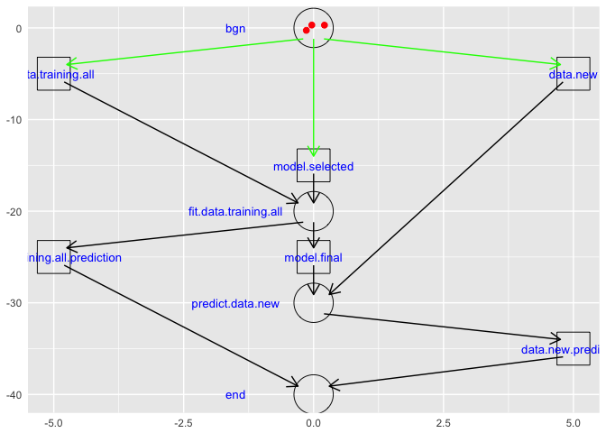
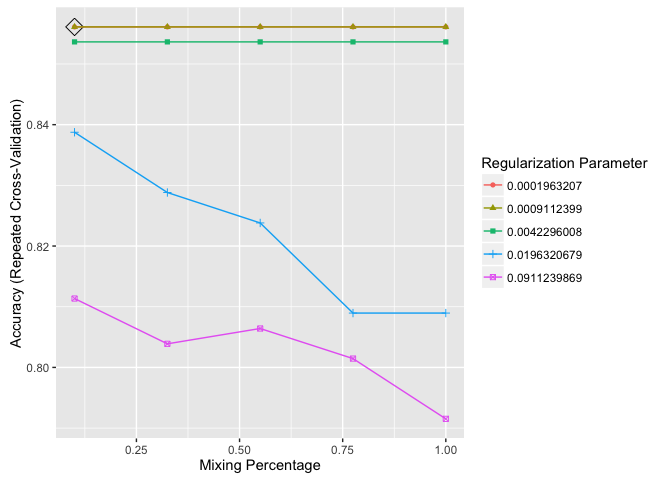
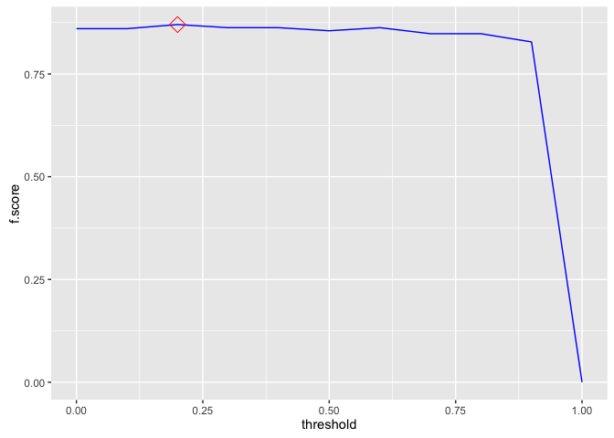
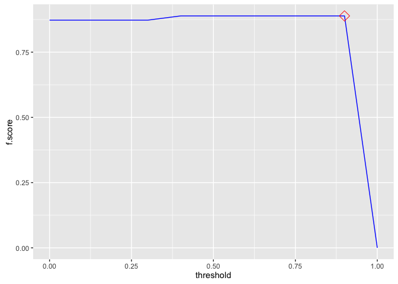
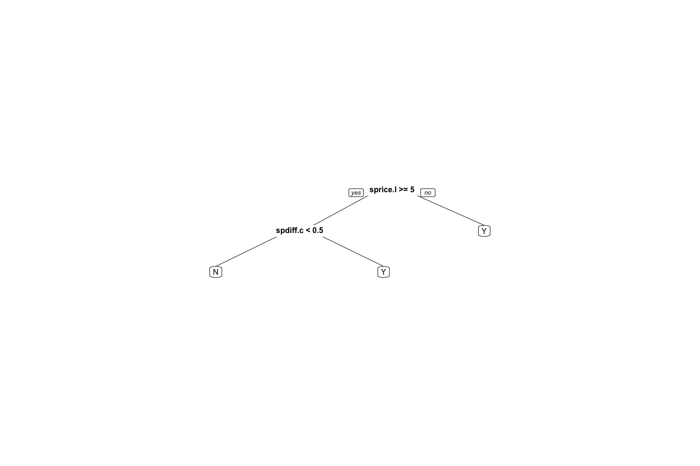
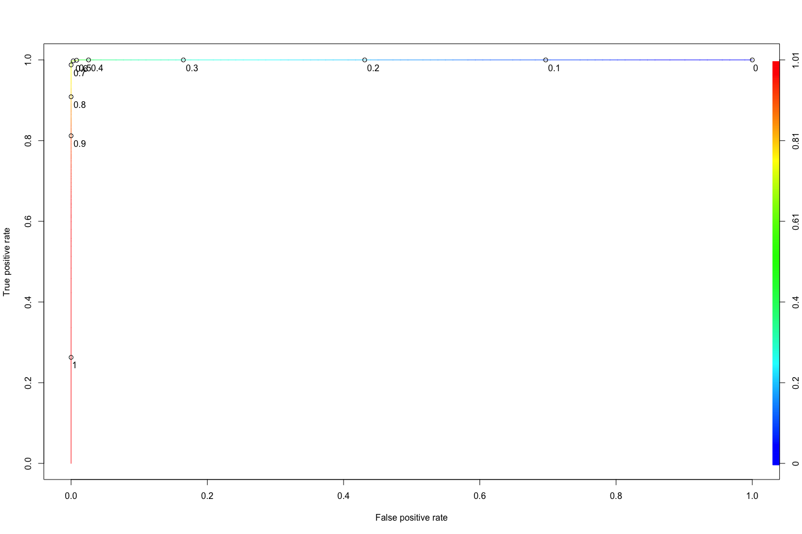
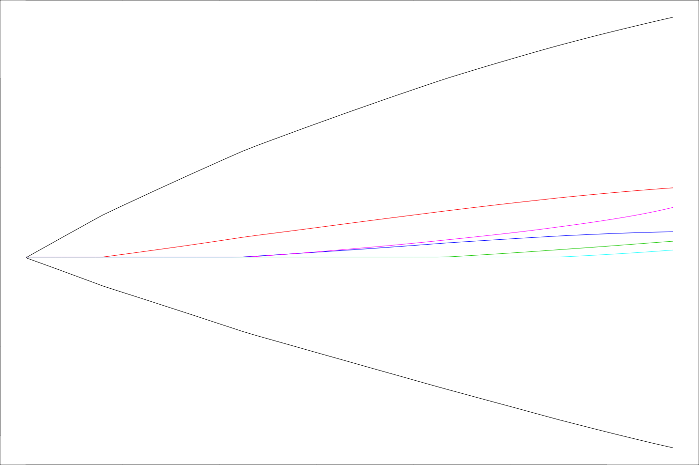
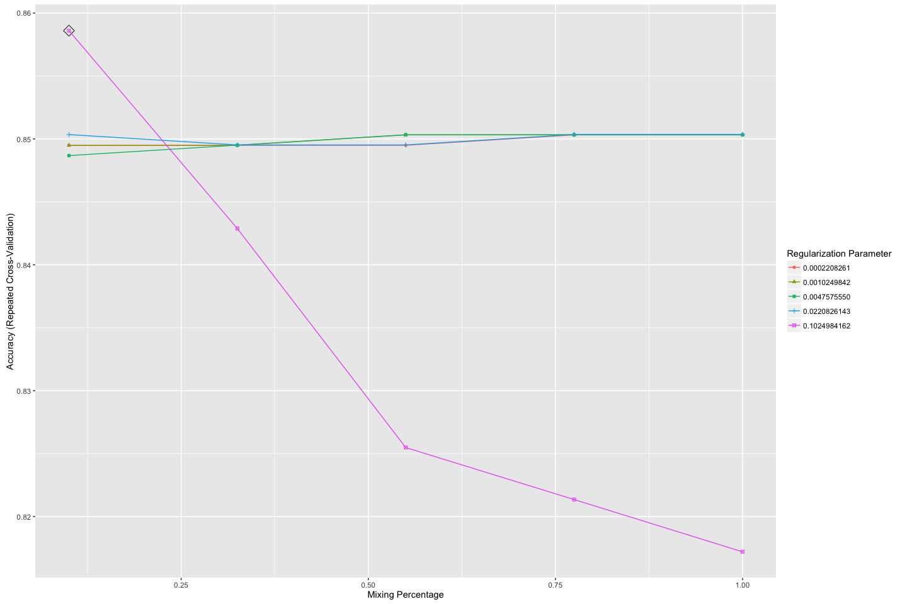
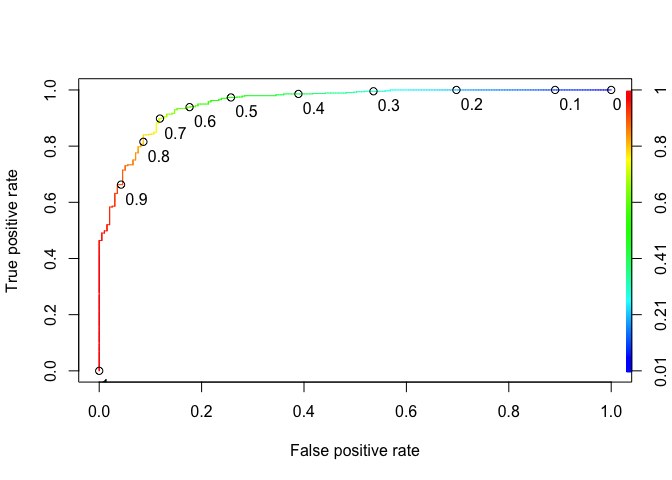

# eBay:iPads:: sold classification:: ebayipads_finmdl_RFE_sizes_bid1
bdanalytics  

**  **    
**Date: (Wed) Nov 04, 2015**    

# Introduction:  

Data: 
Source: 
    Training:   https://inclass.kaggle.com/c/15-071x-the-analytics-edge-summer-2015/download/eBayiPadTrain.csv  
    New:        https://inclass.kaggle.com/c/15-071x-the-analytics-edge-summer-2015/download/eBayiPadTest.csv  
Time period: 


# Synopsis:

Based on analysis utilizing <> techniques, <conclusion heading>:  

Regression results:
First run:
    <glb_sel_mdl_id>: 
        OOB_RMSE=<0.4f>; new_RMSE=<0.4f>; <feat1>=<imp>; <feat2>=<imp>

Classification results:
template:
    prdline.my == "Unknown" -> 296
    Low.cor.X.glm: Leaderboard: 0.83458 -> Rank 288 / 1884 0.85514
        newobs_tbl=[N=471, Y=327]; submit_filename=template_Final_glm_submit.csv
        OOB_conf_mtrx=[YN=125, NY=76]=201; max.Accuracy.OOB=0.7710;
            opt.prob.threshold.OOB=0.6
            startprice=100.00; biddable=95.42; productline=49.22; 
            D.T.like=29.75; D.T.use=26.32; D.T.box=21.53; 

prdline: -> Worse than template
    prdline.my == "Unknown" -> 285
    All.X.no.rnorm.rf: Leaderboard: 0.82649
        newobs_tbl=[N=485, Y=313]; submit_filename=prdline_Final_rf_submit.csv
        OOB_conf_mtrx=[YN=119, NY=80]=199; max.Accuracy.OOB=0.8339;
            opt.prob.threshold.OOB=0.5
            startprice=100.00; biddable=84.25; D.sum.TfIdf=7.28; 
            D.T.use=4.26; D.T.veri=2.78; D.T.scratch=1.99; D.T.box=; D.T.like=; 
    Low.cor.X.glm: Leaderboard: 0.81234
        newobs_tbl=[N=471, Y=327]; submit_filename=prdline_Low_cor_X_glm_submit.csv
        OOB_conf_mtrx=[YN=125, NY=74]=199; max.Accuracy.OOB=0.8205;
            opt.prob.threshold.OOB=0.6
            startprice=100.00; biddable=96.07; prdline.my=51.37; 
            D.T.like=29.39; D.T.use=25.43; D.T.box=22.27; D.T.veri=; D.T.scratch=; 

oobssmpl: -> 
    Low.cor.X.glm: Leaderboard: 0.83402
        newobs_tbl=[N=440, Y=358]; submit_filename=oobsmpl_Final_glm_submit
        OOB_conf_mtrx=[YN=114, NY=84]=198; max.Accuracy.OOB=0.7780;
            opt.prob.threshold.OOB=0.5
            startprice=100.00; biddable=93.87; prdline.my=60.48; D.sum.TfIdf=; 
            D.T.condition=8.69; D.T.screen=7.96; D.T.use=7.50; D.T.veri=; D.T.scratch=;

category: -> 
    Low.cor.X.glm: Leaderboard: 0.82381
        newobs_tbl=[N=470, Y=328]; submit_filename=category_Final_glm_submit
        OOB_conf_mtrx=[YN=119, NY=57]=176; max.Accuracy.OOB=0.8011;
            opt.prob.threshold.OOB=0.6
            startprice=100.00; biddable=79.19; prdline.my=55.22; D.sum.TfIdf=; 
            D.T.ipad=27.05; D.T.like=21.44; D.T.box=20.67; D.T.condition=; D.T.screen=; 

dataclns: -> 
    All.X.no.rnorm.rf: Leaderboard: 0.82211
        newobs_tbl=[N=485, Y=313]; submit_filename=dataclns_Final_rf_submit
        OOB_conf_mtrx=[YN=104, NY=75]=179; max.Accuracy.OOB=0.7977;
            opt.prob.threshold.OOB=0.5
            startprice.log=100.00; biddable=65.85; prdline.my=7.74; D.sum.TfIdf=; 
            D.T.use=2.01; D.T.condition=1.87; D.T.veri=1.62; D.T.ipad=; D.T.like=;
    Low.cor.X.glm: Leaderboard: 0.79264
        newobs_tbl=[N=460, Y=338]; submit_filename=dataclns_Low_cor_X_glm_submit
        OOB_conf_mtrx=[YN=113, NY=74]=187; max.Accuracy.OOB=0.7977;
            opt.prob.threshold.OOB=0.5 -> different from prev run of 0.6
            biddable=100.00; startprice.log=91.85; prdline.my=38.34; D.sum.TfIdf=; 
            D.T.ipad=29.92; D.T.box=27.76; D.T.work=25.79; D.T.use=; D.T.condition=;

txtterms: -> top_n = c(10)
    Low.cor.X.glm: Leaderboard: 0.81448
        newobs_tbl=[N=442, Y=356]; submit_filename=txtterms_Final_glm_submit
        OOB_conf_mtrx=[YN=113, NY=69]=182; max.Accuracy.OOB=0.7943;
            opt.prob.threshold.OOB=0.5
            biddable=100.00; startprice.log=90.11; prdline.my=37.65; D.sum.TfIdf=; 
            D.T.ipad=28.67; D.T.work=24.90; D.T.great=21.44; 
# [1] "D.T.condit"    "D.T.condition" "D.T.good"      "D.T.ipad"      "D.T.new"      
# [6] "D.T.scratch"   "D.T.screen"    "D.T.this"      "D.T.use"       "D.T.work"     
            
    All.X.glm: Leaderboard: 0.81016
        newobs_tbl=[N=445, Y=353]; submit_filename=txtterms_Final_glm_submit
        OOB_conf_mtrx=[YN=108, NY=72]=180; max.Accuracy.OOB=0.7966;
            opt.prob.threshold.OOB=0.5
            biddable=100.00; startprice.log=88.24; prdline.my=33.81; D.sum.TfIdf=; 
            D.T.scratch=25.51; D.T.use=18.97; D.T.good=16.37; 
 [1] "D.T.condit"  "D.T.use"     "D.T.scratch" "D.T.new"     "D.T.good"    "D.T.screen" 
 [7] "D.T.great"   "D.T.excel"   "D.T.work"    "D.T.ipad"            

    Max.cor.Y.rpart: Leaderboard: 0.79258
        newobs_tbl=[N=439, Y=359]; submit_filename=txtterms_Final_rpart_submit
        OOB_conf_mtrx=[YN=105, NY=76]=181; max.Accuracy.OOB=0.7954802;
            opt.prob.threshold.OOB=0.5
            startprice.log=100; biddable=; prdline.my=; D.sum.TfIdf=; 
            D.T.scratch=; D.T.use=; D.T.good=; 
 [1] "D.T.condit"  "D.T.use"     "D.T.scratch" "D.T.new"     "D.T.good"    "D.T.screen" 
 [7] "D.T.ipad"    "D.T.great"   "D.T.work"    "D.T.excel"

    All.X.no.rnorm.rf: Leaderboard: 0.80929
        newobs_tbl=[N=545, Y=253]; submit_filename=txtterms_Final_rf_submit
        OOB_conf_mtrx=[YN=108, NY=61]=169; max.Accuracy.OOB=0.8090395
            opt.prob.threshold.OOB=0.5
            startprice.log=100.00; biddable=78.82; idseq.my=63.43; prdline.my=45.57;
            D.T.use=2.76; D.T.condit=2.35; D.T.scratch=2.00; D.T.good=; 
 [1] "D.T.condit"  "D.T.use"     "D.T.scratch" "D.T.new"     "D.T.good"    "D.T.screen" 
 [7] "D.T.ipad"    "D.T.great"   "D.T.work"    "D.T.excel"

txtclstr:
    All.X.no.rnorm.rf: Leaderboard: 0.79363 -> 0.79573
        newobs_tbl=[N=537, Y=261]; submit_filename=txtclstr_Final_rf_submit
        OOB_conf_mtrx=[YN=104, NY=61]=165; max.Accuracy.OOB=0.8135593
            opt.prob.threshold.OOB=0.5
            startprice.log=100.00; biddable=79.99; idseq.my=64.94; 
                prdline.my=4.14; prdline.my.clusterid=1.15; 
 [1] "D.T.condit"  "D.T.use"     "D.T.scratch" "D.T.new"     "D.T.good"    "D.T.screen" 
 [7] "D.T.ipad"    "D.T.great"   "D.T.work"    "D.T.excel"            
 
dupobs:
    All.X.no.rnorm.rf: Leaderboard: 0.79295
        newobs_tbl=[N=541, Y=257]; submit_filename=dupobs_Final_rf_submit
        OOB_conf_mtrx=[YN=114, NY=65]=179; max.Accuracy.OOB=0.7977401
            opt.prob.threshold.OOB=0.5
            startprice.log=100.00; biddable=94.49; idseq.my=67.40; 
                prdline.my=4.48; prdline.my.clusterid=1.99; 
 [1] "D.T.condit"  "D.T.use"     "D.T.scratch" "D.T.new"     "D.T.good"    "D.T.screen" 
 [7] "D.T.ipad"    "D.T.great"   "D.T.work"    "D.T.excel"            
 
    All.X.no.rnorm.rf: Leaderboard: 0.79652
        newobs_tbl=[N=523, Y=275]; submit_filename=dupobs_Final_rf_submit
        OOB_conf_mtrx=[YN=114, NY=65]=179; max.Accuracy.OOB=0.7977401
            opt.prob.threshold.OOB=0.5
            startprice.log=100.00; biddable=94.24; idseq.my=67.92; 
                prdline.my=4.33; prdline.my.clusterid=2.17; 
 [1] "D.T.condit"  "D.T.use"     "D.T.scratch" "D.T.new"     "D.T.good"    "D.T.screen" 
 [7] "D.T.ipad"    "D.T.great"   "D.T.work"    "D.T.excel"
 
csmmdl:
   All.X.no.rnorm.rf: Leaderboard: 0.79396
        newobs_tbl=[N=525, Y=273]; submit_filename=csmmdl_Final_rf_submit
        OOB_conf_mtrx=[YN=111, NY=66]=177; max.Accuracy.OOB=0.8000000
            opt.prob.threshold.OOB=0.5
            startprice.log=100.00; biddable=90.30; idseq.my=67.06; 
                prdline.my=4.40; cellular.fctr=3.57; prdline.my.clusterid=2.08; 

   All.Interact.X.no.rnorm.rf: Leaderboard: 0.77867
        newobs_tbl=[N=564, Y=234]; submit_filename=csmmdl_Final_rf_submit
        OOB_conf_mtrx=[YN=120, NY=53]=173; max.Accuracy.OOB=0.8045198
            opt.prob.threshold.OOB=0.5
            biddable=100.00; startprice.log=93.99; idseq.my=57.30; 
                prdline.my=9.09; cellular.fctr=3.30; prdline.my.clusterid=2.35; 

   All.Interact.X.no.rnorm.rf: Leaderboard: 0.77152
        newobs_tbl=[N=539, Y=259]; submit_filename=csmmdl_Final_rf_submit
        OOB_conf_mtrx=[YN=, NY=]=; max.Accuracy.OOB=0.8011299
            opt.prob.threshold.OOB=0.5
            biddable=100.00; startprice.log=94.93; idseq.my=57.12; 
                prdline.my=9.29; cellular.fctr=3.20; prdline.my.clusterid=2.50; 
 [1] "D.T.condit"  "D.T.use"     "D.T.scratch" "D.T.new"     "D.T.good"    "D.T.screen" 
 [7] "D.T.ipad"    "D.T.great"   "D.T.work"    "D.T.excel"
 
        All.X.glmnet: 
            fit_RMSE=???; OOB_RMSE=115.1247; new_RMSE=115.1247; 
            prdline.my.fctr=100.00; condition.fctrNew=88.53; D.npnct09.log=84.34
                biddable=16.48; idseq.my=57.27;
spdiff:                
    All.Interact.X.no.rnorm.rf: Leaderboard: 0.78218
        newobs_tbl=[N=517, Y=281]; submit_filename=spdiff_Final_rf_submit
        OOB_conf_mtrx=[YN=121, NY=38]=159; max.Accuracy.OOB=0.8203390
            opt.prob.threshold.OOB=0.6
            biddable=100.00; startprice.diff=57.53; idseq.my=41.31; 
                prdline.my=11.43; cellular.fctr=2.36; prdline.my.clusterid=1.82; 
 
        All.X.no.rnorm.rf: 
            fit_RMSE=92.19; OOB_RMSE=130.86; new_RMSE=130.86; 
            biddable=100.00; prdline.my.fctr=61.92; idseq.my=57.77;
                condition.fctr=29.53; storage.fctr=11.22; color.fctr=6.69;
                cellular.fctr=6.11
                
    All.X.no.rnorm.rf: Leaderboard: 0.77443
        newobs_tbl=[N=606, Y=192]; submit_filename=spdiff_Final_rf_submit
        OOB_conf_mtrx=[YN=112, NY=28]=140; max.Accuracy.OOB=0.8418079
            opt.prob.threshold.OOB=0.6
            startprice.diff=100.00; biddable=96.53; idseq.my=38.10; 
                prdline.my=3.65; cellular.fctr=2.21; prdline.my.clusterid=0.91; 
 [1] "D.T.condit"  "D.T.use"     "D.T.scratch" "D.T.new"     "D.T.good"    "D.T.screen" 
 [7] "D.T.ipad"    "D.T.great"   "D.T.work"    "D.T.excel"

 color:
        All.Interact.X.glmnet: 
            fit_RMSE=88.64520; 
            prdline.my.fctr:D.TfIdf.sum.stem.stop.Ratio=100.00;
            prdline.my.fctr:condition.fctr=77.35
            D.TfIdf.sum.stem.stop.Ratio=68.18
            prdline.my.fctr:color.fctr=68.12
            prdline.my.fctr:storage.fctr=63.32
            
    All.X.no.rnorm.rf: Leaderboard: 0.80638
        newobs_tbl=[N=550, Y=248]; submit_filename=color_Final_rf_submit
        OOB_conf_mtrx=[YN=108, NY=54]=162; max.Accuracy.OOB=0.8169492
            opt.prob.threshold.OOB=0.5
            biddable=100.00; startprice.diff=77.90; idseq.my=48.49; 
                D.ratio.sum.TfIdf.nwrds=6.48; storage.fctr=4.74;
                    D.TfIdf.sum.stem.stop.Ratio=4.57; prdline.my=4.32;
 [1] "D.T.condit"  "D.T.use"     "D.T.scratch" "D.T.new"     "D.T.good"    "D.T.screen" 
 [7] "D.T.ipad"    "D.T.great"   "D.T.work"    "D.T.excel"
            
    All.Interact.X.no.rnorm.rf: Leaderboard: 0.72974
        newobs_tbl=[N=682, Y=116]; submit_filename=assctxt_Final_rf_submit
        OOB_conf_mtrx=[YN=125, NY=43]=168; max.Accuracy.OOB=0.8101695; max.auc.OOB=???;
            opt.prob.threshold.OOB=0.6
            biddable=100.00; startprice.diff=51.04; idseq.my=29.51; 
                startprice.diff:biddable=28.70
                prdline.my.fctriPadmini:idseq.my=6.89
        Highest max.auc.OOB=???; for model:        

gbm w/startprice.unit9:
    Final.glment: min.RMSE.fit=30.32782
    Ensemble.glmnet: min.RMSE.fit=29.62348
startprice.predict.All.Interact.X.no.rnorm.rf    100.000
startprice.predict.All.X.no.rnorm.rf              73.521
startprice.predict.All.Interact.X.bayesglm        29.675
startprice.predict.Max.cor.Y.lm                   28.405

        All.X.glmnet: min.RMSE.fit=88.64271
prdl.my.descr.fctr                       100.00
D.TfIdf.sum.stem.stop.Ratio                        85.01
condition.fctr                                  80.28
carrier.fctr                                  77.48
prdl.my.descr.fctr:.clusterid.fctr5       65.78
D.npnct16.log                                      61.66
startprice.unit9                                   59.48
color.fctr                                    59.21
D.npnct01.log                                      53.78
D.npnct08.log                                      53.56
cellular.fctr                                     53.19

    Ensemble.glmnet: Leaderboard: not submitted -> lower max.auc.OOB of "Ensemble submission"
        newobs_tbl=[N=579, Y=219]; submit_filename=gbm_Final_glmnet_submit
        OOB_conf_mtrx=[YN=85, NY=54]=139; 
            max.Accuracy.OOB=0.8438202; max.auc.OOB=0.9127314; opt.prob.threshold.OOB=0.5
sold.fctr.predict.All.X.no.rnorm.rf.prob             100.0000
sold.fctr.predict.All.Interact.X.no.rnorm.rf.prob     98.7937            
        Highest max.auc.OOB=0.9167568; for model:All.Interact.X.gbm
biddable                                           100.0000
startprice.diff                                     96.2076
startprice.diff:biddable                            23.2114
idseq.my                                             7.8098        

mdlsel:
    Final.glment: min.RMSE.fit=30.47114 (higher than gbm w/startprice.unit9)
    Ensemble.glmnet: min.RMSE.fit=29.49418
startprice.predict.All.Interact.X.no.rnorm.rf                          100.000000
startprice.predict.All.X.no.rnorm.rf                                    71.213880
startprice.predict.All.X.bayesglm                                       24.166084

        All.X.glmnet: min.RMSE.fit=88.64271
prdl.my.descr.fctr                       100.00
D.TfIdf.sum.stem.stop.Ratio                        85.01
condition.fctr                                  80.28
carrier.fctr                                  77.48
prdl.my.descr.fctr:.clusterid.fctr5       65.78
D.npnct16.log                                      61.66
startprice.unit9                                   59.48
color.fctr                                    59.21
D.npnct01.log                                      53.78
D.npnct08.log                                      53.56
cellular.fctr                                     53.19

mdlsel(startprice.log):
    Final.Ensemble.rf: min.RMSE.fit=0.4563772
    Ensemble.rf: min.RMSE.fit=0.4283013
startprice.log.predict.All.Interact.X.no.rnorm.rf                  100.0000000
startprice.log.predict.All.X.no.rnorm.rf                            58.0967582
startprice.log.predict.All.Interact.X.gbm                            6.7197148

        All.X.no.rnorm.rf: min.RMSE.fit=1.4967021
biddable                                         100.00000000
idseq.my                                          98.00292371
startprice.unit9                                  34.31130220
prdl.my.descr.fctr                       18.10984741
D.ratio.sum.TfIdf.nwrds                           15.23549621
color.fctrUnknown                                 14.05520993
D.TfIdf.sum.stem.stop.Ratio                       13.00884673
D.ratio.nstopwrds.nwrds                           10.51165302

    All.X.gbm: Leaderboard: 0.75430
        newobs_tbl=[N=582, Y=216]; submit_filename=mdlsel_Final_gbm_submit
        OOB_conf_mtrx=[YN=58, NY=65]=123; 
            max.Accuracy.OOB=0.8617978; max.auc.OOB=0.9367161;
            opt.prob.threshold.OOB=0.5
startprice.diff                                           100.0000000 100.00000000
biddable                                                   66.6475055  65.40764971
idseq.my                                                    1.8632456   4.55963698

splogdiff:
    All.X.gbm: Leaderboard: 0.70111
        newobs_tbl=[N=553, Y=245]; submit_filename=splogdiff_Final_gbm_submit
        OOB_conf_mtrx=[YN=35, NY=101]=136; 
            max.Accuracy.OOB=0.8471910; max.auc.OOB=0.9388912;
            opt.prob.threshold.OOB=0.3
startprice.log.diff                                       100.0000000 100.0000000
biddable                                                   86.8563123  88.0261866
idseq.my                                                    8.3580281   2.9054298       
Forum Ideas:
I then focused on feature engineering, each new variable brought its own little improvement so in the end i just kept adding new ones and let the models do their thing. Here are some i used: model (productline:storage:condition), isNew, model2 (product:isNew), 50 common words from descr, descrLength, capsFactor (% of caps in description), number of cheaper items of same model2, number of dearer items of same model2, priceFactor (vs. mean of price for model), priceFactor2 (vs. mean of price for model2), bigID (if ID> 11000 because there seems to be a huge drop in sales after some time), timeline (year of product launch, reasoning is you want to spend less money on older products).

Get the median startprice for each level of productline and condition. Take the difference from startprice as a new variable. I find median works much better than the mean since startprice is not normally distributed. I also created another binary variable on whether this difference is positive or negative.

Square root startprice

scale and center all the variables except sold, including the dummies.

### Prediction Accuracy Enhancement Options:
- Not repeatable experiments:
    - gbm & ensembles that include gbm
    - rf that includes .rnorm ??? (now .rnorm has a set seed)
    
- import.data chunk:
    - which obs should be in fit vs. OOB (currently dirty.0 vs .1 is split 50%)
    
- inspect.data chunk:
    - For date variables
        - Appropriate factors ?
        - Different / More last* features ?
        
- scrub.data chunk:        
- transform.data chunk:
    - derive features from multiple features
    
- manage.missing.data chunk:
    - Not fill missing vars
    - Fill missing numerics with a different algorithm
    - Fill missing chars with data based on clusters 
    
- extract.features chunk:
    - Text variables: move to date extraction chunk ???
        - Mine acronyms
        - Mine places

- Review set_global_options chunk after features are finalized

### 

## Potential next steps include:
- Organization:
    - Categorize by chunk
    - Priority criteria:
        0. Ease of change
        1. Impacts report
        2. Cleans innards
        3. Bug report
        
- all chunks:
    - at chunk-end rm(!glb_<var>)
    
- manage.missing.data chunk:
    - cleaner way to manage re-splitting of training vs. new entity

- extract.features chunk:
    - Add n-grams for glbFeatsText
        - "RTextTools", "tau", "RWeka", and "textcat" packages
    - Convert user-specified mutate code to config specs
    
- fit.models chunk:
    - Prediction accuracy scatter graph:
    -   Add tiles (raw vs. PCA)
    -   Use shiny for drop-down of "important" features
    -   Use plot.ly for interactive plots ?
    
    - Change .fit suffix of model metrics to .mdl if it's data independent (e.g. AIC, Adj.R.Squared - is it truly data independent ?, etc.)
    - move model_type parameter to myfit_mdl before indep_vars_vctr (keep all model_* together)
    - create a custom model for rpart that has minbucket as a tuning parameter
    - varImp for randomForest crashes in caret version:6.0.41 -> submit bug report

- Probability handling for multinomials vs. desired binomial outcome
-   ROCR currently supports only evaluation of binary classification tasks (version 1.0.7)
-   extensions toward multiclass classification are scheduled for the next release

- Skip trControl.method="cv" for dummy classifier ?
- Add custom model to caret for a dummy (baseline) classifier (binomial & multinomial) that generates proba/outcomes which mimics the freq distribution of glb_rsp_var values; Right now glb_dmy_glm_mdl always generates most frequent outcome in training data
- glm_dmy_mdl should use the same method as glm_sel_mdl until custom dummy classifer is implemented

- fit.all.training chunk:
    - myplot_prediction_classification: displays 'x' instead of '+' when there are no prediction errors 
- Compare glb_sel_mdl vs. glb_fin_mdl:
    - varImp
    - Prediction differences (shd be minimal ?)

- Move glb_analytics_diag_plots to mydsutils.R: (+) Easier to debug (-) Too many glb vars used
- Add print(ggplot.petrinet(glb_analytics_pn) + coord_flip()) at the end of every major chunk
- Parameterize glb_analytics_pn
- Move glb_impute_missing_data to mydsutils.R: (-) Too many glb vars used; glb_<>_df reassigned
- Replicate myfit_mdl_classification features in myfit_mdl_regression
- Do non-glm methods handle interaction terms ?
- f-score computation for classifiers should be summation across outcomes (not just the desired one ?)
- Add accuracy computation to glb_dmy_mdl in predict.data.new chunk
- Why does splitting fit.data.training.all chunk into separate chunks add an overhead of ~30 secs ? It's not rbind b/c other chunks have lower elapsed time. Is it the number of plots ?
- Incorporate code chunks in print_sessionInfo
- Test against 
    - projects in github.com/bdanalytics
    - lectures in jhu-datascience track

# Analysis: 

```r
rm(list = ls())
set.seed(12345)
options(stringsAsFactors = FALSE)
source("~/Dropbox/datascience/R/myscript.R")
source("~/Dropbox/datascience/R/mydsutils.R")
```

```
## Loading required package: caret
## Loading required package: lattice
## Loading required package: ggplot2
```

```r
source("~/Dropbox/datascience/R/myplot.R")
source("~/Dropbox/datascience/R/mypetrinet.R")
source("~/Dropbox/datascience/R/myplclust.R")
source("~/Dropbox/datascience/R/mytm.R")
# Gather all package requirements here
suppressPackageStartupMessages(require(doMC))
registerDoMC(6) # # of cores on machine - 2
suppressPackageStartupMessages(require(caret))
source("~/Documents/Work/PullRequests/caret/pkg/caret/R/confusionMatrix.R")
source("~/Documents/Work/PullRequests/caret/pkg/caret/R/ggplot.R")
#packageVersion("tm")
#require(sos); findFn("cosine", maxPages=2, sortby="MaxScore")

# Analysis control global variables
# Inputs
glb_trnng_url <- "https://inclass.kaggle.com/c/15-071x-the-analytics-edge-summer-2015/download/eBayiPadTrain.csv"
glb_newdt_url <- "https://inclass.kaggle.com/c/15-071x-the-analytics-edge-summer-2015/download/eBayiPadTest.csv"
glbInpMerge <- # NULL #: default
    list(fnames = c("ebayipads_finmdl_bid0_sp_out.csv", "ebayipads_mdlens_bid1_sp_out.csv"))

glb_is_separate_newobs_dataset <- TRUE    # or TRUE
    glb_split_entity_newobs_datasets <- FALSE   # select from c(FALSE, TRUE)
    glb_split_newdata_method <- NULL # select from c(NULL, "condition", "sample", "copy")
    glb_split_newdata_condition <- NULL # or "is.na(<var>)"; "<var> <condition_operator> <value>"
    glb_split_newdata_size_ratio <- 0.3               # > 0 & < 1
    glb_split_sample.seed <- 123               # or any integer

glbObsDropCondition <- # default : NULL 
            "(UniqueID %in% c(NULL
                , 11234 #sold=0; 2 other dups(10306, 11503) are sold=1
                , 11844 #sold=0; 3 other dups(11721, 11738, 11812) are sold=1
                )) | 
            (productline %in% c('iPad 5', 'iPad mini Retina')) |
                    # (biddable != 0) # bid0_sp
                    (biddable == 0) # bid1_sp
            "
#parse(text=glbObsDropCondition)
#subset(glb_allobs_df, .grpid %in% c(31))
    
glb_obs_repartition_train_condition <- NULL 
#    "!is.na(sold) & (sold == 1)" # : bid._sp

glb_max_fitobs <- NULL # or any integer                         

glb_is_regression <- FALSE; glb_is_classification <- !glb_is_regression; 
    glb_is_binomial <- TRUE #or FALSE

glb_rsp_var_raw <- "sold" #: !_sp # "startprice" # : bid._sp # 

# for classification, the response variable has to be a factor
glb_rsp_var <- "sold.fctr" #:!_sp # "startprice.log10" :bid._sp # glb_rsp_var_raw :default

# if the response factor is based on numbers/logicals e.g (0/1 OR TRUE/FALSE vs. "A"/"B"), 
#   or contains spaces (e.g. "Not in Labor Force")
#   caret predict(..., type="prob") crashes
glb_map_rsp_raw_to_var <- function(raw) { # NULL
#     return(raw ^ 0.5)
#     return(log(1 + raw))
#     return(log10(raw)) # bid._sp
#     return(exp(-raw / 2))
    ret_vals <- rep_len(NA, length(raw)); ret_vals[!is.na(raw)] <- ifelse(raw[!is.na(raw)] == 1, "Y", "N"); return(relevel(as.factor(ret_vals), ref="N"))
#     #as.factor(paste0("B", raw))
#     #as.factor(gsub(" ", "\\.", raw))    
}
# glb_map_rsp_raw_to_var(tst <- c(NA, 0, 1)) # !_sp
# glb_map_rsp_raw_to_var(tst <- c(NA, 0, 2.99, 280.50, 1000.00)) # bid._sp

glb_map_rsp_var_to_raw <- function(var) { # NULL #
#     return(var ^ 2.0)
#     return(exp(var) - 1)
#     return(10 ^ var) # bid._sp
#     return(-log(var) * 2)
    as.numeric(var) - 1
#     #as.numeric(var)
#     #gsub("\\.", " ", levels(var)[as.numeric(var)])
#     c("<=50K", " >50K")[as.numeric(var)]
#     #c(FALSE, TRUE)[as.numeric(var)]
}
# glb_map_rsp_var_to_raw(glb_map_rsp_raw_to_var(tst))

if ((glb_rsp_var != glb_rsp_var_raw) && is.null(glb_map_rsp_raw_to_var))
    stop("glb_map_rsp_raw_to_var function expected")
glb_rsp_var_out <- paste0(glb_rsp_var, ".predict.") # mdl_id is appended later

# List info gathered for various columns
# <col_name>:   <description>; <notes>
# description = The text description of the product provided by the seller.
# biddable = Whether this is an auction (biddable=1) or a sale with a fixed price (biddable=0).
# startprice = The start price (in US Dollars) for the auction (if biddable=1) or the sale price (if biddable=0).
# condition = The condition of the product (new, used, etc.)
# cellular = Whether the iPad has cellular connectivity (cellular=1) or not (cellular=0).
# carrier = The cellular carrier for which the iPad is equipped (if cellular=1); listed as "None" if cellular=0.
# color = The color of the iPad.
# storage = The iPad's storage capacity (in gigabytes).
# productline = The name of the product being sold.

# If multiple vars are parts of id, consider concatenating them to create one id var
# If glb_id_var == NULL, ".rownames <- row.names()" is the default
# Derive a numeric feature from id var

# User-specified exclusions
# List feats that shd be excluded due to known causation by prediction variable
glbFeatsExclude <- c(NULL
### !_sp
    , "description", "descr.my", "productline"
    , "startprice", "startprice.log10.predict", "sprice.predict.diff"
### bid0_sp                                  
#                                   , "description", "productline"
#                                   , "sold", "startprice.log10.cut.fctr"
#     # List feats that are linear combinations (alias in glm)
#                                 , "D.terms.post.stem.n.log", "D.weight.sum"
#                                 #, "prdl.descr.my.fctriPad4#1:.clusterid.fctr3" This does not work
#     # if RFE is rated lower than Low.cor, list feats that are in RFE & not in Low.cor
#         # min.RMSE.fit(RFE.X.glmnet)=0.1138888
# #             D.chrs.n.log                 61.12483
# #             D.chrs.uppr.n.log            61.12483
# #             D.ratio.wrds.stop.n.wrds.n   61.12483
# #             D.terms.post.stop.n.log      61.12483
# #             D.weight.post.stem.sum       61.12483
# #             D.wrds.n.log                 61.12483
# #             D.wrds.stop.n.log            61.12483
# #             D.wrds.unq.n.log             61.12483
#                             #, "startprice.dcm2.is9" # min.RMSE.fit(RFE.X.glmnet)=0.1141991 (up)
#                             , "D.wrds.stop.n.log"    # min.RMSE.fit(RFE.X.glmnet)=0.1131232
### bid0_sp                            
### bid1_sp                                  
#                                   , "description", "productline"
#                                   , "sold", "startprice.log10.cut.fctr"
### bid1_sp                            
                                  ) 

glb_id_var <- c("UniqueID")
glb_category_var <- "prdl.descr.my.fctr" # "productline" # NULL 
glb_drop_vars <- c(NULL) # or c("<col_name>")

glb_map_vars <- NULL # or c("<var1>", "<var2>")
glb_map_urls <- list();
# glb_map_urls[["<var1>"]] <- "<var1.url>"

glb_assign_pairs_lst <- NULL; 
# glb_assign_pairs_lst[["<var1>"]] <- list(from=c(NA),
#                                            to=c("NA.my"))
glb_assign_vars <- names(glb_assign_pairs_lst)

# Derived features
glbFeatsDerive <- NULL;

# Add logs of numerics that are not distributed normally ->  do automatically ???
# Right skew: logp1; sqrt; ^ 1/3; logp1(logp1); log10; exp(-<feat>/constant)

# glbFeatsDerive[["prdline.my"]] <- list(
#     mapfn=function(productline) { return(productline) }    
#     , args=c("productline"))

### bid._sp
# glbFeatsDerive[["startprice.log10.cut.fctr"]] <- list(
#     mapfn=function(startprice.log10) { return(cut(startprice.log10, 3)) }    
#     , args=c("startprice.log10"))
### bid._sp
glbFeatsDerive[["sprice.root2"]] <- list(
    mapfn = function(startprice) { return(startprice ^ (1/2)) }    
    , args = c("startprice"))
glbFeatsDerive[["sprice.log10"]] <- list(
    mapfn = function(startprice) { return(log(startprice)) }    
    , args = c("startprice"))
glbFeatsDerive[["sprice.d20nexp"]] <- list(
    mapfn = function(startprice) { return(exp(-startprice / 20)) }    
    , args = c("startprice"))

glbFeatsDerive[["sprice.predict.diff"]] <- list(
    mapfn = function(startprice.log10.predict, startprice) { 
        spdiff <- (10 ^ startprice.log10.predict) - startprice; 
        return(spdiff) }    
    , args = c("startprice.log10.predict", "startprice"))
# glbFeatsDerive[["spdiff.root10"]] <- list(
#     mapfn = function(sprice.predict.diff) { 
#         return(sign(sprice.predict.diff) * (abs(sprice.predict.diff) ^ (1/10))) }    
#     , args = c("sprice.predict.diff"))
glbFeatsDerive[["spdiff.cut.fctr"]] <- list(
    mapfn = function(sprice.predict.diff) { 
        return(cut(sprice.predict.diff, c(-1000, -100, -10, -1, 0, 1, 10, 100, 1000))) }    
    , args = c("sprice.predict.diff"))
  
#glb_allobs_df[which(glb_post_stop_words_terms_mtrx_lst[[txt_var]][, subset(glb_post_stop_words_terms_df_lst[[txt_var]], term %in% c("conditionminimal"))$pos] > 0), "description"]
glbFeatsDerive[["descr.my"]] <- list(
    mapfn = function(description) { mod_raw <- description;
### bid._sp
#         # This is here because it does not work with txt_map_filename
        mod_raw <- gsub(paste0(c("\n", "\211", "\235", "\317", "\333"), collapse = "|"), " ",
                        mod_raw)
#         # This should go into txt_map_filename    
#         mod_raw <- gsub("\\.\\.", "\\. ", mod_raw);    
#         # Don't parse for "." because of ".com"; use customized gsub for that text
#         mod_raw <- gsub("(\\w)(!|\\*|,|-|/)(\\w)", "\\1\\2 \\3", mod_raw);
#mod_raw <- grep("&#034;", glb_allobs_df$descr.my, value = TRUE)        
        mod_raw <- gsub("&amp;", "&", mod_raw);
        mod_raw <- gsub("&lt;", "<", mod_raw);
        mod_raw <- gsub("&gt;", ">", mod_raw);
        mod_raw <- gsub("<br>", " ", mod_raw); # line break - add a count for it ???     
        mod_raw <- gsub("&#034;", " ", mod_raw); # justification meta-character        
        mod_raw <- gsub("&#(0*)37;", "%", mod_raw);        
        mod_raw <- gsub("&#039;", "'", mod_raw);
        mod_raw <- gsub("([[:digit:]])\\.([[:digit:]])\\.([[:digit:]])",
                        "\\1point\\2\\point\\3", mod_raw);        
        mod_raw <- gsub("([[:digit:]])\\.([[:digit:]])", "\\1point\\2", mod_raw);
        mod_raw <- gsub("([[:digit:]]),([[:digit:]])", "\\1\\2", mod_raw);        
        mod_raw <- gsub("\\b1st\\b", "first", mod_raw);        
        mod_raw <- gsub("\\b2nd\\b", "second", mod_raw);
        mod_raw <- gsub("\\b3rd\\b", "third", mod_raw);
        mod_raw <- gsub("\\b4th\\b", "fourth", mod_raw);        
        mod_raw <- gsub("\\.(com|COM)\\b", "dot\\1", mod_raw);        
#         
#         # Modifications for this exercise only
#         # Add dictionary to stemDocument e.g. stickers stemmed to sticker ???
#         mod_raw <- gsub("8\\.25", "825", mod_raw, ignore.case=TRUE);  
        mod_raw <- gsub("\\b10\\.SCREEN\\b", "10\\. SCREEN", mod_raw); 
        mod_raw <- gsub("\\b128 gb\\b", "128gb", mod_raw);  
        mod_raw <- gsub("\\b16G\\b", "16GB", mod_raw);          
#         mod_raw <- gsub(" 16 gig ", " 16gb ", mod_raw, ignore.case=TRUE);
#         mod_raw <- gsub(" 16 gb ", " 16gb ", mod_raw, ignore.case=TRUE);        
#         
#         mod_raw <- gsub("\\bAccounts\\b", "Account", mod_raw, ignore.case=FALSE);
#         mod_raw <- gsub("\\bactivated\\b", "activate", mod_raw, ignore.case=FALSE);        
#         mod_raw <- gsub(" actuuly ", " actual ", mod_raw, ignore.case=TRUE);
        mod_raw <- gsub("\\badaptor\\b", "adapter", mod_raw);
#         mod_raw <- gsub("\\baffects\\b", "affect", mod_raw, ignore.case=FALSE);           
        mod_raw <- gsub("\\bair-like\\b", "air -like", mod_raw);
        mod_raw <- gsub("\\bALL-JUST\\b", "ALL -JUST", mod_raw);        
        mod_raw <- gsub("\\bApple's\\b", "Apple'", mod_raw);        
# #mod_raw <- glb_allobs_df[c(1322), txt_var]; mod_raw        
        mod_raw <- gsub("\\bApple care\\b", "Applecare", mod_raw);
        mod_raw <- gsub("\\bAT&T\\b", "ATT", mod_raw);        
        
#         mod_raw <- gsub(" bacK!wiped ", " bacK ! wiped ", mod_raw, ignore.case=TRUE);
#         mod_raw <- gsub(" backplate", " back plate", mod_raw, ignore.case=TRUE);
#         mod_raw <- gsub("\\bbarley", "barely", mod_raw, ignore.case=TRUE);        
#         mod_raw <- gsub(" bend ", " bent ", mod_raw, ignore.case=TRUE);         
        mod_raw <- gsub("\\b(B|b)(EST|est) (B|b)(UY|uy)\\b", "\\1\\2\\3\\4", mod_raw);
#         mod_raw <- gsub(" black\\.Device ", " black \\. Device ", mod_raw,
#                         ignore.case=TRUE);        
#         mod_raw <- gsub("black\\),charger ", "black\\), charger ", mod_raw,
#                         ignore.case=TRUE);        
#         mod_raw <- gsub("\\bblacked\\b", "black", mod_raw, ignore.case=FALSE);
#         mod_raw <- gsub("\\bblemish\\b", "blemishes", mod_raw, ignore.case=FALSE);        
#         mod_raw <- gsub(" blocks", " blocked", mod_raw, ignore.case=TRUE);
#         mod_raw <- gsub(" book ", " manual ", mod_raw, ignore.case=TRUE);            
        mod_raw <- gsub("\\b(B|b)(RAND|rand)( |-)(N|n)(EW|ew)\\b", "\\1\\2\\4\\5", mod_raw)
            #mod_raw <- c("brand new", "BRAND new", "brand NEW", "BRAND NEW", "bbrand new", "brand-new", "brand newb")
        mod_raw <- gsub("\\bbrokenCharger\\b", "broken Charger", mod_raw);
#         
        mod_raw <- gsub("\\bC-Major\\b", "C -Major", mod_raw)    
#         mod_raw <- gsub(" perfectlycord ", " perfectly cord ", mod_raw, ignore.case=TRUE);
#         mod_raw <- gsub("\\bcord", "cable", mod_raw, ignore.case=TRUE);     
        mod_raw <- gsub("\\bcables\\.No\\b", "cables. No", mod_raw);        
#         mod_raw <- gsub("\\bcables\\b", "cable", mod_raw, ignore.case=TRUE);        
#         
        mod_raw <- gsub("\\bcare\\.The\\b", "care\\. The", mod_raw);
#         mod_raw <- gsub("\\b(cared|careful|CAREFUL)\\b", "care", mod_raw, ignore.case=FALSE);
#         mod_raw <- gsub("\\b(cases|casing)\\b", "case", mod_raw, ignore.case=TRUE);        
# #mod_raw <- glb_allobs_df[c(88,187,280,1040,1098), txt_var]; mod_raw        
        mod_raw <- gsub("\\bCase/Cover\\b", "Case/ Cover", mod_raw);
        mod_raw <- gsub("\\bCasing/Screen\\b", "Casing/ Screen", mod_raw);        
#         mod_raw <- gsub(" carefully ", " careful ", mod_raw, ignore.case=TRUE);        
#         mod_raw <- gsub("\\bchargers\\b", "charger", mod_raw, ignore.case=FALSE);        
        mod_raw <- gsub("\\bchip/crack\\b", "chip/ crack", mod_raw);        
#         mod_raw <- gsub("\\bchips\\b", "chip", mod_raw, ignore.case=FALSE);
        mod_raw <- gsub("\\bCLEAN\\!LIKE\\b", "CLEAN! LIKE", mod_raw);        
#         mod_raw <- gsub("\\bcleanly\\b", "clean", mod_raw, ignore.case=FALSE);        
#         mod_raw <- gsub("\\b(C|c)olor(.*)s\\b", "\\1olor", mod_raw, ignore.case=FALSE);
# #mod_raw <- glb_allobs_df[c(280,1411), txt_var]; mod_raw        
        mod_raw <- gsub("\\bColors,models\\b", "Colors ,models", mod_raw);   
#         mod_raw <- gsub("\\bcompletely\\b", "complete", mod_raw, ignore.case=FALSE);   
# #mod_raw <- glb_allobs_df[c(178), txt_var]; mod_raw        
#
        mod_raw <- gsub("\\bCONDITION..CLEAN\\b", "CONDITION ..CLEAN", mod_raw);
        mod_raw <- gsub("\\bcondition,comes\\b", "condition ,comes", mod_raw);
        mod_raw <- gsub("\\bcondition\\.Device\\b", "condition .Device", mod_raw);
        mod_raw <- gsub("\\bconditionHas\\b", "condition Has", mod_raw);        
        mod_raw <- gsub("\\bcondition\\.\\.\\.like\\b", "condition ...like", mod_raw);    
        mod_raw <- gsub("\\bcondition\\*Minimal\\b", "condition *Minimal", mod_raw);    
        mod_raw <- gsub("\\bCondition-Moderate\\b", "Condition -Moderate", mod_raw);
        mod_raw <- gsub("\\bcondition\\.The\\b", "condition .The", mod_raw);        
        mod_raw <- gsub("\\bCONDITION\\.VERY\\b", "CONDITION .VERY", mod_raw);        
#         mod_raw <- gsub(" (conditon|condtion|contidion|conditions)", " condition", mod_raw,
#         mod_raw <- gsub("\\b(conditon|condtion|contidion|conditions)\\b", "condition", mod_raw,
# ", "\\1\\. \\2", mod_raw,
#                         ignore.case=TRUE);
#         mod_raw <- gsub("(condition)(Has)", "\\1\\. \\2", mod_raw);
#         
#         mod_raw <- gsub("\\bCONNECTED\\b", "CONNECT", mod_raw, ignore.case=FALSE);        
#         mod_raw <- gsub("\\bconnects\\b", "connect", mod_raw, ignore.case=FALSE);        
#         mod_raw <- gsub(" consist ", " consistent ", mod_raw, ignore.case=TRUE);
# #mod_raw <- glb_allobs_df[c(195, 379, 437), txt_var]; mod_raw        
#         mod_raw <- gsub("\\bCosmetics\\b", "Cosmetic", mod_raw, ignore.case=FALSE);        
        mod_raw <- gsub("\\bCracked/Damaged\\b", "Cracked/ Damaged", mod_raw);        
        mod_raw <- gsub("\\bcracksNo\\b", "cracks No", mod_raw);        
#         
#         mod_raw <- gsub("\\b(D|d)amaged\\b", "\\1amage", mod_raw, ignore.case=TRUE);
# #mod_raw <- glb_allobs_df[c(116, 1360), txt_var]; mod_raw        
#         mod_raw <- gsub("\\bDays\\b", "Day", mod_raw, ignore.case=TRUE);        
#         mod_raw <- gsub(" DEFAULTING ", " DEFAULT ", mod_raw, ignore.case=TRUE);
#         mod_raw <- gsub("\\bdefect(ive)*\\b", "defects", mod_raw, ignore.case=FALSE);
#         mod_raw <- gsub(" definitely ", " definite ", mod_raw, ignore.case=TRUE);        
#         mod_raw <- gsub("\\b(D|d)ented\\b", "\\1ent", mod_raw, ignore.case=FALSE);    
#         mod_raw <- gsub(" described", " describe", mod_raw, ignore.case=TRUE);
#         mod_raw <- gsub(" desciption", " description", mod_raw, ignore.case=TRUE);    
#         mod_raw <- gsub(" devices", " device", mod_raw, ignore.case=TRUE);        
#         mod_raw <- gsub(" Digi\\.", " Digitizer\\.", mod_raw, ignore.case=TRUE);        
#         mod_raw <- gsub("\\b(ding|dinged)\\b", "dings", mod_raw, ignore.case=TRUE);   
#         mod_raw <- gsub(" display\\.New ", " display\\. New ", mod_raw, ignore.case=TRUE);
#         mod_raw <- gsub(" displays", " display", mod_raw, ignore.case=TRUE);
        mod_raw <- gsub("\\bdo( +)not\\b", "dont", mod_raw);
        mod_raw <- gsub("\\b(D|d)oes( +)(N|n)(O|o)(T|t)\\b", "\\1oes\\3\\5", mod_raw);
#         mod_raw <- gsub("\\b(drop|drops)\\b", "dropped", mod_raw, ignore.case=TRUE); 
        
#         mod_raw <- gsub("\\b(E|e)dge\\b", "\\1dges", mod_raw, ignore.case=FALSE);        
#         mod_raw <- gsub(" effect ", " affect ", mod_raw, ignore.case=TRUE);        
#         mod_raw <- gsub(" Excellant ", " Excellent ", mod_raw, ignore.case=TRUE);
#         mod_raw <- gsub(" excellently", " excellent", mod_raw, ignore.case=TRUE);
#         mod_raw <- gsub(" EUC ", " excellent used condition", mod_raw, ignore.case=TRUE);  
#         mod_raw <- gsub(" feels ", " feel ", mod_raw, ignore.case=TRUE);
        mod_raw <- gsub("\\bfineiCloud\\b", "fine iCloud", mod_raw, ignore.case = FALSE);
#         mod_raw <- gsub(" fine.Its ", " fine. Its ", mod_raw, ignore.case=TRUE);       
#         mod_raw <- gsub("\\bfix\\b", "fixed", mod_raw, ignore.case=TRUE);        
#         mod_raw <- gsub("\\bflaws\\b", "flaw", mod_raw, ignore.case=TRUE);
#         mod_raw <- gsub("\\bflawlessly\\b", "flawless", mod_raw, ignore.case=TRUE);        
#         mod_raw <- gsub(" Framing ", " Frame ", mod_raw, ignore.case=TRUE);        
#         
#         mod_raw <- gsub(" functioanlity", " functionality", mod_raw, ignore.case=TRUE);
#         mod_raw <- gsub("\\bfunction(ing|ality)\\b", "functional", mod_raw, ignore.case=TRUE); 
#         mod_raw <- gsub(" functional\\.Very little ", " functional\\. Very little ", mod_raw,
#                         ignore.case=TRUE); 
        
        mod_raw <- gsub("\\b([[:digit:]]+) (GB|gb)\\b", "\\1\\2", mod_raw);
        mod_raw <- gsub("\\b([[:digit:]]+) gig\\b", "\\1gb", mod_raw);        
        mod_raw <- gsub("\\b(G|g)(EEK|eek) (S|s)(QUAD|quad)\\b", "\\1\\2\\3\\4", mod_raw);
#         mod_raw <- gsub("^Gentle ", "Gently ", mod_raw, ignore.case=TRUE);
#         mod_raw <- gsub("\\(gray color", "\\(spacegray color", mod_raw, ignore.case=TRUE); 
#         mod_raw <- gsub(" GREAT\\.SCreen ", " GREAT\\. SCreen ", mod_raw,
#                         ignore.case=TRUE);        
        mod_raw <- gsub("\\bGUARANTEES-IT\\b", "GUARANTEES -IT", mod_raw);
#         mod_raw <- gsub("\\b(guarantee|guarantees)\\b", "guaranteed", mod_raw, ignore.case=TRUE);
#         mod_raw <- gsub("\\ba handful of times\\b", "sparingly", mod_raw, ignore.case=TRUE); 
#         mod_raw <- gsub("\\bhardly any\\b", "no", mod_raw, ignore.case=TRUE); 
#         mod_raw <- gsub("\\bhardly ever used\\b", "sparingly used", mod_raw, ignore.case=TRUE);
#         
        mod_raw <- gsub("\\biCL0UD\\b", "iCLOUD", mod_raw);        
        mod_raw <- gsub("\\bI (CLOUD|cloud)\\b", "I\\1", mod_raw);        
#         mod_raw <- gsub("^iPad Black 3rd generation ", "iPad 3 Black ", mod_raw,
#                         ignore.case=TRUE);  
        mod_raw <- gsub("\\bIMEINo\\b", "IMEI No", mod_raw);
        mod_raw <- gsub("\\bIMIE\\b", "IMEI", mod_raw);        
#         mod_raw <- gsub("\\bincluding\\b", "included", mod_raw, ignore.case=FALSE);        
#         mod_raw <- gsub(" install\\. ", " installed\\. ", mod_raw, ignore.case=TRUE);   
#         mod_raw <- gsub("inivisible", "invisible", mod_raw, ignore.case=TRUE);        
        mod_raw <- gsub("\\bI pad\\b", "Ipad", mod_raw);
        mod_raw <- gsub("\\b(I|i)(P|p)(A|a)(D|d) (A|a)(I|i)(R|r)\\b", "\\1\\2\\3\\4\\5\\6\\7",
                        mod_raw); 
        mod_raw <- gsub("\\b(I|i)(P|p)(A|a)(D|d) (M|m)ini\\b", "\\1\\2\\3\\4\\5ini", mod_raw);
        mod_raw <- gsub("\\b(I|i)(P|p)(A|a)(D|d) (M|m)inis\\b", "\\1\\2\\3\\4\\5ini", mod_raw);  
        mod_raw <- gsub("\\b(IPAD|Ipad|iPad|ipad) ([[:digit:]])\\b", "\\1\\2", mod_raw);
        mod_raw <- gsub("\\b(Ipadair|iPadAir|ipadair) ([[:digit:]])\\b", "\\1\\2",
                        mod_raw);
        mod_raw <- gsub("\\b(iPadMini|iPadmini) ([[:digit:]])\\b", "\\1\\2", mod_raw);
        mod_raw <- gsub("\\bI Phone\\b", "IPhone", mod_raw);        
        mod_raw <- gsub("\\bIS-NO\\b", "IS -NO", mod_raw, ignore.case = FALSE)
#
#         mod_raw <- gsub(" Keeped ", " Kept ", mod_raw, ignore.case=TRUE);        
#         mod_raw <- gsub(" knicks ", " nicks ", mod_raw, ignore.case=TRUE);
#         mod_raw <- gsub(" lightening ", " lightning ", mod_raw, ignore.case=TRUE);
        mod_raw <- gsub("\\bLightning-to-USB\\b", "Lightning- to- USB", mod_raw);        
        
        mod_raw <- gsub("\\b(L|l)(IKE|ike)( |-)(N|n)(EW|ew)\\b", "\\1\\2\\4\\5", mod_raw);
            #mod_raw <- c("like new", "LIKE new", "like NEW", "LIKE NEW", "blike new", "like-new", "like newb")
        mod_raw <- gsub("\\bLIKENEW!ONE\\b", "LIKENEW! ONE", mod_raw);        
#         mod_raw <- gsub("\\b(lock|locks)\\b", "locked", mod_raw, ignore.case=TRUE);
#         mod_raw <- gsub("\\blots\\b", "lot", mod_raw, ignore.case=TRUE);        
#         mod_raw <- gsub(" manuals ", " manual ", mod_raw, ignore.case=TRUE);
#         mod_raw <- gsub(" mars ", " marks ", mod_raw, ignore.case=TRUE);
#         mod_raw <- gsub(" marks\\.Absolutely ", " marks\\. Absolutely ", mod_raw,
#                         ignore.case=TRUE);        
#         mod_raw <- gsub("\\bmarkings\\b", "marks", mod_raw, ignore.case=TRUE);
#         mod_raw <- gsub("\\bminis\\b", "mini", mod_raw, ignore.case=FALSE);           
#         mod_raw <- gsub(" minimum", " minimal", mod_raw, ignore.case=TRUE);        
#         mod_raw <- gsub(" MINT\\.wiped ", " MINT\\. wiped ", mod_raw, ignore.case=TRUE);
#         mod_raw <- gsub("\\bmonth\\b", "months", mod_raw, ignore.case=TRUE);
# #mod_raw <- glb_allobs_df[c(1803), txt_var]; mod_raw
        
        mod_raw <- gsub("\\bNew-Other\\b", "New -Other", mod_raw);
#         mod_raw <- gsub(" NEW\\!(SCREEN|ONE) ", " NEW\\! \\1 ", mod_raw, ignore.case=TRUE);
#         mod_raw <- gsub(" new looking$", " looks new", mod_raw, ignore.case=TRUE);
#         mod_raw <- gsub(" newer ", " new ", mod_raw, ignore.case=TRUE);   
#         mod_raw <- gsub("\\bnoted\\b", "note", mod_raw, ignore.case=TRUE);        
        
#         mod_raw <- gsub(" oped ", " opened ", mod_raw, ignore.case=TRUE);        
#         mod_raw <- gsub(" opening", " opened", mod_raw, ignore.case=TRUE);
#         mod_raw <- gsub(" operated", " operational", mod_raw, ignore.case=TRUE);
        mod_raw <- gsub("\\botter box\\b", "otterbox", mod_raw);        
#         
#         mod_raw <- gsub("\\bpackage\\b", "packaging", mod_raw, ignore.case=FALSE);
#         mod_raw <- gsub("\\bPACKAGE\\b", "PACKAGing", mod_raw, ignore.case=FALSE);        
# #mod_raw <- glb_allobs_df[c(360, 1142), txt_var]; mod_raw        
        mod_raw <- gsub("\\bperfectlycord\\b", "perfectly cord", mod_raw);        
#         mod_raw <- gsub(" performance", " performs", mod_raw, ignore.case=TRUE);        
#         mod_raw <- gsub(" personalized ", " personal ", mod_raw, ignore.case=TRUE);
#         mod_raw <- gsub("\\bPhysically\\b", "Physical", mod_raw, ignore.case=FALSE);        
#         mod_raw <- gsub("\\b(picture|pictured)\\b", "pictures", mod_raw, ignore.case=FALSE);
#         mod_raw <- gsub("\\bPICTURE\\b", "PICTUREs", mod_raw, ignore.case=FALSE);
# #mod_raw <- glb_allobs_df[c(184, 892), txt_var]; mod_raw
#         mod_raw <- gsub("\\b[P|p]ower(ed|ing|s)\\b", "\\1ower", mod_raw, ignore.case=FALSE);
#         mod_raw <- gsub(" pre- owned ", " used ", mod_raw, ignore.case=TRUE);
#         mod_raw <- gsub("\\bprevious\\b", "previously", mod_raw, ignore.case=TRUE);
#         mod_raw <- gsub("\\bpreviously (owned|used)\\b", "used", mod_raw, ignore.case=TRUE);
        mod_raw <- gsub("\\b(P|p)reviously(.*)(O|o)wned\\b", "\\1reviously\\3wned\\2",
                        mod_raw); 
        mod_raw <- gsub("\\b(P|p)reviously(.*)(U|u)sed\\b", "\\1reviously\\3sed\\2", mod_raw);
#         mod_raw <- gsub("\\bproblem\\b", "problems", mod_raw, ignore.case=TRUE);
#         mod_raw <- gsub(" products ", " product ", mod_raw, ignore.case=TRUE);        
#         mod_raw <- gsub("\\bprotected\\b",  "protector", mod_raw, ignore.case=FALSE);       
#         mod_raw <- gsub("\\bprotection\\b", "protector", mod_raw, ignore.case=FALSE);
#         mod_raw <- gsub("\\bPROTECTION\\b", "PROTECTOR", mod_raw, ignore.case=FALSE);       
        
        mod_raw <- gsub("\\bREADiPad\\b", "READ iPad", mod_raw);
#         mod_raw <- gsub(" re- assemble ", " reassemble ", mod_raw, ignore.case=TRUE);
        mod_raw <- gsub("\\bREFURB\\.", "REFURBished.", mod_raw);
#         mod_raw <- gsub(" reponding", " respond", mod_raw, ignore.case=TRUE);   
        mod_raw <- gsub("\\bright-hand\\b", "right -hand", mod_raw);
#         mod_raw <- gsub(" rotation ", " rotate ", mod_raw, ignore.case=TRUE);   
#         
#         mod_raw <- gsub(" Sales ", " Sale ", mod_raw, ignore.case=TRUE);
        mod_raw <- gsub("\\bScratch-Free\\b", "Scratch- Free", mod_raw);
        mod_raw <- gsub("\\bSCRATCHES/BLEMISHES...SCRATCHES\\b", "SCRATCHES/ BLEMISHES... SCRATCHES", mod_raw);
        mod_raw <- gsub("\\bscratches,clear\\b", "scratches, clear", mod_raw);
        mod_raw <- gsub("\\bScratches/Dent\\b", "Scratches/ Dent", mod_raw);
        mod_raw <- gsub("\\bScratches/scuffs/nicks/scrapes\\b", "Scratches/ scuffs/ nicks/ scrapes", mod_raw);        
#         mod_raw <- gsub(" scratchs ", " scratches ", mod_raw, ignore.case=TRUE);        
#         mod_raw <- gsub("\\b(scratchs|scratching)\\b", "scratches", mod_raw, ignore.case=FALSE);
        mod_raw <- gsub("\\bset up\\b", "setup", mod_raw);        
#         mod_raw <- gsub(" shipped| Shipment", " ship", mod_raw, ignore.case=TRUE);
#         mod_raw <- gsub("\\bshowing\\b", "shows", mod_raw, ignore.case=FALSE);        
        mod_raw <- gsub("\\b(shrink|SHRINK) (wrap|WRAP)", "\\1\\2", mod_raw);        
#         mod_raw <- gsub("\\bshuts\\b", "shut", mod_raw, ignore.case=TRUE);        
#         mod_raw <- gsub(" sides ", " side ", mod_raw, ignore.case=TRUE);
#         mod_raw <- gsub(" skinned,", " skin,", mod_raw, ignore.case=TRUE);
#         mod_raw <- gsub("\\bSlightly\\b", "slight", mod_raw, ignore.case=FALSE);        
        mod_raw <- gsub("\\b(Space|space) (G|g)r(a|e)y\\b", "\\1\\2ray", mod_raw); 
#         mod_raw <- gsub(" spec ", " speck ", mod_raw, ignore.case=TRUE);        
        mod_raw <- gsub("\\bsomescratches\\b", "some scratches", mod_raw);  
#         mod_raw <- gsub(" Sticker ", " Stickers ", mod_raw, ignore.case=TRUE);
#         mod_raw <- gsub("\\bstoring", "store", mod_raw, ignore.case=FALSE);        
#         mod_raw <- gsub("SWAPPA\\.COM", "SWAPPAsdotCOM", mod_raw, ignore.case=TRUE);        
#         
#         mod_raw <- gsub(" T- Mobile", "  TMobile", mod_raw, ignore.case=TRUE);  
#         mod_raw <- gsub("\\b(tear|TEAR)(s|S)\\b", "\\1", mod_raw, ignore.case=FALSE);         
# #mod_raw <- glb_allobs_df[c(376), txt_var]; mod_raw        
        mod_raw <- gsub("\\b(touch|Touch|TOUCH) (screen|SCREEN)\\b", "\\1\\2", mod_raw);
#         mod_raw <- gsub("\\bTURN\\b", "TURNS", mod_raw, ignore.case=FALSE);        
#         
        mod_raw <- gsub("\\bUnlockedCracked\\b", "Unlocked Cracked", mod_raw);
#         mod_raw <- gsub("\\bUNUSABLE\\b", "UNUSED", mod_raw, ignore.case=FALSE);         
#         mod_raw <- gsub("\\b(update|updates)\\b", "updated", mod_raw, ignore.case=FALSE);
#         mod_raw <- gsub("\\bupgrade\\b", "upgraded", mod_raw, ignore.case=FALSE);        
#         mod_raw <- gsub(" uppser ", " upper ", mod_raw, ignore.case=TRUE); 
#         mod_raw <- gsub("use*Case\\b", "use *Case", mod_raw, ignore.case = FALSE)    
#         mod_raw <- gsub(" use\\.Scratches ", " use\\. Scratches ", mod_raw,
#                         ignore.case=TRUE);  
#         
#         mod_raw <- gsub(" verify ", " verified ", mod_raw, ignore.case=TRUE);        
#         mod_raw <- gsub(" wear\\.Device ", " wear\\. Device ", mod_raw, ignore.case=TRUE);
#         mod_raw <- gsub("\\bwears\\b", "\\wear", mod_raw, ignore.case=TRUE);
# #mod_raw <- glb_allobs_df[c(167, 272), txt_var]; mod_raw        
#         mod_raw <- gsub(" whats ", " what's ", mod_raw, ignore.case=TRUE);
#         mod_raw <- gsub(" WiFi\\+4G ", " WiFi \\+ 4G ", mod_raw, ignore.case=TRUE);
        mod_raw <- gsub("\\b(W|w)(IFI|ifi)( |-)(ONLY|only)\\b", "\\1\\2\\4", mod_raw);
        mod_raw <- gsub("\\bwill( +)not\\b", "wont", mod_raw);  
        
        mod_raw <- gsub("\\byr\\b", "year", mod_raw);         
        mod_raw <- gsub("\\bZa(a|g)g Invisible(.*)Shield\\b", "ZaagInvisibleShield", mod_raw);
### bid._sp
        return(mod_raw) }    
    , args = c("description"))
# To identify glb_id_vars with >=10 obs
#mod_raw <- glb_allobs_df[sel_obs(list(descr.my.contains="\\bdoes( +)not\\b")), glbFeatsText]
#mod_raw <- glb_allobs_df[sel_obs(list(descr.my.contains="\\bipad [[:digit:]]\\b")), glbFeatsText][01:10]
#mod_raw <- glb_allobs_df[sel_obs(list(descr.my.contains="pad mini")), glbFeatsText][11:20]
#mod_raw <- glb_allobs_df[sel_obs(list(descr.my.contains="pad mini")), glbFeatsText][21:30]
#mod_raw <- glb_allobs_df[sel_obs(list(descr.my.contains="pad mini")), glbFeatsText][31:40]

glbFeatsDerive[["prdl.descr.my.fctr"]] <- list(
    mapfn = function(productline, description) { 
        as.factor(paste(gsub(" ", "", productline), as.numeric(nchar(description) > 0), 
                        sep = "#")) }
    , args = c("productline", "description"))
#print(mycreate_sqlxtab_df(glb_allobs_df, c("prdl.descr.my.fctr", "sold")))

#     mapfn=function(startprice) { return(scale(log(startprice))) }    
#     , args=c("startprice"))
#     mapfn=function(Rasmussen) { return(ifelse(sign(Rasmussen) >= 0, 1, 0)) }
#     mapfn=function(PropR) { return(as.factor(ifelse(PropR >= 0.5, "Y", "N"))) }
#     mapfn=function(purpose) { return(relevel(as.factor(purpose), ref="all_other")) }
#     mapfn=function(Week) { return(substr(Week, 1, 10)) }
#     mapfn=function(raw) { tfr_raw <- as.character(cut(raw, 5)); 
#                           tfr_raw[is.na(tfr_raw)] <- "NA.my";
#                           return(as.factor(tfr_raw)) }
#     , args=c("raw"))
#     mapfn=function(PTS, oppPTS) { return(PTS - oppPTS) }
#     , args=c("PTS", "oppPTS"))

# # If glb_allobs_df is not sorted in the desired manner
#     mapfn=function(Week) { return(coredata(lag(zoo(orderBy(~Week, glb_allobs_df)$ILI), -2, na.pad=TRUE))) }
#     mapfn=function(ILI) { return(coredata(lag(zoo(ILI), -2, na.pad=TRUE))) }
#     mapfn=function(ILI.2.lag) { return(log(ILI.2.lag)) }

# glbFeatsDerive[["<txt_var>.niso8859.log"]] <- list(
#     mapfn=function(<txt_var>) { match_lst <- gregexpr("&#[[:digit:]]{3};", <txt_var>)
#                         match_num_vctr <- unlist(lapply(match_lst, 
#                                                         function(elem) length(elem)))
#                         return(log(1 + match_num_vctr)) }
#     , args=c("<txt_var>"))

#     mapfn=function(raw) { mod_raw <- raw;
#         mod_raw <- gsub("&#[[:digit:]]{3};", " ", mod_raw);
#         # Modifications for this exercise only
#         mod_raw <- gsub("\\bgoodIn ", "good In", mod_raw);
#                           return(mod_raw)

#         # Create user-specified pattern vectors 
# #sum(mycount_pattern_occ("Metropolitan Diary:", glb_allobs_df$Abstract) > 0)
#         if (txt_var %in% c("Snippet", "Abstract")) {
#             txt_X_df[, paste0(txt_var_pfx, ".P.metropolitan.diary.colon")] <-
#                 as.integer(0 + mycount_pattern_occ("Metropolitan Diary:", 
#                                                    glb_allobs_df[, txt_var]))
#summary(glb_allobs_df[ ,grep("P.on.this.day", names(glb_allobs_df), value=TRUE)])

# glb_allobs_df$<descriptor>.my <-
#     plyr::revalue(glb_allobs_df$<descriptor>.my, c(
#         "ABANDONED BUILDING" = "OTHER",
#         "##"                      = "##"
#     ))
# print(<descriptor>_freq_df <- mycreate_sqlxtab_df(glb_allobs_df, c("<descriptor>.my")))
# # print(dplyr::filter(<descriptor>_freq_df, grepl("(MEDICAL|DENTAL|OFFICE)", <descriptor>.my)))
# # print(dplyr::filter(dplyr::select(glb_allobs_df, -<var.zoo>), 
# #                     grepl("STORE", <descriptor>.my)))

# glbFeatsDerive[["<var1>"]] <- glbFeatsDerive[["<var2>"]]

glb_derive_vars <- names(glbFeatsDerive)
# tst <- "descr.my"; args_lst <- NULL; for (arg in glbFeatsDerive[[tst]]$args) args_lst[[arg]] <- glb_allobs_df[, arg]; print(head(args_lst[[arg]])); print(head(drv_vals <- do.call(glbFeatsDerive[[tst]]$mapfn, args_lst))); 
# print(which_ix <- which(args_lst[[arg]] == 0.75)); print(drv_vals[which_ix]); 

glb_date_vars <- NULL # or c("<date_var>")
glb_date_fmts <- list(); #glb_date_fmts[["<date_var>"]] <- "%m/%e/%y"
glb_date_tzs <- list();  #glb_date_tzs[["<date_var>"]] <- "America/New_York"
#grep("America/New", OlsonNames(), value=TRUE)

glbFeatsPrice <- c("startprice") #: bid._sp # NULL or c("<price_var>")

# Text Processing Step: custom modifications not present in txt_munge
glbFeatsText <- c("descr.my")   # NULL # 
Sys.setlocale("LC_ALL", "C") # For english
```

```
## [1] "C/C/C/C/C/en_US.UTF-8"
```

```r
# Text Processing Step: universal modifications
glb_txt_munge_filenames_pfx <- "ebay_mytxt_"

# Text Processing Step: tolower
# Text Processing Step: removePunctuation (use custom transformer to replace with space ???)
# Text Processing Step: removeWords
glb_txt_stop_words <- list()
# Remember to use unstemmed words; Check stemming of "significant" words - any stopped words that should be stemmed with them ?
if (!is.null(glbFeatsText)) {
    require(tm)

    glb_txt_stop_words[["descr.my"]] <- sort(c(NULL    
### bid._sp    
#         , setdiff(removePunctuation(stopwords("english")), "no")                                
#         ,"ac"
#         # cor.y.train == NA
#         ,unlist(strsplit(paste(c(NULL
#         ,"128gb,1st,32gb,3g,64gb,90,acceptable,activation,amount,average,bad,buttons,buy,came,camera,can,care,carrier"
#         #,casing 
#         ,"certified,charge,charging,cleaned,clear,come,components,contain,corner,correctly,covered,customer,earbuds"
#         ,"engraved,engraving,engravement" # somehow didn't show up in the cor.y.train == NA list
#         ,"entire,except,fair,features,feel,fine,generation,get,gift,got,heavily,heavy,however,imei,include,inspected,invisible,invisibleshield"
#         ,"ipad,ipads"
#         ,"issues"
#         #,items,
#         ,"keyboard,lightning,listing,little,looks,lower"
#         ,"manufacture,manufacturer"# somehow didn't show up in the cor.y.train == NA list
#         ,"meaning,model,near,need,needs,nicks,opened,operational,otherwise"
#         ,"person,personal"# somehow didn't show up in the cor.y.train == NA list
#         ,"phone,photos,pics,plastic,port,professionally"
#         ,"purchased,purchasing"# somehow didn't show up in the cor.y.train == NA list
#         ,"quality,questions,read,ready"
#         ,"receive,received"# somehow didn't show up in the cor.y.train == NA list
#         ,"removed,replaced,retail,return,returns,runs"
#         #,scratch,
#         ,"scuffing,sealed,sell,seller,selling,shape,ship,shown,silver,since,sold,sound,spacegray,stock,sync,tablet,taken,technician,tests,third,time,touch,units,unlocked,week,wifi,without"
#         ,"wrap" # somehow didn't show up in the cor.y.train == NA list
#         ,"zagg"
#         ), collapse=",")
#         , "[,]")) #err.abs.fit.sum=26.869473 w/o items,scratch
#         
#         # cor.y.abs is low
#         #,"always","comes","grade","moderate","protector"
### bid._sp
### !_sp
            # freq == 1; keep "gold"
            ,"09","17","28","34","360","5c","5point1point1","511","6428"
                ,"7point9","7point9in","79in"
                ,"8point5","8point25","82510"
                ,"910","9510","9point7","9point75","97510","99"
            ,"a1314","a1430","abused","accept","accounts","across","actuuly","add","advised"
                ,"affects","am","ans","antenna","anti","anyone","anything","applied","applying"
                ,"area","arizona","att","attached"
            ,"backlight","backlit","backplate","barley"
                ,"beetle","beginning","bend","besides","between"
                ,"bidder","binder","bonus","book","boot","bound","brick","broke","bruises"
                ,"buyers"
            ,"capacity","causing","cherished","chrome","classes","closely"
                ,"condtion","conditon","confidence","considerable","consist","consistent"
                    ,"consumer","contents","contidion","control"
                    ,"couldnt"
                ,"cream","customize","cuts"
            ,"daily","date","daughter"
                ,"deactivated","decent","deep","defender","defense","degree","demonstration"
                    ,"depicted","depress","desciption"
                ,"difficulty","digi","disclaimer","discoloration","distressed","divider"
                ,"dlxnqat9g5wt","dock","documents","done","durable","dust","duty"
            ,"each","effect","either","emblem","erased","esi","essentially","etch","etched"
                ,"euc","every","exact","exhibition","expires"
            ,"facing","faded","faint","february","film","final","five","flickers"
                ,"folding","forgot","forwarders"
                ,"freezes","freight"
                ,"functioanlity"
            ,"games","generic","genuine","glitter","goes","gray","grey","guide"
            ,"hairline","half","handstand","hdmi","here","high","higher"
                ,"hold","hole","hospital"
            ,"immaculate","impact"
                ,"inivisible","instead"
                    ,"intended","interest","interior","international","internationally"
                        ,"into","intro"
                ,"ios","isnt","itself","ive"
            ,"jack","july"
            ,"keyword","kids","kind","knicks"
            ,"l","largest","last","late","length","let","letters","level"
                ,"lifting","limited","literally","literature"
                ,"local","logic","long","longer","looping","loose","loss","lost"
            ,"mars"
                ,"mb292ll","mc707ll","mc916ll","mc991ll","md789ll","mf432ll"
                ,"mic","middle","mind","minimum","mixed"
                ,"myself"
            ,"neither","newer","non","none","nonviewing","nor","november"
            ,"occasional","oem","often","online","oped","outside","over"
            ,"padfolio","pairing","paperwork","past","period","pet","piece"
                ,"plate","played","plug"
                ,"poor","portfolio","portion","pouch"
                ,"preinstalled","pressure","price","proof","provided"
            ,"ranging","rather"
                ,"real","realized","reassemble","reboot","receipt","recently","red"
                    ,"reflected","refunds","relisting","remote","repeat","reponding"
                    ,"required"
                    ,"reserve","reshaped","residue","respond","restarts","result"
                    ,"reviewed"
                ,"ringer","roughly","rubber"
            ,"said","same","school","scratchs","screeb"
                ,"seamlessly","seem","seen","semi","send","september","serious"
                ,"shell","shipment","short","showroom"
                ,"sighs","site","size"
                ,"sleeve","slice"
                ,"smoke","smooth","smudge","sn"
                ,"softer","software","somewhat","soon"
                ,"space","sparingly","sparkiling","spec","special","speck","speed","speigen"
                ,"stains","standup","start","status","stopped","strictly"
                ,"subtle","sustained"
                ,"swappadotcom","swiped","swivel"
            ,"take","technical","tempered","texture"
                ,"thank","then","therefore","think","those","though"
                ,"toddler","topback","totally","touchy","toys"
                ,"tried","turn","typical"
            ,"u","university","unknown","untouched","uppser"
            ,"valid","vary","viewing","virtually"
            ,"want","wavy","website","whole","why","winning","worn"
            ,"zaag","zero","zombie","zoogue"

            # cor.y.train == NA
            ,"account","applecare","download","expect","fourth","greeting","maybe"
            ,"plus","purposes","significant","title","volume"

            # chisq.pval high (e.g. == 1); 
            #   keep
            #       carrier.fctr:  "sprint", "verizon"
            #       cellular.fctr:  "3g", "4g",wifion
            #       color.fctr:     "gold"
            #       prdl.descr.my.fctr: 
            #       storage.fctr:   "128gb"

            ,"2016"
            ,"acceptable","actual","amount","awesome"
            ,"beautiful","before","bent","best","blocked","blocks"
            ,"capable","converted"
            ,"find"
            ,"gift"
            ,"handled","handling","headphone"
            ,"im","information"
            ,"love"
            ,"march","meaning","means","medium","money"
            ,"necessary"
            ,"offer","once"
            ,"page","product","products"
            ,"second","seconds","should","silver","skin","skinned"
            ,"tape","thoroughly","twice"
            ,"user"
            ,"way","which"

            # nzv.freqRatio high (e.g. >= glb_nzv_freqCut); 
            #   keep
            #       carrier.fctr:       "sprint", "tmobile", "verizon"
            #       cellular.fctr:      "3g", "4g",wifionly
            #       color.fctr:         "gold",spacegray
            #       condition.fctr:     
            #           levels:
            #   "Used", "For parts or not working", "Manufacturer refurbished", "New", "New other (see details)", "Seller refurbished"     
            #           stemmed tokens:
            #   manufactur                    
            #       prdl.descr.my.fctr: "ipad1",ipad3,ipad4,ipadair2,ipadmini2
            #       storage.fctr:       "128gb"

            ,"14","2015","3","30","4","5","6","7","8","9","90","9point5","9point7in"
            ,"a1432","able","about","ac","activate","activated","activation"
                ,"additional","adult"
                ,"after"
                ,"ago"
                ,"air"
                ,"along","already","also"
                ,"another","answer"
                ,"appears","approved","april"
                ,"around"
                ,"asis","associated"
                ,"auction"
            ,"backside","bad","battery","because","bestbuy","bezel","blue","bluetooth"
                ,"board","body","both","bottom","bought"
                ,"bright"
                ,"bumps","buy","buying"
            ,"came","camera","cameras","cannot","cant","card","carrier","cellular"
                ,"changed","changing","check","chip","chips"
                ,"color","colors","company","complete","completely","components"
                    ,"connect","connected","connector","connects","contain","contains"
                    ,"corporate","correctly","couple"
                ,"customer"
            ,"data"
                ,"dead"
                    ,"default","defaulting","definite","definitely"
                    ,"delivered","demo","describe","described","details"
                ,"do","does","dont","down"
                ,"drop","dropped","drops"
                ,"due"
            ,"earbuds","easily","ebay","else","engraved","engravement","engraving","entire"
                ,"etc"
                ,"even","ever","everything"
                ,"except","exterior","extremely"
            ,"fantastic","fast","faulty","features","feel","feels","fine","fix","fixed"
                ,"flaw","flaws"
                ,"frame","framing"
            ,"geeksquad","general","get","got","guarantee","guaranteed","guarantees"
            ,"hand","handful","handset","happened","hard","hardly","heavy","home","however"
            ,"id","if","images","imperfections"
                ,"inside","inspected","install","installed","instructions","invisible"
                ,"iphone","iphones"
                ,"issue","issues"
                ,"itunes"
            ,"keyboard","know","known"
            ,"latest","lcd","least","leather","less"
                ,"life","lightening","lightning","like","line","lining"
                    ,"liquid","liquidation"
                ,"logo","lot","lots","lower"
            ,"magnetic","make","manual","manuals","many","me","memory","missing"
                ,"model","models","moderate","more","most","mostly"
                ,"multiple","musthave"
                ,"my"
            ,"name","network","networks","nice","nick","nicks"
                ,"nonfunctioning","noticeable","now"
            ,"off","old","operated","operational","otherwise","outer","own","owned"
            ,"party","passcode","password"
                ,"performance","performs","person","personal","personalized"
                ,"phone","physical","physically"
                ,"pin","pixels"
                ,"placed","places"
                ,"port","possible"
                ,"pretty","pristine","problem","problems","properly"
                ,"purchase","purchased","purchasing"
            ,"quality","question","questions"
            ,"rarely"
                ,"reactivated","really","rear","receive","received","regular","removed"
                    ,"repair","retail","retina"
                ,"rotate","rotation"
                ,"running","runs"
            ,"s","sale","sales","sameday","scrapes","scroll","setup","several"
                ,"shattered","shrinkwrap","shut","shuts"
                ,"side","sides","sim","single"
                ,"so","something","sometimes","sound"
                ,"speaker","specifics","spent"
                ,"sticker","stickers","storage","store","storing","stuck","stylus"
                ,"super","supply","sure","surface"
                ,"sync"
            ,"taken","technician","than","these","they","thin","third","three"
                ,"till","tiny"
                ,"too","took","touch","touching","touchscreen"
                ,"turns"
                ,"two"
            ,"unable","under","unnoticeable","unopened","unsealed","until"
                        ,"unused","unusable"
                ,"up","update","updated","updates","upgrade","upgraded","upper"
                ,"usage","usually"
            ,"verified","verify"
            ,"wall","water","we","week","weeks", "were","what","whats","where","while"
                ,"wiped","without"
                ,"would"
                ,"wrap","wrapped","wrong"
            ,"x"
            ,"year","years","your"
            ,"zagg","zaaginvisibleshield"
#
### !_sp
                                            ))
}
```

```
## Loading required package: tm
## Loading required package: NLP
## 
## Attaching package: 'NLP'
## 
## The following object is masked from 'package:ggplot2':
## 
##     annotate
```

```r
#orderBy(~term, glb_post_stem_words_terms_df_lst[[txt_var]][grep("^2", glb_post_stem_words_terms_df_lst[[txt_var]]$term), ])
#glb_allobs_df[glb_post_stem_words_terms_mtrx_lst[[txt_var]][, 6] > 0, glbFeatsText]

# To identify terms with a specific freq
#paste0(sort(subset(glb_post_stop_words_terms_df_lst[[txt_var]], freq == 1)$term), collapse = ",")
#paste0(sort(subset(glb_post_stem_words_terms_df_lst[[txt_var]], freq <= 2)$term), collapse = ",")

# To identify terms with a specific freq & 
#   are not stemmed together later OR is value of color.fctr (e.g. gold)
#paste0(sort(subset(glb_post_stop_words_terms_df_lst[[txt_var]], (freq == 1) & !(term %in% c("blacked","blemish","blocked","blocks","buying","cables","careful","carefully","changed","changing","chargers","cleanly","cleared","connect","connects","connected","contains","cosmetics","default","defaulting","defective","definitely","describe","described","devices","displays","drop","drops","engravement","excellant","excellently","feels","fix","flawlessly","frame","framing","gentle","gold","guarantee","guarantees","handled","handling","having","install","iphone","iphones","keeped","keeps","known","lights","line","lining","liquid","liquidation","looking","lots","manuals","manufacture","minis","most","mostly","network","networks","noted","opening","operated","performance","performs","person","personalized","photograph","physically","placed","places","powering","pre","previously","products","protection","purchasing","returned","rotate","rotation","running","sales","second","seconds","shipped","shuts","sides","skin","skinned","sticker","storing","thats","theres","touching","unusable","update","updates","upgrade","weeks","wrapped","verified","verify") ))$term), collapse = ",")

#print(subset(glb_post_stem_words_terms_df_lst[[txt_var]], (freq <= 2)))
#glb_allobs_df[which(terms_mtrx[, 229] > 0), glbFeatsText]

# To identify terms with cor.y == NA
#orderBy(~-freq+term, subset(glb_post_stop_words_terms_df_lst[[txt_var]], is.na(cor.y)))
#paste(sort(subset(glb_post_stop_words_terms_df_lst[[txt_var]], is.na(cor.y))[, "term"]), collapse=",")
#orderBy(~-freq+term, subset(glb_post_stem_words_terms_df_lst[[txt_var]], is.na(cor.y)))

# To identify terms with low cor.y.abs
#head(orderBy(~cor.y.abs+freq+term, subset(glb_post_stem_words_terms_df_lst[[txt_var]], !is.na(cor.y))), 5)

# To identify terms with high chisq.pval
#subset(glb_post_stem_words_terms_df_lst[[txt_var]], chisq.pval > 0.99)
#paste0(sort(subset(glb_post_stem_words_terms_df_lst[[txt_var]], (chisq.pval > 0.99) & (freq <= 10))$term), collapse=",")
#paste0(sort(subset(glb_post_stem_words_terms_df_lst[[txt_var]], (chisq.pval > 0.9))$term), collapse=",")
#head(orderBy(~-chisq.pval+freq+term, glb_post_stem_words_terms_df_lst[[txt_var]]), 5)
#glb_allobs_df[glb_post_stem_words_terms_mtrx_lst[[txt_var]][, 68] > 0, glbFeatsText]
#orderBy(~term, glb_post_stem_words_terms_df_lst[[txt_var]][grep("^m", glb_post_stem_words_terms_df_lst[[txt_var]]$term), ])

# To identify terms with high nzv.freqRatio
#summary(glb_post_stem_words_terms_df_lst[[txt_var]]$nzv.freqRatio)
#paste0(sort(setdiff(subset(glb_post_stem_words_terms_df_lst[[txt_var]], (nzv.freqRatio >= glb_nzv_freqCut) & (freq < 10) & (chisq.pval >= 0.05))$term, c( "128gb","3g","4g","gold","ipad1","ipad3","ipad4","ipadair2","ipadmini2","manufactur","spacegray","sprint","tmobil","verizon","wifion"))), collapse=",")

# To identify obs with a txt term
#tail(orderBy(~-freq+term, glb_post_stop_words_terms_df_lst[[txt_var]]), 20)
#mydsp_obs(list(descr.my.contains="non"), cols=c("color", "carrier", "cellular", "storage"))
#grep("ever", dimnames(terms_stop_mtrx)$Terms)
#which(terms_stop_mtrx[, grep("ipad", dimnames(terms_stop_mtrx)$Terms)] > 0)
#glb_allobs_df[which(terms_stop_mtrx[, grep("16", dimnames(terms_stop_mtrx)$Terms)[1]] > 0), c(glb_category_var, "storage", txt_var)]

# To identify whether terms shd be synonyms
#orderBy(~term, glb_post_stop_words_terms_df_lst[[txt_var]][grep("^moder", glb_post_stop_words_terms_df_lst[[txt_var]]$term), ])
# term_row_df <- glb_post_stop_words_terms_df_lst[[txt_var]][grep("^came$", glb_post_stop_words_terms_df_lst[[txt_var]]$term), ]
# 
# cor(glb_post_stop_words_terms_mtrx_lst[[txt_var]][glb_allobs_df$.lcn == "Fit", term_row_df$pos], glb_trnobs_df[, glb_rsp_var], use="pairwise.complete.obs")

# To identify which stopped words are "close" to a txt term
#sort(cluster_vars)

# Text Processing Step: stemDocument
# To identify stemmed txt terms
#glb_post_stop_words_terms_df_lst[[txt_var]][grep("condit", glb_post_stop_words_terms_df_lst[[txt_var]]$term), ]
#orderBy(~term, glb_post_stem_words_terms_df_lst[[txt_var]][grep("^con", glb_post_stem_words_terms_df_lst[[txt_var]]$term), ])
#glb_allobs_df[which(terms_stem_mtrx[, grep("use", dimnames(terms_stem_mtrx)$Terms)[[1]]] > 0), c(glb_id_var, "productline", txt_var)]
#glb_allobs_df[which(TfIdf_stem_mtrx[, 191] > 0), c(glb_id_var, glb_category_var, txt_var)]
#which(glb_allobs_df$UniqueID %in% c(11915, 11926, 12198))

# Text Processing Step: mycombineSynonyms
#   To identify which terms are associated with not -> combine "could not" & "couldn't"
#findAssocs(glb_full_DTM_lst[[txt_var]], "not", 0.05)
#   To identify which synonyms should be combined
#orderBy(~term, glb_post_stem_words_terms_df_lst[[txt_var]][grep("^c", glb_post_stem_words_terms_df_lst[[txt_var]]$term), ])
chk_comb_cor <- function(syn_lst) {
#     cor(terms_stem_mtrx[glb_allobs_df$.src == "Train", grep("^(damag|dent|ding)$", dimnames(terms_stem_mtrx)[[2]])], glb_trnobs_df[, glb_rsp_var], use="pairwise.complete.obs")
    print(subset(glb_post_stem_words_terms_df_lst[[txt_var]], term %in% syn_lst$syns))
    print(subset(get_corpus_terms(tm_map(glb_txt_corpus_lst[[txt_var]], mycombineSynonyms, list(syn_lst), lazy=FALSE)), term == syn_lst$word))
#     cor(terms_stop_mtrx[glb_allobs_df$.src == "Train", grep("^(damage|dent|ding)$", dimnames(terms_stop_mtrx)[[2]])], glb_trnobs_df[, glb_rsp_var], use="pairwise.complete.obs")
#     cor(rowSums(terms_stop_mtrx[glb_allobs_df$.src == "Train", grep("^(damage|dent|ding)$", dimnames(terms_stop_mtrx)[[2]])]), glb_trnobs_df[, glb_rsp_var], use="pairwise.complete.obs")
}
#chk_comb_cor(syn_lst=list(word="cabl",  syns=c("cabl", "cord")))
#chk_comb_cor(syn_lst=list(word="damag",  syns=c("damag", "dent", "ding")))
#chk_comb_cor(syn_lst=list(word="dent",  syns=c("dent", "ding")))
#chk_comb_cor(syn_lst=list(word="use",  syns=c("use", "usag")))

glb_txt_synonyms <- list()
glb_txt_synonyms[["descr.my"]] <- #NULL : default
    list(NULL
### bid._sp
#     , list(word="cabl",  syns=c("cabl", "cord"))#err.abs.fit.sum=26.863220  
# #     , list(word="charger",  syns=c("charg", "charger"))         
# #     , list(word="come",  syns=c("came", "come")) 
# #     , list(word="dent",  syns=c("dent", "ding")) 
# #     , list(word="damag",  syns=c(#"bad", "blemish", "broken", "crack", 
# #                                  #defect has +ve cor, others have -ve cor
# #                                  "damag", "dent", "ding",
# #                                  #"scratch", "scuff", "tear", "wear",
# #                                  NULL)) 
# #     # combining damag with defect & dent results in higher err.abs.fit.sum=26.885899
# #     # combining defect with dent in higher err.abs.fit.sum=26.894976    
# #     , list(word="defect",  syns=c(#"bad", "blemish", "broken", "crack", 
# #                     "defect", "dent", #"ding", ding has -ve cor, others have +ve cor 
# #                                  #"scratch", "scuff", "tear", "wear",
# #                                  NULL)) 
#     #, list(word="new", syns=c("brand")) ???
# #     , list(word="scuff",  syns=c("scuf", "scuff"))
# #     , list(word="show",   syns=c("show", "shown"))
# #     , list(word="tablet", syns=c("tab", "tablet"))
### bid._sp    
### !_sp
        ,list(word = "cabl", syns = c("cabl", "cord"))
        ,list(word = "cant", syns = c("cant", "cannot"))
        ,list(word = "descript", syns = c("descript", "discript"))
        ,list(word = "generat", syns = c("gen", "generat"))
        ,list(word = "ipadmini", syns = c("ipadmini", "mini"))
        ,list(word = "kept", syns = c("keep", "kept"))
        ,list(word = "know", syns = c("know", "known"))
        ,list(word = "lightn", syns = c("lighten", "lightn"))
        ,list(word = "passcod", syns = c("passcod", "password"))
        ,list(word = "photo", syns = c("photo", "photograph", "photos", "pic", "pictur"))
        ,list(word = "preown", syns = c("pre", "preown", "previous",
                                        "previouslyus", "previouslyown"))
        ,list(word = "protector", syns = c("protect", "protector"))
        ,list(word = "scuff",  syns = c("scuf", "scuff"))
        ,list(word = "tablet", syns = c("tab", "tablet"))
        ,list(word = "with", syns = c("w", "with"))
        ,list(word = "zagg", syns = c("zagg", "zaaginvisibleshield"))
### !_sp
    )
if (length(glb_txt_synonyms) > 0) names(glb_txt_synonyms) <- glbFeatsText

# Text Processing Step: filterTerms
if (!is.null(glbFeatsText)) {
    require(tm)
    
    # options include: weightTf, myweightTflog1p, myweightTfsqrt, weightTfIdf, weightBM25
    glb_txt_terms_control <- list(weighting = weightTfIdf # : default
                    # termFreq selection criteria across obs: default: list(global=c(1, Inf))
                        , bounds = list(global = c(1, Inf)) # bid._sp: list(global=c(3, Inf)) 
                    # default: c(3, Inf)
                        , wordLengths = c(1, Inf) # bid._sp: c(2, Inf)
                                  ) 
}
glb_txt_cor_var <- glb_rsp_var # bid._sp: "startprice.log10.cut.fctr" # default: glb_rsp_var
# select one from c("union.top.val.cor", "top.cor", default: "top.val", "top.chisq", "sparse")
glbFeatsTextFilter <- "top.chisq" 
glbFeatsTextTermsMax <- c(15) # bid._sp: c(20) # c(50) in (old) !_sp # default: rep(10, length(glbFeatsText))
names(glbFeatsTextTermsMax) <- glbFeatsText

# Text Processing Step: extractAssoc
glbFeatsTextAssocCor <- c(0.45) #bid._sp: c(0.4) #(old) !_sp: 0.2 #default: rep(1, length(glbFeatsText)) 
names(glbFeatsTextAssocCor) <- glbFeatsText

# Text Processing Step: extractPatterns (ngrams)
# Potential Enhancements
#   "Seller refurbished" -> D.P.refurbished.seller ?
#   "Like new" -> D.P.new.like ?
#   "No scratches" -> D.P.scratch.no ?
glb_important_terms <- list()
# Remember to use stemmed terms 

# Have to set it even if it is not used
glb_sprs_thresholds <- c(0.950) # Generates 8 terms
# Properties:
#   numrows(glb_feats_df) << numrows(glb_fitobs_df)
#   Select terms that appear in at least 0.2 * O(FP/FN(glb_OOBobs_df))
#       numrows(glb_OOBobs_df) = 1.1 * numrows(glb_newobs_df)
names(glb_sprs_thresholds) <- glbFeatsText

if (glb_rsp_var_raw != glb_rsp_var)
    glbFeatsExclude <- union(glbFeatsExclude, 
                                            glb_rsp_var_raw)

glbFctrMaxUniqVals <- 23 # default: 20
glb_impute_na_data <- FALSE # or TRUE
glb_mice_complete.seed <- 144 # or any integer

glb_cluster <- TRUE # bid._sp:TRUE # default:FALSE 
glb_cluster.seed <- 189 # or any integer
### !_sp
glb_cluster_entropy_var <- glb_rsp_var # c(glb_rsp_var, as.factor(cut(glb_rsp_var, 3)), default: NULL)
glbFeatsTextClusterVarsExclude <- FALSE # default FALSE
### bid._sp
# glb_cluster_entropy_var <- "sold" #"startprice.log10.cut.fctr" 
# glbFeatsTextClusterVarsExclude <- TRUE # default FALSE
### bid._sp

glb_interaction_only_feats_lst <- list()
### bid._sp
glb_interaction_only_feats_lst[["carrier.fctr"]] <- "cellular.fctr"

glb_nzv_freqCut <- 19 # 19 is caret default
glb_nzv_uniqueCut <- 10 # 4 : bid._sp # 10 : caret::default
### bid._sp

glb_rfe_fit_sizes <- # NULL 
                    ### bid0_sp
#     c(106, 111, 116, 120, 128) # or NULL c(8, 16, 32, 64, 128, 140)
                    ### bid1_sp
#     c(8, 11, 16, 21, 32, 64, 128)
    c(47,48,49,50,51,52,53,54)

# outliers identified by car::outlierTest
glb_obsfit_outliers <- #NULL
### bid._sp
#     c(NULL # default: NULL 
            # biddable == 0 & 1;      err.abs.fit.sum=423.55172
#             #   outliers
#     , 10813 # next  665 w/ rstudent=-5.091080; biddable=3.263257; err.abs.fit.sum=418.598755
#     , 10666 # next 1727 w/ rstudent=-5.163517; biddable=4.293465; err.abs.fit.sum=414.093609
#     , 11736 # next  780 w/ rstudent=-5.181343; biddable=5.670483; err.abs.fit.sum=401.817992
#     # old biddable importance above this
#     , 10781 # next 1323 w/ rstudent=-5.151062; biddable=13.30602; err.abs.fit.sum=396.393721
#     #, 10091 # next 91   w/ rstudent=-4.444452; biddable=; err.abs.fit.sum=402.673715 (up)    
#     #, 10166 # next 560  w/ rstudent=-5.006795; biddable=; err.abs.fit.sum=401.759324 (up)
#     #, 10281 # next 281 w/ rstudent=-4.245087; biddable=; err.abs.fit.sum=401.316926  (up)       
#     #, 10285 # next 285  w/ rstudent=-4.483190; biddable=; err.abs.fit.sum=402.608936 (up)    
#     #, 10446 # next 445  w/ rstudent=-4.663418; biddable=; err.abs.fit.sum=403.074523 (up)
#     #, 10542 # next 1323 w/ rstudent=-5.214517; biddable=; err.abs.fit.sum=401.04205  (up)
#     #, 10543 # next 1323 w/ rstudent=-5.214517; biddable=; err.abs.fit.sum=401.04205  (up)    
#     #, 10561 # next 542  w/ rstudent=-4.736154; biddable=; err.abs.fit.sum=401.56198  (up)    
#     #, 10631 # next 166  w/ rstudent=-5.073048; biddable=; err.abs.fit.sum=401.556788 (up)    
#     #, 11330 # next 630  w/ rstudent=-5.117659; biddable=; err.abs.fit.sum=401.732597 (up)
#     , 10091, 10166, 10281, 10285, 10446, 10542, 10543, 10561, 10631, 11330
#                 # biddable=18.93923; err.abs.fit.sum=359.388769    
#     , 10330 #biddable=19.06084; err.abs.fit.sum=355.895702
#     , 10402 #biddable= 0.0    ; err.abs.fit.sum=351.315181
#     , 10438 #biddable= 0.0    ; err.abs.fit.sum=347.821527
#     , 10624 #biddable= 0.0    ; err.abs.fit.sum=343.724904
#     , 10659 #biddable= 0.0    ; err.abs.fit.sum=331.873603
#     , 11323 #biddable=10.45901; err.abs.fit.sum=324.929562
#     , 11422 #biddable= 0.0    ; err.abs.fit.sum=334.839805 (up)
    
#             biddable == 0;      err.abs.fit.sum=26.713317
#                 , 11448 # outliers; next is 858 w/ rstudent=-5.855132; err.abs.fit.sum=24.212800
#                 , 11583 # outliers; next is 856 w/ rstudent=-4.792849; err.abs.fit.sum=22.164035
#                 , 11581 # outliers; next is 743 w/ rstudent=-4.005054; err.abs.fit.sum=18.842901
#                 , 10837 # outliers; next is 336 w/ rstudent=-5.279215; err.abs.fit.sum=18.124560
#                 , 11442 # outliers; next is 904 w/ rstudent=-4.474844; err.abs.fit.sum=15.533211
#                 , 11697 # outliers; next is 874 w/ rstudent=-3.678664; err.abs.fit.sum=13.829375
#                 , 10799 # .hatvalues == 1; total 8; iPadmini#1; err.abs.fit.sum=13.807283
#                 , 10017 # .hatvalues == 1; total 7; iPad3#1; err.abs.fit.sum=14.620782 (up)
#             , 10027, 10859 # .hatvalues == 1; total 7; iPad1#1; err.abs.fit.sum=14.570246 (up)
#                 , 10332 # .hatvalues == 1; total 7; iPad4#1; err.abs.fit.sum=13.706467
#                 , 11759 # .hatvalues == 1; total 6; iPadAir2#1; err.abs.fit.sum=13.643043
#                 , 10675 # .hatvalues == 1; total 5; iPadAir#1; err.abs.fit.sum=13.623787
#                 , 11119 # .hatvalues == 1; total 4; iPadmini3#1; err.abs.fit.sum=NA
#     , 10017, 10027, 10859 # .hatvalues == 1; total 1; iPad3#1 & iPad1#1; err.abs.fit.sum=13.438903
            
            # biddable == 1;      err.abs.fit.sum=361.78243
#                 , 10813 # outliers; next is 665 w/ rstudent=-5.021180; err.abs.fit.sum=356.83424
#                 , 10666 # outliers; next is 808 w/ rstudent=-4.764126; err.abs.fit.sum=352.46437
#                 , 11736 # outliers; next is 665 w/ rstudent=-4.614022; err.abs.fit.sum=348.59977
#                 , 10542 # outliers; next is 665 w/ rstudent=-4.654923; err.abs.fit.sum=344.18546
#                 , 11330 # outliers; next is 327 w/ rstudent=-4.628972; err.abs.fit.sum=336.12636
#                 , 10561 # outliers; next is 56  w/ rstudent=-4.612970; err.abs.fit.sum=329.50309
#                 , 10166 # outliers; next is 318 w/ rstudent=-4.717238; err.abs.fit.sum=318.50562
#                 , 10543 # outliers; next is 464 w/ rstudent=-4.811116; err.abs.fit.sum=314.32801
#                 , 10285 # outliers; next is 21  w/ rstudent=-4.850822; err.abs.fit.sum=310.19008
#         #, 10091 # outliers; next is 464 w/ rstudent=-4.941448; err.abs.fit.sum=312.94069 (up)
#         #, 10781 # outliers; next is 250 w/ rstudent=-4.793502; err.abs.fit.sum=313.03867 (up)
#                 , 10446 # outliers; next is 371  w/ rstudent=-4.787578; err.abs.fit.sum=307.15681
#                 , 10631 # outliers; next is 165  w/ rstudent=-4.130356; err.abs.fit.sum=303.34549
#         #, 10330 # outliers; next is 217 w/ rstudent=-4.067684; err.abs.fit.sum=312.75121 (up)
#         #, 10402 # outliers; next is 388 w/ rstudent=-4.067684; err.abs.fit.sum=311.84516 (up)
#         #, 10659 # outliers; next is 128 w/ rstudent=-3.982911; err.abs.fit.sum=311.84516 (up)
#         , 10091, 10781, 10330, 10402, 10659#, 10281 outliers; err.abs.fit.sum=282.381827; iPad4#0=13.806011; iPad4#1=7.799398
#         #, 10281 # outliers; next is NA  w/ rstudent=NA;        err.abs.fit.sum=287.147331 (up); iPad4#0=14.372770; iPad4#1=4.591408
#         #, 10624 # outliers; ignored along with 10281        err.abs.fit.sum=289.116467 (up); iPad4#0=; iPad4#1=
#         #, 10624 # outliers; ignored w/o 10281        err.abs.fit.sum=286.415040 (up); iPad4#0=; iPad4#1=
#                 #, 10636 # hatvalues==1; next is 11652; err.abs.fit.sum=290.50254 (up)
#                 , 11652 # hatvalues==1; next is 10636; err.abs.fit.sum=282.183867
#         #err.abs.fit.sum=282.227249
# )
### bid._sp
    # .hatvalues == 1
    c(10096, 11062, 11233, 11660, 11768)

# influence.measures: car::outlier; rstudent; dffits; hatvalues; dfbeta; dfbetas
#print(outliers <- car::outlierTest(glb_models_lst[["RFE.X.glm"]]$finalModel))
#print(outliers_df <- data.frame(.Bonf.p=outliers$bonf.p))

#obs_df <- glb_trnobs_df; mdlId <- "RFE.X.Train.glm"
#model_diags_df <- cbind(obs_df, data.frame(.rstudent=stats::rstudent(glb_models_lst[[mdlId]]$finalModel)), data.frame(.dffits=stats::dffits(glb_models_lst[[mdlId]]$finalModel)), data.frame(.hatvalues=stats::hatvalues(glb_models_lst[[mdlId]]$finalModel)))
#print(summary(model_diags_df[, c(".rstudent",".dffits",".hatvalues")]))

#print(subset(model_diags_df, is.na(.dffits)))
#print(subset(model_diags_df, .hatvalues == 1))
#dffits_df <- merge(dffits_df, outliers_df, by="row.names", all.x=TRUE); row.names(dffits_df) <- dffits_df$Row.names; dffits_df <- subset(dffits_df, select=-Row.names)
#dffits_df <- merge(dffits_df, glb_fitobs_df, by="row.names", all.x=TRUE); row.names(dffits_df) <- dffits_df$Row.names; dffits_df <- subset(dffits_df, select=-Row.names)
#subset(dffits_df, !is.na(.Bonf.p))

#indep_vars <- myextract_actual_feats(row.names(orderBy(reformulate(c("-", paste0(glb_sel_mdl_id, ".importance"))), glb_featsimp_df))); indep_vars <- indep_vars[!grepl(".fctr", indep_vars, fixed=TRUE)]

#myplot_parcoord(obs_df=model_diags_df[, c(glb_id_var, glb_category_var, ".rstudent", ".dffits", ".hatvalues", glb_rsp_var, "startprice.log10.predict.RFE.X.glmnet", indep_vars[1:20])], obs_ix=row.names(model_diags_df) %in% names(outliers$rstudent)[1], id_var=glb_id_var, category_var=glb_category_var)
#model_diags_df[row.names(model_diags_df) %in% names(outliers$rstudent)[c(1:2)], ]
#ctgry_diags_df <- model_diags_df[model_diags_df[, glb_category_var] %in% c("Unknown#0"), ]
#myplot_parcoord(obs_df=ctgry_diags_df[, c(glb_id_var, glb_category_var, ".rstudent", ".dffits", ".hatvalues", glb_rsp_var, "startprice.log10.predict.RFE.X.glmnet", indep_vars[1:20])], obs_ix=row.names(ctgry_diags_df) %in% names(outliers$rstudent)[1], id_var=glb_id_var, category_var=glb_category_var)
#table(glb_fitobs_df[model_diags_df[, glb_category_var] %in% c("iPad1#1"), "startprice.log10.cut.fctr"])
#glb_fitobs_df[model_diags_df[, glb_category_var] %in% c("iPad1#1"), c(glb_id_var, "startprice")]

# No outliers & .dffits == NaN
#myplot_parcoord(obs_df=model_diags_df[, c(glb_id_var, glb_category_var, glb_rsp_var, "startprice.log10.predict.RFE.X.glmnet", indep_vars[1:10])], obs_ix=seq(1:nrow(model_diags_df))[is.na(model_diags_df$.dffits)], id_var=glb_id_var, category_var=glb_category_var)

#dffits_ctgry_df <- subset(dffits_df, prdl.descr.my.fctr %in% c("Unknown#0"))
#myplot_parcoord(obs_df=dffits_ctgry_df[, c(glb_id_var, glb_category_var, ".dffits", ".Bonf.p", glb_rsp_var, "startprice.log10.predict.RFE.X.glmnet", indep_vars[1:5])], obs_ix=seq(1:nrow(dffits_ctgry_df))[!is.na(dffits_ctgry_df$.Bonf.p)], id_var=glb_id_var, category_var=glb_category_var)
#
#car::influenceIndexPlot(glb_models_lst[["RFE.X.glm"]]$finalModel, id.n=3)

# myplot_parcoord(obs_df=glb_fitobs_df[, c(glb_id_var, glb_rsp_var,
#                                     "startprice.log10.predict.RFE.X.glmnet", 
#                            indep_vars[1:5])], obs_ix=hatobs_ix, id_var=glb_id_var)
# myplot_parcoord(x=glb_fitobs_df[, c(glb_rsp_var, "startprice.log10.predict.RFE.X.glmnet", 
#                            indep_vars[1:2])], obs_ix=hatobs_ix)
# hatvals <- hatvalues(glb_models_lst[["RFE.X.glm"]]$finalModel)
# hatobs_ix <- which(hatvals == max(hatvals))
# MASS::parcoord(x=glb_fitobs_df[, c(glb_rsp_var, "startprice.log10.predict.RFE.X.glmnet", 
#                            indep_vars[1:2])], var.label=TRUE)
#plot(hatvalues(glb_models_lst[["RFE.X.glm"]]$finalModel), type = "h")
#glb_fitobs_df[which(row.names(glb_fitobs_df) %in% c("972")), c(glb_id_var, glb_rsp_var, glb_rsp_var_raw, "sold", glb_category_var)]

#all.equal(glb_models_lst[[glb_sel_mdl_id]], glb_models_lst[[glb_fin_mdl_id]])

glb_obstrn_outliers <- c(glb_obsfit_outliers
                         )
#car::outlierTest(glb_models_lst[["RFE.X.glm"]]$finalModel)
#glb_trnobs_df[which(row.names(glb_fitobs_df) %in% c("972")), c(glb_id_var, glb_rsp_var, glb_rsp_var_raw, "sold", glb_category_var)]

glb_models_lst <- list(); glb_models_df <- data.frame()
# Regression
if (glb_is_regression) {
    glbMdlMethods <- c(NULL
        # deterministic
            #, "lm", 
            , "glm"
            #, "bayesglm"   # crashing w/ parallel processing
            , "glmnet", "rpart"
        # non-deterministic
            , "gbm", "rf" 
        # Unknown
            #, "nnet" , "avNNet" # predicts 1 for all obs in bid0_sp # runs 25 models per cv sample for tunelength=5
            , "svmLinear", "svmLinear2"
            #, "svmPoly"   # crashing w/ parallel processing #, "svmPoly" runs 75 models per cv sample for tunelength=5
            #, "svmRadial" # crashing w/ parallel processing
            , "earth"
            #, "bagEarth" # Takes a long time
        )
} else
# Classification - Add ada,bagEarth (auto feature selection)
    if (glb_is_binomial)
        glbMdlMethods <- c(NULL
        # deterministic                     
            , "glm"
            , "bayesglm" # crashing w/ parallel processing
            , "glmnet", "rpart"
        # non-deterministic        
            , "gbm", "rf"
        # Unknown
            , "nnet" , "avNNet" # runs 25 models per cv sample for tunelength=5
            #, "svmLinear" # crashing with interaction variables
            #, "svmLinear2" # crashing with interaction variables
            #, "svmPoly"   # crashing with interaction variables #, "svmPoly" runs 75 models per cv sample for tunelength=5
            #, "svmRadial" # crashing with interaction variables 
            , "earth"
            #, "bagEarth" # Takes a long time
        ) else
            glbMdlMethods <- c("rpart", "rf", "gbm")

glb_mdl_family_lst <- list(); glb_mdl_feats_lst <- list()
# family: Choose from c("RFE.X", "CSM.X", "All.X", "Best.Interact")
#   methods: Choose from c(NULL, <method>, glbMdlMethods) 
glb_mdl_family_lst[["RFE.X"]] <- glbMdlMethods # non-NULL list is mandatory
glb_mdl_family_lst[["All.X"]] <- "glmnet" # non-NULL list is mandatory
glb_mdl_family_lst[["Best.Interact"]] <- "glmnet" # non-NULL list is mandatory

### bid1_sp
# glb_mdl_family_lst[["CSM.X"]] <- "glmnet"
# glb_mdl_feats_lst[["CSM.X"]] <- c(NULL
#     # from RFE.X
#     , "startprice.dgt1.is9", "startprice.dcm2.is9", "startprice.dcm1.is9", "startprice.dgt2.is9"
#     #, "condition.fctr"
#     , "prdl.descr.my.fctr", "color.fctr"
#     #, "D.ratio.weight.sum.wrds.n"
#     , "cellular.fctr", "cellular.fctr:carrier.fctr"
#     
#     # from RFE.X.Interact
#     , "cellular.fctr:prdl.descr.my.fctr", "cellular.fctr:startprice.dgt2.is9", "cellular.fctr:startprice.dgt1.is9", "cellular.fctr:color.fctr"
#     , "cellular.fctr:condition.fctr" # RMSE up with keeping condition.fctr in the model
#                                 # RMSE & R.sq up with removing condition.fctr from the model
#     , "cellular.fctr:D.ratio.weight.sum.wrds.n"
#     )
### bid1_sp

### !_sp
# glb_mdl_family_lst[["CSM.X"]] <- "glmnet"
# glb_mdl_feats_lst[["CSM.X"]] <- c(NULL
#         , "D.ratio.sum.TfIdf.wrds.n", "D.TfIdf.sum.stem.stop.Ratio",
#         , "D.npnct15.log", "D.npnct03.log", "D.wrds.n.log", "D.chrs.n.log")
#         indep_vars <- union(setdiff(indep_vars, interact_vars_vctr),
#                                 paste(glb_category_var, interact_vars_vctr, 
#                             sep=ifelse(grepl("\\.fctr", glb_category_var), "*", ".fctr*")))
#         indep_vars <- union(setdiff(indep_vars, 
#                         c("startprice.log.diff", "startprice.unit9", "biddable", "cellular.fctr", "carrier.fctr")),
#                             c("startprice.log.diff*biddable", "startprice.unit9*biddable", "cellular.fctr*carrier.fctr"))
### !_sp

# Check if interaction features make fit better
# Check if tuning parameters make fit better
glb_tune_models_df <- data.frame()

    #RFE.X.avNNet    
### bid0_sp
    #   size=[1] 3 5 7 9; decay=[0] 1e-04 0.001  0.01   0.1; bag=[FALSE]; RMSE=1.3300906 
### bid1_sp
    #   size=[1] 3 5 7 9; decay=0 0.0001 [0.001] 0.01 0.1; bag=[FALSE]; RMSE=0.9285472
### bid0&1_sp

    #RFE.X.bagEarth
### bid0_sp
    #RFE.X.bagEarth degree=[1]; nprune=[33]; RMSE=0.1507259
### bid1_sp
    #RFE.X.bagEarth degree=[1]; nprune=[32]; RMSE=0.6379639
    #RFE.X.bagEarth degree=[1] 2 3; nprune=8 16 32 64 [128]; RMSE=0.6334405
    #RFE.X.bagEarth degree=1 [2]; nprune=16 32 64 128 [256]; RMSE=0.6211924

    #RFE.X.bagEarth degree=1 [2]; nprune=64 128 200 225 [256]; RMSE=0.6320776 (up)
    #RFE.X.bagEarth degree=[1] 2; nprune=64 128 225 256 [275]; RMSE=0.640644 (up)
    #RFE.X.bagEarth degree=1 [2] 3; nprune=64 128 200 [256] 300; RMSE=0.6496039 (up)
    #RFE.X.bagEarth degree=1 [2] 3; nprune=32 64 128 256 [512]; RMSE=0.6404529 (up)
    #RFE.X.bagEarth degree=1 [2] 3; nprune=64 128 256 512 [1024]; RMSE=0.6486663 (up)
# glb_tune_models_df <- myrbind_df(glb_tune_models_df, rbind(data.frame()
#     ,data.frame(method = "bagEarth", parameter = "nprune", vals = "256")
#     ,data.frame(method = "bagEarth", parameter = "degree", vals = "2")    
# ))
### bid0&1_sp

### bid0_sp
    #RFE.X.earth degree=[1]; nprune=2  [9] 17 25 33; RMSE=0.1334478
### bid0_sp
    
    #RFE.X.gbm 
### bid0_sp    
    #   shrinkage=[0.1]; n.trees=50 100 150 [200] 250; RMSE=0.2062651
    #   shrinkage=0.00 0.05 0.10 0.15 [0.20]; n.trees=50 [100] 150 200 250; interaction.depth=1 [2] 3 4 5; n.minobsinnode=[10]; RMSE=0.2019453       
    #   shrinkage=0.00 0.05 [0.10] 0.15 0.20; n.trees=50 100 150 200 [250]; interaction.depth=[1] 2 3 4 5; n.minobsinnode=[10]; RMSE=0.2008313     
    #   shrinkage=0.05 [0.10] 0.15 0.20 0.25; n.trees=100 150 200 [250] 300; interaction.depth=[1] 2 3 4 5; n.minobsinnode=[10]; RMSE=0.2008313     
# glb_tune_models_df <- myrbind_df(glb_tune_models_df, rbind(data.frame()
#     ,data.frame(method = "gbm", parameter = "shrinkage", min = 0.05, max = 0.25, by = 0.05)
#     ,data.frame(method = "gbm", parameter = "n.trees", min = 100, max = 300, by = 50)
#     ,data.frame(method = "gbm", parameter = "interaction.depth", min = 1, max = 5, by = 1)
#     ,data.frame(method = "gbm", parameter = "n.minobsinnode", min = 10, max = 10, by = 10)
#     #seq(from=0.05,  to=0.25, by=0.05)
# ))
### bid1_sp
    #   shrinkage=[0.1]; n.trees=50 100 150 200 [250]; interaction.depth=1 2 3 4 [5]; n.minobsinnode=[10]; RMSE=0.5054172
#   shrinkage=0.03 [0.04] 0.05 0.06 0.07; n.trees=100 [150] 200 250 300; interaction.depth=2 3 4 5 [6]; n.minobsinnode=6  [8] 10 12 14; RMSE=0.5036430
#   shrinkage=0.03 [0.04] 0.05 0.06 0.07; n.trees=100 150 [200] 250 300; interaction.depth=3 4 5 [6] 7; n.minobsinnode=6 8 [10] 12 14; RMSE=0.502774

#   shrinkage=0.04; n.trees=200; interaction.depth=6; n.minobsinnode=10; RMSE=0.502774

#   shrinkage=[0.05] 0.10 0.15 0.20 0.25; n.trees=100 [150] 200 250 300; interaction.depth=2 3 [4] 5 6; n.minobsinnode=[10]; RMSE=0.5058678 (up)
# glb_tune_models_df <- myrbind_df(glb_tune_models_df, rbind(data.frame()
#     ,data.frame(method = "gbm", parameter = "shrinkage", vals = "0.04")
#     ,data.frame(method = "gbm", parameter = "n.trees", vals = "200")
#     ,data.frame(method = "gbm", parameter = "interaction.depth", vals = "6")
#     ,data.frame(method = "gbm", parameter = "n.minobsinnode", vals = "10")
# ))
### bid0&1_sp

    #RFE.X.glmnet
### bid1_sp
    #   alpha=0.100 [0.325] 0.550 0.775 1.000; lambda=0.0005232693 0.0024288010 0.0112734954 [0.0523269304] 0.2428800957; RMSE=0.6164891
### bid1_sp

    #RFE.X.nnet    
### bid0_sp
    #   size=[1] 3 5 7 9; decay=[0] 1e-04 0.001  0.01   0.1; RMSE=1.3300906 
### bid1_sp
    #   size=1 3 5 7 [9]; decay=0e+00 1e-04 1e-03 1e-02 [1e-01]; RMSE=0.9289109
    #   size=3 5 [7] 9 11; decay=0.0001 0.001 0.01 [0.1] 0.2; RMSE=0.9287422
# glb_tune_models_df <- myrbind_df(glb_tune_models_df, rbind(data.frame()
#     ,data.frame(method = "nnet", parameter = "size", vals = "3 5 7 9 11")
#     ,data.frame(method = "nnet", parameter = "decay", vals = "0.0001 0.0010 0.0100 0.1000 0.2000")    
# ))
### bid0&1_sp

    #RFE.X.rf 
### bid0_sp
    #       mtry=2  35  [68] 101 134; RMSE=0.1331992
    #       mtry=2  35  68 [101] 134; RMSE=0.1339974
### bid0_sp
    #       mtry=2  41  81 121 [161]; Accuracy=0.8398314
    #       mtry=41 81 [121] 161 181; Accuracy=0.8282403
# glb_tune_models_df <- myrbind_df(glb_tune_models_df, rbind(data.frame()
#     ,data.frame(method = "rf", parameter = "mtry", vals = "41 81 121 141 161")
# ))

    #RFE.X.rpart 
### bid0_sp    
    #   cp=[0.03230142] 0.06012801 0.09395662 0.12251081 0.35258370; RMSE=0.1771138
    #   cp=0.020 [0.025] 0.030 0.035 0.040; RMSE=0.1770237
# glb_tune_models_df <- myrbind_df(glb_tune_models_df, rbind(data.frame()    
#     ,data.frame(method="rpart", parameter="cp", min=0.02, max=0.04, by=0.005)
# ))
### bid1_sp
    #   cp=[0.008081388] 0.016191995 0.027590245 0.299848193 0.361621486; RMSE=0.5294398
    #   cp=[0.005] 0.006 0.007 0.008 0.009 0.010; RMSE=0.522678
    #   cp=0.001 [0.003] 0.005 0.007 0.009; RMSE=0.5186586
# glb_tune_models_df <- myrbind_df(glb_tune_models_df, rbind(data.frame()    
#     ,data.frame(method="rpart", parameter="cp", min=0.001, max=0.010, by=0.002)
# ))
### bid0&1_sp
    
    #RFE.X.svmLinear
### bid0_sp
    #   C=[1]; RMSE=0.1374094    
    #   C=1e-02 [0.1] 5e-01 1e+00 2e+00 3e+00 4e+00 1e+01 1e+02; RMSE=0.1271318
    #   C=0.01 0.05 [0.10] 0.50 1.00 2.00 3.00 4.00; RMSE=0.1271318; 0.1296718
### bid1_sp
    #   C=[1]; RMSE=0.6614060
    #   C=1e-02 [1e-01] 1e+00 1e+01 1e+02; RMSE=0.6373977
    #   C=[0.05]  0.10  0.50  1.00 10.00; RMSE=0.6324697
    #   C=0.01 [0.05] 0.10 0.50 1.00; RMSE=0.6324697
    
# glb_tune_models_df <- myrbind_df(glb_tune_models_df, rbind(data.frame()
#     ,data.frame(method = "svmLinear", parameter = "C", vals = "0.01 0.05 0.1 0.5 1")
# ))
### bid0&1_sp

    #RFE.X.svmLinear2    
### bid0_sp
    #   cost=[0.25] 0.50 1.00 2.00 4.00; RMSE=0.1276354
    #   cost=0.0625 0.1250 [0.25] 0.50 1.00; RMSE=0.1276354 
# glb_tune_models_df <- myrbind_df(glb_tune_models_df, rbind(data.frame()
#     ,data.frame(method = "svmLinear2", parameter = "cost", vals = "0.0625 0.125 0.25 0.5 1")
### bid1_sp
    #   cost=[0.25] 0.50 1.00 2.00 4.00; RMSE=0.6483622
    #   cost=[0.0625] 0.1250 0.25 0.50 1.00; RMSE=0.6335311
    #   cost=0.0312 [0.0625] 0.1250 0.25 0.50; RMSE=0.6335311
# glb_tune_models_df <- myrbind_df(glb_tune_models_df, rbind(data.frame()
#     ,data.frame(method = "svmLinear2", parameter = "cost", vals = "0.0312 0.0625 0.125 0.25 0.50")
# ))
### bid0&1_sp

    #RFE.X.svmPoly    
### bid0_sp
    #   degree=[1] 2 3; scale=0.001 0.01 [0.1] 1 10; C=0.25 0.50 1.00 [2.00] 4.00; RMSE=0.1276130
    #   degree=[1] 2 3 4 5; scale=0.01 0.05 [0.1] 0.5 1; C=0.50 1.00 [2.00] 3.00 4.00; RMSE=0.1276130
# glb_tune_models_df <- myrbind_df(glb_tune_models_df, rbind(data.frame()
#     ,data.frame(method="svmPoly", parameter="degree", min=1, max=5, by=1) #seq(1, 5, 1)
# ))
# glb_tune_models_df <- myrbind_df(glb_tune_models_df, rbind(data.frame()
#     ,data.frame(method="svmPoly", parameter="scale", vals="0.01, 0.05, 0.1, 0.5, 1")
#     ,data.frame(method="svmPoly", parameter="C", vals="0.50, 1.00, 2.00, 3.00, 4.00")    
# ))
### bid0_sp

    #RFE.X.svmRadial
### bid0_sp
    #   sigma=[0.08674323]; C=0.25 0.50 1.00 [2.00] 4.00; RMSE=0.1614957
### bid0_sp

    #data.frame(parameter="mtry",  min=080, max=100, by=10),
    
#glb_to_sav(); all.equal(sav_models_df, glb_models_df)
#glb_models_df <- subset(sav_models_df, id != "RFE.X.rf"); print(sort(glb_models_df$id))
    
glb_preproc_methods <- #NULL
    ### bid0_sp
#                         c("YeoJohnson", "center.scale", 
#                               # crashes with train: all the RMSE metric values are missing
#                                   #   probably due to interaction vars
#                                   "range",   "pca", "ica", 
#                                   "spatialSign")
    ### bid0_sp
    ### bid1_sp
#                     c("YeoJohnson", "center.scale", "range", "pca", "ica", "spatialSign")
    ### bid1_sp
    c("YeoJohnson", "center.scale", "range", "pca", "ica", "spatialSign")

# Baseline prediction model feature(s)
glb_Baseline_mdl_var <- NULL # or c("<col_name>")

glbMdlMetric_terms <- NULL # or matrix(c(
#                               0,1,2,3,4,
#                               2,0,1,2,3,
#                               4,2,0,1,2,
#                               6,4,2,0,1,
#                               8,6,4,2,0
#                           ), byrow=TRUE, nrow=5)
glbMdlMetricSummary <- NULL # or "<metric_name>"
glbMdlMetricMaximize <- NULL # or FALSE (TRUE is not the default for both classification & regression) 
glbMdlMetricSummaryFn <- NULL # or function(data, lev=NULL, model=NULL) {
#     confusion_mtrx <- t(as.matrix(confusionMatrix(data$pred, data$obs)))
#     #print(confusion_mtrx)
#     #print(confusion_mtrx * glbMdlMetric_terms)
#     metric <- sum(confusion_mtrx * glbMdlMetric_terms) / nrow(data)
#     names(metric) <- glbMdlMetricSummary
#     return(metric)
# }

glb_rcv_n_folds <- 3 # or NULL
glb_rcv_n_repeats <- 3 # or NULL

glb_clf_proba_threshold <- NULL # 0.5

# Model selection criteria
if (glb_is_regression)
    glbMdlMetricsEval <- c("min.RMSE.OOB", "max.R.sq.OOB", "max.Adj.R.sq.fit")
    #glbMdlMetricsEval <- c("min.RMSE.fit", "max.R.sq.fit", "max.Adj.R.sq.fit")
if (glb_is_classification) {
    if (glb_is_binomial)
        glbMdlMetricsEval <- 
            c("max.AUCROCR.OOB", "max.AUCpROC.OOB", "max.Accuracy.OOB", "min.aic.fit",
              "max.Accuracy.fit") else
        glbMdlMetricsEval <- c("max.Accuracy.OOB", "max.Kappa.OOB")
}

# select from NULL [no ensemble models], "auto" [all models better than MFO or Baseline], c(mdl_ids in glb_models_lst) [Typically top-rated models in auto]
glb_mdl_ensemble <- #"auto"
    ### bid0_sp
#     c("RFE.X.glm"
#       #, "RFE.X.bayesglm"
#       , "RFE.X.glmnet", "RFE.X.rpart", "RFE.X.gbm", "RFE.X.rf", "RFE.X.svmLinear", "RFE.X.svmLinear2"
#       #, "RFE.X.svmPoly", "RFE.X.svmRadial"
#       , "RFE.X.earth", "RFE.X.bagEarth", "RFE.X.Interact.glmnet", "RFE.X.YeoJohnson.glmnet", "RFE.X.center.scale.glmnet", "RFE.X.spatialSign.glmnet")
    ### bid1_sp
    # "auto"; err.abs.fit.sum=76.699774; min.RMSE.fit=0.2186429
    # "RFE.X.*"; err.abs.fit.sum=; min.RMSE.fit=0.221114
    # c("RFE.X.spatialSign.rf", "RFE.X.YeoJohnson.rf", "RFE.X.center.scale.rf", "RFE.X.rf", "RFE.X.avNNet", "RFE.X.bagEarth", "RFE.X.earth", "RFE.X.gbm", "RFE.X.glmnet", "RFE.X.nnet", "RFE.X.svmLinear2", "RFE.X.glm", "RFE.X.svmLinear", "RFE.X.rpart")
    ### bid1_sp
    c("RFE.X.rpart", "RFE.X.earth", "RFE.X.glmnet", "RFE.X.glm", "RFE.X.bayesglm", "RFE.X.nnet", "RFE.X.avNNet", "RFE.X.Interact.glmnet", "RFE.X.gbm"
      #,"RFE.X.bagEarth" #takes a long time
      )

# Only for classifications; for regressions remove "(.*)\\.prob" form the regex
# tmp_fitobs_df <- glb_fitobs_df[, grep(paste0("^", gsub(".", "\\.", glb_rsp_var_out, fixed = TRUE), "RFE\\.X\\.(.*)\\.prob"), names(glb_fitobs_df), value = TRUE)]; cor_mtrx <- cor(tmp_fitobs_df); cor_vctr <- sort(cor_mtrx[row.names(orderBy(~-Overall, varImp(glb_models_lst[[glb_sel_mdl_id]])$importance))[1], ]); summary(cor_vctr); cor_vctr

glb_sel_mdl_id <- "Ensemble.glmnet" #select from c(NULL, "All.X.glmnet", "RFE.X.glmnet", "Ensemble.auto.glmnet", "Ensemble.glmnet")
glb_fin_mdl_id <- NULL #select from c(NULL, glb_sel_mdl_id)

glb_dsp_cols <- c("sold", ".grpid", "color", "condition", "cellular", "carrier", "storage", "biddable", "startprice", "sprice.predict.diff")

glb_out_obs <- NULL # "all" for bid._sp # select from c(NULL, "all", "new", "trn")
glb_out_vars_lst <- list()
# glb_id_var will be the first output column, by default
### !_sp
glb_out_vars_lst[["Probability1"]] <- "%<d-% paste0(glb_rsp_var_out, glb_fin_mdl_id, '.prob')"
### !_sp   
### bid._sp
# glb_out_vars_lst[[glb_rsp_var_raw]] <- glb_rsp_var_raw
# glb_out_vars_lst[[paste0(head(unlist(strsplit(glb_rsp_var_out, "")), -1), collapse = "")]] <-
#     "%<d-% paste0(glb_rsp_var_out, glb_fin_mdl_id)"
### bid._sp   

glb_out_pfx <- "ebayipads_finmdl_RFE_sizes_bid1_"
glb_save_envir <- FALSE # or TRUE

# Depict process
glb_analytics_pn <- petrinet(name="glb_analytics_pn",
                        trans_df=data.frame(id=1:6,
    name=c("data.training.all","data.new",
           "model.selected","model.final",
           "data.training.all.prediction","data.new.prediction"),
    x=c(   -5,-5,-15,-25,-25,-35),
    y=c(   -5, 5,  0,  0, -5,  5)
                        ),
                        places_df=data.frame(id=1:4,
    name=c("bgn","fit.data.training.all","predict.data.new","end"),
    x=c(   -0,   -20,                    -30,               -40),
    y=c(    0,     0,                      0,                 0),
    M0=c(   3,     0,                      0,                 0)
                        ),
                        arcs_df=data.frame(
    begin=c("bgn","bgn","bgn",        
            "data.training.all","model.selected","fit.data.training.all",
            "fit.data.training.all","model.final",    
            "data.new","predict.data.new",
            "data.training.all.prediction","data.new.prediction"),
    end  =c("data.training.all","data.new","model.selected",
            "fit.data.training.all","fit.data.training.all","model.final",
            "data.training.all.prediction","predict.data.new",
            "predict.data.new","data.new.prediction",
            "end","end")
                        ))
#print(ggplot.petrinet(glb_analytics_pn))
print(ggplot.petrinet(glb_analytics_pn) + coord_flip())
```

```
## Loading required package: grid
```

 

```r
glb_analytics_avl_objs <- NULL

glb_chunks_df <- myadd_chunk(NULL, "import.data")
```

```
##         label step_major step_minor label_minor   bgn end elapsed
## 1 import.data          1          0           0 8.933  NA      NA
```

## Step `1.0: import data`
#### chunk option: eval=<r condition>

```r
#glb_chunks_df <- myadd_chunk(NULL, "import.data")

glb_to_sav <- function() {
    sav_allobs_df <<- glb_allobs_df 
    sav_trnobs_df <<- glb_trnobs_df
    if (any(grepl("glb_fitobs_df", ls(envir=globalenv()), fixed=TRUE)) &&
        !is.null(glb_fitobs_df)) sav_fitobs_df <<- glb_fitobs_df    
    if (any(grepl("glb_OOBobs_df", ls(envir=globalenv()), fixed=TRUE)) &&
        !is.null(glb_OOBobs_df)) sav_OOBobs_df <<- glb_OOBobs_df    
    if (any(grepl("glb_newobs_df", ls(envir=globalenv()), fixed=TRUE)) &&
        !is.null(glb_newobs_df)) {
        #print("Attempting to save glb_newobs_df...")
        sav_newobs_df <<- glb_newobs_df    
    }

    if (any(grepl("glb_ctgry_df", ls(envir=globalenv()), fixed=TRUE)) &&
        !is.null(glb_ctgry_df)) sav_ctgry_df <<- glb_ctgry_df    

    if (!is.null(glb_models_lst )) sav_models_lst  <<- glb_models_lst
    if (!is.null(glb_models_df  )) sav_models_df   <<- glb_models_df

    if (any(grepl("glb_feats_df", ls(envir=globalenv()), fixed=TRUE)) &&
        !is.null(glb_feats_df)) sav_feats_df <<- glb_feats_df    
    if (any(grepl("glb_featsimp_df", ls(envir=globalenv()), fixed=TRUE)) &&
        !is.null(glb_featsimp_df)) sav_featsimp_df <<- glb_featsimp_df    
}

glb_trnobs_df <- myimport_data(url=glb_trnng_url, comment="glb_trnobs_df", 
                                force_header=TRUE)
```

```
## [1] "Reading file ./data/eBayiPadTrain.csv..."
## [1] "dimensions of data in ./data/eBayiPadTrain.csv: 1,861 rows x 11 cols"
##                                                                                            description
## 1                                                        iPad is in 8.5+ out of 10 cosmetic condition!
## 2 Previously used, please read description. May show signs of use such as scratches to the screen and 
## 3                                                                                                     
## 4                                                                                                     
## 5 Please feel free to buy. All products have been thoroughly inspected, cleaned and tested to be 100% 
## 6                                                                                                     
##   biddable startprice               condition cellular carrier      color
## 1        0     159.99                    Used        0    None      Black
## 2        1       0.99                    Used        1 Verizon    Unknown
## 3        0     199.99                    Used        0    None      White
## 4        0     235.00 New other (see details)        0    None    Unknown
## 5        0     199.99      Seller refurbished  Unknown Unknown    Unknown
## 6        1     175.00                    Used        1    AT&T Space Gray
##   storage productline sold UniqueID
## 1      16      iPad 2    0    10001
## 2      16      iPad 2    1    10002
## 3      16      iPad 4    1    10003
## 4      16 iPad mini 2    0    10004
## 5 Unknown     Unknown    0    10005
## 6      32 iPad mini 2    1    10006
##                                                                                                        description
## 65                                                                                                                
## 283                                                              Pristine condition, comes with a case and stylus.
## 948  \211\333\317Used Apple Ipad 16 gig 1st generation in Great working condition and 100% functional.Very little 
## 1354                                                                                                              
## 1366         Item still in complete working order, minor scratches, normal wear and tear but no damage. screen is 
## 1840                                                                                                              
##      biddable startprice          condition cellular carrier      color
## 65          0     195.00               Used        0    None    Unknown
## 283         1      20.00               Used        0    None    Unknown
## 948         0     110.00 Seller refurbished        0    None      Black
## 1354        0     300.00               Used        0    None      White
## 1366        1     125.00               Used  Unknown Unknown    Unknown
## 1840        0     249.99               Used        1  Sprint Space Gray
##      storage productline sold UniqueID
## 65        16   iPad mini    0    10065
## 283       64      iPad 1    0    10283
## 948       32      iPad 1    0    10948
## 1354      16    iPad Air    1    11354
## 1366 Unknown      iPad 1    1    11366
## 1840      16    iPad Air    1    11840
##                                                                                            description
## 1856  Overall item is in good condition and is fully operational and ready to use. Comes with box and 
## 1857 Used. Tested. Guaranteed to work. Physical condition grade B+ does have some light scratches and 
## 1858     This item is brand new and was never used; however, the box and/or packaging has been opened.
## 1859                                                                                                  
## 1860     This unit has minor scratches on case and several small scratches on the display. \nIt is in 
## 1861  30 Day Warranty.  Fully functional engraved iPad 1st Generation with signs of normal wear which 
##      biddable startprice               condition cellular carrier
## 1856        0      89.50                    Used        1    AT&T
## 1857        0     239.95                    Used        0    None
## 1858        0     329.99 New other (see details)        0    None
## 1859        0     400.00                     New        0    None
## 1860        0      89.00      Seller refurbished        0    None
## 1861        0     119.99                    Used        1    AT&T
##           color storage productline sold UniqueID
## 1856    Unknown      16      iPad 1    0    11856
## 1857      Black      32      iPad 4    1    11857
## 1858 Space Gray      16    iPad Air    0    11858
## 1859       Gold      16 iPad mini 3    0    11859
## 1860      Black      64      iPad 1    1    11860
## 1861      Black      64      iPad 1    0    11861
## 'data.frame':	1861 obs. of  11 variables:
##  $ description: chr  "iPad is in 8.5+ out of 10 cosmetic condition!" "Previously used, please read description. May show signs of use such as scratches to the screen and " "" "" ...
##  $ biddable   : int  0 1 0 0 0 1 1 0 1 1 ...
##  $ startprice : num  159.99 0.99 199.99 235 199.99 ...
##  $ condition  : chr  "Used" "Used" "Used" "New other (see details)" ...
##  $ cellular   : chr  "0" "1" "0" "0" ...
##  $ carrier    : chr  "None" "Verizon" "None" "None" ...
##  $ color      : chr  "Black" "Unknown" "White" "Unknown" ...
##  $ storage    : chr  "16" "16" "16" "16" ...
##  $ productline: chr  "iPad 2" "iPad 2" "iPad 4" "iPad mini 2" ...
##  $ sold       : int  0 1 1 0 0 1 1 0 1 1 ...
##  $ UniqueID   : int  10001 10002 10003 10004 10005 10006 10007 10008 10009 10010 ...
##  - attr(*, "comment")= chr "glb_trnobs_df"
## NULL
```

```r
# glb_trnobs_df <- read.delim("data/hygiene.txt", header=TRUE, fill=TRUE, sep="\t",
#                             fileEncoding='iso-8859-1')
# glb_trnobs_df <- read.table("data/hygiene.dat.labels", col.names=c("dirty"),
#                             na.strings="[none]")
# glb_trnobs_df$review <- readLines("data/hygiene.dat", n =-1)
# comment(glb_trnobs_df) <- "glb_trnobs_df"                                

# glb_trnobs_df <- data.frame()
# for (symbol in c("Boeing", "CocaCola", "GE", "IBM", "ProcterGamble")) {
#     sym_trnobs_df <- 
#         myimport_data(url=gsub("IBM", symbol, glb_trnng_url), comment="glb_trnobs_df", 
#                                     force_header=TRUE)
#     sym_trnobs_df$Symbol <- symbol
#     glb_trnobs_df <- myrbind_df(glb_trnobs_df, sym_trnobs_df)
# }
                                
# glb_trnobs_df <- 
#     glb_trnobs_df %>% dplyr::filter(Year >= 1999)
                                
if (glb_is_separate_newobs_dataset) {
    glb_newobs_df <- myimport_data(url=glb_newdt_url, comment="glb_newobs_df", 
                                   force_header=TRUE)
    
    # To make plots / stats / checks easier in chunk:inspectORexplore.data
    glb_allobs_df <- myrbind_df(glb_trnobs_df, glb_newobs_df); 
    comment(glb_allobs_df) <- "glb_allobs_df"
} else {
    glb_allobs_df <- glb_trnobs_df; comment(glb_allobs_df) <- "glb_allobs_df"
    if (!glb_split_entity_newobs_datasets) {
        stop("Not implemented yet") 
        glb_newobs_df <- glb_trnobs_df[sample(1:nrow(glb_trnobs_df),
                                          max(2, nrow(glb_trnobs_df) / 1000)),]                    
    } else      if (glb_split_newdata_method == "condition") {
            glb_newobs_df <- do.call("subset", 
                list(glb_trnobs_df, parse(text=glb_split_newdata_condition)))
            glb_trnobs_df <- do.call("subset", 
                list(glb_trnobs_df, parse(text=paste0("!(", 
                                                      glb_split_newdata_condition,
                                                      ")"))))
        } else if (glb_split_newdata_method == "sample") {
                require(caTools)
                
                set.seed(glb_split_sample.seed)
                split <- sample.split(glb_trnobs_df[, glb_rsp_var_raw], 
                                      SplitRatio=(1-glb_split_newdata_size_ratio))
                glb_newobs_df <- glb_trnobs_df[!split, ] 
                glb_trnobs_df <- glb_trnobs_df[split ,]
        } else if (glb_split_newdata_method == "copy") {  
            glb_trnobs_df <- glb_allobs_df
            comment(glb_trnobs_df) <- "glb_trnobs_df"
            glb_newobs_df <- glb_allobs_df
            comment(glb_newobs_df) <- "glb_newobs_df"
        } else stop("glb_split_newdata_method should be %in% c('condition', 'sample', 'copy')")   

    comment(glb_newobs_df) <- "glb_newobs_df"
    myprint_df(glb_newobs_df)
    str(glb_newobs_df)

    if (glb_split_entity_newobs_datasets) {
        myprint_df(glb_trnobs_df)
        str(glb_trnobs_df)        
    }
}         
```

```
## [1] "Reading file ./data/eBayiPadTest.csv..."
## [1] "dimensions of data in ./data/eBayiPadTest.csv: 798 rows x 10 cols"
##                                                                                                  description
## 1                                                                                                   like new
## 2 Item is in great shape. I upgraded to the iPad Air 2 and don&#039;t need the mini any longer, even though 
## 3        This iPad is working and is tested 100%. It runs great. It is in good condition. Cracked digitizer.
## 4                                                                                                           
## 5        Grade A condition means that the Ipad is 100% working condition. Cosmetically 8/9 out of 10 - Will 
## 6                   Brand new factory sealed iPad in an OPEN BOX...THE BOX ITSELF IS HEAVILY DISTRESSED(see 
##   biddable startprice                condition cellular carrier   color
## 1        0     105.00                     Used        1    AT&T Unknown
## 2        0     195.00                     Used        0    None Unknown
## 3        0     219.99                     Used        0    None Unknown
## 4        1     100.00                     Used        0    None Unknown
## 5        0     210.99 Manufacturer refurbished        0    None   Black
## 6        0     514.95  New other (see details)        0    None    Gold
##   storage productline UniqueID
## 1      32      iPad 1    11862
## 2      16 iPad mini 2    11863
## 3      64      iPad 3    11864
## 4      16   iPad mini    11865
## 5      32      iPad 3    11866
## 6      64  iPad Air 2    11867
##                                                                                               description
## 1                                                                                                like new
## 142                                             iPad mini 1st gen wi-fi 16gb is in perfect working order.
## 309     In excellent condition. Minor scratches on the back. Screen in mint condition. Comes in original 
## 312 iPad is in Great condition, the screen is in great condition showing only a few minor scratches, the 
## 320                                                                   Good condition and fully functional
## 369                                                                                                      
##     biddable startprice condition cellular carrier   color storage
## 1          0     105.00      Used        1    AT&T Unknown      32
## 142        1       0.99      Used        0    None Unknown      16
## 309        0     200.00      Used        1    AT&T   Black      32
## 312        1       0.99      Used        0    None Unknown      16
## 320        1      60.00      Used        0    None   White      16
## 369        1     197.97      Used        0    None Unknown      64
##     productline UniqueID
## 1        iPad 1    11862
## 142   iPad mini    12003
## 309      iPad 3    12170
## 312 iPad mini 2    12173
## 320      iPad 1    12181
## 369 iPad mini 3    12230
##                                                                                              description
## 793  Crack on digitizer near top. Top line of digitizer does not respond to touch. Other than that, all 
## 794                                                                                                     
## 795                                                                                                     
## 796                                                                                                     
## 797                                                                                                     
## 798 Slightly Used. Includes everything you need plus a nice leather case!\nThere is a slice mark on the 
##     biddable startprice                condition cellular carrier   color
## 793        0     104.00 For parts or not working        1 Unknown   Black
## 794        0      95.00                     Used        1    AT&T Unknown
## 795        1     199.99 Manufacturer refurbished        0    None   White
## 796        0     149.99                     Used        0    None Unknown
## 797        0       7.99                      New  Unknown Unknown Unknown
## 798        0     139.00                     Used        1 Unknown   Black
##     storage productline UniqueID
## 793      16      iPad 2    12654
## 794      64      iPad 1    12655
## 795      16      iPad 4    12656
## 796      16      iPad 2    12657
## 797 Unknown      iPad 3    12658
## 798      32     Unknown    12659
## 'data.frame':	798 obs. of  10 variables:
##  $ description: chr  "like new" "Item is in great shape. I upgraded to the iPad Air 2 and don&#039;t need the mini any longer, even though " "This iPad is working and is tested 100%. It runs great. It is in good condition. Cracked digitizer." "" ...
##  $ biddable   : int  0 0 0 1 0 0 0 0 0 1 ...
##  $ startprice : num  105 195 220 100 211 ...
##  $ condition  : chr  "Used" "Used" "Used" "Used" ...
##  $ cellular   : chr  "1" "0" "0" "0" ...
##  $ carrier    : chr  "AT&T" "None" "None" "None" ...
##  $ color      : chr  "Unknown" "Unknown" "Unknown" "Unknown" ...
##  $ storage    : chr  "32" "16" "64" "16" ...
##  $ productline: chr  "iPad 1" "iPad mini 2" "iPad 3" "iPad mini" ...
##  $ UniqueID   : int  11862 11863 11864 11865 11866 11867 11868 11869 11870 11871 ...
##  - attr(*, "comment")= chr "glb_newobs_df"
## NULL
```

```r
if ((num_nas <- sum(is.na(glb_trnobs_df[, glb_rsp_var_raw]))) > 0)
    stop("glb_trnobs_df$", glb_rsp_var_raw, " contains NAs for ", num_nas, " obs")

if (nrow(glb_trnobs_df) == nrow(glb_allobs_df))
    warning("glb_trnobs_df same as glb_allobs_df")
if (nrow(glb_newobs_df) == nrow(glb_allobs_df))
    warning("glb_newobs_df same as glb_allobs_df")

if (length(glb_drop_vars) > 0) {
    warning("dropping vars: ", paste0(glb_drop_vars, collapse=", "))
    glb_allobs_df <- glb_allobs_df[, setdiff(names(glb_allobs_df), glb_drop_vars)]
    glb_trnobs_df <- glb_trnobs_df[, setdiff(names(glb_trnobs_df), glb_drop_vars)]    
    glb_newobs_df <- glb_newobs_df[, setdiff(names(glb_newobs_df), glb_drop_vars)]    
}

#stop(here"); sav_allobs_df <- glb_allobs_df # glb_allobs_df <- sav_allobs_df
# Combine trnent & newobs into glb_allobs_df for easier manipulation
glb_trnobs_df$.src <- "Train"; glb_newobs_df$.src <- "Test"; 
glbFeatsExclude <- union(glbFeatsExclude, ".src")
glb_allobs_df <- myrbind_df(glb_trnobs_df, glb_newobs_df)
comment(glb_allobs_df) <- "glb_allobs_df"

# Check for duplicates in glb_id_var
if (length(glb_id_var) == 0) {
    warning("using .rownames as identifiers for observations")
    glb_allobs_df$.rownames <- rownames(glb_allobs_df)
    glb_trnobs_df$.rownames <- rownames(subset(glb_allobs_df, .src == "Train"))
    glb_newobs_df$.rownames <- rownames(subset(glb_allobs_df, .src == "Test"))    
    glb_id_var <- ".rownames"
}
if (sum(duplicated(glb_allobs_df[, glb_id_var, FALSE])) > 0)
    stop(glb_id_var, " duplicated in glb_allobs_df")
glbFeatsExclude <- union(glbFeatsExclude, glb_id_var)

glb_allobs_df <- orderBy(reformulate(glb_id_var), glb_allobs_df)
glb_trnobs_df <- glb_newobs_df <- NULL

# For Tableau
write.csv(glb_allobs_df, "data/eBayiPadAll.csv", row.names=FALSE)

#stop(here"); glb_to_sav()
# Make any data corrections here
glb_allobs_df[glb_allobs_df[, glb_id_var] == 10986, "cellular"] <- "1"
glb_allobs_df[glb_allobs_df[, glb_id_var] == 10986, "carrier"] <- "T-Mobile"

# - Merge glb_obs_stack_condition & glbObsDropCondition
# - Derive glb_obs_stack|drop_chk_vars from condition automatically
# - Implement glb_obs_stack_condition & glb_obs_stack_chk_vars options

dsp_partition_stats <- function(obs_df, vars=NULL) {
    
    lcl_vars <- NULL
    for (var in c(vars, glb_rsp_var_raw)) {
        if ((length(unique(obs_df[, var])) > 5) && is.numeric(obs_df[, var])) {
            cut_var <- paste0(var, ".cut.fctr")
            obs_df[, cut_var] <- cut(obs_df[, var], 3)
            lcl_vars <- union(lcl_vars, cut_var)
        } else lcl_vars <- union(lcl_vars, var)   
    }

    print("Partition stats:")
    print(mycreate_sqlxtab_df(obs_df, union(lcl_vars, ".src")))
    for (var in lcl_vars) {
        print(freq_df <- mycreate_sqlxtab_df(obs_df, union(var, ".src")))
        print(myplot_hbar(freq_df, ".src", ".n", colorcol_name=var))
    }
    print(mycreate_sqlxtab_df(obs_df, ".src"))
    
#     if (length(unique(glb_allobs_df[, glb_rsp_var_raw])) > 5) {
#         cut_var <- paste0(glb_rsp_var_raw, ".cut.fctr")
#         glb_allobs_df[, cut_var] <- cut(glb_allobs_df[, glb_rsp_var_raw], 3)
#         glbFeatsExclude <- union(glbFeatsExclude, cut_var)
#         glb_obs_stack_chk_vars <- union(cut_var, glb_obs_stack_chk_vars)
#     } else glb_obs_stack_chk_vars <- union(glb_rsp_var_raw, glb_obs_stack_chk_vars)
#     #glb_obs_stack_chk_vars <- union(glb_obs_stack_chk_vars, ".src")
#     print(mycreate_sqlxtab_df(glb_allobs_df, union(var, ".src")))
#     print(mycreate_sqlxtab_df(glb_allobs_df, union(glb_obs_stack_chk_vars, ".src")))
#     for (var in glb_obs_stack_chk_vars) {
#         print(mycreate_sqlxtab_df(glb_allobs_df, union(var, ".src")))
#     }
#     print(mycreate_sqlxtab_df(glb_allobs_df, ".src"))
    
}

myget_symbols <- function(txt) {
    if (is.null(txt)) return(NULL)
    #print(getParseData(parse(text=txt, keep.source=TRUE)))
    return(unique(subset(getParseData(parse(text=txt, keep.source=TRUE)), 
                         token == "SYMBOL")$text))
}
# tokens <- unlist(strsplit(gsub("[[:punct:]|[:space:]]", " ", glbObsDropCondition), " "))
# tokens <- tokens[tokens != ""]
# glb_obs_drop_chk_vars <- c("biddable") # or NULL

dsp_partition_stats(obs_df=glb_allobs_df, vars=myget_symbols(glbObsDropCondition))
```

```
## [1] "Partition stats:"
```

```
## Loading required package: sqldf
## Loading required package: gsubfn
## Loading required package: proto
## Loading required package: RSQLite
## Loading required package: DBI
## Loading required package: tcltk
```

```
##       UniqueID.cut.fctr      productline biddable sold  .src .n
## 1      (1e+04,1.09e+04]           iPad 2        1    1 Train 90
## 2   (1.18e+04,1.27e+04]           iPad 2        0   NA  Test 84
## 3      (1e+04,1.09e+04]           iPad 1        1    1 Train 78
## 4   (1.18e+04,1.27e+04]           iPad 2        1   NA  Test 70
## 5   (1.09e+04,1.18e+04]        iPad mini        0    0 Train 68
## 6   (1.09e+04,1.18e+04]           iPad 2        0    0 Train 67
## 7   (1.09e+04,1.18e+04]          Unknown        0    0 Train 64
## 8      (1e+04,1.09e+04]        iPad mini        1    1 Train 60
## 9   (1.18e+04,1.27e+04]        iPad mini        1   NA  Test 59
## 10  (1.09e+04,1.18e+04]       iPad Air 2        0    0 Train 54
## 11  (1.18e+04,1.27e+04]          Unknown        0   NA  Test 54
## 12  (1.09e+04,1.18e+04]         iPad Air        0    0 Train 52
## 13  (1.18e+04,1.27e+04]        iPad mini        0   NA  Test 52
## 14  (1.18e+04,1.27e+04]           iPad 1        1   NA  Test 50
## 15     (1e+04,1.09e+04]           iPad 3        1    1 Train 50
## 16  (1.09e+04,1.18e+04]           iPad 1        0    0 Train 43
## 17  (1.18e+04,1.27e+04]           iPad 4        0   NA  Test 42
## 18     (1e+04,1.09e+04]           iPad 2        0    0 Train 42
## 19     (1e+04,1.09e+04]         iPad Air        1    1 Train 42
## 20  (1.18e+04,1.27e+04]          Unknown        1   NA  Test 38
## 21  (1.18e+04,1.27e+04]           iPad 1        0   NA  Test 38
## 22  (1.18e+04,1.27e+04]         iPad Air        0   NA  Test 38
## 23  (1.09e+04,1.18e+04]           iPad 4        0    0 Train 36
## 24  (1.09e+04,1.18e+04]        iPad mini        1    1 Train 36
## 25  (1.18e+04,1.27e+04]         iPad Air        1   NA  Test 36
## 26  (1.18e+04,1.27e+04]       iPad Air 2        0   NA  Test 36
## 27  (1.18e+04,1.27e+04]      iPad mini 2        1   NA  Test 34
## 28     (1e+04,1.09e+04]        iPad mini        0    0 Train 34
## 29  (1.09e+04,1.18e+04]      iPad mini 3        0    0 Train 33
## 30     (1e+04,1.09e+04]           iPad 4        0    0 Train 33
## 31  (1.09e+04,1.18e+04]          Unknown        1    1 Train 32
## 32  (1.18e+04,1.27e+04]           iPad 3        0   NA  Test 32
## 33     (1e+04,1.09e+04]           iPad 4        1    1 Train 32
## 34     (1e+04,1.09e+04]         iPad Air        0    0 Train 32
## 35  (1.09e+04,1.18e+04]           iPad 3        0    0 Train 29
## 36     (1e+04,1.09e+04]           iPad 1        0    0 Train 29
## 37     (1e+04,1.09e+04]       iPad Air 2        1    1 Train 29
## 38  (1.09e+04,1.18e+04]      iPad mini 2        0    0 Train 28
## 39  (1.18e+04,1.27e+04]           iPad 4        1   NA  Test 26
## 40  (1.18e+04,1.27e+04]       iPad Air 2        1   NA  Test 26
## 41     (1e+04,1.09e+04]           iPad 3        0    0 Train 26
## 42  (1.18e+04,1.27e+04]      iPad mini 3        0   NA  Test 24
## 43     (1e+04,1.09e+04]          Unknown        1    1 Train 24
## 44     (1e+04,1.09e+04]       iPad Air 2        0    0 Train 24
## 45     (1e+04,1.09e+04]      iPad mini 2        1    1 Train 24
## 46  (1.09e+04,1.18e+04]           iPad 2        1    1 Train 23
## 47  (1.09e+04,1.18e+04]        iPad mini        1    0 Train 23
## 48  (1.18e+04,1.27e+04]           iPad 3        1   NA  Test 23
## 49     (1e+04,1.09e+04]          Unknown        0    0 Train 23
## 50  (1.18e+04,1.27e+04]      iPad mini 2        0   NA  Test 22
## 51  (1.09e+04,1.18e+04]       iPad Air 2        1    1 Train 21
## 52  (1.09e+04,1.18e+04]          Unknown        1    0 Train 20
## 53  (1.09e+04,1.18e+04]         iPad Air        1    1 Train 19
## 54  (1.09e+04,1.18e+04]        iPad mini        0    1 Train 18
## 55  (1.09e+04,1.18e+04]           iPad 2        0    1 Train 17
## 56     (1e+04,1.09e+04]      iPad mini 2        0    0 Train 16
## 57  (1.09e+04,1.18e+04]          Unknown        0    1 Train 15
## 58  (1.09e+04,1.18e+04]           iPad 1        1    1 Train 15
## 59  (1.09e+04,1.18e+04]           iPad 2        1    0 Train 15
## 60     (1e+04,1.09e+04]           iPad 1        1    0 Train 15
## 61  (1.18e+04,1.27e+04]      iPad mini 3        1   NA  Test 14
## 62     (1e+04,1.09e+04]           iPad 2        0    1 Train 14
## 63     (1e+04,1.09e+04]        iPad mini        0    1 Train 14
## 64     (1e+04,1.09e+04]        iPad mini        1    0 Train 14
## 65     (1e+04,1.09e+04]      iPad mini 3        0    0 Train 14
## 66  (1.09e+04,1.18e+04]           iPad 1        0    1 Train 13
## 67     (1e+04,1.09e+04]           iPad 1        0    1 Train 13
## 68  (1.09e+04,1.18e+04]           iPad 3        1    1 Train 12
## 69  (1.09e+04,1.18e+04]       iPad Air 2        0    1 Train 12
## 70     (1e+04,1.09e+04]      iPad mini 3        1    1 Train 12
## 71  (1.09e+04,1.18e+04]           iPad 4        1    1 Train 11
## 72  (1.09e+04,1.18e+04]       iPad Air 2        1    0 Train 11
## 73     (1e+04,1.09e+04]           iPad 3        0    1 Train 11
## 74  (1.09e+04,1.18e+04]      iPad mini 2        0    1 Train 10
## 75  (1.09e+04,1.18e+04]      iPad mini 2        1    1 Train 10
## 76     (1e+04,1.09e+04]           iPad 2        1    0 Train 10
## 77     (1e+04,1.09e+04]           iPad 4        1    0 Train 10
## 78  (1.09e+04,1.18e+04]           iPad 4        1    0 Train  9
## 79     (1e+04,1.09e+04]           iPad 3        1    0 Train  9
## 80     (1e+04,1.09e+04]         iPad Air        0    1 Train  9
## 81  (1.09e+04,1.18e+04]           iPad 4        0    1 Train  8
## 82  (1.09e+04,1.18e+04]      iPad mini 2        1    0 Train  8
## 83  (1.09e+04,1.18e+04]      iPad mini 3        1    0 Train  8
## 84  (1.18e+04,1.27e+04]           iPad 1        0    0 Train  8
## 85     (1e+04,1.09e+04]           iPad 4        0    1 Train  8
## 86  (1.09e+04,1.18e+04]           iPad 1        1    0 Train  7
## 87  (1.18e+04,1.27e+04]          Unknown        0    0 Train  7
## 88  (1.18e+04,1.27e+04]       iPad Air 2        0    0 Train  7
## 89     (1e+04,1.09e+04]         iPad Air        1    0 Train  7
## 90     (1e+04,1.09e+04]       iPad Air 2        0    1 Train  7
## 91  (1.09e+04,1.18e+04]         iPad Air        0    1 Train  6
## 92  (1.09e+04,1.18e+04]         iPad Air        1    0 Train  6
## 93  (1.09e+04,1.18e+04]      iPad mini 3        0    1 Train  6
## 94  (1.09e+04,1.18e+04]      iPad mini 3        1    1 Train  6
## 95  (1.18e+04,1.27e+04]          Unknown        0    1 Train  6
## 96  (1.18e+04,1.27e+04]        iPad mini        0    0 Train  6
## 97     (1e+04,1.09e+04]          Unknown        1    0 Train  6
## 98  (1.09e+04,1.18e+04]           iPad 3        0    1 Train  5
## 99  (1.09e+04,1.18e+04]           iPad 3        1    0 Train  5
## 100 (1.18e+04,1.27e+04]           iPad 2        0    0 Train  5
## 101 (1.18e+04,1.27e+04]           iPad 4        0    0 Train  5
## 102 (1.18e+04,1.27e+04]         iPad Air        0    0 Train  5
## 103    (1e+04,1.09e+04]          Unknown        0    1 Train  5
## 104 (1.18e+04,1.27e+04]           iPad 3        0    0 Train  4
## 105 (1.18e+04,1.27e+04]      iPad mini 3        0    0 Train  4
## 106    (1e+04,1.09e+04]       iPad Air 2        1    0 Train  4
## 107    (1e+04,1.09e+04]      iPad mini 2        0    1 Train  4
## 108    (1e+04,1.09e+04]      iPad mini 2        1    0 Train  4
## 109 (1.09e+04,1.18e+04] iPad mini Retina        0    0 Train  3
## 110 (1.18e+04,1.27e+04]           iPad 1        0    1 Train  3
## 111 (1.18e+04,1.27e+04]           iPad 1        1    1 Train  3
## 112 (1.18e+04,1.27e+04]           iPad 4        0    1 Train  3
## 113 (1.18e+04,1.27e+04]        iPad mini        1    1 Train  3
## 114    (1e+04,1.09e+04]      iPad mini 3        0    1 Train  3
## 115    (1e+04,1.09e+04]      iPad mini 3        1    0 Train  3
## 116 (1.18e+04,1.27e+04]          Unknown        1    0 Train  2
## 117 (1.18e+04,1.27e+04]           iPad 2        1    1 Train  2
## 118 (1.18e+04,1.27e+04]           iPad 4        1    1 Train  2
## 119 (1.18e+04,1.27e+04]         iPad Air        0    1 Train  2
## 120 (1.18e+04,1.27e+04]      iPad mini 2        0    0 Train  2
## 121 (1.09e+04,1.18e+04]           iPad 5        1    1 Train  1
## 122 (1.09e+04,1.18e+04] iPad mini Retina        0    1 Train  1
## 123 (1.18e+04,1.27e+04]           iPad 2        0    1 Train  1
## 124 (1.18e+04,1.27e+04]           iPad 3        0    1 Train  1
## 125 (1.18e+04,1.27e+04]           iPad 3        1    1 Train  1
## 126 (1.18e+04,1.27e+04]       iPad Air 2        0    1 Train  1
## 127 (1.18e+04,1.27e+04]       iPad Air 2        1    1 Train  1
## 128 (1.18e+04,1.27e+04]        iPad mini        0    1 Train  1
## 129 (1.18e+04,1.27e+04]      iPad mini 2        0    1 Train  1
## 130 (1.18e+04,1.27e+04]      iPad mini 3        1    0 Train  1
## 131 (1.18e+04,1.27e+04] iPad mini Retina        0    1 Train  1
## 132    (1e+04,1.09e+04] iPad mini Retina        0    0 Train  1
## 133    (1e+04,1.09e+04] iPad mini Retina        0    1 Train  1
## 134    (1e+04,1.09e+04] iPad mini Retina        1    1 Train  1
##     UniqueID.cut.fctr  .src  .n
## 1    (1e+04,1.09e+04] Train 887
## 2 (1.09e+04,1.18e+04] Train 886
## 3 (1.18e+04,1.27e+04]  Test 798
## 4 (1.18e+04,1.27e+04] Train  88
```

 

```
##         productline  .src  .n
## 1            iPad 2 Train 286
## 2         iPad mini Train 277
## 3            iPad 1 Train 227
## 4           Unknown Train 204
## 5          iPad Air Train 180
## 6        iPad Air 2 Train 171
## 7            iPad 4 Train 157
## 8            iPad 2  Test 154
## 9            iPad 3 Train 153
## 10        iPad mini  Test 111
## 11      iPad mini 2 Train 107
## 12          Unknown  Test  92
## 13      iPad mini 3 Train  90
## 14           iPad 1  Test  88
## 15         iPad Air  Test  74
## 16           iPad 4  Test  68
## 17       iPad Air 2  Test  62
## 18      iPad mini 2  Test  56
## 19           iPad 3  Test  55
## 20      iPad mini 3  Test  38
## 21 iPad mini Retina Train   8
## 22           iPad 5 Train   1
```

 

```
##   biddable  .src   .n
## 1        0 Train 1024
## 2        1 Train  837
## 3        0  Test  422
## 4        1  Test  376
```

 

```
##   sold  .src   .n
## 1    0 Train 1001
## 2    1 Train  860
## 3   NA  Test  798
```

 

```
##    .src   .n
## 1 Train 1861
## 2  Test  798
```

```r
if (!is.null(glbObsDropCondition)) {
    print(sprintf("Running glbObsDropCondition filter: %s", glbObsDropCondition))
    glb_allobs_df <- do.call("subset", 
                list(glb_allobs_df, parse(text=paste0("!(", glbObsDropCondition, ")"))))
    dsp_partition_stats(obs_df=glb_allobs_df, vars=myget_symbols(glbObsDropCondition))    
}
```

```
## [1] "Running glbObsDropCondition filter: (UniqueID %in% c(NULL\n                , 11234 #sold=0; 2 other dups(10306, 11503) are sold=1\n                , 11844 #sold=0; 3 other dups(11721, 11738, 11812) are sold=1\n                )) | \n            (productline %in% c('iPad 5', 'iPad mini Retina')) |\n                    # (biddable != 0) # bid0_sp\n                    (biddable == 0) # bid1_sp\n            "
## [1] "Partition stats:"
##      UniqueID.cut.fctr productline biddable sold  .src .n
## 1     (1e+04,1.09e+04]      iPad 2        1    1 Train 90
## 2     (1e+04,1.09e+04]      iPad 1        1    1 Train 78
## 3  (1.18e+04,1.27e+04]      iPad 2        1   NA  Test 70
## 4     (1e+04,1.09e+04]   iPad mini        1    1 Train 60
## 5  (1.18e+04,1.27e+04]   iPad mini        1   NA  Test 59
## 6  (1.18e+04,1.27e+04]      iPad 1        1   NA  Test 50
## 7     (1e+04,1.09e+04]      iPad 3        1    1 Train 50
## 8     (1e+04,1.09e+04]    iPad Air        1    1 Train 42
## 9  (1.18e+04,1.27e+04]     Unknown        1   NA  Test 38
## 10 (1.18e+04,1.27e+04]    iPad Air        1   NA  Test 36
## 11 (1.09e+04,1.18e+04]   iPad mini        1    1 Train 35
## 12 (1.18e+04,1.27e+04] iPad mini 2        1   NA  Test 34
## 13 (1.09e+04,1.18e+04]     Unknown        1    1 Train 32
## 14    (1e+04,1.09e+04]      iPad 4        1    1 Train 32
## 15    (1e+04,1.09e+04]  iPad Air 2        1    1 Train 29
## 16 (1.18e+04,1.27e+04]      iPad 4        1   NA  Test 26
## 17 (1.18e+04,1.27e+04]  iPad Air 2        1   NA  Test 26
## 18    (1e+04,1.09e+04]     Unknown        1    1 Train 24
## 19    (1e+04,1.09e+04] iPad mini 2        1    1 Train 24
## 20 (1.09e+04,1.18e+04]      iPad 2        1    1 Train 23
## 21 (1.09e+04,1.18e+04]   iPad mini        1    0 Train 23
## 22 (1.18e+04,1.27e+04]      iPad 3        1   NA  Test 23
## 23 (1.09e+04,1.18e+04]  iPad Air 2        1    1 Train 21
## 24 (1.09e+04,1.18e+04]     Unknown        1    0 Train 20
## 25 (1.09e+04,1.18e+04]    iPad Air        1    1 Train 19
## 26 (1.09e+04,1.18e+04]      iPad 1        1    1 Train 15
## 27 (1.09e+04,1.18e+04]      iPad 2        1    0 Train 15
## 28    (1e+04,1.09e+04]      iPad 1        1    0 Train 15
## 29 (1.18e+04,1.27e+04] iPad mini 3        1   NA  Test 14
## 30    (1e+04,1.09e+04]   iPad mini        1    0 Train 14
## 31 (1.09e+04,1.18e+04]      iPad 3        1    1 Train 12
## 32    (1e+04,1.09e+04] iPad mini 3        1    1 Train 12
## 33 (1.09e+04,1.18e+04]      iPad 4        1    1 Train 11
## 34 (1.09e+04,1.18e+04]  iPad Air 2        1    0 Train 11
## 35 (1.09e+04,1.18e+04] iPad mini 2        1    1 Train 10
## 36    (1e+04,1.09e+04]      iPad 2        1    0 Train 10
## 37    (1e+04,1.09e+04]      iPad 4        1    0 Train 10
## 38 (1.09e+04,1.18e+04]      iPad 4        1    0 Train  9
## 39    (1e+04,1.09e+04]      iPad 3        1    0 Train  9
## 40 (1.09e+04,1.18e+04] iPad mini 2        1    0 Train  8
## 41 (1.09e+04,1.18e+04] iPad mini 3        1    0 Train  8
## 42 (1.09e+04,1.18e+04]      iPad 1        1    0 Train  7
## 43    (1e+04,1.09e+04]    iPad Air        1    0 Train  7
## 44 (1.09e+04,1.18e+04]    iPad Air        1    0 Train  6
## 45 (1.09e+04,1.18e+04] iPad mini 3        1    1 Train  6
## 46    (1e+04,1.09e+04]     Unknown        1    0 Train  6
## 47 (1.09e+04,1.18e+04]      iPad 3        1    0 Train  5
## 48 (1.18e+04,1.27e+04]   iPad mini        1    1 Train  4
## 49    (1e+04,1.09e+04]  iPad Air 2        1    0 Train  4
## 50    (1e+04,1.09e+04] iPad mini 2        1    0 Train  4
## 51 (1.18e+04,1.27e+04]      iPad 1        1    1 Train  3
## 52    (1e+04,1.09e+04] iPad mini 3        1    0 Train  3
## 53 (1.18e+04,1.27e+04]     Unknown        1    0 Train  2
## 54 (1.18e+04,1.27e+04]      iPad 2        1    1 Train  2
## 55 (1.18e+04,1.27e+04]      iPad 4        1    1 Train  2
## 56 (1.18e+04,1.27e+04]      iPad 3        1    1 Train  1
## 57 (1.18e+04,1.27e+04]  iPad Air 2        1    1 Train  1
## 58 (1.18e+04,1.27e+04] iPad mini 3        1    0 Train  1
##     UniqueID.cut.fctr  .src  .n
## 1    (1e+04,1.09e+04] Train 523
## 2 (1.18e+04,1.27e+04]  Test 376
## 3 (1.09e+04,1.18e+04] Train 296
## 4 (1.18e+04,1.27e+04] Train  16
```

 

```
##    productline  .src  .n
## 1       iPad 2 Train 140
## 2    iPad mini Train 136
## 3       iPad 1 Train 118
## 4      Unknown Train  84
## 5       iPad 3 Train  77
## 6     iPad Air Train  74
## 7       iPad 2  Test  70
## 8   iPad Air 2 Train  66
## 9       iPad 4 Train  64
## 10   iPad mini  Test  59
## 11      iPad 1  Test  50
## 12 iPad mini 2 Train  46
## 13     Unknown  Test  38
## 14    iPad Air  Test  36
## 15 iPad mini 2  Test  34
## 16 iPad mini 3 Train  30
## 17      iPad 4  Test  26
## 18  iPad Air 2  Test  26
## 19      iPad 3  Test  23
## 20 iPad mini 3  Test  14
```

 

```
##   biddable  .src  .n
## 1        1 Train 835
## 2        1  Test 376
```

 

```
##   sold  .src  .n
## 1    1 Train 638
## 2   NA  Test 376
## 3    0 Train 197
```

 

```
##    .src  .n
## 1 Train 835
## 2  Test 376
```

```r
# Check for duplicates by all features
require(gdata)
```

```
## Loading required package: gdata
## gdata: read.xls support for 'XLS' (Excel 97-2004) files ENABLED.
## 
## gdata: read.xls support for 'XLSX' (Excel 2007+) files ENABLED.
## 
## Attaching package: 'gdata'
## 
## The following object is masked from 'package:stats':
## 
##     nobs
## 
## The following object is masked from 'package:utils':
## 
##     object.size
```

```r
#print(names(glb_allobs_df))
dup_allobs_df <- glb_allobs_df[duplicated2(subset(glb_allobs_df, 
                                                  select=-c(UniqueID, sold, .src))), ]
dup_allobs_df <- orderBy(~productline+description+startprice+biddable, dup_allobs_df)
print(sprintf("Found %d duplicates by all features:", nrow(dup_allobs_df)))
```

```
## [1] "Found 165 duplicates by all features:"
```

```r
myprint_df(dup_allobs_df)
```

```
##      description biddable startprice                condition cellular
## 1711                    1       0.99 For parts or not working  Unknown
## 2608                    1       0.99 For parts or not working  Unknown
## 293                     1       5.00                     Used  Unknown
## 478                     1       5.00                     Used  Unknown
## 1351                    1     150.00                     Used  Unknown
## 1386                    1     150.00                     Used  Unknown
##      carrier   color storage productline sold UniqueID  .src
## 1711 Unknown Unknown      16     Unknown    1    11711 Train
## 2608 Unknown Unknown      16     Unknown   NA    12608  Test
## 293  Unknown   White      16     Unknown    1    10293 Train
## 478  Unknown   White      16     Unknown    1    10478 Train
## 1351 Unknown Unknown Unknown     Unknown    1    11351 Train
## 1386 Unknown Unknown Unknown     Unknown    0    11386 Train
##                                                                                             description
## 233                                                                                                    
## 487                                                                                                    
## 1646     PLEASE READ THE ENTIRE DESCRIPTION! THE ANSWER TO YOUR QUESTION(S) ARE USUALLY ALREADY IN THE 
## 442                                                                                                    
## 2214                                                                                                   
## 1072 Definite must-have. This Apple iPad Mini is pre-owned and has some signs of use, there is a nick/ 
##      biddable startprice                condition cellular carrier   color
## 233         1       0.99                     Used        0    None Unknown
## 487         1      80.00                     Used        0    None   Black
## 1646        1      40.00 For parts or not working        0    None Unknown
## 442         1       9.99                     Used        0    None   White
## 2214        1     150.00                     Used        0    None Unknown
## 1072        1     199.00                     Used        1    AT&T Unknown
##      storage productline sold UniqueID  .src
## 233       16      iPad 2    1    10233 Train
## 487       16      iPad 2    1    10487 Train
## 1646      64      iPad 2    1    11646 Train
## 442       16      iPad 3    1    10442 Train
## 2214      16   iPad mini   NA    12214  Test
## 1072      64   iPad mini    0    11072 Train
##                                                                                  description
## 1223 Good condition and functional 32GB iPad Mini Wifi - Black. Please read full discription
## 2388 Good condition and functional 32GB iPad Mini Wifi - Black. Please read full discription
## 524                                                                                         
## 2111                                                                                        
## 510                                                                                         
## 2126                                                                                        
##      biddable startprice condition cellular carrier      color storage
## 1223        1        179      Used        0    None      Black      32
## 2388        1        179      Used        0    None      Black      32
## 524         1        200      Used        0    None Space Gray      64
## 2111        1        200      Used        0    None Space Gray      64
## 510         1         99      Used        0    None Space Gray      16
## 2126        1         99      Used        0    None Space Gray      16
##      productline sold UniqueID  .src
## 1223   iPad mini    0    11223 Train
## 2388   iPad mini   NA    12388  Test
## 524  iPad mini 2    1    10524 Train
## 2111 iPad mini 2   NA    12111  Test
## 510  iPad mini 3    1    10510 Train
## 2126 iPad mini 3   NA    12126  Test
```

```r
# print(dup_allobs_df[, c(glb_id_var, glb_rsp_var_raw, 
#                          "description", "startprice", "biddable")])
# write.csv(dup_allobs_df[, c("UniqueID"), FALSE], "ebayipads_dups.csv", row.names=FALSE)

dupobs_df <- tidyr::unite(dup_allobs_df, "allfeats", -c(sold, UniqueID, .src), sep="#")
# dupobs_df <- dplyr::group_by(dupobs_df, allfeats)
# dupobs_df <- dupobs_df[, "UniqueID", FALSE]
# dupobs_df <- ungroup(dupobs_df)
# 
# dupobs_df$.rownames <- row.names(dupobs_df)
grpobs_df <- data.frame(allfeats=unique(dupobs_df[, "allfeats"]))
grpobs_df$.grpid <- row.names(grpobs_df)
dupobs_df <- merge(dupobs_df, grpobs_df)

# dupobs_tbl <- table(dupobs_df$.grpid)
# print(max(dupobs_tbl))
# print(dupobs_tbl[which.max(dupobs_tbl)])
# print(dupobs_df[dupobs_df$.grpid == names(dupobs_tbl[which.max(dupobs_tbl)]), ])
# print(dupobs_df[dupobs_df$.grpid == 106, ])
# for (grpid in c(9, 17, 31, 36, 53))
#     print(dupobs_df[dupobs_df$.grpid == grpid, ])
dupgrps_df <- as.data.frame(table(dupobs_df$.grpid, dupobs_df$sold, useNA="ifany"))
names(dupgrps_df)[c(1,2)] <- c(".grpid", "sold")
dupgrps_df$.grpid <- as.numeric(as.character(dupgrps_df$.grpid))
dupgrps_df <- tidyr::spread(dupgrps_df, sold, Freq)
names(dupgrps_df)[-1] <- paste("sold", names(dupgrps_df)[-1], sep=".")
dupgrps_df$.freq <- sapply(1:nrow(dupgrps_df), function(row) sum(dupgrps_df[row, -1]))
myprint_df(orderBy(~-.freq, dupgrps_df))
```

```
##    .grpid sold.0 sold.1 sold.NA .freq
## 23     23      0      6       3     9
## 56     56      0      4       1     5
## 4       4      0      1       3     4
## 10     10      0      3       1     4
## 20     20      0      3       1     4
## 11     11      0      2       1     3
##    .grpid sold.0 sold.1 sold.NA .freq
## 49     49      0      2       1     3
## 16     16      0      0       2     2
## 25     25      0      1       1     2
## 31     31      0      0       2     2
## 44     44      0      2       0     2
## 48     48      2      0       0     2
##    .grpid sold.0 sold.1 sold.NA .freq
## 63     63      0      1       1     2
## 65     65      0      1       1     2
## 66     66      2      0       0     2
## 67     67      1      0       1     2
## 68     68      0      1       1     2
## 69     69      0      1       1     2
```

```r
print("sold Conflicts:")
```

```
## [1] "sold Conflicts:"
```

```r
print(subset(dupgrps_df, (sold.0 > 0) & (sold.1 > 0)))
```

```
##    .grpid sold.0 sold.1 sold.NA .freq
## 3       3      1      1       0     2
## 59     59      1      1       0     2
## 60     60      1      1       0     2
```

```r
#dupobs_df[dupobs_df$.grpid == 4, ]
glb_allobs_df <- merge(glb_allobs_df, dupobs_df[, c(glb_id_var, ".grpid")], 
                       by=glb_id_var, all.x=TRUE)
if (nrow(subset(dupgrps_df, (sold.0 > 0) & (sold.1 > 0) & (sold.0 != sold.1))) > 0)
    stop("Duplicate conflicts are resolvable")
#subset(glb_allobs_df, .grpid %in% c(25))
#mydsp_obs(list(productline.contains="iPad 1", storage.contains="16", color.contains="Black", carrier.contains="None", cellular.contains="0", condition.contains="Used", startprice=80), cols=c("productline", "storage", "color", "carrier", "cellular", "condition", "startprice", "sold"))

print("Test & Train Groups:")
```

```
## [1] "Test & Train Groups:"
```

```r
print(subset(dupgrps_df, (sold.NA > 0)))
```

```
##    .grpid sold.0 sold.1 sold.NA .freq
## 1       1      0      1       1     2
## 4       4      0      1       3     4
## 7       7      0      1       1     2
## 8       8      0      0       2     2
## 10     10      0      3       1     4
## 11     11      0      2       1     3
## 12     12      0      2       1     3
## 15     15      0      2       1     3
## 16     16      0      0       2     2
## 17     17      0      1       1     2
## 19     19      0      2       1     3
## 20     20      0      3       1     4
## 21     21      0      1       1     2
## 23     23      0      6       3     9
## 24     24      0      0       2     2
## 25     25      0      1       1     2
## 26     26      0      1       1     2
## 27     27      0      2       1     3
## 30     30      0      1       1     2
## 31     31      0      0       2     2
## 32     32      0      1       2     3
## 34     34      0      1       1     2
## 36     36      1      0       2     3
## 37     37      1      0       1     2
## 38     38      1      0       1     2
## 41     41      0      1       1     2
## 47     47      0      1       1     2
## 49     49      0      2       1     3
## 52     52      0      1       1     2
## 54     54      0      1       1     2
## 56     56      0      4       1     5
## 57     57      0      1       1     2
## 58     58      0      1       1     2
## 61     61      1      0       1     2
## 63     63      0      1       1     2
## 64     64      0      2       1     3
## 65     65      0      1       1     2
## 67     67      1      0       1     2
## 68     68      0      1       1     2
## 69     69      0      1       1     2
```

```r
glbFeatsExclude <- c(".grpid", glbFeatsExclude)

#stop(here"); glb_to_sav(); all.equal(sav_allobs_df, glb_allobs_df); glb_allobs_df <- sav_allobs_df

if (!is.null(glbInpMerge)) {
    print("Running glbInpMerge specs...")
    obsMrg <- data.frame()
    for (fName in glbInpMerge$fnames) {
        print(sprintf("    Appending rows from %s...", fName))
        obsMrg <- rbind(obsMrg, read.csv(fName))
    }
    glb_allobs_df <- merge(glb_allobs_df, obsMrg, all.x = TRUE)
}
```

```
## [1] "Running glbInpMerge specs..."
## [1] "    Appending rows from ebayipads_finmdl_bid0_sp_out.csv..."
## [1] "    Appending rows from ebayipads_mdlens_bid1_sp_out.csv..."
```

```r
dsp_partition_stats(obs_df = glb_allobs_df,
                    vars = myget_symbols(glb_obs_repartition_train_condition))
```

```
## [1] "Partition stats:"
##   sold  .src  .n
## 1    1 Train 638
## 2   NA  Test 376
## 3    0 Train 197
##   sold  .src  .n
## 1    1 Train 638
## 2   NA  Test 376
## 3    0 Train 197
```

 

```
##    .src  .n
## 1 Train 835
## 2  Test 376
```

```r
if (!is.null(glb_obs_repartition_train_condition)) {
    print(sprintf("Running glb_obs_repartition_train_condition filter: %s",
                  glb_obs_repartition_train_condition))
#     glb_allobs_df <- mutate(glb_allobs_df, .src=ifelse(!is.na(sold) & (sold == 1),
#                             "Train", "Test"))
#     glb_allobs_df <- mutate_(glb_allobs_df, 
#                         .src=interp(ifelse(eval(parse(text="!is.na(sold) & (sold == 1)")),
#                                         "Train", "Test")))
#     glb_allobs_df <- within(glb_allobs_df, {
#         .src <- ifelse(eval(parse(text="!is.na(sold) & (sold == 1)")),
#                                         "Train", "Test")
#     })
#     glb_allobs_df <- within(glb_allobs_df, {
#         if(eval(parse(text="!is.na(sold) & (sold == 1)"))) .src <- "Train" else
#             .src <- "Test"
#     })
#     with(glb_allobs_df, {
#         src <- ifelse(eval(parse(text="!is.na(sold) & (sold == 1)")),
#                                         "Train", "Test")
#     })
#     glb_allobs_df$.src <- sapply(1:nrow(glb_allobs_df), function (row_ix) ifelse)
#     glb_allobs_df[parse(text=paste0("!(", glbObsDropCondition, ")")), ".src"] <- do.call("subset", 
#                 list(glb_allobs_df, ))
    
    glb_trnobs_df <- do.call("subset", list(glb_allobs_df, 
                        parse(text=paste0(" (", glb_obs_repartition_train_condition, ")"))))
    glb_trnobs_df$.src <- "Train"
    glb_newobs_df <- do.call("subset", list(glb_allobs_df, 
                        parse(text=paste0("!(", glb_obs_repartition_train_condition, ")"))))
    glb_newobs_df$.src <- "Test"
    glb_allobs_df <- rbind(glb_trnobs_df, glb_newobs_df)

    dsp_partition_stats(obs_df = glb_allobs_df,
                        vars = myget_symbols(glb_obs_repartition_train_condition))    
}

glb_chunks_df <- myadd_chunk(glb_chunks_df, "inspect.data", major.inc=TRUE)
```

```
##          label step_major step_minor label_minor    bgn    end elapsed
## 1  import.data          1          0           0  8.933 18.808   9.875
## 2 inspect.data          2          0           0 18.809     NA      NA
```

## Step `2.0: inspect data`

```r
#print(str(glb_allobs_df))
#View(glb_allobs_df)

dsp_class_dstrb <- function(var) {
    xtab_df <- mycreate_xtab_df(glb_allobs_df, c(".src", var))
    rownames(xtab_df) <- xtab_df$.src
    xtab_df <- subset(xtab_df, select=-.src)
    print(xtab_df)
    print(xtab_df / rowSums(xtab_df, na.rm=TRUE))    
}    

# Performed repeatedly in other chunks
glb_chk_data <- function(featsExclude = glbFeatsExclude, 
                         fctrMaxUniqVals = glbFctrMaxUniqVals) {
    # Histogram of predictor in glb_trnobs_df & glb_newobs_df
    print(myplot_histogram(glb_allobs_df, glb_rsp_var_raw) + facet_wrap(~ .src))
    
    if (glb_is_classification) 
        dsp_class_dstrb(var=ifelse(glb_rsp_var %in% names(glb_allobs_df), 
                                   glb_rsp_var, glb_rsp_var_raw))
    mycheck_problem_data(glb_allobs_df, featsExclude, fctrMaxUniqVals)
}
glb_chk_data()
```

```
## `stat_bin()` using `bins = 30`. Pick better value with `binwidth`.
```

```
## Warning: Removed 376 rows containing non-finite values (stat_bin).
```

```
## Loading required package: reshape2
```

 

```
##       sold.0 sold.1 sold.NA
## Test      NA     NA     376
## Train    197    638      NA
##          sold.0    sold.1 sold.NA
## Test         NA        NA       1
## Train 0.2359281 0.7640719      NA
## [1] "numeric data missing in : "
## sold 
##  376 
## [1] "numeric data w/ 0s in : "
## sold 
##  197 
## [1] "numeric data w/ Infs in : "
## named integer(0)
## [1] "numeric data w/ NaNs in : "
## named integer(0)
## [1] "string data missing in : "
## description   condition    cellular     carrier       color     storage 
##         753           0           0           0           0           0 
## productline      .grpid 
##           0          NA
```

```r
# Create new features that help diagnostics
if (!is.null(glb_map_rsp_raw_to_var)) {
    glb_allobs_df[, glb_rsp_var] <- 
        glb_map_rsp_raw_to_var(glb_allobs_df[, glb_rsp_var_raw])
    mycheck_map_results(mapd_df=glb_allobs_df, 
                        from_col_name=glb_rsp_var_raw, to_col_name=glb_rsp_var)
        
    if (glb_is_classification) dsp_class_dstrb(glb_rsp_var)
}
```

```
##   sold sold.fctr  .n
## 1    1         Y 638
## 2   NA      <NA> 376
## 3    0         N 197
```

```
## Warning: Removed 1 rows containing missing values (position_stack).
```

 

```
##       sold.fctr.N sold.fctr.Y sold.fctr.NA
## Test           NA          NA          376
## Train         197         638           NA
##       sold.fctr.N sold.fctr.Y sold.fctr.NA
## Test           NA          NA            1
## Train   0.2359281   0.7640719           NA
```

```r
# check distribution of all numeric data
dsp_numeric_feats_dstrb <- function(feats_vctr) {
    grid.newpage()
    pushViewport(viewport(layout = grid.layout(ceiling(length(feats_vctr) / 2.0), 2)))
    pltIx <- 1
    for (feat in feats_vctr) {
        #print(sprintf("feat: %s", feat))
        if (glb_is_regression)
            gp <- myplot_scatter(df=glb_allobs_df, ycol_name=glb_rsp_var, xcol_name=feat,
                                 smooth=TRUE)
        if (glb_is_classification)
            #gp <- myplot_box(df=glb_allobs_df, ycol_names=feat, xcol_name=glb_rsp_var)
            gp <- myplot_violin(glb_allobs_df, ycol_names = feat, xcol_name = glb_rsp_var)
        if (inherits(glb_allobs_df[, feat], "factor"))
            gp <- gp + facet_wrap(reformulate(feat))
        print(gp + labs(title = feat), 
              vp = viewport(layout.pos.row = ceiling(pltIx / 2.0), 
                            layout.pos.col = ((pltIx - 1) %% 2) + 1))  
        
        pltIx <- pltIx + 1        
    }
}
# dsp_numeric_feats_dstrb(setdiff(names(glb_allobs_df), union(myfind_chr_cols_df(glb_allobs_df), c(glb_rsp_var_raw, glb_rsp_var)))[2:6])              # dsp_numeric_feats_dstrb(c("startprice", "sprice.root3", "sprice.predict.diff"))                                      
add_new_diag_feats <- function(obs_df, ref_df=glb_allobs_df) {
    require(plyr)
    
    set.seed(169)
    obs_df <- mutate(obs_df,
#         <col_name>.NA=is.na(<col_name>),

#         <col_name>.fctr=factor(<col_name>, 
#                     as.factor(union(obs_df$<col_name>, obs_twin_df$<col_name>))), 
#         <col_name>.fctr=relevel(factor(<col_name>, 
#                     as.factor(union(obs_df$<col_name>, obs_twin_df$<col_name>))),
#                                   "<ref_val>"), 
#         <col2_name>.fctr=relevel(factor(ifelse(<col1_name> == <val>, "<oth_val>", "<ref_val>")), 
#                               as.factor(c("R", "<ref_val>")),
#                               ref="<ref_val>"),

          # This doesn't work - use sapply instead
#         <col_name>.fctr_num=grep(<col_name>, levels(<col_name>.fctr)), 
#         
#         Date.my=as.Date(strptime(Date, "%m/%d/%y %H:%M")),
#         Year=year(Date.my),
#         Month=months(Date.my),
#         Weekday=weekdays(Date.my)

#         <col_name>=<table>[as.character(<col2_name>)],
#         <col_name>=as.numeric(<col2_name>),

#         <col_name> = trunc(<col2_name> / 100),

        .rnorm = rnorm(n=nrow(obs_df))
                        )

    # If levels of a factor are different across obs_df & glb_newobs_df; predict.glm fails  
    # Transformations not handled by mutate
#     obs_df$<col_name>.fctr.num <- sapply(1:nrow(obs_df), 
#         function(row_ix) grep(obs_df[row_ix, "<col_name>"],
#                               levels(obs_df[row_ix, "<col_name>.fctr"])))
    
    #print(summary(obs_df))
    #print(sapply(names(obs_df), function(col) sum(is.na(obs_df[, col]))))
    return(obs_df)
}
glb_allobs_df <- add_new_diag_feats(glb_allobs_df)
```

```
## Loading required package: plyr
```

```r
require(dplyr)
```

```
## Loading required package: dplyr
## 
## Attaching package: 'dplyr'
## 
## The following objects are masked from 'package:plyr':
## 
##     arrange, count, desc, failwith, id, mutate, rename, summarise,
##     summarize
## 
## The following objects are masked from 'package:gdata':
## 
##     combine, first, last
## 
## The following objects are masked from 'package:stats':
## 
##     filter, lag
## 
## The following objects are masked from 'package:base':
## 
##     intersect, setdiff, setequal, union
```

```r
#stop(here"); sav_allobs_df <- glb_allobs_df # glb_allobs_df <- sav_allobs_df
# Merge some <descriptor>
# glb_allobs_df$<descriptor>.my <- glb_allobs_df$<descriptor>
# glb_allobs_df[grepl("\\bAIRPORT\\b", glb_allobs_df$<descriptor>.my),
#               "<descriptor>.my"] <- "AIRPORT"

# Check distributions of newly transformed / extracted vars
#   Enhancement: remove vars that were displayed ealier
dsp_numeric_feats_dstrb(feats_vctr=setdiff(names(glb_allobs_df), 
        c(myfind_chr_cols_df(glb_allobs_df), glb_rsp_var_raw, glb_rsp_var, 
          glbFeatsExclude)))
```

 

```r
#   Convert factors to dummy variables
#   Build splines   require(splines); bsBasis <- bs(training$age, df=3)

#pairs(subset(glb_trnobs_df, select=-c(col_symbol)))
# Check for glb_newobs_df & glb_trnobs_df features range mismatches

# Other diagnostics:
# print(subset(glb_trnobs_df, <col1_name> == max(glb_trnobs_df$<col1_name>, na.rm=TRUE) & 
#                         <col2_name> <= mean(glb_trnobs_df$<col1_name>, na.rm=TRUE)))

# print(glb_trnobs_df[which.max(glb_trnobs_df$<col_name>),])

# print(<col_name>_freq_glb_trnobs_df <- mycreate_tbl_df(glb_trnobs_df, "<col_name>"))
# print(which.min(table(glb_trnobs_df$<col_name>)))
# print(which.max(table(glb_trnobs_df$<col_name>)))
# print(which.max(table(glb_trnobs_df$<col1_name>, glb_trnobs_df$<col2_name>)[, 2]))
# print(table(glb_trnobs_df$<col1_name>, glb_trnobs_df$<col2_name>))
# print(table(is.na(glb_trnobs_df$<col1_name>), glb_trnobs_df$<col2_name>))
# print(table(sign(glb_trnobs_df$<col1_name>), glb_trnobs_df$<col2_name>))
# print(mycreate_xtab_df(glb_trnobs_df, <col1_name>))
# print(mycreate_xtab_df(glb_trnobs_df, c(<col1_name>, <col2_name>)))
# print(<col1_name>_<col2_name>_xtab_glb_trnobs_df <- 
#   mycreate_xtab_df(glb_trnobs_df, c("<col1_name>", "<col2_name>")))
# <col1_name>_<col2_name>_xtab_glb_trnobs_df[is.na(<col1_name>_<col2_name>_xtab_glb_trnobs_df)] <- 0
# print(<col1_name>_<col2_name>_xtab_glb_trnobs_df <- 
#   mutate(<col1_name>_<col2_name>_xtab_glb_trnobs_df, 
#             <col3_name>=(<col1_name> * 1.0) / (<col1_name> + <col2_name>))) 
# print(mycreate_sqlxtab_df(glb_allobs_df, c("<col1_name>", "<col2_name>")))

# print(<col2_name>_min_entity_arr <- 
#    sort(tapply(glb_trnobs_df$<col1_name>, glb_trnobs_df$<col2_name>, min, na.rm=TRUE)))
# print(<col1_name>_na_by_<col2_name>_arr <- 
#    sort(tapply(glb_trnobs_df$<col1_name>.NA, glb_trnobs_df$<col2_name>, mean, na.rm=TRUE)))

# Other plots:
# print(myplot_box(df=glb_trnobs_df, ycol_names="<col1_name>"))
# print(myplot_box(df=glb_trnobs_df, ycol_names="<col1_name>", xcol_name="<col2_name>"))
# print(myplot_line(subset(glb_trnobs_df, Symbol %in% c("CocaCola", "ProcterGamble")), 
#                   "Date.POSIX", "StockPrice", facet_row_colnames="Symbol") + 
#     geom_vline(xintercept=as.numeric(as.POSIXlt("2003-03-01"))) +
#     geom_vline(xintercept=as.numeric(as.POSIXlt("1983-01-01")))        
#         )
# print(myplot_line(subset(glb_trnobs_df, Date.POSIX > as.POSIXct("2004-01-01")), 
#                   "Date.POSIX", "StockPrice") +
#     geom_line(aes(color=Symbol)) + 
#     coord_cartesian(xlim=c(as.POSIXct("1990-01-01"),
#                            as.POSIXct("2000-01-01"))) +     
#     coord_cartesian(ylim=c(0, 250)) +     
#     geom_vline(xintercept=as.numeric(as.POSIXlt("1997-09-01"))) +
#     geom_vline(xintercept=as.numeric(as.POSIXlt("1997-11-01")))        
#         )
# print(myplot_scatter(glb_allobs_df, "<col1_name>", "<col2_name>", smooth=TRUE))
# print(myplot_scatter(glb_allobs_df, "<col1_name>", "<col2_name>", colorcol_name="<Pred.fctr>") + 
#         geom_point(data=subset(glb_allobs_df, <condition>), 
#                     mapping=aes(x=<x_var>, y=<y_var>), color="red", shape=4, size=5) +
#         geom_vline(xintercept=84))

glb_chunks_df <- myadd_chunk(glb_chunks_df, "scrub.data", major.inc=FALSE)
```

```
##          label step_major step_minor label_minor    bgn    end elapsed
## 2 inspect.data          2          0           0 18.809 23.653   4.844
## 3   scrub.data          2          1           1 23.654     NA      NA
```

### Step `2.1: scrub data`

```r
mycheck_problem_data(glb_allobs_df, featsExclude = glbFeatsExclude, 
                     fctrMaxUniqVals = glbFctrMaxUniqVals)
```

```
## [1] "numeric data missing in : "
##      sold sold.fctr 
##       376       376 
## [1] "numeric data w/ 0s in : "
## sold 
##  197 
## [1] "numeric data w/ Infs in : "
## named integer(0)
## [1] "numeric data w/ NaNs in : "
## named integer(0)
## [1] "string data missing in : "
## description   condition    cellular     carrier       color     storage 
##         753           0           0           0           0           0 
## productline      .grpid 
##           0          NA
```

```r
findOffendingCharacter <- function(x, maxStringLength=256){  
  print(x)
  for (c in 1:maxStringLength){
    offendingChar <- substr(x,c,c)
    #print(offendingChar) #uncomment if you want the indiv characters printed
    #the next character is the offending multibyte Character
  }    
}
# string_vector <- c("test", "Se\x96ora", "works fine")
# lapply(string_vector, findOffendingCharacter)
# lapply(glb_allobs_df$description[29], findOffendingCharacter)

dsp_hdlxtab <- function(str) 
    print(mycreate_sqlxtab_df(glb_allobs_df[sel_obs(Headline.contains=str), ],
                           c("Headline.pfx", "Headline", glb_rsp_var)))
#dsp_hdlxtab("(1914)|(1939)")

dsp_catxtab <- function(str) 
    print(mycreate_sqlxtab_df(glb_allobs_df[sel_obs(Headline.contains=str), ],
        c("Headline.pfx", "NewsDesk", "SectionName", "SubsectionName", glb_rsp_var)))
# dsp_catxtab("1914)|(1939)")
# dsp_catxtab("19(14|39|64):")
# dsp_catxtab("19..:")

# Merge some categories
# glb_allobs_df$myCategory <-
#     plyr::revalue(glb_allobs_df$myCategory, c(      
#         "#Business Day#Dealbook"            = "Business#Business Day#Dealbook",
#         "#Business Day#Small Business"      = "Business#Business Day#Small Business",
#         "dummy" = "dummy"
#     ))

# ctgry_xtab_df <- orderBy(reformulate(c("-", ".n")),
#                           mycreate_sqlxtab_df(glb_allobs_df,
#     c("myCategory", "NewsDesk", "SectionName", "SubsectionName", glb_rsp_var)))
# myprint_df(ctgry_xtab_df)
# write.table(ctgry_xtab_df, paste0(glb_out_pfx, "ctgry_xtab.csv"), 
#             row.names=FALSE)

# ctgry_cast_df <- orderBy(~ -Y -NA, dcast(ctgry_xtab_df, 
#                        myCategory + NewsDesk + SectionName + SubsectionName ~ 
#                            Popular.fctr, sum, value.var=".n"))
# myprint_df(ctgry_cast_df)
# write.table(ctgry_cast_df, paste0(glb_out_pfx, "ctgry_cast.csv"), 
#             row.names=FALSE)

# print(ctgry_sum_tbl <- table(glb_allobs_df$myCategory, glb_allobs_df[, glb_rsp_var], 
#                              useNA="ifany"))

dsp_chisq.test <- function(...) {
    sel_df <- glb_allobs_df[sel_obs(...) & 
                            !is.na(glb_allobs_df$Popular), ]
    sel_df$.marker <- 1
    ref_df <- glb_allobs_df[!is.na(glb_allobs_df$Popular), ]
    mrg_df <- merge(ref_df[, c(glb_id_var, "Popular")],
                    sel_df[, c(glb_id_var, ".marker")], all.x=TRUE)
    mrg_df[is.na(mrg_df)] <- 0
    print(mrg_tbl <- table(mrg_df$.marker, mrg_df$Popular))
    print("Rows:Selected; Cols:Popular")
    #print(mrg_tbl)
    print(chisq.test(mrg_tbl))
}
# dsp_chisq.test(Headline.contains="[Ee]bola")
# dsp_chisq.test(Snippet.contains="[Ee]bola")
# dsp_chisq.test(Abstract.contains="[Ee]bola")

# print(mycreate_sqlxtab_df(glb_allobs_df[sel_obs(Headline.contains="[Ee]bola"), ], 
#                           c(glb_rsp_var, "NewsDesk", "SectionName", "SubsectionName")))

# print(table(glb_allobs_df$NewsDesk, glb_allobs_df$SectionName))
# print(table(glb_allobs_df$SectionName, glb_allobs_df$SubsectionName))
# print(table(glb_allobs_df$NewsDesk, glb_allobs_df$SectionName, glb_allobs_df$SubsectionName))

# glb_allobs_df$myCategory.fctr <- as.factor(glb_allobs_df$myCategory)

print(table(glb_allobs_df$cellular, glb_allobs_df$carrier, useNA="ifany"))
```

```
##          
##           AT&T None Other Sprint T-Mobile Unknown Verizon
##   0          0  788     0      0        0       0       0
##   1        116    0     3     11       11      74      76
##   Unknown    1    1     2      0        0     128       0
```

```r
# glb_allobs_df[(glb_allobs_df$cellular %in% c("Unknown")) & 
#               (glb_allobs_df$carrier %in% c("AT&T", "Other")), 
#               c(glb_id_var, glb_rsp_var_raw, "description", "carrier", "cellular")]
glb_allobs_df[(glb_allobs_df$cellular %in% c("Unknown")) & 
              (glb_allobs_df$carrier %in% c("AT&T", "Other")), 
              "cellular"] <- "1"
# glb_allobs_df[(glb_allobs_df$cellular %in% c("Unknown")) & 
#               (glb_allobs_df$carrier %in% c("None")), 
#               c(glb_id_var, glb_rsp_var_raw, "description", "carrier", "cellular")]
glb_allobs_df[(glb_allobs_df$cellular %in% c("Unknown")) & 
              (glb_allobs_df$carrier %in% c("None")), 
              "cellular"] <- "0"
print(table(glb_allobs_df$cellular, glb_allobs_df$carrier, useNA="ifany"))
```

```
##          
##           AT&T None Other Sprint T-Mobile Unknown Verizon
##   0          0  789     0      0        0       0       0
##   1        117    0     5     11       11      74      76
##   Unknown    0    0     0      0        0     128       0
```

### Step `2.1: scrub data`

```r
glb_chunks_df <- myadd_chunk(glb_chunks_df, "transform.data", major.inc=FALSE)
```

```
##            label step_major step_minor label_minor    bgn    end elapsed
## 3     scrub.data          2          1           1 23.654 24.715   1.061
## 4 transform.data          2          2           2 24.716     NA      NA
```

```r
### Mapping dictionary
#sav_allobs_df <- glb_allobs_df; glb_allobs_df <- sav_allobs_df
if (!is.null(glb_map_vars)) {
    for (feat in glb_map_vars) {
        map_df <- myimport_data(url=glb_map_urls[[feat]], 
                                            comment="map_df", 
                                           print_diagn=TRUE)
        glb_allobs_df <- mymap_codes(glb_allobs_df, feat, names(map_df)[2], 
                                     map_df, map_join_col_name=names(map_df)[1], 
                                     map_tgt_col_name=names(map_df)[2])
    }
    glbFeatsExclude <- union(glbFeatsExclude, glb_map_vars)
}

### Forced Assignments
#stop(here"); sav_allobs_df <- glb_allobs_df; glb_allobs_df <- sav_allobs_df
for (feat in glb_assign_vars) {
    new_feat <- paste0(feat, ".my")
    print(sprintf("Forced Assignments for: %s -> %s...", feat, new_feat))
    glb_allobs_df[, new_feat] <- glb_allobs_df[, feat]
    
    pairs <- glb_assign_pairs_lst[[feat]]
    for (pair_ix in 1:length(pairs$from)) {
        if (is.na(pairs$from[pair_ix]))
            nobs <- nrow(filter(glb_allobs_df, 
                                is.na(eval(parse(text=feat),
                                            envir=glb_allobs_df)))) else
            nobs <- sum(glb_allobs_df[, feat] == pairs$from[pair_ix])
        #nobs <- nrow(filter(glb_allobs_df, is.na(Married.fctr)))    ; print(nobs)
        
        if ((is.na(pairs$from[pair_ix])) && (is.na(pairs$to[pair_ix])))
            stop("what are you trying to do ???")
        if (is.na(pairs$from[pair_ix]))
            glb_allobs_df[is.na(glb_allobs_df[, feat]), new_feat] <- 
                pairs$to[pair_ix] else
            glb_allobs_df[glb_allobs_df[, feat] == pairs$from[pair_ix], new_feat] <- 
                pairs$to[pair_ix]
                    
        print(sprintf("    %s -> %s for %s obs", 
                      pairs$from[pair_ix], pairs$to[pair_ix], format(nobs, big.mark=",")))
    }

    glbFeatsExclude <- union(glbFeatsExclude, glb_assign_vars)
}

### Derivations using mapping functions
#stop(here"); sav_allobs_df <- glb_allobs_df; glb_allobs_df <- sav_allobs_df
for (new_feat in glb_derive_vars) {
    print(sprintf("Creating new feature: %s...", new_feat))
    args_lst <- NULL 
    for (arg in glbFeatsDerive[[new_feat]]$args) 
        args_lst[[arg]] <- glb_allobs_df[, arg]
    glb_allobs_df[, new_feat] <- do.call(glbFeatsDerive[[new_feat]]$mapfn, args_lst)
}
```

```
## [1] "Creating new feature: sprice.root2..."
## [1] "Creating new feature: sprice.log10..."
## [1] "Creating new feature: sprice.d20nexp..."
## [1] "Creating new feature: sprice.predict.diff..."
## [1] "Creating new feature: spdiff.cut.fctr..."
## [1] "Creating new feature: descr.my..."
## [1] "Creating new feature: prdl.descr.my.fctr..."
```

```r
#stop(here")
#hex_vctr <- c("\n", "\211", "\235", "\317", "\333")
hex_regex <- paste0(c("\n", "\211", "\235", "\317", "\333"), collapse="|")
for (obs_id in c(10029, 10948, 10136, 10178, 11514, 11904, 12157, 12210, 12659)) {
#     tmp_str <- unlist(strsplit(glb_allobs_df[row_pos, "descr.my"], ""))
#     glb_allobs_df[row_pos, "descr.my"] <- paste0(tmp_str[!tmp_str %in% hex_vctr],
#                                                          collapse="")
    row_pos <- which(glb_allobs_df$UniqueID == obs_id)
#     glb_allobs_df[row_pos, "descr.my"] <- 
#         gsub(hex_regex, " ", glb_allobs_df[row_pos, "descr.my"])
}
```

## Step `2.2: transform data`

```r
#```{r extract_features, cache=FALSE, eval=!is.null(glbFeatsText)}
glb_chunks_df <- myadd_chunk(glb_chunks_df, "extract.features", major.inc=TRUE)
```

```
##              label step_major step_minor label_minor    bgn    end elapsed
## 4   transform.data          2          2           2 24.716 25.024   0.308
## 5 extract.features          3          0           0 25.025     NA      NA
```

```r
extract.features_chunk_df <- myadd_chunk(NULL, "extract.features_bgn")
```

```
##                  label step_major step_minor label_minor    bgn end
## 1 extract.features_bgn          1          0           0 25.032  NA
##   elapsed
## 1      NA
```

```r
# Create new features that help prediction
# <col_name>.lag.2 <- lag(zoo(glb_trnobs_df$<col_name>), -2, na.pad=TRUE)
# glb_trnobs_df[, "<col_name>.lag.2"] <- coredata(<col_name>.lag.2)
# <col_name>.lag.2 <- lag(zoo(glb_newobs_df$<col_name>), -2, na.pad=TRUE)
# glb_newobs_df[, "<col_name>.lag.2"] <- coredata(<col_name>.lag.2)
# 
# glb_newobs_df[1, "<col_name>.lag.2"] <- glb_trnobs_df[nrow(glb_trnobs_df) - 1, 
#                                                    "<col_name>"]
# glb_newobs_df[2, "<col_name>.lag.2"] <- glb_trnobs_df[nrow(glb_trnobs_df), 
#                                                    "<col_name>"]
                                                   
# glb_allobs_df <- mutate(glb_allobs_df,
#     A.P.http=ifelse(grepl("http",Added,fixed=TRUE), 1, 0)
#                     )
# 
# glb_trnobs_df <- mutate(glb_trnobs_df,
#                     )
# 
# glb_newobs_df <- mutate(glb_newobs_df,
#                     )

#   Convert dates to numbers 
#       typically, dates come in as chars; 
#           so this must be done before converting chars to factors

#stop(here"); sav_allobs_df <- glb_allobs_df #; glb_allobs_df <- sav_allobs_df
if (!is.null(glb_date_vars)) {
    glb_allobs_df <- cbind(glb_allobs_df, 
        myextract_dates_df(df=glb_allobs_df, vars=glb_date_vars, 
                           id_vars=glb_id_var, rsp_var=glb_rsp_var))
    for (sfx in c("", ".POSIX"))
        glbFeatsExclude <- 
            union(glbFeatsExclude, 
                    paste(glb_date_vars, sfx, sep=""))

    for (feat in glb_date_vars) {
        glb_allobs_df <- orderBy(reformulate(paste0(feat, ".POSIX")), glb_allobs_df)
#         print(myplot_scatter(glb_allobs_df, xcol_name=paste0(feat, ".POSIX"),
#                              ycol_name=glb_rsp_var, colorcol_name=glb_rsp_var))
        print(myplot_scatter(glb_allobs_df[glb_allobs_df[, paste0(feat, ".POSIX")] >=
                                               strptime("2012-12-01", "%Y-%m-%d"), ], 
                             xcol_name=paste0(feat, ".POSIX"),
                             ycol_name=glb_rsp_var, colorcol_name=paste0(feat, ".wkend")))

        # Create features that measure the gap between previous timestamp in the data
        require(zoo)
        z <- zoo(as.numeric(as.POSIXlt(glb_allobs_df[, paste0(feat, ".POSIX")])))
        glb_allobs_df[, paste0(feat, ".zoo")] <- z
        print(head(glb_allobs_df[, c(glb_id_var, feat, paste0(feat, ".zoo"))]))
        print(myplot_scatter(glb_allobs_df[glb_allobs_df[,  paste0(feat, ".POSIX")] >
                                            strptime("2012-10-01", "%Y-%m-%d"), ], 
                            xcol_name=paste0(feat, ".zoo"), ycol_name=glb_rsp_var,
                            colorcol_name=glb_rsp_var))
        b <- zoo(, seq(nrow(glb_allobs_df)))
        
        last1 <- as.numeric(merge(z-lag(z, -1), b, all=TRUE)); last1[is.na(last1)] <- 0
        glb_allobs_df[, paste0(feat, ".last1.log")] <- log(1 + last1)
        print(gp <- myplot_box(df=glb_allobs_df[glb_allobs_df[, 
                                                    paste0(feat, ".last1.log")] > 0, ], 
                               ycol_names=paste0(feat, ".last1.log"), 
                               xcol_name=glb_rsp_var))
        
        last2 <- as.numeric(merge(z-lag(z, -2), b, all=TRUE)); last2[is.na(last2)] <- 0
        glb_allobs_df[, paste0(feat, ".last2.log")] <- log(1 + last2)
        print(gp <- myplot_box(df=glb_allobs_df[glb_allobs_df[, 
                                                    paste0(feat, ".last2.log")] > 0, ], 
                               ycol_names=paste0(feat, ".last2.log"), 
                               xcol_name=glb_rsp_var))
        
        last10 <- as.numeric(merge(z-lag(z, -10), b, all=TRUE)); last10[is.na(last10)] <- 0
        glb_allobs_df[, paste0(feat, ".last10.log")] <- log(1 + last10)
        print(gp <- myplot_box(df=glb_allobs_df[glb_allobs_df[, 
                                                    paste0(feat, ".last10.log")] > 0, ], 
                               ycol_names=paste0(feat, ".last10.log"), 
                               xcol_name=glb_rsp_var))
        
        last100 <- as.numeric(merge(z-lag(z, -100), b, all=TRUE)); last100[is.na(last100)] <- 0
        glb_allobs_df[, paste0(feat, ".last100.log")] <- log(1 + last100)
        print(gp <- myplot_box(df=glb_allobs_df[glb_allobs_df[, 
                                                    paste0(feat, ".last100.log")] > 0, ], 
                               ycol_names=paste0(feat, ".last100.log"), 
                               xcol_name=glb_rsp_var))
        
        glb_allobs_df <- orderBy(reformulate(glb_id_var), glb_allobs_df)
        glbFeatsExclude <- union(glbFeatsExclude, 
                                                c(paste0(feat, ".zoo")))
        # all2$last3 = as.numeric(merge(z-lag(z, -3), b, all = TRUE))
        # all2$last5 = as.numeric(merge(z-lag(z, -5), b, all = TRUE))
        # all2$last10 = as.numeric(merge(z-lag(z, -10), b, all = TRUE))
        # all2$last20 = as.numeric(merge(z-lag(z, -20), b, all = TRUE))
        # all2$last50 = as.numeric(merge(z-lag(z, -50), b, all = TRUE))
        # 
        # 
        # # order table
        # all2 = all2[order(all2$id),]
        # 
        # ## fill in NAs
        # # count averages
        # na.avg = all2 %>% group_by(weekend, hour) %>% dplyr::summarise(
        #     last1=mean(last1, na.rm=TRUE),
        #     last3=mean(last3, na.rm=TRUE),
        #     last5=mean(last5, na.rm=TRUE),
        #     last10=mean(last10, na.rm=TRUE),
        #     last20=mean(last20, na.rm=TRUE),
        #     last50=mean(last50, na.rm=TRUE)
        # )
        # 
        # # fill in averages
        # na.merge = merge(all2, na.avg, by=c("weekend","hour"))
        # na.merge = na.merge[order(na.merge$id),]
        # for(i in c("last1", "last3", "last5", "last10", "last20", "last50")) {
        #     y = paste0(i, ".y")
        #     idx = is.na(all2[[i]])
        #     all2[idx,][[i]] <- na.merge[idx,][[y]]
        # }
        # rm(na.avg, na.merge, b, i, idx, n, pd, sec, sh, y, z)
    }
}
rm(last1, last10, last100)
```

```
## Warning in rm(last1, last10, last100): object 'last1' not found
```

```
## Warning in rm(last1, last10, last100): object 'last10' not found
```

```
## Warning in rm(last1, last10, last100): object 'last100' not found
```

```r
#   Create factors of string variables
extract.features_chunk_df <- myadd_chunk(extract.features_chunk_df, 
            paste0("extract.features_", "factorize.str.vars"), major.inc=TRUE)
```

```
##                                 label step_major step_minor label_minor
## 1                extract.features_bgn          1          0           0
## 2 extract.features_factorize.str.vars          2          0           0
##      bgn    end elapsed
## 1 25.032 25.047   0.015
## 2 25.047     NA      NA
```

```r
#stop(here"); sav_allobs_df <- glb_allobs_df; #glb_allobs_df <- sav_allobs_df
print(str_vars <- myfind_chr_cols_df(glb_allobs_df))
```

```
##   description     condition      cellular       carrier         color 
## "description"   "condition"    "cellular"     "carrier"       "color" 
##       storage   productline          .src        .grpid      descr.my 
##     "storage" "productline"        ".src"      ".grpid"    "descr.my"
```

```r
if (length(str_vars <- setdiff(str_vars, 
                               c(glbFeatsExclude, glbFeatsText))) > 0) {
    for (var in str_vars) {
        warning("Creating factors of string variable: ", var, 
                ": # of unique values: ", length(unique(glb_allobs_df[, var])))
        glb_allobs_df[, paste0(var, ".fctr")] <- 
            relevel(factor(glb_allobs_df[, var]),
                    names(which.max(table(glb_allobs_df[, var], useNA = "ifany"))))
    }
    glbFeatsExclude <- union(glbFeatsExclude, str_vars)
}
```

```
## Warning: Creating factors of string variable: condition: # of unique
## values: 6
```

```
## Warning: Creating factors of string variable: cellular: # of unique values:
## 3
```

```
## Warning: Creating factors of string variable: carrier: # of unique values:
## 7
```

```
## Warning: Creating factors of string variable: color: # of unique values: 5
```

```
## Warning: Creating factors of string variable: storage: # of unique values:
## 5
```

```r
if (!is.null(glbFeatsText)) {
    require(foreach)
    require(gsubfn)
    require(stringr)
    require(tm)
    
    extract.features_chunk_df <- myadd_chunk(extract.features_chunk_df, 
            paste0("extract.features_", "process.text"), major.inc=TRUE)
    
    chk_pattern_freq <- function(rex_str, ignore.case=TRUE) {
        match_mtrx <- str_extract_all(txt_vctr, regex(rex_str, ignore_case=ignore.case), 
                                      simplify=TRUE)
        match_df <- as.data.frame(match_mtrx[match_mtrx != ""])
        names(match_df) <- "pattern"
        return(mycreate_sqlxtab_df(match_df, "pattern"))        
    }

#     match_lst <- gregexpr("\\bok(?!ay)", txt_vctr[746], ignore.case = FALSE, perl=TRUE); print(match_lst)
    dsp_pattern <- function(rex_str, ignore.case=TRUE, print.all=TRUE) {
        match_lst <- gregexpr(rex_str, txt_vctr, ignore.case = ignore.case, perl=TRUE)
        match_lst <- regmatches(txt_vctr, match_lst)
        match_df <- data.frame(matches=sapply(match_lst, 
                                              function (elems) paste(elems, collapse="#")))
        match_df <- subset(match_df, matches != "")
        if (print.all)
            print(match_df)
        return(match_df)
    }
    
    dsp_matches <- function(rex_str, ix) {
        print(match_pos <- gregexpr(rex_str, txt_vctr[ix], perl=TRUE))
        print(str_sub(txt_vctr[ix], (match_pos[[1]] / 100) *  99 +   0, 
                                    (match_pos[[1]] / 100) * 100 + 100))        
    }

    myapply_gsub <- function(...) {
        if ((length_lst <- length(names(gsub_map_lst))) == 0)
            return(txt_vctr)
        for (ptn_ix in 1:length_lst) {
            if ((ptn_ix %% 10) == 0)
                print(sprintf("running gsub for %02d (of %02d): #%s#...", ptn_ix, 
                                length(names(gsub_map_lst)), names(gsub_map_lst)[ptn_ix]))
            txt_vctr <- gsub(names(gsub_map_lst)[ptn_ix], gsub_map_lst[[ptn_ix]], 
                               txt_vctr, ...)
        }
        return(txt_vctr)
    }    

    myapply_txtmap <- function(txt_vctr, ...) {
        nrows <- nrow(glb_txt_map_df)
        for (ptn_ix in 1:nrows) {
            if ((ptn_ix %% 10) == 0)
                print(sprintf("running gsub for %02d (of %02d): #%s#...", ptn_ix, 
                                nrows, glb_txt_map_df[ptn_ix, "rex_str"]))
            txt_vctr <- gsub(glb_txt_map_df[ptn_ix, "rex_str"], 
                             glb_txt_map_df[ptn_ix, "rpl_str"], 
                               txt_vctr, ...)
        }
        return(txt_vctr)
        #print(txt_vctr <- glb_allobs_df[glb_allobs_df$UniqueID == 11329, "descr.my"])
        #strsplit(txt_vctr, "")[[1]][1]
        #ptn_ix <- 2; glb_txt_map_df[ptn_ix, ]
        #gsub(glb_txt_map_df[ptn_ix, "rex_str"], glb_txt_map_df[ptn_ix, "rpl_str"], txt_vctr)
        #print(match_lst <- gregexpr(glb_txt_map_df[ptn_ix, "rex_str"], txt_vctr))
        #strsplit(glb_txt_map_df[ptn_ix, "rex_str"], "")[[1]]
    }    

    chk.equal <- function(bgn, end) {
        print(all.equal(sav_txt_lst[["Headline"]][bgn:end], 
                        glb_txt_chr_lst[["Headline"]][bgn:end]))
    }    
    dsp.equal <- function(bgn, end) {
        print(sav_txt_lst[["Headline"]][bgn:end])
        print(glb_txt_chr_lst[["Headline"]][bgn:end])
    }    
#sav_txt_lst <- glb_txt_chr_lst; all.equal(sav_txt_lst, glb_txt_chr_lst)
#all.equal(sav_txt_lst[["Headline"]][1:4200], glb_txt_chr_lst[["Headline"]][1:4200])
#chk.equal( 1, 100)
#dsp.equal(86, 90)
    
    txt_map_filename <- paste0(glb_txt_munge_filenames_pfx, "map.csv")
    if (!file.exists(txt_map_filename))
        stop(txt_map_filename, " not found!")
    glb_txt_map_df <- read.csv(txt_map_filename, comment.char="#", strip.white=TRUE)
    glb_txt_chr_lst <- list(); 
    print(sprintf("Building glb_txt_chr_lst..."))
    glb_txt_chr_lst <- foreach(txt_var = glbFeatsText) %dopar% {   
#     for (txt_var in glbFeatsText) {
        txt_vctr <- glb_allobs_df[, txt_var]
        names(txt_vctr) <- glb_allobs_df[, glb_id_var]
        
        # myapply_txtmap shd be created as a tm_map::content_transformer ?
        #print(glb_txt_map_df)
        #txt_var=glbFeatsText[3]; txt_vctr <- glb_txt_chr_lst[[txt_var]]
        #print(rex_str <- glb_txt_map_df[3, "rex_str"])
        #print(rex_str <- glb_txt_map_df[glb_txt_map_df$rex_str == "\\bWall St\\.", "rex_str"])
        #print(rex_str <- glb_txt_map_df[grepl("du Pont", glb_txt_map_df$rex_str), "rex_str"])        
        #print(rex_str <- glb_txt_map_df[glb_txt_map_df$rpl_str == "versus", "rex_str"])             
        #print(tmp_vctr <- grep(rex_str, txt_vctr, value=TRUE, ignore.case=FALSE))
        #ret_lst <- regexec(rex_str, txt_vctr, ignore.case=FALSE); ret_lst <- regmatches(txt_vctr, ret_lst); ret_vctr <- sapply(1:length(ret_lst), function(pos_ix) ifelse(length(ret_lst[[pos_ix]]) > 0, ret_lst[[pos_ix]], "")); print(ret_vctr <- ret_vctr[ret_vctr != ""])
        #gsub(rex_str, glb_txt_map_df[glb_txt_map_df$rex_str == rex_str, "rpl_str"], tmp_vctr, ignore.case=FALSE)
        #grep("Hong Hong", txt_vctr, value=TRUE)
    
        txt_vctr <- myapply_txtmap(txt_vctr, ignore.case=FALSE)    
    }
    names(glb_txt_chr_lst) <- glbFeatsText

    for (txt_var in glbFeatsText) {
        print(sprintf("Remaining OK in %s:", txt_var))
        txt_vctr <- glb_txt_chr_lst[[txt_var]]
        
        print(chk_pattern_freq(rex_str <- "(?<!(BO|HO|LO))OK(?!(E\\!|ED|IE|IN|S ))",
                               ignore.case=FALSE))
        match_df <- dsp_pattern(rex_str, ignore.case=FALSE, print.all=FALSE)
        for (row in row.names(match_df))
            dsp_matches(rex_str, ix=as.numeric(row))

        print(chk_pattern_freq(rex_str <- "Ok(?!(a\\.|ay|in|ra|um))", ignore.case=FALSE))
        match_df <- dsp_pattern(rex_str, ignore.case=FALSE, print.all=FALSE)
        for (row in row.names(match_df))
            dsp_matches(rex_str, ix=as.numeric(row))

        print(chk_pattern_freq(rex_str <- "(?<!( b| B| c| C| g| G| j| M| p| P| w| W| r| Z|\\(b|ar|bo|Bo|co|Co|Ew|gk|go|ho|ig|jo|kb|ke|Ke|ki|lo|Lo|mo|mt|no|No|po|ra|ro|sm|Sm|Sp|to|To))ok(?!(ay|bo|e |e\\)|e,|e\\.|eb|ed|el|en|er|es|ey|i |ie|in|it|ka|ke|ki|ly|on|oy|ra|st|u |uc|uy|yl|yo))",
                               ignore.case=FALSE))
        match_df <- dsp_pattern(rex_str, ignore.case=FALSE, print.all=FALSE)
        for (row in row.names(match_df))
            dsp_matches(rex_str, ix=as.numeric(row))
    }    
    # txt_vctr <- glb_txt_chr_lst[[glbFeatsText[1]]]
    # print(chk_pattern_freq(rex_str <- "(?<!( b| c| C| p|\\(b|bo|co|lo|Lo|Sp|to|To))ok(?!(ay|e |e\\)|e,|e\\.|ed|el|en|es|ey|ie|in|on|ra))", ignore.case=FALSE))
    # print(chk_pattern_freq(rex_str <- "ok(?!(ay|el|on|ra))", ignore.case=FALSE))
    # dsp_pattern(rex_str, ignore.case=FALSE, print.all=FALSE)
    # dsp_matches(rex_str, ix=8)
    # substr(txt_vctr[86], 5613, 5620)
    # substr(glb_allobs_df[301, "review"], 550, 650)

#stop(here"); sav_txt_lst <- glb_txt_chr_lst    
    for (txt_var in glbFeatsText) {
        print(sprintf("Remaining Acronyms in %s:", txt_var))
        txt_vctr <- glb_txt_chr_lst[[txt_var]]
        
        print(chk_pattern_freq(rex_str <- "([[:upper:]]\\.( *)){2,}", ignore.case=FALSE))
        
        # Check for names
        print(subset(chk_pattern_freq(rex_str <- "(([[:upper:]]+)\\.( *)){1}",
                                      ignore.case=FALSE),
                     .n > 1))
        # dsp_pattern(rex_str="(OK\\.( *)){1}", ignore.case=FALSE)
        # dsp_matches(rex_str="(OK\\.( *)){1}", ix=557)
        #dsp_matches(rex_str="\\bR\\.I\\.P(\\.*)(\\B)", ix=461)
        #dsp_matches(rex_str="\\bR\\.I\\.P(\\.*)", ix=461)        
        #print(str_sub(txt_vctr[676], 10100, 10200))
        #print(str_sub(txt_vctr[74], 1, -1))        
    }

    for (txt_var in glbFeatsText) {
        re_str <- "\\b(Fort|Ft\\.|Hong|Las|Los|New|Puerto|Saint|San|St\\.)( |-)(\\w)+"
        print(sprintf("Remaining #%s# terms in %s: ", re_str, txt_var))
        txt_vctr <- glb_txt_chr_lst[[txt_var]]        
        print(orderBy(~ -.n +pattern, subset(chk_pattern_freq(re_str, ignore.case=FALSE), 
                                             grepl("( |-)[[:upper:]]", pattern))))
        print("    consider cleaning if relevant to problem domain; geography name; .n > 1")
        #grep("New G", txt_vctr, value=TRUE, ignore.case=FALSE)
        #grep("St\\. Wins", txt_vctr, value=TRUE, ignore.case=FALSE)
    }        
        
#stop(here"); sav_txt_lst <- glb_txt_chr_lst    
    for (txt_var in glbFeatsText) {
        re_str <- "\\b(N|S|E|W|C)( |\\.)(\\w)+"
        print(sprintf("Remaining #%s# terms in %s: ", re_str, txt_var))        
        txt_vctr <- glb_txt_chr_lst[[txt_var]]                
        print(orderBy(~ -.n +pattern, subset(chk_pattern_freq(re_str, ignore.case=FALSE), 
                                             grepl(".", pattern))))
        #grep("N Weaver", txt_vctr, value=TRUE, ignore.case=FALSE)        
    }    

    for (txt_var in glbFeatsText) {
        re_str <- "\\b(North|South|East|West|Central)( |\\.)(\\w)+"
        print(sprintf("Remaining #%s# terms in %s: ", re_str, txt_var))        
        txt_vctr <- glb_txt_chr_lst[[txt_var]]
        if (nrow(filtered_df <- subset(chk_pattern_freq(re_str, ignore.case=FALSE), 
                                             grepl(".", pattern))) > 0)
            print(orderBy(~ -.n +pattern, filtered_df))
        #grep("Central (African|Bankers|Cast|Italy|Role|Spring)", txt_vctr, value=TRUE, ignore.case=FALSE)
        #grep("East (Africa|Berlin|London|Poland|Rivals|Spring)", txt_vctr, value=TRUE, ignore.case=FALSE)
        #grep("North (American|Korean|West)", txt_vctr, value=TRUE, ignore.case=FALSE)        
        #grep("South (Pacific|Street)", txt_vctr, value=TRUE, ignore.case=FALSE)
        #grep("St\\. Martins", txt_vctr, value=TRUE, ignore.case=FALSE)
    }    

    find_cmpnd_wrds <- function(txt_vctr) {
        # Enhancements:
        #   - arg should be txt_corpus instead of txt_vctr
        
        txt_corpus <- Corpus(VectorSource(txt_vctr))
        txt_corpus <- tm_map(txt_corpus, content_transformer(tolower), lazy = TRUE)
        txt_corpus <- tm_map(txt_corpus, PlainTextDocument, lazy = TRUE)
        txt_corpus <- tm_map(txt_corpus, removePunctuation,
                             preserve_intra_word_dashes = TRUE, lazy = FALSE)
        
        # Defaulting to Tf since TfIdf with normalize = TRUE throws a warning for empty docs
        terms_mtrx <- as.matrix(TermDocumentMatrix(txt_corpus,
                                                   control = list(weighting = weightTf)))
        terms_df <- orderBy(~ -Tf, data.frame(term = dimnames(terms_mtrx)$Terms,
                                              Tf = rowSums(terms_mtrx)))
        
        cmpnd_df <- subset(terms_df, grepl("-", term))
        if (nrow(cmpnd_df) == 0) {
            print("   No compounded terms found")
            return(FALSE)
        }
        
        txt_compound_filename <- paste0(glb_txt_munge_filenames_pfx, "compound.csv")
        if (!file.exists(txt_compound_filename))
            stop(txt_compound_filename, " not found!")
        filter_df <- read.csv(txt_compound_filename, comment.char="#", strip.white=TRUE)
        cmpnd_df$filter <- FALSE
        for (row_ix in 1:nrow(filter_df))
            cmpnd_df[!cmpnd_df$filter, "filter"] <- 
            grepl(filter_df[row_ix, "rex_str"], 
                  cmpnd_df[!cmpnd_df$filter, "term"], ignore.case=TRUE)
        cmpnd_df <- subset(cmpnd_df, !filter)
        # Bug in tm_map(txt_corpus, removePunctuation, preserve_intra_word_dashes=TRUE) ???
        #   "net-a-porter" gets converted to "net-aporter"
        #grep("net-a-porter", txt_vctr, ignore.case=TRUE, value=TRUE)
        #grep("maser-laser", txt_vctr, ignore.case=TRUE, value=TRUE)
        #txt_corpus[[which(grepl("net-a-porter", txt_vctr, ignore.case=TRUE))]]
        #grep("\\b(across|longer)-(\\w)", cmpnd_df$term, ignore.case=TRUE, value=TRUE)
        #grep("(\\w)-(affected|term)\\b", cmpnd_df$term, ignore.case=TRUE, value=TRUE)
        
        print(sprintf("nrow(cmpnd_df): %d", nrow(cmpnd_df)))
        myprint_df(cmpnd_df)
    }

    # This should be run after glb_txt_corpus_lst is created with tolower
    extract.features_chunk_df <- myadd_chunk(extract.features_chunk_df, 
            paste0("extract.features_", "process.text_reporting_compound_terms"), major.inc=FALSE)
    
#     for (txt_var in glbFeatsText) {
#         print(sprintf("Remaining compound terms in %s: ", txt_var))        
#         find_cmpnd_wrds(txt_vctr = glb_txt_chr_lst[[txt_var]])
#         #grep("thirty-five", txt_vctr, ignore.case=TRUE, value=TRUE)
#         #rex_str <- glb_txt_map_df[grepl("hirty", glb_txt_map_df$rex_str), "rex_str"]
#     }

    extract.features_chunk_df <- myadd_chunk(extract.features_chunk_df, 
            paste0("extract.features_", "build.corpus"), major.inc=TRUE)
    
    get_txt_terms <- function(terms_TDM) {
        terms_mtrx <- as.matrix(as.TermDocumentMatrix(terms_TDM))
        docms_mtrx <- as.matrix(as.DocumentTermMatrix(terms_TDM))        
        terms_df <- data.frame(term = dimnames(terms_mtrx)$Terms,
                               weight = rowSums(terms_mtrx),
                               freq = rowSums(terms_mtrx > 0))
        terms_df$pos <- 1:nrow(terms_df)
        terms_df$cor.y <- 
            cor(docms_mtrx[glb_allobs_df$.src == "Train",], 
                as.numeric(glb_allobs_df[glb_allobs_df$.src == "Train", glb_rsp_var]),
                              use = "pairwise.complete.obs")
        terms_df$cor.y.abs <- abs(terms_df$cor.y)
#         .rnorm.cor.y.abs <- abs(cor(glb_allobs_df[glb_allobs_df$.src == "Train", ".rnorm"],
#                         as.numeric(glb_allobs_df[glb_allobs_df$.src == "Train", glb_rsp_var]),
#                                 use = "pairwise.complete.obs"))
        
        terms_df$chisq.stat <- NA; terms_df$chisq.pval <- NA
        for (ix in 1:nrow(terms_df)) {
        #for (ix in 1:743) {
            if (length(unique(docms_mtrx[glb_allobs_df$.src == "Train", ix])) > 1) {
                chisq <- chisq.test(docms_mtrx[glb_allobs_df$.src == "Train", ix], 
                                    glb_allobs_df[glb_allobs_df$.src == "Train", glb_rsp_var])
                terms_df[ix, "chisq.stat"] <- chisq$statistic
                terms_df[ix, "chisq.pval"] <- chisq$p.value 
            }
        }
        
        nzv_df <- nzv(docms_mtrx[glb_allobs_df$.src == "Train",], freqCut = glb_nzv_freqCut,
                   uniqueCut = glb_nzv_uniqueCut, saveMetrics = TRUE)
        terms_df$nzv.freqRatio <- nzv_df$freqRatio
#         terms_df$nzv.freqRatio.cut.fctr <- cut(terms_df$nzv.freqRatio, 
#                                                 breaks = sort(c(min(terms_df$nzv.freqRatio), 
#                                                                 glb_nzv_freqCut,
#                                                                 max(terms_df$nzv.freqRatio))))
        terms_df$nzv.percentUnique <- nzv_df$percentUnique
#         terms_df$nzv.percentUnique.cut.fctr <- cut(terms_df$nzv.percentUnique, 
#                     breaks = sort(c(min(terms_df$nzv.percentUnique) - .Machine$double.neg.eps, 
#                                                             glb_nzv_uniqueCut,
#                                                             max(terms_df$nzv.percentUnique))))
#         terms_df$nzv.quad.fctr <- as.factor(paste0("fRatio:", terms_df$nzv.freqRatio.cut.fctr,
#                                             "\n%Unq:", terms_df$nzv.percentUnique.cut.fctr))
        terms_df$nzv <- nzv_df$nzv
        
        for (cls in unique(glb_allobs_df[, glb_txt_cor_var])) {
            if (!is.na(cls))
                terms_df[, paste0("weight.", as.character(cls))] <- 
                    colSums(t(terms_mtrx) * 
                            as.numeric(!is.na(glb_allobs_df[, glb_txt_cor_var]) &
                                        (glb_allobs_df[, glb_txt_cor_var] == cls))) else
                terms_df[, paste0("weight.", as.character(cls))] <- 
                    colSums(t(terms_mtrx) * 
                            as.numeric(is.na(glb_allobs_df[, glb_txt_cor_var])))
        }    
        
        # Check all calls to get_terms_DTM_terms to change returned order assumption
        return(terms_df <- orderBy(~ -weight, terms_df))
    }
    #plt_full_df <- get_terms_DTM_terms(terms_DTM=glb_full_terms_DTM_lst[[txt_var]])
    
    get_corpus_terms <- function(txt_corpus) {
        return(terms_df <- get_txt_terms(terms_TDM = 
                        TermDocumentMatrix(txt_corpus, control = glb_txt_terms_control)))
    }
    
    myreplacePunctuation <- function(x) {
        return(gsub("[[:punct:]]+", " ", gsub("('|-)", "", x)))
    }
    
#stop(here"); glb_to_sav()    
    glb_txt_corpus_lst <- list()
    print(sprintf("Building glb_txt_corpus_lst..."))
    glb_txt_corpus_lst <- foreach(txt_var = glbFeatsText, .verbose = FALSE) %dopar% {
    #glb_txt_corpus_lst <- foreach(txt_var = glbFeatsText, .verbose = TRUE) %do% {        
    #for (txt_var in glbFeatsText) {
        txt_corpus <- Corpus(VectorSource(glb_txt_chr_lst[[txt_var]]))
        txt_corpus <- tm_map(txt_corpus, PlainTextDocument, lazy = TRUE)
        txt_corpus <- tm_map(txt_corpus, content_transformer(tolower), lazy = TRUE) #nuppr
        # removePunctuation does not replace with whitespace. Use a custom transformer ???
        #txt_corpus <- tm_map(txt_corpus, removePunctuation, lazy = TRUE) #npnct<chr_ix>
        txt_corpus <- tm_map(txt_corpus, content_transformer(myreplacePunctuation)
                             , lazy = TRUE) #npnct<chr_ix>
#         txt-corpus <- tm_map(txt_corpus, content_transformer(function(x, pattern) gsub(pattern, "", x))   
        if (!is.null(glb_txt_stop_words[[txt_var]]))
            txt_corpus <- tm_map(txt_corpus, removeWords, glb_txt_stop_words[[txt_var]],
                                 lazy = FALSE)#, lazy=TRUE) #nstopwrds

        # foreach result is based on .Last.Eval
        txt_corpus <- txt_corpus
        # glb_txt_corpus_lst[[txt_var]] <- txt_corpus
    }
    names(glb_txt_corpus_lst) <- glbFeatsText
    
mycombineSynonyms <- content_transformer(function(x, syn=NULL) { 
    Reduce(function(a,b) {
        gsub(paste0("\\b(", paste(b$syns, collapse = "|"),")\\b"), b$word, a)}, syn, x)   
})    
    
#stop(here"); glb_to_sav(); sav_txt_corpus <- glb_txt_corpus_lst[[txt_var]]; all.equal(sav_txt_corpus, glb_txt_corpus_lst[[txt_var]]); glb_txt_corpus_lst[[txt_var]] <- sav_txt_corpus
    glb_post_stop_words_terms_df_lst <- list(); 
    glb_post_stop_words_terms_mtrx_lst <- list();     
    glb_post_stem_words_terms_df_lst <- list(); 
    glb_post_stem_words_terms_mtrx_lst <- list();     
    for (txt_var in glbFeatsText) {
        print(sprintf("    Top_n post-stop term weights for %s:", txt_var))
        # This impacts stemming probably due to lazy parameter
        print(myprint_df(full_terms_df <-
                             get_corpus_terms(txt_corpus=glb_txt_corpus_lst[[txt_var]]), 
                        glbFeatsTextTermsMax[[txt_var]]))
        glb_post_stop_words_terms_df_lst[[txt_var]] <- full_terms_df
        terms_stop_mtrx <- as.matrix(DocumentTermMatrix(glb_txt_corpus_lst[[txt_var]], 
                                        control=glb_txt_terms_control))
        rownames(terms_stop_mtrx) <- rownames(glb_allobs_df) # print undreadable otherwise
        glb_post_stop_words_terms_mtrx_lst[[txt_var]] <- terms_stop_mtrx
        
        tmp_allobs_df <- glb_allobs_df[, c(glb_id_var, glb_rsp_var)]
        tmp_allobs_df$terms.post.stop.n <- rowSums(terms_stop_mtrx > 0)
        tmp_allobs_df$terms.post.stop.n.log <- log(1 + tmp_allobs_df$terms.post.stop.n)
        tmp_allobs_df$weight.post.stop.sum <- rowSums(terms_stop_mtrx)        
        
        print(sprintf("    Top_n stem term weights for %s:", txt_var))        
        glb_txt_corpus_lst[[txt_var]] <- tm_map(glb_txt_corpus_lst[[txt_var]], stemDocument,
                                            "english", lazy=FALSE)
        if (!is.null(glb_txt_synonyms[[txt_var]])) {
            syn_lst <- myrmNullObj(glb_txt_synonyms[[txt_var]])
            glb_txt_corpus_lst[[txt_var]] <- tm_map(glb_txt_corpus_lst[[txt_var]],
                                                    mycombineSynonyms,
                                                    syn_lst, lazy=FALSE)
        }    
        
        print(myprint_df(full_terms_df <- get_corpus_terms(glb_txt_corpus_lst[[txt_var]]), 
                   glbFeatsTextTermsMax[[txt_var]]))
        glb_post_stem_words_terms_df_lst[[txt_var]] <- full_terms_df        
        terms_stem_mtrx <- as.matrix(DocumentTermMatrix(glb_txt_corpus_lst[[txt_var]], 
                                        control=glb_txt_terms_control))
        rownames(terms_stem_mtrx) <- rownames(glb_allobs_df) # print undreadable otherwise
        glb_post_stem_words_terms_mtrx_lst[[txt_var]] <- terms_stem_mtrx
        
        tmp_allobs_df$terms.post.stem.n <- rowSums(terms_stem_mtrx > 0)
        tmp_allobs_df$terms.post.stem.n.log <- log(1 + tmp_allobs_df$terms.post.stem.n)
        tmp_allobs_df$weight.post.stem.sum <- rowSums(terms_stem_mtrx)
        
        tmp_allobs_df$terms.n.stem.stop.Ratio <- 
            1.0 * tmp_allobs_df$terms.post.stem.n / tmp_allobs_df$terms.post.stop.n
        tmp_allobs_df[(is.nan(tmp_allobs_df$terms.n.stem.stop.Ratio) | 
                       is.infinite(tmp_allobs_df$terms.n.stem.stop.Ratio)), 
                      "terms.n.stem.stop.Ratio"] <- 1.0                
        if ((n.errors <- sum(tmp_allobs_df$terms.n.stem.stop.Ratio > 1)) > 0)
            stop(n.errors, " obs in tmp_allobs_df have terms.n.stem.stop.Ratio > 1", 
                 " happening due to terms filtered by glb_txt_terms_control$bounds$global[1] but stemmable to other terms")
        #print(head(subset(tmp_allobs_df, terms.n.stem.stop.Ratio > 1)))
        #glb_allobs_df[(row_ix <- which(glb_allobs_df$UniqueID == 10465)), ]
        #terms_stop_mtrx[row_ix, terms_stop_mtrx[row_ix, ] > 0]
        #setdiff(names(terms_stem_mtrx[row_ix, terms_stem_mtrx[row_ix, ] > 0]), names(terms_stop_mtrx[row_ix, terms_stop_mtrx[row_ix, ] > 0]))
        #mydsp_obs(list(descr.my.contains="updat"))
        
        tmp_allobs_df$weight.sum.stem.stop.Ratio <- 
            1.0 * tmp_allobs_df$weight.post.stem.sum / tmp_allobs_df$weight.post.stop.sum
        tmp_allobs_df[is.nan(tmp_allobs_df$weight.sum.stem.stop.Ratio) | 
                      is.infinite(tmp_allobs_df$weight.sum.stem.stop.Ratio), 
                      "weight.sum.stem.stop.Ratio"] <- 1.0                
        
        tmp_trnobs_df <- tmp_allobs_df[!is.na(tmp_allobs_df[, glb_rsp_var]), ]
        print(cor(as.matrix(tmp_trnobs_df[, -c(1, 2)]), 
                  as.numeric(tmp_trnobs_df[, glb_rsp_var])))
        
        txt_var_pfx <- toupper(substr(txt_var, 1, 1))
        tmp_allobs_df <- tmp_allobs_df[, -c(1, 2)]
        names(tmp_allobs_df) <- paste(paste0(txt_var_pfx, "."), names(tmp_allobs_df), sep = "")
        glb_allobs_df <- cbind(glb_allobs_df, tmp_allobs_df)
        glbFeatsExclude <- c(glbFeatsExclude, 
                paste(paste0(txt_var_pfx, ".terms.post."), c("stop.n", "stem.n"), sep = ""))
    }
    
    require(wordcloud)
    for (txt_var in glbFeatsText) {
        print(sprintf("    Wordcloud post-stem term weights for %s:", txt_var))
        m <- glb_post_stem_words_terms_mtrx_lst[[txt_var]]
        # calculate the frequency of words
        v <- sort(colSums(m), decreasing = TRUE)
        myNames <- names(v)
        d <- data.frame(word = myNames, freq = v)
        wordcloud(d$word, d$freq, min.freq = glb_txt_terms_control$bounds$global[1])
    }    

    for (txt_var in glbFeatsText) {    
        .rnorm.cor.y.abs <- abs(cor(glb_allobs_df[glb_allobs_df$.src == "Train", ".rnorm"],
                    as.numeric(glb_allobs_df[glb_allobs_df$.src == "Train", glb_rsp_var]),
                                use = "pairwise.complete.obs"))
        plt_df <- subset(glb_post_stem_words_terms_df_lst[[txt_var]], !is.na(cor.y))
        plt_df$nzv.freqRatio.cut.fctr <- cut(plt_df$nzv.freqRatio, 
                                            breaks = sort(c(min(plt_df$nzv.freqRatio), 
                                                                glb_nzv_freqCut,
                                                            max(plt_df$nzv.freqRatio))))
        plt_df$nzv.percentUnique.cut.fctr <- cut(plt_df$nzv.percentUnique, 
                breaks = sort(c(min(plt_df$nzv.percentUnique) - .Machine$double.neg.eps, 
                                                            glb_nzv_uniqueCut,
                                                        max(plt_df$nzv.percentUnique))))
        plt_df$nzv.quad.fctr <- as.factor(paste0("fRatio:", plt_df$nzv.freqRatio.cut.fctr,
                                            "\n%Unq:", plt_df$nzv.percentUnique.cut.fctr))
        labelCnd <- !plt_df$nzv | 
                    (!is.na(plt_df$chisq.pval) & (plt_df$chisq.pval < 0.05)) & 
                (!is.na(plt_df$cor.y.abs) & (plt_df$cor.y.abs > .rnorm.cor.y.abs))
        plt_df$label <- NA; plt_df[labelCnd, "label"] <- plt_df[labelCnd, "term"]
        print(ggplot(plt_df, aes(x = cor.y, y = chisq.stat)) + 
                  geom_point(aes(color = nzv.quad.fctr, size = weight)) +
                  geom_text(aes(label = label), color = "gray50") + 
                  # geom_vline(xintercept = 0) + 
            geom_vline(xintercept = c(-1, +1) * .rnorm.cor.y.abs, color = "gray", 
                       linetype = "dashed") + 
            ggtitle(txt_var))
    }    

    extract.features_chunk_df <- myadd_chunk(extract.features_chunk_df, 
            paste0("extract.features_", "extract.DTM"), major.inc=TRUE)

#stop(here")    
    glb_full_DTM_lst <- list(); glb_sprs_DTM_lst <- list();
    for (txt_var in glbFeatsText) {
        print(sprintf("Extracting term weights for %s...", txt_var))        
        txt_corpus <- glb_txt_corpus_lst[[txt_var]]
        
        full_DTM <- DocumentTermMatrix(txt_corpus, 
                                          control=glb_txt_terms_control)
        sprs_DTM <- removeSparseTerms(full_DTM, 
                                            glb_sprs_thresholds[txt_var])
        
        glb_full_DTM_lst[[txt_var]] <- full_DTM
        glb_sprs_DTM_lst[[txt_var]] <- sprs_DTM
    }

    extract.features_chunk_df <- myadd_chunk(extract.features_chunk_df, 
            paste0("extract.features_", "report.DTM"), major.inc=TRUE)

    require(reshape2)
    for (txt_var in glbFeatsText) {
        print(sprintf("Reporting term weights for %s...", txt_var))        
        full_DTM <- glb_full_DTM_lst[[txt_var]]
        sprs_DTM <- glb_sprs_DTM_lst[[txt_var]]        

        print("   Full TermMatrix:"); print(full_DTM)
        full_terms_df <- get_txt_terms(full_DTM)
#         full_terms_df <- full_terms_df[, c(2, 1, 3, 4)]
#         col_names <- names(full_terms_df)
#         col_names[2:length(col_names)] <- 
#             paste(col_names[2:length(col_names)], ".full", sep="")
#         names(full_terms_df) <- col_names

        print("   Sparse TermMatrix:"); print(sprs_DTM)
        sprs_terms_df <- get_txt_terms(sprs_DTM)
#         sprs_terms_df <- sprs_terms_df[, c(2, 1, 3, 4)]
#         col_names <- names(sprs_terms_df)
#         col_names[2:length(col_names)] <- 
#             paste(col_names[2:length(col_names)], ".sprs", sep="")
#         names(sprs_terms_df) <- col_names

        #intersect(names(full_terms_df), names(sprs_terms_df))
        terms_df <- merge(full_terms_df, sprs_terms_df, by = c("term", "weight", "freq",
                                        grep("weight\\.", names(full_terms_df), value = TRUE)),
                          all.x = TRUE, suffixes = c(".full", ".sprs"))
        terms_df$in.sprs <- !is.na(terms_df$pos.sprs)
        plt_terms_df <- subset(terms_df, 
                        weight >= min(terms_df$weight[!is.na(terms_df$pos.sprs)], na.rm=TRUE))
        plt_terms_df$label <- ""
        plt_terms_df[is.na(plt_terms_df$pos.sprs), "label"] <- 
            plt_terms_df[is.na(plt_terms_df$pos.sprs), "term"]
#         glb_important_terms[[txt_var]] <- union(glb_important_terms[[txt_var]],
#             plt_terms_df[is.na(plt_terms_df$TfIdf.sprs), "term"])
        print(myplot_scatter(plt_terms_df, "freq", "weight", 
                             colorcol_name="in.sprs") + 
                  geom_text(aes(label=label), color="Black", size=3.5))
        
        melt_terms_df <- orderBy(~ -value, 
                            melt(terms_df, id.vars="term", measure.vars = c("weight", "freq")))
        print(ggplot(melt_terms_df, aes(value, color=variable)) + stat_ecdf() + 
                  geom_hline(yintercept=glb_sprs_thresholds[txt_var], 
                             linetype = "dotted"))
        
        melt_terms_df <- orderBy(~ -value, 
                        melt(subset(terms_df, in.sprs), id.vars="term",
                             measure.vars=grep("weight.", names(terms_df), value=TRUE)))
        print(myplot_hbar(melt_terms_df, "term", "value", colorcol_name="variable"))
        
        melt_terms_df <- orderBy(~ -value, 
                        melt(subset(terms_df, !in.sprs), id.vars="term",
                             measure.vars=grep("weight.", names(terms_df), value=TRUE)))
        print(myplot_hbar(head(melt_terms_df, glbFeatsTextTermsMax[[txt_var]]), "term", "value",
                          colorcol_name="variable"))
    }

#     sav_full_DTM_lst <- glb_full_DTM_lst
#     print(identical(sav_glb_txt_corpus_lst, glb_txt_corpus_lst))
#     print(all.equal(length(sav_glb_txt_corpus_lst), length(glb_txt_corpus_lst)))
#     print(all.equal(names(sav_glb_txt_corpus_lst), names(glb_txt_corpus_lst)))
#     print(all.equal(sav_glb_txt_corpus_lst[["Headline"]], glb_txt_corpus_lst[["Headline"]]))

#     print(identical(sav_full_DTM_lst, glb_full_DTM_lst))
        
    rm(full_terms_mtrx)

    # Create txt features
    if ((length(glbFeatsText) > 1) &&
        (length(unique(pfxs <- sapply(glbFeatsText, 
                    function(txt) toupper(substr(txt, 1, 1))))) < length(glbFeatsText)))
            stop("Prefixes for corpus freq terms not unique: ", pfxs)
    
    extract.features_chunk_df <- myadd_chunk(extract.features_chunk_df, 
                            paste0("extract.features_", "bind.DTM"), 
                                         major.inc=TRUE)
#stop(here"); glb_to_sav(); all.equal(sav_allobs_df, glb_allobs_df); glb_allobs_df <- sav_allobs_df
    require(tidyr)
    for (txt_var in glbFeatsText) {
        print(sprintf("Binding DTM for %s...", txt_var))
        txt_var_pfx <- toupper(substr(txt_var, 1, 1))
        
        txt_full_X_df <- as.data.frame(as.matrix(glb_full_DTM_lst[[txt_var]]))
        terms_full_df <- get_txt_terms(glb_full_DTM_lst[[txt_var]])     
        # make.names adds a period to R keywords e.g. "in", "function"
        colnames(txt_full_X_df) <- paste(txt_var_pfx, ".T.",
                                    make.names(colnames(txt_full_X_df)), sep="")
        rownames(txt_full_X_df) <- rownames(glb_allobs_df) # warning otherwise
        
#         plt_full_df <- terms_full_df
#         names(plt_full_df)[grepl("weight$", names(plt_full_df))] <- "weight.all"
#     #     gather(plt_full_df[1:5, ], domain, TfIdf, -matches("!(TfIdf)"))
#     #     gather(plt_full_df[1:5, grepl("TfIdf", names(plt_full_df))], domain, TfIdf) 
#     #     gather(plt_full_df[1:5, ], domain, TfIdf, 
#     #            -names(plt_full_df)[!grepl("TfIdf", names(plt_full_df))]) 
#         plt_full_df <- gather(plt_full_df, domain, weight, 
#                               -c(term, freq, pos, cor.y, cor.y.abs))
#         plt_full_df$label <- NA
#         top_val_terms <- orderBy(~-weight, terms_full_df)$term[1:glbFeatsTextTermsMax[[txt_var]]]
#         plt_full_df[plt_full_df$term %in% top_val_terms, "label"] <- 
#             plt_full_df[plt_full_df$term %in% top_val_terms, "term"]
#         top_cor_terms <- orderBy(~-cor.y.abs,
#                                  terms_full_df)$term[1:glbFeatsTextTermsMax[[txt_var]]]
#         plt_full_df[plt_full_df$term %in% top_cor_terms, "label"] <- 
#             plt_full_df[plt_full_df$term %in% top_cor_terms, "term"]
#         #plt_full_df$type <- "none"
#         plt_full_df[plt_full_df$term %in% top_val_terms, "type"] <- "top.weight" 
#         plt_full_df[plt_full_df$term %in% top_cor_terms, "type"] <- "top.cor"
#         plt_full_df[plt_full_df$term %in% intersect(top_val_terms, top_cor_terms), "type"] <-
#             "top.both"
#         cor.y.rnorm <- cor(glb_allobs_df$.rnorm, as.numeric(glb_allobs_df[, glb_rsp_var]),
#                            use = "pairwise.complete.obs")
#         print(ggplot(plt_full_df, aes(x=weight, y=cor.y)) + facet_wrap(~ domain) + 
#                 geom_point(aes(size=freq), color="grey") + 
#                 geom_jitter() + 
#                 geom_text(aes(label=label, color=type), size=3.5) +
#         #geom_hline(yintercept=cor.y.rnorm, color="red") + 
#         geom_hline(yintercept=c(cor.y.rnorm, -cor.y.rnorm), color="red"))

#stop(here"); glb_to_sav()        
        if (glbFeatsTextFilter == "sparse") {
            txt_X_df <- as.data.frame(as.matrix(glb_sprs_DTM_lst[[txt_var]]))
            select_terms <- make.names(colnames(txt_X_df))
#             colnames(txt_X_df) <- paste(txt_var_pfx, ".T.",
#                                         make.names(colnames(txt_X_df)), sep="")
#             rownames(txt_X_df) <- rownames(glb_allobs_df) # warning otherwise
        } else if (glbFeatsTextFilter == "top.val") {
            select_terms <- orderBy(~-weight,
                                    terms_full_df)$term[1:glbFeatsTextTermsMax[[txt_var]]]
#             txt_X_df <- txt_full_X_df[, subset(terms_full_df, term %in% select_terms)$pos,
#                                       FALSE]
        } else if (glbFeatsTextFilter == "top.cor") {
            select_terms <- orderBy(~-cor.y.abs,
                                    terms_full_df)$term[1:glbFeatsTextTermsMax[[txt_var]]]
#             txt_X_df <- txt_full_X_df[, subset(terms_full_df, term %in% select_terms)$pos,
#                                       FALSE]
        } else if (glbFeatsTextFilter == "top.chisq") {
            select_terms <- orderBy(~-chisq.stat,
                                    subset(terms_full_df, chisq.pval < 0.05)
                                    )$term[1:glbFeatsTextTermsMax[[txt_var]]]
        } else if (glbFeatsTextFilter == "union.top.val.cor") {
            select_terms <- union(
                orderBy(~-weight   , terms_full_df)$term[1:glbFeatsTextTermsMax[[txt_var]]],
                orderBy(~-cor.y.abs, terms_full_df)$term[1:glbFeatsTextTermsMax[[txt_var]]])
        } else stop(
        "glbFeatsTextFilter should be one of c('sparse', 'top.val', 'top.cor', 'union.top.val.cor', 'top.chisq') vs. '",
                    glbFeatsTextFilter, "'")    
        
        assoc_terms_lst <- findAssocs(glb_full_DTM_lst[[txt_var]], select_terms, 
                                      glbFeatsTextAssocCor[[txt_var]])
        assoc_terms <- c(NULL)
        for (term in names(assoc_terms_lst))
            if (length(assoc_terms_lst[[term]]) > 0)
                assoc_terms <- union(assoc_terms, names(assoc_terms_lst[[term]]))

#stop(here"); glb_to_sav()
        txt_X_df <- txt_full_X_df[, 
                        subset(terms_full_df, term %in% c(select_terms, assoc_terms))$pos,
                                    FALSE]
        glb_allobs_df <- cbind(glb_allobs_df, txt_X_df) # TfIdf is normalized
        #glb_allobs_df <- cbind(glb_allobs_df, log_X_df) # if using non-normalized metrics 
    }
    #identical(chk_entity_df, glb_allobs_df)
    #chk_entity_df <- glb_allobs_df

    extract.features_chunk_df <- myadd_chunk(extract.features_chunk_df, 
                            paste0("extract.features_", "bind.DXM"), 
                                         major.inc=TRUE)

#stop(here"); sav_allobs_df <- glb_allobs_df; glb_allobs_df <- sav_allobs_df
    glb_punct_vctr <- c("!", "\"", "#", "\\$", "%", "&", "'", 
                        "\\(|\\)",# "\\(", "\\)", 
                        "\\*", "\\+", ",", "-", "\\.", "/", ":", ";", 
                        "<|>", # "<", 
                        "=", 
                        # ">", 
                        "\\?", "@", "\\[", "\\\\", "\\]", "\\^", "_", "`", 
                        "\\{", "\\|", "\\}", "~")
    txt_X_df <- glb_allobs_df[, c(glb_id_var, ".rnorm"), FALSE]
    txt_X_df <- foreach(txt_var=glbFeatsText, .combine=cbind) %dopar% {   
    #for (txt_var in glbFeatsText) {
        print(sprintf("Binding DXM for %s...", txt_var))
        txt_var_pfx <- toupper(substr(txt_var, 1, 1))        

        txt_full_DTM_mtrx <- as.matrix(glb_full_DTM_lst[[txt_var]])
        rownames(txt_full_DTM_mtrx) <- rownames(glb_allobs_df) # print undreadable otherwise
        #print(txt_full_DTM_mtrx[txt_full_DTM_mtrx[, "ebola"] != 0, "ebola"])
        
        # Create <txt_var>.T.<term> for glb_important_terms
        for (term in glb_important_terms[[txt_var]])
            txt_X_df[, paste0(txt_var_pfx, ".T.", make.names(term))] <- 
                txt_full_DTM_mtrx[, term]
                
        # Create <txt_var>.wrds.n.log & .wrds.unq.n.log
        txt_X_df[, paste0(txt_var_pfx, ".wrds.n.log")] <- 
            log(1 + mycount_pattern_occ("\\w+", glb_txt_chr_lst[[txt_var]]))
        txt_X_df[, paste0(txt_var_pfx, ".wrds.unq.n.log")] <- 
            log(1 + rowSums(txt_full_DTM_mtrx != 0))
        txt_X_df[, paste0(txt_var_pfx, ".weight.sum")] <- 
            rowSums(txt_full_DTM_mtrx) 
        txt_X_df[, paste0(txt_var_pfx, ".ratio.weight.sum.wrds.n")] <- 
            txt_X_df[, paste0(txt_var_pfx, ".weight.sum")] / 
            (exp(txt_X_df[, paste0(txt_var_pfx, ".wrds.n.log")]) - 1)
        txt_X_df[is.nan(txt_X_df[, paste0(txt_var_pfx, ".ratio.weight.sum.wrds.n")]),
                 paste0(txt_var_pfx, ".ratio.weight.sum.wrds.n")] <- 0

        # Create <txt_var>.chrs.n.log
        txt_X_df[, paste0(txt_var_pfx, ".chrs.n.log")] <- 
            log(1 + mycount_pattern_occ(".", glb_allobs_df[, txt_var]))
        txt_X_df[, paste0(txt_var_pfx, ".chrs.uppr.n.log")] <- 
            log(1 + mycount_pattern_occ("[[:upper:]]", glb_allobs_df[, txt_var]))
        txt_X_df[, paste0(txt_var_pfx, ".dgts.n.log")] <- 
            log(1 + mycount_pattern_occ("[[:digit:]]", glb_allobs_df[, txt_var]))

        # Create <txt_var>.npnct?.log
        # would this be faster if it's iterated over each row instead of 
        #   each created column ???
        for (punct_ix in 1:length(glb_punct_vctr)) { 
#             smp0 <- " "
#             smp1 <- "! \" # $ % & ' ( ) * + , - . / : ; < = > ? @ [ \ ] ^ _ ` { | } ~"
#             smp2 <- paste(smp1, smp1, sep=" ")
#             print(sprintf("Testing %s pattern:", glb_punct_vctr[punct_ix])) 
#             results <- mycount_pattern_occ(glb_punct_vctr[punct_ix], c(smp0, smp1, smp2))
#             names(results) <- NULL; print(results)
            txt_X_df[, 
                paste0(txt_var_pfx, ".chrs.pnct", sprintf("%02d", punct_ix), ".n.log")] <-
                log(1 + mycount_pattern_occ(glb_punct_vctr[punct_ix], 
                                            glb_allobs_df[, txt_var]))
        }
#         print(head(glb_allobs_df[glb_allobs_df[, "A.npnct23.log"] > 0, 
#                                     c("UniqueID", "Popular", "Abstract", "A.npnct23.log")]))    
        
        # Create <txt_var>.wrds.stop.n.log & <txt_var>ratio.wrds.stop.n.wrds.n
        if (!is.null(glb_txt_stop_words[[txt_var]])) {
            stop_words_rex_str <- paste0("\\b(", 
                                         paste0(glb_txt_stop_words[[txt_var]], collapse="|"),
                                         ")\\b")
            txt_X_df[, paste0(txt_var_pfx, ".wrds.stop.n", ".log")] <-
                log(1 + mycount_pattern_occ(stop_words_rex_str, glb_txt_chr_lst[[txt_var]]))
            txt_X_df[, paste0(txt_var_pfx, ".ratio.wrds.stop.n.wrds.n")] <-
                exp(txt_X_df[, paste0(txt_var_pfx, ".wrds.stop.n", ".log")] - 
                    txt_X_df[, paste0(txt_var_pfx, ".wrds.n", ".log")])
        }

        # Create <txt_var>.P.http
        txt_X_df[, paste(txt_var_pfx, ".P.http", sep="")] <- 
            as.integer(0 + mycount_pattern_occ("http", glb_allobs_df[, txt_var]))    
    
        # Create <txt_var>.P.mini & air
        txt_X_df[, paste(txt_var_pfx, ".P.mini", sep="")] <- 
            as.integer(0 + mycount_pattern_occ("mini(?!m)", glb_allobs_df[, txt_var],
                                               perl=TRUE))    
        txt_X_df[, paste(txt_var_pfx, ".P.air", sep="")] <- 
            as.integer(0 + mycount_pattern_occ("(?<![fhp])air", glb_allobs_df[, txt_var],
                                               perl=TRUE))    
        txt_X_df[, paste(txt_var_pfx, ".P.black", sep="")] <- 
            as.integer(0 + mycount_pattern_occ("black", glb_allobs_df[, txt_var],
                                               perl=TRUE))    
        txt_X_df[, paste(txt_var_pfx, ".P.white", sep="")] <- 
            as.integer(0 + mycount_pattern_occ("white", glb_allobs_df[, txt_var],
                                               perl=TRUE))    
        txt_X_df[, paste(txt_var_pfx, ".P.gold", sep="")] <- 
            as.integer(0 + mycount_pattern_occ("gold", glb_allobs_df[, txt_var],
                                               perl=TRUE))    
        txt_X_df[, paste(txt_var_pfx, ".P.spacegray", sep="")] <- 
            as.integer(0 + mycount_pattern_occ("spacegray", glb_allobs_df[, txt_var],
                                               perl=TRUE))    
    
        txt_X_df <- subset(txt_X_df, select=-.rnorm)
        txt_X_df <- txt_X_df[, -grep(glb_id_var, names(txt_X_df), fixed=TRUE), FALSE]
        #glb_allobs_df <- cbind(glb_allobs_df, txt_X_df)
    }
    glb_allobs_df <- cbind(glb_allobs_df, txt_X_df)
    #myplot_box(glb_allobs_df, "A.sum.TfIdf", glb_rsp_var)
    
#     if (sum(is.na(glb_allobs_df$D.P.http)) > 0)
#         stop("Why is this happening ?")

    # Generate summaries
#     print(summary(glb_allobs_df))
#     print(sapply(names(glb_allobs_df), function(col) sum(is.na(glb_allobs_df[, col]))))
#     print(summary(glb_trnobs_df))
#     print(sapply(names(glb_trnobs_df), function(col) sum(is.na(glb_trnobs_df[, col]))))
#     print(summary(glb_newobs_df))
#     print(sapply(names(glb_newobs_df), function(col) sum(is.na(glb_newobs_df[, col]))))

    glbFeatsExclude <- union(glbFeatsExclude, 
                                          glbFeatsText)
    rm(log_X_df, txt_X_df)
}
```

```
## Loading required package: stringr
```

```
##                                 label step_major step_minor label_minor
## 2 extract.features_factorize.str.vars          2          0           0
## 3       extract.features_process.text          3          0           0
##      bgn    end elapsed
## 2 25.047 25.102   0.055
## 3 25.103     NA      NA
## [1] "Building glb_txt_chr_lst..."
## [1] "running gsub for 10 (of 179): #\\bCentral African Republic\\b#..."
## [1] "running gsub for 20 (of 179): #\\bAlejandro G\\. I&ntilde;&aacute;rritu#..."
## [1] "running gsub for 30 (of 179): #\\bC\\.A\\.A\\.#..."
## [1] "running gsub for 40 (of 179): #\\bCV\\.#..."
## [1] "running gsub for 50 (of 179): #\\bE\\.P\\.A\\.#..."
## [1] "running gsub for 60 (of 179): #\\bG\\.I\\. Joe#..."
## [1] "running gsub for 70 (of 179): #\\bISIS\\.#..."
## [1] "running gsub for 80 (of 179): #\\bJ\\.K\\. Simmons#..."
## [1] "running gsub for 90 (of 179): #\\bM\\. Henri Pol#..."
## [1] "running gsub for 100 (of 179): #\\bN\\.Y\\.S\\.E\\.#..."
## [1] "running gsub for 110 (of 179): #\\bR\\.B\\.S\\.#..."
## [1] "running gsub for 120 (of 179): #\\bSteven A\\. Cohen#..."
## [1] "running gsub for 130 (of 179): #\\bV\\.A\\.#..."
## [1] "running gsub for 140 (of 179): #\\bWall Street#..."
## [1] "running gsub for 150 (of 179): #\\bSaint( |-)((Laurent|Lucia)\\b)+#..."
## [1] "running gsub for 160 (of 179): #\\bSouth( |\\\\.)(America|American|Africa|African|Carolina|Dakota|Korea|Korean|Sudan)\\b#..."
## [1] "running gsub for 170 (of 179): #(\\w)-a-year#..."
## [1] "Remaining OK in descr.my:"
##   pattern .n
## 1      OK  1
## [[1]]
## [1] NA
## attr(,"match.length")
## [1] NA
## 
## [1] NA
## [1] pattern .n     
## <0 rows> (or 0-length row.names)
## [1] pattern .n     
## <0 rows> (or 0-length row.names)
## [1] "Remaining Acronyms in descr.my:"
## [1] pattern .n     
## <0 rows> (or 0-length row.names)
##       pattern .n
## 1 CONDITION.   3
## 2     ICLOUD.  2
## 3      LOCKS.  2
## 4       ONLY.  2
## 5       USE.   2
## [1] "Remaining #\\b(Fort|Ft\\.|Hong|Las|Los|New|Puerto|Saint|San|St\\.)( |-)(\\w)+# terms in descr.my: "
##      pattern .n
## 2 New Screen  1
## [1] "    consider cleaning if relevant to problem domain; geography name; .n > 1"
## [1] "Remaining #\\b(N|S|E|W|C)( |\\.)(\\w)+# terms in descr.my: "
##   pattern .n
## 1  W blue  1
## [1] "Remaining #\\b(North|South|East|West|Central)( |\\.)(\\w)+# terms in descr.my: "
##                                                    label step_major
## 3                          extract.features_process.text          3
## 4 extract.features_process.text_reporting_compound_terms          3
##   step_minor label_minor    bgn    end elapsed
## 3          0           0 25.103 25.899   0.796
## 4          1           1 25.899     NA      NA
##                                                    label step_major
## 4 extract.features_process.text_reporting_compound_terms          3
## 5                          extract.features_build.corpus          4
##   step_minor label_minor    bgn    end elapsed
## 4          1           1 25.899 25.905   0.007
## 5          0           0 25.907     NA      NA
## [1] "Building glb_txt_corpus_lst..."
## [1] "    Top_n post-stop term weights for descr.my:"
```

```
## Warning in weighting(x): empty document(s): character(0) character(0)
## character(0) character(0) character(0) character(0) character(0)
## character(0) character(0) character(0) character(0) character(0)
## character(0) character(0) character(0) character(0) character(0)
## character(0) character(0) character(0) character(0) character(0)
## character(0) character(0) character(0) character(0) character(0)
## character(0) character(0) character(0) character(0) character(0)
## character(0) character(0) character(0) character(0) character(0)
## character(0) character(0) character(0) character(0) character(0)
## character(0) character(0) character(0) character(0) character(0)
## character(0) character(0) character(0) character(0) character(0)
## character(0) character(0) character(0) character(0) character(0)
## character(0) character(0) character(0) character(0) character(0)
## character(0) character(0) character(0) character(0) character(0)
## character(0) character(0) character(0) character(0) character(0)
## character(0) character(0) character(0) character(0) character(0)
## character(0) character(0) character(0) character(0) character(0)
## character(0) character(0) character(0) character(0) character(0)
## character(0) character(0) character(0) character(0) character(0)
## character(0) character(0) character(0) character(0) character(0)
## character(0) character(0) character(0) character(0) character(0)
## character(0) character(0) character(0) character(0) character(0)
## character(0) character(0) character(0) character(0) character(0)
## character(0) character(0) character(0) character(0) character(0)
## character(0) character(0) character(0) character(0) character(0)
## character(0) character(0) character(0) character(0) character(0)
## character(0) character(0) character(0) character(0) character(0)
## character(0) character(0) character(0) character(0) character(0)
## character(0) character(0) character(0) character(0) character(0)
## character(0) character(0) character(0) character(0) character(0)
## character(0) character(0) character(0) character(0) character(0)
## character(0) character(0) character(0) character(0) character(0)
## character(0) character(0) character(0) character(0) character(0)
## character(0) character(0) character(0) character(0) character(0)
## character(0) character(0) character(0) character(0) character(0)
## character(0) character(0) character(0) character(0) character(0)
## character(0) character(0) character(0) character(0) character(0)
## character(0) character(0) character(0) character(0) character(0)
## character(0) character(0) character(0) character(0) character(0)
## character(0) character(0) character(0) character(0) character(0)
## character(0) character(0) character(0) character(0) character(0)
## character(0) character(0) character(0) character(0) character(0)
## character(0) character(0) character(0) character(0) character(0)
## character(0) character(0) character(0) character(0) character(0)
## character(0) character(0) character(0) character(0) character(0)
## character(0) character(0) character(0) character(0) character(0)
## character(0) character(0) character(0) character(0) character(0)
## character(0) character(0) character(0) character(0) character(0)
## character(0) character(0) character(0) character(0) character(0)
## character(0) character(0) character(0) character(0) character(0)
## character(0) character(0) character(0) character(0) character(0)
## character(0) character(0) character(0) character(0) character(0)
## character(0) character(0) character(0) character(0) character(0)
## character(0) character(0) character(0) character(0) character(0)
## character(0) character(0) character(0) character(0) character(0)
## character(0) character(0) character(0) character(0) character(0)
## character(0) character(0) character(0) character(0) character(0)
## character(0) character(0) character(0) character(0) character(0)
## character(0) character(0) character(0) character(0) character(0)
## character(0) character(0) character(0) character(0) character(0)
## character(0) character(0) character(0) character(0) character(0)
## character(0) character(0) character(0) character(0) character(0)
## character(0) character(0) character(0) character(0) character(0)
## character(0) character(0) character(0) character(0) character(0)
## character(0) character(0) character(0) character(0) character(0)
## character(0) character(0) character(0) character(0) character(0)
## character(0) character(0) character(0) character(0) character(0)
## character(0) character(0) character(0) character(0) character(0)
## character(0) character(0) character(0) character(0) character(0)
## character(0) character(0) character(0) character(0) character(0)
## character(0) character(0) character(0) character(0) character(0)
## character(0) character(0) character(0) character(0) character(0)
## character(0) character(0) character(0) character(0) character(0)
## character(0) character(0) character(0) character(0) character(0)
## character(0) character(0) character(0) character(0) character(0)
## character(0) character(0) character(0) character(0) character(0)
## character(0) character(0) character(0) character(0) character(0)
## character(0) character(0) character(0) character(0) character(0)
## character(0) character(0) character(0) character(0) character(0)
## character(0) character(0) character(0) character(0) character(0)
## character(0) character(0) character(0) character(0) character(0)
## character(0) character(0) character(0) character(0) character(0)
## character(0) character(0) character(0) character(0) character(0)
## character(0) character(0) character(0) character(0) character(0)
## character(0) character(0) character(0) character(0) character(0)
## character(0) character(0) character(0) character(0) character(0)
## character(0) character(0) character(0) character(0) character(0)
## character(0) character(0) character(0) character(0) character(0)
## character(0) character(0) character(0) character(0) character(0)
## character(0) character(0) character(0) character(0) character(0)
## character(0) character(0) character(0) character(0) character(0)
## character(0) character(0) character(0) character(0) character(0)
## character(0) character(0) character(0) character(0) character(0)
## character(0) character(0) character(0) character(0) character(0)
## character(0) character(0) character(0) character(0) character(0)
## character(0) character(0) character(0) character(0) character(0)
## character(0) character(0) character(0) character(0) character(0)
## character(0) character(0) character(0) character(0) character(0)
## character(0) character(0) character(0) character(0) character(0)
## character(0) character(0) character(0) character(0) character(0)
## character(0) character(0) character(0) character(0) character(0)
## character(0) character(0) character(0) character(0) character(0)
## character(0) character(0) character(0) character(0) character(0)
## character(0) character(0) character(0) character(0) character(0)
## character(0) character(0) character(0) character(0) character(0)
## character(0) character(0) character(0) character(0) character(0)
## character(0) character(0) character(0) character(0) character(0)
## character(0) character(0) character(0) character(0) character(0)
## character(0) character(0) character(0) character(0) character(0)
## character(0) character(0) character(0) character(0) character(0)
## character(0) character(0) character(0) character(0) character(0)
## character(0) character(0) character(0) character(0) character(0)
## character(0) character(0) character(0) character(0) character(0)
## character(0) character(0) character(0) character(0) character(0)
## character(0) character(0) character(0) character(0) character(0)
## character(0) character(0) character(0) character(0) character(0)
## character(0) character(0) character(0) character(0) character(0)
## character(0) character(0) character(0) character(0) character(0)
## character(0) character(0) character(0) character(0) character(0)
## character(0) character(0) character(0) character(0) character(0)
## character(0) character(0) character(0) character(0) character(0)
## character(0) character(0) character(0) character(0) character(0)
## character(0) character(0) character(0) character(0) character(0)
## character(0) character(0) character(0) character(0) character(0)
## character(0) character(0) character(0) character(0) character(0)
## character(0) character(0) character(0) character(0) character(0)
## character(0) charact
```

```
## Warning in cor(docms_mtrx[glb_allobs_df$.src == "Train", ],
## as.numeric(glb_allobs_df[glb_allobs_df$.src == : the standard deviation is
## zero
```

```
## Warning in chisq.test(docms_mtrx[glb_allobs_df$.src == "Train", ix],
## glb_allobs_df[glb_allobs_df$.src == : Chi-squared approximation may be
## incorrect
```

```
## Warning in chisq.test(docms_mtrx[glb_allobs_df$.src == "Train", ix],
## glb_allobs_df[glb_allobs_df$.src == : Chi-squared approximation may be
## incorrect
```

```
## Warning in chisq.test(docms_mtrx[glb_allobs_df$.src == "Train", ix],
## glb_allobs_df[glb_allobs_df$.src == : Chi-squared approximation may be
## incorrect
```

```
## Warning in chisq.test(docms_mtrx[glb_allobs_df$.src == "Train", ix],
## glb_allobs_df[glb_allobs_df$.src == : Chi-squared approximation may be
## incorrect
```

```
## Warning in chisq.test(docms_mtrx[glb_allobs_df$.src == "Train", ix],
## glb_allobs_df[glb_allobs_df$.src == : Chi-squared approximation may be
## incorrect
```

```
## Warning in chisq.test(docms_mtrx[glb_allobs_df$.src == "Train", ix],
## glb_allobs_df[glb_allobs_df$.src == : Chi-squared approximation may be
## incorrect
```

```
## Warning in chisq.test(docms_mtrx[glb_allobs_df$.src == "Train", ix],
## glb_allobs_df[glb_allobs_df$.src == : Chi-squared approximation may be
## incorrect
```

```
## Warning in chisq.test(docms_mtrx[glb_allobs_df$.src == "Train", ix],
## glb_allobs_df[glb_allobs_df$.src == : Chi-squared approximation may be
## incorrect
```

```
## Warning in chisq.test(docms_mtrx[glb_allobs_df$.src == "Train", ix],
## glb_allobs_df[glb_allobs_df$.src == : Chi-squared approximation may be
## incorrect
```

```
## Warning in chisq.test(docms_mtrx[glb_allobs_df$.src == "Train", ix],
## glb_allobs_df[glb_allobs_df$.src == : Chi-squared approximation may be
## incorrect
```

```
## Warning in chisq.test(docms_mtrx[glb_allobs_df$.src == "Train", ix],
## glb_allobs_df[glb_allobs_df$.src == : Chi-squared approximation may be
## incorrect
```

```
## Warning in chisq.test(docms_mtrx[glb_allobs_df$.src == "Train", ix],
## glb_allobs_df[glb_allobs_df$.src == : Chi-squared approximation may be
## incorrect
```

```
## Warning in chisq.test(docms_mtrx[glb_allobs_df$.src == "Train", ix],
## glb_allobs_df[glb_allobs_df$.src == : Chi-squared approximation may be
## incorrect
```

```
## Warning in chisq.test(docms_mtrx[glb_allobs_df$.src == "Train", ix],
## glb_allobs_df[glb_allobs_df$.src == : Chi-squared approximation may be
## incorrect
```

```
## Warning in chisq.test(docms_mtrx[glb_allobs_df$.src == "Train", ix],
## glb_allobs_df[glb_allobs_df$.src == : Chi-squared approximation may be
## incorrect
```

```
## Warning in chisq.test(docms_mtrx[glb_allobs_df$.src == "Train", ix],
## glb_allobs_df[glb_allobs_df$.src == : Chi-squared approximation may be
## incorrect
```

```
## Warning in chisq.test(docms_mtrx[glb_allobs_df$.src == "Train", ix],
## glb_allobs_df[glb_allobs_df$.src == : Chi-squared approximation may be
## incorrect
```

```
## Warning in chisq.test(docms_mtrx[glb_allobs_df$.src == "Train", ix],
## glb_allobs_df[glb_allobs_df$.src == : Chi-squared approximation may be
## incorrect
```

```
## Warning in chisq.test(docms_mtrx[glb_allobs_df$.src == "Train", ix],
## glb_allobs_df[glb_allobs_df$.src == : Chi-squared approximation may be
## incorrect
```

```
## Warning in chisq.test(docms_mtrx[glb_allobs_df$.src == "Train", ix],
## glb_allobs_df[glb_allobs_df$.src == : Chi-squared approximation may be
## incorrect
```

```
## Warning in chisq.test(docms_mtrx[glb_allobs_df$.src == "Train", ix],
## glb_allobs_df[glb_allobs_df$.src == : Chi-squared approximation may be
## incorrect
```

```
## Warning in chisq.test(docms_mtrx[glb_allobs_df$.src == "Train", ix],
## glb_allobs_df[glb_allobs_df$.src == : Chi-squared approximation may be
## incorrect
```

```
## Warning in chisq.test(docms_mtrx[glb_allobs_df$.src == "Train", ix],
## glb_allobs_df[glb_allobs_df$.src == : Chi-squared approximation may be
## incorrect
```

```
## Warning in chisq.test(docms_mtrx[glb_allobs_df$.src == "Train", ix],
## glb_allobs_df[glb_allobs_df$.src == : Chi-squared approximation may be
## incorrect
```

```
## Warning in chisq.test(docms_mtrx[glb_allobs_df$.src == "Train", ix],
## glb_allobs_df[glb_allobs_df$.src == : Chi-squared approximation may be
## incorrect
```

```
## Warning in chisq.test(docms_mtrx[glb_allobs_df$.src == "Train", ix],
## glb_allobs_df[glb_allobs_df$.src == : Chi-squared approximation may be
## incorrect
```

```
## Warning in chisq.test(docms_mtrx[glb_allobs_df$.src == "Train", ix],
## glb_allobs_df[glb_allobs_df$.src == : Chi-squared approximation may be
## incorrect
```

```
## Warning in chisq.test(docms_mtrx[glb_allobs_df$.src == "Train", ix],
## glb_allobs_df[glb_allobs_df$.src == : Chi-squared approximation may be
## incorrect
```

```
## Warning in chisq.test(docms_mtrx[glb_allobs_df$.src == "Train", ix],
## glb_allobs_df[glb_allobs_df$.src == : Chi-squared approximation may be
## incorrect
```

```
## Warning in chisq.test(docms_mtrx[glb_allobs_df$.src == "Train", ix],
## glb_allobs_df[glb_allobs_df$.src == : Chi-squared approximation may be
## incorrect
```

```
## Warning in chisq.test(docms_mtrx[glb_allobs_df$.src == "Train", ix],
## glb_allobs_df[glb_allobs_df$.src == : Chi-squared approximation may be
## incorrect
```

```
## Warning in chisq.test(docms_mtrx[glb_allobs_df$.src == "Train", ix],
## glb_allobs_df[glb_allobs_df$.src == : Chi-squared approximation may be
## incorrect
```

```
## Warning in chisq.test(docms_mtrx[glb_allobs_df$.src == "Train", ix],
## glb_allobs_df[glb_allobs_df$.src == : Chi-squared approximation may be
## incorrect
```

```
## Warning in chisq.test(docms_mtrx[glb_allobs_df$.src == "Train", ix],
## glb_allobs_df[glb_allobs_df$.src == : Chi-squared approximation may be
## incorrect
```

```
## Warning in chisq.test(docms_mtrx[glb_allobs_df$.src == "Train", ix],
## glb_allobs_df[glb_allobs_df$.src == : Chi-squared approximation may be
## incorrect
```

```
## Warning in chisq.test(docms_mtrx[glb_allobs_df$.src == "Train", ix],
## glb_allobs_df[glb_allobs_df$.src == : Chi-squared approximation may be
## incorrect
```

```
## Warning in chisq.test(docms_mtrx[glb_allobs_df$.src == "Train", ix],
## glb_allobs_df[glb_allobs_df$.src == : Chi-squared approximation may be
## incorrect
```

```
## Warning in chisq.test(docms_mtrx[glb_allobs_df$.src == "Train", ix],
## glb_allobs_df[glb_allobs_df$.src == : Chi-squared approximation may be
## incorrect
```

```
## Warning in chisq.test(docms_mtrx[glb_allobs_df$.src == "Train", ix],
## glb_allobs_df[glb_allobs_df$.src == : Chi-squared approximation may be
## incorrect
```

```
## Warning in chisq.test(docms_mtrx[glb_allobs_df$.src == "Train", ix],
## glb_allobs_df[glb_allobs_df$.src == : Chi-squared approximation may be
## incorrect
```

```
## Warning in chisq.test(docms_mtrx[glb_allobs_df$.src == "Train", ix],
## glb_allobs_df[glb_allobs_df$.src == : Chi-squared approximation may be
## incorrect
```

```
## Warning in chisq.test(docms_mtrx[glb_allobs_df$.src == "Train", ix],
## glb_allobs_df[glb_allobs_df$.src == : Chi-squared approximation may be
## incorrect
```

```
## Warning in chisq.test(docms_mtrx[glb_allobs_df$.src == "Train", ix],
## glb_allobs_df[glb_allobs_df$.src == : Chi-squared approximation may be
## incorrect
```

```
## Warning in chisq.test(docms_mtrx[glb_allobs_df$.src == "Train", ix],
## glb_allobs_df[glb_allobs_df$.src == : Chi-squared approximation may be
## incorrect
```

```
## Warning in chisq.test(docms_mtrx[glb_allobs_df$.src == "Train", ix],
## glb_allobs_df[glb_allobs_df$.src == : Chi-squared approximation may be
## incorrect
```

```
## Warning in chisq.test(docms_mtrx[glb_allobs_df$.src == "Train", ix],
## glb_allobs_df[glb_allobs_df$.src == : Chi-squared approximation may be
## incorrect
```

```
## Warning in chisq.test(docms_mtrx[glb_allobs_df$.src == "Train", ix],
## glb_allobs_df[glb_allobs_df$.src == : Chi-squared approximation may be
## incorrect
```

```
## Warning in chisq.test(docms_mtrx[glb_allobs_df$.src == "Train", ix],
## glb_allobs_df[glb_allobs_df$.src == : Chi-squared approximation may be
## incorrect
```

```
## Warning in chisq.test(docms_mtrx[glb_allobs_df$.src == "Train", ix],
## glb_allobs_df[glb_allobs_df$.src == : Chi-squared approximation may be
## incorrect
```

```
## Warning in chisq.test(docms_mtrx[glb_allobs_df$.src == "Train", ix],
## glb_allobs_df[glb_allobs_df$.src == : Chi-squared approximation may be
## incorrect
```

```
## Warning in chisq.test(docms_mtrx[glb_allobs_df$.src == "Train", ix],
## glb_allobs_df[glb_allobs_df$.src == : Chi-squared approximation may be
## incorrect
```

```
## Warning in chisq.test(docms_mtrx[glb_allobs_df$.src == "Train", ix],
## glb_allobs_df[glb_allobs_df$.src == : Chi-squared approximation may be
## incorrect
```

```
## Warning in chisq.test(docms_mtrx[glb_allobs_df$.src == "Train", ix],
## glb_allobs_df[glb_allobs_df$.src == : Chi-squared approximation may be
## incorrect
```

```
## Warning in chisq.test(docms_mtrx[glb_allobs_df$.src == "Train", ix],
## glb_allobs_df[glb_allobs_df$.src == : Chi-squared approximation may be
## incorrect
```

```
## Warning in chisq.test(docms_mtrx[glb_allobs_df$.src == "Train", ix],
## glb_allobs_df[glb_allobs_df$.src == : Chi-squared approximation may be
## incorrect
```

```
## Warning in chisq.test(docms_mtrx[glb_allobs_df$.src == "Train", ix],
## glb_allobs_df[glb_allobs_df$.src == : Chi-squared approximation may be
## incorrect
```

```
## Warning in chisq.test(docms_mtrx[glb_allobs_df$.src == "Train", ix],
## glb_allobs_df[glb_allobs_df$.src == : Chi-squared approximation may be
## incorrect
```

```
## Warning in chisq.test(docms_mtrx[glb_allobs_df$.src == "Train", ix],
## glb_allobs_df[glb_allobs_df$.src == : Chi-squared approximation may be
## incorrect
```

```
## Warning in chisq.test(docms_mtrx[glb_allobs_df$.src == "Train", ix],
## glb_allobs_df[glb_allobs_df$.src == : Chi-squared approximation may be
## incorrect
```

```
## Warning in chisq.test(docms_mtrx[glb_allobs_df$.src == "Train", ix],
## glb_allobs_df[glb_allobs_df$.src == : Chi-squared approximation may be
## incorrect
```

```
## Warning in chisq.test(docms_mtrx[glb_allobs_df$.src == "Train", ix],
## glb_allobs_df[glb_allobs_df$.src == : Chi-squared approximation may be
## incorrect
```

```
## Warning in chisq.test(docms_mtrx[glb_allobs_df$.src == "Train", ix],
## glb_allobs_df[glb_allobs_df$.src == : Chi-squared approximation may be
## incorrect
```

```
## Warning in chisq.test(docms_mtrx[glb_allobs_df$.src == "Train", ix],
## glb_allobs_df[glb_allobs_df$.src == : Chi-squared approximation may be
## incorrect
```

```
## Warning in chisq.test(docms_mtrx[glb_allobs_df$.src == "Train", ix],
## glb_allobs_df[glb_allobs_df$.src == : Chi-squared approximation may be
## incorrect
```

```
## Warning in chisq.test(docms_mtrx[glb_allobs_df$.src == "Train", ix],
## glb_allobs_df[glb_allobs_df$.src == : Chi-squared approximation may be
## incorrect
```

```
## Warning in chisq.test(docms_mtrx[glb_allobs_df$.src == "Train", ix],
## glb_allobs_df[glb_allobs_df$.src == : Chi-squared approximation may be
## incorrect
```

```
## Warning in chisq.test(docms_mtrx[glb_allobs_df$.src == "Train", ix],
## glb_allobs_df[glb_allobs_df$.src == : Chi-squared approximation may be
## incorrect
```

```
## Warning in chisq.test(docms_mtrx[glb_allobs_df$.src == "Train", ix],
## glb_allobs_df[glb_allobs_df$.src == : Chi-squared approximation may be
## incorrect
```

```
## Warning in chisq.test(docms_mtrx[glb_allobs_df$.src == "Train", ix],
## glb_allobs_df[glb_allobs_df$.src == : Chi-squared approximation may be
## incorrect
```

```
## Warning in chisq.test(docms_mtrx[glb_allobs_df$.src == "Train", ix],
## glb_allobs_df[glb_allobs_df$.src == : Chi-squared approximation may be
## incorrect
```

```
## Warning in chisq.test(docms_mtrx[glb_allobs_df$.src == "Train", ix],
## glb_allobs_df[glb_allobs_df$.src == : Chi-squared approximation may be
## incorrect
```

```
## Warning in chisq.test(docms_mtrx[glb_allobs_df$.src == "Train", ix],
## glb_allobs_df[glb_allobs_df$.src == : Chi-squared approximation may be
## incorrect
```

```
## Warning in chisq.test(docms_mtrx[glb_allobs_df$.src == "Train", ix],
## glb_allobs_df[glb_allobs_df$.src == : Chi-squared approximation may be
## incorrect
```

```
## Warning in chisq.test(docms_mtrx[glb_allobs_df$.src == "Train", ix],
## glb_allobs_df[glb_allobs_df$.src == : Chi-squared approximation may be
## incorrect
```

```
## Warning in chisq.test(docms_mtrx[glb_allobs_df$.src == "Train", ix],
## glb_allobs_df[glb_allobs_df$.src == : Chi-squared approximation may be
## incorrect
```

```
## Warning in chisq.test(docms_mtrx[glb_allobs_df$.src == "Train", ix],
## glb_allobs_df[glb_allobs_df$.src == : Chi-squared approximation may be
## incorrect
```

```
## Warning in chisq.test(docms_mtrx[glb_allobs_df$.src == "Train", ix],
## glb_allobs_df[glb_allobs_df$.src == : Chi-squared approximation may be
## incorrect
```

```
## Warning in chisq.test(docms_mtrx[glb_allobs_df$.src == "Train", ix],
## glb_allobs_df[glb_allobs_df$.src == : Chi-squared approximation may be
## incorrect
```

```
## Warning in chisq.test(docms_mtrx[glb_allobs_df$.src == "Train", ix],
## glb_allobs_df[glb_allobs_df$.src == : Chi-squared approximation may be
## incorrect
```

```
## Warning in chisq.test(docms_mtrx[glb_allobs_df$.src == "Train", ix],
## glb_allobs_df[glb_allobs_df$.src == : Chi-squared approximation may be
## incorrect
```

```
## Warning in chisq.test(docms_mtrx[glb_allobs_df$.src == "Train", ix],
## glb_allobs_df[glb_allobs_df$.src == : Chi-squared approximation may be
## incorrect
```

```
## Warning in chisq.test(docms_mtrx[glb_allobs_df$.src == "Train", ix],
## glb_allobs_df[glb_allobs_df$.src == : Chi-squared approximation may be
## incorrect
```

```
## Warning in chisq.test(docms_mtrx[glb_allobs_df$.src == "Train", ix],
## glb_allobs_df[glb_allobs_df$.src == : Chi-squared approximation may be
## incorrect
```

```
## Warning in chisq.test(docms_mtrx[glb_allobs_df$.src == "Train", ix],
## glb_allobs_df[glb_allobs_df$.src == : Chi-squared approximation may be
## incorrect
```

```
## Warning in chisq.test(docms_mtrx[glb_allobs_df$.src == "Train", ix],
## glb_allobs_df[glb_allobs_df$.src == : Chi-squared approximation may be
## incorrect
```

```
## Warning in chisq.test(docms_mtrx[glb_allobs_df$.src == "Train", ix],
## glb_allobs_df[glb_allobs_df$.src == : Chi-squared approximation may be
## incorrect
```

```
## Warning in chisq.test(docms_mtrx[glb_allobs_df$.src == "Train", ix],
## glb_allobs_df[glb_allobs_df$.src == : Chi-squared approximation may be
## incorrect
```

```
## Warning in chisq.test(docms_mtrx[glb_allobs_df$.src == "Train", ix],
## glb_allobs_df[glb_allobs_df$.src == : Chi-squared approximation may be
## incorrect
```

```
## Warning in chisq.test(docms_mtrx[glb_allobs_df$.src == "Train", ix],
## glb_allobs_df[glb_allobs_df$.src == : Chi-squared approximation may be
## incorrect
```

```
## Warning in chisq.test(docms_mtrx[glb_allobs_df$.src == "Train", ix],
## glb_allobs_df[glb_allobs_df$.src == : Chi-squared approximation may be
## incorrect
```

```
## Warning in chisq.test(docms_mtrx[glb_allobs_df$.src == "Train", ix],
## glb_allobs_df[glb_allobs_df$.src == : Chi-squared approximation may be
## incorrect
```

```
## Warning in chisq.test(docms_mtrx[glb_allobs_df$.src == "Train", ix],
## glb_allobs_df[glb_allobs_df$.src == : Chi-squared approximation may be
## incorrect
```

```
## Warning in chisq.test(docms_mtrx[glb_allobs_df$.src == "Train", ix],
## glb_allobs_df[glb_allobs_df$.src == : Chi-squared approximation may be
## incorrect
```

```
## Warning in chisq.test(docms_mtrx[glb_allobs_df$.src == "Train", ix],
## glb_allobs_df[glb_allobs_df$.src == : Chi-squared approximation may be
## incorrect
```

```
## Warning in chisq.test(docms_mtrx[glb_allobs_df$.src == "Train", ix],
## glb_allobs_df[glb_allobs_df$.src == : Chi-squared approximation may be
## incorrect
```

```
## Warning in chisq.test(docms_mtrx[glb_allobs_df$.src == "Train", ix],
## glb_allobs_df[glb_allobs_df$.src == : Chi-squared approximation may be
## incorrect
```

```
## Warning in chisq.test(docms_mtrx[glb_allobs_df$.src == "Train", ix],
## glb_allobs_df[glb_allobs_df$.src == : Chi-squared approximation may be
## incorrect
```

```
## Warning in chisq.test(docms_mtrx[glb_allobs_df$.src == "Train", ix],
## glb_allobs_df[glb_allobs_df$.src == : Chi-squared approximation may be
## incorrect
```

```
## Warning in chisq.test(docms_mtrx[glb_allobs_df$.src == "Train", ix],
## glb_allobs_df[glb_allobs_df$.src == : Chi-squared approximation may be
## incorrect
```

```
## Warning in chisq.test(docms_mtrx[glb_allobs_df$.src == "Train", ix],
## glb_allobs_df[glb_allobs_df$.src == : Chi-squared approximation may be
## incorrect
```

```
## Warning in chisq.test(docms_mtrx[glb_allobs_df$.src == "Train", ix],
## glb_allobs_df[glb_allobs_df$.src == : Chi-squared approximation may be
## incorrect
```

```
## Warning in chisq.test(docms_mtrx[glb_allobs_df$.src == "Train", ix],
## glb_allobs_df[glb_allobs_df$.src == : Chi-squared approximation may be
## incorrect
```

```
## Warning in chisq.test(docms_mtrx[glb_allobs_df$.src == "Train", ix],
## glb_allobs_df[glb_allobs_df$.src == : Chi-squared approximation may be
## incorrect
```

```
## Warning in chisq.test(docms_mtrx[glb_allobs_df$.src == "Train", ix],
## glb_allobs_df[glb_allobs_df$.src == : Chi-squared approximation may be
## incorrect
```

```
## Warning in chisq.test(docms_mtrx[glb_allobs_df$.src == "Train", ix],
## glb_allobs_df[glb_allobs_df$.src == : Chi-squared approximation may be
## incorrect
```

```
## Warning in chisq.test(docms_mtrx[glb_allobs_df$.src == "Train", ix],
## glb_allobs_df[glb_allobs_df$.src == : Chi-squared approximation may be
## incorrect
```

```
## Warning in chisq.test(docms_mtrx[glb_allobs_df$.src == "Train", ix],
## glb_allobs_df[glb_allobs_df$.src == : Chi-squared approximation may be
## incorrect
```

```
## Warning in chisq.test(docms_mtrx[glb_allobs_df$.src == "Train", ix],
## glb_allobs_df[glb_allobs_df$.src == : Chi-squared approximation may be
## incorrect
```

```
## Warning in chisq.test(docms_mtrx[glb_allobs_df$.src == "Train", ix],
## glb_allobs_df[glb_allobs_df$.src == : Chi-squared approximation may be
## incorrect
```

```
## Warning in chisq.test(docms_mtrx[glb_allobs_df$.src == "Train", ix],
## glb_allobs_df[glb_allobs_df$.src == : Chi-squared approximation may be
## incorrect
```

```
## Warning in chisq.test(docms_mtrx[glb_allobs_df$.src == "Train", ix],
## glb_allobs_df[glb_allobs_df$.src == : Chi-squared approximation may be
## incorrect
```

```
## Warning in chisq.test(docms_mtrx[glb_allobs_df$.src == "Train", ix],
## glb_allobs_df[glb_allobs_df$.src == : Chi-squared approximation may be
## incorrect
```

```
## Warning in chisq.test(docms_mtrx[glb_allobs_df$.src == "Train", ix],
## glb_allobs_df[glb_allobs_df$.src == : Chi-squared approximation may be
## incorrect
```

```
## Warning in chisq.test(docms_mtrx[glb_allobs_df$.src == "Train", ix],
## glb_allobs_df[glb_allobs_df$.src == : Chi-squared approximation may be
## incorrect
```

```
## Warning in chisq.test(docms_mtrx[glb_allobs_df$.src == "Train", ix],
## glb_allobs_df[glb_allobs_df$.src == : Chi-squared approximation may be
## incorrect
```

```
## Warning in chisq.test(docms_mtrx[glb_allobs_df$.src == "Train", ix],
## glb_allobs_df[glb_allobs_df$.src == : Chi-squared approximation may be
## incorrect
```

```
## Warning in chisq.test(docms_mtrx[glb_allobs_df$.src == "Train", ix],
## glb_allobs_df[glb_allobs_df$.src == : Chi-squared approximation may be
## incorrect
```

```
## Warning in chisq.test(docms_mtrx[glb_allobs_df$.src == "Train", ix],
## glb_allobs_df[glb_allobs_df$.src == : Chi-squared approximation may be
## incorrect
```

```
## Warning in chisq.test(docms_mtrx[glb_allobs_df$.src == "Train", ix],
## glb_allobs_df[glb_allobs_df$.src == : Chi-squared approximation may be
## incorrect
```

```
## Warning in chisq.test(docms_mtrx[glb_allobs_df$.src == "Train", ix],
## glb_allobs_df[glb_allobs_df$.src == : Chi-squared approximation may be
## incorrect
```

```
## Warning in chisq.test(docms_mtrx[glb_allobs_df$.src == "Train", ix],
## glb_allobs_df[glb_allobs_df$.src == : Chi-squared approximation may be
## incorrect
```

```
## Warning in chisq.test(docms_mtrx[glb_allobs_df$.src == "Train", ix],
## glb_allobs_df[glb_allobs_df$.src == : Chi-squared approximation may be
## incorrect
```

```
## Warning in chisq.test(docms_mtrx[glb_allobs_df$.src == "Train", ix],
## glb_allobs_df[glb_allobs_df$.src == : Chi-squared approximation may be
## incorrect
```

```
## Warning in chisq.test(docms_mtrx[glb_allobs_df$.src == "Train", ix],
## glb_allobs_df[glb_allobs_df$.src == : Chi-squared approximation may be
## incorrect
```

```
## Warning in chisq.test(docms_mtrx[glb_allobs_df$.src == "Train", ix],
## glb_allobs_df[glb_allobs_df$.src == : Chi-squared approximation may be
## incorrect
```

```
## Warning in chisq.test(docms_mtrx[glb_allobs_df$.src == "Train", ix],
## glb_allobs_df[glb_allobs_df$.src == : Chi-squared approximation may be
## incorrect
```

```
## Warning in chisq.test(docms_mtrx[glb_allobs_df$.src == "Train", ix],
## glb_allobs_df[glb_allobs_df$.src == : Chi-squared approximation may be
## incorrect
```

```
## Warning in chisq.test(docms_mtrx[glb_allobs_df$.src == "Train", ix],
## glb_allobs_df[glb_allobs_df$.src == : Chi-squared approximation may be
## incorrect
```

```
## Warning in chisq.test(docms_mtrx[glb_allobs_df$.src == "Train", ix],
## glb_allobs_df[glb_allobs_df$.src == : Chi-squared approximation may be
## incorrect
```

```
## Warning in chisq.test(docms_mtrx[glb_allobs_df$.src == "Train", ix],
## glb_allobs_df[glb_allobs_df$.src == : Chi-squared approximation may be
## incorrect
```

```
## Warning in chisq.test(docms_mtrx[glb_allobs_df$.src == "Train", ix],
## glb_allobs_df[glb_allobs_df$.src == : Chi-squared approximation may be
## incorrect
```

```
## Warning in chisq.test(docms_mtrx[glb_allobs_df$.src == "Train", ix],
## glb_allobs_df[glb_allobs_df$.src == : Chi-squared approximation may be
## incorrect
```

```
## Warning in chisq.test(docms_mtrx[glb_allobs_df$.src == "Train", ix],
## glb_allobs_df[glb_allobs_df$.src == : Chi-squared approximation may be
## incorrect
```

```
## Warning in chisq.test(docms_mtrx[glb_allobs_df$.src == "Train", ix],
## glb_allobs_df[glb_allobs_df$.src == : Chi-squared approximation may be
## incorrect
```

```
## Warning in chisq.test(docms_mtrx[glb_allobs_df$.src == "Train", ix],
## glb_allobs_df[glb_allobs_df$.src == : Chi-squared approximation may be
## incorrect
```

```
## Warning in chisq.test(docms_mtrx[glb_allobs_df$.src == "Train", ix],
## glb_allobs_df[glb_allobs_df$.src == : Chi-squared approximation may be
## incorrect
```

```
## Warning in chisq.test(docms_mtrx[glb_allobs_df$.src == "Train", ix],
## glb_allobs_df[glb_allobs_df$.src == : Chi-squared approximation may be
## incorrect
```

```
## Warning in chisq.test(docms_mtrx[glb_allobs_df$.src == "Train", ix],
## glb_allobs_df[glb_allobs_df$.src == : Chi-squared approximation may be
## incorrect
```

```
## Warning in chisq.test(docms_mtrx[glb_allobs_df$.src == "Train", ix],
## glb_allobs_df[glb_allobs_df$.src == : Chi-squared approximation may be
## incorrect
```

```
## Warning in chisq.test(docms_mtrx[glb_allobs_df$.src == "Train", ix],
## glb_allobs_df[glb_allobs_df$.src == : Chi-squared approximation may be
## incorrect
```

```
## Warning in chisq.test(docms_mtrx[glb_allobs_df$.src == "Train", ix],
## glb_allobs_df[glb_allobs_df$.src == : Chi-squared approximation may be
## incorrect
```

```
## Warning in chisq.test(docms_mtrx[glb_allobs_df$.src == "Train", ix],
## glb_allobs_df[glb_allobs_df$.src == : Chi-squared approximation may be
## incorrect
```

```
## Warning in chisq.test(docms_mtrx[glb_allobs_df$.src == "Train", ix],
## glb_allobs_df[glb_allobs_df$.src == : Chi-squared approximation may be
## incorrect
```

```
## Warning in chisq.test(docms_mtrx[glb_allobs_df$.src == "Train", ix],
## glb_allobs_df[glb_allobs_df$.src == : Chi-squared approximation may be
## incorrect
```

```
## Warning in chisq.test(docms_mtrx[glb_allobs_df$.src == "Train", ix],
## glb_allobs_df[glb_allobs_df$.src == : Chi-squared approximation may be
## incorrect
```

```
## Warning in chisq.test(docms_mtrx[glb_allobs_df$.src == "Train", ix],
## glb_allobs_df[glb_allobs_df$.src == : Chi-squared approximation may be
## incorrect
```

```
## Warning in chisq.test(docms_mtrx[glb_allobs_df$.src == "Train", ix],
## glb_allobs_df[glb_allobs_df$.src == : Chi-squared approximation may be
## incorrect
```

```
## Warning in chisq.test(docms_mtrx[glb_allobs_df$.src == "Train", ix],
## glb_allobs_df[glb_allobs_df$.src == : Chi-squared approximation may be
## incorrect
```

```
## Warning in chisq.test(docms_mtrx[glb_allobs_df$.src == "Train", ix],
## glb_allobs_df[glb_allobs_df$.src == : Chi-squared approximation may be
## incorrect
```

```
## Warning in chisq.test(docms_mtrx[glb_allobs_df$.src == "Train", ix],
## glb_allobs_df[glb_allobs_df$.src == : Chi-squared approximation may be
## incorrect
```

```
## Warning in chisq.test(docms_mtrx[glb_allobs_df$.src == "Train", ix],
## glb_allobs_df[glb_allobs_df$.src == : Chi-squared approximation may be
## incorrect
```

```
## Warning in chisq.test(docms_mtrx[glb_allobs_df$.src == "Train", ix],
## glb_allobs_df[glb_allobs_df$.src == : Chi-squared approximation may be
## incorrect
```

```
## Warning in chisq.test(docms_mtrx[glb_allobs_df$.src == "Train", ix],
## glb_allobs_df[glb_allobs_df$.src == : Chi-squared approximation may be
## incorrect
```

```
## Warning in chisq.test(docms_mtrx[glb_allobs_df$.src == "Train", ix],
## glb_allobs_df[glb_allobs_df$.src == : Chi-squared approximation may be
## incorrect
```

```
## Warning in chisq.test(docms_mtrx[glb_allobs_df$.src == "Train", ix],
## glb_allobs_df[glb_allobs_df$.src == : Chi-squared approximation may be
## incorrect
```

```
## Warning in chisq.test(docms_mtrx[glb_allobs_df$.src == "Train", ix],
## glb_allobs_df[glb_allobs_df$.src == : Chi-squared approximation may be
## incorrect
```

```
## Warning in chisq.test(docms_mtrx[glb_allobs_df$.src == "Train", ix],
## glb_allobs_df[glb_allobs_df$.src == : Chi-squared approximation may be
## incorrect
```

```
## Warning in chisq.test(docms_mtrx[glb_allobs_df$.src == "Train", ix],
## glb_allobs_df[glb_allobs_df$.src == : Chi-squared approximation may be
## incorrect
```

```
## Warning in chisq.test(docms_mtrx[glb_allobs_df$.src == "Train", ix],
## glb_allobs_df[glb_allobs_df$.src == : Chi-squared approximation may be
## incorrect
```

```
## Warning in chisq.test(docms_mtrx[glb_allobs_df$.src == "Train", ix],
## glb_allobs_df[glb_allobs_df$.src == : Chi-squared approximation may be
## incorrect
```

```
## Warning in chisq.test(docms_mtrx[glb_allobs_df$.src == "Train", ix],
## glb_allobs_df[glb_allobs_df$.src == : Chi-squared approximation may be
## incorrect
```

```
## Warning in chisq.test(docms_mtrx[glb_allobs_df$.src == "Train", ix],
## glb_allobs_df[glb_allobs_df$.src == : Chi-squared approximation may be
## incorrect
```

```
## Warning in chisq.test(docms_mtrx[glb_allobs_df$.src == "Train", ix],
## glb_allobs_df[glb_allobs_df$.src == : Chi-squared approximation may be
## incorrect
```

```
## Warning in chisq.test(docms_mtrx[glb_allobs_df$.src == "Train", ix],
## glb_allobs_df[glb_allobs_df$.src == : Chi-squared approximation may be
## incorrect
```

```
## Warning in chisq.test(docms_mtrx[glb_allobs_df$.src == "Train", ix],
## glb_allobs_df[glb_allobs_df$.src == : Chi-squared approximation may be
## incorrect
```

```
## Warning in chisq.test(docms_mtrx[glb_allobs_df$.src == "Train", ix],
## glb_allobs_df[glb_allobs_df$.src == : Chi-squared approximation may be
## incorrect
```

```
## Warning in chisq.test(docms_mtrx[glb_allobs_df$.src == "Train", ix],
## glb_allobs_df[glb_allobs_df$.src == : Chi-squared approximation may be
## incorrect
```

```
## Warning in chisq.test(docms_mtrx[glb_allobs_df$.src == "Train", ix],
## glb_allobs_df[glb_allobs_df$.src == : Chi-squared approximation may be
## incorrect
```

```
## Warning in chisq.test(docms_mtrx[glb_allobs_df$.src == "Train", ix],
## glb_allobs_df[glb_allobs_df$.src == : Chi-squared approximation may be
## incorrect
```

```
## Warning in chisq.test(docms_mtrx[glb_allobs_df$.src == "Train", ix],
## glb_allobs_df[glb_allobs_df$.src == : Chi-squared approximation may be
## incorrect
```

```
## Warning in chisq.test(docms_mtrx[glb_allobs_df$.src == "Train", ix],
## glb_allobs_df[glb_allobs_df$.src == : Chi-squared approximation may be
## incorrect
```

```
## Warning in chisq.test(docms_mtrx[glb_allobs_df$.src == "Train", ix],
## glb_allobs_df[glb_allobs_df$.src == : Chi-squared approximation may be
## incorrect
```

```
## Warning in chisq.test(docms_mtrx[glb_allobs_df$.src == "Train", ix],
## glb_allobs_df[glb_allobs_df$.src == : Chi-squared approximation may be
## incorrect
```

```
## Warning in chisq.test(docms_mtrx[glb_allobs_df$.src == "Train", ix],
## glb_allobs_df[glb_allobs_df$.src == : Chi-squared approximation may be
## incorrect
```

```
## Warning in chisq.test(docms_mtrx[glb_allobs_df$.src == "Train", ix],
## glb_allobs_df[glb_allobs_df$.src == : Chi-squared approximation may be
## incorrect
```

```
## Warning in chisq.test(docms_mtrx[glb_allobs_df$.src == "Train", ix],
## glb_allobs_df[glb_allobs_df$.src == : Chi-squared approximation may be
## incorrect
```

```
## Warning in chisq.test(docms_mtrx[glb_allobs_df$.src == "Train", ix],
## glb_allobs_df[glb_allobs_df$.src == : Chi-squared approximation may be
## incorrect
```

```
## Warning in chisq.test(docms_mtrx[glb_allobs_df$.src == "Train", ix],
## glb_allobs_df[glb_allobs_df$.src == : Chi-squared approximation may be
## incorrect
```

```
## Warning in chisq.test(docms_mtrx[glb_allobs_df$.src == "Train", ix],
## glb_allobs_df[glb_allobs_df$.src == : Chi-squared approximation may be
## incorrect
```

```
## Warning in chisq.test(docms_mtrx[glb_allobs_df$.src == "Train", ix],
## glb_allobs_df[glb_allobs_df$.src == : Chi-squared approximation may be
## incorrect
```

```
## Warning in chisq.test(docms_mtrx[glb_allobs_df$.src == "Train", ix],
## glb_allobs_df[glb_allobs_df$.src == : Chi-squared approximation may be
## incorrect
```

```
## Warning in chisq.test(docms_mtrx[glb_allobs_df$.src == "Train", ix],
## glb_allobs_df[glb_allobs_df$.src == : Chi-squared approximation may be
## incorrect
```

```
## Warning in chisq.test(docms_mtrx[glb_allobs_df$.src == "Train", ix],
## glb_allobs_df[glb_allobs_df$.src == : Chi-squared approximation may be
## incorrect
```

```
## Warning in chisq.test(docms_mtrx[glb_allobs_df$.src == "Train", ix],
## glb_allobs_df[glb_allobs_df$.src == : Chi-squared approximation may be
## incorrect
```

```
## Warning in chisq.test(docms_mtrx[glb_allobs_df$.src == "Train", ix],
## glb_allobs_df[glb_allobs_df$.src == : Chi-squared approximation may be
## incorrect
```

```
## Warning in chisq.test(docms_mtrx[glb_allobs_df$.src == "Train", ix],
## glb_allobs_df[glb_allobs_df$.src == : Chi-squared approximation may be
## incorrect
```

```
## Warning in chisq.test(docms_mtrx[glb_allobs_df$.src == "Train", ix],
## glb_allobs_df[glb_allobs_df$.src == : Chi-squared approximation may be
## incorrect
```

```
## Warning in chisq.test(docms_mtrx[glb_allobs_df$.src == "Train", ix],
## glb_allobs_df[glb_allobs_df$.src == : Chi-squared approximation may be
## incorrect
```

```
## Warning in chisq.test(docms_mtrx[glb_allobs_df$.src == "Train", ix],
## glb_allobs_df[glb_allobs_df$.src == : Chi-squared approximation may be
## incorrect
```

```
## Warning in chisq.test(docms_mtrx[glb_allobs_df$.src == "Train", ix],
## glb_allobs_df[glb_allobs_df$.src == : Chi-squared approximation may be
## incorrect
```

```
## Warning in chisq.test(docms_mtrx[glb_allobs_df$.src == "Train", ix],
## glb_allobs_df[glb_allobs_df$.src == : Chi-squared approximation may be
## incorrect
```

```
## Warning in chisq.test(docms_mtrx[glb_allobs_df$.src == "Train", ix],
## glb_allobs_df[glb_allobs_df$.src == : Chi-squared approximation may be
## incorrect
```

```
## Warning in chisq.test(docms_mtrx[glb_allobs_df$.src == "Train", ix],
## glb_allobs_df[glb_allobs_df$.src == : Chi-squared approximation may be
## incorrect
```

```
## Warning in chisq.test(docms_mtrx[glb_allobs_df$.src == "Train", ix],
## glb_allobs_df[glb_allobs_df$.src == : Chi-squared approximation may be
## incorrect
```

```
## Warning in chisq.test(docms_mtrx[glb_allobs_df$.src == "Train", ix],
## glb_allobs_df[glb_allobs_df$.src == : Chi-squared approximation may be
## incorrect
```

```
## Warning in chisq.test(docms_mtrx[glb_allobs_df$.src == "Train", ix],
## glb_allobs_df[glb_allobs_df$.src == : Chi-squared approximation may be
## incorrect
```

```
## Warning in chisq.test(docms_mtrx[glb_allobs_df$.src == "Train", ix],
## glb_allobs_df[glb_allobs_df$.src == : Chi-squared approximation may be
## incorrect
```

```
## Warning in chisq.test(docms_mtrx[glb_allobs_df$.src == "Train", ix],
## glb_allobs_df[glb_allobs_df$.src == : Chi-squared approximation may be
## incorrect
```

```
## Warning in chisq.test(docms_mtrx[glb_allobs_df$.src == "Train", ix],
## glb_allobs_df[glb_allobs_df$.src == : Chi-squared approximation may be
## incorrect
```

```
## Warning in chisq.test(docms_mtrx[glb_allobs_df$.src == "Train", ix],
## glb_allobs_df[glb_allobs_df$.src == : Chi-squared approximation may be
## incorrect
```

```
## Warning in chisq.test(docms_mtrx[glb_allobs_df$.src == "Train", ix],
## glb_allobs_df[glb_allobs_df$.src == : Chi-squared approximation may be
## incorrect
```

```
## Warning in chisq.test(docms_mtrx[glb_allobs_df$.src == "Train", ix],
## glb_allobs_df[glb_allobs_df$.src == : Chi-squared approximation may be
## incorrect
```

```
## Warning in chisq.test(docms_mtrx[glb_allobs_df$.src == "Train", ix],
## glb_allobs_df[glb_allobs_df$.src == : Chi-squared approximation may be
## incorrect
```

```
## Warning in chisq.test(docms_mtrx[glb_allobs_df$.src == "Train", ix],
## glb_allobs_df[glb_allobs_df$.src == : Chi-squared approximation may be
## incorrect
```

```
## Warning in chisq.test(docms_mtrx[glb_allobs_df$.src == "Train", ix],
## glb_allobs_df[glb_allobs_df$.src == : Chi-squared approximation may be
## incorrect
```

```
## Warning in chisq.test(docms_mtrx[glb_allobs_df$.src == "Train", ix],
## glb_allobs_df[glb_allobs_df$.src == : Chi-squared approximation may be
## incorrect
```

```
## Warning in chisq.test(docms_mtrx[glb_allobs_df$.src == "Train", ix],
## glb_allobs_df[glb_allobs_df$.src == : Chi-squared approximation may be
## incorrect
```

```
## Warning in chisq.test(docms_mtrx[glb_allobs_df$.src == "Train", ix],
## glb_allobs_df[glb_allobs_df$.src == : Chi-squared approximation may be
## incorrect
```

```
## Warning in chisq.test(docms_mtrx[glb_allobs_df$.src == "Train", ix],
## glb_allobs_df[glb_allobs_df$.src == : Chi-squared approximation may be
## incorrect
```

```
## Warning in chisq.test(docms_mtrx[glb_allobs_df$.src == "Train", ix],
## glb_allobs_df[glb_allobs_df$.src == : Chi-squared approximation may be
## incorrect
```

```
## Warning in chisq.test(docms_mtrx[glb_allobs_df$.src == "Train", ix],
## glb_allobs_df[glb_allobs_df$.src == : Chi-squared approximation may be
## incorrect
```

```
## Warning in chisq.test(docms_mtrx[glb_allobs_df$.src == "Train", ix],
## glb_allobs_df[glb_allobs_df$.src == : Chi-squared approximation may be
## incorrect
```

```
## Warning in chisq.test(docms_mtrx[glb_allobs_df$.src == "Train", ix],
## glb_allobs_df[glb_allobs_df$.src == : Chi-squared approximation may be
## incorrect
```

```
## Warning in chisq.test(docms_mtrx[glb_allobs_df$.src == "Train", ix],
## glb_allobs_df[glb_allobs_df$.src == : Chi-squared approximation may be
## incorrect
```

```
## Warning in chisq.test(docms_mtrx[glb_allobs_df$.src == "Train", ix],
## glb_allobs_df[glb_allobs_df$.src == : Chi-squared approximation may be
## incorrect
```

```
## Warning in chisq.test(docms_mtrx[glb_allobs_df$.src == "Train", ix],
## glb_allobs_df[glb_allobs_df$.src == : Chi-squared approximation may be
## incorrect
```

```
## Warning in chisq.test(docms_mtrx[glb_allobs_df$.src == "Train", ix],
## glb_allobs_df[glb_allobs_df$.src == : Chi-squared approximation may be
## incorrect
```

```
## Warning in chisq.test(docms_mtrx[glb_allobs_df$.src == "Train", ix],
## glb_allobs_df[glb_allobs_df$.src == : Chi-squared approximation may be
## incorrect
```

```
## Warning in chisq.test(docms_mtrx[glb_allobs_df$.src == "Train", ix],
## glb_allobs_df[glb_allobs_df$.src == : Chi-squared approximation may be
## incorrect
```

```
## Warning in chisq.test(docms_mtrx[glb_allobs_df$.src == "Train", ix],
## glb_allobs_df[glb_allobs_df$.src == : Chi-squared approximation may be
## incorrect
```

```
## Warning in chisq.test(docms_mtrx[glb_allobs_df$.src == "Train", ix],
## glb_allobs_df[glb_allobs_df$.src == : Chi-squared approximation may be
## incorrect
```

```
## Warning in chisq.test(docms_mtrx[glb_allobs_df$.src == "Train", ix],
## glb_allobs_df[glb_allobs_df$.src == : Chi-squared approximation may be
## incorrect
```

```
## Warning in chisq.test(docms_mtrx[glb_allobs_df$.src == "Train", ix],
## glb_allobs_df[glb_allobs_df$.src == : Chi-squared approximation may be
## incorrect
```

```
## Warning in chisq.test(docms_mtrx[glb_allobs_df$.src == "Train", ix],
## glb_allobs_df[glb_allobs_df$.src == : Chi-squared approximation may be
## incorrect
```

```
## Warning in chisq.test(docms_mtrx[glb_allobs_df$.src == "Train", ix],
## glb_allobs_df[glb_allobs_df$.src == : Chi-squared approximation may be
## incorrect
```

```
## Warning in chisq.test(docms_mtrx[glb_allobs_df$.src == "Train", ix],
## glb_allobs_df[glb_allobs_df$.src == : Chi-squared approximation may be
## incorrect
```

```
## Warning in chisq.test(docms_mtrx[glb_allobs_df$.src == "Train", ix],
## glb_allobs_df[glb_allobs_df$.src == : Chi-squared approximation may be
## incorrect
```

```
## Warning in chisq.test(docms_mtrx[glb_allobs_df$.src == "Train", ix],
## glb_allobs_df[glb_allobs_df$.src == : Chi-squared approximation may be
## incorrect
```

```
## Warning in chisq.test(docms_mtrx[glb_allobs_df$.src == "Train", ix],
## glb_allobs_df[glb_allobs_df$.src == : Chi-squared approximation may be
## incorrect
```

```
## Warning in chisq.test(docms_mtrx[glb_allobs_df$.src == "Train", ix],
## glb_allobs_df[glb_allobs_df$.src == : Chi-squared approximation may be
## incorrect
```

```
## Warning in chisq.test(docms_mtrx[glb_allobs_df$.src == "Train", ix],
## glb_allobs_df[glb_allobs_df$.src == : Chi-squared approximation may be
## incorrect
```

```
## Warning in chisq.test(docms_mtrx[glb_allobs_df$.src == "Train", ix],
## glb_allobs_df[glb_allobs_df$.src == : Chi-squared approximation may be
## incorrect
```

```
## Warning in chisq.test(docms_mtrx[glb_allobs_df$.src == "Train", ix],
## glb_allobs_df[glb_allobs_df$.src == : Chi-squared approximation may be
## incorrect
```

```
## Warning in chisq.test(docms_mtrx[glb_allobs_df$.src == "Train", ix],
## glb_allobs_df[glb_allobs_df$.src == : Chi-squared approximation may be
## incorrect
```

```
## Warning in chisq.test(docms_mtrx[glb_allobs_df$.src == "Train", ix],
## glb_allobs_df[glb_allobs_df$.src == : Chi-squared approximation may be
## incorrect
```

```
## Warning in chisq.test(docms_mtrx[glb_allobs_df$.src == "Train", ix],
## glb_allobs_df[glb_allobs_df$.src == : Chi-squared approximation may be
## incorrect
```

```
## Warning in chisq.test(docms_mtrx[glb_allobs_df$.src == "Train", ix],
## glb_allobs_df[glb_allobs_df$.src == : Chi-squared approximation may be
## incorrect
```

```
## Warning in chisq.test(docms_mtrx[glb_allobs_df$.src == "Train", ix],
## glb_allobs_df[glb_allobs_df$.src == : Chi-squared approximation may be
## incorrect
```

```
## Warning in chisq.test(docms_mtrx[glb_allobs_df$.src == "Train", ix],
## glb_allobs_df[glb_allobs_df$.src == : Chi-squared approximation may be
## incorrect
```

```
## Warning in chisq.test(docms_mtrx[glb_allobs_df$.src == "Train", ix],
## glb_allobs_df[glb_allobs_df$.src == : Chi-squared approximation may be
## incorrect
```

```
## Warning in chisq.test(docms_mtrx[glb_allobs_df$.src == "Train", ix],
## glb_allobs_df[glb_allobs_df$.src == : Chi-squared approximation may be
## incorrect
```

```
## Warning in chisq.test(docms_mtrx[glb_allobs_df$.src == "Train", ix],
## glb_allobs_df[glb_allobs_df$.src == : Chi-squared approximation may be
## incorrect
```

```
## Warning in chisq.test(docms_mtrx[glb_allobs_df$.src == "Train", ix],
## glb_allobs_df[glb_allobs_df$.src == : Chi-squared approximation may be
## incorrect
```

```
## Warning in chisq.test(docms_mtrx[glb_allobs_df$.src == "Train", ix],
## glb_allobs_df[glb_allobs_df$.src == : Chi-squared approximation may be
## incorrect
```

```
## Warning in chisq.test(docms_mtrx[glb_allobs_df$.src == "Train", ix],
## glb_allobs_df[glb_allobs_df$.src == : Chi-squared approximation may be
## incorrect
```

```
## Warning in chisq.test(docms_mtrx[glb_allobs_df$.src == "Train", ix],
## glb_allobs_df[glb_allobs_df$.src == : Chi-squared approximation may be
## incorrect
```

```
## Warning in chisq.test(docms_mtrx[glb_allobs_df$.src == "Train", ix],
## glb_allobs_df[glb_allobs_df$.src == : Chi-squared approximation may be
## incorrect
```

```
## Warning in chisq.test(docms_mtrx[glb_allobs_df$.src == "Train", ix],
## glb_allobs_df[glb_allobs_df$.src == : Chi-squared approximation may be
## incorrect
```

```
## Warning in chisq.test(docms_mtrx[glb_allobs_df$.src == "Train", ix],
## glb_allobs_df[glb_allobs_df$.src == : Chi-squared approximation may be
## incorrect
```

```
## Warning in chisq.test(docms_mtrx[glb_allobs_df$.src == "Train", ix],
## glb_allobs_df[glb_allobs_df$.src == : Chi-squared approximation may be
## incorrect
```

```
## Warning in chisq.test(docms_mtrx[glb_allobs_df$.src == "Train", ix],
## glb_allobs_df[glb_allobs_df$.src == : Chi-squared approximation may be
## incorrect
```

```
## Warning in chisq.test(docms_mtrx[glb_allobs_df$.src == "Train", ix],
## glb_allobs_df[glb_allobs_df$.src == : Chi-squared approximation may be
## incorrect
```

```
## Warning in chisq.test(docms_mtrx[glb_allobs_df$.src == "Train", ix],
## glb_allobs_df[glb_allobs_df$.src == : Chi-squared approximation may be
## incorrect
```

```
## Warning in chisq.test(docms_mtrx[glb_allobs_df$.src == "Train", ix],
## glb_allobs_df[glb_allobs_df$.src == : Chi-squared approximation may be
## incorrect
```

```
## Warning in chisq.test(docms_mtrx[glb_allobs_df$.src == "Train", ix],
## glb_allobs_df[glb_allobs_df$.src == : Chi-squared approximation may be
## incorrect
```

```
## Warning in chisq.test(docms_mtrx[glb_allobs_df$.src == "Train", ix],
## glb_allobs_df[glb_allobs_df$.src == : Chi-squared approximation may be
## incorrect
```

```
## Warning in chisq.test(docms_mtrx[glb_allobs_df$.src == "Train", ix],
## glb_allobs_df[glb_allobs_df$.src == : Chi-squared approximation may be
## incorrect
```

```
## Warning in chisq.test(docms_mtrx[glb_allobs_df$.src == "Train", ix],
## glb_allobs_df[glb_allobs_df$.src == : Chi-squared approximation may be
## incorrect
```

```
## Warning in chisq.test(docms_mtrx[glb_allobs_df$.src == "Train", ix],
## glb_allobs_df[glb_allobs_df$.src == : Chi-squared approximation may be
## incorrect
```

```
## Warning in chisq.test(docms_mtrx[glb_allobs_df$.src == "Train", ix],
## glb_allobs_df[glb_allobs_df$.src == : Chi-squared approximation may be
## incorrect
```

```
## Warning in chisq.test(docms_mtrx[glb_allobs_df$.src == "Train", ix],
## glb_allobs_df[glb_allobs_df$.src == : Chi-squared approximation may be
## incorrect
```

```
## Warning in chisq.test(docms_mtrx[glb_allobs_df$.src == "Train", ix],
## glb_allobs_df[glb_allobs_df$.src == : Chi-squared approximation may be
## incorrect
```

```
## Warning in chisq.test(docms_mtrx[glb_allobs_df$.src == "Train", ix],
## glb_allobs_df[glb_allobs_df$.src == : Chi-squared approximation may be
## incorrect
```

```
## Warning in chisq.test(docms_mtrx[glb_allobs_df$.src == "Train", ix],
## glb_allobs_df[glb_allobs_df$.src == : Chi-squared approximation may be
## incorrect
```

```
## Warning in chisq.test(docms_mtrx[glb_allobs_df$.src == "Train", ix],
## glb_allobs_df[glb_allobs_df$.src == : Chi-squared approximation may be
## incorrect
```

```
## Warning in chisq.test(docms_mtrx[glb_allobs_df$.src == "Train", ix],
## glb_allobs_df[glb_allobs_df$.src == : Chi-squared approximation may be
## incorrect
```

```
## Warning in chisq.test(docms_mtrx[glb_allobs_df$.src == "Train", ix],
## glb_allobs_df[glb_allobs_df$.src == : Chi-squared approximation may be
## incorrect
```

```
## Warning in chisq.test(docms_mtrx[glb_allobs_df$.src == "Train", ix],
## glb_allobs_df[glb_allobs_df$.src == : Chi-squared approximation may be
## incorrect
```

```
## Warning in chisq.test(docms_mtrx[glb_allobs_df$.src == "Train", ix],
## glb_allobs_df[glb_allobs_df$.src == : Chi-squared approximation may be
## incorrect
```

```
## Warning in chisq.test(docms_mtrx[glb_allobs_df$.src == "Train", ix],
## glb_allobs_df[glb_allobs_df$.src == : Chi-squared approximation may be
## incorrect
```

```
## Warning in chisq.test(docms_mtrx[glb_allobs_df$.src == "Train", ix],
## glb_allobs_df[glb_allobs_df$.src == : Chi-squared approximation may be
## incorrect
```

```
## Warning in chisq.test(docms_mtrx[glb_allobs_df$.src == "Train", ix],
## glb_allobs_df[glb_allobs_df$.src == : Chi-squared approximation may be
## incorrect
```

```
## Warning in chisq.test(docms_mtrx[glb_allobs_df$.src == "Train", ix],
## glb_allobs_df[glb_allobs_df$.src == : Chi-squared approximation may be
## incorrect
```

```
## Warning in chisq.test(docms_mtrx[glb_allobs_df$.src == "Train", ix],
## glb_allobs_df[glb_allobs_df$.src == : Chi-squared approximation may be
## incorrect
```

```
## Warning in chisq.test(docms_mtrx[glb_allobs_df$.src == "Train", ix],
## glb_allobs_df[glb_allobs_df$.src == : Chi-squared approximation may be
## incorrect
```

```
## Warning in chisq.test(docms_mtrx[glb_allobs_df$.src == "Train", ix],
## glb_allobs_df[glb_allobs_df$.src == : Chi-squared approximation may be
## incorrect
```

```
## Warning in chisq.test(docms_mtrx[glb_allobs_df$.src == "Train", ix],
## glb_allobs_df[glb_allobs_df$.src == : Chi-squared approximation may be
## incorrect
```

```
## Warning in chisq.test(docms_mtrx[glb_allobs_df$.src == "Train", ix],
## glb_allobs_df[glb_allobs_df$.src == : Chi-squared approximation may be
## incorrect
```

```
## Warning in chisq.test(docms_mtrx[glb_allobs_df$.src == "Train", ix],
## glb_allobs_df[glb_allobs_df$.src == : Chi-squared approximation may be
## incorrect
```

```
## Warning in chisq.test(docms_mtrx[glb_allobs_df$.src == "Train", ix],
## glb_allobs_df[glb_allobs_df$.src == : Chi-squared approximation may be
## incorrect
```

```
## [1] "Rows: 301; Cols: 14"
##                term   weight freq pos        cor.y   cor.y.abs chisq.stat
## condition condition 78.98106  158  62  0.001344658 0.001344658  32.915492
## likenew     likenew 56.21589   24 154 -0.065514942 0.065514942   8.821196
## excellent excellent 45.99670   45  97  0.047894495 0.047894495   7.927509
## used           used 45.92642   97 283  0.017094877 0.017094877  34.012609
## good           good 43.62859   67 117  0.016953140 0.016953140  13.151429
## and             and 42.42133  130  20  0.006615581 0.006615581  19.047232
##           chisq.pval nzv.freqRatio nzv.percentUnique  nzv weight.Y
## condition 0.04716262      66.63636          2.634731 TRUE 36.24096
## likenew   0.45394058     273.66667          1.197605 TRUE 14.90115
## excellent 0.84829064     202.75000          1.676647 TRUE 27.00915
## used      0.03612686      85.55556          2.634731 TRUE 24.88442
## good      0.72599123     131.00000          2.155689 TRUE 25.23756
## and       0.64241004      45.87500          2.754491 TRUE 24.09867
##            weight.N weight.NA
## condition 11.062935  31.67717
## likenew   16.360991  24.95375
## excellent  1.741714  17.24584
## used       5.985050  15.05695
## good       6.040657  12.35037
## and        7.080998  11.24166
##                          term    weight freq pos        cor.y   cor.y.abs
## broken                 broken 10.034760    7  40 -0.006934753 0.006934753
## never                   never  6.092265    7 176 -0.051660571 0.051660571
## open                     open  3.908698    4 187  0.001723551 0.001723551
## clear                   clear  3.584495    6  59  0.038525933 0.038525933
## previouslyused previouslyused  2.939749    6 218  0.038483567 0.038483567
## front                   front  2.509639    4 106  0.033041365 0.033041365
##                chisq.stat chisq.pval nzv.freqRatio nzv.percentUnique  nzv
## broken          7.4079876  0.1920224         830.0         0.7185629 TRUE
## never           7.8851891  0.1626776         414.5         0.7185629 TRUE
## open            3.8567029  0.2773592         832.0         0.4790419 TRUE
## clear           1.2410549  0.5376608         415.5         0.3592814 TRUE
## previouslyused  1.2410549  0.5376608         277.0         0.3592814 TRUE
## front           0.9296724  0.8182619         832.0         0.4790419 TRUE
##                weight.Y  weight.N weight.NA
## broken         5.823792 2.2959881 1.9149800
## never          2.447232 2.8189632 0.8260698
## open           2.397668 0.6868319 0.8241983
## clear          2.271863 0.0000000 1.3126321
## previouslyused 1.982621 0.0000000 0.9571276
## front          1.760368 0.0000000 0.7492712
##                  term    weight freq pos       cor.y  cor.y.abs
## thats           thats 0.6024696    1 269 -0.06231523 0.06231523
## conditions conditions 0.5689991    1  63  0.01924154 0.01924154
## opening       opening 0.5689991    1 189  0.01924154 0.01924154
## edges           edges 0.5390517    1  94          NA         NA
## previously previously 0.5390517    1 216          NA         NA
## seller         seller 0.5390517    1 241  0.01924154 0.01924154
##              chisq.stat chisq.pval nzv.freqRatio nzv.percentUnique  nzv
## thats      3.873029e-01  0.5337205           834         0.2395210 TRUE
## conditions 2.732740e-30  1.0000000           834         0.2395210 TRUE
## opening    2.732740e-30  1.0000000           834         0.2395210 TRUE
## edges                NA         NA             0         0.1197605 TRUE
## previously           NA         NA             0         0.1197605 TRUE
## seller     2.732740e-30  1.0000000           834         0.2395210 TRUE
##             weight.Y  weight.N weight.NA
## thats      0.0000000 0.6024696 0.0000000
## conditions 0.5689991 0.0000000 0.0000000
## opening    0.5689991 0.0000000 0.0000000
## edges      0.0000000 0.0000000 0.5390517
## previously 0.0000000 0.0000000 0.5390517
## seller     0.5390517 0.0000000 0.0000000
##                  term    weight freq pos       cor.y  cor.y.abs
## thats           thats 0.6024696    1 269 -0.06231523 0.06231523
## conditions conditions 0.5689991    1  63  0.01924154 0.01924154
## opening       opening 0.5689991    1 189  0.01924154 0.01924154
## edges           edges 0.5390517    1  94          NA         NA
## previously previously 0.5390517    1 216          NA         NA
## seller         seller 0.5390517    1 241  0.01924154 0.01924154
##              chisq.stat chisq.pval nzv.freqRatio nzv.percentUnique  nzv
## thats      3.873029e-01  0.5337205           834         0.2395210 TRUE
## conditions 2.732740e-30  1.0000000           834         0.2395210 TRUE
## opening    2.732740e-30  1.0000000           834         0.2395210 TRUE
## edges                NA         NA             0         0.1197605 TRUE
## previously           NA         NA             0         0.1197605 TRUE
## seller     2.732740e-30  1.0000000           834         0.2395210 TRUE
##             weight.Y  weight.N weight.NA
## thats      0.0000000 0.6024696 0.0000000
## conditions 0.5689991 0.0000000 0.0000000
## opening    0.5689991 0.0000000 0.0000000
## edges      0.0000000 0.0000000 0.5390517
## previously 0.0000000 0.0000000 0.5390517
## seller     0.5390517 0.0000000 0.0000000
```

```
## Warning in weighting(x): empty document(s): character(0) character(0)
## character(0) character(0) character(0) character(0) character(0)
## character(0) character(0) character(0) character(0) character(0)
## character(0) character(0) character(0) character(0) character(0)
## character(0) character(0) character(0) character(0) character(0)
## character(0) character(0) character(0) character(0) character(0)
## character(0) character(0) character(0) character(0) character(0)
## character(0) character(0) character(0) character(0) character(0)
## character(0) character(0) character(0) character(0) character(0)
## character(0) character(0) character(0) character(0) character(0)
## character(0) character(0) character(0) character(0) character(0)
## character(0) character(0) character(0) character(0) character(0)
## character(0) character(0) character(0) character(0) character(0)
## character(0) character(0) character(0) character(0) character(0)
## character(0) character(0) character(0) character(0) character(0)
## character(0) character(0) character(0) character(0) character(0)
## character(0) character(0) character(0) character(0) character(0)
## character(0) character(0) character(0) character(0) character(0)
## character(0) character(0) character(0) character(0) character(0)
## character(0) character(0) character(0) character(0) character(0)
## character(0) character(0) character(0) character(0) character(0)
## character(0) character(0) character(0) character(0) character(0)
## character(0) character(0) character(0) character(0) character(0)
## character(0) character(0) character(0) character(0) character(0)
## character(0) character(0) character(0) character(0) character(0)
## character(0) character(0) character(0) character(0) character(0)
## character(0) character(0) character(0) character(0) character(0)
## character(0) character(0) character(0) character(0) character(0)
## character(0) character(0) character(0) character(0) character(0)
## character(0) character(0) character(0) character(0) character(0)
## character(0) character(0) character(0) character(0) character(0)
## character(0) character(0) character(0) character(0) character(0)
## character(0) character(0) character(0) character(0) character(0)
## character(0) character(0) character(0) character(0) character(0)
## character(0) character(0) character(0) character(0) character(0)
## character(0) character(0) character(0) character(0) character(0)
## character(0) character(0) character(0) character(0) character(0)
## character(0) character(0) character(0) character(0) character(0)
## character(0) character(0) character(0) character(0) character(0)
## character(0) character(0) character(0) character(0) character(0)
## character(0) character(0) character(0) character(0) character(0)
## character(0) character(0) character(0) character(0) character(0)
## character(0) character(0) character(0) character(0) character(0)
## character(0) character(0) character(0) character(0) character(0)
## character(0) character(0) character(0) character(0) character(0)
## character(0) character(0) character(0) character(0) character(0)
## character(0) character(0) character(0) character(0) character(0)
## character(0) character(0) character(0) character(0) character(0)
## character(0) character(0) character(0) character(0) character(0)
## character(0) character(0) character(0) character(0) character(0)
## character(0) character(0) character(0) character(0) character(0)
## character(0) character(0) character(0) character(0) character(0)
## character(0) character(0) character(0) character(0) character(0)
## character(0) character(0) character(0) character(0) character(0)
## character(0) character(0) character(0) character(0) character(0)
## character(0) character(0) character(0) character(0) character(0)
## character(0) character(0) character(0) character(0) character(0)
## character(0) character(0) character(0) character(0) character(0)
## character(0) character(0) character(0) character(0) character(0)
## character(0) character(0) character(0) character(0) character(0)
## character(0) character(0) character(0) character(0) character(0)
## character(0) character(0) character(0) character(0) character(0)
## character(0) character(0) character(0) character(0) character(0)
## character(0) character(0) character(0) character(0) character(0)
## character(0) character(0) character(0) character(0) character(0)
## character(0) character(0) character(0) character(0) character(0)
## character(0) character(0) character(0) character(0) character(0)
## character(0) character(0) character(0) character(0) character(0)
## character(0) character(0) character(0) character(0) character(0)
## character(0) character(0) character(0) character(0) character(0)
## character(0) character(0) character(0) character(0) character(0)
## character(0) character(0) character(0) character(0) character(0)
## character(0) character(0) character(0) character(0) character(0)
## character(0) character(0) character(0) character(0) character(0)
## character(0) character(0) character(0) character(0) character(0)
## character(0) character(0) character(0) character(0) character(0)
## character(0) character(0) character(0) character(0) character(0)
## character(0) character(0) character(0) character(0) character(0)
## character(0) character(0) character(0) character(0) character(0)
## character(0) character(0) character(0) character(0) character(0)
## character(0) character(0) character(0) character(0) character(0)
## character(0) character(0) character(0) character(0) character(0)
## character(0) character(0) character(0) character(0) character(0)
## character(0) character(0) character(0) character(0) character(0)
## character(0) character(0) character(0) character(0) character(0)
## character(0) character(0) character(0) character(0) character(0)
## character(0) character(0) character(0) character(0) character(0)
## character(0) character(0) character(0) character(0) character(0)
## character(0) character(0) character(0) character(0) character(0)
## character(0) character(0) character(0) character(0) character(0)
## character(0) character(0) character(0) character(0) character(0)
## character(0) character(0) character(0) character(0) character(0)
## character(0) character(0) character(0) character(0) character(0)
## character(0) character(0) character(0) character(0) character(0)
## character(0) character(0) character(0) character(0) character(0)
## character(0) character(0) character(0) character(0) character(0)
## character(0) character(0) character(0) character(0) character(0)
## character(0) character(0) character(0) character(0) character(0)
## character(0) character(0) character(0) character(0) character(0)
## character(0) character(0) character(0) character(0) character(0)
## character(0) character(0) character(0) character(0) character(0)
## character(0) character(0) character(0) character(0) character(0)
## character(0) character(0) character(0) character(0) character(0)
## character(0) character(0) character(0) character(0) character(0)
## character(0) character(0) character(0) character(0) character(0)
## character(0) character(0) character(0) character(0) character(0)
## character(0) character(0) character(0) character(0) character(0)
## character(0) character(0) character(0) character(0) character(0)
## character(0) character(0) character(0) character(0) character(0)
## character(0) character(0) character(0) character(0) character(0)
## character(0) character(0) character(0) character(0) character(0)
## character(0) character(0) character(0) character(0) character(0)
## character(0) character(0) character(0) character(0) character(0)
## character(0) character(0) character(0) character(0) character(0)
## character(0) character(0) character(0) character(0) character(0)
## character(0) character(0) character(0) character(0) character(0)
## character(0) character(0) character(0) character(0) character(0)
## character(0) character(0) character(0) character(0) character(0)
## character(0) character(0) character(0) character(0) character(0)
## character(0) character(0) character(0) character(0) character(0)
## character(0) character(0) character(0) character(0) character(0)
## character(0) character(0) character(0) character(0) character(0)
## character(0) character(0) character(0) character(0) character(0)
## character(0) character(0) character(0) character(0) character(0)
## character(0) character(0) character(0) character(0) character(0)
## character(0) character(0) character(0) character(0) character(0)
## character(0) charact
```

```
## [1] "    Top_n stem term weights for descr.my:"
```

```
## Warning in weighting(x): empty document(s): character(0) character(0)
## character(0) character(0) character(0) character(0) character(0)
## character(0) character(0) character(0) character(0) character(0)
## character(0) character(0) character(0) character(0) character(0)
## character(0) character(0) character(0) character(0) character(0)
## character(0) character(0) character(0) character(0) character(0)
## character(0) character(0) character(0) character(0) character(0)
## character(0) character(0) character(0) character(0) character(0)
## character(0) character(0) character(0) character(0) character(0)
## character(0) character(0) character(0) character(0) character(0)
## character(0) character(0) character(0) character(0) character(0)
## character(0) character(0) character(0) character(0) character(0)
## character(0) character(0) character(0) character(0) character(0)
## character(0) character(0) character(0) character(0) character(0)
## character(0) character(0) character(0) character(0) character(0)
## character(0) character(0) character(0) character(0) character(0)
## character(0) character(0) character(0) character(0) character(0)
## character(0) character(0) character(0) character(0) character(0)
## character(0) character(0) character(0) character(0) character(0)
## character(0) character(0) character(0) character(0) character(0)
## character(0) character(0) character(0) character(0) character(0)
## character(0) character(0) character(0) character(0) character(0)
## character(0) character(0) character(0) character(0) character(0)
## character(0) character(0) character(0) character(0) character(0)
## character(0) character(0) character(0) character(0) character(0)
## character(0) character(0) character(0) character(0) character(0)
## character(0) character(0) character(0) character(0) character(0)
## character(0) character(0) character(0) character(0) character(0)
## character(0) character(0) character(0) character(0) character(0)
## character(0) character(0) character(0) character(0) character(0)
## character(0) character(0) character(0) character(0) character(0)
## character(0) character(0) character(0) character(0) character(0)
## character(0) character(0) character(0) character(0) character(0)
## character(0) character(0) character(0) character(0) character(0)
## character(0) character(0) character(0) character(0) character(0)
## character(0) character(0) character(0) character(0) character(0)
## character(0) character(0) character(0) character(0) character(0)
## character(0) character(0) character(0) character(0) character(0)
## character(0) character(0) character(0) character(0) character(0)
## character(0) character(0) character(0) character(0) character(0)
## character(0) character(0) character(0) character(0) character(0)
## character(0) character(0) character(0) character(0) character(0)
## character(0) character(0) character(0) character(0) character(0)
## character(0) character(0) character(0) character(0) character(0)
## character(0) character(0) character(0) character(0) character(0)
## character(0) character(0) character(0) character(0) character(0)
## character(0) character(0) character(0) character(0) character(0)
## character(0) character(0) character(0) character(0) character(0)
## character(0) character(0) character(0) character(0) character(0)
## character(0) character(0) character(0) character(0) character(0)
## character(0) character(0) character(0) character(0) character(0)
## character(0) character(0) character(0) character(0) character(0)
## character(0) character(0) character(0) character(0) character(0)
## character(0) character(0) character(0) character(0) character(0)
## character(0) character(0) character(0) character(0) character(0)
## character(0) character(0) character(0) character(0) character(0)
## character(0) character(0) character(0) character(0) character(0)
## character(0) character(0) character(0) character(0) character(0)
## character(0) character(0) character(0) character(0) character(0)
## character(0) character(0) character(0) character(0) character(0)
## character(0) character(0) character(0) character(0) character(0)
## character(0) character(0) character(0) character(0) character(0)
## character(0) character(0) character(0) character(0) character(0)
## character(0) character(0) character(0) character(0) character(0)
## character(0) character(0) character(0) character(0) character(0)
## character(0) character(0) character(0) character(0) character(0)
## character(0) character(0) character(0) character(0) character(0)
## character(0) character(0) character(0) character(0) character(0)
## character(0) character(0) character(0) character(0) character(0)
## character(0) character(0) character(0) character(0) character(0)
## character(0) character(0) character(0) character(0) character(0)
## character(0) character(0) character(0) character(0) character(0)
## character(0) character(0) character(0) character(0) character(0)
## character(0) character(0) character(0) character(0) character(0)
## character(0) character(0) character(0) character(0) character(0)
## character(0) character(0) character(0) character(0) character(0)
## character(0) character(0) character(0) character(0) character(0)
## character(0) character(0) character(0) character(0) character(0)
## character(0) character(0) character(0) character(0) character(0)
## character(0) character(0) character(0) character(0) character(0)
## character(0) character(0) character(0) character(0) character(0)
## character(0) character(0) character(0) character(0) character(0)
## character(0) character(0) character(0) character(0) character(0)
## character(0) character(0) character(0) character(0) character(0)
## character(0) character(0) character(0) character(0) character(0)
## character(0) character(0) character(0) character(0) character(0)
## character(0) character(0) character(0) character(0) character(0)
## character(0) character(0) character(0) character(0) character(0)
## character(0) character(0) character(0) character(0) character(0)
## character(0) character(0) character(0) character(0) character(0)
## character(0) character(0) character(0) character(0) character(0)
## character(0) character(0) character(0) character(0) character(0)
## character(0) character(0) character(0) character(0) character(0)
## character(0) character(0) character(0) character(0) character(0)
## character(0) character(0) character(0) character(0) character(0)
## character(0) character(0) character(0) character(0) character(0)
## character(0) character(0) character(0) character(0) character(0)
## character(0) character(0) character(0) character(0) character(0)
## character(0) character(0) character(0) character(0) character(0)
## character(0) character(0) character(0) character(0) character(0)
## character(0) character(0) character(0) character(0) character(0)
## character(0) character(0) character(0) character(0) character(0)
## character(0) character(0) character(0) character(0) character(0)
## character(0) character(0) character(0) character(0) character(0)
## character(0) character(0) character(0) character(0) character(0)
## character(0) character(0) character(0) character(0) character(0)
## character(0) character(0) character(0) character(0) character(0)
## character(0) character(0) character(0) character(0) character(0)
## character(0) character(0) character(0) character(0) character(0)
## character(0) character(0) character(0) character(0) character(0)
## character(0) character(0) character(0) character(0) character(0)
## character(0) character(0) character(0) character(0) character(0)
## character(0) character(0) character(0) character(0) character(0)
## character(0) character(0) character(0) character(0) character(0)
## character(0) character(0) character(0) character(0) character(0)
## character(0) character(0) character(0) character(0) character(0)
## character(0) character(0) character(0) character(0) character(0)
## character(0) character(0) character(0) character(0) character(0)
## character(0) character(0) character(0) character(0) character(0)
## character(0) character(0) character(0) character(0) character(0)
## character(0) character(0) character(0) character(0) character(0)
## character(0) character(0) character(0) character(0) character(0)
## character(0) character(0) character(0) character(0) character(0)
## character(0) character(0) character(0) character(0) character(0)
## character(0) character(0) character(0) character(0) character(0)
## character(0) character(0) character(0) character(0) character(0)
## character(0) charact
```

```
## Warning in cor(docms_mtrx[glb_allobs_df$.src == "Train", ],
## as.numeric(glb_allobs_df[glb_allobs_df$.src == : the standard deviation is
## zero
```

```
## Warning in chisq.test(docms_mtrx[glb_allobs_df$.src == "Train", ix],
## glb_allobs_df[glb_allobs_df$.src == : Chi-squared approximation may be
## incorrect
```

```
## Warning in chisq.test(docms_mtrx[glb_allobs_df$.src == "Train", ix],
## glb_allobs_df[glb_allobs_df$.src == : Chi-squared approximation may be
## incorrect
```

```
## Warning in chisq.test(docms_mtrx[glb_allobs_df$.src == "Train", ix],
## glb_allobs_df[glb_allobs_df$.src == : Chi-squared approximation may be
## incorrect
```

```
## Warning in chisq.test(docms_mtrx[glb_allobs_df$.src == "Train", ix],
## glb_allobs_df[glb_allobs_df$.src == : Chi-squared approximation may be
## incorrect
```

```
## Warning in chisq.test(docms_mtrx[glb_allobs_df$.src == "Train", ix],
## glb_allobs_df[glb_allobs_df$.src == : Chi-squared approximation may be
## incorrect
```

```
## Warning in chisq.test(docms_mtrx[glb_allobs_df$.src == "Train", ix],
## glb_allobs_df[glb_allobs_df$.src == : Chi-squared approximation may be
## incorrect
```

```
## Warning in chisq.test(docms_mtrx[glb_allobs_df$.src == "Train", ix],
## glb_allobs_df[glb_allobs_df$.src == : Chi-squared approximation may be
## incorrect
```

```
## Warning in chisq.test(docms_mtrx[glb_allobs_df$.src == "Train", ix],
## glb_allobs_df[glb_allobs_df$.src == : Chi-squared approximation may be
## incorrect
```

```
## Warning in chisq.test(docms_mtrx[glb_allobs_df$.src == "Train", ix],
## glb_allobs_df[glb_allobs_df$.src == : Chi-squared approximation may be
## incorrect
```

```
## Warning in chisq.test(docms_mtrx[glb_allobs_df$.src == "Train", ix],
## glb_allobs_df[glb_allobs_df$.src == : Chi-squared approximation may be
## incorrect
```

```
## Warning in chisq.test(docms_mtrx[glb_allobs_df$.src == "Train", ix],
## glb_allobs_df[glb_allobs_df$.src == : Chi-squared approximation may be
## incorrect
```

```
## Warning in chisq.test(docms_mtrx[glb_allobs_df$.src == "Train", ix],
## glb_allobs_df[glb_allobs_df$.src == : Chi-squared approximation may be
## incorrect
```

```
## Warning in chisq.test(docms_mtrx[glb_allobs_df$.src == "Train", ix],
## glb_allobs_df[glb_allobs_df$.src == : Chi-squared approximation may be
## incorrect
```

```
## Warning in chisq.test(docms_mtrx[glb_allobs_df$.src == "Train", ix],
## glb_allobs_df[glb_allobs_df$.src == : Chi-squared approximation may be
## incorrect
```

```
## Warning in chisq.test(docms_mtrx[glb_allobs_df$.src == "Train", ix],
## glb_allobs_df[glb_allobs_df$.src == : Chi-squared approximation may be
## incorrect
```

```
## Warning in chisq.test(docms_mtrx[glb_allobs_df$.src == "Train", ix],
## glb_allobs_df[glb_allobs_df$.src == : Chi-squared approximation may be
## incorrect
```

```
## Warning in chisq.test(docms_mtrx[glb_allobs_df$.src == "Train", ix],
## glb_allobs_df[glb_allobs_df$.src == : Chi-squared approximation may be
## incorrect
```

```
## Warning in chisq.test(docms_mtrx[glb_allobs_df$.src == "Train", ix],
## glb_allobs_df[glb_allobs_df$.src == : Chi-squared approximation may be
## incorrect
```

```
## Warning in chisq.test(docms_mtrx[glb_allobs_df$.src == "Train", ix],
## glb_allobs_df[glb_allobs_df$.src == : Chi-squared approximation may be
## incorrect
```

```
## Warning in chisq.test(docms_mtrx[glb_allobs_df$.src == "Train", ix],
## glb_allobs_df[glb_allobs_df$.src == : Chi-squared approximation may be
## incorrect
```

```
## Warning in chisq.test(docms_mtrx[glb_allobs_df$.src == "Train", ix],
## glb_allobs_df[glb_allobs_df$.src == : Chi-squared approximation may be
## incorrect
```

```
## Warning in chisq.test(docms_mtrx[glb_allobs_df$.src == "Train", ix],
## glb_allobs_df[glb_allobs_df$.src == : Chi-squared approximation may be
## incorrect
```

```
## Warning in chisq.test(docms_mtrx[glb_allobs_df$.src == "Train", ix],
## glb_allobs_df[glb_allobs_df$.src == : Chi-squared approximation may be
## incorrect
```

```
## Warning in chisq.test(docms_mtrx[glb_allobs_df$.src == "Train", ix],
## glb_allobs_df[glb_allobs_df$.src == : Chi-squared approximation may be
## incorrect
```

```
## Warning in chisq.test(docms_mtrx[glb_allobs_df$.src == "Train", ix],
## glb_allobs_df[glb_allobs_df$.src == : Chi-squared approximation may be
## incorrect
```

```
## Warning in chisq.test(docms_mtrx[glb_allobs_df$.src == "Train", ix],
## glb_allobs_df[glb_allobs_df$.src == : Chi-squared approximation may be
## incorrect
```

```
## Warning in chisq.test(docms_mtrx[glb_allobs_df$.src == "Train", ix],
## glb_allobs_df[glb_allobs_df$.src == : Chi-squared approximation may be
## incorrect
```

```
## Warning in chisq.test(docms_mtrx[glb_allobs_df$.src == "Train", ix],
## glb_allobs_df[glb_allobs_df$.src == : Chi-squared approximation may be
## incorrect
```

```
## Warning in chisq.test(docms_mtrx[glb_allobs_df$.src == "Train", ix],
## glb_allobs_df[glb_allobs_df$.src == : Chi-squared approximation may be
## incorrect
```

```
## Warning in chisq.test(docms_mtrx[glb_allobs_df$.src == "Train", ix],
## glb_allobs_df[glb_allobs_df$.src == : Chi-squared approximation may be
## incorrect
```

```
## Warning in chisq.test(docms_mtrx[glb_allobs_df$.src == "Train", ix],
## glb_allobs_df[glb_allobs_df$.src == : Chi-squared approximation may be
## incorrect
```

```
## Warning in chisq.test(docms_mtrx[glb_allobs_df$.src == "Train", ix],
## glb_allobs_df[glb_allobs_df$.src == : Chi-squared approximation may be
## incorrect
```

```
## Warning in chisq.test(docms_mtrx[glb_allobs_df$.src == "Train", ix],
## glb_allobs_df[glb_allobs_df$.src == : Chi-squared approximation may be
## incorrect
```

```
## Warning in chisq.test(docms_mtrx[glb_allobs_df$.src == "Train", ix],
## glb_allobs_df[glb_allobs_df$.src == : Chi-squared approximation may be
## incorrect
```

```
## Warning in chisq.test(docms_mtrx[glb_allobs_df$.src == "Train", ix],
## glb_allobs_df[glb_allobs_df$.src == : Chi-squared approximation may be
## incorrect
```

```
## Warning in chisq.test(docms_mtrx[glb_allobs_df$.src == "Train", ix],
## glb_allobs_df[glb_allobs_df$.src == : Chi-squared approximation may be
## incorrect
```

```
## Warning in chisq.test(docms_mtrx[glb_allobs_df$.src == "Train", ix],
## glb_allobs_df[glb_allobs_df$.src == : Chi-squared approximation may be
## incorrect
```

```
## Warning in chisq.test(docms_mtrx[glb_allobs_df$.src == "Train", ix],
## glb_allobs_df[glb_allobs_df$.src == : Chi-squared approximation may be
## incorrect
```

```
## Warning in chisq.test(docms_mtrx[glb_allobs_df$.src == "Train", ix],
## glb_allobs_df[glb_allobs_df$.src == : Chi-squared approximation may be
## incorrect
```

```
## Warning in chisq.test(docms_mtrx[glb_allobs_df$.src == "Train", ix],
## glb_allobs_df[glb_allobs_df$.src == : Chi-squared approximation may be
## incorrect
```

```
## Warning in chisq.test(docms_mtrx[glb_allobs_df$.src == "Train", ix],
## glb_allobs_df[glb_allobs_df$.src == : Chi-squared approximation may be
## incorrect
```

```
## Warning in chisq.test(docms_mtrx[glb_allobs_df$.src == "Train", ix],
## glb_allobs_df[glb_allobs_df$.src == : Chi-squared approximation may be
## incorrect
```

```
## Warning in chisq.test(docms_mtrx[glb_allobs_df$.src == "Train", ix],
## glb_allobs_df[glb_allobs_df$.src == : Chi-squared approximation may be
## incorrect
```

```
## Warning in chisq.test(docms_mtrx[glb_allobs_df$.src == "Train", ix],
## glb_allobs_df[glb_allobs_df$.src == : Chi-squared approximation may be
## incorrect
```

```
## Warning in chisq.test(docms_mtrx[glb_allobs_df$.src == "Train", ix],
## glb_allobs_df[glb_allobs_df$.src == : Chi-squared approximation may be
## incorrect
```

```
## Warning in chisq.test(docms_mtrx[glb_allobs_df$.src == "Train", ix],
## glb_allobs_df[glb_allobs_df$.src == : Chi-squared approximation may be
## incorrect
```

```
## Warning in chisq.test(docms_mtrx[glb_allobs_df$.src == "Train", ix],
## glb_allobs_df[glb_allobs_df$.src == : Chi-squared approximation may be
## incorrect
```

```
## Warning in chisq.test(docms_mtrx[glb_allobs_df$.src == "Train", ix],
## glb_allobs_df[glb_allobs_df$.src == : Chi-squared approximation may be
## incorrect
```

```
## Warning in chisq.test(docms_mtrx[glb_allobs_df$.src == "Train", ix],
## glb_allobs_df[glb_allobs_df$.src == : Chi-squared approximation may be
## incorrect
```

```
## Warning in chisq.test(docms_mtrx[glb_allobs_df$.src == "Train", ix],
## glb_allobs_df[glb_allobs_df$.src == : Chi-squared approximation may be
## incorrect
```

```
## Warning in chisq.test(docms_mtrx[glb_allobs_df$.src == "Train", ix],
## glb_allobs_df[glb_allobs_df$.src == : Chi-squared approximation may be
## incorrect
```

```
## Warning in chisq.test(docms_mtrx[glb_allobs_df$.src == "Train", ix],
## glb_allobs_df[glb_allobs_df$.src == : Chi-squared approximation may be
## incorrect
```

```
## Warning in chisq.test(docms_mtrx[glb_allobs_df$.src == "Train", ix],
## glb_allobs_df[glb_allobs_df$.src == : Chi-squared approximation may be
## incorrect
```

```
## Warning in chisq.test(docms_mtrx[glb_allobs_df$.src == "Train", ix],
## glb_allobs_df[glb_allobs_df$.src == : Chi-squared approximation may be
## incorrect
```

```
## Warning in chisq.test(docms_mtrx[glb_allobs_df$.src == "Train", ix],
## glb_allobs_df[glb_allobs_df$.src == : Chi-squared approximation may be
## incorrect
```

```
## Warning in chisq.test(docms_mtrx[glb_allobs_df$.src == "Train", ix],
## glb_allobs_df[glb_allobs_df$.src == : Chi-squared approximation may be
## incorrect
```

```
## Warning in chisq.test(docms_mtrx[glb_allobs_df$.src == "Train", ix],
## glb_allobs_df[glb_allobs_df$.src == : Chi-squared approximation may be
## incorrect
```

```
## Warning in chisq.test(docms_mtrx[glb_allobs_df$.src == "Train", ix],
## glb_allobs_df[glb_allobs_df$.src == : Chi-squared approximation may be
## incorrect
```

```
## Warning in chisq.test(docms_mtrx[glb_allobs_df$.src == "Train", ix],
## glb_allobs_df[glb_allobs_df$.src == : Chi-squared approximation may be
## incorrect
```

```
## Warning in chisq.test(docms_mtrx[glb_allobs_df$.src == "Train", ix],
## glb_allobs_df[glb_allobs_df$.src == : Chi-squared approximation may be
## incorrect
```

```
## Warning in chisq.test(docms_mtrx[glb_allobs_df$.src == "Train", ix],
## glb_allobs_df[glb_allobs_df$.src == : Chi-squared approximation may be
## incorrect
```

```
## Warning in chisq.test(docms_mtrx[glb_allobs_df$.src == "Train", ix],
## glb_allobs_df[glb_allobs_df$.src == : Chi-squared approximation may be
## incorrect
```

```
## Warning in chisq.test(docms_mtrx[glb_allobs_df$.src == "Train", ix],
## glb_allobs_df[glb_allobs_df$.src == : Chi-squared approximation may be
## incorrect
```

```
## Warning in chisq.test(docms_mtrx[glb_allobs_df$.src == "Train", ix],
## glb_allobs_df[glb_allobs_df$.src == : Chi-squared approximation may be
## incorrect
```

```
## Warning in chisq.test(docms_mtrx[glb_allobs_df$.src == "Train", ix],
## glb_allobs_df[glb_allobs_df$.src == : Chi-squared approximation may be
## incorrect
```

```
## Warning in chisq.test(docms_mtrx[glb_allobs_df$.src == "Train", ix],
## glb_allobs_df[glb_allobs_df$.src == : Chi-squared approximation may be
## incorrect
```

```
## Warning in chisq.test(docms_mtrx[glb_allobs_df$.src == "Train", ix],
## glb_allobs_df[glb_allobs_df$.src == : Chi-squared approximation may be
## incorrect
```

```
## Warning in chisq.test(docms_mtrx[glb_allobs_df$.src == "Train", ix],
## glb_allobs_df[glb_allobs_df$.src == : Chi-squared approximation may be
## incorrect
```

```
## Warning in chisq.test(docms_mtrx[glb_allobs_df$.src == "Train", ix],
## glb_allobs_df[glb_allobs_df$.src == : Chi-squared approximation may be
## incorrect
```

```
## Warning in chisq.test(docms_mtrx[glb_allobs_df$.src == "Train", ix],
## glb_allobs_df[glb_allobs_df$.src == : Chi-squared approximation may be
## incorrect
```

```
## Warning in chisq.test(docms_mtrx[glb_allobs_df$.src == "Train", ix],
## glb_allobs_df[glb_allobs_df$.src == : Chi-squared approximation may be
## incorrect
```

```
## Warning in chisq.test(docms_mtrx[glb_allobs_df$.src == "Train", ix],
## glb_allobs_df[glb_allobs_df$.src == : Chi-squared approximation may be
## incorrect
```

```
## Warning in chisq.test(docms_mtrx[glb_allobs_df$.src == "Train", ix],
## glb_allobs_df[glb_allobs_df$.src == : Chi-squared approximation may be
## incorrect
```

```
## Warning in chisq.test(docms_mtrx[glb_allobs_df$.src == "Train", ix],
## glb_allobs_df[glb_allobs_df$.src == : Chi-squared approximation may be
## incorrect
```

```
## Warning in chisq.test(docms_mtrx[glb_allobs_df$.src == "Train", ix],
## glb_allobs_df[glb_allobs_df$.src == : Chi-squared approximation may be
## incorrect
```

```
## Warning in chisq.test(docms_mtrx[glb_allobs_df$.src == "Train", ix],
## glb_allobs_df[glb_allobs_df$.src == : Chi-squared approximation may be
## incorrect
```

```
## Warning in chisq.test(docms_mtrx[glb_allobs_df$.src == "Train", ix],
## glb_allobs_df[glb_allobs_df$.src == : Chi-squared approximation may be
## incorrect
```

```
## Warning in chisq.test(docms_mtrx[glb_allobs_df$.src == "Train", ix],
## glb_allobs_df[glb_allobs_df$.src == : Chi-squared approximation may be
## incorrect
```

```
## Warning in chisq.test(docms_mtrx[glb_allobs_df$.src == "Train", ix],
## glb_allobs_df[glb_allobs_df$.src == : Chi-squared approximation may be
## incorrect
```

```
## Warning in chisq.test(docms_mtrx[glb_allobs_df$.src == "Train", ix],
## glb_allobs_df[glb_allobs_df$.src == : Chi-squared approximation may be
## incorrect
```

```
## Warning in chisq.test(docms_mtrx[glb_allobs_df$.src == "Train", ix],
## glb_allobs_df[glb_allobs_df$.src == : Chi-squared approximation may be
## incorrect
```

```
## Warning in chisq.test(docms_mtrx[glb_allobs_df$.src == "Train", ix],
## glb_allobs_df[glb_allobs_df$.src == : Chi-squared approximation may be
## incorrect
```

```
## Warning in chisq.test(docms_mtrx[glb_allobs_df$.src == "Train", ix],
## glb_allobs_df[glb_allobs_df$.src == : Chi-squared approximation may be
## incorrect
```

```
## Warning in chisq.test(docms_mtrx[glb_allobs_df$.src == "Train", ix],
## glb_allobs_df[glb_allobs_df$.src == : Chi-squared approximation may be
## incorrect
```

```
## Warning in chisq.test(docms_mtrx[glb_allobs_df$.src == "Train", ix],
## glb_allobs_df[glb_allobs_df$.src == : Chi-squared approximation may be
## incorrect
```

```
## Warning in chisq.test(docms_mtrx[glb_allobs_df$.src == "Train", ix],
## glb_allobs_df[glb_allobs_df$.src == : Chi-squared approximation may be
## incorrect
```

```
## Warning in chisq.test(docms_mtrx[glb_allobs_df$.src == "Train", ix],
## glb_allobs_df[glb_allobs_df$.src == : Chi-squared approximation may be
## incorrect
```

```
## Warning in chisq.test(docms_mtrx[glb_allobs_df$.src == "Train", ix],
## glb_allobs_df[glb_allobs_df$.src == : Chi-squared approximation may be
## incorrect
```

```
## Warning in chisq.test(docms_mtrx[glb_allobs_df$.src == "Train", ix],
## glb_allobs_df[glb_allobs_df$.src == : Chi-squared approximation may be
## incorrect
```

```
## Warning in chisq.test(docms_mtrx[glb_allobs_df$.src == "Train", ix],
## glb_allobs_df[glb_allobs_df$.src == : Chi-squared approximation may be
## incorrect
```

```
## Warning in chisq.test(docms_mtrx[glb_allobs_df$.src == "Train", ix],
## glb_allobs_df[glb_allobs_df$.src == : Chi-squared approximation may be
## incorrect
```

```
## Warning in chisq.test(docms_mtrx[glb_allobs_df$.src == "Train", ix],
## glb_allobs_df[glb_allobs_df$.src == : Chi-squared approximation may be
## incorrect
```

```
## Warning in chisq.test(docms_mtrx[glb_allobs_df$.src == "Train", ix],
## glb_allobs_df[glb_allobs_df$.src == : Chi-squared approximation may be
## incorrect
```

```
## Warning in chisq.test(docms_mtrx[glb_allobs_df$.src == "Train", ix],
## glb_allobs_df[glb_allobs_df$.src == : Chi-squared approximation may be
## incorrect
```

```
## Warning in chisq.test(docms_mtrx[glb_allobs_df$.src == "Train", ix],
## glb_allobs_df[glb_allobs_df$.src == : Chi-squared approximation may be
## incorrect
```

```
## Warning in chisq.test(docms_mtrx[glb_allobs_df$.src == "Train", ix],
## glb_allobs_df[glb_allobs_df$.src == : Chi-squared approximation may be
## incorrect
```

```
## Warning in chisq.test(docms_mtrx[glb_allobs_df$.src == "Train", ix],
## glb_allobs_df[glb_allobs_df$.src == : Chi-squared approximation may be
## incorrect
```

```
## Warning in chisq.test(docms_mtrx[glb_allobs_df$.src == "Train", ix],
## glb_allobs_df[glb_allobs_df$.src == : Chi-squared approximation may be
## incorrect
```

```
## Warning in chisq.test(docms_mtrx[glb_allobs_df$.src == "Train", ix],
## glb_allobs_df[glb_allobs_df$.src == : Chi-squared approximation may be
## incorrect
```

```
## Warning in chisq.test(docms_mtrx[glb_allobs_df$.src == "Train", ix],
## glb_allobs_df[glb_allobs_df$.src == : Chi-squared approximation may be
## incorrect
```

```
## Warning in chisq.test(docms_mtrx[glb_allobs_df$.src == "Train", ix],
## glb_allobs_df[glb_allobs_df$.src == : Chi-squared approximation may be
## incorrect
```

```
## Warning in chisq.test(docms_mtrx[glb_allobs_df$.src == "Train", ix],
## glb_allobs_df[glb_allobs_df$.src == : Chi-squared approximation may be
## incorrect
```

```
## Warning in chisq.test(docms_mtrx[glb_allobs_df$.src == "Train", ix],
## glb_allobs_df[glb_allobs_df$.src == : Chi-squared approximation may be
## incorrect
```

```
## Warning in chisq.test(docms_mtrx[glb_allobs_df$.src == "Train", ix],
## glb_allobs_df[glb_allobs_df$.src == : Chi-squared approximation may be
## incorrect
```

```
## Warning in chisq.test(docms_mtrx[glb_allobs_df$.src == "Train", ix],
## glb_allobs_df[glb_allobs_df$.src == : Chi-squared approximation may be
## incorrect
```

```
## Warning in chisq.test(docms_mtrx[glb_allobs_df$.src == "Train", ix],
## glb_allobs_df[glb_allobs_df$.src == : Chi-squared approximation may be
## incorrect
```

```
## Warning in chisq.test(docms_mtrx[glb_allobs_df$.src == "Train", ix],
## glb_allobs_df[glb_allobs_df$.src == : Chi-squared approximation may be
## incorrect
```

```
## Warning in chisq.test(docms_mtrx[glb_allobs_df$.src == "Train", ix],
## glb_allobs_df[glb_allobs_df$.src == : Chi-squared approximation may be
## incorrect
```

```
## Warning in chisq.test(docms_mtrx[glb_allobs_df$.src == "Train", ix],
## glb_allobs_df[glb_allobs_df$.src == : Chi-squared approximation may be
## incorrect
```

```
## Warning in chisq.test(docms_mtrx[glb_allobs_df$.src == "Train", ix],
## glb_allobs_df[glb_allobs_df$.src == : Chi-squared approximation may be
## incorrect
```

```
## Warning in chisq.test(docms_mtrx[glb_allobs_df$.src == "Train", ix],
## glb_allobs_df[glb_allobs_df$.src == : Chi-squared approximation may be
## incorrect
```

```
## Warning in chisq.test(docms_mtrx[glb_allobs_df$.src == "Train", ix],
## glb_allobs_df[glb_allobs_df$.src == : Chi-squared approximation may be
## incorrect
```

```
## Warning in chisq.test(docms_mtrx[glb_allobs_df$.src == "Train", ix],
## glb_allobs_df[glb_allobs_df$.src == : Chi-squared approximation may be
## incorrect
```

```
## Warning in chisq.test(docms_mtrx[glb_allobs_df$.src == "Train", ix],
## glb_allobs_df[glb_allobs_df$.src == : Chi-squared approximation may be
## incorrect
```

```
## Warning in chisq.test(docms_mtrx[glb_allobs_df$.src == "Train", ix],
## glb_allobs_df[glb_allobs_df$.src == : Chi-squared approximation may be
## incorrect
```

```
## Warning in chisq.test(docms_mtrx[glb_allobs_df$.src == "Train", ix],
## glb_allobs_df[glb_allobs_df$.src == : Chi-squared approximation may be
## incorrect
```

```
## Warning in chisq.test(docms_mtrx[glb_allobs_df$.src == "Train", ix],
## glb_allobs_df[glb_allobs_df$.src == : Chi-squared approximation may be
## incorrect
```

```
## Warning in chisq.test(docms_mtrx[glb_allobs_df$.src == "Train", ix],
## glb_allobs_df[glb_allobs_df$.src == : Chi-squared approximation may be
## incorrect
```

```
## Warning in chisq.test(docms_mtrx[glb_allobs_df$.src == "Train", ix],
## glb_allobs_df[glb_allobs_df$.src == : Chi-squared approximation may be
## incorrect
```

```
## Warning in chisq.test(docms_mtrx[glb_allobs_df$.src == "Train", ix],
## glb_allobs_df[glb_allobs_df$.src == : Chi-squared approximation may be
## incorrect
```

```
## Warning in chisq.test(docms_mtrx[glb_allobs_df$.src == "Train", ix],
## glb_allobs_df[glb_allobs_df$.src == : Chi-squared approximation may be
## incorrect
```

```
## Warning in chisq.test(docms_mtrx[glb_allobs_df$.src == "Train", ix],
## glb_allobs_df[glb_allobs_df$.src == : Chi-squared approximation may be
## incorrect
```

```
## Warning in chisq.test(docms_mtrx[glb_allobs_df$.src == "Train", ix],
## glb_allobs_df[glb_allobs_df$.src == : Chi-squared approximation may be
## incorrect
```

```
## Warning in chisq.test(docms_mtrx[glb_allobs_df$.src == "Train", ix],
## glb_allobs_df[glb_allobs_df$.src == : Chi-squared approximation may be
## incorrect
```

```
## Warning in chisq.test(docms_mtrx[glb_allobs_df$.src == "Train", ix],
## glb_allobs_df[glb_allobs_df$.src == : Chi-squared approximation may be
## incorrect
```

```
## Warning in chisq.test(docms_mtrx[glb_allobs_df$.src == "Train", ix],
## glb_allobs_df[glb_allobs_df$.src == : Chi-squared approximation may be
## incorrect
```

```
## Warning in chisq.test(docms_mtrx[glb_allobs_df$.src == "Train", ix],
## glb_allobs_df[glb_allobs_df$.src == : Chi-squared approximation may be
## incorrect
```

```
## Warning in chisq.test(docms_mtrx[glb_allobs_df$.src == "Train", ix],
## glb_allobs_df[glb_allobs_df$.src == : Chi-squared approximation may be
## incorrect
```

```
## Warning in chisq.test(docms_mtrx[glb_allobs_df$.src == "Train", ix],
## glb_allobs_df[glb_allobs_df$.src == : Chi-squared approximation may be
## incorrect
```

```
## Warning in chisq.test(docms_mtrx[glb_allobs_df$.src == "Train", ix],
## glb_allobs_df[glb_allobs_df$.src == : Chi-squared approximation may be
## incorrect
```

```
## Warning in chisq.test(docms_mtrx[glb_allobs_df$.src == "Train", ix],
## glb_allobs_df[glb_allobs_df$.src == : Chi-squared approximation may be
## incorrect
```

```
## Warning in chisq.test(docms_mtrx[glb_allobs_df$.src == "Train", ix],
## glb_allobs_df[glb_allobs_df$.src == : Chi-squared approximation may be
## incorrect
```

```
## Warning in chisq.test(docms_mtrx[glb_allobs_df$.src == "Train", ix],
## glb_allobs_df[glb_allobs_df$.src == : Chi-squared approximation may be
## incorrect
```

```
## Warning in chisq.test(docms_mtrx[glb_allobs_df$.src == "Train", ix],
## glb_allobs_df[glb_allobs_df$.src == : Chi-squared approximation may be
## incorrect
```

```
## Warning in chisq.test(docms_mtrx[glb_allobs_df$.src == "Train", ix],
## glb_allobs_df[glb_allobs_df$.src == : Chi-squared approximation may be
## incorrect
```

```
## Warning in chisq.test(docms_mtrx[glb_allobs_df$.src == "Train", ix],
## glb_allobs_df[glb_allobs_df$.src == : Chi-squared approximation may be
## incorrect
```

```
## Warning in chisq.test(docms_mtrx[glb_allobs_df$.src == "Train", ix],
## glb_allobs_df[glb_allobs_df$.src == : Chi-squared approximation may be
## incorrect
```

```
## Warning in chisq.test(docms_mtrx[glb_allobs_df$.src == "Train", ix],
## glb_allobs_df[glb_allobs_df$.src == : Chi-squared approximation may be
## incorrect
```

```
## Warning in chisq.test(docms_mtrx[glb_allobs_df$.src == "Train", ix],
## glb_allobs_df[glb_allobs_df$.src == : Chi-squared approximation may be
## incorrect
```

```
## Warning in chisq.test(docms_mtrx[glb_allobs_df$.src == "Train", ix],
## glb_allobs_df[glb_allobs_df$.src == : Chi-squared approximation may be
## incorrect
```

```
## Warning in chisq.test(docms_mtrx[glb_allobs_df$.src == "Train", ix],
## glb_allobs_df[glb_allobs_df$.src == : Chi-squared approximation may be
## incorrect
```

```
## Warning in chisq.test(docms_mtrx[glb_allobs_df$.src == "Train", ix],
## glb_allobs_df[glb_allobs_df$.src == : Chi-squared approximation may be
## incorrect
```

```
## Warning in chisq.test(docms_mtrx[glb_allobs_df$.src == "Train", ix],
## glb_allobs_df[glb_allobs_df$.src == : Chi-squared approximation may be
## incorrect
```

```
## Warning in chisq.test(docms_mtrx[glb_allobs_df$.src == "Train", ix],
## glb_allobs_df[glb_allobs_df$.src == : Chi-squared approximation may be
## incorrect
```

```
## Warning in chisq.test(docms_mtrx[glb_allobs_df$.src == "Train", ix],
## glb_allobs_df[glb_allobs_df$.src == : Chi-squared approximation may be
## incorrect
```

```
## Warning in chisq.test(docms_mtrx[glb_allobs_df$.src == "Train", ix],
## glb_allobs_df[glb_allobs_df$.src == : Chi-squared approximation may be
## incorrect
```

```
## Warning in chisq.test(docms_mtrx[glb_allobs_df$.src == "Train", ix],
## glb_allobs_df[glb_allobs_df$.src == : Chi-squared approximation may be
## incorrect
```

```
## Warning in chisq.test(docms_mtrx[glb_allobs_df$.src == "Train", ix],
## glb_allobs_df[glb_allobs_df$.src == : Chi-squared approximation may be
## incorrect
```

```
## Warning in chisq.test(docms_mtrx[glb_allobs_df$.src == "Train", ix],
## glb_allobs_df[glb_allobs_df$.src == : Chi-squared approximation may be
## incorrect
```

```
## Warning in chisq.test(docms_mtrx[glb_allobs_df$.src == "Train", ix],
## glb_allobs_df[glb_allobs_df$.src == : Chi-squared approximation may be
## incorrect
```

```
## Warning in chisq.test(docms_mtrx[glb_allobs_df$.src == "Train", ix],
## glb_allobs_df[glb_allobs_df$.src == : Chi-squared approximation may be
## incorrect
```

```
## Warning in chisq.test(docms_mtrx[glb_allobs_df$.src == "Train", ix],
## glb_allobs_df[glb_allobs_df$.src == : Chi-squared approximation may be
## incorrect
```

```
## Warning in chisq.test(docms_mtrx[glb_allobs_df$.src == "Train", ix],
## glb_allobs_df[glb_allobs_df$.src == : Chi-squared approximation may be
## incorrect
```

```
## Warning in chisq.test(docms_mtrx[glb_allobs_df$.src == "Train", ix],
## glb_allobs_df[glb_allobs_df$.src == : Chi-squared approximation may be
## incorrect
```

```
## Warning in chisq.test(docms_mtrx[glb_allobs_df$.src == "Train", ix],
## glb_allobs_df[glb_allobs_df$.src == : Chi-squared approximation may be
## incorrect
```

```
## Warning in chisq.test(docms_mtrx[glb_allobs_df$.src == "Train", ix],
## glb_allobs_df[glb_allobs_df$.src == : Chi-squared approximation may be
## incorrect
```

```
## Warning in chisq.test(docms_mtrx[glb_allobs_df$.src == "Train", ix],
## glb_allobs_df[glb_allobs_df$.src == : Chi-squared approximation may be
## incorrect
```

```
## Warning in chisq.test(docms_mtrx[glb_allobs_df$.src == "Train", ix],
## glb_allobs_df[glb_allobs_df$.src == : Chi-squared approximation may be
## incorrect
```

```
## Warning in chisq.test(docms_mtrx[glb_allobs_df$.src == "Train", ix],
## glb_allobs_df[glb_allobs_df$.src == : Chi-squared approximation may be
## incorrect
```

```
## Warning in chisq.test(docms_mtrx[glb_allobs_df$.src == "Train", ix],
## glb_allobs_df[glb_allobs_df$.src == : Chi-squared approximation may be
## incorrect
```

```
## Warning in chisq.test(docms_mtrx[glb_allobs_df$.src == "Train", ix],
## glb_allobs_df[glb_allobs_df$.src == : Chi-squared approximation may be
## incorrect
```

```
## Warning in chisq.test(docms_mtrx[glb_allobs_df$.src == "Train", ix],
## glb_allobs_df[glb_allobs_df$.src == : Chi-squared approximation may be
## incorrect
```

```
## Warning in chisq.test(docms_mtrx[glb_allobs_df$.src == "Train", ix],
## glb_allobs_df[glb_allobs_df$.src == : Chi-squared approximation may be
## incorrect
```

```
## Warning in chisq.test(docms_mtrx[glb_allobs_df$.src == "Train", ix],
## glb_allobs_df[glb_allobs_df$.src == : Chi-squared approximation may be
## incorrect
```

```
## Warning in chisq.test(docms_mtrx[glb_allobs_df$.src == "Train", ix],
## glb_allobs_df[glb_allobs_df$.src == : Chi-squared approximation may be
## incorrect
```

```
## Warning in chisq.test(docms_mtrx[glb_allobs_df$.src == "Train", ix],
## glb_allobs_df[glb_allobs_df$.src == : Chi-squared approximation may be
## incorrect
```

```
## Warning in chisq.test(docms_mtrx[glb_allobs_df$.src == "Train", ix],
## glb_allobs_df[glb_allobs_df$.src == : Chi-squared approximation may be
## incorrect
```

```
## Warning in chisq.test(docms_mtrx[glb_allobs_df$.src == "Train", ix],
## glb_allobs_df[glb_allobs_df$.src == : Chi-squared approximation may be
## incorrect
```

```
## Warning in chisq.test(docms_mtrx[glb_allobs_df$.src == "Train", ix],
## glb_allobs_df[glb_allobs_df$.src == : Chi-squared approximation may be
## incorrect
```

```
## Warning in chisq.test(docms_mtrx[glb_allobs_df$.src == "Train", ix],
## glb_allobs_df[glb_allobs_df$.src == : Chi-squared approximation may be
## incorrect
```

```
## Warning in chisq.test(docms_mtrx[glb_allobs_df$.src == "Train", ix],
## glb_allobs_df[glb_allobs_df$.src == : Chi-squared approximation may be
## incorrect
```

```
## Warning in chisq.test(docms_mtrx[glb_allobs_df$.src == "Train", ix],
## glb_allobs_df[glb_allobs_df$.src == : Chi-squared approximation may be
## incorrect
```

```
## Warning in chisq.test(docms_mtrx[glb_allobs_df$.src == "Train", ix],
## glb_allobs_df[glb_allobs_df$.src == : Chi-squared approximation may be
## incorrect
```

```
## Warning in chisq.test(docms_mtrx[glb_allobs_df$.src == "Train", ix],
## glb_allobs_df[glb_allobs_df$.src == : Chi-squared approximation may be
## incorrect
```

```
## Warning in chisq.test(docms_mtrx[glb_allobs_df$.src == "Train", ix],
## glb_allobs_df[glb_allobs_df$.src == : Chi-squared approximation may be
## incorrect
```

```
## Warning in chisq.test(docms_mtrx[glb_allobs_df$.src == "Train", ix],
## glb_allobs_df[glb_allobs_df$.src == : Chi-squared approximation may be
## incorrect
```

```
## Warning in chisq.test(docms_mtrx[glb_allobs_df$.src == "Train", ix],
## glb_allobs_df[glb_allobs_df$.src == : Chi-squared approximation may be
## incorrect
```

```
## Warning in chisq.test(docms_mtrx[glb_allobs_df$.src == "Train", ix],
## glb_allobs_df[glb_allobs_df$.src == : Chi-squared approximation may be
## incorrect
```

```
## Warning in chisq.test(docms_mtrx[glb_allobs_df$.src == "Train", ix],
## glb_allobs_df[glb_allobs_df$.src == : Chi-squared approximation may be
## incorrect
```

```
## Warning in chisq.test(docms_mtrx[glb_allobs_df$.src == "Train", ix],
## glb_allobs_df[glb_allobs_df$.src == : Chi-squared approximation may be
## incorrect
```

```
## Warning in chisq.test(docms_mtrx[glb_allobs_df$.src == "Train", ix],
## glb_allobs_df[glb_allobs_df$.src == : Chi-squared approximation may be
## incorrect
```

```
## Warning in chisq.test(docms_mtrx[glb_allobs_df$.src == "Train", ix],
## glb_allobs_df[glb_allobs_df$.src == : Chi-squared approximation may be
## incorrect
```

```
## Warning in chisq.test(docms_mtrx[glb_allobs_df$.src == "Train", ix],
## glb_allobs_df[glb_allobs_df$.src == : Chi-squared approximation may be
## incorrect
```

```
## Warning in chisq.test(docms_mtrx[glb_allobs_df$.src == "Train", ix],
## glb_allobs_df[glb_allobs_df$.src == : Chi-squared approximation may be
## incorrect
```

```
## Warning in chisq.test(docms_mtrx[glb_allobs_df$.src == "Train", ix],
## glb_allobs_df[glb_allobs_df$.src == : Chi-squared approximation may be
## incorrect
```

```
## Warning in chisq.test(docms_mtrx[glb_allobs_df$.src == "Train", ix],
## glb_allobs_df[glb_allobs_df$.src == : Chi-squared approximation may be
## incorrect
```

```
## Warning in chisq.test(docms_mtrx[glb_allobs_df$.src == "Train", ix],
## glb_allobs_df[glb_allobs_df$.src == : Chi-squared approximation may be
## incorrect
```

```
## Warning in chisq.test(docms_mtrx[glb_allobs_df$.src == "Train", ix],
## glb_allobs_df[glb_allobs_df$.src == : Chi-squared approximation may be
## incorrect
```

```
## Warning in chisq.test(docms_mtrx[glb_allobs_df$.src == "Train", ix],
## glb_allobs_df[glb_allobs_df$.src == : Chi-squared approximation may be
## incorrect
```

```
## Warning in chisq.test(docms_mtrx[glb_allobs_df$.src == "Train", ix],
## glb_allobs_df[glb_allobs_df$.src == : Chi-squared approximation may be
## incorrect
```

```
## Warning in chisq.test(docms_mtrx[glb_allobs_df$.src == "Train", ix],
## glb_allobs_df[glb_allobs_df$.src == : Chi-squared approximation may be
## incorrect
```

```
## Warning in chisq.test(docms_mtrx[glb_allobs_df$.src == "Train", ix],
## glb_allobs_df[glb_allobs_df$.src == : Chi-squared approximation may be
## incorrect
```

```
## Warning in chisq.test(docms_mtrx[glb_allobs_df$.src == "Train", ix],
## glb_allobs_df[glb_allobs_df$.src == : Chi-squared approximation may be
## incorrect
```

```
## Warning in chisq.test(docms_mtrx[glb_allobs_df$.src == "Train", ix],
## glb_allobs_df[glb_allobs_df$.src == : Chi-squared approximation may be
## incorrect
```

```
## Warning in chisq.test(docms_mtrx[glb_allobs_df$.src == "Train", ix],
## glb_allobs_df[glb_allobs_df$.src == : Chi-squared approximation may be
## incorrect
```

```
## Warning in chisq.test(docms_mtrx[glb_allobs_df$.src == "Train", ix],
## glb_allobs_df[glb_allobs_df$.src == : Chi-squared approximation may be
## incorrect
```

```
## Warning in chisq.test(docms_mtrx[glb_allobs_df$.src == "Train", ix],
## glb_allobs_df[glb_allobs_df$.src == : Chi-squared approximation may be
## incorrect
```

```
## Warning in chisq.test(docms_mtrx[glb_allobs_df$.src == "Train", ix],
## glb_allobs_df[glb_allobs_df$.src == : Chi-squared approximation may be
## incorrect
```

```
## Warning in chisq.test(docms_mtrx[glb_allobs_df$.src == "Train", ix],
## glb_allobs_df[glb_allobs_df$.src == : Chi-squared approximation may be
## incorrect
```

```
## Warning in chisq.test(docms_mtrx[glb_allobs_df$.src == "Train", ix],
## glb_allobs_df[glb_allobs_df$.src == : Chi-squared approximation may be
## incorrect
```

```
## Warning in chisq.test(docms_mtrx[glb_allobs_df$.src == "Train", ix],
## glb_allobs_df[glb_allobs_df$.src == : Chi-squared approximation may be
## incorrect
```

```
## Warning in chisq.test(docms_mtrx[glb_allobs_df$.src == "Train", ix],
## glb_allobs_df[glb_allobs_df$.src == : Chi-squared approximation may be
## incorrect
```

```
## Warning in chisq.test(docms_mtrx[glb_allobs_df$.src == "Train", ix],
## glb_allobs_df[glb_allobs_df$.src == : Chi-squared approximation may be
## incorrect
```

```
## Warning in chisq.test(docms_mtrx[glb_allobs_df$.src == "Train", ix],
## glb_allobs_df[glb_allobs_df$.src == : Chi-squared approximation may be
## incorrect
```

```
## Warning in chisq.test(docms_mtrx[glb_allobs_df$.src == "Train", ix],
## glb_allobs_df[glb_allobs_df$.src == : Chi-squared approximation may be
## incorrect
```

```
## Warning in chisq.test(docms_mtrx[glb_allobs_df$.src == "Train", ix],
## glb_allobs_df[glb_allobs_df$.src == : Chi-squared approximation may be
## incorrect
```

```
## Warning in chisq.test(docms_mtrx[glb_allobs_df$.src == "Train", ix],
## glb_allobs_df[glb_allobs_df$.src == : Chi-squared approximation may be
## incorrect
```

```
## Warning in chisq.test(docms_mtrx[glb_allobs_df$.src == "Train", ix],
## glb_allobs_df[glb_allobs_df$.src == : Chi-squared approximation may be
## incorrect
```

```
## Warning in chisq.test(docms_mtrx[glb_allobs_df$.src == "Train", ix],
## glb_allobs_df[glb_allobs_df$.src == : Chi-squared approximation may be
## incorrect
```

```
## Warning in chisq.test(docms_mtrx[glb_allobs_df$.src == "Train", ix],
## glb_allobs_df[glb_allobs_df$.src == : Chi-squared approximation may be
## incorrect
```

```
## Warning in chisq.test(docms_mtrx[glb_allobs_df$.src == "Train", ix],
## glb_allobs_df[glb_allobs_df$.src == : Chi-squared approximation may be
## incorrect
```

```
## [1] "Rows: 215; Cols: 14"
##            term   weight freq pos        cor.y   cor.y.abs chisq.stat
## condit   condit 78.89912  159  50  0.001876192 0.001876192  32.693036
## likenew likenew 56.21589   24 111 -0.065514942 0.065514942   8.821196
## use         use 51.89835  123 200  0.016242616 0.016242616  32.201419
## excel     excel 46.05261   46  68  0.048677717 0.048677717   8.245331
## good       good 43.62859   67  83  0.016953140 0.016953140  13.151429
## and         and 42.42133  130  19  0.006615581 0.006615581  19.047232
##         chisq.pval nzv.freqRatio nzv.percentUnique  nzv weight.Y  weight.N
## condit  0.04973364      66.54545          2.634731 TRUE 36.29141 11.028663
## likenew 0.45394058     273.66667          1.197605 TRUE 14.90115 16.360991
## use     0.09602654      83.11111          2.874251 TRUE 27.96807  7.123860
## excel   0.82725815     202.50000          1.676647 TRUE 27.19181  1.730088
## good    0.72599123     131.00000          2.155689 TRUE 25.23756  6.040657
## and     0.64241004      45.87500          2.754491 TRUE 24.09867  7.080998
##         weight.NA
## condit   31.57904
## likenew  24.95375
## use      16.80641
## excel    17.13071
## good     12.35037
## and      11.24166
##      term    weight freq pos       cor.y  cor.y.abs   chisq.stat
## i       i 9.1150671   18  90  0.01567642 0.01567642 3.715157e+00
## be     be 7.4599452   16  29 -0.05024032 0.05024032 9.277724e+00
## kept kept 7.2385639   14 108 -0.01409382 0.01409382 1.266007e+01
## us     us 6.1510383   12 198  0.03070196 0.03070196 9.623964e-01
## such such 3.3932004    8 185 -0.02931889 0.02931889 5.720570e+00
## 4g     4g 0.6401239    1   8  0.01924154 0.01924154 2.732740e-30
##      chisq.pval nzv.freqRatio nzv.percentUnique  nzv  weight.Y  weight.N
## i    0.88186539        205.00         1.0778443 TRUE 6.4441552 1.4505472
## be   0.23332685        412.50         0.9580838 TRUE 2.4215714 1.8583159
## kept 0.08083691        164.60         0.9580838 TRUE 4.2514508 1.7104012
## us   0.81034983        118.00         0.4790419 TRUE 4.1027243 0.5120785
## such 0.12602540        206.75         0.4790419 TRUE 2.1625366 1.2306638
## 4g   1.00000000        834.00         0.2395210 TRUE 0.6401239 0.0000000
##      weight.NA
## i     1.220365
## be    3.180058
## kept  1.276712
## us    1.536236
## such  0.000000
## 4g    0.000000
##            term    weight freq pos      cor.y  cor.y.abs  chisq.stat
## b             b 0.7315702    1  26 0.01924154 0.01924154 2.73274e-30
## 4g           4g 0.6401239    1   8 0.01924154 0.01924154 2.73274e-30
## heavili heavili 0.6401239    1  88 0.01924154 0.01924154 2.73274e-30
## ipad3     ipad3 0.6401239    1  98 0.01924154 0.01924154 2.73274e-30
## ship       ship 0.6401239    1 171 0.01924154 0.01924154 2.73274e-30
## seller   seller 0.5390517    1 168 0.01924154 0.01924154 2.73274e-30
##         chisq.pval nzv.freqRatio nzv.percentUnique  nzv  weight.Y weight.N
## b                1           834          0.239521 TRUE 0.7315702        0
## 4g               1           834          0.239521 TRUE 0.6401239        0
## heavili          1           834          0.239521 TRUE 0.6401239        0
## ipad3            1           834          0.239521 TRUE 0.6401239        0
## ship             1           834          0.239521 TRUE 0.6401239        0
## seller           1           834          0.239521 TRUE 0.5390517        0
##         weight.NA
## b               0
## 4g              0
## heavili         0
## ipad3           0
## ship            0
## seller          0
##            term    weight freq pos      cor.y  cor.y.abs  chisq.stat
## b             b 0.7315702    1  26 0.01924154 0.01924154 2.73274e-30
## 4g           4g 0.6401239    1   8 0.01924154 0.01924154 2.73274e-30
## heavili heavili 0.6401239    1  88 0.01924154 0.01924154 2.73274e-30
## ipad3     ipad3 0.6401239    1  98 0.01924154 0.01924154 2.73274e-30
## ship       ship 0.6401239    1 171 0.01924154 0.01924154 2.73274e-30
## seller   seller 0.5390517    1 168 0.01924154 0.01924154 2.73274e-30
##         chisq.pval nzv.freqRatio nzv.percentUnique  nzv  weight.Y weight.N
## b                1           834          0.239521 TRUE 0.7315702        0
## 4g               1           834          0.239521 TRUE 0.6401239        0
## heavili          1           834          0.239521 TRUE 0.6401239        0
## ipad3            1           834          0.239521 TRUE 0.6401239        0
## ship             1           834          0.239521 TRUE 0.6401239        0
## seller           1           834          0.239521 TRUE 0.5390517        0
##         weight.NA
## b               0
## 4g              0
## heavili         0
## ipad3           0
## ship            0
## seller          0
```

```
## Warning in weighting(x): empty document(s): character(0) character(0)
## character(0) character(0) character(0) character(0) character(0)
## character(0) character(0) character(0) character(0) character(0)
## character(0) character(0) character(0) character(0) character(0)
## character(0) character(0) character(0) character(0) character(0)
## character(0) character(0) character(0) character(0) character(0)
## character(0) character(0) character(0) character(0) character(0)
## character(0) character(0) character(0) character(0) character(0)
## character(0) character(0) character(0) character(0) character(0)
## character(0) character(0) character(0) character(0) character(0)
## character(0) character(0) character(0) character(0) character(0)
## character(0) character(0) character(0) character(0) character(0)
## character(0) character(0) character(0) character(0) character(0)
## character(0) character(0) character(0) character(0) character(0)
## character(0) character(0) character(0) character(0) character(0)
## character(0) character(0) character(0) character(0) character(0)
## character(0) character(0) character(0) character(0) character(0)
## character(0) character(0) character(0) character(0) character(0)
## character(0) character(0) character(0) character(0) character(0)
## character(0) character(0) character(0) character(0) character(0)
## character(0) character(0) character(0) character(0) character(0)
## character(0) character(0) character(0) character(0) character(0)
## character(0) character(0) character(0) character(0) character(0)
## character(0) character(0) character(0) character(0) character(0)
## character(0) character(0) character(0) character(0) character(0)
## character(0) character(0) character(0) character(0) character(0)
## character(0) character(0) character(0) character(0) character(0)
## character(0) character(0) character(0) character(0) character(0)
## character(0) character(0) character(0) character(0) character(0)
## character(0) character(0) character(0) character(0) character(0)
## character(0) character(0) character(0) character(0) character(0)
## character(0) character(0) character(0) character(0) character(0)
## character(0) character(0) character(0) character(0) character(0)
## character(0) character(0) character(0) character(0) character(0)
## character(0) character(0) character(0) character(0) character(0)
## character(0) character(0) character(0) character(0) character(0)
## character(0) character(0) character(0) character(0) character(0)
## character(0) character(0) character(0) character(0) character(0)
## character(0) character(0) character(0) character(0) character(0)
## character(0) character(0) character(0) character(0) character(0)
## character(0) character(0) character(0) character(0) character(0)
## character(0) character(0) character(0) character(0) character(0)
## character(0) character(0) character(0) character(0) character(0)
## character(0) character(0) character(0) character(0) character(0)
## character(0) character(0) character(0) character(0) character(0)
## character(0) character(0) character(0) character(0) character(0)
## character(0) character(0) character(0) character(0) character(0)
## character(0) character(0) character(0) character(0) character(0)
## character(0) character(0) character(0) character(0) character(0)
## character(0) character(0) character(0) character(0) character(0)
## character(0) character(0) character(0) character(0) character(0)
## character(0) character(0) character(0) character(0) character(0)
## character(0) character(0) character(0) character(0) character(0)
## character(0) character(0) character(0) character(0) character(0)
## character(0) character(0) character(0) character(0) character(0)
## character(0) character(0) character(0) character(0) character(0)
## character(0) character(0) character(0) character(0) character(0)
## character(0) character(0) character(0) character(0) character(0)
## character(0) character(0) character(0) character(0) character(0)
## character(0) character(0) character(0) character(0) character(0)
## character(0) character(0) character(0) character(0) character(0)
## character(0) character(0) character(0) character(0) character(0)
## character(0) character(0) character(0) character(0) character(0)
## character(0) character(0) character(0) character(0) character(0)
## character(0) character(0) character(0) character(0) character(0)
## character(0) character(0) character(0) character(0) character(0)
## character(0) character(0) character(0) character(0) character(0)
## character(0) character(0) character(0) character(0) character(0)
## character(0) character(0) character(0) character(0) character(0)
## character(0) character(0) character(0) character(0) character(0)
## character(0) character(0) character(0) character(0) character(0)
## character(0) character(0) character(0) character(0) character(0)
## character(0) character(0) character(0) character(0) character(0)
## character(0) character(0) character(0) character(0) character(0)
## character(0) character(0) character(0) character(0) character(0)
## character(0) character(0) character(0) character(0) character(0)
## character(0) character(0) character(0) character(0) character(0)
## character(0) character(0) character(0) character(0) character(0)
## character(0) character(0) character(0) character(0) character(0)
## character(0) character(0) character(0) character(0) character(0)
## character(0) character(0) character(0) character(0) character(0)
## character(0) character(0) character(0) character(0) character(0)
## character(0) character(0) character(0) character(0) character(0)
## character(0) character(0) character(0) character(0) character(0)
## character(0) character(0) character(0) character(0) character(0)
## character(0) character(0) character(0) character(0) character(0)
## character(0) character(0) character(0) character(0) character(0)
## character(0) character(0) character(0) character(0) character(0)
## character(0) character(0) character(0) character(0) character(0)
## character(0) character(0) character(0) character(0) character(0)
## character(0) character(0) character(0) character(0) character(0)
## character(0) character(0) character(0) character(0) character(0)
## character(0) character(0) character(0) character(0) character(0)
## character(0) character(0) character(0) character(0) character(0)
## character(0) character(0) character(0) character(0) character(0)
## character(0) character(0) character(0) character(0) character(0)
## character(0) character(0) character(0) character(0) character(0)
## character(0) character(0) character(0) character(0) character(0)
## character(0) character(0) character(0) character(0) character(0)
## character(0) character(0) character(0) character(0) character(0)
## character(0) character(0) character(0) character(0) character(0)
## character(0) character(0) character(0) character(0) character(0)
## character(0) character(0) character(0) character(0) character(0)
## character(0) character(0) character(0) character(0) character(0)
## character(0) character(0) character(0) character(0) character(0)
## character(0) character(0) character(0) character(0) character(0)
## character(0) character(0) character(0) character(0) character(0)
## character(0) character(0) character(0) character(0) character(0)
## character(0) character(0) character(0) character(0) character(0)
## character(0) character(0) character(0) character(0) character(0)
## character(0) character(0) character(0) character(0) character(0)
## character(0) character(0) character(0) character(0) character(0)
## character(0) character(0) character(0) character(0) character(0)
## character(0) character(0) character(0) character(0) character(0)
## character(0) character(0) character(0) character(0) character(0)
## character(0) character(0) character(0) character(0) character(0)
## character(0) character(0) character(0) character(0) character(0)
## character(0) character(0) character(0) character(0) character(0)
## character(0) character(0) character(0) character(0) character(0)
## character(0) character(0) character(0) character(0) character(0)
## character(0) character(0) character(0) character(0) character(0)
## character(0) character(0) character(0) character(0) character(0)
## character(0) character(0) character(0) character(0) character(0)
## character(0) character(0) character(0) character(0) character(0)
## character(0) character(0) character(0) character(0) character(0)
## character(0) character(0) character(0) character(0) character(0)
## character(0) charact
```

```
##                                    [,1]
## terms.post.stop.n          -0.007640123
## terms.post.stop.n.log       0.012379490
## weight.post.stop.sum        0.024438632
## terms.post.stem.n          -0.007414802
## terms.post.stem.n.log       0.012404084
## weight.post.stem.sum        0.021800973
## terms.n.stem.stop.Ratio    -0.001258953
## weight.sum.stem.stop.Ratio -0.051726793
```

```
## Loading required package: wordcloud
## Loading required package: RColorBrewer
```

```
## [1] "    Wordcloud post-stem term weights for descr.my:"
```

 

```
## Warning: Removed 207 rows containing missing values (geom_text).
```

```
##                           label step_major step_minor label_minor    bgn
## 5 extract.features_build.corpus          4          0           0 25.907
## 6  extract.features_extract.DTM          5          0           0 39.502
##      end elapsed
## 5 39.501  13.594
## 6     NA      NA
## [1] "Extracting term weights for descr.my..."
```

```
## Warning in weighting(x): empty document(s): character(0) character(0)
## character(0) character(0) character(0) character(0) character(0)
## character(0) character(0) character(0) character(0) character(0)
## character(0) character(0) character(0) character(0) character(0)
## character(0) character(0) character(0) character(0) character(0)
## character(0) character(0) character(0) character(0) character(0)
## character(0) character(0) character(0) character(0) character(0)
## character(0) character(0) character(0) character(0) character(0)
## character(0) character(0) character(0) character(0) character(0)
## character(0) character(0) character(0) character(0) character(0)
## character(0) character(0) character(0) character(0) character(0)
## character(0) character(0) character(0) character(0) character(0)
## character(0) character(0) character(0) character(0) character(0)
## character(0) character(0) character(0) character(0) character(0)
## character(0) character(0) character(0) character(0) character(0)
## character(0) character(0) character(0) character(0) character(0)
## character(0) character(0) character(0) character(0) character(0)
## character(0) character(0) character(0) character(0) character(0)
## character(0) character(0) character(0) character(0) character(0)
## character(0) character(0) character(0) character(0) character(0)
## character(0) character(0) character(0) character(0) character(0)
## character(0) character(0) character(0) character(0) character(0)
## character(0) character(0) character(0) character(0) character(0)
## character(0) character(0) character(0) character(0) character(0)
## character(0) character(0) character(0) character(0) character(0)
## character(0) character(0) character(0) character(0) character(0)
## character(0) character(0) character(0) character(0) character(0)
## character(0) character(0) character(0) character(0) character(0)
## character(0) character(0) character(0) character(0) character(0)
## character(0) character(0) character(0) character(0) character(0)
## character(0) character(0) character(0) character(0) character(0)
## character(0) character(0) character(0) character(0) character(0)
## character(0) character(0) character(0) character(0) character(0)
## character(0) character(0) character(0) character(0) character(0)
## character(0) character(0) character(0) character(0) character(0)
## character(0) character(0) character(0) character(0) character(0)
## character(0) character(0) character(0) character(0) character(0)
## character(0) character(0) character(0) character(0) character(0)
## character(0) character(0) character(0) character(0) character(0)
## character(0) character(0) character(0) character(0) character(0)
## character(0) character(0) character(0) character(0) character(0)
## character(0) character(0) character(0) character(0) character(0)
## character(0) character(0) character(0) character(0) character(0)
## character(0) character(0) character(0) character(0) character(0)
## character(0) character(0) character(0) character(0) character(0)
## character(0) character(0) character(0) character(0) character(0)
## character(0) character(0) character(0) character(0) character(0)
## character(0) character(0) character(0) character(0) character(0)
## character(0) character(0) character(0) character(0) character(0)
## character(0) character(0) character(0) character(0) character(0)
## character(0) character(0) character(0) character(0) character(0)
## character(0) character(0) character(0) character(0) character(0)
## character(0) character(0) character(0) character(0) character(0)
## character(0) character(0) character(0) character(0) character(0)
## character(0) character(0) character(0) character(0) character(0)
## character(0) character(0) character(0) character(0) character(0)
## character(0) character(0) character(0) character(0) character(0)
## character(0) character(0) character(0) character(0) character(0)
## character(0) character(0) character(0) character(0) character(0)
## character(0) character(0) character(0) character(0) character(0)
## character(0) character(0) character(0) character(0) character(0)
## character(0) character(0) character(0) character(0) character(0)
## character(0) character(0) character(0) character(0) character(0)
## character(0) character(0) character(0) character(0) character(0)
## character(0) character(0) character(0) character(0) character(0)
## character(0) character(0) character(0) character(0) character(0)
## character(0) character(0) character(0) character(0) character(0)
## character(0) character(0) character(0) character(0) character(0)
## character(0) character(0) character(0) character(0) character(0)
## character(0) character(0) character(0) character(0) character(0)
## character(0) character(0) character(0) character(0) character(0)
## character(0) character(0) character(0) character(0) character(0)
## character(0) character(0) character(0) character(0) character(0)
## character(0) character(0) character(0) character(0) character(0)
## character(0) character(0) character(0) character(0) character(0)
## character(0) character(0) character(0) character(0) character(0)
## character(0) character(0) character(0) character(0) character(0)
## character(0) character(0) character(0) character(0) character(0)
## character(0) character(0) character(0) character(0) character(0)
## character(0) character(0) character(0) character(0) character(0)
## character(0) character(0) character(0) character(0) character(0)
## character(0) character(0) character(0) character(0) character(0)
## character(0) character(0) character(0) character(0) character(0)
## character(0) character(0) character(0) character(0) character(0)
## character(0) character(0) character(0) character(0) character(0)
## character(0) character(0) character(0) character(0) character(0)
## character(0) character(0) character(0) character(0) character(0)
## character(0) character(0) character(0) character(0) character(0)
## character(0) character(0) character(0) character(0) character(0)
## character(0) character(0) character(0) character(0) character(0)
## character(0) character(0) character(0) character(0) character(0)
## character(0) character(0) character(0) character(0) character(0)
## character(0) character(0) character(0) character(0) character(0)
## character(0) character(0) character(0) character(0) character(0)
## character(0) character(0) character(0) character(0) character(0)
## character(0) character(0) character(0) character(0) character(0)
## character(0) character(0) character(0) character(0) character(0)
## character(0) character(0) character(0) character(0) character(0)
## character(0) character(0) character(0) character(0) character(0)
## character(0) character(0) character(0) character(0) character(0)
## character(0) character(0) character(0) character(0) character(0)
## character(0) character(0) character(0) character(0) character(0)
## character(0) character(0) character(0) character(0) character(0)
## character(0) character(0) character(0) character(0) character(0)
## character(0) character(0) character(0) character(0) character(0)
## character(0) character(0) character(0) character(0) character(0)
## character(0) character(0) character(0) character(0) character(0)
## character(0) character(0) character(0) character(0) character(0)
## character(0) character(0) character(0) character(0) character(0)
## character(0) character(0) character(0) character(0) character(0)
## character(0) character(0) character(0) character(0) character(0)
## character(0) character(0) character(0) character(0) character(0)
## character(0) character(0) character(0) character(0) character(0)
## character(0) character(0) character(0) character(0) character(0)
## character(0) character(0) character(0) character(0) character(0)
## character(0) character(0) character(0) character(0) character(0)
## character(0) character(0) character(0) character(0) character(0)
## character(0) character(0) character(0) character(0) character(0)
## character(0) character(0) character(0) character(0) character(0)
## character(0) character(0) character(0) character(0) character(0)
## character(0) character(0) character(0) character(0) character(0)
## character(0) character(0) character(0) character(0) character(0)
## character(0) character(0) character(0) character(0) character(0)
## character(0) character(0) character(0) character(0) character(0)
## character(0) character(0) character(0) character(0) character(0)
## character(0) character(0) character(0) character(0) character(0)
## character(0) charact
```

```
##                          label step_major step_minor label_minor    bgn
## 6 extract.features_extract.DTM          5          0           0 39.502
## 7  extract.features_report.DTM          6          0           0 40.203
##      end elapsed
## 6 40.203   0.701
## 7     NA      NA
## [1] "Reporting term weights for descr.my..."
## [1] "   Full TermMatrix:"
## <<DocumentTermMatrix (documents: 1211, terms: 215)>>
## Non-/sparse entries: 4218/256147
## Sparsity           : 98%
## Maximal term length: 10
## Weighting          : term frequency - inverse document frequency (normalized) (tf-idf)
```

```
## Warning in cor(docms_mtrx[glb_allobs_df$.src == "Train", ],
## as.numeric(glb_allobs_df[glb_allobs_df$.src == : the standard deviation is
## zero
```

```
## Warning in chisq.test(docms_mtrx[glb_allobs_df$.src == "Train", ix],
## glb_allobs_df[glb_allobs_df$.src == : Chi-squared approximation may be
## incorrect
```

```
## Warning in chisq.test(docms_mtrx[glb_allobs_df$.src == "Train", ix],
## glb_allobs_df[glb_allobs_df$.src == : Chi-squared approximation may be
## incorrect
```

```
## Warning in chisq.test(docms_mtrx[glb_allobs_df$.src == "Train", ix],
## glb_allobs_df[glb_allobs_df$.src == : Chi-squared approximation may be
## incorrect
```

```
## Warning in chisq.test(docms_mtrx[glb_allobs_df$.src == "Train", ix],
## glb_allobs_df[glb_allobs_df$.src == : Chi-squared approximation may be
## incorrect
```

```
## Warning in chisq.test(docms_mtrx[glb_allobs_df$.src == "Train", ix],
## glb_allobs_df[glb_allobs_df$.src == : Chi-squared approximation may be
## incorrect
```

```
## Warning in chisq.test(docms_mtrx[glb_allobs_df$.src == "Train", ix],
## glb_allobs_df[glb_allobs_df$.src == : Chi-squared approximation may be
## incorrect
```

```
## Warning in chisq.test(docms_mtrx[glb_allobs_df$.src == "Train", ix],
## glb_allobs_df[glb_allobs_df$.src == : Chi-squared approximation may be
## incorrect
```

```
## Warning in chisq.test(docms_mtrx[glb_allobs_df$.src == "Train", ix],
## glb_allobs_df[glb_allobs_df$.src == : Chi-squared approximation may be
## incorrect
```

```
## Warning in chisq.test(docms_mtrx[glb_allobs_df$.src == "Train", ix],
## glb_allobs_df[glb_allobs_df$.src == : Chi-squared approximation may be
## incorrect
```

```
## Warning in chisq.test(docms_mtrx[glb_allobs_df$.src == "Train", ix],
## glb_allobs_df[glb_allobs_df$.src == : Chi-squared approximation may be
## incorrect
```

```
## Warning in chisq.test(docms_mtrx[glb_allobs_df$.src == "Train", ix],
## glb_allobs_df[glb_allobs_df$.src == : Chi-squared approximation may be
## incorrect
```

```
## Warning in chisq.test(docms_mtrx[glb_allobs_df$.src == "Train", ix],
## glb_allobs_df[glb_allobs_df$.src == : Chi-squared approximation may be
## incorrect
```

```
## Warning in chisq.test(docms_mtrx[glb_allobs_df$.src == "Train", ix],
## glb_allobs_df[glb_allobs_df$.src == : Chi-squared approximation may be
## incorrect
```

```
## Warning in chisq.test(docms_mtrx[glb_allobs_df$.src == "Train", ix],
## glb_allobs_df[glb_allobs_df$.src == : Chi-squared approximation may be
## incorrect
```

```
## Warning in chisq.test(docms_mtrx[glb_allobs_df$.src == "Train", ix],
## glb_allobs_df[glb_allobs_df$.src == : Chi-squared approximation may be
## incorrect
```

```
## Warning in chisq.test(docms_mtrx[glb_allobs_df$.src == "Train", ix],
## glb_allobs_df[glb_allobs_df$.src == : Chi-squared approximation may be
## incorrect
```

```
## Warning in chisq.test(docms_mtrx[glb_allobs_df$.src == "Train", ix],
## glb_allobs_df[glb_allobs_df$.src == : Chi-squared approximation may be
## incorrect
```

```
## Warning in chisq.test(docms_mtrx[glb_allobs_df$.src == "Train", ix],
## glb_allobs_df[glb_allobs_df$.src == : Chi-squared approximation may be
## incorrect
```

```
## Warning in chisq.test(docms_mtrx[glb_allobs_df$.src == "Train", ix],
## glb_allobs_df[glb_allobs_df$.src == : Chi-squared approximation may be
## incorrect
```

```
## Warning in chisq.test(docms_mtrx[glb_allobs_df$.src == "Train", ix],
## glb_allobs_df[glb_allobs_df$.src == : Chi-squared approximation may be
## incorrect
```

```
## Warning in chisq.test(docms_mtrx[glb_allobs_df$.src == "Train", ix],
## glb_allobs_df[glb_allobs_df$.src == : Chi-squared approximation may be
## incorrect
```

```
## Warning in chisq.test(docms_mtrx[glb_allobs_df$.src == "Train", ix],
## glb_allobs_df[glb_allobs_df$.src == : Chi-squared approximation may be
## incorrect
```

```
## Warning in chisq.test(docms_mtrx[glb_allobs_df$.src == "Train", ix],
## glb_allobs_df[glb_allobs_df$.src == : Chi-squared approximation may be
## incorrect
```

```
## Warning in chisq.test(docms_mtrx[glb_allobs_df$.src == "Train", ix],
## glb_allobs_df[glb_allobs_df$.src == : Chi-squared approximation may be
## incorrect
```

```
## Warning in chisq.test(docms_mtrx[glb_allobs_df$.src == "Train", ix],
## glb_allobs_df[glb_allobs_df$.src == : Chi-squared approximation may be
## incorrect
```

```
## Warning in chisq.test(docms_mtrx[glb_allobs_df$.src == "Train", ix],
## glb_allobs_df[glb_allobs_df$.src == : Chi-squared approximation may be
## incorrect
```

```
## Warning in chisq.test(docms_mtrx[glb_allobs_df$.src == "Train", ix],
## glb_allobs_df[glb_allobs_df$.src == : Chi-squared approximation may be
## incorrect
```

```
## Warning in chisq.test(docms_mtrx[glb_allobs_df$.src == "Train", ix],
## glb_allobs_df[glb_allobs_df$.src == : Chi-squared approximation may be
## incorrect
```

```
## Warning in chisq.test(docms_mtrx[glb_allobs_df$.src == "Train", ix],
## glb_allobs_df[glb_allobs_df$.src == : Chi-squared approximation may be
## incorrect
```

```
## Warning in chisq.test(docms_mtrx[glb_allobs_df$.src == "Train", ix],
## glb_allobs_df[glb_allobs_df$.src == : Chi-squared approximation may be
## incorrect
```

```
## Warning in chisq.test(docms_mtrx[glb_allobs_df$.src == "Train", ix],
## glb_allobs_df[glb_allobs_df$.src == : Chi-squared approximation may be
## incorrect
```

```
## Warning in chisq.test(docms_mtrx[glb_allobs_df$.src == "Train", ix],
## glb_allobs_df[glb_allobs_df$.src == : Chi-squared approximation may be
## incorrect
```

```
## Warning in chisq.test(docms_mtrx[glb_allobs_df$.src == "Train", ix],
## glb_allobs_df[glb_allobs_df$.src == : Chi-squared approximation may be
## incorrect
```

```
## Warning in chisq.test(docms_mtrx[glb_allobs_df$.src == "Train", ix],
## glb_allobs_df[glb_allobs_df$.src == : Chi-squared approximation may be
## incorrect
```

```
## Warning in chisq.test(docms_mtrx[glb_allobs_df$.src == "Train", ix],
## glb_allobs_df[glb_allobs_df$.src == : Chi-squared approximation may be
## incorrect
```

```
## Warning in chisq.test(docms_mtrx[glb_allobs_df$.src == "Train", ix],
## glb_allobs_df[glb_allobs_df$.src == : Chi-squared approximation may be
## incorrect
```

```
## Warning in chisq.test(docms_mtrx[glb_allobs_df$.src == "Train", ix],
## glb_allobs_df[glb_allobs_df$.src == : Chi-squared approximation may be
## incorrect
```

```
## Warning in chisq.test(docms_mtrx[glb_allobs_df$.src == "Train", ix],
## glb_allobs_df[glb_allobs_df$.src == : Chi-squared approximation may be
## incorrect
```

```
## Warning in chisq.test(docms_mtrx[glb_allobs_df$.src == "Train", ix],
## glb_allobs_df[glb_allobs_df$.src == : Chi-squared approximation may be
## incorrect
```

```
## Warning in chisq.test(docms_mtrx[glb_allobs_df$.src == "Train", ix],
## glb_allobs_df[glb_allobs_df$.src == : Chi-squared approximation may be
## incorrect
```

```
## Warning in chisq.test(docms_mtrx[glb_allobs_df$.src == "Train", ix],
## glb_allobs_df[glb_allobs_df$.src == : Chi-squared approximation may be
## incorrect
```

```
## Warning in chisq.test(docms_mtrx[glb_allobs_df$.src == "Train", ix],
## glb_allobs_df[glb_allobs_df$.src == : Chi-squared approximation may be
## incorrect
```

```
## Warning in chisq.test(docms_mtrx[glb_allobs_df$.src == "Train", ix],
## glb_allobs_df[glb_allobs_df$.src == : Chi-squared approximation may be
## incorrect
```

```
## Warning in chisq.test(docms_mtrx[glb_allobs_df$.src == "Train", ix],
## glb_allobs_df[glb_allobs_df$.src == : Chi-squared approximation may be
## incorrect
```

```
## Warning in chisq.test(docms_mtrx[glb_allobs_df$.src == "Train", ix],
## glb_allobs_df[glb_allobs_df$.src == : Chi-squared approximation may be
## incorrect
```

```
## Warning in chisq.test(docms_mtrx[glb_allobs_df$.src == "Train", ix],
## glb_allobs_df[glb_allobs_df$.src == : Chi-squared approximation may be
## incorrect
```

```
## Warning in chisq.test(docms_mtrx[glb_allobs_df$.src == "Train", ix],
## glb_allobs_df[glb_allobs_df$.src == : Chi-squared approximation may be
## incorrect
```

```
## Warning in chisq.test(docms_mtrx[glb_allobs_df$.src == "Train", ix],
## glb_allobs_df[glb_allobs_df$.src == : Chi-squared approximation may be
## incorrect
```

```
## Warning in chisq.test(docms_mtrx[glb_allobs_df$.src == "Train", ix],
## glb_allobs_df[glb_allobs_df$.src == : Chi-squared approximation may be
## incorrect
```

```
## Warning in chisq.test(docms_mtrx[glb_allobs_df$.src == "Train", ix],
## glb_allobs_df[glb_allobs_df$.src == : Chi-squared approximation may be
## incorrect
```

```
## Warning in chisq.test(docms_mtrx[glb_allobs_df$.src == "Train", ix],
## glb_allobs_df[glb_allobs_df$.src == : Chi-squared approximation may be
## incorrect
```

```
## Warning in chisq.test(docms_mtrx[glb_allobs_df$.src == "Train", ix],
## glb_allobs_df[glb_allobs_df$.src == : Chi-squared approximation may be
## incorrect
```

```
## Warning in chisq.test(docms_mtrx[glb_allobs_df$.src == "Train", ix],
## glb_allobs_df[glb_allobs_df$.src == : Chi-squared approximation may be
## incorrect
```

```
## Warning in chisq.test(docms_mtrx[glb_allobs_df$.src == "Train", ix],
## glb_allobs_df[glb_allobs_df$.src == : Chi-squared approximation may be
## incorrect
```

```
## Warning in chisq.test(docms_mtrx[glb_allobs_df$.src == "Train", ix],
## glb_allobs_df[glb_allobs_df$.src == : Chi-squared approximation may be
## incorrect
```

```
## Warning in chisq.test(docms_mtrx[glb_allobs_df$.src == "Train", ix],
## glb_allobs_df[glb_allobs_df$.src == : Chi-squared approximation may be
## incorrect
```

```
## Warning in chisq.test(docms_mtrx[glb_allobs_df$.src == "Train", ix],
## glb_allobs_df[glb_allobs_df$.src == : Chi-squared approximation may be
## incorrect
```

```
## Warning in chisq.test(docms_mtrx[glb_allobs_df$.src == "Train", ix],
## glb_allobs_df[glb_allobs_df$.src == : Chi-squared approximation may be
## incorrect
```

```
## Warning in chisq.test(docms_mtrx[glb_allobs_df$.src == "Train", ix],
## glb_allobs_df[glb_allobs_df$.src == : Chi-squared approximation may be
## incorrect
```

```
## Warning in chisq.test(docms_mtrx[glb_allobs_df$.src == "Train", ix],
## glb_allobs_df[glb_allobs_df$.src == : Chi-squared approximation may be
## incorrect
```

```
## Warning in chisq.test(docms_mtrx[glb_allobs_df$.src == "Train", ix],
## glb_allobs_df[glb_allobs_df$.src == : Chi-squared approximation may be
## incorrect
```

```
## Warning in chisq.test(docms_mtrx[glb_allobs_df$.src == "Train", ix],
## glb_allobs_df[glb_allobs_df$.src == : Chi-squared approximation may be
## incorrect
```

```
## Warning in chisq.test(docms_mtrx[glb_allobs_df$.src == "Train", ix],
## glb_allobs_df[glb_allobs_df$.src == : Chi-squared approximation may be
## incorrect
```

```
## Warning in chisq.test(docms_mtrx[glb_allobs_df$.src == "Train", ix],
## glb_allobs_df[glb_allobs_df$.src == : Chi-squared approximation may be
## incorrect
```

```
## Warning in chisq.test(docms_mtrx[glb_allobs_df$.src == "Train", ix],
## glb_allobs_df[glb_allobs_df$.src == : Chi-squared approximation may be
## incorrect
```

```
## Warning in chisq.test(docms_mtrx[glb_allobs_df$.src == "Train", ix],
## glb_allobs_df[glb_allobs_df$.src == : Chi-squared approximation may be
## incorrect
```

```
## Warning in chisq.test(docms_mtrx[glb_allobs_df$.src == "Train", ix],
## glb_allobs_df[glb_allobs_df$.src == : Chi-squared approximation may be
## incorrect
```

```
## Warning in chisq.test(docms_mtrx[glb_allobs_df$.src == "Train", ix],
## glb_allobs_df[glb_allobs_df$.src == : Chi-squared approximation may be
## incorrect
```

```
## Warning in chisq.test(docms_mtrx[glb_allobs_df$.src == "Train", ix],
## glb_allobs_df[glb_allobs_df$.src == : Chi-squared approximation may be
## incorrect
```

```
## Warning in chisq.test(docms_mtrx[glb_allobs_df$.src == "Train", ix],
## glb_allobs_df[glb_allobs_df$.src == : Chi-squared approximation may be
## incorrect
```

```
## Warning in chisq.test(docms_mtrx[glb_allobs_df$.src == "Train", ix],
## glb_allobs_df[glb_allobs_df$.src == : Chi-squared approximation may be
## incorrect
```

```
## Warning in chisq.test(docms_mtrx[glb_allobs_df$.src == "Train", ix],
## glb_allobs_df[glb_allobs_df$.src == : Chi-squared approximation may be
## incorrect
```

```
## Warning in chisq.test(docms_mtrx[glb_allobs_df$.src == "Train", ix],
## glb_allobs_df[glb_allobs_df$.src == : Chi-squared approximation may be
## incorrect
```

```
## Warning in chisq.test(docms_mtrx[glb_allobs_df$.src == "Train", ix],
## glb_allobs_df[glb_allobs_df$.src == : Chi-squared approximation may be
## incorrect
```

```
## Warning in chisq.test(docms_mtrx[glb_allobs_df$.src == "Train", ix],
## glb_allobs_df[glb_allobs_df$.src == : Chi-squared approximation may be
## incorrect
```

```
## Warning in chisq.test(docms_mtrx[glb_allobs_df$.src == "Train", ix],
## glb_allobs_df[glb_allobs_df$.src == : Chi-squared approximation may be
## incorrect
```

```
## Warning in chisq.test(docms_mtrx[glb_allobs_df$.src == "Train", ix],
## glb_allobs_df[glb_allobs_df$.src == : Chi-squared approximation may be
## incorrect
```

```
## Warning in chisq.test(docms_mtrx[glb_allobs_df$.src == "Train", ix],
## glb_allobs_df[glb_allobs_df$.src == : Chi-squared approximation may be
## incorrect
```

```
## Warning in chisq.test(docms_mtrx[glb_allobs_df$.src == "Train", ix],
## glb_allobs_df[glb_allobs_df$.src == : Chi-squared approximation may be
## incorrect
```

```
## Warning in chisq.test(docms_mtrx[glb_allobs_df$.src == "Train", ix],
## glb_allobs_df[glb_allobs_df$.src == : Chi-squared approximation may be
## incorrect
```

```
## Warning in chisq.test(docms_mtrx[glb_allobs_df$.src == "Train", ix],
## glb_allobs_df[glb_allobs_df$.src == : Chi-squared approximation may be
## incorrect
```

```
## Warning in chisq.test(docms_mtrx[glb_allobs_df$.src == "Train", ix],
## glb_allobs_df[glb_allobs_df$.src == : Chi-squared approximation may be
## incorrect
```

```
## Warning in chisq.test(docms_mtrx[glb_allobs_df$.src == "Train", ix],
## glb_allobs_df[glb_allobs_df$.src == : Chi-squared approximation may be
## incorrect
```

```
## Warning in chisq.test(docms_mtrx[glb_allobs_df$.src == "Train", ix],
## glb_allobs_df[glb_allobs_df$.src == : Chi-squared approximation may be
## incorrect
```

```
## Warning in chisq.test(docms_mtrx[glb_allobs_df$.src == "Train", ix],
## glb_allobs_df[glb_allobs_df$.src == : Chi-squared approximation may be
## incorrect
```

```
## Warning in chisq.test(docms_mtrx[glb_allobs_df$.src == "Train", ix],
## glb_allobs_df[glb_allobs_df$.src == : Chi-squared approximation may be
## incorrect
```

```
## Warning in chisq.test(docms_mtrx[glb_allobs_df$.src == "Train", ix],
## glb_allobs_df[glb_allobs_df$.src == : Chi-squared approximation may be
## incorrect
```

```
## Warning in chisq.test(docms_mtrx[glb_allobs_df$.src == "Train", ix],
## glb_allobs_df[glb_allobs_df$.src == : Chi-squared approximation may be
## incorrect
```

```
## Warning in chisq.test(docms_mtrx[glb_allobs_df$.src == "Train", ix],
## glb_allobs_df[glb_allobs_df$.src == : Chi-squared approximation may be
## incorrect
```

```
## Warning in chisq.test(docms_mtrx[glb_allobs_df$.src == "Train", ix],
## glb_allobs_df[glb_allobs_df$.src == : Chi-squared approximation may be
## incorrect
```

```
## Warning in chisq.test(docms_mtrx[glb_allobs_df$.src == "Train", ix],
## glb_allobs_df[glb_allobs_df$.src == : Chi-squared approximation may be
## incorrect
```

```
## Warning in chisq.test(docms_mtrx[glb_allobs_df$.src == "Train", ix],
## glb_allobs_df[glb_allobs_df$.src == : Chi-squared approximation may be
## incorrect
```

```
## Warning in chisq.test(docms_mtrx[glb_allobs_df$.src == "Train", ix],
## glb_allobs_df[glb_allobs_df$.src == : Chi-squared approximation may be
## incorrect
```

```
## Warning in chisq.test(docms_mtrx[glb_allobs_df$.src == "Train", ix],
## glb_allobs_df[glb_allobs_df$.src == : Chi-squared approximation may be
## incorrect
```

```
## Warning in chisq.test(docms_mtrx[glb_allobs_df$.src == "Train", ix],
## glb_allobs_df[glb_allobs_df$.src == : Chi-squared approximation may be
## incorrect
```

```
## Warning in chisq.test(docms_mtrx[glb_allobs_df$.src == "Train", ix],
## glb_allobs_df[glb_allobs_df$.src == : Chi-squared approximation may be
## incorrect
```

```
## Warning in chisq.test(docms_mtrx[glb_allobs_df$.src == "Train", ix],
## glb_allobs_df[glb_allobs_df$.src == : Chi-squared approximation may be
## incorrect
```

```
## Warning in chisq.test(docms_mtrx[glb_allobs_df$.src == "Train", ix],
## glb_allobs_df[glb_allobs_df$.src == : Chi-squared approximation may be
## incorrect
```

```
## Warning in chisq.test(docms_mtrx[glb_allobs_df$.src == "Train", ix],
## glb_allobs_df[glb_allobs_df$.src == : Chi-squared approximation may be
## incorrect
```

```
## Warning in chisq.test(docms_mtrx[glb_allobs_df$.src == "Train", ix],
## glb_allobs_df[glb_allobs_df$.src == : Chi-squared approximation may be
## incorrect
```

```
## Warning in chisq.test(docms_mtrx[glb_allobs_df$.src == "Train", ix],
## glb_allobs_df[glb_allobs_df$.src == : Chi-squared approximation may be
## incorrect
```

```
## Warning in chisq.test(docms_mtrx[glb_allobs_df$.src == "Train", ix],
## glb_allobs_df[glb_allobs_df$.src == : Chi-squared approximation may be
## incorrect
```

```
## Warning in chisq.test(docms_mtrx[glb_allobs_df$.src == "Train", ix],
## glb_allobs_df[glb_allobs_df$.src == : Chi-squared approximation may be
## incorrect
```

```
## Warning in chisq.test(docms_mtrx[glb_allobs_df$.src == "Train", ix],
## glb_allobs_df[glb_allobs_df$.src == : Chi-squared approximation may be
## incorrect
```

```
## Warning in chisq.test(docms_mtrx[glb_allobs_df$.src == "Train", ix],
## glb_allobs_df[glb_allobs_df$.src == : Chi-squared approximation may be
## incorrect
```

```
## Warning in chisq.test(docms_mtrx[glb_allobs_df$.src == "Train", ix],
## glb_allobs_df[glb_allobs_df$.src == : Chi-squared approximation may be
## incorrect
```

```
## Warning in chisq.test(docms_mtrx[glb_allobs_df$.src == "Train", ix],
## glb_allobs_df[glb_allobs_df$.src == : Chi-squared approximation may be
## incorrect
```

```
## Warning in chisq.test(docms_mtrx[glb_allobs_df$.src == "Train", ix],
## glb_allobs_df[glb_allobs_df$.src == : Chi-squared approximation may be
## incorrect
```

```
## Warning in chisq.test(docms_mtrx[glb_allobs_df$.src == "Train", ix],
## glb_allobs_df[glb_allobs_df$.src == : Chi-squared approximation may be
## incorrect
```

```
## Warning in chisq.test(docms_mtrx[glb_allobs_df$.src == "Train", ix],
## glb_allobs_df[glb_allobs_df$.src == : Chi-squared approximation may be
## incorrect
```

```
## Warning in chisq.test(docms_mtrx[glb_allobs_df$.src == "Train", ix],
## glb_allobs_df[glb_allobs_df$.src == : Chi-squared approximation may be
## incorrect
```

```
## Warning in chisq.test(docms_mtrx[glb_allobs_df$.src == "Train", ix],
## glb_allobs_df[glb_allobs_df$.src == : Chi-squared approximation may be
## incorrect
```

```
## Warning in chisq.test(docms_mtrx[glb_allobs_df$.src == "Train", ix],
## glb_allobs_df[glb_allobs_df$.src == : Chi-squared approximation may be
## incorrect
```

```
## Warning in chisq.test(docms_mtrx[glb_allobs_df$.src == "Train", ix],
## glb_allobs_df[glb_allobs_df$.src == : Chi-squared approximation may be
## incorrect
```

```
## Warning in chisq.test(docms_mtrx[glb_allobs_df$.src == "Train", ix],
## glb_allobs_df[glb_allobs_df$.src == : Chi-squared approximation may be
## incorrect
```

```
## Warning in chisq.test(docms_mtrx[glb_allobs_df$.src == "Train", ix],
## glb_allobs_df[glb_allobs_df$.src == : Chi-squared approximation may be
## incorrect
```

```
## Warning in chisq.test(docms_mtrx[glb_allobs_df$.src == "Train", ix],
## glb_allobs_df[glb_allobs_df$.src == : Chi-squared approximation may be
## incorrect
```

```
## Warning in chisq.test(docms_mtrx[glb_allobs_df$.src == "Train", ix],
## glb_allobs_df[glb_allobs_df$.src == : Chi-squared approximation may be
## incorrect
```

```
## Warning in chisq.test(docms_mtrx[glb_allobs_df$.src == "Train", ix],
## glb_allobs_df[glb_allobs_df$.src == : Chi-squared approximation may be
## incorrect
```

```
## Warning in chisq.test(docms_mtrx[glb_allobs_df$.src == "Train", ix],
## glb_allobs_df[glb_allobs_df$.src == : Chi-squared approximation may be
## incorrect
```

```
## Warning in chisq.test(docms_mtrx[glb_allobs_df$.src == "Train", ix],
## glb_allobs_df[glb_allobs_df$.src == : Chi-squared approximation may be
## incorrect
```

```
## Warning in chisq.test(docms_mtrx[glb_allobs_df$.src == "Train", ix],
## glb_allobs_df[glb_allobs_df$.src == : Chi-squared approximation may be
## incorrect
```

```
## Warning in chisq.test(docms_mtrx[glb_allobs_df$.src == "Train", ix],
## glb_allobs_df[glb_allobs_df$.src == : Chi-squared approximation may be
## incorrect
```

```
## Warning in chisq.test(docms_mtrx[glb_allobs_df$.src == "Train", ix],
## glb_allobs_df[glb_allobs_df$.src == : Chi-squared approximation may be
## incorrect
```

```
## Warning in chisq.test(docms_mtrx[glb_allobs_df$.src == "Train", ix],
## glb_allobs_df[glb_allobs_df$.src == : Chi-squared approximation may be
## incorrect
```

```
## Warning in chisq.test(docms_mtrx[glb_allobs_df$.src == "Train", ix],
## glb_allobs_df[glb_allobs_df$.src == : Chi-squared approximation may be
## incorrect
```

```
## Warning in chisq.test(docms_mtrx[glb_allobs_df$.src == "Train", ix],
## glb_allobs_df[glb_allobs_df$.src == : Chi-squared approximation may be
## incorrect
```

```
## Warning in chisq.test(docms_mtrx[glb_allobs_df$.src == "Train", ix],
## glb_allobs_df[glb_allobs_df$.src == : Chi-squared approximation may be
## incorrect
```

```
## Warning in chisq.test(docms_mtrx[glb_allobs_df$.src == "Train", ix],
## glb_allobs_df[glb_allobs_df$.src == : Chi-squared approximation may be
## incorrect
```

```
## Warning in chisq.test(docms_mtrx[glb_allobs_df$.src == "Train", ix],
## glb_allobs_df[glb_allobs_df$.src == : Chi-squared approximation may be
## incorrect
```

```
## Warning in chisq.test(docms_mtrx[glb_allobs_df$.src == "Train", ix],
## glb_allobs_df[glb_allobs_df$.src == : Chi-squared approximation may be
## incorrect
```

```
## Warning in chisq.test(docms_mtrx[glb_allobs_df$.src == "Train", ix],
## glb_allobs_df[glb_allobs_df$.src == : Chi-squared approximation may be
## incorrect
```

```
## Warning in chisq.test(docms_mtrx[glb_allobs_df$.src == "Train", ix],
## glb_allobs_df[glb_allobs_df$.src == : Chi-squared approximation may be
## incorrect
```

```
## Warning in chisq.test(docms_mtrx[glb_allobs_df$.src == "Train", ix],
## glb_allobs_df[glb_allobs_df$.src == : Chi-squared approximation may be
## incorrect
```

```
## Warning in chisq.test(docms_mtrx[glb_allobs_df$.src == "Train", ix],
## glb_allobs_df[glb_allobs_df$.src == : Chi-squared approximation may be
## incorrect
```

```
## Warning in chisq.test(docms_mtrx[glb_allobs_df$.src == "Train", ix],
## glb_allobs_df[glb_allobs_df$.src == : Chi-squared approximation may be
## incorrect
```

```
## Warning in chisq.test(docms_mtrx[glb_allobs_df$.src == "Train", ix],
## glb_allobs_df[glb_allobs_df$.src == : Chi-squared approximation may be
## incorrect
```

```
## Warning in chisq.test(docms_mtrx[glb_allobs_df$.src == "Train", ix],
## glb_allobs_df[glb_allobs_df$.src == : Chi-squared approximation may be
## incorrect
```

```
## Warning in chisq.test(docms_mtrx[glb_allobs_df$.src == "Train", ix],
## glb_allobs_df[glb_allobs_df$.src == : Chi-squared approximation may be
## incorrect
```

```
## Warning in chisq.test(docms_mtrx[glb_allobs_df$.src == "Train", ix],
## glb_allobs_df[glb_allobs_df$.src == : Chi-squared approximation may be
## incorrect
```

```
## Warning in chisq.test(docms_mtrx[glb_allobs_df$.src == "Train", ix],
## glb_allobs_df[glb_allobs_df$.src == : Chi-squared approximation may be
## incorrect
```

```
## Warning in chisq.test(docms_mtrx[glb_allobs_df$.src == "Train", ix],
## glb_allobs_df[glb_allobs_df$.src == : Chi-squared approximation may be
## incorrect
```

```
## Warning in chisq.test(docms_mtrx[glb_allobs_df$.src == "Train", ix],
## glb_allobs_df[glb_allobs_df$.src == : Chi-squared approximation may be
## incorrect
```

```
## Warning in chisq.test(docms_mtrx[glb_allobs_df$.src == "Train", ix],
## glb_allobs_df[glb_allobs_df$.src == : Chi-squared approximation may be
## incorrect
```

```
## Warning in chisq.test(docms_mtrx[glb_allobs_df$.src == "Train", ix],
## glb_allobs_df[glb_allobs_df$.src == : Chi-squared approximation may be
## incorrect
```

```
## Warning in chisq.test(docms_mtrx[glb_allobs_df$.src == "Train", ix],
## glb_allobs_df[glb_allobs_df$.src == : Chi-squared approximation may be
## incorrect
```

```
## Warning in chisq.test(docms_mtrx[glb_allobs_df$.src == "Train", ix],
## glb_allobs_df[glb_allobs_df$.src == : Chi-squared approximation may be
## incorrect
```

```
## Warning in chisq.test(docms_mtrx[glb_allobs_df$.src == "Train", ix],
## glb_allobs_df[glb_allobs_df$.src == : Chi-squared approximation may be
## incorrect
```

```
## Warning in chisq.test(docms_mtrx[glb_allobs_df$.src == "Train", ix],
## glb_allobs_df[glb_allobs_df$.src == : Chi-squared approximation may be
## incorrect
```

```
## Warning in chisq.test(docms_mtrx[glb_allobs_df$.src == "Train", ix],
## glb_allobs_df[glb_allobs_df$.src == : Chi-squared approximation may be
## incorrect
```

```
## Warning in chisq.test(docms_mtrx[glb_allobs_df$.src == "Train", ix],
## glb_allobs_df[glb_allobs_df$.src == : Chi-squared approximation may be
## incorrect
```

```
## Warning in chisq.test(docms_mtrx[glb_allobs_df$.src == "Train", ix],
## glb_allobs_df[glb_allobs_df$.src == : Chi-squared approximation may be
## incorrect
```

```
## Warning in chisq.test(docms_mtrx[glb_allobs_df$.src == "Train", ix],
## glb_allobs_df[glb_allobs_df$.src == : Chi-squared approximation may be
## incorrect
```

```
## Warning in chisq.test(docms_mtrx[glb_allobs_df$.src == "Train", ix],
## glb_allobs_df[glb_allobs_df$.src == : Chi-squared approximation may be
## incorrect
```

```
## Warning in chisq.test(docms_mtrx[glb_allobs_df$.src == "Train", ix],
## glb_allobs_df[glb_allobs_df$.src == : Chi-squared approximation may be
## incorrect
```

```
## Warning in chisq.test(docms_mtrx[glb_allobs_df$.src == "Train", ix],
## glb_allobs_df[glb_allobs_df$.src == : Chi-squared approximation may be
## incorrect
```

```
## Warning in chisq.test(docms_mtrx[glb_allobs_df$.src == "Train", ix],
## glb_allobs_df[glb_allobs_df$.src == : Chi-squared approximation may be
## incorrect
```

```
## Warning in chisq.test(docms_mtrx[glb_allobs_df$.src == "Train", ix],
## glb_allobs_df[glb_allobs_df$.src == : Chi-squared approximation may be
## incorrect
```

```
## Warning in chisq.test(docms_mtrx[glb_allobs_df$.src == "Train", ix],
## glb_allobs_df[glb_allobs_df$.src == : Chi-squared approximation may be
## incorrect
```

```
## Warning in chisq.test(docms_mtrx[glb_allobs_df$.src == "Train", ix],
## glb_allobs_df[glb_allobs_df$.src == : Chi-squared approximation may be
## incorrect
```

```
## Warning in chisq.test(docms_mtrx[glb_allobs_df$.src == "Train", ix],
## glb_allobs_df[glb_allobs_df$.src == : Chi-squared approximation may be
## incorrect
```

```
## Warning in chisq.test(docms_mtrx[glb_allobs_df$.src == "Train", ix],
## glb_allobs_df[glb_allobs_df$.src == : Chi-squared approximation may be
## incorrect
```

```
## Warning in chisq.test(docms_mtrx[glb_allobs_df$.src == "Train", ix],
## glb_allobs_df[glb_allobs_df$.src == : Chi-squared approximation may be
## incorrect
```

```
## Warning in chisq.test(docms_mtrx[glb_allobs_df$.src == "Train", ix],
## glb_allobs_df[glb_allobs_df$.src == : Chi-squared approximation may be
## incorrect
```

```
## Warning in chisq.test(docms_mtrx[glb_allobs_df$.src == "Train", ix],
## glb_allobs_df[glb_allobs_df$.src == : Chi-squared approximation may be
## incorrect
```

```
## Warning in chisq.test(docms_mtrx[glb_allobs_df$.src == "Train", ix],
## glb_allobs_df[glb_allobs_df$.src == : Chi-squared approximation may be
## incorrect
```

```
## Warning in chisq.test(docms_mtrx[glb_allobs_df$.src == "Train", ix],
## glb_allobs_df[glb_allobs_df$.src == : Chi-squared approximation may be
## incorrect
```

```
## Warning in chisq.test(docms_mtrx[glb_allobs_df$.src == "Train", ix],
## glb_allobs_df[glb_allobs_df$.src == : Chi-squared approximation may be
## incorrect
```

```
## Warning in chisq.test(docms_mtrx[glb_allobs_df$.src == "Train", ix],
## glb_allobs_df[glb_allobs_df$.src == : Chi-squared approximation may be
## incorrect
```

```
## Warning in chisq.test(docms_mtrx[glb_allobs_df$.src == "Train", ix],
## glb_allobs_df[glb_allobs_df$.src == : Chi-squared approximation may be
## incorrect
```

```
## Warning in chisq.test(docms_mtrx[glb_allobs_df$.src == "Train", ix],
## glb_allobs_df[glb_allobs_df$.src == : Chi-squared approximation may be
## incorrect
```

```
## Warning in chisq.test(docms_mtrx[glb_allobs_df$.src == "Train", ix],
## glb_allobs_df[glb_allobs_df$.src == : Chi-squared approximation may be
## incorrect
```

```
## Warning in chisq.test(docms_mtrx[glb_allobs_df$.src == "Train", ix],
## glb_allobs_df[glb_allobs_df$.src == : Chi-squared approximation may be
## incorrect
```

```
## Warning in chisq.test(docms_mtrx[glb_allobs_df$.src == "Train", ix],
## glb_allobs_df[glb_allobs_df$.src == : Chi-squared approximation may be
## incorrect
```

```
## Warning in chisq.test(docms_mtrx[glb_allobs_df$.src == "Train", ix],
## glb_allobs_df[glb_allobs_df$.src == : Chi-squared approximation may be
## incorrect
```

```
## Warning in chisq.test(docms_mtrx[glb_allobs_df$.src == "Train", ix],
## glb_allobs_df[glb_allobs_df$.src == : Chi-squared approximation may be
## incorrect
```

```
## Warning in chisq.test(docms_mtrx[glb_allobs_df$.src == "Train", ix],
## glb_allobs_df[glb_allobs_df$.src == : Chi-squared approximation may be
## incorrect
```

```
## Warning in chisq.test(docms_mtrx[glb_allobs_df$.src == "Train", ix],
## glb_allobs_df[glb_allobs_df$.src == : Chi-squared approximation may be
## incorrect
```

```
## Warning in chisq.test(docms_mtrx[glb_allobs_df$.src == "Train", ix],
## glb_allobs_df[glb_allobs_df$.src == : Chi-squared approximation may be
## incorrect
```

```
## Warning in chisq.test(docms_mtrx[glb_allobs_df$.src == "Train", ix],
## glb_allobs_df[glb_allobs_df$.src == : Chi-squared approximation may be
## incorrect
```

```
## Warning in chisq.test(docms_mtrx[glb_allobs_df$.src == "Train", ix],
## glb_allobs_df[glb_allobs_df$.src == : Chi-squared approximation may be
## incorrect
```

```
## Warning in chisq.test(docms_mtrx[glb_allobs_df$.src == "Train", ix],
## glb_allobs_df[glb_allobs_df$.src == : Chi-squared approximation may be
## incorrect
```

```
## Warning in chisq.test(docms_mtrx[glb_allobs_df$.src == "Train", ix],
## glb_allobs_df[glb_allobs_df$.src == : Chi-squared approximation may be
## incorrect
```

```
## Warning in chisq.test(docms_mtrx[glb_allobs_df$.src == "Train", ix],
## glb_allobs_df[glb_allobs_df$.src == : Chi-squared approximation may be
## incorrect
```

```
## Warning in chisq.test(docms_mtrx[glb_allobs_df$.src == "Train", ix],
## glb_allobs_df[glb_allobs_df$.src == : Chi-squared approximation may be
## incorrect
```

```
## Warning in chisq.test(docms_mtrx[glb_allobs_df$.src == "Train", ix],
## glb_allobs_df[glb_allobs_df$.src == : Chi-squared approximation may be
## incorrect
```

```
## Warning in chisq.test(docms_mtrx[glb_allobs_df$.src == "Train", ix],
## glb_allobs_df[glb_allobs_df$.src == : Chi-squared approximation may be
## incorrect
```

```
## Warning in chisq.test(docms_mtrx[glb_allobs_df$.src == "Train", ix],
## glb_allobs_df[glb_allobs_df$.src == : Chi-squared approximation may be
## incorrect
```

```
## Warning in chisq.test(docms_mtrx[glb_allobs_df$.src == "Train", ix],
## glb_allobs_df[glb_allobs_df$.src == : Chi-squared approximation may be
## incorrect
```

```
## Warning in chisq.test(docms_mtrx[glb_allobs_df$.src == "Train", ix],
## glb_allobs_df[glb_allobs_df$.src == : Chi-squared approximation may be
## incorrect
```

```
## Warning in chisq.test(docms_mtrx[glb_allobs_df$.src == "Train", ix],
## glb_allobs_df[glb_allobs_df$.src == : Chi-squared approximation may be
## incorrect
```

```
## Warning in chisq.test(docms_mtrx[glb_allobs_df$.src == "Train", ix],
## glb_allobs_df[glb_allobs_df$.src == : Chi-squared approximation may be
## incorrect
```

```
## Warning in chisq.test(docms_mtrx[glb_allobs_df$.src == "Train", ix],
## glb_allobs_df[glb_allobs_df$.src == : Chi-squared approximation may be
## incorrect
```

```
## Warning in chisq.test(docms_mtrx[glb_allobs_df$.src == "Train", ix],
## glb_allobs_df[glb_allobs_df$.src == : Chi-squared approximation may be
## incorrect
```

```
## Warning in chisq.test(docms_mtrx[glb_allobs_df$.src == "Train", ix],
## glb_allobs_df[glb_allobs_df$.src == : Chi-squared approximation may be
## incorrect
```

```
## Warning in chisq.test(docms_mtrx[glb_allobs_df$.src == "Train", ix],
## glb_allobs_df[glb_allobs_df$.src == : Chi-squared approximation may be
## incorrect
```

```
## Warning in chisq.test(docms_mtrx[glb_allobs_df$.src == "Train", ix],
## glb_allobs_df[glb_allobs_df$.src == : Chi-squared approximation may be
## incorrect
```

```
## Warning in chisq.test(docms_mtrx[glb_allobs_df$.src == "Train", ix],
## glb_allobs_df[glb_allobs_df$.src == : Chi-squared approximation may be
## incorrect
```

```
## Warning in chisq.test(docms_mtrx[glb_allobs_df$.src == "Train", ix],
## glb_allobs_df[glb_allobs_df$.src == : Chi-squared approximation may be
## incorrect
```

```
## Warning in chisq.test(docms_mtrx[glb_allobs_df$.src == "Train", ix],
## glb_allobs_df[glb_allobs_df$.src == : Chi-squared approximation may be
## incorrect
```

```
## Warning in chisq.test(docms_mtrx[glb_allobs_df$.src == "Train", ix],
## glb_allobs_df[glb_allobs_df$.src == : Chi-squared approximation may be
## incorrect
```

```
## Warning in chisq.test(docms_mtrx[glb_allobs_df$.src == "Train", ix],
## glb_allobs_df[glb_allobs_df$.src == : Chi-squared approximation may be
## incorrect
```

```
## Warning in chisq.test(docms_mtrx[glb_allobs_df$.src == "Train", ix],
## glb_allobs_df[glb_allobs_df$.src == : Chi-squared approximation may be
## incorrect
```

```
## Warning in chisq.test(docms_mtrx[glb_allobs_df$.src == "Train", ix],
## glb_allobs_df[glb_allobs_df$.src == : Chi-squared approximation may be
## incorrect
```

```
## Warning in chisq.test(docms_mtrx[glb_allobs_df$.src == "Train", ix],
## glb_allobs_df[glb_allobs_df$.src == : Chi-squared approximation may be
## incorrect
```

```
## Warning in chisq.test(docms_mtrx[glb_allobs_df$.src == "Train", ix],
## glb_allobs_df[glb_allobs_df$.src == : Chi-squared approximation may be
## incorrect
```

```
## Warning in chisq.test(docms_mtrx[glb_allobs_df$.src == "Train", ix],
## glb_allobs_df[glb_allobs_df$.src == : Chi-squared approximation may be
## incorrect
```

```
## Warning in chisq.test(docms_mtrx[glb_allobs_df$.src == "Train", ix],
## glb_allobs_df[glb_allobs_df$.src == : Chi-squared approximation may be
## incorrect
```

```
## Warning in chisq.test(docms_mtrx[glb_allobs_df$.src == "Train", ix],
## glb_allobs_df[glb_allobs_df$.src == : Chi-squared approximation may be
## incorrect
```

```
## Warning in chisq.test(docms_mtrx[glb_allobs_df$.src == "Train", ix],
## glb_allobs_df[glb_allobs_df$.src == : Chi-squared approximation may be
## incorrect
```

```
## Warning in chisq.test(docms_mtrx[glb_allobs_df$.src == "Train", ix],
## glb_allobs_df[glb_allobs_df$.src == : Chi-squared approximation may be
## incorrect
```

```
## [1] "   Sparse TermMatrix:"
## <<DocumentTermMatrix (documents: 1211, terms: 17)>>
## Non-/sparse entries: 1657/18930
## Sparsity           : 92%
## Maximal term length: 7
## Weighting          : term frequency - inverse document frequency (normalized) (tf-idf)
```

```
## Warning in chisq.test(docms_mtrx[glb_allobs_df$.src == "Train", ix],
## glb_allobs_df[glb_allobs_df$.src == : Chi-squared approximation may be
## incorrect
```

```
## Warning in chisq.test(docms_mtrx[glb_allobs_df$.src == "Train", ix],
## glb_allobs_df[glb_allobs_df$.src == : Chi-squared approximation may be
## incorrect
```

```
## Warning in chisq.test(docms_mtrx[glb_allobs_df$.src == "Train", ix],
## glb_allobs_df[glb_allobs_df$.src == : Chi-squared approximation may be
## incorrect
```

```
## Warning in chisq.test(docms_mtrx[glb_allobs_df$.src == "Train", ix],
## glb_allobs_df[glb_allobs_df$.src == : Chi-squared approximation may be
## incorrect
```

```
## Warning in chisq.test(docms_mtrx[glb_allobs_df$.src == "Train", ix],
## glb_allobs_df[glb_allobs_df$.src == : Chi-squared approximation may be
## incorrect
```

```
## Warning in chisq.test(docms_mtrx[glb_allobs_df$.src == "Train", ix],
## glb_allobs_df[glb_allobs_df$.src == : Chi-squared approximation may be
## incorrect
```

```
## Warning in chisq.test(docms_mtrx[glb_allobs_df$.src == "Train", ix],
## glb_allobs_df[glb_allobs_df$.src == : Chi-squared approximation may be
## incorrect
```

```
## Warning in chisq.test(docms_mtrx[glb_allobs_df$.src == "Train", ix],
## glb_allobs_df[glb_allobs_df$.src == : Chi-squared approximation may be
## incorrect
```

```
## Warning in chisq.test(docms_mtrx[glb_allobs_df$.src == "Train", ix],
## glb_allobs_df[glb_allobs_df$.src == : Chi-squared approximation may be
## incorrect
```

```
## Warning in chisq.test(docms_mtrx[glb_allobs_df$.src == "Train", ix],
## glb_allobs_df[glb_allobs_df$.src == : Chi-squared approximation may be
## incorrect
```

```
## Warning in chisq.test(docms_mtrx[glb_allobs_df$.src == "Train", ix],
## glb_allobs_df[glb_allobs_df$.src == : Chi-squared approximation may be
## incorrect
```

```
## Warning in chisq.test(docms_mtrx[glb_allobs_df$.src == "Train", ix],
## glb_allobs_df[glb_allobs_df$.src == : Chi-squared approximation may be
## incorrect
```

```
## Warning in chisq.test(docms_mtrx[glb_allobs_df$.src == "Train", ix],
## glb_allobs_df[glb_allobs_df$.src == : Chi-squared approximation may be
## incorrect
```

```
## Warning in chisq.test(docms_mtrx[glb_allobs_df$.src == "Train", ix],
## glb_allobs_df[glb_allobs_df$.src == : Chi-squared approximation may be
## incorrect
```

```
## Warning in chisq.test(docms_mtrx[glb_allobs_df$.src == "Train", ix],
## glb_allobs_df[glb_allobs_df$.src == : Chi-squared approximation may be
## incorrect
```

```
## Warning in chisq.test(docms_mtrx[glb_allobs_df$.src == "Train", ix],
## glb_allobs_df[glb_allobs_df$.src == : Chi-squared approximation may be
## incorrect
```

```
## Warning in chisq.test(docms_mtrx[glb_allobs_df$.src == "Train", ix],
## glb_allobs_df[glb_allobs_df$.src == : Chi-squared approximation may be
## incorrect
```

```
## Warning in myplot_scatter(plt_terms_df, "freq", "weight", colorcol_name =
## "in.sprs"): converting in.sprs to class:factor
```

    

```
## Warning in rm(full_terms_mtrx): object 'full_terms_mtrx' not found
```

```
##                         label step_major step_minor label_minor    bgn
## 7 extract.features_report.DTM          6          0           0 40.203
## 8   extract.features_bind.DTM          7          0           0 43.578
##      end elapsed
## 7 43.577   3.374
## 8     NA      NA
```

```
## Loading required package: tidyr
```

```
## [1] "Binding DTM for descr.my..."
```

```
## Warning in cor(docms_mtrx[glb_allobs_df$.src == "Train", ],
## as.numeric(glb_allobs_df[glb_allobs_df$.src == : the standard deviation is
## zero
```

```
## Warning in chisq.test(docms_mtrx[glb_allobs_df$.src == "Train", ix],
## glb_allobs_df[glb_allobs_df$.src == : Chi-squared approximation may be
## incorrect
```

```
## Warning in chisq.test(docms_mtrx[glb_allobs_df$.src == "Train", ix],
## glb_allobs_df[glb_allobs_df$.src == : Chi-squared approximation may be
## incorrect
```

```
## Warning in chisq.test(docms_mtrx[glb_allobs_df$.src == "Train", ix],
## glb_allobs_df[glb_allobs_df$.src == : Chi-squared approximation may be
## incorrect
```

```
## Warning in chisq.test(docms_mtrx[glb_allobs_df$.src == "Train", ix],
## glb_allobs_df[glb_allobs_df$.src == : Chi-squared approximation may be
## incorrect
```

```
## Warning in chisq.test(docms_mtrx[glb_allobs_df$.src == "Train", ix],
## glb_allobs_df[glb_allobs_df$.src == : Chi-squared approximation may be
## incorrect
```

```
## Warning in chisq.test(docms_mtrx[glb_allobs_df$.src == "Train", ix],
## glb_allobs_df[glb_allobs_df$.src == : Chi-squared approximation may be
## incorrect
```

```
## Warning in chisq.test(docms_mtrx[glb_allobs_df$.src == "Train", ix],
## glb_allobs_df[glb_allobs_df$.src == : Chi-squared approximation may be
## incorrect
```

```
## Warning in chisq.test(docms_mtrx[glb_allobs_df$.src == "Train", ix],
## glb_allobs_df[glb_allobs_df$.src == : Chi-squared approximation may be
## incorrect
```

```
## Warning in chisq.test(docms_mtrx[glb_allobs_df$.src == "Train", ix],
## glb_allobs_df[glb_allobs_df$.src == : Chi-squared approximation may be
## incorrect
```

```
## Warning in chisq.test(docms_mtrx[glb_allobs_df$.src == "Train", ix],
## glb_allobs_df[glb_allobs_df$.src == : Chi-squared approximation may be
## incorrect
```

```
## Warning in chisq.test(docms_mtrx[glb_allobs_df$.src == "Train", ix],
## glb_allobs_df[glb_allobs_df$.src == : Chi-squared approximation may be
## incorrect
```

```
## Warning in chisq.test(docms_mtrx[glb_allobs_df$.src == "Train", ix],
## glb_allobs_df[glb_allobs_df$.src == : Chi-squared approximation may be
## incorrect
```

```
## Warning in chisq.test(docms_mtrx[glb_allobs_df$.src == "Train", ix],
## glb_allobs_df[glb_allobs_df$.src == : Chi-squared approximation may be
## incorrect
```

```
## Warning in chisq.test(docms_mtrx[glb_allobs_df$.src == "Train", ix],
## glb_allobs_df[glb_allobs_df$.src == : Chi-squared approximation may be
## incorrect
```

```
## Warning in chisq.test(docms_mtrx[glb_allobs_df$.src == "Train", ix],
## glb_allobs_df[glb_allobs_df$.src == : Chi-squared approximation may be
## incorrect
```

```
## Warning in chisq.test(docms_mtrx[glb_allobs_df$.src == "Train", ix],
## glb_allobs_df[glb_allobs_df$.src == : Chi-squared approximation may be
## incorrect
```

```
## Warning in chisq.test(docms_mtrx[glb_allobs_df$.src == "Train", ix],
## glb_allobs_df[glb_allobs_df$.src == : Chi-squared approximation may be
## incorrect
```

```
## Warning in chisq.test(docms_mtrx[glb_allobs_df$.src == "Train", ix],
## glb_allobs_df[glb_allobs_df$.src == : Chi-squared approximation may be
## incorrect
```

```
## Warning in chisq.test(docms_mtrx[glb_allobs_df$.src == "Train", ix],
## glb_allobs_df[glb_allobs_df$.src == : Chi-squared approximation may be
## incorrect
```

```
## Warning in chisq.test(docms_mtrx[glb_allobs_df$.src == "Train", ix],
## glb_allobs_df[glb_allobs_df$.src == : Chi-squared approximation may be
## incorrect
```

```
## Warning in chisq.test(docms_mtrx[glb_allobs_df$.src == "Train", ix],
## glb_allobs_df[glb_allobs_df$.src == : Chi-squared approximation may be
## incorrect
```

```
## Warning in chisq.test(docms_mtrx[glb_allobs_df$.src == "Train", ix],
## glb_allobs_df[glb_allobs_df$.src == : Chi-squared approximation may be
## incorrect
```

```
## Warning in chisq.test(docms_mtrx[glb_allobs_df$.src == "Train", ix],
## glb_allobs_df[glb_allobs_df$.src == : Chi-squared approximation may be
## incorrect
```

```
## Warning in chisq.test(docms_mtrx[glb_allobs_df$.src == "Train", ix],
## glb_allobs_df[glb_allobs_df$.src == : Chi-squared approximation may be
## incorrect
```

```
## Warning in chisq.test(docms_mtrx[glb_allobs_df$.src == "Train", ix],
## glb_allobs_df[glb_allobs_df$.src == : Chi-squared approximation may be
## incorrect
```

```
## Warning in chisq.test(docms_mtrx[glb_allobs_df$.src == "Train", ix],
## glb_allobs_df[glb_allobs_df$.src == : Chi-squared approximation may be
## incorrect
```

```
## Warning in chisq.test(docms_mtrx[glb_allobs_df$.src == "Train", ix],
## glb_allobs_df[glb_allobs_df$.src == : Chi-squared approximation may be
## incorrect
```

```
## Warning in chisq.test(docms_mtrx[glb_allobs_df$.src == "Train", ix],
## glb_allobs_df[glb_allobs_df$.src == : Chi-squared approximation may be
## incorrect
```

```
## Warning in chisq.test(docms_mtrx[glb_allobs_df$.src == "Train", ix],
## glb_allobs_df[glb_allobs_df$.src == : Chi-squared approximation may be
## incorrect
```

```
## Warning in chisq.test(docms_mtrx[glb_allobs_df$.src == "Train", ix],
## glb_allobs_df[glb_allobs_df$.src == : Chi-squared approximation may be
## incorrect
```

```
## Warning in chisq.test(docms_mtrx[glb_allobs_df$.src == "Train", ix],
## glb_allobs_df[glb_allobs_df$.src == : Chi-squared approximation may be
## incorrect
```

```
## Warning in chisq.test(docms_mtrx[glb_allobs_df$.src == "Train", ix],
## glb_allobs_df[glb_allobs_df$.src == : Chi-squared approximation may be
## incorrect
```

```
## Warning in chisq.test(docms_mtrx[glb_allobs_df$.src == "Train", ix],
## glb_allobs_df[glb_allobs_df$.src == : Chi-squared approximation may be
## incorrect
```

```
## Warning in chisq.test(docms_mtrx[glb_allobs_df$.src == "Train", ix],
## glb_allobs_df[glb_allobs_df$.src == : Chi-squared approximation may be
## incorrect
```

```
## Warning in chisq.test(docms_mtrx[glb_allobs_df$.src == "Train", ix],
## glb_allobs_df[glb_allobs_df$.src == : Chi-squared approximation may be
## incorrect
```

```
## Warning in chisq.test(docms_mtrx[glb_allobs_df$.src == "Train", ix],
## glb_allobs_df[glb_allobs_df$.src == : Chi-squared approximation may be
## incorrect
```

```
## Warning in chisq.test(docms_mtrx[glb_allobs_df$.src == "Train", ix],
## glb_allobs_df[glb_allobs_df$.src == : Chi-squared approximation may be
## incorrect
```

```
## Warning in chisq.test(docms_mtrx[glb_allobs_df$.src == "Train", ix],
## glb_allobs_df[glb_allobs_df$.src == : Chi-squared approximation may be
## incorrect
```

```
## Warning in chisq.test(docms_mtrx[glb_allobs_df$.src == "Train", ix],
## glb_allobs_df[glb_allobs_df$.src == : Chi-squared approximation may be
## incorrect
```

```
## Warning in chisq.test(docms_mtrx[glb_allobs_df$.src == "Train", ix],
## glb_allobs_df[glb_allobs_df$.src == : Chi-squared approximation may be
## incorrect
```

```
## Warning in chisq.test(docms_mtrx[glb_allobs_df$.src == "Train", ix],
## glb_allobs_df[glb_allobs_df$.src == : Chi-squared approximation may be
## incorrect
```

```
## Warning in chisq.test(docms_mtrx[glb_allobs_df$.src == "Train", ix],
## glb_allobs_df[glb_allobs_df$.src == : Chi-squared approximation may be
## incorrect
```

```
## Warning in chisq.test(docms_mtrx[glb_allobs_df$.src == "Train", ix],
## glb_allobs_df[glb_allobs_df$.src == : Chi-squared approximation may be
## incorrect
```

```
## Warning in chisq.test(docms_mtrx[glb_allobs_df$.src == "Train", ix],
## glb_allobs_df[glb_allobs_df$.src == : Chi-squared approximation may be
## incorrect
```

```
## Warning in chisq.test(docms_mtrx[glb_allobs_df$.src == "Train", ix],
## glb_allobs_df[glb_allobs_df$.src == : Chi-squared approximation may be
## incorrect
```

```
## Warning in chisq.test(docms_mtrx[glb_allobs_df$.src == "Train", ix],
## glb_allobs_df[glb_allobs_df$.src == : Chi-squared approximation may be
## incorrect
```

```
## Warning in chisq.test(docms_mtrx[glb_allobs_df$.src == "Train", ix],
## glb_allobs_df[glb_allobs_df$.src == : Chi-squared approximation may be
## incorrect
```

```
## Warning in chisq.test(docms_mtrx[glb_allobs_df$.src == "Train", ix],
## glb_allobs_df[glb_allobs_df$.src == : Chi-squared approximation may be
## incorrect
```

```
## Warning in chisq.test(docms_mtrx[glb_allobs_df$.src == "Train", ix],
## glb_allobs_df[glb_allobs_df$.src == : Chi-squared approximation may be
## incorrect
```

```
## Warning in chisq.test(docms_mtrx[glb_allobs_df$.src == "Train", ix],
## glb_allobs_df[glb_allobs_df$.src == : Chi-squared approximation may be
## incorrect
```

```
## Warning in chisq.test(docms_mtrx[glb_allobs_df$.src == "Train", ix],
## glb_allobs_df[glb_allobs_df$.src == : Chi-squared approximation may be
## incorrect
```

```
## Warning in chisq.test(docms_mtrx[glb_allobs_df$.src == "Train", ix],
## glb_allobs_df[glb_allobs_df$.src == : Chi-squared approximation may be
## incorrect
```

```
## Warning in chisq.test(docms_mtrx[glb_allobs_df$.src == "Train", ix],
## glb_allobs_df[glb_allobs_df$.src == : Chi-squared approximation may be
## incorrect
```

```
## Warning in chisq.test(docms_mtrx[glb_allobs_df$.src == "Train", ix],
## glb_allobs_df[glb_allobs_df$.src == : Chi-squared approximation may be
## incorrect
```

```
## Warning in chisq.test(docms_mtrx[glb_allobs_df$.src == "Train", ix],
## glb_allobs_df[glb_allobs_df$.src == : Chi-squared approximation may be
## incorrect
```

```
## Warning in chisq.test(docms_mtrx[glb_allobs_df$.src == "Train", ix],
## glb_allobs_df[glb_allobs_df$.src == : Chi-squared approximation may be
## incorrect
```

```
## Warning in chisq.test(docms_mtrx[glb_allobs_df$.src == "Train", ix],
## glb_allobs_df[glb_allobs_df$.src == : Chi-squared approximation may be
## incorrect
```

```
## Warning in chisq.test(docms_mtrx[glb_allobs_df$.src == "Train", ix],
## glb_allobs_df[glb_allobs_df$.src == : Chi-squared approximation may be
## incorrect
```

```
## Warning in chisq.test(docms_mtrx[glb_allobs_df$.src == "Train", ix],
## glb_allobs_df[glb_allobs_df$.src == : Chi-squared approximation may be
## incorrect
```

```
## Warning in chisq.test(docms_mtrx[glb_allobs_df$.src == "Train", ix],
## glb_allobs_df[glb_allobs_df$.src == : Chi-squared approximation may be
## incorrect
```

```
## Warning in chisq.test(docms_mtrx[glb_allobs_df$.src == "Train", ix],
## glb_allobs_df[glb_allobs_df$.src == : Chi-squared approximation may be
## incorrect
```

```
## Warning in chisq.test(docms_mtrx[glb_allobs_df$.src == "Train", ix],
## glb_allobs_df[glb_allobs_df$.src == : Chi-squared approximation may be
## incorrect
```

```
## Warning in chisq.test(docms_mtrx[glb_allobs_df$.src == "Train", ix],
## glb_allobs_df[glb_allobs_df$.src == : Chi-squared approximation may be
## incorrect
```

```
## Warning in chisq.test(docms_mtrx[glb_allobs_df$.src == "Train", ix],
## glb_allobs_df[glb_allobs_df$.src == : Chi-squared approximation may be
## incorrect
```

```
## Warning in chisq.test(docms_mtrx[glb_allobs_df$.src == "Train", ix],
## glb_allobs_df[glb_allobs_df$.src == : Chi-squared approximation may be
## incorrect
```

```
## Warning in chisq.test(docms_mtrx[glb_allobs_df$.src == "Train", ix],
## glb_allobs_df[glb_allobs_df$.src == : Chi-squared approximation may be
## incorrect
```

```
## Warning in chisq.test(docms_mtrx[glb_allobs_df$.src == "Train", ix],
## glb_allobs_df[glb_allobs_df$.src == : Chi-squared approximation may be
## incorrect
```

```
## Warning in chisq.test(docms_mtrx[glb_allobs_df$.src == "Train", ix],
## glb_allobs_df[glb_allobs_df$.src == : Chi-squared approximation may be
## incorrect
```

```
## Warning in chisq.test(docms_mtrx[glb_allobs_df$.src == "Train", ix],
## glb_allobs_df[glb_allobs_df$.src == : Chi-squared approximation may be
## incorrect
```

```
## Warning in chisq.test(docms_mtrx[glb_allobs_df$.src == "Train", ix],
## glb_allobs_df[glb_allobs_df$.src == : Chi-squared approximation may be
## incorrect
```

```
## Warning in chisq.test(docms_mtrx[glb_allobs_df$.src == "Train", ix],
## glb_allobs_df[glb_allobs_df$.src == : Chi-squared approximation may be
## incorrect
```

```
## Warning in chisq.test(docms_mtrx[glb_allobs_df$.src == "Train", ix],
## glb_allobs_df[glb_allobs_df$.src == : Chi-squared approximation may be
## incorrect
```

```
## Warning in chisq.test(docms_mtrx[glb_allobs_df$.src == "Train", ix],
## glb_allobs_df[glb_allobs_df$.src == : Chi-squared approximation may be
## incorrect
```

```
## Warning in chisq.test(docms_mtrx[glb_allobs_df$.src == "Train", ix],
## glb_allobs_df[glb_allobs_df$.src == : Chi-squared approximation may be
## incorrect
```

```
## Warning in chisq.test(docms_mtrx[glb_allobs_df$.src == "Train", ix],
## glb_allobs_df[glb_allobs_df$.src == : Chi-squared approximation may be
## incorrect
```

```
## Warning in chisq.test(docms_mtrx[glb_allobs_df$.src == "Train", ix],
## glb_allobs_df[glb_allobs_df$.src == : Chi-squared approximation may be
## incorrect
```

```
## Warning in chisq.test(docms_mtrx[glb_allobs_df$.src == "Train", ix],
## glb_allobs_df[glb_allobs_df$.src == : Chi-squared approximation may be
## incorrect
```

```
## Warning in chisq.test(docms_mtrx[glb_allobs_df$.src == "Train", ix],
## glb_allobs_df[glb_allobs_df$.src == : Chi-squared approximation may be
## incorrect
```

```
## Warning in chisq.test(docms_mtrx[glb_allobs_df$.src == "Train", ix],
## glb_allobs_df[glb_allobs_df$.src == : Chi-squared approximation may be
## incorrect
```

```
## Warning in chisq.test(docms_mtrx[glb_allobs_df$.src == "Train", ix],
## glb_allobs_df[glb_allobs_df$.src == : Chi-squared approximation may be
## incorrect
```

```
## Warning in chisq.test(docms_mtrx[glb_allobs_df$.src == "Train", ix],
## glb_allobs_df[glb_allobs_df$.src == : Chi-squared approximation may be
## incorrect
```

```
## Warning in chisq.test(docms_mtrx[glb_allobs_df$.src == "Train", ix],
## glb_allobs_df[glb_allobs_df$.src == : Chi-squared approximation may be
## incorrect
```

```
## Warning in chisq.test(docms_mtrx[glb_allobs_df$.src == "Train", ix],
## glb_allobs_df[glb_allobs_df$.src == : Chi-squared approximation may be
## incorrect
```

```
## Warning in chisq.test(docms_mtrx[glb_allobs_df$.src == "Train", ix],
## glb_allobs_df[glb_allobs_df$.src == : Chi-squared approximation may be
## incorrect
```

```
## Warning in chisq.test(docms_mtrx[glb_allobs_df$.src == "Train", ix],
## glb_allobs_df[glb_allobs_df$.src == : Chi-squared approximation may be
## incorrect
```

```
## Warning in chisq.test(docms_mtrx[glb_allobs_df$.src == "Train", ix],
## glb_allobs_df[glb_allobs_df$.src == : Chi-squared approximation may be
## incorrect
```

```
## Warning in chisq.test(docms_mtrx[glb_allobs_df$.src == "Train", ix],
## glb_allobs_df[glb_allobs_df$.src == : Chi-squared approximation may be
## incorrect
```

```
## Warning in chisq.test(docms_mtrx[glb_allobs_df$.src == "Train", ix],
## glb_allobs_df[glb_allobs_df$.src == : Chi-squared approximation may be
## incorrect
```

```
## Warning in chisq.test(docms_mtrx[glb_allobs_df$.src == "Train", ix],
## glb_allobs_df[glb_allobs_df$.src == : Chi-squared approximation may be
## incorrect
```

```
## Warning in chisq.test(docms_mtrx[glb_allobs_df$.src == "Train", ix],
## glb_allobs_df[glb_allobs_df$.src == : Chi-squared approximation may be
## incorrect
```

```
## Warning in chisq.test(docms_mtrx[glb_allobs_df$.src == "Train", ix],
## glb_allobs_df[glb_allobs_df$.src == : Chi-squared approximation may be
## incorrect
```

```
## Warning in chisq.test(docms_mtrx[glb_allobs_df$.src == "Train", ix],
## glb_allobs_df[glb_allobs_df$.src == : Chi-squared approximation may be
## incorrect
```

```
## Warning in chisq.test(docms_mtrx[glb_allobs_df$.src == "Train", ix],
## glb_allobs_df[glb_allobs_df$.src == : Chi-squared approximation may be
## incorrect
```

```
## Warning in chisq.test(docms_mtrx[glb_allobs_df$.src == "Train", ix],
## glb_allobs_df[glb_allobs_df$.src == : Chi-squared approximation may be
## incorrect
```

```
## Warning in chisq.test(docms_mtrx[glb_allobs_df$.src == "Train", ix],
## glb_allobs_df[glb_allobs_df$.src == : Chi-squared approximation may be
## incorrect
```

```
## Warning in chisq.test(docms_mtrx[glb_allobs_df$.src == "Train", ix],
## glb_allobs_df[glb_allobs_df$.src == : Chi-squared approximation may be
## incorrect
```

```
## Warning in chisq.test(docms_mtrx[glb_allobs_df$.src == "Train", ix],
## glb_allobs_df[glb_allobs_df$.src == : Chi-squared approximation may be
## incorrect
```

```
## Warning in chisq.test(docms_mtrx[glb_allobs_df$.src == "Train", ix],
## glb_allobs_df[glb_allobs_df$.src == : Chi-squared approximation may be
## incorrect
```

```
## Warning in chisq.test(docms_mtrx[glb_allobs_df$.src == "Train", ix],
## glb_allobs_df[glb_allobs_df$.src == : Chi-squared approximation may be
## incorrect
```

```
## Warning in chisq.test(docms_mtrx[glb_allobs_df$.src == "Train", ix],
## glb_allobs_df[glb_allobs_df$.src == : Chi-squared approximation may be
## incorrect
```

```
## Warning in chisq.test(docms_mtrx[glb_allobs_df$.src == "Train", ix],
## glb_allobs_df[glb_allobs_df$.src == : Chi-squared approximation may be
## incorrect
```

```
## Warning in chisq.test(docms_mtrx[glb_allobs_df$.src == "Train", ix],
## glb_allobs_df[glb_allobs_df$.src == : Chi-squared approximation may be
## incorrect
```

```
## Warning in chisq.test(docms_mtrx[glb_allobs_df$.src == "Train", ix],
## glb_allobs_df[glb_allobs_df$.src == : Chi-squared approximation may be
## incorrect
```

```
## Warning in chisq.test(docms_mtrx[glb_allobs_df$.src == "Train", ix],
## glb_allobs_df[glb_allobs_df$.src == : Chi-squared approximation may be
## incorrect
```

```
## Warning in chisq.test(docms_mtrx[glb_allobs_df$.src == "Train", ix],
## glb_allobs_df[glb_allobs_df$.src == : Chi-squared approximation may be
## incorrect
```

```
## Warning in chisq.test(docms_mtrx[glb_allobs_df$.src == "Train", ix],
## glb_allobs_df[glb_allobs_df$.src == : Chi-squared approximation may be
## incorrect
```

```
## Warning in chisq.test(docms_mtrx[glb_allobs_df$.src == "Train", ix],
## glb_allobs_df[glb_allobs_df$.src == : Chi-squared approximation may be
## incorrect
```

```
## Warning in chisq.test(docms_mtrx[glb_allobs_df$.src == "Train", ix],
## glb_allobs_df[glb_allobs_df$.src == : Chi-squared approximation may be
## incorrect
```

```
## Warning in chisq.test(docms_mtrx[glb_allobs_df$.src == "Train", ix],
## glb_allobs_df[glb_allobs_df$.src == : Chi-squared approximation may be
## incorrect
```

```
## Warning in chisq.test(docms_mtrx[glb_allobs_df$.src == "Train", ix],
## glb_allobs_df[glb_allobs_df$.src == : Chi-squared approximation may be
## incorrect
```

```
## Warning in chisq.test(docms_mtrx[glb_allobs_df$.src == "Train", ix],
## glb_allobs_df[glb_allobs_df$.src == : Chi-squared approximation may be
## incorrect
```

```
## Warning in chisq.test(docms_mtrx[glb_allobs_df$.src == "Train", ix],
## glb_allobs_df[glb_allobs_df$.src == : Chi-squared approximation may be
## incorrect
```

```
## Warning in chisq.test(docms_mtrx[glb_allobs_df$.src == "Train", ix],
## glb_allobs_df[glb_allobs_df$.src == : Chi-squared approximation may be
## incorrect
```

```
## Warning in chisq.test(docms_mtrx[glb_allobs_df$.src == "Train", ix],
## glb_allobs_df[glb_allobs_df$.src == : Chi-squared approximation may be
## incorrect
```

```
## Warning in chisq.test(docms_mtrx[glb_allobs_df$.src == "Train", ix],
## glb_allobs_df[glb_allobs_df$.src == : Chi-squared approximation may be
## incorrect
```

```
## Warning in chisq.test(docms_mtrx[glb_allobs_df$.src == "Train", ix],
## glb_allobs_df[glb_allobs_df$.src == : Chi-squared approximation may be
## incorrect
```

```
## Warning in chisq.test(docms_mtrx[glb_allobs_df$.src == "Train", ix],
## glb_allobs_df[glb_allobs_df$.src == : Chi-squared approximation may be
## incorrect
```

```
## Warning in chisq.test(docms_mtrx[glb_allobs_df$.src == "Train", ix],
## glb_allobs_df[glb_allobs_df$.src == : Chi-squared approximation may be
## incorrect
```

```
## Warning in chisq.test(docms_mtrx[glb_allobs_df$.src == "Train", ix],
## glb_allobs_df[glb_allobs_df$.src == : Chi-squared approximation may be
## incorrect
```

```
## Warning in chisq.test(docms_mtrx[glb_allobs_df$.src == "Train", ix],
## glb_allobs_df[glb_allobs_df$.src == : Chi-squared approximation may be
## incorrect
```

```
## Warning in chisq.test(docms_mtrx[glb_allobs_df$.src == "Train", ix],
## glb_allobs_df[glb_allobs_df$.src == : Chi-squared approximation may be
## incorrect
```

```
## Warning in chisq.test(docms_mtrx[glb_allobs_df$.src == "Train", ix],
## glb_allobs_df[glb_allobs_df$.src == : Chi-squared approximation may be
## incorrect
```

```
## Warning in chisq.test(docms_mtrx[glb_allobs_df$.src == "Train", ix],
## glb_allobs_df[glb_allobs_df$.src == : Chi-squared approximation may be
## incorrect
```

```
## Warning in chisq.test(docms_mtrx[glb_allobs_df$.src == "Train", ix],
## glb_allobs_df[glb_allobs_df$.src == : Chi-squared approximation may be
## incorrect
```

```
## Warning in chisq.test(docms_mtrx[glb_allobs_df$.src == "Train", ix],
## glb_allobs_df[glb_allobs_df$.src == : Chi-squared approximation may be
## incorrect
```

```
## Warning in chisq.test(docms_mtrx[glb_allobs_df$.src == "Train", ix],
## glb_allobs_df[glb_allobs_df$.src == : Chi-squared approximation may be
## incorrect
```

```
## Warning in chisq.test(docms_mtrx[glb_allobs_df$.src == "Train", ix],
## glb_allobs_df[glb_allobs_df$.src == : Chi-squared approximation may be
## incorrect
```

```
## Warning in chisq.test(docms_mtrx[glb_allobs_df$.src == "Train", ix],
## glb_allobs_df[glb_allobs_df$.src == : Chi-squared approximation may be
## incorrect
```

```
## Warning in chisq.test(docms_mtrx[glb_allobs_df$.src == "Train", ix],
## glb_allobs_df[glb_allobs_df$.src == : Chi-squared approximation may be
## incorrect
```

```
## Warning in chisq.test(docms_mtrx[glb_allobs_df$.src == "Train", ix],
## glb_allobs_df[glb_allobs_df$.src == : Chi-squared approximation may be
## incorrect
```

```
## Warning in chisq.test(docms_mtrx[glb_allobs_df$.src == "Train", ix],
## glb_allobs_df[glb_allobs_df$.src == : Chi-squared approximation may be
## incorrect
```

```
## Warning in chisq.test(docms_mtrx[glb_allobs_df$.src == "Train", ix],
## glb_allobs_df[glb_allobs_df$.src == : Chi-squared approximation may be
## incorrect
```

```
## Warning in chisq.test(docms_mtrx[glb_allobs_df$.src == "Train", ix],
## glb_allobs_df[glb_allobs_df$.src == : Chi-squared approximation may be
## incorrect
```

```
## Warning in chisq.test(docms_mtrx[glb_allobs_df$.src == "Train", ix],
## glb_allobs_df[glb_allobs_df$.src == : Chi-squared approximation may be
## incorrect
```

```
## Warning in chisq.test(docms_mtrx[glb_allobs_df$.src == "Train", ix],
## glb_allobs_df[glb_allobs_df$.src == : Chi-squared approximation may be
## incorrect
```

```
## Warning in chisq.test(docms_mtrx[glb_allobs_df$.src == "Train", ix],
## glb_allobs_df[glb_allobs_df$.src == : Chi-squared approximation may be
## incorrect
```

```
## Warning in chisq.test(docms_mtrx[glb_allobs_df$.src == "Train", ix],
## glb_allobs_df[glb_allobs_df$.src == : Chi-squared approximation may be
## incorrect
```

```
## Warning in chisq.test(docms_mtrx[glb_allobs_df$.src == "Train", ix],
## glb_allobs_df[glb_allobs_df$.src == : Chi-squared approximation may be
## incorrect
```

```
## Warning in chisq.test(docms_mtrx[glb_allobs_df$.src == "Train", ix],
## glb_allobs_df[glb_allobs_df$.src == : Chi-squared approximation may be
## incorrect
```

```
## Warning in chisq.test(docms_mtrx[glb_allobs_df$.src == "Train", ix],
## glb_allobs_df[glb_allobs_df$.src == : Chi-squared approximation may be
## incorrect
```

```
## Warning in chisq.test(docms_mtrx[glb_allobs_df$.src == "Train", ix],
## glb_allobs_df[glb_allobs_df$.src == : Chi-squared approximation may be
## incorrect
```

```
## Warning in chisq.test(docms_mtrx[glb_allobs_df$.src == "Train", ix],
## glb_allobs_df[glb_allobs_df$.src == : Chi-squared approximation may be
## incorrect
```

```
## Warning in chisq.test(docms_mtrx[glb_allobs_df$.src == "Train", ix],
## glb_allobs_df[glb_allobs_df$.src == : Chi-squared approximation may be
## incorrect
```

```
## Warning in chisq.test(docms_mtrx[glb_allobs_df$.src == "Train", ix],
## glb_allobs_df[glb_allobs_df$.src == : Chi-squared approximation may be
## incorrect
```

```
## Warning in chisq.test(docms_mtrx[glb_allobs_df$.src == "Train", ix],
## glb_allobs_df[glb_allobs_df$.src == : Chi-squared approximation may be
## incorrect
```

```
## Warning in chisq.test(docms_mtrx[glb_allobs_df$.src == "Train", ix],
## glb_allobs_df[glb_allobs_df$.src == : Chi-squared approximation may be
## incorrect
```

```
## Warning in chisq.test(docms_mtrx[glb_allobs_df$.src == "Train", ix],
## glb_allobs_df[glb_allobs_df$.src == : Chi-squared approximation may be
## incorrect
```

```
## Warning in chisq.test(docms_mtrx[glb_allobs_df$.src == "Train", ix],
## glb_allobs_df[glb_allobs_df$.src == : Chi-squared approximation may be
## incorrect
```

```
## Warning in chisq.test(docms_mtrx[glb_allobs_df$.src == "Train", ix],
## glb_allobs_df[glb_allobs_df$.src == : Chi-squared approximation may be
## incorrect
```

```
## Warning in chisq.test(docms_mtrx[glb_allobs_df$.src == "Train", ix],
## glb_allobs_df[glb_allobs_df$.src == : Chi-squared approximation may be
## incorrect
```

```
## Warning in chisq.test(docms_mtrx[glb_allobs_df$.src == "Train", ix],
## glb_allobs_df[glb_allobs_df$.src == : Chi-squared approximation may be
## incorrect
```

```
## Warning in chisq.test(docms_mtrx[glb_allobs_df$.src == "Train", ix],
## glb_allobs_df[glb_allobs_df$.src == : Chi-squared approximation may be
## incorrect
```

```
## Warning in chisq.test(docms_mtrx[glb_allobs_df$.src == "Train", ix],
## glb_allobs_df[glb_allobs_df$.src == : Chi-squared approximation may be
## incorrect
```

```
## Warning in chisq.test(docms_mtrx[glb_allobs_df$.src == "Train", ix],
## glb_allobs_df[glb_allobs_df$.src == : Chi-squared approximation may be
## incorrect
```

```
## Warning in chisq.test(docms_mtrx[glb_allobs_df$.src == "Train", ix],
## glb_allobs_df[glb_allobs_df$.src == : Chi-squared approximation may be
## incorrect
```

```
## Warning in chisq.test(docms_mtrx[glb_allobs_df$.src == "Train", ix],
## glb_allobs_df[glb_allobs_df$.src == : Chi-squared approximation may be
## incorrect
```

```
## Warning in chisq.test(docms_mtrx[glb_allobs_df$.src == "Train", ix],
## glb_allobs_df[glb_allobs_df$.src == : Chi-squared approximation may be
## incorrect
```

```
## Warning in chisq.test(docms_mtrx[glb_allobs_df$.src == "Train", ix],
## glb_allobs_df[glb_allobs_df$.src == : Chi-squared approximation may be
## incorrect
```

```
## Warning in chisq.test(docms_mtrx[glb_allobs_df$.src == "Train", ix],
## glb_allobs_df[glb_allobs_df$.src == : Chi-squared approximation may be
## incorrect
```

```
## Warning in chisq.test(docms_mtrx[glb_allobs_df$.src == "Train", ix],
## glb_allobs_df[glb_allobs_df$.src == : Chi-squared approximation may be
## incorrect
```

```
## Warning in chisq.test(docms_mtrx[glb_allobs_df$.src == "Train", ix],
## glb_allobs_df[glb_allobs_df$.src == : Chi-squared approximation may be
## incorrect
```

```
## Warning in chisq.test(docms_mtrx[glb_allobs_df$.src == "Train", ix],
## glb_allobs_df[glb_allobs_df$.src == : Chi-squared approximation may be
## incorrect
```

```
## Warning in chisq.test(docms_mtrx[glb_allobs_df$.src == "Train", ix],
## glb_allobs_df[glb_allobs_df$.src == : Chi-squared approximation may be
## incorrect
```

```
## Warning in chisq.test(docms_mtrx[glb_allobs_df$.src == "Train", ix],
## glb_allobs_df[glb_allobs_df$.src == : Chi-squared approximation may be
## incorrect
```

```
## Warning in chisq.test(docms_mtrx[glb_allobs_df$.src == "Train", ix],
## glb_allobs_df[glb_allobs_df$.src == : Chi-squared approximation may be
## incorrect
```

```
## Warning in chisq.test(docms_mtrx[glb_allobs_df$.src == "Train", ix],
## glb_allobs_df[glb_allobs_df$.src == : Chi-squared approximation may be
## incorrect
```

```
## Warning in chisq.test(docms_mtrx[glb_allobs_df$.src == "Train", ix],
## glb_allobs_df[glb_allobs_df$.src == : Chi-squared approximation may be
## incorrect
```

```
## Warning in chisq.test(docms_mtrx[glb_allobs_df$.src == "Train", ix],
## glb_allobs_df[glb_allobs_df$.src == : Chi-squared approximation may be
## incorrect
```

```
## Warning in chisq.test(docms_mtrx[glb_allobs_df$.src == "Train", ix],
## glb_allobs_df[glb_allobs_df$.src == : Chi-squared approximation may be
## incorrect
```

```
## Warning in chisq.test(docms_mtrx[glb_allobs_df$.src == "Train", ix],
## glb_allobs_df[glb_allobs_df$.src == : Chi-squared approximation may be
## incorrect
```

```
## Warning in chisq.test(docms_mtrx[glb_allobs_df$.src == "Train", ix],
## glb_allobs_df[glb_allobs_df$.src == : Chi-squared approximation may be
## incorrect
```

```
## Warning in chisq.test(docms_mtrx[glb_allobs_df$.src == "Train", ix],
## glb_allobs_df[glb_allobs_df$.src == : Chi-squared approximation may be
## incorrect
```

```
## Warning in chisq.test(docms_mtrx[glb_allobs_df$.src == "Train", ix],
## glb_allobs_df[glb_allobs_df$.src == : Chi-squared approximation may be
## incorrect
```

```
## Warning in chisq.test(docms_mtrx[glb_allobs_df$.src == "Train", ix],
## glb_allobs_df[glb_allobs_df$.src == : Chi-squared approximation may be
## incorrect
```

```
## Warning in chisq.test(docms_mtrx[glb_allobs_df$.src == "Train", ix],
## glb_allobs_df[glb_allobs_df$.src == : Chi-squared approximation may be
## incorrect
```

```
## Warning in chisq.test(docms_mtrx[glb_allobs_df$.src == "Train", ix],
## glb_allobs_df[glb_allobs_df$.src == : Chi-squared approximation may be
## incorrect
```

```
## Warning in chisq.test(docms_mtrx[glb_allobs_df$.src == "Train", ix],
## glb_allobs_df[glb_allobs_df$.src == : Chi-squared approximation may be
## incorrect
```

```
## Warning in chisq.test(docms_mtrx[glb_allobs_df$.src == "Train", ix],
## glb_allobs_df[glb_allobs_df$.src == : Chi-squared approximation may be
## incorrect
```

```
## Warning in chisq.test(docms_mtrx[glb_allobs_df$.src == "Train", ix],
## glb_allobs_df[glb_allobs_df$.src == : Chi-squared approximation may be
## incorrect
```

```
## Warning in chisq.test(docms_mtrx[glb_allobs_df$.src == "Train", ix],
## glb_allobs_df[glb_allobs_df$.src == : Chi-squared approximation may be
## incorrect
```

```
## Warning in chisq.test(docms_mtrx[glb_allobs_df$.src == "Train", ix],
## glb_allobs_df[glb_allobs_df$.src == : Chi-squared approximation may be
## incorrect
```

```
## Warning in chisq.test(docms_mtrx[glb_allobs_df$.src == "Train", ix],
## glb_allobs_df[glb_allobs_df$.src == : Chi-squared approximation may be
## incorrect
```

```
## Warning in chisq.test(docms_mtrx[glb_allobs_df$.src == "Train", ix],
## glb_allobs_df[glb_allobs_df$.src == : Chi-squared approximation may be
## incorrect
```

```
## Warning in chisq.test(docms_mtrx[glb_allobs_df$.src == "Train", ix],
## glb_allobs_df[glb_allobs_df$.src == : Chi-squared approximation may be
## incorrect
```

```
## Warning in chisq.test(docms_mtrx[glb_allobs_df$.src == "Train", ix],
## glb_allobs_df[glb_allobs_df$.src == : Chi-squared approximation may be
## incorrect
```

```
## Warning in chisq.test(docms_mtrx[glb_allobs_df$.src == "Train", ix],
## glb_allobs_df[glb_allobs_df$.src == : Chi-squared approximation may be
## incorrect
```

```
## Warning in chisq.test(docms_mtrx[glb_allobs_df$.src == "Train", ix],
## glb_allobs_df[glb_allobs_df$.src == : Chi-squared approximation may be
## incorrect
```

```
## Warning in chisq.test(docms_mtrx[glb_allobs_df$.src == "Train", ix],
## glb_allobs_df[glb_allobs_df$.src == : Chi-squared approximation may be
## incorrect
```

```
## Warning in chisq.test(docms_mtrx[glb_allobs_df$.src == "Train", ix],
## glb_allobs_df[glb_allobs_df$.src == : Chi-squared approximation may be
## incorrect
```

```
## Warning in chisq.test(docms_mtrx[glb_allobs_df$.src == "Train", ix],
## glb_allobs_df[glb_allobs_df$.src == : Chi-squared approximation may be
## incorrect
```

```
## Warning in chisq.test(docms_mtrx[glb_allobs_df$.src == "Train", ix],
## glb_allobs_df[glb_allobs_df$.src == : Chi-squared approximation may be
## incorrect
```

```
## Warning in chisq.test(docms_mtrx[glb_allobs_df$.src == "Train", ix],
## glb_allobs_df[glb_allobs_df$.src == : Chi-squared approximation may be
## incorrect
```

```
## Warning in chisq.test(docms_mtrx[glb_allobs_df$.src == "Train", ix],
## glb_allobs_df[glb_allobs_df$.src == : Chi-squared approximation may be
## incorrect
```

```
## Warning in chisq.test(docms_mtrx[glb_allobs_df$.src == "Train", ix],
## glb_allobs_df[glb_allobs_df$.src == : Chi-squared approximation may be
## incorrect
```

```
## Warning in chisq.test(docms_mtrx[glb_allobs_df$.src == "Train", ix],
## glb_allobs_df[glb_allobs_df$.src == : Chi-squared approximation may be
## incorrect
```

```
## Warning in chisq.test(docms_mtrx[glb_allobs_df$.src == "Train", ix],
## glb_allobs_df[glb_allobs_df$.src == : Chi-squared approximation may be
## incorrect
```

```
## Warning in chisq.test(docms_mtrx[glb_allobs_df$.src == "Train", ix],
## glb_allobs_df[glb_allobs_df$.src == : Chi-squared approximation may be
## incorrect
```

```
## Warning in chisq.test(docms_mtrx[glb_allobs_df$.src == "Train", ix],
## glb_allobs_df[glb_allobs_df$.src == : Chi-squared approximation may be
## incorrect
```

```
## Warning in chisq.test(docms_mtrx[glb_allobs_df$.src == "Train", ix],
## glb_allobs_df[glb_allobs_df$.src == : Chi-squared approximation may be
## incorrect
```

```
## Warning in chisq.test(docms_mtrx[glb_allobs_df$.src == "Train", ix],
## glb_allobs_df[glb_allobs_df$.src == : Chi-squared approximation may be
## incorrect
```

```
## Warning in chisq.test(docms_mtrx[glb_allobs_df$.src == "Train", ix],
## glb_allobs_df[glb_allobs_df$.src == : Chi-squared approximation may be
## incorrect
```

```
## Warning in chisq.test(docms_mtrx[glb_allobs_df$.src == "Train", ix],
## glb_allobs_df[glb_allobs_df$.src == : Chi-squared approximation may be
## incorrect
```

```
## Warning in chisq.test(docms_mtrx[glb_allobs_df$.src == "Train", ix],
## glb_allobs_df[glb_allobs_df$.src == : Chi-squared approximation may be
## incorrect
```

```
## Warning in chisq.test(docms_mtrx[glb_allobs_df$.src == "Train", ix],
## glb_allobs_df[glb_allobs_df$.src == : Chi-squared approximation may be
## incorrect
```

```
## Warning in chisq.test(docms_mtrx[glb_allobs_df$.src == "Train", ix],
## glb_allobs_df[glb_allobs_df$.src == : Chi-squared approximation may be
## incorrect
```

```
## Warning in chisq.test(docms_mtrx[glb_allobs_df$.src == "Train", ix],
## glb_allobs_df[glb_allobs_df$.src == : Chi-squared approximation may be
## incorrect
```

```
## Warning in chisq.test(docms_mtrx[glb_allobs_df$.src == "Train", ix],
## glb_allobs_df[glb_allobs_df$.src == : Chi-squared approximation may be
## incorrect
```

```
## Warning in chisq.test(docms_mtrx[glb_allobs_df$.src == "Train", ix],
## glb_allobs_df[glb_allobs_df$.src == : Chi-squared approximation may be
## incorrect
```

```
## Warning in chisq.test(docms_mtrx[glb_allobs_df$.src == "Train", ix],
## glb_allobs_df[glb_allobs_df$.src == : Chi-squared approximation may be
## incorrect
```

```
## Warning in chisq.test(docms_mtrx[glb_allobs_df$.src == "Train", ix],
## glb_allobs_df[glb_allobs_df$.src == : Chi-squared approximation may be
## incorrect
```

```
## Warning in chisq.test(docms_mtrx[glb_allobs_df$.src == "Train", ix],
## glb_allobs_df[glb_allobs_df$.src == : Chi-squared approximation may be
## incorrect
```

```
##                       label step_major step_minor label_minor    bgn
## 8 extract.features_bind.DTM          7          0           0 43.578
## 9 extract.features_bind.DXM          8          0           0 45.245
##      end elapsed
## 8 45.245   1.667
## 9     NA      NA
## [1] "Binding DXM for descr.my..."
```

```
## Warning in rm(log_X_df, txt_X_df): object 'log_X_df' not found
```

 

```r
# Use model info provided in description
# mydsp_obs(list(description.contains="a[[:digit:]]"), cols=glb_dsp_cols, all=TRUE)
# glb_allobs_df[glb_allobs_df$UniqueID == 12474, "prdline.my"] <- "iPad mini"
# glb_allobs_df[glb_allobs_df$UniqueID == 12474, "color"] <- "Space Gray"
# glb_allobs_df[glb_allobs_df$UniqueID == 12474, "cellular"] <- "0"
# glb_allobs_df[glb_allobs_df$UniqueID == 12474, "carrier"] <- "None"
# 
# mydsp_obs(list(description.contains="m(.{4})ll"), cols=glb_dsp_cols, all=TRUE)
# glb_allobs_df[glb_allobs_df$UniqueID == 11360, "color"] <- "Black"
# glb_allobs_df[glb_allobs_df$UniqueID == 11360, "storage"] <- "64"
# glb_allobs_df[glb_allobs_df$UniqueID == 11360, "cellular"] <- "0"
# glb_allobs_df[glb_allobs_df$UniqueID == 11360, "carrier"] <- "None"
# 
# glb_allobs_df[glb_allobs_df$UniqueID == 11361, "prdline.my"] <- "iPad Air"
# glb_allobs_df[glb_allobs_df$UniqueID == 11361, "storage"] <- "32"
# glb_allobs_df[glb_allobs_df$UniqueID == 11361, "color"] <- "White"
# glb_allobs_df[glb_allobs_df$UniqueID == 11361, "cellular"] <- "0"
# glb_allobs_df[glb_allobs_df$UniqueID == 11361, "carrier"] <- "None"

# mydsp_obs(list(description.contains="mini(?!m)"), perl=TRUE, cols="D.P.mini", all=TRUE)
# mydsp_obs(list(D.P.mini=1), cols="D.P.mini", all=TRUE)
# mydsp_obs(list(D.P.mini=1, productline="Unknown"), cols="D.P.mini", all=TRUE)

# mydsp_obs(list(description.contains="(?<![fhp])air"), perl=TRUE, all=TRUE)
# mydsp_obs(list(description.contains="air"), perl=FALSE, cols="D.P.air", all=TRUE)
# mydsp_obs(list(D.P.air=1, productline="Unknown"), cols="D.P.air", all=TRUE)

# print(mycreate_sqlxtab_df(glb_allobs_df, c("prdline.my", "productline", "D.P.mini",
#                                            glb_rsp_var)))
# print(glb_allobs_df[(glb_allobs_df$productline == "Unknown") & 
#                     (glb_allobs_df$D.P.mini > 0), 
#                     c(glb_id_var, glb_category_var, glb_dsp_cols, glbFeatsText)])
# glb_allobs_df[(glb_allobs_df$D.P.mini == 1) & (glb_allobs_df$productline == "Unknown"),
#               "prdline.my"] <- "iPad mini"

# print(mycreate_sqlxtab_df(glb_allobs_df, c("prdline.my", "productline", "D.P.air",
#                                            glb_rsp_var)))
# print(glb_allobs_df[(glb_allobs_df$productline == "Unknown") & 
#                     (glb_allobs_df$D.P.air > 0), 
#                     c(glb_id_var, glb_category_var, glb_dsp_cols, glbFeatsText)])
# #glb_allobs_df[glb_allobs_df$UniqueID == 11863, "D.P.air"] <- 0
# glb_allobs_df[(glb_allobs_df$D.P.air == 1) & (glb_allobs_df$productline == "Unknown"),
#               "prdline.my"] <- "iPad Air"

# print(glb_allobs_df[(glb_allobs_df$UniqueID %in% c(11767, 11811, 12156)),
#                     c(glb_id_var, "sold",
#     "prdline.my", "color", "condition", "cellular", "carrier", "storage"
#     #, "descr.my"
#     )])
# glb_allobs_df[glb_allobs_df$UniqueID == 11767, "prdline.my"] <- "iPad 2"
# glb_allobs_df[glb_allobs_df$UniqueID == 11767, "storage"] <- "32"
# glb_allobs_df[glb_allobs_df$UniqueID == 11811, "prdline.my"] <- "iPad 2"
# glb_allobs_df[glb_allobs_df$UniqueID == 12156, "prdline.my"] <- "iPad 1"

# mydsp_obs(list(prdline.my="Unknown"), all=TRUE)

# tmp_allobs_df <- glb_allobs_df[, "prdline.my", FALSE]
# names(tmp_allobs_df) <- "old.prdline.my"
# glb_allobs_df$prdline.my <-
#     plyr::revalue(glb_allobs_df$prdline.my, c(      
#         # "iPad 1"    = "iPad",
#         # "iPad 2"    = "iPad2+",
#         "iPad 3"    = "iPad 3+",
#         "iPad 4"    = "iPad 3+",
#         "iPad 5"    = "iPad 3+",
#         
#         "iPad Air"      = "iPadAir",
#         "iPad Air 2"    = "iPadAir",
#         
#         "iPad mini"         = "iPadmini",
#         "iPad mini 2"       = "iPadmini 2+",
#         "iPad mini 3"       = "iPadmini 2+",
#         "iPad mini Retina"  = "iPadmini 2+"
#     ))
# tmp_allobs_df$prdline.my <- glb_allobs_df[, "prdline.my"]
# print(mycreate_sqlxtab_df(tmp_allobs_df, c("prdline.my", "old.prdline.my")))
# print(mycreate_sqlxtab_df(tmp_allobs_df, c("prdline.my")))

# print(mycreate_sqlxtab_df(subset(glb_allobs_df, color == "Unknown"), 
#                         c("color", "D.P.black", "D.P.gold", "D.P.spacegray", "D.P.white")))
# print(glb_allobs_df[(glb_allobs_df$color == "Unknown") & (glb_allobs_df$D.P.black > 0), 
#                     c(glb_id_var, "color", "D.P.black", "sold", "prdline.my", "condition",
#                       "cellular", "carrier", "storage", "descr.my")])
# glb_allobs_df[glb_allobs_df$UniqueID == 12137, "color"] <- "Black"

# print(glb_allobs_df[(glb_allobs_df$color == "Unknown") & (glb_allobs_df$D.P.spacegray > 0),
#                     c(glb_id_var, "color", "D.P.spacegray", "prdline.my", "condition",
#                       "cellular", "carrier", "storage", "descr.my")])
# glb_allobs_df[glb_allobs_df$UniqueID %in% c(12106), "color"] <- "Space Gray"

# print(glb_allobs_df[(glb_allobs_df$color == "Unknown") & (glb_allobs_df$D.P.white > 0),
#                     c(glb_id_var, "color", "D.P.white", "prdline.my", "condition",
#                       "cellular", "carrier", "storage", "descr.my")])
# glb_allobs_df[glb_allobs_df$UniqueID %in% c(10573, 10809, 10925, 11735), "color"] <-
#     "White"

glb_allobs_df$carrier.fctr <- as.factor(glb_allobs_df$carrier)
glb_allobs_df$cellular.fctr <- as.factor(glb_allobs_df$cellular)
glb_allobs_df$color.fctr <- as.factor(glb_allobs_df$color)
# glb_allobs_df$prdline.my.fctr <- as.factor(glb_allobs_df$prdline.my)
glb_allobs_df$storage.fctr <- as.factor(glb_allobs_df$storage)

#stop(here"); sav_allobs_df <- glb_allobs_df; glb_allobs_df <- sav_allobs_df
# glb_allobs_df %>% 
#     unite(prdl.descr.my, c(productline, as.numeric(D.chrs.n.log > 0), sep="#"))
#     unite_("prdl.descr.my", interp(~c("productline", as.numeric(D.chrs.n.log > 0), sep="#")))
# print(sapply(names(glb_trnobs_df), function(col) sum(is.na(glb_trnobs_df[, col]))))
# print(sapply(names(glb_newobs_df), function(col) sum(is.na(glb_newobs_df[, col]))))

# print(myplot_scatter(glb_trnobs_df, "<col1_name>", "<col2_name>", smooth=TRUE))

#stop(here"); glb_to_sav(); glb_allobs_df <- sav_allobs_df
if (!is.null(glbFeatsPrice)) {
    for (var in glbFeatsPrice) {
        for (digit in 1:(log10(max(glb_allobs_df[, var], na.rm=TRUE)) + 1)) {
            glb_allobs_df[, paste0(var, ".dgt", digit, ".is9")] <- 
                as.numeric(as.integer((as.integer(glb_allobs_df[, var]) %% (10 ^ digit)) / 
                                          (10 ^ (digit - 1))) == 9)
#             glb_allobs_df[, paste0(var, ".dgt", digit, ".is9.fctr")] <- 
#                 as.factor(as.integer((as.integer(glb_allobs_df[, var]) %% (10 ^ digit)) / 
#                                           (10 ^ (digit - 1))) == 9)
        }
        for (decimal in 1:2) {
            glb_allobs_df[, paste0(var, ".dcm", decimal, ".is9")] <- 
                as.numeric(as.integer(glb_allobs_df[, var] * (10 ^ decimal)) %% 10 == 9)
#             glb_allobs_df[, paste0(var, ".dcm", decimal, ".is9.fctr")] <- 
#                 as.factor(as.integer(glb_allobs_df[, var] * (10 ^ decimal)) %% 10 == 9)
        }
    }
    #as.numeric((as.integer(startprice) %% 10) == 9)    
}

rm(corpus_lst
   , glb_sprs_DTM_lst #, glb_full_DTM_lst
   , txt_corpus, txt_vctr)
```

```
## Warning in rm(corpus_lst, glb_sprs_DTM_lst, txt_corpus, txt_vctr): object
## 'corpus_lst' not found
```

```r
extract.features_chunk_df <- myadd_chunk(extract.features_chunk_df, "extract.features_end", 
                                     major.inc=TRUE)
```

```
##                        label step_major step_minor label_minor     bgn
## 9  extract.features_bind.DXM          8          0           0  45.245
## 10      extract.features_end          9          0           0 128.598
##        end elapsed
## 9  128.597  83.353
## 10      NA      NA
```

```r
myplt_chunk(extract.features_chunk_df)
```

```
##                                                    label step_major
## 9                              extract.features_bind.DXM          8
## 5                          extract.features_build.corpus          4
## 7                            extract.features_report.DTM          6
## 8                              extract.features_bind.DTM          7
## 3                          extract.features_process.text          3
## 6                           extract.features_extract.DTM          5
## 2                    extract.features_factorize.str.vars          2
## 1                                   extract.features_bgn          1
## 4 extract.features_process.text_reporting_compound_terms          3
##   step_minor label_minor    bgn     end elapsed duration
## 9          0           0 45.245 128.597  83.353   83.352
## 5          0           0 25.907  39.501  13.594   13.594
## 7          0           0 40.203  43.577   3.374    3.374
## 8          0           0 43.578  45.245   1.667    1.667
## 3          0           0 25.103  25.899   0.796    0.796
## 6          0           0 39.502  40.203   0.701    0.701
## 2          0           0 25.047  25.102   0.055    0.055
## 1          0           0 25.032  25.047   0.015    0.015
## 4          1           1 25.899  25.905   0.007    0.006
## [1] "Total Elapsed Time: 128.597 secs"
```

 

```r
# if (glb_save_envir)
#     save(glb_feats_df, 
#          glb_allobs_df, #glb_trnobs_df, glb_fitobs_df, glb_OOBobs_df, glb_newobs_df,
#          file=paste0(glb_out_pfx, "extract_features_dsk.RData"))
# load(paste0(glb_out_pfx, "extract_features_dsk.RData"))

replay.petrisim(pn=glb_analytics_pn, 
    replay.trans=(glb_analytics_avl_objs <- c(glb_analytics_avl_objs, 
        "data.training.all","data.new")), flip_coord=TRUE)
```

```
## time	trans	 "bgn " "fit.data.training.all " "predict.data.new " "end " 
## 0.0000 	multiple enabled transitions:  data.training.all data.new model.selected 	firing:  data.training.all 
## 1.0000 	 1 	 2 1 0 0 
## 1.0000 	multiple enabled transitions:  data.training.all data.new model.selected model.final data.training.all.prediction 	firing:  data.new 
## 2.0000 	 2 	 1 1 1 0
```

 

```r
#glb_chunks_df <- myadd_chunk(glb_chunks_df, "manage.missing.data", major.inc=TRUE)
```

### Step `3.0: extract features`

```r
glb_chunks_df <- myadd_chunk(glb_chunks_df, "manage.missing.data", major.inc=FALSE)
```

```
##                 label step_major step_minor label_minor     bgn     end
## 5    extract.features          3          0           0  25.025 133.404
## 6 manage.missing.data          3          1           1 133.405      NA
##   elapsed
## 5  108.38
## 6      NA
```

```r
# If mice crashes with error: Error in get(as.character(FUN), mode = "function", envir = envir) : object 'State' of mode 'function' was not found
#   consider excluding 'State' as a feature

# print(sapply(names(glb_trnobs_df), function(col) sum(is.na(glb_trnobs_df[, col]))))
# print(sapply(names(glb_newobs_df), function(col) sum(is.na(glb_newobs_df[, col]))))
# glb_trnobs_df <- na.omit(glb_trnobs_df)
# glb_newobs_df <- na.omit(glb_newobs_df)
# df[is.na(df)] <- 0

mycheck_problem_data(glb_allobs_df, featsExclude = glbFeatsExclude, 
                     fctrMaxUniqVals = glbFctrMaxUniqVals)
```

```
## [1] "numeric data missing in : "
##      sold sold.fctr 
##       376       376 
## [1] "numeric data w/ 0s in : "
##                      sold              sprice.log10 
##                       197                        31 
##             cellular.fctr       D.terms.post.stop.n 
##                       789                       754 
##   D.terms.post.stop.n.log    D.weight.post.stop.sum 
##                       754                       754 
##       D.terms.post.stem.n   D.terms.post.stem.n.log 
##                       754                       754 
##    D.weight.post.stem.sum                D.T.condit 
##                       754                      1052 
##                  D.T.mint                  D.T.for. 
##                      1192                      1170 
##                  D.T.read                  D.T.wifi 
##                      1194                      1196 
##                  D.T.full                   D.T.usb 
##                      1202                      1204 
##                 D.T.X32gb                  D.T.part 
##                      1203                      1206 
##                D.T.unlock                 D.T.adapt 
##                      1207                      1206 
##                    D.T.at              D.wrds.n.log 
##                      1207                       753 
##          D.wrds.unq.n.log              D.weight.sum 
##                       754                       754 
## D.ratio.weight.sum.wrds.n              D.chrs.n.log 
##                       754                       753 
##         D.chrs.uppr.n.log              D.dgts.n.log 
##                       753                      1159 
##       D.chrs.pnct01.n.log       D.chrs.pnct02.n.log 
##                      1173                      1211 
##       D.chrs.pnct03.n.log       D.chrs.pnct04.n.log 
##                      1211                      1211 
##       D.chrs.pnct05.n.log       D.chrs.pnct06.n.log 
##                      1204                      1206 
##       D.chrs.pnct07.n.log       D.chrs.pnct08.n.log 
##                      1191                      1194 
##       D.chrs.pnct09.n.log       D.chrs.pnct10.n.log 
##                      1210                      1211 
##       D.chrs.pnct11.n.log       D.chrs.pnct12.n.log 
##                      1060                      1165 
##       D.chrs.pnct13.n.log       D.chrs.pnct14.n.log 
##                       923                      1191 
##       D.chrs.pnct15.n.log       D.chrs.pnct16.n.log 
##                      1205                      1207 
##       D.chrs.pnct17.n.log       D.chrs.pnct18.n.log 
##                      1210                      1211 
##       D.chrs.pnct19.n.log       D.chrs.pnct20.n.log 
##                      1211                      1211 
##       D.chrs.pnct21.n.log       D.chrs.pnct22.n.log 
##                      1211                      1211 
##       D.chrs.pnct23.n.log       D.chrs.pnct24.n.log 
##                      1211                      1211 
##       D.chrs.pnct25.n.log       D.chrs.pnct26.n.log 
##                      1211                      1211 
##       D.chrs.pnct27.n.log       D.chrs.pnct28.n.log 
##                      1211                      1211 
##       D.chrs.pnct29.n.log       D.chrs.pnct30.n.log 
##                      1211                      1211 
##         D.wrds.stop.n.log                  D.P.http 
##                       923                      1211 
##                  D.P.mini                   D.P.air 
##                      1197                      1202 
##                 D.P.black                 D.P.white 
##                      1199                      1206 
##                  D.P.gold             D.P.spacegray 
##                      1211                      1207 
##       startprice.dgt1.is9       startprice.dgt2.is9 
##                       908                      1064 
##       startprice.dgt3.is9       startprice.dcm1.is9 
##                      1211                       775 
##       startprice.dcm2.is9 
##                       830 
## [1] "numeric data w/ Infs in : "
## named integer(0)
## [1] "numeric data w/ NaNs in : "
## named integer(0)
## [1] "string data missing in : "
## description   condition    cellular     carrier       color     storage 
##         753           0           0           0           0           0 
## productline      .grpid    descr.my 
##           0          NA         753
```

```r
# glb_allobs_df <- na.omit(glb_allobs_df)

# Not refactored into mydsutils.R since glb_*_df might be reassigned
glb_impute_missing_data <- function() {
    
    require(mice)
    set.seed(glb_mice_complete.seed)
    inp_impent_df <- glb_allobs_df[, setdiff(names(glb_allobs_df), 
                                union(glbFeatsExclude, glb_rsp_var))]
    print("Summary before imputation: ")
    print(summary(inp_impent_df))
    out_impent_df <- complete(mice(inp_impent_df))
    print(summary(out_impent_df))
    
    ret_vars <- sapply(names(out_impent_df), 
                       function(col) ifelse(!identical(out_impent_df[, col],
                                                       inp_impent_df[, col]), 
                                            col, ""))
    ret_vars <- ret_vars[ret_vars != ""]
    
    # complete(mice()) changes attributes of factors even though values don't change
    for (col in ret_vars) {
        if (inherits(out_impent_df[, col], "factor")) {
            if (identical(as.numeric(out_impent_df[, col]), 
                          as.numeric(inp_impent_df[, col])))
                ret_vars <- setdiff(ret_vars, col)
        }
    }
    return(out_impent_df[, ret_vars])
}

if (glb_impute_na_data && 
    (length(myfind_numerics_missing(glb_allobs_df)) > 0) &&
    (ncol(nonna_df <- glb_impute_missing_data()) > 0)) {
    for (col in names(nonna_df)) {
        glb_allobs_df[, paste0(col, ".nonNA")] <- nonna_df[, col]
        glbFeatsExclude <- c(glbFeatsExclude, col)        
    }
}    
    
mycheck_problem_data(glb_allobs_df, featsExclude = glbFeatsExclude, 
                     fctrMaxUniqVals = glbFctrMaxUniqVals, terminate = TRUE)
```

```
## [1] "numeric data missing in : "
##      sold sold.fctr 
##       376       376 
## [1] "numeric data w/ 0s in : "
##                      sold              sprice.log10 
##                       197                        31 
##             cellular.fctr       D.terms.post.stop.n 
##                       789                       754 
##   D.terms.post.stop.n.log    D.weight.post.stop.sum 
##                       754                       754 
##       D.terms.post.stem.n   D.terms.post.stem.n.log 
##                       754                       754 
##    D.weight.post.stem.sum                D.T.condit 
##                       754                      1052 
##                  D.T.mint                  D.T.for. 
##                      1192                      1170 
##                  D.T.read                  D.T.wifi 
##                      1194                      1196 
##                  D.T.full                   D.T.usb 
##                      1202                      1204 
##                 D.T.X32gb                  D.T.part 
##                      1203                      1206 
##                D.T.unlock                 D.T.adapt 
##                      1207                      1206 
##                    D.T.at              D.wrds.n.log 
##                      1207                       753 
##          D.wrds.unq.n.log              D.weight.sum 
##                       754                       754 
## D.ratio.weight.sum.wrds.n              D.chrs.n.log 
##                       754                       753 
##         D.chrs.uppr.n.log              D.dgts.n.log 
##                       753                      1159 
##       D.chrs.pnct01.n.log       D.chrs.pnct02.n.log 
##                      1173                      1211 
##       D.chrs.pnct03.n.log       D.chrs.pnct04.n.log 
##                      1211                      1211 
##       D.chrs.pnct05.n.log       D.chrs.pnct06.n.log 
##                      1204                      1206 
##       D.chrs.pnct07.n.log       D.chrs.pnct08.n.log 
##                      1191                      1194 
##       D.chrs.pnct09.n.log       D.chrs.pnct10.n.log 
##                      1210                      1211 
##       D.chrs.pnct11.n.log       D.chrs.pnct12.n.log 
##                      1060                      1165 
##       D.chrs.pnct13.n.log       D.chrs.pnct14.n.log 
##                       923                      1191 
##       D.chrs.pnct15.n.log       D.chrs.pnct16.n.log 
##                      1205                      1207 
##       D.chrs.pnct17.n.log       D.chrs.pnct18.n.log 
##                      1210                      1211 
##       D.chrs.pnct19.n.log       D.chrs.pnct20.n.log 
##                      1211                      1211 
##       D.chrs.pnct21.n.log       D.chrs.pnct22.n.log 
##                      1211                      1211 
##       D.chrs.pnct23.n.log       D.chrs.pnct24.n.log 
##                      1211                      1211 
##       D.chrs.pnct25.n.log       D.chrs.pnct26.n.log 
##                      1211                      1211 
##       D.chrs.pnct27.n.log       D.chrs.pnct28.n.log 
##                      1211                      1211 
##       D.chrs.pnct29.n.log       D.chrs.pnct30.n.log 
##                      1211                      1211 
##         D.wrds.stop.n.log                  D.P.http 
##                       923                      1211 
##                  D.P.mini                   D.P.air 
##                      1197                      1202 
##                 D.P.black                 D.P.white 
##                      1199                      1206 
##                  D.P.gold             D.P.spacegray 
##                      1211                      1207 
##       startprice.dgt1.is9       startprice.dgt2.is9 
##                       908                      1064 
##       startprice.dgt3.is9       startprice.dcm1.is9 
##                      1211                       775 
##       startprice.dcm2.is9 
##                       830 
## [1] "numeric data w/ Infs in : "
## named integer(0)
## [1] "numeric data w/ NaNs in : "
## named integer(0)
## [1] "string data missing in : "
## description   condition    cellular     carrier       color     storage 
##         753           0           0           0           0           0 
## productline      .grpid    descr.my 
##           0          NA         753
```

## Step `3.1: manage missing data`

```r
glb_chunks_df <- myadd_chunk(glb_chunks_df, "cluster.data", major.inc=FALSE)
```

```
##                 label step_major step_minor label_minor     bgn     end
## 6 manage.missing.data          3          1           1 133.405 133.547
## 7        cluster.data          3          2           2 133.547      NA
##   elapsed
## 6   0.142
## 7      NA
```

```r
mycompute_entropy_df <- function(obs_df, entropy_var, by_var=NULL) {   
    require(lazyeval)
    require(dplyr)
    require(tidyr)

    if (is.null(by_var)) {
        by_var <- ".default"
        obs_df$.default <- as.factor(".default") 
    }
    
    if (!any(grepl(".clusterid", names(obs_df), fixed=TRUE)))
        obs_df$.clusterid <- 1
        
    cluster_df <- obs_df %>%
            count_(c(by_var, ".clusterid", entropy_var)) %>%
            dplyr::filter(n > 0) %>%
            dplyr::filter_(interp(~(!is.na(var)), var=as.name(entropy_var))) %>%
            unite_(paste0(by_var, ".clusterid"),
                   c(interp(by_var), ".clusterid")) %>%
            spread_(interp(entropy_var), "n", fill=0) 

#     head(cluster_df)
#     sum(cluster_df$n)
    tmp.entropy <- sapply(1:nrow(cluster_df),
            function(row) entropy(as.numeric(cluster_df[row, -1]), method = "ML"))
    tmp.knt <- sapply(1:nrow(cluster_df),
                    function(row) sum(as.numeric(cluster_df[row, -1])))
    cluster_df$.entropy <- tmp.entropy; cluster_df$.knt <- tmp.knt
    #print(cluster_df)
    return(cluster_df)
}
    
if (glb_cluster) {
    require(proxy)
    #require(hash)
    require(dynamicTreeCut)
    require(entropy)
    require(tidyr)
    require(ggdendro)

    mywgtdcosine_dist <- function(x, y=NULL, weights=NULL) {
        if (!inherits(x, "matrix"))
            x <- as.matrix(x)
    
        if (is.null(weights))
            weights <- rep(1, ncol(x))
    
        wgtsx <- matrix(rep(weights / sum(weights), nrow(x)), nrow = nrow(x),
                        byrow = TRUE)
        wgtdx <- x * wgtsx
    
        wgtdxsqsum <- as.matrix(rowSums((x ^ 2) * wgtsx), byrow=FALSE)
        denom <- sqrt(wgtdxsqsum %*% t(wgtdxsqsum))
    
        ret_mtrx <- 1 - ((sum(weights) ^ 1) * (wgtdx %*% t(wgtdx)) / denom)
        ret_mtrx[is.nan(ret_mtrx)] <- 1
        diag(ret_mtrx) <- 0
        return(ret_mtrx)
    }
    #pr_DB$delete_entry("mywgtdcosine"); 
    # Need to do this only once across runs ?
    if (!pr_DB$entry_exists("mywgtdcosine")) {
        pr_DB$set_entry(FUN = mywgtdcosine_dist, names = c("mywgtdcosine"))
        pr_DB$modify_entry(names="mywgtdcosine", type="metric", loop=FALSE)
    }
    #pr_DB$get_entry("mywgtdcosine")

#     glb_hash <- hash(key=unique(glb_allobs_df$myCategory), 
#                      values=1:length(unique(glb_allobs_df$myCategory)))
#     glb_hash_lst <- hash(key=unique(glb_allobs_df$myCategory), 
#                      values=1:length(unique(glb_allobs_df$myCategory)))
#stop(here"); glb_to_sav(); glb_allobs_df <- sav_allobs_df
    cluster_vars <- grep(paste0("[", 
                        toupper(paste0(substr(glbFeatsText, 1, 1), collapse = "")),
                                      "]\\.[PT]\\."), 
                               names(glb_allobs_df), value = TRUE)
    # Assign correlations with rsp_var as weights for cosine distance
    print("Clustering features: ")
    cluster_vars_df <- data.frame(abs.cor.y = abs(cor(
                        glb_allobs_df[glb_allobs_df$.src == "Train", cluster_vars],
            as.numeric(glb_allobs_df[glb_allobs_df$.src == "Train", glb_rsp_var]),
                                    use = "pairwise.complete.obs")))
    print(tail(cluster_vars_df <- orderBy(~ abs.cor.y, 
                                    subset(cluster_vars_df, !is.na(abs.cor.y))), 5))
    print(sprintf("    .rnorm cor: %0.4f",
        cor(glb_allobs_df[glb_allobs_df$.src == "Train", ".rnorm"], 
            as.numeric(glb_allobs_df[glb_allobs_df$.src == "Train", glb_rsp_var]),
            use = "pairwise.complete.obs")))
    
    print(sprintf("glb_allobs_df Entropy: %0.4f", 
        allobs_ent <- entropy(table(glb_allobs_df[, glb_cluster_entropy_var]),
                              method="ML")))
    
    print(category_df <- mycompute_entropy_df(obs_df=glb_allobs_df,
                                             entropy_var=glb_cluster_entropy_var,
                                             by_var=glb_category_var))
    print(sprintf("glb_allobs_df$%s Entropy: %0.4f (%0.4f pct)",
                    glb_category_var,
            category_ent <- weighted.mean(category_df$.entropy, category_df$.knt),
                    100 * category_ent / allobs_ent))

    glb_allobs_df$.clusterid <- 1    
    #print(max(table(glb_allobs_df$myCategory.fctr) / 20))
    
#stop(here"); glb_to_sav()    
    grp_ids <- sort(unique(glb_allobs_df[, glb_category_var]))
    glb_cluster_size_df_lst <- list()
    png(paste0(glb_out_pfx, "FeatsTxtClusters.png"), 
        width = 480 * 2, height = 480 * length(grp_ids))
    grid.newpage()
    pushViewport(viewport(layout = grid.layout(nrow = length(grp_ids), ncol = 2)))
    pltIx <- 1
    for (grp in grp_ids) {
# if (grep(grp, levels(grp_ids)) <= 6) next                
# if (grep(grp, levels(grp_ids)) > 9) next        
# if (grep(grp, levels(grp_ids)) != 10) next        
        print(sprintf("Category: %s", grp))
        ctgry_allobs_df <- glb_allobs_df[glb_allobs_df[, glb_category_var] == grp, ]
        if (!inherits(ctgry_allobs_df[, glb_cluster_entropy_var], "factor"))
            ctgry_allobs_df[, glb_cluster_entropy_var] <- 
                as.factor(ctgry_allobs_df[, glb_cluster_entropy_var])
        
        #dstns_dist <- proxy::dist(ctgry_allobs_df[, cluster_vars], method = "cosine")
        dstns_dist <- proxy::dist(ctgry_allobs_df[, row.names(cluster_vars_df)], 
                                  method = "mywgtdcosine",
                                  weights = cluster_vars_df$abs.cor.y)
        # Custom distance functions return a crossdist object
        #dstns_mtrx <- as.matrix(dstns_dist)
        dstns_mtrx <- matrix(as.vector(dstns_dist), nrow=attr(dstns_dist, "dim")[1],
                             dimnames=attr(dstns_dist, "dimnames"))
        dstns_dist <- as.dist(dstns_mtrx)

        print(sprintf("max distance(%0.4f) pair:", max(dstns_mtrx)))
#         print(dim(dstns_mtrx))        
#         print(sprintf("which.max: %d", which.max(dstns_mtrx)))
        row_ix <- ceiling(which.max(dstns_mtrx) / ncol(dstns_mtrx))
        col_ix <- which.max(dstns_mtrx[row_ix, ])
#         print(sprintf("row_ix: %d", row_ix)); print(sprintf("col_ix: %d", col_ix));
#         print(dim(ctgry_allobs_df))
        print(ctgry_allobs_df[c(row_ix, col_ix), 
            c(glb_id_var, glb_cluster_entropy_var, glb_category_var, glbFeatsText, cluster_vars)])
    
        min_dstns_mtrx <- dstns_mtrx
        diag(min_dstns_mtrx) <- 1
        # Float representations issue -2.22e-16 vs. 0.0000
        print(sprintf("min distance(%0.4f) pair:", min(min_dstns_mtrx)))
        row_ix <- ceiling(which.min(min_dstns_mtrx) / ncol(min_dstns_mtrx))
        col_ix <- which.min(min_dstns_mtrx[row_ix, ])
        print(ctgry_allobs_df[c(row_ix, col_ix), 
            c(glb_id_var, glb_cluster_entropy_var, glb_category_var, glbFeatsText,
              cluster_vars)])
    
        set.seed(glb_cluster.seed)
        clusters <- hclust(dstns_dist, method = "ward.D2")
        # Workaround to avoid "Error in cutree(dendro, h = heightcutoff) : the 'height' component of 'tree' is not sorted (increasingly)"
        if (with(clusters,all.equal(height,sort(height))))
            clusters$height <- round(clusters$height,6)
        
        clusters$labels <- ctgry_allobs_df[, glb_id_var]
        clustersDD <- dendro_data(clusters)
        clustersDD$labels[, glb_rsp_var] <- sapply(clustersDD$labels$label, function(id)
            ctgry_allobs_df[id == ctgry_allobs_df[, glb_id_var], glb_rsp_var])
        print(ggdendrogram(clustersDD, rotate = TRUE, size = 2) + 
                geom_point(data = clustersDD$labels, 
            aes_string(x = "x", color = glb_rsp_var), y = min(clustersDD$segments$y)) + 
                coord_flip(ylim = c(min(clustersDD$segments$y),
                                         max(clustersDD$segments$y))) + 
                ggtitle(grp),
            vp = viewport(layout.pos.row = pltIx, layout.pos.col = 1))  
        
#         clusters$labels <- ctgry_allobs_df[, glb_id_var]
#         clustersDD <- dendro_data(clusters)
#         clustersDD$labels$color <- sapply(clustersDD$labels$label, function(id)
#             ctgry_allobs_df[id == ctgry_allobs_df[, glb_id_var], glb_rsp_var])
#         print(ggdendrogram(clustersDD, rotate = TRUE, size = 2) + 
#                 geom_point(data = clustersDD$labels, 
#                 aes_string(x = "x", color = "color"), y = min(clustersDD$segments$y)) + 
#                 coord_flip(ylim = c(min(clustersDD$segments$y),
#                                          max(clustersDD$segments$y))))
#         print(ggdendrogram(clustersDD, rotate = TRUE, size = 2) + 
#                 geom_point(data = clustersDD$labels, 
#                           aes_string(x = "x", y = "y", color = "color")))
#         myplclust(clusters, lab=ctgry_allobs_df[, glb_id_var], 
#                   lab.col=unclass(ctgry_allobs_df[, glb_cluster_entropy_var]))

        opt_minclustersize_df <- data.frame(minclustersize = nrow(ctgry_allobs_df), 
            entropy = entropy(table(ctgry_allobs_df[, glb_cluster_entropy_var]),
                              method = "ML"))
        for (minclustersize in 
             as.integer(seq(nrow(ctgry_allobs_df) / 2, nrow(ctgry_allobs_df) / 10, 
                            length = 5))) {
            clusterGroups <- cutreeDynamic(clusters, minClusterSize = minclustersize,
                                           method = "tree", deepSplit = 0)
            # Unassigned groups are labeled 0; the largest group has label 1
            clusterGroups[clusterGroups == 0] <- 1
            ctgry_allobs_df$.clusterid <- clusterGroups
            ctgry_clstrs_df <- mycompute_entropy_df(ctgry_allobs_df,
                                                    glb_cluster_entropy_var)
            opt_minclustersize_df <- rbind(opt_minclustersize_df, 
                                           data.frame(minclustersize = minclustersize,
                entropy = weighted.mean(ctgry_clstrs_df$.entropy, ctgry_clstrs_df$.knt)))
        }
        opt_minclustersize <-
            opt_minclustersize_df$minclustersize[which.min(opt_minclustersize_df$entropy)]
        opt_minclustersize_df$.color <- 
            ifelse(opt_minclustersize_df$minclustersize == opt_minclustersize,
                   "red", "blue")
        print(ggplot(data = opt_minclustersize_df, 
                     mapping = aes(x = minclustersize, y = entropy)) + 
                geom_point(aes(color = .color)) + scale_color_identity() + 
                guides(color = "none") + geom_line(),
            vp = viewport(layout.pos.row = pltIx, layout.pos.col = 2))
        glb_cluster_size_df_lst[[grp]] <- opt_minclustersize_df
        
        # select minclustersize that minimizes entropy
        clusterGroups <- cutreeDynamic(clusters, minClusterSize = opt_minclustersize,
                                       method = "tree",
                                       deepSplit = 0)
        # Unassigned groups are labeled 0; the largest group has label 1
        table(clusterGroups, ctgry_allobs_df[, glb_cluster_entropy_var], 
              useNA = "ifany")   
        clusterGroups[clusterGroups == 0] <- 1
        table(clusterGroups, ctgry_allobs_df[, glb_cluster_entropy_var], useNA = "ifany") 
        glb_allobs_df[glb_allobs_df[, glb_category_var] == grp,]$.clusterid <-
            clusterGroups
        
        pltIx <- pltIx + 1
    }
    dev.off()
    #all.equal(sav_allobs_df_clusterid, glb_allobs_df$.clusterid)
    
    print(cluster_df <- mycompute_entropy_df(obs_df=glb_allobs_df,
                                             entropy_var=glb_cluster_entropy_var,
                                             by_var=glb_category_var))
    print(sprintf("glb_allobs_df$%s$.clusterid Entropy: %0.4f (%0.4f pct)",
                    glb_category_var,
                cluster_ent <- weighted.mean(cluster_df$.entropy, cluster_df$.knt),
                    100 * cluster_ent / category_ent))

    glb_allobs_df$.clusterid.fctr <- as.factor(glb_allobs_df$.clusterid)
    # .clusterid.fctr is created automatically (probably ?) later
    glbFeatsExclude <- c(glbFeatsExclude, ".clusterid")
    if (!is.null(glb_category_var))
#         glb_interaction_only_feats_lst[ifelse(grepl("\\.fctr", glb_category_var),
#                                             glb_category_var, 
#                                             paste0(glb_category_var, ".fctr"))] <-
#             c(".clusterid.fctr")
        glb_interaction_only_feats_lst[[".clusterid.fctr"]] <-
            ifelse(grepl("\\.fctr", glb_category_var), glb_category_var, 
                                                        paste0(glb_category_var, ".fctr"))
            
    if (glbFeatsTextClusterVarsExclude)
        glbFeatsExclude <- c(glbFeatsExclude, cluster_vars)
}
```

```
## Loading required package: proxy
## 
## Attaching package: 'proxy'
## 
## The following objects are masked from 'package:stats':
## 
##     as.dist, dist
## 
## The following object is masked from 'package:base':
## 
##     as.matrix
## 
## Loading required package: dynamicTreeCut
## Loading required package: entropy
## Loading required package: ggdendro
```

```
## [1] "Clustering features: "
```

```
## Warning in cor(glb_allobs_df[glb_allobs_df$.src == "Train",
## cluster_vars], : the standard deviation is zero
```

```
##            abs.cor.y
## D.T.wifi  0.05766683
## D.T.adapt 0.06014555
## D.T.X32gb 0.06556183
## D.T.at    0.07018402
## D.T.full  0.12093514
## [1] "    .rnorm cor: -0.0412"
## [1] "glb_allobs_df Entropy: 0.5463"
```

```
## Loading required package: lazyeval
```

```
## Source: local data frame [20 x 5]
## 
##    prdl.descr.my.fctr.clusterid     N     Y  .entropy  .knt
##                           (chr) (dbl) (dbl)     (dbl) (dbl)
## 1                   Unknown#0_1    20    32 0.6662784    52
## 2                   Unknown#1_1     8    24 0.5623351    32
## 3                     iPad1#0_1    12    55 0.4700328    67
## 4                     iPad1#1_1    10    41 0.4949177    51
## 5                     iPad2#0_1    16    67 0.4902162    83
## 6                     iPad2#1_1     9    48 0.4361623    57
## 7                     iPad3#0_1     9    43 0.4607317    52
## 8                     iPad3#1_1     5    20 0.5004024    25
## 9                     iPad4#0_1     9    29 0.5474125    38
## 10                    iPad4#1_1    10    16 0.6662784    26
## 11                  iPadAir#0_1     7    33 0.4637264    40
## 12                  iPadAir#1_1     6    28 0.4659993    34
## 13                 iPadAir2#0_1    13    35 0.5840859    48
## 14                 iPadAir2#1_1     2    16 0.3488321    18
## 15                 iPadmini#0_1    23    59 0.5934134    82
## 16                 iPadmini#1_1    14    40 0.5722807    54
## 17                iPadmini2#0_1     7    22 0.5526646    29
## 18                iPadmini2#1_1     5    12 0.6057975    17
## 19                iPadmini3#0_1    10    15 0.6730117    25
## 20                iPadmini3#1_1     2     3 0.6730117     5
## [1] "glb_allobs_df$prdl.descr.my.fctr Entropy: 0.5321 (97.3935 pct)"
```

```
## [1] "Category: Unknown#0"
## [1] "max distance(1.0000) pair:"
##    UniqueID sold.fctr prdl.descr.my.fctr descr.my D.T.condit D.T.mint
## 47    10145         Y          Unknown#0                   0        0
## 85    10211         Y          Unknown#0                   0        0
##    D.T.for. D.T.read D.T.wifi D.T.full D.T.usb D.T.X32gb D.T.part
## 47        0        0        0        0       0         0        0
## 85        0        0        0        0       0         0        0
##    D.T.unlock D.T.adapt D.T.at D.P.http D.P.mini D.P.air D.P.black
## 47          0         0      0        0        0       0         0
## 85          0         0      0        0        0       0         0
##    D.P.white D.P.gold D.P.spacegray
## 47         0        0             0
## 85         0        0             0
## [1] "min distance(1.0000) pair:"
##      UniqueID sold.fctr prdl.descr.my.fctr descr.my D.T.condit D.T.mint
## 47      10145         Y          Unknown#0                   0        0
## 47.1    10145         Y          Unknown#0                   0        0
##      D.T.for. D.T.read D.T.wifi D.T.full D.T.usb D.T.X32gb D.T.part
## 47          0        0        0        0       0         0        0
## 47.1        0        0        0        0       0         0        0
##      D.T.unlock D.T.adapt D.T.at D.P.http D.P.mini D.P.air D.P.black
## 47            0         0      0        0        0       0         0
## 47.1          0         0      0        0        0       0         0
##      D.P.white D.P.gold D.P.spacegray
## 47           0        0             0
## 47.1         0        0             0
```

```
## Warning in max(vapply(evaled, length, integer(1))): no non-missing
## arguments to max; returning -Inf
```

```
## [1] "No module detected"
## [1] "No module detected"
## [1] "No module detected"
## [1] "No module detected"
## [1] "No module detected"
## [1] "No module detected"
## [1] "Category: Unknown#1"
## [1] "max distance(1.0000) pair:"
##    UniqueID sold.fctr prdl.descr.my.fctr
## 38    10130         Y          Unknown#1
## 78    10199         N          Unknown#1
##                                                  descr.my D.T.condit
## 38                      New - Open Box. Charger included.  0.0000000
## 78 In great working condition. Very little where in tear.  0.3661375
##    D.T.mint D.T.for. D.T.read D.T.wifi D.T.full D.T.usb D.T.X32gb D.T.part
## 38        0        0        0        0        0       0         0        0
## 78        0        0        0        0        0       0         0        0
##    D.T.unlock D.T.adapt D.T.at D.P.http D.P.mini D.P.air D.P.black
## 38          0         0      0        0        0       0         0
## 78          0         0      0        0        0       0         0
##    D.P.white D.P.gold D.P.spacegray
## 38         0        0             0
## 78         0        0             0
## [1] "min distance(0.9670) pair:"
##     UniqueID sold.fctr prdl.descr.my.fctr
## 233    10420         Y          Unknown#1
## 608    11127         N          Unknown#1
##                                                                                                  descr.my
## 233 THIS ITEM WAS A STORE DEMO BUT HAS 100% BEEN RESTORED TO FACTORY SETTINGS AND IS READY FOR USE. DOES 
## 608       Only used for a few months has always had a screen protector and case on it, so it is flawless!
##     D.T.condit D.T.mint  D.T.for. D.T.read D.T.wifi D.T.full D.T.usb
## 233          0        0 0.2873195        0        0        0       0
## 608          0        0 0.2570753        0        0        0       0
##     D.T.X32gb D.T.part D.T.unlock D.T.adapt D.T.at D.P.http D.P.mini
## 233         0        0          0         0      0        0        0
## 608         0        0          0         0      0        0        0
##     D.P.air D.P.black D.P.white D.P.gold D.P.spacegray
## 233       0         0         0        0             0
## 608       0         0         0        0             0
```

```
## Warning in max(vapply(evaled, length, integer(1))): no non-missing
## arguments to max; returning -Inf
```

```
## [1] "Category: iPad1#0"
## [1] "max distance(1.0000) pair:"
##    UniqueID sold.fctr prdl.descr.my.fctr descr.my D.T.condit D.T.mint
## 4     10009         Y            iPad1#0                   0        0
## 16    10074         Y            iPad1#0                   0        0
##    D.T.for. D.T.read D.T.wifi D.T.full D.T.usb D.T.X32gb D.T.part
## 4         0        0        0        0       0         0        0
## 16        0        0        0        0       0         0        0
##    D.T.unlock D.T.adapt D.T.at D.P.http D.P.mini D.P.air D.P.black
## 4           0         0      0        0        0       0         0
## 16          0         0      0        0        0       0         0
##    D.P.white D.P.gold D.P.spacegray
## 4          0        0             0
## 16         0        0             0
## [1] "min distance(1.0000) pair:"
##     UniqueID sold.fctr prdl.descr.my.fctr descr.my D.T.condit D.T.mint
## 4      10009         Y            iPad1#0                   0        0
## 4.1    10009         Y            iPad1#0                   0        0
##     D.T.for. D.T.read D.T.wifi D.T.full D.T.usb D.T.X32gb D.T.part
## 4          0        0        0        0       0         0        0
## 4.1        0        0        0        0       0         0        0
##     D.T.unlock D.T.adapt D.T.at D.P.http D.P.mini D.P.air D.P.black
## 4            0         0      0        0        0       0         0
## 4.1          0         0      0        0        0       0         0
##     D.P.white D.P.gold D.P.spacegray
## 4           0        0             0
## 4.1         0        0             0
```

```
## Warning in max(vapply(evaled, length, integer(1))): no non-missing
## arguments to max; returning -Inf
```

```
## [1] "No module detected"
## [1] "No module detected"
## [1] "No module detected"
## [1] "No module detected"
## [1] "No module detected"
## [1] "No module detected"
## [1] "Category: iPad1#1"
## [1] "max distance(1.0000) pair:"
##    UniqueID sold.fctr prdl.descr.my.fctr
## 6     10013         Y            iPad1#1
## 42    10138         Y            iPad1#1
##                                                                                                descr.my
## 6     GOOD CONDITION ..CLEAN ICLOUD..NO LOCKS..CLEAN IMEI..This tablet has been fully tested and works 
## 42 Works great. I dinged corner. Doesn't affect use. If you add a case ding is completely unnoticeable.
##    D.T.condit D.T.mint D.T.for. D.T.read D.T.wifi D.T.full D.T.usb
## 6   0.1830688        0        0        0        0        0       0
## 42  0.0000000        0        0        0        0        0       0
##    D.T.X32gb D.T.part D.T.unlock D.T.adapt D.T.at D.P.http D.P.mini
## 6          0        0          0         0      0        0        0
## 42         0        0          0         0      0        0        0
##    D.P.air D.P.black D.P.white D.P.gold D.P.spacegray
## 6        0         0         0        0             0
## 42       0         0         0        0             0
## [1] "min distance(0.9615) pair:"
##     UniqueID sold.fctr prdl.descr.my.fctr
## 304    10526         N            iPad1#1
## 417    10706         N            iPad1#1
##                                                                                               descr.my
## 304                                                    Mint condition, no problem, excellent condition
## 417 Ipad was only used a few times and is in mint likenew condition. Comes with a high speed charger, 
##     D.T.condit  D.T.mint D.T.for. D.T.read D.T.wifi D.T.full D.T.usb
## 304    1.17164 1.1988111        0        0        0        0       0
## 417    0.17230 0.3525915        0        0        0        0       0
##     D.T.X32gb D.T.part D.T.unlock D.T.adapt D.T.at D.P.http D.P.mini
## 304         0        0          0         0      0        0        0
## 417         0        0          0         0      0        0        0
##     D.P.air D.P.black D.P.white D.P.gold D.P.spacegray
## 304       0         0         0        0             0
## 417       0         0         0        0             0
```

```
## Warning in max(vapply(evaled, length, integer(1))): no non-missing
## arguments to max; returning -Inf
```

```
## [1] "Category: iPad2#0"
## [1] "max distance(1.0000) pair:"
##    UniqueID sold.fctr prdl.descr.my.fctr descr.my D.T.condit D.T.mint
## 15    10073         Y            iPad2#0                   0        0
## 19    10081         Y            iPad2#0                   0        0
##    D.T.for. D.T.read D.T.wifi D.T.full D.T.usb D.T.X32gb D.T.part
## 15        0        0        0        0       0         0        0
## 19        0        0        0        0       0         0        0
##    D.T.unlock D.T.adapt D.T.at D.P.http D.P.mini D.P.air D.P.black
## 15          0         0      0        0        0       0         0
## 19          0         0      0        0        0       0         0
##    D.P.white D.P.gold D.P.spacegray
## 15         0        0             0
## 19         0        0             0
## [1] "min distance(1.0000) pair:"
##      UniqueID sold.fctr prdl.descr.my.fctr descr.my D.T.condit D.T.mint
## 15      10073         Y            iPad2#0                   0        0
## 15.1    10073         Y            iPad2#0                   0        0
##      D.T.for. D.T.read D.T.wifi D.T.full D.T.usb D.T.X32gb D.T.part
## 15          0        0        0        0       0         0        0
## 15.1        0        0        0        0       0         0        0
##      D.T.unlock D.T.adapt D.T.at D.P.http D.P.mini D.P.air D.P.black
## 15            0         0      0        0        0       0         0
## 15.1          0         0      0        0        0       0         0
##      D.P.white D.P.gold D.P.spacegray
## 15           0        0             0
## 15.1         0        0             0
```

```
## Warning in max(vapply(evaled, length, integer(1))): no non-missing
## arguments to max; returning -Inf
```

```
## [1] "No module detected"
## [1] "No module detected"
## [1] "No module detected"
## [1] "No module detected"
## [1] "No module detected"
## [1] "No module detected"
## [1] "Category: iPad2#1"
## [1] "max distance(1.0000) pair:"
##    UniqueID sold.fctr prdl.descr.my.fctr
## 1     10002         Y            iPad2#1
## 49    10151         Y            iPad2#1
##                                                                                                descr.my
## 1  Previouslyused , please read description. May show signs of use such as scratches to the screen and 
## 49   This iPad2 is iCloud locked I repeat it is iCloud locked if you can get the iCloud lock off of it 
##    D.T.condit D.T.mint D.T.for.  D.T.read D.T.wifi D.T.full D.T.usb
## 1           0        0        0 0.3846575        0        0       0
## 49          0        0        0 0.0000000        0        0       0
##    D.T.X32gb D.T.part D.T.unlock D.T.adapt D.T.at D.P.http D.P.mini
## 1          0        0          0         0      0        0        0
## 49         0        0          0         0      0        0        0
##    D.P.air D.P.black D.P.white D.P.gold D.P.spacegray
## 1        0         0         0        0             0
## 49       0         0         0        0             0
## [1] "min distance(0.9583) pair:"
##      UniqueID sold.fctr prdl.descr.my.fctr
## 400     10683         N            iPad2#1
## 1206    12639      <NA>            iPad2#1
##                                                                                                 descr.my
## 400   Comes with folding black case and is engraved in small letters on the back.  Still works perfectly
## 1206 IPAD2 64GB BLACK MODEL MC916LL/A WIFIONLY MODEL.  PICTURE OF IPAD IS ACTUAL UNIT YOU WILL RECEIVE. 
##      D.T.condit D.T.mint D.T.for. D.T.read D.T.wifi D.T.full D.T.usb
## 400           0        0        0        0        0        0       0
## 1206          0        0        0        0        0        0       0
##      D.T.X32gb D.T.part D.T.unlock D.T.adapt D.T.at D.P.http D.P.mini
## 400          0        0          0         0      0        0        0
## 1206         0        0          0         0      0        0        0
##      D.P.air D.P.black D.P.white D.P.gold D.P.spacegray
## 400        0         1         0        0             0
## 1206       0         1         0        0             0
```

```
## Warning in max(vapply(evaled, length, integer(1))): no non-missing
## arguments to max; returning -Inf
```

```
## [1] "Category: iPad3#0"
## [1] "max distance(1.0000) pair:"
##    UniqueID sold.fctr prdl.descr.my.fctr descr.my D.T.condit D.T.mint
## 24    10097         Y            iPad3#0                   0        0
## 35    10124         Y            iPad3#0                   0        0
##    D.T.for. D.T.read D.T.wifi D.T.full D.T.usb D.T.X32gb D.T.part
## 24        0        0        0        0       0         0        0
## 35        0        0        0        0       0         0        0
##    D.T.unlock D.T.adapt D.T.at D.P.http D.P.mini D.P.air D.P.black
## 24          0         0      0        0        0       0         0
## 35          0         0      0        0        0       0         0
##    D.P.white D.P.gold D.P.spacegray
## 24         0        0             0
## 35         0        0             0
## [1] "min distance(1.0000) pair:"
##      UniqueID sold.fctr prdl.descr.my.fctr descr.my D.T.condit D.T.mint
## 24      10097         Y            iPad3#0                   0        0
## 24.1    10097         Y            iPad3#0                   0        0
##      D.T.for. D.T.read D.T.wifi D.T.full D.T.usb D.T.X32gb D.T.part
## 24          0        0        0        0       0         0        0
## 24.1        0        0        0        0       0         0        0
##      D.T.unlock D.T.adapt D.T.at D.P.http D.P.mini D.P.air D.P.black
## 24            0         0      0        0        0       0         0
## 24.1          0         0      0        0        0       0         0
##      D.P.white D.P.gold D.P.spacegray
## 24           0        0             0
## 24.1         0        0             0
```

```
## Warning in max(vapply(evaled, length, integer(1))): no non-missing
## arguments to max; returning -Inf
```

```
## [1] "No module detected"
## [1] "No module detected"
## [1] "No module detected"
## [1] "No module detected"
## [1] "No module detected"
## [1] "No module detected"
## [1] "Category: iPad3#1"
## [1] "max distance(1.0000) pair:"
##    UniqueID sold.fctr prdl.descr.my.fctr
## 14    10070         Y            iPad3#1
## 25    10098         Y            iPad3#1
##                                                                                                 descr.my
## 14 Heavily used, digitizer is cracked in top right corner, plastic cover over 4G antenna has a crack in 
## 25                                                                             Cracked screen and locked
##    D.T.condit D.T.mint D.T.for. D.T.read D.T.wifi D.T.full D.T.usb
## 14          0        0        0        0        0        0       0
## 25          0        0        0        0        0        0       0
##    D.T.X32gb D.T.part D.T.unlock D.T.adapt D.T.at D.P.http D.P.mini
## 14         0        0          0         0      0        0        0
## 25         0        0          0         0      0        0        0
##    D.P.air D.P.black D.P.white D.P.gold D.P.spacegray
## 14       0         0         0        0             0
## 25       0         0         0        0             0
## [1] "min distance(0.9981) pair:"
##     UniqueID sold.fctr prdl.descr.my.fctr
## 50     10152         Y            iPad3#1
## 122    10271         Y            iPad3#1
##                                                                                            descr.my
## 50  Includes iPad, charger, wall plug, and Apple iPad Smart Case. Front screen excellent condition 
## 122                                                                             Excellent Condition
##     D.T.condit D.T.mint D.T.for. D.T.read D.T.wifi D.T.full D.T.usb
## 50   0.2440917        0        0        0        0        0       0
## 122  1.4645501        0        0        0        0        0       0
##     D.T.X32gb D.T.part D.T.unlock D.T.adapt D.T.at D.P.http D.P.mini
## 50          0        0          0         0      0        0        0
## 122         0        0          0         0      0        0        0
##     D.P.air D.P.black D.P.white D.P.gold D.P.spacegray
## 50        0         0         0        0             0
## 122       0         0         0        0             0
```

```
## Warning in max(vapply(evaled, length, integer(1))): no non-missing
## arguments to max; returning -Inf
```

```
## [1] "No module detected"
## [1] "No module detected"
## [1] "No module detected"
## [1] "No module detected"
## [1] "Category: iPad4#0"
## [1] "max distance(1.0000) pair:"
##    UniqueID sold.fctr prdl.descr.my.fctr descr.my D.T.condit D.T.mint
## 5     10010         Y            iPad4#0                   0        0
## 36    10125         Y            iPad4#0                   0        0
##    D.T.for. D.T.read D.T.wifi D.T.full D.T.usb D.T.X32gb D.T.part
## 5         0        0        0        0       0         0        0
## 36        0        0        0        0       0         0        0
##    D.T.unlock D.T.adapt D.T.at D.P.http D.P.mini D.P.air D.P.black
## 5           0         0      0        0        0       0         0
## 36          0         0      0        0        0       0         0
##    D.P.white D.P.gold D.P.spacegray
## 5          0        0             0
## 36         0        0             0
## [1] "min distance(1.0000) pair:"
##     UniqueID sold.fctr prdl.descr.my.fctr descr.my D.T.condit D.T.mint
## 5      10010         Y            iPad4#0                   0        0
## 5.1    10010         Y            iPad4#0                   0        0
##     D.T.for. D.T.read D.T.wifi D.T.full D.T.usb D.T.X32gb D.T.part
## 5          0        0        0        0       0         0        0
## 5.1        0        0        0        0       0         0        0
##     D.T.unlock D.T.adapt D.T.at D.P.http D.P.mini D.P.air D.P.black
## 5            0         0      0        0        0       0         0
## 5.1          0         0      0        0        0       0         0
##     D.P.white D.P.gold D.P.spacegray
## 5           0        0             0
## 5.1         0        0             0
```

```
## Warning in max(vapply(evaled, length, integer(1))): no non-missing
## arguments to max; returning -Inf
```

```
## [1] "No module detected"
## [1] "No module detected"
## [1] "No module detected"
## [1] "No module detected"
## [1] "No module detected"
## [1] "No module detected"
## [1] "Category: iPad4#1"
## [1] "max distance(1.0000) pair:"
##    UniqueID sold.fctr prdl.descr.my.fctr
## 8     10049         Y            iPad4#1
## 81    10203         Y            iPad4#1
##                                                                                              descr.my
## 8                                                                                         great shape
## 81 iPad is in great condition. Works perfect, still as fast a day one. There is normal wear and tear 
##    D.T.condit D.T.mint D.T.for. D.T.read D.T.wifi D.T.full D.T.usb
## 8   0.0000000        0        0        0        0        0       0
## 81  0.1627278        0        0        0        0        0       0
##    D.T.X32gb D.T.part D.T.unlock D.T.adapt D.T.at D.P.http D.P.mini
## 8          0        0          0         0      0        0        0
## 81         0        0          0         0      0        0        0
##    D.P.air D.P.black D.P.white D.P.gold D.P.spacegray
## 8        0         0         0        0             0
## 81       0         0         0        0             0
## [1] "min distance(0.9482) pair:"
##     UniqueID sold.fctr prdl.descr.my.fctr
## 310    10532         N            iPad4#1
## 426    10722         N            iPad4#1
##                                                                                              descr.my
## 310 iPad has been tested and is in good working condition; Includes AC adapter USB cable; Screen and 
## 426   Includes AC adapter, case, screen protector and box; Case and screen protector have scuffs and 
##     D.T.condit D.T.mint D.T.for. D.T.read D.T.wifi D.T.full   D.T.usb
## 310  0.1830688        0        0        0        0        0 0.4646643
## 426  0.0000000        0        0        0        0        0 0.0000000
##     D.T.X32gb D.T.part D.T.unlock D.T.adapt D.T.at D.P.http D.P.mini
## 310         0        0          0 0.4950034      0        0        0
## 426         0        0          0 0.5657182      0        0        0
##     D.P.air D.P.black D.P.white D.P.gold D.P.spacegray
## 310       0         0         0        0             0
## 426       0         0         0        0             0
```

```
## Warning in max(vapply(evaled, length, integer(1))): no non-missing
## arguments to max; returning -Inf
```

```
## [1] "Category: iPadAir#0"
## [1] "max distance(1.0000) pair:"
##   UniqueID sold.fctr prdl.descr.my.fctr descr.my D.T.condit D.T.mint
## 7    10034         Y          iPadAir#0                   0        0
## 9    10050         Y          iPadAir#0                   0        0
##   D.T.for. D.T.read D.T.wifi D.T.full D.T.usb D.T.X32gb D.T.part
## 7        0        0        0        0       0         0        0
## 9        0        0        0        0       0         0        0
##   D.T.unlock D.T.adapt D.T.at D.P.http D.P.mini D.P.air D.P.black
## 7          0         0      0        0        0       0         0
## 9          0         0      0        0        0       0         0
##   D.P.white D.P.gold D.P.spacegray
## 7         0        0             0
## 9         0        0             0
## [1] "min distance(1.0000) pair:"
##     UniqueID sold.fctr prdl.descr.my.fctr descr.my D.T.condit D.T.mint
## 7      10034         Y          iPadAir#0                   0        0
## 7.1    10034         Y          iPadAir#0                   0        0
##     D.T.for. D.T.read D.T.wifi D.T.full D.T.usb D.T.X32gb D.T.part
## 7          0        0        0        0       0         0        0
## 7.1        0        0        0        0       0         0        0
##     D.T.unlock D.T.adapt D.T.at D.P.http D.P.mini D.P.air D.P.black
## 7            0         0      0        0        0       0         0
## 7.1          0         0      0        0        0       0         0
##     D.P.white D.P.gold D.P.spacegray
## 7           0        0             0
## 7.1         0        0             0
```

```
## Warning in max(vapply(evaled, length, integer(1))): no non-missing
## arguments to max; returning -Inf
```

```
## [1] "No module detected"
## [1] "No module detected"
## [1] "No module detected"
## [1] "No module detected"
## [1] "No module detected"
## [1] "No module detected"
## [1] "Category: iPadAir#1"
## [1] "max distance(1.0000) pair:"
##    UniqueID sold.fctr prdl.descr.my.fctr
## 30    10114         Y          iPadAir#1
## 32    10119         Y          iPadAir#1
##                                                                                                descr.my
## 30 comes with: grey ipad divider case, white stylus, Apple USB wall charger and USB cord. HDMI adapter 
## 32                                                             Brandnew unopened still sealed ipadair2.
##    D.T.condit D.T.mint D.T.for. D.T.read D.T.wifi D.T.full  D.T.usb
## 30          0        0        0        0        0        0 1.239105
## 32          0        0        0        0        0        0 0.000000
##    D.T.X32gb D.T.part D.T.unlock D.T.adapt D.T.at D.P.http D.P.mini
## 30         0        0          0 0.6600046      0        0        0
## 32         0        0          0 0.0000000      0        0        0
##    D.P.air D.P.black D.P.white D.P.gold D.P.spacegray
## 30       0         0         1        0             0
## 32       1         0         0        0             0
## [1] "min distance(0.9108) pair:"
##     UniqueID sold.fctr prdl.descr.my.fctr
## 447    10755         Y          iPadAir#1
## 546    10938         N          iPadAir#1
##                                                                                         descr.my
## 447 Good working and fully functional 16GB iPadAir Wifi & cellular. Please read full discription
## 546  Good working condition and fully functional 16GB iPadAir Wifi. Please read full discription
##     D.T.condit D.T.mint D.T.for.  D.T.read  D.T.wifi  D.T.full D.T.usb
## 447  0.0000000        0        0 0.5128767 0.5279244 0.5893382       0
## 546  0.2253154        0        0 0.4734246 0.4873148 0.5440045       0
##     D.T.X32gb D.T.part D.T.unlock D.T.adapt D.T.at D.P.http D.P.mini
## 447         0        0          0         0      0        0        0
## 546         0        0          0         0      0        0        0
##     D.P.air D.P.black D.P.white D.P.gold D.P.spacegray
## 447       1         0         0        0             0
## 546       1         0         0        0             0
```

```
## Warning in max(vapply(evaled, length, integer(1))): no non-missing
## arguments to max; returning -Inf
```

```
## [1] "No module detected"
## [1] "Category: iPadAir2#0"
## [1] "max distance(1.0000) pair:"
##    UniqueID sold.fctr prdl.descr.my.fctr descr.my D.T.condit D.T.mint
## 20    10090         Y         iPadAir2#0                   0        0
## 22    10092         Y         iPadAir2#0                   0        0
##    D.T.for. D.T.read D.T.wifi D.T.full D.T.usb D.T.X32gb D.T.part
## 20        0        0        0        0       0         0        0
## 22        0        0        0        0       0         0        0
##    D.T.unlock D.T.adapt D.T.at D.P.http D.P.mini D.P.air D.P.black
## 20          0         0      0        0        0       0         0
## 22          0         0      0        0        0       0         0
##    D.P.white D.P.gold D.P.spacegray
## 20         0        0             0
## 22         0        0             0
## [1] "min distance(1.0000) pair:"
##      UniqueID sold.fctr prdl.descr.my.fctr descr.my D.T.condit D.T.mint
## 20      10090         Y         iPadAir2#0                   0        0
## 20.1    10090         Y         iPadAir2#0                   0        0
##      D.T.for. D.T.read D.T.wifi D.T.full D.T.usb D.T.X32gb D.T.part
## 20          0        0        0        0       0         0        0
## 20.1        0        0        0        0       0         0        0
##      D.T.unlock D.T.adapt D.T.at D.P.http D.P.mini D.P.air D.P.black
## 20            0         0      0        0        0       0         0
## 20.1          0         0      0        0        0       0         0
##      D.P.white D.P.gold D.P.spacegray
## 20           0        0             0
## 20.1         0        0             0
```

```
## Warning in max(vapply(evaled, length, integer(1))): no non-missing
## arguments to max; returning -Inf
```

```
## [1] "No module detected"
## [1] "No module detected"
## [1] "No module detected"
## [1] "No module detected"
## [1] "No module detected"
## [1] "No module detected"
## [1] "Category: iPadAir2#1"
## [1] "max distance(1.0000) pair:"
##     UniqueID sold.fctr prdl.descr.my.fctr
## 77     10198         Y         iPadAir2#1
## 175    10342         Y         iPadAir2#1
##                                                                                                 descr.my
## 77               Clean ESN.  iCloud clear.  No charger is included.  Very good condition.  See pictures.
## 175 PreviouslyOwned . Please read the entire auction. Tablet has only a very light scratches on back of 
##     D.T.condit D.T.mint D.T.for.  D.T.read D.T.wifi D.T.full D.T.usb
## 77   0.2253154        0        0 0.0000000        0        0       0
## 175  0.0000000        0        0 0.4396086        0        0       0
##     D.T.X32gb D.T.part D.T.unlock D.T.adapt D.T.at D.P.http D.P.mini
## 77          0        0          0         0      0        0        0
## 175         0        0          0         0      0        0        0
##     D.P.air D.P.black D.P.white D.P.gold D.P.spacegray
## 77        0         0         0        0             0
## 175       0         0         0        0             0
## [1] "min distance(0.9673) pair:"
##     UniqueID sold.fctr prdl.descr.my.fctr
## 96     10231         Y         iPadAir2#1
## 493    10827         Y         iPadAir2#1
##                                                                                               descr.my
## 96  iPad is in GREAT condition! The screen and case has a few light surface scratches. See photos for 
## 493     This iPad is set back to factory settings with NO ICLOUD! Ready for anyone to setup! Comes in 
##     D.T.condit D.T.mint  D.T.for. D.T.read D.T.wifi D.T.full D.T.usb
## 96      0.1723        0 0.2873195        0        0        0       0
## 493     0.0000        0 0.3052769        0        0        0       0
##     D.T.X32gb D.T.part D.T.unlock D.T.adapt D.T.at D.P.http D.P.mini
## 96          0        0          0         0      0        0        0
## 493         0        0          0         0      0        0        0
##     D.P.air D.P.black D.P.white D.P.gold D.P.spacegray
## 96        0         0         0        0             0
## 493       0         0         0        0             0
```

```
## Warning in max(vapply(evaled, length, integer(1))): no non-missing
## arguments to max; returning -Inf
```

```
## [1] "Category: iPadmini#0"
## [1] "max distance(1.0000) pair:"
##    UniqueID sold.fctr prdl.descr.my.fctr descr.my D.T.condit D.T.mint
## 3     10007         Y         iPadmini#0                   0        0
## 17    10075         Y         iPadmini#0                   0        0
##    D.T.for. D.T.read D.T.wifi D.T.full D.T.usb D.T.X32gb D.T.part
## 3         0        0        0        0       0         0        0
## 17        0        0        0        0       0         0        0
##    D.T.unlock D.T.adapt D.T.at D.P.http D.P.mini D.P.air D.P.black
## 3           0         0      0        0        0       0         0
## 17          0         0      0        0        0       0         0
##    D.P.white D.P.gold D.P.spacegray
## 3          0        0             0
## 17         0        0             0
## [1] "min distance(1.0000) pair:"
##     UniqueID sold.fctr prdl.descr.my.fctr descr.my D.T.condit D.T.mint
## 3      10007         Y         iPadmini#0                   0        0
## 3.1    10007         Y         iPadmini#0                   0        0
##     D.T.for. D.T.read D.T.wifi D.T.full D.T.usb D.T.X32gb D.T.part
## 3          0        0        0        0       0         0        0
## 3.1        0        0        0        0       0         0        0
##     D.T.unlock D.T.adapt D.T.at D.P.http D.P.mini D.P.air D.P.black
## 3            0         0      0        0        0       0         0
## 3.1          0         0      0        0        0       0         0
##     D.P.white D.P.gold D.P.spacegray
## 3           0        0             0
## 3.1         0        0             0
```

```
## Warning in max(vapply(evaled, length, integer(1))): no non-missing
## arguments to max; returning -Inf
```

```
## [1] "No module detected"
## [1] "No module detected"
## [1] "No module detected"
## [1] "No module detected"
## [1] "No module detected"
## [1] "No module detected"
## [1] "Category: iPadmini#1"
## [1] "max distance(1.0000) pair:"
##    UniqueID sold.fctr prdl.descr.my.fctr
## 29    10113         Y         iPadmini#1
## 59    10174         Y         iPadmini#1
##                                                                                               descr.my
## 29 READ iPad is used but in excellent condition. Absolutely nothing wrong with it and it has recently 
## 59                                             Please see images and refer closely to the description.
##    D.T.condit D.T.mint D.T.for.  D.T.read D.T.wifi D.T.full D.T.usb
## 29  0.1952733        0        0 0.4103014        0        0       0
## 59  0.0000000        0        0 0.0000000        0        0       0
##    D.T.X32gb D.T.part D.T.unlock D.T.adapt D.T.at D.P.http D.P.mini
## 29         0        0          0         0      0        0        0
## 59         0        0          0         0      0        0        0
##    D.P.air D.P.black D.P.white D.P.gold D.P.spacegray
## 29       0         0         0        0             0
## 59       0         0         0        0             0
## [1] "min distance(0.9295) pair:"
##      UniqueID sold.fctr prdl.descr.my.fctr
## 306     10528         N         iPadmini#1
## 1194    12601      <NA>         iPadmini#1
##                                                                                    descr.my
## 306  Good condition and functional 16GB iPadMini Wifi - White. Please read full discription
## 1194                    Front screen is broken. Is in full working condition.  Works great!
##      D.T.condit D.T.mint D.T.for.  D.T.read  D.T.wifi  D.T.full D.T.usb
## 306   0.2440917        0        0 0.5128767 0.5279244 0.5893382       0
## 1194  0.2662818        0        0 0.0000000 0.0000000 0.6429144       0
##      D.T.X32gb D.T.part D.T.unlock D.T.adapt D.T.at D.P.http D.P.mini
## 306          0        0          0         0      0        0        1
## 1194         0        0          0         0      0        0        0
##      D.P.air D.P.black D.P.white D.P.gold D.P.spacegray
## 306        0         0         1        0             0
## 1194       0         0         0        0             0
```

```
## Warning in max(vapply(evaled, length, integer(1))): no non-missing
## arguments to max; returning -Inf
```

```
## [1] "Category: iPadmini2#0"
## [1] "max distance(1.0000) pair:"
##    UniqueID sold.fctr prdl.descr.my.fctr descr.my D.T.condit D.T.mint
## 2     10006         Y        iPadmini2#0                   0        0
## 10    10056         Y        iPadmini2#0                   0        0
##    D.T.for. D.T.read D.T.wifi D.T.full D.T.usb D.T.X32gb D.T.part
## 2         0        0        0        0       0         0        0
## 10        0        0        0        0       0         0        0
##    D.T.unlock D.T.adapt D.T.at D.P.http D.P.mini D.P.air D.P.black
## 2           0         0      0        0        0       0         0
## 10          0         0      0        0        0       0         0
##    D.P.white D.P.gold D.P.spacegray
## 2          0        0             0
## 10         0        0             0
## [1] "min distance(1.0000) pair:"
##     UniqueID sold.fctr prdl.descr.my.fctr descr.my D.T.condit D.T.mint
## 2      10006         Y        iPadmini2#0                   0        0
## 2.1    10006         Y        iPadmini2#0                   0        0
##     D.T.for. D.T.read D.T.wifi D.T.full D.T.usb D.T.X32gb D.T.part
## 2          0        0        0        0       0         0        0
## 2.1        0        0        0        0       0         0        0
##     D.T.unlock D.T.adapt D.T.at D.P.http D.P.mini D.P.air D.P.black
## 2            0         0      0        0        0       0         0
## 2.1          0         0      0        0        0       0         0
##     D.P.white D.P.gold D.P.spacegray
## 2           0        0             0
## 2.1         0        0             0
```

```
## Warning in max(vapply(evaled, length, integer(1))): no non-missing
## arguments to max; returning -Inf
```

```
## [1] "No module detected"
## [1] "No module detected"
## [1] "No module detected"
## [1] "No module detected"
## [1] "No module detected"
## [1] "No module detected"
## [1] "Category: iPadmini2#1"
## [1] "max distance(1.0000) pair:"
##     UniqueID sold.fctr prdl.descr.my.fctr
## 26     10103         N        iPadmini2#1
## 335    10573         Y        iPadmini2#1
##                                                                                       descr.my
## 26                                                       Has a small crack on top right corner
## 335 Likenew white iPadmini no scratches always kept in case, sold with keyboard, box and cords
##     D.T.condit D.T.mint D.T.for. D.T.read D.T.wifi D.T.full D.T.usb
## 26           0        0        0        0        0        0       0
## 335          0        0        0        0        0        0       0
##     D.T.X32gb D.T.part D.T.unlock D.T.adapt D.T.at D.P.http D.P.mini
## 26          0        0          0         0      0        0        0
## 335         0        0          0         0      0        0        1
##     D.P.air D.P.black D.P.white D.P.gold D.P.spacegray
## 26        0         0         0        0             0
## 335       0         0         1        0             0
## [1] "min distance(0.9588) pair:"
##      UniqueID sold.fctr prdl.descr.my.fctr
## 1105    12331      <NA>        iPadmini2#1
## 1155    12504      <NA>        iPadmini2#1
##                                                                                                descr.my
## 1105 The iPadmini2 has absolutely no physical wear, scratches, dents, or technical issues of any kind, 
## 1155   This iPadmini is brandnew I had it for about a month used it maybe three times.it still has the 
##      D.T.condit D.T.mint  D.T.for. D.T.read D.T.wifi D.T.full D.T.usb
## 1105          0        0 0.0000000        0        0        0       0
## 1155          0        0 0.2873195        0        0        0       0
##      D.T.X32gb D.T.part D.T.unlock D.T.adapt D.T.at D.P.http D.P.mini
## 1105         0        0          0         0      0        0        1
## 1155         0        0          0         0      0        0        1
##      D.P.air D.P.black D.P.white D.P.gold D.P.spacegray
## 1105       0         0         0        0             0
## 1155       0         0         0        0             0
```

```
## Warning in max(vapply(evaled, length, integer(1))): no non-missing
## arguments to max; returning -Inf
```

```
## [1] "Category: iPadmini3#0"
## [1] "max distance(1.0000) pair:"
##    UniqueID sold.fctr prdl.descr.my.fctr descr.my D.T.condit D.T.mint
## 33    10120         N        iPadmini3#0                   0        0
## 62    10177         Y        iPadmini3#0                   0        0
##    D.T.for. D.T.read D.T.wifi D.T.full D.T.usb D.T.X32gb D.T.part
## 33        0        0        0        0       0         0        0
## 62        0        0        0        0       0         0        0
##    D.T.unlock D.T.adapt D.T.at D.P.http D.P.mini D.P.air D.P.black
## 33          0         0      0        0        0       0         0
## 62          0         0      0        0        0       0         0
##    D.P.white D.P.gold D.P.spacegray
## 33         0        0             0
## 62         0        0             0
## [1] "min distance(1.0000) pair:"
##      UniqueID sold.fctr prdl.descr.my.fctr descr.my D.T.condit D.T.mint
## 33      10120         N        iPadmini3#0                   0        0
## 33.1    10120         N        iPadmini3#0                   0        0
##      D.T.for. D.T.read D.T.wifi D.T.full D.T.usb D.T.X32gb D.T.part
## 33          0        0        0        0       0         0        0
## 33.1        0        0        0        0       0         0        0
##      D.T.unlock D.T.adapt D.T.at D.P.http D.P.mini D.P.air D.P.black
## 33            0         0      0        0        0       0         0
## 33.1          0         0      0        0        0       0         0
##      D.P.white D.P.gold D.P.spacegray
## 33           0        0             0
## 33.1         0        0             0
```

```
## Warning in max(vapply(evaled, length, integer(1))): no non-missing
## arguments to max; returning -Inf
```

```
## [1] "No module detected"
## [1] "No module detected"
## [1] "No module detected"
## [1] "No module detected"
## [1] "No module detected"
## [1] "No module detected"
## [1] "Category: iPadmini3#1"
## [1] "max distance(1.0000) pair:"
##     UniqueID sold.fctr prdl.descr.my.fctr
## 93     10227         Y        iPadmini3#1
## 405    10691         N        iPadmini3#1
##                                                                                                 descr.my
## 93                                                            Used for only two days mint!! W blue cover
## 405 Brandnew, never been used. Plastic has not been removed from iPad, however the box is not sealed in 
##     D.T.condit  D.T.mint  D.T.for. D.T.read D.T.wifi D.T.full D.T.usb
## 93           0 0.8562937 0.6977759        0        0        0       0
## 405          0 0.0000000 0.0000000        0        0        0       0
##     D.T.X32gb D.T.part D.T.unlock D.T.adapt D.T.at D.P.http D.P.mini
## 93          0        0          0         0      0        0        0
## 405         0        0          0         0      0        0        0
##     D.P.air D.P.black D.P.white D.P.gold D.P.spacegray
## 93        0         0         0        0             0
## 405       0         0         0        0             0
## [1] "min distance(0.9673) pair:"
##      UniqueID sold.fctr prdl.descr.my.fctr
## 606     11121         N        iPadmini3#1
## 1111    12348      <NA>        iPadmini3#1
##                                                                                                  descr.my
## 606  Bought for one day and removed iPad plastic cover, never used. In original box with all accessories!
## 1111                                               Perfect working condition. See photos for actual item.
##      D.T.condit D.T.mint  D.T.for. D.T.read D.T.wifi D.T.full D.T.usb
## 606   0.0000000        0 0.3256287        0        0        0       0
## 1111  0.4184429        0 0.6977759        0        0        0       0
##      D.T.X32gb D.T.part D.T.unlock D.T.adapt D.T.at D.P.http D.P.mini
## 606          0        0          0         0      0        0        0
## 1111         0        0          0         0      0        0        0
##      D.P.air D.P.black D.P.white D.P.gold D.P.spacegray
## 606        0         0         0        0             0
## 1111       0         0         0        0             0
```

```
## Warning in max(vapply(evaled, length, integer(1))): no non-missing
## arguments to max; returning -Inf
```

```
## Source: local data frame [27 x 5]
## 
##    prdl.descr.my.fctr.clusterid     N     Y  .entropy  .knt
##                           (chr) (dbl) (dbl)     (dbl) (dbl)
## 1                   Unknown#0_1    20    32 0.6662784    52
## 2                   Unknown#1_1     7    22 0.5526646    29
## 3                   Unknown#1_2     1     2 0.6365142     3
## 4                     iPad1#0_1    12    55 0.4700328    67
## 5                     iPad1#1_1    10    41 0.4949177    51
## 6                     iPad2#0_1    16    67 0.4902162    83
## 7                     iPad2#1_1     6    43 0.3717762    49
## 8                     iPad2#1_2     3     5 0.6615632     8
## 9                     iPad3#0_1     9    43 0.4607317    52
## 10                    iPad3#1_1     5    20 0.5004024    25
## ..                          ...   ...   ...       ...   ...
## [1] "glb_allobs_df$prdl.descr.my.fctr$.clusterid Entropy: 0.5257 (98.8008 pct)"
```

```r
# Last call for data modifications 
#stop(here") # sav_allobs_df <- glb_allobs_df
# glb_allobs_df[(glb_allobs_df$PropR == 0.75) & (glb_allobs_df$State == "Hawaii"), "PropR.fctr"] <- "N"

# Re-partition
glb_trnobs_df <- subset(glb_allobs_df, .src == "Train")
glb_newobs_df <- subset(glb_allobs_df, .src == "Test")

glb_chunks_df <- myadd_chunk(glb_chunks_df, "partition.data.training", major.inc=TRUE)
```

```
##                     label step_major step_minor label_minor     bgn
## 7            cluster.data          3          2           2 133.547
## 8 partition.data.training          4          0           0 169.201
##       end elapsed
## 7 169.201  35.654
## 8      NA      NA
```

## Step `4.0: partition data training`

```r
if (all(is.na(glb_newobs_df[, glb_rsp_var]))) {
    
    set.seed(glb_split_sample.seed)
    
    OOB_size <- nrow(glb_newobs_df) * 1.1
    if (is.null(glb_category_var)) {
        require(caTools)
        split <- sample.split(glb_trnobs_df[, glb_rsp_var_raw], 
                              SplitRatio=OOB_size / nrow(glb_trnobs_df))
        glb_OOBobs_df <- glb_trnobs_df[split ,]            
        glb_fitobs_df <- glb_trnobs_df[!split, ] 
    } else {
        sample_vars <- c(glb_rsp_var_raw, glb_category_var)
        rspvar_freq_df <- orderBy(reformulate(glb_rsp_var_raw), 
                                  mycreate_sqlxtab_df(glb_trnobs_df, glb_rsp_var_raw))
        OOB_rspvar_size <- 1.0 * OOB_size * rspvar_freq_df$.n / sum(rspvar_freq_df$.n) 
        newobs_freq_df <- orderBy(reformulate(glb_category_var),
                                  mycreate_sqlxtab_df(glb_newobs_df, glb_category_var))
        trnobs_freq_df <- orderBy(reformulate(glb_category_var),
                                  mycreate_sqlxtab_df(glb_trnobs_df, glb_category_var))
        allobs_freq_df <- merge(newobs_freq_df, trnobs_freq_df, by=glb_category_var,
                                all=TRUE, sort=TRUE, suffixes=c(".Tst", ".Train"))
        allobs_freq_df[is.na(allobs_freq_df)] <- 0
        OOB_strata_size <- ceiling(
            as.vector(matrix(allobs_freq_df$.n.Tst * 1.0 / sum(allobs_freq_df$.n.Tst)) %*%
                      matrix(OOB_rspvar_size, nrow = 1)))
        OOB_strata_size[OOB_strata_size == 0] <- 1
        OOB_strata_df <- expand.grid(glb_rsp_var_raw=rspvar_freq_df[, glb_rsp_var_raw],
                                     glb_category_var=allobs_freq_df[, glb_category_var])
        names(OOB_strata_df) <- sample_vars
        OOB_strata_df <- orderBy(reformulate(sample_vars), OOB_strata_df)
        
        trnobs_univ_df <- orderBy(reformulate(sample_vars),
                                       mycreate_sqlxtab_df(glb_trnobs_df, sample_vars))
        trnobs_univ_df <- merge(trnobs_univ_df, OOB_strata_df, all=TRUE)
        tmp_trnobs_df <- orderBy(reformulate(c(glb_rsp_var_raw, glb_category_var)),
                                glb_trnobs_df)
        
        # Adjust OOB_strata_size (desired # of OOB obs) if > # of trn obs
        ix <- which(!is.na(trnobs_univ_df$.n) & (OOB_strata_size > trnobs_univ_df$.n))
        OOB_strata_size[ix] <- trnobs_univ_df[ix, ".n"]
            
        require(sampling)
        split_strata <- sampling::strata(tmp_trnobs_df, 
                               stratanames = c(glb_rsp_var_raw, glb_category_var),
                               size = OOB_strata_size[!is.na(trnobs_univ_df$.n)],
                               method = "srswor")
        glb_OOBobs_df <- getdata(tmp_trnobs_df, split_strata)[, names(glb_trnobs_df)]
        glb_fitobs_df <- glb_trnobs_df[!glb_trnobs_df[, glb_id_var] %in% 
                                        glb_OOBobs_df[, glb_id_var], ]
    }
} else {
    print(sprintf("Newdata contains non-NA data for %s; setting OOB to Newdata", 
                  glb_rsp_var))
    glb_fitobs_df <- glb_trnobs_df; glb_OOBobs_df <- glb_newobs_df
}
```

```
## Loading required package: sampling
## 
## Attaching package: 'sampling'
## 
## The following objects are masked from 'package:survival':
## 
##     cluster, strata
## 
## The following object is masked from 'package:caret':
## 
##     cluster
```

```r
if (!is.null(glb_max_fitobs) && (nrow(glb_fitobs_df) > glb_max_fitobs)) {
    warning("glb_fitobs_df restricted to glb_max_fitobs: ", 
            format(glb_max_fitobs, big.mark=","))
    org_fitobs_df <- glb_fitobs_df
    glb_fitobs_df <- 
        org_fitobs_df[split <- sample.split(org_fitobs_df[, glb_rsp_var_raw], 
                                            SplitRatio=glb_max_fitobs), ]
    org_fitobs_df <- NULL
}

if (!is.null(glb_obsfit_outliers)) {
    glb_OOBobs_df <- rbind(glb_OOBobs_df, 
                           glb_fitobs_df[glb_fitobs_df[, glb_id_var] %in% glb_obsfit_outliers, ])
    glb_fitobs_df <- glb_fitobs_df[!(glb_fitobs_df[, glb_id_var] %in% glb_obsfit_outliers), ]
}

glb_allobs_df$.lcn <- ""; glb_trnobs_df$.lcn <- "";
glb_allobs_df[glb_allobs_df[, glb_id_var] %in% 
              glb_fitobs_df[, glb_id_var], ".lcn"] <- "Fit"
glb_trnobs_df[glb_trnobs_df[, glb_id_var] %in% 
              glb_fitobs_df[, glb_id_var], ".lcn"] <- "Fit"
glb_allobs_df[glb_allobs_df[, glb_id_var] %in% 
              glb_OOBobs_df[, glb_id_var], ".lcn"] <- "OOB"
glb_trnobs_df[glb_trnobs_df[, glb_id_var] %in% 
              glb_OOBobs_df[, glb_id_var], ".lcn"] <- "OOB"

dsp_class_dstrb <- function(obs_df, location_var, partition_var) {
    xtab_df <- mycreate_xtab_df(obs_df, c(location_var, partition_var))
    rownames(xtab_df) <- xtab_df[, location_var]
    xtab_df <- xtab_df[, -grepl(location_var, names(xtab_df))]
    print(xtab_df)
    print(xtab_df / rowSums(xtab_df, na.rm=TRUE))    
}    

# Ensure proper splits by glb_rsp_var_raw & user-specified feature for OOB vs. new
if (!is.null(glb_category_var)) {
    if (glb_is_classification)
        dsp_class_dstrb(glb_allobs_df, ".lcn", glb_rsp_var_raw)
    newobs_ctgry_df <- mycreate_sqlxtab_df(subset(glb_allobs_df, .src == "Test"), 
                                           glb_category_var)
    OOBobs_ctgry_df <- mycreate_sqlxtab_df(subset(glb_allobs_df, .lcn == "OOB"), 
                                           glb_category_var)
    glb_ctgry_df <- merge(newobs_ctgry_df, OOBobs_ctgry_df, by=glb_category_var
                          , all=TRUE, suffixes=c(".Tst", ".OOB"))
    glb_ctgry_df$.freqRatio.Tst <- glb_ctgry_df$.n.Tst / sum(glb_ctgry_df$.n.Tst, na.rm=TRUE)
    glb_ctgry_df$.freqRatio.OOB <- glb_ctgry_df$.n.OOB / sum(glb_ctgry_df$.n.OOB, na.rm=TRUE)
    print(orderBy(~-.freqRatio.Tst-.freqRatio.OOB, glb_ctgry_df))
}
```

```
##     sold.0 sold.1 sold.NA
##         NA     NA     376
## Fit     91    312      NA
## OOB    106    326      NA
##        sold.0    sold.1 sold.NA
##            NA        NA       1
## Fit 0.2258065 0.7741935      NA
## OOB 0.2453704 0.7546296      NA
##    prdl.descr.my.fctr .n.Tst .n.OOB .freqRatio.Tst .freqRatio.OOB
## 5             iPad2#0     52     58    0.138297872    0.134259259
## 15         iPadmini#0     39     44    0.103723404    0.101851852
## 3             iPad1#0     30     34    0.079787234    0.078703704
## 2           Unknown#1     24     28    0.063829787    0.064814815
## 11          iPadAir#0     22     25    0.058510638    0.057870370
## 17        iPadmini2#0     21     24    0.055851064    0.055555556
## 16         iPadmini#1     20     24    0.053191489    0.055555556
## 4             iPad1#1     20     23    0.053191489    0.053240741
## 13         iPadAir2#0     19     21    0.050531915    0.048611111
## 6             iPad2#1     18     21    0.047872340    0.048611111
## 7             iPad3#0     18     21    0.047872340    0.048611111
## 10            iPad4#1     15     17    0.039893617    0.039351852
## 1           Unknown#0     14     16    0.037234043    0.037037037
## 12          iPadAir#1     14     16    0.037234043    0.037037037
## 18        iPadmini2#1     13     15    0.034574468    0.034722222
## 9             iPad4#0     11     13    0.029255319    0.030092593
## 19        iPadmini3#0     11     13    0.029255319    0.030092593
## 14         iPadAir2#1      7      8    0.018617021    0.018518519
## 8             iPad3#1      5      7    0.013297872    0.016203704
## 20        iPadmini3#1      3      4    0.007978723    0.009259259
```

```r
print("glb_allobs_df: "); print(dim(glb_allobs_df))
```

```
## [1] "glb_allobs_df: "
```

```
## [1] 1211  102
```

```r
print("glb_trnobs_df: "); print(dim(glb_trnobs_df))
```

```
## [1] "glb_trnobs_df: "
```

```
## [1] 835 102
```

```r
print("glb_fitobs_df: "); print(dim(glb_fitobs_df))
```

```
## [1] "glb_fitobs_df: "
```

```
## [1] 403 101
```

```r
print("glb_OOBobs_df: "); print(dim(glb_OOBobs_df))
```

```
## [1] "glb_OOBobs_df: "
```

```
## [1] 432 101
```

```r
print("glb_newobs_df: "); print(dim(glb_newobs_df))
```

```
## [1] "glb_newobs_df: "
```

```
## [1] 376 101
```

```r
# # Does not handle NULL or length(glb_id_var) > 1

if (glb_save_envir)
    save(glb_allobs_df, #glb_trnobs_df, glb_fitobs_df, glb_OOBobs_df, glb_newobs_df,
         file=paste0(glb_out_pfx, "blddfs_dsk.RData"))
# load(paste0(glb_out_pfx, "blddfs_dsk.RData"))

rm(split)
```

```
## Warning in rm(split): object 'split' not found
```

```r
glb_chunks_df <- myadd_chunk(glb_chunks_df, "select.features", major.inc=TRUE)
```

```
##                     label step_major step_minor label_minor     bgn
## 8 partition.data.training          4          0           0 169.201
## 9         select.features          5          0           0 170.030
##       end elapsed
## 8 170.029   0.829
## 9      NA      NA
```

## Step `5.0: select features`

```r
#stop(here"); glb_to_sav(); glb_allobs_df <- sav_allobs_df
print(glb_feats_df <- myselect_features(entity_df=glb_trnobs_df, 
                       exclude_vars_as_features=glbFeatsExclude, 
                       rsp_var=glb_rsp_var))
```

```
## Warning in cor(data.matrix(entity_df[, sel_feats]), y =
## as.numeric(entity_df[, : the standard deviation is zero
```

```
##                                                        id         cor.y
## sold                                                 sold  1.0000000000
## sprice.predict.diff                   sprice.predict.diff  0.5904093410
## spdiff.cut.fctr                           spdiff.cut.fctr  0.4823147264
## sprice.root2                                 sprice.root2 -0.4692227899
## startprice                                     startprice -0.4639872150
## sprice.log10                                 sprice.log10 -0.3772958690
## sprice.d20nexp                             sprice.d20nexp  0.3243319036
## UniqueID                                         UniqueID -0.1977676993
## startprice.log10.predict         startprice.log10.predict -0.1910613631
## startprice.dcm2.is9                   startprice.dcm2.is9  0.1368907902
## D.T.full                                         D.T.full -0.1209351376
## startprice.dgt1.is9                   startprice.dgt1.is9 -0.1107503988
## .clusterid                                     .clusterid -0.0899696569
## .clusterid.fctr                           .clusterid.fctr -0.0899696569
## condition.fctr                             condition.fctr -0.0831080495
## startprice.dcm1.is9                   startprice.dcm1.is9  0.0708630437
## D.T.at                                             D.T.at -0.0701840185
## cellular.fctr                               cellular.fctr -0.0691186466
## D.T.X32gb                                       D.T.X32gb -0.0655618349
## D.T.adapt                                       D.T.adapt -0.0601455485
## D.T.wifi                                         D.T.wifi -0.0576668264
## D.chrs.pnct16.n.log                   D.chrs.pnct16.n.log -0.0523074591
## D.weight.sum.stem.stop.Ratio D.weight.sum.stem.stop.Ratio -0.0517267931
## color.fctr                                     color.fctr -0.0505379298
## D.chrs.pnct08.n.log                   D.chrs.pnct08.n.log  0.0498477578
## D.wrds.stop.n.log                       D.wrds.stop.n.log  0.0447603253
## D.chrs.pnct14.n.log                   D.chrs.pnct14.n.log -0.0440405256
## storage.fctr                                 storage.fctr -0.0433987349
## D.chrs.pnct01.n.log                   D.chrs.pnct01.n.log  0.0433902126
## startprice.dgt2.is9                   startprice.dgt2.is9 -0.0433551036
## D.chrs.pnct05.n.log                   D.chrs.pnct05.n.log -0.0431513736
## prdl.descr.my.fctr                     prdl.descr.my.fctr -0.0431252295
## carrier.fctr                                 carrier.fctr -0.0428419431
## D.P.mini                                         D.P.mini -0.0425451580
## D.P.black                                       D.P.black -0.0417186983
## D.T.part                                         D.T.part -0.0416125116
## .rnorm                                             .rnorm -0.0412365211
## D.T.read                                         D.T.read -0.0395079373
## D.T.mint                                         D.T.mint -0.0395063880
## D.chrs.pnct06.n.log                   D.chrs.pnct06.n.log  0.0376400859
## D.chrs.pnct12.n.log                   D.chrs.pnct12.n.log -0.0334543263
## D.T.unlock                                     D.T.unlock  0.0333673516
## D.T.for.                                         D.T.for. -0.0329826176
## D.dgts.n.log                                 D.dgts.n.log -0.0323102108
## D.chrs.pnct11.n.log                   D.chrs.pnct11.n.log  0.0286254240
## D.weight.post.stop.sum             D.weight.post.stop.sum  0.0244386322
## D.T.usb                                           D.T.usb  0.0236410532
## D.chrs.uppr.n.log                       D.chrs.uppr.n.log  0.0227376731
## D.chrs.pnct13.n.log                   D.chrs.pnct13.n.log  0.0224893099
## D.chrs.n.log                                 D.chrs.n.log  0.0223926673
## D.weight.post.stem.sum             D.weight.post.stem.sum  0.0218009734
## D.weight.sum                                 D.weight.sum  0.0218009734
## D.chrs.pnct17.n.log                   D.chrs.pnct17.n.log  0.0192415365
## D.wrds.n.log                                 D.wrds.n.log  0.0180346209
## D.ratio.wrds.stop.n.wrds.n     D.ratio.wrds.stop.n.wrds.n -0.0153588943
## D.P.spacegray                               D.P.spacegray -0.0137760301
## D.terms.post.stem.n.log           D.terms.post.stem.n.log  0.0124040836
## D.wrds.unq.n.log                         D.wrds.unq.n.log  0.0124040836
## D.terms.post.stop.n.log           D.terms.post.stop.n.log  0.0123794904
## D.P.white                                       D.P.white  0.0120080147
## D.terms.post.stop.n                   D.terms.post.stop.n -0.0076401230
## D.terms.post.stem.n                   D.terms.post.stem.n -0.0074148023
## D.chrs.pnct15.n.log                   D.chrs.pnct15.n.log  0.0065678581
## D.P.air                                           D.P.air -0.0032597677
## D.T.condit                                     D.T.condit  0.0018761918
## D.chrs.pnct07.n.log                   D.chrs.pnct07.n.log  0.0016299746
## D.terms.n.stem.stop.Ratio       D.terms.n.stem.stop.Ratio -0.0012589533
## D.ratio.weight.sum.wrds.n       D.ratio.weight.sum.wrds.n -0.0007877674
## biddable                                         biddable            NA
## D.chrs.pnct02.n.log                   D.chrs.pnct02.n.log            NA
## D.chrs.pnct03.n.log                   D.chrs.pnct03.n.log            NA
## D.chrs.pnct04.n.log                   D.chrs.pnct04.n.log            NA
## D.chrs.pnct09.n.log                   D.chrs.pnct09.n.log            NA
## D.chrs.pnct10.n.log                   D.chrs.pnct10.n.log            NA
## D.chrs.pnct18.n.log                   D.chrs.pnct18.n.log            NA
## D.chrs.pnct19.n.log                   D.chrs.pnct19.n.log            NA
## D.chrs.pnct20.n.log                   D.chrs.pnct20.n.log            NA
## D.chrs.pnct21.n.log                   D.chrs.pnct21.n.log            NA
## D.chrs.pnct22.n.log                   D.chrs.pnct22.n.log            NA
## D.chrs.pnct23.n.log                   D.chrs.pnct23.n.log            NA
## D.chrs.pnct24.n.log                   D.chrs.pnct24.n.log            NA
## D.chrs.pnct25.n.log                   D.chrs.pnct25.n.log            NA
## D.chrs.pnct26.n.log                   D.chrs.pnct26.n.log            NA
## D.chrs.pnct27.n.log                   D.chrs.pnct27.n.log            NA
## D.chrs.pnct28.n.log                   D.chrs.pnct28.n.log            NA
## D.chrs.pnct29.n.log                   D.chrs.pnct29.n.log            NA
## D.chrs.pnct30.n.log                   D.chrs.pnct30.n.log            NA
## D.P.http                                         D.P.http            NA
## D.P.gold                                         D.P.gold            NA
## startprice.dgt3.is9                   startprice.dgt3.is9            NA
##                              exclude.as.feat    cor.y.abs
## sold                                       1 1.0000000000
## sprice.predict.diff                        1 0.5904093410
## spdiff.cut.fctr                            0 0.4823147264
## sprice.root2                               0 0.4692227899
## startprice                                 1 0.4639872150
## sprice.log10                               0 0.3772958690
## sprice.d20nexp                             0 0.3243319036
## UniqueID                                   1 0.1977676993
## startprice.log10.predict                   1 0.1910613631
## startprice.dcm2.is9                        0 0.1368907902
## D.T.full                                   0 0.1209351376
## startprice.dgt1.is9                        0 0.1107503988
## .clusterid                                 1 0.0899696569
## .clusterid.fctr                            0 0.0899696569
## condition.fctr                             0 0.0831080495
## startprice.dcm1.is9                        0 0.0708630437
## D.T.at                                     0 0.0701840185
## cellular.fctr                              0 0.0691186466
## D.T.X32gb                                  0 0.0655618349
## D.T.adapt                                  0 0.0601455485
## D.T.wifi                                   0 0.0576668264
## D.chrs.pnct16.n.log                        0 0.0523074591
## D.weight.sum.stem.stop.Ratio               0 0.0517267931
## color.fctr                                 0 0.0505379298
## D.chrs.pnct08.n.log                        0 0.0498477578
## D.wrds.stop.n.log                          0 0.0447603253
## D.chrs.pnct14.n.log                        0 0.0440405256
## storage.fctr                               0 0.0433987349
## D.chrs.pnct01.n.log                        0 0.0433902126
## startprice.dgt2.is9                        0 0.0433551036
## D.chrs.pnct05.n.log                        0 0.0431513736
## prdl.descr.my.fctr                         0 0.0431252295
## carrier.fctr                               0 0.0428419431
## D.P.mini                                   0 0.0425451580
## D.P.black                                  0 0.0417186983
## D.T.part                                   0 0.0416125116
## .rnorm                                     0 0.0412365211
## D.T.read                                   0 0.0395079373
## D.T.mint                                   0 0.0395063880
## D.chrs.pnct06.n.log                        0 0.0376400859
## D.chrs.pnct12.n.log                        0 0.0334543263
## D.T.unlock                                 0 0.0333673516
## D.T.for.                                   0 0.0329826176
## D.dgts.n.log                               0 0.0323102108
## D.chrs.pnct11.n.log                        0 0.0286254240
## D.weight.post.stop.sum                     0 0.0244386322
## D.T.usb                                    0 0.0236410532
## D.chrs.uppr.n.log                          0 0.0227376731
## D.chrs.pnct13.n.log                        0 0.0224893099
## D.chrs.n.log                               0 0.0223926673
## D.weight.post.stem.sum                     0 0.0218009734
## D.weight.sum                               0 0.0218009734
## D.chrs.pnct17.n.log                        0 0.0192415365
## D.wrds.n.log                               0 0.0180346209
## D.ratio.wrds.stop.n.wrds.n                 0 0.0153588943
## D.P.spacegray                              0 0.0137760301
## D.terms.post.stem.n.log                    0 0.0124040836
## D.wrds.unq.n.log                           0 0.0124040836
## D.terms.post.stop.n.log                    0 0.0123794904
## D.P.white                                  0 0.0120080147
## D.terms.post.stop.n                        1 0.0076401230
## D.terms.post.stem.n                        1 0.0074148023
## D.chrs.pnct15.n.log                        0 0.0065678581
## D.P.air                                    0 0.0032597677
## D.T.condit                                 0 0.0018761918
## D.chrs.pnct07.n.log                        0 0.0016299746
## D.terms.n.stem.stop.Ratio                  0 0.0012589533
## D.ratio.weight.sum.wrds.n                  0 0.0007877674
## biddable                                   0           NA
## D.chrs.pnct02.n.log                        0           NA
## D.chrs.pnct03.n.log                        0           NA
## D.chrs.pnct04.n.log                        0           NA
## D.chrs.pnct09.n.log                        0           NA
## D.chrs.pnct10.n.log                        0           NA
## D.chrs.pnct18.n.log                        0           NA
## D.chrs.pnct19.n.log                        0           NA
## D.chrs.pnct20.n.log                        0           NA
## D.chrs.pnct21.n.log                        0           NA
## D.chrs.pnct22.n.log                        0           NA
## D.chrs.pnct23.n.log                        0           NA
## D.chrs.pnct24.n.log                        0           NA
## D.chrs.pnct25.n.log                        0           NA
## D.chrs.pnct26.n.log                        0           NA
## D.chrs.pnct27.n.log                        0           NA
## D.chrs.pnct28.n.log                        0           NA
## D.chrs.pnct29.n.log                        0           NA
## D.chrs.pnct30.n.log                        0           NA
## D.P.http                                   0           NA
## D.P.gold                                   0           NA
## startprice.dgt3.is9                        0           NA
```

```r
print(glb_feats_df <- orderBy(~-cor.y, 
          myfind_cor_features(feats_df=glb_feats_df, obs_df=glb_trnobs_df, rsp_var=glb_rsp_var,
                              nzv.freqCut=glb_nzv_freqCut, nzv.uniqueCut=glb_nzv_uniqueCut)))
```

```
## [1] "cor(sprice.d20nexp, sprice.log10)=-0.9450"
## [1] "cor(sold.fctr, sprice.d20nexp)=0.3243"
## [1] "cor(sold.fctr, sprice.log10)=-0.3773"
```

```
## Warning in myfind_cor_features(feats_df = glb_feats_df, obs_df =
## glb_trnobs_df, : Identified sprice.d20nexp as highly correlated with
## sprice.log10
```

```
## [1] "cor(startprice.dcm1.is9, startprice.dcm2.is9)=0.8837"
## [1] "cor(sold.fctr, startprice.dcm1.is9)=0.0709"
## [1] "cor(sold.fctr, startprice.dcm2.is9)=0.1369"
```

```
## Warning in myfind_cor_features(feats_df = glb_feats_df, obs_df =
## glb_trnobs_df, : Identified startprice.dcm1.is9 as highly correlated with
## startprice.dcm2.is9
```

```
## [1] "cor(sprice.log10, sprice.root2)=0.8784"
## [1] "cor(sold.fctr, sprice.log10)=-0.3773"
## [1] "cor(sold.fctr, sprice.root2)=-0.4692"
```

```
## Warning in myfind_cor_features(feats_df = glb_feats_df, obs_df =
## glb_trnobs_df, : Identified sprice.log10 as highly correlated with
## sprice.root2
```

```
## [1] "cor(carrier.fctr, cellular.fctr)=0.7265"
## [1] "cor(sold.fctr, carrier.fctr)=-0.0428"
## [1] "cor(sold.fctr, cellular.fctr)=-0.0691"
```

```
## Warning in myfind_cor_features(feats_df = glb_feats_df, obs_df =
## glb_trnobs_df, : Identified carrier.fctr as highly correlated with
## cellular.fctr
```

```
## [1] "cor(D.T.full, D.T.wifi)=0.7130"
## [1] "cor(sold.fctr, D.T.full)=-0.1209"
## [1] "cor(sold.fctr, D.T.wifi)=-0.0577"
```

```
## Warning in myfind_cor_features(feats_df = glb_feats_df, obs_df =
## glb_trnobs_df, : Identified D.T.wifi as highly correlated with D.T.full
```

```
##                                                        id         cor.y
## sold                                                 sold  1.0000000000
## sprice.predict.diff                   sprice.predict.diff  0.5904093410
## spdiff.cut.fctr                           spdiff.cut.fctr  0.4823147264
## sprice.d20nexp                             sprice.d20nexp  0.3243319036
## startprice.dcm2.is9                   startprice.dcm2.is9  0.1368907902
## startprice.dcm1.is9                   startprice.dcm1.is9  0.0708630437
## D.chrs.pnct08.n.log                   D.chrs.pnct08.n.log  0.0498477578
## D.wrds.stop.n.log                       D.wrds.stop.n.log  0.0447603253
## D.chrs.pnct01.n.log                   D.chrs.pnct01.n.log  0.0433902126
## D.chrs.pnct06.n.log                   D.chrs.pnct06.n.log  0.0376400859
## D.T.unlock                                     D.T.unlock  0.0333673516
## D.chrs.pnct11.n.log                   D.chrs.pnct11.n.log  0.0286254240
## D.weight.post.stop.sum             D.weight.post.stop.sum  0.0244386322
## D.T.usb                                           D.T.usb  0.0236410532
## D.chrs.uppr.n.log                       D.chrs.uppr.n.log  0.0227376731
## D.chrs.pnct13.n.log                   D.chrs.pnct13.n.log  0.0224893099
## D.chrs.n.log                                 D.chrs.n.log  0.0223926673
## D.weight.post.stem.sum             D.weight.post.stem.sum  0.0218009734
## D.weight.sum                                 D.weight.sum  0.0218009734
## D.chrs.pnct17.n.log                   D.chrs.pnct17.n.log  0.0192415365
## D.wrds.n.log                                 D.wrds.n.log  0.0180346209
## D.terms.post.stem.n.log           D.terms.post.stem.n.log  0.0124040836
## D.wrds.unq.n.log                         D.wrds.unq.n.log  0.0124040836
## D.terms.post.stop.n.log           D.terms.post.stop.n.log  0.0123794904
## D.P.white                                       D.P.white  0.0120080147
## D.chrs.pnct15.n.log                   D.chrs.pnct15.n.log  0.0065678581
## D.T.condit                                     D.T.condit  0.0018761918
## D.chrs.pnct07.n.log                   D.chrs.pnct07.n.log  0.0016299746
## D.ratio.weight.sum.wrds.n       D.ratio.weight.sum.wrds.n -0.0007877674
## D.terms.n.stem.stop.Ratio       D.terms.n.stem.stop.Ratio -0.0012589533
## D.P.air                                           D.P.air -0.0032597677
## D.terms.post.stem.n                   D.terms.post.stem.n -0.0074148023
## D.terms.post.stop.n                   D.terms.post.stop.n -0.0076401230
## D.P.spacegray                               D.P.spacegray -0.0137760301
## D.ratio.wrds.stop.n.wrds.n     D.ratio.wrds.stop.n.wrds.n -0.0153588943
## D.dgts.n.log                                 D.dgts.n.log -0.0323102108
## D.T.for.                                         D.T.for. -0.0329826176
## D.chrs.pnct12.n.log                   D.chrs.pnct12.n.log -0.0334543263
## D.T.mint                                         D.T.mint -0.0395063880
## D.T.read                                         D.T.read -0.0395079373
## .rnorm                                             .rnorm -0.0412365211
## D.T.part                                         D.T.part -0.0416125116
## D.P.black                                       D.P.black -0.0417186983
## D.P.mini                                         D.P.mini -0.0425451580
## carrier.fctr                                 carrier.fctr -0.0428419431
## prdl.descr.my.fctr                     prdl.descr.my.fctr -0.0431252295
## D.chrs.pnct05.n.log                   D.chrs.pnct05.n.log -0.0431513736
## startprice.dgt2.is9                   startprice.dgt2.is9 -0.0433551036
## storage.fctr                                 storage.fctr -0.0433987349
## D.chrs.pnct14.n.log                   D.chrs.pnct14.n.log -0.0440405256
## color.fctr                                     color.fctr -0.0505379298
## D.weight.sum.stem.stop.Ratio D.weight.sum.stem.stop.Ratio -0.0517267931
## D.chrs.pnct16.n.log                   D.chrs.pnct16.n.log -0.0523074591
## D.T.wifi                                         D.T.wifi -0.0576668264
## D.T.adapt                                       D.T.adapt -0.0601455485
## D.T.X32gb                                       D.T.X32gb -0.0655618349
## cellular.fctr                               cellular.fctr -0.0691186466
## D.T.at                                             D.T.at -0.0701840185
## condition.fctr                             condition.fctr -0.0831080495
## .clusterid                                     .clusterid -0.0899696569
## .clusterid.fctr                           .clusterid.fctr -0.0899696569
## startprice.dgt1.is9                   startprice.dgt1.is9 -0.1107503988
## D.T.full                                         D.T.full -0.1209351376
## startprice.log10.predict         startprice.log10.predict -0.1910613631
## UniqueID                                         UniqueID -0.1977676993
## sprice.log10                                 sprice.log10 -0.3772958690
## startprice                                     startprice -0.4639872150
## sprice.root2                                 sprice.root2 -0.4692227899
## D.P.gold                                         D.P.gold            NA
## D.P.http                                         D.P.http            NA
## D.chrs.pnct02.n.log                   D.chrs.pnct02.n.log            NA
## D.chrs.pnct03.n.log                   D.chrs.pnct03.n.log            NA
## D.chrs.pnct04.n.log                   D.chrs.pnct04.n.log            NA
## D.chrs.pnct09.n.log                   D.chrs.pnct09.n.log            NA
## D.chrs.pnct10.n.log                   D.chrs.pnct10.n.log            NA
## D.chrs.pnct18.n.log                   D.chrs.pnct18.n.log            NA
## D.chrs.pnct19.n.log                   D.chrs.pnct19.n.log            NA
## D.chrs.pnct20.n.log                   D.chrs.pnct20.n.log            NA
## D.chrs.pnct21.n.log                   D.chrs.pnct21.n.log            NA
## D.chrs.pnct22.n.log                   D.chrs.pnct22.n.log            NA
## D.chrs.pnct23.n.log                   D.chrs.pnct23.n.log            NA
## D.chrs.pnct24.n.log                   D.chrs.pnct24.n.log            NA
## D.chrs.pnct25.n.log                   D.chrs.pnct25.n.log            NA
## D.chrs.pnct26.n.log                   D.chrs.pnct26.n.log            NA
## D.chrs.pnct27.n.log                   D.chrs.pnct27.n.log            NA
## D.chrs.pnct28.n.log                   D.chrs.pnct28.n.log            NA
## D.chrs.pnct29.n.log                   D.chrs.pnct29.n.log            NA
## D.chrs.pnct30.n.log                   D.chrs.pnct30.n.log            NA
## biddable                                         biddable            NA
## startprice.dgt3.is9                   startprice.dgt3.is9            NA
##                              exclude.as.feat    cor.y.abs
## sold                                       1 1.0000000000
## sprice.predict.diff                        1 0.5904093410
## spdiff.cut.fctr                            0 0.4823147264
## sprice.d20nexp                             0 0.3243319036
## startprice.dcm2.is9                        0 0.1368907902
## startprice.dcm1.is9                        0 0.0708630437
## D.chrs.pnct08.n.log                        0 0.0498477578
## D.wrds.stop.n.log                          0 0.0447603253
## D.chrs.pnct01.n.log                        0 0.0433902126
## D.chrs.pnct06.n.log                        0 0.0376400859
## D.T.unlock                                 0 0.0333673516
## D.chrs.pnct11.n.log                        0 0.0286254240
## D.weight.post.stop.sum                     0 0.0244386322
## D.T.usb                                    0 0.0236410532
## D.chrs.uppr.n.log                          0 0.0227376731
## D.chrs.pnct13.n.log                        0 0.0224893099
## D.chrs.n.log                               0 0.0223926673
## D.weight.post.stem.sum                     0 0.0218009734
## D.weight.sum                               0 0.0218009734
## D.chrs.pnct17.n.log                        0 0.0192415365
## D.wrds.n.log                               0 0.0180346209
## D.terms.post.stem.n.log                    0 0.0124040836
## D.wrds.unq.n.log                           0 0.0124040836
## D.terms.post.stop.n.log                    0 0.0123794904
## D.P.white                                  0 0.0120080147
## D.chrs.pnct15.n.log                        0 0.0065678581
## D.T.condit                                 0 0.0018761918
## D.chrs.pnct07.n.log                        0 0.0016299746
## D.ratio.weight.sum.wrds.n                  0 0.0007877674
## D.terms.n.stem.stop.Ratio                  0 0.0012589533
## D.P.air                                    0 0.0032597677
## D.terms.post.stem.n                        1 0.0074148023
## D.terms.post.stop.n                        1 0.0076401230
## D.P.spacegray                              0 0.0137760301
## D.ratio.wrds.stop.n.wrds.n                 0 0.0153588943
## D.dgts.n.log                               0 0.0323102108
## D.T.for.                                   0 0.0329826176
## D.chrs.pnct12.n.log                        0 0.0334543263
## D.T.mint                                   0 0.0395063880
## D.T.read                                   0 0.0395079373
## .rnorm                                     0 0.0412365211
## D.T.part                                   0 0.0416125116
## D.P.black                                  0 0.0417186983
## D.P.mini                                   0 0.0425451580
## carrier.fctr                               0 0.0428419431
## prdl.descr.my.fctr                         0 0.0431252295
## D.chrs.pnct05.n.log                        0 0.0431513736
## startprice.dgt2.is9                        0 0.0433551036
## storage.fctr                               0 0.0433987349
## D.chrs.pnct14.n.log                        0 0.0440405256
## color.fctr                                 0 0.0505379298
## D.weight.sum.stem.stop.Ratio               0 0.0517267931
## D.chrs.pnct16.n.log                        0 0.0523074591
## D.T.wifi                                   0 0.0576668264
## D.T.adapt                                  0 0.0601455485
## D.T.X32gb                                  0 0.0655618349
## cellular.fctr                              0 0.0691186466
## D.T.at                                     0 0.0701840185
## condition.fctr                             0 0.0831080495
## .clusterid                                 1 0.0899696569
## .clusterid.fctr                            0 0.0899696569
## startprice.dgt1.is9                        0 0.1107503988
## D.T.full                                   0 0.1209351376
## startprice.log10.predict                   1 0.1910613631
## UniqueID                                   1 0.1977676993
## sprice.log10                               0 0.3772958690
## startprice                                 1 0.4639872150
## sprice.root2                               0 0.4692227899
## D.P.gold                                   0           NA
## D.P.http                                   0           NA
## D.chrs.pnct02.n.log                        0           NA
## D.chrs.pnct03.n.log                        0           NA
## D.chrs.pnct04.n.log                        0           NA
## D.chrs.pnct09.n.log                        0           NA
## D.chrs.pnct10.n.log                        0           NA
## D.chrs.pnct18.n.log                        0           NA
## D.chrs.pnct19.n.log                        0           NA
## D.chrs.pnct20.n.log                        0           NA
## D.chrs.pnct21.n.log                        0           NA
## D.chrs.pnct22.n.log                        0           NA
## D.chrs.pnct23.n.log                        0           NA
## D.chrs.pnct24.n.log                        0           NA
## D.chrs.pnct25.n.log                        0           NA
## D.chrs.pnct26.n.log                        0           NA
## D.chrs.pnct27.n.log                        0           NA
## D.chrs.pnct28.n.log                        0           NA
## D.chrs.pnct29.n.log                        0           NA
## D.chrs.pnct30.n.log                        0           NA
## biddable                                   0           NA
## startprice.dgt3.is9                        0           NA
##                                       cor.high.X  freqRatio percentUnique
## sold                                        <NA>   3.238579     0.2395210
## sprice.predict.diff                         <NA>   1.000000    91.3772455
## spdiff.cut.fctr                             <NA>   1.305556     0.9580838
## sprice.d20nexp                      sprice.log10   3.560976    24.6706587
## startprice.dcm2.is9                         <NA>   2.092593     0.2395210
## startprice.dcm1.is9          startprice.dcm2.is9   1.693548     0.2395210
## D.chrs.pnct08.n.log                         <NA>  91.444444     0.3592814
## D.wrds.stop.n.log                           <NA>   9.417910     1.1976048
## D.chrs.pnct01.n.log                         <NA>  44.833333     0.4790419
## D.chrs.pnct06.n.log                         <NA> 277.000000     0.3592814
## D.T.unlock                                  <NA> 277.333333     0.2395210
## D.chrs.pnct11.n.log                         <NA>   8.925926     0.7185629
## D.weight.post.stop.sum                      <NA>  86.166667    34.0119760
## D.T.usb                                     <NA> 414.500000     0.7185629
## D.chrs.uppr.n.log                           <NA>  21.500000     8.9820359
## D.chrs.pnct13.n.log                         <NA>   6.196078     0.9580838
## D.chrs.n.log                                <NA>  16.645161     9.8203593
## D.weight.post.stem.sum                      <NA>  86.166667    34.0119760
## D.weight.sum                                <NA>  86.166667    34.0119760
## D.chrs.pnct17.n.log                         <NA> 834.000000     0.2395210
## D.wrds.n.log                                <NA>  14.333333     2.8742515
## D.terms.post.stem.n.log                     <NA>  15.666667     2.3952096
## D.wrds.unq.n.log                            <NA>  15.666667     2.3952096
## D.terms.post.stop.n.log                     <NA>  14.361111     2.3952096
## D.P.white                                   <NA> 207.500000     0.3592814
## D.chrs.pnct15.n.log                         <NA> 166.000000     0.2395210
## D.T.condit                                  <NA>  66.545455     2.6347305
## D.chrs.pnct07.n.log                         <NA>  74.545455     0.3592814
## D.ratio.weight.sum.wrds.n                   <NA>  86.166667    34.0119760
## D.terms.n.stem.stop.Ratio                   <NA> 116.000000     1.1976048
## D.P.air                                     <NA> 103.375000     0.2395210
## D.terms.post.stem.n                         <NA>  15.666667     2.3952096
## D.terms.post.stop.n                         <NA>  14.361111     2.3952096
## D.P.spacegray                               <NA> 277.333333     0.2395210
## D.ratio.wrds.stop.n.wrds.n                  <NA>  18.464286     7.7844311
## D.dgts.n.log                                <NA>  66.500000     1.0778443
## D.T.for.                                    <NA> 161.800000     2.0359281
## D.chrs.pnct12.n.log                         <NA>  27.586207     0.3592814
## D.T.mint                                    <NA> 411.000000     1.3173653
## D.T.read                                    <NA> 273.333333     1.1976048
## .rnorm                                      <NA>   1.000000   100.0000000
## D.T.part                                    <NA> 416.000000     0.3592814
## D.P.black                                   <NA> 118.285714     0.2395210
## D.P.mini                                    <NA>  82.500000     0.2395210
## carrier.fctr                       cellular.fctr   3.736111     0.8383234
## prdl.descr.my.fctr                          <NA>   1.012195     2.3952096
## D.chrs.pnct05.n.log                         <NA> 207.750000     0.2395210
## startprice.dgt2.is9                         <NA>   8.277778     0.2395210
## storage.fctr                                <NA>   2.786164     0.5988024
## D.chrs.pnct14.n.log                         <NA>  63.230769     0.2395210
## color.fctr                                  <NA>   1.595000     0.5988024
## D.weight.sum.stem.stop.Ratio                <NA>  89.166667    32.2155689
## D.chrs.pnct16.n.log                         <NA> 277.000000     0.3592814
## D.T.wifi                                D.T.full 274.666667     0.9580838
## D.T.adapt                                   <NA> 415.000000     0.5988024
## D.T.X32gb                                   <NA> 414.500000     0.7185629
## cellular.fctr                               <NA>   2.599034     0.3592814
## D.T.at                                      <NA> 831.000000     0.5988024
## condition.fctr                              <NA>   5.424528     0.7185629
## .clusterid                                  <NA>  24.303030     0.2395210
## .clusterid.fctr                             <NA>  24.303030     0.2395210
## startprice.dgt1.is9                         <NA>   3.093137     0.2395210
## D.T.full                                    <NA> 276.333333     0.5988024
## startprice.log10.predict                    <NA>   1.230769    73.2934132
## UniqueID                                    <NA>   1.000000   100.0000000
## sprice.log10                        sprice.root2   3.560976    24.6706587
## startprice                                  <NA>   3.560976    24.6706587
## sprice.root2                                <NA>   3.560976    24.6706587
## D.P.gold                                    <NA>   0.000000     0.1197605
## D.P.http                                    <NA>   0.000000     0.1197605
## D.chrs.pnct02.n.log                         <NA>   0.000000     0.1197605
## D.chrs.pnct03.n.log                         <NA>   0.000000     0.1197605
## D.chrs.pnct04.n.log                         <NA>   0.000000     0.1197605
## D.chrs.pnct09.n.log                         <NA>   0.000000     0.1197605
## D.chrs.pnct10.n.log                         <NA>   0.000000     0.1197605
## D.chrs.pnct18.n.log                         <NA>   0.000000     0.1197605
## D.chrs.pnct19.n.log                         <NA>   0.000000     0.1197605
## D.chrs.pnct20.n.log                         <NA>   0.000000     0.1197605
## D.chrs.pnct21.n.log                         <NA>   0.000000     0.1197605
## D.chrs.pnct22.n.log                         <NA>   0.000000     0.1197605
## D.chrs.pnct23.n.log                         <NA>   0.000000     0.1197605
## D.chrs.pnct24.n.log                         <NA>   0.000000     0.1197605
## D.chrs.pnct25.n.log                         <NA>   0.000000     0.1197605
## D.chrs.pnct26.n.log                         <NA>   0.000000     0.1197605
## D.chrs.pnct27.n.log                         <NA>   0.000000     0.1197605
## D.chrs.pnct28.n.log                         <NA>   0.000000     0.1197605
## D.chrs.pnct29.n.log                         <NA>   0.000000     0.1197605
## D.chrs.pnct30.n.log                         <NA>   0.000000     0.1197605
## biddable                                    <NA>   0.000000     0.1197605
## startprice.dgt3.is9                         <NA>   0.000000     0.1197605
##                              zeroVar   nzv is.cor.y.abs.low
## sold                           FALSE FALSE            FALSE
## sprice.predict.diff            FALSE FALSE            FALSE
## spdiff.cut.fctr                FALSE FALSE            FALSE
## sprice.d20nexp                 FALSE FALSE            FALSE
## startprice.dcm2.is9            FALSE FALSE            FALSE
## startprice.dcm1.is9            FALSE FALSE            FALSE
## D.chrs.pnct08.n.log            FALSE  TRUE            FALSE
## D.wrds.stop.n.log              FALSE FALSE            FALSE
## D.chrs.pnct01.n.log            FALSE  TRUE            FALSE
## D.chrs.pnct06.n.log            FALSE  TRUE             TRUE
## D.T.unlock                     FALSE  TRUE             TRUE
## D.chrs.pnct11.n.log            FALSE FALSE             TRUE
## D.weight.post.stop.sum         FALSE FALSE             TRUE
## D.T.usb                        FALSE  TRUE             TRUE
## D.chrs.uppr.n.log              FALSE  TRUE             TRUE
## D.chrs.pnct13.n.log            FALSE FALSE             TRUE
## D.chrs.n.log                   FALSE FALSE             TRUE
## D.weight.post.stem.sum         FALSE FALSE             TRUE
## D.weight.sum                   FALSE FALSE             TRUE
## D.chrs.pnct17.n.log            FALSE  TRUE             TRUE
## D.wrds.n.log                   FALSE FALSE             TRUE
## D.terms.post.stem.n.log        FALSE FALSE             TRUE
## D.wrds.unq.n.log               FALSE FALSE             TRUE
## D.terms.post.stop.n.log        FALSE FALSE             TRUE
## D.P.white                      FALSE  TRUE             TRUE
## D.chrs.pnct15.n.log            FALSE  TRUE             TRUE
## D.T.condit                     FALSE  TRUE             TRUE
## D.chrs.pnct07.n.log            FALSE  TRUE             TRUE
## D.ratio.weight.sum.wrds.n      FALSE FALSE             TRUE
## D.terms.n.stem.stop.Ratio      FALSE  TRUE             TRUE
## D.P.air                        FALSE  TRUE             TRUE
## D.terms.post.stem.n            FALSE FALSE             TRUE
## D.terms.post.stop.n            FALSE FALSE             TRUE
## D.P.spacegray                  FALSE  TRUE             TRUE
## D.ratio.wrds.stop.n.wrds.n     FALSE FALSE             TRUE
## D.dgts.n.log                   FALSE  TRUE             TRUE
## D.T.for.                       FALSE  TRUE             TRUE
## D.chrs.pnct12.n.log            FALSE  TRUE             TRUE
## D.T.mint                       FALSE  TRUE             TRUE
## D.T.read                       FALSE  TRUE             TRUE
## .rnorm                         FALSE FALSE            FALSE
## D.T.part                       FALSE  TRUE            FALSE
## D.P.black                      FALSE  TRUE            FALSE
## D.P.mini                       FALSE  TRUE            FALSE
## carrier.fctr                   FALSE FALSE            FALSE
## prdl.descr.my.fctr             FALSE FALSE            FALSE
## D.chrs.pnct05.n.log            FALSE  TRUE            FALSE
## startprice.dgt2.is9            FALSE FALSE            FALSE
## storage.fctr                   FALSE FALSE            FALSE
## D.chrs.pnct14.n.log            FALSE  TRUE            FALSE
## color.fctr                     FALSE FALSE            FALSE
## D.weight.sum.stem.stop.Ratio   FALSE FALSE            FALSE
## D.chrs.pnct16.n.log            FALSE  TRUE            FALSE
## D.T.wifi                       FALSE  TRUE            FALSE
## D.T.adapt                      FALSE  TRUE            FALSE
## D.T.X32gb                      FALSE  TRUE            FALSE
## cellular.fctr                  FALSE FALSE            FALSE
## D.T.at                         FALSE  TRUE            FALSE
## condition.fctr                 FALSE FALSE            FALSE
## .clusterid                     FALSE  TRUE            FALSE
## .clusterid.fctr                FALSE  TRUE            FALSE
## startprice.dgt1.is9            FALSE FALSE            FALSE
## D.T.full                       FALSE  TRUE            FALSE
## startprice.log10.predict       FALSE FALSE            FALSE
## UniqueID                       FALSE FALSE            FALSE
## sprice.log10                   FALSE FALSE            FALSE
## startprice                     FALSE FALSE            FALSE
## sprice.root2                   FALSE FALSE            FALSE
## D.P.gold                        TRUE  TRUE               NA
## D.P.http                        TRUE  TRUE               NA
## D.chrs.pnct02.n.log             TRUE  TRUE               NA
## D.chrs.pnct03.n.log             TRUE  TRUE               NA
## D.chrs.pnct04.n.log             TRUE  TRUE               NA
## D.chrs.pnct09.n.log             TRUE  TRUE               NA
## D.chrs.pnct10.n.log             TRUE  TRUE               NA
## D.chrs.pnct18.n.log             TRUE  TRUE               NA
## D.chrs.pnct19.n.log             TRUE  TRUE               NA
## D.chrs.pnct20.n.log             TRUE  TRUE               NA
## D.chrs.pnct21.n.log             TRUE  TRUE               NA
## D.chrs.pnct22.n.log             TRUE  TRUE               NA
## D.chrs.pnct23.n.log             TRUE  TRUE               NA
## D.chrs.pnct24.n.log             TRUE  TRUE               NA
## D.chrs.pnct25.n.log             TRUE  TRUE               NA
## D.chrs.pnct26.n.log             TRUE  TRUE               NA
## D.chrs.pnct27.n.log             TRUE  TRUE               NA
## D.chrs.pnct28.n.log             TRUE  TRUE               NA
## D.chrs.pnct29.n.log             TRUE  TRUE               NA
## D.chrs.pnct30.n.log             TRUE  TRUE               NA
## biddable                        TRUE  TRUE               NA
## startprice.dgt3.is9             TRUE  TRUE               NA
```

```r
plt_feats_df <- glb_feats_df
print(myplot_scatter(plt_feats_df, "percentUnique", "freqRatio", 
                     colorcol_name="nzv", jitter=TRUE) + 
          #geom_point(aes(shape=nzv)) +           
          geom_point() + 
          xlim(-5, 25) + 
          geom_hline(yintercept=glb_nzv_freqCut) +
          geom_vline(xintercept=glb_nzv_uniqueCut))
```

```
## Warning in myplot_scatter(plt_feats_df, "percentUnique", "freqRatio",
## colorcol_name = "nzv", : converting nzv to class:factor
```

```
## Warning: Removed 9 rows containing missing values (geom_point).
```

```
## Warning: Removed 9 rows containing missing values (geom_point).
```

```
## Warning: Removed 9 rows containing missing values (geom_point).
```

 

```r
print(subset(glb_feats_df, nzv))
```

```
##                                                  id        cor.y
## D.chrs.pnct08.n.log             D.chrs.pnct08.n.log  0.049847758
## D.chrs.pnct01.n.log             D.chrs.pnct01.n.log  0.043390213
## D.chrs.pnct06.n.log             D.chrs.pnct06.n.log  0.037640086
## D.T.unlock                               D.T.unlock  0.033367352
## D.T.usb                                     D.T.usb  0.023641053
## D.chrs.uppr.n.log                 D.chrs.uppr.n.log  0.022737673
## D.chrs.pnct17.n.log             D.chrs.pnct17.n.log  0.019241536
## D.P.white                                 D.P.white  0.012008015
## D.chrs.pnct15.n.log             D.chrs.pnct15.n.log  0.006567858
## D.T.condit                               D.T.condit  0.001876192
## D.chrs.pnct07.n.log             D.chrs.pnct07.n.log  0.001629975
## D.terms.n.stem.stop.Ratio D.terms.n.stem.stop.Ratio -0.001258953
## D.P.air                                     D.P.air -0.003259768
## D.P.spacegray                         D.P.spacegray -0.013776030
## D.dgts.n.log                           D.dgts.n.log -0.032310211
## D.T.for.                                   D.T.for. -0.032982618
## D.chrs.pnct12.n.log             D.chrs.pnct12.n.log -0.033454326
## D.T.mint                                   D.T.mint -0.039506388
## D.T.read                                   D.T.read -0.039507937
## D.T.part                                   D.T.part -0.041612512
## D.P.black                                 D.P.black -0.041718698
## D.P.mini                                   D.P.mini -0.042545158
## D.chrs.pnct05.n.log             D.chrs.pnct05.n.log -0.043151374
## D.chrs.pnct14.n.log             D.chrs.pnct14.n.log -0.044040526
## D.chrs.pnct16.n.log             D.chrs.pnct16.n.log -0.052307459
## D.T.wifi                                   D.T.wifi -0.057666826
## D.T.adapt                                 D.T.adapt -0.060145549
## D.T.X32gb                                 D.T.X32gb -0.065561835
## D.T.at                                       D.T.at -0.070184018
## .clusterid                               .clusterid -0.089969657
## .clusterid.fctr                     .clusterid.fctr -0.089969657
## D.T.full                                   D.T.full -0.120935138
## D.P.gold                                   D.P.gold           NA
## D.P.http                                   D.P.http           NA
## D.chrs.pnct02.n.log             D.chrs.pnct02.n.log           NA
## D.chrs.pnct03.n.log             D.chrs.pnct03.n.log           NA
## D.chrs.pnct04.n.log             D.chrs.pnct04.n.log           NA
## D.chrs.pnct09.n.log             D.chrs.pnct09.n.log           NA
## D.chrs.pnct10.n.log             D.chrs.pnct10.n.log           NA
## D.chrs.pnct18.n.log             D.chrs.pnct18.n.log           NA
## D.chrs.pnct19.n.log             D.chrs.pnct19.n.log           NA
## D.chrs.pnct20.n.log             D.chrs.pnct20.n.log           NA
## D.chrs.pnct21.n.log             D.chrs.pnct21.n.log           NA
## D.chrs.pnct22.n.log             D.chrs.pnct22.n.log           NA
## D.chrs.pnct23.n.log             D.chrs.pnct23.n.log           NA
## D.chrs.pnct24.n.log             D.chrs.pnct24.n.log           NA
## D.chrs.pnct25.n.log             D.chrs.pnct25.n.log           NA
## D.chrs.pnct26.n.log             D.chrs.pnct26.n.log           NA
## D.chrs.pnct27.n.log             D.chrs.pnct27.n.log           NA
## D.chrs.pnct28.n.log             D.chrs.pnct28.n.log           NA
## D.chrs.pnct29.n.log             D.chrs.pnct29.n.log           NA
## D.chrs.pnct30.n.log             D.chrs.pnct30.n.log           NA
## biddable                                   biddable           NA
## startprice.dgt3.is9             startprice.dgt3.is9           NA
##                           exclude.as.feat   cor.y.abs cor.high.X freqRatio
## D.chrs.pnct08.n.log                     0 0.049847758       <NA>  91.44444
## D.chrs.pnct01.n.log                     0 0.043390213       <NA>  44.83333
## D.chrs.pnct06.n.log                     0 0.037640086       <NA> 277.00000
## D.T.unlock                              0 0.033367352       <NA> 277.33333
## D.T.usb                                 0 0.023641053       <NA> 414.50000
## D.chrs.uppr.n.log                       0 0.022737673       <NA>  21.50000
## D.chrs.pnct17.n.log                     0 0.019241536       <NA> 834.00000
## D.P.white                               0 0.012008015       <NA> 207.50000
## D.chrs.pnct15.n.log                     0 0.006567858       <NA> 166.00000
## D.T.condit                              0 0.001876192       <NA>  66.54545
## D.chrs.pnct07.n.log                     0 0.001629975       <NA>  74.54545
## D.terms.n.stem.stop.Ratio               0 0.001258953       <NA> 116.00000
## D.P.air                                 0 0.003259768       <NA> 103.37500
## D.P.spacegray                           0 0.013776030       <NA> 277.33333
## D.dgts.n.log                            0 0.032310211       <NA>  66.50000
## D.T.for.                                0 0.032982618       <NA> 161.80000
## D.chrs.pnct12.n.log                     0 0.033454326       <NA>  27.58621
## D.T.mint                                0 0.039506388       <NA> 411.00000
## D.T.read                                0 0.039507937       <NA> 273.33333
## D.T.part                                0 0.041612512       <NA> 416.00000
## D.P.black                               0 0.041718698       <NA> 118.28571
## D.P.mini                                0 0.042545158       <NA>  82.50000
## D.chrs.pnct05.n.log                     0 0.043151374       <NA> 207.75000
## D.chrs.pnct14.n.log                     0 0.044040526       <NA>  63.23077
## D.chrs.pnct16.n.log                     0 0.052307459       <NA> 277.00000
## D.T.wifi                                0 0.057666826   D.T.full 274.66667
## D.T.adapt                               0 0.060145549       <NA> 415.00000
## D.T.X32gb                               0 0.065561835       <NA> 414.50000
## D.T.at                                  0 0.070184018       <NA> 831.00000
## .clusterid                              1 0.089969657       <NA>  24.30303
## .clusterid.fctr                         0 0.089969657       <NA>  24.30303
## D.T.full                                0 0.120935138       <NA> 276.33333
## D.P.gold                                0          NA       <NA>   0.00000
## D.P.http                                0          NA       <NA>   0.00000
## D.chrs.pnct02.n.log                     0          NA       <NA>   0.00000
## D.chrs.pnct03.n.log                     0          NA       <NA>   0.00000
## D.chrs.pnct04.n.log                     0          NA       <NA>   0.00000
## D.chrs.pnct09.n.log                     0          NA       <NA>   0.00000
## D.chrs.pnct10.n.log                     0          NA       <NA>   0.00000
## D.chrs.pnct18.n.log                     0          NA       <NA>   0.00000
## D.chrs.pnct19.n.log                     0          NA       <NA>   0.00000
## D.chrs.pnct20.n.log                     0          NA       <NA>   0.00000
## D.chrs.pnct21.n.log                     0          NA       <NA>   0.00000
## D.chrs.pnct22.n.log                     0          NA       <NA>   0.00000
## D.chrs.pnct23.n.log                     0          NA       <NA>   0.00000
## D.chrs.pnct24.n.log                     0          NA       <NA>   0.00000
## D.chrs.pnct25.n.log                     0          NA       <NA>   0.00000
## D.chrs.pnct26.n.log                     0          NA       <NA>   0.00000
## D.chrs.pnct27.n.log                     0          NA       <NA>   0.00000
## D.chrs.pnct28.n.log                     0          NA       <NA>   0.00000
## D.chrs.pnct29.n.log                     0          NA       <NA>   0.00000
## D.chrs.pnct30.n.log                     0          NA       <NA>   0.00000
## biddable                                0          NA       <NA>   0.00000
## startprice.dgt3.is9                     0          NA       <NA>   0.00000
##                           percentUnique zeroVar  nzv is.cor.y.abs.low
## D.chrs.pnct08.n.log           0.3592814   FALSE TRUE            FALSE
## D.chrs.pnct01.n.log           0.4790419   FALSE TRUE            FALSE
## D.chrs.pnct06.n.log           0.3592814   FALSE TRUE             TRUE
## D.T.unlock                    0.2395210   FALSE TRUE             TRUE
## D.T.usb                       0.7185629   FALSE TRUE             TRUE
## D.chrs.uppr.n.log             8.9820359   FALSE TRUE             TRUE
## D.chrs.pnct17.n.log           0.2395210   FALSE TRUE             TRUE
## D.P.white                     0.3592814   FALSE TRUE             TRUE
## D.chrs.pnct15.n.log           0.2395210   FALSE TRUE             TRUE
## D.T.condit                    2.6347305   FALSE TRUE             TRUE
## D.chrs.pnct07.n.log           0.3592814   FALSE TRUE             TRUE
## D.terms.n.stem.stop.Ratio     1.1976048   FALSE TRUE             TRUE
## D.P.air                       0.2395210   FALSE TRUE             TRUE
## D.P.spacegray                 0.2395210   FALSE TRUE             TRUE
## D.dgts.n.log                  1.0778443   FALSE TRUE             TRUE
## D.T.for.                      2.0359281   FALSE TRUE             TRUE
## D.chrs.pnct12.n.log           0.3592814   FALSE TRUE             TRUE
## D.T.mint                      1.3173653   FALSE TRUE             TRUE
## D.T.read                      1.1976048   FALSE TRUE             TRUE
## D.T.part                      0.3592814   FALSE TRUE            FALSE
## D.P.black                     0.2395210   FALSE TRUE            FALSE
## D.P.mini                      0.2395210   FALSE TRUE            FALSE
## D.chrs.pnct05.n.log           0.2395210   FALSE TRUE            FALSE
## D.chrs.pnct14.n.log           0.2395210   FALSE TRUE            FALSE
## D.chrs.pnct16.n.log           0.3592814   FALSE TRUE            FALSE
## D.T.wifi                      0.9580838   FALSE TRUE            FALSE
## D.T.adapt                     0.5988024   FALSE TRUE            FALSE
## D.T.X32gb                     0.7185629   FALSE TRUE            FALSE
## D.T.at                        0.5988024   FALSE TRUE            FALSE
## .clusterid                    0.2395210   FALSE TRUE            FALSE
## .clusterid.fctr               0.2395210   FALSE TRUE            FALSE
## D.T.full                      0.5988024   FALSE TRUE            FALSE
## D.P.gold                      0.1197605    TRUE TRUE               NA
## D.P.http                      0.1197605    TRUE TRUE               NA
## D.chrs.pnct02.n.log           0.1197605    TRUE TRUE               NA
## D.chrs.pnct03.n.log           0.1197605    TRUE TRUE               NA
## D.chrs.pnct04.n.log           0.1197605    TRUE TRUE               NA
## D.chrs.pnct09.n.log           0.1197605    TRUE TRUE               NA
## D.chrs.pnct10.n.log           0.1197605    TRUE TRUE               NA
## D.chrs.pnct18.n.log           0.1197605    TRUE TRUE               NA
## D.chrs.pnct19.n.log           0.1197605    TRUE TRUE               NA
## D.chrs.pnct20.n.log           0.1197605    TRUE TRUE               NA
## D.chrs.pnct21.n.log           0.1197605    TRUE TRUE               NA
## D.chrs.pnct22.n.log           0.1197605    TRUE TRUE               NA
## D.chrs.pnct23.n.log           0.1197605    TRUE TRUE               NA
## D.chrs.pnct24.n.log           0.1197605    TRUE TRUE               NA
## D.chrs.pnct25.n.log           0.1197605    TRUE TRUE               NA
## D.chrs.pnct26.n.log           0.1197605    TRUE TRUE               NA
## D.chrs.pnct27.n.log           0.1197605    TRUE TRUE               NA
## D.chrs.pnct28.n.log           0.1197605    TRUE TRUE               NA
## D.chrs.pnct29.n.log           0.1197605    TRUE TRUE               NA
## D.chrs.pnct30.n.log           0.1197605    TRUE TRUE               NA
## biddable                      0.1197605    TRUE TRUE               NA
## startprice.dgt3.is9           0.1197605    TRUE TRUE               NA
```

```r
tmp_allobs_df <- 
    glb_allobs_df[, union(setdiff(names(glb_allobs_df), subset(glb_feats_df, nzv)$id),
                          glb_cluster_entropy_var)]
glb_trnobs_df <- subset(tmp_allobs_df, .src == "Train")
glb_newobs_df <- subset(tmp_allobs_df, .src == "Test")

glb_feats_df$interaction.feat <- NA
for (feat in names(glb_interaction_only_feats_lst))
    glb_feats_df[glb_feats_df$id %in% feat, "interaction.feat"] <-
        glb_interaction_only_feats_lst[[feat]]
        
#stop(here"); glb_to_sav(); glb_allobs_df <- sav_allobs_df
indep_vars <- subset(glb_feats_df, !nzv & (exclude.as.feat != 1))[, "id"]
numeric_indep_vars <- indep_vars[!grepl(".fctr", indep_vars, fixed=TRUE)]
glb_feats_df$shapiro.test.p.value <- NA
glb_feats_df[glb_feats_df$id %in% numeric_indep_vars, "shapiro.test.p.value"] <- 
    sapply(numeric_indep_vars, function(var) shapiro.test(glb_trnobs_df[, var])$p.value)
not_nrml_feats_df <- glb_feats_df %>%
                        subset(!is.na(shapiro.test.p.value)) %>%
                        subset((shapiro.test.p.value < 0.05) || (id == ".rnorm")) %>%
                        arrange(shapiro.test.p.value)
row.names(not_nrml_feats_df) <- not_nrml_feats_df$id

#plt_trnobs_df <- glb_trnobs_df[, c("D.npnct05.log", ".rnorm")]
plt_trnobs_df <- glb_trnobs_df[, c(union(not_nrml_feats_df$id[1:min(5, nrow(not_nrml_feats_df))],
                                   ".rnorm"), glb_cluster_entropy_var)]
print(myplot_violin(plt_trnobs_df, setdiff(names(plt_trnobs_df), glb_cluster_entropy_var), 
                    xcol_name = glb_cluster_entropy_var) +
          facet_wrap(~variable, scales="free"))
```

 

```r
#myplot_histogram(plt_trnobs_df, "D.npnct11.log", fill_col_name="sold", show_stats = TRUE)

myadjust_interaction_feats <- function(vars_vctr) {
    for (feat in subset(glb_feats_df, !is.na(interaction.feat))$id)
        if (feat %in% vars_vctr)
            vars_vctr <- union(setdiff(vars_vctr, feat), 
                paste0(glb_feats_df[glb_feats_df$id == feat, "interaction.feat"], ":",
                       feat))
    return(vars_vctr)
}

# shd .clusterid.fctr be excluded from this ? or include encoding of glb_category_var:.clusterid.fctr ?
indep_vars <- myadjust_interaction_feats(subset(glb_feats_df, 
                                                !nzv & (exclude.as.feat != 1))$id)

myrun_rfe <- function(obs_df, indep_vars, sizes=NULL) {
    rfe_obs_df <- myget_vectorized_obs_df(obs_df, glb_rsp_var, indep_vars)
    predictors_vctr <- setdiff(names(rfe_obs_df), glb_rsp_var)
    
    if (is.null(sizes))
        sizes <- tail(2 ^ (1:as.integer(log2(length(predictors_vctr)))), 5)
    
    rfe_control <- rfeControl(functions = rfFuncs, method = "repeatedcv",
                              number = glb_rcv_n_folds, repeats = glb_rcv_n_repeats,
                              verbose = TRUE, returnResamp = "all",
        seeds = mygen_seeds(seeds_lst_len = 
                                (glb_rcv_n_folds * glb_rcv_n_repeats) + 1,
                            seeds_elmnt_lst_len = (length(sizes) + 1)))
    set.seed(113)
    rfe_results <- rfe(rfe_obs_df[, predictors_vctr], 
                       rfe_obs_df[, glb_rsp_var],
                       sizes = sizes, 
                       # metric = unlist(strsplit(glbMdlMetricsEval, "[.]"))[2],
#         maximize = ifelse(unlist(strsplit(glbMdlMetricsEval, "[.]"))[1] == "max",
#                                        TRUE, FALSE),
                       rfeControl = rfe_control)
    print(rfe_results)
    print(predictors(rfe_results))
    # print(plot(rfe_results, type=c("g", "o")))
    # print(plot(rfe_results))
    print(ggplot(rfe_results))

    return(rfe_results)
}
rfe_fit_results <- myrun_rfe(glb_fitobs_df, indep_vars, glb_rfe_fit_sizes)
```

```
## 
## Recursive feature selection
## 
## Outer resampling method: Cross-Validated (3 fold, repeated 3 times) 
## 
## Resampling performance over subset size:
## 
##  Variables Accuracy  Kappa AccuracySD KappaSD Selected
##         47   0.8288 0.4661    0.02962 0.08551         
##         48   0.8288 0.4695    0.03402 0.09605         
##         49   0.8296 0.4686    0.02596 0.07919         
##         50   0.8329 0.4793    0.02822 0.08114         
##         51   0.8280 0.4671    0.02425 0.06693         
##         52   0.8280 0.4622    0.02645 0.07878         
##         53   0.8313 0.4709    0.02526 0.07615         
##         54   0.8288 0.4660    0.03088 0.08859         
##         82   0.8371 0.4939    0.02884 0.07747        *
## 
## The top 5 variables (out of 82):
##    spdiff.cut.fctr(-1e+03,-100], sprice.d20nexp, sprice.root2, sprice.log10, spdiff.cut.fctr(10,100]
## 
##  [1] "spdiff.cut.fctr(-1e+03,-100]"             
##  [2] "sprice.d20nexp"                           
##  [3] "sprice.root2"                             
##  [4] "sprice.log10"                             
##  [5] "spdiff.cut.fctr(10,100]"                  
##  [6] "cellular.fctrUnknown:carrier.fctrUnknown" 
##  [7] "startprice.dgt1.is9"                      
##  [8] "cellular.fctrUnknown"                     
##  [9] "condition.fctrFor parts or not working"   
## [10] "D.weight.sum.stem.stop.Ratio"             
## [11] "D.wrds.unq.n.log"                         
## [12] "D.terms.post.stem.n.log"                  
## [13] "prdl.descr.my.fctriPadAir2#1"             
## [14] "spdiff.cut.fctr(-100,-10]"                
## [15] "prdl.descr.my.fctriPad3#0"                
## [16] "D.terms.post.stop.n.log"                  
## [17] "startprice.dcm1.is9"                      
## [18] "spdiff.cut.fctr(-1,0]"                    
## [19] "prdl.descr.my.fctriPadAir#0"              
## [20] "prdl.descr.my.fctriPad4#1"                
## [21] "D.ratio.wrds.stop.n.wrds.n"               
## [22] "D.weight.post.stop.sum"                   
## [23] "prdl.descr.my.fctriPad2#0"                
## [24] "prdl.descr.my.fctriPadmini#0"             
## [25] "D.weight.sum"                             
## [26] "startprice.dcm2.is9"                      
## [27] "D.weight.post.stem.sum"                   
## [28] "spdiff.cut.fctr(1,10]"                    
## [29] "prdl.descr.my.fctriPadmini#1"             
## [30] "startprice.dgt2.is9"                      
## [31] "D.wrds.n.log"                             
## [32] "D.chrs.pnct11.n.log"                      
## [33] "prdl.descr.my.fctriPad1#1"                
## [34] "D.chrs.n.log"                             
## [35] "cellular.fctr0:carrier.fctrNone"          
## [36] "prdl.descr.my.fctriPad4#0"                
## [37] "spdiff.cut.fctr(0,1]"                     
## [38] "prdl.descr.my.fctriPad1#0"                
## [39] "color.fctrWhite"                          
## [40] "spdiff.cut.fctr(100,1e+03]"               
## [41] "spdiff.cut.fctr(-10,-1]"                  
## [42] "condition.fctrSeller refurbished"         
## [43] "cellular.fctr1"                           
## [44] "condition.fctrNew"                        
## [45] "prdl.descr.my.fctriPadAir#1"              
## [46] "D.wrds.stop.n.log"                        
## [47] "color.fctrUnknown"                        
## [48] "D.ratio.weight.sum.wrds.n"                
## [49] "D.chrs.pnct13.n.log"                      
## [50] "storage.fctr64"                           
## [51] "prdl.descr.my.fctriPad2#1"                
## [52] "cellular.fctr1:carrier.fctrUnknown"       
## [53] "prdl.descr.my.fctriPadmini3#0"            
## [54] "color.fctrSpace Gray"                     
## [55] "storage.fctrUnknown"                      
## [56] "storage.fctr32"                           
## [57] "prdl.descr.my.fctriPad3#1"                
## [58] "condition.fctrManufacturer refurbished"   
## [59] "cellular.fctr1:carrier.fctrVerizon"       
## [60] ".rnorm"                                   
## [61] "prdl.descr.my.fctrUnknown#1"              
## [62] "condition.fctrNew other (see details)"    
## [63] "cellular.fctr0:carrier.fctrOther"         
## [64] "cellular.fctr0:carrier.fctrSprint"        
## [65] "cellular.fctr0:carrier.fctrT-Mobile"      
## [66] "cellular.fctr0:carrier.fctrUnknown"       
## [67] "cellular.fctr0:carrier.fctrVerizon"       
## [68] "cellular.fctr1:carrier.fctrNone"          
## [69] "cellular.fctr1:carrier.fctrOther"         
## [70] "cellular.fctr1:carrier.fctrSprint"        
## [71] "cellular.fctrUnknown:carrier.fctrNone"    
## [72] "cellular.fctrUnknown:carrier.fctrOther"   
## [73] "cellular.fctrUnknown:carrier.fctrSprint"  
## [74] "cellular.fctrUnknown:carrier.fctrT-Mobile"
## [75] "cellular.fctrUnknown:carrier.fctrVerizon" 
## [76] "prdl.descr.my.fctriPadmini3#1"            
## [77] "prdl.descr.my.fctriPadmini2#0"            
## [78] "prdl.descr.my.fctriPadmini2#1"            
## [79] "prdl.descr.my.fctriPadAir2#0"             
## [80] "cellular.fctr1:carrier.fctrT-Mobile"      
## [81] "storage.fctr16"                           
## [82] "color.fctrGold"
```

 

```r
# print(all.equal(rfe_results[-which(names(rfe_results) == "times")], 
#                 sav_rfe_results[-which(names(sav_rfe_results) == "times")]))

# require(mRMRe)
# indep_vars_vctr <- subset(glb_feats_df, !nzv &
#                                         (exclude.as.feat != 1))[, "id"]
# indep_vars_vctr <- setdiff(indep_vars_vctr, 
#                     myfind_fctr_cols_df(glb_trnobs_df[, c(glb_rsp_var, indep_vars_vctr)]))
# tmp_trnobs_df <- glb_trnobs_df[, c(glb_rsp_var, indep_vars_vctr)]
# tmp_trnobs_df$biddable <- as.numeric(tmp_trnobs_df$biddable)
# dd <- mRMR.data(data = tmp_trnobs_df)
# mRMRe.fltr <- mRMR.classic(data = dd, target_indices = c(1), feature_count = 10)
# print(solutions(mRMRe.fltr)[[1]])
# print(apply(solutions(mRMRe.fltr)[[1]], 2, function(x, y) { return(y[x]) },
#             y=featureNames(dd)))
# print(featureNames(dd)[solutions(mRMRe.fltr)[[1]]])
# print(mRMRe.fltr@filters); print(mRMRe.fltr@scores)

mycheck_problem_data(glb_allobs_df, featsExclude = glbFeatsExclude, 
                     fctrMaxUniqVals = glbFctrMaxUniqVals, terminate = TRUE)
```

```
## [1] "numeric data missing in : "
##      sold sold.fctr 
##       376       376 
## [1] "numeric data w/ 0s in : "
##                      sold              sprice.log10 
##                       197                        31 
##             cellular.fctr       D.terms.post.stop.n 
##                       789                       754 
##   D.terms.post.stop.n.log    D.weight.post.stop.sum 
##                       754                       754 
##       D.terms.post.stem.n   D.terms.post.stem.n.log 
##                       754                       754 
##    D.weight.post.stem.sum                D.T.condit 
##                       754                      1052 
##                  D.T.mint                  D.T.for. 
##                      1192                      1170 
##                  D.T.read                  D.T.wifi 
##                      1194                      1196 
##                  D.T.full                   D.T.usb 
##                      1202                      1204 
##                 D.T.X32gb                  D.T.part 
##                      1203                      1206 
##                D.T.unlock                 D.T.adapt 
##                      1207                      1206 
##                    D.T.at              D.wrds.n.log 
##                      1207                       753 
##          D.wrds.unq.n.log              D.weight.sum 
##                       754                       754 
## D.ratio.weight.sum.wrds.n              D.chrs.n.log 
##                       754                       753 
##         D.chrs.uppr.n.log              D.dgts.n.log 
##                       753                      1159 
##       D.chrs.pnct01.n.log       D.chrs.pnct02.n.log 
##                      1173                      1211 
##       D.chrs.pnct03.n.log       D.chrs.pnct04.n.log 
##                      1211                      1211 
##       D.chrs.pnct05.n.log       D.chrs.pnct06.n.log 
##                      1204                      1206 
##       D.chrs.pnct07.n.log       D.chrs.pnct08.n.log 
##                      1191                      1194 
##       D.chrs.pnct09.n.log       D.chrs.pnct10.n.log 
##                      1210                      1211 
##       D.chrs.pnct11.n.log       D.chrs.pnct12.n.log 
##                      1060                      1165 
##       D.chrs.pnct13.n.log       D.chrs.pnct14.n.log 
##                       923                      1191 
##       D.chrs.pnct15.n.log       D.chrs.pnct16.n.log 
##                      1205                      1207 
##       D.chrs.pnct17.n.log       D.chrs.pnct18.n.log 
##                      1210                      1211 
##       D.chrs.pnct19.n.log       D.chrs.pnct20.n.log 
##                      1211                      1211 
##       D.chrs.pnct21.n.log       D.chrs.pnct22.n.log 
##                      1211                      1211 
##       D.chrs.pnct23.n.log       D.chrs.pnct24.n.log 
##                      1211                      1211 
##       D.chrs.pnct25.n.log       D.chrs.pnct26.n.log 
##                      1211                      1211 
##       D.chrs.pnct27.n.log       D.chrs.pnct28.n.log 
##                      1211                      1211 
##       D.chrs.pnct29.n.log       D.chrs.pnct30.n.log 
##                      1211                      1211 
##         D.wrds.stop.n.log                  D.P.http 
##                       923                      1211 
##                  D.P.mini                   D.P.air 
##                      1197                      1202 
##                 D.P.black                 D.P.white 
##                      1199                      1206 
##                  D.P.gold             D.P.spacegray 
##                      1211                      1207 
##       startprice.dgt1.is9       startprice.dgt2.is9 
##                       908                      1064 
##       startprice.dgt3.is9       startprice.dcm1.is9 
##                      1211                       775 
##       startprice.dcm2.is9 
##                       830 
## [1] "numeric data w/ Infs in : "
## named integer(0)
## [1] "numeric data w/ NaNs in : "
## named integer(0)
## [1] "string data missing in : "
## description   condition    cellular     carrier       color     storage 
##         753           0           0           0           0           0 
## productline      .grpid    descr.my        .lcn 
##           0          NA         753         376
```

```r
# glb_allobs_df %>% filter(is.na(Married.fctr)) %>% tbl_df()
# glb_allobs_df %>% count(Married.fctr)
# levels(glb_allobs_df$Married.fctr)

print("glb_feats_df:");   print(dim(glb_feats_df))
```

```
## [1] "glb_feats_df:"
```

```
## [1] 90 12
```

```r
sav_feats_df <- glb_feats_df
glb_feats_df <- sav_feats_df

glb_feats_df[, "rsp_var_raw"] <- FALSE
glb_feats_df[glb_feats_df$id == glb_rsp_var_raw, "rsp_var_raw"] <- TRUE 
glb_feats_df$exclude.as.feat <- (glb_feats_df$exclude.as.feat == 1)
if (!is.null(glb_id_var) && glb_id_var != ".rownames")
    glb_feats_df[glb_feats_df$id %in% glb_id_var, "id_var"] <- TRUE 
add_feats_df <- data.frame(id=glb_rsp_var, exclude.as.feat=TRUE, rsp_var=TRUE)
row.names(add_feats_df) <- add_feats_df$id; print(add_feats_df)
```

```
##                  id exclude.as.feat rsp_var
## sold.fctr sold.fctr            TRUE    TRUE
```

```r
glb_feats_df <- myrbind_df(glb_feats_df, add_feats_df)
if (glb_id_var != ".rownames")
    print(subset(glb_feats_df, rsp_var_raw | rsp_var | id_var)) else
    print(subset(glb_feats_df, rsp_var_raw | rsp_var))    
```

```
##                  id      cor.y exclude.as.feat cor.y.abs cor.high.X
## sold           sold  1.0000000            TRUE 1.0000000       <NA>
## UniqueID   UniqueID -0.1977677            TRUE 0.1977677       <NA>
## sold.fctr sold.fctr         NA            TRUE        NA       <NA>
##           freqRatio percentUnique zeroVar   nzv is.cor.y.abs.low
## sold       3.238579      0.239521   FALSE FALSE            FALSE
## UniqueID   1.000000    100.000000   FALSE FALSE            FALSE
## sold.fctr        NA            NA      NA    NA               NA
##           interaction.feat shapiro.test.p.value rsp_var_raw id_var rsp_var
## sold                  <NA>                   NA        TRUE     NA      NA
## UniqueID              <NA>                   NA       FALSE   TRUE      NA
## sold.fctr             <NA>                   NA          NA     NA    TRUE
```

```r
print("glb_feats_df vs. glb_allobs_df: "); 
```

```
## [1] "glb_feats_df vs. glb_allobs_df: "
```

```r
print(setdiff(glb_feats_df$id, names(glb_allobs_df)))
```

```
## character(0)
```

```r
print("glb_allobs_df vs. glb_feats_df: "); 
```

```
## [1] "glb_allobs_df vs. glb_feats_df: "
```

```r
# Ensure these are only chr vars
print(setdiff(setdiff(names(glb_allobs_df), glb_feats_df$id), 
                myfind_chr_cols_df(glb_allobs_df)))
```

```
## character(0)
```

```r
if (glb_save_envir)
    save(glb_feats_df, 
         glb_allobs_df, #glb_trnobs_df, glb_fitobs_df, glb_OOBobs_df, glb_newobs_df,
         file=paste0(glb_out_pfx, "selfts_dsk.RData"))
# load(paste0(glb_out_pfx, "blddfs_dsk.RData"))

# if (!all.equal(tmp_feats_df, glb_feats_df))
#     stop("glb_feats_df r/w not working")
# if (!all.equal(tmp_entity_df, glb_allobs_df))
#     stop("glb_allobs_df r/w not working")

glb_chunks_df <- myadd_chunk(glb_chunks_df, "fit.models", major.inc=TRUE)
```

```
##              label step_major step_minor label_minor     bgn     end
## 9  select.features          5          0           0 170.030 188.519
## 10      fit.models          6          0           0 188.519      NA
##    elapsed
## 9   18.489
## 10      NA
```

## Step `6.0: fit models`

```r
# load(paste0(glb_out_pfx, "dsk.RData"))

get_model_sel_frmla <- function() {
    model_evl_terms <- c(NULL)
    # min.aic.fit might not be avl
    lclMdlEvlCriteria <- 
        glbMdlMetricsEval[glbMdlMetricsEval %in% names(glb_models_df)]
    for (metric in lclMdlEvlCriteria)
        model_evl_terms <- c(model_evl_terms, 
                             ifelse(length(grep("max", metric)) > 0, "-", "+"), metric)
    if (glb_is_classification && glb_is_binomial)
        model_evl_terms <- c(model_evl_terms, "-", "opt.prob.threshold.OOB")
    model_sel_frmla <- as.formula(paste(c("~ ", model_evl_terms), collapse = " "))
    return(model_sel_frmla)
}

get_dsp_models_df <- function() {
    dsp_models_cols <- c("id", 
                    glbMdlMetricsEval[glbMdlMetricsEval %in% names(glb_models_df)],
                    grep("opt.", names(glb_models_df), fixed = TRUE, value = TRUE)) 
    dsp_models_df <- 
        #orderBy(get_model_sel_frmla(), glb_models_df)[, c("id", glbMdlMetricsEval)]
        orderBy(get_model_sel_frmla(), glb_models_df)[, dsp_models_cols]    
    nCvMdl <- sapply(glb_models_lst, function(mdl) nrow(mdl$results))
    nParams <- sapply(glb_models_lst, function(mdl) ifelse(mdl$method == "custom", 0, 
        nrow(subset(modelLookup(mdl$method), parameter != "parameter"))))
    
#     nCvMdl <- nCvMdl[names(nCvMdl) != "avNNet"]
#     nParams <- nParams[names(nParams) != "avNNet"]    
    
    if (length(cvMdlProblems <- nCvMdl[nCvMdl <= nParams]) > 0) {
        print("Cross Validation issues:")
        warning("Cross Validation issues:")        
        print(cvMdlProblems)
    }
    
    pltMdls <- setdiff(names(nCvMdl), names(cvMdlProblems))
    pltMdls <- setdiff(pltMdls, names(nParams[nParams == 0]))
    
    # length(pltMdls) == 21
    png(paste0(glb_out_pfx, "bestTune.png"), width = 480 * 2, height = 480 * 4)
    grid.newpage()
    pushViewport(viewport(layout = grid.layout(ceiling(length(pltMdls) / 2.0), 2)))
    pltIx <- 1
    for (mdlId in pltMdls) {
        print(ggplot(glb_models_lst[[mdlId]], highBestTune = TRUE) + labs(title = mdlId),   
              vp = viewport(layout.pos.row = ceiling(pltIx / 2.0), 
                            layout.pos.col = ((pltIx - 1) %% 2) + 1))  
        pltIx <- pltIx + 1
    }
    dev.off()

    return(dsp_models_df)
}    
#get_dsp_models_df()

if (glb_is_classification && glb_is_binomial && 
        (length(unique(glb_fitobs_df[, glb_rsp_var])) < 2))
    stop("glb_fitobs_df$", glb_rsp_var, ": contains less than 2 unique values: ",
         paste0(unique(glb_fitobs_df[, glb_rsp_var]), collapse=", "))

max_cor_y_x_vars <- orderBy(~ -cor.y.abs, 
        subset(glb_feats_df, (exclude.as.feat == 0) & !nzv & !is.cor.y.abs.low & 
                                is.na(cor.high.X)))[1:2, "id"]
# while(length(max_cor_y_x_vars) < 2) {
#     max_cor_y_x_vars <- c(max_cor_y_x_vars, orderBy(~ -cor.y.abs, 
#             subset(glb_feats_df, (exclude.as.feat == 0) & !is.cor.y.abs.low))[3, "id"])    
# }

#stop(here"); glb_to_sav(); glb_models_lst <- sav_models_lst; glb_models_df <- sav_models_df
if (!is.null(glb_Baseline_mdl_var)) {
    if ((max_cor_y_x_vars[1] != glb_Baseline_mdl_var) & 
        (glb_feats_df[glb_feats_df$id == max_cor_y_x_vars[1], "cor.y.abs"] > 
         glb_feats_df[glb_feats_df$id == glb_Baseline_mdl_var, "cor.y.abs"]))
        stop(max_cor_y_x_vars[1], " has a higher correlation with ", glb_rsp_var, 
             " than the Baseline var: ", glb_Baseline_mdl_var)
}

glb_model_type <- ifelse(glb_is_regression, "regression", "classification")
    
# Model specs
c("id.prefix", "method", "type",
  # trainControl params
  "preProc.method", "cv.n.folds", "cv.n.repeats", "summary.fn",
  # train params
  "metric", "metric.maximize", "tune.df")
```

```
##  [1] "id.prefix"       "method"          "type"           
##  [4] "preProc.method"  "cv.n.folds"      "cv.n.repeats"   
##  [7] "summary.fn"      "metric"          "metric.maximize"
## [10] "tune.df"
```

```r
# Baseline
if (!is.null(glb_Baseline_mdl_var)) 
    ret_lst <- myfit_mdl(mdl_id="Baseline", 
                         model_method="mybaseln_classfr",
                        indep_vars_vctr=glb_Baseline_mdl_var,
                        rsp_var=glb_rsp_var, rsp_var_out=glb_rsp_var_out,
                        fit_df=glb_fitobs_df, OOB_df=glb_OOBobs_df)

# Most Frequent Outcome "MFO" model: mean(y) for regression
#   Not using caret's nullModel since model stats not avl
#   Cannot use rpart for multinomial classification since it predicts non-MFO
ret_lst <- myfit_mdl(mdl_specs_lst = myinit_mdl_specs_lst(mdl_specs_lst = list(
    id.prefix = "MFO", type = glb_model_type, trainControl.method = "none",
    train.method = ifelse(glb_is_regression, "lm", "myMFO_classfr"))),
                        indep_vars = ".rnorm", rsp_var = glb_rsp_var,
                        fit_df = glb_fitobs_df, OOB_df = glb_OOBobs_df)
```

```
## [1] "fitting model: MFO.myMFO_classfr"
## [1] "    indep_vars: .rnorm"
```

```
## Warning in if (mdl_specs_lst[["train.method"]] %in% c("bayesglm", "glm", :
## the condition has length > 1 and only the first element will be used
```

```
## Fitting parameter = none on full training set
## [1] "in MFO.Classifier$fit"
## [1] "unique.vals:"
## [1] N Y
## Levels: N Y
## [1] "unique.prob:"
## y
##         Y         N 
## 0.7741935 0.2258065 
## [1] "MFO.val:"
## [1] "Y"
##             Length Class      Mode     
## unique.vals 2      factor     numeric  
## unique.prob 2      -none-     numeric  
## MFO.val     1      -none-     character
## x.names     1      -none-     character
## xNames      1      -none-     character
## problemType 1      -none-     character
## tuneValue   1      data.frame list     
## obsLevels   2      -none-     character
```

```
## Loading required namespace: pROC
```

```
## [1] "entr MFO.Classifier$predict"
## [1] "exit MFO.Classifier$predict"
```

```
## Loading required package: ROCR
## Loading required package: gplots
## 
## Attaching package: 'gplots'
## 
## The following object is masked from 'package:wordcloud':
## 
##     textplot
## 
## The following object is masked from 'package:stats':
## 
##     lowess
```

```
## [1] "in MFO.Classifier$prob"
##           N         Y
## 1 0.7741935 0.2258065
## 2 0.7741935 0.2258065
## 3 0.7741935 0.2258065
## 4 0.7741935 0.2258065
## 5 0.7741935 0.2258065
## 6 0.7741935 0.2258065
```

 

```
##   sold.fctr sold.fctr.predict.MFO.myMFO_classfr.Y
## 1         N                                    91
## 2         Y                                   312
##          Prediction
## Reference   N   Y
##         N   0  91
##         Y   0 312
##       Accuracy          Kappa  AccuracyLower  AccuracyUpper   AccuracyNull 
##   7.741935e-01   0.000000e+00   7.301947e-01   8.141127e-01   7.741935e-01 
## AccuracyPValue  McnemarPValue 
##   5.280696e-01   3.926255e-21 
## [1] "entr MFO.Classifier$predict"
## [1] "exit MFO.Classifier$predict"
## [1] "in MFO.Classifier$prob"
##           N         Y
## 1 0.7741935 0.2258065
## 2 0.7741935 0.2258065
## 3 0.7741935 0.2258065
## 4 0.7741935 0.2258065
## 5 0.7741935 0.2258065
## 6 0.7741935 0.2258065
```

 

```
##   sold.fctr sold.fctr.predict.MFO.myMFO_classfr.Y
## 1         N                                   106
## 2         Y                                   326
##          Prediction
## Reference   N   Y
##         N   0 106
##         Y   0 326
##       Accuracy          Kappa  AccuracyLower  AccuracyUpper   AccuracyNull 
##   7.546296e-01   0.000000e+00   7.112313e-01   7.945009e-01   7.546296e-01 
## AccuracyPValue  McnemarPValue 
##   5.260575e-01   2.013550e-24 
##                  id  feats max.nTuningRuns min.elapsedtime.everything
## 1 MFO.myMFO_classfr .rnorm               0                      0.293
##   min.elapsedtime.final max.AUCpROC.fit max.Sens.fit max.Spec.fit
## 1                 0.003             0.5            0            1
##   max.AUCROCR.fit opt.prob.threshold.fit max.f.score.fit max.Accuracy.fit
## 1             0.5                    0.2       0.8727273        0.7741935
##   max.AccuracyLower.fit max.AccuracyUpper.fit max.Kappa.fit
## 1             0.7301947             0.8141127             0
##   max.AUCpROC.OOB max.Sens.OOB max.Spec.OOB max.AUCROCR.OOB
## 1             0.5            0            1             0.5
##   opt.prob.threshold.OOB max.f.score.OOB max.Accuracy.OOB
## 1                    0.2       0.8601583        0.7546296
##   max.AccuracyLower.OOB max.AccuracyUpper.OOB max.Kappa.OOB
## 1             0.7112313             0.7945009             0
```

```r
if (glb_is_classification)
    # "random" model - only for classification; 
    #   none needed for regression since it is same as MFO
    ret_lst <- myfit_mdl(mdl_specs_lst = myinit_mdl_specs_lst(mdl_specs_lst = list(
        id.prefix = "Random", type = glb_model_type, trainControl.method = "none",
        train.method = "myrandom_classfr")),
                        indep_vars = ".rnorm", rsp_var = glb_rsp_var,
                        fit_df = glb_fitobs_df, OOB_df = glb_OOBobs_df)
```

```
## [1] "fitting model: Random.myrandom_classfr"
## [1] "    indep_vars: .rnorm"
```

```
## Warning in if (mdl_specs_lst[["train.method"]] %in% c("bayesglm", "glm", :
## the condition has length > 1 and only the first element will be used
```

```
## Fitting parameter = none on full training set
##             Length Class      Mode     
## unique.vals 2      factor     numeric  
## unique.prob 2      table      numeric  
## xNames      1      -none-     character
## problemType 1      -none-     character
## tuneValue   1      data.frame list     
## obsLevels   2      -none-     character
## [1] "in Random.Classifier$prob"
```

  

```
##   sold.fctr sold.fctr.predict.Random.myrandom_classfr.Y
## 1         N                                          91
## 2         Y                                         312
##          Prediction
## Reference   N   Y
##         N   0  91
##         Y   0 312
##       Accuracy          Kappa  AccuracyLower  AccuracyUpper   AccuracyNull 
##   7.741935e-01   0.000000e+00   7.301947e-01   8.141127e-01   7.741935e-01 
## AccuracyPValue  McnemarPValue 
##   5.280696e-01   3.926255e-21 
## [1] "in Random.Classifier$prob"
```

  

```
##   sold.fctr sold.fctr.predict.Random.myrandom_classfr.Y
## 1         N                                         106
## 2         Y                                         326
##          Prediction
## Reference   N   Y
##         N   0 106
##         Y   0 326
##       Accuracy          Kappa  AccuracyLower  AccuracyUpper   AccuracyNull 
##   7.546296e-01   0.000000e+00   7.112313e-01   7.945009e-01   7.546296e-01 
## AccuracyPValue  McnemarPValue 
##   5.260575e-01   2.013550e-24 
##                        id  feats max.nTuningRuns
## 1 Random.myrandom_classfr .rnorm               0
##   min.elapsedtime.everything min.elapsedtime.final max.AUCpROC.fit
## 1                      0.274                 0.001       0.5054945
##   max.Sens.fit max.Spec.fit max.AUCROCR.fit opt.prob.threshold.fit
## 1    0.2417582    0.7692308       0.5112179                    0.2
##   max.f.score.fit max.Accuracy.fit max.AccuracyLower.fit
## 1       0.8727273        0.7741935             0.7301947
##   max.AccuracyUpper.fit max.Kappa.fit max.AUCpROC.OOB max.Sens.OOB
## 1             0.8141127             0       0.5212988    0.2358491
##   max.Spec.OOB max.AUCROCR.OOB opt.prob.threshold.OOB max.f.score.OOB
## 1    0.8067485         0.53108                    0.2       0.8601583
##   max.Accuracy.OOB max.AccuracyLower.OOB max.AccuracyUpper.OOB
## 1        0.7546296             0.7112313             0.7945009
##   max.Kappa.OOB
## 1             0
```

```r
#     ret_lst <- myfit_mdl(mdl_id = "Random", model_method = "myrandom_classfr",
#                             model_type = glb_model_type,                         
#                             indep_vars_vctr = ".rnorm",
#                             rsp_var = glb_rsp_var, rsp_var_out = glb_rsp_var_out,
#                             fit_df = glb_fitobs_df, OOB_df = glb_OOBobs_df)

# Any models that have tuning parameters has "better" results with cross-validation
#   (except bag & rf) & "different" results for different outcome metrics

# Max.cor.Y
#   Check impact of cv
#       rpart is not a good candidate since caret does not optimize cp (only tuning parameter of rpart) well
ret_lst <- myfit_mdl(mdl_specs_lst=myinit_mdl_specs_lst(mdl_specs_lst=list(
    id.prefix="Max.cor.Y.rcv.1X1", type=glb_model_type, trainControl.method="none",
    train.method="glmnet")),
                    indep_vars=max_cor_y_x_vars, rsp_var=glb_rsp_var, 
                    fit_df=glb_fitobs_df, OOB_df=glb_OOBobs_df)
```

```
## [1] "fitting model: Max.cor.Y.rcv.1X1.glmnet"
## [1] "    indep_vars: spdiff.cut.fctr,sprice.root2"
```

```
## Loading required package: glmnet
## Loading required package: Matrix
## 
## Attaching package: 'Matrix'
## 
## The following object is masked from 'package:tidyr':
## 
##     expand
## 
## Loaded glmnet 2.0-2
```

```
## Fitting alpha = 0.1, lambda = 0.00423 on full training set
```

 

```
##             Length Class      Mode     
## a0          100    -none-     numeric  
## beta        800    dgCMatrix  S4       
## df          100    -none-     numeric  
## dim           2    -none-     numeric  
## lambda      100    -none-     numeric  
## dev.ratio   100    -none-     numeric  
## nulldev       1    -none-     numeric  
## npasses       1    -none-     numeric  
## jerr          1    -none-     numeric  
## offset        1    -none-     logical  
## classnames    2    -none-     character
## call          5    -none-     call     
## nobs          1    -none-     numeric  
## lambdaOpt     1    -none-     numeric  
## xNames        8    -none-     character
## problemType   1    -none-     character
## tuneValue     2    data.frame list     
## obsLevels     2    -none-     character
## [1] "min lambda > lambdaOpt:"
##                (Intercept)  spdiff.cut.fctr(-100,-10] 
##                  1.3045755                  0.9427025 
##    spdiff.cut.fctr(-10,-1]      spdiff.cut.fctr(-1,0] 
##                  1.7791310                  3.3225778 
##       spdiff.cut.fctr(0,1]      spdiff.cut.fctr(1,10] 
##                  3.1334079                  2.8112171 
##    spdiff.cut.fctr(10,100] spdiff.cut.fctr(100,1e+03] 
##                  2.5942968                  4.7362098 
##               sprice.root2 
##                 -0.1265541 
## [1] "max lambda < lambdaOpt:"
##                (Intercept)  spdiff.cut.fctr(-100,-10] 
##                  1.2668649                  0.9668979 
##    spdiff.cut.fctr(-10,-1]      spdiff.cut.fctr(-1,0] 
##                  1.8106939                  3.4233987 
##       spdiff.cut.fctr(0,1]      spdiff.cut.fctr(1,10] 
##                  3.2352811                  2.8657020 
##    spdiff.cut.fctr(10,100] spdiff.cut.fctr(100,1e+03] 
##                  2.6275732                  4.8286022 
##               sprice.root2 
##                 -0.1253197
```

  

```
##   sold.fctr sold.fctr.predict.Max.cor.Y.rcv.1X1.glmnet.N
## 1         N                                           46
## 2         Y                                           15
##   sold.fctr.predict.Max.cor.Y.rcv.1X1.glmnet.Y
## 1                                           45
## 2                                          297
##          Prediction
## Reference   N   Y
##         N  46  45
##         Y  15 297
##       Accuracy          Kappa  AccuracyLower  AccuracyUpper   AccuracyNull 
##   8.511166e-01   5.178849e-01   8.125512e-01   8.844240e-01   7.741935e-01 
## AccuracyPValue  McnemarPValue 
##   7.384632e-05   1.811974e-04
```

  

```
##   sold.fctr sold.fctr.predict.Max.cor.Y.rcv.1X1.glmnet.N
## 1         N                                           55
## 2         Y                                            8
##   sold.fctr.predict.Max.cor.Y.rcv.1X1.glmnet.Y
## 1                                           51
## 2                                          318
##          Prediction
## Reference   N   Y
##         N  55  51
##         Y   8 318
##       Accuracy          Kappa  AccuracyLower  AccuracyUpper   AccuracyNull 
##   8.634259e-01   5.727218e-01   8.273915e-01   8.943819e-01   7.546296e-01 
## AccuracyPValue  McnemarPValue 
##   1.673557e-08   4.553107e-08 
##                         id                        feats max.nTuningRuns
## 1 Max.cor.Y.rcv.1X1.glmnet spdiff.cut.fctr,sprice.root2               0
##   min.elapsedtime.everything min.elapsedtime.final max.AUCpROC.fit
## 1                      0.762                  0.03        0.753663
##   max.Sens.fit max.Spec.fit max.AUCROCR.fit opt.prob.threshold.fit
## 1    0.5714286    0.9358974       0.8966434                    0.4
##   max.f.score.fit max.Accuracy.fit max.AccuracyLower.fit
## 1       0.9082569        0.8511166             0.8125512
##   max.AccuracyUpper.fit max.Kappa.fit max.AUCpROC.OOB max.Sens.OOB
## 1              0.884424     0.5178849        0.747164    0.5188679
##   max.Spec.OOB max.AUCROCR.OOB opt.prob.threshold.OOB max.f.score.OOB
## 1    0.9754601       0.8730032                    0.5       0.9151079
##   max.Accuracy.OOB max.AccuracyLower.OOB max.AccuracyUpper.OOB
## 1        0.8634259             0.8273915             0.8943819
##   max.Kappa.OOB
## 1     0.5727218
```

```r
# rcv_n_folds == 1 & rcv_n_repeats > 1 crashes
for (rcv_n_folds in seq(3, glb_rcv_n_folds + 2, 2))
    for (rcv_n_repeats in seq(1, glb_rcv_n_repeats + 2, 2)) {
        ret_lst <- myfit_mdl(mdl_specs_lst = myinit_mdl_specs_lst(mdl_specs_lst = list(
            id.prefix = paste0("Max.cor.Y.rcv.", rcv_n_folds, "X", rcv_n_repeats), 
            type = glb_model_type, trainControl.method = "repeatedcv",
            trainControl.number = rcv_n_folds, trainControl.repeats = rcv_n_repeats,
            trainControl.classProbs = glb_is_classification,
            trainControl.summaryFunction = glbMdlMetricSummaryFn,
            train.method = "glmnet", train.metric = glbMdlMetricSummary, 
            train.maximize = glbMdlMetricMaximize)),
                            indep_vars = max_cor_y_x_vars, rsp_var = glb_rsp_var, 
                            fit_df = glb_fitobs_df, OOB_df = glb_OOBobs_df)
    }
```

```
## [1] "fitting model: Max.cor.Y.rcv.3X1.glmnet"
## [1] "    indep_vars: spdiff.cut.fctr,sprice.root2"
## Aggregating results
## Selecting tuning parameters
## Fitting alpha = 0.1, lambda = 0.000911 on full training set
```

```
## Warning in myfit_mdl(mdl_specs_lst = myinit_mdl_specs_lst(mdl_specs_lst =
## list(id.prefix = paste0("Max.cor.Y.rcv.", : model's bestTune found at an
## extreme of tuneGrid for parameter: alpha
```

  

```
##             Length Class      Mode     
## a0          100    -none-     numeric  
## beta        800    dgCMatrix  S4       
## df          100    -none-     numeric  
## dim           2    -none-     numeric  
## lambda      100    -none-     numeric  
## dev.ratio   100    -none-     numeric  
## nulldev       1    -none-     numeric  
## npasses       1    -none-     numeric  
## jerr          1    -none-     numeric  
## offset        1    -none-     logical  
## classnames    2    -none-     character
## call          5    -none-     call     
## nobs          1    -none-     numeric  
## lambdaOpt     1    -none-     numeric  
## xNames        8    -none-     character
## problemType   1    -none-     character
## tuneValue     2    data.frame list     
## obsLevels     2    -none-     character
## [1] "min lambda > lambdaOpt:"
##                (Intercept)  spdiff.cut.fctr(-100,-10] 
##                  0.8441854                  1.2181523 
##    spdiff.cut.fctr(-10,-1]      spdiff.cut.fctr(-1,0] 
##                  2.1400769                  4.9534292 
##       spdiff.cut.fctr(0,1]      spdiff.cut.fctr(1,10] 
##                  4.7772971                  3.4510453 
##    spdiff.cut.fctr(10,100] spdiff.cut.fctr(100,1e+03] 
##                  2.9607768                  6.2329383 
##               sprice.root2 
##                 -0.1099784 
## [1] "max lambda < lambdaOpt:"
##                (Intercept)  spdiff.cut.fctr(-100,-10] 
##                  0.8287020                  1.2267835 
##    spdiff.cut.fctr(-10,-1]      spdiff.cut.fctr(-1,0] 
##                  2.1514437                  5.0427690 
##       spdiff.cut.fctr(0,1]      spdiff.cut.fctr(1,10] 
##                  4.8667913                  3.4716512 
##    spdiff.cut.fctr(10,100] spdiff.cut.fctr(100,1e+03] 
##                  2.9718351                  6.3173344 
##               sprice.root2 
##                 -0.1093736
```

  

```
##   sold.fctr sold.fctr.predict.Max.cor.Y.rcv.3X1.glmnet.N
## 1         N                                           49
## 2         Y                                           16
##   sold.fctr.predict.Max.cor.Y.rcv.3X1.glmnet.Y
## 1                                           42
## 2                                          296
##          Prediction
## Reference   N   Y
##         N  49  42
##         Y  16 296
##       Accuracy          Kappa  AccuracyLower  AccuracyUpper   AccuracyNull 
##   8.560794e-01   5.420275e-01   8.179561e-01   8.888671e-01   7.741935e-01 
## AccuracyPValue  McnemarPValue 
##   2.460262e-05   1.028323e-03
```

  

```
##   sold.fctr sold.fctr.predict.Max.cor.Y.rcv.3X1.glmnet.N
## 1         N                                           55
## 2         Y                                            7
##   sold.fctr.predict.Max.cor.Y.rcv.3X1.glmnet.Y
## 1                                           51
## 2                                          319
##          Prediction
## Reference   N   Y
##         N  55  51
##         Y   7 319
##       Accuracy          Kappa  AccuracyLower  AccuracyUpper   AccuracyNull 
##   8.657407e-01   5.784089e-01   8.299202e-01   8.964488e-01   7.546296e-01 
## AccuracyPValue  McnemarPValue 
##   7.979833e-09   1.640553e-08 
##                         id                        feats max.nTuningRuns
## 1 Max.cor.Y.rcv.3X1.glmnet spdiff.cut.fctr,sprice.root2              25
##   min.elapsedtime.everything min.elapsedtime.final max.AUCpROC.fit
## 1                      1.408                 0.019       0.7481685
##   max.Sens.fit max.Spec.fit max.AUCROCR.fit opt.prob.threshold.fit
## 1    0.5604396    0.9358974       0.8976648                    0.4
##   max.f.score.fit max.Accuracy.fit max.AccuracyLower.fit
## 1       0.9107692        0.8561083             0.8179561
##   max.AccuracyUpper.fit max.Kappa.fit max.AUCpROC.OOB max.Sens.OOB
## 1             0.8888671     0.5565229       0.7486978    0.5188679
##   max.Spec.OOB max.AUCROCR.OOB opt.prob.threshold.OOB max.f.score.OOB
## 1    0.9785276       0.8747106                    0.5       0.9166667
##   max.Accuracy.OOB max.AccuracyLower.OOB max.AccuracyUpper.OOB
## 1        0.8657407             0.8299202             0.8964488
##   max.Kappa.OOB max.AccuracySD.fit max.KappaSD.fit
## 1     0.5784089         0.01076837      0.04682919
## [1] "fitting model: Max.cor.Y.rcv.3X3.glmnet"
## [1] "    indep_vars: spdiff.cut.fctr,sprice.root2"
## Aggregating results
## Selecting tuning parameters
## Fitting alpha = 0.1, lambda = 0.000911 on full training set
```

```
## Warning in myfit_mdl(mdl_specs_lst = myinit_mdl_specs_lst(mdl_specs_lst =
## list(id.prefix = paste0("Max.cor.Y.rcv.", : model's bestTune found at an
## extreme of tuneGrid for parameter: alpha
```

  

```
##             Length Class      Mode     
## a0          100    -none-     numeric  
## beta        800    dgCMatrix  S4       
## df          100    -none-     numeric  
## dim           2    -none-     numeric  
## lambda      100    -none-     numeric  
## dev.ratio   100    -none-     numeric  
## nulldev       1    -none-     numeric  
## npasses       1    -none-     numeric  
## jerr          1    -none-     numeric  
## offset        1    -none-     logical  
## classnames    2    -none-     character
## call          5    -none-     call     
## nobs          1    -none-     numeric  
## lambdaOpt     1    -none-     numeric  
## xNames        8    -none-     character
## problemType   1    -none-     character
## tuneValue     2    data.frame list     
## obsLevels     2    -none-     character
## [1] "min lambda > lambdaOpt:"
##                (Intercept)  spdiff.cut.fctr(-100,-10] 
##                  0.8441854                  1.2181523 
##    spdiff.cut.fctr(-10,-1]      spdiff.cut.fctr(-1,0] 
##                  2.1400769                  4.9534292 
##       spdiff.cut.fctr(0,1]      spdiff.cut.fctr(1,10] 
##                  4.7772971                  3.4510453 
##    spdiff.cut.fctr(10,100] spdiff.cut.fctr(100,1e+03] 
##                  2.9607768                  6.2329383 
##               sprice.root2 
##                 -0.1099784 
## [1] "max lambda < lambdaOpt:"
##                (Intercept)  spdiff.cut.fctr(-100,-10] 
##                  0.8287020                  1.2267835 
##    spdiff.cut.fctr(-10,-1]      spdiff.cut.fctr(-1,0] 
##                  2.1514437                  5.0427690 
##       spdiff.cut.fctr(0,1]      spdiff.cut.fctr(1,10] 
##                  4.8667913                  3.4716512 
##    spdiff.cut.fctr(10,100] spdiff.cut.fctr(100,1e+03] 
##                  2.9718351                  6.3173344 
##               sprice.root2 
##                 -0.1093736
```

  

```
##   sold.fctr sold.fctr.predict.Max.cor.Y.rcv.3X3.glmnet.N
## 1         N                                           49
## 2         Y                                           16
##   sold.fctr.predict.Max.cor.Y.rcv.3X3.glmnet.Y
## 1                                           42
## 2                                          296
##          Prediction
## Reference   N   Y
##         N  49  42
##         Y  16 296
##       Accuracy          Kappa  AccuracyLower  AccuracyUpper   AccuracyNull 
##   8.560794e-01   5.420275e-01   8.179561e-01   8.888671e-01   7.741935e-01 
## AccuracyPValue  McnemarPValue 
##   2.460262e-05   1.028323e-03
```

  

```
##   sold.fctr sold.fctr.predict.Max.cor.Y.rcv.3X3.glmnet.N
## 1         N                                           55
## 2         Y                                            7
##   sold.fctr.predict.Max.cor.Y.rcv.3X3.glmnet.Y
## 1                                           51
## 2                                          319
##          Prediction
## Reference   N   Y
##         N  55  51
##         Y   7 319
##       Accuracy          Kappa  AccuracyLower  AccuracyUpper   AccuracyNull 
##   8.657407e-01   5.784089e-01   8.299202e-01   8.964488e-01   7.546296e-01 
## AccuracyPValue  McnemarPValue 
##   7.979833e-09   1.640553e-08 
##                         id                        feats max.nTuningRuns
## 1 Max.cor.Y.rcv.3X3.glmnet spdiff.cut.fctr,sprice.root2              25
##   min.elapsedtime.everything min.elapsedtime.final max.AUCpROC.fit
## 1                      2.021                  0.02       0.7481685
##   max.Sens.fit max.Spec.fit max.AUCROCR.fit opt.prob.threshold.fit
## 1    0.5604396    0.9358974       0.8976648                    0.4
##   max.f.score.fit max.Accuracy.fit max.AccuracyLower.fit
## 1       0.9107692        0.8528223             0.8179561
##   max.AccuracyUpper.fit max.Kappa.fit max.AUCpROC.OOB max.Sens.OOB
## 1             0.8888671     0.5488242       0.7486978    0.5188679
##   max.Spec.OOB max.AUCROCR.OOB opt.prob.threshold.OOB max.f.score.OOB
## 1    0.9785276       0.8747106                    0.5       0.9166667
##   max.Accuracy.OOB max.AccuracyLower.OOB max.AccuracyUpper.OOB
## 1        0.8657407             0.8299202             0.8964488
##   max.Kappa.OOB max.AccuracySD.fit max.KappaSD.fit
## 1     0.5784089         0.02087114      0.05769317
## [1] "fitting model: Max.cor.Y.rcv.3X5.glmnet"
## [1] "    indep_vars: spdiff.cut.fctr,sprice.root2"
## Aggregating results
## Selecting tuning parameters
## Fitting alpha = 0.1, lambda = 0.000196 on full training set
```

```
## Warning in myfit_mdl(mdl_specs_lst = myinit_mdl_specs_lst(mdl_specs_lst =
## list(id.prefix = paste0("Max.cor.Y.rcv.", : model's bestTune found at an
## extreme of tuneGrid for parameter: alpha
```

```
## Warning in myfit_mdl(mdl_specs_lst = myinit_mdl_specs_lst(mdl_specs_lst =
## list(id.prefix = paste0("Max.cor.Y.rcv.", : model's bestTune found at an
## extreme of tuneGrid for parameter: lambda
```

  

```
##             Length Class      Mode     
## a0          100    -none-     numeric  
## beta        800    dgCMatrix  S4       
## df          100    -none-     numeric  
## dim           2    -none-     numeric  
## lambda      100    -none-     numeric  
## dev.ratio   100    -none-     numeric  
## nulldev       1    -none-     numeric  
## npasses       1    -none-     numeric  
## jerr          1    -none-     numeric  
## offset        1    -none-     logical  
## classnames    2    -none-     character
## call          5    -none-     call     
## nobs          1    -none-     numeric  
## lambdaOpt     1    -none-     numeric  
## xNames        8    -none-     character
## problemType   1    -none-     character
## tuneValue     2    data.frame list     
## obsLevels     2    -none-     character
## [1] "min lambda > lambdaOpt:"
##                (Intercept)  spdiff.cut.fctr(-100,-10] 
##                  0.6925704                  1.3012274 
##    spdiff.cut.fctr(-10,-1]      spdiff.cut.fctr(-1,0] 
##                  2.2494509                  6.3221326 
##       spdiff.cut.fctr(0,1]      spdiff.cut.fctr(1,10] 
##                  6.1426025                  3.6493372 
##    spdiff.cut.fctr(10,100] spdiff.cut.fctr(100,1e+03] 
##                  3.0658584                  7.5631093 
##               sprice.root2 
##                 -0.1039489 
## [1] "max lambda < lambdaOpt:"
## [1] "Feats mismatch between coefs_left & rght:"
## [1] "(Intercept)"                "spdiff.cut.fctr(-100,-10]" 
## [3] "spdiff.cut.fctr(-10,-1]"    "spdiff.cut.fctr(-1,0]"     
## [5] "spdiff.cut.fctr(0,1]"       "spdiff.cut.fctr(1,10]"     
## [7] "spdiff.cut.fctr(10,100]"    "spdiff.cut.fctr(100,1e+03]"
## [9] "sprice.root2"
```

  

```
##   sold.fctr sold.fctr.predict.Max.cor.Y.rcv.3X5.glmnet.N
## 1         N                                           50
## 2         Y                                           16
##   sold.fctr.predict.Max.cor.Y.rcv.3X5.glmnet.Y
## 1                                           41
## 2                                          296
##          Prediction
## Reference   N   Y
##         N  50  41
##         Y  16 296
##       Accuracy          Kappa  AccuracyLower  AccuracyUpper   AccuracyNull 
##   8.585608e-01   5.518641e-01   8.206637e-01   8.910835e-01   7.741935e-01 
## AccuracyPValue  McnemarPValue 
##   1.379763e-05   1.478465e-03
```

  

```
##   sold.fctr sold.fctr.predict.Max.cor.Y.rcv.3X5.glmnet.N
## 1         N                                           55
## 2         Y                                            7
##   sold.fctr.predict.Max.cor.Y.rcv.3X5.glmnet.Y
## 1                                           51
## 2                                          319
##          Prediction
## Reference   N   Y
##         N  55  51
##         Y   7 319
##       Accuracy          Kappa  AccuracyLower  AccuracyUpper   AccuracyNull 
##   8.657407e-01   5.784089e-01   8.299202e-01   8.964488e-01   7.546296e-01 
## AccuracyPValue  McnemarPValue 
##   7.979833e-09   1.640553e-08 
##                         id                        feats max.nTuningRuns
## 1 Max.cor.Y.rcv.3X5.glmnet spdiff.cut.fctr,sprice.root2              25
##   min.elapsedtime.everything min.elapsedtime.final max.AUCpROC.fit
## 1                      2.559                 0.021       0.7481685
##   max.Sens.fit max.Spec.fit max.AUCROCR.fit opt.prob.threshold.fit
## 1    0.5604396    0.9358974       0.8979466                    0.4
##   max.f.score.fit max.Accuracy.fit max.AccuracyLower.fit
## 1       0.9121726        0.8531306             0.8206637
##   max.AccuracyUpper.fit max.Kappa.fit max.AUCpROC.OOB max.Sens.OOB
## 1             0.8910835     0.5466137       0.7486978    0.5188679
##   max.Spec.OOB max.AUCROCR.OOB opt.prob.threshold.OOB max.f.score.OOB
## 1    0.9785276       0.8749132                    0.5       0.9166667
##   max.Accuracy.OOB max.AccuracyLower.OOB max.AccuracyUpper.OOB
## 1        0.8657407             0.8299202             0.8964488
##   max.Kappa.OOB max.AccuracySD.fit max.KappaSD.fit
## 1     0.5784089         0.02507525      0.07638378
## [1] "fitting model: Max.cor.Y.rcv.5X1.glmnet"
## [1] "    indep_vars: spdiff.cut.fctr,sprice.root2"
## Aggregating results
## Selecting tuning parameters
## Fitting alpha = 0.1, lambda = 0.00423 on full training set
```

```
## Warning in myfit_mdl(mdl_specs_lst = myinit_mdl_specs_lst(mdl_specs_lst =
## list(id.prefix = paste0("Max.cor.Y.rcv.", : model's bestTune found at an
## extreme of tuneGrid for parameter: alpha
```

  

```
##             Length Class      Mode     
## a0          100    -none-     numeric  
## beta        800    dgCMatrix  S4       
## df          100    -none-     numeric  
## dim           2    -none-     numeric  
## lambda      100    -none-     numeric  
## dev.ratio   100    -none-     numeric  
## nulldev       1    -none-     numeric  
## npasses       1    -none-     numeric  
## jerr          1    -none-     numeric  
## offset        1    -none-     logical  
## classnames    2    -none-     character
## call          5    -none-     call     
## nobs          1    -none-     numeric  
## lambdaOpt     1    -none-     numeric  
## xNames        8    -none-     character
## problemType   1    -none-     character
## tuneValue     2    data.frame list     
## obsLevels     2    -none-     character
## [1] "min lambda > lambdaOpt:"
##                (Intercept)  spdiff.cut.fctr(-100,-10] 
##                  1.3045755                  0.9427025 
##    spdiff.cut.fctr(-10,-1]      spdiff.cut.fctr(-1,0] 
##                  1.7791310                  3.3225778 
##       spdiff.cut.fctr(0,1]      spdiff.cut.fctr(1,10] 
##                  3.1334079                  2.8112171 
##    spdiff.cut.fctr(10,100] spdiff.cut.fctr(100,1e+03] 
##                  2.5942968                  4.7362098 
##               sprice.root2 
##                 -0.1265541 
## [1] "max lambda < lambdaOpt:"
##                (Intercept)  spdiff.cut.fctr(-100,-10] 
##                  1.2668649                  0.9668979 
##    spdiff.cut.fctr(-10,-1]      spdiff.cut.fctr(-1,0] 
##                  1.8106939                  3.4233987 
##       spdiff.cut.fctr(0,1]      spdiff.cut.fctr(1,10] 
##                  3.2352811                  2.8657020 
##    spdiff.cut.fctr(10,100] spdiff.cut.fctr(100,1e+03] 
##                  2.6275732                  4.8286022 
##               sprice.root2 
##                 -0.1253197
```

  

```
##   sold.fctr sold.fctr.predict.Max.cor.Y.rcv.5X1.glmnet.N
## 1         N                                           46
## 2         Y                                           15
##   sold.fctr.predict.Max.cor.Y.rcv.5X1.glmnet.Y
## 1                                           45
## 2                                          297
##          Prediction
## Reference   N   Y
##         N  46  45
##         Y  15 297
##       Accuracy          Kappa  AccuracyLower  AccuracyUpper   AccuracyNull 
##   8.511166e-01   5.178849e-01   8.125512e-01   8.844240e-01   7.741935e-01 
## AccuracyPValue  McnemarPValue 
##   7.384632e-05   1.811974e-04
```

  

```
##   sold.fctr sold.fctr.predict.Max.cor.Y.rcv.5X1.glmnet.N
## 1         N                                           55
## 2         Y                                            8
##   sold.fctr.predict.Max.cor.Y.rcv.5X1.glmnet.Y
## 1                                           51
## 2                                          318
##          Prediction
## Reference   N   Y
##         N  55  51
##         Y   8 318
##       Accuracy          Kappa  AccuracyLower  AccuracyUpper   AccuracyNull 
##   8.634259e-01   5.727218e-01   8.273915e-01   8.943819e-01   7.546296e-01 
## AccuracyPValue  McnemarPValue 
##   1.673557e-08   4.553107e-08 
##                         id                        feats max.nTuningRuns
## 1 Max.cor.Y.rcv.5X1.glmnet spdiff.cut.fctr,sprice.root2              25
##   min.elapsedtime.everything min.elapsedtime.final max.AUCpROC.fit
## 1                      1.638                 0.019        0.753663
##   max.Sens.fit max.Spec.fit max.AUCROCR.fit opt.prob.threshold.fit
## 1    0.5714286    0.9358974       0.8966434                    0.4
##   max.f.score.fit max.Accuracy.fit max.AccuracyLower.fit
## 1       0.9082569        0.8510426             0.8125512
##   max.AccuracyUpper.fit max.Kappa.fit max.AUCpROC.OOB max.Sens.OOB
## 1              0.884424     0.5425612        0.747164    0.5188679
##   max.Spec.OOB max.AUCROCR.OOB opt.prob.threshold.OOB max.f.score.OOB
## 1    0.9754601       0.8730032                    0.5       0.9151079
##   max.Accuracy.OOB max.AccuracyLower.OOB max.AccuracyUpper.OOB
## 1        0.8634259             0.8273915             0.8943819
##   max.Kappa.OOB max.AccuracySD.fit max.KappaSD.fit
## 1     0.5727218          0.0413584        0.134876
## [1] "fitting model: Max.cor.Y.rcv.5X3.glmnet"
## [1] "    indep_vars: spdiff.cut.fctr,sprice.root2"
## Aggregating results
## Selecting tuning parameters
## Fitting alpha = 0.1, lambda = 0.000911 on full training set
```

```
## Warning in myfit_mdl(mdl_specs_lst = myinit_mdl_specs_lst(mdl_specs_lst =
## list(id.prefix = paste0("Max.cor.Y.rcv.", : model's bestTune found at an
## extreme of tuneGrid for parameter: alpha
```

  

```
##             Length Class      Mode     
## a0          100    -none-     numeric  
## beta        800    dgCMatrix  S4       
## df          100    -none-     numeric  
## dim           2    -none-     numeric  
## lambda      100    -none-     numeric  
## dev.ratio   100    -none-     numeric  
## nulldev       1    -none-     numeric  
## npasses       1    -none-     numeric  
## jerr          1    -none-     numeric  
## offset        1    -none-     logical  
## classnames    2    -none-     character
## call          5    -none-     call     
## nobs          1    -none-     numeric  
## lambdaOpt     1    -none-     numeric  
## xNames        8    -none-     character
## problemType   1    -none-     character
## tuneValue     2    data.frame list     
## obsLevels     2    -none-     character
## [1] "min lambda > lambdaOpt:"
##                (Intercept)  spdiff.cut.fctr(-100,-10] 
##                  0.8441854                  1.2181523 
##    spdiff.cut.fctr(-10,-1]      spdiff.cut.fctr(-1,0] 
##                  2.1400769                  4.9534292 
##       spdiff.cut.fctr(0,1]      spdiff.cut.fctr(1,10] 
##                  4.7772971                  3.4510453 
##    spdiff.cut.fctr(10,100] spdiff.cut.fctr(100,1e+03] 
##                  2.9607768                  6.2329383 
##               sprice.root2 
##                 -0.1099784 
## [1] "max lambda < lambdaOpt:"
##                (Intercept)  spdiff.cut.fctr(-100,-10] 
##                  0.8287020                  1.2267835 
##    spdiff.cut.fctr(-10,-1]      spdiff.cut.fctr(-1,0] 
##                  2.1514437                  5.0427690 
##       spdiff.cut.fctr(0,1]      spdiff.cut.fctr(1,10] 
##                  4.8667913                  3.4716512 
##    spdiff.cut.fctr(10,100] spdiff.cut.fctr(100,1e+03] 
##                  2.9718351                  6.3173344 
##               sprice.root2 
##                 -0.1093736
```

  

```
##   sold.fctr sold.fctr.predict.Max.cor.Y.rcv.5X3.glmnet.N
## 1         N                                           49
## 2         Y                                           16
##   sold.fctr.predict.Max.cor.Y.rcv.5X3.glmnet.Y
## 1                                           42
## 2                                          296
##          Prediction
## Reference   N   Y
##         N  49  42
##         Y  16 296
##       Accuracy          Kappa  AccuracyLower  AccuracyUpper   AccuracyNull 
##   8.560794e-01   5.420275e-01   8.179561e-01   8.888671e-01   7.741935e-01 
## AccuracyPValue  McnemarPValue 
##   2.460262e-05   1.028323e-03
```

  

```
##   sold.fctr sold.fctr.predict.Max.cor.Y.rcv.5X3.glmnet.N
## 1         N                                           55
## 2         Y                                            7
##   sold.fctr.predict.Max.cor.Y.rcv.5X3.glmnet.Y
## 1                                           51
## 2                                          319
##          Prediction
## Reference   N   Y
##         N  55  51
##         Y   7 319
##       Accuracy          Kappa  AccuracyLower  AccuracyUpper   AccuracyNull 
##   8.657407e-01   5.784089e-01   8.299202e-01   8.964488e-01   7.546296e-01 
## AccuracyPValue  McnemarPValue 
##   7.979833e-09   1.640553e-08 
##                         id                        feats max.nTuningRuns
## 1 Max.cor.Y.rcv.5X3.glmnet spdiff.cut.fctr,sprice.root2              25
##   min.elapsedtime.everything min.elapsedtime.final max.AUCpROC.fit
## 1                      2.396                 0.019       0.7481685
##   max.Sens.fit max.Spec.fit max.AUCROCR.fit opt.prob.threshold.fit
## 1    0.5604396    0.9358974       0.8976648                    0.4
##   max.f.score.fit max.Accuracy.fit max.AccuracyLower.fit
## 1       0.9107692        0.8536089             0.8179561
##   max.AccuracyUpper.fit max.Kappa.fit max.AUCpROC.OOB max.Sens.OOB
## 1             0.8888671     0.5444976       0.7486978    0.5188679
##   max.Spec.OOB max.AUCROCR.OOB opt.prob.threshold.OOB max.f.score.OOB
## 1    0.9785276       0.8747106                    0.5       0.9166667
##   max.Accuracy.OOB max.AccuracyLower.OOB max.AccuracyUpper.OOB
## 1        0.8657407             0.8299202             0.8964488
##   max.Kappa.OOB max.AccuracySD.fit max.KappaSD.fit
## 1     0.5784089         0.03207616       0.1108485
## [1] "fitting model: Max.cor.Y.rcv.5X5.glmnet"
## [1] "    indep_vars: spdiff.cut.fctr,sprice.root2"
## Aggregating results
## Selecting tuning parameters
## Fitting alpha = 0.55, lambda = 0.000196 on full training set
```

```
## Warning in myfit_mdl(mdl_specs_lst = myinit_mdl_specs_lst(mdl_specs_lst =
## list(id.prefix = paste0("Max.cor.Y.rcv.", : model's bestTune found at an
## extreme of tuneGrid for parameter: lambda
```

  

```
##             Length Class      Mode     
## a0           96    -none-     numeric  
## beta        768    dgCMatrix  S4       
## df           96    -none-     numeric  
## dim           2    -none-     numeric  
## lambda       96    -none-     numeric  
## dev.ratio    96    -none-     numeric  
## nulldev       1    -none-     numeric  
## npasses       1    -none-     numeric  
## jerr          1    -none-     numeric  
## offset        1    -none-     logical  
## classnames    2    -none-     character
## call          5    -none-     call     
## nobs          1    -none-     numeric  
## lambdaOpt     1    -none-     numeric  
## xNames        8    -none-     character
## problemType   1    -none-     character
## tuneValue     2    data.frame list     
## obsLevels     2    -none-     character
## [1] "min lambda > lambdaOpt:"
##                (Intercept)  spdiff.cut.fctr(-100,-10] 
##                  0.6828156                  1.3049271 
##    spdiff.cut.fctr(-10,-1]      spdiff.cut.fctr(-1,0] 
##                  2.2540222                  6.6070839 
##       spdiff.cut.fctr(0,1]      spdiff.cut.fctr(1,10] 
##                  6.2931247                  3.6578073 
##    spdiff.cut.fctr(10,100] spdiff.cut.fctr(100,1e+03] 
##                  3.0704878                  7.4687048 
##               sprice.root2 
##                 -0.1034602 
## [1] "max lambda < lambdaOpt:"
##                (Intercept)  spdiff.cut.fctr(-100,-10] 
##                  0.6788218                  1.3072038 
##    spdiff.cut.fctr(-10,-1]      spdiff.cut.fctr(-1,0] 
##                  2.2570278                  6.6919260 
##       spdiff.cut.fctr(0,1]      spdiff.cut.fctr(1,10] 
##                  6.3787085                  3.6631572 
##    spdiff.cut.fctr(10,100] spdiff.cut.fctr(100,1e+03] 
##                  3.0732852                  7.5570100 
##               sprice.root2 
##                 -0.1033060
```

  

```
##   sold.fctr sold.fctr.predict.Max.cor.Y.rcv.5X5.glmnet.N
## 1         N                                           50
## 2         Y                                           16
##   sold.fctr.predict.Max.cor.Y.rcv.5X5.glmnet.Y
## 1                                           41
## 2                                          296
##          Prediction
## Reference   N   Y
##         N  50  41
##         Y  16 296
##       Accuracy          Kappa  AccuracyLower  AccuracyUpper   AccuracyNull 
##   8.585608e-01   5.518641e-01   8.206637e-01   8.910835e-01   7.741935e-01 
## AccuracyPValue  McnemarPValue 
##   1.379763e-05   1.478465e-03
```

  

```
##   sold.fctr sold.fctr.predict.Max.cor.Y.rcv.5X5.glmnet.N
## 1         N                                           55
## 2         Y                                            7
##   sold.fctr.predict.Max.cor.Y.rcv.5X5.glmnet.Y
## 1                                           51
## 2                                          319
##          Prediction
## Reference   N   Y
##         N  55  51
##         Y   7 319
##       Accuracy          Kappa  AccuracyLower  AccuracyUpper   AccuracyNull 
##   8.657407e-01   5.784089e-01   8.299202e-01   8.964488e-01   7.546296e-01 
## AccuracyPValue  McnemarPValue 
##   7.979833e-09   1.640553e-08 
##                         id                        feats max.nTuningRuns
## 1 Max.cor.Y.rcv.5X5.glmnet spdiff.cut.fctr,sprice.root2              25
##   min.elapsedtime.everything min.elapsedtime.final max.AUCpROC.fit
## 1                      3.706                 0.022       0.7481685
##   max.Sens.fit max.Spec.fit max.AUCROCR.fit opt.prob.threshold.fit
## 1    0.5604396    0.9358974       0.8979114                    0.4
##   max.f.score.fit max.Accuracy.fit max.AccuracyLower.fit
## 1       0.9121726        0.8541198             0.8206637
##   max.AccuracyUpper.fit max.Kappa.fit max.AUCpROC.OOB max.Sens.OOB
## 1             0.8910835     0.5454265       0.7486978    0.5188679
##   max.Spec.OOB max.AUCROCR.OOB opt.prob.threshold.OOB max.f.score.OOB
## 1    0.9785276       0.8747974                    0.5       0.9166667
##   max.Accuracy.OOB max.AccuracyLower.OOB max.AccuracyUpper.OOB
## 1        0.8657407             0.8299202             0.8964488
##   max.Kappa.OOB max.AccuracySD.fit max.KappaSD.fit
## 1     0.5784089         0.03026295       0.1047386
```

```r
# Add parallel coordinates graph of glb_models_df[, glbMdlMetricsEval] to evaluate cv parameters
tmp_models_cols <- c("id", "max.nTuningRuns",
                    glbMdlMetricsEval[glbMdlMetricsEval %in% names(glb_models_df)],
                    grep("opt.", names(glb_models_df), fixed = TRUE, value = TRUE)) 
print(myplot_parcoord(obs_df = subset(glb_models_df, 
                                      grepl("Max.cor.Y.rcv.", id, fixed = TRUE), 
                                        select = -feats)[, tmp_models_cols],
                      id_var = "id"))
```

 

```r
ret_lst <- myfit_mdl(mdl_specs_lst=myinit_mdl_specs_lst(mdl_specs_lst=list(
    id.prefix="Max.cor.Y.rcv.1X1.cp.0", type=glb_model_type, trainControl.method="none",
    train.method="rpart",
    tune.df=data.frame(method="rpart", parameter="cp", min=0.0, max=0.0, by=0.1))),
                    indep_vars=max_cor_y_x_vars, rsp_var=glb_rsp_var, 
                    fit_df=glb_fitobs_df, OOB_df=glb_OOBobs_df)
```

```
## [1] "fitting model: Max.cor.Y.rcv.1X1.cp.0.rpart"
## [1] "    indep_vars: spdiff.cut.fctr,sprice.root2"
```

```
## Loading required package: rpart
```

```
## Fitting cp = 0 on full training set
```

```
## Loading required package: rpart.plot
```

 

```
## Call:
## rpart(formula = .outcome ~ ., control = list(minsplit = 20, minbucket = 7, 
##     cp = 0, maxcompete = 4, maxsurrogate = 5, usesurrogate = 2, 
##     surrogatestyle = 0, maxdepth = 30, xval = 0))
##   n= 403 
## 
##            CP nsplit rel error
## 1 0.131868132      0 1.0000000
## 2 0.032967033      2 0.7362637
## 3 0.014652015      3 0.7032967
## 4 0.010989011      6 0.6593407
## 5 0.003663004      8 0.6373626
## 6 0.000000000     11 0.6263736
## 
## Variable importance
##               sprice.root2    spdiff.cut.fctr(10,100] 
##                         72                         18 
##  spdiff.cut.fctr(-100,-10] spdiff.cut.fctr(100,1e+03] 
##                          9                          1 
## 
## Node number 1: 403 observations,    complexity param=0.1318681
##   predicted class=Y  expected loss=0.2258065  P(node) =1
##     class counts:    91   312
##    probabilities: 0.226 0.774 
##   left son=2 (136 obs) right son=3 (267 obs)
##   Primary splits:
##       sprice.root2            < 11.93667 to the right, improve=34.265420, (0 missing)
##       spdiff.cut.fctr(-1,0]   < 0.5      to the left,  improve= 6.632332, (0 missing)
##       spdiff.cut.fctr(10,100] < 0.5      to the left,  improve= 4.667453, (0 missing)
##       spdiff.cut.fctr(1,10]   < 0.5      to the left,  improve= 3.826191, (0 missing)
##       spdiff.cut.fctr(0,1]    < 0.5      to the left,  improve= 2.373042, (0 missing)
##   Surrogate splits:
##       spdiff.cut.fctr(100,1e+03] < 0.5      to the right, agree=0.667, adj=0.015, (0 split)
## 
## Node number 2: 136 observations,    complexity param=0.1318681
##   predicted class=N  expected loss=0.4852941  P(node) =0.337469
##     class counts:    70    66
##    probabilities: 0.515 0.485 
##   left son=4 (112 obs) right son=5 (24 obs)
##   Primary splits:
##       spdiff.cut.fctr(10,100]   < 0.5      to the left,  improve=10.8459400, (0 missing)
##       sprice.root2              < 20.54751 to the right, improve= 3.0013160, (0 missing)
##       spdiff.cut.fctr(-100,-10] < 0.5      to the left,  improve= 0.3091384, (0 missing)
## 
## Node number 3: 267 observations,    complexity param=0.01465201
##   predicted class=Y  expected loss=0.07865169  P(node) =0.662531
##     class counts:    21   246
##    probabilities: 0.079 0.921 
##   left son=6 (56 obs) right son=7 (211 obs)
##   Primary splits:
##       spdiff.cut.fctr(-100,-10] < 0.5      to the right, improve=2.6072590, (0 missing)
##       sprice.root2              < 8.887737 to the right, improve=2.5016990, (0 missing)
##       spdiff.cut.fctr(-1,0]     < 0.5      to the left,  improve=0.8570066, (0 missing)
##       spdiff.cut.fctr(0,1]      < 0.5      to the left,  improve=0.2966292, (0 missing)
##       spdiff.cut.fctr(1,10]     < 0.5      to the left,  improve=0.2852327, (0 missing)
## 
## Node number 4: 112 observations,    complexity param=0.03296703
##   predicted class=N  expected loss=0.3928571  P(node) =0.2779156
##     class counts:    68    44
##    probabilities: 0.607 0.393 
##   left son=8 (73 obs) right son=9 (39 obs)
##   Primary splits:
##       spdiff.cut.fctr(-100,-10] < 0.5      to the left,  improve=2.537107, (0 missing)
##       sprice.root2              < 20.54751 to the right, improve=1.782260, (0 missing)
##   Surrogate splits:
##       sprice.root2 < 12.92213 to the right, agree=0.714, adj=0.179, (0 split)
## 
## Node number 5: 24 observations
##   predicted class=Y  expected loss=0.08333333  P(node) =0.05955335
##     class counts:     2    22
##    probabilities: 0.083 0.917 
## 
## Node number 6: 56 observations,    complexity param=0.01465201
##   predicted class=Y  expected loss=0.2142857  P(node) =0.1389578
##     class counts:    12    44
##    probabilities: 0.214 0.786 
##   left son=12 (33 obs) right son=13 (23 obs)
##   Primary splits:
##       sprice.root2 < 8.887737 to the right, improve=1.265575, (0 missing)
## 
## Node number 7: 211 observations
##   predicted class=Y  expected loss=0.04265403  P(node) =0.5235732
##     class counts:     9   202
##    probabilities: 0.043 0.957 
## 
## Node number 8: 73 observations,    complexity param=0.003663004
##   predicted class=N  expected loss=0.3150685  P(node) =0.1811414
##     class counts:    50    23
##    probabilities: 0.685 0.315 
##   left son=16 (21 obs) right son=17 (52 obs)
##   Primary splits:
##       sprice.root2 < 20.54751 to the right, improve=0.9152742, (0 missing)
##   Surrogate splits:
##       spdiff.cut.fctr(100,1e+03] < 0.5      to the right, agree=0.726, adj=0.048, (0 split)
## 
## Node number 9: 39 observations,    complexity param=0.01098901
##   predicted class=Y  expected loss=0.4615385  P(node) =0.09677419
##     class counts:    18    21
##    probabilities: 0.462 0.538 
##   left son=18 (27 obs) right son=19 (12 obs)
##   Primary splits:
##       sprice.root2 < 15.89005 to the left,  improve=0.5698006, (0 missing)
## 
## Node number 12: 33 observations,    complexity param=0.01465201
##   predicted class=Y  expected loss=0.3030303  P(node) =0.08188586
##     class counts:    10    23
##    probabilities: 0.303 0.697 
##   left son=24 (8 obs) right son=25 (25 obs)
##   Primary splits:
##       sprice.root2 < 9.810502 to the left,  improve=4.219394, (0 missing)
## 
## Node number 13: 23 observations
##   predicted class=Y  expected loss=0.08695652  P(node) =0.05707196
##     class counts:     2    21
##    probabilities: 0.087 0.913 
## 
## Node number 16: 21 observations
##   predicted class=N  expected loss=0.1904762  P(node) =0.05210918
##     class counts:    17     4
##    probabilities: 0.810 0.190 
## 
## Node number 17: 52 observations,    complexity param=0.003663004
##   predicted class=N  expected loss=0.3653846  P(node) =0.1290323
##     class counts:    33    19
##    probabilities: 0.635 0.365 
##   left son=34 (25 obs) right son=35 (27 obs)
##   Primary splits:
##       sprice.root2 < 15.79556 to the left,  improve=0.7020513, (0 missing)
## 
## Node number 18: 27 observations,    complexity param=0.01098901
##   predicted class=N  expected loss=0.4814815  P(node) =0.06699752
##     class counts:    14    13
##    probabilities: 0.519 0.481 
##   left son=36 (12 obs) right son=37 (15 obs)
##   Primary splits:
##       sprice.root2 < 13.69276 to the right, improve=0.1814815, (0 missing)
## 
## Node number 19: 12 observations
##   predicted class=Y  expected loss=0.3333333  P(node) =0.02977667
##     class counts:     4     8
##    probabilities: 0.333 0.667 
## 
## Node number 24: 8 observations
##   predicted class=N  expected loss=0.25  P(node) =0.01985112
##     class counts:     6     2
##    probabilities: 0.750 0.250 
## 
## Node number 25: 25 observations
##   predicted class=Y  expected loss=0.16  P(node) =0.06203474
##     class counts:     4    21
##    probabilities: 0.160 0.840 
## 
## Node number 34: 25 observations
##   predicted class=N  expected loss=0.28  P(node) =0.06203474
##     class counts:    18     7
##    probabilities: 0.720 0.280 
## 
## Node number 35: 27 observations,    complexity param=0.003663004
##   predicted class=N  expected loss=0.4444444  P(node) =0.06699752
##     class counts:    15    12
##    probabilities: 0.556 0.444 
##   left son=70 (10 obs) right son=71 (17 obs)
##   Primary splits:
##       sprice.root2 < 18.21985 to the right, improve=0.6627451, (0 missing)
## 
## Node number 36: 12 observations
##   predicted class=N  expected loss=0.4166667  P(node) =0.02977667
##     class counts:     7     5
##    probabilities: 0.583 0.417 
## 
## Node number 37: 15 observations
##   predicted class=Y  expected loss=0.4666667  P(node) =0.03722084
##     class counts:     7     8
##    probabilities: 0.467 0.533 
## 
## Node number 70: 10 observations
##   predicted class=N  expected loss=0.3  P(node) =0.0248139
##     class counts:     7     3
##    probabilities: 0.700 0.300 
## 
## Node number 71: 17 observations
##   predicted class=Y  expected loss=0.4705882  P(node) =0.04218362
##     class counts:     8     9
##    probabilities: 0.471 0.529 
## 
## n= 403 
## 
## node), split, n, loss, yval, (yprob)
##       * denotes terminal node
## 
##  1) root 403 91 Y (0.22580645 0.77419355)  
##    2) sprice.root2>=11.93667 136 66 N (0.51470588 0.48529412)  
##      4) spdiff.cut.fctr(10,100]< 0.5 112 44 N (0.60714286 0.39285714)  
##        8) spdiff.cut.fctr(-100,-10]< 0.5 73 23 N (0.68493151 0.31506849)  
##         16) sprice.root2>=20.54751 21  4 N (0.80952381 0.19047619) *
##         17) sprice.root2< 20.54751 52 19 N (0.63461538 0.36538462)  
##           34) sprice.root2< 15.79556 25  7 N (0.72000000 0.28000000) *
##           35) sprice.root2>=15.79556 27 12 N (0.55555556 0.44444444)  
##             70) sprice.root2>=18.21985 10  3 N (0.70000000 0.30000000) *
##             71) sprice.root2< 18.21985 17  8 Y (0.47058824 0.52941176) *
##        9) spdiff.cut.fctr(-100,-10]>=0.5 39 18 Y (0.46153846 0.53846154)  
##         18) sprice.root2< 15.89005 27 13 N (0.51851852 0.48148148)  
##           36) sprice.root2>=13.69276 12  5 N (0.58333333 0.41666667) *
##           37) sprice.root2< 13.69276 15  7 Y (0.46666667 0.53333333) *
##         19) sprice.root2>=15.89005 12  4 Y (0.33333333 0.66666667) *
##      5) spdiff.cut.fctr(10,100]>=0.5 24  2 Y (0.08333333 0.91666667) *
##    3) sprice.root2< 11.93667 267 21 Y (0.07865169 0.92134831)  
##      6) spdiff.cut.fctr(-100,-10]>=0.5 56 12 Y (0.21428571 0.78571429)  
##       12) sprice.root2>=8.887737 33 10 Y (0.30303030 0.69696970)  
##         24) sprice.root2< 9.810502 8  2 N (0.75000000 0.25000000) *
##         25) sprice.root2>=9.810502 25  4 Y (0.16000000 0.84000000) *
##       13) sprice.root2< 8.887737 23  2 Y (0.08695652 0.91304348) *
##      7) spdiff.cut.fctr(-100,-10]< 0.5 211  9 Y (0.04265403 0.95734597) *
```

  

```
##   sold.fctr sold.fctr.predict.Max.cor.Y.rcv.1X1.cp.0.rpart.N
## 1         N                                               55
## 2         Y                                               21
##   sold.fctr.predict.Max.cor.Y.rcv.1X1.cp.0.rpart.Y
## 1                                               36
## 2                                              291
##          Prediction
## Reference   N   Y
##         N  55  36
##         Y  21 291
##       Accuracy          Kappa  AccuracyLower  AccuracyUpper   AccuracyNull 
##   8.585608e-01   5.703866e-01   8.206637e-01   8.910835e-01   7.741935e-01 
## AccuracyPValue  McnemarPValue 
##   1.379763e-05   6.368978e-02
```

  

```
##   sold.fctr sold.fctr.predict.Max.cor.Y.rcv.1X1.cp.0.rpart.N
## 1         N                                               10
## 2         Y                                                1
##   sold.fctr.predict.Max.cor.Y.rcv.1X1.cp.0.rpart.Y
## 1                                               96
## 2                                              325
##          Prediction
## Reference   N   Y
##         N  10  96
##         Y   1 325
##       Accuracy          Kappa  AccuracyLower  AccuracyUpper   AccuracyNull 
##   7.754630e-01   1.308388e-01   7.331391e-01   8.139670e-01   7.546296e-01 
## AccuracyPValue  McnemarPValue 
##   1.711709e-01   1.370907e-21 
##                             id                        feats
## 1 Max.cor.Y.rcv.1X1.cp.0.rpart spdiff.cut.fctr,sprice.root2
##   max.nTuningRuns min.elapsedtime.everything min.elapsedtime.final
## 1               0                      0.731                 0.013
##   max.AUCpROC.fit max.Sens.fit max.Spec.fit max.AUCROCR.fit
## 1        0.768544    0.6043956    0.9326923       0.8748239
##   opt.prob.threshold.fit max.f.score.fit max.Accuracy.fit
## 1                    0.5       0.9107981        0.8585608
##   max.AccuracyLower.fit max.AccuracyUpper.fit max.Kappa.fit
## 1             0.8206637             0.8910835     0.5703866
##   max.AUCpROC.OOB max.Sens.OOB max.Spec.OOB max.AUCROCR.OOB
## 1       0.6697824    0.4622642    0.8773006       0.8205087
##   opt.prob.threshold.OOB max.f.score.OOB max.Accuracy.OOB
## 1                    0.2       0.8701473         0.775463
##   max.AccuracyLower.OOB max.AccuracyUpper.OOB max.Kappa.OOB
## 1             0.7331391              0.813967     0.1308388
```

```r
#stop(here"); glb_to_sav(); all.equal(glb_models_df, sav_models_df)
# if (glb_is_regression || glb_is_binomial) # For multinomials this model will be run next by default
ret_lst <- myfit_mdl(mdl_specs_lst=myinit_mdl_specs_lst(mdl_specs_lst=list(
    id.prefix="Max.cor.Y", 
    type=glb_model_type, trainControl.method="repeatedcv",
    trainControl.number=glb_rcv_n_folds, trainControl.repeats=glb_rcv_n_repeats,
            trainControl.classProbs = glb_is_classification,
            trainControl.summaryFunction = glbMdlMetricSummaryFn,
            train.metric = glbMdlMetricSummary, 
            train.maximize = glbMdlMetricMaximize,    
    train.method="rpart")),
    indep_vars=max_cor_y_x_vars, rsp_var=glb_rsp_var, 
    fit_df=glb_fitobs_df, OOB_df=glb_OOBobs_df)
```

```
## [1] "fitting model: Max.cor.Y.rpart"
## [1] "    indep_vars: spdiff.cut.fctr,sprice.root2"
## + Fold1.Rep1: cp=0.003663 
## - Fold1.Rep1: cp=0.003663 
## + Fold2.Rep1: cp=0.003663 
## - Fold2.Rep1: cp=0.003663 
## + Fold3.Rep1: cp=0.003663 
## - Fold3.Rep1: cp=0.003663 
## + Fold1.Rep2: cp=0.003663 
## - Fold1.Rep2: cp=0.003663 
## + Fold2.Rep2: cp=0.003663 
## - Fold2.Rep2: cp=0.003663 
## + Fold3.Rep2: cp=0.003663 
## - Fold3.Rep2: cp=0.003663 
## + Fold1.Rep3: cp=0.003663 
## - Fold1.Rep3: cp=0.003663 
## + Fold2.Rep3: cp=0.003663 
## - Fold2.Rep3: cp=0.003663 
## + Fold3.Rep3: cp=0.003663 
## - Fold3.Rep3: cp=0.003663 
## Aggregating results
## Selecting tuning parameters
## Fitting cp = 0.033 on full training set
```

  

```
## Call:
## rpart(formula = .outcome ~ ., control = list(minsplit = 20, minbucket = 7, 
##     cp = 0, maxcompete = 4, maxsurrogate = 5, usesurrogate = 2, 
##     surrogatestyle = 0, maxdepth = 30, xval = 0))
##   n= 403 
## 
##           CP nsplit rel error
## 1 0.13186813      0 1.0000000
## 2 0.03296703      2 0.7362637
## 
## Variable importance
##               sprice.root2    spdiff.cut.fctr(10,100] 
##                         75                         24 
## spdiff.cut.fctr(100,1e+03] 
##                          1 
## 
## Node number 1: 403 observations,    complexity param=0.1318681
##   predicted class=Y  expected loss=0.2258065  P(node) =1
##     class counts:    91   312
##    probabilities: 0.226 0.774 
##   left son=2 (136 obs) right son=3 (267 obs)
##   Primary splits:
##       sprice.root2            < 11.93667 to the right, improve=34.265420, (0 missing)
##       spdiff.cut.fctr(-1,0]   < 0.5      to the left,  improve= 6.632332, (0 missing)
##       spdiff.cut.fctr(10,100] < 0.5      to the left,  improve= 4.667453, (0 missing)
##       spdiff.cut.fctr(1,10]   < 0.5      to the left,  improve= 3.826191, (0 missing)
##       spdiff.cut.fctr(0,1]    < 0.5      to the left,  improve= 2.373042, (0 missing)
##   Surrogate splits:
##       spdiff.cut.fctr(100,1e+03] < 0.5      to the right, agree=0.667, adj=0.015, (0 split)
## 
## Node number 2: 136 observations,    complexity param=0.1318681
##   predicted class=N  expected loss=0.4852941  P(node) =0.337469
##     class counts:    70    66
##    probabilities: 0.515 0.485 
##   left son=4 (112 obs) right son=5 (24 obs)
##   Primary splits:
##       spdiff.cut.fctr(10,100]   < 0.5      to the left,  improve=10.8459400, (0 missing)
##       sprice.root2              < 20.54751 to the right, improve= 3.0013160, (0 missing)
##       spdiff.cut.fctr(-100,-10] < 0.5      to the left,  improve= 0.3091384, (0 missing)
## 
## Node number 3: 267 observations
##   predicted class=Y  expected loss=0.07865169  P(node) =0.662531
##     class counts:    21   246
##    probabilities: 0.079 0.921 
## 
## Node number 4: 112 observations
##   predicted class=N  expected loss=0.3928571  P(node) =0.2779156
##     class counts:    68    44
##    probabilities: 0.607 0.393 
## 
## Node number 5: 24 observations
##   predicted class=Y  expected loss=0.08333333  P(node) =0.05955335
##     class counts:     2    22
##    probabilities: 0.083 0.917 
## 
## n= 403 
## 
## node), split, n, loss, yval, (yprob)
##       * denotes terminal node
## 
## 1) root 403 91 Y (0.22580645 0.77419355)  
##   2) sprice.root2>=11.93667 136 66 N (0.51470588 0.48529412)  
##     4) spdiff.cut.fctr(10,100]< 0.5 112 44 N (0.60714286 0.39285714) *
##     5) spdiff.cut.fctr(10,100]>=0.5 24  2 Y (0.08333333 0.91666667) *
##   3) sprice.root2< 11.93667 267 21 Y (0.07865169 0.92134831) *
```

  

```
##   sold.fctr sold.fctr.predict.Max.cor.Y.rpart.N
## 1         N                                  68
## 2         Y                                  44
##   sold.fctr.predict.Max.cor.Y.rpart.Y
## 1                                  23
## 2                                 268
##          Prediction
## Reference   N   Y
##         N  68  23
##         Y  44 268
##       Accuracy          Kappa  AccuracyLower  AccuracyUpper   AccuracyNull 
##    0.833746898    0.560423280    0.793733671    0.868771672    0.774193548 
## AccuracyPValue  McnemarPValue 
##    0.001950422    0.014550049
```

  

```
##   sold.fctr sold.fctr.predict.Max.cor.Y.rpart.Y
## 1         N                                 106
## 2         Y                                 326
##          Prediction
## Reference   N   Y
##         N   0 106
##         Y   0 326
##       Accuracy          Kappa  AccuracyLower  AccuracyUpper   AccuracyNull 
##   7.546296e-01   0.000000e+00   7.112313e-01   7.945009e-01   7.546296e-01 
## AccuracyPValue  McnemarPValue 
##   5.260575e-01   2.013550e-24 
##                id                        feats max.nTuningRuns
## 1 Max.cor.Y.rpart spdiff.cut.fctr,sprice.root2               5
##   min.elapsedtime.everything min.elapsedtime.final max.AUCpROC.fit
## 1                      1.503                 0.012       0.8031136
##   max.Sens.fit max.Spec.fit max.AUCROCR.fit opt.prob.threshold.fit
## 1    0.7472527    0.8589744       0.8036419                    0.9
##   max.f.score.fit max.Accuracy.fit max.AccuracyLower.fit
## 1       0.8888889        0.8156317             0.7937337
##   max.AccuracyUpper.fit max.Kappa.fit max.AUCpROC.OOB max.Sens.OOB
## 1             0.8687717     0.4861128       0.7600995    0.6981132
##   max.Spec.OOB max.AUCROCR.OOB opt.prob.threshold.OOB max.f.score.OOB
## 1    0.8220859        0.754254                    0.3       0.8601583
##   max.Accuracy.OOB max.AccuracyLower.OOB max.AccuracyUpper.OOB
## 1        0.7546296             0.7112313             0.7945009
##   max.Kappa.OOB max.AccuracySD.fit max.KappaSD.fit
## 1             0          0.0286103       0.1013095
```

```r
if (!is.null(glb_date_vars) && 
    (sum(grepl(paste(glb_date_vars, "\\.day\\.minutes\\.poly\\.", sep=""),
               names(glb_allobs_df))) > 0)) {
# ret_lst <- myfit_mdl(mdl_id="Max.cor.Y.TmSrs.poly1", 
#                         model_method=ifelse(glb_is_regression, "lm", 
#                                         ifelse(glb_is_binomial, "glm", "rpart")),
#                      model_type=glb_model_type,
#                         indep_vars_vctr=c(max_cor_y_x_vars, paste0(glb_date_vars, ".day.minutes")),
#                         rsp_var=glb_rsp_var, rsp_var_out=glb_rsp_var_out,
#                         fit_df=glb_fitobs_df, OOB_df=glb_OOBobs_df,
#                         n_cv_folds=glb_rcv_n_folds, tune_models_df=NULL)
# 
ret_lst <- myfit_mdl(mdl_id="Max.cor.Y.TmSrs.poly", 
                        model_method=ifelse(glb_is_regression, "lm", 
                                        ifelse(glb_is_binomial, "glm", "rpart")),
                     model_type=glb_model_type,
                        indep_vars_vctr=c(max_cor_y_x_vars, 
            grep(paste(glb_date_vars, "\\.day\\.minutes\\.poly\\.", sep=""),
                        names(glb_allobs_df), value=TRUE)),
                        rsp_var=glb_rsp_var, rsp_var_out=glb_rsp_var_out,
                        fit_df=glb_fitobs_df, OOB_df=glb_OOBobs_df,
                        n_cv_folds=glb_rcv_n_folds, tune_models_df=NULL)
}

# Interactions.High.cor.Y
if (length(int_feats <- setdiff(setdiff(unique(glb_feats_df$cor.high.X), NA), 
                                subset(glb_feats_df, nzv)$id)) > 0) {
    ret_lst <- myfit_mdl(mdl_specs_lst=myinit_mdl_specs_lst(mdl_specs_lst=list(
        id.prefix="Interact.High.cor.Y", 
        type=glb_model_type, trainControl.method="repeatedcv",
        trainControl.number=glb_rcv_n_folds, trainControl.repeats=glb_rcv_n_repeats,
            trainControl.classProbs = glb_is_classification,
            trainControl.summaryFunction = glbMdlMetricSummaryFn,
            train.metric = glbMdlMetricSummary, 
            train.maximize = glbMdlMetricMaximize,    
        train.method="glmnet")),
        indep_vars=c(max_cor_y_x_vars, paste(max_cor_y_x_vars[1], int_feats, sep=":")),
        rsp_var=glb_rsp_var, 
        fit_df=glb_fitobs_df, OOB_df=glb_OOBobs_df)
}    
```

```
## [1] "fitting model: Interact.High.cor.Y.glmnet"
## [1] "    indep_vars: spdiff.cut.fctr,sprice.root2,spdiff.cut.fctr:sprice.log10,spdiff.cut.fctr:startprice.dcm2.is9,spdiff.cut.fctr:cellular.fctr,spdiff.cut.fctr:sprice.root2"
## Aggregating results
## Selecting tuning parameters
## Fitting alpha = 1, lambda = 0.0219 on full training set
```

```
## Warning in myfit_mdl(mdl_specs_lst = myinit_mdl_specs_lst(mdl_specs_lst
## = list(id.prefix = "Interact.High.cor.Y", : model's bestTune found at an
## extreme of tuneGrid for parameter: alpha
```

  

```
##             Length Class      Mode     
## a0            95   -none-     numeric  
## beta        4465   dgCMatrix  S4       
## df            95   -none-     numeric  
## dim            2   -none-     numeric  
## lambda        95   -none-     numeric  
## dev.ratio     95   -none-     numeric  
## nulldev        1   -none-     numeric  
## npasses        1   -none-     numeric  
## jerr           1   -none-     numeric  
## offset         1   -none-     logical  
## classnames     2   -none-     character
## call           5   -none-     call     
## nobs           1   -none-     numeric  
## lambdaOpt      1   -none-     numeric  
## xNames        47   -none-     character
## problemType    1   -none-     character
## tuneValue      2   data.frame list     
## obsLevels      2   -none-     character
## [1] "min lambda > lambdaOpt:"
##                                       (Intercept) 
##                                      3.0768409439 
##                                      sprice.root2 
##                                     -0.0800106627 
##       spdiff.cut.fctr(-1e+03,-100]:cellular.fctr1 
##                                     -0.0009191992 
## spdiff.cut.fctr(-1e+03,-100]:cellular.fctrUnknown 
##                                     -0.7696098057 
##    spdiff.cut.fctr(-100,-10]:cellular.fctrUnknown 
##                                     -0.7854860577 
##         spdiff.cut.fctr(-1e+03,-100]:sprice.log10 
##                                     -0.3996798082 
##            spdiff.cut.fctr(-100,-10]:sprice.log10 
##                                     -0.2201082313 
##  spdiff.cut.fctr(-1e+03,-100]:startprice.dcm2.is9 
##                                     -0.7929707094 
## [1] "max lambda < lambdaOpt:"
##                                       (Intercept) 
##                                        3.12689350 
##                                      sprice.root2 
##                                       -0.08134481 
##       spdiff.cut.fctr(-1e+03,-100]:cellular.fctr1 
##                                       -0.07456820 
## spdiff.cut.fctr(-1e+03,-100]:cellular.fctrUnknown 
##                                       -0.87591799 
##    spdiff.cut.fctr(-100,-10]:cellular.fctrUnknown 
##                                       -0.82973188 
##         spdiff.cut.fctr(-1e+03,-100]:sprice.log10 
##                                       -0.39876958 
##            spdiff.cut.fctr(-100,-10]:sprice.log10 
##                                       -0.22946624 
##  spdiff.cut.fctr(-1e+03,-100]:startprice.dcm2.is9 
##                                       -0.89862114
```

  

```
##   sold.fctr sold.fctr.predict.Interact.High.cor.Y.glmnet.N
## 1         N                                             53
## 2         Y                                             17
##   sold.fctr.predict.Interact.High.cor.Y.glmnet.Y
## 1                                             38
## 2                                            295
##          Prediction
## Reference   N   Y
##         N  53  38
##         Y  17 295
##       Accuracy          Kappa  AccuracyLower  AccuracyUpper   AccuracyNull 
##   8.635236e-01   5.749190e-01   8.260892e-01   8.955055e-01   7.741935e-01 
## AccuracyPValue  McnemarPValue 
##   4.090242e-06   7.000942e-03
```

  

```
##   sold.fctr sold.fctr.predict.Interact.High.cor.Y.glmnet.N
## 1         N                                             58
## 2         Y                                             12
##   sold.fctr.predict.Interact.High.cor.Y.glmnet.Y
## 1                                             48
## 2                                            314
##          Prediction
## Reference   N   Y
##         N  58  48
##         Y  12 314
##       Accuracy          Kappa  AccuracyLower  AccuracyUpper   AccuracyNull 
##   8.611111e-01   5.764152e-01   8.248659e-01   8.923117e-01   7.546296e-01 
## AccuracyPValue  McnemarPValue 
##   3.443416e-08   6.228499e-06 
##                           id
## 1 Interact.High.cor.Y.glmnet
##                                                                                                                                                      feats
## 1 spdiff.cut.fctr,sprice.root2,spdiff.cut.fctr:sprice.log10,spdiff.cut.fctr:startprice.dcm2.is9,spdiff.cut.fctr:cellular.fctr,spdiff.cut.fctr:sprice.root2
##   max.nTuningRuns min.elapsedtime.everything min.elapsedtime.final
## 1              25                      4.685                 0.439
##   max.AUCpROC.fit max.Sens.fit max.Spec.fit max.AUCROCR.fit
## 1       0.7639652    0.5824176    0.9455128       0.8969956
##   opt.prob.threshold.fit max.f.score.fit max.Accuracy.fit
## 1                    0.5       0.9147287        0.8544868
##   max.AccuracyLower.fit max.AccuracyUpper.fit max.Kappa.fit
## 1             0.8260892             0.8955055     0.5516326
##   max.AUCpROC.OOB max.Sens.OOB max.Spec.OOB max.AUCROCR.OOB
## 1       0.7205116    0.4716981    0.9693252       0.8736399
##   opt.prob.threshold.OOB max.f.score.OOB max.Accuracy.OOB
## 1                    0.6       0.9127907        0.8611111
##   max.AccuracyLower.OOB max.AccuracyUpper.OOB max.Kappa.OOB
## 1             0.8248659             0.8923117     0.5764152
##   max.AccuracySD.fit max.KappaSD.fit
## 1          0.0221758      0.06195974
```

```r
# Low.cor.X
# if (glb_is_classification && glb_is_binomial)
#     indep_vars_vctr <- subset(glb_feats_df, is.na(cor.high.X) & 
#                                             is.ConditionalX.y & 
#                                             (exclude.as.feat != 1))[, "id"] else
indep_vars <- subset(glb_feats_df, is.na(cor.high.X) & !nzv & 
                              (exclude.as.feat != 1))[, "id"]  
indep_vars <- myadjust_interaction_feats(indep_vars)
ret_lst <- myfit_mdl(mdl_specs_lst=myinit_mdl_specs_lst(mdl_specs_lst=list(
        id.prefix="Low.cor.X", 
        type=glb_model_type, trainControl.method="repeatedcv",
        trainControl.number=glb_rcv_n_folds, trainControl.repeats=glb_rcv_n_repeats,
            trainControl.classProbs = glb_is_classification,
            trainControl.summaryFunction = glbMdlMetricSummaryFn,
            train.metric = glbMdlMetricSummary, 
            train.maximize = glbMdlMetricMaximize,    
        train.method="glmnet")),
        indep_vars=indep_vars, rsp_var=glb_rsp_var, 
        fit_df=glb_fitobs_df, OOB_df=glb_OOBobs_df)
```

```
## [1] "fitting model: Low.cor.X.glmnet"
## [1] "    indep_vars: spdiff.cut.fctr,startprice.dcm2.is9,D.wrds.stop.n.log,D.chrs.pnct11.n.log,D.weight.post.stop.sum,D.chrs.pnct13.n.log,D.chrs.n.log,D.weight.post.stem.sum,D.weight.sum,D.wrds.n.log,D.terms.post.stem.n.log,D.wrds.unq.n.log,D.terms.post.stop.n.log,D.ratio.weight.sum.wrds.n,D.ratio.wrds.stop.n.wrds.n,.rnorm,prdl.descr.my.fctr,startprice.dgt2.is9,storage.fctr,color.fctr,D.weight.sum.stem.stop.Ratio,cellular.fctr,condition.fctr,startprice.dgt1.is9,sprice.root2"
## Aggregating results
## Selecting tuning parameters
## Fitting alpha = 0.325, lambda = 0.0196 on full training set
```

  

```
##             Length Class      Mode     
## a0           100   -none-     numeric  
## beta        6000   dgCMatrix  S4       
## df           100   -none-     numeric  
## dim            2   -none-     numeric  
## lambda       100   -none-     numeric  
## dev.ratio    100   -none-     numeric  
## nulldev        1   -none-     numeric  
## npasses        1   -none-     numeric  
## jerr           1   -none-     numeric  
## offset         1   -none-     logical  
## classnames     2   -none-     character
## call           5   -none-     call     
## nobs           1   -none-     numeric  
## lambdaOpt      1   -none-     numeric  
## xNames        60   -none-     character
## problemType    1   -none-     character
## tuneValue      2   data.frame list     
## obsLevels      2   -none-     character
## [1] "min lambda > lambdaOpt:"
##                            (Intercept) 
##                            3.215322612 
##                                 .rnorm 
##                           -0.046351247 
##                    D.chrs.pnct11.n.log 
##                           -0.272464337 
##                      D.wrds.stop.n.log 
##                            0.027654957 
##                         cellular.fctr1 
##                            0.042291686 
##                   cellular.fctrUnknown 
##                           -0.998947833 
##                         color.fctrGold 
##                            0.317017872 
##                   color.fctrSpace Gray 
##                           -0.030201797 
## condition.fctrFor parts or not working 
##                           -0.588273670 
##       condition.fctrSeller refurbished 
##                           -0.941888375 
##              prdl.descr.my.fctriPad2#0 
##                            0.377830219 
##              prdl.descr.my.fctriPad3#0 
##                            0.527936498 
##              prdl.descr.my.fctriPad4#1 
##                           -0.899757716 
##            prdl.descr.my.fctriPadAir#0 
##                            1.320844350 
##            prdl.descr.my.fctriPadAir#1 
##                            0.501430056 
##           prdl.descr.my.fctriPadAir2#0 
##                            0.951446978 
##           prdl.descr.my.fctriPadAir2#1 
##                            2.342202723 
##           prdl.descr.my.fctriPadmini#0 
##                           -0.391033588 
##           prdl.descr.my.fctriPadmini#1 
##                           -0.312171272 
##          prdl.descr.my.fctriPadmini2#0 
##                            0.201514907 
##          prdl.descr.my.fctriPadmini2#1 
##                           -0.460956892 
##          prdl.descr.my.fctriPadmini3#0 
##                           -0.434051519 
##              spdiff.cut.fctr(-100,-10] 
##                            0.029506443 
##                spdiff.cut.fctr(-10,-1] 
##                            0.659510870 
##                  spdiff.cut.fctr(-1,0] 
##                            1.127846643 
##                   spdiff.cut.fctr(0,1] 
##                            0.638721903 
##                  spdiff.cut.fctr(1,10] 
##                            1.224403926 
##                spdiff.cut.fctr(10,100] 
##                            1.295044925 
##             spdiff.cut.fctr(100,1e+03] 
##                            1.977683204 
##                           sprice.root2 
##                           -0.200696465 
##                    startprice.dgt1.is9 
##                           -0.303653200 
##                    startprice.dgt2.is9 
##                           -0.003829025 
##                         storage.fctr64 
##                           -0.076658906 
## [1] "max lambda < lambdaOpt:"
##                            (Intercept) 
##                            3.242322635 
##                                 .rnorm 
##                           -0.052561111 
##                    D.chrs.pnct11.n.log 
##                           -0.295124125 
##                      D.wrds.stop.n.log 
##                            0.042538305 
##                         cellular.fctr1 
##                            0.056448019 
##                   cellular.fctrUnknown 
##                           -1.010073633 
##                         color.fctrGold 
##                            0.364411477 
##                   color.fctrSpace Gray 
##                           -0.065286956 
##                      color.fctrUnknown 
##                           -0.008616585 
##                        color.fctrWhite 
##                           -0.012786588 
## condition.fctrFor parts or not working 
##                           -0.635437649 
##       condition.fctrSeller refurbished 
##                           -0.984596052 
##              prdl.descr.my.fctriPad2#0 
##                            0.404139983 
##              prdl.descr.my.fctriPad3#0 
##                            0.572437277 
##              prdl.descr.my.fctriPad3#1 
##                            0.022093213 
##              prdl.descr.my.fctriPad4#1 
##                           -0.897987323 
##            prdl.descr.my.fctriPadAir#0 
##                            1.414993617 
##            prdl.descr.my.fctriPadAir#1 
##                            0.548969093 
##           prdl.descr.my.fctriPadAir2#0 
##                            1.022164860 
##           prdl.descr.my.fctriPadAir2#1 
##                            2.466892229 
##           prdl.descr.my.fctriPadmini#0 
##                           -0.388411895 
##           prdl.descr.my.fctriPadmini#1 
##                           -0.326918055 
##          prdl.descr.my.fctriPadmini2#0 
##                            0.267499690 
##          prdl.descr.my.fctriPadmini2#1 
##                           -0.479622460 
##          prdl.descr.my.fctriPadmini3#0 
##                           -0.422123221 
##              spdiff.cut.fctr(-100,-10] 
##                            0.063423482 
##                spdiff.cut.fctr(-10,-1] 
##                            0.709414867 
##                  spdiff.cut.fctr(-1,0] 
##                            1.207674835 
##                   spdiff.cut.fctr(0,1] 
##                            0.712898396 
##                  spdiff.cut.fctr(1,10] 
##                            1.293466166 
##                spdiff.cut.fctr(10,100] 
##                            1.350501544 
##             spdiff.cut.fctr(100,1e+03] 
##                            2.087862454 
##                           sprice.root2 
##                           -0.205560969 
##                    startprice.dgt1.is9 
##                           -0.308424429 
##                    startprice.dgt2.is9 
##                           -0.008430107 
##                         storage.fctr64 
##                           -0.097908186
```

  

```
##   sold.fctr sold.fctr.predict.Low.cor.X.glmnet.N
## 1         N                                   57
## 2         Y                                   12
##   sold.fctr.predict.Low.cor.X.glmnet.Y
## 1                                   34
## 2                                  300
##          Prediction
## Reference   N   Y
##         N  57  34
##         Y  12 300
##       Accuracy          Kappa  AccuracyLower  AccuracyUpper   AccuracyNull 
##   8.858561e-01   6.429644e-01   8.506945e-01   9.152098e-01   7.741935e-01 
## AccuracyPValue  McnemarPValue 
##   6.037325e-09   1.959645e-03
```

  

```
##   sold.fctr sold.fctr.predict.Low.cor.X.glmnet.N
## 1         N                                   41
## 2         Y                                   13
##   sold.fctr.predict.Low.cor.X.glmnet.Y
## 1                                   65
## 2                                  313
##          Prediction
## Reference   N   Y
##         N  41  65
##         Y  13 313
##       Accuracy          Kappa  AccuracyLower  AccuracyUpper   AccuracyNull 
##   8.194444e-01   4.157303e-01   7.798653e-01   8.545804e-01   7.546296e-01 
## AccuracyPValue  McnemarPValue 
##   7.670289e-04   7.713021e-09 
##                 id
## 1 Low.cor.X.glmnet
##                                                                                                                                                                                                                                                                                                                                                                                                                                                                       feats
## 1 spdiff.cut.fctr,startprice.dcm2.is9,D.wrds.stop.n.log,D.chrs.pnct11.n.log,D.weight.post.stop.sum,D.chrs.pnct13.n.log,D.chrs.n.log,D.weight.post.stem.sum,D.weight.sum,D.wrds.n.log,D.terms.post.stem.n.log,D.wrds.unq.n.log,D.terms.post.stop.n.log,D.ratio.weight.sum.wrds.n,D.ratio.wrds.stop.n.wrds.n,.rnorm,prdl.descr.my.fctr,startprice.dgt2.is9,storage.fctr,color.fctr,D.weight.sum.stem.stop.Ratio,cellular.fctr,condition.fctr,startprice.dgt1.is9,sprice.root2
##   max.nTuningRuns min.elapsedtime.everything min.elapsedtime.final
## 1              25                     10.304                 0.462
##   max.AUCpROC.fit max.Sens.fit max.Spec.fit max.AUCROCR.fit
## 1        0.793956    0.6263736    0.9615385       0.9310721
##   opt.prob.threshold.fit max.f.score.fit max.Accuracy.fit
## 1                    0.5       0.9287926        0.8412075
##   max.AccuracyLower.fit max.AccuracyUpper.fit max.Kappa.fit
## 1             0.8506945             0.9152098     0.4975288
##   max.AUCpROC.OOB max.Sens.OOB max.Spec.OOB max.AUCROCR.OOB
## 1       0.6734576    0.3867925    0.9601227       0.8467126
##   opt.prob.threshold.OOB max.f.score.OOB max.Accuracy.OOB
## 1                    0.5       0.8892045        0.8194444
##   max.AccuracyLower.OOB max.AccuracyUpper.OOB max.Kappa.OOB
## 1             0.7798653             0.8545804     0.4157303
##   max.AccuracySD.fit max.KappaSD.fit
## 1         0.01728829      0.04800516
```

```r
rm(ret_lst)

glb_chunks_df <- myadd_chunk(glb_chunks_df, "fit.models", major.inc=FALSE)
```

```
##         label step_major step_minor label_minor     bgn     end elapsed
## 10 fit.models          6          0           0 188.519 260.165  71.646
## 11 fit.models          6          1           1 260.166      NA      NA
```


```r
fit.models_1_chunk_df <- myadd_chunk(NULL, "fit.models_1_bgn", label.minor="setup")
```

```
##              label step_major step_minor label_minor     bgn end elapsed
## 1 fit.models_1_bgn          1          0       setup 270.399  NA      NA
```

```r
#stop(here"); glb_to_sav(); all.equal(glb_models_df, sav_models_df)
topindep_var <- NULL; interact_vars <- NULL;
for (mdl_id_pfx in names(glb_mdl_family_lst)) {
    fit.models_1_chunk_df <- myadd_chunk(fit.models_1_chunk_df, 
        paste0("fit.models_1_", mdl_id_pfx), major.inc = TRUE, label.minor = "setup")

    indep_vars <- NULL;

    if (grepl("\\.Interact", mdl_id_pfx)) {
        if (is.null(topindep_var) && is.null(interact_vars)) {
        #   select best glmnet model upto now
            dsp_models_df <- orderBy(model_sel_frmla <- get_model_sel_frmla(),
                                     glb_models_df)
            dsp_models_df <- subset(dsp_models_df, grepl(".glmnet", id, fixed=TRUE))
            bst_mdl_id <- dsp_models_df$id[1]
            mdl_id_pfx <- 
                paste(c(head(unlist(strsplit(bst_mdl_id, "[.]")), -1), "Interact"),
                      collapse=".")
        #   select most importance feature
            if (is.null(bst_featsimp_df <- 
                        myget_feats_importance(glb_models_lst[[bst_mdl_id]]))) {
                warning("Base model for RFE.Interact: ", bst_mdl_id, 
                        " has no important features")
                next
            }    
            
            topindep_ix <- 1
            while (is.null(topindep_var) && (topindep_ix <= nrow(bst_featsimp_df))) {
                topindep_var <- row.names(bst_featsimp_df)[topindep_ix]
                if (grepl(".fctr", topindep_var, fixed=TRUE))
                    topindep_var <- paste0(unlist(strsplit(topindep_var, ".fctr"))[1],
                                           ".fctr")
                if (topindep_var %in% names(glb_interaction_only_feats_lst)) {
                    topindep_var <- NULL; topindep_ix <- topindep_ix + 1
                } else break
            }
            
        #   select features with importance > max(10, importance of .rnorm) & is not highest
        #       combine factor dummy features to just the factor feature
            if (length(pos_rnorm <- 
                       grep(".rnorm", row.names(bst_featsimp_df), fixed=TRUE)) > 0)
                imp_rnorm <- bst_featsimp_df[pos_rnorm, 1] else
                imp_rnorm <- NA    
            importance_cutoff <- max(10, imp_rnorm, na.rm=TRUE)
            interact_vars <- 
                tail(row.names(subset(bst_featsimp_df, importance > importance_cutoff)), -1)
            if (length(interact_vars) > 0) {
                interact_vars <-
                    myadjust_interaction_feats(myextract_actual_feats(interact_vars))
                interact_vars <- 
                    interact_vars[!grepl(topindep_var, interact_vars, fixed=TRUE)]
            }
            ### bid0_sp only
#             interact_vars <- c(
#     "biddable", "D.ratio.sum.TfIdf.wrds.n", "D.TfIdf.sum.stem.stop.Ratio", "D.sum.TfIdf",
#     "D.TfIdf.sum.post.stop", "D.TfIdf.sum.post.stem", "D.ratio.wrds.stop.n.wrds.n", "D.chrs.uppr.n.log",
#     "D.chrs.n.log", "color.fctr"
#     # , "condition.fctr", "prdl.my.descr.fctr"
#                                 )
#            interact_vars <- setdiff(interact_vars, c("startprice.dgt2.is9", "color.fctr"))
            ###
            indep_vars <- myextract_actual_feats(row.names(bst_featsimp_df))
            indep_vars <- setdiff(indep_vars, topindep_var)
            if (length(interact_vars) > 0) {
                indep_vars <- setdiff(indep_vars, myextract_actual_feats(interact_vars))
                indep_vars <- c(indep_vars, 
                        paste(topindep_var, setdiff(interact_vars, topindep_var), sep = "*"))
            } else indep_vars <- union(indep_vars, topindep_var)
        }
    }
    
    if (is.null(indep_vars))
        indep_vars <- glb_mdl_feats_lst[[mdl_id_pfx]]
    
    if (is.null(indep_vars) && grepl("RFE\\.", mdl_id_pfx))
        indep_vars <- myextract_actual_feats(predictors(rfe_fit_results))
    
    if (is.null(indep_vars))
        indep_vars <- subset(glb_feats_df, !nzv & (exclude.as.feat != 1))[, "id"]
        
    indep_vars <- myadjust_interaction_feats(indep_vars)
    
    if (grepl("\\.Interact", mdl_id_pfx)) { 
        # if (method != tail(unlist(strsplit(bst_mdl_id, "[.]")), 1)) next
        if (is.null(glb_mdl_family_lst[[mdl_id_pfx]])) {
            if (!is.null(glb_mdl_family_lst[["Best.Interact"]]))
                glb_mdl_family_lst[[mdl_id_pfx]] <- glb_mdl_family_lst[["Best.Interact"]]
        }
    }
    
    if (is.null(glb_mdl_family_lst[[mdl_id_pfx]]))
        mdl_methods <- glbMdlMethods else
        mdl_methods <- glb_mdl_family_lst[[mdl_id_pfx]]    

    for (method in mdl_methods) {
        if (method %in% c("rpart", "rf")) {
            # rpart:    fubar's the tree
            # rf:       skip the scenario w/ .rnorm for speed
            indep_vars <- setdiff(indep_vars, c(".rnorm"))
            #mdl_id <- paste0(mdl_id_pfx, ".no.rnorm")
        } 

        fit.models_1_chunk_df <- myadd_chunk(fit.models_1_chunk_df, 
                            paste0("fit.models_1_", mdl_id_pfx), major.inc = FALSE,
                                    label.minor = method)
        ret_lst <- 
            myfit_mdl(mdl_specs_lst = myinit_mdl_specs_lst(mdl_specs_lst = list(
            id.prefix = mdl_id_pfx, 
            type = glb_model_type, tune.df = glb_tune_models_df,
            trainControl.method = "repeatedcv",
            trainControl.number = glb_rcv_n_folds,
            trainControl.repeats = glb_rcv_n_repeats,
            trainControl.classProbs = glb_is_classification,
            trainControl.summaryFunction = glbMdlMetricSummaryFn,
            #trainControl.allowParallel = FALSE,
            train.metric = glbMdlMetricSummary, 
            train.maximize = glbMdlMetricMaximize,    
            train.method = method)),
            indep_vars = indep_vars, rsp_var = glb_rsp_var, 
            fit_df = glb_fitobs_df, OOB_df = glb_OOBobs_df)
    }
}
```

```
##                label step_major step_minor label_minor     bgn     end
## 1   fit.models_1_bgn          1          0       setup 270.399 270.409
## 2 fit.models_1_RFE.X          2          0       setup 270.410      NA
##   elapsed
## 1    0.01
## 2      NA
##                label step_major step_minor label_minor     bgn     end
## 2 fit.models_1_RFE.X          2          0       setup 270.410 270.417
## 3 fit.models_1_RFE.X          2          1         glm 270.418      NA
##   elapsed
## 2   0.007
## 3      NA
## [1] "fitting model: RFE.X.glm"
## [1] "    indep_vars: spdiff.cut.fctr,sprice.d20nexp,sprice.root2,sprice.log10,cellular.fctr,startprice.dgt1.is9,condition.fctr,D.weight.sum.stem.stop.Ratio,D.wrds.unq.n.log,D.terms.post.stem.n.log,prdl.descr.my.fctr,D.terms.post.stop.n.log,startprice.dcm1.is9,D.ratio.wrds.stop.n.wrds.n,D.weight.post.stop.sum,D.weight.sum,startprice.dcm2.is9,D.weight.post.stem.sum,startprice.dgt2.is9,D.wrds.n.log,D.chrs.pnct11.n.log,D.chrs.n.log,color.fctr,D.wrds.stop.n.log,D.ratio.weight.sum.wrds.n,D.chrs.pnct13.n.log,storage.fctr,.rnorm,cellular.fctr:carrier.fctr"
## + Fold1.Rep1: parameter=none
```

```
## Warning: glm.fit: fitted probabilities numerically 0 or 1 occurred
```

```
## Warning in predict.lm(object, newdata, se.fit, scale = 1, type =
## ifelse(type == : prediction from a rank-deficient fit may be misleading
```

```
## - Fold1.Rep1: parameter=none 
## + Fold2.Rep1: parameter=none
```

```
## Warning: glm.fit: fitted probabilities numerically 0 or 1 occurred
```

```
## Warning in predict.lm(object, newdata, se.fit, scale = 1, type =
## ifelse(type == : prediction from a rank-deficient fit may be misleading
```

```
## - Fold2.Rep1: parameter=none 
## + Fold3.Rep1: parameter=none
```

```
## Warning: glm.fit: fitted probabilities numerically 0 or 1 occurred
```

```
## Warning in predict.lm(object, newdata, se.fit, scale = 1, type =
## ifelse(type == : prediction from a rank-deficient fit may be misleading
```

```
## - Fold3.Rep1: parameter=none 
## + Fold1.Rep2: parameter=none
```

```
## Warning: glm.fit: fitted probabilities numerically 0 or 1 occurred
```

```
## Warning in predict.lm(object, newdata, se.fit, scale = 1, type =
## ifelse(type == : prediction from a rank-deficient fit may be misleading
```

```
## - Fold1.Rep2: parameter=none 
## + Fold2.Rep2: parameter=none
```

```
## Warning: glm.fit: fitted probabilities numerically 0 or 1 occurred
```

```
## Warning in predict.lm(object, newdata, se.fit, scale = 1, type =
## ifelse(type == : prediction from a rank-deficient fit may be misleading
```

```
## - Fold2.Rep2: parameter=none 
## + Fold3.Rep2: parameter=none
```

```
## Warning: glm.fit: fitted probabilities numerically 0 or 1 occurred
```

```
## Warning in predict.lm(object, newdata, se.fit, scale = 1, type =
## ifelse(type == : prediction from a rank-deficient fit may be misleading
```

```
## - Fold3.Rep2: parameter=none 
## + Fold1.Rep3: parameter=none
```

```
## Warning: glm.fit: fitted probabilities numerically 0 or 1 occurred
```

```
## Warning in predict.lm(object, newdata, se.fit, scale = 1, type =
## ifelse(type == : prediction from a rank-deficient fit may be misleading
```

```
## - Fold1.Rep3: parameter=none 
## + Fold2.Rep3: parameter=none
```

```
## Warning: glm.fit: fitted probabilities numerically 0 or 1 occurred
```

```
## Warning in predict.lm(object, newdata, se.fit, scale = 1, type =
## ifelse(type == : prediction from a rank-deficient fit may be misleading
```

```
## - Fold2.Rep3: parameter=none 
## + Fold3.Rep3: parameter=none
```

```
## Warning: glm.fit: fitted probabilities numerically 0 or 1 occurred
```

```
## Warning in predict.lm(object, newdata, se.fit, scale = 1, type =
## ifelse(type == : prediction from a rank-deficient fit may be misleading
```

```
## - Fold3.Rep3: parameter=none 
## Aggregating results
## Fitting final model on full training set
```

```
## Warning: glm.fit: fitted probabilities numerically 0 or 1 occurred
```

```
## Warning: not plotting observations with leverage one:
##   204, 211, 246
```

  

```
## Warning: not plotting observations with leverage one:
##   204, 211, 246
```

 

```
## Warning in sqrt(crit * p * (1 - hh)/hh): NaNs produced
```

```
## Warning in sqrt(crit * p * (1 - hh)/hh): NaNs produced
```

```
## 
## Call:
## NULL
## 
## Deviance Residuals: 
##      Min        1Q    Median        3Q       Max  
## -2.48670   0.00001   0.04354   0.26921   2.92568  
## 
## Coefficients: (15 not defined because of singularities)
##                                               Estimate Std. Error z value
## (Intercept)                                  3.329e+02  1.480e+02   2.250
## .rnorm                                      -3.159e-01  2.472e-01  -1.278
## D.chrs.n.log                                 1.781e+00  3.341e+00   0.533
## D.chrs.pnct11.n.log                         -1.995e+00  1.355e+00  -1.472
## D.chrs.pnct13.n.log                          6.849e-01  9.465e-01   0.724
## D.ratio.weight.sum.wrds.n                   -6.737e-02  1.479e+00  -0.046
## D.ratio.wrds.stop.n.wrds.n                  -3.409e+01  1.255e+01  -2.716
## D.terms.post.stem.n.log                      1.672e+01  1.900e+01   0.880
## D.terms.post.stop.n.log                     -2.473e+01  2.052e+01  -1.205
## D.weight.post.stem.sum                       5.390e+01  2.599e+01   2.074
## D.weight.post.stop.sum                      -5.070e+01  2.543e+01  -1.994
## D.weight.sum                                        NA         NA      NA
## D.weight.sum.stem.stop.Ratio                -2.907e+02  1.450e+02  -2.004
## D.wrds.n.log                                -9.762e-01  5.645e+00  -0.173
## D.wrds.stop.n.log                            5.252e+00  2.170e+00   2.420
## D.wrds.unq.n.log                                    NA         NA      NA
## cellular.fctr1                               9.736e-02  8.390e-01   0.116
## cellular.fctrUnknown                        -1.287e+00  1.360e+00  -0.947
## color.fctrGold                               2.062e+00  1.545e+00   1.335
## `color.fctrSpace Gray`                      -1.191e+00  9.434e-01  -1.262
## color.fctrUnknown                           -1.465e-01  6.855e-01  -0.214
## color.fctrWhite                             -7.449e-01  6.962e-01  -1.070
## `condition.fctrFor parts or not working`    -2.185e+00  8.245e-01  -2.650
## `condition.fctrManufacturer refurbished`     1.265e+00  2.445e+00   0.517
## condition.fctrNew                            1.138e+00  9.867e-01   1.153
## `condition.fctrNew other (see details)`      1.203e+00  1.435e+00   0.839
## `condition.fctrSeller refurbished`          -2.048e+00  1.227e+00  -1.668
## `prdl.descr.my.fctrUnknown#1`               -3.407e+01  1.391e+01  -2.450
## `prdl.descr.my.fctriPad1#0`                 -3.533e-01  1.333e+00  -0.265
## `prdl.descr.my.fctriPad1#1`                 -3.328e+01  1.294e+01  -2.571
## `prdl.descr.my.fctriPad2#0`                  1.525e+00  1.247e+00   1.223
## `prdl.descr.my.fctriPad2#1`                 -3.284e+01  1.278e+01  -2.569
## `prdl.descr.my.fctriPad3#0`                  2.811e+00  1.226e+00   2.292
## `prdl.descr.my.fctriPad3#1`                 -3.219e+01  1.304e+01  -2.469
## `prdl.descr.my.fctriPad4#0`                  2.030e+00  1.345e+00   1.510
## `prdl.descr.my.fctriPad4#1`                 -3.317e+01  1.310e+01  -2.531
## `prdl.descr.my.fctriPadAir#0`                5.284e+00  2.168e+00   2.437
## `prdl.descr.my.fctriPadAir#1`               -3.019e+01  1.319e+01  -2.289
## `prdl.descr.my.fctriPadAir2#0`               3.396e+00  1.765e+00   1.924
## `prdl.descr.my.fctriPadAir2#1`              -9.756e+00  2.258e+03  -0.004
## `prdl.descr.my.fctriPadmini#0`               5.619e-01  1.165e+00   0.483
## `prdl.descr.my.fctriPadmini#1`              -3.418e+01  1.339e+01  -2.552
## `prdl.descr.my.fctriPadmini2#0`              3.289e+00  2.049e+00   1.605
## `prdl.descr.my.fctriPadmini2#1`             -3.524e+01  2.660e+01  -1.325
## `prdl.descr.my.fctriPadmini3#0`              1.389e+00  1.739e+00   0.799
## `prdl.descr.my.fctriPadmini3#1`             -4.902e+01  1.075e+04  -0.005
## `spdiff.cut.fctr(-100,-10]`                  1.146e+00  7.502e-01   1.528
## `spdiff.cut.fctr(-10,-1]`                    2.168e+00  1.063e+00   2.040
## `spdiff.cut.fctr(-1,0]`                      1.990e+01  1.143e+03   0.017
## `spdiff.cut.fctr(0,1]`                       1.997e+01  1.720e+03   0.012
## `spdiff.cut.fctr(1,10]`                      3.872e+00  1.662e+00   2.329
## `spdiff.cut.fctr(10,100]`                    3.016e+00  9.884e-01   3.051
## `spdiff.cut.fctr(100,1e+03]`                 1.976e+01  4.808e+03   0.004
## sprice.d20nexp                              -4.479e+00  5.591e+00  -0.801
## sprice.log10                                -4.091e-01  1.450e+00  -0.282
## sprice.root2                                -4.576e-01  2.497e-01  -1.833
## startprice.dcm1.is9                         -1.357e-01  1.084e+00  -0.125
## startprice.dcm2.is9                         -3.037e-01  1.204e+00  -0.252
## startprice.dgt1.is9                          2.476e-01  7.047e-01   0.351
## startprice.dgt2.is9                         -6.476e-01  8.030e-01  -0.807
## storage.fctr16                              -1.747e+00  1.438e+00  -1.215
## storage.fctr32                              -9.666e-01  1.522e+00  -0.635
## storage.fctr64                              -1.436e+00  1.320e+00  -1.088
## storage.fctrUnknown                         -6.032e-01  1.766e+00  -0.342
## `cellular.fctr0:carrier.fctrNone`                   NA         NA      NA
## `cellular.fctr1:carrier.fctrNone`                   NA         NA      NA
## `cellular.fctrUnknown:carrier.fctrNone`             NA         NA      NA
## `cellular.fctr0:carrier.fctrOther`                  NA         NA      NA
## `cellular.fctr1:carrier.fctrOther`           1.271e+01  1.075e+04   0.001
## `cellular.fctrUnknown:carrier.fctrOther`            NA         NA      NA
## `cellular.fctr0:carrier.fctrSprint`                 NA         NA      NA
## `cellular.fctr1:carrier.fctrSprint`          2.129e+01  1.075e+04   0.002
## `cellular.fctrUnknown:carrier.fctrSprint`           NA         NA      NA
## `cellular.fctr0:carrier.fctrT-Mobile`               NA         NA      NA
## `cellular.fctr1:carrier.fctrT-Mobile`       -1.316e+00  3.635e+00  -0.362
## `cellular.fctrUnknown:carrier.fctrT-Mobile`         NA         NA      NA
## `cellular.fctr0:carrier.fctrUnknown`                NA         NA      NA
## `cellular.fctr1:carrier.fctrUnknown`        -1.996e-01  1.242e+00  -0.161
## `cellular.fctrUnknown:carrier.fctrUnknown`          NA         NA      NA
## `cellular.fctr0:carrier.fctrVerizon`                NA         NA      NA
## `cellular.fctr1:carrier.fctrVerizon`         1.690e-01  1.275e+00   0.133
## `cellular.fctrUnknown:carrier.fctrVerizon`          NA         NA      NA
##                                             Pr(>|z|)   
## (Intercept)                                  0.02447 * 
## .rnorm                                       0.20138   
## D.chrs.n.log                                 0.59401   
## D.chrs.pnct11.n.log                          0.14092   
## D.chrs.pnct13.n.log                          0.46930   
## D.ratio.weight.sum.wrds.n                    0.96368   
## D.ratio.wrds.stop.n.wrds.n                   0.00660 **
## D.terms.post.stem.n.log                      0.37892   
## D.terms.post.stop.n.log                      0.22820   
## D.weight.post.stem.sum                       0.03809 * 
## D.weight.post.stop.sum                       0.04614 * 
## D.weight.sum                                      NA   
## D.weight.sum.stem.stop.Ratio                 0.04507 * 
## D.wrds.n.log                                 0.86272   
## D.wrds.stop.n.log                            0.01552 * 
## D.wrds.unq.n.log                                  NA   
## cellular.fctr1                               0.90761   
## cellular.fctrUnknown                         0.34372   
## color.fctrGold                               0.18199   
## `color.fctrSpace Gray`                       0.20692   
## color.fctrUnknown                            0.83080   
## color.fctrWhite                              0.28468   
## `condition.fctrFor parts or not working`     0.00805 **
## `condition.fctrManufacturer refurbished`     0.60499   
## condition.fctrNew                            0.24874   
## `condition.fctrNew other (see details)`      0.40169   
## `condition.fctrSeller refurbished`           0.09527 . 
## `prdl.descr.my.fctrUnknown#1`                0.01429 * 
## `prdl.descr.my.fctriPad1#0`                  0.79098   
## `prdl.descr.my.fctriPad1#1`                  0.01013 * 
## `prdl.descr.my.fctriPad2#0`                  0.22117   
## `prdl.descr.my.fctriPad2#1`                  0.01021 * 
## `prdl.descr.my.fctriPad3#0`                  0.02192 * 
## `prdl.descr.my.fctriPad3#1`                  0.01356 * 
## `prdl.descr.my.fctriPad4#0`                  0.13115   
## `prdl.descr.my.fctriPad4#1`                  0.01136 * 
## `prdl.descr.my.fctriPadAir#0`                0.01482 * 
## `prdl.descr.my.fctriPadAir#1`                0.02209 * 
## `prdl.descr.my.fctriPadAir2#0`               0.05429 . 
## `prdl.descr.my.fctriPadAir2#1`               0.99655   
## `prdl.descr.my.fctriPadmini#0`               0.62943   
## `prdl.descr.my.fctriPadmini#1`               0.01070 * 
## `prdl.descr.my.fctriPadmini2#0`              0.10842   
## `prdl.descr.my.fctriPadmini2#1`              0.18514   
## `prdl.descr.my.fctriPadmini3#0`              0.42447   
## `prdl.descr.my.fctriPadmini3#1`              0.99636   
## `spdiff.cut.fctr(-100,-10]`                  0.12656   
## `spdiff.cut.fctr(-10,-1]`                    0.04133 * 
## `spdiff.cut.fctr(-1,0]`                      0.98610   
## `spdiff.cut.fctr(0,1]`                       0.99074   
## `spdiff.cut.fctr(1,10]`                      0.01983 * 
## `spdiff.cut.fctr(10,100]`                    0.00228 **
## `spdiff.cut.fctr(100,1e+03]`                 0.99672   
## sprice.d20nexp                               0.42305   
## sprice.log10                                 0.77785   
## sprice.root2                                 0.06685 . 
## startprice.dcm1.is9                          0.90035   
## startprice.dcm2.is9                          0.80088   
## startprice.dgt1.is9                          0.72530   
## startprice.dgt2.is9                          0.41993   
## storage.fctr16                               0.22444   
## storage.fctr32                               0.52531   
## storage.fctr64                               0.27647   
## storage.fctrUnknown                          0.73265   
## `cellular.fctr0:carrier.fctrNone`                 NA   
## `cellular.fctr1:carrier.fctrNone`                 NA   
## `cellular.fctrUnknown:carrier.fctrNone`           NA   
## `cellular.fctr0:carrier.fctrOther`                NA   
## `cellular.fctr1:carrier.fctrOther`           0.99906   
## `cellular.fctrUnknown:carrier.fctrOther`          NA   
## `cellular.fctr0:carrier.fctrSprint`               NA   
## `cellular.fctr1:carrier.fctrSprint`          0.99842   
## `cellular.fctrUnknown:carrier.fctrSprint`         NA   
## `cellular.fctr0:carrier.fctrT-Mobile`             NA   
## `cellular.fctr1:carrier.fctrT-Mobile`        0.71725   
## `cellular.fctrUnknown:carrier.fctrT-Mobile`       NA   
## `cellular.fctr0:carrier.fctrUnknown`              NA   
## `cellular.fctr1:carrier.fctrUnknown`         0.87240   
## `cellular.fctrUnknown:carrier.fctrUnknown`        NA   
## `cellular.fctr0:carrier.fctrVerizon`              NA   
## `cellular.fctr1:carrier.fctrVerizon`         0.89455   
## `cellular.fctrUnknown:carrier.fctrVerizon`        NA   
## ---
## Signif. codes:  0 '***' 0.001 '**' 0.01 '*' 0.05 '.' 0.1 ' ' 1
## 
## (Dispersion parameter for binomial family taken to be 1)
## 
##     Null deviance: 430.53  on 402  degrees of freedom
## Residual deviance: 173.03  on 336  degrees of freedom
## AIC: 307.03
## 
## Number of Fisher Scoring iterations: 18
```

```
## Warning in predict.lm(object, newdata, se.fit, scale = 1, type =
## ifelse(type == : prediction from a rank-deficient fit may be misleading
```

```
## Warning in predict.lm(object, newdata, se.fit, scale = 1, type =
## ifelse(type == : prediction from a rank-deficient fit may be misleading
```

  

```
##   sold.fctr sold.fctr.predict.RFE.X.glm.N sold.fctr.predict.RFE.X.glm.Y
## 1         N                            67                            24
## 2         Y                            13                           299
##          Prediction
## Reference   N   Y
##         N  67  24
##         Y  13 299
##       Accuracy          Kappa  AccuracyLower  AccuracyUpper   AccuracyNull 
##   9.081886e-01   7.256637e-01   8.756722e-01   9.345315e-01   7.741935e-01 
## AccuracyPValue  McnemarPValue 
##   1.273758e-12   1.001783e-01
```

```
## Warning in predict.lm(object, newdata, se.fit, scale = 1, type =
## ifelse(type == : prediction from a rank-deficient fit may be misleading
```

```
## Warning in predict.lm(object, newdata, se.fit, scale = 1, type =
## ifelse(type == : prediction from a rank-deficient fit may be misleading
```

  

```
##   sold.fctr sold.fctr.predict.RFE.X.glm.N sold.fctr.predict.RFE.X.glm.Y
## 1         N                            42                            64
## 2         Y                            23                           303
##          Prediction
## Reference   N   Y
##         N  42  64
##         Y  23 303
##       Accuracy          Kappa  AccuracyLower  AccuracyUpper   AccuracyNull 
##   7.986111e-01   3.745590e-01   7.576451e-01   8.354303e-01   7.546296e-01 
## AccuracyPValue  McnemarPValue 
##   1.773132e-02   1.799242e-05 
##          id
## 1 RFE.X.glm
##                                                                                                                                                                                                                                                                                                                                                                                                                                                                                                                                                  feats
## 1 spdiff.cut.fctr,sprice.d20nexp,sprice.root2,sprice.log10,cellular.fctr,startprice.dgt1.is9,condition.fctr,D.weight.sum.stem.stop.Ratio,D.wrds.unq.n.log,D.terms.post.stem.n.log,prdl.descr.my.fctr,D.terms.post.stop.n.log,startprice.dcm1.is9,D.ratio.wrds.stop.n.wrds.n,D.weight.post.stop.sum,D.weight.sum,startprice.dcm2.is9,D.weight.post.stem.sum,startprice.dgt2.is9,D.wrds.n.log,D.chrs.pnct11.n.log,D.chrs.n.log,color.fctr,D.wrds.stop.n.log,D.ratio.weight.sum.wrds.n,D.chrs.pnct13.n.log,storage.fctr,.rnorm,cellular.fctr:carrier.fctr
##   max.nTuningRuns min.elapsedtime.everything min.elapsedtime.final
## 1               1                      1.925                 0.085
##   max.AUCpROC.fit max.Sens.fit max.Spec.fit max.AUCROCR.fit
## 1       0.8472985    0.7362637    0.9583333       0.9598126
##   opt.prob.threshold.fit max.f.score.fit max.Accuracy.fit
## 1                    0.5       0.9417323        0.7824765
##   max.AccuracyLower.fit max.AccuracyUpper.fit max.Kappa.fit
## 1             0.8756722             0.9345315     0.3926215
##   max.AUCpROC.OOB max.Sens.OOB max.Spec.OOB max.AUCROCR.OOB
## 1       0.7009202          0.5    0.9018405        0.820639
##   opt.prob.threshold.OOB max.f.score.OOB max.Accuracy.OOB
## 1                    0.3       0.8744589        0.7986111
##   max.AccuracyLower.OOB max.AccuracyUpper.OOB max.Kappa.OOB
## 1             0.7576451             0.8354303      0.374559
##   max.AccuracySD.fit max.KappaSD.fit
## 1         0.03034377      0.06479159
##                label step_major step_minor label_minor     bgn     end
## 3 fit.models_1_RFE.X          2          1         glm 270.418 275.956
## 4 fit.models_1_RFE.X          2          2    bayesglm 275.956      NA
##   elapsed
## 3   5.538
## 4      NA
## [1] "fitting model: RFE.X.bayesglm"
## [1] "    indep_vars: spdiff.cut.fctr,sprice.d20nexp,sprice.root2,sprice.log10,cellular.fctr,startprice.dgt1.is9,condition.fctr,D.weight.sum.stem.stop.Ratio,D.wrds.unq.n.log,D.terms.post.stem.n.log,prdl.descr.my.fctr,D.terms.post.stop.n.log,startprice.dcm1.is9,D.ratio.wrds.stop.n.wrds.n,D.weight.post.stop.sum,D.weight.sum,startprice.dcm2.is9,D.weight.post.stem.sum,startprice.dgt2.is9,D.wrds.n.log,D.chrs.pnct11.n.log,D.chrs.n.log,color.fctr,D.wrds.stop.n.log,D.ratio.weight.sum.wrds.n,D.chrs.pnct13.n.log,storage.fctr,.rnorm,cellular.fctr:carrier.fctr"
```

```
## Loading required package: arm
## Loading required package: MASS
## 
## Attaching package: 'MASS'
## 
## The following object is masked from 'package:dplyr':
## 
##     select
## 
## Loading required package: lme4
## 
## arm (Version 1.8-6, built: 2015-7-7)
## 
## Working directory is /Users/bbalaji-2012/Documents/Work/Courses/MIT/Analytics_Edge_15_071x/Assignments/Kaggle_eBay_iPads
```

 

```
## + Fold1.Rep1: parameter=none 
## - Fold1.Rep1: parameter=none 
## + Fold2.Rep1: parameter=none 
## - Fold2.Rep1: parameter=none 
## + Fold3.Rep1: parameter=none 
## - Fold3.Rep1: parameter=none 
## + Fold1.Rep2: parameter=none 
## - Fold1.Rep2: parameter=none 
## + Fold2.Rep2: parameter=none 
## - Fold2.Rep2: parameter=none 
## + Fold3.Rep2: parameter=none 
## - Fold3.Rep2: parameter=none 
## + Fold1.Rep3: parameter=none 
## - Fold1.Rep3: parameter=none 
## + Fold2.Rep3: parameter=none 
## - Fold2.Rep3: parameter=none 
## + Fold3.Rep3: parameter=none 
## - Fold3.Rep3: parameter=none 
## Aggregating results
## Fitting final model on full training set
## 
## Call:
## NULL
## 
## Deviance Residuals: 
##      Min        1Q    Median        3Q       Max  
## -2.91168   0.02079   0.14844   0.45857   2.25811  
## 
## Coefficients:
##                                              Estimate Std. Error z value
## (Intercept)                                  7.980392  10.949649   0.729
## .rnorm                                      -0.151986   0.185650  -0.819
## D.chrs.n.log                                -0.085731   0.503202  -0.170
## D.chrs.pnct11.n.log                         -0.821323   0.798743  -1.028
## D.chrs.pnct13.n.log                          0.348423   0.684866   0.509
## D.ratio.weight.sum.wrds.n                   -0.779461   0.598413  -1.303
## D.ratio.wrds.stop.n.wrds.n                  -0.496968   2.272126  -0.219
## D.terms.post.stem.n.log                     -0.300653   0.916262  -0.328
## D.terms.post.stop.n.log                     -0.331565   0.919393  -0.361
## D.weight.post.stem.sum                       0.195350   0.421623   0.463
## D.weight.post.stop.sum                       0.164337   0.404557   0.406
## D.weight.sum                                 0.195350   0.421623   0.463
## D.weight.sum.stem.stop.Ratio                -1.776213  10.633249  -0.167
## D.wrds.n.log                                -0.153561   0.833772  -0.184
## D.wrds.stop.n.log                            0.411770   0.652214   0.631
## D.wrds.unq.n.log                            -0.300653   0.916262  -0.328
## cellular.fctr1                               0.481550   1.352154   0.356
## cellular.fctrUnknown                        -0.765940   1.743735  -0.439
## color.fctrGold                               0.801752   1.022867   0.784
## `color.fctrSpace Gray`                      -0.673752   0.688650  -0.978
## color.fctrUnknown                           -0.363019   0.500030  -0.726
## color.fctrWhite                             -0.535039   0.524313  -1.020
## `condition.fctrFor parts or not working`    -1.496882   0.637753  -2.347
## `condition.fctrManufacturer refurbished`    -0.038685   1.284320  -0.030
## condition.fctrNew                            0.393059   0.716673   0.548
## `condition.fctrNew other (see details)`      0.284794   0.973469   0.293
## `condition.fctrSeller refurbished`          -1.545403   0.858985  -1.799
## `prdl.descr.my.fctrUnknown#1`               -0.252389   1.650987  -0.153
## `prdl.descr.my.fctriPad1#0`                 -0.582987   0.891632  -0.654
## `prdl.descr.my.fctriPad1#1`                 -0.549216   1.037849  -0.529
## `prdl.descr.my.fctriPad2#0`                  0.639449   0.866930   0.738
## `prdl.descr.my.fctriPad2#1`                 -0.475259   0.961401  -0.494
## `prdl.descr.my.fctriPad3#0`                  1.181540   0.780314   1.514
## `prdl.descr.my.fctriPad3#1`                  0.150642   1.070836   0.141
## `prdl.descr.my.fctriPad4#0`                  0.565830   0.804722   0.703
## `prdl.descr.my.fctriPad4#1`                 -0.763912   1.117147  -0.684
## `prdl.descr.my.fctriPadAir#0`                2.699698   1.217703   2.217
## `prdl.descr.my.fctriPadAir#1`                1.312077   1.116231   1.175
## `prdl.descr.my.fctriPadAir2#0`               2.110755   0.969033   2.178
## `prdl.descr.my.fctriPadAir2#1`               4.702400   2.027106   2.320
## `prdl.descr.my.fctriPadmini#0`              -0.243129   0.722000  -0.337
## `prdl.descr.my.fctriPadmini#1`              -0.682252   0.952269  -0.716
## `prdl.descr.my.fctriPadmini2#0`              0.933137   1.205687   0.774
## `prdl.descr.my.fctriPadmini2#1`             -0.292406   2.045917  -0.143
## `prdl.descr.my.fctriPadmini3#0`             -0.017739   1.106861  -0.016
## `prdl.descr.my.fctriPadmini3#1`             -0.089483   2.318453  -0.039
## `spdiff.cut.fctr(-100,-10]`                  0.545934   0.497342   1.098
## `spdiff.cut.fctr(-10,-1]`                    1.285461   0.700286   1.836
## `spdiff.cut.fctr(-1,0]`                      2.213534   1.591890   1.391
## `spdiff.cut.fctr(0,1]`                       1.268980   1.660252   0.764
## `spdiff.cut.fctr(1,10]`                      2.257910   1.016352   2.222
## `spdiff.cut.fctr(10,100]`                    2.018824   0.659338   3.062
## `spdiff.cut.fctr(100,1e+03]`                 2.407108   1.662689   1.448
## sprice.d20nexp                               0.176562   1.920106   0.092
## sprice.log10                                -0.226900   0.421825  -0.538
## sprice.root2                                -0.305067   0.100222  -3.044
## startprice.dcm1.is9                         -0.106882   0.749563  -0.143
## startprice.dcm2.is9                          0.091468   0.801627   0.114
## startprice.dgt1.is9                         -0.271192   0.534929  -0.507
## startprice.dgt2.is9                         -0.065056   0.602180  -0.108
## storage.fctr16                              -0.712579   0.765319  -0.931
## storage.fctr32                              -0.322592   0.824515  -0.391
## storage.fctr64                              -0.715910   0.751522  -0.953
## storage.fctrUnknown                          0.195443   1.013592   0.193
## `cellular.fctr0:carrier.fctrNone`            0.157936   1.335470   0.118
## `cellular.fctr1:carrier.fctrNone`            0.000000   2.500000   0.000
## `cellular.fctrUnknown:carrier.fctrNone`      0.000000   2.500000   0.000
## `cellular.fctr0:carrier.fctrOther`           0.000000   2.500000   0.000
## `cellular.fctr1:carrier.fctrOther`           0.205612   2.173332   0.095
## `cellular.fctrUnknown:carrier.fctrOther`     0.000000   2.500000   0.000
## `cellular.fctr0:carrier.fctrSprint`          0.000000   2.500000   0.000
## `cellular.fctr1:carrier.fctrSprint`          1.309206   1.749905   0.748
## `cellular.fctrUnknown:carrier.fctrSprint`    0.000000   2.500000   0.000
## `cellular.fctr0:carrier.fctrT-Mobile`        0.000000   2.500000   0.000
## `cellular.fctr1:carrier.fctrT-Mobile`       -0.753542   1.478753  -0.510
## `cellular.fctrUnknown:carrier.fctrT-Mobile`  0.000000   2.500000   0.000
## `cellular.fctr0:carrier.fctrUnknown`         0.000000   2.500000   0.000
## `cellular.fctr1:carrier.fctrUnknown`        -0.363013   0.816388  -0.445
## `cellular.fctrUnknown:carrier.fctrUnknown`  -0.765940   1.743735  -0.439
## `cellular.fctr0:carrier.fctrVerizon`         0.000000   2.500000   0.000
## `cellular.fctr1:carrier.fctrVerizon`         0.009391   0.887813   0.011
## `cellular.fctrUnknown:carrier.fctrVerizon`   0.000000   2.500000   0.000
##                                             Pr(>|z|)   
## (Intercept)                                  0.46611   
## .rnorm                                       0.41298   
## D.chrs.n.log                                 0.86472   
## D.chrs.pnct11.n.log                          0.30382   
## D.chrs.pnct13.n.log                          0.61093   
## D.ratio.weight.sum.wrds.n                    0.19273   
## D.ratio.wrds.stop.n.wrds.n                   0.82687   
## D.terms.post.stem.n.log                      0.74281   
## D.terms.post.stop.n.log                      0.71837   
## D.weight.post.stem.sum                       0.64313   
## D.weight.post.stop.sum                       0.68458   
## D.weight.sum                                 0.64313   
## D.weight.sum.stem.stop.Ratio                 0.86734   
## D.wrds.n.log                                 0.85387   
## D.wrds.stop.n.log                            0.52782   
## D.wrds.unq.n.log                             0.74281   
## cellular.fctr1                               0.72174   
## cellular.fctrUnknown                         0.66048   
## color.fctrGold                               0.43314   
## `color.fctrSpace Gray`                       0.32789   
## color.fctrUnknown                            0.46784   
## color.fctrWhite                              0.30751   
## `condition.fctrFor parts or not working`     0.01892 * 
## `condition.fctrManufacturer refurbished`     0.97597   
## condition.fctrNew                            0.58338   
## `condition.fctrNew other (see details)`      0.76986   
## `condition.fctrSeller refurbished`           0.07200 . 
## `prdl.descr.my.fctrUnknown#1`                0.87850   
## `prdl.descr.my.fctriPad1#0`                  0.51321   
## `prdl.descr.my.fctriPad1#1`                  0.59668   
## `prdl.descr.my.fctriPad2#0`                  0.46076   
## `prdl.descr.my.fctriPad2#1`                  0.62107   
## `prdl.descr.my.fctriPad3#0`                  0.12998   
## `prdl.descr.my.fctriPad3#1`                  0.88813   
## `prdl.descr.my.fctriPad4#0`                  0.48197   
## `prdl.descr.my.fctriPad4#1`                  0.49410   
## `prdl.descr.my.fctriPadAir#0`                0.02662 * 
## `prdl.descr.my.fctriPadAir#1`                0.23981   
## `prdl.descr.my.fctriPadAir2#0`               0.02939 * 
## `prdl.descr.my.fctriPadAir2#1`               0.02035 * 
## `prdl.descr.my.fctriPadmini#0`               0.73631   
## `prdl.descr.my.fctriPadmini#1`               0.47371   
## `prdl.descr.my.fctriPadmini2#0`              0.43896   
## `prdl.descr.my.fctriPadmini2#1`              0.88635   
## `prdl.descr.my.fctriPadmini3#0`              0.98721   
## `prdl.descr.my.fctriPadmini3#1`              0.96921   
## `spdiff.cut.fctr(-100,-10]`                  0.27233   
## `spdiff.cut.fctr(-10,-1]`                    0.06641 . 
## `spdiff.cut.fctr(-1,0]`                      0.16437   
## `spdiff.cut.fctr(0,1]`                       0.44467   
## `spdiff.cut.fctr(1,10]`                      0.02631 * 
## `spdiff.cut.fctr(10,100]`                    0.00220 **
## `spdiff.cut.fctr(100,1e+03]`                 0.14770   
## sprice.d20nexp                               0.92673   
## sprice.log10                                 0.59065   
## sprice.root2                                 0.00234 **
## startprice.dcm1.is9                          0.88661   
## startprice.dcm2.is9                          0.90916   
## startprice.dgt1.is9                          0.61218   
## startprice.dgt2.is9                          0.91397   
## storage.fctr16                               0.35181   
## storage.fctr32                               0.69561   
## storage.fctr64                               0.34079   
## storage.fctrUnknown                          0.84710   
## `cellular.fctr0:carrier.fctrNone`            0.90586   
## `cellular.fctr1:carrier.fctrNone`            1.00000   
## `cellular.fctrUnknown:carrier.fctrNone`      1.00000   
## `cellular.fctr0:carrier.fctrOther`           1.00000   
## `cellular.fctr1:carrier.fctrOther`           0.92463   
## `cellular.fctrUnknown:carrier.fctrOther`     1.00000   
## `cellular.fctr0:carrier.fctrSprint`          1.00000   
## `cellular.fctr1:carrier.fctrSprint`          0.45436   
## `cellular.fctrUnknown:carrier.fctrSprint`    1.00000   
## `cellular.fctr0:carrier.fctrT-Mobile`        1.00000   
## `cellular.fctr1:carrier.fctrT-Mobile`        0.61035   
## `cellular.fctrUnknown:carrier.fctrT-Mobile`  1.00000   
## `cellular.fctr0:carrier.fctrUnknown`         1.00000   
## `cellular.fctr1:carrier.fctrUnknown`         0.65657   
## `cellular.fctrUnknown:carrier.fctrUnknown`   0.66048   
## `cellular.fctr0:carrier.fctrVerizon`         1.00000   
## `cellular.fctr1:carrier.fctrVerizon`         0.99156   
## `cellular.fctrUnknown:carrier.fctrVerizon`   1.00000   
## ---
## Signif. codes:  0 '***' 0.001 '**' 0.01 '*' 0.05 '.' 0.1 ' ' 1
## 
## (Dispersion parameter for binomial family taken to be 1)
## 
##     Null deviance: 430.53  on 402  degrees of freedom
## Residual deviance: 196.33  on 321  degrees of freedom
## AIC: 360.33
## 
## Number of Fisher Scoring iterations: 22
```

  

```
##   sold.fctr sold.fctr.predict.RFE.X.bayesglm.N
## 1         N                                 63
## 2         Y                                 12
##   sold.fctr.predict.RFE.X.bayesglm.Y
## 1                                 28
## 2                                300
##          Prediction
## Reference   N   Y
##         N  63  28
##         Y  12 300
##       Accuracy          Kappa  AccuracyLower  AccuracyUpper   AccuracyNull 
##   9.007444e-01   6.972656e-01   8.672986e-01   9.281401e-01   7.741935e-01 
## AccuracyPValue  McnemarPValue 
##   2.717294e-11   1.770607e-02
```

  

```
##   sold.fctr sold.fctr.predict.RFE.X.bayesglm.N
## 1         N                                 56
## 2         Y                                 22
##   sold.fctr.predict.RFE.X.bayesglm.Y
## 1                                 50
## 2                                304
##          Prediction
## Reference   N   Y
##         N  56  50
##         Y  22 304
##       Accuracy          Kappa  AccuracyLower  AccuracyUpper   AccuracyNull 
##   8.333333e-01   5.059093e-01   7.947758e-01   8.672487e-01   7.546296e-01 
## AccuracyPValue  McnemarPValue 
##   4.917603e-05   1.462717e-03 
##               id
## 1 RFE.X.bayesglm
##                                                                                                                                                                                                                                                                                                                                                                                                                                                                                                                                                  feats
## 1 spdiff.cut.fctr,sprice.d20nexp,sprice.root2,sprice.log10,cellular.fctr,startprice.dgt1.is9,condition.fctr,D.weight.sum.stem.stop.Ratio,D.wrds.unq.n.log,D.terms.post.stem.n.log,prdl.descr.my.fctr,D.terms.post.stop.n.log,startprice.dcm1.is9,D.ratio.wrds.stop.n.wrds.n,D.weight.post.stop.sum,D.weight.sum,startprice.dcm2.is9,D.weight.post.stem.sum,startprice.dgt2.is9,D.wrds.n.log,D.chrs.pnct11.n.log,D.chrs.n.log,color.fctr,D.wrds.stop.n.log,D.ratio.weight.sum.wrds.n,D.chrs.pnct13.n.log,storage.fctr,.rnorm,cellular.fctr:carrier.fctr
##   max.nTuningRuns min.elapsedtime.everything min.elapsedtime.final
## 1               1                      3.193                 0.169
##   max.AUCpROC.fit max.Sens.fit max.Spec.fit max.AUCROCR.fit
## 1       0.8269231    0.6923077    0.9615385       0.9455128
##   opt.prob.threshold.fit max.f.score.fit max.Accuracy.fit
## 1                    0.5          0.9375        0.8337694
##   max.AccuracyLower.fit max.AccuracyUpper.fit max.Kappa.fit
## 1             0.8672986             0.9281401     0.5153729
##   max.AUCpROC.OOB max.Sens.OOB max.Spec.OOB max.AUCROCR.OOB
## 1       0.7304086    0.5283019    0.9325153       0.8568411
##   opt.prob.threshold.OOB max.f.score.OOB max.Accuracy.OOB
## 1                    0.5       0.8941176        0.8333333
##   max.AccuracyLower.OOB max.AccuracyUpper.OOB max.Kappa.OOB
## 1             0.7947758             0.8672487     0.5059093
##   max.AccuracySD.fit max.KappaSD.fit
## 1         0.02818922      0.05806897
##                label step_major step_minor label_minor     bgn     end
## 4 fit.models_1_RFE.X          2          2    bayesglm 275.956 282.164
## 5 fit.models_1_RFE.X          2          3      glmnet 282.165      NA
##   elapsed
## 4   6.208
## 5      NA
## [1] "fitting model: RFE.X.glmnet"
## [1] "    indep_vars: spdiff.cut.fctr,sprice.d20nexp,sprice.root2,sprice.log10,cellular.fctr,startprice.dgt1.is9,condition.fctr,D.weight.sum.stem.stop.Ratio,D.wrds.unq.n.log,D.terms.post.stem.n.log,prdl.descr.my.fctr,D.terms.post.stop.n.log,startprice.dcm1.is9,D.ratio.wrds.stop.n.wrds.n,D.weight.post.stop.sum,D.weight.sum,startprice.dcm2.is9,D.weight.post.stem.sum,startprice.dgt2.is9,D.wrds.n.log,D.chrs.pnct11.n.log,D.chrs.n.log,color.fctr,D.wrds.stop.n.log,D.ratio.weight.sum.wrds.n,D.chrs.pnct13.n.log,storage.fctr,.rnorm,cellular.fctr:carrier.fctr"
## Aggregating results
## Selecting tuning parameters
## Fitting alpha = 0.325, lambda = 0.0196 on full training set
```

  

```
##             Length Class      Mode     
## a0            99   -none-     numeric  
## beta        8019   dgCMatrix  S4       
## df            99   -none-     numeric  
## dim            2   -none-     numeric  
## lambda        99   -none-     numeric  
## dev.ratio     99   -none-     numeric  
## nulldev        1   -none-     numeric  
## npasses        1   -none-     numeric  
## jerr           1   -none-     numeric  
## offset         1   -none-     logical  
## classnames     2   -none-     character
## call           5   -none-     call     
## nobs           1   -none-     numeric  
## lambdaOpt      1   -none-     numeric  
## xNames        81   -none-     character
## problemType    1   -none-     character
## tuneValue      2   data.frame list     
## obsLevels      2   -none-     character
## [1] "min lambda > lambdaOpt:"
##                              (Intercept) 
##                               3.64476130 
##                                   .rnorm 
##                              -0.04715339 
##                      D.chrs.pnct11.n.log 
##                              -0.27178606 
##                        D.wrds.stop.n.log 
##                               0.01060042 
##                     cellular.fctrUnknown 
##                              -0.52953985 
##                           color.fctrGold 
##                               0.33200372 
##                     color.fctrSpace Gray 
##                              -0.09603546 
##   condition.fctrFor parts or not working 
##                              -0.63433303 
##         condition.fctrSeller refurbished 
##                              -0.98900984 
##                prdl.descr.my.fctriPad2#0 
##                               0.37476078 
##                prdl.descr.my.fctriPad3#0 
##                               0.52965983 
##                prdl.descr.my.fctriPad4#1 
##                              -0.87493058 
##              prdl.descr.my.fctriPadAir#0 
##                               1.35391787 
##              prdl.descr.my.fctriPadAir#1 
##                               0.56987151 
##             prdl.descr.my.fctriPadAir2#0 
##                               0.81133923 
##             prdl.descr.my.fctriPadAir2#1 
##                               2.26536539 
##             prdl.descr.my.fctriPadmini#0 
##                              -0.40026955 
##             prdl.descr.my.fctriPadmini#1 
##                              -0.30746965 
##            prdl.descr.my.fctriPadmini2#0 
##                               0.24694801 
##            prdl.descr.my.fctriPadmini2#1 
##                              -0.40192512 
##            prdl.descr.my.fctriPadmini3#0 
##                              -0.48749579 
##                spdiff.cut.fctr(-100,-10] 
##                               0.09123465 
##                  spdiff.cut.fctr(-10,-1] 
##                               0.69202823 
##                    spdiff.cut.fctr(-1,0] 
##                               0.76441707 
##                     spdiff.cut.fctr(0,1] 
##                               0.23611798 
##                    spdiff.cut.fctr(1,10] 
##                               1.20160963 
##                  spdiff.cut.fctr(10,100] 
##                               1.33218141 
##               spdiff.cut.fctr(100,1e+03] 
##                               2.03171518 
##                           sprice.d20nexp 
##                               0.44484189 
##                             sprice.log10 
##                              -0.18966684 
##                             sprice.root2 
##                              -0.16335923 
##                      startprice.dgt1.is9 
##                              -0.29135197 
##                           storage.fctr64 
##                              -0.05396287 
##        cellular.fctr1:carrier.fctrSprint 
##                               1.70187130 
##      cellular.fctr1:carrier.fctrT-Mobile 
##                              -0.37049649 
##       cellular.fctr1:carrier.fctrUnknown 
##                              -0.03820746 
## cellular.fctrUnknown:carrier.fctrUnknown 
##                              -0.52707167 
##       cellular.fctr1:carrier.fctrVerizon 
##                               0.15853089 
## [1] "max lambda < lambdaOpt:"
##                              (Intercept) 
##                              3.677862404 
##                                   .rnorm 
##                             -0.053647319 
##                      D.chrs.pnct11.n.log 
##                             -0.292500157 
##                        D.wrds.stop.n.log 
##                              0.026964620 
##                           cellular.fctr1 
##                              0.014741599 
##                     cellular.fctrUnknown 
##                             -0.534274721 
##                           color.fctrGold 
##                              0.388246919 
##                     color.fctrSpace Gray 
##                             -0.136073978 
##                        color.fctrUnknown 
##                             -0.001838048 
##   condition.fctrFor parts or not working 
##                             -0.682089508 
##         condition.fctrSeller refurbished 
##                             -1.030680573 
##                prdl.descr.my.fctriPad2#0 
##                              0.400153344 
##                prdl.descr.my.fctriPad3#0 
##                              0.573981439 
##                prdl.descr.my.fctriPad4#1 
##                             -0.878771328 
##              prdl.descr.my.fctriPadAir#0 
##                              1.461628835 
##              prdl.descr.my.fctriPadAir#1 
##                              0.632815937 
##             prdl.descr.my.fctriPadAir2#0 
##                              0.870119341 
##             prdl.descr.my.fctriPadAir2#1 
##                              2.379282285 
##             prdl.descr.my.fctriPadmini#0 
##                             -0.399160497 
##             prdl.descr.my.fctriPadmini#1 
##                             -0.326318251 
##            prdl.descr.my.fctriPadmini2#0 
##                              0.318996175 
##            prdl.descr.my.fctriPadmini2#1 
##                             -0.411610833 
##            prdl.descr.my.fctriPadmini3#0 
##                             -0.478878793 
##                spdiff.cut.fctr(-100,-10] 
##                              0.124043154 
##                  spdiff.cut.fctr(-10,-1] 
##                              0.740186901 
##                    spdiff.cut.fctr(-1,0] 
##                              0.839914557 
##                     spdiff.cut.fctr(0,1] 
##                              0.308327034 
##                    spdiff.cut.fctr(1,10] 
##                              1.269856795 
##                  spdiff.cut.fctr(10,100] 
##                              1.388885563 
##               spdiff.cut.fctr(100,1e+03] 
##                              2.147602530 
##                           sprice.d20nexp 
##                              0.445759244 
##                             sprice.log10 
##                             -0.193783186 
##                             sprice.root2 
##                             -0.167302133 
##                      startprice.dgt1.is9 
##                             -0.300020502 
##                           storage.fctr64 
##                             -0.072181044 
##        cellular.fctr1:carrier.fctrSprint 
##                              1.834493622 
##      cellular.fctr1:carrier.fctrT-Mobile 
##                             -0.479004489 
##       cellular.fctr1:carrier.fctrUnknown 
##                             -0.047367063 
## cellular.fctrUnknown:carrier.fctrUnknown 
##                             -0.531445887 
##       cellular.fctr1:carrier.fctrVerizon 
##                              0.161705067
```

  

```
##   sold.fctr sold.fctr.predict.RFE.X.glmnet.N
## 1         N                               60
## 2         Y                               12
##   sold.fctr.predict.RFE.X.glmnet.Y
## 1                               31
## 2                              300
##          Prediction
## Reference   N   Y
##         N  60  31
##         Y  12 300
##       Accuracy          Kappa  AccuracyLower  AccuracyUpper   AccuracyNull 
##   8.933002e-01   6.704574e-01   8.589742e-01   9.216980e-01   7.741935e-01 
## AccuracyPValue  McnemarPValue 
##   4.540937e-10   6.051564e-03
```

  

```
##   sold.fctr sold.fctr.predict.RFE.X.glmnet.N
## 1         N                               43
## 2         Y                               14
##   sold.fctr.predict.RFE.X.glmnet.Y
## 1                               63
## 2                              312
##          Prediction
## Reference   N   Y
##         N  43  63
##         Y  14 312
##       Accuracy          Kappa  AccuracyLower  AccuracyUpper   AccuracyNull 
##   8.217593e-01   4.297470e-01   7.823447e-01   8.566975e-01   7.546296e-01 
## AccuracyPValue  McnemarPValue 
##   5.040175e-04   4.497623e-08 
##             id
## 1 RFE.X.glmnet
##                                                                                                                                                                                                                                                                                                                                                                                                                                                                                                                                                  feats
## 1 spdiff.cut.fctr,sprice.d20nexp,sprice.root2,sprice.log10,cellular.fctr,startprice.dgt1.is9,condition.fctr,D.weight.sum.stem.stop.Ratio,D.wrds.unq.n.log,D.terms.post.stem.n.log,prdl.descr.my.fctr,D.terms.post.stop.n.log,startprice.dcm1.is9,D.ratio.wrds.stop.n.wrds.n,D.weight.post.stop.sum,D.weight.sum,startprice.dcm2.is9,D.weight.post.stem.sum,startprice.dgt2.is9,D.wrds.n.log,D.chrs.pnct11.n.log,D.chrs.n.log,color.fctr,D.wrds.stop.n.log,D.ratio.weight.sum.wrds.n,D.chrs.pnct13.n.log,storage.fctr,.rnorm,cellular.fctr:carrier.fctr
##   max.nTuningRuns min.elapsedtime.everything min.elapsedtime.final
## 1              25                     11.142                 0.713
##   max.AUCpROC.fit max.Sens.fit max.Spec.fit max.AUCROCR.fit
## 1       0.8104396    0.6593407    0.9615385       0.9328684
##   opt.prob.threshold.fit max.f.score.fit max.Accuracy.fit
## 1                    0.5        0.933126        0.8445059
##   max.AccuracyLower.fit max.AccuracyUpper.fit max.Kappa.fit
## 1             0.8589742              0.921698     0.5106639
##   max.AUCpROC.OOB max.Sens.OOB max.Spec.OOB max.AUCROCR.OOB
## 1       0.6813578    0.4056604    0.9570552       0.8419956
##   opt.prob.threshold.OOB max.f.score.OOB max.Accuracy.OOB
## 1                    0.5       0.8901569        0.8217593
##   max.AccuracyLower.OOB max.AccuracyUpper.OOB max.Kappa.OOB
## 1             0.7823447             0.8566975      0.429747
##   max.AccuracySD.fit max.KappaSD.fit
## 1          0.0179705      0.05239318
##                label step_major step_minor label_minor     bgn     end
## 5 fit.models_1_RFE.X          2          3      glmnet 282.165 297.179
## 6 fit.models_1_RFE.X          2          4       rpart 297.179      NA
##   elapsed
## 5  15.014
## 6      NA
## [1] "fitting model: RFE.X.rpart"
## [1] "    indep_vars: spdiff.cut.fctr,sprice.d20nexp,sprice.root2,sprice.log10,cellular.fctr,startprice.dgt1.is9,condition.fctr,D.weight.sum.stem.stop.Ratio,D.wrds.unq.n.log,D.terms.post.stem.n.log,prdl.descr.my.fctr,D.terms.post.stop.n.log,startprice.dcm1.is9,D.ratio.wrds.stop.n.wrds.n,D.weight.post.stop.sum,D.weight.sum,startprice.dcm2.is9,D.weight.post.stem.sum,startprice.dgt2.is9,D.wrds.n.log,D.chrs.pnct11.n.log,D.chrs.n.log,color.fctr,D.wrds.stop.n.log,D.ratio.weight.sum.wrds.n,D.chrs.pnct13.n.log,storage.fctr,cellular.fctr:carrier.fctr"
## + Fold1.Rep1: cp=0 
## - Fold1.Rep1: cp=0 
## + Fold2.Rep1: cp=0 
## - Fold2.Rep1: cp=0 
## + Fold3.Rep1: cp=0 
## - Fold3.Rep1: cp=0 
## + Fold1.Rep2: cp=0 
## - Fold1.Rep2: cp=0 
## + Fold2.Rep2: cp=0 
## - Fold2.Rep2: cp=0 
## + Fold3.Rep2: cp=0 
## - Fold3.Rep2: cp=0 
## + Fold1.Rep3: cp=0 
## - Fold1.Rep3: cp=0 
## + Fold2.Rep3: cp=0 
## - Fold2.Rep3: cp=0 
## + Fold3.Rep3: cp=0 
## - Fold3.Rep3: cp=0 
## Aggregating results
## Selecting tuning parameters
## Fitting cp = 0.033 on full training set
```

  

```
## Call:
## rpart(formula = .outcome ~ ., control = list(minsplit = 20, minbucket = 7, 
##     cp = 0, maxcompete = 4, maxsurrogate = 5, usesurrogate = 2, 
##     surrogatestyle = 0, maxdepth = 30, xval = 0))
##   n= 403 
## 
##           CP nsplit rel error
## 1 0.13186813      0 1.0000000
## 2 0.03296703      2 0.7362637
## 
## Variable importance
##                        sprice.d20nexp 
##                                    28 
##                          sprice.log10 
##                                    28 
##                          sprice.root2 
##                                    28 
##               spdiff.cut.fctr(10,100] 
##                                     9 
##                     condition.fctrNew 
##                                     5 
##          prdl.descr.my.fctriPadAir2#0 
##                                     3 
## condition.fctrNew other (see details) 
##                                     1 
## 
## Node number 1: 403 observations,    complexity param=0.1318681
##   predicted class=Y  expected loss=0.2258065  P(node) =1
##     class counts:    91   312
##    probabilities: 0.226 0.774 
##   left son=2 (136 obs) right son=3 (267 obs)
##   Primary splits:
##       sprice.log10          < 4.959152     to the right, improve=34.265420, (0 missing)
##       sprice.root2          < 11.93667     to the right, improve=34.265420, (0 missing)
##       sprice.d20nexp        < 0.0008112562 to the left,  improve=34.265420, (0 missing)
##       spdiff.cut.fctr(-1,0] < 0.5          to the left,  improve= 6.632332, (0 missing)
##       condition.fctrNew     < 0.5          to the right, improve= 5.153866, (0 missing)
##   Surrogate splits:
##       sprice.d20nexp                        < 0.0008112562 to the left,  agree=1.000, adj=1.000, (0 split)
##       sprice.root2                          < 11.93667     to the right, agree=1.000, adj=1.000, (0 split)
##       condition.fctrNew                     < 0.5          to the right, agree=0.720, adj=0.169, (0 split)
##       prdl.descr.my.fctriPadAir2#0          < 0.5          to the right, agree=0.700, adj=0.110, (0 split)
##       condition.fctrNew other (see details) < 0.5          to the right, agree=0.672, adj=0.029, (0 split)
## 
## Node number 2: 136 observations,    complexity param=0.1318681
##   predicted class=N  expected loss=0.4852941  P(node) =0.337469
##     class counts:    70    66
##    probabilities: 0.515 0.485 
##   left son=4 (112 obs) right son=5 (24 obs)
##   Primary splits:
##       spdiff.cut.fctr(10,100]                  < 0.5          to the left,  improve=10.845940, (0 missing)
##       cellular.fctrUnknown                     < 0.5          to the right, improve= 4.176989, (0 missing)
##       cellular.fctrUnknown:carrier.fctrUnknown < 0.5          to the right, improve= 4.176989, (0 missing)
##       sprice.d20nexp                           < 1.139199e-09 to the left,  improve= 3.001316, (0 missing)
##       sprice.log10                             < 6.044769     to the right, improve= 3.001316, (0 missing)
## 
## Node number 3: 267 observations
##   predicted class=Y  expected loss=0.07865169  P(node) =0.662531
##     class counts:    21   246
##    probabilities: 0.079 0.921 
## 
## Node number 4: 112 observations
##   predicted class=N  expected loss=0.3928571  P(node) =0.2779156
##     class counts:    68    44
##    probabilities: 0.607 0.393 
## 
## Node number 5: 24 observations
##   predicted class=Y  expected loss=0.08333333  P(node) =0.05955335
##     class counts:     2    22
##    probabilities: 0.083 0.917 
## 
## n= 403 
## 
## node), split, n, loss, yval, (yprob)
##       * denotes terminal node
## 
## 1) root 403 91 Y (0.22580645 0.77419355)  
##   2) sprice.log10>=4.959152 136 66 N (0.51470588 0.48529412)  
##     4) spdiff.cut.fctr(10,100]< 0.5 112 44 N (0.60714286 0.39285714) *
##     5) spdiff.cut.fctr(10,100]>=0.5 24  2 Y (0.08333333 0.91666667) *
##   3) sprice.log10< 4.959152 267 21 Y (0.07865169 0.92134831) *
```

  

```
##   sold.fctr sold.fctr.predict.RFE.X.rpart.N
## 1         N                              68
## 2         Y                              44
##   sold.fctr.predict.RFE.X.rpart.Y
## 1                              23
## 2                             268
##          Prediction
## Reference   N   Y
##         N  68  23
##         Y  44 268
##       Accuracy          Kappa  AccuracyLower  AccuracyUpper   AccuracyNull 
##    0.833746898    0.560423280    0.793733671    0.868771672    0.774193548 
## AccuracyPValue  McnemarPValue 
##    0.001950422    0.014550049
```

 

```
##   sold.fctr sold.fctr.predict.RFE.X.rpart.Y
## 1         N                             106
## 2         Y                             326
##          Prediction
## Reference   N   Y
##         N   0 106
##         Y   0 326
##       Accuracy          Kappa  AccuracyLower  AccuracyUpper   AccuracyNull 
##   7.546296e-01   0.000000e+00   7.112313e-01   7.945009e-01   7.546296e-01 
## AccuracyPValue  McnemarPValue 
##   5.260575e-01   2.013550e-24 
##            id
## 1 RFE.X.rpart
##                                                                                                                                                                                                                                                                                                                                                                                                                                                                                                                                           feats
## 1 spdiff.cut.fctr,sprice.d20nexp,sprice.root2,sprice.log10,cellular.fctr,startprice.dgt1.is9,condition.fctr,D.weight.sum.stem.stop.Ratio,D.wrds.unq.n.log,D.terms.post.stem.n.log,prdl.descr.my.fctr,D.terms.post.stop.n.log,startprice.dcm1.is9,D.ratio.wrds.stop.n.wrds.n,D.weight.post.stop.sum,D.weight.sum,startprice.dcm2.is9,D.weight.post.stem.sum,startprice.dgt2.is9,D.wrds.n.log,D.chrs.pnct11.n.log,D.chrs.n.log,color.fctr,D.wrds.stop.n.log,D.ratio.weight.sum.wrds.n,D.chrs.pnct13.n.log,storage.fctr,cellular.fctr:carrier.fctr
##   max.nTuningRuns min.elapsedtime.everything min.elapsedtime.final
## 1               5                      2.462                 0.039
##   max.AUCpROC.fit max.Sens.fit max.Spec.fit max.AUCROCR.fit
## 1       0.8031136    0.7472527    0.8589744       0.8036419
##   opt.prob.threshold.fit max.f.score.fit max.Accuracy.fit
## 1                    0.9       0.8888889        0.8147595
##   max.AccuracyLower.fit max.AccuracyUpper.fit max.Kappa.fit
## 1             0.7937337             0.8687717      0.443185
##   max.AUCpROC.OOB max.Sens.OOB max.Spec.OOB max.AUCROCR.OOB
## 1       0.7600995    0.6981132    0.8220859        0.754254
##   opt.prob.threshold.OOB max.f.score.OOB max.Accuracy.OOB
## 1                    0.3       0.8601583        0.7546296
##   max.AccuracyLower.OOB max.AccuracyUpper.OOB max.Kappa.OOB
## 1             0.7112313             0.7945009             0
##   max.AccuracySD.fit max.KappaSD.fit
## 1         0.02210169      0.08736425
##                label step_major step_minor label_minor     bgn     end
## 6 fit.models_1_RFE.X          2          4       rpart 297.179 303.641
## 7 fit.models_1_RFE.X          2          5         gbm 303.642      NA
##   elapsed
## 6   6.462
## 7      NA
## [1] "fitting model: RFE.X.gbm"
## [1] "    indep_vars: spdiff.cut.fctr,sprice.d20nexp,sprice.root2,sprice.log10,cellular.fctr,startprice.dgt1.is9,condition.fctr,D.weight.sum.stem.stop.Ratio,D.wrds.unq.n.log,D.terms.post.stem.n.log,prdl.descr.my.fctr,D.terms.post.stop.n.log,startprice.dcm1.is9,D.ratio.wrds.stop.n.wrds.n,D.weight.post.stop.sum,D.weight.sum,startprice.dcm2.is9,D.weight.post.stem.sum,startprice.dgt2.is9,D.wrds.n.log,D.chrs.pnct11.n.log,D.chrs.n.log,color.fctr,D.wrds.stop.n.log,D.ratio.weight.sum.wrds.n,D.chrs.pnct13.n.log,storage.fctr,cellular.fctr:carrier.fctr"
```

```
## Loading required package: gbm
## Loading required package: splines
## Loaded gbm 2.1.1
```

```
## Aggregating results
## Selecting tuning parameters
## Fitting n.trees = 50, interaction.depth = 4, shrinkage = 0.1, n.minobsinnode = 10 on full training set
```

```
## Warning in gbm.fit(x = structure(c(4.61512051684126, 0, 4.58496747867057, :
## variable 64: cellular.fctr1:carrier.fctrNone has no variation.
```

```
## Warning in gbm.fit(x = structure(c(4.61512051684126, 0, 4.58496747867057, :
## variable 65: cellular.fctrUnknown:carrier.fctrNone has no variation.
```

```
## Warning in gbm.fit(x = structure(c(4.61512051684126, 0, 4.58496747867057, :
## variable 66: cellular.fctr0:carrier.fctrOther has no variation.
```

```
## Warning in gbm.fit(x = structure(c(4.61512051684126, 0, 4.58496747867057, :
## variable 68: cellular.fctrUnknown:carrier.fctrOther has no variation.
```

```
## Warning in gbm.fit(x = structure(c(4.61512051684126, 0, 4.58496747867057, :
## variable 69: cellular.fctr0:carrier.fctrSprint has no variation.
```

```
## Warning in gbm.fit(x = structure(c(4.61512051684126, 0, 4.58496747867057, :
## variable 71: cellular.fctrUnknown:carrier.fctrSprint has no variation.
```

```
## Warning in gbm.fit(x = structure(c(4.61512051684126, 0, 4.58496747867057, :
## variable 72: cellular.fctr0:carrier.fctrT-Mobile has no variation.
```

```
## Warning in gbm.fit(x = structure(c(4.61512051684126, 0, 4.58496747867057, :
## variable 74: cellular.fctrUnknown:carrier.fctrT-Mobile has no variation.
```

```
## Warning in gbm.fit(x = structure(c(4.61512051684126, 0, 4.58496747867057, :
## variable 75: cellular.fctr0:carrier.fctrUnknown has no variation.
```

```
## Warning in gbm.fit(x = structure(c(4.61512051684126, 0, 4.58496747867057, :
## variable 78: cellular.fctr0:carrier.fctrVerizon has no variation.
```

```
## Warning in gbm.fit(x = structure(c(4.61512051684126, 0, 4.58496747867057, :
## variable 80: cellular.fctrUnknown:carrier.fctrVerizon has no variation.
```

 

```
## Iter   TrainDeviance   ValidDeviance   StepSize   Improve
##      1        1.0180             nan     0.1000    0.0195
##      2        0.9675             nan     0.1000    0.0200
##      3        0.9264             nan     0.1000    0.0179
##      4        0.8801             nan     0.1000    0.0164
##      5        0.8512             nan     0.1000    0.0149
##      6        0.8266             nan     0.1000    0.0100
##      7        0.8055             nan     0.1000    0.0066
##      8        0.7839             nan     0.1000    0.0043
##      9        0.7640             nan     0.1000    0.0061
##     10        0.7500             nan     0.1000    0.0050
##     20        0.6399             nan     0.1000    0.0013
##     40        0.5273             nan     0.1000   -0.0039
##     50        0.4969             nan     0.1000   -0.0003
```

```
## Warning in myfit_mdl(mdl_specs_lst = myinit_mdl_specs_lst(mdl_specs_lst
## = list(id.prefix = mdl_id_pfx, : model's bestTune found at an extreme of
## tuneGrid for parameter: n.trees
```

```
## Warning in myfit_mdl(mdl_specs_lst = myinit_mdl_specs_lst(mdl_specs_lst
## = list(id.prefix = mdl_id_pfx, : model's bestTune found at an extreme of
## tuneGrid for parameter: shrinkage
```

```
## Warning in myfit_mdl(mdl_specs_lst = myinit_mdl_specs_lst(mdl_specs_lst
## = list(id.prefix = mdl_id_pfx, : model's bestTune found at an extreme of
## tuneGrid for parameter: n.minobsinnode
```

   

```
##                                                                                 var
## sprice.log10                                                           sprice.log10
## sprice.d20nexp                                                       sprice.d20nexp
## spdiff.cut.fctr(10,100]                                     spdiff.cut.fctr(10,100]
## D.weight.sum.stem.stop.Ratio                           D.weight.sum.stem.stop.Ratio
## spdiff.cut.fctr(-100,-10]                                 spdiff.cut.fctr(-100,-10]
## cellular.fctrUnknown                                           cellular.fctrUnknown
## prdl.descr.my.fctriPadAir2#0                           prdl.descr.my.fctriPadAir2#0
## D.ratio.weight.sum.wrds.n                                 D.ratio.weight.sum.wrds.n
## condition.fctrFor parts or not working       condition.fctrFor parts or not working
## D.ratio.wrds.stop.n.wrds.n                               D.ratio.wrds.stop.n.wrds.n
## startprice.dgt1.is9                                             startprice.dgt1.is9
## startprice.dcm1.is9                                             startprice.dcm1.is9
## D.weight.post.stem.sum                                       D.weight.post.stem.sum
## startprice.dcm2.is9                                             startprice.dcm2.is9
## D.chrs.n.log                                                           D.chrs.n.log
## prdl.descr.my.fctriPadmini#0                           prdl.descr.my.fctriPadmini#0
## D.weight.post.stop.sum                                       D.weight.post.stop.sum
## cellular.fctr1:carrier.fctrUnknown               cellular.fctr1:carrier.fctrUnknown
## condition.fctrSeller refurbished                   condition.fctrSeller refurbished
## storage.fctrUnknown                                             storage.fctrUnknown
## cellular.fctr0:carrier.fctrNone                     cellular.fctr0:carrier.fctrNone
## D.chrs.pnct11.n.log                                             D.chrs.pnct11.n.log
## cellular.fctr1                                                       cellular.fctr1
## D.chrs.pnct13.n.log                                             D.chrs.pnct13.n.log
## color.fctrWhite                                                     color.fctrWhite
## prdl.descr.my.fctriPad3#0                                 prdl.descr.my.fctriPad3#0
## D.terms.post.stop.n.log                                     D.terms.post.stop.n.log
## spdiff.cut.fctr(-10,-1]                                     spdiff.cut.fctr(-10,-1]
## storage.fctr64                                                       storage.fctr64
## startprice.dgt2.is9                                             startprice.dgt2.is9
## D.terms.post.stem.n.log                                     D.terms.post.stem.n.log
## color.fctrSpace Gray                                           color.fctrSpace Gray
## condition.fctrNew                                                 condition.fctrNew
## color.fctrUnknown                                                 color.fctrUnknown
## prdl.descr.my.fctriPadAir#0                             prdl.descr.my.fctriPadAir#0
## prdl.descr.my.fctriPad1#1                                 prdl.descr.my.fctriPad1#1
## prdl.descr.my.fctriPadmini#1                           prdl.descr.my.fctriPadmini#1
## D.weight.sum                                                           D.weight.sum
## D.wrds.n.log                                                           D.wrds.n.log
## D.wrds.stop.n.log                                                 D.wrds.stop.n.log
## D.wrds.unq.n.log                                                   D.wrds.unq.n.log
## color.fctrGold                                                       color.fctrGold
## condition.fctrManufacturer refurbished       condition.fctrManufacturer refurbished
## condition.fctrNew other (see details)         condition.fctrNew other (see details)
## prdl.descr.my.fctrUnknown#1                             prdl.descr.my.fctrUnknown#1
## prdl.descr.my.fctriPad1#0                                 prdl.descr.my.fctriPad1#0
## prdl.descr.my.fctriPad2#0                                 prdl.descr.my.fctriPad2#0
## prdl.descr.my.fctriPad2#1                                 prdl.descr.my.fctriPad2#1
## prdl.descr.my.fctriPad3#1                                 prdl.descr.my.fctriPad3#1
## prdl.descr.my.fctriPad4#0                                 prdl.descr.my.fctriPad4#0
## prdl.descr.my.fctriPad4#1                                 prdl.descr.my.fctriPad4#1
## prdl.descr.my.fctriPadAir#1                             prdl.descr.my.fctriPadAir#1
## prdl.descr.my.fctriPadAir2#1                           prdl.descr.my.fctriPadAir2#1
## prdl.descr.my.fctriPadmini2#0                         prdl.descr.my.fctriPadmini2#0
## prdl.descr.my.fctriPadmini2#1                         prdl.descr.my.fctriPadmini2#1
## prdl.descr.my.fctriPadmini3#0                         prdl.descr.my.fctriPadmini3#0
## prdl.descr.my.fctriPadmini3#1                         prdl.descr.my.fctriPadmini3#1
## spdiff.cut.fctr(-1,0]                                         spdiff.cut.fctr(-1,0]
## spdiff.cut.fctr(0,1]                                           spdiff.cut.fctr(0,1]
## spdiff.cut.fctr(1,10]                                         spdiff.cut.fctr(1,10]
## spdiff.cut.fctr(100,1e+03]                               spdiff.cut.fctr(100,1e+03]
## sprice.root2                                                           sprice.root2
## storage.fctr16                                                       storage.fctr16
## storage.fctr32                                                       storage.fctr32
## cellular.fctr1:carrier.fctrNone                     cellular.fctr1:carrier.fctrNone
## cellular.fctrUnknown:carrier.fctrNone         cellular.fctrUnknown:carrier.fctrNone
## cellular.fctr0:carrier.fctrOther                   cellular.fctr0:carrier.fctrOther
## cellular.fctr1:carrier.fctrOther                   cellular.fctr1:carrier.fctrOther
## cellular.fctrUnknown:carrier.fctrOther       cellular.fctrUnknown:carrier.fctrOther
## cellular.fctr0:carrier.fctrSprint                 cellular.fctr0:carrier.fctrSprint
## cellular.fctr1:carrier.fctrSprint                 cellular.fctr1:carrier.fctrSprint
## cellular.fctrUnknown:carrier.fctrSprint     cellular.fctrUnknown:carrier.fctrSprint
## cellular.fctr0:carrier.fctrT-Mobile             cellular.fctr0:carrier.fctrT-Mobile
## cellular.fctr1:carrier.fctrT-Mobile             cellular.fctr1:carrier.fctrT-Mobile
## cellular.fctrUnknown:carrier.fctrT-Mobile cellular.fctrUnknown:carrier.fctrT-Mobile
## cellular.fctr0:carrier.fctrUnknown               cellular.fctr0:carrier.fctrUnknown
## cellular.fctrUnknown:carrier.fctrUnknown   cellular.fctrUnknown:carrier.fctrUnknown
## cellular.fctr0:carrier.fctrVerizon               cellular.fctr0:carrier.fctrVerizon
## cellular.fctr1:carrier.fctrVerizon               cellular.fctr1:carrier.fctrVerizon
## cellular.fctrUnknown:carrier.fctrVerizon   cellular.fctrUnknown:carrier.fctrVerizon
##                                              rel.inf
## sprice.log10                              26.8385217
## sprice.d20nexp                            22.8060192
## spdiff.cut.fctr(10,100]                    7.1545962
## D.weight.sum.stem.stop.Ratio               5.4971295
## spdiff.cut.fctr(-100,-10]                  3.9226068
## cellular.fctrUnknown                       3.2269440
## prdl.descr.my.fctriPadAir2#0               2.7632749
## D.ratio.weight.sum.wrds.n                  2.7625871
## condition.fctrFor parts or not working     2.4756002
## D.ratio.wrds.stop.n.wrds.n                 2.3439993
## startprice.dgt1.is9                        1.8953703
## startprice.dcm1.is9                        1.8840046
## D.weight.post.stem.sum                     1.6780925
## startprice.dcm2.is9                        1.5152768
## D.chrs.n.log                               1.3355341
## prdl.descr.my.fctriPadmini#0               1.2124640
## D.weight.post.stop.sum                     1.2006663
## cellular.fctr1:carrier.fctrUnknown         0.9852238
## condition.fctrSeller refurbished           0.8822527
## storage.fctrUnknown                        0.8797735
## cellular.fctr0:carrier.fctrNone            0.8138848
## D.chrs.pnct11.n.log                        0.7542887
## cellular.fctr1                             0.7122023
## D.chrs.pnct13.n.log                        0.5741178
## color.fctrWhite                            0.4632547
## prdl.descr.my.fctriPad3#0                  0.4536772
## D.terms.post.stop.n.log                    0.3935627
## spdiff.cut.fctr(-10,-1]                    0.3482118
## storage.fctr64                             0.3465695
## startprice.dgt2.is9                        0.3280131
## D.terms.post.stem.n.log                    0.2849832
## color.fctrSpace Gray                       0.2669205
## condition.fctrNew                          0.2327218
## color.fctrUnknown                          0.2217392
## prdl.descr.my.fctriPadAir#0                0.2070151
## prdl.descr.my.fctriPad1#1                  0.2057275
## prdl.descr.my.fctriPadmini#1               0.1331726
## D.weight.sum                               0.0000000
## D.wrds.n.log                               0.0000000
## D.wrds.stop.n.log                          0.0000000
## D.wrds.unq.n.log                           0.0000000
## color.fctrGold                             0.0000000
## condition.fctrManufacturer refurbished     0.0000000
## condition.fctrNew other (see details)      0.0000000
## prdl.descr.my.fctrUnknown#1                0.0000000
## prdl.descr.my.fctriPad1#0                  0.0000000
## prdl.descr.my.fctriPad2#0                  0.0000000
## prdl.descr.my.fctriPad2#1                  0.0000000
## prdl.descr.my.fctriPad3#1                  0.0000000
## prdl.descr.my.fctriPad4#0                  0.0000000
## prdl.descr.my.fctriPad4#1                  0.0000000
## prdl.descr.my.fctriPadAir#1                0.0000000
## prdl.descr.my.fctriPadAir2#1               0.0000000
## prdl.descr.my.fctriPadmini2#0              0.0000000
## prdl.descr.my.fctriPadmini2#1              0.0000000
## prdl.descr.my.fctriPadmini3#0              0.0000000
## prdl.descr.my.fctriPadmini3#1              0.0000000
## spdiff.cut.fctr(-1,0]                      0.0000000
## spdiff.cut.fctr(0,1]                       0.0000000
## spdiff.cut.fctr(1,10]                      0.0000000
## spdiff.cut.fctr(100,1e+03]                 0.0000000
## sprice.root2                               0.0000000
## storage.fctr16                             0.0000000
## storage.fctr32                             0.0000000
## cellular.fctr1:carrier.fctrNone            0.0000000
## cellular.fctrUnknown:carrier.fctrNone      0.0000000
## cellular.fctr0:carrier.fctrOther           0.0000000
## cellular.fctr1:carrier.fctrOther           0.0000000
## cellular.fctrUnknown:carrier.fctrOther     0.0000000
## cellular.fctr0:carrier.fctrSprint          0.0000000
## cellular.fctr1:carrier.fctrSprint          0.0000000
## cellular.fctrUnknown:carrier.fctrSprint    0.0000000
## cellular.fctr0:carrier.fctrT-Mobile        0.0000000
## cellular.fctr1:carrier.fctrT-Mobile        0.0000000
## cellular.fctrUnknown:carrier.fctrT-Mobile  0.0000000
## cellular.fctr0:carrier.fctrUnknown         0.0000000
## cellular.fctrUnknown:carrier.fctrUnknown   0.0000000
## cellular.fctr0:carrier.fctrVerizon         0.0000000
## cellular.fctr1:carrier.fctrVerizon         0.0000000
## cellular.fctrUnknown:carrier.fctrVerizon   0.0000000
```

  

```
##   sold.fctr sold.fctr.predict.RFE.X.gbm.N sold.fctr.predict.RFE.X.gbm.Y
## 1         N                            61                            30
## 2         Y                            10                           302
##          Prediction
## Reference   N   Y
##         N  61  30
##         Y  10 302
##       Accuracy          Kappa  AccuracyLower  AccuracyUpper   AccuracyNull 
##   9.007444e-01   6.921549e-01   8.672986e-01   9.281401e-01   7.741935e-01 
## AccuracyPValue  McnemarPValue 
##   2.717294e-11   2.663119e-03
```

 

```
##   sold.fctr sold.fctr.predict.RFE.X.gbm.N sold.fctr.predict.RFE.X.gbm.Y
## 1         N                            45                            61
## 2         Y                            22                           304
##          Prediction
## Reference   N   Y
##         N  45  61
##         Y  22 304
##       Accuracy          Kappa  AccuracyLower  AccuracyUpper   AccuracyNull 
##   8.078704e-01   4.076522e-01   7.675003e-01   8.439622e-01   7.546296e-01 
## AccuracyPValue  McnemarPValue 
##   5.040800e-03   3.032101e-05 
##          id
## 1 RFE.X.gbm
##                                                                                                                                                                                                                                                                                                                                                                                                                                                                                                                                           feats
## 1 spdiff.cut.fctr,sprice.d20nexp,sprice.root2,sprice.log10,cellular.fctr,startprice.dgt1.is9,condition.fctr,D.weight.sum.stem.stop.Ratio,D.wrds.unq.n.log,D.terms.post.stem.n.log,prdl.descr.my.fctr,D.terms.post.stop.n.log,startprice.dcm1.is9,D.ratio.wrds.stop.n.wrds.n,D.weight.post.stop.sum,D.weight.sum,startprice.dcm2.is9,D.weight.post.stem.sum,startprice.dgt2.is9,D.wrds.n.log,D.chrs.pnct11.n.log,D.chrs.n.log,color.fctr,D.wrds.stop.n.log,D.ratio.weight.sum.wrds.n,D.chrs.pnct13.n.log,storage.fctr,cellular.fctr:carrier.fctr
##   max.nTuningRuns min.elapsedtime.everything min.elapsedtime.final
## 1              25                      5.096                 0.206
##   max.AUCpROC.fit max.Sens.fit max.Spec.fit max.AUCROCR.fit
## 1       0.8191392    0.6703297    0.9679487       0.9553571
##   opt.prob.threshold.fit max.f.score.fit max.Accuracy.fit
## 1                    0.5       0.9378882        0.8221792
##   max.AccuracyLower.fit max.AccuracyUpper.fit max.Kappa.fit
## 1             0.8672986             0.9281401     0.4498412
##   max.AUCpROC.OOB max.Sens.OOB max.Spec.OOB max.AUCROCR.OOB
## 1       0.6785218    0.4245283    0.9325153       0.8382625
##   opt.prob.threshold.OOB max.f.score.OOB max.Accuracy.OOB
## 1                    0.5       0.8798842        0.8078704
##   max.AccuracyLower.OOB max.AccuracyUpper.OOB max.Kappa.OOB
## 1             0.7675003             0.8439622     0.4076522
##   max.AccuracySD.fit max.KappaSD.fit
## 1         0.01749072      0.05864702
##                label step_major step_minor label_minor     bgn     end
## 7 fit.models_1_RFE.X          2          5         gbm 303.642 312.614
## 8 fit.models_1_RFE.X          2          6          rf 312.615      NA
##   elapsed
## 7   8.972
## 8      NA
## [1] "fitting model: RFE.X.rf"
## [1] "    indep_vars: spdiff.cut.fctr,sprice.d20nexp,sprice.root2,sprice.log10,cellular.fctr,startprice.dgt1.is9,condition.fctr,D.weight.sum.stem.stop.Ratio,D.wrds.unq.n.log,D.terms.post.stem.n.log,prdl.descr.my.fctr,D.terms.post.stop.n.log,startprice.dcm1.is9,D.ratio.wrds.stop.n.wrds.n,D.weight.post.stop.sum,D.weight.sum,startprice.dcm2.is9,D.weight.post.stem.sum,startprice.dgt2.is9,D.wrds.n.log,D.chrs.pnct11.n.log,D.chrs.n.log,color.fctr,D.wrds.stop.n.log,D.ratio.weight.sum.wrds.n,D.chrs.pnct13.n.log,storage.fctr,cellular.fctr:carrier.fctr"
```

```
## Loading required package: randomForest
## randomForest 4.6-12
## Type rfNews() to see new features/changes/bug fixes.
## 
## Attaching package: 'randomForest'
## 
## The following object is masked from 'package:dplyr':
## 
##     combine
## 
## The following object is masked from 'package:gdata':
## 
##     combine
## 
## The following object is masked from 'package:ggplot2':
## 
##     margin
```

 

```
## Aggregating results
## Selecting tuning parameters
## Fitting mtry = 60 on full training set
```

  

```
##                 Length Class      Mode     
## call               4   -none-     call     
## type               1   -none-     character
## predicted        403   factor     numeric  
## err.rate        1500   -none-     numeric  
## confusion          6   -none-     numeric  
## votes            806   matrix     numeric  
## oob.times        403   -none-     numeric  
## classes            2   -none-     character
## importance        80   -none-     numeric  
## importanceSD       0   -none-     NULL     
## localImportance    0   -none-     NULL     
## proximity          0   -none-     NULL     
## ntree              1   -none-     numeric  
## mtry               1   -none-     numeric  
## forest            14   -none-     list     
## y                403   factor     numeric  
## test               0   -none-     NULL     
## inbag              0   -none-     NULL     
## xNames            80   -none-     character
## problemType        1   -none-     character
## tuneValue          1   data.frame list     
## obsLevels          2   -none-     character
```

  

```
##   sold.fctr sold.fctr.predict.RFE.X.rf.N sold.fctr.predict.RFE.X.rf.Y
## 1         N                           91                           NA
## 2         Y                            1                          311
##          Prediction
## Reference   N   Y
##         N  91   0
##         Y   1 311
##       Accuracy          Kappa  AccuracyLower  AccuracyUpper   AccuracyNull 
##   9.975186e-01   9.929304e-01   9.862527e-01   9.999372e-01   7.741935e-01 
## AccuracyPValue  McnemarPValue 
##   1.906509e-43   1.000000e+00
```

 

```
##   sold.fctr sold.fctr.predict.RFE.X.rf.N sold.fctr.predict.RFE.X.rf.Y
## 1         N                           33                           73
## 2         Y                            6                          320
##          Prediction
## Reference   N   Y
##         N  33  73
##         Y   6 320
##       Accuracy          Kappa  AccuracyLower  AccuracyUpper   AccuracyNull 
##   8.171296e-01   3.723240e-01   7.773880e-01   8.524611e-01   7.546296e-01 
## AccuracyPValue  McnemarPValue 
##   1.150241e-03   1.122867e-13 
##         id
## 1 RFE.X.rf
##                                                                                                                                                                                                                                                                                                                                                                                                                                                                                                                                           feats
## 1 spdiff.cut.fctr,sprice.d20nexp,sprice.root2,sprice.log10,cellular.fctr,startprice.dgt1.is9,condition.fctr,D.weight.sum.stem.stop.Ratio,D.wrds.unq.n.log,D.terms.post.stem.n.log,prdl.descr.my.fctr,D.terms.post.stop.n.log,startprice.dcm1.is9,D.ratio.wrds.stop.n.wrds.n,D.weight.post.stop.sum,D.weight.sum,startprice.dcm2.is9,D.weight.post.stem.sum,startprice.dgt2.is9,D.wrds.n.log,D.chrs.pnct11.n.log,D.chrs.n.log,color.fctr,D.wrds.stop.n.log,D.ratio.weight.sum.wrds.n,D.chrs.pnct13.n.log,storage.fctr,cellular.fctr:carrier.fctr
##   max.nTuningRuns min.elapsedtime.everything min.elapsedtime.final
## 1               5                       3.89                 1.417
##   max.AUCpROC.fit max.Sens.fit max.Spec.fit max.AUCROCR.fit
## 1       0.9983974            1    0.9967949       0.9999824
##   opt.prob.threshold.fit max.f.score.fit max.Accuracy.fit
## 1                    0.6       0.9983949        0.8188586
##   max.AccuracyLower.fit max.AccuracyUpper.fit max.Kappa.fit
## 1             0.9862527             0.9999372     0.4631079
##   max.AUCpROC.OOB max.Sens.OOB max.Spec.OOB max.AUCROCR.OOB
## 1       0.7465563    0.5943396     0.898773       0.8557414
##   opt.prob.threshold.OOB max.f.score.OOB max.Accuracy.OOB
## 1                    0.3       0.8901252        0.8171296
##   max.AccuracyLower.OOB max.AccuracyUpper.OOB max.Kappa.OOB
## 1              0.777388             0.8524611      0.372324
##                label step_major step_minor label_minor     bgn     end
## 8 fit.models_1_RFE.X          2          6          rf 312.615 319.973
## 9 fit.models_1_RFE.X          2          7        nnet 319.974      NA
##   elapsed
## 8   7.359
## 9      NA
## [1] "fitting model: RFE.X.nnet"
## [1] "    indep_vars: spdiff.cut.fctr,sprice.d20nexp,sprice.root2,sprice.log10,cellular.fctr,startprice.dgt1.is9,condition.fctr,D.weight.sum.stem.stop.Ratio,D.wrds.unq.n.log,D.terms.post.stem.n.log,prdl.descr.my.fctr,D.terms.post.stop.n.log,startprice.dcm1.is9,D.ratio.wrds.stop.n.wrds.n,D.weight.post.stop.sum,D.weight.sum,startprice.dcm2.is9,D.weight.post.stem.sum,startprice.dgt2.is9,D.wrds.n.log,D.chrs.pnct11.n.log,D.chrs.n.log,color.fctr,D.wrds.stop.n.log,D.ratio.weight.sum.wrds.n,D.chrs.pnct13.n.log,storage.fctr,cellular.fctr:carrier.fctr"
```

```
## Loading required package: nnet
```

 

```
## Aggregating results
## Selecting tuning parameters
## Fitting size = 1, decay = 0.1 on full training set
## # weights:  83
## initial  value 245.862572 
## iter  10 value 138.892304
## iter  20 value 120.715376
## iter  30 value 108.613577
## iter  40 value 106.993956
## iter  50 value 106.749270
## iter  60 value 106.720121
## final  value 106.720007 
## converged
```

```
## Warning in myfit_mdl(mdl_specs_lst = myinit_mdl_specs_lst(mdl_specs_lst
## = list(id.prefix = mdl_id_pfx, : model's bestTune found at an extreme of
## tuneGrid for parameter: size
```

```
## Warning in myfit_mdl(mdl_specs_lst = myinit_mdl_specs_lst(mdl_specs_lst
## = list(id.prefix = mdl_id_pfx, : model's bestTune found at an extreme of
## tuneGrid for parameter: decay
```

```
## Loading required package: NeuralNetTools
```

```
## Warning: replacing previous import by 'scales::alpha' when loading
## 'NeuralNetTools'
```

  

```
## a 80-1-1 network with 83 weights
## options were - entropy fitting  decay=0.1
##   b->h1  i1->h1  i2->h1  i3->h1  i4->h1  i5->h1  i6->h1  i7->h1  i8->h1 
##    1.60    0.25   -0.31    0.29   -0.43   -0.58   -0.33   -0.51   -0.20 
##  i9->h1 i10->h1 i11->h1 i12->h1 i13->h1 i14->h1 i15->h1 i16->h1 i17->h1 
##    0.67   -0.20    1.35    0.21    0.06   -0.33    1.02   -0.14    1.02 
## i18->h1 i19->h1 i20->h1 i21->h1 i22->h1 i23->h1 i24->h1 i25->h1 i26->h1 
##   -0.29   -0.16   -0.46   -1.45   -0.06    0.26    0.31   -1.17   -0.23 
## i27->h1 i28->h1 i29->h1 i30->h1 i31->h1 i32->h1 i33->h1 i34->h1 i35->h1 
##   -0.61   -1.60    0.64   -0.45    1.20    0.18    0.98   -0.83    2.30 
## i36->h1 i37->h1 i38->h1 i39->h1 i40->h1 i41->h1 i42->h1 i43->h1 i44->h1 
##    1.04    2.34    3.45    0.06   -0.63    1.29   -0.17    0.64   -0.13 
## i45->h1 i46->h1 i47->h1 i48->h1 i49->h1 i50->h1 i51->h1 i52->h1 i53->h1 
##    0.38    0.58    1.59    1.13    1.24    1.55    1.63    0.71    0.20 
## i54->h1 i55->h1 i56->h1 i57->h1 i58->h1 i59->h1 i60->h1 i61->h1 i62->h1 
##   -0.34    0.22   -0.35    0.06   -0.36   -0.88   -0.66   -0.54   -0.88 
## i63->h1 i64->h1 i65->h1 i66->h1 i67->h1 i68->h1 i69->h1 i70->h1 i71->h1 
##    0.72    0.00    0.00    0.00    0.03    0.00    0.00    1.12    0.00 
## i72->h1 i73->h1 i74->h1 i75->h1 i76->h1 i77->h1 i78->h1 i79->h1 i80->h1 
##    0.00   -0.62    0.00    0.00   -0.50   -0.14    0.00    0.12    0.00 
##  b->o h1->o 
## -2.57  7.81
```

  

```
##   sold.fctr sold.fctr.predict.RFE.X.nnet.N sold.fctr.predict.RFE.X.nnet.Y
## 1         N                             75                             16
## 2         Y                             16                            296
##          Prediction
## Reference   N   Y
##         N  75  16
##         Y  16 296
##       Accuracy          Kappa  AccuracyLower  AccuracyUpper   AccuracyNull 
##   9.205955e-01   7.728938e-01   8.897522e-01   9.450553e-01   7.741935e-01 
## AccuracyPValue  McnemarPValue 
##   4.291663e-15   1.000000e+00
```

  

```
##   sold.fctr sold.fctr.predict.RFE.X.nnet.N sold.fctr.predict.RFE.X.nnet.Y
## 1         N                             50                             56
## 2         Y                             16                            310
##          Prediction
## Reference   N   Y
##         N  50  56
##         Y  16 310
##       Accuracy          Kappa  AccuracyLower  AccuracyUpper   AccuracyNull 
##   8.333333e-01   4.842817e-01   7.947758e-01   8.672487e-01   7.546296e-01 
## AccuracyPValue  McnemarPValue 
##   4.917603e-05   4.302779e-06 
##           id
## 1 RFE.X.nnet
##                                                                                                                                                                                                                                                                                                                                                                                                                                                                                                                                           feats
## 1 spdiff.cut.fctr,sprice.d20nexp,sprice.root2,sprice.log10,cellular.fctr,startprice.dgt1.is9,condition.fctr,D.weight.sum.stem.stop.Ratio,D.wrds.unq.n.log,D.terms.post.stem.n.log,prdl.descr.my.fctr,D.terms.post.stop.n.log,startprice.dcm1.is9,D.ratio.wrds.stop.n.wrds.n,D.weight.post.stop.sum,D.weight.sum,startprice.dcm2.is9,D.weight.post.stem.sum,startprice.dgt2.is9,D.wrds.n.log,D.chrs.pnct11.n.log,D.chrs.n.log,color.fctr,D.wrds.stop.n.log,D.ratio.weight.sum.wrds.n,D.chrs.pnct13.n.log,storage.fctr,cellular.fctr:carrier.fctr
##   max.nTuningRuns min.elapsedtime.everything min.elapsedtime.final
## 1              25                     17.684                 0.069
##   max.AUCpROC.fit max.Sens.fit max.Spec.fit max.AUCROCR.fit
## 1       0.8450092    0.7252747    0.9647436       0.9508841
##   opt.prob.threshold.fit max.f.score.fit max.Accuracy.fit
## 1                    0.6       0.9487179        0.8221854
##   max.AccuracyLower.fit max.AccuracyUpper.fit max.Kappa.fit
## 1             0.8897522             0.9450553     0.4849018
##   max.AUCpROC.OOB max.Sens.OOB max.Spec.OOB max.AUCROCR.OOB
## 1       0.7367751    0.5471698    0.9263804       0.8596336
##   opt.prob.threshold.OOB max.f.score.OOB max.Accuracy.OOB
## 1                    0.4       0.8959538        0.8333333
##   max.AccuracyLower.OOB max.AccuracyUpper.OOB max.Kappa.OOB
## 1             0.7947758             0.8672487     0.4842817
##   max.AccuracySD.fit max.KappaSD.fit
## 1         0.02496325       0.0494171
##                 label step_major step_minor label_minor     bgn     end
## 9  fit.models_1_RFE.X          2          7        nnet 319.974 343.291
## 10 fit.models_1_RFE.X          2          8      avNNet 343.291      NA
##    elapsed
## 9   23.317
## 10      NA
## [1] "fitting model: RFE.X.avNNet"
## [1] "    indep_vars: spdiff.cut.fctr,sprice.d20nexp,sprice.root2,sprice.log10,cellular.fctr,startprice.dgt1.is9,condition.fctr,D.weight.sum.stem.stop.Ratio,D.wrds.unq.n.log,D.terms.post.stem.n.log,prdl.descr.my.fctr,D.terms.post.stop.n.log,startprice.dcm1.is9,D.ratio.wrds.stop.n.wrds.n,D.weight.post.stop.sum,D.weight.sum,startprice.dcm2.is9,D.weight.post.stem.sum,startprice.dgt2.is9,D.wrds.n.log,D.chrs.pnct11.n.log,D.chrs.n.log,color.fctr,D.wrds.stop.n.log,D.ratio.weight.sum.wrds.n,D.chrs.pnct13.n.log,storage.fctr,cellular.fctr:carrier.fctr"
## Aggregating results
## Selecting tuning parameters
## Fitting size = 1, decay = 0.1, bag = FALSE on full training set
```

```
## Warning in myfit_mdl(mdl_specs_lst = myinit_mdl_specs_lst(mdl_specs_lst
## = list(id.prefix = mdl_id_pfx, : model's bestTune found at an extreme of
## tuneGrid for parameter: size
```

```
## Warning in myfit_mdl(mdl_specs_lst = myinit_mdl_specs_lst(mdl_specs_lst
## = list(id.prefix = mdl_id_pfx, : model's bestTune found at an extreme of
## tuneGrid for parameter: decay
```

```
## Warning in myfit_mdl(mdl_specs_lst = myinit_mdl_specs_lst(mdl_specs_lst
## = list(id.prefix = mdl_id_pfx, : model's bestTune found at an extreme of
## tuneGrid for parameter: bag
```

 

```
##             Length Class      Mode     
## model        5     -none-     list     
## repeats      1     -none-     numeric  
## bag          1     -none-     logical  
## names       80     -none-     character
## terms        3     terms      call     
## coefnames   80     -none-     character
## xlevels      0     -none-     list     
## xNames      80     -none-     character
## problemType  1     -none-     character
## tuneValue    3     data.frame list     
## obsLevels    2     -none-     character
```

  

```
##   sold.fctr sold.fctr.predict.RFE.X.avNNet.N
## 1         N                               76
## 2         Y                               15
##   sold.fctr.predict.RFE.X.avNNet.Y
## 1                               15
## 2                              297
##          Prediction
## Reference   N   Y
##         N  76  15
##         Y  15 297
##       Accuracy          Kappa  AccuracyLower  AccuracyUpper   AccuracyNull 
##   9.255583e-01   7.870879e-01   8.954336e-01   9.492136e-01   7.741935e-01 
## AccuracyPValue  McnemarPValue 
##   3.510143e-16   1.000000e+00
```

 

```
##   sold.fctr sold.fctr.predict.RFE.X.avNNet.N
## 1         N                               49
## 2         Y                               14
##   sold.fctr.predict.RFE.X.avNNet.Y
## 1                               57
## 2                              312
##          Prediction
## Reference   N   Y
##         N  49  57
##         Y  14 312
##       Accuracy          Kappa  AccuracyLower  AccuracyUpper   AccuracyNull 
##   8.356481e-01   4.858177e-01   7.972691e-01   8.693518e-01   7.546296e-01 
## AccuracyPValue  McnemarPValue 
##   2.945937e-05   6.212772e-07 
##             id
## 1 RFE.X.avNNet
##                                                                                                                                                                                                                                                                                                                                                                                                                                                                                                                                           feats
## 1 spdiff.cut.fctr,sprice.d20nexp,sprice.root2,sprice.log10,cellular.fctr,startprice.dgt1.is9,condition.fctr,D.weight.sum.stem.stop.Ratio,D.wrds.unq.n.log,D.terms.post.stem.n.log,prdl.descr.my.fctr,D.terms.post.stop.n.log,startprice.dcm1.is9,D.ratio.wrds.stop.n.wrds.n,D.weight.post.stop.sum,D.weight.sum,startprice.dcm2.is9,D.weight.post.stem.sum,startprice.dgt2.is9,D.wrds.n.log,D.chrs.pnct11.n.log,D.chrs.n.log,color.fctr,D.wrds.stop.n.log,D.ratio.weight.sum.wrds.n,D.chrs.pnct13.n.log,storage.fctr,cellular.fctr:carrier.fctr
##   max.nTuningRuns min.elapsedtime.everything min.elapsedtime.final
## 1              25                      46.01                 0.168
##   max.AUCpROC.fit max.Sens.fit max.Spec.fit max.AUCROCR.fit
## 1       0.8576007    0.7472527    0.9679487       0.9381692
##   opt.prob.threshold.fit max.f.score.fit max.Accuracy.fit
## 1                    0.6       0.9519231        0.8370616
##   max.AccuracyLower.fit max.AccuracyUpper.fit max.Kappa.fit
## 1             0.8954336             0.9492136      0.519995
##   max.AUCpROC.OOB max.Sens.OOB max.Spec.OOB max.AUCROCR.OOB
## 1       0.7163734     0.509434    0.9233129       0.8506048
##   opt.prob.threshold.OOB max.f.score.OOB max.Accuracy.OOB
## 1                    0.4       0.8978417        0.8356481
##   max.AccuracyLower.OOB max.AccuracyUpper.OOB max.Kappa.OOB
## 1             0.7972691             0.8693518     0.4858177
##   max.AccuracySD.fit max.KappaSD.fit
## 1         0.01716327      0.02674727
##                 label step_major step_minor label_minor     bgn     end
## 10 fit.models_1_RFE.X          2          8      avNNet 343.291 393.098
## 11 fit.models_1_RFE.X          2          9       earth 393.099      NA
##    elapsed
## 10  49.808
## 11      NA
## [1] "fitting model: RFE.X.earth"
## [1] "    indep_vars: spdiff.cut.fctr,sprice.d20nexp,sprice.root2,sprice.log10,cellular.fctr,startprice.dgt1.is9,condition.fctr,D.weight.sum.stem.stop.Ratio,D.wrds.unq.n.log,D.terms.post.stem.n.log,prdl.descr.my.fctr,D.terms.post.stop.n.log,startprice.dcm1.is9,D.ratio.wrds.stop.n.wrds.n,D.weight.post.stop.sum,D.weight.sum,startprice.dcm2.is9,D.weight.post.stem.sum,startprice.dgt2.is9,D.wrds.n.log,D.chrs.pnct11.n.log,D.chrs.n.log,color.fctr,D.wrds.stop.n.log,D.ratio.weight.sum.wrds.n,D.chrs.pnct13.n.log,storage.fctr,cellular.fctr:carrier.fctr"
```

```
## Loading required package: earth
## Loading required package: plotmo
## Loading required package: plotrix
## 
## Attaching package: 'plotrix'
## 
## The following object is masked from 'package:arm':
## 
##     rescale
## 
## The following object is masked from 'package:gplots':
## 
##     plotCI
## 
## Loading required package: TeachingDemos
```

```
## Aggregating results
## Selecting tuning parameters
## Fitting nprune = 19, degree = 1 on full training set
```

```
## Warning: glm.fit: fitted probabilities numerically 0 or 1 occurred
```

 

```
## Warning in myfit_mdl(mdl_specs_lst = myinit_mdl_specs_lst(mdl_specs_lst
## = list(id.prefix = mdl_id_pfx, : model's bestTune found at an extreme of
## tuneGrid for parameter: degree
```

  

```
## Call: earth(x=matrix[403,80], y=factor.object, keepxy=TRUE,
##             glm=list(family=function.object), degree=1, nprune=19)
## 
## GLM coefficients
##                                                  Y
## (Intercept)                              0.4827321
## cellular.fctrUnknown                    -1.0223877
## condition.fctrFor parts or not working  -1.5724349
## prdl.descr.my.fctriPad3#0                1.4203941
## prdl.descr.my.fctriPadAir#0              2.9688891
## prdl.descr.my.fctriPadAir2#0             1.9123982
## prdl.descr.my.fctriPadAir2#1            20.1522633
## spdiff.cut.fctr(-100,-10]                0.8734681
## spdiff.cut.fctr(-10,-1]                  1.9393898
## spdiff.cut.fctr(-1,0]                   18.6697599
## spdiff.cut.fctr(0,1]                    18.6989817
## spdiff.cut.fctr(1,10]                    3.2684120
## spdiff.cut.fctr(10,100]                  2.5081035
## spdiff.cut.fctr(100,1e+03]              19.7798996
## cellular.fctr1:carrier.fctrSprint       20.0036654
## h(0.693147-D.chrs.pnct11.n.log)          1.2092463
## h(D.terms.post.stem.n.log-2.83321)     -25.7706424
## h(D.weight.post.stem.sum-4.70335)        1.4278276
## h(sprice.log10-4.09434)                 -1.9349924
## 
## Earth selected 19 of 95 terms, and 18 of 80 predictors
## Termination condition: Reached nk 161
## Importance: spdiff.cut.fctr(10,100], spdiff.cut.fctr(100,1e+03], ...
## Number of terms at each degree of interaction: 1 18 (additive model)
## Earth GCV 0.1091402    RSS 36.27787    GRSq 0.3787867    RSq 0.4850669
## 
## GLM null.deviance 430.5324 (402 dof)   deviance 210.3658 (384 dof)   iters 18
```

  

```
##   sold.fctr sold.fctr.predict.RFE.X.earth.N
## 1         N                              57
## 2         Y                              11
##   sold.fctr.predict.RFE.X.earth.Y
## 1                              34
## 2                             301
##          Prediction
## Reference   N   Y
##         N  57  34
##         Y  11 301
##       Accuracy          Kappa  AccuracyLower  AccuracyUpper   AccuracyNull 
##   8.883375e-01   6.492331e-01   8.534497e-01   9.173774e-01   7.741935e-01 
## AccuracyPValue  McnemarPValue 
##   2.611762e-09   1.039668e-03
```

  

```
##   sold.fctr sold.fctr.predict.RFE.X.earth.N
## 1         N                              63
## 2         Y                              28
##   sold.fctr.predict.RFE.X.earth.Y
## 1                              43
## 2                             298
##          Prediction
## Reference   N   Y
##         N  63  43
##         Y  28 298
##       Accuracy          Kappa  AccuracyLower  AccuracyUpper   AccuracyNull 
##   8.356481e-01   5.339452e-01   7.972691e-01   8.693518e-01   7.546296e-01 
## AccuracyPValue  McnemarPValue 
##   2.945937e-05   9.661421e-02 
##            id
## 1 RFE.X.earth
##                                                                                                                                                                                                                                                                                                                                                                                                                                                                                                                                           feats
## 1 spdiff.cut.fctr,sprice.d20nexp,sprice.root2,sprice.log10,cellular.fctr,startprice.dgt1.is9,condition.fctr,D.weight.sum.stem.stop.Ratio,D.wrds.unq.n.log,D.terms.post.stem.n.log,prdl.descr.my.fctr,D.terms.post.stop.n.log,startprice.dcm1.is9,D.ratio.wrds.stop.n.wrds.n,D.weight.post.stop.sum,D.weight.sum,startprice.dcm2.is9,D.weight.post.stem.sum,startprice.dgt2.is9,D.wrds.n.log,D.chrs.pnct11.n.log,D.chrs.n.log,color.fctr,D.wrds.stop.n.log,D.ratio.weight.sum.wrds.n,D.chrs.pnct13.n.log,storage.fctr,cellular.fctr:carrier.fctr
##   max.nTuningRuns min.elapsedtime.everything min.elapsedtime.final
## 1               5                      5.512                 0.649
##   max.AUCpROC.fit max.Sens.fit max.Spec.fit max.AUCROCR.fit
## 1       0.8150183    0.6813187    0.9487179       0.9361968
##   opt.prob.threshold.fit max.f.score.fit max.Accuracy.fit
## 1                    0.4       0.9304482        0.8204901
##   max.AccuracyLower.fit max.AccuracyUpper.fit max.Kappa.fit
## 1             0.8534497             0.9173774     0.4665753
##   max.AUCpROC.OOB max.Sens.OOB max.Spec.OOB max.AUCROCR.OOB
## 1        0.695856    0.4622642    0.9294479       0.8513283
##   opt.prob.threshold.OOB max.f.score.OOB max.Accuracy.OOB
## 1                    0.6       0.8935532        0.8356481
##   max.AccuracyLower.OOB max.AccuracyUpper.OOB max.Kappa.OOB
## 1             0.7972691             0.8693518     0.5339452
##   max.AccuracySD.fit max.KappaSD.fit
## 1         0.02390431      0.07977886
##                 label step_major step_minor label_minor     bgn     end
## 11 fit.models_1_RFE.X          2          9       earth 393.099 403.115
## 12 fit.models_1_All.X          3          0       setup 403.116      NA
##    elapsed
## 11  10.016
## 12      NA
##                 label step_major step_minor label_minor     bgn     end
## 12 fit.models_1_All.X          3          0       setup 403.116 403.123
## 13 fit.models_1_All.X          3          1      glmnet 403.123      NA
##    elapsed
## 12   0.007
## 13      NA
## [1] "fitting model: All.X.glmnet"
## [1] "    indep_vars: spdiff.cut.fctr,sprice.d20nexp,startprice.dcm2.is9,startprice.dcm1.is9,D.wrds.stop.n.log,D.chrs.pnct11.n.log,D.weight.post.stop.sum,D.chrs.pnct13.n.log,D.chrs.n.log,D.weight.post.stem.sum,D.weight.sum,D.wrds.n.log,D.terms.post.stem.n.log,D.wrds.unq.n.log,D.terms.post.stop.n.log,D.ratio.weight.sum.wrds.n,D.ratio.wrds.stop.n.wrds.n,.rnorm,prdl.descr.my.fctr,startprice.dgt2.is9,storage.fctr,color.fctr,D.weight.sum.stem.stop.Ratio,cellular.fctr,condition.fctr,startprice.dgt1.is9,sprice.log10,sprice.root2,cellular.fctr:carrier.fctr"
## Aggregating results
## Selecting tuning parameters
## Fitting alpha = 0.325, lambda = 0.0196 on full training set
```

  

```
##             Length Class      Mode     
## a0            99   -none-     numeric  
## beta        8019   dgCMatrix  S4       
## df            99   -none-     numeric  
## dim            2   -none-     numeric  
## lambda        99   -none-     numeric  
## dev.ratio     99   -none-     numeric  
## nulldev        1   -none-     numeric  
## npasses        1   -none-     numeric  
## jerr           1   -none-     numeric  
## offset         1   -none-     logical  
## classnames     2   -none-     character
## call           5   -none-     call     
## nobs           1   -none-     numeric  
## lambdaOpt      1   -none-     numeric  
## xNames        81   -none-     character
## problemType    1   -none-     character
## tuneValue      2   data.frame list     
## obsLevels      2   -none-     character
## [1] "min lambda > lambdaOpt:"
##                              (Intercept) 
##                               3.64476130 
##                                   .rnorm 
##                              -0.04715339 
##                      D.chrs.pnct11.n.log 
##                              -0.27178606 
##                        D.wrds.stop.n.log 
##                               0.01060042 
##                     cellular.fctrUnknown 
##                              -0.52953985 
##                           color.fctrGold 
##                               0.33200372 
##                     color.fctrSpace Gray 
##                              -0.09603546 
##   condition.fctrFor parts or not working 
##                              -0.63433303 
##         condition.fctrSeller refurbished 
##                              -0.98900984 
##                prdl.descr.my.fctriPad2#0 
##                               0.37476078 
##                prdl.descr.my.fctriPad3#0 
##                               0.52965983 
##                prdl.descr.my.fctriPad4#1 
##                              -0.87493058 
##              prdl.descr.my.fctriPadAir#0 
##                               1.35391787 
##              prdl.descr.my.fctriPadAir#1 
##                               0.56987151 
##             prdl.descr.my.fctriPadAir2#0 
##                               0.81133923 
##             prdl.descr.my.fctriPadAir2#1 
##                               2.26536539 
##             prdl.descr.my.fctriPadmini#0 
##                              -0.40026955 
##             prdl.descr.my.fctriPadmini#1 
##                              -0.30746965 
##            prdl.descr.my.fctriPadmini2#0 
##                               0.24694801 
##            prdl.descr.my.fctriPadmini2#1 
##                              -0.40192512 
##            prdl.descr.my.fctriPadmini3#0 
##                              -0.48749579 
##                spdiff.cut.fctr(-100,-10] 
##                               0.09123465 
##                  spdiff.cut.fctr(-10,-1] 
##                               0.69202823 
##                    spdiff.cut.fctr(-1,0] 
##                               0.76441707 
##                     spdiff.cut.fctr(0,1] 
##                               0.23611798 
##                    spdiff.cut.fctr(1,10] 
##                               1.20160963 
##                  spdiff.cut.fctr(10,100] 
##                               1.33218141 
##               spdiff.cut.fctr(100,1e+03] 
##                               2.03171518 
##                           sprice.d20nexp 
##                               0.44484189 
##                             sprice.log10 
##                              -0.18966684 
##                             sprice.root2 
##                              -0.16335923 
##                      startprice.dgt1.is9 
##                              -0.29135197 
##                           storage.fctr64 
##                              -0.05396287 
##        cellular.fctr1:carrier.fctrSprint 
##                               1.70187130 
##      cellular.fctr1:carrier.fctrT-Mobile 
##                              -0.37049649 
##       cellular.fctr1:carrier.fctrUnknown 
##                              -0.03820746 
## cellular.fctrUnknown:carrier.fctrUnknown 
##                              -0.52707167 
##       cellular.fctr1:carrier.fctrVerizon 
##                               0.15853089 
## [1] "max lambda < lambdaOpt:"
##                              (Intercept) 
##                              3.677862404 
##                                   .rnorm 
##                             -0.053647319 
##                      D.chrs.pnct11.n.log 
##                             -0.292500157 
##                        D.wrds.stop.n.log 
##                              0.026964620 
##                           cellular.fctr1 
##                              0.014741599 
##                     cellular.fctrUnknown 
##                             -0.534274721 
##                           color.fctrGold 
##                              0.388246919 
##                     color.fctrSpace Gray 
##                             -0.136073978 
##                        color.fctrUnknown 
##                             -0.001838048 
##   condition.fctrFor parts or not working 
##                             -0.682089508 
##         condition.fctrSeller refurbished 
##                             -1.030680573 
##                prdl.descr.my.fctriPad2#0 
##                              0.400153344 
##                prdl.descr.my.fctriPad3#0 
##                              0.573981439 
##                prdl.descr.my.fctriPad4#1 
##                             -0.878771328 
##              prdl.descr.my.fctriPadAir#0 
##                              1.461628835 
##              prdl.descr.my.fctriPadAir#1 
##                              0.632815937 
##             prdl.descr.my.fctriPadAir2#0 
##                              0.870119341 
##             prdl.descr.my.fctriPadAir2#1 
##                              2.379282285 
##             prdl.descr.my.fctriPadmini#0 
##                             -0.399160497 
##             prdl.descr.my.fctriPadmini#1 
##                             -0.326318251 
##            prdl.descr.my.fctriPadmini2#0 
##                              0.318996175 
##            prdl.descr.my.fctriPadmini2#1 
##                             -0.411610833 
##            prdl.descr.my.fctriPadmini3#0 
##                             -0.478878793 
##                spdiff.cut.fctr(-100,-10] 
##                              0.124043154 
##                  spdiff.cut.fctr(-10,-1] 
##                              0.740186901 
##                    spdiff.cut.fctr(-1,0] 
##                              0.839914557 
##                     spdiff.cut.fctr(0,1] 
##                              0.308327034 
##                    spdiff.cut.fctr(1,10] 
##                              1.269856795 
##                  spdiff.cut.fctr(10,100] 
##                              1.388885563 
##               spdiff.cut.fctr(100,1e+03] 
##                              2.147602530 
##                           sprice.d20nexp 
##                              0.445759244 
##                             sprice.log10 
##                             -0.193783186 
##                             sprice.root2 
##                             -0.167302133 
##                      startprice.dgt1.is9 
##                             -0.300020502 
##                           storage.fctr64 
##                             -0.072181044 
##        cellular.fctr1:carrier.fctrSprint 
##                              1.834493622 
##      cellular.fctr1:carrier.fctrT-Mobile 
##                             -0.479004489 
##       cellular.fctr1:carrier.fctrUnknown 
##                             -0.047367063 
## cellular.fctrUnknown:carrier.fctrUnknown 
##                             -0.531445887 
##       cellular.fctr1:carrier.fctrVerizon 
##                              0.161705067
```

  

```
##   sold.fctr sold.fctr.predict.All.X.glmnet.N
## 1         N                               60
## 2         Y                               12
##   sold.fctr.predict.All.X.glmnet.Y
## 1                               31
## 2                              300
##          Prediction
## Reference   N   Y
##         N  60  31
##         Y  12 300
##       Accuracy          Kappa  AccuracyLower  AccuracyUpper   AccuracyNull 
##   8.933002e-01   6.704574e-01   8.589742e-01   9.216980e-01   7.741935e-01 
## AccuracyPValue  McnemarPValue 
##   4.540937e-10   6.051564e-03
```

  

```
##   sold.fctr sold.fctr.predict.All.X.glmnet.N
## 1         N                               43
## 2         Y                               14
##   sold.fctr.predict.All.X.glmnet.Y
## 1                               63
## 2                              312
##          Prediction
## Reference   N   Y
##         N  43  63
##         Y  14 312
##       Accuracy          Kappa  AccuracyLower  AccuracyUpper   AccuracyNull 
##   8.217593e-01   4.297470e-01   7.823447e-01   8.566975e-01   7.546296e-01 
## AccuracyPValue  McnemarPValue 
##   5.040175e-04   4.497623e-08 
##             id
## 1 All.X.glmnet
##                                                                                                                                                                                                                                                                                                                                                                                                                                                                                                                                                  feats
## 1 spdiff.cut.fctr,sprice.d20nexp,startprice.dcm2.is9,startprice.dcm1.is9,D.wrds.stop.n.log,D.chrs.pnct11.n.log,D.weight.post.stop.sum,D.chrs.pnct13.n.log,D.chrs.n.log,D.weight.post.stem.sum,D.weight.sum,D.wrds.n.log,D.terms.post.stem.n.log,D.wrds.unq.n.log,D.terms.post.stop.n.log,D.ratio.weight.sum.wrds.n,D.ratio.wrds.stop.n.wrds.n,.rnorm,prdl.descr.my.fctr,startprice.dgt2.is9,storage.fctr,color.fctr,D.weight.sum.stem.stop.Ratio,cellular.fctr,condition.fctr,startprice.dgt1.is9,sprice.log10,sprice.root2,cellular.fctr:carrier.fctr
##   max.nTuningRuns min.elapsedtime.everything min.elapsedtime.final
## 1              25                     11.183                  0.71
##   max.AUCpROC.fit max.Sens.fit max.Spec.fit max.AUCROCR.fit
## 1       0.8104396    0.6593407    0.9615385       0.9328684
##   opt.prob.threshold.fit max.f.score.fit max.Accuracy.fit
## 1                    0.5        0.933126        0.8445059
##   max.AccuracyLower.fit max.AccuracyUpper.fit max.Kappa.fit
## 1             0.8589742              0.921698     0.5106639
##   max.AUCpROC.OOB max.Sens.OOB max.Spec.OOB max.AUCROCR.OOB
## 1       0.6813578    0.4056604    0.9570552       0.8419956
##   opt.prob.threshold.OOB max.f.score.OOB max.Accuracy.OOB
## 1                    0.5       0.8901569        0.8217593
##   max.AccuracyLower.OOB max.AccuracyUpper.OOB max.Kappa.OOB
## 1             0.7823447             0.8566975      0.429747
##   max.AccuracySD.fit max.KappaSD.fit
## 1          0.0179705      0.05239318
##                         label step_major step_minor label_minor     bgn
## 13         fit.models_1_All.X          3          1      glmnet 403.123
## 14 fit.models_1_Best.Interact          4          0       setup 418.177
##        end elapsed
## 13 418.177  15.054
## 14      NA      NA
##                                      label step_major step_minor
## 14              fit.models_1_Best.Interact          4          0
## 15 fit.models_1_Max.cor.Y.rcv.3X5.Interact          4          1
##    label_minor     bgn     end elapsed
## 14       setup 418.177 418.204   0.027
## 15      glmnet 418.205      NA      NA
## [1] "fitting model: Max.cor.Y.rcv.3X5.Interact.glmnet"
## [1] "    indep_vars: sprice.root2,spdiff.cut.fctr"
## Aggregating results
## Selecting tuning parameters
## Fitting alpha = 0.1, lambda = 0.000911 on full training set
```

```
## Warning in myfit_mdl(mdl_specs_lst = myinit_mdl_specs_lst(mdl_specs_lst
## = list(id.prefix = mdl_id_pfx, : model's bestTune found at an extreme of
## tuneGrid for parameter: alpha
```

  

```
##             Length Class      Mode     
## a0          100    -none-     numeric  
## beta        800    dgCMatrix  S4       
## df          100    -none-     numeric  
## dim           2    -none-     numeric  
## lambda      100    -none-     numeric  
## dev.ratio   100    -none-     numeric  
## nulldev       1    -none-     numeric  
## npasses       1    -none-     numeric  
## jerr          1    -none-     numeric  
## offset        1    -none-     logical  
## classnames    2    -none-     character
## call          5    -none-     call     
## nobs          1    -none-     numeric  
## lambdaOpt     1    -none-     numeric  
## xNames        8    -none-     character
## problemType   1    -none-     character
## tuneValue     2    data.frame list     
## obsLevels     2    -none-     character
## [1] "min lambda > lambdaOpt:"
##                (Intercept)  spdiff.cut.fctr(-100,-10] 
##                  0.8441854                  1.2181523 
##    spdiff.cut.fctr(-10,-1]      spdiff.cut.fctr(-1,0] 
##                  2.1400769                  4.9534292 
##       spdiff.cut.fctr(0,1]      spdiff.cut.fctr(1,10] 
##                  4.7772971                  3.4510453 
##    spdiff.cut.fctr(10,100] spdiff.cut.fctr(100,1e+03] 
##                  2.9607768                  6.2329383 
##               sprice.root2 
##                 -0.1099784 
## [1] "max lambda < lambdaOpt:"
##                (Intercept)  spdiff.cut.fctr(-100,-10] 
##                  0.8287020                  1.2267835 
##    spdiff.cut.fctr(-10,-1]      spdiff.cut.fctr(-1,0] 
##                  2.1514437                  5.0427690 
##       spdiff.cut.fctr(0,1]      spdiff.cut.fctr(1,10] 
##                  4.8667913                  3.4716512 
##    spdiff.cut.fctr(10,100] spdiff.cut.fctr(100,1e+03] 
##                  2.9718351                  6.3173344 
##               sprice.root2 
##                 -0.1093736
```

  

```
##   sold.fctr sold.fctr.predict.Max.cor.Y.rcv.3X5.Interact.glmnet.N
## 1         N                                                    49
## 2         Y                                                    16
##   sold.fctr.predict.Max.cor.Y.rcv.3X5.Interact.glmnet.Y
## 1                                                    42
## 2                                                   296
##          Prediction
## Reference   N   Y
##         N  49  42
##         Y  16 296
##       Accuracy          Kappa  AccuracyLower  AccuracyUpper   AccuracyNull 
##   8.560794e-01   5.420275e-01   8.179561e-01   8.888671e-01   7.741935e-01 
## AccuracyPValue  McnemarPValue 
##   2.460262e-05   1.028323e-03
```

  

```
##   sold.fctr sold.fctr.predict.Max.cor.Y.rcv.3X5.Interact.glmnet.N
## 1         N                                                    55
## 2         Y                                                     7
##   sold.fctr.predict.Max.cor.Y.rcv.3X5.Interact.glmnet.Y
## 1                                                    51
## 2                                                   319
##          Prediction
## Reference   N   Y
##         N  55  51
##         Y   7 319
##       Accuracy          Kappa  AccuracyLower  AccuracyUpper   AccuracyNull 
##   8.657407e-01   5.784089e-01   8.299202e-01   8.964488e-01   7.546296e-01 
## AccuracyPValue  McnemarPValue 
##   7.979833e-09   1.640553e-08 
##                                  id                        feats
## 1 Max.cor.Y.rcv.3X5.Interact.glmnet sprice.root2,spdiff.cut.fctr
##   max.nTuningRuns min.elapsedtime.everything min.elapsedtime.final
## 1              25                      2.144                  0.02
##   max.AUCpROC.fit max.Sens.fit max.Spec.fit max.AUCROCR.fit
## 1       0.7481685    0.5604396    0.9358974       0.8976648
##   opt.prob.threshold.fit max.f.score.fit max.Accuracy.fit
## 1                    0.4       0.9107692        0.8528223
##   max.AccuracyLower.fit max.AccuracyUpper.fit max.Kappa.fit
## 1             0.8179561             0.8888671     0.5488242
##   max.AUCpROC.OOB max.Sens.OOB max.Spec.OOB max.AUCROCR.OOB
## 1       0.7486978    0.5188679    0.9785276       0.8747106
##   opt.prob.threshold.OOB max.f.score.OOB max.Accuracy.OOB
## 1                    0.5       0.9166667        0.8657407
##   max.AccuracyLower.OOB max.AccuracyUpper.OOB max.Kappa.OOB
## 1             0.8299202             0.8964488     0.5784089
##   max.AccuracySD.fit max.KappaSD.fit
## 1         0.02087114      0.05769317
```

```r
# Check if other preProcess methods improve model performance
mdl_id <- orderBy(get_model_sel_frmla(), glb_models_df)[1, "id"]
indep_vars_vctr <- 
    trim(unlist(strsplit(glb_models_df[glb_models_df$id == mdl_id, "feats"], "[,]")))
method <- tail(unlist(strsplit(mdl_id, "[.]")), 1)
mdl_id_pfx <- paste0(head(unlist(strsplit(mdl_id, "[.]")), -1), collapse=".")
for (prePr in glb_preproc_methods) {   
    # The operations are applied in this order: 
    #   Box-Cox/Yeo-Johnson transformation, centering, scaling, range, imputation, PCA, ICA then spatial sign.
    
    ret_lst <- myfit_mdl(mdl_specs_lst=myinit_mdl_specs_lst(mdl_specs_lst=list(
            id.prefix=mdl_id_pfx, 
            type=glb_model_type, tune.df=glb_tune_models_df,
            trainControl.method="repeatedcv",
            trainControl.number=glb_rcv_n_folds,
            trainControl.repeats=glb_rcv_n_repeats,
            trainControl.classProbs = glb_is_classification,
            trainControl.summaryFunction = glbMdlMetricSummaryFn,
            train.metric = glbMdlMetricSummary, 
            train.maximize = glbMdlMetricMaximize,    
            train.method=method, train.preProcess=prePr)),
            indep_vars=indep_vars_vctr, rsp_var=glb_rsp_var, 
            fit_df=glb_fitobs_df, OOB_df=glb_OOBobs_df)
}            
```

```
## [1] "fitting model: Max.cor.Y.rcv.3X5.YeoJohnson.glmnet"
## [1] "    indep_vars: spdiff.cut.fctr,sprice.root2"
## Aggregating results
## Selecting tuning parameters
## Fitting alpha = 0.55, lambda = 0.00404 on full training set
```

  

```
##             Length Class      Mode     
## a0           94    -none-     numeric  
## beta        752    dgCMatrix  S4       
## df           94    -none-     numeric  
## dim           2    -none-     numeric  
## lambda       94    -none-     numeric  
## dev.ratio    94    -none-     numeric  
## nulldev       1    -none-     numeric  
## npasses       1    -none-     numeric  
## jerr          1    -none-     numeric  
## offset        1    -none-     logical  
## classnames    2    -none-     character
## call          5    -none-     call     
## nobs          1    -none-     numeric  
## lambdaOpt     1    -none-     numeric  
## xNames        8    -none-     character
## problemType   1    -none-     character
## tuneValue     2    data.frame list     
## obsLevels     2    -none-     character
## [1] "min lambda > lambdaOpt:"
##                (Intercept)  spdiff.cut.fctr(-100,-10] 
##                  2.0990887                  0.9454776 
##    spdiff.cut.fctr(-10,-1]      spdiff.cut.fctr(-1,0] 
##                  1.7369023                  3.0916106 
##       spdiff.cut.fctr(0,1]      spdiff.cut.fctr(1,10] 
##                  2.6199616                  2.7279413 
##    spdiff.cut.fctr(10,100] spdiff.cut.fctr(100,1e+03] 
##                  2.5764264                  4.3626180 
##               sprice.root2 
##                 -0.4254551 
## [1] "max lambda < lambdaOpt:"
##                (Intercept)  spdiff.cut.fctr(-100,-10] 
##                  2.0479118                  0.9736191 
##    spdiff.cut.fctr(-10,-1]      spdiff.cut.fctr(-1,0] 
##                  1.7739805                  3.2096923 
##       spdiff.cut.fctr(0,1]      spdiff.cut.fctr(1,10] 
##                  2.7439863                  2.7890274 
##    spdiff.cut.fctr(10,100] spdiff.cut.fctr(100,1e+03] 
##                  2.6125168                  4.4683475 
##               sprice.root2 
##                 -0.4208425
```

  

```
##   sold.fctr sold.fctr.predict.Max.cor.Y.rcv.3X5.YeoJohnson.glmnet.N
## 1         N                                                      46
## 2         Y                                                      15
##   sold.fctr.predict.Max.cor.Y.rcv.3X5.YeoJohnson.glmnet.Y
## 1                                                      45
## 2                                                     297
##          Prediction
## Reference   N   Y
##         N  46  45
##         Y  15 297
##       Accuracy          Kappa  AccuracyLower  AccuracyUpper   AccuracyNull 
##   8.511166e-01   5.178849e-01   8.125512e-01   8.844240e-01   7.741935e-01 
## AccuracyPValue  McnemarPValue 
##   7.384632e-05   1.811974e-04
```

  

```
##   sold.fctr sold.fctr.predict.Max.cor.Y.rcv.3X5.YeoJohnson.glmnet.N
## 1         N                                                      55
## 2         Y                                                       8
##   sold.fctr.predict.Max.cor.Y.rcv.3X5.YeoJohnson.glmnet.Y
## 1                                                      51
## 2                                                     318
##          Prediction
## Reference   N   Y
##         N  55  51
##         Y   8 318
##       Accuracy          Kappa  AccuracyLower  AccuracyUpper   AccuracyNull 
##   8.634259e-01   5.727218e-01   8.273915e-01   8.943819e-01   7.546296e-01 
## AccuracyPValue  McnemarPValue 
##   1.673557e-08   4.553107e-08 
##                                    id                        feats
## 1 Max.cor.Y.rcv.3X5.YeoJohnson.glmnet spdiff.cut.fctr,sprice.root2
##   max.nTuningRuns min.elapsedtime.everything min.elapsedtime.final
## 1              25                      2.448                  0.04
##   max.AUCpROC.fit max.Sens.fit max.Spec.fit max.AUCROCR.fit
## 1        0.753663    0.5714286    0.9358974       0.8967843
##   opt.prob.threshold.fit max.f.score.fit max.Accuracy.fit
## 1                    0.4       0.9082569        0.8528223
##   max.AccuracyLower.fit max.AccuracyUpper.fit max.Kappa.fit
## 1             0.8125512              0.884424     0.5516038
##   max.AUCpROC.OOB max.Sens.OOB max.Spec.OOB max.AUCROCR.OOB
## 1        0.747164    0.5188679    0.9754601       0.8712669
##   opt.prob.threshold.OOB max.f.score.OOB max.Accuracy.OOB
## 1                    0.5       0.9151079        0.8634259
##   max.AccuracyLower.OOB max.AccuracyUpper.OOB max.Kappa.OOB
## 1             0.8273915             0.8943819     0.5727218
##   max.AccuracySD.fit max.KappaSD.fit
## 1          0.0215279      0.05758805
## [1] "fitting model: Max.cor.Y.rcv.3X5.center.scale.glmnet"
## [1] "    indep_vars: spdiff.cut.fctr,sprice.root2"
## Aggregating results
## Selecting tuning parameters
## Fitting alpha = 0.1, lambda = 0.000911 on full training set
```

```
## Warning in myfit_mdl(mdl_specs_lst = myinit_mdl_specs_lst(mdl_specs_lst
## = list(id.prefix = mdl_id_pfx, : model's bestTune found at an extreme of
## tuneGrid for parameter: alpha
```

  

```
##             Length Class      Mode     
## a0          100    -none-     numeric  
## beta        800    dgCMatrix  S4       
## df          100    -none-     numeric  
## dim           2    -none-     numeric  
## lambda      100    -none-     numeric  
## dev.ratio   100    -none-     numeric  
## nulldev       1    -none-     numeric  
## npasses       1    -none-     numeric  
## jerr          1    -none-     numeric  
## offset        1    -none-     logical  
## classnames    2    -none-     character
## call          5    -none-     call     
## nobs          1    -none-     numeric  
## lambdaOpt     1    -none-     numeric  
## xNames        8    -none-     character
## problemType   1    -none-     character
## tuneValue     2    data.frame list     
## obsLevels     2    -none-     character
## [1] "min lambda > lambdaOpt:"
##                (Intercept)  spdiff.cut.fctr(-100,-10] 
##                  2.2495956                  0.5176941 
##    spdiff.cut.fctr(-10,-1]      spdiff.cut.fctr(-1,0] 
##                  0.6615296                  1.7155333 
##       spdiff.cut.fctr(0,1]      spdiff.cut.fctr(1,10] 
##                  1.0866521                  1.0557555 
##    spdiff.cut.fctr(10,100] spdiff.cut.fctr(100,1e+03] 
##                  1.1537393                  0.6186482 
##               sprice.root2 
##                 -0.7152591 
## [1] "max lambda < lambdaOpt:"
##                (Intercept)  spdiff.cut.fctr(-100,-10] 
##                  2.2653765                  0.5213622 
##    spdiff.cut.fctr(-10,-1]      spdiff.cut.fctr(-1,0] 
##                  0.6650433                  1.7464746 
##       spdiff.cut.fctr(0,1]      spdiff.cut.fctr(1,10] 
##                  1.1070086                  1.0620593 
##    spdiff.cut.fctr(10,100] spdiff.cut.fctr(100,1e+03] 
##                  1.1580484                  0.6270249 
##               sprice.root2 
##                 -0.7113259
```

  

```
##   sold.fctr sold.fctr.predict.Max.cor.Y.rcv.3X5.center.scale.glmnet.N
## 1         N                                                        49
## 2         Y                                                        16
##   sold.fctr.predict.Max.cor.Y.rcv.3X5.center.scale.glmnet.Y
## 1                                                        42
## 2                                                       296
##          Prediction
## Reference   N   Y
##         N  49  42
##         Y  16 296
##       Accuracy          Kappa  AccuracyLower  AccuracyUpper   AccuracyNull 
##   8.560794e-01   5.420275e-01   8.179561e-01   8.888671e-01   7.741935e-01 
## AccuracyPValue  McnemarPValue 
##   2.460262e-05   1.028323e-03
```

  

```
##   sold.fctr sold.fctr.predict.Max.cor.Y.rcv.3X5.center.scale.glmnet.N
## 1         N                                                        55
## 2         Y                                                         7
##   sold.fctr.predict.Max.cor.Y.rcv.3X5.center.scale.glmnet.Y
## 1                                                        51
## 2                                                       319
##          Prediction
## Reference   N   Y
##         N  55  51
##         Y   7 319
##       Accuracy          Kappa  AccuracyLower  AccuracyUpper   AccuracyNull 
##   8.657407e-01   5.784089e-01   8.299202e-01   8.964488e-01   7.546296e-01 
## AccuracyPValue  McnemarPValue 
##   7.979833e-09   1.640553e-08 
##                                      id                        feats
## 1 Max.cor.Y.rcv.3X5.center.scale.glmnet spdiff.cut.fctr,sprice.root2
##   max.nTuningRuns min.elapsedtime.everything min.elapsedtime.final
## 1              25                      2.263                 0.025
##   max.AUCpROC.fit max.Sens.fit max.Spec.fit max.AUCROCR.fit
## 1       0.7481685    0.5604396    0.9358974       0.8976648
##   opt.prob.threshold.fit max.f.score.fit max.Accuracy.fit
## 1                    0.4       0.9107692        0.8528223
##   max.AccuracyLower.fit max.AccuracyUpper.fit max.Kappa.fit
## 1             0.8179561             0.8888671     0.5488242
##   max.AUCpROC.OOB max.Sens.OOB max.Spec.OOB max.AUCROCR.OOB
## 1       0.7486978    0.5188679    0.9785276       0.8747106
##   opt.prob.threshold.OOB max.f.score.OOB max.Accuracy.OOB
## 1                    0.5       0.9166667        0.8657407
##   max.AccuracyLower.OOB max.AccuracyUpper.OOB max.Kappa.OOB
## 1             0.8299202             0.8964488     0.5784089
##   max.AccuracySD.fit max.KappaSD.fit
## 1         0.02087114      0.05769317
## [1] "fitting model: Max.cor.Y.rcv.3X5.range.glmnet"
## [1] "    indep_vars: spdiff.cut.fctr,sprice.root2"
## Aggregating results
## Selecting tuning parameters
## Fitting alpha = 0.1, lambda = 0.000911 on full training set
```

```
## Warning in myfit_mdl(mdl_specs_lst = myinit_mdl_specs_lst(mdl_specs_lst
## = list(id.prefix = mdl_id_pfx, : model's bestTune found at an extreme of
## tuneGrid for parameter: alpha
```

  

```
##             Length Class      Mode     
## a0          100    -none-     numeric  
## beta        800    dgCMatrix  S4       
## df          100    -none-     numeric  
## dim           2    -none-     numeric  
## lambda      100    -none-     numeric  
## dev.ratio   100    -none-     numeric  
## nulldev       1    -none-     numeric  
## npasses       1    -none-     numeric  
## jerr          1    -none-     numeric  
## offset        1    -none-     logical  
## classnames    2    -none-     character
## call          5    -none-     call     
## nobs          1    -none-     numeric  
## lambdaOpt     1    -none-     numeric  
## xNames        8    -none-     character
## problemType   1    -none-     character
## tuneValue     2    data.frame list     
## obsLevels     2    -none-     character
## [1] "min lambda > lambdaOpt:"
##                (Intercept)  spdiff.cut.fctr(-100,-10] 
##                  0.8331875                  1.2181523 
##    spdiff.cut.fctr(-10,-1]      spdiff.cut.fctr(-1,0] 
##                  2.1400769                  4.9534292 
##       spdiff.cut.fctr(0,1]      spdiff.cut.fctr(1,10] 
##                  4.7772971                  3.4510453 
##    spdiff.cut.fctr(10,100] spdiff.cut.fctr(100,1e+03] 
##                  2.9607768                  6.2329383 
##               sprice.root2 
##                 -3.0996608 
## [1] "max lambda < lambdaOpt:"
##                (Intercept)  spdiff.cut.fctr(-100,-10] 
##                  0.8177647                  1.2267835 
##    spdiff.cut.fctr(-10,-1]      spdiff.cut.fctr(-1,0] 
##                  2.1514437                  5.0427690 
##       spdiff.cut.fctr(0,1]      spdiff.cut.fctr(1,10] 
##                  4.8667913                  3.4716512 
##    spdiff.cut.fctr(10,100] spdiff.cut.fctr(100,1e+03] 
##                  2.9718351                  6.3173344 
##               sprice.root2 
##                 -3.0826156
```

  

```
##   sold.fctr sold.fctr.predict.Max.cor.Y.rcv.3X5.range.glmnet.N
## 1         N                                                 49
## 2         Y                                                 16
##   sold.fctr.predict.Max.cor.Y.rcv.3X5.range.glmnet.Y
## 1                                                 42
## 2                                                296
##          Prediction
## Reference   N   Y
##         N  49  42
##         Y  16 296
##       Accuracy          Kappa  AccuracyLower  AccuracyUpper   AccuracyNull 
##   8.560794e-01   5.420275e-01   8.179561e-01   8.888671e-01   7.741935e-01 
## AccuracyPValue  McnemarPValue 
##   2.460262e-05   1.028323e-03
```

  

```
##   sold.fctr sold.fctr.predict.Max.cor.Y.rcv.3X5.range.glmnet.N
## 1         N                                                 55
## 2         Y                                                  7
##   sold.fctr.predict.Max.cor.Y.rcv.3X5.range.glmnet.Y
## 1                                                 51
## 2                                                319
##          Prediction
## Reference   N   Y
##         N  55  51
##         Y   7 319
##       Accuracy          Kappa  AccuracyLower  AccuracyUpper   AccuracyNull 
##   8.657407e-01   5.784089e-01   8.299202e-01   8.964488e-01   7.546296e-01 
## AccuracyPValue  McnemarPValue 
##   7.979833e-09   1.640553e-08 
##                               id                        feats
## 1 Max.cor.Y.rcv.3X5.range.glmnet spdiff.cut.fctr,sprice.root2
##   max.nTuningRuns min.elapsedtime.everything min.elapsedtime.final
## 1              25                      2.247                 0.024
##   max.AUCpROC.fit max.Sens.fit max.Spec.fit max.AUCROCR.fit
## 1       0.7481685    0.5604396    0.9358974       0.8976648
##   opt.prob.threshold.fit max.f.score.fit max.Accuracy.fit
## 1                    0.4       0.9107692        0.8528223
##   max.AccuracyLower.fit max.AccuracyUpper.fit max.Kappa.fit
## 1             0.8179561             0.8888671     0.5488242
##   max.AUCpROC.OOB max.Sens.OOB max.Spec.OOB max.AUCROCR.OOB
## 1       0.7486978    0.5188679    0.9785276       0.8747106
##   opt.prob.threshold.OOB max.f.score.OOB max.Accuracy.OOB
## 1                    0.5       0.9166667        0.8657407
##   max.AccuracyLower.OOB max.AccuracyUpper.OOB max.Kappa.OOB
## 1             0.8299202             0.8964488     0.5784089
##   max.AccuracySD.fit max.KappaSD.fit
## 1         0.02087114      0.05769317
## [1] "fitting model: Max.cor.Y.rcv.3X5.pca.glmnet"
## [1] "    indep_vars: spdiff.cut.fctr,sprice.root2"
## Aggregating results
## Selecting tuning parameters
## Fitting alpha = 0.1, lambda = 0.000751 on full training set
```

```
## Warning in myfit_mdl(mdl_specs_lst = myinit_mdl_specs_lst(mdl_specs_lst
## = list(id.prefix = mdl_id_pfx, : model's bestTune found at an extreme of
## tuneGrid for parameter: alpha
```

  

```
##             Length Class      Mode     
## a0           83    -none-     numeric  
## beta        581    dgCMatrix  S4       
## df           83    -none-     numeric  
## dim           2    -none-     numeric  
## lambda       83    -none-     numeric  
## dev.ratio    83    -none-     numeric  
## nulldev       1    -none-     numeric  
## npasses       1    -none-     numeric  
## jerr          1    -none-     numeric  
## offset        1    -none-     logical  
## classnames    2    -none-     character
## call          5    -none-     call     
## nobs          1    -none-     numeric  
## lambdaOpt     1    -none-     numeric  
## xNames        7    -none-     character
## problemType   1    -none-     character
## tuneValue     2    data.frame list     
## obsLevels     2    -none-     character
## [1] "min lambda > lambdaOpt:"
## (Intercept)         PC1         PC2         PC3         PC4         PC5 
##  1.91009272 -1.06727166  0.38691182  0.08841547  0.14140777  0.03887733 
##         PC6         PC7 
##  0.27744587  1.34137518 
## [1] "max lambda < lambdaOpt:"
## [1] "Feats mismatch between coefs_left & rght:"
## [1] "(Intercept)" "PC1"         "PC2"         "PC3"         "PC4"        
## [6] "PC5"         "PC6"         "PC7"
```

  

```
##   sold.fctr sold.fctr.predict.Max.cor.Y.rcv.3X5.pca.glmnet.N
## 1         N                                               47
## 2         Y                                               23
##   sold.fctr.predict.Max.cor.Y.rcv.3X5.pca.glmnet.Y
## 1                                               44
## 2                                              289
##          Prediction
## Reference   N   Y
##         N  47  44
##         Y  23 289
##       Accuracy          Kappa  AccuracyLower  AccuracyUpper   AccuracyNull 
##    0.833746898    0.482174021    0.793733671    0.868771672    0.774193548 
## AccuracyPValue  McnemarPValue 
##    0.001950422    0.014550049
```

  

```
##   sold.fctr sold.fctr.predict.Max.cor.Y.rcv.3X5.pca.glmnet.N
## 1         N                                               56
## 2         Y                                               28
##   sold.fctr.predict.Max.cor.Y.rcv.3X5.pca.glmnet.Y
## 1                                               50
## 2                                              298
##          Prediction
## Reference   N   Y
##         N  56  50
##         Y  28 298
##       Accuracy          Kappa  AccuracyLower  AccuracyUpper   AccuracyNull 
##   0.8194444444   0.4757281553   0.7798652661   0.8545804176   0.7546296296 
## AccuracyPValue  McnemarPValue 
##   0.0007670289   0.0174171303 
##                             id                        feats
## 1 Max.cor.Y.rcv.3X5.pca.glmnet spdiff.cut.fctr,sprice.root2
##   max.nTuningRuns min.elapsedtime.everything min.elapsedtime.final
## 1              25                       2.17                 0.021
##   max.AUCpROC.fit max.Sens.fit max.Spec.fit max.AUCROCR.fit
## 1       0.7213828    0.5164835    0.9262821       0.8813222
##   opt.prob.threshold.fit max.f.score.fit max.Accuracy.fit
## 1                    0.5        0.896124        0.8263313
##   max.AccuracyLower.fit max.AccuracyUpper.fit max.Kappa.fit
## 1             0.7937337             0.8687717     0.4556733
##   max.AUCpROC.OOB max.Sens.OOB max.Spec.OOB max.AUCROCR.OOB
## 1       0.6610719    0.3773585    0.9447853       0.8420679
##   opt.prob.threshold.OOB max.f.score.OOB max.Accuracy.OOB
## 1                    0.6        0.884273        0.8194444
##   max.AccuracyLower.OOB max.AccuracyUpper.OOB max.Kappa.OOB
## 1             0.7798653             0.8545804     0.4757282
##   max.AccuracySD.fit max.KappaSD.fit
## 1         0.02008542      0.06116888
## [1] "fitting model: Max.cor.Y.rcv.3X5.ica.glmnet"
## [1] "    indep_vars: spdiff.cut.fctr,sprice.root2"
## Aggregating results
## Selecting tuning parameters
## Fitting alpha = 0.1, lambda = 0.000576 on full training set
```

```
## Warning in myfit_mdl(mdl_specs_lst = myinit_mdl_specs_lst(mdl_specs_lst
## = list(id.prefix = mdl_id_pfx, : model's bestTune found at an extreme of
## tuneGrid for parameter: alpha
```

  

```
##             Length Class      Mode     
## a0           84    -none-     numeric  
## beta        252    dgCMatrix  S4       
## df           84    -none-     numeric  
## dim           2    -none-     numeric  
## lambda       84    -none-     numeric  
## dev.ratio    84    -none-     numeric  
## nulldev       1    -none-     numeric  
## npasses       1    -none-     numeric  
## jerr          1    -none-     numeric  
## offset        1    -none-     logical  
## classnames    2    -none-     character
## call          5    -none-     call     
## nobs          1    -none-     numeric  
## lambdaOpt     1    -none-     numeric  
## xNames        3    -none-     character
## problemType   1    -none-     character
## tuneValue     2    data.frame list     
## obsLevels     2    -none-     character
## [1] "min lambda > lambdaOpt:"
## (Intercept)        ICA1        ICA2        ICA3 
##   1.9498302   0.4121608  -1.2592082  -1.3071106 
## [1] "max lambda < lambdaOpt:"
## [1] "Feats mismatch between coefs_left & rght:"
## [1] "(Intercept)" "ICA1"        "ICA2"        "ICA3"
```

  

```
##   sold.fctr sold.fctr.predict.Max.cor.Y.rcv.3X5.ica.glmnet.Y
## 1         N                                               91
## 2         Y                                              312
##          Prediction
## Reference   N   Y
##         N   0  91
##         Y   0 312
##       Accuracy          Kappa  AccuracyLower  AccuracyUpper   AccuracyNull 
##   7.741935e-01   0.000000e+00   7.301947e-01   8.141127e-01   7.741935e-01 
## AccuracyPValue  McnemarPValue 
##   5.280696e-01   3.926255e-21
```

  

```
##   sold.fctr sold.fctr.predict.Max.cor.Y.rcv.3X5.ica.glmnet.Y
## 1         N                                              106
## 2         Y                                              326
##          Prediction
## Reference   N   Y
##         N   0 106
##         Y   0 326
##       Accuracy          Kappa  AccuracyLower  AccuracyUpper   AccuracyNull 
##   7.546296e-01   0.000000e+00   7.112313e-01   7.945009e-01   7.546296e-01 
## AccuracyPValue  McnemarPValue 
##   5.260575e-01   2.013550e-24 
##                             id                        feats
## 1 Max.cor.Y.rcv.3X5.ica.glmnet spdiff.cut.fctr,sprice.root2
##   max.nTuningRuns min.elapsedtime.everything min.elapsedtime.final
## 1              25                      2.455                 0.021
##   max.AUCpROC.fit max.Sens.fit max.Spec.fit max.AUCROCR.fit
## 1       0.5975275    0.2527473    0.9423077       0.8153881
##   opt.prob.threshold.fit max.f.score.fit max.Accuracy.fit
## 1                    0.1       0.8727273         0.779172
##   max.AccuracyLower.fit max.AccuracyUpper.fit max.Kappa.fit
## 1             0.7301947             0.8141127     0.2083131
##   max.AUCpROC.OOB max.Sens.OOB max.Spec.OOB max.AUCROCR.OOB
## 1       0.5229772    0.1226415    0.9233129       0.7595642
##   opt.prob.threshold.OOB max.f.score.OOB max.Accuracy.OOB
## 1                    0.1       0.8601583        0.7546296
##   max.AccuracyLower.OOB max.AccuracyUpper.OOB max.Kappa.OOB
## 1             0.7112313             0.7945009             0
##   max.AccuracySD.fit max.KappaSD.fit
## 1         0.01509475      0.03918023
## [1] "fitting model: Max.cor.Y.rcv.3X5.spatialSign.glmnet"
## [1] "    indep_vars: spdiff.cut.fctr,sprice.root2"
## Aggregating results
## Selecting tuning parameters
## Fitting alpha = 0.1, lambda = 0.102 on full training set
```

```
## Warning in myfit_mdl(mdl_specs_lst = myinit_mdl_specs_lst(mdl_specs_lst
## = list(id.prefix = mdl_id_pfx, : model's bestTune found at an extreme of
## tuneGrid for parameter: alpha
```

```
## Warning in myfit_mdl(mdl_specs_lst = myinit_mdl_specs_lst(mdl_specs_lst
## = list(id.prefix = mdl_id_pfx, : model's bestTune found at an extreme of
## tuneGrid for parameter: lambda
```

  

```
##             Length Class      Mode     
## a0           94    -none-     numeric  
## beta        752    dgCMatrix  S4       
## df           94    -none-     numeric  
## dim           2    -none-     numeric  
## lambda       94    -none-     numeric  
## dev.ratio    94    -none-     numeric  
## nulldev       1    -none-     numeric  
## npasses       1    -none-     numeric  
## jerr          1    -none-     numeric  
## offset        1    -none-     logical  
## classnames    2    -none-     character
## call          5    -none-     call     
## nobs          1    -none-     numeric  
## lambdaOpt     1    -none-     numeric  
## xNames        8    -none-     character
## problemType   1    -none-     character
## tuneValue     2    data.frame list     
## obsLevels     2    -none-     character
## [1] "min lambda > lambdaOpt:"
##                (Intercept)    spdiff.cut.fctr(-10,-1] 
##                  1.7114273                  0.3132773 
##      spdiff.cut.fctr(-1,0]       spdiff.cut.fctr(0,1] 
##                  0.7097893                  0.6442696 
##      spdiff.cut.fctr(1,10]    spdiff.cut.fctr(10,100] 
##                  0.6539306                  0.7299291 
## spdiff.cut.fctr(100,1e+03]               sprice.root2 
##                  0.7648223                 -1.6222599 
## [1] "max lambda < lambdaOpt:"
##                (Intercept)    spdiff.cut.fctr(-10,-1] 
##                  1.7403220                  0.3242987 
##      spdiff.cut.fctr(-1,0]       spdiff.cut.fctr(0,1] 
##                  0.7436561                  0.6788564 
##      spdiff.cut.fctr(1,10]    spdiff.cut.fctr(10,100] 
##                  0.6845602                  0.7631793 
## spdiff.cut.fctr(100,1e+03]               sprice.root2 
##                  0.8179521                 -1.6755633
```

  

```
##   sold.fctr sold.fctr.predict.Max.cor.Y.rcv.3X5.spatialSign.glmnet.N
## 1         N                                                       49
## 2         Y                                                       15
##   sold.fctr.predict.Max.cor.Y.rcv.3X5.spatialSign.glmnet.Y
## 1                                                       42
## 2                                                      297
##          Prediction
## Reference   N   Y
##         N  49  42
##         Y  15 297
##       Accuracy          Kappa  AccuracyLower  AccuracyUpper   AccuracyNull 
##   8.585608e-01   5.479662e-01   8.206637e-01   8.910835e-01   7.741935e-01 
## AccuracyPValue  McnemarPValue 
##   1.379763e-05   5.736335e-04
```

  

```
##   sold.fctr sold.fctr.predict.Max.cor.Y.rcv.3X5.spatialSign.glmnet.N
## 1         N                                                       55
## 2         Y                                                        7
##   sold.fctr.predict.Max.cor.Y.rcv.3X5.spatialSign.glmnet.Y
## 1                                                       51
## 2                                                      319
##          Prediction
## Reference   N   Y
##         N  55  51
##         Y   7 319
##       Accuracy          Kappa  AccuracyLower  AccuracyUpper   AccuracyNull 
##   8.657407e-01   5.784089e-01   8.299202e-01   8.964488e-01   7.546296e-01 
## AccuracyPValue  McnemarPValue 
##   7.979833e-09   1.640553e-08 
##                                     id                        feats
## 1 Max.cor.Y.rcv.3X5.spatialSign.glmnet spdiff.cut.fctr,sprice.root2
##   max.nTuningRuns min.elapsedtime.everything min.elapsedtime.final
## 1              25                      2.306                  0.03
##   max.AUCpROC.fit max.Sens.fit max.Spec.fit max.AUCROCR.fit
## 1       0.7451923    0.5384615    0.9519231       0.8920999
##   opt.prob.threshold.fit max.f.score.fit max.Accuracy.fit
## 1                    0.5       0.9124424        0.8586021
##   max.AccuracyLower.fit max.AccuracyUpper.fit max.Kappa.fit
## 1             0.8206637             0.8910835     0.5466577
##   max.AUCpROC.OOB max.Sens.OOB max.Spec.OOB max.AUCROCR.OOB
## 1       0.7486978    0.5188679    0.9785276       0.8697911
##   opt.prob.threshold.OOB max.f.score.OOB max.Accuracy.OOB
## 1                    0.5       0.9166667        0.8657407
##   max.AccuracyLower.OOB max.AccuracyUpper.OOB max.Kappa.OOB
## 1             0.8299202             0.8964488     0.5784089
##   max.AccuracySD.fit max.KappaSD.fit
## 1         0.01663876      0.05469216
```

```r
    # If (All|RFE).X.glm is less accurate than Low.Cor.X.glm
    #   check NA coefficients & filter appropriate terms in indep_vars_vctr
#     if (method == "glm") {
#         orig_glm <- glb_models_lst[[paste0(mdl_id, ".", model_method)]]$finalModel
#         orig_glm <- glb_models_lst[["All.X.glm"]]$finalModel; print(summary(orig_glm))
#         orig_glm <- glb_models_lst[["RFE.X.glm"]]$finalModel; print(summary(orig_glm))
#           require(car)
#           vif_orig_glm <- vif(orig_glm); print(vif_orig_glm)
#           # if vif errors out with "there are aliased coefficients in the model"
#               alias_orig_glm <- alias(orig_glm); alias_complete_orig_glm <- (alias_orig_glm$Complete > 0); alias_complete_orig_glm <- alias_complete_orig_glm[rowSums(alias_complete_orig_glm) > 0, colSums(alias_complete_orig_glm) > 0]; print(alias_complete_orig_glm)
#           print(vif_orig_glm[!is.na(vif_orig_glm) & (vif_orig_glm == Inf)])
#           print(which.max(vif_orig_glm))
#           print(sort(vif_orig_glm[vif_orig_glm >= 1.0e+03], decreasing=TRUE))
#           glb_fitobs_df[c(1143, 3637, 3953, 4105), c("UniqueID", "Popular", "H.P.quandary", "Headline")]
#           glb_feats_df[glb_feats_df$id %in% grep("[HSA]\\.chrs.n.log", glb_feats_df$id, value=TRUE) | glb_feats_df$cor.high.X %in%    grep("[HSA]\\.chrs.n.log", glb_feats_df$id, value=TRUE), ]
#           all.equal(glb_allobs_df$S.chrs.uppr.n.log, glb_allobs_df$A.chrs.uppr.n.log)
#           cor(glb_allobs_df$S.T.herald, glb_allobs_df$S.T.tribun)
#           mydsp_obs(Abstract.contains="[Dd]iar", cols=("Abstract"), all=TRUE)
#           subset(glb_feats_df, cor.y.abs <= glb_feats_df[glb_feats_df$id == ".rnorm", "cor.y.abs"])
#         corxx_mtrx <- cor(data.matrix(glb_allobs_df[, setdiff(names(glb_allobs_df), myfind_chr_cols_df(glb_allobs_df))]), use="pairwise.complete.obs"); abs_corxx_mtrx <- abs(corxx_mtrx); diag(abs_corxx_mtrx) <- 0
#           which.max(abs_corxx_mtrx["S.T.tribun", ])
#           abs_corxx_mtrx["A.npnct08.log", "S.npnct08.log"]
#         step_glm <- step(orig_glm)
#     }
    # Since caret does not optimize rpart well
#     if (method == "rpart")
#         ret_lst <- myfit_mdl(mdl_id=paste0(mdl_id_pfx, ".cp.0"), model_method=method,
#                                 indep_vars_vctr=indep_vars_vctr,
#                                 model_type=glb_model_type,
#                                 rsp_var=glb_rsp_var, rsp_var_out=glb_rsp_var_out,
#                                 fit_df=glb_fitobs_df, OOB_df=glb_OOBobs_df,        
#             n_cv_folds=0, tune_models_df=data.frame(parameter="cp", min=0.0, max=0.0, by=0.1))

# User specified
#   Ensure at least 2 vars in each regression; else varImp crashes
# sav_models_lst <- glb_models_lst; sav_models_df <- glb_models_df; sav_featsimp_df <- glb_featsimp_df; all.equal(sav_featsimp_df, glb_featsimp_df)
# glb_models_lst <- sav_models_lst; glb_models_df <- sav_models_df; glm_featsimp_df <- sav_featsimp_df

    # easier to exclude features
# require(gdata) # needed for trim
# mdl_id <- "";
# indep_vars_vctr <- head(subset(glb_models_df, grepl("All\\.X\\.", mdl_id), select=feats)
#                         , 1)[, "feats"]
# indep_vars_vctr <- trim(unlist(strsplit(indep_vars_vctr, "[,]")))
# indep_vars_vctr <- setdiff(indep_vars_vctr, ".rnorm")

    # easier to include features
#stop(here"); sav_models_df <- glb_models_df; glb_models_df <- sav_models_df
# !_sp
# mdl_id <- "csm"; indep_vars_vctr <- c(NULL
#     ,"prdline.my.fctr", "prdline.my.fctr:.clusterid.fctr"
#     ,"prdline.my.fctr*biddable"
#     #,"prdline.my.fctr*startprice.log"
#     #,"prdline.my.fctr*startprice.diff"    
#     ,"prdline.my.fctr*condition.fctr"
#     ,"prdline.my.fctr*D.terms.post.stop.n"
#     #,"prdline.my.fctr*D.terms.post.stem.n"
#     ,"prdline.my.fctr*cellular.fctr"    
# #    ,"<feat1>:<feat2>"
#                                            )
# for (method in glbMdlMethods) {
#     ret_lst <- myfit_mdl(mdl_id=mdl_id, model_method=method,
#                                 indep_vars_vctr=indep_vars_vctr,
#                                 model_type=glb_model_type,
#                                 rsp_var=glb_rsp_var, rsp_var_out=glb_rsp_var_out,
#                                 fit_df=glb_fitobs_df, OOB_df=glb_OOBobs_df,
#                     n_cv_folds=glb_rcv_n_folds, tune_models_df=glb_tune_models_df)
#     csm_mdl_id <- paste0(mdl_id, ".", method)
#     csm_featsimp_df <- myget_feats_importance(glb_models_lst[[paste0(mdl_id, ".",
#                                                                      method)]]);               print(head(csm_featsimp_df))
# }
###

# Ntv.1.lm <- lm(reformulate(indep_vars_vctr, glb_rsp_var), glb_trnobs_df); print(summary(Ntv.1.lm))

#glb_models_df[, "max.Accuracy.OOB", FALSE]
#varImp(glb_models_lst[["Low.cor.X.glm"]])
#orderBy(~ -Overall, varImp(glb_models_lst[["All.X.2.glm"]])$importance)
#orderBy(~ -Overall, varImp(glb_models_lst[["All.X.3.glm"]])$importance)
#glb_feats_df[grepl("npnct28", glb_feats_df$id), ]

    # User specified bivariate models
#     indep_vars_vctr_lst <- list()
#     for (feat in setdiff(names(glb_fitobs_df), 
#                          union(glb_rsp_var, glbFeatsExclude)))
#         indep_vars_vctr_lst[["feat"]] <- feat

    # User specified combinatorial models
#     indep_vars_vctr_lst <- list()
#     combn_mtrx <- combn(c("<feat1_name>", "<feat2_name>", "<featn_name>"), 
#                           <num_feats_to_choose>)
#     for (combn_ix in 1:ncol(combn_mtrx))
#         #print(combn_mtrx[, combn_ix])
#         indep_vars_vctr_lst[[combn_ix]] <- combn_mtrx[, combn_ix]
    
    # template for myfit_mdl
    #   rf is hard-coded in caret to recognize only Accuracy / Kappa evaluation metrics
    #       only for OOB in trainControl ?
    
#     ret_lst <- myfit_mdl_fn(mdl_id=paste0(mdl_id_pfx, ""), model_method=method,
#                             indep_vars_vctr=indep_vars_vctr,
#                             rsp_var=glb_rsp_var, rsp_var_out=glb_rsp_var_out,
#                             fit_df=glb_fitobs_df, OOB_df=glb_OOBobs_df,
#                             n_cv_folds=glb_rcv_n_folds, tune_models_df=glb_tune_models_df,
#                             model_loss_mtrx=glbMdlMetric_terms,
#                             model_summaryFunction=glbMdlMetricSummaryFn,
#                             model_metric=glbMdlMetricSummary,
#                             model_metric_maximize=glbMdlMetricMaximize)

# Simplify a model
# fit_df <- glb_fitobs_df; glb_mdl <- step(<complex>_mdl)

# Non-caret models
#     rpart_area_mdl <- rpart(reformulate("Area", response=glb_rsp_var), 
#                                data=glb_fitobs_df, #method="class", 
#                                control=rpart.control(cp=0.12),
#                            parms=list(loss=glbMdlMetric_terms))
#     print("rpart_sel_wlm_mdl"); prp(rpart_sel_wlm_mdl)
# 

print(glb_models_df)
```

```
##                                                                          id
## MFO.myMFO_classfr                                         MFO.myMFO_classfr
## Random.myrandom_classfr                             Random.myrandom_classfr
## Max.cor.Y.rcv.1X1.glmnet                           Max.cor.Y.rcv.1X1.glmnet
## Max.cor.Y.rcv.3X1.glmnet                           Max.cor.Y.rcv.3X1.glmnet
## Max.cor.Y.rcv.3X3.glmnet                           Max.cor.Y.rcv.3X3.glmnet
## Max.cor.Y.rcv.3X5.glmnet                           Max.cor.Y.rcv.3X5.glmnet
## Max.cor.Y.rcv.5X1.glmnet                           Max.cor.Y.rcv.5X1.glmnet
## Max.cor.Y.rcv.5X3.glmnet                           Max.cor.Y.rcv.5X3.glmnet
## Max.cor.Y.rcv.5X5.glmnet                           Max.cor.Y.rcv.5X5.glmnet
## Max.cor.Y.rcv.1X1.cp.0.rpart                   Max.cor.Y.rcv.1X1.cp.0.rpart
## Max.cor.Y.rpart                                             Max.cor.Y.rpart
## Interact.High.cor.Y.glmnet                       Interact.High.cor.Y.glmnet
## Low.cor.X.glmnet                                           Low.cor.X.glmnet
## RFE.X.glm                                                         RFE.X.glm
## RFE.X.bayesglm                                               RFE.X.bayesglm
## RFE.X.glmnet                                                   RFE.X.glmnet
## RFE.X.rpart                                                     RFE.X.rpart
## RFE.X.gbm                                                         RFE.X.gbm
## RFE.X.rf                                                           RFE.X.rf
## RFE.X.nnet                                                       RFE.X.nnet
## RFE.X.avNNet                                                   RFE.X.avNNet
## RFE.X.earth                                                     RFE.X.earth
## All.X.glmnet                                                   All.X.glmnet
## Max.cor.Y.rcv.3X5.Interact.glmnet         Max.cor.Y.rcv.3X5.Interact.glmnet
## Max.cor.Y.rcv.3X5.YeoJohnson.glmnet     Max.cor.Y.rcv.3X5.YeoJohnson.glmnet
## Max.cor.Y.rcv.3X5.center.scale.glmnet Max.cor.Y.rcv.3X5.center.scale.glmnet
## Max.cor.Y.rcv.3X5.range.glmnet               Max.cor.Y.rcv.3X5.range.glmnet
## Max.cor.Y.rcv.3X5.pca.glmnet                   Max.cor.Y.rcv.3X5.pca.glmnet
## Max.cor.Y.rcv.3X5.ica.glmnet                   Max.cor.Y.rcv.3X5.ica.glmnet
## Max.cor.Y.rcv.3X5.spatialSign.glmnet   Max.cor.Y.rcv.3X5.spatialSign.glmnet
##                                                                                                                                                                                                                                                                                                                                                                                                                                                                                                                                                                                      feats
## MFO.myMFO_classfr                                                                                                                                                                                                                                                                                                                                                                                                                                                                                                                                                                   .rnorm
## Random.myrandom_classfr                                                                                                                                                                                                                                                                                                                                                                                                                                                                                                                                                             .rnorm
## Max.cor.Y.rcv.1X1.glmnet                                                                                                                                                                                                                                                                                                                                                                                                                                                                                                                                      spdiff.cut.fctr,sprice.root2
## Max.cor.Y.rcv.3X1.glmnet                                                                                                                                                                                                                                                                                                                                                                                                                                                                                                                                      spdiff.cut.fctr,sprice.root2
## Max.cor.Y.rcv.3X3.glmnet                                                                                                                                                                                                                                                                                                                                                                                                                                                                                                                                      spdiff.cut.fctr,sprice.root2
## Max.cor.Y.rcv.3X5.glmnet                                                                                                                                                                                                                                                                                                                                                                                                                                                                                                                                      spdiff.cut.fctr,sprice.root2
## Max.cor.Y.rcv.5X1.glmnet                                                                                                                                                                                                                                                                                                                                                                                                                                                                                                                                      spdiff.cut.fctr,sprice.root2
## Max.cor.Y.rcv.5X3.glmnet                                                                                                                                                                                                                                                                                                                                                                                                                                                                                                                                      spdiff.cut.fctr,sprice.root2
## Max.cor.Y.rcv.5X5.glmnet                                                                                                                                                                                                                                                                                                                                                                                                                                                                                                                                      spdiff.cut.fctr,sprice.root2
## Max.cor.Y.rcv.1X1.cp.0.rpart                                                                                                                                                                                                                                                                                                                                                                                                                                                                                                                                  spdiff.cut.fctr,sprice.root2
## Max.cor.Y.rpart                                                                                                                                                                                                                                                                                                                                                                                                                                                                                                                                               spdiff.cut.fctr,sprice.root2
## Interact.High.cor.Y.glmnet                                                                                                                                                                                                                                                                                                                                                                                                        spdiff.cut.fctr,sprice.root2,spdiff.cut.fctr:sprice.log10,spdiff.cut.fctr:startprice.dcm2.is9,spdiff.cut.fctr:cellular.fctr,spdiff.cut.fctr:sprice.root2
## Low.cor.X.glmnet                                                                                                 spdiff.cut.fctr,startprice.dcm2.is9,D.wrds.stop.n.log,D.chrs.pnct11.n.log,D.weight.post.stop.sum,D.chrs.pnct13.n.log,D.chrs.n.log,D.weight.post.stem.sum,D.weight.sum,D.wrds.n.log,D.terms.post.stem.n.log,D.wrds.unq.n.log,D.terms.post.stop.n.log,D.ratio.weight.sum.wrds.n,D.ratio.wrds.stop.n.wrds.n,.rnorm,prdl.descr.my.fctr,startprice.dgt2.is9,storage.fctr,color.fctr,D.weight.sum.stem.stop.Ratio,cellular.fctr,condition.fctr,startprice.dgt1.is9,sprice.root2
## RFE.X.glm                             spdiff.cut.fctr,sprice.d20nexp,sprice.root2,sprice.log10,cellular.fctr,startprice.dgt1.is9,condition.fctr,D.weight.sum.stem.stop.Ratio,D.wrds.unq.n.log,D.terms.post.stem.n.log,prdl.descr.my.fctr,D.terms.post.stop.n.log,startprice.dcm1.is9,D.ratio.wrds.stop.n.wrds.n,D.weight.post.stop.sum,D.weight.sum,startprice.dcm2.is9,D.weight.post.stem.sum,startprice.dgt2.is9,D.wrds.n.log,D.chrs.pnct11.n.log,D.chrs.n.log,color.fctr,D.wrds.stop.n.log,D.ratio.weight.sum.wrds.n,D.chrs.pnct13.n.log,storage.fctr,.rnorm,cellular.fctr:carrier.fctr
## RFE.X.bayesglm                        spdiff.cut.fctr,sprice.d20nexp,sprice.root2,sprice.log10,cellular.fctr,startprice.dgt1.is9,condition.fctr,D.weight.sum.stem.stop.Ratio,D.wrds.unq.n.log,D.terms.post.stem.n.log,prdl.descr.my.fctr,D.terms.post.stop.n.log,startprice.dcm1.is9,D.ratio.wrds.stop.n.wrds.n,D.weight.post.stop.sum,D.weight.sum,startprice.dcm2.is9,D.weight.post.stem.sum,startprice.dgt2.is9,D.wrds.n.log,D.chrs.pnct11.n.log,D.chrs.n.log,color.fctr,D.wrds.stop.n.log,D.ratio.weight.sum.wrds.n,D.chrs.pnct13.n.log,storage.fctr,.rnorm,cellular.fctr:carrier.fctr
## RFE.X.glmnet                          spdiff.cut.fctr,sprice.d20nexp,sprice.root2,sprice.log10,cellular.fctr,startprice.dgt1.is9,condition.fctr,D.weight.sum.stem.stop.Ratio,D.wrds.unq.n.log,D.terms.post.stem.n.log,prdl.descr.my.fctr,D.terms.post.stop.n.log,startprice.dcm1.is9,D.ratio.wrds.stop.n.wrds.n,D.weight.post.stop.sum,D.weight.sum,startprice.dcm2.is9,D.weight.post.stem.sum,startprice.dgt2.is9,D.wrds.n.log,D.chrs.pnct11.n.log,D.chrs.n.log,color.fctr,D.wrds.stop.n.log,D.ratio.weight.sum.wrds.n,D.chrs.pnct13.n.log,storage.fctr,.rnorm,cellular.fctr:carrier.fctr
## RFE.X.rpart                                  spdiff.cut.fctr,sprice.d20nexp,sprice.root2,sprice.log10,cellular.fctr,startprice.dgt1.is9,condition.fctr,D.weight.sum.stem.stop.Ratio,D.wrds.unq.n.log,D.terms.post.stem.n.log,prdl.descr.my.fctr,D.terms.post.stop.n.log,startprice.dcm1.is9,D.ratio.wrds.stop.n.wrds.n,D.weight.post.stop.sum,D.weight.sum,startprice.dcm2.is9,D.weight.post.stem.sum,startprice.dgt2.is9,D.wrds.n.log,D.chrs.pnct11.n.log,D.chrs.n.log,color.fctr,D.wrds.stop.n.log,D.ratio.weight.sum.wrds.n,D.chrs.pnct13.n.log,storage.fctr,cellular.fctr:carrier.fctr
## RFE.X.gbm                                    spdiff.cut.fctr,sprice.d20nexp,sprice.root2,sprice.log10,cellular.fctr,startprice.dgt1.is9,condition.fctr,D.weight.sum.stem.stop.Ratio,D.wrds.unq.n.log,D.terms.post.stem.n.log,prdl.descr.my.fctr,D.terms.post.stop.n.log,startprice.dcm1.is9,D.ratio.wrds.stop.n.wrds.n,D.weight.post.stop.sum,D.weight.sum,startprice.dcm2.is9,D.weight.post.stem.sum,startprice.dgt2.is9,D.wrds.n.log,D.chrs.pnct11.n.log,D.chrs.n.log,color.fctr,D.wrds.stop.n.log,D.ratio.weight.sum.wrds.n,D.chrs.pnct13.n.log,storage.fctr,cellular.fctr:carrier.fctr
## RFE.X.rf                                     spdiff.cut.fctr,sprice.d20nexp,sprice.root2,sprice.log10,cellular.fctr,startprice.dgt1.is9,condition.fctr,D.weight.sum.stem.stop.Ratio,D.wrds.unq.n.log,D.terms.post.stem.n.log,prdl.descr.my.fctr,D.terms.post.stop.n.log,startprice.dcm1.is9,D.ratio.wrds.stop.n.wrds.n,D.weight.post.stop.sum,D.weight.sum,startprice.dcm2.is9,D.weight.post.stem.sum,startprice.dgt2.is9,D.wrds.n.log,D.chrs.pnct11.n.log,D.chrs.n.log,color.fctr,D.wrds.stop.n.log,D.ratio.weight.sum.wrds.n,D.chrs.pnct13.n.log,storage.fctr,cellular.fctr:carrier.fctr
## RFE.X.nnet                                   spdiff.cut.fctr,sprice.d20nexp,sprice.root2,sprice.log10,cellular.fctr,startprice.dgt1.is9,condition.fctr,D.weight.sum.stem.stop.Ratio,D.wrds.unq.n.log,D.terms.post.stem.n.log,prdl.descr.my.fctr,D.terms.post.stop.n.log,startprice.dcm1.is9,D.ratio.wrds.stop.n.wrds.n,D.weight.post.stop.sum,D.weight.sum,startprice.dcm2.is9,D.weight.post.stem.sum,startprice.dgt2.is9,D.wrds.n.log,D.chrs.pnct11.n.log,D.chrs.n.log,color.fctr,D.wrds.stop.n.log,D.ratio.weight.sum.wrds.n,D.chrs.pnct13.n.log,storage.fctr,cellular.fctr:carrier.fctr
## RFE.X.avNNet                                 spdiff.cut.fctr,sprice.d20nexp,sprice.root2,sprice.log10,cellular.fctr,startprice.dgt1.is9,condition.fctr,D.weight.sum.stem.stop.Ratio,D.wrds.unq.n.log,D.terms.post.stem.n.log,prdl.descr.my.fctr,D.terms.post.stop.n.log,startprice.dcm1.is9,D.ratio.wrds.stop.n.wrds.n,D.weight.post.stop.sum,D.weight.sum,startprice.dcm2.is9,D.weight.post.stem.sum,startprice.dgt2.is9,D.wrds.n.log,D.chrs.pnct11.n.log,D.chrs.n.log,color.fctr,D.wrds.stop.n.log,D.ratio.weight.sum.wrds.n,D.chrs.pnct13.n.log,storage.fctr,cellular.fctr:carrier.fctr
## RFE.X.earth                                  spdiff.cut.fctr,sprice.d20nexp,sprice.root2,sprice.log10,cellular.fctr,startprice.dgt1.is9,condition.fctr,D.weight.sum.stem.stop.Ratio,D.wrds.unq.n.log,D.terms.post.stem.n.log,prdl.descr.my.fctr,D.terms.post.stop.n.log,startprice.dcm1.is9,D.ratio.wrds.stop.n.wrds.n,D.weight.post.stop.sum,D.weight.sum,startprice.dcm2.is9,D.weight.post.stem.sum,startprice.dgt2.is9,D.wrds.n.log,D.chrs.pnct11.n.log,D.chrs.n.log,color.fctr,D.wrds.stop.n.log,D.ratio.weight.sum.wrds.n,D.chrs.pnct13.n.log,storage.fctr,cellular.fctr:carrier.fctr
## All.X.glmnet                          spdiff.cut.fctr,sprice.d20nexp,startprice.dcm2.is9,startprice.dcm1.is9,D.wrds.stop.n.log,D.chrs.pnct11.n.log,D.weight.post.stop.sum,D.chrs.pnct13.n.log,D.chrs.n.log,D.weight.post.stem.sum,D.weight.sum,D.wrds.n.log,D.terms.post.stem.n.log,D.wrds.unq.n.log,D.terms.post.stop.n.log,D.ratio.weight.sum.wrds.n,D.ratio.wrds.stop.n.wrds.n,.rnorm,prdl.descr.my.fctr,startprice.dgt2.is9,storage.fctr,color.fctr,D.weight.sum.stem.stop.Ratio,cellular.fctr,condition.fctr,startprice.dgt1.is9,sprice.log10,sprice.root2,cellular.fctr:carrier.fctr
## Max.cor.Y.rcv.3X5.Interact.glmnet                                                                                                                                                                                                                                                                                                                                                                                                                                                                                                                             sprice.root2,spdiff.cut.fctr
## Max.cor.Y.rcv.3X5.YeoJohnson.glmnet                                                                                                                                                                                                                                                                                                                                                                                                                                                                                                                           spdiff.cut.fctr,sprice.root2
## Max.cor.Y.rcv.3X5.center.scale.glmnet                                                                                                                                                                                                                                                                                                                                                                                                                                                                                                                         spdiff.cut.fctr,sprice.root2
## Max.cor.Y.rcv.3X5.range.glmnet                                                                                                                                                                                                                                                                                                                                                                                                                                                                                                                                spdiff.cut.fctr,sprice.root2
## Max.cor.Y.rcv.3X5.pca.glmnet                                                                                                                                                                                                                                                                                                                                                                                                                                                                                                                                  spdiff.cut.fctr,sprice.root2
## Max.cor.Y.rcv.3X5.ica.glmnet                                                                                                                                                                                                                                                                                                                                                                                                                                                                                                                                  spdiff.cut.fctr,sprice.root2
## Max.cor.Y.rcv.3X5.spatialSign.glmnet                                                                                                                                                                                                                                                                                                                                                                                                                                                                                                                          spdiff.cut.fctr,sprice.root2
##                                       max.nTuningRuns
## MFO.myMFO_classfr                                   0
## Random.myrandom_classfr                             0
## Max.cor.Y.rcv.1X1.glmnet                            0
## Max.cor.Y.rcv.3X1.glmnet                           25
## Max.cor.Y.rcv.3X3.glmnet                           25
## Max.cor.Y.rcv.3X5.glmnet                           25
## Max.cor.Y.rcv.5X1.glmnet                           25
## Max.cor.Y.rcv.5X3.glmnet                           25
## Max.cor.Y.rcv.5X5.glmnet                           25
## Max.cor.Y.rcv.1X1.cp.0.rpart                        0
## Max.cor.Y.rpart                                     5
## Interact.High.cor.Y.glmnet                         25
## Low.cor.X.glmnet                                   25
## RFE.X.glm                                           1
## RFE.X.bayesglm                                      1
## RFE.X.glmnet                                       25
## RFE.X.rpart                                         5
## RFE.X.gbm                                          25
## RFE.X.rf                                            5
## RFE.X.nnet                                         25
## RFE.X.avNNet                                       25
## RFE.X.earth                                         5
## All.X.glmnet                                       25
## Max.cor.Y.rcv.3X5.Interact.glmnet                  25
## Max.cor.Y.rcv.3X5.YeoJohnson.glmnet                25
## Max.cor.Y.rcv.3X5.center.scale.glmnet              25
## Max.cor.Y.rcv.3X5.range.glmnet                     25
## Max.cor.Y.rcv.3X5.pca.glmnet                       25
## Max.cor.Y.rcv.3X5.ica.glmnet                       25
## Max.cor.Y.rcv.3X5.spatialSign.glmnet               25
##                                       min.elapsedtime.everything
## MFO.myMFO_classfr                                          0.293
## Random.myrandom_classfr                                    0.274
## Max.cor.Y.rcv.1X1.glmnet                                   0.762
## Max.cor.Y.rcv.3X1.glmnet                                   1.408
## Max.cor.Y.rcv.3X3.glmnet                                   2.021
## Max.cor.Y.rcv.3X5.glmnet                                   2.559
## Max.cor.Y.rcv.5X1.glmnet                                   1.638
## Max.cor.Y.rcv.5X3.glmnet                                   2.396
## Max.cor.Y.rcv.5X5.glmnet                                   3.706
## Max.cor.Y.rcv.1X1.cp.0.rpart                               0.731
## Max.cor.Y.rpart                                            1.503
## Interact.High.cor.Y.glmnet                                 4.685
## Low.cor.X.glmnet                                          10.304
## RFE.X.glm                                                  1.925
## RFE.X.bayesglm                                             3.193
## RFE.X.glmnet                                              11.142
## RFE.X.rpart                                                2.462
## RFE.X.gbm                                                  5.096
## RFE.X.rf                                                   3.890
## RFE.X.nnet                                                17.684
## RFE.X.avNNet                                              46.010
## RFE.X.earth                                                5.512
## All.X.glmnet                                              11.183
## Max.cor.Y.rcv.3X5.Interact.glmnet                          2.144
## Max.cor.Y.rcv.3X5.YeoJohnson.glmnet                        2.448
## Max.cor.Y.rcv.3X5.center.scale.glmnet                      2.263
## Max.cor.Y.rcv.3X5.range.glmnet                             2.247
## Max.cor.Y.rcv.3X5.pca.glmnet                               2.170
## Max.cor.Y.rcv.3X5.ica.glmnet                               2.455
## Max.cor.Y.rcv.3X5.spatialSign.glmnet                       2.306
##                                       min.elapsedtime.final
## MFO.myMFO_classfr                                     0.003
## Random.myrandom_classfr                               0.001
## Max.cor.Y.rcv.1X1.glmnet                              0.030
## Max.cor.Y.rcv.3X1.glmnet                              0.019
## Max.cor.Y.rcv.3X3.glmnet                              0.020
## Max.cor.Y.rcv.3X5.glmnet                              0.021
## Max.cor.Y.rcv.5X1.glmnet                              0.019
## Max.cor.Y.rcv.5X3.glmnet                              0.019
## Max.cor.Y.rcv.5X5.glmnet                              0.022
## Max.cor.Y.rcv.1X1.cp.0.rpart                          0.013
## Max.cor.Y.rpart                                       0.012
## Interact.High.cor.Y.glmnet                            0.439
## Low.cor.X.glmnet                                      0.462
## RFE.X.glm                                             0.085
## RFE.X.bayesglm                                        0.169
## RFE.X.glmnet                                          0.713
## RFE.X.rpart                                           0.039
## RFE.X.gbm                                             0.206
## RFE.X.rf                                              1.417
## RFE.X.nnet                                            0.069
## RFE.X.avNNet                                          0.168
## RFE.X.earth                                           0.649
## All.X.glmnet                                          0.710
## Max.cor.Y.rcv.3X5.Interact.glmnet                     0.020
## Max.cor.Y.rcv.3X5.YeoJohnson.glmnet                   0.040
## Max.cor.Y.rcv.3X5.center.scale.glmnet                 0.025
## Max.cor.Y.rcv.3X5.range.glmnet                        0.024
## Max.cor.Y.rcv.3X5.pca.glmnet                          0.021
## Max.cor.Y.rcv.3X5.ica.glmnet                          0.021
## Max.cor.Y.rcv.3X5.spatialSign.glmnet                  0.030
##                                       max.AUCpROC.fit max.Sens.fit
## MFO.myMFO_classfr                           0.5000000    0.0000000
## Random.myrandom_classfr                     0.5054945    0.2417582
## Max.cor.Y.rcv.1X1.glmnet                    0.7536630    0.5714286
## Max.cor.Y.rcv.3X1.glmnet                    0.7481685    0.5604396
## Max.cor.Y.rcv.3X3.glmnet                    0.7481685    0.5604396
## Max.cor.Y.rcv.3X5.glmnet                    0.7481685    0.5604396
## Max.cor.Y.rcv.5X1.glmnet                    0.7536630    0.5714286
## Max.cor.Y.rcv.5X3.glmnet                    0.7481685    0.5604396
## Max.cor.Y.rcv.5X5.glmnet                    0.7481685    0.5604396
## Max.cor.Y.rcv.1X1.cp.0.rpart                0.7685440    0.6043956
## Max.cor.Y.rpart                             0.8031136    0.7472527
## Interact.High.cor.Y.glmnet                  0.7639652    0.5824176
## Low.cor.X.glmnet                            0.7939560    0.6263736
## RFE.X.glm                                   0.8472985    0.7362637
## RFE.X.bayesglm                              0.8269231    0.6923077
## RFE.X.glmnet                                0.8104396    0.6593407
## RFE.X.rpart                                 0.8031136    0.7472527
## RFE.X.gbm                                   0.8191392    0.6703297
## RFE.X.rf                                    0.9983974    1.0000000
## RFE.X.nnet                                  0.8450092    0.7252747
## RFE.X.avNNet                                0.8576007    0.7472527
## RFE.X.earth                                 0.8150183    0.6813187
## All.X.glmnet                                0.8104396    0.6593407
## Max.cor.Y.rcv.3X5.Interact.glmnet           0.7481685    0.5604396
## Max.cor.Y.rcv.3X5.YeoJohnson.glmnet         0.7536630    0.5714286
## Max.cor.Y.rcv.3X5.center.scale.glmnet       0.7481685    0.5604396
## Max.cor.Y.rcv.3X5.range.glmnet              0.7481685    0.5604396
## Max.cor.Y.rcv.3X5.pca.glmnet                0.7213828    0.5164835
## Max.cor.Y.rcv.3X5.ica.glmnet                0.5975275    0.2527473
## Max.cor.Y.rcv.3X5.spatialSign.glmnet        0.7451923    0.5384615
##                                       max.Spec.fit max.AUCROCR.fit
## MFO.myMFO_classfr                        1.0000000       0.5000000
## Random.myrandom_classfr                  0.7692308       0.5112179
## Max.cor.Y.rcv.1X1.glmnet                 0.9358974       0.8966434
## Max.cor.Y.rcv.3X1.glmnet                 0.9358974       0.8976648
## Max.cor.Y.rcv.3X3.glmnet                 0.9358974       0.8976648
## Max.cor.Y.rcv.3X5.glmnet                 0.9358974       0.8979466
## Max.cor.Y.rcv.5X1.glmnet                 0.9358974       0.8966434
## Max.cor.Y.rcv.5X3.glmnet                 0.9358974       0.8976648
## Max.cor.Y.rcv.5X5.glmnet                 0.9358974       0.8979114
## Max.cor.Y.rcv.1X1.cp.0.rpart             0.9326923       0.8748239
## Max.cor.Y.rpart                          0.8589744       0.8036419
## Interact.High.cor.Y.glmnet               0.9455128       0.8969956
## Low.cor.X.glmnet                         0.9615385       0.9310721
## RFE.X.glm                                0.9583333       0.9598126
## RFE.X.bayesglm                           0.9615385       0.9455128
## RFE.X.glmnet                             0.9615385       0.9328684
## RFE.X.rpart                              0.8589744       0.8036419
## RFE.X.gbm                                0.9679487       0.9553571
## RFE.X.rf                                 0.9967949       0.9999824
## RFE.X.nnet                               0.9647436       0.9508841
## RFE.X.avNNet                             0.9679487       0.9381692
## RFE.X.earth                              0.9487179       0.9361968
## All.X.glmnet                             0.9615385       0.9328684
## Max.cor.Y.rcv.3X5.Interact.glmnet        0.9358974       0.8976648
## Max.cor.Y.rcv.3X5.YeoJohnson.glmnet      0.9358974       0.8967843
## Max.cor.Y.rcv.3X5.center.scale.glmnet    0.9358974       0.8976648
## Max.cor.Y.rcv.3X5.range.glmnet           0.9358974       0.8976648
## Max.cor.Y.rcv.3X5.pca.glmnet             0.9262821       0.8813222
## Max.cor.Y.rcv.3X5.ica.glmnet             0.9423077       0.8153881
## Max.cor.Y.rcv.3X5.spatialSign.glmnet     0.9519231       0.8920999
##                                       opt.prob.threshold.fit
## MFO.myMFO_classfr                                        0.2
## Random.myrandom_classfr                                  0.2
## Max.cor.Y.rcv.1X1.glmnet                                 0.4
## Max.cor.Y.rcv.3X1.glmnet                                 0.4
## Max.cor.Y.rcv.3X3.glmnet                                 0.4
## Max.cor.Y.rcv.3X5.glmnet                                 0.4
## Max.cor.Y.rcv.5X1.glmnet                                 0.4
## Max.cor.Y.rcv.5X3.glmnet                                 0.4
## Max.cor.Y.rcv.5X5.glmnet                                 0.4
## Max.cor.Y.rcv.1X1.cp.0.rpart                             0.5
## Max.cor.Y.rpart                                          0.9
## Interact.High.cor.Y.glmnet                               0.5
## Low.cor.X.glmnet                                         0.5
## RFE.X.glm                                                0.5
## RFE.X.bayesglm                                           0.5
## RFE.X.glmnet                                             0.5
## RFE.X.rpart                                              0.9
## RFE.X.gbm                                                0.5
## RFE.X.rf                                                 0.6
## RFE.X.nnet                                               0.6
## RFE.X.avNNet                                             0.6
## RFE.X.earth                                              0.4
## All.X.glmnet                                             0.5
## Max.cor.Y.rcv.3X5.Interact.glmnet                        0.4
## Max.cor.Y.rcv.3X5.YeoJohnson.glmnet                      0.4
## Max.cor.Y.rcv.3X5.center.scale.glmnet                    0.4
## Max.cor.Y.rcv.3X5.range.glmnet                           0.4
## Max.cor.Y.rcv.3X5.pca.glmnet                             0.5
## Max.cor.Y.rcv.3X5.ica.glmnet                             0.1
## Max.cor.Y.rcv.3X5.spatialSign.glmnet                     0.5
##                                       max.f.score.fit max.Accuracy.fit
## MFO.myMFO_classfr                           0.8727273        0.7741935
## Random.myrandom_classfr                     0.8727273        0.7741935
## Max.cor.Y.rcv.1X1.glmnet                    0.9082569        0.8511166
## Max.cor.Y.rcv.3X1.glmnet                    0.9107692        0.8561083
## Max.cor.Y.rcv.3X3.glmnet                    0.9107692        0.8528223
## Max.cor.Y.rcv.3X5.glmnet                    0.9121726        0.8531306
## Max.cor.Y.rcv.5X1.glmnet                    0.9082569        0.8510426
## Max.cor.Y.rcv.5X3.glmnet                    0.9107692        0.8536089
## Max.cor.Y.rcv.5X5.glmnet                    0.9121726        0.8541198
## Max.cor.Y.rcv.1X1.cp.0.rpart                0.9107981        0.8585608
## Max.cor.Y.rpart                             0.8888889        0.8156317
## Interact.High.cor.Y.glmnet                  0.9147287        0.8544868
## Low.cor.X.glmnet                            0.9287926        0.8412075
## RFE.X.glm                                   0.9417323        0.7824765
## RFE.X.bayesglm                              0.9375000        0.8337694
## RFE.X.glmnet                                0.9331260        0.8445059
## RFE.X.rpart                                 0.8888889        0.8147595
## RFE.X.gbm                                   0.9378882        0.8221792
## RFE.X.rf                                    0.9983949        0.8188586
## RFE.X.nnet                                  0.9487179        0.8221854
## RFE.X.avNNet                                0.9519231        0.8370616
## RFE.X.earth                                 0.9304482        0.8204901
## All.X.glmnet                                0.9331260        0.8445059
## Max.cor.Y.rcv.3X5.Interact.glmnet           0.9107692        0.8528223
## Max.cor.Y.rcv.3X5.YeoJohnson.glmnet         0.9082569        0.8528223
## Max.cor.Y.rcv.3X5.center.scale.glmnet       0.9107692        0.8528223
## Max.cor.Y.rcv.3X5.range.glmnet              0.9107692        0.8528223
## Max.cor.Y.rcv.3X5.pca.glmnet                0.8961240        0.8263313
## Max.cor.Y.rcv.3X5.ica.glmnet                0.8727273        0.7791720
## Max.cor.Y.rcv.3X5.spatialSign.glmnet        0.9124424        0.8586021
##                                       max.AccuracyLower.fit
## MFO.myMFO_classfr                                 0.7301947
## Random.myrandom_classfr                           0.7301947
## Max.cor.Y.rcv.1X1.glmnet                          0.8125512
## Max.cor.Y.rcv.3X1.glmnet                          0.8179561
## Max.cor.Y.rcv.3X3.glmnet                          0.8179561
## Max.cor.Y.rcv.3X5.glmnet                          0.8206637
## Max.cor.Y.rcv.5X1.glmnet                          0.8125512
## Max.cor.Y.rcv.5X3.glmnet                          0.8179561
## Max.cor.Y.rcv.5X5.glmnet                          0.8206637
## Max.cor.Y.rcv.1X1.cp.0.rpart                      0.8206637
## Max.cor.Y.rpart                                   0.7937337
## Interact.High.cor.Y.glmnet                        0.8260892
## Low.cor.X.glmnet                                  0.8506945
## RFE.X.glm                                         0.8756722
## RFE.X.bayesglm                                    0.8672986
## RFE.X.glmnet                                      0.8589742
## RFE.X.rpart                                       0.7937337
## RFE.X.gbm                                         0.8672986
## RFE.X.rf                                          0.9862527
## RFE.X.nnet                                        0.8897522
## RFE.X.avNNet                                      0.8954336
## RFE.X.earth                                       0.8534497
## All.X.glmnet                                      0.8589742
## Max.cor.Y.rcv.3X5.Interact.glmnet                 0.8179561
## Max.cor.Y.rcv.3X5.YeoJohnson.glmnet               0.8125512
## Max.cor.Y.rcv.3X5.center.scale.glmnet             0.8179561
## Max.cor.Y.rcv.3X5.range.glmnet                    0.8179561
## Max.cor.Y.rcv.3X5.pca.glmnet                      0.7937337
## Max.cor.Y.rcv.3X5.ica.glmnet                      0.7301947
## Max.cor.Y.rcv.3X5.spatialSign.glmnet              0.8206637
##                                       max.AccuracyUpper.fit max.Kappa.fit
## MFO.myMFO_classfr                                 0.8141127     0.0000000
## Random.myrandom_classfr                           0.8141127     0.0000000
## Max.cor.Y.rcv.1X1.glmnet                          0.8844240     0.5178849
## Max.cor.Y.rcv.3X1.glmnet                          0.8888671     0.5565229
## Max.cor.Y.rcv.3X3.glmnet                          0.8888671     0.5488242
## Max.cor.Y.rcv.3X5.glmnet                          0.8910835     0.5466137
## Max.cor.Y.rcv.5X1.glmnet                          0.8844240     0.5425612
## Max.cor.Y.rcv.5X3.glmnet                          0.8888671     0.5444976
## Max.cor.Y.rcv.5X5.glmnet                          0.8910835     0.5454265
## Max.cor.Y.rcv.1X1.cp.0.rpart                      0.8910835     0.5703866
## Max.cor.Y.rpart                                   0.8687717     0.4861128
## Interact.High.cor.Y.glmnet                        0.8955055     0.5516326
## Low.cor.X.glmnet                                  0.9152098     0.4975288
## RFE.X.glm                                         0.9345315     0.3926215
## RFE.X.bayesglm                                    0.9281401     0.5153729
## RFE.X.glmnet                                      0.9216980     0.5106639
## RFE.X.rpart                                       0.8687717     0.4431850
## RFE.X.gbm                                         0.9281401     0.4498412
## RFE.X.rf                                          0.9999372     0.4631079
## RFE.X.nnet                                        0.9450553     0.4849018
## RFE.X.avNNet                                      0.9492136     0.5199950
## RFE.X.earth                                       0.9173774     0.4665753
## All.X.glmnet                                      0.9216980     0.5106639
## Max.cor.Y.rcv.3X5.Interact.glmnet                 0.8888671     0.5488242
## Max.cor.Y.rcv.3X5.YeoJohnson.glmnet               0.8844240     0.5516038
## Max.cor.Y.rcv.3X5.center.scale.glmnet             0.8888671     0.5488242
## Max.cor.Y.rcv.3X5.range.glmnet                    0.8888671     0.5488242
## Max.cor.Y.rcv.3X5.pca.glmnet                      0.8687717     0.4556733
## Max.cor.Y.rcv.3X5.ica.glmnet                      0.8141127     0.2083131
## Max.cor.Y.rcv.3X5.spatialSign.glmnet              0.8910835     0.5466577
##                                       max.AUCpROC.OOB max.Sens.OOB
## MFO.myMFO_classfr                           0.5000000    0.0000000
## Random.myrandom_classfr                     0.5212988    0.2358491
## Max.cor.Y.rcv.1X1.glmnet                    0.7471640    0.5188679
## Max.cor.Y.rcv.3X1.glmnet                    0.7486978    0.5188679
## Max.cor.Y.rcv.3X3.glmnet                    0.7486978    0.5188679
## Max.cor.Y.rcv.3X5.glmnet                    0.7486978    0.5188679
## Max.cor.Y.rcv.5X1.glmnet                    0.7471640    0.5188679
## Max.cor.Y.rcv.5X3.glmnet                    0.7486978    0.5188679
## Max.cor.Y.rcv.5X5.glmnet                    0.7486978    0.5188679
## Max.cor.Y.rcv.1X1.cp.0.rpart                0.6697824    0.4622642
## Max.cor.Y.rpart                             0.7600995    0.6981132
## Interact.High.cor.Y.glmnet                  0.7205116    0.4716981
## Low.cor.X.glmnet                            0.6734576    0.3867925
## RFE.X.glm                                   0.7009202    0.5000000
## RFE.X.bayesglm                              0.7304086    0.5283019
## RFE.X.glmnet                                0.6813578    0.4056604
## RFE.X.rpart                                 0.7600995    0.6981132
## RFE.X.gbm                                   0.6785218    0.4245283
## RFE.X.rf                                    0.7465563    0.5943396
## RFE.X.nnet                                  0.7367751    0.5471698
## RFE.X.avNNet                                0.7163734    0.5094340
## RFE.X.earth                                 0.6958560    0.4622642
## All.X.glmnet                                0.6813578    0.4056604
## Max.cor.Y.rcv.3X5.Interact.glmnet           0.7486978    0.5188679
## Max.cor.Y.rcv.3X5.YeoJohnson.glmnet         0.7471640    0.5188679
## Max.cor.Y.rcv.3X5.center.scale.glmnet       0.7486978    0.5188679
## Max.cor.Y.rcv.3X5.range.glmnet              0.7486978    0.5188679
## Max.cor.Y.rcv.3X5.pca.glmnet                0.6610719    0.3773585
## Max.cor.Y.rcv.3X5.ica.glmnet                0.5229772    0.1226415
## Max.cor.Y.rcv.3X5.spatialSign.glmnet        0.7486978    0.5188679
##                                       max.Spec.OOB max.AUCROCR.OOB
## MFO.myMFO_classfr                        1.0000000       0.5000000
## Random.myrandom_classfr                  0.8067485       0.5310800
## Max.cor.Y.rcv.1X1.glmnet                 0.9754601       0.8730032
## Max.cor.Y.rcv.3X1.glmnet                 0.9785276       0.8747106
## Max.cor.Y.rcv.3X3.glmnet                 0.9785276       0.8747106
## Max.cor.Y.rcv.3X5.glmnet                 0.9785276       0.8749132
## Max.cor.Y.rcv.5X1.glmnet                 0.9754601       0.8730032
## Max.cor.Y.rcv.5X3.glmnet                 0.9785276       0.8747106
## Max.cor.Y.rcv.5X5.glmnet                 0.9785276       0.8747974
## Max.cor.Y.rcv.1X1.cp.0.rpart             0.8773006       0.8205087
## Max.cor.Y.rpart                          0.8220859       0.7542540
## Interact.High.cor.Y.glmnet               0.9693252       0.8736399
## Low.cor.X.glmnet                         0.9601227       0.8467126
## RFE.X.glm                                0.9018405       0.8206390
## RFE.X.bayesglm                           0.9325153       0.8568411
## RFE.X.glmnet                             0.9570552       0.8419956
## RFE.X.rpart                              0.8220859       0.7542540
## RFE.X.gbm                                0.9325153       0.8382625
## RFE.X.rf                                 0.8987730       0.8557414
## RFE.X.nnet                               0.9263804       0.8596336
## RFE.X.avNNet                             0.9233129       0.8506048
## RFE.X.earth                              0.9294479       0.8513283
## All.X.glmnet                             0.9570552       0.8419956
## Max.cor.Y.rcv.3X5.Interact.glmnet        0.9785276       0.8747106
## Max.cor.Y.rcv.3X5.YeoJohnson.glmnet      0.9754601       0.8712669
## Max.cor.Y.rcv.3X5.center.scale.glmnet    0.9785276       0.8747106
## Max.cor.Y.rcv.3X5.range.glmnet           0.9785276       0.8747106
## Max.cor.Y.rcv.3X5.pca.glmnet             0.9447853       0.8420679
## Max.cor.Y.rcv.3X5.ica.glmnet             0.9233129       0.7595642
## Max.cor.Y.rcv.3X5.spatialSign.glmnet     0.9785276       0.8697911
##                                       opt.prob.threshold.OOB
## MFO.myMFO_classfr                                        0.2
## Random.myrandom_classfr                                  0.2
## Max.cor.Y.rcv.1X1.glmnet                                 0.5
## Max.cor.Y.rcv.3X1.glmnet                                 0.5
## Max.cor.Y.rcv.3X3.glmnet                                 0.5
## Max.cor.Y.rcv.3X5.glmnet                                 0.5
## Max.cor.Y.rcv.5X1.glmnet                                 0.5
## Max.cor.Y.rcv.5X3.glmnet                                 0.5
## Max.cor.Y.rcv.5X5.glmnet                                 0.5
## Max.cor.Y.rcv.1X1.cp.0.rpart                             0.2
## Max.cor.Y.rpart                                          0.3
## Interact.High.cor.Y.glmnet                               0.6
## Low.cor.X.glmnet                                         0.5
## RFE.X.glm                                                0.3
## RFE.X.bayesglm                                           0.5
## RFE.X.glmnet                                             0.5
## RFE.X.rpart                                              0.3
## RFE.X.gbm                                                0.5
## RFE.X.rf                                                 0.3
## RFE.X.nnet                                               0.4
## RFE.X.avNNet                                             0.4
## RFE.X.earth                                              0.6
## All.X.glmnet                                             0.5
## Max.cor.Y.rcv.3X5.Interact.glmnet                        0.5
## Max.cor.Y.rcv.3X5.YeoJohnson.glmnet                      0.5
## Max.cor.Y.rcv.3X5.center.scale.glmnet                    0.5
## Max.cor.Y.rcv.3X5.range.glmnet                           0.5
## Max.cor.Y.rcv.3X5.pca.glmnet                             0.6
## Max.cor.Y.rcv.3X5.ica.glmnet                             0.1
## Max.cor.Y.rcv.3X5.spatialSign.glmnet                     0.5
##                                       max.f.score.OOB max.Accuracy.OOB
## MFO.myMFO_classfr                           0.8601583        0.7546296
## Random.myrandom_classfr                     0.8601583        0.7546296
## Max.cor.Y.rcv.1X1.glmnet                    0.9151079        0.8634259
## Max.cor.Y.rcv.3X1.glmnet                    0.9166667        0.8657407
## Max.cor.Y.rcv.3X3.glmnet                    0.9166667        0.8657407
## Max.cor.Y.rcv.3X5.glmnet                    0.9166667        0.8657407
## Max.cor.Y.rcv.5X1.glmnet                    0.9151079        0.8634259
## Max.cor.Y.rcv.5X3.glmnet                    0.9166667        0.8657407
## Max.cor.Y.rcv.5X5.glmnet                    0.9166667        0.8657407
## Max.cor.Y.rcv.1X1.cp.0.rpart                0.8701473        0.7754630
## Max.cor.Y.rpart                             0.8601583        0.7546296
## Interact.High.cor.Y.glmnet                  0.9127907        0.8611111
## Low.cor.X.glmnet                            0.8892045        0.8194444
## RFE.X.glm                                   0.8744589        0.7986111
## RFE.X.bayesglm                              0.8941176        0.8333333
## RFE.X.glmnet                                0.8901569        0.8217593
## RFE.X.rpart                                 0.8601583        0.7546296
## RFE.X.gbm                                   0.8798842        0.8078704
## RFE.X.rf                                    0.8901252        0.8171296
## RFE.X.nnet                                  0.8959538        0.8333333
## RFE.X.avNNet                                0.8978417        0.8356481
## RFE.X.earth                                 0.8935532        0.8356481
## All.X.glmnet                                0.8901569        0.8217593
## Max.cor.Y.rcv.3X5.Interact.glmnet           0.9166667        0.8657407
## Max.cor.Y.rcv.3X5.YeoJohnson.glmnet         0.9151079        0.8634259
## Max.cor.Y.rcv.3X5.center.scale.glmnet       0.9166667        0.8657407
## Max.cor.Y.rcv.3X5.range.glmnet              0.9166667        0.8657407
## Max.cor.Y.rcv.3X5.pca.glmnet                0.8842730        0.8194444
## Max.cor.Y.rcv.3X5.ica.glmnet                0.8601583        0.7546296
## Max.cor.Y.rcv.3X5.spatialSign.glmnet        0.9166667        0.8657407
##                                       max.AccuracyLower.OOB
## MFO.myMFO_classfr                                 0.7112313
## Random.myrandom_classfr                           0.7112313
## Max.cor.Y.rcv.1X1.glmnet                          0.8273915
## Max.cor.Y.rcv.3X1.glmnet                          0.8299202
## Max.cor.Y.rcv.3X3.glmnet                          0.8299202
## Max.cor.Y.rcv.3X5.glmnet                          0.8299202
## Max.cor.Y.rcv.5X1.glmnet                          0.8273915
## Max.cor.Y.rcv.5X3.glmnet                          0.8299202
## Max.cor.Y.rcv.5X5.glmnet                          0.8299202
## Max.cor.Y.rcv.1X1.cp.0.rpart                      0.7331391
## Max.cor.Y.rpart                                   0.7112313
## Interact.High.cor.Y.glmnet                        0.8248659
## Low.cor.X.glmnet                                  0.7798653
## RFE.X.glm                                         0.7576451
## RFE.X.bayesglm                                    0.7947758
## RFE.X.glmnet                                      0.7823447
## RFE.X.rpart                                       0.7112313
## RFE.X.gbm                                         0.7675003
## RFE.X.rf                                          0.7773880
## RFE.X.nnet                                        0.7947758
## RFE.X.avNNet                                      0.7972691
## RFE.X.earth                                       0.7972691
## All.X.glmnet                                      0.7823447
## Max.cor.Y.rcv.3X5.Interact.glmnet                 0.8299202
## Max.cor.Y.rcv.3X5.YeoJohnson.glmnet               0.8273915
## Max.cor.Y.rcv.3X5.center.scale.glmnet             0.8299202
## Max.cor.Y.rcv.3X5.range.glmnet                    0.8299202
## Max.cor.Y.rcv.3X5.pca.glmnet                      0.7798653
## Max.cor.Y.rcv.3X5.ica.glmnet                      0.7112313
## Max.cor.Y.rcv.3X5.spatialSign.glmnet              0.8299202
##                                       max.AccuracyUpper.OOB max.Kappa.OOB
## MFO.myMFO_classfr                                 0.7945009     0.0000000
## Random.myrandom_classfr                           0.7945009     0.0000000
## Max.cor.Y.rcv.1X1.glmnet                          0.8943819     0.5727218
## Max.cor.Y.rcv.3X1.glmnet                          0.8964488     0.5784089
## Max.cor.Y.rcv.3X3.glmnet                          0.8964488     0.5784089
## Max.cor.Y.rcv.3X5.glmnet                          0.8964488     0.5784089
## Max.cor.Y.rcv.5X1.glmnet                          0.8943819     0.5727218
## Max.cor.Y.rcv.5X3.glmnet                          0.8964488     0.5784089
## Max.cor.Y.rcv.5X5.glmnet                          0.8964488     0.5784089
## Max.cor.Y.rcv.1X1.cp.0.rpart                      0.8139670     0.1308388
## Max.cor.Y.rpart                                   0.7945009     0.0000000
## Interact.High.cor.Y.glmnet                        0.8923117     0.5764152
## Low.cor.X.glmnet                                  0.8545804     0.4157303
## RFE.X.glm                                         0.8354303     0.3745590
## RFE.X.bayesglm                                    0.8672487     0.5059093
## RFE.X.glmnet                                      0.8566975     0.4297470
## RFE.X.rpart                                       0.7945009     0.0000000
## RFE.X.gbm                                         0.8439622     0.4076522
## RFE.X.rf                                          0.8524611     0.3723240
## RFE.X.nnet                                        0.8672487     0.4842817
## RFE.X.avNNet                                      0.8693518     0.4858177
## RFE.X.earth                                       0.8693518     0.5339452
## All.X.glmnet                                      0.8566975     0.4297470
## Max.cor.Y.rcv.3X5.Interact.glmnet                 0.8964488     0.5784089
## Max.cor.Y.rcv.3X5.YeoJohnson.glmnet               0.8943819     0.5727218
## Max.cor.Y.rcv.3X5.center.scale.glmnet             0.8964488     0.5784089
## Max.cor.Y.rcv.3X5.range.glmnet                    0.8964488     0.5784089
## Max.cor.Y.rcv.3X5.pca.glmnet                      0.8545804     0.4757282
## Max.cor.Y.rcv.3X5.ica.glmnet                      0.7945009     0.0000000
## Max.cor.Y.rcv.3X5.spatialSign.glmnet              0.8964488     0.5784089
##                                       max.AccuracySD.fit max.KappaSD.fit
## MFO.myMFO_classfr                                     NA              NA
## Random.myrandom_classfr                               NA              NA
## Max.cor.Y.rcv.1X1.glmnet                              NA              NA
## Max.cor.Y.rcv.3X1.glmnet                      0.01076837      0.04682919
## Max.cor.Y.rcv.3X3.glmnet                      0.02087114      0.05769317
## Max.cor.Y.rcv.3X5.glmnet                      0.02507525      0.07638378
## Max.cor.Y.rcv.5X1.glmnet                      0.04135840      0.13487601
## Max.cor.Y.rcv.5X3.glmnet                      0.03207616      0.11084850
## Max.cor.Y.rcv.5X5.glmnet                      0.03026295      0.10473857
## Max.cor.Y.rcv.1X1.cp.0.rpart                          NA              NA
## Max.cor.Y.rpart                               0.02861030      0.10130948
## Interact.High.cor.Y.glmnet                    0.02217580      0.06195974
## Low.cor.X.glmnet                              0.01728829      0.04800516
## RFE.X.glm                                     0.03034377      0.06479159
## RFE.X.bayesglm                                0.02818922      0.05806897
## RFE.X.glmnet                                  0.01797050      0.05239318
## RFE.X.rpart                                   0.02210169      0.08736425
## RFE.X.gbm                                     0.01749072      0.05864702
## RFE.X.rf                                              NA              NA
## RFE.X.nnet                                    0.02496325      0.04941710
## RFE.X.avNNet                                  0.01716327      0.02674727
## RFE.X.earth                                   0.02390431      0.07977886
## All.X.glmnet                                  0.01797050      0.05239318
## Max.cor.Y.rcv.3X5.Interact.glmnet             0.02087114      0.05769317
## Max.cor.Y.rcv.3X5.YeoJohnson.glmnet           0.02152790      0.05758805
## Max.cor.Y.rcv.3X5.center.scale.glmnet         0.02087114      0.05769317
## Max.cor.Y.rcv.3X5.range.glmnet                0.02087114      0.05769317
## Max.cor.Y.rcv.3X5.pca.glmnet                  0.02008542      0.06116888
## Max.cor.Y.rcv.3X5.ica.glmnet                  0.01509475      0.03918023
## Max.cor.Y.rcv.3X5.spatialSign.glmnet          0.01663876      0.05469216
```

```r
rm(ret_lst)
fit.models_1_chunk_df <- myadd_chunk(fit.models_1_chunk_df, "fit.models_1_end", 
                                     major.inc=TRUE, label.minor="teardown")
```

```
##                                      label step_major step_minor
## 15 fit.models_1_Max.cor.Y.rcv.3X5.Interact          4          1
## 16                        fit.models_1_end          5          0
##    label_minor     bgn     end elapsed
## 15      glmnet 418.205 459.606  41.401
## 16    teardown 459.607      NA      NA
```

```r
glb_chunks_df <- myadd_chunk(glb_chunks_df, "fit.models", major.inc=FALSE)
```

```
##         label step_major step_minor label_minor     bgn     end elapsed
## 11 fit.models          6          1           1 260.166 459.616  199.45
## 12 fit.models          6          2           2 459.616      NA      NA
```


```r
#stop(here"); glb_to_sav(); all.equal(glb_models_df, sav_models_df)
# if (!is.null(glbMdlMetricSummaryFn)) {
#     stats_df <- glb_models_df[, "id", FALSE]
# 
#     stats_mdl_df <- data.frame()
#     for (mdl_id in stats_df$id) {
#         stats_mdl_df <- rbind(stats_mdl_df, 
#             mypredict_mdl(glb_models_lst[[mdl_id]], glb_fitobs_df, glb_rsp_var, 
#                           glb_rsp_var_out, mdl_id, "fit",
#         						glbMdlMetricSummaryFn, glbMdlMetricSummary, 
#         						glbMdlMetricMaximize, ret_type="stats"))
#     }
#     stats_df <- merge(stats_df, stats_mdl_df, all.x=TRUE)
#     
#     stats_mdl_df <- data.frame()
#     for (mdl_id in stats_df$id) {
#         stats_mdl_df <- rbind(stats_mdl_df, 
#             mypredict_mdl(glb_models_lst[[mdl_id]], glb_OOBobs_df, glb_rsp_var, 
#                           glb_rsp_var_out, mdl_id, "OOB",
#             					glbMdlMetricSummaryFn, glbMdlMetricSummary, 
#         						glbMdlMetricMaximize, ret_type="stats"))
#     }
#     stats_df <- merge(stats_df, stats_mdl_df, all.x=TRUE)
#     
#     print("Merging following data into glb_models_df:")
#     print(stats_mrg_df <- stats_df[, c(1, grep(glbMdlMetricSummary, names(stats_df)))])
#     print(tmp_models_df <- orderBy(~id, glb_models_df[, c("id",
#                                     grep(glbMdlMetricSummary, names(stats_df), value=TRUE))]))
# 
#     tmp2_models_df <- glb_models_df[, c("id", setdiff(names(glb_models_df),
#                                     grep(glbMdlMetricSummary, names(stats_df), value=TRUE)))]
#     tmp3_models_df <- merge(tmp2_models_df, stats_mrg_df, all.x=TRUE, sort=FALSE)
#     print(tmp3_models_df)
#     print(names(tmp3_models_df))
#     print(glb_models_df <- subset(tmp3_models_df, select=-id.1))
# }

plt_models_df <- glb_models_df[, -grep("SD|Upper|Lower", names(glb_models_df))]
for (var in grep("^min.", names(plt_models_df), value=TRUE)) {
    plt_models_df[, sub("min.", "inv.", var)] <- 
        #ifelse(all(is.na(tmp <- plt_models_df[, var])), NA, 1.0 / tmp)
        1.0 / plt_models_df[, var]
    plt_models_df <- plt_models_df[ , -grep(var, names(plt_models_df))]
}
print(plt_models_df)
```

```
##                                                                          id
## MFO.myMFO_classfr                                         MFO.myMFO_classfr
## Random.myrandom_classfr                             Random.myrandom_classfr
## Max.cor.Y.rcv.1X1.glmnet                           Max.cor.Y.rcv.1X1.glmnet
## Max.cor.Y.rcv.3X1.glmnet                           Max.cor.Y.rcv.3X1.glmnet
## Max.cor.Y.rcv.3X3.glmnet                           Max.cor.Y.rcv.3X3.glmnet
## Max.cor.Y.rcv.3X5.glmnet                           Max.cor.Y.rcv.3X5.glmnet
## Max.cor.Y.rcv.5X1.glmnet                           Max.cor.Y.rcv.5X1.glmnet
## Max.cor.Y.rcv.5X3.glmnet                           Max.cor.Y.rcv.5X3.glmnet
## Max.cor.Y.rcv.5X5.glmnet                           Max.cor.Y.rcv.5X5.glmnet
## Max.cor.Y.rcv.1X1.cp.0.rpart                   Max.cor.Y.rcv.1X1.cp.0.rpart
## Max.cor.Y.rpart                                             Max.cor.Y.rpart
## Interact.High.cor.Y.glmnet                       Interact.High.cor.Y.glmnet
## Low.cor.X.glmnet                                           Low.cor.X.glmnet
## RFE.X.glm                                                         RFE.X.glm
## RFE.X.bayesglm                                               RFE.X.bayesglm
## RFE.X.glmnet                                                   RFE.X.glmnet
## RFE.X.rpart                                                     RFE.X.rpart
## RFE.X.gbm                                                         RFE.X.gbm
## RFE.X.rf                                                           RFE.X.rf
## RFE.X.nnet                                                       RFE.X.nnet
## RFE.X.avNNet                                                   RFE.X.avNNet
## RFE.X.earth                                                     RFE.X.earth
## All.X.glmnet                                                   All.X.glmnet
## Max.cor.Y.rcv.3X5.Interact.glmnet         Max.cor.Y.rcv.3X5.Interact.glmnet
## Max.cor.Y.rcv.3X5.YeoJohnson.glmnet     Max.cor.Y.rcv.3X5.YeoJohnson.glmnet
## Max.cor.Y.rcv.3X5.center.scale.glmnet Max.cor.Y.rcv.3X5.center.scale.glmnet
## Max.cor.Y.rcv.3X5.range.glmnet               Max.cor.Y.rcv.3X5.range.glmnet
## Max.cor.Y.rcv.3X5.pca.glmnet                   Max.cor.Y.rcv.3X5.pca.glmnet
## Max.cor.Y.rcv.3X5.ica.glmnet                   Max.cor.Y.rcv.3X5.ica.glmnet
## Max.cor.Y.rcv.3X5.spatialSign.glmnet   Max.cor.Y.rcv.3X5.spatialSign.glmnet
##                                                                                                                                                                                                                                                                                                                                                                                                                                                                                                                                                                                      feats
## MFO.myMFO_classfr                                                                                                                                                                                                                                                                                                                                                                                                                                                                                                                                                                   .rnorm
## Random.myrandom_classfr                                                                                                                                                                                                                                                                                                                                                                                                                                                                                                                                                             .rnorm
## Max.cor.Y.rcv.1X1.glmnet                                                                                                                                                                                                                                                                                                                                                                                                                                                                                                                                      spdiff.cut.fctr,sprice.root2
## Max.cor.Y.rcv.3X1.glmnet                                                                                                                                                                                                                                                                                                                                                                                                                                                                                                                                      spdiff.cut.fctr,sprice.root2
## Max.cor.Y.rcv.3X3.glmnet                                                                                                                                                                                                                                                                                                                                                                                                                                                                                                                                      spdiff.cut.fctr,sprice.root2
## Max.cor.Y.rcv.3X5.glmnet                                                                                                                                                                                                                                                                                                                                                                                                                                                                                                                                      spdiff.cut.fctr,sprice.root2
## Max.cor.Y.rcv.5X1.glmnet                                                                                                                                                                                                                                                                                                                                                                                                                                                                                                                                      spdiff.cut.fctr,sprice.root2
## Max.cor.Y.rcv.5X3.glmnet                                                                                                                                                                                                                                                                                                                                                                                                                                                                                                                                      spdiff.cut.fctr,sprice.root2
## Max.cor.Y.rcv.5X5.glmnet                                                                                                                                                                                                                                                                                                                                                                                                                                                                                                                                      spdiff.cut.fctr,sprice.root2
## Max.cor.Y.rcv.1X1.cp.0.rpart                                                                                                                                                                                                                                                                                                                                                                                                                                                                                                                                  spdiff.cut.fctr,sprice.root2
## Max.cor.Y.rpart                                                                                                                                                                                                                                                                                                                                                                                                                                                                                                                                               spdiff.cut.fctr,sprice.root2
## Interact.High.cor.Y.glmnet                                                                                                                                                                                                                                                                                                                                                                                                        spdiff.cut.fctr,sprice.root2,spdiff.cut.fctr:sprice.log10,spdiff.cut.fctr:startprice.dcm2.is9,spdiff.cut.fctr:cellular.fctr,spdiff.cut.fctr:sprice.root2
## Low.cor.X.glmnet                                                                                                 spdiff.cut.fctr,startprice.dcm2.is9,D.wrds.stop.n.log,D.chrs.pnct11.n.log,D.weight.post.stop.sum,D.chrs.pnct13.n.log,D.chrs.n.log,D.weight.post.stem.sum,D.weight.sum,D.wrds.n.log,D.terms.post.stem.n.log,D.wrds.unq.n.log,D.terms.post.stop.n.log,D.ratio.weight.sum.wrds.n,D.ratio.wrds.stop.n.wrds.n,.rnorm,prdl.descr.my.fctr,startprice.dgt2.is9,storage.fctr,color.fctr,D.weight.sum.stem.stop.Ratio,cellular.fctr,condition.fctr,startprice.dgt1.is9,sprice.root2
## RFE.X.glm                             spdiff.cut.fctr,sprice.d20nexp,sprice.root2,sprice.log10,cellular.fctr,startprice.dgt1.is9,condition.fctr,D.weight.sum.stem.stop.Ratio,D.wrds.unq.n.log,D.terms.post.stem.n.log,prdl.descr.my.fctr,D.terms.post.stop.n.log,startprice.dcm1.is9,D.ratio.wrds.stop.n.wrds.n,D.weight.post.stop.sum,D.weight.sum,startprice.dcm2.is9,D.weight.post.stem.sum,startprice.dgt2.is9,D.wrds.n.log,D.chrs.pnct11.n.log,D.chrs.n.log,color.fctr,D.wrds.stop.n.log,D.ratio.weight.sum.wrds.n,D.chrs.pnct13.n.log,storage.fctr,.rnorm,cellular.fctr:carrier.fctr
## RFE.X.bayesglm                        spdiff.cut.fctr,sprice.d20nexp,sprice.root2,sprice.log10,cellular.fctr,startprice.dgt1.is9,condition.fctr,D.weight.sum.stem.stop.Ratio,D.wrds.unq.n.log,D.terms.post.stem.n.log,prdl.descr.my.fctr,D.terms.post.stop.n.log,startprice.dcm1.is9,D.ratio.wrds.stop.n.wrds.n,D.weight.post.stop.sum,D.weight.sum,startprice.dcm2.is9,D.weight.post.stem.sum,startprice.dgt2.is9,D.wrds.n.log,D.chrs.pnct11.n.log,D.chrs.n.log,color.fctr,D.wrds.stop.n.log,D.ratio.weight.sum.wrds.n,D.chrs.pnct13.n.log,storage.fctr,.rnorm,cellular.fctr:carrier.fctr
## RFE.X.glmnet                          spdiff.cut.fctr,sprice.d20nexp,sprice.root2,sprice.log10,cellular.fctr,startprice.dgt1.is9,condition.fctr,D.weight.sum.stem.stop.Ratio,D.wrds.unq.n.log,D.terms.post.stem.n.log,prdl.descr.my.fctr,D.terms.post.stop.n.log,startprice.dcm1.is9,D.ratio.wrds.stop.n.wrds.n,D.weight.post.stop.sum,D.weight.sum,startprice.dcm2.is9,D.weight.post.stem.sum,startprice.dgt2.is9,D.wrds.n.log,D.chrs.pnct11.n.log,D.chrs.n.log,color.fctr,D.wrds.stop.n.log,D.ratio.weight.sum.wrds.n,D.chrs.pnct13.n.log,storage.fctr,.rnorm,cellular.fctr:carrier.fctr
## RFE.X.rpart                                  spdiff.cut.fctr,sprice.d20nexp,sprice.root2,sprice.log10,cellular.fctr,startprice.dgt1.is9,condition.fctr,D.weight.sum.stem.stop.Ratio,D.wrds.unq.n.log,D.terms.post.stem.n.log,prdl.descr.my.fctr,D.terms.post.stop.n.log,startprice.dcm1.is9,D.ratio.wrds.stop.n.wrds.n,D.weight.post.stop.sum,D.weight.sum,startprice.dcm2.is9,D.weight.post.stem.sum,startprice.dgt2.is9,D.wrds.n.log,D.chrs.pnct11.n.log,D.chrs.n.log,color.fctr,D.wrds.stop.n.log,D.ratio.weight.sum.wrds.n,D.chrs.pnct13.n.log,storage.fctr,cellular.fctr:carrier.fctr
## RFE.X.gbm                                    spdiff.cut.fctr,sprice.d20nexp,sprice.root2,sprice.log10,cellular.fctr,startprice.dgt1.is9,condition.fctr,D.weight.sum.stem.stop.Ratio,D.wrds.unq.n.log,D.terms.post.stem.n.log,prdl.descr.my.fctr,D.terms.post.stop.n.log,startprice.dcm1.is9,D.ratio.wrds.stop.n.wrds.n,D.weight.post.stop.sum,D.weight.sum,startprice.dcm2.is9,D.weight.post.stem.sum,startprice.dgt2.is9,D.wrds.n.log,D.chrs.pnct11.n.log,D.chrs.n.log,color.fctr,D.wrds.stop.n.log,D.ratio.weight.sum.wrds.n,D.chrs.pnct13.n.log,storage.fctr,cellular.fctr:carrier.fctr
## RFE.X.rf                                     spdiff.cut.fctr,sprice.d20nexp,sprice.root2,sprice.log10,cellular.fctr,startprice.dgt1.is9,condition.fctr,D.weight.sum.stem.stop.Ratio,D.wrds.unq.n.log,D.terms.post.stem.n.log,prdl.descr.my.fctr,D.terms.post.stop.n.log,startprice.dcm1.is9,D.ratio.wrds.stop.n.wrds.n,D.weight.post.stop.sum,D.weight.sum,startprice.dcm2.is9,D.weight.post.stem.sum,startprice.dgt2.is9,D.wrds.n.log,D.chrs.pnct11.n.log,D.chrs.n.log,color.fctr,D.wrds.stop.n.log,D.ratio.weight.sum.wrds.n,D.chrs.pnct13.n.log,storage.fctr,cellular.fctr:carrier.fctr
## RFE.X.nnet                                   spdiff.cut.fctr,sprice.d20nexp,sprice.root2,sprice.log10,cellular.fctr,startprice.dgt1.is9,condition.fctr,D.weight.sum.stem.stop.Ratio,D.wrds.unq.n.log,D.terms.post.stem.n.log,prdl.descr.my.fctr,D.terms.post.stop.n.log,startprice.dcm1.is9,D.ratio.wrds.stop.n.wrds.n,D.weight.post.stop.sum,D.weight.sum,startprice.dcm2.is9,D.weight.post.stem.sum,startprice.dgt2.is9,D.wrds.n.log,D.chrs.pnct11.n.log,D.chrs.n.log,color.fctr,D.wrds.stop.n.log,D.ratio.weight.sum.wrds.n,D.chrs.pnct13.n.log,storage.fctr,cellular.fctr:carrier.fctr
## RFE.X.avNNet                                 spdiff.cut.fctr,sprice.d20nexp,sprice.root2,sprice.log10,cellular.fctr,startprice.dgt1.is9,condition.fctr,D.weight.sum.stem.stop.Ratio,D.wrds.unq.n.log,D.terms.post.stem.n.log,prdl.descr.my.fctr,D.terms.post.stop.n.log,startprice.dcm1.is9,D.ratio.wrds.stop.n.wrds.n,D.weight.post.stop.sum,D.weight.sum,startprice.dcm2.is9,D.weight.post.stem.sum,startprice.dgt2.is9,D.wrds.n.log,D.chrs.pnct11.n.log,D.chrs.n.log,color.fctr,D.wrds.stop.n.log,D.ratio.weight.sum.wrds.n,D.chrs.pnct13.n.log,storage.fctr,cellular.fctr:carrier.fctr
## RFE.X.earth                                  spdiff.cut.fctr,sprice.d20nexp,sprice.root2,sprice.log10,cellular.fctr,startprice.dgt1.is9,condition.fctr,D.weight.sum.stem.stop.Ratio,D.wrds.unq.n.log,D.terms.post.stem.n.log,prdl.descr.my.fctr,D.terms.post.stop.n.log,startprice.dcm1.is9,D.ratio.wrds.stop.n.wrds.n,D.weight.post.stop.sum,D.weight.sum,startprice.dcm2.is9,D.weight.post.stem.sum,startprice.dgt2.is9,D.wrds.n.log,D.chrs.pnct11.n.log,D.chrs.n.log,color.fctr,D.wrds.stop.n.log,D.ratio.weight.sum.wrds.n,D.chrs.pnct13.n.log,storage.fctr,cellular.fctr:carrier.fctr
## All.X.glmnet                          spdiff.cut.fctr,sprice.d20nexp,startprice.dcm2.is9,startprice.dcm1.is9,D.wrds.stop.n.log,D.chrs.pnct11.n.log,D.weight.post.stop.sum,D.chrs.pnct13.n.log,D.chrs.n.log,D.weight.post.stem.sum,D.weight.sum,D.wrds.n.log,D.terms.post.stem.n.log,D.wrds.unq.n.log,D.terms.post.stop.n.log,D.ratio.weight.sum.wrds.n,D.ratio.wrds.stop.n.wrds.n,.rnorm,prdl.descr.my.fctr,startprice.dgt2.is9,storage.fctr,color.fctr,D.weight.sum.stem.stop.Ratio,cellular.fctr,condition.fctr,startprice.dgt1.is9,sprice.log10,sprice.root2,cellular.fctr:carrier.fctr
## Max.cor.Y.rcv.3X5.Interact.glmnet                                                                                                                                                                                                                                                                                                                                                                                                                                                                                                                             sprice.root2,spdiff.cut.fctr
## Max.cor.Y.rcv.3X5.YeoJohnson.glmnet                                                                                                                                                                                                                                                                                                                                                                                                                                                                                                                           spdiff.cut.fctr,sprice.root2
## Max.cor.Y.rcv.3X5.center.scale.glmnet                                                                                                                                                                                                                                                                                                                                                                                                                                                                                                                         spdiff.cut.fctr,sprice.root2
## Max.cor.Y.rcv.3X5.range.glmnet                                                                                                                                                                                                                                                                                                                                                                                                                                                                                                                                spdiff.cut.fctr,sprice.root2
## Max.cor.Y.rcv.3X5.pca.glmnet                                                                                                                                                                                                                                                                                                                                                                                                                                                                                                                                  spdiff.cut.fctr,sprice.root2
## Max.cor.Y.rcv.3X5.ica.glmnet                                                                                                                                                                                                                                                                                                                                                                                                                                                                                                                                  spdiff.cut.fctr,sprice.root2
## Max.cor.Y.rcv.3X5.spatialSign.glmnet                                                                                                                                                                                                                                                                                                                                                                                                                                                                                                                          spdiff.cut.fctr,sprice.root2
##                                       max.nTuningRuns max.AUCpROC.fit
## MFO.myMFO_classfr                                   0       0.5000000
## Random.myrandom_classfr                             0       0.5054945
## Max.cor.Y.rcv.1X1.glmnet                            0       0.7536630
## Max.cor.Y.rcv.3X1.glmnet                           25       0.7481685
## Max.cor.Y.rcv.3X3.glmnet                           25       0.7481685
## Max.cor.Y.rcv.3X5.glmnet                           25       0.7481685
## Max.cor.Y.rcv.5X1.glmnet                           25       0.7536630
## Max.cor.Y.rcv.5X3.glmnet                           25       0.7481685
## Max.cor.Y.rcv.5X5.glmnet                           25       0.7481685
## Max.cor.Y.rcv.1X1.cp.0.rpart                        0       0.7685440
## Max.cor.Y.rpart                                     5       0.8031136
## Interact.High.cor.Y.glmnet                         25       0.7639652
## Low.cor.X.glmnet                                   25       0.7939560
## RFE.X.glm                                           1       0.8472985
## RFE.X.bayesglm                                      1       0.8269231
## RFE.X.glmnet                                       25       0.8104396
## RFE.X.rpart                                         5       0.8031136
## RFE.X.gbm                                          25       0.8191392
## RFE.X.rf                                            5       0.9983974
## RFE.X.nnet                                         25       0.8450092
## RFE.X.avNNet                                       25       0.8576007
## RFE.X.earth                                         5       0.8150183
## All.X.glmnet                                       25       0.8104396
## Max.cor.Y.rcv.3X5.Interact.glmnet                  25       0.7481685
## Max.cor.Y.rcv.3X5.YeoJohnson.glmnet                25       0.7536630
## Max.cor.Y.rcv.3X5.center.scale.glmnet              25       0.7481685
## Max.cor.Y.rcv.3X5.range.glmnet                     25       0.7481685
## Max.cor.Y.rcv.3X5.pca.glmnet                       25       0.7213828
## Max.cor.Y.rcv.3X5.ica.glmnet                       25       0.5975275
## Max.cor.Y.rcv.3X5.spatialSign.glmnet               25       0.7451923
##                                       max.Sens.fit max.Spec.fit
## MFO.myMFO_classfr                        0.0000000    1.0000000
## Random.myrandom_classfr                  0.2417582    0.7692308
## Max.cor.Y.rcv.1X1.glmnet                 0.5714286    0.9358974
## Max.cor.Y.rcv.3X1.glmnet                 0.5604396    0.9358974
## Max.cor.Y.rcv.3X3.glmnet                 0.5604396    0.9358974
## Max.cor.Y.rcv.3X5.glmnet                 0.5604396    0.9358974
## Max.cor.Y.rcv.5X1.glmnet                 0.5714286    0.9358974
## Max.cor.Y.rcv.5X3.glmnet                 0.5604396    0.9358974
## Max.cor.Y.rcv.5X5.glmnet                 0.5604396    0.9358974
## Max.cor.Y.rcv.1X1.cp.0.rpart             0.6043956    0.9326923
## Max.cor.Y.rpart                          0.7472527    0.8589744
## Interact.High.cor.Y.glmnet               0.5824176    0.9455128
## Low.cor.X.glmnet                         0.6263736    0.9615385
## RFE.X.glm                                0.7362637    0.9583333
## RFE.X.bayesglm                           0.6923077    0.9615385
## RFE.X.glmnet                             0.6593407    0.9615385
## RFE.X.rpart                              0.7472527    0.8589744
## RFE.X.gbm                                0.6703297    0.9679487
## RFE.X.rf                                 1.0000000    0.9967949
## RFE.X.nnet                               0.7252747    0.9647436
## RFE.X.avNNet                             0.7472527    0.9679487
## RFE.X.earth                              0.6813187    0.9487179
## All.X.glmnet                             0.6593407    0.9615385
## Max.cor.Y.rcv.3X5.Interact.glmnet        0.5604396    0.9358974
## Max.cor.Y.rcv.3X5.YeoJohnson.glmnet      0.5714286    0.9358974
## Max.cor.Y.rcv.3X5.center.scale.glmnet    0.5604396    0.9358974
## Max.cor.Y.rcv.3X5.range.glmnet           0.5604396    0.9358974
## Max.cor.Y.rcv.3X5.pca.glmnet             0.5164835    0.9262821
## Max.cor.Y.rcv.3X5.ica.glmnet             0.2527473    0.9423077
## Max.cor.Y.rcv.3X5.spatialSign.glmnet     0.5384615    0.9519231
##                                       max.AUCROCR.fit
## MFO.myMFO_classfr                           0.5000000
## Random.myrandom_classfr                     0.5112179
## Max.cor.Y.rcv.1X1.glmnet                    0.8966434
## Max.cor.Y.rcv.3X1.glmnet                    0.8976648
## Max.cor.Y.rcv.3X3.glmnet                    0.8976648
## Max.cor.Y.rcv.3X5.glmnet                    0.8979466
## Max.cor.Y.rcv.5X1.glmnet                    0.8966434
## Max.cor.Y.rcv.5X3.glmnet                    0.8976648
## Max.cor.Y.rcv.5X5.glmnet                    0.8979114
## Max.cor.Y.rcv.1X1.cp.0.rpart                0.8748239
## Max.cor.Y.rpart                             0.8036419
## Interact.High.cor.Y.glmnet                  0.8969956
## Low.cor.X.glmnet                            0.9310721
## RFE.X.glm                                   0.9598126
## RFE.X.bayesglm                              0.9455128
## RFE.X.glmnet                                0.9328684
## RFE.X.rpart                                 0.8036419
## RFE.X.gbm                                   0.9553571
## RFE.X.rf                                    0.9999824
## RFE.X.nnet                                  0.9508841
## RFE.X.avNNet                                0.9381692
## RFE.X.earth                                 0.9361968
## All.X.glmnet                                0.9328684
## Max.cor.Y.rcv.3X5.Interact.glmnet           0.8976648
## Max.cor.Y.rcv.3X5.YeoJohnson.glmnet         0.8967843
## Max.cor.Y.rcv.3X5.center.scale.glmnet       0.8976648
## Max.cor.Y.rcv.3X5.range.glmnet              0.8976648
## Max.cor.Y.rcv.3X5.pca.glmnet                0.8813222
## Max.cor.Y.rcv.3X5.ica.glmnet                0.8153881
## Max.cor.Y.rcv.3X5.spatialSign.glmnet        0.8920999
##                                       opt.prob.threshold.fit
## MFO.myMFO_classfr                                        0.2
## Random.myrandom_classfr                                  0.2
## Max.cor.Y.rcv.1X1.glmnet                                 0.4
## Max.cor.Y.rcv.3X1.glmnet                                 0.4
## Max.cor.Y.rcv.3X3.glmnet                                 0.4
## Max.cor.Y.rcv.3X5.glmnet                                 0.4
## Max.cor.Y.rcv.5X1.glmnet                                 0.4
## Max.cor.Y.rcv.5X3.glmnet                                 0.4
## Max.cor.Y.rcv.5X5.glmnet                                 0.4
## Max.cor.Y.rcv.1X1.cp.0.rpart                             0.5
## Max.cor.Y.rpart                                          0.9
## Interact.High.cor.Y.glmnet                               0.5
## Low.cor.X.glmnet                                         0.5
## RFE.X.glm                                                0.5
## RFE.X.bayesglm                                           0.5
## RFE.X.glmnet                                             0.5
## RFE.X.rpart                                              0.9
## RFE.X.gbm                                                0.5
## RFE.X.rf                                                 0.6
## RFE.X.nnet                                               0.6
## RFE.X.avNNet                                             0.6
## RFE.X.earth                                              0.4
## All.X.glmnet                                             0.5
## Max.cor.Y.rcv.3X5.Interact.glmnet                        0.4
## Max.cor.Y.rcv.3X5.YeoJohnson.glmnet                      0.4
## Max.cor.Y.rcv.3X5.center.scale.glmnet                    0.4
## Max.cor.Y.rcv.3X5.range.glmnet                           0.4
## Max.cor.Y.rcv.3X5.pca.glmnet                             0.5
## Max.cor.Y.rcv.3X5.ica.glmnet                             0.1
## Max.cor.Y.rcv.3X5.spatialSign.glmnet                     0.5
##                                       max.f.score.fit max.Accuracy.fit
## MFO.myMFO_classfr                           0.8727273        0.7741935
## Random.myrandom_classfr                     0.8727273        0.7741935
## Max.cor.Y.rcv.1X1.glmnet                    0.9082569        0.8511166
## Max.cor.Y.rcv.3X1.glmnet                    0.9107692        0.8561083
## Max.cor.Y.rcv.3X3.glmnet                    0.9107692        0.8528223
## Max.cor.Y.rcv.3X5.glmnet                    0.9121726        0.8531306
## Max.cor.Y.rcv.5X1.glmnet                    0.9082569        0.8510426
## Max.cor.Y.rcv.5X3.glmnet                    0.9107692        0.8536089
## Max.cor.Y.rcv.5X5.glmnet                    0.9121726        0.8541198
## Max.cor.Y.rcv.1X1.cp.0.rpart                0.9107981        0.8585608
## Max.cor.Y.rpart                             0.8888889        0.8156317
## Interact.High.cor.Y.glmnet                  0.9147287        0.8544868
## Low.cor.X.glmnet                            0.9287926        0.8412075
## RFE.X.glm                                   0.9417323        0.7824765
## RFE.X.bayesglm                              0.9375000        0.8337694
## RFE.X.glmnet                                0.9331260        0.8445059
## RFE.X.rpart                                 0.8888889        0.8147595
## RFE.X.gbm                                   0.9378882        0.8221792
## RFE.X.rf                                    0.9983949        0.8188586
## RFE.X.nnet                                  0.9487179        0.8221854
## RFE.X.avNNet                                0.9519231        0.8370616
## RFE.X.earth                                 0.9304482        0.8204901
## All.X.glmnet                                0.9331260        0.8445059
## Max.cor.Y.rcv.3X5.Interact.glmnet           0.9107692        0.8528223
## Max.cor.Y.rcv.3X5.YeoJohnson.glmnet         0.9082569        0.8528223
## Max.cor.Y.rcv.3X5.center.scale.glmnet       0.9107692        0.8528223
## Max.cor.Y.rcv.3X5.range.glmnet              0.9107692        0.8528223
## Max.cor.Y.rcv.3X5.pca.glmnet                0.8961240        0.8263313
## Max.cor.Y.rcv.3X5.ica.glmnet                0.8727273        0.7791720
## Max.cor.Y.rcv.3X5.spatialSign.glmnet        0.9124424        0.8586021
##                                       max.Kappa.fit max.AUCpROC.OOB
## MFO.myMFO_classfr                         0.0000000       0.5000000
## Random.myrandom_classfr                   0.0000000       0.5212988
## Max.cor.Y.rcv.1X1.glmnet                  0.5178849       0.7471640
## Max.cor.Y.rcv.3X1.glmnet                  0.5565229       0.7486978
## Max.cor.Y.rcv.3X3.glmnet                  0.5488242       0.7486978
## Max.cor.Y.rcv.3X5.glmnet                  0.5466137       0.7486978
## Max.cor.Y.rcv.5X1.glmnet                  0.5425612       0.7471640
## Max.cor.Y.rcv.5X3.glmnet                  0.5444976       0.7486978
## Max.cor.Y.rcv.5X5.glmnet                  0.5454265       0.7486978
## Max.cor.Y.rcv.1X1.cp.0.rpart              0.5703866       0.6697824
## Max.cor.Y.rpart                           0.4861128       0.7600995
## Interact.High.cor.Y.glmnet                0.5516326       0.7205116
## Low.cor.X.glmnet                          0.4975288       0.6734576
## RFE.X.glm                                 0.3926215       0.7009202
## RFE.X.bayesglm                            0.5153729       0.7304086
## RFE.X.glmnet                              0.5106639       0.6813578
## RFE.X.rpart                               0.4431850       0.7600995
## RFE.X.gbm                                 0.4498412       0.6785218
## RFE.X.rf                                  0.4631079       0.7465563
## RFE.X.nnet                                0.4849018       0.7367751
## RFE.X.avNNet                              0.5199950       0.7163734
## RFE.X.earth                               0.4665753       0.6958560
## All.X.glmnet                              0.5106639       0.6813578
## Max.cor.Y.rcv.3X5.Interact.glmnet         0.5488242       0.7486978
## Max.cor.Y.rcv.3X5.YeoJohnson.glmnet       0.5516038       0.7471640
## Max.cor.Y.rcv.3X5.center.scale.glmnet     0.5488242       0.7486978
## Max.cor.Y.rcv.3X5.range.glmnet            0.5488242       0.7486978
## Max.cor.Y.rcv.3X5.pca.glmnet              0.4556733       0.6610719
## Max.cor.Y.rcv.3X5.ica.glmnet              0.2083131       0.5229772
## Max.cor.Y.rcv.3X5.spatialSign.glmnet      0.5466577       0.7486978
##                                       max.Sens.OOB max.Spec.OOB
## MFO.myMFO_classfr                        0.0000000    1.0000000
## Random.myrandom_classfr                  0.2358491    0.8067485
## Max.cor.Y.rcv.1X1.glmnet                 0.5188679    0.9754601
## Max.cor.Y.rcv.3X1.glmnet                 0.5188679    0.9785276
## Max.cor.Y.rcv.3X3.glmnet                 0.5188679    0.9785276
## Max.cor.Y.rcv.3X5.glmnet                 0.5188679    0.9785276
## Max.cor.Y.rcv.5X1.glmnet                 0.5188679    0.9754601
## Max.cor.Y.rcv.5X3.glmnet                 0.5188679    0.9785276
## Max.cor.Y.rcv.5X5.glmnet                 0.5188679    0.9785276
## Max.cor.Y.rcv.1X1.cp.0.rpart             0.4622642    0.8773006
## Max.cor.Y.rpart                          0.6981132    0.8220859
## Interact.High.cor.Y.glmnet               0.4716981    0.9693252
## Low.cor.X.glmnet                         0.3867925    0.9601227
## RFE.X.glm                                0.5000000    0.9018405
## RFE.X.bayesglm                           0.5283019    0.9325153
## RFE.X.glmnet                             0.4056604    0.9570552
## RFE.X.rpart                              0.6981132    0.8220859
## RFE.X.gbm                                0.4245283    0.9325153
## RFE.X.rf                                 0.5943396    0.8987730
## RFE.X.nnet                               0.5471698    0.9263804
## RFE.X.avNNet                             0.5094340    0.9233129
## RFE.X.earth                              0.4622642    0.9294479
## All.X.glmnet                             0.4056604    0.9570552
## Max.cor.Y.rcv.3X5.Interact.glmnet        0.5188679    0.9785276
## Max.cor.Y.rcv.3X5.YeoJohnson.glmnet      0.5188679    0.9754601
## Max.cor.Y.rcv.3X5.center.scale.glmnet    0.5188679    0.9785276
## Max.cor.Y.rcv.3X5.range.glmnet           0.5188679    0.9785276
## Max.cor.Y.rcv.3X5.pca.glmnet             0.3773585    0.9447853
## Max.cor.Y.rcv.3X5.ica.glmnet             0.1226415    0.9233129
## Max.cor.Y.rcv.3X5.spatialSign.glmnet     0.5188679    0.9785276
##                                       max.AUCROCR.OOB
## MFO.myMFO_classfr                           0.5000000
## Random.myrandom_classfr                     0.5310800
## Max.cor.Y.rcv.1X1.glmnet                    0.8730032
## Max.cor.Y.rcv.3X1.glmnet                    0.8747106
## Max.cor.Y.rcv.3X3.glmnet                    0.8747106
## Max.cor.Y.rcv.3X5.glmnet                    0.8749132
## Max.cor.Y.rcv.5X1.glmnet                    0.8730032
## Max.cor.Y.rcv.5X3.glmnet                    0.8747106
## Max.cor.Y.rcv.5X5.glmnet                    0.8747974
## Max.cor.Y.rcv.1X1.cp.0.rpart                0.8205087
## Max.cor.Y.rpart                             0.7542540
## Interact.High.cor.Y.glmnet                  0.8736399
## Low.cor.X.glmnet                            0.8467126
## RFE.X.glm                                   0.8206390
## RFE.X.bayesglm                              0.8568411
## RFE.X.glmnet                                0.8419956
## RFE.X.rpart                                 0.7542540
## RFE.X.gbm                                   0.8382625
## RFE.X.rf                                    0.8557414
## RFE.X.nnet                                  0.8596336
## RFE.X.avNNet                                0.8506048
## RFE.X.earth                                 0.8513283
## All.X.glmnet                                0.8419956
## Max.cor.Y.rcv.3X5.Interact.glmnet           0.8747106
## Max.cor.Y.rcv.3X5.YeoJohnson.glmnet         0.8712669
## Max.cor.Y.rcv.3X5.center.scale.glmnet       0.8747106
## Max.cor.Y.rcv.3X5.range.glmnet              0.8747106
## Max.cor.Y.rcv.3X5.pca.glmnet                0.8420679
## Max.cor.Y.rcv.3X5.ica.glmnet                0.7595642
## Max.cor.Y.rcv.3X5.spatialSign.glmnet        0.8697911
##                                       opt.prob.threshold.OOB
## MFO.myMFO_classfr                                        0.2
## Random.myrandom_classfr                                  0.2
## Max.cor.Y.rcv.1X1.glmnet                                 0.5
## Max.cor.Y.rcv.3X1.glmnet                                 0.5
## Max.cor.Y.rcv.3X3.glmnet                                 0.5
## Max.cor.Y.rcv.3X5.glmnet                                 0.5
## Max.cor.Y.rcv.5X1.glmnet                                 0.5
## Max.cor.Y.rcv.5X3.glmnet                                 0.5
## Max.cor.Y.rcv.5X5.glmnet                                 0.5
## Max.cor.Y.rcv.1X1.cp.0.rpart                             0.2
## Max.cor.Y.rpart                                          0.3
## Interact.High.cor.Y.glmnet                               0.6
## Low.cor.X.glmnet                                         0.5
## RFE.X.glm                                                0.3
## RFE.X.bayesglm                                           0.5
## RFE.X.glmnet                                             0.5
## RFE.X.rpart                                              0.3
## RFE.X.gbm                                                0.5
## RFE.X.rf                                                 0.3
## RFE.X.nnet                                               0.4
## RFE.X.avNNet                                             0.4
## RFE.X.earth                                              0.6
## All.X.glmnet                                             0.5
## Max.cor.Y.rcv.3X5.Interact.glmnet                        0.5
## Max.cor.Y.rcv.3X5.YeoJohnson.glmnet                      0.5
## Max.cor.Y.rcv.3X5.center.scale.glmnet                    0.5
## Max.cor.Y.rcv.3X5.range.glmnet                           0.5
## Max.cor.Y.rcv.3X5.pca.glmnet                             0.6
## Max.cor.Y.rcv.3X5.ica.glmnet                             0.1
## Max.cor.Y.rcv.3X5.spatialSign.glmnet                     0.5
##                                       max.f.score.OOB max.Accuracy.OOB
## MFO.myMFO_classfr                           0.8601583        0.7546296
## Random.myrandom_classfr                     0.8601583        0.7546296
## Max.cor.Y.rcv.1X1.glmnet                    0.9151079        0.8634259
## Max.cor.Y.rcv.3X1.glmnet                    0.9166667        0.8657407
## Max.cor.Y.rcv.3X3.glmnet                    0.9166667        0.8657407
## Max.cor.Y.rcv.3X5.glmnet                    0.9166667        0.8657407
## Max.cor.Y.rcv.5X1.glmnet                    0.9151079        0.8634259
## Max.cor.Y.rcv.5X3.glmnet                    0.9166667        0.8657407
## Max.cor.Y.rcv.5X5.glmnet                    0.9166667        0.8657407
## Max.cor.Y.rcv.1X1.cp.0.rpart                0.8701473        0.7754630
## Max.cor.Y.rpart                             0.8601583        0.7546296
## Interact.High.cor.Y.glmnet                  0.9127907        0.8611111
## Low.cor.X.glmnet                            0.8892045        0.8194444
## RFE.X.glm                                   0.8744589        0.7986111
## RFE.X.bayesglm                              0.8941176        0.8333333
## RFE.X.glmnet                                0.8901569        0.8217593
## RFE.X.rpart                                 0.8601583        0.7546296
## RFE.X.gbm                                   0.8798842        0.8078704
## RFE.X.rf                                    0.8901252        0.8171296
## RFE.X.nnet                                  0.8959538        0.8333333
## RFE.X.avNNet                                0.8978417        0.8356481
## RFE.X.earth                                 0.8935532        0.8356481
## All.X.glmnet                                0.8901569        0.8217593
## Max.cor.Y.rcv.3X5.Interact.glmnet           0.9166667        0.8657407
## Max.cor.Y.rcv.3X5.YeoJohnson.glmnet         0.9151079        0.8634259
## Max.cor.Y.rcv.3X5.center.scale.glmnet       0.9166667        0.8657407
## Max.cor.Y.rcv.3X5.range.glmnet              0.9166667        0.8657407
## Max.cor.Y.rcv.3X5.pca.glmnet                0.8842730        0.8194444
## Max.cor.Y.rcv.3X5.ica.glmnet                0.8601583        0.7546296
## Max.cor.Y.rcv.3X5.spatialSign.glmnet        0.9166667        0.8657407
##                                       max.Kappa.OOB
## MFO.myMFO_classfr                         0.0000000
## Random.myrandom_classfr                   0.0000000
## Max.cor.Y.rcv.1X1.glmnet                  0.5727218
## Max.cor.Y.rcv.3X1.glmnet                  0.5784089
## Max.cor.Y.rcv.3X3.glmnet                  0.5784089
## Max.cor.Y.rcv.3X5.glmnet                  0.5784089
## Max.cor.Y.rcv.5X1.glmnet                  0.5727218
## Max.cor.Y.rcv.5X3.glmnet                  0.5784089
## Max.cor.Y.rcv.5X5.glmnet                  0.5784089
## Max.cor.Y.rcv.1X1.cp.0.rpart              0.1308388
## Max.cor.Y.rpart                           0.0000000
## Interact.High.cor.Y.glmnet                0.5764152
## Low.cor.X.glmnet                          0.4157303
## RFE.X.glm                                 0.3745590
## RFE.X.bayesglm                            0.5059093
## RFE.X.glmnet                              0.4297470
## RFE.X.rpart                               0.0000000
## RFE.X.gbm                                 0.4076522
## RFE.X.rf                                  0.3723240
## RFE.X.nnet                                0.4842817
## RFE.X.avNNet                              0.4858177
## RFE.X.earth                               0.5339452
## All.X.glmnet                              0.4297470
## Max.cor.Y.rcv.3X5.Interact.glmnet         0.5784089
## Max.cor.Y.rcv.3X5.YeoJohnson.glmnet       0.5727218
## Max.cor.Y.rcv.3X5.center.scale.glmnet     0.5784089
## Max.cor.Y.rcv.3X5.range.glmnet            0.5784089
## Max.cor.Y.rcv.3X5.pca.glmnet              0.4757282
## Max.cor.Y.rcv.3X5.ica.glmnet              0.0000000
## Max.cor.Y.rcv.3X5.spatialSign.glmnet      0.5784089
##                                       inv.elapsedtime.everything
## MFO.myMFO_classfr                                     3.41296928
## Random.myrandom_classfr                               3.64963504
## Max.cor.Y.rcv.1X1.glmnet                              1.31233596
## Max.cor.Y.rcv.3X1.glmnet                              0.71022727
## Max.cor.Y.rcv.3X3.glmnet                              0.49480455
## Max.cor.Y.rcv.3X5.glmnet                              0.39077765
## Max.cor.Y.rcv.5X1.glmnet                              0.61050061
## Max.cor.Y.rcv.5X3.glmnet                              0.41736227
## Max.cor.Y.rcv.5X5.glmnet                              0.26983270
## Max.cor.Y.rcv.1X1.cp.0.rpart                          1.36798906
## Max.cor.Y.rpart                                       0.66533599
## Interact.High.cor.Y.glmnet                            0.21344717
## Low.cor.X.glmnet                                      0.09704969
## RFE.X.glm                                             0.51948052
## RFE.X.bayesglm                                        0.31318509
## RFE.X.glmnet                                          0.08975049
## RFE.X.rpart                                           0.40617384
## RFE.X.gbm                                             0.19623234
## RFE.X.rf                                              0.25706941
## RFE.X.nnet                                            0.05654829
## RFE.X.avNNet                                          0.02173441
## RFE.X.earth                                           0.18142235
## All.X.glmnet                                          0.08942144
## Max.cor.Y.rcv.3X5.Interact.glmnet                     0.46641791
## Max.cor.Y.rcv.3X5.YeoJohnson.glmnet                   0.40849673
## Max.cor.Y.rcv.3X5.center.scale.glmnet                 0.44189129
## Max.cor.Y.rcv.3X5.range.glmnet                        0.44503783
## Max.cor.Y.rcv.3X5.pca.glmnet                          0.46082949
## Max.cor.Y.rcv.3X5.ica.glmnet                          0.40733198
## Max.cor.Y.rcv.3X5.spatialSign.glmnet                  0.43365134
##                                       inv.elapsedtime.final
## MFO.myMFO_classfr                               333.3333333
## Random.myrandom_classfr                        1000.0000000
## Max.cor.Y.rcv.1X1.glmnet                         33.3333333
## Max.cor.Y.rcv.3X1.glmnet                         52.6315789
## Max.cor.Y.rcv.3X3.glmnet                         50.0000000
## Max.cor.Y.rcv.3X5.glmnet                         47.6190476
## Max.cor.Y.rcv.5X1.glmnet                         52.6315789
## Max.cor.Y.rcv.5X3.glmnet                         52.6315789
## Max.cor.Y.rcv.5X5.glmnet                         45.4545455
## Max.cor.Y.rcv.1X1.cp.0.rpart                     76.9230769
## Max.cor.Y.rpart                                  83.3333333
## Interact.High.cor.Y.glmnet                        2.2779043
## Low.cor.X.glmnet                                  2.1645022
## RFE.X.glm                                        11.7647059
## RFE.X.bayesglm                                    5.9171598
## RFE.X.glmnet                                      1.4025245
## RFE.X.rpart                                      25.6410256
## RFE.X.gbm                                         4.8543689
## RFE.X.rf                                          0.7057163
## RFE.X.nnet                                       14.4927536
## RFE.X.avNNet                                      5.9523810
## RFE.X.earth                                       1.5408320
## All.X.glmnet                                      1.4084507
## Max.cor.Y.rcv.3X5.Interact.glmnet                50.0000000
## Max.cor.Y.rcv.3X5.YeoJohnson.glmnet              25.0000000
## Max.cor.Y.rcv.3X5.center.scale.glmnet            40.0000000
## Max.cor.Y.rcv.3X5.range.glmnet                   41.6666667
## Max.cor.Y.rcv.3X5.pca.glmnet                     47.6190476
## Max.cor.Y.rcv.3X5.ica.glmnet                     47.6190476
## Max.cor.Y.rcv.3X5.spatialSign.glmnet             33.3333333
```

```r
print(myplot_radar(radar_inp_df=plt_models_df))
```

```
## Warning in RColorBrewer::brewer.pal(n, pal): n too large, allowed maximum for palette Set1 is 9
## Returning the palette you asked for with that many colors
```

```
## Warning: The shape palette can deal with a maximum of 6 discrete values
## because more than 6 becomes difficult to discriminate; you have
## 30. Consider specifying shapes manually if you must have them.
```

```
## Warning: Removed 480 rows containing missing values (geom_point).
```

```
## Warning in RColorBrewer::brewer.pal(n, pal): n too large, allowed maximum for palette Set1 is 9
## Returning the palette you asked for with that many colors
```

```
## Warning: The shape palette can deal with a maximum of 6 discrete values
## because more than 6 becomes difficult to discriminate; you have
## 30. Consider specifying shapes manually if you must have them.
```

 

```r
# print(myplot_radar(radar_inp_df=subset(plt_models_df, 
#         !(mdl_id %in% grep("random|MFO", plt_models_df$id, value=TRUE)))))

# Compute CI for <metric>SD
glb_models_df <- mutate(glb_models_df, 
                max.df = ifelse(max.nTuningRuns > 1, max.nTuningRuns - 1, NA),
                min.sd2ci.scaler = ifelse(is.na(max.df), NA, qt(0.975, max.df)))
for (var in grep("SD", names(glb_models_df), value=TRUE)) {
    # Does CI alredy exist ?
    var_components <- unlist(strsplit(var, "SD"))
    varActul <- paste0(var_components[1],          var_components[2])
    varUpper <- paste0(var_components[1], "Upper", var_components[2])
    varLower <- paste0(var_components[1], "Lower", var_components[2])
    if (varUpper %in% names(glb_models_df)) {
        warning(varUpper, " already exists in glb_models_df")
        # Assuming Lower also exists
        next
    }    
    print(sprintf("var:%s", var))
    # CI is dependent on sample size in t distribution; df=n-1
    glb_models_df[, varUpper] <- glb_models_df[, varActul] + 
        glb_models_df[, "min.sd2ci.scaler"] * glb_models_df[, var]
    glb_models_df[, varLower] <- glb_models_df[, varActul] - 
        glb_models_df[, "min.sd2ci.scaler"] * glb_models_df[, var]
}
```

```
## Warning: max.AccuracyUpper.fit already exists in glb_models_df
```

```
## [1] "var:max.KappaSD.fit"
```

```r
# Plot metrics with CI
plt_models_df <- glb_models_df[, "id", FALSE]
pltCI_models_df <- glb_models_df[, "id", FALSE]
for (var in grep("Upper", names(glb_models_df), value=TRUE)) {
    var_components <- unlist(strsplit(var, "Upper"))
    col_name <- unlist(paste(var_components, collapse=""))
    plt_models_df[, col_name] <- glb_models_df[, col_name]
    for (name in paste0(var_components[1], c("Upper", "Lower"), var_components[2]))
        pltCI_models_df[, name] <- glb_models_df[, name]
}

build_statsCI_data <- function(plt_models_df) {
    mltd_models_df <- melt(plt_models_df, id.vars="id")
    mltd_models_df$data <- sapply(1:nrow(mltd_models_df), 
        function(row_ix) tail(unlist(strsplit(as.character(
            mltd_models_df[row_ix, "variable"]), "[.]")), 1))
    mltd_models_df$label <- sapply(1:nrow(mltd_models_df), 
        function(row_ix) head(unlist(strsplit(as.character(
            mltd_models_df[row_ix, "variable"]), 
            paste0(".", mltd_models_df[row_ix, "data"]))), 1))
    #print(mltd_models_df)
    
    return(mltd_models_df)
}
mltd_models_df <- build_statsCI_data(plt_models_df)

mltdCI_models_df <- melt(pltCI_models_df, id.vars="id")
for (row_ix in 1:nrow(mltdCI_models_df)) {
    for (type in c("Upper", "Lower")) {
        if (length(var_components <- unlist(strsplit(
                as.character(mltdCI_models_df[row_ix, "variable"]), type))) > 1) {
            #print(sprintf("row_ix:%d; type:%s; ", row_ix, type))
            mltdCI_models_df[row_ix, "label"] <- var_components[1]
            mltdCI_models_df[row_ix, "data"] <- 
                unlist(strsplit(var_components[2], "[.]"))[2]
            mltdCI_models_df[row_ix, "type"] <- type
            break
        }
    }    
}
wideCI_models_df <- reshape(subset(mltdCI_models_df, select=-variable), 
                            timevar="type", 
        idvar=setdiff(names(mltdCI_models_df), c("type", "value", "variable")), 
                            direction="wide")
#print(wideCI_models_df)
mrgdCI_models_df <- merge(wideCI_models_df, mltd_models_df, all.x=TRUE)
#print(mrgdCI_models_df)

# Merge stats back in if CIs don't exist
goback_vars <- c()
for (var in unique(mltd_models_df$label)) {
    for (type in unique(mltd_models_df$data)) {
        var_type <- paste0(var, ".", type)
        # if this data is already present, next
        if (var_type %in% unique(paste(mltd_models_df$label, mltd_models_df$data,
                                       sep=".")))
            next
        #print(sprintf("var_type:%s", var_type))
        goback_vars <- c(goback_vars, var_type)
    }
}

if (length(goback_vars) > 0) {
    mltd_goback_df <- build_statsCI_data(glb_models_df[, c("id", goback_vars)])
    mltd_models_df <- rbind(mltd_models_df, mltd_goback_df)
}

# mltd_models_df <- merge(mltd_models_df, glb_models_df[, c("id", "model_method")], 
#                         all.x=TRUE)

png(paste0(glb_out_pfx, "models_bar.png"), width=480*3, height=480*2)
#print(gp <- myplot_bar(mltd_models_df, "id", "value", colorcol_name="model_method") + 
print(gp <- myplot_bar(df=mltd_models_df, xcol_name="id", ycol_names="value") + 
        geom_errorbar(data=mrgdCI_models_df, 
            mapping=aes(x=mdl_id, ymax=value.Upper, ymin=value.Lower), width=0.5) + 
          facet_grid(label ~ data, scales="free") + 
          theme(axis.text.x = element_text(angle = 90,vjust = 0.5)))
```

```
## Warning: Removed 7 rows containing missing values (geom_errorbar).
```

```r
dev.off()
```

```
## quartz_off_screen 
##                 2
```

```r
print(gp)
```

```
## Warning: Removed 7 rows containing missing values (geom_errorbar).
```

 

```r
dsp_models_cols <- c("id", 
                    glbMdlMetricsEval[glbMdlMetricsEval %in% names(glb_models_df)],
                    grep("opt.", names(glb_models_df), fixed = TRUE, value = TRUE)) 
# if (glb_is_classification && glb_is_binomial) 
#     dsp_models_cols <- c(dsp_models_cols, "opt.prob.threshold.OOB")
print(dsp_models_df <- orderBy(get_model_sel_frmla(), glb_models_df)[, dsp_models_cols])
```

```
##                                       id max.AUCROCR.OOB max.AUCpROC.OOB
## 6               Max.cor.Y.rcv.3X5.glmnet       0.8749132       0.7486978
## 9               Max.cor.Y.rcv.5X5.glmnet       0.8747974       0.7486978
## 4               Max.cor.Y.rcv.3X1.glmnet       0.8747106       0.7486978
## 8               Max.cor.Y.rcv.5X3.glmnet       0.8747106       0.7486978
## 5               Max.cor.Y.rcv.3X3.glmnet       0.8747106       0.7486978
## 24     Max.cor.Y.rcv.3X5.Interact.glmnet       0.8747106       0.7486978
## 26 Max.cor.Y.rcv.3X5.center.scale.glmnet       0.8747106       0.7486978
## 27        Max.cor.Y.rcv.3X5.range.glmnet       0.8747106       0.7486978
## 12            Interact.High.cor.Y.glmnet       0.8736399       0.7205116
## 3               Max.cor.Y.rcv.1X1.glmnet       0.8730032       0.7471640
## 7               Max.cor.Y.rcv.5X1.glmnet       0.8730032       0.7471640
## 25   Max.cor.Y.rcv.3X5.YeoJohnson.glmnet       0.8712669       0.7471640
## 30  Max.cor.Y.rcv.3X5.spatialSign.glmnet       0.8697911       0.7486978
## 20                            RFE.X.nnet       0.8596336       0.7367751
## 15                        RFE.X.bayesglm       0.8568411       0.7304086
## 19                              RFE.X.rf       0.8557414       0.7465563
## 22                           RFE.X.earth       0.8513283       0.6958560
## 21                          RFE.X.avNNet       0.8506048       0.7163734
## 13                      Low.cor.X.glmnet       0.8467126       0.6734576
## 28          Max.cor.Y.rcv.3X5.pca.glmnet       0.8420679       0.6610719
## 16                          RFE.X.glmnet       0.8419956       0.6813578
## 23                          All.X.glmnet       0.8419956       0.6813578
## 18                             RFE.X.gbm       0.8382625       0.6785218
## 14                             RFE.X.glm       0.8206390       0.7009202
## 10          Max.cor.Y.rcv.1X1.cp.0.rpart       0.8205087       0.6697824
## 29          Max.cor.Y.rcv.3X5.ica.glmnet       0.7595642       0.5229772
## 11                       Max.cor.Y.rpart       0.7542540       0.7600995
## 17                           RFE.X.rpart       0.7542540       0.7600995
## 2                Random.myrandom_classfr       0.5310800       0.5212988
## 1                      MFO.myMFO_classfr       0.5000000       0.5000000
##    max.Accuracy.OOB max.Accuracy.fit opt.prob.threshold.fit
## 6         0.8657407        0.8531306                    0.4
## 9         0.8657407        0.8541198                    0.4
## 4         0.8657407        0.8561083                    0.4
## 8         0.8657407        0.8536089                    0.4
## 5         0.8657407        0.8528223                    0.4
## 24        0.8657407        0.8528223                    0.4
## 26        0.8657407        0.8528223                    0.4
## 27        0.8657407        0.8528223                    0.4
## 12        0.8611111        0.8544868                    0.5
## 3         0.8634259        0.8511166                    0.4
## 7         0.8634259        0.8510426                    0.4
## 25        0.8634259        0.8528223                    0.4
## 30        0.8657407        0.8586021                    0.5
## 20        0.8333333        0.8221854                    0.6
## 15        0.8333333        0.8337694                    0.5
## 19        0.8171296        0.8188586                    0.6
## 22        0.8356481        0.8204901                    0.4
## 21        0.8356481        0.8370616                    0.6
## 13        0.8194444        0.8412075                    0.5
## 28        0.8194444        0.8263313                    0.5
## 16        0.8217593        0.8445059                    0.5
## 23        0.8217593        0.8445059                    0.5
## 18        0.8078704        0.8221792                    0.5
## 14        0.7986111        0.7824765                    0.5
## 10        0.7754630        0.8585608                    0.5
## 29        0.7546296        0.7791720                    0.1
## 11        0.7546296        0.8156317                    0.9
## 17        0.7546296        0.8147595                    0.9
## 2         0.7546296        0.7741935                    0.2
## 1         0.7546296        0.7741935                    0.2
##    opt.prob.threshold.OOB
## 6                     0.5
## 9                     0.5
## 4                     0.5
## 8                     0.5
## 5                     0.5
## 24                    0.5
## 26                    0.5
## 27                    0.5
## 12                    0.6
## 3                     0.5
## 7                     0.5
## 25                    0.5
## 30                    0.5
## 20                    0.4
## 15                    0.5
## 19                    0.3
## 22                    0.6
## 21                    0.4
## 13                    0.5
## 28                    0.6
## 16                    0.5
## 23                    0.5
## 18                    0.5
## 14                    0.3
## 10                    0.2
## 29                    0.1
## 11                    0.3
## 17                    0.3
## 2                     0.2
## 1                     0.2
```

```r
print(myplot_radar(radar_inp_df = dsp_models_df))
```

```
## Warning in RColorBrewer::brewer.pal(n, pal): n too large, allowed maximum for palette Set1 is 9
## Returning the palette you asked for with that many colors
```

```
## Warning: The shape palette can deal with a maximum of 6 discrete values
## because more than 6 becomes difficult to discriminate; you have
## 30. Consider specifying shapes manually if you must have them.
```

```
## Warning: Removed 168 rows containing missing values (geom_point).
```

```
## Warning in RColorBrewer::brewer.pal(n, pal): n too large, allowed maximum for palette Set1 is 9
## Returning the palette you asked for with that many colors
```

```
## Warning: The shape palette can deal with a maximum of 6 discrete values
## because more than 6 becomes difficult to discriminate; you have
## 30. Consider specifying shapes manually if you must have them.
```

 

```r
print("Metrics used for model selection:"); print(get_model_sel_frmla())
```

```
## [1] "Metrics used for model selection:"
```

```
## ~-max.AUCROCR.OOB - max.AUCpROC.OOB - max.Accuracy.OOB - max.Accuracy.fit - 
##     opt.prob.threshold.OOB
## <environment: 0x7fe559e91d78>
```

```r
print(sprintf("Best model id: %s", dsp_models_df[1, "id"]))
```

```
## [1] "Best model id: Max.cor.Y.rcv.3X5.glmnet"
```

```r
glb_get_predictions <- function(df, mdl_id, rsp_var_out, prob_threshold_def=NULL, verbose=FALSE) {
    mdl <- glb_models_lst[[mdl_id]]
    #rsp_var_out <- paste0(rsp_var_out, mdl_id)

    rsp_var_out <- paste0(glb_rsp_var, ".predict.")
    predct_var_name <- paste0(rsp_var_out, mdl_id)        
    predct_prob_var_name <- paste0(rsp_var_out, mdl_id, ".prob")    
    predct_accurate_var_name <- paste0(rsp_var_out, mdl_id, ".accurate")
    predct_error_var_name <- paste0(rsp_var_out, mdl_id, ".err")
    predct_erabs_var_name <- paste0(rsp_var_out, mdl_id, ".err.abs")

    if (glb_is_regression) {
        df[, predct_var_name] <- predict(mdl, newdata=df, type="raw")
        if (verbose) print(myplot_scatter(df, glb_rsp_var, predct_var_name) + 
                  facet_wrap(reformulate(glb_category_var), scales = "free") + 
                  stat_smooth(method="glm"))

        df[, predct_error_var_name] <- df[, predct_var_name] - df[, glb_rsp_var]
        if (verbose) print(myplot_scatter(df, predct_var_name, predct_error_var_name) + 
                  #facet_wrap(reformulate(glb_category_var), scales = "free") + 
                  stat_smooth(method="auto"))
        if (verbose) print(myplot_scatter(df, glb_rsp_var, predct_error_var_name) + 
                  #facet_wrap(reformulate(glb_category_var), scales = "free") + 
                  stat_smooth(method="glm"))
        
        df[, predct_erabs_var_name] <- abs(df[, predct_error_var_name])
        if (verbose) print(head(orderBy(reformulate(c("-", predct_erabs_var_name)), df)))
        
        df[, predct_accurate_var_name] <- (df[, glb_rsp_var] == df[, predct_var_name])
    }

    if (glb_is_classification && glb_is_binomial) {
        prob_threshold <- glb_models_df[glb_models_df$id == mdl_id, 
                                        "opt.prob.threshold.OOB"]
        if (is.null(prob_threshold) || is.na(prob_threshold)) {
            warning("Using default probability threshold: ", prob_threshold_def)
            if (is.null(prob_threshold <- prob_threshold_def))
                stop("Default probability threshold is NULL")
        }
        
        df[, predct_prob_var_name] <- predict(mdl, newdata = df, type = "prob")[, 2]
        df[, predct_var_name] <- 
        		factor(levels(df[, glb_rsp_var])[
    				(df[, predct_prob_var_name] >=
    					prob_threshold) * 1 + 1], levels(df[, glb_rsp_var]))
    
#         if (verbose) print(myplot_scatter(df, glb_rsp_var, predct_var_name) + 
#                   facet_wrap(reformulate(glb_category_var), scales = "free") + 
#                   stat_smooth(method="glm"))

        df[, predct_error_var_name] <- df[, predct_var_name] != df[, glb_rsp_var]
#         if (verbose) print(myplot_scatter(df, predct_var_name, predct_error_var_name) + 
#                   #facet_wrap(reformulate(glb_category_var), scales = "free") + 
#                   stat_smooth(method="auto"))
#         if (verbose) print(myplot_scatter(df, glb_rsp_var, predct_error_var_name) + 
#                   #facet_wrap(reformulate(glb_category_var), scales = "free") + 
#                   stat_smooth(method="glm"))
        
        # if prediction is a TP (true +ve), measure distance from 1.0
        tp <- which((df[, predct_var_name] == df[, glb_rsp_var]) &
                    (df[, predct_var_name] == levels(df[, glb_rsp_var])[2]))
        df[tp, predct_erabs_var_name] <- abs(1 - df[tp, predct_prob_var_name])
        #rowIx <- which.max(df[tp, predct_erabs_var_name]); df[tp, c(glb_id_var, glb_rsp_var, predct_var_name, predct_prob_var_name, predct_erabs_var_name)][rowIx, ]
        
        # if prediction is a TN (true -ve), measure distance from 0.0
        tn <- which((df[, predct_var_name] == df[, glb_rsp_var]) &
                    (df[, predct_var_name] == levels(df[, glb_rsp_var])[1]))
        df[tn, predct_erabs_var_name] <- abs(0 - df[tn, predct_prob_var_name])
        #rowIx <- which.max(df[tn, predct_erabs_var_name]); df[tn, c(glb_id_var, glb_rsp_var, predct_var_name, predct_prob_var_name, predct_erabs_var_name)][rowIx, ]
        
        # if prediction is a FP (flse +ve), measure distance from 0.0
        fp <- which((df[, predct_var_name] != df[, glb_rsp_var]) &
                    (df[, predct_var_name] == levels(df[, glb_rsp_var])[2]))
        df[fp, predct_erabs_var_name] <- abs(0 - df[fp, predct_prob_var_name])
        #rowIx <- which.max(df[fp, predct_erabs_var_name]); df[fp, c(glb_id_var, glb_rsp_var, predct_var_name, predct_prob_var_name, predct_erabs_var_name)][rowIx, ]
        
        # if prediction is a FN (flse -ve), measure distance from 1.0
        fn <- which((df[, predct_var_name] != df[, glb_rsp_var]) &
                    (df[, predct_var_name] == levels(df[, glb_rsp_var])[1]))
        df[fn, predct_erabs_var_name] <- abs(1 - df[fn, predct_prob_var_name])
        #rowIx <- which.max(df[fn, predct_erabs_var_name]); df[fn, c(glb_id_var, glb_rsp_var, predct_var_name, predct_prob_var_name, predct_erabs_var_name)][rowIx, ]

        
        if (verbose) print(head(orderBy(reformulate(c("-", predct_erabs_var_name)), df)))
        
        df[, predct_accurate_var_name] <- (df[, glb_rsp_var] == df[, predct_var_name])
    }    
    
    if (glb_is_classification && !glb_is_binomial) {
        df[, predct_var_name] <- predict(mdl, newdata = df, type = "raw")
        df[, paste0(predct_var_name, ".prob")] <- 
            predict(mdl, newdata = df, type = "prob")
        stop("Multinomial prediction error calculation needs to be implemented...")
    }

    return(df)
}    

#stop(here"); glb_to_sav(); glb_allobs_df <- sav_allobs_df; glb_trnobs_df <- sav_trnobs_df; glb_fitobs_df <- sav_fitobs_df; glb_OOBobs_df <- sav_OOBobs_df; sav_models_df <- glb_models_df; glb_models_df <- sav_models_df; glb_featsimp_df <- sav_featsimp_df    

myget_category_stats <- function(obs_df, mdl_id, label) {
    require(dplyr)
    require(lazyeval)
    
    predct_var_name <- paste0(glb_rsp_var_out, mdl_id)        
    predct_error_var_name <- paste0(glb_rsp_var_out, mdl_id, ".err.abs")
    
    if (!predct_var_name %in% names(obs_df))
        obs_df <- glb_get_predictions(obs_df, mdl_id, glb_rsp_var_out)
    
    tmp_obs_df <- obs_df %>%
        dplyr::select_(glb_category_var, glb_rsp_var, predct_var_name, predct_error_var_name) 
    #dplyr::rename(startprice.log10.predict.RFE.X.glmnet.err=error_abs_OOB)
    names(tmp_obs_df)[length(names(tmp_obs_df))] <- paste0("err.abs.", label)
    
    ret_ctgry_df <- tmp_obs_df %>%
        dplyr::group_by_(glb_category_var) %>%
        dplyr::summarise_(#interp(~sum(abs(var)), var=as.name(glb_rsp_var)), 
            interp(~sum(var), var=as.name(paste0("err.abs.", label))), 
            interp(~mean(var), var=as.name(paste0("err.abs.", label))),
            interp(~n()))
    names(ret_ctgry_df) <- c(glb_category_var, 
                             #paste0(glb_rsp_var, ".abs.", label, ".sum"),
                             paste0("err.abs.", label, ".sum"),                             
                             paste0("err.abs.", label, ".mean"), 
                             paste0(".n.", label))
    ret_ctgry_df <- dplyr::ungroup(ret_ctgry_df)
    #colSums(ret_ctgry_df[, -grep(glb_category_var, names(ret_ctgry_df))])
    
    return(ret_ctgry_df)    
}
#print(colSums((ctgry_df <- myget_category_stats(obs_df=glb_fitobs_df, mdl_id="", label="fit"))[, -grep(glb_category_var, names(ctgry_df))]))

if (!is.null(glb_mdl_ensemble)) {
    mdl_id_pfx <- "Ensemble"

    if (#(glb_is_regression) | 
        ((glb_is_classification) & (!glb_is_binomial)))
        stop("Ensemble models not implemented yet for multinomial classification")
    
    if (glb_mdl_ensemble == "auto") {
        mdl_id_pfx <- paste0(mdl_id_pfx, ".auto")
        tmp_models_df <- orderBy(get_model_sel_frmla(), glb_models_df)
        row.names(tmp_models_df) <- tmp_models_df$id
    #     mdl_threshold_pos <- min(which(tmp_models_df$id %in% 
    #                                 c("MFO.myMFO_classfr", "Baseline.mybaseln_classfr"))) - 1
        mdl_threshold_pos <- 
            min(which(grepl("MFO|Random|Baseline", tmp_models_df$id))) - 1
        glb_mdl_ensemble <- tmp_models_df$id[1:mdl_threshold_pos]
    }
    
    for (mdl_id in glb_mdl_ensemble) {
        if (!(mdl_id %in% names(glb_models_lst))) {
            warning("Model ", mdl_id, " in glb_model_ensemble not found !")
            next
        }
        glb_fitobs_df <- glb_get_predictions(df = glb_fitobs_df, mdl_id,
                                             glb_rsp_var_out)
        glb_OOBobs_df <- glb_get_predictions(df = glb_OOBobs_df, mdl_id,
                                             glb_rsp_var_out)
    }
    
#mdl_id_pfx <- "Ensemble.RFE"; mdlId <- paste0(mdl_id_pfx, ".glmnet")
#glb_mdl_ensemble <- gsub(glb_rsp_var_out, "", grep("RFE\\.X\\.(?!Interact)", row.names(glb_featsimp_df), perl = TRUE, value = TRUE), fixed = TRUE)
#varImp(glb_models_lst[[mdlId]])
    
#cor_df <- data.frame(cor=cor(glb_fitobs_df[, glb_rsp_var], glb_fitobs_df[, paste(glb_rsp_var_out, glb_mdl_ensemble)], use="pairwise.complete.obs"))
#glb_fitobs_df <- glb_get_predictions(df=glb_fitobs_df, "Ensemble.glmnet", glb_rsp_var_out);print(colSums((ctgry_df <- myget_category_stats(obs_df=glb_fitobs_df, mdl_id="Ensemble.glmnet", label="fit"))[, -grep(glb_category_var, names(ctgry_df))]))
    
    ### bid0_sp
    #  Better than MFO; models.n=28; min.RMSE.fit=0.0521233; err.abs.fit.sum=7.3631895
    #  old: Top x from auto; models.n= 5; min.RMSE.fit=0.06311047; err.abs.fit.sum=9.5937080
    #  RFE only ;       models.n=16; min.RMSE.fit=0.05148588; err.abs.fit.sum=7.2875091
    #  RFE subset only ;models.n= 5; min.RMSE.fit=0.06040702; err.abs.fit.sum=9.059088
    #  RFE subset only ;models.n= 9; min.RMSE.fit=0.05933167; err.abs.fit.sum=8.7421288
    #  RFE subset only ;models.n=15; min.RMSE.fit=0.0584607; err.abs.fit.sum=8.5902066
    #  RFE subset only ;models.n=17; min.RMSE.fit=0.05496899; err.abs.fit.sum=8.0170431
    #  RFE subset only ;models.n=18; min.RMSE.fit=0.05441577; err.abs.fit.sum=7.837223
    #  RFE subset only ;models.n=16; min.RMSE.fit=0.05441577; err.abs.fit.sum=7.837223
    ### bid0_sp
    ### bid1_sp
    # "auto"; err.abs.fit.sum=76.699774; min.RMSE.fit=0.2186429
    # "RFE.X.*"; err.abs.fit.sum=; min.RMSE.fit=0.221114
    ### bid1_sp

    indep_vars <- paste(glb_rsp_var_out, glb_mdl_ensemble, sep = "")
    if (glb_is_classification)
        indep_vars <- paste(indep_vars, ".prob", sep = "")
    # Some models in glb_mdl_ensemble might not be fitted e.g. RFE.X.Interact
    indep_vars <- intersect(indep_vars, names(glb_fitobs_df))
    
#     indep_vars <- grep(glb_rsp_var_out, names(glb_fitobs_df), fixed=TRUE, value=TRUE)
#     if (glb_is_regression)
#         indep_vars <- indep_vars[!grepl("(err\\.abs|accurate)$", indep_vars)]
#     if (glb_is_classification && glb_is_binomial)
#         indep_vars <- grep("prob$", indep_vars, value=TRUE) else
#         indep_vars <- indep_vars[!grepl("err$", indep_vars)]

    #rfe_fit_ens_results <- myrun_rfe(glb_fitobs_df, indep_vars)
    
    for (method in c("glmnet")) {
        #sav_models_df <- glb_models_df; all.equal(sav_models_df, glb_models_df)
        #glb_models_df <- sav_models_df; print(glb_models_df$id)
        ret_lst <- myfit_mdl(
            mdl_specs_lst = myinit_mdl_specs_lst(mdl_specs_lst = list(
                id.prefix = mdl_id_pfx, 
                type = glb_model_type, tune.df = NULL,
                trainControl.method = "repeatedcv",
                trainControl.number = glb_rcv_n_folds,
                trainControl.repeats = glb_rcv_n_repeats,
                trainControl.classProbs = glb_is_classification,
                trainControl.summaryFunction = glbMdlMetricSummaryFn,
                train.metric = glbMdlMetricSummary, 
                train.maximize = glbMdlMetricMaximize,    
                train.method = method)),
            indep_vars = indep_vars, rsp_var = glb_rsp_var, 
            fit_df = glb_fitobs_df, OOB_df = glb_OOBobs_df)
    }
    dsp_models_df <- get_dsp_models_df()
}
```

```
## Warning in if (glb_mdl_ensemble == "auto") {: the condition has length > 1
## and only the first element will be used
```

```
## Warning in predict.lm(object, newdata, se.fit, scale = 1, type =
## ifelse(type == : prediction from a rank-deficient fit may be misleading
```

```
## Warning in predict.lm(object, newdata, se.fit, scale = 1, type =
## ifelse(type == : prediction from a rank-deficient fit may be misleading
```

```
## Warning: Model RFE.X.Interact.glmnet in glb_model_ensemble not found !
```

```
## [1] "fitting model: Ensemble.glmnet"
## [1] "    indep_vars: sold.fctr.predict.RFE.X.rpart.prob,sold.fctr.predict.RFE.X.earth.prob,sold.fctr.predict.RFE.X.glmnet.prob,sold.fctr.predict.RFE.X.glm.prob,sold.fctr.predict.RFE.X.bayesglm.prob,sold.fctr.predict.RFE.X.nnet.prob,sold.fctr.predict.RFE.X.avNNet.prob,sold.fctr.predict.RFE.X.gbm.prob"
## Aggregating results
## Selecting tuning parameters
## Fitting alpha = 0.1, lambda = 0.00143 on full training set
```

```
## Warning in myfit_mdl(mdl_specs_lst = myinit_mdl_specs_lst(mdl_specs_lst
## = list(id.prefix = mdl_id_pfx, : model's bestTune found at an extreme of
## tuneGrid for parameter: alpha
```

  

```
##             Length Class      Mode     
## a0          100    -none-     numeric  
## beta        800    dgCMatrix  S4       
## df          100    -none-     numeric  
## dim           2    -none-     numeric  
## lambda      100    -none-     numeric  
## dev.ratio   100    -none-     numeric  
## nulldev       1    -none-     numeric  
## npasses       1    -none-     numeric  
## jerr          1    -none-     numeric  
## offset        1    -none-     logical  
## classnames    2    -none-     character
## call          5    -none-     call     
## nobs          1    -none-     numeric  
## lambdaOpt     1    -none-     numeric  
## xNames        8    -none-     character
## problemType   1    -none-     character
## tuneValue     2    data.frame list     
## obsLevels     2    -none-     character
## [1] "min lambda > lambdaOpt:"
##                           (Intercept) 
##                            -4.2582207 
##   sold.fctr.predict.RFE.X.avNNet.prob 
##                             2.3995941 
## sold.fctr.predict.RFE.X.bayesglm.prob 
##                            -5.7093712 
##    sold.fctr.predict.RFE.X.earth.prob 
##                             0.3609861 
##      sold.fctr.predict.RFE.X.gbm.prob 
##                             7.8639851 
##      sold.fctr.predict.RFE.X.glm.prob 
##                             6.0095411 
##   sold.fctr.predict.RFE.X.glmnet.prob 
##                            -2.9324729 
##     sold.fctr.predict.RFE.X.nnet.prob 
##                             2.5241463 
##    sold.fctr.predict.RFE.X.rpart.prob 
##                            -2.3063520 
## [1] "max lambda < lambdaOpt:"
##                           (Intercept) 
##                            -4.2638307 
##   sold.fctr.predict.RFE.X.avNNet.prob 
##                             2.4184872 
## sold.fctr.predict.RFE.X.bayesglm.prob 
##                            -6.0646505 
##    sold.fctr.predict.RFE.X.earth.prob 
##                             0.3793799 
##      sold.fctr.predict.RFE.X.gbm.prob 
##                             7.9833175 
##      sold.fctr.predict.RFE.X.glm.prob 
##                             6.1715359 
##   sold.fctr.predict.RFE.X.glmnet.prob 
##                            -2.9582634 
##     sold.fctr.predict.RFE.X.nnet.prob 
##                             2.6304033 
##    sold.fctr.predict.RFE.X.rpart.prob 
##                            -2.3335854
```

  

```
##   sold.fctr sold.fctr.predict.Ensemble.glmnet.N
## 1         N                                  75
## 2         Y                                   8
##   sold.fctr.predict.Ensemble.glmnet.Y
## 1                                  16
## 2                                 304
##          Prediction
## Reference   N   Y
##         N  75  16
##         Y   8 304
##       Accuracy          Kappa  AccuracyLower  AccuracyUpper   AccuracyNull 
##   9.404467e-01   8.241966e-01   9.126826e-01   9.614740e-01   7.741935e-01 
## AccuracyPValue  McnemarPValue 
##   7.933112e-20   1.530419e-01
```

 

```
##   sold.fctr sold.fctr.predict.Ensemble.glmnet.N
## 1         N                                  45
## 2         Y                                  19
##   sold.fctr.predict.Ensemble.glmnet.Y
## 1                                  61
## 2                                 307
##          Prediction
## Reference   N   Y
##         N  45  61
##         Y  19 307
##       Accuracy          Kappa  AccuracyLower  AccuracyUpper   AccuracyNull 
##   8.148148e-01   4.227686e-01   7.749129e-01   8.503396e-01   7.546296e-01 
## AccuracyPValue  McnemarPValue 
##   1.700050e-03   4.562966e-06 
##                id
## 1 Ensemble.glmnet
##                                                                                                                                                                                                                                                                                     feats
## 1 sold.fctr.predict.RFE.X.rpart.prob,sold.fctr.predict.RFE.X.earth.prob,sold.fctr.predict.RFE.X.glmnet.prob,sold.fctr.predict.RFE.X.glm.prob,sold.fctr.predict.RFE.X.bayesglm.prob,sold.fctr.predict.RFE.X.nnet.prob,sold.fctr.predict.RFE.X.avNNet.prob,sold.fctr.predict.RFE.X.gbm.prob
##   max.nTuningRuns min.elapsedtime.everything min.elapsedtime.final
## 1              25                      2.388                 0.035
##   max.AUCpROC.fit max.Sens.fit max.Spec.fit max.AUCROCR.fit
## 1       0.8992674    0.8241758     0.974359       0.9744999
##   opt.prob.threshold.fit max.f.score.fit max.Accuracy.fit
## 1                    0.5       0.9620253        0.9321786
##   max.AccuracyLower.fit max.AccuracyUpper.fit max.Kappa.fit
## 1             0.9126826              0.961474     0.7998243
##   max.AUCpROC.OOB max.Sens.OOB max.Spec.OOB max.AUCROCR.OOB
## 1       0.7134217    0.5188679    0.9079755       0.8277578
##   opt.prob.threshold.OOB max.f.score.OOB max.Accuracy.OOB
## 1                    0.2       0.8847262        0.8148148
##   max.AccuracyLower.OOB max.AccuracyUpper.OOB max.Kappa.OOB
## 1             0.7749129             0.8503396     0.4227686
##   max.AccuracySD.fit max.KappaSD.fit
## 1         0.01916062      0.05683443
## [1] "Cross Validation issues:"
```

```
## Warning in get_dsp_models_df(): Cross Validation issues:
```

```
##            MFO.myMFO_classfr      Random.myrandom_classfr 
##                            0                            0 
##     Max.cor.Y.rcv.1X1.glmnet Max.cor.Y.rcv.1X1.cp.0.rpart 
##                            0                            0
```

 

```r
if (is.null(glb_sel_mdl_id)) 
    glb_sel_mdl_id <- dsp_models_df[1, "id"] else 
    print(sprintf("User specified selection: %s", glb_sel_mdl_id))   
```

```
## [1] "User specified selection: Ensemble.glmnet"
```

```r
myprint_mdl(glb_sel_mdl <- glb_models_lst[[glb_sel_mdl_id]])
```

 

```
##             Length Class      Mode     
## a0          100    -none-     numeric  
## beta        800    dgCMatrix  S4       
## df          100    -none-     numeric  
## dim           2    -none-     numeric  
## lambda      100    -none-     numeric  
## dev.ratio   100    -none-     numeric  
## nulldev       1    -none-     numeric  
## npasses       1    -none-     numeric  
## jerr          1    -none-     numeric  
## offset        1    -none-     logical  
## classnames    2    -none-     character
## call          5    -none-     call     
## nobs          1    -none-     numeric  
## lambdaOpt     1    -none-     numeric  
## xNames        8    -none-     character
## problemType   1    -none-     character
## tuneValue     2    data.frame list     
## obsLevels     2    -none-     character
## [1] "min lambda > lambdaOpt:"
##                           (Intercept) 
##                            -4.2582207 
##   sold.fctr.predict.RFE.X.avNNet.prob 
##                             2.3995941 
## sold.fctr.predict.RFE.X.bayesglm.prob 
##                            -5.7093712 
##    sold.fctr.predict.RFE.X.earth.prob 
##                             0.3609861 
##      sold.fctr.predict.RFE.X.gbm.prob 
##                             7.8639851 
##      sold.fctr.predict.RFE.X.glm.prob 
##                             6.0095411 
##   sold.fctr.predict.RFE.X.glmnet.prob 
##                            -2.9324729 
##     sold.fctr.predict.RFE.X.nnet.prob 
##                             2.5241463 
##    sold.fctr.predict.RFE.X.rpart.prob 
##                            -2.3063520 
## [1] "max lambda < lambdaOpt:"
##                           (Intercept) 
##                            -4.2638307 
##   sold.fctr.predict.RFE.X.avNNet.prob 
##                             2.4184872 
## sold.fctr.predict.RFE.X.bayesglm.prob 
##                            -6.0646505 
##    sold.fctr.predict.RFE.X.earth.prob 
##                             0.3793799 
##      sold.fctr.predict.RFE.X.gbm.prob 
##                             7.9833175 
##      sold.fctr.predict.RFE.X.glm.prob 
##                             6.1715359 
##   sold.fctr.predict.RFE.X.glmnet.prob 
##                            -2.9582634 
##     sold.fctr.predict.RFE.X.nnet.prob 
##                             2.6304033 
##    sold.fctr.predict.RFE.X.rpart.prob 
##                            -2.3335854
```

```
## [1] TRUE
```

```r
#stop(here"); glb_to_sav()
# From here to save(), this should all be in one function
#   these are executed in the same seq twice more:
#       fit.data.training & predict.data.new chunks
print(sprintf("%s fit prediction diagnostics:", glb_sel_mdl_id))
```

```
## [1] "Ensemble.glmnet fit prediction diagnostics:"
```

```r
glb_fitobs_df <- glb_get_predictions(df=glb_fitobs_df, mdl_id=glb_sel_mdl_id, 
                                     rsp_var_out=glb_rsp_var_out)
print(sprintf("%s OOB prediction diagnostics:", glb_sel_mdl_id))
```

```
## [1] "Ensemble.glmnet OOB prediction diagnostics:"
```

```r
glb_OOBobs_df <- glb_get_predictions(df = glb_OOBobs_df, mdl_id = glb_sel_mdl_id, 
                                     rsp_var_out = glb_rsp_var_out)

glb_featsimp_df <- 
    myget_feats_importance(mdl=glb_sel_mdl, featsimp_df=NULL)
glb_featsimp_df[, paste0(glb_sel_mdl_id, ".importance")] <- glb_featsimp_df$importance
#mdl_id <-"RFE.X.glmnet"; glb_featsimp_df <- myget_feats_importance(glb_models_lst[[mdl_id]], glb_featsimp_df); glb_featsimp_df[, paste0(mdl_id, ".importance")] <- glb_featsimp_df$importance; print(glb_featsimp_df)
#print(head(sbst_featsimp_df <- subset(glb_featsimp_df, is.na(RFE.X.glmnet.importance) | (abs(RFE.X.YeoJohnson.glmnet.importance - RFE.X.glmnet.importance) > 0.0001), select=-importance)))
#print(orderBy(~ -cor.y.abs, subset(glb_feats_df, id %in% c(row.names(sbst_featsimp_df), "startprice.dcm1.is9", "D.weight.post.stop.sum"))))
print(glb_featsimp_df)
```

```
##                                       importance
## sold.fctr.predict.RFE.X.gbm.prob       100.00000
## sold.fctr.predict.RFE.X.glm.prob        86.57999
## sold.fctr.predict.RFE.X.nnet.prob       61.05088
## sold.fctr.predict.RFE.X.avNNet.prob     59.94612
## sold.fctr.predict.RFE.X.earth.prob      45.08651
## sold.fctr.predict.RFE.X.rpart.prob      25.54264
## sold.fctr.predict.RFE.X.glmnet.prob     20.98238
## sold.fctr.predict.RFE.X.bayesglm.prob    0.00000
##                                       Ensemble.glmnet.importance
## sold.fctr.predict.RFE.X.gbm.prob                       100.00000
## sold.fctr.predict.RFE.X.glm.prob                        86.57999
## sold.fctr.predict.RFE.X.nnet.prob                       61.05088
## sold.fctr.predict.RFE.X.avNNet.prob                     59.94612
## sold.fctr.predict.RFE.X.earth.prob                      45.08651
## sold.fctr.predict.RFE.X.rpart.prob                      25.54264
## sold.fctr.predict.RFE.X.glmnet.prob                     20.98238
## sold.fctr.predict.RFE.X.bayesglm.prob                    0.00000
```

```r
# Used again in fit.data.training & predict.data.new chunks
glb_analytics_diag_plots <- function(obs_df, mdl_id, prob_threshold=NULL) {
    if (!is.null(featsimp_df <- glb_featsimp_df)) {
        featsimp_df$feat <- gsub("`(.*?)`", "\\1", row.names(featsimp_df))    
        featsimp_df$feat.interact <- gsub("(.*?):(.*)", "\\2", featsimp_df$feat)
        featsimp_df$feat <- gsub("(.*?):(.*)", "\\1", featsimp_df$feat)    
        featsimp_df$feat.interact <- ifelse(featsimp_df$feat.interact == featsimp_df$feat, 
                                            NA, featsimp_df$feat.interact)
        featsimp_df$feat <- gsub("(.*?)\\.fctr(.*)", "\\1\\.fctr", featsimp_df$feat)
        featsimp_df$feat.interact <- gsub("(.*?)\\.fctr(.*)", "\\1\\.fctr", featsimp_df$feat.interact) 
        featsimp_df <- orderBy(~ -importance.max, summaryBy(importance ~ feat + feat.interact, 
                                                            data=featsimp_df, FUN=max))    
        #rex_str=":(.*)"; txt_vctr=tail(featsimp_df$feat); ret_lst <- regexec(rex_str, txt_vctr); ret_lst <- regmatches(txt_vctr, ret_lst); ret_vctr <- sapply(1:length(ret_lst), function(pos_ix) ifelse(length(ret_lst[[pos_ix]]) > 0, ret_lst[[pos_ix]], "")); print(ret_vctr <- ret_vctr[ret_vctr != ""])    
        
        featsimp_df <- subset(featsimp_df, !is.na(importance.max))
        if (nrow(featsimp_df) > 5) {
            warning("Limiting important feature scatter plots to 5 out of ", nrow(featsimp_df))
            featsimp_df <- head(featsimp_df, 5)
        }
        
    #     if (!all(is.na(featsimp_df$feat.interact)))
    #         stop("not implemented yet")
        rsp_var_out <- paste0(glb_rsp_var_out, mdl_id)
        for (var in featsimp_df$feat) {
            plot_df <- melt(obs_df, id.vars=var, 
                            measure.vars=c(glb_rsp_var, rsp_var_out))
    
    #         if (var == "<feat_name>") print(myplot_scatter(plot_df, var, "value", 
    #                                              facet_colcol_name="variable") + 
    #                       geom_vline(xintercept=<divider_val>, linetype="dotted")) else     
                print(myplot_scatter(plot_df, var, "value", colorcol_name="variable",
                                     facet_colcol_name="variable", jitter=TRUE) + 
                          guides(color=FALSE))
        }
    }
    
    if (glb_is_regression) {
        if (is.null(featsimp_df) || (nrow(featsimp_df) == 0))
            warning("No important features in glb_fin_mdl") else
            print(myplot_prediction_regression(df=obs_df, 
                        feat_x=ifelse(nrow(featsimp_df) > 1, featsimp_df$feat[2],
                                      ".rownames"), 
                                               feat_y=featsimp_df$feat[1],
                        rsp_var=glb_rsp_var, rsp_var_out=rsp_var_out,
                        id_vars=glb_id_var)
    #               + facet_wrap(reformulate(featsimp_df$feat[2])) # if [1 or 2] is a factor
    #               + geom_point(aes_string(color="<col_name>.fctr")) #  to color the plot
                  )
    }    
    
    if (glb_is_classification) {
        if (is.null(featsimp_df) || (nrow(featsimp_df) == 0))
            warning("No features in selected model are statistically important")
        else print(myplot_prediction_classification(df=obs_df, 
                feat_x=ifelse(nrow(featsimp_df) > 1, featsimp_df$feat[2], 
                              ".rownames"),
                                               feat_y=featsimp_df$feat[1],
                     rsp_var=glb_rsp_var, 
                     rsp_var_out=rsp_var_out, 
                     id_vars=glb_id_var,
                    prob_threshold=prob_threshold)
#               + geom_hline(yintercept=<divider_val>, linetype = "dotted")
                )
    }    
}

if (glb_is_classification && glb_is_binomial)
    glb_analytics_diag_plots(obs_df = glb_OOBobs_df, mdl_id = glb_sel_mdl_id, 
            prob_threshold = glb_models_df[glb_models_df$id == glb_sel_mdl_id, 
                                           "opt.prob.threshold.OOB"]) else
    glb_analytics_diag_plots(obs_df=glb_OOBobs_df, mdl_id=glb_sel_mdl_id)                  
```

 

```
## [1] "Min/Max Boundaries: "
##     UniqueID sold.fctr sold.fctr.predict.RFE.X.rpart.prob
## 834    11839         Y                          0.9213483
## 3      10007         Y                          0.9213483
##     sold.fctr.predict.RFE.X.rpart sold.fctr.predict.RFE.X.rpart.err
## 834                             Y                             FALSE
## 3                               Y                             FALSE
##     sold.fctr.predict.RFE.X.rpart.err.abs
## 834                            0.07865169
## 3                              0.07865169
##     sold.fctr.predict.RFE.X.rpart.accurate
## 834                                   TRUE
## 3                                     TRUE
##     sold.fctr.predict.RFE.X.earth.prob sold.fctr.predict.RFE.X.earth
## 834                          1.0000000                             Y
## 3                            0.9448296                             Y
##     sold.fctr.predict.RFE.X.earth.err
## 834                             FALSE
## 3                               FALSE
##     sold.fctr.predict.RFE.X.earth.err.abs
## 834                          1.643874e-09
## 3                            5.517042e-02
##     sold.fctr.predict.RFE.X.earth.accurate
## 834                                   TRUE
## 3                                     TRUE
##     sold.fctr.predict.RFE.X.glmnet.prob sold.fctr.predict.RFE.X.glmnet
## 834                           0.8274598                              Y
## 3                             0.8632080                              Y
##     sold.fctr.predict.RFE.X.glmnet.err
## 834                              FALSE
## 3                                FALSE
##     sold.fctr.predict.RFE.X.glmnet.err.abs
## 834                              0.1725402
## 3                                0.1367920
##     sold.fctr.predict.RFE.X.glmnet.accurate
## 834                                    TRUE
## 3                                      TRUE
##     sold.fctr.predict.RFE.X.glm.prob sold.fctr.predict.RFE.X.glm
## 834                        0.9999999                           Y
## 3                          0.9338027                           Y
##     sold.fctr.predict.RFE.X.glm.err sold.fctr.predict.RFE.X.glm.err.abs
## 834                           FALSE                        9.446641e-08
## 3                             FALSE                        6.619729e-02
##     sold.fctr.predict.RFE.X.glm.accurate
## 834                                 TRUE
## 3                                   TRUE
##     sold.fctr.predict.RFE.X.bayesglm.prob sold.fctr.predict.RFE.X.bayesglm
## 834                             0.9648679                                Y
## 3                               0.8974654                                Y
##     sold.fctr.predict.RFE.X.bayesglm.err
## 834                                FALSE
## 3                                  FALSE
##     sold.fctr.predict.RFE.X.bayesglm.err.abs
## 834                               0.03513209
## 3                                 0.10253456
##     sold.fctr.predict.RFE.X.bayesglm.accurate
## 834                                      TRUE
## 3                                        TRUE
##     sold.fctr.predict.RFE.X.nnet.prob sold.fctr.predict.RFE.X.nnet
## 834                          0.976697                            Y
## 3                            0.973018                            Y
##     sold.fctr.predict.RFE.X.nnet.err sold.fctr.predict.RFE.X.nnet.err.abs
## 834                            FALSE                           0.02330302
## 3                              FALSE                           0.02698197
##     sold.fctr.predict.RFE.X.nnet.accurate
## 834                                  TRUE
## 3                                    TRUE
##     sold.fctr.predict.RFE.X.avNNet.prob sold.fctr.predict.RFE.X.avNNet
## 834                           0.9565373                              Y
## 3                             0.9481951                              Y
##     sold.fctr.predict.RFE.X.avNNet.err
## 834                              FALSE
## 3                                FALSE
##     sold.fctr.predict.RFE.X.avNNet.err.abs
## 834                             0.04346274
## 3                               0.05180491
##     sold.fctr.predict.RFE.X.avNNet.accurate
## 834                                    TRUE
## 3                                      TRUE
##     sold.fctr.predict.RFE.X.gbm.prob sold.fctr.predict.RFE.X.gbm
## 834                        0.9776453                           Y
## 3                          0.9350854                           Y
##     sold.fctr.predict.RFE.X.gbm.err sold.fctr.predict.RFE.X.gbm.err.abs
## 834                           FALSE                          0.02235471
## 3                             FALSE                          0.06491456
##     sold.fctr.predict.RFE.X.gbm.accurate
## 834                                 TRUE
## 3                                   TRUE
##     sold.fctr.predict.Ensemble.glmnet.prob
## 834                              0.9891031
## 3                                0.9821605
##     sold.fctr.predict.Ensemble.glmnet
## 834                                 Y
## 3                                   Y
##     sold.fctr.predict.Ensemble.glmnet.err
## 834                                 FALSE
## 3                                   FALSE
##     sold.fctr.predict.Ensemble.glmnet.err.abs
## 834                                0.01089691
## 3                                  0.01783948
##     sold.fctr.predict.Ensemble.glmnet.accurate
## 834                                       TRUE
## 3                                         TRUE
##     sold.fctr.predict.Ensemble.glmnet.error .label
## 834                                       0  11839
## 3                                         0  10007
## [1] "Inaccurate: "
##     UniqueID sold.fctr sold.fctr.predict.RFE.X.rpart.prob
## 655    11302         Y                          0.3928571
## 728    11619         Y                          0.3928571
## 555    10961         Y                          0.3928571
## 290    10501         Y                          0.3928571
## 516    10869         Y                          0.3928571
## 589    11056         Y                          0.3928571
##     sold.fctr.predict.RFE.X.rpart sold.fctr.predict.RFE.X.rpart.err
## 655                             Y                             FALSE
## 728                             Y                             FALSE
## 555                             Y                             FALSE
## 290                             Y                             FALSE
## 516                             Y                             FALSE
## 589                             Y                             FALSE
##     sold.fctr.predict.RFE.X.rpart.err.abs
## 655                             0.6071429
## 728                             0.6071429
## 555                             0.6071429
## 290                             0.6071429
## 516                             0.6071429
## 589                             0.6071429
##     sold.fctr.predict.RFE.X.rpart.accurate
## 655                                   TRUE
## 728                                   TRUE
## 555                                   TRUE
## 290                                   TRUE
## 516                                   TRUE
## 589                                   TRUE
##     sold.fctr.predict.RFE.X.earth.prob sold.fctr.predict.RFE.X.earth
## 655                         0.76174755                             Y
## 728                         0.01551256                             N
## 555                         0.03741678                             N
## 290                         0.46625247                             N
## 516                         0.15285262                             N
## 589                         0.16945972                             N
##     sold.fctr.predict.RFE.X.earth.err
## 655                             FALSE
## 728                              TRUE
## 555                              TRUE
## 290                              TRUE
## 516                              TRUE
## 589                              TRUE
##     sold.fctr.predict.RFE.X.earth.err.abs
## 655                             0.2382524
## 728                             0.9844874
## 555                             0.9625832
## 290                             0.5337475
## 516                             0.8471474
## 589                             0.8305403
##     sold.fctr.predict.RFE.X.earth.accurate
## 655                                   TRUE
## 728                                  FALSE
## 555                                  FALSE
## 290                                  FALSE
## 516                                  FALSE
## 589                                  FALSE
##     sold.fctr.predict.RFE.X.glmnet.prob sold.fctr.predict.RFE.X.glmnet
## 655                          0.51200249                              Y
## 728                          0.07919943                              N
## 555                          0.09828407                              N
## 290                          0.50056291                              Y
## 516                          0.33787904                              N
## 589                          0.24409893                              N
##     sold.fctr.predict.RFE.X.glmnet.err
## 655                              FALSE
## 728                               TRUE
## 555                               TRUE
## 290                              FALSE
## 516                               TRUE
## 589                               TRUE
##     sold.fctr.predict.RFE.X.glmnet.err.abs
## 655                              0.4879975
## 728                              0.9208006
## 555                              0.9017159
## 290                              0.4994371
## 516                              0.6621210
## 589                              0.7559011
##     sold.fctr.predict.RFE.X.glmnet.accurate
## 655                                    TRUE
## 728                                   FALSE
## 555                                   FALSE
## 290                                    TRUE
## 516                                   FALSE
## 589                                   FALSE
##     sold.fctr.predict.RFE.X.glm.prob sold.fctr.predict.RFE.X.glm
## 655                     0.0817487804                           N
## 728                     0.0004892483                           N
## 555                     0.0271202761                           N
## 290                     0.2073294436                           N
## 516                     0.0018641955                           N
## 589                     0.0286673428                           N
##     sold.fctr.predict.RFE.X.glm.err sold.fctr.predict.RFE.X.glm.err.abs
## 655                            TRUE                           0.9182512
## 728                            TRUE                           0.9995108
## 555                            TRUE                           0.9728797
## 290                            TRUE                           0.7926706
## 516                            TRUE                           0.9981358
## 589                            TRUE                           0.9713327
##     sold.fctr.predict.RFE.X.glm.accurate
## 655                                FALSE
## 728                                FALSE
## 555                                FALSE
## 290                                FALSE
## 516                                FALSE
## 589                                FALSE
##     sold.fctr.predict.RFE.X.bayesglm.prob sold.fctr.predict.RFE.X.bayesglm
## 655                            0.46724953                                N
## 728                            0.00826344                                N
## 555                            0.02374624                                N
## 290                            0.38291468                                N
## 516                            0.04457482                                N
## 589                            0.07827787                                N
##     sold.fctr.predict.RFE.X.bayesglm.err
## 655                                 TRUE
## 728                                 TRUE
## 555                                 TRUE
## 290                                 TRUE
## 516                                 TRUE
## 589                                 TRUE
##     sold.fctr.predict.RFE.X.bayesglm.err.abs
## 655                                0.5327505
## 728                                0.9917366
## 555                                0.9762538
## 290                                0.6170853
## 516                                0.9554252
## 589                                0.9217221
##     sold.fctr.predict.RFE.X.bayesglm.accurate
## 655                                     FALSE
## 728                                     FALSE
## 555                                     FALSE
## 290                                     FALSE
## 516                                     FALSE
## 589                                     FALSE
##     sold.fctr.predict.RFE.X.nnet.prob sold.fctr.predict.RFE.X.nnet
## 655                        0.29190928                            N
## 728                        0.07378284                            N
## 555                        0.08973671                            N
## 290                        0.36324788                            N
## 516                        0.11497994                            N
## 589                        0.11150739                            N
##     sold.fctr.predict.RFE.X.nnet.err sold.fctr.predict.RFE.X.nnet.err.abs
## 655                             TRUE                            0.7080907
## 728                             TRUE                            0.9262172
## 555                             TRUE                            0.9102633
## 290                             TRUE                            0.6367521
## 516                             TRUE                            0.8850201
## 589                             TRUE                            0.8884926
##     sold.fctr.predict.RFE.X.nnet.accurate
## 655                                 FALSE
## 728                                 FALSE
## 555                                 FALSE
## 290                                 FALSE
## 516                                 FALSE
## 589                                 FALSE
##     sold.fctr.predict.RFE.X.avNNet.prob sold.fctr.predict.RFE.X.avNNet
## 655                          0.39022910                              N
## 728                          0.09158735                              N
## 555                          0.09455938                              N
## 290                          0.30731978                              N
## 516                          0.21006322                              N
## 589                          0.11172209                              N
##     sold.fctr.predict.RFE.X.avNNet.err
## 655                               TRUE
## 728                               TRUE
## 555                               TRUE
## 290                               TRUE
## 516                               TRUE
## 589                               TRUE
##     sold.fctr.predict.RFE.X.avNNet.err.abs
## 655                              0.6097709
## 728                              0.9084127
## 555                              0.9054406
## 290                              0.6926802
## 516                              0.7899368
## 589                              0.8882779
##     sold.fctr.predict.RFE.X.avNNet.accurate
## 655                                   FALSE
## 728                                   FALSE
## 555                                   FALSE
## 290                                   FALSE
## 516                                   FALSE
## 589                                   FALSE
##     sold.fctr.predict.RFE.X.gbm.prob sold.fctr.predict.RFE.X.gbm
## 655                        0.2310236                           N
## 728                        0.1076734                           N
## 555                        0.1321452                           N
## 290                        0.3098467                           N
## 516                        0.3126394                           N
## 589                        0.3192677                           N
##     sold.fctr.predict.RFE.X.gbm.err sold.fctr.predict.RFE.X.gbm.err.abs
## 655                            TRUE                           0.7689764
## 728                            TRUE                           0.8923266
## 555                            TRUE                           0.8678548
## 290                            TRUE                           0.6901533
## 516                            TRUE                           0.6873606
## 589                            TRUE                           0.6807323
##     sold.fctr.predict.RFE.X.gbm.accurate
## 655                                FALSE
## 728                                FALSE
## 555                                FALSE
## 290                                FALSE
## 516                                FALSE
## 589                                FALSE
##     sold.fctr.predict.Ensemble.glmnet.prob
## 655                            0.006006819
## 728                            0.015038924
## 555                            0.019503251
## 290                            0.034688145
## 516                            0.043710731
## 589                            0.046071503
##     sold.fctr.predict.Ensemble.glmnet
## 655                                 N
## 728                                 N
## 555                                 N
## 290                                 N
## 516                                 N
## 589                                 N
##     sold.fctr.predict.Ensemble.glmnet.err
## 655                                  TRUE
## 728                                  TRUE
## 555                                  TRUE
## 290                                  TRUE
## 516                                  TRUE
## 589                                  TRUE
##     sold.fctr.predict.Ensemble.glmnet.err.abs
## 655                                 0.9939932
## 728                                 0.9849611
## 555                                 0.9804967
## 290                                 0.9653119
## 516                                 0.9562893
## 589                                 0.9539285
##     sold.fctr.predict.Ensemble.glmnet.accurate
## 655                                      FALSE
## 728                                      FALSE
## 555                                      FALSE
## 290                                      FALSE
## 516                                      FALSE
## 589                                      FALSE
##     sold.fctr.predict.Ensemble.glmnet.error
## 655                              -0.1939932
## 728                              -0.1849611
## 555                              -0.1804967
## 290                              -0.1653119
## 516                              -0.1562893
## 589                              -0.1539285
##     UniqueID sold.fctr sold.fctr.predict.RFE.X.rpart.prob
## 451    10759         Y                          0.9213483
## 786    11700         N                          0.9213483
## 400    10683         N                          0.9213483
## 459    10774         N                          0.3928571
## 416    10705         N                          0.3928571
## 800    11718         N                          0.9213483
##     sold.fctr.predict.RFE.X.rpart sold.fctr.predict.RFE.X.rpart.err
## 451                             Y                             FALSE
## 786                             Y                              TRUE
## 400                             Y                              TRUE
## 459                             Y                              TRUE
## 416                             Y                              TRUE
## 800                             Y                              TRUE
##     sold.fctr.predict.RFE.X.rpart.err.abs
## 451                            0.07865169
## 786                            0.92134831
## 400                            0.92134831
## 459                            0.39285714
## 416                            0.39285714
## 800                            0.92134831
##     sold.fctr.predict.RFE.X.rpart.accurate
## 451                                   TRUE
## 786                                  FALSE
## 400                                  FALSE
## 459                                  FALSE
## 416                                  FALSE
## 800                                  FALSE
##     sold.fctr.predict.RFE.X.earth.prob sold.fctr.predict.RFE.X.earth
## 451                          0.7271474                             Y
## 786                          0.7745526                             Y
## 400                          0.6572040                             Y
## 459                          0.8034417                             Y
## 416                          0.7174067                             Y
## 800                          0.4863543                             N
##     sold.fctr.predict.RFE.X.earth.err
## 451                             FALSE
## 786                              TRUE
## 400                              TRUE
## 459                              TRUE
## 416                              TRUE
## 800                             FALSE
##     sold.fctr.predict.RFE.X.earth.err.abs
## 451                             0.2728526
## 786                             0.7745526
## 400                             0.6572040
## 459                             0.8034417
## 416                             0.7174067
## 800                             0.4863543
##     sold.fctr.predict.RFE.X.earth.accurate
## 451                                   TRUE
## 786                                  FALSE
## 400                                  FALSE
## 459                                  FALSE
## 416                                  FALSE
## 800                                   TRUE
##     sold.fctr.predict.RFE.X.glmnet.prob sold.fctr.predict.RFE.X.glmnet
## 451                           0.6880155                              Y
## 786                           0.8516761                              Y
## 400                           0.7043965                              Y
## 459                           0.7853686                              Y
## 416                           0.5114710                              Y
## 800                           0.3734230                              N
##     sold.fctr.predict.RFE.X.glmnet.err
## 451                              FALSE
## 786                               TRUE
## 400                               TRUE
## 459                               TRUE
## 416                               TRUE
## 800                              FALSE
##     sold.fctr.predict.RFE.X.glmnet.err.abs
## 451                              0.3119845
## 786                              0.8516761
## 400                              0.7043965
## 459                              0.7853686
## 416                              0.5114710
## 800                              0.3734230
##     sold.fctr.predict.RFE.X.glmnet.accurate
## 451                                    TRUE
## 786                                   FALSE
## 400                                   FALSE
## 459                                   FALSE
## 416                                   FALSE
## 800                                    TRUE
##     sold.fctr.predict.RFE.X.glm.prob sold.fctr.predict.RFE.X.glm
## 451                       0.03883274                           N
## 786                       0.50853277                           Y
## 400                       0.92804951                           Y
## 459                       0.84956362                           Y
## 416                       0.74703459                           Y
## 800                       0.87448318                           Y
##     sold.fctr.predict.RFE.X.glm.err sold.fctr.predict.RFE.X.glm.err.abs
## 451                            TRUE                           0.9611673
## 786                            TRUE                           0.5085328
## 400                            TRUE                           0.9280495
## 459                            TRUE                           0.8495636
## 416                            TRUE                           0.7470346
## 800                            TRUE                           0.8744832
##     sold.fctr.predict.RFE.X.glm.accurate
## 451                                FALSE
## 786                                FALSE
## 400                                FALSE
## 459                                FALSE
## 416                                FALSE
## 800                                FALSE
##     sold.fctr.predict.RFE.X.bayesglm.prob sold.fctr.predict.RFE.X.bayesglm
## 451                             0.6039159                                Y
## 786                             0.7296642                                Y
## 400                             0.6942100                                Y
## 459                             0.7709739                                Y
## 416                             0.6112858                                Y
## 800                             0.2331726                                N
##     sold.fctr.predict.RFE.X.bayesglm.err
## 451                                FALSE
## 786                                 TRUE
## 400                                 TRUE
## 459                                 TRUE
## 416                                 TRUE
## 800                                FALSE
##     sold.fctr.predict.RFE.X.bayesglm.err.abs
## 451                                0.3960841
## 786                                0.7296642
## 400                                0.6942100
## 459                                0.7709739
## 416                                0.6112858
## 800                                0.2331726
##     sold.fctr.predict.RFE.X.bayesglm.accurate
## 451                                      TRUE
## 786                                     FALSE
## 400                                     FALSE
## 459                                     FALSE
## 416                                     FALSE
## 800                                      TRUE
##     sold.fctr.predict.RFE.X.nnet.prob sold.fctr.predict.RFE.X.nnet
## 451                         0.6362631                            Y
## 786                         0.9276154                            Y
## 400                         0.7070263                            Y
## 459                         0.7692427                            Y
## 416                         0.4507756                            Y
## 800                         0.1066465                            N
##     sold.fctr.predict.RFE.X.nnet.err sold.fctr.predict.RFE.X.nnet.err.abs
## 451                            FALSE                            0.3637369
## 786                             TRUE                            0.9276154
## 400                             TRUE                            0.7070263
## 459                             TRUE                            0.7692427
## 416                             TRUE                            0.4507756
## 800                            FALSE                            0.1066465
##     sold.fctr.predict.RFE.X.nnet.accurate
## 451                                  TRUE
## 786                                 FALSE
## 400                                 FALSE
## 459                                 FALSE
## 416                                 FALSE
## 800                                  TRUE
##     sold.fctr.predict.RFE.X.avNNet.prob sold.fctr.predict.RFE.X.avNNet
## 451                           0.7439584                              Y
## 786                           0.8454229                              Y
## 400                           0.7435954                              Y
## 459                           0.7446146                              Y
## 416                           0.6738188                              Y
## 800                           0.2621188                              N
##     sold.fctr.predict.RFE.X.avNNet.err
## 451                              FALSE
## 786                               TRUE
## 400                               TRUE
## 459                               TRUE
## 416                               TRUE
## 800                              FALSE
##     sold.fctr.predict.RFE.X.avNNet.err.abs
## 451                              0.2560416
## 786                              0.8454229
## 400                              0.7435954
## 459                              0.7446146
## 416                              0.6738188
## 800                              0.2621188
##     sold.fctr.predict.RFE.X.avNNet.accurate
## 451                                    TRUE
## 786                                   FALSE
## 400                                   FALSE
## 459                                   FALSE
## 416                                   FALSE
## 800                                    TRUE
##     sold.fctr.predict.RFE.X.gbm.prob sold.fctr.predict.RFE.X.gbm
## 451                        0.7664773                           Y
## 786                        0.9204541                           Y
## 400                        0.7386111                           Y
## 459                        0.7417012                           Y
## 416                        0.7298035                           Y
## 800                        0.8247307                           Y
##     sold.fctr.predict.RFE.X.gbm.err sold.fctr.predict.RFE.X.gbm.err.abs
## 451                           FALSE                           0.2335227
## 786                            TRUE                           0.9204541
## 400                            TRUE                           0.7386111
## 459                            TRUE                           0.7417012
## 416                            TRUE                           0.7298035
## 800                            TRUE                           0.8247307
##     sold.fctr.predict.RFE.X.gbm.accurate
## 451                                 TRUE
## 786                                FALSE
## 400                                FALSE
## 459                                FALSE
## 416                                FALSE
## 800                                FALSE
##     sold.fctr.predict.Ensemble.glmnet.prob
## 451                              0.1239206
## 786                              0.8699366
## 400                              0.9423055
## 459                              0.9567143
## 416                              0.9568462
## 800                              0.9828611
##     sold.fctr.predict.Ensemble.glmnet
## 451                                 N
## 786                                 Y
## 400                                 Y
## 459                                 Y
## 416                                 Y
## 800                                 Y
##     sold.fctr.predict.Ensemble.glmnet.err
## 451                                  TRUE
## 786                                  TRUE
## 400                                  TRUE
## 459                                  TRUE
## 416                                  TRUE
## 800                                  TRUE
##     sold.fctr.predict.Ensemble.glmnet.err.abs
## 451                                 0.8760794
## 786                                 0.8699366
## 400                                 0.9423055
## 459                                 0.9567143
## 416                                 0.9568462
## 800                                 0.9828611
##     sold.fctr.predict.Ensemble.glmnet.accurate
## 451                                      FALSE
## 786                                      FALSE
## 400                                      FALSE
## 459                                      FALSE
## 416                                      FALSE
## 800                                      FALSE
##     sold.fctr.predict.Ensemble.glmnet.error
## 451                             -0.07607945
## 786                              0.66993660
## 400                              0.74230549
## 459                              0.75671428
## 416                              0.75684620
## 800                              0.78286114
##     UniqueID sold.fctr sold.fctr.predict.RFE.X.rpart.prob
## 698    11471         N                          0.9213483
## 281    10488         N                          0.9213483
## 781    11691         N                          0.9213483
## 78     10199         N                          0.9213483
## 800    11718         N                          0.9213483
## 227    10413         N                          0.9213483
##     sold.fctr.predict.RFE.X.rpart sold.fctr.predict.RFE.X.rpart.err
## 698                             Y                              TRUE
## 281                             Y                              TRUE
## 781                             Y                              TRUE
## 78                              Y                              TRUE
## 800                             Y                              TRUE
## 227                             Y                              TRUE
##     sold.fctr.predict.RFE.X.rpart.err.abs
## 698                             0.9213483
## 281                             0.9213483
## 781                             0.9213483
## 78                              0.9213483
## 800                             0.9213483
## 227                             0.9213483
##     sold.fctr.predict.RFE.X.rpart.accurate
## 698                                  FALSE
## 281                                  FALSE
## 781                                  FALSE
## 78                                   FALSE
## 800                                  FALSE
## 227                                  FALSE
##     sold.fctr.predict.RFE.X.earth.prob sold.fctr.predict.RFE.X.earth
## 698                          0.9899425                             Y
## 281                          0.9787313                             Y
## 781                          1.0000000                             Y
## 78                           0.9787313                             Y
## 800                          0.4863543                             N
## 227                          0.9232812                             Y
##     sold.fctr.predict.RFE.X.earth.err
## 698                              TRUE
## 281                              TRUE
## 781                              TRUE
## 78                               TRUE
## 800                             FALSE
## 227                              TRUE
##     sold.fctr.predict.RFE.X.earth.err.abs
## 698                             0.9899425
## 281                             0.9787313
## 781                             1.0000000
## 78                              0.9787313
## 800                             0.4863543
## 227                             0.9232812
##     sold.fctr.predict.RFE.X.earth.accurate
## 698                                  FALSE
## 281                                  FALSE
## 781                                  FALSE
## 78                                   FALSE
## 800                                   TRUE
## 227                                  FALSE
##     sold.fctr.predict.RFE.X.glmnet.prob sold.fctr.predict.RFE.X.glmnet
## 698                           0.9956564                              Y
## 281                           0.9439279                              Y
## 781                           0.9551653                              Y
## 78                            0.9604228                              Y
## 800                           0.3734230                              N
## 227                           0.9320227                              Y
##     sold.fctr.predict.RFE.X.glmnet.err
## 698                               TRUE
## 281                               TRUE
## 781                               TRUE
## 78                                TRUE
## 800                              FALSE
## 227                               TRUE
##     sold.fctr.predict.RFE.X.glmnet.err.abs
## 698                              0.9956564
## 281                              0.9439279
## 781                              0.9551653
## 78                               0.9604228
## 800                              0.3734230
## 227                              0.9320227
##     sold.fctr.predict.RFE.X.glmnet.accurate
## 698                                   FALSE
## 281                                   FALSE
## 781                                   FALSE
## 78                                    FALSE
## 800                                    TRUE
## 227                                   FALSE
##     sold.fctr.predict.RFE.X.glm.prob sold.fctr.predict.RFE.X.glm
## 698                        0.9952982                           Y
## 281                        0.9843420                           Y
## 781                        1.0000000                           Y
## 78                         0.9984629                           Y
## 800                        0.8744832                           Y
## 227                        0.9942633                           Y
##     sold.fctr.predict.RFE.X.glm.err sold.fctr.predict.RFE.X.glm.err.abs
## 698                            TRUE                           0.9952982
## 281                            TRUE                           0.9843420
## 781                            TRUE                           1.0000000
## 78                             TRUE                           0.9984629
## 800                            TRUE                           0.8744832
## 227                            TRUE                           0.9942633
##     sold.fctr.predict.RFE.X.glm.accurate
## 698                                FALSE
## 281                                FALSE
## 781                                FALSE
## 78                                 FALSE
## 800                                FALSE
## 227                                FALSE
##     sold.fctr.predict.RFE.X.bayesglm.prob sold.fctr.predict.RFE.X.bayesglm
## 698                             0.9992746                                Y
## 281                             0.9704225                                Y
## 781                             0.9875589                                Y
## 78                              0.9904310                                Y
## 800                             0.2331726                                N
## 227                             0.9616759                                Y
##     sold.fctr.predict.RFE.X.bayesglm.err
## 698                                 TRUE
## 281                                 TRUE
## 781                                 TRUE
## 78                                  TRUE
## 800                                FALSE
## 227                                 TRUE
##     sold.fctr.predict.RFE.X.bayesglm.err.abs
## 698                                0.9992746
## 281                                0.9704225
## 781                                0.9875589
## 78                                 0.9904310
## 800                                0.2331726
## 227                                0.9616759
##     sold.fctr.predict.RFE.X.bayesglm.accurate
## 698                                     FALSE
## 281                                     FALSE
## 781                                     FALSE
## 78                                      FALSE
## 800                                      TRUE
## 227                                     FALSE
##     sold.fctr.predict.RFE.X.nnet.prob sold.fctr.predict.RFE.X.nnet
## 698                         0.9943525                            Y
## 281                         0.9895618                            Y
## 781                         0.9887007                            Y
## 78                          0.9921595                            Y
## 800                         0.1066465                            N
## 227                         0.9845457                            Y
##     sold.fctr.predict.RFE.X.nnet.err sold.fctr.predict.RFE.X.nnet.err.abs
## 698                             TRUE                            0.9943525
## 281                             TRUE                            0.9895618
## 781                             TRUE                            0.9887007
## 78                              TRUE                            0.9921595
## 800                            FALSE                            0.1066465
## 227                             TRUE                            0.9845457
##     sold.fctr.predict.RFE.X.nnet.accurate
## 698                                 FALSE
## 281                                 FALSE
## 781                                 FALSE
## 78                                  FALSE
## 800                                  TRUE
## 227                                 FALSE
##     sold.fctr.predict.RFE.X.avNNet.prob sold.fctr.predict.RFE.X.avNNet
## 698                           0.9616079                              Y
## 281                           0.9574763                              Y
## 781                           0.9525829                              Y
## 78                            0.9608936                              Y
## 800                           0.2621188                              N
## 227                           0.9483253                              Y
##     sold.fctr.predict.RFE.X.avNNet.err
## 698                               TRUE
## 281                               TRUE
## 781                               TRUE
## 78                                TRUE
## 800                              FALSE
## 227                               TRUE
##     sold.fctr.predict.RFE.X.avNNet.err.abs
## 698                              0.9616079
## 281                              0.9574763
## 781                              0.9525829
## 78                               0.9608936
## 800                              0.2621188
## 227                              0.9483253
##     sold.fctr.predict.RFE.X.avNNet.accurate
## 698                                   FALSE
## 281                                   FALSE
## 781                                   FALSE
## 78                                    FALSE
## 800                                    TRUE
## 227                                   FALSE
##     sold.fctr.predict.RFE.X.gbm.prob sold.fctr.predict.RFE.X.gbm
## 698                        0.9814251                           Y
## 281                        0.9640122                           Y
## 781                        0.9710303                           Y
## 78                         0.9774973                           Y
## 800                        0.8247307                           Y
## 227                        0.9661765                           Y
##     sold.fctr.predict.RFE.X.gbm.err sold.fctr.predict.RFE.X.gbm.err.abs
## 698                            TRUE                           0.9814251
## 281                            TRUE                           0.9640122
## 781                            TRUE                           0.9710303
## 78                             TRUE                           0.9774973
## 800                            TRUE                           0.8247307
## 227                            TRUE                           0.9661765
##     sold.fctr.predict.RFE.X.gbm.accurate
## 698                                FALSE
## 281                                FALSE
## 781                                FALSE
## 78                                 FALSE
## 800                                FALSE
## 227                                FALSE
##     sold.fctr.predict.Ensemble.glmnet.prob
## 698                              0.9795388
## 281                              0.9812620
## 781                              0.9814704
## 78                               0.9820195
## 800                              0.9828611
## 227                              0.9831472
##     sold.fctr.predict.Ensemble.glmnet
## 698                                 Y
## 281                                 Y
## 781                                 Y
## 78                                  Y
## 800                                 Y
## 227                                 Y
##     sold.fctr.predict.Ensemble.glmnet.err
## 698                                  TRUE
## 281                                  TRUE
## 781                                  TRUE
## 78                                   TRUE
## 800                                  TRUE
## 227                                  TRUE
##     sold.fctr.predict.Ensemble.glmnet.err.abs
## 698                                 0.9795388
## 281                                 0.9812620
## 781                                 0.9814704
## 78                                  0.9820195
## 800                                 0.9828611
## 227                                 0.9831472
##     sold.fctr.predict.Ensemble.glmnet.accurate
## 698                                      FALSE
## 281                                      FALSE
## 781                                      FALSE
## 78                                       FALSE
## 800                                      FALSE
## 227                                      FALSE
##     sold.fctr.predict.Ensemble.glmnet.error
## 698                               0.7795388
## 281                               0.7812620
## 781                               0.7814704
## 78                                0.7820195
## 800                               0.7828611
## 227                               0.7831472
```

 

```r
glb_ctgry_df <- merge(glb_ctgry_df, 
        myget_category_stats(obs_df = glb_fitobs_df, mdl_id = glb_sel_mdl_id, label = "fit"),
                      by = glb_category_var, all = TRUE)
row.names(glb_ctgry_df) <- glb_ctgry_df[, glb_category_var]
glb_ctgry_df <- merge(glb_ctgry_df, 
            myget_category_stats(obs_df=glb_OOBobs_df, mdl_id=glb_sel_mdl_id, label="OOB"),
                      #by=glb_category_var, all=TRUE) glb_ctgry-df already contains .n.OOB ?
                      all=TRUE)
row.names(glb_ctgry_df) <- glb_ctgry_df[, glb_category_var]
if (any(grepl("OOB", glbMdlMetricsEval)))
    print(orderBy(~-err.abs.OOB.mean, glb_ctgry_df)) else
        print(orderBy(~-err.abs.fit.mean, glb_ctgry_df))
```

```
##             prdl.descr.my.fctr .n.OOB .n.Tst .freqRatio.Tst .freqRatio.OOB
## iPadmini3#1        iPadmini3#1      4      3    0.007978723    0.009259259
## iPadmini2#1        iPadmini2#1     15     13    0.034574468    0.034722222
## iPadmini#1          iPadmini#1     24     20    0.053191489    0.055555556
## iPadmini3#0        iPadmini3#0     13     11    0.029255319    0.030092593
## Unknown#1            Unknown#1     28     24    0.063829787    0.064814815
## Unknown#0            Unknown#0     16     14    0.037234043    0.037037037
## iPad1#1                iPad1#1     23     20    0.053191489    0.053240741
## iPad3#1                iPad3#1      7      5    0.013297872    0.016203704
## iPad4#1                iPad4#1     17     15    0.039893617    0.039351852
## iPad4#0                iPad4#0     13     11    0.029255319    0.030092593
## iPadmini2#0        iPadmini2#0     24     21    0.055851064    0.055555556
## iPad2#1                iPad2#1     21     18    0.047872340    0.048611111
## iPadAir2#0          iPadAir2#0     21     19    0.050531915    0.048611111
## iPadmini#0          iPadmini#0     44     39    0.103723404    0.101851852
## iPad3#0                iPad3#0     21     18    0.047872340    0.048611111
## iPadAir#1            iPadAir#1     16     14    0.037234043    0.037037037
## iPad1#0                iPad1#0     34     30    0.079787234    0.078703704
## iPad2#0                iPad2#0     58     52    0.138297872    0.134259259
## iPadAir#0            iPadAir#0     25     22    0.058510638    0.057870370
## iPadAir2#1          iPadAir2#1      8      7    0.018617021    0.018518519
##             err.abs.fit.sum err.abs.fit.mean .n.fit err.abs.OOB.sum
## iPadmini3#1      0.01122104       0.01122104      1        1.709065
## iPadmini2#1      0.03149610       0.01574805      2        6.240199
## iPadmini#1       2.39469879       0.07982329     30        6.903829
## iPadmini3#0      0.54235118       0.04519593     12        3.539873
## Unknown#1        0.05844056       0.01461014      4        7.020221
## Unknown#0        6.78540300       0.18848342     36        3.802775
## iPad1#1          3.57274702       0.12759811     28        5.415330
## iPad3#1          1.68087992       0.09338222     18        1.607253
## iPad4#1          0.75385034       0.08376115      9        3.777315
## iPad4#0          1.51381325       0.06055253     25        2.748442
## iPadmini2#0      0.45051170       0.09010234      5        5.047830
## iPad2#1          2.48585383       0.06905150     36        4.255439
## iPadAir2#0       4.43222740       0.16415657     27        3.981589
## iPadmini#0       5.99909945       0.15787104     38        8.083408
## iPad3#0          3.59127017       0.11584742     31        3.834528
## iPadAir#1        1.23704849       0.06872492     18        2.862180
## iPad1#0          1.66067119       0.05032337     33        6.065565
## iPad2#0          2.30394852       0.09215794     25       10.130293
## iPadAir#0        0.76215620       0.05081041     15        3.903209
## iPadAir2#1       1.48628213       0.14862821     10        1.002698
##             err.abs.OOB.mean
## iPadmini3#1        0.4272664
## iPadmini2#1        0.4160133
## iPadmini#1         0.2876595
## iPadmini3#0        0.2722979
## Unknown#1          0.2507222
## Unknown#0          0.2376734
## iPad1#1            0.2354491
## iPad3#1            0.2296076
## iPad4#1            0.2221950
## iPad4#0            0.2114186
## iPadmini2#0        0.2103262
## iPad2#1            0.2026400
## iPadAir2#0         0.1895995
## iPadmini#0         0.1837138
## iPad3#0            0.1825966
## iPadAir#1          0.1788862
## iPad1#0            0.1783990
## iPad2#0            0.1746602
## iPadAir#0          0.1561283
## iPadAir2#1         0.1253372
```

```r
print(colSums(glb_ctgry_df[, -grep(glb_category_var, names(glb_ctgry_df))]))
```

```
##           .n.OOB           .n.Tst   .freqRatio.Tst   .freqRatio.OOB 
##        432.00000        376.00000          1.00000          1.00000 
##  err.abs.fit.sum err.abs.fit.mean           .n.fit  err.abs.OOB.sum 
##         41.75397          1.72805        403.00000         91.93104 
## err.abs.OOB.mean 
##          4.57259
```

```r
write.csv(glb_OOBobs_df[, c(glb_id_var, 
                grep(glb_rsp_var, names(glb_OOBobs_df), fixed=TRUE, value=TRUE))], 
    paste0(gsub(".", "_", paste0(glb_out_pfx, glb_sel_mdl_id), fixed=TRUE), 
           "_OOBobs.csv"), row.names=FALSE)

glb_chunks_df <- myadd_chunk(glb_chunks_df, "fit.models", major.inc=FALSE)
```

```
##         label step_major step_minor label_minor     bgn     end elapsed
## 12 fit.models          6          2           2 459.616 532.107  72.492
## 13 fit.models          6          3           3 532.108      NA      NA
```


```r
# if (sum(is.na(glb_allobs_df$D.P.http)) > 0)
#         stop("fit.models_3: Why is this happening ?")

#stop(here"); glb_to_sav()
sync_glb_obs_df <- function() {
    # Merge or cbind ?
    for (col in setdiff(names(glb_fitobs_df), names(glb_trnobs_df)))
        glb_trnobs_df[glb_trnobs_df$.lcn == "Fit", col] <<- glb_fitobs_df[, col]
    for (col in setdiff(names(glb_fitobs_df), names(glb_allobs_df)))
        glb_allobs_df[glb_allobs_df$.lcn == "Fit", col] <<- glb_fitobs_df[, col]
    if (all(is.na(glb_newobs_df[, glb_rsp_var])))
        for (col in setdiff(names(glb_OOBobs_df), names(glb_trnobs_df)))
            glb_trnobs_df[glb_trnobs_df$.lcn == "OOB", col] <<- glb_OOBobs_df[, col]
    for (col in setdiff(names(glb_OOBobs_df), names(glb_allobs_df)))
        glb_allobs_df[glb_allobs_df$.lcn == "OOB", col] <<- glb_OOBobs_df[, col]
}
sync_glb_obs_df()

print(setdiff(names(glb_newobs_df), names(glb_allobs_df)))
```

```
## character(0)
```

```r
if (glb_save_envir)
    save(glb_feats_df, 
         glb_allobs_df, #glb_trnobs_df, glb_fitobs_df, glb_OOBobs_df, glb_newobs_df,
         glb_models_df, dsp_models_df, glb_models_lst, glb_sel_mdl, glb_sel_mdl_id,
         glb_model_type,
        file=paste0(glb_out_pfx, "selmdl_dsk.RData"))
#load(paste0(glb_out_pfx, "selmdl_dsk.RData"))

rm(ret_lst)
replay.petrisim(pn=glb_analytics_pn, 
    replay.trans=(glb_analytics_avl_objs <- c(glb_analytics_avl_objs, 
        "model.selected")), flip_coord=TRUE)
```

```
## time	trans	 "bgn " "fit.data.training.all " "predict.data.new " "end " 
## 0.0000 	multiple enabled transitions:  data.training.all data.new model.selected 	firing:  data.training.all 
## 1.0000 	 1 	 2 1 0 0 
## 1.0000 	multiple enabled transitions:  data.training.all data.new model.selected model.final data.training.all.prediction 	firing:  data.new 
## 2.0000 	 2 	 1 1 1 0 
## 2.0000 	multiple enabled transitions:  data.training.all data.new model.selected model.final data.training.all.prediction data.new.prediction 	firing:  model.selected 
## 3.0000 	 3 	 0 2 1 0
```

 

```r
glb_chunks_df <- myadd_chunk(glb_chunks_df, "fit.data.training", major.inc=TRUE)
```

```
##                label step_major step_minor label_minor     bgn     end
## 13        fit.models          6          3           3 532.108 541.552
## 14 fit.data.training          7          0           0 541.552      NA
##    elapsed
## 13   9.444
## 14      NA
```

## Step `7.0: fit data training`

```r
#load(paste0(glb_inp_pfx, "dsk.RData"))

#stop(here"); glb_to_sav()
if (!is.null(glb_fin_mdl_id) && (glb_fin_mdl_id %in% names(glb_models_lst))) {
    warning("Final model same as user selected model")
    glb_fin_mdl <- glb_models_lst[[glb_fin_mdl_id]]
} else if (nrow(glb_fitobs_df) + length(glb_obsfit_outliers) == nrow(glb_trnobs_df))
# This condition should be for checking NAs for glb_rsp_var in glb_newobs_df instead ?
# if (!any(is.na(glb_newobs_df[, glb_rsp_var])))
{    
    warning("Final model same as glb_sel_mdl_id")
    glb_fin_mdl_id <- paste0("Final.", glb_sel_mdl_id)
    glb_fin_mdl <- glb_sel_mdl
    glb_models_lst[[glb_fin_mdl_id]] <- glb_fin_mdl
} else {    

    if (grepl("RFE", glb_sel_mdl_id) || 
        (!is.null(glb_mdl_ensemble) && grepl("RFE", glb_mdl_ensemble))) {
        indep_vars <- myadjust_interaction_feats(subset(glb_feats_df, 
                                            !nzv & (exclude.as.feat != 1))[, "id"])
        rfe_trn_results <- myrun_rfe(glb_trnobs_df, indep_vars, glb_rfe_fit_sizes)
        if (!isTRUE(all.equal(sort(predictors(rfe_trn_results)),
                              sort(predictors(rfe_fit_results))))) {
            print("Diffs predictors(rfe_trn_results) vs. predictors(rfe_fit_results):")
            print(setdiff(predictors(rfe_trn_results), predictors(rfe_fit_results)))
            print("Diffs predictors(rfe_fit_results) vs. predictors(rfe_trn_results):")
            print(setdiff(predictors(rfe_fit_results), predictors(rfe_trn_results)))
        }
    }    
    
    if (grepl("Ensemble", glb_sel_mdl_id)) {
        # Find which models are relevant
        mdlimp_df <- subset(myget_feats_importance(glb_sel_mdl), importance > 5)
        # Fit selected models on glb_trnobs_df
        for (mdl_id in gsub(".prob", "", 
                    gsub(glb_rsp_var_out, "", row.names(mdlimp_df), fixed = TRUE),
                            fixed = TRUE)) {
            mdl_id_components <- unlist(strsplit(mdl_id, "[.]"))
            mdlIdPfx <- paste0(c(head(mdl_id_components, -1), "Train"), 
                               collapse = ".")
            if (grepl("RFE\\.X\\.", mdlIdPfx)) 
                mdlIndepVars <- myadjust_interaction_feats(myextract_actual_feats(
                    predictors(rfe_trn_results))) else
                mdlIndepVars <- trim(unlist(
            strsplit(glb_models_df[glb_models_df$id == mdl_id, "feats"], "[,]")))
            ret_lst <- 
                myfit_mdl(mdl_specs_lst = myinit_mdl_specs_lst(mdl_specs_lst = list(
                        id.prefix = mdlIdPfx, 
                        type = glb_model_type, tune.df = glb_tune_models_df,
                        trainControl.method = "repeatedcv",
                        trainControl.number = glb_rcv_n_folds,
                        trainControl.repeats = glb_rcv_n_repeats,
                        trainControl.classProbs = glb_is_classification,
                        trainControl.summaryFunction = glbMdlMetricSummaryFn,
                        train.metric = glbMdlMetricSummary, 
                        train.maximize = glbMdlMetricMaximize,    
                        train.method = tail(mdl_id_components, 1))),
                    indep_vars = mdlIndepVars,
                    rsp_var = glb_rsp_var, 
                    fit_df = glb_trnobs_df, OOB_df = NULL)
            
            glb_trnobs_df <- glb_get_predictions(df = glb_trnobs_df,
                                                mdl_id = tail(glb_models_df$id, 1), 
                                                rsp_var_out = glb_rsp_var_out,
                                                prob_threshold_def = 
                    subset(glb_models_df, id == mdl_id)$opt.prob.threshold.OOB)
            glb_newobs_df <- glb_get_predictions(df = glb_newobs_df,
                                                mdl_id = tail(glb_models_df$id, 1), 
                                                rsp_var_out = glb_rsp_var_out,
                                                prob_threshold_def = 
                    subset(glb_models_df, id == mdl_id)$opt.prob.threshold.OOB)
        }    
    }
    
    print("***************")
    print("Outliers in obsTrnDF not deleted yet")
    print("***************")

    # "Final" model
    if ((model_method <- glb_sel_mdl$method) == "custom")
        # get actual method from the mdl_id
        model_method <- tail(unlist(strsplit(glb_sel_mdl_id, "[.]")), 1)
    
    if (grepl("Ensemble", glb_sel_mdl_id)) {
        # Find which models are relevant
        mdlimp_df <- subset(myget_feats_importance(glb_sel_mdl), importance > 5)
        if (glb_is_classification && glb_is_binomial)
            indep_vars_vctr <- gsub("(.*)\\.(.*)\\.prob", "\\1\\.Train\\.\\2\\.prob",
                                    row.names(mdlimp_df)) else
            indep_vars_vctr <- gsub("(.*)\\.(.*)", "\\1\\.Train\\.\\2",
                                    row.names(mdlimp_df))
    } else indep_vars_vctr <- 
                trim(unlist(strsplit(glb_models_df[glb_models_df$id ==
                                                   glb_sel_mdl_id
                                                   , "feats"], "[,]")))
        
    # Discontinuing use of tune_finmdl_df; 
    #   since final model needs to be cved on glb_trnobs_df
    tune_finmdl_df <- NULL
    if (nrow(glb_sel_mdl$bestTune) > 0) {
        for (param in names(glb_sel_mdl$bestTune)) {
            #print(sprintf("param: %s", param))
            if (glb_sel_mdl$bestTune[1, param] != "none")
                tune_finmdl_df <- rbind(tune_finmdl_df, 
                    data.frame(parameter=param, 
                               min=glb_sel_mdl$bestTune[1, param], 
                               max=glb_sel_mdl$bestTune[1, param], 
                               by=1)) # by val does not matter
        }
    } 
    
    # Sync with parameters in mydsutils.R
#stop(here"); glb_to_sav(); glb_models_lst <- sav_models_lst; glb_models_df <- sav_models_df
    if (!is.null(glb_preproc_methods) &&
        ((match_pos <- regexpr(gsub(".", "\\.", 
                                    paste(glb_preproc_methods, collapse = "|"),
                                   fixed = TRUE), glb_sel_mdl_id)) != -1))
        ths_preProcess <- str_sub(glb_sel_mdl_id, match_pos, 
                                match_pos + attr(match_pos, "match.length") - 1) else
        ths_preProcess <- NULL                                      

    fit_trnobs_df <- if (is.null(glb_obstrn_outliers)) glb_trnobs_df else 
        glb_trnobs_df[!(glb_trnobs_df[, glb_id_var] %in% glb_obstrn_outliers), ]
        
    # Force fitting of Final.glm to identify outliers
    method_vctr <- unique(c("glm", tail(unlist(strsplit(glb_sel_mdl_id, "[.]")), 1)))
    for (method in method_vctr) {
        #source("caret_nominalTrainWorkflow.R")
        
        # glmnet requires at least 2 indep vars
        if ((length(indep_vars_vctr) == 1) && (method %in% "glmnet"))
            next
        
        ret_lst <- 
            myfit_mdl(mdl_specs_lst = myinit_mdl_specs_lst(mdl_specs_lst = list(
                id.prefix = ifelse(grepl("Ensemble", glb_sel_mdl_id),
                                   "Final.Ensemble", "Final"), 
                type = glb_model_type, trainControl.method = "repeatedcv",
                trainControl.number = glb_rcv_n_folds, 
                trainControl.repeats = glb_rcv_n_repeats,
                trainControl.classProbs = glb_is_classification,
                trainControl.summaryFunction = glbMdlMetricSummaryFn,
                train.metric = glbMdlMetricSummary, 
                train.maximize = glbMdlMetricMaximize,    
                train.method = method,
                train.preProcess = ths_preProcess)),
                indep_vars = indep_vars_vctr, rsp_var = glb_rsp_var, 
                fit_df = fit_trnobs_df, OOB_df = NULL)
    }
    
    if ((length(method_vctr) == 1) || (method != "glm")) {
        glb_fin_mdl <- glb_models_lst[[length(glb_models_lst)]] 
        glb_fin_mdl_id <- glb_models_df[length(glb_models_lst), "id"]
    }    
}
```

```
## 
## Recursive feature selection
## 
## Outer resampling method: Cross-Validated (3 fold, repeated 3 times) 
## 
## Resampling performance over subset size:
## 
##  Variables Accuracy  Kappa AccuracySD KappaSD Selected
##         47   0.8515 0.5507    0.02376 0.07039         
##         48   0.8483 0.5388    0.02399 0.07066         
##         49   0.8495 0.5465    0.02277 0.06825         
##         50   0.8483 0.5438    0.02525 0.07096         
##         51   0.8495 0.5455    0.02262 0.06774         
##         52   0.8503 0.5480    0.02257 0.06674         
##         53   0.8511 0.5500    0.02396 0.06903         
##         54   0.8499 0.5448    0.02398 0.07031         
##         82   0.8547 0.5573    0.02189 0.06689        *
## 
## The top 5 variables (out of 82):
##    spdiff.cut.fctr(-1e+03,-100], sprice.log10, sprice.root2, sprice.d20nexp, spdiff.cut.fctr(10,100]
## 
##  [1] "spdiff.cut.fctr(-1e+03,-100]"             
##  [2] "sprice.log10"                             
##  [3] "sprice.root2"                             
##  [4] "sprice.d20nexp"                           
##  [5] "spdiff.cut.fctr(10,100]"                  
##  [6] "spdiff.cut.fctr(-100,-10]"                
##  [7] "prdl.descr.my.fctriPad2#0"                
##  [8] "spdiff.cut.fctr(100,1e+03]"               
##  [9] "startprice.dgt1.is9"                      
## [10] "prdl.descr.my.fctriPad1#0"                
## [11] "spdiff.cut.fctr(-1,0]"                    
## [12] "condition.fctrSeller refurbished"         
## [13] "cellular.fctrUnknown"                     
## [14] "cellular.fctrUnknown:carrier.fctrUnknown" 
## [15] "startprice.dcm2.is9"                      
## [16] "spdiff.cut.fctr(1,10]"                    
## [17] "D.weight.sum.stem.stop.Ratio"             
## [18] "D.wrds.unq.n.log"                         
## [19] "D.terms.post.stem.n.log"                  
## [20] "D.ratio.wrds.stop.n.wrds.n"               
## [21] "D.terms.post.stop.n.log"                  
## [22] "spdiff.cut.fctr(-10,-1]"                  
## [23] "D.wrds.n.log"                             
## [24] "D.chrs.n.log"                             
## [25] "startprice.dcm1.is9"                      
## [26] "prdl.descr.my.fctriPad1#1"                
## [27] "startprice.dgt2.is9"                      
## [28] "color.fctrSpace Gray"                     
## [29] "prdl.descr.my.fctriPadAir2#0"             
## [30] "condition.fctrFor parts or not working"   
## [31] "D.weight.post.stem.sum"                   
## [32] "color.fctrUnknown"                        
## [33] "spdiff.cut.fctr(0,1]"                     
## [34] "D.weight.post.stop.sum"                   
## [35] "prdl.descr.my.fctriPadAir#0"              
## [36] "prdl.descr.my.fctriPad3#0"                
## [37] "D.weight.sum"                             
## [38] "storage.fctrUnknown"                      
## [39] "cellular.fctr0:carrier.fctrNone"          
## [40] "prdl.descr.my.fctriPadmini#1"             
## [41] "D.chrs.pnct13.n.log"                      
## [42] "D.chrs.pnct11.n.log"                      
## [43] "D.wrds.stop.n.log"                        
## [44] "condition.fctrNew"                        
## [45] ".rnorm"                                   
## [46] "prdl.descr.my.fctriPadmini#0"             
## [47] "prdl.descr.my.fctrUnknown#1"              
## [48] "prdl.descr.my.fctriPadAir2#1"             
## [49] "prdl.descr.my.fctriPad4#0"                
## [50] "storage.fctr64"                           
## [51] "D.ratio.weight.sum.wrds.n"                
## [52] "storage.fctr32"                           
## [53] "color.fctrWhite"                          
## [54] "prdl.descr.my.fctriPad2#1"                
## [55] "prdl.descr.my.fctriPad4#1"                
## [56] "storage.fctr16"                           
## [57] "cellular.fctr1:carrier.fctrT-Mobile"      
## [58] "prdl.descr.my.fctriPadAir#1"              
## [59] "cellular.fctr1:carrier.fctrVerizon"       
## [60] "cellular.fctr1"                           
## [61] "condition.fctrManufacturer refurbished"   
## [62] "cellular.fctr1:carrier.fctrUnknown"       
## [63] "color.fctrGold"                           
## [64] "prdl.descr.my.fctriPadmini3#1"            
## [65] "prdl.descr.my.fctriPad3#1"                
## [66] "cellular.fctr1:carrier.fctrOther"         
## [67] "prdl.descr.my.fctriPadmini2#1"            
## [68] "cellular.fctr0:carrier.fctrOther"         
## [69] "cellular.fctr0:carrier.fctrSprint"        
## [70] "cellular.fctr0:carrier.fctrT-Mobile"      
## [71] "cellular.fctr0:carrier.fctrUnknown"       
## [72] "cellular.fctr0:carrier.fctrVerizon"       
## [73] "cellular.fctr1:carrier.fctrNone"          
## [74] "cellular.fctrUnknown:carrier.fctrNone"    
## [75] "cellular.fctrUnknown:carrier.fctrOther"   
## [76] "cellular.fctrUnknown:carrier.fctrSprint"  
## [77] "cellular.fctrUnknown:carrier.fctrT-Mobile"
## [78] "cellular.fctrUnknown:carrier.fctrVerizon" 
## [79] "prdl.descr.my.fctriPadmini3#0"            
## [80] "condition.fctrNew other (see details)"    
## [81] "cellular.fctr1:carrier.fctrSprint"        
## [82] "prdl.descr.my.fctriPadmini2#0"
```

```
## [1] "fitting model: RFE.X.Train.gbm"
## [1] "    indep_vars: spdiff.cut.fctr,sprice.log10,sprice.root2,sprice.d20nexp,prdl.descr.my.fctr,startprice.dgt1.is9,condition.fctr,cellular.fctr,startprice.dcm2.is9,D.weight.sum.stem.stop.Ratio,D.wrds.unq.n.log,D.terms.post.stem.n.log,D.ratio.wrds.stop.n.wrds.n,D.terms.post.stop.n.log,D.wrds.n.log,D.chrs.n.log,startprice.dcm1.is9,startprice.dgt2.is9,color.fctr,D.weight.post.stem.sum,D.weight.post.stop.sum,D.weight.sum,storage.fctr,D.chrs.pnct13.n.log,D.chrs.pnct11.n.log,D.wrds.stop.n.log,.rnorm,D.ratio.weight.sum.wrds.n,cellular.fctr:carrier.fctr"
## Aggregating results
## Selecting tuning parameters
## Fitting n.trees = 100, interaction.depth = 4, shrinkage = 0.1, n.minobsinnode = 10 on full training set
```

```
## Warning in gbm.fit(x = structure(c(-0.480112420809766, 1.43504225194153, :
## variable 65: cellular.fctr1:carrier.fctrNone has no variation.
```

```
## Warning in gbm.fit(x = structure(c(-0.480112420809766, 1.43504225194153, :
## variable 66: cellular.fctrUnknown:carrier.fctrNone has no variation.
```

```
## Warning in gbm.fit(x = structure(c(-0.480112420809766, 1.43504225194153, :
## variable 67: cellular.fctr0:carrier.fctrOther has no variation.
```

```
## Warning in gbm.fit(x = structure(c(-0.480112420809766, 1.43504225194153, :
## variable 69: cellular.fctrUnknown:carrier.fctrOther has no variation.
```

```
## Warning in gbm.fit(x = structure(c(-0.480112420809766, 1.43504225194153, :
## variable 70: cellular.fctr0:carrier.fctrSprint has no variation.
```

```
## Warning in gbm.fit(x = structure(c(-0.480112420809766, 1.43504225194153, :
## variable 72: cellular.fctrUnknown:carrier.fctrSprint has no variation.
```

```
## Warning in gbm.fit(x = structure(c(-0.480112420809766, 1.43504225194153, :
## variable 73: cellular.fctr0:carrier.fctrT-Mobile has no variation.
```

```
## Warning in gbm.fit(x = structure(c(-0.480112420809766, 1.43504225194153, :
## variable 75: cellular.fctrUnknown:carrier.fctrT-Mobile has no variation.
```

```
## Warning in gbm.fit(x = structure(c(-0.480112420809766, 1.43504225194153, :
## variable 76: cellular.fctr0:carrier.fctrUnknown has no variation.
```

```
## Warning in gbm.fit(x = structure(c(-0.480112420809766, 1.43504225194153, :
## variable 79: cellular.fctr0:carrier.fctrVerizon has no variation.
```

```
## Warning in gbm.fit(x = structure(c(-0.480112420809766, 1.43504225194153, :
## variable 81: cellular.fctrUnknown:carrier.fctrVerizon has no variation.
```

 

```
## Iter   TrainDeviance   ValidDeviance   StepSize   Improve
##      1        1.0292             nan     0.1000    0.0314
##      2        0.9823             nan     0.1000    0.0193
##      3        0.9365             nan     0.1000    0.0160
##      4        0.9100             nan     0.1000    0.0118
##      5        0.8884             nan     0.1000    0.0060
##      6        0.8650             nan     0.1000    0.0096
##      7        0.8436             nan     0.1000    0.0090
##      8        0.8269             nan     0.1000    0.0056
##      9        0.8138             nan     0.1000    0.0049
##     10        0.7997             nan     0.1000    0.0054
##     20        0.7126             nan     0.1000    0.0028
##     40        0.6299             nan     0.1000   -0.0002
##     60        0.5700             nan     0.1000    0.0000
##     80        0.5266             nan     0.1000    0.0002
##    100        0.4912             nan     0.1000   -0.0036
```

```
## Warning in myfit_mdl(mdl_specs_lst = myinit_mdl_specs_lst(mdl_specs_lst
## = list(id.prefix = mdlIdPfx, : model's bestTune found at an extreme of
## tuneGrid for parameter: shrinkage
```

```
## Warning in myfit_mdl(mdl_specs_lst = myinit_mdl_specs_lst(mdl_specs_lst
## = list(id.prefix = mdlIdPfx, : model's bestTune found at an extreme of
## tuneGrid for parameter: n.minobsinnode
```

   

```
##                                                                                 var
## sprice.log10                                                           sprice.log10
## sprice.d20nexp                                                       sprice.d20nexp
## .rnorm                                                                       .rnorm
## spdiff.cut.fctr(10,100]                                     spdiff.cut.fctr(10,100]
## spdiff.cut.fctr(-100,-10]                                 spdiff.cut.fctr(-100,-10]
## prdl.descr.my.fctriPadAir2#0                           prdl.descr.my.fctriPadAir2#0
## D.ratio.wrds.stop.n.wrds.n                               D.ratio.wrds.stop.n.wrds.n
## condition.fctrFor parts or not working       condition.fctrFor parts or not working
## D.ratio.weight.sum.wrds.n                                 D.ratio.weight.sum.wrds.n
## spdiff.cut.fctr(100,1e+03]                               spdiff.cut.fctr(100,1e+03]
## cellular.fctrUnknown                                           cellular.fctrUnknown
## color.fctrUnknown                                                 color.fctrUnknown
## D.weight.post.stop.sum                                       D.weight.post.stop.sum
## prdl.descr.my.fctriPad1#0                                 prdl.descr.my.fctriPad1#0
## storage.fctrUnknown                                             storage.fctrUnknown
## spdiff.cut.fctr(-10,-1]                                     spdiff.cut.fctr(-10,-1]
## D.weight.post.stem.sum                                       D.weight.post.stem.sum
## color.fctrSpace Gray                                           color.fctrSpace Gray
## prdl.descr.my.fctriPad3#0                                 prdl.descr.my.fctriPad3#0
## cellular.fctr0:carrier.fctrNone                     cellular.fctr0:carrier.fctrNone
## startprice.dcm1.is9                                             startprice.dcm1.is9
## D.weight.sum.stem.stop.Ratio                           D.weight.sum.stem.stop.Ratio
## prdl.descr.my.fctriPadAir#0                             prdl.descr.my.fctriPadAir#0
## prdl.descr.my.fctriPadmini#0                           prdl.descr.my.fctriPadmini#0
## prdl.descr.my.fctriPadAir#1                             prdl.descr.my.fctriPadAir#1
## D.wrds.n.log                                                           D.wrds.n.log
## prdl.descr.my.fctriPadAir2#1                           prdl.descr.my.fctriPadAir2#1
## D.chrs.n.log                                                           D.chrs.n.log
## spdiff.cut.fctr(1,10]                                         spdiff.cut.fctr(1,10]
## startprice.dcm2.is9                                             startprice.dcm2.is9
## D.wrds.stop.n.log                                                 D.wrds.stop.n.log
## cellular.fctr1                                                       cellular.fctr1
## prdl.descr.my.fctrUnknown#1                             prdl.descr.my.fctrUnknown#1
## D.chrs.pnct13.n.log                                             D.chrs.pnct13.n.log
## startprice.dgt1.is9                                             startprice.dgt1.is9
## D.terms.post.stop.n.log                                     D.terms.post.stop.n.log
## prdl.descr.my.fctriPad1#1                                 prdl.descr.my.fctriPad1#1
## D.chrs.pnct11.n.log                                             D.chrs.pnct11.n.log
## storage.fctr16                                                       storage.fctr16
## condition.fctrNew                                                 condition.fctrNew
## prdl.descr.my.fctriPad4#0                                 prdl.descr.my.fctriPad4#0
## color.fctrWhite                                                     color.fctrWhite
## prdl.descr.my.fctriPad2#0                                 prdl.descr.my.fctriPad2#0
## prdl.descr.my.fctriPadmini#1                           prdl.descr.my.fctriPadmini#1
## condition.fctrSeller refurbished                   condition.fctrSeller refurbished
## storage.fctr64                                                       storage.fctr64
## spdiff.cut.fctr(-1,0]                                         spdiff.cut.fctr(-1,0]
## D.terms.post.stem.n.log                                     D.terms.post.stem.n.log
## startprice.dgt2.is9                                             startprice.dgt2.is9
## prdl.descr.my.fctriPadmini2#0                         prdl.descr.my.fctriPadmini2#0
## cellular.fctr1:carrier.fctrVerizon               cellular.fctr1:carrier.fctrVerizon
## color.fctrGold                                                       color.fctrGold
## prdl.descr.my.fctriPadmini3#0                         prdl.descr.my.fctriPadmini3#0
## D.weight.sum                                                           D.weight.sum
## D.wrds.unq.n.log                                                   D.wrds.unq.n.log
## condition.fctrManufacturer refurbished       condition.fctrManufacturer refurbished
## condition.fctrNew other (see details)         condition.fctrNew other (see details)
## prdl.descr.my.fctriPad2#1                                 prdl.descr.my.fctriPad2#1
## prdl.descr.my.fctriPad3#1                                 prdl.descr.my.fctriPad3#1
## prdl.descr.my.fctriPad4#1                                 prdl.descr.my.fctriPad4#1
## prdl.descr.my.fctriPadmini2#1                         prdl.descr.my.fctriPadmini2#1
## prdl.descr.my.fctriPadmini3#1                         prdl.descr.my.fctriPadmini3#1
## spdiff.cut.fctr(0,1]                                           spdiff.cut.fctr(0,1]
## sprice.root2                                                           sprice.root2
## storage.fctr32                                                       storage.fctr32
## cellular.fctr1:carrier.fctrNone                     cellular.fctr1:carrier.fctrNone
## cellular.fctrUnknown:carrier.fctrNone         cellular.fctrUnknown:carrier.fctrNone
## cellular.fctr0:carrier.fctrOther                   cellular.fctr0:carrier.fctrOther
## cellular.fctr1:carrier.fctrOther                   cellular.fctr1:carrier.fctrOther
## cellular.fctrUnknown:carrier.fctrOther       cellular.fctrUnknown:carrier.fctrOther
## cellular.fctr0:carrier.fctrSprint                 cellular.fctr0:carrier.fctrSprint
## cellular.fctr1:carrier.fctrSprint                 cellular.fctr1:carrier.fctrSprint
## cellular.fctrUnknown:carrier.fctrSprint     cellular.fctrUnknown:carrier.fctrSprint
## cellular.fctr0:carrier.fctrT-Mobile             cellular.fctr0:carrier.fctrT-Mobile
## cellular.fctr1:carrier.fctrT-Mobile             cellular.fctr1:carrier.fctrT-Mobile
## cellular.fctrUnknown:carrier.fctrT-Mobile cellular.fctrUnknown:carrier.fctrT-Mobile
## cellular.fctr0:carrier.fctrUnknown               cellular.fctr0:carrier.fctrUnknown
## cellular.fctr1:carrier.fctrUnknown               cellular.fctr1:carrier.fctrUnknown
## cellular.fctrUnknown:carrier.fctrUnknown   cellular.fctrUnknown:carrier.fctrUnknown
## cellular.fctr0:carrier.fctrVerizon               cellular.fctr0:carrier.fctrVerizon
## cellular.fctrUnknown:carrier.fctrVerizon   cellular.fctrUnknown:carrier.fctrVerizon
##                                               rel.inf
## sprice.log10                              26.63654519
## sprice.d20nexp                            12.81942599
## .rnorm                                    11.94435485
## spdiff.cut.fctr(10,100]                    7.74856031
## spdiff.cut.fctr(-100,-10]                  6.41362087
## prdl.descr.my.fctriPadAir2#0               2.81299473
## D.ratio.wrds.stop.n.wrds.n                 2.15787858
## condition.fctrFor parts or not working     1.77173306
## D.ratio.weight.sum.wrds.n                  1.65296530
## spdiff.cut.fctr(100,1e+03]                 1.52746507
## cellular.fctrUnknown                       1.36194795
## color.fctrUnknown                          1.28885204
## D.weight.post.stop.sum                     1.28590227
## prdl.descr.my.fctriPad1#0                  1.17349631
## storage.fctrUnknown                        1.08734811
## spdiff.cut.fctr(-10,-1]                    1.06858726
## D.weight.post.stem.sum                     1.05410089
## color.fctrSpace Gray                       0.96468338
## prdl.descr.my.fctriPad3#0                  0.93529080
## cellular.fctr0:carrier.fctrNone            0.92658142
## startprice.dcm1.is9                        0.89593767
## D.weight.sum.stem.stop.Ratio               0.81691626
## prdl.descr.my.fctriPadAir#0                0.80944952
## prdl.descr.my.fctriPadmini#0               0.71670380
## prdl.descr.my.fctriPadAir#1                0.62783397
## D.wrds.n.log                               0.61972999
## prdl.descr.my.fctriPadAir2#1               0.60692053
## D.chrs.n.log                               0.59650780
## spdiff.cut.fctr(1,10]                      0.59198557
## startprice.dcm2.is9                        0.58348722
## D.wrds.stop.n.log                          0.49079878
## cellular.fctr1                             0.46968098
## prdl.descr.my.fctrUnknown#1                0.46071058
## D.chrs.pnct13.n.log                        0.44829294
## startprice.dgt1.is9                        0.43009395
## D.terms.post.stop.n.log                    0.42459325
## prdl.descr.my.fctriPad1#1                  0.41412210
## D.chrs.pnct11.n.log                        0.38841370
## storage.fctr16                             0.36308629
## condition.fctrNew                          0.31318088
## prdl.descr.my.fctriPad4#0                  0.30203076
## color.fctrWhite                            0.28168763
## prdl.descr.my.fctriPad2#0                  0.26469103
## prdl.descr.my.fctriPadmini#1               0.22537307
## condition.fctrSeller refurbished           0.20871634
## storage.fctr64                             0.19313711
## spdiff.cut.fctr(-1,0]                      0.17848181
## D.terms.post.stem.n.log                    0.16482427
## startprice.dgt2.is9                        0.16081161
## prdl.descr.my.fctriPadmini2#0              0.09381928
## cellular.fctr1:carrier.fctrVerizon         0.08748816
## color.fctrGold                             0.06983728
## prdl.descr.my.fctriPadmini3#0              0.06832147
## D.weight.sum                               0.00000000
## D.wrds.unq.n.log                           0.00000000
## condition.fctrManufacturer refurbished     0.00000000
## condition.fctrNew other (see details)      0.00000000
## prdl.descr.my.fctriPad2#1                  0.00000000
## prdl.descr.my.fctriPad3#1                  0.00000000
## prdl.descr.my.fctriPad4#1                  0.00000000
## prdl.descr.my.fctriPadmini2#1              0.00000000
## prdl.descr.my.fctriPadmini3#1              0.00000000
## spdiff.cut.fctr(0,1]                       0.00000000
## sprice.root2                               0.00000000
## storage.fctr32                             0.00000000
## cellular.fctr1:carrier.fctrNone            0.00000000
## cellular.fctrUnknown:carrier.fctrNone      0.00000000
## cellular.fctr0:carrier.fctrOther           0.00000000
## cellular.fctr1:carrier.fctrOther           0.00000000
## cellular.fctrUnknown:carrier.fctrOther     0.00000000
## cellular.fctr0:carrier.fctrSprint          0.00000000
## cellular.fctr1:carrier.fctrSprint          0.00000000
## cellular.fctrUnknown:carrier.fctrSprint    0.00000000
## cellular.fctr0:carrier.fctrT-Mobile        0.00000000
## cellular.fctr1:carrier.fctrT-Mobile        0.00000000
## cellular.fctrUnknown:carrier.fctrT-Mobile  0.00000000
## cellular.fctr0:carrier.fctrUnknown         0.00000000
## cellular.fctr1:carrier.fctrUnknown         0.00000000
## cellular.fctrUnknown:carrier.fctrUnknown   0.00000000
## cellular.fctr0:carrier.fctrVerizon         0.00000000
## cellular.fctrUnknown:carrier.fctrVerizon   0.00000000
```

 

```
##   sold.fctr sold.fctr.predict.RFE.X.Train.gbm.N
## 1         N                                 147
## 2         Y                                  17
##   sold.fctr.predict.RFE.X.Train.gbm.Y
## 1                                  50
## 2                                 621
##          Prediction
## Reference   N   Y
##         N 147  50
##         Y  17 621
##       Accuracy          Kappa  AccuracyLower  AccuracyUpper   AccuracyNull 
##   9.197605e-01   7.637647e-01   8.992163e-01   9.372770e-01   7.640719e-01 
## AccuracyPValue  McnemarPValue 
##   2.374050e-32   9.251714e-05 
##                id
## 1 RFE.X.Train.gbm
##                                                                                                                                                                                                                                                                                                                                                                                                                                                                                                                                                  feats
## 1 spdiff.cut.fctr,sprice.log10,sprice.root2,sprice.d20nexp,prdl.descr.my.fctr,startprice.dgt1.is9,condition.fctr,cellular.fctr,startprice.dcm2.is9,D.weight.sum.stem.stop.Ratio,D.wrds.unq.n.log,D.terms.post.stem.n.log,D.ratio.wrds.stop.n.wrds.n,D.terms.post.stop.n.log,D.wrds.n.log,D.chrs.n.log,startprice.dcm1.is9,startprice.dgt2.is9,color.fctr,D.weight.post.stem.sum,D.weight.post.stop.sum,D.weight.sum,storage.fctr,D.chrs.pnct13.n.log,D.chrs.pnct11.n.log,D.wrds.stop.n.log,.rnorm,D.ratio.weight.sum.wrds.n,cellular.fctr:carrier.fctr
##   max.nTuningRuns min.elapsedtime.everything min.elapsedtime.final
## 1              25                      8.486                 0.551
##   max.AUCpROC.fit max.Sens.fit max.Spec.fit max.AUCROCR.fit
## 1       0.8597736    0.7461929    0.9733542       0.9532406
##   opt.prob.threshold.fit max.f.score.fit max.Accuracy.fit
## 1                    0.5       0.9488159        0.8291082
##   max.AccuracyLower.fit max.AccuracyUpper.fit max.Kappa.fit
## 1             0.8992163              0.937277     0.4925704
##   max.AccuracySD.fit max.KappaSD.fit
## 1         0.01892634      0.05638583
```

```
## Warning in glb_get_predictions(df = glb_trnobs_df, mdl_id =
## tail(glb_models_df$id, : Using default probability threshold: 0.5
```

```
## Warning in glb_get_predictions(df = glb_newobs_df, mdl_id =
## tail(glb_models_df$id, : Using default probability threshold: 0.5
```

```
## [1] "fitting model: RFE.X.Train.glm"
## [1] "    indep_vars: spdiff.cut.fctr,sprice.log10,sprice.root2,sprice.d20nexp,prdl.descr.my.fctr,startprice.dgt1.is9,condition.fctr,cellular.fctr,startprice.dcm2.is9,D.weight.sum.stem.stop.Ratio,D.wrds.unq.n.log,D.terms.post.stem.n.log,D.ratio.wrds.stop.n.wrds.n,D.terms.post.stop.n.log,D.wrds.n.log,D.chrs.n.log,startprice.dcm1.is9,startprice.dgt2.is9,color.fctr,D.weight.post.stem.sum,D.weight.post.stop.sum,D.weight.sum,storage.fctr,D.chrs.pnct13.n.log,D.chrs.pnct11.n.log,D.wrds.stop.n.log,.rnorm,D.ratio.weight.sum.wrds.n,cellular.fctr:carrier.fctr"
## + Fold1.Rep1: parameter=none
```

```
## Warning: glm.fit: fitted probabilities numerically 0 or 1 occurred
```

```
## Warning in predict.lm(object, newdata, se.fit, scale = 1, type =
## ifelse(type == : prediction from a rank-deficient fit may be misleading
```

```
## - Fold1.Rep1: parameter=none 
## + Fold2.Rep1: parameter=none
```

```
## Warning: glm.fit: fitted probabilities numerically 0 or 1 occurred
```

```
## Warning in predict.lm(object, newdata, se.fit, scale = 1, type =
## ifelse(type == : prediction from a rank-deficient fit may be misleading
```

```
## - Fold2.Rep1: parameter=none 
## + Fold3.Rep1: parameter=none
```

```
## Warning in predict.lm(object, newdata, se.fit, scale = 1, type =
## ifelse(type == : prediction from a rank-deficient fit may be misleading
```

```
## - Fold3.Rep1: parameter=none 
## + Fold1.Rep2: parameter=none
```

```
## Warning: glm.fit: fitted probabilities numerically 0 or 1 occurred
```

```
## Warning in predict.lm(object, newdata, se.fit, scale = 1, type =
## ifelse(type == : prediction from a rank-deficient fit may be misleading
```

```
## - Fold1.Rep2: parameter=none 
## + Fold2.Rep2: parameter=none
```

```
## Warning in predict.lm(object, newdata, se.fit, scale = 1, type =
## ifelse(type == : prediction from a rank-deficient fit may be misleading
```

```
## - Fold2.Rep2: parameter=none 
## + Fold3.Rep2: parameter=none
```

```
## Warning in predict.lm(object, newdata, se.fit, scale = 1, type =
## ifelse(type == : prediction from a rank-deficient fit may be misleading
```

```
## - Fold3.Rep2: parameter=none 
## + Fold1.Rep3: parameter=none
```

```
## Warning: glm.fit: fitted probabilities numerically 0 or 1 occurred
```

```
## Warning in predict.lm(object, newdata, se.fit, scale = 1, type =
## ifelse(type == : prediction from a rank-deficient fit may be misleading
```

```
## - Fold1.Rep3: parameter=none 
## + Fold2.Rep3: parameter=none
```

```
## Warning: glm.fit: fitted probabilities numerically 0 or 1 occurred
```

```
## Warning in predict.lm(object, newdata, se.fit, scale = 1, type =
## ifelse(type == : prediction from a rank-deficient fit may be misleading
```

```
## - Fold2.Rep3: parameter=none 
## + Fold3.Rep3: parameter=none
```

```
## Warning in predict.lm(object, newdata, se.fit, scale = 1, type =
## ifelse(type == : prediction from a rank-deficient fit may be misleading
```

 

```
## - Fold3.Rep3: parameter=none 
## Aggregating results
## Fitting final model on full training set
```

   

```
## Warning in sqrt(crit * p * (1 - hh)/hh): NaNs produced
```

```
## Warning in sqrt(crit * p * (1 - hh)/hh): NaNs produced
```

```
## 
## Call:
## NULL
## 
## Deviance Residuals: 
##      Min        1Q    Median        3Q       Max  
## -3.02942   0.00005   0.18936   0.45886   2.84236  
## 
## Coefficients: (15 not defined because of singularities)
##                                               Estimate Std. Error z value
## (Intercept)                                   19.98712   60.93929   0.328
## .rnorm                                        -0.19927    0.12604  -1.581
## D.chrs.n.log                                   0.95212    1.86224   0.511
## D.chrs.pnct11.n.log                            0.26515    0.61757   0.429
## D.chrs.pnct13.n.log                           -0.14629    0.51461  -0.284
## D.ratio.weight.sum.wrds.n                      0.04062    0.51550   0.079
## D.ratio.wrds.stop.n.wrds.n                    -9.73814    6.57833  -1.480
## D.terms.post.stem.n.log                       -1.02229   12.53277  -0.082
## D.terms.post.stop.n.log                       -4.19973   12.98078  -0.324
## D.weight.post.stem.sum                        -0.01655   10.64163  -0.002
## D.weight.post.stop.sum                         0.35810   10.41186   0.034
## D.weight.sum                                        NA         NA      NA
## D.weight.sum.stem.stop.Ratio                  -3.53675   60.42403  -0.059
## D.wrds.n.log                                   2.49549    3.05199   0.818
## D.wrds.stop.n.log                              1.20606    1.02228   1.180
## D.wrds.unq.n.log                                    NA         NA      NA
## cellular.fctr1                                 0.11483    0.47891   0.240
## cellular.fctrUnknown                          -0.46705    0.61557  -0.759
## color.fctrGold                                 0.21642    0.93471   0.232
## `color.fctrSpace Gray`                        -0.05873    0.51013  -0.115
## color.fctrUnknown                             -0.38313    0.37155  -1.031
## color.fctrWhite                               -0.44725    0.38921  -1.149
## `condition.fctrFor parts or not working`      -1.13162    0.44100  -2.566
## `condition.fctrManufacturer refurbished`      -0.65171    1.08564  -0.600
## condition.fctrNew                              0.27848    0.55776   0.499
## `condition.fctrNew other (see details)`       -0.09391    0.79741  -0.118
## `condition.fctrSeller refurbished`            -0.97285    0.67336  -1.445
## `prdl.descr.my.fctrUnknown#1`                 -7.70865    5.73090  -1.345
## `prdl.descr.my.fctriPad1#0`                   -1.02556    0.76452  -1.341
## `prdl.descr.my.fctriPad1#1`                   -9.63852    5.70529  -1.689
## `prdl.descr.my.fctriPad2#0`                    0.03684    0.68863   0.054
## `prdl.descr.my.fctriPad2#1`                   -8.52855    5.60327  -1.522
## `prdl.descr.my.fctriPad3#0`                    1.46917    0.79410   1.850
## `prdl.descr.my.fctriPad3#1`                   -8.07432    5.71165  -1.414
## `prdl.descr.my.fctriPad4#0`                    0.91786    0.87714   1.046
## `prdl.descr.my.fctriPad4#1`                   -8.43680    5.76241  -1.464
## `prdl.descr.my.fctriPadAir#0`                  2.76711    0.93139   2.971
## `prdl.descr.my.fctriPadAir#1`                 -6.32920    5.77930  -1.095
## `prdl.descr.my.fctriPadAir2#0`                 3.00856    1.03065   2.919
## `prdl.descr.my.fctriPadAir2#1`                -4.24200    5.60702  -0.757
## `prdl.descr.my.fctriPadmini#0`                -0.07933    0.68966  -0.115
## `prdl.descr.my.fctriPadmini#1`                -8.89783    5.75393  -1.546
## `prdl.descr.my.fctriPadmini2#0`                0.70975    0.86855   0.817
## `prdl.descr.my.fctriPadmini2#1`               -7.41208    5.75115  -1.289
## `prdl.descr.my.fctriPadmini3#0`                2.07708    1.08768   1.910
## `prdl.descr.my.fctriPadmini3#1`               -6.67653    6.01899  -1.109
## `spdiff.cut.fctr(-100,-10]`                    2.02512    0.43318   4.675
## `spdiff.cut.fctr(-10,-1]`                      3.21550    0.60289   5.333
## `spdiff.cut.fctr(-1,0]`                       20.13067  562.02365   0.036
## `spdiff.cut.fctr(0,1]`                         5.45380    1.33840   4.075
## `spdiff.cut.fctr(1,10]`                        3.70282    0.69004   5.366
## `spdiff.cut.fctr(10,100]`                      3.13212    0.54509   5.746
## `spdiff.cut.fctr(100,1e+03]`                   3.11857    1.20956   2.578
## sprice.d20nexp                                -5.93289    2.14038  -2.772
## sprice.log10                                  -0.70014    0.50113  -1.397
## sprice.root2                                  -0.25991    0.09822  -2.646
## startprice.dcm1.is9                           -0.65237    0.56349  -1.158
## startprice.dcm2.is9                            0.35899    0.57013   0.630
## startprice.dgt1.is9                            0.34327    0.42187   0.814
## startprice.dgt2.is9                           -0.04588    0.45227  -0.101
## storage.fctr16                                -1.53192    0.80500  -1.903
## storage.fctr32                                -1.19165    0.82398  -1.446
## storage.fctr64                                -1.09037    0.80190  -1.360
## storage.fctrUnknown                           -1.59675    1.02107  -1.564
## `cellular.fctr0:carrier.fctrNone`                   NA         NA      NA
## `cellular.fctr1:carrier.fctrNone`                   NA         NA      NA
## `cellular.fctrUnknown:carrier.fctrNone`             NA         NA      NA
## `cellular.fctr0:carrier.fctrOther`                  NA         NA      NA
## `cellular.fctr1:carrier.fctrOther`            16.48540 3978.50928   0.004
## `cellular.fctrUnknown:carrier.fctrOther`            NA         NA      NA
## `cellular.fctr0:carrier.fctrSprint`                 NA         NA      NA
## `cellular.fctr1:carrier.fctrSprint`            1.96095    1.77298   1.106
## `cellular.fctrUnknown:carrier.fctrSprint`           NA         NA      NA
## `cellular.fctr0:carrier.fctrT-Mobile`               NA         NA      NA
## `cellular.fctr1:carrier.fctrT-Mobile`         -0.27880    1.28651  -0.217
## `cellular.fctrUnknown:carrier.fctrT-Mobile`         NA         NA      NA
## `cellular.fctr0:carrier.fctrUnknown`                NA         NA      NA
## `cellular.fctr1:carrier.fctrUnknown`           0.35904    0.69458   0.517
## `cellular.fctrUnknown:carrier.fctrUnknown`          NA         NA      NA
## `cellular.fctr0:carrier.fctrVerizon`                NA         NA      NA
## `cellular.fctr1:carrier.fctrVerizon`          -0.25071    0.68796  -0.364
## `cellular.fctrUnknown:carrier.fctrVerizon`          NA         NA      NA
##                                             Pr(>|z|)    
## (Intercept)                                  0.74292    
## .rnorm                                       0.11387    
## D.chrs.n.log                                 0.60916    
## D.chrs.pnct11.n.log                          0.66768    
## D.chrs.pnct13.n.log                          0.77619    
## D.ratio.weight.sum.wrds.n                    0.93720    
## D.ratio.wrds.stop.n.wrds.n                   0.13878    
## D.terms.post.stem.n.log                      0.93499    
## D.terms.post.stop.n.log                      0.74629    
## D.weight.post.stem.sum                       0.99876    
## D.weight.post.stop.sum                       0.97256    
## D.weight.sum                                      NA    
## D.weight.sum.stem.stop.Ratio                 0.95332    
## D.wrds.n.log                                 0.41355    
## D.wrds.stop.n.log                            0.23809    
## D.wrds.unq.n.log                                  NA    
## cellular.fctr1                               0.81050    
## cellular.fctrUnknown                         0.44802    
## color.fctrGold                               0.81690    
## `color.fctrSpace Gray`                       0.90834    
## color.fctrUnknown                            0.30247    
## color.fctrWhite                              0.25050    
## `condition.fctrFor parts or not working`     0.01029 *  
## `condition.fctrManufacturer refurbished`     0.54830    
## condition.fctrNew                            0.61758    
## `condition.fctrNew other (see details)`      0.90625    
## `condition.fctrSeller refurbished`           0.14852    
## `prdl.descr.my.fctrUnknown#1`                0.17859    
## `prdl.descr.my.fctriPad1#0`                  0.17977    
## `prdl.descr.my.fctriPad1#1`                  0.09114 .  
## `prdl.descr.my.fctriPad2#0`                  0.95733    
## `prdl.descr.my.fctriPad2#1`                  0.12799    
## `prdl.descr.my.fctriPad3#0`                  0.06430 .  
## `prdl.descr.my.fctriPad3#1`                  0.15746    
## `prdl.descr.my.fctriPad4#0`                  0.29537    
## `prdl.descr.my.fctriPad4#1`                  0.14316    
## `prdl.descr.my.fctriPadAir#0`                0.00297 ** 
## `prdl.descr.my.fctriPadAir#1`                0.27345    
## `prdl.descr.my.fctriPadAir2#0`               0.00351 ** 
## `prdl.descr.my.fctriPadAir2#1`               0.44932    
## `prdl.descr.my.fctriPadmini#0`               0.90842    
## `prdl.descr.my.fctriPadmini#1`               0.12201    
## `prdl.descr.my.fctriPadmini2#0`              0.41383    
## `prdl.descr.my.fctriPadmini2#1`              0.19747    
## `prdl.descr.my.fctriPadmini3#0`              0.05618 .  
## `prdl.descr.my.fctriPadmini3#1`              0.26733    
## `spdiff.cut.fctr(-100,-10]`                 2.94e-06 ***
## `spdiff.cut.fctr(-10,-1]`                   9.63e-08 ***
## `spdiff.cut.fctr(-1,0]`                      0.97143    
## `spdiff.cut.fctr(0,1]`                      4.60e-05 ***
## `spdiff.cut.fctr(1,10]`                     8.04e-08 ***
## `spdiff.cut.fctr(10,100]`                   9.13e-09 ***
## `spdiff.cut.fctr(100,1e+03]`                 0.00993 ** 
## sprice.d20nexp                               0.00557 ** 
## sprice.log10                                 0.16238    
## sprice.root2                                 0.00814 ** 
## startprice.dcm1.is9                          0.24697    
## startprice.dcm2.is9                          0.52891    
## startprice.dgt1.is9                          0.41583    
## startprice.dgt2.is9                          0.91921    
## storage.fctr16                               0.05704 .  
## storage.fctr32                               0.14812    
## storage.fctr64                               0.17391    
## storage.fctrUnknown                          0.11786    
## `cellular.fctr0:carrier.fctrNone`                 NA    
## `cellular.fctr1:carrier.fctrNone`                 NA    
## `cellular.fctrUnknown:carrier.fctrNone`           NA    
## `cellular.fctr0:carrier.fctrOther`                NA    
## `cellular.fctr1:carrier.fctrOther`           0.99669    
## `cellular.fctrUnknown:carrier.fctrOther`          NA    
## `cellular.fctr0:carrier.fctrSprint`               NA    
## `cellular.fctr1:carrier.fctrSprint`          0.26872    
## `cellular.fctrUnknown:carrier.fctrSprint`         NA    
## `cellular.fctr0:carrier.fctrT-Mobile`             NA    
## `cellular.fctr1:carrier.fctrT-Mobile`        0.82843    
## `cellular.fctrUnknown:carrier.fctrT-Mobile`       NA    
## `cellular.fctr0:carrier.fctrUnknown`              NA    
## `cellular.fctr1:carrier.fctrUnknown`         0.60522    
## `cellular.fctrUnknown:carrier.fctrUnknown`        NA    
## `cellular.fctr0:carrier.fctrVerizon`              NA    
## `cellular.fctr1:carrier.fctrVerizon`         0.71555    
## `cellular.fctrUnknown:carrier.fctrVerizon`        NA    
## ---
## Signif. codes:  0 '***' 0.001 '**' 0.01 '*' 0.05 '.' 0.1 ' ' 1
## 
## (Dispersion parameter for binomial family taken to be 1)
## 
##     Null deviance: 912.39  on 834  degrees of freedom
## Residual deviance: 471.48  on 768  degrees of freedom
## AIC: 605.48
## 
## Number of Fisher Scoring iterations: 17
```

```
## Warning in predict.lm(object, newdata, se.fit, scale = 1, type =
## ifelse(type == : prediction from a rank-deficient fit may be misleading
```

```
## Warning in predict.lm(object, newdata, se.fit, scale = 1, type =
## ifelse(type == : prediction from a rank-deficient fit may be misleading
```

  

```
##   sold.fctr sold.fctr.predict.RFE.X.Train.glm.N
## 1         N                                 130
## 2         Y                                  33
##   sold.fctr.predict.RFE.X.Train.glm.Y
## 1                                  67
## 2                                 605
##          Prediction
## Reference   N   Y
##         N 130  67
##         Y  33 605
##       Accuracy          Kappa  AccuracyLower  AccuracyUpper   AccuracyNull 
##   8.802395e-01   6.467522e-01   8.562666e-01   9.014876e-01   7.640719e-01 
## AccuracyPValue  McnemarPValue 
##   1.398830e-17   9.668483e-04 
##                id
## 1 RFE.X.Train.glm
##                                                                                                                                                                                                                                                                                                                                                                                                                                                                                                                                                  feats
## 1 spdiff.cut.fctr,sprice.log10,sprice.root2,sprice.d20nexp,prdl.descr.my.fctr,startprice.dgt1.is9,condition.fctr,cellular.fctr,startprice.dcm2.is9,D.weight.sum.stem.stop.Ratio,D.wrds.unq.n.log,D.terms.post.stem.n.log,D.ratio.wrds.stop.n.wrds.n,D.terms.post.stop.n.log,D.wrds.n.log,D.chrs.n.log,startprice.dcm1.is9,startprice.dgt2.is9,color.fctr,D.weight.post.stem.sum,D.weight.post.stop.sum,D.weight.sum,storage.fctr,D.chrs.pnct13.n.log,D.chrs.pnct11.n.log,D.wrds.stop.n.log,.rnorm,D.ratio.weight.sum.wrds.n,cellular.fctr:carrier.fctr
##   max.nTuningRuns min.elapsedtime.everything min.elapsedtime.final
## 1               1                       2.37                 0.143
##   max.AUCpROC.fit max.Sens.fit max.Spec.fit max.AUCROCR.fit
## 1       0.8040872    0.6598985    0.9482759       0.9244307
##   opt.prob.threshold.fit max.f.score.fit max.Accuracy.fit
## 1                    0.5       0.9236641        0.8303159
##   max.AccuracyLower.fit max.AccuracyUpper.fit max.Kappa.fit
## 1             0.8562666             0.9014876     0.5050239
##   max.AccuracySD.fit max.KappaSD.fit
## 1         0.01816809      0.04601597
```

```
## Warning in glb_get_predictions(df = glb_trnobs_df, mdl_id =
## tail(glb_models_df$id, : Using default probability threshold: 0.3
```

```
## Warning in predict.lm(object, newdata, se.fit, scale = 1, type =
## ifelse(type == : prediction from a rank-deficient fit may be misleading
```

```
## Warning in glb_get_predictions(df = glb_newobs_df, mdl_id =
## tail(glb_models_df$id, : Using default probability threshold: 0.3
```

```
## Warning in predict.lm(object, newdata, se.fit, scale = 1, type =
## ifelse(type == : prediction from a rank-deficient fit may be misleading
```

 

```
## [1] "fitting model: RFE.X.Train.nnet"
## [1] "    indep_vars: spdiff.cut.fctr,sprice.log10,sprice.root2,sprice.d20nexp,prdl.descr.my.fctr,startprice.dgt1.is9,condition.fctr,cellular.fctr,startprice.dcm2.is9,D.weight.sum.stem.stop.Ratio,D.wrds.unq.n.log,D.terms.post.stem.n.log,D.ratio.wrds.stop.n.wrds.n,D.terms.post.stop.n.log,D.wrds.n.log,D.chrs.n.log,startprice.dcm1.is9,startprice.dgt2.is9,color.fctr,D.weight.post.stem.sum,D.weight.post.stop.sum,D.weight.sum,storage.fctr,D.chrs.pnct13.n.log,D.chrs.pnct11.n.log,D.wrds.stop.n.log,.rnorm,D.ratio.weight.sum.wrds.n,cellular.fctr:carrier.fctr"
## Aggregating results
## Selecting tuning parameters
## Fitting size = 1, decay = 0.1 on full training set
## # weights:  84
## initial  value 505.392304 
## iter  10 value 421.172133
## iter  20 value 346.978727
## iter  30 value 281.357087
## iter  40 value 256.209431
## iter  50 value 249.172123
## iter  60 value 248.262755
## iter  70 value 248.200168
## iter  80 value 248.199573
## iter  80 value 248.199571
## iter  80 value 248.199571
## final  value 248.199571 
## converged
```

```
## Warning in myfit_mdl(mdl_specs_lst = myinit_mdl_specs_lst(mdl_specs_lst
## = list(id.prefix = mdlIdPfx, : model's bestTune found at an extreme of
## tuneGrid for parameter: size
```

```
## Warning in myfit_mdl(mdl_specs_lst = myinit_mdl_specs_lst(mdl_specs_lst
## = list(id.prefix = mdlIdPfx, : model's bestTune found at an extreme of
## tuneGrid for parameter: decay
```

  

```
## a 81-1-1 network with 84 weights
## options were - entropy fitting  decay=0.1
##   b->h1  i1->h1  i2->h1  i3->h1  i4->h1  i5->h1  i6->h1  i7->h1  i8->h1 
##   -1.93    0.15   -1.02   -0.50   -0.03    0.40   -0.24    0.45    0.51 
##  i9->h1 i10->h1 i11->h1 i12->h1 i13->h1 i14->h1 i15->h1 i16->h1 i17->h1 
##    0.44   -0.85    0.44   -1.66   -0.04   -0.18    0.45   -0.91   -0.18 
## i18->h1 i19->h1 i20->h1 i21->h1 i22->h1 i23->h1 i24->h1 i25->h1 i26->h1 
##   -0.53   -0.31    0.09    0.25    1.51    0.30   -0.33    0.10    1.04 
## i27->h1 i28->h1 i29->h1 i30->h1 i31->h1 i32->h1 i33->h1 i34->h1 i35->h1 
##   -0.86    1.21    1.95   -0.02    0.88   -1.21    0.17   -1.26    0.71 
## i36->h1 i37->h1 i38->h1 i39->h1 i40->h1 i41->h1 i42->h1 i43->h1 i44->h1 
##   -1.98   -0.69   -2.55   -2.28    0.06    0.88   -0.91   -0.28   -1.34 
## i45->h1 i46->h1 i47->h1 i48->h1 i49->h1 i50->h1 i51->h1 i52->h1 i53->h1 
##   -0.64   -1.08   -1.53   -1.94   -2.01   -1.78   -2.05   -2.44   -0.61 
## i54->h1 i55->h1 i56->h1 i57->h1 i58->h1 i59->h1 i60->h1 i61->h1 i62->h1 
##    0.13    0.32    0.46   -0.49   -0.17    0.16    1.18    1.04    0.77 
## i63->h1 i64->h1 i65->h1 i66->h1 i67->h1 i68->h1 i69->h1 i70->h1 i71->h1 
##    1.81   -0.84    0.00    0.00    0.00   -0.21    0.00    0.00   -0.94 
## i72->h1 i73->h1 i74->h1 i75->h1 i76->h1 i77->h1 i78->h1 i79->h1 i80->h1 
##    0.00    0.00    0.13    0.00    0.00    0.02   -0.18    0.00    0.03 
## i81->h1 
##    0.00 
##  b->o h1->o 
##  3.78 -6.89
```

 

```
##   sold.fctr sold.fctr.predict.RFE.X.Train.nnet.N
## 1         N                                  150
## 2         Y                                   39
##   sold.fctr.predict.RFE.X.Train.nnet.Y
## 1                                   47
## 2                                  599
##          Prediction
## Reference   N   Y
##         N 150  47
##         Y  39 599
##       Accuracy          Kappa  AccuracyLower  AccuracyUpper   AccuracyNull 
##   8.970060e-01   7.102613e-01   8.743699e-01   9.167905e-01   7.640719e-01 
## AccuracyPValue  McnemarPValue 
##   4.340700e-23   4.503513e-01 
##                 id
## 1 RFE.X.Train.nnet
##                                                                                                                                                                                                                                                                                                                                                                                                                                                                                                                                                  feats
## 1 spdiff.cut.fctr,sprice.log10,sprice.root2,sprice.d20nexp,prdl.descr.my.fctr,startprice.dgt1.is9,condition.fctr,cellular.fctr,startprice.dcm2.is9,D.weight.sum.stem.stop.Ratio,D.wrds.unq.n.log,D.terms.post.stem.n.log,D.ratio.wrds.stop.n.wrds.n,D.terms.post.stop.n.log,D.wrds.n.log,D.chrs.n.log,startprice.dcm1.is9,startprice.dgt2.is9,color.fctr,D.weight.post.stem.sum,D.weight.post.stop.sum,D.weight.sum,storage.fctr,D.chrs.pnct13.n.log,D.chrs.pnct11.n.log,D.wrds.stop.n.log,.rnorm,D.ratio.weight.sum.wrds.n,cellular.fctr:carrier.fctr
##   max.nTuningRuns min.elapsedtime.everything min.elapsedtime.final
## 1              25                     23.377                 0.133
##   max.AUCpROC.fit max.Sens.fit max.Spec.fit max.AUCROCR.fit
## 1       0.8240178    0.6903553    0.9576803       0.9178827
##   opt.prob.threshold.fit max.f.score.fit max.Accuracy.fit
## 1                    0.6       0.9330218        0.8387078
##   max.AccuracyLower.fit max.AccuracyUpper.fit max.Kappa.fit
## 1             0.8743699             0.9167905     0.5310511
##   max.AccuracySD.fit max.KappaSD.fit
## 1         0.01695566      0.04066946
```

```
## Warning in glb_get_predictions(df = glb_trnobs_df, mdl_id =
## tail(glb_models_df$id, : Using default probability threshold: 0.4
```

```
## Warning in glb_get_predictions(df = glb_newobs_df, mdl_id =
## tail(glb_models_df$id, : Using default probability threshold: 0.4
```

 

```
## [1] "fitting model: RFE.X.Train.avNNet"
## [1] "    indep_vars: spdiff.cut.fctr,sprice.log10,sprice.root2,sprice.d20nexp,prdl.descr.my.fctr,startprice.dgt1.is9,condition.fctr,cellular.fctr,startprice.dcm2.is9,D.weight.sum.stem.stop.Ratio,D.wrds.unq.n.log,D.terms.post.stem.n.log,D.ratio.wrds.stop.n.wrds.n,D.terms.post.stop.n.log,D.wrds.n.log,D.chrs.n.log,startprice.dcm1.is9,startprice.dgt2.is9,color.fctr,D.weight.post.stem.sum,D.weight.post.stop.sum,D.weight.sum,storage.fctr,D.chrs.pnct13.n.log,D.chrs.pnct11.n.log,D.wrds.stop.n.log,.rnorm,D.ratio.weight.sum.wrds.n,cellular.fctr:carrier.fctr"
## Aggregating results
## Selecting tuning parameters
## Fitting size = 1, decay = 0.1, bag = FALSE on full training set
```

```
## Warning in myfit_mdl(mdl_specs_lst = myinit_mdl_specs_lst(mdl_specs_lst
## = list(id.prefix = mdlIdPfx, : model's bestTune found at an extreme of
## tuneGrid for parameter: size
```

```
## Warning in myfit_mdl(mdl_specs_lst = myinit_mdl_specs_lst(mdl_specs_lst
## = list(id.prefix = mdlIdPfx, : model's bestTune found at an extreme of
## tuneGrid for parameter: decay
```

```
## Warning in myfit_mdl(mdl_specs_lst = myinit_mdl_specs_lst(mdl_specs_lst
## = list(id.prefix = mdlIdPfx, : model's bestTune found at an extreme of
## tuneGrid for parameter: bag
```

 

```
##             Length Class      Mode     
## model        5     -none-     list     
## repeats      1     -none-     numeric  
## bag          1     -none-     logical  
## names       81     -none-     character
## terms        3     terms      call     
## coefnames   81     -none-     character
## xlevels      0     -none-     list     
## xNames      81     -none-     character
## problemType  1     -none-     character
## tuneValue    3     data.frame list     
## obsLevels    2     -none-     character
```

 

```
##   sold.fctr sold.fctr.predict.RFE.X.Train.avNNet.N
## 1         N                                    146
## 2         Y                                     20
##   sold.fctr.predict.RFE.X.Train.avNNet.Y
## 1                                     51
## 2                                    618
##          Prediction
## Reference   N   Y
##         N 146  51
##         Y  20 618
##       Accuracy          Kappa  AccuracyLower  AccuracyUpper   AccuracyNull 
##   9.149701e-01   7.505900e-01   8.939545e-01   9.329956e-01   7.640719e-01 
## AccuracyPValue  McnemarPValue 
##   3.277528e-30   3.703679e-04 
##                   id
## 1 RFE.X.Train.avNNet
##                                                                                                                                                                                                                                                                                                                                                                                                                                                                                                                                                  feats
## 1 spdiff.cut.fctr,sprice.log10,sprice.root2,sprice.d20nexp,prdl.descr.my.fctr,startprice.dgt1.is9,condition.fctr,cellular.fctr,startprice.dcm2.is9,D.weight.sum.stem.stop.Ratio,D.wrds.unq.n.log,D.terms.post.stem.n.log,D.ratio.wrds.stop.n.wrds.n,D.terms.post.stop.n.log,D.wrds.n.log,D.chrs.n.log,startprice.dcm1.is9,startprice.dgt2.is9,color.fctr,D.weight.post.stem.sum,D.weight.post.stop.sum,D.weight.sum,storage.fctr,D.chrs.pnct13.n.log,D.chrs.pnct11.n.log,D.wrds.stop.n.log,.rnorm,D.ratio.weight.sum.wrds.n,cellular.fctr:carrier.fctr
##   max.nTuningRuns min.elapsedtime.everything min.elapsedtime.final
## 1              25                     64.106                 0.205
##   max.AUCpROC.fit max.Sens.fit max.Spec.fit max.AUCROCR.fit
## 1       0.8548844    0.7411168     0.968652       0.9048502
##   opt.prob.threshold.fit max.f.score.fit max.Accuracy.fit
## 1                    0.5       0.9456771         0.849078
##   max.AccuracyLower.fit max.AccuracyUpper.fit max.Kappa.fit
## 1             0.8939545             0.9329956     0.5592695
##   max.AccuracySD.fit max.KappaSD.fit
## 1         0.01754865      0.05043553
```

```
## Warning in glb_get_predictions(df = glb_trnobs_df, mdl_id =
## tail(glb_models_df$id, : Using default probability threshold: 0.4
```

```
## Warning in glb_get_predictions(df = glb_newobs_df, mdl_id =
## tail(glb_models_df$id, : Using default probability threshold: 0.4
```

 

```
## [1] "fitting model: RFE.X.Train.earth"
## [1] "    indep_vars: spdiff.cut.fctr,sprice.log10,sprice.root2,sprice.d20nexp,prdl.descr.my.fctr,startprice.dgt1.is9,condition.fctr,cellular.fctr,startprice.dcm2.is9,D.weight.sum.stem.stop.Ratio,D.wrds.unq.n.log,D.terms.post.stem.n.log,D.ratio.wrds.stop.n.wrds.n,D.terms.post.stop.n.log,D.wrds.n.log,D.chrs.n.log,startprice.dcm1.is9,startprice.dgt2.is9,color.fctr,D.weight.post.stem.sum,D.weight.post.stop.sum,D.weight.sum,storage.fctr,D.chrs.pnct13.n.log,D.chrs.pnct11.n.log,D.wrds.stop.n.log,.rnorm,D.ratio.weight.sum.wrds.n,cellular.fctr:carrier.fctr"
## Aggregating results
## Selecting tuning parameters
## Fitting nprune = 14, degree = 1 on full training set
```

```
## Warning in myfit_mdl(mdl_specs_lst = myinit_mdl_specs_lst(mdl_specs_lst
## = list(id.prefix = mdlIdPfx, : model's bestTune found at an extreme of
## tuneGrid for parameter: degree
```

  

```
## Call: earth(x=matrix[835,81], y=factor.object, keepxy=TRUE,
##             glm=list(family=function.object), degree=1, nprune=14)
## 
## GLM coefficients
##                                       Y
## (Intercept)                  -0.7295336
## cellular.fctrUnknown         -0.8242766
## prdl.descr.my.fctriPadAir#0   1.6230875
## prdl.descr.my.fctriPadAir2#0  1.2801031
## spdiff.cut.fctr(-100,-10]     1.9700852
## spdiff.cut.fctr(-10,-1]       3.1723210
## spdiff.cut.fctr(-1,0]        19.4150395
## spdiff.cut.fctr(0,1]          4.8312385
## spdiff.cut.fctr(1,10]         3.6585767
## spdiff.cut.fctr(10,100]       3.5170490
## spdiff.cut.fctr(100,1e+03]    3.8004422
## h(sprice.log10-4.12713)      -0.7034137
## 
## Earth selected 12 of 65 terms, and 11 of 81 predictors
## Termination condition: RSq changed by less than 0.001 at 65 terms
## Importance: spdiff.cut.fctr(10,100], sprice.log10, ...
## Number of terms at each degree of interaction: 1 11 (additive model)
## Earth GCV 0.1073076    RSS 84.73364    GRSq 0.4061517    RSq 0.4370686
## 
## GLM null.deviance 912.3891 (834 dof)   deviance 540.677 (823 dof)   iters 17
```

 

```
##   sold.fctr sold.fctr.predict.RFE.X.Train.earth.N
## 1         N                                   106
## 2         Y                                    24
##   sold.fctr.predict.RFE.X.Train.earth.Y
## 1                                    91
## 2                                   614
##          Prediction
## Reference   N   Y
##         N 106  91
##         Y  24 614
##       Accuracy          Kappa  AccuracyLower  AccuracyUpper   AccuracyNull 
##   8.622754e-01   5.671137e-01   8.370230e-01   8.849368e-01   7.640719e-01 
## AccuracyPValue  McnemarPValue 
##   9.731418e-13   7.529965e-10 
##                  id
## 1 RFE.X.Train.earth
##                                                                                                                                                                                                                                                                                                                                                                                                                                                                                                                                                  feats
## 1 spdiff.cut.fctr,sprice.log10,sprice.root2,sprice.d20nexp,prdl.descr.my.fctr,startprice.dgt1.is9,condition.fctr,cellular.fctr,startprice.dcm2.is9,D.weight.sum.stem.stop.Ratio,D.wrds.unq.n.log,D.terms.post.stem.n.log,D.ratio.wrds.stop.n.wrds.n,D.terms.post.stop.n.log,D.wrds.n.log,D.chrs.n.log,startprice.dcm1.is9,startprice.dgt2.is9,color.fctr,D.weight.post.stem.sum,D.weight.post.stop.sum,D.weight.sum,storage.fctr,D.chrs.pnct13.n.log,D.chrs.pnct11.n.log,D.wrds.stop.n.log,.rnorm,D.ratio.weight.sum.wrds.n,cellular.fctr:carrier.fctr
##   max.nTuningRuns min.elapsedtime.everything min.elapsedtime.final
## 1               5                      7.024                 0.826
##   max.AUCpROC.fit max.Sens.fit max.Spec.fit max.AUCROCR.fit
## 1       0.7572442    0.5583756    0.9561129       0.8986999
##   opt.prob.threshold.fit max.f.score.fit max.Accuracy.fit
## 1                    0.4       0.9143708        0.8450754
##   max.AccuracyLower.fit max.AccuracyUpper.fit max.Kappa.fit
## 1              0.837023             0.8849368     0.5204435
##   max.AccuracySD.fit max.KappaSD.fit
## 1         0.02008335      0.06548682
```

```
## Warning in glb_get_predictions(df = glb_trnobs_df, mdl_id =
## tail(glb_models_df$id, : Using default probability threshold: 0.6
```

```
## Warning in glb_get_predictions(df = glb_newobs_df, mdl_id =
## tail(glb_models_df$id, : Using default probability threshold: 0.6
```

 

```
## [1] "fitting model: RFE.X.Train.rpart"
## [1] "    indep_vars: spdiff.cut.fctr,sprice.log10,sprice.root2,sprice.d20nexp,prdl.descr.my.fctr,startprice.dgt1.is9,condition.fctr,cellular.fctr,startprice.dcm2.is9,D.weight.sum.stem.stop.Ratio,D.wrds.unq.n.log,D.terms.post.stem.n.log,D.ratio.wrds.stop.n.wrds.n,D.terms.post.stop.n.log,D.wrds.n.log,D.chrs.n.log,startprice.dcm1.is9,startprice.dgt2.is9,color.fctr,D.weight.post.stem.sum,D.weight.post.stop.sum,D.weight.sum,storage.fctr,D.chrs.pnct13.n.log,D.chrs.pnct11.n.log,D.wrds.stop.n.log,.rnorm,D.ratio.weight.sum.wrds.n,cellular.fctr:carrier.fctr"
## + Fold1.Rep1: cp=0.02538 
## - Fold1.Rep1: cp=0.02538 
## + Fold2.Rep1: cp=0.02538 
## - Fold2.Rep1: cp=0.02538 
## + Fold3.Rep1: cp=0.02538 
## - Fold3.Rep1: cp=0.02538 
## + Fold1.Rep2: cp=0.02538 
## - Fold1.Rep2: cp=0.02538 
## + Fold2.Rep2: cp=0.02538 
## - Fold2.Rep2: cp=0.02538 
## + Fold3.Rep2: cp=0.02538 
## - Fold3.Rep2: cp=0.02538 
## + Fold1.Rep3: cp=0.02538 
## - Fold1.Rep3: cp=0.02538 
## + Fold2.Rep3: cp=0.02538 
## - Fold2.Rep3: cp=0.02538 
## + Fold3.Rep3: cp=0.02538 
## - Fold3.Rep3: cp=0.02538 
## Aggregating results
## Selecting tuning parameters
## Fitting cp = 0.0305 on full training set
```

  

```
## Call:
## rpart(formula = .outcome ~ ., control = list(minsplit = 20, minbucket = 7, 
##     cp = 0, maxcompete = 4, maxsurrogate = 5, usesurrogate = 2, 
##     surrogatestyle = 0, maxdepth = 30, xval = 0))
##   n= 835 
## 
##           CP nsplit rel error
## 1 0.10406091      0 1.0000000
## 2 0.08121827      2 0.7918782
## 3 0.05583756      3 0.7106599
## 4 0.03045685      4 0.6548223
## 
## Variable importance
##               sprice.d20nexp                 sprice.log10 
##                           26                           26 
##                 sprice.root2      spdiff.cut.fctr(10,100] 
##                           26                            8 
##   spdiff.cut.fctr(100,1e+03]            condition.fctrNew 
##                            4                            4 
##    spdiff.cut.fctr(-100,-10] prdl.descr.my.fctriPadAir2#0 
##                            3                            2 
##         color.fctrSpace Gray 
##                            1 
## 
## Node number 1: 835 observations,    complexity param=0.1040609
##   predicted class=Y  expected loss=0.2359281  P(node) =1
##     class counts:   197   638
##    probabilities: 0.236 0.764 
##   left son=2 (293 obs) right son=3 (542 obs)
##   Primary splits:
##       sprice.d20nexp          < 0.00091211   to the left,  improve=63.771110, (0 missing)
##       sprice.log10            < 4.941607     to the right, improve=63.771110, (0 missing)
##       sprice.root2            < 11.83195     to the right, improve=63.771110, (0 missing)
##       spdiff.cut.fctr(-1,0]   < 0.5          to the left,  improve=14.847090, (0 missing)
##       spdiff.cut.fctr(10,100] < 0.5          to the left,  improve= 8.103646, (0 missing)
##   Surrogate splits:
##       sprice.log10                 < 4.941607     to the right, agree=1.000, adj=1.000, (0 split)
##       sprice.root2                 < 11.83195     to the right, agree=1.000, adj=1.000, (0 split)
##       condition.fctrNew            < 0.5          to the right, agree=0.698, adj=0.140, (0 split)
##       prdl.descr.my.fctriPadAir2#0 < 0.5          to the right, agree=0.683, adj=0.096, (0 split)
##       color.fctrSpace Gray         < 0.5          to the right, agree=0.662, adj=0.038, (0 split)
## 
## Node number 2: 293 observations,    complexity param=0.1040609
##   predicted class=N  expected loss=0.4982935  P(node) =0.3508982
##     class counts:   147   146
##    probabilities: 0.502 0.498 
##   left son=4 (247 obs) right son=5 (46 obs)
##   Primary splits:
##       spdiff.cut.fctr(10,100]    < 0.5          to the left,  improve=20.792430, (0 missing)
##       sprice.d20nexp             < 1.297877e-09 to the left,  improve= 5.969295, (0 missing)
##       sprice.log10               < 6.024113     to the right, improve= 5.969295, (0 missing)
##       sprice.root2               < 20.33187     to the right, improve= 5.969295, (0 missing)
##       spdiff.cut.fctr(100,1e+03] < 0.5          to the left,  improve= 5.753613, (0 missing)
## 
## Node number 3: 542 observations
##   predicted class=Y  expected loss=0.09225092  P(node) =0.6491018
##     class counts:    50   492
##    probabilities: 0.092 0.908 
## 
## Node number 4: 247 observations,    complexity param=0.08121827
##   predicted class=N  expected loss=0.417004  P(node) =0.2958084
##     class counts:   144   103
##    probabilities: 0.583 0.417 
##   left son=8 (161 obs) right son=9 (86 obs)
##   Primary splits:
##       spdiff.cut.fctr(-100,-10]  < 0.5          to the left,  improve=8.175600, (0 missing)
##       spdiff.cut.fctr(100,1e+03] < 0.5          to the left,  improve=7.825980, (0 missing)
##       sprice.log10               < 6.024113     to the right, improve=4.562231, (0 missing)
##       sprice.root2               < 20.33187     to the right, improve=4.562231, (0 missing)
##       sprice.d20nexp             < 1.297877e-09 to the left,  improve=4.562231, (0 missing)
##   Surrogate splits:
##       sprice.d20nexp               < 0.0001586596 to the left,  agree=0.696, adj=0.128, (0 split)
##       sprice.log10                 < 5.075143     to the right, agree=0.696, adj=0.128, (0 split)
##       sprice.root2                 < 12.64891     to the right, agree=0.696, adj=0.128, (0 split)
##       prdl.descr.my.fctriPad2#0    < 0.5          to the left,  agree=0.672, adj=0.058, (0 split)
##       prdl.descr.my.fctriPadmini#0 < 0.5          to the left,  agree=0.668, adj=0.047, (0 split)
## 
## Node number 5: 46 observations
##   predicted class=Y  expected loss=0.06521739  P(node) =0.05508982
##     class counts:     3    43
##    probabilities: 0.065 0.935 
## 
## Node number 8: 161 observations,    complexity param=0.05583756
##   predicted class=N  expected loss=0.3229814  P(node) =0.1928144
##     class counts:   109    52
##    probabilities: 0.677 0.323 
##   left son=16 (150 obs) right son=17 (11 obs)
##   Primary splits:
##       spdiff.cut.fctr(100,1e+03]   < 0.5          to the left,  improve=10.823270, (0 missing)
##       spdiff.cut.fctr(-10,-1]      < 0.5          to the left,  improve= 4.728730, (0 missing)
##       spdiff.cut.fctr(1,10]        < 0.5          to the left,  improve= 3.943564, (0 missing)
##       prdl.descr.my.fctriPadAir2#0 < 0.5          to the left,  improve= 3.823563, (0 missing)
##       sprice.d20nexp               < 3.431827e-05 to the left,  improve= 3.746473, (0 missing)
## 
## Node number 9: 86 observations
##   predicted class=Y  expected loss=0.4069767  P(node) =0.102994
##     class counts:    35    51
##    probabilities: 0.407 0.593 
## 
## Node number 16: 150 observations
##   predicted class=N  expected loss=0.2733333  P(node) =0.1796407
##     class counts:   109    41
##    probabilities: 0.727 0.273 
## 
## Node number 17: 11 observations
##   predicted class=Y  expected loss=0  P(node) =0.01317365
##     class counts:     0    11
##    probabilities: 0.000 1.000 
## 
## n= 835 
## 
## node), split, n, loss, yval, (yprob)
##       * denotes terminal node
## 
##  1) root 835 197 Y (0.23592814 0.76407186)  
##    2) sprice.d20nexp< 0.00091211 293 146 N (0.50170648 0.49829352)  
##      4) spdiff.cut.fctr(10,100]< 0.5 247 103 N (0.58299595 0.41700405)  
##        8) spdiff.cut.fctr(-100,-10]< 0.5 161  52 N (0.67701863 0.32298137)  
##         16) spdiff.cut.fctr(100,1e+03]< 0.5 150  41 N (0.72666667 0.27333333) *
##         17) spdiff.cut.fctr(100,1e+03]>=0.5 11   0 Y (0.00000000 1.00000000) *
##        9) spdiff.cut.fctr(-100,-10]>=0.5 86  35 Y (0.40697674 0.59302326) *
##      5) spdiff.cut.fctr(10,100]>=0.5 46   3 Y (0.06521739 0.93478261) *
##    3) sprice.d20nexp>=0.00091211 542  50 Y (0.09225092 0.90774908) *
```

 

```
##   sold.fctr sold.fctr.predict.RFE.X.Train.rpart.N
## 1         N                                   109
## 2         Y                                    41
##   sold.fctr.predict.RFE.X.Train.rpart.Y
## 1                                    88
## 2                                   597
##          Prediction
## Reference   N   Y
##         N 109  88
##         Y  41 597
##       Accuracy          Kappa  AccuracyLower  AccuracyUpper   AccuracyNull 
##   8.455090e-01   5.329836e-01   8.191826e-01   8.693679e-01   7.640719e-01 
## AccuracyPValue  McnemarPValue 
##   4.261678e-09   5.120140e-05 
##                  id
## 1 RFE.X.Train.rpart
##                                                                                                                                                                                                                                                                                                                                                                                                                                                                                                                                                  feats
## 1 spdiff.cut.fctr,sprice.log10,sprice.root2,sprice.d20nexp,prdl.descr.my.fctr,startprice.dgt1.is9,condition.fctr,cellular.fctr,startprice.dcm2.is9,D.weight.sum.stem.stop.Ratio,D.wrds.unq.n.log,D.terms.post.stem.n.log,D.ratio.wrds.stop.n.wrds.n,D.terms.post.stop.n.log,D.wrds.n.log,D.chrs.n.log,startprice.dcm1.is9,startprice.dgt2.is9,color.fctr,D.weight.post.stem.sum,D.weight.post.stop.sum,D.weight.sum,storage.fctr,D.chrs.pnct13.n.log,D.chrs.pnct11.n.log,D.wrds.stop.n.log,.rnorm,D.ratio.weight.sum.wrds.n,cellular.fctr:carrier.fctr
##   max.nTuningRuns min.elapsedtime.everything min.elapsedtime.final
## 1               5                      2.824                 0.058
##   max.AUCpROC.fit max.Sens.fit max.Spec.fit max.AUCROCR.fit
## 1       0.7445181    0.5532995    0.9357367       0.8147884
##   opt.prob.threshold.fit max.f.score.fit max.Accuracy.fit
## 1                    0.5       0.9024943        0.8322942
##   max.AccuracyLower.fit max.AccuracyUpper.fit max.Kappa.fit
## 1             0.8191826             0.8693679     0.5042916
##   max.AccuracySD.fit max.KappaSD.fit
## 1         0.02570214      0.06160521
```

```
## Warning in glb_get_predictions(df = glb_trnobs_df, mdl_id =
## tail(glb_models_df$id, : Using default probability threshold: 0.3
```

```
## Warning in glb_get_predictions(df = glb_newobs_df, mdl_id =
## tail(glb_models_df$id, : Using default probability threshold: 0.3
```

 

```
## [1] "fitting model: RFE.X.Train.glmnet"
## [1] "    indep_vars: spdiff.cut.fctr,sprice.log10,sprice.root2,sprice.d20nexp,prdl.descr.my.fctr,startprice.dgt1.is9,condition.fctr,cellular.fctr,startprice.dcm2.is9,D.weight.sum.stem.stop.Ratio,D.wrds.unq.n.log,D.terms.post.stem.n.log,D.ratio.wrds.stop.n.wrds.n,D.terms.post.stop.n.log,D.wrds.n.log,D.chrs.n.log,startprice.dcm1.is9,startprice.dgt2.is9,color.fctr,D.weight.post.stem.sum,D.weight.post.stop.sum,D.weight.sum,storage.fctr,D.chrs.pnct13.n.log,D.chrs.pnct11.n.log,D.wrds.stop.n.log,.rnorm,D.ratio.weight.sum.wrds.n,cellular.fctr:carrier.fctr"
## Aggregating results
## Selecting tuning parameters
## Fitting alpha = 0.775, lambda = 0.00398 on full training set
```

  

```
##             Length Class      Mode     
## a0           100   -none-     numeric  
## beta        8100   dgCMatrix  S4       
## df           100   -none-     numeric  
## dim            2   -none-     numeric  
## lambda       100   -none-     numeric  
## dev.ratio    100   -none-     numeric  
## nulldev        1   -none-     numeric  
## npasses        1   -none-     numeric  
## jerr           1   -none-     numeric  
## offset         1   -none-     logical  
## classnames     2   -none-     character
## call           5   -none-     call     
## nobs           1   -none-     numeric  
## lambdaOpt      1   -none-     numeric  
## xNames        81   -none-     character
## problemType    1   -none-     character
## tuneValue      2   data.frame list     
## obsLevels      2   -none-     character
## [1] "min lambda > lambdaOpt:"
##                              (Intercept) 
##                             5.1862844308 
##                                   .rnorm 
##                            -0.1107771720 
##                      D.chrs.pnct11.n.log 
##                             0.0418445375 
##                      D.chrs.pnct13.n.log 
##                            -0.0410724986 
##                D.ratio.weight.sum.wrds.n 
##                            -0.0710145839 
##             D.weight.sum.stem.stop.Ratio 
##                            -3.1978462227 
##                        D.wrds.stop.n.log 
##                             0.2132178382 
##                           cellular.fctr1 
##                             0.0342741946 
##                     cellular.fctrUnknown 
##                            -0.2972590713 
##                           color.fctrGold 
##                             0.0386216673 
##                        color.fctrUnknown 
##                            -0.2954790818 
##                          color.fctrWhite 
##                            -0.1763828281 
##   condition.fctrFor parts or not working 
##                            -0.7976564204 
##   condition.fctrManufacturer refurbished 
##                            -0.4533086862 
##                        condition.fctrNew 
##                             0.0349740642 
##         condition.fctrSeller refurbished 
##                            -0.8220906641 
##              prdl.descr.my.fctrUnknown#1 
##                             0.0096855790 
##                prdl.descr.my.fctriPad1#0 
##                            -0.4667162086 
##                prdl.descr.my.fctriPad1#1 
##                            -0.7420891530 
##                prdl.descr.my.fctriPad2#1 
##                            -0.0003596699 
##                prdl.descr.my.fctriPad3#0 
##                             0.7076159994 
##                prdl.descr.my.fctriPad4#0 
##                             0.2859686278 
##                prdl.descr.my.fctriPad4#1 
##                            -0.2114057089 
##              prdl.descr.my.fctriPadAir#0 
##                             1.6394504863 
##              prdl.descr.my.fctriPadAir#1 
##                             0.9952122197 
##             prdl.descr.my.fctriPadAir2#0 
##                             1.8499524257 
##             prdl.descr.my.fctriPadAir2#1 
##                             1.9496769623 
##             prdl.descr.my.fctriPadmini#0 
##                            -0.0774319904 
##             prdl.descr.my.fctriPadmini#1 
##                            -0.3986964142 
##            prdl.descr.my.fctriPadmini2#0 
##                             0.2009683282 
##            prdl.descr.my.fctriPadmini2#1 
##                             0.1303830664 
##            prdl.descr.my.fctriPadmini3#0 
##                             0.9008209036 
##            prdl.descr.my.fctriPadmini3#1 
##                             0.1871172763 
##                spdiff.cut.fctr(-100,-10] 
##                             1.3320806853 
##                  spdiff.cut.fctr(-10,-1] 
##                             2.3094644370 
##                    spdiff.cut.fctr(-1,0] 
##                             3.6626026661 
##                     spdiff.cut.fctr(0,1] 
##                             2.6890377081 
##                    spdiff.cut.fctr(1,10] 
##                             2.5343672892 
##                  spdiff.cut.fctr(10,100] 
##                             2.4567967954 
##               spdiff.cut.fctr(100,1e+03] 
##                             2.4719006570 
##                             sprice.root2 
##                            -0.2050501420 
##                      startprice.dcm1.is9 
##                            -0.2141684266 
##                      startprice.dgt2.is9 
##                             0.0844988048 
##                           storage.fctr16 
##                            -0.1339942870 
##                      storage.fctrUnknown 
##                            -0.0898886335 
##        cellular.fctr1:carrier.fctrSprint 
##                             0.6166161838 
##       cellular.fctr1:carrier.fctrUnknown 
##                             0.1643995614 
## cellular.fctrUnknown:carrier.fctrUnknown 
##                            -0.2482053278 
## [1] "max lambda < lambdaOpt:"
##                              (Intercept) 
##                               5.35861030 
##                                   .rnorm 
##                              -0.11556025 
##                      D.chrs.pnct11.n.log 
##                               0.04684166 
##                      D.chrs.pnct13.n.log 
##                              -0.05694223 
##                D.ratio.weight.sum.wrds.n 
##                              -0.07871712 
##             D.weight.sum.stem.stop.Ratio 
##                              -3.37453234 
##                        D.wrds.stop.n.log 
##                               0.22639215 
##                           cellular.fctr1 
##                               0.03251170 
##                     cellular.fctrUnknown 
##                              -0.30342577 
##                           color.fctrGold 
##                               0.05916756 
##                        color.fctrUnknown 
##                              -0.30265531 
##                          color.fctrWhite 
##                              -0.19434392 
##   condition.fctrFor parts or not working 
##                              -0.82116375 
##   condition.fctrManufacturer refurbished 
##                              -0.46491320 
##                        condition.fctrNew 
##                               0.04888803 
##         condition.fctrSeller refurbished 
##                              -0.84441784 
##              prdl.descr.my.fctrUnknown#1 
##                               0.04129547 
##                prdl.descr.my.fctriPad1#0 
##                              -0.49501420 
##                prdl.descr.my.fctriPad1#1 
##                              -0.76488448 
##                prdl.descr.my.fctriPad2#1 
##                              -0.01163942 
##                prdl.descr.my.fctriPad3#0 
##                               0.73864803 
##                prdl.descr.my.fctriPad4#0 
##                               0.32104712 
##                prdl.descr.my.fctriPad4#1 
##                              -0.20552170 
##              prdl.descr.my.fctriPadAir#0 
##                               1.68998600 
##              prdl.descr.my.fctriPadAir#1 
##                               1.04448075 
##             prdl.descr.my.fctriPadAir2#0 
##                               1.88881459 
##             prdl.descr.my.fctriPadAir2#1 
##                               2.02373665 
##             prdl.descr.my.fctriPadmini#0 
##                              -0.07546611 
##             prdl.descr.my.fctriPadmini#1 
##                              -0.40885442 
##            prdl.descr.my.fctriPadmini2#0 
##                               0.22204240 
##            prdl.descr.my.fctriPadmini2#1 
##                               0.16562158 
##            prdl.descr.my.fctriPadmini3#0 
##                               0.94417819 
##            prdl.descr.my.fctriPadmini3#1 
##                               0.22978180 
##                spdiff.cut.fctr(-100,-10] 
##                               1.38520046 
##                  spdiff.cut.fctr(-10,-1] 
##                               2.37323343 
##                    spdiff.cut.fctr(-1,0] 
##                               3.79325486 
##                     spdiff.cut.fctr(0,1] 
##                               2.77453129 
##                    spdiff.cut.fctr(1,10] 
##                               2.60000109 
##                  spdiff.cut.fctr(10,100] 
##                               2.50263237 
##               spdiff.cut.fctr(100,1e+03] 
##                               2.51558399 
##                             sprice.root2 
##                              -0.20771740 
##                      startprice.dcm1.is9 
##                              -0.22381228 
##                      startprice.dgt2.is9 
##                               0.09570419 
##                           storage.fctr16 
##                              -0.14948970 
##                      storage.fctrUnknown 
##                              -0.10490394 
##         cellular.fctr1:carrier.fctrOther 
##                               0.04918983 
##        cellular.fctr1:carrier.fctrSprint 
##                               0.68765863 
##       cellular.fctr1:carrier.fctrUnknown 
##                               0.18065387 
## cellular.fctrUnknown:carrier.fctrUnknown 
##                              -0.24919134
```

 

```
##   sold.fctr sold.fctr.predict.RFE.X.Train.glmnet.N
## 1         N                                    118
## 2         Y                                     25
##   sold.fctr.predict.RFE.X.Train.glmnet.Y
## 1                                     79
## 2                                    613
##          Prediction
## Reference   N   Y
##         N 118  79
##         Y  25 613
##       Accuracy          Kappa  AccuracyLower  AccuracyUpper   AccuracyNull 
##   8.754491e-01   6.183830e-01   8.511207e-01   8.970885e-01   7.640719e-01 
## AccuracyPValue  McnemarPValue 
##   3.456509e-16   2.024459e-07 
##                   id
## 1 RFE.X.Train.glmnet
##                                                                                                                                                                                                                                                                                                                                                                                                                                                                                                                                                  feats
## 1 spdiff.cut.fctr,sprice.log10,sprice.root2,sprice.d20nexp,prdl.descr.my.fctr,startprice.dgt1.is9,condition.fctr,cellular.fctr,startprice.dcm2.is9,D.weight.sum.stem.stop.Ratio,D.wrds.unq.n.log,D.terms.post.stem.n.log,D.ratio.wrds.stop.n.wrds.n,D.terms.post.stop.n.log,D.wrds.n.log,D.chrs.n.log,startprice.dcm1.is9,startprice.dgt2.is9,color.fctr,D.weight.post.stem.sum,D.weight.post.stop.sum,D.weight.sum,storage.fctr,D.chrs.pnct13.n.log,D.chrs.pnct11.n.log,D.wrds.stop.n.log,.rnorm,D.ratio.weight.sum.wrds.n,cellular.fctr:carrier.fctr
##   max.nTuningRuns min.elapsedtime.everything min.elapsedtime.final
## 1              25                      9.989                 1.463
##   max.AUCpROC.fit max.Sens.fit max.Spec.fit max.AUCROCR.fit
## 1       0.7798999    0.5989848     0.960815       0.9146206
##   opt.prob.threshold.fit max.f.score.fit max.Accuracy.fit
## 1                    0.5       0.9218045         0.847889
##   max.AccuracyLower.fit max.AccuracyUpper.fit max.Kappa.fit
## 1             0.8511207             0.8970885     0.5401539
##   max.AccuracySD.fit max.KappaSD.fit
## 1         0.01442857      0.04245021
```

```
## Warning in glb_get_predictions(df = glb_trnobs_df, mdl_id =
## tail(glb_models_df$id, : Using default probability threshold: 0.5
```

```
## Warning in glb_get_predictions(df = glb_newobs_df, mdl_id =
## tail(glb_models_df$id, : Using default probability threshold: 0.5
```

 

```
## [1] "***************"
## [1] "Outliers in obsTrnDF not deleted yet"
## [1] "***************"
## [1] "fitting model: Final.Ensemble.glm"
## [1] "    indep_vars: sold.fctr.predict.RFE.X.Train.gbm.prob,sold.fctr.predict.RFE.X.Train.glm.prob,sold.fctr.predict.RFE.X.Train.nnet.prob,sold.fctr.predict.RFE.X.Train.avNNet.prob,sold.fctr.predict.RFE.X.Train.earth.prob,sold.fctr.predict.RFE.X.Train.rpart.prob,sold.fctr.predict.RFE.X.Train.glmnet.prob"
## + Fold1.Rep1: parameter=none 
## - Fold1.Rep1: parameter=none 
## + Fold2.Rep1: parameter=none 
## - Fold2.Rep1: parameter=none 
## + Fold3.Rep1: parameter=none 
## - Fold3.Rep1: parameter=none 
## + Fold1.Rep2: parameter=none 
## - Fold1.Rep2: parameter=none 
## + Fold2.Rep2: parameter=none 
## - Fold2.Rep2: parameter=none 
## + Fold3.Rep2: parameter=none 
## - Fold3.Rep2: parameter=none 
## + Fold1.Rep3: parameter=none 
## - Fold1.Rep3: parameter=none 
## + Fold2.Rep3: parameter=none 
## - Fold2.Rep3: parameter=none 
## + Fold3.Rep3: parameter=none 
## - Fold3.Rep3: parameter=none 
## Aggregating results
## Fitting final model on full training set
```

    

```
## 
## Call:
## NULL
## 
## Deviance Residuals: 
##     Min       1Q   Median       3Q      Max  
## -3.0307   0.1222   0.2022   0.2569   3.0666  
## 
## Coefficients:
##                                           Estimate Std. Error z value
## (Intercept)                                -3.6292     0.4673  -7.767
## sold.fctr.predict.RFE.X.Train.avNNet.prob   2.4942     1.7470   1.428
## sold.fctr.predict.RFE.X.Train.earth.prob    2.5011     1.6599   1.507
## sold.fctr.predict.RFE.X.Train.gbm.prob     13.3185     1.4657   9.087
## sold.fctr.predict.RFE.X.Train.glm.prob      7.6333     2.4748   3.084
## sold.fctr.predict.RFE.X.Train.glmnet.prob -15.9258     3.7693  -4.225
## sold.fctr.predict.RFE.X.Train.nnet.prob     0.2309     2.5871   0.089
## sold.fctr.predict.RFE.X.Train.rpart.prob   -2.7985     0.9996  -2.800
##                                           Pr(>|z|)    
## (Intercept)                               8.05e-15 ***
## sold.fctr.predict.RFE.X.Train.avNNet.prob  0.15338    
## sold.fctr.predict.RFE.X.Train.earth.prob   0.13188    
## sold.fctr.predict.RFE.X.Train.gbm.prob     < 2e-16 ***
## sold.fctr.predict.RFE.X.Train.glm.prob     0.00204 ** 
## sold.fctr.predict.RFE.X.Train.glmnet.prob 2.39e-05 ***
## sold.fctr.predict.RFE.X.Train.nnet.prob    0.92888    
## sold.fctr.predict.RFE.X.Train.rpart.prob   0.00511 ** 
## ---
## Signif. codes:  0 '***' 0.001 '**' 0.01 '*' 0.05 '.' 0.1 ' ' 1
## 
## (Dispersion parameter for binomial family taken to be 1)
## 
##     Null deviance: 911.31  on 832  degrees of freedom
## Residual deviance: 333.08  on 825  degrees of freedom
## AIC: 349.08
## 
## Number of Fisher Scoring iterations: 6
```

  

```
##   sold.fctr sold.fctr.predict.Final.Ensemble.glm.N
## 1         N                                    148
## 2         Y                                     12
##   sold.fctr.predict.Final.Ensemble.glm.Y
## 1                                     49
## 2                                    624
##          Prediction
## Reference   N   Y
##         N 148  49
##         Y  12 624
##       Accuracy          Kappa  AccuracyLower  AccuracyUpper   AccuracyNull 
##   9.267707e-01   7.831664e-01   9.069248e-01   9.435256e-01   7.635054e-01 
## AccuracyPValue  McnemarPValue 
##   8.642632e-36   4.039732e-06 
##                   id
## 1 Final.Ensemble.glm
##                                                                                                                                                                                                                                                                                         feats
## 1 sold.fctr.predict.RFE.X.Train.gbm.prob,sold.fctr.predict.RFE.X.Train.glm.prob,sold.fctr.predict.RFE.X.Train.nnet.prob,sold.fctr.predict.RFE.X.Train.avNNet.prob,sold.fctr.predict.RFE.X.Train.earth.prob,sold.fctr.predict.RFE.X.Train.rpart.prob,sold.fctr.predict.RFE.X.Train.glmnet.prob
##   max.nTuningRuns min.elapsedtime.everything min.elapsedtime.final
## 1               1                      1.176                 0.011
##   max.AUCpROC.fit max.Sens.fit max.Spec.fit max.AUCROCR.fit
## 1       0.8854715    0.8071066    0.9638365       0.9586486
##   opt.prob.threshold.fit max.f.score.fit max.Accuracy.fit
## 1                    0.3       0.9533995        0.9219657
##   max.AccuracyLower.fit max.AccuracyUpper.fit max.Kappa.fit
## 1             0.9069248             0.9435256     0.7777387
##   max.AccuracySD.fit max.KappaSD.fit
## 1         0.01803986      0.05448681
## [1] "fitting model: Final.Ensemble.glmnet"
## [1] "    indep_vars: sold.fctr.predict.RFE.X.Train.gbm.prob,sold.fctr.predict.RFE.X.Train.glm.prob,sold.fctr.predict.RFE.X.Train.nnet.prob,sold.fctr.predict.RFE.X.Train.avNNet.prob,sold.fctr.predict.RFE.X.Train.earth.prob,sold.fctr.predict.RFE.X.Train.rpart.prob,sold.fctr.predict.RFE.X.Train.glmnet.prob"
## Aggregating results
## Selecting tuning parameters
## Fitting alpha = 1, lambda = 0.00145 on full training set
```

```
## Warning in myfit_mdl(mdl_specs_lst = myinit_mdl_specs_lst(mdl_specs_lst =
## list(id.prefix = ifelse(grepl("Ensemble", : model's bestTune found at an
## extreme of tuneGrid for parameter: alpha
```

  

```
##             Length Class      Mode     
## a0           86    -none-     numeric  
## beta        602    dgCMatrix  S4       
## df           86    -none-     numeric  
## dim           2    -none-     numeric  
## lambda       86    -none-     numeric  
## dev.ratio    86    -none-     numeric  
## nulldev       1    -none-     numeric  
## npasses       1    -none-     numeric  
## jerr          1    -none-     numeric  
## offset        1    -none-     logical  
## classnames    2    -none-     character
## call          5    -none-     call     
## nobs          1    -none-     numeric  
## lambdaOpt     1    -none-     numeric  
## xNames        7    -none-     character
## problemType   1    -none-     character
## tuneValue     2    data.frame list     
## obsLevels     2    -none-     character
## [1] "min lambda > lambdaOpt:"
##                               (Intercept) 
##                                 -4.021766 
## sold.fctr.predict.RFE.X.Train.avNNet.prob 
##                                  1.933228 
##    sold.fctr.predict.RFE.X.Train.gbm.prob 
##                                 11.401741 
##    sold.fctr.predict.RFE.X.Train.glm.prob 
##                                  3.369966 
## sold.fctr.predict.RFE.X.Train.glmnet.prob 
##                                 -6.995942 
##  sold.fctr.predict.RFE.X.Train.rpart.prob 
##                                 -1.820202 
## [1] "max lambda < lambdaOpt:"
##                               (Intercept) 
##                                 -3.998314 
## sold.fctr.predict.RFE.X.Train.avNNet.prob 
##                                  1.971678 
##    sold.fctr.predict.RFE.X.Train.gbm.prob 
##                                 11.505428 
##    sold.fctr.predict.RFE.X.Train.glm.prob 
##                                  3.662303 
## sold.fctr.predict.RFE.X.Train.glmnet.prob 
##                                 -7.438555 
##  sold.fctr.predict.RFE.X.Train.rpart.prob 
##                                 -1.838924
```

  

```
##   sold.fctr sold.fctr.predict.Final.Ensemble.glmnet.N
## 1         N                                       153
## 2         Y                                        18
##   sold.fctr.predict.Final.Ensemble.glmnet.Y
## 1                                        44
## 2                                       618
##          Prediction
## Reference   N   Y
##         N 153  44
##         Y  18 618
##       Accuracy          Kappa  AccuracyLower  AccuracyUpper   AccuracyNull 
##   9.255702e-01   7.840615e-01   9.055970e-01   9.424621e-01   7.635054e-01 
## AccuracyPValue  McnemarPValue 
##   3.353432e-35   1.498349e-03 
##                      id
## 1 Final.Ensemble.glmnet
##                                                                                                                                                                                                                                                                                         feats
## 1 sold.fctr.predict.RFE.X.Train.gbm.prob,sold.fctr.predict.RFE.X.Train.glm.prob,sold.fctr.predict.RFE.X.Train.nnet.prob,sold.fctr.predict.RFE.X.Train.avNNet.prob,sold.fctr.predict.RFE.X.Train.earth.prob,sold.fctr.predict.RFE.X.Train.rpart.prob,sold.fctr.predict.RFE.X.Train.glmnet.prob
##   max.nTuningRuns min.elapsedtime.everything min.elapsedtime.final
## 1              25                      2.459                 0.051
##   max.AUCpROC.fit max.Sens.fit max.Spec.fit max.AUCROCR.fit
## 1       0.8796092    0.7969543    0.9622642       0.9600374
##   opt.prob.threshold.fit max.f.score.fit max.Accuracy.fit
## 1                    0.4       0.9522342        0.9223682
##   max.AccuracyLower.fit max.AccuracyUpper.fit max.Kappa.fit
## 1              0.905597             0.9424621     0.7776879
##   max.AccuracySD.fit max.KappaSD.fit
## 1         0.02000683       0.0601057
```

```r
rm(ret_lst)
glb_chunks_df <- myadd_chunk(glb_chunks_df, "fit.data.training", major.inc=FALSE)
```

```
##                label step_major step_minor label_minor     bgn     end
## 14 fit.data.training          7          0           0 541.552 721.652
## 15 fit.data.training          7          1           1 721.652      NA
##    elapsed
## 14   180.1
## 15      NA
```


```r
#stop(here"); glb_to_sav()
if (glb_is_classification && glb_is_binomial) 
    prob_threshold <- glb_models_df[glb_models_df$id == glb_sel_mdl_id,
                                        "opt.prob.threshold.OOB"] else 
    prob_threshold <- NULL

if (grepl("Ensemble", glb_fin_mdl_id)) {
    # Get predictions for each model in ensemble; Outliers that have been moved to OOB might not have been predicted yet
    mdlEnsembleComps <- unlist(str_split(subset(glb_models_df, 
                                                id == glb_fin_mdl_id)$feats, ","))
    if (glb_is_classification && glb_is_binomial)
        mdlEnsembleComps <- gsub("\\.prob$", "", mdlEnsembleComps)
    mdlEnsembleComps <- gsub(paste0("^", 
                                    gsub(".", "\\.", glb_rsp_var_out, fixed = TRUE)),
                             "", mdlEnsembleComps)
    for (mdl_id in mdlEnsembleComps) {
        glb_trnobs_df <- glb_get_predictions(df=glb_trnobs_df, mdl_id=mdl_id, 
                                            rsp_var_out=glb_rsp_var_out,
                                            prob_threshold_def=prob_threshold)
        glb_newobs_df <- glb_get_predictions(df=glb_newobs_df, mdl_id=mdl_id, 
                                            rsp_var_out=glb_rsp_var_out,
                                            prob_threshold_def=prob_threshold)
    }    
}
```

```
## Warning in glb_get_predictions(df = glb_trnobs_df, mdl_id = mdl_id,
## rsp_var_out = glb_rsp_var_out, : Using default probability threshold: 0.2
```

```
## Warning in glb_get_predictions(df = glb_newobs_df, mdl_id = mdl_id,
## rsp_var_out = glb_rsp_var_out, : Using default probability threshold: 0.2
```

```
## Warning in glb_get_predictions(df = glb_trnobs_df, mdl_id = mdl_id,
## rsp_var_out = glb_rsp_var_out, : Using default probability threshold: 0.2
```

```
## Warning in predict.lm(object, newdata, se.fit, scale = 1, type =
## ifelse(type == : prediction from a rank-deficient fit may be misleading
```

```
## Warning in glb_get_predictions(df = glb_newobs_df, mdl_id = mdl_id,
## rsp_var_out = glb_rsp_var_out, : Using default probability threshold: 0.2
```

```
## Warning in predict.lm(object, newdata, se.fit, scale = 1, type =
## ifelse(type == : prediction from a rank-deficient fit may be misleading
```

```
## Warning in glb_get_predictions(df = glb_trnobs_df, mdl_id = mdl_id,
## rsp_var_out = glb_rsp_var_out, : Using default probability threshold: 0.2
```

```
## Warning in glb_get_predictions(df = glb_newobs_df, mdl_id = mdl_id,
## rsp_var_out = glb_rsp_var_out, : Using default probability threshold: 0.2
```

```
## Warning in glb_get_predictions(df = glb_trnobs_df, mdl_id = mdl_id,
## rsp_var_out = glb_rsp_var_out, : Using default probability threshold: 0.2
```

```
## Warning in glb_get_predictions(df = glb_newobs_df, mdl_id = mdl_id,
## rsp_var_out = glb_rsp_var_out, : Using default probability threshold: 0.2
```

```
## Warning in glb_get_predictions(df = glb_trnobs_df, mdl_id = mdl_id,
## rsp_var_out = glb_rsp_var_out, : Using default probability threshold: 0.2
```

```
## Warning in glb_get_predictions(df = glb_newobs_df, mdl_id = mdl_id,
## rsp_var_out = glb_rsp_var_out, : Using default probability threshold: 0.2
```

```
## Warning in glb_get_predictions(df = glb_trnobs_df, mdl_id = mdl_id,
## rsp_var_out = glb_rsp_var_out, : Using default probability threshold: 0.2
```

```
## Warning in glb_get_predictions(df = glb_newobs_df, mdl_id = mdl_id,
## rsp_var_out = glb_rsp_var_out, : Using default probability threshold: 0.2
```

```
## Warning in glb_get_predictions(df = glb_trnobs_df, mdl_id = mdl_id,
## rsp_var_out = glb_rsp_var_out, : Using default probability threshold: 0.2
```

```
## Warning in glb_get_predictions(df = glb_newobs_df, mdl_id = mdl_id,
## rsp_var_out = glb_rsp_var_out, : Using default probability threshold: 0.2
```

```r
glb_trnobs_df <- glb_get_predictions(df=glb_trnobs_df, mdl_id=glb_fin_mdl_id, 
                                     rsp_var_out=glb_rsp_var_out,
                                    prob_threshold_def=prob_threshold)
```

```
## Warning in glb_get_predictions(df = glb_trnobs_df, mdl_id =
## glb_fin_mdl_id, : Using default probability threshold: 0.2
```

```r
glb_featsimp_df <- myget_feats_importance(mdl=glb_fin_mdl,
                                          featsimp_df=glb_featsimp_df)
glb_featsimp_df[, paste0(glb_fin_mdl_id, ".importance")] <- glb_featsimp_df$importance
print(glb_featsimp_df)
```

```
##                                           Ensemble.glmnet.importance
## sold.fctr.predict.RFE.X.Train.gbm.prob                            NA
## sold.fctr.predict.RFE.X.Train.glm.prob                            NA
## sold.fctr.predict.RFE.X.Train.avNNet.prob                         NA
## sold.fctr.predict.RFE.X.Train.earth.prob                          NA
## sold.fctr.predict.RFE.X.Train.nnet.prob                           NA
## sold.fctr.predict.RFE.X.Train.rpart.prob                          NA
## sold.fctr.predict.RFE.X.Train.glmnet.prob                         NA
## sold.fctr.predict.RFE.X.avNNet.prob                         59.94612
## sold.fctr.predict.RFE.X.bayesglm.prob                        0.00000
## sold.fctr.predict.RFE.X.earth.prob                          45.08651
## sold.fctr.predict.RFE.X.gbm.prob                           100.00000
## sold.fctr.predict.RFE.X.glm.prob                            86.57999
## sold.fctr.predict.RFE.X.glmnet.prob                         20.98238
## sold.fctr.predict.RFE.X.nnet.prob                           61.05088
## sold.fctr.predict.RFE.X.rpart.prob                          25.54264
##                                           importance
## sold.fctr.predict.RFE.X.Train.gbm.prob     100.00000
## sold.fctr.predict.RFE.X.Train.glm.prob      57.62471
## sold.fctr.predict.RFE.X.Train.avNNet.prob   49.18183
## sold.fctr.predict.RFE.X.Train.earth.prob    38.73069
## sold.fctr.predict.RFE.X.Train.nnet.prob     38.73069
## sold.fctr.predict.RFE.X.Train.rpart.prob    28.94300
## sold.fctr.predict.RFE.X.Train.glmnet.prob    0.00000
## sold.fctr.predict.RFE.X.avNNet.prob               NA
## sold.fctr.predict.RFE.X.bayesglm.prob             NA
## sold.fctr.predict.RFE.X.earth.prob                NA
## sold.fctr.predict.RFE.X.gbm.prob                  NA
## sold.fctr.predict.RFE.X.glm.prob                  NA
## sold.fctr.predict.RFE.X.glmnet.prob               NA
## sold.fctr.predict.RFE.X.nnet.prob                 NA
## sold.fctr.predict.RFE.X.rpart.prob                NA
##                                           Final.Ensemble.glmnet.importance
## sold.fctr.predict.RFE.X.Train.gbm.prob                           100.00000
## sold.fctr.predict.RFE.X.Train.glm.prob                            57.62471
## sold.fctr.predict.RFE.X.Train.avNNet.prob                         49.18183
## sold.fctr.predict.RFE.X.Train.earth.prob                          38.73069
## sold.fctr.predict.RFE.X.Train.nnet.prob                           38.73069
## sold.fctr.predict.RFE.X.Train.rpart.prob                          28.94300
## sold.fctr.predict.RFE.X.Train.glmnet.prob                          0.00000
## sold.fctr.predict.RFE.X.avNNet.prob                                     NA
## sold.fctr.predict.RFE.X.bayesglm.prob                                   NA
## sold.fctr.predict.RFE.X.earth.prob                                      NA
## sold.fctr.predict.RFE.X.gbm.prob                                        NA
## sold.fctr.predict.RFE.X.glm.prob                                        NA
## sold.fctr.predict.RFE.X.glmnet.prob                                     NA
## sold.fctr.predict.RFE.X.nnet.prob                                       NA
## sold.fctr.predict.RFE.X.rpart.prob                                      NA
```

```r
if (glb_is_classification && glb_is_binomial)
    glb_analytics_diag_plots(obs_df=glb_trnobs_df, mdl_id=glb_fin_mdl_id, 
            prob_threshold=glb_models_df[glb_models_df$id == glb_sel_mdl_id, 
                                         "opt.prob.threshold.OOB"]) else
    glb_analytics_diag_plots(obs_df=glb_trnobs_df, mdl_id=glb_fin_mdl_id)                  
```

```
## Warning in glb_analytics_diag_plots(obs_df = glb_trnobs_df, mdl_id =
## glb_fin_mdl_id, : No features in selected model are statistically important
```

```r
dsp_feats_vctr <- c(NULL)
for(var in grep(".importance", names(glb_feats_df), fixed=TRUE, value=TRUE))
    dsp_feats_vctr <- union(dsp_feats_vctr, 
                            glb_feats_df[!is.na(glb_feats_df[, var]), "id"])

# print(glb_trnobs_df[glb_trnobs_df$UniqueID %in% FN_OOB_ids, 
#                     grep(glb_rsp_var, names(glb_trnobs_df), value=TRUE)])

print(setdiff(names(glb_trnobs_df), names(glb_allobs_df)))
```

```
##  [1] "sold.fctr.predict.RFE.X.Train.gbm.prob"          
##  [2] "sold.fctr.predict.RFE.X.Train.gbm"               
##  [3] "sold.fctr.predict.RFE.X.Train.gbm.err"           
##  [4] "sold.fctr.predict.RFE.X.Train.gbm.err.abs"       
##  [5] "sold.fctr.predict.RFE.X.Train.gbm.accurate"      
##  [6] "sold.fctr.predict.RFE.X.Train.glm.prob"          
##  [7] "sold.fctr.predict.RFE.X.Train.glm"               
##  [8] "sold.fctr.predict.RFE.X.Train.glm.err"           
##  [9] "sold.fctr.predict.RFE.X.Train.glm.err.abs"       
## [10] "sold.fctr.predict.RFE.X.Train.glm.accurate"      
## [11] "sold.fctr.predict.RFE.X.Train.nnet.prob"         
## [12] "sold.fctr.predict.RFE.X.Train.nnet"              
## [13] "sold.fctr.predict.RFE.X.Train.nnet.err"          
## [14] "sold.fctr.predict.RFE.X.Train.nnet.err.abs"      
## [15] "sold.fctr.predict.RFE.X.Train.nnet.accurate"     
## [16] "sold.fctr.predict.RFE.X.Train.avNNet.prob"       
## [17] "sold.fctr.predict.RFE.X.Train.avNNet"            
## [18] "sold.fctr.predict.RFE.X.Train.avNNet.err"        
## [19] "sold.fctr.predict.RFE.X.Train.avNNet.err.abs"    
## [20] "sold.fctr.predict.RFE.X.Train.avNNet.accurate"   
## [21] "sold.fctr.predict.RFE.X.Train.earth.prob"        
## [22] "sold.fctr.predict.RFE.X.Train.earth"             
## [23] "sold.fctr.predict.RFE.X.Train.earth.err"         
## [24] "sold.fctr.predict.RFE.X.Train.earth.err.abs"     
## [25] "sold.fctr.predict.RFE.X.Train.earth.accurate"    
## [26] "sold.fctr.predict.RFE.X.Train.rpart.prob"        
## [27] "sold.fctr.predict.RFE.X.Train.rpart"             
## [28] "sold.fctr.predict.RFE.X.Train.rpart.err"         
## [29] "sold.fctr.predict.RFE.X.Train.rpart.err.abs"     
## [30] "sold.fctr.predict.RFE.X.Train.rpart.accurate"    
## [31] "sold.fctr.predict.RFE.X.Train.glmnet.prob"       
## [32] "sold.fctr.predict.RFE.X.Train.glmnet"            
## [33] "sold.fctr.predict.RFE.X.Train.glmnet.err"        
## [34] "sold.fctr.predict.RFE.X.Train.glmnet.err.abs"    
## [35] "sold.fctr.predict.RFE.X.Train.glmnet.accurate"   
## [36] "sold.fctr.predict.Final.Ensemble.glmnet.prob"    
## [37] "sold.fctr.predict.Final.Ensemble.glmnet"         
## [38] "sold.fctr.predict.Final.Ensemble.glmnet.err"     
## [39] "sold.fctr.predict.Final.Ensemble.glmnet.err.abs" 
## [40] "sold.fctr.predict.Final.Ensemble.glmnet.accurate"
```

```r
for (col in setdiff(names(glb_trnobs_df), names(glb_allobs_df)))
    # Merge or cbind ?
    glb_allobs_df[glb_allobs_df$.src == "Train", col] <- glb_trnobs_df[, col]

print(setdiff(names(glb_fitobs_df), names(glb_allobs_df)))
```

```
## character(0)
```

```r
print(setdiff(names(glb_OOBobs_df), names(glb_allobs_df)))
```

```
## character(0)
```

```r
for (col in setdiff(names(glb_OOBobs_df), names(glb_allobs_df)))
    # Merge or cbind ?
    glb_allobs_df[glb_allobs_df$.lcn == "OOB", col] <- glb_OOBobs_df[, col]
    
print(setdiff(names(glb_newobs_df), names(glb_allobs_df)))
```

```
## character(0)
```

```r
if (glb_save_envir)
    save(glb_feats_df, glb_allobs_df, 
         #glb_trnobs_df, glb_fitobs_df, glb_OOBobs_df, glb_newobs_df,
         glb_models_df, dsp_models_df, glb_models_lst, glb_model_type,
         glb_sel_mdl, glb_sel_mdl_id,
         glb_fin_mdl, glb_fin_mdl_id,
        file=paste0(glb_out_pfx, "dsk.RData"))

replay.petrisim(pn=glb_analytics_pn, 
    replay.trans=(glb_analytics_avl_objs <- c(glb_analytics_avl_objs, 
        "data.training.all.prediction","model.final")), flip_coord=TRUE)
```

```
## time	trans	 "bgn " "fit.data.training.all " "predict.data.new " "end " 
## 0.0000 	multiple enabled transitions:  data.training.all data.new model.selected 	firing:  data.training.all 
## 1.0000 	 1 	 2 1 0 0 
## 1.0000 	multiple enabled transitions:  data.training.all data.new model.selected model.final data.training.all.prediction 	firing:  data.new 
## 2.0000 	 2 	 1 1 1 0 
## 2.0000 	multiple enabled transitions:  data.training.all data.new model.selected model.final data.training.all.prediction data.new.prediction 	firing:  model.selected 
## 3.0000 	 3 	 0 2 1 0 
## 3.0000 	multiple enabled transitions:  model.final data.training.all.prediction data.new.prediction 	firing:  data.training.all.prediction 
## 4.0000 	 5 	 0 1 1 1 
## 4.0000 	multiple enabled transitions:  model.final data.training.all.prediction data.new.prediction 	firing:  model.final 
## 5.0000 	 4 	 0 0 2 1
```

 

```r
glb_chunks_df <- myadd_chunk(glb_chunks_df, "predict.data.new", major.inc=TRUE)
```

```
##                label step_major step_minor label_minor     bgn     end
## 15 fit.data.training          7          1           1 721.652 731.345
## 16  predict.data.new          8          0           0 731.346      NA
##    elapsed
## 15   9.693
## 16      NA
```

## Step `8.0: predict data new`

```r
# Compute final model predictions

#glb_to_sav(); all.equal(sav_allobs_df, glb_allobs_df); all.equal(sav_trnobs_df, glb_trnobs_df); all.equal(sav_newobs_df, glb_newobs_df)  
if (glb_is_classification && glb_is_binomial)
    prob_threshold_def <- 
        glb_models_df[glb_models_df$id == glb_sel_mdl_id, "opt.prob.threshold.OOB"] else
    prob_threshold_def <- NULL
for (obsSet in c("trn", "new")) {
    obs_df <- switch(obsSet, all = glb_allobs_df, trn = glb_trnobs_df, new = glb_newobs_df)
    obs_df <- glb_get_predictions(obs_df, mdl_id = glb_fin_mdl_id, 
                    rsp_var_out = glb_rsp_var_out, prob_threshold_def = prob_threshold_def)
    if (obsSet == "all") glb_allobs_df <- obs_df else
    if (obsSet == "trn") glb_trnobs_df <- obs_df else
    if (obsSet == "new") glb_newobs_df <- obs_df
}
```

```
## Warning in glb_get_predictions(obs_df, mdl_id = glb_fin_mdl_id, rsp_var_out
## = glb_rsp_var_out, : Using default probability threshold: 0.2
```

```
## Warning in glb_get_predictions(obs_df, mdl_id = glb_fin_mdl_id, rsp_var_out
## = glb_rsp_var_out, : Using default probability threshold: 0.2
```

```r
rm(obs_df)
glb_allobs_df <- orderBy(reformulate(glb_id_var), myrbind_df(glb_trnobs_df, glb_newobs_df))

glb_analytics_diag_plots(obs_df = glb_newobs_df, mdl_id = glb_fin_mdl_id, 
                         prob_threshold = prob_threshold_def)
```

```
## Warning in glb_analytics_diag_plots(obs_df = glb_newobs_df, mdl_id =
## glb_fin_mdl_id, : No features in selected model are statistically important
```

```r
if (is.null(glb_out_obs)) obs_df <- glb_newobs_df else
    obs_df <- switch(glb_out_obs, 
                     all = glb_allobs_df, trn = glb_trnobs_df, new = glb_newobs_df)

require(stringr)
if (glb_is_classification && glb_is_binomial) {
#     submit_df <- glb_newobs_df[, c(glb_id_var, 
#                                    paste0(glb_rsp_var_out, glb_fin_mdl_id, ".prob"))]
#     names(submit_df)[2] <- "Probability1"
    obsout_df <- obs_df[, glb_id_var, FALSE]
    for (clmn in names(glb_out_vars_lst))
        if (!grepl("^%<d-%", glb_out_vars_lst[[clmn]]))
            obsout_df[, clmn] <- obs_df[, glb_out_vars_lst[[clmn]]] else {
            feat <- str_trim(unlist(strsplit(glb_out_vars_lst[[clmn]], "%<d-%"))[2])
            obsout_df[, clmn] <- obs_df[, eval(parse(text = feat))]
        }                                        
    
    glb_force_prediction_lst <- list()
    glb_force_prediction_lst[["0"]] <- c(11885, 11907, 11932, 11943, 
                                         12050, 12115, 12171, 
                                         12253, 12285, 12367, 12388, 12399,
                                         12585)
    for (obs_id in glb_force_prediction_lst[["0"]]) {
        if (sum(glb_allobs_df[, glb_id_var] == obs_id) == 0)
            next
        if (is.na(glb_allobs_df[glb_allobs_df[, glb_id_var] == obs_id, ".grpid"]))
            stop(".grpid is NA")
#         submit_df[submit_df[, glb_id_var] == obs_id, "Probability1"] <-
#             max(0, submit_df[submit_df[, glb_id_var] == obs_id, "Probability1"] - 0.5)
    }
    
    glb_force_prediction_lst[["1"]] <- c(11871, 11875, 11886, 
                        11913, 11931, 11937, 11967, 11982, 11990, 11991, 11994, 11999,
                                      12000, 12002, 12004, 12018, 12021, 12065, 12072,
                                         12111, 12114, 12126, 12134, 12152, 12172,
                                         12213, 12214, 12233, 12265, 12278, 12299, 
                                         12446, 12491, 
                                         12505, 12576, 12608, 12630)
    for (obs_id in glb_force_prediction_lst[["1"]]) {
        if (sum(glb_allobs_df[, glb_id_var] == obs_id) == 0)
            next
        if (is.na(glb_allobs_df[glb_allobs_df[, glb_id_var] == obs_id, ".grpid"]))
            stop(".grpid is NA")
#         submit_df[submit_df[, glb_id_var] == obs_id, "Probability1"] <-
#             min(0.9999, submit_df[submit_df[, glb_id_var] == obs_id, "Probability1"] + 0.5)
    }
    
    rsp_var_out <- paste0(glb_rsp_var_out, glb_fin_mdl_id)
    for (obs_id in glb_newobs_df[!is.na(glb_newobs_df[, rsp_var_out]) & 
                                 (glb_newobs_df[, rsp_var_out] == "Y") & 
                                 (glb_newobs_df[ , "startprice"] > 675), "UniqueID"]) {
#         submit_df[submit_df[, glb_id_var] == obs_id, "Probability1"] <-
#             max(0, submit_df[submit_df[, glb_id_var] == obs_id, "Probability1"] - 0.5)
    }    
} else {
#     submit_df <- glb_newobs_df[, c(glb_id_var, 
#                                    paste0(glb_rsp_var_out, glb_fin_mdl_id))]
    obsout_df <- obs_df[, glb_id_var, FALSE]
    for (clmn in names(glb_out_vars_lst))
        if (!grepl("^%<d-%", glb_out_vars_lst[[clmn]]))
            obsout_df[, clmn] <- obs_df[, glb_out_vars_lst[[clmn]]] else {
            feat <- str_trim(unlist(strsplit(glb_out_vars_lst[[clmn]], "%<d-%"))[2])
            obsout_df[, clmn] <- obs_df[, eval(parse(text=feat))]
        }                                        
}    

if (glb_is_classification) {
    rsp_var_out <- paste0(glb_rsp_var_out, glb_fin_mdl_id)
    tmp_newobs_df <- subset(glb_newobs_df[, c(glb_id_var, ".grpid", rsp_var_out)],
                            !is.na(.grpid))
    tmp_newobs_df <- merge(tmp_newobs_df, dupgrps_df, by = ".grpid", all.x = TRUE)
    tmp_newobs_df <- merge(tmp_newobs_df, obsout_df, by = glb_id_var, all.x = TRUE)
    tmp_newobs_df$.err <- 
        ((tmp_newobs_df$Probability1 > 0.5) & (tmp_newobs_df$sold.0 > 0) |
         (tmp_newobs_df$Probability1 < 0.5) & (tmp_newobs_df$sold.1 > 0))
    tmp_newobs_df <- orderBy(~UniqueID, subset(tmp_newobs_df, .err == TRUE))
    print(sprintf("Prediction errors in duplicates: %d", nrow(tmp_newobs_df)))
    print(tmp_newobs_df)
    
#     if (nrow(tmp_newobs_df) > 0)
#         stop("check Prediction errors in duplicates")
    #print(dupobs_df[dupobs_df$.grpid == 26, ])
    
    tmp_newobs_df <- cbind(glb_newobs_df, obsout_df[, "Probability1", FALSE])
#     if (max(glb_newobs_df[!is.na(glb_newobs_df[, rsp_var_out]) & 
#                       (tmp_newobs_df[, "Probability1"] >= 0.5), "startprice"]) > 
#         max(glb_allobs_df[!is.na(glb_allobs_df[, glb_rsp_var]) & 
#                       (glb_allobs_df[, glb_rsp_var] == "Y"), "startprice"]))
#         stop("startprice for some +ve predictions > 675")
    
    # Check predictions that are outside of data ranges
#stop(here")
    require(stringr)
    tmp_feats_df <- subset(glb_feats_df, 
                           !nzv & 
                            (exclude.as.feat != 1) & 
                            !grepl(".fctr", id, fixed=TRUE))[, "id", FALSE]
    ranges_all_df <- glb_allobs_df[, tmp_feats_df$id] %>% 
                        dplyr::summarise_each(funs(min(., na.rm=TRUE), 
                                                   max(., na.rm=TRUE))) %>%
                        tidyr::gather() %>%
                        dplyr::mutate(id=str_sub(key, 1, -5), 
                                      stat=str_sub(key, -3)) %>% 
                        dplyr::select(-key) %>%
                        tidyr::spread(stat, value)
    
#     sav_ranges_trn_df <- ranges_trn_df; all.equal(sav_ranges_trn_df, ranges_trn_df)
#     sav_ranges_new_df <- ranges_new_df; all.equal(sav_ranges_new_df, ranges_new_df)    
    get_ranges_df <- function(obs_df, feats, class_var) {
        require(tidyr)
        ranges_df <- obs_df[, c(class_var, feats)] %>% 
            dplyr::group_by_(class_var) %>%
            dplyr::summarise_each(funs(min(., na.rm=TRUE), 
                                       max(., na.rm=TRUE))) %>%
            tidyr::gather(key, value, -1) %>%
            mutate(id=str_sub(key, 1, -5), 
                   stat.vname=paste0(str_sub(key, -3), ".", class_var)) %>%
            unite_("stat.class", c("stat.vname", class_var), sep=".") %>% 
            dplyr::select(-key) %>%
            spread(stat.class, value)
        return(ranges_df)
    }
    rsp_var_out_OOB <- paste0(glb_rsp_var_out, glb_sel_mdl_id)
    rsp_var_out_new <- paste0(glb_rsp_var_out, glb_fin_mdl_id)    
    ranges_trn_df <- get_ranges_df(obs_df=glb_trnobs_df, feats=tmp_feats_df$id, 
                                   class_var=glb_rsp_var)
    ranges_fit_df <- get_ranges_df(obs_df=glb_fitobs_df, feats=tmp_feats_df$id, 
                                   class_var=glb_rsp_var)
    ranges_OOB_df <- get_ranges_df(obs_df=glb_OOBobs_df, feats=tmp_feats_df$id, 
                                   class_var=rsp_var_out_OOB)
    ranges_new_df <- get_ranges_df(obs_df=glb_newobs_df, feats=tmp_feats_df$id, 
                                   class_var=rsp_var_out_new)

    for (obsset in c("OOB", "new")) {
        if (obsset == "OOB") { 
            ranges_ref_df <- ranges_fit_df; obs_df <- glb_OOBobs_df; 
            rsp_var_out_obs <- rsp_var_out_OOB; sprintf_pfx <- "OOBobs";
        } else { 
            ranges_ref_df <- ranges_trn_df; obs_df <- glb_newobs_df; 
            rsp_var_out_obs <- rsp_var_out_new; sprintf_pfx <- "newobs"; 
        }
        plt_feats_df <- glb_feats_df %>% 
                            merge(ranges_all_df, all=TRUE) %>%
                            merge(ranges_ref_df, all=TRUE) %>%
                            merge(ranges_OOB_df, all=TRUE) %>%        
                            merge(ranges_new_df, all=TRUE) %>%
                            subset(!is.na(min) & (id != ".rnorm"))
        row.names(plt_feats_df) <- plt_feats_df$id
        range_outlier_ids <- c(NULL)
        for (clss in unique(obs_df[, rsp_var_out_obs])) {
            for (stat in c("min", "max")) {
                if (stat == "min") {
                    dsp_feats <- plt_feats_df[
                            which(plt_feats_df[, paste("min", rsp_var_out_obs, clss, sep=".")] < 
                                  plt_feats_df[, paste("min", glb_rsp_var, clss, sep=".")]), "id"]
                } else {
                    dsp_feats <- plt_feats_df[
                            which(plt_feats_df[, paste("max", rsp_var_out_obs, clss, sep=".")] > 
                                  plt_feats_df[, paste("max", glb_rsp_var, clss, sep=".")]), "id"]
                }
                if (length(dsp_feats) > 0) {
                    ths_ids <- c(NULL)
                    for (feat in dsp_feats) {
                        if (stat == "min") {
                            ths_ids <- union(ths_ids, 
                                             obs_df[(obs_df[, rsp_var_out_obs] == clss) &
                                                           (obs_df[, feat] < 
                plt_feats_df[plt_feats_df$id == feat, paste("min", glb_rsp_var, clss, sep=".")]), 
                                                            glb_id_var])
                        } else {
                        ths_ids <- union(ths_ids, 
                                             obs_df[(obs_df[, rsp_var_out_obs] == clss) &
                                                           (obs_df[, feat] > 
                plt_feats_df[plt_feats_df$id == feat, paste("max", glb_rsp_var, clss, sep=".")]), 
                                                            glb_id_var])
                        }
                    }
                    tmp_obs_df <- obs_df[obs_df[, glb_id_var] %in% ths_ids, 
                                                   c(glb_id_var, rsp_var_out_obs, dsp_feats)]
                    if (stat == "min") {
                        print(sprintf("%s %s %s: min < min of Train range: %d", 
                                      sprintf_pfx, rsp_var_out_obs, clss, nrow(tmp_obs_df)))
                    } else {
                        print(sprintf("%s %s %s: max > max of Train range: %d", 
                                      sprintf_pfx, rsp_var_out_obs, clss, nrow(tmp_obs_df)))
                    }
                    myprint_df(tmp_obs_df)
                    print(subset(plt_feats_df, id %in% dsp_feats))
                    
                    range_outlier_ids <- union(range_outlier_ids, ths_ids)
                }
            }
        }
        print(sprintf("%s total range outliers: %d", sprintf_pfx, length(range_outlier_ids)))
    }
}    
```

```
## [1] "Prediction errors in duplicates: 1"
##    UniqueID .grpid sold.fctr.predict.Final.Ensemble.glmnet sold.0 sold.1
## 34    12214     65                                       Y      0      1
##    sold.NA .freq Probability1 .err
## 34       1     2    0.4062594 TRUE
## [1] "OOBobs sold.fctr.predict.Ensemble.glmnet Y: min < min of Train range: 4"
##     UniqueID sold.fctr.predict.Ensemble.glmnet D.ratio.wrds.stop.n.wrds.n
## 79     10201                                 Y                 0.25000000
## 612    11134                                 Y                 0.04545455
## 523    10885                                 Y                 0.14285714
## 93     10227                                 Y                 0.30000000
##     D.weight.sum.stem.stop.Ratio
## 79                     0.8311253
## 612                    0.9893800
## 523                    0.8466833
## 93                     0.8128488
##                                                        id       cor.y
## D.ratio.wrds.stop.n.wrds.n     D.ratio.wrds.stop.n.wrds.n -0.01535889
## D.weight.sum.stem.stop.Ratio D.weight.sum.stem.stop.Ratio -0.05172679
##                              exclude.as.feat  cor.y.abs cor.high.X
## D.ratio.wrds.stop.n.wrds.n             FALSE 0.01535889       <NA>
## D.weight.sum.stem.stop.Ratio           FALSE 0.05172679       <NA>
##                              freqRatio percentUnique zeroVar   nzv
## D.ratio.wrds.stop.n.wrds.n    18.46429      7.784431   FALSE FALSE
## D.weight.sum.stem.stop.Ratio  89.16667     32.215569   FALSE FALSE
##                              is.cor.y.abs.low interaction.feat
## D.ratio.wrds.stop.n.wrds.n               TRUE             <NA>
## D.weight.sum.stem.stop.Ratio            FALSE             <NA>
##                              shapiro.test.p.value rsp_var_raw id_var
## D.ratio.wrds.stop.n.wrds.n           9.913172e-37       FALSE     NA
## D.weight.sum.stem.stop.Ratio         3.397141e-41       FALSE     NA
##                              rsp_var max        min max.sold.fctr.N
## D.ratio.wrds.stop.n.wrds.n        NA   1 0.04545455               1
## D.weight.sum.stem.stop.Ratio      NA   1 0.71178250               1
##                              max.sold.fctr.Y min.sold.fctr.N
## D.ratio.wrds.stop.n.wrds.n                 1      0.05263158
## D.weight.sum.stem.stop.Ratio               1      0.88071019
##                              min.sold.fctr.Y
## D.ratio.wrds.stop.n.wrds.n         0.0500000
## D.weight.sum.stem.stop.Ratio       0.8487443
##                              max.sold.fctr.predict.Ensemble.glmnet.N
## D.ratio.wrds.stop.n.wrds.n                                         1
## D.weight.sum.stem.stop.Ratio                                       1
##                              max.sold.fctr.predict.Ensemble.glmnet.Y
## D.ratio.wrds.stop.n.wrds.n                                         1
## D.weight.sum.stem.stop.Ratio                                       1
##                              min.sold.fctr.predict.Ensemble.glmnet.N
## D.ratio.wrds.stop.n.wrds.n                                0.05263158
## D.weight.sum.stem.stop.Ratio                              0.71178250
##                              min.sold.fctr.predict.Ensemble.glmnet.Y
## D.ratio.wrds.stop.n.wrds.n                                0.04545455
## D.weight.sum.stem.stop.Ratio                              0.81284882
##                              max.sold.fctr.predict.Final.Ensemble.glmnet.N
## D.ratio.wrds.stop.n.wrds.n                                               1
## D.weight.sum.stem.stop.Ratio                                             1
##                              max.sold.fctr.predict.Final.Ensemble.glmnet.Y
## D.ratio.wrds.stop.n.wrds.n                                               1
## D.weight.sum.stem.stop.Ratio                                             1
##                              min.sold.fctr.predict.Final.Ensemble.glmnet.N
## D.ratio.wrds.stop.n.wrds.n                                       0.0500000
## D.weight.sum.stem.stop.Ratio                                     0.8048203
##                              min.sold.fctr.predict.Final.Ensemble.glmnet.Y
## D.ratio.wrds.stop.n.wrds.n                                      0.05263158
## D.weight.sum.stem.stop.Ratio                                    0.77042467
## [1] "OOBobs sold.fctr.predict.Ensemble.glmnet Y: max > max of Train range: 4"
##     UniqueID sold.fctr.predict.Ensemble.glmnet D.chrs.pnct11.n.log
## 518    10876                                 Y            0.000000
## 834    11839                                 Y            1.791759
## 32     10119                                 Y            0.000000
## 485    10814                                 Y            0.000000
##     D.weight.post.stem.sum D.weight.post.stop.sum D.weight.sum
## 518               7.758246               8.003901     7.758246
## 834               5.434882               6.365720     5.434882
## 32                7.681785               7.681785     7.681785
## 485               8.241983               8.657021     8.241983
##                                            id      cor.y exclude.as.feat
## D.chrs.pnct11.n.log       D.chrs.pnct11.n.log 0.02862542           FALSE
## D.weight.post.stem.sum D.weight.post.stem.sum 0.02180097           FALSE
## D.weight.post.stop.sum D.weight.post.stop.sum 0.02443863           FALSE
## D.weight.sum                     D.weight.sum 0.02180097           FALSE
##                         cor.y.abs cor.high.X freqRatio percentUnique
## D.chrs.pnct11.n.log    0.02862542       <NA>  8.925926     0.7185629
## D.weight.post.stem.sum 0.02180097       <NA> 86.166667    34.0119760
## D.weight.post.stop.sum 0.02443863       <NA> 86.166667    34.0119760
## D.weight.sum           0.02180097       <NA> 86.166667    34.0119760
##                        zeroVar   nzv is.cor.y.abs.low interaction.feat
## D.chrs.pnct11.n.log      FALSE FALSE             TRUE             <NA>
## D.weight.post.stem.sum   FALSE FALSE             TRUE             <NA>
## D.weight.post.stop.sum   FALSE FALSE             TRUE             <NA>
## D.weight.sum             FALSE FALSE             TRUE             <NA>
##                        shapiro.test.p.value rsp_var_raw id_var rsp_var
## D.chrs.pnct11.n.log            1.776146e-45       FALSE     NA      NA
## D.weight.post.stem.sum         1.253951e-36       FALSE     NA      NA
## D.weight.post.stop.sum         1.585178e-36       FALSE     NA      NA
## D.weight.sum                   1.253951e-36       FALSE     NA      NA
##                             max min max.sold.fctr.N max.sold.fctr.Y
## D.chrs.pnct11.n.log    1.791759   0        1.098612        1.609438
## D.weight.post.stem.sum 8.241983   0        6.782552        7.013305
## D.weight.post.stop.sum 8.657021   0        6.782552        7.044117
## D.weight.sum           8.241983   0        6.782552        7.013305
##                        min.sold.fctr.N min.sold.fctr.Y
## D.chrs.pnct11.n.log                  0               0
## D.weight.post.stem.sum               0               0
## D.weight.post.stop.sum               0               0
## D.weight.sum                         0               0
##                        max.sold.fctr.predict.Ensemble.glmnet.N
## D.chrs.pnct11.n.log                                   1.386294
## D.weight.post.stem.sum                                5.915924
## D.weight.post.stop.sum                                7.249557
## D.weight.sum                                          5.915924
##                        max.sold.fctr.predict.Ensemble.glmnet.Y
## D.chrs.pnct11.n.log                                   1.791759
## D.weight.post.stem.sum                                8.241983
## D.weight.post.stop.sum                                8.657021
## D.weight.sum                                          8.241983
##                        min.sold.fctr.predict.Ensemble.glmnet.N
## D.chrs.pnct11.n.log                                          0
## D.weight.post.stem.sum                                       0
## D.weight.post.stop.sum                                       0
## D.weight.sum                                                 0
##                        min.sold.fctr.predict.Ensemble.glmnet.Y
## D.chrs.pnct11.n.log                                          0
## D.weight.post.stem.sum                                       0
## D.weight.post.stop.sum                                       0
## D.weight.sum                                                 0
##                        max.sold.fctr.predict.Final.Ensemble.glmnet.N
## D.chrs.pnct11.n.log                                         1.098612
## D.weight.post.stem.sum                                      6.539113
## D.weight.post.stop.sum                                      6.621118
## D.weight.sum                                                6.539113
##                        max.sold.fctr.predict.Final.Ensemble.glmnet.Y
## D.chrs.pnct11.n.log                                         1.609438
## D.weight.post.stem.sum                                      6.912913
## D.weight.post.stop.sum                                      6.991631
## D.weight.sum                                                6.912913
##                        min.sold.fctr.predict.Final.Ensemble.glmnet.N
## D.chrs.pnct11.n.log                                                0
## D.weight.post.stem.sum                                             0
## D.weight.post.stop.sum                                             0
## D.weight.sum                                                       0
##                        min.sold.fctr.predict.Final.Ensemble.glmnet.Y
## D.chrs.pnct11.n.log                                                0
## D.weight.post.stem.sum                                             0
## D.weight.post.stop.sum                                             0
## D.weight.sum                                                       0
## [1] "OOBobs sold.fctr.predict.Ensemble.glmnet N: min < min of Train range: 4"
##     UniqueID sold.fctr.predict.Ensemble.glmnet
## 613    11138                                 N
## 751    11650                                 N
## 720    11603                                 N
## 486    10816                                 N
##     D.weight.sum.stem.stop.Ratio sprice.log10 sprice.root2
## 613                    0.8591038   5.55682806   16.0934769
## 751                    0.8048657   4.52178858    9.5916630
## 720                    0.7117825  -0.01005034    0.9949874
## 486                    0.9869062  -0.01005034    0.9949874
##                                                        id       cor.y
## D.weight.sum.stem.stop.Ratio D.weight.sum.stem.stop.Ratio -0.05172679
## sprice.log10                                 sprice.log10 -0.37729587
## sprice.root2                                 sprice.root2 -0.46922279
##                              exclude.as.feat  cor.y.abs   cor.high.X
## D.weight.sum.stem.stop.Ratio           FALSE 0.05172679         <NA>
## sprice.log10                           FALSE 0.37729587 sprice.root2
## sprice.root2                           FALSE 0.46922279         <NA>
##                              freqRatio percentUnique zeroVar   nzv
## D.weight.sum.stem.stop.Ratio 89.166667      32.21557   FALSE FALSE
## sprice.log10                  3.560976      24.67066   FALSE FALSE
## sprice.root2                  3.560976      24.67066   FALSE FALSE
##                              is.cor.y.abs.low interaction.feat
## D.weight.sum.stem.stop.Ratio            FALSE             <NA>
## sprice.log10                            FALSE             <NA>
## sprice.root2                            FALSE             <NA>
##                              shapiro.test.p.value rsp_var_raw id_var
## D.weight.sum.stem.stop.Ratio         3.397141e-41       FALSE     NA
## sprice.log10                         7.580418e-30       FALSE     NA
## sprice.root2                         5.910306e-16       FALSE     NA
##                              rsp_var       max        min max.sold.fctr.N
## D.weight.sum.stem.stop.Ratio      NA  1.000000  0.7117825        1.000000
## sprice.log10                      NA  6.779911 -4.6051702        6.684612
## sprice.root2                      NA 29.664625  0.1000000       28.284271
##                              max.sold.fctr.Y min.sold.fctr.N
## D.weight.sum.stem.stop.Ratio        1.000000       0.8807102
## sprice.log10                        6.476972       2.9957323
## sprice.root2                       25.495098       4.4721360
##                              min.sold.fctr.Y
## D.weight.sum.stem.stop.Ratio       0.8487443
## sprice.log10                      -4.6051702
## sprice.root2                       0.1000000
##                              max.sold.fctr.predict.Ensemble.glmnet.N
## D.weight.sum.stem.stop.Ratio                                1.000000
## sprice.log10                                                6.593031
## sprice.root2                                               27.018327
##                              max.sold.fctr.predict.Ensemble.glmnet.Y
## D.weight.sum.stem.stop.Ratio                                 1.00000
## sprice.log10                                                 6.35437
## sprice.root2                                                23.97916
##                              min.sold.fctr.predict.Ensemble.glmnet.N
## D.weight.sum.stem.stop.Ratio                              0.71178250
## sprice.log10                                             -0.01005034
## sprice.root2                                              0.99498744
##                              min.sold.fctr.predict.Ensemble.glmnet.Y
## D.weight.sum.stem.stop.Ratio                               0.8128488
## sprice.log10                                              -4.6051702
## sprice.root2                                               0.1000000
##                              max.sold.fctr.predict.Final.Ensemble.glmnet.N
## D.weight.sum.stem.stop.Ratio                                      1.000000
## sprice.log10                                                      6.593031
## sprice.root2                                                     27.018327
##                              max.sold.fctr.predict.Final.Ensemble.glmnet.Y
## D.weight.sum.stem.stop.Ratio                                      1.000000
## sprice.log10                                                      6.779911
## sprice.root2                                                     29.664625
##                              min.sold.fctr.predict.Final.Ensemble.glmnet.N
## D.weight.sum.stem.stop.Ratio                                     0.8048203
## sprice.log10                                                     4.3694479
## sprice.root2                                                     8.8881944
##                              min.sold.fctr.predict.Final.Ensemble.glmnet.Y
## D.weight.sum.stem.stop.Ratio                                     0.7704247
## sprice.log10                                                    -4.6051702
## sprice.root2                                                     0.1000000
## [1] "OOBobs sold.fctr.predict.Ensemble.glmnet N: max > max of Train range: 4"
##     UniqueID sold.fctr.predict.Ensemble.glmnet D.chrs.pnct11.n.log
## 516    10869                                 N            1.386294
## 569    10997                                 N            0.000000
## 720    11603                                 N            0.000000
## 486    10816                                 N            0.000000
##     D.ratio.weight.sum.wrds.n D.weight.post.stop.sum sprice.d20nexp
## 516                 0.2959578               4.912897   3.059023e-07
## 569                 4.7184212               4.750130   7.083409e-03
## 720                 1.2900269               7.249557   9.517052e-01
## 486                 1.0678988               4.328269   9.517052e-01
##                                                  id         cor.y
## D.chrs.pnct11.n.log             D.chrs.pnct11.n.log  0.0286254240
## D.ratio.weight.sum.wrds.n D.ratio.weight.sum.wrds.n -0.0007877674
## D.weight.post.stop.sum       D.weight.post.stop.sum  0.0244386322
## sprice.d20nexp                       sprice.d20nexp  0.3243319036
##                           exclude.as.feat    cor.y.abs   cor.high.X
## D.chrs.pnct11.n.log                 FALSE 0.0286254240         <NA>
## D.ratio.weight.sum.wrds.n           FALSE 0.0007877674         <NA>
## D.weight.post.stop.sum              FALSE 0.0244386322         <NA>
## sprice.d20nexp                      FALSE 0.3243319036 sprice.log10
##                           freqRatio percentUnique zeroVar   nzv
## D.chrs.pnct11.n.log        8.925926     0.7185629   FALSE FALSE
## D.ratio.weight.sum.wrds.n 86.166667    34.0119760   FALSE FALSE
## D.weight.post.stop.sum    86.166667    34.0119760   FALSE FALSE
## sprice.d20nexp             3.560976    24.6706587   FALSE FALSE
##                           is.cor.y.abs.low interaction.feat
## D.chrs.pnct11.n.log                   TRUE             <NA>
## D.ratio.weight.sum.wrds.n             TRUE             <NA>
## D.weight.post.stop.sum                TRUE             <NA>
## sprice.d20nexp                       FALSE             <NA>
##                           shapiro.test.p.value rsp_var_raw id_var rsp_var
## D.chrs.pnct11.n.log               1.776146e-45       FALSE     NA      NA
## D.ratio.weight.sum.wrds.n         2.472391e-44       FALSE     NA      NA
## D.weight.post.stop.sum            1.585178e-36       FALSE     NA      NA
## sprice.d20nexp                    1.092982e-38       FALSE     NA      NA
##                                 max          min max.sold.fctr.N
## D.chrs.pnct11.n.log       1.7917595 0.000000e+00       1.0986123
## D.ratio.weight.sum.wrds.n 5.6570206 0.000000e+00       3.3912758
## D.weight.post.stop.sum    8.6570206 0.000000e+00       6.7825515
## sprice.d20nexp            0.9995001 7.785024e-20       0.3678794
##                           max.sold.fctr.Y min.sold.fctr.N min.sold.fctr.Y
## D.chrs.pnct11.n.log             1.6094379    0.000000e+00    0.000000e+00
## D.ratio.weight.sum.wrds.n       5.6570206    0.000000e+00    0.000000e+00
## D.weight.post.stop.sum          7.0441171    0.000000e+00    0.000000e+00
## sprice.d20nexp                  0.9995001    4.248354e-18    7.681205e-15
##                           max.sold.fctr.predict.Ensemble.glmnet.N
## D.chrs.pnct11.n.log                                     1.3862944
## D.ratio.weight.sum.wrds.n                               4.7184212
## D.weight.post.stop.sum                                  7.2495565
## sprice.d20nexp                                          0.9517052
##                           max.sold.fctr.predict.Ensemble.glmnet.Y
## D.chrs.pnct11.n.log                                     1.7917595
## D.ratio.weight.sum.wrds.n                               5.6570206
## D.weight.post.stop.sum                                  8.6570206
## sprice.d20nexp                                          0.9995001
##                           min.sold.fctr.predict.Ensemble.glmnet.N
## D.chrs.pnct11.n.log                                  0.000000e+00
## D.ratio.weight.sum.wrds.n                            0.000000e+00
## D.weight.post.stop.sum                               0.000000e+00
## sprice.d20nexp                                       1.407565e-16
##                           min.sold.fctr.predict.Ensemble.glmnet.Y
## D.chrs.pnct11.n.log                                  0.000000e+00
## D.ratio.weight.sum.wrds.n                            0.000000e+00
## D.weight.post.stop.sum                               0.000000e+00
## sprice.d20nexp                                       3.266131e-13
##                           max.sold.fctr.predict.Final.Ensemble.glmnet.N
## D.chrs.pnct11.n.log                                           1.0986123
## D.ratio.weight.sum.wrds.n                                     5.6570206
## D.weight.post.stop.sum                                        6.6211185
## sprice.d20nexp                                                0.0192547
##                           max.sold.fctr.predict.Final.Ensemble.glmnet.Y
## D.chrs.pnct11.n.log                                           1.6094379
## D.ratio.weight.sum.wrds.n                                     5.6570206
## D.weight.post.stop.sum                                        6.9916311
## sprice.d20nexp                                                0.9995001
##                           min.sold.fctr.predict.Final.Ensemble.glmnet.N
## D.chrs.pnct11.n.log                                        0.000000e+00
## D.ratio.weight.sum.wrds.n                                  0.000000e+00
## D.weight.post.stop.sum                                     0.000000e+00
## sprice.d20nexp                                             1.407565e-16
##                           min.sold.fctr.predict.Final.Ensemble.glmnet.Y
## D.chrs.pnct11.n.log                                        0.000000e+00
## D.ratio.weight.sum.wrds.n                                  0.000000e+00
## D.weight.post.stop.sum                                     0.000000e+00
## sprice.d20nexp                                             7.785024e-20
## [1] "OOBobs total range outliers: 14"
## [1] "newobs sold.fctr.predict.Final.Ensemble.glmnet Y: min < min of Train range: 1"
##      UniqueID sold.fctr.predict.Final.Ensemble.glmnet sprice.d20nexp
## 1154    12503                                       Y   7.785024e-20
##                            id     cor.y exclude.as.feat cor.y.abs
## sprice.d20nexp sprice.d20nexp 0.3243319           FALSE 0.3243319
##                  cor.high.X freqRatio percentUnique zeroVar   nzv
## sprice.d20nexp sprice.log10  3.560976      24.67066   FALSE FALSE
##                is.cor.y.abs.low interaction.feat shapiro.test.p.value
## sprice.d20nexp            FALSE             <NA>         1.092982e-38
##                rsp_var_raw id_var rsp_var       max          min
## sprice.d20nexp       FALSE     NA      NA 0.9995001 7.785024e-20
##                max.sold.fctr.N max.sold.fctr.Y min.sold.fctr.N
## sprice.d20nexp       0.9517052       0.9995001    4.248354e-18
##                min.sold.fctr.Y max.sold.fctr.predict.Ensemble.glmnet.N
## sprice.d20nexp    7.681205e-15                               0.9517052
##                max.sold.fctr.predict.Ensemble.glmnet.Y
## sprice.d20nexp                               0.9995001
##                min.sold.fctr.predict.Ensemble.glmnet.N
## sprice.d20nexp                            1.407565e-16
##                min.sold.fctr.predict.Ensemble.glmnet.Y
## sprice.d20nexp                            3.266131e-13
##                max.sold.fctr.predict.Final.Ensemble.glmnet.N
## sprice.d20nexp                                     0.0192547
##                max.sold.fctr.predict.Final.Ensemble.glmnet.Y
## sprice.d20nexp                                     0.9995001
##                min.sold.fctr.predict.Final.Ensemble.glmnet.N
## sprice.d20nexp                                  1.407565e-16
##                min.sold.fctr.predict.Final.Ensemble.glmnet.Y
## sprice.d20nexp                                  7.785024e-20
## [1] "newobs sold.fctr.predict.Final.Ensemble.glmnet Y: max > max of Train range: 5"
##      UniqueID sold.fctr.predict.Final.Ensemble.glmnet D.chrs.n.log
## 930     12031                                       Y     4.663439
## 947     12059                                       Y     3.737670
## 967     12087                                       Y     4.663439
## 1108    12340                                       Y     4.624973
## 1154    12503                                       Y     0.000000
##      D.chrs.pnct13.n.log D.wrds.stop.n.log sprice.log10 sprice.root2
## 930            0.6931472          1.386294   0.00000000    1.0000000
## 947            2.7080502          0.000000   4.94164242   11.8321596
## 967            0.0000000          1.098612  -0.01005034    0.9949874
## 1108           0.0000000          2.564949  -0.01005034    0.9949874
## 1154           0.0000000          0.000000   6.77991054   29.6646254
##                                      id       cor.y exclude.as.feat
## D.chrs.n.log               D.chrs.n.log  0.02239267           FALSE
## D.chrs.pnct13.n.log D.chrs.pnct13.n.log  0.02248931           FALSE
## D.wrds.stop.n.log     D.wrds.stop.n.log  0.04476033           FALSE
## sprice.log10               sprice.log10 -0.37729587           FALSE
## sprice.root2               sprice.root2 -0.46922279           FALSE
##                      cor.y.abs   cor.high.X freqRatio percentUnique
## D.chrs.n.log        0.02239267         <NA> 16.645161     9.8203593
## D.chrs.pnct13.n.log 0.02248931         <NA>  6.196078     0.9580838
## D.wrds.stop.n.log   0.04476033         <NA>  9.417910     1.1976048
## sprice.log10        0.37729587 sprice.root2  3.560976    24.6706587
## sprice.root2        0.46922279         <NA>  3.560976    24.6706587
##                     zeroVar   nzv is.cor.y.abs.low interaction.feat
## D.chrs.n.log          FALSE FALSE             TRUE             <NA>
## D.chrs.pnct13.n.log   FALSE FALSE             TRUE             <NA>
## D.wrds.stop.n.log     FALSE FALSE            FALSE             <NA>
## sprice.log10          FALSE FALSE            FALSE             <NA>
## sprice.root2          FALSE FALSE            FALSE             <NA>
##                     shapiro.test.p.value rsp_var_raw id_var rsp_var
## D.chrs.n.log                2.319325e-37       FALSE     NA      NA
## D.chrs.pnct13.n.log         1.229832e-40       FALSE     NA      NA
## D.wrds.stop.n.log           1.227574e-40       FALSE     NA      NA
## sprice.log10                7.580418e-30       FALSE     NA      NA
## sprice.root2                5.910306e-16       FALSE     NA      NA
##                           max      min max.sold.fctr.N max.sold.fctr.Y
## D.chrs.n.log         4.663439  0.00000        4.634729        4.634729
## D.chrs.pnct13.n.log  2.708050  0.00000        1.386294        2.197225
## D.wrds.stop.n.log    2.564949  0.00000        2.197225        2.302585
## sprice.log10         6.779911 -4.60517        6.684612        6.476972
## sprice.root2        29.664625  0.10000       28.284271       25.495098
##                     min.sold.fctr.N min.sold.fctr.Y
## D.chrs.n.log             0.00000000         0.00000
## D.chrs.pnct13.n.log      0.00000000         0.00000
## D.wrds.stop.n.log        0.00000000         0.00000
## sprice.log10            -0.01005034        -4.60517
## sprice.root2             0.99498744         0.10000
##                     max.sold.fctr.predict.Ensemble.glmnet.N
## D.chrs.n.log                                       4.615121
## D.chrs.pnct13.n.log                                1.386294
## D.wrds.stop.n.log                                  2.079442
## sprice.log10                                       6.593031
## sprice.root2                                      27.018327
##                     max.sold.fctr.predict.Ensemble.glmnet.Y
## D.chrs.n.log                                       4.624973
## D.chrs.pnct13.n.log                                1.791759
## D.wrds.stop.n.log                                  2.197225
## sprice.log10                                       6.354370
## sprice.root2                                      23.979158
##                     min.sold.fctr.predict.Ensemble.glmnet.N
## D.chrs.n.log                                     0.00000000
## D.chrs.pnct13.n.log                              0.00000000
## D.wrds.stop.n.log                                0.00000000
## sprice.log10                                    -0.01005034
## sprice.root2                                     0.99498744
##                     min.sold.fctr.predict.Ensemble.glmnet.Y
## D.chrs.n.log                                        0.00000
## D.chrs.pnct13.n.log                                 0.00000
## D.wrds.stop.n.log                                   0.00000
## sprice.log10                                       -4.60517
## sprice.root2                                        0.10000
##                     max.sold.fctr.predict.Final.Ensemble.glmnet.N
## D.chrs.n.log                                             4.615121
## D.chrs.pnct13.n.log                                      1.791759
## D.wrds.stop.n.log                                        1.386294
## sprice.log10                                             6.593031
## sprice.root2                                            27.018327
##                     max.sold.fctr.predict.Final.Ensemble.glmnet.Y
## D.chrs.n.log                                             4.663439
## D.chrs.pnct13.n.log                                      2.708050
## D.wrds.stop.n.log                                        2.564949
## sprice.log10                                             6.779911
## sprice.root2                                            29.664625
##                     min.sold.fctr.predict.Final.Ensemble.glmnet.N
## D.chrs.n.log                                             0.000000
## D.chrs.pnct13.n.log                                      0.000000
## D.wrds.stop.n.log                                        0.000000
## sprice.log10                                             4.369448
## sprice.root2                                             8.888194
##                     min.sold.fctr.predict.Final.Ensemble.glmnet.Y
## D.chrs.n.log                                              0.00000
## D.chrs.pnct13.n.log                                       0.00000
## D.wrds.stop.n.log                                         0.00000
## sprice.log10                                             -4.60517
## sprice.root2                                              0.10000
## [1] "newobs sold.fctr.predict.Final.Ensemble.glmnet N: min < min of Train range: 2"
##      UniqueID sold.fctr.predict.Final.Ensemble.glmnet
## 1003    12141                                       N
## 1129    12429                                       N
##      D.ratio.wrds.stop.n.wrds.n D.weight.sum.stem.stop.Ratio
## 1003                  0.0500000                    0.9505180
## 1129                  0.3333333                    0.8048203
##                                                        id       cor.y
## D.ratio.wrds.stop.n.wrds.n     D.ratio.wrds.stop.n.wrds.n -0.01535889
## D.weight.sum.stem.stop.Ratio D.weight.sum.stem.stop.Ratio -0.05172679
##                              exclude.as.feat  cor.y.abs cor.high.X
## D.ratio.wrds.stop.n.wrds.n             FALSE 0.01535889       <NA>
## D.weight.sum.stem.stop.Ratio           FALSE 0.05172679       <NA>
##                              freqRatio percentUnique zeroVar   nzv
## D.ratio.wrds.stop.n.wrds.n    18.46429      7.784431   FALSE FALSE
## D.weight.sum.stem.stop.Ratio  89.16667     32.215569   FALSE FALSE
##                              is.cor.y.abs.low interaction.feat
## D.ratio.wrds.stop.n.wrds.n               TRUE             <NA>
## D.weight.sum.stem.stop.Ratio            FALSE             <NA>
##                              shapiro.test.p.value rsp_var_raw id_var
## D.ratio.wrds.stop.n.wrds.n           9.913172e-37       FALSE     NA
## D.weight.sum.stem.stop.Ratio         3.397141e-41       FALSE     NA
##                              rsp_var max        min max.sold.fctr.N
## D.ratio.wrds.stop.n.wrds.n        NA   1 0.04545455               1
## D.weight.sum.stem.stop.Ratio      NA   1 0.71178250               1
##                              max.sold.fctr.Y min.sold.fctr.N
## D.ratio.wrds.stop.n.wrds.n                 1      0.05263158
## D.weight.sum.stem.stop.Ratio               1      0.85910378
##                              min.sold.fctr.Y
## D.ratio.wrds.stop.n.wrds.n        0.04545455
## D.weight.sum.stem.stop.Ratio      0.71178250
##                              max.sold.fctr.predict.Ensemble.glmnet.N
## D.ratio.wrds.stop.n.wrds.n                                         1
## D.weight.sum.stem.stop.Ratio                                       1
##                              max.sold.fctr.predict.Ensemble.glmnet.Y
## D.ratio.wrds.stop.n.wrds.n                                         1
## D.weight.sum.stem.stop.Ratio                                       1
##                              min.sold.fctr.predict.Ensemble.glmnet.N
## D.ratio.wrds.stop.n.wrds.n                                0.05263158
## D.weight.sum.stem.stop.Ratio                              0.71178250
##                              min.sold.fctr.predict.Ensemble.glmnet.Y
## D.ratio.wrds.stop.n.wrds.n                                0.04545455
## D.weight.sum.stem.stop.Ratio                              0.81284882
##                              max.sold.fctr.predict.Final.Ensemble.glmnet.N
## D.ratio.wrds.stop.n.wrds.n                                               1
## D.weight.sum.stem.stop.Ratio                                             1
##                              max.sold.fctr.predict.Final.Ensemble.glmnet.Y
## D.ratio.wrds.stop.n.wrds.n                                               1
## D.weight.sum.stem.stop.Ratio                                             1
##                              min.sold.fctr.predict.Final.Ensemble.glmnet.N
## D.ratio.wrds.stop.n.wrds.n                                       0.0500000
## D.weight.sum.stem.stop.Ratio                                     0.8048203
##                              min.sold.fctr.predict.Final.Ensemble.glmnet.Y
## D.ratio.wrds.stop.n.wrds.n                                      0.05263158
## D.weight.sum.stem.stop.Ratio                                    0.77042467
## [1] "newobs sold.fctr.predict.Final.Ensemble.glmnet N: max > max of Train range: 1"
##     UniqueID sold.fctr.predict.Final.Ensemble.glmnet D.chrs.pnct13.n.log
## 950    12063                                       N            1.791759
##                                      id      cor.y exclude.as.feat
## D.chrs.pnct13.n.log D.chrs.pnct13.n.log 0.02248931           FALSE
##                      cor.y.abs cor.high.X freqRatio percentUnique zeroVar
## D.chrs.pnct13.n.log 0.02248931       <NA>  6.196078     0.9580838   FALSE
##                       nzv is.cor.y.abs.low interaction.feat
## D.chrs.pnct13.n.log FALSE             TRUE             <NA>
##                     shapiro.test.p.value rsp_var_raw id_var rsp_var
## D.chrs.pnct13.n.log         1.229832e-40       FALSE     NA      NA
##                         max min max.sold.fctr.N max.sold.fctr.Y
## D.chrs.pnct13.n.log 2.70805   0        1.386294        2.197225
##                     min.sold.fctr.N min.sold.fctr.Y
## D.chrs.pnct13.n.log               0               0
##                     max.sold.fctr.predict.Ensemble.glmnet.N
## D.chrs.pnct13.n.log                                1.386294
##                     max.sold.fctr.predict.Ensemble.glmnet.Y
## D.chrs.pnct13.n.log                                1.791759
##                     min.sold.fctr.predict.Ensemble.glmnet.N
## D.chrs.pnct13.n.log                                       0
##                     min.sold.fctr.predict.Ensemble.glmnet.Y
## D.chrs.pnct13.n.log                                       0
##                     max.sold.fctr.predict.Final.Ensemble.glmnet.N
## D.chrs.pnct13.n.log                                      1.791759
##                     max.sold.fctr.predict.Final.Ensemble.glmnet.Y
## D.chrs.pnct13.n.log                                       2.70805
##                     min.sold.fctr.predict.Final.Ensemble.glmnet.N
## D.chrs.pnct13.n.log                                             0
##                     min.sold.fctr.predict.Final.Ensemble.glmnet.Y
## D.chrs.pnct13.n.log                                             0
## [1] "newobs total range outliers: 8"
```

```r
out_fname <- paste0(glb_out_pfx, "out.csv")
write.csv(obsout_df, out_fname, quote=FALSE, row.names=FALSE)
#cat(" ", "\n", file=submit_fn, append=TRUE)

# print(orderBy(~ -max.auc.OOB, glb_models_df[, c("id", 
#             "max.auc.OOB", "max.Accuracy.OOB")]))
for (txt_var in glbFeatsText) {
    # Print post-stem-words but need post-stop-words for debugging ?
    print(sprintf("    All post-stem-words term weights for %s:", txt_var))
    myprint_df(glb_post_stem_words_terms_df_lst[[txt_var]])
    terms_mtrx <- glb_post_stem_words_terms_mtrx_lst[[txt_var]]
    print(glb_allobs_df[
        which(terms_mtrx[, tail(glb_post_stem_words_terms_df_lst[[txt_var]], 1)$pos] > 0), 
                        c(glb_id_var, glbFeatsText)])
    print(nrow(subset(glb_post_stem_words_terms_df_lst[[txt_var]], freq == 1)))
    #print(glb_allobs_df[which(terms_mtrx[, 207] > 0), c(glb_id_var, glbFeatsText)])
    #unlist(strsplit(glb_allobs_df[2157, "description"], ""))
    #glb_allobs_df[2442, c(glb_id_var, glbFeatsText)]
    #terms_mtrx[2442, terms_mtrx[2442, ] > 0]  
    
    print(sprintf("    All post-stem-words term freq distribution for %s:", txt_var))
    print(table(glb_post_stem_words_terms_df_lst[[txt_var]]$freq))
    print(sprintf("    All post-stem-words term length distribution for %s:", txt_var))
    print(table(nchar(glb_post_stem_words_terms_df_lst[[txt_var]]$term)))
    print(subset(glb_post_stem_words_terms_df_lst[[txt_var]], nchar(term) >= 10))

    print(sprintf("    Analyzed term weights for %s:", txt_var))
    tmp_df <- glb_post_stem_words_terms_df_lst[[txt_var]]
    anl_terms_vctr <- union(select_terms, assoc_terms)
    print(subset(tmp_df, term %in% anl_terms_vctr))
#     tmp_freq1_df <- subset(tmp_df, freq == 1)
#     tmp_freq1_df$top_n <- grepl(paste0(top_n_vctr, collapse="|"), tmp_freq1_df$term)
#     print(subset(tmp_freq1_df, top_n == TRUE))
}
```

```
## [1] "    All post-stem-words term weights for descr.my:"
##            term   weight freq pos        cor.y   cor.y.abs chisq.stat
## condit   condit 78.89912  159  50  0.001876192 0.001876192  32.693036
## likenew likenew 56.21589   24 111 -0.065514942 0.065514942   8.821196
## use         use 51.89835  123 200  0.016242616 0.016242616  32.201419
## excel     excel 46.05261   46  68  0.048677717 0.048677717   8.245331
## good       good 43.62859   67  83  0.016953140 0.016953140  13.151429
## and         and 42.42133  130  19  0.006615581 0.006615581  19.047232
##         chisq.pval nzv.freqRatio nzv.percentUnique  nzv weight.Y  weight.N
## condit  0.04973364      66.54545          2.634731 TRUE 36.29141 11.028663
## likenew 0.45394058     273.66667          1.197605 TRUE 14.90115 16.360991
## use     0.09602654      83.11111          2.874251 TRUE 27.96807  7.123860
## excel   0.82725815     202.50000          1.676647 TRUE 27.19181  1.730088
## good    0.72599123     131.00000          2.155689 TRUE 25.23756  6.040657
## and     0.64241004      45.87500          2.754491 TRUE 24.09867  7.080998
##         weight.NA
## condit   31.57904
## likenew  24.95375
## use      16.80641
## excel    17.13071
## good     12.35037
## and      11.24166
##            term    weight freq pos         cor.y    cor.y.abs chisq.stat
## not         not 18.275074   19 130  0.0254781613 0.0254781613 10.9602312
## sign       sign 12.586604   32 174  0.0006235094 0.0006235094 13.7490132
## blemish blemish  5.688081    7  33  0.0061216455 0.0061216455  3.8567029
## first     first  3.514651    6  71 -0.0553159186 0.0553159186  3.4039230
## tablet   tablet  3.082091    6 186  0.0080263755 0.0080263755  0.7756667
## gentl     gentl  2.164255    3  81  0.0258276205 0.0258276205  0.6190376
##         chisq.pval nzv.freqRatio nzv.percentUnique  nzv  weight.Y
## not      0.4466010      273.0000         1.4371257 TRUE 13.702228
## sign     0.2471940      161.8000         1.4371257 TRUE  8.102393
## blemish  0.2773592      832.0000         0.4790419 TRUE  2.354299
## first    0.1823255      277.0000         0.3592814 TRUE  0.900826
## tablet   0.8552779      276.6667         0.4790419 TRUE  2.014526
## gentl    0.7338000      833.0000         0.3592814 TRUE  1.623191
##          weight.N weight.NA
## not     1.5520323 3.0208138
## sign    2.4797107 2.0045002
## blemish 0.5310449 2.8027368
## first   1.3011931 1.3126321
## tablet  0.4785638 0.5890016
## gentl   0.0000000 0.5410638
##            term    weight freq pos      cor.y  cor.y.abs  chisq.stat
## b             b 0.7315702    1  26 0.01924154 0.01924154 2.73274e-30
## 4g           4g 0.6401239    1   8 0.01924154 0.01924154 2.73274e-30
## heavili heavili 0.6401239    1  88 0.01924154 0.01924154 2.73274e-30
## ipad3     ipad3 0.6401239    1  98 0.01924154 0.01924154 2.73274e-30
## ship       ship 0.6401239    1 171 0.01924154 0.01924154 2.73274e-30
## seller   seller 0.5390517    1 168 0.01924154 0.01924154 2.73274e-30
##         chisq.pval nzv.freqRatio nzv.percentUnique  nzv  weight.Y weight.N
## b                1           834          0.239521 TRUE 0.7315702        0
## 4g               1           834          0.239521 TRUE 0.6401239        0
## heavili          1           834          0.239521 TRUE 0.6401239        0
## ipad3            1           834          0.239521 TRUE 0.6401239        0
## ship             1           834          0.239521 TRUE 0.6401239        0
## seller           1           834          0.239521 TRUE 0.5390517        0
##         weight.NA
## b               0
## 4g              0
## heavili         0
## ipad3           0
## ship            0
## seller          0
##     UniqueID
## 339    10579
##                                                                                                  descr.my
## 339 This is a Seller refurbished item and will show signs of cosmetic use. The unit will be 100% working 
## [1] 16
## [1] "    All post-stem-words term freq distribution for descr.my:"
## 
##   1   2   3   4   5   6   7   8   9  10  11  12  13  14  15  16  17  18 
##  16   6   8  15  18  12  19  13   3   3   4   8   9   4   6   7   4   2 
##  19  20  21  22  23  24  25  26  30  31  32  33  34  35  36  37  38  39 
##   3   1   2   1   1   1   5   1   3   1   2   1   1   2   2   1   1   1 
##  41  42  44  45  46  47  48  50  54  60  67  68  69  73  74  77  79  83 
##   1   1   1   1   1   1   1   2   1   1   1   1   1   1   1   1   1   1 
##  84 100 106 118 123 130 141 159 
##   1   1   2   1   1   1   1   1 
## [1] "    All post-stem-words term length distribution for descr.my:"
## 
##  1  2  3  4  5  6  7  8  9 10 
##  5 16 28 62 49 27 14  8  5  1 
##                  term   weight freq pos      cor.y  cor.y.abs chisq.stat
## manufactur manufactur 5.890041    5 117 0.01373197 0.01373197   4.164932
##            chisq.pval nzv.freqRatio nzv.percentUnique  nzv weight.Y
## manufactur  0.3841446           831         0.5988024 TRUE 4.240029
##             weight.N weight.NA
## manufactur 0.6600046 0.9900069
## [1] "    Analyzed term weights for descr.my:"
##          term    weight freq pos        cor.y   cor.y.abs chisq.stat
## condit condit 78.899117  159  50  0.001876192 0.001876192 32.6930364
## mint     mint 27.069148   19 122 -0.039506388 0.039506388 13.1409711
## for       for 20.222122   41  73 -0.032982618 0.032982618 26.5189036
## read     read  8.895815   17 153 -0.039507937 0.039507937 12.8231940
## wifi     wifi  8.579641   15 209 -0.057666826 0.057666826 10.6880158
## full     full  5.640632    9  77 -0.120935138 0.120935138 12.8894084
## usb       usb  5.067053    7 199  0.023641053 0.023641053  4.7836215
## 32gb     32gb  5.021210    8   7 -0.065561835 0.065561835  7.8851891
## part     part  3.647219    5 145 -0.041612512 0.041612512  6.7970683
## unlock unlock  3.296793    4 197  0.033367352 0.033367352  0.0801224
## adapt   adapt  2.743733    5  13 -0.060145549 0.060145549 10.3554383
## at         at  2.106285    4  24 -0.070184018 0.070184018 10.0527397
##        chisq.pval nzv.freqRatio nzv.percentUnique  nzv   weight.Y
## condit 0.04973364      66.54545         2.6347305 TRUE 36.2914145
## mint   0.21589645     411.00000         1.3173653 TRUE  7.3741995
## for    0.04715022     161.80000         2.0359281 TRUE  7.9844521
## read   0.17077111     273.33333         1.1976048 TRUE  5.0593843
## wifi   0.15281842     274.66667         0.9580838 TRUE  3.5748022
## full   0.01182900     276.33333         0.5988024 TRUE  0.5893382
## usb    0.44285403     414.50000         0.7185629 TRUE  3.8589261
## 32gb   0.16267763     414.50000         0.7185629 TRUE  1.6674818
## part   0.03342223     416.00000         0.3592814 TRUE  0.7920055
## unlock 0.77713161     277.33333         0.2395210 TRUE  2.4725949
## adapt  0.03484764     415.00000         0.5988024 TRUE  1.1880083
## at     0.03954860     831.00000         0.5988024 TRUE  0.6868319
##          weight.N  weight.NA
## condit 11.0286629 31.5790396
## mint    5.3092144 14.3857335
## for     3.8242572  8.4134130
## read    2.8839451  0.9524853
## wifi    2.9685594  2.0362797
## full    3.3138939  1.7373996
## usb     0.4646643  0.7434628
## 32gb    2.2329448  1.1207831
## part    0.9317712  1.9234419
## unlock  0.0000000  0.8241983
## adapt   1.5557251  0.0000000
## at      1.4194527  0.0000000
```

```r
if (glb_is_classification && glb_is_binomial)
    print(glb_models_df[glb_models_df$id == glb_sel_mdl_id, 
                        "opt.prob.threshold.OOB"])
```

```
## [1] 0.2
```

```r
print(sprintf("glb_sel_mdl_id: %s", glb_sel_mdl_id))
```

```
## [1] "glb_sel_mdl_id: Ensemble.glmnet"
```

```r
print(sprintf("glb_fin_mdl_id: %s", glb_fin_mdl_id))
```

```
## [1] "glb_fin_mdl_id: Final.Ensemble.glmnet"
```

```r
get_dsp_models_df()
```

```
## [1] "Cross Validation issues:"
```

```
## Warning in get_dsp_models_df(): Cross Validation issues:
```

```
##            MFO.myMFO_classfr      Random.myrandom_classfr 
##                            0                            0 
##     Max.cor.Y.rcv.1X1.glmnet Max.cor.Y.rcv.1X1.cp.0.rpart 
##                            0                            0
```

```
##                                                                          id
## Max.cor.Y.rcv.3X5.glmnet                           Max.cor.Y.rcv.3X5.glmnet
## Max.cor.Y.rcv.5X5.glmnet                           Max.cor.Y.rcv.5X5.glmnet
## Max.cor.Y.rcv.3X1.glmnet                           Max.cor.Y.rcv.3X1.glmnet
## Max.cor.Y.rcv.5X3.glmnet                           Max.cor.Y.rcv.5X3.glmnet
## Max.cor.Y.rcv.3X3.glmnet                           Max.cor.Y.rcv.3X3.glmnet
## Max.cor.Y.rcv.3X5.Interact.glmnet         Max.cor.Y.rcv.3X5.Interact.glmnet
## Max.cor.Y.rcv.3X5.center.scale.glmnet Max.cor.Y.rcv.3X5.center.scale.glmnet
## Max.cor.Y.rcv.3X5.range.glmnet               Max.cor.Y.rcv.3X5.range.glmnet
## Interact.High.cor.Y.glmnet                       Interact.High.cor.Y.glmnet
## Max.cor.Y.rcv.1X1.glmnet                           Max.cor.Y.rcv.1X1.glmnet
## Max.cor.Y.rcv.5X1.glmnet                           Max.cor.Y.rcv.5X1.glmnet
## Max.cor.Y.rcv.3X5.YeoJohnson.glmnet     Max.cor.Y.rcv.3X5.YeoJohnson.glmnet
## Max.cor.Y.rcv.3X5.spatialSign.glmnet   Max.cor.Y.rcv.3X5.spatialSign.glmnet
## RFE.X.nnet                                                       RFE.X.nnet
## RFE.X.bayesglm                                               RFE.X.bayesglm
## RFE.X.rf                                                           RFE.X.rf
## RFE.X.earth                                                     RFE.X.earth
## RFE.X.avNNet                                                   RFE.X.avNNet
## Low.cor.X.glmnet                                           Low.cor.X.glmnet
## Max.cor.Y.rcv.3X5.pca.glmnet                   Max.cor.Y.rcv.3X5.pca.glmnet
## RFE.X.glmnet                                                   RFE.X.glmnet
## All.X.glmnet                                                   All.X.glmnet
## RFE.X.gbm                                                         RFE.X.gbm
## Ensemble.glmnet                                             Ensemble.glmnet
## RFE.X.glm                                                         RFE.X.glm
## Max.cor.Y.rcv.1X1.cp.0.rpart                   Max.cor.Y.rcv.1X1.cp.0.rpart
## Max.cor.Y.rcv.3X5.ica.glmnet                   Max.cor.Y.rcv.3X5.ica.glmnet
## Max.cor.Y.rpart                                             Max.cor.Y.rpart
## RFE.X.rpart                                                     RFE.X.rpart
## Random.myrandom_classfr                             Random.myrandom_classfr
## MFO.myMFO_classfr                                         MFO.myMFO_classfr
## Final.Ensemble.glmnet                                 Final.Ensemble.glmnet
## Final.Ensemble.glm                                       Final.Ensemble.glm
## RFE.X.Train.avNNet                                       RFE.X.Train.avNNet
## RFE.X.Train.glmnet                                       RFE.X.Train.glmnet
## RFE.X.Train.earth                                         RFE.X.Train.earth
## RFE.X.Train.nnet                                           RFE.X.Train.nnet
## RFE.X.Train.rpart                                         RFE.X.Train.rpart
## RFE.X.Train.glm                                             RFE.X.Train.glm
## RFE.X.Train.gbm                                             RFE.X.Train.gbm
##                                       max.AUCROCR.OOB max.AUCpROC.OOB
## Max.cor.Y.rcv.3X5.glmnet                    0.8749132       0.7486978
## Max.cor.Y.rcv.5X5.glmnet                    0.8747974       0.7486978
## Max.cor.Y.rcv.3X1.glmnet                    0.8747106       0.7486978
## Max.cor.Y.rcv.5X3.glmnet                    0.8747106       0.7486978
## Max.cor.Y.rcv.3X3.glmnet                    0.8747106       0.7486978
## Max.cor.Y.rcv.3X5.Interact.glmnet           0.8747106       0.7486978
## Max.cor.Y.rcv.3X5.center.scale.glmnet       0.8747106       0.7486978
## Max.cor.Y.rcv.3X5.range.glmnet              0.8747106       0.7486978
## Interact.High.cor.Y.glmnet                  0.8736399       0.7205116
## Max.cor.Y.rcv.1X1.glmnet                    0.8730032       0.7471640
## Max.cor.Y.rcv.5X1.glmnet                    0.8730032       0.7471640
## Max.cor.Y.rcv.3X5.YeoJohnson.glmnet         0.8712669       0.7471640
## Max.cor.Y.rcv.3X5.spatialSign.glmnet        0.8697911       0.7486978
## RFE.X.nnet                                  0.8596336       0.7367751
## RFE.X.bayesglm                              0.8568411       0.7304086
## RFE.X.rf                                    0.8557414       0.7465563
## RFE.X.earth                                 0.8513283       0.6958560
## RFE.X.avNNet                                0.8506048       0.7163734
## Low.cor.X.glmnet                            0.8467126       0.6734576
## Max.cor.Y.rcv.3X5.pca.glmnet                0.8420679       0.6610719
## RFE.X.glmnet                                0.8419956       0.6813578
## All.X.glmnet                                0.8419956       0.6813578
## RFE.X.gbm                                   0.8382625       0.6785218
## Ensemble.glmnet                             0.8277578       0.7134217
## RFE.X.glm                                   0.8206390       0.7009202
## Max.cor.Y.rcv.1X1.cp.0.rpart                0.8205087       0.6697824
## Max.cor.Y.rcv.3X5.ica.glmnet                0.7595642       0.5229772
## Max.cor.Y.rpart                             0.7542540       0.7600995
## RFE.X.rpart                                 0.7542540       0.7600995
## Random.myrandom_classfr                     0.5310800       0.5212988
## MFO.myMFO_classfr                           0.5000000       0.5000000
## Final.Ensemble.glmnet                              NA              NA
## Final.Ensemble.glm                                 NA              NA
## RFE.X.Train.avNNet                                 NA              NA
## RFE.X.Train.glmnet                                 NA              NA
## RFE.X.Train.earth                                  NA              NA
## RFE.X.Train.nnet                                   NA              NA
## RFE.X.Train.rpart                                  NA              NA
## RFE.X.Train.glm                                    NA              NA
## RFE.X.Train.gbm                                    NA              NA
##                                       max.Accuracy.OOB max.Accuracy.fit
## Max.cor.Y.rcv.3X5.glmnet                     0.8657407        0.8531306
## Max.cor.Y.rcv.5X5.glmnet                     0.8657407        0.8541198
## Max.cor.Y.rcv.3X1.glmnet                     0.8657407        0.8561083
## Max.cor.Y.rcv.5X3.glmnet                     0.8657407        0.8536089
## Max.cor.Y.rcv.3X3.glmnet                     0.8657407        0.8528223
## Max.cor.Y.rcv.3X5.Interact.glmnet            0.8657407        0.8528223
## Max.cor.Y.rcv.3X5.center.scale.glmnet        0.8657407        0.8528223
## Max.cor.Y.rcv.3X5.range.glmnet               0.8657407        0.8528223
## Interact.High.cor.Y.glmnet                   0.8611111        0.8544868
## Max.cor.Y.rcv.1X1.glmnet                     0.8634259        0.8511166
## Max.cor.Y.rcv.5X1.glmnet                     0.8634259        0.8510426
## Max.cor.Y.rcv.3X5.YeoJohnson.glmnet          0.8634259        0.8528223
## Max.cor.Y.rcv.3X5.spatialSign.glmnet         0.8657407        0.8586021
## RFE.X.nnet                                   0.8333333        0.8221854
## RFE.X.bayesglm                               0.8333333        0.8337694
## RFE.X.rf                                     0.8171296        0.8188586
## RFE.X.earth                                  0.8356481        0.8204901
## RFE.X.avNNet                                 0.8356481        0.8370616
## Low.cor.X.glmnet                             0.8194444        0.8412075
## Max.cor.Y.rcv.3X5.pca.glmnet                 0.8194444        0.8263313
## RFE.X.glmnet                                 0.8217593        0.8445059
## All.X.glmnet                                 0.8217593        0.8445059
## RFE.X.gbm                                    0.8078704        0.8221792
## Ensemble.glmnet                              0.8148148        0.9321786
## RFE.X.glm                                    0.7986111        0.7824765
## Max.cor.Y.rcv.1X1.cp.0.rpart                 0.7754630        0.8585608
## Max.cor.Y.rcv.3X5.ica.glmnet                 0.7546296        0.7791720
## Max.cor.Y.rpart                              0.7546296        0.8156317
## RFE.X.rpart                                  0.7546296        0.8147595
## Random.myrandom_classfr                      0.7546296        0.7741935
## MFO.myMFO_classfr                            0.7546296        0.7741935
## Final.Ensemble.glmnet                               NA        0.9223682
## Final.Ensemble.glm                                  NA        0.9219657
## RFE.X.Train.avNNet                                  NA        0.8490780
## RFE.X.Train.glmnet                                  NA        0.8478890
## RFE.X.Train.earth                                   NA        0.8450754
## RFE.X.Train.nnet                                    NA        0.8387078
## RFE.X.Train.rpart                                   NA        0.8322942
## RFE.X.Train.glm                                     NA        0.8303159
## RFE.X.Train.gbm                                     NA        0.8291082
##                                       opt.prob.threshold.fit
## Max.cor.Y.rcv.3X5.glmnet                                 0.4
## Max.cor.Y.rcv.5X5.glmnet                                 0.4
## Max.cor.Y.rcv.3X1.glmnet                                 0.4
## Max.cor.Y.rcv.5X3.glmnet                                 0.4
## Max.cor.Y.rcv.3X3.glmnet                                 0.4
## Max.cor.Y.rcv.3X5.Interact.glmnet                        0.4
## Max.cor.Y.rcv.3X5.center.scale.glmnet                    0.4
## Max.cor.Y.rcv.3X5.range.glmnet                           0.4
## Interact.High.cor.Y.glmnet                               0.5
## Max.cor.Y.rcv.1X1.glmnet                                 0.4
## Max.cor.Y.rcv.5X1.glmnet                                 0.4
## Max.cor.Y.rcv.3X5.YeoJohnson.glmnet                      0.4
## Max.cor.Y.rcv.3X5.spatialSign.glmnet                     0.5
## RFE.X.nnet                                               0.6
## RFE.X.bayesglm                                           0.5
## RFE.X.rf                                                 0.6
## RFE.X.earth                                              0.4
## RFE.X.avNNet                                             0.6
## Low.cor.X.glmnet                                         0.5
## Max.cor.Y.rcv.3X5.pca.glmnet                             0.5
## RFE.X.glmnet                                             0.5
## All.X.glmnet                                             0.5
## RFE.X.gbm                                                0.5
## Ensemble.glmnet                                          0.5
## RFE.X.glm                                                0.5
## Max.cor.Y.rcv.1X1.cp.0.rpart                             0.5
## Max.cor.Y.rcv.3X5.ica.glmnet                             0.1
## Max.cor.Y.rpart                                          0.9
## RFE.X.rpart                                              0.9
## Random.myrandom_classfr                                  0.2
## MFO.myMFO_classfr                                        0.2
## Final.Ensemble.glmnet                                    0.4
## Final.Ensemble.glm                                       0.3
## RFE.X.Train.avNNet                                       0.5
## RFE.X.Train.glmnet                                       0.5
## RFE.X.Train.earth                                        0.4
## RFE.X.Train.nnet                                         0.6
## RFE.X.Train.rpart                                        0.5
## RFE.X.Train.glm                                          0.5
## RFE.X.Train.gbm                                          0.5
##                                       opt.prob.threshold.OOB
## Max.cor.Y.rcv.3X5.glmnet                                 0.5
## Max.cor.Y.rcv.5X5.glmnet                                 0.5
## Max.cor.Y.rcv.3X1.glmnet                                 0.5
## Max.cor.Y.rcv.5X3.glmnet                                 0.5
## Max.cor.Y.rcv.3X3.glmnet                                 0.5
## Max.cor.Y.rcv.3X5.Interact.glmnet                        0.5
## Max.cor.Y.rcv.3X5.center.scale.glmnet                    0.5
## Max.cor.Y.rcv.3X5.range.glmnet                           0.5
## Interact.High.cor.Y.glmnet                               0.6
## Max.cor.Y.rcv.1X1.glmnet                                 0.5
## Max.cor.Y.rcv.5X1.glmnet                                 0.5
## Max.cor.Y.rcv.3X5.YeoJohnson.glmnet                      0.5
## Max.cor.Y.rcv.3X5.spatialSign.glmnet                     0.5
## RFE.X.nnet                                               0.4
## RFE.X.bayesglm                                           0.5
## RFE.X.rf                                                 0.3
## RFE.X.earth                                              0.6
## RFE.X.avNNet                                             0.4
## Low.cor.X.glmnet                                         0.5
## Max.cor.Y.rcv.3X5.pca.glmnet                             0.6
## RFE.X.glmnet                                             0.5
## All.X.glmnet                                             0.5
## RFE.X.gbm                                                0.5
## Ensemble.glmnet                                          0.2
## RFE.X.glm                                                0.3
## Max.cor.Y.rcv.1X1.cp.0.rpart                             0.2
## Max.cor.Y.rcv.3X5.ica.glmnet                             0.1
## Max.cor.Y.rpart                                          0.3
## RFE.X.rpart                                              0.3
## Random.myrandom_classfr                                  0.2
## MFO.myMFO_classfr                                        0.2
## Final.Ensemble.glmnet                                     NA
## Final.Ensemble.glm                                        NA
## RFE.X.Train.avNNet                                        NA
## RFE.X.Train.glmnet                                        NA
## RFE.X.Train.earth                                         NA
## RFE.X.Train.nnet                                          NA
## RFE.X.Train.rpart                                         NA
## RFE.X.Train.glm                                           NA
## RFE.X.Train.gbm                                           NA
```

```r
if (glb_is_regression) {
    print(sprintf("%s OOB RMSE: %0.4f", glb_sel_mdl_id,
            glb_models_df[glb_models_df$id == glb_sel_mdl_id, "min.RMSE.OOB"]))

    if (!is.null(glb_category_var)) {
#stop(here"); glb_to_sav(); glb_ctgry_df <- sav_ctgry_df        

#         OOB_ctgry_df <- myget_category_stats(glb_OOBobs_df, glb_sel_mdl_id, "OOB")
#         glb_ctgry_df <- merge(glb_ctgry_df, subset(OOB_ctgry_df, select=-.n.OOB),
#                               by=glb_category_var, all=TRUE)
#         
#         #glb_fitobs_df <- glb_get_predictions(glb_fitobs_df, glb_sel_mdl_id, glb_rsp_var_out)
#         glb_ctgry_df <- merge(glb_ctgry_df, 
#             myget_category_stats(obs_df=glb_fitobs_df, mdl_id=glb_sel_mdl_id, label="fit"),
#                               by=glb_category_var, all=TRUE)
#         row.names(glb_ctgry_df) <- glb_ctgry_df[, glb_category_var]
        glb_ctgry_df <- merge(glb_ctgry_df, 
            myget_category_stats(obs_df=glb_trnobs_df, mdl_id=glb_fin_mdl_id, label="trn"),
                              by=glb_category_var, all=TRUE)
        row.names(glb_ctgry_df) <- glb_ctgry_df[, glb_category_var]
        
        glb_ctgry_df <- merge(glb_ctgry_df, 
            myget_category_stats(obs_df=glb_newobs_df, mdl_id=glb_fin_mdl_id, label="new"),
                              by=glb_category_var, all=TRUE)
        row.names(glb_ctgry_df) <- glb_ctgry_df[, glb_category_var]
        
        if (any(grepl("OOB", glbMdlMetricsEval)))
            print(orderBy(~-err.abs.OOB.mean, glb_ctgry_df)) else
            print(orderBy(~-err.abs.fit.mean, glb_ctgry_df))
        print(colSums(glb_ctgry_df[, -grep(glb_category_var, names(glb_ctgry_df))]))
    }
    
    if ((glb_rsp_var %in% names(glb_newobs_df)) &&
        !(any(is.na(glb_newobs_df[, glb_rsp_var])))) {
            pred_stats_df <- 
                mypredict_mdl(mdl=glb_models_lst[[glb_fin_mdl_id]], 
                              df=glb_newobs_df, 
                              rsp_var=glb_rsp_var, 
                              rsp_var_out=glb_rsp_var_out, 
                              mdl_id=glb_fin_mdl_id, 
                              label="new",
						      model_summaryFunction=glb_sel_mdl$control$summaryFunction, 
						      model_metric=glb_sel_mdl$metric,
						      model_metric_maximize=glb_sel_mdl$maximize,
						      ret_type="stats")        
            print(sprintf("%s prediction stats for glb_newobs_df:", glb_fin_mdl_id))
            print(pred_stats_df)
    }    
}

if (glb_is_classification) {
    print(sprintf("%s OOB confusion matrix & accuracy: ", glb_sel_mdl_id))
    print(t(confusionMatrix(glb_OOBobs_df[, paste0(glb_rsp_var_out, glb_sel_mdl_id)], 
                            glb_OOBobs_df[, glb_rsp_var])$table))

    if (!is.null(glb_category_var)) {
        glb_ctgry_df <- merge(glb_ctgry_df, 
            myget_category_stats(obs_df=glb_trnobs_df, mdl_id=glb_fin_mdl_id, label="trn"),
                              by=glb_category_var, all=TRUE)
        row.names(glb_ctgry_df) <- glb_ctgry_df[, glb_category_var]
        
        glb_ctgry_df <- merge(glb_ctgry_df, 
            myget_category_stats(obs_df=glb_newobs_df, mdl_id=glb_fin_mdl_id, label="new"),
                              by=glb_category_var, all=TRUE)
        row.names(glb_ctgry_df) <- glb_ctgry_df[, glb_category_var]
        
        if (any(grepl("OOB", glbMdlMetricsEval)))
            print(orderBy(~-err.abs.OOB.mean, glb_ctgry_df)) else
            print(orderBy(~-err.abs.fit.mean, glb_ctgry_df))
        print(colSums(glb_ctgry_df[, -grep(glb_category_var, names(glb_ctgry_df))]))
        
#         print("Top category OOB errors:")
#         print(glb_OOBobs_df[(glb_OOBobs_df[, glb_category_var] == 
#                                 dsp_ctgry_df[1, glb_category_var]) & 
#                             !glb_OOBobs_df[, predct_accurate_var_name], 
#             c(glb_id_var, glb_rsp_var_raw, paste0(glb_rsp_var_out, glb_sel_mdl_id),
#               glb_category_var,
#                           row.names(head(myget_feats_importance(glb_sel_mdl), 5)),
#                               # "biddable", "startprice", "condition",
#                           glbFeatsText)])
    }
    
    if ((glb_rsp_var %in% names(glb_newobs_df)) &&
        !(any(is.na(glb_newobs_df[, glb_rsp_var])))) {
        print(sprintf("%s new confusion matrix & accuracy: ", glb_fin_mdl_id))
        print(t(confusionMatrix(glb_newobs_df[, paste0(glb_rsp_var_out, glb_fin_mdl_id)], 
                                glb_newobs_df[, glb_rsp_var])$table))
    }    
}    
```

```
## [1] "Ensemble.glmnet OOB confusion matrix & accuracy: "
##          Prediction
## Reference   N   Y
##         N  45  61
##         Y  19 307
##             prdl.descr.my.fctr .n.OOB .n.Tst .freqRatio.Tst .freqRatio.OOB
## iPadmini3#1        iPadmini3#1      4      3    0.007978723    0.009259259
## iPadmini2#1        iPadmini2#1     15     13    0.034574468    0.034722222
## iPadmini#1          iPadmini#1     24     20    0.053191489    0.055555556
## iPadmini3#0        iPadmini3#0     13     11    0.029255319    0.030092593
## Unknown#1            Unknown#1     28     24    0.063829787    0.064814815
## Unknown#0            Unknown#0     16     14    0.037234043    0.037037037
## iPad1#1                iPad1#1     23     20    0.053191489    0.053240741
## iPad3#1                iPad3#1      7      5    0.013297872    0.016203704
## iPad4#1                iPad4#1     17     15    0.039893617    0.039351852
## iPad4#0                iPad4#0     13     11    0.029255319    0.030092593
## iPadmini2#0        iPadmini2#0     24     21    0.055851064    0.055555556
## iPad2#1                iPad2#1     21     18    0.047872340    0.048611111
## iPadAir2#0          iPadAir2#0     21     19    0.050531915    0.048611111
## iPadmini#0          iPadmini#0     44     39    0.103723404    0.101851852
## iPad3#0                iPad3#0     21     18    0.047872340    0.048611111
## iPadAir#1            iPadAir#1     16     14    0.037234043    0.037037037
## iPad1#0                iPad1#0     34     30    0.079787234    0.078703704
## iPad2#0                iPad2#0     58     52    0.138297872    0.134259259
## iPadAir#0            iPadAir#0     25     22    0.058510638    0.057870370
## iPadAir2#1          iPadAir2#1      8      7    0.018617021    0.018518519
##             err.abs.fit.sum err.abs.fit.mean .n.fit err.abs.OOB.sum
## iPadmini3#1      0.01122104       0.01122104      1        1.709065
## iPadmini2#1      0.03149610       0.01574805      2        6.240199
## iPadmini#1       2.39469879       0.07982329     30        6.903829
## iPadmini3#0      0.54235118       0.04519593     12        3.539873
## Unknown#1        0.05844056       0.01461014      4        7.020221
## Unknown#0        6.78540300       0.18848342     36        3.802775
## iPad1#1          3.57274702       0.12759811     28        5.415330
## iPad3#1          1.68087992       0.09338222     18        1.607253
## iPad4#1          0.75385034       0.08376115      9        3.777315
## iPad4#0          1.51381325       0.06055253     25        2.748442
## iPadmini2#0      0.45051170       0.09010234      5        5.047830
## iPad2#1          2.48585383       0.06905150     36        4.255439
## iPadAir2#0       4.43222740       0.16415657     27        3.981589
## iPadmini#0       5.99909945       0.15787104     38        8.083408
## iPad3#0          3.59127017       0.11584742     31        3.834528
## iPadAir#1        1.23704849       0.06872492     18        2.862180
## iPad1#0          1.66067119       0.05032337     33        6.065565
## iPad2#0          2.30394852       0.09215794     25       10.130293
## iPadAir#0        0.76215620       0.05081041     15        3.903209
## iPadAir2#1       1.48628213       0.14862821     10        1.002698
##             err.abs.OOB.mean err.abs.trn.sum err.abs.trn.mean .n.trn
## iPadmini3#1        0.4272664        0.112983       0.02259659      5
## iPadmini2#1        0.4160133        1.335071       0.07853359     17
## iPadmini#1         0.2876595        5.375947       0.09955457     54
## iPadmini3#0        0.2722979        4.020644       0.16082576     25
## Unknown#1          0.2507222        3.423172       0.10697411     32
## Unknown#0          0.2376734        9.125729       0.17549479     52
## iPad1#1            0.2354491        4.990778       0.09785839     51
## iPad3#1            0.2296076        2.481980       0.09927919     25
## iPad4#1            0.2221950        1.419344       0.05459016     26
## iPad4#0            0.2114186        4.506872       0.11860190     38
## iPadmini2#0        0.2103262        4.660803       0.16071735     29
## iPad2#1            0.2026400        4.153237       0.07286380     57
## iPadAir2#0         0.1895995        8.800394       0.18334154     48
## iPadmini#0         0.1837138       15.236982       0.18581685     82
## iPad3#0            0.1825966        7.630785       0.14674586     52
## iPadAir#1          0.1788862        1.379342       0.04056888     34
## iPad1#0            0.1783990        5.449822       0.08134062     67
## iPad2#0            0.1746602        7.904608       0.09523624     83
## iPadAir#0          0.1561283        2.906069       0.07265172     40
## iPadAir2#1         0.1253372        2.140674       0.11892633     18
##             err.abs.new.sum err.abs.new.mean .n.new
## iPadmini3#1              NA               NA      3
## iPadmini2#1              NA               NA     13
## iPadmini#1               NA               NA     20
## iPadmini3#0              NA               NA     11
## Unknown#1                NA               NA     24
## Unknown#0                NA               NA     14
## iPad1#1                  NA               NA     20
## iPad3#1                  NA               NA      5
## iPad4#1                  NA               NA     15
## iPad4#0                  NA               NA     11
## iPadmini2#0              NA               NA     21
## iPad2#1                  NA               NA     18
## iPadAir2#0               NA               NA     19
## iPadmini#0               NA               NA     39
## iPad3#0                  NA               NA     18
## iPadAir#1                NA               NA     14
## iPad1#0                  NA               NA     30
## iPad2#0                  NA               NA     52
## iPadAir#0                NA               NA     22
## iPadAir2#1               NA               NA      7
##           .n.OOB           .n.Tst   .freqRatio.Tst   .freqRatio.OOB 
##       432.000000       376.000000         1.000000         1.000000 
##  err.abs.fit.sum err.abs.fit.mean           .n.fit  err.abs.OOB.sum 
##        41.753970         1.728050       403.000000        91.931041 
## err.abs.OOB.mean  err.abs.trn.sum err.abs.trn.mean           .n.trn 
##         4.572590        97.055234         2.172518       835.000000 
##  err.abs.new.sum err.abs.new.mean           .n.new 
##               NA               NA       376.000000
```

```r
if (!is.null(glb_featsimp_df))
    print(orderBy(as.formula(paste0("~ -", glb_sel_mdl_id, ".importance")), 
                  subset(glb_featsimp_df, importance > 10)))
```

```
##                                           Ensemble.glmnet.importance
## sold.fctr.predict.RFE.X.Train.gbm.prob                            NA
## sold.fctr.predict.RFE.X.Train.glm.prob                            NA
## sold.fctr.predict.RFE.X.Train.avNNet.prob                         NA
## sold.fctr.predict.RFE.X.Train.earth.prob                          NA
## sold.fctr.predict.RFE.X.Train.nnet.prob                           NA
## sold.fctr.predict.RFE.X.Train.rpart.prob                          NA
##                                           importance
## sold.fctr.predict.RFE.X.Train.gbm.prob     100.00000
## sold.fctr.predict.RFE.X.Train.glm.prob      57.62471
## sold.fctr.predict.RFE.X.Train.avNNet.prob   49.18183
## sold.fctr.predict.RFE.X.Train.earth.prob    38.73069
## sold.fctr.predict.RFE.X.Train.nnet.prob     38.73069
## sold.fctr.predict.RFE.X.Train.rpart.prob    28.94300
##                                           Final.Ensemble.glmnet.importance
## sold.fctr.predict.RFE.X.Train.gbm.prob                           100.00000
## sold.fctr.predict.RFE.X.Train.glm.prob                            57.62471
## sold.fctr.predict.RFE.X.Train.avNNet.prob                         49.18183
## sold.fctr.predict.RFE.X.Train.earth.prob                          38.73069
## sold.fctr.predict.RFE.X.Train.nnet.prob                           38.73069
## sold.fctr.predict.RFE.X.Train.rpart.prob                          28.94300
```

```r
print("glb_newobs_df prediction stats:")
```

```
## [1] "glb_newobs_df prediction stats:"
```

```r
if (glb_is_regression)
    print(myplot_histogram(glb_newobs_df, paste0(glb_rsp_var_out, glb_fin_mdl_id)))
if (glb_is_classification)
    print(table(glb_newobs_df[, paste0(glb_rsp_var_out, glb_fin_mdl_id)]))
```

```
## 
##   N   Y 
##  65 311
```

```r
# Use this to see how prediction changes by changing one or more values
# players_df <- data.frame(id=c("Chavez", "Giambi", "Menechino", "Myers", "Pena"),
#                          OBP=c(0.338, 0.391, 0.369, 0.313, 0.361),
#                          SLG=c(0.540, 0.450, 0.374, 0.447, 0.500),
#                         cost=c(1400000, 1065000, 295000, 800000, 300000))
# players_df$RS.predict <- predict(glb_models_lst[[csm_mdl_id]], players_df)
# print(orderBy(~ -RS.predict, players_df))
# dsp_chisq.test(Headline.contains="[Vi]deo")

if ((length(diff <- setdiff(names(glb_trnobs_df), names(glb_allobs_df))) > 0) ||
    (length(diff <- setdiff(names(glb_fitobs_df), names(glb_allobs_df))) > 0) ||
    (length(diff <- setdiff(names(glb_OOBobs_df), names(glb_allobs_df))) > 0) ||
    (length(diff <- setdiff(names(glb_newobs_df), names(glb_allobs_df))) > 0)) {
    print(diff)
    stop("glb_*obs_df not in sync")
}

if (glb_save_envir)
    save(glb_feats_df, glb_allobs_df, 
         #glb_trnobs_df, glb_fitobs_df, glb_OOBobs_df, glb_newobs_df,
         glb_models_df, dsp_models_df, glb_models_lst, glb_model_type,
         glb_sel_mdl, glb_sel_mdl_id,
         glb_fin_mdl, glb_fin_mdl_id,
        file = paste0(glb_out_pfx, "prdnew_dsk.RData"))

sav_fin_mdl <- glb_fin_mdl; sav_sel_mdl <- glb_sel_mdl
#save(sav_fin_mdl, sav_sel_mdl, file=paste0(glb_out_pfx, "sav_mdl.RData"))
# load(file=paste0(glb_out_pfx, "sav_mdl_01.RData"), verbose=TRUE)
# prv_fin_mdl <- sav_fin_mdl; prv_sel_mdl <- sav_sel_mdl
# load(file=paste0(glb_out_pfx, "sav_mdl.RData"), verbose=TRUE)
# cur_fin_mdl <- sav_fin_mdl; cur_sel_mdl <- sav_sel_mdl
# all.equal(cur_fin_mdl, prv_fin_mdl)
# cur_fitobs_df <- cur_fin_mdl$trainingData; prv_fitobs_df <- prv_fin_mdl$trainingData; all.equal(cur_fitobs_df, prv_fitobs_df)
# nrow(cur_fitobs_df); nrow(prv_fitobs_df)
# names(cur_fitobs_df); names(prv_fitobs_df)
# all.equal(cur_fin_mdl$bestTune, prv_fin_mdl$bestTune)

# all.equal(glb_sel_mdl, sav_sel_mdl)
# cur_fitobs_df <- cur_sel_mdl$trainingData; prv_fitobs_df <- prv_sel_mdl$trainingData; all.equal(cur_fitobs_df, prv_fitobs_df)
# head(myget_feats_importance(glb_sel_mdl)); head(myget_feats_importance(sav_sel_mdl))
# head(myget_feats_importance(cur_sel_mdl)); head(myget_feats_importance(prv_sel_mdl))

# tmp_replay_lst <- replay.petrisim(pn=glb_analytics_pn, 
#     replay.trans=(glb_analytics_avl_objs <- c(glb_analytics_avl_objs, 
#         "data.new.prediction")), flip_coord=TRUE)
# print(ggplot.petrinet(tmp_replay_lst[["pn"]]) + coord_flip())

glb_chunks_df <- myadd_chunk(glb_chunks_df, "display.session.info", major.inc=TRUE)
```

```
##                   label step_major step_minor label_minor     bgn     end
## 16     predict.data.new          8          0           0 731.346 761.557
## 17 display.session.info          9          0           0 761.558      NA
##    elapsed
## 16  30.211
## 17      NA
```

Null Hypothesis ($\sf{H_{0}}$): mpg is not impacted by am_fctr.  
The variance by am_fctr appears to be independent. 
#```{r q1, cache=FALSE}
# print(t.test(subset(cars_df, am_fctr == "automatic")$mpg, 
#              subset(cars_df, am_fctr == "manual")$mpg, 
#              var.equal=FALSE)$conf)
#```
We reject the null hypothesis i.e. we have evidence to conclude that am_fctr impacts mpg (95% confidence). Manual transmission is better for miles per gallon versus automatic transmission.


```
##                      label step_major step_minor label_minor     bgn
## 11              fit.models          6          1           1 260.166
## 14       fit.data.training          7          0           0 541.552
## 5         extract.features          3          0           0  25.025
## 12              fit.models          6          2           2 459.616
## 10              fit.models          6          0           0 188.519
## 7             cluster.data          3          2           2 133.547
## 16        predict.data.new          8          0           0 731.346
## 9          select.features          5          0           0 170.030
## 1              import.data          1          0           0   8.933
## 15       fit.data.training          7          1           1 721.652
## 13              fit.models          6          3           3 532.108
## 2             inspect.data          2          0           0  18.809
## 3               scrub.data          2          1           1  23.654
## 8  partition.data.training          4          0           0 169.201
## 4           transform.data          2          2           2  24.716
## 6      manage.missing.data          3          1           1 133.405
##        end elapsed duration
## 11 459.616 199.450  199.450
## 14 721.652 180.100  180.100
## 5  133.404 108.380  108.379
## 12 532.107  72.492   72.491
## 10 260.165  71.646   71.646
## 7  169.201  35.654   35.654
## 16 761.557  30.211   30.211
## 9  188.519  18.489   18.489
## 1   18.808   9.875    9.875
## 15 731.345   9.693    9.693
## 13 541.552   9.444    9.444
## 2   23.653   4.844    4.844
## 3   24.715   1.061    1.061
## 8  170.029   0.829    0.828
## 4   25.024   0.308    0.308
## 6  133.547   0.142    0.142
## [1] "Total Elapsed Time: 761.557 secs"
```

 

```
##                                      label step_major step_minor
## 10                      fit.models_1_RFE.X          2          8
## 15 fit.models_1_Max.cor.Y.rcv.3X5.Interact          4          1
## 9                       fit.models_1_RFE.X          2          7
## 13                      fit.models_1_All.X          3          1
## 5                       fit.models_1_RFE.X          2          3
## 11                      fit.models_1_RFE.X          2          9
## 7                       fit.models_1_RFE.X          2          5
## 8                       fit.models_1_RFE.X          2          6
## 6                       fit.models_1_RFE.X          2          4
## 4                       fit.models_1_RFE.X          2          2
## 3                       fit.models_1_RFE.X          2          1
## 14              fit.models_1_Best.Interact          4          0
## 1                         fit.models_1_bgn          1          0
## 2                       fit.models_1_RFE.X          2          0
## 12                      fit.models_1_All.X          3          0
##    label_minor     bgn     end elapsed duration
## 10      avNNet 343.291 393.098  49.808   49.807
## 15      glmnet 418.205 459.606  41.401   41.401
## 9         nnet 319.974 343.291  23.317   23.317
## 13      glmnet 403.123 418.177  15.054   15.054
## 5       glmnet 282.165 297.179  15.014   15.014
## 11       earth 393.099 403.115  10.016   10.016
## 7          gbm 303.642 312.614   8.972    8.972
## 8           rf 312.615 319.973   7.359    7.358
## 6        rpart 297.179 303.641   6.462    6.462
## 4     bayesglm 275.956 282.164   6.208    6.208
## 3          glm 270.418 275.956   5.538    5.538
## 14       setup 418.177 418.204   0.027    0.027
## 1        setup 270.399 270.409   0.010    0.010
## 2        setup 270.410 270.417   0.007    0.007
## 12       setup 403.116 403.123   0.007    0.007
## [1] "Total Elapsed Time: 459.606 secs"
```

 
