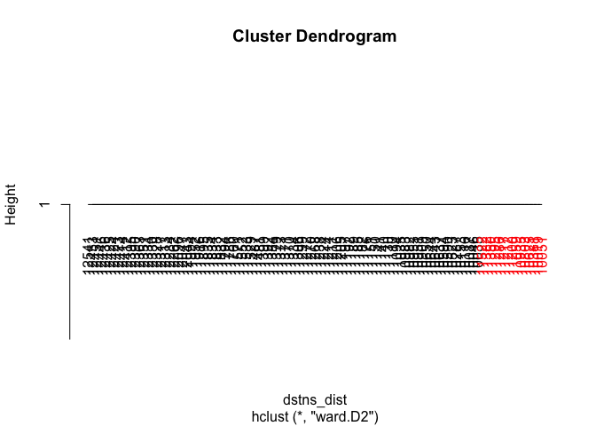
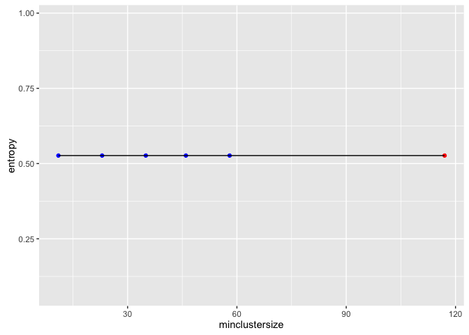
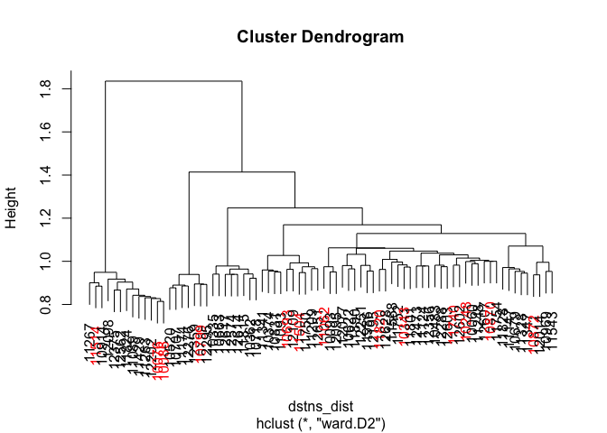
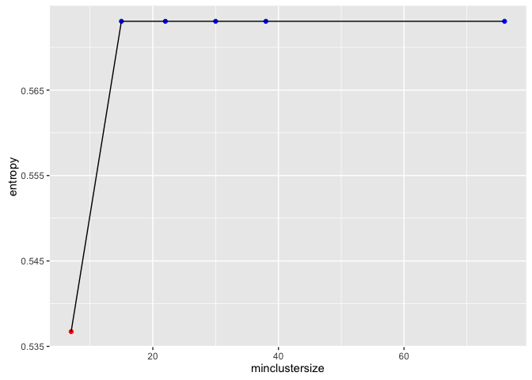
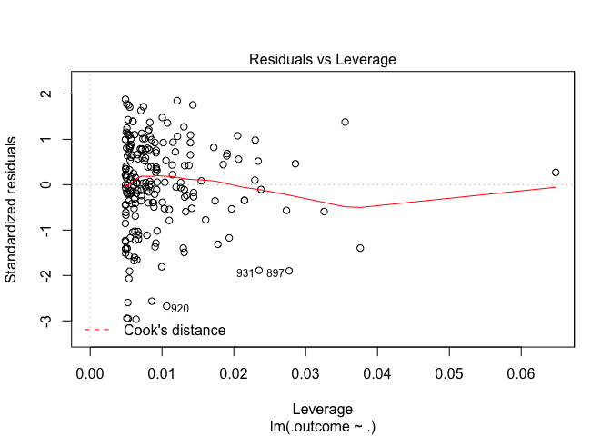

# eBay:iPads:: startprice.log10 regression:: ebayipads_finmdl_bid0_sp
bdanalytics  

**  **    
**Date: (Fri) Oct 16, 2015**    

# Introduction:  

Data: 
Source: 
    Training:   https://inclass.kaggle.com/c/15-071x-the-analytics-edge-summer-2015/download/eBayiPadTrain.csv  
    New:        https://inclass.kaggle.com/c/15-071x-the-analytics-edge-summer-2015/download/eBayiPadTest.csv  
Time period: 


# Synopsis:

Based on analysis utilizing <> techniques, <conclusion heading>:  

Regression results:
First run:
    <glb_sel_mdl_id>: 
        OOB_RMSE=<0.4f>; new_RMSE=<0.4f>; <feat1>=<imp>; <feat2>=<imp>

Classification results:
template:
    prdline.my == "Unknown" -> 296
    Low.cor.X.glm: Leaderboard: 0.83458 -> Rank 288 / 1884 0.85514
        newobs_tbl=[N=471, Y=327]; submit_filename=template_Final_glm_submit.csv
        OOB_conf_mtrx=[YN=125, NY=76]=201; max.Accuracy.OOB=0.7710;
            opt.prob.threshold.OOB=0.6
            startprice=100.00; biddable=95.42; productline=49.22; 
            D.T.like=29.75; D.T.use=26.32; D.T.box=21.53; 

prdline: -> Worse than template
    prdline.my == "Unknown" -> 285
    All.X.no.rnorm.rf: Leaderboard: 0.82649
        newobs_tbl=[N=485, Y=313]; submit_filename=prdline_Final_rf_submit.csv
        OOB_conf_mtrx=[YN=119, NY=80]=199; max.Accuracy.OOB=0.8339;
            opt.prob.threshold.OOB=0.5
            startprice=100.00; biddable=84.25; D.sum.TfIdf=7.28; 
            D.T.use=4.26; D.T.veri=2.78; D.T.scratch=1.99; D.T.box=; D.T.like=; 
    Low.cor.X.glm: Leaderboard: 0.81234
        newobs_tbl=[N=471, Y=327]; submit_filename=prdline_Low_cor_X_glm_submit.csv
        OOB_conf_mtrx=[YN=125, NY=74]=199; max.Accuracy.OOB=0.8205;
            opt.prob.threshold.OOB=0.6
            startprice=100.00; biddable=96.07; prdline.my=51.37; 
            D.T.like=29.39; D.T.use=25.43; D.T.box=22.27; D.T.veri=; D.T.scratch=; 

oobssmpl: -> 
    Low.cor.X.glm: Leaderboard: 0.83402
        newobs_tbl=[N=440, Y=358]; submit_filename=oobsmpl_Final_glm_submit
        OOB_conf_mtrx=[YN=114, NY=84]=198; max.Accuracy.OOB=0.7780;
            opt.prob.threshold.OOB=0.5
            startprice=100.00; biddable=93.87; prdline.my=60.48; D.sum.TfIdf=; 
            D.T.condition=8.69; D.T.screen=7.96; D.T.use=7.50; D.T.veri=; D.T.scratch=;

category: -> 
    Low.cor.X.glm: Leaderboard: 0.82381
        newobs_tbl=[N=470, Y=328]; submit_filename=category_Final_glm_submit
        OOB_conf_mtrx=[YN=119, NY=57]=176; max.Accuracy.OOB=0.8011;
            opt.prob.threshold.OOB=0.6
            startprice=100.00; biddable=79.19; prdline.my=55.22; D.sum.TfIdf=; 
            D.T.ipad=27.05; D.T.like=21.44; D.T.box=20.67; D.T.condition=; D.T.screen=; 

dataclns: -> 
    All.X.no.rnorm.rf: Leaderboard: 0.82211
        newobs_tbl=[N=485, Y=313]; submit_filename=dataclns_Final_rf_submit
        OOB_conf_mtrx=[YN=104, NY=75]=179; max.Accuracy.OOB=0.7977;
            opt.prob.threshold.OOB=0.5
            startprice.log=100.00; biddable=65.85; prdline.my=7.74; D.sum.TfIdf=; 
            D.T.use=2.01; D.T.condition=1.87; D.T.veri=1.62; D.T.ipad=; D.T.like=;
    Low.cor.X.glm: Leaderboard: 0.79264
        newobs_tbl=[N=460, Y=338]; submit_filename=dataclns_Low_cor_X_glm_submit
        OOB_conf_mtrx=[YN=113, NY=74]=187; max.Accuracy.OOB=0.7977;
            opt.prob.threshold.OOB=0.5 -> different from prev run of 0.6
            biddable=100.00; startprice.log=91.85; prdline.my=38.34; D.sum.TfIdf=; 
            D.T.ipad=29.92; D.T.box=27.76; D.T.work=25.79; D.T.use=; D.T.condition=;

txtterms: -> top_n = c(10)
    Low.cor.X.glm: Leaderboard: 0.81448
        newobs_tbl=[N=442, Y=356]; submit_filename=txtterms_Final_glm_submit
        OOB_conf_mtrx=[YN=113, NY=69]=182; max.Accuracy.OOB=0.7943;
            opt.prob.threshold.OOB=0.5
            biddable=100.00; startprice.log=90.11; prdline.my=37.65; D.sum.TfIdf=; 
            D.T.ipad=28.67; D.T.work=24.90; D.T.great=21.44; 
# [1] "D.T.condit"    "D.T.condition" "D.T.good"      "D.T.ipad"      "D.T.new"      
# [6] "D.T.scratch"   "D.T.screen"    "D.T.this"      "D.T.use"       "D.T.work"     
            
    All.X.glm: Leaderboard: 0.81016
        newobs_tbl=[N=445, Y=353]; submit_filename=txtterms_Final_glm_submit
        OOB_conf_mtrx=[YN=108, NY=72]=180; max.Accuracy.OOB=0.7966;
            opt.prob.threshold.OOB=0.5
            biddable=100.00; startprice.log=88.24; prdline.my=33.81; D.sum.TfIdf=; 
            D.T.scratch=25.51; D.T.use=18.97; D.T.good=16.37; 
 [1] "D.T.condit"  "D.T.use"     "D.T.scratch" "D.T.new"     "D.T.good"    "D.T.screen" 
 [7] "D.T.great"   "D.T.excel"   "D.T.work"    "D.T.ipad"            

    Max.cor.Y.rpart: Leaderboard: 0.79258
        newobs_tbl=[N=439, Y=359]; submit_filename=txtterms_Final_rpart_submit
        OOB_conf_mtrx=[YN=105, NY=76]=181; max.Accuracy.OOB=0.7954802;
            opt.prob.threshold.OOB=0.5
            startprice.log=100; biddable=; prdline.my=; D.sum.TfIdf=; 
            D.T.scratch=; D.T.use=; D.T.good=; 
 [1] "D.T.condit"  "D.T.use"     "D.T.scratch" "D.T.new"     "D.T.good"    "D.T.screen" 
 [7] "D.T.ipad"    "D.T.great"   "D.T.work"    "D.T.excel"

    All.X.no.rnorm.rf: Leaderboard: 0.80929
        newobs_tbl=[N=545, Y=253]; submit_filename=txtterms_Final_rf_submit
        OOB_conf_mtrx=[YN=108, NY=61]=169; max.Accuracy.OOB=0.8090395
            opt.prob.threshold.OOB=0.5
            startprice.log=100.00; biddable=78.82; idseq.my=63.43; prdline.my=45.57;
            D.T.use=2.76; D.T.condit=2.35; D.T.scratch=2.00; D.T.good=; 
 [1] "D.T.condit"  "D.T.use"     "D.T.scratch" "D.T.new"     "D.T.good"    "D.T.screen" 
 [7] "D.T.ipad"    "D.T.great"   "D.T.work"    "D.T.excel"

txtclstr:
    All.X.no.rnorm.rf: Leaderboard: 0.79363 -> 0.79573
        newobs_tbl=[N=537, Y=261]; submit_filename=txtclstr_Final_rf_submit
        OOB_conf_mtrx=[YN=104, NY=61]=165; max.Accuracy.OOB=0.8135593
            opt.prob.threshold.OOB=0.5
            startprice.log=100.00; biddable=79.99; idseq.my=64.94; 
                prdline.my=4.14; prdline.my.clusterid=1.15; 
 [1] "D.T.condit"  "D.T.use"     "D.T.scratch" "D.T.new"     "D.T.good"    "D.T.screen" 
 [7] "D.T.ipad"    "D.T.great"   "D.T.work"    "D.T.excel"            
 
dupobs:
    All.X.no.rnorm.rf: Leaderboard: 0.79295
        newobs_tbl=[N=541, Y=257]; submit_filename=dupobs_Final_rf_submit
        OOB_conf_mtrx=[YN=114, NY=65]=179; max.Accuracy.OOB=0.7977401
            opt.prob.threshold.OOB=0.5
            startprice.log=100.00; biddable=94.49; idseq.my=67.40; 
                prdline.my=4.48; prdline.my.clusterid=1.99; 
 [1] "D.T.condit"  "D.T.use"     "D.T.scratch" "D.T.new"     "D.T.good"    "D.T.screen" 
 [7] "D.T.ipad"    "D.T.great"   "D.T.work"    "D.T.excel"            
 
    All.X.no.rnorm.rf: Leaderboard: 0.79652
        newobs_tbl=[N=523, Y=275]; submit_filename=dupobs_Final_rf_submit
        OOB_conf_mtrx=[YN=114, NY=65]=179; max.Accuracy.OOB=0.7977401
            opt.prob.threshold.OOB=0.5
            startprice.log=100.00; biddable=94.24; idseq.my=67.92; 
                prdline.my=4.33; prdline.my.clusterid=2.17; 
 [1] "D.T.condit"  "D.T.use"     "D.T.scratch" "D.T.new"     "D.T.good"    "D.T.screen" 
 [7] "D.T.ipad"    "D.T.great"   "D.T.work"    "D.T.excel"
 
csmmdl:
   All.X.no.rnorm.rf: Leaderboard: 0.79396
        newobs_tbl=[N=525, Y=273]; submit_filename=csmmdl_Final_rf_submit
        OOB_conf_mtrx=[YN=111, NY=66]=177; max.Accuracy.OOB=0.8000000
            opt.prob.threshold.OOB=0.5
            startprice.log=100.00; biddable=90.30; idseq.my=67.06; 
                prdline.my=4.40; cellular.fctr=3.57; prdline.my.clusterid=2.08; 

   All.Interact.X.no.rnorm.rf: Leaderboard: 0.77867
        newobs_tbl=[N=564, Y=234]; submit_filename=csmmdl_Final_rf_submit
        OOB_conf_mtrx=[YN=120, NY=53]=173; max.Accuracy.OOB=0.8045198
            opt.prob.threshold.OOB=0.5
            biddable=100.00; startprice.log=93.99; idseq.my=57.30; 
                prdline.my=9.09; cellular.fctr=3.30; prdline.my.clusterid=2.35; 

   All.Interact.X.no.rnorm.rf: Leaderboard: 0.77152
        newobs_tbl=[N=539, Y=259]; submit_filename=csmmdl_Final_rf_submit
        OOB_conf_mtrx=[YN=, NY=]=; max.Accuracy.OOB=0.8011299
            opt.prob.threshold.OOB=0.5
            biddable=100.00; startprice.log=94.93; idseq.my=57.12; 
                prdline.my=9.29; cellular.fctr=3.20; prdline.my.clusterid=2.50; 
 [1] "D.T.condit"  "D.T.use"     "D.T.scratch" "D.T.new"     "D.T.good"    "D.T.screen" 
 [7] "D.T.ipad"    "D.T.great"   "D.T.work"    "D.T.excel"
        
        All.X.glmnet: 
            fit_RMSE=???; OOB_RMSE=115.1247; new_RMSE=115.1247; 
            prdline.my.fctr=100.00; condition.fctrNew=88.53; D.npnct09.log=84.34
                biddable=16.48; idseq.my=57.27;
spdiff:                
    All.Interact.X.no.rnorm.rf: Leaderboard: 0.78218
        newobs_tbl=[N=517, Y=281]; submit_filename=spdiff_Final_rf_submit
        OOB_conf_mtrx=[YN=121, NY=38]=159; max.Accuracy.OOB=0.8203390
            opt.prob.threshold.OOB=0.6
            biddable=100.00; startprice.diff=57.53; idseq.my=41.31; 
                prdline.my=11.43; cellular.fctr=2.36; prdline.my.clusterid=1.82; 

        All.X.no.rnorm.rf: 
            fit_RMSE=92.19; OOB_RMSE=130.86; new_RMSE=130.86; 
            biddable=100.00; prdline.my.fctr=61.92; idseq.my=57.77;
                condition.fctr=29.53; storage.fctr=11.22; color.fctr=6.69;
                cellular.fctr=6.11
                
    All.X.no.rnorm.rf: Leaderboard: 0.77443
        newobs_tbl=[N=606, Y=192]; submit_filename=spdiff_Final_rf_submit
        OOB_conf_mtrx=[YN=112, NY=28]=140; max.Accuracy.OOB=0.8418079
            opt.prob.threshold.OOB=0.6
            startprice.diff=100.00; biddable=96.53; idseq.my=38.10; 
                prdline.my=3.65; cellular.fctr=2.21; prdline.my.clusterid=0.91; 
 [1] "D.T.condit"  "D.T.use"     "D.T.scratch" "D.T.new"     "D.T.good"    "D.T.screen" 
 [7] "D.T.ipad"    "D.T.great"   "D.T.work"    "D.T.excel"
 
 color:
        All.Interact.X.glmnet: 
            fit_RMSE=88.64520; 
            prdline.my.fctr:D.TfIdf.sum.stem.stop.Ratio=100.00;
            prdline.my.fctr:condition.fctr=77.35
            D.TfIdf.sum.stem.stop.Ratio=68.18
            prdline.my.fctr:color.fctr=68.12
            prdline.my.fctr:storage.fctr=63.32

    All.X.no.rnorm.rf: Leaderboard: 0.80638
        newobs_tbl=[N=550, Y=248]; submit_filename=color_Final_rf_submit
        OOB_conf_mtrx=[YN=108, NY=54]=162; max.Accuracy.OOB=0.8169492
            opt.prob.threshold.OOB=0.5
            biddable=100.00; startprice.diff=77.90; idseq.my=48.49; 
                D.ratio.sum.TfIdf.nwrds=6.48; storage.fctr=4.74;
                    D.TfIdf.sum.stem.stop.Ratio=4.57; prdline.my=4.32;
 [1] "D.T.condit"  "D.T.use"     "D.T.scratch" "D.T.new"     "D.T.good"    "D.T.screen" 
 [7] "D.T.ipad"    "D.T.great"   "D.T.work"    "D.T.excel"
            
assctxt:
        select_terms:
[1] "condit"   "use"      "scratch"  "new"      "good"     "ipad"     "screen"   "great"   
 [9] "work"     "excel"    "like"     "box"      "function" "item"     "fulli"    "minor" 
[17] "cosmet"   "crack"    "mint"     "wear"  
        assoc_terms:
 [1] "bare"      "sign"      "light"     "back"      "hous"      "tab"       "dent"     
 [8] "brand"     "open"      "mini"      "appl"      "air"       "wifi"      "affect"   
[15] "protector" "shape"     "perfect"   "order"     "button"    "origin"    "retail"   
[22] "seal"      "includ"    "100"       "may"       "show"      "overal"    "bodi"     
[29] "phone"     "will"      "damag"     "near"      "top"       "normal"    "tear"     
[36] "expect"    "minim"          
        glb_allobs_df$prdline.my$.clusterid Entropy: 0.6665 (97.3037 pct)
        All.Interact.X.glmnet: 
            fit_RMSE=88.40723; 
            prdline.my.fctr:D.TfIdf.sum.stem.stop.Ratio=100.00;
            prdline.my.fctriPadAir:D.npnct01.log=79.67748;
            D.TfIdf.sum.stem.stop.Ratio=79.08192;
            prdline.my.fctriPadmini 2+:condition.fctrNew other (see details)=78.24020;
            prdline.my.fctriPad 3+:color.fctrSpace Gray=77.05886;
            prdline.my.fctriPadmini 2+:storage.fctrUnknown=75.68145;
            prdline.my.fctrUnknown:.clusterid.fctr3=74.23727;

    All.Interact.X.no.rnorm.rf: Leaderboard: 0.72974
        newobs_tbl=[N=682, Y=116]; submit_filename=assctxt_Final_rf_submit
        OOB_conf_mtrx=[YN=125, NY=43]=168; max.Accuracy.OOB=0.8101695; max.auc.OOB=???;
            opt.prob.threshold.OOB=0.6
            biddable=100.00; startprice.diff=51.04; idseq.my=29.51; 
                startprice.diff:biddable=28.70
                prdline.my.fctriPadmini:idseq.my=6.89
        Highest max.auc.OOB=???; for model:        

ctgry2:
        select_terms: 50
        assoc_terms: 103
        glb_allobs_df$prdline.my$.clusterid Entropy: 0.6559 (96.7556 pct)
        All.Interact.X.glmnet: next: All.X.glmnet
            fit_RMSE=88.80010;
prdl.my.descr.fctr:storage.fctr                    100.00
prdl.my.descr.fctr:condition.fctr           93.96
prdl.my.descr.fctr:D.npnct01.log                           89.94
D.TfIdf.sum.stem.stop.Ratio                                             75.90
prdl.my.descr.fctr:color.fctr                              72.43
prdl.my.descr.fctr:.clusterid.fctr7                             63.97
prdl.my.descr.fctr:D.npnct08.log                               63.46
prdl.my.descr.fctr                                             63.05
prdl.my.descr.fctr:D.TfIdf.sum.stem.stop.Ratio                 62.91
prdl.my.descr.fctr:D.npnct16.log                               62.39
            
    Ensemble.glmnet: Leaderboard: 0.80480
        newobs_tbl=[N=473, Y=325]; submit_filename=ctgry2_Final_glmnet_submit
        OOB_conf_mtrx=[YN=79, NY=101]=180; 
            max.Accuracy.OOB=0.7977528; max.auc.OOB=0.8554068; opt.prob.threshold.OOB=0.4
        Highest max.auc.OOB=0.8587215; for model:All.X.no.rnorm.rf     
            biddable                        100.000
            startprice.diff                  71.793
            idseq.my                         43.511
            
ensemble:
        select_terms: 50
        assoc_terms: 103
        glb_allobs_df$prdline.my$.clusterid Entropy: 0.6570 (96.9282 pct)
        Final.glment: min.RMSE.fit=31.45801
        Ensemble.glmnet: min.RMSE.fit=30.67172
startprice.predict.All.Interact.X.no.rnorm.rf    100.000
startprice.predict.All.X.no.rnorm.rf              75.381
        All.X.glmnet: min.RMSE.fit=88.98066
prdl.my.descr.fctr                       100.00
D.TfIdf.sum.stem.stop.Ratio                        92.16
condition.fctr                                  79.01
prdl.my.descr.fctr:.clusterid.fctr5       69.91
D.npnct16.log                                      61.70
color.fctrWhite                                    59.42
D.npnct01.log                                      55.07
cellular.fctr1                                     53.35
D.terms.n.post.stop                                52.92        

    Ensemble.glmnet: Leaderboard: 0.73183
        newobs_tbl=[N=557, Y=241]; submit_filename=ensemble_Final_glmnet_submit
        OOB_conf_mtrx=[YN=75, NY=60]=135; 
            max.Accuracy.OOB=0.8483146; max.auc.OOB=0.9187365;
            opt.prob.threshold.OOB=0.5
sold.fctr.predict.All.X.no.rnorm.rf.prob                                100.000000        
sold.fctr.predict.All.Interact.X.no.rnorm.rf.prob                        98.873608        
        Highest max.auc.OOB=0.9180131; for model:All.X.no.rnorm.rf  
startprice.diff             100.000
biddable                     95.318
idseq.my                     33.365        

ncv7:
        select_terms: 50
        assoc_terms: 103
        glb_allobs_df$prdline.my$.clusterid Entropy: 0.6570 (96.9282 pct)
        Final.glment: min.RMSE.fit=31.45704
        Ensemble.glmnet: min.RMSE.fit=29.93289
startprice.predict.All.Interact.X.no.rnorm.rf    100.000
startprice.predict.All.X.no.rnorm.rf              82.878
startprice.predict.Low.cor.X.lm                   42.664        
        All.Interact.X.glmnet: min.RMSE.fit=87.30181
prdl.my.descr.fctr:D.npnct01.log                          100.00
prdl.my.descr.fctr:condition.fctr           99.98
prdl.my.descr.fctr:storage.fctr                     96.26
prdl.my.descr.fctriPadAir                                             79.65
prdl.my.descr.fctr:color.fctr                         79.30
prdl.my.descr.fctr:D.TfIdf.sum.stem.stop.Ratio                 74.90
D.TfIdf.sum.stem.stop.Ratio                                             74.77
prdl.my.descr.fctr:D.npnct08.log                               67.38
prdl.my.descr.fctr:D.npnct01.log                               67.38

    Ensemble.glmnet: Leaderboard: not submitted -> lower max.auc.OOB of "Ensemble submission"
        newobs_tbl=[N=561, Y=237]; submit_filename=ncv7_Final_glmnet_submit
        OOB_conf_mtrx=[YN=79, NY=55]=134; 
            max.Accuracy.OOB=0.8494382; max.auc.OOB=0.9130918; opt.prob.threshold.OOB=0.5
sold.fctr.predict.All.X.no.rnorm.rf.prob                                100.000
sold.fctr.predict.All.Interact.X.no.rnorm.rf.prob                        99.348      
        Highest max.auc.OOB=0.9117720; for model:All.X.no.rnorm.rf  
startprice.diff             100.000
biddable                     96.383
idseq.my                     32.634   

gbm w/startprice.unit9:
    Final.glment: min.RMSE.fit=30.32782
    Ensemble.glmnet: min.RMSE.fit=29.62348
startprice.predict.All.Interact.X.no.rnorm.rf    100.000
startprice.predict.All.X.no.rnorm.rf              73.521
startprice.predict.All.Interact.X.bayesglm        29.675
startprice.predict.Max.cor.Y.lm                   28.405

        All.X.glmnet: min.RMSE.fit=88.64271
prdl.my.descr.fctr                       100.00
D.TfIdf.sum.stem.stop.Ratio                        85.01
condition.fctr                                  80.28
carrier.fctr                                  77.48
prdl.my.descr.fctr:.clusterid.fctr5       65.78
D.npnct16.log                                      61.66
startprice.unit9                                   59.48
color.fctr                                    59.21
D.npnct01.log                                      53.78
D.npnct08.log                                      53.56
cellular.fctr                                     53.19

    Ensemble.glmnet: Leaderboard: not submitted -> lower max.auc.OOB of "Ensemble submission"
        newobs_tbl=[N=579, Y=219]; submit_filename=gbm_Final_glmnet_submit
        OOB_conf_mtrx=[YN=85, NY=54]=139; 
            max.Accuracy.OOB=0.8438202; max.auc.OOB=0.9127314; opt.prob.threshold.OOB=0.5
sold.fctr.predict.All.X.no.rnorm.rf.prob             100.0000
sold.fctr.predict.All.Interact.X.no.rnorm.rf.prob     98.7937            
        Highest max.auc.OOB=0.9167568; for model:All.Interact.X.gbm
biddable                                           100.0000
startprice.diff                                     96.2076
startprice.diff:biddable                            23.2114
idseq.my                                             7.8098        

mdlsel:
    Final.glment: min.RMSE.fit=30.47114 (higher than gbm w/startprice.unit9)
    Ensemble.glmnet: min.RMSE.fit=29.49418
startprice.predict.All.Interact.X.no.rnorm.rf                          100.000000
startprice.predict.All.X.no.rnorm.rf                                    71.213880
startprice.predict.All.X.bayesglm                                       24.166084

        All.X.glmnet: min.RMSE.fit=88.64271
prdl.my.descr.fctr                       100.00
D.TfIdf.sum.stem.stop.Ratio                        85.01
condition.fctr                                  80.28
carrier.fctr                                  77.48
prdl.my.descr.fctr:.clusterid.fctr5       65.78
D.npnct16.log                                      61.66
startprice.unit9                                   59.48
color.fctr                                    59.21
D.npnct01.log                                      53.78
D.npnct08.log                                      53.56
cellular.fctr                                     53.19

mdlsel(startprice.log):
    Final.Ensemble.rf: min.RMSE.fit=0.4563772
    Ensemble.rf: min.RMSE.fit=0.4283013
startprice.log.predict.All.Interact.X.no.rnorm.rf                  100.0000000
startprice.log.predict.All.X.no.rnorm.rf                            58.0967582
startprice.log.predict.All.Interact.X.gbm                            6.7197148

        All.X.no.rnorm.rf: min.RMSE.fit=1.4967021
biddable                                         100.00000000
idseq.my                                          98.00292371
startprice.unit9                                  34.31130220
prdl.my.descr.fctr                       18.10984741
D.ratio.sum.TfIdf.nwrds                           15.23549621
color.fctrUnknown                                 14.05520993
D.TfIdf.sum.stem.stop.Ratio                       13.00884673
D.ratio.nstopwrds.nwrds                           10.51165302

    All.X.gbm: Leaderboard: 0.75430
        newobs_tbl=[N=582, Y=216]; submit_filename=mdlsel_Final_gbm_submit
        OOB_conf_mtrx=[YN=58, NY=65]=123; 
            max.Accuracy.OOB=0.8617978; max.auc.OOB=0.9367161;
            opt.prob.threshold.OOB=0.5
startprice.diff                                           100.0000000 100.00000000
biddable                                                   66.6475055  65.40764971
idseq.my                                                    1.8632456   4.55963698

splogdiff:
    All.X.gbm: Leaderboard: 0.70111
        newobs_tbl=[N=553, Y=245]; submit_filename=splogdiff_Final_gbm_submit
        OOB_conf_mtrx=[YN=35, NY=101]=136; 
            max.Accuracy.OOB=0.8471910; max.auc.OOB=0.9388912;
            opt.prob.threshold.OOB=0.3
startprice.log.diff                                       100.0000000 100.0000000
biddable                                                   86.8563123  88.0261866
idseq.my                                                    8.3580281   2.9054298       

nofrcdups:
    All.X.gbm: Leaderboard: ???/0.67225
        newobs_tbl=[N=543, Y=255]; submit_filename=nofrcdups_Final_gbm_submit
        OOB_conf_mtrx=[YN=36, NY=101]=137; 
            opt.prob.threshold.OOB=0.3
            max.Accuracy.OOB=0.0.8460674; max.auc.OOB=0.9388582;
startprice.log.diff                                      100.00000000  93.3716491
biddable                                                  83.57786348 100.0000000
idseq.my                                                  11.54696712   1.1240259     
  
nofrcdups w/ glb_sel_mdl_id=All.X.no.rnorm.rf:
    All.X.no.rnorm.rf: Leaderboard: ???/0.57475 -> ???/0.59937 with force dups
        newobs_tbl=[N=630, Y=168]; newobs_range_outliers=798; 
            submit_filename=nofrcdups_Final_rf_submit
        OOB_conf_mtrx=[YN=70, NY=62]=132; OOBobs_range_outliers=27
            opt.prob.threshold.OOB=0.5
            max.Accuracy.OOB=0.8516854; max.auc.OOB=0.9335308;
startprice.log.diff                                              100.00
biddable                                                         87.61
idseq.my                                                         26.79

Forum Ideas:
I then focused on feature engineering, each new variable brought its own little improvement so in the end i just kept adding new ones and let the models do their thing. Here are some i used: model (productline:storage:condition), isNew, model2 (product:isNew), 50 common words from descr, descrLength, capsFactor (% of caps in description), number of cheaper items of same model2, number of dearer items of same model2, priceFactor (vs. mean of price for model), priceFactor2 (vs. mean of price for model2), bigID (if ID> 11000 because there seems to be a huge drop in sales after some time), timeline (year of product launch, reasoning is you want to spend less money on older products).

Get the median startprice for each level of productline and condition. Take the difference from startprice as a new variable. I find median works much better than the mean since startprice is not normally distributed. I also created another binary variable on whether this difference is positive or negative.

Square root startprice

scale and center all the variables except sold, including the dummies.

### Prediction Accuracy Enhancement Options:
- Not repeatable experiments:
    - gbm & ensembles that include gbm
    - rf that includes .rnorm ??? (now .rnorm has a set seed)
    
- import.data chunk:
    - which obs should be in fit vs. OOB (currently dirty.0 vs .1 is split 50%)
    
- inspect.data chunk:
    - For date variables
        - Appropriate factors ?
        - Different / More last* features ?
        
- scrub.data chunk:        
- transform.data chunk:
    - derive features from multiple features
    
- manage.missing.data chunk:
    - Not fill missing vars
    - Fill missing numerics with a different algorithm
    - Fill missing chars with data based on clusters 
    
- extract.features chunk:
    - Text variables: move to date extraction chunk ???
        - Mine acronyms
        - Mine places

- Review set_global_options chunk after features are finalized

### 

## Potential next steps include:
- Organization:
    - Categorize by chunk
    - Priority criteria:
        0. Ease of change
        1. Impacts report
        2. Cleans innards
        3. Bug report
        
- all chunks:
    - at chunk-end rm(!glb_<var>)
    
- manage.missing.data chunk:
    - cleaner way to manage re-splitting of training vs. new entity

- extract.features chunk:
    - Add n-grams for glb_txt_vars
        - "RTextTools", "tau", "RWeka", and "textcat" packages
    - Convert user-specified mutate code to config specs
    
- fit.models chunk:
    - Prediction accuracy scatter graph:
    -   Add tiles (raw vs. PCA)
    -   Use shiny for drop-down of "important" features
    -   Use plot.ly for interactive plots ?
    
    - Change .fit suffix of model metrics to .mdl if it's data independent (e.g. AIC, Adj.R.Squared - is it truly data independent ?, etc.)
    - move model_type parameter to myfit_mdl before indep_vars_vctr (keep all model_* together)
    - create a custom model for rpart that has minbucket as a tuning parameter
    - varImp for randomForest crashes in caret version:6.0.41 -> submit bug report

- Probability handling for multinomials vs. desired binomial outcome
-   ROCR currently supports only evaluation of binary classification tasks (version 1.0.7)
-   extensions toward multiclass classification are scheduled for the next release

- Skip trControl.method="cv" for dummy classifier ?
- Add custom model to caret for a dummy (baseline) classifier (binomial & multinomial) that generates proba/outcomes which mimics the freq distribution of glb_rsp_var values; Right now glb_dmy_glm_mdl always generates most frequent outcome in training data
- glm_dmy_mdl should use the same method as glm_sel_mdl until custom dummy classifer is implemented

- fit.all.training chunk:
    - myplot_prediction_classification: displays 'x' instead of '+' when there are no prediction errors 
- Compare glb_sel_mdl vs. glb_fin_mdl:
    - varImp
    - Prediction differences (shd be minimal ?)

- Move glb_analytics_diag_plots to mydsutils.R: (+) Easier to debug (-) Too many glb vars used
- Add print(ggplot.petrinet(glb_analytics_pn) + coord_flip()) at the end of every major chunk
- Parameterize glb_analytics_pn
- Move glb_impute_missing_data to mydsutils.R: (-) Too many glb vars used; glb_<>_df reassigned
- Replicate myfit_mdl_classification features in myfit_mdl_regression
- Do non-glm methods handle interaction terms ?
- f-score computation for classifiers should be summation across outcomes (not just the desired one ?)
- Add accuracy computation to glb_dmy_mdl in predict.data.new chunk
- Why does splitting fit.data.training.all chunk into separate chunks add an overhead of ~30 secs ? It's not rbind b/c other chunks have lower elapsed time. Is it the number of plots ?
- Incorporate code chunks in print_sessionInfo
- Test against 
    - projects in github.com/bdanalytics
    - lectures in jhu-datascience track

# Analysis: 

```r
rm(list = ls())
set.seed(12345)
options(stringsAsFactors = FALSE)
source("~/Dropbox/datascience/R/myscript.R")
source("~/Dropbox/datascience/R/mydsutils.R")
```

```
## Loading required package: caret
## Loading required package: lattice
## Loading required package: ggplot2
```

```r
source("~/Dropbox/datascience/R/myplot.R")
source("~/Dropbox/datascience/R/mypetrinet.R")
source("~/Dropbox/datascience/R/myplclust.R")
source("~/Dropbox/datascience/R/mytm.R")
# Gather all package requirements here
suppressPackageStartupMessages(require(doMC))
registerDoMC(6) # # of cores on machine - 2
suppressPackageStartupMessages(require(caret))
source("~/Documents/Work/PullRequests/caret/pkg/caret/R/confusionMatrix.R")
source("~/Documents/Work/PullRequests/caret/pkg/caret/R/ggplot.R")
#packageVersion("tm")
#require(sos); findFn("cosine", maxPages=2, sortby="MaxScore")

# Analysis control global variables
glb_trnng_url <- "https://inclass.kaggle.com/c/15-071x-the-analytics-edge-summer-2015/download/eBayiPadTrain.csv"
glb_newdt_url <- "https://inclass.kaggle.com/c/15-071x-the-analytics-edge-summer-2015/download/eBayiPadTest.csv"
glb_out_pfx <- "ebayipads_finmdl_bid0_sp_"
glb_save_envir <- FALSE # or TRUE

glb_is_separate_newobs_dataset <- TRUE    # or TRUE
    glb_split_entity_newobs_datasets <- TRUE   # or FALSE
    glb_split_newdata_method <- "sample"          # "condition" or "sample" or "copy"
    glb_split_newdata_condition <- NULL # or "is.na(<var>)"; "<var> <condition_operator> <value>"
    glb_split_newdata_size_ratio <- 0.3               # > 0 & < 1
    glb_split_sample.seed <- 123               # or any integer

glb_obs_drop_condition <- #NULL 
            "(UniqueID %in% c(NULL
                , 11234 #sold=0; 2 other dups(10306, 11503) are sold=1
                , 11844 #sold=0; 3 other dups(11721, 11738, 11812) are sold=1
                ))  | (productline %in% c('iPad 5', 'iPad mini Retina')) |
                      (biddable != 0)"
#parse(text=glb_obs_drop_condition)
    
glb_obs_repartition_train_condition <- #NULL 
    "!is.na(sold) & (sold == 1)"

glb_max_fitobs <- NULL # or any integer

glb_is_regression <- TRUE; glb_is_classification <- !glb_is_regression; 
    glb_is_binomial <- TRUE #or FALSE

glb_rsp_var_raw <- "startprice"

# for classification, the response variable has to be a factor
glb_rsp_var <- "startprice.log10" # "sold.fctr" # glb_rsp_var_raw

# if the response factor is based on numbers/logicals e.g (0/1 OR TRUE/FALSE vs. "A"/"B"), 
#   or contains spaces (e.g. "Not in Labor Force")
#   caret predict(..., type="prob") crashes
glb_map_rsp_raw_to_var <- function(raw) { # NULL
#     return(raw ^ 0.5)
#     return(log(1 + raw))
    return(log10(raw))
#     return(exp(-raw / 2))
#     ret_vals <- rep_len(NA, length(raw)); ret_vals[!is.na(raw)] <- ifelse(raw[!is.na(raw)] == 1, "Y", "N"); return(relevel(as.factor(ret_vals), ref="N"))
#     #as.factor(paste0("B", raw))
#     #as.factor(gsub(" ", "\\.", raw))    
}
glb_map_rsp_raw_to_var(tst <- c(NA, 0, 2.99, 280.50, 1000.00))
```

```
## [1]        NA      -Inf 0.4756712 2.4479329 3.0000000
```

```r
glb_map_rsp_var_to_raw <- function(var) { # NULL #
#     return(var ^ 2.0)
#     return(exp(var) - 1)
    return(10 ^ var)
#     return(-log(var) * 2)
#     as.numeric(var) - 1
#     #as.numeric(var)
#     #gsub("\\.", " ", levels(var)[as.numeric(var)])
#     c("<=50K", " >50K")[as.numeric(var)]
#     #c(FALSE, TRUE)[as.numeric(var)]
}
glb_map_rsp_var_to_raw(glb_map_rsp_raw_to_var(tst))
```

```
## [1]      NA    0.00    2.99  280.50 1000.00
```

```r
if ((glb_rsp_var != glb_rsp_var_raw) && is.null(glb_map_rsp_raw_to_var))
    stop("glb_map_rsp_raw_to_var function expected")
glb_rsp_var_out <- paste0(glb_rsp_var, ".predict.") # mdl_id is appended later

# List info gathered for various columns
# <col_name>:   <description>; <notes>
# description = The text description of the product provided by the seller.
# biddable = Whether this is an auction (biddable=1) or a sale with a fixed price (biddable=0).
# startprice = The start price (in US Dollars) for the auction (if biddable=1) or the sale price (if biddable=0).
# condition = The condition of the product (new, used, etc.)
# cellular = Whether the iPad has cellular connectivity (cellular=1) or not (cellular=0).
# carrier = The cellular carrier for which the iPad is equipped (if cellular=1); listed as "None" if cellular=0.
# color = The color of the iPad.
# storage = The iPad's storage capacity (in gigabytes).
# productline = The name of the product being sold.

# If multiple vars are parts of id, consider concatenating them to create one id var
# If glb_id_var == NULL, ".rownames <- row.names()" is the default
# Derive a numeric feature from id var

# User-specified exclusions
# List feats that shd be excluded due to known causation by prediction variable
glb_exclude_vars_as_features <- c(NULL
                                  , "description", "productline"
                                  , "sold", "startprice.log10.cut.fctr"
### bid0_sp                                  
    # List feats that are linear combinations (alias in glm)
                                , "D.terms.post.stem.n.log", "D.weight.sum"
                                #, "prdl.descr.my.fctriPad4#1:.clusterid.fctr3" This does not work
    # if RFE is rated lower than Low.cor, list feats that are in RFE & not in Low.cor
        # min.RMSE.fit(RFE.X.glmnet)=0.1138888
#             D.chrs.n.log                 61.12483
#             D.chrs.uppr.n.log            61.12483
#             D.ratio.wrds.stop.n.wrds.n   61.12483
#             D.terms.post.stop.n.log      61.12483
#             D.weight.post.stem.sum       61.12483
#             D.wrds.n.log                 61.12483
#             D.wrds.stop.n.log            61.12483
#             D.wrds.unq.n.log             61.12483
                            #, "startprice.dcm2.is9" # min.RMSE.fit(RFE.X.glmnet)=0.1141991 (up)
                            , "D.wrds.stop.n.log"    # min.RMSE.fit(RFE.X.glmnet)=0.1131232
###                            
                                  ) 

glb_id_var <- c("UniqueID")
glb_category_var <- "prdl.descr.my.fctr" # "productline" # NULL 
glb_drop_vars <- c(NULL) # or c("<col_name>")

glb_map_vars <- NULL # or c("<var1>", "<var2>")
glb_map_urls <- list();
# glb_map_urls[["<var1>"]] <- "<var1.url>"

glb_assign_pairs_lst <- NULL; 
# glb_assign_pairs_lst[["<var1>"]] <- list(from=c(NA),
#                                            to=c("NA.my"))
glb_assign_vars <- names(glb_assign_pairs_lst)

# Derived features
glb_derive_lst <- NULL;

# Add logs of numerics that are not distributed normally ->  do automatically ???
# Right skew: logp1; sqrt; ^ 1/3; logp1(logp1)

# glb_derive_lst[["prdline.my"]] <- list(
#     mapfn=function(productline) { return(productline) }    
#     , args=c("productline"))

glb_derive_lst[["startprice.log10.cut.fctr"]] <- list(
    mapfn=function(startprice.log10) { return(cut(startprice.log10, 3)) }    
    , args=c("startprice.log10"))

glb_derive_lst[["descr.my"]] <- list(
    mapfn=function(description) { mod_raw <- description;
        # This is here because it does not work with txt_map_filename
        mod_raw <- gsub(paste0(c("\n", "\211", "\235", "\317", "\333"), collapse="|"), " ",
                        mod_raw)
        # This should go into txt_map_filename    
        mod_raw <- gsub("\\.\\.", "\\. ", mod_raw);    
        # Don't parse for "." because of ".com"; use customized gsub for that text
        mod_raw <- gsub("(\\w)(!|\\*|,|-|/)(\\w)", "\\1\\2 \\3", mod_raw);
        
        # Modifications for this exercise only
        # Add dictionary to stemDocument e.g. stickers stemmed to sticker ???
        mod_raw <- gsub("8\\.25", "825", mod_raw, ignore.case=TRUE);  
        mod_raw <- gsub(" 10\\.SCREEN ", " 10\\. SCREEN ", mod_raw, ignore.case=TRUE);
        mod_raw <- gsub(" 128 gb ", " 128gb ", mod_raw, ignore.case=TRUE);  
        mod_raw <- gsub(" 16G, ", " 16GB, ", mod_raw, ignore.case=TRUE);
        mod_raw <- gsub(" 16 gig ", " 16gb ", mod_raw, ignore.case=TRUE);
        mod_raw <- gsub(" 16 gb ", " 16gb ", mod_raw, ignore.case=TRUE);        
        
        mod_raw <- gsub("\\bAccounts\\b", "Account", mod_raw, ignore.case=FALSE);
        mod_raw <- gsub("\\bactivated\\b", "activate", mod_raw, ignore.case=FALSE);        
        mod_raw <- gsub(" actuuly ", " actual ", mod_raw, ignore.case=TRUE);
        mod_raw <- gsub("\\baffects\\b", "affect", mod_raw, ignore.case=FALSE);   
        mod_raw <- gsub("\\bApple\\&#039;s", "Apple", mod_raw, ignore.case=FALSE);        
#mod_raw <- glb_allobs_df[c(665), txt_var]; mod_raw        
        mod_raw <- gsub(" Apple care ", " Applecare ", mod_raw, ignore.case=FALSE);        
        mod_raw <- gsub(" ans ", " and ", mod_raw, ignore.case=TRUE);
        mod_raw <- gsub(" bacK!wiped ", " bacK ! wiped ", mod_raw, ignore.case=TRUE);
        mod_raw <- gsub(" backplate", " back plate", mod_raw, ignore.case=TRUE);        
        mod_raw <- gsub("\\bbarley", "barely", mod_raw, ignore.case=TRUE);        
        mod_raw <- gsub(" bend ", " bent ", mod_raw, ignore.case=TRUE);         
        mod_raw <- gsub("Best Buy", "BestBuy", mod_raw, ignore.case=TRUE);
        mod_raw <- gsub(" black\\.Device ", " black \\. Device ", mod_raw,
                        ignore.case=TRUE);        
        mod_raw <- gsub("black\\),charger ", "black\\), charger ", mod_raw,
                        ignore.case=TRUE);        
        mod_raw <- gsub("\\bblacked\\b", "black", mod_raw, ignore.case=FALSE);
        mod_raw <- gsub("\\bblemish\\b", "blemishes", mod_raw, ignore.case=FALSE);        
        mod_raw <- gsub(" blocks", " blocked", mod_raw, ignore.case=TRUE);        
        mod_raw <- gsub(" brokenCharger ", " broken Charger ", mod_raw, ignore.case=TRUE);
        
        mod_raw <- gsub(" perfectlycord ", " perfectly cord ", mod_raw, ignore.case=TRUE);
        mod_raw <- gsub("\\bcord", "cable", mod_raw, ignore.case=TRUE);        
        mod_raw <- gsub("\\bcables\\b", "cable", mod_raw, ignore.case=TRUE);        
        
        mod_raw <- gsub(" care\\.The ", " care\\. The ", mod_raw, ignore.case=TRUE);
        mod_raw <- gsub("\\b(cared|careful|CAREFUL)\\b", "care", mod_raw, ignore.case=FALSE);
        mod_raw <- gsub("\\b(cases|casing)\\b", "case", mod_raw, ignore.case=TRUE);        
#mod_raw <- glb_allobs_df[c(88,187,280,1040,1098), txt_var]; mod_raw        
        mod_raw <- gsub(" carefully ", " careful ", mod_raw, ignore.case=TRUE);
        mod_raw <- gsub("\\bchargers\\b", "charger", mod_raw, ignore.case=FALSE);        
        mod_raw <- gsub("\\bchips\\b", "chip", mod_raw, ignore.case=FALSE);
        mod_raw <- gsub("\\bcleanly\\b", "clean", mod_raw, ignore.case=FALSE);        
        mod_raw <- gsub("\\b(C|c)olor(.*)s\\b", "\\1olor", mod_raw, ignore.case=FALSE);
#mod_raw <- glb_allobs_df[c(280,1411), txt_var]; mod_raw        
        mod_raw <- gsub("\\bcompletely\\b", "complete", mod_raw, ignore.case=FALSE);   
#mod_raw <- glb_allobs_df[c(42,502,676), txt_var]; mod_raw        
        
        mod_raw <- gsub("\\b(conditon|condtion|contidion|conditions)\\b", "condition", mod_raw,
                        ignore.case=TRUE);
#mod_raw <- glb_allobs_df[c(234), txt_var]; mod_raw        
        mod_raw <- gsub("(CONDITION|ONLY)\\.(\\w)", "\\1\\. \\2", mod_raw,
                        ignore.case=TRUE);
        mod_raw <- gsub("(condition)(Has)", "\\1\\. \\2", mod_raw);
        
        mod_raw <- gsub("\\bCONNECTED\\b", "CONNECT", mod_raw, ignore.case=FALSE);        
        mod_raw <- gsub("\\bconnects\\b", "connect", mod_raw, ignore.case=FALSE);        
        mod_raw <- gsub(" consist ", " consistent ", mod_raw, ignore.case=TRUE);
#mod_raw <- glb_allobs_df[c(195, 379, 437), txt_var]; mod_raw        
        mod_raw <- gsub("\\bCosmetics\\b", "Cosmetic", mod_raw, ignore.case=FALSE);        
        mod_raw <- gsub(" cracksNo ", " cracks No ", mod_raw, ignore.case=TRUE);
        
        mod_raw <- gsub("\\b(D|d)amaged\\b", "\\1amage", mod_raw, ignore.case=TRUE);
#mod_raw <- glb_allobs_df[c(116, 1360), txt_var]; mod_raw        
        mod_raw <- gsub("\\bDays\\b", "Day", mod_raw, ignore.case=TRUE);        
        mod_raw <- gsub(" DEFAULTING ", " DEFAULT ", mod_raw, ignore.case=TRUE);
        mod_raw <- gsub("\\bdefect(ive)*\\b", "defects", mod_raw, ignore.case=FALSE);        
#mod_raw <- glb_allobs_df[c(1403), txt_var]; mod_raw        
        mod_raw <- gsub(" definitely ", " definite ", mod_raw, ignore.case=TRUE);        
        mod_raw <- gsub("\\b(D|d)ented\\b", "\\1ent", mod_raw, ignore.case=FALSE);        
        mod_raw <- gsub(" described", " describe", mod_raw, ignore.case=TRUE);
        mod_raw <- gsub(" desciption", " description", mod_raw, ignore.case=TRUE);        
        mod_raw <- gsub(" devices", " device", mod_raw, ignore.case=TRUE);        
        mod_raw <- gsub(" Digi\\.", " Digitizer\\.", mod_raw, ignore.case=TRUE);        
        mod_raw <- gsub("\\b(ding|dinged)\\b", "dings", mod_raw, ignore.case=TRUE);        
        mod_raw <- gsub(" display\\.New ", " display\\. New ", mod_raw, ignore.case=TRUE);
        mod_raw <- gsub(" displays", " display", mod_raw, ignore.case=TRUE);
        mod_raw <- gsub("\\b(drop|drops)\\b", "dropped", mod_raw, ignore.case=TRUE); 
        mod_raw <- gsub("\\b(E|e)dge\\b", "\\1dges", mod_raw, ignore.case=FALSE);        
        mod_raw <- gsub(" effect ", " affect ", mod_raw, ignore.case=TRUE);        
        mod_raw <- gsub(" Excellant ", " Excellent ", mod_raw, ignore.case=TRUE);
        mod_raw <- gsub(" excellently", " excellent", mod_raw, ignore.case=TRUE);
        mod_raw <- gsub(" EUC ", " excellent used condition", mod_raw, ignore.case=TRUE);  
        mod_raw <- gsub(" feels ", " feel ", mod_raw, ignore.case=TRUE);
        mod_raw <- gsub(" fineiCloud ", " fine iCloud ", mod_raw, ignore.case=TRUE);
        mod_raw <- gsub(" fine.Its ", " fine. Its ", mod_raw, ignore.case=TRUE);       
        mod_raw <- gsub("\\bfix\\b", "fixed", mod_raw, ignore.case=TRUE);        
        mod_raw <- gsub("\\bflaws\\b", "flaw", mod_raw, ignore.case=TRUE);
        mod_raw <- gsub("\\bflawlessly\\b", "flawless", mod_raw, ignore.case=TRUE);        
        mod_raw <- gsub(" Framing ", " Frame ", mod_raw, ignore.case=TRUE);        
        
        mod_raw <- gsub(" functioanlity", " functionality", mod_raw, ignore.case=TRUE);        
        mod_raw <- gsub("\\bfunction(ing|ality)\\b", "functional", mod_raw, ignore.case=TRUE); 
        mod_raw <- gsub(" functional\\.Very little ", " functional\\. Very little ", mod_raw,
                        ignore.case=TRUE);        
        mod_raw <- gsub("^Gentle ", "Gently ", mod_raw, ignore.case=TRUE);
        mod_raw <- gsub("\\(gray color", "\\(spacegray color", mod_raw, ignore.case=TRUE); 
        mod_raw <- gsub(" GREAT\\.SCreen ", " GREAT\\. SCreen ", mod_raw,
                        ignore.case=TRUE);        
        mod_raw <- gsub("\\b(guarantee|guarantees)\\b", "guaranteed", mod_raw, ignore.case=TRUE);
        mod_raw <- gsub("\\ba handful of times\\b", "sparingly", mod_raw, ignore.case=TRUE); 
        mod_raw <- gsub("\\bhardly any\\b", "no", mod_raw, ignore.case=TRUE); 
        mod_raw <- gsub("\\bhardly ever used\\b", "sparingly used", mod_raw, ignore.case=TRUE);
        
        mod_raw <- gsub("iCL0UD", "iCLOUD", mod_raw, ignore.case=TRUE);        
        mod_raw <- gsub("----I cloud ", " ----Icloud ", mod_raw,
                        ignore.case=TRUE);        
        mod_raw <- gsub("^iPad Black 3rd generation ", "iPad 3 Black ", mod_raw,
                        ignore.case=TRUE);  
        mod_raw <- gsub(" IMEINo ", " IMEI No ", mod_raw, ignore.case=TRUE);
        mod_raw <- gsub("\\bincluding\\b", "included", mod_raw, ignore.case=FALSE);        
        mod_raw <- gsub(" install\\. ", " installed\\. ", mod_raw, ignore.case=TRUE);   
        mod_raw <- gsub("inivisible", "invisible", mod_raw, ignore.case=TRUE);        
        mod_raw <- gsub("^I pad ", "Ipad ", mod_raw, ignore.case=TRUE);
        
        mod_raw <- gsub("\\b(lock|locks)\\b", "locked", mod_raw, ignore.case=TRUE);
        mod_raw <- gsub("\\blots\\b", "lot", mod_raw, ignore.case=TRUE);        
        mod_raw <- gsub(" manuals ", " manual ", mod_raw, ignore.case=TRUE);
        mod_raw <- gsub(" book ", " manual ", mod_raw, ignore.case=TRUE);        
        mod_raw <- gsub(" mars ", " marks ", mod_raw, ignore.case=TRUE);
        mod_raw <- gsub(" marks\\.Absolutely ", " marks\\. Absolutely ", mod_raw,
                        ignore.case=TRUE);        
        mod_raw <- gsub("\\bmarkings\\b", "marks", mod_raw, ignore.case=TRUE);
#mod_raw <- glb_allobs_df[c(200, 1301), txt_var]; mod_raw
        mod_raw <- gsub(" minimum", " minimal", mod_raw, ignore.case=TRUE);        
        mod_raw <- gsub(" MINT\\.wiped ", " MINT\\. wiped ", mod_raw, ignore.case=TRUE);
        mod_raw <- gsub("\\bmonth\\b", "months", mod_raw, ignore.case=TRUE);
#mod_raw <- glb_allobs_df[c(29, 38, 194, 511, 789, 819), txt_var]; mod_raw
        mod_raw <- gsub(" NEW\\!(SCREEN|ONE) ", " NEW\\! \\1 ", mod_raw, ignore.case=TRUE);
        mod_raw <- gsub(" new looking$", " looks new", mod_raw, ignore.case=TRUE);
        mod_raw <- gsub(" newer ", " new ", mod_raw, ignore.case=TRUE);
        mod_raw <- gsub("\\bnoted\\b", "note", mod_raw, ignore.case=TRUE);        
        mod_raw <- gsub(" oped ", " opened ", mod_raw, ignore.case=TRUE);        
        mod_raw <- gsub(" opening", " opened", mod_raw, ignore.case=TRUE);
        mod_raw <- gsub(" operated", " operational", mod_raw, ignore.case=TRUE);
        mod_raw <- gsub("otter box", "otterbox", mod_raw, ignore.case=TRUE);        
        
        mod_raw <- gsub("\\bpackage\\b", "packaging", mod_raw, ignore.case=FALSE);
        mod_raw <- gsub("\\bPACKAGE\\b", "PACKAGing", mod_raw, ignore.case=FALSE);        
#mod_raw <- glb_allobs_df[c(360, 1142), txt_var]; mod_raw        
        mod_raw <- gsub(" performance", " performs", mod_raw, ignore.case=TRUE);        
        mod_raw <- gsub(" personalized ", " personal ", mod_raw, ignore.case=TRUE);
        mod_raw <- gsub("\\bPhysically\\b", "Physical", mod_raw, ignore.case=FALSE);        
        mod_raw <- gsub("\\b(picture|pictured)\\b", "pictures", mod_raw, ignore.case=FALSE);
        mod_raw <- gsub("\\bPICTURE\\b", "PICTUREs", mod_raw, ignore.case=FALSE);
#mod_raw <- glb_allobs_df[c(184, 892), txt_var]; mod_raw
        mod_raw <- gsub("\\b[P|p]ower(ed|ing|s)\\b", "\\1ower", mod_raw, ignore.case=FALSE);
        mod_raw <- gsub(" pre- owned ", " used ", mod_raw, ignore.case=TRUE);
        mod_raw <- gsub("\\bprevious\\b", "previously", mod_raw, ignore.case=TRUE);
        mod_raw <- gsub("\\bpreviously (owned|used)\\b", "used", mod_raw, ignore.case=TRUE);
        mod_raw <- gsub("\\bproblem\\b", "problems", mod_raw, ignore.case=TRUE);
        mod_raw <- gsub(" products ", " product ", mod_raw, ignore.case=TRUE);        
        mod_raw <- gsub("\\bprotected\\b",  "protector", mod_raw, ignore.case=FALSE);        
        mod_raw <- gsub("\\bprotection\\b", "protector", mod_raw, ignore.case=FALSE);
        mod_raw <- gsub("\\bPROTECTION\\b", "PROTECTOR", mod_raw, ignore.case=FALSE);        
        
        mod_raw <- gsub(" Keeped ", " Kept ", mod_raw, ignore.case=TRUE);        
        mod_raw <- gsub(" knicks ", " nicks ", mod_raw, ignore.case=TRUE);
        mod_raw <- gsub(" lightening ", " lightning ", mod_raw, ignore.case=TRUE);
        mod_raw <- gsub("\\bminis\\b", "mini", mod_raw, ignore.case=FALSE);        
        mod_raw <- gsub("^READiPad ", "READ iPad ", mod_raw, ignore.case=TRUE);   
        mod_raw <- gsub(" re- assemble ", " reassemble ", mod_raw, ignore.case=TRUE);
        mod_raw <- gsub(" REFURB\\.", "  REFURBISHED\\.", mod_raw, ignore.case=TRUE);
        mod_raw <- gsub(" reponding", " respond", mod_raw, ignore.case=TRUE);        
        mod_raw <- gsub(" rotation ", " rotate ", mod_raw, ignore.case=TRUE);   
        
        mod_raw <- gsub(" Sales ", " Sale ", mod_raw, ignore.case=TRUE);
        mod_raw <- gsub("\\b(scratchs|scratching)\\b", "scratches", mod_raw, ignore.case=FALSE);
        mod_raw <- gsub(" SCREEB ", " SCREEN ", mod_raw, ignore.case=TRUE);
        mod_raw <- gsub("\\b(S|s)creens\\b", "\\1creen", mod_raw, ignore.case=TRUE);
#mod_raw <- glb_allobs_df[c(83, 489), txt_var]; mod_raw        
        mod_raw <- gsub("\\bset\\b", "settings", mod_raw, ignore.case=FALSE);        
        mod_raw <- gsub(" shipped| Shipment", " ship", mod_raw, ignore.case=TRUE);
        mod_raw <- gsub("\\bshowing\\b", "shows", mod_raw, ignore.case=FALSE);        
        mod_raw <- gsub("shrink wrap", "shrinkwrap", mod_raw, ignore.case=TRUE);        
        mod_raw <- gsub("\\bshuts\\b", "shut", mod_raw, ignore.case=TRUE);        
        mod_raw <- gsub(" sides ", " side ", mod_raw, ignore.case=TRUE);
        mod_raw <- gsub(" skinned,", " skin,", mod_raw, ignore.case=TRUE);
        mod_raw <- gsub("\\bSlightly\\b", "slight", mod_raw, ignore.case=FALSE);        
        mod_raw <- gsub("\\bspace (grey|gray)", "spacegray", mod_raw, ignore.case=TRUE); 
        mod_raw <- gsub(" spec ", " speck ", mod_raw, ignore.case=TRUE);        
        mod_raw <- gsub("^somescratches ", "some scratches ", mod_raw, ignore.case=TRUE);  
        mod_raw <- gsub(" Sticker ", " Stickers ", mod_raw, ignore.case=TRUE);
        mod_raw <- gsub("\\bstoring", "store", mod_raw, ignore.case=FALSE);        
        mod_raw <- gsub("SWAPPA\\.COM", "SWAPPAsdotCOM", mod_raw, ignore.case=TRUE);        
        
        mod_raw <- gsub(" T- Mobile", "  TMobile", mod_raw, ignore.case=TRUE); 
        mod_raw <- gsub("\\b(tear|TEAR)(s|S)\\b", "\\1", mod_raw, ignore.case=FALSE);         
#mod_raw <- glb_allobs_df[c(376), txt_var]; mod_raw        
        mod_raw <- gsub(" touchscreen ", " touch screen ", mod_raw, ignore.case=TRUE);
        mod_raw <- gsub("\\bTURN\\b", "TURNS", mod_raw, ignore.case=FALSE);        
        
        mod_raw <- gsub(" UnlockedCracked ", " Unlocked Cracked ", mod_raw, ignore.case=TRUE);
        mod_raw <- gsub("\\bUNUSABLE\\b", "UNUSED", mod_raw, ignore.case=FALSE);         
        mod_raw <- gsub("\\b(update|updates)\\b", "updated", mod_raw, ignore.case=FALSE);
        mod_raw <- gsub("\\bupgrade\\b", "upgraded", mod_raw, ignore.case=FALSE);        
        mod_raw <- gsub(" uppser ", " upper ", mod_raw, ignore.case=TRUE); 
        mod_raw <- gsub(" use\\.Scratches ", " use\\. Scratches ", mod_raw,
                        ignore.case=TRUE);  
        
        mod_raw <- gsub(" verify ", " verified ", mod_raw, ignore.case=TRUE);        
        mod_raw <- gsub(" wear\\.Device ", " wear\\. Device ", mod_raw, ignore.case=TRUE);
        mod_raw <- gsub("\\bwears\\b", "\\wear", mod_raw, ignore.case=TRUE);
#mod_raw <- glb_allobs_df[c(167, 272), txt_var]; mod_raw        
        mod_raw <- gsub(" whats ", " what's ", mod_raw, ignore.case=TRUE);
        mod_raw <- gsub(" WiFi\\+4G ", " WiFi \\+ 4G ", mod_raw, ignore.case=TRUE);
        mod_raw <- gsub(" Zaag Invisible Shield", " Zaag InvisibleShield", mod_raw,
                        ignore.case=TRUE);
                                    return(mod_raw) }
    , args=c("description"))

#     mapfn=function(Rasmussen) { return(ifelse(sign(Rasmussen) >= 0, 1, 0)) }
#     mapfn=function(PropR) { return(as.factor(ifelse(PropR >= 0.5, "Y", "N"))) }
#     mapfn=function(purpose) { return(relevel(as.factor(purpose), ref="all_other")) }
#     mapfn=function(Week) { return(substr(Week, 1, 10)) }
#     mapfn=function(raw) { tfr_raw <- as.character(cut(raw, 5)); 
#                           tfr_raw[is.na(tfr_raw)] <- "NA.my";
#                           return(as.factor(tfr_raw)) }
#     , args=c("raw"))
#     mapfn=function(PTS, oppPTS) { return(PTS - oppPTS) }
#     , args=c("PTS", "oppPTS"))

# # If glb_allobs_df is not sorted in the desired manner
#     mapfn=function(Week) { return(coredata(lag(zoo(orderBy(~Week, glb_allobs_df)$ILI), -2, na.pad=TRUE))) }
#     mapfn=function(ILI) { return(coredata(lag(zoo(ILI), -2, na.pad=TRUE))) }
#     mapfn=function(ILI.2.lag) { return(log(ILI.2.lag)) }

# glb_derive_lst[["<txt_var>.niso8859.log"]] <- list(
#     mapfn=function(<txt_var>) { match_lst <- gregexpr("&#[[:digit:]]{3};", <txt_var>)
#                         match_num_vctr <- unlist(lapply(match_lst, 
#                                                         function(elem) length(elem)))
#                         return(log(1 + match_num_vctr)) }
#     , args=c("<txt_var>"))

#     mapfn=function(raw) { mod_raw <- raw;
#         mod_raw <- gsub("&#[[:digit:]]{3};", " ", mod_raw);
#         # Modifications for this exercise only
#         mod_raw <- gsub("\\bgoodIn ", "good In", mod_raw);
#                           return(mod_raw)

#         # Create user-specified pattern vectors 
# #sum(mycount_pattern_occ("Metropolitan Diary:", glb_allobs_df$Abstract) > 0)
#         if (txt_var %in% c("Snippet", "Abstract")) {
#             txt_X_df[, paste0(txt_var_pfx, ".P.metropolitan.diary.colon")] <-
#                 as.integer(0 + mycount_pattern_occ("Metropolitan Diary:", 
#                                                    glb_allobs_df[, txt_var]))
#summary(glb_allobs_df[ ,grep("P.on.this.day", names(glb_allobs_df), value=TRUE)])

# glb_allobs_df$<descriptor>.my <-
#     plyr::revalue(glb_allobs_df$<descriptor>.my, c(
#         "ABANDONED BUILDING" = "OTHER",
#         "##"                      = "##"
#     ))
# print(<descriptor>_freq_df <- mycreate_sqlxtab_df(glb_allobs_df, c("<descriptor>.my")))
# # print(dplyr::filter(<descriptor>_freq_df, grepl("(MEDICAL|DENTAL|OFFICE)", <descriptor>.my)))
# # print(dplyr::filter(dplyr::select(glb_allobs_df, -<var.zoo>), 
# #                     grepl("STORE", <descriptor>.my)))

# glb_derive_lst[["<var1>"]] <- glb_derive_lst[["<var2>"]]

glb_derive_vars <- names(glb_derive_lst)
# tst <- "descr.my"; args_lst <- NULL; for (arg in glb_derive_lst[[tst]]$args) args_lst[[arg]] <- glb_allobs_df[, arg]; print(head(args_lst[[arg]])); print(head(drv_vals <- do.call(glb_derive_lst[[tst]]$mapfn, args_lst))); 
# print(which_ix <- which(args_lst[[arg]] == 0.75)); print(drv_vals[which_ix]); 

glb_date_vars <- NULL # or c("<date_var>")
glb_date_fmts <- list(); #glb_date_fmts[["<date_var>"]] <- "%m/%e/%y"
glb_date_tzs <- list();  #glb_date_tzs[["<date_var>"]] <- "America/New_York"
#grep("America/New", OlsonNames(), value=TRUE)

# Text Processing Step: custom modifications not present in txt_munge
glb_txt_vars <- c("descr.my")   # NULL # 
Sys.setlocale("LC_ALL", "C") # For english
```

```
## [1] "C/C/C/C/C/en_US.UTF-8"
```

```r
# Text Processing Step: universal modifications
glb_txt_munge_filenames_pfx <- "ebay_mytxt_"

# Text Processing Step: tolower
# Text Processing Step: removePunctuation (use custom transformer to replace with space ???)
# Text Processing Step: removeWords
glb_txt_stop_words <- list()
# Remember to use unstemmed words; Check stemming of "significant" words - any stopped words that should be stemmed with them ?
if (!is.null(glb_txt_vars)) {
    require(tm)
    
    glb_txt_stop_words[["descr.my"]] <- sort(c(NULL
        , setdiff(removePunctuation(stopwords("english")), "no")                                
        ,"ac"
        # cor.y.train == NA
        ,unlist(strsplit(paste(c(NULL
        ,"128gb,1st,32gb,3g,64gb,90,acceptable,activation,amount,average,bad,buttons,buy,came,camera,can,care,carrier"
        #,casing 
        ,"certified,charge,charging,cleaned,clear,come,components,contain,corner,correctly,covered,customer,earbuds"
        ,"engraved,engraving,engravement" # somehow didn't show up in the cor.y.train == NA list
        ,"entire,except,fair,features,feel,fine,generation,get,gift,got,heavily,heavy,however,imei,include,inspected,invisible,invisibleshield"
        ,"ipad,ipads"
        ,"issues"
        #,items,
        ,"keyboard,lightning,listing,little,looks,lower"
        ,"manufacture,manufacturer"# somehow didn't show up in the cor.y.train == NA list
        ,"meaning,model,near,need,needs,nicks,opened,operational,otherwise"
        ,"person,personal"# somehow didn't show up in the cor.y.train == NA list
        ,"phone,photos,pics,plastic,port,professionally"
        ,"purchased,purchasing"# somehow didn't show up in the cor.y.train == NA list
        ,"quality,questions,read,ready"
        ,"receive,received"# somehow didn't show up in the cor.y.train == NA list
        ,"removed,replaced,retail,return,returns,runs"
        #,scratch,
        ,"scuffing,sealed,sell,seller,selling,shape,ship,shown,silver,since,sold,sound,spacegray,stock,sync,tablet,taken,technician,tests,third,time,touch,units,unlocked,week,wifi,without"
        ,"wrap" # somehow didn't show up in the cor.y.train == NA list
        ,"zagg"
        ), collapse=",")
        , "[,]")) #err.abs.fit.sum=26.869473 w/o items,scratch
        
        # cor.y.abs is low
        #,"always","comes","grade","moderate","protector"
                                            ))
}    
```

```
## Loading required package: tm
## Loading required package: NLP
## 
## Attaching package: 'NLP'
## 
## The following object is masked from 'package:ggplot2':
## 
##     annotate
```

```r
# To identify terms with cor.y == NA
#orderBy(~-freq+term, subset(glb_post_stop_words_terms_df_lst[[txt_var]], is.na(cor.y)))
#paste(sort(subset(glb_post_stop_words_terms_df_lst[[txt_var]], is.na(cor.y))[, "term"]), collapse=",")
#orderBy(~-freq+term, subset(glb_post_stem_words_terms_df_lst[[txt_var]], is.na(cor.y)))

# To identify terms with low cor.y.abs
#head(orderBy(~cor.y.abs+term, subset(glb_post_stem_words_terms_df_lst[[txt_var]], !is.na(cor.y))), 5)

# To identify obs with a txt term
#tail(orderBy(~-freq+term, glb_post_stop_words_terms_df_lst[[txt_var]]), 20)
#mydsp_obs(list(descr.my.contains="non"), cols=c("color", "carrier", "cellular", "storage"))
#grep("ever", dimnames(terms_stop_mtrx)$Terms)
#which(terms_stop_mtrx[, grep("ipad", dimnames(terms_stop_mtrx)$Terms)] > 0)
#glb_allobs_df[which(terms_stop_mtrx[, grep("16", dimnames(terms_stop_mtrx)$Terms)[1]] > 0), c(glb_category_var, "storage", txt_var)]

# To identify whether terms shd be synonyms
#orderBy(~term, glb_post_stop_words_terms_df_lst[[txt_var]][grep("^moder", glb_post_stop_words_terms_df_lst[[txt_var]]$term), ])
# term_row_df <- glb_post_stop_words_terms_df_lst[[txt_var]][grep("^came$", glb_post_stop_words_terms_df_lst[[txt_var]]$term), ]
# 
# cor(glb_post_stop_words_terms_mtrx_lst[[txt_var]][glb_allobs_df$.lcn == "Fit", term_row_df$pos], glb_trnobs_df[, glb_rsp_var], use="pairwise.complete.obs")

# To identify which stopped words are "close" to a txt term
#sort(cluster_vars)

# Text Processing Step: stemDocument
# To identify stemmed txt terms
#glb_post_stop_words_terms_df_lst[[txt_var]][grep("condit", glb_post_stop_words_terms_df_lst[[txt_var]]$term), ]
#orderBy(~term, glb_post_stem_words_terms_df_lst[[txt_var]][grep("^p", glb_post_stem_words_terms_df_lst[[txt_var]]$term), ])
#glb_allobs_df[which(terms_stem_mtrx[, grep("use", dimnames(terms_stem_mtrx)$Terms)[[1]]] > 0), c(glb_id_var, "productline", txt_var)]
#glb_allobs_df[which(TfIdf_stem_mtrx[, 191] > 0), c(glb_id_var, glb_category_var, txt_var)]
#which(glb_allobs_df$UniqueID %in% c(11915, 11926, 12198))

# Text Processing Step: mycombineSynonyms
#   To identify which synonyms should be combined
#orderBy(~term, glb_post_stem_words_terms_df_lst[[txt_var]][grep("^c", glb_post_stem_words_terms_df_lst[[txt_var]]$term), ])
chk_comb_cor <- function(syn_lst) {
#     cor(terms_stem_mtrx[glb_allobs_df$.src == "Train", grep("^(damag|dent|ding)$", dimnames(terms_stem_mtrx)[[2]])], glb_trnobs_df[, glb_rsp_var], use="pairwise.complete.obs")
    print(subset(glb_post_stem_words_terms_df_lst[[txt_var]], term %in% syn_lst$syns))
    print(subset(get_corpus_terms(tm_map(glb_txt_corpus_lst[[txt_var]], mycombineSynonyms, list(syn_lst), lazy=FALSE)), term == syn_lst$word))
#     cor(terms_stop_mtrx[glb_allobs_df$.src == "Train", grep("^(damage|dent|ding)$", dimnames(terms_stop_mtrx)[[2]])], glb_trnobs_df[, glb_rsp_var], use="pairwise.complete.obs")
#     cor(rowSums(terms_stop_mtrx[glb_allobs_df$.src == "Train", grep("^(damage|dent|ding)$", dimnames(terms_stop_mtrx)[[2]])]), glb_trnobs_df[, glb_rsp_var], use="pairwise.complete.obs")
}
#chk_comb_cor(syn_lst=list(word="cabl",  syns=c("cabl", "cord")))
#chk_comb_cor(syn_lst=list(word="damag",  syns=c("damag", "dent", "ding")))
#chk_comb_cor(syn_lst=list(word="dent",  syns=c("dent", "ding")))
#chk_comb_cor(syn_lst=list(word="use",  syns=c("use", "usag")))

glb_txt_synonyms <- list()
glb_txt_synonyms[["descr.my"]] <- #NULL #: default
    list(NULL
    , list(word="cabl",  syns=c("cabl", "cord"))#err.abs.fit.sum=26.863220  
#     , list(word="charger",  syns=c("charg", "charger"))         
#     , list(word="come",  syns=c("came", "come")) 
#     , list(word="dent",  syns=c("dent", "ding")) 
#     , list(word="damag",  syns=c(#"bad", "blemish", "broken", "crack", 
#                                  #defect has +ve cor, others have -ve cor
#                                  "damag", "dent", "ding",
#                                  #"scratch", "scuff", "tear", "wear",
#                                  NULL)) 
#     # combining damag with defect & dent results in higher err.abs.fit.sum=26.885899
#     # combining defect with dent in higher err.abs.fit.sum=26.894976    
#     , list(word="defect",  syns=c(#"bad", "blemish", "broken", "crack", 
#                     "defect", "dent", #"ding", ding has -ve cor, others have +ve cor 
#                                  #"scratch", "scuff", "tear", "wear",
#                                  NULL)) 
    #, list(word="new", syns=c("brand")) ???
#     , list(word="scuff",  syns=c("scuf", "scuff"))
#     , list(word="show",   syns=c("show", "shown"))
#     , list(word="tablet", syns=c("tab", "tablet"))
    )
if (length(glb_txt_synonyms) > 0) names(glb_txt_synonyms) <- glb_txt_vars

# Text Processing Step: filterTerms
if (!is.null(glb_txt_vars)) {
    require(tm)
    
    # options include: weightTf, myweightTflog1p, myweightTfsqrt, weightTfIdf, weightBM25
    glb_txt_terms_control <- list(weighting=weightTfIdf 
                        # termFreq selection criteria across obs: default: list(global=c(1, Inf))
                                  , bounds=list(global=c(3, Inf)) 
                        # termFreq selection criteria for each obs: default: list(local=c(1, Inf))
                                  #, bounds=list(local=c(2, Inf))
                        # default: c(3, Inf)
                                  , wordLengths = c(2, Inf)
                                  ) 
}
glb_txt_cor_var <- "startprice.log10.cut.fctr" # glb_rsp_var
# select one from c("union.top.val.cor", "top.cor", default: "top.val", "sparse")
glb_txt_terms_filter <- "top.val" 
glb_txt_top_n <- c(20) # 50 in non_sp
names(glb_txt_top_n) <- glb_txt_vars

# Text Processing Step: extractAssoc
glb_txt_assoc_cor <- c(0.4) # 0.2 in non_sp
names(glb_txt_assoc_cor) <- glb_txt_vars

# Text Processing Step: extractPatterns (ngrams)
# Potential Enhancements
#   "Seller refurbished" -> D.P.refurbished.seller ?
#   "Like new" -> D.P.new.like ?
#   "No scratches" -> D.P.scratch.no ?
glb_important_terms <- list()
# Remember to use stemmed terms 

# Have to set it even if it is not used
glb_sprs_thresholds <- c(0.950) # Generates 8 terms
# Properties:
#   numrows(glb_feats_df) << numrows(glb_fitobs_df)
#   Select terms that appear in at least 0.2 * O(FP/FN(glb_OOBobs_df))
#       numrows(glb_OOBobs_df) = 1.1 * numrows(glb_newobs_df)
names(glb_sprs_thresholds) <- glb_txt_vars

glb_price_vars <- c("startprice") # NULL or c("<price_var>")

if (glb_rsp_var_raw != glb_rsp_var)
    glb_exclude_vars_as_features <- union(glb_exclude_vars_as_features, 
                                            glb_rsp_var_raw)

glb_impute_na_data <- FALSE # or TRUE
glb_mice_complete.seed <- 144 # or any integer

glb_cluster <- TRUE # default:FALSE 
glb_cluster.seed <- 189 # or any integer

# c(glb_rsp_var, as.factor(cut(glb_rsp_var, 3)), default: NULL)
glb_cluster_entropy_var <- "sold" #"startprice.log10.cut.fctr" 
glb_exclude_cluster_vars_as_features <- TRUE # default FALSE

glb_interaction_only_feats_lst <- list()
glb_interaction_only_feats_lst[["carrier.fctr"]] <- "cellular.fctr"


glb_nzv_freqCut <- 19 # 19 is caret default
glb_nzv_uniqueCut <- 4 # 10 is caret default

# outliers identified by car::outlierTest
glb_obsfit_outliers <- c(NULL # default: NULL 
            # biddable == 0 & 1;      err.abs.fit.sum=423.55172
#             #   outliers
#     , 10813 # next  665 w/ rstudent=-5.091080; biddable=3.263257; err.abs.fit.sum=418.598755
#     , 10666 # next 1727 w/ rstudent=-5.163517; biddable=4.293465; err.abs.fit.sum=414.093609
#     , 11736 # next  780 w/ rstudent=-5.181343; biddable=5.670483; err.abs.fit.sum=401.817992
#     # old biddable importance above this
#     , 10781 # next 1323 w/ rstudent=-5.151062; biddable=13.30602; err.abs.fit.sum=396.393721
#     #, 10091 # next 91   w/ rstudent=-4.444452; biddable=; err.abs.fit.sum=402.673715 (up)    
#     #, 10166 # next 560  w/ rstudent=-5.006795; biddable=; err.abs.fit.sum=401.759324 (up)
#     #, 10281 # next 281 w/ rstudent=-4.245087; biddable=; err.abs.fit.sum=401.316926  (up)       
#     #, 10285 # next 285  w/ rstudent=-4.483190; biddable=; err.abs.fit.sum=402.608936 (up)    
#     #, 10446 # next 445  w/ rstudent=-4.663418; biddable=; err.abs.fit.sum=403.074523 (up)
#     #, 10542 # next 1323 w/ rstudent=-5.214517; biddable=; err.abs.fit.sum=401.04205  (up)
#     #, 10543 # next 1323 w/ rstudent=-5.214517; biddable=; err.abs.fit.sum=401.04205  (up)    
#     #, 10561 # next 542  w/ rstudent=-4.736154; biddable=; err.abs.fit.sum=401.56198  (up)    
#     #, 10631 # next 166  w/ rstudent=-5.073048; biddable=; err.abs.fit.sum=401.556788 (up)    
#     #, 11330 # next 630  w/ rstudent=-5.117659; biddable=; err.abs.fit.sum=401.732597 (up)
#     , 10091, 10166, 10281, 10285, 10446, 10542, 10543, 10561, 10631, 11330
#                 # biddable=18.93923; err.abs.fit.sum=359.388769    
#     , 10330 #biddable=19.06084; err.abs.fit.sum=355.895702
#     , 10402 #biddable= 0.0    ; err.abs.fit.sum=351.315181
#     , 10438 #biddable= 0.0    ; err.abs.fit.sum=347.821527
#     , 10624 #biddable= 0.0    ; err.abs.fit.sum=343.724904
#     , 10659 #biddable= 0.0    ; err.abs.fit.sum=331.873603
#     , 11323 #biddable=10.45901; err.abs.fit.sum=324.929562
#     , 11422 #biddable= 0.0    ; err.abs.fit.sum=334.839805 (up)
    
            # biddable == 0;      err.abs.fit.sum=26.713317
                , 11448 # outliers; next is 858 w/ rstudent=-5.855132; err.abs.fit.sum=24.212800
                , 11583 # outliers; next is 856 w/ rstudent=-4.792849; err.abs.fit.sum=22.164035
                , 11581 # outliers; next is 743 w/ rstudent=-4.005054; err.abs.fit.sum=18.842901
                , 10837 # outliers; next is 336 w/ rstudent=-5.279215; err.abs.fit.sum=18.124560
                , 11442 # outliers; next is 904 w/ rstudent=-4.474844; err.abs.fit.sum=15.533211
                , 11697 # outliers; next is 874 w/ rstudent=-3.678664; err.abs.fit.sum=13.829375
                , 10799 # .hatvalues == 1; total 8; iPadmini#1; err.abs.fit.sum=13.807283
                #, 10017 # .hatvalues == 1; total 7; iPad3#1; err.abs.fit.sum=14.620782 (up)
            #, 10027, 10859 # .hatvalues == 1; total 7; iPad1#1; err.abs.fit.sum=14.570246 (up)
                , 10332 # .hatvalues == 1; total 7; iPad4#1; err.abs.fit.sum=13.706467
                , 11759 # .hatvalues == 1; total 6; iPadAir2#1; err.abs.fit.sum=13.643043
                , 10675 # .hatvalues == 1; total 5; iPadAir#1; err.abs.fit.sum=13.623787
                #, 11119 # .hatvalues == 1; total 4; iPadmini3#1; err.abs.fit.sum=NA
    , 10017, 10027, 10859 # .hatvalues == 1; total 1; iPad3#1 & iPad1#1; err.abs.fit.sum=13.438903
            
            # biddable == 1;      err.abs.fit.sum=361.78243
#                 , 10813 # outliers; next is 665 w/ rstudent=-5.021180; err.abs.fit.sum=356.83424
#                 , 10666 # outliers; next is 808 w/ rstudent=-4.764126; err.abs.fit.sum=352.46437
#                 , 11736 # outliers; next is 665 w/ rstudent=-4.614022; err.abs.fit.sum=348.59977
#                 , 10542 # outliers; next is 665 w/ rstudent=-4.654923; err.abs.fit.sum=344.18546
#                 , 11330 # outliers; next is 327 w/ rstudent=-4.628972; err.abs.fit.sum=336.12636
#                 , 10561 # outliers; next is 56  w/ rstudent=-4.612970; err.abs.fit.sum=329.50309
#                 , 10166 # outliers; next is 318 w/ rstudent=-4.717238; err.abs.fit.sum=318.50562
#                 , 10543 # outliers; next is 464 w/ rstudent=-4.811116; err.abs.fit.sum=314.32801
#                 , 10285 # outliers; next is 21  w/ rstudent=-4.850822; err.abs.fit.sum=310.19008
#         #, 10091 # outliers; next is 464 w/ rstudent=-4.941448; err.abs.fit.sum=312.94069 (up)
#         #, 10781 # outliers; next is 250 w/ rstudent=-4.793502; err.abs.fit.sum=313.03867 (up)
#                 , 10446 # outliers; next is 371  w/ rstudent=-4.787578; err.abs.fit.sum=307.15681
#                 , 10631 # outliers; next is 165  w/ rstudent=-4.130356; err.abs.fit.sum=303.34549
#         #, 10330 # outliers; next is 217 w/ rstudent=-4.067684; err.abs.fit.sum=312.75121 (up)
#         #, 10402 # outliers; next is 388 w/ rstudent=-4.067684; err.abs.fit.sum=311.84516 (up)
#         #, 10659 # outliers; next is 128 w/ rstudent=-3.982911; err.abs.fit.sum=311.84516 (up)
#         , 10091, 10781, 10330, 10402, 10659#, 10281 outliers; err.abs.fit.sum=282.381827; iPad4#0=13.806011; iPad4#1=7.799398
#         #, 10281 # outliers; next is NA  w/ rstudent=NA;        err.abs.fit.sum=287.147331 (up); iPad4#0=14.372770; iPad4#1=4.591408
#         #, 10624 # outliers; ignored along with 10281        err.abs.fit.sum=289.116467 (up); iPad4#0=; iPad4#1=
#         #, 10624 # outliers; ignored w/o 10281        err.abs.fit.sum=286.415040 (up); iPad4#0=; iPad4#1=
#                 #, 10636 # hatvalues==1; next is 11652; err.abs.fit.sum=290.50254 (up)
#                 , 11652 # hatvalues==1; next is 10636; err.abs.fit.sum=282.183867
#         #err.abs.fit.sum=282.227249
)
# influence.measures: car::outlier; rstudent; dffits; hatvalues; dfbeta; dfbetas
#print(outliers <- car::outlierTest(glb_models_lst[["RFE.X.glm"]]$finalModel))
#print(outliers_df <- data.frame(.Bonf.p=outliers$bonf.p))

#model_diags_df <- cbind(glb_fitobs_df, data.frame(.rstudent=stats::rstudent(glb_models_lst[["RFE.X.glm"]]$finalModel)), data.frame(.dffits=stats::dffits(glb_models_lst[["RFE.X.glm"]]$finalModel)), data.frame(.hatvalues=stats::hatvalues(glb_models_lst[["RFE.X.glm"]]$finalModel)))

#print(subset(model_diags_df, is.na(.dffits)))
#print(subset(model_diags_df, .hatvalues == 1))
#dffits_df <- merge(dffits_df, outliers_df, by="row.names", all.x=TRUE); row.names(dffits_df) <- dffits_df$Row.names; dffits_df <- subset(dffits_df, select=-Row.names)
#dffits_df <- merge(dffits_df, glb_fitobs_df, by="row.names", all.x=TRUE); row.names(dffits_df) <- dffits_df$Row.names; dffits_df <- subset(dffits_df, select=-Row.names)
#subset(dffits_df, !is.na(.Bonf.p))

#indep_vars <- myextract_actual_feats(row.names(orderBy(reformulate(c("-", paste0(glb_sel_mdl_id, ".importance"))), glb_featsimp_df))); indep_vars <- indep_vars[!grepl(".fctr", indep_vars, fixed=TRUE)]

#myplot_parcoord(obs_df=model_diags_df[, c(glb_id_var, glb_category_var, ".rstudent", ".dffits", ".hatvalues", glb_rsp_var, "startprice.log10.predict.RFE.X.glmnet", indep_vars[1:20])], obs_ix=row.names(model_diags_df) %in% names(outliers$rstudent)[1], id_var=glb_id_var, category_var=glb_category_var)
#model_diags_df[row.names(model_diags_df) %in% names(outliers$rstudent)[c(1:2)], ]
#ctgry_diags_df <- model_diags_df[model_diags_df[, glb_category_var] %in% c("Unknown#0"), ]
#myplot_parcoord(obs_df=ctgry_diags_df[, c(glb_id_var, glb_category_var, ".rstudent", ".dffits", ".hatvalues", glb_rsp_var, "startprice.log10.predict.RFE.X.glmnet", indep_vars[1:20])], obs_ix=row.names(ctgry_diags_df) %in% names(outliers$rstudent)[1], id_var=glb_id_var, category_var=glb_category_var)
#table(glb_fitobs_df[model_diags_df[, glb_category_var] %in% c("iPad1#1"), "startprice.log10.cut.fctr"])
#glb_fitobs_df[model_diags_df[, glb_category_var] %in% c("iPad1#1"), c(glb_id_var, "startprice")]

# No outliers & .dffits == NaN
#myplot_parcoord(obs_df=model_diags_df[, c(glb_id_var, glb_category_var, glb_rsp_var, "startprice.log10.predict.RFE.X.glmnet", indep_vars[1:10])], obs_ix=seq(1:nrow(model_diags_df))[is.na(model_diags_df$.dffits)], id_var=glb_id_var, category_var=glb_category_var)

#dffits_ctgry_df <- subset(dffits_df, prdl.descr.my.fctr %in% c("Unknown#0"))
#myplot_parcoord(obs_df=dffits_ctgry_df[, c(glb_id_var, glb_category_var, ".dffits", ".Bonf.p", glb_rsp_var, "startprice.log10.predict.RFE.X.glmnet", indep_vars[1:5])], obs_ix=seq(1:nrow(dffits_ctgry_df))[!is.na(dffits_ctgry_df$.Bonf.p)], id_var=glb_id_var, category_var=glb_category_var)
#
#car::influenceIndexPlot(glb_models_lst[["RFE.X.glm"]]$finalModel, id.n=3)

myplot_parcoord <- function (obs_df, obs_ix=1:nrow(obs_df), id_var=".rownames", category_var=NULL) {
    # Setup id_df & remove id_var from range computation
    if (id_var != ".rownames") {
        id_df <- obs_df[obs_ix, id_var, FALSE]
        obs_df <- obs_df[, setdiff(names(obs_df), id_var), FALSE]
    } else id_df <- data.frame(.rownames=row.names(obs_df)[obs_ix])
    
    # Setup category_var -> Create a facet ???
    category_df <- id_df
    if (is.null(category_var)) {
        category_var <- ".category"; category_df[, category_var] <- as.factor(0)
    } else {
        category_df[, category_var] <- obs_df[obs_ix, category_var]
        obs_df <- obs_df[, setdiff(names(obs_df), category_var), FALSE]
    }    
    
    
    ranges_mtrx <- apply(obs_df, 2L, range, na.rm = TRUE)
    obs_scld_df <- as.data.frame(apply(obs_df, 2L, 
        function(feat) { feat_rng <- max(feat, na.rm = TRUE) - min(feat, na.rm = TRUE);
            feat_rng <- ifelse(feat_rng == 0, 1, feat_rng);
            return((feat - min(feat, na.rm = TRUE)) / feat_rng) }))
    
    obsT_df <- as.data.frame(t(obs_df))
    names(obsT_df) <- paste(".obs", names(obsT_df), sep="."); 
    obsT_df$.var.name <- row.names(obsT_df)
    obsT_df$.var.pos <- 1:length(row.names(obsT_df))
    
    obsST_df <- as.data.frame(t(obs_scld_df))
    names(obsST_df) <- paste(".obs", names(obsST_df), sep="."); 
    obsST_df$.var.name <- row.names(obsST_df)
    obsST_df$.var.pos <- 1:length(row.names(obsST_df))
    plt_violin_df <- tidyr::gather(obsST_df, key=obs, value=value, -.var.name, -.var.pos)
  
    obsHST_df <- as.data.frame(t(obs_scld_df[obs_ix, ])); 
    names(obsHST_df) <- as.character(id_df[, id_var])
    obsHST_df$.var.name <- row.names(obsHST_df)
    obsHST_df$.var.pos <- 1:length(row.names(obsHST_df))
    #plt_df <- tidyr::gather(xt_df, key=obs, value=value, -c(.var.name, .var.pos))
#     plt_df <- tidyr::gather_(xt_df, key=interp(id_var), value="value", quote(-c(.var.name, .var.pos)))
    plt_obsHST_df <- tidyr::gather_(obsHST_df, key=interp(id_var), value="value", 
                             -grep("(\\.var\\.name|\\.var\\.pos)", names(obsHST_df)))
    
    ranges_df <- cbind(as.data.frame(ranges_mtrx), data.frame(.type=c("min", "max")))
    ranges_df <- tidyr::gather(ranges_df, key=.var, value=value, -.type)
    ranges_df$.y <- ifelse(ranges_df$.type == "min", -0.05, 1.05)
    ranges_df <- merge(ranges_df, obsT_df[, c(".var.name", ".var.pos")], 
                   by.x=".var", by.y=".var.name", all.x=TRUE)
    ranges_df$.x <- ranges_df$.var.pos
    ranges_df <- subset(ranges_df, select=-.var.pos)
    
    plt_obsHST_df <- merge(plt_obsHST_df, category_df, x.all=TRUE)
#     plt_obsHST_df[, category_var] <- NA
#     plt_obsHST_df[plt_obsHST_df[, id_var] == 11448, glb_category_var] <- "Unknown#0"
#     plt_obsHST_df[plt_obsHST_df[, id_var] == 11581, glb_category_var] <- "iPad4#1"
#     plt_obsHST_df[plt_obsHST_df[, id_var] == 11583, glb_category_var] <- "Unknown#0"
    gp <- ggplot(plt_obsHST_df, aes(x=reorder(.var.name, .var.pos), y=value)) + 
        geom_violin(data=plt_violin_df, aes(x=reorder(.var.name, .var.pos), y=value),
                    color="grey80", scale="width") + 
        geom_line(data=plt_obsHST_df, 
                  aes_string(group=id_var, color=id_var, linetype=category_var), size=1) +
        geom_point(data=plt_obsHST_df, aes_string(shape=category_var), size=3) + 
        scale_color_brewer(type="qual", palette="Set1") + 
        geom_vline(xintercept=1:length(names(obs_df)), color="grey50") +
        geom_text(data=ranges_df, 
                  aes_string(x=".x", y=".y", label="myformat_number(value)"), 
                  size=3.5) + 
        theme(axis.text.x=element_text(hjust=1, angle=45), 
              axis.text.y=element_blank(), axis.ticks.y=element_blank()) +
        xlab("") + ylab("")      
        # ggtitle("Dummy")    
    
    return(gp)
}
# myplot_parcoord(obs_df=glb_fitobs_df[, c(glb_id_var, glb_rsp_var,
#                                     "startprice.log10.predict.RFE.X.glmnet", 
#                            indep_vars[1:5])], obs_ix=hatobs_ix, id_var=glb_id_var)
# myplot_parcoord(x=glb_fitobs_df[, c(glb_rsp_var, "startprice.log10.predict.RFE.X.glmnet", 
#                            indep_vars[1:2])], obs_ix=hatobs_ix)
# hatvals <- hatvalues(glb_models_lst[["RFE.X.glm"]]$finalModel)
# hatobs_ix <- which(hatvals == max(hatvals))
# MASS::parcoord(x=glb_fitobs_df[, c(glb_rsp_var, "startprice.log10.predict.RFE.X.glmnet", 
#                            indep_vars[1:2])], var.label=TRUE)
#plot(hatvalues(glb_models_lst[["RFE.X.glm"]]$finalModel), type = "h")
#glb_fitobs_df[which(row.names(glb_fitobs_df) %in% c("972")), c(glb_id_var, glb_rsp_var, glb_rsp_var_raw, "sold", glb_category_var)]

#all.equal(glb_models_lst[[glb_sel_mdl_id]], glb_models_lst[[glb_fin_mdl_id]])

glb_obstrn_outliers <- c(glb_obsfit_outliers
                         )
#car::outlierTest(glb_models_lst[["RFE.X.glm"]]$finalModel)
#glb_trnobs_df[which(row.names(glb_fitobs_df) %in% c("972")), c(glb_id_var, glb_rsp_var, glb_rsp_var_raw, "sold", glb_category_var)]

glb_rfe_fit_sizes <- ### bid0_sp
    c(106, 111, 116, 120, 128) # or NULL c(8, 16, 32, 64, 128, 140)
                     ### bid1_sp
#     c(8, 11, 16, 21, 32, 64, 128)

glb_models_lst <- list(); glb_models_df <- data.frame()
# Regression
if (glb_is_regression) {
    glb_mdl_methods <- c(NULL
        # deterministic
            #, "lm", 
            , "glm"
            #, "bayesglm"   # crashing w/ parallel processing
            , "glmnet", "rpart"
        # non-deterministic
            , "gbm", "rf" 
        # Unknown
            #, "nnet" , "avNNet" # predicts 1 for all obs in bid0_sp # runs 25 models per cv sample for tunelength=5
            , "svmLinear", "svmLinear2"
            #, "svmPoly"   # crashing w/ parallel processing #, "svmPoly" runs 75 models per cv sample for tunelength=5
            #, "svmRadial" # crashing w/ parallel processing
            , "earth", "bagEarth" # Takes a long time
            #, "parRF" # crashing w/ parallel processing
        )
} else
# Classification - Add ada,bagEarth (auto feature selection)
    if (glb_is_binomial)
        glb_mdl_methods <- c("glm", "bayesglm", "glmnet", "rpart", "rf", "gbm") else
            glb_mdl_methods <- c("rpart", "rf", "gbm")

glb_mdl_family_lst <- list(); glb_mdl_feats_lst <- list()
# family: Choose from c("RFE.X", "CSM.X", "All.X", "Best.Interact")
#   methods: Choose from c(NULL, <method>, glb_mdl_methods) 
glb_mdl_family_lst[["RFE.X"]] <- glb_mdl_methods

### bid1_sp
# glb_mdl_family_lst[["CSM.X"]] <- "glmnet"
# glb_mdl_feats_lst[["CSM.X"]] <- c(NULL
#     # from RFE.X
#     , "startprice.dgt1.is9", "startprice.dcm2.is9", "startprice.dcm1.is9", "startprice.dgt2.is9"
#     #, "condition.fctr"
#     , "prdl.descr.my.fctr", "color.fctr"
#     #, "D.ratio.weight.sum.wrds.n"
#     , "cellular.fctr", "cellular.fctr:carrier.fctr"
#     
#     # from RFE.X.Interact
#     , "cellular.fctr:prdl.descr.my.fctr", "cellular.fctr:startprice.dgt2.is9", "cellular.fctr:startprice.dgt1.is9", "cellular.fctr:color.fctr"
#     , "cellular.fctr:condition.fctr" # RMSE up with keeping condition.fctr in the model
#                                 # RMSE & R.sq up with removing condition.fctr from the model
#     , "cellular.fctr:D.ratio.weight.sum.wrds.n"
#     )
### bid1_sp

glb_mdl_family_lst[["All.X"]] <- "glmnet"
glb_mdl_family_lst[["Best.Interact"]] <- "glmnet"

# Check if interaction features make fit better
# Check if tuning parameters make fit better
glb_tune_models_df <- data.frame()

    #RFE.X.avNNet    
### bid0_sp
    #   size=[1] 3 5 7 9; decay=[0] 1e-04 0.001  0.01   0.1; bag=[FALSE]; RMSE=1.3300906 
### bid1_sp
    #   size=[1] 3 5 7 9; decay=0 0.0001 [0.001] 0.01 0.1; bag=[FALSE]; RMSE=0.9285472
### bid0&1_sp

    #RFE.X.bagEarth
### bid0_sp
    #RFE.X.bagEarth degree=[1]; nprune=[33]; RMSE=0.1507259
### bid1_sp
    #RFE.X.bagEarth degree=[1]; nprune=[32]; RMSE=0.6379639
    #RFE.X.bagEarth degree=[1] 2 3; nprune=8 16 32 64 [128]; RMSE=0.6334405
    #RFE.X.bagEarth degree=1 [2]; nprune=16 32 64 128 [256]; RMSE=0.6211924

    #RFE.X.bagEarth degree=1 [2]; nprune=64 128 200 225 [256]; RMSE=0.6320776 (up)
    #RFE.X.bagEarth degree=[1] 2; nprune=64 128 225 256 [275]; RMSE=0.640644 (up)
    #RFE.X.bagEarth degree=1 [2] 3; nprune=64 128 200 [256] 300; RMSE=0.6496039 (up)
    #RFE.X.bagEarth degree=1 [2] 3; nprune=32 64 128 256 [512]; RMSE=0.6404529 (up)
    #RFE.X.bagEarth degree=1 [2] 3; nprune=64 128 256 512 [1024]; RMSE=0.6486663 (up)
# glb_tune_models_df <- myrbind_df(glb_tune_models_df, rbind(data.frame()
#     ,data.frame(method = "bagEarth", parameter = "nprune", vals = "256")
#     ,data.frame(method = "bagEarth", parameter = "degree", vals = "2")    
# ))
### bid0&1_sp

### bid0_sp
    #RFE.X.earth degree=[1]; nprune=2  [9] 17 25 33; RMSE=0.1334478
### bid0_sp
    
    #RFE.X.gbm 
### bid0_sp    
    #   shrinkage=[0.1]; n.trees=50 100 150 [200] 250; RMSE=0.2062651
    #   shrinkage=0.00 0.05 0.10 0.15 [0.20]; n.trees=50 [100] 150 200 250; interaction.depth=1 [2] 3 4 5; n.minobsinnode=[10]; RMSE=0.2019453       
    #   shrinkage=0.00 0.05 [0.10] 0.15 0.20; n.trees=50 100 150 200 [250]; interaction.depth=[1] 2 3 4 5; n.minobsinnode=[10]; RMSE=0.2008313     
    #   shrinkage=0.05 [0.10] 0.15 0.20 0.25; n.trees=100 150 200 [250] 300; interaction.depth=[1] 2 3 4 5; n.minobsinnode=[10]; RMSE=0.2008313     
glb_tune_models_df <- myrbind_df(glb_tune_models_df, rbind(data.frame()
    ,data.frame(method="gbm", parameter="shrinkage", min=0.05, max=0.25, by=0.05)
    ,data.frame(method="gbm", parameter="n.trees", min=100, max=300, by=50)
    ,data.frame(method="gbm", parameter="interaction.depth", min=1, max=5, by=1)
    ,data.frame(method="gbm", parameter="n.minobsinnode", min=10, max=10, by=10)
    #seq(from=0.05,  to=0.25, by=0.05)
))
### bid1_sp
    #   shrinkage=[0.1]; n.trees=50 100 150 200 [250]; interaction.depth=1 2 3 4 [5]; n.minobsinnode=[10]; RMSE=0.5054172
#   shrinkage=0.03 [0.04] 0.05 0.06 0.07; n.trees=100 [150] 200 250 300; interaction.depth=2 3 4 5 [6]; n.minobsinnode=6  [8] 10 12 14; RMSE=0.5036430
#   shrinkage=0.03 [0.04] 0.05 0.06 0.07; n.trees=100 150 [200] 250 300; interaction.depth=3 4 5 [6] 7; n.minobsinnode=6 8 [10] 12 14; RMSE=0.502774

#   shrinkage=0.04; n.trees=200; interaction.depth=6; n.minobsinnode=10; RMSE=0.502774

#   shrinkage=[0.05] 0.10 0.15 0.20 0.25; n.trees=100 [150] 200 250 300; interaction.depth=2 3 [4] 5 6; n.minobsinnode=[10]; RMSE=0.5058678 (up)
# glb_tune_models_df <- myrbind_df(glb_tune_models_df, rbind(data.frame()
#     ,data.frame(method = "gbm", parameter = "shrinkage", vals = "0.04")
#     ,data.frame(method = "gbm", parameter = "n.trees", vals = "200")
#     ,data.frame(method = "gbm", parameter = "interaction.depth", vals = "6")
#     ,data.frame(method = "gbm", parameter = "n.minobsinnode", vals = "10")
# ))
### bid0&1_sp

    #RFE.X.glmnet
### bid1_sp
    #   alpha=0.100 [0.325] 0.550 0.775 1.000; lambda=0.0005232693 0.0024288010 0.0112734954 [0.0523269304] 0.2428800957; RMSE=0.6164891
### bid1_sp

    #RFE.X.nnet    
### bid0_sp
    #   size=[1] 3 5 7 9; decay=[0] 1e-04 0.001  0.01   0.1; RMSE=1.3300906 
### bid1_sp
    #   size=1 3 5 7 [9]; decay=0e+00 1e-04 1e-03 1e-02 [1e-01]; RMSE=0.9289109
    #   size=3 5 [7] 9 11; decay=0.0001 0.001 0.01 [0.1] 0.2; RMSE=0.9287422
# glb_tune_models_df <- myrbind_df(glb_tune_models_df, rbind(data.frame()
#     ,data.frame(method = "nnet", parameter = "size", vals = "3 5 7 9 11")
#     ,data.frame(method = "nnet", parameter = "decay", vals = "0.0001 0.0010 0.0100 0.1000 0.2000")    
# ))
### bid0&1_sp

    #RFE.X.rf 
### bid0_sp
    #       mtry=2  35  [68] 101 134; RMSE=0.1331992
    #       mtry=2  35  68 [101] 134; RMSE=0.1339974
### bid0_sp

    #RFE.X.rpart 
### bid0_sp    
    #   cp=[0.03230142] 0.06012801 0.09395662 0.12251081 0.35258370; RMSE=0.1771138
    #   cp=0.020 [0.025] 0.030 0.035 0.040; RMSE=0.1770237
glb_tune_models_df <- myrbind_df(glb_tune_models_df, rbind(data.frame()    
    ,data.frame(method="rpart", parameter="cp", min=0.02, max=0.04, by=0.005)
))
### bid1_sp
    #   cp=[0.008081388] 0.016191995 0.027590245 0.299848193 0.361621486; RMSE=0.5294398
    #   cp=[0.005] 0.006 0.007 0.008 0.009 0.010; RMSE=0.522678
    #   cp=0.001 [0.003] 0.005 0.007 0.009; RMSE=0.5186586
# glb_tune_models_df <- myrbind_df(glb_tune_models_df, rbind(data.frame()    
#     ,data.frame(method="rpart", parameter="cp", min=0.001, max=0.010, by=0.002)
# ))
### bid0&1_sp
    
    #RFE.X.svmLinear
### bid0_sp
    #   C=[1]; RMSE=0.1374094    
    #   C=1e-02 [0.1] 5e-01 1e+00 2e+00 3e+00 4e+00 1e+01 1e+02; RMSE=0.1271318
    #   C=0.01 0.05 [0.10] 0.50 1.00 2.00 3.00 4.00; RMSE=0.1271318; 0.1296718
### bid1_sp
    #   C=[1]; RMSE=0.6614060
    #   C=1e-02 [1e-01] 1e+00 1e+01 1e+02; RMSE=0.6373977
    #   C=[0.05]  0.10  0.50  1.00 10.00; RMSE=0.6324697
    #   C=0.01 [0.05] 0.10 0.50 1.00; RMSE=0.6324697
    
glb_tune_models_df <- myrbind_df(glb_tune_models_df, rbind(data.frame()
    ,data.frame(method = "svmLinear", parameter = "C", vals = "0.01 0.05 0.1 0.5 1")
))
### bid0&1_sp

    #RFE.X.svmLinear2    
### bid0_sp
    #   cost=[0.25] 0.50 1.00 2.00 4.00; RMSE=0.1276354
    #   cost=0.0625 0.1250 [0.25] 0.50 1.00; RMSE=0.1276354 
glb_tune_models_df <- myrbind_df(glb_tune_models_df, rbind(data.frame()
    ,data.frame(method = "svmLinear2", parameter = "cost", vals = "0.0625 0.125 0.25 0.5 1")
### bid1_sp
    #   cost=[0.25] 0.50 1.00 2.00 4.00; RMSE=0.6483622
    #   cost=[0.0625] 0.1250 0.25 0.50 1.00; RMSE=0.6335311
    #   cost=0.0312 [0.0625] 0.1250 0.25 0.50; RMSE=0.6335311
# glb_tune_models_df <- myrbind_df(glb_tune_models_df, rbind(data.frame()
#     ,data.frame(method = "svmLinear2", parameter = "cost", vals = "0.0312 0.0625 0.125 0.25 0.50")
))
### bid0&1_sp

    #RFE.X.svmPoly    
### bid0_sp
    #   degree=[1] 2 3; scale=0.001 0.01 [0.1] 1 10; C=0.25 0.50 1.00 [2.00] 4.00; RMSE=0.1276130
    #   degree=[1] 2 3 4 5; scale=0.01 0.05 [0.1] 0.5 1; C=0.50 1.00 [2.00] 3.00 4.00; RMSE=0.1276130
glb_tune_models_df <- myrbind_df(glb_tune_models_df, rbind(data.frame()
    ,data.frame(method="svmPoly", parameter="degree", min=1, max=5, by=1) #seq(1, 5, 1)
))
glb_tune_models_df <- myrbind_df(glb_tune_models_df, rbind(data.frame()
    ,data.frame(method="svmPoly", parameter="scale", vals="0.01, 0.05, 0.1, 0.5, 1")
    ,data.frame(method="svmPoly", parameter="C", vals="0.50, 1.00, 2.00, 3.00, 4.00")    
))
### bid0_sp

    #RFE.X.svmRadial
### bid0_sp
    #   sigma=[0.08674323]; C=0.25 0.50 1.00 [2.00] 4.00; RMSE=0.1614957
### bid0_sp

    #data.frame(parameter="mtry",  min=080, max=100, by=10),
    
#glb_to_sav(); all.equal(sav_models_df, glb_models_df)
#glb_models_df <- subset(sav_models_df, id != "RFE.X.gbm"); print(sort(glb_models_df$id))
    
glb_preproc_methods <- #NULL
    ### bid0_sp
                        c("YeoJohnson", "center.scale", 
                                  # crashes with train: all the RMSE metric values are missing
                                  #   probably due to interaction vars
                                  "range",   "pca", "ica", 
                                  "spatialSign")
    ### bid0_sp
    ### bid1_sp
#                     c("YeoJohnson", "center.scale", "range", "pca", "ica", "spatialSign")
    ### bid1_sp

# Baseline prediction model feature(s)
glb_Baseline_mdl_var <- NULL # or c("<col_name>")

glb_model_metric_terms <- NULL # or matrix(c(
#                               0,1,2,3,4,
#                               2,0,1,2,3,
#                               4,2,0,1,2,
#                               6,4,2,0,1,
#                               8,6,4,2,0
#                           ), byrow=TRUE, nrow=5)
glb_model_metric <- NULL # or "<metric_name>"
glb_model_metric_maximize <- NULL # or FALSE (TRUE is not the default for both classification & regression) 
glb_model_metric_smmry <- NULL # or function(data, lev=NULL, model=NULL) {
#     confusion_mtrx <- t(as.matrix(confusionMatrix(data$pred, data$obs)))
#     #print(confusion_mtrx)
#     #print(confusion_mtrx * glb_model_metric_terms)
#     metric <- sum(confusion_mtrx * glb_model_metric_terms) / nrow(data)
#     names(metric) <- glb_model_metric
#     return(metric)
# }

glb_rcv_n_folds <- 3 # or NULL
glb_rcv_n_repeats <- 3 # or NULL

glb_clf_proba_threshold <- NULL # 0.5

# Model selection criteria
if (glb_is_regression)
    #glb_model_evl_criteria <- c("min.RMSE.OOB", "max.R.sq.OOB", "max.Adj.R.sq.fit")
    glb_model_evl_criteria <- c("min.RMSE.fit", "max.Adj.R.sq.fit", "max.R.sq.fit")
if (glb_is_classification) {
    if (glb_is_binomial)
        glb_model_evl_criteria <- 
            c("max.auc.OOB", "max.Accuracy.OOB", "max.Kappa.OOB", "min.aic.fit") else
        glb_model_evl_criteria <- c("max.Accuracy.OOB", "max.Kappa.OOB")
}

# select from NULL [no ensemble models], "auto" [all models better than MFO or Baseline], c(mdl_ids in glb_models_lst) [Typically top-rated models in auto]
glb_mdl_ensemble <- 
    ### bid0_sp
    c("RFE.X.glm"
      #, "RFE.X.bayesglm"
      , "RFE.X.glmnet", "RFE.X.rpart", "RFE.X.gbm", "RFE.X.rf", "RFE.X.svmLinear", "RFE.X.svmLinear2"
      #, "RFE.X.svmPoly", "RFE.X.svmRadial"
      , "RFE.X.earth", "RFE.X.bagEarth", "RFE.X.Interact.glmnet", "RFE.X.YeoJohnson.glmnet", "RFE.X.center.scale.glmnet", "RFE.X.spatialSign.glmnet")
    ### bid1_sp
    # "auto"; err.abs.fit.sum=76.699774; min.RMSE.fit=0.2186429
    # "RFE.X.*"; err.abs.fit.sum=; min.RMSE.fit=0.221114
    # c("RFE.X.spatialSign.rf", "RFE.X.YeoJohnson.rf", "RFE.X.center.scale.rf", "RFE.X.rf", "RFE.X.avNNet", "RFE.X.bagEarth", "RFE.X.earth", "RFE.X.gbm", "RFE.X.glmnet", "RFE.X.nnet", "RFE.X.svmLinear2", "RFE.X.glm", "RFE.X.svmLinear", "RFE.X.rpart")
    ### bid1_sp

glb_sel_mdl_id <- NULL #select from c(NULL, "RFE.X.glmnet")
glb_fin_mdl_id <- NULL #select from c(NULL, glb_sel_mdl_id)

glb_dsp_cols <- c("sold", ".grpid", "color", "condition", "cellular", "carrier", "storage")

glb_out_obs <- "all" # select from c(NULL, "all", "new", "trn")
glb_out_vars_lst <- list()
# glb_id_var will be the first output column, by default
#glb_out_vars_lst[[glb_id_var]] <- glb_id_var
glb_out_vars_lst[[glb_rsp_var_raw]] <- glb_rsp_var_raw
glb_out_vars_lst[[paste0(head(unlist(strsplit(glb_rsp_var_out, "")), -1), collapse = "")]] <-
    "%<d-% paste0(glb_rsp_var_out, glb_fin_mdl_id)"

# Depict process
glb_analytics_pn <- petrinet(name="glb_analytics_pn",
                        trans_df=data.frame(id=1:6,
    name=c("data.training.all","data.new",
           "model.selected","model.final",
           "data.training.all.prediction","data.new.prediction"),
    x=c(   -5,-5,-15,-25,-25,-35),
    y=c(   -5, 5,  0,  0, -5,  5)
                        ),
                        places_df=data.frame(id=1:4,
    name=c("bgn","fit.data.training.all","predict.data.new","end"),
    x=c(   -0,   -20,                    -30,               -40),
    y=c(    0,     0,                      0,                 0),
    M0=c(   3,     0,                      0,                 0)
                        ),
                        arcs_df=data.frame(
    begin=c("bgn","bgn","bgn",        
            "data.training.all","model.selected","fit.data.training.all",
            "fit.data.training.all","model.final",    
            "data.new","predict.data.new",
            "data.training.all.prediction","data.new.prediction"),
    end  =c("data.training.all","data.new","model.selected",
            "fit.data.training.all","fit.data.training.all","model.final",
            "data.training.all.prediction","predict.data.new",
            "predict.data.new","data.new.prediction",
            "end","end")
                        ))
#print(ggplot.petrinet(glb_analytics_pn))
print(ggplot.petrinet(glb_analytics_pn) + coord_flip())
```

```
## Loading required package: grid
```

 

```r
glb_analytics_avl_objs <- NULL

glb_chunks_df <- myadd_chunk(NULL, "import.data")
```

```
##         label step_major step_minor label_minor    bgn end elapsed
## 1 import.data          1          0           0 10.311  NA      NA
```

## Step `1.0: import data`
#### chunk option: eval=<r condition>

```r
#glb_chunks_df <- myadd_chunk(NULL, "import.data")

glb_to_sav <- function() {
    sav_allobs_df <<- glb_allobs_df 
    sav_trnobs_df <<- glb_trnobs_df
    if (any(grepl("glb_fitobs_df", ls(envir=globalenv()), fixed=TRUE)) &&
        !is.null(glb_fitobs_df)) sav_fitobs_df <<- glb_fitobs_df    
    if (any(grepl("glb_OOBobs_df", ls(envir=globalenv()), fixed=TRUE)) &&
        !is.null(glb_OOBobs_df)) sav_OOBobs_df <<- glb_OOBobs_df    
    if (any(grepl("glb_newobs_df", ls(envir=globalenv()), fixed=TRUE)) &&
        !is.null(glb_newobs_df)) {
        #print("Attempting to save glb_newobs_df...")
        sav_newobs_df <<- glb_newobs_df    
    }

    if (any(grepl("glb_ctgry_df", ls(envir=globalenv()), fixed=TRUE)) &&
        !is.null(glb_ctgry_df)) sav_ctgry_df <<- glb_ctgry_df    

    if (!is.null(glb_models_lst )) sav_models_lst  <<- glb_models_lst
    if (!is.null(glb_models_df  )) sav_models_df   <<- glb_models_df

    if (any(grepl("glb_feats_df", ls(envir=globalenv()), fixed=TRUE)) &&
        !is.null(glb_feats_df)) sav_feats_df <<- glb_feats_df    
    if (any(grepl("glb_featsimp_df", ls(envir=globalenv()), fixed=TRUE)) &&
        !is.null(glb_featsimp_df)) sav_featsimp_df <<- glb_featsimp_df    
}

glb_trnobs_df <- myimport_data(url=glb_trnng_url, comment="glb_trnobs_df", 
                                force_header=TRUE)
```

```
## [1] "Reading file ./data/eBayiPadTrain.csv..."
## [1] "dimensions of data in ./data/eBayiPadTrain.csv: 1,861 rows x 11 cols"
##                                                                                            description
## 1                                                        iPad is in 8.5+ out of 10 cosmetic condition!
## 2 Previously used, please read description. May show signs of use such as scratches to the screen and 
## 3                                                                                                     
## 4                                                                                                     
## 5 Please feel free to buy. All products have been thoroughly inspected, cleaned and tested to be 100% 
## 6                                                                                                     
##   biddable startprice               condition cellular carrier      color
## 1        0     159.99                    Used        0    None      Black
## 2        1       0.99                    Used        1 Verizon    Unknown
## 3        0     199.99                    Used        0    None      White
## 4        0     235.00 New other (see details)        0    None    Unknown
## 5        0     199.99      Seller refurbished  Unknown Unknown    Unknown
## 6        1     175.00                    Used        1    AT&T Space Gray
##   storage productline sold UniqueID
## 1      16      iPad 2    0    10001
## 2      16      iPad 2    1    10002
## 3      16      iPad 4    1    10003
## 4      16 iPad mini 2    0    10004
## 5 Unknown     Unknown    0    10005
## 6      32 iPad mini 2    1    10006
##                                                                                                        description
## 65                                                                                                                
## 283                                                              Pristine condition, comes with a case and stylus.
## 948  \211\333\317Used Apple Ipad 16 gig 1st generation in Great working condition and 100% functional.Very little 
## 1354                                                                                                              
## 1366         Item still in complete working order, minor scratches, normal wear and tear but no damage. screen is 
## 1840                                                                                                              
##      biddable startprice          condition cellular carrier      color
## 65          0     195.00               Used        0    None    Unknown
## 283         1      20.00               Used        0    None    Unknown
## 948         0     110.00 Seller refurbished        0    None      Black
## 1354        0     300.00               Used        0    None      White
## 1366        1     125.00               Used  Unknown Unknown    Unknown
## 1840        0     249.99               Used        1  Sprint Space Gray
##      storage productline sold UniqueID
## 65        16   iPad mini    0    10065
## 283       64      iPad 1    0    10283
## 948       32      iPad 1    0    10948
## 1354      16    iPad Air    1    11354
## 1366 Unknown      iPad 1    1    11366
## 1840      16    iPad Air    1    11840
##                                                                                            description
## 1856  Overall item is in good condition and is fully operational and ready to use. Comes with box and 
## 1857 Used. Tested. Guaranteed to work. Physical condition grade B+ does have some light scratches and 
## 1858     This item is brand new and was never used; however, the box and/or packaging has been opened.
## 1859                                                                                                  
## 1860     This unit has minor scratches on case and several small scratches on the display. \nIt is in 
## 1861  30 Day Warranty.  Fully functional engraved iPad 1st Generation with signs of normal wear which 
##      biddable startprice               condition cellular carrier
## 1856        0      89.50                    Used        1    AT&T
## 1857        0     239.95                    Used        0    None
## 1858        0     329.99 New other (see details)        0    None
## 1859        0     400.00                     New        0    None
## 1860        0      89.00      Seller refurbished        0    None
## 1861        0     119.99                    Used        1    AT&T
##           color storage productline sold UniqueID
## 1856    Unknown      16      iPad 1    0    11856
## 1857      Black      32      iPad 4    1    11857
## 1858 Space Gray      16    iPad Air    0    11858
## 1859       Gold      16 iPad mini 3    0    11859
## 1860      Black      64      iPad 1    1    11860
## 1861      Black      64      iPad 1    0    11861
## 'data.frame':	1861 obs. of  11 variables:
##  $ description: chr  "iPad is in 8.5+ out of 10 cosmetic condition!" "Previously used, please read description. May show signs of use such as scratches to the screen and " "" "" ...
##  $ biddable   : int  0 1 0 0 0 1 1 0 1 1 ...
##  $ startprice : num  159.99 0.99 199.99 235 199.99 ...
##  $ condition  : chr  "Used" "Used" "Used" "New other (see details)" ...
##  $ cellular   : chr  "0" "1" "0" "0" ...
##  $ carrier    : chr  "None" "Verizon" "None" "None" ...
##  $ color      : chr  "Black" "Unknown" "White" "Unknown" ...
##  $ storage    : chr  "16" "16" "16" "16" ...
##  $ productline: chr  "iPad 2" "iPad 2" "iPad 4" "iPad mini 2" ...
##  $ sold       : int  0 1 1 0 0 1 1 0 1 1 ...
##  $ UniqueID   : int  10001 10002 10003 10004 10005 10006 10007 10008 10009 10010 ...
##  - attr(*, "comment")= chr "glb_trnobs_df"
## NULL
```

```r
# glb_trnobs_df <- read.delim("data/hygiene.txt", header=TRUE, fill=TRUE, sep="\t",
#                             fileEncoding='iso-8859-1')
# glb_trnobs_df <- read.table("data/hygiene.dat.labels", col.names=c("dirty"),
#                             na.strings="[none]")
# glb_trnobs_df$review <- readLines("data/hygiene.dat", n =-1)
# comment(glb_trnobs_df) <- "glb_trnobs_df"                                

# glb_trnobs_df <- data.frame()
# for (symbol in c("Boeing", "CocaCola", "GE", "IBM", "ProcterGamble")) {
#     sym_trnobs_df <- 
#         myimport_data(url=gsub("IBM", symbol, glb_trnng_url), comment="glb_trnobs_df", 
#                                     force_header=TRUE)
#     sym_trnobs_df$Symbol <- symbol
#     glb_trnobs_df <- myrbind_df(glb_trnobs_df, sym_trnobs_df)
# }
                                
# glb_trnobs_df <- 
#     glb_trnobs_df %>% dplyr::filter(Year >= 1999)
                                
if (glb_is_separate_newobs_dataset) {
    glb_newobs_df <- myimport_data(url=glb_newdt_url, comment="glb_newobs_df", 
                                   force_header=TRUE)
    
    # To make plots / stats / checks easier in chunk:inspectORexplore.data
    glb_allobs_df <- myrbind_df(glb_trnobs_df, glb_newobs_df); 
    comment(glb_allobs_df) <- "glb_allobs_df"
} else {
    glb_allobs_df <- glb_trnobs_df; comment(glb_allobs_df) <- "glb_allobs_df"
    if (!glb_split_entity_newobs_datasets) {
        stop("Not implemented yet") 
        glb_newobs_df <- glb_trnobs_df[sample(1:nrow(glb_trnobs_df),
                                          max(2, nrow(glb_trnobs_df) / 1000)),]                    
    } else      if (glb_split_newdata_method == "condition") {
            glb_newobs_df <- do.call("subset", 
                list(glb_trnobs_df, parse(text=glb_split_newdata_condition)))
            glb_trnobs_df <- do.call("subset", 
                list(glb_trnobs_df, parse(text=paste0("!(", 
                                                      glb_split_newdata_condition,
                                                      ")"))))
        } else if (glb_split_newdata_method == "sample") {
                require(caTools)
                
                set.seed(glb_split_sample.seed)
                split <- sample.split(glb_trnobs_df[, glb_rsp_var_raw], 
                                      SplitRatio=(1-glb_split_newdata_size_ratio))
                glb_newobs_df <- glb_trnobs_df[!split, ] 
                glb_trnobs_df <- glb_trnobs_df[split ,]
        } else if (glb_split_newdata_method == "copy") {  
            glb_trnobs_df <- glb_allobs_df
            comment(glb_trnobs_df) <- "glb_trnobs_df"
            glb_newobs_df <- glb_allobs_df
            comment(glb_newobs_df) <- "glb_newobs_df"
        } else stop("glb_split_newdata_method should be %in% c('condition', 'sample', 'copy')")   

    comment(glb_newobs_df) <- "glb_newobs_df"
    myprint_df(glb_newobs_df)
    str(glb_newobs_df)

    if (glb_split_entity_newobs_datasets) {
        myprint_df(glb_trnobs_df)
        str(glb_trnobs_df)        
    }
}         
```

```
## [1] "Reading file ./data/eBayiPadTest.csv..."
## [1] "dimensions of data in ./data/eBayiPadTest.csv: 798 rows x 10 cols"
##                                                                                                  description
## 1                                                                                                   like new
## 2 Item is in great shape. I upgraded to the iPad Air 2 and don&#039;t need the mini any longer, even though 
## 3        This iPad is working and is tested 100%. It runs great. It is in good condition. Cracked digitizer.
## 4                                                                                                           
## 5        Grade A condition means that the Ipad is 100% working condition. Cosmetically 8/9 out of 10 - Will 
## 6                   Brand new factory sealed iPad in an OPEN BOX...THE BOX ITSELF IS HEAVILY DISTRESSED(see 
##   biddable startprice                condition cellular carrier   color
## 1        0     105.00                     Used        1    AT&T Unknown
## 2        0     195.00                     Used        0    None Unknown
## 3        0     219.99                     Used        0    None Unknown
## 4        1     100.00                     Used        0    None Unknown
## 5        0     210.99 Manufacturer refurbished        0    None   Black
## 6        0     514.95  New other (see details)        0    None    Gold
##   storage productline UniqueID
## 1      32      iPad 1    11862
## 2      16 iPad mini 2    11863
## 3      64      iPad 3    11864
## 4      16   iPad mini    11865
## 5      32      iPad 3    11866
## 6      64  iPad Air 2    11867
##                                                                                               description
## 1                                                                                                like new
## 142                                             iPad mini 1st gen wi-fi 16gb is in perfect working order.
## 309     In excellent condition. Minor scratches on the back. Screen in mint condition. Comes in original 
## 312 iPad is in Great condition, the screen is in great condition showing only a few minor scratches, the 
## 320                                                                   Good condition and fully functional
## 369                                                                                                      
##     biddable startprice condition cellular carrier   color storage
## 1          0     105.00      Used        1    AT&T Unknown      32
## 142        1       0.99      Used        0    None Unknown      16
## 309        0     200.00      Used        1    AT&T   Black      32
## 312        1       0.99      Used        0    None Unknown      16
## 320        1      60.00      Used        0    None   White      16
## 369        1     197.97      Used        0    None Unknown      64
##     productline UniqueID
## 1        iPad 1    11862
## 142   iPad mini    12003
## 309      iPad 3    12170
## 312 iPad mini 2    12173
## 320      iPad 1    12181
## 369 iPad mini 3    12230
##                                                                                              description
## 793  Crack on digitizer near top. Top line of digitizer does not respond to touch. Other than that, all 
## 794                                                                                                     
## 795                                                                                                     
## 796                                                                                                     
## 797                                                                                                     
## 798 Slightly Used. Includes everything you need plus a nice leather case!\nThere is a slice mark on the 
##     biddable startprice                condition cellular carrier   color
## 793        0     104.00 For parts or not working        1 Unknown   Black
## 794        0      95.00                     Used        1    AT&T Unknown
## 795        1     199.99 Manufacturer refurbished        0    None   White
## 796        0     149.99                     Used        0    None Unknown
## 797        0       7.99                      New  Unknown Unknown Unknown
## 798        0     139.00                     Used        1 Unknown   Black
##     storage productline UniqueID
## 793      16      iPad 2    12654
## 794      64      iPad 1    12655
## 795      16      iPad 4    12656
## 796      16      iPad 2    12657
## 797 Unknown      iPad 3    12658
## 798      32     Unknown    12659
## 'data.frame':	798 obs. of  10 variables:
##  $ description: chr  "like new" "Item is in great shape. I upgraded to the iPad Air 2 and don&#039;t need the mini any longer, even though " "This iPad is working and is tested 100%. It runs great. It is in good condition. Cracked digitizer." "" ...
##  $ biddable   : int  0 0 0 1 0 0 0 0 0 1 ...
##  $ startprice : num  105 195 220 100 211 ...
##  $ condition  : chr  "Used" "Used" "Used" "Used" ...
##  $ cellular   : chr  "1" "0" "0" "0" ...
##  $ carrier    : chr  "AT&T" "None" "None" "None" ...
##  $ color      : chr  "Unknown" "Unknown" "Unknown" "Unknown" ...
##  $ storage    : chr  "32" "16" "64" "16" ...
##  $ productline: chr  "iPad 1" "iPad mini 2" "iPad 3" "iPad mini" ...
##  $ UniqueID   : int  11862 11863 11864 11865 11866 11867 11868 11869 11870 11871 ...
##  - attr(*, "comment")= chr "glb_newobs_df"
## NULL
```

```r
if ((num_nas <- sum(is.na(glb_trnobs_df[, glb_rsp_var_raw]))) > 0)
    stop("glb_trnobs_df$", glb_rsp_var_raw, " contains NAs for ", num_nas, " obs")

if (nrow(glb_trnobs_df) == nrow(glb_allobs_df))
    warning("glb_trnobs_df same as glb_allobs_df")
if (nrow(glb_newobs_df) == nrow(glb_allobs_df))
    warning("glb_newobs_df same as glb_allobs_df")

if (length(glb_drop_vars) > 0) {
    warning("dropping vars: ", paste0(glb_drop_vars, collapse=", "))
    glb_allobs_df <- glb_allobs_df[, setdiff(names(glb_allobs_df), glb_drop_vars)]
    glb_trnobs_df <- glb_trnobs_df[, setdiff(names(glb_trnobs_df), glb_drop_vars)]    
    glb_newobs_df <- glb_newobs_df[, setdiff(names(glb_newobs_df), glb_drop_vars)]    
}

#stop(here"); sav_allobs_df <- glb_allobs_df # glb_allobs_df <- sav_allobs_df
# Combine trnent & newobs into glb_allobs_df for easier manipulation
glb_trnobs_df$.src <- "Train"; glb_newobs_df$.src <- "Test"; 
glb_exclude_vars_as_features <- union(glb_exclude_vars_as_features, ".src")
glb_allobs_df <- myrbind_df(glb_trnobs_df, glb_newobs_df)
comment(glb_allobs_df) <- "glb_allobs_df"

# Check for duplicates in glb_id_var
if (length(glb_id_var) == 0) {
    warning("using .rownames as identifiers for observations")
    glb_allobs_df$.rownames <- rownames(glb_allobs_df)
    glb_trnobs_df$.rownames <- rownames(subset(glb_allobs_df, .src == "Train"))
    glb_newobs_df$.rownames <- rownames(subset(glb_allobs_df, .src == "Test"))    
    glb_id_var <- ".rownames"
}
if (sum(duplicated(glb_allobs_df[, glb_id_var, FALSE])) > 0)
    stop(glb_id_var, " duplicated in glb_allobs_df")
glb_exclude_vars_as_features <- union(glb_exclude_vars_as_features, glb_id_var)

glb_allobs_df <- orderBy(reformulate(glb_id_var), glb_allobs_df)
glb_trnobs_df <- glb_newobs_df <- NULL

# For Tableau
write.csv(glb_allobs_df, "data/eBayiPadAll.csv", row.names=FALSE)

#stop(here"); glb_to_sav()
# Make any data corrections here
glb_allobs_df[glb_allobs_df[, glb_id_var] == 10986, "cellular"] <- "1"
glb_allobs_df[glb_allobs_df[, glb_id_var] == 10986, "carrier"] <- "T-Mobile"

# if (!is.null(glb_drop_obs_condition))
#     glb_allobs_df <- do.call("subset", 
#                 list(glb_allobs_df, parse(text=paste0("!(", glb_drop_obs_condition, ")"))))

# - Merge glb_obs_stack_condition & glb_obs_drop_condition
# - Derive glb_obs_stack|drop_chk_vars from condition automatically
# - Implement glb_obs_stack_condition & glb_obs_stack_chk_vars options

dsp_partition_stats <- function(obs_df, vars=NULL) {
    
    lcl_vars <- NULL
    for (var in c(vars, glb_rsp_var_raw)) {
        if ((length(unique(obs_df[, var])) > 5) && is.numeric(obs_df[, var])) {
            cut_var <- paste0(var, ".cut.fctr")
            obs_df[, cut_var] <- cut(obs_df[, var], 3)
            lcl_vars <- union(lcl_vars, cut_var)
        } else lcl_vars <- union(lcl_vars, var)   
    }

    print("Partition stats:")
    print(mycreate_sqlxtab_df(obs_df, union(lcl_vars, ".src")))
    for (var in lcl_vars) {
        print(freq_df <- mycreate_sqlxtab_df(obs_df, union(var, ".src")))
        print(myplot_hbar(freq_df, ".src", ".n", colorcol_name=var))
    }
    print(mycreate_sqlxtab_df(obs_df, ".src"))
    
#     if (length(unique(glb_allobs_df[, glb_rsp_var_raw])) > 5) {
#         cut_var <- paste0(glb_rsp_var_raw, ".cut.fctr")
#         glb_allobs_df[, cut_var] <- cut(glb_allobs_df[, glb_rsp_var_raw], 3)
#         glb_exclude_vars_as_features <- union(glb_exclude_vars_as_features, cut_var)
#         glb_obs_stack_chk_vars <- union(cut_var, glb_obs_stack_chk_vars)
#     } else glb_obs_stack_chk_vars <- union(glb_rsp_var_raw, glb_obs_stack_chk_vars)
#     #glb_obs_stack_chk_vars <- union(glb_obs_stack_chk_vars, ".src")
#     print(mycreate_sqlxtab_df(glb_allobs_df, union(var, ".src")))
#     print(mycreate_sqlxtab_df(glb_allobs_df, union(glb_obs_stack_chk_vars, ".src")))
#     for (var in glb_obs_stack_chk_vars) {
#         print(mycreate_sqlxtab_df(glb_allobs_df, union(var, ".src")))
#     }
#     print(mycreate_sqlxtab_df(glb_allobs_df, ".src"))
    
}

myget_symbols <- function(txt) {
    #print(getParseData(parse(text=txt, keep.source=TRUE)))
    return(unique(subset(getParseData(parse(text=txt, keep.source=TRUE)), 
                         token == "SYMBOL")$text))
}
# tokens <- unlist(strsplit(gsub("[[:punct:]|[:space:]]", " ", glb_obs_drop_condition), " "))
# tokens <- tokens[tokens != ""]
# glb_obs_drop_chk_vars <- c("biddable") # or NULL

dsp_partition_stats(obs_df=glb_allobs_df, vars=myget_symbols(glb_obs_drop_condition))
```

```
## [1] "Partition stats:"
```

```
## Loading required package: sqldf
## Loading required package: gsubfn
## Loading required package: proto
## Loading required package: RSQLite
## Loading required package: DBI
## Loading required package: tcltk
```

```
##       UniqueID.cut.fctr      productline biddable startprice.cut.fctr
## 1      (1e+04,1.09e+04]           iPad 2        1         (-0.99,333]
## 2      (1e+04,1.09e+04]           iPad 1        1         (-0.99,333]
## 3   (1.18e+04,1.27e+04]           iPad 2        0         (-0.99,333]
## 4   (1.09e+04,1.18e+04]           iPad 2        0         (-0.99,333]
## 5      (1e+04,1.09e+04]        iPad mini        1         (-0.99,333]
## 6   (1.09e+04,1.18e+04]        iPad mini        0         (-0.99,333]
## 7   (1.18e+04,1.27e+04]           iPad 2        1         (-0.99,333]
## 8   (1.09e+04,1.18e+04]          Unknown        0         (-0.99,333]
## 9   (1.18e+04,1.27e+04]        iPad mini        1         (-0.99,333]
## 10     (1e+04,1.09e+04]           iPad 3        1         (-0.99,333]
## 11  (1.09e+04,1.18e+04]        iPad mini        1         (-0.99,333]
## 12  (1.09e+04,1.18e+04]           iPad 1        0         (-0.99,333]
## 13     (1e+04,1.09e+04]           iPad 2        0         (-0.99,333]
## 14  (1.09e+04,1.18e+04]       iPad Air 2        0           (333,667]
## 15  (1.18e+04,1.27e+04]           iPad 1        1         (-0.99,333]
## 16  (1.18e+04,1.27e+04]        iPad mini        0         (-0.99,333]
## 17  (1.09e+04,1.18e+04]          Unknown        1         (-0.99,333]
## 18     (1e+04,1.09e+04]         iPad Air        1         (-0.99,333]
## 19  (1.18e+04,1.27e+04]          Unknown        0         (-0.99,333]
## 20     (1e+04,1.09e+04]           iPad 1        0         (-0.99,333]
## 21     (1e+04,1.09e+04]        iPad mini        0         (-0.99,333]
## 22     (1e+04,1.09e+04]           iPad 4        1         (-0.99,333]
## 23  (1.09e+04,1.18e+04]           iPad 2        1         (-0.99,333]
## 24  (1.09e+04,1.18e+04]         iPad Air        0           (333,667]
## 25  (1.18e+04,1.27e+04]           iPad 1        0         (-0.99,333]
## 26     (1e+04,1.09e+04]           iPad 4        0         (-0.99,333]
## 27     (1e+04,1.09e+04]           iPad 3        0         (-0.99,333]
## 28  (1.18e+04,1.27e+04]         iPad Air        1         (-0.99,333]
## 29  (1.18e+04,1.27e+04]          Unknown        1         (-0.99,333]
## 30  (1.09e+04,1.18e+04]      iPad mini 3        0           (333,667]
## 31  (1.18e+04,1.27e+04]      iPad mini 2        1         (-0.99,333]
## 32  (1.09e+04,1.18e+04]           iPad 4        0         (-0.99,333]
## 33  (1.18e+04,1.27e+04]           iPad 3        0         (-0.99,333]
## 34  (1.18e+04,1.27e+04]           iPad 4        0         (-0.99,333]
## 35     (1e+04,1.09e+04]          Unknown        1         (-0.99,333]
## 36  (1.09e+04,1.18e+04]           iPad 3        0         (-0.99,333]
## 37     (1e+04,1.09e+04]       iPad Air 2        0           (333,667]
## 38  (1.18e+04,1.27e+04]           iPad 4        1         (-0.99,333]
## 39  (1.18e+04,1.27e+04]       iPad Air 2        0           (333,667]
## 40     (1e+04,1.09e+04]          Unknown        0         (-0.99,333]
## 41     (1e+04,1.09e+04]      iPad mini 2        1         (-0.99,333]
## 42  (1.09e+04,1.18e+04]         iPad Air        1         (-0.99,333]
## 43     (1e+04,1.09e+04]         iPad Air        0           (333,667]
## 44  (1.18e+04,1.27e+04]           iPad 3        1         (-0.99,333]
## 45  (1.18e+04,1.27e+04]         iPad Air        0           (333,667]
## 46  (1.09e+04,1.18e+04]           iPad 1        1         (-0.99,333]
## 47  (1.09e+04,1.18e+04]      iPad mini 2        0         (-0.99,333]
## 48  (1.09e+04,1.18e+04]          Unknown        0           (333,667]
## 49  (1.18e+04,1.27e+04]      iPad mini 3        0           (333,667]
## 50     (1e+04,1.09e+04]       iPad Air 2        1         (-0.99,333]
## 51  (1.09e+04,1.18e+04]           iPad 4        1         (-0.99,333]
## 52  (1.09e+04,1.18e+04]      iPad mini 2        0           (333,667]
## 53  (1.09e+04,1.18e+04]           iPad 3        1         (-0.99,333]
## 54  (1.09e+04,1.18e+04]       iPad Air 2        1           (333,667]
## 55     (1e+04,1.09e+04]         iPad Air        0         (-0.99,333]
## 56  (1.09e+04,1.18e+04]         iPad Air        0         (-0.99,333]
## 57  (1.18e+04,1.27e+04]      iPad mini 2        0         (-0.99,333]
## 58  (1.09e+04,1.18e+04]      iPad mini 2        1         (-0.99,333]
## 59  (1.09e+04,1.18e+04]       iPad Air 2        1         (-0.99,333]
## 60  (1.09e+04,1.18e+04]        iPad mini        0           (333,667]
## 61  (1.18e+04,1.27e+04]         iPad Air        0         (-0.99,333]
## 62  (1.09e+04,1.18e+04]           iPad 4        0           (333,667]
## 63  (1.09e+04,1.18e+04]       iPad Air 2        0         (667,1e+03]
## 64  (1.18e+04,1.27e+04]       iPad Air 2        1         (-0.99,333]
## 65     (1e+04,1.09e+04]       iPad Air 2        1           (333,667]
## 66     (1e+04,1.09e+04]      iPad mini 2        0         (-0.99,333]
## 67  (1.18e+04,1.27e+04]           iPad 4        0           (333,667]
## 68     (1e+04,1.09e+04]      iPad mini 3        0           (333,667]
## 69     (1e+04,1.09e+04]      iPad mini 3        1         (-0.99,333]
## 70  (1.18e+04,1.27e+04]          Unknown        0         (-0.99,333]
## 71  (1.18e+04,1.27e+04]           iPad 1        0         (-0.99,333]
## 72  (1.18e+04,1.27e+04]       iPad Air 2        1           (333,667]
## 73  (1.18e+04,1.27e+04]          Unknown        0           (333,667]
## 74  (1.18e+04,1.27e+04]      iPad mini 3        1         (-0.99,333]
## 75  (1.18e+04,1.27e+04]       iPad Air 2        0         (667,1e+03]
## 76  (1.18e+04,1.27e+04]           iPad 4        0         (-0.99,333]
## 77  (1.18e+04,1.27e+04]       iPad Air 2        0           (333,667]
## 78  (1.09e+04,1.18e+04]           iPad 2        0           (333,667]
## 79     (1e+04,1.09e+04]      iPad mini 2        0           (333,667]
## 80  (1.09e+04,1.18e+04]           iPad 3        0           (333,667]
## 81  (1.09e+04,1.18e+04]      iPad mini 3        0         (-0.99,333]
## 82  (1.09e+04,1.18e+04]      iPad mini 3        1         (-0.99,333]
## 83  (1.09e+04,1.18e+04]      iPad mini 3        1           (333,667]
## 84  (1.18e+04,1.27e+04]           iPad 2        0         (-0.99,333]
## 85  (1.18e+04,1.27e+04]        iPad mini        0         (-0.99,333]
## 86  (1.18e+04,1.27e+04]      iPad mini 2        0           (333,667]
## 87     (1e+04,1.09e+04]         iPad Air        1           (333,667]
## 88     (1e+04,1.09e+04]        iPad mini        0           (333,667]
## 89  (1.18e+04,1.27e+04]          Unknown        1           (333,667]
## 90  (1.18e+04,1.27e+04]           iPad 3        0         (-0.99,333]
## 91  (1.18e+04,1.27e+04]         iPad Air        0         (-0.99,333]
## 92     (1e+04,1.09e+04]           iPad 4        0           (333,667]
## 93     (1e+04,1.09e+04]      iPad mini 3        0         (-0.99,333]
## 94  (1.09e+04,1.18e+04]          Unknown        1           (333,667]
## 95  (1.09e+04,1.18e+04]         iPad Air        0         (667,1e+03]
## 96  (1.18e+04,1.27e+04]        iPad mini        0           (333,667]
## 97  (1.18e+04,1.27e+04]      iPad mini 3        0         (-0.99,333]
## 98  (1.09e+04,1.18e+04]       iPad Air 2        0         (-0.99,333]
## 99  (1.09e+04,1.18e+04]      iPad mini 2        1           (333,667]
## 100 (1.18e+04,1.27e+04]           iPad 1        1         (-0.99,333]
## 101 (1.18e+04,1.27e+04]           iPad 2        0           (333,667]
## 102 (1.18e+04,1.27e+04]        iPad mini        1         (-0.99,333]
## 103 (1.18e+04,1.27e+04]      iPad mini 2        0         (-0.99,333]
## 104 (1.18e+04,1.27e+04]      iPad mini 2        1           (333,667]
## 105 (1.18e+04,1.27e+04]      iPad mini 3        0           (333,667]
## 106 (1.18e+04,1.27e+04]      iPad mini 3        1           (333,667]
## 107    (1e+04,1.09e+04]      iPad mini 3        1           (333,667]
## 108 (1.09e+04,1.18e+04]           iPad 4        1           (333,667]
## 109 (1.09e+04,1.18e+04]        iPad mini        0         (667,1e+03]
## 110 (1.09e+04,1.18e+04]        iPad mini        1           (333,667]
## 111 (1.09e+04,1.18e+04]      iPad mini 3        0         (667,1e+03]
## 112 (1.09e+04,1.18e+04]      iPad mini 3        1         (667,1e+03]
## 113 (1.09e+04,1.18e+04] iPad mini Retina        0         (-0.99,333]
## 114 (1.09e+04,1.18e+04] iPad mini Retina        0           (333,667]
## 115 (1.18e+04,1.27e+04]          Unknown        0           (333,667]
## 116 (1.18e+04,1.27e+04]          Unknown        0         (667,1e+03]
## 117 (1.18e+04,1.27e+04]          Unknown        1         (-0.99,333]
## 118 (1.18e+04,1.27e+04]           iPad 2        1         (-0.99,333]
## 119 (1.18e+04,1.27e+04]           iPad 3        0           (333,667]
## 120 (1.18e+04,1.27e+04]           iPad 4        1         (-0.99,333]
## 121 (1.18e+04,1.27e+04]         iPad Air        0           (333,667]
## 122 (1.18e+04,1.27e+04]         iPad Air        0         (667,1e+03]
## 123 (1.18e+04,1.27e+04]         iPad Air        1           (333,667]
## 124 (1.18e+04,1.27e+04]       iPad Air 2        1         (667,1e+03]
## 125    (1e+04,1.09e+04]          Unknown        0           (333,667]
## 126    (1e+04,1.09e+04]           iPad 4        1           (333,667]
## 127    (1e+04,1.09e+04]       iPad Air 2        0         (-0.99,333]
## 128    (1e+04,1.09e+04]      iPad mini 2        1           (333,667]
## 129    (1e+04,1.09e+04] iPad mini Retina        0         (-0.99,333]
## 130 (1.09e+04,1.18e+04]          Unknown        0         (667,1e+03]
## 131 (1.09e+04,1.18e+04]          Unknown        1         (667,1e+03]
## 132 (1.09e+04,1.18e+04]           iPad 1        1           (333,667]
## 133 (1.09e+04,1.18e+04]           iPad 4        0         (667,1e+03]
## 134 (1.09e+04,1.18e+04]           iPad 5        1         (-0.99,333]
## 135 (1.09e+04,1.18e+04]         iPad Air        1           (333,667]
## 136 (1.09e+04,1.18e+04]       iPad Air 2        1         (667,1e+03]
## 137 (1.18e+04,1.27e+04]           iPad 2        0         (667,1e+03]
## 138 (1.18e+04,1.27e+04]           iPad 3        1         (-0.99,333]
## 139 (1.18e+04,1.27e+04]       iPad Air 2        0         (-0.99,333]
## 140 (1.18e+04,1.27e+04]       iPad Air 2        1           (333,667]
## 141 (1.18e+04,1.27e+04]        iPad mini        0           (333,667]
## 142 (1.18e+04,1.27e+04]      iPad mini 3        0         (-0.99,333]
## 143 (1.18e+04,1.27e+04]      iPad mini 3        0         (667,1e+03]
## 144 (1.18e+04,1.27e+04]      iPad mini 3        1         (-0.99,333]
## 145 (1.18e+04,1.27e+04]      iPad mini 3        1         (667,1e+03]
## 146 (1.18e+04,1.27e+04] iPad mini Retina        0           (333,667]
## 147    (1e+04,1.09e+04]           iPad 2        0           (333,667]
## 148    (1e+04,1.09e+04]           iPad 3        0           (333,667]
## 149    (1e+04,1.09e+04]           iPad 3        0         (667,1e+03]
## 150    (1e+04,1.09e+04]           iPad 3        1           (333,667]
## 151    (1e+04,1.09e+04]       iPad Air 2        0         (667,1e+03]
## 152    (1e+04,1.09e+04]       iPad Air 2        1         (667,1e+03]
## 153    (1e+04,1.09e+04] iPad mini Retina        1         (-0.99,333]
##      .src  .n
## 1   Train 100
## 2   Train  93
## 3    Test  80
## 4   Train  77
## 5   Train  74
## 6   Train  70
## 7    Test  70
## 8   Train  59
## 9    Test  59
## 10  Train  58
## 11  Train  57
## 12  Train  56
## 13  Train  55
## 14  Train  50
## 15   Test  50
## 16   Test  48
## 17  Train  47
## 18  Train  43
## 19   Test  42
## 20  Train  42
## 21  Train  42
## 22  Train  40
## 23  Train  38
## 24  Train  38
## 25   Test  38
## 26  Train  36
## 27  Train  35
## 28   Test  34
## 29   Test  33
## 30  Train  31
## 31   Test  31
## 32  Train  30
## 33   Test  30
## 34   Test  30
## 35  Train  30
## 36  Train  28
## 37  Train  28
## 38   Test  26
## 39   Test  26
## 40  Train  26
## 41  Train  26
## 42  Train  24
## 43  Train  24
## 44   Test  23
## 45   Test  22
## 46  Train  21
## 47  Train  20
## 48  Train  19
## 49   Test  19
## 50  Train  19
## 51  Train  18
## 52  Train  18
## 53  Train  17
## 54  Train  17
## 55  Train  17
## 56  Train  16
## 57   Test  16
## 58  Train  15
## 59  Train  14
## 60  Train  14
## 61   Test  14
## 62  Train  13
## 63  Train  13
## 64   Test  13
## 65  Train  13
## 66  Train  13
## 67   Test  12
## 68  Train  12
## 69  Train  12
## 70  Train  11
## 71  Train  11
## 72   Test  11
## 73   Test  10
## 74   Test  10
## 75   Test   9
## 76  Train   8
## 77  Train   8
## 78  Train   7
## 79  Train   7
## 80  Train   6
## 81  Train   6
## 82  Train   6
## 83  Train   6
## 84  Train   6
## 85  Train   6
## 86   Test   6
## 87  Train   6
## 88  Train   6
## 89   Test   5
## 90  Train   5
## 91  Train   5
## 92  Train   5
## 93  Train   5
## 94  Train   4
## 95  Train   4
## 96   Test   4
## 97   Test   4
## 98  Train   3
## 99  Train   3
## 100 Train   3
## 101  Test   3
## 102 Train   3
## 103 Train   3
## 104  Test   3
## 105 Train   3
## 106  Test   3
## 107 Train   3
## 108 Train   2
## 109 Train   2
## 110 Train   2
## 111 Train   2
## 112 Train   2
## 113 Train   2
## 114 Train   2
## 115 Train   2
## 116  Test   2
## 117 Train   2
## 118 Train   2
## 119  Test   2
## 120 Train   2
## 121 Train   2
## 122  Test   2
## 123  Test   2
## 124  Test   2
## 125 Train   2
## 126 Train   2
## 127 Train   2
## 128 Train   2
## 129 Train   2
## 130 Train   1
## 131 Train   1
## 132 Train   1
## 133 Train   1
## 134 Train   1
## 135 Train   1
## 136 Train   1
## 137  Test   1
## 138 Train   1
## 139  Test   1
## 140 Train   1
## 141 Train   1
## 142 Train   1
## 143  Test   1
## 144 Train   1
## 145  Test   1
## 146 Train   1
## 147 Train   1
## 148 Train   1
## 149 Train   1
## 150 Train   1
## 151 Train   1
## 152 Train   1
## 153 Train   1
##     UniqueID.cut.fctr  .src  .n
## 1    (1e+04,1.09e+04] Train 887
## 2 (1.09e+04,1.18e+04] Train 886
## 3 (1.18e+04,1.27e+04]  Test 798
## 4 (1.18e+04,1.27e+04] Train  88
```

 

```
##         productline  .src  .n
## 1            iPad 2 Train 286
## 2         iPad mini Train 277
## 3            iPad 1 Train 227
## 4           Unknown Train 204
## 5          iPad Air Train 180
## 6        iPad Air 2 Train 171
## 7            iPad 4 Train 157
## 8            iPad 2  Test 154
## 9            iPad 3 Train 153
## 10        iPad mini  Test 111
## 11      iPad mini 2 Train 107
## 12          Unknown  Test  92
## 13      iPad mini 3 Train  90
## 14           iPad 1  Test  88
## 15         iPad Air  Test  74
## 16           iPad 4  Test  68
## 17       iPad Air 2  Test  62
## 18      iPad mini 2  Test  56
## 19           iPad 3  Test  55
## 20      iPad mini 3  Test  38
## 21 iPad mini Retina Train   8
## 22           iPad 5 Train   1
```

 

```
##   biddable  .src   .n
## 1        0 Train 1024
## 2        1 Train  837
## 3        0  Test  422
## 4        1  Test  376
```

 

```
##   startprice.cut.fctr  .src   .n
## 1         (-0.99,333] Train 1466
## 2         (-0.99,333]  Test  652
## 3           (333,667] Train  365
## 4           (333,667]  Test  128
## 5         (667,1e+03] Train   30
## 6         (667,1e+03]  Test   18
```

 

```
##    .src   .n
## 1 Train 1861
## 2  Test  798
```

```r
if (!is.null(glb_obs_drop_condition)) {
    print(sprintf("Running glb_obs_drop_condition filter: %s", glb_obs_drop_condition))
    glb_allobs_df <- do.call("subset", 
                list(glb_allobs_df, parse(text=paste0("!(", glb_obs_drop_condition, ")"))))
    dsp_partition_stats(obs_df=glb_allobs_df, vars=myget_symbols(glb_obs_drop_condition))    
}
```

```
## [1] "Running glb_obs_drop_condition filter: (UniqueID %in% c(NULL\n                , 11234 #sold=0; 2 other dups(10306, 11503) are sold=1\n                , 11844 #sold=0; 3 other dups(11721, 11738, 11812) are sold=1\n                ))  | (productline %in% c('iPad 5', 'iPad mini Retina')) |\n                      (biddable != 0)"
## [1] "Partition stats:"
##      UniqueID.cut.fctr productline biddable startprice.cut.fctr  .src .n
## 1  (1.18e+04,1.27e+04]      iPad 2        0          (1.99,335]  Test 80
## 2  (1.09e+04,1.18e+04]      iPad 2        0          (1.99,335] Train 77
## 3  (1.09e+04,1.18e+04]   iPad mini        0          (1.99,335] Train 70
## 4  (1.09e+04,1.18e+04]     Unknown        0          (1.99,335] Train 59
## 5  (1.09e+04,1.18e+04]      iPad 1        0          (1.99,335] Train 55
## 6     (1e+04,1.09e+04]      iPad 2        0          (1.99,335] Train 55
## 7  (1.09e+04,1.18e+04]  iPad Air 2        0           (335,668] Train 50
## 8  (1.18e+04,1.27e+04]   iPad mini        0          (1.99,335]  Test 49
## 9  (1.18e+04,1.27e+04]     Unknown        0          (1.99,335]  Test 42
## 10    (1e+04,1.09e+04]      iPad 1        0          (1.99,335] Train 42
## 11    (1e+04,1.09e+04]   iPad mini        0          (1.99,335] Train 42
## 12 (1.18e+04,1.27e+04]      iPad 1        0          (1.99,335]  Test 38
## 13 (1.09e+04,1.18e+04]    iPad Air        0           (335,668] Train 37
## 14    (1e+04,1.09e+04]      iPad 4        0          (1.99,335] Train 36
## 15    (1e+04,1.09e+04]      iPad 3        0          (1.99,335] Train 35
## 16 (1.09e+04,1.18e+04] iPad mini 3        0           (335,668] Train 31
## 17 (1.09e+04,1.18e+04]      iPad 4        0          (1.99,335] Train 30
## 18 (1.18e+04,1.27e+04]      iPad 3        0          (1.99,335]  Test 30
## 19 (1.18e+04,1.27e+04]      iPad 4        0          (1.99,335]  Test 30
## 20 (1.09e+04,1.18e+04]      iPad 3        0          (1.99,335] Train 28
## 21    (1e+04,1.09e+04]  iPad Air 2        0           (335,668] Train 28
## 22    (1e+04,1.09e+04]     Unknown        0          (1.99,335] Train 27
## 23 (1.18e+04,1.27e+04]  iPad Air 2        0           (335,668]  Test 26
## 24    (1e+04,1.09e+04]    iPad Air        0           (335,668] Train 24
## 25 (1.18e+04,1.27e+04]    iPad Air        0           (335,668]  Test 22
## 26 (1.09e+04,1.18e+04] iPad mini 2        0          (1.99,335] Train 20
## 27 (1.09e+04,1.18e+04]     Unknown        0           (335,668] Train 19
## 28 (1.09e+04,1.18e+04] iPad mini 2        0           (335,668] Train 18
## 29 (1.18e+04,1.27e+04] iPad mini 3        0           (335,668]  Test 18
## 30 (1.09e+04,1.18e+04]    iPad Air        0          (1.99,335] Train 17
## 31    (1e+04,1.09e+04]    iPad Air        0          (1.99,335] Train 17
## 32 (1.18e+04,1.27e+04] iPad mini 2        0          (1.99,335]  Test 16
## 33 (1.09e+04,1.18e+04]   iPad mini        0           (335,668] Train 14
## 34 (1.18e+04,1.27e+04]    iPad Air        0          (1.99,335]  Test 14
## 35 (1.09e+04,1.18e+04]      iPad 4        0           (335,668] Train 13
## 36 (1.09e+04,1.18e+04]  iPad Air 2        0         (668,1e+03] Train 13
## 37    (1e+04,1.09e+04] iPad mini 2        0          (1.99,335] Train 13
## 38 (1.18e+04,1.27e+04]      iPad 4        0           (335,668]  Test 12
## 39 (1.18e+04,1.27e+04]     Unknown        0          (1.99,335] Train 11
## 40    (1e+04,1.09e+04] iPad mini 3        0           (335,668] Train 11
## 41 (1.18e+04,1.27e+04]     Unknown        0           (335,668]  Test 10
## 42 (1.18e+04,1.27e+04]      iPad 1        0          (1.99,335] Train 10
## 43 (1.18e+04,1.27e+04]  iPad Air 2        0         (668,1e+03]  Test  9
## 44 (1.18e+04,1.27e+04]      iPad 4        0          (1.99,335] Train  8
## 45 (1.18e+04,1.27e+04]  iPad Air 2        0           (335,668] Train  8
## 46 (1.09e+04,1.18e+04]      iPad 2        0           (335,668] Train  7
## 47    (1e+04,1.09e+04] iPad mini 2        0           (335,668] Train  7
## 48 (1.09e+04,1.18e+04]      iPad 3        0           (335,668] Train  6
## 49 (1.09e+04,1.18e+04] iPad mini 3        0          (1.99,335] Train  6
## 50 (1.18e+04,1.27e+04]      iPad 2        0          (1.99,335] Train  6
## 51 (1.18e+04,1.27e+04]   iPad mini        0          (1.99,335] Train  6
## 52 (1.18e+04,1.27e+04] iPad mini 2        0           (335,668]  Test  6
## 53    (1e+04,1.09e+04]   iPad mini        0           (335,668] Train  6
## 54    (1e+04,1.09e+04] iPad mini 3        0          (1.99,335] Train  6
## 55 (1.18e+04,1.27e+04]      iPad 3        0          (1.99,335] Train  5
## 56 (1.18e+04,1.27e+04]    iPad Air        0          (1.99,335] Train  5
## 57 (1.18e+04,1.27e+04] iPad mini 3        0          (1.99,335]  Test  5
## 58    (1e+04,1.09e+04]      iPad 4        0           (335,668] Train  5
## 59 (1.09e+04,1.18e+04]    iPad Air        0         (668,1e+03] Train  4
## 60 (1.09e+04,1.18e+04]  iPad Air 2        0          (1.99,335] Train  3
## 61 (1.18e+04,1.27e+04]      iPad 2        0           (335,668]  Test  3
## 62 (1.18e+04,1.27e+04]   iPad mini        0           (335,668]  Test  3
## 63 (1.18e+04,1.27e+04] iPad mini 2        0          (1.99,335] Train  3
## 64 (1.18e+04,1.27e+04] iPad mini 3        0           (335,668] Train  3
## 65 (1.09e+04,1.18e+04]   iPad mini        0         (668,1e+03] Train  2
## 66 (1.09e+04,1.18e+04] iPad mini 3        0         (668,1e+03] Train  2
## 67 (1.18e+04,1.27e+04]     Unknown        0           (335,668] Train  2
## 68 (1.18e+04,1.27e+04]     Unknown        0         (668,1e+03]  Test  2
## 69 (1.18e+04,1.27e+04]      iPad 3        0           (335,668]  Test  2
## 70 (1.18e+04,1.27e+04]    iPad Air        0           (335,668] Train  2
## 71 (1.18e+04,1.27e+04]    iPad Air        0         (668,1e+03]  Test  2
## 72    (1e+04,1.09e+04]  iPad Air 2        0          (1.99,335] Train  2
## 73 (1.09e+04,1.18e+04]     Unknown        0         (668,1e+03] Train  1
## 74 (1.09e+04,1.18e+04]      iPad 4        0         (668,1e+03] Train  1
## 75 (1.18e+04,1.27e+04]      iPad 2        0         (668,1e+03]  Test  1
## 76 (1.18e+04,1.27e+04]  iPad Air 2        0          (1.99,335]  Test  1
## 77 (1.18e+04,1.27e+04]   iPad mini        0           (335,668] Train  1
## 78 (1.18e+04,1.27e+04] iPad mini 3        0          (1.99,335] Train  1
## 79 (1.18e+04,1.27e+04] iPad mini 3        0         (668,1e+03]  Test  1
## 80    (1e+04,1.09e+04]     Unknown        0           (335,668] Train  1
## 81    (1e+04,1.09e+04]      iPad 2        0           (335,668] Train  1
## 82    (1e+04,1.09e+04]      iPad 3        0           (335,668] Train  1
## 83    (1e+04,1.09e+04]      iPad 3        0         (668,1e+03] Train  1
## 84    (1e+04,1.09e+04]  iPad Air 2        0         (668,1e+03] Train  1
##     UniqueID.cut.fctr  .src  .n
## 1 (1.09e+04,1.18e+04] Train 583
## 2 (1.18e+04,1.27e+04]  Test 422
## 3    (1e+04,1.09e+04] Train 361
## 4 (1.18e+04,1.27e+04] Train  71
```

 

```
##    productline  .src  .n
## 1       iPad 2 Train 146
## 2    iPad mini Train 141
## 3      Unknown Train 120
## 4       iPad 1 Train 107
## 5     iPad Air Train 106
## 6   iPad Air 2 Train 105
## 7       iPad 4 Train  93
## 8       iPad 2  Test  84
## 9       iPad 3 Train  76
## 10 iPad mini 2 Train  61
## 11 iPad mini 3 Train  60
## 12     Unknown  Test  54
## 13   iPad mini  Test  52
## 14      iPad 4  Test  42
## 15      iPad 1  Test  38
## 16    iPad Air  Test  38
## 17  iPad Air 2  Test  36
## 18      iPad 3  Test  32
## 19 iPad mini 3  Test  24
## 20 iPad mini 2  Test  22
```

 

```
##   biddable  .src   .n
## 1        0 Train 1015
## 2        0  Test  422
```

 

```
##   startprice.cut.fctr  .src  .n
## 1          (1.99,335] Train 695
## 2          (1.99,335]  Test 305
## 3           (335,668] Train 295
## 4           (335,668]  Test 102
## 5         (668,1e+03] Train  25
## 6         (668,1e+03]  Test  15
```

 

```
##    .src   .n
## 1 Train 1015
## 2  Test  422
```

```r
# Check for duplicates by all features
require(gdata)
```

```
## Loading required package: gdata
## gdata: read.xls support for 'XLS' (Excel 97-2004) files ENABLED.
## 
## gdata: read.xls support for 'XLSX' (Excel 2007+) files ENABLED.
## 
## Attaching package: 'gdata'
## 
## The following object is masked from 'package:stats':
## 
##     nobs
## 
## The following object is masked from 'package:utils':
## 
##     object.size
```

```r
#print(names(glb_allobs_df))
dup_allobs_df <- glb_allobs_df[duplicated2(subset(glb_allobs_df, 
                                                  select=-c(UniqueID, sold, .src))), ]
dup_allobs_df <- orderBy(~productline+description+startprice+biddable, dup_allobs_df)
print(sprintf("Found %d duplicates by all features:", nrow(dup_allobs_df)))
```

```
## [1] "Found 139 duplicates by all features:"
```

```r
myprint_df(dup_allobs_df)
```

```
##                                                                                             description
## 385                                                                                                    
## 390                                                                                                    
## 1204                                                                                                   
## 1315                                                                                                   
## 2464                                                                                                   
## 1029 A device listed in near mint used cosmetic condition with light blemishes from use. Housing &amp; 
##      biddable startprice condition cellular carrier color storage
## 385         0         15      Used        0    None Black      16
## 390         0         15      Used        0    None Black      16
## 1204        0         15      Used        0    None Black      16
## 1315        0        399      Used  Unknown    AT&T White      32
## 2464        0        399      Used  Unknown    AT&T White      32
## 1029        0        108      Used        1    AT&T White      32
##      productline sold UniqueID  .src
## 385      Unknown    0    10385 Train
## 390      Unknown    0    10390 Train
## 1204     Unknown    0    11204 Train
## 1315     Unknown    0    11315 Train
## 2464     Unknown   NA    12464  Test
## 1029     Unknown    0    11029 Train
##                                                                                             description
## 934  A device listed in near mint used cosmetic condition with light blemishes from use. Housing &amp; 
## 737                                                   Near perfect cosmetic, perfect working condition.
## 1605                                                                                                   
## 239                                                                                            Like New
## 1167                                                                                                   
## 1569                                                                                                   
##      biddable startprice                condition cellular carrier   color
## 934         0     162.00                     Used        1 Verizon   White
## 737         0     220.00                     Used        0    None Unknown
## 1605        0     229.00 For parts or not working  Unknown Unknown Unknown
## 239         0     398.99                     Used        0    None Unknown
## 1167        0     375.00                     Used        0    None   White
## 1569        0     375.00                     Used        0    None   White
##      storage productline sold UniqueID  .src
## 934       16      iPad 2    0    10934 Train
## 737       16      iPad 3    0    10737 Train
## 1605      16    iPad Air    1    11605 Train
## 239      128    iPad Air    0    10239 Train
## 1167      64 iPad mini 2    1    11167 Train
## 1569      64 iPad mini 2    0    11569 Train
##      description biddable startprice condition cellular carrier color
## 8                       0     329.99       New        0    None White
## 660                     0     329.99       New        0    None White
## 319                     0     345.00       New        0    None  Gold
## 1886                    0     345.00       New        0    None  Gold
## 1363                    0     498.88       New        1 Verizon  Gold
## 1394                    0     498.88       New        1 Verizon  Gold
##      storage productline sold UniqueID  .src
## 8         16 iPad mini 3    0    10008 Train
## 660       16 iPad mini 3    0    10660 Train
## 319       16 iPad mini 3    1    10319 Train
## 1886      16 iPad mini 3   NA    11886  Test
## 1363      16 iPad mini 3    0    11363 Train
## 1394      16 iPad mini 3    0    11394 Train
```

```r
# print(dup_allobs_df[, c(glb_id_var, glb_rsp_var_raw, 
#                          "description", "startprice", "biddable")])
# write.csv(dup_allobs_df[, c("UniqueID"), FALSE], "ebayipads_dups.csv", row.names=FALSE)

dupobs_df <- tidyr::unite(dup_allobs_df, "allfeats", -c(sold, UniqueID, .src), sep="#")
# dupobs_df <- dplyr::group_by(dupobs_df, allfeats)
# dupobs_df <- dupobs_df[, "UniqueID", FALSE]
# dupobs_df <- ungroup(dupobs_df)
# 
# dupobs_df$.rownames <- row.names(dupobs_df)
grpobs_df <- data.frame(allfeats=unique(dupobs_df[, "allfeats"]))
grpobs_df$.grpid <- row.names(grpobs_df)
dupobs_df <- merge(dupobs_df, grpobs_df)

# dupobs_tbl <- table(dupobs_df$.grpid)
# print(max(dupobs_tbl))
# print(dupobs_tbl[which.max(dupobs_tbl)])
# print(dupobs_df[dupobs_df$.grpid == names(dupobs_tbl[which.max(dupobs_tbl)]), ])
# print(dupobs_df[dupobs_df$.grpid == 106, ])
# for (grpid in c(9, 17, 31, 36, 53))
#     print(dupobs_df[dupobs_df$.grpid == grpid, ])
dupgrps_df <- as.data.frame(table(dupobs_df$.grpid, dupobs_df$sold, useNA="ifany"))
names(dupgrps_df)[c(1,2)] <- c(".grpid", "sold")
dupgrps_df$.grpid <- as.numeric(as.character(dupgrps_df$.grpid))
dupgrps_df <- tidyr::spread(dupgrps_df, sold, Freq)
names(dupgrps_df)[-1] <- paste("sold", names(dupgrps_df)[-1], sep=".")
dupgrps_df$.freq <- sapply(1:nrow(dupgrps_df), function(row) sum(dupgrps_df[row, -1]))
myprint_df(orderBy(~-.freq, dupgrps_df))
```

```
##    .grpid sold.0 sold.1 sold.NA .freq
## 18     18      0      2       2     4
## 1       1      3      0       0     3
## 16     16      0      3       0     3
## 31     31      3      0       0     3
## 37     37      3      0       0     3
## 55     55      3      0       0     3
##    .grpid sold.0 sold.1 sold.NA .freq
## 10     10      0      2       0     2
## 23     23      1      0       1     2
## 28     28      2      0       0     2
## 33     33      1      1       0     2
## 45     45      2      0       0     2
## 48     48      0      1       1     2
##    .grpid sold.0 sold.1 sold.NA .freq
## 61     61      2      0       0     2
## 62     62      1      0       1     2
## 63     63      1      1       0     2
## 64     64      2      0       0     2
## 65     65      0      1       1     2
## 66     66      2      0       0     2
```

```r
print("sold Conflicts:")
```

```
## [1] "sold Conflicts:"
```

```r
print(subset(dupgrps_df, (sold.0 > 0) & (sold.1 > 0)))
```

```
##    .grpid sold.0 sold.1 sold.NA .freq
## 8       8      1      1       0     2
## 9       9      1      1       0     2
## 27     27      1      1       0     2
## 32     32      1      1       0     2
## 33     33      1      1       0     2
## 43     43      1      1       0     2
## 47     47      1      1       0     2
## 57     57      1      1       0     2
## 63     63      1      1       0     2
```

```r
#dupobs_df[dupobs_df$.grpid == 4, ]
if (nrow(subset(dupgrps_df, (sold.0 > 0) & (sold.1 > 0) & (sold.0 != sold.1))) > 0)
    stop("Duplicate conflicts are resolvable")
#mydsp_obs(list(productline.contains="iPad 1", storage.contains="16", color.contains="Black", carrier.contains="None", cellular.contains="0", condition.contains="Used", startprice=80), cols=c("productline", "storage", "color", "carrier", "cellular", "condition", "startprice", "sold"))

print("Test & Train Groups:")
```

```
## [1] "Test & Train Groups:"
```

```r
print(subset(dupgrps_df, (sold.NA > 0)))
```

```
##    .grpid sold.0 sold.1 sold.NA .freq
## 2       2      1      0       1     2
## 4       4      0      0       2     2
## 5       5      1      0       1     2
## 7       7      0      0       2     2
## 11     11      1      0       1     2
## 13     13      1      0       1     2
## 15     15      0      1       1     2
## 17     17      0      0       2     2
## 18     18      0      2       2     4
## 19     19      0      1       1     2
## 20     20      0      0       2     2
## 21     21      1      0       1     2
## 22     22      1      0       1     2
## 23     23      1      0       1     2
## 24     24      1      0       1     2
## 25     25      0      0       2     2
## 26     26      1      0       1     2
## 35     35      0      0       2     2
## 36     36      1      0       1     2
## 38     38      1      0       1     2
## 39     39      0      0       2     2
## 41     41      0      1       1     2
## 42     42      1      0       1     2
## 46     46      0      1       1     2
## 48     48      0      1       1     2
## 49     49      1      0       1     2
## 52     52      0      1       1     2
## 53     53      1      0       1     2
## 56     56      1      0       1     2
## 62     62      1      0       1     2
## 65     65      0      1       1     2
```

```r
glb_allobs_df <- merge(glb_allobs_df, dupobs_df[, c(glb_id_var, ".grpid")], 
                       by=glb_id_var, all.x=TRUE)
glb_exclude_vars_as_features <- c(".grpid", glb_exclude_vars_as_features)

# !_sp
# spd_allobs_df <- read.csv(paste0(glb_out_pfx, "sp_predict.csv"))
# if (nrow(spd_allobs_df) != nrow(glb_allobs_df))
#     stop("mismatches between spd_allobs_df & glb_allobs_df")
# mrg_allobs_df <- merge(glb_allobs_df, spd_allobs_df)
# if (nrow(mrg_allobs_df) != nrow(glb_allobs_df))
#     stop("mismatches between mrg_allobs_df & glb_allobs_df")
# mrg_allobs_df$startprice.diff <- mrg_allobs_df$startprice -
#                                  (exp(mrg_allobs_df$startprice.log.predict.) - 1)
# mrg_allobs_df$startprice.log.diff <- log(1 + mrg_allobs_df$startprice) -
#                                     mrg_allobs_df$startprice.log.predict.
# print(myplot_scatter(mrg_allobs_df, "startprice", "startprice.diff", 
#                      colorcol_name = "biddable"))
# print(myplot_scatter(mrg_allobs_df, "startprice", "startprice.log.diff", 
#                      colorcol_name = "biddable"))
# print(myplot_histogram(mrg_allobs_df, "startprice.diff", 
#                      fill_col_name = "biddable"))
# print(myplot_histogram(mrg_allobs_df, "startprice.log.diff", 
#                      fill_col_name = "biddable"))
# glb_allobs_df <- mrg_allobs_df
# glb_exclude_vars_as_features <- c(glb_exclude_vars_as_features, 
#                         "startprice.diff", "startprice.log", "startprice.log.predict.")
###

#stop(here"); glb_to_sav(); all.equal(sav_allobs_df, glb_allobs_df); glb_allobs_df <- sav_allobs_df

dsp_partition_stats(obs_df=glb_allobs_df,
                    vars=myget_symbols(glb_obs_repartition_train_condition))
```

```
## [1] "Partition stats:"
##   sold startprice.cut.fctr  .src  .n
## 1    0          (1.99,335] Train 526
## 2   NA          (1.99,335]  Test 305
## 3    0           (335,668] Train 248
## 4    1          (1.99,335] Train 169
## 5   NA           (335,668]  Test 102
## 6    1           (335,668] Train  47
## 7    0         (668,1e+03] Train  24
## 8   NA         (668,1e+03]  Test  15
## 9    1         (668,1e+03] Train   1
##   sold  .src  .n
## 1    0 Train 798
## 2   NA  Test 422
## 3    1 Train 217
```

 

```
##   startprice.cut.fctr  .src  .n
## 1          (1.99,335] Train 695
## 2          (1.99,335]  Test 305
## 3           (335,668] Train 295
## 4           (335,668]  Test 102
## 5         (668,1e+03] Train  25
## 6         (668,1e+03]  Test  15
```

 

```
##    .src   .n
## 1 Train 1015
## 2  Test  422
```

```r
if (!is.null(glb_obs_repartition_train_condition)) {
    print(sprintf("Running glb_obs_repartition_train_condition filter: %s",
                  glb_obs_repartition_train_condition))
#     glb_allobs_df <- mutate(glb_allobs_df, .src=ifelse(!is.na(sold) & (sold == 1),
#                             "Train", "Test"))
#     glb_allobs_df <- mutate_(glb_allobs_df, 
#                         .src=interp(ifelse(eval(parse(text="!is.na(sold) & (sold == 1)")),
#                                         "Train", "Test")))
#     glb_allobs_df <- within(glb_allobs_df, {
#         .src <- ifelse(eval(parse(text="!is.na(sold) & (sold == 1)")),
#                                         "Train", "Test")
#     })
#     glb_allobs_df <- within(glb_allobs_df, {
#         if(eval(parse(text="!is.na(sold) & (sold == 1)"))) .src <- "Train" else
#             .src <- "Test"
#     })
#     with(glb_allobs_df, {
#         src <- ifelse(eval(parse(text="!is.na(sold) & (sold == 1)")),
#                                         "Train", "Test")
#     })
#     glb_allobs_df$.src <- sapply(1:nrow(glb_allobs_df), function (row_ix) ifelse)
#     glb_allobs_df[parse(text=paste0("!(", glb_obs_drop_condition, ")")), ".src"] <- do.call("subset", 
#                 list(glb_allobs_df, ))
    
    glb_trnobs_df <- do.call("subset", list(glb_allobs_df, 
                        parse(text=paste0(" (", glb_obs_repartition_train_condition, ")"))))
    glb_trnobs_df$.src <- "Train"
    glb_newobs_df <- do.call("subset", list(glb_allobs_df, 
                        parse(text=paste0("!(", glb_obs_repartition_train_condition, ")"))))
    glb_newobs_df$.src <- "Test"
    glb_allobs_df <- rbind(glb_trnobs_df, glb_newobs_df)

    dsp_partition_stats(obs_df=glb_allobs_df,
                        vars=myget_symbols(glb_obs_repartition_train_condition))    
}
```

```
## [1] "Running glb_obs_repartition_train_condition filter: !is.na(sold) & (sold == 1)"
## [1] "Partition stats:"
##   sold startprice.cut.fctr  .src  .n
## 1    0          (1.99,335]  Test 526
## 2   NA          (1.99,335]  Test 305
## 3    0           (335,668]  Test 248
## 4    1          (1.99,335] Train 169
## 5   NA           (335,668]  Test 102
## 6    1           (335,668] Train  47
## 7    0         (668,1e+03]  Test  24
## 8   NA         (668,1e+03]  Test  15
## 9    1         (668,1e+03] Train   1
##   sold  .src  .n
## 1    0  Test 798
## 2   NA  Test 422
## 3    1 Train 217
```

 

```
##   startprice.cut.fctr  .src  .n
## 1          (1.99,335]  Test 831
## 2           (335,668]  Test 350
## 3          (1.99,335] Train 169
## 4           (335,668] Train  47
## 5         (668,1e+03]  Test  39
## 6         (668,1e+03] Train   1
```

 

```
##    .src   .n
## 1  Test 1220
## 2 Train  217
```

```r
# Only for _sp
# print(table(glb_allobs_df$sold, glb_allobs_df$.src, useNA = "ifany"))
# print(table(glb_allobs_df$sold, glb_allobs_df$biddable, glb_allobs_df$.src, 
#             useNA = "ifany"))
# glb_allobs_df$.src <- "Test"
# glb_allobs_df[!is.na(glb_allobs_df$sold) & (glb_allobs_df$sold == 1), ".src"] <- "Train"
# print(table(glb_allobs_df$sold, glb_allobs_df$.src, useNA = "ifany"))
# print(table(glb_allobs_df$sold, glb_allobs_df$biddable, glb_allobs_df$.src, 
#             useNA = "ifany"))
###

glb_chunks_df <- myadd_chunk(glb_chunks_df, "inspect.data", major.inc=TRUE)
```

```
##          label step_major step_minor label_minor    bgn    end elapsed
## 1  import.data          1          0           0 10.311 25.603  15.292
## 2 inspect.data          2          0           0 25.603     NA      NA
```

## Step `2.0: inspect data`

```r
#print(str(glb_allobs_df))
#View(glb_allobs_df)

dsp_class_dstrb <- function(var) {
    xtab_df <- mycreate_xtab_df(glb_allobs_df, c(".src", var))
    rownames(xtab_df) <- xtab_df$.src
    xtab_df <- subset(xtab_df, select=-.src)
    print(xtab_df)
    print(xtab_df / rowSums(xtab_df, na.rm=TRUE))    
}    

# Performed repeatedly in other chunks
glb_chk_data <- function() {
    # Histogram of predictor in glb_trnobs_df & glb_newobs_df
    print(myplot_histogram(glb_allobs_df, glb_rsp_var_raw) + facet_wrap(~ .src))
    
    if (glb_is_classification) 
        dsp_class_dstrb(var=ifelse(glb_rsp_var %in% names(glb_allobs_df), 
                                   glb_rsp_var, glb_rsp_var_raw))
    mycheck_problem_data(glb_allobs_df)
}
glb_chk_data()
```

```
## `stat_bin()` using `bins = 30`. Pick better value with `binwidth`.
```

 

```
## [1] "numeric data missing in : "
## sold 
##  422 
## [1] "numeric data w/ 0s in : "
## biddable     sold 
##     1437      798 
## [1] "numeric data w/ Infs in : "
## named integer(0)
## [1] "numeric data w/ NaNs in : "
## named integer(0)
## [1] "string data missing in : "
## description   condition    cellular     carrier       color     storage 
##         760           0           0           0           0           0 
## productline      .grpid 
##           0          NA
```

```r
# Create new features that help diagnostics
if (!is.null(glb_map_rsp_raw_to_var)) {
    glb_allobs_df[, glb_rsp_var] <- 
        glb_map_rsp_raw_to_var(glb_allobs_df[, glb_rsp_var_raw])
    mycheck_map_results(mapd_df=glb_allobs_df, 
                        from_col_name=glb_rsp_var_raw, to_col_name=glb_rsp_var)
        
    if (glb_is_classification) dsp_class_dstrb(glb_rsp_var)
}
```

```
##   startprice startprice.log10 .n
## 1     199.99         2.301008 28
## 2     250.00         2.397940 23
## 3     300.00         2.477121 23
## 4     150.00         2.176091 21
## 5     200.00         2.301030 20
## 6     175.00         2.243038 19
##     startprice startprice.log10 .n
## 4       150.00         2.176091 21
## 110     125.00         2.096910  3
## 211     439.98         2.643433  2
## 216     509.00         2.706718  2
## 398     246.00         2.390935  1
## 504     469.00         2.671173  1
##     startprice startprice.log10 .n
## 580     899.99         2.954238  1
## 581     900.00         2.954243  1
## 582     939.00         2.972666  1
## 583     948.98         2.977257  1
## 584     999.00         2.999565  1
## 585     999.99         2.999996  1
```

 

```r
# check distribution of all numeric data
dsp_numeric_feats_dstrb <- function(feats_vctr) {
    for (feat in feats_vctr) {
        print(sprintf("feat: %s", feat))
        if (glb_is_regression)
            gp <- myplot_scatter(df=glb_allobs_df, ycol_name=glb_rsp_var, xcol_name=feat,
                                 smooth=TRUE)
        if (glb_is_classification)
            gp <- myplot_box(df=glb_allobs_df, ycol_names=feat, xcol_name=glb_rsp_var)
        if (inherits(glb_allobs_df[, feat], "factor"))
            gp <- gp + facet_wrap(reformulate(feat))
        print(gp)
    }
}
# dsp_numeric_vars_dstrb(setdiff(names(glb_allobs_df), 
#                                 union(myfind_chr_cols_df(glb_allobs_df), 
#                                       c(glb_rsp_var_raw, glb_rsp_var))))                                      

add_new_diag_feats <- function(obs_df, ref_df=glb_allobs_df) {
    require(plyr)
    
    set.seed(169)
    obs_df <- mutate(obs_df,
#         <col_name>.NA=is.na(<col_name>),

#         <col_name>.fctr=factor(<col_name>, 
#                     as.factor(union(obs_df$<col_name>, obs_twin_df$<col_name>))), 
#         <col_name>.fctr=relevel(factor(<col_name>, 
#                     as.factor(union(obs_df$<col_name>, obs_twin_df$<col_name>))),
#                                   "<ref_val>"), 
#         <col2_name>.fctr=relevel(factor(ifelse(<col1_name> == <val>, "<oth_val>", "<ref_val>")), 
#                               as.factor(c("R", "<ref_val>")),
#                               ref="<ref_val>"),

          # This doesn't work - use sapply instead
#         <col_name>.fctr_num=grep(<col_name>, levels(<col_name>.fctr)), 
#         
#         Date.my=as.Date(strptime(Date, "%m/%d/%y %H:%M")),
#         Year=year(Date.my),
#         Month=months(Date.my),
#         Weekday=weekdays(Date.my)

#         <col_name>=<table>[as.character(<col2_name>)],
#         <col_name>=as.numeric(<col2_name>),

#         <col_name> = trunc(<col2_name> / 100),

        .rnorm = rnorm(n=nrow(obs_df))
                        )

    # If levels of a factor are different across obs_df & glb_newobs_df; predict.glm fails  
    # Transformations not handled by mutate
#     obs_df$<col_name>.fctr.num <- sapply(1:nrow(obs_df), 
#         function(row_ix) grep(obs_df[row_ix, "<col_name>"],
#                               levels(obs_df[row_ix, "<col_name>.fctr"])))
    
    #print(summary(obs_df))
    #print(sapply(names(obs_df), function(col) sum(is.na(obs_df[, col]))))
    return(obs_df)
}
glb_allobs_df <- add_new_diag_feats(glb_allobs_df)
```

```
## Loading required package: plyr
```

```r
require(dplyr)
```

```
## Loading required package: dplyr
## 
## Attaching package: 'dplyr'
## 
## The following objects are masked from 'package:plyr':
## 
##     arrange, count, desc, failwith, id, mutate, rename, summarise,
##     summarize
## 
## The following objects are masked from 'package:gdata':
## 
##     combine, first, last
## 
## The following objects are masked from 'package:stats':
## 
##     filter, lag
## 
## The following objects are masked from 'package:base':
## 
##     intersect, setdiff, setequal, union
```

```r
#stop(here"); sav_allobs_df <- glb_allobs_df # glb_allobs_df <- sav_allobs_df
# Merge some <descriptor>
# glb_allobs_df$<descriptor>.my <- glb_allobs_df$<descriptor>
# glb_allobs_df[grepl("\\bAIRPORT\\b", glb_allobs_df$<descriptor>.my),
#               "<descriptor>.my"] <- "AIRPORT"

# Check distributions of newly transformed / extracted vars
#   Enhancement: remove vars that were displayed ealier
dsp_numeric_feats_dstrb(feats_vctr=setdiff(names(glb_allobs_df), 
        c(myfind_chr_cols_df(glb_allobs_df), glb_rsp_var_raw, glb_rsp_var, 
          glb_exclude_vars_as_features)))
```

```
## [1] "feat: biddable"
```

 

```
## [1] "feat: .rnorm"
```

 

```r
#   Convert factors to dummy variables
#   Build splines   require(splines); bsBasis <- bs(training$age, df=3)

#pairs(subset(glb_trnobs_df, select=-c(col_symbol)))
# Check for glb_newobs_df & glb_trnobs_df features range mismatches

# Other diagnostics:
# print(subset(glb_trnobs_df, <col1_name> == max(glb_trnobs_df$<col1_name>, na.rm=TRUE) & 
#                         <col2_name> <= mean(glb_trnobs_df$<col1_name>, na.rm=TRUE)))

# print(glb_trnobs_df[which.max(glb_trnobs_df$<col_name>),])

# print(<col_name>_freq_glb_trnobs_df <- mycreate_tbl_df(glb_trnobs_df, "<col_name>"))
# print(which.min(table(glb_trnobs_df$<col_name>)))
# print(which.max(table(glb_trnobs_df$<col_name>)))
# print(which.max(table(glb_trnobs_df$<col1_name>, glb_trnobs_df$<col2_name>)[, 2]))
# print(table(glb_trnobs_df$<col1_name>, glb_trnobs_df$<col2_name>))
# print(table(is.na(glb_trnobs_df$<col1_name>), glb_trnobs_df$<col2_name>))
# print(table(sign(glb_trnobs_df$<col1_name>), glb_trnobs_df$<col2_name>))
# print(mycreate_xtab_df(glb_trnobs_df, <col1_name>))
# print(mycreate_xtab_df(glb_trnobs_df, c(<col1_name>, <col2_name>)))
# print(<col1_name>_<col2_name>_xtab_glb_trnobs_df <- 
#   mycreate_xtab_df(glb_trnobs_df, c("<col1_name>", "<col2_name>")))
# <col1_name>_<col2_name>_xtab_glb_trnobs_df[is.na(<col1_name>_<col2_name>_xtab_glb_trnobs_df)] <- 0
# print(<col1_name>_<col2_name>_xtab_glb_trnobs_df <- 
#   mutate(<col1_name>_<col2_name>_xtab_glb_trnobs_df, 
#             <col3_name>=(<col1_name> * 1.0) / (<col1_name> + <col2_name>))) 
# print(mycreate_sqlxtab_df(glb_allobs_df, c("<col1_name>", "<col2_name>")))

# print(<col2_name>_min_entity_arr <- 
#    sort(tapply(glb_trnobs_df$<col1_name>, glb_trnobs_df$<col2_name>, min, na.rm=TRUE)))
# print(<col1_name>_na_by_<col2_name>_arr <- 
#    sort(tapply(glb_trnobs_df$<col1_name>.NA, glb_trnobs_df$<col2_name>, mean, na.rm=TRUE)))

# Other plots:
# print(myplot_box(df=glb_trnobs_df, ycol_names="<col1_name>"))
# print(myplot_box(df=glb_trnobs_df, ycol_names="<col1_name>", xcol_name="<col2_name>"))
# print(myplot_line(subset(glb_trnobs_df, Symbol %in% c("CocaCola", "ProcterGamble")), 
#                   "Date.POSIX", "StockPrice", facet_row_colnames="Symbol") + 
#     geom_vline(xintercept=as.numeric(as.POSIXlt("2003-03-01"))) +
#     geom_vline(xintercept=as.numeric(as.POSIXlt("1983-01-01")))        
#         )
# print(myplot_line(subset(glb_trnobs_df, Date.POSIX > as.POSIXct("2004-01-01")), 
#                   "Date.POSIX", "StockPrice") +
#     geom_line(aes(color=Symbol)) + 
#     coord_cartesian(xlim=c(as.POSIXct("1990-01-01"),
#                            as.POSIXct("2000-01-01"))) +     
#     coord_cartesian(ylim=c(0, 250)) +     
#     geom_vline(xintercept=as.numeric(as.POSIXlt("1997-09-01"))) +
#     geom_vline(xintercept=as.numeric(as.POSIXlt("1997-11-01")))        
#         )
# print(myplot_scatter(glb_allobs_df, "<col1_name>", "<col2_name>", smooth=TRUE))
# print(myplot_scatter(glb_allobs_df, "<col1_name>", "<col2_name>", colorcol_name="<Pred.fctr>") + 
#         geom_point(data=subset(glb_allobs_df, <condition>), 
#                     mapping=aes(x=<x_var>, y=<y_var>), color="red", shape=4, size=5) +
#         geom_vline(xintercept=84))

glb_chunks_df <- myadd_chunk(glb_chunks_df, "scrub.data", major.inc=FALSE)
```

```
##          label step_major step_minor label_minor    bgn    end elapsed
## 2 inspect.data          2          0           0 25.603 39.633   14.03
## 3   scrub.data          2          1           1 39.633     NA      NA
```

### Step `2.1: scrub data`

```r
mycheck_problem_data(glb_allobs_df)
```

```
## [1] "numeric data missing in : "
## sold 
##  422 
## [1] "numeric data w/ 0s in : "
## biddable     sold 
##     1437      798 
## [1] "numeric data w/ Infs in : "
## named integer(0)
## [1] "numeric data w/ NaNs in : "
## named integer(0)
## [1] "string data missing in : "
## description   condition    cellular     carrier       color     storage 
##         760           0           0           0           0           0 
## productline      .grpid 
##           0          NA
```

```r
findOffendingCharacter <- function(x, maxStringLength=256){  
  print(x)
  for (c in 1:maxStringLength){
    offendingChar <- substr(x,c,c)
    #print(offendingChar) #uncomment if you want the indiv characters printed
    #the next character is the offending multibyte Character
  }    
}
# string_vector <- c("test", "Se\x96ora", "works fine")
# lapply(string_vector, findOffendingCharacter)
# lapply(glb_allobs_df$description[29], findOffendingCharacter)

dsp_hdlxtab <- function(str) 
    print(mycreate_sqlxtab_df(glb_allobs_df[sel_obs(Headline.contains=str), ],
                           c("Headline.pfx", "Headline", glb_rsp_var)))
#dsp_hdlxtab("(1914)|(1939)")

dsp_catxtab <- function(str) 
    print(mycreate_sqlxtab_df(glb_allobs_df[sel_obs(Headline.contains=str), ],
        c("Headline.pfx", "NewsDesk", "SectionName", "SubsectionName", glb_rsp_var)))
# dsp_catxtab("1914)|(1939)")
# dsp_catxtab("19(14|39|64):")
# dsp_catxtab("19..:")

# Merge some categories
# glb_allobs_df$myCategory <-
#     plyr::revalue(glb_allobs_df$myCategory, c(      
#         "#Business Day#Dealbook"            = "Business#Business Day#Dealbook",
#         "#Business Day#Small Business"      = "Business#Business Day#Small Business",
#         "dummy" = "dummy"
#     ))

# ctgry_xtab_df <- orderBy(reformulate(c("-", ".n")),
#                           mycreate_sqlxtab_df(glb_allobs_df,
#     c("myCategory", "NewsDesk", "SectionName", "SubsectionName", glb_rsp_var)))
# myprint_df(ctgry_xtab_df)
# write.table(ctgry_xtab_df, paste0(glb_out_pfx, "ctgry_xtab.csv"), 
#             row.names=FALSE)

# ctgry_cast_df <- orderBy(~ -Y -NA, dcast(ctgry_xtab_df, 
#                        myCategory + NewsDesk + SectionName + SubsectionName ~ 
#                            Popular.fctr, sum, value.var=".n"))
# myprint_df(ctgry_cast_df)
# write.table(ctgry_cast_df, paste0(glb_out_pfx, "ctgry_cast.csv"), 
#             row.names=FALSE)

# print(ctgry_sum_tbl <- table(glb_allobs_df$myCategory, glb_allobs_df[, glb_rsp_var], 
#                              useNA="ifany"))

dsp_chisq.test <- function(...) {
    sel_df <- glb_allobs_df[sel_obs(...) & 
                            !is.na(glb_allobs_df$Popular), ]
    sel_df$.marker <- 1
    ref_df <- glb_allobs_df[!is.na(glb_allobs_df$Popular), ]
    mrg_df <- merge(ref_df[, c(glb_id_var, "Popular")],
                    sel_df[, c(glb_id_var, ".marker")], all.x=TRUE)
    mrg_df[is.na(mrg_df)] <- 0
    print(mrg_tbl <- table(mrg_df$.marker, mrg_df$Popular))
    print("Rows:Selected; Cols:Popular")
    #print(mrg_tbl)
    print(chisq.test(mrg_tbl))
}
# dsp_chisq.test(Headline.contains="[Ee]bola")
# dsp_chisq.test(Snippet.contains="[Ee]bola")
# dsp_chisq.test(Abstract.contains="[Ee]bola")

# print(mycreate_sqlxtab_df(glb_allobs_df[sel_obs(Headline.contains="[Ee]bola"), ], 
#                           c(glb_rsp_var, "NewsDesk", "SectionName", "SubsectionName")))

# print(table(glb_allobs_df$NewsDesk, glb_allobs_df$SectionName))
# print(table(glb_allobs_df$SectionName, glb_allobs_df$SubsectionName))
# print(table(glb_allobs_df$NewsDesk, glb_allobs_df$SectionName, glb_allobs_df$SubsectionName))

# glb_allobs_df$myCategory.fctr <- as.factor(glb_allobs_df$myCategory)

print(table(glb_allobs_df$cellular, glb_allobs_df$carrier, useNA="ifany"))
```

```
##          
##           AT&T None Sprint T-Mobile Unknown Verizon
##   0          0  798      0        0       0       0
##   1        172    0     25       17      98     120
##   Unknown    3    3      0        0     201       0
```

```r
# glb_allobs_df[(glb_allobs_df$cellular %in% c("Unknown")) & 
#               (glb_allobs_df$carrier %in% c("AT&T", "Other")), 
#               c(glb_id_var, glb_rsp_var_raw, "description", "carrier", "cellular")]
glb_allobs_df[(glb_allobs_df$cellular %in% c("Unknown")) & 
              (glb_allobs_df$carrier %in% c("AT&T", "Other")), 
              "cellular"] <- "1"
# glb_allobs_df[(glb_allobs_df$cellular %in% c("Unknown")) & 
#               (glb_allobs_df$carrier %in% c("None")), 
#               c(glb_id_var, glb_rsp_var_raw, "description", "carrier", "cellular")]
glb_allobs_df[(glb_allobs_df$cellular %in% c("Unknown")) & 
              (glb_allobs_df$carrier %in% c("None")), 
              "cellular"] <- "0"
print(table(glb_allobs_df$cellular, glb_allobs_df$carrier, useNA="ifany"))
```

```
##          
##           AT&T None Sprint T-Mobile Unknown Verizon
##   0          0  801      0        0       0       0
##   1        175    0     25       17      98     120
##   Unknown    0    0      0        0     201       0
```

### Step `2.1: scrub data`

```r
glb_chunks_df <- myadd_chunk(glb_chunks_df, "transform.data", major.inc=FALSE)
```

```
##            label step_major step_minor label_minor    bgn    end elapsed
## 3     scrub.data          2          1           1 39.633 45.046   5.413
## 4 transform.data          2          2           2 45.046     NA      NA
```

```r
### Mapping dictionary
#sav_allobs_df <- glb_allobs_df; glb_allobs_df <- sav_allobs_df
if (!is.null(glb_map_vars)) {
    for (feat in glb_map_vars) {
        map_df <- myimport_data(url=glb_map_urls[[feat]], 
                                            comment="map_df", 
                                           print_diagn=TRUE)
        glb_allobs_df <- mymap_codes(glb_allobs_df, feat, names(map_df)[2], 
                                     map_df, map_join_col_name=names(map_df)[1], 
                                     map_tgt_col_name=names(map_df)[2])
    }
    glb_exclude_vars_as_features <- union(glb_exclude_vars_as_features, glb_map_vars)
}

### Forced Assignments
#stop(here"); sav_allobs_df <- glb_allobs_df; glb_allobs_df <- sav_allobs_df
for (feat in glb_assign_vars) {
    new_feat <- paste0(feat, ".my")
    print(sprintf("Forced Assignments for: %s -> %s...", feat, new_feat))
    glb_allobs_df[, new_feat] <- glb_allobs_df[, feat]
    
    pairs <- glb_assign_pairs_lst[[feat]]
    for (pair_ix in 1:length(pairs$from)) {
        if (is.na(pairs$from[pair_ix]))
            nobs <- nrow(filter(glb_allobs_df, 
                                is.na(eval(parse(text=feat),
                                            envir=glb_allobs_df)))) else
            nobs <- sum(glb_allobs_df[, feat] == pairs$from[pair_ix])
        #nobs <- nrow(filter(glb_allobs_df, is.na(Married.fctr)))    ; print(nobs)
        
        if ((is.na(pairs$from[pair_ix])) && (is.na(pairs$to[pair_ix])))
            stop("what are you trying to do ???")
        if (is.na(pairs$from[pair_ix]))
            glb_allobs_df[is.na(glb_allobs_df[, feat]), new_feat] <- 
                pairs$to[pair_ix] else
            glb_allobs_df[glb_allobs_df[, feat] == pairs$from[pair_ix], new_feat] <- 
                pairs$to[pair_ix]
                    
        print(sprintf("    %s -> %s for %s obs", 
                      pairs$from[pair_ix], pairs$to[pair_ix], format(nobs, big.mark=",")))
    }

    glb_exclude_vars_as_features <- union(glb_exclude_vars_as_features, glb_assign_vars)
}

### Derivations using mapping functions
#stop(here"); sav_allobs_df <- glb_allobs_df; glb_allobs_df <- sav_allobs_df
for (new_feat in glb_derive_vars) {
    print(sprintf("Creating new feature: %s...", new_feat))
    args_lst <- NULL 
    for (arg in glb_derive_lst[[new_feat]]$args) 
        args_lst[[arg]] <- glb_allobs_df[, arg]
    glb_allobs_df[, new_feat] <- do.call(glb_derive_lst[[new_feat]]$mapfn, args_lst)
}
```

```
## [1] "Creating new feature: startprice.log10.cut.fctr..."
## [1] "Creating new feature: descr.my..."
```

```r
#stop(here")
#hex_vctr <- c("\n", "\211", "\235", "\317", "\333")
hex_regex <- paste0(c("\n", "\211", "\235", "\317", "\333"), collapse="|")
for (obs_id in c(10029, 10948, 10136, 10178, 11514, 11904, 12157, 12210, 12659)) {
#     tmp_str <- unlist(strsplit(glb_allobs_df[row_pos, "descr.my"], ""))
#     glb_allobs_df[row_pos, "descr.my"] <- paste0(tmp_str[!tmp_str %in% hex_vctr],
#                                                          collapse="")
    row_pos <- which(glb_allobs_df$UniqueID == obs_id)
#     glb_allobs_df[row_pos, "descr.my"] <- 
#         gsub(hex_regex, " ", glb_allobs_df[row_pos, "descr.my"])
}
```

## Step `2.2: transform data`

```r
#```{r extract_features, cache=FALSE, eval=!is.null(glb_txt_vars)}
glb_chunks_df <- myadd_chunk(glb_chunks_df, "extract.features", major.inc=TRUE)
```

```
##              label step_major step_minor label_minor    bgn    end elapsed
## 4   transform.data          2          2           2 45.046 45.715   0.669
## 5 extract.features          3          0           0 45.715     NA      NA
```

```r
extract.features_chunk_df <- myadd_chunk(NULL, "extract.features_bgn")
```

```
##                  label step_major step_minor label_minor    bgn end
## 1 extract.features_bgn          1          0           0 45.723  NA
##   elapsed
## 1      NA
```

```r
# Create new features that help prediction
# <col_name>.lag.2 <- lag(zoo(glb_trnobs_df$<col_name>), -2, na.pad=TRUE)
# glb_trnobs_df[, "<col_name>.lag.2"] <- coredata(<col_name>.lag.2)
# <col_name>.lag.2 <- lag(zoo(glb_newobs_df$<col_name>), -2, na.pad=TRUE)
# glb_newobs_df[, "<col_name>.lag.2"] <- coredata(<col_name>.lag.2)
# 
# glb_newobs_df[1, "<col_name>.lag.2"] <- glb_trnobs_df[nrow(glb_trnobs_df) - 1, 
#                                                    "<col_name>"]
# glb_newobs_df[2, "<col_name>.lag.2"] <- glb_trnobs_df[nrow(glb_trnobs_df), 
#                                                    "<col_name>"]
                                                   
# glb_allobs_df <- mutate(glb_allobs_df,
#     A.P.http=ifelse(grepl("http",Added,fixed=TRUE), 1, 0)
#                     )
# 
# glb_trnobs_df <- mutate(glb_trnobs_df,
#                     )
# 
# glb_newobs_df <- mutate(glb_newobs_df,
#                     )

#   Convert dates to numbers 
#       typically, dates come in as chars; 
#           so this must be done before converting chars to factors

#stop(here"); sav_allobs_df <- glb_allobs_df #; glb_allobs_df <- sav_allobs_df
if (!is.null(glb_date_vars)) {
    glb_allobs_df <- cbind(glb_allobs_df, 
        myextract_dates_df(df=glb_allobs_df, vars=glb_date_vars, 
                           id_vars=glb_id_var, rsp_var=glb_rsp_var))
    for (sfx in c("", ".POSIX"))
        glb_exclude_vars_as_features <- 
            union(glb_exclude_vars_as_features, 
                    paste(glb_date_vars, sfx, sep=""))

    for (feat in glb_date_vars) {
        glb_allobs_df <- orderBy(reformulate(paste0(feat, ".POSIX")), glb_allobs_df)
#         print(myplot_scatter(glb_allobs_df, xcol_name=paste0(feat, ".POSIX"),
#                              ycol_name=glb_rsp_var, colorcol_name=glb_rsp_var))
        print(myplot_scatter(glb_allobs_df[glb_allobs_df[, paste0(feat, ".POSIX")] >=
                                               strptime("2012-12-01", "%Y-%m-%d"), ], 
                             xcol_name=paste0(feat, ".POSIX"),
                             ycol_name=glb_rsp_var, colorcol_name=paste0(feat, ".wkend")))

        # Create features that measure the gap between previous timestamp in the data
        require(zoo)
        z <- zoo(as.numeric(as.POSIXlt(glb_allobs_df[, paste0(feat, ".POSIX")])))
        glb_allobs_df[, paste0(feat, ".zoo")] <- z
        print(head(glb_allobs_df[, c(glb_id_var, feat, paste0(feat, ".zoo"))]))
        print(myplot_scatter(glb_allobs_df[glb_allobs_df[,  paste0(feat, ".POSIX")] >
                                            strptime("2012-10-01", "%Y-%m-%d"), ], 
                            xcol_name=paste0(feat, ".zoo"), ycol_name=glb_rsp_var,
                            colorcol_name=glb_rsp_var))
        b <- zoo(, seq(nrow(glb_allobs_df)))
        
        last1 <- as.numeric(merge(z-lag(z, -1), b, all=TRUE)); last1[is.na(last1)] <- 0
        glb_allobs_df[, paste0(feat, ".last1.log")] <- log(1 + last1)
        print(gp <- myplot_box(df=glb_allobs_df[glb_allobs_df[, 
                                                    paste0(feat, ".last1.log")] > 0, ], 
                               ycol_names=paste0(feat, ".last1.log"), 
                               xcol_name=glb_rsp_var))
        
        last2 <- as.numeric(merge(z-lag(z, -2), b, all=TRUE)); last2[is.na(last2)] <- 0
        glb_allobs_df[, paste0(feat, ".last2.log")] <- log(1 + last2)
        print(gp <- myplot_box(df=glb_allobs_df[glb_allobs_df[, 
                                                    paste0(feat, ".last2.log")] > 0, ], 
                               ycol_names=paste0(feat, ".last2.log"), 
                               xcol_name=glb_rsp_var))
        
        last10 <- as.numeric(merge(z-lag(z, -10), b, all=TRUE)); last10[is.na(last10)] <- 0
        glb_allobs_df[, paste0(feat, ".last10.log")] <- log(1 + last10)
        print(gp <- myplot_box(df=glb_allobs_df[glb_allobs_df[, 
                                                    paste0(feat, ".last10.log")] > 0, ], 
                               ycol_names=paste0(feat, ".last10.log"), 
                               xcol_name=glb_rsp_var))
        
        last100 <- as.numeric(merge(z-lag(z, -100), b, all=TRUE)); last100[is.na(last100)] <- 0
        glb_allobs_df[, paste0(feat, ".last100.log")] <- log(1 + last100)
        print(gp <- myplot_box(df=glb_allobs_df[glb_allobs_df[, 
                                                    paste0(feat, ".last100.log")] > 0, ], 
                               ycol_names=paste0(feat, ".last100.log"), 
                               xcol_name=glb_rsp_var))
        
        glb_allobs_df <- orderBy(reformulate(glb_id_var), glb_allobs_df)
        glb_exclude_vars_as_features <- union(glb_exclude_vars_as_features, 
                                                c(paste0(feat, ".zoo")))
        # all2$last3 = as.numeric(merge(z-lag(z, -3), b, all = TRUE))
        # all2$last5 = as.numeric(merge(z-lag(z, -5), b, all = TRUE))
        # all2$last10 = as.numeric(merge(z-lag(z, -10), b, all = TRUE))
        # all2$last20 = as.numeric(merge(z-lag(z, -20), b, all = TRUE))
        # all2$last50 = as.numeric(merge(z-lag(z, -50), b, all = TRUE))
        # 
        # 
        # # order table
        # all2 = all2[order(all2$id),]
        # 
        # ## fill in NAs
        # # count averages
        # na.avg = all2 %>% group_by(weekend, hour) %>% dplyr::summarise(
        #     last1=mean(last1, na.rm=TRUE),
        #     last3=mean(last3, na.rm=TRUE),
        #     last5=mean(last5, na.rm=TRUE),
        #     last10=mean(last10, na.rm=TRUE),
        #     last20=mean(last20, na.rm=TRUE),
        #     last50=mean(last50, na.rm=TRUE)
        # )
        # 
        # # fill in averages
        # na.merge = merge(all2, na.avg, by=c("weekend","hour"))
        # na.merge = na.merge[order(na.merge$id),]
        # for(i in c("last1", "last3", "last5", "last10", "last20", "last50")) {
        #     y = paste0(i, ".y")
        #     idx = is.na(all2[[i]])
        #     all2[idx,][[i]] <- na.merge[idx,][[y]]
        # }
        # rm(na.avg, na.merge, b, i, idx, n, pd, sec, sh, y, z)
    }
}
rm(last1, last10, last100)
```

```
## Warning in rm(last1, last10, last100): object 'last1' not found
```

```
## Warning in rm(last1, last10, last100): object 'last10' not found
```

```
## Warning in rm(last1, last10, last100): object 'last100' not found
```

```r
#   Create factors of string variables
extract.features_chunk_df <- myadd_chunk(extract.features_chunk_df, 
            paste0("extract.features_", "factorize.str.vars"), major.inc=TRUE)
```

```
##                                 label step_major step_minor label_minor
## 1                extract.features_bgn          1          0           0
## 2 extract.features_factorize.str.vars          2          0           0
##      bgn   end elapsed
## 1 45.723 45.74   0.017
## 2 45.740    NA      NA
```

```r
#stop(here"); sav_allobs_df <- glb_allobs_df; #glb_allobs_df <- sav_allobs_df
print(str_vars <- myfind_chr_cols_df(glb_allobs_df))
```

```
##   description     condition      cellular       carrier         color 
## "description"   "condition"    "cellular"     "carrier"       "color" 
##       storage   productline          .src        .grpid      descr.my 
##     "storage" "productline"        ".src"      ".grpid"    "descr.my"
```

```r
if (length(str_vars <- setdiff(str_vars, 
                               c(glb_exclude_vars_as_features, glb_txt_vars))) > 0) {
    for (var in str_vars) {
        warning("Creating factors of string variable: ", var, 
                ": # of unique values: ", length(unique(glb_allobs_df[, var])))
        glb_allobs_df[, paste0(var, ".fctr")] <- 
            relevel(factor(glb_allobs_df[, var]),
                    names(which.max(table(glb_allobs_df[, var], useNA = "ifany"))))
    }
    glb_exclude_vars_as_features <- union(glb_exclude_vars_as_features, str_vars)
}
```

```
## Warning: Creating factors of string variable: condition: # of unique
## values: 6
```

```
## Warning: Creating factors of string variable: cellular: # of unique values:
## 3
```

```
## Warning: Creating factors of string variable: carrier: # of unique values:
## 6
```

```
## Warning: Creating factors of string variable: color: # of unique values: 5
```

```
## Warning: Creating factors of string variable: storage: # of unique values:
## 5
```

```r
if (!is.null(glb_txt_vars)) {
    require(foreach)
    require(gsubfn)
    require(stringr)
    require(tm)
    
    extract.features_chunk_df <- myadd_chunk(extract.features_chunk_df, 
            paste0("extract.features_", "process.text"), major.inc=TRUE)
    
    chk_pattern_freq <- function(rex_str, ignore.case=TRUE) {
        match_mtrx <- str_extract_all(txt_vctr, regex(rex_str, ignore_case=ignore.case), 
                                      simplify=TRUE)
        match_df <- as.data.frame(match_mtrx[match_mtrx != ""])
        names(match_df) <- "pattern"
        return(mycreate_sqlxtab_df(match_df, "pattern"))        
    }

#     match_lst <- gregexpr("\\bok(?!ay)", txt_vctr[746], ignore.case = FALSE, perl=TRUE); print(match_lst)
    dsp_pattern <- function(rex_str, ignore.case=TRUE, print.all=TRUE) {
        match_lst <- gregexpr(rex_str, txt_vctr, ignore.case = ignore.case, perl=TRUE)
        match_lst <- regmatches(txt_vctr, match_lst)
        match_df <- data.frame(matches=sapply(match_lst, 
                                              function (elems) paste(elems, collapse="#")))
        match_df <- subset(match_df, matches != "")
        if (print.all)
            print(match_df)
        return(match_df)
    }
    
    dsp_matches <- function(rex_str, ix) {
        print(match_pos <- gregexpr(rex_str, txt_vctr[ix], perl=TRUE))
        print(str_sub(txt_vctr[ix], (match_pos[[1]] / 100) *  99 +   0, 
                                    (match_pos[[1]] / 100) * 100 + 100))        
    }

    myapply_gsub <- function(...) {
        if ((length_lst <- length(names(gsub_map_lst))) == 0)
            return(txt_vctr)
        for (ptn_ix in 1:length_lst) {
            if ((ptn_ix %% 10) == 0)
                print(sprintf("running gsub for %02d (of %02d): #%s#...", ptn_ix, 
                                length(names(gsub_map_lst)), names(gsub_map_lst)[ptn_ix]))
            txt_vctr <- gsub(names(gsub_map_lst)[ptn_ix], gsub_map_lst[[ptn_ix]], 
                               txt_vctr, ...)
        }
        return(txt_vctr)
    }    

    myapply_txtmap <- function(txt_vctr, ...) {
        nrows <- nrow(glb_txt_map_df)
        for (ptn_ix in 1:nrows) {
            if ((ptn_ix %% 10) == 0)
                print(sprintf("running gsub for %02d (of %02d): #%s#...", ptn_ix, 
                                nrows, glb_txt_map_df[ptn_ix, "rex_str"]))
            txt_vctr <- gsub(glb_txt_map_df[ptn_ix, "rex_str"], 
                             glb_txt_map_df[ptn_ix, "rpl_str"], 
                               txt_vctr, ...)
        }
        return(txt_vctr)
        #print(txt_vctr <- glb_allobs_df[glb_allobs_df$UniqueID == 11329, "descr.my"])
        #strsplit(txt_vctr, "")[[1]][1]
        #ptn_ix <- 2; glb_txt_map_df[ptn_ix, ]
        #gsub(glb_txt_map_df[ptn_ix, "rex_str"], glb_txt_map_df[ptn_ix, "rpl_str"], txt_vctr)
        #print(match_lst <- gregexpr(glb_txt_map_df[ptn_ix, "rex_str"], txt_vctr))
        #strsplit(glb_txt_map_df[ptn_ix, "rex_str"], "")[[1]]
    }    

    chk.equal <- function(bgn, end) {
        print(all.equal(sav_txt_lst[["Headline"]][bgn:end], 
                        glb_txt_chr_lst[["Headline"]][bgn:end]))
    }    
    dsp.equal <- function(bgn, end) {
        print(sav_txt_lst[["Headline"]][bgn:end])
        print(glb_txt_chr_lst[["Headline"]][bgn:end])
    }    
#sav_txt_lst <- glb_txt_chr_lst; all.equal(sav_txt_lst, glb_txt_chr_lst)
#all.equal(sav_txt_lst[["Headline"]][1:4200], glb_txt_chr_lst[["Headline"]][1:4200])
#chk.equal( 1, 100)
#dsp.equal(86, 90)
    
#stop(here"); glb_to_sav(); glb_allobs_df <- sav_allobs_df
    txt_map_filename <- paste0(glb_txt_munge_filenames_pfx, "map.csv")
    if (!file.exists(txt_map_filename))
        stop(txt_map_filename, " not found!")
    glb_txt_map_df <- read.csv(txt_map_filename, comment.char="#", strip.white=TRUE)
    glb_txt_chr_lst <- list(); 
    print(sprintf("Building glb_txt_chr_lst..."))
    glb_txt_chr_lst <- foreach(txt_var=glb_txt_vars) %dopar% {   
#     for (txt_var in glb_txt_vars) {
        txt_vctr <- glb_allobs_df[, txt_var]
        names(txt_vctr) <- glb_allobs_df[, glb_id_var]
        
        # myapply_txtmap shd be created as a tm_map::content_transformer ?
        #print(glb_txt_map_df)
        #txt_var=glb_txt_vars[3]; txt_vctr <- glb_txt_chr_lst[[txt_var]]
        #print(rex_str <- glb_txt_map_df[3, "rex_str"])
        #print(rex_str <- glb_txt_map_df[glb_txt_map_df$rex_str == "\\bWall St\\.", "rex_str"])
        #print(rex_str <- glb_txt_map_df[grepl("du Pont", glb_txt_map_df$rex_str), "rex_str"])        
        #print(rex_str <- glb_txt_map_df[glb_txt_map_df$rpl_str == "versus", "rex_str"])             
        #print(tmp_vctr <- grep(rex_str, txt_vctr, value=TRUE, ignore.case=FALSE))
        #ret_lst <- regexec(rex_str, txt_vctr, ignore.case=FALSE); ret_lst <- regmatches(txt_vctr, ret_lst); ret_vctr <- sapply(1:length(ret_lst), function(pos_ix) ifelse(length(ret_lst[[pos_ix]]) > 0, ret_lst[[pos_ix]], "")); print(ret_vctr <- ret_vctr[ret_vctr != ""])
        #gsub(rex_str, glb_txt_map_df[glb_txt_map_df$rex_str == rex_str, "rpl_str"], tmp_vctr, ignore.case=FALSE)
        #grep("Hong Hong", txt_vctr, value=TRUE)
    
        txt_vctr <- myapply_txtmap(txt_vctr, ignore.case=FALSE)    
    }
    names(glb_txt_chr_lst) <- glb_txt_vars

    for (txt_var in glb_txt_vars) {
        print(sprintf("Remaining OK in %s:", txt_var))
        txt_vctr <- glb_txt_chr_lst[[txt_var]]
        
        print(chk_pattern_freq(rex_str <- "(?<!(BO|HO|LO))OK(?!(E\\!|ED|IE|IN|S ))",
                               ignore.case=FALSE))
        match_df <- dsp_pattern(rex_str, ignore.case=FALSE, print.all=FALSE)
        for (row in row.names(match_df))
            dsp_matches(rex_str, ix=as.numeric(row))

        print(chk_pattern_freq(rex_str <- "Ok(?!(a\\.|ay|in|ra|um))", ignore.case=FALSE))
        match_df <- dsp_pattern(rex_str, ignore.case=FALSE, print.all=FALSE)
        for (row in row.names(match_df))
            dsp_matches(rex_str, ix=as.numeric(row))

        print(chk_pattern_freq(rex_str <- "(?<!( b| B| c| C| g| G| j| M| p| P| w| W| r| Z|\\(b|ar|bo|Bo|co|Co|Ew|gk|go|ho|ig|jo|kb|ke|Ke|ki|lo|Lo|mo|mt|no|No|po|ra|ro|sm|Sm|Sp|to|To))ok(?!(ay|bo|e |e\\)|e,|e\\.|eb|ed|el|en|er|es|ey|i |ie|in|it|ka|ke|ki|ly|on|oy|ra|st|u |uc|uy|yl|yo))",
                               ignore.case=FALSE))
        match_df <- dsp_pattern(rex_str, ignore.case=FALSE, print.all=FALSE)
        for (row in row.names(match_df))
            dsp_matches(rex_str, ix=as.numeric(row))
    }    
    # txt_vctr <- glb_txt_chr_lst[[glb_txt_vars[1]]]
    # print(chk_pattern_freq(rex_str <- "(?<!( b| c| C| p|\\(b|bo|co|lo|Lo|Sp|to|To))ok(?!(ay|e |e\\)|e,|e\\.|ed|el|en|es|ey|ie|in|on|ra))", ignore.case=FALSE))
    # print(chk_pattern_freq(rex_str <- "ok(?!(ay|el|on|ra))", ignore.case=FALSE))
    # dsp_pattern(rex_str, ignore.case=FALSE, print.all=FALSE)
    # dsp_matches(rex_str, ix=8)
    # substr(txt_vctr[86], 5613, 5620)
    # substr(glb_allobs_df[301, "review"], 550, 650)

#stop(here"); sav_txt_lst <- glb_txt_chr_lst    
    for (txt_var in glb_txt_vars) {
        print(sprintf("Remaining Acronyms in %s:", txt_var))
        txt_vctr <- glb_txt_chr_lst[[txt_var]]
        
        print(chk_pattern_freq(rex_str <- "([[:upper:]]\\.( *)){2,}", ignore.case=FALSE))
        
        # Check for names
        print(subset(chk_pattern_freq(rex_str <- "(([[:upper:]]+)\\.( *)){1}",
                                      ignore.case=FALSE),
                     .n > 1))
        # dsp_pattern(rex_str="(OK\\.( *)){1}", ignore.case=FALSE)
        # dsp_matches(rex_str="(OK\\.( *)){1}", ix=557)
        #dsp_matches(rex_str="\\bR\\.I\\.P(\\.*)(\\B)", ix=461)
        #dsp_matches(rex_str="\\bR\\.I\\.P(\\.*)", ix=461)        
        #print(str_sub(txt_vctr[676], 10100, 10200))
        #print(str_sub(txt_vctr[74], 1, -1))        
    }

    for (txt_var in glb_txt_vars) {
        re_str <- "\\b(Fort|Ft\\.|Hong|Las|Los|New|Puerto|Saint|San|St\\.)( |-)(\\w)+"
        print(sprintf("Remaining #%s# terms in %s: ", re_str, txt_var))
        txt_vctr <- glb_txt_chr_lst[[txt_var]]        
        print(orderBy(~ -.n +pattern, subset(chk_pattern_freq(re_str, ignore.case=FALSE), 
                                             grepl("( |-)[[:upper:]]", pattern))))
        print("    consider cleaning if relevant to problem domain; geography name; .n > 1")
        #grep("New G", txt_vctr, value=TRUE, ignore.case=FALSE)
        #grep("St\\. Wins", txt_vctr, value=TRUE, ignore.case=FALSE)
    }        
        
#stop(here"); sav_txt_lst <- glb_txt_chr_lst    
    for (txt_var in glb_txt_vars) {
        re_str <- "\\b(N|S|E|W|C)( |\\.)(\\w)+"
        print(sprintf("Remaining #%s# terms in %s: ", re_str, txt_var))        
        txt_vctr <- glb_txt_chr_lst[[txt_var]]                
        print(orderBy(~ -.n +pattern, subset(chk_pattern_freq(re_str, ignore.case=FALSE), 
                                             grepl(".", pattern))))
        #grep("N Weaver", txt_vctr, value=TRUE, ignore.case=FALSE)        
    }    

    for (txt_var in glb_txt_vars) {
        re_str <- "\\b(North|South|East|West|Central)( |\\.)(\\w)+"
        print(sprintf("Remaining #%s# terms in %s: ", re_str, txt_var))        
        txt_vctr <- glb_txt_chr_lst[[txt_var]]
        if (nrow(filtered_df <- subset(chk_pattern_freq(re_str, ignore.case=FALSE), 
                                             grepl(".", pattern))) > 0)
            print(orderBy(~ -.n +pattern, filtered_df))
        #grep("Central (African|Bankers|Cast|Italy|Role|Spring)", txt_vctr, value=TRUE, ignore.case=FALSE)
        #grep("East (Africa|Berlin|London|Poland|Rivals|Spring)", txt_vctr, value=TRUE, ignore.case=FALSE)
        #grep("North (American|Korean|West)", txt_vctr, value=TRUE, ignore.case=FALSE)        
        #grep("South (Pacific|Street)", txt_vctr, value=TRUE, ignore.case=FALSE)
        #grep("St\\. Martins", txt_vctr, value=TRUE, ignore.case=FALSE)
    }    

    find_cmpnd_wrds <- function(txt_vctr) {
        # Enhancements:
        #   - arg should be txt_corpus instead of txt_vctr
        
        txt_corpus <- Corpus(VectorSource(txt_vctr))
        txt_corpus <- tm_map(txt_corpus, content_transformer(tolower), lazy=TRUE)
        txt_corpus <- tm_map(txt_corpus, PlainTextDocument, lazy=TRUE)
        txt_corpus <- tm_map(txt_corpus, removePunctuation,
                             preserve_intra_word_dashes=TRUE, lazy=FALSE)
        
        # Defaulting to Tf since TfIdf with normalize = TRUE throws a warning for empty docs
        terms_mtrx <- as.matrix(TermDocumentMatrix(txt_corpus, control=list(weighting=weightTf)))
        terms_df <- orderBy(~ -Tf, data.frame(term=dimnames(terms_mtrx)$Terms,
                                              Tf=rowSums(terms_mtrx)))
        
        cmpnd_df <- subset(terms_df, grepl("-", term))
        if (nrow(cmpnd_df) == 0) {
            print("   No compounded terms found")
            return(FALSE)
        }
        
        txt_compound_filename <- paste0(glb_txt_munge_filenames_pfx, "compound.csv")
        if (!file.exists(txt_compound_filename))
            stop(txt_compound_filename, " not found!")
        filter_df <- read.csv(txt_compound_filename, comment.char="#", strip.white=TRUE)
        cmpnd_df$filter <- FALSE
        for (row_ix in 1:nrow(filter_df))
            cmpnd_df[!cmpnd_df$filter, "filter"] <- 
            grepl(filter_df[row_ix, "rex_str"], 
                  cmpnd_df[!cmpnd_df$filter, "term"], ignore.case=TRUE)
        cmpnd_df <- subset(cmpnd_df, !filter)
        # Bug in tm_map(txt_corpus, removePunctuation, preserve_intra_word_dashes=TRUE) ???
        #   "net-a-porter" gets converted to "net-aporter"
        #grep("net-a-porter", txt_vctr, ignore.case=TRUE, value=TRUE)
        #grep("maser-laser", txt_vctr, ignore.case=TRUE, value=TRUE)
        #txt_corpus[[which(grepl("net-a-porter", txt_vctr, ignore.case=TRUE))]]
        #grep("\\b(across|longer)-(\\w)", cmpnd_df$term, ignore.case=TRUE, value=TRUE)
        #grep("(\\w)-(affected|term)\\b", cmpnd_df$term, ignore.case=TRUE, value=TRUE)
        
        print(sprintf("nrow(cmpnd_df): %d", nrow(cmpnd_df)))
        myprint_df(cmpnd_df)
    }

    # This should be run after glb_txt_corpus_lst is created with tolower
    extract.features_chunk_df <- myadd_chunk(extract.features_chunk_df, 
            paste0("extract.features_", "process.text_reporting_compound_terms"), major.inc=FALSE)
    
    for (txt_var in glb_txt_vars) {
        print(sprintf("Remaining compound terms in %s: ", txt_var))        
        find_cmpnd_wrds(txt_vctr=glb_txt_chr_lst[[txt_var]])
        #grep("thirty-five", txt_vctr, ignore.case=TRUE, value=TRUE)
        #rex_str <- glb_txt_map_df[grepl("hirty", glb_txt_map_df$rex_str), "rex_str"]
    }

    extract.features_chunk_df <- myadd_chunk(extract.features_chunk_df, 
            paste0("extract.features_", "build.corpus"), major.inc=TRUE)
    
    get_txt_terms <- function(terms_TDM) {
        terms_mtrx <- as.matrix(as.TermDocumentMatrix(terms_TDM))
        terms_df <- data.frame(term=dimnames(terms_mtrx)$Terms, weight=rowSums(terms_mtrx),
                               freq=rowSums(terms_mtrx > 0))
        terms_df$pos <- 1:nrow(terms_df)
        terms_df$cor.y <- 
            cor(as.matrix(as.DocumentTermMatrix(terms_TDM))[glb_allobs_df$.src == "Train",], 
                          as.numeric(glb_allobs_df[glb_allobs_df$.src == "Train", glb_rsp_var]),
                              use="pairwise.complete.obs")
        terms_df$cor.y.abs <- abs(terms_df$cor.y)

        for (cls in unique(glb_allobs_df[, glb_txt_cor_var])) {
            if (!is.na(cls))
                terms_df[, paste0("weight.", as.character(cls))] <- 
                    colSums(t(terms_mtrx) * 
                            as.numeric(!is.na(glb_allobs_df[, glb_txt_cor_var]) &
                                        (glb_allobs_df[, glb_txt_cor_var] == cls))) else
                terms_df[, paste0("weight.", as.character(cls))] <- 
                    colSums(t(terms_mtrx) * 
                            as.numeric(is.na(glb_allobs_df[, glb_txt_cor_var])))
        }    
        
        # Check all calls to get_terms_DTM_terms to change returned order assumption
        return(terms_df <- orderBy(~ -weight, terms_df))
    }
    #plt_full_df <- get_terms_DTM_terms(terms_DTM=glb_full_terms_DTM_lst[[txt_var]])
    
    get_corpus_terms <- function(txt_corpus) {
        return(terms_df <- get_txt_terms(terms_TDM=TermDocumentMatrix(txt_corpus,
                                                                control=glb_txt_terms_control)))
    }
    
#stop(here"); glb_to_sav()    
    glb_txt_corpus_lst <- list()
    print(sprintf("Building glb_txt_corpus_lst..."))
    glb_txt_corpus_lst <- foreach(txt_var=glb_txt_vars) %dopar% {   
    # for (txt_var in glb_txt_vars) {
        txt_corpus <- Corpus(VectorSource(glb_txt_chr_lst[[txt_var]]))
        txt_corpus <- tm_map(txt_corpus, PlainTextDocument, lazy=FALSE)
        txt_corpus <- tm_map(txt_corpus, content_transformer(tolower), lazy=FALSE) #nuppr
        # removePunctuation does not replace with whitespace. Use a custom transformer ???
        txt_corpus <- tm_map(txt_corpus, removePunctuation, lazy=TRUE) #npnct<chr_ix>
#         txt-corpus <- tm_map(txt_corpus, content_transformer(function(x, pattern) gsub(pattern, "", x)) 
        if (!is.null(glb_txt_stop_words[[txt_var]]))
            txt_corpus <- tm_map(txt_corpus, removeWords, glb_txt_stop_words[[txt_var]],
                                 lazy=FALSE)#, lazy=TRUE) #nstopwrds
        #print("StoppedWords:"); stopped_words_TfIdf_df <- inspect_terms(txt_corpus)
        #stopped_words_TfIdf_df[grepl("cond", stopped_words_TfIdf_df$term, ignore.case=TRUE), ]
        #txt_X_mtrx <- as.matrix(DocumentTermMatrix(txt_corpus, control=list(weighting=weightTfIdf)))
        #which(txt_X_mtrx[, 211] > 0)
        #glb_allobs_df[which(txt_X_mtrx[, 211] > 0), glb_txt_vars]        
        #txt_X_mtrx[2159, txt_X_mtrx[2159, ] > 0]
        
        # txt_corpus <- tm_map(txt_corpus, stemDocument, "english", lazy=TRUE) #Done below
        #txt_corpus <- tm_map(txt_corpus, content_transformer(stemDocument))        
        #print("StemmedWords:"); stemmed_words_TfIdf_df <- inspect_terms(txt_corpus)
        #stemmed_words_TfIdf_df[grepl("cond", stemmed_words_TfIdf_df$term, ignore.case=TRUE), ]
        #stm_X_mtrx <- as.matrix(DocumentTermMatrix(txt_corpus, control=list(weighting=weightTfIdf)))
        #glb_allobs_df[which((stm_X_mtrx[, 180] > 0) | (stm_X_mtrx[, 181] > 0)), glb_txt_vars]
        #glb_allobs_df[which((stm_X_mtrx[, 181] > 0)), glb_txt_vars]

        # glb_txt_corpus_lst[[txt_var]] <- txt_corpus
    }
    names(glb_txt_corpus_lst) <- glb_txt_vars
    
mycombineSynonyms <- content_transformer(function(x, syn=NULL) { 
    Reduce(function(a,b) {
        gsub(paste0("\\b(", paste(b$syns, collapse="|"),")\\b"), b$word, a)}, syn, x)   
})    
    
#stop(here"); glb_to_sav(); sav_txt_corpus <- glb_txt_corpus_lst[[txt_var]]; all.equal(sav_txt_corpus, glb_txt_corpus_lst[[txt_var]]); glb_txt_corpus_lst[[txt_var]] <- sav_txt_corpus
    glb_post_stop_words_terms_df_lst <- list(); 
    glb_post_stop_words_terms_mtrx_lst <- list();     
    glb_post_stem_words_terms_df_lst <- list(); 
    glb_post_stem_words_terms_mtrx_lst <- list();     
    for (txt_var in glb_txt_vars) {
        print(sprintf("    Top_n stop term weights for %s:", txt_var))
        # This impacts stemming probably due to lazy parameter
        print(myprint_df(full_terms_df <-
                             get_corpus_terms(txt_corpus=glb_txt_corpus_lst[[txt_var]]), 
                        glb_txt_top_n[[txt_var]]))
        glb_post_stop_words_terms_df_lst[[txt_var]] <- full_terms_df
        terms_stop_mtrx <- as.matrix(DocumentTermMatrix(glb_txt_corpus_lst[[txt_var]], 
                                        control=glb_txt_terms_control))
        rownames(terms_stop_mtrx) <- rownames(glb_allobs_df) # print undreadable otherwise
        glb_post_stop_words_terms_mtrx_lst[[txt_var]] <- terms_stop_mtrx
        
        tmp_allobs_df <- glb_allobs_df[, c(glb_id_var, glb_rsp_var)]
        tmp_allobs_df$terms.post.stop.n <- rowSums(terms_stop_mtrx > 0)
        tmp_allobs_df$terms.post.stop.n.log <- log(1 + tmp_allobs_df$terms.post.stop.n)
        tmp_allobs_df$weight.post.stop.sum <- rowSums(terms_stop_mtrx)        
        
        print(sprintf("    Top_n stem term weights for %s:", txt_var))        
        glb_txt_corpus_lst[[txt_var]] <- tm_map(glb_txt_corpus_lst[[txt_var]], stemDocument,
                                            "english", lazy=FALSE)
        if (!is.null(glb_txt_synonyms[[txt_var]])) {
            syn_lst <- myrmNullObj(glb_txt_synonyms[[txt_var]])
            glb_txt_corpus_lst[[txt_var]] <- tm_map(glb_txt_corpus_lst[[txt_var]],
                                                    mycombineSynonyms,
                                                    syn_lst, lazy=FALSE)
        }    
        
        print(myprint_df(full_terms_df <- get_corpus_terms(glb_txt_corpus_lst[[txt_var]]), 
                   glb_txt_top_n[[txt_var]]))
        glb_post_stem_words_terms_df_lst[[txt_var]] <- full_terms_df        
        terms_stem_mtrx <- as.matrix(DocumentTermMatrix(glb_txt_corpus_lst[[txt_var]], 
                                        control=glb_txt_terms_control))
        rownames(terms_stem_mtrx) <- rownames(glb_allobs_df) # print undreadable otherwise
        glb_post_stem_words_terms_mtrx_lst[[txt_var]] <- terms_stem_mtrx
        
        tmp_allobs_df$terms.post.stem.n <- rowSums(terms_stem_mtrx > 0)
        tmp_allobs_df$terms.post.stem.n.log <- log(1 + tmp_allobs_df$terms.post.stem.n)
        tmp_allobs_df$weight.post.stem.sum <- rowSums(terms_stem_mtrx)
        
        tmp_allobs_df$terms.n.stem.stop.Ratio <- 
            1.0 * tmp_allobs_df$terms.post.stem.n / tmp_allobs_df$terms.post.stop.n
        tmp_allobs_df[(is.nan(tmp_allobs_df$terms.n.stem.stop.Ratio) | 
                       is.infinite(tmp_allobs_df$terms.n.stem.stop.Ratio)), 
                      "terms.n.stem.stop.Ratio"] <- 1.0
        if ((n.errors <- sum(tmp_allobs_df$terms.n.stem.stop.Ratio > 1)) > 0)
            stop(n.errors, " obs in tmp_allobs_df have terms.n.stem.stop.Ratio > 1", 
                 " happening due to terms filtered by glb_txt_terms_control$bounds$global[1] but stemmable to other terms")
        #print(head(subset(tmp_allobs_df, terms.n.stem.stop.Ratio > 1)))
        #glb_allobs_df[(row_ix <- which(glb_allobs_df$UniqueID == 10465)), ]
        #terms_stop_mtrx[row_ix, terms_stop_mtrx[row_ix, ] > 0]
        #setdiff(names(terms_stem_mtrx[row_ix, terms_stem_mtrx[row_ix, ] > 0]), names(terms_stop_mtrx[row_ix, terms_stop_mtrx[row_ix, ] > 0]))
        #mydsp_obs(list(descr.my.contains="updat"))
        
        tmp_allobs_df$weight.sum.stem.stop.Ratio <- 
            1.0 * tmp_allobs_df$weight.post.stem.sum / tmp_allobs_df$weight.post.stop.sum
        tmp_allobs_df[is.nan(tmp_allobs_df$weight.sum.stem.stop.Ratio) | 
                      is.infinite(tmp_allobs_df$weight.sum.stem.stop.Ratio), 
                      "weight.sum.stem.stop.Ratio"] <- 1.0                
        
        tmp_trnobs_df <- tmp_allobs_df[!is.na(tmp_allobs_df[, glb_rsp_var]), ]
        print(cor(as.matrix(tmp_trnobs_df[, -c(1, 2)]), 
                  as.numeric(tmp_trnobs_df[, glb_rsp_var])))
        
        txt_var_pfx <- toupper(substr(txt_var, 1, 1))
        tmp_allobs_df <- tmp_allobs_df[, -c(1, 2)]
        names(tmp_allobs_df) <- paste(paste0(txt_var_pfx, "."), names(tmp_allobs_df),
                                      sep="")
        glb_allobs_df <- cbind(glb_allobs_df, tmp_allobs_df)
        glb_exclude_vars_as_features <- c(glb_exclude_vars_as_features, 
                        paste(paste0(txt_var_pfx, ".terms.post."), c("stop.n", "stem.n"), sep=""))
    }
    
    extract.features_chunk_df <- myadd_chunk(extract.features_chunk_df, 
            paste0("extract.features_", "extract.DTM"), major.inc=TRUE)

#stop(here")    
    glb_full_DTM_lst <- list(); glb_sprs_DTM_lst <- list();
    for (txt_var in glb_txt_vars) {
        print(sprintf("Extracting term weights for %s...", txt_var))        
        txt_corpus <- glb_txt_corpus_lst[[txt_var]]
        
        full_DTM <- DocumentTermMatrix(txt_corpus, 
                                          control=glb_txt_terms_control)
        sprs_DTM <- removeSparseTerms(full_DTM, 
                                            glb_sprs_thresholds[txt_var])
        
        glb_full_DTM_lst[[txt_var]] <- full_DTM
        glb_sprs_DTM_lst[[txt_var]] <- sprs_DTM
    }

    extract.features_chunk_df <- myadd_chunk(extract.features_chunk_df, 
            paste0("extract.features_", "report.DTM"), major.inc=TRUE)

    require(reshape2)
    for (txt_var in glb_txt_vars) {
        print(sprintf("Reporting term weights for %s...", txt_var))        
        full_DTM <- glb_full_DTM_lst[[txt_var]]
        sprs_DTM <- glb_sprs_DTM_lst[[txt_var]]        

        print("   Full TermMatrix:"); print(full_DTM)
        full_terms_df <- get_txt_terms(full_DTM)
#         full_terms_df <- full_terms_df[, c(2, 1, 3, 4)]
#         col_names <- names(full_terms_df)
#         col_names[2:length(col_names)] <- 
#             paste(col_names[2:length(col_names)], ".full", sep="")
#         names(full_terms_df) <- col_names

        print("   Sparse TermMatrix:"); print(sprs_DTM)
        sprs_terms_df <- get_txt_terms(sprs_DTM)
#         sprs_terms_df <- sprs_terms_df[, c(2, 1, 3, 4)]
#         col_names <- names(sprs_terms_df)
#         col_names[2:length(col_names)] <- 
#             paste(col_names[2:length(col_names)], ".sprs", sep="")
#         names(sprs_terms_df) <- col_names

        intersect(names(full_terms_df), names(sprs_terms_df))
        terms_df <- merge(full_terms_df, sprs_terms_df, 
                         by=setdiff(intersect(names(full_terms_df), names(sprs_terms_df)), "pos"),
                          all.x=TRUE, suffixes=c(".full", ".sprs"))
        terms_df$in.sprs <- !is.na(terms_df$pos.sprs)
        plt_terms_df <- subset(terms_df, 
                            weight >= min(terms_df$weight[!is.na(terms_df$pos.sprs)], na.rm=TRUE))
        plt_terms_df$label <- ""
        plt_terms_df[is.na(plt_terms_df$pos.sprs), "label"] <- 
            plt_terms_df[is.na(plt_terms_df$pos.sprs), "term"]
#         glb_important_terms[[txt_var]] <- union(glb_important_terms[[txt_var]],
#             plt_terms_df[is.na(plt_terms_df$TfIdf.sprs), "term"])
        print(myplot_scatter(plt_terms_df, "freq", "weight", 
                             colorcol_name="in.sprs") + 
                  geom_text(aes(label=label), color="Black", size=3.5))
        
        melt_terms_df <- orderBy(~ -value, 
                            melt(terms_df, id.vars="term", measure.vars = c("weight", "freq")))
        print(ggplot(melt_terms_df, aes(value, color=variable)) + stat_ecdf() + 
                  geom_hline(yintercept=glb_sprs_thresholds[txt_var], 
                             linetype = "dotted"))
        
        melt_terms_df <- orderBy(~ -value, 
                        melt(subset(terms_df, in.sprs), id.vars="term",
                             measure.vars=grep("weight.", names(terms_df), value=TRUE)))
        print(myplot_hbar(melt_terms_df, "term", "value", colorcol_name="variable"))
        
        melt_terms_df <- orderBy(~ -value, 
                        melt(subset(terms_df, !in.sprs), id.vars="term",
                             measure.vars=grep("weight.", names(terms_df), value=TRUE)))
        print(myplot_hbar(head(melt_terms_df, glb_txt_top_n[[txt_var]]), "term", "value",
                          colorcol_name="variable"))
    }

#     sav_full_DTM_lst <- glb_full_DTM_lst
#     print(identical(sav_glb_txt_corpus_lst, glb_txt_corpus_lst))
#     print(all.equal(length(sav_glb_txt_corpus_lst), length(glb_txt_corpus_lst)))
#     print(all.equal(names(sav_glb_txt_corpus_lst), names(glb_txt_corpus_lst)))
#     print(all.equal(sav_glb_txt_corpus_lst[["Headline"]], glb_txt_corpus_lst[["Headline"]]))

#     print(identical(sav_full_DTM_lst, glb_full_DTM_lst))
        
    rm(full_terms_mtrx)

    # Create txt features
    if ((length(glb_txt_vars) > 1) &&
        (length(unique(pfxs <- sapply(glb_txt_vars, 
                    function(txt) toupper(substr(txt, 1, 1))))) < length(glb_txt_vars)))
            stop("Prefixes for corpus freq terms not unique: ", pfxs)
    
    extract.features_chunk_df <- myadd_chunk(extract.features_chunk_df, 
                            paste0("extract.features_", "bind.DTM"), 
                                         major.inc=TRUE)
#stop(here"); glb_to_sav(); all.equal(sav_allobs_df, glb_allobs_df); glb_allobs_df <- sav_allobs_df
    require(tidyr)
    for (txt_var in glb_txt_vars) {
        print(sprintf("Binding DTM for %s...", txt_var))
        txt_var_pfx <- toupper(substr(txt_var, 1, 1))
        
        txt_full_X_df <- as.data.frame(as.matrix(glb_full_DTM_lst[[txt_var]]))
        terms_full_df <- get_txt_terms(glb_full_DTM_lst[[txt_var]])        
        colnames(txt_full_X_df) <- paste(txt_var_pfx, ".T.",
                                    make.names(colnames(txt_full_X_df)), sep="")
        rownames(txt_full_X_df) <- rownames(glb_allobs_df) # warning otherwise
        
        plt_full_df <- terms_full_df
        names(plt_full_df)[grepl("weight$", names(plt_full_df))] <- "weight.all"
    #     gather(plt_full_df[1:5, ], domain, TfIdf, -matches("!(TfIdf)"))
    #     gather(plt_full_df[1:5, grepl("TfIdf", names(plt_full_df))], domain, TfIdf) 
    #     gather(plt_full_df[1:5, ], domain, TfIdf, 
    #            -names(plt_full_df)[!grepl("TfIdf", names(plt_full_df))]) 
        plt_full_df <- gather(plt_full_df, domain, weight, 
                              -c(term, freq, pos, cor.y, cor.y.abs))
        plt_full_df$label <- NA
        top_val_terms <- orderBy(~-weight, terms_full_df)$term[1:glb_txt_top_n[[txt_var]]]
        plt_full_df[plt_full_df$term %in% top_val_terms, "label"] <- 
            plt_full_df[plt_full_df$term %in% top_val_terms, "term"]
        top_cor_terms <- orderBy(~-cor.y.abs,
                                 terms_full_df)$term[1:glb_txt_top_n[[txt_var]]]
        plt_full_df[plt_full_df$term %in% top_cor_terms, "label"] <- 
            plt_full_df[plt_full_df$term %in% top_cor_terms, "term"]
        #plt_full_df$type <- "none"
        plt_full_df[plt_full_df$term %in% top_val_terms, "type"] <- "top.weight" 
        plt_full_df[plt_full_df$term %in% top_cor_terms, "type"] <- "top.cor"
        plt_full_df[plt_full_df$term %in% intersect(top_val_terms, top_cor_terms), "type"] <-
            "top.both"
        cor.y.rnorm <- cor(glb_allobs_df$.rnorm, glb_allobs_df[, glb_rsp_var],
                           use="pairwise.complete.obs")
        print(ggplot(plt_full_df, aes(x=weight, y=cor.y)) + facet_wrap(~ domain) + 
                geom_point(aes(size=freq), color="grey") + 
                geom_jitter() + 
                geom_text(aes(label=label, color=type), size=3.5) +
        #geom_hline(yintercept=cor.y.rnorm, color="red") + 
        geom_hline(yintercept=c(cor.y.rnorm, -cor.y.rnorm), color="red"))
        
        if (glb_txt_terms_filter == "sparse") {
            txt_X_df <- as.data.frame(as.matrix(glb_sprs_DTM_lst[[txt_var]]))
            select_terms <- make.names(colnames(txt_X_df))
#             colnames(txt_X_df) <- paste(txt_var_pfx, ".T.",
#                                         make.names(colnames(txt_X_df)), sep="")
#             rownames(txt_X_df) <- rownames(glb_allobs_df) # warning otherwise
        } else if (glb_txt_terms_filter == "top.val") {
            select_terms <- orderBy(~-weight,
                                    terms_full_df)$term[1:glb_txt_top_n[[txt_var]]]
#             txt_X_df <- txt_full_X_df[, subset(terms_full_df, term %in% select_terms)$pos,
#                                       FALSE]
        } else if (glb_txt_terms_filter == "top.cor") {
            select_terms <- orderBy(~-cor.y.abs,
                                    terms_full_df)$term[1:glb_txt_top_n[[txt_var]]]
#             txt_X_df <- txt_full_X_df[, subset(terms_full_df, term %in% select_terms)$pos,
#                                       FALSE]
        } else if (glb_txt_terms_filter == "union.top.val.cor") {
            select_terms <- union(
                orderBy(~-weight   , terms_full_df)$term[1:glb_txt_top_n[[txt_var]]],
                orderBy(~-cor.y.abs, terms_full_df)$term[1:glb_txt_top_n[[txt_var]]])
        } else stop(
        "glb_txt_terms_filter should be one of c('sparse', 'top.val', 'top.cor', 'union.top.val.cor') vs. '",
                    glb_txt_terms_filter, "'")    
        
        assoc_terms_lst <- findAssocs(glb_full_DTM_lst[[txt_var]], select_terms, 
                                      glb_txt_assoc_cor[[txt_var]])
        assoc_terms <- c(NULL)
        for (term in names(assoc_terms_lst))
            if (length(assoc_terms_lst[[term]]) > 0)
                assoc_terms <- union(assoc_terms, names(assoc_terms_lst[[term]]))
        
        txt_X_df <- txt_full_X_df[, 
                        subset(terms_full_df, term %in% c(select_terms, assoc_terms))$pos,
                                    FALSE]
        glb_allobs_df <- cbind(glb_allobs_df, txt_X_df) # TfIdf is normalized
        #glb_allobs_df <- cbind(glb_allobs_df, log_X_df) # if using non-normalized metrics 
    }
    #identical(chk_entity_df, glb_allobs_df)
    #chk_entity_df <- glb_allobs_df
    
    extract.features_chunk_df <- myadd_chunk(extract.features_chunk_df, 
                            paste0("extract.features_", "bind.DXM"), 
                                         major.inc=TRUE)

#stop(here"); sav_allobs_df <- glb_allobs_df; glb_allobs_df <- sav_allobs_df
    glb_punct_vctr <- c("!", "\"", "#", "\\$", "%", "&", "'", 
                        "\\(|\\)",# "\\(", "\\)", 
                        "\\*", "\\+", ",", "-", "\\.", "/", ":", ";", 
                        "<|>", # "<", 
                        "=", 
                        # ">", 
                        "\\?", "@", "\\[", "\\\\", "\\]", "\\^", "_", "`", 
                        "\\{", "\\|", "\\}", "~")
    txt_X_df <- glb_allobs_df[, c(glb_id_var, ".rnorm"), FALSE]
    txt_X_df <- foreach(txt_var=glb_txt_vars, .combine=cbind) %dopar% {   
    #for (txt_var in glb_txt_vars) {
        print(sprintf("Binding DXM for %s...", txt_var))
        txt_var_pfx <- toupper(substr(txt_var, 1, 1))        

        txt_full_DTM_mtrx <- as.matrix(glb_full_DTM_lst[[txt_var]])
        rownames(txt_full_DTM_mtrx) <- rownames(glb_allobs_df) # print undreadable otherwise
        #print(txt_full_DTM_mtrx[txt_full_DTM_mtrx[, "ebola"] != 0, "ebola"])
        
        # Create <txt_var>.T.<term> for glb_important_terms
        for (term in glb_important_terms[[txt_var]])
            txt_X_df[, paste0(txt_var_pfx, ".T.", make.names(term))] <- 
                txt_full_DTM_mtrx[, term]
                
        # Create <txt_var>.wrds.n.log & .wrds.unq.n.log
        txt_X_df[, paste0(txt_var_pfx, ".wrds.n.log")] <- 
            log(1 + mycount_pattern_occ("\\w+", glb_txt_chr_lst[[txt_var]]))
        txt_X_df[, paste0(txt_var_pfx, ".wrds.unq.n.log")] <- 
            log(1 + rowSums(txt_full_DTM_mtrx != 0))
        txt_X_df[, paste0(txt_var_pfx, ".weight.sum")] <- 
            rowSums(txt_full_DTM_mtrx) 
        txt_X_df[, paste0(txt_var_pfx, ".ratio.weight.sum.wrds.n")] <- 
            txt_X_df[, paste0(txt_var_pfx, ".weight.sum")] / 
            (exp(txt_X_df[, paste0(txt_var_pfx, ".wrds.n.log")]) - 1)
        txt_X_df[is.nan(txt_X_df[, paste0(txt_var_pfx, ".ratio.weight.sum.wrds.n")]),
                 paste0(txt_var_pfx, ".ratio.weight.sum.wrds.n")] <- 0

        # Create <txt_var>.chrs.n.log
        txt_X_df[, paste0(txt_var_pfx, ".chrs.n.log")] <- 
            log(1 + mycount_pattern_occ(".", glb_allobs_df[, txt_var]))
        txt_X_df[, paste0(txt_var_pfx, ".chrs.uppr.n.log")] <- 
            log(1 + mycount_pattern_occ("[[:upper:]]", glb_allobs_df[, txt_var]))
        txt_X_df[, paste0(txt_var_pfx, ".dgts.n.log")] <- 
            log(1 + mycount_pattern_occ("[[:digit:]]", glb_allobs_df[, txt_var]))

        # Create <txt_var>.npnct?.log
        # would this be faster if it's iterated over each row instead of 
        #   each created column ???
        for (punct_ix in 1:length(glb_punct_vctr)) { 
#             smp0 <- " "
#             smp1 <- "! \" # $ % & ' ( ) * + , - . / : ; < = > ? @ [ \ ] ^ _ ` { | } ~"
#             smp2 <- paste(smp1, smp1, sep=" ")
#             print(sprintf("Testing %s pattern:", glb_punct_vctr[punct_ix])) 
#             results <- mycount_pattern_occ(glb_punct_vctr[punct_ix], c(smp0, smp1, smp2))
#             names(results) <- NULL; print(results)
            txt_X_df[, 
                paste0(txt_var_pfx, ".chrs.pnct", sprintf("%02d", punct_ix), ".n.log")] <-
                log(1 + mycount_pattern_occ(glb_punct_vctr[punct_ix], 
                                            glb_allobs_df[, txt_var]))
        }
#         print(head(glb_allobs_df[glb_allobs_df[, "A.npnct23.log"] > 0, 
#                                     c("UniqueID", "Popular", "Abstract", "A.npnct23.log")]))    
        
        # Create <txt_var>.wrds.stop.n.log & <txt_var>ratio.wrds.stop.n.wrds.n
        if (!is.null(glb_txt_stop_words[[txt_var]])) {
            stop_words_rex_str <- paste0("\\b(", 
                                         paste0(glb_txt_stop_words[[txt_var]], collapse="|"),
                                         ")\\b")
            txt_X_df[, paste0(txt_var_pfx, ".wrds.stop.n", ".log")] <-
                log(1 + mycount_pattern_occ(stop_words_rex_str, glb_txt_chr_lst[[txt_var]]))
            txt_X_df[, paste0(txt_var_pfx, ".ratio.wrds.stop.n.wrds.n")] <-
                exp(txt_X_df[, paste0(txt_var_pfx, ".wrds.stop.n", ".log")] - 
                    txt_X_df[, paste0(txt_var_pfx, ".wrds.n", ".log")])
        }

        # Create <txt_var>.P.http
        txt_X_df[, paste(txt_var_pfx, ".P.http", sep="")] <- 
            as.integer(0 + mycount_pattern_occ("http", glb_allobs_df[, txt_var]))    
    
        # Create <txt_var>.P.mini & air
        txt_X_df[, paste(txt_var_pfx, ".P.mini", sep="")] <- 
            as.integer(0 + mycount_pattern_occ("mini(?!m)", glb_allobs_df[, txt_var],
                                               perl=TRUE))    
        txt_X_df[, paste(txt_var_pfx, ".P.air", sep="")] <- 
            as.integer(0 + mycount_pattern_occ("(?<![fhp])air", glb_allobs_df[, txt_var],
                                               perl=TRUE))    
        txt_X_df[, paste(txt_var_pfx, ".P.black", sep="")] <- 
            as.integer(0 + mycount_pattern_occ("black", glb_allobs_df[, txt_var],
                                               perl=TRUE))    
        txt_X_df[, paste(txt_var_pfx, ".P.white", sep="")] <- 
            as.integer(0 + mycount_pattern_occ("white", glb_allobs_df[, txt_var],
                                               perl=TRUE))    
        txt_X_df[, paste(txt_var_pfx, ".P.gold", sep="")] <- 
            as.integer(0 + mycount_pattern_occ("gold", glb_allobs_df[, txt_var],
                                               perl=TRUE))    
        txt_X_df[, paste(txt_var_pfx, ".P.spacegray", sep="")] <- 
            as.integer(0 + mycount_pattern_occ("spacegray", glb_allobs_df[, txt_var],
                                               perl=TRUE))    
    
        txt_X_df <- subset(txt_X_df, select=-.rnorm)
        txt_X_df <- txt_X_df[, -grep(glb_id_var, names(txt_X_df), fixed=TRUE), FALSE]
        #glb_allobs_df <- cbind(glb_allobs_df, txt_X_df)
    }
    glb_allobs_df <- cbind(glb_allobs_df, txt_X_df)
    #myplot_box(glb_allobs_df, "A.sum.TfIdf", glb_rsp_var)
    
#     if (sum(is.na(glb_allobs_df$D.P.http)) > 0)
#         stop("Why is this happening ?")

    # Generate summaries
#     print(summary(glb_allobs_df))
#     print(sapply(names(glb_allobs_df), function(col) sum(is.na(glb_allobs_df[, col]))))
#     print(summary(glb_trnobs_df))
#     print(sapply(names(glb_trnobs_df), function(col) sum(is.na(glb_trnobs_df[, col]))))
#     print(summary(glb_newobs_df))
#     print(sapply(names(glb_newobs_df), function(col) sum(is.na(glb_newobs_df[, col]))))

    glb_exclude_vars_as_features <- union(glb_exclude_vars_as_features, 
                                          glb_txt_vars)
    rm(log_X_df, txt_X_df)
}
```

```
## Loading required package: stringr
```

```
##                                 label step_major step_minor label_minor
## 2 extract.features_factorize.str.vars          2          0           0
## 3       extract.features_process.text          3          0           0
##      bgn    end elapsed
## 2 45.740 45.822   0.082
## 3 45.822     NA      NA
## [1] "Building glb_txt_chr_lst..."
## [1] "running gsub for 10 (of 179): #\\bCentral African Republic\\b#..."
## [1] "running gsub for 20 (of 179): #\\bAlejandro G\\. I&ntilde;&aacute;rritu#..."
## [1] "running gsub for 30 (of 179): #\\bC\\.A\\.A\\.#..."
## [1] "running gsub for 40 (of 179): #\\bCV\\.#..."
## [1] "running gsub for 50 (of 179): #\\bE\\.P\\.A\\.#..."
## [1] "running gsub for 60 (of 179): #\\bG\\.I\\. Joe#..."
## [1] "running gsub for 70 (of 179): #\\bISIS\\.#..."
## [1] "running gsub for 80 (of 179): #\\bJ\\.K\\. Simmons#..."
## [1] "running gsub for 90 (of 179): #\\bM\\. Henri Pol#..."
## [1] "running gsub for 100 (of 179): #\\bN\\.Y\\.S\\.E\\.#..."
## [1] "running gsub for 110 (of 179): #\\bR\\.B\\.S\\.#..."
## [1] "running gsub for 120 (of 179): #\\bSteven A\\. Cohen#..."
## [1] "running gsub for 130 (of 179): #\\bV\\.A\\.#..."
## [1] "running gsub for 140 (of 179): #\\bWall Street#..."
## [1] "running gsub for 150 (of 179): #\\bSaint( |-)((Laurent|Lucia)\\b)+#..."
## [1] "running gsub for 160 (of 179): #\\bSouth( |\\\\.)(America|American|Africa|African|Carolina|Dakota|Korea|Korean|Sudan)\\b#..."
## [1] "running gsub for 170 (of 179): #(\\w)-a-year#..."
## [1] "Remaining OK in descr.my:"
##   pattern .n
## 1      OK  5
## [[1]]
## [1] NA
## attr(,"match.length")
## [1] NA
## 
## [1] NA
## [[1]]
## [1] NA
## attr(,"match.length")
## [1] NA
## 
## [1] NA
## [[1]]
## [1] NA
## attr(,"match.length")
## [1] NA
## 
## [1] NA
## [[1]]
## [1] NA
## attr(,"match.length")
## [1] NA
## 
## [1] NA
## [[1]]
## [1] NA
## attr(,"match.length")
## [1] NA
## 
## [1] NA
## [1] pattern .n     
## <0 rows> (or 0-length row.names)
## [1] pattern .n     
## <0 rows> (or 0-length row.names)
## [1] "Remaining Acronyms in descr.my:"
## [1] pattern .n     
## <0 rows> (or 0-length row.names)
##       pattern .n
## 1       ONLY.  5
## 2        GB.   4
## 3 CONDITION.   3
## 4      BOX.    2
## 5        ESN.  2
## 6      GOOD.   2
## 7      IPADS.  2
## 8     TEAR.    2
## [1] "Remaining #\\b(Fort|Ft\\.|Hong|Las|Los|New|Puerto|Saint|San|St\\.)( |-)(\\w)+# terms in descr.my: "
##         pattern .n
## 2      New Open  3
## 5 New Condition  1
## 6 New Digitizer  1
## 7    New Opened  1
## 8   New Scratch  1
## [1] "    consider cleaning if relevant to problem domain; geography name; .n > 1"
## [1] "Remaining #\\b(N|S|E|W|C)( |\\.)(\\w)+# terms in descr.my: "
##   pattern .n
## 1 C Stock  3
## [1] "Remaining #\\b(North|South|East|West|Central)( |\\.)(\\w)+# terms in descr.my: "
##                                                    label step_major
## 3                          extract.features_process.text          3
## 4 extract.features_process.text_reporting_compound_terms          3
##   step_minor label_minor    bgn    end elapsed
## 3          0           0 45.822 46.999   1.177
## 4          1           1 47.000     NA      NA
## [1] "Remaining compound terms in descr.my: "
## [1] "   No compounded terms found"
##                                                    label step_major
## 4 extract.features_process.text_reporting_compound_terms          3
## 5                          extract.features_build.corpus          4
##   step_minor label_minor    bgn    end elapsed
## 4          1           1 47.000 49.005   2.005
## 5          0           0 49.006     NA      NA
## [1] "Building glb_txt_corpus_lst..."
## [1] "    Top_n stop term weights for descr.my:"
```

```
## Warning in weighting(x): empty document(s): character(0) character(0)
## character(0) character(0) character(0) character(0) character(0)
## character(0) character(0) character(0) character(0) character(0)
## character(0) character(0) character(0) character(0) character(0)
## character(0) character(0) character(0) character(0) character(0)
## character(0) character(0) character(0) character(0) character(0)
## character(0) character(0) character(0) character(0) character(0)
## character(0) character(0) character(0) character(0) character(0)
## character(0) character(0) character(0) character(0) character(0)
## character(0) character(0) character(0) character(0) character(0)
## character(0) character(0) character(0) character(0) character(0)
## character(0) character(0) character(0) character(0) character(0)
## character(0) character(0) character(0) character(0) character(0)
## character(0) character(0) character(0) character(0) character(0)
## character(0) character(0) character(0) character(0) character(0)
## character(0) character(0) character(0) character(0) character(0)
## character(0) character(0) character(0) character(0) character(0)
## character(0) character(0) character(0) character(0) character(0)
## character(0) character(0) character(0) character(0) character(0)
## character(0) character(0) character(0) character(0) character(0)
## character(0) character(0) character(0) character(0) character(0)
## character(0) character(0) character(0) character(0) character(0)
## character(0) character(0) character(0) character(0) character(0)
## character(0) character(0) character(0) character(0) character(0)
## character(0) character(0) character(0) character(0) character(0)
## character(0) character(0) character(0) character(0) character(0)
## character(0) character(0) character(0) character(0) character(0)
## character(0) character(0) character(0) character(0) character(0)
## character(0) character(0) character(0) character(0) character(0)
## character(0) character(0) character(0) character(0) character(0)
## character(0) character(0) character(0) character(0) character(0)
## character(0) character(0) character(0) character(0) character(0)
## character(0) character(0) character(0) character(0) character(0)
## character(0) character(0) character(0) character(0) character(0)
## character(0) character(0) character(0) character(0) character(0)
## character(0) character(0) character(0) character(0) character(0)
## character(0) character(0) character(0) character(0) character(0)
## character(0) character(0) character(0) character(0) character(0)
## character(0) character(0) character(0) character(0) character(0)
## character(0) character(0) character(0) character(0) character(0)
## character(0) character(0) character(0) character(0) character(0)
## character(0) character(0) character(0) character(0) character(0)
## character(0) character(0) character(0) character(0) character(0)
## character(0) character(0) character(0) character(0) character(0)
## character(0) character(0) character(0) character(0) character(0)
## character(0) character(0) character(0) character(0) character(0)
## character(0) character(0) character(0) character(0) character(0)
## character(0) character(0) character(0) character(0) character(0)
## character(0) character(0) character(0) character(0) character(0)
## character(0) character(0) character(0) character(0) character(0)
## character(0) character(0) character(0) character(0) character(0)
## character(0) character(0) character(0) character(0) character(0)
## character(0) character(0) character(0) character(0) character(0)
## character(0) character(0) character(0) character(0) character(0)
## character(0) character(0) character(0) character(0) character(0)
## character(0) character(0) character(0) character(0) character(0)
## character(0) character(0) character(0) character(0) character(0)
## character(0) character(0) character(0) character(0) character(0)
## character(0) character(0) character(0) character(0) character(0)
## character(0) character(0) character(0) character(0) character(0)
## character(0) character(0) character(0) character(0) character(0)
## character(0) character(0) character(0) character(0) character(0)
## character(0) character(0) character(0) character(0) character(0)
## character(0) character(0) character(0) character(0) character(0)
## character(0) character(0) character(0) character(0) character(0)
## character(0) character(0) character(0) character(0) character(0)
## character(0) character(0) character(0) character(0) character(0)
## character(0) character(0) character(0) character(0) character(0)
## character(0) character(0) character(0) character(0) character(0)
## character(0) character(0) character(0) character(0) character(0)
## character(0) character(0) character(0) character(0) character(0)
## character(0) character(0) character(0) character(0) character(0)
## character(0) character(0) character(0) character(0) character(0)
## character(0) character(0) character(0) character(0) character(0)
## character(0) character(0) character(0) character(0) character(0)
## character(0) character(0) character(0) character(0) character(0)
## character(0) character(0) character(0) character(0) character(0)
## character(0) character(0) character(0) character(0) character(0)
## character(0) character(0) character(0) character(0) character(0)
## character(0) character(0) character(0) character(0) character(0)
## character(0) character(0) character(0) character(0) character(0)
## character(0) character(0) character(0) character(0) character(0)
## character(0) character(0) character(0) character(0) character(0)
## character(0) character(0) character(0) character(0) character(0)
## character(0) character(0) character(0) character(0) character(0)
## character(0) character(0) character(0) character(0) character(0)
## character(0) character(0) character(0) character(0) character(0)
## character(0) character(0) character(0) character(0) character(0)
## character(0) character(0) character(0) character(0) character(0)
## character(0) character(0) character(0) character(0) character(0)
## character(0) character(0) character(0) character(0) character(0)
## character(0) character(0) character(0) character(0) character(0)
## character(0) character(0) character(0) character(0) character(0)
## character(0) character(0) character(0) character(0) character(0)
## character(0) character(0) character(0) character(0) character(0)
## character(0) character(0) character(0) character(0) character(0)
## character(0) character(0) character(0) character(0) character(0)
## character(0) character(0) character(0) character(0) character(0)
## character(0) character(0) character(0) character(0) character(0)
## character(0) character(0) character(0) character(0) character(0)
## character(0) character(0) character(0) character(0) character(0)
## character(0) character(0) character(0) character(0) character(0)
## character(0) character(0) character(0) character(0) character(0)
## character(0) character(0) character(0) character(0) character(0)
## character(0) character(0) character(0) character(0) character(0)
## character(0) character(0) character(0) character(0) character(0)
## character(0) character(0) character(0) character(0) character(0)
## character(0) character(0) character(0) character(0) character(0)
## character(0) character(0) character(0) character(0) character(0)
## character(0) character(0) character(0) character(0) character(0)
## character(0) character(0) character(0) character(0) character(0)
## character(0) character(0) character(0) character(0) character(0)
## character(0) character(0) character(0) character(0) character(0)
## character(0) character(0) character(0) character(0) character(0)
## character(0) character(0) character(0) character(0) character(0)
## character(0) character(0) character(0) character(0) character(0)
## character(0) character(0) character(0) character(0) character(0)
## character(0) character(0) character(0) character(0) character(0)
## character(0) character(0) character(0) character(0) character(0)
## character(0) character(0) character(0) character(0) character(0)
## character(0) character(0) character(0) character(0) character(0)
## character(0) character(0) character(0) character(0) character(0)
## character(0) character(0) character(0) character(0) character(0)
## character(0) character(0) character(0) character(0) character(0)
## character(0) character(0) character(0) character(0) character(0)
## character(0) character(0) character(0) character(0) character(0)
## character(0) charact
```

```
## Warning in cor(as.matrix(as.DocumentTermMatrix(terms_TDM))[glb_allobs_df
## $.src == : the standard deviation is zero
```

```
## [1] "Rows: 178; Cols: 9"
##                term    weight freq pos        cor.y   cor.y.abs
## condition condition 125.47296  335  30  0.035808430 0.035808430
## new             new  86.04035  100 101  0.052272261 0.052272261
## used           used  81.75453  141 169  0.038988418 0.038988418
## good           good  77.72398  130  64 -0.020868951 0.020868951
## scratches scratches  72.48889  168 136  0.023946371 0.023946371
## screen       screen  68.23607  127 137  0.009868377 0.009868377
##           weight.(2.16,3] weight.(1.32,2.16] weight.(0.473,1.32]
## condition       104.69372           20.47912           0.3001182
## new              73.78521           12.25514           0.0000000
## used             64.70479           17.04974           0.0000000
## good             55.50939           21.71938           0.4952109
## scratches        58.85032           13.19621           0.4423610
## screen           43.08176           25.15430           0.0000000
##                term    weight freq pos        cor.y   cor.y.abs
## condition condition 125.47296  335  30  0.035808430 0.035808430
## affect       affect  19.61869   24   7  0.005925489 0.005925489
## order         order  14.55875   14 109 -0.018883490 0.018883490
## restored   restored  12.34922    9 132 -0.050425513 0.050425513
## dings         dings  11.22703   12  47 -0.008054097 0.008054097
## bottom       bottom   7.56412    5  19  0.006360932 0.006360932
##           weight.(2.16,3] weight.(1.32,2.16] weight.(0.473,1.32]
## condition       104.69372          20.479123           0.3001182
## affect           15.12050           4.498196           0.0000000
## order            11.64488           2.913872           0.0000000
## restored          8.99472           3.354505           0.0000000
## dings             8.04357           3.183457           0.0000000
## bottom            7.56412           0.000000           0.0000000
##            term   weight freq pos       cor.y  cor.y.abs weight.(2.16,3]
## several several 3.547737    4 143 -0.06320792 0.06320792        2.486631
## missing missing 3.442698    4  97 -0.05342836 0.05342836        2.499493
## else       else 2.992694    3  50 -0.10586673 0.10586673        0.000000
## items     items 2.967961    3  75          NA         NA        2.967961
## means     means 2.967961    3  92  0.01432865 0.01432865        2.967961
## scuff     scuff 2.374368    3 139  0.06496245 0.06496245        2.374368
##         weight.(1.32,2.16] weight.(0.473,1.32]
## several          1.0611055                   0
## missing          0.9432049                   0
## else             2.9926936                   0
## items            0.0000000                   0
## means            0.0000000                   0
## scuff            0.0000000                   0
##            term   weight freq pos       cor.y  cor.y.abs weight.(2.16,3]
## several several 3.547737    4 143 -0.06320792 0.06320792        2.486631
## missing missing 3.442698    4  97 -0.05342836 0.05342836        2.499493
## else       else 2.992694    3  50 -0.10586673 0.10586673        0.000000
## items     items 2.967961    3  75          NA         NA        2.967961
## means     means 2.967961    3  92  0.01432865 0.01432865        2.967961
## scuff     scuff 2.374368    3 139  0.06496245 0.06496245        2.374368
##         weight.(1.32,2.16] weight.(0.473,1.32]
## several          1.0611055                   0
## missing          0.9432049                   0
## else             2.9926936                   0
## items            0.0000000                   0
## means            0.0000000                   0
## scuff            0.0000000                   0
```

```
## Warning in weighting(x): empty document(s): character(0) character(0)
## character(0) character(0) character(0) character(0) character(0)
## character(0) character(0) character(0) character(0) character(0)
## character(0) character(0) character(0) character(0) character(0)
## character(0) character(0) character(0) character(0) character(0)
## character(0) character(0) character(0) character(0) character(0)
## character(0) character(0) character(0) character(0) character(0)
## character(0) character(0) character(0) character(0) character(0)
## character(0) character(0) character(0) character(0) character(0)
## character(0) character(0) character(0) character(0) character(0)
## character(0) character(0) character(0) character(0) character(0)
## character(0) character(0) character(0) character(0) character(0)
## character(0) character(0) character(0) character(0) character(0)
## character(0) character(0) character(0) character(0) character(0)
## character(0) character(0) character(0) character(0) character(0)
## character(0) character(0) character(0) character(0) character(0)
## character(0) character(0) character(0) character(0) character(0)
## character(0) character(0) character(0) character(0) character(0)
## character(0) character(0) character(0) character(0) character(0)
## character(0) character(0) character(0) character(0) character(0)
## character(0) character(0) character(0) character(0) character(0)
## character(0) character(0) character(0) character(0) character(0)
## character(0) character(0) character(0) character(0) character(0)
## character(0) character(0) character(0) character(0) character(0)
## character(0) character(0) character(0) character(0) character(0)
## character(0) character(0) character(0) character(0) character(0)
## character(0) character(0) character(0) character(0) character(0)
## character(0) character(0) character(0) character(0) character(0)
## character(0) character(0) character(0) character(0) character(0)
## character(0) character(0) character(0) character(0) character(0)
## character(0) character(0) character(0) character(0) character(0)
## character(0) character(0) character(0) character(0) character(0)
## character(0) character(0) character(0) character(0) character(0)
## character(0) character(0) character(0) character(0) character(0)
## character(0) character(0) character(0) character(0) character(0)
## character(0) character(0) character(0) character(0) character(0)
## character(0) character(0) character(0) character(0) character(0)
## character(0) character(0) character(0) character(0) character(0)
## character(0) character(0) character(0) character(0) character(0)
## character(0) character(0) character(0) character(0) character(0)
## character(0) character(0) character(0) character(0) character(0)
## character(0) character(0) character(0) character(0) character(0)
## character(0) character(0) character(0) character(0) character(0)
## character(0) character(0) character(0) character(0) character(0)
## character(0) character(0) character(0) character(0) character(0)
## character(0) character(0) character(0) character(0) character(0)
## character(0) character(0) character(0) character(0) character(0)
## character(0) character(0) character(0) character(0) character(0)
## character(0) character(0) character(0) character(0) character(0)
## character(0) character(0) character(0) character(0) character(0)
## character(0) character(0) character(0) character(0) character(0)
## character(0) character(0) character(0) character(0) character(0)
## character(0) character(0) character(0) character(0) character(0)
## character(0) character(0) character(0) character(0) character(0)
## character(0) character(0) character(0) character(0) character(0)
## character(0) character(0) character(0) character(0) character(0)
## character(0) character(0) character(0) character(0) character(0)
## character(0) character(0) character(0) character(0) character(0)
## character(0) character(0) character(0) character(0) character(0)
## character(0) character(0) character(0) character(0) character(0)
## character(0) character(0) character(0) character(0) character(0)
## character(0) character(0) character(0) character(0) character(0)
## character(0) character(0) character(0) character(0) character(0)
## character(0) character(0) character(0) character(0) character(0)
## character(0) character(0) character(0) character(0) character(0)
## character(0) character(0) character(0) character(0) character(0)
## character(0) character(0) character(0) character(0) character(0)
## character(0) character(0) character(0) character(0) character(0)
## character(0) character(0) character(0) character(0) character(0)
## character(0) character(0) character(0) character(0) character(0)
## character(0) character(0) character(0) character(0) character(0)
## character(0) character(0) character(0) character(0) character(0)
## character(0) character(0) character(0) character(0) character(0)
## character(0) character(0) character(0) character(0) character(0)
## character(0) character(0) character(0) character(0) character(0)
## character(0) character(0) character(0) character(0) character(0)
## character(0) character(0) character(0) character(0) character(0)
## character(0) character(0) character(0) character(0) character(0)
## character(0) character(0) character(0) character(0) character(0)
## character(0) character(0) character(0) character(0) character(0)
## character(0) character(0) character(0) character(0) character(0)
## character(0) character(0) character(0) character(0) character(0)
## character(0) character(0) character(0) character(0) character(0)
## character(0) character(0) character(0) character(0) character(0)
## character(0) character(0) character(0) character(0) character(0)
## character(0) character(0) character(0) character(0) character(0)
## character(0) character(0) character(0) character(0) character(0)
## character(0) character(0) character(0) character(0) character(0)
## character(0) character(0) character(0) character(0) character(0)
## character(0) character(0) character(0) character(0) character(0)
## character(0) character(0) character(0) character(0) character(0)
## character(0) character(0) character(0) character(0) character(0)
## character(0) character(0) character(0) character(0) character(0)
## character(0) character(0) character(0) character(0) character(0)
## character(0) character(0) character(0) character(0) character(0)
## character(0) character(0) character(0) character(0) character(0)
## character(0) character(0) character(0) character(0) character(0)
## character(0) character(0) character(0) character(0) character(0)
## character(0) character(0) character(0) character(0) character(0)
## character(0) character(0) character(0) character(0) character(0)
## character(0) character(0) character(0) character(0) character(0)
## character(0) character(0) character(0) character(0) character(0)
## character(0) character(0) character(0) character(0) character(0)
## character(0) character(0) character(0) character(0) character(0)
## character(0) character(0) character(0) character(0) character(0)
## character(0) character(0) character(0) character(0) character(0)
## character(0) character(0) character(0) character(0) character(0)
## character(0) character(0) character(0) character(0) character(0)
## character(0) character(0) character(0) character(0) character(0)
## character(0) character(0) character(0) character(0) character(0)
## character(0) character(0) character(0) character(0) character(0)
## character(0) character(0) character(0) character(0) character(0)
## character(0) character(0) character(0) character(0) character(0)
## character(0) character(0) character(0) character(0) character(0)
## character(0) character(0) character(0) character(0) character(0)
## character(0) character(0) character(0) character(0) character(0)
## character(0) character(0) character(0) character(0) character(0)
## character(0) character(0) character(0) character(0) character(0)
## character(0) character(0) character(0) character(0) character(0)
## character(0) character(0) character(0) character(0) character(0)
## character(0) character(0) character(0) character(0) character(0)
## character(0) character(0) character(0) character(0) character(0)
## character(0) character(0) character(0) character(0) character(0)
## character(0) character(0) character(0) character(0) character(0)
## character(0) character(0) character(0) character(0) character(0)
## character(0) character(0) character(0) character(0) character(0)
## character(0) charact
```

```
## [1] "    Top_n stem term weights for descr.my:"
```

```
## Warning in weighting(x): empty document(s): character(0) character(0)
## character(0) character(0) character(0) character(0) character(0)
## character(0) character(0) character(0) character(0) character(0)
## character(0) character(0) character(0) character(0) character(0)
## character(0) character(0) character(0) character(0) character(0)
## character(0) character(0) character(0) character(0) character(0)
## character(0) character(0) character(0) character(0) character(0)
## character(0) character(0) character(0) character(0) character(0)
## character(0) character(0) character(0) character(0) character(0)
## character(0) character(0) character(0) character(0) character(0)
## character(0) character(0) character(0) character(0) character(0)
## character(0) character(0) character(0) character(0) character(0)
## character(0) character(0) character(0) character(0) character(0)
## character(0) character(0) character(0) character(0) character(0)
## character(0) character(0) character(0) character(0) character(0)
## character(0) character(0) character(0) character(0) character(0)
## character(0) character(0) character(0) character(0) character(0)
## character(0) character(0) character(0) character(0) character(0)
## character(0) character(0) character(0) character(0) character(0)
## character(0) character(0) character(0) character(0) character(0)
## character(0) character(0) character(0) character(0) character(0)
## character(0) character(0) character(0) character(0) character(0)
## character(0) character(0) character(0) character(0) character(0)
## character(0) character(0) character(0) character(0) character(0)
## character(0) character(0) character(0) character(0) character(0)
## character(0) character(0) character(0) character(0) character(0)
## character(0) character(0) character(0) character(0) character(0)
## character(0) character(0) character(0) character(0) character(0)
## character(0) character(0) character(0) character(0) character(0)
## character(0) character(0) character(0) character(0) character(0)
## character(0) character(0) character(0) character(0) character(0)
## character(0) character(0) character(0) character(0) character(0)
## character(0) character(0) character(0) character(0) character(0)
## character(0) character(0) character(0) character(0) character(0)
## character(0) character(0) character(0) character(0) character(0)
## character(0) character(0) character(0) character(0) character(0)
## character(0) character(0) character(0) character(0) character(0)
## character(0) character(0) character(0) character(0) character(0)
## character(0) character(0) character(0) character(0) character(0)
## character(0) character(0) character(0) character(0) character(0)
## character(0) character(0) character(0) character(0) character(0)
## character(0) character(0) character(0) character(0) character(0)
## character(0) character(0) character(0) character(0) character(0)
## character(0) character(0) character(0) character(0) character(0)
## character(0) character(0) character(0) character(0) character(0)
## character(0) character(0) character(0) character(0) character(0)
## character(0) character(0) character(0) character(0) character(0)
## character(0) character(0) character(0) character(0) character(0)
## character(0) character(0) character(0) character(0) character(0)
## character(0) character(0) character(0) character(0) character(0)
## character(0) character(0) character(0) character(0) character(0)
## character(0) character(0) character(0) character(0) character(0)
## character(0) character(0) character(0) character(0) character(0)
## character(0) character(0) character(0) character(0) character(0)
## character(0) character(0) character(0) character(0) character(0)
## character(0) character(0) character(0) character(0) character(0)
## character(0) character(0) character(0) character(0) character(0)
## character(0) character(0) character(0) character(0) character(0)
## character(0) character(0) character(0) character(0) character(0)
## character(0) character(0) character(0) character(0) character(0)
## character(0) character(0) character(0) character(0) character(0)
## character(0) character(0) character(0) character(0) character(0)
## character(0) character(0) character(0) character(0) character(0)
## character(0) character(0) character(0) character(0) character(0)
## character(0) character(0) character(0) character(0) character(0)
## character(0) character(0) character(0) character(0) character(0)
## character(0) character(0) character(0) character(0) character(0)
## character(0) character(0) character(0) character(0) character(0)
## character(0) character(0) character(0) character(0) character(0)
## character(0) character(0) character(0) character(0) character(0)
## character(0) character(0) character(0) character(0) character(0)
## character(0) character(0) character(0) character(0) character(0)
## character(0) character(0) character(0) character(0) character(0)
## character(0) character(0) character(0) character(0) character(0)
## character(0) character(0) character(0) character(0) character(0)
## character(0) character(0) character(0) character(0) character(0)
## character(0) character(0) character(0) character(0) character(0)
## character(0) character(0) character(0) character(0) character(0)
## character(0) character(0) character(0) character(0) character(0)
## character(0) character(0) character(0) character(0) character(0)
## character(0) character(0) character(0) character(0) character(0)
## character(0) character(0) character(0) character(0) character(0)
## character(0) character(0) character(0) character(0) character(0)
## character(0) character(0) character(0) character(0) character(0)
## character(0) character(0) character(0) character(0) character(0)
## character(0) character(0) character(0) character(0) character(0)
## character(0) character(0) character(0) character(0) character(0)
## character(0) character(0) character(0) character(0) character(0)
## character(0) character(0) character(0) character(0) character(0)
## character(0) character(0) character(0) character(0) character(0)
## character(0) character(0) character(0) character(0) character(0)
## character(0) character(0) character(0) character(0) character(0)
## character(0) character(0) character(0) character(0) character(0)
## character(0) character(0) character(0) character(0) character(0)
## character(0) character(0) character(0) character(0) character(0)
## character(0) character(0) character(0) character(0) character(0)
## character(0) character(0) character(0) character(0) character(0)
## character(0) character(0) character(0) character(0) character(0)
## character(0) character(0) character(0) character(0) character(0)
## character(0) character(0) character(0) character(0) character(0)
## character(0) character(0) character(0) character(0) character(0)
## character(0) character(0) character(0) character(0) character(0)
## character(0) character(0) character(0) character(0) character(0)
## character(0) character(0) character(0) character(0) character(0)
## character(0) character(0) character(0) character(0) character(0)
## character(0) character(0) character(0) character(0) character(0)
## character(0) character(0) character(0) character(0) character(0)
## character(0) character(0) character(0) character(0) character(0)
## character(0) character(0) character(0) character(0) character(0)
## character(0) character(0) character(0) character(0) character(0)
## character(0) character(0) character(0) character(0) character(0)
## character(0) character(0) character(0) character(0) character(0)
## character(0) character(0) character(0) character(0) character(0)
## character(0) character(0) character(0) character(0) character(0)
## character(0) character(0) character(0) character(0) character(0)
## character(0) character(0) character(0) character(0) character(0)
## character(0) character(0) character(0) character(0) character(0)
## character(0) character(0) character(0) character(0) character(0)
## character(0) character(0) character(0) character(0) character(0)
## character(0) character(0) character(0) character(0) character(0)
## character(0) character(0) character(0) character(0) character(0)
## character(0) character(0) character(0) character(0) character(0)
## character(0) character(0) character(0) character(0) character(0)
## character(0) character(0) character(0) character(0) character(0)
## character(0) character(0) character(0) character(0) character(0)
## character(0) character(0) character(0) character(0) character(0)
## character(0) charact
```

```
## Warning in cor(as.matrix(as.DocumentTermMatrix(terms_TDM))[glb_allobs_df
## $.src == : the standard deviation is zero
```

```
## [1] "Rows: 160; Cols: 9"
##            term    weight freq pos       cor.y  cor.y.abs weight.(2.16,3]
## condit   condit 125.47296  335  30  0.03580843 0.03580843       104.69372
## use         use  95.56784  169 153  0.02167331 0.02167331        76.15142
## new         new  86.04035  100  92  0.05227226 0.05227226        73.78521
## scratch scratch  79.97880  180 124  0.01416983 0.01416983        64.15626
## good       good  77.72398  130  59 -0.02086895 0.02086895        55.50939
## work       work  75.40786  124 160 -0.20145080 0.20145080        51.88958
##         weight.(1.32,2.16] weight.(0.473,1.32]
## condit            20.47912           0.3001182
## use               19.41641           0.0000000
## new               12.25514           0.0000000
## scratch           15.39439           0.4281416
## good              21.71938           0.4952109
## work              21.75096           1.7673240
##          term    weight freq pos       cor.y  cor.y.abs weight.(2.16,3]
## crack   crack 41.513898   40  34 -0.03880692 0.03880692       22.984762
## lock     lock 32.141461   18  77 -0.10622132 0.10622132        5.208321
## air       air 16.289874   12   8 -0.10075327 0.10075327       15.303605
## packag packag 15.182304   16 106  0.04733164 0.04733164       14.461321
## lcd       lcd  6.416863    5  71 -0.01890689 0.01890689        5.395998
## bezel   bezel  4.914771    4  15 -0.09929314 0.09929314        3.971566
##        weight.(1.32,2.16] weight.(0.473,1.32]
## crack          18.5291358                   0
## lock           26.9331400                   0
## air             0.9862688                   0
## packag          0.7209827                   0
## lcd             1.0208645                   0
## bezel           0.9432049                   0
##            term   weight freq pos        cor.y   cor.y.abs weight.(2.16,3]
## regular regular 4.025712    5 119  0.018625060 0.018625060        3.209021
## left       left 4.006747    3  73  0.006360932 0.006360932        4.006747
## sever     sever 3.547737    4 130 -0.063207924 0.063207924        2.486631
## miss       miss 3.442698    4  88 -0.053428356 0.053428356        2.499493
## els         els 2.992694    3  46 -0.105866734 0.105866734        0.000000
## mean       mean 2.967961    3  83  0.014328655 0.014328655        2.967961
##         weight.(1.32,2.16] weight.(0.473,1.32]
## regular          0.8166916                   0
## left             0.0000000                   0
## sever            1.0611055                   0
## miss             0.9432049                   0
## els              2.9926936                   0
## mean             0.0000000                   0
##            term   weight freq pos        cor.y   cor.y.abs weight.(2.16,3]
## regular regular 4.025712    5 119  0.018625060 0.018625060        3.209021
## left       left 4.006747    3  73  0.006360932 0.006360932        4.006747
## sever     sever 3.547737    4 130 -0.063207924 0.063207924        2.486631
## miss       miss 3.442698    4  88 -0.053428356 0.053428356        2.499493
## els         els 2.992694    3  46 -0.105866734 0.105866734        0.000000
## mean       mean 2.967961    3  83  0.014328655 0.014328655        2.967961
##         weight.(1.32,2.16] weight.(0.473,1.32]
## regular          0.8166916                   0
## left             0.0000000                   0
## sever            1.0611055                   0
## miss             0.9432049                   0
## els              2.9926936                   0
## mean             0.0000000                   0
```

```
## Warning in weighting(x): empty document(s): character(0) character(0)
## character(0) character(0) character(0) character(0) character(0)
## character(0) character(0) character(0) character(0) character(0)
## character(0) character(0) character(0) character(0) character(0)
## character(0) character(0) character(0) character(0) character(0)
## character(0) character(0) character(0) character(0) character(0)
## character(0) character(0) character(0) character(0) character(0)
## character(0) character(0) character(0) character(0) character(0)
## character(0) character(0) character(0) character(0) character(0)
## character(0) character(0) character(0) character(0) character(0)
## character(0) character(0) character(0) character(0) character(0)
## character(0) character(0) character(0) character(0) character(0)
## character(0) character(0) character(0) character(0) character(0)
## character(0) character(0) character(0) character(0) character(0)
## character(0) character(0) character(0) character(0) character(0)
## character(0) character(0) character(0) character(0) character(0)
## character(0) character(0) character(0) character(0) character(0)
## character(0) character(0) character(0) character(0) character(0)
## character(0) character(0) character(0) character(0) character(0)
## character(0) character(0) character(0) character(0) character(0)
## character(0) character(0) character(0) character(0) character(0)
## character(0) character(0) character(0) character(0) character(0)
## character(0) character(0) character(0) character(0) character(0)
## character(0) character(0) character(0) character(0) character(0)
## character(0) character(0) character(0) character(0) character(0)
## character(0) character(0) character(0) character(0) character(0)
## character(0) character(0) character(0) character(0) character(0)
## character(0) character(0) character(0) character(0) character(0)
## character(0) character(0) character(0) character(0) character(0)
## character(0) character(0) character(0) character(0) character(0)
## character(0) character(0) character(0) character(0) character(0)
## character(0) character(0) character(0) character(0) character(0)
## character(0) character(0) character(0) character(0) character(0)
## character(0) character(0) character(0) character(0) character(0)
## character(0) character(0) character(0) character(0) character(0)
## character(0) character(0) character(0) character(0) character(0)
## character(0) character(0) character(0) character(0) character(0)
## character(0) character(0) character(0) character(0) character(0)
## character(0) character(0) character(0) character(0) character(0)
## character(0) character(0) character(0) character(0) character(0)
## character(0) character(0) character(0) character(0) character(0)
## character(0) character(0) character(0) character(0) character(0)
## character(0) character(0) character(0) character(0) character(0)
## character(0) character(0) character(0) character(0) character(0)
## character(0) character(0) character(0) character(0) character(0)
## character(0) character(0) character(0) character(0) character(0)
## character(0) character(0) character(0) character(0) character(0)
## character(0) character(0) character(0) character(0) character(0)
## character(0) character(0) character(0) character(0) character(0)
## character(0) character(0) character(0) character(0) character(0)
## character(0) character(0) character(0) character(0) character(0)
## character(0) character(0) character(0) character(0) character(0)
## character(0) character(0) character(0) character(0) character(0)
## character(0) character(0) character(0) character(0) character(0)
## character(0) character(0) character(0) character(0) character(0)
## character(0) character(0) character(0) character(0) character(0)
## character(0) character(0) character(0) character(0) character(0)
## character(0) character(0) character(0) character(0) character(0)
## character(0) character(0) character(0) character(0) character(0)
## character(0) character(0) character(0) character(0) character(0)
## character(0) character(0) character(0) character(0) character(0)
## character(0) character(0) character(0) character(0) character(0)
## character(0) character(0) character(0) character(0) character(0)
## character(0) character(0) character(0) character(0) character(0)
## character(0) character(0) character(0) character(0) character(0)
## character(0) character(0) character(0) character(0) character(0)
## character(0) character(0) character(0) character(0) character(0)
## character(0) character(0) character(0) character(0) character(0)
## character(0) character(0) character(0) character(0) character(0)
## character(0) character(0) character(0) character(0) character(0)
## character(0) character(0) character(0) character(0) character(0)
## character(0) character(0) character(0) character(0) character(0)
## character(0) character(0) character(0) character(0) character(0)
## character(0) character(0) character(0) character(0) character(0)
## character(0) character(0) character(0) character(0) character(0)
## character(0) character(0) character(0) character(0) character(0)
## character(0) character(0) character(0) character(0) character(0)
## character(0) character(0) character(0) character(0) character(0)
## character(0) character(0) character(0) character(0) character(0)
## character(0) character(0) character(0) character(0) character(0)
## character(0) character(0) character(0) character(0) character(0)
## character(0) character(0) character(0) character(0) character(0)
## character(0) character(0) character(0) character(0) character(0)
## character(0) character(0) character(0) character(0) character(0)
## character(0) character(0) character(0) character(0) character(0)
## character(0) character(0) character(0) character(0) character(0)
## character(0) character(0) character(0) character(0) character(0)
## character(0) character(0) character(0) character(0) character(0)
## character(0) character(0) character(0) character(0) character(0)
## character(0) character(0) character(0) character(0) character(0)
## character(0) character(0) character(0) character(0) character(0)
## character(0) character(0) character(0) character(0) character(0)
## character(0) character(0) character(0) character(0) character(0)
## character(0) character(0) character(0) character(0) character(0)
## character(0) character(0) character(0) character(0) character(0)
## character(0) character(0) character(0) character(0) character(0)
## character(0) character(0) character(0) character(0) character(0)
## character(0) character(0) character(0) character(0) character(0)
## character(0) character(0) character(0) character(0) character(0)
## character(0) character(0) character(0) character(0) character(0)
## character(0) character(0) character(0) character(0) character(0)
## character(0) character(0) character(0) character(0) character(0)
## character(0) character(0) character(0) character(0) character(0)
## character(0) character(0) character(0) character(0) character(0)
## character(0) character(0) character(0) character(0) character(0)
## character(0) character(0) character(0) character(0) character(0)
## character(0) character(0) character(0) character(0) character(0)
## character(0) character(0) character(0) character(0) character(0)
## character(0) character(0) character(0) character(0) character(0)
## character(0) character(0) character(0) character(0) character(0)
## character(0) character(0) character(0) character(0) character(0)
## character(0) character(0) character(0) character(0) character(0)
## character(0) character(0) character(0) character(0) character(0)
## character(0) character(0) character(0) character(0) character(0)
## character(0) character(0) character(0) character(0) character(0)
## character(0) character(0) character(0) character(0) character(0)
## character(0) character(0) character(0) character(0) character(0)
## character(0) character(0) character(0) character(0) character(0)
## character(0) character(0) character(0) character(0) character(0)
## character(0) character(0) character(0) character(0) character(0)
## character(0) character(0) character(0) character(0) character(0)
## character(0) character(0) character(0) character(0) character(0)
## character(0) character(0) character(0) character(0) character(0)
## character(0) character(0) character(0) character(0) character(0)
## character(0) character(0) character(0) character(0) character(0)
## character(0) character(0) character(0) character(0) character(0)
## character(0) charact
```

```
##                                   [,1]
## terms.post.stop.n          -0.09961391
## terms.post.stop.n.log      -0.10967396
## weight.post.stop.sum       -0.12811319
## terms.post.stem.n          -0.09976074
## terms.post.stem.n.log      -0.10971057
## weight.post.stem.sum       -0.12529621
## terms.n.stem.stop.Ratio     0.02161360
## weight.sum.stem.stop.Ratio  0.08928728
##                           label step_major step_minor label_minor    bgn
## 5 extract.features_build.corpus          4          0           0 49.006
## 6  extract.features_extract.DTM          5          0           0 54.873
##      end elapsed
## 5 54.872   5.866
## 6     NA      NA
## [1] "Extracting term weights for descr.my..."
```

```
## Warning in weighting(x): empty document(s): character(0) character(0)
## character(0) character(0) character(0) character(0) character(0)
## character(0) character(0) character(0) character(0) character(0)
## character(0) character(0) character(0) character(0) character(0)
## character(0) character(0) character(0) character(0) character(0)
## character(0) character(0) character(0) character(0) character(0)
## character(0) character(0) character(0) character(0) character(0)
## character(0) character(0) character(0) character(0) character(0)
## character(0) character(0) character(0) character(0) character(0)
## character(0) character(0) character(0) character(0) character(0)
## character(0) character(0) character(0) character(0) character(0)
## character(0) character(0) character(0) character(0) character(0)
## character(0) character(0) character(0) character(0) character(0)
## character(0) character(0) character(0) character(0) character(0)
## character(0) character(0) character(0) character(0) character(0)
## character(0) character(0) character(0) character(0) character(0)
## character(0) character(0) character(0) character(0) character(0)
## character(0) character(0) character(0) character(0) character(0)
## character(0) character(0) character(0) character(0) character(0)
## character(0) character(0) character(0) character(0) character(0)
## character(0) character(0) character(0) character(0) character(0)
## character(0) character(0) character(0) character(0) character(0)
## character(0) character(0) character(0) character(0) character(0)
## character(0) character(0) character(0) character(0) character(0)
## character(0) character(0) character(0) character(0) character(0)
## character(0) character(0) character(0) character(0) character(0)
## character(0) character(0) character(0) character(0) character(0)
## character(0) character(0) character(0) character(0) character(0)
## character(0) character(0) character(0) character(0) character(0)
## character(0) character(0) character(0) character(0) character(0)
## character(0) character(0) character(0) character(0) character(0)
## character(0) character(0) character(0) character(0) character(0)
## character(0) character(0) character(0) character(0) character(0)
## character(0) character(0) character(0) character(0) character(0)
## character(0) character(0) character(0) character(0) character(0)
## character(0) character(0) character(0) character(0) character(0)
## character(0) character(0) character(0) character(0) character(0)
## character(0) character(0) character(0) character(0) character(0)
## character(0) character(0) character(0) character(0) character(0)
## character(0) character(0) character(0) character(0) character(0)
## character(0) character(0) character(0) character(0) character(0)
## character(0) character(0) character(0) character(0) character(0)
## character(0) character(0) character(0) character(0) character(0)
## character(0) character(0) character(0) character(0) character(0)
## character(0) character(0) character(0) character(0) character(0)
## character(0) character(0) character(0) character(0) character(0)
## character(0) character(0) character(0) character(0) character(0)
## character(0) character(0) character(0) character(0) character(0)
## character(0) character(0) character(0) character(0) character(0)
## character(0) character(0) character(0) character(0) character(0)
## character(0) character(0) character(0) character(0) character(0)
## character(0) character(0) character(0) character(0) character(0)
## character(0) character(0) character(0) character(0) character(0)
## character(0) character(0) character(0) character(0) character(0)
## character(0) character(0) character(0) character(0) character(0)
## character(0) character(0) character(0) character(0) character(0)
## character(0) character(0) character(0) character(0) character(0)
## character(0) character(0) character(0) character(0) character(0)
## character(0) character(0) character(0) character(0) character(0)
## character(0) character(0) character(0) character(0) character(0)
## character(0) character(0) character(0) character(0) character(0)
## character(0) character(0) character(0) character(0) character(0)
## character(0) character(0) character(0) character(0) character(0)
## character(0) character(0) character(0) character(0) character(0)
## character(0) character(0) character(0) character(0) character(0)
## character(0) character(0) character(0) character(0) character(0)
## character(0) character(0) character(0) character(0) character(0)
## character(0) character(0) character(0) character(0) character(0)
## character(0) character(0) character(0) character(0) character(0)
## character(0) character(0) character(0) character(0) character(0)
## character(0) character(0) character(0) character(0) character(0)
## character(0) character(0) character(0) character(0) character(0)
## character(0) character(0) character(0) character(0) character(0)
## character(0) character(0) character(0) character(0) character(0)
## character(0) character(0) character(0) character(0) character(0)
## character(0) character(0) character(0) character(0) character(0)
## character(0) character(0) character(0) character(0) character(0)
## character(0) character(0) character(0) character(0) character(0)
## character(0) character(0) character(0) character(0) character(0)
## character(0) character(0) character(0) character(0) character(0)
## character(0) character(0) character(0) character(0) character(0)
## character(0) character(0) character(0) character(0) character(0)
## character(0) character(0) character(0) character(0) character(0)
## character(0) character(0) character(0) character(0) character(0)
## character(0) character(0) character(0) character(0) character(0)
## character(0) character(0) character(0) character(0) character(0)
## character(0) character(0) character(0) character(0) character(0)
## character(0) character(0) character(0) character(0) character(0)
## character(0) character(0) character(0) character(0) character(0)
## character(0) character(0) character(0) character(0) character(0)
## character(0) character(0) character(0) character(0) character(0)
## character(0) character(0) character(0) character(0) character(0)
## character(0) character(0) character(0) character(0) character(0)
## character(0) character(0) character(0) character(0) character(0)
## character(0) character(0) character(0) character(0) character(0)
## character(0) character(0) character(0) character(0) character(0)
## character(0) character(0) character(0) character(0) character(0)
## character(0) character(0) character(0) character(0) character(0)
## character(0) character(0) character(0) character(0) character(0)
## character(0) character(0) character(0) character(0) character(0)
## character(0) character(0) character(0) character(0) character(0)
## character(0) character(0) character(0) character(0) character(0)
## character(0) character(0) character(0) character(0) character(0)
## character(0) character(0) character(0) character(0) character(0)
## character(0) character(0) character(0) character(0) character(0)
## character(0) character(0) character(0) character(0) character(0)
## character(0) character(0) character(0) character(0) character(0)
## character(0) character(0) character(0) character(0) character(0)
## character(0) character(0) character(0) character(0) character(0)
## character(0) character(0) character(0) character(0) character(0)
## character(0) character(0) character(0) character(0) character(0)
## character(0) character(0) character(0) character(0) character(0)
## character(0) character(0) character(0) character(0) character(0)
## character(0) character(0) character(0) character(0) character(0)
## character(0) character(0) character(0) character(0) character(0)
## character(0) character(0) character(0) character(0) character(0)
## character(0) character(0) character(0) character(0) character(0)
## character(0) character(0) character(0) character(0) character(0)
## character(0) character(0) character(0) character(0) character(0)
## character(0) character(0) character(0) character(0) character(0)
## character(0) character(0) character(0) character(0) character(0)
## character(0) character(0) character(0) character(0) character(0)
## character(0) character(0) character(0) character(0) character(0)
## character(0) character(0) character(0) character(0) character(0)
## character(0) character(0) character(0) character(0) character(0)
## character(0) character(0) character(0) character(0) character(0)
## character(0) charact
```

```
##                          label step_major step_minor label_minor    bgn
## 6 extract.features_extract.DTM          5          0           0 54.873
## 7  extract.features_report.DTM          6          0           0 55.740
##     end elapsed
## 6 55.74   0.867
## 7    NA      NA
```

```
## Loading required package: reshape2
```

```
## [1] "Reporting term weights for descr.my..."
## [1] "   Full TermMatrix:"
## <<DocumentTermMatrix (documents: 1437, terms: 160)>>
## Non-/sparse entries: 4112/225808
## Sparsity           : 98%
## Maximal term length: 10
## Weighting          : term frequency - inverse document frequency (normalized) (tf-idf)
```

```
## Warning in cor(as.matrix(as.DocumentTermMatrix(terms_TDM))[glb_allobs_df
## $.src == : the standard deviation is zero
```

```
## [1] "   Sparse TermMatrix:"
## <<DocumentTermMatrix (documents: 1437, terms: 12)>>
## Non-/sparse entries: 1583/15661
## Sparsity           : 91%
## Maximal term length: 7
## Weighting          : term frequency - inverse document frequency (normalized) (tf-idf)
```

```
## Warning in myplot_scatter(plt_terms_df, "freq", "weight", colorcol_name =
## "in.sprs"): converting in.sprs to class:factor
```

   

```
## Warning in rm(full_terms_mtrx): object 'full_terms_mtrx' not found
```

```
##                         label step_major step_minor label_minor    bgn
## 7 extract.features_report.DTM          6          0           0 55.740
## 8   extract.features_bind.DTM          7          0           0 58.042
##      end elapsed
## 7 58.042   2.302
## 8     NA      NA
```

```
## Loading required package: tidyr
```

```
## [1] "Binding DTM for descr.my..."
```

```
## Warning in cor(as.matrix(as.DocumentTermMatrix(terms_TDM))[glb_allobs_df
## $.src == : the standard deviation is zero
```

 

```
## Warning: Removed 4 rows containing missing values (geom_point).
```

```
## Warning: Removed 4 rows containing missing values (geom_point).
```

```
## Warning: Removed 488 rows containing missing values (geom_text).
```

```
##                       label step_major step_minor label_minor    bgn
## 8 extract.features_bind.DTM          7          0           0 58.042
## 9 extract.features_bind.DXM          8          0           0 59.744
##      end elapsed
## 8 59.743   1.701
## 9     NA      NA
## [1] "Binding DXM for descr.my..."
```

```
## Warning in rm(log_X_df, txt_X_df): object 'log_X_df' not found
```

 

```r
# Use model info provided in description
# mydsp_obs(list(description.contains="a[[:digit:]]"), cols=glb_dsp_cols, all=TRUE)
# glb_allobs_df[glb_allobs_df$UniqueID == 12474, "prdline.my"] <- "iPad mini"
# glb_allobs_df[glb_allobs_df$UniqueID == 12474, "color"] <- "Space Gray"
# glb_allobs_df[glb_allobs_df$UniqueID == 12474, "cellular"] <- "0"
# glb_allobs_df[glb_allobs_df$UniqueID == 12474, "carrier"] <- "None"
# 
# mydsp_obs(list(description.contains="m(.{4})ll"), cols=glb_dsp_cols, all=TRUE)
# glb_allobs_df[glb_allobs_df$UniqueID == 11360, "color"] <- "Black"
# glb_allobs_df[glb_allobs_df$UniqueID == 11360, "storage"] <- "64"
# glb_allobs_df[glb_allobs_df$UniqueID == 11360, "cellular"] <- "0"
# glb_allobs_df[glb_allobs_df$UniqueID == 11360, "carrier"] <- "None"
# 
# glb_allobs_df[glb_allobs_df$UniqueID == 11361, "prdline.my"] <- "iPad Air"
# glb_allobs_df[glb_allobs_df$UniqueID == 11361, "storage"] <- "32"
# glb_allobs_df[glb_allobs_df$UniqueID == 11361, "color"] <- "White"
# glb_allobs_df[glb_allobs_df$UniqueID == 11361, "cellular"] <- "0"
# glb_allobs_df[glb_allobs_df$UniqueID == 11361, "carrier"] <- "None"

# mydsp_obs(list(description.contains="mini(?!m)"), perl=TRUE, cols="D.P.mini", all=TRUE)
# mydsp_obs(list(D.P.mini=1), cols="D.P.mini", all=TRUE)
# mydsp_obs(list(D.P.mini=1, productline="Unknown"), cols="D.P.mini", all=TRUE)

# mydsp_obs(list(description.contains="(?<![fhp])air"), perl=TRUE, all=TRUE)
# mydsp_obs(list(description.contains="air"), perl=FALSE, cols="D.P.air", all=TRUE)
# mydsp_obs(list(D.P.air=1, productline="Unknown"), cols="D.P.air", all=TRUE)

# print(mycreate_sqlxtab_df(glb_allobs_df, c("prdline.my", "productline", "D.P.mini",
#                                            glb_rsp_var)))
# print(glb_allobs_df[(glb_allobs_df$productline == "Unknown") & 
#                     (glb_allobs_df$D.P.mini > 0), 
#                     c(glb_id_var, glb_category_var, glb_dsp_cols, glb_txt_vars)])
# glb_allobs_df[(glb_allobs_df$D.P.mini == 1) & (glb_allobs_df$productline == "Unknown"),
#               "prdline.my"] <- "iPad mini"

# print(mycreate_sqlxtab_df(glb_allobs_df, c("prdline.my", "productline", "D.P.air",
#                                            glb_rsp_var)))
# print(glb_allobs_df[(glb_allobs_df$productline == "Unknown") & 
#                     (glb_allobs_df$D.P.air > 0), 
#                     c(glb_id_var, glb_category_var, glb_dsp_cols, glb_txt_vars)])
# #glb_allobs_df[glb_allobs_df$UniqueID == 11863, "D.P.air"] <- 0
# glb_allobs_df[(glb_allobs_df$D.P.air == 1) & (glb_allobs_df$productline == "Unknown"),
#               "prdline.my"] <- "iPad Air"

# print(glb_allobs_df[(glb_allobs_df$UniqueID %in% c(11767, 11811, 12156)),
#                     c(glb_id_var, "sold",
#     "prdline.my", "color", "condition", "cellular", "carrier", "storage"
#     #, "descr.my"
#     )])
# glb_allobs_df[glb_allobs_df$UniqueID == 11767, "prdline.my"] <- "iPad 2"
# glb_allobs_df[glb_allobs_df$UniqueID == 11767, "storage"] <- "32"
# glb_allobs_df[glb_allobs_df$UniqueID == 11811, "prdline.my"] <- "iPad 2"
# glb_allobs_df[glb_allobs_df$UniqueID == 12156, "prdline.my"] <- "iPad 1"

# mydsp_obs(list(prdline.my="Unknown"), all=TRUE)

# tmp_allobs_df <- glb_allobs_df[, "prdline.my", FALSE]
# names(tmp_allobs_df) <- "old.prdline.my"
# glb_allobs_df$prdline.my <-
#     plyr::revalue(glb_allobs_df$prdline.my, c(      
#         # "iPad 1"    = "iPad",
#         # "iPad 2"    = "iPad2+",
#         "iPad 3"    = "iPad 3+",
#         "iPad 4"    = "iPad 3+",
#         "iPad 5"    = "iPad 3+",
#         
#         "iPad Air"      = "iPadAir",
#         "iPad Air 2"    = "iPadAir",
#         
#         "iPad mini"         = "iPadmini",
#         "iPad mini 2"       = "iPadmini 2+",
#         "iPad mini 3"       = "iPadmini 2+",
#         "iPad mini Retina"  = "iPadmini 2+"
#     ))
# tmp_allobs_df$prdline.my <- glb_allobs_df[, "prdline.my"]
# print(mycreate_sqlxtab_df(tmp_allobs_df, c("prdline.my", "old.prdline.my")))
# print(mycreate_sqlxtab_df(tmp_allobs_df, c("prdline.my")))

# print(mycreate_sqlxtab_df(subset(glb_allobs_df, color == "Unknown"), 
#                         c("color", "D.P.black", "D.P.gold", "D.P.spacegray", "D.P.white")))
# print(glb_allobs_df[(glb_allobs_df$color == "Unknown") & (glb_allobs_df$D.P.black > 0), 
#                     c(glb_id_var, "color", "D.P.black", "sold", "prdline.my", "condition",
#                       "cellular", "carrier", "storage", "descr.my")])
# glb_allobs_df[glb_allobs_df$UniqueID == 12137, "color"] <- "Black"

# print(glb_allobs_df[(glb_allobs_df$color == "Unknown") & (glb_allobs_df$D.P.spacegray > 0),
#                     c(glb_id_var, "color", "D.P.spacegray", "prdline.my", "condition",
#                       "cellular", "carrier", "storage", "descr.my")])
# glb_allobs_df[glb_allobs_df$UniqueID %in% c(12106), "color"] <- "Space Gray"

# print(glb_allobs_df[(glb_allobs_df$color == "Unknown") & (glb_allobs_df$D.P.white > 0),
#                     c(glb_id_var, "color", "D.P.white", "prdline.my", "condition",
#                       "cellular", "carrier", "storage", "descr.my")])
# glb_allobs_df[glb_allobs_df$UniqueID %in% c(10573, 10809, 10925, 11735), "color"] <-
#     "White"

glb_allobs_df$carrier.fctr <- as.factor(glb_allobs_df$carrier)
glb_allobs_df$cellular.fctr <- as.factor(glb_allobs_df$cellular)
glb_allobs_df$color.fctr <- as.factor(glb_allobs_df$color)
# glb_allobs_df$prdline.my.fctr <- as.factor(glb_allobs_df$prdline.my)
glb_allobs_df$storage.fctr <- as.factor(glb_allobs_df$storage)

#stop(here"); sav_allobs_df <- glb_allobs_df; glb_allobs_df <- sav_allobs_df
# glb_allobs_df %>% 
#     unite(prdl.descr.my, c(productline, as.numeric(D.chrs.n.log > 0), sep="#"))
#     unite_("prdl.descr.my", interp(~c("productline", as.numeric(D.chrs.n.log > 0), sep="#")))
glb_allobs_df$prdl.descr.my.fctr <- as.factor(paste(gsub(" ", "", glb_allobs_df$productline),
                                                as.numeric(nchar(glb_allobs_df$description) > 0),
                                                sep="#"))
print(table(glb_allobs_df$prdl.descr.my.fctr, glb_allobs_df$sold, useNA = "ifany"))
```

```
##              
##                0  1 <NA>
##   Unknown#0   52 15   31
##   Unknown#1   42 11   23
##   iPad1#0     41 14   16
##   iPad1#1     37 15   22
##   iPad2#0     41 13   31
##   iPad2#1     73 19   53
##   iPad3#0     16  3   12
##   iPad3#1     43 14   20
##   iPad4#0     24 11   18
##   iPad4#1     50  8   24
##   iPadAir#0   41 12   19
##   iPadAir#1   48  5   19
##   iPadAir2#0  64 15   28
##   iPadAir2#1  21  5    8
##   iPadmini#0  71 20   26
##   iPadmini#1  37 13   26
##   iPadmini2#0 30 11   14
##   iPadmini2#1 16  4    8
##   iPadmini3#0 45  8   18
##   iPadmini3#1  6  1    6
```

```r
print(mycreate_sqlxtab_df(glb_allobs_df, c("prdl.descr.my.fctr", "sold")))
```

```
##    prdl.descr.my.fctr sold .n
## 1             iPad2#1    0 73
## 2          iPadmini#0    0 71
## 3          iPadAir2#0    0 64
## 4             iPad2#1   NA 53
## 5           Unknown#0    0 52
## 6             iPad4#1    0 50
## 7           iPadAir#1    0 48
## 8         iPadmini3#0    0 45
## 9             iPad3#1    0 43
## 10          Unknown#1    0 42
## 11            iPad1#0    0 41
## 12            iPad2#0    0 41
## 13          iPadAir#0    0 41
## 14            iPad1#1    0 37
## 15         iPadmini#1    0 37
## 16          Unknown#0   NA 31
## 17            iPad2#0   NA 31
## 18        iPadmini2#0    0 30
## 19         iPadAir2#0   NA 28
## 20         iPadmini#0   NA 26
## 21         iPadmini#1   NA 26
## 22            iPad4#0    0 24
## 23            iPad4#1   NA 24
## 24          Unknown#1   NA 23
## 25            iPad1#1   NA 22
## 26         iPadAir2#1    0 21
## 27            iPad3#1   NA 20
## 28         iPadmini#0    1 20
## 29            iPad2#1    1 19
## 30          iPadAir#0   NA 19
## 31          iPadAir#1   NA 19
## 32            iPad4#0   NA 18
## 33        iPadmini3#0   NA 18
## 34            iPad1#0   NA 16
## 35            iPad3#0    0 16
## 36        iPadmini2#1    0 16
## 37          Unknown#0    1 15
## 38            iPad1#1    1 15
## 39         iPadAir2#0    1 15
## 40            iPad1#0    1 14
## 41            iPad3#1    1 14
## 42        iPadmini2#0   NA 14
## 43            iPad2#0    1 13
## 44         iPadmini#1    1 13
## 45            iPad3#0   NA 12
## 46          iPadAir#0    1 12
## 47          Unknown#1    1 11
## 48            iPad4#0    1 11
## 49        iPadmini2#0    1 11
## 50            iPad4#1    1  8
## 51         iPadAir2#1   NA  8
## 52        iPadmini2#1   NA  8
## 53        iPadmini3#0    1  8
## 54        iPadmini3#1   NA  6
## 55        iPadmini3#1    0  6
## 56          iPadAir#1    1  5
## 57         iPadAir2#1    1  5
## 58        iPadmini2#1    1  4
## 59            iPad3#0    1  3
## 60        iPadmini3#1    1  1
```

```r
glb_category_var <- "prdl.descr.my.fctr"

# print(sapply(names(glb_trnobs_df), function(col) sum(is.na(glb_trnobs_df[, col]))))
# print(sapply(names(glb_newobs_df), function(col) sum(is.na(glb_newobs_df[, col]))))

# print(myplot_scatter(glb_trnobs_df, "<col1_name>", "<col2_name>", smooth=TRUE))

#stop(here"); glb_to_sav(); glb_allobs_df <- sav_allobs_df
if (!is.null(glb_price_vars)) {
    for (var in glb_price_vars) {
        for (digit in 1:(log10(max(glb_allobs_df[, var], na.rm=TRUE)) + 1)) {
            glb_allobs_df[, paste0(var, ".dgt", digit, ".is9")] <- 
                as.numeric(as.integer((as.integer(glb_allobs_df[, var]) %% (10 ^ digit)) / 
                                          (10 ^ (digit - 1))) == 9)
        }
        for (decimal in 1:2) {
            glb_allobs_df[, paste0(var, ".dcm", decimal, ".is9")] <- 
                as.numeric(as.integer(glb_allobs_df[, var] * (10 ^ decimal)) %% 10 == 9)
        }
    }
    #as.numeric((as.integer(startprice) %% 10) == 9)    
}

rm(corpus_lst
   , glb_sprs_DTM_lst #, glb_full_DTM_lst
   , txt_corpus, txt_vctr)
```

```
## Warning in rm(corpus_lst, glb_sprs_DTM_lst, txt_corpus, txt_vctr): object
## 'corpus_lst' not found
```

```r
extract.features_chunk_df <- myadd_chunk(extract.features_chunk_df, "extract.features_end", 
                                     major.inc=TRUE)
```

```
##                        label step_major step_minor label_minor    bgn
## 9  extract.features_bind.DXM          8          0           0 59.744
## 10      extract.features_end          9          0           0 77.860
##      end elapsed
## 9  77.86  18.116
## 10    NA      NA
```

```r
myplt_chunk(extract.features_chunk_df)
```

```
##                                                    label step_major
## 9                              extract.features_bind.DXM          8
## 5                          extract.features_build.corpus          4
## 7                            extract.features_report.DTM          6
## 4 extract.features_process.text_reporting_compound_terms          3
## 8                              extract.features_bind.DTM          7
## 3                          extract.features_process.text          3
## 6                           extract.features_extract.DTM          5
## 2                    extract.features_factorize.str.vars          2
## 1                                   extract.features_bgn          1
##   step_minor label_minor    bgn    end elapsed duration
## 9          0           0 59.744 77.860  18.116   18.116
## 5          0           0 49.006 54.872   5.866    5.866
## 7          0           0 55.740 58.042   2.302    2.302
## 4          1           1 47.000 49.005   2.005    2.005
## 8          0           0 58.042 59.743   1.701    1.701
## 3          0           0 45.822 46.999   1.177    1.177
## 6          0           0 54.873 55.740   0.867    0.867
## 2          0           0 45.740 45.822   0.082    0.082
## 1          0           0 45.723 45.740   0.017    0.017
## [1] "Total Elapsed Time: 77.86 secs"
```

 

```r
# if (glb_save_envir)
#     save(glb_feats_df, 
#          glb_allobs_df, #glb_trnobs_df, glb_fitobs_df, glb_OOBobs_df, glb_newobs_df,
#          file=paste0(glb_out_pfx, "extract_features_dsk.RData"))
# load(paste0(glb_out_pfx, "extract_features_dsk.RData"))

replay.petrisim(pn=glb_analytics_pn, 
    replay.trans=(glb_analytics_avl_objs <- c(glb_analytics_avl_objs, 
        "data.training.all","data.new")), flip_coord=TRUE)
```

```
## time	trans	 "bgn " "fit.data.training.all " "predict.data.new " "end " 
## 0.0000 	multiple enabled transitions:  data.training.all data.new model.selected 	firing:  data.training.all 
## 1.0000 	 1 	 2 1 0 0 
## 1.0000 	multiple enabled transitions:  data.training.all data.new model.selected model.final data.training.all.prediction 	firing:  data.new 
## 2.0000 	 2 	 1 1 1 0
```

 

```r
glb_chunks_df <- myadd_chunk(glb_chunks_df, "cluster.data", major.inc=TRUE)
```

```
##              label step_major step_minor label_minor    bgn    end elapsed
## 5 extract.features          3          0           0 45.715 79.203  33.488
## 6     cluster.data          4          0           0 79.203     NA      NA
```

### Step `4.0: cluster data`

```r
glb_chunks_df <- myadd_chunk(glb_chunks_df, "manage.missing.data", major.inc=FALSE)
```

```
##                 label step_major step_minor label_minor    bgn    end
## 6        cluster.data          4          0           0 79.203 81.216
## 7 manage.missing.data          4          1           1 81.216     NA
##   elapsed
## 6   2.013
## 7      NA
```

```r
# If mice crashes with error: Error in get(as.character(FUN), mode = "function", envir = envir) : object 'State' of mode 'function' was not found
#   consider excluding 'State' as a feature

# print(sapply(names(glb_trnobs_df), function(col) sum(is.na(glb_trnobs_df[, col]))))
# print(sapply(names(glb_newobs_df), function(col) sum(is.na(glb_newobs_df[, col]))))
# glb_trnobs_df <- na.omit(glb_trnobs_df)
# glb_newobs_df <- na.omit(glb_newobs_df)
# df[is.na(df)] <- 0

mycheck_problem_data(glb_allobs_df)
```

```
## [1] "numeric data missing in : "
## sold 
##  422 
## [1] "numeric data w/ 0s in : "
##                  biddable                      sold 
##                      1437                       798 
##             cellular.fctr       D.terms.post.stop.n 
##                       801                       767 
##   D.terms.post.stop.n.log    D.weight.post.stop.sum 
##                       767                       767 
##       D.terms.post.stem.n   D.terms.post.stem.n.log 
##                       767                       767 
##    D.weight.post.stem.sum                D.T.condit 
##                       767                      1102 
##                   D.T.use                   D.T.new 
##                      1268                      1337 
##               D.T.scratch                  D.T.good 
##                      1257                      1307 
##                  D.T.work                D.T.screen 
##                      1313                      1310 
##                 D.T.great                   D.T.box 
##                      1366                      1365 
##                    D.T.no                 D.T.excel 
##                      1354                      1384 
##                  D.T.like                  D.T.item 
##                      1388                      1352 
##                D.T.cosmet                 D.T.minor 
##                      1345                      1351 
##                 D.T.crack               D.T.perfect 
##                      1397                      1401 
##                 D.T.fulli             D.T.function. 
##                      1385                      1377 
##                  D.T.hous                D.T.origin 
##                      1366                      1391 
##                  D.T.will                  D.T.X100 
##                      1406                      1379 
##                 D.T.damag                  D.T.open 
##                      1420                      1419 
##                   D.T.tab                  D.T.list 
##                      1410                      1402 
##                D.T.affect              D.wrds.n.log 
##                      1413                       760 
##          D.wrds.unq.n.log              D.weight.sum 
##                       767                       767 
## D.ratio.weight.sum.wrds.n              D.chrs.n.log 
##                       767                       760 
##         D.chrs.uppr.n.log              D.dgts.n.log 
##                       762                      1283 
##       D.chrs.pnct01.n.log       D.chrs.pnct02.n.log 
##                      1397                      1437 
##       D.chrs.pnct03.n.log       D.chrs.pnct04.n.log 
##                      1420                      1437 
##       D.chrs.pnct05.n.log       D.chrs.pnct06.n.log 
##                      1379                      1370 
##       D.chrs.pnct07.n.log       D.chrs.pnct08.n.log 
##                      1437                      1378 
##       D.chrs.pnct09.n.log       D.chrs.pnct10.n.log 
##                      1422                      1428 
##       D.chrs.pnct11.n.log       D.chrs.pnct12.n.log 
##                      1235                      1370 
##       D.chrs.pnct13.n.log       D.chrs.pnct14.n.log 
##                      1006                      1383 
##       D.chrs.pnct15.n.log       D.chrs.pnct16.n.log 
##                      1423                      1365 
##       D.chrs.pnct17.n.log       D.chrs.pnct18.n.log 
##                      1437                      1436 
##       D.chrs.pnct19.n.log       D.chrs.pnct20.n.log 
##                      1437                      1437 
##       D.chrs.pnct21.n.log       D.chrs.pnct22.n.log 
##                      1437                      1437 
##       D.chrs.pnct23.n.log       D.chrs.pnct24.n.log 
##                      1437                      1437 
##       D.chrs.pnct25.n.log       D.chrs.pnct26.n.log 
##                      1437                      1437 
##       D.chrs.pnct27.n.log       D.chrs.pnct28.n.log 
##                      1437                      1429 
##       D.chrs.pnct29.n.log       D.chrs.pnct30.n.log 
##                      1437                      1437 
##         D.wrds.stop.n.log                  D.P.http 
##                       829                      1437 
##                  D.P.mini                   D.P.air 
##                      1418                      1425 
##                 D.P.black                 D.P.white 
##                      1433                      1433 
##                  D.P.gold             D.P.spacegray 
##                      1436                      1434 
##       startprice.dgt1.is9       startprice.dgt2.is9 
##                       871                      1226 
##       startprice.dgt3.is9       startprice.dcm1.is9 
##                      1432                       878 
##       startprice.dcm2.is9 
##                       996 
## [1] "numeric data w/ Infs in : "
## named integer(0)
## [1] "numeric data w/ NaNs in : "
## named integer(0)
## [1] "string data missing in : "
## description   condition    cellular     carrier       color     storage 
##         760           0           0           0           0           0 
## productline      .grpid    descr.my 
##           0          NA         760
```

```r
# glb_allobs_df <- na.omit(glb_allobs_df)

# Not refactored into mydsutils.R since glb_*_df might be reassigned
glb_impute_missing_data <- function() {
    
    require(mice)
    set.seed(glb_mice_complete.seed)
    inp_impent_df <- glb_allobs_df[, setdiff(names(glb_allobs_df), 
                                union(glb_exclude_vars_as_features, glb_rsp_var))]
    print("Summary before imputation: ")
    print(summary(inp_impent_df))
    out_impent_df <- complete(mice(inp_impent_df))
    print(summary(out_impent_df))
    
    ret_vars <- sapply(names(out_impent_df), 
                       function(col) ifelse(!identical(out_impent_df[, col],
                                                       inp_impent_df[, col]), 
                                            col, ""))
    ret_vars <- ret_vars[ret_vars != ""]
    
    # complete(mice()) changes attributes of factors even though values don't change
    for (col in ret_vars) {
        if (inherits(out_impent_df[, col], "factor")) {
            if (identical(as.numeric(out_impent_df[, col]), 
                          as.numeric(inp_impent_df[, col])))
                ret_vars <- setdiff(ret_vars, col)
        }
    }
    return(out_impent_df[, ret_vars])
}

if (glb_impute_na_data && 
    (length(myfind_numerics_missing(glb_allobs_df)) > 0) &&
    (ncol(nonna_df <- glb_impute_missing_data()) > 0)) {
    for (col in names(nonna_df)) {
        glb_allobs_df[, paste0(col, ".nonNA")] <- nonna_df[, col]
        glb_exclude_vars_as_features <- c(glb_exclude_vars_as_features, col)        
    }
}    
    
mycheck_problem_data(glb_allobs_df, terminate = TRUE)
```

```
## [1] "numeric data missing in : "
## sold 
##  422 
## [1] "numeric data w/ 0s in : "
##                  biddable                      sold 
##                      1437                       798 
##             cellular.fctr       D.terms.post.stop.n 
##                       801                       767 
##   D.terms.post.stop.n.log    D.weight.post.stop.sum 
##                       767                       767 
##       D.terms.post.stem.n   D.terms.post.stem.n.log 
##                       767                       767 
##    D.weight.post.stem.sum                D.T.condit 
##                       767                      1102 
##                   D.T.use                   D.T.new 
##                      1268                      1337 
##               D.T.scratch                  D.T.good 
##                      1257                      1307 
##                  D.T.work                D.T.screen 
##                      1313                      1310 
##                 D.T.great                   D.T.box 
##                      1366                      1365 
##                    D.T.no                 D.T.excel 
##                      1354                      1384 
##                  D.T.like                  D.T.item 
##                      1388                      1352 
##                D.T.cosmet                 D.T.minor 
##                      1345                      1351 
##                 D.T.crack               D.T.perfect 
##                      1397                      1401 
##                 D.T.fulli             D.T.function. 
##                      1385                      1377 
##                  D.T.hous                D.T.origin 
##                      1366                      1391 
##                  D.T.will                  D.T.X100 
##                      1406                      1379 
##                 D.T.damag                  D.T.open 
##                      1420                      1419 
##                   D.T.tab                  D.T.list 
##                      1410                      1402 
##                D.T.affect              D.wrds.n.log 
##                      1413                       760 
##          D.wrds.unq.n.log              D.weight.sum 
##                       767                       767 
## D.ratio.weight.sum.wrds.n              D.chrs.n.log 
##                       767                       760 
##         D.chrs.uppr.n.log              D.dgts.n.log 
##                       762                      1283 
##       D.chrs.pnct01.n.log       D.chrs.pnct02.n.log 
##                      1397                      1437 
##       D.chrs.pnct03.n.log       D.chrs.pnct04.n.log 
##                      1420                      1437 
##       D.chrs.pnct05.n.log       D.chrs.pnct06.n.log 
##                      1379                      1370 
##       D.chrs.pnct07.n.log       D.chrs.pnct08.n.log 
##                      1437                      1378 
##       D.chrs.pnct09.n.log       D.chrs.pnct10.n.log 
##                      1422                      1428 
##       D.chrs.pnct11.n.log       D.chrs.pnct12.n.log 
##                      1235                      1370 
##       D.chrs.pnct13.n.log       D.chrs.pnct14.n.log 
##                      1006                      1383 
##       D.chrs.pnct15.n.log       D.chrs.pnct16.n.log 
##                      1423                      1365 
##       D.chrs.pnct17.n.log       D.chrs.pnct18.n.log 
##                      1437                      1436 
##       D.chrs.pnct19.n.log       D.chrs.pnct20.n.log 
##                      1437                      1437 
##       D.chrs.pnct21.n.log       D.chrs.pnct22.n.log 
##                      1437                      1437 
##       D.chrs.pnct23.n.log       D.chrs.pnct24.n.log 
##                      1437                      1437 
##       D.chrs.pnct25.n.log       D.chrs.pnct26.n.log 
##                      1437                      1437 
##       D.chrs.pnct27.n.log       D.chrs.pnct28.n.log 
##                      1437                      1429 
##       D.chrs.pnct29.n.log       D.chrs.pnct30.n.log 
##                      1437                      1437 
##         D.wrds.stop.n.log                  D.P.http 
##                       829                      1437 
##                  D.P.mini                   D.P.air 
##                      1418                      1425 
##                 D.P.black                 D.P.white 
##                      1433                      1433 
##                  D.P.gold             D.P.spacegray 
##                      1436                      1434 
##       startprice.dgt1.is9       startprice.dgt2.is9 
##                       871                      1226 
##       startprice.dgt3.is9       startprice.dcm1.is9 
##                      1432                       878 
##       startprice.dcm2.is9 
##                       996 
## [1] "numeric data w/ Infs in : "
## named integer(0)
## [1] "numeric data w/ NaNs in : "
## named integer(0)
## [1] "string data missing in : "
## description   condition    cellular     carrier       color     storage 
##         760           0           0           0           0           0 
## productline      .grpid    descr.my 
##           0          NA         760
```

## Step `4.1: manage missing data`

```r
mycompute_entropy_df <- function(obs_df, entropy_var, by_var=NULL) {   
    require(lazyeval)
    require(dplyr)
    require(tidyr)

    if (is.null(by_var)) {
        by_var <- ".default"
        obs_df$.default <- as.factor(".default") 
    }
    
    if (!any(grepl(".clusterid", names(obs_df), fixed=TRUE)))
        obs_df$.clusterid <- 1
        
    cluster_df <- obs_df %>%
            count_(c(by_var, ".clusterid", entropy_var)) %>%
            dplyr::filter(n > 0) %>%
            dplyr::filter_(interp(~(!is.na(var)), var=as.name(entropy_var))) %>%
            unite_(paste0(by_var, ".clusterid"),
                   c(interp(by_var), ".clusterid")) %>%
            spread_(interp(entropy_var), "n", fill=0) 

#     head(cluster_df)
#     sum(cluster_df$n)
    tmp.entropy <- sapply(1:nrow(cluster_df),
                    function(row) entropy(as.numeric(cluster_df[row, -1]), method="ML"))
    tmp.knt <- sapply(1:nrow(cluster_df),
                    function(row) sum(as.numeric(cluster_df[row, -1])))
    cluster_df$.entropy <- tmp.entropy; cluster_df$.knt <- tmp.knt
    #print(cluster_df)
    return(cluster_df)
}
    
if (glb_cluster) {
    require(proxy)
    #require(hash)
    require(dynamicTreeCut)
    require(entropy)
    require(tidyr)
    
    mywgtdcosine_dist <- function(x, y=NULL, weights=NULL) {
        if (!inherits(x, "matrix"))
            x <- as.matrix(x)
    
        if (is.null(weights))
            weights <- rep(1, ncol(x))
    
        wgtsx <- matrix(rep(weights / sum(weights), nrow(x)), nrow=nrow(x), byrow=TRUE)
        wgtdx <- x * wgtsx
    
        wgtdxsqsum <- as.matrix(rowSums((x ^ 2) * wgtsx), byrow=FALSE)
        denom <- sqrt(wgtdxsqsum %*% t(wgtdxsqsum))
    
        ret_mtrx <- 1 - ((sum(weights) ^ 1) * (wgtdx %*% t(wgtdx)) / denom)
        ret_mtrx[is.nan(ret_mtrx)] <- 1
        diag(ret_mtrx) <- 0
        return(ret_mtrx)
    }
    #pr_DB$delete_entry("mywgtdcosine"); 
    # Need to do this only once across runs ?
    if (!pr_DB$entry_exists("mywgtdcosine")) {
        pr_DB$set_entry(FUN = mywgtdcosine_dist, names = c("mywgtdcosine"))
        pr_DB$modify_entry(names="mywgtdcosine", type="metric", loop=FALSE)
    }
    #pr_DB$get_entry("mywgtdcosine")

#     glb_hash <- hash(key=unique(glb_allobs_df$myCategory), 
#                      values=1:length(unique(glb_allobs_df$myCategory)))
#     glb_hash_lst <- hash(key=unique(glb_allobs_df$myCategory), 
#                      values=1:length(unique(glb_allobs_df$myCategory)))
#stop(here"); glb_to_sav(); glb_allobs_df <- sav_allobs_df
    cluster_vars <- grep(paste0("[", 
                                toupper(paste0(substr(glb_txt_vars, 1, 1), collapse="")),
                                      "]\\.[PT]\\."), 
                               names(glb_allobs_df), value=TRUE)
    # Assign correlations with rsp_var as weights for cosine distance
    print("Clustering features: ")
    cluster_vars_df <- data.frame(abs.cor.y=abs(cor(
                                    glb_allobs_df[glb_allobs_df$.src == "Train", cluster_vars],
                                    glb_allobs_df[glb_allobs_df$.src == "Train", glb_rsp_var],
                                    use="pairwise.complete.obs")))
    print(tail(cluster_vars_df <- orderBy(~ abs.cor.y, subset(cluster_vars_df, !is.na(abs.cor.y))), 5))
    print(sprintf("    .rnorm cor: %0.4f",
        cor(glb_allobs_df[glb_allobs_df$.src == "Train", ".rnorm"], 
            glb_allobs_df[glb_allobs_df$.src == "Train", glb_rsp_var], use="pairwise.complete.obs")))
    
    print(sprintf("glb_allobs_df Entropy: %0.4f", 
        allobs_ent <- entropy(table(glb_allobs_df[, glb_cluster_entropy_var]),
                              method="ML")))
    
    print(category_df <- mycompute_entropy_df(obs_df=glb_allobs_df,
                                             entropy_var=glb_cluster_entropy_var,
                                             by_var=glb_category_var))
    print(sprintf("glb_allobs_df$%s Entropy: %0.4f (%0.4f pct)",
                    glb_category_var,
                    category_ent <- weighted.mean(category_df$.entropy, category_df$.knt),
                    100 * category_ent / allobs_ent))

    glb_allobs_df$.clusterid <- 1    
    #print(max(table(glb_allobs_df$myCategory.fctr) / 20))
    
    grp_ids <- sort(unique(glb_allobs_df[, glb_category_var]))
    glb_cluster_size_df_lst <- list()
    for (grp in grp_ids) {
# if (grep(grp, levels(grp_ids)) <= 6) next                
# if (grep(grp, levels(grp_ids)) > 9) next        
# if (grep(grp, levels(grp_ids)) != 10) next        
        print(sprintf("Category: %s", grp))
        ctgry_allobs_df <- glb_allobs_df[glb_allobs_df[, glb_category_var] == grp, ]
        if (!inherits(ctgry_allobs_df[, glb_cluster_entropy_var], "factor"))
            ctgry_allobs_df[, glb_cluster_entropy_var] <- 
                as.factor(ctgry_allobs_df[, glb_cluster_entropy_var])
        
        #dstns_dist <- proxy::dist(ctgry_allobs_df[, cluster_vars], method = "cosine")
        dstns_dist <- proxy::dist(ctgry_allobs_df[, row.names(cluster_vars_df)], 
                                  method = "mywgtdcosine",
                                  weights=cluster_vars_df$abs.cor.y)
        # Custom distance functions return a crossdist object
        #dstns_mtrx <- as.matrix(dstns_dist)
        dstns_mtrx <- matrix(as.vector(dstns_dist), nrow=attr(dstns_dist, "dim")[1],
                             dimnames=attr(dstns_dist, "dimnames"))
        dstns_dist <- as.dist(dstns_mtrx)

        print(sprintf("max distance(%0.4f) pair:", max(dstns_mtrx)))
#         print(dim(dstns_mtrx))        
#         print(sprintf("which.max: %d", which.max(dstns_mtrx)))
        row_ix <- ceiling(which.max(dstns_mtrx) / ncol(dstns_mtrx))
        col_ix <- which.max(dstns_mtrx[row_ix, ])
#         print(sprintf("row_ix: %d", row_ix)); print(sprintf("col_ix: %d", col_ix));
#         print(dim(ctgry_allobs_df))
        print(ctgry_allobs_df[c(row_ix, col_ix), 
            c(glb_id_var, glb_cluster_entropy_var, glb_category_var, glb_txt_vars, cluster_vars)])
    
        min_dstns_mtrx <- dstns_mtrx
        diag(min_dstns_mtrx) <- 1
        # Float representations issue -2.22e-16 vs. 0.0000
        print(sprintf("min distance(%0.4f) pair:", min(min_dstns_mtrx)))
        row_ix <- ceiling(which.min(min_dstns_mtrx) / ncol(min_dstns_mtrx))
        col_ix <- which.min(min_dstns_mtrx[row_ix, ])
        print(ctgry_allobs_df[c(row_ix, col_ix), 
            c(glb_id_var, glb_cluster_entropy_var, glb_category_var, glb_txt_vars,
              cluster_vars)])
    
        set.seed(glb_cluster.seed)
        clusters <- hclust(dstns_dist, method = "ward.D2")
        # Workaround to avoid "Error in cutree(dendro, h = heightcutoff) : the 'height' component of 'tree' is not sorted (increasingly)"
        if (with(clusters,all.equal(height,sort(height))))
            clusters$height <- round(clusters$height,6)
        
        myplclust(clusters, lab=ctgry_allobs_df[, glb_id_var], 
                  lab.col=unclass(ctgry_allobs_df[, glb_cluster_entropy_var]))
        
        opt_minclustersize_df <- data.frame(minclustersize=nrow(ctgry_allobs_df), 
            entropy=entropy(table(ctgry_allobs_df[, glb_cluster_entropy_var]),
                              method="ML"))
        for (minclustersize in 
             as.integer(seq(nrow(ctgry_allobs_df) / 2, nrow(ctgry_allobs_df) / 10, length=5))) {
            clusterGroups <- cutreeDynamic(clusters, minClusterSize=minclustersize, method="tree",
                                           deepSplit=0)
            # Unassigned groups are labeled 0; the largest group has label 1
            clusterGroups[clusterGroups == 0] <- 1
            ctgry_allobs_df$.clusterid <- clusterGroups
            ctgry_clstrs_df <- mycompute_entropy_df(ctgry_allobs_df, glb_cluster_entropy_var)
            opt_minclustersize_df <- rbind(opt_minclustersize_df, 
                                           data.frame(minclustersize=minclustersize,
                        entropy=weighted.mean(ctgry_clstrs_df$.entropy, ctgry_clstrs_df$.knt)))
        }
        opt_minclustersize <-
            opt_minclustersize_df$minclustersize[which.min(opt_minclustersize_df$entropy)]
        opt_minclustersize_df$.color <- 
            ifelse(opt_minclustersize_df$minclustersize == opt_minclustersize,
                   "red", "blue")
        print(ggplot(data=opt_minclustersize_df, mapping=aes(x=minclustersize, y=entropy)) + 
                geom_point(aes(color=.color)) + scale_color_identity() + guides(color = "none") +
                geom_line())
        glb_cluster_size_df_lst[[grp]] <- opt_minclustersize_df
        
        # select minclustersize that minimizes entropy
        clusterGroups <- cutreeDynamic(clusters, minClusterSize=opt_minclustersize,
                                       method="tree",
                                       deepSplit=0)
        # Unassigned groups are labeled 0; the largest group has label 1
        table(clusterGroups, ctgry_allobs_df[, glb_cluster_entropy_var], useNA="ifany")   
        clusterGroups[clusterGroups == 0] <- 1
        table(clusterGroups, ctgry_allobs_df[, glb_cluster_entropy_var], useNA="ifany")        
        glb_allobs_df[glb_allobs_df[, glb_category_var]==grp,]$.clusterid <- clusterGroups
    }
    #all.equal(sav_allobs_df_clusterid, glb_allobs_df$.clusterid)
    
    print(cluster_df <- mycompute_entropy_df(obs_df=glb_allobs_df,
                                             entropy_var=glb_cluster_entropy_var,
                                             by_var=glb_category_var))
    print(sprintf("glb_allobs_df$%s$.clusterid Entropy: %0.4f (%0.4f pct)",
                    glb_category_var,
                    cluster_ent <- weighted.mean(cluster_df$.entropy, cluster_df$.knt),
                    100 * cluster_ent / category_ent))

    glb_allobs_df$.clusterid.fctr <- as.factor(glb_allobs_df$.clusterid)
    # .clusterid.fctr is created automatically (probably ?) later
    glb_exclude_vars_as_features <- c(glb_exclude_vars_as_features, ".clusterid")
    if (!is.null(glb_category_var))
#         glb_interaction_only_feats_lst[ifelse(grepl("\\.fctr", glb_category_var),
#                                             glb_category_var, 
#                                             paste0(glb_category_var, ".fctr"))] <-
#             c(".clusterid.fctr")
        glb_interaction_only_feats_lst[[".clusterid.fctr"]] <-
            ifelse(grepl("\\.fctr", glb_category_var), glb_category_var, 
                                                        paste0(glb_category_var, ".fctr"))
            
    if (glb_exclude_cluster_vars_as_features)
        glb_exclude_vars_as_features <- c(glb_exclude_vars_as_features, 
                                          cluster_vars)
}
```

```
## Loading required package: proxy
## 
## Attaching package: 'proxy'
## 
## The following objects are masked from 'package:stats':
## 
##     as.dist, dist
## 
## The following object is masked from 'package:base':
## 
##     as.matrix
## 
## Loading required package: dynamicTreeCut
## Loading required package: entropy
```

```
## [1] "Clustering features: "
```

```
## Warning in cor(glb_allobs_df[glb_allobs_df$.src == "Train",
## cluster_vars], : the standard deviation is zero
```

```
##            abs.cor.y
## D.T.item  0.08169668
## D.P.black 0.08676619
## D.P.air   0.10075327
## D.T.great 0.14363084
## D.T.work  0.20145080
## [1] "    .rnorm cor: -0.0112"
## [1] "glb_allobs_df Entropy: 0.5189"
```

```
## Loading required package: lazyeval
```

```
## Source: local data frame [20 x 5]
## 
##    prdl.descr.my.fctr.clusterid     0     1  .entropy  .knt
##                           (chr) (dbl) (dbl)     (dbl) (dbl)
## 1                   Unknown#0_1    52    15 0.5317758    67
## 2                   Unknown#1_1    42    11 0.5106887    53
## 3                     iPad1#0_1    41    14 0.5672740    55
## 4                     iPad1#1_1    37    15 0.6007684    52
## 5                     iPad2#0_1    41    13 0.5519323    54
## 6                     iPad2#1_1    73    19 0.5093116    92
## 7                     iPad3#0_1    16     3 0.4361623    19
## 8                     iPad3#1_1    43    14 0.5574652    57
## 9                     iPad4#0_1    24    11 0.6224869    35
## 10                    iPad4#1_1    50     8 0.4011899    58
## 11                  iPadAir#0_1    41    12 0.5349082    53
## 12                  iPadAir#1_1    48     5 0.3124648    53
## 13                 iPadAir2#0_1    64    15 0.4860394    79
## 14                 iPadAir2#1_1    21     5 0.4895519    26
## 15                 iPadmini#0_1    71    20 0.5266297    91
## 16                 iPadmini#1_1    37    13 0.5730569    50
## 17                iPadmini2#0_1    30    11 0.5815533    41
## 18                iPadmini2#1_1    16     4 0.5004024    20
## 19                iPadmini3#0_1    45     8 0.4243420    53
## 20                iPadmini3#1_1     6     1 0.4101163     7
## [1] "glb_allobs_df$prdl.descr.my.fctr Entropy: 0.5111 (98.4844 pct)"
## [1] "Category: Unknown#0"
## [1] "max distance(1.0000) pair:"
##     UniqueID sold prdl.descr.my.fctr descr.my D.T.condit D.T.use D.T.new
## 221    10525    1          Unknown#0                   0       0       0
## 252    10611    1          Unknown#0                   0       0       0
##     D.T.scratch D.T.good D.T.work D.T.screen D.T.great D.T.box D.T.no
## 221           0        0        0          0         0       0      0
## 252           0        0        0          0         0       0      0
##     D.T.excel D.T.like D.T.item D.T.cosmet D.T.minor D.T.crack D.T.perfect
## 221         0        0        0          0         0         0           0
## 252         0        0        0          0         0         0           0
##     D.T.fulli D.T.function. D.T.hous D.T.origin D.T.will D.T.X100
## 221         0             0        0          0        0        0
## 252         0             0        0          0        0        0
##     D.T.damag D.T.open D.T.tab D.T.list D.T.affect D.P.http D.P.mini
## 221         0        0       0        0          0        0        0
## 252         0        0       0        0          0        0        0
##     D.P.air D.P.black D.P.white D.P.gold D.P.spacegray
## 221       0         0         0        0             0
## 252       0         0         0        0             0
## [1] "min distance(1.0000) pair:"
##       UniqueID sold prdl.descr.my.fctr descr.my D.T.condit D.T.use D.T.new
## 221      10525    1          Unknown#0                   0       0       0
## 221.1    10525    1          Unknown#0                   0       0       0
##       D.T.scratch D.T.good D.T.work D.T.screen D.T.great D.T.box D.T.no
## 221             0        0        0          0         0       0      0
## 221.1           0        0        0          0         0       0      0
##       D.T.excel D.T.like D.T.item D.T.cosmet D.T.minor D.T.crack
## 221           0        0        0          0         0         0
## 221.1         0        0        0          0         0         0
##       D.T.perfect D.T.fulli D.T.function. D.T.hous D.T.origin D.T.will
## 221             0         0             0        0          0        0
## 221.1           0         0             0        0          0        0
##       D.T.X100 D.T.damag D.T.open D.T.tab D.T.list D.T.affect D.P.http
## 221          0         0        0       0        0          0        0
## 221.1        0         0        0       0        0          0        0
##       D.P.mini D.P.air D.P.black D.P.white D.P.gold D.P.spacegray
## 221          0       0         0         0        0             0
## 221.1        0       0         0         0        0             0
```

 

```
## [1] "No module detected"
## [1] "No module detected"
## [1] "No module detected"
## [1] "No module detected"
## [1] "No module detected"
```

 

```
## [1] "No module detected"
## [1] "Category: Unknown#1"
## [1] "max distance(1.0000) pair:"
##     UniqueID sold prdl.descr.my.fctr
## 231    10557    1          Unknown#1
## 418    10986    1          Unknown#1
##                                                                        descr.my
## 231                                                    condition is 9 out of 10
## 418 Brand- new only broke the shrinkwrap to make sure that it was for  TMobile.
##     D.T.condit D.T.use  D.T.new D.T.scratch D.T.good D.T.work D.T.screen
## 231   1.050414       0 0.000000           0        0        0          0
## 418   0.000000       0 0.961247           0        0        0          0
##     D.T.great D.T.box D.T.no D.T.excel D.T.like D.T.item D.T.cosmet
## 231         0       0      0         0        0        0          0
## 418         0       0      0         0        0        0          0
##     D.T.minor D.T.crack D.T.perfect D.T.fulli D.T.function. D.T.hous
## 231         0         0           0         0             0        0
## 418         0         0           0         0             0        0
##     D.T.origin D.T.will D.T.X100 D.T.damag D.T.open D.T.tab D.T.list
## 231          0        0        0         0        0       0        0
## 418          0        0        0         0        0       0        0
##     D.T.affect D.P.http D.P.mini D.P.air D.P.black D.P.white D.P.gold
## 231          0        0        0       0         0         0        0
## 418          0        0        0       0         0         0        0
##     D.P.spacegray
## 231             0
## 418             0
## [1] "min distance(0.8132) pair:"
##      UniqueID sold prdl.descr.my.fctr
## 744     11443    0          Unknown#1
## 1131    12148 <NA>          Unknown#1
##                                                                                              descr.my
## 744  Have signs of wear. Includes all accessories except the remote control and the user guide. Work 
## 1131                                                               Tested, in good working condition.
##      D.T.condit D.T.use D.T.new D.T.scratch  D.T.good  D.T.work D.T.screen
## 744   0.0000000       0       0           0 0.0000000 0.7069296          0
## 1131  0.5252068       0       0           0 0.8666191 0.8836620          0
##      D.T.great D.T.box D.T.no D.T.excel D.T.like D.T.item D.T.cosmet
## 744          0       0      0         0        0        0          0
## 1131         0       0      0         0        0        0          0
##      D.T.minor D.T.crack D.T.perfect D.T.fulli D.T.function. D.T.hous
## 744          0         0           0         0             0        0
## 1131         0         0           0         0             0        0
##      D.T.origin D.T.will D.T.X100 D.T.damag D.T.open D.T.tab D.T.list
## 744           0        0        0         0        0       0        0
## 1131          0        0        0         0        0       0        0
##      D.T.affect D.P.http D.P.mini D.P.air D.P.black D.P.white D.P.gold
## 744           0        0        0       0         0         0        0
## 1131          0        0        0       0         0         0        0
##      D.P.spacegray
## 744              0
## 1131             0
```

  

```
## [1] "Category: iPad1#0"
## [1] "max distance(1.0000) pair:"
##     UniqueID sold prdl.descr.my.fctr descr.my D.T.condit D.T.use D.T.new
## 8      10014    1            iPad1#0                   0       0       0
## 156    10306    1            iPad1#0                   0       0       0
##     D.T.scratch D.T.good D.T.work D.T.screen D.T.great D.T.box D.T.no
## 8             0        0        0          0         0       0      0
## 156           0        0        0          0         0       0      0
##     D.T.excel D.T.like D.T.item D.T.cosmet D.T.minor D.T.crack D.T.perfect
## 8           0        0        0          0         0         0           0
## 156         0        0        0          0         0         0           0
##     D.T.fulli D.T.function. D.T.hous D.T.origin D.T.will D.T.X100
## 8           0             0        0          0        0        0
## 156         0             0        0          0        0        0
##     D.T.damag D.T.open D.T.tab D.T.list D.T.affect D.P.http D.P.mini
## 8           0        0       0        0          0        0        0
## 156         0        0       0        0          0        0        0
##     D.P.air D.P.black D.P.white D.P.gold D.P.spacegray
## 8         0         0         0        0             0
## 156       0         0         0        0             0
## [1] "min distance(1.0000) pair:"
##     UniqueID sold prdl.descr.my.fctr descr.my D.T.condit D.T.use D.T.new
## 8      10014    1            iPad1#0                   0       0       0
## 8.1    10014    1            iPad1#0                   0       0       0
##     D.T.scratch D.T.good D.T.work D.T.screen D.T.great D.T.box D.T.no
## 8             0        0        0          0         0       0      0
## 8.1           0        0        0          0         0       0      0
##     D.T.excel D.T.like D.T.item D.T.cosmet D.T.minor D.T.crack D.T.perfect
## 8           0        0        0          0         0         0           0
## 8.1         0        0        0          0         0         0           0
##     D.T.fulli D.T.function. D.T.hous D.T.origin D.T.will D.T.X100
## 8           0             0        0          0        0        0
## 8.1         0             0        0          0        0        0
##     D.T.damag D.T.open D.T.tab D.T.list D.T.affect D.P.http D.P.mini
## 8           0        0       0        0          0        0        0
## 8.1         0        0       0        0          0        0        0
##     D.P.air D.P.black D.P.white D.P.gold D.P.spacegray
## 8         0         0         0        0             0
## 8.1       0         0         0        0             0
```

 

```
## [1] "No module detected"
## [1] "No module detected"
## [1] "No module detected"
## [1] "No module detected"
## [1] "No module detected"
```

 

```
## [1] "No module detected"
## [1] "Category: iPad1#1"
## [1] "max distance(1.0000) pair:"
##    UniqueID sold prdl.descr.my.fctr
## 21    10027    1            iPad1#1
## 26    10032    1            iPad1#1
##                                                                                             descr.my
## 21                                                                                  FULLY FUNCTIONAL
## 26 In very good condition, does show sign of use but mostly had a case on at all times. Still has a 
##    D.T.condit   D.T.use D.T.new D.T.scratch  D.T.good D.T.work D.T.screen
## 21  0.0000000 0.0000000       0           0 0.0000000        0          0
## 26  0.2626034 0.3859956       0           0 0.4333096        0          0
##    D.T.great D.T.box D.T.no D.T.excel D.T.like D.T.item D.T.cosmet
## 21         0       0      0         0        0        0          0
## 26         0       0      0         0        0        0          0
##    D.T.minor D.T.crack D.T.perfect D.T.fulli D.T.function. D.T.hous
## 21         0         0           0  2.394202      2.290977        0
## 26         0         0           0  0.000000      0.000000        0
##    D.T.origin D.T.will D.T.X100 D.T.damag D.T.open D.T.tab D.T.list
## 21          0        0        0         0        0       0        0
## 26          0        0        0         0        0       0        0
##    D.T.affect D.P.http D.P.mini D.P.air D.P.black D.P.white D.P.gold
## 21          0        0        0       0         0         0        0
## 26          0        0        0       0         0         0        0
##    D.P.spacegray
## 21             0
## 26             0
## [1] "min distance(0.8194) pair:"
##      UniqueID sold prdl.descr.my.fctr                      descr.my
## 670     11345    0            iPad1#1 Used - Good Working Condition
## 1382    12553 <NA>            iPad1#1   Power button does not work.
##      D.T.condit   D.T.use D.T.new D.T.scratch  D.T.good D.T.work
## 670   0.5252068 0.7719912       0           0 0.8666191 0.883662
## 1382  0.0000000 0.0000000       0           0 0.0000000 1.178216
##      D.T.screen D.T.great D.T.box D.T.no D.T.excel D.T.like D.T.item
## 670           0         0       0      0         0        0        0
## 1382          0         0       0      0         0        0        0
##      D.T.cosmet D.T.minor D.T.crack D.T.perfect D.T.fulli D.T.function.
## 670           0         0         0           0         0             0
## 1382          0         0         0           0         0             0
##      D.T.hous D.T.origin D.T.will D.T.X100 D.T.damag D.T.open D.T.tab
## 670         0          0        0        0         0        0       0
## 1382        0          0        0        0         0        0       0
##      D.T.list D.T.affect D.P.http D.P.mini D.P.air D.P.black D.P.white
## 670         0          0        0        0       0         0         0
## 1382        0          0        0        0       0         0         0
##      D.P.gold D.P.spacegray
## 670         0             0
## 1382        0             0
```

  

```
## [1] "Category: iPad2#0"
## [1] "max distance(1.0000) pair:"
##     UniqueID sold prdl.descr.my.fctr descr.my D.T.condit D.T.use D.T.new
## 93     10131    1            iPad2#0                   0       0       0
## 146    10259    1            iPad2#0                   0       0       0
##     D.T.scratch D.T.good D.T.work D.T.screen D.T.great D.T.box D.T.no
## 93            0        0        0          0         0       0      0
## 146           0        0        0          0         0       0      0
##     D.T.excel D.T.like D.T.item D.T.cosmet D.T.minor D.T.crack D.T.perfect
## 93          0        0        0          0         0         0           0
## 146         0        0        0          0         0         0           0
##     D.T.fulli D.T.function. D.T.hous D.T.origin D.T.will D.T.X100
## 93          0             0        0          0        0        0
## 146         0             0        0          0        0        0
##     D.T.damag D.T.open D.T.tab D.T.list D.T.affect D.P.http D.P.mini
## 93          0        0       0        0          0        0        0
## 146         0        0       0        0          0        0        0
##     D.P.air D.P.black D.P.white D.P.gold D.P.spacegray
## 93        0         0         0        0             0
## 146       0         0         0        0             0
## [1] "min distance(1.0000) pair:"
##      UniqueID sold prdl.descr.my.fctr descr.my D.T.condit D.T.use D.T.new
## 93      10131    1            iPad2#0                   0       0       0
## 93.1    10131    1            iPad2#0                   0       0       0
##      D.T.scratch D.T.good D.T.work D.T.screen D.T.great D.T.box D.T.no
## 93             0        0        0          0         0       0      0
## 93.1           0        0        0          0         0       0      0
##      D.T.excel D.T.like D.T.item D.T.cosmet D.T.minor D.T.crack
## 93           0        0        0          0         0         0
## 93.1         0        0        0          0         0         0
##      D.T.perfect D.T.fulli D.T.function. D.T.hous D.T.origin D.T.will
## 93             0         0             0        0          0        0
## 93.1           0         0             0        0          0        0
##      D.T.X100 D.T.damag D.T.open D.T.tab D.T.list D.T.affect D.P.http
## 93          0         0        0       0        0          0        0
## 93.1        0         0        0       0        0          0        0
##      D.P.mini D.P.air D.P.black D.P.white D.P.gold D.P.spacegray
## 93          0       0         0         0        0             0
## 93.1        0       0         0         0        0             0
```

 

```
## [1] "No module detected"
## [1] "No module detected"
## [1] "No module detected"
## [1] "No module detected"
## [1] "No module detected"
```

 

```
## [1] "No module detected"
## [1] "Category: iPad2#1"
## [1] "max distance(1.0000) pair:"
##    UniqueID sold prdl.descr.my.fctr
## 15    10021    1            iPad2#1
## 38    10045    1            iPad2#1
##                                                                                              descr.my
## 15                                                                                   Crack on screen.
## 38 Great condition had a new battery installed 3 months ago by my local Apple Store so it works like 
##    D.T.condit D.T.use   D.T.new D.T.scratch D.T.good D.T.work D.T.screen
## 15  0.0000000       0 0.0000000           0        0 0.000000    1.75008
## 38  0.2626034       0 0.4806235           0        0 0.441831    0.00000
##    D.T.great D.T.box D.T.no D.T.excel  D.T.like D.T.item D.T.cosmet
## 15 0.0000000       0      0         0 0.0000000        0          0
## 38 0.5423872       0      0         0 0.6092668        0          0
##    D.T.minor D.T.crack D.T.perfect D.T.fulli D.T.function. D.T.hous
## 15         0  2.583458           0         0             0        0
## 38         0  0.000000           0         0             0        0
##    D.T.origin D.T.will D.T.X100 D.T.damag D.T.open D.T.tab D.T.list
## 15          0        0        0         0        0       0        0
## 38          0        0        0         0        0       0        0
##    D.T.affect D.P.http D.P.mini D.P.air D.P.black D.P.white D.P.gold
## 15          0        0        0       0         0         0        0
## 38          0        0        0       0         0         0        0
##    D.P.spacegray
## 15             0
## 38             0
## [1] "min distance(0.7997) pair:"
##      UniqueID sold prdl.descr.my.fctr
## 895     11673    0            iPad2#1
## 1395    12598 <NA>            iPad2#1
##                                                                                                   descr.my
## 895                                                                 Pin locked, home button does not work.
## 1395 Touch screen on this iPad is not working. Home button does not seem to be working either. Selling AS 
##      D.T.condit D.T.use D.T.new D.T.scratch D.T.good D.T.work D.T.screen
## 895           0       0       0           0        0 0.883662  0.0000000
## 1395          0       0       0           0        0 1.413859  0.7000319
##      D.T.great D.T.box D.T.no D.T.excel D.T.like D.T.item D.T.cosmet
## 895          0       0      0         0        0        0          0
## 1395         0       0      0         0        0        0          0
##      D.T.minor D.T.crack D.T.perfect D.T.fulli D.T.function. D.T.hous
## 895          0         0           0         0             0        0
## 1395         0         0           0         0             0        0
##      D.T.origin D.T.will D.T.X100 D.T.damag D.T.open D.T.tab D.T.list
## 895           0        0        0         0        0       0        0
## 1395          0        0        0         0        0       0        0
##      D.T.affect D.P.http D.P.mini D.P.air D.P.black D.P.white D.P.gold
## 895           0        0        0       0         0         0        0
## 1395          0        0        0       0         0         0        0
##      D.P.spacegray
## 895              0
## 1395             0
```

  

```
## [1] "Category: iPad3#0"
## [1] "max distance(1.0000) pair:"
##     UniqueID sold prdl.descr.my.fctr descr.my D.T.condit D.T.use D.T.new
## 34     10041    1            iPad3#0                   0       0       0
## 131    10218    1            iPad3#0                   0       0       0
##     D.T.scratch D.T.good D.T.work D.T.screen D.T.great D.T.box D.T.no
## 34            0        0        0          0         0       0      0
## 131           0        0        0          0         0       0      0
##     D.T.excel D.T.like D.T.item D.T.cosmet D.T.minor D.T.crack D.T.perfect
## 34          0        0        0          0         0         0           0
## 131         0        0        0          0         0         0           0
##     D.T.fulli D.T.function. D.T.hous D.T.origin D.T.will D.T.X100
## 34          0             0        0          0        0        0
## 131         0             0        0          0        0        0
##     D.T.damag D.T.open D.T.tab D.T.list D.T.affect D.P.http D.P.mini
## 34          0        0       0        0          0        0        0
## 131         0        0       0        0          0        0        0
##     D.P.air D.P.black D.P.white D.P.gold D.P.spacegray
## 34        0         0         0        0             0
## 131       0         0         0        0             0
## [1] "min distance(1.0000) pair:"
##      UniqueID sold prdl.descr.my.fctr descr.my D.T.condit D.T.use D.T.new
## 34      10041    1            iPad3#0                   0       0       0
## 34.1    10041    1            iPad3#0                   0       0       0
##      D.T.scratch D.T.good D.T.work D.T.screen D.T.great D.T.box D.T.no
## 34             0        0        0          0         0       0      0
## 34.1           0        0        0          0         0       0      0
##      D.T.excel D.T.like D.T.item D.T.cosmet D.T.minor D.T.crack
## 34           0        0        0          0         0         0
## 34.1         0        0        0          0         0         0
##      D.T.perfect D.T.fulli D.T.function. D.T.hous D.T.origin D.T.will
## 34             0         0             0        0          0        0
## 34.1           0         0             0        0          0        0
##      D.T.X100 D.T.damag D.T.open D.T.tab D.T.list D.T.affect D.P.http
## 34          0         0        0       0        0          0        0
## 34.1        0         0        0       0        0          0        0
##      D.P.mini D.P.air D.P.black D.P.white D.P.gold D.P.spacegray
## 34          0       0         0         0        0             0
## 34.1        0       0         0         0        0             0
```

 

```
## [1] "No module detected"
## [1] "No module detected"
## [1] "No module detected"
## [1] "No module detected"
## [1] "No module detected"
```

 

```
## [1] "No module detected"
## [1] "Category: iPad3#1"
## [1] "max distance(1.0000) pair:"
##    UniqueID sold prdl.descr.my.fctr
## 11    10017    1            iPad3#1
## 30    10037    1            iPad3#1
##                                                                                               descr.my
## 11 Great working iPad.  Very minor surface scratches on back as pictures.  Other very light scratches 
## 30                                                                                Rarely ever used it.
##    D.T.condit  D.T.use D.T.new D.T.scratch D.T.good  D.T.work D.T.screen
## 11          0 0.000000       0   0.6659981        0 0.3927387          0
## 30          0 1.543982       0   0.0000000        0 0.0000000          0
##    D.T.great D.T.box D.T.no D.T.excel D.T.like D.T.item D.T.cosmet
## 11 0.4821219       0      0         0        0        0          0
## 30 0.0000000       0      0         0        0        0          0
##    D.T.minor D.T.crack D.T.perfect D.T.fulli D.T.function. D.T.hous
## 11 0.4513977         0           0         0             0        0
## 30 0.0000000         0           0         0             0        0
##    D.T.origin D.T.will D.T.X100 D.T.damag D.T.open D.T.tab D.T.list
## 11          0        0        0         0        0       0        0
## 30          0        0        0         0        0       0        0
##    D.T.affect D.P.http D.P.mini D.P.air D.P.black D.P.white D.P.gold
## 11          0        0        0       0         0         0        0
## 30          0        0        0       0         0         0        0
##    D.P.spacegray
## 11             0
## 30             0
## [1] "min distance(0.8305) pair:"
##     UniqueID sold prdl.descr.my.fctr
## 16     10022    0            iPad3#1
## 310    10765    0            iPad3#1
##                                                                                descr.my
## 16  Great working iPad.  Only light scratches consistent with typical wear as pictures.
## 310                                                            Works great -- One owner
##     D.T.condit D.T.use D.T.new D.T.scratch D.T.good D.T.work D.T.screen
## 16           0       0       0   0.4994985        0 0.589108          0
## 310          0       0       0   0.0000000        0 0.883662          0
##     D.T.great D.T.box D.T.no D.T.excel D.T.like D.T.item D.T.cosmet
## 16  0.7231829       0      0         0        0        0          0
## 310 1.0847743       0      0         0        0        0          0
##     D.T.minor D.T.crack D.T.perfect D.T.fulli D.T.function. D.T.hous
## 16          0         0           0         0             0        0
## 310         0         0           0         0             0        0
##     D.T.origin D.T.will D.T.X100 D.T.damag D.T.open D.T.tab D.T.list
## 16           0        0        0         0        0       0        0
## 310          0        0        0         0        0       0        0
##     D.T.affect D.P.http D.P.mini D.P.air D.P.black D.P.white D.P.gold
## 16           0        0        0       0         0         0        0
## 310          0        0        0       0         0         0        0
##     D.P.spacegray
## 16              0
## 310             0
```

  

```
## [1] "Category: iPad4#0"
## [1] "max distance(1.0000) pair:"
##    UniqueID sold prdl.descr.my.fctr descr.my D.T.condit D.T.use D.T.new
## 2     10003    1            iPad4#0                   0       0       0
## 79    10105    1            iPad4#0                   0       0       0
##    D.T.scratch D.T.good D.T.work D.T.screen D.T.great D.T.box D.T.no
## 2            0        0        0          0         0       0      0
## 79           0        0        0          0         0       0      0
##    D.T.excel D.T.like D.T.item D.T.cosmet D.T.minor D.T.crack D.T.perfect
## 2          0        0        0          0         0         0           0
## 79         0        0        0          0         0         0           0
##    D.T.fulli D.T.function. D.T.hous D.T.origin D.T.will D.T.X100 D.T.damag
## 2          0             0        0          0        0        0         0
## 79         0             0        0          0        0        0         0
##    D.T.open D.T.tab D.T.list D.T.affect D.P.http D.P.mini D.P.air
## 2         0       0        0          0        0        0       0
## 79        0       0        0          0        0        0       0
##    D.P.black D.P.white D.P.gold D.P.spacegray
## 2          0         0        0             0
## 79         0         0        0             0
## [1] "min distance(1.0000) pair:"
##     UniqueID sold prdl.descr.my.fctr descr.my D.T.condit D.T.use D.T.new
## 2      10003    1            iPad4#0                   0       0       0
## 2.1    10003    1            iPad4#0                   0       0       0
##     D.T.scratch D.T.good D.T.work D.T.screen D.T.great D.T.box D.T.no
## 2             0        0        0          0         0       0      0
## 2.1           0        0        0          0         0       0      0
##     D.T.excel D.T.like D.T.item D.T.cosmet D.T.minor D.T.crack D.T.perfect
## 2           0        0        0          0         0         0           0
## 2.1         0        0        0          0         0         0           0
##     D.T.fulli D.T.function. D.T.hous D.T.origin D.T.will D.T.X100
## 2           0             0        0          0        0        0
## 2.1         0             0        0          0        0        0
##     D.T.damag D.T.open D.T.tab D.T.list D.T.affect D.P.http D.P.mini
## 2           0        0       0        0          0        0        0
## 2.1         0        0       0        0          0        0        0
##     D.P.air D.P.black D.P.white D.P.gold D.P.spacegray
## 2         0         0         0        0             0
## 2.1       0         0         0        0             0
```

 

```
## [1] "No module detected"
## [1] "No module detected"
## [1] "No module detected"
## [1] "No module detected"
## [1] "No module detected"
```

 

```
## [1] "No module detected"
## [1] "Category: iPad4#1"
## [1] "max distance(1.0000) pair:"
##    UniqueID sold prdl.descr.my.fctr
## 6     10011    1            iPad4#1
## 49    10059    0            iPad4#1
##                                                                                        descr.my
## 6  good condition, minor wear and tear on body some light scratches on screen. functions great.
## 49                                                              Will have some cosmetic damage.
##    D.T.condit D.T.use D.T.new D.T.scratch  D.T.good D.T.work D.T.screen
## 6   0.1909843       0       0   0.2724538 0.3151342        0  0.3181963
## 49  0.0000000       0       0   0.0000000 0.0000000        0  0.0000000
##    D.T.great D.T.box D.T.no D.T.excel D.T.like D.T.item D.T.cosmet
## 6  0.3944634       0      0         0        0        0   0.000000
## 49 0.0000000       0      0         0        0        0   1.321761
##    D.T.minor D.T.crack D.T.perfect D.T.fulli D.T.function. D.T.hous
## 6  0.3693254         0           0         0     0.4165413        0
## 49 0.0000000         0           0         0     0.0000000        0
##    D.T.origin D.T.will D.T.X100 D.T.damag D.T.open D.T.tab D.T.list
## 6           0 0.000000        0  0.000000        0       0        0
## 49          0 1.844883        0  2.133794        0       0        0
##    D.T.affect D.P.http D.P.mini D.P.air D.P.black D.P.white D.P.gold
## 6           0        0        0       0         0         0        0
## 49          0        0        0       0         0         0        0
##    D.P.spacegray
## 6              0
## 49             0
## [1] "min distance(0.8243) pair:"
##      UniqueID sold prdl.descr.my.fctr
## 1011    11857    1            iPad4#1
## 376     10915    0            iPad4#1
##                                                                                               descr.my
## 1011 Used. Tested. Guaranteed to work. Physical condition grade B+ does have some light scratches and 
## 376                                     Tablet is Good Working and has been reset to factory settings.
##      D.T.condit   D.T.use D.T.new D.T.scratch  D.T.good  D.T.work
## 1011  0.2334252 0.3431072       0    0.332999 0.0000000 0.3927387
## 376   0.0000000 0.0000000       0    0.000000 0.6932953 0.7069296
##      D.T.screen D.T.great D.T.box D.T.no D.T.excel D.T.like D.T.item
## 1011          0         0       0      0         0        0        0
## 376           0         0       0      0         0        0        0
##      D.T.cosmet D.T.minor D.T.crack D.T.perfect D.T.fulli D.T.function.
## 1011          0         0         0           0         0             0
## 376           0         0         0           0         0             0
##      D.T.hous D.T.origin D.T.will D.T.X100 D.T.damag D.T.open D.T.tab
## 1011        0          0        0        0         0        0       0
## 376         0          0        0        0         0        0       0
##      D.T.list D.T.affect D.P.http D.P.mini D.P.air D.P.black D.P.white
## 1011        0          0        0        0       0         0         0
## 376         0          0        0        0       0         0         0
##      D.P.gold D.P.spacegray
## 1011        0             0
## 376         0             0
```

  

```
## [1] "Category: iPadAir#0"
## [1] "max distance(1.0000) pair:"
##    UniqueID sold prdl.descr.my.fctr descr.my D.T.condit D.T.use D.T.new
## 62    10080    1          iPadAir#0                   0       0       0
## 82    10109    1          iPadAir#0                   0       0       0
##    D.T.scratch D.T.good D.T.work D.T.screen D.T.great D.T.box D.T.no
## 62           0        0        0          0         0       0      0
## 82           0        0        0          0         0       0      0
##    D.T.excel D.T.like D.T.item D.T.cosmet D.T.minor D.T.crack D.T.perfect
## 62         0        0        0          0         0         0           0
## 82         0        0        0          0         0         0           0
##    D.T.fulli D.T.function. D.T.hous D.T.origin D.T.will D.T.X100 D.T.damag
## 62         0             0        0          0        0        0         0
## 82         0             0        0          0        0        0         0
##    D.T.open D.T.tab D.T.list D.T.affect D.P.http D.P.mini D.P.air
## 62        0       0        0          0        0        0       0
## 82        0       0        0          0        0        0       0
##    D.P.black D.P.white D.P.gold D.P.spacegray
## 62         0         0        0             0
## 82         0         0        0             0
## [1] "min distance(1.0000) pair:"
##      UniqueID sold prdl.descr.my.fctr descr.my D.T.condit D.T.use D.T.new
## 62      10080    1          iPadAir#0                   0       0       0
## 62.1    10080    1          iPadAir#0                   0       0       0
##      D.T.scratch D.T.good D.T.work D.T.screen D.T.great D.T.box D.T.no
## 62             0        0        0          0         0       0      0
## 62.1           0        0        0          0         0       0      0
##      D.T.excel D.T.like D.T.item D.T.cosmet D.T.minor D.T.crack
## 62           0        0        0          0         0         0
## 62.1         0        0        0          0         0         0
##      D.T.perfect D.T.fulli D.T.function. D.T.hous D.T.origin D.T.will
## 62             0         0             0        0          0        0
## 62.1           0         0             0        0          0        0
##      D.T.X100 D.T.damag D.T.open D.T.tab D.T.list D.T.affect D.P.http
## 62          0         0        0       0        0          0        0
## 62.1        0         0        0       0        0          0        0
##      D.P.mini D.P.air D.P.black D.P.white D.P.gold D.P.spacegray
## 62          0       0         0         0        0             0
## 62.1        0       0         0         0        0             0
```

 

```
## [1] "No module detected"
## [1] "No module detected"
## [1] "No module detected"
## [1] "No module detected"
## [1] "No module detected"
```

 

```
## [1] "No module detected"
## [1] "Category: iPadAir#1"
## [1] "max distance(1.0000) pair:"
##     UniqueID sold prdl.descr.my.fctr
## 24     10030    1          iPadAir#1
## 117    10183    1          iPadAir#1
##                                                                           descr.my
## 24         Comes with USB Cable and wall adapter.  May have minor dings or scuffs.
## 117 It&#039;s in an open box with all accessories still in the original packaging.
##     D.T.condit D.T.use D.T.new D.T.scratch D.T.good D.T.work D.T.screen
## 24           0       0       0           0        0        0          0
## 117          0       0       0           0        0        0          0
##     D.T.great   D.T.box D.T.no D.T.excel D.T.like D.T.item D.T.cosmet
## 24          0 0.0000000      0         0        0        0          0
## 117         0 0.7198199      0         0        0        0          0
##     D.T.minor D.T.crack D.T.perfect D.T.fulli D.T.function. D.T.hous
## 24  0.4513977         0           0         0             0        0
## 117 0.0000000         0           0         0             0        0
##     D.T.origin D.T.will D.T.X100 D.T.damag D.T.open D.T.tab D.T.list
## 24   0.0000000        0        0         0 0.000000       0        0
## 117  0.8275471        0        0         0 1.053153       0        0
##     D.T.affect D.P.http D.P.mini D.P.air D.P.black D.P.white D.P.gold
## 24           0        0        0       0         0         0        0
## 117          0        0        0       0         0         0        0
##     D.P.spacegray
## 24              0
## 117             0
## [1] "min distance(0.8149) pair:"
##      UniqueID sold prdl.descr.my.fctr
## 412     10980    0          iPadAir#1
## 1201    12312 <NA>          iPadAir#1
##                                                             descr.my
## 412  Tablet is Good Working. Has been reset to the factory settings.
## 1201 Tablet is Good Working. Has been reset to the factory settings.
##      D.T.condit D.T.use D.T.new D.T.scratch  D.T.good  D.T.work D.T.screen
## 412           0       0       0           0 0.6932953 0.7069296          0
## 1201          0       0       0           0 0.6932953 0.7069296          0
##      D.T.great D.T.box D.T.no D.T.excel D.T.like D.T.item D.T.cosmet
## 412          0       0      0         0        0        0          0
## 1201         0       0      0         0        0        0          0
##      D.T.minor D.T.crack D.T.perfect D.T.fulli D.T.function. D.T.hous
## 412          0         0           0         0             0        0
## 1201         0         0           0         0             0        0
##      D.T.origin D.T.will D.T.X100 D.T.damag D.T.open D.T.tab D.T.list
## 412           0        0        0         0        0       0        0
## 1201          0        0        0         0        0       0        0
##      D.T.affect D.P.http D.P.mini D.P.air D.P.black D.P.white D.P.gold
## 412           0        0        0       0         0         0        0
## 1201          0        0        0       0         0         0        0
##      D.P.spacegray
## 412              0
## 1201             0
```

  

```
## [1] "Category: iPadAir2#0"
## [1] "max distance(1.0000) pair:"
##    UniqueID sold prdl.descr.my.fctr descr.my D.T.condit D.T.use D.T.new
## 13    10019    1         iPadAir2#0                   0       0       0
## 42    10051    1         iPadAir2#0                   0       0       0
##    D.T.scratch D.T.good D.T.work D.T.screen D.T.great D.T.box D.T.no
## 13           0        0        0          0         0       0      0
## 42           0        0        0          0         0       0      0
##    D.T.excel D.T.like D.T.item D.T.cosmet D.T.minor D.T.crack D.T.perfect
## 13         0        0        0          0         0         0           0
## 42         0        0        0          0         0         0           0
##    D.T.fulli D.T.function. D.T.hous D.T.origin D.T.will D.T.X100 D.T.damag
## 13         0             0        0          0        0        0         0
## 42         0             0        0          0        0        0         0
##    D.T.open D.T.tab D.T.list D.T.affect D.P.http D.P.mini D.P.air
## 13        0       0        0          0        0        0       0
## 42        0       0        0          0        0        0       0
##    D.P.black D.P.white D.P.gold D.P.spacegray
## 13         0         0        0             0
## 42         0         0        0             0
## [1] "min distance(1.0000) pair:"
##      UniqueID sold prdl.descr.my.fctr descr.my D.T.condit D.T.use D.T.new
## 13      10019    1         iPadAir2#0                   0       0       0
## 13.1    10019    1         iPadAir2#0                   0       0       0
##      D.T.scratch D.T.good D.T.work D.T.screen D.T.great D.T.box D.T.no
## 13             0        0        0          0         0       0      0
## 13.1           0        0        0          0         0       0      0
##      D.T.excel D.T.like D.T.item D.T.cosmet D.T.minor D.T.crack
## 13           0        0        0          0         0         0
## 13.1         0        0        0          0         0         0
##      D.T.perfect D.T.fulli D.T.function. D.T.hous D.T.origin D.T.will
## 13             0         0             0        0          0        0
## 13.1           0         0             0        0          0        0
##      D.T.X100 D.T.damag D.T.open D.T.tab D.T.list D.T.affect D.P.http
## 13          0         0        0       0        0          0        0
## 13.1        0         0        0       0        0          0        0
##      D.P.mini D.P.air D.P.black D.P.white D.P.gold D.P.spacegray
## 13          0       0         0         0        0             0
## 13.1        0       0         0         0        0             0
```

 

```
## [1] "No module detected"
## [1] "No module detected"
## [1] "No module detected"
## [1] "No module detected"
## [1] "No module detected"
```

 

```
## [1] "No module detected"
## [1] "Category: iPadAir2#1"
## [1] "max distance(1.0000) pair:"
##     UniqueID sold prdl.descr.my.fctr
## 194    10436    1         iPadAir2#1
## 935    11759    1         iPadAir2#1
##                                                                                            descr.my
## 194 2 months old in perfect condition. Still under apple warranty. Black Apple Smart Case included.
## 935                               iPad Air 2 16gb Logic board NO ICLOUD !!!  NO TURNS ON , NO POWER
##     D.T.condit D.T.use D.T.new D.T.scratch D.T.good D.T.work D.T.screen
## 194  0.1750689       0       0           0        0        0          0
## 935  0.0000000       0       0           0        0        0          0
##     D.T.great D.T.box   D.T.no D.T.excel D.T.like D.T.item D.T.cosmet
## 194         0       0 0.000000         0        0        0          0
## 935         0       0 1.763059         0        0        0          0
##     D.T.minor D.T.crack D.T.perfect D.T.fulli D.T.function. D.T.hous
## 194         0         0   0.4432433         0             0        0
## 935         0         0   0.0000000         0             0        0
##     D.T.origin D.T.will D.T.X100 D.T.damag D.T.open D.T.tab D.T.list
## 194          0        0        0         0        0       0        0
## 935          0        0        0         0        0       0        0
##     D.T.affect D.P.http D.P.mini D.P.air D.P.black D.P.white D.P.gold
## 194          0        0        0       0         1         0        0
## 935          0        0        0       1         0         0        0
##     D.P.spacegray
## 194             0
## 935             0
## [1] "min distance(0.8520) pair:"
##     UniqueID sold prdl.descr.my.fctr
## 132    10219    0         iPadAir2#1
## 249    10605    0         iPadAir2#1
##                                                                                                  descr.my
## 132  An item that has been restored to working order by the eBay seller or a third party not approved by 
## 249 Working. Tested Wifi, touch, sound, buttons, camera, charge port. Scratched case. Light scratches on 
##     D.T.condit D.T.use D.T.new D.T.scratch D.T.good D.T.work D.T.screen
## 132          0       0       0   0.0000000        0 0.883662          0
## 249          0       0       0   0.9989971        0 0.589108          0
##     D.T.great D.T.box D.T.no D.T.excel D.T.like D.T.item D.T.cosmet
## 132         0       0      0         0        0 1.019863          0
## 249         0       0      0         0        0 0.000000          0
##     D.T.minor D.T.crack D.T.perfect D.T.fulli D.T.function. D.T.hous
## 132         0         0           0         0             0        0
## 249         0         0           0         0             0        0
##     D.T.origin D.T.will D.T.X100 D.T.damag D.T.open D.T.tab D.T.list
## 132          0        0        0         0        0       0        0
## 249          0        0        0         0        0       0        0
##     D.T.affect D.P.http D.P.mini D.P.air D.P.black D.P.white D.P.gold
## 132          0        0        0       0         0         0        0
## 249          0        0        0       0         0         0        0
##     D.P.spacegray
## 132             0
## 249             0
```

  

```
## [1] "Category: iPadmini#0"
## [1] "max distance(1.0000) pair:"
##     UniqueID sold prdl.descr.my.fctr descr.my D.T.condit D.T.use D.T.new
## 87     10117    1         iPadmini#0                   0       0       0
## 106    10159    1         iPadmini#0                   0       0       0
##     D.T.scratch D.T.good D.T.work D.T.screen D.T.great D.T.box D.T.no
## 87            0        0        0          0         0       0      0
## 106           0        0        0          0         0       0      0
##     D.T.excel D.T.like D.T.item D.T.cosmet D.T.minor D.T.crack D.T.perfect
## 87          0        0        0          0         0         0           0
## 106         0        0        0          0         0         0           0
##     D.T.fulli D.T.function. D.T.hous D.T.origin D.T.will D.T.X100
## 87          0             0        0          0        0        0
## 106         0             0        0          0        0        0
##     D.T.damag D.T.open D.T.tab D.T.list D.T.affect D.P.http D.P.mini
## 87          0        0       0        0          0        0        0
## 106         0        0       0        0          0        0        0
##     D.P.air D.P.black D.P.white D.P.gold D.P.spacegray
## 87        0         0         0        0             0
## 106       0         0         0        0             0
## [1] "min distance(1.0000) pair:"
##      UniqueID sold prdl.descr.my.fctr descr.my D.T.condit D.T.use D.T.new
## 87      10117    1         iPadmini#0                   0       0       0
## 87.1    10117    1         iPadmini#0                   0       0       0
##      D.T.scratch D.T.good D.T.work D.T.screen D.T.great D.T.box D.T.no
## 87             0        0        0          0         0       0      0
## 87.1           0        0        0          0         0       0      0
##      D.T.excel D.T.like D.T.item D.T.cosmet D.T.minor D.T.crack
## 87           0        0        0          0         0         0
## 87.1         0        0        0          0         0         0
##      D.T.perfect D.T.fulli D.T.function. D.T.hous D.T.origin D.T.will
## 87             0         0             0        0          0        0
## 87.1           0         0             0        0          0        0
##      D.T.X100 D.T.damag D.T.open D.T.tab D.T.list D.T.affect D.P.http
## 87          0         0        0       0        0          0        0
## 87.1        0         0        0       0        0          0        0
##      D.P.mini D.P.air D.P.black D.P.white D.P.gold D.P.spacegray
## 87          0       0         0         0        0             0
## 87.1        0       0         0         0        0             0
```

 

```
## [1] "No module detected"
## [1] "No module detected"
## [1] "No module detected"
## [1] "No module detected"
## [1] "No module detected"
```

 

```
## [1] "No module detected"
## [1] "Category: iPadmini#1"
## [1] "max distance(1.0000) pair:"
##     UniqueID sold prdl.descr.my.fctr
## 59     10076    1         iPadmini#1
## 142    10248    1         iPadmini#1
##                                                                                         descr.my
## 59  Works perfectly, NOT iCloud locked, 1 owner. It is in not in very good condition, but works 
## 142                                                    Note: Surface scratches on the back cover
##     D.T.condit D.T.use D.T.new D.T.scratch  D.T.good D.T.work D.T.screen
## 59   0.2626034       0       0   0.0000000 0.4333096 0.883662          0
## 142  0.0000000       0       0   0.5993983 0.0000000 0.000000          0
##     D.T.great D.T.box D.T.no D.T.excel D.T.like D.T.item D.T.cosmet
## 59          0       0      0         0        0        0          0
## 142         0       0      0         0        0        0          0
##     D.T.minor D.T.crack D.T.perfect D.T.fulli D.T.function. D.T.hous
## 59          0         0   0.6648649         0             0        0
## 142         0         0   0.0000000         0             0        0
##     D.T.origin D.T.will D.T.X100 D.T.damag D.T.open D.T.tab D.T.list
## 59           0        0        0         0        0       0        0
## 142          0        0        0         0        0       0        0
##     D.T.affect D.P.http D.P.mini D.P.air D.P.black D.P.white D.P.gold
## 59           0        0        0       0         0         0        0
## 142          0        0        0       0         0         0        0
##     D.P.spacegray
## 59              0
## 142             0
## [1] "min distance(0.8142) pair:"
##    UniqueID sold prdl.descr.my.fctr
## 59    10076    1         iPadmini#1
## 67    10086    1         iPadmini#1
##                                                                                        descr.my
## 59 Works perfectly, NOT iCloud locked, 1 owner. It is in not in very good condition, but works 
## 67 Works perfectly, NOT iCloud locked, 1 owner. It is in not in very good condition, but works 
##    D.T.condit D.T.use D.T.new D.T.scratch  D.T.good D.T.work D.T.screen
## 59  0.2626034       0       0           0 0.4333096 0.883662          0
## 67  0.2626034       0       0           0 0.4333096 0.883662          0
##    D.T.great D.T.box D.T.no D.T.excel D.T.like D.T.item D.T.cosmet
## 59         0       0      0         0        0        0          0
## 67         0       0      0         0        0        0          0
##    D.T.minor D.T.crack D.T.perfect D.T.fulli D.T.function. D.T.hous
## 59         0         0   0.6648649         0             0        0
## 67         0         0   0.6648649         0             0        0
##    D.T.origin D.T.will D.T.X100 D.T.damag D.T.open D.T.tab D.T.list
## 59          0        0        0         0        0       0        0
## 67          0        0        0         0        0       0        0
##    D.T.affect D.P.http D.P.mini D.P.air D.P.black D.P.white D.P.gold
## 59          0        0        0       0         0         0        0
## 67          0        0        0       0         0         0        0
##    D.P.spacegray
## 59             0
## 67             0
```

  

```
## [1] "Category: iPadmini2#0"
## [1] "max distance(1.0000) pair:"
##     UniqueID sold prdl.descr.my.fctr descr.my D.T.condit D.T.use D.T.new
## 108    10161    1        iPadmini2#0                   0       0       0
## 137    10234    1        iPadmini2#0                   0       0       0
##     D.T.scratch D.T.good D.T.work D.T.screen D.T.great D.T.box D.T.no
## 108           0        0        0          0         0       0      0
## 137           0        0        0          0         0       0      0
##     D.T.excel D.T.like D.T.item D.T.cosmet D.T.minor D.T.crack D.T.perfect
## 108         0        0        0          0         0         0           0
## 137         0        0        0          0         0         0           0
##     D.T.fulli D.T.function. D.T.hous D.T.origin D.T.will D.T.X100
## 108         0             0        0          0        0        0
## 137         0             0        0          0        0        0
##     D.T.damag D.T.open D.T.tab D.T.list D.T.affect D.P.http D.P.mini
## 108         0        0       0        0          0        0        0
## 137         0        0       0        0          0        0        0
##     D.P.air D.P.black D.P.white D.P.gold D.P.spacegray
## 108       0         0         0        0             0
## 137       0         0         0        0             0
## [1] "min distance(1.0000) pair:"
##       UniqueID sold prdl.descr.my.fctr descr.my D.T.condit D.T.use D.T.new
## 108      10161    1        iPadmini2#0                   0       0       0
## 108.1    10161    1        iPadmini2#0                   0       0       0
##       D.T.scratch D.T.good D.T.work D.T.screen D.T.great D.T.box D.T.no
## 108             0        0        0          0         0       0      0
## 108.1           0        0        0          0         0       0      0
##       D.T.excel D.T.like D.T.item D.T.cosmet D.T.minor D.T.crack
## 108           0        0        0          0         0         0
## 108.1         0        0        0          0         0         0
##       D.T.perfect D.T.fulli D.T.function. D.T.hous D.T.origin D.T.will
## 108             0         0             0        0          0        0
## 108.1           0         0             0        0          0        0
##       D.T.X100 D.T.damag D.T.open D.T.tab D.T.list D.T.affect D.P.http
## 108          0         0        0       0        0          0        0
## 108.1        0         0        0       0        0          0        0
##       D.P.mini D.P.air D.P.black D.P.white D.P.gold D.P.spacegray
## 108          0       0         0         0        0             0
## 108.1        0       0         0         0        0             0
```

 

```
## [1] "No module detected"
## [1] "No module detected"
## [1] "No module detected"
## [1] "No module detected"
## [1] "No module detected"
```

 

```
## [1] "No module detected"
## [1] "Category: iPadmini2#1"
## [1] "max distance(1.0000) pair:"
##     UniqueID sold prdl.descr.my.fctr
## 76     10101    1        iPadmini2#1
## 953    11787    1        iPadmini2#1
##                                                                                                descr.my
## 76  This item is in Excellent cosmetic condition. It will not have any scratches on the screen. It may 
## 953   There is a minor issue with the LCD backlight causing the display to have a slight wavy texture. 
##     D.T.condit D.T.use D.T.new D.T.scratch D.T.good D.T.work D.T.screen
## 76   0.2626034       0       0   0.3746239        0        0    0.43752
## 953  0.0000000       0       0   0.0000000        0        0    0.00000
##     D.T.great D.T.box D.T.no D.T.excel D.T.like  D.T.item D.T.cosmet
## 76          0       0      0 0.5951155        0 0.5099317  0.4956603
## 953         0       0      0 0.0000000        0 0.0000000  0.0000000
##     D.T.minor D.T.crack D.T.perfect D.T.fulli D.T.function. D.T.hous
## 76   0.000000         0           0         0             0        0
## 953  1.015645         0           0         0             0        0
##     D.T.origin D.T.will D.T.X100 D.T.damag D.T.open D.T.tab D.T.list
## 76           0 0.691831        0         0        0       0        0
## 953          0 0.000000        0         0        0       0        0
##     D.T.affect D.P.http D.P.mini D.P.air D.P.black D.P.white D.P.gold
## 76           0        0        0       0         0         0        0
## 953          0        0        0       0         0         0        0
##     D.P.spacegray
## 76              0
## 953             0
## [1] "min distance(0.8587) pair:"
##     UniqueID sold prdl.descr.my.fctr
## 212    10506    0        iPadmini2#1
## 941    11768    0        iPadmini2#1
##                                                                                           descr.my
## 212 Working. Tested wifi, sound, charge port, buttons. Scratched case. Light scratches on lcd. No 
## 941                                                     Cracked but works read first before buying
##     D.T.condit D.T.use D.T.new D.T.scratch D.T.good D.T.work D.T.screen
## 212          0       0       0   0.7492478        0 0.441831          0
## 941          0       0       0   0.0000000        0 1.767324          0
##     D.T.great D.T.box    D.T.no D.T.excel D.T.like D.T.item D.T.cosmet
## 212         0       0 0.5142256         0        0        0          0
## 941         0       0 0.0000000         0        0        0          0
##     D.T.minor D.T.crack D.T.perfect D.T.fulli D.T.function. D.T.hous
## 212         0  0.000000           0         0             0        0
## 941         0  2.583458           0         0             0        0
##     D.T.origin D.T.will D.T.X100 D.T.damag D.T.open D.T.tab D.T.list
## 212          0        0        0         0        0       0        0
## 941          0        0        0         0        0       0        0
##     D.T.affect D.P.http D.P.mini D.P.air D.P.black D.P.white D.P.gold
## 212          0        0        0       0         0         0        0
## 941          0        0        0       0         0         0        0
##     D.P.spacegray
## 212             0
## 941             0
```

  

```
## [1] "Category: iPadmini3#0"
## [1] "max distance(1.0000) pair:"
##     UniqueID sold prdl.descr.my.fctr descr.my D.T.condit D.T.use D.T.new
## 162    10319    1        iPadmini3#0                   0       0       0
## 197    10453    1        iPadmini3#0                   0       0       0
##     D.T.scratch D.T.good D.T.work D.T.screen D.T.great D.T.box D.T.no
## 162           0        0        0          0         0       0      0
## 197           0        0        0          0         0       0      0
##     D.T.excel D.T.like D.T.item D.T.cosmet D.T.minor D.T.crack D.T.perfect
## 162         0        0        0          0         0         0           0
## 197         0        0        0          0         0         0           0
##     D.T.fulli D.T.function. D.T.hous D.T.origin D.T.will D.T.X100
## 162         0             0        0          0        0        0
## 197         0             0        0          0        0        0
##     D.T.damag D.T.open D.T.tab D.T.list D.T.affect D.P.http D.P.mini
## 162         0        0       0        0          0        0        0
## 197         0        0       0        0          0        0        0
##     D.P.air D.P.black D.P.white D.P.gold D.P.spacegray
## 162       0         0         0        0             0
## 197       0         0         0        0             0
## [1] "min distance(1.0000) pair:"
##       UniqueID sold prdl.descr.my.fctr descr.my D.T.condit D.T.use D.T.new
## 162      10319    1        iPadmini3#0                   0       0       0
## 162.1    10319    1        iPadmini3#0                   0       0       0
##       D.T.scratch D.T.good D.T.work D.T.screen D.T.great D.T.box D.T.no
## 162             0        0        0          0         0       0      0
## 162.1           0        0        0          0         0       0      0
##       D.T.excel D.T.like D.T.item D.T.cosmet D.T.minor D.T.crack
## 162           0        0        0          0         0         0
## 162.1         0        0        0          0         0         0
##       D.T.perfect D.T.fulli D.T.function. D.T.hous D.T.origin D.T.will
## 162             0         0             0        0          0        0
## 162.1           0         0             0        0          0        0
##       D.T.X100 D.T.damag D.T.open D.T.tab D.T.list D.T.affect D.P.http
## 162          0         0        0       0        0          0        0
## 162.1        0         0        0       0        0          0        0
##       D.P.mini D.P.air D.P.black D.P.white D.P.gold D.P.spacegray
## 162          0       0         0         0        0             0
## 162.1        0       0         0         0        0             0
```

 

```
## [1] "No module detected"
## [1] "No module detected"
## [1] "No module detected"
## [1] "No module detected"
## [1] "No module detected"
```

 

```
## [1] "No module detected"
## [1] "Category: iPadmini3#1"
## [1] "max distance(1.0000) pair:"
##     UniqueID sold prdl.descr.my.fctr
## 508    11119    1        iPadmini3#1
## 104    10155    0        iPadmini3#1
##                                                                                                descr.my
## 508 4 of 5. This item is gently used. The item shows minor signs of wear and tear included scuff marks 
## 104                                                            This listing does not include a charger.
##     D.T.condit   D.T.use D.T.new D.T.scratch D.T.good D.T.work D.T.screen
## 508          0 0.2573304       0           0        0        0          0
## 104          0 0.0000000       0           0        0        0          0
##     D.T.great D.T.box D.T.no D.T.excel D.T.like  D.T.item D.T.cosmet
## 508         0       0      0         0        0 0.6799089          0
## 104         0       0      0         0        0 0.0000000          0
##     D.T.minor D.T.crack D.T.perfect D.T.fulli D.T.function. D.T.hous
## 508 0.3385483         0           0         0             0        0
## 104 0.0000000         0           0         0             0        0
##     D.T.origin D.T.will D.T.X100 D.T.damag D.T.open D.T.tab D.T.list
## 508          0        0        0         0        0       0        0
## 104          0        0        0         0        0       0        0
##     D.T.affect D.P.http D.P.mini D.P.air D.P.black D.P.white D.P.gold
## 508          0        0        0       0         0         0        0
## 104          0        0        0       0         0         0        0
##     D.P.spacegray
## 508             0
## 104             0
## [1] "min distance(0.8686) pair:"
##      UniqueID sold prdl.descr.my.fctr
## 1239    12369 <NA>        iPadmini3#1
## 1290    12430 <NA>        iPadmini3#1
##                                                                                                  descr.my
## 1239 Mint condition. Not a single scratch. I got this iPad mini 3 as a bonus from the company I work for 
## 1290      Excellent condition. Under Applecare November 09, 2015. Working and tested. Minor sign of use. 
##      D.T.condit   D.T.use D.T.new D.T.scratch D.T.good  D.T.work
## 1239  0.4201654 0.0000000       0   0.5993983        0 0.7069296
## 1290  0.3001182 0.4411378       0   0.0000000        0 0.5049497
##      D.T.screen D.T.great D.T.box D.T.no D.T.excel D.T.like D.T.item
## 1239          0         0       0      0  0.000000        0        0
## 1290          0         0       0      0  0.680132        0        0
##      D.T.cosmet D.T.minor D.T.crack D.T.perfect D.T.fulli D.T.function.
## 1239          0 0.0000000         0           0         0             0
## 1290          0 0.5803685         0           0         0             0
##      D.T.hous D.T.origin D.T.will D.T.X100 D.T.damag D.T.open D.T.tab
## 1239        0          0        0        0         0        0       0
## 1290        0          0        0        0         0        0       0
##      D.T.list D.T.affect D.P.http D.P.mini D.P.air D.P.black D.P.white
## 1239        0          0        0        1       0         0         0
## 1290        0          0        0        0       0         0         0
##      D.P.gold D.P.spacegray
## 1239        0             0
## 1290        0             0
```

  

```
## [1] "No module detected"
## Source: local data frame [42 x 5]
## 
##    prdl.descr.my.fctr.clusterid     0     1  .entropy  .knt
##                           (chr) (dbl) (dbl)     (dbl) (dbl)
## 1                   Unknown#0_1    52    15 0.5317758    67
## 2                   Unknown#1_1    24     7 0.5341594    31
## 3                   Unknown#1_2     7     4 0.6554818    11
## 4                   Unknown#1_3    11     0 0.0000000    11
## 5                     iPad1#0_1    41    14 0.5672740    55
## 6                     iPad1#1_1     9    11 0.6881388    20
## 7                     iPad1#1_2    10     1 0.3046361    11
## 8                     iPad1#1_3     9     1 0.3250830    10
## 9                     iPad1#1_4     9     2 0.4741393    11
## 10                    iPad2#0_1    41    13 0.5519323    54
## ..                          ...   ...   ...       ...   ...
## [1] "glb_allobs_df$prdl.descr.my.fctr$.clusterid Entropy: 0.4890 (95.6850 pct)"
```

```r
# Last call for data modifications 
#stop(here") # sav_allobs_df <- glb_allobs_df
# glb_allobs_df[(glb_allobs_df$PropR == 0.75) & (glb_allobs_df$State == "Hawaii"), "PropR.fctr"] <- "N"

# Re-partition
glb_trnobs_df <- subset(glb_allobs_df, .src == "Train")
glb_newobs_df <- subset(glb_allobs_df, .src == "Test")

glb_chunks_df <- myadd_chunk(glb_chunks_df, "partition.data.training", major.inc=TRUE)
```

```
##                     label step_major step_minor label_minor    bgn    end
## 7     manage.missing.data          4          1           1 81.216 94.321
## 8 partition.data.training          5          0           0 94.322     NA
##   elapsed
## 7  13.106
## 8      NA
```

## Step `5.0: partition data training`

```r
if (all(is.na(glb_newobs_df[, glb_rsp_var]))) {
    
    set.seed(glb_split_sample.seed)
    
    OOB_size <- nrow(glb_newobs_df) * 1.1
    if (is.null(glb_category_var)) {
        require(caTools)
        split <- sample.split(glb_trnobs_df[, glb_rsp_var_raw], 
                              SplitRatio=OOB_size / nrow(glb_trnobs_df))
        glb_OOBobs_df <- glb_trnobs_df[split ,]            
        glb_fitobs_df <- glb_trnobs_df[!split, ] 
    } else {
        sample_vars <- c(glb_rsp_var_raw, glb_category_var)
        rspvar_freq_df <- orderBy(reformulate(glb_rsp_var_raw), 
                                  mycreate_sqlxtab_df(glb_trnobs_df, glb_rsp_var_raw))
        OOB_rspvar_size <- 1.0 * OOB_size * rspvar_freq_df$.n / sum(rspvar_freq_df$.n) 
        newobs_freq_df <- orderBy(reformulate(glb_category_var),
                                  mycreate_sqlxtab_df(glb_newobs_df, glb_category_var))
        trnobs_freq_df <- orderBy(reformulate(glb_category_var),
                                  mycreate_sqlxtab_df(glb_trnobs_df, glb_category_var))
        allobs_freq_df <- merge(newobs_freq_df, trnobs_freq_df, by=glb_category_var,
                                all=TRUE, sort=TRUE, suffixes=c(".Tst", ".Train"))
        allobs_freq_df[is.na(allobs_freq_df)] <- 0
        OOB_strata_size <- ceiling(
            as.vector(matrix(allobs_freq_df$.n.Tst * 1.0 / sum(allobs_freq_df$.n.Tst)) %*%
                      matrix(OOB_rspvar_size, nrow=1)))
        OOB_strata_size[OOB_strata_size == 0] <- 1
        OOB_strata_df <- expand.grid(glb_rsp_var_raw=rspvar_freq_df[, glb_rsp_var_raw],
                                     glb_category_var=allobs_freq_df[, glb_category_var])
        names(OOB_strata_df) <- sample_vars
        OOB_strata_df <- orderBy(reformulate(sample_vars), OOB_strata_df)
        
        trnobs_univ_df <- orderBy(reformulate(sample_vars),
                                       mycreate_sqlxtab_df(glb_trnobs_df, sample_vars))
        trnobs_univ_df <- merge(trnobs_univ_df, OOB_strata_df, all=TRUE)
        tmp_trnobs_df <- orderBy(reformulate(c(glb_rsp_var_raw, glb_category_var)),
                                glb_trnobs_df)
        require(sampling)
        split_strata <- strata(tmp_trnobs_df, 
                               stratanames=c(glb_rsp_var_raw, glb_category_var),
                               size=OOB_strata_size[!is.na(trnobs_univ_df$.n)],
                               method="srswor")
        glb_OOBobs_df <- getdata(tmp_trnobs_df, split_strata)[, names(glb_trnobs_df)]
        glb_fitobs_df <- glb_trnobs_df[!glb_trnobs_df[, glb_id_var] %in% 
                                        glb_OOBobs_df[, glb_id_var], ]
    }
} else {
    print(sprintf("Newdata contains non-NA data for %s; setting OOB to Newdata", 
                  glb_rsp_var))
    glb_fitobs_df <- glb_trnobs_df; glb_OOBobs_df <- glb_newobs_df
}
```

```
## [1] "Newdata contains non-NA data for startprice.log10; setting OOB to Newdata"
```

```r
if (!is.null(glb_max_fitobs) && (nrow(glb_fitobs_df) > glb_max_fitobs)) {
    warning("glb_fitobs_df restricted to glb_max_fitobs: ", 
            format(glb_max_fitobs, big.mark=","))
    org_fitobs_df <- glb_fitobs_df
    glb_fitobs_df <- 
        org_fitobs_df[split <- sample.split(org_fitobs_df[, glb_rsp_var_raw], 
                                            SplitRatio=glb_max_fitobs), ]
    org_fitobs_df <- NULL
}

if (!is.null(glb_obsfit_outliers)) {
    glb_OOBobs_df <- rbind(glb_OOBobs_df, 
                           glb_fitobs_df[glb_fitobs_df[, glb_id_var] %in% glb_obsfit_outliers, ])
    glb_fitobs_df <- glb_fitobs_df[!(glb_fitobs_df[, glb_id_var] %in% glb_obsfit_outliers), ]
}

glb_allobs_df$.lcn <- ""; glb_trnobs_df$.lcn <- "";
glb_allobs_df[glb_allobs_df[, glb_id_var] %in% 
              glb_fitobs_df[, glb_id_var], ".lcn"] <- "Fit"
glb_trnobs_df[glb_trnobs_df[, glb_id_var] %in% 
              glb_fitobs_df[, glb_id_var], ".lcn"] <- "Fit"
glb_allobs_df[glb_allobs_df[, glb_id_var] %in% 
              glb_OOBobs_df[, glb_id_var], ".lcn"] <- "OOB"
glb_trnobs_df[glb_trnobs_df[, glb_id_var] %in% 
              glb_OOBobs_df[, glb_id_var], ".lcn"] <- "OOB"

dsp_class_dstrb <- function(obs_df, location_var, partition_var) {
    xtab_df <- mycreate_xtab_df(obs_df, c(location_var, partition_var))
    rownames(xtab_df) <- xtab_df[, location_var]
    xtab_df <- xtab_df[, -grepl(location_var, names(xtab_df))]
    print(xtab_df)
    print(xtab_df / rowSums(xtab_df, na.rm=TRUE))    
}    

# Ensure proper splits by glb_rsp_var_raw & user-specified feature for OOB vs. new
if (!is.null(glb_category_var)) {
    if (glb_is_classification)
        dsp_class_dstrb(glb_allobs_df, ".lcn", glb_rsp_var_raw)
    newobs_ctgry_df <- mycreate_sqlxtab_df(subset(glb_allobs_df, .src == "Test"), 
                                           glb_category_var)
    OOBobs_ctgry_df <- mycreate_sqlxtab_df(subset(glb_allobs_df, .lcn == "OOB"), 
                                           glb_category_var)
    glb_ctgry_df <- merge(newobs_ctgry_df, OOBobs_ctgry_df, by=glb_category_var
                          , all=TRUE, suffixes=c(".Tst", ".OOB"))
    glb_ctgry_df$.freqRatio.Tst <- glb_ctgry_df$.n.Tst / sum(glb_ctgry_df$.n.Tst, na.rm=TRUE)
    glb_ctgry_df$.freqRatio.OOB <- glb_ctgry_df$.n.OOB / sum(glb_ctgry_df$.n.OOB, na.rm=TRUE)
    print(orderBy(~-.freqRatio.Tst-.freqRatio.OOB, glb_ctgry_df))
}
```

```
##    prdl.descr.my.fctr .n.Tst .n.OOB .freqRatio.Tst .freqRatio.OOB
## 6             iPad2#1    126    126    0.103278689     0.10218978
## 15         iPadmini#0     97     97    0.079508197     0.07866991
## 13         iPadAir2#0     92     92    0.075409836     0.07461476
## 1           Unknown#0     83     86    0.068032787     0.06974858
## 10            iPad4#1     74     76    0.060655738     0.06163828
## 5             iPad2#0     72     73    0.059016393     0.05920519
## 12          iPadAir#1     67     68    0.054918033     0.05515004
## 2           Unknown#1     65     66    0.053278689     0.05352798
## 8             iPad3#1     63     64    0.051639344     0.05190592
## 16         iPadmini#1     63     64    0.051639344     0.05190592
## 19        iPadmini3#0     63     63    0.051639344     0.05109489
## 11          iPadAir#0     60     60    0.049180328     0.04866180
## 4             iPad1#1     59     61    0.048360656     0.04947283
## 3             iPad1#0     57     57    0.046721311     0.04622871
## 17        iPadmini2#0     44     44    0.036065574     0.03568532
## 9             iPad4#0     42     42    0.034426230     0.03406326
## 14         iPadAir2#1     29     30    0.023770492     0.02433090
## 7             iPad3#0     28     28    0.022950820     0.02270884
## 18        iPadmini2#1     24     24    0.019672131     0.01946472
## 20        iPadmini3#1     12     12    0.009836066     0.00973236
```

```r
print("glb_allobs_df: "); print(dim(glb_allobs_df))
```

```
## [1] "glb_allobs_df: "
```

```
## [1] 1437  113
```

```r
print("glb_trnobs_df: "); print(dim(glb_trnobs_df))
```

```
## [1] "glb_trnobs_df: "
```

```
## [1] 217 113
```

```r
print("glb_fitobs_df: "); print(dim(glb_fitobs_df))
```

```
## [1] "glb_fitobs_df: "
```

```
## [1] 204 112
```

```r
print("glb_OOBobs_df: "); print(dim(glb_OOBobs_df))
```

```
## [1] "glb_OOBobs_df: "
```

```
## [1] 1233  112
```

```r
print("glb_newobs_df: "); print(dim(glb_newobs_df))
```

```
## [1] "glb_newobs_df: "
```

```
## [1] 1220  112
```

```r
# # Does not handle NULL or length(glb_id_var) > 1

if (glb_save_envir)
    save(glb_allobs_df, #glb_trnobs_df, glb_fitobs_df, glb_OOBobs_df, glb_newobs_df,
         file=paste0(glb_out_pfx, "blddfs_dsk.RData"))
# load(paste0(glb_out_pfx, "blddfs_dsk.RData"))

rm(split)
```

```
## Warning in rm(split): object 'split' not found
```

```r
glb_chunks_df <- myadd_chunk(glb_chunks_df, "select.features", major.inc=TRUE)
```

```
##                     label step_major step_minor label_minor    bgn    end
## 8 partition.data.training          5          0           0 94.322 99.699
## 9         select.features          6          0           0 99.700     NA
##   elapsed
## 8   5.377
## 9      NA
```

## Step `6.0: select features`

```r
#stop(here"); glb_to_sav(); glb_allobs_df <- sav_allobs_df
print(glb_feats_df <- myselect_features(entity_df=glb_trnobs_df, 
                       exclude_vars_as_features=glb_exclude_vars_as_features, 
                       rsp_var=glb_rsp_var))
```

```
## Warning in cor(data.matrix(entity_df[, sel_feats]), y =
## as.numeric(entity_df[, : the standard deviation is zero
```

```
##                                                        id        cor.y
## startprice                                     startprice  0.870529714
## startprice.log10.cut.fctr       startprice.log10.cut.fctr  0.835918829
## prdl.descr.my.fctr                     prdl.descr.my.fctr  0.435273386
## D.chrs.pnct15.n.log                   D.chrs.pnct15.n.log -0.289403116
## D.weight.post.stop.sum             D.weight.post.stop.sum -0.224680142
## D.weight.post.stem.sum             D.weight.post.stem.sum -0.222642435
## D.weight.sum                                 D.weight.sum -0.222642435
## D.ratio.weight.sum.wrds.n       D.ratio.weight.sum.wrds.n -0.217869269
## D.T.work                                         D.T.work -0.201450795
## UniqueID                                         UniqueID -0.183822134
## cellular.fctr                               cellular.fctr -0.170760996
## D.ratio.wrds.stop.n.wrds.n     D.ratio.wrds.stop.n.wrds.n  0.162658473
## D.chrs.pnct01.n.log                   D.chrs.pnct01.n.log -0.162187330
## D.chrs.uppr.n.log                       D.chrs.uppr.n.log -0.144881328
## D.chrs.n.log                                 D.chrs.n.log -0.144747058
## color.fctr                                     color.fctr  0.144065997
## D.T.great                                       D.T.great -0.143630845
## D.terms.post.stem.n.log           D.terms.post.stem.n.log -0.137582953
## D.wrds.unq.n.log                         D.wrds.unq.n.log -0.137582953
## D.terms.post.stop.n.log           D.terms.post.stop.n.log -0.136808010
## D.weight.sum.stem.stop.Ratio D.weight.sum.stem.stop.Ratio  0.127676743
## D.wrds.n.log                                 D.wrds.n.log -0.126601927
## condition.fctr                             condition.fctr  0.110664837
## startprice.dcm1.is9                   startprice.dcm1.is9 -0.108520189
## D.P.air                                           D.P.air -0.100753273
## D.wrds.stop.n.log                       D.wrds.stop.n.log -0.099756626
## D.terms.post.stem.n                   D.terms.post.stem.n -0.096522527
## D.terms.post.stop.n                   D.terms.post.stop.n -0.095170933
## D.P.black                                       D.P.black  0.086766195
## startprice.dgt1.is9                   startprice.dgt1.is9  0.081895851
## D.T.item                                         D.T.item  0.081696680
## .clusterid                                     .clusterid -0.078260608
## .clusterid.fctr                           .clusterid.fctr -0.078260608
## startprice.dgt2.is9                   startprice.dgt2.is9  0.076977339
## D.T.fulli                                       D.T.fulli -0.068700204
## D.T.excel                                       D.T.excel  0.068583842
## D.chrs.pnct14.n.log                   D.chrs.pnct14.n.log  0.068513442
## D.T.damag                                       D.T.damag -0.066566054
## D.chrs.pnct11.n.log                   D.chrs.pnct11.n.log -0.065700086
## storage.fctr                                 storage.fctr -0.063619740
## startprice.dcm2.is9                   startprice.dcm2.is9 -0.063381896
## D.T.will                                         D.T.will  0.059021676
## D.T.function.                               D.T.function. -0.058406757
## D.T.new                                           D.T.new  0.052272261
## D.T.like                                         D.T.like  0.049828794
## D.T.cosmet                                     D.T.cosmet  0.048475782
## D.chrs.pnct03.n.log                   D.chrs.pnct03.n.log  0.047331637
## D.T.crack                                       D.T.crack -0.038806922
## D.T.list                                         D.T.list  0.038361305
## D.dgts.n.log                                 D.dgts.n.log  0.035945994
## D.T.condit                                     D.T.condit  0.035808430
## D.T.no                                             D.T.no -0.035402395
## D.T.origin                                     D.T.origin  0.033856890
## D.T.box                                           D.T.box -0.032314024
## D.T.hous                                         D.T.hous  0.030457274
## D.T.open                                         D.T.open -0.030101292
## D.chrs.pnct12.n.log                   D.chrs.pnct12.n.log  0.027173174
## D.T.use                                           D.T.use  0.021673307
## D.chrs.pnct16.n.log                   D.chrs.pnct16.n.log  0.021089653
## D.T.good                                         D.T.good -0.020868951
## D.chrs.pnct06.n.log                   D.chrs.pnct06.n.log -0.020842504
## D.chrs.pnct10.n.log                   D.chrs.pnct10.n.log  0.020345331
## D.T.perfect                                   D.T.perfect  0.019681283
## D.P.mini                                         D.P.mini -0.017732674
## D.T.minor                                       D.T.minor  0.015531088
## D.terms.n.stem.stop.Ratio       D.terms.n.stem.stop.Ratio -0.014760747
## D.T.scratch                                   D.T.scratch  0.014169828
## .rnorm                                             .rnorm -0.011184193
## D.T.screen                                     D.T.screen  0.009868377
## D.T.X100                                         D.T.X100  0.006410486
## D.T.tab                                           D.T.tab -0.006360116
## D.T.affect                                     D.T.affect  0.005925489
## D.chrs.pnct05.n.log                   D.chrs.pnct05.n.log  0.005647696
## D.chrs.pnct13.n.log                   D.chrs.pnct13.n.log  0.004961597
## D.chrs.pnct08.n.log                   D.chrs.pnct08.n.log  0.004344899
## carrier.fctr                                 carrier.fctr  0.002621130
## biddable                                         biddable           NA
## sold                                                 sold           NA
## D.chrs.pnct02.n.log                   D.chrs.pnct02.n.log           NA
## D.chrs.pnct04.n.log                   D.chrs.pnct04.n.log           NA
## D.chrs.pnct07.n.log                   D.chrs.pnct07.n.log           NA
## D.chrs.pnct09.n.log                   D.chrs.pnct09.n.log           NA
## D.chrs.pnct17.n.log                   D.chrs.pnct17.n.log           NA
## D.chrs.pnct18.n.log                   D.chrs.pnct18.n.log           NA
## D.chrs.pnct19.n.log                   D.chrs.pnct19.n.log           NA
## D.chrs.pnct20.n.log                   D.chrs.pnct20.n.log           NA
## D.chrs.pnct21.n.log                   D.chrs.pnct21.n.log           NA
## D.chrs.pnct22.n.log                   D.chrs.pnct22.n.log           NA
## D.chrs.pnct23.n.log                   D.chrs.pnct23.n.log           NA
## D.chrs.pnct24.n.log                   D.chrs.pnct24.n.log           NA
## D.chrs.pnct25.n.log                   D.chrs.pnct25.n.log           NA
## D.chrs.pnct26.n.log                   D.chrs.pnct26.n.log           NA
## D.chrs.pnct27.n.log                   D.chrs.pnct27.n.log           NA
## D.chrs.pnct28.n.log                   D.chrs.pnct28.n.log           NA
## D.chrs.pnct29.n.log                   D.chrs.pnct29.n.log           NA
## D.chrs.pnct30.n.log                   D.chrs.pnct30.n.log           NA
## D.P.http                                         D.P.http           NA
## D.P.white                                       D.P.white           NA
## D.P.gold                                         D.P.gold           NA
## D.P.spacegray                               D.P.spacegray           NA
## startprice.dgt3.is9                   startprice.dgt3.is9           NA
##                              exclude.as.feat   cor.y.abs
## startprice                                 1 0.870529714
## startprice.log10.cut.fctr                  1 0.835918829
## prdl.descr.my.fctr                         0 0.435273386
## D.chrs.pnct15.n.log                        0 0.289403116
## D.weight.post.stop.sum                     0 0.224680142
## D.weight.post.stem.sum                     0 0.222642435
## D.weight.sum                               1 0.222642435
## D.ratio.weight.sum.wrds.n                  0 0.217869269
## D.T.work                                   1 0.201450795
## UniqueID                                   1 0.183822134
## cellular.fctr                              0 0.170760996
## D.ratio.wrds.stop.n.wrds.n                 0 0.162658473
## D.chrs.pnct01.n.log                        0 0.162187330
## D.chrs.uppr.n.log                          0 0.144881328
## D.chrs.n.log                               0 0.144747058
## color.fctr                                 0 0.144065997
## D.T.great                                  1 0.143630845
## D.terms.post.stem.n.log                    1 0.137582953
## D.wrds.unq.n.log                           0 0.137582953
## D.terms.post.stop.n.log                    0 0.136808010
## D.weight.sum.stem.stop.Ratio               0 0.127676743
## D.wrds.n.log                               0 0.126601927
## condition.fctr                             0 0.110664837
## startprice.dcm1.is9                        0 0.108520189
## D.P.air                                    1 0.100753273
## D.wrds.stop.n.log                          1 0.099756626
## D.terms.post.stem.n                        1 0.096522527
## D.terms.post.stop.n                        1 0.095170933
## D.P.black                                  1 0.086766195
## startprice.dgt1.is9                        0 0.081895851
## D.T.item                                   1 0.081696680
## .clusterid                                 1 0.078260608
## .clusterid.fctr                            0 0.078260608
## startprice.dgt2.is9                        0 0.076977339
## D.T.fulli                                  1 0.068700204
## D.T.excel                                  1 0.068583842
## D.chrs.pnct14.n.log                        0 0.068513442
## D.T.damag                                  1 0.066566054
## D.chrs.pnct11.n.log                        0 0.065700086
## storage.fctr                               0 0.063619740
## startprice.dcm2.is9                        0 0.063381896
## D.T.will                                   1 0.059021676
## D.T.function.                              1 0.058406757
## D.T.new                                    1 0.052272261
## D.T.like                                   1 0.049828794
## D.T.cosmet                                 1 0.048475782
## D.chrs.pnct03.n.log                        0 0.047331637
## D.T.crack                                  1 0.038806922
## D.T.list                                   1 0.038361305
## D.dgts.n.log                               0 0.035945994
## D.T.condit                                 1 0.035808430
## D.T.no                                     1 0.035402395
## D.T.origin                                 1 0.033856890
## D.T.box                                    1 0.032314024
## D.T.hous                                   1 0.030457274
## D.T.open                                   1 0.030101292
## D.chrs.pnct12.n.log                        0 0.027173174
## D.T.use                                    1 0.021673307
## D.chrs.pnct16.n.log                        0 0.021089653
## D.T.good                                   1 0.020868951
## D.chrs.pnct06.n.log                        0 0.020842504
## D.chrs.pnct10.n.log                        0 0.020345331
## D.T.perfect                                1 0.019681283
## D.P.mini                                   1 0.017732674
## D.T.minor                                  1 0.015531088
## D.terms.n.stem.stop.Ratio                  0 0.014760747
## D.T.scratch                                1 0.014169828
## .rnorm                                     0 0.011184193
## D.T.screen                                 1 0.009868377
## D.T.X100                                   1 0.006410486
## D.T.tab                                    1 0.006360116
## D.T.affect                                 1 0.005925489
## D.chrs.pnct05.n.log                        0 0.005647696
## D.chrs.pnct13.n.log                        0 0.004961597
## D.chrs.pnct08.n.log                        0 0.004344899
## carrier.fctr                               0 0.002621130
## biddable                                   0          NA
## sold                                       1          NA
## D.chrs.pnct02.n.log                        0          NA
## D.chrs.pnct04.n.log                        0          NA
## D.chrs.pnct07.n.log                        0          NA
## D.chrs.pnct09.n.log                        0          NA
## D.chrs.pnct17.n.log                        0          NA
## D.chrs.pnct18.n.log                        0          NA
## D.chrs.pnct19.n.log                        0          NA
## D.chrs.pnct20.n.log                        0          NA
## D.chrs.pnct21.n.log                        0          NA
## D.chrs.pnct22.n.log                        0          NA
## D.chrs.pnct23.n.log                        0          NA
## D.chrs.pnct24.n.log                        0          NA
## D.chrs.pnct25.n.log                        0          NA
## D.chrs.pnct26.n.log                        0          NA
## D.chrs.pnct27.n.log                        0          NA
## D.chrs.pnct28.n.log                        0          NA
## D.chrs.pnct29.n.log                        0          NA
## D.chrs.pnct30.n.log                        0          NA
## D.P.http                                   1          NA
## D.P.white                                  1          NA
## D.P.gold                                   1          NA
## D.P.spacegray                              1          NA
## startprice.dgt3.is9                        0          NA
```

```r
print(glb_feats_df <- orderBy(~-cor.y, 
          myfind_cor_features(feats_df=glb_feats_df, obs_df=glb_trnobs_df, rsp_var=glb_rsp_var,
                              nzv.freqCut=glb_nzv_freqCut, nzv.uniqueCut=glb_nzv_uniqueCut)))
```

```
## [1] "cor(D.chrs.n.log, D.chrs.uppr.n.log)=0.9998"
## [1] "cor(startprice.log10, D.chrs.n.log)=-0.1447"
## [1] "cor(startprice.log10, D.chrs.uppr.n.log)=-0.1449"
```

```
## Warning in myfind_cor_features(feats_df = glb_feats_df, obs_df =
## glb_trnobs_df, : Identified D.chrs.n.log as highly correlated with
## D.chrs.uppr.n.log
```

```
## [1] "cor(D.terms.post.stop.n.log, D.wrds.unq.n.log)=0.9998"
## [1] "cor(startprice.log10, D.terms.post.stop.n.log)=-0.1368"
## [1] "cor(startprice.log10, D.wrds.unq.n.log)=-0.1376"
```

```
## Warning in myfind_cor_features(feats_df = glb_feats_df, obs_df =
## glb_trnobs_df, : Identified D.terms.post.stop.n.log as highly correlated
## with D.wrds.unq.n.log
```

```
## [1] "cor(D.weight.post.stem.sum, D.weight.post.stop.sum)=0.9978"
## [1] "cor(startprice.log10, D.weight.post.stem.sum)=-0.2226"
## [1] "cor(startprice.log10, D.weight.post.stop.sum)=-0.2247"
```

```
## Warning in myfind_cor_features(feats_df = glb_feats_df, obs_df =
## glb_trnobs_df, : Identified D.weight.post.stem.sum as highly correlated
## with D.weight.post.stop.sum
```

```
## [1] "cor(D.chrs.uppr.n.log, D.wrds.n.log)=0.9930"
## [1] "cor(startprice.log10, D.chrs.uppr.n.log)=-0.1449"
## [1] "cor(startprice.log10, D.wrds.n.log)=-0.1266"
```

```
## Warning in myfind_cor_features(feats_df = glb_feats_df, obs_df =
## glb_trnobs_df, : Identified D.wrds.n.log as highly correlated with
## D.chrs.uppr.n.log
```

```
## [1] "cor(D.chrs.uppr.n.log, D.wrds.unq.n.log)=0.9870"
## [1] "cor(startprice.log10, D.chrs.uppr.n.log)=-0.1449"
## [1] "cor(startprice.log10, D.wrds.unq.n.log)=-0.1376"
```

```
## Warning in myfind_cor_features(feats_df = glb_feats_df, obs_df =
## glb_trnobs_df, : Identified D.wrds.unq.n.log as highly correlated with
## D.chrs.uppr.n.log
```

```
## [1] "cor(D.chrs.uppr.n.log, D.weight.post.stop.sum)=0.9543"
## [1] "cor(startprice.log10, D.chrs.uppr.n.log)=-0.1449"
## [1] "cor(startprice.log10, D.weight.post.stop.sum)=-0.2247"
```

```
## Warning in myfind_cor_features(feats_df = glb_feats_df, obs_df =
## glb_trnobs_df, : Identified D.chrs.uppr.n.log as highly correlated with
## D.weight.post.stop.sum
```

```
## [1] "cor(D.ratio.wrds.stop.n.wrds.n, D.weight.post.stop.sum)=-0.9291"
## [1] "cor(startprice.log10, D.ratio.wrds.stop.n.wrds.n)=0.1627"
## [1] "cor(startprice.log10, D.weight.post.stop.sum)=-0.2247"
```

```
## Warning in myfind_cor_features(feats_df = glb_feats_df, obs_df =
## glb_trnobs_df, : Identified D.ratio.wrds.stop.n.wrds.n as highly correlated
## with D.weight.post.stop.sum
```

```
## [1] "cor(startprice.dcm1.is9, startprice.dcm2.is9)=0.7621"
## [1] "cor(startprice.log10, startprice.dcm1.is9)=-0.1085"
## [1] "cor(startprice.log10, startprice.dcm2.is9)=-0.0634"
```

```
## Warning in myfind_cor_features(feats_df = glb_feats_df, obs_df =
## glb_trnobs_df, : Identified startprice.dcm2.is9 as highly correlated with
## startprice.dcm1.is9
```

```
## [1] "cor(D.chrs.pnct06.n.log, D.chrs.pnct16.n.log)=0.7318"
## [1] "cor(startprice.log10, D.chrs.pnct06.n.log)=-0.0208"
## [1] "cor(startprice.log10, D.chrs.pnct16.n.log)=0.0211"
```

```
## Warning in myfind_cor_features(feats_df = glb_feats_df, obs_df =
## glb_trnobs_df, : Identified D.chrs.pnct06.n.log as highly correlated with
## D.chrs.pnct16.n.log
```

```
##                                                        id        cor.y
## startprice                                     startprice  0.870529714
## startprice.log10.cut.fctr       startprice.log10.cut.fctr  0.835918829
## prdl.descr.my.fctr                     prdl.descr.my.fctr  0.435273386
## D.ratio.wrds.stop.n.wrds.n     D.ratio.wrds.stop.n.wrds.n  0.162658473
## color.fctr                                     color.fctr  0.144065997
## D.weight.sum.stem.stop.Ratio D.weight.sum.stem.stop.Ratio  0.127676743
## condition.fctr                             condition.fctr  0.110664837
## D.P.black                                       D.P.black  0.086766195
## startprice.dgt1.is9                   startprice.dgt1.is9  0.081895851
## D.T.item                                         D.T.item  0.081696680
## startprice.dgt2.is9                   startprice.dgt2.is9  0.076977339
## D.T.excel                                       D.T.excel  0.068583842
## D.chrs.pnct14.n.log                   D.chrs.pnct14.n.log  0.068513442
## D.T.will                                         D.T.will  0.059021676
## D.T.new                                           D.T.new  0.052272261
## D.T.like                                         D.T.like  0.049828794
## D.T.cosmet                                     D.T.cosmet  0.048475782
## D.chrs.pnct03.n.log                   D.chrs.pnct03.n.log  0.047331637
## D.T.list                                         D.T.list  0.038361305
## D.dgts.n.log                                 D.dgts.n.log  0.035945994
## D.T.condit                                     D.T.condit  0.035808430
## D.T.origin                                     D.T.origin  0.033856890
## D.T.hous                                         D.T.hous  0.030457274
## D.chrs.pnct12.n.log                   D.chrs.pnct12.n.log  0.027173174
## D.T.use                                           D.T.use  0.021673307
## D.chrs.pnct16.n.log                   D.chrs.pnct16.n.log  0.021089653
## D.chrs.pnct10.n.log                   D.chrs.pnct10.n.log  0.020345331
## D.T.perfect                                   D.T.perfect  0.019681283
## D.T.minor                                       D.T.minor  0.015531088
## D.T.scratch                                   D.T.scratch  0.014169828
## D.T.screen                                     D.T.screen  0.009868377
## D.T.X100                                         D.T.X100  0.006410486
## D.T.affect                                     D.T.affect  0.005925489
## D.chrs.pnct05.n.log                   D.chrs.pnct05.n.log  0.005647696
## D.chrs.pnct13.n.log                   D.chrs.pnct13.n.log  0.004961597
## D.chrs.pnct08.n.log                   D.chrs.pnct08.n.log  0.004344899
## carrier.fctr                                 carrier.fctr  0.002621130
## D.T.tab                                           D.T.tab -0.006360116
## .rnorm                                             .rnorm -0.011184193
## D.terms.n.stem.stop.Ratio       D.terms.n.stem.stop.Ratio -0.014760747
## D.P.mini                                         D.P.mini -0.017732674
## D.chrs.pnct06.n.log                   D.chrs.pnct06.n.log -0.020842504
## D.T.good                                         D.T.good -0.020868951
## D.T.open                                         D.T.open -0.030101292
## D.T.box                                           D.T.box -0.032314024
## D.T.no                                             D.T.no -0.035402395
## D.T.crack                                       D.T.crack -0.038806922
## D.T.function.                               D.T.function. -0.058406757
## startprice.dcm2.is9                   startprice.dcm2.is9 -0.063381896
## storage.fctr                                 storage.fctr -0.063619740
## D.chrs.pnct11.n.log                   D.chrs.pnct11.n.log -0.065700086
## D.T.damag                                       D.T.damag -0.066566054
## D.T.fulli                                       D.T.fulli -0.068700204
## .clusterid                                     .clusterid -0.078260608
## .clusterid.fctr                           .clusterid.fctr -0.078260608
## D.terms.post.stop.n                   D.terms.post.stop.n -0.095170933
## D.terms.post.stem.n                   D.terms.post.stem.n -0.096522527
## D.wrds.stop.n.log                       D.wrds.stop.n.log -0.099756626
## D.P.air                                           D.P.air -0.100753273
## startprice.dcm1.is9                   startprice.dcm1.is9 -0.108520189
## D.wrds.n.log                                 D.wrds.n.log -0.126601927
## D.terms.post.stop.n.log           D.terms.post.stop.n.log -0.136808010
## D.terms.post.stem.n.log           D.terms.post.stem.n.log -0.137582953
## D.wrds.unq.n.log                         D.wrds.unq.n.log -0.137582953
## D.T.great                                       D.T.great -0.143630845
## D.chrs.n.log                                 D.chrs.n.log -0.144747058
## D.chrs.uppr.n.log                       D.chrs.uppr.n.log -0.144881328
## D.chrs.pnct01.n.log                   D.chrs.pnct01.n.log -0.162187330
## cellular.fctr                               cellular.fctr -0.170760996
## UniqueID                                         UniqueID -0.183822134
## D.T.work                                         D.T.work -0.201450795
## D.ratio.weight.sum.wrds.n       D.ratio.weight.sum.wrds.n -0.217869269
## D.weight.post.stem.sum             D.weight.post.stem.sum -0.222642435
## D.weight.sum                                 D.weight.sum -0.222642435
## D.weight.post.stop.sum             D.weight.post.stop.sum -0.224680142
## D.chrs.pnct15.n.log                   D.chrs.pnct15.n.log -0.289403116
## D.P.gold                                         D.P.gold           NA
## D.P.http                                         D.P.http           NA
## D.P.spacegray                               D.P.spacegray           NA
## D.P.white                                       D.P.white           NA
## D.chrs.pnct02.n.log                   D.chrs.pnct02.n.log           NA
## D.chrs.pnct04.n.log                   D.chrs.pnct04.n.log           NA
## D.chrs.pnct07.n.log                   D.chrs.pnct07.n.log           NA
## D.chrs.pnct09.n.log                   D.chrs.pnct09.n.log           NA
## D.chrs.pnct17.n.log                   D.chrs.pnct17.n.log           NA
## D.chrs.pnct18.n.log                   D.chrs.pnct18.n.log           NA
## D.chrs.pnct19.n.log                   D.chrs.pnct19.n.log           NA
## D.chrs.pnct20.n.log                   D.chrs.pnct20.n.log           NA
## D.chrs.pnct21.n.log                   D.chrs.pnct21.n.log           NA
## D.chrs.pnct22.n.log                   D.chrs.pnct22.n.log           NA
## D.chrs.pnct23.n.log                   D.chrs.pnct23.n.log           NA
## D.chrs.pnct24.n.log                   D.chrs.pnct24.n.log           NA
## D.chrs.pnct25.n.log                   D.chrs.pnct25.n.log           NA
## D.chrs.pnct26.n.log                   D.chrs.pnct26.n.log           NA
## D.chrs.pnct27.n.log                   D.chrs.pnct27.n.log           NA
## D.chrs.pnct28.n.log                   D.chrs.pnct28.n.log           NA
## D.chrs.pnct29.n.log                   D.chrs.pnct29.n.log           NA
## D.chrs.pnct30.n.log                   D.chrs.pnct30.n.log           NA
## biddable                                         biddable           NA
## sold                                                 sold           NA
## startprice.dgt3.is9                   startprice.dgt3.is9           NA
##                              exclude.as.feat   cor.y.abs
## startprice                                 1 0.870529714
## startprice.log10.cut.fctr                  1 0.835918829
## prdl.descr.my.fctr                         0 0.435273386
## D.ratio.wrds.stop.n.wrds.n                 0 0.162658473
## color.fctr                                 0 0.144065997
## D.weight.sum.stem.stop.Ratio               0 0.127676743
## condition.fctr                             0 0.110664837
## D.P.black                                  1 0.086766195
## startprice.dgt1.is9                        0 0.081895851
## D.T.item                                   1 0.081696680
## startprice.dgt2.is9                        0 0.076977339
## D.T.excel                                  1 0.068583842
## D.chrs.pnct14.n.log                        0 0.068513442
## D.T.will                                   1 0.059021676
## D.T.new                                    1 0.052272261
## D.T.like                                   1 0.049828794
## D.T.cosmet                                 1 0.048475782
## D.chrs.pnct03.n.log                        0 0.047331637
## D.T.list                                   1 0.038361305
## D.dgts.n.log                               0 0.035945994
## D.T.condit                                 1 0.035808430
## D.T.origin                                 1 0.033856890
## D.T.hous                                   1 0.030457274
## D.chrs.pnct12.n.log                        0 0.027173174
## D.T.use                                    1 0.021673307
## D.chrs.pnct16.n.log                        0 0.021089653
## D.chrs.pnct10.n.log                        0 0.020345331
## D.T.perfect                                1 0.019681283
## D.T.minor                                  1 0.015531088
## D.T.scratch                                1 0.014169828
## D.T.screen                                 1 0.009868377
## D.T.X100                                   1 0.006410486
## D.T.affect                                 1 0.005925489
## D.chrs.pnct05.n.log                        0 0.005647696
## D.chrs.pnct13.n.log                        0 0.004961597
## D.chrs.pnct08.n.log                        0 0.004344899
## carrier.fctr                               0 0.002621130
## D.T.tab                                    1 0.006360116
## .rnorm                                     0 0.011184193
## D.terms.n.stem.stop.Ratio                  0 0.014760747
## D.P.mini                                   1 0.017732674
## D.chrs.pnct06.n.log                        0 0.020842504
## D.T.good                                   1 0.020868951
## D.T.open                                   1 0.030101292
## D.T.box                                    1 0.032314024
## D.T.no                                     1 0.035402395
## D.T.crack                                  1 0.038806922
## D.T.function.                              1 0.058406757
## startprice.dcm2.is9                        0 0.063381896
## storage.fctr                               0 0.063619740
## D.chrs.pnct11.n.log                        0 0.065700086
## D.T.damag                                  1 0.066566054
## D.T.fulli                                  1 0.068700204
## .clusterid                                 1 0.078260608
## .clusterid.fctr                            0 0.078260608
## D.terms.post.stop.n                        1 0.095170933
## D.terms.post.stem.n                        1 0.096522527
## D.wrds.stop.n.log                          1 0.099756626
## D.P.air                                    1 0.100753273
## startprice.dcm1.is9                        0 0.108520189
## D.wrds.n.log                               0 0.126601927
## D.terms.post.stop.n.log                    0 0.136808010
## D.terms.post.stem.n.log                    1 0.137582953
## D.wrds.unq.n.log                           0 0.137582953
## D.T.great                                  1 0.143630845
## D.chrs.n.log                               0 0.144747058
## D.chrs.uppr.n.log                          0 0.144881328
## D.chrs.pnct01.n.log                        0 0.162187330
## cellular.fctr                              0 0.170760996
## UniqueID                                   1 0.183822134
## D.T.work                                   1 0.201450795
## D.ratio.weight.sum.wrds.n                  0 0.217869269
## D.weight.post.stem.sum                     0 0.222642435
## D.weight.sum                               1 0.222642435
## D.weight.post.stop.sum                     0 0.224680142
## D.chrs.pnct15.n.log                        0 0.289403116
## D.P.gold                                   1          NA
## D.P.http                                   1          NA
## D.P.spacegray                              1          NA
## D.P.white                                  1          NA
## D.chrs.pnct02.n.log                        0          NA
## D.chrs.pnct04.n.log                        0          NA
## D.chrs.pnct07.n.log                        0          NA
## D.chrs.pnct09.n.log                        0          NA
## D.chrs.pnct17.n.log                        0          NA
## D.chrs.pnct18.n.log                        0          NA
## D.chrs.pnct19.n.log                        0          NA
## D.chrs.pnct20.n.log                        0          NA
## D.chrs.pnct21.n.log                        0          NA
## D.chrs.pnct22.n.log                        0          NA
## D.chrs.pnct23.n.log                        0          NA
## D.chrs.pnct24.n.log                        0          NA
## D.chrs.pnct25.n.log                        0          NA
## D.chrs.pnct26.n.log                        0          NA
## D.chrs.pnct27.n.log                        0          NA
## D.chrs.pnct28.n.log                        0          NA
## D.chrs.pnct29.n.log                        0          NA
## D.chrs.pnct30.n.log                        0          NA
## biddable                                   0          NA
## sold                                       1          NA
## startprice.dgt3.is9                        0          NA
##                                          cor.high.X  freqRatio
## startprice                                     <NA>   1.000000
## startprice.log10.cut.fctr                      <NA>   3.280000
## prdl.descr.my.fctr                             <NA>   1.052632
## D.ratio.wrds.stop.n.wrds.n   D.weight.post.stop.sum  11.090909
## color.fctr                                     <NA>   1.578947
## D.weight.sum.stem.stop.Ratio                   <NA>  51.000000
## condition.fctr                                 <NA>   4.125000
## D.P.black                                      <NA> 216.000000
## startprice.dgt1.is9                            <NA>   1.646341
## D.T.item                                       <NA>  52.250000
## startprice.dgt2.is9                            <NA>   5.781250
## D.T.excel                                      <NA>  69.666667
## D.chrs.pnct14.n.log                            <NA>  42.200000
## D.T.will                                       <NA>  53.000000
## D.T.new                                        <NA> 103.500000
## D.T.like                                       <NA> 213.000000
## D.T.cosmet                                     <NA>  34.500000
## D.chrs.pnct03.n.log                            <NA> 216.000000
## D.T.list                                       <NA> 216.000000
## D.dgts.n.log                                   <NA>  19.700000
## D.T.condit                                     <NA>  14.416667
## D.T.origin                                     <NA> 215.000000
## D.T.hous                                       <NA> 215.000000
## D.chrs.pnct12.n.log                            <NA>  42.200000
## D.T.use                                        <NA>  32.000000
## D.chrs.pnct16.n.log                            <NA>  53.000000
## D.chrs.pnct10.n.log                            <NA> 107.500000
## D.T.perfect                                    <NA> 106.000000
## D.T.minor                                      <NA>  68.333333
## D.T.scratch                                    <NA>  37.400000
## D.T.screen                                     <NA>  68.000000
## D.T.X100                                       <NA> 215.000000
## D.T.affect                                     <NA> 216.000000
## D.chrs.pnct05.n.log                            <NA> 107.500000
## D.chrs.pnct13.n.log                            <NA>   4.735294
## D.chrs.pnct08.n.log                            <NA>  71.000000
## carrier.fctr                                   <NA>   3.416667
## D.T.tab                                        <NA> 216.000000
## .rnorm                                         <NA>   1.000000
## D.terms.n.stem.stop.Ratio                      <NA>  70.666667
## D.P.mini                                       <NA> 215.000000
## D.chrs.pnct06.n.log             D.chrs.pnct16.n.log 215.000000
## D.T.good                                       <NA>  24.500000
## D.T.open                                       <NA> 214.000000
## D.T.box                                        <NA> 213.000000
## D.T.no                                         <NA>  69.000000
## D.T.crack                                      <NA> 105.000000
## D.T.function.                                  <NA> 213.000000
## startprice.dcm2.is9             startprice.dcm1.is9   2.677966
## storage.fctr                                   <NA>   2.707317
## D.chrs.pnct11.n.log                            <NA>  14.846154
## D.T.damag                                      <NA> 215.000000
## D.T.fulli                                      <NA> 215.000000
## .clusterid                                     <NA>   9.421053
## .clusterid.fctr                                <NA>   9.421053
## D.terms.post.stop.n                            <NA>   8.133333
## D.terms.post.stem.n                            <NA>   8.133333
## D.wrds.stop.n.log                              <NA>  11.166667
## D.P.air                                        <NA> 216.000000
## startprice.dcm1.is9                            <NA>   1.932432
## D.wrds.n.log                      D.chrs.uppr.n.log  12.200000
## D.terms.post.stop.n.log            D.wrds.unq.n.log   8.133333
## D.terms.post.stem.n.log                        <NA>   8.133333
## D.wrds.unq.n.log                  D.chrs.uppr.n.log   8.133333
## D.T.great                                      <NA> 103.000000
## D.chrs.n.log                      D.chrs.uppr.n.log  15.250000
## D.chrs.uppr.n.log            D.weight.post.stop.sum  12.200000
## D.chrs.pnct01.n.log                            <NA> 106.500000
## cellular.fctr                                  <NA>   1.892308
## UniqueID                                       <NA>   1.000000
## D.T.work                                       <NA>  51.250000
## D.ratio.weight.sum.wrds.n                      <NA>  30.500000
## D.weight.post.stem.sum       D.weight.post.stop.sum  30.500000
## D.weight.sum                                   <NA>  30.500000
## D.weight.post.stop.sum                         <NA>  30.500000
## D.chrs.pnct15.n.log                            <NA>  41.600000
## D.P.gold                                       <NA>   0.000000
## D.P.http                                       <NA>   0.000000
## D.P.spacegray                                  <NA>   0.000000
## D.P.white                                      <NA>   0.000000
## D.chrs.pnct02.n.log                            <NA>   0.000000
## D.chrs.pnct04.n.log                            <NA>   0.000000
## D.chrs.pnct07.n.log                            <NA>   0.000000
## D.chrs.pnct09.n.log                            <NA>   0.000000
## D.chrs.pnct17.n.log                            <NA>   0.000000
## D.chrs.pnct18.n.log                            <NA>   0.000000
## D.chrs.pnct19.n.log                            <NA>   0.000000
## D.chrs.pnct20.n.log                            <NA>   0.000000
## D.chrs.pnct21.n.log                            <NA>   0.000000
## D.chrs.pnct22.n.log                            <NA>   0.000000
## D.chrs.pnct23.n.log                            <NA>   0.000000
## D.chrs.pnct24.n.log                            <NA>   0.000000
## D.chrs.pnct25.n.log                            <NA>   0.000000
## D.chrs.pnct26.n.log                            <NA>   0.000000
## D.chrs.pnct27.n.log                            <NA>   0.000000
## D.chrs.pnct28.n.log                            <NA>   0.000000
## D.chrs.pnct29.n.log                            <NA>   0.000000
## D.chrs.pnct30.n.log                            <NA>   0.000000
## biddable                                       <NA>   0.000000
## sold                                           <NA>   0.000000
## startprice.dgt3.is9                            <NA>   0.000000
##                              percentUnique zeroVar   nzv is.cor.y.abs.low
## startprice                      64.5161290   FALSE FALSE            FALSE
## startprice.log10.cut.fctr        1.3824885   FALSE FALSE            FALSE
## prdl.descr.my.fctr               9.2165899   FALSE FALSE            FALSE
## D.ratio.wrds.stop.n.wrds.n      19.3548387   FALSE FALSE            FALSE
## color.fctr                       2.3041475   FALSE FALSE            FALSE
## D.weight.sum.stem.stop.Ratio    27.1889401   FALSE FALSE            FALSE
## condition.fctr                   2.7649770   FALSE FALSE            FALSE
## D.P.black                        0.9216590   FALSE  TRUE            FALSE
## startprice.dgt1.is9              0.9216590   FALSE FALSE            FALSE
## D.T.item                         2.7649770   FALSE  TRUE            FALSE
## startprice.dgt2.is9              0.9216590   FALSE FALSE            FALSE
## D.T.excel                        3.2258065   FALSE  TRUE            FALSE
## D.chrs.pnct14.n.log              1.3824885   FALSE  TRUE            FALSE
## D.T.will                         1.3824885   FALSE  TRUE            FALSE
## D.T.new                          3.6866359   FALSE  TRUE            FALSE
## D.T.like                         2.3041475   FALSE  TRUE            FALSE
## D.T.cosmet                       1.8433180   FALSE  TRUE            FALSE
## D.chrs.pnct03.n.log              0.9216590   FALSE  TRUE            FALSE
## D.T.list                         0.9216590   FALSE  TRUE            FALSE
## D.dgts.n.log                     2.7649770   FALSE  TRUE            FALSE
## D.T.condit                       5.9907834   FALSE FALSE            FALSE
## D.T.origin                       1.3824885   FALSE  TRUE            FALSE
## D.T.hous                         1.3824885   FALSE  TRUE            FALSE
## D.chrs.pnct12.n.log              1.3824885   FALSE  TRUE            FALSE
## D.T.use                          5.9907834   FALSE FALSE            FALSE
## D.chrs.pnct16.n.log              1.3824885   FALSE  TRUE            FALSE
## D.chrs.pnct10.n.log              0.9216590   FALSE  TRUE            FALSE
## D.T.perfect                      2.3041475   FALSE  TRUE            FALSE
## D.T.minor                        3.2258065   FALSE  TRUE            FALSE
## D.T.scratch                      5.5299539   FALSE FALSE            FALSE
## D.T.screen                       4.6082949   FALSE FALSE             TRUE
## D.T.X100                         1.3824885   FALSE  TRUE             TRUE
## D.T.affect                       0.9216590   FALSE  TRUE             TRUE
## D.chrs.pnct05.n.log              0.9216590   FALSE  TRUE             TRUE
## D.chrs.pnct13.n.log              1.8433180   FALSE FALSE             TRUE
## D.chrs.pnct08.n.log              1.3824885   FALSE  TRUE             TRUE
## carrier.fctr                     2.7649770   FALSE FALSE             TRUE
## D.T.tab                          0.9216590   FALSE  TRUE             TRUE
## .rnorm                         100.0000000   FALSE FALSE            FALSE
## D.terms.n.stem.stop.Ratio        1.3824885   FALSE  TRUE            FALSE
## D.P.mini                         1.3824885   FALSE  TRUE            FALSE
## D.chrs.pnct06.n.log              1.3824885   FALSE  TRUE            FALSE
## D.T.good                         3.2258065   FALSE  TRUE            FALSE
## D.T.open                         1.8433180   FALSE  TRUE            FALSE
## D.T.box                          2.3041475   FALSE  TRUE            FALSE
## D.T.no                           3.2258065   FALSE  TRUE            FALSE
## D.T.crack                        2.7649770   FALSE  TRUE            FALSE
## D.T.function.                    2.3041475   FALSE  TRUE            FALSE
## startprice.dcm2.is9              0.9216590   FALSE FALSE            FALSE
## storage.fctr                     2.3041475   FALSE FALSE            FALSE
## D.chrs.pnct11.n.log              2.3041475   FALSE FALSE            FALSE
## D.T.damag                        1.3824885   FALSE  TRUE            FALSE
## D.T.fulli                        1.3824885   FALSE  TRUE            FALSE
## .clusterid                       1.8433180   FALSE FALSE            FALSE
## .clusterid.fctr                  1.8433180   FALSE FALSE            FALSE
## D.terms.post.stop.n              5.9907834   FALSE FALSE            FALSE
## D.terms.post.stem.n              5.9907834   FALSE FALSE            FALSE
## D.wrds.stop.n.log                6.9124424   FALSE FALSE            FALSE
## D.P.air                          0.9216590   FALSE  TRUE            FALSE
## startprice.dcm1.is9              0.9216590   FALSE FALSE            FALSE
## D.wrds.n.log                     9.2165899   FALSE FALSE            FALSE
## D.terms.post.stop.n.log          5.9907834   FALSE FALSE            FALSE
## D.terms.post.stem.n.log          5.9907834   FALSE FALSE            FALSE
## D.wrds.unq.n.log                 5.9907834   FALSE FALSE            FALSE
## D.T.great                        3.6866359   FALSE  TRUE            FALSE
## D.chrs.n.log                    21.6589862   FALSE FALSE            FALSE
## D.chrs.uppr.n.log               21.1981567   FALSE FALSE            FALSE
## D.chrs.pnct01.n.log              1.8433180   FALSE  TRUE            FALSE
## cellular.fctr                    1.3824885   FALSE FALSE            FALSE
## UniqueID                       100.0000000   FALSE FALSE            FALSE
## D.T.work                         3.6866359   FALSE  TRUE            FALSE
## D.ratio.weight.sum.wrds.n       39.1705069   FALSE FALSE            FALSE
## D.weight.post.stem.sum          38.7096774   FALSE FALSE            FALSE
## D.weight.sum                    38.7096774   FALSE FALSE            FALSE
## D.weight.post.stop.sum          38.7096774   FALSE FALSE            FALSE
## D.chrs.pnct15.n.log              1.3824885   FALSE  TRUE            FALSE
## D.P.gold                         0.4608295    TRUE  TRUE               NA
## D.P.http                         0.4608295    TRUE  TRUE               NA
## D.P.spacegray                    0.4608295    TRUE  TRUE               NA
## D.P.white                        0.4608295    TRUE  TRUE               NA
## D.chrs.pnct02.n.log              0.4608295    TRUE  TRUE               NA
## D.chrs.pnct04.n.log              0.4608295    TRUE  TRUE               NA
## D.chrs.pnct07.n.log              0.4608295    TRUE  TRUE               NA
## D.chrs.pnct09.n.log              0.4608295    TRUE  TRUE               NA
## D.chrs.pnct17.n.log              0.4608295    TRUE  TRUE               NA
## D.chrs.pnct18.n.log              0.4608295    TRUE  TRUE               NA
## D.chrs.pnct19.n.log              0.4608295    TRUE  TRUE               NA
## D.chrs.pnct20.n.log              0.4608295    TRUE  TRUE               NA
## D.chrs.pnct21.n.log              0.4608295    TRUE  TRUE               NA
## D.chrs.pnct22.n.log              0.4608295    TRUE  TRUE               NA
## D.chrs.pnct23.n.log              0.4608295    TRUE  TRUE               NA
## D.chrs.pnct24.n.log              0.4608295    TRUE  TRUE               NA
## D.chrs.pnct25.n.log              0.4608295    TRUE  TRUE               NA
## D.chrs.pnct26.n.log              0.4608295    TRUE  TRUE               NA
## D.chrs.pnct27.n.log              0.4608295    TRUE  TRUE               NA
## D.chrs.pnct28.n.log              0.4608295    TRUE  TRUE               NA
## D.chrs.pnct29.n.log              0.4608295    TRUE  TRUE               NA
## D.chrs.pnct30.n.log              0.4608295    TRUE  TRUE               NA
## biddable                         0.4608295    TRUE  TRUE               NA
## sold                             0.4608295    TRUE  TRUE               NA
## startprice.dgt3.is9              0.4608295    TRUE  TRUE               NA
```

```r
plt_feats_df <- glb_feats_df
print(myplot_scatter(plt_feats_df, "percentUnique", "freqRatio", 
                     colorcol_name="nzv", jitter=TRUE) + 
          #geom_point(aes(shape=nzv)) +           
          geom_point() + 
          xlim(-5, 25) + 
          geom_hline(yintercept=glb_nzv_freqCut) +
          geom_vline(xintercept=glb_nzv_uniqueCut))
```

```
## Warning in myplot_scatter(plt_feats_df, "percentUnique", "freqRatio",
## colorcol_name = "nzv", : converting nzv to class:factor
```

```
## Warning: Removed 8 rows containing missing values (geom_point).
```

```
## Warning: Removed 8 rows containing missing values (geom_point).
```

```
## Warning: Removed 8 rows containing missing values (geom_point).
```

 

```r
print(subset(glb_feats_df, nzv))
```

```
##                                                  id        cor.y
## D.P.black                                 D.P.black  0.086766195
## D.T.item                                   D.T.item  0.081696680
## D.T.excel                                 D.T.excel  0.068583842
## D.chrs.pnct14.n.log             D.chrs.pnct14.n.log  0.068513442
## D.T.will                                   D.T.will  0.059021676
## D.T.new                                     D.T.new  0.052272261
## D.T.like                                   D.T.like  0.049828794
## D.T.cosmet                               D.T.cosmet  0.048475782
## D.chrs.pnct03.n.log             D.chrs.pnct03.n.log  0.047331637
## D.T.list                                   D.T.list  0.038361305
## D.dgts.n.log                           D.dgts.n.log  0.035945994
## D.T.origin                               D.T.origin  0.033856890
## D.T.hous                                   D.T.hous  0.030457274
## D.chrs.pnct12.n.log             D.chrs.pnct12.n.log  0.027173174
## D.chrs.pnct16.n.log             D.chrs.pnct16.n.log  0.021089653
## D.chrs.pnct10.n.log             D.chrs.pnct10.n.log  0.020345331
## D.T.perfect                             D.T.perfect  0.019681283
## D.T.minor                                 D.T.minor  0.015531088
## D.T.X100                                   D.T.X100  0.006410486
## D.T.affect                               D.T.affect  0.005925489
## D.chrs.pnct05.n.log             D.chrs.pnct05.n.log  0.005647696
## D.chrs.pnct08.n.log             D.chrs.pnct08.n.log  0.004344899
## D.T.tab                                     D.T.tab -0.006360116
## D.terms.n.stem.stop.Ratio D.terms.n.stem.stop.Ratio -0.014760747
## D.P.mini                                   D.P.mini -0.017732674
## D.chrs.pnct06.n.log             D.chrs.pnct06.n.log -0.020842504
## D.T.good                                   D.T.good -0.020868951
## D.T.open                                   D.T.open -0.030101292
## D.T.box                                     D.T.box -0.032314024
## D.T.no                                       D.T.no -0.035402395
## D.T.crack                                 D.T.crack -0.038806922
## D.T.function.                         D.T.function. -0.058406757
## D.T.damag                                 D.T.damag -0.066566054
## D.T.fulli                                 D.T.fulli -0.068700204
## D.P.air                                     D.P.air -0.100753273
## D.T.great                                 D.T.great -0.143630845
## D.chrs.pnct01.n.log             D.chrs.pnct01.n.log -0.162187330
## D.T.work                                   D.T.work -0.201450795
## D.chrs.pnct15.n.log             D.chrs.pnct15.n.log -0.289403116
## D.P.gold                                   D.P.gold           NA
## D.P.http                                   D.P.http           NA
## D.P.spacegray                         D.P.spacegray           NA
## D.P.white                                 D.P.white           NA
## D.chrs.pnct02.n.log             D.chrs.pnct02.n.log           NA
## D.chrs.pnct04.n.log             D.chrs.pnct04.n.log           NA
## D.chrs.pnct07.n.log             D.chrs.pnct07.n.log           NA
## D.chrs.pnct09.n.log             D.chrs.pnct09.n.log           NA
## D.chrs.pnct17.n.log             D.chrs.pnct17.n.log           NA
## D.chrs.pnct18.n.log             D.chrs.pnct18.n.log           NA
## D.chrs.pnct19.n.log             D.chrs.pnct19.n.log           NA
## D.chrs.pnct20.n.log             D.chrs.pnct20.n.log           NA
## D.chrs.pnct21.n.log             D.chrs.pnct21.n.log           NA
## D.chrs.pnct22.n.log             D.chrs.pnct22.n.log           NA
## D.chrs.pnct23.n.log             D.chrs.pnct23.n.log           NA
## D.chrs.pnct24.n.log             D.chrs.pnct24.n.log           NA
## D.chrs.pnct25.n.log             D.chrs.pnct25.n.log           NA
## D.chrs.pnct26.n.log             D.chrs.pnct26.n.log           NA
## D.chrs.pnct27.n.log             D.chrs.pnct27.n.log           NA
## D.chrs.pnct28.n.log             D.chrs.pnct28.n.log           NA
## D.chrs.pnct29.n.log             D.chrs.pnct29.n.log           NA
## D.chrs.pnct30.n.log             D.chrs.pnct30.n.log           NA
## biddable                                   biddable           NA
## sold                                           sold           NA
## startprice.dgt3.is9             startprice.dgt3.is9           NA
##                           exclude.as.feat   cor.y.abs          cor.high.X
## D.P.black                               1 0.086766195                <NA>
## D.T.item                                1 0.081696680                <NA>
## D.T.excel                               1 0.068583842                <NA>
## D.chrs.pnct14.n.log                     0 0.068513442                <NA>
## D.T.will                                1 0.059021676                <NA>
## D.T.new                                 1 0.052272261                <NA>
## D.T.like                                1 0.049828794                <NA>
## D.T.cosmet                              1 0.048475782                <NA>
## D.chrs.pnct03.n.log                     0 0.047331637                <NA>
## D.T.list                                1 0.038361305                <NA>
## D.dgts.n.log                            0 0.035945994                <NA>
## D.T.origin                              1 0.033856890                <NA>
## D.T.hous                                1 0.030457274                <NA>
## D.chrs.pnct12.n.log                     0 0.027173174                <NA>
## D.chrs.pnct16.n.log                     0 0.021089653                <NA>
## D.chrs.pnct10.n.log                     0 0.020345331                <NA>
## D.T.perfect                             1 0.019681283                <NA>
## D.T.minor                               1 0.015531088                <NA>
## D.T.X100                                1 0.006410486                <NA>
## D.T.affect                              1 0.005925489                <NA>
## D.chrs.pnct05.n.log                     0 0.005647696                <NA>
## D.chrs.pnct08.n.log                     0 0.004344899                <NA>
## D.T.tab                                 1 0.006360116                <NA>
## D.terms.n.stem.stop.Ratio               0 0.014760747                <NA>
## D.P.mini                                1 0.017732674                <NA>
## D.chrs.pnct06.n.log                     0 0.020842504 D.chrs.pnct16.n.log
## D.T.good                                1 0.020868951                <NA>
## D.T.open                                1 0.030101292                <NA>
## D.T.box                                 1 0.032314024                <NA>
## D.T.no                                  1 0.035402395                <NA>
## D.T.crack                               1 0.038806922                <NA>
## D.T.function.                           1 0.058406757                <NA>
## D.T.damag                               1 0.066566054                <NA>
## D.T.fulli                               1 0.068700204                <NA>
## D.P.air                                 1 0.100753273                <NA>
## D.T.great                               1 0.143630845                <NA>
## D.chrs.pnct01.n.log                     0 0.162187330                <NA>
## D.T.work                                1 0.201450795                <NA>
## D.chrs.pnct15.n.log                     0 0.289403116                <NA>
## D.P.gold                                1          NA                <NA>
## D.P.http                                1          NA                <NA>
## D.P.spacegray                           1          NA                <NA>
## D.P.white                               1          NA                <NA>
## D.chrs.pnct02.n.log                     0          NA                <NA>
## D.chrs.pnct04.n.log                     0          NA                <NA>
## D.chrs.pnct07.n.log                     0          NA                <NA>
## D.chrs.pnct09.n.log                     0          NA                <NA>
## D.chrs.pnct17.n.log                     0          NA                <NA>
## D.chrs.pnct18.n.log                     0          NA                <NA>
## D.chrs.pnct19.n.log                     0          NA                <NA>
## D.chrs.pnct20.n.log                     0          NA                <NA>
## D.chrs.pnct21.n.log                     0          NA                <NA>
## D.chrs.pnct22.n.log                     0          NA                <NA>
## D.chrs.pnct23.n.log                     0          NA                <NA>
## D.chrs.pnct24.n.log                     0          NA                <NA>
## D.chrs.pnct25.n.log                     0          NA                <NA>
## D.chrs.pnct26.n.log                     0          NA                <NA>
## D.chrs.pnct27.n.log                     0          NA                <NA>
## D.chrs.pnct28.n.log                     0          NA                <NA>
## D.chrs.pnct29.n.log                     0          NA                <NA>
## D.chrs.pnct30.n.log                     0          NA                <NA>
## biddable                                0          NA                <NA>
## sold                                    1          NA                <NA>
## startprice.dgt3.is9                     0          NA                <NA>
##                           freqRatio percentUnique zeroVar  nzv
## D.P.black                 216.00000     0.9216590   FALSE TRUE
## D.T.item                   52.25000     2.7649770   FALSE TRUE
## D.T.excel                  69.66667     3.2258065   FALSE TRUE
## D.chrs.pnct14.n.log        42.20000     1.3824885   FALSE TRUE
## D.T.will                   53.00000     1.3824885   FALSE TRUE
## D.T.new                   103.50000     3.6866359   FALSE TRUE
## D.T.like                  213.00000     2.3041475   FALSE TRUE
## D.T.cosmet                 34.50000     1.8433180   FALSE TRUE
## D.chrs.pnct03.n.log       216.00000     0.9216590   FALSE TRUE
## D.T.list                  216.00000     0.9216590   FALSE TRUE
## D.dgts.n.log               19.70000     2.7649770   FALSE TRUE
## D.T.origin                215.00000     1.3824885   FALSE TRUE
## D.T.hous                  215.00000     1.3824885   FALSE TRUE
## D.chrs.pnct12.n.log        42.20000     1.3824885   FALSE TRUE
## D.chrs.pnct16.n.log        53.00000     1.3824885   FALSE TRUE
## D.chrs.pnct10.n.log       107.50000     0.9216590   FALSE TRUE
## D.T.perfect               106.00000     2.3041475   FALSE TRUE
## D.T.minor                  68.33333     3.2258065   FALSE TRUE
## D.T.X100                  215.00000     1.3824885   FALSE TRUE
## D.T.affect                216.00000     0.9216590   FALSE TRUE
## D.chrs.pnct05.n.log       107.50000     0.9216590   FALSE TRUE
## D.chrs.pnct08.n.log        71.00000     1.3824885   FALSE TRUE
## D.T.tab                   216.00000     0.9216590   FALSE TRUE
## D.terms.n.stem.stop.Ratio  70.66667     1.3824885   FALSE TRUE
## D.P.mini                  215.00000     1.3824885   FALSE TRUE
## D.chrs.pnct06.n.log       215.00000     1.3824885   FALSE TRUE
## D.T.good                   24.50000     3.2258065   FALSE TRUE
## D.T.open                  214.00000     1.8433180   FALSE TRUE
## D.T.box                   213.00000     2.3041475   FALSE TRUE
## D.T.no                     69.00000     3.2258065   FALSE TRUE
## D.T.crack                 105.00000     2.7649770   FALSE TRUE
## D.T.function.             213.00000     2.3041475   FALSE TRUE
## D.T.damag                 215.00000     1.3824885   FALSE TRUE
## D.T.fulli                 215.00000     1.3824885   FALSE TRUE
## D.P.air                   216.00000     0.9216590   FALSE TRUE
## D.T.great                 103.00000     3.6866359   FALSE TRUE
## D.chrs.pnct01.n.log       106.50000     1.8433180   FALSE TRUE
## D.T.work                   51.25000     3.6866359   FALSE TRUE
## D.chrs.pnct15.n.log        41.60000     1.3824885   FALSE TRUE
## D.P.gold                    0.00000     0.4608295    TRUE TRUE
## D.P.http                    0.00000     0.4608295    TRUE TRUE
## D.P.spacegray               0.00000     0.4608295    TRUE TRUE
## D.P.white                   0.00000     0.4608295    TRUE TRUE
## D.chrs.pnct02.n.log         0.00000     0.4608295    TRUE TRUE
## D.chrs.pnct04.n.log         0.00000     0.4608295    TRUE TRUE
## D.chrs.pnct07.n.log         0.00000     0.4608295    TRUE TRUE
## D.chrs.pnct09.n.log         0.00000     0.4608295    TRUE TRUE
## D.chrs.pnct17.n.log         0.00000     0.4608295    TRUE TRUE
## D.chrs.pnct18.n.log         0.00000     0.4608295    TRUE TRUE
## D.chrs.pnct19.n.log         0.00000     0.4608295    TRUE TRUE
## D.chrs.pnct20.n.log         0.00000     0.4608295    TRUE TRUE
## D.chrs.pnct21.n.log         0.00000     0.4608295    TRUE TRUE
## D.chrs.pnct22.n.log         0.00000     0.4608295    TRUE TRUE
## D.chrs.pnct23.n.log         0.00000     0.4608295    TRUE TRUE
## D.chrs.pnct24.n.log         0.00000     0.4608295    TRUE TRUE
## D.chrs.pnct25.n.log         0.00000     0.4608295    TRUE TRUE
## D.chrs.pnct26.n.log         0.00000     0.4608295    TRUE TRUE
## D.chrs.pnct27.n.log         0.00000     0.4608295    TRUE TRUE
## D.chrs.pnct28.n.log         0.00000     0.4608295    TRUE TRUE
## D.chrs.pnct29.n.log         0.00000     0.4608295    TRUE TRUE
## D.chrs.pnct30.n.log         0.00000     0.4608295    TRUE TRUE
## biddable                    0.00000     0.4608295    TRUE TRUE
## sold                        0.00000     0.4608295    TRUE TRUE
## startprice.dgt3.is9         0.00000     0.4608295    TRUE TRUE
##                           is.cor.y.abs.low
## D.P.black                            FALSE
## D.T.item                             FALSE
## D.T.excel                            FALSE
## D.chrs.pnct14.n.log                  FALSE
## D.T.will                             FALSE
## D.T.new                              FALSE
## D.T.like                             FALSE
## D.T.cosmet                           FALSE
## D.chrs.pnct03.n.log                  FALSE
## D.T.list                             FALSE
## D.dgts.n.log                         FALSE
## D.T.origin                           FALSE
## D.T.hous                             FALSE
## D.chrs.pnct12.n.log                  FALSE
## D.chrs.pnct16.n.log                  FALSE
## D.chrs.pnct10.n.log                  FALSE
## D.T.perfect                          FALSE
## D.T.minor                            FALSE
## D.T.X100                              TRUE
## D.T.affect                            TRUE
## D.chrs.pnct05.n.log                   TRUE
## D.chrs.pnct08.n.log                   TRUE
## D.T.tab                               TRUE
## D.terms.n.stem.stop.Ratio            FALSE
## D.P.mini                             FALSE
## D.chrs.pnct06.n.log                  FALSE
## D.T.good                             FALSE
## D.T.open                             FALSE
## D.T.box                              FALSE
## D.T.no                               FALSE
## D.T.crack                            FALSE
## D.T.function.                        FALSE
## D.T.damag                            FALSE
## D.T.fulli                            FALSE
## D.P.air                              FALSE
## D.T.great                            FALSE
## D.chrs.pnct01.n.log                  FALSE
## D.T.work                             FALSE
## D.chrs.pnct15.n.log                  FALSE
## D.P.gold                                NA
## D.P.http                                NA
## D.P.spacegray                           NA
## D.P.white                               NA
## D.chrs.pnct02.n.log                     NA
## D.chrs.pnct04.n.log                     NA
## D.chrs.pnct07.n.log                     NA
## D.chrs.pnct09.n.log                     NA
## D.chrs.pnct17.n.log                     NA
## D.chrs.pnct18.n.log                     NA
## D.chrs.pnct19.n.log                     NA
## D.chrs.pnct20.n.log                     NA
## D.chrs.pnct21.n.log                     NA
## D.chrs.pnct22.n.log                     NA
## D.chrs.pnct23.n.log                     NA
## D.chrs.pnct24.n.log                     NA
## D.chrs.pnct25.n.log                     NA
## D.chrs.pnct26.n.log                     NA
## D.chrs.pnct27.n.log                     NA
## D.chrs.pnct28.n.log                     NA
## D.chrs.pnct29.n.log                     NA
## D.chrs.pnct30.n.log                     NA
## biddable                                NA
## sold                                    NA
## startprice.dgt3.is9                     NA
```

```r
tmp_allobs_df <- 
    glb_allobs_df[, union(setdiff(names(glb_allobs_df), subset(glb_feats_df, nzv)$id),
                          glb_cluster_entropy_var)]
glb_trnobs_df <- subset(tmp_allobs_df, .src == "Train")
glb_newobs_df <- subset(tmp_allobs_df, .src == "Test")

glb_feats_df$interaction.feat <- NA
for (feat in names(glb_interaction_only_feats_lst))
    glb_feats_df[glb_feats_df$id %in% feat, "interaction.feat"] <-
        glb_interaction_only_feats_lst[[feat]]
        
#stop(here"); glb_to_sav(); glb_allobs_df <- sav_allobs_df
indep_vars <- subset(glb_feats_df, !nzv & (exclude.as.feat != 1))[, "id"]
numeric_indep_vars <- indep_vars[!grepl(".fctr", indep_vars, fixed=TRUE)]
glb_feats_df$shapiro.test.p.value <- NA
glb_feats_df[glb_feats_df$id %in% numeric_indep_vars, "shapiro.test.p.value"] <- 
    sapply(numeric_indep_vars, function(var) shapiro.test(glb_trnobs_df[, var])$p.value)
not_nrml_feats_df <- glb_feats_df %>%
                        subset(!is.na(shapiro.test.p.value)) %>%
                        subset((shapiro.test.p.value < 0.05) || (id == ".rnorm")) %>%
                        arrange(shapiro.test.p.value)
row.names(not_nrml_feats_df) <- not_nrml_feats_df$id

#plt_trnobs_df <- glb_trnobs_df[, c("D.npnct05.log", ".rnorm")]
plt_trnobs_df <- glb_trnobs_df[, c(union(not_nrml_feats_df$id[1:min(5, nrow(not_nrml_feats_df))],
                                   ".rnorm"), glb_cluster_entropy_var)]
print(myplot_violin(plt_trnobs_df, setdiff(names(plt_trnobs_df), glb_cluster_entropy_var), 
                    xcol_name = glb_cluster_entropy_var) +
          facet_wrap(~variable, scales="free"))
```

```
## Warning in myplot_violin(plt_trnobs_df, setdiff(names(plt_trnobs_df),
## glb_cluster_entropy_var), : xcol_name:sold is not a factor; creating
## sold_fctr
```

 

```r
#myplot_histogram(plt_trnobs_df, "D.npnct11.log", fill_col_name="sold", show_stats = TRUE)

myadjust_interaction_feats <- function(vars_vctr) {
    for (feat in subset(glb_feats_df, !is.na(interaction.feat))$id)
        if (feat %in% vars_vctr)
            vars_vctr <- union(setdiff(vars_vctr, feat), 
                paste0(glb_feats_df[glb_feats_df$id == feat, "interaction.feat"], ":",
                       feat))
    return(vars_vctr)
}

# shd .clusterid.fctr be excluded from this ? or include encoding of glb_category_var:.clusterid.fctr ?
indep_vars <- 
    myadjust_interaction_feats(subset(glb_feats_df, !nzv & (exclude.as.feat != 1))[, "id"])

myrun_rfe <- function(obs_df, indep_vars, sizes=NULL) {
    rfe_obs_df <- myget_vectorized_obs_df(obs_df, glb_rsp_var, indep_vars)
    predictors_vctr <- setdiff(names(rfe_obs_df), glb_rsp_var)
    
    if (is.null(sizes))
        sizes <- tail(2^(1:as.integer(log2(length(predictors_vctr)))), 5)
    
    rfe_control <- rfeControl(functions=rfFuncs, method="repeatedcv", number=glb_rcv_n_folds,
                    repeats=glb_rcv_n_repeats, verbose=TRUE, returnResamp = "all",
                    seeds=mygen_seeds(seeds_lst_len=(glb_rcv_n_folds * glb_rcv_n_repeats) + 1,
                                      seeds_elmnt_lst_len=(length(sizes) + 1)))
    set.seed(113)
    rfe_results <- rfe(rfe_obs_df[, predictors_vctr], 
                       rfe_obs_df[, glb_rsp_var],
                       sizes=sizes, metric=unlist(strsplit(glb_model_evl_criteria, "[.]"))[2],
                       maximize=ifelse(unlist(strsplit(glb_model_evl_criteria, "[.]"))[1] == "max",
                                       TRUE, FALSE),
                       rfeControl=rfe_control)
    print(rfe_results)
    print(predictors(rfe_results))
    # print(plot(rfe_results, type=c("g", "o")))
    # print(plot(rfe_results))
    print(ggplot(rfe_results))

    return(rfe_results)
}
rfe_fit_results <- myrun_rfe(glb_fitobs_df, indep_vars, glb_rfe_fit_sizes)
```

```
## 
## Recursive feature selection
## 
## Outer resampling method: Cross-Validated (3 fold, repeated 3 times) 
## 
## Resampling performance over subset size:
## 
##  Variables   RMSE Rsquared   RMSESD RsquaredSD Selected
##        106 0.1463   0.7400 0.009329    0.04095         
##        111 0.1461   0.7406 0.008715    0.04117        *
##        116 0.1463   0.7397 0.008626    0.04010         
##        120 0.1470   0.7382 0.009002    0.04190         
##        128 0.1468   0.7382 0.010435    0.04572         
##        147 0.1484   0.7339 0.009747    0.05085         
## 
## The top 5 variables (out of 111):
##    prdl.descr.my.fctriPad1#0, condition.fctrFor parts or not working, condition.fctrNew, prdl.descr.my.fctriPadAir2#0, prdl.descr.my.fctriPad1#1
## 
##   [1] "prdl.descr.my.fctriPad1#0"                     
##   [2] "condition.fctrFor parts or not working"        
##   [3] "condition.fctrNew"                             
##   [4] "prdl.descr.my.fctriPadAir2#0"                  
##   [5] "prdl.descr.my.fctriPad1#1"                     
##   [6] "storage.fctr16"                                
##   [7] "prdl.descr.my.fctriPadAir#0"                   
##   [8] "D.weight.post.stem.sum"                        
##   [9] "prdl.descr.my.fctriPad2#0"                     
##  [10] "D.weight.post.stop.sum"                        
##  [11] "storage.fctr64"                                
##  [12] "prdl.descr.my.fctriPadmini3#0"                 
##  [13] "prdl.descr.my.fctriPad2#1"                     
##  [14] "prdl.descr.my.fctriPadmini#0"                  
##  [15] "cellular.fctr0:carrier.fctrNone"               
##  [16] "prdl.descr.my.fctriPadAir2#1"                  
##  [17] "color.fctrGold"                                
##  [18] "prdl.descr.my.fctriPadmini2#0"                 
##  [19] "prdl.descr.my.fctriPad4#0"                     
##  [20] "storage.fctr32"                                
##  [21] "D.chrs.uppr.n.log"                             
##  [22] "prdl.descr.my.fctriPadAir#1"                   
##  [23] "storage.fctrUnknown"                           
##  [24] "prdl.descr.my.fctriPadmini#1"                  
##  [25] "cellular.fctrUnknown:carrier.fctrUnknown"      
##  [26] "D.terms.post.stop.n.log"                       
##  [27] "color.fctrWhite"                               
##  [28] "D.ratio.weight.sum.wrds.n"                     
##  [29] "D.ratio.wrds.stop.n.wrds.n"                    
##  [30] "D.wrds.unq.n.log"                              
##  [31] "D.chrs.n.log"                                  
##  [32] "D.weight.sum.stem.stop.Ratio"                  
##  [33] "cellular.fctr1:carrier.fctrT-Mobile"           
##  [34] "D.wrds.n.log"                                  
##  [35] "prdl.descr.my.fctrUnknown#1"                   
##  [36] "cellular.fctrUnknown"                          
##  [37] "prdl.descr.my.fctriPad3#1"                     
##  [38] "cellular.fctr1"                                
##  [39] "startprice.dcm1.is9"                           
##  [40] "startprice.dgt2.is9"                           
##  [41] "condition.fctrManufacturer refurbished"        
##  [42] "color.fctrSpace Gray"                          
##  [43] "prdl.descr.my.fctrUnknown#0"                   
##  [44] "condition.fctrNew other (see details)"         
##  [45] "prdl.descr.my.fctriPad4#1"                     
##  [46] "D.chrs.pnct13.n.log"                           
##  [47] "prdl.descr.my.fctriPad4#1:.clusterid.fctr3"    
##  [48] "cellular.fctr1:carrier.fctrUnknown"            
##  [49] "prdl.descr.my.fctriPad1#1:.clusterid.fctr4"    
##  [50] "prdl.descr.my.fctriPad2#1:.clusterid.fctr2"    
##  [51] "D.chrs.pnct11.n.log"                           
##  [52] "startprice.dcm2.is9"                           
##  [53] "prdl.descr.my.fctriPadmini#1:.clusterid.fctr3" 
##  [54] "cellular.fctr1:carrier.fctrVerizon"            
##  [55] "prdl.descr.my.fctriPadAir2#1:.clusterid.fctr2" 
##  [56] "prdl.descr.my.fctriPad3#0"                     
##  [57] ".rnorm"                                        
##  [58] "prdl.descr.my.fctriPad3#1:.clusterid.fctr2"    
##  [59] "prdl.descr.my.fctriPad4#1:.clusterid.fctr2"    
##  [60] "cellular.fctr1:carrier.fctrSprint"             
##  [61] "prdl.descr.my.fctriPadmini2#1:.clusterid.fctr2"
##  [62] "prdl.descr.my.fctriPad3#1:.clusterid.fctr3"    
##  [63] "prdl.descr.my.fctriPadmini2#1"                 
##  [64] "cellular.fctr0:carrier.fctrSprint"             
##  [65] "cellular.fctr0:carrier.fctrT-Mobile"           
##  [66] "cellular.fctr0:carrier.fctrUnknown"            
##  [67] "cellular.fctr0:carrier.fctrVerizon"            
##  [68] "cellular.fctr1:carrier.fctrNone"               
##  [69] "cellular.fctrUnknown:carrier.fctrNone"         
##  [70] "cellular.fctrUnknown:carrier.fctrSprint"       
##  [71] "cellular.fctrUnknown:carrier.fctrT-Mobile"     
##  [72] "cellular.fctrUnknown:carrier.fctrVerizon"      
##  [73] "prdl.descr.my.fctrUnknown#0:.clusterid.fctr2"  
##  [74] "prdl.descr.my.fctrUnknown#0:.clusterid.fctr3"  
##  [75] "prdl.descr.my.fctrUnknown#0:.clusterid.fctr4"  
##  [76] "prdl.descr.my.fctrUnknown#0:.clusterid.fctr5"  
##  [77] "prdl.descr.my.fctrUnknown#1:.clusterid.fctr3"  
##  [78] "prdl.descr.my.fctrUnknown#1:.clusterid.fctr4"  
##  [79] "prdl.descr.my.fctrUnknown#1:.clusterid.fctr5"  
##  [80] "prdl.descr.my.fctriPad1#0:.clusterid.fctr2"    
##  [81] "prdl.descr.my.fctriPad1#0:.clusterid.fctr3"    
##  [82] "prdl.descr.my.fctriPad1#0:.clusterid.fctr4"    
##  [83] "prdl.descr.my.fctriPad1#0:.clusterid.fctr5"    
##  [84] "prdl.descr.my.fctriPad1#1:.clusterid.fctr2"    
##  [85] "prdl.descr.my.fctriPad1#1:.clusterid.fctr3"    
##  [86] "prdl.descr.my.fctriPad1#1:.clusterid.fctr5"    
##  [87] "prdl.descr.my.fctriPad2#0:.clusterid.fctr2"    
##  [88] "prdl.descr.my.fctriPad2#0:.clusterid.fctr3"    
##  [89] "prdl.descr.my.fctriPad2#0:.clusterid.fctr4"    
##  [90] "prdl.descr.my.fctriPad2#0:.clusterid.fctr5"    
##  [91] "prdl.descr.my.fctriPad2#1:.clusterid.fctr4"    
##  [92] "prdl.descr.my.fctriPad2#1:.clusterid.fctr5"    
##  [93] "prdl.descr.my.fctriPad3#0:.clusterid.fctr2"    
##  [94] "prdl.descr.my.fctriPad3#0:.clusterid.fctr3"    
##  [95] "prdl.descr.my.fctriPad3#0:.clusterid.fctr4"    
##  [96] "prdl.descr.my.fctriPad3#0:.clusterid.fctr5"    
##  [97] "prdl.descr.my.fctriPad3#1:.clusterid.fctr4"    
##  [98] "prdl.descr.my.fctriPad3#1:.clusterid.fctr5"    
##  [99] "prdl.descr.my.fctriPad4#0:.clusterid.fctr2"    
## [100] "prdl.descr.my.fctriPad4#0:.clusterid.fctr3"    
## [101] "prdl.descr.my.fctriPad4#0:.clusterid.fctr4"    
## [102] "prdl.descr.my.fctriPad4#0:.clusterid.fctr5"    
## [103] "prdl.descr.my.fctriPad4#1:.clusterid.fctr4"    
## [104] "prdl.descr.my.fctriPad4#1:.clusterid.fctr5"    
## [105] "prdl.descr.my.fctriPadAir#0:.clusterid.fctr2"  
## [106] "prdl.descr.my.fctriPadAir#0:.clusterid.fctr3"  
## [107] "prdl.descr.my.fctriPadAir#0:.clusterid.fctr4"  
## [108] "prdl.descr.my.fctriPadAir#0:.clusterid.fctr5"  
## [109] "prdl.descr.my.fctriPadAir#1:.clusterid.fctr2"  
## [110] "prdl.descr.my.fctriPadAir#1:.clusterid.fctr3"  
## [111] "prdl.descr.my.fctriPadAir#1:.clusterid.fctr4"
```

 

```r
# print(all.equal(rfe_results[-which(names(rfe_results) == "times")], 
#                 sav_rfe_results[-which(names(sav_rfe_results) == "times")]))

# require(mRMRe)
# indep_vars_vctr <- subset(glb_feats_df, !nzv &
#                                         (exclude.as.feat != 1))[, "id"]
# indep_vars_vctr <- setdiff(indep_vars_vctr, 
#                     myfind_fctr_cols_df(glb_trnobs_df[, c(glb_rsp_var, indep_vars_vctr)]))
# tmp_trnobs_df <- glb_trnobs_df[, c(glb_rsp_var, indep_vars_vctr)]
# tmp_trnobs_df$biddable <- as.numeric(tmp_trnobs_df$biddable)
# dd <- mRMR.data(data = tmp_trnobs_df)
# mRMRe.fltr <- mRMR.classic(data = dd, target_indices = c(1), feature_count = 10)
# print(solutions(mRMRe.fltr)[[1]])
# print(apply(solutions(mRMRe.fltr)[[1]], 2, function(x, y) { return(y[x]) },
#             y=featureNames(dd)))
# print(featureNames(dd)[solutions(mRMRe.fltr)[[1]]])
# print(mRMRe.fltr@filters); print(mRMRe.fltr@scores)

mycheck_problem_data(glb_allobs_df, terminate = TRUE)
```

```
## [1] "numeric data missing in : "
## sold 
##  422 
## [1] "numeric data w/ 0s in : "
##                  biddable                      sold 
##                      1437                       798 
##             cellular.fctr       D.terms.post.stop.n 
##                       801                       767 
##   D.terms.post.stop.n.log    D.weight.post.stop.sum 
##                       767                       767 
##       D.terms.post.stem.n   D.terms.post.stem.n.log 
##                       767                       767 
##    D.weight.post.stem.sum                D.T.condit 
##                       767                      1102 
##                   D.T.use                   D.T.new 
##                      1268                      1337 
##               D.T.scratch                  D.T.good 
##                      1257                      1307 
##                  D.T.work                D.T.screen 
##                      1313                      1310 
##                 D.T.great                   D.T.box 
##                      1366                      1365 
##                    D.T.no                 D.T.excel 
##                      1354                      1384 
##                  D.T.like                  D.T.item 
##                      1388                      1352 
##                D.T.cosmet                 D.T.minor 
##                      1345                      1351 
##                 D.T.crack               D.T.perfect 
##                      1397                      1401 
##                 D.T.fulli             D.T.function. 
##                      1385                      1377 
##                  D.T.hous                D.T.origin 
##                      1366                      1391 
##                  D.T.will                  D.T.X100 
##                      1406                      1379 
##                 D.T.damag                  D.T.open 
##                      1420                      1419 
##                   D.T.tab                  D.T.list 
##                      1410                      1402 
##                D.T.affect              D.wrds.n.log 
##                      1413                       760 
##          D.wrds.unq.n.log              D.weight.sum 
##                       767                       767 
## D.ratio.weight.sum.wrds.n              D.chrs.n.log 
##                       767                       760 
##         D.chrs.uppr.n.log              D.dgts.n.log 
##                       762                      1283 
##       D.chrs.pnct01.n.log       D.chrs.pnct02.n.log 
##                      1397                      1437 
##       D.chrs.pnct03.n.log       D.chrs.pnct04.n.log 
##                      1420                      1437 
##       D.chrs.pnct05.n.log       D.chrs.pnct06.n.log 
##                      1379                      1370 
##       D.chrs.pnct07.n.log       D.chrs.pnct08.n.log 
##                      1437                      1378 
##       D.chrs.pnct09.n.log       D.chrs.pnct10.n.log 
##                      1422                      1428 
##       D.chrs.pnct11.n.log       D.chrs.pnct12.n.log 
##                      1235                      1370 
##       D.chrs.pnct13.n.log       D.chrs.pnct14.n.log 
##                      1006                      1383 
##       D.chrs.pnct15.n.log       D.chrs.pnct16.n.log 
##                      1423                      1365 
##       D.chrs.pnct17.n.log       D.chrs.pnct18.n.log 
##                      1437                      1436 
##       D.chrs.pnct19.n.log       D.chrs.pnct20.n.log 
##                      1437                      1437 
##       D.chrs.pnct21.n.log       D.chrs.pnct22.n.log 
##                      1437                      1437 
##       D.chrs.pnct23.n.log       D.chrs.pnct24.n.log 
##                      1437                      1437 
##       D.chrs.pnct25.n.log       D.chrs.pnct26.n.log 
##                      1437                      1437 
##       D.chrs.pnct27.n.log       D.chrs.pnct28.n.log 
##                      1437                      1429 
##       D.chrs.pnct29.n.log       D.chrs.pnct30.n.log 
##                      1437                      1437 
##         D.wrds.stop.n.log                  D.P.http 
##                       829                      1437 
##                  D.P.mini                   D.P.air 
##                      1418                      1425 
##                 D.P.black                 D.P.white 
##                      1433                      1433 
##                  D.P.gold             D.P.spacegray 
##                      1436                      1434 
##       startprice.dgt1.is9       startprice.dgt2.is9 
##                       871                      1226 
##       startprice.dgt3.is9       startprice.dcm1.is9 
##                      1432                       878 
##       startprice.dcm2.is9 
##                       996 
## [1] "numeric data w/ Infs in : "
## named integer(0)
## [1] "numeric data w/ NaNs in : "
## named integer(0)
## [1] "string data missing in : "
## description   condition    cellular     carrier       color     storage 
##         760           0           0           0           0           0 
## productline      .grpid    descr.my        .lcn 
##           0          NA         760           0
```

```r
# glb_allobs_df %>% filter(is.na(Married.fctr)) %>% tbl_df()
# glb_allobs_df %>% count(Married.fctr)
# levels(glb_allobs_df$Married.fctr)

print("glb_feats_df:");   print(dim(glb_feats_df))
```

```
## [1] "glb_feats_df:"
```

```
## [1] 101  12
```

```r
sav_feats_df <- glb_feats_df
glb_feats_df <- sav_feats_df

glb_feats_df[, "rsp_var_raw"] <- FALSE
glb_feats_df[glb_feats_df$id == glb_rsp_var_raw, "rsp_var_raw"] <- TRUE 
glb_feats_df$exclude.as.feat <- (glb_feats_df$exclude.as.feat == 1)
if (!is.null(glb_id_var) && glb_id_var != ".rownames")
    glb_feats_df[glb_feats_df$id %in% glb_id_var, "id_var"] <- TRUE 
add_feats_df <- data.frame(id=glb_rsp_var, exclude.as.feat=TRUE, rsp_var=TRUE)
row.names(add_feats_df) <- add_feats_df$id; print(add_feats_df)
```

```
##                                id exclude.as.feat rsp_var
## startprice.log10 startprice.log10            TRUE    TRUE
```

```r
glb_feats_df <- myrbind_df(glb_feats_df, add_feats_df)
if (glb_id_var != ".rownames")
    print(subset(glb_feats_df, rsp_var_raw | rsp_var | id_var)) else
    print(subset(glb_feats_df, rsp_var_raw | rsp_var))    
```

```
##                                id      cor.y exclude.as.feat cor.y.abs
## startprice             startprice  0.8705297            TRUE 0.8705297
## UniqueID                 UniqueID -0.1838221            TRUE 0.1838221
## startprice.log10 startprice.log10         NA            TRUE        NA
##                  cor.high.X freqRatio percentUnique zeroVar   nzv
## startprice             <NA>         1      64.51613   FALSE FALSE
## UniqueID               <NA>         1     100.00000   FALSE FALSE
## startprice.log10       <NA>        NA            NA      NA    NA
##                  is.cor.y.abs.low interaction.feat shapiro.test.p.value
## startprice                  FALSE             <NA>                   NA
## UniqueID                    FALSE             <NA>                   NA
## startprice.log10               NA             <NA>                   NA
##                  rsp_var_raw id_var rsp_var
## startprice              TRUE     NA      NA
## UniqueID               FALSE   TRUE      NA
## startprice.log10          NA     NA    TRUE
```

```r
print("glb_feats_df vs. glb_allobs_df: "); 
```

```
## [1] "glb_feats_df vs. glb_allobs_df: "
```

```r
print(setdiff(glb_feats_df$id, names(glb_allobs_df)))
```

```
## character(0)
```

```r
print("glb_allobs_df vs. glb_feats_df: "); 
```

```
## [1] "glb_allobs_df vs. glb_feats_df: "
```

```r
# Ensure these are only chr vars
print(setdiff(setdiff(names(glb_allobs_df), glb_feats_df$id), 
                myfind_chr_cols_df(glb_allobs_df)))
```

```
## character(0)
```

```r
if (glb_save_envir)
    save(glb_feats_df, 
         glb_allobs_df, #glb_trnobs_df, glb_fitobs_df, glb_OOBobs_df, glb_newobs_df,
         file=paste0(glb_out_pfx, "selfts_dsk.RData"))
# load(paste0(glb_out_pfx, "blddfs_dsk.RData"))

# if (!all.equal(tmp_feats_df, glb_feats_df))
#     stop("glb_feats_df r/w not working")
# if (!all.equal(tmp_entity_df, glb_allobs_df))
#     stop("glb_allobs_df r/w not working")

glb_chunks_df <- myadd_chunk(glb_chunks_df, "fit.models", major.inc=TRUE)
```

```
##              label step_major step_minor label_minor     bgn     end
## 9  select.features          6          0           0  99.700 119.314
## 10      fit.models          7          0           0 119.314      NA
##    elapsed
## 9   19.614
## 10      NA
```

## Step `7.0: fit models`

```r
# load(paste0(glb_out_pfx, "dsk.RData"))

get_model_sel_frmla <- function() {
    model_evl_terms <- c(NULL)
    for (metric in glb_model_evl_criteria)
        model_evl_terms <- c(model_evl_terms, 
                             ifelse(length(grep("max", metric)) > 0, "-", "+"), metric)
    if (glb_is_classification && glb_is_binomial)
        model_evl_terms <- c(model_evl_terms, "-", "opt.prob.threshold.OOB")
    return(model_sel_frmla <- as.formula(paste(c("~ ", model_evl_terms), collapse=" ")))
}

get_dsp_models_df <- function() {
    dsp_models_df <- 
        orderBy(get_model_sel_frmla(), glb_models_df)[, c("id", glb_model_evl_criteria)]
    nCvMdl <- sapply(glb_models_lst, function(mdl) nrow(mdl$results))
    nParams <- sapply(glb_models_lst, function(mdl) 
        nrow(subset(modelLookup(mdl$method), parameter != "parameter")))
    
#     nCvMdl <- nCvMdl[names(nCvMdl) != "avNNet"]
#     nParams <- nParams[names(nParams) != "avNNet"]    
    
    if (length(cvMdlProblems <- nCvMdl[nCvMdl <= nParams]) > 0) {
        print("Cross Validation issues:")
        warning("Cross Validation issues:")        
        print(cvMdlProblems)
    }
    
    pltMdls <- setdiff(names(nCvMdl), names(cvMdlProblems))
    pltMdls <- setdiff(pltMdls, names(nParams[nParams == 0]))
    
    # length(pltMdls) == 21
    png(paste0(glb_out_pfx, "bestTune.png"), width = 480 * 2, height = 480 * 4)
    grid.newpage()
    pushViewport(viewport(layout = grid.layout(ceiling(length(pltMdls) / 2.0), 2)))
    pltIx <- 1
    for (mdlId in pltMdls) {
        print(ggplot(glb_models_lst[[mdlId]], highBestTune = TRUE) + labs(title = mdlId),   
              vp = viewport(layout.pos.row = ceiling(pltIx / 2.0), 
                            layout.pos.col = ((pltIx - 1) %% 2) + 1))  
        pltIx <- pltIx + 1
    }
    dev.off()

    return(dsp_models_df)
}    
#get_dsp_models_df()

if (glb_is_classification && glb_is_binomial && 
        (length(unique(glb_fitobs_df[, glb_rsp_var])) < 2))
    stop("glb_fitobs_df$", glb_rsp_var, ": contains less than 2 unique values: ",
         paste0(unique(glb_fitobs_df[, glb_rsp_var]), collapse=", "))

max_cor_y_x_vars <- orderBy(~ -cor.y.abs, 
        subset(glb_feats_df, (exclude.as.feat == 0) & !nzv & !is.cor.y.abs.low & 
                                is.na(cor.high.X)))[1:2, "id"]
# while(length(max_cor_y_x_vars) < 2) {
#     max_cor_y_x_vars <- c(max_cor_y_x_vars, orderBy(~ -cor.y.abs, 
#             subset(glb_feats_df, (exclude.as.feat == 0) & !is.cor.y.abs.low))[3, "id"])    
# }

#stop(here"); glb_to_sav(); glb_models_lst <- sav_models_lst; glb_models_df <- sav_models_df
if (!is.null(glb_Baseline_mdl_var)) {
    if ((max_cor_y_x_vars[1] != glb_Baseline_mdl_var) & 
        (glb_feats_df[glb_feats_df$id == max_cor_y_x_vars[1], "cor.y.abs"] > 
         glb_feats_df[glb_feats_df$id == glb_Baseline_mdl_var, "cor.y.abs"]))
        stop(max_cor_y_x_vars[1], " has a higher correlation with ", glb_rsp_var, 
             " than the Baseline var: ", glb_Baseline_mdl_var)
}

glb_model_type <- ifelse(glb_is_regression, "regression", "classification")

# Model specs
c("id.prefix", "method", "type",
  # trainControl params
  "preProc.method", "cv.n.folds", "cv.n.repeats", "summary.fn",
  # train params
  "metric", "metric.maximize", "tune.df")
```

```
##  [1] "id.prefix"       "method"          "type"           
##  [4] "preProc.method"  "cv.n.folds"      "cv.n.repeats"   
##  [7] "summary.fn"      "metric"          "metric.maximize"
## [10] "tune.df"
```

```r
# Baseline
if (!is.null(glb_Baseline_mdl_var)) 
    ret_lst <- myfit_mdl(mdl_id="Baseline", 
                         model_method="mybaseln_classfr",
                        indep_vars_vctr=glb_Baseline_mdl_var,
                        rsp_var=glb_rsp_var, rsp_var_out=glb_rsp_var_out,
                        fit_df=glb_fitobs_df, OOB_df=glb_OOBobs_df)

# Most Frequent Outcome "MFO" model: mean(y) for regression
#   Not using caret's nullModel since model stats not avl
#   Cannot use rpart for multinomial classification since it predicts non-MFO
ret_lst <- myfit_mdl(mdl_specs_lst=myinit_mdl_specs_lst(mdl_specs_lst=list(
    id.prefix="MFO", type=glb_model_type, trainControl.method="none",
    train.method=ifelse(glb_is_regression, "lm", "myMFO_classfr"))),
                        indep_vars=".rnorm", rsp_var=glb_rsp_var,
                        fit_df=glb_fitobs_df, OOB_df=glb_OOBobs_df)
```

```
## [1] "fitting model: MFO.lm"
## [1] "    indep_vars: .rnorm"
## Fitting parameter = none on full training set
```

    

```
## 
## Call:
## lm(formula = .outcome ~ ., data = dat)
## 
## Residuals:
##      Min       1Q   Median       3Q      Max 
## -0.83178 -0.13988  0.01264  0.21312  0.52840 
## 
## Coefficients:
##             Estimate Std. Error t value Pr(>|t|)    
## (Intercept)  2.30027    0.01971  116.72   <2e-16 ***
## .rnorm      -0.01571    0.02014   -0.78    0.436    
## ---
## Signif. codes:  0 '***' 0.001 '**' 0.01 '*' 0.05 '.' 0.1 ' ' 1
## 
## Residual standard error: 0.2815 on 202 degrees of freedom
## Multiple R-squared:  0.003006,	Adjusted R-squared:  -0.00193 
## F-statistic: 0.609 on 1 and 202 DF,  p-value: 0.4361
## 
## [1] "    calling mypredict_mdl for fit:"
## [1] "    calling mypredict_mdl for OOB:"
##       id  feats max.nTuningRuns min.elapsedtime.everything
## 1 MFO.lm .rnorm               0                      0.582
##   min.elapsedtime.final max.R.sq.fit min.RMSE.fit max.Adj.R.sq.fit
## 1                 0.003  0.003005849    0.2800985     -0.001929766
##   max.R.sq.OOB min.RMSE.OOB max.Adj.R.sq.OOB
## 1 -0.002916031     0.325751     -0.003730747
```

```r
if (glb_is_classification)
    # "random" model - only for classification; 
    #   none needed for regression since it is same as MFO
    ret_lst <- myfit_mdl(mdl_id="Random", model_method="myrandom_classfr",
                            model_type=glb_model_type,                         
                            indep_vars_vctr=".rnorm",
                            rsp_var=glb_rsp_var, rsp_var_out=glb_rsp_var_out,
                            fit_df=glb_fitobs_df, OOB_df=glb_OOBobs_df)

# Any models that have tuning parameters has "better" results with cross-validation
#   (except bag & rf) & "different" results for different outcome metrics

# Max.cor.Y
#   Check impact of cv
#       rpart is not a good candidate since caret does not optimize cp (only tuning parameter of rpart) well
ret_lst <- myfit_mdl(mdl_specs_lst=myinit_mdl_specs_lst(mdl_specs_lst=list(
    id.prefix="Max.cor.Y.rcv.1X1", type=glb_model_type, trainControl.method="none",
    train.method="glmnet")),
                    indep_vars=max_cor_y_x_vars, rsp_var=glb_rsp_var, 
                    fit_df=glb_fitobs_df, OOB_df=glb_OOBobs_df)
```

```
## [1] "fitting model: Max.cor.Y.rcv.1X1.glmnet"
## [1] "    indep_vars: prdl.descr.my.fctr,D.weight.post.stop.sum"
```

```
## Loading required package: glmnet
## Loading required package: Matrix
## 
## Attaching package: 'Matrix'
## 
## The following object is masked from 'package:tidyr':
## 
##     expand
## 
## Loaded glmnet 2.0-2
```

```
## Fitting alpha = 0.1, lambda = 0.0029 on full training set
```

 

```
##             Length Class      Mode     
## a0            95   -none-     numeric  
## beta        1900   dgCMatrix  S4       
## df            95   -none-     numeric  
## dim            2   -none-     numeric  
## lambda        95   -none-     numeric  
## dev.ratio     95   -none-     numeric  
## nulldev        1   -none-     numeric  
## npasses        1   -none-     numeric  
## jerr           1   -none-     numeric  
## offset         1   -none-     logical  
## call           5   -none-     call     
## nobs           1   -none-     numeric  
## lambdaOpt      1   -none-     numeric  
## xNames        20   -none-     character
## problemType    1   -none-     character
## tuneValue      2   data.frame list     
## obsLevels      1   -none-     logical  
## [1] "min lambda > lambdaOpt:"
##                   (Intercept)        D.weight.post.stop.sum 
##                    2.29963035                   -0.03228825 
##   prdl.descr.my.fctrUnknown#1     prdl.descr.my.fctriPad1#0 
##                    0.30296678                   -0.29922768 
##     prdl.descr.my.fctriPad1#1     prdl.descr.my.fctriPad2#0 
##                   -0.34092839                   -0.12384795 
##     prdl.descr.my.fctriPad2#1     prdl.descr.my.fctriPad3#0 
##                    0.04975151                    0.01163242 
##     prdl.descr.my.fctriPad3#1     prdl.descr.my.fctriPad4#0 
##                    0.13350182                    0.08609395 
##     prdl.descr.my.fctriPad4#1   prdl.descr.my.fctriPadAir#0 
##                    0.21319492                    0.19342500 
##   prdl.descr.my.fctriPadAir#1  prdl.descr.my.fctriPadAir2#0 
##                    0.39888886                    0.38092841 
##  prdl.descr.my.fctriPadAir2#1  prdl.descr.my.fctriPadmini#0 
##                    0.52354867                   -0.06038499 
##  prdl.descr.my.fctriPadmini#1 prdl.descr.my.fctriPadmini2#0 
##                    0.05567244                    0.21522805 
## prdl.descr.my.fctriPadmini2#1 prdl.descr.my.fctriPadmini3#0 
##                    0.29450430                    0.26659263 
## prdl.descr.my.fctriPadmini3#1 
##                    0.46330013 
## [1] "max lambda < lambdaOpt:"
##                   (Intercept)        D.weight.post.stop.sum 
##                    2.29824347                   -0.03343266 
##   prdl.descr.my.fctrUnknown#1     prdl.descr.my.fctriPad1#0 
##                    0.31002512                   -0.29820021 
##     prdl.descr.my.fctriPad1#1     prdl.descr.my.fctriPad2#0 
##                   -0.33254389                   -0.12268603 
##     prdl.descr.my.fctriPad2#1     prdl.descr.my.fctriPad3#0 
##                    0.05716652                    0.01324249 
##     prdl.descr.my.fctriPad3#1     prdl.descr.my.fctriPad4#0 
##                    0.14098890                    0.08765635 
##     prdl.descr.my.fctriPad4#1   prdl.descr.my.fctriPadAir#0 
##                    0.22171844                    0.19507116 
##   prdl.descr.my.fctriPadAir#1  prdl.descr.my.fctriPadAir2#0 
##                    0.40717709                    0.38271341 
##  prdl.descr.my.fctriPadAir2#1  prdl.descr.my.fctriPadmini#0 
##                    0.53101012                   -0.05914117 
##  prdl.descr.my.fctriPadmini#1 prdl.descr.my.fctriPadmini2#0 
##                    0.06305532                    0.21689837 
## prdl.descr.my.fctriPadmini2#1 prdl.descr.my.fctriPadmini3#0 
##                    0.30284978                    0.26833009 
## prdl.descr.my.fctriPadmini3#1 
##                    0.47183006 
## [1] "    calling mypredict_mdl for fit:"
## [1] "    calling mypredict_mdl for OOB:"
##                         id                                     feats
## 1 Max.cor.Y.rcv.1X1.glmnet prdl.descr.my.fctr,D.weight.post.stop.sum
##   max.nTuningRuns min.elapsedtime.everything min.elapsedtime.final
## 1               0                      0.765                 0.012
##   max.R.sq.fit min.RMSE.fit max.Adj.R.sq.fit max.R.sq.OOB min.RMSE.OOB
## 1    0.6982893    0.1540848        0.6653155    0.3050795    0.2711572
##   max.Adj.R.sq.OOB
## 1        0.2936122
```

```r
# rcv_n_folds == 1 & rcv_n_repeats > 1 crashes
for (rcv_n_folds in seq(3, glb_rcv_n_folds + 2, 2))
    for (rcv_n_repeats in seq(1, glb_rcv_n_repeats + 2, 2)) {
    ret_lst <- myfit_mdl(mdl_specs_lst=myinit_mdl_specs_lst(mdl_specs_lst=list(
        id.prefix=paste0("Max.cor.Y.rcv.", rcv_n_folds, "X", rcv_n_repeats), 
        type=glb_model_type, trainControl.method="repeatedcv",
        trainControl.number=rcv_n_folds, trainControl.repeats=rcv_n_repeats,
        train.method="glmnet")),
                        indep_vars=max_cor_y_x_vars, rsp_var=glb_rsp_var, 
                        fit_df=glb_fitobs_df, OOB_df=glb_OOBobs_df)
    }
```

```
## [1] "fitting model: Max.cor.Y.rcv.3X1.glmnet"
## [1] "    indep_vars: prdl.descr.my.fctr,D.weight.post.stop.sum"
## Aggregating results
## Selecting tuning parameters
## Fitting alpha = 0.1, lambda = 0.0135 on full training set
```

```
## Warning in myfit_mdl(mdl_specs_lst = myinit_mdl_specs_lst(mdl_specs_lst =
## list(id.prefix = paste0("Max.cor.Y.rcv.", : model's bestTune found at an
## extreme of tuneGrid for parameter: alpha
```

  

```
##             Length Class      Mode     
## a0            95   -none-     numeric  
## beta        1900   dgCMatrix  S4       
## df            95   -none-     numeric  
## dim            2   -none-     numeric  
## lambda        95   -none-     numeric  
## dev.ratio     95   -none-     numeric  
## nulldev        1   -none-     numeric  
## npasses        1   -none-     numeric  
## jerr           1   -none-     numeric  
## offset         1   -none-     logical  
## call           5   -none-     call     
## nobs           1   -none-     numeric  
## lambdaOpt      1   -none-     numeric  
## xNames        20   -none-     character
## problemType    1   -none-     character
## tuneValue      2   data.frame list     
## obsLevels      1   -none-     logical  
## [1] "min lambda > lambdaOpt:"
##                   (Intercept)        D.weight.post.stop.sum 
##                    2.31509998                   -0.01900084 
##   prdl.descr.my.fctrUnknown#1     prdl.descr.my.fctriPad1#0 
##                    0.21444996                   -0.30106385 
##     prdl.descr.my.fctriPad1#1     prdl.descr.my.fctriPad2#0 
##                   -0.42443179                   -0.13071672 
##     prdl.descr.my.fctriPad2#1     prdl.descr.my.fctriPad3#1 
##                   -0.02805693                    0.04429654 
##     prdl.descr.my.fctriPad4#0     prdl.descr.my.fctriPad4#1 
##                    0.06425199                    0.10918922 
##   prdl.descr.my.fctriPadAir#0   prdl.descr.my.fctriPadAir#1 
##                    0.16844811                    0.29235689 
##  prdl.descr.my.fctriPadAir2#0  prdl.descr.my.fctriPadAir2#1 
##                    0.35074989                    0.42347736 
##  prdl.descr.my.fctriPadmini#0  prdl.descr.my.fctriPadmini#1 
##                   -0.07032360                   -0.02015470 
## prdl.descr.my.fctriPadmini2#0 prdl.descr.my.fctriPadmini2#1 
##                    0.18934510                    0.18968562 
## prdl.descr.my.fctriPadmini3#0 prdl.descr.my.fctriPadmini3#1 
##                    0.23820812                    0.34733551 
## [1] "max lambda < lambdaOpt:"
##                   (Intercept)        D.weight.post.stop.sum 
##                    2.31399841                   -0.01988630 
##   prdl.descr.my.fctrUnknown#1     prdl.descr.my.fctriPad1#0 
##                    0.22080027                   -0.30150292 
##     prdl.descr.my.fctriPad1#1     prdl.descr.my.fctriPad2#0 
##                   -0.41977310                   -0.13059533 
##     prdl.descr.my.fctriPad2#1     prdl.descr.my.fctriPad3#1 
##                   -0.02300974                    0.05040483 
##     prdl.descr.my.fctriPad4#0     prdl.descr.my.fctriPad4#1 
##                    0.06604255                    0.11644695 
##   prdl.descr.my.fctriPadAir#0   prdl.descr.my.fctriPadAir#1 
##                    0.17058818                    0.30012911 
##  prdl.descr.my.fctriPadAir2#0  prdl.descr.my.fctriPadAir2#1 
##                    0.35347101                    0.43103580 
##  prdl.descr.my.fctriPadmini#0  prdl.descr.my.fctriPadmini#1 
##                   -0.06986181                   -0.01524090 
## prdl.descr.my.fctriPadmini2#0 prdl.descr.my.fctriPadmini2#1 
##                    0.19158430                    0.19718522 
## prdl.descr.my.fctriPadmini3#0 prdl.descr.my.fctriPadmini3#1 
##                    0.24072494                    0.35616269 
## [1] "    calling mypredict_mdl for fit:"
## [1] "    calling mypredict_mdl for OOB:"
##                         id                                     feats
## 1 Max.cor.Y.rcv.3X1.glmnet prdl.descr.my.fctr,D.weight.post.stop.sum
##   max.nTuningRuns min.elapsedtime.everything min.elapsedtime.final
## 1              25                       1.21                 0.007
##   max.R.sq.fit min.RMSE.fit max.Adj.R.sq.fit max.R.sq.OOB min.RMSE.OOB
## 1    0.6918389    0.1759578        0.6581601    0.2970344    0.2727222
##   max.Adj.R.sq.OOB max.Rsquared.fit min.RMSESD.fit max.RsquaredSD.fit
## 1        0.2854343        0.6288608     0.01107871          0.0302072
## [1] "fitting model: Max.cor.Y.rcv.3X3.glmnet"
## [1] "    indep_vars: prdl.descr.my.fctr,D.weight.post.stop.sum"
## Aggregating results
## Selecting tuning parameters
## Fitting alpha = 0.1, lambda = 0.0135 on full training set
```

```
## Warning in myfit_mdl(mdl_specs_lst = myinit_mdl_specs_lst(mdl_specs_lst =
## list(id.prefix = paste0("Max.cor.Y.rcv.", : model's bestTune found at an
## extreme of tuneGrid for parameter: alpha
```

  

```
##             Length Class      Mode     
## a0            95   -none-     numeric  
## beta        1900   dgCMatrix  S4       
## df            95   -none-     numeric  
## dim            2   -none-     numeric  
## lambda        95   -none-     numeric  
## dev.ratio     95   -none-     numeric  
## nulldev        1   -none-     numeric  
## npasses        1   -none-     numeric  
## jerr           1   -none-     numeric  
## offset         1   -none-     logical  
## call           5   -none-     call     
## nobs           1   -none-     numeric  
## lambdaOpt      1   -none-     numeric  
## xNames        20   -none-     character
## problemType    1   -none-     character
## tuneValue      2   data.frame list     
## obsLevels      1   -none-     logical  
## [1] "min lambda > lambdaOpt:"
##                   (Intercept)        D.weight.post.stop.sum 
##                    2.31509998                   -0.01900084 
##   prdl.descr.my.fctrUnknown#1     prdl.descr.my.fctriPad1#0 
##                    0.21444996                   -0.30106385 
##     prdl.descr.my.fctriPad1#1     prdl.descr.my.fctriPad2#0 
##                   -0.42443179                   -0.13071672 
##     prdl.descr.my.fctriPad2#1     prdl.descr.my.fctriPad3#1 
##                   -0.02805693                    0.04429654 
##     prdl.descr.my.fctriPad4#0     prdl.descr.my.fctriPad4#1 
##                    0.06425199                    0.10918922 
##   prdl.descr.my.fctriPadAir#0   prdl.descr.my.fctriPadAir#1 
##                    0.16844811                    0.29235689 
##  prdl.descr.my.fctriPadAir2#0  prdl.descr.my.fctriPadAir2#1 
##                    0.35074989                    0.42347736 
##  prdl.descr.my.fctriPadmini#0  prdl.descr.my.fctriPadmini#1 
##                   -0.07032360                   -0.02015470 
## prdl.descr.my.fctriPadmini2#0 prdl.descr.my.fctriPadmini2#1 
##                    0.18934510                    0.18968562 
## prdl.descr.my.fctriPadmini3#0 prdl.descr.my.fctriPadmini3#1 
##                    0.23820812                    0.34733551 
## [1] "max lambda < lambdaOpt:"
##                   (Intercept)        D.weight.post.stop.sum 
##                    2.31399841                   -0.01988630 
##   prdl.descr.my.fctrUnknown#1     prdl.descr.my.fctriPad1#0 
##                    0.22080027                   -0.30150292 
##     prdl.descr.my.fctriPad1#1     prdl.descr.my.fctriPad2#0 
##                   -0.41977310                   -0.13059533 
##     prdl.descr.my.fctriPad2#1     prdl.descr.my.fctriPad3#1 
##                   -0.02300974                    0.05040483 
##     prdl.descr.my.fctriPad4#0     prdl.descr.my.fctriPad4#1 
##                    0.06604255                    0.11644695 
##   prdl.descr.my.fctriPadAir#0   prdl.descr.my.fctriPadAir#1 
##                    0.17058818                    0.30012911 
##  prdl.descr.my.fctriPadAir2#0  prdl.descr.my.fctriPadAir2#1 
##                    0.35347101                    0.43103580 
##  prdl.descr.my.fctriPadmini#0  prdl.descr.my.fctriPadmini#1 
##                   -0.06986181                   -0.01524090 
## prdl.descr.my.fctriPadmini2#0 prdl.descr.my.fctriPadmini2#1 
##                    0.19158430                    0.19718522 
## prdl.descr.my.fctriPadmini3#0 prdl.descr.my.fctriPadmini3#1 
##                    0.24072494                    0.35616269 
## [1] "    calling mypredict_mdl for fit:"
## [1] "    calling mypredict_mdl for OOB:"
##                         id                                     feats
## 1 Max.cor.Y.rcv.3X3.glmnet prdl.descr.my.fctr,D.weight.post.stop.sum
##   max.nTuningRuns min.elapsedtime.everything min.elapsedtime.final
## 1              25                      2.353                 0.008
##   max.R.sq.fit min.RMSE.fit max.Adj.R.sq.fit max.R.sq.OOB min.RMSE.OOB
## 1    0.6918389    0.1741121        0.6581601    0.2970344    0.2727222
##   max.Adj.R.sq.OOB max.Rsquared.fit min.RMSESD.fit max.RsquaredSD.fit
## 1        0.2854343         0.627424     0.01143292         0.06492936
## [1] "fitting model: Max.cor.Y.rcv.3X5.glmnet"
## [1] "    indep_vars: prdl.descr.my.fctr,D.weight.post.stop.sum"
## Aggregating results
## Selecting tuning parameters
## Fitting alpha = 0.1, lambda = 0.0135 on full training set
```

```
## Warning in myfit_mdl(mdl_specs_lst = myinit_mdl_specs_lst(mdl_specs_lst =
## list(id.prefix = paste0("Max.cor.Y.rcv.", : model's bestTune found at an
## extreme of tuneGrid for parameter: alpha
```

  

```
##             Length Class      Mode     
## a0            95   -none-     numeric  
## beta        1900   dgCMatrix  S4       
## df            95   -none-     numeric  
## dim            2   -none-     numeric  
## lambda        95   -none-     numeric  
## dev.ratio     95   -none-     numeric  
## nulldev        1   -none-     numeric  
## npasses        1   -none-     numeric  
## jerr           1   -none-     numeric  
## offset         1   -none-     logical  
## call           5   -none-     call     
## nobs           1   -none-     numeric  
## lambdaOpt      1   -none-     numeric  
## xNames        20   -none-     character
## problemType    1   -none-     character
## tuneValue      2   data.frame list     
## obsLevels      1   -none-     logical  
## [1] "min lambda > lambdaOpt:"
##                   (Intercept)        D.weight.post.stop.sum 
##                    2.31509998                   -0.01900084 
##   prdl.descr.my.fctrUnknown#1     prdl.descr.my.fctriPad1#0 
##                    0.21444996                   -0.30106385 
##     prdl.descr.my.fctriPad1#1     prdl.descr.my.fctriPad2#0 
##                   -0.42443179                   -0.13071672 
##     prdl.descr.my.fctriPad2#1     prdl.descr.my.fctriPad3#1 
##                   -0.02805693                    0.04429654 
##     prdl.descr.my.fctriPad4#0     prdl.descr.my.fctriPad4#1 
##                    0.06425199                    0.10918922 
##   prdl.descr.my.fctriPadAir#0   prdl.descr.my.fctriPadAir#1 
##                    0.16844811                    0.29235689 
##  prdl.descr.my.fctriPadAir2#0  prdl.descr.my.fctriPadAir2#1 
##                    0.35074989                    0.42347736 
##  prdl.descr.my.fctriPadmini#0  prdl.descr.my.fctriPadmini#1 
##                   -0.07032360                   -0.02015470 
## prdl.descr.my.fctriPadmini2#0 prdl.descr.my.fctriPadmini2#1 
##                    0.18934510                    0.18968562 
## prdl.descr.my.fctriPadmini3#0 prdl.descr.my.fctriPadmini3#1 
##                    0.23820812                    0.34733551 
## [1] "max lambda < lambdaOpt:"
##                   (Intercept)        D.weight.post.stop.sum 
##                    2.31399841                   -0.01988630 
##   prdl.descr.my.fctrUnknown#1     prdl.descr.my.fctriPad1#0 
##                    0.22080027                   -0.30150292 
##     prdl.descr.my.fctriPad1#1     prdl.descr.my.fctriPad2#0 
##                   -0.41977310                   -0.13059533 
##     prdl.descr.my.fctriPad2#1     prdl.descr.my.fctriPad3#1 
##                   -0.02300974                    0.05040483 
##     prdl.descr.my.fctriPad4#0     prdl.descr.my.fctriPad4#1 
##                    0.06604255                    0.11644695 
##   prdl.descr.my.fctriPadAir#0   prdl.descr.my.fctriPadAir#1 
##                    0.17058818                    0.30012911 
##  prdl.descr.my.fctriPadAir2#0  prdl.descr.my.fctriPadAir2#1 
##                    0.35347101                    0.43103580 
##  prdl.descr.my.fctriPadmini#0  prdl.descr.my.fctriPadmini#1 
##                   -0.06986181                   -0.01524090 
## prdl.descr.my.fctriPadmini2#0 prdl.descr.my.fctriPadmini2#1 
##                    0.19158430                    0.19718522 
## prdl.descr.my.fctriPadmini3#0 prdl.descr.my.fctriPadmini3#1 
##                    0.24072494                    0.35616269 
## [1] "    calling mypredict_mdl for fit:"
## [1] "    calling mypredict_mdl for OOB:"
##                         id                                     feats
## 1 Max.cor.Y.rcv.3X5.glmnet prdl.descr.my.fctr,D.weight.post.stop.sum
##   max.nTuningRuns min.elapsedtime.everything min.elapsedtime.final
## 1              25                      2.576                 0.008
##   max.R.sq.fit min.RMSE.fit max.Adj.R.sq.fit max.R.sq.OOB min.RMSE.OOB
## 1    0.6918389    0.1743007        0.6581601    0.2970344    0.2727222
##   max.Adj.R.sq.OOB max.Rsquared.fit min.RMSESD.fit max.RsquaredSD.fit
## 1        0.2854343        0.6240784     0.01224201         0.06926107
## [1] "fitting model: Max.cor.Y.rcv.5X1.glmnet"
## [1] "    indep_vars: prdl.descr.my.fctr,D.weight.post.stop.sum"
## Aggregating results
## Selecting tuning parameters
## Fitting alpha = 0.1, lambda = 0.0135 on full training set
```

```
## Warning in myfit_mdl(mdl_specs_lst = myinit_mdl_specs_lst(mdl_specs_lst =
## list(id.prefix = paste0("Max.cor.Y.rcv.", : model's bestTune found at an
## extreme of tuneGrid for parameter: alpha
```

  

```
##             Length Class      Mode     
## a0            95   -none-     numeric  
## beta        1900   dgCMatrix  S4       
## df            95   -none-     numeric  
## dim            2   -none-     numeric  
## lambda        95   -none-     numeric  
## dev.ratio     95   -none-     numeric  
## nulldev        1   -none-     numeric  
## npasses        1   -none-     numeric  
## jerr           1   -none-     numeric  
## offset         1   -none-     logical  
## call           5   -none-     call     
## nobs           1   -none-     numeric  
## lambdaOpt      1   -none-     numeric  
## xNames        20   -none-     character
## problemType    1   -none-     character
## tuneValue      2   data.frame list     
## obsLevels      1   -none-     logical  
## [1] "min lambda > lambdaOpt:"
##                   (Intercept)        D.weight.post.stop.sum 
##                    2.31509998                   -0.01900084 
##   prdl.descr.my.fctrUnknown#1     prdl.descr.my.fctriPad1#0 
##                    0.21444996                   -0.30106385 
##     prdl.descr.my.fctriPad1#1     prdl.descr.my.fctriPad2#0 
##                   -0.42443179                   -0.13071672 
##     prdl.descr.my.fctriPad2#1     prdl.descr.my.fctriPad3#1 
##                   -0.02805693                    0.04429654 
##     prdl.descr.my.fctriPad4#0     prdl.descr.my.fctriPad4#1 
##                    0.06425199                    0.10918922 
##   prdl.descr.my.fctriPadAir#0   prdl.descr.my.fctriPadAir#1 
##                    0.16844811                    0.29235689 
##  prdl.descr.my.fctriPadAir2#0  prdl.descr.my.fctriPadAir2#1 
##                    0.35074989                    0.42347736 
##  prdl.descr.my.fctriPadmini#0  prdl.descr.my.fctriPadmini#1 
##                   -0.07032360                   -0.02015470 
## prdl.descr.my.fctriPadmini2#0 prdl.descr.my.fctriPadmini2#1 
##                    0.18934510                    0.18968562 
## prdl.descr.my.fctriPadmini3#0 prdl.descr.my.fctriPadmini3#1 
##                    0.23820812                    0.34733551 
## [1] "max lambda < lambdaOpt:"
##                   (Intercept)        D.weight.post.stop.sum 
##                    2.31399841                   -0.01988630 
##   prdl.descr.my.fctrUnknown#1     prdl.descr.my.fctriPad1#0 
##                    0.22080027                   -0.30150292 
##     prdl.descr.my.fctriPad1#1     prdl.descr.my.fctriPad2#0 
##                   -0.41977310                   -0.13059533 
##     prdl.descr.my.fctriPad2#1     prdl.descr.my.fctriPad3#1 
##                   -0.02300974                    0.05040483 
##     prdl.descr.my.fctriPad4#0     prdl.descr.my.fctriPad4#1 
##                    0.06604255                    0.11644695 
##   prdl.descr.my.fctriPadAir#0   prdl.descr.my.fctriPadAir#1 
##                    0.17058818                    0.30012911 
##  prdl.descr.my.fctriPadAir2#0  prdl.descr.my.fctriPadAir2#1 
##                    0.35347101                    0.43103580 
##  prdl.descr.my.fctriPadmini#0  prdl.descr.my.fctriPadmini#1 
##                   -0.06986181                   -0.01524090 
## prdl.descr.my.fctriPadmini2#0 prdl.descr.my.fctriPadmini2#1 
##                    0.19158430                    0.19718522 
## prdl.descr.my.fctriPadmini3#0 prdl.descr.my.fctriPadmini3#1 
##                    0.24072494                    0.35616269 
## [1] "    calling mypredict_mdl for fit:"
## [1] "    calling mypredict_mdl for OOB:"
##                         id                                     feats
## 1 Max.cor.Y.rcv.5X1.glmnet prdl.descr.my.fctr,D.weight.post.stop.sum
##   max.nTuningRuns min.elapsedtime.everything min.elapsedtime.final
## 1              25                      1.368                 0.007
##   max.R.sq.fit min.RMSE.fit max.Adj.R.sq.fit max.R.sq.OOB min.RMSE.OOB
## 1    0.6918389    0.1677621        0.6581601    0.2970344    0.2727222
##   max.Adj.R.sq.OOB max.Rsquared.fit min.RMSESD.fit max.RsquaredSD.fit
## 1        0.2854343        0.6515568     0.03663248           0.123037
## [1] "fitting model: Max.cor.Y.rcv.5X3.glmnet"
## [1] "    indep_vars: prdl.descr.my.fctr,D.weight.post.stop.sum"
## Aggregating results
## Selecting tuning parameters
## Fitting alpha = 0.1, lambda = 0.0135 on full training set
```

```
## Warning in myfit_mdl(mdl_specs_lst = myinit_mdl_specs_lst(mdl_specs_lst =
## list(id.prefix = paste0("Max.cor.Y.rcv.", : model's bestTune found at an
## extreme of tuneGrid for parameter: alpha
```

  

```
##             Length Class      Mode     
## a0            95   -none-     numeric  
## beta        1900   dgCMatrix  S4       
## df            95   -none-     numeric  
## dim            2   -none-     numeric  
## lambda        95   -none-     numeric  
## dev.ratio     95   -none-     numeric  
## nulldev        1   -none-     numeric  
## npasses        1   -none-     numeric  
## jerr           1   -none-     numeric  
## offset         1   -none-     logical  
## call           5   -none-     call     
## nobs           1   -none-     numeric  
## lambdaOpt      1   -none-     numeric  
## xNames        20   -none-     character
## problemType    1   -none-     character
## tuneValue      2   data.frame list     
## obsLevels      1   -none-     logical  
## [1] "min lambda > lambdaOpt:"
##                   (Intercept)        D.weight.post.stop.sum 
##                    2.31509998                   -0.01900084 
##   prdl.descr.my.fctrUnknown#1     prdl.descr.my.fctriPad1#0 
##                    0.21444996                   -0.30106385 
##     prdl.descr.my.fctriPad1#1     prdl.descr.my.fctriPad2#0 
##                   -0.42443179                   -0.13071672 
##     prdl.descr.my.fctriPad2#1     prdl.descr.my.fctriPad3#1 
##                   -0.02805693                    0.04429654 
##     prdl.descr.my.fctriPad4#0     prdl.descr.my.fctriPad4#1 
##                    0.06425199                    0.10918922 
##   prdl.descr.my.fctriPadAir#0   prdl.descr.my.fctriPadAir#1 
##                    0.16844811                    0.29235689 
##  prdl.descr.my.fctriPadAir2#0  prdl.descr.my.fctriPadAir2#1 
##                    0.35074989                    0.42347736 
##  prdl.descr.my.fctriPadmini#0  prdl.descr.my.fctriPadmini#1 
##                   -0.07032360                   -0.02015470 
## prdl.descr.my.fctriPadmini2#0 prdl.descr.my.fctriPadmini2#1 
##                    0.18934510                    0.18968562 
## prdl.descr.my.fctriPadmini3#0 prdl.descr.my.fctriPadmini3#1 
##                    0.23820812                    0.34733551 
## [1] "max lambda < lambdaOpt:"
##                   (Intercept)        D.weight.post.stop.sum 
##                    2.31399841                   -0.01988630 
##   prdl.descr.my.fctrUnknown#1     prdl.descr.my.fctriPad1#0 
##                    0.22080027                   -0.30150292 
##     prdl.descr.my.fctriPad1#1     prdl.descr.my.fctriPad2#0 
##                   -0.41977310                   -0.13059533 
##     prdl.descr.my.fctriPad2#1     prdl.descr.my.fctriPad3#1 
##                   -0.02300974                    0.05040483 
##     prdl.descr.my.fctriPad4#0     prdl.descr.my.fctriPad4#1 
##                    0.06604255                    0.11644695 
##   prdl.descr.my.fctriPadAir#0   prdl.descr.my.fctriPadAir#1 
##                    0.17058818                    0.30012911 
##  prdl.descr.my.fctriPadAir2#0  prdl.descr.my.fctriPadAir2#1 
##                    0.35347101                    0.43103580 
##  prdl.descr.my.fctriPadmini#0  prdl.descr.my.fctriPadmini#1 
##                   -0.06986181                   -0.01524090 
## prdl.descr.my.fctriPadmini2#0 prdl.descr.my.fctriPadmini2#1 
##                    0.19158430                    0.19718522 
## prdl.descr.my.fctriPadmini3#0 prdl.descr.my.fctriPadmini3#1 
##                    0.24072494                    0.35616269 
## [1] "    calling mypredict_mdl for fit:"
## [1] "    calling mypredict_mdl for OOB:"
##                         id                                     feats
## 1 Max.cor.Y.rcv.5X3.glmnet prdl.descr.my.fctr,D.weight.post.stop.sum
##   max.nTuningRuns min.elapsedtime.everything min.elapsedtime.final
## 1              25                       1.98                 0.006
##   max.R.sq.fit min.RMSE.fit max.Adj.R.sq.fit max.R.sq.OOB min.RMSE.OOB
## 1    0.6918389    0.1686714        0.6581601    0.2970344    0.2727222
##   max.Adj.R.sq.OOB max.Rsquared.fit min.RMSESD.fit max.RsquaredSD.fit
## 1        0.2854343        0.6469703      0.0281209         0.09441314
## [1] "fitting model: Max.cor.Y.rcv.5X5.glmnet"
## [1] "    indep_vars: prdl.descr.my.fctr,D.weight.post.stop.sum"
## Aggregating results
## Selecting tuning parameters
## Fitting alpha = 0.1, lambda = 0.0135 on full training set
```

```
## Warning in myfit_mdl(mdl_specs_lst = myinit_mdl_specs_lst(mdl_specs_lst =
## list(id.prefix = paste0("Max.cor.Y.rcv.", : model's bestTune found at an
## extreme of tuneGrid for parameter: alpha
```

  

```
##             Length Class      Mode     
## a0            95   -none-     numeric  
## beta        1900   dgCMatrix  S4       
## df            95   -none-     numeric  
## dim            2   -none-     numeric  
## lambda        95   -none-     numeric  
## dev.ratio     95   -none-     numeric  
## nulldev        1   -none-     numeric  
## npasses        1   -none-     numeric  
## jerr           1   -none-     numeric  
## offset         1   -none-     logical  
## call           5   -none-     call     
## nobs           1   -none-     numeric  
## lambdaOpt      1   -none-     numeric  
## xNames        20   -none-     character
## problemType    1   -none-     character
## tuneValue      2   data.frame list     
## obsLevels      1   -none-     logical  
## [1] "min lambda > lambdaOpt:"
##                   (Intercept)        D.weight.post.stop.sum 
##                    2.31509998                   -0.01900084 
##   prdl.descr.my.fctrUnknown#1     prdl.descr.my.fctriPad1#0 
##                    0.21444996                   -0.30106385 
##     prdl.descr.my.fctriPad1#1     prdl.descr.my.fctriPad2#0 
##                   -0.42443179                   -0.13071672 
##     prdl.descr.my.fctriPad2#1     prdl.descr.my.fctriPad3#1 
##                   -0.02805693                    0.04429654 
##     prdl.descr.my.fctriPad4#0     prdl.descr.my.fctriPad4#1 
##                    0.06425199                    0.10918922 
##   prdl.descr.my.fctriPadAir#0   prdl.descr.my.fctriPadAir#1 
##                    0.16844811                    0.29235689 
##  prdl.descr.my.fctriPadAir2#0  prdl.descr.my.fctriPadAir2#1 
##                    0.35074989                    0.42347736 
##  prdl.descr.my.fctriPadmini#0  prdl.descr.my.fctriPadmini#1 
##                   -0.07032360                   -0.02015470 
## prdl.descr.my.fctriPadmini2#0 prdl.descr.my.fctriPadmini2#1 
##                    0.18934510                    0.18968562 
## prdl.descr.my.fctriPadmini3#0 prdl.descr.my.fctriPadmini3#1 
##                    0.23820812                    0.34733551 
## [1] "max lambda < lambdaOpt:"
##                   (Intercept)        D.weight.post.stop.sum 
##                    2.31399841                   -0.01988630 
##   prdl.descr.my.fctrUnknown#1     prdl.descr.my.fctriPad1#0 
##                    0.22080027                   -0.30150292 
##     prdl.descr.my.fctriPad1#1     prdl.descr.my.fctriPad2#0 
##                   -0.41977310                   -0.13059533 
##     prdl.descr.my.fctriPad2#1     prdl.descr.my.fctriPad3#1 
##                   -0.02300974                    0.05040483 
##     prdl.descr.my.fctriPad4#0     prdl.descr.my.fctriPad4#1 
##                    0.06604255                    0.11644695 
##   prdl.descr.my.fctriPadAir#0   prdl.descr.my.fctriPadAir#1 
##                    0.17058818                    0.30012911 
##  prdl.descr.my.fctriPadAir2#0  prdl.descr.my.fctriPadAir2#1 
##                    0.35347101                    0.43103580 
##  prdl.descr.my.fctriPadmini#0  prdl.descr.my.fctriPadmini#1 
##                   -0.06986181                   -0.01524090 
## prdl.descr.my.fctriPadmini2#0 prdl.descr.my.fctriPadmini2#1 
##                    0.19158430                    0.19718522 
## prdl.descr.my.fctriPadmini3#0 prdl.descr.my.fctriPadmini3#1 
##                    0.24072494                    0.35616269 
## [1] "    calling mypredict_mdl for fit:"
## [1] "    calling mypredict_mdl for OOB:"
##                         id                                     feats
## 1 Max.cor.Y.rcv.5X5.glmnet prdl.descr.my.fctr,D.weight.post.stop.sum
##   max.nTuningRuns min.elapsedtime.everything min.elapsedtime.final
## 1              25                      2.349                 0.007
##   max.R.sq.fit min.RMSE.fit max.Adj.R.sq.fit max.R.sq.OOB min.RMSE.OOB
## 1    0.6918389    0.1694123        0.6581601    0.2970344    0.2727222
##   max.Adj.R.sq.OOB max.Rsquared.fit min.RMSESD.fit max.RsquaredSD.fit
## 1        0.2854343        0.6420291     0.02446019         0.09766685
```

```r
# Add parallel coordinates graph of glb_models_df[, glb_model_evl_criteria] to evaluate cv parameters

ret_lst <- myfit_mdl(mdl_specs_lst=myinit_mdl_specs_lst(mdl_specs_lst=list(
    id.prefix="Max.cor.Y.rcv.1X1.cp.0", type=glb_model_type, trainControl.method="none",
    train.method="rpart",
    tune.df=data.frame(method="rpart", parameter="cp", min=0.0, max=0.0, by=0.1))),
                    indep_vars=max_cor_y_x_vars, rsp_var=glb_rsp_var, 
                    fit_df=glb_fitobs_df, OOB_df=glb_OOBobs_df)
```

```
## [1] "fitting model: Max.cor.Y.rcv.1X1.cp.0.rpart"
## [1] "    indep_vars: prdl.descr.my.fctr,D.weight.post.stop.sum"
```

```
## Loading required package: rpart
```

```
## Fitting cp = 0 on full training set
```

```
## Loading required package: rpart.plot
```

 

```
## Call:
## rpart(formula = .outcome ~ ., control = list(minsplit = 20, minbucket = 7, 
##     cp = 0, maxcompete = 4, maxsurrogate = 5, usesurrogate = 2, 
##     surrogatestyle = 0, maxdepth = 30, xval = 0))
##   n= 204 
## 
##             CP nsplit rel error
## 1  0.267779555      0 1.0000000
## 2  0.122147887      1 0.7322204
## 3  0.092257997      2 0.6100726
## 4  0.031355949      3 0.5178146
## 5  0.029852331      4 0.4864586
## 6  0.022115538      7 0.3969016
## 7  0.009118929      8 0.3747861
## 8  0.004435417     12 0.3383104
## 9  0.004255034     13 0.3338749
## 10 0.003869161     14 0.3296199
## 11 0.000000000     15 0.3257508
## 
## Variable importance
##     prdl.descr.my.fctriPad1#1        D.weight.post.stop.sum 
##                            33                            17 
##  prdl.descr.my.fctriPadAir2#0     prdl.descr.my.fctriPad1#0 
##                            15                            11 
##  prdl.descr.my.fctriPadmini#0     prdl.descr.my.fctriPad2#1 
##                             4                             4 
##  prdl.descr.my.fctriPadmini#1     prdl.descr.my.fctriPad2#0 
##                             3                             3 
##     prdl.descr.my.fctriPad3#1   prdl.descr.my.fctriPadAir#0 
##                             3                             2 
## prdl.descr.my.fctriPadmini3#0 prdl.descr.my.fctriPadmini2#0 
##                             1                             1 
##     prdl.descr.my.fctriPad4#0 
##                             1 
## 
## Node number 1: 204 observations,    complexity param=0.2677796
##   mean=2.300305, MSE=0.0786917 
##   left son=2 (13 obs) right son=3 (191 obs)
##   Primary splits:
##       prdl.descr.my.fctriPad1#1     < 0.5      to the right, improve=0.26777960, (0 missing)
##       D.weight.post.stop.sum        < 6.865198 to the right, improve=0.21137590, (0 missing)
##       prdl.descr.my.fctriPadAir2#0  < 0.5      to the left,  improve=0.14944730, (0 missing)
##       prdl.descr.my.fctriPad1#0     < 0.5      to the right, improve=0.08639560, (0 missing)
##       prdl.descr.my.fctriPadmini3#0 < 0.5      to the left,  improve=0.03782271, (0 missing)
##   Surrogate splits:
##       D.weight.post.stop.sum < 6.865198 to the right, agree=0.966, adj=0.462, (0 split)
## 
## Node number 2: 13 observations
##   mean=1.74389, MSE=0.03685458 
## 
## Node number 3: 191 observations,    complexity param=0.1221479
##   mean=2.338176, MSE=0.05903301 
##   left son=6 (176 obs) right son=7 (15 obs)
##   Primary splits:
##       prdl.descr.my.fctriPadAir2#0  < 0.5      to the left,  improve=0.17390690, (0 missing)
##       prdl.descr.my.fctriPad1#0     < 0.5      to the right, improve=0.15637290, (0 missing)
##       prdl.descr.my.fctriPad2#1     < 0.5      to the right, improve=0.04526808, (0 missing)
##       prdl.descr.my.fctriPadmini3#0 < 0.5      to the left,  improve=0.03991555, (0 missing)
##       D.weight.post.stop.sum        < 6.526384 to the right, improve=0.03455710, (0 missing)
## 
## Node number 6: 176 observations,    complexity param=0.092258
##   mean=2.308596, MSE=0.05231682 
##   left son=12 (14 obs) right son=13 (162 obs)
##   Primary splits:
##       prdl.descr.my.fctriPad1#0     < 0.5      to the right, improve=0.16084560, (0 missing)
##       prdl.descr.my.fctriPadmini3#0 < 0.5      to the left,  improve=0.06235906, (0 missing)
##       prdl.descr.my.fctriPadmini2#0 < 0.5      to the left,  improve=0.05599558, (0 missing)
##       prdl.descr.my.fctriPadAir#0   < 0.5      to the left,  improve=0.04921046, (0 missing)
##       prdl.descr.my.fctriPad2#1     < 0.5      to the right, improve=0.03669879, (0 missing)
## 
## Node number 7: 15 observations
##   mean=2.685245, MSE=0.007112716 
## 
## Node number 12: 14 observations
##   mean=1.99655, MSE=0.0228809 
## 
## Node number 13: 162 observations,    complexity param=0.03135595
##   mean=2.335563, MSE=0.04571852 
##   left son=26 (19 obs) right son=27 (143 obs)
##   Primary splits:
##       prdl.descr.my.fctriPad2#1     < 0.5      to the right, improve=0.06796290, (0 missing)
##       prdl.descr.my.fctriPadmini3#0 < 0.5      to the left,  improve=0.06263194, (0 missing)
##       prdl.descr.my.fctriPadmini2#0 < 0.5      to the left,  improve=0.05316202, (0 missing)
##       D.weight.post.stop.sum        < 6.526384 to the right, improve=0.05165202, (0 missing)
##       prdl.descr.my.fctriPad2#0     < 0.5      to the right, improve=0.04599606, (0 missing)
## 
## Node number 26: 19 observations
##   mean=2.18264, MSE=0.02095681 
## 
## Node number 27: 143 observations,    complexity param=0.02985233
##   mean=2.355881, MSE=0.04548853 
##   left son=54 (12 obs) right son=55 (131 obs)
##   Primary splits:
##       prdl.descr.my.fctriPad2#0     < 0.5      to the right, improve=0.06703242, (0 missing)
##       prdl.descr.my.fctriPadmini3#0 < 0.5      to the left,  improve=0.05991690, (0 missing)
##       prdl.descr.my.fctriPadmini#1  < 0.5      to the right, improve=0.05502049, (0 missing)
##       prdl.descr.my.fctriPadmini#0  < 0.5      to the right, improve=0.04986111, (0 missing)
##       prdl.descr.my.fctriPadmini2#0 < 0.5      to the left,  improve=0.04827985, (0 missing)
## 
## Node number 54: 12 observations
##   mean=2.173434, MSE=0.01548349 
## 
## Node number 55: 131 observations,    complexity param=0.02985233
##   mean=2.372594, MSE=0.04490856 
##   left son=110 (12 obs) right son=111 (119 obs)
##   Primary splits:
##       prdl.descr.my.fctriPadmini#1  < 0.5      to the right, improve=0.07438446, (0 missing)
##       prdl.descr.my.fctriPadmini#0  < 0.5      to the right, improve=0.07292464, (0 missing)
##       prdl.descr.my.fctriPadmini3#0 < 0.5      to the left,  improve=0.05663426, (0 missing)
##       prdl.descr.my.fctriPadmini2#0 < 0.5      to the left,  improve=0.04328778, (0 missing)
##       prdl.descr.my.fctriPadAir#0   < 0.5      to the left,  improve=0.03429229, (0 missing)
## 
## Node number 110: 12 observations
##   mean=2.190587, MSE=0.02513259 
## 
## Node number 111: 119 observations,    complexity param=0.02985233
##   mean=2.390948, MSE=0.04322542 
##   left son=222 (20 obs) right son=223 (99 obs)
##   Primary splits:
##       prdl.descr.my.fctriPadmini#0  < 0.5      to the right, improve=0.10965110, (0 missing)
##       prdl.descr.my.fctriPadmini3#0 < 0.5      to the left,  improve=0.05365923, (0 missing)
##       prdl.descr.my.fctriPad3#1     < 0.5      to the right, improve=0.04298079, (0 missing)
##       prdl.descr.my.fctriPadmini2#0 < 0.5      to the left,  improve=0.03816837, (0 missing)
##       prdl.descr.my.fctriPadAir#0   < 0.5      to the left,  improve=0.02872773, (0 missing)
## 
## Node number 222: 20 observations
##   mean=2.237776, MSE=0.04383634 
## 
## Node number 223: 99 observations,    complexity param=0.02211554
##   mean=2.421892, MSE=0.03740477 
##   left son=446 (13 obs) right son=447 (86 obs)
##   Primary splits:
##       prdl.descr.my.fctriPad3#1     < 0.5      to the right, improve=0.09587258, (0 missing)
##       prdl.descr.my.fctriPadmini3#0 < 0.5      to the left,  improve=0.05179457, (0 missing)
##       D.weight.post.stop.sum        < 6.445331 to the right, improve=0.04204771, (0 missing)
##       prdl.descr.my.fctriPadmini2#0 < 0.5      to the left,  improve=0.03100993, (0 missing)
##       prdl.descr.my.fctriPadAir#0   < 0.5      to the left,  improve=0.02034699, (0 missing)
##   Surrogate splits:
##       D.weight.post.stop.sum < 6.736911 to the right, agree=0.879, adj=0.077, (0 split)
## 
## Node number 446: 13 observations
##   mean=2.267868, MSE=0.02746932 
## 
## Node number 447: 86 observations,    complexity param=0.009118929
##   mean=2.445174, MSE=0.03477847 
##   left son=894 (78 obs) right son=895 (8 obs)
##   Primary splits:
##       prdl.descr.my.fctriPadmini3#0 < 0.5      to the left,  improve=0.04620292, (0 missing)
##       prdl.descr.my.fctriPadmini2#0 < 0.5      to the left,  improve=0.02250207, (0 missing)
##       prdl.descr.my.fctriPad4#0     < 0.5      to the right, improve=0.01383322, (0 missing)
##       prdl.descr.my.fctriPadAir#0   < 0.5      to the left,  improve=0.01212732, (0 missing)
##       D.weight.post.stop.sum        < 6.287613 to the right, improve=0.01115617, (0 missing)
## 
## Node number 894: 78 observations,    complexity param=0.009118929
##   mean=2.432337, MSE=0.03554595 
##   left son=1788 (67 obs) right son=1789 (11 obs)
##   Primary splits:
##       prdl.descr.my.fctriPadmini2#0 < 0.5      to the left,  improve=0.034068780, (0 missing)
##       prdl.descr.my.fctriPadAir#0   < 0.5      to the left,  improve=0.020844440, (0 missing)
##       D.weight.post.stop.sum        < 1.674646 to the left,  improve=0.019827710, (0 missing)
##       prdl.descr.my.fctriPad4#0     < 0.5      to the right, improve=0.009119835, (0 missing)
##       prdl.descr.my.fctrUnknown#1   < 0.5      to the left,  improve=0.002300139, (0 missing)
## 
## Node number 895: 8 observations
##   mean=2.570342, MSE=0.01002168 
## 
## Node number 1788: 67 observations,    complexity param=0.009118929
##   mean=2.418236, MSE=0.03723298 
##   left son=3576 (38 obs) right son=3577 (29 obs)
##   Primary splits:
##       D.weight.post.stop.sum      < 1.674646 to the left,  improve=0.048431160, (0 missing)
##       prdl.descr.my.fctriPadAir#0 < 0.5      to the left,  improve=0.035594370, (0 missing)
##       prdl.descr.my.fctrUnknown#1 < 0.5      to the left,  improve=0.006689713, (0 missing)
##       prdl.descr.my.fctriPad4#0   < 0.5      to the right, improve=0.004854735, (0 missing)
##   Surrogate splits:
##       prdl.descr.my.fctrUnknown#1   < 0.5      to the left,  agree=0.716, adj=0.345, (0 split)
##       prdl.descr.my.fctriPad4#1     < 0.5      to the left,  agree=0.657, adj=0.207, (0 split)
##       prdl.descr.my.fctriPadAir#1   < 0.5      to the left,  agree=0.627, adj=0.138, (0 split)
##       prdl.descr.my.fctriPadAir2#1  < 0.5      to the left,  agree=0.627, adj=0.138, (0 split)
##       prdl.descr.my.fctriPadmini2#1 < 0.5      to the left,  agree=0.627, adj=0.138, (0 split)
## 
## Node number 1789: 11 observations
##   mean=2.518221, MSE=0.01668328 
## 
## Node number 3576: 38 observations,    complexity param=0.009118929
##   mean=2.38114, MSE=0.04386365 
##   left son=7152 (26 obs) right son=7153 (12 obs)
##   Primary splits:
##       prdl.descr.my.fctriPadAir#0 < 0.5      to the left,  improve=0.1392369000, (0 missing)
##       prdl.descr.my.fctriPad4#0   < 0.5      to the left,  improve=0.0004246329, (0 missing)
## 
## Node number 3577: 29 observations,    complexity param=0.004435417
##   mean=2.466845, MSE=0.02437841 
##   left son=7154 (7 obs) right son=7155 (22 obs)
##   Primary splits:
##       D.weight.post.stop.sum      < 6.287613 to the right, improve=0.100714100, (0 missing)
##       prdl.descr.my.fctrUnknown#1 < 0.5      to the right, improve=0.002579074, (0 missing)
## 
## Node number 7152: 26 observations,    complexity param=0.004255034
##   mean=2.328047, MSE=0.05265647 
##   left son=14304 (15 obs) right son=14305 (11 obs)
##   Primary splits:
##       prdl.descr.my.fctriPad4#0 < 0.5      to the left,  improve=0.0498927, (0 missing)
## 
## Node number 7153: 12 observations
##   mean=2.496173, MSE=0.00547233 
## 
## Node number 7154: 7 observations
##   mean=2.379002, MSE=0.02710827 
## 
## Node number 7155: 22 observations,    complexity param=0.003869161
##   mean=2.494796, MSE=0.02027335 
##   left son=14310 (15 obs) right son=14311 (7 obs)
##   Primary splits:
##       D.weight.post.stop.sum      < 5.534654 to the left,  improve=0.1392604, (0 missing)
##       prdl.descr.my.fctrUnknown#1 < 0.5      to the right, improve=0.1217712, (0 missing)
##   Surrogate splits:
##       prdl.descr.my.fctriPadAir#1 < 0.5      to the left,  agree=0.727, adj=0.143, (0 split)
## 
## Node number 14304: 15 observations
##   mean=2.284154, MSE=0.08122492 
## 
## Node number 14305: 11 observations
##   mean=2.387901, MSE=0.007489811 
## 
## Node number 14310: 15 observations
##   mean=2.458498, MSE=0.0219004 
## 
## Node number 14311: 7 observations
##   mean=2.572577, MSE=0.007913651 
## 
## n= 204 
## 
## node), split, n, deviance, yval
##       * denotes terminal node
## 
##     1) root 204 16.05311000 2.300305  
##       2) prdl.descr.my.fctriPad1#1>=0.5 13  0.47910960 1.743890 *
##       3) prdl.descr.my.fctriPad1#1< 0.5 191 11.27530000 2.338176  
##         6) prdl.descr.my.fctriPadAir2#0< 0.5 176  9.20776000 2.308596  
##          12) prdl.descr.my.fctriPad1#0>=0.5 14  0.32033260 1.996550 *
##          13) prdl.descr.my.fctriPad1#0< 0.5 162  7.40640000 2.335563  
##            26) prdl.descr.my.fctriPad2#1>=0.5 19  0.39817950 2.182640 *
##            27) prdl.descr.my.fctriPad2#1< 0.5 143  6.50486000 2.355881  
##              54) prdl.descr.my.fctriPad2#0>=0.5 12  0.18580180 2.173434 *
##              55) prdl.descr.my.fctriPad2#0< 0.5 131  5.88302200 2.372594  
##               110) prdl.descr.my.fctriPadmini#1>=0.5 12  0.30159100 2.190587 *
##               111) prdl.descr.my.fctriPadmini#1< 0.5 119  5.14382500 2.390948  
##                 222) prdl.descr.my.fctriPadmini#0>=0.5 20  0.87672690 2.237776 *
##                 223) prdl.descr.my.fctriPadmini#0< 0.5 99  3.70307200 2.421892  
##                   446) prdl.descr.my.fctriPad3#1>=0.5 13  0.35710110 2.267868 *
##                   447) prdl.descr.my.fctriPad3#1< 0.5 86  2.99094800 2.445174  
##                     894) prdl.descr.my.fctriPadmini3#0< 0.5 78  2.77258400 2.432337  
##                      1788) prdl.descr.my.fctriPadmini2#0< 0.5 67  2.49461000 2.418236  
##                        3576) D.weight.post.stop.sum< 1.674646 38  1.66681900 2.381140  
##                          7152) prdl.descr.my.fctriPadAir#0< 0.5 26  1.36906800 2.328047  
##                           14304) prdl.descr.my.fctriPad4#0< 0.5 15  1.21837400 2.284154 *
##                           14305) prdl.descr.my.fctriPad4#0>=0.5 11  0.08238792 2.387901 *
##                          7153) prdl.descr.my.fctriPadAir#0>=0.5 12  0.06566796 2.496173 *
##                        3577) D.weight.post.stop.sum>=1.674646 29  0.70697380 2.466845  
##                          7154) D.weight.post.stop.sum>=6.287613 7  0.18975790 2.379002 *
##                          7155) D.weight.post.stop.sum< 6.287613 22  0.44601370 2.494796  
##                           14310) D.weight.post.stop.sum< 5.534654 15  0.32850610 2.458498 *
##                           14311) D.weight.post.stop.sum>=5.534654 7  0.05539556 2.572577 *
##                      1789) prdl.descr.my.fctriPadmini2#0>=0.5 11  0.18351610 2.518221 *
##                     895) prdl.descr.my.fctriPadmini3#0>=0.5 8  0.08017341 2.570342 *
##         7) prdl.descr.my.fctriPadAir2#0>=0.5 15  0.10669070 2.685245 *
## [1] "    calling mypredict_mdl for fit:"
## [1] "    calling mypredict_mdl for OOB:"
##                             id                                     feats
## 1 Max.cor.Y.rcv.1X1.cp.0.rpart prdl.descr.my.fctr,D.weight.post.stop.sum
##   max.nTuningRuns min.elapsedtime.everything min.elapsedtime.final
## 1               0                      1.377                 0.027
##   max.R.sq.fit min.RMSE.fit max.Adj.R.sq.fit max.R.sq.OOB min.RMSE.OOB
## 1    0.6742492    0.1601058               NA    0.2625824    0.2793253
##   max.Adj.R.sq.OOB
## 1               NA
```

```r
# if (glb_is_regression || glb_is_binomial) # For multinomials this model will be run next by default
ret_lst <- myfit_mdl(mdl_specs_lst=myinit_mdl_specs_lst(mdl_specs_lst=list(
    id.prefix="Max.cor.Y", 
    type=glb_model_type, trainControl.method="repeatedcv",
    trainControl.number=glb_rcv_n_folds, trainControl.repeats=glb_rcv_n_repeats,
    train.method="rpart")),
    indep_vars=max_cor_y_x_vars, rsp_var=glb_rsp_var, 
    fit_df=glb_fitobs_df, OOB_df=glb_OOBobs_df)
```

```
## [1] "fitting model: Max.cor.Y.rpart"
## [1] "    indep_vars: prdl.descr.my.fctr,D.weight.post.stop.sum"
```

```
## Warning in nominalTrainWorkflow(x = x, y = y, wts = weights, info =
## trainInfo, : There were missing values in resampled performance measures.
```

```
## Aggregating results
## Selecting tuning parameters
## Fitting cp = 0.0299 on full training set
```

```
## Warning in myfit_mdl(mdl_specs_lst = myinit_mdl_specs_lst(mdl_specs_lst
## = list(id.prefix = "Max.cor.Y", : model's bestTune found at an extreme of
## tuneGrid for parameter: cp
```

  

```
## Call:
## rpart(formula = .outcome ~ ., control = list(minsplit = 20, minbucket = 7, 
##     cp = 0, maxcompete = 4, maxsurrogate = 5, usesurrogate = 2, 
##     surrogatestyle = 0, maxdepth = 30, xval = 0))
##   n= 204 
## 
##           CP nsplit rel error
## 1 0.26777956      0 1.0000000
## 2 0.12214789      1 0.7322204
## 3 0.09225800      2 0.6100726
## 4 0.03135595      3 0.5178146
## 5 0.02985233      4 0.4864586
## 
## Variable importance
##    prdl.descr.my.fctriPad1#1       D.weight.post.stop.sum 
##                           42                           19 
## prdl.descr.my.fctriPadAir2#0    prdl.descr.my.fctriPad1#0 
##                           19                           14 
##    prdl.descr.my.fctriPad2#1 
##                            5 
## 
## Node number 1: 204 observations,    complexity param=0.2677796
##   mean=2.300305, MSE=0.0786917 
##   left son=2 (13 obs) right son=3 (191 obs)
##   Primary splits:
##       prdl.descr.my.fctriPad1#1     < 0.5      to the right, improve=0.26777960, (0 missing)
##       D.weight.post.stop.sum        < 6.865198 to the right, improve=0.21137590, (0 missing)
##       prdl.descr.my.fctriPadAir2#0  < 0.5      to the left,  improve=0.14944730, (0 missing)
##       prdl.descr.my.fctriPad1#0     < 0.5      to the right, improve=0.08639560, (0 missing)
##       prdl.descr.my.fctriPadmini3#0 < 0.5      to the left,  improve=0.03782271, (0 missing)
##   Surrogate splits:
##       D.weight.post.stop.sum < 6.865198 to the right, agree=0.966, adj=0.462, (0 split)
## 
## Node number 2: 13 observations
##   mean=1.74389, MSE=0.03685458 
## 
## Node number 3: 191 observations,    complexity param=0.1221479
##   mean=2.338176, MSE=0.05903301 
##   left son=6 (176 obs) right son=7 (15 obs)
##   Primary splits:
##       prdl.descr.my.fctriPadAir2#0  < 0.5      to the left,  improve=0.17390690, (0 missing)
##       prdl.descr.my.fctriPad1#0     < 0.5      to the right, improve=0.15637290, (0 missing)
##       prdl.descr.my.fctriPad2#1     < 0.5      to the right, improve=0.04526808, (0 missing)
##       prdl.descr.my.fctriPadmini3#0 < 0.5      to the left,  improve=0.03991555, (0 missing)
##       D.weight.post.stop.sum        < 6.526384 to the right, improve=0.03455710, (0 missing)
## 
## Node number 6: 176 observations,    complexity param=0.092258
##   mean=2.308596, MSE=0.05231682 
##   left son=12 (14 obs) right son=13 (162 obs)
##   Primary splits:
##       prdl.descr.my.fctriPad1#0     < 0.5      to the right, improve=0.16084560, (0 missing)
##       prdl.descr.my.fctriPadmini3#0 < 0.5      to the left,  improve=0.06235906, (0 missing)
##       prdl.descr.my.fctriPadmini2#0 < 0.5      to the left,  improve=0.05599558, (0 missing)
##       prdl.descr.my.fctriPadAir#0   < 0.5      to the left,  improve=0.04921046, (0 missing)
##       prdl.descr.my.fctriPad2#1     < 0.5      to the right, improve=0.03669879, (0 missing)
## 
## Node number 7: 15 observations
##   mean=2.685245, MSE=0.007112716 
## 
## Node number 12: 14 observations
##   mean=1.99655, MSE=0.0228809 
## 
## Node number 13: 162 observations,    complexity param=0.03135595
##   mean=2.335563, MSE=0.04571852 
##   left son=26 (19 obs) right son=27 (143 obs)
##   Primary splits:
##       prdl.descr.my.fctriPad2#1     < 0.5      to the right, improve=0.06796290, (0 missing)
##       prdl.descr.my.fctriPadmini3#0 < 0.5      to the left,  improve=0.06263194, (0 missing)
##       prdl.descr.my.fctriPadmini2#0 < 0.5      to the left,  improve=0.05316202, (0 missing)
##       D.weight.post.stop.sum        < 6.526384 to the right, improve=0.05165202, (0 missing)
##       prdl.descr.my.fctriPad2#0     < 0.5      to the right, improve=0.04599606, (0 missing)
## 
## Node number 26: 19 observations
##   mean=2.18264, MSE=0.02095681 
## 
## Node number 27: 143 observations
##   mean=2.355881, MSE=0.04548853 
## 
## n= 204 
## 
## node), split, n, deviance, yval
##       * denotes terminal node
## 
##  1) root 204 16.0531100 2.300305  
##    2) prdl.descr.my.fctriPad1#1>=0.5 13  0.4791096 1.743890 *
##    3) prdl.descr.my.fctriPad1#1< 0.5 191 11.2753000 2.338176  
##      6) prdl.descr.my.fctriPadAir2#0< 0.5 176  9.2077600 2.308596  
##       12) prdl.descr.my.fctriPad1#0>=0.5 14  0.3203326 1.996550 *
##       13) prdl.descr.my.fctriPad1#0< 0.5 162  7.4064000 2.335563  
##         26) prdl.descr.my.fctriPad2#1>=0.5 19  0.3981795 2.182640 *
##         27) prdl.descr.my.fctriPad2#1< 0.5 143  6.5048600 2.355881 *
##      7) prdl.descr.my.fctriPadAir2#0>=0.5 15  0.1066907 2.685245 *
## [1] "    calling mypredict_mdl for fit:"
## [1] "    calling mypredict_mdl for OOB:"
##                id                                     feats
## 1 Max.cor.Y.rpart prdl.descr.my.fctr,D.weight.post.stop.sum
##   max.nTuningRuns min.elapsedtime.everything min.elapsedtime.final
## 1               5                      1.326                 0.016
##   max.R.sq.fit min.RMSE.fit max.Adj.R.sq.fit max.R.sq.OOB min.RMSE.OOB
## 1    0.5135414    0.2184953               NA    0.1858427    0.2934997
##   max.Adj.R.sq.OOB max.Rsquared.fit min.RMSESD.fit max.RsquaredSD.fit
## 1               NA        0.4057368     0.02443849          0.1233202
```

```r
if (!is.null(glb_date_vars) && 
    (sum(grepl(paste(glb_date_vars, "\\.day\\.minutes\\.poly\\.", sep=""),
               names(glb_allobs_df))) > 0)) {
# ret_lst <- myfit_mdl(mdl_id="Max.cor.Y.TmSrs.poly1", 
#                         model_method=ifelse(glb_is_regression, "lm", 
#                                         ifelse(glb_is_binomial, "glm", "rpart")),
#                      model_type=glb_model_type,
#                         indep_vars_vctr=c(max_cor_y_x_vars, paste0(glb_date_vars, ".day.minutes")),
#                         rsp_var=glb_rsp_var, rsp_var_out=glb_rsp_var_out,
#                         fit_df=glb_fitobs_df, OOB_df=glb_OOBobs_df,
#                         n_cv_folds=glb_rcv_n_folds, tune_models_df=NULL)
# 
ret_lst <- myfit_mdl(mdl_id="Max.cor.Y.TmSrs.poly", 
                        model_method=ifelse(glb_is_regression, "lm", 
                                        ifelse(glb_is_binomial, "glm", "rpart")),
                     model_type=glb_model_type,
                        indep_vars_vctr=c(max_cor_y_x_vars, 
            grep(paste(glb_date_vars, "\\.day\\.minutes\\.poly\\.", sep=""),
                        names(glb_allobs_df), value=TRUE)),
                        rsp_var=glb_rsp_var, rsp_var_out=glb_rsp_var_out,
                        fit_df=glb_fitobs_df, OOB_df=glb_OOBobs_df,
                        n_cv_folds=glb_rcv_n_folds, tune_models_df=NULL)
}

# Interactions.High.cor.Y
if (length(int_feats <- setdiff(setdiff(unique(glb_feats_df$cor.high.X), NA), 
                                subset(glb_feats_df, nzv)$id)) > 0) {
    ret_lst <- myfit_mdl(mdl_specs_lst=myinit_mdl_specs_lst(mdl_specs_lst=list(
        id.prefix="Interact.High.cor.Y", 
        type=glb_model_type, trainControl.method="repeatedcv",
        trainControl.number=glb_rcv_n_folds, trainControl.repeats=glb_rcv_n_repeats,
        train.method="glmnet")),
        indep_vars=c(max_cor_y_x_vars, paste(max_cor_y_x_vars[1], int_feats, sep=":")),
        rsp_var=glb_rsp_var, 
        fit_df=glb_fitobs_df, OOB_df=glb_OOBobs_df)
}    
```

```
## [1] "fitting model: Interact.High.cor.Y.glmnet"
## [1] "    indep_vars: prdl.descr.my.fctr,D.weight.post.stop.sum,prdl.descr.my.fctr:D.weight.post.stop.sum,prdl.descr.my.fctr:startprice.dcm1.is9,prdl.descr.my.fctr:D.chrs.uppr.n.log,prdl.descr.my.fctr:D.wrds.unq.n.log"
## Aggregating results
## Selecting tuning parameters
## Fitting alpha = 0.775, lambda = 0.0137 on full training set
```

  

```
##             Length Class      Mode     
## a0            97   -none-     numeric  
## beta        9603   dgCMatrix  S4       
## df            97   -none-     numeric  
## dim            2   -none-     numeric  
## lambda        97   -none-     numeric  
## dev.ratio     97   -none-     numeric  
## nulldev        1   -none-     numeric  
## npasses        1   -none-     numeric  
## jerr           1   -none-     numeric  
## offset         1   -none-     logical  
## call           5   -none-     call     
## nobs           1   -none-     numeric  
## lambdaOpt      1   -none-     numeric  
## xNames        99   -none-     character
## problemType    1   -none-     character
## tuneValue      2   data.frame list     
## obsLevels      1   -none-     logical  
## [1] "min lambda > lambdaOpt:"
##                                          (Intercept) 
##                                         2.3182514557 
##                            prdl.descr.my.fctriPad1#0 
##                                        -0.2785693767 
##                            prdl.descr.my.fctriPad1#1 
##                                        -0.0305772152 
##                            prdl.descr.my.fctriPad2#0 
##                                        -0.0932605239 
##                            prdl.descr.my.fctriPad4#0 
##                                         0.0236692378 
##                          prdl.descr.my.fctriPadAir#0 
##                                         0.1328439445 
##                          prdl.descr.my.fctriPadAir#1 
##                                         0.0269801562 
##                         prdl.descr.my.fctriPadAir2#0 
##                                         0.3248448896 
##                         prdl.descr.my.fctriPadAir2#1 
##                                         0.2059905611 
##                         prdl.descr.my.fctriPadmini#0 
##                                        -0.0172847735 
##                        prdl.descr.my.fctriPadmini2#0 
##                                         0.1526168311 
##                        prdl.descr.my.fctriPadmini3#0 
##                                         0.1959347365 
##                        prdl.descr.my.fctriPadmini3#1 
##                                         0.0560692303 
##          prdl.descr.my.fctriPad1#1:D.chrs.uppr.n.log 
##                                        -0.0034285905 
##        prdl.descr.my.fctriPadAir#1:D.chrs.uppr.n.log 
##                                         0.0186035443 
##      prdl.descr.my.fctriPadmini3#1:D.chrs.uppr.n.log 
##                                         0.0086566937 
##   D.weight.post.stop.sum:prdl.descr.my.fctrUnknown#1 
##                                         0.0093225113 
##     D.weight.post.stop.sum:prdl.descr.my.fctriPad1#1 
##                                        -0.0449680738 
##     D.weight.post.stop.sum:prdl.descr.my.fctriPad2#1 
##                                        -0.0210607006 
##     D.weight.post.stop.sum:prdl.descr.my.fctriPad3#1 
##                                        -0.0048320552 
##  D.weight.post.stop.sum:prdl.descr.my.fctriPadAir2#1 
##                                         0.0150293256 
##  D.weight.post.stop.sum:prdl.descr.my.fctriPadmini#1 
##                                        -0.0172002773 
## D.weight.post.stop.sum:prdl.descr.my.fctriPadmini3#1 
##                                         0.0029314853 
##           prdl.descr.my.fctriPad1#1:D.wrds.unq.n.log 
##                                        -0.0277129211 
##         prdl.descr.my.fctriPadAir#1:D.wrds.unq.n.log 
##                                         0.0177660245 
##       prdl.descr.my.fctriPadmini2#1:D.wrds.unq.n.log 
##                                         0.0142196997 
##       prdl.descr.my.fctriPadmini3#1:D.wrds.unq.n.log 
##                                         0.0007658821 
##      prdl.descr.my.fctrUnknown#1:startprice.dcm1.is9 
##                                         0.0882855833 
##        prdl.descr.my.fctriPad1#1:startprice.dcm1.is9 
##                                        -0.2240557378 
##        prdl.descr.my.fctriPad2#0:startprice.dcm1.is9 
##                                        -0.0275641694 
##     prdl.descr.my.fctriPadmini#0:startprice.dcm1.is9 
##                                        -0.2989060413 
##    prdl.descr.my.fctriPadmini3#1:startprice.dcm1.is9 
##                                         0.0052944242 
## [1] "max lambda < lambdaOpt:"
##                                          (Intercept) 
##                                          2.317801008 
##                            prdl.descr.my.fctriPad1#0 
##                                         -0.281920958 
##                            prdl.descr.my.fctriPad1#1 
##                                         -0.024663457 
##                            prdl.descr.my.fctriPad2#0 
##                                         -0.095435162 
##                            prdl.descr.my.fctriPad4#0 
##                                          0.028160743 
##                          prdl.descr.my.fctriPadAir#0 
##                                          0.137256412 
##                          prdl.descr.my.fctriPadAir#1 
##                                          0.030004522 
##                         prdl.descr.my.fctriPadAir2#0 
##                                          0.329000709 
##                         prdl.descr.my.fctriPadAir2#1 
##                                          0.212102255 
##                         prdl.descr.my.fctriPadmini#0 
##                                         -0.018995229 
##                        prdl.descr.my.fctriPadmini2#0 
##                                          0.157230403 
##                        prdl.descr.my.fctriPadmini3#0 
##                                          0.201322137 
##                        prdl.descr.my.fctriPadmini3#1 
##                                          0.058481079 
##          prdl.descr.my.fctriPad1#1:D.chrs.uppr.n.log 
##                                         -0.002962480 
##        prdl.descr.my.fctriPadAir#1:D.chrs.uppr.n.log 
##                                          0.019349314 
##      prdl.descr.my.fctriPadmini3#1:D.chrs.uppr.n.log 
##                                          0.009728418 
##   D.weight.post.stop.sum:prdl.descr.my.fctrUnknown#1 
##                                          0.009889442 
##     D.weight.post.stop.sum:prdl.descr.my.fctriPad1#1 
##                                         -0.046243771 
##     D.weight.post.stop.sum:prdl.descr.my.fctriPad2#1 
##                                         -0.021562294 
##     D.weight.post.stop.sum:prdl.descr.my.fctriPad3#1 
##                                         -0.005449527 
##  D.weight.post.stop.sum:prdl.descr.my.fctriPadAir2#1 
##                                          0.015306334 
##  D.weight.post.stop.sum:prdl.descr.my.fctriPadmini#1 
##                                         -0.017864005 
## D.weight.post.stop.sum:prdl.descr.my.fctriPadmini3#1 
##                                          0.003656021 
##           prdl.descr.my.fctriPad1#1:D.wrds.unq.n.log 
##                                         -0.028538446 
##         prdl.descr.my.fctriPadAir#1:D.wrds.unq.n.log 
##                                          0.018598532 
##       prdl.descr.my.fctriPadmini2#1:D.wrds.unq.n.log 
##                                          0.018145722 
##       prdl.descr.my.fctriPadmini3#1:D.wrds.unq.n.log 
##                                          0.001157485 
##      prdl.descr.my.fctrUnknown#1:startprice.dcm1.is9 
##                                          0.091599224 
##        prdl.descr.my.fctriPad1#1:startprice.dcm1.is9 
##                                         -0.225933918 
##        prdl.descr.my.fctriPad2#0:startprice.dcm1.is9 
##                                         -0.032851782 
##     prdl.descr.my.fctriPadmini#0:startprice.dcm1.is9 
##                                         -0.306710191 
##    prdl.descr.my.fctriPadmini3#1:startprice.dcm1.is9 
##                                          0.007460234 
## [1] "    calling mypredict_mdl for fit:"
## [1] "    calling mypredict_mdl for OOB:"
##                           id
## 1 Interact.High.cor.Y.glmnet
##                                                                                                                                                                                                 feats
## 1 prdl.descr.my.fctr,D.weight.post.stop.sum,prdl.descr.my.fctr:D.weight.post.stop.sum,prdl.descr.my.fctr:startprice.dcm1.is9,prdl.descr.my.fctr:D.chrs.uppr.n.log,prdl.descr.my.fctr:D.wrds.unq.n.log
##   max.nTuningRuns min.elapsedtime.everything min.elapsedtime.final
## 1              25                      2.224                 0.046
##   max.R.sq.fit min.RMSE.fit max.Adj.R.sq.fit max.R.sq.OOB min.RMSE.OOB
## 1    0.7082962    0.1793821        0.4306167    0.2806903    0.2758745
##   max.Adj.R.sq.OOB max.Rsquared.fit min.RMSESD.fit max.RsquaredSD.fit
## 1         0.217838          0.60429     0.01050939         0.08091175
```

```r
# Low.cor.X
# if (glb_is_classification && glb_is_binomial)
#     indep_vars_vctr <- subset(glb_feats_df, is.na(cor.high.X) & 
#                                             is.ConditionalX.y & 
#                                             (exclude.as.feat != 1))[, "id"] else
indep_vars <- subset(glb_feats_df, is.na(cor.high.X) & !nzv & 
                              (exclude.as.feat != 1))[, "id"]  
indep_vars <- myadjust_interaction_feats(indep_vars)
ret_lst <- myfit_mdl(mdl_specs_lst=myinit_mdl_specs_lst(mdl_specs_lst=list(
        id.prefix="Low.cor.X", 
        type=glb_model_type, trainControl.method="repeatedcv",
        trainControl.number=glb_rcv_n_folds, trainControl.repeats=glb_rcv_n_repeats,
        train.method="glmnet")),
        indep_vars=indep_vars, rsp_var=glb_rsp_var, 
        fit_df=glb_fitobs_df, OOB_df=glb_OOBobs_df)
```

```
## [1] "fitting model: Low.cor.X.glmnet"
## [1] "    indep_vars: prdl.descr.my.fctr,color.fctr,D.weight.sum.stem.stop.Ratio,condition.fctr,startprice.dgt1.is9,startprice.dgt2.is9,D.chrs.pnct13.n.log,.rnorm,storage.fctr,D.chrs.pnct11.n.log,startprice.dcm1.is9,cellular.fctr,D.ratio.weight.sum.wrds.n,D.weight.post.stop.sum,cellular.fctr:carrier.fctr,prdl.descr.my.fctr:.clusterid.fctr"
## Aggregating results
## Selecting tuning parameters
## Fitting alpha = 1, lambda = 0.00333 on full training set
```

```
## Warning in myfit_mdl(mdl_specs_lst = myinit_mdl_specs_lst(mdl_specs_lst
## = list(id.prefix = "Low.cor.X", : model's bestTune found at an extreme of
## tuneGrid for parameter: alpha
```

  

```
##             Length Class      Mode     
## a0             78  -none-     numeric  
## beta        10764  dgCMatrix  S4       
## df             78  -none-     numeric  
## dim             2  -none-     numeric  
## lambda         78  -none-     numeric  
## dev.ratio      78  -none-     numeric  
## nulldev         1  -none-     numeric  
## npasses         1  -none-     numeric  
## jerr            1  -none-     numeric  
## offset          1  -none-     logical  
## call            5  -none-     call     
## nobs            1  -none-     numeric  
## lambdaOpt       1  -none-     numeric  
## xNames        138  -none-     character
## problemType     1  -none-     character
## tuneValue       2  data.frame list     
## obsLevels       1  -none-     logical  
## [1] "min lambda > lambdaOpt:"
##                                   (Intercept) 
##                                   2.412207258 
##                           D.chrs.pnct11.n.log 
##                                  -0.003522085 
##                     D.ratio.weight.sum.wrds.n 
##                                  -0.015084699 
##                          color.fctrSpace Gray 
##                                   0.011874939 
##                               color.fctrWhite 
##                                   0.035977222 
##        condition.fctrFor parts or not working 
##                                  -0.364964351 
##                             condition.fctrNew 
##                                   0.156915781 
##         condition.fctrNew other (see details) 
##                                   0.055657294 
##                   prdl.descr.my.fctrUnknown#1 
##                                   0.026757648 
##                     prdl.descr.my.fctriPad1#0 
##                                  -0.359382832 
##                     prdl.descr.my.fctriPad1#1 
##                                  -0.338420550 
##                     prdl.descr.my.fctriPad2#0 
##                                  -0.119388133 
##                     prdl.descr.my.fctriPad2#1 
##                                  -0.093149356 
##                     prdl.descr.my.fctriPad3#1 
##                                  -0.060683098 
##                     prdl.descr.my.fctriPad4#0 
##                                   0.001029747 
##                   prdl.descr.my.fctriPadAir#0 
##                                   0.135656000 
##                   prdl.descr.my.fctriPadAir#1 
##                                   0.155660101 
##                  prdl.descr.my.fctriPadAir2#0 
##                                   0.228552301 
##                  prdl.descr.my.fctriPadAir2#1 
##                                   0.224789075 
##                  prdl.descr.my.fctriPadmini#0 
##                                  -0.080463100 
##                  prdl.descr.my.fctriPadmini#1 
##                                  -0.106831484 
##                 prdl.descr.my.fctriPadmini2#0 
##                                   0.004738705 
##                 prdl.descr.my.fctriPadmini2#1 
##                                   0.003289255 
##                 prdl.descr.my.fctriPadmini3#0 
##                                   0.084524654 
##                 prdl.descr.my.fctriPadmini3#1 
##                                   0.134961053 
##                           startprice.dgt2.is9 
##                                   0.023758934 
##                                storage.fctr16 
##                                  -0.128539765 
##                                storage.fctr32 
##                                  -0.052639732 
##               cellular.fctr0:carrier.fctrNone 
##                                  -0.006058987 
##             cellular.fctr1:carrier.fctrSprint 
##                                   0.029486687 
##           cellular.fctr1:carrier.fctrT-Mobile 
##                                   0.173495112 
##            cellular.fctr1:carrier.fctrUnknown 
##                                   0.019212675 
##            cellular.fctr1:carrier.fctrVerizon 
##                                   0.056365058 
##    prdl.descr.my.fctriPad3#1:.clusterid.fctr2 
##                                   0.089856089 
## prdl.descr.my.fctriPadAir2#1:.clusterid.fctr2 
##                                   0.021774765 
##    prdl.descr.my.fctriPad2#1:.clusterid.fctr3 
##                                   0.011577722 
##    prdl.descr.my.fctriPad4#1:.clusterid.fctr3 
##                                   0.112605180 
## [1] "max lambda < lambdaOpt:"
##                                   (Intercept) 
##                                  2.4118153692 
##                           D.chrs.pnct11.n.log 
##                                 -0.0046344700 
##                     D.ratio.weight.sum.wrds.n 
##                                 -0.0155442716 
##                          color.fctrSpace Gray 
##                                  0.0123497355 
##                               color.fctrWhite 
##                                  0.0361859933 
##        condition.fctrFor parts or not working 
##                                 -0.3647337399 
##                             condition.fctrNew 
##                                  0.1568896336 
##         condition.fctrNew other (see details) 
##                                  0.0574654272 
##                   prdl.descr.my.fctrUnknown#1 
##                                  0.0310827125 
##                     prdl.descr.my.fctriPad1#0 
##                                 -0.3596091724 
##                     prdl.descr.my.fctriPad1#1 
##                                 -0.3378868769 
##                     prdl.descr.my.fctriPad2#0 
##                                 -0.1199261327 
##                     prdl.descr.my.fctriPad2#1 
##                                 -0.0932806218 
##                     prdl.descr.my.fctriPad3#1 
##                                 -0.0618760405 
##                     prdl.descr.my.fctriPad4#0 
##                                  0.0026802156 
##                   prdl.descr.my.fctriPadAir#0 
##                                  0.1373060680 
##                   prdl.descr.my.fctriPadAir#1 
##                                  0.1587892604 
##                  prdl.descr.my.fctriPadAir2#0 
##                                  0.2303221576 
##                  prdl.descr.my.fctriPadAir2#1 
##                                  0.2266486321 
##                  prdl.descr.my.fctriPadmini#0 
##                                 -0.0808985947 
##                  prdl.descr.my.fctriPadmini#1 
##                                 -0.1067445831 
##                 prdl.descr.my.fctriPadmini2#0 
##                                  0.0056981360 
##                 prdl.descr.my.fctriPadmini2#1 
##                                  0.0062350032 
##                 prdl.descr.my.fctriPadmini3#0 
##                                  0.0868525342 
##                 prdl.descr.my.fctriPadmini3#1 
##                                  0.1406121977 
##                           startprice.dcm1.is9 
##                                 -0.0009186898 
##                           startprice.dgt2.is9 
##                                  0.0249778097 
##                                storage.fctr16 
##                                 -0.1292416835 
##                                storage.fctr32 
##                                 -0.0538605629 
##               cellular.fctr0:carrier.fctrNone 
##                                 -0.0061307745 
##             cellular.fctr1:carrier.fctrSprint 
##                                  0.0314857281 
##           cellular.fctr1:carrier.fctrT-Mobile 
##                                  0.1764557942 
##            cellular.fctr1:carrier.fctrUnknown 
##                                  0.0193754167 
##            cellular.fctr1:carrier.fctrVerizon 
##                                  0.0582195623 
##  prdl.descr.my.fctrUnknown#1:.clusterid.fctr2 
##                                 -0.0049960590 
##    prdl.descr.my.fctriPad3#1:.clusterid.fctr2 
##                                  0.0957327989 
## prdl.descr.my.fctriPadAir2#1:.clusterid.fctr2 
##                                  0.0235337891 
##    prdl.descr.my.fctriPad2#1:.clusterid.fctr3 
##                                  0.0155723132 
##    prdl.descr.my.fctriPad4#1:.clusterid.fctr3 
##                                  0.1168123139 
## [1] "    calling mypredict_mdl for fit:"
## [1] "    calling mypredict_mdl for OOB:"
##                 id
## 1 Low.cor.X.glmnet
##                                                                                                                                                                                                                                                                                                                            feats
## 1 prdl.descr.my.fctr,color.fctr,D.weight.sum.stem.stop.Ratio,condition.fctr,startprice.dgt1.is9,startprice.dgt2.is9,D.chrs.pnct13.n.log,.rnorm,storage.fctr,D.chrs.pnct11.n.log,startprice.dcm1.is9,cellular.fctr,D.ratio.weight.sum.wrds.n,D.weight.post.stop.sum,cellular.fctr:carrier.fctr,prdl.descr.my.fctr:.clusterid.fctr
##   max.nTuningRuns min.elapsedtime.everything min.elapsedtime.final
## 1              25                      1.767                 0.011
##   max.R.sq.fit min.RMSE.fit max.Adj.R.sq.fit max.R.sq.OOB min.RMSE.OOB
## 1    0.8953388    0.1135832        0.6731351    0.3295102    0.2663481
##   max.Adj.R.sq.OOB max.Rsquared.fit min.RMSESD.fit max.RsquaredSD.fit
## 1        0.2449328        0.8378099    0.007517978         0.03713866
```

```r
rm(ret_lst)

glb_chunks_df <- myadd_chunk(glb_chunks_df, "fit.models", major.inc=FALSE)
```

```
##         label step_major step_minor label_minor     bgn     end elapsed
## 10 fit.models          7          0           0 119.314 158.013  38.699
## 11 fit.models          7          1           1 158.014      NA      NA
```


```r
fit.models_1_chunk_df <- myadd_chunk(NULL, "fit.models_1_bgn", label.minor="setup")
```

```
##              label step_major step_minor label_minor     bgn end elapsed
## 1 fit.models_1_bgn          1          0       setup 161.552  NA      NA
```

```r
#stop(here"); glb_to_sav(); glb_models_lst <- sav_models_lst; glb_models_df <- sav_models_df
topindep_var <- NULL; interact_vars <- NULL;
for (mdl_id_pfx in names(glb_mdl_family_lst)) {
    fit.models_1_chunk_df <- myadd_chunk(fit.models_1_chunk_df, 
                    paste0("fit.models_1_", mdl_id_pfx), major.inc=TRUE, label.minor="setup")

    indep_vars <- NULL;
    
    if (grepl("\\.Interact", mdl_id_pfx)) {
        # !_sp
#         interact_vars_vctr <- c(
#             "D.ratio.sum.TfIdf.wrds.n", "D.TfIdf.sum.stem.stop.Ratio",
#             "D.npnct15.log", "D.npnct03.log", "D.wrds.n.log", "D.chrs.n.log")
#         indep_vars <- union(setdiff(indep_vars, interact_vars_vctr),
#                                 paste(glb_category_var, interact_vars_vctr, 
#                             sep=ifelse(grepl("\\.fctr", glb_category_var), "*", ".fctr*")))
#         indep_vars <- union(setdiff(indep_vars, 
#                         c("startprice.log.diff", "startprice.unit9", "biddable", "cellular.fctr", "carrier.fctr")),
#                             c("startprice.log.diff*biddable", "startprice.unit9*biddable", "cellular.fctr*carrier.fctr"))
        ###
        # _sp only
        if (is.null(topindep_var) && is.null(interact_vars)) {
        #   select best glmnet model upto now
            dsp_models_df <- orderBy(model_sel_frmla <- get_model_sel_frmla(), glb_models_df)
            dsp_models_df <- subset(dsp_models_df, grepl(".glmnet", id, fixed=TRUE))
            bst_mdl_id <- dsp_models_df$id[1]
            mdl_id_pfx <- 
                paste(c(head(unlist(strsplit(bst_mdl_id, "[.]")), -1), "Interact"),
                      collapse=".")
        #   select most importance feature
            if (is.null(bst_featsimp_df <- 
                        myget_feats_importance(glb_models_lst[[bst_mdl_id]]))) {
                warning("Base model for RFE.Interact: ", bst_mdl_id, 
                        " has no important features")
                next
            }    
            
            topindep_ix <- 1
            while (is.null(topindep_var) && (topindep_ix <= nrow(bst_featsimp_df))) {
                topindep_var <- row.names(bst_featsimp_df)[topindep_ix]
                if (grepl(".fctr", topindep_var, fixed=TRUE))
                    topindep_var <- paste0(unlist(strsplit(topindep_var, ".fctr"))[1], ".fctr")
                if (topindep_var %in% names(glb_interaction_only_feats_lst)) {
                    topindep_var <- NULL; topindep_ix <- topindep_ix + 1
                } else break
            }
            
        #   select features with importance > max(10, importance of .rnorm) & is not highest
        #       combine factor dummy features to just the factor feature
            if (length(pos_rnorm <- 
                       grep(".rnorm", row.names(bst_featsimp_df), fixed=TRUE)) > 0)
                imp_rnorm <- bst_featsimp_df[pos_rnorm, 1] else
                imp_rnorm <- NA    
            importance_cutoff <- max(10, imp_rnorm, na.rm=TRUE)
            interact_vars <- 
                tail(row.names(subset(bst_featsimp_df, importance > importance_cutoff)), -1)
            interact_vars <- myadjust_interaction_feats(myextract_actual_feats(interact_vars))
            interact_vars <- interact_vars[!grepl(topindep_var, interact_vars, fixed=TRUE)]
            ### bid0_sp only
#             interact_vars <- c(
#     "biddable", "D.ratio.sum.TfIdf.wrds.n", "D.TfIdf.sum.stem.stop.Ratio", "D.sum.TfIdf",
#     "D.TfIdf.sum.post.stop", "D.TfIdf.sum.post.stem", "D.ratio.wrds.stop.n.wrds.n", "D.chrs.uppr.n.log",
#     "D.chrs.n.log", "color.fctr"
#     # , "condition.fctr", "prdl.my.descr.fctr"
#                                 )
#            interact_vars <- setdiff(interact_vars, c("startprice.dgt2.is9", "color.fctr"))
            ###
            indep_vars <- myextract_actual_feats(row.names(bst_featsimp_df))
            indep_vars <- setdiff(indep_vars, topindep_var)
            indep_vars <- setdiff(indep_vars, myextract_actual_feats(interact_vars))
            indep_vars <- c(indep_vars, 
                            paste(topindep_var, setdiff(interact_vars, topindep_var), sep="*"))
        }
    }
    
    if (is.null(indep_vars))
        indep_vars <- glb_mdl_feats_lst[[mdl_id_pfx]]
    
    if (is.null(indep_vars) && grepl("RFE\\.", mdl_id_pfx))
        indep_vars <- myextract_actual_feats(predictors(rfe_fit_results))
    
    if (is.null(indep_vars))
        indep_vars <- subset(glb_feats_df, !nzv & (exclude.as.feat != 1))[, "id"]
        
    indep_vars <- myadjust_interaction_feats(indep_vars)
    
    if (grepl("\\.Interact", mdl_id_pfx)) { 
        # if (method != tail(unlist(strsplit(bst_mdl_id, "[.]")), 1)) next
        if (is.null(glb_mdl_family_lst[[mdl_id_pfx]])) {
            if (!is.null(glb_mdl_family_lst[["Best.Interact"]]))
                glb_mdl_family_lst[[mdl_id_pfx]] <- glb_mdl_family_lst[["Best.Interact"]]
        }
    }
    
    if (is.null(glb_mdl_family_lst[[mdl_id_pfx]]))
        mdl_methods <- glb_mdl_methods else
        mdl_methods <- glb_mdl_family_lst[[mdl_id_pfx]]    

    for (method in mdl_methods) {
        if (method %in% c("rpart", "rf")) {
            # rpart:    fubar's the tree
            # rf:       skip the scenario w/ .rnorm for speed
            indep_vars <- setdiff(indep_vars, c(".rnorm"))
            #mdl_id <- paste0(mdl_id_pfx, ".no.rnorm")
        } 

        fit.models_1_chunk_df <- myadd_chunk(fit.models_1_chunk_df, 
                                    paste0("fit.models_1_", mdl_id_pfx), major.inc = FALSE,
                                    label.minor = method)
        ret_lst <- myfit_mdl(mdl_specs_lst=myinit_mdl_specs_lst(mdl_specs_lst=list(
            id.prefix=mdl_id_pfx, 
            type=glb_model_type, tune.df=glb_tune_models_df,
            trainControl.method="repeatedcv",
            trainControl.number=glb_rcv_n_folds, trainControl.repeats=glb_rcv_n_repeats,
            train.method=method)),
            indep_vars=indep_vars, rsp_var=glb_rsp_var, 
            fit_df=glb_fitobs_df, OOB_df=glb_OOBobs_df)
    }
}      
```

```
##                label step_major step_minor label_minor     bgn     end
## 1   fit.models_1_bgn          1          0       setup 161.552 161.562
## 2 fit.models_1_RFE.X          2          0       setup 161.562      NA
##   elapsed
## 1    0.01
## 2      NA
##                label step_major step_minor label_minor     bgn     end
## 2 fit.models_1_RFE.X          2          0       setup 161.562 161.569
## 3 fit.models_1_RFE.X          2          1         glm 161.569      NA
##   elapsed
## 2   0.007
## 3      NA
## [1] "fitting model: RFE.X.glm"
## [1] "    indep_vars: prdl.descr.my.fctr,condition.fctr,storage.fctr,D.weight.post.stem.sum,D.weight.post.stop.sum,cellular.fctr,color.fctr,D.chrs.uppr.n.log,D.terms.post.stop.n.log,D.ratio.weight.sum.wrds.n,D.ratio.wrds.stop.n.wrds.n,D.wrds.unq.n.log,D.chrs.n.log,D.weight.sum.stem.stop.Ratio,D.wrds.n.log,startprice.dcm1.is9,startprice.dgt2.is9,D.chrs.pnct13.n.log,D.chrs.pnct11.n.log,startprice.dcm2.is9,.rnorm,cellular.fctr:carrier.fctr,prdl.descr.my.fctr:.clusterid.fctr"
## Aggregating results
## Fitting final model on full training set
```

```
## Warning: not plotting observations with leverage one:
##   106
```

  

```
## Warning: not plotting observations with leverage one:
##   106
```

 

```
## Warning in sqrt(crit * p * (1 - hh)/hh): NaNs produced
```

```
## Warning in sqrt(crit * p * (1 - hh)/hh): NaNs produced
```

```
## 
## Call:
## NULL
## 
## Deviance Residuals: 
##       Min         1Q     Median         3Q        Max  
## -0.313219  -0.039582  -0.000728   0.044511   0.261090  
## 
## Coefficients: (81 not defined because of singularities)
##                                                    Estimate Std. Error
## (Intercept)                                       3.5476728  2.1067114
## .rnorm                                            0.0017122  0.0087646
## D.chrs.n.log                                     -0.5184414  0.4149299
## D.chrs.pnct11.n.log                              -0.0586199  0.0381193
## D.chrs.pnct13.n.log                               0.0037365  0.0390477
## D.chrs.uppr.n.log                                 0.5791042  0.3523899
## D.ratio.weight.sum.wrds.n                        -0.0234699  0.0330529
## D.ratio.wrds.stop.n.wrds.n                       -0.1762770  0.1655766
## D.terms.post.stop.n.log                          -0.3600509  0.6013656
## D.weight.post.stem.sum                            0.0993300  0.3628484
## D.weight.post.stop.sum                           -0.0960339  0.3523124
## D.weight.sum.stem.stop.Ratio                     -0.9062240  2.1300208
## D.wrds.n.log                                     -0.0119878  0.1650633
## D.wrds.unq.n.log                                  0.3659322  0.6159951
## cellular.fctr1                                   -0.0131861  0.0261490
## cellular.fctrUnknown                              0.0369164  0.0468812
## color.fctrGold                                    0.0069764  0.0582195
## `color.fctrSpace Gray`                            0.0400291  0.0368761
## color.fctrUnknown                                 0.0188142  0.0230303
## color.fctrWhite                                   0.0506530  0.0280680
## `condition.fctrFor parts or not working`         -0.3685874  0.0349586
## `condition.fctrManufacturer refurbished`         -0.0256583  0.0501409
## condition.fctrNew                                 0.1550475  0.0307831
## `condition.fctrNew other (see details)`           0.0900502  0.0423057
## `condition.fctrSeller refurbished`               -0.0189031  0.0406052
## `prdl.descr.my.fctrUnknown#1`                    -0.0899080  0.2684341
## `prdl.descr.my.fctriPad1#0`                      -0.3505329  0.0507492
## `prdl.descr.my.fctriPad1#1`                      -0.5395698  0.2733217
## `prdl.descr.my.fctriPad2#0`                      -0.1065933  0.0528469
## `prdl.descr.my.fctriPad2#1`                      -0.3305037  0.2667949
## `prdl.descr.my.fctriPad3#0`                      -0.0075691  0.0731857
## `prdl.descr.my.fctriPad3#1`                      -0.3007396  0.2829833
## `prdl.descr.my.fctriPad4#0`                       0.0413625  0.0499928
## `prdl.descr.my.fctriPad4#1`                      -0.0953260  0.2862815
## `prdl.descr.my.fctriPadAir#0`                     0.1572930  0.0505474
## `prdl.descr.my.fctriPadAir#1`                    -0.0117543  0.2608515
## `prdl.descr.my.fctriPadAir2#0`                    0.2336502  0.0522468
## `prdl.descr.my.fctriPadAir2#1`                   -0.0581970  0.2910690
## `prdl.descr.my.fctriPadmini#0`                   -0.0836182  0.0452411
## `prdl.descr.my.fctriPadmini#1`                   -0.2929186  0.2684570
## `prdl.descr.my.fctriPadmini2#0`                  -0.0003345  0.0543461
## `prdl.descr.my.fctriPadmini2#1`                  -0.1576321  0.2771633
## `prdl.descr.my.fctriPadmini3#0`                   0.1054937  0.0607805
## `prdl.descr.my.fctriPadmini3#1`                  -0.0546854  0.2925945
## startprice.dcm1.is9                              -0.0365801  0.0306567
## startprice.dcm2.is9                               0.0199601  0.0327820
## startprice.dgt2.is9                               0.0417915  0.0255029
## storage.fctr16                                   -0.2108537  0.0500656
## storage.fctr32                                   -0.1427371  0.0551693
## storage.fctr64                                   -0.0657102  0.0511000
## storage.fctrUnknown                              -0.1249839  0.0686882
## `cellular.fctr0:carrier.fctrNone`                        NA         NA
## `cellular.fctr1:carrier.fctrNone`                        NA         NA
## `cellular.fctrUnknown:carrier.fctrNone`                  NA         NA
## `cellular.fctr0:carrier.fctrSprint`                      NA         NA
## `cellular.fctr1:carrier.fctrSprint`               0.0352458  0.0529591
## `cellular.fctrUnknown:carrier.fctrSprint`                NA         NA
## `cellular.fctr0:carrier.fctrT-Mobile`                    NA         NA
## `cellular.fctr1:carrier.fctrT-Mobile`             0.2435699  0.0785231
## `cellular.fctrUnknown:carrier.fctrT-Mobile`              NA         NA
## `cellular.fctr0:carrier.fctrUnknown`                     NA         NA
## `cellular.fctr1:carrier.fctrUnknown`              0.0173914  0.0520608
## `cellular.fctrUnknown:carrier.fctrUnknown`               NA         NA
## `cellular.fctr0:carrier.fctrVerizon`                     NA         NA
## `cellular.fctr1:carrier.fctrVerizon`              0.0715921  0.0355465
## `cellular.fctrUnknown:carrier.fctrVerizon`               NA         NA
## `prdl.descr.my.fctrUnknown#0:.clusterid.fctr2`           NA         NA
## `prdl.descr.my.fctrUnknown#1:.clusterid.fctr2`   -0.0719438  0.0853216
## `prdl.descr.my.fctriPad1#0:.clusterid.fctr2`             NA         NA
## `prdl.descr.my.fctriPad1#1:.clusterid.fctr2`             NA         NA
## `prdl.descr.my.fctriPad2#0:.clusterid.fctr2`             NA         NA
## `prdl.descr.my.fctriPad2#1:.clusterid.fctr2`      0.0308679  0.0780401
## `prdl.descr.my.fctriPad3#0:.clusterid.fctr2`             NA         NA
## `prdl.descr.my.fctriPad3#1:.clusterid.fctr2`      0.1986216  0.0862959
## `prdl.descr.my.fctriPad4#0:.clusterid.fctr2`             NA         NA
## `prdl.descr.my.fctriPad4#1:.clusterid.fctr2`     -0.1767065  0.1014318
## `prdl.descr.my.fctriPadAir#0:.clusterid.fctr2`           NA         NA
## `prdl.descr.my.fctriPadAir#1:.clusterid.fctr2`           NA         NA
## `prdl.descr.my.fctriPadAir2#0:.clusterid.fctr2`          NA         NA
## `prdl.descr.my.fctriPadAir2#1:.clusterid.fctr2`   0.1837042  0.1314072
## `prdl.descr.my.fctriPadmini#0:.clusterid.fctr2`          NA         NA
## `prdl.descr.my.fctriPadmini#1:.clusterid.fctr2`          NA         NA
## `prdl.descr.my.fctriPadmini2#0:.clusterid.fctr2`         NA         NA
## `prdl.descr.my.fctriPadmini2#1:.clusterid.fctr2` -0.0279473  0.1204091
## `prdl.descr.my.fctriPadmini3#0:.clusterid.fctr2`         NA         NA
## `prdl.descr.my.fctriPadmini3#1:.clusterid.fctr2`         NA         NA
## `prdl.descr.my.fctrUnknown#0:.clusterid.fctr3`           NA         NA
## `prdl.descr.my.fctrUnknown#1:.clusterid.fctr3`           NA         NA
## `prdl.descr.my.fctriPad1#0:.clusterid.fctr3`             NA         NA
## `prdl.descr.my.fctriPad1#1:.clusterid.fctr3`             NA         NA
## `prdl.descr.my.fctriPad2#0:.clusterid.fctr3`             NA         NA
## `prdl.descr.my.fctriPad2#1:.clusterid.fctr3`      0.0734626  0.0774831
## `prdl.descr.my.fctriPad3#0:.clusterid.fctr3`             NA         NA
## `prdl.descr.my.fctriPad3#1:.clusterid.fctr3`      0.0390041  0.0973955
## `prdl.descr.my.fctriPad4#0:.clusterid.fctr3`             NA         NA
## `prdl.descr.my.fctriPad4#1:.clusterid.fctr3`             NA         NA
## `prdl.descr.my.fctriPadAir#0:.clusterid.fctr3`           NA         NA
## `prdl.descr.my.fctriPadAir#1:.clusterid.fctr3`           NA         NA
## `prdl.descr.my.fctriPadAir2#0:.clusterid.fctr3`          NA         NA
## `prdl.descr.my.fctriPadAir2#1:.clusterid.fctr3`          NA         NA
## `prdl.descr.my.fctriPadmini#0:.clusterid.fctr3`          NA         NA
## `prdl.descr.my.fctriPadmini#1:.clusterid.fctr3`   0.0391016  0.0888987
## `prdl.descr.my.fctriPadmini2#0:.clusterid.fctr3`         NA         NA
## `prdl.descr.my.fctriPadmini2#1:.clusterid.fctr3`         NA         NA
## `prdl.descr.my.fctriPadmini3#0:.clusterid.fctr3`         NA         NA
## `prdl.descr.my.fctriPadmini3#1:.clusterid.fctr3`         NA         NA
## `prdl.descr.my.fctrUnknown#0:.clusterid.fctr4`           NA         NA
## `prdl.descr.my.fctrUnknown#1:.clusterid.fctr4`           NA         NA
## `prdl.descr.my.fctriPad1#0:.clusterid.fctr4`             NA         NA
## `prdl.descr.my.fctriPad1#1:.clusterid.fctr4`      0.0095931  0.1006761
## `prdl.descr.my.fctriPad2#0:.clusterid.fctr4`             NA         NA
## `prdl.descr.my.fctriPad2#1:.clusterid.fctr4`             NA         NA
## `prdl.descr.my.fctriPad3#0:.clusterid.fctr4`             NA         NA
## `prdl.descr.my.fctriPad3#1:.clusterid.fctr4`             NA         NA
## `prdl.descr.my.fctriPad4#0:.clusterid.fctr4`             NA         NA
## `prdl.descr.my.fctriPad4#1:.clusterid.fctr4`             NA         NA
## `prdl.descr.my.fctriPadAir#0:.clusterid.fctr4`           NA         NA
## `prdl.descr.my.fctriPadAir#1:.clusterid.fctr4`           NA         NA
## `prdl.descr.my.fctriPadAir2#0:.clusterid.fctr4`          NA         NA
## `prdl.descr.my.fctriPadAir2#1:.clusterid.fctr4`          NA         NA
## `prdl.descr.my.fctriPadmini#0:.clusterid.fctr4`          NA         NA
## `prdl.descr.my.fctriPadmini#1:.clusterid.fctr4`          NA         NA
## `prdl.descr.my.fctriPadmini2#0:.clusterid.fctr4`         NA         NA
## `prdl.descr.my.fctriPadmini2#1:.clusterid.fctr4`         NA         NA
## `prdl.descr.my.fctriPadmini3#0:.clusterid.fctr4`         NA         NA
## `prdl.descr.my.fctriPadmini3#1:.clusterid.fctr4`         NA         NA
## `prdl.descr.my.fctrUnknown#0:.clusterid.fctr5`           NA         NA
## `prdl.descr.my.fctrUnknown#1:.clusterid.fctr5`           NA         NA
## `prdl.descr.my.fctriPad1#0:.clusterid.fctr5`             NA         NA
## `prdl.descr.my.fctriPad1#1:.clusterid.fctr5`             NA         NA
## `prdl.descr.my.fctriPad2#0:.clusterid.fctr5`             NA         NA
## `prdl.descr.my.fctriPad2#1:.clusterid.fctr5`             NA         NA
## `prdl.descr.my.fctriPad3#0:.clusterid.fctr5`             NA         NA
## `prdl.descr.my.fctriPad3#1:.clusterid.fctr5`             NA         NA
## `prdl.descr.my.fctriPad4#0:.clusterid.fctr5`             NA         NA
## `prdl.descr.my.fctriPad4#1:.clusterid.fctr5`             NA         NA
## `prdl.descr.my.fctriPadAir#0:.clusterid.fctr5`           NA         NA
## `prdl.descr.my.fctriPadAir#1:.clusterid.fctr5`           NA         NA
## `prdl.descr.my.fctriPadAir2#0:.clusterid.fctr5`          NA         NA
## `prdl.descr.my.fctriPadAir2#1:.clusterid.fctr5`          NA         NA
## `prdl.descr.my.fctriPadmini#0:.clusterid.fctr5`          NA         NA
## `prdl.descr.my.fctriPadmini#1:.clusterid.fctr5`          NA         NA
## `prdl.descr.my.fctriPadmini2#0:.clusterid.fctr5`         NA         NA
## `prdl.descr.my.fctriPadmini2#1:.clusterid.fctr5`         NA         NA
## `prdl.descr.my.fctriPadmini3#0:.clusterid.fctr5`         NA         NA
## `prdl.descr.my.fctriPadmini3#1:.clusterid.fctr5`         NA         NA
##                                                  t value Pr(>|t|)    
## (Intercept)                                        1.684  0.09443 .  
## .rnorm                                             0.195  0.84540    
## D.chrs.n.log                                      -1.249  0.21359    
## D.chrs.pnct11.n.log                               -1.538  0.12637    
## D.chrs.pnct13.n.log                                0.096  0.92391    
## D.chrs.uppr.n.log                                  1.643  0.10257    
## D.ratio.weight.sum.wrds.n                         -0.710  0.47885    
## D.ratio.wrds.stop.n.wrds.n                        -1.065  0.28889    
## D.terms.post.stop.n.log                           -0.599  0.55033    
## D.weight.post.stem.sum                             0.274  0.78468    
## D.weight.post.stop.sum                            -0.273  0.78558    
## D.weight.sum.stem.stop.Ratio                      -0.425  0.67116    
## D.wrds.n.log                                      -0.073  0.94221    
## D.wrds.unq.n.log                                   0.594  0.55344    
## cellular.fctr1                                    -0.504  0.61487    
## cellular.fctrUnknown                               0.787  0.43236    
## color.fctrGold                                     0.120  0.90479    
## `color.fctrSpace Gray`                             1.086  0.27958    
## color.fctrUnknown                                  0.817  0.41536    
## color.fctrWhite                                    1.805  0.07329 .  
## `condition.fctrFor parts or not working`         -10.544  < 2e-16 ***
## `condition.fctrManufacturer refurbished`          -0.512  0.60966    
## condition.fctrNew                                  5.037 1.45e-06 ***
## `condition.fctrNew other (see details)`            2.129  0.03505 *  
## `condition.fctrSeller refurbished`                -0.466  0.64228    
## `prdl.descr.my.fctrUnknown#1`                     -0.335  0.73818    
## `prdl.descr.my.fctriPad1#0`                       -6.907 1.63e-10 ***
## `prdl.descr.my.fctriPad1#1`                       -1.974  0.05035 .  
## `prdl.descr.my.fctriPad2#0`                       -2.017  0.04562 *  
## `prdl.descr.my.fctriPad2#1`                       -1.239  0.21751    
## `prdl.descr.my.fctriPad3#0`                       -0.103  0.91778    
## `prdl.descr.my.fctriPad3#1`                       -1.063  0.28974    
## `prdl.descr.my.fctriPad4#0`                        0.827  0.40945    
## `prdl.descr.my.fctriPad4#1`                       -0.333  0.73965    
## `prdl.descr.my.fctriPadAir#0`                      3.112  0.00226 ** 
## `prdl.descr.my.fctriPadAir#1`                     -0.045  0.96412    
## `prdl.descr.my.fctriPadAir2#0`                     4.472 1.60e-05 ***
## `prdl.descr.my.fctriPadAir2#1`                    -0.200  0.84182    
## `prdl.descr.my.fctriPadmini#0`                    -1.848  0.06669 .  
## `prdl.descr.my.fctriPadmini#1`                    -1.091  0.27711    
## `prdl.descr.my.fctriPadmini2#0`                   -0.006  0.99510    
## `prdl.descr.my.fctriPadmini2#1`                   -0.569  0.57045    
## `prdl.descr.my.fctriPadmini3#0`                    1.736  0.08484 .  
## `prdl.descr.my.fctriPadmini3#1`                   -0.187  0.85201    
## startprice.dcm1.is9                               -1.193  0.23482    
## startprice.dcm2.is9                                0.609  0.54360    
## startprice.dgt2.is9                                1.639  0.10354    
## storage.fctr16                                    -4.212 4.53e-05 ***
## storage.fctr32                                    -2.587  0.01070 *  
## storage.fctr64                                    -1.286  0.20061    
## storage.fctrUnknown                               -1.820  0.07097 .  
## `cellular.fctr0:carrier.fctrNone`                     NA       NA    
## `cellular.fctr1:carrier.fctrNone`                     NA       NA    
## `cellular.fctrUnknown:carrier.fctrNone`               NA       NA    
## `cellular.fctr0:carrier.fctrSprint`                   NA       NA    
## `cellular.fctr1:carrier.fctrSprint`                0.666  0.50682    
## `cellular.fctrUnknown:carrier.fctrSprint`             NA       NA    
## `cellular.fctr0:carrier.fctrT-Mobile`                 NA       NA    
## `cellular.fctr1:carrier.fctrT-Mobile`              3.102  0.00233 ** 
## `cellular.fctrUnknown:carrier.fctrT-Mobile`           NA       NA    
## `cellular.fctr0:carrier.fctrUnknown`                  NA       NA    
## `cellular.fctr1:carrier.fctrUnknown`               0.334  0.73884    
## `cellular.fctrUnknown:carrier.fctrUnknown`            NA       NA    
## `cellular.fctr0:carrier.fctrVerizon`                  NA       NA    
## `cellular.fctr1:carrier.fctrVerizon`               2.014  0.04594 *  
## `cellular.fctrUnknown:carrier.fctrVerizon`            NA       NA    
## `prdl.descr.my.fctrUnknown#0:.clusterid.fctr2`        NA       NA    
## `prdl.descr.my.fctrUnknown#1:.clusterid.fctr2`    -0.843  0.40056    
## `prdl.descr.my.fctriPad1#0:.clusterid.fctr2`          NA       NA    
## `prdl.descr.my.fctriPad1#1:.clusterid.fctr2`          NA       NA    
## `prdl.descr.my.fctriPad2#0:.clusterid.fctr2`          NA       NA    
## `prdl.descr.my.fctriPad2#1:.clusterid.fctr2`       0.396  0.69305    
## `prdl.descr.my.fctriPad3#0:.clusterid.fctr2`          NA       NA    
## `prdl.descr.my.fctriPad3#1:.clusterid.fctr2`       2.302  0.02284 *  
## `prdl.descr.my.fctriPad4#0:.clusterid.fctr2`          NA       NA    
## `prdl.descr.my.fctriPad4#1:.clusterid.fctr2`      -1.742  0.08370 .  
## `prdl.descr.my.fctriPadAir#0:.clusterid.fctr2`        NA       NA    
## `prdl.descr.my.fctriPadAir#1:.clusterid.fctr2`        NA       NA    
## `prdl.descr.my.fctriPadAir2#0:.clusterid.fctr2`       NA       NA    
## `prdl.descr.my.fctriPadAir2#1:.clusterid.fctr2`    1.398  0.16435    
## `prdl.descr.my.fctriPadmini#0:.clusterid.fctr2`       NA       NA    
## `prdl.descr.my.fctriPadmini#1:.clusterid.fctr2`       NA       NA    
## `prdl.descr.my.fctriPadmini2#0:.clusterid.fctr2`      NA       NA    
## `prdl.descr.my.fctriPadmini2#1:.clusterid.fctr2`  -0.232  0.81680    
## `prdl.descr.my.fctriPadmini3#0:.clusterid.fctr2`      NA       NA    
## `prdl.descr.my.fctriPadmini3#1:.clusterid.fctr2`      NA       NA    
## `prdl.descr.my.fctrUnknown#0:.clusterid.fctr3`        NA       NA    
## `prdl.descr.my.fctrUnknown#1:.clusterid.fctr3`        NA       NA    
## `prdl.descr.my.fctriPad1#0:.clusterid.fctr3`          NA       NA    
## `prdl.descr.my.fctriPad1#1:.clusterid.fctr3`          NA       NA    
## `prdl.descr.my.fctriPad2#0:.clusterid.fctr3`          NA       NA    
## `prdl.descr.my.fctriPad2#1:.clusterid.fctr3`       0.948  0.34472    
## `prdl.descr.my.fctriPad3#0:.clusterid.fctr3`          NA       NA    
## `prdl.descr.my.fctriPad3#1:.clusterid.fctr3`       0.400  0.68942    
## `prdl.descr.my.fctriPad4#0:.clusterid.fctr3`          NA       NA    
## `prdl.descr.my.fctriPad4#1:.clusterid.fctr3`          NA       NA    
## `prdl.descr.my.fctriPadAir#0:.clusterid.fctr3`        NA       NA    
## `prdl.descr.my.fctriPadAir#1:.clusterid.fctr3`        NA       NA    
## `prdl.descr.my.fctriPadAir2#0:.clusterid.fctr3`       NA       NA    
## `prdl.descr.my.fctriPadAir2#1:.clusterid.fctr3`       NA       NA    
## `prdl.descr.my.fctriPadmini#0:.clusterid.fctr3`       NA       NA    
## `prdl.descr.my.fctriPadmini#1:.clusterid.fctr3`    0.440  0.66073    
## `prdl.descr.my.fctriPadmini2#0:.clusterid.fctr3`      NA       NA    
## `prdl.descr.my.fctriPadmini2#1:.clusterid.fctr3`      NA       NA    
## `prdl.descr.my.fctriPadmini3#0:.clusterid.fctr3`      NA       NA    
## `prdl.descr.my.fctriPadmini3#1:.clusterid.fctr3`      NA       NA    
## `prdl.descr.my.fctrUnknown#0:.clusterid.fctr4`        NA       NA    
## `prdl.descr.my.fctrUnknown#1:.clusterid.fctr4`        NA       NA    
## `prdl.descr.my.fctriPad1#0:.clusterid.fctr4`          NA       NA    
## `prdl.descr.my.fctriPad1#1:.clusterid.fctr4`       0.095  0.92422    
## `prdl.descr.my.fctriPad2#0:.clusterid.fctr4`          NA       NA    
## `prdl.descr.my.fctriPad2#1:.clusterid.fctr4`          NA       NA    
## `prdl.descr.my.fctriPad3#0:.clusterid.fctr4`          NA       NA    
## `prdl.descr.my.fctriPad3#1:.clusterid.fctr4`          NA       NA    
## `prdl.descr.my.fctriPad4#0:.clusterid.fctr4`          NA       NA    
## `prdl.descr.my.fctriPad4#1:.clusterid.fctr4`          NA       NA    
## `prdl.descr.my.fctriPadAir#0:.clusterid.fctr4`        NA       NA    
## `prdl.descr.my.fctriPadAir#1:.clusterid.fctr4`        NA       NA    
## `prdl.descr.my.fctriPadAir2#0:.clusterid.fctr4`       NA       NA    
## `prdl.descr.my.fctriPadAir2#1:.clusterid.fctr4`       NA       NA    
## `prdl.descr.my.fctriPadmini#0:.clusterid.fctr4`       NA       NA    
## `prdl.descr.my.fctriPadmini#1:.clusterid.fctr4`       NA       NA    
## `prdl.descr.my.fctriPadmini2#0:.clusterid.fctr4`      NA       NA    
## `prdl.descr.my.fctriPadmini2#1:.clusterid.fctr4`      NA       NA    
## `prdl.descr.my.fctriPadmini3#0:.clusterid.fctr4`      NA       NA    
## `prdl.descr.my.fctriPadmini3#1:.clusterid.fctr4`      NA       NA    
## `prdl.descr.my.fctrUnknown#0:.clusterid.fctr5`        NA       NA    
## `prdl.descr.my.fctrUnknown#1:.clusterid.fctr5`        NA       NA    
## `prdl.descr.my.fctriPad1#0:.clusterid.fctr5`          NA       NA    
## `prdl.descr.my.fctriPad1#1:.clusterid.fctr5`          NA       NA    
## `prdl.descr.my.fctriPad2#0:.clusterid.fctr5`          NA       NA    
## `prdl.descr.my.fctriPad2#1:.clusterid.fctr5`          NA       NA    
## `prdl.descr.my.fctriPad3#0:.clusterid.fctr5`          NA       NA    
## `prdl.descr.my.fctriPad3#1:.clusterid.fctr5`          NA       NA    
## `prdl.descr.my.fctriPad4#0:.clusterid.fctr5`          NA       NA    
## `prdl.descr.my.fctriPad4#1:.clusterid.fctr5`          NA       NA    
## `prdl.descr.my.fctriPadAir#0:.clusterid.fctr5`        NA       NA    
## `prdl.descr.my.fctriPadAir#1:.clusterid.fctr5`        NA       NA    
## `prdl.descr.my.fctriPadAir2#0:.clusterid.fctr5`       NA       NA    
## `prdl.descr.my.fctriPadAir2#1:.clusterid.fctr5`       NA       NA    
## `prdl.descr.my.fctriPadmini#0:.clusterid.fctr5`       NA       NA    
## `prdl.descr.my.fctriPadmini#1:.clusterid.fctr5`       NA       NA    
## `prdl.descr.my.fctriPadmini2#0:.clusterid.fctr5`      NA       NA    
## `prdl.descr.my.fctriPadmini2#1:.clusterid.fctr5`      NA       NA    
## `prdl.descr.my.fctriPadmini3#0:.clusterid.fctr5`      NA       NA    
## `prdl.descr.my.fctriPadmini3#1:.clusterid.fctr5`      NA       NA    
## ---
## Signif. codes:  0 '***' 0.001 '**' 0.01 '*' 0.05 '.' 0.1 ' ' 1
## 
## (Dispersion parameter for gaussian family taken to be 0.01038566)
## 
##     Null deviance: 16.0531  on 203  degrees of freedom
## Residual deviance:  1.4436  on 139  degrees of freedom
## AIC: -299.07
## 
## Number of Fisher Scoring iterations: 2
## 
## [1] "    calling mypredict_mdl for fit:"
```

```
## Warning in predict.lm(object, newdata, se.fit, scale = 1, type =
## ifelse(type == : prediction from a rank-deficient fit may be misleading
```

```
## [1] "    calling mypredict_mdl for OOB:"
```

```
## Warning in predict.lm(object, newdata, se.fit, scale = 1, type =
## ifelse(type == : prediction from a rank-deficient fit may be misleading
```

 

```
##          id
## 1 RFE.X.glm
##                                                                                                                                                                                                                                                                                                                                                                                                                                                                   feats
## 1 prdl.descr.my.fctr,condition.fctr,storage.fctr,D.weight.post.stem.sum,D.weight.post.stop.sum,cellular.fctr,color.fctr,D.chrs.uppr.n.log,D.terms.post.stop.n.log,D.ratio.weight.sum.wrds.n,D.ratio.wrds.stop.n.wrds.n,D.wrds.unq.n.log,D.chrs.n.log,D.weight.sum.stem.stop.Ratio,D.wrds.n.log,startprice.dcm1.is9,startprice.dgt2.is9,D.chrs.pnct13.n.log,D.chrs.pnct11.n.log,startprice.dcm2.is9,.rnorm,cellular.fctr:carrier.fctr,prdl.descr.my.fctr:.clusterid.fctr
##   max.nTuningRuns min.elapsedtime.everything min.elapsedtime.final
## 1               1                      1.379                 0.055
##   max.R.sq.fit min.RMSE.fit min.aic.fit max.Adj.R.sq.fit max.R.sq.OOB
## 1    0.9100731    0.1542425   -299.0721        0.8686679    0.2920533
##   min.RMSE.OOB max.Adj.R.sq.OOB max.Rsquared.fit min.RMSESD.fit
## 1    0.2736868        0.2532617        0.7514847     0.03876787
##   max.RsquaredSD.fit
## 1         0.08601771
##                label step_major step_minor label_minor     bgn     end
## 3 fit.models_1_RFE.X          2          1         glm 161.569 164.775
## 4 fit.models_1_RFE.X          2          2      glmnet 164.776      NA
##   elapsed
## 3   3.206
## 4      NA
## [1] "fitting model: RFE.X.glmnet"
## [1] "    indep_vars: prdl.descr.my.fctr,condition.fctr,storage.fctr,D.weight.post.stem.sum,D.weight.post.stop.sum,cellular.fctr,color.fctr,D.chrs.uppr.n.log,D.terms.post.stop.n.log,D.ratio.weight.sum.wrds.n,D.ratio.wrds.stop.n.wrds.n,D.wrds.unq.n.log,D.chrs.n.log,D.weight.sum.stem.stop.Ratio,D.wrds.n.log,startprice.dcm1.is9,startprice.dgt2.is9,D.chrs.pnct13.n.log,D.chrs.pnct11.n.log,startprice.dcm2.is9,.rnorm,cellular.fctr:carrier.fctr,prdl.descr.my.fctr:.clusterid.fctr"
## Aggregating results
## Selecting tuning parameters
## Fitting alpha = 1, lambda = 0.00333 on full training set
```

```
## Warning in myfit_mdl(mdl_specs_lst = myinit_mdl_specs_lst(mdl_specs_lst
## = list(id.prefix = mdl_id_pfx, : model's bestTune found at an extreme of
## tuneGrid for parameter: alpha
```

  

```
##             Length Class      Mode     
## a0             78  -none-     numeric  
## beta        11310  dgCMatrix  S4       
## df             78  -none-     numeric  
## dim             2  -none-     numeric  
## lambda         78  -none-     numeric  
## dev.ratio      78  -none-     numeric  
## nulldev         1  -none-     numeric  
## npasses         1  -none-     numeric  
## jerr            1  -none-     numeric  
## offset          1  -none-     logical  
## call            5  -none-     call     
## nobs            1  -none-     numeric  
## lambdaOpt       1  -none-     numeric  
## xNames        145  -none-     character
## problemType     1  -none-     character
## tuneValue       2  data.frame list     
## obsLevels       1  -none-     logical  
## [1] "min lambda > lambdaOpt:"
##                                   (Intercept) 
##                                   2.412207258 
##                           D.chrs.pnct11.n.log 
##                                  -0.003522085 
##                     D.ratio.weight.sum.wrds.n 
##                                  -0.015084699 
##                          color.fctrSpace Gray 
##                                   0.011874939 
##                               color.fctrWhite 
##                                   0.035977222 
##        condition.fctrFor parts or not working 
##                                  -0.364964351 
##                             condition.fctrNew 
##                                   0.156915781 
##         condition.fctrNew other (see details) 
##                                   0.055657294 
##                   prdl.descr.my.fctrUnknown#1 
##                                   0.026757648 
##                     prdl.descr.my.fctriPad1#0 
##                                  -0.359382832 
##                     prdl.descr.my.fctriPad1#1 
##                                  -0.338420550 
##                     prdl.descr.my.fctriPad2#0 
##                                  -0.119388133 
##                     prdl.descr.my.fctriPad2#1 
##                                  -0.093149356 
##                     prdl.descr.my.fctriPad3#1 
##                                  -0.060683098 
##                     prdl.descr.my.fctriPad4#0 
##                                   0.001029747 
##                   prdl.descr.my.fctriPadAir#0 
##                                   0.135656000 
##                   prdl.descr.my.fctriPadAir#1 
##                                   0.155660101 
##                  prdl.descr.my.fctriPadAir2#0 
##                                   0.228552301 
##                  prdl.descr.my.fctriPadAir2#1 
##                                   0.224789075 
##                  prdl.descr.my.fctriPadmini#0 
##                                  -0.080463100 
##                  prdl.descr.my.fctriPadmini#1 
##                                  -0.106831484 
##                 prdl.descr.my.fctriPadmini2#0 
##                                   0.004738705 
##                 prdl.descr.my.fctriPadmini2#1 
##                                   0.003289255 
##                 prdl.descr.my.fctriPadmini3#0 
##                                   0.084524654 
##                 prdl.descr.my.fctriPadmini3#1 
##                                   0.134961053 
##                           startprice.dgt2.is9 
##                                   0.023758934 
##                                storage.fctr16 
##                                  -0.128539765 
##                                storage.fctr32 
##                                  -0.052639732 
##               cellular.fctr0:carrier.fctrNone 
##                                  -0.006058987 
##             cellular.fctr1:carrier.fctrSprint 
##                                   0.029486687 
##           cellular.fctr1:carrier.fctrT-Mobile 
##                                   0.173495112 
##            cellular.fctr1:carrier.fctrUnknown 
##                                   0.019212675 
##            cellular.fctr1:carrier.fctrVerizon 
##                                   0.056365058 
##    prdl.descr.my.fctriPad3#1:.clusterid.fctr2 
##                                   0.089856089 
## prdl.descr.my.fctriPadAir2#1:.clusterid.fctr2 
##                                   0.021774765 
##    prdl.descr.my.fctriPad2#1:.clusterid.fctr3 
##                                   0.011577722 
##    prdl.descr.my.fctriPad4#1:.clusterid.fctr3 
##                                   0.112605180 
## [1] "max lambda < lambdaOpt:"
##                                   (Intercept) 
##                                  2.4118153692 
##                           D.chrs.pnct11.n.log 
##                                 -0.0046344700 
##                     D.ratio.weight.sum.wrds.n 
##                                 -0.0155442716 
##                          color.fctrSpace Gray 
##                                  0.0123497355 
##                               color.fctrWhite 
##                                  0.0361859933 
##        condition.fctrFor parts or not working 
##                                 -0.3647337399 
##                             condition.fctrNew 
##                                  0.1568896336 
##         condition.fctrNew other (see details) 
##                                  0.0574654272 
##                   prdl.descr.my.fctrUnknown#1 
##                                  0.0310827125 
##                     prdl.descr.my.fctriPad1#0 
##                                 -0.3596091724 
##                     prdl.descr.my.fctriPad1#1 
##                                 -0.3378868769 
##                     prdl.descr.my.fctriPad2#0 
##                                 -0.1199261327 
##                     prdl.descr.my.fctriPad2#1 
##                                 -0.0932806218 
##                     prdl.descr.my.fctriPad3#1 
##                                 -0.0618760405 
##                     prdl.descr.my.fctriPad4#0 
##                                  0.0026802156 
##                   prdl.descr.my.fctriPadAir#0 
##                                  0.1373060680 
##                   prdl.descr.my.fctriPadAir#1 
##                                  0.1587892604 
##                  prdl.descr.my.fctriPadAir2#0 
##                                  0.2303221576 
##                  prdl.descr.my.fctriPadAir2#1 
##                                  0.2266486321 
##                  prdl.descr.my.fctriPadmini#0 
##                                 -0.0808985947 
##                  prdl.descr.my.fctriPadmini#1 
##                                 -0.1067445831 
##                 prdl.descr.my.fctriPadmini2#0 
##                                  0.0056981360 
##                 prdl.descr.my.fctriPadmini2#1 
##                                  0.0062350032 
##                 prdl.descr.my.fctriPadmini3#0 
##                                  0.0868525342 
##                 prdl.descr.my.fctriPadmini3#1 
##                                  0.1406121977 
##                           startprice.dcm1.is9 
##                                 -0.0009186898 
##                           startprice.dgt2.is9 
##                                  0.0249778097 
##                                storage.fctr16 
##                                 -0.1292416835 
##                                storage.fctr32 
##                                 -0.0538605629 
##               cellular.fctr0:carrier.fctrNone 
##                                 -0.0061307745 
##             cellular.fctr1:carrier.fctrSprint 
##                                  0.0314857281 
##           cellular.fctr1:carrier.fctrT-Mobile 
##                                  0.1764557942 
##            cellular.fctr1:carrier.fctrUnknown 
##                                  0.0193754167 
##            cellular.fctr1:carrier.fctrVerizon 
##                                  0.0582195623 
##  prdl.descr.my.fctrUnknown#1:.clusterid.fctr2 
##                                 -0.0049960590 
##    prdl.descr.my.fctriPad3#1:.clusterid.fctr2 
##                                  0.0957327989 
## prdl.descr.my.fctriPadAir2#1:.clusterid.fctr2 
##                                  0.0235337891 
##    prdl.descr.my.fctriPad2#1:.clusterid.fctr3 
##                                  0.0155723132 
##    prdl.descr.my.fctriPad4#1:.clusterid.fctr3 
##                                  0.1168123139 
## [1] "    calling mypredict_mdl for fit:"
## [1] "    calling mypredict_mdl for OOB:"
##             id
## 1 RFE.X.glmnet
##                                                                                                                                                                                                                                                                                                                                                                                                                                                                   feats
## 1 prdl.descr.my.fctr,condition.fctr,storage.fctr,D.weight.post.stem.sum,D.weight.post.stop.sum,cellular.fctr,color.fctr,D.chrs.uppr.n.log,D.terms.post.stop.n.log,D.ratio.weight.sum.wrds.n,D.ratio.wrds.stop.n.wrds.n,D.wrds.unq.n.log,D.chrs.n.log,D.weight.sum.stem.stop.Ratio,D.wrds.n.log,startprice.dcm1.is9,startprice.dgt2.is9,D.chrs.pnct13.n.log,D.chrs.pnct11.n.log,startprice.dcm2.is9,.rnorm,cellular.fctr:carrier.fctr,prdl.descr.my.fctr:.clusterid.fctr
##   max.nTuningRuns min.elapsedtime.everything min.elapsedtime.final
## 1              25                      1.793                 0.012
##   max.R.sq.fit min.RMSE.fit max.Adj.R.sq.fit max.R.sq.OOB min.RMSE.OOB
## 1    0.8953388    0.1133377        0.6336859    0.3295102    0.2663481
##   max.Adj.R.sq.OOB max.Rsquared.fit min.RMSESD.fit max.RsquaredSD.fit
## 1        0.2400704        0.8385459    0.007592452         0.03745714
##                label step_major step_minor label_minor     bgn     end
## 4 fit.models_1_RFE.X          2          2      glmnet 164.776 168.637
## 5 fit.models_1_RFE.X          2          3       rpart 168.637      NA
##   elapsed
## 4   3.861
## 5      NA
## [1] "fitting model: RFE.X.rpart"
## [1] "    indep_vars: prdl.descr.my.fctr,condition.fctr,storage.fctr,D.weight.post.stem.sum,D.weight.post.stop.sum,cellular.fctr,color.fctr,D.chrs.uppr.n.log,D.terms.post.stop.n.log,D.ratio.weight.sum.wrds.n,D.ratio.wrds.stop.n.wrds.n,D.wrds.unq.n.log,D.chrs.n.log,D.weight.sum.stem.stop.Ratio,D.wrds.n.log,startprice.dcm1.is9,startprice.dgt2.is9,D.chrs.pnct13.n.log,D.chrs.pnct11.n.log,startprice.dcm2.is9,cellular.fctr:carrier.fctr,prdl.descr.my.fctr:.clusterid.fctr"
## Aggregating results
## Selecting tuning parameters
## Fitting cp = 0.025 on full training set
```

 

```
## Call:
## rpart(formula = .outcome ~ ., control = list(minsplit = 20, minbucket = 7, 
##     cp = 0, maxcompete = 4, maxsurrogate = 5, usesurrogate = 2, 
##     surrogatestyle = 0, maxdepth = 30, xval = 0))
##   n= 204 
## 
##           CP nsplit rel error
## 1 0.35258370      0 1.0000000
## 2 0.12251081      1 0.6474163
## 3 0.09395662      2 0.5249055
## 4 0.06012801      3 0.4309489
## 5 0.03230142      4 0.3708209
## 6 0.02500000      5 0.3385194
## 
## Variable importance
## condition.fctrFor parts or not working 
##                                     30 
##                 D.weight.post.stem.sum 
##                                     13 
##                 D.weight.post.stop.sum 
##                                     12 
##              prdl.descr.my.fctriPad1#0 
##                                     10 
##                      condition.fctrNew 
##                                      8 
##              prdl.descr.my.fctriPad1#1 
##                                      7 
##                         storage.fctr16 
##                                      5 
##          prdl.descr.my.fctriPadmini3#0 
##                                      2 
##                         storage.fctr64 
##                                      2 
##                         storage.fctr32 
##                                      2 
##              D.ratio.weight.sum.wrds.n 
##                                      2 
##        cellular.fctr0:carrier.fctrNone 
##                                      2 
##                           D.chrs.n.log 
##                                      1 
##                      D.chrs.uppr.n.log 
##                                      1 
##                    storage.fctrUnknown 
##                                      1 
##                   cellular.fctrUnknown 
##                                      1 
## 
## Node number 1: 204 observations,    complexity param=0.3525837
##   mean=2.300305, MSE=0.0786917 
##   left son=2 (21 obs) right son=3 (183 obs)
##   Primary splits:
##       condition.fctrFor parts or not working < 0.5       to the right, improve=0.3525837, (0 missing)
##       prdl.descr.my.fctriPad1#1              < 0.5       to the right, improve=0.2677796, (0 missing)
##       D.weight.post.stem.sum                 < 6.736911  to the right, improve=0.2450332, (0 missing)
##       D.weight.post.stop.sum                 < 6.865198  to the right, improve=0.2113759, (0 missing)
##       condition.fctrNew                      < 0.5       to the left,  improve=0.1749030, (0 missing)
##   Surrogate splits:
##       D.weight.post.stem.sum    < 6.736911  to the right, agree=0.936, adj=0.381, (0 split)
##       D.weight.post.stop.sum    < 6.780795  to the right, agree=0.931, adj=0.333, (0 split)
##       prdl.descr.my.fctriPad1#1 < 0.5       to the right, agree=0.912, adj=0.143, (0 split)
## 
## Node number 2: 21 observations,    complexity param=0.03230142
##   mean=1.808592, MSE=0.05699919 
##   left son=4 (8 obs) right son=5 (13 obs)
##   Primary splits:
##       prdl.descr.my.fctriPad1#1 < 0.5       to the right, improve=0.4332042, (0 missing)
##       D.weight.post.stem.sum    < 6.833373  to the right, improve=0.3522119, (0 missing)
##       D.weight.post.stop.sum    < 6.840693  to the right, improve=0.3522119, (0 missing)
##       startprice.dcm1.is9       < 0.5       to the right, improve=0.3511914, (0 missing)
##       D.ratio.weight.sum.wrds.n < 0.5211138 to the right, improve=0.3231283, (0 missing)
##   Surrogate splits:
##       D.weight.post.stem.sum    < 6.833373  to the right, agree=0.905, adj=0.750, (0 split)
##       D.weight.post.stop.sum    < 6.840693  to the right, agree=0.905, adj=0.750, (0 split)
##       D.ratio.weight.sum.wrds.n < 0.5211138 to the right, agree=0.857, adj=0.625, (0 split)
##       D.chrs.n.log              < 4.016342  to the right, agree=0.810, adj=0.500, (0 split)
##       D.chrs.uppr.n.log         < 3.849921  to the right, agree=0.810, adj=0.500, (0 split)
## 
## Node number 3: 183 observations,    complexity param=0.1225108
##   mean=2.356731, MSE=0.0502517 
##   left son=6 (14 obs) right son=7 (169 obs)
##   Primary splits:
##       prdl.descr.my.fctriPad1#0    < 0.5       to the right, improve=0.21386110, (0 missing)
##       condition.fctrNew            < 0.5       to the left,  improve=0.19949250, (0 missing)
##       prdl.descr.my.fctriPadAir2#0 < 0.5       to the left,  improve=0.19175240, (0 missing)
##       color.fctrGold               < 0.5       to the left,  improve=0.07204825, (0 missing)
##       storage.fctr16               < 0.5       to the right, improve=0.07028365, (0 missing)
## 
## Node number 4: 8 observations
##   mean=1.60828, MSE=0.01116213 
## 
## Node number 5: 13 observations
##   mean=1.931861, MSE=0.04531907 
## 
## Node number 6: 14 observations
##   mean=1.99655, MSE=0.0228809 
## 
## Node number 7: 169 observations,    complexity param=0.09395662
##   mean=2.386568, MSE=0.04088195 
##   left son=14 (140 obs) right son=15 (29 obs)
##   Primary splits:
##       condition.fctrNew            < 0.5       to the left,  improve=0.21830730, (0 missing)
##       prdl.descr.my.fctriPadAir2#0 < 0.5       to the left,  improve=0.21254120, (0 missing)
##       storage.fctr16               < 0.5       to the right, improve=0.11433630, (0 missing)
##       D.weight.post.stop.sum       < 4.380553  to the right, improve=0.11064680, (0 missing)
##       D.ratio.wrds.stop.n.wrds.n   < 0.6095238 to the left,  improve=0.09814526, (0 missing)
##   Surrogate splits:
##       prdl.descr.my.fctriPadmini3#0 < 0.5       to the left,  agree=0.876, adj=0.276, (0 split)
##       color.fctrGold                < 0.5       to the left,  agree=0.834, adj=0.034, (0 split)
##       prdl.descr.my.fctriPadAir2#0  < 0.5       to the left,  agree=0.834, adj=0.034, (0 split)
##       prdl.descr.my.fctriPadmini2#0 < 0.5       to the left,  agree=0.834, adj=0.034, (0 split)
## 
## Node number 14: 140 observations,    complexity param=0.06012801
##   mean=2.343571, MSE=0.03516931 
##   left son=28 (70 obs) right son=29 (70 obs)
##   Primary splits:
##       storage.fctr16               < 0.5       to the right, improve=0.19603970, (0 missing)
##       prdl.descr.my.fctriPadAir2#0 < 0.5       to the left,  improve=0.17319420, (0 missing)
##       storage.fctr64               < 0.5       to the left,  improve=0.12094280, (0 missing)
##       prdl.descr.my.fctriPad2#1    < 0.5       to the right, improve=0.05724294, (0 missing)
##       D.weight.post.stop.sum       < 4.450969  to the right, improve=0.05524024, (0 missing)
##   Surrogate splits:
##       storage.fctr64                  < 0.5       to the left,  agree=0.693, adj=0.386, (0 split)
##       storage.fctr32                  < 0.5       to the left,  agree=0.671, adj=0.343, (0 split)
##       cellular.fctr0:carrier.fctrNone < 0.5       to the right, agree=0.657, adj=0.314, (0 split)
##       storage.fctrUnknown             < 0.5       to the left,  agree=0.621, adj=0.243, (0 split)
##       cellular.fctrUnknown            < 0.5       to the left,  agree=0.607, adj=0.214, (0 split)
## 
## Node number 15: 29 observations
##   mean=2.594138, MSE=0.01644998 
## 
## Node number 28: 70 observations
##   mean=2.260538, MSE=0.0226133 
## 
## Node number 29: 70 observations
##   mean=2.426605, MSE=0.03393616 
## 
## n= 204 
## 
## node), split, n, deviance, yval
##       * denotes terminal node
## 
##  1) root 204 16.05311000 2.300305  
##    2) condition.fctrFor parts or not working>=0.5 21  1.19698300 1.808592  
##      4) prdl.descr.my.fctriPad1#1>=0.5 8  0.08929706 1.608280 *
##      5) prdl.descr.my.fctriPad1#1< 0.5 13  0.58914780 1.931861 *
##    3) condition.fctrFor parts or not working< 0.5 183  9.19606100 2.356731  
##      6) prdl.descr.my.fctriPad1#0>=0.5 14  0.32033260 1.996550 *
##      7) prdl.descr.my.fctriPad1#0< 0.5 169  6.90904900 2.386568  
##       14) condition.fctrNew< 0.5 140  4.92370400 2.343571  
##         28) storage.fctr16>=0.5 70  1.58293100 2.260538 *
##         29) storage.fctr16< 0.5 70  2.37553100 2.426605 *
##       15) condition.fctrNew>=0.5 29  0.47704930 2.594138 *
## [1] "    calling mypredict_mdl for fit:"
## [1] "    calling mypredict_mdl for OOB:"
##            id
## 1 RFE.X.rpart
##                                                                                                                                                                                                                                                                                                                                                                                                                                                            feats
## 1 prdl.descr.my.fctr,condition.fctr,storage.fctr,D.weight.post.stem.sum,D.weight.post.stop.sum,cellular.fctr,color.fctr,D.chrs.uppr.n.log,D.terms.post.stop.n.log,D.ratio.weight.sum.wrds.n,D.ratio.wrds.stop.n.wrds.n,D.wrds.unq.n.log,D.chrs.n.log,D.weight.sum.stem.stop.Ratio,D.wrds.n.log,startprice.dcm1.is9,startprice.dgt2.is9,D.chrs.pnct13.n.log,D.chrs.pnct11.n.log,startprice.dcm2.is9,cellular.fctr:carrier.fctr,prdl.descr.my.fctr:.clusterid.fctr
##   max.nTuningRuns min.elapsedtime.everything min.elapsedtime.final
## 1               5                      1.792                 0.053
##   max.R.sq.fit min.RMSE.fit max.Adj.R.sq.fit max.R.sq.OOB min.RMSE.OOB
## 1    0.6614806    0.1770237               NA    0.1571164    0.2986327
##   max.Adj.R.sq.OOB max.Rsquared.fit min.RMSESD.fit max.RsquaredSD.fit
## 1               NA        0.6109292    0.005823641         0.08368777
##                label step_major step_minor label_minor     bgn    end
## 5 fit.models_1_RFE.X          2          3       rpart 168.637 172.84
## 6 fit.models_1_RFE.X          2          4         gbm 172.841     NA
##   elapsed
## 5   4.203
## 6      NA
## [1] "fitting model: RFE.X.gbm"
## [1] "    indep_vars: prdl.descr.my.fctr,condition.fctr,storage.fctr,D.weight.post.stem.sum,D.weight.post.stop.sum,cellular.fctr,color.fctr,D.chrs.uppr.n.log,D.terms.post.stop.n.log,D.ratio.weight.sum.wrds.n,D.ratio.wrds.stop.n.wrds.n,D.wrds.unq.n.log,D.chrs.n.log,D.weight.sum.stem.stop.Ratio,D.wrds.n.log,startprice.dcm1.is9,startprice.dgt2.is9,D.chrs.pnct13.n.log,D.chrs.pnct11.n.log,startprice.dcm2.is9,cellular.fctr:carrier.fctr,prdl.descr.my.fctr:.clusterid.fctr"
```

```
## Loading required package: gbm
## Loading required package: splines
## Loaded gbm 2.1.1
```

```
## Aggregating results
## Selecting tuning parameters
## Fitting n.trees = 300, interaction.depth = 1, shrinkage = 0.15, n.minobsinnode = 10 on full training set
```

```
## Warning in gbm.fit(x = structure(c(0, 4.53259949315326, 0,
## 4.59511985013459, : variable 51: cellular.fctr1:carrier.fctrNone has no
## variation.
```

```
## Warning in gbm.fit(x = structure(c(0, 4.53259949315326, 0,
## 4.59511985013459, : variable 52: cellular.fctrUnknown:carrier.fctrNone has
## no variation.
```

```
## Warning in gbm.fit(x = structure(c(0, 4.53259949315326, 0,
## 4.59511985013459, : variable 53: cellular.fctr0:carrier.fctrSprint has no
## variation.
```

```
## Warning in gbm.fit(x = structure(c(0, 4.53259949315326, 0,
## 4.59511985013459, : variable 55: cellular.fctrUnknown:carrier.fctrSprint
## has no variation.
```

```
## Warning in gbm.fit(x = structure(c(0, 4.53259949315326, 0,
## 4.59511985013459, : variable 56: cellular.fctr0:carrier.fctrT-Mobile has no
## variation.
```

```
## Warning in gbm.fit(x = structure(c(0, 4.53259949315326, 0,
## 4.59511985013459, : variable 58: cellular.fctrUnknown:carrier.fctrT-Mobile
## has no variation.
```

```
## Warning in gbm.fit(x = structure(c(0, 4.53259949315326, 0,
## 4.59511985013459, : variable 59: cellular.fctr0:carrier.fctrUnknown has no
## variation.
```

```
## Warning in gbm.fit(x = structure(c(0, 4.53259949315326, 0,
## 4.59511985013459, : variable 62: cellular.fctr0:carrier.fctrVerizon has no
## variation.
```

```
## Warning in gbm.fit(x = structure(c(0, 4.53259949315326, 0,
## 4.59511985013459, : variable 64: cellular.fctrUnknown:carrier.fctrVerizon
## has no variation.
```

```
## Warning in gbm.fit(x = structure(c(0,
## 4.53259949315326, 0, 4.59511985013459, : variable 65:
## prdl.descr.my.fctrUnknown#0:.clusterid.fctr2 has no variation.
```

```
## Warning in gbm.fit(x = structure(c(0, 4.53259949315326, 0,
## 4.59511985013459, : variable 67: prdl.descr.my.fctriPad1#0:.clusterid.fctr2
## has no variation.
```

```
## Warning in gbm.fit(x = structure(c(0, 4.53259949315326, 0,
## 4.59511985013459, : variable 68: prdl.descr.my.fctriPad1#1:.clusterid.fctr2
## has no variation.
```

```
## Warning in gbm.fit(x = structure(c(0, 4.53259949315326, 0,
## 4.59511985013459, : variable 69: prdl.descr.my.fctriPad2#0:.clusterid.fctr2
## has no variation.
```

```
## Warning in gbm.fit(x = structure(c(0, 4.53259949315326, 0,
## 4.59511985013459, : variable 71: prdl.descr.my.fctriPad3#0:.clusterid.fctr2
## has no variation.
```

```
## Warning in gbm.fit(x = structure(c(0, 4.53259949315326, 0,
## 4.59511985013459, : variable 73: prdl.descr.my.fctriPad4#0:.clusterid.fctr2
## has no variation.
```

```
## Warning in gbm.fit(x = structure(c(0,
## 4.53259949315326, 0, 4.59511985013459, : variable 75:
## prdl.descr.my.fctriPadAir#0:.clusterid.fctr2 has no variation.
```

```
## Warning in gbm.fit(x = structure(c(0,
## 4.53259949315326, 0, 4.59511985013459, : variable 76:
## prdl.descr.my.fctriPadAir#1:.clusterid.fctr2 has no variation.
```

```
## Warning in gbm.fit(x = structure(c(0,
## 4.53259949315326, 0, 4.59511985013459, : variable 77:
## prdl.descr.my.fctriPadAir2#0:.clusterid.fctr2 has no variation.
```

```
## Warning in gbm.fit(x = structure(c(0,
## 4.53259949315326, 0, 4.59511985013459, : variable 79:
## prdl.descr.my.fctriPadmini#0:.clusterid.fctr2 has no variation.
```

```
## Warning in gbm.fit(x = structure(c(0,
## 4.53259949315326, 0, 4.59511985013459, : variable 80:
## prdl.descr.my.fctriPadmini#1:.clusterid.fctr2 has no variation.
```

```
## Warning in gbm.fit(x = structure(c(0,
## 4.53259949315326, 0, 4.59511985013459, : variable 81:
## prdl.descr.my.fctriPadmini2#0:.clusterid.fctr2 has no variation.
```

```
## Warning in gbm.fit(x = structure(c(0,
## 4.53259949315326, 0, 4.59511985013459, : variable 83:
## prdl.descr.my.fctriPadmini3#0:.clusterid.fctr2 has no variation.
```

```
## Warning in gbm.fit(x = structure(c(0,
## 4.53259949315326, 0, 4.59511985013459, : variable 84:
## prdl.descr.my.fctriPadmini3#1:.clusterid.fctr2 has no variation.
```

```
## Warning in gbm.fit(x = structure(c(0,
## 4.53259949315326, 0, 4.59511985013459, : variable 85:
## prdl.descr.my.fctrUnknown#0:.clusterid.fctr3 has no variation.
```

```
## Warning in gbm.fit(x = structure(c(0,
## 4.53259949315326, 0, 4.59511985013459, : variable 86:
## prdl.descr.my.fctrUnknown#1:.clusterid.fctr3 has no variation.
```

```
## Warning in gbm.fit(x = structure(c(0, 4.53259949315326, 0,
## 4.59511985013459, : variable 87: prdl.descr.my.fctriPad1#0:.clusterid.fctr3
## has no variation.
```

```
## Warning in gbm.fit(x = structure(c(0, 4.53259949315326, 0,
## 4.59511985013459, : variable 88: prdl.descr.my.fctriPad1#1:.clusterid.fctr3
## has no variation.
```

```
## Warning in gbm.fit(x = structure(c(0, 4.53259949315326, 0,
## 4.59511985013459, : variable 89: prdl.descr.my.fctriPad2#0:.clusterid.fctr3
## has no variation.
```

```
## Warning in gbm.fit(x = structure(c(0, 4.53259949315326, 0,
## 4.59511985013459, : variable 91: prdl.descr.my.fctriPad3#0:.clusterid.fctr3
## has no variation.
```

```
## Warning in gbm.fit(x = structure(c(0, 4.53259949315326, 0,
## 4.59511985013459, : variable 93: prdl.descr.my.fctriPad4#0:.clusterid.fctr3
## has no variation.
```

```
## Warning in gbm.fit(x = structure(c(0,
## 4.53259949315326, 0, 4.59511985013459, : variable 95:
## prdl.descr.my.fctriPadAir#0:.clusterid.fctr3 has no variation.
```

```
## Warning in gbm.fit(x = structure(c(0,
## 4.53259949315326, 0, 4.59511985013459, : variable 96:
## prdl.descr.my.fctriPadAir#1:.clusterid.fctr3 has no variation.
```

```
## Warning in gbm.fit(x = structure(c(0,
## 4.53259949315326, 0, 4.59511985013459, : variable 97:
## prdl.descr.my.fctriPadAir2#0:.clusterid.fctr3 has no variation.
```

```
## Warning in gbm.fit(x = structure(c(0,
## 4.53259949315326, 0, 4.59511985013459, : variable 98:
## prdl.descr.my.fctriPadAir2#1:.clusterid.fctr3 has no variation.
```

```
## Warning in gbm.fit(x = structure(c(0,
## 4.53259949315326, 0, 4.59511985013459, : variable 99:
## prdl.descr.my.fctriPadmini#0:.clusterid.fctr3 has no variation.
```

```
## Warning in gbm.fit(x = structure(c(0,
## 4.53259949315326, 0, 4.59511985013459, : variable 101:
## prdl.descr.my.fctriPadmini2#0:.clusterid.fctr3 has no variation.
```

```
## Warning in gbm.fit(x = structure(c(0,
## 4.53259949315326, 0, 4.59511985013459, : variable 102:
## prdl.descr.my.fctriPadmini2#1:.clusterid.fctr3 has no variation.
```

```
## Warning in gbm.fit(x = structure(c(0,
## 4.53259949315326, 0, 4.59511985013459, : variable 103:
## prdl.descr.my.fctriPadmini3#0:.clusterid.fctr3 has no variation.
```

```
## Warning in gbm.fit(x = structure(c(0,
## 4.53259949315326, 0, 4.59511985013459, : variable 104:
## prdl.descr.my.fctriPadmini3#1:.clusterid.fctr3 has no variation.
```

```
## Warning in gbm.fit(x = structure(c(0,
## 4.53259949315326, 0, 4.59511985013459, : variable 105:
## prdl.descr.my.fctrUnknown#0:.clusterid.fctr4 has no variation.
```

```
## Warning in gbm.fit(x = structure(c(0,
## 4.53259949315326, 0, 4.59511985013459, : variable 106:
## prdl.descr.my.fctrUnknown#1:.clusterid.fctr4 has no variation.
```

```
## Warning in gbm.fit(x = structure(c(0,
## 4.53259949315326, 0, 4.59511985013459, : variable 107:
## prdl.descr.my.fctriPad1#0:.clusterid.fctr4 has no variation.
```

```
## Warning in gbm.fit(x = structure(c(0,
## 4.53259949315326, 0, 4.59511985013459, : variable 109:
## prdl.descr.my.fctriPad2#0:.clusterid.fctr4 has no variation.
```

```
## Warning in gbm.fit(x = structure(c(0,
## 4.53259949315326, 0, 4.59511985013459, : variable 110:
## prdl.descr.my.fctriPad2#1:.clusterid.fctr4 has no variation.
```

```
## Warning in gbm.fit(x = structure(c(0,
## 4.53259949315326, 0, 4.59511985013459, : variable 111:
## prdl.descr.my.fctriPad3#0:.clusterid.fctr4 has no variation.
```

```
## Warning in gbm.fit(x = structure(c(0,
## 4.53259949315326, 0, 4.59511985013459, : variable 112:
## prdl.descr.my.fctriPad3#1:.clusterid.fctr4 has no variation.
```

```
## Warning in gbm.fit(x = structure(c(0,
## 4.53259949315326, 0, 4.59511985013459, : variable 113:
## prdl.descr.my.fctriPad4#0:.clusterid.fctr4 has no variation.
```

```
## Warning in gbm.fit(x = structure(c(0,
## 4.53259949315326, 0, 4.59511985013459, : variable 114:
## prdl.descr.my.fctriPad4#1:.clusterid.fctr4 has no variation.
```

```
## Warning in gbm.fit(x = structure(c(0,
## 4.53259949315326, 0, 4.59511985013459, : variable 115:
## prdl.descr.my.fctriPadAir#0:.clusterid.fctr4 has no variation.
```

```
## Warning in gbm.fit(x = structure(c(0,
## 4.53259949315326, 0, 4.59511985013459, : variable 116:
## prdl.descr.my.fctriPadAir#1:.clusterid.fctr4 has no variation.
```

```
## Warning in gbm.fit(x = structure(c(0,
## 4.53259949315326, 0, 4.59511985013459, : variable 117:
## prdl.descr.my.fctriPadAir2#0:.clusterid.fctr4 has no variation.
```

```
## Warning in gbm.fit(x = structure(c(0,
## 4.53259949315326, 0, 4.59511985013459, : variable 118:
## prdl.descr.my.fctriPadAir2#1:.clusterid.fctr4 has no variation.
```

```
## Warning in gbm.fit(x = structure(c(0,
## 4.53259949315326, 0, 4.59511985013459, : variable 119:
## prdl.descr.my.fctriPadmini#0:.clusterid.fctr4 has no variation.
```

```
## Warning in gbm.fit(x = structure(c(0,
## 4.53259949315326, 0, 4.59511985013459, : variable 120:
## prdl.descr.my.fctriPadmini#1:.clusterid.fctr4 has no variation.
```

```
## Warning in gbm.fit(x = structure(c(0,
## 4.53259949315326, 0, 4.59511985013459, : variable 121:
## prdl.descr.my.fctriPadmini2#0:.clusterid.fctr4 has no variation.
```

```
## Warning in gbm.fit(x = structure(c(0,
## 4.53259949315326, 0, 4.59511985013459, : variable 122:
## prdl.descr.my.fctriPadmini2#1:.clusterid.fctr4 has no variation.
```

```
## Warning in gbm.fit(x = structure(c(0,
## 4.53259949315326, 0, 4.59511985013459, : variable 123:
## prdl.descr.my.fctriPadmini3#0:.clusterid.fctr4 has no variation.
```

```
## Warning in gbm.fit(x = structure(c(0,
## 4.53259949315326, 0, 4.59511985013459, : variable 124:
## prdl.descr.my.fctriPadmini3#1:.clusterid.fctr4 has no variation.
```

```
## Warning in gbm.fit(x = structure(c(0,
## 4.53259949315326, 0, 4.59511985013459, : variable 125:
## prdl.descr.my.fctrUnknown#0:.clusterid.fctr5 has no variation.
```

```
## Warning in gbm.fit(x = structure(c(0,
## 4.53259949315326, 0, 4.59511985013459, : variable 126:
## prdl.descr.my.fctrUnknown#1:.clusterid.fctr5 has no variation.
```

```
## Warning in gbm.fit(x = structure(c(0,
## 4.53259949315326, 0, 4.59511985013459, : variable 127:
## prdl.descr.my.fctriPad1#0:.clusterid.fctr5 has no variation.
```

```
## Warning in gbm.fit(x = structure(c(0,
## 4.53259949315326, 0, 4.59511985013459, : variable 128:
## prdl.descr.my.fctriPad1#1:.clusterid.fctr5 has no variation.
```

```
## Warning in gbm.fit(x = structure(c(0,
## 4.53259949315326, 0, 4.59511985013459, : variable 129:
## prdl.descr.my.fctriPad2#0:.clusterid.fctr5 has no variation.
```

```
## Warning in gbm.fit(x = structure(c(0,
## 4.53259949315326, 0, 4.59511985013459, : variable 130:
## prdl.descr.my.fctriPad2#1:.clusterid.fctr5 has no variation.
```

```
## Warning in gbm.fit(x = structure(c(0,
## 4.53259949315326, 0, 4.59511985013459, : variable 131:
## prdl.descr.my.fctriPad3#0:.clusterid.fctr5 has no variation.
```

```
## Warning in gbm.fit(x = structure(c(0,
## 4.53259949315326, 0, 4.59511985013459, : variable 132:
## prdl.descr.my.fctriPad3#1:.clusterid.fctr5 has no variation.
```

```
## Warning in gbm.fit(x = structure(c(0,
## 4.53259949315326, 0, 4.59511985013459, : variable 133:
## prdl.descr.my.fctriPad4#0:.clusterid.fctr5 has no variation.
```

```
## Warning in gbm.fit(x = structure(c(0,
## 4.53259949315326, 0, 4.59511985013459, : variable 134:
## prdl.descr.my.fctriPad4#1:.clusterid.fctr5 has no variation.
```

```
## Warning in gbm.fit(x = structure(c(0,
## 4.53259949315326, 0, 4.59511985013459, : variable 135:
## prdl.descr.my.fctriPadAir#0:.clusterid.fctr5 has no variation.
```

```
## Warning in gbm.fit(x = structure(c(0,
## 4.53259949315326, 0, 4.59511985013459, : variable 136:
## prdl.descr.my.fctriPadAir#1:.clusterid.fctr5 has no variation.
```

```
## Warning in gbm.fit(x = structure(c(0,
## 4.53259949315326, 0, 4.59511985013459, : variable 137:
## prdl.descr.my.fctriPadAir2#0:.clusterid.fctr5 has no variation.
```

```
## Warning in gbm.fit(x = structure(c(0,
## 4.53259949315326, 0, 4.59511985013459, : variable 138:
## prdl.descr.my.fctriPadAir2#1:.clusterid.fctr5 has no variation.
```

```
## Warning in gbm.fit(x = structure(c(0,
## 4.53259949315326, 0, 4.59511985013459, : variable 139:
## prdl.descr.my.fctriPadmini#0:.clusterid.fctr5 has no variation.
```

```
## Warning in gbm.fit(x = structure(c(0,
## 4.53259949315326, 0, 4.59511985013459, : variable 140:
## prdl.descr.my.fctriPadmini#1:.clusterid.fctr5 has no variation.
```

```
## Warning in gbm.fit(x = structure(c(0,
## 4.53259949315326, 0, 4.59511985013459, : variable 141:
## prdl.descr.my.fctriPadmini2#0:.clusterid.fctr5 has no variation.
```

```
## Warning in gbm.fit(x = structure(c(0,
## 4.53259949315326, 0, 4.59511985013459, : variable 142:
## prdl.descr.my.fctriPadmini2#1:.clusterid.fctr5 has no variation.
```

```
## Warning in gbm.fit(x = structure(c(0,
## 4.53259949315326, 0, 4.59511985013459, : variable 143:
## prdl.descr.my.fctriPadmini3#0:.clusterid.fctr5 has no variation.
```

```
## Warning in gbm.fit(x = structure(c(0,
## 4.53259949315326, 0, 4.59511985013459, : variable 144:
## prdl.descr.my.fctriPadmini3#1:.clusterid.fctr5 has no variation.
```

 

```
## Iter   TrainDeviance   ValidDeviance   StepSize   Improve
##      1        0.0694             nan     0.1500    0.0055
##      2        0.0663             nan     0.1500    0.0013
##      3        0.0606             nan     0.1500    0.0044
##      4        0.0573             nan     0.1500    0.0022
##      5        0.0553             nan     0.1500    0.0018
##      6        0.0523             nan     0.1500    0.0033
##      7        0.0493             nan     0.1500    0.0011
##      8        0.0481             nan     0.1500    0.0005
##      9        0.0461             nan     0.1500    0.0010
##     10        0.0453             nan     0.1500   -0.0002
##     20        0.0369             nan     0.1500    0.0000
##     40        0.0275             nan     0.1500    0.0001
##     60        0.0233             nan     0.1500   -0.0003
##     80        0.0218             nan     0.1500   -0.0001
##    100        0.0176             nan     0.1500    0.0002
##    120        0.0155             nan     0.1500   -0.0002
##    140        0.0142             nan     0.1500   -0.0001
##    160        0.0134             nan     0.1500   -0.0001
##    180        0.0129             nan     0.1500   -0.0002
##    200        0.0125             nan     0.1500   -0.0001
##    220        0.0120             nan     0.1500   -0.0001
##    240        0.0115             nan     0.1500   -0.0000
##    260        0.0111             nan     0.1500   -0.0001
##    280        0.0110             nan     0.1500   -0.0001
##    300        0.0107             nan     0.1500   -0.0001
```

```
## Warning in myfit_mdl(mdl_specs_lst = myinit_mdl_specs_lst(mdl_specs_lst
## = list(id.prefix = mdl_id_pfx, : model's bestTune found at an extreme of
## tuneGrid for parameter: n.trees
```

```
## Warning in myfit_mdl(mdl_specs_lst = myinit_mdl_specs_lst(mdl_specs_lst
## = list(id.prefix = mdl_id_pfx, : model's bestTune found at an extreme of
## tuneGrid for parameter: interaction.depth
```

```
## Warning in myfit_mdl(mdl_specs_lst = myinit_mdl_specs_lst(mdl_specs_lst
## = list(id.prefix = mdl_id_pfx, : model's bestTune found at an extreme of
## tuneGrid for parameter: n.minobsinnode
```

   

```
##                                                                                           var
## condition.fctrFor parts or not working                 condition.fctrFor parts or not working
## prdl.descr.my.fctriPad1#0                                           prdl.descr.my.fctriPad1#0
## condition.fctrNew                                                           condition.fctrNew
## D.ratio.weight.sum.wrds.n                                           D.ratio.weight.sum.wrds.n
## prdl.descr.my.fctriPadAir2#0                                     prdl.descr.my.fctriPadAir2#0
## storage.fctr16                                                                 storage.fctr16
## D.ratio.wrds.stop.n.wrds.n                                         D.ratio.wrds.stop.n.wrds.n
## D.weight.post.stop.sum                                                 D.weight.post.stop.sum
## prdl.descr.my.fctriPad1#1                                           prdl.descr.my.fctriPad1#1
## D.weight.post.stem.sum                                                 D.weight.post.stem.sum
## color.fctrWhite                                                               color.fctrWhite
## D.terms.post.stop.n.log                                               D.terms.post.stop.n.log
## storage.fctr32                                                                 storage.fctr32
## prdl.descr.my.fctriPadAir#0                                       prdl.descr.my.fctriPadAir#0
## color.fctrSpace Gray                                                     color.fctrSpace Gray
## D.weight.sum.stem.stop.Ratio                                     D.weight.sum.stem.stop.Ratio
## cellular.fctrUnknown                                                     cellular.fctrUnknown
## storage.fctr64                                                                 storage.fctr64
## D.chrs.n.log                                                                     D.chrs.n.log
## D.wrds.n.log                                                                     D.wrds.n.log
## prdl.descr.my.fctriPadmini#0                                     prdl.descr.my.fctriPadmini#0
## cellular.fctr1                                                                 cellular.fctr1
## color.fctrUnknown                                                           color.fctrUnknown
## D.chrs.uppr.n.log                                                           D.chrs.uppr.n.log
## D.chrs.pnct13.n.log                                                       D.chrs.pnct13.n.log
## cellular.fctr0:carrier.fctrNone                               cellular.fctr0:carrier.fctrNone
## D.wrds.unq.n.log                                                             D.wrds.unq.n.log
## cellular.fctr1:carrier.fctrVerizon                         cellular.fctr1:carrier.fctrVerizon
## prdl.descr.my.fctriPad2#1                                           prdl.descr.my.fctriPad2#1
## startprice.dcm2.is9                                                       startprice.dcm2.is9
## prdl.descr.my.fctriPad2#0                                           prdl.descr.my.fctriPad2#0
## startprice.dgt2.is9                                                       startprice.dgt2.is9
## startprice.dcm1.is9                                                       startprice.dcm1.is9
## D.chrs.pnct11.n.log                                                       D.chrs.pnct11.n.log
## storage.fctrUnknown                                                       storage.fctrUnknown
## prdl.descr.my.fctriPadmini#1                                     prdl.descr.my.fctriPadmini#1
## color.fctrGold                                                                 color.fctrGold
## condition.fctrManufacturer refurbished                 condition.fctrManufacturer refurbished
## condition.fctrNew other (see details)                   condition.fctrNew other (see details)
## condition.fctrSeller refurbished                             condition.fctrSeller refurbished
## prdl.descr.my.fctrUnknown#1                                       prdl.descr.my.fctrUnknown#1
## prdl.descr.my.fctriPad3#0                                           prdl.descr.my.fctriPad3#0
## prdl.descr.my.fctriPad3#1                                           prdl.descr.my.fctriPad3#1
## prdl.descr.my.fctriPad4#0                                           prdl.descr.my.fctriPad4#0
## prdl.descr.my.fctriPad4#1                                           prdl.descr.my.fctriPad4#1
## prdl.descr.my.fctriPadAir#1                                       prdl.descr.my.fctriPadAir#1
## prdl.descr.my.fctriPadAir2#1                                     prdl.descr.my.fctriPadAir2#1
## prdl.descr.my.fctriPadmini2#0                                   prdl.descr.my.fctriPadmini2#0
## prdl.descr.my.fctriPadmini2#1                                   prdl.descr.my.fctriPadmini2#1
## prdl.descr.my.fctriPadmini3#0                                   prdl.descr.my.fctriPadmini3#0
## prdl.descr.my.fctriPadmini3#1                                   prdl.descr.my.fctriPadmini3#1
## cellular.fctr1:carrier.fctrNone                               cellular.fctr1:carrier.fctrNone
## cellular.fctrUnknown:carrier.fctrNone                   cellular.fctrUnknown:carrier.fctrNone
## cellular.fctr0:carrier.fctrSprint                           cellular.fctr0:carrier.fctrSprint
## cellular.fctr1:carrier.fctrSprint                           cellular.fctr1:carrier.fctrSprint
## cellular.fctrUnknown:carrier.fctrSprint               cellular.fctrUnknown:carrier.fctrSprint
## cellular.fctr0:carrier.fctrT-Mobile                       cellular.fctr0:carrier.fctrT-Mobile
## cellular.fctr1:carrier.fctrT-Mobile                       cellular.fctr1:carrier.fctrT-Mobile
## cellular.fctrUnknown:carrier.fctrT-Mobile           cellular.fctrUnknown:carrier.fctrT-Mobile
## cellular.fctr0:carrier.fctrUnknown                         cellular.fctr0:carrier.fctrUnknown
## cellular.fctr1:carrier.fctrUnknown                         cellular.fctr1:carrier.fctrUnknown
## cellular.fctrUnknown:carrier.fctrUnknown             cellular.fctrUnknown:carrier.fctrUnknown
## cellular.fctr0:carrier.fctrVerizon                         cellular.fctr0:carrier.fctrVerizon
## cellular.fctrUnknown:carrier.fctrVerizon             cellular.fctrUnknown:carrier.fctrVerizon
## prdl.descr.my.fctrUnknown#0:.clusterid.fctr2     prdl.descr.my.fctrUnknown#0:.clusterid.fctr2
## prdl.descr.my.fctrUnknown#1:.clusterid.fctr2     prdl.descr.my.fctrUnknown#1:.clusterid.fctr2
## prdl.descr.my.fctriPad1#0:.clusterid.fctr2         prdl.descr.my.fctriPad1#0:.clusterid.fctr2
## prdl.descr.my.fctriPad1#1:.clusterid.fctr2         prdl.descr.my.fctriPad1#1:.clusterid.fctr2
## prdl.descr.my.fctriPad2#0:.clusterid.fctr2         prdl.descr.my.fctriPad2#0:.clusterid.fctr2
## prdl.descr.my.fctriPad2#1:.clusterid.fctr2         prdl.descr.my.fctriPad2#1:.clusterid.fctr2
## prdl.descr.my.fctriPad3#0:.clusterid.fctr2         prdl.descr.my.fctriPad3#0:.clusterid.fctr2
## prdl.descr.my.fctriPad3#1:.clusterid.fctr2         prdl.descr.my.fctriPad3#1:.clusterid.fctr2
## prdl.descr.my.fctriPad4#0:.clusterid.fctr2         prdl.descr.my.fctriPad4#0:.clusterid.fctr2
## prdl.descr.my.fctriPad4#1:.clusterid.fctr2         prdl.descr.my.fctriPad4#1:.clusterid.fctr2
## prdl.descr.my.fctriPadAir#0:.clusterid.fctr2     prdl.descr.my.fctriPadAir#0:.clusterid.fctr2
## prdl.descr.my.fctriPadAir#1:.clusterid.fctr2     prdl.descr.my.fctriPadAir#1:.clusterid.fctr2
## prdl.descr.my.fctriPadAir2#0:.clusterid.fctr2   prdl.descr.my.fctriPadAir2#0:.clusterid.fctr2
## prdl.descr.my.fctriPadAir2#1:.clusterid.fctr2   prdl.descr.my.fctriPadAir2#1:.clusterid.fctr2
## prdl.descr.my.fctriPadmini#0:.clusterid.fctr2   prdl.descr.my.fctriPadmini#0:.clusterid.fctr2
## prdl.descr.my.fctriPadmini#1:.clusterid.fctr2   prdl.descr.my.fctriPadmini#1:.clusterid.fctr2
## prdl.descr.my.fctriPadmini2#0:.clusterid.fctr2 prdl.descr.my.fctriPadmini2#0:.clusterid.fctr2
## prdl.descr.my.fctriPadmini2#1:.clusterid.fctr2 prdl.descr.my.fctriPadmini2#1:.clusterid.fctr2
## prdl.descr.my.fctriPadmini3#0:.clusterid.fctr2 prdl.descr.my.fctriPadmini3#0:.clusterid.fctr2
## prdl.descr.my.fctriPadmini3#1:.clusterid.fctr2 prdl.descr.my.fctriPadmini3#1:.clusterid.fctr2
## prdl.descr.my.fctrUnknown#0:.clusterid.fctr3     prdl.descr.my.fctrUnknown#0:.clusterid.fctr3
## prdl.descr.my.fctrUnknown#1:.clusterid.fctr3     prdl.descr.my.fctrUnknown#1:.clusterid.fctr3
## prdl.descr.my.fctriPad1#0:.clusterid.fctr3         prdl.descr.my.fctriPad1#0:.clusterid.fctr3
## prdl.descr.my.fctriPad1#1:.clusterid.fctr3         prdl.descr.my.fctriPad1#1:.clusterid.fctr3
## prdl.descr.my.fctriPad2#0:.clusterid.fctr3         prdl.descr.my.fctriPad2#0:.clusterid.fctr3
## prdl.descr.my.fctriPad2#1:.clusterid.fctr3         prdl.descr.my.fctriPad2#1:.clusterid.fctr3
## prdl.descr.my.fctriPad3#0:.clusterid.fctr3         prdl.descr.my.fctriPad3#0:.clusterid.fctr3
## prdl.descr.my.fctriPad3#1:.clusterid.fctr3         prdl.descr.my.fctriPad3#1:.clusterid.fctr3
## prdl.descr.my.fctriPad4#0:.clusterid.fctr3         prdl.descr.my.fctriPad4#0:.clusterid.fctr3
## prdl.descr.my.fctriPad4#1:.clusterid.fctr3         prdl.descr.my.fctriPad4#1:.clusterid.fctr3
## prdl.descr.my.fctriPadAir#0:.clusterid.fctr3     prdl.descr.my.fctriPadAir#0:.clusterid.fctr3
## prdl.descr.my.fctriPadAir#1:.clusterid.fctr3     prdl.descr.my.fctriPadAir#1:.clusterid.fctr3
## prdl.descr.my.fctriPadAir2#0:.clusterid.fctr3   prdl.descr.my.fctriPadAir2#0:.clusterid.fctr3
## prdl.descr.my.fctriPadAir2#1:.clusterid.fctr3   prdl.descr.my.fctriPadAir2#1:.clusterid.fctr3
## prdl.descr.my.fctriPadmini#0:.clusterid.fctr3   prdl.descr.my.fctriPadmini#0:.clusterid.fctr3
## prdl.descr.my.fctriPadmini#1:.clusterid.fctr3   prdl.descr.my.fctriPadmini#1:.clusterid.fctr3
## prdl.descr.my.fctriPadmini2#0:.clusterid.fctr3 prdl.descr.my.fctriPadmini2#0:.clusterid.fctr3
## prdl.descr.my.fctriPadmini2#1:.clusterid.fctr3 prdl.descr.my.fctriPadmini2#1:.clusterid.fctr3
## prdl.descr.my.fctriPadmini3#0:.clusterid.fctr3 prdl.descr.my.fctriPadmini3#0:.clusterid.fctr3
## prdl.descr.my.fctriPadmini3#1:.clusterid.fctr3 prdl.descr.my.fctriPadmini3#1:.clusterid.fctr3
## prdl.descr.my.fctrUnknown#0:.clusterid.fctr4     prdl.descr.my.fctrUnknown#0:.clusterid.fctr4
## prdl.descr.my.fctrUnknown#1:.clusterid.fctr4     prdl.descr.my.fctrUnknown#1:.clusterid.fctr4
## prdl.descr.my.fctriPad1#0:.clusterid.fctr4         prdl.descr.my.fctriPad1#0:.clusterid.fctr4
## prdl.descr.my.fctriPad1#1:.clusterid.fctr4         prdl.descr.my.fctriPad1#1:.clusterid.fctr4
## prdl.descr.my.fctriPad2#0:.clusterid.fctr4         prdl.descr.my.fctriPad2#0:.clusterid.fctr4
## prdl.descr.my.fctriPad2#1:.clusterid.fctr4         prdl.descr.my.fctriPad2#1:.clusterid.fctr4
## prdl.descr.my.fctriPad3#0:.clusterid.fctr4         prdl.descr.my.fctriPad3#0:.clusterid.fctr4
## prdl.descr.my.fctriPad3#1:.clusterid.fctr4         prdl.descr.my.fctriPad3#1:.clusterid.fctr4
## prdl.descr.my.fctriPad4#0:.clusterid.fctr4         prdl.descr.my.fctriPad4#0:.clusterid.fctr4
## prdl.descr.my.fctriPad4#1:.clusterid.fctr4         prdl.descr.my.fctriPad4#1:.clusterid.fctr4
## prdl.descr.my.fctriPadAir#0:.clusterid.fctr4     prdl.descr.my.fctriPadAir#0:.clusterid.fctr4
## prdl.descr.my.fctriPadAir#1:.clusterid.fctr4     prdl.descr.my.fctriPadAir#1:.clusterid.fctr4
## prdl.descr.my.fctriPadAir2#0:.clusterid.fctr4   prdl.descr.my.fctriPadAir2#0:.clusterid.fctr4
## prdl.descr.my.fctriPadAir2#1:.clusterid.fctr4   prdl.descr.my.fctriPadAir2#1:.clusterid.fctr4
## prdl.descr.my.fctriPadmini#0:.clusterid.fctr4   prdl.descr.my.fctriPadmini#0:.clusterid.fctr4
## prdl.descr.my.fctriPadmini#1:.clusterid.fctr4   prdl.descr.my.fctriPadmini#1:.clusterid.fctr4
## prdl.descr.my.fctriPadmini2#0:.clusterid.fctr4 prdl.descr.my.fctriPadmini2#0:.clusterid.fctr4
## prdl.descr.my.fctriPadmini2#1:.clusterid.fctr4 prdl.descr.my.fctriPadmini2#1:.clusterid.fctr4
## prdl.descr.my.fctriPadmini3#0:.clusterid.fctr4 prdl.descr.my.fctriPadmini3#0:.clusterid.fctr4
## prdl.descr.my.fctriPadmini3#1:.clusterid.fctr4 prdl.descr.my.fctriPadmini3#1:.clusterid.fctr4
## prdl.descr.my.fctrUnknown#0:.clusterid.fctr5     prdl.descr.my.fctrUnknown#0:.clusterid.fctr5
## prdl.descr.my.fctrUnknown#1:.clusterid.fctr5     prdl.descr.my.fctrUnknown#1:.clusterid.fctr5
## prdl.descr.my.fctriPad1#0:.clusterid.fctr5         prdl.descr.my.fctriPad1#0:.clusterid.fctr5
## prdl.descr.my.fctriPad1#1:.clusterid.fctr5         prdl.descr.my.fctriPad1#1:.clusterid.fctr5
## prdl.descr.my.fctriPad2#0:.clusterid.fctr5         prdl.descr.my.fctriPad2#0:.clusterid.fctr5
## prdl.descr.my.fctriPad2#1:.clusterid.fctr5         prdl.descr.my.fctriPad2#1:.clusterid.fctr5
## prdl.descr.my.fctriPad3#0:.clusterid.fctr5         prdl.descr.my.fctriPad3#0:.clusterid.fctr5
## prdl.descr.my.fctriPad3#1:.clusterid.fctr5         prdl.descr.my.fctriPad3#1:.clusterid.fctr5
## prdl.descr.my.fctriPad4#0:.clusterid.fctr5         prdl.descr.my.fctriPad4#0:.clusterid.fctr5
## prdl.descr.my.fctriPad4#1:.clusterid.fctr5         prdl.descr.my.fctriPad4#1:.clusterid.fctr5
## prdl.descr.my.fctriPadAir#0:.clusterid.fctr5     prdl.descr.my.fctriPadAir#0:.clusterid.fctr5
## prdl.descr.my.fctriPadAir#1:.clusterid.fctr5     prdl.descr.my.fctriPadAir#1:.clusterid.fctr5
## prdl.descr.my.fctriPadAir2#0:.clusterid.fctr5   prdl.descr.my.fctriPadAir2#0:.clusterid.fctr5
## prdl.descr.my.fctriPadAir2#1:.clusterid.fctr5   prdl.descr.my.fctriPadAir2#1:.clusterid.fctr5
## prdl.descr.my.fctriPadmini#0:.clusterid.fctr5   prdl.descr.my.fctriPadmini#0:.clusterid.fctr5
## prdl.descr.my.fctriPadmini#1:.clusterid.fctr5   prdl.descr.my.fctriPadmini#1:.clusterid.fctr5
## prdl.descr.my.fctriPadmini2#0:.clusterid.fctr5 prdl.descr.my.fctriPadmini2#0:.clusterid.fctr5
## prdl.descr.my.fctriPadmini2#1:.clusterid.fctr5 prdl.descr.my.fctriPadmini2#1:.clusterid.fctr5
## prdl.descr.my.fctriPadmini3#0:.clusterid.fctr5 prdl.descr.my.fctriPadmini3#0:.clusterid.fctr5
## prdl.descr.my.fctriPadmini3#1:.clusterid.fctr5 prdl.descr.my.fctriPadmini3#1:.clusterid.fctr5
##                                                   rel.inf
## condition.fctrFor parts or not working         27.1193353
## prdl.descr.my.fctriPad1#0                       9.6571442
## condition.fctrNew                               9.1794635
## D.ratio.weight.sum.wrds.n                       7.0025478
## prdl.descr.my.fctriPadAir2#0                    6.8757587
## storage.fctr16                                  5.8519811
## D.ratio.wrds.stop.n.wrds.n                      4.3687580
## D.weight.post.stop.sum                          3.1869476
## prdl.descr.my.fctriPad1#1                       2.9944047
## D.weight.post.stem.sum                          2.2247274
## color.fctrWhite                                 2.0258970
## D.terms.post.stop.n.log                         1.7071117
## storage.fctr32                                  1.5191710
## prdl.descr.my.fctriPadAir#0                     1.5180640
## color.fctrSpace Gray                            1.3189979
## D.weight.sum.stem.stop.Ratio                    1.2754310
## cellular.fctrUnknown                            1.2556259
## storage.fctr64                                  1.2301761
## D.chrs.n.log                                    1.1298649
## D.wrds.n.log                                    1.0308109
## prdl.descr.my.fctriPadmini#0                    0.9454626
## cellular.fctr1                                  0.9018094
## color.fctrUnknown                               0.8932420
## D.chrs.uppr.n.log                               0.7118114
## D.chrs.pnct13.n.log                             0.5560194
## cellular.fctr0:carrier.fctrNone                 0.5532660
## D.wrds.unq.n.log                                0.4810728
## cellular.fctr1:carrier.fctrVerizon              0.3983008
## prdl.descr.my.fctriPad2#1                       0.3823508
## startprice.dcm2.is9                             0.3615313
## prdl.descr.my.fctriPad2#0                       0.3440625
## startprice.dgt2.is9                             0.3202047
## startprice.dcm1.is9                             0.2248246
## D.chrs.pnct11.n.log                             0.2102228
## storage.fctrUnknown                             0.1417250
## prdl.descr.my.fctriPadmini#1                    0.1018754
## color.fctrGold                                  0.0000000
## condition.fctrManufacturer refurbished          0.0000000
## condition.fctrNew other (see details)           0.0000000
## condition.fctrSeller refurbished                0.0000000
## prdl.descr.my.fctrUnknown#1                     0.0000000
## prdl.descr.my.fctriPad3#0                       0.0000000
## prdl.descr.my.fctriPad3#1                       0.0000000
## prdl.descr.my.fctriPad4#0                       0.0000000
## prdl.descr.my.fctriPad4#1                       0.0000000
## prdl.descr.my.fctriPadAir#1                     0.0000000
## prdl.descr.my.fctriPadAir2#1                    0.0000000
## prdl.descr.my.fctriPadmini2#0                   0.0000000
## prdl.descr.my.fctriPadmini2#1                   0.0000000
## prdl.descr.my.fctriPadmini3#0                   0.0000000
## prdl.descr.my.fctriPadmini3#1                   0.0000000
## cellular.fctr1:carrier.fctrNone                 0.0000000
## cellular.fctrUnknown:carrier.fctrNone           0.0000000
## cellular.fctr0:carrier.fctrSprint               0.0000000
## cellular.fctr1:carrier.fctrSprint               0.0000000
## cellular.fctrUnknown:carrier.fctrSprint         0.0000000
## cellular.fctr0:carrier.fctrT-Mobile             0.0000000
## cellular.fctr1:carrier.fctrT-Mobile             0.0000000
## cellular.fctrUnknown:carrier.fctrT-Mobile       0.0000000
## cellular.fctr0:carrier.fctrUnknown              0.0000000
## cellular.fctr1:carrier.fctrUnknown              0.0000000
## cellular.fctrUnknown:carrier.fctrUnknown        0.0000000
## cellular.fctr0:carrier.fctrVerizon              0.0000000
## cellular.fctrUnknown:carrier.fctrVerizon        0.0000000
## prdl.descr.my.fctrUnknown#0:.clusterid.fctr2    0.0000000
## prdl.descr.my.fctrUnknown#1:.clusterid.fctr2    0.0000000
## prdl.descr.my.fctriPad1#0:.clusterid.fctr2      0.0000000
## prdl.descr.my.fctriPad1#1:.clusterid.fctr2      0.0000000
## prdl.descr.my.fctriPad2#0:.clusterid.fctr2      0.0000000
## prdl.descr.my.fctriPad2#1:.clusterid.fctr2      0.0000000
## prdl.descr.my.fctriPad3#0:.clusterid.fctr2      0.0000000
## prdl.descr.my.fctriPad3#1:.clusterid.fctr2      0.0000000
## prdl.descr.my.fctriPad4#0:.clusterid.fctr2      0.0000000
## prdl.descr.my.fctriPad4#1:.clusterid.fctr2      0.0000000
## prdl.descr.my.fctriPadAir#0:.clusterid.fctr2    0.0000000
## prdl.descr.my.fctriPadAir#1:.clusterid.fctr2    0.0000000
## prdl.descr.my.fctriPadAir2#0:.clusterid.fctr2   0.0000000
## prdl.descr.my.fctriPadAir2#1:.clusterid.fctr2   0.0000000
## prdl.descr.my.fctriPadmini#0:.clusterid.fctr2   0.0000000
## prdl.descr.my.fctriPadmini#1:.clusterid.fctr2   0.0000000
## prdl.descr.my.fctriPadmini2#0:.clusterid.fctr2  0.0000000
## prdl.descr.my.fctriPadmini2#1:.clusterid.fctr2  0.0000000
## prdl.descr.my.fctriPadmini3#0:.clusterid.fctr2  0.0000000
## prdl.descr.my.fctriPadmini3#1:.clusterid.fctr2  0.0000000
## prdl.descr.my.fctrUnknown#0:.clusterid.fctr3    0.0000000
## prdl.descr.my.fctrUnknown#1:.clusterid.fctr3    0.0000000
## prdl.descr.my.fctriPad1#0:.clusterid.fctr3      0.0000000
## prdl.descr.my.fctriPad1#1:.clusterid.fctr3      0.0000000
## prdl.descr.my.fctriPad2#0:.clusterid.fctr3      0.0000000
## prdl.descr.my.fctriPad2#1:.clusterid.fctr3      0.0000000
## prdl.descr.my.fctriPad3#0:.clusterid.fctr3      0.0000000
## prdl.descr.my.fctriPad3#1:.clusterid.fctr3      0.0000000
## prdl.descr.my.fctriPad4#0:.clusterid.fctr3      0.0000000
## prdl.descr.my.fctriPad4#1:.clusterid.fctr3      0.0000000
## prdl.descr.my.fctriPadAir#0:.clusterid.fctr3    0.0000000
## prdl.descr.my.fctriPadAir#1:.clusterid.fctr3    0.0000000
## prdl.descr.my.fctriPadAir2#0:.clusterid.fctr3   0.0000000
## prdl.descr.my.fctriPadAir2#1:.clusterid.fctr3   0.0000000
## prdl.descr.my.fctriPadmini#0:.clusterid.fctr3   0.0000000
## prdl.descr.my.fctriPadmini#1:.clusterid.fctr3   0.0000000
## prdl.descr.my.fctriPadmini2#0:.clusterid.fctr3  0.0000000
## prdl.descr.my.fctriPadmini2#1:.clusterid.fctr3  0.0000000
## prdl.descr.my.fctriPadmini3#0:.clusterid.fctr3  0.0000000
## prdl.descr.my.fctriPadmini3#1:.clusterid.fctr3  0.0000000
## prdl.descr.my.fctrUnknown#0:.clusterid.fctr4    0.0000000
## prdl.descr.my.fctrUnknown#1:.clusterid.fctr4    0.0000000
## prdl.descr.my.fctriPad1#0:.clusterid.fctr4      0.0000000
## prdl.descr.my.fctriPad1#1:.clusterid.fctr4      0.0000000
## prdl.descr.my.fctriPad2#0:.clusterid.fctr4      0.0000000
## prdl.descr.my.fctriPad2#1:.clusterid.fctr4      0.0000000
## prdl.descr.my.fctriPad3#0:.clusterid.fctr4      0.0000000
## prdl.descr.my.fctriPad3#1:.clusterid.fctr4      0.0000000
## prdl.descr.my.fctriPad4#0:.clusterid.fctr4      0.0000000
## prdl.descr.my.fctriPad4#1:.clusterid.fctr4      0.0000000
## prdl.descr.my.fctriPadAir#0:.clusterid.fctr4    0.0000000
## prdl.descr.my.fctriPadAir#1:.clusterid.fctr4    0.0000000
## prdl.descr.my.fctriPadAir2#0:.clusterid.fctr4   0.0000000
## prdl.descr.my.fctriPadAir2#1:.clusterid.fctr4   0.0000000
## prdl.descr.my.fctriPadmini#0:.clusterid.fctr4   0.0000000
## prdl.descr.my.fctriPadmini#1:.clusterid.fctr4   0.0000000
## prdl.descr.my.fctriPadmini2#0:.clusterid.fctr4  0.0000000
## prdl.descr.my.fctriPadmini2#1:.clusterid.fctr4  0.0000000
## prdl.descr.my.fctriPadmini3#0:.clusterid.fctr4  0.0000000
## prdl.descr.my.fctriPadmini3#1:.clusterid.fctr4  0.0000000
## prdl.descr.my.fctrUnknown#0:.clusterid.fctr5    0.0000000
## prdl.descr.my.fctrUnknown#1:.clusterid.fctr5    0.0000000
## prdl.descr.my.fctriPad1#0:.clusterid.fctr5      0.0000000
## prdl.descr.my.fctriPad1#1:.clusterid.fctr5      0.0000000
## prdl.descr.my.fctriPad2#0:.clusterid.fctr5      0.0000000
## prdl.descr.my.fctriPad2#1:.clusterid.fctr5      0.0000000
## prdl.descr.my.fctriPad3#0:.clusterid.fctr5      0.0000000
## prdl.descr.my.fctriPad3#1:.clusterid.fctr5      0.0000000
## prdl.descr.my.fctriPad4#0:.clusterid.fctr5      0.0000000
## prdl.descr.my.fctriPad4#1:.clusterid.fctr5      0.0000000
## prdl.descr.my.fctriPadAir#0:.clusterid.fctr5    0.0000000
## prdl.descr.my.fctriPadAir#1:.clusterid.fctr5    0.0000000
## prdl.descr.my.fctriPadAir2#0:.clusterid.fctr5   0.0000000
## prdl.descr.my.fctriPadAir2#1:.clusterid.fctr5   0.0000000
## prdl.descr.my.fctriPadmini#0:.clusterid.fctr5   0.0000000
## prdl.descr.my.fctriPadmini#1:.clusterid.fctr5   0.0000000
## prdl.descr.my.fctriPadmini2#0:.clusterid.fctr5  0.0000000
## prdl.descr.my.fctriPadmini2#1:.clusterid.fctr5  0.0000000
## prdl.descr.my.fctriPadmini3#0:.clusterid.fctr5  0.0000000
## prdl.descr.my.fctriPadmini3#1:.clusterid.fctr5  0.0000000
## [1] "    calling mypredict_mdl for fit:"
```

```
## [1] "    calling mypredict_mdl for OOB:"
##          id
## 1 RFE.X.gbm
##                                                                                                                                                                                                                                                                                                                                                                                                                                                            feats
## 1 prdl.descr.my.fctr,condition.fctr,storage.fctr,D.weight.post.stem.sum,D.weight.post.stop.sum,cellular.fctr,color.fctr,D.chrs.uppr.n.log,D.terms.post.stop.n.log,D.ratio.weight.sum.wrds.n,D.ratio.wrds.stop.n.wrds.n,D.wrds.unq.n.log,D.chrs.n.log,D.weight.sum.stem.stop.Ratio,D.wrds.n.log,startprice.dcm1.is9,startprice.dgt2.is9,D.chrs.pnct13.n.log,D.chrs.pnct11.n.log,startprice.dcm2.is9,cellular.fctr:carrier.fctr,prdl.descr.my.fctr:.clusterid.fctr
##   max.nTuningRuns min.elapsedtime.everything min.elapsedtime.final
## 1             125                     17.745                 0.312
##   max.R.sq.fit min.RMSE.fit max.Adj.R.sq.fit max.R.sq.OOB min.RMSE.OOB
## 1    0.8643368    0.2006895        0.5332267    0.1977717    0.2914982
##   max.Adj.R.sq.OOB max.Rsquared.fit min.RMSESD.fit max.RsquaredSD.fit
## 1       0.09159447        0.4901601      0.0239524          0.1014019
##                label step_major step_minor label_minor     bgn     end
## 6 fit.models_1_RFE.X          2          4         gbm 172.841 193.804
## 7 fit.models_1_RFE.X          2          5          rf 193.805      NA
##   elapsed
## 6  20.963
## 7      NA
## [1] "fitting model: RFE.X.rf"
## [1] "    indep_vars: prdl.descr.my.fctr,condition.fctr,storage.fctr,D.weight.post.stem.sum,D.weight.post.stop.sum,cellular.fctr,color.fctr,D.chrs.uppr.n.log,D.terms.post.stop.n.log,D.ratio.weight.sum.wrds.n,D.ratio.wrds.stop.n.wrds.n,D.wrds.unq.n.log,D.chrs.n.log,D.weight.sum.stem.stop.Ratio,D.wrds.n.log,startprice.dcm1.is9,startprice.dgt2.is9,D.chrs.pnct13.n.log,D.chrs.pnct11.n.log,startprice.dcm2.is9,cellular.fctr:carrier.fctr,prdl.descr.my.fctr:.clusterid.fctr"
```

```
## Loading required package: randomForest
## randomForest 4.6-12
## Type rfNews() to see new features/changes/bug fixes.
## 
## Attaching package: 'randomForest'
## 
## The following object is masked from 'package:dplyr':
## 
##     combine
## 
## The following object is masked from 'package:gdata':
## 
##     combine
## 
## The following object is masked from 'package:ggplot2':
## 
##     margin
```

 

```
## Aggregating results
## Selecting tuning parameters
## Fitting mtry = 73 on full training set
```

 

```
##                 Length Class      Mode     
## call              4    -none-     call     
## type              1    -none-     character
## predicted       204    -none-     numeric  
## mse             500    -none-     numeric  
## rsq             500    -none-     numeric  
## oob.times       204    -none-     numeric  
## importance      144    -none-     numeric  
## importanceSD      0    -none-     NULL     
## localImportance   0    -none-     NULL     
## proximity         0    -none-     NULL     
## ntree             1    -none-     numeric  
## mtry              1    -none-     numeric  
## forest           11    -none-     list     
## coefs             0    -none-     NULL     
## y               204    -none-     numeric  
## test              0    -none-     NULL     
## inbag             0    -none-     NULL     
## xNames          144    -none-     character
## problemType       1    -none-     character
## tuneValue         1    data.frame list     
## obsLevels         1    -none-     logical  
## [1] "    calling mypredict_mdl for fit:"
## [1] "    calling mypredict_mdl for OOB:"
##         id
## 1 RFE.X.rf
##                                                                                                                                                                                                                                                                                                                                                                                                                                                            feats
## 1 prdl.descr.my.fctr,condition.fctr,storage.fctr,D.weight.post.stem.sum,D.weight.post.stop.sum,cellular.fctr,color.fctr,D.chrs.uppr.n.log,D.terms.post.stop.n.log,D.ratio.weight.sum.wrds.n,D.ratio.wrds.stop.n.wrds.n,D.wrds.unq.n.log,D.chrs.n.log,D.weight.sum.stem.stop.Ratio,D.wrds.n.log,startprice.dcm1.is9,startprice.dgt2.is9,D.chrs.pnct13.n.log,D.chrs.pnct11.n.log,startprice.dcm2.is9,cellular.fctr:carrier.fctr,prdl.descr.my.fctr:.clusterid.fctr
##   max.nTuningRuns min.elapsedtime.everything min.elapsedtime.final
## 1               5                      5.936                 1.778
##   max.R.sq.fit min.RMSE.fit max.Adj.R.sq.fit max.R.sq.OOB min.RMSE.OOB
## 1    0.9468689    0.1339398        0.8171931     0.232062    0.2858241
##   max.Adj.R.sq.OOB max.Rsquared.fit
## 1        0.1304232        0.7720234
##                label step_major step_minor label_minor     bgn    end
## 7 fit.models_1_RFE.X          2          5          rf 193.805 201.58
## 8 fit.models_1_RFE.X          2          6   svmLinear 201.581     NA
##   elapsed
## 7   7.775
## 8      NA
## [1] "fitting model: RFE.X.svmLinear"
## [1] "    indep_vars: prdl.descr.my.fctr,condition.fctr,storage.fctr,D.weight.post.stem.sum,D.weight.post.stop.sum,cellular.fctr,color.fctr,D.chrs.uppr.n.log,D.terms.post.stop.n.log,D.ratio.weight.sum.wrds.n,D.ratio.wrds.stop.n.wrds.n,D.wrds.unq.n.log,D.chrs.n.log,D.weight.sum.stem.stop.Ratio,D.wrds.n.log,startprice.dcm1.is9,startprice.dgt2.is9,D.chrs.pnct13.n.log,D.chrs.pnct11.n.log,startprice.dcm2.is9,cellular.fctr:carrier.fctr,prdl.descr.my.fctr:.clusterid.fctr"
## [1] "User-specified Tuning Grid Length: 5"
##      C
## 1 0.01
## 2 0.05
## 3 0.10
## 4 0.50
## 5 1.00
```

```
## Loading required package: kernlab
## 
## Attaching package: 'kernlab'
## 
## The following object is masked from 'package:ggplot2':
## 
##     alpha
```

```
## Aggregating results
## Selecting tuning parameters
## Fitting C = 0.1 on full training set
```

```
## Warning in .local(x, ...): Variable(s) `' constant. Cannot scale data.
```

 

```
## Length  Class   Mode 
##      1   ksvm     S4 
## [1] "    calling mypredict_mdl for fit:"
## [1] "    calling mypredict_mdl for OOB:"
##                id
## 1 RFE.X.svmLinear
##                                                                                                                                                                                                                                                                                                                                                                                                                                                            feats
## 1 prdl.descr.my.fctr,condition.fctr,storage.fctr,D.weight.post.stem.sum,D.weight.post.stop.sum,cellular.fctr,color.fctr,D.chrs.uppr.n.log,D.terms.post.stop.n.log,D.ratio.weight.sum.wrds.n,D.ratio.wrds.stop.n.wrds.n,D.wrds.unq.n.log,D.chrs.n.log,D.weight.sum.stem.stop.Ratio,D.wrds.n.log,startprice.dcm1.is9,startprice.dgt2.is9,D.chrs.pnct13.n.log,D.chrs.pnct11.n.log,startprice.dcm2.is9,cellular.fctr:carrier.fctr,prdl.descr.my.fctr:.clusterid.fctr
##   max.nTuningRuns min.elapsedtime.everything min.elapsedtime.final
## 1               5                      2.598                 0.045
##   max.R.sq.fit min.RMSE.fit max.Adj.R.sq.fit max.R.sq.OOB min.RMSE.OOB
## 1    0.8765885    0.1297514        0.8615882    0.3199622    0.2687337
##   max.Adj.R.sq.OOB max.Rsquared.fit min.RMSESD.fit max.RsquaredSD.fit
## 1        0.3075978        0.7954752     0.01057618         0.03892115
##                label step_major step_minor label_minor     bgn    end
## 8 fit.models_1_RFE.X          2          6   svmLinear 201.581 205.97
## 9 fit.models_1_RFE.X          2          7  svmLinear2 205.970     NA
##   elapsed
## 8   4.389
## 9      NA
## [1] "fitting model: RFE.X.svmLinear2"
## [1] "    indep_vars: prdl.descr.my.fctr,condition.fctr,storage.fctr,D.weight.post.stem.sum,D.weight.post.stop.sum,cellular.fctr,color.fctr,D.chrs.uppr.n.log,D.terms.post.stop.n.log,D.ratio.weight.sum.wrds.n,D.ratio.wrds.stop.n.wrds.n,D.wrds.unq.n.log,D.chrs.n.log,D.weight.sum.stem.stop.Ratio,D.wrds.n.log,startprice.dcm1.is9,startprice.dgt2.is9,D.chrs.pnct13.n.log,D.chrs.pnct11.n.log,startprice.dcm2.is9,cellular.fctr:carrier.fctr,prdl.descr.my.fctr:.clusterid.fctr"
```

```
## Loading required package: e1071
```

```
## Aggregating results
## Selecting tuning parameters
## Fitting cost = 0.25 on full training set
```

```
## Warning in svm.default(x = as.matrix(x), y = y, kernel = "linear",
## cost = param$cost, : Variable(s) 'cellular.fctr1.carrier.fctrNone'
## and 'cellular.fctrUnknown.carrier.fctrNone'
## and 'cellular.fctr0.carrier.fctrSprint' and
## 'cellular.fctrUnknown.carrier.fctrSprint'
## and 'cellular.fctr0.carrier.fctrT.Mobile' and
## 'cellular.fctrUnknown.carrier.fctrT.Mobile'
## and 'cellular.fctr0.carrier.fctrUnknown'
## and 'cellular.fctr0.carrier.fctrVerizon' and
## 'cellular.fctrUnknown.carrier.fctrVerizon' and 'prdl.descr.my.fctrUnknown.
## 0..clusterid.fctr2' and 'prdl.descr.my.fctriPad1.0..clusterid.fctr2'
## and 'prdl.descr.my.fctriPad1.1..clusterid.fctr2'
## and 'prdl.descr.my.fctriPad2.0..clusterid.fctr2'
## and 'prdl.descr.my.fctriPad3.0..clusterid.fctr2'
## and 'prdl.descr.my.fctriPad4.0..clusterid.fctr2'
## and 'prdl.descr.my.fctriPadAir.0..clusterid.fctr2'
## and 'prdl.descr.my.fctriPadAir.1..clusterid.fctr2'
## and 'prdl.descr.my.fctriPadAir2.0..clusterid.fctr2'
## and 'prdl.descr.my.fctriPadmini.0..clusterid.fctr2'
## and 'prdl.descr.my.fctriPadmini.1..clusterid.fctr2'
## and 'prdl.descr.my.fctriPadmini2.0..clusterid.fctr2'
## and 'prdl.descr.my.fctriPadmini3.0..clusterid.fctr2'
## and 'prdl.descr.my.fctriPadmini3.1..clusterid.fctr2'
## and 'prdl.descr.my.fctrUnknown.0..clusterid.fctr3'
## and 'prdl.descr.my.fctrUnknown.1..clusterid.fctr3'
## and 'prdl.descr.my.fctriPad1.0..clusterid.fctr3'
## and 'prdl.descr.my.fctriPad1.1..clusterid.fctr3'
## and 'prdl.descr.my.fctriPad2.0..clusterid.fctr3'
## and 'prdl.descr.my.fctriPad3.0..clusterid.fctr3'
## and 'prdl.descr.my.fctriPad4.0..clusterid.fctr3'
## and 'prdl.descr.my.fctriPadAir.0..clusterid.fctr3'
## and 'prdl.descr.my.fctriPadAir.1..clusterid.fctr3'
## and 'prdl.descr.my.fctriPadAir2.0..clusterid.fctr3'
## and 'prdl.descr.my.fctriPadAir2.1..clusterid.fctr3'
## and 'prdl.descr.my.fctriPadmini.0..clusterid.fctr3'
## and 'prdl.descr.my.fctriPadmini2.0..clusterid.fctr3'
## and 'prdl.descr.my.fctriPadmini2.1..clusterid.fctr3'
## and 'prdl.descr.my.fctriPadmini3.0..clusterid.fctr3'
## and 'prdl.descr.my.fctriPadmini3.1..clusterid.fctr3'
## and 'prdl.descr.my.fctrUnknown.0..clusterid.fctr4'
## and 'prdl.descr.my.fctrUnknown.1..clusterid.fctr4'
## and 'prdl.descr.my.fctriPad1.0..clusterid.fctr4'
## and 'prdl.descr.my.fctriPad2.0..clusterid.fctr4'
## and 'prdl.descr.my.fctriPad2.1..clusterid.fctr4'
## and 'prdl.descr.my.fctriPad3.0..clusterid.fctr4'
## and 'prdl.descr.my.fctriPad3.1..clusterid.fctr4'
## and 'prdl.descr.my.fctriPad4.0..clusterid.fctr4'
## and 'prdl.descr.my.fctriPad4.1..clusterid.fctr4'
## and 'prdl.descr.my.fctriPadAir.0..clusterid.fctr4'
## and 'prdl.descr.my.fctriPadAir.1..clusterid.fctr4'
## and 'prdl.descr.my.fctriPadAir2.0..clusterid.fctr4'
## and 'prdl.descr.my.fctriPadAir2.1..clusterid.fctr4'
## and 'prdl.descr.my.fctriPadmini.0..clusterid.fctr4'
## and 'prdl.descr.my.fctriPadmini.1..clusterid.fctr4'
## and 'prdl.descr.my.fctriPadmini2.0..clusterid.fctr4'
## and 'prdl.descr.my.fctriPadmini2.1..clusterid.fctr4'
## and 'prdl.descr.my.fctriPadmini3.0..clusterid.fctr4'
## and 'prdl.descr.my.fctriPadmini3.1..clusterid.fctr4'
## and 'prdl.descr.my.fctrUnknown.0..clusterid.fctr5'
## and 'prdl.descr.my.fctrUnknown.1..clusterid.fctr5'
## and 'prdl.descr.my.fctriPad1.0..clusterid.fctr5'
## and 'prdl.descr.my.fctriPad1.1..clusterid.fctr5'
## and 'prdl.descr.my.fctriPad2.0..clusterid.fctr5'
## and 'prdl.descr.my.fctriPad2.1..clusterid.fctr5'
## and 'prdl.descr.my.fctriPad3.0..clusterid.fctr5'
## and 'prdl.descr.my.fctriPad3.1..clusterid.fctr5'
## and 'prdl.descr.my.fctriPad4.0..clusterid.fctr5'
## and 'prdl.descr.my.fctriPad4.1..clusterid.fctr5' and
## 'prdl.descr.my.fctriPadAir.0..clusterid.fctr5' and
## 'prdl.descr.my.fctriPadAir.1..clusterid.fctr5' and
## 'prdl.descr.my.fctriPadAir2.0..clusterid.fctr5' and
## 'prdl.descr.my.fctriPadAir2.1..clusterid.fctr5' and
## 'prdl.descr.my.fctriPadmini.0..clusterid.fctr5' and
## 'prdl.descr.my.fctriPadmini.1..clusterid.fctr5' and
## 'prdl.descr.my.fctriPadmini2.0..clusterid.fctr5' and
## 'prdl.descr.my.fctriPadmini2.1..clusterid.fctr5' and
## 'prdl.descr.my.fctriPadmini3.0..clusterid.fctr5' and
## 'prdl.descr.my.fctriPadmini3.1..clusterid.fctr5' constant. Cannot scale
## data.
```

 

```
## 
## Call:
## svm.default(x = as.matrix(x), y = y, kernel = "linear", cost = param$cost)
## 
## 
## Parameters:
##    SVM-Type:  eps-regression 
##  SVM-Kernel:  linear 
##        cost:  0.25 
##       gamma:  0.006944444 
##     epsilon:  0.1 
## 
## 
## Number of Support Vectors:  71
## 
## 
## 
## 
## 
## [1] "    calling mypredict_mdl for fit:"
## [1] "    calling mypredict_mdl for OOB:"
##                 id
## 1 RFE.X.svmLinear2
##                                                                                                                                                                                                                                                                                                                                                                                                                                                            feats
## 1 prdl.descr.my.fctr,condition.fctr,storage.fctr,D.weight.post.stem.sum,D.weight.post.stop.sum,cellular.fctr,color.fctr,D.chrs.uppr.n.log,D.terms.post.stop.n.log,D.ratio.weight.sum.wrds.n,D.ratio.wrds.stop.n.wrds.n,D.wrds.unq.n.log,D.chrs.n.log,D.weight.sum.stem.stop.Ratio,D.wrds.n.log,startprice.dcm1.is9,startprice.dgt2.is9,D.chrs.pnct13.n.log,D.chrs.pnct11.n.log,startprice.dcm2.is9,cellular.fctr:carrier.fctr,prdl.descr.my.fctr:.clusterid.fctr
##   max.nTuningRuns min.elapsedtime.everything min.elapsedtime.final
## 1               5                      1.878                 0.044
##   max.R.sq.fit min.RMSE.fit max.Adj.R.sq.fit max.R.sq.OOB min.RMSE.OOB
## 1    0.8834809     0.127848        0.8693183    0.3251708    0.2676586
##   max.Adj.R.sq.OOB max.Rsquared.fit min.RMSESD.fit max.RsquaredSD.fit
## 1        0.3129012        0.7947689    0.009445519         0.03760688
##                 label step_major step_minor label_minor     bgn     end
## 9  fit.models_1_RFE.X          2          7  svmLinear2 205.970 209.731
## 10 fit.models_1_RFE.X          2          8       earth 209.731      NA
##    elapsed
## 9    3.761
## 10      NA
## [1] "fitting model: RFE.X.earth"
## [1] "    indep_vars: prdl.descr.my.fctr,condition.fctr,storage.fctr,D.weight.post.stem.sum,D.weight.post.stop.sum,cellular.fctr,color.fctr,D.chrs.uppr.n.log,D.terms.post.stop.n.log,D.ratio.weight.sum.wrds.n,D.ratio.wrds.stop.n.wrds.n,D.wrds.unq.n.log,D.chrs.n.log,D.weight.sum.stem.stop.Ratio,D.wrds.n.log,startprice.dcm1.is9,startprice.dgt2.is9,D.chrs.pnct13.n.log,D.chrs.pnct11.n.log,startprice.dcm2.is9,cellular.fctr:carrier.fctr,prdl.descr.my.fctr:.clusterid.fctr"
```

```
## Loading required package: earth
## Loading required package: plotmo
## Loading required package: plotrix
## Loading required package: TeachingDemos
```

 

```
## Aggregating results
## Selecting tuning parameters
## Fitting nprune = 9, degree = 1 on full training set
```

```
## Warning in myfit_mdl(mdl_specs_lst = myinit_mdl_specs_lst(mdl_specs_lst
## = list(id.prefix = mdl_id_pfx, : model's bestTune found at an extreme of
## tuneGrid for parameter: degree
```

 

```
## Call: earth(x=matrix[204,144], y=c(2.301,2.301,1...), keepxy=TRUE,
##             degree=1, nprune=9)
## 
##                                        coefficients
## (Intercept)                               2.3949624
## condition.fctrFor parts or not working   -0.3809226
## condition.fctrNew                         0.2167796
## prdl.descr.my.fctriPad1#0                -0.3625211
## prdl.descr.my.fctriPad1#1                -0.3281338
## prdl.descr.my.fctriPadAir#0               0.1807382
## prdl.descr.my.fctriPadAir2#0              0.2513881
## prdl.descr.my.fctriPadAir2#1              0.2807885
## storage.fctr16                           -0.1438518
## 
## Selected 9 of 42 terms, and 8 of 144 predictors
## Termination condition: RSq changed by less than 0.001 at 42 terms
## Importance: condition.fctrForpartsornotworking, ...
## Number of terms at each degree of interaction: 1 8 (additive model)
## GCV 0.01778728    RSS 3.049037    GRSq 0.776173    RSq 0.8100656
## [1] "    calling mypredict_mdl for fit:"
## [1] "    calling mypredict_mdl for OOB:"
##            id
## 1 RFE.X.earth
##                                                                                                                                                                                                                                                                                                                                                                                                                                                            feats
## 1 prdl.descr.my.fctr,condition.fctr,storage.fctr,D.weight.post.stem.sum,D.weight.post.stop.sum,cellular.fctr,color.fctr,D.chrs.uppr.n.log,D.terms.post.stop.n.log,D.ratio.weight.sum.wrds.n,D.ratio.wrds.stop.n.wrds.n,D.wrds.unq.n.log,D.chrs.n.log,D.weight.sum.stem.stop.Ratio,D.wrds.n.log,startprice.dcm1.is9,startprice.dgt2.is9,D.chrs.pnct13.n.log,D.chrs.pnct11.n.log,startprice.dcm2.is9,cellular.fctr:carrier.fctr,prdl.descr.my.fctr:.clusterid.fctr
##   max.nTuningRuns min.elapsedtime.everything min.elapsedtime.final
## 1               5                      3.675                  0.24
##   max.R.sq.fit min.RMSE.fit max.Adj.R.sq.fit max.R.sq.OOB min.RMSE.OOB
## 1    0.8100656    0.1334478         0.346497    0.2662697    0.2786261
##   max.Adj.R.sq.OOB max.Rsquared.fit min.RMSESD.fit max.RsquaredSD.fit
## 1        0.1691583        0.7737232     0.01402102         0.06316611
##                 label step_major step_minor label_minor     bgn     end
## 10 fit.models_1_RFE.X          2          8       earth 209.731 215.889
## 11 fit.models_1_RFE.X          2          9    bagEarth 215.889      NA
##    elapsed
## 10   6.158
## 11      NA
## [1] "fitting model: RFE.X.bagEarth"
## [1] "    indep_vars: prdl.descr.my.fctr,condition.fctr,storage.fctr,D.weight.post.stem.sum,D.weight.post.stop.sum,cellular.fctr,color.fctr,D.chrs.uppr.n.log,D.terms.post.stop.n.log,D.ratio.weight.sum.wrds.n,D.ratio.wrds.stop.n.wrds.n,D.wrds.unq.n.log,D.chrs.n.log,D.weight.sum.stem.stop.Ratio,D.wrds.n.log,startprice.dcm1.is9,startprice.dgt2.is9,D.chrs.pnct13.n.log,D.chrs.pnct11.n.log,startprice.dcm2.is9,cellular.fctr:carrier.fctr,prdl.descr.my.fctr:.clusterid.fctr"
## [1] "User-specified Tuning Grid Length: 5"
## NULL
## + : degree=1, nprune=33 
## - : degree=1, nprune=33 
## Aggregating results
## Fitting final model on full training set
## 
## Call:
## bagEarth.default(x = structure(c(0, 4.53259949315326, 0, 4.59511985013459, 0, 2.83321334405622, 4.27666611901606, 4.45434729625351, 4.58496747867057, 3.04452243772342, 0, 4.59511985013459, 4.45434729625351, 0, 4.55387689160054, 4.53259949315326, 0, 4.53259949315326, 4.00733318523247, 3.52636052461616, 4.60517018598809, 0, 0, 0, 0, 3.80666248977032, 0, 0, 4.63472898822964, 4.36944785246702, 4.40671924726425, 0, 0, 3.73766961828337, 0, 0, 0, 0, 0, 0, 0, 3.29583686600433, 0, 2.19722457733622, 0, 0, 0, 4.63472898822964, 4.56434819146784, 0, 0, 0, 0, 3.36729582998647, 0, 0, 3.55534806148941, 3.2188758248682, 4.31748811353631, 3.98898404656427, 0, 0, 0, 0, 3.8286413964891, 4.54329478227, 0, 2.56494935746154, 0, 4.61512051684126, 0, 2.70805020110221, 0, 0, 0, 0, 0, 3.87120101090789, 4.60517018598809, 4.34380542185368, 0, 4.62497281328427, 4.56434819146784, 4.62497281328427, 4.57471097850338, 0, 0, 0, 0, 0, 0, 4.33073334028633, 0, 0, 4.40671924726425, 0, 4.62497281328427, 0, 0, 0, 0, 4.07753744390572, 0, 0, 4.52178857704904, 4.60517018598809, 2.99573227355399, 0, 4.59511985013459, 0, 0, 0, 4.02535169073515, 4.63472898822964, 0, 0, 0, 0, 3.63758615972639, 0, 3.55534806148941, 0, 0, 4.27666611901606, 0, 0, 0, 0, 0, 0, 0, 0, 0, 0, 0, 0, 0, 0, 2.99573227355399, 0, 0, 0, 0, 0, 3.66356164612965, 4.64439089914137, 0, 0, 0, 0, 0, 0, 0, 0, 0, 4.56434819146784, 0, 0, 0, 0, 4.57471097850338, 0, 0, 0, 1.94591014905531, 0, 0, 0, 4.26267987704132, 0, 0, 4.02535169073515, 4.60517018598809, 0, 4.02535169073515, 0, 4.26267987704132, 4.00733318523247, 4.02535169073515, 0, 4.31748811353631, 4.26267987704132, 4.61512051684126, 4.58496747867057, 0, 3.98898404656427, 4.58496747867057, 0, 4.58496747867057, 0, 4.58496747867057, 4.26267987704132, 4.60517018598809, 4.60517018598809, 4.57471097850338, 4.60517018598809, 4.57471097850338, 4.53259949315326, 0, 0, 4.55387689160054, 4.62497281328427, 4.58496747867057, 4.53259949315326, 0, 0.693147180559945, 0, 0, 0, 0, 0, 0, 0.693147180559945, 0, 0, 0, 0, 0, 0, 1.38629436111989, 0, 1.38629436111989, 0, 0, 0, 0, 0, 0, 0, 0, 0, 0, 1.09861228866811, 0, 0.693147180559945, 0, 0, 0, 0, 0, 0, 0, 0, 0, 0, 0, 0, 0, 0, 0, 0, 0.693147180559945, 0, 0, 0, 0, 0, 0, 0, 0, 0, 0, 0, 0, 0, 0, 0, 0, 0, 0, 0, 0, 0, 0, 0, 0, 0, 0, 0, 0, 0, 0.693147180559945, 0, 1.09861228866811, 0, 1.09861228866811, 0, 0.693147180559945, 0.693147180559945, 0, 0, 0, 0, 0, 0, 0, 0, 0, 0, 0, 0, 0, 0, 0, 0, 1.09861228866811, 0, 0, 1.38629436111989, 0, 0, 0, 0, 0, 0, 0, 0, 0, 0, 0, 0, 0, 0, 0, 0, 0, 0, 0, 0, 0, 0, 0, 0, 0, 0, 0, 0, 0, 0, 0, 0, 0, 0, 0, 0, 0, 0, 0, 0.693147180559945, 0, 0, 0, 0, 0, 0, 0, 0, 0, 0, 1.09861228866811, 0, 0, 0, 0, 1.94591014905531, 0, 0, 0, 0, 0, 0, 0, 0, 0, 0, 0, 0, 0, 0, 0, 0, 0.693147180559945, 0, 0, 0, 0, 0, 0.693147180559945, 0, 0, 0, 0, 0, 0, 0.693147180559945, 0, 0, 0, 0, 0, 0, 0.693147180559945, 0, 0, 0, 0, 0, 0, 0, 1.09861228866811, 0, 1.09861228866811, 0, 0.693147180559945, 1.09861228866811, 0.693147180559945, 0.693147180559945, 0.693147180559945, 0, 0, 0.693147180559945, 0, 1.09861228866811, 0.693147180559945, 0, 0.693147180559945, 1.09861228866811, 0, 1.09861228866811, 0, 0, 0, 0, 0, 0, 0, 0, 0.693147180559945, 0, 0, 0, 0, 0, 0, 0, 0, 0, 0, 0, 0, 0, 0, 0, 0, 0, 0.693147180559945, 1.38629436111989, 0, 0, 0, 0, 0, 0, 0, 0.693147180559945, 0, 1.09861228866811, 1.09861228866811, 0, 0, 0, 0, 0, 0.693147180559945, 0, 0, 0, 0, 0, 0, 0, 0, 0, 0, 0, 0, 1.09861228866811, 0.693147180559945, 0, 0, 0, 0.693147180559945, 0, 0, 0, 0, 0, 0, 0, 0.693147180559945, 0, 0, 1.09861228866811, 0, 0.693147180559945, 0, 0, 0, 0, 0.693147180559945, 0, 0, 0.693147180559945, 1.09861228866811, 0, 0, 1.09861228866811, 0, 0, 0, 0.693147180559945, 0.693147180559945, 0, 0, 0, 0, 0.693147180559945, 0, 0, 0, 0, 1.09861228866811, 0, 0, 0, 0, 0, 0, 0, 0, 0, 0, 0, 0, 0, 0, 0, 0, 0, 0, 0, 0, 0, 0.693147180559945, 0, 0, 0, 0, 0, 0, 0, 0, 0, 0.693147180559945, 0, 0, 0, 0, 0, 0, 0, 0, 0, 0, 0, 0, 0, 0, 0, 0, 1.09861228866811, 0, 0, 0, 0, 0.693147180559945, 0, 0, 0.693147180559945, 0, 0.693147180559945, 1.38629436111989, 0, 1.38629436111989, 0.693147180559945, 0, 0.693147180559945, 0, 0.693147180559945, 0, 0, 0, 0.693147180559945, 0, 0.693147180559945, 0.693147180559945, 0, 0, 1.09861228866811, 1.38629436111989, 1.38629436111989, 0.693147180559945, 0, 4.33073334028633, 0, 4.38202663467388, 0, 2.63905732961526, 4.04305126783455, 4.21950770517611, 4.31748811353631, 2.83321334405622, 0, 4.36944785246702, 4.21950770517611, 0, 4.30406509320417, 4.26267987704132, 0, 4.26267987704132, 3.8286413964891, 3.3322045101752, 4.38202663467388, 0, 0, 0, 0, 3.61091791264422, 0, 0, 4.44265125649032, 4.0943445622221, 4.21950770517611, 0, 0, 3.55534806148941, 0, 0, 0, 0, 0, 0, 0, 2.99573227355399, 0, 2.07944154167984, 0, 0, 0, 4.39444915467244, 4.35670882668959, 0, 0, 0, 0, 3.25809653802148, 0, 0, 3.17805383034795, 2.83321334405622, 4.07753744390572, 3.78418963391826, 0, 0, 0, 0, 3.63758615972639, 4.34380542185368, 0, 2.39789527279837, 0, 4.39444915467244, 0, 2.63905732961526, 0, 0, 0, 0, 0, 3.63758615972639, 4.38202663467388, 4.11087386417331, 0, 4.38202663467388, 4.33073334028633, 4.35670882668959, 4.35670882668959, 0, 0, 0, 0, 0, 0, 4.0943445622221, 0, 0, 4.12713438504509, 0, 4.40671924726425, 0, 0, 0, 0, 3.89182029811063, 0, 0, 4.26267987704132, 4.33073334028633, 2.94443897916644, 0, 4.38202663467388, 0, 0, 0, 3.85014760171006, 4.38202663467388, 0, 0, 0, 0, 3.43398720448515, 0, 3.29583686600433, 0, 0, 4.06044301054642, 0, 0, 0, 0, 0, 0, 0, 0, 0, 0, 0, 0, 0, 0, 2.70805020110221, 0, 0, 0, 0, 0, 3.43398720448515, 4.26267987704132, 0, 0, 0, 0, 0, 0, 0, 0, 0, 4.33073334028633, 0, 0, 0, 0, 4.33073334028633, 0, 0, 0, 1.94591014905531, 0, 0, 0, 4.02535169073515, 0, 0, 3.87120101090789, 4.4188406077966, 0, 3.87120101090789, 0, 4.02535169073515, 3.8286413964891, 3.87120101090789, 0, 4.12713438504509, 4.02535169073515, 4.38202663467388, 4.35670882668959, 0, 3.73766961828337, 4.36944785246702, 0, 4.36944785246702, 0, 4.31748811353631, 4.02535169073515, 4.38202663467388, 4.38202663467388, 4.33073334028633, 4.38202663467388, 4.33073334028633, 4.27666611901606, 0, 0, 4.33073334028633, 4.40671924726425, 4.36944785246702, 4.30406509320417, 0, 0.288933061526546, 0, 0.400620361107501, 0, 1.44451265187586, 0.50299453901912, 0.279101906166653, 0.236247138628818, 1.49898084448892, 0, 0.266650469752977, 0.279101906166653, 0, 0.34995523470034, 0.270005482272871, 0, 0.270005482272871, 0.619153899101133, 0.892010077249937, 0.225834996183739, 0, 0, 0, 0, 0.784753155293398, 0, 0, 0.385692173823627, 0.418604327668974, 0.43844719112261, 0, 0, 0.879097804691422, 0, 0, 0, 0, 0, 0, 0, 0.695912949317636, 0, 2.17978066475618, 0, 0, 0, 0.264644326392421, 0.405567087569804, 0, 0, 0, 0, 0.829142988598458, 0, 0, 0.81298853162187, 0.731859707125995, 0.413934617415974, 0.609835280423088, 0, 0, 0, 0, 0.56122237566187, 0.356457935955424, 0, 1.60920298296807, 0, 0.228510213865094, 0, 1.39182589863527, 0, 0, 0, 0, 0, 0.739117250233987, 0.225834996183739, 0.42926863663941, 0, 0.222817739695076, 0.364350486647451, 0.203028534151002, 0.348228352193509, 0, 0, 0, 0, 0, 0, 0.477529742637923, 0, 0, 0.337359448645342, 0, 0.221580794064804, 0, 0, 0, 0, 0.553991032434917, 0, 0, 0.441383321197024, 0.252653690394677, 1.71543773825158, 0, 0.358861001246086, 0, 0, 0, 0.789604744978881, 0.203474274397906, 0, 0, 0, 0, 0.565922595960178, 0, 0.514660818362525, 0, 0, 0.490207957474472, 0, 0, 0, 0, 0, 0, 0, 0, 0, 0, 0, 0, 0, 0, 1.68098416494939, 0, 0, 0, 0, 0, 0.794491222809742, 0.269712247155834, 0, 0, 0, 0, 0, 0, 0, 0, 0, 0.25065466192721, 0, 0, 0, 0, 0.35197005221631, 0, 0, 0, 6.78840462831624, 0, 0, 0, 0.540871677252777, 0, 0, 0.764260050031879, 0.501355913080734, 0, 0.764260050031879, 0, 0.540871677252777, 0.87020526087249, 0.764260050031879, 0, 0.444760958974031, 0.540871677252777, 0.327560738909287, 0.410886265952023, 0, 0.692674517798951, 0.367393014362173, 0, 0.370202760813276, 0, 0.210308104611217, 0.540871677252777, 0.226594009432547, 0.226594009432547, 0.190105660644777, 0.226594009432547, 0.190105660644777, 0.225795803098765, 0, 0, 0.376792404273518, 0.242452682646383, 0.329062002628398, 0.306281585663577, 1, 0.3125, 1, 0.294117647058823, 1, 0.5, 0.357142857142857, 0.529411764705882, 0.590909090909091, 0.4, 1, 0.35, 0.529411764705882, 1, 0.352941176470588, 0.5, 1, 0.5, 0.333333333333333, 0.285714285714286, 0.578947368421053, 1, 1, 1, 1, 0.444444444444444, 1, 1, 0.0769230769230769, 0.533333333333333, 0.428571428571429, 1, 1, 0.375, 1, 1, 1, 1, 1, 1, 1, 0.6, 1, 0.333333333333333, 1, 1, 1, 0.619047619047619, 0.1875, 1, 1, 1, 1, 0.4, 1, 1, 0.142857142857143, 0.571428571428571, 0.230769230769231, 0.5, 1, 1, 1, 1, 0.444444444444444, 0.411764705882353, 1, 0.25, 1, 0.55, 1, 0.333333333333333, 1, 1, 1, 1, 1, 0.3, 0.578947368421053, 0.285714285714286, 1, 0.666666666666667, 0.3125, 0.695652173913043, 0.411764705882353, 1, 1, 1, 1, 1, 1, 0.533333333333333, 1, 1, 0.375, 1, 0.5, 1, 1, 1, 1, 0.111111111111111, 1, 1, 0.25, 0.333333333333333, 0.333333333333333, 1, 0.411764705882353, 1, 1, 1, 0.6, 0.571428571428571, 1, 1, 1, 1, 0.625, 1, 0.285714285714286, 1, 1, 0.307692307692308, 1, 1, 1, 1, 1, 1, 1, 1, 1, 1, 1, 1, 1, 1, 0.25, 1, 1, 1, 1, 1, 0.666666666666667, 0.421052631578947, 1, 1, 1, 1, 1, 1, 1, 1, 1, 0.388888888888889, 1, 1, 1, 1, 0.125, 1, 1, 1, 0.5, 1, 1, 1, 0.5, 1, 1, 0.4, 0.142857142857143, 1, 0.4, 1, 0.5, 0.222222222222222, 0.4, 1, 0.307692307692308, 0.5, 0.666666666666667, 0.375, 1, 0.4, 0.526315789473684, 1, 0.3125, 1, 0.421052631578947, 0.5, 0.55, 0.55, 0.619047619047619, 0.55, 0.619047619047619, 0.6, 1, 1, 0.5, 0.333333333333333, 0.375, 0.555555555555556, 0, 2.484906649788, 0, 2.56494935746154, 0, 1.09861228866811, 2.30258509299405, 2.07944154167984, 2.19722457733622, 1.09861228866811, 0, 2.19722457733622, 2.07944154167984, 0, 2.39789527279837, 2.07944154167984, 0, 2.07944154167984, 1.94591014905531, 1.6094379124341, 2.19722457733622, 0, 0, 0, 0, 1.79175946922805, 0, 0, 2.30258509299405, 1.94591014905531, 2.19722457733622, 0, 0, 1.79175946922805, 0, 0, 0, 0, 0, 0, 0, 1.09861228866811, 0, 1.09861228866811, 0, 0, 0, 1.94591014905531, 2.484906649788, 0, 0, 0, 0, 1.38629436111989, 0, 0, 1.79175946922805, 1.09861228866811, 2.19722457733622, 1.79175946922805, 0, 0, 0, 0, 1.38629436111989, 2.30258509299405, 0, 1.38629436111989, 0, 2.30258509299405, 0, 1.09861228866811, 0, 0, 0, 0, 0, 1.79175946922805, 2.19722457733622, 2.30258509299405, 0, 1.6094379124341, 2.30258509299405, 2.07944154167984, 2.39789527279837, 0, 0, 0, 0, 0, 0, 1.6094379124341, 0, 0, 2.30258509299405, 0, 2.30258509299405, 0, 0, 0, 0, 2.07944154167984, 0, 0, 2.39789527279837, 2.484906649788, 1.09861228866811, 0, 2.30258509299405, 0, 0, 0, 1.38629436111989, 2.07944154167984, 0, 0, 0, 0, 1.38629436111989, 0, 0.693147180559945, 0, 0, 2.07944154167984, 0, 0, 0, 0, 0, 0, 0, 0, 0, 0, 0, 0, 0, 0, 1.09861228866811, 0, 0, 0, 0, 0, 1.38629436111989, 2.19722457733622, 0, 0, 0, 0, 0, 0, 0, 0, 0, 2.484906649788, 0, 0, 0, 0, 2.484906649788, 0, 0, 0, 0.693147180559945, 0, 0, 0, 2.07944154167984, 0, 0, 1.94591014905531, 2.30258509299405, 0, 1.94591014905531, 0, 2.07944154167984, 1.94591014905531, 1.94591014905531, 0, 2.19722457733622, 2.07944154167984, 1.6094379124341, 2.19722457733622, 0, 1.79175946922805, 1.6094379124341, 0, 2.39789527279837, 0, 2.19722457733622, 2.07944154167984, 2.30258509299405, 2.30258509299405, 2.19722457733622, 2.30258509299405, 2.19722457733622, 2.19722457733622, 0, 0, 2.30258509299405, 1.94591014905531, 2.30258509299405, 2.07944154167984, 0, 4.33399592289818, 0, 6.40992577772002, 0, 4.33353795562757, 6.53892900724855, 4.46563049866644, 4.96118991120518, 5.99592337795567, 0, 5.06635892530656, 4.46563049866644, 0, 5.59928375520544, 4.5900931986388, 0, 4.5900931986388, 4.95323119280907, 5.35206046349962, 4.0650299313073, 0, 0, 0, 0, 6.27802524234719, 0, 0, 4.62830608588352, 5.86046058736564, 5.69981348459393, 0, 0, 6.15368463283995, 0, 0, 0, 0, 0, 0, 0, 2.78365179727054, 0, 4.35956132951237, 0, 0, 0, 5.29288652784842, 6.08350631354705, 0, 0, 0, 0, 3.31657195439383, 0, 0, 4.87793118973122, 4.39115824275597, 4.96721540899169, 5.48851752380779, 0, 0, 0, 0, 4.48977900529496, 5.70332697528678, 0, 4.82760894890422, 0, 4.34169406343679, 0, 2.78365179727054, 0, 0, 0, 0, 0, 6.65205525210589, 4.0650299313073, 5.58049227631232, 0, 4.45635479390152, 5.46525729971176, 4.46662775132205, 5.57165363509615, 0, 0, 0, 0, 0, 0, 6.68541639693092, 0, 0, 5.06039172968012, 0, 4.21003508723128, 0, 0, 0, 0, 4.43192825947934, 0, 0, 6.62074981795536, 5.05307380789355, 3.43087547650317, 0, 5.74177601993737, 0, 0, 0, 7.10644270480993, 4.06948548795812, 0, 0, 0, 0, 3.96145817172125, 0, 3.08796491017515, 0, 0, 5.88249548969367, 0, 0, 0, 0, 0, 0, 0, 0, 0, 0, 0, 0, 0, 0, 5.04295249484818, 0, 0, 0, 0, 0, 6.35592978247794, 4.85482044880501, 0, 0, 0, 0, 0, 0, 0, 0, 0, 4.26112925276257, 0, 0, 0, 0, 5.27955078324464, 0, 0, 0, 6.78840462831624, 0, 0, 0, 7.0313318042861, 0, 0, 6.87834045028692, 6.51762687004954, 0, 6.87834045028692, 0, 7.0313318042861, 6.96164208697992, 6.87834045028692, 0, 5.33713150768837, 7.0313318042861, 6.55121477818575, 6.16329398928035, 0, 6.23407066019056, 6.6130742585191, 0, 5.55304141219913, 0, 3.78554588300191, 7.0313318042861, 4.30528617921838, 4.30528617921838, 3.80211321289555, 4.30528617921838, 3.80211321289555, 4.29012025887654, 0, 0, 6.4054708726498, 4.1216956049885, 4.93593003942596, 5.20678695628081, 0, 4.74469402141615, 0, 6.50155375051593, 0, 5.33353795562757, 6.55643359358039, 4.81778260859203, 5.73453424007135, 6.12658741989736, 0, 5.29970060894862, 4.81778260859203, 0, 6.05421622623684, 5.37989687851308, 0, 5.37989687851308, 4.96982047173422, 6.77318500706764, 4.09822313443103, 0, 0, 0, 0, 7.2149248772016, 0, 0, 4.81156203147534, 5.86046058736564, 5.69981348459393, 0, 0, 6.17359176755014, 0, 0, 0, 0, 0, 0, 0, 2.78365179727054, 0, 4.35956132951237, 0, 0, 0, 5.29288652784842, 6.18611677572259, 0, 0, 0, 0, 3.40368131568829, 0, 0, 4.87793118973122, 4.39115824275597, 5.10126550648807, 5.48851752380779, 0, 0, 0, 0, 4.48977900529496, 5.81443808639789, 0, 4.82760894890422, 0, 4.43708601610869, 0, 2.78365179727054, 0, 0, 0, 0, 0, 6.85205525210589, 4.09822313443103, 5.58049227631232, 0, 4.64610276902557, 5.99288268989974, 4.78425064184838, 6.02677679943701, 0, 0, 0, 0, 0, 0, 6.68541639693092, 0, 0, 5.0677917878245, 0, 4.41097331680289, 0, 0, 0, 0, 5.07785105353862, 0, 0, 6.62074981795536, 5.6044776619847, 3.43087547650317, 0, 5.75283553922081, 0, 0, 0, 7.10644270480993, 4.46485295546078, 0, 0, 0, 0, 3.96145817172125, 0, 3.34929299405854, 0, 0, 5.89671487162951, 0, 0, 0, 0, 0, 0, 0, 0, 0, 0, 0, 0, 0, 0, 5.04295249484818, 0, 0, 0, 0, 0, 6.38910834032824, 5.34620665224309, 0, 0, 0, 0, 0, 0, 0, 0, 0, 4.66312700473873, 0, 0, 0, 0, 5.46483080271834, 0, 0, 0, 6.78840462831624, 0, 0, 0, 7.0313318042861, 0, 0, 6.87834045028692, 6.80304523373769, 0, 6.87834045028692, 0, 7.0313318042861, 6.96164208697992, 6.87834045028692, 0, 5.50906889566371, 7.0313318042861, 6.55121477818575, 6.27800748680173, 0, 6.60741735401787, 6.6130742585191, 0, 5.68046918132823, 0, 3.86585597221495, 7.0313318042861, 4.3699472882484, 4.3699472882484, 4.05992775464868, 4.3699472882484, 4.05992775464868, 4.3485926290454, 0, 0, 6.60546813839336, 4.15436161547393, 5.32530612692285, 5.23167087466854, 1, 0.913440551347633, 1, 0.985906757628722, 1, 0.812507193476542, 0.997330166456811, 0.926905770032554, 0.865142608537891, 0.978672622622288, 1, 0.95597078007613, 0.926905770032554, 1, 0.924856917224085, 0.85319352810856, 1, 0.85319352810856, 0.996661996339807, 0.790183710900394, 0.991900586660385, 1, 1, 1, 1, 0.870144228692537, 1, 1, 0.961913419302706, 1, 1, 1, 1, 0.996775437142634, 1, 1, 1, 1, 1, 1, 1, 1, 1, 1, 1, 1, 1, 1, 0.983412782865944, 1, 1, 1, 1, 0.974407309846266, 1, 1, 1, 1, 0.973722187695212, 1, 1, 1, 1, 1, 1, 0.980890481683683, 1, 1, 1, 0.978501216265453, 1, 1, 1, 1, 1, 1, 1, 0.970811677279086, 0.991900586660385, 1, 1, 0.959159755055559, 0.911957997930241, 0.933610733570676, 0.924483155841547, 1, 1, 1, 1, 1, 1, 1, 1, 1, 0.998539786468308, 1, 0.954445829720582, 1, 1, 1, 1, 0.872796033745583, 1, 1, 1, 0.901613694023381, 1, 1, 0.998077553372066, 1, 1, 1, 1, 0.911448938756402, 1, 1, 1, 1, 1, 1, 0.921975149875818, 1, 1, 0.997588592590044, 1, 1, 1, 1, 1, 1, 1, 1, 1, 1, 1, 1, 1, 1, 1, 1, 1, 1, 1, 1, 0.994807012796937, 0.908086941751137, 1, 1, 1, 1, 1, 1, 1, 1, 1, 0.91379223607514, 1, 1, 1, 1, 0.966095927547924, 1, 1, 1, 1, 1, 1, 1, 1, 1, 1, 1, 0.95804549964291, 1, 1, 1, 1, 1, 1, 1, 0.968790118397199, 1, 1, 0.981727722089765, 1, 0.943495820859525, 1, 1, 0.977567386590538, 1, 0.979225793772388, 1, 0.98520322906322, 0.98520322906322, 0.936497751355814, 0.98520322906322, 0.936497751355814, 0.986553725502292, 1, 1, 0.969722469088739, 0.992136936186838, 0.926881933504566, 0.995243600183602, 0, 2.77258872223978, 0, 2.83321334405622, 0, 1.38629436111989, 2.63905732961526, 2.83321334405622, 3.09104245335832, 1.6094379124341, 0, 2.99573227355399, 2.83321334405622, 0, 2.83321334405622, 2.89037175789616, 0, 2.89037175789616, 2.19722457733622, 1.94591014905531, 2.94443897916644, 0, 0, 0, 0, 2.19722457733622, 0, 0, 2.56494935746154, 2.70805020110221, 2.63905732961526, 0, 0, 2.07944154167984, 0, 0, 0, 0, 0, 0, 0, 1.6094379124341, 0, 1.09861228866811, 0, 0, 0, 3.04452243772342, 2.77258872223978, 0, 0, 0, 0, 1.6094379124341, 0, 0, 1.94591014905531, 1.94591014905531, 2.56494935746154, 2.30258509299405, 0, 0, 0, 0, 2.19722457733622, 2.83321334405622, 0, 1.38629436111989, 0, 2.99573227355399, 0, 1.09861228866811, 0, 0, 0, 0, 0, 2.30258509299405, 2.94443897916644, 2.63905732961526, 0, 3.04452243772342, 2.77258872223978, 3.13549421592915, 2.83321334405622, 0, 0, 0, 0, 0, 0, 2.70805020110221, 0, 0, 2.77258872223978, 0, 2.99573227355399, 0, 0, 0, 0, 2.19722457733622, 0, 0, 2.77258872223978, 3.04452243772342, 1.09861228866811, 0, 2.83321334405622, 0, 0, 0, 2.30258509299405, 3.04452243772342, 0, 0, 0, 0, 2.07944154167984, 0, 1.94591014905531, 0, 0, 2.56494935746154, 0, 0, 0, 0, 0, 0, 0, 0, 0, 0, 0, 0, 0, 0, 1.38629436111989, 0, 0, 0, 0, 0, 2.19722457733622, 2.94443897916644, 0, 0, 0, 0, 0, 0, 0, 0, 0, 2.89037175789616, 0, 0, 0, 0, 2.77258872223978, 0, 0, 0, 0.693147180559945, 0, 0, 0, 2.63905732961526, 0, 0, 2.30258509299405, 2.63905732961526, 0, 2.30258509299405, 0, 2.63905732961526, 2.19722457733622, 2.30258509299405, 0, 2.56494935746154, 2.63905732961526, 3.04452243772342, 2.77258872223978, 0, 2.30258509299405, 2.94443897916644, 0, 2.77258872223978, 0, 2.94443897916644, 2.63905732961526, 2.99573227355399, 2.99573227355399, 3.04452243772342, 2.99573227355399, 3.04452243772342, 2.99573227355399, 0, 0, 2.89037175789616, 2.89037175789616, 2.77258872223978, 2.89037175789616, 0, 2.484906649788, 0, 2.56494935746154, 0, 1.09861228866811, 2.30258509299405, 1.94591014905531, 2.19722457733622, 1.09861228866811, 0, 2.19722457733622, 1.94591014905531, 0, 2.39789527279837, 2.07944154167984, 0, 2.07944154167984, 1.94591014905531, 1.6094379124341, 2.19722457733622, 0, 0, 0, 0, 1.79175946922805, 0, 0, 2.30258509299405, 1.94591014905531, 2.19722457733622, 0, 0, 1.79175946922805, 0, 0, 0, 0, 0, 0, 0, 1.09861228866811, 0, 1.09861228866811, 0, 0, 0, 1.94591014905531, 2.484906649788, 0, 0, 0, 0, 1.38629436111989, 0, 0, 1.79175946922805, 1.09861228866811, 2.19722457733622, 1.79175946922805, 0, 0, 0, 0, 1.38629436111989, 2.30258509299405, 0, 1.38629436111989, 0, 2.30258509299405, 0, 1.09861228866811, 0, 0, 0, 0, 0, 1.79175946922805, 2.19722457733622, 2.30258509299405, 0, 1.6094379124341, 2.30258509299405, 2.07944154167984, 2.39789527279837, 0, 0, 0, 0, 0, 0, 1.6094379124341, 0, 0, 2.30258509299405, 0, 2.30258509299405, 0, 0, 0, 0, 2.07944154167984, 0, 0, 2.39789527279837, 2.484906649788, 1.09861228866811, 0, 2.30258509299405, 0, 0, 0, 1.38629436111989, 1.94591014905531, 0, 0, 0, 0, 1.38629436111989, 0, 0.693147180559945, 0, 0, 2.07944154167984, 0, 0, 0, 0, 0, 0, 0, 0, 0, 0, 0, 0, 0, 0, 1.09861228866811, 0, 0, 0, 0, 0, 1.38629436111989, 2.19722457733622, 0, 0, 0, 0, 0, 0, 0, 0, 0, 2.484906649788, 0, 0, 0, 0, 2.484906649788, 0, 0, 0, 0.693147180559945, 0, 0, 0, 2.07944154167984, 0, 0, 1.94591014905531, 2.30258509299405, 0, 1.94591014905531, 0, 2.07944154167984, 1.94591014905531, 1.94591014905531, 0, 2.19722457733622, 2.07944154167984, 1.6094379124341, 2.19722457733622, 0, 1.79175946922805, 1.6094379124341, 0, 2.39789527279837, 0, 2.19722457733622, 2.07944154167984, 2.30258509299405, 2.30258509299405, 2.07944154167984, 2.30258509299405, 2.07944154167984, 2.19722457733622, 0, 0, 2.30258509299405, 1.94591014905531, 2.30258509299405, 2.07944154167984, 0, 0, 0, 0, 0, 0, 0, 0, 0, 1, 0, 1, 0, 0, 1, 0, 0, 0, 0, 0, 0, 0, 0, 1, 0, 0, 0, 1, 1, 0, 1, 0, 0, 1, 0, 1, 0, 0, 1, 0, 1, 0, 0, 0, 0, 0, 0, 1, 0, 0, 1, 0, 1, 0, 0, 1, 0, 0, 0, 0, 0, 1, 1, 0, 0, 0, 0, 1, 1, 1, 0, 0, 0, 1, 0, 0, 0, 0, 1, 1, 0, 0, 0, 1, 0, 1, 1, 1, 0, 1, 1, 1, 0, 1, 0, 0, 1, 0, 0, 0, 0, 1, 0, 1, 0, 0, 0, 0, 0, 0, 0, 0, 0, 0, 0, 0, 0, 1, 0, 1, 0, 0, 0, 1, 0, 0, 0, 0, 0, 0, 0, 0, 1, 0, 0, 0, 0, 0, 0, 1, 0, 0, 1, 0, 0, 1, 0, 1, 1, 0, 0, 1, 0, 1, 0, 1, 0, 1, 1, 1, 0, 1, 0, 0, 0, 1, 0, 0, 0, 0, 0, 1, 0, 0, 1, 0, 0, 0, 1, 0, 1, 0, 0, 1, 0, 0, 0, 0, 1, 1, 1, 0, 0, 0, 0, 1, 0, 0, 0, 1, 1, 0, 0, 0, 0, 0, 0, 0, 0, 0, 0, 0, 0, 0, 0, 0, 0, 0, 0, 0, 0, 0, 0, 0, 0, 0, 0, 0, 0, 0, 1, 0, 0, 0, 0, 0, 0, 0, 0, 0, 0, 0, 0, 0, 0, 0, 0, 0, 0, 0, 0, 0, 0, 0, 0, 0, 0, 0, 1, 0, 0, 0, 0, 0, 1, 0, 0, 0, 0, 1, 0, 0, 0, 0, 0, 0, 0, 0, 0, 0, 0, 0, 0, 0, 0, 0, 0, 0, 0, 0, 0, 0, 0, 0, 0, 0, 0, 0, 0, 0, 0, 0, 0, 0, 0, 0, 0, 0, 0, 1, 0, 0, 1, 0, 0, 0, 0, 0, 0, 0, 0, 0, 0, 0, 0, 0, 0, 0, 0, 0, 1, 0, 0, 0, 1, 1, 0, 0, 0, 0, 0, 0, 0, 0, 0, 1, 0, 0, 0, 0, 0, 0, 0, 0, 0, 0, 0, 0, 0, 0, 0, 0, 0, 0, 1, 0, 0, 0, 0, 0, 1, 0, 0, 0, 1, 0, 0, 1, 0, 1, 0, 1, 0, 1, 0, 0, 0, 0, 1, 0, 0, 0, 0, 0, 0, 0, 1, 1, 1, 0, 1, 1, 0, 0, 0, 0, 0, 0, 0, 0, 0, 0, 0, 0, 0, 0, 0, 0, 0, 0, 0, 0, 0, 0, 0, 0, 0, 0, 0, 0, 0, 0, 0, 0, 0, 0, 0, 0, 0, 0, 0, 0, 0, 0, 0, 0, 0, 1, 0, 0, 0, 0, 0, 0, 0, 0, 0, 0, 0, 0, 0, 0, 0, 0, 1, 0, 0, 0, 0, 0, 0, 0, 0, 0, 0, 0, 0, 0, 0, 0, 0, 0, 0, 0, 0, 0, 0, 0, 0, 0, 0, 0, 0, 0, 0, 0, 0, 0, 0, 0, 0, 0, 0, 0, 0, 0, 0, 0, 0, 0, 0, 0, 0, 0, 0, 0, 0, 0, 0, 0, 0, 0, 0, 0, 1, 0, 1, 0, 0, 1, 1, 0, 0, 0, 0, 1, 0, 0, 0, 0, 0, 0, 0, 0, 0, 0, 0, 0, 0, 0, 0, 0, 0, 0, 0, 0, 0, 0, 0, 0, 0, 0, 0, 0, 0, 0, 0, 0, 0, 0, 0, 0, 0, 0, 0, 0, 0, 0, 0, 0, 0, 0, 0, 0, 0, 0, 0, 0, 0, 0, 0, 0, 0, 0, 0, 0, 0, 0, 0, 0, 0, 0, 0, 0, 0, 0, 0, 0, 0, 0, 0, 0, 0, 0, 0, 0, 0, 0, 1, 0, 0, 0, 0, 0, 0, 0, 0, 0, 0, 0, 0, 0, 1, 0, 1, 0, 0, 0, 0, 0, 0, 0, 0, 0, 0, 0, 0, 0, 1, 0, 0, 0, 0, 0, 0, 0, 0, 0, 1, 0, 1, 0, 1, 1, 0, 0, 0, 0, 0, 1, 0, 0, 0, 0, 0, 0, 0, 0, 0, 0, 0, 0, 0, 0, 0, 0, 0, 0, 1, 0, 0, 0, 0, 0, 0, 0, 0, 0, 0, 0, 0, 0, 0, 0, 0, 0, 0, 0, 0, 0, 0, 0, 0, 0, 0, 0, 0, 0, 0, 0, 0, 0, 0, 1, 0, 0, 1, 0, 0, 0, 0, 0, 0, 0, 0, 0, 1, 0, 0, 0, 0, 1, 0, 0, 0, 0, 0, 0, 0, 0, 0, 0, 0, 0, 0, 0, 0, 0, 0, 1, 0, 0, 0, 0, 0, 0, 0, 0, 0, 0, 1, 0, 0, 0, 0, 0, 0, 0, 0, 0, 0, 0, 0, 0, 0, 0, 0, 0, 0, 0, 0, 0, 0, 0, 0, 0, 0, 0, 0, 1, 0, 0, 0, 0, 0, 0, 0, 0, 0, 0, 0, 1, 0, 0, 0, 0, 0, 0, 0, 0, 0, 1, 0, 1, 1, 1, 0, 0, 1, 1, 0, 0, 1, 0, 0, 0, 0, 0, 0, 1, 1, 0, 1, 0, 0, 0, 1, 1, 0, 0, 1, 0, 0, 0, 0, 0, 0, 0, 0, 1, 1, 0, 0, 1, 0, 0, 0, 0, 1, 0, 1, 1, 0, 0, 0, 1, 0, 1, 0, 0, 1, 0, 1, 0, 0, 0, 1, 0, 0, 0, 0, 0, 0, 0, 0, 1, 0, 0, 0, 0, 0, 0, 0, 1, 0, 1, 0, 1, 0, 1, 0, 0, 0, 0, 1, 1, 0, 1, 0, 1, 1, 1, 0, 0, 0, 0, 1, 0, 1, 0, 0, 1, 0, 1, 0, 0, 1, 0, 0, 0, 0, 0, 1, 0, 0, 0, 1, 1, 1, 0, 0, 0, 0, 0, 1, 0, 0, 1, 0, 0, 1, 0, 0, 0, 1, 1, 1, 1, 0, 1, 1, 1, 1, 0, 0, 0, 0, 0, 1, 0, 1, 1, 1, 1, 1, 0, 1, 0, 0, 0, 0, 1, 1, 1, 0, 0, 1, 1, 0, 0, 1, 1, 1, 0, 0, 1, 0, 1, 1, 1, 1, 1, 1, 1, 1, 0, 1, 0, 0, 0, 1, 0, 0, 1, 1, 0, 0, 0, 0, 0, 0, 0, 0, 0, 0, 0, 0, 0, 0, 0, 0, 1, 0, 0, 0, 1, 0, 1, 0, 0, 0, 0, 1, 0, 0, 0, 0, 0, 0, 0, 0, 1, 0, 0, 0, 1, 0, 0, 0, 0, 0, 0, 0, 1, 0, 0, 0, 0, 0, 0, 1, 0, 1, 0, 0, 0, 0, 0, 0, 1, 0, 0, 0, 1, 0, 0, 0, 0, 1, 0, 1, 1, 0, 0, 0, 1, 0, 0, 1, 0, 0, 0, 1, 0, 1, 0, 1, 0, 0, 0, 1, 0, 1, 0, 0, 0, 1, 1, 0, 1, 0, 0, 0, 0, 0, 0, 0, 0, 0, 1, 0, 0, 0, 1, 0, 1, 0, 0, 0, 0, 0, 0, 0, 1, 1, 1, 0, 0, 0, 1, 0, 0, 0, 0, 0, 0, 1, 0, 0, 0, 0, 0, 1, 0, 0, 0, 0, 0, 0, 1, 0, 0, 0, 1, 0, 0, 0, 0, 0, 0, 0, 0, 0, 1, 0, 0, 0, 0, 0, 1, 0, 0, 0, 1, 0, 0, 0, 0, 1, 0, 0, 0, 0, 0, 0, 0, 0, 0, 0, 0, 0, 1, 0, 0, 0, 0, 0, 0, 0, 0, 0, 0, 0, 0, 0, 0, 0, 0, 0, 0, 0, 0, 0, 0, 0, 0, 0, 0, 0, 0, 0, 0, 0, 0, 0, 0, 0, 0, 0, 0, 0, 0, 0, 0, 0, 0, 0, 0, 0, 0, 0, 0, 0, 0, 0, 0, 0, 0, 0, 0, 0, 0, 0, 0, 0, 0, 0, 0, 0, 0, 0, 0, 0, 0, 0, 0, 0, 0, 0, 0, 0, 0, 0, 0, 0, 0, 0, 0, 0, 0, 0, 0, 0, 0, 0, 0, 0, 0, 0, 0, 0, 0, 0, 0, 0, 0, 0, 0, 0, 0, 0, 0, 0, 0, 0, 0, 0, 0, 0, 0, 0, 0, 0, 0, 0, 0, 0, 0, 0, 0, 0, 0, 0, 0, 0, 0, 0, 0, 0, 0, 0, 0, 0, 0, 0, 0, 0, 0, 0, 0, 0, 0, 0, 0, 0, 0, 0, 0, 0, 0, 0, 0, 0, 0, 0, 0, 0, 0, 1, 1, 1, 0, 1, 1, 1, 1, 1, 0, 1, 1, 1, 1, 1, 1, 1, 1, 1, 1, 1, 0, 0, 0, 0, 0, 0, 1, 0, 0, 0, 0, 0, 0, 0, 0, 1, 0, 0, 0, 0, 0, 0, 0, 0, 0, 1, 0, 0, 0, 0, 1, 0, 0, 0, 0, 1, 0, 0, 0, 0, 0, 0, 0, 0, 0, 0, 0, 0, 0, 0, 0, 0, 0, 0, 0, 0, 0, 0, 0, 0, 0, 0, 0, 0, 0, 0, 0, 0, 0, 0, 0, 1, 0, 0, 0, 0, 0, 0, 0, 0, 0, 0, 0, 0, 0, 0, 0, 0, 0, 0, 0, 0, 0, 0, 0, 0, 0, 0, 0, 0, 0, 0, 0, 0, 0, 0, 0, 0, 0, 0, 0, 0, 0, 0, 0, 0, 0, 0, 0, 0, 0, 0, 0, 0, 0, 0, 0, 0, 0, 0, 0, 0, 0, 0, 0, 0, 0, 0, 0, 0, 0, 0, 0, 0, 0, 0, 0, 0, 0, 0, 0, 0, 1, 0, 0, 0, 0, 0, 0, 0, 0, 0, 0, 0, 1, 0, 0, 0, 0, 0, 0, 0, 0, 0, 0, 0, 0, 0, 0, 0, 1, 0, 0, 0, 0, 0, 0, 0, 0, 0, 0, 0, 0, 0, 0, 0, 0, 0, 0, 0, 0, 0, 0, 0, 0, 0, 0, 0, 0, 0, 0, 0, 0, 0, 0, 0, 0, 0, 0, 0, 0, 0, 0, 0, 0, 0, 0, 0, 0, 0, 0, 0, 0, 0, 0, 0, 1, 0, 0, 0, 0, 0, 0, 0, 0, 1, 0, 0, 0, 0, 1, 0, 0, 0, 0, 0, 0, 0, 0, 0, 0, 0, 1, 0, 0, 0, 0, 0, 1, 0, 0, 0, 1, 0, 0, 0, 0, 0, 0, 0, 0, 0, 0, 0, 0, 0, 0, 0, 0, 0, 0, 0, 0, 0, 0, 1, 0, 1, 0, 1, 0, 0, 0, 0, 0, 0, 0, 0, 1, 0, 0, 1, 1, 0, 0, 0, 0, 0, 0, 0, 0, 1, 1, 0, 0, 0, 0, 0, 0, 0, 0, 0, 0, 0, 1, 0, 0, 0, 1, 0, 0, 0, 0, 0, 1, 1, 0, 0, 0, 1, 1, 0, 0, 0, 0, 1, 0, 1, 1, 0, 0, 0, 0, 0, 0, 0, 0, 0, 0, 1, 0, 0, 0, 1, 1, 1, 0, 0, 0, 1, 0, 0, 0, 0, 0, 0, 1, 0, 0, 0, 0, 0, 0, 0, 0, 0, 1, 0, 0, 0, 0, 0, 0, 0, 0, 0, 0, 0, 0, 0, 0, 0, 0, 0, 0, 0, 0, 0, 0, 0, 0, 0, 0, 0, 0, 0, 0, 0, 0, 0, 0, 0, 0, 0, 0, 0, 1, 0, 0, 0, 0, 0, 0, 0, 0, 0, 0, 0, 0, 0, 0, 0, 0, 0, 0, 0, 1, 0, 0, 0, 0, 0, 1, 0, 0, 1, 0, 0, 0, 0, 0, 1, 0, 0, 0, 0, 0, 0, 0, 0, 0, 0, 0, 0, 0, 0, 0, 0, 0, 0, 0, 0, 0, 1, 1, 0, 0, 0, 0, 0, 0, 0, 0, 0, 0, 0, 0, 0, 0, 0, 0, 0, 0, 0, 0, 0, 0, 0, 1, 0, 0, 0, 0, 0, 0, 0, 0, 0, 0, 0, 0, 0, 0, 0, 0, 0, 0, 0, 0, 0, 0, 0, 0, 1, 0, 0, 0, 0, 0, 0, 0, 0, 0, 0, 0, 0, 0, 0, 0, 0, 0, 0, 0, 0, 0, 1, 0, 0, 0, 0, 0, 0, 0, 0, 0, 0, 0, 0, 0, 0, 0, 0, 0, 0, 0, 0, 0, 0, 0, 0, 0, 0, 0, 0, 0, 0, 0, 0, 0, 0, 0, 0, 0, 0, 0, 0, 0, 0, 0, 0, 0, 0, 0, 0, 0, 0, 0, 0, 0, 0, 0, 0, 0, 0, 0, 0, 0, 0, 0, 0, 0, 0, 0, 0, 1, 0, 0, 0, 0, 0, 0, 0, 0, 0, 0, 1, 0, 0, 0, 1, 0, 0, 1, 0, 0, 0, 0, 0, 0, 0, 0, 0, 0, 0, 0, 0, 0, 0, 0, 0, 0, 0, 0, 0, 0, 0, 0, 0, 0, 0, 0, 0, 0, 0, 0, 0, 0, 0, 0, 0, 0, 0, 0, 0, 0, 0, 0, 0, 0, 0, 0, 0, 0, 0, 0, 0, 0, 0, 0, 0, 0, 0, 1, 1, 0, 0, 0, 0, 0, 0, 0, 0, 0, 0, 0, 0, 0, 0, 0, 0, 0, 0, 1, 0, 0, 0, 0, 0, 0, 0, 0, 0, 0, 0, 0, 0, 0, 0, 0, 0, 0, 0, 0, 0, 0, 0, 0, 0, 0, 0, 0, 0, 0, 0, 0, 0, 0, 0, 0, 0, 0, 0, 0, 0, 0, 0, 0, 0, 0, 0, 0, 0, 0, 0, 0, 0, 0, 0, 0, 0, 0, 0, 0, 0, 0, 0, 0, 0, 1, 0, 0, 0, 0, 0, 0, 0, 0, 0, 0, 0, 0, 0, 0, 0, 0, 0, 0, 0, 0, 1, 0, 0, 0, 0, 0, 0, 0, 0, 1, 0, 0, 0, 0, 0, 1, 0, 0, 0, 0, 0, 0, 0, 0, 0, 0, 0, 0, 0, 0, 0, 0, 0, 0, 0, 0, 0, 0, 0, 0, 0, 0, 0, 0, 0, 0, 0, 0, 0, 0, 0, 0, 0, 0, 0, 0, 0, 0, 0, 0, 0, 0, 0, 0, 0, 0, 0, 0, 0, 0, 0, 0, 0, 1, 0, 0, 0, 0, 0, 0, 0, 0, 0, 0, 0, 0, 0, 0, 0, 0, 0, 0, 0, 0, 0, 0, 0, 0, 0, 0, 0, 0, 0, 0, 0, 0, 0, 1, 0, 0, 0, 0, 0, 0, 0, 0, 0, 0, 0, 0, 0, 0, 0, 0, 0, 0, 0, 0, 0, 0, 0, 0, 0, 0, 0, 0, 1, 0, 0, 0, 0, 0, 0, 0, 0, 0, 0, 0, 0, 0, 0, 0, 0, 0, 0, 0, 0, 0, 0, 0, 0, 0, 0, 0, 0, 0, 0, 0, 0, 0, 0, 0, 0, 0, 0, 0, 1, 0, 0, 0, 0, 0, 0, 0, 0, 0, 0, 0, 0, 0, 0, 0, 0, 0, 0, 0, 0, 0, 0, 0, 0, 0, 0, 0, 1, 0, 0, 0, 1, 1, 1, 0, 1, 1, 0, 0, 0, 0, 0, 0, 0, 0, 1, 0, 0, 0, 0, 0, 0, 0, 0, 0, 0, 0, 0, 0, 0, 0, 0, 0, 0, 0, 0, 0, 0, 0, 0, 0, 0, 0, 0, 0, 0, 0, 0, 0, 0, 1, 0, 0, 1, 0, 1, 0, 0, 0, 0, 0, 0, 0, 1, 0, 0, 0, 0, 1, 0, 0, 0, 0, 0, 0, 0, 0, 0, 0, 0, 0, 0, 0, 1, 0, 1, 0, 0, 0, 0, 0, 0, 0, 0, 0, 0, 0, 0, 0, 1, 0, 0, 0, 0, 0, 0, 0, 0, 0, 0, 0, 0, 0, 0, 0, 0, 0, 0, 0, 0, 0, 0, 0, 0, 0, 0, 0, 0, 0, 0, 0, 0, 0, 0, 0, 0, 0, 0, 0, 0, 0, 0, 0, 0, 0, 0, 0, 0, 0, 0, 1, 0, 0, 1, 0, 0, 0, 0, 0, 0, 0, 0, 0, 0, 0, 0, 0, 1, 0, 0, 1, 0, 0, 0, 0, 0, 0, 0, 0, 0, 0, 0, 0, 0, 0, 0, 0, 0, 0, 0, 0, 0, 0, 0, 0, 0, 0, 0, 0, 0, 0, 0, 0, 0, 0, 0, 0, 0, 0, 0, 0, 1, 0, 0, 0, 0, 0, 0, 0, 0, 0, 0, 0, 0, 0, 1, 0, 0, 0, 0, 0, 1, 0, 0, 0, 0, 0, 0, 0, 0, 0, 0, 0, 0, 0, 0, 0, 0, 0, 0, 0, 0, 0, 0, 0, 0, 0, 0, 0, 0, 0, 0, 0, 0, 0, 0, 0, 0, 0, 0, 0, 0, 0, 0, 0, 0, 0, 0, 0, 0, 0, 0, 0, 0, 0, 0, 0, 0, 0, 0, 0, 0, 0, 0, 0, 0, 1, 0, 0, 0, 0, 0, 0, 0, 0, 0, 0, 0, 0, 0, 0, 0, 0, 0, 0, 0, 0, 0, 0, 0, 0, 0, 0, 0, 0, 0, 0, 0, 0, 1, 0, 0, 0, 0, 0, 0, 0, 0, 0, 0, 0, 0, 0, 0, 0, 0, 0, 0, 0, 0, 0, 0, 0, 0, 0, 0, 0, 0, 0, 0, 0, 0, 0, 0, 0, 0, 0, 0, 0, 0, 0, 0, 0, 0, 0, 0, 0, 0, 0, 0, 0, 0, 0, 0, 0, 1, 0, 0, 1, 0, 0, 1, 0, 1, 0, 1, 0, 0, 1, 0, 1, 0, 0, 0, 0, 0, 0, 0, 1, 0, 0, 0, 0, 0, 0, 0, 0, 0, 0, 0, 1, 0, 0, 0, 0, 0, 0, 0, 0, 0, 0, 0, 0, 0, 0, 0, 0, 0, 0, 0, 0, 0, 0, 0, 0, 1, 0, 0, 0, 0, 0, 0, 0, 0, 0, 1, 0, 0, 0, 0, 0, 0, 0, 0, 0, 0, 0, 0, 0, 0, 0, 0, 0, 0, 0, 0, 0, 0, 0, 0, 0, 0, 0, 0, 1, 0, 0, 0, 0, 1, 0, 0, 0, 0, 0, 0, 0, 0, 0, 0, 0, 0, 0, 0, 0, 0, 0, 0, 0, 0, 0, 1, 0, 0, 0, 0, 1, 0, 1, 0, 0, 0, 0, 0, 0, 0, 0, 0, 0, 0, 0, 0, 0, 0, 0, 0, 0, 0, 0, 0, 1, 0, 0, 0, 0, 0, 0, 0, 0, 1, 0, 0, 0, 0, 0, 0, 0, 0, 0, 0, 1, 0, 0, 1, 0, 0, 0, 0, 0, 0, 0, 0, 0, 0, 0, 0, 0, 0, 0, 0, 0, 0, 0, 0, 0, 0, 0, 0, 0, 0, 1, 0, 0, 0, 0, 0, 0, 0, 0, 0, 0, 0, 0, 0, 0, 0, 0, 0, 0, 0, 0, 0, 0, 0, 0, 0, 0, 0, 0, 0, 0, 0, 0, 0, 0, 0, 0, 0, 0, 0, 1, 0, 0, 0, 0, 0, 1, 0, 0, 0, 0, 0, 0, 1, 1, 0, 0, 0, 0, 0, 0, 0, 0, 0, 0, 0, 0, 0, 0, 0, 0, 0, 0, 0, 0, 0, 0, 0, 0, 0, 0, 0, 0, 0, 0, 0, 0, 0, 1, 0, 0, 0, 0, 1, 1, 0, 0, 0, 0, 1, 0, 0, 0, 0, 1, 0, 1, 0, 0, 0, 0, 0, 0, 0, 0, 0, 0, 1, 1, 0, 0, 0, 0, 0, 0, 0, 0, 0, 0, 1, 0, 0, 0, 0, 0, 0, 0, 0, 0, 1, 0, 0, 0, 1, 0, 0, 0, 0, 1, 0, 0, 0, 0, 0, 0, 0, 0, 0, 0, 0, 0, 0, 0, 0, 0, 0, 0, 0, 0, 0, 0, 0, 0, 0, 0, 0, 0, 0, 0, 0, 0, 0, 0, 0, 0, 0, 0, 0, 0, 0, 1, 0, 0, 0, 0, 0, 0, 0, 0, 0, 0, 0, 0, 0, 0, 0, 0, 0, 0, 0, 0, 0, 1, 0, 0, 0, 0, 0, 0, 0, 0, 0, 0, 0, 0, 0, 0, 0, 0, 0, 0, 0, 0, 0, 0, 1, 0, 0, 0, 0, 0, 0, 0, 0, 0, 0, 0, 0, 0, 1, 0, 0, 0, 0, 0, 0, 0, 0, 0, 0, 0, 0, 0, 0, 0, 0, 0, 0, 0, 0, 1, 0, 0, 0, 0, 0, 0, 0, 0, 0, 0, 0, 0, 0, 0, 0, 0, 0, 0, 0, 0, 0, 0, 0, 0, 0, 0, 0, 0, 0, 0, 0, 0, 0, 0, 0, 0, 0, 0, 0, 0, 0, 0, 1, 0, 0, 0, 0, 0, 0, 0, 0, 0, 0, 0, 0, 0, 0, 0, 0, 0, 0, 0, 0, 0, 0, 0, 0, 0, 0, 0, 0, 0, 0, 0, 0, 0, 0, 0, 0, 0, 0, 0, 0, 0, 0, 0, 0, 0, 0, 0, 0, 0, 0, 0, 0, 0, 0, 0, 0, 0, 0, 0, 0, 0, 0, 0, 0, 0, 0, 0, 0, 0, 0, 0, 0, 0, 0, 0, 0, 0, 0, 0, 0, 0, 0, 0, 0, 0, 0, 0, 0, 0, 0, 0, 0, 0, 0, 0, 0, 0, 0, 0, 0, 0, 0, 0, 0, 0, 0, 0, 0, 0, 0, 0, 0, 0, 0, 0, 0, 0, 0, 0, 0, 0, 0, 0, 0, 0, 0, 0, 0, 0, 0, 0, 0, 0, 0, 0, 0, 1, 0, 1, 0, 0, 1, 0, 0, 0, 0, 0, 0, 0, 0, 0, 0, 0, 0, 1, 0, 0, 1, 0, 0, 0, 0, 0, 0, 0, 0, 0, 0, 0, 0, 0, 0, 0, 0, 0, 0, 1, 0, 0, 0, 0, 0, 0, 0, 0, 0, 0, 0, 0, 0, 0, 0, 0, 0, 1, 0, 0, 0, 0, 0, 0, 0, 0, 0, 0, 0, 0, 0, 0, 0, 1, 0, 0, 0, 0, 0, 0, 0, 0, 0, 0, 0, 0, 0, 0, 1, 0, 0, 0, 0, 0, 0, 0, 0, 0, 1, 0, 0, 0, 0, 0, 0, 0, 0, 0, 0, 0, 0, 0, 0, 0, 0, 0, 0, 0, 0, 0, 0, 0, 0, 0, 0, 0, 0, 0, 0, 0, 0, 0, 0, 0, 0, 0, 0, 0, 0, 0, 0, 0, 0, 0, 0, 0, 0, 0, 0, 0, 0, 0, 0, 0, 0, 0, 1, 0, 0, 0, 0, 0, 0, 0, 0, 0, 0, 0, 0, 0, 0, 0, 1, 0, 0, 0, 0, 0, 0, 0, 0, 0, 1, 0, 0, 0, 0, 0, 0, 0, 0, 0, 0, 0, 0, 0, 1, 0, 0, 0, 0, 0, 0, 0, 0, 0, 0, 0, 0, 0, 0, 0, 0, 0, 0, 0, 0, 1, 0, 0, 0, 0, 0, 0, 0, 0, 0, 0, 0, 0, 0, 1, 0, 0, 1, 0, 0, 0, 0, 0, 0, 0, 0, 0, 0, 0, 0, 0, 0, 0, 0, 0, 0, 0, 0, 0, 0, 1, 0, 0, 0, 0, 0, 0, 0, 0, 0, 0, 0, 0, 0, 0, 0, 0, 0, 0, 0, 0, 0, 0, 0, 0, 0, 0, 0, 0, 0, 0, 0, 0, 0, 0, 0, 0, 0, 0, 0, 0, 1, 1, 0, 0, 0, 0, 0, 0, 0, 0, 0, 0, 0, 0, 0, 0, 0, 0, 0, 0, 0, 0, 0, 0, 0, 0, 0, 0, 1, 0, 0, 0, 0, 0, 0, 0, 0, 0, 0, 1, 0, 0, 0, 0, 0, 0, 0, 0, 0, 0, 0, 0, 0, 0, 0, 0, 0, 0, 0, 1, 0, 0, 0, 0, 0, 0, 0, 0, 0, 0, 0, 0, 0, 0, 0, 0, 0, 0, 0, 0, 0, 0, 0, 0, 0, 0, 0, 1, 0, 0, 0, 0, 0, 0, 0, 0, 0, 0, 0, 0, 0, 0, 0, 1, 0, 1, 0, 0, 0, 0, 0, 0, 0, 0, 0, 0, 0, 0, 0, 0, 0, 0, 0, 0, 0, 0, 0, 0, 0, 0, 0, 0, 0, 0, 0, 0, 0, 0, 0, 0, 0, 0, 0, 0, 0, 0, 0, 0, 0, 0, 0, 0, 0, 0, 0, 0, 0, 0, 0, 0, 0, 0, 0, 0, 0, 0, 0, 0, 0, 0, 0, 0, 0, 0, 0, 0, 0, 0, 0, 0, 0, 0, 0, 0, 0, 0, 1, 0, 0, 0, 0, 0, 0, 0, 0, 0, 0, 0, 0, 0, 0, 0, 0, 0, 0, 0, 0, 0, 0, 0, 0, 0, 0, 0, 0, 0, 0, 0, 0, 0, 0, 0, 0, 0, 0, 0, 0, 0, 0, 0, 0, 0, 0, 0, 0, 0, 0, 0, 0, 0, 0, 0, 0, 0, 0, 0, 0, 0, 0, 0, 0, 0, 0, 0, 0, 0, 0, 0, 0, 0, 0, 0, 0, 0, 0, 0, 0, 0, 0, 0, 0, 0, 0, 0, 1, 0, 0, 0, 0, 0, 0, 0, 0, 0, 0, 0, 0, 1, 0, 0, 0, 0, 0, 0, 0, 0, 0, 0, 0, 0, 0, 0, 0, 0, 1, 0, 0, 0, 0, 0, 0, 0, 0, 0, 0, 0, 0, 0, 0, 0, 0, 0, 1, 0, 0, 0, 0, 0, 1, 0, 0, 0, 0, 0, 0, 0, 0, 0, 0, 0, 0, 0, 1, 0, 0, 0, 0, 0, 0, 0, 0, 0, 0, 0, 0, 0, 0, 0, 1, 0, 0, 0, 0, 0, 0, 0, 0, 0, 0, 0, 0, 0, 0, 0, 0, 0, 0, 0, 0, 0, 0, 0, 0, 0, 0, 0, 0, 0, 0, 0, 0, 0, 0, 0, 0, 0, 0, 0, 0, 0, 0, 0, 0, 0, 1, 0, 0, 0, 0, 0, 0, 0, 0, 1, 0, 0, 0, 0, 0, 0, 0, 0, 0, 1, 0, 0, 0, 0, 0, 0, 0, 1, 0, 0, 0, 0, 0, 0, 0, 1, 0, 0, 0, 0, 0, 0, 0, 0, 0, 0, 0, 0, 0, 0, 0, 0, 0, 0, 0, 0, 0, 0, 0, 0, 0, 0, 0, 0, 0, 0, 0, 0, 1, 0, 0, 0, 0, 0, 0, 0, 0, 0, 0, 0, 0, 0, 0, 0, 0, 0, 0, 0, 0, 1, 0, 0, 0, 0, 0, 0, 0, 0, 0, 0, 0, 1, 0, 0, 0, 0, 0, 0, 0, 0, 0, 0, 1, 0, 0, 0, 0, 0, 0, 0, 0, 0, 0, 0, 0, 0, 0, 0, 0, 0, 0, 0, 0, 0, 0, 1, 1, 0, 0, 0, 0, 0, 0, 0, 0, 0, 0, 0, 0, 1, 0, 0, 0, 0, 0, 0, 0, 0, 0, 0, 0, 0, 0, 0, 0, 0, 0, 0, 0, 0, 0, 0, 0, 0, 0, 0, 0, 0, 0, 0, 0, 0, 0, 0, 0, 0, 0, 0, 0, 0, 0, 0, 0, 0, 0, 0, 0, 0, 0, 0, 0, 0, 0, 0, 0, 0, 0, 0, 0, 0, 0, 0, 0, 0, 0, 0, 0, 0, 0, 0, 0, 0, 0, 0, 0, 0, 0, 0, 0, 0, 0, 0, 0, 0, 0, 0, 0, 0, 0, 0, 0, 0, 0, 0, 0, 0, 0, 0, 0, 0, 0, 0, 0, 0, 0, 0, 0, 0, 0, 0, 0, 0, 0, 0, 0, 0, 0, 0, 0, 0, 0, 0, 0, 0, 0, 0, 0, 0, 0, 0, 0, 0, 0, 0, 0, 0, 0, 0, 0, 0, 0, 0, 0, 0, 0, 0, 0, 0, 0, 0, 0, 0, 0, 0, 0, 0, 0, 0, 0, 0, 0, 0, 0, 0, 1, 0, 0, 0, 0, 0, 0, 0, 0, 1, 0, 0, 0, 0, 0, 0, 0, 0, 0, 0, 0, 0, 0, 0, 0, 0, 0, 0, 0, 0, 0, 0, 0, 0, 0, 0, 0, 0, 0, 0, 0, 0, 1, 0, 0, 0, 0, 0, 0, 0, 0, 0, 0, 0, 0, 0, 0, 0, 1, 0, 0, 0, 0, 0, 0, 0, 0, 0, 0, 1, 0, 0, 0, 0, 0, 0, 0, 0, 0, 0, 0, 1, 0, 0, 0, 0, 0, 0, 0, 0, 0, 0, 0, 0, 0, 1, 0, 0, 0, 0, 0, 0, 0, 0, 0, 0, 0, 0, 0, 0, 1, 1, 1, 0, 0, 0, 0, 1, 1, 0, 1, 0, 0, 1, 0, 0, 0, 0, 0, 0, 0, 0, 0, 0, 0, 0, 0, 0, 0, 0, 0, 0, 0, 0, 0, 0, 1, 0, 0, 0, 0, 0, 0, 0, 0, 0, 0, 0, 0, 0, 0, 0, 0, 0, 0, 0, 0, 0, 0, 0, 0, 0, 0, 0, 0, 0, 0, 0, 0, 0, 0, 0, 0, 0, 0, 0, 0, 0, 0, 0, 0, 0, 0, 0, 0, 0, 0, 0, 0, 0, 0, 0, 0, 0, 0, 0, 0, 0, 0, 0, 0, 0, 0, 0, 0, 0, 0, 0, 0, 0, 0, 0, 0, 0, 0, 0, 0, 0, 0, 0, 0, 0, 0, 0, 0, 0, 0, 0, 0, 0, 0, 0, 0, 0, 0, 0, 0, 0, 1, 0, 0, 0, 0, 0, 0, 0, 1, 0, 0, 0, 0, 0, 0, 0, 0, 0, 0, 0, 0, 0, 0, 0, 0, 0, 0, 0, 0, 0, 0, 0, 0, 0, 0, 0, 0, 0, 0, 0, 0, 0, 0, 0, 0, 0, 0, 0, 0, 0, 0, 0, 0, 0, 0, 0, 0, 0, 0, 0, 0, 0, 0, 0, 0, 0, 0, 0, 0, 0, 1, 0, 0, 0, 0, 0, 0, 0, 0, 0, 0, 0, 0, 0, 0, 0, 0, 0, 0, 0, 0, 0, 0, 0, 0, 0, 0, 0, 0, 0, 0, 0, 0, 0, 0, 0, 0, 0, 0, 0, 0, 0, 0, 0, 0, 0, 0, 0, 0, 0, 0, 0, 0, 0, 0, 0, 0, 0, 0, 0, 0, 0, 0, 0, 0, 0, 0, 0, 0, 0, 0, 0, 0, 0, 0, 0, 0, 0, 0, 0, 0, 0, 0, 1, 0, 0, 0, 0, 0, 0, 0, 0, 0, 0, 0, 0, 0, 0, 0, 0, 0, 0, 0, 0, 0, 0, 0, 0, 0, 1, 0, 0, 1, 0, 0, 0, 0, 0, 0, 0, 0, 0, 0, 0, 0, 0, 0, 0, 0, 0, 1, 1, 0, 0, 0, 0, 0, 1, 0, 0, 0, 0, 0, 0, 0, 0, 0, 0, 0, 0, 0, 0, 1, 0, 0, 0, 0, 0, 0, 0, 0, 0, 0, 0, 0, 0, 0, 0, 0, 0, 0, 0, 0, 0, 1, 0, 0, 0, 0, 1, 0, 0, 0, 0, 0, 0, 1, 0, 0, 0, 0, 0, 0, 0, 0, 0, 1, 0, 0, 0, 0, 0, 0, 0, 0, 0, 0, 0, 0, 0, 0, 0, 0, 0, 0, 1, 0, 0, 0, 0, 0, 0, 1, 0, 0, 0, 0, 0, 0, 1, 0, 0, 0, 1, 1, 1, 0, 0, 0, 1, 0, 0, 0, 0, 0, 1, 0, 0, 0, 0, 0, 1, 0, 1, 0, 0, 0, 0, 0, 0, 0, 0, 0, 0, 0, 0, 0, 0, 0, 0, 0, 0, 0, 0, 0, 0, 0, 0, 0, 0, 0, 0, 0, 0, 0, 0, 0, 0, 0, 0, 0, 0, 0, 0, 0, 0, 0, 0, 0, 0, 0, 0, 0, 0, 0, 1, 0, 1, 0, 0, 0, 0, 0, 0, 0, 0, 0, 0, 0, 0, 0, 0, 0, 1, 0, 0, 0, 0, 0, 0, 0, 1, 0, 0, 0, 0, 0, 0, 0, 0, 0, 0, 0, 0, 0, 0, 0, 0, 0, 0, 0, 0, 0, 0, 0, 0, 0, 1, 0, 0, 0, 0, 0, 0, 0, 0, 0, 1, 1, 0, 0, 0, 0, 0, 0, 0, 0, 0, 0, 0, 0, 0, 0, 0, 0, 0, 0, 0, 0, 0, 0, 1, 0, 0, 0, 0, 0, 0, 0, 0, 0, 0, 0, 0, 0, 0, 0, 0, 0, 0, 0, 0, 0, 0, 0, 0, 0, 0, 0, 0, 0, 0, 0, 0, 0, 0, 0, 0, 1, 0, 0, 0, 0, 0, 0, 1, 0, 0, 0, 0, 0, 0, 0, 0, 0, 0, 0, 0, 0, 0, 0, 0, 0, 0, 0, 0, 0, 0, 0, 0, 0, 0, 0, 0, 0, 0, 0, 0, 0, 0, 0, 0, 1, 0, 0, 0, 0, 0, 0, 0, 0, 0, 0, 0, 0, 1, 0, 0, 0, 0, 0, 0, 0, 0, 0, 0, 0, 0, 0, 0, 0, 0, 0, 0, 0, 0, 0, 0, 0, 0, 0, 0, 0, 0, 0, 0, 0, 0, 0, 0, 0, 1, 0, 0, 0, 0, 1, 0, 0, 0, 0, 0, 0, 0, 0, 0, 0, 0, 0, 0, 0, 0, 0, 0, 0, 0, 0, 0, 0, 0, 0, 0, 0, 0, 0, 0, 0, 0, 0, 0, 0, 0, 0, 0, 0, 0, 0, 0, 0, 0, 0, 0, 0, 0, 1, 0, 0, 0, 0, 0, 0, 1, 0, 1, 0, 0, 0, 0, 0, 0, 0, 0, 0, 0, 0, 0, 0, 0, 0, 0, 0, 0, 0, 1, 0, 0, 0, 0, 0, 0, 0, 0, 0, 0, 0, 0, 0, 0, 0, 0, 0, 0, 0, 0, 0, 0, 1, 0, 1, 1, 0, 0, 0, 0, 0, 0, 0, 0, 0, 0, 1, 0, 0, 0, 0, 0, 0, 0, 0, 0, 0, 0, 1, 0, 0, 0, 0, 0, 0, 0, 0, 0, 0, 0, 0, 0, 0, 0, 0, 0, 0, 0, 0, 0, 0, 0, 0, 0, 0, 0, 0, 0, 0, 0, 0, 0, 0, 0, 0, 0, 0, 0, 0, 0, 0, 0, 0, 0, 0, 0, 0, 0, 0, 0, 0, 0, 0, 0, 0, 0, 0, 0, 0, 0, 0, 0, 0, 0, 1, 0, 0, 0, 0, 0, 0, 0, 0, 0, 0, 0, 0, 0, 0, 0, 0, 0, 0, 0, 0, 0, 0, 0, 0, 0, 0, 0, 0, 0, 0, 0, 0, 0, 0, 0, 0, 0, 0, 0, 0, 0, 0, 0, 0, 0, 0, 0, 0, 0, 0, 0, 0, 0, 0, 0, 0, 0, 0, 0, 0, 0, 0, 0, 0, 0, 0, 0, 0, 0, 0, 0, 0, 0, 0, 0, 0, 0, 0, 0, 0, 0, 0, 0, 0, 0, 0, 0, 0, 0, 0, 0, 0, 0, 0, 0, 0, 0, 0, 0, 0, 0, 0, 1, 0, 0, 0, 0, 0, 0, 0, 0, 0, 0, 0, 0, 0, 0, 0, 0, 0, 0, 0, 0, 1, 0, 0, 0, 0, 0, 0, 0, 0, 0, 0, 0, 0, 0, 0, 0, 0, 0, 0, 0, 0, 0, 0, 0, 0, 0, 0, 0, 0, 0, 0, 0, 0, 0, 0, 0, 0, 0, 0, 0, 0, 0, 1, 0, 0, 0, 0, 0, 0, 0, 0, 0, 0, 0, 0, 0, 0, 0, 0, 0, 0, 0, 0, 0, 0, 0, 0, 0, 0, 0, 0, 0, 0, 0, 0, 0, 0, 0, 0, 0, 0, 0, 0, 0, 0, 0, 0, 0, 0, 0, 0, 0, 0, 0, 0, 0, 0, 0, 0, 1, 0, 0, 0, 0, 0, 0, 0, 0, 0, 1, 0, 0, 0, 0, 0, 0, 0, 0, 0, 0, 0, 0, 0, 0, 0, 0, 0, 0, 0, 0, 0, 0, 0, 0, 0, 0, 1, 0, 0, 0, 0, 0, 0, 0, 0, 0, 0, 0, 0, 0, 0, 0, 0, 0, 0, 0, 0, 0, 0, 0, 0, 0, 0, 0, 0, 0, 0, 0, 0, 0, 0, 1, 0, 0, 0, 0, 0, 0, 0, 0, 0, 0, 0, 0, 0, 0, 0, 0, 0, 0, 0, 0, 0, 0, 0, 0, 0, 0, 0, 0, 0, 0, 0, 0, 0, 0, 0, 0, 0, 0, 0, 1, 1, 0, 0, 0, 1, 0, 0, 0, 0, 0, 0, 1, 0, 0, 0, 0, 0, 0, 0, 0, 0, 0, 0, 0, 0, 0, 0, 0, 0, 0, 0, 0, 0, 0, 0, 0, 0, 0, 0, 0, 0, 0, 0, 0, 0, 0, 0, 0, 0, 0, 0, 0, 0, 0, 0, 0, 0, 0, 0, 0, 0, 0, 0, 0, 0, 0, 0, 0, 0, 0, 0, 0, 0, 0, 0, 0, 0, 0, 0, 0, 0, 0, 0, 0, 0, 0, 0, 0, 0, 0, 0, 0, 0, 0, 0, 0, 0, 0, 0, 0, 0, 0, 0, 0, 0, 0, 0, 0, 0, 0, 0, 0, 0, 0, 0, 0, 0, 0, 0, 0, 0, 0, 0, 0, 0, 0, 0, 0, 0, 0, 0, 0, 0, 0, 0, 0, 0, 0, 0, 0, 0, 0, 0, 0, 0, 0, 0, 0, 0, 0, 0, 0, 0, 0, 0, 0, 0, 1, 0, 0, 0, 0, 0, 0, 0, 0, 0, 0, 0, 0, 0, 0, 0, 0, 0, 0, 0, 0, 0, 0, 0, 0, 0, 0, 0, 0, 0, 0, 0, 0, 0, 0, 0, 0, 0, 0, 0, 0, 0, 0, 0, 0, 0, 0, 0, 0, 0, 0, 0, 0, 0, 0, 0, 0, 0, 0, 0, 0, 0, 0, 0, 0, 0, 0, 0, 0, 0, 0, 0, 0, 0, 0, 0, 0, 0, 0, 0, 0, 0, 0, 0, 0, 0, 0, 0, 0, 0, 0, 0, 0, 0, 0, 0, 0, 0, 0, 1, 1, 0, 1, 0, 0, 1, 0, 0, 0, 1, 1, 0, 1, 1, 0, 0, 0, 1, 1, 1, 0, 1, 0, 0, 1, 0, 0, 1, 0, 0, 0, 0, 1, 0, 0, 0, 0, 0, 0, 0, 0, 0, 0, 1, 0, 1, 0, 0, 0, 1, 0, 0, 0, 0, 0, 0, 0, 0, 0, 0, 0, 1, 0, 0, 0, 0, 1, 1, 0, 1, 1, 0, 0, 0, 0, 1, 1, 1, 0, 0, 0, 1, 1, 0, 0, 0, 1, 0, 0, 0, 1, 0, 0, 0, 0, 1, 0, 0, 0, 0, 0, 1, 0, 0, 1, 1, 0, 0, 0, 0, 0, 0, 1, 1, 0, 1, 1, 1, 0, 0, 0, 0, 0, 0, 0, 0, 1, 1, 0, 0, 1, 0, 0, 0, 0, 0, 0, 0, 0, 1, 0, 0, 0, 0, 0, 0, 0, 0, 0, 0, 0, 0, 0, 0, 0, 1, 0, 0, 0, 0, 0, 0, 0, 0, 1, 0, 0, 1, 1, 0, 1, 0, 0, 1, 0, 1, 0, 1, 0, 1, 1, 1, 0, 0, 1, 1, 0, 1, 1, 1, 1, 1, 1, 1, 1, 1, 0, 0, 1, 1, 1, 1, 0, 1, 1, 0, 1, 0, 0, 0, 0, 0, 0, 1, 1, 0, 1, 0, 0, 0, 0, 1, 0, 1, 0, 1, 0, 0, 1, 0, 0, 0, 0, 0, 0, 0, 1, 0, 0, 0, 0, 0, 0, 0, 0, 0, 0, 1, 0, 1, 0, 0, 0, 1, 0, 0, 0, 0, 0, 0, 0, 1, 0, 0, 0, 1, 0, 0, 0, 0, 1, 0, 0, 1, 1, 0, 0, 0, 0, 1, 1, 1, 0, 0, 0, 1, 1, 0, 0, 0, 1, 0, 0, 0, 0, 0, 0, 0, 0, 1, 0, 0, 0, 0, 0, 1, 0, 0, 1, 0, 0, 0, 0, 1, 0, 0, 1, 1, 0, 1, 1, 1, 0, 0, 0, 0, 0, 0, 0, 0, 1, 1, 0, 0, 1, 0, 0, 0, 0, 0, 0, 0, 0, 0, 0, 0, 0, 0, 0, 0, 0, 0, 0, 0, 0, 0, 0, 0, 0, 0, 0, 0, 0, 0, 0, 0, 0, 1, 1, 0, 0, 0, 0, 0, 1, 0, 0, 1, 0, 0, 0, 1, 0, 0, 0, 1, 0, 0, 0, 0, 0, 1, 1, 1, 0, 1, 1, 1, 1, 1, 0, 0, 1, 1, 1, 0, 0, 1, 1, 0, 1, 0, 0, 0, 0, 1, 0, 1, 1, 0, 0, 0, 0, 0, 0, 0, 0, 0, 1, 0, 0, 0, 0, 1, 1, 0, 0, 0, 0, 0, 0, 0, 0, 0, 0, 0, 0, 0, 0, 0, 1, 1, 0, 0, 0, 0, 0, 0, 0, 0, 0, 0, 0, 0, 0, 0, 0, 0, 0, 0, 0, 0, 1, 0, 0, 1, 0, 1, 0, 0, 0, 0, 0, 1, 0, 0, 1, 0, 0, 1, 0, 0, 0, 0, 0, 0, 1, 0, 0, 0, 0, 0, 0, 0, 0, 0, 0, 0, 0, 0, 0, 0, 0, 0, 0, 0, 0, 0, 0, 0, 0, 0, 0, 0, 0, 1, 0, 0, 0, 0, 0, 1, 0, 1, 0, 0, 0, 0, 0, 1, 0, 0, 0, 0, 0, 0, 0, 0, 0, 0, 0, 1, 0, 0, 0, 0, 0, 0, 0, 1, 0, 0, 0, 0, 1, 0, 0, 0, 1, 0, 0, 0, 0, 0, 0, 0, 0, 0, 0, 0, 1, 0, 0, 0, 0, 0, 0, 1, 0, 1, 0, 1, 0, 0, 0, 0, 0, 1, 0, 0, 0, 0, 0, 0, 0, 0, 0, 0, 0, 0, 0, 1, 1, 1, 1, 1, 1, 0, 0, 1, 0, 1, 0, 0, 0, 1, 1, 0, 1, 1, 1, 0, 1, 1, 0, 1, 1, 0, 0, 0, 1, 0, 1, 0, 0, 1, 0, 1, 1, 0, 1, 1, 1, 0, 1, 1, 0, 1, 1, 0, 1, 0, 1, 0, 0, 0, 0, 0, 0, 1, 1, 0, 1, 0, 0, 0, 0, 1, 0, 0, 1, 0, 1, 0, 0, 1, 0, 1, 0, 0, 1, 1, 0, 1, 0, 1, 0, 0, 1, 1, 0, 0, 0, 1, 1, 1, 1, 0, 1, 1, 0, 1, 1, 0, 1, 1, 0, 0, 0, 0, 0, 1, 1, 0, 1, 1, 1, 0, 0, 0, 1, 1, 1, 1, 0, 0, 1, 0, 1, 1, 1, 0, 0, 0, 0, 1, 1, 1, 1, 1, 0, 1, 0, 1, 1, 0, 1, 1, 1, 1, 0, 1, 0, 1, 1, 0, 1, 1, 0, 0, 0, 0, 1, 1, 1, 0, 1, 1, 1, 1, 1, 1, 0, 1, 1, 1, 0, 1, 0, 0, 1, 1, 1, 0, 0, 0, 1, 1, 1, 0, 0, 0, 1, 0, 0, 0, 1, 0, 0, 0, 1, 1, 0, 0, 0, 0, 0, 0, 0, 0, 0, 1, 0, 0, 1, 0, 0, 0, 0, 0, 0, 0, 0, 0, 0, 1, 0, 0, 1, 0, 0, 0, 0, 1, 0, 0, 0, 0, 1, 0, 1, 0, 0, 1, 0, 0, 0, 0, 0, 0, 0, 0, 0, 0, 0, 0, 0, 0, 0, 0, 0, 0, 1, 0, 0, 0, 0, 0, 1, 1, 0, 0, 0, 0, 0, 1, 0, 1, 0, 0, 0, 0, 1, 0, 0, 0, 0, 0, 0, 0, 0, 0, 0, 0, 0, 1, 0, 0, 0, 0, 0, 1, 0, 0, 0, 0, 0, 0, 0, 0, 0, 1, 0, 1, 0, 0, 0, 1, 0, 0, 0, 0, 0, 0, 0, 0, 0, 0, 0, 0, 0, 0, 0, 0, 0, 0, 0, 0, 1, 0, 0, 0, 0, 0, 1, 0, 0, 0, 0, 0, 0, 0, 0, 0, 0, 0, 0, 0, 0, 0, 0, 0, 1, 1, 1, 0, 0, 0, 0, 0, 0, 0, 0, 0, 0, 0, 0, 0, 0, 0, 0, 0, 0, 1, 0, 0, 0, 0, 1, 0, 0, 0, 0, 0, 1, 1, 0, 0, 0, 0, 0, 0, 0, 1, 0, 0, 0, 1, 0, 0, 0, 0, 0, 0, 0, 0, 1, 0, 0, 0, 1, 1, 0, 0, 0, 1, 0, 0, 0, 0, 0, 0, 0, 0, 0, 0, 0, 0, 0, 1, 0, 1, 0, 0, 0, 0, 0, 0, 0, 0, 0, 1, 0, 0, 1, 0, 0, 1, 0, 1, 0, 1, 1, 0, 1, 1, 0, 0, 0, 0, 0, 1, 0, 0, 0, 0, 1, 1, 0, 0, 0, 0, 0, 0, 1, 0, 0, 1, 0, 0, 1, 0, 1, 0, 1, 1, 0, 0, 0, 0, 0, 0, 0, 0, 0, 0, 0, 0, 1, 0, 0, 0, 0, 0, 0, 0, 1, 0, 1, 0, 0, 0, 0, 0, 0, 0, 1, 1, 0, 0, 0, 0, 1, 1, 0, 0, 0, 0, 0, 0, 0, 1, 0, 0, 0, 0, 0, 0, 0, 0, 0, 0, 0, 1, 0, 0, 0, 0, 1, 0, 0, 0, 0, 1, 0, 0, 0, 0, 0, 0, 0, 0, 0, 1, 0, 0, 0, 0, 0, 0, 1, 0, 0, 0, 0, 0, 0, 0, 0, 0, 0, 0, 0, 0, 0, 0, 0, 0, 0, 0, 0, 0, 0, 0, 0, 0, 0, 0, 0, 0, 1, 0, 1, 0, 0, 0, 0, 0, 0, 0, 0, 0, 0, 0, 0, 0, 0, 0, 0, 0, 0, 0, 0, 0, 0, 0, 0, 0, 0, 1, 0, 0, 0, 0, 0, 0, 0, 0, 0, 0, 0, 0, 0, 0, 0, 0, 0, 0, 0, 0, 0, 0, 0, 0, 0, 0, 0, 1, 0, 0, 0, 0, 0, 1, 0, 0, 0, 0, 1, 0, 0, 0, 0, 0, 0, 0, 0, 0, 0, 0, 0, 0, 0, 0, 0, 0, 0, 0, 0, 0, 0, 0, 0, 0, 1, 0, 0, 0, 0, 0, 0, 0, 0, 0, 0, 1, 0, 0, 1, 0, 0, 0, 0, 0, 0, 0, 0, 0, 0, 0, 0, 0, 0, 0, 0, 0, 0, 0, 0, 1, 0, 0, 0, 1, 1, 0, 0, 0, 0, 0, 0, 0, 0, 0, 1, 0, 0, 0, 0, 0, 0, 0, 0, 0, 0, 0, 0, 0, 0, 0, 0, 0, 0, 1, 0, 0, 0, 0, 0, 0, 0, 0, 0, 0, 0, 0, 0, 0, 1, 0, 1, 0, 0, 0, 0, 1, 0, 1, 0, 0, 0, 1, 0, 0, 0, 1, 1, 1, 0, 1, 1, 0, 0, 0, 0, 0, 0, 1, 1, 1, 1, 1, 1, 1, 1, 1, 0, 1, 0, 1, 1, 0, 1, 1, 1, 1, 1, 1, 1, 1, 0, 1, 1, 0, 0, 0, 1, 0, 1, 1, 0, 1, 0, 1, 1, 0, 1, 0, 1, 1, 1, 1, 1, 1, 0, 1, 1, 0, 1, 0, 1, 0, 0, 1, 1, 1, 1, 0, 0, 0, 1, 1, 0, 1, 0, 0, 0, 1, 1, 1, 0, 1, 1, 1, 1, 0, 0, 1, 1, 1, 0, 1, 0, 0, 0, 1, 0, 0, 0, 1, 0, 1, 1, 0, 1, 1, 1, 1, 0, 1, 0, 1, 0, 1, 1, 0, 1, 1, 1, 1, 1, 1, 1, 1, 0, 1, 0, 1, 1, 1, 0, 1, 1, 0, 1, 1, 1, 0, 0, 0, 1, 1, 1, 1, 1, 1, 0, 1, 0, 0, 1, 1, 0, 1, 0, 0, 1, 1, 0, 1, 0, 1, 0, 1, 0, 0, 0, 0, 0, 1, 1, 1, 0, 0, 1, 1, 1, 0, 0, 1, 0, 0, 0, 1, 0, 0, 0, 0, 1, 1, 0, 0, 1, 1, 1, 0, 0, 0, 1, 0, 0, 0, 0, 0, 0, 1, 0, 0, 1, 1, 1, 0, 0, 0, 0, 0, 0, 0, 0, 0, 0, 0, 0, 0, 0, 0, 0, 0, 0, 0, 0, 0, 0, 0, 0, 0, 0, 0, 0, 0, 0, 0, 0, 0, 0, 0, 0, 0, 0, 0, 0, 0, 0, 0, 0, 0, 0, 0, 0, 0, 0, 0, 0, 0, 0, 0, 0, 0, 0, 0, 0, 0, 0, 0, 0, 0, 0, 0, 0, 0, 0, 0, 0, 0, 0, 0, 0, 0, 0, 0, 0, 0, 0, 0, 0, 0, 0, 0, 0, 0, 0, 0, 0, 0, 0, 0, 0, 0, 0, 0, 0, 0, 0, 0, 0, 0, 0, 0, 0, 0, 0, 0, 0, 0, 0, 0, 0, 0, 0, 0, 0, 0, 0, 0, 0, 0, 0, 0, 0, 0, 0, 0, 0, 0, 0, 0, 0, 0, 0, 0, 0, 0, 0, 0, 0, 0, 0, 0, 0, 0, 0, 0, 0, 0, 0, 0, 0, 0, 0, 0, 0, 0, 0, 0, 0, 0, 0, 0, 0, 0, 0, 0, 0, 0, 0, 0, 0, 0, 0, 0, 0, 0, 0, 0, 0, 0, 0, 0, 0, 0, 0, 0, 0, 0, 0, 0, 0, 0, 0, 0, 0, 0, 0, 0, 0, 0, 0, 0, 0, 0, 0, 0, 0, 0, 0, 0, 0, 0, 0, 0, 0, 0, 0, 0, 0, 0, 0, 0, 0, 0, 0, 0, 0, 0, 0, 0, 0, 0, 0, 0, 0, 0, 0, 0, 0, 0, 0, 0, 0, 0, 0, 0, 0, 0, 0, 0, 0, 0, 0, 0, 0, 0, 0, 0, 0, 0, 0, 0, 0, 0, 0, 0, 0, 0, 0, 0, 0, 0, 0, 0, 0, 0, 0, 0, 0, 0, 0, 0, 0, 0, 0, 0, 0, 0, 0, 0, 0, 0, 0, 0, 0, 0, 0, 0, 0, 0, 0, 0, 0, 0, 0, 0, 0, 0, 0, 0, 0, 0, 0, 0, 0, 0, 0, 0, 0, 0, 0, 0, 0, 0, 0, 0, 0, 0, 0, 0, 0, 0, 0, 0, 0, 0, 0, 0, 0, 0, 0, 0, 0, 0, 0, 0, 0, 0, 0, 0, 0, 0, 0, 0, 0, 0, 0, 0, 0, 0, 0, 0, 0, 0, 0, 0, 0, 0, 0, 0, 0, 0, 0, 0, 0, 0, 0, 0, 0, 0, 0, 0, 0, 0, 0, 0, 0, 0, 0, 0, 0, 0, 0, 0, 0, 0, 0, 0, 0, 0, 0, 0, 0, 0, 0, 0, 0, 0, 0, 0, 0, 0, 0, 0, 0, 0, 0, 0, 0, 0, 0, 0, 0, 0, 0, 0, 0, 0, 0, 0, 0, 0, 0, 0, 0, 0, 0, 0, 0, 0, 0, 0, 0, 0, 0, 0, 0, 0, 0, 0, 0, 0, 0, 0, 0, 0, 0, 0, 0, 0, 0, 0, 0, 0, 0, 0, 0, 0, 0, 0, 0, 0, 0, 0, 0, 0, 0, 0, 0, 0, 0, 0, 0, 0, 0, 0, 0, 0, 0, 0, 0, 0, 0, 0, 0, 0, 0, 0, 0, 0, 0, 0, 0, 0, 0, 0, 0, 0, 0, 0, 0, 0, 0, 0, 0, 0, 0, 0, 0, 0, 0, 0, 0, 0, 0, 0, 0, 0, 0, 0, 0, 0, 0, 0, 0, 0, 0, 0, 0, 0, 0, 0, 0, 0, 0, 0, 0, 0, 0, 0, 0, 0, 0, 0, 0, 0, 0, 0, 0, 0, 0, 0, 0, 0, 0, 0, 0, 0, 0, 0, 0, 0, 0, 0, 0, 0, 0, 0, 0, 0, 0, 0, 0, 0, 0, 0, 0, 0, 0, 0, 0, 0, 0, 0, 0, 0, 0, 0, 0, 0, 0, 0, 0, 0, 0, 0, 0, 0, 0, 0, 0, 0, 0, 0, 0, 0, 0, 0, 0, 0, 0, 0, 0, 0, 0, 0, 0, 0, 0, 0, 0, 0, 0, 0, 1, 0, 0, 0, 0, 0, 0, 0, 0, 0, 0, 0, 0, 0, 0, 0, 0, 0, 0, 0, 0, 0, 0, 0, 0, 0, 0, 0, 0, 0, 0, 0, 0, 0, 0, 0, 0, 0, 0, 0, 1, 0, 0, 0, 0, 0, 0, 0, 0, 0, 0, 0, 0, 0, 0, 0, 0, 0, 0, 0, 0, 0, 0, 0, 0, 0, 0, 0, 0, 0, 0, 0, 0, 0, 1, 0, 0, 0, 0, 0, 0, 0, 0, 0, 0, 0, 0, 0, 0, 0, 1, 0, 0, 0, 0, 0, 0, 0, 0, 0, 0, 0, 0, 0, 0, 0, 0, 0, 0, 0, 0, 0, 0, 0, 0, 0, 0, 0, 0, 0, 0, 0, 0, 0, 0, 0, 1, 0, 0, 0, 0, 0, 0, 0, 0, 0, 0, 0, 0, 0, 0, 0, 0, 0, 0, 0, 0, 0, 0, 0, 0, 0, 0, 0, 0, 0, 0, 0, 0, 0, 0, 0, 0, 0, 0, 0, 0, 0, 0, 0, 0, 0, 1, 0, 0, 0, 0, 0, 0, 0, 0, 0, 0, 0, 0, 0, 0, 0, 0, 0, 0, 0, 0, 0, 0, 0, 0, 0, 0, 0, 0, 0, 0, 0, 0, 0, 0, 0, 0, 0, 0, 0, 0, 0, 0, 0, 0, 0, 0, 0, 0, 0, 0, 0, 0, 0, 0, 0, 0, 0, 0, 0, 0, 0, 0, 0, 0, 0, 0, 0, 0, 0, 0, 0, 0, 0, 0, 0, 0, 0, 0, 0, 0, 0, 0, 0, 0, 0, 0, 0, 0, 0, 0, 0, 0, 0, 0, 0, 0, 0, 0, 0, 0, 0, 0, 0, 0, 0, 0, 0, 0, 0, 0, 0, 0, 0, 0, 0, 0, 0, 0, 0, 0, 0, 0, 0, 0, 0, 0, 0, 0, 0, 0, 0, 0, 0, 0, 0, 0, 0, 0, 0, 0, 0, 0, 0, 0, 0, 0, 0, 0, 0, 0, 0, 0, 0, 0, 0, 0, 0, 0, 0, 0, 0, 0, 0, 0, 0, 0, 0, 0, 0, 0, 0, 0, 0, 0, 0, 0, 0, 0, 0, 0, 0, 0, 0, 0, 0, 0, 0, 0, 0, 0, 0, 0, 0, 0, 0, 0, 0, 0, 0, 0, 0, 0, 0, 0, 0, 0, 0, 0, 0, 0, 0, 0, 0, 0, 0, 0, 0, 0, 0, 0, 0, 0, 0, 0, 0, 0, 0, 0, 0, 0, 0, 0, 0, 0, 0, 0, 0, 0, 0, 0, 0, 0, 0, 0, 0, 0, 0, 0, 0, 0, 0, 0, 0, 0, 0, 0, 0, 0, 0, 0, 0, 0, 0, 0, 0, 0, 0, 0, 0, 0, 0, 0, 0, 0, 0, 0, 0, 0, 0, 0, 0, 0, 0, 0, 0, 0, 0, 0, 0, 0, 0, 0, 0, 0, 0, 0, 0, 0, 0, 0, 0, 0, 0, 0, 0, 0, 0, 0, 0, 0, 0, 0, 0, 0, 0, 0, 0, 0, 0, 0, 0, 0, 0, 0, 0, 0, 0, 0, 0, 0, 0, 0, 0, 0, 0, 0, 0, 0, 0, 0, 0, 0, 0, 0, 0, 0, 0, 0, 0, 0, 0, 0, 0, 0, 0, 0, 0, 0, 0, 0, 0, 0, 0, 0, 0, 0, 0, 0, 0, 0, 0, 0, 0, 0, 0, 0, 0, 0, 0, 0, 0, 0, 0, 0, 0, 0, 0, 0, 0, 0, 0, 0, 0, 0, 0, 0, 0, 0, 0, 0, 0, 0, 0, 0, 0, 0, 0, 0, 0, 0, 0, 0, 0, 0, 0, 0, 0, 0, 0, 0, 0, 0, 0, 0, 0, 0, 0, 0, 0, 0, 0, 0, 0, 0, 0, 0, 0, 0, 0, 0, 0, 0, 0, 0, 0, 0, 0, 0, 0, 0, 0, 0, 0, 0, 0, 0, 0, 0, 0, 0, 0, 0, 0, 0, 0, 0, 0, 0, 0, 0, 0, 0, 0, 0, 0, 0, 0, 0, 0, 0, 0, 0, 0, 0, 0, 0, 0, 0, 0, 0, 0, 0, 0, 0, 0, 0, 0, 0, 0, 1, 0, 0, 0, 1, 0, 0, 0, 0, 0, 0, 0, 0, 0, 0, 0, 0, 0, 0, 0, 0, 0, 0, 0, 0, 0, 0, 0, 0, 0, 0, 0, 0, 0, 0, 0, 0, 0, 0, 0, 0, 0, 0, 0, 0, 0, 0, 0, 0, 0, 0, 0, 0, 0, 0, 0, 0, 0, 0, 0, 0, 0, 0, 0, 0, 0, 0, 0, 0, 0, 0, 1, 0, 0, 0, 0, 0, 0, 0, 0, 0, 0, 0, 0, 0, 0, 0, 0, 0, 0, 0, 0, 0, 0, 0, 0, 0, 0, 0, 0, 0, 0, 0, 0, 0, 0, 0, 0, 0, 0, 0, 0, 0, 0, 0, 0, 0, 0, 0, 0, 0, 0, 0, 0, 0, 0, 0, 0, 0, 0, 0, 0, 0, 0, 0, 0, 0, 0, 0, 0, 0, 0, 0, 0, 0, 0, 0, 0, 0, 0, 0, 0, 0, 0, 0, 0, 0, 0, 0, 0, 0, 0, 0, 0, 0, 0, 0, 0, 0, 0, 0, 0, 0, 0, 0, 0, 0, 0, 0, 0, 0, 0, 0, 0, 0, 0, 0, 0, 0, 0, 0, 0, 0, 0, 0, 0, 0, 0, 0, 0, 0, 0, 0, 0, 0, 0, 0, 0, 0, 0, 0, 0, 0, 0, 0, 0, 0, 0, 0, 0, 0, 0, 0, 0, 0, 0, 0, 0, 0, 0, 0, 0, 0, 0, 0, 0, 0, 0, 0, 0, 0, 0, 0, 0, 0, 0, 0, 0, 0, 0, 0, 0, 0, 0, 0, 0, 0, 0, 0, 0, 0, 0, 0, 0, 0, 0, 0, 0, 0, 0, 0, 0, 0, 0, 0, 0, 0, 0, 0, 0, 0, 0, 0, 0, 0, 0, 0, 0, 0, 0, 0, 0, 0, 0, 0, 0, 0, 0, 0, 0, 0, 0, 0, 0, 0, 0, 0, 0, 0, 0, 0, 0, 0, 0, 0, 0, 0, 0, 0, 0, 0, 0, 0, 0, 0, 0, 0, 0, 0, 0, 0, 0, 0, 0, 0, 0, 0, 0, 0, 0, 0, 0, 0, 0, 0, 0, 0, 0, 0, 0, 0, 0, 0, 0, 0, 0, 0, 0, 0, 0, 0, 0, 0, 0, 0, 0, 0, 0, 0, 0, 0, 0, 0, 0, 0, 0, 0, 0, 0, 0, 0, 0, 0, 0, 0, 0, 0, 0, 0, 0, 0, 0, 0, 0, 0, 0, 0, 0, 0, 0, 0, 0, 0, 0, 0, 0, 0, 0, 0, 0, 0, 0, 0, 0, 0, 0, 0, 0, 0, 0, 0, 0, 0, 0, 0, 0, 0, 0, 0, 0, 0, 0, 0, 0, 0, 0, 0, 0, 0, 0, 0, 0, 0, 0, 0, 0, 0, 0, 0, 0, 0, 0, 0, 0, 0, 0, 0, 0, 0, 0, 0, 0, 0, 0, 0, 0, 0, 0, 0, 0, 0, 0, 0, 0, 0, 0, 0, 0, 0, 0, 0, 0, 0, 0, 0, 0, 0, 0, 0, 0, 0, 0, 0, 0, 0, 0, 0, 0, 0, 0, 0, 0, 0, 0, 0, 0, 0, 0, 0, 0, 0, 0, 0, 0, 0, 0, 0, 0, 0, 0, 0, 0, 0, 0, 0, 0, 0, 0, 0, 0, 0, 0, 0, 0, 0, 0, 0, 0, 0, 0, 0, 0, 0, 0, 0, 0, 0, 0, 0, 0, 0, 0, 0, 0, 0, 1, 0, 0, 0, 0, 1, 0, 0, 1, 0, 0, 0, 0, 0, 0, 0, 0, 0, 0, 0, 0, 0, 0, 0, 0, 0, 0, 0, 0, 0, 0, 0, 0, 0, 0, 0, 0, 0, 0, 0, 0, 0, 0, 0, 0, 0, 0, 0, 0, 0, 0, 0, 0, 0, 0, 1, 1, 0, 0, 1, 0, 0, 0, 0, 0, 0, 0, 0, 0, 0, 0, 0, 0, 0, 0, 0, 0, 0, 0, 0, 0, 0, 0, 0, 0, 0, 0, 0, 0, 0, 0, 0, 0, 0, 0, 0, 0, 0, 0, 0, 0, 0, 1, 0, 0, 0, 0, 0, 0, 0, 0, 0, 0, 0, 0, 0, 0, 0, 0, 0, 0, 0, 0, 0, 0, 0, 0, 0, 0, 0, 0, 0, 0, 0, 0, 0, 0, 0, 0, 0, 0, 0, 0, 0, 0, 0, 0, 0, 0, 0, 0, 0, 0, 0, 0, 0, 0, 0, 0, 0, 0, 0, 0, 0, 0, 0, 0, 0, 0, 0, 0, 0, 0, 0, 0, 0, 0, 0, 0, 0, 0, 0, 0, 0, 0, 0, 0, 0, 0, 0, 0, 0, 0, 0, 0, 0, 0, 0, 0, 0, 1, 0, 0, 0, 0, 0, 0, 0, 0, 0, 0, 0, 0, 0, 0, 0, 0, 0, 0, 0, 0, 0, 0, 0, 0, 0, 0, 0, 1, 0, 0, 0, 0, 0, 1, 0, 0, 0, 0, 1, 0, 0, 0, 0, 0, 0, 0, 0, 0, 0, 0, 0, 0, 0, 0, 0, 0, 0, 0, 0, 0, 0, 0, 0, 0, 0, 0, 0, 0, 0, 0, 0, 0, 0, 0, 0, 0, 0, 0, 1, 0, 0, 1, 0, 0, 0, 0, 0, 0, 0, 0, 0, 0, 0, 0, 0, 0, 0, 0, 0, 1, 0, 0, 0, 1, 1, 0, 0, 0, 0, 0, 0, 0, 0, 0, 1, 0, 0, 0, 0, 0, 0, 0, 0, 0, 0, 0, 0, 0, 0, 0, 0, 0, 0, 1, 0, 0, 0, 0, 0, 1, 0, 0, 0, 1, 0, 0, 1, 0, 1, 0, 1, 0, 1, 0, 0, 0, 0, 1, 0, 0, 0, 0, 0, 0, 0, 1, 1, 1, 0, 1, 1, 0, 0, 0, 0, 0, 0, 0, 0, 0, 0, 0, 0, 0, 0, 0, 0, 0, 0, 0, 0, 0, 0, 0, 0, 0, 0, 0, 0, 0, 0, 0, 0, 0, 0, 0, 0, 0, 0, 0, 0, 0, 0, 0, 0, 0, 0, 0, 0, 0, 0, 0, 0, 0, 0, 0, 0, 0, 0, 0, 0, 0, 0, 0, 0, 0, 0, 0, 0, 0, 0, 0, 0, 0, 0, 0, 0, 0, 0, 0, 0, 0, 0, 0, 0, 0, 0, 0, 0, 0, 0, 0, 0, 0, 0, 0, 0, 0, 0, 0, 0, 0, 0, 0, 0, 0, 0, 0, 0, 0, 0, 0, 0, 0, 0, 0, 0, 0, 0, 0, 0, 0, 0, 0, 0, 0, 0, 0, 0, 0, 0, 0, 0, 0, 0, 0, 0, 0, 0, 0, 0, 0, 0, 0, 0, 0, 0, 0, 0, 0, 0, 0, 0, 0, 0, 0, 0, 0, 0, 0, 0, 0, 0, 0, 0, 0, 0, 0, 0, 0, 0, 0, 0, 0, 0, 0, 0, 0, 0, 0, 0, 0, 0, 0, 0, 0, 0, 0, 0, 0, 0, 0, 0, 0, 0, 0, 0, 0, 0, 0, 0, 0, 0, 0, 0, 0, 0, 0, 0, 0, 0, 0, 0, 0, 0, 0, 0, 0, 0, 0, 0, 0, 1, 0, 0, 0, 0, 0, 0, 0, 0, 0, 0, 0, 0, 0, 0, 0, 0, 1, 0, 0, 0, 0, 0, 0, 0, 0, 0, 0, 0, 0, 0, 0, 0, 0, 0, 0, 0, 0, 0, 1, 0, 1, 0, 0, 0, 0, 0, 0, 0, 0, 0, 0, 0, 0, 0, 0, 0, 1, 1, 0, 0, 0, 1, 0, 0, 0, 0, 0, 0, 0, 0, 0, 0, 0, 0, 0, 0, 0, 0, 1, 0, 0, 0, 0, 0, 1, 0, 0, 0, 0, 0, 0, 1, 0, 0, 0, 0, 0, 0, 0, 0, 0, 0, 0, 0, 0, 0, 0, 1, 0, 0, 0, 1, 0, 0, 0, 0, 0, 0, 0, 0, 0, 0, 0, 0, 0, 0, 0, 1, 0, 0, 0, 0, 0, 1, 0, 0, 1, 0, 0, 0, 0, 0, 0, 0, 0, 0, 0, 1, 0, 0, 0, 0, 0, 0, 0, 0, 0, 0, 0, 0, 0, 0, 0, 0, 0, 0, 0, 0, 1, 0, 0, 1, 0, 0, 0, 0, 0, 0, 0, 0, 0, 0, 0, 0, 0, 0, 0, 0, 1, 0, 0, 0, 0, 0, 0, 0, 0, 0, 0, 0, 0, 0, 0, 0, 0, 0, 0, 0, 0, 0, 0, 0, 0, 0, 0, 0, 0, 0, 0, 0, 0, 0, 0, 0, 0, 0, 0, 0, 0, 0, 0, 0, 0, 0, 0, 0, 0, 0, 0, 0, 0, 0, 0, 0, 0, 0, 0, 0, 0, 0, 0, 0, 0, 0, 0, 0, 0, 0, 0, 0, 0, 0, 0, 0, 0, 0, 0, 0, 0, 0, 0, 0, 0, 0, 0, 0, 0, 0, 0, 0, 0, 0, 0, 0, 0, 0, 0, 0, 0, 0, 0, 0, 0, 0, 0, 0, 0, 0, 0, 0, 0, 0, 0, 0, 0, 0, 0, 0, 0, 0, 0, 0, 0, 0, 0, 0, 0, 0, 0, 0, 0, 0, 0, 0, 0, 0, 0, 0, 0, 0, 0, 0, 0, 0, 0, 0, 0, 0, 0, 0, 0, 0, 0, 0, 0, 0, 0, 0, 0, 0, 0, 0, 0, 0, 0, 0, 0, 0, 0, 0, 0, 0, 0, 0, 0, 0, 0, 0, 0, 0, 0, 0, 0, 0, 0, 0, 0, 0, 0, 0, 0, 0, 0, 0, 0, 0, 0, 0, 0, 0, 0, 0, 0, 0, 0, 0, 0, 0, 0, 0, 0, 0, 0, 0, 0, 0, 0, 0, 0, 0, 0, 0, 0, 0, 0, 0, 0, 0, 0, 0, 0, 0, 0, 0, 0, 0, 0, 0, 0, 0, 0, 0, 0, 0, 0, 0, 0, 0, 0, 0, 0, 0, 0, 0, 0, 0, 0, 0, 0, 0, 0, 0, 0, 0, 0, 0, 0, 0, 0, 0, 0, 0, 0, 0, 0, 0, 0, 0, 0, 0, 0, 0, 0, 0, 0, 0, 0, 0, 0, 0, 0, 0, 0, 0, 0, 0, 0, 0, 0, 0, 0, 0, 0, 0, 0, 0, 0, 0, 0, 0, 0, 0, 0, 0, 0, 0, 0, 0, 0, 0, 0, 0, 0, 0, 0, 0, 0, 0, 0, 0, 0, 0, 0, 0, 0, 0, 0, 0, 0, 0, 0, 0, 0, 0, 0, 0, 0, 0, 0, 0, 0, 0, 0, 0, 0, 0, 0, 0, 0, 0, 0, 0, 0, 0, 0, 0, 0, 0, 0, 0, 0, 0, 0, 0, 0, 0, 0, 0, 0, 0, 0, 0, 0, 0, 0, 0, 0, 0, 0, 0, 0, 0, 0, 0, 0, 0, 0, 0, 0, 0, 0, 0, 0, 0, 0, 0, 0, 0, 0, 0, 0, 0, 0, 0, 0, 0, 0, 0, 0, 0, 0, 0, 0, 0, 0, 0, 0, 0, 0, 0, 0, 0, 0, 0, 0, 0, 0, 0, 0, 0, 0, 0, 0, 0, 0, 0, 0, 0, 0, 0, 0, 0, 0, 0, 0, 0, 0, 0, 0, 0, 0, 0, 0, 0, 0, 0, 0, 0, 0, 0, 0, 0, 0, 0, 0, 0, 0, 0, 0, 0, 0, 0, 0, 0, 0, 0, 0, 0, 0, 0, 0, 0, 0, 0, 0, 0, 0, 0, 0, 0, 0, 1, 0, 0, 0, 0, 0, 0, 0, 0, 0, 0, 0, 0, 0, 0, 0, 0, 0, 0, 0, 0, 0, 0, 0, 0, 0, 0, 0, 0, 0, 0, 0, 0, 0, 0, 0, 0, 0, 0, 0, 0, 0, 0, 0, 0, 0, 0, 0, 0, 0, 0, 0, 0, 0, 0, 0, 0, 0, 0, 0, 0, 0, 0, 0, 0, 0, 0, 0, 0, 1, 0, 0, 0, 0, 0, 0, 0, 0, 0, 0, 0, 0, 0, 0, 0, 0, 0, 0, 0, 0, 0, 0, 0, 0, 0, 0, 0, 0, 0, 0, 0, 0, 0, 1, 0, 1, 0, 0, 0, 0, 0, 0, 0, 0, 0, 0, 0, 0, 0, 0, 0, 0, 0, 0, 0, 0, 0, 0, 0, 0, 0, 0, 0, 0, 0, 0, 0, 0, 0, 0, 0, 0, 0, 0, 0, 0, 0, 0, 0, 0, 0, 0, 0, 0, 0, 0, 0, 0, 0, 0, 0, 0, 0, 0, 0, 0, 0, 0, 0, 0, 0, 0, 0, 0, 0, 0, 0, 0, 0, 0, 0, 0, 0, 0, 0, 0, 0, 0, 0, 0, 0, 0, 0, 0, 0, 0, 0, 0, 0, 0, 0, 0, 0, 0, 0, 0, 0, 0, 0, 0, 0, 0, 0, 0, 0, 0, 0, 0, 0, 0, 0, 0, 0, 0, 0, 0, 0, 0, 0, 0, 0, 0, 0, 0, 0, 0, 0, 0, 0, 0, 0, 0, 0, 0, 0, 0, 0, 0, 0, 0, 0, 0, 0, 0, 0, 0, 0, 0, 0, 0, 0, 0, 0, 0, 0, 0, 0, 0, 0, 0, 0, 0, 0, 0, 0, 0, 0, 0, 0, 0, 0, 0, 0, 0, 0, 0, 0, 0, 0, 0, 0, 0, 0, 0, 0, 0, 0, 0, 0, 0, 0, 0, 0, 0, 0, 0, 0, 0, 0, 0, 0, 0, 0, 0, 0, 0, 0, 0, 0, 0, 0, 0, 0, 0, 0, 0, 0, 0, 0, 0, 0, 0, 0, 0, 0, 0, 0, 0, 0, 0, 0, 0, 0, 0, 0, 0, 0, 0, 0, 0, 0, 0, 0, 0, 0, 0, 0, 0, 0, 0, 0, 0, 0, 0, 0, 0, 0, 0, 0, 0, 0, 0, 0, 0, 0, 0, 0, 0, 0, 0, 0, 0, 0, 0, 0, 0, 0, 0, 0, 0, 0, 0, 0, 0, 0, 0, 0, 0, 0, 0, 0, 0, 0, 0, 0, 0, 0, 0, 0, 0, 0, 0, 0, 0, 0, 0, 0, 0, 0, 0, 0, 0, 0, 0, 0, 0, 0, 0, 0, 0, 0, 0, 0, 0, 0, 0, 0, 0, 0, 0, 0, 0, 0, 0, 0, 0, 0, 0, 0, 0, 0, 0, 0, 0, 0, 0, 0, 0, 0, 0, 0, 0, 0, 0, 0, 0, 0, 0, 0, 0, 0, 0, 0, 0, 0, 0, 0, 0, 0, 0, 0, 0, 0, 0, 0, 0, 0, 0, 0, 0, 0, 0, 0, 0, 0, 0, 0, 0, 0, 0, 0, 0, 0, 0, 0, 0, 0, 0, 0, 0, 0, 0, 0, 0, 0, 0, 0, 0, 0, 0, 0, 0, 0, 0, 0, 0, 0, 0, 0, 0, 0, 0, 0, 0, 0, 0, 0, 0, 0, 0, 0, 0, 0, 0, 0, 0, 0, 0, 0, 0, 0, 0, 0, 0, 0, 0, 0, 0, 0, 0, 0, 0, 0, 0, 0, 0, 0, 0, 0, 0, 0, 0, 0, 0, 0, 0, 0, 0, 0, 0, 0, 0, 0, 0, 0, 0, 0, 0, 0, 0, 0, 0, 0, 0, 0, 0, 0, 0, 0, 0, 0, 0, 0, 0, 0, 0, 0, 0, 0, 0, 0, 0, 0, 0, 0, 0, 0, 0, 0, 0, 0, 0, 0, 0, 0, 0, 0, 0, 0, 0, 0, 0, 0, 0, 0, 0, 0, 0, 0, 0, 0, 0, 0, 0, 0, 0, 0, 0, 0, 0, 0, 0, 0, 0, 0, 0, 0, 0, 0, 0, 0, 0, 0, 0, 0, 0, 0, 0, 0, 0, 0, 0, 0, 0, 0, 0, 0, 0, 0, 0, 0, 0, 0, 0, 0, 0, 0, 0, 0, 0, 0, 0, 0, 0, 0, 0, 0, 0, 0, 0, 0, 0, 0, 0, 0, 0, 0, 0, 0, 0, 0, 0, 0, 0, 0, 0, 0, 0, 0, 0, 0, 0, 0, 0, 0, 0, 0, 0, 0, 0, 0, 0, 0, 0, 0, 0, 1, 0, 0, 0, 0, 0, 0, 0, 0, 0, 0, 0, 0, 0, 0, 0, 0, 0, 0, 0, 0, 0, 0, 0, 0, 0, 0, 0, 0, 0, 0, 0, 0, 0, 0, 0, 0, 0, 0, 0, 0, 0, 0, 0, 0, 0, 0, 0, 0, 0, 0, 0, 0, 1, 0, 0, 0, 0, 0, 0, 0, 0, 0, 0, 0, 0, 0, 0, 0, 0, 0, 1, 0, 0, 0, 0, 0, 0, 0, 0, 0, 0, 0, 0, 0, 0, 0, 0, 0, 0, 0, 0, 0, 0, 0, 0, 0, 0, 0, 0, 0, 0, 1, 0, 0, 0, 0, 0, 0, 0, 0, 0, 0, 0, 0, 0, 0, 0, 0, 0, 0, 0, 0, 0, 0, 0, 0, 0, 0, 0, 0, 0, 0, 0, 0, 0, 0, 0, 0, 0, 0, 0, 0, 0, 0, 0, 0, 0, 0, 0, 0, 0, 0, 0, 0, 0, 0, 0, 0, 0, 0, 0, 0, 0, 0, 0, 0, 0, 0, 0, 0, 0, 0, 0, 0, 0, 0, 0, 0, 0, 0, 0, 0, 0, 0, 0, 0, 0, 0, 0, 0, 0, 0, 0, 0, 0, 0, 0, 0, 0, 0, 0, 0, 0, 0, 0, 0, 0, 0, 0, 0, 0, 0, 0, 0, 0, 0, 0, 0, 0, 0, 0, 0, 0, 0, 0, 0, 0, 0, 0, 0, 0, 0, 0, 0, 0, 0, 0, 0, 0, 0, 0, 0, 0, 0, 0, 0, 0, 0, 0, 0, 0, 0, 0, 0, 0, 0, 0, 0, 0, 0, 0, 0, 0, 0, 0, 0, 0, 0, 0, 0, 0, 0, 0, 0, 0, 0, 0, 0, 0, 0, 0, 0, 0, 0, 0, 0, 0, 0, 0, 0, 0, 0, 0, 0, 0, 0, 0, 0, 0, 0, 0, 0, 0, 0, 0, 0, 0, 0, 0, 0, 0, 0, 0, 0, 0, 0, 0, 0, 0, 0, 0, 0, 0, 0, 0, 0, 0, 0, 0, 0, 0, 0, 0, 0, 0, 0, 0, 0, 0, 0, 0, 0, 0, 0, 0, 0, 0, 0, 0, 0, 0, 0, 0, 0, 0, 0, 0, 0, 0, 0, 0, 0, 0, 0, 0, 0, 0, 0, 0, 0, 0, 0, 0, 0, 0, 0, 0, 0, 0, 0, 0, 0, 0, 0, 0, 0, 0, 0, 0, 0, 0, 0, 0, 0, 0, 0, 0, 0, 0, 0, 0, 0, 0, 0, 0, 0, 0, 0, 0, 0, 0, 0, 0, 0, 0, 0, 0, 0, 0, 0, 0, 0, 0, 0, 0, 0, 0, 0, 0, 0, 0, 0, 0, 0, 0, 0, 0, 0, 0, 0, 0, 0, 0, 1, 0, 0, 0, 0, 0, 0, 0, 0, 0, 0, 0, 0, 0, 0, 0, 0, 0, 0, 0, 0, 0, 0, 0, 0, 0, 0, 0, 0, 0, 0, 0, 0, 0, 1, 0, 0, 0, 0, 0, 0, 0, 0, 0, 0, 0, 0, 0, 0, 0, 0, 0, 0, 0, 0, 0, 0, 0, 0, 1, 0, 0, 0, 0, 0, 0, 0, 0, 0, 0, 0, 0, 0, 0, 0, 0, 0, 0, 0, 0, 0, 0, 0, 0, 0, 0, 0, 0, 0, 0, 0, 0, 0, 0, 0, 0, 0, 0, 0, 0, 0, 0, 0, 0, 0, 0, 0, 0, 0, 0, 0, 0, 0, 0, 0, 0, 0, 0, 0, 0, 0, 0, 0, 0, 0, 0, 0, 0, 0, 0, 0, 0, 0, 0, 0, 0, 0, 0, 0, 0, 0, 0, 0, 0, 0, 0, 0, 0, 0, 0, 0, 0, 0, 0, 0, 0, 0, 0, 0, 0, 0, 0, 0, 0, 0, 0, 0, 0, 0, 0, 0, 0, 0, 0, 0, 0, 0, 0, 0, 0, 0, 0, 0, 0, 0, 0, 0, 0, 0, 0, 0, 0, 0, 0, 0, 0, 0, 0, 0, 0, 0, 0, 0, 0, 0, 0, 0, 0, 0, 0, 0, 0, 0, 0, 0, 0, 0, 0, 0, 0, 0, 0, 0, 0, 0, 0, 0, 0, 0, 0, 0, 0, 0, 0, 0, 0, 0, 0, 0, 0, 0, 0, 0, 0, 0, 0, 0, 0, 0, 0, 0, 0, 0, 0, 0, 0, 0, 0, 0, 0, 0, 0, 0, 0, 0, 0, 0, 0, 0, 0, 0, 0, 0, 0, 0, 0, 0, 0, 0, 0, 0, 0, 0, 0, 0, 0, 0, 0, 0, 0, 0, 0, 0, 0, 0, 0, 0, 0, 0, 0, 0, 0, 0, 0, 0, 0, 0, 0, 0, 0, 0, 0, 0, 0, 0, 0, 0, 0, 0, 0, 0, 0, 0, 0, 0, 0, 0, 0, 0, 0, 0, 0, 0, 0, 0, 0, 0, 0, 0, 0, 0, 0, 0, 0, 0, 0, 0, 0, 0, 0, 0, 0, 0, 0, 0, 0, 0, 0, 0, 0, 0, 0, 1, 0, 1, 0, 0, 0, 0, 0, 0, 0, 0, 0, 0, 0, 0, 0, 0, 0, 0, 0, 0, 0, 0, 0, 0, 0, 0, 0, 0, 0, 0, 0, 0, 0, 0, 0, 0, 0, 0, 0, 0, 0, 0, 0, 0, 0, 0, 0, 0, 0, 0, 0, 0, 0, 0, 0, 0, 0, 0, 0, 0, 0, 0, 0, 0, 0, 0, 0, 0, 0, 0, 0, 0, 0, 0, 0, 0, 0, 0, 0, 0, 0, 0, 0, 0, 0, 0, 0, 0, 0, 0, 0, 0, 0, 0, 0, 0, 0, 0, 0, 0, 0, 0, 0, 0, 0, 0, 0, 0, 0, 0, 0, 0, 0, 0, 0, 0, 0, 0, 0, 0, 0, 0, 0, 0, 0, 0, 0, 0, 0, 0, 0, 0, 0, 0, 0, 0, 0, 0, 0, 0, 0, 0, 0, 0, 0, 0, 0, 0, 0, 0, 0, 0, 0, 0, 0, 0, 0, 0, 0, 0, 0, 0, 0, 0, 0, 0, 0, 0, 0, 0, 0, 0, 0, 0, 0, 0, 0, 0, 0, 0, 0, 0, 0, 0, 0, 0, 0, 0, 0, 0, 0, 0, 0, 0, 0, 0, 0, 0, 0, 0, 0, 0, 0, 0, 0, 0, 0, 0, 0, 0, 0, 0, 0, 0, 0, 0, 0, 0, 0, 0, 0, 0, 0, 0, 0, 0, 0, 0, 0, 0, 0, 0, 0, 0, 0, 0, 0, 0, 0, 0, 0, 0, 0, 0, 0, 0, 0, 0, 0, 0, 0, 0, 0, 0, 0, 0, 0, 0, 0, 0, 0, 0, 0, 0, 0, 0, 0, 0, 0, 0, 0, 0, 0, 0, 0, 0, 0, 0, 0, 0, 0, 0, 0, 0, 0, 0, 0, 0, 0, 0, 0, 0, 0, 0, 0, 0, 0, 0, 0, 0, 0, 0, 0, 0, 0, 0, 0, 0, 0, 0, 0, 0, 0, 0, 0, 0, 0, 0, 0, 0, 0, 0, 0, 0, 0, 0, 0, 0, 0, 0, 0, 0, 0, 0, 0, 0, 0, 0, 0, 0, 0, 0, 0, 0, 0, 0, 0, 0, 0, 0, 0, 0, 0, 0, 0, 0, 0, 0, 0, 0, 0, 0, 0, 0, 0, 0, 0, 0, 0, 0, 0, 0, 0, 0, 0, 0, 0, 0, 0, 0, 0, 0, 0, 0, 0, 0, 0, 0, 0, 0, 0, 0, 0, 0, 0, 0, 0, 0, 0, 0, 0, 0, 0, 0, 0, 0, 0, 0, 0, 0, 0, 0, 0, 0, 0, 0, 0, 0, 0, 0, 0, 0, 0, 0, 0, 0, 0, 0, 0, 0, 0, 0, 0, 0, 0, 0, 0, 0, 0, 0, 0, 0, 0, 0, 0, 0, 0, 0, 0, 0, 0, 0, 0, 0, 0, 0, 0, 0, 0, 0, 0, 0, 0, 0, 0, 0, 0, 0, 0, 0, 0, 0, 0, 0, 0, 0, 0, 0, 0, 0, 0, 0, 0, 0, 0, 0, 0, 0, 0, 0, 0, 0, 0, 0, 0, 0, 0, 0, 0, 0, 0, 0, 0, 0, 0, 0, 0, 0, 0, 0, 0, 0, 0, 0, 0, 0, 0, 0, 0, 0, 0, 0, 0, 0, 0, 0, 0, 0, 0, 0, 0, 0, 0, 0, 0, 0, 0, 0, 0, 0, 0, 0, 0, 0, 0, 0, 0, 0, 0, 0, 0, 0, 0, 0, 0, 0, 0, 0, 0, 0, 0, 0, 0, 0, 0, 0, 0, 0, 0, 0, 0, 0, 0, 0, 0, 0, 0, 0, 0, 0, 0, 0, 0, 0, 0, 0, 0, 0, 0, 0, 0, 0, 0, 0, 0, 0, 0, 0, 0, 0, 0, 0, 0, 0, 0, 0, 0, 0, 0, 0, 0, 0, 0, 0, 0, 0, 0, 0, 0, 0, 0, 0, 0, 0, 0, 0, 0, 0, 0, 0, 0, 0, 0, 0, 0, 0, 0, 0, 0, 0, 0, 0, 0, 0, 0, 0, 0, 0, 0, 0, 0, 0, 0, 0, 0, 0, 0, 0, 0, 0, 0, 0, 0, 0, 0, 0, 0, 0, 0, 0, 0, 0, 0, 0, 0, 0, 0, 0, 0, 0, 0, 0, 0, 0, 0, 0, 0, 0, 0, 0, 0, 0, 0, 0, 0, 0, 0, 0, 0, 0, 0, 0, 0, 0, 0, 0, 0, 0, 0, 0, 0, 0, 0, 0, 0, 0, 0, 0, 0, 0, 0, 0, 0, 0, 0, 0, 0, 0, 0, 0, 0, 0, 0, 0, 0, 0, 0, 0, 0, 0, 0, 0, 0, 0, 0, 0, 0, 0, 0, 0, 0, 0, 0, 0, 0, 0, 0, 0, 0, 0, 0, 0, 0, 0, 0, 0, 0, 0, 0, 0, 0, 0, 0, 0, 0, 0, 0, 0, 0, 0, 0, 0, 0, 0, 0, 0, 0, 0, 0, 0, 0, 0, 0, 0, 0, 0, 0, 0, 0, 0, 0, 0, 0, 0, 0, 0, 0, 0, 0, 0, 0, 0, 0, 0, 0, 0, 0, 0, 0, 0, 0, 0, 0, 0, 0, 0, 0, 0, 0, 0, 0, 0, 0, 0, 0, 0, 0, 0, 0, 0, 0, 0, 0, 0, 0, 0, 0, 0, 0, 0, 0, 0, 0, 0, 0, 0, 0, 0, 0, 0, 0, 0, 0, 0, 0, 0, 0, 0, 0, 0, 1, 0, 0, 0, 0, 0, 0, 0, 0, 0, 0, 0, 0, 0, 0, 0, 0, 0, 0, 0, 0, 0, 0, 0, 0, 0, 0, 0, 0, 0, 0, 0, 0, 0, 0, 0, 0, 0, 0, 0, 0, 0, 0, 0, 0, 0, 0, 0, 0, 0, 0, 0, 0, 0, 0, 0, 0, 0, 0, 0, 0, 0, 1, 0, 0, 0, 0, 0, 0, 0, 0, 0, 0, 0, 0, 0, 0, 0, 0, 0, 0, 0, 0, 0, 0, 0, 0, 0, 0, 0, 0, 0, 0, 0, 0, 0, 0, 0, 0, 0, 0, 0, 0, 0, 0, 0, 0, 0, 0, 0, 0, 0, 0, 0, 0, 0, 0, 0, 0, 0, 0, 0, 0, 0, 0, 0, 0, 0, 0, 0, 0, 0, 0, 0, 0, 0, 0, 0, 0, 0, 0, 0, 0, 0, 0, 0, 0, 0, 0, 0, 0, 0, 0, 0, 0, 0, 0, 0, 0, 0, 0, 0, 0, 0, 0, 0, 0, 0, 0, 0, 0, 0, 0, 0, 0, 0, 0, 0, 0, 0, 0, 0, 0, 0, 0, 0, 0, 0, 0, 0, 0, 0, 0, 0, 0, 0, 0, 0, 0, 0, 0, 0, 0, 0, 0, 0, 0, 0, 0, 0, 0, 0, 0, 0, 0, 0, 0, 0, 0, 0, 0, 0, 0, 0, 0, 0, 0, 0, 0, 0, 0, 0, 0, 0, 0, 0, 0, 0, 0, 0, 0, 0, 0, 0, 0, 0, 0, 0, 0, 0, 0, 0, 0, 0, 0, 0, 0, 0, 0, 0, 0, 0, 0, 0, 0, 0, 0, 0, 0, 0, 0, 0, 0, 0, 0, 0, 0, 0, 0, 0, 0, 0, 0, 0, 0, 0, 0, 0, 0, 0, 0, 0, 0, 0, 0, 0, 0, 0, 0, 0, 0, 0, 0, 0, 0, 0, 0, 0, 0, 0, 0, 0, 0, 0, 0, 0, 0, 0, 0, 0, 0, 0, 0, 0, 0, 0, 0, 0, 0, 0, 0, 0, 0, 0, 0, 0, 0, 0, 0, 0, 0, 0, 0, 0, 0, 0, 0, 0, 0, 0, 0, 0, 0, 0, 0, 0, 0, 0, 0, 0, 0, 0, 0, 0, 0, 0, 0, 0, 0, 0, 0, 0, 0, 0, 0, 0, 0, 0, 0, 0, 0, 0, 0, 0, 0, 0, 0, 0, 0, 0, 0, 0, 0, 0, 0, 0, 0, 0, 0, 0, 0, 0, 0, 0, 0, 0, 0, 0, 0, 0, 0, 0, 0, 0, 0, 0, 0, 0, 0, 0, 0, 0, 0, 0, 0, 0, 0, 0, 0, 0, 0, 0, 0, 0, 0, 0, 0, 0, 0, 0, 0, 0, 0, 0, 0, 0, 0, 0, 0, 0, 0, 0, 0, 0, 0, 0, 0, 0, 0, 0, 0, 0, 0, 0, 0, 0, 0, 0, 0, 0, 0, 0, 0, 0, 0, 0, 0, 0, 0, 0, 0, 0, 0, 0, 0, 0, 0, 0, 0, 0, 0, 0, 0, 0, 0, 0, 0, 0, 0, 0, 0, 0, 0, 0, 0, 0, 0, 0, 0, 0, 0, 0, 0, 0, 0, 0, 0, 0, 0, 0, 0, 0, 0, 0, 0, 0, 0, 0, 0, 0, 0, 0, 0, 0, 0, 0, 0, 0, 0, 0, 0, 0, 0, 0, 0, 0, 0, 0, 0, 0, 0, 0, 0, 0, 0, 0, 0, 0, 0, 0, 0, 0, 0, 0, 0, 0, 0, 0, 0, 0, 0, 0, 0, 0, 0, 0, 0, 0, 0, 0, 0, 0, 0, 0, 0, 0, 0, 0, 0, 0, 0, 0, 0, 0, 0, 0, 0, 0, 0, 0, 0, 0, 0, 0, 0, 0, 0, 0, 0, 0, 0, 0, 0, 0, 0, 0, 0, 0, 0, 0, 0, 0, 0, 0, 0, 0, 0, 0, 0, 0, 0, 0, 0, 0, 0, 0, 0, 0, 0, 0, 0, 0, 0, 0, 0, 0, 0, 0, 0, 0, 0, 0, 0, 0, 0, 0, 0, 0, 0, 0, 0, 0, 0, 0, 0, 0, 0, 0, 0, 0, 0, 0, 0, 0, 0, 0, 0, 0, 0, 0, 0, 0, 0, 0, 0, 0, 0, 0, 0, 0, 0, 0, 0, 0, 0, 0, 0, 0, 0, 0, 0, 0, 0, 0, 0, 0, 0, 0, 0, 0, 0, 0, 0, 0, 0, 0, 0, 0, 0, 0, 0, 0, 0, 0, 0, 0, 0, 0, 0, 0, 0, 0, 0, 0, 0, 0, 0, 0, 0, 0, 0, 0, 0, 0, 0, 0, 0, 0, 0, 0, 0, 0, 0, 0, 0, 0, 0, 0, 0, 0, 0, 0, 0, 0, 0, 0, 0, 0, 0, 0, 0, 0, 0, 0, 0, 0, 0, 0, 0, 0, 0, 0, 0, 0, 0, 0, 0, 0, 0, 0, 0, 0, 0, 0, 0, 0, 0, 0, 0, 0, 0, 0, 0, 0, 0, 0, 0, 0, 0, 0, 0, 0, 0, 0, 0, 0, 0, 0, 0, 0, 0, 0, 0, 0, 0, 0, 0, 0, 0, 0, 0, 0, 0, 0, 0, 0, 0, 0, 0, 0, 0, 0, 0, 0, 0, 0, 0, 0, 0, 0, 0, 0, 0, 0, 0, 0, 0, 0, 0, 0, 0, 0, 0, 0, 0, 0, 0, 0, 0, 0, 0, 0, 0, 0, 0, 0, 0, 0, 0, 0, 0, 0, 0, 0, 0, 0, 0, 0, 0, 0, 0, 0, 0, 0, 0, 0, 0, 0, 0, 0, 0, 0, 0, 0, 1, 0, 0, 0, 0, 0, 0, 0, 0, 0, 0, 0, 0, 0, 0, 0, 0, 0, 0, 0, 0, 0, 0, 0, 0, 0, 0, 0, 0, 0, 0, 0, 0, 0, 0, 0, 0, 0, 0, 0, 0, 0, 1, 0, 0, 0, 0, 0, 0, 0, 0, 0, 0, 0, 0, 0, 0, 0, 0, 0, 0, 0, 0, 0, 0, 0, 0, 0, 0, 0, 0, 0, 0, 0, 0, 0, 0, 0, 0, 0, 0, 0, 0, 0, 0, 0, 0, 0, 0, 0, 0, 0, 0, 0, 0, 0, 0, 0, 0, 0, 0, 0, 0, 0, 0, 0, 0, 0, 0, 0, 0, 0, 0, 0, 0, 0, 0, 0, 0, 0, 0, 0, 0, 0, 0, 0, 0, 0, 0, 0, 0, 0, 0, 0, 0, 0, 0, 0, 0, 0, 0, 0, 0, 0, 0, 0, 0, 0, 0, 0, 0, 0, 0, 0, 0, 0, 0, 0, 0, 0, 0, 0, 0, 0, 0, 0, 0, 0, 0, 0, 0, 0, 0, 0, 0, 0, 0, 0, 0, 0, 0, 0, 0, 0, 0, 0, 0, 0, 0, 0, 0, 0, 0, 0, 0, 0, 0, 0, 0, 0, 0, 0, 0, 0, 0, 0, 0, 0, 0, 0, 0, 0, 0, 0, 0, 0, 0, 0, 0, 0, 0, 0, 0, 0, 0, 0, 0, 0, 0, 0, 0, 0, 0, 0, 0, 0, 0, 0, 0, 0, 0, 0, 0, 0, 0, 0, 0, 0, 0, 0, 0, 0, 0, 0, 0, 0, 0, 0, 0, 0, 0, 0, 0, 0, 0, 0, 0, 0, 0, 0, 0, 0, 0, 0, 0, 0, 0, 0, 0, 0, 0, 0, 0, 0, 0, 0, 0, 0, 0, 0, 0, 0, 0, 0, 0, 0, 0, 0, 0, 0, 0, 0, 0, 0, 0, 0, 0, 0, 0, 0, 0, 0, 0, 0, 0, 0, 0, 0, 0, 0, 0, 0, 0, 0, 0, 0, 0, 0, 0, 0, 0, 0, 0, 0, 0, 0, 0, 0, 0, 0, 0, 0, 0, 0, 0, 0, 0, 0, 0, 0, 0, 0, 0, 0, 0, 0, 0, 0, 0, 0, 0, 0, 0, 0, 0, 0, 0, 0, 0, 0, 0, 0, 0, 0, 0, 0, 0, 0, 0, 0, 0, 0, 0, 0, 0, 0, 0, 0, 0, 0, 0, 0, 0, 0, 0, 0, 0, 0, 0, 0, 0, 0, 0, 0, 0, 0, 0, 0, 0, 0, 0, 0, 0, 0, 0, 0, 0, 0, 0, 0, 0, 0, 0, 0, 0, 0, 0, 0, 0, 0, 0, 0, 0, 0, 0, 0, 0, 0, 0, 0, 0, 0, 0, 0, 0, 0, 0, 0, 0, 0, 0, 0, 0, 0, 0, 0, 0, 0, 0, 0, 0, 0, 0, 0, 0, 0, 0, 0, 0, 0, 0, 0, 0, 0, 0, 0, 0, 0, 0, 0, 0, 0, 0, 0, 0, 0, 0, 0, 0, 0, 0, 0, 0, 0, 0, 0, 0, 0, 0, 0, 0, 0, 0, 0, 0, 0, 0, 0, 0, 0, 0, 0, 0, 0, 0, 0, 0, 0, 0, 0, 0, 0, 0, 0, 0, 0, 0, 0, 0, 0, 0, 0, 0, 0, 0, 0, 0, 0, 0, 0, 0, 0, 0, 0, 0, 0, 0, 0, 0, 0, 0, 0, 0, 0, 0, 0, 0, 0, 0, 0, 0, 0, 0, 0, 0, 0, 0, 0, 0, 0, 0, 0, 0, 0, 0, 0, 0, 0, 0, 0, 0, 0, 0, 0, 0, 0, 0, 0, 0, 0, 0, 0, 0, 0, 0, 0, 0, 0, 0, 0, 0, 0, 0, 0, 0, 0, 0, 0, 0, 0, 0, 0, 0, 0, 0, 0, 0, 0, 0, 0, 0, 0, 0, 0, 0, 0, 0, 0, 0, 0, 0, 0, 0, 0, 0, 0, 0, 0, 0, 0, 0, 0, 0, 0, 0, 0, 0, 0, 0, 0, 0, 0, 0, 0, 0, 0, 0, 0, 0, 0, 0, 0, 0, 0, 0, 0, 0, 0, 0, 0, 0, 0, 0, 0, 0, 0, 0, 0, 0, 0, 0, 0, 0, 0, 0, 0, 0, 0, 0, 0, 0, 0, 0, 0, 0, 0, 0, 0, 0, 0, 0, 0, 0, 0, 0, 0, 0, 0, 0, 0, 0, 0, 0, 0, 0, 0, 0, 0, 0, 0, 0, 0, 0, 0, 0, 0, 0, 0, 0, 0, 0, 0, 0, 0, 0, 0, 0, 0, 0, 0, 0, 0, 0, 0, 0, 0, 0, 0, 0, 0, 0, 0, 0, 0, 0, 0, 0, 0, 0, 0, 0, 0, 0, 0, 0, 0, 0, 0, 0, 0, 0, 0, 0, 0, 0, 0, 0, 0, 0, 0, 0, 0, 0, 0, 0, 0, 0, 0, 0, 0, 0, 0, 0, 0, 0, 0, 0, 0, 0, 0, 0, 0, 0, 0, 0, 0, 0, 0, 0, 0, 0, 0, 0, 0, 0, 0, 0, 0, 0, 0, 0, 0, 0, 0, 0, 0, 0, 0, 0, 0, 0, 0, 0, 0, 0, 0, 0, 0, 0, 0, 0, 0, 0, 0, 0, 0, 0, 0, 0, 0, 0, 0, 0, 0, 0, 0, 0, 0, 0, 0, 0, 0, 0, 0, 0, 0, 0, 0, 0, 0, 0, 0, 0, 0, 0, 0, 0, 0, 0, 0, 0, 0, 0, 0, 0, 0, 0, 0, 0, 0, 0, 0, 0, 0, 0, 0, 0, 0, 0, 0, 0, 0, 0, 0, 0, 0, 0, 0, 0, 0, 0, 0, 0, 0, 0, 0, 0, 0, 0, 0, 0, 0, 0, 0, 0, 0, 0, 0, 0, 0, 0, 0, 0, 0, 0, 0, 0, 0, 0, 0, 0, 0, 0, 0, 0, 0, 0, 0, 0, 0, 0, 0, 0, 0, 0, 0, 0, 0, 0, 0, 0, 0, 0, 0, 0, 0, 0, 0, 0, 0, 0, 0, 0, 0, 0, 0, 0, 0, 0, 0, 0, 0, 0, 0, 0, 0, 0, 0, 0, 0, 0, 0, 0, 0, 0, 0, 0, 0, 0, 0, 0, 0, 0, 0, 0, 0, 0, 0, 0, 0, 0, 0, 0, 0, 0, 0, 0, 0, 0, 0, 0, 0, 0, 0, 0, 0, 0, 0, 0, 0, 0, 0, 0, 0, 0, 0, 0, 0, 0, 0, 0, 0, 0, 0, 0, 0, 0, 0, 0, 0, 0, 0, 0, 0, 0, 0, 0, 0, 0, 0, 0, 0, 0, 0, 0, 0, 0, 0, 0, 0, 0, 0, 0, 0, 0, 0, 0, 0, 0, 0, 0, 0, 0, 0, 0, 0, 0, 0, 0, 0, 0, 0, 0, 0, 0, 0, 0, 0, 0, 0, 0, 0, 0, 0, 0, 0, 0, 0, 0, 0, 0, 0, 0, 0, 0, 0, 0, 0, 0, 0, 0, 0, 0, 0, 0, 0, 0, 0, 0, 0, 0, 0, 0, 0, 0, 0, 0, 0, 0, 0, 0, 0, 0, 0, 0, 0, 0, 0, 0, 0, 0, 0, 0, 0, 0, 0, 0, 0, 0, 0, 0, 0, 0, 0, 0, 0, 0, 0, 0, 0, 0, 0, 0, 0, 0, 0, 0, 0, 0, 0, 0, 0, 0, 0, 0, 0, 0, 0, 0, 0, 0, 0, 0, 0, 0, 0, 0, 0, 0, 0, 0, 0, 0, 0, 0, 0, 0, 0, 0, 0, 0, 0, 0, 0, 0, 0, 0, 0, 0, 0, 0, 0, 0, 0, 0, 0, 0, 0, 0, 0, 0, 0, 0, 0, 0, 0, 0, 0, 0, 0, 0, 0, 0, 0, 0, 0, 0, 0, 0, 0, 0, 0, 0, 0, 0, 0, 0, 0, 0, 0, 0, 0, 0, 0, 0, 0, 0, 0, 0, 0, 0, 0, 0, 0, 0, 0, 0, 0, 0, 0, 0, 0, 0, 0, 0, 0, 0, 0, 0, 0, 0, 0, 0, 0, 0, 0, 0, 0, 0, 0, 0, 0, 0, 0, 0, 0, 0, 0, 0, 0, 0, 0, 0, 0, 0, 0, 0, 0, 0, 0, 0, 0, 0, 0, 0, 0, 0, 0, 0, 0, 0, 0, 0, 0, 0, 0, 0, 0, 0, 0, 0, 0, 0, 0, 0, 0, 0, 0, 0, 0, 0, 0, 0, 0, 0, 0, 0, 0, 0, 0, 0, 0, 0, 0, 0, 0, 0, 0, 0, 0, 0, 0, 0, 0, 0, 0, 0, 0, 0, 0, 0, 0, 0, 0, 0, 0, 0, 0, 0, 0, 0, 0, 0, 0, 0, 0, 0, 0, 0, 0, 0, 0, 0, 0, 0, 0, 0, 0, 0, 0, 0, 0, 0, 0, 0, 0, 0, 0, 0, 0, 0, 0, 0, 0, 0, 0, 0, 0, 0, 0, 0, 0, 0, 0, 0, 0, 0, 0, 0, 0, 0, 0, 0, 0, 0, 0, 0, 0, 0, 0, 0, 0, 0, 0, 0, 0, 0, 0, 0, 0, 0, 0, 0, 0, 0, 0, 0, 0, 0, 0, 0, 0, 0, 0, 0, 0, 0, 0, 0, 0, 0, 0, 0, 0, 0, 0, 0, 0, 0, 0, 0, 0, 0, 0, 0, 0, 0, 0, 0, 0, 0, 0, 0, 0, 0, 0, 0, 0, 0, 0, 0, 0, 0, 0, 0, 0, 0, 0, 0, 0, 0, 0, 0, 0, 0, 0, 0, 0, 0, 0, 0, 0, 0, 0, 0, 0, 0, 0, 0, 0, 0, 0, 0, 0, 0, 0, 0, 0, 0, 0, 0, 0, 0, 0, 0, 0, 0, 1, 0, 1, 0, 0, 0, 0, 0, 0, 0, 0, 0, 0, 0, 0, 0, 0, 0, 0, 0, 0, 0, 0, 0, 0, 0, 0, 0, 0, 0, 0, 0, 0, 0, 0, 0, 0, 0, 0, 0, 0, 0, 0, 0, 0, 0, 0, 0, 0, 0, 0, 0, 0, 0, 0, 0, 0, 0, 0, 0, 0, 0, 0, 0, 0, 0, 0, 0, 0, 0, 0, 0, 0, 0, 0, 0, 0, 0, 0, 0, 0, 0, 0, 0, 0, 0, 1, 0, 0, 0, 0, 0, 0, 0, 0, 0, 0, 0, 0, 0, 0, 0, 0, 0, 0, 0, 0, 0, 0, 0, 0, 0, 0, 0, 0, 0, 0, 0, 0, 0, 0, 0, 0, 0, 0, 0, 0, 0, 0, 0, 0, 0, 0, 0, 0, 0, 0, 0, 0, 0, 0, 0, 0, 0, 0, 0, 0, 0, 0, 0, 0, 0, 0, 0, 0, 0, 0, 0, 0, 0, 0, 0, 0, 0, 0, 0, 0, 0, 0, 0, 0, 0, 0, 0, 0, 0, 0, 0, 0, 0, 0, 0, 0, 0, 0, 0, 0, 0, 0, 0, 0, 0, 0, 0, 0, 0, 0, 0, 0, 0, 0, 0, 0, 0, 0, 0, 0, 0, 0, 0, 0, 0, 0, 0, 0, 0, 0, 0, 0, 0, 0, 0, 0, 0, 0, 0, 0, 0, 0, 0, 0, 0, 0, 0, 0, 0, 0, 0, 0, 0, 0, 0, 0, 0, 0, 0, 0, 0, 0, 0, 0, 0, 0, 0, 0, 0, 0, 0, 0, 0, 0, 0, 0, 0, 0, 0, 0, 0, 0, 0, 0, 0, 0, 0, 0, 0, 0, 0, 0, 0, 0, 0, 0, 0, 0, 0, 0, 0, 0, 0, 0, 0, 0, 0, 0, 0, 0, 0, 0, 0, 0, 0, 0, 0, 0, 0, 0, 0, 0, 0, 0, 0, 0, 0, 0, 0, 0, 0, 0, 0, 0, 0, 0, 0, 0, 0, 0, 0, 0, 0, 0, 0, 0, 0, 0, 0, 0, 0, 0, 0, 0, 0, 0, 0, 0, 0, 0, 0, 0, 0, 0, 0, 0, 0, 0, 0, 0, 0, 0, 0, 0, 0, 0, 0, 0, 0, 0, 0, 0, 0, 0, 0, 0, 0, 0, 0, 0, 0, 0, 0, 0, 0, 0, 0, 0, 0, 0, 0, 0, 0, 0, 0, 0, 0, 0, 0, 0, 0, 0, 0, 0, 0, 0, 0, 0, 0, 0, 0, 0, 0, 0, 0, 0, 0, 0, 0, 0, 0, 0, 0, 0, 0, 0, 0, 0, 0, 0, 0, 0, 0, 0, 0, 0, 0, 0, 1, 0, 0, 0, 0, 0, 0, 0, 0, 0, 0, 0, 0, 0, 0, 0, 0, 0, 0, 0, 0, 0, 0, 0, 0, 0, 0, 0, 0, 0, 0, 0, 0, 0, 0, 0, 0, 0, 0, 0, 0, 0, 0, 0, 0, 0, 0, 0, 0, 0, 0, 0, 0, 0, 0, 0, 0, 0, 0, 0, 0, 0, 0, 0, 0, 0, 0, 0, 0, 0, 0, 0, 0, 0, 0, 0, 0, 0, 0, 0, 0, 0, 0, 0, 0, 0, 0, 0, 0, 0, 0, 0, 0, 0, 1, 0, 0, 0, 0, 0, 0, 0, 0, 0, 0, 0, 0, 0, 0, 0, 0, 0, 0, 0, 0, 0, 0, 0, 0, 0, 0, 0, 0, 0, 0, 0, 0, 0, 0, 0, 0, 0, 0, 0, 0, 0, 0, 0, 0, 0, 0, 0, 0, 0, 0, 0, 0, 0, 0, 0, 0, 0, 0, 0, 0, 0, 0, 0, 0, 0, 0, 0, 0, 0, 0, 0, 0, 0, 0, 0, 0, 0, 0, 0, 0, 0, 0, 0, 0, 0, 0, 0, 0, 0, 0, 0, 0, 0, 0, 0, 0, 0, 0, 0, 0, 0, 0, 0, 0, 0, 0, 0, 0, 0, 0, 0, 0, 0, 0, 0, 0, 0, 0, 0, 0, 0, 0, 0, 0, 0, 0, 0, 0, 0, 0, 0, 0, 0, 0, 0, 0, 0, 0, 0, 0, 0, 0, 0, 0, 0, 0, 0, 0, 0, 0, 0, 0, 0, 0, 0, 0, 0, 0, 0, 0, 0, 0, 0, 0, 0, 0, 0, 0, 0, 0, 0, 0, 0, 0, 0, 0, 0, 0, 0, 0, 0, 0, 0, 0, 0, 0, 0, 0, 0, 0, 0, 0, 0, 0, 0, 0, 0, 0, 0, 0, 0, 0, 0, 0, 0, 0, 0, 0, 0, 0, 0, 0, 0, 0, 0, 0, 0, 0, 0, 0, 0, 0, 0, 0, 0, 0, 0, 0, 0, 0, 0, 0, 0, 0, 0, 0, 0, 0, 0, 0, 0, 0, 0, 0, 0, 0, 0, 0, 0, 0, 0, 0, 0, 0, 0, 0, 0, 0, 0, 0, 0, 0, 0, 0, 0, 0, 0, 0, 0, 0, 0, 0, 0, 0, 0, 0, 0, 0, 0, 0, 0, 0, 0, 0, 0, 0, 0, 0, 0, 0, 0, 0, 0, 0, 0, 0, 0, 0, 0, 0, 0, 1, 0, 0, 0, 0, 0, 0, 0, 0, 0, 0, 0, 0, 0, 0, 0, 0, 0, 0, 0, 0, 0, 0, 0, 0, 0, 0, 0, 0, 0, 0, 0, 0, 0, 0, 0, 0, 0, 0, 0, 0, 0, 0, 0, 0, 0, 0, 0, 0, 0, 0, 0, 0, 0, 0, 0, 0, 0, 0, 0, 0, 0, 0, 0, 0, 0, 0, 0, 0, 0, 0, 0, 0, 0, 0, 0, 0, 0, 0, 0, 0, 0, 0, 0, 0, 0, 0, 0, 1, 0, 0, 0, 0, 0, 0, 0, 0, 0, 0, 0, 0, 1, 0, 0, 0, 0, 0, 0, 0, 0, 0, 0, 0, 0, 0, 0, 0, 0, 1, 0, 0, 0, 0, 0, 0, 0, 0, 0, 0, 0, 0, 0, 0, 0, 0, 0, 0, 0, 0, 0, 0, 0, 0, 0, 0, 0, 0, 0, 0, 0, 0, 0, 0, 0, 0, 0, 0, 0, 0, 0, 0, 0, 0, 0, 0, 0, 0, 0, 0, 0, 0, 0, 0, 0, 0, 0, 0, 0, 0, 0, 0, 0, 0, 0, 0, 0, 0, 0, 0, 0, 0, 0, 0, 0, 0, 0, 0, 0, 0, 0, 0, 0, 0, 0, 0, 0, 0, 0, 0, 0, 0, 0, 0, 0, 0, 0, 0, 0, 0, 0, 0, 0, 0, 0, 0, 0, 0, 0, 0, 0, 0, 0, 0, 0, 0, 0, 0, 0, 0, 0, 0, 0, 0, 0, 0, 0, 0, 0, 0, 0, 0, 0, 0, 0, 0, 0, 0, 0, 0, 0, 0, 0, 0, 0, 0, 0, 0, 0, 0, 0, 0, 0, 0, 0, 0, 0, 0, 0, 0, 0, 0, 0, 0, 0, 0, 0, 0, 0, 0, 0, 0, 0, 0, 0, 0, 0, 0, 0, 0, 0, 0, 0, 0, 0, 0, 0, 0, 0, 0, 0, 0, 0, 0, 0, 0, 0, 0, 0, 0, 0, 0, 0, 0, 0, 0, 0, 0, 0, 0, 0, 0, 0, 0, 0, 0, 0, 0, 0, 0, 0, 0, 0, 0, 0, 0, 0, 0, 0, 0, 0, 0, 0, 0, 0, 0, 0, 0, 0, 0, 0, 0, 0, 0, 0, 0, 0, 0, 0, 0, 0, 0, 0, 0, 0, 0, 0, 0, 0, 0, 0, 0, 0, 0, 0, 0, 0, 0, 0, 0, 0, 0, 0, 0, 0, 0, 0, 0, 0, 0, 0, 0, 0, 0, 0, 0, 0, 0, 0, 0, 0, 0, 0, 0, 0, 0, 0, 0, 0, 0, 0, 0, 0, 0, 0, 0, 0, 0, 0, 0, 0, 0, 0, 0, 0, 0, 0, 0, 0, 0, 0, 0, 0, 0, 0, 0, 0, 0, 0, 0, 0, 0, 0, 0, 0, 0, 0, 0, 0, 0, 0, 0, 0, 0, 0, 0, 0, 0, 0, 0, 0, 0, 0, 0, 0, 0, 0, 0, 0, 0, 0, 0, 0, 0, 0, 0, 0, 0, 0, 0, 0, 0, 0, 0, 0, 0, 0, 0, 0, 0, 0, 0, 0, 0, 0, 0, 0, 0, 0, 0, 0, 0, 0, 0, 0, 0, 0, 0, 0, 0, 0, 0, 0, 0, 0, 0, 0, 0, 0, 0, 0, 0, 0, 0, 0, 0, 0, 0, 0, 0, 0, 0, 0, 0, 0, 0, 0, 0, 0, 0, 0, 0, 0, 0, 0, 0, 0, 0, 0, 0, 0, 0, 0, 0, 0, 0, 0, 0, 0, 0, 0, 0, 0, 0, 0, 0, 0, 0, 0, 0, 0, 0, 0, 0, 0, 0, 0, 0, 0, 0, 0, 0, 0, 0, 0, 0, 0, 0, 0, 0, 0, 0, 0, 0, 0, 0, 0, 0, 0, 0, 0, 0, 0, 0, 0, 0, 0, 0, 0, 0, 0, 0, 0, 0, 0, 0, 0, 0, 0, 0, 0, 0, 0, 0, 0, 0, 0, 0, 0, 0, 0, 0, 0, 0, 0, 0, 0, 0, 0, 0, 0, 0, 0, 0, 0, 0, 0, 0, 0, 0, 0, 0, 0, 0, 0, 0, 0, 0, 0, 0, 0, 0, 0, 0, 0, 0, 0, 0, 0, 0, 0, 0, 0, 0, 0, 0, 0, 0, 0, 0, 0, 0, 0, 0, 0, 0, 0, 0, 0, 0, 0, 0, 0, 0, 0, 0, 0, 0, 0, 0, 0, 0, 0, 0, 0, 0, 0, 0, 0, 0, 0, 0, 0, 0, 0, 0, 0, 0, 0, 0, 0, 0, 0, 0, 0, 0, 0, 0, 0, 0, 0, 0, 0, 0, 0, 0, 0, 0, 0, 0, 0, 0, 0, 0, 0, 0, 0, 0, 0, 0, 0, 0, 0, 0, 0, 0, 0, 0, 0, 0, 0, 0, 0, 0, 0, 0, 0, 0, 0, 0, 0, 0, 0, 0, 0, 0, 0, 0, 0, 0, 0, 0, 0, 0, 0, 0, 0, 0, 0, 0, 0, 0, 0, 0, 0, 0, 0, 0, 0, 0, 0, 0, 0, 0, 0, 0, 0, 0, 0, 0, 0, 0, 0, 0, 0, 0, 0, 0, 0, 0, 0, 0, 0, 0, 0, 0, 0, 0, 0, 0, 0, 0, 0, 0, 0, 0, 0, 0, 0, 0, 0, 0, 0, 0, 0, 0, 0, 0, 0, 0, 0, 0, 0, 0, 0, 0, 0, 0, 0, 0, 0, 0, 0, 0, 0, 0, 0, 0, 0, 0, 0, 0, 0, 0, 0, 0, 0, 0, 0, 0, 0, 0, 0, 0, 0, 0, 0, 0, 0, 0, 0, 0, 0, 0, 0, 0, 0, 0, 0, 0, 0, 0, 0, 0, 0, 0, 0, 0, 0, 0, 0, 0, 0, 0, 0, 0, 0, 0, 0, 0, 0, 0, 0, 0, 0, 0, 0, 0, 0, 0, 0, 0, 0, 0, 0, 0, 0, 0, 0, 0, 0, 0, 0, 0, 0, 0, 0, 0, 0, 0, 0, 0, 0, 0, 0, 0, 0, 0, 0, 0, 0, 0, 0, 0, 0, 0, 0, 0, 0, 0, 0, 0, 0, 0, 0, 0, 0, 0, 0, 0, 0, 0, 0, 0, 0, 0, 0, 0, 0, 0, 0, 0, 0, 0, 0, 0, 0, 0, 0, 0, 0, 0, 0, 0, 0, 0, 0, 0, 0, 0, 0, 0, 0, 0, 0, 0, 0, 0, 0, 0, 0, 0, 0, 0, 0, 0, 0, 0, 0, 0, 0, 0, 0, 0, 0, 0, 0, 0, 0, 0, 0, 0, 0, 0, 0, 0, 0, 0, 0, 0, 0, 0, 0, 0, 0, 0, 0, 0, 0, 0, 0, 0, 0, 0, 0, 0, 0, 0, 0, 0, 0, 0, 0, 0, 0, 0, 0, 0, 0, 0, 0, 0, 0, 0, 0, 0, 0, 0, 0, 0, 0, 0, 0, 0, 0, 0, 0, 0, 0, 0, 0, 0, 0, 0, 0, 0, 0, 0, 0, 0, 0, 0, 0, 0, 0, 0, 0, 0, 0, 0, 0, 0, 0, 0, 0, 0, 0, 0, 0, 0, 0, 0, 0, 0, 0, 0, 0, 0, 0, 0, 0, 0, 0, 0, 0, 0, 1, 0, 1, 0, 0, 0, 0, 0, 0, 0, 0, 0, 0, 0, 0, 0, 0, 0, 0, 0, 0, 0, 0, 0, 0, 0, 0, 0, 0, 0, 0, 0, 0, 0, 0, 0, 0, 0, 0, 0, 0, 0, 0, 0, 0, 0, 0, 0, 0, 0, 0, 0, 0, 0, 0, 0, 0, 0, 0, 0, 0, 0, 0, 0, 0, 0, 0, 0, 0, 0, 0, 0, 0, 0, 0, 0, 0, 0, 0, 0, 0, 0, 0, 0, 0, 0, 0, 0, 0, 0, 0, 0, 0, 0, 0, 0, 0, 0, 0, 0, 0, 0, 0, 0, 0, 0, 0, 0, 0, 0, 0, 0, 0, 0, 0, 0, 0, 0, 0, 0, 0, 0, 0, 0, 0, 0, 0, 0, 0, 0, 1, 0, 0, 0, 0, 0, 0, 0, 0, 0, 0, 0, 0, 0, 0, 0, 0, 0, 0, 0, 0, 0, 0, 0, 0, 0, 0, 0, 0, 0, 0, 0, 0, 0, 0, 0, 0, 0, 0, 0, 0, 0, 0, 0, 0, 0, 0, 0, 0, 0, 0, 0, 0, 0, 0, 0, 0, 0, 0, 0, 0, 0, 0, 0, 0, 0, 0, 0, 0, 0, 0, 0, 0, 0, 0, 0, 0, 0, 0, 0, 0, 0, 0, 0, 0, 0, 0, 0, 0, 0, 0, 0, 0, 0, 0, 0, 0, 0, 0, 0, 0, 0, 0, 0, 0, 0, 0, 0, 0, 0, 0, 0, 0, 0, 0, 0, 0, 0, 0, 0, 0, 0, 0, 0, 0, 0, 0, 0, 0, 0, 0, 0, 0, 0, 0, 0, 0, 0, 0, 0, 0, 0, 0, 0, 0, 0, 0, 0, 0, 0, 0, 0, 0, 0, 0, 0, 0, 0, 0, 0, 0, 0, 0, 0, 0, 0, 0, 0, 0, 0, 0, 0, 0, 0, 0, 0, 0, 0, 0, 0, 0, 0, 0, 0, 0, 0, 0, 0, 0, 0, 0, 0, 0, 0, 0, 0, 0, 0, 0, 0, 0, 0, 0, 0, 0, 0, 0, 0, 0, 0, 0, 0, 0, 0, 0, 0, 0, 0, 0, 0, 0, 0, 0, 0, 0, 0, 0, 0, 0, 0, 0, 0, 0, 0, 0, 0, 0, 0, 0, 0, 0, 0, 0, 0, 0, 0, 0, 0, 0, 0, 0, 0, 0, 0, 0, 0, 0, 0, 0, 0, 0, 0, 0, 0, 0, 0, 0, 0, 0, 0, 0, 0, 0, 0, 0, 0, 0, 0, 0, 0, 0, 0, 0, 0, 0, 0, 0, 0, 0, 0, 0, 0, 0, 0, 0, 0, 0, 0, 0, 0, 0, 0, 0, 0, 0, 0, 0, 0, 0, 0, 0, 0, 0, 0, 0, 0, 0, 0, 0, 0, 0, 0, 0, 0, 0, 0, 0, 0, 0, 0, 0, 0, 0, 0, 0, 0, 0, 0, 0, 0, 0, 0, 0, 0, 0, 0, 0, 0, 0, 0, 0, 0, 0, 0, 0, 0, 0, 0, 0, 0, 0, 0, 0, 0, 0, 0, 0, 0, 0, 0, 0, 0, 0, 0, 0, 0, 0, 0, 0, 0, 0, 0, 0, 0, 0, 0, 0, 0, 0, 0, 0, 0, 0, 0, 0, 0, 0, 0, 0, 0, 0, 0, 0, 0, 0, 0, 0, 0, 0, 0, 0, 0, 0, 0, 0, 0, 0, 0, 0, 0, 0, 0, 0, 0, 0, 0, 0, 0, 0, 0, 0, 0, 0, 0, 0, 0, 0, 0, 0, 0, 0, 0, 0, 0, 0, 0, 0, 0, 0, 0, 0, 0, 0, 0, 0, 0, 0, 0, 0, 0, 0, 0, 0, 0, 0, 0, 0, 0, 0, 0, 0, 0, 0, 0, 0, 0, 0, 0, 0, 0, 0, 0, 0, 0, 0, 0, 0, 0, 0, 0, 0, 0, 0, 0, 0, 0, 0, 0, 0, 0, 0, 0, 0, 0, 0, 0, 0, 0, 0, 0, 0, 0, 0, 0, 0, 0, 0, 0, 0, 0, 0, 0, 0, 0, 0, 0, 0, 0, 0, 0, 0, 0, 0, 0, 0, 0, 0, 0, 0, 0, 0, 0, 0, 0, 0, 0, 0, 0, 0, 0, 0, 0, 0, 0, 0, 0, 0, 0, 0, 0, 0, 0, 0, 0, 0, 0, 0, 0, 0, 0, 0, 0, 0, 0, 0, 0, 0, 0, 0, 0, 0, 0, 0, 0, 0, 0, 0, 0, 0, 0, 0, 0, 0, 0, 0, 0, 0, 0, 0, 0, 0, 0, 0, 0, 0, 0, 0, 0, 0, 0, 0, 0, 0, 0, 0, 0, 0, 0, 0, 0, 0, 0, 0, 0, 0, 0, 0, 0, 0, 0, 0, 0, 0, 0, 0, 0, 0, 0, 0, 0, 0, 0, 0, 0, 0, 0, 0, 0, 0, 0, 0, 0, 0, 0, 0, 0, 0, 0, 0, 0, 0, 0, 0, 0, 0, 0, 0, 0, 0, 0, 0, 0, 0, 0, 0, 0, 0, 0, 0, 0, 0, 0, 0, 0, 0, 0, 0, 0, 0, 0, 0, 0, 0, 0, 0, 0, 0, 0, 0, 0, 0, 0, 0, 0, 0, 0, 0, 0, 0, 0, 0, 0, 0, 0, 0, 0, 0, 0, 0, 0, 0, 0, 0, 0, 0, 0, 0, 0, 0, 0, 0, 0, 0, 0, 0, 0, 0, 0, 0, 0, 0, 0, 0, 0, 0, 0, 0, 0, 0, 0, 0, 0, 0, 0, 0, 0, 0, 0, 0, 0, 0, 0, 0, 0, 0, 0, 0, 0, 0, 0, 0, 0, 0, 0, 0, 0, 0, 0, 0, 0, 0, 0, 0, 0, 0, 0, 0, 0, 0, 0, 0, 0, 0, 0, 0, 0, 0, 0, 0, 0, 0, 0, 0, 0, 0, 0, 0, 0, 0, 0, 0, 0, 0, 0, 0, 0, 0, 0, 0, 0, 0, 0, 0, 0, 0, 0, 0, 0, 0, 0, 0, 0, 0, 0, 0, 0, 0, 0, 0, 0, 0, 0, 0, 0, 0, 0, 0, 0, 0, 0, 0, 0, 0, 0, 0, 0, 0, 0, 0, 0, 0, 0, 0, 0, 0, 0, 0, 0, 0, 0, 0, 0, 0, 0, 0, 0, 0, 0, 0, 0, 0, 0, 0, 0, 0, 0, 0, 0, 0, 0, 0, 0, 0, 0, 0, 0, 0, 0, 0, 0, 0, 0, 0, 0, 0, 0, 0, 0, 0, 0, 0, 0, 0, 0, 0, 0, 0, 0, 0, 0, 0, 0, 0, 0, 0, 0, 0, 0, 0, 0, 0, 0, 0, 0, 0, 0, 0, 0, 0, 0, 0, 0, 0, 0, 0, 0, 0, 0, 0, 0, 0, 0, 0, 0, 0, 0, 0, 0, 0, 0, 0, 0, 0, 0, 0, 0, 0, 0, 0, 0, 0, 0, 0, 0, 0, 0, 0, 0, 0, 0, 0, 0, 0, 0, 0, 0, 0, 0, 0, 0, 0, 0, 0, 0, 0, 0, 0, 0, 0, 0, 0, 0, 0, 0, 0, 0, 0, 0, 0, 0, 0, 0, 0, 0, 0, 0, 0, 0, 0, 0, 0, 0, 0, 0, 0, 0, 0, 0, 0, 0, 0, 0, 0, 0, 0, 0, 0, 0, 0, 0, 0, 0, 0, 0, 0, 0, 0, 0, 0, 0, 0, 0, 0, 0, 0, 0, 0, 0, 0, 0, 0, 0, 0, 0, 0, 0, 0, 0, 0, 0, 0, 0, 0, 0, 0, 0, 0, 0, 0, 0, 0, 0, 0, 0, 0, 0, 0, 0, 0, 0, 0, 0, 0, 0, 0, 0, 0, 0, 0, 0, 0, 0, 0, 0, 0, 0, 0, 0, 0, 0, 0, 0, 0, 0, 0, 0, 0, 0, 0, 0, 0, 0, 0, 0, 0, 0, 0, 0, 0, 0, 0, 0, 0, 0, 0, 0, 0, 0, 0, 0, 0, 0, 0, 0, 0, 0, 0, 0, 0, 0, 0, 0, 0, 0, 0, 0, 0, 0, 0, 0, 0, 0, 0, 0, 0, 0, 0, 0, 0, 0, 0, 0, 0, 0, 0, 0, 0, 0, 0, 0, 0, 0, 0, 0, 0, 0, 0, 0, 0, 0, 0, 0, 0, 0, 0, 0, 0, 0, 0, 0, 0, 0, 0, 0, 0, 0, 0, 0, 0, 0, 0, 0, 0, 0, 0, 0, 0, 0, 0, 0, 0, 0, 0, 0, 0, 0, 0, 0, 0, 0, 0, 0, 0, 0, 0, 0, 0, 0, 0, 0, 0, 0, 0, 0, 0, 0, 0, 0, 0, 0, 0, 0, 0, 0, 0, 0, 0, 0, 0, 0, 0, 0, 0, 0, 0, 0, 0, 0, 0, 0, 0, 0, 0, 0, 0, 0, 0, 0, 0, 0, 0, 0, 0, 0, 0, 0, 0, 0, 0, 0, 0, 0, 0, 0, 0, 0, 0, 0, 0, 0, 0, 0, 0, 0, 0, 0, 0, 0, 0, 0, 0, 0, 0, 0, 0, 0, 0, 0, 0, 0, 0, 0, 0, 0, 0, 0, 0, 0, 0, 0, 0, 0, 0, 0, 0, 0, 0, 0, 0, 0, 0, 0, 0, 0, 0, 0, 0, 0, 0, 0, 0, 0, 0, 0, 0, 0, 0, 0, 0, 0, 0, 0, 0, 0, 0, 0, 0, 0, 0, 0, 0, 0, 0, 0, 0, 0, 0, 0, 0, 0, 0, 0, 0, 0, 0, 0, 0, 0, 0, 0, 0, 0, 0, 0, 0, 0, 0, 0, 0, 0, 0, 0, 0, 0, 0, 0, 0, 0, 0, 0, 0, 0, 0, 0, 0, 0, 0, 0, 0, 0, 0, 0, 0, 0, 0, 0, 0, 0, 0, 0, 0, 0, 0, 0, 0, 0, 0, 0, 0, 0, 0, 0, 0, 0, 0, 0, 0, 0, 0, 0, 0, 0, 0, 0, 0, 0, 0, 0, 0, 0, 0, 0, 0, 0, 0, 0, 0, 0, 0, 0, 0, 0, 0, 0, 0, 0, 0, 0, 0, 0, 0, 0, 0, 0, 0, 0, 0, 0, 0, 0, 0, 0, 0, 0, 0, 1, 0, 0, 0, 0, 0, 0, 0, 0, 0, 0, 0, 0, 0, 0, 0, 0, 0, 0, 0, 0, 0, 0, 0, 0, 0, 0, 0, 0, 0, 0, 0, 0, 0, 0, 0, 0, 0, 0, 0, 0, 0, 0, 0, 0, 0, 0, 0, 0, 0, 0, 0, 0, 0, 0, 0, 0, 0, 0, 0, 0, 0, 0, 0, 0, 0, 0, 0, 0, 0, 0, 1, 0, 0, 0, 0, 0, 0, 0, 0, 0, 0, 0, 0, 0, 0, 0, 0, 0, 0, 0, 0, 0, 0, 0, 0, 0, 0, 0, 0, 0, 0, 0, 0, 0, 0, 0, 0, 0, 0, 0, 0, 0, 0, 0, 0, 0, 0, 0, 0, 0, 0, 0, 0, 0, 0, 0, 0, 0, 0, 0, 0, 0, 0, 0, 0, 0, 0, 0, 0, 0, 0, 0, 0, 0, 0, 0, 0, 0, 0, 0, 0, 0, 0, 0, 0, 0, 0, 0, 0, 0, 0, 0, 0, 0, 0, 0, 0, 0, 0, 0, 0, 0, 0, 0, 0, 0, 0, 0, 0, 0, 0, 0, 0, 0, 0, 0, 0, 0, 0, 0, 0, 0, 0, 0, 0, 0, 0, 0, 0, 0, 0, 0, 0, 0, 0, 0, 0, 0, 0, 0, 0, 0, 0, 0, 0, 0, 0, 0, 0, 0, 0, 0, 0, 0, 0, 0, 0, 0, 0, 0, 0, 0, 0, 0, 0, 0, 0, 0, 0, 0, 0, 0, 0, 0, 0, 0, 0, 0, 0, 0, 0, 0, 0, 0, 0, 0, 0, 0, 0, 0, 0, 0, 0, 0, 0, 0, 0, 0, 0, 0, 0, 0, 0, 0, 0, 0, 0, 0, 0, 0, 0, 0, 0, 0, 0, 0, 0, 0, 0, 0, 0, 0, 0, 0, 0, 0, 0, 0, 0, 0, 0, 0, 0, 0, 0, 0, 0, 0, 0, 0, 0, 0, 0, 0, 0, 0, 0, 0, 0, 0, 0, 0, 0, 0, 0, 0, 0, 0, 0, 0, 0, 0, 0, 0, 0, 0, 0, 0, 0, 0, 0, 0, 0, 0, 0, 0, 0, 0, 0, 0, 0, 0, 0, 0, 0, 0, 0, 0, 0, 0, 0, 0, 0, 0, 0, 0, 0, 0, 0, 0, 0, 0, 0, 0, 0, 0, 0, 0, 0, 0, 0, 0, 0, 0, 0, 0, 0, 0, 0, 0, 0, 0, 0, 0, 0, 0, 0, 0, 0, 0, 0, 0, 0, 0, 0, 0, 0, 0, 0, 0, 0, 0, 0, 0, 0, 0, 0, 0, 0, 0, 0, 0, 0, 0, 0, 0, 0, 0, 0, 0, 0, 0, 0, 0, 0, 0, 0, 0, 0, 0, 0, 0, 0, 0, 0, 0, 0, 0, 0, 0, 0, 0, 0, 0, 0, 0, 0, 0, 0, 0, 0, 0, 0, 0, 0, 0, 0, 0, 0, 0, 0, 0, 0, 0, 0, 0, 0, 0, 0, 0, 0, 0, 0, 0, 0, 0, 0, 0, 0, 0, 0, 0, 0, 0, 0, 0, 0, 0, 0, 0, 0, 0, 0, 0, 0, 0, 0, 0, 0, 0, 0, 0, 0, 0, 0, 0, 0, 0, 0, 0, 0, 0, 0, 0, 0, 0, 0, 0, 0, 0, 0, 0, 0, 0, 0, 0, 0, 0, 0, 0, 0, 0, 0, 0, 0, 0, 0, 0, 0, 0, 0, 0, 0, 0, 0, 0, 0, 0, 0, 0, 0, 0, 0, 0, 0, 0, 0, 0, 0, 0, 0, 0, 0, 0, 0, 0, 0, 0, 0, 0, 0, 0, 0, 0, 0, 0, 0, 0, 0, 0, 0, 0, 0, 0, 0, 0, 0, 0, 0, 0, 0, 0, 0, 0, 0, 0, 0, 0, 0, 0, 0, 0, 0, 0, 0, 0, 0, 0, 0, 0, 0, 0, 0, 0, 0, 0, 0, 0, 0, 0, 0, 0, 0, 0, 0, 0, 0, 0, 0, 0, 0, 0, 0, 0, 0, 0, 0, 0, 0, 0, 0, 0, 0, 0, 0, 0, 0, 0, 0, 0, 0, 0, 0, 0, 0, 0, 0, 0, 0, 0, 0, 0, 0, 0, 0, 0, 0, 0, 0, 0, 0, 0, 0, 0, 0, 0, 0, 0, 0, 0, 0, 0, 0, 0, 0, 0, 0, 0, 0, 0, 0, 0, 0, 0, 0, 0, 0, 0, 0, 0, 0, 0, 0, 0, 0, 0, 0, 0, 0, 0, 0, 0, 0, 0, 0, 0, 0, 0, 0, 0, 0, 0, 0, 0, 0, 0, 0, 0, 0, 0, 0, 0, 0, 0, 0, 0, 0, 0, 0, 0, 0, 0, 0, 0, 0, 0, 0, 0, 0, 0, 0, 0, 0, 0, 0, 0, 0, 0, 0, 0, 0, 0, 0, 0, 0, 0, 0, 0, 0, 0, 0, 0, 0, 0, 0, 0, 0, 0, 0, 0, 0, 0, 0, 0, 0, 0, 0, 0, 0, 0, 0, 0, 0, 0, 0, 0, 0, 0, 0, 0, 0, 0, 0, 0, 0, 0, 0, 0, 0, 0, 0, 0, 0, 0, 0, 0, 0, 0, 0, 0, 0, 0, 0, 0, 0, 0, 0, 0, 0, 0, 0, 0, 0, 0, 0, 0, 0, 0, 0, 0, 0, 0, 0, 0, 0, 0, 0, 0, 0, 0, 0, 0, 0, 0, 0, 0, 0, 0, 0, 0, 0, 0, 0, 0, 0, 0, 0, 0, 0, 0, 0, 0, 0, 0, 0, 0, 0, 0, 0, 0, 0, 0, 0, 0, 0, 0, 0, 0, 0, 0, 0, 0, 0, 0, 0, 0, 0, 0, 0, 0, 0, 0, 0, 0, 0, 0, 0, 0, 0, 0, 0, 0, 0, 0, 0, 0, 0, 0, 0, 0, 0, 0, 0, 0, 0, 0, 0, 0, 0, 0, 0, 0, 0, 0, 0, 0, 0, 0, 0, 0, 0, 0, 0, 0, 0, 0, 0, 0, 0, 0, 0, 0, 0, 0, 0, 0, 0, 0, 0, 0, 0, 0, 0, 0, 0, 0, 0, 0, 0, 0, 0, 0, 0, 0, 0, 0, 0, 0, 0, 0, 0, 0, 0, 0, 0, 0, 0, 0, 0, 0, 0, 0, 0, 0, 0, 0, 0, 0, 0, 0, 0, 0, 0, 0, 0, 0, 0, 0, 0, 0, 0, 0, 0, 0, 0, 0, 0, 0, 0, 0, 0, 0, 0, 0, 0, 0, 0, 0, 0, 0, 0, 0, 0, 0, 0, 0, 0, 0, 0, 0, 0, 0, 0, 0, 0, 0, 0, 0, 0, 0, 0, 0, 0, 0, 0, 0, 0, 0, 0, 0, 0, 0, 0, 0, 0, 0, 0, 0, 0, 0, 0, 0, 0, 0, 0, 0, 0, 0, 0, 0, 0, 0, 0, 0, 0, 0, 0, 0, 0, 0, 0, 0, 0, 0, 0, 0, 0, 0, 0, 0, 0, 0, 0, 0, 0, 0, 0, 0, 0, 0, 0, 0, 0, 0, 0, 0, 0, 0, 0, 0, 0, 0, 0, 0, 0, 0, 0, 0, 0, 0, 0, 0, 0, 0, 0, 0, 0, 0, 0, 0, 0, 0, 0, 0, 0, 0, 0, 0, 0, 0, 0, 0, 0, 0, 0, 0, 0, 0, 0, 0, 0, 0, 0, 0, 0, 0, 0, 0, 0, 0, 0, 0, 0, 0, 0, 0, 0, 0, 0, 0, 0, 0, 0, 0, 0, 0, 0, 0, 0, 0, 0, 0, 0, 0, 0, 0, 0, 0, 0, 0, 0, 0, 0, 0, 0, 0, 0, 0, 0, 0, 0, 0, 0, 0, 0, 0, 0, 0, 0, 0, 0, 0, 0, 0, 0, 0, 0, 0, 0, 0, 0, 0, 0, 0, 0, 0, 0, 0, 0, 0, 0, 0, 0, 0, 0, 0, 0, 0, 0, 0, 0, 0, 0, 0, 0, 0, 0, 0, 0, 0, 0, 0, 0, 0, 0, 0, 0, 0, 0, 0, 0, 0, 0, 0, 0, 0, 0, 0, 0, 0, 0, 0, 0, 0, 0, 0, 0, 0, 0, 0, 0, 0, 0, 0, 0, 0, 0, 0, 0, 0, 0, 0, 0, 0, 0, 0, 0, 0, 0, 0, 0, 0, 0, 0, 0, 0, 0, 0, 0, 0, 0, 0, 0, 0, 0, 0, 0, 0, 0, 0, 0, 0, 0, 0, 0, 0, 0, 0, 0, 0, 0, 0, 0, 0, 0, 0, 0, 0, 0, 0, 0, 0, 0, 0, 0, 0, 0, 0, 0, 0, 0, 0, 0, 0, 0, 0, 0, 0, 0, 0, 0, 0, 0, 0, 0, 0, 0, 0, 0, 0, 0, 0, 0, 0, 0, 0, 0, 0, 0, 0, 0, 0, 0, 0, 0, 0, 0, 0, 0, 0, 0, 0, 0, 0, 0, 0, 0, 0, 0, 0, 0, 0, 0, 0, 0, 0, 0, 0, 0, 0, 0, 0, 0, 0, 0, 0, 0, 0, 0, 0, 0, 0, 0, 0, 0, 0, 0, 0, 0, 0, 0, 0, 0, 0, 0, 0, 0, 0, 0, 0, 0, 0, 0, 0, 0, 0, 0, 0, 0, 0, 0, 0, 0, 0, 0, 0, 0, 0, 0, 0, 0, 0, 0, 0, 0, 0, 0, 0, 0, 0, 0, 0, 0, 0, 0, 0, 0, 0, 0, 0, 0, 0, 0, 0, 0, 0, 0, 0, 0, 0, 0, 0, 0, 0, 0, 0, 0, 0, 0, 0, 0, 0, 0, 0, 0, 0, 0, 0, 0, 0, 0, 0, 0, 0, 0, 0, 0, 0, 0, 0, 0, 0, 0, 0, 0, 0, 0, 0, 0, 0, 0, 0, 0, 0, 0, 0, 0, 0, 0, 0, 0, 0, 0, 0, 0, 0, 0, 0, 0, 0, 0, 0, 0, 0, 0, 0, 0, 0, 0, 0, 0, 0, 0, 0, 0, 0, 0, 0, 0, 0, 0, 0, 0, 0, 0, 0, 0, 0, 0, 0, 0, 0, 0, 0, 0, 0, 0, 0, 0, 0, 0, 0, 0, 0, 0, 0, 0, 0, 0, 0, 0, 0, 0, 0, 0, 0, 0, 0, 0, 0, 0, 0, 0, 0, 0, 0, 0, 0, 0, 0, 0, 0, 0, 0, 0, 0, 0, 0, 0, 0, 0, 0, 0, 0, 0, 0, 0, 0, 0, 0, 0, 0, 0, 0, 0, 0, 0, 0, 0, 0, 0, 0, 0, 0, 0, 0, 0, 0, 0, 0, 0, 0, 0, 0, 0, 0, 0, 0, 0, 0, 0, 0, 0, 0, 0, 0, 0, 0, 0, 0, 0, 0, 0, 0, 0, 0, 0, 0, 0, 0, 0, 0, 0, 0, 0, 0, 0, 0, 0, 0, 0, 0, 0, 0, 0, 0, 0, 0, 0, 0, 0, 0, 0, 0, 0, 0, 0, 0, 0, 0, 0, 0, 0, 0, 0, 0, 0, 0, 0, 0, 0, 0, 0, 0, 0, 0, 0, 0, 0, 0, 0, 0, 0, 0, 0, 0, 0, 0, 0, 0, 0, 0, 0, 0, 0, 0, 0, 0, 0, 0, 0, 0, 0, 0, 0, 0, 0, 0, 0, 0, 0, 0, 0, 0, 0, 0, 0, 0, 0, 0, 0, 0, 0, 0, 0, 0, 0, 0, 0, 0, 0, 0, 0, 0, 0, 0, 0, 0, 0, 0, 0, 0, 0, 0, 0, 0, 0, 0, 0, 0, 0, 0, 0, 0, 0, 0, 0, 0, 0, 0, 0, 0, 0, 0, 0, 0, 0, 0, 0, 0, 0, 0, 0, 0, 0, 0, 0, 0, 0, 0, 0, 0, 0, 0, 0, 0, 0, 0, 0, 0, 0, 0, 0, 0, 0, 0, 0, 0, 0, 0, 0, 0, 0, 0, 0, 0, 0, 0, 0, 0, 0, 0, 0, 0, 0, 0, 0, 0, 0, 0, 0, 0, 0, 0, 0, 0, 0, 0, 0, 0, 0, 0, 0, 0, 0, 0, 0, 0, 0, 0, 0, 0, 0, 0, 0, 0, 0, 0, 0, 0, 0, 0, 0, 0, 0, 0, 0, 0, 0, 0, 0, 0, 0, 0, 0, 0, 0, 0, 0, 0, 0, 0, 0, 0, 0, 0, 0, 0, 0, 0, 0, 0, 0, 0, 0, 0, 0, 0, 0, 0, 0, 0, 0, 0, 0, 0, 0, 0, 0, 0, 0, 0, 0, 0, 0, 0, 0, 0, 0, 0, 0, 0, 0, 0, 0, 0, 0, 0, 0, 0, 0, 0, 0, 0, 0, 0, 0, 0, 0, 0, 0, 0, 0, 0, 0, 0, 0, 0, 0, 0, 0, 0, 0, 0, 0, 0, 0, 0, 0, 0, 0, 0, 0, 0, 0, 0, 0, 0, 0, 0, 0, 0, 0, 0, 0, 0, 0, 0, 0, 0, 0, 0, 0, 0, 0, 0, 0, 0, 0, 0, 0, 0, 0, 0, 0, 0, 0, 0, 0, 0, 0, 0, 0, 0, 0, 0, 0, 0, 0, 0, 0, 0, 0, 0, 0, 0, 0, 0, 0, 0, 0, 0, 0, 0, 0, 0, 0, 0, 0, 0, 0, 0, 0, 0, 0, 0, 0, 0, 0, 0, 0, 0, 0, 0, 0, 0, 0, 0, 0, 0, 0, 0, 0, 0, 0, 0, 0, 0, 0, 0, 0, 0, 0, 0, 0, 0, 0, 0, 0, 0, 0, 0, 0, 0, 0, 0, 0, 0, 0, 0, 0, 0, 0, 0, 0, 0, 0, 0, 0, 0, 0, 0, 0, 0, 0, 0, 0, 0, 0, 0, 0, 0, 0, 0, 0, 0, 0, 0, 0, 0, 0, 0, 0, 0, 0, 0, 0, 0, 0, 0, 0, 0, 0, 0, 0, 0, 0, 0, 0, 0, 0, 0, 0, 0, 0, 0, 0, 0, 0, 0, 0, 0, 0, 0, 0, 0, 0, 0, 0, 0, 0, 0, 0, 0, 0, 0, 0, 0, 0, 0, 0, 0, 0, 0, 0, 0, 0, 0, 0, 0, 0, 0, 0, 0, 0, 0, 0, 0, 0, 0, 0, 0, 0, 0, 0, 0, 0, 0, 0, 0, 0, 0, 0, 0, 0, 0, 0, 0, 0, 0, 0, 0, 0, 0, 0, 0, 0, 0, 0, 0, 0, 0, 0, 0, 0, 0, 0, 0, 0, 0, 0, 0, 0, 0, 0, 0, 0, 0, 0, 0, 0, 0, 0, 0, 0, 0, 0, 0, 0, 0, 0, 0, 0, 0, 0, 0, 0, 0, 0, 0, 0, 0, 0, 0, 0, 0, 0, 0, 0, 0, 0, 0, 0, 0, 0, 0, 0, 0, 0, 0, 0, 0, 0, 0, 0, 0, 0, 0, 0, 0, 0, 0, 0, 0, 0, 0, 0, 0, 0, 0, 0, 0, 0, 0, 0, 0, 0, 0, 0, 0, 0, 0, 0, 0, 0, 0, 0, 0, 0, 0, 0, 0, 0, 0, 0, 0, 0, 0, 0, 0, 0, 0, 0, 0, 0, 0, 0, 0, 0, 0, 0, 0, 0, 0, 0, 0, 0, 0, 0, 0, 0, 0, 0, 0, 0, 0, 0, 0, 0, 0, 0, 0, 0, 0, 0, 0, 0, 0, 0, 0, 0, 0, 0, 0, 0, 0, 0, 0, 0, 0, 0, 0, 0, 0, 0, 0, 0, 0, 0, 0, 0, 0, 0, 0, 0, 0, 0, 0, 0, 0, 0, 0, 0, 0, 0, 0, 0, 0, 0, 0, 0, 0, 0, 0, 0, 0, 0, 0, 0, 0, 0, 0, 0, 0, 0, 0, 0, 0, 0, 0, 0, 0, 0, 0, 0, 0, 0, 0, 0, 0, 0, 0, 0, 0, 0, 0, 0, 0, 0, 0, 0, 0, 0, 0, 0, 0, 0, 0, 0, 0, 0, 0, 0, 0, 0, 0, 0, 0, 0, 0, 0, 0, 0, 0, 0, 0, 0, 0, 0, 0, 0, 0, 0, 0, 0, 0, 0, 0, 0, 0, 0, 0, 0, 0, 0, 0, 0, 0, 0, 0, 0, 0, 0, 0, 0, 0, 0, 0, 0, 0, 0, 0, 0, 0, 0, 0, 0, 0, 0, 0, 0, 0, 0, 0, 0, 0, 0, 0, 0, 0, 0, 0, 0, 0, 0, 0, 0, 0, 0, 0, 0, 0, 0, 0, 0, 0, 0, 0, 0, 0, 0, 0, 0, 0, 0, 0, 0, 0, 0, 0, 0, 0, 0, 0, 0, 0, 0, 0, 0, 0, 0, 0, 0, 0, 0, 0, 0, 0, 0, 0, 0, 0, 0, 0, 0, 0, 0, 0, 0, 0, 0, 0, 0, 0, 0, 0, 0, 0, 0, 0, 0, 0, 0, 0, 0, 0, 0, 0, 0, 0, 0, 0, 0, 0, 0, 0, 0, 0, 0, 0, 0, 0, 0, 0, 0, 0, 0, 0, 0, 0, 0, 0, 0, 0, 0, 0, 0, 0, 0, 0, 0, 0, 0, 0, 0, 0, 0, 0, 0, 0, 0, 0, 0, 0, 0, 0, 0, 0, 0, 0, 0, 0, 0, 0, 0, 0, 0, 0, 0, 0, 0, 0, 0, 0, 0, 0, 0, 0, 0, 0, 0, 0, 0, 0, 0, 0, 0, 0, 0, 0, 0, 0, 0, 0, 0, 0, 0, 0, 0, 0, 0, 0, 0, 0, 0, 0, 0, 0, 0, 0, 0, 0, 0, 0, 0, 0, 0, 0, 0, 0, 0, 0, 0, 0, 0, 0, 0, 0, 0, 0, 0, 0, 0, 0, 0, 0, 0, 0, 0, 0, 0, 0, 0, 0, 0, 0, 0, 0, 0, 0, 0, 0, 0, 0, 0, 0, 0, 0, 0, 0, 0, 0, 0, 0, 0, 0, 0, 0, 0, 0, 0, 0, 0, 0, 0, 0, 0, 0, 0, 0, 0, 0, 0, 0, 0, 0, 0, 0, 0, 0, 0, 0, 0, 0, 0, 0, 0, 0, 0, 0, 0, 0, 0, 0, 0, 0, 0, 0, 0, 0, 0, 0, 0, 0, 0, 0, 0, 0, 0, 0, 0, 0, 0, 0, 0, 0, 0, 0, 0, 0, 0, 0, 0, 0, 0, 0, 0, 0, 0, 0, 0, 0, 0, 0, 0, 0, 0, 0, 0, 0, 0, 0, 0, 0, 0, 0, 0, 0, 0, 0, 0, 0, 0, 0, 0, 0, 0, 0, 0, 0, 0, 0, 0, 0, 0, 0, 0, 0, 0, 0, 0, 0, 0, 0, 0, 0, 0, 0, 0, 0, 0, 0, 0, 0, 0, 0, 0, 0, 0, 0, 0, 0, 0, 0, 0, 0, 0, 0, 0, 0, 0, 0, 0, 0, 0, 0, 0, 0, 0, 0, 0, 0, 0, 0, 0, 0, 0, 0, 0, 0, 0, 0, 0, 0, 0, 0, 0, 0, 0, 0, 0, 0, 0, 0, 0, 0, 0, 0, 0, 0, 0, 0, 0, 0, 0, 0, 0, 0, 0, 0, 0, 0, 0, 0, 0, 0, 0, 0, 0, 0, 0, 0, 0, 0, 0, 0, 0, 0, 0, 0, 0, 0, 0, 0, 0, 0, 0, 0, 0, 0, 0, 0, 0, 0, 0, 0, 0, 0, 0, 0, 0, 0, 0, 0, 0, 0, 0, 0, 0, 0, 0, 0, 0, 0, 0, 0, 0, 0, 0, 0, 0, 0, 0, 0, 0, 0, 0, 0, 0, 0, 0, 0, 0, 0, 0, 0, 0, 0, 0, 0, 0, 0, 0, 0, 0, 0, 0, 0, 0, 0, 0, 0, 0, 0, 0, 0, 0, 0, 0, 0, 0, 0, 0, 0, 0, 0, 0, 0, 0, 0, 0, 0, 0, 0, 0, 0, 0, 0, 0, 0, 0, 0, 0, 0, 0, 0, 0, 0, 0, 0, 0, 0, 0, 0, 0, 0, 0, 0, 0, 0, 0, 0, 0, 0, 0, 0, 0, 0, 0, 0, 0, 0, 0, 0, 0, 0, 0, 0, 0, 0, 0, 0, 0, 0, 0, 0, 0, 0, 0, 0, 0, 0, 0, 0, 0, 0, 0, 0, 0, 0, 0, 0, 0, 0, 0, 0, 0, 0, 0, 0, 0, 0, 0, 0, 0, 0, 0, 0, 0, 0, 0, 0, 0, 0, 0, 0, 0, 0, 0, 0, 0, 0, 0, 0, 0, 0, 0, 0, 0, 0, 0, 0, 0, 0, 0, 0, 0, 0, 0, 0, 0, 0, 0, 0, 0, 0, 0, 0, 0, 0, 0, 0, 0, 0, 0, 0, 0, 0, 0, 0, 0, 0, 0, 0, 0, 0, 0, 0, 0, 0, 0, 0, 0, 0, 0, 0, 0, 0, 0, 0, 0, 0, 0, 0, 0, 0, 0, 0, 0, 0, 0, 0, 0, 0, 0, 0, 0, 0, 0, 0, 0, 0, 0, 0, 0, 0, 0, 0, 0, 0, 0, 0, 0, 0, 0, 0, 0, 0, 0, 0, 0, 0, 0, 0, 0, 0, 0, 0, 0, 0, 0, 0, 0, 0, 0, 0, 0, 0, 0, 0, 0, 0, 0, 0, 0, 0, 0, 0, 0, 0, 0, 0, 0, 0, 0, 0, 0, 0, 0, 0, 0, 0, 0, 0, 0, 0, 0, 0, 0, 0, 0, 0, 0, 0, 0, 0, 0, 0, 0, 0, 0, 0, 0, 0, 0, 0, 0, 0, 0, 0, 0, 0, 0, 0, 0, 0, 0, 0, 0, 0, 0, 0, 0, 0, 0, 0, 0, 0, 0, 0, 0, 0, 0, 0, 0, 0, 0, 0, 0, 0, 0, 0, 0, 0, 0, 0, 0, 0, 0, 0, 0, 0, 0, 0, 0, 0, 0, 0, 0, 0, 0, 0, 0, 0, 0, 0, 0, 0, 0, 0, 0, 0, 0, 0, 0, 0, 0, 0, 0, 0, 0, 0, 0, 0, 0, 0, 0, 0, 0, 0, 0, 0, 0, 0, 0, 0, 0, 0, 0, 0, 0, 0, 0, 0, 0, 0, 0, 0, 0, 0, 0, 0, 0, 0, 0, 0, 0, 0, 0, 0, 0, 0, 0, 0, 0, 0, 0, 0, 0, 0, 0, 0, 0, 0, 0, 0, 0, 0, 0, 0, 0, 0, 0, 0, 0, 0, 0, 0, 0, 0, 0, 0, 0, 0, 0, 0, 0, 0, 0, 0, 0, 0, 0, 0, 0, 0, 0, 0, 0, 0, 0, 0, 0, 0, 0, 0, 0, 0, 0, 0, 0, 0, 0, 0, 0, 0, 0, 0, 0, 0, 0, 0, 0, 0, 0, 0, 0, 0, 0, 0, 0, 0, 0, 0, 0, 0, 0, 0, 0, 0, 0, 0, 0, 0, 0, 0, 0, 0, 0, 0, 0, 0, 0, 0, 0, 0, 0, 0, 0, 0, 0, 0, 0, 0, 0, 0, 0, 0, 0, 0, 0, 0, 0, 0, 0, 0, 0, 0, 0, 0, 0, 0, 0, 0, 0, 0, 0, 0, 0, 0, 0, 0, 0, 0, 0, 0, 0, 0, 0, 0, 0, 0, 0, 0, 0, 0, 0, 0, 0, 0, 0, 0, 0, 0, 0, 0, 0, 0, 0, 0, 0, 0, 0, 0, 0, 0, 0, 0, 0, 0, 0, 0, 0, 0, 0, 0, 0, 0, 0, 0, 0, 0, 0, 0, 0, 0, 0, 0, 0, 0, 0, 0, 0, 0, 0, 0, 0, 0, 0, 0, 0, 0, 0, 0, 0, 0, 0, 0, 0, 0, 0, 0, 0, 0, 0, 0, 0, 0, 0, 0, 0, 0, 0, 0, 0, 0, 0, 0, 0, 0, 0, 0, 0, 0, 0, 0, 0, 0, 0, 0, 0, 0, 0, 0, 0, 0, 0, 0, 0, 0, 0, 0, 0, 0, 0, 0, 0, 0, 0, 0, 0, 0, 0, 0, 0, 0, 0, 0, 0, 0, 0, 0, 0, 0, 0, 0, 0, 0, 0, 0, 0, 0, 0, 0, 0, 0, 0, 0, 0, 0, 0, 0, 0, 0, 0, 0, 0, 0, 0, 0, 0, 0, 0, 0, 0, 0, 0, 0, 0, 0, 0, 0, 0, 0, 0, 0, 0, 0, 0, 0, 0, 0, 0, 0, 0, 0, 0, 0, 0, 0, 0, 0, 0, 0, 0, 0, 0, 0, 0, 0, 0, 0, 0, 0, 0, 0, 0, 0, 0, 0, 0, 0, 0, 0, 0, 0, 0, 0, 0, 0, 0, 0, 0, 0, 0, 0, 0, 0, 0, 0, 0, 0, 0, 0, 0, 0, 0, 0, 0, 0, 0, 0, 0, 0, 0, 0, 0, 0, 0, 0, 0, 0, 0, 0, 0, 0, 0, 0, 0, 0, 0, 0, 0, 0, 0, 0, 0, 0, 0, 0, 0, 0, 0, 0, 0, 0, 0, 0, 0, 0, 0, 0, 0, 0, 0, 0, 0, 0, 0, 0, 0, 0, 0, 0, 0, 0, 0, 0, 0, 0, 0, 0, 0, 0, 0, 0, 0, 0, 0, 0, 0, 0, 0, 0, 0, 0, 0, 0, 0, 0, 0, 0, 0, 0, 0, 0, 0, 0, 0, 0, 0, 0, 0, 0, 0, 0, 0, 0, 0, 0, 0, 0, 0, 0, 0, 0, 0, 0, 0, 0, 0, 0, 0, 0, 0, 0, 0, 0, 0, 0, 0, 0, 0, 0, 0, 0, 0, 0, 0, 0, 0, 0, 0, 0, 0, 0, 0, 0, 0, 0, 0, 0, 0, 0, 0, 0, 0, 0, 0, 0, 0, 0, 0, 0, 0, 0, 0, 0, 0, 0, 0, 0, 0, 0, 0, 0, 0, 0, 0, 0, 0, 0, 0, 0, 0, 0, 0, 0, 0, 0, 0, 0, 0, 0, 0, 0, 0, 0, 0, 0, 0, 0, 0, 0, 0, 0, 0, 0, 0, 0, 0, 0, 0, 0, 0, 0, 0, 0, 0, 0, 0, 0, 0, 0, 0, 0, 0, 0, 0, 0, 0, 0, 0, 0, 0, 0, 0, 0, 0, 0, 0, 0, 0, 0, 0, 0, 0, 0, 0, 0, 0, 0, 0, 0, 0, 0, 0, 0, 0, 0, 0, 0, 0, 0, 0, 0, 0, 0, 0, 0, 0, 0, 0, 0, 0, 0, 0, 0, 0, 0, 0, 0, 0, 0, 0, 0, 0, 0, 0, 0, 0, 0, 0, 0, 0, 0, 0, 0, 0, 0, 0, 0, 0, 0, 0, 0, 0, 0, 0, 0, 0, 0, 0, 0, 0, 0, 0, 0, 0, 0, 0, 0, 0, 0, 0, 0, 0, 0, 0, 0, 0, 0, 0, 0, 0, 0, 0, 0, 0, 0, 0, 0, 0, 0, 0, 0, 0, 0, 0, 0, 0, 0, 0, 0, 0, 0, 0, 0, 0, 0, 0, 0, 0, 0, 0, 0, 0, 0, 0, 0, 0, 0, 0, 0, 0, 0, 0, 0, 0, 0, 0, 0, 0, 0, 0, 0, 0, 0, 0, 0, 0, 0, 0, 0, 0, 0, 0, 0, 0, 0, 0, 0, 0, 0, 0, 0, 0, 0, 0, 0, 0, 0, 0, 0, 0, 0, 0, 0, 0, 0, 0, 0, 0, 0, 0, 0, 0, 0, 0, 0, 0, 0, 0, 0, 0, 0, 0, 0, 0, 0, 0, 0, 0, 0, 0, 0, 0, 0, 0, 0, 0, 0, 0, 0, 0, 0, 0, 0, 0, 0, 0, 0, 0, 0, 0, 0, 0, 0, 0, 0, 0, 0, 0, 0, 0, 0, 0, 0, 0, 0, 0, 0, 0, 0, 0, 0, 0, 0, 0, 0, 0, 0, 0, 0, 0, 0, 0, 0, 0, 0, 0, 0, 0, 0, 0, 0, 0, 0, 0, 0, 0, 0, 0, 0, 0, 0, 0, 0, 0, 0, 0, 0, 0, 0, 0, 0, 0, 0, 0, 0, 0, 0, 0, 0, 0, 0, 0, 0, 0, 0, 0, 0, 0, 0, 0, 0, 0, 0, 0, 0, 0, 0, 0, 0, 0, 0, 0, 0, 0, 0, 0, 0, 0, 0, 0, 0, 0, 0, 0, 0, 0, 0, 0, 0, 0, 0, 0, 0, 0, 0, 0, 0, 0, 0, 0, 0, 0, 0, 0, 0, 0, 0, 0, 0, 0, 0, 0, 0, 0, 0, 0, 0, 0, 0, 0, 0, 0, 0, 0, 0, 0, 0, 0, 0, 0, 0, 0, 0, 0, 0, 0, 0, 0, 0, 0, 0, 0, 0, 0, 0, 0, 0, 0, 0, 0, 0, 0, 0, 0, 0, 0, 0, 0, 0, 0, 0, 0, 0, 0, 0, 0, 0, 0, 0, 0, 0, 0, 0, 0, 0, 0, 0, 0, 0, 0, 0, 0, 0, 0, 0, 0, 0, 0, 0, 0, 0, 0, 0, 0, 0, 0, 0, 0, 0, 0, 0, 0, 0, 0, 0, 0, 0, 0, 0, 0, 0, 0, 0, 0, 0, 0, 0, 0, 0, 0, 0, 0, 0, 0, 0, 0, 0, 0, 0, 0, 0, 0, 0, 0, 0, 0, 0, 0, 0, 0, 0, 0, 0, 0, 0, 0, 0, 0, 0, 0, 0, 0, 0, 0, 0, 0, 0, 0, 0, 0, 0, 0, 0, 0, 0, 0, 0, 0, 0, 0, 0, 0, 0, 0, 0, 0, 0, 0, 0, 0, 0, 0, 0, 0, 0, 0, 0, 0, 0, 0, 0, 0, 0, 0, 0, 0, 0, 0, 0, 0, 0, 0, 0, 0, 0, 0, 0, 0, 0, 0, 0, 0, 0, 0, 0, 0, 0, 0, 0, 0, 0, 0, 0, 0, 0, 0, 0, 0, 0, 0, 0, 0, 0, 0, 0, 0, 0, 0, 0, 0, 0, 0, 0, 0, 0, 0, 0, 0, 0, 0, 0, 0, 0, 0, 0, 0, 0, 0, 0, 0, 0, 0, 0, 0, 0, 0, 0, 0, 0, 0, 0, 0, 0, 0, 0, 0, 0, 0, 0, 0, 0, 0, 0, 0, 0, 0, 0, 0, 0, 0, 0, 0, 0, 0, 0, 0, 0, 0, 0, 0, 0, 0, 0, 0, 0, 0, 0, 0, 0, 0, 0, 0, 0, 0, 0, 0, 0, 0, 0, 0, 0, 0, 0, 0, 0, 0, 0, 0, 0, 0, 0, 0, 0, 0, 0, 0, 0, 0, 0, 0, 0, 0, 0, 0, 0, 0, 0, 0, 0, 0, 0, 0, 0, 0, 0, 0, 0, 0, 0, 0, 0, 0, 0, 0, 0, 0, 0, 0, 0, 0, 0, 0, 0, 0, 0, 0, 0, 0, 0, 0, 0, 0, 0, 0, 0, 0, 0, 0, 0, 0, 0, 0, 0, 0, 0, 0, 0, 0, 0, 0, 0, 0, 0, 0, 0, 0, 0, 0, 0, 0, 0, 0, 0, 0, 0, 0, 0, 0, 0, 0, 0, 0, 0, 0, 0, 0, 0, 0, 0, 0, 0, 0, 0, 0, 0, 0, 0, 0, 0, 0, 0, 0, 0, 0, 0, 0, 0, 0, 0, 0, 0, 0, 0, 0, 0, 0, 0, 0, 0, 0, 0, 0, 0, 0, 0, 0, 0, 0, 0, 0, 0, 0, 0, 0, 0, 0, 0, 0, 0, 0, 0, 0, 0, 0, 0, 0, 0, 0, 0, 0, 0, 0, 0, 0, 0, 0, 0, 0, 0, 0, 0, 0, 0, 0, 0, 0, 0, 0, 0, 0, 0, 0, 0, 0, 0, 0, 0, 0, 0, 0, 0, 0, 0, 0, 0, 0, 0, 0, 0, 0, 0, 0, 0, 0, 0, 0, 0, 0, 0, 0, 0, 0, 0, 0, 0, 0, 0, 0, 0, 0, 0, 0, 0, 0, 0, 0, 0, 0, 0, 0, 0, 0, 0, 0, 0, 0, 0, 0, 0, 0, 0, 0, 0, 0, 0, 0, 0, 0, 0, 0, 0, 0, 0, 0, 0, 0, 0, 0, 0, 0, 0, 0, 0, 0, 0, 0, 0, 0, 0, 0, 0, 0, 0, 0, 0, 0, 0, 0, 0, 0, 0, 0, 0, 0, 0, 0, 0, 0, 0, 0, 0, 0, 0, 0, 0, 0, 0, 0, 0, 0, 0, 0, 0, 0, 0, 0, 0, 0, 0, 0, 0, 0, 0, 0, 0, 0, 0, 0, 0, 0, 0, 0, 0, 0, 0, 0, 0, 0, 0, 0, 0, 0, 0, 0, 0, 0, 0, 0, 0, 0, 0, 0, 0, 0, 0, 0, 0, 0, 0, 0, 0, 0, 0, 0, 0, 0, 0, 0, 0, 0, 0, 0, 0, 0, 0, 0, 0, 0, 0, 0, 0, 0, 0, 0, 0, 0, 0, 0, 0, 0, 0, 0, 0, 0, 0, 0, 0, 0, 0, 0, 0, 0, 0, 0, 0, 0, 0, 0, 0, 0, 0, 0, 0, 0, 0, 0, 0, 0, 0, 0, 0, 0, 0, 0, 0, 0, 0, 0, 0, 0, 0, 0, 0, 0, 0, 0, 0, 0, 0, 0, 0, 0, 0, 0, 0, 0, 0, 0, 0, 0, 0, 0, 0, 0, 0, 0, 0, 0, 0, 0, 0, 0, 0, 0, 0, 0, 0, 0, 0, 0, 0, 0, 0, 0, 0, 0, 0, 0, 0, 0, 0, 0, 0, 0, 0, 0, 0, 0, 0, 0, 0, 0, 0, 0, 0, 0, 0, 0, 0, 0, 0, 0, 0, 0, 0, 0, 0, 0, 0, 0, 0, 0, 0, 0, 0, 0, 0, 0, 0, 0, 0, 0, 0, 0, 0, 0, 0, 0, 0, 0, 0, 0, 0, 0, 0, 0, 0, 0, 0, 0, 0, 0, 0, 0, 0, 0, 0, 0, 0, 0, 0, 0, 0, 0, 0, 0, 0, 0, 0, 0, 0, 0, 0, 0, 0, 0, 0, 0, 0, 0, 0, 0, 0, 0, 0, 0, 0, 0, 0, 0, 0, 0, 0, 0, 0, 0, 0, 0, 0, 0, 0, 0, 0, 0, 0, 0, 0, 0, 0, 0, 0, 0, 0, 0, 0, 0, 0, 0, 0, 0, 0, 0, 0, 0, 0, 0, 0, 0, 0, 0, 0, 0, 0, 0, 0, 0, 0, 0, 0, 0, 0, 0, 0, 0, 0, 0, 0, 0, 0, 0, 0, 0, 0, 0, 0, 0, 0, 0, 0, 0, 0, 0, 0, 0, 0, 0, 0, 0, 0, 0, 0, 0, 0, 0, 0, 0, 0, 0, 0, 0, 0, 0, 0, 0, 0, 0, 0, 0, 0, 0, 0, 0, 0, 0, 0, 0, 0, 0, 0, 0, 0, 0, 0, 0, 0, 0, 0, 0, 0, 0, 0, 0, 0, 0, 0, 0, 0, 0, 0, 0, 0, 0, 0, 0, 0, 0, 0, 0, 0, 0, 0, 0, 0, 0, 0, 0, 0, 0, 0, 0, 0, 0, 0, 0, 0, 0, 0, 0, 0, 0, 0, 0, 0, 0, 0, 0, 0, 0, 0, 0, 0, 0, 0, 0, 0, 0, 0, 0, 0, 0, 0, 0, 0, 0, 0, 0, 0, 0, 0, 0, 0, 0, 0, 0, 0, 0, 0, 0, 0, 0, 0, 0, 0, 0, 0, 0, 0, 0, 0, 0, 0, 0, 0, 0, 0, 0, 0, 0, 0, 0, 0, 0, 0, 0, 0, 0, 0, 0, 0, 0, 0, 0, 0, 0, 0, 0, 0, 0, 0, 0, 0, 0, 0, 0, 0, 0, 0, 0, 0, 0, 0, 0, 0, 0, 0, 0, 0, 0, 0, 0, 0, 0, 0, 0, 0, 0, 0, 0, 0, 0, 0, 0, 0, 0, 0, 0, 0, 0, 0, 0, 0, 0, 0, 0, 0, 0, 0, 0, 0, 0, 0, 0, 0, 0, 0, 0, 0, 0, 0, 0, 0, 0, 0, 0, 0, 0, 0, 0, 0, 0, 0, 0, 0, 0, 0, 0, 0, 0, 0, 0, 0, 0, 0, 0, 0, 0, 0, 0, 0, 0, 0, 0, 0, 0, 0, 0, 0, 0, 0, 0, 0, 0, 0, 0, 0, 0, 0, 0, 0, 0, 0, 0, 0, 0, 0, 0, 0, 0, 0, 0, 0, 0, 0, 0, 0, 0, 0, 0, 0, 0, 0, 0, 0, 0, 0, 0, 0, 0, 0, 0, 0, 0, 0, 0, 0, 0, 0, 0, 0, 0, 0, 0, 0, 0, 0, 0, 0, 0, 0, 0, 0, 0, 0, 0, 0, 0, 0, 0, 0, 0, 0, 0, 0, 0, 0, 0, 0, 0, 0, 0, 0, 0, 0, 0, 0, 0, 0, 0, 0, 0, 0, 0, 0, 0, 0, 0, 0, 0, 0, 0, 0, 0, 0, 0, 0, 0, 0, 0, 0, 0, 0, 0, 0, 0, 0, 0, 0, 0, 0, 0, 0, 0, 0, 0, 0, 0, 0, 0, 0, 0, 0, 0, 0, 0, 0, 0, 0, 0, 0, 0, 0, 0, 0, 0, 0, 0, 0, 0, 0, 0, 0, 0, 0, 0, 0, 0, 0, 0, 0, 0, 0, 0, 0, 0, 0, 0, 0, 0, 0, 0, 0, 0, 0, 0, 0, 0, 0, 0, 0, 0, 0, 0, 0, 0, 0, 0, 0, 0, 0, 0, 0, 0, 0, 0, 0, 0, 0, 0, 0, 0, 0, 0, 0, 0, 0, 0, 0, 0, 0, 0, 0, 0, 0, 0, 0, 0, 0, 0, 0, 0, 0, 0, 0, 0, 0, 0, 0, 0, 0, 0, 0, 0, 0, 0, 0, 0, 0, 0, 0, 0, 0, 0, 0, 0, 0, 0, 0, 0, 0, 0, 0, 0, 0, 0, 0, 0, 0, 0, 0, 0, 0, 0, 0, 0, 0, 0, 0, 0, 0, 0, 0, 0, 0, 0, 0, 0, 0, 0, 0, 0, 0, 0, 0, 0, 0, 0, 0, 0, 0, 0, 0, 0, 0, 0, 0, 0, 0, 0, 0, 0, 0, 0, 0, 0, 0, 0, 0, 0, 0, 0, 0, 0, 0, 0, 0, 0, 0, 0, 0, 0, 0, 0, 0, 0, 0, 0, 0, 0, 0, 0, 0, 0, 0, 0, 0, 0, 0, 0, 0, 0, 0, 0, 0, 0, 0, 0, 0, 0, 0, 0, 0, 0, 0, 0, 0, 0, 0, 0, 0, 0, 0, 0, 0, 0, 0, 0, 0, 0, 0, 0, 0, 0, 0, 0, 0, 0, 0, 0, 0, 0, 0, 0, 0, 0, 0, 0, 0, 0, 0, 0, 0, 0, 0, 0, 0, 0, 0, 0, 0, 0, 0, 0, 0, 0, 0, 0, 0, 0, 0, 0, 0, 0, 0, 0, 0, 0, 0, 0, 0, 0, 0, 0, 0, 0, 0, 0, 0, 0, 0, 0, 0, 0, 0, 0, 0, 0, 0, 0, 0, 0, 0, 0, 0, 0, 0, 0, 0, 0, 0, 0, 0, 0, 0, 0, 0, 0, 0, 0, 0, 0, 0, 0, 0, 0, 0, 0, 0, 0, 0, 0, 0, 0, 0, 0, 0, 0, 0, 0, 0, 0, 0, 0, 0, 0, 0, 0, 0, 0, 0, 0, 0, 0, 0, 0, 0, 0, 0, 0, 0, 0, 0, 0, 0, 0, 0, 0, 0, 0, 0, 0, 0, 0, 0, 0, 0, 0, 0, 0, 0, 0, 0, 0, 0, 0, 0, 0, 0, 0, 0, 0, 0, 0, 0, 0, 0, 0, 0, 0, 0, 0, 0, 0, 0, 0, 0, 0, 0, 0, 0, 0, 0, 0, 0, 0, 0, 0, 0, 0, 0, 0, 0, 0, 0, 0, 0, 0, 0, 0, 0, 0, 0, 0, 0, 0, 0, 0, 0, 0, 0, 0, 0, 0, 0, 0, 0, 0, 0, 0, 0, 0, 0, 0, 0, 0, 0, 0, 0, 0, 0, 0, 0, 0, 0, 0, 0, 0, 0, 0, 0, 0, 0, 0, 0, 0, 0, 0, 0, 0, 0, 0, 0, 0, 0, 0, 0, 0, 0, 0, 0, 0, 0, 0, 0, 0, 0, 0, 0, 0, 0, 0, 0, 0, 0, 0, 0, 0, 0, 0, 0, 0, 0, 0, 0, 0, 0, 0, 0, 0, 0, 0, 0, 0, 0, 0, 0, 0, 0, 0, 0, 0, 0, 0, 0, 0, 0, 0, 0, 0, 0, 0, 0, 0, 0, 0, 0, 0, 0, 0, 0, 0, 0, 0, 0, 0, 0, 0, 0, 0, 0, 0, 0, 0, 0, 0, 0, 0, 0, 0, 0, 0, 0, 0, 0, 0, 0, 0, 0, 0, 0, 0, 0, 0, 0, 0, 0, 0, 0, 0, 0, 0, 0, 0, 0, 0, 0, 0, 0, 0, 0, 0, 0, 0, 0, 0, 0, 0, 0, 0, 0, 0, 0, 0, 0, 0, 0, 0, 0, 0, 0, 0, 0, 0, 0, 0, 0, 0, 0, 0, 0, 0, 0, 0, 0, 0, 0, 0, 0, 0, 0, 0, 0, 0, 0, 0, 0, 0, 0, 0, 0, 0, 0, 0, 0, 0, 0, 0, 0, 0, 0, 0, 0, 0, 0, 0, 0, 0, 0, 0, 0, 0, 0, 0, 0, 0, 0, 0, 0, 0, 0, 0, 0, 0, 0, 0, 0, 0, 0, 0, 0, 0, 0, 0, 0, 0, 0, 0, 0, 0, 0, 0, 0, 0, 0, 0, 0, 0, 0, 0, 0, 0, 0, 0, 0, 0, 0, 0, 0, 0, 0, 0, 0, 0, 0, 0, 0, 0, 0, 0, 0, 0, 0, 0, 0, 0, 0, 0, 0, 0, 0, 0, 0, 0, 0, 0, 0, 0, 0, 0, 0, 0, 0, 0, 0, 0, 0, 0, 0, 0, 0, 0, 0, 0, 0, 0, 0, 0, 0, 0, 0, 0, 0, 0, 0, 0, 0, 0, 0, 0, 0, 0, 0, 0, 0, 0, 0, 0, 0, 0, 0, 0, 0, 0, 0, 0, 0, 0, 0, 0, 0, 0, 0, 0, 0, 0, 0, 0, 0, 0, 0, 0, 0, 0, 0, 0, 0, 0, 0, 0, 0, 0, 0, 0, 0, 0, 0, 0, 0, 0, 0, 0, 0, 0, 0, 0, 0, 0, 0, 0, 0, 0, 0, 0, 0, 0, 0, 0, 0, 0, 0, 0, 0, 0, 0, 0, 0, 0, 0, 0, 0, 0, 0, 0, 0, 0, 0, 0, 0, 0, 0, 0, 0, 0, 0, 0, 0, 0, 0, 0, 0, 0, 0, 0, 0, 0, 0, 0, 0, 0, 0, 0, 0, 0, 0, 0, 0, 0, 0, 0, 0, 0, 0, 0, 0, 0, 0, 0, 0, 0, 0, 0, 0, 0, 0, 0, 0, 0, 0, 0, 0, 0, 0, 0, 0, 0, 0, 0, 0, 0, 0, 0, 0, 0, 0, 0, 0, 0, 0, 0, 0, 0, 0, 0, 0, 0, 0, 0, 0, 0, 0, 0, 0, 0, 0, 0, 0, 0, 0, 0, 0, 0, 0, 0, 0, 0, 0, 0, 0, 0, 0, 0, 0, 0, 0, 0, 0, 0, 0, 0, 0, 0, 0, 0, 0, 0, 0, 0, 0, 0, 0, 0, 0, 0, 0, 0, 0, 0, 0, 0, 0, 0, 0, 0, 0, 0, 0, 0, 0, 0, 0, 0, 0, 0, 0, 0, 0, 0, 0, 0, 0, 0, 0, 0, 0, 0, 0, 0, 0, 0, 0, 0, 0, 0, 0, 0, 0, 0, 0, 0, 0, 0, 0, 0, 0, 0, 0, 0, 0, 0, 0, 0, 0, 0, 0, 0, 0, 0, 0, 0, 0, 0, 0, 0, 0, 0, 0, 0, 0, 0, 0, 0, 0, 0, 0, 0, 0, 0, 0, 0, 0, 0, 0, 0, 0, 0, 0, 0, 0, 0, 0, 0, 0, 0, 0, 0, 0, 0, 0, 0, 0, 0, 0, 0, 0, 0, 0, 0, 0, 0, 0, 0, 0, 0, 0, 0, 0, 0, 0, 0, 0, 0, 0, 0, 0, 0, 0, 0, 0, 0, 0, 0, 0, 0, 0, 0, 0, 0, 0, 0, 0, 0, 0, 0, 0, 0, 0, 0, 0, 0, 0, 0, 0, 0, 0, 0, 0, 0, 0, 0, 0, 0, 0, 0, 0, 0, 0, 0, 0, 0, 0, 0, 0, 0, 0, 0, 0, 0, 0, 0, 0, 0, 0, 0, 0, 0, 0, 0, 0, 0, 0, 0, 0, 0, 0, 0, 0, 0, 0, 0, 0, 0, 0, 0, 0, 0, 0, 0, 0, 0, 0, 0, 0, 0, 0, 0, 0, 0, 0, 0, 0, 0, 0, 0, 0, 0, 0, 0, 0, 0, 0, 0, 0, 0, 0, 0, 0, 0, 0, 0, 0, 0, 0, 0, 0, 0, 0, 0, 0, 0, 0, 0, 0, 0, 0, 0, 0, 0, 0, 0, 0, 0, 0, 0, 0, 0, 0, 0, 0, 0, 0, 0, 0, 0, 0, 0, 0, 0, 0, 0, 0, 0, 0, 0, 0, 0, 0, 0, 0, 0, 0, 0, 0, 0, 0, 0, 0, 0, 0, 0, 0, 0, 0, 0, 0, 0, 0, 0, 0, 0, 0, 0, 0, 0, 0, 0, 0, 0, 0, 0, 0, 0, 0, 0, 0, 0, 0, 0, 0, 0, 0, 0, 0, 0, 0, 0, 0, 0, 0, 0, 0, 0, 0, 0, 0, 0, 0, 0, 0, 0, 0, 0, 0, 0, 0, 0, 0, 0, 0, 0, 0, 0, 0, 0, 0, 0, 0, 0, 0, 0, 0, 0, 0, 0, 0, 0, 0, 0, 0, 0, 0, 0, 0, 0, 0, 0, 0, 0, 0, 0, 0, 0, 0, 0, 0, 0, 0, 0, 0, 0, 0, 0, 0, 0, 0, 0, 0, 0, 0, 0, 0, 0, 0, 0, 0, 0, 0, 0, 0, 0, 0, 0, 0, 0, 0, 0, 0, 0, 0, 0, 0, 0, 0, 0, 0, 0, 0, 0, 0, 0, 0, 0, 0, 0, 0, 0, 0, 0, 0, 0, 0, 0, 0, 0, 0, 0, 0, 0, 0, 0, 0, 0, 0, 0, 0, 0, 0, 0, 0, 0, 0, 0, 0, 0, 0, 0, 0, 0, 0, 0, 0, 0, 0, 0, 0, 0, 0, 0, 0, 0, 0, 0, 0, 0, 0, 0, 0, 0, 0, 0, 0, 0, 0, 0, 0, 0, 0, 0, 0, 0, 0, 0, 0, 0, 0, 0, 0, 0, 0, 0, 0, 0, 0, 0, 0, 0, 0, 0, 0, 0, 0, 0, 0, 0, 0, 0, 0, 0, 0, 0, 0, 0, 0, 0, 0, 0, 0, 0, 0, 0, 0, 0, 0, 0, 0, 0, 0, 0, 0, 0, 0, 0, 0, 0, 0, 0, 0, 0, 0, 0, 0, 0, 0, 0, 0, 0, 0, 0, 0, 0, 0, 0, 0, 0, 0, 0, 0, 0, 0, 0, 0, 0, 0, 0, 0, 0, 0, 0, 0, 0, 0, 0, 0, 0, 0, 0, 0, 0, 0, 0, 0, 0, 0, 0, 0, 0, 0, 0, 0, 0, 0, 0, 0, 0, 0, 0, 0, 0, 0, 0, 0, 0, 0, 0, 0, 0, 0, 0, 0, 0, 0, 0, 0, 0, 0, 0, 0, 0, 0, 0, 0, 0, 0, 0, 0, 0, 0, 0, 0, 0, 0, 0, 0, 0, 0, 0, 0, 0, 0, 0, 0, 0, 0, 0, 0, 0, 0, 0, 0, 0, 0, 0, 0, 0, 0, 0), .Dim = c(204L, 144L), .Dimnames = list(c("2", "6", "8", "9", "13", "15", "24", "25", "26", "30", "34", "38", "41", "42", "55", "59", "62", "67", "70", "74", "76", "79", "82", "87", "93", "100", "106", "108", "116", "117", "124", "131", "137", "142", "146", "150", "152", "156", "158", "162", "165", "168", "169", "170", "174", "177", "179", "184", "194", "197", "198", "204", "207", "216", "221", "222", "225", "231", "234", "251", "252", "253", "257", "259", "273", "283", "284", "286", "288", "293", "297", "307", "308", "323", "331", "335", "340", "351", "352", "355", "361", "368", "369", "378", "379", "389", "391", "397", "402", "404", "408", "418", "422", "430", "438", "445", "446", "452", "462", "466", "468", "469", "486", "494", "498", "508", "512", "515", "534", "541", "547", "557", "561", "566", "569", "581", "584", "585", "590", "598", "628", "629", "636", "654", "673", "675", "680", "697", "713", "727", "728", "733", "767", "775", "777", "778", "779", "781", "782", "783", "784", "785", "786", "787", "789", "790", "792", "794", "796", "797", "798", "800", "801", "806", "811", "812", "816", "820", "831", "837", "845", "857", "864", "865", "870", "874", "876", "878", "879", "889", "893", "897", "906", "908", "909", "911", "912", "914", "915", "917", "919", "920", "922", "931", "939", "951", "953", "965", "967", "968", "970", "972", "974", "976", "977", "980", "981", "983", "989", "996", "1006", "1009", "1011", "1014"), c("D.chrs.n.log", "D.chrs.pnct11.n.log", "D.chrs.pnct13.n.log", "D.chrs.uppr.n.log", "D.ratio.weight.sum.wrds.n", "D.ratio.wrds.stop.n.wrds.n", "D.terms.post.stop.n.log", "D.weight.post.stem.sum", "D.weight.post.stop.sum", "D.weight.sum.stem.stop.Ratio", "D.wrds.n.log", "D.wrds.unq.n.log", "cellular.fctr1", "cellular.fctrUnknown", "color.fctrGold", "color.fctrSpace Gray", "color.fctrUnknown", "color.fctrWhite", "condition.fctrFor parts or not working", "condition.fctrManufacturer refurbished", "condition.fctrNew", "condition.fctrNew other (see details)", "condition.fctrSeller refurbished", "prdl.descr.my.fctrUnknown#1", "prdl.descr.my.fctriPad1#0", "prdl.descr.my.fctriPad1#1", "prdl.descr.my.fctriPad2#0", "prdl.descr.my.fctriPad2#1", "prdl.descr.my.fctriPad3#0", "prdl.descr.my.fctriPad3#1", "prdl.descr.my.fctriPad4#0", "prdl.descr.my.fctriPad4#1", "prdl.descr.my.fctriPadAir#0", "prdl.descr.my.fctriPadAir#1", "prdl.descr.my.fctriPadAir2#0", "prdl.descr.my.fctriPadAir2#1", "prdl.descr.my.fctriPadmini#0", "prdl.descr.my.fctriPadmini#1", "prdl.descr.my.fctriPadmini2#0", "prdl.descr.my.fctriPadmini2#1", "prdl.descr.my.fctriPadmini3#0", "prdl.descr.my.fctriPadmini3#1", "startprice.dcm1.is9", "startprice.dcm2.is9", "startprice.dgt2.is9", "storage.fctr16", "storage.fctr32", "storage.fctr64", "storage.fctrUnknown", "cellular.fctr0:carrier.fctrNone", "cellular.fctr1:carrier.fctrNone", "cellular.fctrUnknown:carrier.fctrNone", "cellular.fctr0:carrier.fctrSprint", "cellular.fctr1:carrier.fctrSprint", "cellular.fctrUnknown:carrier.fctrSprint", "cellular.fctr0:carrier.fctrT-Mobile", "cellular.fctr1:carrier.fctrT-Mobile", "cellular.fctrUnknown:carrier.fctrT-Mobile", "cellular.fctr0:carrier.fctrUnknown", "cellular.fctr1:carrier.fctrUnknown", "cellular.fctrUnknown:carrier.fctrUnknown", "cellular.fctr0:carrier.fctrVerizon", "cellular.fctr1:carrier.fctrVerizon", "cellular.fctrUnknown:carrier.fctrVerizon", "prdl.descr.my.fctrUnknown#0:.clusterid.fctr2", "prdl.descr.my.fctrUnknown#1:.clusterid.fctr2", "prdl.descr.my.fctriPad1#0:.clusterid.fctr2", "prdl.descr.my.fctriPad1#1:.clusterid.fctr2", "prdl.descr.my.fctriPad2#0:.clusterid.fctr2", "prdl.descr.my.fctriPad2#1:.clusterid.fctr2", "prdl.descr.my.fctriPad3#0:.clusterid.fctr2", "prdl.descr.my.fctriPad3#1:.clusterid.fctr2", "prdl.descr.my.fctriPad4#0:.clusterid.fctr2", "prdl.descr.my.fctriPad4#1:.clusterid.fctr2", "prdl.descr.my.fctriPadAir#0:.clusterid.fctr2", "prdl.descr.my.fctriPadAir#1:.clusterid.fctr2", "prdl.descr.my.fctriPadAir2#0:.clusterid.fctr2", "prdl.descr.my.fctriPadAir2#1:.clusterid.fctr2", "prdl.descr.my.fctriPadmini#0:.clusterid.fctr2", "prdl.descr.my.fctriPadmini#1:.clusterid.fctr2", "prdl.descr.my.fctriPadmini2#0:.clusterid.fctr2", "prdl.descr.my.fctriPadmini2#1:.clusterid.fctr2", "prdl.descr.my.fctriPadmini3#0:.clusterid.fctr2", "prdl.descr.my.fctriPadmini3#1:.clusterid.fctr2", "prdl.descr.my.fctrUnknown#0:.clusterid.fctr3", "prdl.descr.my.fctrUnknown#1:.clusterid.fctr3", "prdl.descr.my.fctriPad1#0:.clusterid.fctr3", "prdl.descr.my.fctriPad1#1:.clusterid.fctr3", "prdl.descr.my.fctriPad2#0:.clusterid.fctr3", "prdl.descr.my.fctriPad2#1:.clusterid.fctr3", "prdl.descr.my.fctriPad3#0:.clusterid.fctr3", "prdl.descr.my.fctriPad3#1:.clusterid.fctr3", "prdl.descr.my.fctriPad4#0:.clusterid.fctr3", "prdl.descr.my.fctriPad4#1:.clusterid.fctr3", "prdl.descr.my.fctriPadAir#0:.clusterid.fctr3", "prdl.descr.my.fctriPadAir#1:.clusterid.fctr3", "prdl.descr.my.fctriPadAir2#0:.clusterid.fctr3", "prdl.descr.my.fctriPadAir2#1:.clusterid.fctr3", "prdl.descr.my.fctriPadmini#0:.clusterid.fctr3", "prdl.descr.my.fctriPadmini#1:.clusterid.fctr3", "prdl.descr.my.fctriPadmini2#0:.clusterid.fctr3", "prdl.descr.my.fctriPadmini2#1:.clusterid.fctr3", "prdl.descr.my.fctriPadmini3#0:.clusterid.fctr3", "prdl.descr.my.fctriPadmini3#1:.clusterid.fctr3", "prdl.descr.my.fctrUnknown#0:.clusterid.fctr4", "prdl.descr.my.fctrUnknown#1:.clusterid.fctr4", "prdl.descr.my.fctriPad1#0:.clusterid.fctr4", "prdl.descr.my.fctriPad1#1:.clusterid.fctr4", "prdl.descr.my.fctriPad2#0:.clusterid.fctr4", "prdl.descr.my.fctriPad2#1:.clusterid.fctr4", "prdl.descr.my.fctriPad3#0:.clusterid.fctr4", "prdl.descr.my.fctriPad3#1:.clusterid.fctr4", "prdl.descr.my.fctriPad4#0:.clusterid.fctr4", "prdl.descr.my.fctriPad4#1:.clusterid.fctr4", "prdl.descr.my.fctriPadAir#0:.clusterid.fctr4", "prdl.descr.my.fctriPadAir#1:.clusterid.fctr4", "prdl.descr.my.fctriPadAir2#0:.clusterid.fctr4", "prdl.descr.my.fctriPadAir2#1:.clusterid.fctr4", "prdl.descr.my.fctriPadmini#0:.clusterid.fctr4", "prdl.descr.my.fctriPadmini#1:.clusterid.fctr4", "prdl.descr.my.fctriPadmini2#0:.clusterid.fctr4", "prdl.descr.my.fctriPadmini2#1:.clusterid.fctr4", "prdl.descr.my.fctriPadmini3#0:.clusterid.fctr4", "prdl.descr.my.fctriPadmini3#1:.clusterid.fctr4", "prdl.descr.my.fctrUnknown#0:.clusterid.fctr5", "prdl.descr.my.fctrUnknown#1:.clusterid.fctr5", "prdl.descr.my.fctriPad1#0:.clusterid.fctr5", "prdl.descr.my.fctriPad1#1:.clusterid.fctr5", "prdl.descr.my.fctriPad2#0:.clusterid.fctr5", "prdl.descr.my.fctriPad2#1:.clusterid.fctr5", "prdl.descr.my.fctriPad3#0:.clusterid.fctr5", "prdl.descr.my.fctriPad3#1:.clusterid.fctr5", "prdl.descr.my.fctriPad4#0:.clusterid.fctr5", "prdl.descr.my.fctriPad4#1:.clusterid.fctr5", "prdl.descr.my.fctriPadAir#0:.clusterid.fctr5", "prdl.descr.my.fctriPadAir#1:.clusterid.fctr5", "prdl.descr.my.fctriPadAir2#0:.clusterid.fctr5", "prdl.descr.my.fctriPadAir2#1:.clusterid.fctr5", "prdl.descr.my.fctriPadmini#0:.clusterid.fctr5", "prdl.descr.my.fctriPadmini#1:.clusterid.fctr5", "prdl.descr.my.fctriPadmini2#0:.clusterid.fctr5", "prdl.descr.my.fctriPadmini2#1:.clusterid.fctr5", "prdl.descr.my.fctriPadmini3#0:.clusterid.fctr5", "prdl.descr.my.fctriPadmini3#1:.clusterid.fctr5"))), y = structure(c(2.301008280397, 2.301008280397, 1.8750612633917, 2.301008280397, 2.57403126772772, 2.09691001300806, 2.50508211450511, 2.26717172840301, 1.95424250943932, 2.35218251811136, 2.301008280397, 2.301008280397, 2.26717172840301, 2.78886805401911, 1.9030356967885, 2.11394335230684, 2.57978359661681, 2.11394335230684, 2.17606230512508, 2.13017288889254, 2.42322948515657, 2.29885307640971, 2.53146614348729, 2.33243845991561, 2.17609125905568, 2.27873074274698, 2.29885307640971, 2.69810054562339, 2.26705433565141, 2.50379068305718, 2.61804809671209, 2.24303804868629, 2.53019969820308, 1.95419425181586, 2.17609125905568, 2.48429983934679, 2.47712125471966, 1.90308998699194, 2.48429983934679, 2.53781909507327, 1.90308998699194, 2.11394335230684, 1.8750612633917, 2.4661258704182, 2.301008280397, 2.54406804435028, 2.59105347112778, 2.30102999566398, 2.69897000433602, 2.51188336097887, 2.36170895323832, 2.06069784035361, 2.61066016308988, 2.32221929473392, 2.47712125471966, 1.94939000664491, 2.67669360962487, 2.23044892137827, 2.16905693274485, 2.19033169817029, 2.17609125905568, 2.32014628611105, 2.74818027167835, 2.25527250510331, 2.25527250510331, 2.29885307640971, 2.30102999566398, 2.41495664401567, 2.289923239524, 2.45939248775923, 1.99995656838019, 2.17606230512508, 2.25527250510331, 2.79934054945358, 2.39794000867204, 2.47712125471966, 2.6020491338302, 2.20409283840254, 2.39792263654532, 1.97772360528885, 2.25527250510331, 2.43933269383026, 2.301008280397, 2.24301323114968, 2.39794000867204, 2.82930377283102, 2.02118929906994, 2.53146614348729, 2.3835999599339, 2.69810054562339, 2.24303804868629, 2.64343293537925, 2.47712125471966, 2.24617840451086, 2.2380461031288, 2.20411998265592, 2.36170895323832, 2.32014628611105, 2.54282542695918, 2.69897000433602, 2.30102999566398, 2.37839790094814, 2.39792263654532, 2.33243845991561, 2.20411998265592, 2.59105347112778, 2.50508211450511, 2.53019969820308, 2.24303804868629, 2.57403126772772, 2.17490256217833, 2.51188336097887, 2.01994668167884, 2.17606230512508, 2.57977216766427, 2.65321251377534, 2.79587306857677, 2.54405563575924, 2.69896131835952, 2, 2.47712125471966, 2.62792884521685, 2.62838893005031, 2.5854607295085, 2.69810054562339, 2.47712125471966, 2.77451696572855, 2.64344280604489, 2.17606230512508, 2.17609125905568, 2.51719589794997, 2.25524837696186, 2.59659709562646, 2.50514997831991, 2.41497334797082, 2.3747483460101, 2.17609125905568, 1.90308998699194, 2, 2.25285303097989, 1.84503599351342, 2.4983105537896, 2.13033376849501, 2.20411998265592, 2.46982201597816, 2.34044411484012, 2.44715803134222, 2.25527250510331, 2.31175386105575, 2.31806333496276, 2.6222140229663, 2.81291335664286, 2.46239799789896, 2.17609125905568, 2.17609125905568, 2.10720996964787, 2.54400599784943, 1.95424250943932, 2.57978359661681, 2.54406804435028, 2.39794000867204, 2.29003461136252, 2.17609125905568, 2.57978359661681, 1.8431704645199, 1.47697646575953, 2.35983548233989, 2.17318626841227, 1.47639682672533, 1.85727217356404, 1.75966784468963, 1.74028371968188, 2.15986784709257, 2.77085201164214, 1.47697646575953, 2.17860289034059, 1.56761444273084, 1.90308998699194, 1.72419391951433, 1.83884909073726, 1.99978279845414, 1.56761444273084, 1.99995656838019, 1.74554320199802, 1.95904139232109, 2.39785314108861, 2.17594647009555, 2.39794000867204, 2.61277326404222, 2.34240293971527, 2.301008280397, 1.56761444273084, 2.50513640640528, 2.50513640640528, 2.62323894992999, 2.25524837696186, 2.20409283840254, 2.35983548233989, 1.92941892571429, 2.39792263654532, 1.77807886193746, 2.6283787112364, 2.38012075426844, 1.94939000664491), .Names = c("2", "6", "8", "9", "13", "15", "24", "25", "26", "30", "34", "38", "41", "42", "55", "59", "62", "67", "70", "74", "76", "79", "82", "87", "93", "100", "106", "108", "116", "117", "124", "131", "137", "142", "146", "150", "152", "156", "158", "162", "165", "168", "169", "170", "174", "177", "179", "184", "194", "197", "198", "204", "207", "216", "221", "222", "225", "231", "234", "251", "252", "253", "257", "259", "273", "283", "284", "286", "288", "293", "297", "307", "308", "323", "331", "335", "340", "351", "352", "355", "361", "368", "369", "378", "379", "389", "391", "397", "402", "404", "408", "418", "422", "430", "438", "445", "446", "452", "462", "466", "468", "469", "486", "494", "498", "508", "512", "515", "534", "541", "547", "557", "561", "566", "569", "581", "584", "585", "590", "598", "628", "629", "636", "654", "673", "675", "680", "697", "713", "727", "728", "733", "767", "775", "777", "778", "779", "781", "782", "783", "784", "785", "786", "787", "789", "790", "792", "794", "796", "797", "798", "800", "801", "806", "811", "812", "816", "820", "831", "837", "845", "857", "864", "865", "870", "874", "876", "878", "879", "889", "893", "897", "906", "908", "909", "911", "912", "914", "915", "917", "919", "920", "922", "931", "939", "951", "953", "965", "967", "968", "970", "972", "974", "976", "977", "980", "981", "983", "989", "996", "1006", "1009", "1011", "1014")), degree = 1, nprune = 33,     keepxy = TRUE)
## 
## Out of bag statistics:
## 
##         RMSE Rsquared
## 0%    0.1122   0.2593
## 2.5%  0.1141   0.3203
## 25%   0.1375   0.6717
## 50%   0.1560   0.7124
## 75%   0.1727   0.7639
## 97.5% 0.2352   0.8449
## 100%  0.2869   0.8470
## 
## Model Selection Statistics:
## 
##   Num Terms         Num Variables     
##  Length:1148        Length:1148       
##  Class :character   Class :character  
##  Mode  :character   Mode  :character  
## 
## [1] "    calling mypredict_mdl for fit:"
```

```
## Warning in cbind(numTerms, numVar): number of rows of result is not a
## multiple of vector length (arg 1)
```

 

```
## [1] "    calling mypredict_mdl for OOB:"
##               id
## 1 RFE.X.bagEarth
##                                                                                                                                                                                                                                                                                                                                                                                                                                                            feats
## 1 prdl.descr.my.fctr,condition.fctr,storage.fctr,D.weight.post.stem.sum,D.weight.post.stop.sum,cellular.fctr,color.fctr,D.chrs.uppr.n.log,D.terms.post.stop.n.log,D.ratio.weight.sum.wrds.n,D.ratio.wrds.stop.n.wrds.n,D.wrds.unq.n.log,D.chrs.n.log,D.weight.sum.stem.stop.Ratio,D.wrds.n.log,startprice.dcm1.is9,startprice.dgt2.is9,D.chrs.pnct13.n.log,D.chrs.pnct11.n.log,startprice.dcm2.is9,cellular.fctr:carrier.fctr,prdl.descr.my.fctr:.clusterid.fctr
##   max.nTuningRuns min.elapsedtime.everything min.elapsedtime.final
## 1               1                     19.715                 9.152
##   max.R.sq.fit min.RMSE.fit max.Adj.R.sq.fit max.R.sq.OOB min.RMSE.OOB
## 1    0.9049448    0.1507259        0.6729456    0.3012982    0.2723492
##   max.Adj.R.sq.OOB max.Rsquared.fit
## 1         0.208823        0.7245226
##                 label step_major step_minor label_minor     bgn     end
## 11 fit.models_1_RFE.X          2          9    bagEarth 215.889 271.739
## 12 fit.models_1_All.X          3          0       setup 271.740      NA
##    elapsed
## 11  55.851
## 12      NA
##                 label step_major step_minor label_minor     bgn     end
## 12 fit.models_1_All.X          3          0       setup 271.740 271.747
## 13 fit.models_1_All.X          3          1      glmnet 271.747      NA
##    elapsed
## 12   0.007
## 13      NA
## [1] "fitting model: All.X.glmnet"
## [1] "    indep_vars: prdl.descr.my.fctr,D.ratio.wrds.stop.n.wrds.n,color.fctr,D.weight.sum.stem.stop.Ratio,condition.fctr,startprice.dgt1.is9,startprice.dgt2.is9,D.chrs.pnct13.n.log,.rnorm,startprice.dcm2.is9,storage.fctr,D.chrs.pnct11.n.log,startprice.dcm1.is9,D.wrds.n.log,D.terms.post.stop.n.log,D.wrds.unq.n.log,D.chrs.n.log,D.chrs.uppr.n.log,cellular.fctr,D.ratio.weight.sum.wrds.n,D.weight.post.stem.sum,D.weight.post.stop.sum,cellular.fctr:carrier.fctr,prdl.descr.my.fctr:.clusterid.fctr"
## Aggregating results
## Selecting tuning parameters
## Fitting alpha = 1, lambda = 0.00333 on full training set
```

```
## Warning in myfit_mdl(mdl_specs_lst = myinit_mdl_specs_lst(mdl_specs_lst
## = list(id.prefix = mdl_id_pfx, : model's bestTune found at an extreme of
## tuneGrid for parameter: alpha
```

 

```
##             Length Class      Mode     
## a0             78  -none-     numeric  
## beta        11388  dgCMatrix  S4       
## df             78  -none-     numeric  
## dim             2  -none-     numeric  
## lambda         78  -none-     numeric  
## dev.ratio      78  -none-     numeric  
## nulldev         1  -none-     numeric  
## npasses         1  -none-     numeric  
## jerr            1  -none-     numeric  
## offset          1  -none-     logical  
## call            5  -none-     call     
## nobs            1  -none-     numeric  
## lambdaOpt       1  -none-     numeric  
## xNames        146  -none-     character
## problemType     1  -none-     character
## tuneValue       2  data.frame list     
## obsLevels       1  -none-     logical  
## [1] "min lambda > lambdaOpt:"
##                                   (Intercept) 
##                                   2.412207258 
##                           D.chrs.pnct11.n.log 
##                                  -0.003522085 
##                     D.ratio.weight.sum.wrds.n 
##                                  -0.015084699 
##                          color.fctrSpace Gray 
##                                   0.011874939 
##                               color.fctrWhite 
##                                   0.035977222 
##        condition.fctrFor parts or not working 
##                                  -0.364964351 
##                             condition.fctrNew 
##                                   0.156915781 
##         condition.fctrNew other (see details) 
##                                   0.055657294 
##                   prdl.descr.my.fctrUnknown#1 
##                                   0.026757648 
##                     prdl.descr.my.fctriPad1#0 
##                                  -0.359382832 
##                     prdl.descr.my.fctriPad1#1 
##                                  -0.338420550 
##                     prdl.descr.my.fctriPad2#0 
##                                  -0.119388133 
##                     prdl.descr.my.fctriPad2#1 
##                                  -0.093149356 
##                     prdl.descr.my.fctriPad3#1 
##                                  -0.060683098 
##                     prdl.descr.my.fctriPad4#0 
##                                   0.001029747 
##                   prdl.descr.my.fctriPadAir#0 
##                                   0.135656000 
##                   prdl.descr.my.fctriPadAir#1 
##                                   0.155660101 
##                  prdl.descr.my.fctriPadAir2#0 
##                                   0.228552301 
##                  prdl.descr.my.fctriPadAir2#1 
##                                   0.224789075 
##                  prdl.descr.my.fctriPadmini#0 
##                                  -0.080463100 
##                  prdl.descr.my.fctriPadmini#1 
##                                  -0.106831484 
##                 prdl.descr.my.fctriPadmini2#0 
##                                   0.004738705 
##                 prdl.descr.my.fctriPadmini2#1 
##                                   0.003289255 
##                 prdl.descr.my.fctriPadmini3#0 
##                                   0.084524654 
##                 prdl.descr.my.fctriPadmini3#1 
##                                   0.134961053 
##                           startprice.dgt2.is9 
##                                   0.023758934 
##                                storage.fctr16 
##                                  -0.128539765 
##                                storage.fctr32 
##                                  -0.052639732 
##               cellular.fctr0:carrier.fctrNone 
##                                  -0.006058987 
##             cellular.fctr1:carrier.fctrSprint 
##                                   0.029486687 
##           cellular.fctr1:carrier.fctrT-Mobile 
##                                   0.173495112 
##            cellular.fctr1:carrier.fctrUnknown 
##                                   0.019212675 
##            cellular.fctr1:carrier.fctrVerizon 
##                                   0.056365058 
##    prdl.descr.my.fctriPad3#1:.clusterid.fctr2 
##                                   0.089856089 
## prdl.descr.my.fctriPadAir2#1:.clusterid.fctr2 
##                                   0.021774765 
##    prdl.descr.my.fctriPad2#1:.clusterid.fctr3 
##                                   0.011577722 
##    prdl.descr.my.fctriPad4#1:.clusterid.fctr3 
##                                   0.112605180 
## [1] "max lambda < lambdaOpt:"
##                                   (Intercept) 
##                                  2.4118153692 
##                           D.chrs.pnct11.n.log 
##                                 -0.0046344700 
##                     D.ratio.weight.sum.wrds.n 
##                                 -0.0155442716 
##                          color.fctrSpace Gray 
##                                  0.0123497355 
##                               color.fctrWhite 
##                                  0.0361859933 
##        condition.fctrFor parts or not working 
##                                 -0.3647337399 
##                             condition.fctrNew 
##                                  0.1568896336 
##         condition.fctrNew other (see details) 
##                                  0.0574654272 
##                   prdl.descr.my.fctrUnknown#1 
##                                  0.0310827125 
##                     prdl.descr.my.fctriPad1#0 
##                                 -0.3596091724 
##                     prdl.descr.my.fctriPad1#1 
##                                 -0.3378868769 
##                     prdl.descr.my.fctriPad2#0 
##                                 -0.1199261327 
##                     prdl.descr.my.fctriPad2#1 
##                                 -0.0932806218 
##                     prdl.descr.my.fctriPad3#1 
##                                 -0.0618760405 
##                     prdl.descr.my.fctriPad4#0 
##                                  0.0026802156 
##                   prdl.descr.my.fctriPadAir#0 
##                                  0.1373060680 
##                   prdl.descr.my.fctriPadAir#1 
##                                  0.1587892604 
##                  prdl.descr.my.fctriPadAir2#0 
##                                  0.2303221576 
##                  prdl.descr.my.fctriPadAir2#1 
##                                  0.2266486321 
##                  prdl.descr.my.fctriPadmini#0 
##                                 -0.0808985947 
##                  prdl.descr.my.fctriPadmini#1 
##                                 -0.1067445831 
##                 prdl.descr.my.fctriPadmini2#0 
##                                  0.0056981360 
##                 prdl.descr.my.fctriPadmini2#1 
##                                  0.0062350032 
##                 prdl.descr.my.fctriPadmini3#0 
##                                  0.0868525342 
##                 prdl.descr.my.fctriPadmini3#1 
##                                  0.1406121977 
##                           startprice.dcm1.is9 
##                                 -0.0009186898 
##                           startprice.dgt2.is9 
##                                  0.0249778097 
##                                storage.fctr16 
##                                 -0.1292416835 
##                                storage.fctr32 
##                                 -0.0538605629 
##               cellular.fctr0:carrier.fctrNone 
##                                 -0.0061307745 
##             cellular.fctr1:carrier.fctrSprint 
##                                  0.0314857281 
##           cellular.fctr1:carrier.fctrT-Mobile 
##                                  0.1764557942 
##            cellular.fctr1:carrier.fctrUnknown 
##                                  0.0193754167 
##            cellular.fctr1:carrier.fctrVerizon 
##                                  0.0582195623 
##  prdl.descr.my.fctrUnknown#1:.clusterid.fctr2 
##                                 -0.0049960590 
##    prdl.descr.my.fctriPad3#1:.clusterid.fctr2 
##                                  0.0957327989 
## prdl.descr.my.fctriPadAir2#1:.clusterid.fctr2 
##                                  0.0235337891 
##    prdl.descr.my.fctriPad2#1:.clusterid.fctr3 
##                                  0.0155723132 
##    prdl.descr.my.fctriPad4#1:.clusterid.fctr3 
##                                  0.1168123139 
## [1] "    calling mypredict_mdl for fit:"
## [1] "    calling mypredict_mdl for OOB:"
##             id
## 1 All.X.glmnet
##                                                                                                                                                                                                                                                                                                                                                                                                                                                                                       feats
## 1 prdl.descr.my.fctr,D.ratio.wrds.stop.n.wrds.n,color.fctr,D.weight.sum.stem.stop.Ratio,condition.fctr,startprice.dgt1.is9,startprice.dgt2.is9,D.chrs.pnct13.n.log,.rnorm,startprice.dcm2.is9,storage.fctr,D.chrs.pnct11.n.log,startprice.dcm1.is9,D.wrds.n.log,D.terms.post.stop.n.log,D.wrds.unq.n.log,D.chrs.n.log,D.chrs.uppr.n.log,cellular.fctr,D.ratio.weight.sum.wrds.n,D.weight.post.stem.sum,D.weight.post.stop.sum,cellular.fctr:carrier.fctr,prdl.descr.my.fctr:.clusterid.fctr
##   max.nTuningRuns min.elapsedtime.everything min.elapsedtime.final
## 1              25                      1.834                 0.013
##   max.R.sq.fit min.RMSE.fit max.Adj.R.sq.fit max.R.sq.OOB min.RMSE.OOB
## 1    0.8953388    0.1136725        0.6272593    0.3295102    0.2663481
##   max.Adj.R.sq.OOB max.Rsquared.fit min.RMSESD.fit max.RsquaredSD.fit
## 1        0.2393706        0.8376141    0.007433671         0.03694267
##                         label step_major step_minor label_minor     bgn
## 13         fit.models_1_All.X          3          1      glmnet 271.747
## 14 fit.models_1_Best.Interact          4          0       setup 276.097
##        end elapsed
## 13 276.096    4.35
## 14      NA      NA
##                          label step_major step_minor label_minor     bgn
## 14  fit.models_1_Best.Interact          4          0       setup 276.097
## 15 fit.models_1_RFE.X.Interact          4          1      glmnet 276.126
##        end elapsed
## 14 276.126   0.029
## 15      NA      NA
## [1] "fitting model: RFE.X.Interact.glmnet"
## [1] "    indep_vars: .rnorm,D.chrs.n.log,D.chrs.pnct13.n.log,D.chrs.uppr.n.log,D.ratio.wrds.stop.n.wrds.n,D.terms.post.stop.n.log,D.weight.post.stem.sum,D.weight.post.stop.sum,D.weight.sum.stem.stop.Ratio,D.wrds.n.log,D.wrds.unq.n.log,startprice.dcm2.is9,storage.fctr,startprice.dcm1.is9,D.chrs.pnct11.n.log,D.ratio.weight.sum.wrds.n,prdl.descr.my.fctr*cellular.fctr,prdl.descr.my.fctr*condition.fctr,prdl.descr.my.fctr*color.fctr,prdl.descr.my.fctr*startprice.dgt2.is9,prdl.descr.my.fctr*cellular.fctr:carrier.fctr,prdl.descr.my.fctr:.clusterid.fctr"
```

```
## Warning in nominalTrainWorkflow(x = x, y = y, wts = weights, info =
## trainInfo, : There were missing values in resampled performance measures.
```

 

```
## Aggregating results
## Selecting tuning parameters
## Fitting alpha = 1, lambda = 0.00718 on full training set
```

```
## Warning in myfit_mdl(mdl_specs_lst = myinit_mdl_specs_lst(mdl_specs_lst
## = list(id.prefix = mdl_id_pfx, : model's bestTune found at an extreme of
## tuneGrid for parameter: alpha
```

```
## Warning in myfit_mdl(mdl_specs_lst = myinit_mdl_specs_lst(mdl_specs_lst
## = list(id.prefix = mdl_id_pfx, : model's bestTune found at an extreme of
## tuneGrid for parameter: lambda
```

  

```
##             Length Class      Mode     
## a0            100  -none-     numeric  
## beta        65800  dgCMatrix  S4       
## df            100  -none-     numeric  
## dim             2  -none-     numeric  
## lambda        100  -none-     numeric  
## dev.ratio     100  -none-     numeric  
## nulldev         1  -none-     numeric  
## npasses         1  -none-     numeric  
## jerr            1  -none-     numeric  
## offset          1  -none-     logical  
## call            5  -none-     call     
## nobs            1  -none-     numeric  
## lambdaOpt       1  -none-     numeric  
## xNames        658  -none-     character
## problemType     1  -none-     character
## tuneValue       2  data.frame list     
## obsLevels       1  -none-     logical  
## [1] "min lambda > lambdaOpt:"
##                                                            (Intercept) 
##                                                           2.388916e+00 
##                                              D.ratio.weight.sum.wrds.n 
##                                                          -1.381473e-02 
##                                              prdl.descr.my.fctriPad1#0 
##                                                          -3.497532e-01 
##                                              prdl.descr.my.fctriPad1#1 
##                                                          -3.209029e-01 
##                                              prdl.descr.my.fctriPad2#0 
##                                                          -5.922189e-02 
##                                              prdl.descr.my.fctriPad2#1 
##                                                          -6.339710e-02 
##                                              prdl.descr.my.fctriPad3#1 
##                                                          -1.374492e-02 
##                                            prdl.descr.my.fctriPadAir#0 
##                                                           1.104553e-01 
##                                            prdl.descr.my.fctriPadAir#1 
##                                                           1.448767e-01 
##                                           prdl.descr.my.fctriPadAir2#0 
##                                                           2.094005e-01 
##                                           prdl.descr.my.fctriPadAir2#1 
##                                                           2.287535e-01 
##                                           prdl.descr.my.fctriPadmini#0 
##                                                          -3.061786e-02 
##                                           prdl.descr.my.fctriPadmini#1 
##                                                          -3.789596e-02 
##                                          prdl.descr.my.fctriPadmini3#0 
##                                                           5.120402e-02 
##                                          prdl.descr.my.fctriPadmini3#1 
##                                                           9.958473e-02 
##                                                        color.fctrWhite 
##                                                           3.428095e-02 
##                                 condition.fctrFor parts or not working 
##                                                          -3.496138e-01 
##                                                      condition.fctrNew 
##                                                           1.602390e-01 
##                                  condition.fctrNew other (see details) 
##                                                           2.085121e-02 
##                                                    startprice.dgt2.is9 
##                                                           1.421582e-02 
##                                                         storage.fctr16 
##                                                          -1.087145e-01 
##                                                         storage.fctr32 
##                                                          -1.961760e-02 
##                             prdl.descr.my.fctrUnknown#1:cellular.fctr1 
##                                                           5.482941e-02 
##                               prdl.descr.my.fctriPad2#0:cellular.fctr1 
##                                                          -5.406020e-02 
##                            prdl.descr.my.fctriPadAir2#0:cellular.fctr1 
##                                                           1.574477e-02 
##                           prdl.descr.my.fctriPadmini2#0:cellular.fctr1 
##                                                           5.844105e-02 
##                           prdl.descr.my.fctriPadmini2#1:cellular.fctr1 
##                                                           4.641456e-02 
##                           prdl.descr.my.fctriPadmini3#0:cellular.fctr1 
##                                                           9.819228e-02 
##                         prdl.descr.my.fctriPad4#0:cellular.fctrUnknown 
##                                                           4.337749e-02 
##                       prdl.descr.my.fctriPadAir#0:cellular.fctrUnknown 
##                                                           1.926154e-01 
##                     prdl.descr.my.fctriPadmini3#1:cellular.fctrUnknown 
##                                                           3.966168e-04 
##                                    cellular.fctr1:carrier.fctrT-Mobile 
##                                                           1.030112e-01 
##                                     cellular.fctr1:carrier.fctrVerizon 
##                                                           1.748327e-02 
##                       prdl.descr.my.fctrUnknown#1:color.fctrSpace Gray 
##                                                          -2.359652e-02 
##                         prdl.descr.my.fctriPad1#0:color.fctrSpace Gray 
##                                                           1.997886e-01 
##                      prdl.descr.my.fctriPadAir2#0:color.fctrSpace Gray 
##                                                           3.198158e-02 
##                      prdl.descr.my.fctriPadmini#0:color.fctrSpace Gray 
##                                                          -1.432653e-02 
##                          prdl.descr.my.fctrUnknown#1:color.fctrUnknown 
##                                                           3.997622e-02 
##                            prdl.descr.my.fctriPad2#1:color.fctrUnknown 
##                                                          -2.310715e-02 
##                          prdl.descr.my.fctriPadAir#0:color.fctrUnknown 
##                                                           2.080063e-02 
##                        prdl.descr.my.fctriPadmini3#0:color.fctrUnknown 
##                                                           6.621730e-03 
##                        prdl.descr.my.fctriPadmini3#1:color.fctrUnknown 
##                                                           1.477853e-04 
##                            prdl.descr.my.fctrUnknown#1:color.fctrWhite 
##                                                           3.470588e-02 
##                              prdl.descr.my.fctriPad2#0:color.fctrWhite 
##                                                          -6.264259e-02 
##                           prdl.descr.my.fctriPadAir2#0:color.fctrWhite 
##                                                           2.234891e-02 
##       prdl.descr.my.fctriPad4#1:condition.fctrFor parts or not working 
##                                                           7.720928e-02 
##     prdl.descr.my.fctriPadAir#0:condition.fctrFor parts or not working 
##                                                           2.234428e-04 
##    prdl.descr.my.fctriPadmini#0:condition.fctrFor parts or not working 
##                                                          -3.178464e-01 
##                        prdl.descr.my.fctriPadmini3#0:condition.fctrNew 
##                                                           2.520606e-03 
##        prdl.descr.my.fctriPad4#0:condition.fctrNew other (see details) 
##                                                           1.956710e-02 
##     prdl.descr.my.fctriPadAir2#0:condition.fctrNew other (see details) 
##                                                           7.155142e-02 
##             prdl.descr.my.fctriPad1#1:condition.fctrSeller refurbished 
##                                                          -1.446310e-03 
##          prdl.descr.my.fctriPadmini#1:condition.fctrSeller refurbished 
##                                                           1.655489e-02 
##                             prdl.descr.my.fctriPad3#1:.clusterid.fctr2 
##                                                           9.630942e-03 
##                             prdl.descr.my.fctriPad4#1:.clusterid.fctr3 
##                                                           5.384348e-02 
##              prdl.descr.my.fctriPad1#1:cellular.fctr0:carrier.fctrNone 
##                                                          -1.458300e-02 
##           prdl.descr.my.fctriPadAir2#1:cellular.fctr0:carrier.fctrNone 
##                                                           7.676557e-04 
##           prdl.descr.my.fctriPadmini#0:cellular.fctr0:carrier.fctrNone 
##                                                          -1.624515e-02 
##           prdl.descr.my.fctriPadmini#1:cellular.fctr0:carrier.fctrNone 
##                                                          -8.601653e-02 
##         prdl.descr.my.fctriPadmini#1:cellular.fctr1:carrier.fctrSprint 
##                                                           2.208456e-02 
##           prdl.descr.my.fctriPad4#0:cellular.fctr1:carrier.fctrUnknown 
##                                                           4.143237e-04 
##     prdl.descr.my.fctriPad4#0:cellular.fctrUnknown:carrier.fctrUnknown 
##                                                           1.291100e-03 
##   prdl.descr.my.fctriPadAir#0:cellular.fctrUnknown:carrier.fctrUnknown 
##                                                           3.290854e-06 
## prdl.descr.my.fctriPadmini3#1:cellular.fctrUnknown:carrier.fctrUnknown 
##                                                           3.490802e-04 
##           prdl.descr.my.fctriPad1#0:cellular.fctr1:carrier.fctrVerizon 
##                                                           1.247018e-04 
##        prdl.descr.my.fctriPadAir2#0:cellular.fctr1:carrier.fctrVerizon 
##                                                           6.016349e-03 
##        prdl.descr.my.fctriPadmini#0:cellular.fctr1:carrier.fctrVerizon 
##                                                           2.498631e-02 
## [1] "max lambda < lambdaOpt:"
##                                                            (Intercept) 
##                                                           2.388573e+00 
##                                              D.ratio.weight.sum.wrds.n 
##                                                          -1.385742e-02 
##                                              prdl.descr.my.fctriPad1#0 
##                                                          -3.509165e-01 
##                                              prdl.descr.my.fctriPad1#1 
##                                                          -3.201203e-01 
##                                              prdl.descr.my.fctriPad2#0 
##                                                          -5.899545e-02 
##                                              prdl.descr.my.fctriPad2#1 
##                                                          -6.400136e-02 
##                                              prdl.descr.my.fctriPad3#1 
##                                                          -1.652005e-02 
##                                            prdl.descr.my.fctriPadAir#0 
##                                                           1.117116e-01 
##                                            prdl.descr.my.fctriPadAir#1 
##                                                           1.474578e-01 
##                                           prdl.descr.my.fctriPadAir2#0 
##                                                           2.083734e-01 
##                                           prdl.descr.my.fctriPadAir2#1 
##                                                           2.310508e-01 
##                                           prdl.descr.my.fctriPadmini#0 
##                                                          -3.105655e-02 
##                                           prdl.descr.my.fctriPadmini#1 
##                                                          -4.050064e-02 
##                                          prdl.descr.my.fctriPadmini3#0 
##                                                           5.157575e-02 
##                                          prdl.descr.my.fctriPadmini3#1 
##                                                           1.046763e-01 
##                                                        color.fctrWhite 
##                                                           3.472752e-02 
##                                 condition.fctrFor parts or not working 
##                                                          -3.506304e-01 
##                                                      condition.fctrNew 
##                                                           1.613320e-01 
##                                  condition.fctrNew other (see details) 
##                                                           2.214479e-02 
##                                                    startprice.dgt2.is9 
##                                                           1.548073e-02 
##                                                         storage.fctr16 
##                                                          -1.091967e-01 
##                                                         storage.fctr32 
##                                                          -2.058053e-02 
##                             prdl.descr.my.fctrUnknown#1:cellular.fctr1 
##                                                           4.935693e-02 
##                               prdl.descr.my.fctriPad2#0:cellular.fctr1 
##                                                          -5.686663e-02 
##                            prdl.descr.my.fctriPadAir2#0:cellular.fctr1 
##                                                           1.523167e-02 
##                           prdl.descr.my.fctriPadmini2#0:cellular.fctr1 
##                                                           5.787554e-02 
##                           prdl.descr.my.fctriPadmini2#1:cellular.fctr1 
##                                                           4.860056e-02 
##                           prdl.descr.my.fctriPadmini3#0:cellular.fctr1 
##                                                           1.004950e-01 
##                         prdl.descr.my.fctriPad4#0:cellular.fctrUnknown 
##                                                           4.696478e-02 
##                       prdl.descr.my.fctriPadAir#0:cellular.fctrUnknown 
##                                                           1.981679e-01 
##                     prdl.descr.my.fctriPadmini3#1:cellular.fctrUnknown 
##                                                           3.837490e-04 
##                                    cellular.fctr1:carrier.fctrT-Mobile 
##                                                           1.076409e-01 
##                                     cellular.fctr1:carrier.fctrVerizon 
##                                                           1.999713e-02 
##                       prdl.descr.my.fctrUnknown#1:color.fctrSpace Gray 
##                                                          -2.704866e-02 
##                         prdl.descr.my.fctriPad1#0:color.fctrSpace Gray 
##                                                           2.035629e-01 
##                      prdl.descr.my.fctriPadAir2#0:color.fctrSpace Gray 
##                                                           3.598708e-02 
##                      prdl.descr.my.fctriPadmini#0:color.fctrSpace Gray 
##                                                          -1.541338e-02 
##                          prdl.descr.my.fctrUnknown#1:color.fctrUnknown 
##                                                           4.210646e-02 
##                            prdl.descr.my.fctriPad2#1:color.fctrUnknown 
##                                                          -2.350723e-02 
##                          prdl.descr.my.fctriPadAir#0:color.fctrUnknown 
##                                                           2.054942e-02 
##                          prdl.descr.my.fctriPadAir#1:color.fctrUnknown 
##                                                           2.437672e-04 
##                        prdl.descr.my.fctriPadmini3#0:color.fctrUnknown 
##                                                           8.061448e-03 
##                        prdl.descr.my.fctriPadmini3#1:color.fctrUnknown 
##                                                           1.645482e-04 
##                            prdl.descr.my.fctrUnknown#1:color.fctrWhite 
##                                                           4.486377e-02 
##                              prdl.descr.my.fctriPad2#0:color.fctrWhite 
##                                                          -6.533509e-02 
##                           prdl.descr.my.fctriPadAir2#0:color.fctrWhite 
##                                                           2.496598e-02 
##       prdl.descr.my.fctriPad4#1:condition.fctrFor parts or not working 
##                                                           8.126640e-02 
##     prdl.descr.my.fctriPadAir#0:condition.fctrFor parts or not working 
##                                                           2.806834e-04 
##    prdl.descr.my.fctriPadmini#0:condition.fctrFor parts or not working 
##                                                          -3.203512e-01 
##                        prdl.descr.my.fctriPadmini3#0:condition.fctrNew 
##                                                           2.398843e-03 
##        prdl.descr.my.fctriPad4#0:condition.fctrNew other (see details) 
##                                                           2.288099e-02 
##     prdl.descr.my.fctriPadAir2#0:condition.fctrNew other (see details) 
##                                                           7.640047e-02 
##             prdl.descr.my.fctriPad1#1:condition.fctrSeller refurbished 
##                                                          -4.546900e-03 
##          prdl.descr.my.fctriPadmini#1:condition.fctrSeller refurbished 
##                                                           2.125229e-02 
##                             prdl.descr.my.fctriPad3#1:.clusterid.fctr2 
##                                                           1.570383e-02 
##                             prdl.descr.my.fctriPad4#1:.clusterid.fctr3 
##                                                           5.641417e-02 
##              prdl.descr.my.fctriPad1#1:cellular.fctr0:carrier.fctrNone 
##                                                          -1.546047e-02 
##           prdl.descr.my.fctriPadAir2#1:cellular.fctr0:carrier.fctrNone 
##                                                           7.744621e-04 
##           prdl.descr.my.fctriPadmini#0:cellular.fctr0:carrier.fctrNone 
##                                                          -1.684095e-02 
##           prdl.descr.my.fctriPadmini#1:cellular.fctr0:carrier.fctrNone 
##                                                          -8.481801e-02 
##         prdl.descr.my.fctriPadmini#1:cellular.fctr1:carrier.fctrSprint 
##                                                           2.569478e-02 
##           prdl.descr.my.fctriPad4#0:cellular.fctr1:carrier.fctrUnknown 
##                                                           4.836383e-04 
##     prdl.descr.my.fctriPad4#0:cellular.fctrUnknown:carrier.fctrUnknown 
##                                                           1.417801e-03 
##   prdl.descr.my.fctriPadAir#0:cellular.fctrUnknown:carrier.fctrUnknown 
##                                                           9.447459e-06 
## prdl.descr.my.fctriPadmini3#1:cellular.fctrUnknown:carrier.fctrUnknown 
##                                                           3.866341e-04 
##           prdl.descr.my.fctriPad1#0:cellular.fctr1:carrier.fctrVerizon 
##                                                           1.221059e-04 
##        prdl.descr.my.fctriPadAir2#0:cellular.fctr1:carrier.fctrVerizon 
##                                                           7.101179e-03 
##        prdl.descr.my.fctriPadmini#0:cellular.fctr1:carrier.fctrVerizon 
##                                                           2.712446e-02 
## [1] "    calling mypredict_mdl for fit:"
## [1] "    calling mypredict_mdl for OOB:"
##                      id
## 1 RFE.X.Interact.glmnet
##                                                                                                                                                                                                                                                                                                                                                                                                                                                                                                                                               feats
## 1 .rnorm,D.chrs.n.log,D.chrs.pnct13.n.log,D.chrs.uppr.n.log,D.ratio.wrds.stop.n.wrds.n,D.terms.post.stop.n.log,D.weight.post.stem.sum,D.weight.post.stop.sum,D.weight.sum.stem.stop.Ratio,D.wrds.n.log,D.wrds.unq.n.log,startprice.dcm2.is9,storage.fctr,startprice.dcm1.is9,D.chrs.pnct11.n.log,D.ratio.weight.sum.wrds.n,prdl.descr.my.fctr*cellular.fctr,prdl.descr.my.fctr*condition.fctr,prdl.descr.my.fctr*color.fctr,prdl.descr.my.fctr*startprice.dgt2.is9,prdl.descr.my.fctr*cellular.fctr:carrier.fctr,prdl.descr.my.fctr:.clusterid.fctr
##   max.nTuningRuns min.elapsedtime.everything min.elapsedtime.final
## 1              25                      2.207                 0.044
##   max.R.sq.fit min.RMSE.fit max.Adj.R.sq.fit max.R.sq.OOB min.RMSE.OOB
## 1    0.9128375    0.1182444         1.038888    0.3266861    0.2669085
##   max.Adj.R.sq.OOB max.Rsquared.fit min.RMSESD.fit max.RsquaredSD.fit
## 1       -0.4451616        0.8268399    0.005940654         0.03802205
```

```r
# Check if other preProcess methods improve model performance
mdl_id <- orderBy(get_model_sel_frmla(), glb_models_df)[1, "id"]
indep_vars_vctr <- 
    trim(unlist(strsplit(glb_models_df[glb_models_df$id == mdl_id, "feats"], "[,]")))
method <- tail(unlist(strsplit(mdl_id, "[.]")), 1)
mdl_id_pfx <- paste0(head(unlist(strsplit(mdl_id, "[.]")), -1), collapse=".")
for (prePr in glb_preproc_methods) {   
    # The operations are applied in this order: 
    #   Box-Cox/Yeo-Johnson transformation, centering, scaling, range, imputation, PCA, ICA then spatial sign.
    
    ret_lst <- myfit_mdl(mdl_specs_lst=myinit_mdl_specs_lst(mdl_specs_lst=list(
            id.prefix=mdl_id_pfx, 
            type=glb_model_type, tune.df=glb_tune_models_df,
            trainControl.method="repeatedcv",
            trainControl.number=glb_rcv_n_folds, trainControl.repeats=glb_rcv_n_repeats,
            train.method=method, train.preProcess=prePr)),
            indep_vars=indep_vars_vctr, rsp_var=glb_rsp_var, 
            fit_df=glb_fitobs_df, OOB_df=glb_OOBobs_df)
}            
```

```
## [1] "fitting model: RFE.X.YeoJohnson.glmnet"
## [1] "    indep_vars: prdl.descr.my.fctr,condition.fctr,storage.fctr,D.weight.post.stem.sum,D.weight.post.stop.sum,cellular.fctr,color.fctr,D.chrs.uppr.n.log,D.terms.post.stop.n.log,D.ratio.weight.sum.wrds.n,D.ratio.wrds.stop.n.wrds.n,D.wrds.unq.n.log,D.chrs.n.log,D.weight.sum.stem.stop.Ratio,D.wrds.n.log,startprice.dcm1.is9,startprice.dgt2.is9,D.chrs.pnct13.n.log,D.chrs.pnct11.n.log,startprice.dcm2.is9,.rnorm,cellular.fctr:carrier.fctr,prdl.descr.my.fctr:.clusterid.fctr"
## Aggregating results
## Selecting tuning parameters
## Fitting alpha = 1, lambda = 0.00333 on full training set
```

```
## Warning in myfit_mdl(mdl_specs_lst = myinit_mdl_specs_lst(mdl_specs_lst
## = list(id.prefix = mdl_id_pfx, : model's bestTune found at an extreme of
## tuneGrid for parameter: alpha
```

 

```
##             Length Class      Mode     
## a0             80  -none-     numeric  
## beta        11600  dgCMatrix  S4       
## df             80  -none-     numeric  
## dim             2  -none-     numeric  
## lambda         80  -none-     numeric  
## dev.ratio      80  -none-     numeric  
## nulldev         1  -none-     numeric  
## npasses         1  -none-     numeric  
## jerr            1  -none-     numeric  
## offset          1  -none-     logical  
## call            5  -none-     call     
## nobs            1  -none-     numeric  
## lambdaOpt       1  -none-     numeric  
## xNames        145  -none-     character
## problemType     1  -none-     character
## tuneValue       2  data.frame list     
## obsLevels       1  -none-     logical  
## [1] "min lambda > lambdaOpt:"
##                                   (Intercept) 
##                                  2.4121971204 
##                          color.fctrSpace Gray 
##                                  0.0119722768 
##                               color.fctrWhite 
##                                  0.0366530913 
##        condition.fctrFor parts or not working 
##                                 -0.3712274517 
##                             condition.fctrNew 
##                                  0.1568757105 
##         condition.fctrNew other (see details) 
##                                  0.0533010700 
##                   prdl.descr.my.fctrUnknown#1 
##                                  0.0213751534 
##                     prdl.descr.my.fctriPad1#0 
##                                 -0.3580453288 
##                     prdl.descr.my.fctriPad1#1 
##                                 -0.3429548487 
##                     prdl.descr.my.fctriPad2#0 
##                                 -0.1187296491 
##                     prdl.descr.my.fctriPad2#1 
##                                 -0.1003253507 
##                     prdl.descr.my.fctriPad3#1 
##                                 -0.0766267875 
##                     prdl.descr.my.fctriPad4#0 
##                                  0.0009552261 
##                   prdl.descr.my.fctriPadAir#0 
##                                  0.1380158701 
##                   prdl.descr.my.fctriPadAir#1 
##                                  0.1437837331 
##                  prdl.descr.my.fctriPadAir2#0 
##                                  0.2303660718 
##                  prdl.descr.my.fctriPadAir2#1 
##                                  0.2233294202 
##                  prdl.descr.my.fctriPadmini#0 
##                                 -0.0793216835 
##                  prdl.descr.my.fctriPadmini#1 
##                                 -0.1158324651 
##                 prdl.descr.my.fctriPadmini2#0 
##                                  0.0060284262 
##                 prdl.descr.my.fctriPadmini3#0 
##                                  0.0857212998 
##                 prdl.descr.my.fctriPadmini3#1 
##                                  0.1311590495 
##                           startprice.dgt2.is9 
##                                  0.0243524525 
##                                storage.fctr16 
##                                 -0.1264940482 
##                                storage.fctr32 
##                                 -0.0518212691 
##               cellular.fctr0:carrier.fctrNone 
##                                 -0.0098076346 
##             cellular.fctr1:carrier.fctrSprint 
##                                  0.0243697316 
##           cellular.fctr1:carrier.fctrT-Mobile 
##                                  0.1718363028 
##            cellular.fctr1:carrier.fctrUnknown 
##                                  0.0190193618 
##            cellular.fctr1:carrier.fctrVerizon 
##                                  0.0574287556 
##    prdl.descr.my.fctriPad3#1:.clusterid.fctr2 
##                                  0.0937242445 
## prdl.descr.my.fctriPadAir2#1:.clusterid.fctr2 
##                                  0.0162972487 
##    prdl.descr.my.fctriPad2#1:.clusterid.fctr3 
##                                  0.0066913269 
##    prdl.descr.my.fctriPad4#1:.clusterid.fctr3 
##                                  0.1085234294 
## [1] "max lambda < lambdaOpt:"
##                                   (Intercept) 
##                                  2.4114577640 
##                           D.chrs.pnct11.n.log 
##                                 -0.0039350503 
##                          cellular.fctrUnknown 
##                                  0.0009253035 
##                          color.fctrSpace Gray 
##                                  0.0125521789 
##                               color.fctrWhite 
##                                  0.0369823645 
##        condition.fctrFor parts or not working 
##                                 -0.3715998420 
##                             condition.fctrNew 
##                                  0.1568994922 
##         condition.fctrNew other (see details) 
##                                  0.0552014914 
##                   prdl.descr.my.fctrUnknown#1 
##                                  0.0244581264 
##                     prdl.descr.my.fctriPad1#0 
##                                 -0.3584815259 
##                     prdl.descr.my.fctriPad1#1 
##                                 -0.3429559898 
##                     prdl.descr.my.fctriPad2#0 
##                                 -0.1195688817 
##                     prdl.descr.my.fctriPad2#1 
##                                 -0.1013404750 
##                     prdl.descr.my.fctriPad3#1 
##                                 -0.0789258741 
##                     prdl.descr.my.fctriPad4#0 
##                                  0.0021733778 
##                   prdl.descr.my.fctriPadAir#0 
##                                  0.1393128731 
##                   prdl.descr.my.fctriPadAir#1 
##                                  0.1460245599 
##                  prdl.descr.my.fctriPadAir2#0 
##                                  0.2316274965 
##                  prdl.descr.my.fctriPadAir2#1 
##                                  0.2244294687 
##                  prdl.descr.my.fctriPadmini#0 
##                                 -0.0798982808 
##                  prdl.descr.my.fctriPadmini#1 
##                                 -0.1167496707 
##                 prdl.descr.my.fctriPadmini2#0 
##                                  0.0068096110 
##                 prdl.descr.my.fctriPadmini3#0 
##                                  0.0877516005 
##                 prdl.descr.my.fctriPadmini3#1 
##                                  0.1349166729 
##                           startprice.dgt2.is9 
##                                  0.0252992419 
##                                storage.fctr16 
##                                 -0.1271355703 
##                                storage.fctr32 
##                                 -0.0529720189 
##               cellular.fctr0:carrier.fctrNone 
##                                 -0.0095167005 
##             cellular.fctr1:carrier.fctrSprint 
##                                  0.0263680028 
##           cellular.fctr1:carrier.fctrT-Mobile 
##                                  0.1750700536 
##            cellular.fctr1:carrier.fctrUnknown 
##                                  0.0198040363 
##      cellular.fctrUnknown:carrier.fctrUnknown 
##                                  0.0003210892 
##            cellular.fctr1:carrier.fctrVerizon 
##                                  0.0598906793 
##  prdl.descr.my.fctrUnknown#1:.clusterid.fctr2 
##                                 -0.0056154205 
##    prdl.descr.my.fctriPad3#1:.clusterid.fctr2 
##                                  0.0995561136 
## prdl.descr.my.fctriPadAir2#1:.clusterid.fctr2 
##                                  0.0181592261 
##    prdl.descr.my.fctriPad2#1:.clusterid.fctr3 
##                                  0.0105807461 
##    prdl.descr.my.fctriPad4#1:.clusterid.fctr3 
##                                  0.1120023677 
## [1] "    calling mypredict_mdl for fit:"
## [1] "    calling mypredict_mdl for OOB:"
##                        id
## 1 RFE.X.YeoJohnson.glmnet
##                                                                                                                                                                                                                                                                                                                                                                                                                                                                   feats
## 1 prdl.descr.my.fctr,condition.fctr,storage.fctr,D.weight.post.stem.sum,D.weight.post.stop.sum,cellular.fctr,color.fctr,D.chrs.uppr.n.log,D.terms.post.stop.n.log,D.ratio.weight.sum.wrds.n,D.ratio.wrds.stop.n.wrds.n,D.wrds.unq.n.log,D.chrs.n.log,D.weight.sum.stem.stop.Ratio,D.wrds.n.log,startprice.dcm1.is9,startprice.dgt2.is9,D.chrs.pnct13.n.log,D.chrs.pnct11.n.log,startprice.dcm2.is9,.rnorm,cellular.fctr:carrier.fctr,prdl.descr.my.fctr:.clusterid.fctr
##   max.nTuningRuns min.elapsedtime.everything min.elapsedtime.final
## 1              25                      4.474                 0.271
##   max.R.sq.fit min.RMSE.fit max.Adj.R.sq.fit max.R.sq.OOB min.RMSE.OOB
## 1    0.8944598    0.1119546        0.6306093    0.3291629    0.2664171
##   max.Adj.R.sq.OOB max.Rsquared.fit min.RMSESD.fit max.RsquaredSD.fit
## 1        0.2396768        0.8417826    0.007552321         0.03507816
## [1] "fitting model: RFE.X.center.scale.glmnet"
## [1] "    indep_vars: prdl.descr.my.fctr,condition.fctr,storage.fctr,D.weight.post.stem.sum,D.weight.post.stop.sum,cellular.fctr,color.fctr,D.chrs.uppr.n.log,D.terms.post.stop.n.log,D.ratio.weight.sum.wrds.n,D.ratio.wrds.stop.n.wrds.n,D.wrds.unq.n.log,D.chrs.n.log,D.weight.sum.stem.stop.Ratio,D.wrds.n.log,startprice.dcm1.is9,startprice.dgt2.is9,D.chrs.pnct13.n.log,D.chrs.pnct11.n.log,startprice.dcm2.is9,.rnorm,cellular.fctr:carrier.fctr,prdl.descr.my.fctr:.clusterid.fctr"
```

```
## Warning in preProcess.default(method = c("center", "scale"),
## x = structure(c(-0.480112420809766, : These variables
## have zero variances: cellular.fctr1:carrier.fctrNone,
## cellular.fctrUnknown:carrier.fctrNone, cellular.fctr0:carrier.fctrSprint,
## cellular.fctrUnknown:carrier.fctrSprint, cellular.fctr0:carrier.fctrT-
## Mobile, cellular.fctrUnknown:carrier.fctrT-Mobile,
## cellular.fctr0:carrier.fctrUnknown, cellular.fctr0:carrier.fctrVerizon,
## cellular.fctrUnknown:carrier.fctrVerizon,
## prdl.descr.my.fctrUnknown#0:.clusterid.fctr2,
## prdl.descr.my.fctriPad1#0:.clusterid.fctr2,
## prdl.descr.my.fctriPad1#1:.clusterid.fctr2,
## prdl.descr.my.fctriPad2#0:.clusterid.fctr2,
## prdl.descr.my.fctriPad3#0:.clusterid.fctr2,
## prdl.descr.my.fctriPad4#0:.clusterid.fctr2,
## prdl.descr.my.fctriPadAir#0:.clusterid.fctr2,
## prdl.descr.my.fctriPadAir#1:.clusterid.fctr2,
## prdl.descr.my.fctriPadAir2#0:.clusterid.fctr2,
## prdl.descr.my.fctriPadmini#0:.clusterid.fctr2,
## prdl.descr.my.fctriPadmini#1:.clusterid.fctr2,
## prdl.descr.my.fctriPadmini2#0:.clusterid.fctr2,
## prdl.descr.my.fctriPadmini3#0:.clusterid.fctr2,
## prdl.descr.my.fctriPadmini3#1:.clusterid.fctr2,
## prdl.descr.my.fctrUnknown#0:.clusterid.fctr3,
## prdl.descr.my.fctrUnknown#1:.clusterid.fctr3,
## prdl.descr.my.fctriPad1#0:.clusterid.fctr3,
## prdl.descr.my.fctriPad1#1:.clusterid.fctr3,
## prdl.descr.my.fctriPad2#0:.clusterid.fctr3,
## prdl.descr.my.fctriPad3#0:.clusterid.fctr3,
## prdl.descr.my.fctriPad4#0:.clusterid.fctr3,
## prdl.descr.my.fctriPadAir#0:.clusterid.fctr3,
## prdl.descr.my.fctriPadAir#1:.clusterid.fctr3,
## prdl.descr.my.fctriPadAir2#0:.clusterid.fctr3,
## prdl.descr.my.fctriPadAir2#1:.clusterid.fctr3,
## prdl.descr.my.fctriPadmini#0:.clusterid.fctr3,
## prdl.descr.my.fctriPadmini2#0:.clusterid.fctr3,
## prdl.descr.my.fctriPadmini2#1:.clusterid.fctr3,
## prdl.descr.my.fctriPadmini3#0:.clusterid.fctr3,
## prdl.descr.my.fctriPadmini3#1:.clusterid.fctr3,
## prdl.descr.my.fctrUnknown#0:.clusterid.fctr4,
## prdl.descr.my.fctrUnknown#1:.clusterid.fctr4,
## prdl.descr.my.fctriPad1#0:.clusterid.fctr4,
## prdl.descr.my.fctriPad2#0:.clusterid.fctr4,
## prdl.descr.my.fctriPad2#1:.clusterid.fctr4,
## prdl.descr.my.fctriPad3#0:.clusterid.fctr4,
## prdl.descr.my.fctriPad3#1:.clusterid.fctr4,
## prdl.descr.my.fctriPad4#0:.clusterid.fctr4,
## prdl.descr.my.fctriPad4#1:.clusterid.fctr4,
## prdl.descr.my.fctriPadAir#0:.clusterid.fctr4,
## prdl.descr.my.fctriPadAir#1:.clusterid.fctr4,
## prdl.descr.my.fctriPadAir2#0:.clusterid.fctr4,
## prdl.descr.my.fctriPadAir2#1:.clusterid.fctr4,
## prdl.descr.my.fctriPadmini#0:.clusterid.fctr4,
## prdl.descr.my.fctriPadmini#1:.clusterid.fctr4,
## prdl.descr.my.fctriPadmini2#0:.clusterid.fctr4,
## prdl.descr.my.fctriPadmini2#1:.clusterid.fctr4,
## prdl.descr.my.fctriPadmini3#0:.clusterid.fctr4,
## prdl.descr.my.fctriPadmini3#1:.clusterid.fctr4,
## prdl.descr.my.fctrUnknown#0:.clusterid.fctr5,
## prdl.descr.my.fctrUnknown#1:.clusterid.fctr5,
## prdl.descr.my.fctriPad1#0:.clusterid.fctr5,
## prdl.descr.my.fctriPad1#1:.clusterid.fctr5,
## prdl.descr.my.fctriPad2#0:.clusterid.fctr5,
## prdl.descr.my.fctriPad2#1:.clusterid.fctr5,
## prdl.descr.my.fctriPad3#0:.clusterid.fctr5,
## prdl.descr.my.fctriPad3#1:.clusterid.fctr5,
## prdl.descr.my.fctriPad4#0:.clusterid.fctr5,
## prdl.descr.my.fctriPad4#1:.clusterid.fctr5,
## prdl.descr.my.fctriPadAir#0:.clusterid.fctr5,
## prdl.descr.my.fctriPadAir#1:.clusterid.fctr5,
## prdl.descr.my.fctriPadAir2#0:.clusterid.fctr5,
## prdl.descr.my.fctriPadAir2#1:.clusterid.fctr5,
## prdl.descr.my.fctriPadmini#0:.clusterid.fctr5,
## prdl.descr.my.fctriPadmini#1:.clusterid.fctr5,
## prdl.descr.my.fctriPadmini2#0:.clusterid.fctr5,
## prdl.descr.my.fctriPadmini2#1:.clusterid.fctr5,
## prdl.descr.my.fctriPadmini3#0:.clusterid.fctr5,
## prdl.descr.my.fctriPadmini3#1:.clusterid.fctr5
```

```
## Aggregating results
## Selecting tuning parameters
## Fitting alpha = 1, lambda = 0.00333 on full training set
```

```
## Warning in preProcess.default(thresh = 0.95, k = 5, method = c("center", :
## These variables have zero variances: cellular.fctr1:carrier.fctrNone,
## cellular.fctrUnknown:carrier.fctrNone, cellular.fctr0:carrier.fctrSprint,
## cellular.fctrUnknown:carrier.fctrSprint, cellular.fctr0:carrier.fctrT-
## Mobile, cellular.fctrUnknown:carrier.fctrT-Mobile,
## cellular.fctr0:carrier.fctrUnknown, cellular.fctr0:carrier.fctrVerizon,
## cellular.fctrUnknown:carrier.fctrVerizon,
## prdl.descr.my.fctrUnknown#0:.clusterid.fctr2,
## prdl.descr.my.fctriPad1#0:.clusterid.fctr2,
## prdl.descr.my.fctriPad1#1:.clusterid.fctr2,
## prdl.descr.my.fctriPad2#0:.clusterid.fctr2,
## prdl.descr.my.fctriPad3#0:.clusterid.fctr2,
## prdl.descr.my.fctriPad4#0:.clusterid.fctr2,
## prdl.descr.my.fctriPadAir#0:.clusterid.fctr2,
## prdl.descr.my.fctriPadAir#1:.clusterid.fctr2,
## prdl.descr.my.fctriPadAir2#0:.clusterid.fctr2,
## prdl.descr.my.fctriPadmini#0:.clusterid.fctr2,
## prdl.descr.my.fctriPadmini#1:.clusterid.fctr2,
## prdl.descr.my.fctriPadmini2#0:.clusterid.fctr2,
## prdl.descr.my.fctriPadmini3#0:.clusterid.fctr2,
## prdl.descr.my.fctriPadmini3#1:.clusterid.fctr2,
## prdl.descr.my.fctrUnknown#0:.clusterid.fctr3,
## prdl.descr.my.fctrUnknown#1:.clusterid.fctr3,
## prdl.descr.my.fctriPad1#0:.clusterid.fctr3,
## prdl.descr.my.fctriPad1#1:.clusterid.fctr3,
## prdl.descr.my.fctriPad2#0:.clusterid.fctr3,
## prdl.descr.my.fctriPad3#0:.clusterid.fctr3,
## prdl.descr.my.fctriPad4#0:.clusterid.fctr3,
## prdl.descr.my.fctriPadAir#0:.clusterid.fctr3,
## prdl.descr.my.fctriPadAir#1:.clusterid.fctr3,
## prdl.descr.my.fctriPadAir2#0:.clusterid.fctr3,
## prdl.descr.my.fctriPadAir2#1:.clusterid.fctr3,
## prdl.descr.my.fctriPadmini#0:.clusterid.fctr3,
## prdl.descr.my.fctriPadmini2#0:.clusterid.fctr3,
## prdl.descr.my.fctriPadmini2#1:.clusterid.fctr3,
## prdl.descr.my.fctriPadmini3#0:.clusterid.fctr3,
## prdl.descr.my.fctriPadmini3#1:.clusterid.fctr3,
## prdl.descr.my.fctrUnknown#0:.clusterid.fctr4,
## prdl.descr.my.fctrUnknown#1:.clusterid.fctr4,
## prdl.descr.my.fctriPad1#0:.clusterid.fctr4,
## prdl.descr.my.fctriPad2#0:.clusterid.fctr4,
## prdl.descr.my.fctriPad2#1:.clusterid.fctr4,
## prdl.descr.my.fctriPad3#0:.clusterid.fctr4,
## prdl.descr.my.fctriPad3#1:.clusterid.fctr4,
## prdl.descr.my.fctriPad4#0:.clusterid.fctr4,
## prdl.descr.my.fctriPad4#1:.clusterid.fctr4,
## prdl.descr.my.fctriPadAir#0:.clusterid.fctr4,
## prdl.descr.my.fctriPadAir#1:.clusterid.fctr4,
## prdl.descr.my.fctriPadAir2#0:.clusterid.fctr4,
## prdl.descr.my.fctriPadAir2#1:.clusterid.fctr4,
## prdl.descr.my.fctriPadmini#0:.clusterid.fctr4,
## prdl.descr.my.fctriPadmini#1:.clusterid.fctr4,
## prdl.descr.my.fctriPadmini2#0:.clusterid.fctr4,
## prdl.descr.my.fctriPadmini2#1:.clusterid.fctr4,
## prdl.descr.my.fctriPadmini3#0:.clusterid.fctr4,
## prdl.descr.my.fctriPadmini3#1:.clusterid.fctr4,
## prdl.descr.my.fctrUnknown#0:.clusterid.fctr5,
## prdl.descr.my.fctrUnknown#1:.clusterid.fctr5,
## prdl.descr.my.fctriPad1#0:.clusterid.fctr5,
## prdl.descr.my.fctriPad1#1:.clusterid.fctr5,
## prdl.descr.my.fctriPad2#0:.clusterid.fctr5,
## prdl.descr.my.fctriPad2#1:.clusterid.fctr5,
## prdl.descr.my.fctriPad3#0:.clusterid.fctr5,
## prdl.descr.my.fctriPad3#1:.clusterid.fctr5,
## prdl.descr.my.fctriPad4#0:.clusterid.fctr5,
## prdl.descr.my.fctriPad4#1:.clusterid.fctr5,
## prdl.descr.my.fctriPadAir#0:.clusterid.fctr5,
## prdl.descr.my.fctriPadAir#1:.clusterid.fctr5,
## prdl.descr.my.fctriPadAir2#0:.clusterid.fctr5,
## prdl.descr.my.fctriPadAir2#1:.clusterid.fctr5,
## prdl.descr.my.fctriPadmini#0:.clusterid.fctr5,
## prdl.descr.my.fctriPadmini#1:.clusterid.fctr5,
## prdl.descr.my.fctriPadmini2#0:.clusterid.fctr5,
## prdl.descr.my.fctriPadmini2#1:.clusterid.fctr5,
## prdl.descr.my.fctriPadmini3#0:.clusterid.fctr5,
## prdl.descr.my.fctriPadmini3#1:.clusterid.fctr5
```

 

```
## Warning in myfit_mdl(mdl_specs_lst = myinit_mdl_specs_lst(mdl_specs_lst
## = list(id.prefix = mdl_id_pfx, : model's bestTune found at an extreme of
## tuneGrid for parameter: alpha
```

 

```
##             Length Class      Mode     
## a0             78  -none-     numeric  
## beta        11310  dgCMatrix  S4       
## df             78  -none-     numeric  
## dim             2  -none-     numeric  
## lambda         78  -none-     numeric  
## dev.ratio      78  -none-     numeric  
## nulldev         1  -none-     numeric  
## npasses         1  -none-     numeric  
## jerr            1  -none-     numeric  
## offset          1  -none-     logical  
## call            5  -none-     call     
## nobs            1  -none-     numeric  
## lambdaOpt       1  -none-     numeric  
## xNames        145  -none-     character
## problemType     1  -none-     character
## tuneValue       2  data.frame list     
## obsLevels       1  -none-     logical  
## [1] "min lambda > lambdaOpt:"
##                                   (Intercept) 
##                                  2.3003046424 
##                           D.chrs.pnct11.n.log 
##                                 -0.0010890333 
##                     D.ratio.weight.sum.wrds.n 
##                                 -0.0088703424 
##                          color.fctrSpace Gray 
##                                  0.0033764554 
##                               color.fctrWhite 
##                                  0.0147099665 
##        condition.fctrFor parts or not working 
##                                 -0.1111789416 
##                             condition.fctrNew 
##                                  0.0557107202 
##         condition.fctrNew other (see details) 
##                                  0.0120464713 
##                   prdl.descr.my.fctrUnknown#1 
##                                  0.0057914284 
##                     prdl.descr.my.fctriPad1#0 
##                                 -0.0910825209 
##                     prdl.descr.my.fctriPad1#1 
##                                 -0.0828670702 
##                     prdl.descr.my.fctriPad2#0 
##                                 -0.0281604309 
##                     prdl.descr.my.fctriPad2#1 
##                                 -0.0271380986 
##                     prdl.descr.my.fctriPad3#1 
##                                 -0.0148591170 
##                     prdl.descr.my.fctriPad4#0 
##                                  0.0002331537 
##                   prdl.descr.my.fctriPadAir#0 
##                                  0.0319975805 
##                   prdl.descr.my.fctriPadAir#1 
##                                  0.0216351145 
##                  prdl.descr.my.fctriPadAir2#0 
##                                  0.0597997031 
##                  prdl.descr.my.fctriPadAir2#1 
##                                  0.0312433139 
##                  prdl.descr.my.fctriPadmini#0 
##                                 -0.0239859855 
##                  prdl.descr.my.fctriPadmini#1 
##                                 -0.0251986572 
##                 prdl.descr.my.fctriPadmini2#0 
##                                  0.0010729303 
##                 prdl.descr.my.fctriPadmini2#1 
##                                  0.0004571718 
##                 prdl.descr.my.fctriPadmini3#0 
##                                  0.0164472514 
##                 prdl.descr.my.fctriPadmini3#1 
##                                  0.0094491637 
##                           startprice.dgt2.is9 
##                                  0.0085500322 
##                                storage.fctr16 
##                                 -0.0643164245 
##                                storage.fctr32 
##                                 -0.0186889893 
##               cellular.fctr0:carrier.fctrNone 
##                                 -0.0029944691 
##             cellular.fctr1:carrier.fctrSprint 
##                                  0.0049942594 
##           cellular.fctr1:carrier.fctrT-Mobile 
##                                  0.0209354740 
##            cellular.fctr1:carrier.fctrUnknown 
##                                  0.0035059592 
##            cellular.fctr1:carrier.fctrVerizon 
##                                  0.0164213749 
##    prdl.descr.my.fctriPad3#1:.clusterid.fctr2 
##                                  0.0108428404 
## prdl.descr.my.fctriPadAir2#1:.clusterid.fctr2 
##                                  0.0021507061 
##    prdl.descr.my.fctriPad2#1:.clusterid.fctr3 
##                                  0.0013970716 
##    prdl.descr.my.fctriPad4#1:.clusterid.fctr3 
##                                  0.0156509340 
## [1] "max lambda < lambdaOpt:"
##                                   (Intercept) 
##                                  2.3003046424 
##                           D.chrs.pnct11.n.log 
##                                 -0.0014329843 
##                     D.ratio.weight.sum.wrds.n 
##                                 -0.0091405874 
##                          color.fctrSpace Gray 
##                                  0.0035114564 
##                               color.fctrWhite 
##                                  0.0147953268 
##        condition.fctrFor parts or not working 
##                                 -0.1111086906 
##                             condition.fctrNew 
##                                  0.0557014368 
##         condition.fctrNew other (see details) 
##                                  0.0124378238 
##                   prdl.descr.my.fctrUnknown#1 
##                                  0.0067275460 
##                     prdl.descr.my.fctriPad1#0 
##                                 -0.0911398850 
##                     prdl.descr.my.fctriPad1#1 
##                                 -0.0827363927 
##                     prdl.descr.my.fctriPad2#0 
##                                 -0.0282873304 
##                     prdl.descr.my.fctriPad2#1 
##                                 -0.0271763417 
##                     prdl.descr.my.fctriPad3#1 
##                                 -0.0151512258 
##                     prdl.descr.my.fctriPad4#0 
##                                  0.0006068504 
##                   prdl.descr.my.fctriPadAir#0 
##                                  0.0323867870 
##                   prdl.descr.my.fctriPadAir#1 
##                                  0.0220700347 
##                  prdl.descr.my.fctriPadAir2#0 
##                                  0.0602627782 
##                  prdl.descr.my.fctriPadAir2#1 
##                                  0.0315017727 
##                  prdl.descr.my.fctriPadmini#0 
##                                 -0.0241158061 
##                  prdl.descr.my.fctriPadmini#1 
##                                 -0.0251781595 
##                 prdl.descr.my.fctriPadmini2#0 
##                                  0.0012901634 
##                 prdl.descr.my.fctriPadmini2#1 
##                                  0.0008665998 
##                 prdl.descr.my.fctriPadmini3#0 
##                                  0.0169002225 
##                 prdl.descr.my.fctriPadmini3#1 
##                                  0.0098448230 
##                           startprice.dcm1.is9 
##                                 -0.0004357097 
##                           startprice.dgt2.is9 
##                                  0.0089886640 
##                                storage.fctr16 
##                                 -0.0646676379 
##                                storage.fctr32 
##                                 -0.0191224281 
##               cellular.fctr0:carrier.fctrNone 
##                                 -0.0030299481 
##             cellular.fctr1:carrier.fctrSprint 
##                                  0.0053328437 
##           cellular.fctr1:carrier.fctrT-Mobile 
##                                  0.0212927364 
##            cellular.fctr1:carrier.fctrUnknown 
##                                  0.0035356566 
##            cellular.fctr1:carrier.fctrVerizon 
##                                  0.0169616656 
##  prdl.descr.my.fctrUnknown#1:.clusterid.fctr2 
##                                 -0.0006943996 
##    prdl.descr.my.fctriPad3#1:.clusterid.fctr2 
##                                  0.0115519768 
## prdl.descr.my.fctriPadAir2#1:.clusterid.fctr2 
##                                  0.0023244459 
##    prdl.descr.my.fctriPad2#1:.clusterid.fctr3 
##                                  0.0018790948 
##    prdl.descr.my.fctriPad4#1:.clusterid.fctr3 
##                                  0.0162356813 
## [1] "    calling mypredict_mdl for fit:"
## [1] "    calling mypredict_mdl for OOB:"
##                          id
## 1 RFE.X.center.scale.glmnet
##                                                                                                                                                                                                                                                                                                                                                                                                                                                                   feats
## 1 prdl.descr.my.fctr,condition.fctr,storage.fctr,D.weight.post.stem.sum,D.weight.post.stop.sum,cellular.fctr,color.fctr,D.chrs.uppr.n.log,D.terms.post.stop.n.log,D.ratio.weight.sum.wrds.n,D.ratio.wrds.stop.n.wrds.n,D.wrds.unq.n.log,D.chrs.n.log,D.weight.sum.stem.stop.Ratio,D.wrds.n.log,startprice.dcm1.is9,startprice.dgt2.is9,D.chrs.pnct13.n.log,D.chrs.pnct11.n.log,startprice.dcm2.is9,.rnorm,cellular.fctr:carrier.fctr,prdl.descr.my.fctr:.clusterid.fctr
##   max.nTuningRuns min.elapsedtime.everything min.elapsedtime.final
## 1              25                      2.208                 0.043
##   max.R.sq.fit min.RMSE.fit max.Adj.R.sq.fit max.R.sq.OOB min.RMSE.OOB
## 1    0.8953388    0.1133377        0.6336859    0.3295102    0.2663481
##   max.Adj.R.sq.OOB max.Rsquared.fit min.RMSESD.fit max.RsquaredSD.fit
## 1        0.2400704        0.8385459    0.007592452         0.03745714
## [1] "fitting model: RFE.X.range.glmnet"
## [1] "    indep_vars: prdl.descr.my.fctr,condition.fctr,storage.fctr,D.weight.post.stem.sum,D.weight.post.stop.sum,cellular.fctr,color.fctr,D.chrs.uppr.n.log,D.terms.post.stop.n.log,D.ratio.weight.sum.wrds.n,D.ratio.wrds.stop.n.wrds.n,D.wrds.unq.n.log,D.chrs.n.log,D.weight.sum.stem.stop.Ratio,D.wrds.n.log,startprice.dcm1.is9,startprice.dgt2.is9,D.chrs.pnct13.n.log,D.chrs.pnct11.n.log,startprice.dcm2.is9,.rnorm,cellular.fctr:carrier.fctr,prdl.descr.my.fctr:.clusterid.fctr"
```

```
## Warning in myfit_mdl(mdl_specs_lst = myinit_mdl_specs_lst(mdl_specs_lst
## = list(id.prefix = mdl_id_pfx, : myfit_mdl: preProcess
## method: range currently does not work for columns
## with no variance: cellular.fctr1:carrier.fctrNone,
## cellular.fctrUnknown:carrier.fctrNone, cellular.fctr0:carrier.fctrSprint,
## cellular.fctrUnknown:carrier.fctrSprint, cellular.fctr0:carrier.fctrT-
## Mobile, cellular.fctrUnknown:carrier.fctrT-Mobile,
## cellular.fctr0:carrier.fctrUnknown, cellular.fctr0:carrier.fctrVerizon,
## cellular.fctrUnknown:carrier.fctrVerizon,
## prdl.descr.my.fctrUnknown#0:.clusterid.fctr2,
## prdl.descr.my.fctriPad1#0:.clusterid.fctr2,
## prdl.descr.my.fctriPad1#1:.clusterid.fctr2,
## prdl.descr.my.fctriPad2#0:.clusterid.fctr2,
## prdl.descr.my.fctriPad3#0:.clusterid.fctr2,
## prdl.descr.my.fctriPad4#0:.clusterid.fctr2,
## prdl.descr.my.fctriPadAir#0:.clusterid.fctr2,
## prdl.descr.my.fctriPadAir#1:.clusterid.fctr2,
## prdl.descr.my.fctriPadAir2#0:.clusterid.fctr2,
## prdl.descr.my.fctriPadmini#0:.clusterid.fctr2,
## prdl.descr.my.fctriPadmini#1:.clusterid.fctr2,
## prdl.descr.my.fctriPadmini2#0:.clusterid.fctr2,
## prdl.descr.my.fctriPadmini3#0:.clusterid.fctr2,
## prdl.descr.my.fctriPadmini3#1:.clusterid.fctr2,
## prdl.descr.my.fctrUnknown#0:.clusterid.fctr3,
## prdl.descr.my.fctrUnknown#1:.clusterid.fctr3,
## prdl.descr.my.fctriPad1#0:.clusterid.fctr3,
## prdl.descr.my.fctriPad1#1:.clusterid.fctr3,
## prdl.descr.my.fctriPad2#0:.clusterid.fctr3,
## prdl.descr.my.fctriPad3#0:.clusterid.fctr3,
## prdl.descr.my.fctriPad4#0:.clusterid.fctr3,
## prdl.descr.my.fctriPadAir#0:.clusterid.fctr3,
## prdl.descr.my.fctriPadAir#1:.clusterid.fctr3,
## prdl.descr.my.fctriPadAir2#0:.clusterid.fctr3,
## prdl.descr.my.fctriPadAir2#1:.clusterid.fctr3,
## prdl.descr.my.fctriPadmini#0:.clusterid.fctr3,
## prdl.descr.my.fctriPadmini2#0:.clusterid.fctr3,
## prdl.descr.my.fctriPadmini2#1:.clusterid.fctr3,
## prdl.descr.my.fctriPadmini3#0:.clusterid.fctr3,
## prdl.descr.my.fctriPadmini3#1:.clusterid.fctr3,
## prdl.descr.my.fctrUnknown#0:.clusterid.fctr4,
## prdl.descr.my.fctrUnknown#1:.clusterid.fctr4,
## prdl.descr.my.fctriPad1#0:.clusterid.fctr4,
## prdl.descr.my.fctriPad2#0:.clusterid.fctr4,
## prdl.descr.my.fctriPad2#1:.clusterid.fctr4,
## prdl.descr.my.fctriPad3#0:.clusterid.fctr4,
## prdl.descr.my.fctriPad3#1:.clusterid.fctr4,
## prdl.descr.my.fctriPad4#0:.clusterid.fctr4,
## prdl.descr.my.fctriPad4#1:.clusterid.fctr4,
## prdl.descr.my.fctriPadAir#0:.clusterid.fctr4,
## prdl.descr.my.fctriPadAir#1:.clusterid.fctr4,
## prdl.descr.my.fctriPadAir2#0:.clusterid.fctr4,
## prdl.descr.my.fctriPadAir2#1:.clusterid.fctr4,
## prdl.descr.my.fctriPadmini#0:.clusterid.fctr4,
## prdl.descr.my.fctriPadmini#1:.clusterid.fctr4,
## prdl.descr.my.fctriPadmini2#0:.clusterid.fctr4,
## prdl.descr.my.fctriPadmini2#1:.clusterid.fctr4,
## prdl.descr.my.fctriPadmini3#0:.clusterid.fctr4,
## prdl.descr.my.fctriPadmini3#1:.clusterid.fctr4,
## prdl.descr.my.fctrUnknown#0:.clusterid.fctr5,
## prdl.descr.my.fctrUnknown#1:.clusterid.fctr5,
## prdl.descr.my.fctriPad1#0:.clusterid.fctr5,
## prdl.descr.my.fctriPad1#1:.clusterid.fctr5,
## prdl.descr.my.fctriPad2#0:.clusterid.fctr5,
## prdl.descr.my.fctriPad2#1:.clusterid.fctr5,
## prdl.descr.my.fctriPad3#0:.clusterid.fctr5,
## prdl.descr.my.fctriPad3#1:.clusterid.fctr5,
## prdl.descr.my.fctriPad4#0:.clusterid.fctr5,
## prdl.descr.my.fctriPad4#1:.clusterid.fctr5,
## prdl.descr.my.fctriPadAir#0:.clusterid.fctr5,
## prdl.descr.my.fctriPadAir#1:.clusterid.fctr5,
## prdl.descr.my.fctriPadAir2#0:.clusterid.fctr5,
## prdl.descr.my.fctriPadAir2#1:.clusterid.fctr5,
## prdl.descr.my.fctriPadmini#0:.clusterid.fctr5,
## prdl.descr.my.fctriPadmini#1:.clusterid.fctr5,
## prdl.descr.my.fctriPadmini2#0:.clusterid.fctr5,
## prdl.descr.my.fctriPadmini2#1:.clusterid.fctr5,
## prdl.descr.my.fctriPadmini3#0:.clusterid.fctr5,
## prdl.descr.my.fctriPadmini3#1:.clusterid.fctr5
```

```
## [1] "fitting model: RFE.X.pca.glmnet"
## [1] "    indep_vars: prdl.descr.my.fctr,condition.fctr,storage.fctr,D.weight.post.stem.sum,D.weight.post.stop.sum,cellular.fctr,color.fctr,D.chrs.uppr.n.log,D.terms.post.stop.n.log,D.ratio.weight.sum.wrds.n,D.ratio.wrds.stop.n.wrds.n,D.wrds.unq.n.log,D.chrs.n.log,D.weight.sum.stem.stop.Ratio,D.wrds.n.log,startprice.dcm1.is9,startprice.dgt2.is9,D.chrs.pnct13.n.log,D.chrs.pnct11.n.log,startprice.dcm2.is9,.rnorm,cellular.fctr:carrier.fctr,prdl.descr.my.fctr:.clusterid.fctr"
```

```
## Warning in myfit_mdl(mdl_specs_lst = myinit_mdl_specs_lst(mdl_specs_lst
## = list(id.prefix = mdl_id_pfx, : myfit_mdl: preProcess
## method: range currently does not work for columns
## with no variance: cellular.fctr1:carrier.fctrNone,
## cellular.fctrUnknown:carrier.fctrNone, cellular.fctr0:carrier.fctrSprint,
## cellular.fctrUnknown:carrier.fctrSprint, cellular.fctr0:carrier.fctrT-
## Mobile, cellular.fctrUnknown:carrier.fctrT-Mobile,
## cellular.fctr0:carrier.fctrUnknown, cellular.fctr0:carrier.fctrVerizon,
## cellular.fctrUnknown:carrier.fctrVerizon,
## prdl.descr.my.fctrUnknown#0:.clusterid.fctr2,
## prdl.descr.my.fctriPad1#0:.clusterid.fctr2,
## prdl.descr.my.fctriPad1#1:.clusterid.fctr2,
## prdl.descr.my.fctriPad2#0:.clusterid.fctr2,
## prdl.descr.my.fctriPad3#0:.clusterid.fctr2,
## prdl.descr.my.fctriPad4#0:.clusterid.fctr2,
## prdl.descr.my.fctriPadAir#0:.clusterid.fctr2,
## prdl.descr.my.fctriPadAir#1:.clusterid.fctr2,
## prdl.descr.my.fctriPadAir2#0:.clusterid.fctr2,
## prdl.descr.my.fctriPadmini#0:.clusterid.fctr2,
## prdl.descr.my.fctriPadmini#1:.clusterid.fctr2,
## prdl.descr.my.fctriPadmini2#0:.clusterid.fctr2,
## prdl.descr.my.fctriPadmini3#0:.clusterid.fctr2,
## prdl.descr.my.fctriPadmini3#1:.clusterid.fctr2,
## prdl.descr.my.fctrUnknown#0:.clusterid.fctr3,
## prdl.descr.my.fctrUnknown#1:.clusterid.fctr3,
## prdl.descr.my.fctriPad1#0:.clusterid.fctr3,
## prdl.descr.my.fctriPad1#1:.clusterid.fctr3,
## prdl.descr.my.fctriPad2#0:.clusterid.fctr3,
## prdl.descr.my.fctriPad3#0:.clusterid.fctr3,
## prdl.descr.my.fctriPad4#0:.clusterid.fctr3,
## prdl.descr.my.fctriPadAir#0:.clusterid.fctr3,
## prdl.descr.my.fctriPadAir#1:.clusterid.fctr3,
## prdl.descr.my.fctriPadAir2#0:.clusterid.fctr3,
## prdl.descr.my.fctriPadAir2#1:.clusterid.fctr3,
## prdl.descr.my.fctriPadmini#0:.clusterid.fctr3,
## prdl.descr.my.fctriPadmini2#0:.clusterid.fctr3,
## prdl.descr.my.fctriPadmini2#1:.clusterid.fctr3,
## prdl.descr.my.fctriPadmini3#0:.clusterid.fctr3,
## prdl.descr.my.fctriPadmini3#1:.clusterid.fctr3,
## prdl.descr.my.fctrUnknown#0:.clusterid.fctr4,
## prdl.descr.my.fctrUnknown#1:.clusterid.fctr4,
## prdl.descr.my.fctriPad1#0:.clusterid.fctr4,
## prdl.descr.my.fctriPad2#0:.clusterid.fctr4,
## prdl.descr.my.fctriPad2#1:.clusterid.fctr4,
## prdl.descr.my.fctriPad3#0:.clusterid.fctr4,
## prdl.descr.my.fctriPad3#1:.clusterid.fctr4,
## prdl.descr.my.fctriPad4#0:.clusterid.fctr4,
## prdl.descr.my.fctriPad4#1:.clusterid.fctr4,
## prdl.descr.my.fctriPadAir#0:.clusterid.fctr4,
## prdl.descr.my.fctriPadAir#1:.clusterid.fctr4,
## prdl.descr.my.fctriPadAir2#0:.clusterid.fctr4,
## prdl.descr.my.fctriPadAir2#1:.clusterid.fctr4,
## prdl.descr.my.fctriPadmini#0:.clusterid.fctr4,
## prdl.descr.my.fctriPadmini#1:.clusterid.fctr4,
## prdl.descr.my.fctriPadmini2#0:.clusterid.fctr4,
## prdl.descr.my.fctriPadmini2#1:.clusterid.fctr4,
## prdl.descr.my.fctriPadmini3#0:.clusterid.fctr4,
## prdl.descr.my.fctriPadmini3#1:.clusterid.fctr4,
## prdl.descr.my.fctrUnknown#0:.clusterid.fctr5,
## prdl.descr.my.fctrUnknown#1:.clusterid.fctr5,
## prdl.descr.my.fctriPad1#0:.clusterid.fctr5,
## prdl.descr.my.fctriPad1#1:.clusterid.fctr5,
## prdl.descr.my.fctriPad2#0:.clusterid.fctr5,
## prdl.descr.my.fctriPad2#1:.clusterid.fctr5,
## prdl.descr.my.fctriPad3#0:.clusterid.fctr5,
## prdl.descr.my.fctriPad3#1:.clusterid.fctr5,
## prdl.descr.my.fctriPad4#0:.clusterid.fctr5,
## prdl.descr.my.fctriPad4#1:.clusterid.fctr5,
## prdl.descr.my.fctriPadAir#0:.clusterid.fctr5,
## prdl.descr.my.fctriPadAir#1:.clusterid.fctr5,
## prdl.descr.my.fctriPadAir2#0:.clusterid.fctr5,
## prdl.descr.my.fctriPadAir2#1:.clusterid.fctr5,
## prdl.descr.my.fctriPadmini#0:.clusterid.fctr5,
## prdl.descr.my.fctriPadmini#1:.clusterid.fctr5,
## prdl.descr.my.fctriPadmini2#0:.clusterid.fctr5,
## prdl.descr.my.fctriPadmini2#1:.clusterid.fctr5,
## prdl.descr.my.fctriPadmini3#0:.clusterid.fctr5,
## prdl.descr.my.fctriPadmini3#1:.clusterid.fctr5
```

```
## [1] "fitting model: RFE.X.ica.glmnet"
## [1] "    indep_vars: prdl.descr.my.fctr,condition.fctr,storage.fctr,D.weight.post.stem.sum,D.weight.post.stop.sum,cellular.fctr,color.fctr,D.chrs.uppr.n.log,D.terms.post.stop.n.log,D.ratio.weight.sum.wrds.n,D.ratio.wrds.stop.n.wrds.n,D.wrds.unq.n.log,D.chrs.n.log,D.weight.sum.stem.stop.Ratio,D.wrds.n.log,startprice.dcm1.is9,startprice.dgt2.is9,D.chrs.pnct13.n.log,D.chrs.pnct11.n.log,startprice.dcm2.is9,.rnorm,cellular.fctr:carrier.fctr,prdl.descr.my.fctr:.clusterid.fctr"
```

```
## Warning in myfit_mdl(mdl_specs_lst = myinit_mdl_specs_lst(mdl_specs_lst
## = list(id.prefix = mdl_id_pfx, : myfit_mdl: preProcess
## method: range currently does not work for columns
## with no variance: cellular.fctr1:carrier.fctrNone,
## cellular.fctrUnknown:carrier.fctrNone, cellular.fctr0:carrier.fctrSprint,
## cellular.fctrUnknown:carrier.fctrSprint, cellular.fctr0:carrier.fctrT-
## Mobile, cellular.fctrUnknown:carrier.fctrT-Mobile,
## cellular.fctr0:carrier.fctrUnknown, cellular.fctr0:carrier.fctrVerizon,
## cellular.fctrUnknown:carrier.fctrVerizon,
## prdl.descr.my.fctrUnknown#0:.clusterid.fctr2,
## prdl.descr.my.fctriPad1#0:.clusterid.fctr2,
## prdl.descr.my.fctriPad1#1:.clusterid.fctr2,
## prdl.descr.my.fctriPad2#0:.clusterid.fctr2,
## prdl.descr.my.fctriPad3#0:.clusterid.fctr2,
## prdl.descr.my.fctriPad4#0:.clusterid.fctr2,
## prdl.descr.my.fctriPadAir#0:.clusterid.fctr2,
## prdl.descr.my.fctriPadAir#1:.clusterid.fctr2,
## prdl.descr.my.fctriPadAir2#0:.clusterid.fctr2,
## prdl.descr.my.fctriPadmini#0:.clusterid.fctr2,
## prdl.descr.my.fctriPadmini#1:.clusterid.fctr2,
## prdl.descr.my.fctriPadmini2#0:.clusterid.fctr2,
## prdl.descr.my.fctriPadmini3#0:.clusterid.fctr2,
## prdl.descr.my.fctriPadmini3#1:.clusterid.fctr2,
## prdl.descr.my.fctrUnknown#0:.clusterid.fctr3,
## prdl.descr.my.fctrUnknown#1:.clusterid.fctr3,
## prdl.descr.my.fctriPad1#0:.clusterid.fctr3,
## prdl.descr.my.fctriPad1#1:.clusterid.fctr3,
## prdl.descr.my.fctriPad2#0:.clusterid.fctr3,
## prdl.descr.my.fctriPad3#0:.clusterid.fctr3,
## prdl.descr.my.fctriPad4#0:.clusterid.fctr3,
## prdl.descr.my.fctriPadAir#0:.clusterid.fctr3,
## prdl.descr.my.fctriPadAir#1:.clusterid.fctr3,
## prdl.descr.my.fctriPadAir2#0:.clusterid.fctr3,
## prdl.descr.my.fctriPadAir2#1:.clusterid.fctr3,
## prdl.descr.my.fctriPadmini#0:.clusterid.fctr3,
## prdl.descr.my.fctriPadmini2#0:.clusterid.fctr3,
## prdl.descr.my.fctriPadmini2#1:.clusterid.fctr3,
## prdl.descr.my.fctriPadmini3#0:.clusterid.fctr3,
## prdl.descr.my.fctriPadmini3#1:.clusterid.fctr3,
## prdl.descr.my.fctrUnknown#0:.clusterid.fctr4,
## prdl.descr.my.fctrUnknown#1:.clusterid.fctr4,
## prdl.descr.my.fctriPad1#0:.clusterid.fctr4,
## prdl.descr.my.fctriPad2#0:.clusterid.fctr4,
## prdl.descr.my.fctriPad2#1:.clusterid.fctr4,
## prdl.descr.my.fctriPad3#0:.clusterid.fctr4,
## prdl.descr.my.fctriPad3#1:.clusterid.fctr4,
## prdl.descr.my.fctriPad4#0:.clusterid.fctr4,
## prdl.descr.my.fctriPad4#1:.clusterid.fctr4,
## prdl.descr.my.fctriPadAir#0:.clusterid.fctr4,
## prdl.descr.my.fctriPadAir#1:.clusterid.fctr4,
## prdl.descr.my.fctriPadAir2#0:.clusterid.fctr4,
## prdl.descr.my.fctriPadAir2#1:.clusterid.fctr4,
## prdl.descr.my.fctriPadmini#0:.clusterid.fctr4,
## prdl.descr.my.fctriPadmini#1:.clusterid.fctr4,
## prdl.descr.my.fctriPadmini2#0:.clusterid.fctr4,
## prdl.descr.my.fctriPadmini2#1:.clusterid.fctr4,
## prdl.descr.my.fctriPadmini3#0:.clusterid.fctr4,
## prdl.descr.my.fctriPadmini3#1:.clusterid.fctr4,
## prdl.descr.my.fctrUnknown#0:.clusterid.fctr5,
## prdl.descr.my.fctrUnknown#1:.clusterid.fctr5,
## prdl.descr.my.fctriPad1#0:.clusterid.fctr5,
## prdl.descr.my.fctriPad1#1:.clusterid.fctr5,
## prdl.descr.my.fctriPad2#0:.clusterid.fctr5,
## prdl.descr.my.fctriPad2#1:.clusterid.fctr5,
## prdl.descr.my.fctriPad3#0:.clusterid.fctr5,
## prdl.descr.my.fctriPad3#1:.clusterid.fctr5,
## prdl.descr.my.fctriPad4#0:.clusterid.fctr5,
## prdl.descr.my.fctriPad4#1:.clusterid.fctr5,
## prdl.descr.my.fctriPadAir#0:.clusterid.fctr5,
## prdl.descr.my.fctriPadAir#1:.clusterid.fctr5,
## prdl.descr.my.fctriPadAir2#0:.clusterid.fctr5,
## prdl.descr.my.fctriPadAir2#1:.clusterid.fctr5,
## prdl.descr.my.fctriPadmini#0:.clusterid.fctr5,
## prdl.descr.my.fctriPadmini#1:.clusterid.fctr5,
## prdl.descr.my.fctriPadmini2#0:.clusterid.fctr5,
## prdl.descr.my.fctriPadmini2#1:.clusterid.fctr5,
## prdl.descr.my.fctriPadmini3#0:.clusterid.fctr5,
## prdl.descr.my.fctriPadmini3#1:.clusterid.fctr5
```

```
## [1] "fitting model: RFE.X.spatialSign.glmnet"
## [1] "    indep_vars: prdl.descr.my.fctr,condition.fctr,storage.fctr,D.weight.post.stem.sum,D.weight.post.stop.sum,cellular.fctr,color.fctr,D.chrs.uppr.n.log,D.terms.post.stop.n.log,D.ratio.weight.sum.wrds.n,D.ratio.wrds.stop.n.wrds.n,D.wrds.unq.n.log,D.chrs.n.log,D.weight.sum.stem.stop.Ratio,D.wrds.n.log,startprice.dcm1.is9,startprice.dgt2.is9,D.chrs.pnct13.n.log,D.chrs.pnct11.n.log,startprice.dcm2.is9,.rnorm,cellular.fctr:carrier.fctr,prdl.descr.my.fctr:.clusterid.fctr"
```

```
## Warning in preProcess.default(method = "spatialSign",
## x = structure(c(-0.480112420809766, : These variables
## have zero variances: cellular.fctr1:carrier.fctrNone,
## cellular.fctrUnknown:carrier.fctrNone, cellular.fctr0:carrier.fctrSprint,
## cellular.fctrUnknown:carrier.fctrSprint, cellular.fctr0:carrier.fctrT-
## Mobile, cellular.fctrUnknown:carrier.fctrT-Mobile,
## cellular.fctr0:carrier.fctrUnknown, cellular.fctr0:carrier.fctrVerizon,
## cellular.fctrUnknown:carrier.fctrVerizon,
## prdl.descr.my.fctrUnknown#0:.clusterid.fctr2,
## prdl.descr.my.fctriPad1#0:.clusterid.fctr2,
## prdl.descr.my.fctriPad1#1:.clusterid.fctr2,
## prdl.descr.my.fctriPad2#0:.clusterid.fctr2,
## prdl.descr.my.fctriPad3#0:.clusterid.fctr2,
## prdl.descr.my.fctriPad4#0:.clusterid.fctr2,
## prdl.descr.my.fctriPadAir#0:.clusterid.fctr2,
## prdl.descr.my.fctriPadAir#1:.clusterid.fctr2,
## prdl.descr.my.fctriPadAir2#0:.clusterid.fctr2,
## prdl.descr.my.fctriPadmini#0:.clusterid.fctr2,
## prdl.descr.my.fctriPadmini#1:.clusterid.fctr2,
## prdl.descr.my.fctriPadmini2#0:.clusterid.fctr2,
## prdl.descr.my.fctriPadmini3#0:.clusterid.fctr2,
## prdl.descr.my.fctriPadmini3#1:.clusterid.fctr2,
## prdl.descr.my.fctrUnknown#0:.clusterid.fctr3,
## prdl.descr.my.fctrUnknown#1:.clusterid.fctr3,
## prdl.descr.my.fctriPad1#0:.clusterid.fctr3,
## prdl.descr.my.fctriPad1#1:.clusterid.fctr3,
## prdl.descr.my.fctriPad2#0:.clusterid.fctr3,
## prdl.descr.my.fctriPad3#0:.clusterid.fctr3,
## prdl.descr.my.fctriPad4#0:.clusterid.fctr3,
## prdl.descr.my.fctriPadAir#0:.clusterid.fctr3,
## prdl.descr.my.fctriPadAir#1:.clusterid.fctr3,
## prdl.descr.my.fctriPadAir2#0:.clusterid.fctr3,
## prdl.descr.my.fctriPadAir2#1:.clusterid.fctr3,
## prdl.descr.my.fctriPadmini#0:.clusterid.fctr3,
## prdl.descr.my.fctriPadmini2#0:.clusterid.fctr3,
## prdl.descr.my.fctriPadmini2#1:.clusterid.fctr3,
## prdl.descr.my.fctriPadmini3#0:.clusterid.fctr3,
## prdl.descr.my.fctriPadmini3#1:.clusterid.fctr3,
## prdl.descr.my.fctrUnknown#0:.clusterid.fctr4,
## prdl.descr.my.fctrUnknown#1:.clusterid.fctr4,
## prdl.descr.my.fctriPad1#0:.clusterid.fctr4,
## prdl.descr.my.fctriPad2#0:.clusterid.fctr4,
## prdl.descr.my.fctriPad2#1:.clusterid.fctr4,
## prdl.descr.my.fctriPad3#0:.clusterid.fctr4,
## prdl.descr.my.fctriPad3#1:.clusterid.fctr4,
## prdl.descr.my.fctriPad4#0:.clusterid.fctr4,
## prdl.descr.my.fctriPad4#1:.clusterid.fctr4,
## prdl.descr.my.fctriPadAir#0:.clusterid.fctr4,
## prdl.descr.my.fctriPadAir#1:.clusterid.fctr4,
## prdl.descr.my.fctriPadAir2#0:.clusterid.fctr4,
## prdl.descr.my.fctriPadAir2#1:.clusterid.fctr4,
## prdl.descr.my.fctriPadmini#0:.clusterid.fctr4,
## prdl.descr.my.fctriPadmini#1:.clusterid.fctr4,
## prdl.descr.my.fctriPadmini2#0:.clusterid.fctr4,
## prdl.descr.my.fctriPadmini2#1:.clusterid.fctr4,
## prdl.descr.my.fctriPadmini3#0:.clusterid.fctr4,
## prdl.descr.my.fctriPadmini3#1:.clusterid.fctr4,
## prdl.descr.my.fctrUnknown#0:.clusterid.fctr5,
## prdl.descr.my.fctrUnknown#1:.clusterid.fctr5,
## prdl.descr.my.fctriPad1#0:.clusterid.fctr5,
## prdl.descr.my.fctriPad1#1:.clusterid.fctr5,
## prdl.descr.my.fctriPad2#0:.clusterid.fctr5,
## prdl.descr.my.fctriPad2#1:.clusterid.fctr5,
## prdl.descr.my.fctriPad3#0:.clusterid.fctr5,
## prdl.descr.my.fctriPad3#1:.clusterid.fctr5,
## prdl.descr.my.fctriPad4#0:.clusterid.fctr5,
## prdl.descr.my.fctriPad4#1:.clusterid.fctr5,
## prdl.descr.my.fctriPadAir#0:.clusterid.fctr5,
## prdl.descr.my.fctriPadAir#1:.clusterid.fctr5,
## prdl.descr.my.fctriPadAir2#0:.clusterid.fctr5,
## prdl.descr.my.fctriPadAir2#1:.clusterid.fctr5,
## prdl.descr.my.fctriPadmini#0:.clusterid.fctr5,
## prdl.descr.my.fctriPadmini#1:.clusterid.fctr5,
## prdl.descr.my.fctriPadmini2#0:.clusterid.fctr5,
## prdl.descr.my.fctriPadmini2#1:.clusterid.fctr5,
## prdl.descr.my.fctriPadmini3#0:.clusterid.fctr5,
## prdl.descr.my.fctriPadmini3#1:.clusterid.fctr5
```

```
## Aggregating results
## Selecting tuning parameters
## Fitting alpha = 0.775, lambda = 0.00328 on full training set
```

```
## Warning in preProcess.default(thresh = 0.95, k =
## 5, method = "spatialSign", : These variables have
## zero variances: cellular.fctr1:carrier.fctrNone,
## cellular.fctrUnknown:carrier.fctrNone, cellular.fctr0:carrier.fctrSprint,
## cellular.fctrUnknown:carrier.fctrSprint, cellular.fctr0:carrier.fctrT-
## Mobile, cellular.fctrUnknown:carrier.fctrT-Mobile,
## cellular.fctr0:carrier.fctrUnknown, cellular.fctr0:carrier.fctrVerizon,
## cellular.fctrUnknown:carrier.fctrVerizon,
## prdl.descr.my.fctrUnknown#0:.clusterid.fctr2,
## prdl.descr.my.fctriPad1#0:.clusterid.fctr2,
## prdl.descr.my.fctriPad1#1:.clusterid.fctr2,
## prdl.descr.my.fctriPad2#0:.clusterid.fctr2,
## prdl.descr.my.fctriPad3#0:.clusterid.fctr2,
## prdl.descr.my.fctriPad4#0:.clusterid.fctr2,
## prdl.descr.my.fctriPadAir#0:.clusterid.fctr2,
## prdl.descr.my.fctriPadAir#1:.clusterid.fctr2,
## prdl.descr.my.fctriPadAir2#0:.clusterid.fctr2,
## prdl.descr.my.fctriPadmini#0:.clusterid.fctr2,
## prdl.descr.my.fctriPadmini#1:.clusterid.fctr2,
## prdl.descr.my.fctriPadmini2#0:.clusterid.fctr2,
## prdl.descr.my.fctriPadmini3#0:.clusterid.fctr2,
## prdl.descr.my.fctriPadmini3#1:.clusterid.fctr2,
## prdl.descr.my.fctrUnknown#0:.clusterid.fctr3,
## prdl.descr.my.fctrUnknown#1:.clusterid.fctr3,
## prdl.descr.my.fctriPad1#0:.clusterid.fctr3,
## prdl.descr.my.fctriPad1#1:.clusterid.fctr3,
## prdl.descr.my.fctriPad2#0:.clusterid.fctr3,
## prdl.descr.my.fctriPad3#0:.clusterid.fctr3,
## prdl.descr.my.fctriPad4#0:.clusterid.fctr3,
## prdl.descr.my.fctriPadAir#0:.clusterid.fctr3,
## prdl.descr.my.fctriPadAir#1:.clusterid.fctr3,
## prdl.descr.my.fctriPadAir2#0:.clusterid.fctr3,
## prdl.descr.my.fctriPadAir2#1:.clusterid.fctr3,
## prdl.descr.my.fctriPadmini#0:.clusterid.fctr3,
## prdl.descr.my.fctriPadmini2#0:.clusterid.fctr3,
## prdl.descr.my.fctriPadmini2#1:.clusterid.fctr3,
## prdl.descr.my.fctriPadmini3#0:.clusterid.fctr3,
## prdl.descr.my.fctriPadmini3#1:.clusterid.fctr3,
## prdl.descr.my.fctrUnknown#0:.clusterid.fctr4,
## prdl.descr.my.fctrUnknown#1:.clusterid.fctr4,
## prdl.descr.my.fctriPad1#0:.clusterid.fctr4,
## prdl.descr.my.fctriPad2#0:.clusterid.fctr4,
## prdl.descr.my.fctriPad2#1:.clusterid.fctr4,
## prdl.descr.my.fctriPad3#0:.clusterid.fctr4,
## prdl.descr.my.fctriPad3#1:.clusterid.fctr4,
## prdl.descr.my.fctriPad4#0:.clusterid.fctr4,
## prdl.descr.my.fctriPad4#1:.clusterid.fctr4,
## prdl.descr.my.fctriPadAir#0:.clusterid.fctr4,
## prdl.descr.my.fctriPadAir#1:.clusterid.fctr4,
## prdl.descr.my.fctriPadAir2#0:.clusterid.fctr4,
## prdl.descr.my.fctriPadAir2#1:.clusterid.fctr4,
## prdl.descr.my.fctriPadmini#0:.clusterid.fctr4,
## prdl.descr.my.fctriPadmini#1:.clusterid.fctr4,
## prdl.descr.my.fctriPadmini2#0:.clusterid.fctr4,
## prdl.descr.my.fctriPadmini2#1:.clusterid.fctr4,
## prdl.descr.my.fctriPadmini3#0:.clusterid.fctr4,
## prdl.descr.my.fctriPadmini3#1:.clusterid.fctr4,
## prdl.descr.my.fctrUnknown#0:.clusterid.fctr5,
## prdl.descr.my.fctrUnknown#1:.clusterid.fctr5,
## prdl.descr.my.fctriPad1#0:.clusterid.fctr5,
## prdl.descr.my.fctriPad1#1:.clusterid.fctr5,
## prdl.descr.my.fctriPad2#0:.clusterid.fctr5,
## prdl.descr.my.fctriPad2#1:.clusterid.fctr5,
## prdl.descr.my.fctriPad3#0:.clusterid.fctr5,
## prdl.descr.my.fctriPad3#1:.clusterid.fctr5,
## prdl.descr.my.fctriPad4#0:.clusterid.fctr5,
## prdl.descr.my.fctriPad4#1:.clusterid.fctr5,
## prdl.descr.my.fctriPadAir#0:.clusterid.fctr5,
## prdl.descr.my.fctriPadAir#1:.clusterid.fctr5,
## prdl.descr.my.fctriPadAir2#0:.clusterid.fctr5,
## prdl.descr.my.fctriPadAir2#1:.clusterid.fctr5,
## prdl.descr.my.fctriPadmini#0:.clusterid.fctr5,
## prdl.descr.my.fctriPadmini#1:.clusterid.fctr5,
## prdl.descr.my.fctriPadmini2#0:.clusterid.fctr5,
## prdl.descr.my.fctriPadmini2#1:.clusterid.fctr5,
## prdl.descr.my.fctriPadmini3#0:.clusterid.fctr5,
## prdl.descr.my.fctriPadmini3#1:.clusterid.fctr5
```

   

```
##             Length Class      Mode     
## a0             83  -none-     numeric  
## beta        12035  dgCMatrix  S4       
## df             83  -none-     numeric  
## dim             2  -none-     numeric  
## lambda         83  -none-     numeric  
## dev.ratio      83  -none-     numeric  
## nulldev         1  -none-     numeric  
## npasses         1  -none-     numeric  
## jerr            1  -none-     numeric  
## offset          1  -none-     logical  
## call            5  -none-     call     
## nobs            1  -none-     numeric  
## lambdaOpt       1  -none-     numeric  
## xNames        145  -none-     character
## problemType     1  -none-     character
## tuneValue       2  data.frame list     
## obsLevels       1  -none-     logical  
## [1] "min lambda > lambdaOpt:"
##                                    (Intercept) 
##                                    2.313019142 
##                            D.chrs.pnct11.n.log 
##                                   -0.069563408 
##                            D.chrs.pnct13.n.log 
##                                   -0.010638975 
##                      D.ratio.weight.sum.wrds.n 
##                                   -0.256435872 
##                   D.weight.sum.stem.stop.Ratio 
##                                    0.005334369 
##                           cellular.fctrUnknown 
##                                    0.028048116 
##                                 color.fctrGold 
##                                    0.092016728 
##                           color.fctrSpace Gray 
##                                    0.012558396 
##                                color.fctrWhite 
##                                    0.118111523 
##         condition.fctrFor parts or not working 
##                                   -0.814019492 
##         condition.fctrManufacturer refurbished 
##                                    0.028499130 
##                              condition.fctrNew 
##                                    0.347367780 
##          condition.fctrNew other (see details) 
##                                    0.116176982 
##                    prdl.descr.my.fctrUnknown#1 
##                                    0.156958355 
##                      prdl.descr.my.fctriPad1#0 
##                                   -0.528548164 
##                      prdl.descr.my.fctriPad1#1 
##                                   -0.537074312 
##                      prdl.descr.my.fctriPad2#0 
##                                   -0.137165531 
##                      prdl.descr.my.fctriPad2#1 
##                                   -0.125380985 
##                      prdl.descr.my.fctriPad3#1 
##                                   -0.049252415 
##                      prdl.descr.my.fctriPad4#0 
##                                    0.007083773 
##                    prdl.descr.my.fctriPadAir#0 
##                                    0.231278798 
##                    prdl.descr.my.fctriPadAir#1 
##                                    0.272299863 
##                   prdl.descr.my.fctriPadAir2#0 
##                                    0.384434708 
##                   prdl.descr.my.fctriPadAir2#1 
##                                    0.372794097 
##                   prdl.descr.my.fctriPadmini#0 
##                                   -0.125120420 
##                   prdl.descr.my.fctriPadmini#1 
##                                   -0.147375947 
##                  prdl.descr.my.fctriPadmini2#0 
##                                    0.011305955 
##                  prdl.descr.my.fctriPadmini2#1 
##                                    0.115381817 
##                  prdl.descr.my.fctriPadmini3#0 
##                                    0.149660027 
##                  prdl.descr.my.fctriPadmini3#1 
##                                    0.236361216 
##                            startprice.dgt2.is9 
##                                    0.068258437 
##                                 storage.fctr16 
##                                   -0.411084120 
##                                 storage.fctr32 
##                                   -0.129320374 
##                cellular.fctr0:carrier.fctrNone 
##                                   -0.008057713 
##              cellular.fctr1:carrier.fctrSprint 
##                                    0.085907095 
##            cellular.fctr1:carrier.fctrT-Mobile 
##                                    0.283262340 
##             cellular.fctr1:carrier.fctrUnknown 
##                                    0.098646360 
##       cellular.fctrUnknown:carrier.fctrUnknown 
##                                    0.005732715 
##             cellular.fctr1:carrier.fctrVerizon 
##                                    0.081405897 
##     prdl.descr.my.fctriPad3#1:.clusterid.fctr2 
##                                    0.144535093 
##  prdl.descr.my.fctriPadAir2#1:.clusterid.fctr2 
##                                    0.143224733 
## prdl.descr.my.fctriPadmini2#1:.clusterid.fctr2 
##                                   -0.021952941 
##     prdl.descr.my.fctriPad4#1:.clusterid.fctr3 
##                                    0.154667148 
##  prdl.descr.my.fctriPadmini#1:.clusterid.fctr3 
##                                   -0.010436462 
##     prdl.descr.my.fctriPad1#1:.clusterid.fctr4 
##                                   -0.133659027 
## [1] "max lambda < lambdaOpt:"
##                                    (Intercept) 
##                                    2.313116236 
##                            D.chrs.pnct11.n.log 
##                                   -0.071126845 
##                            D.chrs.pnct13.n.log 
##                                   -0.016257203 
##                      D.ratio.weight.sum.wrds.n 
##                                   -0.259522982 
##                   D.weight.sum.stem.stop.Ratio 
##                                    0.005876661 
##                           cellular.fctrUnknown 
##                                    0.029202846 
##                                 color.fctrGold 
##                                    0.092634273 
##                           color.fctrSpace Gray 
##                                    0.013053819 
##                                color.fctrWhite 
##                                    0.118489604 
##         condition.fctrFor parts or not working 
##                                   -0.816230948 
##         condition.fctrManufacturer refurbished 
##                                    0.029489731 
##                              condition.fctrNew 
##                                    0.346901635 
##          condition.fctrNew other (see details) 
##                                    0.118735680 
##                    prdl.descr.my.fctrUnknown#1 
##                                    0.159307775 
##                      prdl.descr.my.fctriPad1#0 
##                                   -0.530177981 
##                      prdl.descr.my.fctriPad1#1 
##                                   -0.535523901 
##                      prdl.descr.my.fctriPad2#0 
##                                   -0.139017146 
##                      prdl.descr.my.fctriPad2#1 
##                                   -0.123719490 
##                      prdl.descr.my.fctriPad3#1 
##                                   -0.050754346 
##                      prdl.descr.my.fctriPad4#0 
##                                    0.007472389 
##                    prdl.descr.my.fctriPadAir#0 
##                                    0.231995471 
##                    prdl.descr.my.fctriPadAir#1 
##                                    0.275246416 
##                   prdl.descr.my.fctriPadAir2#0 
##                                    0.385081584 
##                   prdl.descr.my.fctriPadAir2#1 
##                                    0.376891447 
##                   prdl.descr.my.fctriPadmini#0 
##                                   -0.127125524 
##                   prdl.descr.my.fctriPadmini#1 
##                                   -0.147682531 
##                  prdl.descr.my.fctriPadmini2#0 
##                                    0.011836386 
##                  prdl.descr.my.fctriPadmini2#1 
##                                    0.123409726 
##                  prdl.descr.my.fctriPadmini3#0 
##                                    0.151105096 
##                  prdl.descr.my.fctriPadmini3#1 
##                                    0.240840421 
##                            startprice.dgt2.is9 
##                                    0.070080600 
##                                 storage.fctr16 
##                                   -0.412303606 
##                                 storage.fctr32 
##                                   -0.131993441 
##                cellular.fctr0:carrier.fctrNone 
##                                   -0.008015479 
##              cellular.fctr1:carrier.fctrSprint 
##                                    0.087945934 
##            cellular.fctr1:carrier.fctrT-Mobile 
##                                    0.285430946 
##             cellular.fctr1:carrier.fctrUnknown 
##                                    0.099430307 
##       cellular.fctrUnknown:carrier.fctrUnknown 
##                                    0.006161364 
##             cellular.fctr1:carrier.fctrVerizon 
##                                    0.084702970 
##     prdl.descr.my.fctriPad3#1:.clusterid.fctr2 
##                                    0.149042876 
##  prdl.descr.my.fctriPadAir2#1:.clusterid.fctr2 
##                                    0.143996432 
## prdl.descr.my.fctriPadmini2#1:.clusterid.fctr2 
##                                   -0.030562596 
##     prdl.descr.my.fctriPad4#1:.clusterid.fctr3 
##                                    0.159945361 
##  prdl.descr.my.fctriPadmini#1:.clusterid.fctr3 
##                                   -0.011851488 
##     prdl.descr.my.fctriPad1#1:.clusterid.fctr4 
##                                   -0.136419037 
## [1] "    calling mypredict_mdl for fit:"
## [1] "    calling mypredict_mdl for OOB:"
##                         id
## 1 RFE.X.spatialSign.glmnet
##                                                                                                                                                                                                                                                                                                                                                                                                                                                                   feats
## 1 prdl.descr.my.fctr,condition.fctr,storage.fctr,D.weight.post.stem.sum,D.weight.post.stop.sum,cellular.fctr,color.fctr,D.chrs.uppr.n.log,D.terms.post.stop.n.log,D.ratio.weight.sum.wrds.n,D.ratio.wrds.stop.n.wrds.n,D.wrds.unq.n.log,D.chrs.n.log,D.weight.sum.stem.stop.Ratio,D.wrds.n.log,startprice.dcm1.is9,startprice.dgt2.is9,D.chrs.pnct13.n.log,D.chrs.pnct11.n.log,startprice.dcm2.is9,.rnorm,cellular.fctr:carrier.fctr,prdl.descr.my.fctr:.clusterid.fctr
##   max.nTuningRuns min.elapsedtime.everything min.elapsedtime.final
## 1              25                      2.406                 0.069
##   max.R.sq.fit min.RMSE.fit max.Adj.R.sq.fit max.R.sq.OOB min.RMSE.OOB
## 1    0.8980212    0.1173961        0.6430741    0.3240306    0.2674343
##   max.Adj.R.sq.OOB max.Rsquared.fit min.RMSESD.fit max.RsquaredSD.fit
## 1        0.2338599         0.822907    0.008371016         0.04305471
```

```r
    # If (All|RFE).X.glm is less accurate than Low.Cor.X.glm
    #   check NA coefficients & filter appropriate terms in indep_vars_vctr
#     if (method == "glm") {
#         orig_glm <- glb_models_lst[[paste0(mdl_id, ".", model_method)]]$finalModel
#         orig_glm <- glb_models_lst[["All.X.glm"]]$finalModel; print(summary(orig_glm))
#         orig_glm <- glb_models_lst[["RFE.X.glm"]]$finalModel; print(summary(orig_glm))
#           require(car)
#           vif_orig_glm <- vif(orig_glm); print(vif_orig_glm)
#           # if vif errors out with "there are aliased coefficients in the model"
#               alias_orig_glm <- alias(orig_glm); alias_complete_orig_glm <- (alias_orig_glm$Complete > 0); alias_complete_orig_glm <- alias_complete_orig_glm[rowSums(alias_complete_orig_glm) > 0, colSums(alias_complete_orig_glm) > 0]; print(alias_complete_orig_glm)
#           print(vif_orig_glm[!is.na(vif_orig_glm) & (vif_orig_glm == Inf)])
#           print(which.max(vif_orig_glm))
#           print(sort(vif_orig_glm[vif_orig_glm >= 1.0e+03], decreasing=TRUE))
#           glb_fitobs_df[c(1143, 3637, 3953, 4105), c("UniqueID", "Popular", "H.P.quandary", "Headline")]
#           glb_feats_df[glb_feats_df$id %in% grep("[HSA]\\.chrs.n.log", glb_feats_df$id, value=TRUE) | glb_feats_df$cor.high.X %in%    grep("[HSA]\\.chrs.n.log", glb_feats_df$id, value=TRUE), ]
#           all.equal(glb_allobs_df$S.chrs.uppr.n.log, glb_allobs_df$A.chrs.uppr.n.log)
#           cor(glb_allobs_df$S.T.herald, glb_allobs_df$S.T.tribun)
#           mydsp_obs(Abstract.contains="[Dd]iar", cols=("Abstract"), all=TRUE)
#           subset(glb_feats_df, cor.y.abs <= glb_feats_df[glb_feats_df$id == ".rnorm", "cor.y.abs"])
#         corxx_mtrx <- cor(data.matrix(glb_allobs_df[, setdiff(names(glb_allobs_df), myfind_chr_cols_df(glb_allobs_df))]), use="pairwise.complete.obs"); abs_corxx_mtrx <- abs(corxx_mtrx); diag(abs_corxx_mtrx) <- 0
#           which.max(abs_corxx_mtrx["S.T.tribun", ])
#           abs_corxx_mtrx["A.npnct08.log", "S.npnct08.log"]
#         step_glm <- step(orig_glm)
#     }
    # Since caret does not optimize rpart well
#     if (method == "rpart")
#         ret_lst <- myfit_mdl(mdl_id=paste0(mdl_id_pfx, ".cp.0"), model_method=method,
#                                 indep_vars_vctr=indep_vars_vctr,
#                                 model_type=glb_model_type,
#                                 rsp_var=glb_rsp_var, rsp_var_out=glb_rsp_var_out,
#                                 fit_df=glb_fitobs_df, OOB_df=glb_OOBobs_df,        
#             n_cv_folds=0, tune_models_df=data.frame(parameter="cp", min=0.0, max=0.0, by=0.1))

# User specified
#   Ensure at least 2 vars in each regression; else varImp crashes
# sav_models_lst <- glb_models_lst; sav_models_df <- glb_models_df; sav_featsimp_df <- glb_featsimp_df; all.equal(sav_featsimp_df, glb_featsimp_df)
# glb_models_lst <- sav_models_lst; glb_models_df <- sav_models_df; glm_featsimp_df <- sav_featsimp_df

    # easier to exclude features
# require(gdata) # needed for trim
# mdl_id <- "";
# indep_vars_vctr <- head(subset(glb_models_df, grepl("All\\.X\\.", mdl_id), select=feats)
#                         , 1)[, "feats"]
# indep_vars_vctr <- trim(unlist(strsplit(indep_vars_vctr, "[,]")))
# indep_vars_vctr <- setdiff(indep_vars_vctr, ".rnorm")

    # easier to include features
#stop(here"); sav_models_df <- glb_models_df; glb_models_df <- sav_models_df
# !_sp
# mdl_id <- "csm"; indep_vars_vctr <- c(NULL
#     ,"prdline.my.fctr", "prdline.my.fctr:.clusterid.fctr"
#     ,"prdline.my.fctr*biddable"
#     #,"prdline.my.fctr*startprice.log"
#     #,"prdline.my.fctr*startprice.diff"    
#     ,"prdline.my.fctr*condition.fctr"
#     ,"prdline.my.fctr*D.terms.post.stop.n"
#     #,"prdline.my.fctr*D.terms.post.stem.n"
#     ,"prdline.my.fctr*cellular.fctr"    
# #    ,"<feat1>:<feat2>"
#                                            )
# for (method in glb_mdl_methods) {
#     ret_lst <- myfit_mdl(mdl_id=mdl_id, model_method=method,
#                                 indep_vars_vctr=indep_vars_vctr,
#                                 model_type=glb_model_type,
#                                 rsp_var=glb_rsp_var, rsp_var_out=glb_rsp_var_out,
#                                 fit_df=glb_fitobs_df, OOB_df=glb_OOBobs_df,
#                     n_cv_folds=glb_rcv_n_folds, tune_models_df=glb_tune_models_df)
#     csm_mdl_id <- paste0(mdl_id, ".", method)
#     csm_featsimp_df <- myget_feats_importance(glb_models_lst[[paste0(mdl_id, ".",
#                                                                      method)]]);               print(head(csm_featsimp_df))
# }
###

# Ntv.1.lm <- lm(reformulate(indep_vars_vctr, glb_rsp_var), glb_trnobs_df); print(summary(Ntv.1.lm))

#csm_featsimp_df[grepl("H.npnct19.log", row.names(csm_featsimp_df)), , FALSE]
#print(sprintf("%s OOB confusion matrix & accuracy: ", csm_mdl_id)); print(t(confusionMatrix(csm_OOBobs_df[, paste0(glb_rsp_var_out, csm_mdl_id)], csm_OOBobs_df[, glb_rsp_var])$table))

#glb_models_df[, "max.Accuracy.OOB", FALSE]
#varImp(glb_models_lst[["Low.cor.X.glm"]])
#orderBy(~ -Overall, varImp(glb_models_lst[["All.X.2.glm"]])$importance)
#orderBy(~ -Overall, varImp(glb_models_lst[["All.X.3.glm"]])$importance)
#glb_feats_df[grepl("npnct28", glb_feats_df$id), ]

    # User specified bivariate models
#     indep_vars_vctr_lst <- list()
#     for (feat in setdiff(names(glb_fitobs_df), 
#                          union(glb_rsp_var, glb_exclude_vars_as_features)))
#         indep_vars_vctr_lst[["feat"]] <- feat

    # User specified combinatorial models
#     indep_vars_vctr_lst <- list()
#     combn_mtrx <- combn(c("<feat1_name>", "<feat2_name>", "<featn_name>"), 
#                           <num_feats_to_choose>)
#     for (combn_ix in 1:ncol(combn_mtrx))
#         #print(combn_mtrx[, combn_ix])
#         indep_vars_vctr_lst[[combn_ix]] <- combn_mtrx[, combn_ix]
    
    # template for myfit_mdl
    #   rf is hard-coded in caret to recognize only Accuracy / Kappa evaluation metrics
    #       only for OOB in trainControl ?
    
#     ret_lst <- myfit_mdl_fn(mdl_id=paste0(mdl_id_pfx, ""), model_method=method,
#                             indep_vars_vctr=indep_vars_vctr,
#                             rsp_var=glb_rsp_var, rsp_var_out=glb_rsp_var_out,
#                             fit_df=glb_fitobs_df, OOB_df=glb_OOBobs_df,
#                             n_cv_folds=glb_rcv_n_folds, tune_models_df=glb_tune_models_df,
#                             model_loss_mtrx=glb_model_metric_terms,
#                             model_summaryFunction=glb_model_metric_smmry,
#                             model_metric=glb_model_metric,
#                             model_metric_maximize=glb_model_metric_maximize)

# Simplify a model
# fit_df <- glb_fitobs_df; glb_mdl <- step(<complex>_mdl)

# Non-caret models
#     rpart_area_mdl <- rpart(reformulate("Area", response=glb_rsp_var), 
#                                data=glb_fitobs_df, #method="class", 
#                                control=rpart.control(cp=0.12),
#                            parms=list(loss=glb_model_metric_terms))
#     print("rpart_sel_wlm_mdl"); prp(rpart_sel_wlm_mdl)
# 

print(glb_models_df)
```

```
##                                                        id
## MFO.lm                                             MFO.lm
## Max.cor.Y.rcv.1X1.glmnet         Max.cor.Y.rcv.1X1.glmnet
## Max.cor.Y.rcv.3X1.glmnet         Max.cor.Y.rcv.3X1.glmnet
## Max.cor.Y.rcv.3X3.glmnet         Max.cor.Y.rcv.3X3.glmnet
## Max.cor.Y.rcv.3X5.glmnet         Max.cor.Y.rcv.3X5.glmnet
## Max.cor.Y.rcv.5X1.glmnet         Max.cor.Y.rcv.5X1.glmnet
## Max.cor.Y.rcv.5X3.glmnet         Max.cor.Y.rcv.5X3.glmnet
## Max.cor.Y.rcv.5X5.glmnet         Max.cor.Y.rcv.5X5.glmnet
## Max.cor.Y.rcv.1X1.cp.0.rpart Max.cor.Y.rcv.1X1.cp.0.rpart
## Max.cor.Y.rpart                           Max.cor.Y.rpart
## Interact.High.cor.Y.glmnet     Interact.High.cor.Y.glmnet
## Low.cor.X.glmnet                         Low.cor.X.glmnet
## RFE.X.glm                                       RFE.X.glm
## RFE.X.glmnet                                 RFE.X.glmnet
## RFE.X.rpart                                   RFE.X.rpart
## RFE.X.gbm                                       RFE.X.gbm
## RFE.X.rf                                         RFE.X.rf
## RFE.X.svmLinear                           RFE.X.svmLinear
## RFE.X.svmLinear2                         RFE.X.svmLinear2
## RFE.X.earth                                   RFE.X.earth
## RFE.X.bagEarth                             RFE.X.bagEarth
## All.X.glmnet                                 All.X.glmnet
## RFE.X.Interact.glmnet               RFE.X.Interact.glmnet
## RFE.X.YeoJohnson.glmnet           RFE.X.YeoJohnson.glmnet
## RFE.X.center.scale.glmnet       RFE.X.center.scale.glmnet
## RFE.X.spatialSign.glmnet         RFE.X.spatialSign.glmnet
##                                                                                                                                                                                                                                                                                                                                                                                                                                                                                                                                                                          feats
## MFO.lm                                                                                                                                                                                                                                                                                                                                                                                                                                                                                                                                                                  .rnorm
## Max.cor.Y.rcv.1X1.glmnet                                                                                                                                                                                                                                                                                                                                                                                                                                                                                                             prdl.descr.my.fctr,D.weight.post.stop.sum
## Max.cor.Y.rcv.3X1.glmnet                                                                                                                                                                                                                                                                                                                                                                                                                                                                                                             prdl.descr.my.fctr,D.weight.post.stop.sum
## Max.cor.Y.rcv.3X3.glmnet                                                                                                                                                                                                                                                                                                                                                                                                                                                                                                             prdl.descr.my.fctr,D.weight.post.stop.sum
## Max.cor.Y.rcv.3X5.glmnet                                                                                                                                                                                                                                                                                                                                                                                                                                                                                                             prdl.descr.my.fctr,D.weight.post.stop.sum
## Max.cor.Y.rcv.5X1.glmnet                                                                                                                                                                                                                                                                                                                                                                                                                                                                                                             prdl.descr.my.fctr,D.weight.post.stop.sum
## Max.cor.Y.rcv.5X3.glmnet                                                                                                                                                                                                                                                                                                                                                                                                                                                                                                             prdl.descr.my.fctr,D.weight.post.stop.sum
## Max.cor.Y.rcv.5X5.glmnet                                                                                                                                                                                                                                                                                                                                                                                                                                                                                                             prdl.descr.my.fctr,D.weight.post.stop.sum
## Max.cor.Y.rcv.1X1.cp.0.rpart                                                                                                                                                                                                                                                                                                                                                                                                                                                                                                         prdl.descr.my.fctr,D.weight.post.stop.sum
## Max.cor.Y.rpart                                                                                                                                                                                                                                                                                                                                                                                                                                                                                                                      prdl.descr.my.fctr,D.weight.post.stop.sum
## Interact.High.cor.Y.glmnet                                                                                                                                                                                                                                                                                                                                                 prdl.descr.my.fctr,D.weight.post.stop.sum,prdl.descr.my.fctr:D.weight.post.stop.sum,prdl.descr.my.fctr:startprice.dcm1.is9,prdl.descr.my.fctr:D.chrs.uppr.n.log,prdl.descr.my.fctr:D.wrds.unq.n.log
## Low.cor.X.glmnet                                                                                                                                                                                                                                prdl.descr.my.fctr,color.fctr,D.weight.sum.stem.stop.Ratio,condition.fctr,startprice.dgt1.is9,startprice.dgt2.is9,D.chrs.pnct13.n.log,.rnorm,storage.fctr,D.chrs.pnct11.n.log,startprice.dcm1.is9,cellular.fctr,D.ratio.weight.sum.wrds.n,D.weight.post.stop.sum,cellular.fctr:carrier.fctr,prdl.descr.my.fctr:.clusterid.fctr
## RFE.X.glm                                                                                                prdl.descr.my.fctr,condition.fctr,storage.fctr,D.weight.post.stem.sum,D.weight.post.stop.sum,cellular.fctr,color.fctr,D.chrs.uppr.n.log,D.terms.post.stop.n.log,D.ratio.weight.sum.wrds.n,D.ratio.wrds.stop.n.wrds.n,D.wrds.unq.n.log,D.chrs.n.log,D.weight.sum.stem.stop.Ratio,D.wrds.n.log,startprice.dcm1.is9,startprice.dgt2.is9,D.chrs.pnct13.n.log,D.chrs.pnct11.n.log,startprice.dcm2.is9,.rnorm,cellular.fctr:carrier.fctr,prdl.descr.my.fctr:.clusterid.fctr
## RFE.X.glmnet                                                                                             prdl.descr.my.fctr,condition.fctr,storage.fctr,D.weight.post.stem.sum,D.weight.post.stop.sum,cellular.fctr,color.fctr,D.chrs.uppr.n.log,D.terms.post.stop.n.log,D.ratio.weight.sum.wrds.n,D.ratio.wrds.stop.n.wrds.n,D.wrds.unq.n.log,D.chrs.n.log,D.weight.sum.stem.stop.Ratio,D.wrds.n.log,startprice.dcm1.is9,startprice.dgt2.is9,D.chrs.pnct13.n.log,D.chrs.pnct11.n.log,startprice.dcm2.is9,.rnorm,cellular.fctr:carrier.fctr,prdl.descr.my.fctr:.clusterid.fctr
## RFE.X.rpart                                                                                                     prdl.descr.my.fctr,condition.fctr,storage.fctr,D.weight.post.stem.sum,D.weight.post.stop.sum,cellular.fctr,color.fctr,D.chrs.uppr.n.log,D.terms.post.stop.n.log,D.ratio.weight.sum.wrds.n,D.ratio.wrds.stop.n.wrds.n,D.wrds.unq.n.log,D.chrs.n.log,D.weight.sum.stem.stop.Ratio,D.wrds.n.log,startprice.dcm1.is9,startprice.dgt2.is9,D.chrs.pnct13.n.log,D.chrs.pnct11.n.log,startprice.dcm2.is9,cellular.fctr:carrier.fctr,prdl.descr.my.fctr:.clusterid.fctr
## RFE.X.gbm                                                                                                       prdl.descr.my.fctr,condition.fctr,storage.fctr,D.weight.post.stem.sum,D.weight.post.stop.sum,cellular.fctr,color.fctr,D.chrs.uppr.n.log,D.terms.post.stop.n.log,D.ratio.weight.sum.wrds.n,D.ratio.wrds.stop.n.wrds.n,D.wrds.unq.n.log,D.chrs.n.log,D.weight.sum.stem.stop.Ratio,D.wrds.n.log,startprice.dcm1.is9,startprice.dgt2.is9,D.chrs.pnct13.n.log,D.chrs.pnct11.n.log,startprice.dcm2.is9,cellular.fctr:carrier.fctr,prdl.descr.my.fctr:.clusterid.fctr
## RFE.X.rf                                                                                                        prdl.descr.my.fctr,condition.fctr,storage.fctr,D.weight.post.stem.sum,D.weight.post.stop.sum,cellular.fctr,color.fctr,D.chrs.uppr.n.log,D.terms.post.stop.n.log,D.ratio.weight.sum.wrds.n,D.ratio.wrds.stop.n.wrds.n,D.wrds.unq.n.log,D.chrs.n.log,D.weight.sum.stem.stop.Ratio,D.wrds.n.log,startprice.dcm1.is9,startprice.dgt2.is9,D.chrs.pnct13.n.log,D.chrs.pnct11.n.log,startprice.dcm2.is9,cellular.fctr:carrier.fctr,prdl.descr.my.fctr:.clusterid.fctr
## RFE.X.svmLinear                                                                                                 prdl.descr.my.fctr,condition.fctr,storage.fctr,D.weight.post.stem.sum,D.weight.post.stop.sum,cellular.fctr,color.fctr,D.chrs.uppr.n.log,D.terms.post.stop.n.log,D.ratio.weight.sum.wrds.n,D.ratio.wrds.stop.n.wrds.n,D.wrds.unq.n.log,D.chrs.n.log,D.weight.sum.stem.stop.Ratio,D.wrds.n.log,startprice.dcm1.is9,startprice.dgt2.is9,D.chrs.pnct13.n.log,D.chrs.pnct11.n.log,startprice.dcm2.is9,cellular.fctr:carrier.fctr,prdl.descr.my.fctr:.clusterid.fctr
## RFE.X.svmLinear2                                                                                                prdl.descr.my.fctr,condition.fctr,storage.fctr,D.weight.post.stem.sum,D.weight.post.stop.sum,cellular.fctr,color.fctr,D.chrs.uppr.n.log,D.terms.post.stop.n.log,D.ratio.weight.sum.wrds.n,D.ratio.wrds.stop.n.wrds.n,D.wrds.unq.n.log,D.chrs.n.log,D.weight.sum.stem.stop.Ratio,D.wrds.n.log,startprice.dcm1.is9,startprice.dgt2.is9,D.chrs.pnct13.n.log,D.chrs.pnct11.n.log,startprice.dcm2.is9,cellular.fctr:carrier.fctr,prdl.descr.my.fctr:.clusterid.fctr
## RFE.X.earth                                                                                                     prdl.descr.my.fctr,condition.fctr,storage.fctr,D.weight.post.stem.sum,D.weight.post.stop.sum,cellular.fctr,color.fctr,D.chrs.uppr.n.log,D.terms.post.stop.n.log,D.ratio.weight.sum.wrds.n,D.ratio.wrds.stop.n.wrds.n,D.wrds.unq.n.log,D.chrs.n.log,D.weight.sum.stem.stop.Ratio,D.wrds.n.log,startprice.dcm1.is9,startprice.dgt2.is9,D.chrs.pnct13.n.log,D.chrs.pnct11.n.log,startprice.dcm2.is9,cellular.fctr:carrier.fctr,prdl.descr.my.fctr:.clusterid.fctr
## RFE.X.bagEarth                                                                                                  prdl.descr.my.fctr,condition.fctr,storage.fctr,D.weight.post.stem.sum,D.weight.post.stop.sum,cellular.fctr,color.fctr,D.chrs.uppr.n.log,D.terms.post.stop.n.log,D.ratio.weight.sum.wrds.n,D.ratio.wrds.stop.n.wrds.n,D.wrds.unq.n.log,D.chrs.n.log,D.weight.sum.stem.stop.Ratio,D.wrds.n.log,startprice.dcm1.is9,startprice.dgt2.is9,D.chrs.pnct13.n.log,D.chrs.pnct11.n.log,startprice.dcm2.is9,cellular.fctr:carrier.fctr,prdl.descr.my.fctr:.clusterid.fctr
## All.X.glmnet                                                                         prdl.descr.my.fctr,D.ratio.wrds.stop.n.wrds.n,color.fctr,D.weight.sum.stem.stop.Ratio,condition.fctr,startprice.dgt1.is9,startprice.dgt2.is9,D.chrs.pnct13.n.log,.rnorm,startprice.dcm2.is9,storage.fctr,D.chrs.pnct11.n.log,startprice.dcm1.is9,D.wrds.n.log,D.terms.post.stop.n.log,D.wrds.unq.n.log,D.chrs.n.log,D.chrs.uppr.n.log,cellular.fctr,D.ratio.weight.sum.wrds.n,D.weight.post.stem.sum,D.weight.post.stop.sum,cellular.fctr:carrier.fctr,prdl.descr.my.fctr:.clusterid.fctr
## RFE.X.Interact.glmnet        .rnorm,D.chrs.n.log,D.chrs.pnct13.n.log,D.chrs.uppr.n.log,D.ratio.wrds.stop.n.wrds.n,D.terms.post.stop.n.log,D.weight.post.stem.sum,D.weight.post.stop.sum,D.weight.sum.stem.stop.Ratio,D.wrds.n.log,D.wrds.unq.n.log,startprice.dcm2.is9,storage.fctr,startprice.dcm1.is9,D.chrs.pnct11.n.log,D.ratio.weight.sum.wrds.n,prdl.descr.my.fctr*cellular.fctr,prdl.descr.my.fctr*condition.fctr,prdl.descr.my.fctr*color.fctr,prdl.descr.my.fctr*startprice.dgt2.is9,prdl.descr.my.fctr*cellular.fctr:carrier.fctr,prdl.descr.my.fctr:.clusterid.fctr
## RFE.X.YeoJohnson.glmnet                                                                                  prdl.descr.my.fctr,condition.fctr,storage.fctr,D.weight.post.stem.sum,D.weight.post.stop.sum,cellular.fctr,color.fctr,D.chrs.uppr.n.log,D.terms.post.stop.n.log,D.ratio.weight.sum.wrds.n,D.ratio.wrds.stop.n.wrds.n,D.wrds.unq.n.log,D.chrs.n.log,D.weight.sum.stem.stop.Ratio,D.wrds.n.log,startprice.dcm1.is9,startprice.dgt2.is9,D.chrs.pnct13.n.log,D.chrs.pnct11.n.log,startprice.dcm2.is9,.rnorm,cellular.fctr:carrier.fctr,prdl.descr.my.fctr:.clusterid.fctr
## RFE.X.center.scale.glmnet                                                                                prdl.descr.my.fctr,condition.fctr,storage.fctr,D.weight.post.stem.sum,D.weight.post.stop.sum,cellular.fctr,color.fctr,D.chrs.uppr.n.log,D.terms.post.stop.n.log,D.ratio.weight.sum.wrds.n,D.ratio.wrds.stop.n.wrds.n,D.wrds.unq.n.log,D.chrs.n.log,D.weight.sum.stem.stop.Ratio,D.wrds.n.log,startprice.dcm1.is9,startprice.dgt2.is9,D.chrs.pnct13.n.log,D.chrs.pnct11.n.log,startprice.dcm2.is9,.rnorm,cellular.fctr:carrier.fctr,prdl.descr.my.fctr:.clusterid.fctr
## RFE.X.spatialSign.glmnet                                                                                 prdl.descr.my.fctr,condition.fctr,storage.fctr,D.weight.post.stem.sum,D.weight.post.stop.sum,cellular.fctr,color.fctr,D.chrs.uppr.n.log,D.terms.post.stop.n.log,D.ratio.weight.sum.wrds.n,D.ratio.wrds.stop.n.wrds.n,D.wrds.unq.n.log,D.chrs.n.log,D.weight.sum.stem.stop.Ratio,D.wrds.n.log,startprice.dcm1.is9,startprice.dgt2.is9,D.chrs.pnct13.n.log,D.chrs.pnct11.n.log,startprice.dcm2.is9,.rnorm,cellular.fctr:carrier.fctr,prdl.descr.my.fctr:.clusterid.fctr
##                              max.nTuningRuns min.elapsedtime.everything
## MFO.lm                                     0                      0.582
## Max.cor.Y.rcv.1X1.glmnet                   0                      0.765
## Max.cor.Y.rcv.3X1.glmnet                  25                      1.210
## Max.cor.Y.rcv.3X3.glmnet                  25                      2.353
## Max.cor.Y.rcv.3X5.glmnet                  25                      2.576
## Max.cor.Y.rcv.5X1.glmnet                  25                      1.368
## Max.cor.Y.rcv.5X3.glmnet                  25                      1.980
## Max.cor.Y.rcv.5X5.glmnet                  25                      2.349
## Max.cor.Y.rcv.1X1.cp.0.rpart               0                      1.377
## Max.cor.Y.rpart                            5                      1.326
## Interact.High.cor.Y.glmnet                25                      2.224
## Low.cor.X.glmnet                          25                      1.767
## RFE.X.glm                                  1                      1.379
## RFE.X.glmnet                              25                      1.793
## RFE.X.rpart                                5                      1.792
## RFE.X.gbm                                125                     17.745
## RFE.X.rf                                   5                      5.936
## RFE.X.svmLinear                            5                      2.598
## RFE.X.svmLinear2                           5                      1.878
## RFE.X.earth                                5                      3.675
## RFE.X.bagEarth                             1                     19.715
## All.X.glmnet                              25                      1.834
## RFE.X.Interact.glmnet                     25                      2.207
## RFE.X.YeoJohnson.glmnet                   25                      4.474
## RFE.X.center.scale.glmnet                 25                      2.208
## RFE.X.spatialSign.glmnet                  25                      2.406
##                              min.elapsedtime.final max.R.sq.fit
## MFO.lm                                       0.003  0.003005849
## Max.cor.Y.rcv.1X1.glmnet                     0.012  0.698289322
## Max.cor.Y.rcv.3X1.glmnet                     0.007  0.691838897
## Max.cor.Y.rcv.3X3.glmnet                     0.008  0.691838897
## Max.cor.Y.rcv.3X5.glmnet                     0.008  0.691838897
## Max.cor.Y.rcv.5X1.glmnet                     0.007  0.691838897
## Max.cor.Y.rcv.5X3.glmnet                     0.006  0.691838897
## Max.cor.Y.rcv.5X5.glmnet                     0.007  0.691838897
## Max.cor.Y.rcv.1X1.cp.0.rpart                 0.027  0.674249249
## Max.cor.Y.rpart                              0.016  0.513541388
## Interact.High.cor.Y.glmnet                   0.046  0.708296228
## Low.cor.X.glmnet                             0.011  0.895338827
## RFE.X.glm                                    0.055  0.910073107
## RFE.X.glmnet                                 0.012  0.895338827
## RFE.X.rpart                                  0.053  0.661480554
## RFE.X.gbm                                    0.312  0.864336819
## RFE.X.rf                                     1.778  0.946868942
## RFE.X.svmLinear                              0.045  0.876588532
## RFE.X.svmLinear2                             0.044  0.883480888
## RFE.X.earth                                  0.240  0.810065644
## RFE.X.bagEarth                               9.152  0.904944786
## All.X.glmnet                                 0.013  0.895338827
## RFE.X.Interact.glmnet                        0.044  0.912837527
## RFE.X.YeoJohnson.glmnet                      0.271  0.894459808
## RFE.X.center.scale.glmnet                    0.043  0.895338827
## RFE.X.spatialSign.glmnet                     0.069  0.898021182
##                              min.RMSE.fit max.Adj.R.sq.fit max.R.sq.OOB
## MFO.lm                          0.2800985     -0.001929766 -0.002916031
## Max.cor.Y.rcv.1X1.glmnet        0.1540848      0.665315477  0.305079502
## Max.cor.Y.rcv.3X1.glmnet        0.1759578      0.658160088  0.297034428
## Max.cor.Y.rcv.3X3.glmnet        0.1741121      0.658160088  0.297034428
## Max.cor.Y.rcv.3X5.glmnet        0.1743007      0.658160088  0.297034428
## Max.cor.Y.rcv.5X1.glmnet        0.1677621      0.658160088  0.297034428
## Max.cor.Y.rcv.5X3.glmnet        0.1686714      0.658160088  0.297034428
## Max.cor.Y.rcv.5X5.glmnet        0.1694123      0.658160088  0.297034428
## Max.cor.Y.rcv.1X1.cp.0.rpart    0.1601058               NA  0.262582396
## Max.cor.Y.rpart                 0.2184953               NA  0.185842742
## Interact.High.cor.Y.glmnet      0.1793821      0.430616677  0.280690344
## Low.cor.X.glmnet                0.1135832      0.673135106  0.329510154
## RFE.X.glm                       0.1542425      0.868667919  0.292053329
## RFE.X.glmnet                    0.1133377      0.633685895  0.329510154
## RFE.X.rpart                     0.1770237               NA  0.157116372
## RFE.X.gbm                       0.2006895      0.533226681  0.197771740
## RFE.X.rf                        0.1339398      0.817193139  0.232062026
## RFE.X.svmLinear                 0.1297514      0.861588243  0.319962152
## RFE.X.svmLinear2                0.1278480      0.869318344  0.325170827
## RFE.X.earth                     0.1334478      0.346497046  0.266269664
## RFE.X.bagEarth                  0.1507259      0.672945619  0.301298226
## All.X.glmnet                    0.1136725      0.627259332  0.329510154
## RFE.X.Interact.glmnet           0.1182444      1.038887873  0.326686069
## RFE.X.YeoJohnson.glmnet         0.1119546      0.630609328  0.329162866
## RFE.X.center.scale.glmnet       0.1133377      0.633685895  0.329510154
## RFE.X.spatialSign.glmnet        0.1173961      0.643074137  0.324030623
##                              min.RMSE.OOB max.Adj.R.sq.OOB
## MFO.lm                          0.3257510     -0.003730747
## Max.cor.Y.rcv.1X1.glmnet        0.2711572      0.293612167
## Max.cor.Y.rcv.3X1.glmnet        0.2727222      0.285434336
## Max.cor.Y.rcv.3X3.glmnet        0.2727222      0.285434336
## Max.cor.Y.rcv.3X5.glmnet        0.2727222      0.285434336
## Max.cor.Y.rcv.5X1.glmnet        0.2727222      0.285434336
## Max.cor.Y.rcv.5X3.glmnet        0.2727222      0.285434336
## Max.cor.Y.rcv.5X5.glmnet        0.2727222      0.285434336
## Max.cor.Y.rcv.1X1.cp.0.rpart    0.2793253               NA
## Max.cor.Y.rpart                 0.2934997               NA
## Interact.High.cor.Y.glmnet      0.2758745      0.217838044
## Low.cor.X.glmnet                0.2663481      0.244932824
## RFE.X.glm                       0.2736868      0.253261731
## RFE.X.glmnet                    0.2663481      0.240070386
## RFE.X.rpart                     0.2986327               NA
## RFE.X.gbm                       0.2914982      0.091594471
## RFE.X.rf                        0.2858241      0.130423176
## RFE.X.svmLinear                 0.2687337      0.307597827
## RFE.X.svmLinear2                0.2676586      0.312901206
## RFE.X.earth                     0.2786261      0.169158296
## RFE.X.bagEarth                  0.2723492      0.208822991
## All.X.glmnet                    0.2663481      0.239370635
## RFE.X.Interact.glmnet           0.2669085     -0.445161607
## RFE.X.YeoJohnson.glmnet         0.2664171      0.239676771
## RFE.X.center.scale.glmnet       0.2663481      0.240070386
## RFE.X.spatialSign.glmnet        0.2674343      0.233859915
##                              max.Rsquared.fit min.RMSESD.fit
## MFO.lm                                     NA             NA
## Max.cor.Y.rcv.1X1.glmnet                   NA             NA
## Max.cor.Y.rcv.3X1.glmnet            0.6288608    0.011078714
## Max.cor.Y.rcv.3X3.glmnet            0.6274240    0.011432922
## Max.cor.Y.rcv.3X5.glmnet            0.6240784    0.012242006
## Max.cor.Y.rcv.5X1.glmnet            0.6515568    0.036632478
## Max.cor.Y.rcv.5X3.glmnet            0.6469703    0.028120900
## Max.cor.Y.rcv.5X5.glmnet            0.6420291    0.024460186
## Max.cor.Y.rcv.1X1.cp.0.rpart               NA             NA
## Max.cor.Y.rpart                     0.4057368    0.024438493
## Interact.High.cor.Y.glmnet          0.6042900    0.010509388
## Low.cor.X.glmnet                    0.8378099    0.007517978
## RFE.X.glm                           0.7514847    0.038767873
## RFE.X.glmnet                        0.8385459    0.007592452
## RFE.X.rpart                         0.6109292    0.005823641
## RFE.X.gbm                           0.4901601    0.023952401
## RFE.X.rf                            0.7720234             NA
## RFE.X.svmLinear                     0.7954752    0.010576176
## RFE.X.svmLinear2                    0.7947689    0.009445519
## RFE.X.earth                         0.7737232    0.014021022
## RFE.X.bagEarth                      0.7245226             NA
## All.X.glmnet                        0.8376141    0.007433671
## RFE.X.Interact.glmnet               0.8268399    0.005940654
## RFE.X.YeoJohnson.glmnet             0.8417826    0.007552321
## RFE.X.center.scale.glmnet           0.8385459    0.007592452
## RFE.X.spatialSign.glmnet            0.8229070    0.008371016
##                              max.RsquaredSD.fit min.aic.fit
## MFO.lm                                       NA          NA
## Max.cor.Y.rcv.1X1.glmnet                     NA          NA
## Max.cor.Y.rcv.3X1.glmnet             0.03020720          NA
## Max.cor.Y.rcv.3X3.glmnet             0.06492936          NA
## Max.cor.Y.rcv.3X5.glmnet             0.06926107          NA
## Max.cor.Y.rcv.5X1.glmnet             0.12303698          NA
## Max.cor.Y.rcv.5X3.glmnet             0.09441314          NA
## Max.cor.Y.rcv.5X5.glmnet             0.09766685          NA
## Max.cor.Y.rcv.1X1.cp.0.rpart                 NA          NA
## Max.cor.Y.rpart                      0.12332025          NA
## Interact.High.cor.Y.glmnet           0.08091175          NA
## Low.cor.X.glmnet                     0.03713866          NA
## RFE.X.glm                            0.08601771   -299.0721
## RFE.X.glmnet                         0.03745714          NA
## RFE.X.rpart                          0.08368777          NA
## RFE.X.gbm                            0.10140185          NA
## RFE.X.rf                                     NA          NA
## RFE.X.svmLinear                      0.03892115          NA
## RFE.X.svmLinear2                     0.03760688          NA
## RFE.X.earth                          0.06316611          NA
## RFE.X.bagEarth                               NA          NA
## All.X.glmnet                         0.03694267          NA
## RFE.X.Interact.glmnet                0.03802205          NA
## RFE.X.YeoJohnson.glmnet              0.03507816          NA
## RFE.X.center.scale.glmnet            0.03745714          NA
## RFE.X.spatialSign.glmnet             0.04305471          NA
```

```r
rm(ret_lst)
fit.models_1_chunk_df <- myadd_chunk(fit.models_1_chunk_df, "fit.models_1_end", 
                                     major.inc=TRUE, label.minor="teardown")
```

```
##                          label step_major step_minor label_minor     bgn
## 15 fit.models_1_RFE.X.Interact          4          1      glmnet 276.126
## 16            fit.models_1_end          5          0    teardown 299.576
##        end elapsed
## 15 299.575  23.449
## 16      NA      NA
```

```r
glb_chunks_df <- myadd_chunk(glb_chunks_df, "fit.models", major.inc=FALSE)
```

```
##         label step_major step_minor label_minor     bgn     end elapsed
## 11 fit.models          7          1           1 158.014 299.584  141.57
## 12 fit.models          7          2           2 299.584      NA      NA
```


```r
if (!is.null(glb_model_metric_smmry)) {
    stats_df <- glb_models_df[, "id", FALSE]

    stats_mdl_df <- data.frame()
    for (mdl_id in stats_df$id) {
        stats_mdl_df <- rbind(stats_mdl_df, 
            mypredict_mdl(glb_models_lst[[mdl_id]], glb_fitobs_df, glb_rsp_var, 
                          glb_rsp_var_out, mdl_id, "fit",
        						glb_model_metric_smmry, glb_model_metric, 
        						glb_model_metric_maximize, ret_type="stats"))
    }
    stats_df <- merge(stats_df, stats_mdl_df, all.x=TRUE)
    
    stats_mdl_df <- data.frame()
    for (mdl_id in stats_df$id) {
        stats_mdl_df <- rbind(stats_mdl_df, 
            mypredict_mdl(glb_models_lst[[mdl_id]], glb_OOBobs_df, glb_rsp_var, 
                          glb_rsp_var_out, mdl_id, "OOB",
            					glb_model_metric_smmry, glb_model_metric, 
        						glb_model_metric_maximize, ret_type="stats"))
    }
    stats_df <- merge(stats_df, stats_mdl_df, all.x=TRUE)
    
    print("Merging following data into glb_models_df:")
    print(stats_mrg_df <- stats_df[, c(1, grep(glb_model_metric, names(stats_df)))])
    print(tmp_models_df <- orderBy(~mdl_id, glb_models_df[, c("id",
                                    grep(glb_model_metric, names(stats_df), value=TRUE))]))

    tmp2_models_df <- glb_models_df[, c("id", setdiff(names(glb_models_df),
                                    grep(glb_model_metric, names(stats_df), value=TRUE)))]
    tmp3_models_df <- merge(tmp2_models_df, stats_mrg_df, all.x=TRUE, sort=FALSE)
    print(tmp3_models_df)
    print(names(tmp3_models_df))
    print(glb_models_df <- subset(tmp3_models_df, select=-mdl_id.1))
}

plt_models_df <- glb_models_df[, -grep("SD|Upper|Lower", names(glb_models_df))]
for (var in grep("^min.", names(plt_models_df), value=TRUE)) {
    plt_models_df[, sub("min.", "inv.", var)] <- 
        #ifelse(all(is.na(tmp <- plt_models_df[, var])), NA, 1.0 / tmp)
        1.0 / plt_models_df[, var]
    plt_models_df <- plt_models_df[ , -grep(var, names(plt_models_df))]
}
print(plt_models_df)
```

```
##                                                        id
## MFO.lm                                             MFO.lm
## Max.cor.Y.rcv.1X1.glmnet         Max.cor.Y.rcv.1X1.glmnet
## Max.cor.Y.rcv.3X1.glmnet         Max.cor.Y.rcv.3X1.glmnet
## Max.cor.Y.rcv.3X3.glmnet         Max.cor.Y.rcv.3X3.glmnet
## Max.cor.Y.rcv.3X5.glmnet         Max.cor.Y.rcv.3X5.glmnet
## Max.cor.Y.rcv.5X1.glmnet         Max.cor.Y.rcv.5X1.glmnet
## Max.cor.Y.rcv.5X3.glmnet         Max.cor.Y.rcv.5X3.glmnet
## Max.cor.Y.rcv.5X5.glmnet         Max.cor.Y.rcv.5X5.glmnet
## Max.cor.Y.rcv.1X1.cp.0.rpart Max.cor.Y.rcv.1X1.cp.0.rpart
## Max.cor.Y.rpart                           Max.cor.Y.rpart
## Interact.High.cor.Y.glmnet     Interact.High.cor.Y.glmnet
## Low.cor.X.glmnet                         Low.cor.X.glmnet
## RFE.X.glm                                       RFE.X.glm
## RFE.X.glmnet                                 RFE.X.glmnet
## RFE.X.rpart                                   RFE.X.rpart
## RFE.X.gbm                                       RFE.X.gbm
## RFE.X.rf                                         RFE.X.rf
## RFE.X.svmLinear                           RFE.X.svmLinear
## RFE.X.svmLinear2                         RFE.X.svmLinear2
## RFE.X.earth                                   RFE.X.earth
## RFE.X.bagEarth                             RFE.X.bagEarth
## All.X.glmnet                                 All.X.glmnet
## RFE.X.Interact.glmnet               RFE.X.Interact.glmnet
## RFE.X.YeoJohnson.glmnet           RFE.X.YeoJohnson.glmnet
## RFE.X.center.scale.glmnet       RFE.X.center.scale.glmnet
## RFE.X.spatialSign.glmnet         RFE.X.spatialSign.glmnet
##                                                                                                                                                                                                                                                                                                                                                                                                                                                                                                                                                                          feats
## MFO.lm                                                                                                                                                                                                                                                                                                                                                                                                                                                                                                                                                                  .rnorm
## Max.cor.Y.rcv.1X1.glmnet                                                                                                                                                                                                                                                                                                                                                                                                                                                                                                             prdl.descr.my.fctr,D.weight.post.stop.sum
## Max.cor.Y.rcv.3X1.glmnet                                                                                                                                                                                                                                                                                                                                                                                                                                                                                                             prdl.descr.my.fctr,D.weight.post.stop.sum
## Max.cor.Y.rcv.3X3.glmnet                                                                                                                                                                                                                                                                                                                                                                                                                                                                                                             prdl.descr.my.fctr,D.weight.post.stop.sum
## Max.cor.Y.rcv.3X5.glmnet                                                                                                                                                                                                                                                                                                                                                                                                                                                                                                             prdl.descr.my.fctr,D.weight.post.stop.sum
## Max.cor.Y.rcv.5X1.glmnet                                                                                                                                                                                                                                                                                                                                                                                                                                                                                                             prdl.descr.my.fctr,D.weight.post.stop.sum
## Max.cor.Y.rcv.5X3.glmnet                                                                                                                                                                                                                                                                                                                                                                                                                                                                                                             prdl.descr.my.fctr,D.weight.post.stop.sum
## Max.cor.Y.rcv.5X5.glmnet                                                                                                                                                                                                                                                                                                                                                                                                                                                                                                             prdl.descr.my.fctr,D.weight.post.stop.sum
## Max.cor.Y.rcv.1X1.cp.0.rpart                                                                                                                                                                                                                                                                                                                                                                                                                                                                                                         prdl.descr.my.fctr,D.weight.post.stop.sum
## Max.cor.Y.rpart                                                                                                                                                                                                                                                                                                                                                                                                                                                                                                                      prdl.descr.my.fctr,D.weight.post.stop.sum
## Interact.High.cor.Y.glmnet                                                                                                                                                                                                                                                                                                                                                 prdl.descr.my.fctr,D.weight.post.stop.sum,prdl.descr.my.fctr:D.weight.post.stop.sum,prdl.descr.my.fctr:startprice.dcm1.is9,prdl.descr.my.fctr:D.chrs.uppr.n.log,prdl.descr.my.fctr:D.wrds.unq.n.log
## Low.cor.X.glmnet                                                                                                                                                                                                                                prdl.descr.my.fctr,color.fctr,D.weight.sum.stem.stop.Ratio,condition.fctr,startprice.dgt1.is9,startprice.dgt2.is9,D.chrs.pnct13.n.log,.rnorm,storage.fctr,D.chrs.pnct11.n.log,startprice.dcm1.is9,cellular.fctr,D.ratio.weight.sum.wrds.n,D.weight.post.stop.sum,cellular.fctr:carrier.fctr,prdl.descr.my.fctr:.clusterid.fctr
## RFE.X.glm                                                                                                prdl.descr.my.fctr,condition.fctr,storage.fctr,D.weight.post.stem.sum,D.weight.post.stop.sum,cellular.fctr,color.fctr,D.chrs.uppr.n.log,D.terms.post.stop.n.log,D.ratio.weight.sum.wrds.n,D.ratio.wrds.stop.n.wrds.n,D.wrds.unq.n.log,D.chrs.n.log,D.weight.sum.stem.stop.Ratio,D.wrds.n.log,startprice.dcm1.is9,startprice.dgt2.is9,D.chrs.pnct13.n.log,D.chrs.pnct11.n.log,startprice.dcm2.is9,.rnorm,cellular.fctr:carrier.fctr,prdl.descr.my.fctr:.clusterid.fctr
## RFE.X.glmnet                                                                                             prdl.descr.my.fctr,condition.fctr,storage.fctr,D.weight.post.stem.sum,D.weight.post.stop.sum,cellular.fctr,color.fctr,D.chrs.uppr.n.log,D.terms.post.stop.n.log,D.ratio.weight.sum.wrds.n,D.ratio.wrds.stop.n.wrds.n,D.wrds.unq.n.log,D.chrs.n.log,D.weight.sum.stem.stop.Ratio,D.wrds.n.log,startprice.dcm1.is9,startprice.dgt2.is9,D.chrs.pnct13.n.log,D.chrs.pnct11.n.log,startprice.dcm2.is9,.rnorm,cellular.fctr:carrier.fctr,prdl.descr.my.fctr:.clusterid.fctr
## RFE.X.rpart                                                                                                     prdl.descr.my.fctr,condition.fctr,storage.fctr,D.weight.post.stem.sum,D.weight.post.stop.sum,cellular.fctr,color.fctr,D.chrs.uppr.n.log,D.terms.post.stop.n.log,D.ratio.weight.sum.wrds.n,D.ratio.wrds.stop.n.wrds.n,D.wrds.unq.n.log,D.chrs.n.log,D.weight.sum.stem.stop.Ratio,D.wrds.n.log,startprice.dcm1.is9,startprice.dgt2.is9,D.chrs.pnct13.n.log,D.chrs.pnct11.n.log,startprice.dcm2.is9,cellular.fctr:carrier.fctr,prdl.descr.my.fctr:.clusterid.fctr
## RFE.X.gbm                                                                                                       prdl.descr.my.fctr,condition.fctr,storage.fctr,D.weight.post.stem.sum,D.weight.post.stop.sum,cellular.fctr,color.fctr,D.chrs.uppr.n.log,D.terms.post.stop.n.log,D.ratio.weight.sum.wrds.n,D.ratio.wrds.stop.n.wrds.n,D.wrds.unq.n.log,D.chrs.n.log,D.weight.sum.stem.stop.Ratio,D.wrds.n.log,startprice.dcm1.is9,startprice.dgt2.is9,D.chrs.pnct13.n.log,D.chrs.pnct11.n.log,startprice.dcm2.is9,cellular.fctr:carrier.fctr,prdl.descr.my.fctr:.clusterid.fctr
## RFE.X.rf                                                                                                        prdl.descr.my.fctr,condition.fctr,storage.fctr,D.weight.post.stem.sum,D.weight.post.stop.sum,cellular.fctr,color.fctr,D.chrs.uppr.n.log,D.terms.post.stop.n.log,D.ratio.weight.sum.wrds.n,D.ratio.wrds.stop.n.wrds.n,D.wrds.unq.n.log,D.chrs.n.log,D.weight.sum.stem.stop.Ratio,D.wrds.n.log,startprice.dcm1.is9,startprice.dgt2.is9,D.chrs.pnct13.n.log,D.chrs.pnct11.n.log,startprice.dcm2.is9,cellular.fctr:carrier.fctr,prdl.descr.my.fctr:.clusterid.fctr
## RFE.X.svmLinear                                                                                                 prdl.descr.my.fctr,condition.fctr,storage.fctr,D.weight.post.stem.sum,D.weight.post.stop.sum,cellular.fctr,color.fctr,D.chrs.uppr.n.log,D.terms.post.stop.n.log,D.ratio.weight.sum.wrds.n,D.ratio.wrds.stop.n.wrds.n,D.wrds.unq.n.log,D.chrs.n.log,D.weight.sum.stem.stop.Ratio,D.wrds.n.log,startprice.dcm1.is9,startprice.dgt2.is9,D.chrs.pnct13.n.log,D.chrs.pnct11.n.log,startprice.dcm2.is9,cellular.fctr:carrier.fctr,prdl.descr.my.fctr:.clusterid.fctr
## RFE.X.svmLinear2                                                                                                prdl.descr.my.fctr,condition.fctr,storage.fctr,D.weight.post.stem.sum,D.weight.post.stop.sum,cellular.fctr,color.fctr,D.chrs.uppr.n.log,D.terms.post.stop.n.log,D.ratio.weight.sum.wrds.n,D.ratio.wrds.stop.n.wrds.n,D.wrds.unq.n.log,D.chrs.n.log,D.weight.sum.stem.stop.Ratio,D.wrds.n.log,startprice.dcm1.is9,startprice.dgt2.is9,D.chrs.pnct13.n.log,D.chrs.pnct11.n.log,startprice.dcm2.is9,cellular.fctr:carrier.fctr,prdl.descr.my.fctr:.clusterid.fctr
## RFE.X.earth                                                                                                     prdl.descr.my.fctr,condition.fctr,storage.fctr,D.weight.post.stem.sum,D.weight.post.stop.sum,cellular.fctr,color.fctr,D.chrs.uppr.n.log,D.terms.post.stop.n.log,D.ratio.weight.sum.wrds.n,D.ratio.wrds.stop.n.wrds.n,D.wrds.unq.n.log,D.chrs.n.log,D.weight.sum.stem.stop.Ratio,D.wrds.n.log,startprice.dcm1.is9,startprice.dgt2.is9,D.chrs.pnct13.n.log,D.chrs.pnct11.n.log,startprice.dcm2.is9,cellular.fctr:carrier.fctr,prdl.descr.my.fctr:.clusterid.fctr
## RFE.X.bagEarth                                                                                                  prdl.descr.my.fctr,condition.fctr,storage.fctr,D.weight.post.stem.sum,D.weight.post.stop.sum,cellular.fctr,color.fctr,D.chrs.uppr.n.log,D.terms.post.stop.n.log,D.ratio.weight.sum.wrds.n,D.ratio.wrds.stop.n.wrds.n,D.wrds.unq.n.log,D.chrs.n.log,D.weight.sum.stem.stop.Ratio,D.wrds.n.log,startprice.dcm1.is9,startprice.dgt2.is9,D.chrs.pnct13.n.log,D.chrs.pnct11.n.log,startprice.dcm2.is9,cellular.fctr:carrier.fctr,prdl.descr.my.fctr:.clusterid.fctr
## All.X.glmnet                                                                         prdl.descr.my.fctr,D.ratio.wrds.stop.n.wrds.n,color.fctr,D.weight.sum.stem.stop.Ratio,condition.fctr,startprice.dgt1.is9,startprice.dgt2.is9,D.chrs.pnct13.n.log,.rnorm,startprice.dcm2.is9,storage.fctr,D.chrs.pnct11.n.log,startprice.dcm1.is9,D.wrds.n.log,D.terms.post.stop.n.log,D.wrds.unq.n.log,D.chrs.n.log,D.chrs.uppr.n.log,cellular.fctr,D.ratio.weight.sum.wrds.n,D.weight.post.stem.sum,D.weight.post.stop.sum,cellular.fctr:carrier.fctr,prdl.descr.my.fctr:.clusterid.fctr
## RFE.X.Interact.glmnet        .rnorm,D.chrs.n.log,D.chrs.pnct13.n.log,D.chrs.uppr.n.log,D.ratio.wrds.stop.n.wrds.n,D.terms.post.stop.n.log,D.weight.post.stem.sum,D.weight.post.stop.sum,D.weight.sum.stem.stop.Ratio,D.wrds.n.log,D.wrds.unq.n.log,startprice.dcm2.is9,storage.fctr,startprice.dcm1.is9,D.chrs.pnct11.n.log,D.ratio.weight.sum.wrds.n,prdl.descr.my.fctr*cellular.fctr,prdl.descr.my.fctr*condition.fctr,prdl.descr.my.fctr*color.fctr,prdl.descr.my.fctr*startprice.dgt2.is9,prdl.descr.my.fctr*cellular.fctr:carrier.fctr,prdl.descr.my.fctr:.clusterid.fctr
## RFE.X.YeoJohnson.glmnet                                                                                  prdl.descr.my.fctr,condition.fctr,storage.fctr,D.weight.post.stem.sum,D.weight.post.stop.sum,cellular.fctr,color.fctr,D.chrs.uppr.n.log,D.terms.post.stop.n.log,D.ratio.weight.sum.wrds.n,D.ratio.wrds.stop.n.wrds.n,D.wrds.unq.n.log,D.chrs.n.log,D.weight.sum.stem.stop.Ratio,D.wrds.n.log,startprice.dcm1.is9,startprice.dgt2.is9,D.chrs.pnct13.n.log,D.chrs.pnct11.n.log,startprice.dcm2.is9,.rnorm,cellular.fctr:carrier.fctr,prdl.descr.my.fctr:.clusterid.fctr
## RFE.X.center.scale.glmnet                                                                                prdl.descr.my.fctr,condition.fctr,storage.fctr,D.weight.post.stem.sum,D.weight.post.stop.sum,cellular.fctr,color.fctr,D.chrs.uppr.n.log,D.terms.post.stop.n.log,D.ratio.weight.sum.wrds.n,D.ratio.wrds.stop.n.wrds.n,D.wrds.unq.n.log,D.chrs.n.log,D.weight.sum.stem.stop.Ratio,D.wrds.n.log,startprice.dcm1.is9,startprice.dgt2.is9,D.chrs.pnct13.n.log,D.chrs.pnct11.n.log,startprice.dcm2.is9,.rnorm,cellular.fctr:carrier.fctr,prdl.descr.my.fctr:.clusterid.fctr
## RFE.X.spatialSign.glmnet                                                                                 prdl.descr.my.fctr,condition.fctr,storage.fctr,D.weight.post.stem.sum,D.weight.post.stop.sum,cellular.fctr,color.fctr,D.chrs.uppr.n.log,D.terms.post.stop.n.log,D.ratio.weight.sum.wrds.n,D.ratio.wrds.stop.n.wrds.n,D.wrds.unq.n.log,D.chrs.n.log,D.weight.sum.stem.stop.Ratio,D.wrds.n.log,startprice.dcm1.is9,startprice.dgt2.is9,D.chrs.pnct13.n.log,D.chrs.pnct11.n.log,startprice.dcm2.is9,.rnorm,cellular.fctr:carrier.fctr,prdl.descr.my.fctr:.clusterid.fctr
##                              max.nTuningRuns max.R.sq.fit max.Adj.R.sq.fit
## MFO.lm                                     0  0.003005849     -0.001929766
## Max.cor.Y.rcv.1X1.glmnet                   0  0.698289322      0.665315477
## Max.cor.Y.rcv.3X1.glmnet                  25  0.691838897      0.658160088
## Max.cor.Y.rcv.3X3.glmnet                  25  0.691838897      0.658160088
## Max.cor.Y.rcv.3X5.glmnet                  25  0.691838897      0.658160088
## Max.cor.Y.rcv.5X1.glmnet                  25  0.691838897      0.658160088
## Max.cor.Y.rcv.5X3.glmnet                  25  0.691838897      0.658160088
## Max.cor.Y.rcv.5X5.glmnet                  25  0.691838897      0.658160088
## Max.cor.Y.rcv.1X1.cp.0.rpart               0  0.674249249               NA
## Max.cor.Y.rpart                            5  0.513541388               NA
## Interact.High.cor.Y.glmnet                25  0.708296228      0.430616677
## Low.cor.X.glmnet                          25  0.895338827      0.673135106
## RFE.X.glm                                  1  0.910073107      0.868667919
## RFE.X.glmnet                              25  0.895338827      0.633685895
## RFE.X.rpart                                5  0.661480554               NA
## RFE.X.gbm                                125  0.864336819      0.533226681
## RFE.X.rf                                   5  0.946868942      0.817193139
## RFE.X.svmLinear                            5  0.876588532      0.861588243
## RFE.X.svmLinear2                           5  0.883480888      0.869318344
## RFE.X.earth                                5  0.810065644      0.346497046
## RFE.X.bagEarth                             1  0.904944786      0.672945619
## All.X.glmnet                              25  0.895338827      0.627259332
## RFE.X.Interact.glmnet                     25  0.912837527      1.038887873
## RFE.X.YeoJohnson.glmnet                   25  0.894459808      0.630609328
## RFE.X.center.scale.glmnet                 25  0.895338827      0.633685895
## RFE.X.spatialSign.glmnet                  25  0.898021182      0.643074137
##                              max.R.sq.OOB max.Adj.R.sq.OOB
## MFO.lm                       -0.002916031     -0.003730747
## Max.cor.Y.rcv.1X1.glmnet      0.305079502      0.293612167
## Max.cor.Y.rcv.3X1.glmnet      0.297034428      0.285434336
## Max.cor.Y.rcv.3X3.glmnet      0.297034428      0.285434336
## Max.cor.Y.rcv.3X5.glmnet      0.297034428      0.285434336
## Max.cor.Y.rcv.5X1.glmnet      0.297034428      0.285434336
## Max.cor.Y.rcv.5X3.glmnet      0.297034428      0.285434336
## Max.cor.Y.rcv.5X5.glmnet      0.297034428      0.285434336
## Max.cor.Y.rcv.1X1.cp.0.rpart  0.262582396               NA
## Max.cor.Y.rpart               0.185842742               NA
## Interact.High.cor.Y.glmnet    0.280690344      0.217838044
## Low.cor.X.glmnet              0.329510154      0.244932824
## RFE.X.glm                     0.292053329      0.253261731
## RFE.X.glmnet                  0.329510154      0.240070386
## RFE.X.rpart                   0.157116372               NA
## RFE.X.gbm                     0.197771740      0.091594471
## RFE.X.rf                      0.232062026      0.130423176
## RFE.X.svmLinear               0.319962152      0.307597827
## RFE.X.svmLinear2              0.325170827      0.312901206
## RFE.X.earth                   0.266269664      0.169158296
## RFE.X.bagEarth                0.301298226      0.208822991
## All.X.glmnet                  0.329510154      0.239370635
## RFE.X.Interact.glmnet         0.326686069     -0.445161607
## RFE.X.YeoJohnson.glmnet       0.329162866      0.239676771
## RFE.X.center.scale.glmnet     0.329510154      0.240070386
## RFE.X.spatialSign.glmnet      0.324030623      0.233859915
##                              max.Rsquared.fit inv.elapsedtime.everything
## MFO.lm                                     NA                  1.7182131
## Max.cor.Y.rcv.1X1.glmnet                   NA                  1.3071895
## Max.cor.Y.rcv.3X1.glmnet            0.6288608                  0.8264463
## Max.cor.Y.rcv.3X3.glmnet            0.6274240                  0.4249894
## Max.cor.Y.rcv.3X5.glmnet            0.6240784                  0.3881988
## Max.cor.Y.rcv.5X1.glmnet            0.6515568                  0.7309942
## Max.cor.Y.rcv.5X3.glmnet            0.6469703                  0.5050505
## Max.cor.Y.rcv.5X5.glmnet            0.6420291                  0.4257131
## Max.cor.Y.rcv.1X1.cp.0.rpart               NA                  0.7262164
## Max.cor.Y.rpart                     0.4057368                  0.7541478
## Interact.High.cor.Y.glmnet          0.6042900                  0.4496403
## Low.cor.X.glmnet                    0.8378099                  0.5659310
## RFE.X.glm                           0.7514847                  0.7251632
## RFE.X.glmnet                        0.8385459                  0.5577245
## RFE.X.rpart                         0.6109292                  0.5580357
## RFE.X.gbm                           0.4901601                  0.0563539
## RFE.X.rf                            0.7720234                  0.1684636
## RFE.X.svmLinear                     0.7954752                  0.3849115
## RFE.X.svmLinear2                    0.7947689                  0.5324814
## RFE.X.earth                         0.7737232                  0.2721088
## RFE.X.bagEarth                      0.7245226                  0.0507228
## All.X.glmnet                        0.8376141                  0.5452563
## RFE.X.Interact.glmnet               0.8268399                  0.4531038
## RFE.X.YeoJohnson.glmnet             0.8417826                  0.2235136
## RFE.X.center.scale.glmnet           0.8385459                  0.4528986
## RFE.X.spatialSign.glmnet            0.8229070                  0.4156276
##                              inv.elapsedtime.final inv.RMSE.fit
## MFO.lm                                 333.3333333     3.570173
## Max.cor.Y.rcv.1X1.glmnet                83.3333333     6.489933
## Max.cor.Y.rcv.3X1.glmnet               142.8571429     5.683180
## Max.cor.Y.rcv.3X3.glmnet               125.0000000     5.743426
## Max.cor.Y.rcv.3X5.glmnet               125.0000000     5.737212
## Max.cor.Y.rcv.5X1.glmnet               142.8571429     5.960823
## Max.cor.Y.rcv.5X3.glmnet               166.6666667     5.928689
## Max.cor.Y.rcv.5X5.glmnet               142.8571429     5.902759
## Max.cor.Y.rcv.1X1.cp.0.rpart            37.0370370     6.245868
## Max.cor.Y.rpart                         62.5000000     4.576758
## Interact.High.cor.Y.glmnet              21.7391304     5.574692
## Low.cor.X.glmnet                        90.9090909     8.804116
## RFE.X.glm                               18.1818182     6.483297
## RFE.X.glmnet                            83.3333333     8.823190
## RFE.X.rpart                             18.8679245     5.648960
## RFE.X.gbm                                3.2051282     4.982821
## RFE.X.rf                                 0.5624297     7.466042
## RFE.X.svmLinear                         22.2222222     7.707044
## RFE.X.svmLinear2                        22.7272727     7.821789
## RFE.X.earth                              4.1666667     7.493567
## RFE.X.bagEarth                           0.1092657     6.634561
## All.X.glmnet                            76.9230769     8.797200
## RFE.X.Interact.glmnet                   22.7272727     8.457059
## RFE.X.YeoJohnson.glmnet                  3.6900369     8.932190
## RFE.X.center.scale.glmnet               23.2558140     8.823190
## RFE.X.spatialSign.glmnet                14.4927536     8.518174
##                              inv.RMSE.OOB  inv.aic.fit
## MFO.lm                           3.069829           NA
## Max.cor.Y.rcv.1X1.glmnet         3.687898           NA
## Max.cor.Y.rcv.3X1.glmnet         3.666734           NA
## Max.cor.Y.rcv.3X3.glmnet         3.666734           NA
## Max.cor.Y.rcv.3X5.glmnet         3.666734           NA
## Max.cor.Y.rcv.5X1.glmnet         3.666734           NA
## Max.cor.Y.rcv.5X3.glmnet         3.666734           NA
## Max.cor.Y.rcv.5X5.glmnet         3.666734           NA
## Max.cor.Y.rcv.1X1.cp.0.rpart     3.580055           NA
## Max.cor.Y.rpart                  3.407158           NA
## Interact.High.cor.Y.glmnet       3.624837           NA
## Low.cor.X.glmnet                 3.754485           NA
## RFE.X.glm                        3.653812 -0.003343675
## RFE.X.glmnet                     3.754485           NA
## RFE.X.rpart                      3.348595           NA
## RFE.X.gbm                        3.430553           NA
## RFE.X.rf                         3.498656           NA
## RFE.X.svmLinear                  3.721155           NA
## RFE.X.svmLinear2                 3.736102           NA
## RFE.X.earth                      3.589039           NA
## RFE.X.bagEarth                   3.671756           NA
## All.X.glmnet                     3.754485           NA
## RFE.X.Interact.glmnet            3.746603           NA
## RFE.X.YeoJohnson.glmnet          3.753513           NA
## RFE.X.center.scale.glmnet        3.754485           NA
## RFE.X.spatialSign.glmnet         3.739237           NA
```

```r
print(myplot_radar(radar_inp_df=plt_models_df))
```

```
## Warning in RColorBrewer::brewer.pal(n, pal): n too large, allowed maximum for palette Set1 is 9
## Returning the palette you asked for with that many colors
```

```
## Warning: The shape palette can deal with a maximum of 6 discrete values
## because more than 6 becomes difficult to discriminate; you have
## 26. Consider specifying shapes manually if you must have them.
```

```
## Warning: Removed 34 rows containing missing values (geom_path).
```

```
## Warning: Removed 232 rows containing missing values (geom_point).
```

```
## Warning: Removed 34 rows containing missing values (geom_text).
```

```
## Warning in RColorBrewer::brewer.pal(n, pal): n too large, allowed maximum for palette Set1 is 9
## Returning the palette you asked for with that many colors
```

```
## Warning: The shape palette can deal with a maximum of 6 discrete values
## because more than 6 becomes difficult to discriminate; you have
## 26. Consider specifying shapes manually if you must have them.
```

 

```r
# print(myplot_radar(radar_inp_df=subset(plt_models_df, 
#         !(mdl_id %in% grep("random|MFO", plt_models_df$id, value=TRUE)))))

# Compute CI for <metric>SD
glb_models_df <- mutate(glb_models_df, 
                max.df = ifelse(max.nTuningRuns > 1, max.nTuningRuns - 1, NA),
                min.sd2ci.scaler = ifelse(is.na(max.df), NA, qt(0.975, max.df)))
for (var in grep("SD", names(glb_models_df), value=TRUE)) {
    # Does CI alredy exist ?
    var_components <- unlist(strsplit(var, "SD"))
    varActul <- paste0(var_components[1],          var_components[2])
    varUpper <- paste0(var_components[1], "Upper", var_components[2])
    varLower <- paste0(var_components[1], "Lower", var_components[2])
    if (varUpper %in% names(glb_models_df)) {
        warning(varUpper, " already exists in glb_models_df")
        # Assuming Lower also exists
        next
    }    
    print(sprintf("var:%s", var))
    # CI is dependent on sample size in t distribution; df=n-1
    glb_models_df[, varUpper] <- glb_models_df[, varActul] + 
        glb_models_df[, "min.sd2ci.scaler"] * glb_models_df[, var]
    glb_models_df[, varLower] <- glb_models_df[, varActul] - 
        glb_models_df[, "min.sd2ci.scaler"] * glb_models_df[, var]
}
```

```
## [1] "var:min.RMSESD.fit"
## [1] "var:max.RsquaredSD.fit"
```

```r
# Plot metrics with CI
plt_models_df <- glb_models_df[, "id", FALSE]
pltCI_models_df <- glb_models_df[, "id", FALSE]
for (var in grep("Upper", names(glb_models_df), value=TRUE)) {
    var_components <- unlist(strsplit(var, "Upper"))
    col_name <- unlist(paste(var_components, collapse=""))
    plt_models_df[, col_name] <- glb_models_df[, col_name]
    for (name in paste0(var_components[1], c("Upper", "Lower"), var_components[2]))
        pltCI_models_df[, name] <- glb_models_df[, name]
}

build_statsCI_data <- function(plt_models_df) {
    mltd_models_df <- melt(plt_models_df, id.vars="id")
    mltd_models_df$data <- sapply(1:nrow(mltd_models_df), 
        function(row_ix) tail(unlist(strsplit(as.character(
            mltd_models_df[row_ix, "variable"]), "[.]")), 1))
    mltd_models_df$label <- sapply(1:nrow(mltd_models_df), 
        function(row_ix) head(unlist(strsplit(as.character(
            mltd_models_df[row_ix, "variable"]), 
            paste0(".", mltd_models_df[row_ix, "data"]))), 1))
    #print(mltd_models_df)
    
    return(mltd_models_df)
}
mltd_models_df <- build_statsCI_data(plt_models_df)

mltdCI_models_df <- melt(pltCI_models_df, id.vars="id")
for (row_ix in 1:nrow(mltdCI_models_df)) {
    for (type in c("Upper", "Lower")) {
        if (length(var_components <- unlist(strsplit(
                as.character(mltdCI_models_df[row_ix, "variable"]), type))) > 1) {
            #print(sprintf("row_ix:%d; type:%s; ", row_ix, type))
            mltdCI_models_df[row_ix, "label"] <- var_components[1]
            mltdCI_models_df[row_ix, "data"] <- 
                unlist(strsplit(var_components[2], "[.]"))[2]
            mltdCI_models_df[row_ix, "type"] <- type
            break
        }
    }    
}
wideCI_models_df <- reshape(subset(mltdCI_models_df, select=-variable), 
                            timevar="type", 
        idvar=setdiff(names(mltdCI_models_df), c("type", "value", "variable")), 
                            direction="wide")
#print(wideCI_models_df)
mrgdCI_models_df <- merge(wideCI_models_df, mltd_models_df, all.x=TRUE)
#print(mrgdCI_models_df)

# Merge stats back in if CIs don't exist
goback_vars <- c()
for (var in unique(mltd_models_df$label)) {
    for (type in unique(mltd_models_df$data)) {
        var_type <- paste0(var, ".", type)
        # if this data is already present, next
        if (var_type %in% unique(paste(mltd_models_df$label, mltd_models_df$data,
                                       sep=".")))
            next
        #print(sprintf("var_type:%s", var_type))
        goback_vars <- c(goback_vars, var_type)
    }
}

if (length(goback_vars) > 0) {
    mltd_goback_df <- build_statsCI_data(glb_models_df[, c("id", goback_vars)])
    mltd_models_df <- rbind(mltd_models_df, mltd_goback_df)
}

# mltd_models_df <- merge(mltd_models_df, glb_models_df[, c("id", "model_method")], 
#                         all.x=TRUE)

png(paste0(glb_out_pfx, "models_bar.png"), width=480*3, height=480*2)
#print(gp <- myplot_bar(mltd_models_df, "id", "value", colorcol_name="model_method") + 
print(gp <- myplot_bar(df=mltd_models_df, xcol_name="id", ycol_names="value") + 
        geom_errorbar(data=mrgdCI_models_df, 
            mapping=aes(x=mdl_id, ymax=value.Upper, ymin=value.Lower), width=0.5) + 
          facet_grid(label ~ data, scales="free") + 
          theme(axis.text.x = element_text(angle = 90,vjust = 0.5)))
```

```
## Warning: Removed 3 rows containing missing values (position_stack).
```

```
## Warning: Removed 12 rows containing missing values (geom_errorbar).
```

```r
dev.off()
```

```
## quartz_off_screen 
##                 2
```

```r
print(gp)
```

```
## Warning: Removed 3 rows containing missing values (position_stack).
```

```
## Warning: Removed 12 rows containing missing values (geom_errorbar).
```

 

```r
dsp_models_cols <- c("id", glb_model_evl_criteria) 
if (glb_is_classification && glb_is_binomial) 
    dsp_models_cols <- c(dsp_models_cols, "opt.prob.threshold.OOB")
print(dsp_models_df <- orderBy(model_sel_frmla <- get_model_sel_frmla(), 
                               glb_models_df)[, dsp_models_cols])
```

```
##                              id min.RMSE.fit max.Adj.R.sq.fit max.R.sq.fit
## 24      RFE.X.YeoJohnson.glmnet    0.1119546      0.630609328  0.894459808
## 14                 RFE.X.glmnet    0.1133377      0.633685895  0.895338827
## 25    RFE.X.center.scale.glmnet    0.1133377      0.633685895  0.895338827
## 12             Low.cor.X.glmnet    0.1135832      0.673135106  0.895338827
## 22                 All.X.glmnet    0.1136725      0.627259332  0.895338827
## 26     RFE.X.spatialSign.glmnet    0.1173961      0.643074137  0.898021182
## 23        RFE.X.Interact.glmnet    0.1182444      1.038887873  0.912837527
## 19             RFE.X.svmLinear2    0.1278480      0.869318344  0.883480888
## 18              RFE.X.svmLinear    0.1297514      0.861588243  0.876588532
## 20                  RFE.X.earth    0.1334478      0.346497046  0.810065644
## 17                     RFE.X.rf    0.1339398      0.817193139  0.946868942
## 21               RFE.X.bagEarth    0.1507259      0.672945619  0.904944786
## 2      Max.cor.Y.rcv.1X1.glmnet    0.1540848      0.665315477  0.698289322
## 13                    RFE.X.glm    0.1542425      0.868667919  0.910073107
## 9  Max.cor.Y.rcv.1X1.cp.0.rpart    0.1601058               NA  0.674249249
## 6      Max.cor.Y.rcv.5X1.glmnet    0.1677621      0.658160088  0.691838897
## 7      Max.cor.Y.rcv.5X3.glmnet    0.1686714      0.658160088  0.691838897
## 8      Max.cor.Y.rcv.5X5.glmnet    0.1694123      0.658160088  0.691838897
## 4      Max.cor.Y.rcv.3X3.glmnet    0.1741121      0.658160088  0.691838897
## 5      Max.cor.Y.rcv.3X5.glmnet    0.1743007      0.658160088  0.691838897
## 3      Max.cor.Y.rcv.3X1.glmnet    0.1759578      0.658160088  0.691838897
## 15                  RFE.X.rpart    0.1770237               NA  0.661480554
## 11   Interact.High.cor.Y.glmnet    0.1793821      0.430616677  0.708296228
## 16                    RFE.X.gbm    0.2006895      0.533226681  0.864336819
## 10              Max.cor.Y.rpart    0.2184953               NA  0.513541388
## 1                        MFO.lm    0.2800985     -0.001929766  0.003005849
```

```r
print(myplot_radar(radar_inp_df=dsp_models_df))
```

```
## Warning in RColorBrewer::brewer.pal(n, pal): n too large, allowed maximum for palette Set1 is 9
## Returning the palette you asked for with that many colors
```

```
## Warning: The shape palette can deal with a maximum of 6 discrete values
## because more than 6 becomes difficult to discriminate; you have
## 26. Consider specifying shapes manually if you must have them.
```

```
## Warning: Removed 3 rows containing missing values (geom_path).
```

```
## Warning: Removed 81 rows containing missing values (geom_point).
```

```
## Warning: Removed 3 rows containing missing values (geom_text).
```

```
## Warning in RColorBrewer::brewer.pal(n, pal): n too large, allowed maximum for palette Set1 is 9
## Returning the palette you asked for with that many colors
```

```
## Warning: The shape palette can deal with a maximum of 6 discrete values
## because more than 6 becomes difficult to discriminate; you have
## 26. Consider specifying shapes manually if you must have them.
```

 

```r
print("Metrics used for model selection:"); print(model_sel_frmla)
```

```
## [1] "Metrics used for model selection:"
```

```
## ~+min.RMSE.fit - max.Adj.R.sq.fit - max.R.sq.fit
## <environment: 0x7f89134ec2e8>
```

```r
print(sprintf("Best model id: %s", dsp_models_df[1, "id"]))
```

```
## [1] "Best model id: RFE.X.YeoJohnson.glmnet"
```

```r
glb_get_predictions <- function(df, mdl_id, rsp_var_out, prob_threshold_def=NULL, verbose=FALSE) {
    mdl <- glb_models_lst[[mdl_id]]
    rsp_var_out <- paste0(rsp_var_out, mdl_id)

    rsp_var_out <- paste0(glb_rsp_var, ".predict.")
    predct_var_name <- paste0(rsp_var_out, mdl_id)        
    predct_accurate_var_name <- paste0(rsp_var_out, mdl_id, ".accurate")
    predct_error_var_name <- paste0(rsp_var_out, mdl_id, ".err")
    predct_erabs_var_name <- paste0(rsp_var_out, mdl_id, ".err.abs")

    if (glb_is_regression) {
        df[, predct_var_name] <- predict(mdl, newdata=df, type="raw")
        if (verbose) print(myplot_scatter(df, glb_rsp_var, predct_var_name) + 
                  facet_wrap(reformulate(glb_category_var), scales = "free") + 
                  stat_smooth(method="glm"))

        df[, predct_error_var_name] <- df[, predct_var_name] - df[, glb_rsp_var]
        if (verbose) print(myplot_scatter(df, predct_var_name, predct_error_var_name) + 
                  #facet_wrap(reformulate(glb_category_var), scales = "free") + 
                  stat_smooth(method="auto"))
        if (verbose) print(myplot_scatter(df, glb_rsp_var, predct_error_var_name) + 
                  #facet_wrap(reformulate(glb_category_var), scales = "free") + 
                  stat_smooth(method="glm"))
        
        df[, predct_erabs_var_name] <- abs(df[, predct_error_var_name])
        if (verbose) print(head(orderBy(reformulate(c("-", predct_erabs_var_name)), df)))
        
        df[, predct_accurate_var_name] <- (df[, glb_rsp_var] == df[, predct_var_name])
    }

    if (glb_is_classification && glb_is_binomial) {
        prob_threshold <- glb_models_df[glb_models_df$id == mdl_id, 
                                        "opt.prob.threshold.OOB"]
        if (is.null(prob_threshold) || is.na(prob_threshold)) {
            warning("Using default probability threshold: ", prob_threshold_def)
            if (is.null(prob_threshold <- prob_threshold_def))
                stop("Default probability threshold is NULL")
        }
        
        df[, paste0(rsp_var_out, ".prob")] <- 
            predict(mdl, newdata=df, type="prob")[, 2]
        df[, rsp_var_out] <- 
        		factor(levels(df[, glb_rsp_var])[
    				(df[, paste0(rsp_var_out, ".prob")] >=
    					prob_threshold) * 1 + 1], levels(df[, glb_rsp_var]))
    
        # prediction stats already reported by myfit_mdl ???
    }    
    
    if (glb_is_classification && !glb_is_binomial) {
        df[, rsp_var_out] <- predict(mdl, newdata=df, type="raw")
        df[, paste0(rsp_var_out, ".prob")] <- 
            predict(mdl, newdata=df, type="prob")
    }

    return(df)
}    

#stop(here"); glb_to_sav(); glb_allobs_df <- sav_allobs_df; glb_trnobs_df <- sav_trnobs_df; glb_fitobs_df <- sav_fitobs_df; glb_OOBobs_df <- sav_OOBobs_df; sav_models_df <- glb_models_df; glb_models_df <- sav_models_df; glb_featsimp_df <- sav_featsimp_df    

myget_category_stats <- function(obs_df, mdl_id, label) {
    require(dplyr)
    require(lazyeval)
    
    predct_var_name <- paste0(glb_rsp_var_out, mdl_id)        
    predct_error_var_name <- paste0(glb_rsp_var_out, mdl_id, ".err.abs")
    
    if (!predct_var_name %in% names(obs_df))
        obs_df <- glb_get_predictions(obs_df, mdl_id, glb_rsp_var_out)
    
    tmp_obs_df <- obs_df %>%
        dplyr::select_(glb_category_var, glb_rsp_var, predct_var_name, predct_error_var_name) 
    #dplyr::rename(startprice.log10.predict.RFE.X.glmnet.err=error_abs_OOB)
    names(tmp_obs_df)[length(names(tmp_obs_df))] <- paste0("err.abs.", label)
    
    ret_ctgry_df <- tmp_obs_df %>%
        dplyr::group_by_(glb_category_var) %>%
        dplyr::summarise_(#interp(~sum(abs(var)), var=as.name(glb_rsp_var)), 
            interp(~sum(var), var=as.name(paste0("err.abs.", label))), 
            interp(~mean(var), var=as.name(paste0("err.abs.", label))),
            interp(~n()))
    names(ret_ctgry_df) <- c(glb_category_var, 
                             #paste0(glb_rsp_var, ".abs.", label, ".sum"),
                             paste0("err.abs.", label, ".sum"),                             
                             paste0("err.abs.", label, ".mean"), 
                             paste0(".n.", label))
    ret_ctgry_df <- dplyr::ungroup(ret_ctgry_df)
    #colSums(ret_ctgry_df[, -grep(glb_category_var, names(ret_ctgry_df))])
    
    return(ret_ctgry_df)    
}
#print(colSums((ctgry_df <- myget_category_stats(obs_df=glb_fitobs_df, mdl_id="", label="fit"))[, -grep(glb_category_var, names(ctgry_df))]))

if (!is.null(glb_mdl_ensemble)) {
    mdl_id_pfx <- "Ensemble"

    if (#(glb_is_regression) | 
        ((glb_is_classification) & (!glb_is_binomial)))
        stop("Ensemble models not implemented yet for multinomial classification")
    
    if (glb_mdl_ensemble == "auto") {
        mdl_id_pfx <- paste0(mdl_id_pfx, ".auto")
        tmp_models_df <- orderBy(get_model_sel_frmla(), glb_models_df)
        row.names(tmp_models_df) <- tmp_models_df$id
    #     mdl_threshold_pos <- min(which(tmp_models_df$id %in% 
    #                                 c("MFO.myMFO_classfr", "Baseline.mybaseln_classfr"))) - 1
        mdl_threshold_pos <- 
            min(which(grepl("MFO|Random|Baseline", tmp_models_df$id))) - 1
        glb_mdl_ensemble <- tmp_models_df$id[1:mdl_threshold_pos]
    }
    
    for (mdl_id in glb_mdl_ensemble) {
        glb_fitobs_df <- glb_get_predictions(df=glb_fitobs_df, mdl_id, glb_rsp_var_out)
        glb_OOBobs_df <- glb_get_predictions(df=glb_OOBobs_df, mdl_id, glb_rsp_var_out)
    }
    
#mdl_id_pfx <- "Ensemble.RFE"; mdlId <- paste0(mdl_id_pfx, ".glmnet")
#glb_mdl_ensemble <- gsub(glb_rsp_var_out, "", grep("RFE\\.X\\.(?!Interact)", row.names(glb_featsimp_df), perl = TRUE, value = TRUE), fixed = TRUE)
#varImp(glb_models_lst[[mdlId]])
    
#cor_df <- data.frame(cor=cor(glb_fitobs_df[, glb_rsp_var], glb_fitobs_df[, paste(glb_rsp_var_out, glb_mdl_ensemble)], use="pairwise.complete.obs"))
#glb_fitobs_df <- glb_get_predictions(df=glb_fitobs_df, "Ensemble.glmnet", glb_rsp_var_out);print(colSums((ctgry_df <- myget_category_stats(obs_df=glb_fitobs_df, mdl_id="Ensemble.glmnet", label="fit"))[, -grep(glb_category_var, names(ctgry_df))]))
    
    ### bid0_sp
    #  Better than MFO; models.n=28; min.RMSE.fit=0.0521233; err.abs.fit.sum=7.3631895
    #  old: Top x from auto; models.n= 5; min.RMSE.fit=0.06311047; err.abs.fit.sum=9.5937080
    #  RFE only ;       models.n=16; min.RMSE.fit=0.05148588; err.abs.fit.sum=7.2875091
    #  RFE subset only ;models.n= 5; min.RMSE.fit=0.06040702; err.abs.fit.sum=9.059088
    #  RFE subset only ;models.n= 9; min.RMSE.fit=0.05933167; err.abs.fit.sum=8.7421288
    #  RFE subset only ;models.n=15; min.RMSE.fit=0.0584607; err.abs.fit.sum=8.5902066
    #  RFE subset only ;models.n=17; min.RMSE.fit=0.05496899; err.abs.fit.sum=8.0170431
    #  RFE subset only ;models.n=18; min.RMSE.fit=0.05441577; err.abs.fit.sum=7.837223
    #  RFE subset only ;models.n=16; min.RMSE.fit=0.05441577; err.abs.fit.sum=7.837223
    ### bid0_sp
    ### bid1_sp
    # "auto"; err.abs.fit.sum=76.699774; min.RMSE.fit=0.2186429
    # "RFE.X.*"; err.abs.fit.sum=; min.RMSE.fit=0.221114
    ### bid1_sp

    indep_vars <- paste(glb_rsp_var_out, glb_mdl_ensemble, sep = "")
    if (glb_is_classification)
        indep_vars <- paste(indep_vars, ".prob", sep = "")

#     indep_vars <- grep(glb_rsp_var_out, names(glb_fitobs_df), fixed=TRUE, value=TRUE)
#     if (glb_is_regression)
#         indep_vars <- indep_vars[!grepl("(err\\.abs|accurate)$", indep_vars)]
#     if (glb_is_classification && glb_is_binomial)
#         indep_vars <- grep("prob$", indep_vars, value=TRUE) else
#         indep_vars <- indep_vars[!grepl("err$", indep_vars)]

    #rfe_fit_ens_results <- myrun_rfe(glb_fitobs_df, indep_vars)
    
    for (method in c("glmnet")) {
        #sav_models_df <- glb_models_df; all.equal(sav_models_df, glb_models_df)
        #glb_models_df <- sav_models_df; print(glb_models_df$id)
        ret_lst <- myfit_mdl(mdl_specs_lst=myinit_mdl_specs_lst(mdl_specs_lst=list(
            id.prefix=mdl_id_pfx, 
            type="regression", tune.df=NULL,
            trainControl.method="repeatedcv",
            trainControl.number=glb_rcv_n_folds, trainControl.repeats=glb_rcv_n_repeats,
            train.method=method)),
            indep_vars=indep_vars, rsp_var=glb_rsp_var, 
            fit_df=glb_fitobs_df, OOB_df=glb_OOBobs_df)
    }
    dsp_models_df <- get_dsp_models_df()
}
```

```
## Warning in if (glb_mdl_ensemble == "auto") {: the condition has length > 1
## and only the first element will be used
```

```
## Warning in predict.lm(object, newdata, se.fit, scale = 1, type =
## ifelse(type == : prediction from a rank-deficient fit may be misleading
```

```
## Warning in predict.lm(object, newdata, se.fit, scale = 1, type =
## ifelse(type == : prediction from a rank-deficient fit may be misleading
```

```
## [1] "fitting model: Ensemble.glmnet"
## [1] "    indep_vars: startprice.log10.predict.RFE.X.glm,startprice.log10.predict.RFE.X.glmnet,startprice.log10.predict.RFE.X.rpart,startprice.log10.predict.RFE.X.gbm,startprice.log10.predict.RFE.X.rf,startprice.log10.predict.RFE.X.svmLinear,startprice.log10.predict.RFE.X.svmLinear2,startprice.log10.predict.RFE.X.earth,startprice.log10.predict.RFE.X.bagEarth,startprice.log10.predict.RFE.X.Interact.glmnet,startprice.log10.predict.RFE.X.YeoJohnson.glmnet,startprice.log10.predict.RFE.X.center.scale.glmnet,startprice.log10.predict.RFE.X.spatialSign.glmnet"
## Aggregating results
## Selecting tuning parameters
## Fitting alpha = 0.55, lambda = 0.000254 on full training set
```

```
## Warning in myfit_mdl(mdl_specs_lst = myinit_mdl_specs_lst(mdl_specs_lst
## = list(id.prefix = mdl_id_pfx, : model's bestTune found at an extreme of
## tuneGrid for parameter: lambda
```

 

```
##             Length Class      Mode     
## a0            88   -none-     numeric  
## beta        1144   dgCMatrix  S4       
## df            88   -none-     numeric  
## dim            2   -none-     numeric  
## lambda        88   -none-     numeric  
## dev.ratio     88   -none-     numeric  
## nulldev        1   -none-     numeric  
## npasses        1   -none-     numeric  
## jerr           1   -none-     numeric  
## offset         1   -none-     logical  
## call           5   -none-     call     
## nobs           1   -none-     numeric  
## lambdaOpt      1   -none-     numeric  
## xNames        13   -none-     character
## problemType    1   -none-     character
## tuneValue      2   data.frame list     
## obsLevels      1   -none-     logical  
## [1] "min lambda > lambdaOpt:"
##                                      (Intercept) 
##                                      -0.05324837 
##   startprice.log10.predict.RFE.X.Interact.glmnet 
##                                       0.37935987 
## startprice.log10.predict.RFE.X.YeoJohnson.glmnet 
##                                      -0.04596983 
##             startprice.log10.predict.RFE.X.earth 
##                                      -0.27953899 
##               startprice.log10.predict.RFE.X.gbm 
##                                       0.01680418 
##               startprice.log10.predict.RFE.X.glm 
##                                       0.17130529 
##            startprice.log10.predict.RFE.X.glmnet 
##                                      -0.11723211 
##                startprice.log10.predict.RFE.X.rf 
##                                       1.22740411 
##             startprice.log10.predict.RFE.X.rpart 
##                                      -0.11782406 
##         startprice.log10.predict.RFE.X.svmLinear 
##                                      -0.20921150 
## [1] "max lambda < lambdaOpt:"
##                                      (Intercept) 
##                                    -0.0528981580 
##   startprice.log10.predict.RFE.X.Interact.glmnet 
##                                     0.3812295543 
## startprice.log10.predict.RFE.X.YeoJohnson.glmnet 
##                                    -0.0481972796 
##          startprice.log10.predict.RFE.X.bagEarth 
##                                     0.0004525666 
##             startprice.log10.predict.RFE.X.earth 
##                                    -0.2800315018 
##               startprice.log10.predict.RFE.X.gbm 
##                                     0.0177880147 
##               startprice.log10.predict.RFE.X.glm 
##                                     0.1746779001 
##            startprice.log10.predict.RFE.X.glmnet 
##                                    -0.1207250233 
##                startprice.log10.predict.RFE.X.rf 
##                                     1.2284592991 
##             startprice.log10.predict.RFE.X.rpart 
##                                    -0.1177636331 
##         startprice.log10.predict.RFE.X.svmLinear 
##                                    -0.2109445418 
## [1] "    calling mypredict_mdl for fit:"
## [1] "    calling mypredict_mdl for OOB:"
##                id
## 1 Ensemble.glmnet
##                                                                                                                                                                                                                                                                                                                                                                                                                                                                                                                                                     feats
## 1 startprice.log10.predict.RFE.X.glm,startprice.log10.predict.RFE.X.glmnet,startprice.log10.predict.RFE.X.rpart,startprice.log10.predict.RFE.X.gbm,startprice.log10.predict.RFE.X.rf,startprice.log10.predict.RFE.X.svmLinear,startprice.log10.predict.RFE.X.svmLinear2,startprice.log10.predict.RFE.X.earth,startprice.log10.predict.RFE.X.bagEarth,startprice.log10.predict.RFE.X.Interact.glmnet,startprice.log10.predict.RFE.X.YeoJohnson.glmnet,startprice.log10.predict.RFE.X.center.scale.glmnet,startprice.log10.predict.RFE.X.spatialSign.glmnet
##   max.nTuningRuns min.elapsedtime.everything min.elapsedtime.final
## 1              25                       1.92                 0.006
##   max.R.sq.fit min.RMSE.fit max.Adj.R.sq.fit max.R.sq.OOB min.RMSE.OOB
## 1    0.9660964   0.05431488        0.9637766    0.2137137    0.2884323
##   max.Adj.R.sq.OOB max.Rsquared.fit min.RMSESD.fit max.RsquaredSD.fit
## 1        0.2053283        0.9616063    0.009138167         0.01565616
## [1] "Cross Validation issues:"
```

```
## Warning in get_dsp_models_df(): Cross Validation issues:
```

```
##                       MFO.lm     Max.cor.Y.rcv.1X1.glmnet 
##                            0                            0 
## Max.cor.Y.rcv.1X1.cp.0.rpart               RFE.X.bagEarth 
##                            0                            1
```

```r
if (is.null(glb_sel_mdl_id)) 
    glb_sel_mdl_id <- dsp_models_df[1, "id"] else 
    print(sprintf("User specified selection: %s", glb_sel_mdl_id))   
    
myprint_mdl(glb_sel_mdl <- glb_models_lst[[glb_sel_mdl_id]])
```

 

```
##             Length Class      Mode     
## a0            88   -none-     numeric  
## beta        1144   dgCMatrix  S4       
## df            88   -none-     numeric  
## dim            2   -none-     numeric  
## lambda        88   -none-     numeric  
## dev.ratio     88   -none-     numeric  
## nulldev        1   -none-     numeric  
## npasses        1   -none-     numeric  
## jerr           1   -none-     numeric  
## offset         1   -none-     logical  
## call           5   -none-     call     
## nobs           1   -none-     numeric  
## lambdaOpt      1   -none-     numeric  
## xNames        13   -none-     character
## problemType    1   -none-     character
## tuneValue      2   data.frame list     
## obsLevels      1   -none-     logical  
## [1] "min lambda > lambdaOpt:"
##                                      (Intercept) 
##                                      -0.05324837 
##   startprice.log10.predict.RFE.X.Interact.glmnet 
##                                       0.37935987 
## startprice.log10.predict.RFE.X.YeoJohnson.glmnet 
##                                      -0.04596983 
##             startprice.log10.predict.RFE.X.earth 
##                                      -0.27953899 
##               startprice.log10.predict.RFE.X.gbm 
##                                       0.01680418 
##               startprice.log10.predict.RFE.X.glm 
##                                       0.17130529 
##            startprice.log10.predict.RFE.X.glmnet 
##                                      -0.11723211 
##                startprice.log10.predict.RFE.X.rf 
##                                       1.22740411 
##             startprice.log10.predict.RFE.X.rpart 
##                                      -0.11782406 
##         startprice.log10.predict.RFE.X.svmLinear 
##                                      -0.20921150 
## [1] "max lambda < lambdaOpt:"
##                                      (Intercept) 
##                                    -0.0528981580 
##   startprice.log10.predict.RFE.X.Interact.glmnet 
##                                     0.3812295543 
## startprice.log10.predict.RFE.X.YeoJohnson.glmnet 
##                                    -0.0481972796 
##          startprice.log10.predict.RFE.X.bagEarth 
##                                     0.0004525666 
##             startprice.log10.predict.RFE.X.earth 
##                                    -0.2800315018 
##               startprice.log10.predict.RFE.X.gbm 
##                                     0.0177880147 
##               startprice.log10.predict.RFE.X.glm 
##                                     0.1746779001 
##            startprice.log10.predict.RFE.X.glmnet 
##                                    -0.1207250233 
##                startprice.log10.predict.RFE.X.rf 
##                                     1.2284592991 
##             startprice.log10.predict.RFE.X.rpart 
##                                    -0.1177636331 
##         startprice.log10.predict.RFE.X.svmLinear 
##                                    -0.2109445418
```

```
## [1] TRUE
```

```r
#stop(here"); glb_to_sav()
# From here to save(), this should all be in one function
#   these are executed in the same seq twice more:
#       fit.data.training & predict.data.new chunks
print(sprintf("%s fit prediction diagnostics:", glb_sel_mdl_id))
```

```
## [1] "Ensemble.glmnet fit prediction diagnostics:"
```

```r
glb_fitobs_df <- glb_get_predictions(df=glb_fitobs_df, mdl_id=glb_sel_mdl_id, 
                                     rsp_var_out=glb_rsp_var_out)
print(sprintf("%s OOB prediction diagnostics:", glb_sel_mdl_id))
```

```
## [1] "Ensemble.glmnet OOB prediction diagnostics:"
```

```r
glb_OOBobs_df <- glb_get_predictions(df=glb_OOBobs_df, mdl_id=glb_sel_mdl_id, 
                                     rsp_var_out=glb_rsp_var_out)

glb_featsimp_df <- 
    myget_feats_importance(mdl=glb_sel_mdl, featsimp_df=NULL)
glb_featsimp_df[, paste0(glb_sel_mdl_id, ".importance")] <- glb_featsimp_df$importance
#mdl_id <-"RFE.X.glmnet"; glb_featsimp_df <- myget_feats_importance(glb_models_lst[[mdl_id]], glb_featsimp_df); glb_featsimp_df[, paste0(mdl_id, ".importance")] <- glb_featsimp_df$importance; print(glb_featsimp_df)
#print(head(sbst_featsimp_df <- subset(glb_featsimp_df, is.na(RFE.X.glmnet.importance) | (abs(RFE.X.YeoJohnson.glmnet.importance - RFE.X.glmnet.importance) > 0.0001), select=-importance)))
#print(orderBy(~ -cor.y.abs, subset(glb_feats_df, id %in% c(row.names(sbst_featsimp_df), "startprice.dcm1.is9", "D.weight.post.stop.sum"))))
print(glb_featsimp_df)
```

```
##                                                    importance
## startprice.log10.predict.RFE.X.rf                  100.000000
## startprice.log10.predict.RFE.X.Interact.glmnet      43.778661
## startprice.log10.predict.RFE.X.glm                  30.027726
## startprice.log10.predict.RFE.X.gbm                  19.703054
## startprice.log10.predict.RFE.X.bagEarth             18.571329
## startprice.log10.predict.RFE.X.center.scale.glmnet  18.556706
## startprice.log10.predict.RFE.X.spatialSign.glmnet   18.556706
## startprice.log10.predict.RFE.X.svmLinear2           18.556706
## startprice.log10.predict.RFE.X.YeoJohnson.glmnet    15.435727
## startprice.log10.predict.RFE.X.rpart                10.743822
## startprice.log10.predict.RFE.X.glmnet               10.668275
## startprice.log10.predict.RFE.X.svmLinear             4.624482
## startprice.log10.predict.RFE.X.earth                 0.000000
##                                                    Ensemble.glmnet.importance
## startprice.log10.predict.RFE.X.rf                                  100.000000
## startprice.log10.predict.RFE.X.Interact.glmnet                      43.778661
## startprice.log10.predict.RFE.X.glm                                  30.027726
## startprice.log10.predict.RFE.X.gbm                                  19.703054
## startprice.log10.predict.RFE.X.bagEarth                             18.571329
## startprice.log10.predict.RFE.X.center.scale.glmnet                  18.556706
## startprice.log10.predict.RFE.X.spatialSign.glmnet                   18.556706
## startprice.log10.predict.RFE.X.svmLinear2                           18.556706
## startprice.log10.predict.RFE.X.YeoJohnson.glmnet                    15.435727
## startprice.log10.predict.RFE.X.rpart                                10.743822
## startprice.log10.predict.RFE.X.glmnet                               10.668275
## startprice.log10.predict.RFE.X.svmLinear                             4.624482
## startprice.log10.predict.RFE.X.earth                                 0.000000
```

```r
# Used again in fit.data.training & predict.data.new chunks
glb_analytics_diag_plots <- function(obs_df, mdl_id, prob_threshold=NULL) {
    if (!is.null(featsimp_df <- glb_featsimp_df)) {
        featsimp_df$feat <- gsub("`(.*?)`", "\\1", row.names(featsimp_df))    
        featsimp_df$feat.interact <- gsub("(.*?):(.*)", "\\2", featsimp_df$feat)
        featsimp_df$feat <- gsub("(.*?):(.*)", "\\1", featsimp_df$feat)    
        featsimp_df$feat.interact <- ifelse(featsimp_df$feat.interact == featsimp_df$feat, 
                                            NA, featsimp_df$feat.interact)
        featsimp_df$feat <- gsub("(.*?)\\.fctr(.*)", "\\1\\.fctr", featsimp_df$feat)
        featsimp_df$feat.interact <- gsub("(.*?)\\.fctr(.*)", "\\1\\.fctr", featsimp_df$feat.interact) 
        featsimp_df <- orderBy(~ -importance.max, summaryBy(importance ~ feat + feat.interact, 
                                                            data=featsimp_df, FUN=max))    
        #rex_str=":(.*)"; txt_vctr=tail(featsimp_df$feat); ret_lst <- regexec(rex_str, txt_vctr); ret_lst <- regmatches(txt_vctr, ret_lst); ret_vctr <- sapply(1:length(ret_lst), function(pos_ix) ifelse(length(ret_lst[[pos_ix]]) > 0, ret_lst[[pos_ix]], "")); print(ret_vctr <- ret_vctr[ret_vctr != ""])    
        
        featsimp_df <- subset(featsimp_df, !is.na(importance.max))
        if (nrow(featsimp_df) > 5) {
            warning("Limiting important feature scatter plots to 5 out of ", nrow(featsimp_df))
            featsimp_df <- head(featsimp_df, 5)
        }
        
    #     if (!all(is.na(featsimp_df$feat.interact)))
    #         stop("not implemented yet")
        rsp_var_out <- paste0(glb_rsp_var_out, mdl_id)
        for (var in featsimp_df$feat) {
            plot_df <- melt(obs_df, id.vars=var, 
                            measure.vars=c(glb_rsp_var, rsp_var_out))
    
    #         if (var == "<feat_name>") print(myplot_scatter(plot_df, var, "value", 
    #                                              facet_colcol_name="variable") + 
    #                       geom_vline(xintercept=<divider_val>, linetype="dotted")) else     
                print(myplot_scatter(plot_df, var, "value", colorcol_name="variable",
                                     facet_colcol_name="variable", jitter=TRUE) + 
                          guides(color=FALSE))
        }
    }
    
    if (glb_is_regression) {
        if (is.null(featsimp_df) || (nrow(featsimp_df) == 0))
            warning("No important features in glb_fin_mdl") else
            print(myplot_prediction_regression(df=obs_df, 
                        feat_x=ifelse(nrow(featsimp_df) > 1, featsimp_df$feat[2],
                                      ".rownames"), 
                                               feat_y=featsimp_df$feat[1],
                        rsp_var=glb_rsp_var, rsp_var_out=rsp_var_out,
                        id_vars=glb_id_var)
    #               + facet_wrap(reformulate(featsimp_df$feat[2])) # if [1 or 2] is a factor
    #               + geom_point(aes_string(color="<col_name>.fctr")) #  to color the plot
                  )
    }    
    
    if (glb_is_classification) {
        if (is.null(featsimp_df) || (nrow(featsimp_df) == 0))
            warning("No features in selected model are statistically important")
        else print(myplot_prediction_classification(df=obs_df, 
                feat_x=ifelse(nrow(featsimp_df) > 1, featsimp_df$feat[2], 
                              ".rownames"),
                                               feat_y=featsimp_df$feat[1],
                     rsp_var=glb_rsp_var, 
                     rsp_var_out=rsp_var_out, 
                     id_vars=glb_id_var,
                    prob_threshold=prob_threshold)
#               + geom_hline(yintercept=<divider_val>, linetype = "dotted")
                )
    }    
}

if (glb_is_classification && glb_is_binomial)
    glb_analytics_diag_plots(obs_df=glb_OOBobs_df, mdl_id=glb_sel_mdl_id, 
            prob_threshold=glb_models_df[glb_models_df$id == glb_sel_mdl_id, 
                                         "opt.prob.threshold.OOB"]) else
    glb_analytics_diag_plots(obs_df=glb_OOBobs_df, mdl_id=glb_sel_mdl_id)                  
```

```
## Warning in glb_analytics_diag_plots(obs_df = glb_OOBobs_df, mdl_id =
## glb_sel_mdl_id): Limiting important feature scatter plots to 5 out of 13
```

     

```
##      UniqueID description biddable startprice condition cellular carrier
## 866     11591                    0       2.99       New  Unknown Unknown
## 745     11444                    0       3.99       New  Unknown Unknown
## 749     11448                    0       4.69       New  Unknown Unknown
## 858     11583                    0       4.99       New  Unknown Unknown
## 1329    12479                    0       5.65       New  Unknown Unknown
##        color storage productline sold  .src .grpid startprice.log10
## 866  Unknown Unknown     Unknown    0  Test   <NA>        0.4756712
## 745  Unknown Unknown     Unknown    0  Test   <NA>        0.6009729
## 749  Unknown Unknown     Unknown    1 Train   <NA>        0.6711728
## 858  Unknown Unknown     Unknown    1 Train   <NA>        0.6981005
## 1329 Unknown Unknown     Unknown   NA  Test   <NA>        0.7520484
##           .rnorm startprice.log10.cut.fctr descr.my condition.fctr
## 866   0.23582653              (0.473,1.32]                     New
## 745   0.08115265              (0.473,1.32]                     New
## 749  -0.03918280              (0.473,1.32]                     New
## 858  -1.89238602              (0.473,1.32]                     New
## 1329 -2.22233585              (0.473,1.32]                     New
##      cellular.fctr carrier.fctr color.fctr storage.fctr
## 866        Unknown      Unknown    Unknown      Unknown
## 745        Unknown      Unknown    Unknown      Unknown
## 749        Unknown      Unknown    Unknown      Unknown
## 858        Unknown      Unknown    Unknown      Unknown
## 1329       Unknown      Unknown    Unknown      Unknown
##      D.terms.post.stop.n D.terms.post.stop.n.log D.weight.post.stop.sum
## 866                    0                       0                      0
## 745                    0                       0                      0
## 749                    0                       0                      0
## 858                    0                       0                      0
## 1329                   0                       0                      0
##      D.terms.post.stem.n D.terms.post.stem.n.log D.weight.post.stem.sum
## 866                    0                       0                      0
## 745                    0                       0                      0
## 749                    0                       0                      0
## 858                    0                       0                      0
## 1329                   0                       0                      0
##      D.terms.n.stem.stop.Ratio D.weight.sum.stem.stop.Ratio D.T.condit
## 866                          1                            1          0
## 745                          1                            1          0
## 749                          1                            1          0
## 858                          1                            1          0
## 1329                         1                            1          0
##      D.T.use D.T.new D.T.scratch D.T.good D.T.work D.T.screen D.T.great
## 866        0       0           0        0        0          0         0
## 745        0       0           0        0        0          0         0
## 749        0       0           0        0        0          0         0
## 858        0       0           0        0        0          0         0
## 1329       0       0           0        0        0          0         0
##      D.T.box D.T.no D.T.excel D.T.like D.T.item D.T.cosmet D.T.minor
## 866        0      0         0        0        0          0         0
## 745        0      0         0        0        0          0         0
## 749        0      0         0        0        0          0         0
## 858        0      0         0        0        0          0         0
## 1329       0      0         0        0        0          0         0
##      D.T.crack D.T.perfect D.T.fulli D.T.function. D.T.hous D.T.origin
## 866          0           0         0             0        0          0
## 745          0           0         0             0        0          0
## 749          0           0         0             0        0          0
## 858          0           0         0             0        0          0
## 1329         0           0         0             0        0          0
##      D.T.will D.T.X100 D.T.damag D.T.open D.T.tab D.T.list D.T.affect
## 866         0        0         0        0       0        0          0
## 745         0        0         0        0       0        0          0
## 749         0        0         0        0       0        0          0
## 858         0        0         0        0       0        0          0
## 1329        0        0         0        0       0        0          0
##      D.wrds.n.log D.wrds.unq.n.log D.weight.sum D.ratio.weight.sum.wrds.n
## 866             0                0            0                         0
## 745             0                0            0                         0
## 749             0                0            0                         0
## 858             0                0            0                         0
## 1329            0                0            0                         0
##      D.chrs.n.log D.chrs.uppr.n.log D.dgts.n.log D.chrs.pnct01.n.log
## 866             0                 0            0                   0
## 745             0                 0            0                   0
## 749             0                 0            0                   0
## 858             0                 0            0                   0
## 1329            0                 0            0                   0
##      D.chrs.pnct02.n.log D.chrs.pnct03.n.log D.chrs.pnct04.n.log
## 866                    0                   0                   0
## 745                    0                   0                   0
## 749                    0                   0                   0
## 858                    0                   0                   0
## 1329                   0                   0                   0
##      D.chrs.pnct05.n.log D.chrs.pnct06.n.log D.chrs.pnct07.n.log
## 866                    0                   0                   0
## 745                    0                   0                   0
## 749                    0                   0                   0
## 858                    0                   0                   0
## 1329                   0                   0                   0
##      D.chrs.pnct08.n.log D.chrs.pnct09.n.log D.chrs.pnct10.n.log
## 866                    0                   0                   0
## 745                    0                   0                   0
## 749                    0                   0                   0
## 858                    0                   0                   0
## 1329                   0                   0                   0
##      D.chrs.pnct11.n.log D.chrs.pnct12.n.log D.chrs.pnct13.n.log
## 866                    0                   0                   0
## 745                    0                   0                   0
## 749                    0                   0                   0
## 858                    0                   0                   0
## 1329                   0                   0                   0
##      D.chrs.pnct14.n.log D.chrs.pnct15.n.log D.chrs.pnct16.n.log
## 866                    0                   0                   0
## 745                    0                   0                   0
## 749                    0                   0                   0
## 858                    0                   0                   0
## 1329                   0                   0                   0
##      D.chrs.pnct17.n.log D.chrs.pnct18.n.log D.chrs.pnct19.n.log
## 866                    0                   0                   0
## 745                    0                   0                   0
## 749                    0                   0                   0
## 858                    0                   0                   0
## 1329                   0                   0                   0
##      D.chrs.pnct20.n.log D.chrs.pnct21.n.log D.chrs.pnct22.n.log
## 866                    0                   0                   0
## 745                    0                   0                   0
## 749                    0                   0                   0
## 858                    0                   0                   0
## 1329                   0                   0                   0
##      D.chrs.pnct23.n.log D.chrs.pnct24.n.log D.chrs.pnct25.n.log
## 866                    0                   0                   0
## 745                    0                   0                   0
## 749                    0                   0                   0
## 858                    0                   0                   0
## 1329                   0                   0                   0
##      D.chrs.pnct26.n.log D.chrs.pnct27.n.log D.chrs.pnct28.n.log
## 866                    0                   0                   0
## 745                    0                   0                   0
## 749                    0                   0                   0
## 858                    0                   0                   0
## 1329                   0                   0                   0
##      D.chrs.pnct29.n.log D.chrs.pnct30.n.log D.wrds.stop.n.log
## 866                    0                   0                 0
## 745                    0                   0                 0
## 749                    0                   0                 0
## 858                    0                   0                 0
## 1329                   0                   0                 0
##      D.ratio.wrds.stop.n.wrds.n D.P.http D.P.mini D.P.air D.P.black
## 866                           1        0        0       0         0
## 745                           1        0        0       0         0
## 749                           1        0        0       0         0
## 858                           1        0        0       0         0
## 1329                          1        0        0       0         0
##      D.P.white D.P.gold D.P.spacegray prdl.descr.my.fctr
## 866          0        0             0          Unknown#0
## 745          0        0             0          Unknown#0
## 749          0        0             0          Unknown#0
## 858          0        0             0          Unknown#0
## 1329         0        0             0          Unknown#0
##      startprice.dgt1.is9 startprice.dgt2.is9 startprice.dgt3.is9
## 866                    0                   0                   0
## 745                    0                   0                   0
## 749                    0                   0                   0
## 858                    0                   0                   0
## 1329                   0                   0                   0
##      startprice.dcm1.is9 startprice.dcm2.is9 .clusterid .clusterid.fctr
## 866                    1                   1          1               1
## 745                    1                   1          1               1
## 749                    0                   1          1               1
## 858                    1                   1          1               1
## 1329                   0                   0          1               1
##      startprice.log10.predict.RFE.X.glm
## 866                            2.534750
## 745                            2.534485
## 749                            2.570859
## 858                            2.531106
## 1329                           2.547161
##      startprice.log10.predict.RFE.X.glm.err
## 866                                2.059079
## 745                                1.933512
## 749                                1.899686
## 858                                1.833005
## 1329                               1.795112
##      startprice.log10.predict.RFE.X.glm.err.abs
## 866                                    2.059079
## 745                                    1.933512
## 749                                    1.899686
## 858                                    1.833005
## 1329                                   1.795112
##      startprice.log10.predict.RFE.X.glm.accurate
## 866                                        FALSE
## 745                                        FALSE
## 749                                        FALSE
## 858                                        FALSE
## 1329                                       FALSE
##      startprice.log10.predict.RFE.X.glmnet
## 866                               2.569054
## 745                               2.569054
## 749                               2.569101
## 858                               2.569054
## 1329                              2.569101
##      startprice.log10.predict.RFE.X.glmnet.err
## 866                                   2.093383
## 745                                   1.968081
## 749                                   1.897929
## 858                                   1.870953
## 1329                                  1.817053
##      startprice.log10.predict.RFE.X.glmnet.err.abs
## 866                                       2.093383
## 745                                       1.968081
## 749                                       1.897929
## 858                                       1.870953
## 1329                                      1.817053
##      startprice.log10.predict.RFE.X.glmnet.accurate
## 866                                           FALSE
## 745                                           FALSE
## 749                                           FALSE
## 858                                           FALSE
## 1329                                          FALSE
##      startprice.log10.predict.RFE.X.rpart
## 866                              2.594138
## 745                              2.594138
## 749                              2.594138
## 858                              2.594138
## 1329                             2.594138
##      startprice.log10.predict.RFE.X.rpart.err
## 866                                  2.118467
## 745                                  1.993165
## 749                                  1.922965
## 858                                  1.896038
## 1329                                 1.842090
##      startprice.log10.predict.RFE.X.rpart.err.abs
## 866                                      2.118467
## 745                                      1.993165
## 749                                      1.922965
## 858                                      1.896038
## 1329                                     1.842090
##      startprice.log10.predict.RFE.X.rpart.accurate
## 866                                          FALSE
## 745                                          FALSE
## 749                                          FALSE
## 858                                          FALSE
## 1329                                         FALSE
##      startprice.log10.predict.RFE.X.gbm
## 866                            2.660779
## 745                            2.660779
## 749                            2.658117
## 858                            2.660779
## 1329                           2.653162
##      startprice.log10.predict.RFE.X.gbm.err
## 866                                2.185108
## 745                                2.059806
## 749                                1.986944
## 858                                1.962678
## 1329                               1.901113
##      startprice.log10.predict.RFE.X.gbm.err.abs
## 866                                    2.185108
## 745                                    2.059806
## 749                                    1.986944
## 858                                    1.962678
## 1329                                   1.901113
##      startprice.log10.predict.RFE.X.gbm.accurate
## 866                                        FALSE
## 745                                        FALSE
## 749                                        FALSE
## 858                                        FALSE
## 1329                                       FALSE
##      startprice.log10.predict.RFE.X.rf
## 866                           2.709043
## 745                           2.709043
## 749                           2.709361
## 858                           2.709043
## 1329                          2.710873
##      startprice.log10.predict.RFE.X.rf.err
## 866                               2.233372
## 745                               2.108071
## 749                               2.038188
## 858                               2.010943
## 1329                              1.958825
##      startprice.log10.predict.RFE.X.rf.err.abs
## 866                                   2.233372
## 745                                   2.108071
## 749                                   2.038188
## 858                                   2.010943
## 1329                                  1.958825
##      startprice.log10.predict.RFE.X.rf.accurate
## 866                                       FALSE
## 745                                       FALSE
## 749                                       FALSE
## 858                                       FALSE
## 1329                                      FALSE
##      startprice.log10.predict.RFE.X.svmLinear
## 866                                  2.554886
## 745                                  2.554886
## 749                                  2.569670
## 858                                  2.554886
## 1329                                 2.552102
##      startprice.log10.predict.RFE.X.svmLinear.err
## 866                                      2.079215
## 745                                      1.953913
## 749                                      1.898497
## 858                                      1.856785
## 1329                                     1.800053
##      startprice.log10.predict.RFE.X.svmLinear.err.abs
## 866                                          2.079215
## 745                                          1.953913
## 749                                          1.898497
## 858                                          1.856785
## 1329                                         1.800053
##      startprice.log10.predict.RFE.X.svmLinear.accurate
## 866                                              FALSE
## 745                                              FALSE
## 749                                              FALSE
## 858                                              FALSE
## 1329                                             FALSE
##      startprice.log10.predict.RFE.X.svmLinear2
## 866                                   2.555239
## 745                                   2.555239
## 749                                   2.583969
## 858                                   2.555239
## 1329                                  2.558916
##      startprice.log10.predict.RFE.X.svmLinear2.err
## 866                                       2.079568
## 745                                       1.954266
## 749                                       1.912796
## 858                                       1.857138
## 1329                                      1.806868
##      startprice.log10.predict.RFE.X.svmLinear2.err.abs
## 866                                           2.079568
## 745                                           1.954266
## 749                                           1.912796
## 858                                           1.857138
## 1329                                          1.806868
##      startprice.log10.predict.RFE.X.svmLinear2.accurate
## 866                                               FALSE
## 745                                               FALSE
## 749                                               FALSE
## 858                                               FALSE
## 1329                                              FALSE
##      startprice.log10.predict.RFE.X.earth
## 866                              2.611742
## 745                              2.611742
## 749                              2.611742
## 858                              2.611742
## 1329                             2.611742
##      startprice.log10.predict.RFE.X.earth.err
## 866                                  2.136071
## 745                                  2.010769
## 749                                  1.940569
## 858                                  1.913641
## 1329                                 1.859694
##      startprice.log10.predict.RFE.X.earth.err.abs
## 866                                      2.136071
## 745                                      2.010769
## 749                                      1.940569
## 858                                      1.913641
## 1329                                     1.859694
##      startprice.log10.predict.RFE.X.earth.accurate
## 866                                          FALSE
## 745                                          FALSE
## 749                                          FALSE
## 858                                          FALSE
## 1329                                         FALSE
##      startprice.log10.predict.RFE.X.bagEarth
## 866                                 2.576492
## 745                                 2.576492
## 749                                 2.581268
## 858                                 2.576492
## 1329                                2.587724
##      startprice.log10.predict.RFE.X.bagEarth.err
## 866                                     2.100821
## 745                                     1.975519
## 749                                     1.910095
## 858                                     1.878392
## 1329                                    1.835676
##      startprice.log10.predict.RFE.X.bagEarth.err.abs
## 866                                         2.100821
## 745                                         1.975519
## 749                                         1.910095
## 858                                         1.878392
## 1329                                        1.835676
##      startprice.log10.predict.RFE.X.bagEarth.accurate
## 866                                             FALSE
## 745                                             FALSE
## 749                                             FALSE
## 858                                             FALSE
## 1329                                            FALSE
##      startprice.log10.predict.RFE.X.Interact.glmnet
## 866                                        2.549609
## 745                                        2.549609
## 749                                        2.549609
## 858                                        2.549609
## 1329                                       2.549609
##      startprice.log10.predict.RFE.X.Interact.glmnet.err
## 866                                            2.073937
## 745                                            1.948636
## 749                                            1.878436
## 858                                            1.851508
## 1329                                           1.797560
##      startprice.log10.predict.RFE.X.Interact.glmnet.err.abs
## 866                                                2.073937
## 745                                                1.948636
## 749                                                1.878436
## 858                                                1.851508
## 1329                                               1.797560
##      startprice.log10.predict.RFE.X.Interact.glmnet.accurate
## 866                                                    FALSE
## 745                                                    FALSE
## 749                                                    FALSE
## 858                                                    FALSE
## 1329                                                   FALSE
##      startprice.log10.predict.RFE.X.YeoJohnson.glmnet
## 866                                            2.5691
## 745                                            2.5691
## 749                                            2.5691
## 858                                            2.5691
## 1329                                           2.5691
##      startprice.log10.predict.RFE.X.YeoJohnson.glmnet.err
## 866                                              2.093429
## 745                                              1.968127
## 749                                              1.897927
## 858                                              1.871000
## 1329                                             1.817052
##      startprice.log10.predict.RFE.X.YeoJohnson.glmnet.err.abs
## 866                                                  2.093429
## 745                                                  1.968127
## 749                                                  1.897927
## 858                                                  1.871000
## 1329                                                 1.817052
##      startprice.log10.predict.RFE.X.YeoJohnson.glmnet.accurate
## 866                                                      FALSE
## 745                                                      FALSE
## 749                                                      FALSE
## 858                                                      FALSE
## 1329                                                     FALSE
##      startprice.log10.predict.RFE.X.center.scale.glmnet
## 866                                            2.569054
## 745                                            2.569054
## 749                                            2.569101
## 858                                            2.569054
## 1329                                           2.569101
##      startprice.log10.predict.RFE.X.center.scale.glmnet.err
## 866                                                2.093383
## 745                                                1.968081
## 749                                                1.897929
## 858                                                1.870953
## 1329                                               1.817053
##      startprice.log10.predict.RFE.X.center.scale.glmnet.err.abs
## 866                                                    2.093383
## 745                                                    1.968081
## 749                                                    1.897929
## 858                                                    1.870953
## 1329                                                   1.817053
##      startprice.log10.predict.RFE.X.center.scale.glmnet.accurate
## 866                                                        FALSE
## 745                                                        FALSE
## 749                                                        FALSE
## 858                                                        FALSE
## 1329                                                       FALSE
##      startprice.log10.predict.RFE.X.spatialSign.glmnet
## 866                                           2.554010
## 745                                           2.554141
## 749                                           2.557881
## 858                                           2.545282
## 1329                                          2.550995
##      startprice.log10.predict.RFE.X.spatialSign.glmnet.err
## 866                                               2.078339
## 745                                               1.953168
## 749                                               1.886708
## 858                                               1.847181
## 1329                                              1.798947
##      startprice.log10.predict.RFE.X.spatialSign.glmnet.err.abs
## 866                                                   2.078339
## 745                                                   1.953168
## 749                                                   1.886708
## 858                                                   1.847181
## 1329                                                  1.798947
##      startprice.log10.predict.RFE.X.spatialSign.glmnet.accurate
## 866                                                       FALSE
## 745                                                       FALSE
## 749                                                       FALSE
## 858                                                       FALSE
## 1329                                                      FALSE
##      startprice.log10.predict.Ensemble.glmnet
## 866                                  2.728493
## 745                                  2.728447
## 749                                  2.731972
## 858                                  2.727863
## 1329                                 2.733336
##      startprice.log10.predict.Ensemble.glmnet.err
## 866                                      2.252822
## 745                                      2.127474
## 749                                      2.060799
## 858                                      2.029762
## 1329                                     1.981288
##      startprice.log10.predict.Ensemble.glmnet.err.abs
## 866                                          2.252822
## 745                                          2.127474
## 749                                          2.060799
## 858                                          2.029762
## 1329                                         1.981288
##      startprice.log10.predict.Ensemble.glmnet.accurate .label
## 866                                              FALSE  11591
## 745                                              FALSE  11444
## 749                                              FALSE  11448
## 858                                              FALSE  11583
## 1329                                             FALSE  12479
```

 

```r
glb_ctgry_df <- merge(glb_ctgry_df, 
            myget_category_stats(obs_df=glb_fitobs_df, mdl_id=glb_sel_mdl_id, label="fit"),
                      by=glb_category_var, all=TRUE)
row.names(glb_ctgry_df) <- glb_ctgry_df[, glb_category_var]
glb_ctgry_df <- merge(glb_ctgry_df, 
            myget_category_stats(obs_df=glb_OOBobs_df, mdl_id=glb_sel_mdl_id, label="OOB"),
                      by=glb_category_var, all=TRUE)
row.names(glb_ctgry_df) <- glb_ctgry_df[, glb_category_var]
if (any(grepl("OOB", glb_model_evl_criteria)))
    print(orderBy(~-err.abs.OOB.mean, glb_ctgry_df)) else
        print(orderBy(~-err.abs.fit.mean, glb_ctgry_df))
```

```
##             prdl.descr.my.fctr .n.Tst .n.OOB.x .freqRatio.Tst
## Unknown#0            Unknown#0     83       86    0.068032787
## Unknown#1            Unknown#1     65       66    0.053278689
## iPadmini#1          iPadmini#1     63       64    0.051639344
## iPad1#1                iPad1#1     59       61    0.048360656
## iPad1#0                iPad1#0     57       57    0.046721311
## iPadAir2#1          iPadAir2#1     29       30    0.023770492
## iPadmini2#1        iPadmini2#1     24       24    0.019672131
## iPadAir2#0          iPadAir2#0     92       92    0.075409836
## iPadmini2#0        iPadmini2#0     44       44    0.036065574
## iPadmini#0          iPadmini#0     97       97    0.079508197
## iPadmini3#1        iPadmini3#1     12       12    0.009836066
## iPad2#0                iPad2#0     72       73    0.059016393
## iPadmini3#0        iPadmini3#0     63       63    0.051639344
## iPad3#1                iPad3#1     63       64    0.051639344
## iPad4#1                iPad4#1     74       76    0.060655738
## iPadAir#0            iPadAir#0     60       60    0.049180328
## iPad4#0                iPad4#0     42       42    0.034426230
## iPad2#1                iPad2#1    126      126    0.103278689
## iPadAir#1            iPadAir#1     67       68    0.054918033
## iPad3#0                iPad3#0     28       28    0.022950820
##             .freqRatio.OOB err.abs.fit.sum err.abs.fit.mean .n.fit
## Unknown#0       0.06974858      0.97148291       0.08095691     12
## Unknown#1       0.05352798      0.64173657       0.06417366     10
## iPadmini#1      0.05190592      0.61520329       0.05126694     12
## iPad1#1         0.04947283      0.63882356       0.04914027     13
## iPad1#0         0.04622871      0.59144797       0.04224628     14
## iPadAir2#1      0.02433090      0.15612627       0.03903157      4
## iPadmini2#1     0.01946472      0.14258652       0.03564663      4
## iPadAir2#0      0.07461476      0.52415447       0.03494363     15
## iPadmini2#0     0.03568532      0.38178240       0.03470749     11
## iPadmini#0      0.07866991      0.64386457       0.03219323     20
## iPadmini3#1     0.00973236      0.03093406       0.03093406      1
## iPad2#0         0.05920519      0.36039655       0.03003305     12
## iPadmini3#0     0.05109489      0.23487994       0.02935999      8
## iPad3#1         0.05190592      0.37686393       0.02898953     13
## iPad4#1         0.06163828      0.16843758       0.02807293      6
## iPadAir#0       0.04866180      0.33307290       0.02775607     12
## iPad4#0         0.03406326      0.21763133       0.01978467     11
## iPad2#1         0.10218978      0.30401382       0.01600073     19
## iPadAir#1       0.05515004      0.05829557       0.01457389      4
## iPad3#0         0.02270884      0.04210759       0.01403586      3
##             err.abs.OOB.sum err.abs.OOB.mean .n.OOB.y
## Unknown#0         43.540313       0.50628271       86
## Unknown#1         16.541495       0.25062871       66
## iPadmini#1         7.657773       0.11965270       64
## iPad1#1            6.697294       0.10979170       61
## iPad1#0            7.642822       0.13408460       57
## iPadAir2#1         8.173194       0.27243980       30
## iPadmini2#1        2.674542       0.11143926       24
## iPadAir2#0         8.687314       0.09442733       92
## iPadmini2#0        4.568395       0.10382717       44
## iPadmini#0        12.842770       0.13239970       97
## iPadmini3#1        2.822667       0.23522228       12
## iPad2#0           11.101121       0.15207015       73
## iPadmini3#0        5.142928       0.08163377       63
## iPad3#1            6.225250       0.09726953       64
## iPad4#1           13.401229       0.17633196       76
## iPadAir#0          7.556450       0.12594083       60
## iPad4#0            5.826083       0.13871626       42
## iPad2#1           15.134406       0.12011434      126
## iPadAir#1          9.577808       0.14085012       68
## iPad3#0            5.081787       0.18149239       28
```

```r
print(colSums(glb_ctgry_df[, -grep(glb_category_var, names(glb_ctgry_df))]))
```

```
##           .n.Tst         .n.OOB.x   .freqRatio.Tst   .freqRatio.OOB 
##     1220.0000000     1233.0000000        1.0000000        1.0000000 
##  err.abs.fit.sum err.abs.fit.mean           .n.fit  err.abs.OOB.sum 
##        7.4338418        0.7038474      204.0000000      200.8956429 
## err.abs.OOB.mean         .n.OOB.y 
##        3.2846153     1233.0000000
```

```r
write.csv(glb_OOBobs_df[, c(glb_id_var, 
                grep(glb_rsp_var, names(glb_OOBobs_df), fixed=TRUE, value=TRUE))], 
    paste0(gsub(".", "_", paste0(glb_out_pfx, glb_sel_mdl_id), fixed=TRUE), 
           "_OOBobs.csv"), row.names=FALSE)

glb_chunks_df <- myadd_chunk(glb_chunks_df, "fit.models", major.inc=FALSE)
```

```
##         label step_major step_minor label_minor     bgn     end elapsed
## 12 fit.models          7          2           2 299.584 351.635  52.051
## 13 fit.models          7          3           3 351.636      NA      NA
```


```r
# if (sum(is.na(glb_allobs_df$D.P.http)) > 0)
#         stop("fit.models_3: Why is this happening ?")

#stop(here"); glb_to_sav()
sync_glb_obs_df <- function() {
    # Merge or cbind ?
    for (col in setdiff(names(glb_fitobs_df), names(glb_trnobs_df)))
        glb_trnobs_df[glb_trnobs_df$.lcn == "Fit", col] <<- glb_fitobs_df[, col]
    for (col in setdiff(names(glb_fitobs_df), names(glb_allobs_df)))
        glb_allobs_df[glb_allobs_df$.lcn == "Fit", col] <<- glb_fitobs_df[, col]
    if (all(is.na(glb_newobs_df[, glb_rsp_var])))
        for (col in setdiff(names(glb_OOBobs_df), names(glb_trnobs_df)))
            glb_trnobs_df[glb_trnobs_df$.lcn == "OOB", col] <<- glb_OOBobs_df[, col]
    for (col in setdiff(names(glb_OOBobs_df), names(glb_allobs_df)))
        glb_allobs_df[glb_allobs_df$.lcn == "OOB", col] <<- glb_OOBobs_df[, col]
}
sync_glb_obs_df()
    
print(setdiff(names(glb_newobs_df), names(glb_allobs_df)))
```

```
## character(0)
```

```r
if (glb_save_envir)
    save(glb_feats_df, 
         glb_allobs_df, #glb_trnobs_df, glb_fitobs_df, glb_OOBobs_df, glb_newobs_df,
         glb_models_df, dsp_models_df, glb_models_lst, glb_sel_mdl, glb_sel_mdl_id,
         glb_model_type,
        file=paste0(glb_out_pfx, "selmdl_dsk.RData"))
#load(paste0(glb_out_pfx, "selmdl_dsk.RData"))

rm(ret_lst)
replay.petrisim(pn=glb_analytics_pn, 
    replay.trans=(glb_analytics_avl_objs <- c(glb_analytics_avl_objs, 
        "model.selected")), flip_coord=TRUE)
```

```
## time	trans	 "bgn " "fit.data.training.all " "predict.data.new " "end " 
## 0.0000 	multiple enabled transitions:  data.training.all data.new model.selected 	firing:  data.training.all 
## 1.0000 	 1 	 2 1 0 0 
## 1.0000 	multiple enabled transitions:  data.training.all data.new model.selected model.final data.training.all.prediction 	firing:  data.new 
## 2.0000 	 2 	 1 1 1 0 
## 2.0000 	multiple enabled transitions:  data.training.all data.new model.selected model.final data.training.all.prediction data.new.prediction 	firing:  model.selected 
## 3.0000 	 3 	 0 2 1 0
```

 

```r
glb_chunks_df <- myadd_chunk(glb_chunks_df, "fit.data.training", major.inc=TRUE)
```

```
##                label step_major step_minor label_minor     bgn     end
## 13        fit.models          7          3           3 351.636 358.248
## 14 fit.data.training          8          0           0 358.249      NA
##    elapsed
## 13   6.612
## 14      NA
```

## Step `8.0: fit data training`

```r
#load(paste0(glb_inp_pfx, "dsk.RData"))

if (!is.null(glb_fin_mdl_id) && (glb_fin_mdl_id %in% names(glb_models_lst))) {
    warning("Final model same as user selected model")
    glb_fin_mdl <- glb_models_lst[[glb_fin_mdl_id]]
} else if (nrow(glb_fitobs_df) + length(glb_obsfit_outliers) == nrow(glb_trnobs_df)) {    
    warning("Final model same as glb_sel_mdl_id")
    glb_fin_mdl_id <- paste0("Final.", glb_sel_mdl_id)
    glb_fin_mdl <- glb_sel_mdl
    glb_models_lst[[glb_fin_mdl_id]] <- glb_fin_mdl
} else {    

    if (grepl("RFE", glb_sel_mdl_id) || grepl("RFE", glb_mdl_ensemble))
        stop("RFE indep_vars should be based on glb_trnobs_df. Also, outliers in OOB.\nNot implemented yet")

    if (grepl("Ensemble", glb_sel_mdl_id)) {
        # Find which models are relevant
        mdlimp_df <- subset(myget_feats_importance(glb_sel_mdl), importance > 5)
        # Fit selected models on glb_trnobs_df
        for (mdl_id in gsub(".prob", "", 
                        gsub(glb_rsp_var_out, "", row.names(mdlimp_df), fixed=TRUE),
                            fixed=TRUE)) {
            mdl_id_components <- unlist(strsplit(mdl_id, "[.]"))
            ret_lst <- 
                myfit_mdl(mdl_id=paste0(c(head(mdl_id_components, -1), "Train"),
                                          collapse="."), 
                        model_method=tail(mdl_id_components, 1),
                        indep_vars_vctr=trim(unlist(strsplit(
                glb_models_df[glb_models_df$id == mdl_id, "feats"], "[,]"))),
                        model_type=glb_model_type,
                        rsp_var=glb_rsp_var, rsp_var_out=glb_rsp_var_out, 
                        fit_df=glb_trnobs_df, OOB_df=NULL,
                        n_cv_folds=glb_rcv_n_folds, tune_models_df=glb_tune_models_df)
            glb_trnobs_df <- glb_get_predictions(df=glb_trnobs_df,
                                            mdl_id=tail(glb_models_df$id, 1), 
                                                rsp_var_out=glb_rsp_var_out,
                                            prob_threshold_def=subset(glb_models_df,
                                        mdl_id == mdl_id)$opt.prob.threshold.OOB)
            glb_newobs_df <- glb_get_predictions(df=glb_newobs_df,
                                            mdl_id=tail(glb_models_df$id, 1), 
                                                rsp_var_out=glb_rsp_var_out,
                                            prob_threshold_def=subset(glb_models_df,
                                        mdl_id == mdl_id)$opt.prob.threshold.OOB)
        }    
    }
    
    # "Final" model
    if ((model_method <- glb_sel_mdl$method) == "custom")
        # get actual method from the mdl_id
        model_method <- tail(unlist(strsplit(glb_sel_mdl_id, "[.]")), 1)
        
    if (grepl("Ensemble", glb_sel_mdl_id)) {
        # Find which models are relevant
        mdlimp_df <- subset(myget_feats_importance(glb_sel_mdl), importance > 5)
        if (glb_is_classification && glb_is_binomial)
            indep_vars_vctr <- gsub("(.*)\\.(.*)\\.prob", "\\1\\.Train\\.\\2\\.prob",
                                    row.names(mdlimp_df)) else
            indep_vars_vctr <- gsub("(.*)\\.(.*)", "\\1\\.Train\\.\\2",
                                    row.names(mdlimp_df))
    } else indep_vars_vctr <- 
                trim(unlist(strsplit(glb_models_df[glb_models_df$id ==
                                                   glb_sel_mdl_id
                                                   , "feats"], "[,]")))
        
    # Discontinuing use of tune_finmdl_df; 
    #   since final model needs to be cved on glb_trnobs_df
    tune_finmdl_df <- NULL
    if (nrow(glb_sel_mdl$bestTune) > 0) {
        for (param in names(glb_sel_mdl$bestTune)) {
            #print(sprintf("param: %s", param))
            if (glb_sel_mdl$bestTune[1, param] != "none")
                tune_finmdl_df <- rbind(tune_finmdl_df, 
                    data.frame(parameter=param, 
                               min=glb_sel_mdl$bestTune[1, param], 
                               max=glb_sel_mdl$bestTune[1, param], 
                               by=1)) # by val does not matter
        }
    } 
    
    # Sync with parameters in mydsutils.R
#stop(here"); glb_to_sav(); glb_models_lst <- sav_models_lst; glb_models_df <- sav_models_df
    if (!is.null(glb_preproc_methods) &&
        ((match_pos <- regexpr(gsub(".", "\\.", paste(glb_preproc_methods, collapse="|"),
                                   fixed=TRUE), glb_sel_mdl_id)) != -1))
        ths_preProcess <- str_sub(glb_sel_mdl_id, match_pos, 
                                  match_pos + attr(match_pos, "match.length") - 1) else
        ths_preProcess <- NULL                                      

    fit_trnobs_df <- if (is.null(glb_obstrn_outliers)) glb_trnobs_df else 
        glb_trnobs_df[!(glb_trnobs_df[, glb_id_var] %in% glb_obstrn_outliers), ]
        
    # Force fitting of Final.glm to identify outliers
    method_vctr <- unique(c("glm", tail(unlist(strsplit(glb_sel_mdl_id, "[.]")), 1)))
    for (method in method_vctr) {
        ret_lst <- myfit_mdl(mdl_specs_lst=myinit_mdl_specs_lst(mdl_specs_lst=list(
                id.prefix=ifelse(grepl("Ensemble", glb_sel_mdl_id), "Final.Ensemble", "Final"), 
                type=glb_model_type, trainControl.method="repeatedcv",
                trainControl.number=glb_rcv_n_folds, trainControl.repeats=glb_rcv_n_repeats,
                train.method=method,
                train.preProcess=ths_preProcess)),
                indep_vars=indep_vars_vctr, rsp_var=glb_rsp_var, 
                fit_df=fit_trnobs_df, OOB_df=NULL)
        
        if ((length(method_vctr) == 1) || (method != "glm")) {
            glb_fin_mdl <- glb_models_lst[[length(glb_models_lst)]] 
            glb_fin_mdl_id <- glb_models_df[length(glb_models_lst), "id"]
        }    
    }
}
```

```
## Warning: Final model same as glb_sel_mdl_id
```

```r
rm(ret_lst)
```

```
## Warning in rm(ret_lst): object 'ret_lst' not found
```

```r
glb_chunks_df <- myadd_chunk(glb_chunks_df, "fit.data.training", major.inc=FALSE)
```

```
##                label step_major step_minor label_minor     bgn     end
## 14 fit.data.training          8          0           0 358.249 358.713
## 15 fit.data.training          8          1           1 358.713      NA
##    elapsed
## 14   0.464
## 15      NA
```


```r
#stop(here"); glb_to_sav()
if (glb_is_classification && glb_is_binomial) 
    prob_threshold <- glb_models_df[glb_models_df$id == glb_sel_mdl_id,
                                        "opt.prob.threshold.OOB"] else 
    prob_threshold <- NULL

if (grepl("Ensemble", glb_fin_mdl_id)) {
    # Get predictions for each model in ensemble; Outliers that have been moved to OOB might not have been predicted yet
    for (mdl_id in glb_mdl_ensemble) {
        glb_trnobs_df <- glb_get_predictions(df=glb_trnobs_df, mdl_id=mdl_id, 
                                            rsp_var_out=glb_rsp_var_out,
                                            prob_threshold_def=prob_threshold)
        glb_newobs_df <- glb_get_predictions(df=glb_newobs_df, mdl_id=mdl_id, 
                                            rsp_var_out=glb_rsp_var_out,
                                            prob_threshold_def=prob_threshold)
    }    
}
```

```
## Warning in predict.lm(object, newdata, se.fit, scale = 1, type =
## ifelse(type == : prediction from a rank-deficient fit may be misleading
```

```
## Warning in predict.lm(object, newdata, se.fit, scale = 1, type =
## ifelse(type == : prediction from a rank-deficient fit may be misleading
```

```r
glb_trnobs_df <- glb_get_predictions(df=glb_trnobs_df, mdl_id=glb_fin_mdl_id, 
                                     rsp_var_out=glb_rsp_var_out,
                                    prob_threshold_def=prob_threshold)

glb_featsimp_df <- myget_feats_importance(mdl=glb_fin_mdl,
                                          featsimp_df=glb_featsimp_df)
glb_featsimp_df[, paste0(glb_fin_mdl_id, ".importance")] <- glb_featsimp_df$importance
print(glb_featsimp_df)
```

```
##                                                    Ensemble.glmnet.importance
## startprice.log10.predict.RFE.X.rf                                  100.000000
## startprice.log10.predict.RFE.X.Interact.glmnet                      43.778661
## startprice.log10.predict.RFE.X.glm                                  30.027726
## startprice.log10.predict.RFE.X.gbm                                  19.703054
## startprice.log10.predict.RFE.X.bagEarth                             18.571329
## startprice.log10.predict.RFE.X.center.scale.glmnet                  18.556706
## startprice.log10.predict.RFE.X.spatialSign.glmnet                   18.556706
## startprice.log10.predict.RFE.X.svmLinear2                           18.556706
## startprice.log10.predict.RFE.X.YeoJohnson.glmnet                    15.435727
## startprice.log10.predict.RFE.X.rpart                                10.743822
## startprice.log10.predict.RFE.X.glmnet                               10.668275
## startprice.log10.predict.RFE.X.svmLinear                             4.624482
## startprice.log10.predict.RFE.X.earth                                 0.000000
##                                                    importance
## startprice.log10.predict.RFE.X.rf                  100.000000
## startprice.log10.predict.RFE.X.Interact.glmnet      43.778661
## startprice.log10.predict.RFE.X.glm                  30.027726
## startprice.log10.predict.RFE.X.gbm                  19.703054
## startprice.log10.predict.RFE.X.bagEarth             18.571329
## startprice.log10.predict.RFE.X.center.scale.glmnet  18.556706
## startprice.log10.predict.RFE.X.spatialSign.glmnet   18.556706
## startprice.log10.predict.RFE.X.svmLinear2           18.556706
## startprice.log10.predict.RFE.X.YeoJohnson.glmnet    15.435727
## startprice.log10.predict.RFE.X.rpart                10.743822
## startprice.log10.predict.RFE.X.glmnet               10.668275
## startprice.log10.predict.RFE.X.svmLinear             4.624482
## startprice.log10.predict.RFE.X.earth                 0.000000
##                                                    Final.Ensemble.glmnet.importance
## startprice.log10.predict.RFE.X.rf                                        100.000000
## startprice.log10.predict.RFE.X.Interact.glmnet                            43.778661
## startprice.log10.predict.RFE.X.glm                                        30.027726
## startprice.log10.predict.RFE.X.gbm                                        19.703054
## startprice.log10.predict.RFE.X.bagEarth                                   18.571329
## startprice.log10.predict.RFE.X.center.scale.glmnet                        18.556706
## startprice.log10.predict.RFE.X.spatialSign.glmnet                         18.556706
## startprice.log10.predict.RFE.X.svmLinear2                                 18.556706
## startprice.log10.predict.RFE.X.YeoJohnson.glmnet                          15.435727
## startprice.log10.predict.RFE.X.rpart                                      10.743822
## startprice.log10.predict.RFE.X.glmnet                                     10.668275
## startprice.log10.predict.RFE.X.svmLinear                                   4.624482
## startprice.log10.predict.RFE.X.earth                                       0.000000
```

```r
if (glb_is_classification && glb_is_binomial)
    glb_analytics_diag_plots(obs_df=glb_trnobs_df, mdl_id=glb_fin_mdl_id, 
            prob_threshold=glb_models_df[glb_models_df$id == glb_sel_mdl_id, 
                                         "opt.prob.threshold.OOB"]) else
    glb_analytics_diag_plots(obs_df=glb_trnobs_df, mdl_id=glb_fin_mdl_id)                  
```

```
## Warning in glb_analytics_diag_plots(obs_df = glb_trnobs_df, mdl_id =
## glb_fin_mdl_id): Limiting important feature scatter plots to 5 out of 13
```

     

```
##     UniqueID                                     description startprice
## 749    11448                                                       4.69
## 858    11583                                                       4.99
## 856    11581                                    Works great!       8.00
## 336    10837                                                      37.98
## 743    11442 Open box, was on exhibition, never used before.      44.99
##                   condition cellular carrier   color storage productline
## 749                     New  Unknown Unknown Unknown Unknown     Unknown
## 858                     New  Unknown Unknown Unknown Unknown     Unknown
## 856                    Used  Unknown Unknown Unknown Unknown      iPad 4
## 336                    Used  Unknown Unknown Unknown Unknown     Unknown
## 743 New other (see details)  Unknown Unknown Unknown Unknown     Unknown
##      .src .grpid startprice.log10     .rnorm startprice.log10.cut.fctr
## 749 Train   <NA>        0.6711728 -0.0391828              (0.473,1.32]
## 858 Train   <NA>        0.6981005 -1.8923860              (0.473,1.32]
## 856 Train   <NA>        0.9030900 -0.5963850              (0.473,1.32]
## 336 Train   <NA>        1.5795550  1.8959529               (1.32,2.16]
## 743 Train   <NA>        1.6531160  0.3147328               (1.32,2.16]
##                                            descr.my
## 749                                                
## 858                                                
## 856                                    Works great!
## 336                                                
## 743 Open box, was on exhibition, never used before.
##              condition.fctr cellular.fctr carrier.fctr color.fctr
## 749                     New       Unknown      Unknown    Unknown
## 858                     New       Unknown      Unknown    Unknown
## 856                    Used       Unknown      Unknown    Unknown
## 336                    Used       Unknown      Unknown    Unknown
## 743 New other (see details)       Unknown      Unknown    Unknown
##     storage.fctr D.terms.post.stop.n D.terms.post.stop.n.log
## 749      Unknown                   0                0.000000
## 858      Unknown                   0                0.000000
## 856      Unknown                   2                1.098612
## 336      Unknown                   0                0.000000
## 743      Unknown                   4                1.609438
##     D.weight.post.stop.sum D.terms.post.stem.n D.terms.post.stem.n.log
## 749               0.000000                   0                0.000000
## 858               0.000000                   0                0.000000
## 856               4.870239                   2                1.098612
## 336               0.000000                   0                0.000000
## 743               5.368994                   4                1.609438
##     D.weight.post.stem.sum D.weight.sum.stem.stop.Ratio D.T.condit
## 749               0.000000                    1.0000000          0
## 858               0.000000                    1.0000000          0
## 856               3.936873                    0.8083530          0
## 336               0.000000                    1.0000000          0
## 743               5.303662                    0.9878316          0
##       D.T.use D.T.scratch D.T.screen D.wrds.n.log D.wrds.unq.n.log
## 749 0.0000000           0          0     0.000000         0.000000
## 858 0.0000000           0          0     0.000000         0.000000
## 856 0.0000000           0          0     1.098612         1.098612
## 336 0.0000000           0          0     0.000000         0.000000
## 743 0.7719912           0          0     2.197225         1.609438
##     D.weight.sum D.ratio.weight.sum.wrds.n D.chrs.n.log D.chrs.uppr.n.log
## 749     0.000000                 0.0000000     0.000000          0.000000
## 858     0.000000                 0.0000000     0.000000          0.000000
## 856     3.936873                 1.9684363     2.564949          2.397895
## 336     0.000000                 0.0000000     0.000000          0.000000
## 743     5.303662                 0.6629577     3.871201          3.637586
##     D.chrs.pnct11.n.log D.chrs.pnct13.n.log D.wrds.stop.n.log
## 749            0.000000           0.0000000          0.000000
## 858            0.000000           0.0000000          0.000000
## 856            0.000000           0.0000000          0.000000
## 336            0.000000           0.0000000          0.000000
## 743            1.098612           0.6931472          1.386294
##     D.ratio.wrds.stop.n.wrds.n prdl.descr.my.fctr startprice.dgt1.is9
## 749                  1.0000000          Unknown#0                   0
## 858                  1.0000000          Unknown#0                   0
## 856                  0.3333333            iPad4#1                   0
## 336                  1.0000000          Unknown#0                   0
## 743                  0.4444444          Unknown#1                   0
##     startprice.dgt2.is9 startprice.dcm1.is9 startprice.dcm2.is9 .clusterid
## 749                   0                   0                   1          1
## 858                   0                   1                   1          1
## 856                   0                   0                   0          3
## 336                   0                   1                   0          1
## 743                   0                   1                   1          1
##     .clusterid.fctr .lcn sold biddable D.terms.n.stem.stop.Ratio D.T.new
## 749               1  OOB    1       NA                        NA      NA
## 858               1  OOB    1       NA                        NA      NA
## 856               3  OOB    1       NA                        NA      NA
## 336               1  OOB    1       NA                        NA      NA
## 743               1  OOB    1       NA                        NA      NA
##     D.T.good D.T.work D.T.great D.T.box D.T.no D.T.excel D.T.like D.T.item
## 749       NA       NA        NA      NA     NA        NA       NA       NA
## 858       NA       NA        NA      NA     NA        NA       NA       NA
## 856       NA       NA        NA      NA     NA        NA       NA       NA
## 336       NA       NA        NA      NA     NA        NA       NA       NA
## 743       NA       NA        NA      NA     NA        NA       NA       NA
##     D.T.cosmet D.T.minor D.T.crack D.T.perfect D.T.fulli D.T.function.
## 749         NA        NA        NA          NA        NA            NA
## 858         NA        NA        NA          NA        NA            NA
## 856         NA        NA        NA          NA        NA            NA
## 336         NA        NA        NA          NA        NA            NA
## 743         NA        NA        NA          NA        NA            NA
##     D.T.hous D.T.origin D.T.will D.T.X100 D.T.damag D.T.open D.T.tab
## 749       NA         NA       NA       NA        NA       NA      NA
## 858       NA         NA       NA       NA        NA       NA      NA
## 856       NA         NA       NA       NA        NA       NA      NA
## 336       NA         NA       NA       NA        NA       NA      NA
## 743       NA         NA       NA       NA        NA       NA      NA
##     D.T.list D.T.affect D.dgts.n.log D.chrs.pnct01.n.log
## 749       NA         NA           NA                  NA
## 858       NA         NA           NA                  NA
## 856       NA         NA           NA                  NA
## 336       NA         NA           NA                  NA
## 743       NA         NA           NA                  NA
##     D.chrs.pnct02.n.log D.chrs.pnct03.n.log D.chrs.pnct04.n.log
## 749                  NA                  NA                  NA
## 858                  NA                  NA                  NA
## 856                  NA                  NA                  NA
## 336                  NA                  NA                  NA
## 743                  NA                  NA                  NA
##     D.chrs.pnct05.n.log D.chrs.pnct06.n.log D.chrs.pnct07.n.log
## 749                  NA                  NA                  NA
## 858                  NA                  NA                  NA
## 856                  NA                  NA                  NA
## 336                  NA                  NA                  NA
## 743                  NA                  NA                  NA
##     D.chrs.pnct08.n.log D.chrs.pnct09.n.log D.chrs.pnct10.n.log
## 749                  NA                  NA                  NA
## 858                  NA                  NA                  NA
## 856                  NA                  NA                  NA
## 336                  NA                  NA                  NA
## 743                  NA                  NA                  NA
##     D.chrs.pnct12.n.log D.chrs.pnct14.n.log D.chrs.pnct15.n.log
## 749                  NA                  NA                  NA
## 858                  NA                  NA                  NA
## 856                  NA                  NA                  NA
## 336                  NA                  NA                  NA
## 743                  NA                  NA                  NA
##     D.chrs.pnct16.n.log D.chrs.pnct17.n.log D.chrs.pnct18.n.log
## 749                  NA                  NA                  NA
## 858                  NA                  NA                  NA
## 856                  NA                  NA                  NA
## 336                  NA                  NA                  NA
## 743                  NA                  NA                  NA
##     D.chrs.pnct19.n.log D.chrs.pnct20.n.log D.chrs.pnct21.n.log
## 749                  NA                  NA                  NA
## 858                  NA                  NA                  NA
## 856                  NA                  NA                  NA
## 336                  NA                  NA                  NA
## 743                  NA                  NA                  NA
##     D.chrs.pnct22.n.log D.chrs.pnct23.n.log D.chrs.pnct24.n.log
## 749                  NA                  NA                  NA
## 858                  NA                  NA                  NA
## 856                  NA                  NA                  NA
## 336                  NA                  NA                  NA
## 743                  NA                  NA                  NA
##     D.chrs.pnct25.n.log D.chrs.pnct26.n.log D.chrs.pnct27.n.log
## 749                  NA                  NA                  NA
## 858                  NA                  NA                  NA
## 856                  NA                  NA                  NA
## 336                  NA                  NA                  NA
## 743                  NA                  NA                  NA
##     D.chrs.pnct28.n.log D.chrs.pnct29.n.log D.chrs.pnct30.n.log D.P.http
## 749                  NA                  NA                  NA       NA
## 858                  NA                  NA                  NA       NA
## 856                  NA                  NA                  NA       NA
## 336                  NA                  NA                  NA       NA
## 743                  NA                  NA                  NA       NA
##     D.P.mini D.P.air D.P.black D.P.white D.P.gold D.P.spacegray
## 749       NA      NA        NA        NA       NA            NA
## 858       NA      NA        NA        NA       NA            NA
## 856       NA      NA        NA        NA       NA            NA
## 336       NA      NA        NA        NA       NA            NA
## 743       NA      NA        NA        NA       NA            NA
##     startprice.dgt3.is9 startprice.log10.predict.RFE.X.glm
## 749                  NA                           2.570859
## 858                  NA                           2.531106
## 856                  NA                           2.520053
## 336                  NA                           2.362585
## 743                  NA                           2.505452
##     startprice.log10.predict.RFE.X.glm.err
## 749                              1.8996862
## 858                              1.8330052
## 856                              1.6169634
## 336                              0.7830298
## 743                              0.8523357
##     startprice.log10.predict.RFE.X.glm.err.abs
## 749                                  1.8996862
## 858                                  1.8330052
## 856                                  1.6169634
## 336                                  0.7830298
## 743                                  0.8523357
##     startprice.log10.predict.RFE.X.glm.accurate
## 749                                       FALSE
## 858                                       FALSE
## 856                                       FALSE
## 336                                       FALSE
## 743                                       FALSE
##     startprice.log10.predict.RFE.X.glmnet
## 749                              2.569101
## 858                              2.569054
## 856                              2.495270
## 336                              2.412139
## 743                              2.480923
##     startprice.log10.predict.RFE.X.glmnet.err
## 749                                 1.8979286
## 858                                 1.8709533
## 856                                 1.5921797
## 336                                 0.8325845
## 743                                 0.8278068
##     startprice.log10.predict.RFE.X.glmnet.err.abs
## 749                                     1.8979286
## 858                                     1.8709533
## 856                                     1.5921797
## 336                                     0.8325845
## 743                                     0.8278068
##     startprice.log10.predict.RFE.X.glmnet.accurate
## 749                                          FALSE
## 858                                          FALSE
## 856                                          FALSE
## 336                                          FALSE
## 743                                          FALSE
##     startprice.log10.predict.RFE.X.rpart
## 749                             2.594138
## 858                             2.594138
## 856                             2.426605
## 336                             2.426605
## 743                             2.426605
##     startprice.log10.predict.RFE.X.rpart.err
## 749                                1.9229655
## 858                                1.8960378
## 856                                1.5235151
## 336                                0.8470501
## 743                                0.7734891
##     startprice.log10.predict.RFE.X.rpart.err.abs
## 749                                    1.9229655
## 858                                    1.8960378
## 856                                    1.5235151
## 336                                    0.8470501
## 743                                    0.7734891
##     startprice.log10.predict.RFE.X.rpart.accurate
## 749                                         FALSE
## 858                                         FALSE
## 856                                         FALSE
## 336                                         FALSE
## 743                                         FALSE
##     startprice.log10.predict.RFE.X.gbm
## 749                           2.658117
## 858                           2.660779
## 856                           2.457951
## 336                           2.459438
## 743                           2.420094
##     startprice.log10.predict.RFE.X.gbm.err
## 749                               1.986944
## 858                               1.962678
## 856                               1.554861
## 336                               0.879883
## 743                               0.766978
##     startprice.log10.predict.RFE.X.gbm.err.abs
## 749                                   1.986944
## 858                                   1.962678
## 856                                   1.554861
## 336                                   0.879883
## 743                                   0.766978
##     startprice.log10.predict.RFE.X.gbm.accurate
## 749                                       FALSE
## 858                                       FALSE
## 856                                       FALSE
## 336                                       FALSE
## 743                                       FALSE
##     startprice.log10.predict.RFE.X.rf
## 749                          2.709361
## 858                          2.709043
## 856                          2.364765
## 336                          2.374940
## 743                          2.374530
##     startprice.log10.predict.RFE.X.rf.err
## 749                             2.0381883
## 858                             2.0109429
## 856                             1.4616750
## 336                             0.7953854
## 743                             0.7214140
##     startprice.log10.predict.RFE.X.rf.err.abs
## 749                                 2.0381883
## 858                                 2.0109429
## 856                                 1.4616750
## 336                                 0.7953854
## 743                                 0.7214140
##     startprice.log10.predict.RFE.X.rf.accurate
## 749                                      FALSE
## 858                                      FALSE
## 856                                      FALSE
## 336                                      FALSE
## 743                                      FALSE
##     startprice.log10.predict.RFE.X.svmLinear
## 749                                 2.569670
## 858                                 2.554886
## 856                                 2.513974
## 336                                 2.371798
## 743                                 2.476604
##     startprice.log10.predict.RFE.X.svmLinear.err
## 749                                    1.8984972
## 858                                    1.8567854
## 856                                    1.6108842
## 336                                    0.7922429
## 743                                    0.8234885
##     startprice.log10.predict.RFE.X.svmLinear.err.abs
## 749                                        1.8984972
## 858                                        1.8567854
## 856                                        1.6108842
## 336                                        0.7922429
## 743                                        0.8234885
##     startprice.log10.predict.RFE.X.svmLinear.accurate
## 749                                             FALSE
## 858                                             FALSE
## 856                                             FALSE
## 336                                             FALSE
## 743                                             FALSE
##     startprice.log10.predict.RFE.X.svmLinear2
## 749                                  2.583969
## 858                                  2.555239
## 856                                  2.496869
## 336                                  2.349823
## 743                                  2.422571
##     startprice.log10.predict.RFE.X.svmLinear2.err
## 749                                     1.9127957
## 858                                     1.8571383
## 856                                     1.5937790
## 336                                     0.7702683
## 743                                     0.7694552
##     startprice.log10.predict.RFE.X.svmLinear2.err.abs
## 749                                         1.9127957
## 858                                         1.8571383
## 856                                         1.5937790
## 336                                         0.7702683
## 743                                         0.7694552
##     startprice.log10.predict.RFE.X.svmLinear2.accurate
## 749                                              FALSE
## 858                                              FALSE
## 856                                              FALSE
## 336                                              FALSE
## 743                                              FALSE
##     startprice.log10.predict.RFE.X.earth
## 749                             2.611742
## 858                             2.611742
## 856                             2.394962
## 336                             2.394962
## 743                             2.394962
##     startprice.log10.predict.RFE.X.earth.err
## 749                                1.9405691
## 858                                1.9136414
## 856                                1.4918724
## 336                                0.8154075
## 743                                0.7418464
##     startprice.log10.predict.RFE.X.earth.err.abs
## 749                                    1.9405691
## 858                                    1.9136414
## 856                                    1.4918724
## 336                                    0.8154075
## 743                                    0.7418464
##     startprice.log10.predict.RFE.X.earth.accurate
## 749                                         FALSE
## 858                                         FALSE
## 856                                         FALSE
## 336                                         FALSE
## 743                                         FALSE
##     startprice.log10.predict.RFE.X.bagEarth
## 749                                2.581268
## 858                                2.576492
## 856                                2.498894
## 336                                2.426060
## 743                                2.449793
##     startprice.log10.predict.RFE.X.bagEarth.err
## 749                                   1.9100955
## 858                                   1.8783917
## 856                                   1.5958037
## 336                                   0.8465054
## 743                                   0.7966766
##     startprice.log10.predict.RFE.X.bagEarth.err.abs
## 749                                       1.9100955
## 858                                       1.8783917
## 856                                       1.5958037
## 336                                       0.8465054
## 743                                       0.7966766
##     startprice.log10.predict.RFE.X.bagEarth.accurate
## 749                                            FALSE
## 858                                            FALSE
## 856                                            FALSE
## 336                                            FALSE
## 743                                            FALSE
##     startprice.log10.predict.RFE.X.Interact.glmnet
## 749                                       2.549609
## 858                                       2.549609
## 856                                       2.416862
## 336                                       2.388709
## 743                                       2.442430
##     startprice.log10.predict.RFE.X.Interact.glmnet.err
## 749                                          1.8784357
## 858                                          1.8515080
## 856                                          1.5137722
## 336                                          0.8091537
## 743                                          0.7893145
##     startprice.log10.predict.RFE.X.Interact.glmnet.err.abs
## 749                                              1.8784357
## 858                                              1.8515080
## 856                                              1.5137722
## 336                                              0.8091537
## 743                                              0.7893145
##     startprice.log10.predict.RFE.X.Interact.glmnet.accurate
## 749                                                   FALSE
## 858                                                   FALSE
## 856                                                   FALSE
## 336                                                   FALSE
## 743                                                   FALSE
##     startprice.log10.predict.RFE.X.YeoJohnson.glmnet
## 749                                         2.569100
## 858                                         2.569100
## 856                                         2.520927
## 336                                         2.412223
## 743                                         2.487144
##     startprice.log10.predict.RFE.X.YeoJohnson.glmnet.err
## 749                                            1.8979274
## 858                                            1.8709997
## 856                                            1.6178367
## 336                                            0.8326684
## 743                                            0.8340276
##     startprice.log10.predict.RFE.X.YeoJohnson.glmnet.err.abs
## 749                                                1.8979274
## 858                                                1.8709997
## 856                                                1.6178367
## 336                                                0.8326684
## 743                                                0.8340276
##     startprice.log10.predict.RFE.X.YeoJohnson.glmnet.accurate
## 749                                                     FALSE
## 858                                                     FALSE
## 856                                                     FALSE
## 336                                                     FALSE
## 743                                                     FALSE
##     startprice.log10.predict.RFE.X.center.scale.glmnet
## 749                                           2.569101
## 858                                           2.569054
## 856                                           2.495270
## 336                                           2.412139
## 743                                           2.480923
##     startprice.log10.predict.RFE.X.center.scale.glmnet.err
## 749                                              1.8979286
## 858                                              1.8709533
## 856                                              1.5921797
## 336                                              0.8325845
## 743                                              0.8278068
##     startprice.log10.predict.RFE.X.center.scale.glmnet.err.abs
## 749                                                  1.8979286
## 858                                                  1.8709533
## 856                                                  1.5921797
## 336                                                  0.8325845
## 743                                                  0.8278068
##     startprice.log10.predict.RFE.X.center.scale.glmnet.accurate
## 749                                                       FALSE
## 858                                                       FALSE
## 856                                                       FALSE
## 336                                                       FALSE
## 743                                                       FALSE
##     startprice.log10.predict.RFE.X.spatialSign.glmnet
## 749                                          2.557881
## 858                                          2.545282
## 856                                          2.388260
## 336                                          2.417292
## 743                                          2.456612
##     startprice.log10.predict.RFE.X.spatialSign.glmnet.err
## 749                                             1.8867085
## 858                                             1.8471813
## 856                                             1.4851695
## 336                                             0.8377374
## 743                                             0.8034956
##     startprice.log10.predict.RFE.X.spatialSign.glmnet.err.abs
## 749                                                 1.8867085
## 858                                                 1.8471813
## 856                                                 1.4851695
## 336                                                 0.8377374
## 743                                                 0.8034956
##     startprice.log10.predict.RFE.X.spatialSign.glmnet.accurate
## 749                                                      FALSE
## 858                                                      FALSE
## 856                                                      FALSE
## 336                                                      FALSE
## 743                                                      FALSE
##     startprice.log10.predict.Ensemble.glmnet
## 749                                       NA
## 858                                       NA
## 856                                       NA
## 336                                       NA
## 743                                       NA
##     startprice.log10.predict.Ensemble.glmnet.err
## 749                                           NA
## 858                                           NA
## 856                                           NA
## 336                                           NA
## 743                                           NA
##     startprice.log10.predict.Ensemble.glmnet.err.abs
## 749                                               NA
## 858                                               NA
## 856                                               NA
## 336                                               NA
## 743                                               NA
##     startprice.log10.predict.Ensemble.glmnet.accurate
## 749                                                NA
## 858                                                NA
## 856                                                NA
## 336                                                NA
## 743                                                NA
##     startprice.log10.predict.Final.Ensemble.glmnet
## 749                                       2.731972
## 858                                       2.727863
## 856                                       2.349224
## 336                                       2.368655
## 743                                       2.378893
##     startprice.log10.predict.Final.Ensemble.glmnet.err
## 749                                          2.0607993
## 858                                          2.0297623
## 856                                          1.4461342
## 336                                          0.7891005
## 743                                          0.7257769
##     startprice.log10.predict.Final.Ensemble.glmnet.err.abs
## 749                                              2.0607993
## 858                                              2.0297623
## 856                                              1.4461342
## 336                                              0.7891005
## 743                                              0.7257769
##     startprice.log10.predict.Final.Ensemble.glmnet.accurate .label
## 749                                                   FALSE  11448
## 858                                                   FALSE  11583
## 856                                                   FALSE  11581
## 336                                                   FALSE  10837
## 743                                                   FALSE  11442
```

 

```r
dsp_feats_vctr <- c(NULL)
for(var in grep(".importance", names(glb_feats_df), fixed=TRUE, value=TRUE))
    dsp_feats_vctr <- union(dsp_feats_vctr, 
                            glb_feats_df[!is.na(glb_feats_df[, var]), "id"])

# print(glb_trnobs_df[glb_trnobs_df$UniqueID %in% FN_OOB_ids, 
#                     grep(glb_rsp_var, names(glb_trnobs_df), value=TRUE)])

print(setdiff(names(glb_trnobs_df), names(glb_allobs_df)))
```

```
## [1] "startprice.log10.predict.Final.Ensemble.glmnet"         
## [2] "startprice.log10.predict.Final.Ensemble.glmnet.err"     
## [3] "startprice.log10.predict.Final.Ensemble.glmnet.err.abs" 
## [4] "startprice.log10.predict.Final.Ensemble.glmnet.accurate"
```

```r
for (col in setdiff(names(glb_trnobs_df), names(glb_allobs_df)))
    # Merge or cbind ?
    glb_allobs_df[glb_allobs_df$.src == "Train", col] <- glb_trnobs_df[, col]

print(setdiff(names(glb_fitobs_df), names(glb_allobs_df)))
```

```
## character(0)
```

```r
print(setdiff(names(glb_OOBobs_df), names(glb_allobs_df)))
```

```
## character(0)
```

```r
for (col in setdiff(names(glb_OOBobs_df), names(glb_allobs_df)))
    # Merge or cbind ?
    glb_allobs_df[glb_allobs_df$.lcn == "OOB", col] <- glb_OOBobs_df[, col]
    
print(setdiff(names(glb_newobs_df), names(glb_allobs_df)))
```

```
## character(0)
```

```r
if (glb_save_envir)
    save(glb_feats_df, glb_allobs_df, 
         #glb_trnobs_df, glb_fitobs_df, glb_OOBobs_df, glb_newobs_df,
         glb_models_df, dsp_models_df, glb_models_lst, glb_model_type,
         glb_sel_mdl, glb_sel_mdl_id,
         glb_fin_mdl, glb_fin_mdl_id,
        file=paste0(glb_out_pfx, "dsk.RData"))

replay.petrisim(pn=glb_analytics_pn, 
    replay.trans=(glb_analytics_avl_objs <- c(glb_analytics_avl_objs, 
        "data.training.all.prediction","model.final")), flip_coord=TRUE)
```

```
## time	trans	 "bgn " "fit.data.training.all " "predict.data.new " "end " 
## 0.0000 	multiple enabled transitions:  data.training.all data.new model.selected 	firing:  data.training.all 
## 1.0000 	 1 	 2 1 0 0 
## 1.0000 	multiple enabled transitions:  data.training.all data.new model.selected model.final data.training.all.prediction 	firing:  data.new 
## 2.0000 	 2 	 1 1 1 0 
## 2.0000 	multiple enabled transitions:  data.training.all data.new model.selected model.final data.training.all.prediction data.new.prediction 	firing:  model.selected 
## 3.0000 	 3 	 0 2 1 0 
## 3.0000 	multiple enabled transitions:  model.final data.training.all.prediction data.new.prediction 	firing:  data.training.all.prediction 
## 4.0000 	 5 	 0 1 1 1 
## 4.0000 	multiple enabled transitions:  model.final data.training.all.prediction data.new.prediction 	firing:  model.final 
## 5.0000 	 4 	 0 0 2 1
```

 

```r
glb_chunks_df <- myadd_chunk(glb_chunks_df, "predict.data.new", major.inc=TRUE)
```

```
##                label step_major step_minor label_minor     bgn     end
## 15 fit.data.training          8          1           1 358.713 368.421
## 16  predict.data.new          9          0           0 368.422      NA
##    elapsed
## 15   9.708
## 16      NA
```

## Step `9.0: predict data new`

```r
# Compute final model predictions

#glb_to_sav(); all.equal(sav_allobs_df, glb_allobs_df); all.equal(sav_trnobs_df, glb_trnobs_df); all.equal(sav_newobs_df, glb_newobs_df)  
if (glb_is_classification && glb_is_binomial)
    prob_threshold_def <- 
        glb_models_df[glb_models_df$id == glb_sel_mdl_id, "opt.prob.threshold.OOB"] else
    prob_threshold_def <- NULL
for (obsSet in c("trn", "new")) {
    obs_df <- switch(obsSet, all = glb_allobs_df, trn = glb_trnobs_df, new = glb_newobs_df)
    obs_df <- glb_get_predictions(obs_df, mdl_id = glb_fin_mdl_id, 
                    rsp_var_out = glb_rsp_var_out, prob_threshold_def = prob_threshold_def)
    if (obsSet == "all") glb_allobs_df <- obs_df else
    if (obsSet == "trn") glb_trnobs_df <- obs_df else
    if (obsSet == "new") glb_newobs_df <- obs_df
}
rm(obs_df)
glb_allobs_df <- orderBy(reformulate(glb_id_var), myrbind_df(glb_trnobs_df, glb_newobs_df))

glb_analytics_diag_plots(obs_df = glb_newobs_df, mdl_id = glb_fin_mdl_id, 
                         prob_threshold = prob_threshold_def)
```

```
## Warning in glb_analytics_diag_plots(obs_df = glb_newobs_df, mdl_id =
## glb_fin_mdl_id, : Limiting important feature scatter plots to 5 out of 13
```

     

```
##      UniqueID description startprice condition cellular carrier      color
## 866     11591                   2.99       New  Unknown Unknown    Unknown
## 745     11444                   3.99       New  Unknown Unknown    Unknown
## 1329    12479                   5.65       New  Unknown Unknown    Unknown
## 1331    12481                   7.99       New  Unknown Unknown    Unknown
## 1112    12096                   9.00      Used  Unknown Unknown Space Gray
##      storage productline .src .grpid startprice.log10      .rnorm
## 866  Unknown     Unknown Test   <NA>        0.4756712  0.23582653
## 745  Unknown     Unknown Test   <NA>        0.6009729  0.08115265
## 1329 Unknown     Unknown Test   <NA>        0.7520484 -2.22233585
## 1331 Unknown     Unknown Test   <NA>        0.9025468  0.74009665
## 1112      64  iPad Air 2 Test   <NA>        0.9542425 -1.27788921
##      startprice.log10.cut.fctr descr.my condition.fctr cellular.fctr
## 866               (0.473,1.32]                     New       Unknown
## 745               (0.473,1.32]                     New       Unknown
## 1329              (0.473,1.32]                     New       Unknown
## 1331              (0.473,1.32]                     New       Unknown
## 1112              (0.473,1.32]                    Used       Unknown
##      carrier.fctr color.fctr storage.fctr D.terms.post.stop.n
## 866       Unknown    Unknown      Unknown                   0
## 745       Unknown    Unknown      Unknown                   0
## 1329      Unknown    Unknown      Unknown                   0
## 1331      Unknown    Unknown      Unknown                   0
## 1112      Unknown Space Gray           64                   0
##      D.terms.post.stop.n.log D.weight.post.stop.sum D.terms.post.stem.n
## 866                        0                      0                   0
## 745                        0                      0                   0
## 1329                       0                      0                   0
## 1331                       0                      0                   0
## 1112                       0                      0                   0
##      D.terms.post.stem.n.log D.weight.post.stem.sum
## 866                        0                      0
## 745                        0                      0
## 1329                       0                      0
## 1331                       0                      0
## 1112                       0                      0
##      D.weight.sum.stem.stop.Ratio D.T.condit D.T.use D.T.scratch
## 866                             1          0       0           0
## 745                             1          0       0           0
## 1329                            1          0       0           0
## 1331                            1          0       0           0
## 1112                            1          0       0           0
##      D.T.screen D.wrds.n.log D.wrds.unq.n.log D.weight.sum
## 866           0            0                0            0
## 745           0            0                0            0
## 1329          0            0                0            0
## 1331          0            0                0            0
## 1112          0            0                0            0
##      D.ratio.weight.sum.wrds.n D.chrs.n.log D.chrs.uppr.n.log
## 866                          0            0                 0
## 745                          0            0                 0
## 1329                         0            0                 0
## 1331                         0            0                 0
## 1112                         0            0                 0
##      D.chrs.pnct11.n.log D.chrs.pnct13.n.log D.wrds.stop.n.log
## 866                    0                   0                 0
## 745                    0                   0                 0
## 1329                   0                   0                 0
## 1331                   0                   0                 0
## 1112                   0                   0                 0
##      D.ratio.wrds.stop.n.wrds.n prdl.descr.my.fctr startprice.dgt1.is9
## 866                           1          Unknown#0                   0
## 745                           1          Unknown#0                   0
## 1329                          1          Unknown#0                   0
## 1331                          1          Unknown#0                   0
## 1112                          1         iPadAir2#0                   1
##      startprice.dgt2.is9 startprice.dcm1.is9 startprice.dcm2.is9
## 866                    0                   1                   1
## 745                    0                   1                   1
## 1329                   0                   0                   0
## 1331                   0                   1                   1
## 1112                   0                   0                   0
##      .clusterid .clusterid.fctr .lcn sold
## 866           1               1  OOB    0
## 745           1               1  OOB    0
## 1329          1               1  OOB   NA
## 1331          1               1  OOB   NA
## 1112          1               1  OOB   NA
##      startprice.log10.predict.RFE.X.glm
## 866                            2.534750
## 745                            2.534485
## 1329                           2.547161
## 1331                           2.535613
## 1112                           2.707869
##      startprice.log10.predict.RFE.X.glm.err
## 866                                2.059079
## 745                                1.933512
## 1329                               1.795112
## 1331                               1.633066
## 1112                               1.753627
##      startprice.log10.predict.RFE.X.glm.err.abs
## 866                                    2.059079
## 745                                    1.933512
## 1329                                   1.795112
## 1331                                   1.633066
## 1112                                   1.753627
##      startprice.log10.predict.RFE.X.glm.accurate
## 866                                        FALSE
## 745                                        FALSE
## 1329                                       FALSE
## 1331                                       FALSE
## 1112                                       FALSE
##      startprice.log10.predict.RFE.X.glmnet
## 866                               2.569054
## 745                               2.569054
## 1329                              2.569101
## 1331                              2.569054
## 1112                              2.652730
##      startprice.log10.predict.RFE.X.glmnet.err
## 866                                   2.093383
## 745                                   1.968081
## 1329                                  1.817053
## 1331                                  1.666507
## 1112                                  1.698488
##      startprice.log10.predict.RFE.X.glmnet.err.abs
## 866                                       2.093383
## 745                                       1.968081
## 1329                                      1.817053
## 1331                                      1.666507
## 1112                                      1.698488
##      startprice.log10.predict.RFE.X.glmnet.accurate
## 866                                           FALSE
## 745                                           FALSE
## 1329                                          FALSE
## 1331                                          FALSE
## 1112                                          FALSE
##      startprice.log10.predict.RFE.X.rpart
## 866                              2.594138
## 745                              2.594138
## 1329                             2.594138
## 1331                             2.594138
## 1112                             2.426605
##      startprice.log10.predict.RFE.X.rpart.err
## 866                                  2.118467
## 745                                  1.993165
## 1329                                 1.842090
## 1331                                 1.691592
## 1112                                 1.472363
##      startprice.log10.predict.RFE.X.rpart.err.abs
## 866                                      2.118467
## 745                                      1.993165
## 1329                                     1.842090
## 1331                                     1.691592
## 1112                                     1.472363
##      startprice.log10.predict.RFE.X.rpart.accurate
## 866                                          FALSE
## 745                                          FALSE
## 1329                                         FALSE
## 1331                                         FALSE
## 1112                                         FALSE
##      startprice.log10.predict.RFE.X.gbm
## 866                            2.660779
## 745                            2.660779
## 1329                           2.653162
## 1331                           2.660779
## 1112                           2.743275
##      startprice.log10.predict.RFE.X.gbm.err
## 866                                2.185108
## 745                                2.059806
## 1329                               1.901113
## 1331                               1.758232
## 1112                               1.789032
##      startprice.log10.predict.RFE.X.gbm.err.abs
## 866                                    2.185108
## 745                                    2.059806
## 1329                                   1.901113
## 1331                                   1.758232
## 1112                                   1.789032
##      startprice.log10.predict.RFE.X.gbm.accurate
## 866                                        FALSE
## 745                                        FALSE
## 1329                                       FALSE
## 1331                                       FALSE
## 1112                                       FALSE
##      startprice.log10.predict.RFE.X.rf
## 866                           2.709043
## 745                           2.709043
## 1329                          2.710873
## 1331                          2.709043
## 1112                          2.709937
##      startprice.log10.predict.RFE.X.rf.err
## 866                               2.233372
## 745                               2.108071
## 1329                              1.958825
## 1331                              1.806497
## 1112                              1.755694
##      startprice.log10.predict.RFE.X.rf.err.abs
## 866                                   2.233372
## 745                                   2.108071
## 1329                                  1.958825
## 1331                                  1.806497
## 1112                                  1.755694
##      startprice.log10.predict.RFE.X.rf.accurate
## 866                                       FALSE
## 745                                       FALSE
## 1329                                      FALSE
## 1331                                      FALSE
## 1112                                      FALSE
##      startprice.log10.predict.RFE.X.svmLinear
## 866                                  2.554886
## 745                                  2.554886
## 1329                                 2.552102
## 1331                                 2.554886
## 1112                                 2.610182
##      startprice.log10.predict.RFE.X.svmLinear.err
## 866                                      2.079215
## 745                                      1.953913
## 1329                                     1.800053
## 1331                                     1.652339
## 1112                                     1.655940
##      startprice.log10.predict.RFE.X.svmLinear.err.abs
## 866                                          2.079215
## 745                                          1.953913
## 1329                                         1.800053
## 1331                                         1.652339
## 1112                                         1.655940
##      startprice.log10.predict.RFE.X.svmLinear.accurate
## 866                                              FALSE
## 745                                              FALSE
## 1329                                             FALSE
## 1331                                             FALSE
## 1112                                             FALSE
##      startprice.log10.predict.RFE.X.svmLinear2
## 866                                   2.555239
## 745                                   2.555239
## 1329                                  2.558916
## 1331                                  2.555239
## 1112                                  2.607258
##      startprice.log10.predict.RFE.X.svmLinear2.err
## 866                                       2.079568
## 745                                       1.954266
## 1329                                      1.806868
## 1331                                      1.652692
## 1112                                      1.653015
##      startprice.log10.predict.RFE.X.svmLinear2.err.abs
## 866                                           2.079568
## 745                                           1.954266
## 1329                                          1.806868
## 1331                                          1.652692
## 1112                                          1.653015
##      startprice.log10.predict.RFE.X.svmLinear2.accurate
## 866                                               FALSE
## 745                                               FALSE
## 1329                                              FALSE
## 1331                                              FALSE
## 1112                                              FALSE
##      startprice.log10.predict.RFE.X.earth
## 866                              2.611742
## 745                              2.611742
## 1329                             2.611742
## 1331                             2.611742
## 1112                             2.646351
##      startprice.log10.predict.RFE.X.earth.err
## 866                                  2.136071
## 745                                  2.010769
## 1329                                 1.859694
## 1331                                 1.709195
## 1112                                 1.692108
##      startprice.log10.predict.RFE.X.earth.err.abs
## 866                                      2.136071
## 745                                      2.010769
## 1329                                     1.859694
## 1331                                     1.709195
## 1112                                     1.692108
##      startprice.log10.predict.RFE.X.earth.accurate
## 866                                          FALSE
## 745                                          FALSE
## 1329                                         FALSE
## 1331                                         FALSE
## 1112                                         FALSE
##      startprice.log10.predict.RFE.X.bagEarth
## 866                                 2.576492
## 745                                 2.576492
## 1329                                2.587724
## 1331                                2.576492
## 1112                                2.696330
##      startprice.log10.predict.RFE.X.bagEarth.err
## 866                                     2.100821
## 745                                     1.975519
## 1329                                    1.835676
## 1331                                    1.673946
## 1112                                    1.742087
##      startprice.log10.predict.RFE.X.bagEarth.err.abs
## 866                                         2.100821
## 745                                         1.975519
## 1329                                        1.835676
## 1331                                        1.673946
## 1112                                        1.742087
##      startprice.log10.predict.RFE.X.bagEarth.accurate
## 866                                             FALSE
## 745                                             FALSE
## 1329                                            FALSE
## 1331                                            FALSE
## 1112                                            FALSE
##      startprice.log10.predict.RFE.X.Interact.glmnet
## 866                                        2.549609
## 745                                        2.549609
## 1329                                       2.549609
## 1331                                       2.549609
## 1112                                       2.631891
##      startprice.log10.predict.RFE.X.Interact.glmnet.err
## 866                                            2.073937
## 745                                            1.948636
## 1329                                           1.797560
## 1331                                           1.647062
## 1112                                           1.677649
##      startprice.log10.predict.RFE.X.Interact.glmnet.err.abs
## 866                                                2.073937
## 745                                                1.948636
## 1329                                               1.797560
## 1331                                               1.647062
## 1112                                               1.677649
##      startprice.log10.predict.RFE.X.Interact.glmnet.accurate
## 866                                                    FALSE
## 745                                                    FALSE
## 1329                                                   FALSE
## 1331                                                   FALSE
## 1112                                                   FALSE
##      startprice.log10.predict.RFE.X.YeoJohnson.glmnet
## 866                                          2.569100
## 745                                          2.569100
## 1329                                         2.569100
## 1331                                         2.569100
## 1112                                         2.654657
##      startprice.log10.predict.RFE.X.YeoJohnson.glmnet.err
## 866                                              2.093429
## 745                                              1.968127
## 1329                                             1.817052
## 1331                                             1.666554
## 1112                                             1.700414
##      startprice.log10.predict.RFE.X.YeoJohnson.glmnet.err.abs
## 866                                                  2.093429
## 745                                                  1.968127
## 1329                                                 1.817052
## 1331                                                 1.666554
## 1112                                                 1.700414
##      startprice.log10.predict.RFE.X.YeoJohnson.glmnet.accurate
## 866                                                      FALSE
## 745                                                      FALSE
## 1329                                                     FALSE
## 1331                                                     FALSE
## 1112                                                     FALSE
##      startprice.log10.predict.RFE.X.center.scale.glmnet
## 866                                            2.569054
## 745                                            2.569054
## 1329                                           2.569101
## 1331                                           2.569054
## 1112                                           2.652730
##      startprice.log10.predict.RFE.X.center.scale.glmnet.err
## 866                                                2.093383
## 745                                                1.968081
## 1329                                               1.817053
## 1331                                               1.666507
## 1112                                               1.698488
##      startprice.log10.predict.RFE.X.center.scale.glmnet.err.abs
## 866                                                    2.093383
## 745                                                    1.968081
## 1329                                                   1.817053
## 1331                                                   1.666507
## 1112                                                   1.698488
##      startprice.log10.predict.RFE.X.center.scale.glmnet.accurate
## 866                                                        FALSE
## 745                                                        FALSE
## 1329                                                       FALSE
## 1331                                                       FALSE
## 1112                                                       FALSE
##      startprice.log10.predict.RFE.X.spatialSign.glmnet
## 866                                           2.554010
## 745                                           2.554141
## 1329                                          2.550995
## 1331                                          2.552723
## 1112                                          2.603319
##      startprice.log10.predict.RFE.X.spatialSign.glmnet.err
## 866                                               2.078339
## 745                                               1.953168
## 1329                                              1.798947
## 1331                                              1.650176
## 1112                                              1.649077
##      startprice.log10.predict.RFE.X.spatialSign.glmnet.err.abs
## 866                                                   2.078339
## 745                                                   1.953168
## 1329                                                  1.798947
## 1331                                                  1.650176
## 1112                                                  1.649077
##      startprice.log10.predict.RFE.X.spatialSign.glmnet.accurate
## 866                                                       FALSE
## 745                                                       FALSE
## 1329                                                      FALSE
## 1331                                                      FALSE
## 1112                                                      FALSE
##      startprice.log10.predict.Final.Ensemble.glmnet
## 866                                        2.728493
## 745                                        2.728447
## 1329                                       2.733336
## 1331                                       2.728642
## 1112                                       2.776731
##      startprice.log10.predict.Final.Ensemble.glmnet.err
## 866                                            2.252822
## 745                                            2.127474
## 1329                                           1.981288
## 1331                                           1.826096
## 1112                                           1.822489
##      startprice.log10.predict.Final.Ensemble.glmnet.err.abs
## 866                                                2.252822
## 745                                                2.127474
## 1329                                               1.981288
## 1331                                               1.826096
## 1112                                               1.822489
##      startprice.log10.predict.Final.Ensemble.glmnet.accurate .label
## 866                                                    FALSE  11591
## 745                                                    FALSE  11444
## 1329                                                   FALSE  12479
## 1331                                                   FALSE  12481
## 1112                                                   FALSE  12096
```

 

```r
if (is.null(glb_out_obs)) obs_df <- glb_newobs_df else
    obs_df <- switch(glb_out_obs, 
                     all = glb_allobs_df, trn = glb_trnobs_df, new = glb_newobs_df)

if (glb_is_classification && glb_is_binomial) {
    submit_df <- glb_newobs_df[, c(glb_id_var, 
                                   paste0(glb_rsp_var_out, glb_fin_mdl_id, ".prob"))]
    names(submit_df)[2] <- "Probability1"
#     submit_df <- glb_newobs_df[, c(paste0(glb_rsp_var_out, glb_fin_mdl_id)), FALSE]
#     names(submit_df)[1] <- "BDscience"
#     submit_df$BDscience <- as.numeric(submit_df$BDscience) - 1
#     #submit_df <-rbind(submit_df, data.frame(bdanalytics=c(" ")))
#     print("Submission Stats:")
#     print(table(submit_df$BDscience, useNA = "ifany"))
    
    glb_force_prediction_lst <- list()
    glb_force_prediction_lst[["0"]] <- c(11885, 11907, 11932, 11943, 
                                         12050, 12115, 12171, 
                                         12253, 12285, 12367, 12388, 12399,
                                         12585)
    for (obs_id in glb_force_prediction_lst[["0"]]) {
        if (is.na(glb_allobs_df[glb_allobs_df[, glb_id_var] == obs_id, ".grpid"]))
            stop(".grpid is NA")
#         submit_df[submit_df[, glb_id_var] == obs_id, "Probability1"] <-
#             max(0, submit_df[submit_df[, glb_id_var] == obs_id, "Probability1"] - 0.5)
    }    
    
    glb_force_prediction_lst[["1"]] <- c(11871, 11875, 11886, 
                        11913, 11931, 11937, 11967, 11982, 11990, 11991, 11994, 11999,
                                      12000, 12002, 12004, 12018, 12021, 12065, 12072,
                                         12111, 12114, 12126, 12134, 12152, 12172,
                                         12213, 12214, 12233, 12265, 12278, 12299, 
                                         12446, 12491, 
                                         12505, 12576, 12608, 12630)
    for (obs_id in glb_force_prediction_lst[["1"]]) {
        if (is.na(glb_allobs_df[glb_allobs_df[, glb_id_var] == obs_id, ".grpid"]))
            stop(".grpid is NA")
#         submit_df[submit_df[, glb_id_var] == obs_id, "Probability1"] <-
#             min(0.9999, submit_df[submit_df[, glb_id_var] == obs_id, "Probability1"] + 0.5)
    }    
    
    rsp_var_out <- paste0(glb_rsp_var_out, glb_fin_mdl_id)
    for (obs_id in glb_newobs_df[!is.na(glb_newobs_df[, rsp_var_out]) & 
                                 (glb_newobs_df[, rsp_var_out] == "Y") & 
                                 (glb_newobs_df[ , "startprice"] > 675), "UniqueID"]) {
#         submit_df[submit_df[, glb_id_var] == obs_id, "Probability1"] <-
#             max(0, submit_df[submit_df[, glb_id_var] == obs_id, "Probability1"] - 0.5)
    }    
} else {
#     submit_df <- glb_newobs_df[, c(glb_id_var, 
#                                    paste0(glb_rsp_var_out, glb_fin_mdl_id))]
    obsout_df <- obs_df[, glb_id_var, FALSE]
    for (clmn in names(glb_out_vars_lst))
        if (!grepl("^%<d-%", glb_out_vars_lst[[clmn]]))
            obsout_df[, clmn] <- obs_df[, glb_out_vars_lst[[clmn]]] else {
            feat <- str_trim(unlist(strsplit(glb_out_vars_lst[[clmn]], "%<d-%"))[2])
            obsout_df[, clmn] <- obs_df[, eval(parse(text=feat))]
        }                                        
}    

if (glb_is_classification) {
    rsp_var_out <- paste0(glb_rsp_var_out, glb_fin_mdl_id)
    tmp_newobs_df <- subset(glb_newobs_df[, c(glb_id_var, ".grpid", rsp_var_out)],
                            !is.na(.grpid))
    tmp_newobs_df <- merge(tmp_newobs_df, dupgrps_df, by=".grpid", all.x=TRUE)
    tmp_newobs_df <- merge(tmp_newobs_df, submit_df, by=glb_id_var, all.x = TRUE)
    tmp_newobs_df$.err <- 
        ((tmp_newobs_df$Probability1 > 0.5) & (tmp_newobs_df$sold.0 > 0) |
         (tmp_newobs_df$Probability1 < 0.5) & (tmp_newobs_df$sold.1 > 0))
    tmp_newobs_df <- orderBy(~UniqueID, subset(tmp_newobs_df, .err == TRUE))
    print("Prediction errors in duplicates:")
    print(tmp_newobs_df)
    
#     if (nrow(tmp_newobs_df) > 0)
#         stop("check Prediction errors in duplicates")
    #print(dupobs_df[dupobs_df$.grpid == 26, ])
    
    tmp_newobs_df <- cbind(glb_newobs_df, submit_df[, "Probability1", FALSE])
#     if (max(glb_newobs_df[!is.na(glb_newobs_df[, rsp_var_out]) & 
#                       (tmp_newobs_df[, "Probability1"] >= 0.5), "startprice"]) > 
#         max(glb_allobs_df[!is.na(glb_allobs_df[, glb_rsp_var]) & 
#                       (glb_allobs_df[, glb_rsp_var] == "Y"), "startprice"]))
#         stop("startprice for some +ve predictions > 675")
    
    # Check predictions that are outside of data ranges
#stop(here")    
    tmp_feats_df <- subset(glb_feats_df, 
                           !nzv & 
                            (exclude.as.feat != 1) & 
                            !grepl(".fctr", id, fixed=TRUE))[, "id", FALSE]
    ranges_all_df <- glb_allobs_df[, tmp_feats_df$id] %>% 
                        dplyr::summarise_each(funs(min(., na.rm=TRUE), 
                                                   max(., na.rm=TRUE))) %>%
                        tidyr::gather() %>%
                        dplyr::mutate(id=str_sub(key, 1, -5), 
                                      stat=str_sub(key, -3)) %>% 
                        dplyr::select(-key) %>%
                        tidyr::spread(stat, value)
    
#     sav_ranges_trn_df <- ranges_trn_df; all.equal(sav_ranges_trn_df, ranges_trn_df)
#     sav_ranges_new_df <- ranges_new_df; all.equal(sav_ranges_new_df, ranges_new_df)    
    get_ranges_df <- function(obs_df, feats, class_var) {
        ranges_df <- obs_df[, c(class_var, feats)] %>% 
            dplyr::group_by_(class_var) %>%
            dplyr::summarise_each(funs(min(., na.rm=TRUE), 
                                       max(., na.rm=TRUE))) %>%
            tidyr::gather(key, value, -1) %>%
            mutate(id=str_sub(key, 1, -5), 
                   stat.vname=paste0(str_sub(key, -3), ".", class_var)) %>%
            unite_("stat.class", c("stat.vname", class_var), sep=".") %>% 
            dplyr::select(-key) %>%
            spread(stat.class, value)
        return(ranges_df)
    }
    rsp_var_out_OOB <- paste0(glb_rsp_var_out, glb_sel_mdl_id)
    rsp_var_out_new <- paste0(glb_rsp_var_out, glb_fin_mdl_id)    
    ranges_trn_df <- get_ranges_df(obs_df=glb_trnobs_df, feats=tmp_feats_df$id, 
                                   class_var=glb_rsp_var)
    ranges_fit_df <- get_ranges_df(obs_df=glb_fitobs_df, feats=tmp_feats_df$id, 
                                   class_var=glb_rsp_var)
    ranges_OOB_df <- get_ranges_df(obs_df=glb_OOBobs_df, feats=tmp_feats_df$id, 
                                   class_var=rsp_var_out_OOB)
    ranges_new_df <- get_ranges_df(obs_df=glb_newobs_df, feats=tmp_feats_df$id, 
                                   class_var=rsp_var_out_new)

    for (obsset in c("OOB", "new")) {
        if (obsset == "OOB") { 
            ranges_ref_df <- ranges_fit_df; obs_df <- glb_OOBobs_df; 
            rsp_var_out_obs <- rsp_var_out_OOB; sprintf_pfx <- "OOBobs";
        } else { 
            ranges_ref_df <- ranges_trn_df; obs_df <- glb_newobs_df; 
            rsp_var_out_obs <- rsp_var_out_new; sprintf_pfx <- "newobs"; 
        }
        plt_feats_df <- glb_feats_df %>% 
                            merge(ranges_all_df, all=TRUE) %>%
                            merge(ranges_ref_df, all=TRUE) %>%
                            merge(ranges_OOB_df, all=TRUE) %>%        
                            merge(ranges_new_df, all=TRUE) %>%
                            subset(!is.na(min) & (id != ".rnorm"))
        row.names(plt_feats_df) <- plt_feats_df$id
        range_outlier_ids <- c(NULL)
        for (clss in unique(obs_df[, rsp_var_out_obs])) {
            for (stat in c("min", "max")) {
                if (stat == "min") {
                    dsp_feats <- plt_feats_df[
                            which(plt_feats_df[, paste("min", rsp_var_out_obs, clss, sep=".")] < 
                                  plt_feats_df[, paste("min", glb_rsp_var, clss, sep=".")]), "id"]
                } else {
                    dsp_feats <- plt_feats_df[
                            which(plt_feats_df[, paste("max", rsp_var_out_obs, clss, sep=".")] > 
                                  plt_feats_df[, paste("max", glb_rsp_var, clss, sep=".")]), "id"]
                }
                if (length(dsp_feats) > 0) {
                    ths_ids <- c(NULL)
                    for (feat in dsp_feats) {
                        if (stat == "min") {
                            ths_ids <- union(ths_ids, 
                                             obs_df[(obs_df[, rsp_var_out_obs] == clss) &
                                                           (obs_df[, feat] < 
                plt_feats_df[plt_feats_df$id == feat, paste("min", glb_rsp_var, clss, sep=".")]), 
                                                            glb_id_var])
                        } else {
                        ths_ids <- union(ths_ids, 
                                             obs_df[(obs_df[, rsp_var_out_obs] == clss) &
                                                           (obs_df[, feat] > 
                plt_feats_df[plt_feats_df$id == feat, paste("max", glb_rsp_var, clss, sep=".")]), 
                                                            glb_id_var])
                        }
                    }
                    tmp_obs_df <- obs_df[obs_df[, glb_id_var] %in% ths_ids, 
                                                   c(glb_id_var, rsp_var_out_obs, dsp_feats)]
                    if (stat == "min") {
                        print(sprintf("%s %s %s: min < min of Train range: %d", 
                                      sprintf_pfx, rsp_var_out_obs, clss, nrow(tmp_obs_df)))
                    } else {
                        print(sprintf("%s %s %s: max > max of Train range: %d", 
                                      sprintf_pfx, rsp_var_out_obs, clss, nrow(tmp_obs_df)))
                    }
                    myprint_df(tmp_obs_df)
                    print(subset(plt_feats_df, id %in% dsp_feats))
                    
                    range_outlier_ids <- union(range_outlier_ids, ths_ids)
                }
            }
        }
        print(sprintf("%s total range outliers: %d", sprintf_pfx, length(range_outlier_ids)))
    }
}

out_fname <- paste0(glb_out_pfx, "out.csv")
write.csv(obsout_df, out_fname, quote=FALSE, row.names=FALSE)
#cat(" ", "\n", file=submit_fn, append=TRUE)

# print(orderBy(~ -max.auc.OOB, glb_models_df[, c("id", 
#             "max.auc.OOB", "max.Accuracy.OOB")]))
for (txt_var in glb_txt_vars) {
    # Print post-stem-words but need post-stop-words for debugging ?
    print(sprintf("    All post-stem-words term weights for %s:", txt_var))
    myprint_df(glb_post_stem_words_terms_df_lst[[txt_var]])
    terms_mtrx <- glb_post_stem_words_terms_mtrx_lst[[txt_var]]
    print(glb_allobs_df[
        which(terms_mtrx[, tail(glb_post_stem_words_terms_df_lst[[txt_var]], 1)$pos] > 0), 
                        c(glb_id_var, glb_txt_vars)])
    print(nrow(subset(glb_post_stem_words_terms_df_lst[[txt_var]], freq == 1)))
    #print(glb_allobs_df[which(terms_mtrx[, 207] > 0), c(glb_id_var, glb_txt_vars)])
    #unlist(strsplit(glb_allobs_df[2157, "description"], ""))
    #glb_allobs_df[2442, c(glb_id_var, glb_txt_vars)]
    #terms_mtrx[2442, terms_mtrx[2442, ] > 0]  
    
    print(sprintf("    All post-stem-words term freq distribution for %s:", txt_var))
    print(table(glb_post_stem_words_terms_df_lst[[txt_var]]$freq))
    print(sprintf("    All post-stem-words term length distribution for %s:", txt_var))
    print(table(nchar(glb_post_stem_words_terms_df_lst[[txt_var]]$term)))
    print(subset(glb_post_stem_words_terms_df_lst[[txt_var]], nchar(term) >= 10))

    print(sprintf("    Analyzed term weights for %s:", txt_var))
    tmp_df <- glb_post_stem_words_terms_df_lst[[txt_var]]
    anl_terms_vctr <- union(select_terms, assoc_terms)
    print(subset(tmp_df, term %in% anl_terms_vctr))
#     tmp_freq1_df <- subset(tmp_df, freq == 1)
#     tmp_freq1_df$top_n <- grepl(paste0(top_n_vctr, collapse="|"), tmp_freq1_df$term)
#     print(subset(tmp_freq1_df, top_n == TRUE))
}
```

```
## [1] "    All post-stem-words term weights for descr.my:"
##            term    weight freq pos       cor.y  cor.y.abs weight.(2.16,3]
## condit   condit 125.47296  335  30  0.03580843 0.03580843       104.69372
## use         use  95.56784  169 153  0.02167331 0.02167331        76.15142
## new         new  86.04035  100  92  0.05227226 0.05227226        73.78521
## scratch scratch  79.97880  180 124  0.01416983 0.01416983        64.15626
## good       good  77.72398  130  59 -0.02086895 0.02086895        55.50939
## work       work  75.40786  124 160 -0.20145080 0.20145080        51.88958
##         weight.(1.32,2.16] weight.(0.473,1.32]
## condit            20.47912           0.3001182
## use               19.41641           0.0000000
## new               12.25514           0.0000000
## scratch           15.39439           0.4281416
## good              21.71938           0.4952109
## work              21.75096           1.7673240
##          term    weight freq pos       cor.y  cor.y.abs weight.(2.16,3]
## cosmet cosmet 52.220995   92  32  0.04847578 0.04847578       43.681190
## lock     lock 32.141461   18  77 -0.10622132 0.10622132        5.208321
## list     list 20.272753   35  76  0.03836131 0.03836131       13.985903
## order   order 14.558753   14 100 -0.01888349 0.01888349       11.644882
## restor restor 12.349224    9 122 -0.05042551 0.05042551        8.994720
## full     full  9.473837    7  54 -0.22722034 0.22722034        4.352844
##        weight.(1.32,2.16] weight.(0.473,1.32]
## cosmet           8.539805                   0
## lock            26.933140                   0
## list             6.286851                   0
## order            2.913872                   0
## restor           3.354505                   0
## full             5.120993                   0
##            term   weight freq pos        cor.y   cor.y.abs weight.(2.16,3]
## regular regular 4.025712    5 119  0.018625060 0.018625060        3.209021
## left       left 4.006747    3  73  0.006360932 0.006360932        4.006747
## sever     sever 3.547737    4 130 -0.063207924 0.063207924        2.486631
## miss       miss 3.442698    4  88 -0.053428356 0.053428356        2.499493
## els         els 2.992694    3  46 -0.105866734 0.105866734        0.000000
## mean       mean 2.967961    3  83  0.014328655 0.014328655        2.967961
##         weight.(1.32,2.16] weight.(0.473,1.32]
## regular          0.8166916                   0
## left             0.0000000                   0
## sever            1.0611055                   0
## miss             0.9432049                   0
## els              2.9926936                   0
## mean             0.0000000                   0
##      UniqueID
## 155     10287
## 502     11111
## 1019    11866
##                                                                                                  descr.my
## 155                                                                                                      
## 502                                                                                                      
## 1019 Grade A condition means that the Ipad is 100% working condition. Cosmetically 8/ 9 out of 10 - Will 
## [1] 0
## [1] "    All post-stem-words term freq distribution for descr.my:"
## 
##   3   4   5   6   7   8   9  10  11  12  13  14  15  16  17  18  19  21 
##   8  15  15  15   6   5   6   3   3   4   4   4   2   5   1   5   4   4 
##  22  23  24  25  27  28  29  30  31  32  33  35  36  37  40  43  44  45 
##   1   2   2   3   1   1   3   2   2   1   1   1   1   1   1   1   1   2 
##  46  47  49  52  53  58  60  62  66  68  71  72  83  85  86  92 100 124 
##   1   1   1   1   1   1   1   1   1   1   2   1   1   1   1   1   1   1 
## 127 130 169 180 335 
##   1   1   1   1   1 
## [1] "    All post-stem-words term length distribution for descr.my:"
## 
##  2  3  4  5  6  7  8  9 10 
##  3 20 46 40 29 11  7  3  1 
##                  term   weight freq pos      cor.y  cor.y.abs
## shrinkwrap shrinkwrap 5.032672    4 132 0.07554534 0.07554534
##            weight.(2.16,3] weight.(1.32,2.16] weight.(0.473,1.32]
## shrinkwrap        5.032672                  0                   0
## [1] "    Analyzed term weights for descr.my:"
##              term    weight freq pos        cor.y   cor.y.abs
## condit     condit 125.47296  335  30  0.035808430 0.035808430
## use           use  95.56784  169 153  0.021673307 0.021673307
## new           new  86.04035  100  92  0.052272261 0.052272261
## scratch   scratch  79.97880  180 124  0.014169828 0.014169828
## good         good  77.72398  130  59 -0.020868951 0.020868951
## work         work  75.40786  124 160 -0.201450795 0.201450795
## screen     screen  68.23607  127 125  0.009868377 0.009868377
## great       great  63.37884   71  61 -0.143630845 0.143630845
## box           box  59.96162   72  20 -0.032314024 0.032314024
## no             no  55.91465   83  93 -0.035402395 0.035402395
## excel       excel  54.93234   53  49  0.068583842 0.068583842
## like         like  54.59488   49  75  0.049828794 0.049828794
## item         item  53.33620   85  68  0.081696680 0.081696680
## cosmet     cosmet  52.22100   92  32  0.048475782 0.048475782
## minor       minor  47.62803   86  86  0.015531088 0.015531088
## crack       crack  41.51390   40  34 -0.038806922 0.038806922
## perfect   perfect  40.05461   36 108  0.019681283 0.019681283
## fulli       fulli  39.84689   52  55 -0.068700204 0.068700204
## function function  39.80531   60  56 -0.058406757 0.058406757
## hous         hous  37.19398   71  64  0.030457274 0.030457274
## origin     origin  34.72008   46 101  0.033856890 0.033856890
## will         will  33.59663   31 159  0.059021676 0.059021676
## 100           100  31.82867   58   2  0.006410486 0.006410486
## damag       damag  23.79180   17  35 -0.066566054 0.066566054
## open         open  23.75362   18  99 -0.030101292 0.030101292
## tab           tab  20.97673   27 142 -0.006360116 0.006360116
## list         list  20.27275   35  76  0.038361305 0.038361305
## affect     affect  19.61869   24   7  0.005925489 0.005925489
##          weight.(2.16,3] weight.(1.32,2.16] weight.(0.473,1.32]
## condit         104.69372          20.479123           0.3001182
## use             76.15142          19.416415           0.0000000
## new             73.78521          12.255137           0.0000000
## scratch         64.15626          15.394394           0.4281416
## good            55.50939          21.719376           0.4952109
## work            51.88958          21.750964           1.7673240
## screen          43.08176          25.154304           0.0000000
## great           52.19017           9.019124           2.1695486
## box             55.80552           4.156103           0.0000000
## no              46.30420           9.610454           0.0000000
## excel           52.92973           2.002611           0.0000000
## like            46.16185           8.433026           0.0000000
## item            44.13300           9.203200           0.0000000
## cosmet          43.68119           8.539805           0.0000000
## minor           37.31814          10.309895           0.0000000
## crack           22.98476          18.529136           0.0000000
## perfect         37.66110           2.393514           0.0000000
## fulli           27.69329          12.153600           0.0000000
## function        26.48475          13.320559           0.0000000
## hous            26.65962           9.914493           0.6198710
## origin          31.96159           2.758490           0.0000000
## will            30.31538           3.281256           0.0000000
## 100             24.94268           6.885987           0.0000000
## damag           21.44463           2.347173           0.0000000
## open            21.27119           2.482433           0.0000000
## tab             17.63192           3.344808           0.0000000
## list            13.98590           6.286851           0.0000000
## affect          15.12050           4.498196           0.0000000
```

```r
if (glb_is_classification && glb_is_binomial)
    print(glb_models_df[glb_models_df$id == glb_sel_mdl_id, 
                        "opt.prob.threshold.OOB"])
print(sprintf("glb_sel_mdl_id: %s", glb_sel_mdl_id))
```

```
## [1] "glb_sel_mdl_id: Ensemble.glmnet"
```

```r
print(sprintf("glb_fin_mdl_id: %s", glb_fin_mdl_id))
```

```
## [1] "glb_fin_mdl_id: Final.Ensemble.glmnet"
```

```r
get_dsp_models_df()
```

```
## [1] "Cross Validation issues:"
```

```
## Warning in get_dsp_models_df(): Cross Validation issues:
```

```
##                       MFO.lm     Max.cor.Y.rcv.1X1.glmnet 
##                            0                            0 
## Max.cor.Y.rcv.1X1.cp.0.rpart               RFE.X.bagEarth 
##                            0                            1
```

```
##                                                        id min.RMSE.fit
## Ensemble.glmnet                           Ensemble.glmnet   0.05431488
## RFE.X.YeoJohnson.glmnet           RFE.X.YeoJohnson.glmnet   0.11195463
## RFE.X.glmnet                                 RFE.X.glmnet   0.11333769
## RFE.X.center.scale.glmnet       RFE.X.center.scale.glmnet   0.11333769
## Low.cor.X.glmnet                         Low.cor.X.glmnet   0.11358324
## All.X.glmnet                                 All.X.glmnet   0.11367253
## RFE.X.spatialSign.glmnet         RFE.X.spatialSign.glmnet   0.11739606
## RFE.X.Interact.glmnet               RFE.X.Interact.glmnet   0.11824441
## RFE.X.svmLinear2                         RFE.X.svmLinear2   0.12784799
## RFE.X.svmLinear                           RFE.X.svmLinear   0.12975144
## RFE.X.earth                                   RFE.X.earth   0.13344779
## RFE.X.rf                                         RFE.X.rf   0.13393978
## RFE.X.bagEarth                             RFE.X.bagEarth   0.15072587
## Max.cor.Y.rcv.1X1.glmnet         Max.cor.Y.rcv.1X1.glmnet   0.15408481
## RFE.X.glm                                       RFE.X.glm   0.15424250
## Max.cor.Y.rcv.1X1.cp.0.rpart Max.cor.Y.rcv.1X1.cp.0.rpart   0.16010585
## Max.cor.Y.rcv.5X1.glmnet         Max.cor.Y.rcv.5X1.glmnet   0.16776207
## Max.cor.Y.rcv.5X3.glmnet         Max.cor.Y.rcv.5X3.glmnet   0.16867136
## Max.cor.Y.rcv.5X5.glmnet         Max.cor.Y.rcv.5X5.glmnet   0.16941231
## Max.cor.Y.rcv.3X3.glmnet         Max.cor.Y.rcv.3X3.glmnet   0.17411210
## Max.cor.Y.rcv.3X5.glmnet         Max.cor.Y.rcv.3X5.glmnet   0.17430070
## Max.cor.Y.rcv.3X1.glmnet         Max.cor.Y.rcv.3X1.glmnet   0.17595782
## RFE.X.rpart                                   RFE.X.rpart   0.17702373
## Interact.High.cor.Y.glmnet     Interact.High.cor.Y.glmnet   0.17938212
## RFE.X.gbm                                       RFE.X.gbm   0.20068953
## Max.cor.Y.rpart                           Max.cor.Y.rpart   0.21849527
## MFO.lm                                             MFO.lm   0.28009850
##                              max.Adj.R.sq.fit max.R.sq.fit
## Ensemble.glmnet                   0.963776640  0.966096363
## RFE.X.YeoJohnson.glmnet           0.630609328  0.894459808
## RFE.X.glmnet                      0.633685895  0.895338827
## RFE.X.center.scale.glmnet         0.633685895  0.895338827
## Low.cor.X.glmnet                  0.673135106  0.895338827
## All.X.glmnet                      0.627259332  0.895338827
## RFE.X.spatialSign.glmnet          0.643074137  0.898021182
## RFE.X.Interact.glmnet             1.038887873  0.912837527
## RFE.X.svmLinear2                  0.869318344  0.883480888
## RFE.X.svmLinear                   0.861588243  0.876588532
## RFE.X.earth                       0.346497046  0.810065644
## RFE.X.rf                          0.817193139  0.946868942
## RFE.X.bagEarth                    0.672945619  0.904944786
## Max.cor.Y.rcv.1X1.glmnet          0.665315477  0.698289322
## RFE.X.glm                         0.868667919  0.910073107
## Max.cor.Y.rcv.1X1.cp.0.rpart               NA  0.674249249
## Max.cor.Y.rcv.5X1.glmnet          0.658160088  0.691838897
## Max.cor.Y.rcv.5X3.glmnet          0.658160088  0.691838897
## Max.cor.Y.rcv.5X5.glmnet          0.658160088  0.691838897
## Max.cor.Y.rcv.3X3.glmnet          0.658160088  0.691838897
## Max.cor.Y.rcv.3X5.glmnet          0.658160088  0.691838897
## Max.cor.Y.rcv.3X1.glmnet          0.658160088  0.691838897
## RFE.X.rpart                                NA  0.661480554
## Interact.High.cor.Y.glmnet        0.430616677  0.708296228
## RFE.X.gbm                         0.533226681  0.864336819
## Max.cor.Y.rpart                            NA  0.513541388
## MFO.lm                           -0.001929766  0.003005849
```

```r
if (glb_is_regression) {
    print(sprintf("%s OOB RMSE: %0.4f", glb_sel_mdl_id,
            glb_models_df[glb_models_df$id == glb_sel_mdl_id, "min.RMSE.OOB"]))

    if (!is.null(glb_category_var)) {
#stop(here"); glb_to_sav(); glb_ctgry_df <- sav_ctgry_df        

#         OOB_ctgry_df <- myget_category_stats(glb_OOBobs_df, glb_sel_mdl_id, "OOB")
#         glb_ctgry_df <- merge(glb_ctgry_df, subset(OOB_ctgry_df, select=-.n.OOB),
#                               by=glb_category_var, all=TRUE)
#         
#         #glb_fitobs_df <- glb_get_predictions(glb_fitobs_df, glb_sel_mdl_id, glb_rsp_var_out)
#         glb_ctgry_df <- merge(glb_ctgry_df, 
#             myget_category_stats(obs_df=glb_fitobs_df, mdl_id=glb_sel_mdl_id, label="fit"),
#                               by=glb_category_var, all=TRUE)
#         row.names(glb_ctgry_df) <- glb_ctgry_df[, glb_category_var]
        glb_ctgry_df <- merge(glb_ctgry_df, 
            myget_category_stats(obs_df=glb_trnobs_df, mdl_id=glb_fin_mdl_id, label="trn"),
                              by=glb_category_var, all=TRUE)
        row.names(glb_ctgry_df) <- glb_ctgry_df[, glb_category_var]
        
        glb_ctgry_df <- merge(glb_ctgry_df, 
            myget_category_stats(obs_df=glb_newobs_df, mdl_id=glb_fin_mdl_id, label="new"),
                              by=glb_category_var, all=TRUE)
        row.names(glb_ctgry_df) <- glb_ctgry_df[, glb_category_var]
        
        if (any(grepl("OOB", glb_model_evl_criteria)))
            print(orderBy(~-err.abs.OOB.mean, glb_ctgry_df)) else
            print(orderBy(~-err.abs.fit.mean, glb_ctgry_df))
        print(colSums(glb_ctgry_df[, -grep(glb_category_var, names(glb_ctgry_df))]))
    }
    
    if ((glb_rsp_var %in% names(glb_newobs_df)) &&
        !(any(is.na(glb_newobs_df[, glb_rsp_var])))) {
            pred_stats_df <- 
                mypredict_mdl(mdl=glb_models_lst[[glb_fin_mdl_id]], 
                              df=glb_newobs_df, 
                              rsp_var=glb_rsp_var, 
                              rsp_var_out=glb_rsp_var_out, 
                              mdl_id=glb_fin_mdl_id, 
                              label="new",
						      model_summaryFunction=glb_sel_mdl$control$summaryFunction, 
						      model_metric=glb_sel_mdl$metric,
						      model_metric_maximize=glb_sel_mdl$maximize,
						      ret_type="stats")        
            print(sprintf("%s prediction stats for glb_newobs_df:", glb_fin_mdl_id))
            print(pred_stats_df)
    }    
}
```

```
## [1] "Ensemble.glmnet OOB RMSE: 0.2884"
##             prdl.descr.my.fctr .n.Tst .n.OOB.x .freqRatio.Tst
## Unknown#0            Unknown#0     83       86    0.068032787
## Unknown#1            Unknown#1     65       66    0.053278689
## iPadmini#1          iPadmini#1     63       64    0.051639344
## iPad1#1                iPad1#1     59       61    0.048360656
## iPad1#0                iPad1#0     57       57    0.046721311
## iPadAir2#1          iPadAir2#1     29       30    0.023770492
## iPadmini2#1        iPadmini2#1     24       24    0.019672131
## iPadAir2#0          iPadAir2#0     92       92    0.075409836
## iPadmini2#0        iPadmini2#0     44       44    0.036065574
## iPadmini#0          iPadmini#0     97       97    0.079508197
## iPadmini3#1        iPadmini3#1     12       12    0.009836066
## iPad2#0                iPad2#0     72       73    0.059016393
## iPadmini3#0        iPadmini3#0     63       63    0.051639344
## iPad3#1                iPad3#1     63       64    0.051639344
## iPad4#1                iPad4#1     74       76    0.060655738
## iPadAir#0            iPadAir#0     60       60    0.049180328
## iPad4#0                iPad4#0     42       42    0.034426230
## iPad2#1                iPad2#1    126      126    0.103278689
## iPadAir#1            iPadAir#1     67       68    0.054918033
## iPad3#0                iPad3#0     28       28    0.022950820
##             .freqRatio.OOB err.abs.fit.sum err.abs.fit.mean .n.fit
## Unknown#0       0.06974858      0.97148291       0.08095691     12
## Unknown#1       0.05352798      0.64173657       0.06417366     10
## iPadmini#1      0.05190592      0.61520329       0.05126694     12
## iPad1#1         0.04947283      0.63882356       0.04914027     13
## iPad1#0         0.04622871      0.59144797       0.04224628     14
## iPadAir2#1      0.02433090      0.15612627       0.03903157      4
## iPadmini2#1     0.01946472      0.14258652       0.03564663      4
## iPadAir2#0      0.07461476      0.52415447       0.03494363     15
## iPadmini2#0     0.03568532      0.38178240       0.03470749     11
## iPadmini#0      0.07866991      0.64386457       0.03219323     20
## iPadmini3#1     0.00973236      0.03093406       0.03093406      1
## iPad2#0         0.05920519      0.36039655       0.03003305     12
## iPadmini3#0     0.05109489      0.23487994       0.02935999      8
## iPad3#1         0.05190592      0.37686393       0.02898953     13
## iPad4#1         0.06163828      0.16843758       0.02807293      6
## iPadAir#0       0.04866180      0.33307290       0.02775607     12
## iPad4#0         0.03406326      0.21763133       0.01978467     11
## iPad2#1         0.10218978      0.30401382       0.01600073     19
## iPadAir#1       0.05515004      0.05829557       0.01457389      4
## iPad3#0         0.02270884      0.04210759       0.01403586      3
##             err.abs.OOB.sum err.abs.OOB.mean .n.OOB.y err.abs.trn.sum
## Unknown#0         43.540313       0.50628271       86      5.85114494
## Unknown#1         16.541495       0.25062871       66      1.36751348
## iPadmini#1         7.657773       0.11965270       64      0.66358505
## iPad1#1            6.697294       0.10979170       61      0.80367007
## iPad1#0            7.642822       0.13408460       57      0.59144797
## iPadAir2#1         8.173194       0.27243980       30      0.39529323
## iPadmini2#1        2.674542       0.11143926       24      0.14258652
## iPadAir2#0         8.687314       0.09442733       92      0.52415447
## iPadmini2#0        4.568395       0.10382717       44      0.38178240
## iPadmini#0        12.842770       0.13239970       97      0.64386457
## iPadmini3#1        2.822667       0.23522228       12      0.03093406
## iPad2#0           11.101121       0.15207015       73      0.89061219
## iPadmini3#0        5.142928       0.08163377       63      0.23487994
## iPad3#1            6.225250       0.09726953       64      0.39633662
## iPad4#1           13.401229       0.17633196       76      1.77334504
## iPadAir#0          7.556450       0.12594083       60      0.33307290
## iPad4#0            5.826083       0.13871626       42      0.21763133
## iPad2#1           15.134406       0.12011434      126      0.30401382
## iPadAir#1          9.577808       0.14085012       68      0.06214445
## iPad3#0            5.081787       0.18149239       28      0.04210759
##             err.abs.trn.mean .n.trn err.abs.new.sum err.abs.new.mean
## Unknown#0         0.39007633     15       38.660651       0.46579098
## Unknown#1         0.12431941     11       15.815718       0.24331873
## iPadmini#1        0.05104500     13        7.609391       0.12078399
## iPad1#1           0.05357800     15        6.532447       0.11071944
## iPad1#0           0.04224628     14        7.642822       0.13408460
## iPadAir2#1        0.07905865      5        7.934027       0.27358714
## iPadmini2#1       0.03564663      4        2.674542       0.11143926
## iPadAir2#0        0.03494363     15        8.687314       0.09442733
## iPadmini2#0       0.03470749     11        4.568395       0.10382717
## iPadmini#0        0.03219323     20       12.842770       0.13239970
## iPadmini3#1       0.03093406      1        2.822667       0.23522228
## iPad2#0           0.06850863     13       10.570906       0.14681813
## iPadmini3#0       0.02935999      8        5.142928       0.08163377
## iPad3#1           0.02830976     14        6.205777       0.09850440
## iPad4#1           0.22166813      8       11.796322       0.15940975
## iPadAir#0         0.02775607     12        7.556450       0.12594083
## iPad4#0           0.01978467     11        5.826083       0.13871626
## iPad2#1           0.01600073     19       15.134406       0.12011434
## iPadAir#1         0.01242889      5        9.573959       0.14289491
## iPad3#0           0.01403586      3        5.081787       0.18149239
##             .n.new
## Unknown#0       83
## Unknown#1       65
## iPadmini#1      63
## iPad1#1         59
## iPad1#0         57
## iPadAir2#1      29
## iPadmini2#1     24
## iPadAir2#0      92
## iPadmini2#0     44
## iPadmini#0      97
## iPadmini3#1     12
## iPad2#0         72
## iPadmini3#0     63
## iPad3#1         63
## iPad4#1         74
## iPadAir#0       60
## iPad4#0         42
## iPad2#1        126
## iPadAir#1       67
## iPad3#0         28
##           .n.Tst         .n.OOB.x   .freqRatio.Tst   .freqRatio.OOB 
##     1220.0000000     1233.0000000        1.0000000        1.0000000 
##  err.abs.fit.sum err.abs.fit.mean           .n.fit  err.abs.OOB.sum 
##        7.4338418        0.7038474      204.0000000      200.8956429 
## err.abs.OOB.mean         .n.OOB.y  err.abs.trn.sum err.abs.trn.mean 
##        3.2846153     1233.0000000       15.6501206        1.3466015 
##           .n.trn  err.abs.new.sum err.abs.new.mean           .n.new 
##      217.0000000      192.6793641        3.2211254     1220.0000000 
## [1] "Final.Ensemble.glmnet prediction stats for glb_newobs_df:"
##                      id max.R.sq.new min.RMSE.new max.Adj.R.sq.new
## 1 Final.Ensemble.glmnet    0.2556024    0.2724951        0.2475782
```

```r
if (glb_is_classification) {
    print(sprintf("%s OOB confusion matrix & accuracy: ", glb_sel_mdl_id))
    print(t(confusionMatrix(glb_OOBobs_df[, paste0(glb_rsp_var_out, glb_sel_mdl_id)], 
                            glb_OOBobs_df[, glb_rsp_var])$table))

    if (!is.null(glb_category_var)) {
        tmp_OOBobs_df <- glb_OOBobs_df[, c(glb_category_var, predct_accurate_var_name)]
        names(tmp_OOBobs_df)[length(names(tmp_OOBobs_df))] <- "accurate.OOB"
        aOOB_ctgry_df <- mycreate_xtab_df(tmp_OOBobs_df, names(tmp_OOBobs_df)) 
        aOOB_ctgry_df[is.na(aOOB_ctgry_df)] <- 0
        aOOB_ctgry_df <- mutate(aOOB_ctgry_df, 
                                .n.OOB = accurate.OOB.FALSE + accurate.OOB.TRUE,
                                max.accuracy.OOB = accurate.OOB.TRUE / .n.OOB)
        #intersect(names(glb_ctgry_df), names(aOOB_ctgry_df))
        glb_ctgry_df <- merge(glb_ctgry_df, aOOB_ctgry_df, all=TRUE)
        print(dsp_ctgry_df <- orderBy(~-accurate.OOB.FALSE, glb_ctgry_df))
        
        print("Top category OOB errors:")
        print(glb_OOBobs_df[(glb_OOBobs_df[, glb_category_var] == 
                                dsp_ctgry_df[1, glb_category_var]) & 
                            !glb_OOBobs_df[, predct_accurate_var_name], 
            c(glb_id_var, glb_rsp_var_raw, paste0(glb_rsp_var_out, glb_sel_mdl_id),
              glb_category_var,
                          row.names(head(myget_feats_importance(glb_sel_mdl), 5)),
                              # "biddable", "startprice", "condition",
                          glb_txt_vars)])
    }
    
    if ((glb_rsp_var %in% names(glb_newobs_df)) &&
        !(any(is.na(glb_newobs_df[, glb_rsp_var])))) {
        print(sprintf("%s new confusion matrix & accuracy: ", glb_fin_mdl_id))
        print(t(confusionMatrix(glb_newobs_df[, paste0(glb_rsp_var_out, glb_fin_mdl_id)], 
                                glb_newobs_df[, glb_rsp_var])$table))
    }    
}    

if (!is.null(glb_featsimp_df))
    print(orderBy(as.formula(paste0("~ -", glb_sel_mdl_id, ".importance")), 
                  subset(glb_featsimp_df, importance > 10)))
```

```
##                                                    Ensemble.glmnet.importance
## startprice.log10.predict.RFE.X.rf                                   100.00000
## startprice.log10.predict.RFE.X.Interact.glmnet                       43.77866
## startprice.log10.predict.RFE.X.glm                                   30.02773
## startprice.log10.predict.RFE.X.gbm                                   19.70305
## startprice.log10.predict.RFE.X.bagEarth                              18.57133
## startprice.log10.predict.RFE.X.center.scale.glmnet                   18.55671
## startprice.log10.predict.RFE.X.spatialSign.glmnet                    18.55671
## startprice.log10.predict.RFE.X.svmLinear2                            18.55671
## startprice.log10.predict.RFE.X.YeoJohnson.glmnet                     15.43573
## startprice.log10.predict.RFE.X.rpart                                 10.74382
## startprice.log10.predict.RFE.X.glmnet                                10.66827
##                                                    importance
## startprice.log10.predict.RFE.X.rf                   100.00000
## startprice.log10.predict.RFE.X.Interact.glmnet       43.77866
## startprice.log10.predict.RFE.X.glm                   30.02773
## startprice.log10.predict.RFE.X.gbm                   19.70305
## startprice.log10.predict.RFE.X.bagEarth              18.57133
## startprice.log10.predict.RFE.X.center.scale.glmnet   18.55671
## startprice.log10.predict.RFE.X.spatialSign.glmnet    18.55671
## startprice.log10.predict.RFE.X.svmLinear2            18.55671
## startprice.log10.predict.RFE.X.YeoJohnson.glmnet     15.43573
## startprice.log10.predict.RFE.X.rpart                 10.74382
## startprice.log10.predict.RFE.X.glmnet                10.66827
##                                                    Final.Ensemble.glmnet.importance
## startprice.log10.predict.RFE.X.rf                                         100.00000
## startprice.log10.predict.RFE.X.Interact.glmnet                             43.77866
## startprice.log10.predict.RFE.X.glm                                         30.02773
## startprice.log10.predict.RFE.X.gbm                                         19.70305
## startprice.log10.predict.RFE.X.bagEarth                                    18.57133
## startprice.log10.predict.RFE.X.center.scale.glmnet                         18.55671
## startprice.log10.predict.RFE.X.spatialSign.glmnet                          18.55671
## startprice.log10.predict.RFE.X.svmLinear2                                  18.55671
## startprice.log10.predict.RFE.X.YeoJohnson.glmnet                           15.43573
## startprice.log10.predict.RFE.X.rpart                                       10.74382
## startprice.log10.predict.RFE.X.glmnet                                      10.66827
```

```r
print("glb_newobs_df prediction stats:")
```

```
## [1] "glb_newobs_df prediction stats:"
```

```r
print(myplot_histogram(glb_newobs_df, paste0(glb_rsp_var_out, glb_fin_mdl_id)))
```

```
## `stat_bin()` using `bins = 30`. Pick better value with `binwidth`.
```

 

```r
if (glb_is_classification)
    print(table(glb_newobs_df[, paste0(glb_rsp_var_out, glb_fin_mdl_id)]))

# Use this to see how prediction changes by changing one or more values
# players_df <- data.frame(id=c("Chavez", "Giambi", "Menechino", "Myers", "Pena"),
#                          OBP=c(0.338, 0.391, 0.369, 0.313, 0.361),
#                          SLG=c(0.540, 0.450, 0.374, 0.447, 0.500),
#                         cost=c(1400000, 1065000, 295000, 800000, 300000))
# players_df$RS.predict <- predict(glb_models_lst[[csm_mdl_id]], players_df)
# print(orderBy(~ -RS.predict, players_df))
# dsp_chisq.test(Headline.contains="[Vi]deo")

if ((length(diff <- setdiff(names(glb_trnobs_df), names(glb_allobs_df))) > 0) ||
    (length(diff <- setdiff(names(glb_fitobs_df), names(glb_allobs_df))) > 0) ||
    (length(diff <- setdiff(names(glb_OOBobs_df), names(glb_allobs_df))) > 0) ||
    (length(diff <- setdiff(names(glb_newobs_df), names(glb_allobs_df))) > 0)) {
    print(diff)
    stop("glb_*obs_df not in sync")
}

if (glb_save_envir)
    save(glb_feats_df, glb_allobs_df, 
         #glb_trnobs_df, glb_fitobs_df, glb_OOBobs_df, glb_newobs_df,
         glb_models_df, dsp_models_df, glb_models_lst, glb_model_type,
         glb_sel_mdl, glb_sel_mdl_id,
         glb_fin_mdl, glb_fin_mdl_id,
        file=paste0(glb_out_pfx, "prdnew_dsk.RData"))

sav_fin_mdl <- glb_fin_mdl; sav_sel_mdl <- glb_sel_mdl
save(sav_fin_mdl, sav_sel_mdl, file=paste0(glb_out_pfx, "sav_mdl.RData"))
# load(file=paste0(glb_out_pfx, "sav_mdl_01.RData"), verbose=TRUE)
# prv_fin_mdl <- sav_fin_mdl; prv_sel_mdl <- sav_sel_mdl
# load(file=paste0(glb_out_pfx, "sav_mdl.RData"), verbose=TRUE)
# cur_fin_mdl <- sav_fin_mdl; cur_sel_mdl <- sav_sel_mdl
# all.equal(cur_fin_mdl, prv_fin_mdl)
# cur_fitobs_df <- cur_fin_mdl$trainingData; prv_fitobs_df <- prv_fin_mdl$trainingData; all.equal(cur_fitobs_df, prv_fitobs_df)
# nrow(cur_fitobs_df); nrow(prv_fitobs_df)
# names(cur_fitobs_df); names(prv_fitobs_df)
# all.equal(cur_fin_mdl$bestTune, prv_fin_mdl$bestTune)

# all.equal(glb_sel_mdl, sav_sel_mdl)
# cur_fitobs_df <- cur_sel_mdl$trainingData; prv_fitobs_df <- prv_sel_mdl$trainingData; all.equal(cur_fitobs_df, prv_fitobs_df)
# head(myget_feats_importance(glb_sel_mdl)); head(myget_feats_importance(sav_sel_mdl))
# head(myget_feats_importance(cur_sel_mdl)); head(myget_feats_importance(prv_sel_mdl))

# tmp_replay_lst <- replay.petrisim(pn=glb_analytics_pn, 
#     replay.trans=(glb_analytics_avl_objs <- c(glb_analytics_avl_objs, 
#         "data.new.prediction")), flip_coord=TRUE)
# print(ggplot.petrinet(tmp_replay_lst[["pn"]]) + coord_flip())

glb_chunks_df <- myadd_chunk(glb_chunks_df, "display.session.info", major.inc=TRUE)
```

```
##                   label step_major step_minor label_minor     bgn     end
## 16     predict.data.new          9          0           0 368.422 414.536
## 17 display.session.info         10          0           0 414.537      NA
##    elapsed
## 16  46.114
## 17      NA
```

Null Hypothesis ($\sf{H_{0}}$): mpg is not impacted by am_fctr.  
The variance by am_fctr appears to be independent. 
#```{r q1, cache=FALSE}
# print(t.test(subset(cars_df, am_fctr == "automatic")$mpg, 
#              subset(cars_df, am_fctr == "manual")$mpg, 
#              var.equal=FALSE)$conf)
#```
We reject the null hypothesis i.e. we have evidence to conclude that am_fctr impacts mpg (95% confidence). Manual transmission is better for miles per gallon versus automatic transmission.


```
##                      label step_major step_minor label_minor     bgn
## 11              fit.models          7          1           1 158.014
## 12              fit.models          7          2           2 299.584
## 16        predict.data.new          9          0           0 368.422
## 10              fit.models          7          0           0 119.314
## 5         extract.features          3          0           0  45.715
## 9          select.features          6          0           0  99.700
## 1              import.data          1          0           0  10.311
## 2             inspect.data          2          0           0  25.603
## 7      manage.missing.data          4          1           1  81.216
## 15       fit.data.training          8          1           1 358.713
## 13              fit.models          7          3           3 351.636
## 3               scrub.data          2          1           1  39.633
## 8  partition.data.training          5          0           0  94.322
## 6             cluster.data          4          0           0  79.203
## 4           transform.data          2          2           2  45.046
## 14       fit.data.training          8          0           0 358.249
##        end elapsed duration
## 11 299.584 141.570  141.570
## 12 351.635  52.051   52.051
## 16 414.536  46.114   46.114
## 10 158.013  38.699   38.699
## 5   79.203  33.488   33.488
## 9  119.314  19.614   19.614
## 1   25.603  15.292   15.292
## 2   39.633  14.030   14.030
## 7   94.321  13.106   13.105
## 15 368.421   9.708    9.708
## 13 358.248   6.612    6.612
## 3   45.046   5.413    5.413
## 8   99.699   5.377    5.377
## 6   81.216   2.013    2.013
## 4   45.715   0.669    0.669
## 14 358.713   0.464    0.464
## [1] "Total Elapsed Time: 414.536 secs"
```

 
