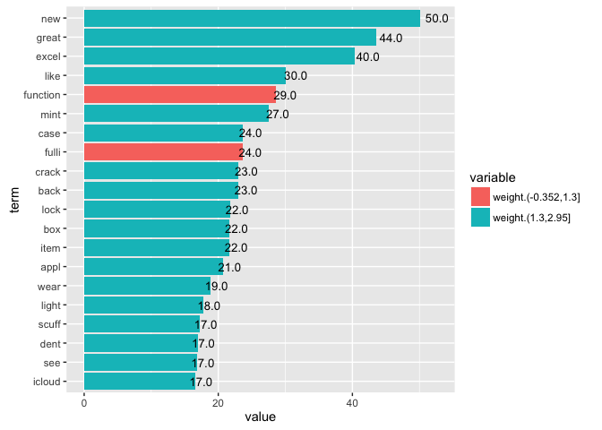
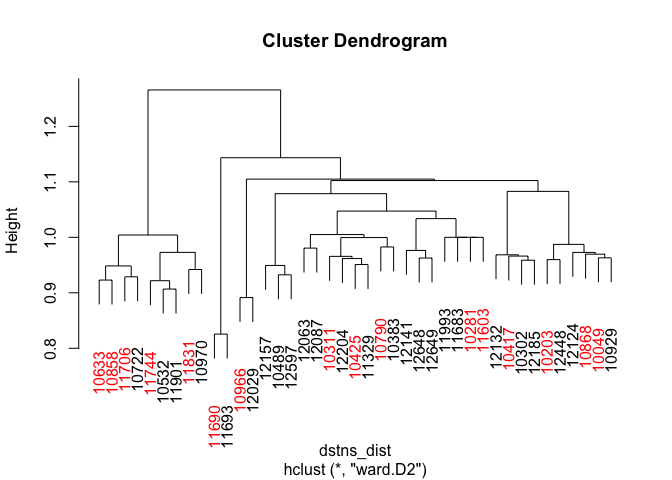
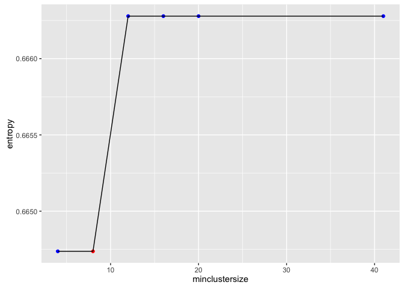
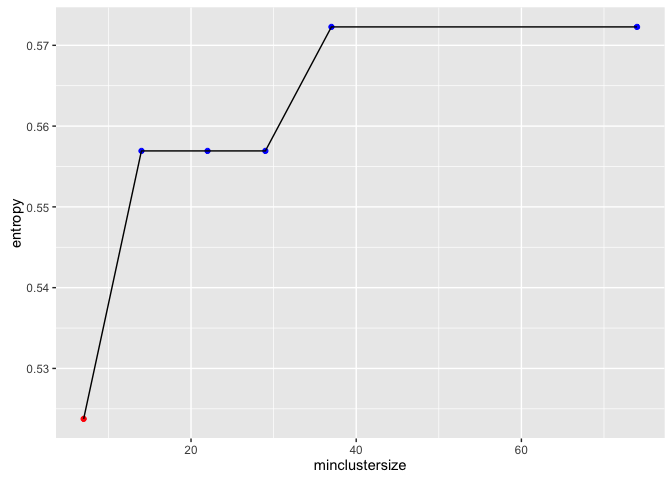
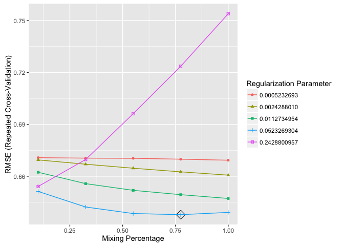
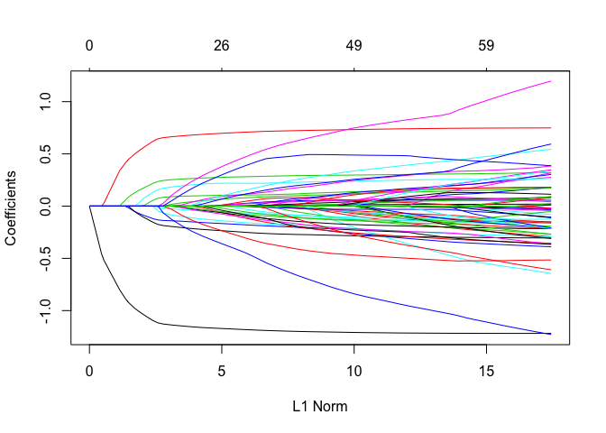
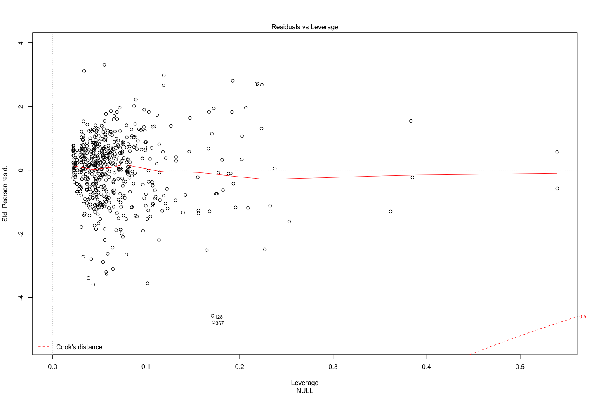
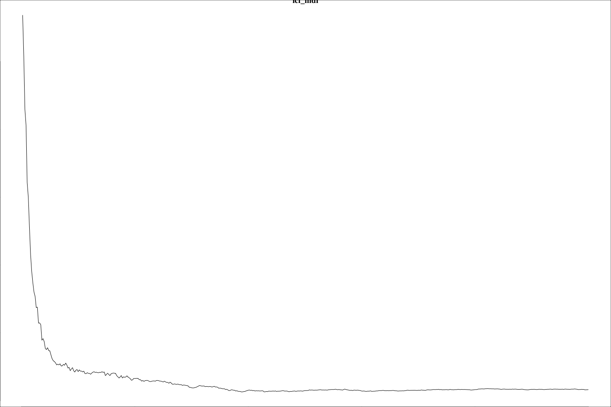
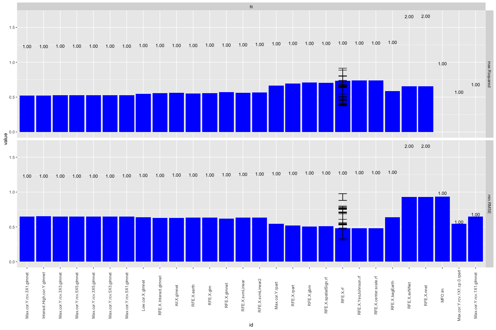

# eBay:iPads:: startprice.log10 regression:: ebayipads_mdlens_bid1_sp
bdanalytics  

**  **    
**Date: (Fri) Oct 16, 2015**    

# Introduction:  

Data: 
Source: 
    Training:   https://inclass.kaggle.com/c/15-071x-the-analytics-edge-summer-2015/download/eBayiPadTrain.csv  
    New:        https://inclass.kaggle.com/c/15-071x-the-analytics-edge-summer-2015/download/eBayiPadTest.csv  
Time period: 


# Synopsis:

Based on analysis utilizing <> techniques, <conclusion heading>:  

Regression results:
First run:
    <glb_sel_mdl_id>: 
        OOB_RMSE=<0.4f>; new_RMSE=<0.4f>; <feat1>=<imp>; <feat2>=<imp>

Classification results:
template:
    prdline.my == "Unknown" -> 296
    Low.cor.X.glm: Leaderboard: 0.83458 -> Rank 288 / 1884 0.85514
        newobs_tbl=[N=471, Y=327]; submit_filename=template_Final_glm_submit.csv
        OOB_conf_mtrx=[YN=125, NY=76]=201; max.Accuracy.OOB=0.7710;
            opt.prob.threshold.OOB=0.6
            startprice=100.00; biddable=95.42; productline=49.22; 
            D.T.like=29.75; D.T.use=26.32; D.T.box=21.53; 

prdline: -> Worse than template
    prdline.my == "Unknown" -> 285
    All.X.no.rnorm.rf: Leaderboard: 0.82649
        newobs_tbl=[N=485, Y=313]; submit_filename=prdline_Final_rf_submit.csv
        OOB_conf_mtrx=[YN=119, NY=80]=199; max.Accuracy.OOB=0.8339;
            opt.prob.threshold.OOB=0.5
            startprice=100.00; biddable=84.25; D.sum.TfIdf=7.28; 
            D.T.use=4.26; D.T.veri=2.78; D.T.scratch=1.99; D.T.box=; D.T.like=; 
    Low.cor.X.glm: Leaderboard: 0.81234
        newobs_tbl=[N=471, Y=327]; submit_filename=prdline_Low_cor_X_glm_submit.csv
        OOB_conf_mtrx=[YN=125, NY=74]=199; max.Accuracy.OOB=0.8205;
            opt.prob.threshold.OOB=0.6
            startprice=100.00; biddable=96.07; prdline.my=51.37; 
            D.T.like=29.39; D.T.use=25.43; D.T.box=22.27; D.T.veri=; D.T.scratch=; 

oobssmpl: -> 
    Low.cor.X.glm: Leaderboard: 0.83402
        newobs_tbl=[N=440, Y=358]; submit_filename=oobsmpl_Final_glm_submit
        OOB_conf_mtrx=[YN=114, NY=84]=198; max.Accuracy.OOB=0.7780;
            opt.prob.threshold.OOB=0.5
            startprice=100.00; biddable=93.87; prdline.my=60.48; D.sum.TfIdf=; 
            D.T.condition=8.69; D.T.screen=7.96; D.T.use=7.50; D.T.veri=; D.T.scratch=;

category: -> 
    Low.cor.X.glm: Leaderboard: 0.82381
        newobs_tbl=[N=470, Y=328]; submit_filename=category_Final_glm_submit
        OOB_conf_mtrx=[YN=119, NY=57]=176; max.Accuracy.OOB=0.8011;
            opt.prob.threshold.OOB=0.6
            startprice=100.00; biddable=79.19; prdline.my=55.22; D.sum.TfIdf=; 
            D.T.ipad=27.05; D.T.like=21.44; D.T.box=20.67; D.T.condition=; D.T.screen=; 

dataclns: -> 
    All.X.no.rnorm.rf: Leaderboard: 0.82211
        newobs_tbl=[N=485, Y=313]; submit_filename=dataclns_Final_rf_submit
        OOB_conf_mtrx=[YN=104, NY=75]=179; max.Accuracy.OOB=0.7977;
            opt.prob.threshold.OOB=0.5
            startprice.log=100.00; biddable=65.85; prdline.my=7.74; D.sum.TfIdf=; 
            D.T.use=2.01; D.T.condition=1.87; D.T.veri=1.62; D.T.ipad=; D.T.like=;
    Low.cor.X.glm: Leaderboard: 0.79264
        newobs_tbl=[N=460, Y=338]; submit_filename=dataclns_Low_cor_X_glm_submit
        OOB_conf_mtrx=[YN=113, NY=74]=187; max.Accuracy.OOB=0.7977;
            opt.prob.threshold.OOB=0.5 -> different from prev run of 0.6
            biddable=100.00; startprice.log=91.85; prdline.my=38.34; D.sum.TfIdf=; 
            D.T.ipad=29.92; D.T.box=27.76; D.T.work=25.79; D.T.use=; D.T.condition=;

txtterms: -> top_n = c(10)
    Low.cor.X.glm: Leaderboard: 0.81448
        newobs_tbl=[N=442, Y=356]; submit_filename=txtterms_Final_glm_submit
        OOB_conf_mtrx=[YN=113, NY=69]=182; max.Accuracy.OOB=0.7943;
            opt.prob.threshold.OOB=0.5
            biddable=100.00; startprice.log=90.11; prdline.my=37.65; D.sum.TfIdf=; 
            D.T.ipad=28.67; D.T.work=24.90; D.T.great=21.44; 
# [1] "D.T.condit"    "D.T.condition" "D.T.good"      "D.T.ipad"      "D.T.new"      
# [6] "D.T.scratch"   "D.T.screen"    "D.T.this"      "D.T.use"       "D.T.work"     
            
    All.X.glm: Leaderboard: 0.81016
        newobs_tbl=[N=445, Y=353]; submit_filename=txtterms_Final_glm_submit
        OOB_conf_mtrx=[YN=108, NY=72]=180; max.Accuracy.OOB=0.7966;
            opt.prob.threshold.OOB=0.5
            biddable=100.00; startprice.log=88.24; prdline.my=33.81; D.sum.TfIdf=; 
            D.T.scratch=25.51; D.T.use=18.97; D.T.good=16.37; 
 [1] "D.T.condit"  "D.T.use"     "D.T.scratch" "D.T.new"     "D.T.good"    "D.T.screen" 
 [7] "D.T.great"   "D.T.excel"   "D.T.work"    "D.T.ipad"            

    Max.cor.Y.rpart: Leaderboard: 0.79258
        newobs_tbl=[N=439, Y=359]; submit_filename=txtterms_Final_rpart_submit
        OOB_conf_mtrx=[YN=105, NY=76]=181; max.Accuracy.OOB=0.7954802;
            opt.prob.threshold.OOB=0.5
            startprice.log=100; biddable=; prdline.my=; D.sum.TfIdf=; 
            D.T.scratch=; D.T.use=; D.T.good=; 
 [1] "D.T.condit"  "D.T.use"     "D.T.scratch" "D.T.new"     "D.T.good"    "D.T.screen" 
 [7] "D.T.ipad"    "D.T.great"   "D.T.work"    "D.T.excel"

    All.X.no.rnorm.rf: Leaderboard: 0.80929
        newobs_tbl=[N=545, Y=253]; submit_filename=txtterms_Final_rf_submit
        OOB_conf_mtrx=[YN=108, NY=61]=169; max.Accuracy.OOB=0.8090395
            opt.prob.threshold.OOB=0.5
            startprice.log=100.00; biddable=78.82; idseq.my=63.43; prdline.my=45.57;
            D.T.use=2.76; D.T.condit=2.35; D.T.scratch=2.00; D.T.good=; 
 [1] "D.T.condit"  "D.T.use"     "D.T.scratch" "D.T.new"     "D.T.good"    "D.T.screen" 
 [7] "D.T.ipad"    "D.T.great"   "D.T.work"    "D.T.excel"

txtclstr:
    All.X.no.rnorm.rf: Leaderboard: 0.79363 -> 0.79573
        newobs_tbl=[N=537, Y=261]; submit_filename=txtclstr_Final_rf_submit
        OOB_conf_mtrx=[YN=104, NY=61]=165; max.Accuracy.OOB=0.8135593
            opt.prob.threshold.OOB=0.5
            startprice.log=100.00; biddable=79.99; idseq.my=64.94; 
                prdline.my=4.14; prdline.my.clusterid=1.15; 
 [1] "D.T.condit"  "D.T.use"     "D.T.scratch" "D.T.new"     "D.T.good"    "D.T.screen" 
 [7] "D.T.ipad"    "D.T.great"   "D.T.work"    "D.T.excel"            
 
dupobs:
    All.X.no.rnorm.rf: Leaderboard: 0.79295
        newobs_tbl=[N=541, Y=257]; submit_filename=dupobs_Final_rf_submit
        OOB_conf_mtrx=[YN=114, NY=65]=179; max.Accuracy.OOB=0.7977401
            opt.prob.threshold.OOB=0.5
            startprice.log=100.00; biddable=94.49; idseq.my=67.40; 
                prdline.my=4.48; prdline.my.clusterid=1.99; 
 [1] "D.T.condit"  "D.T.use"     "D.T.scratch" "D.T.new"     "D.T.good"    "D.T.screen" 
 [7] "D.T.ipad"    "D.T.great"   "D.T.work"    "D.T.excel"            
 
    All.X.no.rnorm.rf: Leaderboard: 0.79652
        newobs_tbl=[N=523, Y=275]; submit_filename=dupobs_Final_rf_submit
        OOB_conf_mtrx=[YN=114, NY=65]=179; max.Accuracy.OOB=0.7977401
            opt.prob.threshold.OOB=0.5
            startprice.log=100.00; biddable=94.24; idseq.my=67.92; 
                prdline.my=4.33; prdline.my.clusterid=2.17; 
 [1] "D.T.condit"  "D.T.use"     "D.T.scratch" "D.T.new"     "D.T.good"    "D.T.screen" 
 [7] "D.T.ipad"    "D.T.great"   "D.T.work"    "D.T.excel"
 
csmmdl:
   All.X.no.rnorm.rf: Leaderboard: 0.79396
        newobs_tbl=[N=525, Y=273]; submit_filename=csmmdl_Final_rf_submit
        OOB_conf_mtrx=[YN=111, NY=66]=177; max.Accuracy.OOB=0.8000000
            opt.prob.threshold.OOB=0.5
            startprice.log=100.00; biddable=90.30; idseq.my=67.06; 
                prdline.my=4.40; cellular.fctr=3.57; prdline.my.clusterid=2.08; 

   All.Interact.X.no.rnorm.rf: Leaderboard: 0.77867
        newobs_tbl=[N=564, Y=234]; submit_filename=csmmdl_Final_rf_submit
        OOB_conf_mtrx=[YN=120, NY=53]=173; max.Accuracy.OOB=0.8045198
            opt.prob.threshold.OOB=0.5
            biddable=100.00; startprice.log=93.99; idseq.my=57.30; 
                prdline.my=9.09; cellular.fctr=3.30; prdline.my.clusterid=2.35; 

   All.Interact.X.no.rnorm.rf: Leaderboard: 0.77152
        newobs_tbl=[N=539, Y=259]; submit_filename=csmmdl_Final_rf_submit
        OOB_conf_mtrx=[YN=, NY=]=; max.Accuracy.OOB=0.8011299
            opt.prob.threshold.OOB=0.5
            biddable=100.00; startprice.log=94.93; idseq.my=57.12; 
                prdline.my=9.29; cellular.fctr=3.20; prdline.my.clusterid=2.50; 
 [1] "D.T.condit"  "D.T.use"     "D.T.scratch" "D.T.new"     "D.T.good"    "D.T.screen" 
 [7] "D.T.ipad"    "D.T.great"   "D.T.work"    "D.T.excel"
        
        All.X.glmnet: 
            fit_RMSE=???; OOB_RMSE=115.1247; new_RMSE=115.1247; 
            prdline.my.fctr=100.00; condition.fctrNew=88.53; D.npnct09.log=84.34
                biddable=16.48; idseq.my=57.27;
spdiff:                
    All.Interact.X.no.rnorm.rf: Leaderboard: 0.78218
        newobs_tbl=[N=517, Y=281]; submit_filename=spdiff_Final_rf_submit
        OOB_conf_mtrx=[YN=121, NY=38]=159; max.Accuracy.OOB=0.8203390
            opt.prob.threshold.OOB=0.6
            biddable=100.00; startprice.diff=57.53; idseq.my=41.31; 
                prdline.my=11.43; cellular.fctr=2.36; prdline.my.clusterid=1.82; 

        All.X.no.rnorm.rf: 
            fit_RMSE=92.19; OOB_RMSE=130.86; new_RMSE=130.86; 
            biddable=100.00; prdline.my.fctr=61.92; idseq.my=57.77;
                condition.fctr=29.53; storage.fctr=11.22; color.fctr=6.69;
                cellular.fctr=6.11
                
    All.X.no.rnorm.rf: Leaderboard: 0.77443
        newobs_tbl=[N=606, Y=192]; submit_filename=spdiff_Final_rf_submit
        OOB_conf_mtrx=[YN=112, NY=28]=140; max.Accuracy.OOB=0.8418079
            opt.prob.threshold.OOB=0.6
            startprice.diff=100.00; biddable=96.53; idseq.my=38.10; 
                prdline.my=3.65; cellular.fctr=2.21; prdline.my.clusterid=0.91; 
 [1] "D.T.condit"  "D.T.use"     "D.T.scratch" "D.T.new"     "D.T.good"    "D.T.screen" 
 [7] "D.T.ipad"    "D.T.great"   "D.T.work"    "D.T.excel"
 
 color:
        All.Interact.X.glmnet: 
            fit_RMSE=88.64520; 
            prdline.my.fctr:D.TfIdf.sum.stem.stop.Ratio=100.00;
            prdline.my.fctr:condition.fctr=77.35
            D.TfIdf.sum.stem.stop.Ratio=68.18
            prdline.my.fctr:color.fctr=68.12
            prdline.my.fctr:storage.fctr=63.32

    All.X.no.rnorm.rf: Leaderboard: 0.80638
        newobs_tbl=[N=550, Y=248]; submit_filename=color_Final_rf_submit
        OOB_conf_mtrx=[YN=108, NY=54]=162; max.Accuracy.OOB=0.8169492
            opt.prob.threshold.OOB=0.5
            biddable=100.00; startprice.diff=77.90; idseq.my=48.49; 
                D.ratio.sum.TfIdf.nwrds=6.48; storage.fctr=4.74;
                    D.TfIdf.sum.stem.stop.Ratio=4.57; prdline.my=4.32;
 [1] "D.T.condit"  "D.T.use"     "D.T.scratch" "D.T.new"     "D.T.good"    "D.T.screen" 
 [7] "D.T.ipad"    "D.T.great"   "D.T.work"    "D.T.excel"
            
assctxt:
        select_terms:
[1] "condit"   "use"      "scratch"  "new"      "good"     "ipad"     "screen"   "great"   
 [9] "work"     "excel"    "like"     "box"      "function" "item"     "fulli"    "minor" 
[17] "cosmet"   "crack"    "mint"     "wear"  
        assoc_terms:
 [1] "bare"      "sign"      "light"     "back"      "hous"      "tab"       "dent"     
 [8] "brand"     "open"      "mini"      "appl"      "air"       "wifi"      "affect"   
[15] "protector" "shape"     "perfect"   "order"     "button"    "origin"    "retail"   
[22] "seal"      "includ"    "100"       "may"       "show"      "overal"    "bodi"     
[29] "phone"     "will"      "damag"     "near"      "top"       "normal"    "tear"     
[36] "expect"    "minim"          
        glb_allobs_df$prdline.my$.clusterid Entropy: 0.6665 (97.3037 pct)
        All.Interact.X.glmnet: 
            fit_RMSE=88.40723; 
            prdline.my.fctr:D.TfIdf.sum.stem.stop.Ratio=100.00;
            prdline.my.fctriPadAir:D.npnct01.log=79.67748;
            D.TfIdf.sum.stem.stop.Ratio=79.08192;
            prdline.my.fctriPadmini 2+:condition.fctrNew other (see details)=78.24020;
            prdline.my.fctriPad 3+:color.fctrSpace Gray=77.05886;
            prdline.my.fctriPadmini 2+:storage.fctrUnknown=75.68145;
            prdline.my.fctrUnknown:.clusterid.fctr3=74.23727;

    All.Interact.X.no.rnorm.rf: Leaderboard: 0.72974
        newobs_tbl=[N=682, Y=116]; submit_filename=assctxt_Final_rf_submit
        OOB_conf_mtrx=[YN=125, NY=43]=168; max.Accuracy.OOB=0.8101695; max.auc.OOB=???;
            opt.prob.threshold.OOB=0.6
            biddable=100.00; startprice.diff=51.04; idseq.my=29.51; 
                startprice.diff:biddable=28.70
                prdline.my.fctriPadmini:idseq.my=6.89
        Highest max.auc.OOB=???; for model:        

ctgry2:
        select_terms: 50
        assoc_terms: 103
        glb_allobs_df$prdline.my$.clusterid Entropy: 0.6559 (96.7556 pct)
        All.Interact.X.glmnet: next: All.X.glmnet
            fit_RMSE=88.80010;
prdl.my.descr.fctr:storage.fctr                    100.00
prdl.my.descr.fctr:condition.fctr           93.96
prdl.my.descr.fctr:D.npnct01.log                           89.94
D.TfIdf.sum.stem.stop.Ratio                                             75.90
prdl.my.descr.fctr:color.fctr                              72.43
prdl.my.descr.fctr:.clusterid.fctr7                             63.97
prdl.my.descr.fctr:D.npnct08.log                               63.46
prdl.my.descr.fctr                                             63.05
prdl.my.descr.fctr:D.TfIdf.sum.stem.stop.Ratio                 62.91
prdl.my.descr.fctr:D.npnct16.log                               62.39
            
    Ensemble.glmnet: Leaderboard: 0.80480
        newobs_tbl=[N=473, Y=325]; submit_filename=ctgry2_Final_glmnet_submit
        OOB_conf_mtrx=[YN=79, NY=101]=180; 
            max.Accuracy.OOB=0.7977528; max.auc.OOB=0.8554068; opt.prob.threshold.OOB=0.4
        Highest max.auc.OOB=0.8587215; for model:All.X.no.rnorm.rf     
            biddable                        100.000
            startprice.diff                  71.793
            idseq.my                         43.511
            
ensemble:
        select_terms: 50
        assoc_terms: 103
        glb_allobs_df$prdline.my$.clusterid Entropy: 0.6570 (96.9282 pct)
        Final.glment: min.RMSE.fit=31.45801
        Ensemble.glmnet: min.RMSE.fit=30.67172
startprice.predict.All.Interact.X.no.rnorm.rf    100.000
startprice.predict.All.X.no.rnorm.rf              75.381
        All.X.glmnet: min.RMSE.fit=88.98066
prdl.my.descr.fctr                       100.00
D.TfIdf.sum.stem.stop.Ratio                        92.16
condition.fctr                                  79.01
prdl.my.descr.fctr:.clusterid.fctr5       69.91
D.npnct16.log                                      61.70
color.fctrWhite                                    59.42
D.npnct01.log                                      55.07
cellular.fctr1                                     53.35
D.terms.n.post.stop                                52.92        

    Ensemble.glmnet: Leaderboard: 0.73183
        newobs_tbl=[N=557, Y=241]; submit_filename=ensemble_Final_glmnet_submit
        OOB_conf_mtrx=[YN=75, NY=60]=135; 
            max.Accuracy.OOB=0.8483146; max.auc.OOB=0.9187365;
            opt.prob.threshold.OOB=0.5
sold.fctr.predict.All.X.no.rnorm.rf.prob                                100.000000        
sold.fctr.predict.All.Interact.X.no.rnorm.rf.prob                        98.873608        
        Highest max.auc.OOB=0.9180131; for model:All.X.no.rnorm.rf  
startprice.diff             100.000
biddable                     95.318
idseq.my                     33.365        

ncv7:
        select_terms: 50
        assoc_terms: 103
        glb_allobs_df$prdline.my$.clusterid Entropy: 0.6570 (96.9282 pct)
        Final.glment: min.RMSE.fit=31.45704
        Ensemble.glmnet: min.RMSE.fit=29.93289
startprice.predict.All.Interact.X.no.rnorm.rf    100.000
startprice.predict.All.X.no.rnorm.rf              82.878
startprice.predict.Low.cor.X.lm                   42.664        
        All.Interact.X.glmnet: min.RMSE.fit=87.30181
prdl.my.descr.fctr:D.npnct01.log                          100.00
prdl.my.descr.fctr:condition.fctr           99.98
prdl.my.descr.fctr:storage.fctr                     96.26
prdl.my.descr.fctriPadAir                                             79.65
prdl.my.descr.fctr:color.fctr                         79.30
prdl.my.descr.fctr:D.TfIdf.sum.stem.stop.Ratio                 74.90
D.TfIdf.sum.stem.stop.Ratio                                             74.77
prdl.my.descr.fctr:D.npnct08.log                               67.38
prdl.my.descr.fctr:D.npnct01.log                               67.38

    Ensemble.glmnet: Leaderboard: not submitted -> lower max.auc.OOB of "Ensemble submission"
        newobs_tbl=[N=561, Y=237]; submit_filename=ncv7_Final_glmnet_submit
        OOB_conf_mtrx=[YN=79, NY=55]=134; 
            max.Accuracy.OOB=0.8494382; max.auc.OOB=0.9130918; opt.prob.threshold.OOB=0.5
sold.fctr.predict.All.X.no.rnorm.rf.prob                                100.000
sold.fctr.predict.All.Interact.X.no.rnorm.rf.prob                        99.348      
        Highest max.auc.OOB=0.9117720; for model:All.X.no.rnorm.rf  
startprice.diff             100.000
biddable                     96.383
idseq.my                     32.634   

gbm w/startprice.unit9:
    Final.glment: min.RMSE.fit=30.32782
    Ensemble.glmnet: min.RMSE.fit=29.62348
startprice.predict.All.Interact.X.no.rnorm.rf    100.000
startprice.predict.All.X.no.rnorm.rf              73.521
startprice.predict.All.Interact.X.bayesglm        29.675
startprice.predict.Max.cor.Y.lm                   28.405

        All.X.glmnet: min.RMSE.fit=88.64271
prdl.my.descr.fctr                       100.00
D.TfIdf.sum.stem.stop.Ratio                        85.01
condition.fctr                                  80.28
carrier.fctr                                  77.48
prdl.my.descr.fctr:.clusterid.fctr5       65.78
D.npnct16.log                                      61.66
startprice.unit9                                   59.48
color.fctr                                    59.21
D.npnct01.log                                      53.78
D.npnct08.log                                      53.56
cellular.fctr                                     53.19

    Ensemble.glmnet: Leaderboard: not submitted -> lower max.auc.OOB of "Ensemble submission"
        newobs_tbl=[N=579, Y=219]; submit_filename=gbm_Final_glmnet_submit
        OOB_conf_mtrx=[YN=85, NY=54]=139; 
            max.Accuracy.OOB=0.8438202; max.auc.OOB=0.9127314; opt.prob.threshold.OOB=0.5
sold.fctr.predict.All.X.no.rnorm.rf.prob             100.0000
sold.fctr.predict.All.Interact.X.no.rnorm.rf.prob     98.7937            
        Highest max.auc.OOB=0.9167568; for model:All.Interact.X.gbm
biddable                                           100.0000
startprice.diff                                     96.2076
startprice.diff:biddable                            23.2114
idseq.my                                             7.8098        

mdlsel:
    Final.glment: min.RMSE.fit=30.47114 (higher than gbm w/startprice.unit9)
    Ensemble.glmnet: min.RMSE.fit=29.49418
startprice.predict.All.Interact.X.no.rnorm.rf                          100.000000
startprice.predict.All.X.no.rnorm.rf                                    71.213880
startprice.predict.All.X.bayesglm                                       24.166084

        All.X.glmnet: min.RMSE.fit=88.64271
prdl.my.descr.fctr                       100.00
D.TfIdf.sum.stem.stop.Ratio                        85.01
condition.fctr                                  80.28
carrier.fctr                                  77.48
prdl.my.descr.fctr:.clusterid.fctr5       65.78
D.npnct16.log                                      61.66
startprice.unit9                                   59.48
color.fctr                                    59.21
D.npnct01.log                                      53.78
D.npnct08.log                                      53.56
cellular.fctr                                     53.19

mdlsel(startprice.log):
    Final.Ensemble.rf: min.RMSE.fit=0.4563772
    Ensemble.rf: min.RMSE.fit=0.4283013
startprice.log.predict.All.Interact.X.no.rnorm.rf                  100.0000000
startprice.log.predict.All.X.no.rnorm.rf                            58.0967582
startprice.log.predict.All.Interact.X.gbm                            6.7197148

        All.X.no.rnorm.rf: min.RMSE.fit=1.4967021
biddable                                         100.00000000
idseq.my                                          98.00292371
startprice.unit9                                  34.31130220
prdl.my.descr.fctr                       18.10984741
D.ratio.sum.TfIdf.nwrds                           15.23549621
color.fctrUnknown                                 14.05520993
D.TfIdf.sum.stem.stop.Ratio                       13.00884673
D.ratio.nstopwrds.nwrds                           10.51165302

    All.X.gbm: Leaderboard: 0.75430
        newobs_tbl=[N=582, Y=216]; submit_filename=mdlsel_Final_gbm_submit
        OOB_conf_mtrx=[YN=58, NY=65]=123; 
            max.Accuracy.OOB=0.8617978; max.auc.OOB=0.9367161;
            opt.prob.threshold.OOB=0.5
startprice.diff                                           100.0000000 100.00000000
biddable                                                   66.6475055  65.40764971
idseq.my                                                    1.8632456   4.55963698

splogdiff:
    All.X.gbm: Leaderboard: 0.70111
        newobs_tbl=[N=553, Y=245]; submit_filename=splogdiff_Final_gbm_submit
        OOB_conf_mtrx=[YN=35, NY=101]=136; 
            max.Accuracy.OOB=0.8471910; max.auc.OOB=0.9388912;
            opt.prob.threshold.OOB=0.3
startprice.log.diff                                       100.0000000 100.0000000
biddable                                                   86.8563123  88.0261866
idseq.my                                                    8.3580281   2.9054298       

nofrcdups:
    All.X.gbm: Leaderboard: ???/0.67225
        newobs_tbl=[N=543, Y=255]; submit_filename=nofrcdups_Final_gbm_submit
        OOB_conf_mtrx=[YN=36, NY=101]=137; 
            opt.prob.threshold.OOB=0.3
            max.Accuracy.OOB=0.0.8460674; max.auc.OOB=0.9388582;
startprice.log.diff                                      100.00000000  93.3716491
biddable                                                  83.57786348 100.0000000
idseq.my                                                  11.54696712   1.1240259     
  
nofrcdups w/ glb_sel_mdl_id=All.X.no.rnorm.rf:
    All.X.no.rnorm.rf: Leaderboard: ???/0.57475 -> ???/0.59937 with force dups
        newobs_tbl=[N=630, Y=168]; newobs_range_outliers=798; 
            submit_filename=nofrcdups_Final_rf_submit
        OOB_conf_mtrx=[YN=70, NY=62]=132; OOBobs_range_outliers=27
            opt.prob.threshold.OOB=0.5
            max.Accuracy.OOB=0.8516854; max.auc.OOB=0.9335308;
startprice.log.diff                                              100.00
biddable                                                         87.61
idseq.my                                                         26.79

Forum Ideas:
I then focused on feature engineering, each new variable brought its own little improvement so in the end i just kept adding new ones and let the models do their thing. Here are some i used: model (productline:storage:condition), isNew, model2 (product:isNew), 50 common words from descr, descrLength, capsFactor (% of caps in description), number of cheaper items of same model2, number of dearer items of same model2, priceFactor (vs. mean of price for model), priceFactor2 (vs. mean of price for model2), bigID (if ID> 11000 because there seems to be a huge drop in sales after some time), timeline (year of product launch, reasoning is you want to spend less money on older products).

Get the median startprice for each level of productline and condition. Take the difference from startprice as a new variable. I find median works much better than the mean since startprice is not normally distributed. I also created another binary variable on whether this difference is positive or negative.

Square root startprice

scale and center all the variables except sold, including the dummies.

### Prediction Accuracy Enhancement Options:
- Not repeatable experiments:
    - gbm & ensembles that include gbm
    - rf that includes .rnorm ??? (now .rnorm has a set seed)
    
- import.data chunk:
    - which obs should be in fit vs. OOB (currently dirty.0 vs .1 is split 50%)
    
- inspect.data chunk:
    - For date variables
        - Appropriate factors ?
        - Different / More last* features ?
        
- scrub.data chunk:        
- transform.data chunk:
    - derive features from multiple features
    
- manage.missing.data chunk:
    - Not fill missing vars
    - Fill missing numerics with a different algorithm
    - Fill missing chars with data based on clusters 
    
- extract.features chunk:
    - Text variables: move to date extraction chunk ???
        - Mine acronyms
        - Mine places

- Review set_global_options chunk after features are finalized

### 

## Potential next steps include:
- Organization:
    - Categorize by chunk
    - Priority criteria:
        0. Ease of change
        1. Impacts report
        2. Cleans innards
        3. Bug report
        
- all chunks:
    - at chunk-end rm(!glb_<var>)
    
- manage.missing.data chunk:
    - cleaner way to manage re-splitting of training vs. new entity

- extract.features chunk:
    - Add n-grams for glb_txt_vars
        - "RTextTools", "tau", "RWeka", and "textcat" packages
    - Convert user-specified mutate code to config specs
    
- fit.models chunk:
    - Prediction accuracy scatter graph:
    -   Add tiles (raw vs. PCA)
    -   Use shiny for drop-down of "important" features
    -   Use plot.ly for interactive plots ?
    
    - Change .fit suffix of model metrics to .mdl if it's data independent (e.g. AIC, Adj.R.Squared - is it truly data independent ?, etc.)
    - move model_type parameter to myfit_mdl before indep_vars_vctr (keep all model_* together)
    - create a custom model for rpart that has minbucket as a tuning parameter
    - varImp for randomForest crashes in caret version:6.0.41 -> submit bug report

- Probability handling for multinomials vs. desired binomial outcome
-   ROCR currently supports only evaluation of binary classification tasks (version 1.0.7)
-   extensions toward multiclass classification are scheduled for the next release

- Skip trControl.method="cv" for dummy classifier ?
- Add custom model to caret for a dummy (baseline) classifier (binomial & multinomial) that generates proba/outcomes which mimics the freq distribution of glb_rsp_var values; Right now glb_dmy_glm_mdl always generates most frequent outcome in training data
- glm_dmy_mdl should use the same method as glm_sel_mdl until custom dummy classifer is implemented

- fit.all.training chunk:
    - myplot_prediction_classification: displays 'x' instead of '+' when there are no prediction errors 
- Compare glb_sel_mdl vs. glb_fin_mdl:
    - varImp
    - Prediction differences (shd be minimal ?)

- Move glb_analytics_diag_plots to mydsutils.R: (+) Easier to debug (-) Too many glb vars used
- Add print(ggplot.petrinet(glb_analytics_pn) + coord_flip()) at the end of every major chunk
- Parameterize glb_analytics_pn
- Move glb_impute_missing_data to mydsutils.R: (-) Too many glb vars used; glb_<>_df reassigned
- Replicate myfit_mdl_classification features in myfit_mdl_regression
- Do non-glm methods handle interaction terms ?
- f-score computation for classifiers should be summation across outcomes (not just the desired one ?)
- Add accuracy computation to glb_dmy_mdl in predict.data.new chunk
- Why does splitting fit.data.training.all chunk into separate chunks add an overhead of ~30 secs ? It's not rbind b/c other chunks have lower elapsed time. Is it the number of plots ?
- Incorporate code chunks in print_sessionInfo
- Test against 
    - projects in github.com/bdanalytics
    - lectures in jhu-datascience track

# Analysis: 

```r
rm(list = ls())
set.seed(12345)
options(stringsAsFactors = FALSE)
source("~/Dropbox/datascience/R/myscript.R")
source("~/Dropbox/datascience/R/mydsutils.R")
```

```
## Loading required package: caret
## Loading required package: lattice
## Loading required package: ggplot2
```

```r
source("~/Dropbox/datascience/R/myplot.R")
source("~/Dropbox/datascience/R/mypetrinet.R")
source("~/Dropbox/datascience/R/myplclust.R")
source("~/Dropbox/datascience/R/mytm.R")
# Gather all package requirements here
suppressPackageStartupMessages(require(doMC))
registerDoMC(6) # # of cores on machine - 2
suppressPackageStartupMessages(require(caret))
source("~/Documents/Work/PullRequests/caret/pkg/caret/R/confusionMatrix.R")
source("~/Documents/Work/PullRequests/caret/pkg/caret/R/ggplot.R")
#packageVersion("tm")
#require(sos); findFn("cosine", maxPages=2, sortby="MaxScore")

# Analysis control global variables
glb_trnng_url <- "https://inclass.kaggle.com/c/15-071x-the-analytics-edge-summer-2015/download/eBayiPadTrain.csv"
glb_newdt_url <- "https://inclass.kaggle.com/c/15-071x-the-analytics-edge-summer-2015/download/eBayiPadTest.csv"
glb_out_pfx <- "ebayipads_mdlens_bid1_sp_"
glb_save_envir <- FALSE # or TRUE

glb_is_separate_newobs_dataset <- TRUE    # or TRUE
    glb_split_entity_newobs_datasets <- TRUE   # or FALSE
    glb_split_newdata_method <- "sample"          # "condition" or "sample" or "copy"
    glb_split_newdata_condition <- NULL # or "is.na(<var>)"; "<var> <condition_operator> <value>"
    glb_split_newdata_size_ratio <- 0.3               # > 0 & < 1
    glb_split_sample.seed <- 123               # or any integer

glb_obs_drop_condition <- #NULL 
            "(UniqueID %in% c(NULL
                , 11234 #sold=0; 2 other dups(10306, 11503) are sold=1
                , 11844 #sold=0; 3 other dups(11721, 11738, 11812) are sold=1
                ))  | (productline %in% c('iPad 5', 'iPad mini Retina')) |
                      (biddable != 1)"
#parse(text=glb_obs_drop_condition)
    
glb_obs_repartition_train_condition <- #NULL 
    "!is.na(sold) & (sold == 1)"
    
glb_max_fitobs <- NULL # or any integer                         

glb_is_regression <- TRUE; glb_is_classification <- !glb_is_regression; 
    glb_is_binomial <- TRUE #or FALSE

glb_rsp_var_raw <- "startprice"

# for classification, the response variable has to be a factor
glb_rsp_var <- "startprice.log10" # "sold.fctr" # glb_rsp_var_raw

# if the response factor is based on numbers/logicals e.g (0/1 OR TRUE/FALSE vs. "A"/"B"), 
#   or contains spaces (e.g. "Not in Labor Force")
#   caret predict(..., type="prob") crashes
glb_map_rsp_raw_to_var <- function(raw) { # NULL
#     return(raw ^ 0.5)
#     return(log(1 + raw))
    return(log10(raw))
#     return(exp(-raw / 2))
#     ret_vals <- rep_len(NA, length(raw)); ret_vals[!is.na(raw)] <- ifelse(raw[!is.na(raw)] == 1, "Y", "N"); return(relevel(as.factor(ret_vals), ref="N"))
#     #as.factor(paste0("B", raw))
#     #as.factor(gsub(" ", "\\.", raw))    
}
glb_map_rsp_raw_to_var(tst <- c(NA, 0, 2.99, 280.50, 1000.00))
```

```
## [1]        NA      -Inf 0.4756712 2.4479329 3.0000000
```

```r
glb_map_rsp_var_to_raw <- function(var) { # NULL #
#     return(var ^ 2.0)
#     return(exp(var) - 1)
    return(10 ^ var)
#     return(-log(var) * 2)
#     as.numeric(var) - 1
#     #as.numeric(var)
#     #gsub("\\.", " ", levels(var)[as.numeric(var)])
#     c("<=50K", " >50K")[as.numeric(var)]
#     #c(FALSE, TRUE)[as.numeric(var)]
}
glb_map_rsp_var_to_raw(glb_map_rsp_raw_to_var(tst))
```

```
## [1]      NA    0.00    2.99  280.50 1000.00
```

```r
if ((glb_rsp_var != glb_rsp_var_raw) && is.null(glb_map_rsp_raw_to_var))
    stop("glb_map_rsp_raw_to_var function expected")
glb_rsp_var_out <- paste0(glb_rsp_var, ".predict.") # mdl_id is appended later

# List info gathered for various columns
# <col_name>:   <description>; <notes>
# description = The text description of the product provided by the seller.
# biddable = Whether this is an auction (biddable=1) or a sale with a fixed price (biddable=0).
# startprice = The start price (in US Dollars) for the auction (if biddable=1) or the sale price (if biddable=0).
# condition = The condition of the product (new, used, etc.)
# cellular = Whether the iPad has cellular connectivity (cellular=1) or not (cellular=0).
# carrier = The cellular carrier for which the iPad is equipped (if cellular=1); listed as "None" if cellular=0.
# color = The color of the iPad.
# storage = The iPad's storage capacity (in gigabytes).
# productline = The name of the product being sold.

# If multiple vars are parts of id, consider concatenating them to create one id var
# If glb_id_var == NULL, ".rownames <- row.names()" is the default
# Derive a numeric feature from id var

# User-specified exclusions
# List feats that shd be excluded due to known causation by prediction variable
glb_exclude_vars_as_features <- c(NULL
                                  , "description", "productline"
                                  , "sold", "startprice.log10.cut.fctr"
### bid0_sp                                  
#   # List feats that are linear combinations (alias in glm)
#                                 , "D.terms.post.stem.n.log", "D.weight.sum"
#                                 #, "prdl.descr.my.fctriPad4#1:.clusterid.fctr3" This does not work
#   # if RFE is rated lower than Low.cor, list feats that are in RFE & not in Low.cor
#         # min.RMSE.fit(RFE.X.glmnet)=0.1138888
# #             D.chrs.n.log                 61.12483
# #             D.chrs.uppr.n.log            61.12483
# #             D.ratio.wrds.stop.n.wrds.n   61.12483
# #             D.terms.post.stop.n.log      61.12483
# #             D.weight.post.stem.sum       61.12483
# #             D.wrds.n.log                 61.12483
# #             D.wrds.stop.n.log            61.12483
# #             D.wrds.unq.n.log             61.12483
#                             #, "startprice.dcm2.is9" # min.RMSE.fit(RFE.X.glmnet)=0.1141991 (up)
#                             , "D.wrds.stop.n.log"    # min.RMSE.fit(RFE.X.glmnet)=0.1131232
###                            
                                  ) 

glb_id_var <- c("UniqueID")
glb_category_var <- "prdl.descr.my.fctr" # "productline" # NULL 
glb_drop_vars <- c(NULL) # or c("<col_name>")

glb_map_vars <- NULL # or c("<var1>", "<var2>")
glb_map_urls <- list();
# glb_map_urls[["<var1>"]] <- "<var1.url>"

glb_assign_pairs_lst <- NULL; 
# glb_assign_pairs_lst[["<var1>"]] <- list(from=c(NA),
#                                            to=c("NA.my"))
glb_assign_vars <- names(glb_assign_pairs_lst)

# Derived features
glb_derive_lst <- NULL;

# Add logs of numerics that are not distributed normally ->  do automatically ???
# Right skew: logp1; sqrt; ^ 1/3; logp1(logp1)

# glb_derive_lst[["prdline.my"]] <- list(
#     mapfn=function(productline) { return(productline) }    
#     , args=c("productline"))

glb_derive_lst[["startprice.log10.cut.fctr"]] <- list(
    mapfn=function(startprice.log10) { return(cut(startprice.log10, 3)) }    
    , args=c("startprice.log10"))

glb_derive_lst[["descr.my"]] <- list(
    mapfn=function(description) { mod_raw <- description;
        # This is here because it does not work with txt_map_filename
        mod_raw <- gsub(paste0(c("\n", "\211", "\235", "\317", "\333"), collapse="|"), " ",
                        mod_raw)
        # This should go into txt_map_filename    
        mod_raw <- gsub("\\.\\.", "\\. ", mod_raw);    
        # Don't parse for "." because of ".com"; use customized gsub for that text
        mod_raw <- gsub("(\\w)(!|\\*|,|-|/)(\\w)", "\\1\\2 \\3", mod_raw);
        
        # Modifications for this exercise only
        # Add dictionary to stemDocument e.g. stickers stemmed to sticker ???
        mod_raw <- gsub("8\\.25", "825", mod_raw, ignore.case=TRUE);  
        mod_raw <- gsub(" 10\\.SCREEN ", " 10\\. SCREEN ", mod_raw, ignore.case=TRUE);
        mod_raw <- gsub(" 128 gb ", " 128gb ", mod_raw, ignore.case=TRUE);  
        mod_raw <- gsub(" 16G, ", " 16GB, ", mod_raw, ignore.case=TRUE);
        mod_raw <- gsub(" 16 gig ", " 16gb ", mod_raw, ignore.case=TRUE);
        mod_raw <- gsub(" 16 gb ", " 16gb ", mod_raw, ignore.case=TRUE);     
        
        mod_raw <- gsub("\\bAccounts\\b", "Account", mod_raw, ignore.case=FALSE);
        mod_raw <- gsub("\\bactivated\\b", "activate", mod_raw, ignore.case=FALSE);        
        mod_raw <- gsub(" actuuly ", " actual ", mod_raw, ignore.case=TRUE);
        mod_raw <- gsub("\\baffects\\b", "affect", mod_raw, ignore.case=FALSE);   
        mod_raw <- gsub("\\bApple\\&#039;s", "Apple", mod_raw, ignore.case=FALSE);        
#mod_raw <- glb_allobs_df[c(665), txt_var]; mod_raw        
        mod_raw <- gsub(" Apple care ", " Applecare ", mod_raw, ignore.case=FALSE);        
        mod_raw <- gsub(" ans ", " and ", mod_raw, ignore.case=TRUE);
        mod_raw <- gsub(" bacK!wiped ", " bacK ! wiped ", mod_raw, ignore.case=TRUE);
        mod_raw <- gsub(" backplate", " back plate", mod_raw, ignore.case=TRUE);        
        mod_raw <- gsub("\\bbarley", "barely", mod_raw, ignore.case=TRUE);        
        mod_raw <- gsub(" bend ", " bent ", mod_raw, ignore.case=TRUE);         
        mod_raw <- gsub("Best Buy", "BestBuy", mod_raw, ignore.case=TRUE);
        mod_raw <- gsub(" black\\.Device ", " black \\. Device ", mod_raw,
                        ignore.case=TRUE);        
        mod_raw <- gsub("black\\),charger ", "black\\), charger ", mod_raw,
                        ignore.case=TRUE);        
        mod_raw <- gsub("\\bblacked\\b", "black", mod_raw, ignore.case=FALSE);
        mod_raw <- gsub("\\bblemish\\b", "blemishes", mod_raw, ignore.case=FALSE);        
        mod_raw <- gsub(" blocks", " blocked", mod_raw, ignore.case=TRUE);        
        mod_raw <- gsub(" brokenCharger ", " broken Charger ", mod_raw, ignore.case=TRUE);
        
        mod_raw <- gsub(" perfectlycord ", " perfectly cord ", mod_raw, ignore.case=TRUE);
        mod_raw <- gsub("\\bcord", "cable", mod_raw, ignore.case=TRUE);        
        mod_raw <- gsub("\\bcables\\b", "cable", mod_raw, ignore.case=TRUE);        
        
        mod_raw <- gsub(" care\\.The ", " care\\. The ", mod_raw, ignore.case=TRUE);
        mod_raw <- gsub("\\b(cared|careful|CAREFUL)\\b", "care", mod_raw, ignore.case=FALSE);
        mod_raw <- gsub("\\b(cases|casing)\\b", "case", mod_raw, ignore.case=TRUE);        
#mod_raw <- glb_allobs_df[c(88,187,280,1040,1098), txt_var]; mod_raw        
        mod_raw <- gsub(" carefully ", " careful ", mod_raw, ignore.case=TRUE);
        mod_raw <- gsub("\\bchargers\\b", "charger", mod_raw, ignore.case=FALSE);
        mod_raw <- gsub("\\bchips\\b", "chip", mod_raw, ignore.case=FALSE);
        mod_raw <- gsub("\\bcleanly\\b", "clean", mod_raw, ignore.case=FALSE);        
        mod_raw <- gsub("\\b(C|c)olor(.*)s\\b", "\\1olor", mod_raw, ignore.case=FALSE);
#mod_raw <- glb_allobs_df[c(280,1411), txt_var]; mod_raw        
        mod_raw <- gsub("\\bcompletely\\b", "complete", mod_raw, ignore.case=FALSE);   
#mod_raw <- glb_allobs_df[c(42,502,676), txt_var]; mod_raw        
        
        mod_raw <- gsub("\\b(conditon|condtion|contidion|conditions)\\b", "condition", mod_raw,
                        ignore.case=TRUE);
#mod_raw <- glb_allobs_df[c(234), txt_var]; mod_raw        
        mod_raw <- gsub("(CONDITION|ONLY)\\.(\\w)", "\\1\\. \\2", mod_raw,
                        ignore.case=TRUE);
        mod_raw <- gsub("(condition)(Has)", "\\1\\. \\2", mod_raw);
        
        mod_raw <- gsub("\\bCONNECTED\\b", "CONNECT", mod_raw, ignore.case=FALSE);        
        mod_raw <- gsub("\\bconnects\\b", "connect", mod_raw, ignore.case=FALSE);        
        mod_raw <- gsub(" consist ", " consistent ", mod_raw, ignore.case=TRUE);
#mod_raw <- glb_allobs_df[c(195, 379, 437), txt_var]; mod_raw        
        mod_raw <- gsub("\\bCosmetics\\b", "Cosmetic", mod_raw, ignore.case=FALSE);        
        mod_raw <- gsub(" cracksNo ", " cracks No ", mod_raw, ignore.case=TRUE);
        
        mod_raw <- gsub("\\b(D|d)amaged\\b", "\\1amage", mod_raw, ignore.case=TRUE);
#mod_raw <- glb_allobs_df[c(116, 1360), txt_var]; mod_raw        
        mod_raw <- gsub("\\bDays\\b", "Day", mod_raw, ignore.case=TRUE);        
        mod_raw <- gsub(" DEFAULTING ", " DEFAULT ", mod_raw, ignore.case=TRUE);
        mod_raw <- gsub("\\bdefect(ive)*\\b", "defects", mod_raw, ignore.case=FALSE);        
#mod_raw <- glb_allobs_df[c(1403), txt_var]; mod_raw        
        mod_raw <- gsub(" definitely ", " definite ", mod_raw, ignore.case=TRUE);
        mod_raw <- gsub("\\b(D|d)ented\\b", "\\1ent", mod_raw, ignore.case=FALSE);        
        mod_raw <- gsub(" described", " describe", mod_raw, ignore.case=TRUE);
        mod_raw <- gsub(" desciption", " description", mod_raw, ignore.case=TRUE);        
        mod_raw <- gsub(" devices", " device", mod_raw, ignore.case=TRUE);        
        mod_raw <- gsub(" Digi\\.", " Digitizer\\.", mod_raw, ignore.case=TRUE);        
        mod_raw <- gsub("\\b(ding|dinged)\\b", "dings", mod_raw, ignore.case=TRUE);        
        mod_raw <- gsub(" display\\.New ", " display\\. New ", mod_raw, ignore.case=TRUE);
        mod_raw <- gsub(" displays", " display", mod_raw, ignore.case=TRUE);
        mod_raw <- gsub("\\b(drop|drops)\\b", "dropped", mod_raw, ignore.case=TRUE); 
        mod_raw <- gsub("\\b(E|e)dge\\b", "\\1dges", mod_raw, ignore.case=FALSE);        
        mod_raw <- gsub(" effect ", " affect ", mod_raw, ignore.case=TRUE);        
        mod_raw <- gsub(" Excellant ", " Excellent ", mod_raw, ignore.case=TRUE);
        mod_raw <- gsub(" excellently", " excellent", mod_raw, ignore.case=TRUE);
        mod_raw <- gsub(" EUC ", " excellent used condition", mod_raw, ignore.case=TRUE);  
        mod_raw <- gsub(" feels ", " feel ", mod_raw, ignore.case=TRUE);
        mod_raw <- gsub(" fineiCloud ", " fine iCloud ", mod_raw, ignore.case=TRUE);
        mod_raw <- gsub(" fine.Its ", " fine. Its ", mod_raw, ignore.case=TRUE);
        mod_raw <- gsub("\\bfix\\b", "fixed", mod_raw, ignore.case=TRUE);        
        mod_raw <- gsub("\\bflaws\\b", "flaw", mod_raw, ignore.case=TRUE);
        mod_raw <- gsub("\\bflawlessly\\b", "flawless", mod_raw, ignore.case=TRUE);        
        mod_raw <- gsub(" Framing ", " Frame ", mod_raw, ignore.case=TRUE);        
        
        mod_raw <- gsub(" functioanlity", " functionality", mod_raw, ignore.case=TRUE);        
        mod_raw <- gsub("\\bfunction(ing|ality)\\b", "functional", mod_raw, ignore.case=TRUE); 
        mod_raw <- gsub(" functional\\.Very little ", " functional\\. Very little ", mod_raw,
                        ignore.case=TRUE);        
        mod_raw <- gsub("^Gentle ", "Gently ", mod_raw, ignore.case=TRUE);
        mod_raw <- gsub("\\(gray color", "\\(spacegray color", mod_raw, ignore.case=TRUE); 
        mod_raw <- gsub(" GREAT\\.SCreen ", " GREAT\\. SCreen ", mod_raw,
                        ignore.case=TRUE);        
        mod_raw <- gsub("\\b(guarantee|guarantees)\\b", "guaranteed", mod_raw, ignore.case=TRUE);
        mod_raw <- gsub("\\ba handful of times\\b", "sparingly", mod_raw, ignore.case=TRUE); 
        mod_raw <- gsub("\\bhardly any\\b", "no", mod_raw, ignore.case=TRUE); 
        mod_raw <- gsub("\\bhardly ever used\\b", "sparingly used", mod_raw, ignore.case=TRUE);
        
        mod_raw <- gsub("iCL0UD", "iCLOUD", mod_raw, ignore.case=TRUE);        
        mod_raw <- gsub("----I cloud ", " ----Icloud ", mod_raw,
                        ignore.case=TRUE);        
        mod_raw <- gsub("^iPad Black 3rd generation ", "iPad 3 Black ", mod_raw,
                        ignore.case=TRUE);  
        mod_raw <- gsub(" IMEINo ", " IMEI No ", mod_raw, ignore.case=TRUE);
        mod_raw <- gsub("\\bincluding\\b", "included", mod_raw, ignore.case=FALSE);        
        mod_raw <- gsub(" install\\. ", " installed\\. ", mod_raw, ignore.case=TRUE);   
        mod_raw <- gsub("inivisible", "invisible", mod_raw, ignore.case=TRUE);        
        mod_raw <- gsub("^I pad ", "Ipad ", mod_raw, ignore.case=TRUE);
        
        mod_raw <- gsub("\\b(lock|locks)\\b", "locked", mod_raw, ignore.case=TRUE);
        mod_raw <- gsub("\\blots\\b", "lot", mod_raw, ignore.case=TRUE);        
        mod_raw <- gsub(" manuals ", " manual ", mod_raw, ignore.case=TRUE);
        mod_raw <- gsub(" book ", " manual ", mod_raw, ignore.case=TRUE);        
        mod_raw <- gsub(" mars ", " marks ", mod_raw, ignore.case=TRUE);
        mod_raw <- gsub(" marks\\.Absolutely ", " marks\\. Absolutely ", mod_raw,
                        ignore.case=TRUE);        
        mod_raw <- gsub("\\bmarkings\\b", "marks", mod_raw, ignore.case=TRUE);
#mod_raw <- glb_allobs_df[c(200, 1301), txt_var]; mod_raw
        mod_raw <- gsub(" minimum", " minimal", mod_raw, ignore.case=TRUE);        
        mod_raw <- gsub(" MINT\\.wiped ", " MINT\\. wiped ", mod_raw, ignore.case=TRUE);
        mod_raw <- gsub("\\bmonth\\b", "months", mod_raw, ignore.case=TRUE);
#mod_raw <- glb_allobs_df[c(29, 38, 194, 511, 789, 819), txt_var]; mod_raw
        mod_raw <- gsub(" NEW\\!(SCREEN|ONE) ", " NEW\\! \\1 ", mod_raw, ignore.case=TRUE);
        mod_raw <- gsub(" new looking$", " looks new", mod_raw, ignore.case=TRUE);
        mod_raw <- gsub(" newer ", " new ", mod_raw, ignore.case=TRUE);
        mod_raw <- gsub("\\bnoted\\b", "note", mod_raw, ignore.case=TRUE);        
        mod_raw <- gsub(" oped ", " opened ", mod_raw, ignore.case=TRUE);        
        mod_raw <- gsub(" opening", " opened", mod_raw, ignore.case=TRUE);
        mod_raw <- gsub(" operated", " operational", mod_raw, ignore.case=TRUE);
        mod_raw <- gsub("otter box", "otterbox", mod_raw, ignore.case=TRUE);    
        
        mod_raw <- gsub("\\bpackage\\b", "packaging", mod_raw, ignore.case=FALSE);
        mod_raw <- gsub("\\bPACKAGE\\b", "PACKAGing", mod_raw, ignore.case=FALSE);        
#mod_raw <- glb_allobs_df[c(360, 1142), txt_var]; mod_raw        
        mod_raw <- gsub(" performance", " performs", mod_raw, ignore.case=TRUE);        
        mod_raw <- gsub(" personalized ", " personal ", mod_raw, ignore.case=TRUE);
        mod_raw <- gsub("\\bPhysically\\b", "Physical", mod_raw, ignore.case=FALSE);        
        mod_raw <- gsub("\\b(picture|pictured)\\b", "pictures", mod_raw, ignore.case=FALSE);
        mod_raw <- gsub("\\bPICTURE\\b", "PICTUREs", mod_raw, ignore.case=FALSE);
#mod_raw <- glb_allobs_df[c(184, 892), txt_var]; mod_raw
        mod_raw <- gsub("\\b[P|p]ower(ed|ing|s)\\b", "\\1ower", mod_raw, ignore.case=FALSE);
        mod_raw <- gsub(" pre- owned ", " used ", mod_raw, ignore.case=TRUE);
        mod_raw <- gsub("\\bprevious\\b", "previously", mod_raw, ignore.case=TRUE);
        mod_raw <- gsub("\\bpreviously (owned|used)\\b", "used", mod_raw, ignore.case=TRUE);
        mod_raw <- gsub("\\bproblem\\b", "problems", mod_raw, ignore.case=TRUE);
        mod_raw <- gsub(" products ", " product ", mod_raw, ignore.case=TRUE);
        mod_raw <- gsub("\\bprotected\\b",  "protector", mod_raw, ignore.case=FALSE);        
        mod_raw <- gsub("\\bprotection\\b", "protector", mod_raw, ignore.case=FALSE);
        mod_raw <- gsub("\\bPROTECTION\\b", "PROTECTOR", mod_raw, ignore.case=FALSE);        
        
        mod_raw <- gsub(" Keeped ", " Kept ", mod_raw, ignore.case=TRUE);        
        mod_raw <- gsub(" knicks ", " nicks ", mod_raw, ignore.case=TRUE);
        mod_raw <- gsub(" lightening ", " lightning ", mod_raw, ignore.case=TRUE);
        mod_raw <- gsub("\\bminis\\b", "mini", mod_raw, ignore.case=FALSE);        
        mod_raw <- gsub("^READiPad ", "READ iPad ", mod_raw, ignore.case=TRUE);   
        mod_raw <- gsub(" re- assemble ", " reassemble ", mod_raw, ignore.case=TRUE);
        mod_raw <- gsub(" REFURB\\.", "  REFURBISHED\\.", mod_raw, ignore.case=TRUE);
        mod_raw <- gsub(" reponding", " respond", mod_raw, ignore.case=TRUE);        
        mod_raw <- gsub(" rotation ", " rotate ", mod_raw, ignore.case=TRUE);  
        
        mod_raw <- gsub(" Sales ", " Sale ", mod_raw, ignore.case=TRUE);
        mod_raw <- gsub("\\b(scratchs|scratching)\\b", "scratches", mod_raw, ignore.case=FALSE);
        mod_raw <- gsub(" SCREEB ", " SCREEN ", mod_raw, ignore.case=TRUE);
        mod_raw <- gsub("\\b(S|s)creens\\b", "\\1creen", mod_raw, ignore.case=TRUE);
#mod_raw <- glb_allobs_df[c(83, 489), txt_var]; mod_raw        
        mod_raw <- gsub("\\bset\\b", "settings", mod_raw, ignore.case=FALSE);        
        mod_raw <- gsub(" shipped| Shipment", " ship", mod_raw, ignore.case=TRUE);
        mod_raw <- gsub("\\bshowing\\b", "shows", mod_raw, ignore.case=FALSE);        
        mod_raw <- gsub("shrink wrap", "shrinkwrap", mod_raw, ignore.case=TRUE);
        mod_raw <- gsub("\\bshuts\\b", "shut", mod_raw, ignore.case=TRUE);        
        mod_raw <- gsub(" sides ", " side ", mod_raw, ignore.case=TRUE);
        mod_raw <- gsub(" skinned,", " skin,", mod_raw, ignore.case=TRUE);
        mod_raw <- gsub("\\bSlightly\\b", "slight", mod_raw, ignore.case=FALSE);        
        mod_raw <- gsub("\\bspace (grey|gray)", "spacegray", mod_raw, ignore.case=TRUE); 
        mod_raw <- gsub(" spec ", " speck ", mod_raw, ignore.case=TRUE);        
        mod_raw <- gsub("^somescratches ", "some scratches ", mod_raw, ignore.case=TRUE);  
        mod_raw <- gsub(" Sticker ", " Stickers ", mod_raw, ignore.case=TRUE);
        mod_raw <- gsub("\\bstoring", "store", mod_raw, ignore.case=FALSE);        
        mod_raw <- gsub("SWAPPA\\.COM", "SWAPPAsdotCOM", mod_raw, ignore.case=TRUE);
        
        mod_raw <- gsub(" T- Mobile", "  TMobile", mod_raw, ignore.case=TRUE); 
        mod_raw <- gsub("\\b(tear|TEAR)(s|S)\\b", "\\1", mod_raw, ignore.case=FALSE);         
#mod_raw <- glb_allobs_df[c(376), txt_var]; mod_raw        
        mod_raw <- gsub(" touchscreen ", " touch screen ", mod_raw, ignore.case=TRUE);
        mod_raw <- gsub("\\bTURN\\b", "TURNS", mod_raw, ignore.case=FALSE);        
        
        mod_raw <- gsub(" UnlockedCracked ", " Unlocked Cracked ", mod_raw, ignore.case=TRUE);
        mod_raw <- gsub("\\bUNUSABLE\\b", "UNUSED", mod_raw, ignore.case=FALSE);         
        mod_raw <- gsub("\\b(update|updates)\\b", "updated", mod_raw, ignore.case=FALSE);
        mod_raw <- gsub("\\bupgrade\\b", "upgraded", mod_raw, ignore.case=FALSE);        
        mod_raw <- gsub(" uppser ", " upper ", mod_raw, ignore.case=TRUE); 
        mod_raw <- gsub(" use\\.Scratches ", " use\\. Scratches ", mod_raw,
                        ignore.case=TRUE);  
        
        mod_raw <- gsub(" verify ", " verified ", mod_raw, ignore.case=TRUE);        
        mod_raw <- gsub(" wear\\.Device ", " wear\\. Device ", mod_raw, ignore.case=TRUE);
        mod_raw <- gsub("\\bwears\\b", "\\wear", mod_raw, ignore.case=TRUE);
#mod_raw <- glb_allobs_df[c(167, 272), txt_var]; mod_raw        
        mod_raw <- gsub(" whats ", " what's ", mod_raw, ignore.case=TRUE);
        mod_raw <- gsub(" WiFi\\+4G ", " WiFi \\+ 4G ", mod_raw, ignore.case=TRUE);
        mod_raw <- gsub(" Zaag Invisible Shield", " Zaag InvisibleShield", mod_raw,
                        ignore.case=TRUE);
                                    return(mod_raw) }
    , args=c("description"))

#     mapfn=function(Rasmussen) { return(ifelse(sign(Rasmussen) >= 0, 1, 0)) }
#     mapfn=function(PropR) { return(as.factor(ifelse(PropR >= 0.5, "Y", "N"))) }
#     mapfn=function(purpose) { return(relevel(as.factor(purpose), ref="all_other")) }
#     mapfn=function(Week) { return(substr(Week, 1, 10)) }
#     mapfn=function(raw) { tfr_raw <- as.character(cut(raw, 5)); 
#                           tfr_raw[is.na(tfr_raw)] <- "NA.my";
#                           return(as.factor(tfr_raw)) }
#     , args=c("raw"))
#     mapfn=function(PTS, oppPTS) { return(PTS - oppPTS) }
#     , args=c("PTS", "oppPTS"))

# # If glb_allobs_df is not sorted in the desired manner
#     mapfn=function(Week) { return(coredata(lag(zoo(orderBy(~Week, glb_allobs_df)$ILI), -2, na.pad=TRUE))) }
#     mapfn=function(ILI) { return(coredata(lag(zoo(ILI), -2, na.pad=TRUE))) }
#     mapfn=function(ILI.2.lag) { return(log(ILI.2.lag)) }

# glb_derive_lst[["<txt_var>.niso8859.log"]] <- list(
#     mapfn=function(<txt_var>) { match_lst <- gregexpr("&#[[:digit:]]{3};", <txt_var>)
#                         match_num_vctr <- unlist(lapply(match_lst, 
#                                                         function(elem) length(elem)))
#                         return(log(1 + match_num_vctr)) }
#     , args=c("<txt_var>"))

#     mapfn=function(raw) { mod_raw <- raw;
#         mod_raw <- gsub("&#[[:digit:]]{3};", " ", mod_raw);
#         # Modifications for this exercise only
#         mod_raw <- gsub("\\bgoodIn ", "good In", mod_raw);
#                           return(mod_raw)

#         # Create user-specified pattern vectors 
# #sum(mycount_pattern_occ("Metropolitan Diary:", glb_allobs_df$Abstract) > 0)
#         if (txt_var %in% c("Snippet", "Abstract")) {
#             txt_X_df[, paste0(txt_var_pfx, ".P.metropolitan.diary.colon")] <-
#                 as.integer(0 + mycount_pattern_occ("Metropolitan Diary:", 
#                                                    glb_allobs_df[, txt_var]))
#summary(glb_allobs_df[ ,grep("P.on.this.day", names(glb_allobs_df), value=TRUE)])

# glb_allobs_df$<descriptor>.my <-
#     plyr::revalue(glb_allobs_df$<descriptor>.my, c(
#         "ABANDONED BUILDING" = "OTHER",
#         "##"                      = "##"
#     ))
# print(<descriptor>_freq_df <- mycreate_sqlxtab_df(glb_allobs_df, c("<descriptor>.my")))
# # print(dplyr::filter(<descriptor>_freq_df, grepl("(MEDICAL|DENTAL|OFFICE)", <descriptor>.my)))
# # print(dplyr::filter(dplyr::select(glb_allobs_df, -<var.zoo>), 
# #                     grepl("STORE", <descriptor>.my)))

# glb_derive_lst[["<var1>"]] <- glb_derive_lst[["<var2>"]]

glb_derive_vars <- names(glb_derive_lst)
# tst <- "descr.my"; args_lst <- NULL; for (arg in glb_derive_lst[[tst]]$args) args_lst[[arg]] <- glb_allobs_df[, arg]; print(head(args_lst[[arg]])); print(head(drv_vals <- do.call(glb_derive_lst[[tst]]$mapfn, args_lst))); 
# print(which_ix <- which(args_lst[[arg]] == 0.75)); print(drv_vals[which_ix]); 

glb_date_vars <- NULL # or c("<date_var>")
glb_date_fmts <- list(); #glb_date_fmts[["<date_var>"]] <- "%m/%e/%y"
glb_date_tzs <- list();  #glb_date_tzs[["<date_var>"]] <- "America/New_York"
#grep("America/New", OlsonNames(), value=TRUE)

# Text Processing Step: custom modifications not present in txt_munge
glb_txt_vars <- c("descr.my")   # NULL # 
Sys.setlocale("LC_ALL", "C") # For english
```

```
## [1] "C/C/C/C/C/en_US.UTF-8"
```

```r
# Text Processing Step: universal modifications
glb_txt_munge_filenames_pfx <- "ebay_mytxt_"

# Text Processing Step: tolower
# Text Processing Step: removePunctuation (use custom transformer to replace with space ???)
# Text Processing Step: removeWords
glb_txt_stop_words <- list()
# Remember to use unstemmed words; Check stemming of "significant" words - any stopped words that should be stemmed with them ?
if (!is.null(glb_txt_vars)) {
    require(tm)
    
    glb_txt_stop_words[["descr.my"]] <- sort(c(NULL
        , setdiff(removePunctuation(stopwords("english")), "no")                                
        ,"ac"
        # cor.y.train == NA
        ,unlist(strsplit(paste(c(NULL
        ,"128gb,1st,32gb,3g,64gb,90,acceptable,activation,amount,average,bad,buttons,buy,came,camera,can,care,carrier"
        #,casing 
        ,"certified,charge,charging,cleaned,clear,come,components,contain,corner,correctly,covered,customer,earbuds"
        ,"engraved,engraving,engravement" # somehow didn't show up in the cor.y.train == NA list
        ,"entire,except,fair,features,feel,fine,generation,get,gift,got,heavily,heavy,however,imei,include,inspected,invisible,invisibleshield"
        ,"ipad,ipads"
        ,"issues"
        #,items,
        ,"keyboard,lightning,listing,little,looks,lower"
        ,"manufacture,manufacturer"# somehow didn't show up in the cor.y.train == NA list
        ,"meaning,model,near,need,needs,nicks,opened,operational,otherwise"
        ,"person,personal"# somehow didn't show up in the cor.y.train == NA list
        ,"phone,photos,pics,plastic,port,professionally"
        ,"purchased,purchasing"# somehow didn't show up in the cor.y.train == NA list
        ,"quality,questions,read,ready"
        ,"receive,received"# somehow didn't show up in the cor.y.train == NA list
        ,"removed,replaced,retail,return,returns,runs"
        #,scratch,
        ,"scuffing,sealed,sell,seller,selling,shape,ship,shown,silver,since,sold,sound,spacegray,stock,sync,tablet,taken,technician,tests,third,time,touch,units,unlocked,week,wifi,without"
        ,"wrap" # somehow didn't show up in the cor.y.train == NA list
        ,"zagg"
        ), collapse=",")
        , "[,]")) #err.abs.fit.sum=26.869473 w/o items,scratch
        
        # cor.y.abs is low
        #,"always","comes","grade","moderate","protector"
                                            ))
}    
```

```
## Loading required package: tm
## Loading required package: NLP
## 
## Attaching package: 'NLP'
## 
## The following object is masked from 'package:ggplot2':
## 
##     annotate
```

```r
# To identify terms with cor.y == NA
#orderBy(~-freq+term, subset(glb_post_stop_words_terms_df_lst[[txt_var]], is.na(cor.y)))
#paste(sort(subset(glb_post_stop_words_terms_df_lst[[txt_var]], is.na(cor.y))[, "term"]), collapse=",")
#orderBy(~-freq+term, subset(glb_post_stem_words_terms_df_lst[[txt_var]], is.na(cor.y)))

# To identify terms with low cor.y.abs
#head(orderBy(~cor.y.abs+term, subset(glb_post_stem_words_terms_df_lst[[txt_var]], !is.na(cor.y))), 5)

# To identify obs with a txt term
#tail(orderBy(~-freq+term, glb_post_stop_words_terms_df_lst[[txt_var]]), 20)
#mydsp_obs(list(descr.my.contains="non"), cols=c("color", "carrier", "cellular", "storage"))
#grep("ever", dimnames(terms_stop_mtrx)$Terms)
#which(terms_stop_mtrx[, grep("ipad", dimnames(terms_stop_mtrx)$Terms)] > 0)
#glb_allobs_df[which(terms_stop_mtrx[, grep("16", dimnames(terms_stop_mtrx)$Terms)[1]] > 0), c(glb_category_var, "storage", txt_var)]

# To identify whether terms shd be synonyms
#orderBy(~term, glb_post_stop_words_terms_df_lst[[txt_var]][grep("^moder", glb_post_stop_words_terms_df_lst[[txt_var]]$term), ])
# term_row_df <- glb_post_stop_words_terms_df_lst[[txt_var]][grep("^came$", glb_post_stop_words_terms_df_lst[[txt_var]]$term), ]
# 
# cor(glb_post_stop_words_terms_mtrx_lst[[txt_var]][glb_allobs_df$.lcn == "Fit", term_row_df$pos], glb_trnobs_df[, glb_rsp_var], use="pairwise.complete.obs")

# To identify which stopped words are "close" to a txt term
#sort(cluster_vars)

# Text Processing Step: stemDocument
# To identify stemmed txt terms
#glb_post_stop_words_terms_df_lst[[txt_var]][grep("condit", glb_post_stop_words_terms_df_lst[[txt_var]]$term), ]
#orderBy(~term, glb_post_stem_words_terms_df_lst[[txt_var]][grep("^p", glb_post_stem_words_terms_df_lst[[txt_var]]$term), ])
#glb_allobs_df[which(terms_stem_mtrx[, grep("use", dimnames(terms_stem_mtrx)$Terms)[[1]]] > 0), c(glb_id_var, "productline", txt_var)]
#glb_allobs_df[which(TfIdf_stem_mtrx[, 191] > 0), c(glb_id_var, glb_category_var, txt_var)]
#which(glb_allobs_df$UniqueID %in% c(11915, 11926, 12198))

# Text Processing Step: mycombineSynonyms
#   To identify which synonyms should be combined
#orderBy(~term, glb_post_stem_words_terms_df_lst[[txt_var]][grep("^c", glb_post_stem_words_terms_df_lst[[txt_var]]$term), ])
chk_comb_cor <- function(syn_lst) {
#     cor(terms_stem_mtrx[glb_allobs_df$.src == "Train", grep("^(damag|dent|ding)$", dimnames(terms_stem_mtrx)[[2]])], glb_trnobs_df[, glb_rsp_var], use="pairwise.complete.obs")
    print(subset(glb_post_stem_words_terms_df_lst[[txt_var]], term %in% syn_lst$syns))
    print(subset(get_corpus_terms(tm_map(glb_txt_corpus_lst[[txt_var]], mycombineSynonyms, list(syn_lst), lazy=FALSE)), term == syn_lst$word))
#     cor(terms_stop_mtrx[glb_allobs_df$.src == "Train", grep("^(damage|dent|ding)$", dimnames(terms_stop_mtrx)[[2]])], glb_trnobs_df[, glb_rsp_var], use="pairwise.complete.obs")
#     cor(rowSums(terms_stop_mtrx[glb_allobs_df$.src == "Train", grep("^(damage|dent|ding)$", dimnames(terms_stop_mtrx)[[2]])]), glb_trnobs_df[, glb_rsp_var], use="pairwise.complete.obs")
}
#chk_comb_cor(syn_lst=list(word="cabl",  syns=c("cabl", "cord")))
#chk_comb_cor(syn_lst=list(word="damag",  syns=c("damag", "dent", "ding")))
#chk_comb_cor(syn_lst=list(word="dent",  syns=c("dent", "ding")))
#chk_comb_cor(syn_lst=list(word="use",  syns=c("use", "usag")))

glb_txt_synonyms <- list()
glb_txt_synonyms[["descr.my"]] <- #NULL #: default
    list(NULL
    , list(word="cabl",  syns=c("cabl", "cord"))#err.abs.fit.sum=26.863220  
#     , list(word="charger",  syns=c("charg", "charger"))         
#     , list(word="come",  syns=c("came", "come")) 
#     , list(word="dent",  syns=c("dent", "ding")) 
#     , list(word="damag",  syns=c(#"bad", "blemish", "broken", "crack", 
#                                  #defect has +ve cor, others have -ve cor
#                                  "damag", "dent", "ding",
#                                  #"scratch", "scuff", "tear", "wear",
#                                  NULL)) 
#     # combining damag with defect & dent results in higher err.abs.fit.sum=26.885899
#     # combining defect with dent in higher err.abs.fit.sum=26.894976    
#     , list(word="defect",  syns=c(#"bad", "blemish", "broken", "crack", 
#                     "defect", "dent", #"ding", ding has -ve cor, others have +ve cor 
#                                  #"scratch", "scuff", "tear", "wear",
#                                  NULL)) 
    #, list(word="new", syns=c("brand")) ???
#     , list(word="scuff",  syns=c("scuf", "scuff"))
#     , list(word="show",   syns=c("show", "shown"))
#     , list(word="tablet", syns=c("tab", "tablet"))
    )
if (length(glb_txt_synonyms) > 0) names(glb_txt_synonyms) <- glb_txt_vars

# Text Processing Step: filterTerms
if (!is.null(glb_txt_vars)) {
    require(tm)
    
    # options include: weightTf, myweightTflog1p, myweightTfsqrt, weightTfIdf, weightBM25
    glb_txt_terms_control <- list(weighting=weightTfIdf 
                        # termFreq selection criteria across obs: default: list(global=c(1, Inf))
                                  , bounds=list(global=c(3, Inf)) 
                        # termFreq selection criteria for each obs: default: list(local=c(1, Inf))
                                  #, bounds=list(local=c(2, Inf))
                        # default: c(3, Inf)
                                  , wordLengths = c(2, Inf)
                                  ) 
}
glb_txt_cor_var <- "startprice.log10.cut.fctr" # glb_rsp_var
# select one from c("union.top.val.cor", "top.cor", default: "top.val", "sparse")
glb_txt_terms_filter <- "top.val" 
glb_txt_top_n <- c(20) # 50 in non_sp
names(glb_txt_top_n) <- glb_txt_vars

# Text Processing Step: extractAssoc
glb_txt_assoc_cor <- c(0.4) # 0.2 in non_sp
names(glb_txt_assoc_cor) <- glb_txt_vars

# Text Processing Step: extractPatterns (ngrams)
# Potential Enhancements
#   "Seller refurbished" -> D.P.refurbished.seller ?
#   "Like new" -> D.P.new.like ?
#   "No scratches" -> D.P.scratch.no ?
glb_important_terms <- list()
# Remember to use stemmed terms 

# Have to set it even if it is not used
glb_sprs_thresholds <- c(0.950) # Generates 8 terms
# Properties:
#   numrows(glb_feats_df) << numrows(glb_fitobs_df)
#   Select terms that appear in at least 0.2 * O(FP/FN(glb_OOBobs_df))
#       numrows(glb_OOBobs_df) = 1.1 * numrows(glb_newobs_df)
names(glb_sprs_thresholds) <- glb_txt_vars

glb_price_vars <- c("startprice") # NULL or c("<price_var>")

if (glb_rsp_var_raw != glb_rsp_var)
    glb_exclude_vars_as_features <- union(glb_exclude_vars_as_features, 
                                            glb_rsp_var_raw)

glb_impute_na_data <- FALSE # or TRUE
glb_mice_complete.seed <- 144 # or any integer

glb_cluster <- TRUE # default:FALSE 
glb_cluster.seed <- 189 # or any integer

# c(glb_rsp_var, as.factor(cut(glb_rsp_var, 3)), default: NULL)
glb_cluster_entropy_var <- "sold" #"startprice.log10.cut.fctr" 
glb_exclude_cluster_vars_as_features <- TRUE # default FALSE

glb_interaction_only_feats_lst <- list()
glb_interaction_only_feats_lst[["carrier.fctr"]] <- "cellular.fctr"


glb_nzv_freqCut <- 19 # 19 is caret default
glb_nzv_uniqueCut <- 4 # 10 is caret default

# outliers identified by car::outlierTest
glb_obsfit_outliers <- c(NULL # default: NULL 
            # biddable == 0 & 1;      err.abs.fit.sum=423.55172
#             #   outliers
#     , 10813 # next  665 w/ rstudent=-5.091080; biddable=3.263257; err.abs.fit.sum=418.598755
#     , 10666 # next 1727 w/ rstudent=-5.163517; biddable=4.293465; err.abs.fit.sum=414.093609
#     , 11736 # next  780 w/ rstudent=-5.181343; biddable=5.670483; err.abs.fit.sum=401.817992
#     # old biddable importance above this
#     , 10781 # next 1323 w/ rstudent=-5.151062; biddable=13.30602; err.abs.fit.sum=396.393721
#     #, 10091 # next 91   w/ rstudent=-4.444452; biddable=; err.abs.fit.sum=402.673715 (up)    
#     #, 10166 # next 560  w/ rstudent=-5.006795; biddable=; err.abs.fit.sum=401.759324 (up)
#     #, 10281 # next 281 w/ rstudent=-4.245087; biddable=; err.abs.fit.sum=401.316926  (up)       
#     #, 10285 # next 285  w/ rstudent=-4.483190; biddable=; err.abs.fit.sum=402.608936 (up)    
#     #, 10446 # next 445  w/ rstudent=-4.663418; biddable=; err.abs.fit.sum=403.074523 (up)
#     #, 10542 # next 1323 w/ rstudent=-5.214517; biddable=; err.abs.fit.sum=401.04205  (up)
#     #, 10543 # next 1323 w/ rstudent=-5.214517; biddable=; err.abs.fit.sum=401.04205  (up)    
#     #, 10561 # next 542  w/ rstudent=-4.736154; biddable=; err.abs.fit.sum=401.56198  (up)    
#     #, 10631 # next 166  w/ rstudent=-5.073048; biddable=; err.abs.fit.sum=401.556788 (up)    
#     #, 11330 # next 630  w/ rstudent=-5.117659; biddable=; err.abs.fit.sum=401.732597 (up)
#     , 10091, 10166, 10281, 10285, 10446, 10542, 10543, 10561, 10631, 11330
#                 # biddable=18.93923; err.abs.fit.sum=359.388769    
#     , 10330 #biddable=19.06084; err.abs.fit.sum=355.895702
#     , 10402 #biddable= 0.0    ; err.abs.fit.sum=351.315181
#     , 10438 #biddable= 0.0    ; err.abs.fit.sum=347.821527
#     , 10624 #biddable= 0.0    ; err.abs.fit.sum=343.724904
#     , 10659 #biddable= 0.0    ; err.abs.fit.sum=331.873603
#     , 11323 #biddable=10.45901; err.abs.fit.sum=324.929562
#     , 11422 #biddable= 0.0    ; err.abs.fit.sum=334.839805 (up)
    
            # biddable == 0;      err.abs.fit.sum=26.713317
#                 , 11448 # outliers; next is 858 w/ rstudent=-5.855132; err.abs.fit.sum=24.212800
#                 , 11583 # outliers; next is 856 w/ rstudent=-4.792849; err.abs.fit.sum=22.164035
#                 , 11581 # outliers; next is 743 w/ rstudent=-4.005054; err.abs.fit.sum=18.842901
#                 , 10837 # outliers; next is 336 w/ rstudent=-5.279215; err.abs.fit.sum=18.124560
#                 , 11442 # outliers; next is 904 w/ rstudent=-4.474844; err.abs.fit.sum=15.533211
#                 , 11697 # outliers; next is 874 w/ rstudent=-3.678664; err.abs.fit.sum=13.829375
#                 , 10799 # .hatvalues == 1; total 8; iPadmini#1; err.abs.fit.sum=13.807283
#                 #, 10017 # .hatvalues == 1; total 7; iPad3#1; err.abs.fit.sum=14.620782 (up)
#             #, 10027, 10859 # .hatvalues == 1; total 7; iPad1#1; err.abs.fit.sum=14.570246 (up)
#                 , 10332 # .hatvalues == 1; total 7; iPad4#1; err.abs.fit.sum=13.706467
#                 , 11759 # .hatvalues == 1; total 6; iPadAir2#1; err.abs.fit.sum=13.643043
#                 , 10675 # .hatvalues == 1; total 5; iPadAir#1; err.abs.fit.sum=13.623787
#                 #, 11119 # .hatvalues == 1; total 4; iPadmini3#1; err.abs.fit.sum=NA
#     , 10017, 10027, 10859 # .hatvalues == 1; total 1; iPad3#1 & iPad1#1; err.abs.fit.sum=13.438903

            # biddable == 1;      err.abs.fit.sum=361.78243
                , 10813 # outliers; next is 665 w/ rstudent=-5.021180; err.abs.fit.sum=356.83424
                , 10666 # outliers; next is 808 w/ rstudent=-4.764126; err.abs.fit.sum=352.46437
                , 11736 # outliers; next is 665 w/ rstudent=-4.614022; err.abs.fit.sum=348.59977
                , 10542 # outliers; next is 665 w/ rstudent=-4.654923; err.abs.fit.sum=344.18546
                , 11330 # outliers; next is 327 w/ rstudent=-4.628972; err.abs.fit.sum=336.12636
                , 10561 # outliers; next is 56  w/ rstudent=-4.612970; err.abs.fit.sum=329.50309
                , 10166 # outliers; next is 318 w/ rstudent=-4.717238; err.abs.fit.sum=318.50562
                , 10543 # outliers; next is 464 w/ rstudent=-4.811116; err.abs.fit.sum=314.32801
                , 10285 # outliers; next is 21  w/ rstudent=-4.850822; err.abs.fit.sum=310.19008
        #, 10091 # outliers; next is 464 w/ rstudent=-4.941448; err.abs.fit.sum=312.94069 (up)
        #, 10781 # outliers; next is 250 w/ rstudent=-4.793502; err.abs.fit.sum=313.03867 (up)
                , 10446 # outliers; next is 371  w/ rstudent=-4.787578; err.abs.fit.sum=307.15681
                , 10631 # outliers; next is 165  w/ rstudent=-4.130356; err.abs.fit.sum=303.34549
        #, 10330 # outliers; next is 217 w/ rstudent=-4.067684; err.abs.fit.sum=312.75121 (up)
        #, 10402 # outliers; next is 388 w/ rstudent=-4.067684; err.abs.fit.sum=311.84516 (up)
        #, 10659 # outliers; next is 128 w/ rstudent=-3.982911; err.abs.fit.sum=311.84516 (up)
        , 10091, 10781, 10330, 10402, 10659#, 10281 outliers; err.abs.fit.sum=282.381827; iPad4#0=13.806011; iPad4#1=7.799398
        #, 10281 # outliers; next is NA  w/ rstudent=NA;        err.abs.fit.sum=287.147331 (up); iPad4#0=14.372770; iPad4#1=4.591408
        #, 10624 # outliers; ignored along with 10281        err.abs.fit.sum=289.116467 (up); iPad4#0=; iPad4#1=
        #, 10624 # outliers; ignored w/o 10281        err.abs.fit.sum=286.415040 (up); iPad4#0=; iPad4#1=
                #, 10636 # hatvalues==1; next is 11652; err.abs.fit.sum=290.50254 (up)
                , 11652 # hatvalues==1; next is 10636; err.abs.fit.sum=282.183867
        #err.abs.fit.sum=282.227249
)
# influence.measures: car::outlier; rstudent; dffits; hatvalues; dfbeta; dfbetas
#print(outliers <- car::outlierTest(glb_models_lst[["RFE.X.glm"]]$finalModel))
#print(outliers_df <- data.frame(.Bonf.p=outliers$bonf.p))

#model_diags_df <- cbind(glb_fitobs_df, data.frame(.rstudent=stats::rstudent(glb_models_lst[["RFE.X.glm"]]$finalModel)), data.frame(.dffits=stats::dffits(glb_models_lst[["RFE.X.glm"]]$finalModel)), data.frame(.hatvalues=stats::hatvalues(glb_models_lst[["RFE.X.glm"]]$finalModel)))

#print(subset(model_diags_df, is.na(.dffits)))
#print(subset(model_diags_df, .hatvalues == 1))
#dffits_df <- merge(dffits_df, outliers_df, by="row.names", all.x=TRUE); row.names(dffits_df) <- dffits_df$Row.names; dffits_df <- subset(dffits_df, select=-Row.names)
#dffits_df <- merge(dffits_df, glb_fitobs_df, by="row.names", all.x=TRUE); row.names(dffits_df) <- dffits_df$Row.names; dffits_df <- subset(dffits_df, select=-Row.names)
#subset(dffits_df, !is.na(.Bonf.p))

#indep_vars <- myextract_actual_feats(row.names(orderBy(reformulate(c("-", paste0(glb_sel_mdl_id, ".importance"))), glb_featsimp_df))); indep_vars <- indep_vars[!grepl(".fctr", indep_vars, fixed=TRUE)]

#myplot_parcoord(obs_df=model_diags_df[, c(glb_id_var, glb_category_var, ".rstudent", ".dffits", ".hatvalues", glb_rsp_var, "startprice.log10.predict.RFE.X.glmnet", indep_vars[1:20])], obs_ix=row.names(model_diags_df) %in% names(outliers$rstudent)[1], id_var=glb_id_var, category_var=glb_category_var)
#model_diags_df[row.names(model_diags_df) %in% names(outliers$rstudent)[c(1:2)], ]
#ctgry_diags_df <- model_diags_df[model_diags_df[, glb_category_var] %in% c("Unknown#0"), ]
#myplot_parcoord(obs_df=ctgry_diags_df[, c(glb_id_var, glb_category_var, ".rstudent", ".dffits", ".hatvalues", glb_rsp_var, "startprice.log10.predict.RFE.X.glmnet", indep_vars[1:20])], obs_ix=row.names(ctgry_diags_df) %in% names(outliers$rstudent)[1], id_var=glb_id_var, category_var=glb_category_var)
#table(glb_fitobs_df[model_diags_df[, glb_category_var] %in% c("iPad1#1"), "startprice.log10.cut.fctr"])
#glb_fitobs_df[model_diags_df[, glb_category_var] %in% c("iPad1#1"), c(glb_id_var, "startprice")]

# No outliers & .dffits == NaN
#myplot_parcoord(obs_df=model_diags_df[, c(glb_id_var, glb_category_var, glb_rsp_var, "startprice.log10.predict.RFE.X.glmnet", indep_vars[1:10])], obs_ix=seq(1:nrow(model_diags_df))[is.na(model_diags_df$.dffits)], id_var=glb_id_var, category_var=glb_category_var)

#dffits_ctgry_df <- subset(dffits_df, prdl.descr.my.fctr %in% c("Unknown#0"))
#myplot_parcoord(obs_df=dffits_ctgry_df[, c(glb_id_var, glb_category_var, ".dffits", ".Bonf.p", glb_rsp_var, "startprice.log10.predict.RFE.X.glmnet", indep_vars[1:5])], obs_ix=seq(1:nrow(dffits_ctgry_df))[!is.na(dffits_ctgry_df$.Bonf.p)], id_var=glb_id_var, category_var=glb_category_var)
#
#car::influenceIndexPlot(glb_models_lst[["RFE.X.glm"]]$finalModel, id.n=3)

myplot_parcoord <- function (obs_df, obs_ix=1:nrow(obs_df), id_var=".rownames", category_var=NULL) {
    # Setup id_df & remove id_var from range computation
    if (id_var != ".rownames") {
        id_df <- obs_df[obs_ix, id_var, FALSE]
        obs_df <- obs_df[, setdiff(names(obs_df), id_var), FALSE]
    } else id_df <- data.frame(.rownames=row.names(obs_df)[obs_ix])
    
    # Setup category_var -> Create a facet ???
    category_df <- id_df
    if (is.null(category_var)) {
        category_var <- ".category"; category_df[, category_var] <- as.factor(0)
    } else {
        category_df[, category_var] <- obs_df[obs_ix, category_var]
        obs_df <- obs_df[, setdiff(names(obs_df), category_var), FALSE]
    }    
    
    
    ranges_mtrx <- apply(obs_df, 2L, range, na.rm = TRUE)
    obs_scld_df <- as.data.frame(apply(obs_df, 2L, 
        function(feat) { feat_rng <- max(feat, na.rm = TRUE) - min(feat, na.rm = TRUE);
            feat_rng <- ifelse(feat_rng == 0, 1, feat_rng);
            return((feat - min(feat, na.rm = TRUE)) / feat_rng) }))
    
    obsT_df <- as.data.frame(t(obs_df))
    names(obsT_df) <- paste(".obs", names(obsT_df), sep="."); 
    obsT_df$.var.name <- row.names(obsT_df)
    obsT_df$.var.pos <- 1:length(row.names(obsT_df))
    
    obsST_df <- as.data.frame(t(obs_scld_df))
    names(obsST_df) <- paste(".obs", names(obsST_df), sep="."); 
    obsST_df$.var.name <- row.names(obsST_df)
    obsST_df$.var.pos <- 1:length(row.names(obsST_df))
    plt_violin_df <- tidyr::gather(obsST_df, key=obs, value=value, -.var.name, -.var.pos)
  
    obsHST_df <- as.data.frame(t(obs_scld_df[obs_ix, ])); 
    names(obsHST_df) <- as.character(id_df[, id_var])
    obsHST_df$.var.name <- row.names(obsHST_df)
    obsHST_df$.var.pos <- 1:length(row.names(obsHST_df))
    #plt_df <- tidyr::gather(xt_df, key=obs, value=value, -c(.var.name, .var.pos))
#     plt_df <- tidyr::gather_(xt_df, key=interp(id_var), value="value", quote(-c(.var.name, .var.pos)))
    plt_obsHST_df <- tidyr::gather_(obsHST_df, key=interp(id_var), value="value", 
                             -grep("(\\.var\\.name|\\.var\\.pos)", names(obsHST_df)))
    
    ranges_df <- cbind(as.data.frame(ranges_mtrx), data.frame(.type=c("min", "max")))
    ranges_df <- tidyr::gather(ranges_df, key=.var, value=value, -.type)
    ranges_df$.y <- ifelse(ranges_df$.type == "min", -0.05, 1.05)
    ranges_df <- merge(ranges_df, obsT_df[, c(".var.name", ".var.pos")], 
                   by.x=".var", by.y=".var.name", all.x=TRUE)
    ranges_df$.x <- ranges_df$.var.pos
    ranges_df <- subset(ranges_df, select=-.var.pos)
    
    plt_obsHST_df <- merge(plt_obsHST_df, category_df, x.all=TRUE)
#     plt_obsHST_df[, category_var] <- NA
#     plt_obsHST_df[plt_obsHST_df[, id_var] == 11448, glb_category_var] <- "Unknown#0"
#     plt_obsHST_df[plt_obsHST_df[, id_var] == 11581, glb_category_var] <- "iPad4#1"
#     plt_obsHST_df[plt_obsHST_df[, id_var] == 11583, glb_category_var] <- "Unknown#0"
    gp <- ggplot(plt_obsHST_df, aes(x=reorder(.var.name, .var.pos), y=value)) + 
        geom_violin(data=plt_violin_df, aes(x=reorder(.var.name, .var.pos), y=value),
                    color="grey80", scale="width") + 
        geom_line(data=plt_obsHST_df, 
                  aes_string(group=id_var, color=id_var, linetype=category_var), size=1) +
        geom_point(data=plt_obsHST_df, aes_string(shape=category_var), size=3) + 
        scale_color_brewer(type="qual", palette="Set1") + 
        geom_vline(xintercept=1:length(names(obs_df)), color="grey50") +
        geom_text(data=ranges_df, 
                  aes_string(x=".x", y=".y", label="myformat_number(value)"), 
                  size=3.5) + 
        theme(axis.text.x=element_text(hjust=1, angle=45), 
              axis.text.y=element_blank(), axis.ticks.y=element_blank()) +
        xlab("") + ylab("")      
        # ggtitle("Dummy")    
    
    return(gp)
}
# myplot_parcoord(obs_df=glb_fitobs_df[, c(glb_id_var, glb_rsp_var,
#                                     "startprice.log10.predict.RFE.X.glmnet", 
#                            indep_vars[1:5])], obs_ix=hatobs_ix, id_var=glb_id_var)
# myplot_parcoord(x=glb_fitobs_df[, c(glb_rsp_var, "startprice.log10.predict.RFE.X.glmnet", 
#                            indep_vars[1:2])], obs_ix=hatobs_ix)
# hatvals <- hatvalues(glb_models_lst[["RFE.X.glm"]]$finalModel)
# hatobs_ix <- which(hatvals == max(hatvals))
# MASS::parcoord(x=glb_fitobs_df[, c(glb_rsp_var, "startprice.log10.predict.RFE.X.glmnet", 
#                            indep_vars[1:2])], var.label=TRUE)
#plot(hatvalues(glb_models_lst[["RFE.X.glm"]]$finalModel), type = "h")
#glb_fitobs_df[which(row.names(glb_fitobs_df) %in% c("972")), c(glb_id_var, glb_rsp_var, glb_rsp_var_raw, "sold", glb_category_var)]

#all.equal(glb_models_lst[[glb_sel_mdl_id]], glb_models_lst[[glb_fin_mdl_id]])

glb_obstrn_outliers <- c(glb_obsfit_outliers
                         )
#car::outlierTest(glb_models_lst[["RFE.X.glm"]]$finalModel)
#glb_trnobs_df[which(row.names(glb_fitobs_df) %in% c("972")), c(glb_id_var, glb_rsp_var, glb_rsp_var_raw, "sold", glb_category_var)]

glb_rfe_fit_sizes <- ### bid0_sp
    # c(106, 111, 116, 120, 128) # or NULL c(8, 16, 32, 64, 128, 140)
                     ### bid1_sp
    c(8, 11, 16, 21, 32, 64, 128)

glb_models_lst <- list(); glb_models_df <- data.frame()
# Regression
if (glb_is_regression) {
    glb_mdl_methods <- c(NULL
        # deterministic
            #, "lm", 
            , "glm"
            #, "bayesglm"   # crashing w/ parallel processing
            , "glmnet", "rpart"
        # non-deterministic
            , "gbm", "rf" 
        # Unknown
            , "nnet" , "avNNet" # predicts 1 for all obs in bid0_sp # runs 25 models per cv sample for tunelength=5
            , "svmLinear", "svmLinear2"
            #, "svmPoly"   # crashing w/ parallel processing #, "svmPoly" runs 75 models per cv sample for tunelength=5
            #, "svmRadial" # crashing w/ parallel processing
            , "earth", "bagEarth" # Takes a long time
            #, "parRF" # crashing w/ parallel processing
        )
} else
# Classification - Add ada,bagEarth (auto feature selection)
    if (glb_is_binomial)
        glb_mdl_methods <- c("glm", "bayesglm", "glmnet", "rpart", "rf", "gbm") else
            glb_mdl_methods <- c("rpart", "rf", "gbm")

glb_mdl_family_lst <- list(); glb_mdl_feats_lst <- list()
# family: Choose from c("RFE.X", "CSM.X", "All.X", "Best.Interact")
#   methods: Choose from c(NULL, <method>, glb_mdl_methods) 
glb_mdl_family_lst[["RFE.X"]] <- glb_mdl_methods

### bid1_sp
# glb_mdl_family_lst[["CSM.X"]] <- "glmnet"
# glb_mdl_feats_lst[["CSM.X"]] <- c(NULL
#     # from RFE.X
#     , "startprice.dgt1.is9", "startprice.dcm2.is9", "startprice.dcm1.is9", "startprice.dgt2.is9"
#     #, "condition.fctr"
#     , "prdl.descr.my.fctr", "color.fctr"
#     #, "D.ratio.weight.sum.wrds.n"
#     , "cellular.fctr", "cellular.fctr:carrier.fctr"
#     
#     # from RFE.X.Interact
#     , "cellular.fctr:prdl.descr.my.fctr", "cellular.fctr:startprice.dgt2.is9", "cellular.fctr:startprice.dgt1.is9", "cellular.fctr:color.fctr"
#     , "cellular.fctr:condition.fctr" # RMSE up with keeping condition.fctr in the model
#                                 # RMSE & R.sq up with removing condition.fctr from the model
#     , "cellular.fctr:D.ratio.weight.sum.wrds.n"
#     )
### bid1_sp

glb_mdl_family_lst[["All.X"]] <- "glmnet"
glb_mdl_family_lst[["Best.Interact"]] <- "glmnet"

# Check if interaction features make fit better
# Check if tuning parameters make fit better
glb_tune_models_df <- data.frame()

    #RFE.X.avNNet
### bid0_sp
    #   size=[1] 3 5 7 9; decay=[0] 1e-04 0.001  0.01   0.1; bag=[FALSE]; RMSE=1.3300906 
### bid1_sp
    #   size=[1] 3 5 7 9; decay=0 0.0001 [0.001] 0.01 0.1; bag=[FALSE]; RMSE=0.9285472
### bid0&1_sp

    #RFE.X.bagEarth
### bid0_sp
    #RFE.X.bagEarth degree=[1]; nprune=[33]; RMSE=0.1507259
### bid1_sp
    #RFE.X.bagEarth degree=[1]; nprune=[32]; RMSE=0.6379639
    #RFE.X.bagEarth degree=[1] 2 3; nprune=8 16 32 64 [128]; RMSE=0.6334405
    #RFE.X.bagEarth degree=1 [2]; nprune=16 32 64 128 [256]; RMSE=0.6211924

    #RFE.X.bagEarth degree=1 [2]; nprune=64 128 200 225 [256]; RMSE=0.6320776 (up)
    #RFE.X.bagEarth degree=[1] 2; nprune=64 128 225 256 [275]; RMSE=0.640644 (up)
    #RFE.X.bagEarth degree=1 [2] 3; nprune=64 128 200 [256] 300; RMSE=0.6496039 (up)
    #RFE.X.bagEarth degree=1 [2] 3; nprune=32 64 128 256 [512]; RMSE=0.6404529 (up)
    #RFE.X.bagEarth degree=1 [2] 3; nprune=64 128 256 512 [1024]; RMSE=0.6486663 (up)
glb_tune_models_df <- myrbind_df(glb_tune_models_df, rbind(data.frame()
    ,data.frame(method = "bagEarth", parameter = "nprune", vals = "256")
    ,data.frame(method = "bagEarth", parameter = "degree", vals = "2")    
))
### bid0&1_sp

### bid0_sp
    #RFE.X.earth degree=[1]; nprune=2  [9] 17 25 33; RMSE=0.1334478
### bid0_sp

    #RFE.X.gbm
### bid0_sp
    #   shrinkage=[0.1]; n.trees=50 100 150 [200] 250; RMSE=0.2062651
    #   shrinkage=0.00 0.05 0.10 0.15 [0.20]; n.trees=50 [100] 150 200 250; interaction.depth=1 [2] 3 4 5; n.minobsinnode=[10]; RMSE=0.2019453       
    #   shrinkage=0.00 0.05 [0.10] 0.15 0.20; n.trees=50 100 150 200 [250]; interaction.depth=[1] 2 3 4 5; n.minobsinnode=[10]; RMSE=0.2008313     
    #   shrinkage=0.05 [0.10] 0.15 0.20 0.25; n.trees=100 150 200 [250] 300; interaction.depth=[1] 2 3 4 5; n.minobsinnode=[10]; RMSE=0.2008313     
# glb_tune_models_df <- myrbind_df(glb_tune_models_df, rbind(data.frame()
#     ,data.frame(method="gbm", parameter="shrinkage", min=0.05, max=0.25, by=0.05)
#     ,data.frame(method="gbm", parameter="n.trees", min=100, max=300, by=50)
#     ,data.frame(method="gbm", parameter="interaction.depth", min=1, max=5, by=1)
#     ,data.frame(method="gbm", parameter="n.minobsinnode", min=10, max=10, by=10)
#     #seq(from=0.05,  to=0.25, by=0.05)
# ))
### bid1_sp
    #   shrinkage=[0.1]; n.trees=50 100 150 200 [250]; interaction.depth=1 2 3 4 [5]; n.minobsinnode=[10]; RMSE=0.5054172
#   shrinkage=0.03 [0.04] 0.05 0.06 0.07; n.trees=100 [150] 200 250 300; interaction.depth=2 3 4 5 [6]; n.minobsinnode=6  [8] 10 12 14; RMSE=0.5036430
#   shrinkage=0.03 [0.04] 0.05 0.06 0.07; n.trees=100 150 [200] 250 300; interaction.depth=3 4 5 [6] 7; n.minobsinnode=6 8 [10] 12 14; RMSE=0.502774

#   shrinkage=0.04; n.trees=200; interaction.depth=6; n.minobsinnode=10; RMSE=0.502774

#   shrinkage=[0.05] 0.10 0.15 0.20 0.25; n.trees=100 [150] 200 250 300; interaction.depth=2 3 [4] 5 6; n.minobsinnode=[10]; RMSE=0.5058678 (up)
glb_tune_models_df <- myrbind_df(glb_tune_models_df, rbind(data.frame()
    ,data.frame(method = "gbm", parameter = "shrinkage", vals = "0.04")
    ,data.frame(method = "gbm", parameter = "n.trees", vals = "200")
    ,data.frame(method = "gbm", parameter = "interaction.depth", vals = "6")
    ,data.frame(method = "gbm", parameter = "n.minobsinnode", vals = "10")
))
### bid0&1_sp

    #RFE.X.glmnet
### bid1_sp
    #   alpha=0.100 [0.325] 0.550 0.775 1.000; lambda=0.0005232693 0.0024288010 0.0112734954 [0.0523269304] 0.2428800957; RMSE=0.6164891
### bid1_sp

    #RFE.X.nnet    
### bid0_sp
    #   size=[1] 3 5 7 9; decay=[0] 1e-04 0.001  0.01   0.1; RMSE=1.3300906 
### bid1_sp
    #   size=1 3 5 7 [9]; decay=0e+00 1e-04 1e-03 1e-02 [1e-01]; RMSE=0.9289109
    #   size=3 5 [7] 9 11; decay=0.0001 0.001 0.01 [0.1] 0.2; RMSE=0.9287422
glb_tune_models_df <- myrbind_df(glb_tune_models_df, rbind(data.frame()
    ,data.frame(method = "nnet", parameter = "size", vals = "3 5 7 9 11")
    ,data.frame(method = "nnet", parameter = "decay", vals = "0.0001 0.0010 0.0100 0.1000 0.2000")    
))
### bid0&1_sp

    #RFE.X.rf 
### bid0_sp
    #       mtry=2  35  [68] 101 134; RMSE=0.1331992
    #       mtry=2  35  68 [101] 134; RMSE=0.1339974
### bid0_sp

    #RFE.X.rpart 
### bid0_sp
    #   cp=[0.03230142] 0.06012801 0.09395662 0.12251081 0.35258370; RMSE=0.1771138
    #   cp=0.020 [0.025] 0.030 0.035 0.040; RMSE=0.1770237
# glb_tune_models_df <- myrbind_df(glb_tune_models_df, rbind(data.frame()    
#     ,data.frame(method="rpart", parameter="cp", min=0.02, max=0.04, by=0.005)
# ))
### bid1_sp
    #   cp=[0.008081388] 0.016191995 0.027590245 0.299848193 0.361621486; RMSE=0.5294398
    #   cp=[0.005] 0.006 0.007 0.008 0.009 0.010; RMSE=0.522678
    #   cp=0.001 [0.003] 0.005 0.007 0.009; RMSE=0.5186586
glb_tune_models_df <- myrbind_df(glb_tune_models_df, rbind(data.frame()    
    ,data.frame(method="rpart", parameter="cp", min=0.001, max=0.010, by=0.002)
))
### bid0&1_sp

    #RFE.X.svmLinear    
### bid0_sp
    #   C=[1]; RMSE=0.1374094
    #   C=1e-02 [0.1] 5e-01 1e+00 2e+00 3e+00 4e+00 1e+01 1e+02; RMSE=0.1271318
    #   C=0.01 0.05 [0.10] 0.50 1.00 2.00 3.00 4.00; RMSE=0.1271318; 0.1296718
### bid1_sp
    #   C=[1]; RMSE=0.6614060
    #   C=1e-02 [1e-01] 1e+00 1e+01 1e+02; RMSE=0.6373977
    #   C=[0.05]  0.10  0.50  1.00 10.00; RMSE=0.6324697
    #   C=0.01 [0.05] 0.10 0.50 1.00; RMSE=0.6324697

glb_tune_models_df <- myrbind_df(glb_tune_models_df, rbind(data.frame()
    ,data.frame(method = "svmLinear", parameter = "C", vals = "0.01 0.05 0.1 0.5 1")
))
### bid0&1_sp

    #RFE.X.svmLinear2    
### bid0_sp
    #   cost=[0.25] 0.50 1.00 2.00 4.00; RMSE=0.1276354
    #   cost=0.0625 0.1250 [0.25] 0.50 1.00; RMSE=0.1276354 
# glb_tune_models_df <- myrbind_df(glb_tune_models_df, rbind(data.frame()
#     ,data.frame(method = "svmLinear2", parameter = "cost", vals = "0.0625 0.125 0.25 0.5 1")
### bid1_sp
    #   cost=[0.25] 0.50 1.00 2.00 4.00; RMSE=0.6483622
    #   cost=[0.0625] 0.1250 0.25 0.50 1.00; RMSE=0.6335311
    #   cost=0.0312 [0.0625] 0.1250 0.25 0.50; RMSE=0.6335311
glb_tune_models_df <- myrbind_df(glb_tune_models_df, rbind(data.frame()
    ,data.frame(method = "svmLinear2", parameter = "cost", vals = "0.0312 0.0625 0.125 0.25 0.50")
))
### bid0&1_sp

    #RFE.X.svmPoly    
### bid0_sp
    #   degree=[1] 2 3; scale=0.001 0.01 [0.1] 1 10; C=0.25 0.50 1.00 [2.00] 4.00; RMSE=0.1276130
    #   degree=[1] 2 3 4 5; scale=0.01 0.05 [0.1] 0.5 1; C=0.50 1.00 [2.00] 3.00 4.00; RMSE=0.1276130
# glb_tune_models_df <- myrbind_df(glb_tune_models_df, rbind(data.frame()
#     ,data.frame(method="svmPoly", parameter="degree", min=1, max=5, by=1) #seq(1, 5, 1)
# ))
# glb_tune_models_df <- myrbind_df(glb_tune_models_df, rbind(data.frame()
#     ,data.frame(method="svmPoly", parameter="scale", vals="0.01, 0.05, 0.1, 0.5, 1")
#     ,data.frame(method="svmPoly", parameter="C", vals="0.50, 1.00, 2.00, 3.00, 4.00")    
# ))
### bid0_sp

    #RFE.X.svmRadial
### bid0_sp
    #   sigma=[0.08674323]; C=0.25 0.50 1.00 [2.00] 4.00; RMSE=0.1614957
### bid0_sp

    #data.frame(parameter="mtry",  min=080, max=100, by=10),

#glb_to_sav(); all.equal(sav_models_df, glb_models_df)
#glb_models_df <- subset(sav_models_df, id != "RFE.X.gbm"); print(sort(glb_models_df$id))
    
glb_preproc_methods <- #NULL
    ### bid0_sp
#                         c("YeoJohnson", "center.scale", 
#                                   # crashes with train: all the RMSE metric values are missing
#                                   #   probably due to interaction vars
#                                   "range",   "pca", "ica", 
#                                   "spatialSign")
    ### bid0_sp
    ### bid1_sp
                    c("YeoJohnson", "center.scale", "range", "pca", "ica", "spatialSign")
    ### bid1_sp

# Baseline prediction model feature(s)
glb_Baseline_mdl_var <- NULL # or c("<col_name>")

glb_model_metric_terms <- NULL # or matrix(c(
#                               0,1,2,3,4,
#                               2,0,1,2,3,
#                               4,2,0,1,2,
#                               6,4,2,0,1,
#                               8,6,4,2,0
#                           ), byrow=TRUE, nrow=5)
glb_model_metric <- NULL # or "<metric_name>"
glb_model_metric_maximize <- NULL # or FALSE (TRUE is not the default for both classification & regression) 
glb_model_metric_smmry <- NULL # or function(data, lev=NULL, model=NULL) {
#     confusion_mtrx <- t(as.matrix(confusionMatrix(data$pred, data$obs)))
#     #print(confusion_mtrx)
#     #print(confusion_mtrx * glb_model_metric_terms)
#     metric <- sum(confusion_mtrx * glb_model_metric_terms) / nrow(data)
#     names(metric) <- glb_model_metric
#     return(metric)
# }

glb_rcv_n_folds <- 3 # or NULL
glb_rcv_n_repeats <- 3 # or NULL

glb_clf_proba_threshold <- NULL # 0.5

# Model selection criteria
if (glb_is_regression)
    #glb_model_evl_criteria <- c("min.RMSE.OOB", "max.R.sq.OOB", "max.Adj.R.sq.fit")
    glb_model_evl_criteria <- c("min.RMSE.fit", "max.Adj.R.sq.fit", "max.R.sq.fit")
if (glb_is_classification) {
    if (glb_is_binomial)
        glb_model_evl_criteria <- 
            c("max.auc.OOB", "max.Accuracy.OOB", "max.Kappa.OOB", "min.aic.fit") else
        glb_model_evl_criteria <- c("max.Accuracy.OOB", "max.Kappa.OOB")
}

# select from NULL [no ensemble models], "auto" [all models better than MFO or Baseline], c(mdl_ids in glb_models_lst) [Typically top-rated models in auto]
glb_mdl_ensemble <- 
    ### bid0_sp
#     c("RFE.X.glm"
#       #, "RFE.X.bayesglm"
#       , "RFE.X.glmnet", "RFE.X.rpart", "RFE.X.gbm", "RFE.X.rf", "RFE.X.svmLinear", "RFE.X.svmLinear2"
#       #, "RFE.X.svmPoly", "RFE.X.svmRadial"
#       , "RFE.X.earth", "RFE.X.bagEarth", "RFE.X.Interact.glmnet", "RFE.X.YeoJohnson.glmnet", "RFE.X.center.scale.glmnet", "RFE.X.spatialSign.glmnet")
    ### bid1_sp
    # "auto"; err.abs.fit.sum=76.699774; min.RMSE.fit=0.2186429
    # "RFE.X.*"; err.abs.fit.sum=; min.RMSE.fit=0.221114
    c("RFE.X.spatialSign.rf", "RFE.X.YeoJohnson.rf", "RFE.X.center.scale.rf", "RFE.X.rf", "RFE.X.avNNet", "RFE.X.bagEarth", "RFE.X.earth", "RFE.X.gbm", "RFE.X.glmnet", "RFE.X.nnet", "RFE.X.svmLinear2", "RFE.X.glm", "RFE.X.svmLinear", "RFE.X.rpart")
    ### bid1_sp

glb_sel_mdl_id <- NULL #select from c(NULL, "RFE.X.glmnet")
glb_fin_mdl_id <- NULL #select from c(NULL, glb_sel_mdl_id)

glb_dsp_cols <- c("sold", ".grpid", "color", "condition", "cellular", "carrier", "storage")

glb_out_obs <- "all" # select from c(NULL, "all", "new", "trn")
glb_out_vars_lst <- list()
# glb_id_var will be the first output column, by default
#glb_out_vars_lst[[glb_id_var]] <- glb_id_var
glb_out_vars_lst[[glb_rsp_var_raw]] <- glb_rsp_var_raw
glb_out_vars_lst[[paste0(head(unlist(strsplit(glb_rsp_var_out, "")), -1), collapse = "")]] <-
    "%<d-% paste0(glb_rsp_var_out, glb_fin_mdl_id)"

# Depict process
glb_analytics_pn <- petrinet(name="glb_analytics_pn",
                        trans_df=data.frame(id=1:6,
    name=c("data.training.all","data.new",
           "model.selected","model.final",
           "data.training.all.prediction","data.new.prediction"),
    x=c(   -5,-5,-15,-25,-25,-35),
    y=c(   -5, 5,  0,  0, -5,  5)
                        ),
                        places_df=data.frame(id=1:4,
    name=c("bgn","fit.data.training.all","predict.data.new","end"),
    x=c(   -0,   -20,                    -30,               -40),
    y=c(    0,     0,                      0,                 0),
    M0=c(   3,     0,                      0,                 0)
                        ),
                        arcs_df=data.frame(
    begin=c("bgn","bgn","bgn",        
            "data.training.all","model.selected","fit.data.training.all",
            "fit.data.training.all","model.final",    
            "data.new","predict.data.new",
            "data.training.all.prediction","data.new.prediction"),
    end  =c("data.training.all","data.new","model.selected",
            "fit.data.training.all","fit.data.training.all","model.final",
            "data.training.all.prediction","predict.data.new",
            "predict.data.new","data.new.prediction",
            "end","end")
                        ))
#print(ggplot.petrinet(glb_analytics_pn))
print(ggplot.petrinet(glb_analytics_pn) + coord_flip())
```

```
## Loading required package: grid
```

 

```r
glb_analytics_avl_objs <- NULL

glb_chunks_df <- myadd_chunk(NULL, "import.data")
```

```
##         label step_major step_minor label_minor  bgn end elapsed
## 1 import.data          1          0           0 9.07  NA      NA
```

## Step `1.0: import data`
#### chunk option: eval=<r condition>

```r
#glb_chunks_df <- myadd_chunk(NULL, "import.data")

glb_to_sav <- function() {
    sav_allobs_df <<- glb_allobs_df 
    sav_trnobs_df <<- glb_trnobs_df
    if (any(grepl("glb_fitobs_df", ls(envir=globalenv()), fixed=TRUE)) &&
        !is.null(glb_fitobs_df)) sav_fitobs_df <<- glb_fitobs_df    
    if (any(grepl("glb_OOBobs_df", ls(envir=globalenv()), fixed=TRUE)) &&
        !is.null(glb_OOBobs_df)) sav_OOBobs_df <<- glb_OOBobs_df    
    if (any(grepl("glb_newobs_df", ls(envir=globalenv()), fixed=TRUE)) &&
        !is.null(glb_newobs_df)) {
        #print("Attempting to save glb_newobs_df...")
        sav_newobs_df <<- glb_newobs_df    
    }

    if (any(grepl("glb_ctgry_df", ls(envir=globalenv()), fixed=TRUE)) &&
        !is.null(glb_ctgry_df)) sav_ctgry_df <<- glb_ctgry_df    

    if (!is.null(glb_models_lst )) sav_models_lst  <<- glb_models_lst
    if (!is.null(glb_models_df  )) sav_models_df   <<- glb_models_df

    if (any(grepl("glb_feats_df", ls(envir=globalenv()), fixed=TRUE)) &&
        !is.null(glb_feats_df)) sav_feats_df <<- glb_feats_df    
    if (any(grepl("glb_featsimp_df", ls(envir=globalenv()), fixed=TRUE)) &&
        !is.null(glb_featsimp_df)) sav_featsimp_df <<- glb_featsimp_df    
}

glb_trnobs_df <- myimport_data(url=glb_trnng_url, comment="glb_trnobs_df", 
                                force_header=TRUE)
```

```
## [1] "Reading file ./data/eBayiPadTrain.csv..."
## [1] "dimensions of data in ./data/eBayiPadTrain.csv: 1,861 rows x 11 cols"
##                                                                                            description
## 1                                                        iPad is in 8.5+ out of 10 cosmetic condition!
## 2 Previously used, please read description. May show signs of use such as scratches to the screen and 
## 3                                                                                                     
## 4                                                                                                     
## 5 Please feel free to buy. All products have been thoroughly inspected, cleaned and tested to be 100% 
## 6                                                                                                     
##   biddable startprice               condition cellular carrier      color
## 1        0     159.99                    Used        0    None      Black
## 2        1       0.99                    Used        1 Verizon    Unknown
## 3        0     199.99                    Used        0    None      White
## 4        0     235.00 New other (see details)        0    None    Unknown
## 5        0     199.99      Seller refurbished  Unknown Unknown    Unknown
## 6        1     175.00                    Used        1    AT&T Space Gray
##   storage productline sold UniqueID
## 1      16      iPad 2    0    10001
## 2      16      iPad 2    1    10002
## 3      16      iPad 4    1    10003
## 4      16 iPad mini 2    0    10004
## 5 Unknown     Unknown    0    10005
## 6      32 iPad mini 2    1    10006
##                                                                                                        description
## 65                                                                                                                
## 283                                                              Pristine condition, comes with a case and stylus.
## 948  \211\333\317Used Apple Ipad 16 gig 1st generation in Great working condition and 100% functional.Very little 
## 1354                                                                                                              
## 1366         Item still in complete working order, minor scratches, normal wear and tear but no damage. screen is 
## 1840                                                                                                              
##      biddable startprice          condition cellular carrier      color
## 65          0     195.00               Used        0    None    Unknown
## 283         1      20.00               Used        0    None    Unknown
## 948         0     110.00 Seller refurbished        0    None      Black
## 1354        0     300.00               Used        0    None      White
## 1366        1     125.00               Used  Unknown Unknown    Unknown
## 1840        0     249.99               Used        1  Sprint Space Gray
##      storage productline sold UniqueID
## 65        16   iPad mini    0    10065
## 283       64      iPad 1    0    10283
## 948       32      iPad 1    0    10948
## 1354      16    iPad Air    1    11354
## 1366 Unknown      iPad 1    1    11366
## 1840      16    iPad Air    1    11840
##                                                                                            description
## 1856  Overall item is in good condition and is fully operational and ready to use. Comes with box and 
## 1857 Used. Tested. Guaranteed to work. Physical condition grade B+ does have some light scratches and 
## 1858     This item is brand new and was never used; however, the box and/or packaging has been opened.
## 1859                                                                                                  
## 1860     This unit has minor scratches on case and several small scratches on the display. \nIt is in 
## 1861  30 Day Warranty.  Fully functional engraved iPad 1st Generation with signs of normal wear which 
##      biddable startprice               condition cellular carrier
## 1856        0      89.50                    Used        1    AT&T
## 1857        0     239.95                    Used        0    None
## 1858        0     329.99 New other (see details)        0    None
## 1859        0     400.00                     New        0    None
## 1860        0      89.00      Seller refurbished        0    None
## 1861        0     119.99                    Used        1    AT&T
##           color storage productline sold UniqueID
## 1856    Unknown      16      iPad 1    0    11856
## 1857      Black      32      iPad 4    1    11857
## 1858 Space Gray      16    iPad Air    0    11858
## 1859       Gold      16 iPad mini 3    0    11859
## 1860      Black      64      iPad 1    1    11860
## 1861      Black      64      iPad 1    0    11861
## 'data.frame':	1861 obs. of  11 variables:
##  $ description: chr  "iPad is in 8.5+ out of 10 cosmetic condition!" "Previously used, please read description. May show signs of use such as scratches to the screen and " "" "" ...
##  $ biddable   : int  0 1 0 0 0 1 1 0 1 1 ...
##  $ startprice : num  159.99 0.99 199.99 235 199.99 ...
##  $ condition  : chr  "Used" "Used" "Used" "New other (see details)" ...
##  $ cellular   : chr  "0" "1" "0" "0" ...
##  $ carrier    : chr  "None" "Verizon" "None" "None" ...
##  $ color      : chr  "Black" "Unknown" "White" "Unknown" ...
##  $ storage    : chr  "16" "16" "16" "16" ...
##  $ productline: chr  "iPad 2" "iPad 2" "iPad 4" "iPad mini 2" ...
##  $ sold       : int  0 1 1 0 0 1 1 0 1 1 ...
##  $ UniqueID   : int  10001 10002 10003 10004 10005 10006 10007 10008 10009 10010 ...
##  - attr(*, "comment")= chr "glb_trnobs_df"
## NULL
```

```r
# glb_trnobs_df <- read.delim("data/hygiene.txt", header=TRUE, fill=TRUE, sep="\t",
#                             fileEncoding='iso-8859-1')
# glb_trnobs_df <- read.table("data/hygiene.dat.labels", col.names=c("dirty"),
#                             na.strings="[none]")
# glb_trnobs_df$review <- readLines("data/hygiene.dat", n =-1)
# comment(glb_trnobs_df) <- "glb_trnobs_df"                                

# glb_trnobs_df <- data.frame()
# for (symbol in c("Boeing", "CocaCola", "GE", "IBM", "ProcterGamble")) {
#     sym_trnobs_df <- 
#         myimport_data(url=gsub("IBM", symbol, glb_trnng_url), comment="glb_trnobs_df", 
#                                     force_header=TRUE)
#     sym_trnobs_df$Symbol <- symbol
#     glb_trnobs_df <- myrbind_df(glb_trnobs_df, sym_trnobs_df)
# }
                                
# glb_trnobs_df <- 
#     glb_trnobs_df %>% dplyr::filter(Year >= 1999)
                                
if (glb_is_separate_newobs_dataset) {
    glb_newobs_df <- myimport_data(url=glb_newdt_url, comment="glb_newobs_df", 
                                   force_header=TRUE)
    
    # To make plots / stats / checks easier in chunk:inspectORexplore.data
    glb_allobs_df <- myrbind_df(glb_trnobs_df, glb_newobs_df); 
    comment(glb_allobs_df) <- "glb_allobs_df"
} else {
    glb_allobs_df <- glb_trnobs_df; comment(glb_allobs_df) <- "glb_allobs_df"
    if (!glb_split_entity_newobs_datasets) {
        stop("Not implemented yet") 
        glb_newobs_df <- glb_trnobs_df[sample(1:nrow(glb_trnobs_df),
                                          max(2, nrow(glb_trnobs_df) / 1000)),]                    
    } else      if (glb_split_newdata_method == "condition") {
            glb_newobs_df <- do.call("subset", 
                list(glb_trnobs_df, parse(text=glb_split_newdata_condition)))
            glb_trnobs_df <- do.call("subset", 
                list(glb_trnobs_df, parse(text=paste0("!(", 
                                                      glb_split_newdata_condition,
                                                      ")"))))
        } else if (glb_split_newdata_method == "sample") {
                require(caTools)
                
                set.seed(glb_split_sample.seed)
                split <- sample.split(glb_trnobs_df[, glb_rsp_var_raw], 
                                      SplitRatio=(1-glb_split_newdata_size_ratio))
                glb_newobs_df <- glb_trnobs_df[!split, ] 
                glb_trnobs_df <- glb_trnobs_df[split ,]
        } else if (glb_split_newdata_method == "copy") {  
            glb_trnobs_df <- glb_allobs_df
            comment(glb_trnobs_df) <- "glb_trnobs_df"
            glb_newobs_df <- glb_allobs_df
            comment(glb_newobs_df) <- "glb_newobs_df"
        } else stop("glb_split_newdata_method should be %in% c('condition', 'sample', 'copy')")   

    comment(glb_newobs_df) <- "glb_newobs_df"
    myprint_df(glb_newobs_df)
    str(glb_newobs_df)

    if (glb_split_entity_newobs_datasets) {
        myprint_df(glb_trnobs_df)
        str(glb_trnobs_df)        
    }
}         
```

```
## [1] "Reading file ./data/eBayiPadTest.csv..."
## [1] "dimensions of data in ./data/eBayiPadTest.csv: 798 rows x 10 cols"
##                                                                                                  description
## 1                                                                                                   like new
## 2 Item is in great shape. I upgraded to the iPad Air 2 and don&#039;t need the mini any longer, even though 
## 3        This iPad is working and is tested 100%. It runs great. It is in good condition. Cracked digitizer.
## 4                                                                                                           
## 5        Grade A condition means that the Ipad is 100% working condition. Cosmetically 8/9 out of 10 - Will 
## 6                   Brand new factory sealed iPad in an OPEN BOX...THE BOX ITSELF IS HEAVILY DISTRESSED(see 
##   biddable startprice                condition cellular carrier   color
## 1        0     105.00                     Used        1    AT&T Unknown
## 2        0     195.00                     Used        0    None Unknown
## 3        0     219.99                     Used        0    None Unknown
## 4        1     100.00                     Used        0    None Unknown
## 5        0     210.99 Manufacturer refurbished        0    None   Black
## 6        0     514.95  New other (see details)        0    None    Gold
##   storage productline UniqueID
## 1      32      iPad 1    11862
## 2      16 iPad mini 2    11863
## 3      64      iPad 3    11864
## 4      16   iPad mini    11865
## 5      32      iPad 3    11866
## 6      64  iPad Air 2    11867
##                                                                                               description
## 1                                                                                                like new
## 142                                             iPad mini 1st gen wi-fi 16gb is in perfect working order.
## 309     In excellent condition. Minor scratches on the back. Screen in mint condition. Comes in original 
## 312 iPad is in Great condition, the screen is in great condition showing only a few minor scratches, the 
## 320                                                                   Good condition and fully functional
## 369                                                                                                      
##     biddable startprice condition cellular carrier   color storage
## 1          0     105.00      Used        1    AT&T Unknown      32
## 142        1       0.99      Used        0    None Unknown      16
## 309        0     200.00      Used        1    AT&T   Black      32
## 312        1       0.99      Used        0    None Unknown      16
## 320        1      60.00      Used        0    None   White      16
## 369        1     197.97      Used        0    None Unknown      64
##     productline UniqueID
## 1        iPad 1    11862
## 142   iPad mini    12003
## 309      iPad 3    12170
## 312 iPad mini 2    12173
## 320      iPad 1    12181
## 369 iPad mini 3    12230
##                                                                                              description
## 793  Crack on digitizer near top. Top line of digitizer does not respond to touch. Other than that, all 
## 794                                                                                                     
## 795                                                                                                     
## 796                                                                                                     
## 797                                                                                                     
## 798 Slightly Used. Includes everything you need plus a nice leather case!\nThere is a slice mark on the 
##     biddable startprice                condition cellular carrier   color
## 793        0     104.00 For parts or not working        1 Unknown   Black
## 794        0      95.00                     Used        1    AT&T Unknown
## 795        1     199.99 Manufacturer refurbished        0    None   White
## 796        0     149.99                     Used        0    None Unknown
## 797        0       7.99                      New  Unknown Unknown Unknown
## 798        0     139.00                     Used        1 Unknown   Black
##     storage productline UniqueID
## 793      16      iPad 2    12654
## 794      64      iPad 1    12655
## 795      16      iPad 4    12656
## 796      16      iPad 2    12657
## 797 Unknown      iPad 3    12658
## 798      32     Unknown    12659
## 'data.frame':	798 obs. of  10 variables:
##  $ description: chr  "like new" "Item is in great shape. I upgraded to the iPad Air 2 and don&#039;t need the mini any longer, even though " "This iPad is working and is tested 100%. It runs great. It is in good condition. Cracked digitizer." "" ...
##  $ biddable   : int  0 0 0 1 0 0 0 0 0 1 ...
##  $ startprice : num  105 195 220 100 211 ...
##  $ condition  : chr  "Used" "Used" "Used" "Used" ...
##  $ cellular   : chr  "1" "0" "0" "0" ...
##  $ carrier    : chr  "AT&T" "None" "None" "None" ...
##  $ color      : chr  "Unknown" "Unknown" "Unknown" "Unknown" ...
##  $ storage    : chr  "32" "16" "64" "16" ...
##  $ productline: chr  "iPad 1" "iPad mini 2" "iPad 3" "iPad mini" ...
##  $ UniqueID   : int  11862 11863 11864 11865 11866 11867 11868 11869 11870 11871 ...
##  - attr(*, "comment")= chr "glb_newobs_df"
## NULL
```

```r
if ((num_nas <- sum(is.na(glb_trnobs_df[, glb_rsp_var_raw]))) > 0)
    stop("glb_trnobs_df$", glb_rsp_var_raw, " contains NAs for ", num_nas, " obs")

if (nrow(glb_trnobs_df) == nrow(glb_allobs_df))
    warning("glb_trnobs_df same as glb_allobs_df")
if (nrow(glb_newobs_df) == nrow(glb_allobs_df))
    warning("glb_newobs_df same as glb_allobs_df")

if (length(glb_drop_vars) > 0) {
    warning("dropping vars: ", paste0(glb_drop_vars, collapse=", "))
    glb_allobs_df <- glb_allobs_df[, setdiff(names(glb_allobs_df), glb_drop_vars)]
    glb_trnobs_df <- glb_trnobs_df[, setdiff(names(glb_trnobs_df), glb_drop_vars)]    
    glb_newobs_df <- glb_newobs_df[, setdiff(names(glb_newobs_df), glb_drop_vars)]    
}

#stop(here"); sav_allobs_df <- glb_allobs_df # glb_allobs_df <- sav_allobs_df
# Combine trnent & newobs into glb_allobs_df for easier manipulation
glb_trnobs_df$.src <- "Train"; glb_newobs_df$.src <- "Test"; 
glb_exclude_vars_as_features <- union(glb_exclude_vars_as_features, ".src")
glb_allobs_df <- myrbind_df(glb_trnobs_df, glb_newobs_df)
comment(glb_allobs_df) <- "glb_allobs_df"

# Check for duplicates in glb_id_var
if (length(glb_id_var) == 0) {
    warning("using .rownames as identifiers for observations")
    glb_allobs_df$.rownames <- rownames(glb_allobs_df)
    glb_trnobs_df$.rownames <- rownames(subset(glb_allobs_df, .src == "Train"))
    glb_newobs_df$.rownames <- rownames(subset(glb_allobs_df, .src == "Test"))    
    glb_id_var <- ".rownames"
}
if (sum(duplicated(glb_allobs_df[, glb_id_var, FALSE])) > 0)
    stop(glb_id_var, " duplicated in glb_allobs_df")
glb_exclude_vars_as_features <- union(glb_exclude_vars_as_features, glb_id_var)

glb_allobs_df <- orderBy(reformulate(glb_id_var), glb_allobs_df)
glb_trnobs_df <- glb_newobs_df <- NULL

# For Tableau
write.csv(glb_allobs_df, "data/eBayiPadAll.csv", row.names=FALSE)

#stop(here"); glb_to_sav()
# Make any data corrections here
glb_allobs_df[glb_allobs_df[, glb_id_var] == 10986, "cellular"] <- "1"
glb_allobs_df[glb_allobs_df[, glb_id_var] == 10986, "carrier"] <- "T-Mobile"

# if (!is.null(glb_drop_obs_condition))
#     glb_allobs_df <- do.call("subset", 
#                 list(glb_allobs_df, parse(text=paste0("!(", glb_drop_obs_condition, ")"))))

# - Merge glb_obs_stack_condition & glb_obs_drop_condition
# - Derive glb_obs_stack|drop_chk_vars from condition automatically
# - Implement glb_obs_stack_condition & glb_obs_stack_chk_vars options

dsp_partition_stats <- function(obs_df, vars=NULL) {
    
    lcl_vars <- NULL
    for (var in c(vars, glb_rsp_var_raw)) {
        if ((length(unique(obs_df[, var])) > 5) && is.numeric(obs_df[, var])) {
            cut_var <- paste0(var, ".cut.fctr")
            obs_df[, cut_var] <- cut(obs_df[, var], 3)
            lcl_vars <- union(lcl_vars, cut_var)
        } else lcl_vars <- union(lcl_vars, var)   
    }

    print("Partition stats:")
    print(mycreate_sqlxtab_df(obs_df, union(lcl_vars, ".src")))
    for (var in lcl_vars) {
        print(freq_df <- mycreate_sqlxtab_df(obs_df, union(var, ".src")))
        print(myplot_hbar(freq_df, ".src", ".n", colorcol_name=var))
    }
    print(mycreate_sqlxtab_df(obs_df, ".src"))
    
#     if (length(unique(glb_allobs_df[, glb_rsp_var_raw])) > 5) {
#         cut_var <- paste0(glb_rsp_var_raw, ".cut.fctr")
#         glb_allobs_df[, cut_var] <- cut(glb_allobs_df[, glb_rsp_var_raw], 3)
#         glb_exclude_vars_as_features <- union(glb_exclude_vars_as_features, cut_var)
#         glb_obs_stack_chk_vars <- union(cut_var, glb_obs_stack_chk_vars)
#     } else glb_obs_stack_chk_vars <- union(glb_rsp_var_raw, glb_obs_stack_chk_vars)
#     #glb_obs_stack_chk_vars <- union(glb_obs_stack_chk_vars, ".src")
#     print(mycreate_sqlxtab_df(glb_allobs_df, union(var, ".src")))
#     print(mycreate_sqlxtab_df(glb_allobs_df, union(glb_obs_stack_chk_vars, ".src")))
#     for (var in glb_obs_stack_chk_vars) {
#         print(mycreate_sqlxtab_df(glb_allobs_df, union(var, ".src")))
#     }
#     print(mycreate_sqlxtab_df(glb_allobs_df, ".src"))
    
}

myget_symbols <- function(txt) {
    #print(getParseData(parse(text=txt, keep.source=TRUE)))
    return(unique(subset(getParseData(parse(text=txt, keep.source=TRUE)), 
                         token == "SYMBOL")$text))
}
# tokens <- unlist(strsplit(gsub("[[:punct:]|[:space:]]", " ", glb_obs_drop_condition), " "))
# tokens <- tokens[tokens != ""]
# glb_obs_drop_chk_vars <- c("biddable") # or NULL

dsp_partition_stats(obs_df=glb_allobs_df, vars=myget_symbols(glb_obs_drop_condition))
```

```
## [1] "Partition stats:"
```

```
## Loading required package: sqldf
## Loading required package: gsubfn
## Loading required package: proto
## Loading required package: RSQLite
## Loading required package: DBI
## Loading required package: tcltk
```

```
##       UniqueID.cut.fctr      productline biddable startprice.cut.fctr
## 1      (1e+04,1.09e+04]           iPad 2        1         (-0.99,333]
## 2      (1e+04,1.09e+04]           iPad 1        1         (-0.99,333]
## 3   (1.18e+04,1.27e+04]           iPad 2        0         (-0.99,333]
## 4   (1.09e+04,1.18e+04]           iPad 2        0         (-0.99,333]
## 5      (1e+04,1.09e+04]        iPad mini        1         (-0.99,333]
## 6   (1.09e+04,1.18e+04]        iPad mini        0         (-0.99,333]
## 7   (1.18e+04,1.27e+04]           iPad 2        1         (-0.99,333]
## 8   (1.09e+04,1.18e+04]          Unknown        0         (-0.99,333]
## 9   (1.18e+04,1.27e+04]        iPad mini        1         (-0.99,333]
## 10     (1e+04,1.09e+04]           iPad 3        1         (-0.99,333]
## 11  (1.09e+04,1.18e+04]        iPad mini        1         (-0.99,333]
## 12  (1.09e+04,1.18e+04]           iPad 1        0         (-0.99,333]
## 13     (1e+04,1.09e+04]           iPad 2        0         (-0.99,333]
## 14  (1.09e+04,1.18e+04]       iPad Air 2        0           (333,667]
## 15  (1.18e+04,1.27e+04]           iPad 1        1         (-0.99,333]
## 16  (1.18e+04,1.27e+04]        iPad mini        0         (-0.99,333]
## 17  (1.09e+04,1.18e+04]          Unknown        1         (-0.99,333]
## 18     (1e+04,1.09e+04]         iPad Air        1         (-0.99,333]
## 19  (1.18e+04,1.27e+04]          Unknown        0         (-0.99,333]
## 20     (1e+04,1.09e+04]           iPad 1        0         (-0.99,333]
## 21     (1e+04,1.09e+04]        iPad mini        0         (-0.99,333]
## 22     (1e+04,1.09e+04]           iPad 4        1         (-0.99,333]
## 23  (1.09e+04,1.18e+04]           iPad 2        1         (-0.99,333]
## 24  (1.09e+04,1.18e+04]         iPad Air        0           (333,667]
## 25  (1.18e+04,1.27e+04]           iPad 1        0         (-0.99,333]
## 26     (1e+04,1.09e+04]           iPad 4        0         (-0.99,333]
## 27     (1e+04,1.09e+04]           iPad 3        0         (-0.99,333]
## 28  (1.18e+04,1.27e+04]         iPad Air        1         (-0.99,333]
## 29  (1.18e+04,1.27e+04]          Unknown        1         (-0.99,333]
## 30  (1.09e+04,1.18e+04]      iPad mini 3        0           (333,667]
## 31  (1.18e+04,1.27e+04]      iPad mini 2        1         (-0.99,333]
## 32  (1.09e+04,1.18e+04]           iPad 4        0         (-0.99,333]
## 33  (1.18e+04,1.27e+04]           iPad 3        0         (-0.99,333]
## 34  (1.18e+04,1.27e+04]           iPad 4        0         (-0.99,333]
## 35     (1e+04,1.09e+04]          Unknown        1         (-0.99,333]
## 36  (1.09e+04,1.18e+04]           iPad 3        0         (-0.99,333]
## 37     (1e+04,1.09e+04]       iPad Air 2        0           (333,667]
## 38  (1.18e+04,1.27e+04]           iPad 4        1         (-0.99,333]
## 39  (1.18e+04,1.27e+04]       iPad Air 2        0           (333,667]
## 40     (1e+04,1.09e+04]          Unknown        0         (-0.99,333]
## 41     (1e+04,1.09e+04]      iPad mini 2        1         (-0.99,333]
## 42  (1.09e+04,1.18e+04]         iPad Air        1         (-0.99,333]
## 43     (1e+04,1.09e+04]         iPad Air        0           (333,667]
## 44  (1.18e+04,1.27e+04]           iPad 3        1         (-0.99,333]
## 45  (1.18e+04,1.27e+04]         iPad Air        0           (333,667]
## 46  (1.09e+04,1.18e+04]           iPad 1        1         (-0.99,333]
## 47  (1.09e+04,1.18e+04]      iPad mini 2        0         (-0.99,333]
## 48  (1.09e+04,1.18e+04]          Unknown        0           (333,667]
## 49  (1.18e+04,1.27e+04]      iPad mini 3        0           (333,667]
## 50     (1e+04,1.09e+04]       iPad Air 2        1         (-0.99,333]
## 51  (1.09e+04,1.18e+04]           iPad 4        1         (-0.99,333]
## 52  (1.09e+04,1.18e+04]      iPad mini 2        0           (333,667]
## 53  (1.09e+04,1.18e+04]           iPad 3        1         (-0.99,333]
## 54  (1.09e+04,1.18e+04]       iPad Air 2        1           (333,667]
## 55     (1e+04,1.09e+04]         iPad Air        0         (-0.99,333]
## 56  (1.09e+04,1.18e+04]         iPad Air        0         (-0.99,333]
## 57  (1.18e+04,1.27e+04]      iPad mini 2        0         (-0.99,333]
## 58  (1.09e+04,1.18e+04]      iPad mini 2        1         (-0.99,333]
## 59  (1.09e+04,1.18e+04]       iPad Air 2        1         (-0.99,333]
## 60  (1.09e+04,1.18e+04]        iPad mini        0           (333,667]
## 61  (1.18e+04,1.27e+04]         iPad Air        0         (-0.99,333]
## 62  (1.09e+04,1.18e+04]           iPad 4        0           (333,667]
## 63  (1.09e+04,1.18e+04]       iPad Air 2        0         (667,1e+03]
## 64  (1.18e+04,1.27e+04]       iPad Air 2        1         (-0.99,333]
## 65     (1e+04,1.09e+04]       iPad Air 2        1           (333,667]
## 66     (1e+04,1.09e+04]      iPad mini 2        0         (-0.99,333]
## 67  (1.18e+04,1.27e+04]           iPad 4        0           (333,667]
## 68     (1e+04,1.09e+04]      iPad mini 3        0           (333,667]
## 69     (1e+04,1.09e+04]      iPad mini 3        1         (-0.99,333]
## 70  (1.18e+04,1.27e+04]          Unknown        0         (-0.99,333]
## 71  (1.18e+04,1.27e+04]           iPad 1        0         (-0.99,333]
## 72  (1.18e+04,1.27e+04]       iPad Air 2        1           (333,667]
## 73  (1.18e+04,1.27e+04]          Unknown        0           (333,667]
## 74  (1.18e+04,1.27e+04]      iPad mini 3        1         (-0.99,333]
## 75  (1.18e+04,1.27e+04]       iPad Air 2        0         (667,1e+03]
## 76  (1.18e+04,1.27e+04]           iPad 4        0         (-0.99,333]
## 77  (1.18e+04,1.27e+04]       iPad Air 2        0           (333,667]
## 78  (1.09e+04,1.18e+04]           iPad 2        0           (333,667]
## 79     (1e+04,1.09e+04]      iPad mini 2        0           (333,667]
## 80  (1.09e+04,1.18e+04]           iPad 3        0           (333,667]
## 81  (1.09e+04,1.18e+04]      iPad mini 3        0         (-0.99,333]
## 82  (1.09e+04,1.18e+04]      iPad mini 3        1         (-0.99,333]
## 83  (1.09e+04,1.18e+04]      iPad mini 3        1           (333,667]
## 84  (1.18e+04,1.27e+04]           iPad 2        0         (-0.99,333]
## 85  (1.18e+04,1.27e+04]        iPad mini        0         (-0.99,333]
## 86  (1.18e+04,1.27e+04]      iPad mini 2        0           (333,667]
## 87     (1e+04,1.09e+04]         iPad Air        1           (333,667]
## 88     (1e+04,1.09e+04]        iPad mini        0           (333,667]
## 89  (1.18e+04,1.27e+04]          Unknown        1           (333,667]
## 90  (1.18e+04,1.27e+04]           iPad 3        0         (-0.99,333]
## 91  (1.18e+04,1.27e+04]         iPad Air        0         (-0.99,333]
## 92     (1e+04,1.09e+04]           iPad 4        0           (333,667]
## 93     (1e+04,1.09e+04]      iPad mini 3        0         (-0.99,333]
## 94  (1.09e+04,1.18e+04]          Unknown        1           (333,667]
## 95  (1.09e+04,1.18e+04]         iPad Air        0         (667,1e+03]
## 96  (1.18e+04,1.27e+04]        iPad mini        0           (333,667]
## 97  (1.18e+04,1.27e+04]      iPad mini 3        0         (-0.99,333]
## 98  (1.09e+04,1.18e+04]       iPad Air 2        0         (-0.99,333]
## 99  (1.09e+04,1.18e+04]      iPad mini 2        1           (333,667]
## 100 (1.18e+04,1.27e+04]           iPad 1        1         (-0.99,333]
## 101 (1.18e+04,1.27e+04]           iPad 2        0           (333,667]
## 102 (1.18e+04,1.27e+04]        iPad mini        1         (-0.99,333]
## 103 (1.18e+04,1.27e+04]      iPad mini 2        0         (-0.99,333]
## 104 (1.18e+04,1.27e+04]      iPad mini 2        1           (333,667]
## 105 (1.18e+04,1.27e+04]      iPad mini 3        0           (333,667]
## 106 (1.18e+04,1.27e+04]      iPad mini 3        1           (333,667]
## 107    (1e+04,1.09e+04]      iPad mini 3        1           (333,667]
## 108 (1.09e+04,1.18e+04]           iPad 4        1           (333,667]
## 109 (1.09e+04,1.18e+04]        iPad mini        0         (667,1e+03]
## 110 (1.09e+04,1.18e+04]        iPad mini        1           (333,667]
## 111 (1.09e+04,1.18e+04]      iPad mini 3        0         (667,1e+03]
## 112 (1.09e+04,1.18e+04]      iPad mini 3        1         (667,1e+03]
## 113 (1.09e+04,1.18e+04] iPad mini Retina        0         (-0.99,333]
## 114 (1.09e+04,1.18e+04] iPad mini Retina        0           (333,667]
## 115 (1.18e+04,1.27e+04]          Unknown        0           (333,667]
## 116 (1.18e+04,1.27e+04]          Unknown        0         (667,1e+03]
## 117 (1.18e+04,1.27e+04]          Unknown        1         (-0.99,333]
## 118 (1.18e+04,1.27e+04]           iPad 2        1         (-0.99,333]
## 119 (1.18e+04,1.27e+04]           iPad 3        0           (333,667]
## 120 (1.18e+04,1.27e+04]           iPad 4        1         (-0.99,333]
## 121 (1.18e+04,1.27e+04]         iPad Air        0           (333,667]
## 122 (1.18e+04,1.27e+04]         iPad Air        0         (667,1e+03]
## 123 (1.18e+04,1.27e+04]         iPad Air        1           (333,667]
## 124 (1.18e+04,1.27e+04]       iPad Air 2        1         (667,1e+03]
## 125    (1e+04,1.09e+04]          Unknown        0           (333,667]
## 126    (1e+04,1.09e+04]           iPad 4        1           (333,667]
## 127    (1e+04,1.09e+04]       iPad Air 2        0         (-0.99,333]
## 128    (1e+04,1.09e+04]      iPad mini 2        1           (333,667]
## 129    (1e+04,1.09e+04] iPad mini Retina        0         (-0.99,333]
## 130 (1.09e+04,1.18e+04]          Unknown        0         (667,1e+03]
## 131 (1.09e+04,1.18e+04]          Unknown        1         (667,1e+03]
## 132 (1.09e+04,1.18e+04]           iPad 1        1           (333,667]
## 133 (1.09e+04,1.18e+04]           iPad 4        0         (667,1e+03]
## 134 (1.09e+04,1.18e+04]           iPad 5        1         (-0.99,333]
## 135 (1.09e+04,1.18e+04]         iPad Air        1           (333,667]
## 136 (1.09e+04,1.18e+04]       iPad Air 2        1         (667,1e+03]
## 137 (1.18e+04,1.27e+04]           iPad 2        0         (667,1e+03]
## 138 (1.18e+04,1.27e+04]           iPad 3        1         (-0.99,333]
## 139 (1.18e+04,1.27e+04]       iPad Air 2        0         (-0.99,333]
## 140 (1.18e+04,1.27e+04]       iPad Air 2        1           (333,667]
## 141 (1.18e+04,1.27e+04]        iPad mini        0           (333,667]
## 142 (1.18e+04,1.27e+04]      iPad mini 3        0         (-0.99,333]
## 143 (1.18e+04,1.27e+04]      iPad mini 3        0         (667,1e+03]
## 144 (1.18e+04,1.27e+04]      iPad mini 3        1         (-0.99,333]
## 145 (1.18e+04,1.27e+04]      iPad mini 3        1         (667,1e+03]
## 146 (1.18e+04,1.27e+04] iPad mini Retina        0           (333,667]
## 147    (1e+04,1.09e+04]           iPad 2        0           (333,667]
## 148    (1e+04,1.09e+04]           iPad 3        0           (333,667]
## 149    (1e+04,1.09e+04]           iPad 3        0         (667,1e+03]
## 150    (1e+04,1.09e+04]           iPad 3        1           (333,667]
## 151    (1e+04,1.09e+04]       iPad Air 2        0         (667,1e+03]
## 152    (1e+04,1.09e+04]       iPad Air 2        1         (667,1e+03]
## 153    (1e+04,1.09e+04] iPad mini Retina        1         (-0.99,333]
##      .src  .n
## 1   Train 100
## 2   Train  93
## 3    Test  80
## 4   Train  77
## 5   Train  74
## 6   Train  70
## 7    Test  70
## 8   Train  59
## 9    Test  59
## 10  Train  58
## 11  Train  57
## 12  Train  56
## 13  Train  55
## 14  Train  50
## 15   Test  50
## 16   Test  48
## 17  Train  47
## 18  Train  43
## 19   Test  42
## 20  Train  42
## 21  Train  42
## 22  Train  40
## 23  Train  38
## 24  Train  38
## 25   Test  38
## 26  Train  36
## 27  Train  35
## 28   Test  34
## 29   Test  33
## 30  Train  31
## 31   Test  31
## 32  Train  30
## 33   Test  30
## 34   Test  30
## 35  Train  30
## 36  Train  28
## 37  Train  28
## 38   Test  26
## 39   Test  26
## 40  Train  26
## 41  Train  26
## 42  Train  24
## 43  Train  24
## 44   Test  23
## 45   Test  22
## 46  Train  21
## 47  Train  20
## 48  Train  19
## 49   Test  19
## 50  Train  19
## 51  Train  18
## 52  Train  18
## 53  Train  17
## 54  Train  17
## 55  Train  17
## 56  Train  16
## 57   Test  16
## 58  Train  15
## 59  Train  14
## 60  Train  14
## 61   Test  14
## 62  Train  13
## 63  Train  13
## 64   Test  13
## 65  Train  13
## 66  Train  13
## 67   Test  12
## 68  Train  12
## 69  Train  12
## 70  Train  11
## 71  Train  11
## 72   Test  11
## 73   Test  10
## 74   Test  10
## 75   Test   9
## 76  Train   8
## 77  Train   8
## 78  Train   7
## 79  Train   7
## 80  Train   6
## 81  Train   6
## 82  Train   6
## 83  Train   6
## 84  Train   6
## 85  Train   6
## 86   Test   6
## 87  Train   6
## 88  Train   6
## 89   Test   5
## 90  Train   5
## 91  Train   5
## 92  Train   5
## 93  Train   5
## 94  Train   4
## 95  Train   4
## 96   Test   4
## 97   Test   4
## 98  Train   3
## 99  Train   3
## 100 Train   3
## 101  Test   3
## 102 Train   3
## 103 Train   3
## 104  Test   3
## 105 Train   3
## 106  Test   3
## 107 Train   3
## 108 Train   2
## 109 Train   2
## 110 Train   2
## 111 Train   2
## 112 Train   2
## 113 Train   2
## 114 Train   2
## 115 Train   2
## 116  Test   2
## 117 Train   2
## 118 Train   2
## 119  Test   2
## 120 Train   2
## 121 Train   2
## 122  Test   2
## 123  Test   2
## 124  Test   2
## 125 Train   2
## 126 Train   2
## 127 Train   2
## 128 Train   2
## 129 Train   2
## 130 Train   1
## 131 Train   1
## 132 Train   1
## 133 Train   1
## 134 Train   1
## 135 Train   1
## 136 Train   1
## 137  Test   1
## 138 Train   1
## 139  Test   1
## 140 Train   1
## 141 Train   1
## 142 Train   1
## 143  Test   1
## 144 Train   1
## 145  Test   1
## 146 Train   1
## 147 Train   1
## 148 Train   1
## 149 Train   1
## 150 Train   1
## 151 Train   1
## 152 Train   1
## 153 Train   1
##     UniqueID.cut.fctr  .src  .n
## 1    (1e+04,1.09e+04] Train 887
## 2 (1.09e+04,1.18e+04] Train 886
## 3 (1.18e+04,1.27e+04]  Test 798
## 4 (1.18e+04,1.27e+04] Train  88
```

 

```
##         productline  .src  .n
## 1            iPad 2 Train 286
## 2         iPad mini Train 277
## 3            iPad 1 Train 227
## 4           Unknown Train 204
## 5          iPad Air Train 180
## 6        iPad Air 2 Train 171
## 7            iPad 4 Train 157
## 8            iPad 2  Test 154
## 9            iPad 3 Train 153
## 10        iPad mini  Test 111
## 11      iPad mini 2 Train 107
## 12          Unknown  Test  92
## 13      iPad mini 3 Train  90
## 14           iPad 1  Test  88
## 15         iPad Air  Test  74
## 16           iPad 4  Test  68
## 17       iPad Air 2  Test  62
## 18      iPad mini 2  Test  56
## 19           iPad 3  Test  55
## 20      iPad mini 3  Test  38
## 21 iPad mini Retina Train   8
## 22           iPad 5 Train   1
```

 

```
##   biddable  .src   .n
## 1        0 Train 1024
## 2        1 Train  837
## 3        0  Test  422
## 4        1  Test  376
```

 

```
##   startprice.cut.fctr  .src   .n
## 1         (-0.99,333] Train 1466
## 2         (-0.99,333]  Test  652
## 3           (333,667] Train  365
## 4           (333,667]  Test  128
## 5         (667,1e+03] Train   30
## 6         (667,1e+03]  Test   18
```

 

```
##    .src   .n
## 1 Train 1861
## 2  Test  798
```

```r
if (!is.null(glb_obs_drop_condition)) {
    print(sprintf("Running glb_obs_drop_condition filter: %s", glb_obs_drop_condition))
    glb_allobs_df <- do.call("subset", 
                list(glb_allobs_df, parse(text=paste0("!(", glb_obs_drop_condition, ")"))))
    dsp_partition_stats(obs_df=glb_allobs_df, vars=myget_symbols(glb_obs_drop_condition))    
}
```

```
## [1] "Running glb_obs_drop_condition filter: (UniqueID %in% c(NULL\n                , 11234 #sold=0; 2 other dups(10306, 11503) are sold=1\n                , 11844 #sold=0; 3 other dups(11721, 11738, 11812) are sold=1\n                ))  | (productline %in% c('iPad 5', 'iPad mini Retina')) |\n                      (biddable != 1)"
## [1] "Partition stats:"
##      UniqueID.cut.fctr productline biddable startprice.cut.fctr  .src  .n
## 1     (1e+04,1.09e+04]      iPad 2        1         (-0.87,293] Train 100
## 2     (1e+04,1.09e+04]      iPad 1        1         (-0.87,293] Train  93
## 3     (1e+04,1.09e+04]   iPad mini        1         (-0.87,293] Train  74
## 4  (1.18e+04,1.27e+04]      iPad 2        1         (-0.87,293]  Test  70
## 5  (1.18e+04,1.27e+04]   iPad mini        1         (-0.87,293]  Test  59
## 6     (1e+04,1.09e+04]      iPad 3        1         (-0.87,293] Train  58
## 7  (1.09e+04,1.18e+04]   iPad mini        1         (-0.87,293] Train  53
## 8  (1.18e+04,1.27e+04]      iPad 1        1         (-0.87,293]  Test  50
## 9  (1.09e+04,1.18e+04]     Unknown        1         (-0.87,293] Train  45
## 10    (1e+04,1.09e+04]      iPad 4        1         (-0.87,293] Train  39
## 11    (1e+04,1.09e+04]    iPad Air        1         (-0.87,293] Train  38
## 12 (1.09e+04,1.18e+04]      iPad 2        1         (-0.87,293] Train  37
## 13 (1.18e+04,1.27e+04]     Unknown        1         (-0.87,293]  Test  32
## 14 (1.18e+04,1.27e+04]    iPad Air        1         (-0.87,293]  Test  30
## 15    (1e+04,1.09e+04]     Unknown        1         (-0.87,293] Train  29
## 16 (1.18e+04,1.27e+04] iPad mini 2        1         (-0.87,293]  Test  27
## 17 (1.18e+04,1.27e+04]      iPad 4        1         (-0.87,293]  Test  25
## 18    (1e+04,1.09e+04] iPad mini 2        1         (-0.87,293] Train  25
## 19 (1.09e+04,1.18e+04]    iPad Air        1         (-0.87,293] Train  23
## 20 (1.18e+04,1.27e+04]      iPad 3        1         (-0.87,293]  Test  22
## 21 (1.09e+04,1.18e+04]      iPad 1        1         (-0.87,293] Train  21
## 22    (1e+04,1.09e+04]  iPad Air 2        1           (293,587] Train  19
## 23 (1.09e+04,1.18e+04]      iPad 4        1         (-0.87,293] Train  18
## 24 (1.09e+04,1.18e+04]  iPad Air 2        1           (293,587] Train  16
## 25 (1.09e+04,1.18e+04]      iPad 3        1         (-0.87,293] Train  15
## 26 (1.09e+04,1.18e+04] iPad mini 2        1         (-0.87,293] Train  14
## 27 (1.09e+04,1.18e+04]  iPad Air 2        1         (-0.87,293] Train  13
## 28    (1e+04,1.09e+04]  iPad Air 2        1         (-0.87,293] Train  13
## 29 (1.18e+04,1.27e+04]  iPad Air 2        1         (-0.87,293]  Test  11
## 30 (1.18e+04,1.27e+04]  iPad Air 2        1           (293,587]  Test  11
## 31    (1e+04,1.09e+04]    iPad Air        1           (293,587] Train  11
## 32 (1.18e+04,1.27e+04] iPad mini 3        1         (-0.87,293]  Test  10
## 33    (1e+04,1.09e+04] iPad mini 3        1         (-0.87,293] Train   8
## 34    (1e+04,1.09e+04] iPad mini 3        1           (293,587] Train   7
## 35 (1.09e+04,1.18e+04] iPad mini 3        1           (293,587] Train   6
## 36 (1.18e+04,1.27e+04]    iPad Air        1           (293,587]  Test   6
## 37 (1.18e+04,1.27e+04] iPad mini 2        1           (293,587]  Test   6
## 38 (1.09e+04,1.18e+04]     Unknown        1           (293,587] Train   5
## 39 (1.09e+04,1.18e+04]   iPad mini        1           (293,587] Train   5
## 40 (1.09e+04,1.18e+04] iPad mini 3        1         (-0.87,293] Train   5
## 41 (1.18e+04,1.27e+04]     Unknown        1           (293,587]  Test   5
## 42 (1.09e+04,1.18e+04] iPad mini 2        1           (293,587] Train   4
## 43 (1.18e+04,1.27e+04]  iPad Air 2        1           (587,881]  Test   4
## 44 (1.18e+04,1.27e+04]   iPad mini        1         (-0.87,293] Train   4
## 45 (1.09e+04,1.18e+04]  iPad Air 2        1           (587,881] Train   3
## 46 (1.09e+04,1.18e+04] iPad mini 3        1           (587,881] Train   3
## 47 (1.18e+04,1.27e+04]      iPad 1        1         (-0.87,293] Train   3
## 48 (1.18e+04,1.27e+04] iPad mini 3        1           (587,881]  Test   3
## 49    (1e+04,1.09e+04]      iPad 4        1           (293,587] Train   3
## 50    (1e+04,1.09e+04] iPad mini 2        1           (293,587] Train   3
## 51 (1.09e+04,1.18e+04]     Unknown        1           (587,881] Train   2
## 52 (1.09e+04,1.18e+04]      iPad 3        1           (293,587] Train   2
## 53 (1.09e+04,1.18e+04]      iPad 4        1           (293,587] Train   2
## 54 (1.09e+04,1.18e+04]    iPad Air        1           (293,587] Train   2
## 55 (1.18e+04,1.27e+04]     Unknown        1         (-0.87,293] Train   2
## 56 (1.18e+04,1.27e+04]      iPad 2        1         (-0.87,293] Train   2
## 57 (1.18e+04,1.27e+04]      iPad 4        1         (-0.87,293] Train   2
## 58 (1.09e+04,1.18e+04]      iPad 1        1           (293,587] Train   1
## 59 (1.09e+04,1.18e+04]      iPad 2        1           (293,587] Train   1
## 60 (1.18e+04,1.27e+04]     Unknown        1           (587,881]  Test   1
## 61 (1.18e+04,1.27e+04]      iPad 3        1         (-0.87,293] Train   1
## 62 (1.18e+04,1.27e+04]      iPad 3        1           (293,587]  Test   1
## 63 (1.18e+04,1.27e+04]      iPad 4        1           (293,587]  Test   1
## 64 (1.18e+04,1.27e+04]  iPad Air 2        1           (293,587] Train   1
## 65 (1.18e+04,1.27e+04] iPad mini 2        1           (587,881]  Test   1
## 66 (1.18e+04,1.27e+04] iPad mini 3        1           (293,587]  Test   1
## 67 (1.18e+04,1.27e+04] iPad mini 3        1           (293,587] Train   1
## 68    (1e+04,1.09e+04]     Unknown        1           (293,587] Train   1
## 69    (1e+04,1.09e+04]      iPad 3        1           (293,587] Train   1
## 70    (1e+04,1.09e+04]  iPad Air 2        1           (587,881] Train   1
##     UniqueID.cut.fctr  .src  .n
## 1    (1e+04,1.09e+04] Train 523
## 2 (1.18e+04,1.27e+04]  Test 376
## 3 (1.09e+04,1.18e+04] Train 296
## 4 (1.18e+04,1.27e+04] Train  16
```

 

```
##    productline  .src  .n
## 1       iPad 2 Train 140
## 2    iPad mini Train 136
## 3       iPad 1 Train 118
## 4      Unknown Train  84
## 5       iPad 3 Train  77
## 6     iPad Air Train  74
## 7       iPad 2  Test  70
## 8   iPad Air 2 Train  66
## 9       iPad 4 Train  64
## 10   iPad mini  Test  59
## 11      iPad 1  Test  50
## 12 iPad mini 2 Train  46
## 13     Unknown  Test  38
## 14    iPad Air  Test  36
## 15 iPad mini 2  Test  34
## 16 iPad mini 3 Train  30
## 17      iPad 4  Test  26
## 18  iPad Air 2  Test  26
## 19      iPad 3  Test  23
## 20 iPad mini 3  Test  14
```

 

```
##   biddable  .src  .n
## 1        1 Train 835
## 2        1  Test 376
```

 

```
##   startprice.cut.fctr  .src  .n
## 1         (-0.87,293] Train 735
## 2         (-0.87,293]  Test 336
## 3           (293,587] Train  91
## 4           (293,587]  Test  31
## 5           (587,881]  Test   9
## 6           (587,881] Train   9
```

 

```
##    .src  .n
## 1 Train 835
## 2  Test 376
```

```r
# Check for duplicates by all features
require(gdata)
```

```
## Loading required package: gdata
## gdata: read.xls support for 'XLS' (Excel 97-2004) files ENABLED.
## 
## gdata: read.xls support for 'XLSX' (Excel 2007+) files ENABLED.
## 
## Attaching package: 'gdata'
## 
## The following object is masked from 'package:stats':
## 
##     nobs
## 
## The following object is masked from 'package:utils':
## 
##     object.size
```

```r
#print(names(glb_allobs_df))
dup_allobs_df <- glb_allobs_df[duplicated2(subset(glb_allobs_df, 
                                                  select=-c(UniqueID, sold, .src))), ]
dup_allobs_df <- orderBy(~productline+description+startprice+biddable, dup_allobs_df)
print(sprintf("Found %d duplicates by all features:", nrow(dup_allobs_df)))
```

```
## [1] "Found 165 duplicates by all features:"
```

```r
myprint_df(dup_allobs_df)
```

```
##      description biddable startprice                condition cellular
## 1711                    1       0.99 For parts or not working  Unknown
## 2608                    1       0.99 For parts or not working  Unknown
## 293                     1       5.00                     Used  Unknown
## 478                     1       5.00                     Used  Unknown
## 1351                    1     150.00                     Used  Unknown
## 1386                    1     150.00                     Used  Unknown
##      carrier   color storage productline sold UniqueID  .src
## 1711 Unknown Unknown      16     Unknown    1    11711 Train
## 2608 Unknown Unknown      16     Unknown   NA    12608  Test
## 293  Unknown   White      16     Unknown    1    10293 Train
## 478  Unknown   White      16     Unknown    1    10478 Train
## 1351 Unknown Unknown Unknown     Unknown    1    11351 Train
## 1386 Unknown Unknown Unknown     Unknown    0    11386 Train
##                                                                                             description
## 233                                                                                                    
## 487                                                                                                    
## 1646     PLEASE READ THE ENTIRE DESCRIPTION! THE ANSWER TO YOUR QUESTION(S) ARE USUALLY ALREADY IN THE 
## 442                                                                                                    
## 2214                                                                                                   
## 1072 Definite must-have. This Apple iPad Mini is pre-owned and has some signs of use, there is a nick/ 
##      biddable startprice                condition cellular carrier   color
## 233         1       0.99                     Used        0    None Unknown
## 487         1      80.00                     Used        0    None   Black
## 1646        1      40.00 For parts or not working        0    None Unknown
## 442         1       9.99                     Used        0    None   White
## 2214        1     150.00                     Used        0    None Unknown
## 1072        1     199.00                     Used        1    AT&T Unknown
##      storage productline sold UniqueID  .src
## 233       16      iPad 2    1    10233 Train
## 487       16      iPad 2    1    10487 Train
## 1646      64      iPad 2    1    11646 Train
## 442       16      iPad 3    1    10442 Train
## 2214      16   iPad mini   NA    12214  Test
## 1072      64   iPad mini    0    11072 Train
##                                                                                  description
## 1223 Good condition and functional 32GB iPad Mini Wifi - Black. Please read full discription
## 2388 Good condition and functional 32GB iPad Mini Wifi - Black. Please read full discription
## 524                                                                                         
## 2111                                                                                        
## 510                                                                                         
## 2126                                                                                        
##      biddable startprice condition cellular carrier      color storage
## 1223        1        179      Used        0    None      Black      32
## 2388        1        179      Used        0    None      Black      32
## 524         1        200      Used        0    None Space Gray      64
## 2111        1        200      Used        0    None Space Gray      64
## 510         1         99      Used        0    None Space Gray      16
## 2126        1         99      Used        0    None Space Gray      16
##      productline sold UniqueID  .src
## 1223   iPad mini    0    11223 Train
## 2388   iPad mini   NA    12388  Test
## 524  iPad mini 2    1    10524 Train
## 2111 iPad mini 2   NA    12111  Test
## 510  iPad mini 3    1    10510 Train
## 2126 iPad mini 3   NA    12126  Test
```

```r
# print(dup_allobs_df[, c(glb_id_var, glb_rsp_var_raw, 
#                          "description", "startprice", "biddable")])
# write.csv(dup_allobs_df[, c("UniqueID"), FALSE], "ebayipads_dups.csv", row.names=FALSE)

dupobs_df <- tidyr::unite(dup_allobs_df, "allfeats", -c(sold, UniqueID, .src), sep="#")
# dupobs_df <- dplyr::group_by(dupobs_df, allfeats)
# dupobs_df <- dupobs_df[, "UniqueID", FALSE]
# dupobs_df <- ungroup(dupobs_df)
# 
# dupobs_df$.rownames <- row.names(dupobs_df)
grpobs_df <- data.frame(allfeats=unique(dupobs_df[, "allfeats"]))
grpobs_df$.grpid <- row.names(grpobs_df)
dupobs_df <- merge(dupobs_df, grpobs_df)

# dupobs_tbl <- table(dupobs_df$.grpid)
# print(max(dupobs_tbl))
# print(dupobs_tbl[which.max(dupobs_tbl)])
# print(dupobs_df[dupobs_df$.grpid == names(dupobs_tbl[which.max(dupobs_tbl)]), ])
# print(dupobs_df[dupobs_df$.grpid == 106, ])
# for (grpid in c(9, 17, 31, 36, 53))
#     print(dupobs_df[dupobs_df$.grpid == grpid, ])
dupgrps_df <- as.data.frame(table(dupobs_df$.grpid, dupobs_df$sold, useNA="ifany"))
names(dupgrps_df)[c(1,2)] <- c(".grpid", "sold")
dupgrps_df$.grpid <- as.numeric(as.character(dupgrps_df$.grpid))
dupgrps_df <- tidyr::spread(dupgrps_df, sold, Freq)
names(dupgrps_df)[-1] <- paste("sold", names(dupgrps_df)[-1], sep=".")
dupgrps_df$.freq <- sapply(1:nrow(dupgrps_df), function(row) sum(dupgrps_df[row, -1]))
myprint_df(orderBy(~-.freq, dupgrps_df))
```

```
##    .grpid sold.0 sold.1 sold.NA .freq
## 23     23      0      6       3     9
## 56     56      0      4       1     5
## 4       4      0      1       3     4
## 10     10      0      3       1     4
## 20     20      0      3       1     4
## 11     11      0      2       1     3
##    .grpid sold.0 sold.1 sold.NA .freq
## 49     49      0      2       1     3
## 16     16      0      0       2     2
## 25     25      0      1       1     2
## 31     31      0      0       2     2
## 44     44      0      2       0     2
## 48     48      2      0       0     2
##    .grpid sold.0 sold.1 sold.NA .freq
## 63     63      0      1       1     2
## 65     65      0      1       1     2
## 66     66      2      0       0     2
## 67     67      1      0       1     2
## 68     68      0      1       1     2
## 69     69      0      1       1     2
```

```r
print("sold Conflicts:")
```

```
## [1] "sold Conflicts:"
```

```r
print(subset(dupgrps_df, (sold.0 > 0) & (sold.1 > 0)))
```

```
##    .grpid sold.0 sold.1 sold.NA .freq
## 3       3      1      1       0     2
## 59     59      1      1       0     2
## 60     60      1      1       0     2
```

```r
#dupobs_df[dupobs_df$.grpid == 4, ]
if (nrow(subset(dupgrps_df, (sold.0 > 0) & (sold.1 > 0) & (sold.0 != sold.1))) > 0)
    stop("Duplicate conflicts are resolvable")
#mydsp_obs(list(productline.contains="iPad 1", storage.contains="16", color.contains="Black", carrier.contains="None", cellular.contains="0", condition.contains="Used", startprice=80), cols=c("productline", "storage", "color", "carrier", "cellular", "condition", "startprice", "sold"))

print("Test & Train Groups:")
```

```
## [1] "Test & Train Groups:"
```

```r
print(subset(dupgrps_df, (sold.NA > 0)))
```

```
##    .grpid sold.0 sold.1 sold.NA .freq
## 1       1      0      1       1     2
## 4       4      0      1       3     4
## 7       7      0      1       1     2
## 8       8      0      0       2     2
## 10     10      0      3       1     4
## 11     11      0      2       1     3
## 12     12      0      2       1     3
## 15     15      0      2       1     3
## 16     16      0      0       2     2
## 17     17      0      1       1     2
## 19     19      0      2       1     3
## 20     20      0      3       1     4
## 21     21      0      1       1     2
## 23     23      0      6       3     9
## 24     24      0      0       2     2
## 25     25      0      1       1     2
## 26     26      0      1       1     2
## 27     27      0      2       1     3
## 30     30      0      1       1     2
## 31     31      0      0       2     2
## 32     32      0      1       2     3
## 34     34      0      1       1     2
## 36     36      1      0       2     3
## 37     37      1      0       1     2
## 38     38      1      0       1     2
## 41     41      0      1       1     2
## 47     47      0      1       1     2
## 49     49      0      2       1     3
## 52     52      0      1       1     2
## 54     54      0      1       1     2
## 56     56      0      4       1     5
## 57     57      0      1       1     2
## 58     58      0      1       1     2
## 61     61      1      0       1     2
## 63     63      0      1       1     2
## 64     64      0      2       1     3
## 65     65      0      1       1     2
## 67     67      1      0       1     2
## 68     68      0      1       1     2
## 69     69      0      1       1     2
```

```r
glb_allobs_df <- merge(glb_allobs_df, dupobs_df[, c(glb_id_var, ".grpid")], 
                       by=glb_id_var, all.x=TRUE)
glb_exclude_vars_as_features <- c(".grpid", glb_exclude_vars_as_features)

# !_sp
# spd_allobs_df <- read.csv(paste0(glb_out_pfx, "sp_predict.csv"))
# if (nrow(spd_allobs_df) != nrow(glb_allobs_df))
#     stop("mismatches between spd_allobs_df & glb_allobs_df")
# mrg_allobs_df <- merge(glb_allobs_df, spd_allobs_df)
# if (nrow(mrg_allobs_df) != nrow(glb_allobs_df))
#     stop("mismatches between mrg_allobs_df & glb_allobs_df")
# mrg_allobs_df$startprice.diff <- mrg_allobs_df$startprice -
#                                  (exp(mrg_allobs_df$startprice.log.predict.) - 1)
# mrg_allobs_df$startprice.log.diff <- log(1 + mrg_allobs_df$startprice) -
#                                     mrg_allobs_df$startprice.log.predict.
# print(myplot_scatter(mrg_allobs_df, "startprice", "startprice.diff", 
#                      colorcol_name = "biddable"))
# print(myplot_scatter(mrg_allobs_df, "startprice", "startprice.log.diff", 
#                      colorcol_name = "biddable"))
# print(myplot_histogram(mrg_allobs_df, "startprice.diff", 
#                      fill_col_name = "biddable"))
# print(myplot_histogram(mrg_allobs_df, "startprice.log.diff", 
#                      fill_col_name = "biddable"))
# glb_allobs_df <- mrg_allobs_df
# glb_exclude_vars_as_features <- c(glb_exclude_vars_as_features, 
#                         "startprice.diff", "startprice.log", "startprice.log.predict.")
###

#stop(here"); glb_to_sav(); all.equal(sav_allobs_df, glb_allobs_df); glb_allobs_df <- sav_allobs_df

dsp_partition_stats(obs_df=glb_allobs_df,
                    vars=myget_symbols(glb_obs_repartition_train_condition))
```

```
## [1] "Partition stats:"
##   sold startprice.cut.fctr  .src  .n
## 1    1         (-0.87,293] Train 594
## 2   NA         (-0.87,293]  Test 336
## 3    0         (-0.87,293] Train 141
## 4    0           (293,587] Train  48
## 5    1           (293,587] Train  43
## 6   NA           (293,587]  Test  31
## 7   NA           (587,881]  Test   9
## 8    0           (587,881] Train   8
## 9    1           (587,881] Train   1
##   sold  .src  .n
## 1    1 Train 638
## 2   NA  Test 376
## 3    0 Train 197
```

 

```
##   startprice.cut.fctr  .src  .n
## 1         (-0.87,293] Train 735
## 2         (-0.87,293]  Test 336
## 3           (293,587] Train  91
## 4           (293,587]  Test  31
## 5           (587,881]  Test   9
## 6           (587,881] Train   9
```

 

```
##    .src  .n
## 1 Train 835
## 2  Test 376
```

```r
if (!is.null(glb_obs_repartition_train_condition)) {
    print(sprintf("Running glb_obs_repartition_train_condition filter: %s",
                  glb_obs_repartition_train_condition))
#     glb_allobs_df <- mutate(glb_allobs_df, .src=ifelse(!is.na(sold) & (sold == 1),
#                             "Train", "Test"))
#     glb_allobs_df <- mutate_(glb_allobs_df, 
#                         .src=interp(ifelse(eval(parse(text="!is.na(sold) & (sold == 1)")),
#                                         "Train", "Test")))
#     glb_allobs_df <- within(glb_allobs_df, {
#         .src <- ifelse(eval(parse(text="!is.na(sold) & (sold == 1)")),
#                                         "Train", "Test")
#     })
#     glb_allobs_df <- within(glb_allobs_df, {
#         if(eval(parse(text="!is.na(sold) & (sold == 1)"))) .src <- "Train" else
#             .src <- "Test"
#     })
#     with(glb_allobs_df, {
#         src <- ifelse(eval(parse(text="!is.na(sold) & (sold == 1)")),
#                                         "Train", "Test")
#     })
#     glb_allobs_df$.src <- sapply(1:nrow(glb_allobs_df), function (row_ix) ifelse)
#     glb_allobs_df[parse(text=paste0("!(", glb_obs_drop_condition, ")")), ".src"] <- do.call("subset", 
#                 list(glb_allobs_df, ))
    
    glb_trnobs_df <- do.call("subset", list(glb_allobs_df, 
                        parse(text=paste0(" (", glb_obs_repartition_train_condition, ")"))))
    glb_trnobs_df$.src <- "Train"
    glb_newobs_df <- do.call("subset", list(glb_allobs_df, 
                        parse(text=paste0("!(", glb_obs_repartition_train_condition, ")"))))
    glb_newobs_df$.src <- "Test"
    glb_allobs_df <- rbind(glb_trnobs_df, glb_newobs_df)

    dsp_partition_stats(obs_df=glb_allobs_df,
                        vars=myget_symbols(glb_obs_repartition_train_condition))    
}
```

```
## [1] "Running glb_obs_repartition_train_condition filter: !is.na(sold) & (sold == 1)"
## [1] "Partition stats:"
##   sold startprice.cut.fctr  .src  .n
## 1    1         (-0.87,293] Train 594
## 2   NA         (-0.87,293]  Test 336
## 3    0         (-0.87,293]  Test 141
## 4    0           (293,587]  Test  48
## 5    1           (293,587] Train  43
## 6   NA           (293,587]  Test  31
## 7   NA           (587,881]  Test   9
## 8    0           (587,881]  Test   8
## 9    1           (587,881] Train   1
##   sold  .src  .n
## 1    1 Train 638
## 2   NA  Test 376
## 3    0  Test 197
```

 

```
##   startprice.cut.fctr  .src  .n
## 1         (-0.87,293] Train 594
## 2         (-0.87,293]  Test 477
## 3           (293,587]  Test  79
## 4           (293,587] Train  43
## 5           (587,881]  Test  17
## 6           (587,881] Train   1
```

 

```
##    .src  .n
## 1 Train 638
## 2  Test 573
```

```r
# Only for _sp
# print(table(glb_allobs_df$sold, glb_allobs_df$.src, useNA = "ifany"))
# print(table(glb_allobs_df$sold, glb_allobs_df$biddable, glb_allobs_df$.src, 
#             useNA = "ifany"))
# glb_allobs_df$.src <- "Test"
# glb_allobs_df[!is.na(glb_allobs_df$sold) & (glb_allobs_df$sold == 1), ".src"] <- "Train"
# print(table(glb_allobs_df$sold, glb_allobs_df$.src, useNA = "ifany"))
# print(table(glb_allobs_df$sold, glb_allobs_df$biddable, glb_allobs_df$.src, 
#             useNA = "ifany"))
###

glb_chunks_df <- myadd_chunk(glb_chunks_df, "inspect.data", major.inc=TRUE)
```

```
##          label step_major step_minor label_minor   bgn   end elapsed
## 1  import.data          1          0           0  9.07 20.63   11.56
## 2 inspect.data          2          0           0 20.63    NA      NA
```

## Step `2.0: inspect data`

```r
#print(str(glb_allobs_df))
#View(glb_allobs_df)

dsp_class_dstrb <- function(var) {
    xtab_df <- mycreate_xtab_df(glb_allobs_df, c(".src", var))
    rownames(xtab_df) <- xtab_df$.src
    xtab_df <- subset(xtab_df, select=-.src)
    print(xtab_df)
    print(xtab_df / rowSums(xtab_df, na.rm=TRUE))    
}    

# Performed repeatedly in other chunks
glb_chk_data <- function() {
    # Histogram of predictor in glb_trnobs_df & glb_newobs_df
    print(myplot_histogram(glb_allobs_df, glb_rsp_var_raw) + facet_wrap(~ .src))
    
    if (glb_is_classification) 
        dsp_class_dstrb(var=ifelse(glb_rsp_var %in% names(glb_allobs_df), 
                                   glb_rsp_var, glb_rsp_var_raw))
    mycheck_problem_data(glb_allobs_df)
}
glb_chk_data()
```

```
## `stat_bin()` using `bins = 30`. Pick better value with `binwidth`.
```

 

```
## [1] "numeric data missing in : "
## sold 
##  376 
## [1] "numeric data w/ 0s in : "
## sold 
##  197 
## [1] "numeric data w/ Infs in : "
## named integer(0)
## [1] "numeric data w/ NaNs in : "
## named integer(0)
## [1] "string data missing in : "
## description   condition    cellular     carrier       color     storage 
##         753           0           0           0           0           0 
## productline      .grpid 
##           0          NA
```

```r
# Create new features that help diagnostics
if (!is.null(glb_map_rsp_raw_to_var)) {
    glb_allobs_df[, glb_rsp_var] <- 
        glb_map_rsp_raw_to_var(glb_allobs_df[, glb_rsp_var_raw])
    mycheck_map_results(mapd_df=glb_allobs_df, 
                        from_col_name=glb_rsp_var_raw, to_col_name=glb_rsp_var)
        
    if (glb_is_classification) dsp_class_dstrb(glb_rsp_var)
}
```

```
##   startprice startprice.log10  .n
## 1       0.99     -0.004364805 201
## 2     100.00      2.000000000  52
## 3      50.00      1.698970004  51
## 4     150.00      2.176091259  41
## 5       1.00      0.000000000  31
## 6      99.99      1.999956568  29
##     startprice startprice.log10 .n
## 2       100.00         2.000000 52
## 47      179.99         2.255248  5
## 89       14.99         1.175802  2
## 92       49.95         1.698535  2
## 169     111.00         2.045323  1
## 212     244.96         2.389095  1
##     startprice startprice.log10 .n
## 244     528.00         2.722634  1
## 245     575.00         2.759668  1
## 246     600.00         2.778151  1
## 247     700.00         2.845098  1
## 248     800.00         2.903090  1
## 249     879.99         2.944478  1
```

 

```r
# check distribution of all numeric data
dsp_numeric_feats_dstrb <- function(feats_vctr) {
    for (feat in feats_vctr) {
        print(sprintf("feat: %s", feat))
        if (glb_is_regression)
            gp <- myplot_scatter(df=glb_allobs_df, ycol_name=glb_rsp_var, xcol_name=feat,
                                 smooth=TRUE)
        if (glb_is_classification)
            gp <- myplot_box(df=glb_allobs_df, ycol_names=feat, xcol_name=glb_rsp_var)
        if (inherits(glb_allobs_df[, feat], "factor"))
            gp <- gp + facet_wrap(reformulate(feat))
        print(gp)
    }
}
# dsp_numeric_vars_dstrb(setdiff(names(glb_allobs_df), 
#                                 union(myfind_chr_cols_df(glb_allobs_df), 
#                                       c(glb_rsp_var_raw, glb_rsp_var))))                                      

add_new_diag_feats <- function(obs_df, ref_df=glb_allobs_df) {
    require(plyr)
    
    set.seed(169)
    obs_df <- mutate(obs_df,
#         <col_name>.NA=is.na(<col_name>),

#         <col_name>.fctr=factor(<col_name>, 
#                     as.factor(union(obs_df$<col_name>, obs_twin_df$<col_name>))), 
#         <col_name>.fctr=relevel(factor(<col_name>, 
#                     as.factor(union(obs_df$<col_name>, obs_twin_df$<col_name>))),
#                                   "<ref_val>"), 
#         <col2_name>.fctr=relevel(factor(ifelse(<col1_name> == <val>, "<oth_val>", "<ref_val>")), 
#                               as.factor(c("R", "<ref_val>")),
#                               ref="<ref_val>"),

          # This doesn't work - use sapply instead
#         <col_name>.fctr_num=grep(<col_name>, levels(<col_name>.fctr)), 
#         
#         Date.my=as.Date(strptime(Date, "%m/%d/%y %H:%M")),
#         Year=year(Date.my),
#         Month=months(Date.my),
#         Weekday=weekdays(Date.my)

#         <col_name>=<table>[as.character(<col2_name>)],
#         <col_name>=as.numeric(<col2_name>),

#         <col_name> = trunc(<col2_name> / 100),

        .rnorm = rnorm(n=nrow(obs_df))
                        )

    # If levels of a factor are different across obs_df & glb_newobs_df; predict.glm fails  
    # Transformations not handled by mutate
#     obs_df$<col_name>.fctr.num <- sapply(1:nrow(obs_df), 
#         function(row_ix) grep(obs_df[row_ix, "<col_name>"],
#                               levels(obs_df[row_ix, "<col_name>.fctr"])))
    
    #print(summary(obs_df))
    #print(sapply(names(obs_df), function(col) sum(is.na(obs_df[, col]))))
    return(obs_df)
}
glb_allobs_df <- add_new_diag_feats(glb_allobs_df)
```

```
## Loading required package: plyr
```

```r
require(dplyr)
```

```
## Loading required package: dplyr
## 
## Attaching package: 'dplyr'
## 
## The following objects are masked from 'package:plyr':
## 
##     arrange, count, desc, failwith, id, mutate, rename, summarise,
##     summarize
## 
## The following objects are masked from 'package:gdata':
## 
##     combine, first, last
## 
## The following objects are masked from 'package:stats':
## 
##     filter, lag
## 
## The following objects are masked from 'package:base':
## 
##     intersect, setdiff, setequal, union
```

```r
#stop(here"); sav_allobs_df <- glb_allobs_df # glb_allobs_df <- sav_allobs_df
# Merge some <descriptor>
# glb_allobs_df$<descriptor>.my <- glb_allobs_df$<descriptor>
# glb_allobs_df[grepl("\\bAIRPORT\\b", glb_allobs_df$<descriptor>.my),
#               "<descriptor>.my"] <- "AIRPORT"

# Check distributions of newly transformed / extracted vars
#   Enhancement: remove vars that were displayed ealier
dsp_numeric_feats_dstrb(feats_vctr=setdiff(names(glb_allobs_df), 
        c(myfind_chr_cols_df(glb_allobs_df), glb_rsp_var_raw, glb_rsp_var, 
          glb_exclude_vars_as_features)))
```

```
## [1] "feat: biddable"
```

 

```
## [1] "feat: .rnorm"
```

 

```r
#   Convert factors to dummy variables
#   Build splines   require(splines); bsBasis <- bs(training$age, df=3)

#pairs(subset(glb_trnobs_df, select=-c(col_symbol)))
# Check for glb_newobs_df & glb_trnobs_df features range mismatches

# Other diagnostics:
# print(subset(glb_trnobs_df, <col1_name> == max(glb_trnobs_df$<col1_name>, na.rm=TRUE) & 
#                         <col2_name> <= mean(glb_trnobs_df$<col1_name>, na.rm=TRUE)))

# print(glb_trnobs_df[which.max(glb_trnobs_df$<col_name>),])

# print(<col_name>_freq_glb_trnobs_df <- mycreate_tbl_df(glb_trnobs_df, "<col_name>"))
# print(which.min(table(glb_trnobs_df$<col_name>)))
# print(which.max(table(glb_trnobs_df$<col_name>)))
# print(which.max(table(glb_trnobs_df$<col1_name>, glb_trnobs_df$<col2_name>)[, 2]))
# print(table(glb_trnobs_df$<col1_name>, glb_trnobs_df$<col2_name>))
# print(table(is.na(glb_trnobs_df$<col1_name>), glb_trnobs_df$<col2_name>))
# print(table(sign(glb_trnobs_df$<col1_name>), glb_trnobs_df$<col2_name>))
# print(mycreate_xtab_df(glb_trnobs_df, <col1_name>))
# print(mycreate_xtab_df(glb_trnobs_df, c(<col1_name>, <col2_name>)))
# print(<col1_name>_<col2_name>_xtab_glb_trnobs_df <- 
#   mycreate_xtab_df(glb_trnobs_df, c("<col1_name>", "<col2_name>")))
# <col1_name>_<col2_name>_xtab_glb_trnobs_df[is.na(<col1_name>_<col2_name>_xtab_glb_trnobs_df)] <- 0
# print(<col1_name>_<col2_name>_xtab_glb_trnobs_df <- 
#   mutate(<col1_name>_<col2_name>_xtab_glb_trnobs_df, 
#             <col3_name>=(<col1_name> * 1.0) / (<col1_name> + <col2_name>))) 
# print(mycreate_sqlxtab_df(glb_allobs_df, c("<col1_name>", "<col2_name>")))

# print(<col2_name>_min_entity_arr <- 
#    sort(tapply(glb_trnobs_df$<col1_name>, glb_trnobs_df$<col2_name>, min, na.rm=TRUE)))
# print(<col1_name>_na_by_<col2_name>_arr <- 
#    sort(tapply(glb_trnobs_df$<col1_name>.NA, glb_trnobs_df$<col2_name>, mean, na.rm=TRUE)))

# Other plots:
# print(myplot_box(df=glb_trnobs_df, ycol_names="<col1_name>"))
# print(myplot_box(df=glb_trnobs_df, ycol_names="<col1_name>", xcol_name="<col2_name>"))
# print(myplot_line(subset(glb_trnobs_df, Symbol %in% c("CocaCola", "ProcterGamble")), 
#                   "Date.POSIX", "StockPrice", facet_row_colnames="Symbol") + 
#     geom_vline(xintercept=as.numeric(as.POSIXlt("2003-03-01"))) +
#     geom_vline(xintercept=as.numeric(as.POSIXlt("1983-01-01")))        
#         )
# print(myplot_line(subset(glb_trnobs_df, Date.POSIX > as.POSIXct("2004-01-01")), 
#                   "Date.POSIX", "StockPrice") +
#     geom_line(aes(color=Symbol)) + 
#     coord_cartesian(xlim=c(as.POSIXct("1990-01-01"),
#                            as.POSIXct("2000-01-01"))) +     
#     coord_cartesian(ylim=c(0, 250)) +     
#     geom_vline(xintercept=as.numeric(as.POSIXlt("1997-09-01"))) +
#     geom_vline(xintercept=as.numeric(as.POSIXlt("1997-11-01")))        
#         )
# print(myplot_scatter(glb_allobs_df, "<col1_name>", "<col2_name>", smooth=TRUE))
# print(myplot_scatter(glb_allobs_df, "<col1_name>", "<col2_name>", colorcol_name="<Pred.fctr>") + 
#         geom_point(data=subset(glb_allobs_df, <condition>), 
#                     mapping=aes(x=<x_var>, y=<y_var>), color="red", shape=4, size=5) +
#         geom_vline(xintercept=84))

glb_chunks_df <- myadd_chunk(glb_chunks_df, "scrub.data", major.inc=FALSE)
```

```
##          label step_major step_minor label_minor    bgn    end elapsed
## 2 inspect.data          2          0           0 20.630 29.214   8.584
## 3   scrub.data          2          1           1 29.214     NA      NA
```

### Step `2.1: scrub data`

```r
mycheck_problem_data(glb_allobs_df)
```

```
## [1] "numeric data missing in : "
## sold 
##  376 
## [1] "numeric data w/ 0s in : "
##             sold startprice.log10 
##              197               31 
## [1] "numeric data w/ Infs in : "
## named integer(0)
## [1] "numeric data w/ NaNs in : "
## named integer(0)
## [1] "string data missing in : "
## description   condition    cellular     carrier       color     storage 
##         753           0           0           0           0           0 
## productline      .grpid 
##           0          NA
```

```r
findOffendingCharacter <- function(x, maxStringLength=256){  
  print(x)
  for (c in 1:maxStringLength){
    offendingChar <- substr(x,c,c)
    #print(offendingChar) #uncomment if you want the indiv characters printed
    #the next character is the offending multibyte Character
  }    
}
# string_vector <- c("test", "Se\x96ora", "works fine")
# lapply(string_vector, findOffendingCharacter)
# lapply(glb_allobs_df$description[29], findOffendingCharacter)

dsp_hdlxtab <- function(str) 
    print(mycreate_sqlxtab_df(glb_allobs_df[sel_obs(Headline.contains=str), ],
                           c("Headline.pfx", "Headline", glb_rsp_var)))
#dsp_hdlxtab("(1914)|(1939)")

dsp_catxtab <- function(str) 
    print(mycreate_sqlxtab_df(glb_allobs_df[sel_obs(Headline.contains=str), ],
        c("Headline.pfx", "NewsDesk", "SectionName", "SubsectionName", glb_rsp_var)))
# dsp_catxtab("1914)|(1939)")
# dsp_catxtab("19(14|39|64):")
# dsp_catxtab("19..:")

# Merge some categories
# glb_allobs_df$myCategory <-
#     plyr::revalue(glb_allobs_df$myCategory, c(      
#         "#Business Day#Dealbook"            = "Business#Business Day#Dealbook",
#         "#Business Day#Small Business"      = "Business#Business Day#Small Business",
#         "dummy" = "dummy"
#     ))

# ctgry_xtab_df <- orderBy(reformulate(c("-", ".n")),
#                           mycreate_sqlxtab_df(glb_allobs_df,
#     c("myCategory", "NewsDesk", "SectionName", "SubsectionName", glb_rsp_var)))
# myprint_df(ctgry_xtab_df)
# write.table(ctgry_xtab_df, paste0(glb_out_pfx, "ctgry_xtab.csv"), 
#             row.names=FALSE)

# ctgry_cast_df <- orderBy(~ -Y -NA, dcast(ctgry_xtab_df, 
#                        myCategory + NewsDesk + SectionName + SubsectionName ~ 
#                            Popular.fctr, sum, value.var=".n"))
# myprint_df(ctgry_cast_df)
# write.table(ctgry_cast_df, paste0(glb_out_pfx, "ctgry_cast.csv"), 
#             row.names=FALSE)

# print(ctgry_sum_tbl <- table(glb_allobs_df$myCategory, glb_allobs_df[, glb_rsp_var], 
#                              useNA="ifany"))

dsp_chisq.test <- function(...) {
    sel_df <- glb_allobs_df[sel_obs(...) & 
                            !is.na(glb_allobs_df$Popular), ]
    sel_df$.marker <- 1
    ref_df <- glb_allobs_df[!is.na(glb_allobs_df$Popular), ]
    mrg_df <- merge(ref_df[, c(glb_id_var, "Popular")],
                    sel_df[, c(glb_id_var, ".marker")], all.x=TRUE)
    mrg_df[is.na(mrg_df)] <- 0
    print(mrg_tbl <- table(mrg_df$.marker, mrg_df$Popular))
    print("Rows:Selected; Cols:Popular")
    #print(mrg_tbl)
    print(chisq.test(mrg_tbl))
}
# dsp_chisq.test(Headline.contains="[Ee]bola")
# dsp_chisq.test(Snippet.contains="[Ee]bola")
# dsp_chisq.test(Abstract.contains="[Ee]bola")

# print(mycreate_sqlxtab_df(glb_allobs_df[sel_obs(Headline.contains="[Ee]bola"), ], 
#                           c(glb_rsp_var, "NewsDesk", "SectionName", "SubsectionName")))

# print(table(glb_allobs_df$NewsDesk, glb_allobs_df$SectionName))
# print(table(glb_allobs_df$SectionName, glb_allobs_df$SubsectionName))
# print(table(glb_allobs_df$NewsDesk, glb_allobs_df$SectionName, glb_allobs_df$SubsectionName))

# glb_allobs_df$myCategory.fctr <- as.factor(glb_allobs_df$myCategory)

print(table(glb_allobs_df$cellular, glb_allobs_df$carrier, useNA="ifany"))
```

```
##          
##           AT&T None Other Sprint T-Mobile Unknown Verizon
##   0          0  788     0      0        0       0       0
##   1        116    0     3     11       11      74      76
##   Unknown    1    1     2      0        0     128       0
```

```r
# glb_allobs_df[(glb_allobs_df$cellular %in% c("Unknown")) & 
#               (glb_allobs_df$carrier %in% c("AT&T", "Other")), 
#               c(glb_id_var, glb_rsp_var_raw, "description", "carrier", "cellular")]
glb_allobs_df[(glb_allobs_df$cellular %in% c("Unknown")) & 
              (glb_allobs_df$carrier %in% c("AT&T", "Other")), 
              "cellular"] <- "1"
# glb_allobs_df[(glb_allobs_df$cellular %in% c("Unknown")) & 
#               (glb_allobs_df$carrier %in% c("None")), 
#               c(glb_id_var, glb_rsp_var_raw, "description", "carrier", "cellular")]
glb_allobs_df[(glb_allobs_df$cellular %in% c("Unknown")) & 
              (glb_allobs_df$carrier %in% c("None")), 
              "cellular"] <- "0"
print(table(glb_allobs_df$cellular, glb_allobs_df$carrier, useNA="ifany"))
```

```
##          
##           AT&T None Other Sprint T-Mobile Unknown Verizon
##   0          0  789     0      0        0       0       0
##   1        117    0     5     11       11      74      76
##   Unknown    0    0     0      0        0     128       0
```

### Step `2.1: scrub data`

```r
glb_chunks_df <- myadd_chunk(glb_chunks_df, "transform.data", major.inc=FALSE)
```

```
##            label step_major step_minor label_minor    bgn    end elapsed
## 3     scrub.data          2          1           1 29.214 31.942   2.728
## 4 transform.data          2          2           2 31.942     NA      NA
```

```r
### Mapping dictionary
#sav_allobs_df <- glb_allobs_df; glb_allobs_df <- sav_allobs_df
if (!is.null(glb_map_vars)) {
    for (feat in glb_map_vars) {
        map_df <- myimport_data(url=glb_map_urls[[feat]], 
                                            comment="map_df", 
                                           print_diagn=TRUE)
        glb_allobs_df <- mymap_codes(glb_allobs_df, feat, names(map_df)[2], 
                                     map_df, map_join_col_name=names(map_df)[1], 
                                     map_tgt_col_name=names(map_df)[2])
    }
    glb_exclude_vars_as_features <- union(glb_exclude_vars_as_features, glb_map_vars)
}

### Forced Assignments
#stop(here"); sav_allobs_df <- glb_allobs_df; glb_allobs_df <- sav_allobs_df
for (feat in glb_assign_vars) {
    new_feat <- paste0(feat, ".my")
    print(sprintf("Forced Assignments for: %s -> %s...", feat, new_feat))
    glb_allobs_df[, new_feat] <- glb_allobs_df[, feat]
    
    pairs <- glb_assign_pairs_lst[[feat]]
    for (pair_ix in 1:length(pairs$from)) {
        if (is.na(pairs$from[pair_ix]))
            nobs <- nrow(filter(glb_allobs_df, 
                                is.na(eval(parse(text=feat),
                                            envir=glb_allobs_df)))) else
            nobs <- sum(glb_allobs_df[, feat] == pairs$from[pair_ix])
        #nobs <- nrow(filter(glb_allobs_df, is.na(Married.fctr)))    ; print(nobs)
        
        if ((is.na(pairs$from[pair_ix])) && (is.na(pairs$to[pair_ix])))
            stop("what are you trying to do ???")
        if (is.na(pairs$from[pair_ix]))
            glb_allobs_df[is.na(glb_allobs_df[, feat]), new_feat] <- 
                pairs$to[pair_ix] else
            glb_allobs_df[glb_allobs_df[, feat] == pairs$from[pair_ix], new_feat] <- 
                pairs$to[pair_ix]
                    
        print(sprintf("    %s -> %s for %s obs", 
                      pairs$from[pair_ix], pairs$to[pair_ix], format(nobs, big.mark=",")))
    }

    glb_exclude_vars_as_features <- union(glb_exclude_vars_as_features, glb_assign_vars)
}

### Derivations using mapping functions
#stop(here"); sav_allobs_df <- glb_allobs_df; glb_allobs_df <- sav_allobs_df
for (new_feat in glb_derive_vars) {
    print(sprintf("Creating new feature: %s...", new_feat))
    args_lst <- NULL 
    for (arg in glb_derive_lst[[new_feat]]$args) 
        args_lst[[arg]] <- glb_allobs_df[, arg]
    glb_allobs_df[, new_feat] <- do.call(glb_derive_lst[[new_feat]]$mapfn, args_lst)
}
```

```
## [1] "Creating new feature: startprice.log10.cut.fctr..."
## [1] "Creating new feature: descr.my..."
```

```r
#stop(here")
#hex_vctr <- c("\n", "\211", "\235", "\317", "\333")
hex_regex <- paste0(c("\n", "\211", "\235", "\317", "\333"), collapse="|")
for (obs_id in c(10029, 10948, 10136, 10178, 11514, 11904, 12157, 12210, 12659)) {
#     tmp_str <- unlist(strsplit(glb_allobs_df[row_pos, "descr.my"], ""))
#     glb_allobs_df[row_pos, "descr.my"] <- paste0(tmp_str[!tmp_str %in% hex_vctr],
#                                                          collapse="")
    row_pos <- which(glb_allobs_df$UniqueID == obs_id)
#     glb_allobs_df[row_pos, "descr.my"] <- 
#         gsub(hex_regex, " ", glb_allobs_df[row_pos, "descr.my"])
}
```

## Step `2.2: transform data`

```r
#```{r extract_features, cache=FALSE, eval=!is.null(glb_txt_vars)}
glb_chunks_df <- myadd_chunk(glb_chunks_df, "extract.features", major.inc=TRUE)
```

```
##              label step_major step_minor label_minor    bgn    end elapsed
## 4   transform.data          2          2           2 31.942 32.411   0.469
## 5 extract.features          3          0           0 32.411     NA      NA
```

```r
extract.features_chunk_df <- myadd_chunk(NULL, "extract.features_bgn")
```

```
##                  label step_major step_minor label_minor    bgn end
## 1 extract.features_bgn          1          0           0 32.419  NA
##   elapsed
## 1      NA
```

```r
# Create new features that help prediction
# <col_name>.lag.2 <- lag(zoo(glb_trnobs_df$<col_name>), -2, na.pad=TRUE)
# glb_trnobs_df[, "<col_name>.lag.2"] <- coredata(<col_name>.lag.2)
# <col_name>.lag.2 <- lag(zoo(glb_newobs_df$<col_name>), -2, na.pad=TRUE)
# glb_newobs_df[, "<col_name>.lag.2"] <- coredata(<col_name>.lag.2)
# 
# glb_newobs_df[1, "<col_name>.lag.2"] <- glb_trnobs_df[nrow(glb_trnobs_df) - 1, 
#                                                    "<col_name>"]
# glb_newobs_df[2, "<col_name>.lag.2"] <- glb_trnobs_df[nrow(glb_trnobs_df), 
#                                                    "<col_name>"]
                                                   
# glb_allobs_df <- mutate(glb_allobs_df,
#     A.P.http=ifelse(grepl("http",Added,fixed=TRUE), 1, 0)
#                     )
# 
# glb_trnobs_df <- mutate(glb_trnobs_df,
#                     )
# 
# glb_newobs_df <- mutate(glb_newobs_df,
#                     )

#   Convert dates to numbers 
#       typically, dates come in as chars; 
#           so this must be done before converting chars to factors

#stop(here"); sav_allobs_df <- glb_allobs_df #; glb_allobs_df <- sav_allobs_df
if (!is.null(glb_date_vars)) {
    glb_allobs_df <- cbind(glb_allobs_df, 
        myextract_dates_df(df=glb_allobs_df, vars=glb_date_vars, 
                           id_vars=glb_id_var, rsp_var=glb_rsp_var))
    for (sfx in c("", ".POSIX"))
        glb_exclude_vars_as_features <- 
            union(glb_exclude_vars_as_features, 
                    paste(glb_date_vars, sfx, sep=""))

    for (feat in glb_date_vars) {
        glb_allobs_df <- orderBy(reformulate(paste0(feat, ".POSIX")), glb_allobs_df)
#         print(myplot_scatter(glb_allobs_df, xcol_name=paste0(feat, ".POSIX"),
#                              ycol_name=glb_rsp_var, colorcol_name=glb_rsp_var))
        print(myplot_scatter(glb_allobs_df[glb_allobs_df[, paste0(feat, ".POSIX")] >=
                                               strptime("2012-12-01", "%Y-%m-%d"), ], 
                             xcol_name=paste0(feat, ".POSIX"),
                             ycol_name=glb_rsp_var, colorcol_name=paste0(feat, ".wkend")))

        # Create features that measure the gap between previous timestamp in the data
        require(zoo)
        z <- zoo(as.numeric(as.POSIXlt(glb_allobs_df[, paste0(feat, ".POSIX")])))
        glb_allobs_df[, paste0(feat, ".zoo")] <- z
        print(head(glb_allobs_df[, c(glb_id_var, feat, paste0(feat, ".zoo"))]))
        print(myplot_scatter(glb_allobs_df[glb_allobs_df[,  paste0(feat, ".POSIX")] >
                                            strptime("2012-10-01", "%Y-%m-%d"), ], 
                            xcol_name=paste0(feat, ".zoo"), ycol_name=glb_rsp_var,
                            colorcol_name=glb_rsp_var))
        b <- zoo(, seq(nrow(glb_allobs_df)))
        
        last1 <- as.numeric(merge(z-lag(z, -1), b, all=TRUE)); last1[is.na(last1)] <- 0
        glb_allobs_df[, paste0(feat, ".last1.log")] <- log(1 + last1)
        print(gp <- myplot_box(df=glb_allobs_df[glb_allobs_df[, 
                                                    paste0(feat, ".last1.log")] > 0, ], 
                               ycol_names=paste0(feat, ".last1.log"), 
                               xcol_name=glb_rsp_var))
        
        last2 <- as.numeric(merge(z-lag(z, -2), b, all=TRUE)); last2[is.na(last2)] <- 0
        glb_allobs_df[, paste0(feat, ".last2.log")] <- log(1 + last2)
        print(gp <- myplot_box(df=glb_allobs_df[glb_allobs_df[, 
                                                    paste0(feat, ".last2.log")] > 0, ], 
                               ycol_names=paste0(feat, ".last2.log"), 
                               xcol_name=glb_rsp_var))
        
        last10 <- as.numeric(merge(z-lag(z, -10), b, all=TRUE)); last10[is.na(last10)] <- 0
        glb_allobs_df[, paste0(feat, ".last10.log")] <- log(1 + last10)
        print(gp <- myplot_box(df=glb_allobs_df[glb_allobs_df[, 
                                                    paste0(feat, ".last10.log")] > 0, ], 
                               ycol_names=paste0(feat, ".last10.log"), 
                               xcol_name=glb_rsp_var))
        
        last100 <- as.numeric(merge(z-lag(z, -100), b, all=TRUE)); last100[is.na(last100)] <- 0
        glb_allobs_df[, paste0(feat, ".last100.log")] <- log(1 + last100)
        print(gp <- myplot_box(df=glb_allobs_df[glb_allobs_df[, 
                                                    paste0(feat, ".last100.log")] > 0, ], 
                               ycol_names=paste0(feat, ".last100.log"), 
                               xcol_name=glb_rsp_var))
        
        glb_allobs_df <- orderBy(reformulate(glb_id_var), glb_allobs_df)
        glb_exclude_vars_as_features <- union(glb_exclude_vars_as_features, 
                                                c(paste0(feat, ".zoo")))
        # all2$last3 = as.numeric(merge(z-lag(z, -3), b, all = TRUE))
        # all2$last5 = as.numeric(merge(z-lag(z, -5), b, all = TRUE))
        # all2$last10 = as.numeric(merge(z-lag(z, -10), b, all = TRUE))
        # all2$last20 = as.numeric(merge(z-lag(z, -20), b, all = TRUE))
        # all2$last50 = as.numeric(merge(z-lag(z, -50), b, all = TRUE))
        # 
        # 
        # # order table
        # all2 = all2[order(all2$id),]
        # 
        # ## fill in NAs
        # # count averages
        # na.avg = all2 %>% group_by(weekend, hour) %>% dplyr::summarise(
        #     last1=mean(last1, na.rm=TRUE),
        #     last3=mean(last3, na.rm=TRUE),
        #     last5=mean(last5, na.rm=TRUE),
        #     last10=mean(last10, na.rm=TRUE),
        #     last20=mean(last20, na.rm=TRUE),
        #     last50=mean(last50, na.rm=TRUE)
        # )
        # 
        # # fill in averages
        # na.merge = merge(all2, na.avg, by=c("weekend","hour"))
        # na.merge = na.merge[order(na.merge$id),]
        # for(i in c("last1", "last3", "last5", "last10", "last20", "last50")) {
        #     y = paste0(i, ".y")
        #     idx = is.na(all2[[i]])
        #     all2[idx,][[i]] <- na.merge[idx,][[y]]
        # }
        # rm(na.avg, na.merge, b, i, idx, n, pd, sec, sh, y, z)
    }
}
rm(last1, last10, last100)
```

```
## Warning in rm(last1, last10, last100): object 'last1' not found
```

```
## Warning in rm(last1, last10, last100): object 'last10' not found
```

```
## Warning in rm(last1, last10, last100): object 'last100' not found
```

```r
#   Create factors of string variables
extract.features_chunk_df <- myadd_chunk(extract.features_chunk_df, 
            paste0("extract.features_", "factorize.str.vars"), major.inc=TRUE)
```

```
##                                 label step_major step_minor label_minor
## 1                extract.features_bgn          1          0           0
## 2 extract.features_factorize.str.vars          2          0           0
##      bgn    end elapsed
## 1 32.419 32.435   0.016
## 2 32.435     NA      NA
```

```r
#stop(here"); sav_allobs_df <- glb_allobs_df; #glb_allobs_df <- sav_allobs_df
print(str_vars <- myfind_chr_cols_df(glb_allobs_df))
```

```
##   description     condition      cellular       carrier         color 
## "description"   "condition"    "cellular"     "carrier"       "color" 
##       storage   productline          .src        .grpid      descr.my 
##     "storage" "productline"        ".src"      ".grpid"    "descr.my"
```

```r
if (length(str_vars <- setdiff(str_vars, 
                               c(glb_exclude_vars_as_features, glb_txt_vars))) > 0) {
    for (var in str_vars) {
        warning("Creating factors of string variable: ", var, 
                ": # of unique values: ", length(unique(glb_allobs_df[, var])))
        glb_allobs_df[, paste0(var, ".fctr")] <- 
            relevel(factor(glb_allobs_df[, var]),
                    names(which.max(table(glb_allobs_df[, var], useNA = "ifany"))))
    }
    glb_exclude_vars_as_features <- union(glb_exclude_vars_as_features, str_vars)
}
```

```
## Warning: Creating factors of string variable: condition: # of unique
## values: 6
```

```
## Warning: Creating factors of string variable: cellular: # of unique values:
## 3
```

```
## Warning: Creating factors of string variable: carrier: # of unique values:
## 7
```

```
## Warning: Creating factors of string variable: color: # of unique values: 5
```

```
## Warning: Creating factors of string variable: storage: # of unique values:
## 5
```

```r
if (!is.null(glb_txt_vars)) {
    require(foreach)
    require(gsubfn)
    require(stringr)
    require(tm)
    
    extract.features_chunk_df <- myadd_chunk(extract.features_chunk_df, 
            paste0("extract.features_", "process.text"), major.inc=TRUE)
    
    chk_pattern_freq <- function(rex_str, ignore.case=TRUE) {
        match_mtrx <- str_extract_all(txt_vctr, regex(rex_str, ignore_case=ignore.case), 
                                      simplify=TRUE)
        match_df <- as.data.frame(match_mtrx[match_mtrx != ""])
        names(match_df) <- "pattern"
        return(mycreate_sqlxtab_df(match_df, "pattern"))        
    }

#     match_lst <- gregexpr("\\bok(?!ay)", txt_vctr[746], ignore.case = FALSE, perl=TRUE); print(match_lst)
    dsp_pattern <- function(rex_str, ignore.case=TRUE, print.all=TRUE) {
        match_lst <- gregexpr(rex_str, txt_vctr, ignore.case = ignore.case, perl=TRUE)
        match_lst <- regmatches(txt_vctr, match_lst)
        match_df <- data.frame(matches=sapply(match_lst, 
                                              function (elems) paste(elems, collapse="#")))
        match_df <- subset(match_df, matches != "")
        if (print.all)
            print(match_df)
        return(match_df)
    }
    
    dsp_matches <- function(rex_str, ix) {
        print(match_pos <- gregexpr(rex_str, txt_vctr[ix], perl=TRUE))
        print(str_sub(txt_vctr[ix], (match_pos[[1]] / 100) *  99 +   0, 
                                    (match_pos[[1]] / 100) * 100 + 100))        
    }

    myapply_gsub <- function(...) {
        if ((length_lst <- length(names(gsub_map_lst))) == 0)
            return(txt_vctr)
        for (ptn_ix in 1:length_lst) {
            if ((ptn_ix %% 10) == 0)
                print(sprintf("running gsub for %02d (of %02d): #%s#...", ptn_ix, 
                                length(names(gsub_map_lst)), names(gsub_map_lst)[ptn_ix]))
            txt_vctr <- gsub(names(gsub_map_lst)[ptn_ix], gsub_map_lst[[ptn_ix]], 
                               txt_vctr, ...)
        }
        return(txt_vctr)
    }    

    myapply_txtmap <- function(txt_vctr, ...) {
        nrows <- nrow(glb_txt_map_df)
        for (ptn_ix in 1:nrows) {
            if ((ptn_ix %% 10) == 0)
                print(sprintf("running gsub for %02d (of %02d): #%s#...", ptn_ix, 
                                nrows, glb_txt_map_df[ptn_ix, "rex_str"]))
            txt_vctr <- gsub(glb_txt_map_df[ptn_ix, "rex_str"], 
                             glb_txt_map_df[ptn_ix, "rpl_str"], 
                               txt_vctr, ...)
        }
        return(txt_vctr)
        #print(txt_vctr <- glb_allobs_df[glb_allobs_df$UniqueID == 11329, "descr.my"])
        #strsplit(txt_vctr, "")[[1]][1]
        #ptn_ix <- 2; glb_txt_map_df[ptn_ix, ]
        #gsub(glb_txt_map_df[ptn_ix, "rex_str"], glb_txt_map_df[ptn_ix, "rpl_str"], txt_vctr)
        #print(match_lst <- gregexpr(glb_txt_map_df[ptn_ix, "rex_str"], txt_vctr))
        #strsplit(glb_txt_map_df[ptn_ix, "rex_str"], "")[[1]]
    }    

    chk.equal <- function(bgn, end) {
        print(all.equal(sav_txt_lst[["Headline"]][bgn:end], 
                        glb_txt_chr_lst[["Headline"]][bgn:end]))
    }    
    dsp.equal <- function(bgn, end) {
        print(sav_txt_lst[["Headline"]][bgn:end])
        print(glb_txt_chr_lst[["Headline"]][bgn:end])
    }    
#sav_txt_lst <- glb_txt_chr_lst; all.equal(sav_txt_lst, glb_txt_chr_lst)
#all.equal(sav_txt_lst[["Headline"]][1:4200], glb_txt_chr_lst[["Headline"]][1:4200])
#chk.equal( 1, 100)
#dsp.equal(86, 90)
    
#stop(here"); glb_to_sav(); glb_allobs_df <- sav_allobs_df
    txt_map_filename <- paste0(glb_txt_munge_filenames_pfx, "map.csv")
    if (!file.exists(txt_map_filename))
        stop(txt_map_filename, " not found!")
    glb_txt_map_df <- read.csv(txt_map_filename, comment.char="#", strip.white=TRUE)
    glb_txt_chr_lst <- list(); 
    print(sprintf("Building glb_txt_chr_lst..."))
    glb_txt_chr_lst <- foreach(txt_var=glb_txt_vars) %dopar% {   
#     for (txt_var in glb_txt_vars) {
        txt_vctr <- glb_allobs_df[, txt_var]
        names(txt_vctr) <- glb_allobs_df[, glb_id_var]
        
        # myapply_txtmap shd be created as a tm_map::content_transformer ?
        #print(glb_txt_map_df)
        #txt_var=glb_txt_vars[3]; txt_vctr <- glb_txt_chr_lst[[txt_var]]
        #print(rex_str <- glb_txt_map_df[3, "rex_str"])
        #print(rex_str <- glb_txt_map_df[glb_txt_map_df$rex_str == "\\bWall St\\.", "rex_str"])
        #print(rex_str <- glb_txt_map_df[grepl("du Pont", glb_txt_map_df$rex_str), "rex_str"])        
        #print(rex_str <- glb_txt_map_df[glb_txt_map_df$rpl_str == "versus", "rex_str"])             
        #print(tmp_vctr <- grep(rex_str, txt_vctr, value=TRUE, ignore.case=FALSE))
        #ret_lst <- regexec(rex_str, txt_vctr, ignore.case=FALSE); ret_lst <- regmatches(txt_vctr, ret_lst); ret_vctr <- sapply(1:length(ret_lst), function(pos_ix) ifelse(length(ret_lst[[pos_ix]]) > 0, ret_lst[[pos_ix]], "")); print(ret_vctr <- ret_vctr[ret_vctr != ""])
        #gsub(rex_str, glb_txt_map_df[glb_txt_map_df$rex_str == rex_str, "rpl_str"], tmp_vctr, ignore.case=FALSE)
        #grep("Hong Hong", txt_vctr, value=TRUE)
    
        txt_vctr <- myapply_txtmap(txt_vctr, ignore.case=FALSE)    
    }
    names(glb_txt_chr_lst) <- glb_txt_vars

    for (txt_var in glb_txt_vars) {
        print(sprintf("Remaining OK in %s:", txt_var))
        txt_vctr <- glb_txt_chr_lst[[txt_var]]
        
        print(chk_pattern_freq(rex_str <- "(?<!(BO|HO|LO))OK(?!(E\\!|ED|IE|IN|S ))",
                               ignore.case=FALSE))
        match_df <- dsp_pattern(rex_str, ignore.case=FALSE, print.all=FALSE)
        for (row in row.names(match_df))
            dsp_matches(rex_str, ix=as.numeric(row))

        print(chk_pattern_freq(rex_str <- "Ok(?!(a\\.|ay|in|ra|um))", ignore.case=FALSE))
        match_df <- dsp_pattern(rex_str, ignore.case=FALSE, print.all=FALSE)
        for (row in row.names(match_df))
            dsp_matches(rex_str, ix=as.numeric(row))

        print(chk_pattern_freq(rex_str <- "(?<!( b| B| c| C| g| G| j| M| p| P| w| W| r| Z|\\(b|ar|bo|Bo|co|Co|Ew|gk|go|ho|ig|jo|kb|ke|Ke|ki|lo|Lo|mo|mt|no|No|po|ra|ro|sm|Sm|Sp|to|To))ok(?!(ay|bo|e |e\\)|e,|e\\.|eb|ed|el|en|er|es|ey|i |ie|in|it|ka|ke|ki|ly|on|oy|ra|st|u |uc|uy|yl|yo))",
                               ignore.case=FALSE))
        match_df <- dsp_pattern(rex_str, ignore.case=FALSE, print.all=FALSE)
        for (row in row.names(match_df))
            dsp_matches(rex_str, ix=as.numeric(row))
    }    
    # txt_vctr <- glb_txt_chr_lst[[glb_txt_vars[1]]]
    # print(chk_pattern_freq(rex_str <- "(?<!( b| c| C| p|\\(b|bo|co|lo|Lo|Sp|to|To))ok(?!(ay|e |e\\)|e,|e\\.|ed|el|en|es|ey|ie|in|on|ra))", ignore.case=FALSE))
    # print(chk_pattern_freq(rex_str <- "ok(?!(ay|el|on|ra))", ignore.case=FALSE))
    # dsp_pattern(rex_str, ignore.case=FALSE, print.all=FALSE)
    # dsp_matches(rex_str, ix=8)
    # substr(txt_vctr[86], 5613, 5620)
    # substr(glb_allobs_df[301, "review"], 550, 650)

#stop(here"); sav_txt_lst <- glb_txt_chr_lst    
    for (txt_var in glb_txt_vars) {
        print(sprintf("Remaining Acronyms in %s:", txt_var))
        txt_vctr <- glb_txt_chr_lst[[txt_var]]
        
        print(chk_pattern_freq(rex_str <- "([[:upper:]]\\.( *)){2,}", ignore.case=FALSE))
        
        # Check for names
        print(subset(chk_pattern_freq(rex_str <- "(([[:upper:]]+)\\.( *)){1}",
                                      ignore.case=FALSE),
                     .n > 1))
        # dsp_pattern(rex_str="(OK\\.( *)){1}", ignore.case=FALSE)
        # dsp_matches(rex_str="(OK\\.( *)){1}", ix=557)
        #dsp_matches(rex_str="\\bR\\.I\\.P(\\.*)(\\B)", ix=461)
        #dsp_matches(rex_str="\\bR\\.I\\.P(\\.*)", ix=461)        
        #print(str_sub(txt_vctr[676], 10100, 10200))
        #print(str_sub(txt_vctr[74], 1, -1))        
    }

    for (txt_var in glb_txt_vars) {
        re_str <- "\\b(Fort|Ft\\.|Hong|Las|Los|New|Puerto|Saint|San|St\\.)( |-)(\\w)+"
        print(sprintf("Remaining #%s# terms in %s: ", re_str, txt_var))
        txt_vctr <- glb_txt_chr_lst[[txt_var]]        
        print(orderBy(~ -.n +pattern, subset(chk_pattern_freq(re_str, ignore.case=FALSE), 
                                             grepl("( |-)[[:upper:]]", pattern))))
        print("    consider cleaning if relevant to problem domain; geography name; .n > 1")
        #grep("New G", txt_vctr, value=TRUE, ignore.case=FALSE)
        #grep("St\\. Wins", txt_vctr, value=TRUE, ignore.case=FALSE)
    }        
        
#stop(here"); sav_txt_lst <- glb_txt_chr_lst    
    for (txt_var in glb_txt_vars) {
        re_str <- "\\b(N|S|E|W|C)( |\\.)(\\w)+"
        print(sprintf("Remaining #%s# terms in %s: ", re_str, txt_var))        
        txt_vctr <- glb_txt_chr_lst[[txt_var]]                
        print(orderBy(~ -.n +pattern, subset(chk_pattern_freq(re_str, ignore.case=FALSE), 
                                             grepl(".", pattern))))
        #grep("N Weaver", txt_vctr, value=TRUE, ignore.case=FALSE)        
    }    

    for (txt_var in glb_txt_vars) {
        re_str <- "\\b(North|South|East|West|Central)( |\\.)(\\w)+"
        print(sprintf("Remaining #%s# terms in %s: ", re_str, txt_var))        
        txt_vctr <- glb_txt_chr_lst[[txt_var]]
        if (nrow(filtered_df <- subset(chk_pattern_freq(re_str, ignore.case=FALSE), 
                                             grepl(".", pattern))) > 0)
            print(orderBy(~ -.n +pattern, filtered_df))
        #grep("Central (African|Bankers|Cast|Italy|Role|Spring)", txt_vctr, value=TRUE, ignore.case=FALSE)
        #grep("East (Africa|Berlin|London|Poland|Rivals|Spring)", txt_vctr, value=TRUE, ignore.case=FALSE)
        #grep("North (American|Korean|West)", txt_vctr, value=TRUE, ignore.case=FALSE)        
        #grep("South (Pacific|Street)", txt_vctr, value=TRUE, ignore.case=FALSE)
        #grep("St\\. Martins", txt_vctr, value=TRUE, ignore.case=FALSE)
    }    

    find_cmpnd_wrds <- function(txt_vctr) {
        # Enhancements:
        #   - arg should be txt_corpus instead of txt_vctr
        
        txt_corpus <- Corpus(VectorSource(txt_vctr))
        txt_corpus <- tm_map(txt_corpus, content_transformer(tolower), lazy=TRUE)
        txt_corpus <- tm_map(txt_corpus, PlainTextDocument, lazy=TRUE)
        txt_corpus <- tm_map(txt_corpus, removePunctuation,
                             preserve_intra_word_dashes=TRUE, lazy=FALSE)
        
        # Defaulting to Tf since TfIdf with normalize = TRUE throws a warning for empty docs
        terms_mtrx <- as.matrix(TermDocumentMatrix(txt_corpus, control=list(weighting=weightTf)))
        terms_df <- orderBy(~ -Tf, data.frame(term=dimnames(terms_mtrx)$Terms,
                                              Tf=rowSums(terms_mtrx)))
        
        cmpnd_df <- subset(terms_df, grepl("-", term))
        if (nrow(cmpnd_df) == 0) {
            print("   No compounded terms found")
            return(FALSE)
        }
        
        txt_compound_filename <- paste0(glb_txt_munge_filenames_pfx, "compound.csv")
        if (!file.exists(txt_compound_filename))
            stop(txt_compound_filename, " not found!")
        filter_df <- read.csv(txt_compound_filename, comment.char="#", strip.white=TRUE)
        cmpnd_df$filter <- FALSE
        for (row_ix in 1:nrow(filter_df))
            cmpnd_df[!cmpnd_df$filter, "filter"] <- 
            grepl(filter_df[row_ix, "rex_str"], 
                  cmpnd_df[!cmpnd_df$filter, "term"], ignore.case=TRUE)
        cmpnd_df <- subset(cmpnd_df, !filter)
        # Bug in tm_map(txt_corpus, removePunctuation, preserve_intra_word_dashes=TRUE) ???
        #   "net-a-porter" gets converted to "net-aporter"
        #grep("net-a-porter", txt_vctr, ignore.case=TRUE, value=TRUE)
        #grep("maser-laser", txt_vctr, ignore.case=TRUE, value=TRUE)
        #txt_corpus[[which(grepl("net-a-porter", txt_vctr, ignore.case=TRUE))]]
        #grep("\\b(across|longer)-(\\w)", cmpnd_df$term, ignore.case=TRUE, value=TRUE)
        #grep("(\\w)-(affected|term)\\b", cmpnd_df$term, ignore.case=TRUE, value=TRUE)
        
        print(sprintf("nrow(cmpnd_df): %d", nrow(cmpnd_df)))
        myprint_df(cmpnd_df)
    }

    # This should be run after glb_txt_corpus_lst is created with tolower
    extract.features_chunk_df <- myadd_chunk(extract.features_chunk_df, 
            paste0("extract.features_", "process.text_reporting_compound_terms"), major.inc=FALSE)
    
    for (txt_var in glb_txt_vars) {
        print(sprintf("Remaining compound terms in %s: ", txt_var))        
        find_cmpnd_wrds(txt_vctr=glb_txt_chr_lst[[txt_var]])
        #grep("thirty-five", txt_vctr, ignore.case=TRUE, value=TRUE)
        #rex_str <- glb_txt_map_df[grepl("hirty", glb_txt_map_df$rex_str), "rex_str"]
    }

    extract.features_chunk_df <- myadd_chunk(extract.features_chunk_df, 
            paste0("extract.features_", "build.corpus"), major.inc=TRUE)
    
    get_txt_terms <- function(terms_TDM) {
        terms_mtrx <- as.matrix(as.TermDocumentMatrix(terms_TDM))
        terms_df <- data.frame(term=dimnames(terms_mtrx)$Terms, weight=rowSums(terms_mtrx),
                               freq=rowSums(terms_mtrx > 0))
        terms_df$pos <- 1:nrow(terms_df)
        terms_df$cor.y <- 
            cor(as.matrix(as.DocumentTermMatrix(terms_TDM))[glb_allobs_df$.src == "Train",], 
                          as.numeric(glb_allobs_df[glb_allobs_df$.src == "Train", glb_rsp_var]),
                              use="pairwise.complete.obs")
        terms_df$cor.y.abs <- abs(terms_df$cor.y)

        for (cls in unique(glb_allobs_df[, glb_txt_cor_var])) {
            if (!is.na(cls))
                terms_df[, paste0("weight.", as.character(cls))] <- 
                    colSums(t(terms_mtrx) * 
                            as.numeric(!is.na(glb_allobs_df[, glb_txt_cor_var]) &
                                        (glb_allobs_df[, glb_txt_cor_var] == cls))) else
                terms_df[, paste0("weight.", as.character(cls))] <- 
                    colSums(t(terms_mtrx) * 
                            as.numeric(is.na(glb_allobs_df[, glb_txt_cor_var])))
        }    
        
        # Check all calls to get_terms_DTM_terms to change returned order assumption
        return(terms_df <- orderBy(~ -weight, terms_df))
    }
    #plt_full_df <- get_terms_DTM_terms(terms_DTM=glb_full_terms_DTM_lst[[txt_var]])
    
    get_corpus_terms <- function(txt_corpus) {
        return(terms_df <- get_txt_terms(terms_TDM=TermDocumentMatrix(txt_corpus,
                                                                control=glb_txt_terms_control)))
    }
    
#stop(here"); glb_to_sav()    
    glb_txt_corpus_lst <- list()
    print(sprintf("Building glb_txt_corpus_lst..."))
    glb_txt_corpus_lst <- foreach(txt_var=glb_txt_vars) %dopar% {   
    # for (txt_var in glb_txt_vars) {
        txt_corpus <- Corpus(VectorSource(glb_txt_chr_lst[[txt_var]]))
        txt_corpus <- tm_map(txt_corpus, PlainTextDocument, lazy=FALSE)
        txt_corpus <- tm_map(txt_corpus, content_transformer(tolower), lazy=FALSE) #nuppr
        # removePunctuation does not replace with whitespace. Use a custom transformer ???
        txt_corpus <- tm_map(txt_corpus, removePunctuation, lazy=TRUE) #npnct<chr_ix>
#         txt-corpus <- tm_map(txt_corpus, content_transformer(function(x, pattern) gsub(pattern, "", x)) 
        if (!is.null(glb_txt_stop_words[[txt_var]]))
            txt_corpus <- tm_map(txt_corpus, removeWords, glb_txt_stop_words[[txt_var]],
                                 lazy=FALSE)#, lazy=TRUE) #nstopwrds
        #print("StoppedWords:"); stopped_words_TfIdf_df <- inspect_terms(txt_corpus)
        #stopped_words_TfIdf_df[grepl("cond", stopped_words_TfIdf_df$term, ignore.case=TRUE), ]
        #txt_X_mtrx <- as.matrix(DocumentTermMatrix(txt_corpus, control=list(weighting=weightTfIdf)))
        #which(txt_X_mtrx[, 211] > 0)
        #glb_allobs_df[which(txt_X_mtrx[, 211] > 0), glb_txt_vars]        
        #txt_X_mtrx[2159, txt_X_mtrx[2159, ] > 0]
        
        # txt_corpus <- tm_map(txt_corpus, stemDocument, "english", lazy=TRUE) #Done below
        #txt_corpus <- tm_map(txt_corpus, content_transformer(stemDocument))        
        #print("StemmedWords:"); stemmed_words_TfIdf_df <- inspect_terms(txt_corpus)
        #stemmed_words_TfIdf_df[grepl("cond", stemmed_words_TfIdf_df$term, ignore.case=TRUE), ]
        #stm_X_mtrx <- as.matrix(DocumentTermMatrix(txt_corpus, control=list(weighting=weightTfIdf)))
        #glb_allobs_df[which((stm_X_mtrx[, 180] > 0) | (stm_X_mtrx[, 181] > 0)), glb_txt_vars]
        #glb_allobs_df[which((stm_X_mtrx[, 181] > 0)), glb_txt_vars]

        # glb_txt_corpus_lst[[txt_var]] <- txt_corpus
    }
    names(glb_txt_corpus_lst) <- glb_txt_vars
    
mycombineSynonyms <- content_transformer(function(x, syn=NULL) { 
    Reduce(function(a,b) {
        gsub(paste0("\\b(", paste(b$syns, collapse="|"),")\\b"), b$word, a)}, syn, x)   
})    
    
#stop(here"); glb_to_sav(); sav_txt_corpus <- glb_txt_corpus_lst[[txt_var]]; all.equal(sav_txt_corpus, glb_txt_corpus_lst[[txt_var]]); glb_txt_corpus_lst[[txt_var]] <- sav_txt_corpus
    glb_post_stop_words_terms_df_lst <- list(); 
    glb_post_stop_words_terms_mtrx_lst <- list();     
    glb_post_stem_words_terms_df_lst <- list(); 
    glb_post_stem_words_terms_mtrx_lst <- list();     
    for (txt_var in glb_txt_vars) {
        print(sprintf("    Top_n stop term weights for %s:", txt_var))
        # This impacts stemming probably due to lazy parameter
        print(myprint_df(full_terms_df <-
                             get_corpus_terms(txt_corpus=glb_txt_corpus_lst[[txt_var]]), 
                        glb_txt_top_n[[txt_var]]))
        glb_post_stop_words_terms_df_lst[[txt_var]] <- full_terms_df
        terms_stop_mtrx <- as.matrix(DocumentTermMatrix(glb_txt_corpus_lst[[txt_var]], 
                                        control=glb_txt_terms_control))
        rownames(terms_stop_mtrx) <- rownames(glb_allobs_df) # print undreadable otherwise
        glb_post_stop_words_terms_mtrx_lst[[txt_var]] <- terms_stop_mtrx
        
        tmp_allobs_df <- glb_allobs_df[, c(glb_id_var, glb_rsp_var)]
        tmp_allobs_df$terms.post.stop.n <- rowSums(terms_stop_mtrx > 0)
        tmp_allobs_df$terms.post.stop.n.log <- log(1 + tmp_allobs_df$terms.post.stop.n)
        tmp_allobs_df$weight.post.stop.sum <- rowSums(terms_stop_mtrx)        
        
        print(sprintf("    Top_n stem term weights for %s:", txt_var))        
        glb_txt_corpus_lst[[txt_var]] <- tm_map(glb_txt_corpus_lst[[txt_var]], stemDocument,
                                            "english", lazy=FALSE)
        if (!is.null(glb_txt_synonyms[[txt_var]])) {
            syn_lst <- myrmNullObj(glb_txt_synonyms[[txt_var]])
            glb_txt_corpus_lst[[txt_var]] <- tm_map(glb_txt_corpus_lst[[txt_var]],
                                                    mycombineSynonyms,
                                                    syn_lst, lazy=FALSE)
        }    
        
        print(myprint_df(full_terms_df <- get_corpus_terms(glb_txt_corpus_lst[[txt_var]]), 
                   glb_txt_top_n[[txt_var]]))
        glb_post_stem_words_terms_df_lst[[txt_var]] <- full_terms_df        
        terms_stem_mtrx <- as.matrix(DocumentTermMatrix(glb_txt_corpus_lst[[txt_var]], 
                                        control=glb_txt_terms_control))
        rownames(terms_stem_mtrx) <- rownames(glb_allobs_df) # print undreadable otherwise
        glb_post_stem_words_terms_mtrx_lst[[txt_var]] <- terms_stem_mtrx
        
        tmp_allobs_df$terms.post.stem.n <- rowSums(terms_stem_mtrx > 0)
        tmp_allobs_df$terms.post.stem.n.log <- log(1 + tmp_allobs_df$terms.post.stem.n)
        tmp_allobs_df$weight.post.stem.sum <- rowSums(terms_stem_mtrx)
        
        tmp_allobs_df$terms.n.stem.stop.Ratio <- 
            1.0 * tmp_allobs_df$terms.post.stem.n / tmp_allobs_df$terms.post.stop.n
        tmp_allobs_df[(is.nan(tmp_allobs_df$terms.n.stem.stop.Ratio) | 
                       is.infinite(tmp_allobs_df$terms.n.stem.stop.Ratio)), 
                      "terms.n.stem.stop.Ratio"] <- 1.0
        if ((n.errors <- sum(tmp_allobs_df$terms.n.stem.stop.Ratio > 1)) > 0)
            stop(n.errors, " obs in tmp_allobs_df have terms.n.stem.stop.Ratio > 1", 
                 " happening due to terms filtered by glb_txt_terms_control$bounds$global[1] but stemmable to other terms")
        #print(head(subset(tmp_allobs_df, terms.n.stem.stop.Ratio > 1)))
        #glb_allobs_df[(row_ix <- which(glb_allobs_df$UniqueID == 10465)), ]
        #terms_stop_mtrx[row_ix, terms_stop_mtrx[row_ix, ] > 0]
        #setdiff(names(terms_stem_mtrx[row_ix, terms_stem_mtrx[row_ix, ] > 0]), names(terms_stop_mtrx[row_ix, terms_stop_mtrx[row_ix, ] > 0]))
        #mydsp_obs(list(descr.my.contains="updat"))
        
        tmp_allobs_df$weight.sum.stem.stop.Ratio <- 
            1.0 * tmp_allobs_df$weight.post.stem.sum / tmp_allobs_df$weight.post.stop.sum
        tmp_allobs_df[is.nan(tmp_allobs_df$weight.sum.stem.stop.Ratio) | 
                      is.infinite(tmp_allobs_df$weight.sum.stem.stop.Ratio), 
                      "weight.sum.stem.stop.Ratio"] <- 1.0                
        
        tmp_trnobs_df <- tmp_allobs_df[!is.na(tmp_allobs_df[, glb_rsp_var]), ]
        print(cor(as.matrix(tmp_trnobs_df[, -c(1, 2)]), 
                  as.numeric(tmp_trnobs_df[, glb_rsp_var])))
        
        txt_var_pfx <- toupper(substr(txt_var, 1, 1))
        tmp_allobs_df <- tmp_allobs_df[, -c(1, 2)]
        names(tmp_allobs_df) <- paste(paste0(txt_var_pfx, "."), names(tmp_allobs_df),
                                      sep="")
        glb_allobs_df <- cbind(glb_allobs_df, tmp_allobs_df)
        glb_exclude_vars_as_features <- c(glb_exclude_vars_as_features, 
                        paste(paste0(txt_var_pfx, ".terms.post."), c("stop.n", "stem.n"), sep=""))
    }
    
    extract.features_chunk_df <- myadd_chunk(extract.features_chunk_df, 
            paste0("extract.features_", "extract.DTM"), major.inc=TRUE)

#stop(here")    
    glb_full_DTM_lst <- list(); glb_sprs_DTM_lst <- list();
    for (txt_var in glb_txt_vars) {
        print(sprintf("Extracting term weights for %s...", txt_var))        
        txt_corpus <- glb_txt_corpus_lst[[txt_var]]
        
        full_DTM <- DocumentTermMatrix(txt_corpus, 
                                          control=glb_txt_terms_control)
        sprs_DTM <- removeSparseTerms(full_DTM, 
                                            glb_sprs_thresholds[txt_var])
        
        glb_full_DTM_lst[[txt_var]] <- full_DTM
        glb_sprs_DTM_lst[[txt_var]] <- sprs_DTM
    }

    extract.features_chunk_df <- myadd_chunk(extract.features_chunk_df, 
            paste0("extract.features_", "report.DTM"), major.inc=TRUE)

    require(reshape2)
    for (txt_var in glb_txt_vars) {
        print(sprintf("Reporting term weights for %s...", txt_var))        
        full_DTM <- glb_full_DTM_lst[[txt_var]]
        sprs_DTM <- glb_sprs_DTM_lst[[txt_var]]        

        print("   Full TermMatrix:"); print(full_DTM)
        full_terms_df <- get_txt_terms(full_DTM)
#         full_terms_df <- full_terms_df[, c(2, 1, 3, 4)]
#         col_names <- names(full_terms_df)
#         col_names[2:length(col_names)] <- 
#             paste(col_names[2:length(col_names)], ".full", sep="")
#         names(full_terms_df) <- col_names

        print("   Sparse TermMatrix:"); print(sprs_DTM)
        sprs_terms_df <- get_txt_terms(sprs_DTM)
#         sprs_terms_df <- sprs_terms_df[, c(2, 1, 3, 4)]
#         col_names <- names(sprs_terms_df)
#         col_names[2:length(col_names)] <- 
#             paste(col_names[2:length(col_names)], ".sprs", sep="")
#         names(sprs_terms_df) <- col_names

        intersect(names(full_terms_df), names(sprs_terms_df))
        terms_df <- merge(full_terms_df, sprs_terms_df, 
                         by=setdiff(intersect(names(full_terms_df), names(sprs_terms_df)), "pos"),
                          all.x=TRUE, suffixes=c(".full", ".sprs"))
        terms_df$in.sprs <- !is.na(terms_df$pos.sprs)
        plt_terms_df <- subset(terms_df, 
                            weight >= min(terms_df$weight[!is.na(terms_df$pos.sprs)], na.rm=TRUE))
        plt_terms_df$label <- ""
        plt_terms_df[is.na(plt_terms_df$pos.sprs), "label"] <- 
            plt_terms_df[is.na(plt_terms_df$pos.sprs), "term"]
#         glb_important_terms[[txt_var]] <- union(glb_important_terms[[txt_var]],
#             plt_terms_df[is.na(plt_terms_df$TfIdf.sprs), "term"])
        print(myplot_scatter(plt_terms_df, "freq", "weight", 
                             colorcol_name="in.sprs") + 
                  geom_text(aes(label=label), color="Black", size=3.5))
        
        melt_terms_df <- orderBy(~ -value, 
                            melt(terms_df, id.vars="term", measure.vars = c("weight", "freq")))
        print(ggplot(melt_terms_df, aes(value, color=variable)) + stat_ecdf() + 
                  geom_hline(yintercept=glb_sprs_thresholds[txt_var], 
                             linetype = "dotted"))
        
        melt_terms_df <- orderBy(~ -value, 
                        melt(subset(terms_df, in.sprs), id.vars="term",
                             measure.vars=grep("weight.", names(terms_df), value=TRUE)))
        print(myplot_hbar(melt_terms_df, "term", "value", colorcol_name="variable"))
        
        melt_terms_df <- orderBy(~ -value, 
                        melt(subset(terms_df, !in.sprs), id.vars="term",
                             measure.vars=grep("weight.", names(terms_df), value=TRUE)))
        print(myplot_hbar(head(melt_terms_df, glb_txt_top_n[[txt_var]]), "term", "value",
                          colorcol_name="variable"))
    }

#     sav_full_DTM_lst <- glb_full_DTM_lst
#     print(identical(sav_glb_txt_corpus_lst, glb_txt_corpus_lst))
#     print(all.equal(length(sav_glb_txt_corpus_lst), length(glb_txt_corpus_lst)))
#     print(all.equal(names(sav_glb_txt_corpus_lst), names(glb_txt_corpus_lst)))
#     print(all.equal(sav_glb_txt_corpus_lst[["Headline"]], glb_txt_corpus_lst[["Headline"]]))

#     print(identical(sav_full_DTM_lst, glb_full_DTM_lst))
        
    rm(full_terms_mtrx)

    # Create txt features
    if ((length(glb_txt_vars) > 1) &&
        (length(unique(pfxs <- sapply(glb_txt_vars, 
                    function(txt) toupper(substr(txt, 1, 1))))) < length(glb_txt_vars)))
            stop("Prefixes for corpus freq terms not unique: ", pfxs)
    
    extract.features_chunk_df <- myadd_chunk(extract.features_chunk_df, 
                            paste0("extract.features_", "bind.DTM"), 
                                         major.inc=TRUE)
#stop(here"); glb_to_sav(); all.equal(sav_allobs_df, glb_allobs_df); glb_allobs_df <- sav_allobs_df
    require(tidyr)
    for (txt_var in glb_txt_vars) {
        print(sprintf("Binding DTM for %s...", txt_var))
        txt_var_pfx <- toupper(substr(txt_var, 1, 1))
        
        txt_full_X_df <- as.data.frame(as.matrix(glb_full_DTM_lst[[txt_var]]))
        terms_full_df <- get_txt_terms(glb_full_DTM_lst[[txt_var]])        
        colnames(txt_full_X_df) <- paste(txt_var_pfx, ".T.",
                                    make.names(colnames(txt_full_X_df)), sep="")
        rownames(txt_full_X_df) <- rownames(glb_allobs_df) # warning otherwise
        
        plt_full_df <- terms_full_df
        names(plt_full_df)[grepl("weight$", names(plt_full_df))] <- "weight.all"
    #     gather(plt_full_df[1:5, ], domain, TfIdf, -matches("!(TfIdf)"))
    #     gather(plt_full_df[1:5, grepl("TfIdf", names(plt_full_df))], domain, TfIdf) 
    #     gather(plt_full_df[1:5, ], domain, TfIdf, 
    #            -names(plt_full_df)[!grepl("TfIdf", names(plt_full_df))]) 
        plt_full_df <- gather(plt_full_df, domain, weight, 
                              -c(term, freq, pos, cor.y, cor.y.abs))
        plt_full_df$label <- NA
        top_val_terms <- orderBy(~-weight, terms_full_df)$term[1:glb_txt_top_n[[txt_var]]]
        plt_full_df[plt_full_df$term %in% top_val_terms, "label"] <- 
            plt_full_df[plt_full_df$term %in% top_val_terms, "term"]
        top_cor_terms <- orderBy(~-cor.y.abs,
                                 terms_full_df)$term[1:glb_txt_top_n[[txt_var]]]
        plt_full_df[plt_full_df$term %in% top_cor_terms, "label"] <- 
            plt_full_df[plt_full_df$term %in% top_cor_terms, "term"]
        #plt_full_df$type <- "none"
        plt_full_df[plt_full_df$term %in% top_val_terms, "type"] <- "top.weight" 
        plt_full_df[plt_full_df$term %in% top_cor_terms, "type"] <- "top.cor"
        plt_full_df[plt_full_df$term %in% intersect(top_val_terms, top_cor_terms), "type"] <-
            "top.both"
        cor.y.rnorm <- cor(glb_allobs_df$.rnorm, glb_allobs_df[, glb_rsp_var],
                           use="pairwise.complete.obs")
        print(ggplot(plt_full_df, aes(x=weight, y=cor.y)) + facet_wrap(~ domain) + 
                geom_point(aes(size=freq), color="grey") + 
                geom_jitter() + 
                geom_text(aes(label=label, color=type), size=3.5) +
        #geom_hline(yintercept=cor.y.rnorm, color="red") + 
        geom_hline(yintercept=c(cor.y.rnorm, -cor.y.rnorm), color="red"))
        
        if (glb_txt_terms_filter == "sparse") {
            txt_X_df <- as.data.frame(as.matrix(glb_sprs_DTM_lst[[txt_var]]))
            select_terms <- make.names(colnames(txt_X_df))
#             colnames(txt_X_df) <- paste(txt_var_pfx, ".T.",
#                                         make.names(colnames(txt_X_df)), sep="")
#             rownames(txt_X_df) <- rownames(glb_allobs_df) # warning otherwise
        } else if (glb_txt_terms_filter == "top.val") {
            select_terms <- orderBy(~-weight,
                                    terms_full_df)$term[1:glb_txt_top_n[[txt_var]]]
#             txt_X_df <- txt_full_X_df[, subset(terms_full_df, term %in% select_terms)$pos,
#                                       FALSE]
        } else if (glb_txt_terms_filter == "top.cor") {
            select_terms <- orderBy(~-cor.y.abs,
                                    terms_full_df)$term[1:glb_txt_top_n[[txt_var]]]
#             txt_X_df <- txt_full_X_df[, subset(terms_full_df, term %in% select_terms)$pos,
#                                       FALSE]
        } else if (glb_txt_terms_filter == "union.top.val.cor") {
            select_terms <- union(
                orderBy(~-weight   , terms_full_df)$term[1:glb_txt_top_n[[txt_var]]],
                orderBy(~-cor.y.abs, terms_full_df)$term[1:glb_txt_top_n[[txt_var]]])
        } else stop(
        "glb_txt_terms_filter should be one of c('sparse', 'top.val', 'top.cor', 'union.top.val.cor') vs. '",
                    glb_txt_terms_filter, "'")    
        
        assoc_terms_lst <- findAssocs(glb_full_DTM_lst[[txt_var]], select_terms, 
                                      glb_txt_assoc_cor[[txt_var]])
        assoc_terms <- c(NULL)
        for (term in names(assoc_terms_lst))
            if (length(assoc_terms_lst[[term]]) > 0)
                assoc_terms <- union(assoc_terms, names(assoc_terms_lst[[term]]))
        
        txt_X_df <- txt_full_X_df[, 
                        subset(terms_full_df, term %in% c(select_terms, assoc_terms))$pos,
                                    FALSE]
        glb_allobs_df <- cbind(glb_allobs_df, txt_X_df) # TfIdf is normalized
        #glb_allobs_df <- cbind(glb_allobs_df, log_X_df) # if using non-normalized metrics 
    }
    #identical(chk_entity_df, glb_allobs_df)
    #chk_entity_df <- glb_allobs_df
    
    extract.features_chunk_df <- myadd_chunk(extract.features_chunk_df, 
                            paste0("extract.features_", "bind.DXM"), 
                                         major.inc=TRUE)

#stop(here"); sav_allobs_df <- glb_allobs_df; glb_allobs_df <- sav_allobs_df
    glb_punct_vctr <- c("!", "\"", "#", "\\$", "%", "&", "'", 
                        "\\(|\\)",# "\\(", "\\)", 
                        "\\*", "\\+", ",", "-", "\\.", "/", ":", ";", 
                        "<|>", # "<", 
                        "=", 
                        # ">", 
                        "\\?", "@", "\\[", "\\\\", "\\]", "\\^", "_", "`", 
                        "\\{", "\\|", "\\}", "~")
    txt_X_df <- glb_allobs_df[, c(glb_id_var, ".rnorm"), FALSE]
    txt_X_df <- foreach(txt_var=glb_txt_vars, .combine=cbind) %dopar% {   
    #for (txt_var in glb_txt_vars) {
        print(sprintf("Binding DXM for %s...", txt_var))
        txt_var_pfx <- toupper(substr(txt_var, 1, 1))        

        txt_full_DTM_mtrx <- as.matrix(glb_full_DTM_lst[[txt_var]])
        rownames(txt_full_DTM_mtrx) <- rownames(glb_allobs_df) # print undreadable otherwise
        #print(txt_full_DTM_mtrx[txt_full_DTM_mtrx[, "ebola"] != 0, "ebola"])
        
        # Create <txt_var>.T.<term> for glb_important_terms
        for (term in glb_important_terms[[txt_var]])
            txt_X_df[, paste0(txt_var_pfx, ".T.", make.names(term))] <- 
                txt_full_DTM_mtrx[, term]
                
        # Create <txt_var>.wrds.n.log & .wrds.unq.n.log
        txt_X_df[, paste0(txt_var_pfx, ".wrds.n.log")] <- 
            log(1 + mycount_pattern_occ("\\w+", glb_txt_chr_lst[[txt_var]]))
        txt_X_df[, paste0(txt_var_pfx, ".wrds.unq.n.log")] <- 
            log(1 + rowSums(txt_full_DTM_mtrx != 0))
        txt_X_df[, paste0(txt_var_pfx, ".weight.sum")] <- 
            rowSums(txt_full_DTM_mtrx) 
        txt_X_df[, paste0(txt_var_pfx, ".ratio.weight.sum.wrds.n")] <- 
            txt_X_df[, paste0(txt_var_pfx, ".weight.sum")] / 
            (exp(txt_X_df[, paste0(txt_var_pfx, ".wrds.n.log")]) - 1)
        txt_X_df[is.nan(txt_X_df[, paste0(txt_var_pfx, ".ratio.weight.sum.wrds.n")]),
                 paste0(txt_var_pfx, ".ratio.weight.sum.wrds.n")] <- 0

        # Create <txt_var>.chrs.n.log
        txt_X_df[, paste0(txt_var_pfx, ".chrs.n.log")] <- 
            log(1 + mycount_pattern_occ(".", glb_allobs_df[, txt_var]))
        txt_X_df[, paste0(txt_var_pfx, ".chrs.uppr.n.log")] <- 
            log(1 + mycount_pattern_occ("[[:upper:]]", glb_allobs_df[, txt_var]))
        txt_X_df[, paste0(txt_var_pfx, ".dgts.n.log")] <- 
            log(1 + mycount_pattern_occ("[[:digit:]]", glb_allobs_df[, txt_var]))

        # Create <txt_var>.npnct?.log
        # would this be faster if it's iterated over each row instead of 
        #   each created column ???
        for (punct_ix in 1:length(glb_punct_vctr)) { 
#             smp0 <- " "
#             smp1 <- "! \" # $ % & ' ( ) * + , - . / : ; < = > ? @ [ \ ] ^ _ ` { | } ~"
#             smp2 <- paste(smp1, smp1, sep=" ")
#             print(sprintf("Testing %s pattern:", glb_punct_vctr[punct_ix])) 
#             results <- mycount_pattern_occ(glb_punct_vctr[punct_ix], c(smp0, smp1, smp2))
#             names(results) <- NULL; print(results)
            txt_X_df[, 
                paste0(txt_var_pfx, ".chrs.pnct", sprintf("%02d", punct_ix), ".n.log")] <-
                log(1 + mycount_pattern_occ(glb_punct_vctr[punct_ix], 
                                            glb_allobs_df[, txt_var]))
        }
#         print(head(glb_allobs_df[glb_allobs_df[, "A.npnct23.log"] > 0, 
#                                     c("UniqueID", "Popular", "Abstract", "A.npnct23.log")]))    
        
        # Create <txt_var>.wrds.stop.n.log & <txt_var>ratio.wrds.stop.n.wrds.n
        if (!is.null(glb_txt_stop_words[[txt_var]])) {
            stop_words_rex_str <- paste0("\\b(", 
                                         paste0(glb_txt_stop_words[[txt_var]], collapse="|"),
                                         ")\\b")
            txt_X_df[, paste0(txt_var_pfx, ".wrds.stop.n", ".log")] <-
                log(1 + mycount_pattern_occ(stop_words_rex_str, glb_txt_chr_lst[[txt_var]]))
            txt_X_df[, paste0(txt_var_pfx, ".ratio.wrds.stop.n.wrds.n")] <-
                exp(txt_X_df[, paste0(txt_var_pfx, ".wrds.stop.n", ".log")] - 
                    txt_X_df[, paste0(txt_var_pfx, ".wrds.n", ".log")])
        }

        # Create <txt_var>.P.http
        txt_X_df[, paste(txt_var_pfx, ".P.http", sep="")] <- 
            as.integer(0 + mycount_pattern_occ("http", glb_allobs_df[, txt_var]))    
    
        # Create <txt_var>.P.mini & air
        txt_X_df[, paste(txt_var_pfx, ".P.mini", sep="")] <- 
            as.integer(0 + mycount_pattern_occ("mini(?!m)", glb_allobs_df[, txt_var],
                                               perl=TRUE))    
        txt_X_df[, paste(txt_var_pfx, ".P.air", sep="")] <- 
            as.integer(0 + mycount_pattern_occ("(?<![fhp])air", glb_allobs_df[, txt_var],
                                               perl=TRUE))    
        txt_X_df[, paste(txt_var_pfx, ".P.black", sep="")] <- 
            as.integer(0 + mycount_pattern_occ("black", glb_allobs_df[, txt_var],
                                               perl=TRUE))    
        txt_X_df[, paste(txt_var_pfx, ".P.white", sep="")] <- 
            as.integer(0 + mycount_pattern_occ("white", glb_allobs_df[, txt_var],
                                               perl=TRUE))    
        txt_X_df[, paste(txt_var_pfx, ".P.gold", sep="")] <- 
            as.integer(0 + mycount_pattern_occ("gold", glb_allobs_df[, txt_var],
                                               perl=TRUE))    
        txt_X_df[, paste(txt_var_pfx, ".P.spacegray", sep="")] <- 
            as.integer(0 + mycount_pattern_occ("spacegray", glb_allobs_df[, txt_var],
                                               perl=TRUE))    
    
        txt_X_df <- subset(txt_X_df, select=-.rnorm)
        txt_X_df <- txt_X_df[, -grep(glb_id_var, names(txt_X_df), fixed=TRUE), FALSE]
        #glb_allobs_df <- cbind(glb_allobs_df, txt_X_df)
    }
    glb_allobs_df <- cbind(glb_allobs_df, txt_X_df)
    #myplot_box(glb_allobs_df, "A.sum.TfIdf", glb_rsp_var)
    
#     if (sum(is.na(glb_allobs_df$D.P.http)) > 0)
#         stop("Why is this happening ?")

    # Generate summaries
#     print(summary(glb_allobs_df))
#     print(sapply(names(glb_allobs_df), function(col) sum(is.na(glb_allobs_df[, col]))))
#     print(summary(glb_trnobs_df))
#     print(sapply(names(glb_trnobs_df), function(col) sum(is.na(glb_trnobs_df[, col]))))
#     print(summary(glb_newobs_df))
#     print(sapply(names(glb_newobs_df), function(col) sum(is.na(glb_newobs_df[, col]))))

    glb_exclude_vars_as_features <- union(glb_exclude_vars_as_features, 
                                          glb_txt_vars)
    rm(log_X_df, txt_X_df)
}
```

```
## Loading required package: stringr
```

```
##                                 label step_major step_minor label_minor
## 2 extract.features_factorize.str.vars          2          0           0
## 3       extract.features_process.text          3          0           0
##      bgn    end elapsed
## 2 32.435 32.495    0.06
## 3 32.496     NA      NA
## [1] "Building glb_txt_chr_lst..."
## [1] "running gsub for 10 (of 179): #\\bCentral African Republic\\b#..."
## [1] "running gsub for 20 (of 179): #\\bAlejandro G\\. I&ntilde;&aacute;rritu#..."
## [1] "running gsub for 30 (of 179): #\\bC\\.A\\.A\\.#..."
## [1] "running gsub for 40 (of 179): #\\bCV\\.#..."
## [1] "running gsub for 50 (of 179): #\\bE\\.P\\.A\\.#..."
## [1] "running gsub for 60 (of 179): #\\bG\\.I\\. Joe#..."
## [1] "running gsub for 70 (of 179): #\\bISIS\\.#..."
## [1] "running gsub for 80 (of 179): #\\bJ\\.K\\. Simmons#..."
## [1] "running gsub for 90 (of 179): #\\bM\\. Henri Pol#..."
## [1] "running gsub for 100 (of 179): #\\bN\\.Y\\.S\\.E\\.#..."
## [1] "running gsub for 110 (of 179): #\\bR\\.B\\.S\\.#..."
## [1] "running gsub for 120 (of 179): #\\bSteven A\\. Cohen#..."
## [1] "running gsub for 130 (of 179): #\\bV\\.A\\.#..."
## [1] "running gsub for 140 (of 179): #\\bWall Street#..."
## [1] "running gsub for 150 (of 179): #\\bSaint( |-)((Laurent|Lucia)\\b)+#..."
## [1] "running gsub for 160 (of 179): #\\bSouth( |\\\\.)(America|American|Africa|African|Carolina|Dakota|Korea|Korean|Sudan)\\b#..."
## [1] "running gsub for 170 (of 179): #(\\w)-a-year#..."
## [1] "Remaining OK in descr.my:"
##   pattern .n
## 1      OK  1
## [[1]]
## [1] NA
## attr(,"match.length")
## [1] NA
## 
## [1] NA
## [1] pattern .n     
## <0 rows> (or 0-length row.names)
## [1] pattern .n     
## <0 rows> (or 0-length row.names)
## [1] "Remaining Acronyms in descr.my:"
## [1] pattern .n     
## <0 rows> (or 0-length row.names)
##       pattern .n
## 1 CONDITION.   5
## 2    ICLOUD.   2
## 3       USE.   2
## [1] "Remaining #\\b(Fort|Ft\\.|Hong|Las|Los|New|Puerto|Saint|San|St\\.)( |-)(\\w)+# terms in descr.my: "
##      pattern .n
## 2 New Screen  1
## [1] "    consider cleaning if relevant to problem domain; geography name; .n > 1"
## [1] "Remaining #\\b(N|S|E|W|C)( |\\.)(\\w)+# terms in descr.my: "
##   pattern .n
## 1  W blue  1
## [1] "Remaining #\\b(North|South|East|West|Central)( |\\.)(\\w)+# terms in descr.my: "
##                                                    label step_major
## 3                          extract.features_process.text          3
## 4 extract.features_process.text_reporting_compound_terms          3
##   step_minor label_minor    bgn   end elapsed
## 3          0           0 32.496 33.33   0.834
## 4          1           1 33.330    NA      NA
## [1] "Remaining compound terms in descr.my: "
## [1] "   No compounded terms found"
##                                                    label step_major
## 4 extract.features_process.text_reporting_compound_terms          3
## 5                          extract.features_build.corpus          4
##   step_minor label_minor    bgn    end elapsed
## 4          1           1 33.330 35.428   2.099
## 5          0           0 35.429     NA      NA
## [1] "Building glb_txt_corpus_lst..."
## [1] "    Top_n stop term weights for descr.my:"
```

```
## Warning in weighting(x): empty document(s): character(0) character(0)
## character(0) character(0) character(0) character(0) character(0)
## character(0) character(0) character(0) character(0) character(0)
## character(0) character(0) character(0) character(0) character(0)
## character(0) character(0) character(0) character(0) character(0)
## character(0) character(0) character(0) character(0) character(0)
## character(0) character(0) character(0) character(0) character(0)
## character(0) character(0) character(0) character(0) character(0)
## character(0) character(0) character(0) character(0) character(0)
## character(0) character(0) character(0) character(0) character(0)
## character(0) character(0) character(0) character(0) character(0)
## character(0) character(0) character(0) character(0) character(0)
## character(0) character(0) character(0) character(0) character(0)
## character(0) character(0) character(0) character(0) character(0)
## character(0) character(0) character(0) character(0) character(0)
## character(0) character(0) character(0) character(0) character(0)
## character(0) character(0) character(0) character(0) character(0)
## character(0) character(0) character(0) character(0) character(0)
## character(0) character(0) character(0) character(0) character(0)
## character(0) character(0) character(0) character(0) character(0)
## character(0) character(0) character(0) character(0) character(0)
## character(0) character(0) character(0) character(0) character(0)
## character(0) character(0) character(0) character(0) character(0)
## character(0) character(0) character(0) character(0) character(0)
## character(0) character(0) character(0) character(0) character(0)
## character(0) character(0) character(0) character(0) character(0)
## character(0) character(0) character(0) character(0) character(0)
## character(0) character(0) character(0) character(0) character(0)
## character(0) character(0) character(0) character(0) character(0)
## character(0) character(0) character(0) character(0) character(0)
## character(0) character(0) character(0) character(0) character(0)
## character(0) character(0) character(0) character(0) character(0)
## character(0) character(0) character(0) character(0) character(0)
## character(0) character(0) character(0) character(0) character(0)
## character(0) character(0) character(0) character(0) character(0)
## character(0) character(0) character(0) character(0) character(0)
## character(0) character(0) character(0) character(0) character(0)
## character(0) character(0) character(0) character(0) character(0)
## character(0) character(0) character(0) character(0) character(0)
## character(0) character(0) character(0) character(0) character(0)
## character(0) character(0) character(0) character(0) character(0)
## character(0) character(0) character(0) character(0) character(0)
## character(0) character(0) character(0) character(0) character(0)
## character(0) character(0) character(0) character(0) character(0)
## character(0) character(0) character(0) character(0) character(0)
## character(0) character(0) character(0) character(0) character(0)
## character(0) character(0) character(0) character(0) character(0)
## character(0) character(0) character(0) character(0) character(0)
## character(0) character(0) character(0) character(0) character(0)
## character(0) character(0) character(0) character(0) character(0)
## character(0) character(0) character(0) character(0) character(0)
## character(0) character(0) character(0) character(0) character(0)
## character(0) character(0) character(0) character(0) character(0)
## character(0) character(0) character(0) character(0) character(0)
## character(0) character(0) character(0) character(0) character(0)
## character(0) character(0) character(0) character(0) character(0)
## character(0) character(0) character(0) character(0) character(0)
## character(0) character(0) character(0) character(0) character(0)
## character(0) character(0) character(0) character(0) character(0)
## character(0) character(0) character(0) character(0) character(0)
## character(0) character(0) character(0) character(0) character(0)
## character(0) character(0) character(0) character(0) character(0)
## character(0) character(0) character(0) character(0) character(0)
## character(0) character(0) character(0) character(0) character(0)
## character(0) character(0) character(0) character(0) character(0)
## character(0) character(0) character(0) character(0) character(0)
## character(0) character(0) character(0) character(0) character(0)
## character(0) character(0) character(0) character(0) character(0)
## character(0) character(0) character(0) character(0) character(0)
## character(0) character(0) character(0) character(0) character(0)
## character(0) character(0) character(0) character(0) character(0)
## character(0) character(0) character(0) character(0) character(0)
## character(0) character(0) character(0) character(0) character(0)
## character(0) character(0) character(0) character(0) character(0)
## character(0) character(0) character(0) character(0) character(0)
## character(0) character(0) character(0) character(0) character(0)
## character(0) character(0) character(0) character(0) character(0)
## character(0) character(0) character(0) character(0) character(0)
## character(0) character(0) character(0) character(0) character(0)
## character(0) character(0) character(0) character(0) character(0)
## character(0) character(0) character(0) character(0) character(0)
## character(0) character(0) character(0) character(0) character(0)
## character(0) character(0) character(0) character(0) character(0)
## character(0) character(0) character(0) character(0) character(0)
## character(0) character(0) character(0) character(0) character(0)
## character(0) character(0) character(0) character(0) character(0)
## character(0) character(0) character(0) character(0) character(0)
## character(0) character(0) character(0) character(0) character(0)
## character(0) character(0) character(0) character(0) character(0)
## character(0) character(0) character(0) character(0) character(0)
## character(0) character(0) character(0) character(0) character(0)
## character(0) character(0) character(0) character(0) character(0)
## character(0) character(0) character(0) character(0) character(0)
## character(0) character(0) character(0) character(0) character(0)
## character(0) character(0) character(0) character(0) character(0)
## character(0) character(0) character(0) character(0) character(0)
## character(0) character(0) character(0) character(0) character(0)
## character(0) character(0) character(0) character(0) character(0)
## character(0) character(0) character(0) character(0) character(0)
## character(0) character(0) character(0) character(0) character(0)
## character(0) character(0) character(0) character(0) character(0)
## character(0) character(0) character(0) character(0) character(0)
## character(0) character(0) character(0) character(0) character(0)
## character(0) character(0) character(0) character(0) character(0)
## character(0) character(0) character(0) character(0) character(0)
## character(0) character(0) character(0) character(0) character(0)
## character(0) character(0) character(0) character(0) character(0)
## character(0) character(0) character(0) character(0) character(0)
## character(0) character(0) character(0) character(0) character(0)
## character(0) character(0) character(0) character(0) character(0)
## character(0) character(0) character(0) character(0) character(0)
## character(0) character(0) character(0) character(0) character(0)
## character(0) character(0) character(0) character(0) character(0)
## character(0) character(0) character(0) character(0) character(0)
## character(0) character(0) character(0) character(0) character(0)
## character(0) character(0) character(0) character(0) character(0)
## character(0) character(0) character(0) character(0) character(0)
## character(0) character(0) character(0) character(0) character(0)
## character(0) character(0) character(0) character(0) character(0)
## character(0) character(0) character(0) character(0) character(0)
## character(0) character(0) character(0) character(0) character(0)
## character(0) character(0) character(0) character(0) character(0)
## character(0) character(0) character(0) character(0) character(0)
## character(0) character(0) character(0) character(0) character(0)
## character(0) character(0) character(0) character(0) character(0)
## character(0) character(0) character(0) character(0) character(0)
## character(0) charact
```

```
## Warning in cor(as.matrix(as.DocumentTermMatrix(terms_TDM))[glb_allobs_df
## $.src == : the standard deviation is zero
```

```
## [1] "Rows: 193; Cols: 9"
##                term    weight freq pos       cor.y  cor.y.abs
## condition condition 104.99189  162  41 -0.06648443 0.06648443
## used           used  72.76205  109 181  0.04711265 0.04711265
## new             new  66.17058   54 112  0.01938403 0.01938403
## screen       screen  63.13504   86 151 -0.10684460 0.10684460
## good           good  60.85429   66  85 -0.09655397 0.09655397
## great         great  59.35965   54  86 -0.04080366 0.04080366
##           weight.(-0.352,1.3] weight.(1.3,2.95] weight.(-2,-0.352]
## condition            26.29079          75.31182           3.389277
## used                 11.50627          59.69257           1.563209
## new                  13.80850          50.11853           2.243548
## screen               27.97285          33.63425           1.527939
## good                 19.20397          38.63705           3.013269
## great                12.83096          43.61208           2.916612
##                term    weight freq pos         cor.y    cor.y.abs
## dents         dents 16.999229   20  55  0.0004433781 0.0004433781
## one             one 10.196097   10 121 -0.0533166144 0.0533166144
## almost       almost  7.935602    3  12  0.0314651368 0.0314651368
## blemishes blemishes  7.641146    7  25 -0.1100416075 0.1100416075
## turns         turns  6.059914    3 173  0.0010253536 0.0010253536
## smart         smart  5.466262    6 162 -0.0263026893 0.0263026893
##           weight.(-0.352,1.3] weight.(1.3,2.95] weight.(-2,-0.352]
## dents                3.617811         13.381417           0.000000
## one                  4.036699          6.159398           0.000000
## almost               0.000000          7.935602           0.000000
## blemishes            0.000000          5.162936           2.478209
## turns                1.731404          4.328510           0.000000
## smart                1.701560          3.764702           0.000000
##                  term   weight freq pos       cor.y  cor.y.abs
## additional additional 3.280736    3   8 -0.07056423 0.07056423
## 2016             2016 3.174241    3   3 -0.04994372 0.04994372
## warranty     warranty 3.174241    3 183 -0.04994372 0.04994372
## battery       battery 3.095541    3  22 -0.05635477 0.05635477
## complete     complete 2.830180    3  40  0.02862448 0.02862448
## associated associated 2.789484    3  18  0.01970363 0.01970363
##            weight.(-0.352,1.3] weight.(1.3,2.95] weight.(-2,-0.352]
## additional            2.044019         1.2367172                  0
## 2016                  3.174241         0.0000000                  0
## warranty              3.174241         0.0000000                  0
## battery               2.308539         0.7870019                  0
## complete              0.000000         2.8301798                  0
## associated            0.000000         2.7894844                  0
##                  term   weight freq pos       cor.y  cor.y.abs
## additional additional 3.280736    3   8 -0.07056423 0.07056423
## 2016             2016 3.174241    3   3 -0.04994372 0.04994372
## warranty     warranty 3.174241    3 183 -0.04994372 0.04994372
## battery       battery 3.095541    3  22 -0.05635477 0.05635477
## complete     complete 2.830180    3  40  0.02862448 0.02862448
## associated associated 2.789484    3  18  0.01970363 0.01970363
##            weight.(-0.352,1.3] weight.(1.3,2.95] weight.(-2,-0.352]
## additional            2.044019         1.2367172                  0
## 2016                  3.174241         0.0000000                  0
## warranty              3.174241         0.0000000                  0
## battery               2.308539         0.7870019                  0
## complete              0.000000         2.8301798                  0
## associated            0.000000         2.7894844                  0
```

```
## Warning in weighting(x): empty document(s): character(0) character(0)
## character(0) character(0) character(0) character(0) character(0)
## character(0) character(0) character(0) character(0) character(0)
## character(0) character(0) character(0) character(0) character(0)
## character(0) character(0) character(0) character(0) character(0)
## character(0) character(0) character(0) character(0) character(0)
## character(0) character(0) character(0) character(0) character(0)
## character(0) character(0) character(0) character(0) character(0)
## character(0) character(0) character(0) character(0) character(0)
## character(0) character(0) character(0) character(0) character(0)
## character(0) character(0) character(0) character(0) character(0)
## character(0) character(0) character(0) character(0) character(0)
## character(0) character(0) character(0) character(0) character(0)
## character(0) character(0) character(0) character(0) character(0)
## character(0) character(0) character(0) character(0) character(0)
## character(0) character(0) character(0) character(0) character(0)
## character(0) character(0) character(0) character(0) character(0)
## character(0) character(0) character(0) character(0) character(0)
## character(0) character(0) character(0) character(0) character(0)
## character(0) character(0) character(0) character(0) character(0)
## character(0) character(0) character(0) character(0) character(0)
## character(0) character(0) character(0) character(0) character(0)
## character(0) character(0) character(0) character(0) character(0)
## character(0) character(0) character(0) character(0) character(0)
## character(0) character(0) character(0) character(0) character(0)
## character(0) character(0) character(0) character(0) character(0)
## character(0) character(0) character(0) character(0) character(0)
## character(0) character(0) character(0) character(0) character(0)
## character(0) character(0) character(0) character(0) character(0)
## character(0) character(0) character(0) character(0) character(0)
## character(0) character(0) character(0) character(0) character(0)
## character(0) character(0) character(0) character(0) character(0)
## character(0) character(0) character(0) character(0) character(0)
## character(0) character(0) character(0) character(0) character(0)
## character(0) character(0) character(0) character(0) character(0)
## character(0) character(0) character(0) character(0) character(0)
## character(0) character(0) character(0) character(0) character(0)
## character(0) character(0) character(0) character(0) character(0)
## character(0) character(0) character(0) character(0) character(0)
## character(0) character(0) character(0) character(0) character(0)
## character(0) character(0) character(0) character(0) character(0)
## character(0) character(0) character(0) character(0) character(0)
## character(0) character(0) character(0) character(0) character(0)
## character(0) character(0) character(0) character(0) character(0)
## character(0) character(0) character(0) character(0) character(0)
## character(0) character(0) character(0) character(0) character(0)
## character(0) character(0) character(0) character(0) character(0)
## character(0) character(0) character(0) character(0) character(0)
## character(0) character(0) character(0) character(0) character(0)
## character(0) character(0) character(0) character(0) character(0)
## character(0) character(0) character(0) character(0) character(0)
## character(0) character(0) character(0) character(0) character(0)
## character(0) character(0) character(0) character(0) character(0)
## character(0) character(0) character(0) character(0) character(0)
## character(0) character(0) character(0) character(0) character(0)
## character(0) character(0) character(0) character(0) character(0)
## character(0) character(0) character(0) character(0) character(0)
## character(0) character(0) character(0) character(0) character(0)
## character(0) character(0) character(0) character(0) character(0)
## character(0) character(0) character(0) character(0) character(0)
## character(0) character(0) character(0) character(0) character(0)
## character(0) character(0) character(0) character(0) character(0)
## character(0) character(0) character(0) character(0) character(0)
## character(0) character(0) character(0) character(0) character(0)
## character(0) character(0) character(0) character(0) character(0)
## character(0) character(0) character(0) character(0) character(0)
## character(0) character(0) character(0) character(0) character(0)
## character(0) character(0) character(0) character(0) character(0)
## character(0) character(0) character(0) character(0) character(0)
## character(0) character(0) character(0) character(0) character(0)
## character(0) character(0) character(0) character(0) character(0)
## character(0) character(0) character(0) character(0) character(0)
## character(0) character(0) character(0) character(0) character(0)
## character(0) character(0) character(0) character(0) character(0)
## character(0) character(0) character(0) character(0) character(0)
## character(0) character(0) character(0) character(0) character(0)
## character(0) character(0) character(0) character(0) character(0)
## character(0) character(0) character(0) character(0) character(0)
## character(0) character(0) character(0) character(0) character(0)
## character(0) character(0) character(0) character(0) character(0)
## character(0) character(0) character(0) character(0) character(0)
## character(0) character(0) character(0) character(0) character(0)
## character(0) character(0) character(0) character(0) character(0)
## character(0) character(0) character(0) character(0) character(0)
## character(0) character(0) character(0) character(0) character(0)
## character(0) character(0) character(0) character(0) character(0)
## character(0) character(0) character(0) character(0) character(0)
## character(0) character(0) character(0) character(0) character(0)
## character(0) character(0) character(0) character(0) character(0)
## character(0) character(0) character(0) character(0) character(0)
## character(0) character(0) character(0) character(0) character(0)
## character(0) character(0) character(0) character(0) character(0)
## character(0) character(0) character(0) character(0) character(0)
## character(0) character(0) character(0) character(0) character(0)
## character(0) character(0) character(0) character(0) character(0)
## character(0) character(0) character(0) character(0) character(0)
## character(0) character(0) character(0) character(0) character(0)
## character(0) character(0) character(0) character(0) character(0)
## character(0) character(0) character(0) character(0) character(0)
## character(0) character(0) character(0) character(0) character(0)
## character(0) character(0) character(0) character(0) character(0)
## character(0) character(0) character(0) character(0) character(0)
## character(0) character(0) character(0) character(0) character(0)
## character(0) character(0) character(0) character(0) character(0)
## character(0) character(0) character(0) character(0) character(0)
## character(0) character(0) character(0) character(0) character(0)
## character(0) character(0) character(0) character(0) character(0)
## character(0) character(0) character(0) character(0) character(0)
## character(0) character(0) character(0) character(0) character(0)
## character(0) character(0) character(0) character(0) character(0)
## character(0) character(0) character(0) character(0) character(0)
## character(0) character(0) character(0) character(0) character(0)
## character(0) character(0) character(0) character(0) character(0)
## character(0) character(0) character(0) character(0) character(0)
## character(0) character(0) character(0) character(0) character(0)
## character(0) character(0) character(0) character(0) character(0)
## character(0) character(0) character(0) character(0) character(0)
## character(0) character(0) character(0) character(0) character(0)
## character(0) character(0) character(0) character(0) character(0)
## character(0) character(0) character(0) character(0) character(0)
## character(0) character(0) character(0) character(0) character(0)
## character(0) character(0) character(0) character(0) character(0)
## character(0) character(0) character(0) character(0) character(0)
## character(0) character(0) character(0) character(0) character(0)
## character(0) character(0) character(0) character(0) character(0)
## character(0) character(0) character(0) character(0) character(0)
## character(0) charact
```

```
## [1] "    Top_n stem term weights for descr.my:"
```

```
## Warning in weighting(x): empty document(s): character(0) character(0)
## character(0) character(0) character(0) character(0) character(0)
## character(0) character(0) character(0) character(0) character(0)
## character(0) character(0) character(0) character(0) character(0)
## character(0) character(0) character(0) character(0) character(0)
## character(0) character(0) character(0) character(0) character(0)
## character(0) character(0) character(0) character(0) character(0)
## character(0) character(0) character(0) character(0) character(0)
## character(0) character(0) character(0) character(0) character(0)
## character(0) character(0) character(0) character(0) character(0)
## character(0) character(0) character(0) character(0) character(0)
## character(0) character(0) character(0) character(0) character(0)
## character(0) character(0) character(0) character(0) character(0)
## character(0) character(0) character(0) character(0) character(0)
## character(0) character(0) character(0) character(0) character(0)
## character(0) character(0) character(0) character(0) character(0)
## character(0) character(0) character(0) character(0) character(0)
## character(0) character(0) character(0) character(0) character(0)
## character(0) character(0) character(0) character(0) character(0)
## character(0) character(0) character(0) character(0) character(0)
## character(0) character(0) character(0) character(0) character(0)
## character(0) character(0) character(0) character(0) character(0)
## character(0) character(0) character(0) character(0) character(0)
## character(0) character(0) character(0) character(0) character(0)
## character(0) character(0) character(0) character(0) character(0)
## character(0) character(0) character(0) character(0) character(0)
## character(0) character(0) character(0) character(0) character(0)
## character(0) character(0) character(0) character(0) character(0)
## character(0) character(0) character(0) character(0) character(0)
## character(0) character(0) character(0) character(0) character(0)
## character(0) character(0) character(0) character(0) character(0)
## character(0) character(0) character(0) character(0) character(0)
## character(0) character(0) character(0) character(0) character(0)
## character(0) character(0) character(0) character(0) character(0)
## character(0) character(0) character(0) character(0) character(0)
## character(0) character(0) character(0) character(0) character(0)
## character(0) character(0) character(0) character(0) character(0)
## character(0) character(0) character(0) character(0) character(0)
## character(0) character(0) character(0) character(0) character(0)
## character(0) character(0) character(0) character(0) character(0)
## character(0) character(0) character(0) character(0) character(0)
## character(0) character(0) character(0) character(0) character(0)
## character(0) character(0) character(0) character(0) character(0)
## character(0) character(0) character(0) character(0) character(0)
## character(0) character(0) character(0) character(0) character(0)
## character(0) character(0) character(0) character(0) character(0)
## character(0) character(0) character(0) character(0) character(0)
## character(0) character(0) character(0) character(0) character(0)
## character(0) character(0) character(0) character(0) character(0)
## character(0) character(0) character(0) character(0) character(0)
## character(0) character(0) character(0) character(0) character(0)
## character(0) character(0) character(0) character(0) character(0)
## character(0) character(0) character(0) character(0) character(0)
## character(0) character(0) character(0) character(0) character(0)
## character(0) character(0) character(0) character(0) character(0)
## character(0) character(0) character(0) character(0) character(0)
## character(0) character(0) character(0) character(0) character(0)
## character(0) character(0) character(0) character(0) character(0)
## character(0) character(0) character(0) character(0) character(0)
## character(0) character(0) character(0) character(0) character(0)
## character(0) character(0) character(0) character(0) character(0)
## character(0) character(0) character(0) character(0) character(0)
## character(0) character(0) character(0) character(0) character(0)
## character(0) character(0) character(0) character(0) character(0)
## character(0) character(0) character(0) character(0) character(0)
## character(0) character(0) character(0) character(0) character(0)
## character(0) character(0) character(0) character(0) character(0)
## character(0) character(0) character(0) character(0) character(0)
## character(0) character(0) character(0) character(0) character(0)
## character(0) character(0) character(0) character(0) character(0)
## character(0) character(0) character(0) character(0) character(0)
## character(0) character(0) character(0) character(0) character(0)
## character(0) character(0) character(0) character(0) character(0)
## character(0) character(0) character(0) character(0) character(0)
## character(0) character(0) character(0) character(0) character(0)
## character(0) character(0) character(0) character(0) character(0)
## character(0) character(0) character(0) character(0) character(0)
## character(0) character(0) character(0) character(0) character(0)
## character(0) character(0) character(0) character(0) character(0)
## character(0) character(0) character(0) character(0) character(0)
## character(0) character(0) character(0) character(0) character(0)
## character(0) character(0) character(0) character(0) character(0)
## character(0) character(0) character(0) character(0) character(0)
## character(0) character(0) character(0) character(0) character(0)
## character(0) character(0) character(0) character(0) character(0)
## character(0) character(0) character(0) character(0) character(0)
## character(0) character(0) character(0) character(0) character(0)
## character(0) character(0) character(0) character(0) character(0)
## character(0) character(0) character(0) character(0) character(0)
## character(0) character(0) character(0) character(0) character(0)
## character(0) character(0) character(0) character(0) character(0)
## character(0) character(0) character(0) character(0) character(0)
## character(0) character(0) character(0) character(0) character(0)
## character(0) character(0) character(0) character(0) character(0)
## character(0) character(0) character(0) character(0) character(0)
## character(0) character(0) character(0) character(0) character(0)
## character(0) character(0) character(0) character(0) character(0)
## character(0) character(0) character(0) character(0) character(0)
## character(0) character(0) character(0) character(0) character(0)
## character(0) character(0) character(0) character(0) character(0)
## character(0) character(0) character(0) character(0) character(0)
## character(0) character(0) character(0) character(0) character(0)
## character(0) character(0) character(0) character(0) character(0)
## character(0) character(0) character(0) character(0) character(0)
## character(0) character(0) character(0) character(0) character(0)
## character(0) character(0) character(0) character(0) character(0)
## character(0) character(0) character(0) character(0) character(0)
## character(0) character(0) character(0) character(0) character(0)
## character(0) character(0) character(0) character(0) character(0)
## character(0) character(0) character(0) character(0) character(0)
## character(0) character(0) character(0) character(0) character(0)
## character(0) character(0) character(0) character(0) character(0)
## character(0) character(0) character(0) character(0) character(0)
## character(0) character(0) character(0) character(0) character(0)
## character(0) character(0) character(0) character(0) character(0)
## character(0) character(0) character(0) character(0) character(0)
## character(0) character(0) character(0) character(0) character(0)
## character(0) character(0) character(0) character(0) character(0)
## character(0) character(0) character(0) character(0) character(0)
## character(0) character(0) character(0) character(0) character(0)
## character(0) character(0) character(0) character(0) character(0)
## character(0) character(0) character(0) character(0) character(0)
## character(0) character(0) character(0) character(0) character(0)
## character(0) character(0) character(0) character(0) character(0)
## character(0) character(0) character(0) character(0) character(0)
## character(0) character(0) character(0) character(0) character(0)
## character(0) charact
```

```
## Warning in cor(as.matrix(as.DocumentTermMatrix(terms_TDM))[glb_allobs_df
## $.src == : the standard deviation is zero
```

```
## [1] "Rows: 177; Cols: 9"
##            term    weight freq pos        cor.y   cor.y.abs
## condit   condit 104.99189  162  40 -0.066484434 0.066484434
## use         use  85.98543  129 168  0.047049552 0.047049552
## new         new  66.17058   54 103  0.019384025 0.019384025
## screen   screen  62.95334   86 140 -0.106844601 0.106844601
## scratch scratch  62.68763  105 139  0.006098563 0.006098563
## good       good  60.85429   66  78 -0.096553969 0.096553969
##         weight.(-0.352,1.3] weight.(1.3,2.95] weight.(-2,-0.352]
## condit             26.29079          75.31182           3.389277
## use                14.09108          70.44050           1.453840
## new                13.80850          50.11853           2.243548
## screen             27.79115          33.63425           1.527939
## scratch             9.95466          50.87938           1.853589
## good               19.20397          38.63705           3.013269
##            term    weight freq pos       cor.y  cor.y.abs
## damag     damag 11.334256   14  47 -0.04071014 0.04071014
## bought   bought 10.188007    4  26  0.01308947 0.01308947
## factori factori  9.968234    9  63  0.02753494 0.02753494
## 16gb       16gb  8.015036    8   2  0.04545899 0.04545899
## esn         esn  4.988093    3  61 -0.04994372 0.04994372
## 2016       2016  3.174241    3   3 -0.04994372 0.04994372
##         weight.(-0.352,1.3] weight.(1.3,2.95] weight.(-2,-0.352]
## damag             5.4234724          4.302126           1.608657
## bought            4.1209916          6.067015           0.000000
## factori           2.0626836          7.905551           0.000000
## 16gb              1.9398169          6.075219           0.000000
## esn               0.8657021          4.122391           0.000000
## 2016              3.1742409          0.000000           0.000000
##              term   weight freq pos       cor.y  cor.y.abs
## addit       addit 3.280736    3   7 -0.07056423 0.07056423
## 2016         2016 3.174241    3   3 -0.04994372 0.04994372
## warranti warranti 3.174241    3 170 -0.04994372 0.04994372
## batteri   batteri 3.095541    3  21 -0.05635477 0.05635477
## complet   complet 2.830180    3  39  0.02862448 0.02862448
## associ     associ 2.789484    3  17  0.01970363 0.01970363
##          weight.(-0.352,1.3] weight.(1.3,2.95] weight.(-2,-0.352]
## addit               2.044019         1.2367172                  0
## 2016                3.174241         0.0000000                  0
## warranti            3.174241         0.0000000                  0
## batteri             2.308539         0.7870019                  0
## complet             0.000000         2.8301798                  0
## associ              0.000000         2.7894844                  0
##              term   weight freq pos       cor.y  cor.y.abs
## addit       addit 3.280736    3   7 -0.07056423 0.07056423
## 2016         2016 3.174241    3   3 -0.04994372 0.04994372
## warranti warranti 3.174241    3 170 -0.04994372 0.04994372
## batteri   batteri 3.095541    3  21 -0.05635477 0.05635477
## complet   complet 2.830180    3  39  0.02862448 0.02862448
## associ     associ 2.789484    3  17  0.01970363 0.01970363
##          weight.(-0.352,1.3] weight.(1.3,2.95] weight.(-2,-0.352]
## addit               2.044019         1.2367172                  0
## 2016                3.174241         0.0000000                  0
## warranti            3.174241         0.0000000                  0
## batteri             2.308539         0.7870019                  0
## complet             0.000000         2.8301798                  0
## associ              0.000000         2.7894844                  0
```

```
## Warning in weighting(x): empty document(s): character(0) character(0)
## character(0) character(0) character(0) character(0) character(0)
## character(0) character(0) character(0) character(0) character(0)
## character(0) character(0) character(0) character(0) character(0)
## character(0) character(0) character(0) character(0) character(0)
## character(0) character(0) character(0) character(0) character(0)
## character(0) character(0) character(0) character(0) character(0)
## character(0) character(0) character(0) character(0) character(0)
## character(0) character(0) character(0) character(0) character(0)
## character(0) character(0) character(0) character(0) character(0)
## character(0) character(0) character(0) character(0) character(0)
## character(0) character(0) character(0) character(0) character(0)
## character(0) character(0) character(0) character(0) character(0)
## character(0) character(0) character(0) character(0) character(0)
## character(0) character(0) character(0) character(0) character(0)
## character(0) character(0) character(0) character(0) character(0)
## character(0) character(0) character(0) character(0) character(0)
## character(0) character(0) character(0) character(0) character(0)
## character(0) character(0) character(0) character(0) character(0)
## character(0) character(0) character(0) character(0) character(0)
## character(0) character(0) character(0) character(0) character(0)
## character(0) character(0) character(0) character(0) character(0)
## character(0) character(0) character(0) character(0) character(0)
## character(0) character(0) character(0) character(0) character(0)
## character(0) character(0) character(0) character(0) character(0)
## character(0) character(0) character(0) character(0) character(0)
## character(0) character(0) character(0) character(0) character(0)
## character(0) character(0) character(0) character(0) character(0)
## character(0) character(0) character(0) character(0) character(0)
## character(0) character(0) character(0) character(0) character(0)
## character(0) character(0) character(0) character(0) character(0)
## character(0) character(0) character(0) character(0) character(0)
## character(0) character(0) character(0) character(0) character(0)
## character(0) character(0) character(0) character(0) character(0)
## character(0) character(0) character(0) character(0) character(0)
## character(0) character(0) character(0) character(0) character(0)
## character(0) character(0) character(0) character(0) character(0)
## character(0) character(0) character(0) character(0) character(0)
## character(0) character(0) character(0) character(0) character(0)
## character(0) character(0) character(0) character(0) character(0)
## character(0) character(0) character(0) character(0) character(0)
## character(0) character(0) character(0) character(0) character(0)
## character(0) character(0) character(0) character(0) character(0)
## character(0) character(0) character(0) character(0) character(0)
## character(0) character(0) character(0) character(0) character(0)
## character(0) character(0) character(0) character(0) character(0)
## character(0) character(0) character(0) character(0) character(0)
## character(0) character(0) character(0) character(0) character(0)
## character(0) character(0) character(0) character(0) character(0)
## character(0) character(0) character(0) character(0) character(0)
## character(0) character(0) character(0) character(0) character(0)
## character(0) character(0) character(0) character(0) character(0)
## character(0) character(0) character(0) character(0) character(0)
## character(0) character(0) character(0) character(0) character(0)
## character(0) character(0) character(0) character(0) character(0)
## character(0) character(0) character(0) character(0) character(0)
## character(0) character(0) character(0) character(0) character(0)
## character(0) character(0) character(0) character(0) character(0)
## character(0) character(0) character(0) character(0) character(0)
## character(0) character(0) character(0) character(0) character(0)
## character(0) character(0) character(0) character(0) character(0)
## character(0) character(0) character(0) character(0) character(0)
## character(0) character(0) character(0) character(0) character(0)
## character(0) character(0) character(0) character(0) character(0)
## character(0) character(0) character(0) character(0) character(0)
## character(0) character(0) character(0) character(0) character(0)
## character(0) character(0) character(0) character(0) character(0)
## character(0) character(0) character(0) character(0) character(0)
## character(0) character(0) character(0) character(0) character(0)
## character(0) character(0) character(0) character(0) character(0)
## character(0) character(0) character(0) character(0) character(0)
## character(0) character(0) character(0) character(0) character(0)
## character(0) character(0) character(0) character(0) character(0)
## character(0) character(0) character(0) character(0) character(0)
## character(0) character(0) character(0) character(0) character(0)
## character(0) character(0) character(0) character(0) character(0)
## character(0) character(0) character(0) character(0) character(0)
## character(0) character(0) character(0) character(0) character(0)
## character(0) character(0) character(0) character(0) character(0)
## character(0) character(0) character(0) character(0) character(0)
## character(0) character(0) character(0) character(0) character(0)
## character(0) character(0) character(0) character(0) character(0)
## character(0) character(0) character(0) character(0) character(0)
## character(0) character(0) character(0) character(0) character(0)
## character(0) character(0) character(0) character(0) character(0)
## character(0) character(0) character(0) character(0) character(0)
## character(0) character(0) character(0) character(0) character(0)
## character(0) character(0) character(0) character(0) character(0)
## character(0) character(0) character(0) character(0) character(0)
## character(0) character(0) character(0) character(0) character(0)
## character(0) character(0) character(0) character(0) character(0)
## character(0) character(0) character(0) character(0) character(0)
## character(0) character(0) character(0) character(0) character(0)
## character(0) character(0) character(0) character(0) character(0)
## character(0) character(0) character(0) character(0) character(0)
## character(0) character(0) character(0) character(0) character(0)
## character(0) character(0) character(0) character(0) character(0)
## character(0) character(0) character(0) character(0) character(0)
## character(0) character(0) character(0) character(0) character(0)
## character(0) character(0) character(0) character(0) character(0)
## character(0) character(0) character(0) character(0) character(0)
## character(0) character(0) character(0) character(0) character(0)
## character(0) character(0) character(0) character(0) character(0)
## character(0) character(0) character(0) character(0) character(0)
## character(0) character(0) character(0) character(0) character(0)
## character(0) character(0) character(0) character(0) character(0)
## character(0) character(0) character(0) character(0) character(0)
## character(0) character(0) character(0) character(0) character(0)
## character(0) character(0) character(0) character(0) character(0)
## character(0) character(0) character(0) character(0) character(0)
## character(0) character(0) character(0) character(0) character(0)
## character(0) character(0) character(0) character(0) character(0)
## character(0) character(0) character(0) character(0) character(0)
## character(0) character(0) character(0) character(0) character(0)
## character(0) character(0) character(0) character(0) character(0)
## character(0) character(0) character(0) character(0) character(0)
## character(0) character(0) character(0) character(0) character(0)
## character(0) character(0) character(0) character(0) character(0)
## character(0) character(0) character(0) character(0) character(0)
## character(0) character(0) character(0) character(0) character(0)
## character(0) character(0) character(0) character(0) character(0)
## character(0) character(0) character(0) character(0) character(0)
## character(0) character(0) character(0) character(0) character(0)
## character(0) character(0) character(0) character(0) character(0)
## character(0) character(0) character(0) character(0) character(0)
## character(0) character(0) character(0) character(0) character(0)
## character(0) charact
```

```
##                                   [,1]
## terms.post.stop.n          -0.10786800
## terms.post.stop.n.log      -0.11456605
## weight.post.stop.sum       -0.12532964
## terms.post.stem.n          -0.10985574
## terms.post.stem.n.log      -0.11534651
## weight.post.stem.sum       -0.12720218
## terms.n.stem.stop.Ratio    -0.01919407
## weight.sum.stem.stop.Ratio  0.03625058
##                           label step_major step_minor label_minor    bgn
## 5 extract.features_build.corpus          4          0           0 35.429
## 6  extract.features_extract.DTM          5          0           0 41.007
##      end elapsed
## 5 41.007   5.578
## 6     NA      NA
## [1] "Extracting term weights for descr.my..."
```

```
## Warning in weighting(x): empty document(s): character(0) character(0)
## character(0) character(0) character(0) character(0) character(0)
## character(0) character(0) character(0) character(0) character(0)
## character(0) character(0) character(0) character(0) character(0)
## character(0) character(0) character(0) character(0) character(0)
## character(0) character(0) character(0) character(0) character(0)
## character(0) character(0) character(0) character(0) character(0)
## character(0) character(0) character(0) character(0) character(0)
## character(0) character(0) character(0) character(0) character(0)
## character(0) character(0) character(0) character(0) character(0)
## character(0) character(0) character(0) character(0) character(0)
## character(0) character(0) character(0) character(0) character(0)
## character(0) character(0) character(0) character(0) character(0)
## character(0) character(0) character(0) character(0) character(0)
## character(0) character(0) character(0) character(0) character(0)
## character(0) character(0) character(0) character(0) character(0)
## character(0) character(0) character(0) character(0) character(0)
## character(0) character(0) character(0) character(0) character(0)
## character(0) character(0) character(0) character(0) character(0)
## character(0) character(0) character(0) character(0) character(0)
## character(0) character(0) character(0) character(0) character(0)
## character(0) character(0) character(0) character(0) character(0)
## character(0) character(0) character(0) character(0) character(0)
## character(0) character(0) character(0) character(0) character(0)
## character(0) character(0) character(0) character(0) character(0)
## character(0) character(0) character(0) character(0) character(0)
## character(0) character(0) character(0) character(0) character(0)
## character(0) character(0) character(0) character(0) character(0)
## character(0) character(0) character(0) character(0) character(0)
## character(0) character(0) character(0) character(0) character(0)
## character(0) character(0) character(0) character(0) character(0)
## character(0) character(0) character(0) character(0) character(0)
## character(0) character(0) character(0) character(0) character(0)
## character(0) character(0) character(0) character(0) character(0)
## character(0) character(0) character(0) character(0) character(0)
## character(0) character(0) character(0) character(0) character(0)
## character(0) character(0) character(0) character(0) character(0)
## character(0) character(0) character(0) character(0) character(0)
## character(0) character(0) character(0) character(0) character(0)
## character(0) character(0) character(0) character(0) character(0)
## character(0) character(0) character(0) character(0) character(0)
## character(0) character(0) character(0) character(0) character(0)
## character(0) character(0) character(0) character(0) character(0)
## character(0) character(0) character(0) character(0) character(0)
## character(0) character(0) character(0) character(0) character(0)
## character(0) character(0) character(0) character(0) character(0)
## character(0) character(0) character(0) character(0) character(0)
## character(0) character(0) character(0) character(0) character(0)
## character(0) character(0) character(0) character(0) character(0)
## character(0) character(0) character(0) character(0) character(0)
## character(0) character(0) character(0) character(0) character(0)
## character(0) character(0) character(0) character(0) character(0)
## character(0) character(0) character(0) character(0) character(0)
## character(0) character(0) character(0) character(0) character(0)
## character(0) character(0) character(0) character(0) character(0)
## character(0) character(0) character(0) character(0) character(0)
## character(0) character(0) character(0) character(0) character(0)
## character(0) character(0) character(0) character(0) character(0)
## character(0) character(0) character(0) character(0) character(0)
## character(0) character(0) character(0) character(0) character(0)
## character(0) character(0) character(0) character(0) character(0)
## character(0) character(0) character(0) character(0) character(0)
## character(0) character(0) character(0) character(0) character(0)
## character(0) character(0) character(0) character(0) character(0)
## character(0) character(0) character(0) character(0) character(0)
## character(0) character(0) character(0) character(0) character(0)
## character(0) character(0) character(0) character(0) character(0)
## character(0) character(0) character(0) character(0) character(0)
## character(0) character(0) character(0) character(0) character(0)
## character(0) character(0) character(0) character(0) character(0)
## character(0) character(0) character(0) character(0) character(0)
## character(0) character(0) character(0) character(0) character(0)
## character(0) character(0) character(0) character(0) character(0)
## character(0) character(0) character(0) character(0) character(0)
## character(0) character(0) character(0) character(0) character(0)
## character(0) character(0) character(0) character(0) character(0)
## character(0) character(0) character(0) character(0) character(0)
## character(0) character(0) character(0) character(0) character(0)
## character(0) character(0) character(0) character(0) character(0)
## character(0) character(0) character(0) character(0) character(0)
## character(0) character(0) character(0) character(0) character(0)
## character(0) character(0) character(0) character(0) character(0)
## character(0) character(0) character(0) character(0) character(0)
## character(0) character(0) character(0) character(0) character(0)
## character(0) character(0) character(0) character(0) character(0)
## character(0) character(0) character(0) character(0) character(0)
## character(0) character(0) character(0) character(0) character(0)
## character(0) character(0) character(0) character(0) character(0)
## character(0) character(0) character(0) character(0) character(0)
## character(0) character(0) character(0) character(0) character(0)
## character(0) character(0) character(0) character(0) character(0)
## character(0) character(0) character(0) character(0) character(0)
## character(0) character(0) character(0) character(0) character(0)
## character(0) character(0) character(0) character(0) character(0)
## character(0) character(0) character(0) character(0) character(0)
## character(0) character(0) character(0) character(0) character(0)
## character(0) character(0) character(0) character(0) character(0)
## character(0) character(0) character(0) character(0) character(0)
## character(0) character(0) character(0) character(0) character(0)
## character(0) character(0) character(0) character(0) character(0)
## character(0) character(0) character(0) character(0) character(0)
## character(0) character(0) character(0) character(0) character(0)
## character(0) character(0) character(0) character(0) character(0)
## character(0) character(0) character(0) character(0) character(0)
## character(0) character(0) character(0) character(0) character(0)
## character(0) character(0) character(0) character(0) character(0)
## character(0) character(0) character(0) character(0) character(0)
## character(0) character(0) character(0) character(0) character(0)
## character(0) character(0) character(0) character(0) character(0)
## character(0) character(0) character(0) character(0) character(0)
## character(0) character(0) character(0) character(0) character(0)
## character(0) character(0) character(0) character(0) character(0)
## character(0) character(0) character(0) character(0) character(0)
## character(0) character(0) character(0) character(0) character(0)
## character(0) character(0) character(0) character(0) character(0)
## character(0) character(0) character(0) character(0) character(0)
## character(0) character(0) character(0) character(0) character(0)
## character(0) character(0) character(0) character(0) character(0)
## character(0) character(0) character(0) character(0) character(0)
## character(0) character(0) character(0) character(0) character(0)
## character(0) character(0) character(0) character(0) character(0)
## character(0) character(0) character(0) character(0) character(0)
## character(0) character(0) character(0) character(0) character(0)
## character(0) character(0) character(0) character(0) character(0)
## character(0) character(0) character(0) character(0) character(0)
## character(0) character(0) character(0) character(0) character(0)
## character(0) charact
```

```
##                          label step_major step_minor label_minor    bgn
## 6 extract.features_extract.DTM          5          0           0 41.007
## 7  extract.features_report.DTM          6          0           0 41.674
##      end elapsed
## 6 41.672   0.666
## 7     NA      NA
```

```
## Loading required package: reshape2
```

```
## [1] "Reporting term weights for descr.my..."
## [1] "   Full TermMatrix:"
## <<DocumentTermMatrix (documents: 1211, terms: 177)>>
## Non-/sparse entries: 2518/211829
## Sparsity           : 99%
## Maximal term length: 9
## Weighting          : term frequency - inverse document frequency (normalized) (tf-idf)
```

```
## Warning in cor(as.matrix(as.DocumentTermMatrix(terms_TDM))[glb_allobs_df
## $.src == : the standard deviation is zero
```

```
## [1] "   Sparse TermMatrix:"
## <<DocumentTermMatrix (documents: 1211, terms: 7)>>
## Non-/sparse entries: 697/7780
## Sparsity           : 92%
## Maximal term length: 7
## Weighting          : term frequency - inverse document frequency (normalized) (tf-idf)
```

```
## Warning in myplot_scatter(plt_terms_df, "freq", "weight", colorcol_name =
## "in.sprs"): converting in.sprs to class:factor
```

   

```
## Warning in rm(full_terms_mtrx): object 'full_terms_mtrx' not found
```

```
##                         label step_major step_minor label_minor    bgn
## 7 extract.features_report.DTM          6          0           0 41.674
## 8   extract.features_bind.DTM          7          0           0 43.789
##      end elapsed
## 7 43.789   2.115
## 8     NA      NA
```

```
## Loading required package: tidyr
```

```
## [1] "Binding DTM for descr.my..."
```

```
## Warning in cor(as.matrix(as.DocumentTermMatrix(terms_TDM))[glb_allobs_df
## $.src == : the standard deviation is zero
```

 

```
## Warning: Removed 8 rows containing missing values (geom_point).
```

```
## Warning: Removed 8 rows containing missing values (geom_point).
```

```
## Warning: Removed 568 rows containing missing values (geom_text).
```

```
##                       label step_major step_minor label_minor    bgn
## 8 extract.features_bind.DTM          7          0           0 43.789
## 9 extract.features_bind.DXM          8          0           0 45.525
##      end elapsed
## 8 45.524   1.736
## 9     NA      NA
## [1] "Binding DXM for descr.my..."
```

```
## Warning in rm(log_X_df, txt_X_df): object 'log_X_df' not found
```

 

```r
# Use model info provided in description
# mydsp_obs(list(description.contains="a[[:digit:]]"), cols=glb_dsp_cols, all=TRUE)
# glb_allobs_df[glb_allobs_df$UniqueID == 12474, "prdline.my"] <- "iPad mini"
# glb_allobs_df[glb_allobs_df$UniqueID == 12474, "color"] <- "Space Gray"
# glb_allobs_df[glb_allobs_df$UniqueID == 12474, "cellular"] <- "0"
# glb_allobs_df[glb_allobs_df$UniqueID == 12474, "carrier"] <- "None"
# 
# mydsp_obs(list(description.contains="m(.{4})ll"), cols=glb_dsp_cols, all=TRUE)
# glb_allobs_df[glb_allobs_df$UniqueID == 11360, "color"] <- "Black"
# glb_allobs_df[glb_allobs_df$UniqueID == 11360, "storage"] <- "64"
# glb_allobs_df[glb_allobs_df$UniqueID == 11360, "cellular"] <- "0"
# glb_allobs_df[glb_allobs_df$UniqueID == 11360, "carrier"] <- "None"
# 
# glb_allobs_df[glb_allobs_df$UniqueID == 11361, "prdline.my"] <- "iPad Air"
# glb_allobs_df[glb_allobs_df$UniqueID == 11361, "storage"] <- "32"
# glb_allobs_df[glb_allobs_df$UniqueID == 11361, "color"] <- "White"
# glb_allobs_df[glb_allobs_df$UniqueID == 11361, "cellular"] <- "0"
# glb_allobs_df[glb_allobs_df$UniqueID == 11361, "carrier"] <- "None"

# mydsp_obs(list(description.contains="mini(?!m)"), perl=TRUE, cols="D.P.mini", all=TRUE)
# mydsp_obs(list(D.P.mini=1), cols="D.P.mini", all=TRUE)
# mydsp_obs(list(D.P.mini=1, productline="Unknown"), cols="D.P.mini", all=TRUE)

# mydsp_obs(list(description.contains="(?<![fhp])air"), perl=TRUE, all=TRUE)
# mydsp_obs(list(description.contains="air"), perl=FALSE, cols="D.P.air", all=TRUE)
# mydsp_obs(list(D.P.air=1, productline="Unknown"), cols="D.P.air", all=TRUE)

# print(mycreate_sqlxtab_df(glb_allobs_df, c("prdline.my", "productline", "D.P.mini",
#                                            glb_rsp_var)))
# print(glb_allobs_df[(glb_allobs_df$productline == "Unknown") & 
#                     (glb_allobs_df$D.P.mini > 0), 
#                     c(glb_id_var, glb_category_var, glb_dsp_cols, glb_txt_vars)])
# glb_allobs_df[(glb_allobs_df$D.P.mini == 1) & (glb_allobs_df$productline == "Unknown"),
#               "prdline.my"] <- "iPad mini"

# print(mycreate_sqlxtab_df(glb_allobs_df, c("prdline.my", "productline", "D.P.air",
#                                            glb_rsp_var)))
# print(glb_allobs_df[(glb_allobs_df$productline == "Unknown") & 
#                     (glb_allobs_df$D.P.air > 0), 
#                     c(glb_id_var, glb_category_var, glb_dsp_cols, glb_txt_vars)])
# #glb_allobs_df[glb_allobs_df$UniqueID == 11863, "D.P.air"] <- 0
# glb_allobs_df[(glb_allobs_df$D.P.air == 1) & (glb_allobs_df$productline == "Unknown"),
#               "prdline.my"] <- "iPad Air"

# print(glb_allobs_df[(glb_allobs_df$UniqueID %in% c(11767, 11811, 12156)),
#                     c(glb_id_var, "sold",
#     "prdline.my", "color", "condition", "cellular", "carrier", "storage"
#     #, "descr.my"
#     )])
# glb_allobs_df[glb_allobs_df$UniqueID == 11767, "prdline.my"] <- "iPad 2"
# glb_allobs_df[glb_allobs_df$UniqueID == 11767, "storage"] <- "32"
# glb_allobs_df[glb_allobs_df$UniqueID == 11811, "prdline.my"] <- "iPad 2"
# glb_allobs_df[glb_allobs_df$UniqueID == 12156, "prdline.my"] <- "iPad 1"

# mydsp_obs(list(prdline.my="Unknown"), all=TRUE)

# tmp_allobs_df <- glb_allobs_df[, "prdline.my", FALSE]
# names(tmp_allobs_df) <- "old.prdline.my"
# glb_allobs_df$prdline.my <-
#     plyr::revalue(glb_allobs_df$prdline.my, c(      
#         # "iPad 1"    = "iPad",
#         # "iPad 2"    = "iPad2+",
#         "iPad 3"    = "iPad 3+",
#         "iPad 4"    = "iPad 3+",
#         "iPad 5"    = "iPad 3+",
#         
#         "iPad Air"      = "iPadAir",
#         "iPad Air 2"    = "iPadAir",
#         
#         "iPad mini"         = "iPadmini",
#         "iPad mini 2"       = "iPadmini 2+",
#         "iPad mini 3"       = "iPadmini 2+",
#         "iPad mini Retina"  = "iPadmini 2+"
#     ))
# tmp_allobs_df$prdline.my <- glb_allobs_df[, "prdline.my"]
# print(mycreate_sqlxtab_df(tmp_allobs_df, c("prdline.my", "old.prdline.my")))
# print(mycreate_sqlxtab_df(tmp_allobs_df, c("prdline.my")))

# print(mycreate_sqlxtab_df(subset(glb_allobs_df, color == "Unknown"), 
#                         c("color", "D.P.black", "D.P.gold", "D.P.spacegray", "D.P.white")))
# print(glb_allobs_df[(glb_allobs_df$color == "Unknown") & (glb_allobs_df$D.P.black > 0), 
#                     c(glb_id_var, "color", "D.P.black", "sold", "prdline.my", "condition",
#                       "cellular", "carrier", "storage", "descr.my")])
# glb_allobs_df[glb_allobs_df$UniqueID == 12137, "color"] <- "Black"

# print(glb_allobs_df[(glb_allobs_df$color == "Unknown") & (glb_allobs_df$D.P.spacegray > 0),
#                     c(glb_id_var, "color", "D.P.spacegray", "prdline.my", "condition",
#                       "cellular", "carrier", "storage", "descr.my")])
# glb_allobs_df[glb_allobs_df$UniqueID %in% c(12106), "color"] <- "Space Gray"

# print(glb_allobs_df[(glb_allobs_df$color == "Unknown") & (glb_allobs_df$D.P.white > 0),
#                     c(glb_id_var, "color", "D.P.white", "prdline.my", "condition",
#                       "cellular", "carrier", "storage", "descr.my")])
# glb_allobs_df[glb_allobs_df$UniqueID %in% c(10573, 10809, 10925, 11735), "color"] <-
#     "White"

glb_allobs_df$carrier.fctr <- as.factor(glb_allobs_df$carrier)
glb_allobs_df$cellular.fctr <- as.factor(glb_allobs_df$cellular)
glb_allobs_df$color.fctr <- as.factor(glb_allobs_df$color)
# glb_allobs_df$prdline.my.fctr <- as.factor(glb_allobs_df$prdline.my)
glb_allobs_df$storage.fctr <- as.factor(glb_allobs_df$storage)

#stop(here"); sav_allobs_df <- glb_allobs_df; glb_allobs_df <- sav_allobs_df
# glb_allobs_df %>% 
#     unite(prdl.descr.my, c(productline, as.numeric(D.chrs.n.log > 0), sep="#"))
#     unite_("prdl.descr.my", interp(~c("productline", as.numeric(D.chrs.n.log > 0), sep="#")))
glb_allobs_df$prdl.descr.my.fctr <- as.factor(paste(gsub(" ", "", glb_allobs_df$productline),
                                                as.numeric(nchar(glb_allobs_df$description) > 0),
                                                sep="#"))
print(table(glb_allobs_df$prdl.descr.my.fctr, glb_allobs_df$sold, useNA = "ifany"))
```

```
##              
##                0  1 <NA>
##   Unknown#0   20 32   14
##   Unknown#1    8 24   24
##   iPad1#0     12 55   30
##   iPad1#1     10 41   20
##   iPad2#0     16 67   52
##   iPad2#1      9 48   18
##   iPad3#0      9 43   18
##   iPad3#1      5 20    5
##   iPad4#0      9 29   11
##   iPad4#1     10 16   15
##   iPadAir#0    7 33   22
##   iPadAir#1    6 28   14
##   iPadAir2#0  13 35   19
##   iPadAir2#1   2 16    7
##   iPadmini#0  23 59   39
##   iPadmini#1  14 40   20
##   iPadmini2#0  7 22   21
##   iPadmini2#1  5 12   13
##   iPadmini3#0 10 15   11
##   iPadmini3#1  2  3    3
```

```r
print(mycreate_sqlxtab_df(glb_allobs_df, c("prdl.descr.my.fctr", "sold")))
```

```
##    prdl.descr.my.fctr sold .n
## 1             iPad2#0    1 67
## 2          iPadmini#0    1 59
## 3             iPad1#0    1 55
## 4             iPad2#0   NA 52
## 5             iPad2#1    1 48
## 6             iPad3#0    1 43
## 7             iPad1#1    1 41
## 8          iPadmini#1    1 40
## 9          iPadmini#0   NA 39
## 10         iPadAir2#0    1 35
## 11          iPadAir#0    1 33
## 12          Unknown#0    1 32
## 13            iPad1#0   NA 30
## 14            iPad4#0    1 29
## 15          iPadAir#1    1 28
## 16          Unknown#1   NA 24
## 17          Unknown#1    1 24
## 18         iPadmini#0    0 23
## 19          iPadAir#0   NA 22
## 20        iPadmini2#0    1 22
## 21        iPadmini2#0   NA 21
## 22          Unknown#0    0 20
## 23            iPad1#1   NA 20
## 24            iPad3#1    1 20
## 25         iPadmini#1   NA 20
## 26         iPadAir2#0   NA 19
## 27            iPad2#1   NA 18
## 28            iPad3#0   NA 18
## 29            iPad2#0    0 16
## 30            iPad4#1    1 16
## 31         iPadAir2#1    1 16
## 32            iPad4#1   NA 15
## 33        iPadmini3#0    1 15
## 34          Unknown#0   NA 14
## 35          iPadAir#1   NA 14
## 36         iPadmini#1    0 14
## 37         iPadAir2#0    0 13
## 38        iPadmini2#1   NA 13
## 39            iPad1#0    0 12
## 40        iPadmini2#1    1 12
## 41            iPad4#0   NA 11
## 42        iPadmini3#0   NA 11
## 43            iPad1#1    0 10
## 44            iPad4#1    0 10
## 45        iPadmini3#0    0 10
## 46            iPad2#1    0  9
## 47            iPad3#0    0  9
## 48            iPad4#0    0  9
## 49          Unknown#1    0  8
## 50          iPadAir#0    0  7
## 51         iPadAir2#1   NA  7
## 52        iPadmini2#0    0  7
## 53          iPadAir#1    0  6
## 54            iPad3#1   NA  5
## 55            iPad3#1    0  5
## 56        iPadmini2#1    0  5
## 57        iPadmini3#1   NA  3
## 58        iPadmini3#1    1  3
## 59         iPadAir2#1    0  2
## 60        iPadmini3#1    0  2
```

```r
glb_category_var <- "prdl.descr.my.fctr"

# print(sapply(names(glb_trnobs_df), function(col) sum(is.na(glb_trnobs_df[, col]))))
# print(sapply(names(glb_newobs_df), function(col) sum(is.na(glb_newobs_df[, col]))))

# print(myplot_scatter(glb_trnobs_df, "<col1_name>", "<col2_name>", smooth=TRUE))

#stop(here"); glb_to_sav(); glb_allobs_df <- sav_allobs_df
if (!is.null(glb_price_vars)) {
    for (var in glb_price_vars) {
        for (digit in 1:(log10(max(glb_allobs_df[, var], na.rm=TRUE)) + 1)) {
            glb_allobs_df[, paste0(var, ".dgt", digit, ".is9")] <- 
                as.numeric(as.integer((as.integer(glb_allobs_df[, var]) %% (10 ^ digit)) / 
                                          (10 ^ (digit - 1))) == 9)
        }
        for (decimal in 1:2) {
            glb_allobs_df[, paste0(var, ".dcm", decimal, ".is9")] <- 
                as.numeric(as.integer(glb_allobs_df[, var] * (10 ^ decimal)) %% 10 == 9)
        }
    }
    #as.numeric((as.integer(startprice) %% 10) == 9)    
}

rm(corpus_lst
   , glb_sprs_DTM_lst #, glb_full_DTM_lst
   , txt_corpus, txt_vctr)
```

```
## Warning in rm(corpus_lst, glb_sprs_DTM_lst, txt_corpus, txt_vctr): object
## 'corpus_lst' not found
```

```r
extract.features_chunk_df <- myadd_chunk(extract.features_chunk_df, "extract.features_end", 
                                     major.inc=TRUE)
```

```
##                        label step_major step_minor label_minor    bgn
## 9  extract.features_bind.DXM          8          0           0 45.525
## 10      extract.features_end          9          0           0 60.283
##      end elapsed
## 9  60.28  14.756
## 10    NA      NA
```

```r
myplt_chunk(extract.features_chunk_df)
```

```
##                                                    label step_major
## 9                              extract.features_bind.DXM          8
## 5                          extract.features_build.corpus          4
## 7                            extract.features_report.DTM          6
## 4 extract.features_process.text_reporting_compound_terms          3
## 8                              extract.features_bind.DTM          7
## 3                          extract.features_process.text          3
## 6                           extract.features_extract.DTM          5
## 2                    extract.features_factorize.str.vars          2
## 1                                   extract.features_bgn          1
##   step_minor label_minor    bgn    end elapsed duration
## 9          0           0 45.525 60.280  14.756   14.755
## 5          0           0 35.429 41.007   5.578    5.578
## 7          0           0 41.674 43.789   2.115    2.115
## 4          1           1 33.330 35.428   2.099    2.098
## 8          0           0 43.789 45.524   1.736    1.735
## 3          0           0 32.496 33.330   0.834    0.834
## 6          0           0 41.007 41.672   0.666    0.665
## 2          0           0 32.435 32.495   0.060    0.060
## 1          0           0 32.419 32.435   0.016    0.016
## [1] "Total Elapsed Time: 60.28 secs"
```

 

```r
# if (glb_save_envir)
#     save(glb_feats_df, 
#          glb_allobs_df, #glb_trnobs_df, glb_fitobs_df, glb_OOBobs_df, glb_newobs_df,
#          file=paste0(glb_out_pfx, "extract_features_dsk.RData"))
# load(paste0(glb_out_pfx, "extract_features_dsk.RData"))

replay.petrisim(pn=glb_analytics_pn, 
    replay.trans=(glb_analytics_avl_objs <- c(glb_analytics_avl_objs, 
        "data.training.all","data.new")), flip_coord=TRUE)
```

```
## time	trans	 "bgn " "fit.data.training.all " "predict.data.new " "end " 
## 0.0000 	multiple enabled transitions:  data.training.all data.new model.selected 	firing:  data.training.all 
## 1.0000 	 1 	 2 1 0 0 
## 1.0000 	multiple enabled transitions:  data.training.all data.new model.selected model.final data.training.all.prediction 	firing:  data.new 
## 2.0000 	 2 	 1 1 1 0
```

 

```r
glb_chunks_df <- myadd_chunk(glb_chunks_df, "cluster.data", major.inc=TRUE)
```

```
##              label step_major step_minor label_minor    bgn    end elapsed
## 5 extract.features          3          0           0 32.411 61.918  29.507
## 6     cluster.data          4          0           0 61.919     NA      NA
```

### Step `4.0: cluster data`

```r
glb_chunks_df <- myadd_chunk(glb_chunks_df, "manage.missing.data", major.inc=FALSE)
```

```
##                 label step_major step_minor label_minor    bgn   end
## 6        cluster.data          4          0           0 61.919 63.86
## 7 manage.missing.data          4          1           1 63.861    NA
##   elapsed
## 6   1.941
## 7      NA
```

```r
# If mice crashes with error: Error in get(as.character(FUN), mode = "function", envir = envir) : object 'State' of mode 'function' was not found
#   consider excluding 'State' as a feature

# print(sapply(names(glb_trnobs_df), function(col) sum(is.na(glb_trnobs_df[, col]))))
# print(sapply(names(glb_newobs_df), function(col) sum(is.na(glb_newobs_df[, col]))))
# glb_trnobs_df <- na.omit(glb_trnobs_df)
# glb_newobs_df <- na.omit(glb_newobs_df)
# df[is.na(df)] <- 0

mycheck_problem_data(glb_allobs_df)
```

```
## [1] "numeric data missing in : "
## sold 
##  376 
## [1] "numeric data w/ 0s in : "
##                      sold          startprice.log10 
##                       197                        31 
##             cellular.fctr       D.terms.post.stop.n 
##                       789                       754 
##   D.terms.post.stop.n.log    D.weight.post.stop.sum 
##                       754                       754 
##       D.terms.post.stem.n   D.terms.post.stem.n.log 
##                       754                       754 
##    D.weight.post.stem.sum                D.T.condit 
##                       754                      1049 
##                   D.T.use                   D.T.new 
##                      1082                      1157 
##                D.T.screen               D.T.scratch 
##                      1125                      1106 
##                  D.T.good                 D.T.great 
##                      1145                      1157 
##                 D.T.excel                  D.T.work 
##                      1164                      1138 
##                    D.T.no             D.T.function. 
##                      1135                      1155 
##                  D.T.like                 D.T.crack 
##                      1186                      1174 
##                 D.T.fulli                   D.T.box 
##                      1175                      1177 
##                  D.T.mint                  D.T.item 
##                      1192                      1167 
##                  D.T.lock                   D.T.see 
##                      1186                      1181 
##                D.T.icloud               D.T.perfect 
##                      1191                      1193 
##              D.wrds.n.log          D.wrds.unq.n.log 
##                       753                       754 
##              D.weight.sum D.ratio.weight.sum.wrds.n 
##                       754                       754 
##              D.chrs.n.log         D.chrs.uppr.n.log 
##                       753                       753 
##              D.dgts.n.log       D.chrs.pnct01.n.log 
##                      1139                      1173 
##       D.chrs.pnct02.n.log       D.chrs.pnct03.n.log 
##                      1211                      1188 
##       D.chrs.pnct04.n.log       D.chrs.pnct05.n.log 
##                      1211                      1204 
##       D.chrs.pnct06.n.log       D.chrs.pnct07.n.log 
##                      1178                      1210 
##       D.chrs.pnct08.n.log       D.chrs.pnct09.n.log 
##                      1194                      1210 
##       D.chrs.pnct10.n.log       D.chrs.pnct11.n.log 
##                      1211                      1059 
##       D.chrs.pnct12.n.log       D.chrs.pnct13.n.log 
##                      1165                       919 
##       D.chrs.pnct14.n.log       D.chrs.pnct15.n.log 
##                      1191                      1205 
##       D.chrs.pnct16.n.log       D.chrs.pnct17.n.log 
##                      1175                      1211 
##       D.chrs.pnct18.n.log       D.chrs.pnct19.n.log 
##                      1211                      1211 
##       D.chrs.pnct20.n.log       D.chrs.pnct21.n.log 
##                      1211                      1211 
##       D.chrs.pnct22.n.log       D.chrs.pnct23.n.log 
##                      1211                      1211 
##       D.chrs.pnct24.n.log       D.chrs.pnct25.n.log 
##                      1211                      1211 
##       D.chrs.pnct26.n.log       D.chrs.pnct27.n.log 
##                      1211                      1211 
##       D.chrs.pnct28.n.log       D.chrs.pnct29.n.log 
##                      1211                      1211 
##       D.chrs.pnct30.n.log         D.wrds.stop.n.log 
##                      1211                       822 
##                  D.P.http                  D.P.mini 
##                      1211                      1197 
##                   D.P.air                 D.P.black 
##                      1202                      1199 
##                 D.P.white                  D.P.gold 
##                      1206                      1211 
##             D.P.spacegray       startprice.dgt1.is9 
##                      1207                       908 
##       startprice.dgt2.is9       startprice.dgt3.is9 
##                      1064                      1211 
##       startprice.dcm1.is9       startprice.dcm2.is9 
##                       775                       830 
## [1] "numeric data w/ Infs in : "
## named integer(0)
## [1] "numeric data w/ NaNs in : "
## named integer(0)
## [1] "string data missing in : "
## description   condition    cellular     carrier       color     storage 
##         753           0           0           0           0           0 
## productline      .grpid    descr.my 
##           0          NA         753
```

```r
# glb_allobs_df <- na.omit(glb_allobs_df)

# Not refactored into mydsutils.R since glb_*_df might be reassigned
glb_impute_missing_data <- function() {
    
    require(mice)
    set.seed(glb_mice_complete.seed)
    inp_impent_df <- glb_allobs_df[, setdiff(names(glb_allobs_df), 
                                union(glb_exclude_vars_as_features, glb_rsp_var))]
    print("Summary before imputation: ")
    print(summary(inp_impent_df))
    out_impent_df <- complete(mice(inp_impent_df))
    print(summary(out_impent_df))
    
    ret_vars <- sapply(names(out_impent_df), 
                       function(col) ifelse(!identical(out_impent_df[, col],
                                                       inp_impent_df[, col]), 
                                            col, ""))
    ret_vars <- ret_vars[ret_vars != ""]
    
    # complete(mice()) changes attributes of factors even though values don't change
    for (col in ret_vars) {
        if (inherits(out_impent_df[, col], "factor")) {
            if (identical(as.numeric(out_impent_df[, col]), 
                          as.numeric(inp_impent_df[, col])))
                ret_vars <- setdiff(ret_vars, col)
        }
    }
    return(out_impent_df[, ret_vars])
}

if (glb_impute_na_data && 
    (length(myfind_numerics_missing(glb_allobs_df)) > 0) &&
    (ncol(nonna_df <- glb_impute_missing_data()) > 0)) {
    for (col in names(nonna_df)) {
        glb_allobs_df[, paste0(col, ".nonNA")] <- nonna_df[, col]
        glb_exclude_vars_as_features <- c(glb_exclude_vars_as_features, col)        
    }
}    
    
mycheck_problem_data(glb_allobs_df, terminate = TRUE)
```

```
## [1] "numeric data missing in : "
## sold 
##  376 
## [1] "numeric data w/ 0s in : "
##                      sold          startprice.log10 
##                       197                        31 
##             cellular.fctr       D.terms.post.stop.n 
##                       789                       754 
##   D.terms.post.stop.n.log    D.weight.post.stop.sum 
##                       754                       754 
##       D.terms.post.stem.n   D.terms.post.stem.n.log 
##                       754                       754 
##    D.weight.post.stem.sum                D.T.condit 
##                       754                      1049 
##                   D.T.use                   D.T.new 
##                      1082                      1157 
##                D.T.screen               D.T.scratch 
##                      1125                      1106 
##                  D.T.good                 D.T.great 
##                      1145                      1157 
##                 D.T.excel                  D.T.work 
##                      1164                      1138 
##                    D.T.no             D.T.function. 
##                      1135                      1155 
##                  D.T.like                 D.T.crack 
##                      1186                      1174 
##                 D.T.fulli                   D.T.box 
##                      1175                      1177 
##                  D.T.mint                  D.T.item 
##                      1192                      1167 
##                  D.T.lock                   D.T.see 
##                      1186                      1181 
##                D.T.icloud               D.T.perfect 
##                      1191                      1193 
##              D.wrds.n.log          D.wrds.unq.n.log 
##                       753                       754 
##              D.weight.sum D.ratio.weight.sum.wrds.n 
##                       754                       754 
##              D.chrs.n.log         D.chrs.uppr.n.log 
##                       753                       753 
##              D.dgts.n.log       D.chrs.pnct01.n.log 
##                      1139                      1173 
##       D.chrs.pnct02.n.log       D.chrs.pnct03.n.log 
##                      1211                      1188 
##       D.chrs.pnct04.n.log       D.chrs.pnct05.n.log 
##                      1211                      1204 
##       D.chrs.pnct06.n.log       D.chrs.pnct07.n.log 
##                      1178                      1210 
##       D.chrs.pnct08.n.log       D.chrs.pnct09.n.log 
##                      1194                      1210 
##       D.chrs.pnct10.n.log       D.chrs.pnct11.n.log 
##                      1211                      1059 
##       D.chrs.pnct12.n.log       D.chrs.pnct13.n.log 
##                      1165                       919 
##       D.chrs.pnct14.n.log       D.chrs.pnct15.n.log 
##                      1191                      1205 
##       D.chrs.pnct16.n.log       D.chrs.pnct17.n.log 
##                      1175                      1211 
##       D.chrs.pnct18.n.log       D.chrs.pnct19.n.log 
##                      1211                      1211 
##       D.chrs.pnct20.n.log       D.chrs.pnct21.n.log 
##                      1211                      1211 
##       D.chrs.pnct22.n.log       D.chrs.pnct23.n.log 
##                      1211                      1211 
##       D.chrs.pnct24.n.log       D.chrs.pnct25.n.log 
##                      1211                      1211 
##       D.chrs.pnct26.n.log       D.chrs.pnct27.n.log 
##                      1211                      1211 
##       D.chrs.pnct28.n.log       D.chrs.pnct29.n.log 
##                      1211                      1211 
##       D.chrs.pnct30.n.log         D.wrds.stop.n.log 
##                      1211                       822 
##                  D.P.http                  D.P.mini 
##                      1211                      1197 
##                   D.P.air                 D.P.black 
##                      1202                      1199 
##                 D.P.white                  D.P.gold 
##                      1206                      1211 
##             D.P.spacegray       startprice.dgt1.is9 
##                      1207                       908 
##       startprice.dgt2.is9       startprice.dgt3.is9 
##                      1064                      1211 
##       startprice.dcm1.is9       startprice.dcm2.is9 
##                       775                       830 
## [1] "numeric data w/ Infs in : "
## named integer(0)
## [1] "numeric data w/ NaNs in : "
## named integer(0)
## [1] "string data missing in : "
## description   condition    cellular     carrier       color     storage 
##         753           0           0           0           0           0 
## productline      .grpid    descr.my 
##           0          NA         753
```

## Step `4.1: manage missing data`

```r
mycompute_entropy_df <- function(obs_df, entropy_var, by_var=NULL) {   
    require(lazyeval)
    require(dplyr)
    require(tidyr)

    if (is.null(by_var)) {
        by_var <- ".default"
        obs_df$.default <- as.factor(".default") 
    }
    
    if (!any(grepl(".clusterid", names(obs_df), fixed=TRUE)))
        obs_df$.clusterid <- 1
        
    cluster_df <- obs_df %>%
            count_(c(by_var, ".clusterid", entropy_var)) %>%
            dplyr::filter(n > 0) %>%
            dplyr::filter_(interp(~(!is.na(var)), var=as.name(entropy_var))) %>%
            unite_(paste0(by_var, ".clusterid"),
                   c(interp(by_var), ".clusterid")) %>%
            spread_(interp(entropy_var), "n", fill=0) 

#     head(cluster_df)
#     sum(cluster_df$n)
    tmp.entropy <- sapply(1:nrow(cluster_df),
                    function(row) entropy(as.numeric(cluster_df[row, -1]), method="ML"))
    tmp.knt <- sapply(1:nrow(cluster_df),
                    function(row) sum(as.numeric(cluster_df[row, -1])))
    cluster_df$.entropy <- tmp.entropy; cluster_df$.knt <- tmp.knt
    #print(cluster_df)
    return(cluster_df)
}
    
if (glb_cluster) {
    require(proxy)
    #require(hash)
    require(dynamicTreeCut)
    require(entropy)
    require(tidyr)
    
    mywgtdcosine_dist <- function(x, y=NULL, weights=NULL) {
        if (!inherits(x, "matrix"))
            x <- as.matrix(x)
    
        if (is.null(weights))
            weights <- rep(1, ncol(x))
    
        wgtsx <- matrix(rep(weights / sum(weights), nrow(x)), nrow=nrow(x), byrow=TRUE)
        wgtdx <- x * wgtsx
    
        wgtdxsqsum <- as.matrix(rowSums((x ^ 2) * wgtsx), byrow=FALSE)
        denom <- sqrt(wgtdxsqsum %*% t(wgtdxsqsum))
    
        ret_mtrx <- 1 - ((sum(weights) ^ 1) * (wgtdx %*% t(wgtdx)) / denom)
        ret_mtrx[is.nan(ret_mtrx)] <- 1
        diag(ret_mtrx) <- 0
        return(ret_mtrx)
    }
    #pr_DB$delete_entry("mywgtdcosine"); 
    # Need to do this only once across runs ?
    if (!pr_DB$entry_exists("mywgtdcosine")) {
        pr_DB$set_entry(FUN = mywgtdcosine_dist, names = c("mywgtdcosine"))
        pr_DB$modify_entry(names="mywgtdcosine", type="metric", loop=FALSE)
    }
    #pr_DB$get_entry("mywgtdcosine")

#     glb_hash <- hash(key=unique(glb_allobs_df$myCategory), 
#                      values=1:length(unique(glb_allobs_df$myCategory)))
#     glb_hash_lst <- hash(key=unique(glb_allobs_df$myCategory), 
#                      values=1:length(unique(glb_allobs_df$myCategory)))
#stop(here"); glb_to_sav(); glb_allobs_df <- sav_allobs_df
    cluster_vars <- grep(paste0("[", 
                                toupper(paste0(substr(glb_txt_vars, 1, 1), collapse="")),
                                      "]\\.[PT]\\."), 
                               names(glb_allobs_df), value=TRUE)
    # Assign correlations with rsp_var as weights for cosine distance
    print("Clustering features: ")
    cluster_vars_df <- data.frame(abs.cor.y=abs(cor(
                                    glb_allobs_df[glb_allobs_df$.src == "Train", cluster_vars],
                                    glb_allobs_df[glb_allobs_df$.src == "Train", glb_rsp_var],
                                    use="pairwise.complete.obs")))
    print(tail(cluster_vars_df <- orderBy(~ abs.cor.y, subset(cluster_vars_df, !is.na(abs.cor.y))), 5))
    print(sprintf("    .rnorm cor: %0.4f",
        cor(glb_allobs_df[glb_allobs_df$.src == "Train", ".rnorm"], 
            glb_allobs_df[glb_allobs_df$.src == "Train", glb_rsp_var], use="pairwise.complete.obs")))
    
    print(sprintf("glb_allobs_df Entropy: %0.4f", 
        allobs_ent <- entropy(table(glb_allobs_df[, glb_cluster_entropy_var]),
                              method="ML")))
    
    print(category_df <- mycompute_entropy_df(obs_df=glb_allobs_df,
                                             entropy_var=glb_cluster_entropy_var,
                                             by_var=glb_category_var))
    print(sprintf("glb_allobs_df$%s Entropy: %0.4f (%0.4f pct)",
                    glb_category_var,
                    category_ent <- weighted.mean(category_df$.entropy, category_df$.knt),
                    100 * category_ent / allobs_ent))

    glb_allobs_df$.clusterid <- 1    
    #print(max(table(glb_allobs_df$myCategory.fctr) / 20))
    
    grp_ids <- sort(unique(glb_allobs_df[, glb_category_var]))
    glb_cluster_size_df_lst <- list()
    for (grp in grp_ids) {
# if (grep(grp, levels(grp_ids)) <= 6) next                
# if (grep(grp, levels(grp_ids)) > 9) next        
# if (grep(grp, levels(grp_ids)) != 10) next        
        print(sprintf("Category: %s", grp))
        ctgry_allobs_df <- glb_allobs_df[glb_allobs_df[, glb_category_var] == grp, ]
        if (!inherits(ctgry_allobs_df[, glb_cluster_entropy_var], "factor"))
            ctgry_allobs_df[, glb_cluster_entropy_var] <- 
                as.factor(ctgry_allobs_df[, glb_cluster_entropy_var])
        
        #dstns_dist <- proxy::dist(ctgry_allobs_df[, cluster_vars], method = "cosine")
        dstns_dist <- proxy::dist(ctgry_allobs_df[, row.names(cluster_vars_df)], 
                                  method = "mywgtdcosine",
                                  weights=cluster_vars_df$abs.cor.y)
        # Custom distance functions return a crossdist object
        #dstns_mtrx <- as.matrix(dstns_dist)
        dstns_mtrx <- matrix(as.vector(dstns_dist), nrow=attr(dstns_dist, "dim")[1],
                             dimnames=attr(dstns_dist, "dimnames"))
        dstns_dist <- as.dist(dstns_mtrx)

        print(sprintf("max distance(%0.4f) pair:", max(dstns_mtrx)))
#         print(dim(dstns_mtrx))        
#         print(sprintf("which.max: %d", which.max(dstns_mtrx)))
        row_ix <- ceiling(which.max(dstns_mtrx) / ncol(dstns_mtrx))
        col_ix <- which.max(dstns_mtrx[row_ix, ])
#         print(sprintf("row_ix: %d", row_ix)); print(sprintf("col_ix: %d", col_ix));
#         print(dim(ctgry_allobs_df))
        print(ctgry_allobs_df[c(row_ix, col_ix), 
            c(glb_id_var, glb_cluster_entropy_var, glb_category_var, glb_txt_vars, cluster_vars)])
    
        min_dstns_mtrx <- dstns_mtrx
        diag(min_dstns_mtrx) <- 1
        # Float representations issue -2.22e-16 vs. 0.0000
        print(sprintf("min distance(%0.4f) pair:", min(min_dstns_mtrx)))
        row_ix <- ceiling(which.min(min_dstns_mtrx) / ncol(min_dstns_mtrx))
        col_ix <- which.min(min_dstns_mtrx[row_ix, ])
        print(ctgry_allobs_df[c(row_ix, col_ix), 
            c(glb_id_var, glb_cluster_entropy_var, glb_category_var, glb_txt_vars,
              cluster_vars)])
    
        set.seed(glb_cluster.seed)
        clusters <- hclust(dstns_dist, method = "ward.D2")
        # Workaround to avoid "Error in cutree(dendro, h = heightcutoff) : the 'height' component of 'tree' is not sorted (increasingly)"
        if (with(clusters,all.equal(height,sort(height))))
            clusters$height <- round(clusters$height,6)
        
        myplclust(clusters, lab=ctgry_allobs_df[, glb_id_var], 
                  lab.col=unclass(ctgry_allobs_df[, glb_cluster_entropy_var]))
        
        opt_minclustersize_df <- data.frame(minclustersize=nrow(ctgry_allobs_df), 
            entropy=entropy(table(ctgry_allobs_df[, glb_cluster_entropy_var]),
                              method="ML"))
        for (minclustersize in 
             as.integer(seq(nrow(ctgry_allobs_df) / 2, nrow(ctgry_allobs_df) / 10, length=5))) {
            clusterGroups <- cutreeDynamic(clusters, minClusterSize=minclustersize, method="tree",
                                           deepSplit=0)
            # Unassigned groups are labeled 0; the largest group has label 1
            clusterGroups[clusterGroups == 0] <- 1
            ctgry_allobs_df$.clusterid <- clusterGroups
            ctgry_clstrs_df <- mycompute_entropy_df(ctgry_allobs_df, glb_cluster_entropy_var)
            opt_minclustersize_df <- rbind(opt_minclustersize_df, 
                                           data.frame(minclustersize=minclustersize,
                        entropy=weighted.mean(ctgry_clstrs_df$.entropy, ctgry_clstrs_df$.knt)))
        }
        opt_minclustersize <-
            opt_minclustersize_df$minclustersize[which.min(opt_minclustersize_df$entropy)]
        opt_minclustersize_df$.color <- 
            ifelse(opt_minclustersize_df$minclustersize == opt_minclustersize,
                   "red", "blue")
        print(ggplot(data=opt_minclustersize_df, mapping=aes(x=minclustersize, y=entropy)) + 
                geom_point(aes(color=.color)) + scale_color_identity() + guides(color = "none") +
                geom_line())
        glb_cluster_size_df_lst[[grp]] <- opt_minclustersize_df
        
        # select minclustersize that minimizes entropy
        clusterGroups <- cutreeDynamic(clusters, minClusterSize=opt_minclustersize,
                                       method="tree",
                                       deepSplit=0)
        # Unassigned groups are labeled 0; the largest group has label 1
        table(clusterGroups, ctgry_allobs_df[, glb_cluster_entropy_var], useNA="ifany")   
        clusterGroups[clusterGroups == 0] <- 1
        table(clusterGroups, ctgry_allobs_df[, glb_cluster_entropy_var], useNA="ifany")        
        glb_allobs_df[glb_allobs_df[, glb_category_var]==grp,]$.clusterid <- clusterGroups
    }
    #all.equal(sav_allobs_df_clusterid, glb_allobs_df$.clusterid)
    
    print(cluster_df <- mycompute_entropy_df(obs_df=glb_allobs_df,
                                             entropy_var=glb_cluster_entropy_var,
                                             by_var=glb_category_var))
    print(sprintf("glb_allobs_df$%s$.clusterid Entropy: %0.4f (%0.4f pct)",
                    glb_category_var,
                    cluster_ent <- weighted.mean(cluster_df$.entropy, cluster_df$.knt),
                    100 * cluster_ent / category_ent))

    glb_allobs_df$.clusterid.fctr <- as.factor(glb_allobs_df$.clusterid)
    # .clusterid.fctr is created automatically (probably ?) later
    glb_exclude_vars_as_features <- c(glb_exclude_vars_as_features, ".clusterid")
    if (!is.null(glb_category_var))
#         glb_interaction_only_feats_lst[ifelse(grepl("\\.fctr", glb_category_var),
#                                             glb_category_var, 
#                                             paste0(glb_category_var, ".fctr"))] <-
#             c(".clusterid.fctr")
        glb_interaction_only_feats_lst[[".clusterid.fctr"]] <-
            ifelse(grepl("\\.fctr", glb_category_var), glb_category_var, 
                                                        paste0(glb_category_var, ".fctr"))
    
    if (glb_exclude_cluster_vars_as_features)
        glb_exclude_vars_as_features <- c(glb_exclude_vars_as_features, 
                                          cluster_vars)
}
```

```
## Loading required package: proxy
## 
## Attaching package: 'proxy'
## 
## The following objects are masked from 'package:stats':
## 
##     as.dist, dist
## 
## The following object is masked from 'package:base':
## 
##     as.matrix
## 
## Loading required package: dynamicTreeCut
## Loading required package: entropy
```

```
## [1] "Clustering features: "
```

```
## Warning in cor(glb_allobs_df[glb_allobs_df$.src == "Train",
## cluster_vars], : the standard deviation is zero
```

```
##                abs.cor.y
## D.T.good      0.09655397
## D.T.screen    0.10684460
## D.T.box       0.10867137
## D.T.fulli     0.18029463
## D.T.function. 0.22075684
## [1] "    .rnorm cor: 0.0291"
## [1] "glb_allobs_df Entropy: 0.5463"
```

```
## Loading required package: lazyeval
```

```
## Source: local data frame [20 x 5]
## 
##    prdl.descr.my.fctr.clusterid     0     1  .entropy  .knt
##                           (chr) (dbl) (dbl)     (dbl) (dbl)
## 1                   Unknown#0_1    20    32 0.6662784    52
## 2                   Unknown#1_1     8    24 0.5623351    32
## 3                     iPad1#0_1    12    55 0.4700328    67
## 4                     iPad1#1_1    10    41 0.4949177    51
## 5                     iPad2#0_1    16    67 0.4902162    83
## 6                     iPad2#1_1     9    48 0.4361623    57
## 7                     iPad3#0_1     9    43 0.4607317    52
## 8                     iPad3#1_1     5    20 0.5004024    25
## 9                     iPad4#0_1     9    29 0.5474125    38
## 10                    iPad4#1_1    10    16 0.6662784    26
## 11                  iPadAir#0_1     7    33 0.4637264    40
## 12                  iPadAir#1_1     6    28 0.4659993    34
## 13                 iPadAir2#0_1    13    35 0.5840859    48
## 14                 iPadAir2#1_1     2    16 0.3488321    18
## 15                 iPadmini#0_1    23    59 0.5934134    82
## 16                 iPadmini#1_1    14    40 0.5722807    54
## 17                iPadmini2#0_1     7    22 0.5526646    29
## 18                iPadmini2#1_1     5    12 0.6057975    17
## 19                iPadmini3#0_1    10    15 0.6730117    25
## 20                iPadmini3#1_1     2     3 0.6730117     5
## [1] "glb_allobs_df$prdl.descr.my.fctr Entropy: 0.5321 (97.3935 pct)"
## [1] "Category: Unknown#0"
## [1] "max distance(1.0000) pair:"
##    UniqueID sold prdl.descr.my.fctr descr.my D.T.condit D.T.use D.T.new
## 47    10145    1          Unknown#0                   0       0       0
## 85    10211    1          Unknown#0                   0       0       0
##    D.T.screen D.T.scratch D.T.good D.T.great D.T.excel D.T.work D.T.no
## 47          0           0        0         0         0        0      0
## 85          0           0        0         0         0        0      0
##    D.T.function. D.T.like D.T.crack D.T.fulli D.T.box D.T.mint D.T.item
## 47             0        0         0         0       0        0        0
## 85             0        0         0         0       0        0        0
##    D.T.lock D.T.see D.T.icloud D.T.perfect D.P.http D.P.mini D.P.air
## 47        0       0          0           0        0        0       0
## 85        0       0          0           0        0        0       0
##    D.P.black D.P.white D.P.gold D.P.spacegray
## 47         0         0        0             0
## 85         0         0        0             0
## [1] "min distance(1.0000) pair:"
##      UniqueID sold prdl.descr.my.fctr descr.my D.T.condit D.T.use D.T.new
## 47      10145    1          Unknown#0                   0       0       0
## 47.1    10145    1          Unknown#0                   0       0       0
##      D.T.screen D.T.scratch D.T.good D.T.great D.T.excel D.T.work D.T.no
## 47            0           0        0         0         0        0      0
## 47.1          0           0        0         0         0        0      0
##      D.T.function. D.T.like D.T.crack D.T.fulli D.T.box D.T.mint D.T.item
## 47               0        0         0         0       0        0        0
## 47.1             0        0         0         0       0        0        0
##      D.T.lock D.T.see D.T.icloud D.T.perfect D.P.http D.P.mini D.P.air
## 47          0       0          0           0        0        0       0
## 47.1        0       0          0           0        0        0       0
##      D.P.black D.P.white D.P.gold D.P.spacegray
## 47           0         0        0             0
## 47.1         0         0        0             0
```

 

```
## [1] "No module detected"
## [1] "No module detected"
## [1] "No module detected"
## [1] "No module detected"
## [1] "No module detected"
```

 

```
## [1] "No module detected"
## [1] "Category: Unknown#1"
## [1] "max distance(1.0000) pair:"
##    UniqueID sold prdl.descr.my.fctr
## 38    10130    1          Unknown#1
## 79    10201    1          Unknown#1
##                                         descr.my D.T.condit D.T.use
## 38             New - Open Box. Charger included.          0       0
## 79 Screen are in great shape!  Digitizer issues.          0       0
##      D.T.new D.T.screen D.T.scratch D.T.good D.T.great D.T.excel D.T.work
## 38 0.8974191   0.000000           0        0  0.000000         0        0
## 79 0.0000000   1.271906           0        0  1.495699         0        0
##    D.T.no D.T.function. D.T.like D.T.crack D.T.fulli  D.T.box D.T.mint
## 38      0             0        0         0         0 1.030904        0
## 79      0             0        0         0         0 0.000000        0
##    D.T.item D.T.lock D.T.see D.T.icloud D.T.perfect D.P.http D.P.mini
## 38        0        0       0          0           0        0        0
## 79        0        0       0          0           0        0        0
##    D.P.air D.P.black D.P.white D.P.gold D.P.spacegray
## 38       0         0         0        0             0
## 79       0         0         0        0             0
## [1] "min distance(0.8322) pair:"
##      UniqueID sold prdl.descr.my.fctr
## 804     11729    1          Unknown#1
## 1012    12156 <NA>          Unknown#1
##                                                                                                descr.my
## 804                              Cracked Screen, but device is still fully functional. iCloud Unlocked.
## 1012 Original IPAD 1st generation - used one owner (myself)Good shape as pictures. Fully functional as 
##      D.T.condit   D.T.use D.T.new D.T.screen D.T.scratch D.T.good
## 804           0 0.0000000       0  0.5451026           0        0
## 1012          0 0.4615366       0  0.0000000           0        0
##      D.T.great D.T.excel D.T.work D.T.no D.T.function. D.T.like D.T.crack
## 804          0         0        0      0     0.6335183        0 0.7189328
## 1012         0         0        0      0     0.6335183        0 0.0000000
##      D.T.fulli D.T.box D.T.mint D.T.item D.T.lock D.T.see D.T.icloud
## 804  0.7245797       0        0        0        0       0  0.8457222
## 1012 0.7245797       0        0        0        0       0  0.0000000
##      D.T.perfect D.P.http D.P.mini D.P.air D.P.black D.P.white D.P.gold
## 804            0        0        0       0         0         0        0
## 1012           0        0        0       0         0         0        0
##      D.P.spacegray
## 804              0
## 1012             0
```

  

```
## [1] "Category: iPad1#0"
## [1] "max distance(1.0000) pair:"
##    UniqueID sold prdl.descr.my.fctr descr.my D.T.condit D.T.use D.T.new
## 4     10009    1            iPad1#0                   0       0       0
## 16    10074    1            iPad1#0                   0       0       0
##    D.T.screen D.T.scratch D.T.good D.T.great D.T.excel D.T.work D.T.no
## 4           0           0        0         0         0        0      0
## 16          0           0        0         0         0        0      0
##    D.T.function. D.T.like D.T.crack D.T.fulli D.T.box D.T.mint D.T.item
## 4              0        0         0         0       0        0        0
## 16             0        0         0         0       0        0        0
##    D.T.lock D.T.see D.T.icloud D.T.perfect D.P.http D.P.mini D.P.air
## 4         0       0          0           0        0        0       0
## 16        0       0          0           0        0        0       0
##    D.P.black D.P.white D.P.gold D.P.spacegray
## 4          0         0        0             0
## 16         0         0        0             0
## [1] "min distance(1.0000) pair:"
##     UniqueID sold prdl.descr.my.fctr descr.my D.T.condit D.T.use D.T.new
## 4      10009    1            iPad1#0                   0       0       0
## 4.1    10009    1            iPad1#0                   0       0       0
##     D.T.screen D.T.scratch D.T.good D.T.great D.T.excel D.T.work D.T.no
## 4            0           0        0         0         0        0      0
## 4.1          0           0        0         0         0        0      0
##     D.T.function. D.T.like D.T.crack D.T.fulli D.T.box D.T.mint D.T.item
## 4               0        0         0         0       0        0        0
## 4.1             0        0         0         0       0        0        0
##     D.T.lock D.T.see D.T.icloud D.T.perfect D.P.http D.P.mini D.P.air
## 4          0       0          0           0        0        0       0
## 4.1        0       0          0           0        0        0       0
##     D.P.black D.P.white D.P.gold D.P.spacegray
## 4           0         0        0             0
## 4.1         0         0        0             0
```

 

```
## [1] "No module detected"
## [1] "No module detected"
## [1] "No module detected"
## [1] "No module detected"
## [1] "No module detected"
```

 

```
## [1] "No module detected"
## [1] "Category: iPad1#1"
## [1] "max distance(1.0000) pair:"
##    UniqueID sold prdl.descr.my.fctr
## 6     10013    1            iPad1#1
## 92    10226    1            iPad1#1
##                                                                                             descr.my
## 6  GOOD CONDITION. CLEAN ICLOUD. NO locked. CLEAN IMEI. This tablet has been fully tested and works 
## 92 I replaced the battery in this IPad roughly one year ago. I was unable to properly reassemble it 
##    D.T.condit D.T.use D.T.new D.T.screen D.T.scratch  D.T.good D.T.great
## 6   0.2902133       0       0          0           0 0.4197589         0
## 92  0.0000000       0       0          0           0 0.0000000         0
##    D.T.excel  D.T.work    D.T.no D.T.function. D.T.like D.T.crack
## 6          0 0.4052159 0.3994056             0        0         0
## 92         0 0.0000000 0.0000000             0        0         0
##    D.T.fulli D.T.box D.T.mint D.T.item  D.T.lock D.T.see D.T.icloud
## 6  0.5072058       0        0        0 0.5598127       0  0.5920055
## 92 0.0000000       0        0        0 0.0000000       0  0.0000000
##    D.T.perfect D.P.http D.P.mini D.P.air D.P.black D.P.white D.P.gold
## 6            0        0        0       0         0         0        0
## 92           0        0        0       0         0         0        0
##    D.P.spacegray
## 6              0
## 92             0
## [1] "min distance(0.8001) pair:"
##     UniqueID sold prdl.descr.my.fctr         descr.my D.T.condit D.T.use
## 173    10340    1            iPad1#1 FULLY FUNCTIONAL          0       0
## 570    10998    1            iPad1#1 FULLY FUNCTIONAL          0       0
##     D.T.new D.T.screen D.T.scratch D.T.good D.T.great D.T.excel D.T.work
## 173       0          0           0        0         0         0        0
## 570       0          0           0        0         0         0        0
##     D.T.no D.T.function. D.T.like D.T.crack D.T.fulli D.T.box D.T.mint
## 173      0      2.217314        0         0  2.536029       0        0
## 570      0      2.217314        0         0  2.536029       0        0
##     D.T.item D.T.lock D.T.see D.T.icloud D.T.perfect D.P.http D.P.mini
## 173        0        0       0          0           0        0        0
## 570        0        0       0          0           0        0        0
##     D.P.air D.P.black D.P.white D.P.gold D.P.spacegray
## 173       0         0         0        0             0
## 570       0         0         0        0             0
```

  

```
## [1] "Category: iPad2#0"
## [1] "max distance(1.0000) pair:"
##    UniqueID sold prdl.descr.my.fctr descr.my D.T.condit D.T.use D.T.new
## 15    10073    1            iPad2#0                   0       0       0
## 19    10081    1            iPad2#0                   0       0       0
##    D.T.screen D.T.scratch D.T.good D.T.great D.T.excel D.T.work D.T.no
## 15          0           0        0         0         0        0      0
## 19          0           0        0         0         0        0      0
##    D.T.function. D.T.like D.T.crack D.T.fulli D.T.box D.T.mint D.T.item
## 15             0        0         0         0       0        0        0
## 19             0        0         0         0       0        0        0
##    D.T.lock D.T.see D.T.icloud D.T.perfect D.P.http D.P.mini D.P.air
## 15        0       0          0           0        0        0       0
## 19        0       0          0           0        0        0       0
##    D.P.black D.P.white D.P.gold D.P.spacegray
## 15         0         0        0             0
## 19         0         0        0             0
## [1] "min distance(1.0000) pair:"
##      UniqueID sold prdl.descr.my.fctr descr.my D.T.condit D.T.use D.T.new
## 15      10073    1            iPad2#0                   0       0       0
## 15.1    10073    1            iPad2#0                   0       0       0
##      D.T.screen D.T.scratch D.T.good D.T.great D.T.excel D.T.work D.T.no
## 15            0           0        0         0         0        0      0
## 15.1          0           0        0         0         0        0      0
##      D.T.function. D.T.like D.T.crack D.T.fulli D.T.box D.T.mint D.T.item
## 15               0        0         0         0       0        0        0
## 15.1             0        0         0         0       0        0        0
##      D.T.lock D.T.see D.T.icloud D.T.perfect D.P.http D.P.mini D.P.air
## 15          0       0          0           0        0        0       0
## 15.1        0       0          0           0        0        0       0
##      D.P.black D.P.white D.P.gold D.P.spacegray
## 15           0         0        0             0
## 15.1         0         0        0             0
```

 

```
## [1] "No module detected"
## [1] "No module detected"
## [1] "No module detected"
## [1] "No module detected"
## [1] "No module detected"
```

 

```
## [1] "No module detected"
## [1] "Category: iPad2#1"
## [1] "max distance(1.0000) pair:"
##    UniqueID sold prdl.descr.my.fctr
## 1     10002    1            iPad2#1
## 49    10151    1            iPad2#1
##                                                                                                 descr.my
## 1              used, please read description. May show signs of use such as scratches to the screen and 
## 49 This iPad 2 is iCloud locked I repeat it is iCloud locked if you can get the iCloud locked off of it 
##    D.T.condit   D.T.use D.T.new D.T.screen D.T.scratch D.T.good D.T.great
## 1           0 0.7179458       0  0.4239687   0.3919708        0         0
## 49          0 0.0000000       0  0.0000000   0.0000000        0         0
##    D.T.excel D.T.work D.T.no D.T.function. D.T.like D.T.crack D.T.fulli
## 1          0        0      0             0        0         0         0
## 49         0        0      0             0        0         0         0
##    D.T.box D.T.mint D.T.item D.T.lock D.T.see D.T.icloud D.T.perfect
## 1        0        0        0 0.000000       0   0.000000           0
## 49       0        0        0 2.799063       0   2.960028           0
##    D.P.http D.P.mini D.P.air D.P.black D.P.white D.P.gold D.P.spacegray
## 1         0        0       0         0         0        0             0
## 49        0        0       0         0         0        0             0
## [1] "min distance(0.8203) pair:"
##      UniqueID sold prdl.descr.my.fctr
## 774     11681    1            iPad2#1
## 1124    12392 <NA>            iPad2#1
##                                                                                                  descr.my
## 774  Non- functional Unit, handset only. Please refer to the item description below. Contact us with any 
## 1124                                                                          100% functional, no damage.
##      D.T.condit D.T.use D.T.new D.T.screen D.T.scratch D.T.good D.T.great
## 774           0       0       0          0           0        0         0
## 1124          0       0       0          0           0        0         0
##      D.T.excel D.T.work    D.T.no D.T.function. D.T.like D.T.crack
## 774          0        0 0.0000000     0.4434628        0         0
## 1124         0        0 0.9985139     1.1086571        0         0
##      D.T.fulli D.T.box D.T.mint  D.T.item D.T.lock D.T.see D.T.icloud
## 774          0       0        0 0.4782552        0       0          0
## 1124         0       0        0 0.0000000        0       0          0
##      D.T.perfect D.P.http D.P.mini D.P.air D.P.black D.P.white D.P.gold
## 774            0        0        0       0         0         0        0
## 1124           0        0        0       0         0         0        0
##      D.P.spacegray
## 774              0
## 1124             0
```

  

```
## [1] "Category: iPad3#0"
## [1] "max distance(1.0000) pair:"
##    UniqueID sold prdl.descr.my.fctr descr.my D.T.condit D.T.use D.T.new
## 24    10097    1            iPad3#0                   0       0       0
## 35    10124    1            iPad3#0                   0       0       0
##    D.T.screen D.T.scratch D.T.good D.T.great D.T.excel D.T.work D.T.no
## 24          0           0        0         0         0        0      0
## 35          0           0        0         0         0        0      0
##    D.T.function. D.T.like D.T.crack D.T.fulli D.T.box D.T.mint D.T.item
## 24             0        0         0         0       0        0        0
## 35             0        0         0         0       0        0        0
##    D.T.lock D.T.see D.T.icloud D.T.perfect D.P.http D.P.mini D.P.air
## 24        0       0          0           0        0        0       0
## 35        0       0          0           0        0        0       0
##    D.P.black D.P.white D.P.gold D.P.spacegray
## 24         0         0        0             0
## 35         0         0        0             0
## [1] "min distance(1.0000) pair:"
##      UniqueID sold prdl.descr.my.fctr descr.my D.T.condit D.T.use D.T.new
## 24      10097    1            iPad3#0                   0       0       0
## 24.1    10097    1            iPad3#0                   0       0       0
##      D.T.screen D.T.scratch D.T.good D.T.great D.T.excel D.T.work D.T.no
## 24            0           0        0         0         0        0      0
## 24.1          0           0        0         0         0        0      0
##      D.T.function. D.T.like D.T.crack D.T.fulli D.T.box D.T.mint D.T.item
## 24               0        0         0         0       0        0        0
## 24.1             0        0         0         0       0        0        0
##      D.T.lock D.T.see D.T.icloud D.T.perfect D.P.http D.P.mini D.P.air
## 24          0       0          0           0        0        0       0
## 24.1        0       0          0           0        0        0       0
##      D.P.black D.P.white D.P.gold D.P.spacegray
## 24           0         0        0             0
## 24.1         0         0        0             0
```

 

```
## [1] "No module detected"
## [1] "No module detected"
## [1] "No module detected"
## [1] "No module detected"
## [1] "No module detected"
```

 

```
## [1] "No module detected"
## [1] "Category: iPad3#1"
## [1] "max distance(1.0000) pair:"
##    UniqueID sold prdl.descr.my.fctr
## 14    10070    1            iPad3#1
## 50    10152    1            iPad3#1
##                                                                                                 descr.my
## 14 Heavily used, digitizer is cracked in top right corner, plastic cover over 4G antenna has a crack in 
## 50       Includes iPad, charger, wall plug, and Apple iPad Smart Case. Front screen excellent condition 
##    D.T.condit   D.T.use D.T.new D.T.screen D.T.scratch D.T.good D.T.great
## 14  0.0000000 0.4615366       0  0.0000000           0        0         0
## 50  0.3224592 0.0000000       0  0.4239687           0        0         0
##    D.T.excel D.T.work D.T.no D.T.function. D.T.like D.T.crack D.T.fulli
## 14 0.0000000        0      0             0        0  1.437866         0
## 50 0.5208216        0      0             0        0  0.000000         0
##    D.T.box D.T.mint D.T.item D.T.lock D.T.see D.T.icloud D.T.perfect
## 14       0        0        0        0       0          0           0
## 50       0        0        0        0       0          0           0
##    D.P.http D.P.mini D.P.air D.P.black D.P.white D.P.gold D.P.spacegray
## 14        0        0       0         0         0        0             0
## 50        0        0       0         0         0        0             0
## [1] "min distance(0.8131) pair:"
##      UniqueID sold prdl.descr.my.fctr
## 1031    12186 <NA>            iPad3#1
## 1061    12231 <NA>            iPad3#1
##                                                                                                  descr.my
## 1031          Fully functional, in excellent condition. All original paperwork and packaging is included.
## 1061 iPad is fully functional. Some dings and scratches on the body I&#039;ve tried to make clear in the 
##      D.T.condit D.T.use D.T.new D.T.screen D.T.scratch D.T.good D.T.great
## 1031  0.4145904       0       0          0   0.0000000        0         0
## 1061  0.0000000       0       0          0   0.8819344        0         0
##      D.T.excel D.T.work D.T.no D.T.function. D.T.like D.T.crack D.T.fulli
## 1031 0.6696278        0      0     0.6335183        0         0 0.7245797
## 1061 0.0000000        0      0     1.1086571        0         0 1.2680145
##      D.T.box D.T.mint D.T.item D.T.lock D.T.see D.T.icloud D.T.perfect
## 1031       0        0        0        0       0          0           0
## 1061       0        0        0        0       0          0           0
##      D.P.http D.P.mini D.P.air D.P.black D.P.white D.P.gold D.P.spacegray
## 1031        0        0       0         0         0        0             0
## 1061        0        0       0         0         0        0             0
```

  

```
## [1] "Category: iPad4#0"
## [1] "max distance(1.0000) pair:"
##    UniqueID sold prdl.descr.my.fctr descr.my D.T.condit D.T.use D.T.new
## 5     10010    1            iPad4#0                   0       0       0
## 36    10125    1            iPad4#0                   0       0       0
##    D.T.screen D.T.scratch D.T.good D.T.great D.T.excel D.T.work D.T.no
## 5           0           0        0         0         0        0      0
## 36          0           0        0         0         0        0      0
##    D.T.function. D.T.like D.T.crack D.T.fulli D.T.box D.T.mint D.T.item
## 5              0        0         0         0       0        0        0
## 36             0        0         0         0       0        0        0
##    D.T.lock D.T.see D.T.icloud D.T.perfect D.P.http D.P.mini D.P.air
## 5         0       0          0           0        0        0       0
## 36        0       0          0           0        0        0       0
##    D.P.black D.P.white D.P.gold D.P.spacegray
## 5          0         0        0             0
## 36         0         0        0             0
## [1] "min distance(1.0000) pair:"
##     UniqueID sold prdl.descr.my.fctr descr.my D.T.condit D.T.use D.T.new
## 5      10010    1            iPad4#0                   0       0       0
## 5.1    10010    1            iPad4#0                   0       0       0
##     D.T.screen D.T.scratch D.T.good D.T.great D.T.excel D.T.work D.T.no
## 5            0           0        0         0         0        0      0
## 5.1          0           0        0         0         0        0      0
##     D.T.function. D.T.like D.T.crack D.T.fulli D.T.box D.T.mint D.T.item
## 5               0        0         0         0       0        0        0
## 5.1             0        0         0         0       0        0        0
##     D.T.lock D.T.see D.T.icloud D.T.perfect D.P.http D.P.mini D.P.air
## 5          0       0          0           0        0        0       0
## 5.1        0       0          0           0        0        0       0
##     D.P.black D.P.white D.P.gold D.P.spacegray
## 5           0         0        0             0
## 5.1         0         0        0             0
```

 

```
## [1] "No module detected"
## [1] "No module detected"
## [1] "No module detected"
## [1] "No module detected"
## [1] "No module detected"
```

 

```
## [1] "No module detected"
## [1] "Category: iPad4#1"
## [1] "max distance(1.0000) pair:"
##     UniqueID sold prdl.descr.my.fctr    descr.my D.T.condit D.T.use
## 8      10049    1            iPad4#1 great shape          0       0
## 128    10281    1            iPad4#1 Adult owned          0       0
##     D.T.new D.T.screen D.T.scratch D.T.good D.T.great D.T.excel D.T.work
## 8         0          0           0        0  4.487096         0        0
## 128       0          0           0        0  0.000000         0        0
##     D.T.no D.T.function. D.T.like D.T.crack D.T.fulli D.T.box D.T.mint
## 8        0             0        0         0         0       0        0
## 128      0             0        0         0         0       0        0
##     D.T.item D.T.lock D.T.see D.T.icloud D.T.perfect D.P.http D.P.mini
## 8          0        0       0          0           0        0        0
## 128        0        0       0          0           0        0        0
##     D.P.air D.P.black D.P.white D.P.gold D.P.spacegray
## 8         0         0         0        0             0
## 128       0         0         0        0             0
## [1] "min distance(0.8256) pair:"
##     UniqueID sold prdl.descr.my.fctr
## 780    11690    1            iPad4#1
## 782    11693    0            iPad4#1
##                                                                                                 descr.my
## 780 Non- functional Unit, handset only. Please refer to the item description below. Contact us with any 
## 782        This item is broken and does not function. It is being sold for parts only. See pictures for 
##     D.T.condit D.T.use D.T.new D.T.screen D.T.scratch D.T.good D.T.great
## 780          0       0       0          0           0        0         0
## 782          0       0       0          0           0        0         0
##     D.T.excel D.T.work D.T.no D.T.function. D.T.like D.T.crack D.T.fulli
## 780         0        0      0     0.4434628        0         0         0
## 782         0        0      0     0.7391047        0         0         0
##     D.T.box D.T.mint  D.T.item D.T.lock   D.T.see D.T.icloud D.T.perfect
## 780       0        0 0.4782552        0 0.0000000          0           0
## 782       0        0 0.7970919        0 0.8891821          0           0
##     D.P.http D.P.mini D.P.air D.P.black D.P.white D.P.gold D.P.spacegray
## 780        0        0       0         0         0        0             0
## 782        0        0       0         0         0        0             0
```

  

```
## [1] "Category: iPadAir#0"
## [1] "max distance(1.0000) pair:"
##   UniqueID sold prdl.descr.my.fctr descr.my D.T.condit D.T.use D.T.new
## 7    10034    1          iPadAir#0                   0       0       0
## 9    10050    1          iPadAir#0                   0       0       0
##   D.T.screen D.T.scratch D.T.good D.T.great D.T.excel D.T.work D.T.no
## 7          0           0        0         0         0        0      0
## 9          0           0        0         0         0        0      0
##   D.T.function. D.T.like D.T.crack D.T.fulli D.T.box D.T.mint D.T.item
## 7             0        0         0         0       0        0        0
## 9             0        0         0         0       0        0        0
##   D.T.lock D.T.see D.T.icloud D.T.perfect D.P.http D.P.mini D.P.air
## 7        0       0          0           0        0        0       0
## 9        0       0          0           0        0        0       0
##   D.P.black D.P.white D.P.gold D.P.spacegray
## 7         0         0        0             0
## 9         0         0        0             0
## [1] "min distance(1.0000) pair:"
##     UniqueID sold prdl.descr.my.fctr descr.my D.T.condit D.T.use D.T.new
## 7      10034    1          iPadAir#0                   0       0       0
## 7.1    10034    1          iPadAir#0                   0       0       0
##     D.T.screen D.T.scratch D.T.good D.T.great D.T.excel D.T.work D.T.no
## 7            0           0        0         0         0        0      0
## 7.1          0           0        0         0         0        0      0
##     D.T.function. D.T.like D.T.crack D.T.fulli D.T.box D.T.mint D.T.item
## 7               0        0         0         0       0        0        0
## 7.1             0        0         0         0       0        0        0
##     D.T.lock D.T.see D.T.icloud D.T.perfect D.P.http D.P.mini D.P.air
## 7          0       0          0           0        0        0       0
## 7.1        0       0          0           0        0        0       0
##     D.P.black D.P.white D.P.gold D.P.spacegray
## 7           0         0        0             0
## 7.1         0         0        0             0
```

 

```
## [1] "No module detected"
## [1] "No module detected"
## [1] "No module detected"
## [1] "No module detected"
## [1] "No module detected"
```

 

```
## [1] "No module detected"
## [1] "Category: iPadAir#1"
## [1] "max distance(1.0000) pair:"
##    UniqueID sold prdl.descr.my.fctr
## 30    10114    1          iPadAir#1
## 32    10119    1          iPadAir#1
##                                                                                                 descr.my
## 30 comes with: grey ipad divider case, white stylus, Apple USB wall charger and USB cable. HDMI adaptor 
## 32                                                           Brand new unopened still sealed ipad air 2.
##    D.T.condit D.T.use  D.T.new D.T.screen D.T.scratch D.T.good D.T.great
## 30          0       0 0.000000          0           0        0         0
## 32          0       0 1.121774          0           0        0         0
##    D.T.excel D.T.work D.T.no D.T.function. D.T.like D.T.crack D.T.fulli
## 30         0        0      0             0        0         0         0
## 32         0        0      0             0        0         0         0
##    D.T.box D.T.mint D.T.item D.T.lock D.T.see D.T.icloud D.T.perfect
## 30       0        0        0        0       0          0           0
## 32       0        0        0        0       0          0           0
##    D.P.http D.P.mini D.P.air D.P.black D.P.white D.P.gold D.P.spacegray
## 30        0        0       0         0         1        0             0
## 32        0        0       1         0         0        0             0
## [1] "min distance(0.8204) pair:"
##     UniqueID sold prdl.descr.my.fctr
## 668    11344    1          iPadAir#1
## 974    12097 <NA>          iPadAir#1
##                                                                                                 descr.my
## 668                                                             Excellent condition and fully functional
## 974 this ipad is fully functional and in excellent condition. icloud has been deactivated and ready for 
##     D.T.condit D.T.use D.T.new D.T.screen D.T.scratch D.T.good D.T.great
## 668  0.7255333       0       0          0           0        0         0
## 974  0.5804266       0       0          0           0        0         0
##     D.T.excel D.T.work D.T.no D.T.function. D.T.like D.T.crack D.T.fulli
## 668 1.1718486        0      0     1.1086571        0         0  1.268015
## 974 0.9374789        0      0     0.8869256        0         0  1.014412
##     D.T.box D.T.mint D.T.item D.T.lock D.T.see D.T.icloud D.T.perfect
## 668       0        0        0        0       0   0.000000           0
## 974       0        0        0        0       0   1.184011           0
##     D.P.http D.P.mini D.P.air D.P.black D.P.white D.P.gold D.P.spacegray
## 668        0        0       0         0         0        0             0
## 974        0        0       0         0         0        0             0
```

  

```
## [1] "Category: iPadAir2#0"
## [1] "max distance(1.0000) pair:"
##    UniqueID sold prdl.descr.my.fctr descr.my D.T.condit D.T.use D.T.new
## 20    10090    1         iPadAir2#0                   0       0       0
## 22    10092    1         iPadAir2#0                   0       0       0
##    D.T.screen D.T.scratch D.T.good D.T.great D.T.excel D.T.work D.T.no
## 20          0           0        0         0         0        0      0
## 22          0           0        0         0         0        0      0
##    D.T.function. D.T.like D.T.crack D.T.fulli D.T.box D.T.mint D.T.item
## 20             0        0         0         0       0        0        0
## 22             0        0         0         0       0        0        0
##    D.T.lock D.T.see D.T.icloud D.T.perfect D.P.http D.P.mini D.P.air
## 20        0       0          0           0        0        0       0
## 22        0       0          0           0        0        0       0
##    D.P.black D.P.white D.P.gold D.P.spacegray
## 20         0         0        0             0
## 22         0         0        0             0
## [1] "min distance(1.0000) pair:"
##      UniqueID sold prdl.descr.my.fctr descr.my D.T.condit D.T.use D.T.new
## 20      10090    1         iPadAir2#0                   0       0       0
## 20.1    10090    1         iPadAir2#0                   0       0       0
##      D.T.screen D.T.scratch D.T.good D.T.great D.T.excel D.T.work D.T.no
## 20            0           0        0         0         0        0      0
## 20.1          0           0        0         0         0        0      0
##      D.T.function. D.T.like D.T.crack D.T.fulli D.T.box D.T.mint D.T.item
## 20               0        0         0         0       0        0        0
## 20.1             0        0         0         0       0        0        0
##      D.T.lock D.T.see D.T.icloud D.T.perfect D.P.http D.P.mini D.P.air
## 20          0       0          0           0        0        0       0
## 20.1        0       0          0           0        0        0       0
##      D.P.black D.P.white D.P.gold D.P.spacegray
## 20           0         0        0             0
## 20.1         0         0        0             0
```

 

```
## [1] "No module detected"
## [1] "No module detected"
## [1] "No module detected"
## [1] "No module detected"
## [1] "No module detected"
```

 

```
## [1] "No module detected"
## [1] "Category: iPadAir2#1"
## [1] "max distance(1.0000) pair:"
##     UniqueID sold prdl.descr.my.fctr
## 77     10198    1         iPadAir2#1
## 175    10342    1         iPadAir2#1
##                                                                                     descr.my
## 77   Clean ESN.  iCloud clear.  No charger is included.  Very good condition.  See pictures.
## 175 used. Please read the entire auction. Tablet has only a very light scratches on back of 
##     D.T.condit   D.T.use D.T.new D.T.screen D.T.scratch  D.T.good
## 77   0.2902133 0.0000000       0          0   0.0000000 0.4197589
## 175  0.0000000 0.5384593       0          0   0.5879563 0.0000000
##     D.T.great D.T.excel D.T.work    D.T.no D.T.function. D.T.like
## 77          0         0        0 0.3994056             0        0
## 175         0         0        0 0.0000000             0        0
##     D.T.crack D.T.fulli D.T.box D.T.mint D.T.item D.T.lock   D.T.see
## 77          0         0       0        0        0        0 0.5335093
## 175         0         0       0        0        0        0 0.0000000
##     D.T.icloud D.T.perfect D.P.http D.P.mini D.P.air D.P.black D.P.white
## 77   0.5920055           0        0        0       0         0         0
## 175  0.0000000           0        0        0       0         0         0
##     D.P.gold D.P.spacegray
## 77         0             0
## 175        0             0
## [1] "min distance(0.9020) pair:"
##     UniqueID sold prdl.descr.my.fctr                        descr.my
## 604    11115    1         iPadAir2#1   New, sealed, box not included
## 845    11902 <NA>         iPadAir2#1 Brand new in sealed retail box.
##     D.T.condit D.T.use  D.T.new D.T.screen D.T.scratch D.T.good D.T.great
## 604          0       0 1.495699          0           0        0         0
## 845          0       0 1.495699          0           0        0         0
##     D.T.excel D.T.work D.T.no D.T.function. D.T.like D.T.crack D.T.fulli
## 604         0        0      0             0        0         0         0
## 845         0        0      0             0        0         0         0
##      D.T.box D.T.mint D.T.item D.T.lock D.T.see D.T.icloud D.T.perfect
## 604 1.718173        0        0        0       0          0           0
## 845 1.718173        0        0        0       0          0           0
##     D.P.http D.P.mini D.P.air D.P.black D.P.white D.P.gold D.P.spacegray
## 604        0        0       0         0         0        0             0
## 845        0        0       0         0         0        0             0
```

  

```
## [1] "Category: iPadmini#0"
## [1] "max distance(1.0000) pair:"
##    UniqueID sold prdl.descr.my.fctr descr.my D.T.condit D.T.use D.T.new
## 3     10007    1         iPadmini#0                   0       0       0
## 17    10075    1         iPadmini#0                   0       0       0
##    D.T.screen D.T.scratch D.T.good D.T.great D.T.excel D.T.work D.T.no
## 3           0           0        0         0         0        0      0
## 17          0           0        0         0         0        0      0
##    D.T.function. D.T.like D.T.crack D.T.fulli D.T.box D.T.mint D.T.item
## 3              0        0         0         0       0        0        0
## 17             0        0         0         0       0        0        0
##    D.T.lock D.T.see D.T.icloud D.T.perfect D.P.http D.P.mini D.P.air
## 3         0       0          0           0        0        0       0
## 17        0       0          0           0        0        0       0
##    D.P.black D.P.white D.P.gold D.P.spacegray
## 3          0         0        0             0
## 17         0         0        0             0
## [1] "min distance(1.0000) pair:"
##     UniqueID sold prdl.descr.my.fctr descr.my D.T.condit D.T.use D.T.new
## 3      10007    1         iPadmini#0                   0       0       0
## 3.1    10007    1         iPadmini#0                   0       0       0
##     D.T.screen D.T.scratch D.T.good D.T.great D.T.excel D.T.work D.T.no
## 3            0           0        0         0         0        0      0
## 3.1          0           0        0         0         0        0      0
##     D.T.function. D.T.like D.T.crack D.T.fulli D.T.box D.T.mint D.T.item
## 3               0        0         0         0       0        0        0
## 3.1             0        0         0         0       0        0        0
##     D.T.lock D.T.see D.T.icloud D.T.perfect D.P.http D.P.mini D.P.air
## 3          0       0          0           0        0        0       0
## 3.1        0       0          0           0        0        0       0
##     D.P.black D.P.white D.P.gold D.P.spacegray
## 3           0         0        0             0
## 3.1         0         0        0             0
```

 

```
## [1] "No module detected"
## [1] "No module detected"
## [1] "No module detected"
## [1] "No module detected"
## [1] "No module detected"
```

 

```
## [1] "No module detected"
## [1] "Category: iPadmini#1"
## [1] "max distance(1.0000) pair:"
##    UniqueID sold prdl.descr.my.fctr
## 29    10113    1         iPadmini#1
## 59    10174    1         iPadmini#1
##                                                                                               descr.my
## 29 READ iPad is used but in excellent condition. Absolutely nothing wrong with it and it has recently 
## 59                                             Please see images and refer closely to the description.
##    D.T.condit   D.T.use D.T.new D.T.screen D.T.scratch D.T.good D.T.great
## 29  0.4836889 0.5384593       0          0           0        0         0
## 59  0.0000000 0.0000000       0          0           0        0         0
##    D.T.excel D.T.work D.T.no D.T.function. D.T.like D.T.crack D.T.fulli
## 29 0.7812324        0      0             0        0         0         0
## 59 0.0000000        0      0             0        0         0         0
##    D.T.box D.T.mint D.T.item D.T.lock  D.T.see D.T.icloud D.T.perfect
## 29       0        0        0        0 0.000000          0           0
## 59       0        0        0        0 1.333773          0           0
##    D.P.http D.P.mini D.P.air D.P.black D.P.white D.P.gold D.P.spacegray
## 29        0        0       0         0         0        0             0
## 59        0        0       0         0         0        0             0
## [1] "min distance(0.8090) pair:"
##     UniqueID sold prdl.descr.my.fctr
## 802    11723    1         iPadmini#1
## 781    11691    0         iPadmini#1
##                                                                                                 descr.my
## 802 Non- functional Unit, handset only. Please refer to the item description below. Contact us with any 
## 781 Non- functional Unit, handset only. Please refer to the item description below. Contact us with any 
##     D.T.condit D.T.use D.T.new D.T.screen D.T.scratch D.T.good D.T.great
## 802          0       0       0          0           0        0         0
## 781          0       0       0          0           0        0         0
##     D.T.excel D.T.work D.T.no D.T.function. D.T.like D.T.crack D.T.fulli
## 802         0        0      0     0.4434628        0         0         0
## 781         0        0      0     0.4434628        0         0         0
##     D.T.box D.T.mint  D.T.item D.T.lock D.T.see D.T.icloud D.T.perfect
## 802       0        0 0.4782552        0       0          0           0
## 781       0        0 0.4782552        0       0          0           0
##     D.P.http D.P.mini D.P.air D.P.black D.P.white D.P.gold D.P.spacegray
## 802        0        0       0         0         0        0             0
## 781        0        0       0         0         0        0             0
```

  

```
## [1] "Category: iPadmini2#0"
## [1] "max distance(1.0000) pair:"
##    UniqueID sold prdl.descr.my.fctr descr.my D.T.condit D.T.use D.T.new
## 2     10006    1        iPadmini2#0                   0       0       0
## 10    10056    1        iPadmini2#0                   0       0       0
##    D.T.screen D.T.scratch D.T.good D.T.great D.T.excel D.T.work D.T.no
## 2           0           0        0         0         0        0      0
## 10          0           0        0         0         0        0      0
##    D.T.function. D.T.like D.T.crack D.T.fulli D.T.box D.T.mint D.T.item
## 2              0        0         0         0       0        0        0
## 10             0        0         0         0       0        0        0
##    D.T.lock D.T.see D.T.icloud D.T.perfect D.P.http D.P.mini D.P.air
## 2         0       0          0           0        0        0       0
## 10        0       0          0           0        0        0       0
##    D.P.black D.P.white D.P.gold D.P.spacegray
## 2          0         0        0             0
## 10         0         0        0             0
## [1] "min distance(1.0000) pair:"
##     UniqueID sold prdl.descr.my.fctr descr.my D.T.condit D.T.use D.T.new
## 2      10006    1        iPadmini2#0                   0       0       0
## 2.1    10006    1        iPadmini2#0                   0       0       0
##     D.T.screen D.T.scratch D.T.good D.T.great D.T.excel D.T.work D.T.no
## 2            0           0        0         0         0        0      0
## 2.1          0           0        0         0         0        0      0
##     D.T.function. D.T.like D.T.crack D.T.fulli D.T.box D.T.mint D.T.item
## 2               0        0         0         0       0        0        0
## 2.1             0        0         0         0       0        0        0
##     D.T.lock D.T.see D.T.icloud D.T.perfect D.P.http D.P.mini D.P.air
## 2          0       0          0           0        0        0       0
## 2.1        0       0          0           0        0        0       0
##     D.P.black D.P.white D.P.gold D.P.spacegray
## 2           0         0        0             0
## 2.1         0         0        0             0
```

 

```
## [1] "No module detected"
## [1] "No module detected"
## [1] "No module detected"
## [1] "No module detected"
## [1] "No module detected"
```

 

```
## [1] "No module detected"
## [1] "Category: iPadmini2#1"
## [1] "max distance(1.0000) pair:"
##     UniqueID sold prdl.descr.my.fctr
## 335    10573    1        iPadmini2#1
## 375    10636    1        iPadmini2#1
##                                                                                         descr.my
## 335 Like new white iPad mini no scratches always kept in case, sold with keyboard, box and cable
## 375                     Used, been in case and screen protector since day 1. Literally flawless!
##     D.T.condit   D.T.use   D.T.new D.T.screen D.T.scratch D.T.good
## 335          0 0.0000000 0.4079178  0.0000000   0.3207034        0
## 375          0 0.5384593 0.0000000  0.6359531   0.0000000        0
##     D.T.great D.T.excel D.T.work   D.T.no D.T.function.  D.T.like
## 335         0         0        0 0.363096             0 0.5089206
## 375         0         0        0 0.000000             0 0.0000000
##     D.T.crack D.T.fulli   D.T.box D.T.mint D.T.item D.T.lock D.T.see
## 335         0         0 0.4685928        0        0        0       0
## 375         0         0 0.0000000        0        0        0       0
##     D.T.icloud D.T.perfect D.P.http D.P.mini D.P.air D.P.black D.P.white
## 335          0           0        0        1       0         0         1
## 375          0           0        0        0       0         0         0
##     D.P.gold D.P.spacegray
## 335        0             0
## 375        0             0
## [1] "min distance(0.8608) pair:"
##     UniqueID sold prdl.descr.my.fctr
## 753    11652    1        iPadmini2#1
## 930    12031 <NA>        iPadmini2#1
##                                                                                                  descr.my
## 753      This iPad is functional. However, it has a cracked screen. Includes iPad only. Does not include 
## 930 Good Condition(825/ 10), 100% functional with Flawless Retina Display. Unit has a dent on upper left 
##     D.T.condit D.T.use D.T.new D.T.screen D.T.scratch  D.T.good D.T.great
## 753  0.0000000       0       0  0.9539296           0 0.0000000         0
## 930  0.2902133       0       0  0.0000000           0 0.4197589         0
##     D.T.excel D.T.work D.T.no D.T.function. D.T.like D.T.crack D.T.fulli
## 753         0        0      0     1.1086571        0  1.258132         0
## 930         0        0      0     0.4434628        0  0.000000         0
##     D.T.box D.T.mint D.T.item D.T.lock D.T.see D.T.icloud D.T.perfect
## 753       0        0        0        0       0          0           0
## 930       0        0        0        0       0          0           0
##     D.P.http D.P.mini D.P.air D.P.black D.P.white D.P.gold D.P.spacegray
## 753        0        0       0         0         0        0             0
## 930        0        0       0         0         0        0             0
```

  

```
## [1] "Category: iPadmini3#0"
## [1] "max distance(1.0000) pair:"
##     UniqueID sold prdl.descr.my.fctr descr.my D.T.condit D.T.use D.T.new
## 62     10177    1        iPadmini3#0                   0       0       0
## 104    10245    1        iPadmini3#0                   0       0       0
##     D.T.screen D.T.scratch D.T.good D.T.great D.T.excel D.T.work D.T.no
## 62           0           0        0         0         0        0      0
## 104          0           0        0         0         0        0      0
##     D.T.function. D.T.like D.T.crack D.T.fulli D.T.box D.T.mint D.T.item
## 62              0        0         0         0       0        0        0
## 104             0        0         0         0       0        0        0
##     D.T.lock D.T.see D.T.icloud D.T.perfect D.P.http D.P.mini D.P.air
## 62         0       0          0           0        0        0       0
## 104        0       0          0           0        0        0       0
##     D.P.black D.P.white D.P.gold D.P.spacegray
## 62          0         0        0             0
## 104         0         0        0             0
## [1] "min distance(1.0000) pair:"
##      UniqueID sold prdl.descr.my.fctr descr.my D.T.condit D.T.use D.T.new
## 62      10177    1        iPadmini3#0                   0       0       0
## 62.1    10177    1        iPadmini3#0                   0       0       0
##      D.T.screen D.T.scratch D.T.good D.T.great D.T.excel D.T.work D.T.no
## 62            0           0        0         0         0        0      0
## 62.1          0           0        0         0         0        0      0
##      D.T.function. D.T.like D.T.crack D.T.fulli D.T.box D.T.mint D.T.item
## 62               0        0         0         0       0        0        0
## 62.1             0        0         0         0       0        0        0
##      D.T.lock D.T.see D.T.icloud D.T.perfect D.P.http D.P.mini D.P.air
## 62          0       0          0           0        0        0       0
## 62.1        0       0          0           0        0        0       0
##      D.P.black D.P.white D.P.gold D.P.spacegray
## 62           0         0        0             0
## 62.1         0         0        0             0
```

 

```
## [1] "No module detected"
## [1] "No module detected"
## [1] "No module detected"
## [1] "No module detected"
## [1] "No module detected"
```

 

```
## [1] "No module detected"
## [1] "Category: iPadmini3#1"
## [1] "max distance(1.0000) pair:"
##     UniqueID sold prdl.descr.my.fctr
## 93     10227    1        iPadmini3#1
## 444    10750    1        iPadmini3#1
##                                      descr.my D.T.condit   D.T.use D.T.new
## 93  Used for only two Day mint!! W blue cover          0 0.6461512       0
## 444          Slight crack on very top screen.          0 0.0000000       0
##     D.T.screen D.T.scratch D.T.good D.T.great D.T.excel D.T.work D.T.no
## 93   0.0000000           0        0         0         0        0      0
## 444  0.9539296           0        0         0         0        0      0
##     D.T.function. D.T.like D.T.crack D.T.fulli D.T.box D.T.mint D.T.item
## 93              0        0  0.000000         0       0 1.198811        0
## 444             0        0  1.258132         0       0 0.000000        0
##     D.T.lock D.T.see D.T.icloud D.T.perfect D.P.http D.P.mini D.P.air
## 93         0       0          0           0        0        0       0
## 444        0       0          0           0        0        0       0
##     D.P.black D.P.white D.P.gold D.P.spacegray
## 93          0         0        0             0
## 444         0         0        0             0
## [1] "min distance(0.9056) pair:"
##     UniqueID sold prdl.descr.my.fctr
## 405    10691    0        iPadmini3#1
## 606    11121    0        iPadmini3#1
##                                                                                                  descr.my
## 405 Brand new, never been used. Plastic has not been removed from iPad, however the box is not sealed in 
## 606  Bought for one day and removed iPad plastic cover, never used. In original box with all accessories!
##     D.T.condit   D.T.use   D.T.new D.T.screen D.T.scratch D.T.good
## 405          0 0.6461512 0.8974191          0           0        0
## 606          0 0.3589729 0.0000000          0           0        0
##     D.T.great D.T.excel D.T.work D.T.no D.T.function. D.T.like D.T.crack
## 405         0         0        0      0             0        0         0
## 606         0         0        0      0             0        0         0
##     D.T.fulli   D.T.box D.T.mint D.T.item D.T.lock D.T.see D.T.icloud
## 405         0 1.0309041        0        0        0       0          0
## 606         0 0.5727245        0        0        0       0          0
##     D.T.perfect D.P.http D.P.mini D.P.air D.P.black D.P.white D.P.gold
## 405           0        0        0       0         0         0        0
## 606           0        0        0       0         0         0        0
##     D.P.spacegray
## 405             0
## 606             0
```

  

```
## Source: local data frame [44 x 5]
## 
##    prdl.descr.my.fctr.clusterid     0     1  .entropy  .knt
##                           (chr) (dbl) (dbl)     (dbl) (dbl)
## 1                   Unknown#0_1    20    32 0.6662784    52
## 2                   Unknown#1_1     2     7 0.5297062     9
## 3                   Unknown#1_2     2     4 0.6365142     6
## 4                   Unknown#1_3     4     5 0.6869616     9
## 5                   Unknown#1_4     0     5 0.0000000     5
## 6                   Unknown#1_5     0     3 0.0000000     3
## 7                     iPad1#0_1    12    55 0.4700328    67
## 8                     iPad1#1_1     6    12 0.6365142    18
## 9                     iPad1#1_2     4    16 0.5004024    20
## 10                    iPad1#1_3     0    13 0.0000000    13
## ..                          ...   ...   ...       ...   ...
## [1] "glb_allobs_df$prdl.descr.my.fctr$.clusterid Entropy: 0.5022 (94.3896 pct)"
```

```r
# Last call for data modifications 
#stop(here") # sav_allobs_df <- glb_allobs_df
# glb_allobs_df[(glb_allobs_df$PropR == 0.75) & (glb_allobs_df$State == "Hawaii"), "PropR.fctr"] <- "N"

# Re-partition
glb_trnobs_df <- subset(glb_allobs_df, .src == "Train")
glb_newobs_df <- subset(glb_allobs_df, .src == "Test")

glb_chunks_df <- myadd_chunk(glb_chunks_df, "partition.data.training", major.inc=TRUE)
```

```
##                     label step_major step_minor label_minor    bgn    end
## 7     manage.missing.data          4          1           1 63.861 76.419
## 8 partition.data.training          5          0           0 76.419     NA
##   elapsed
## 7  12.558
## 8      NA
```

## Step `5.0: partition data training`

```r
if (all(is.na(glb_newobs_df[, glb_rsp_var]))) {
    
    set.seed(glb_split_sample.seed)
    
    OOB_size <- nrow(glb_newobs_df) * 1.1
    if (is.null(glb_category_var)) {
        require(caTools)
        split <- sample.split(glb_trnobs_df[, glb_rsp_var_raw], 
                              SplitRatio=OOB_size / nrow(glb_trnobs_df))
        glb_OOBobs_df <- glb_trnobs_df[split ,]            
        glb_fitobs_df <- glb_trnobs_df[!split, ] 
    } else {
        sample_vars <- c(glb_rsp_var_raw, glb_category_var)
        rspvar_freq_df <- orderBy(reformulate(glb_rsp_var_raw), 
                                  mycreate_sqlxtab_df(glb_trnobs_df, glb_rsp_var_raw))
        OOB_rspvar_size <- 1.0 * OOB_size * rspvar_freq_df$.n / sum(rspvar_freq_df$.n) 
        newobs_freq_df <- orderBy(reformulate(glb_category_var),
                                  mycreate_sqlxtab_df(glb_newobs_df, glb_category_var))
        trnobs_freq_df <- orderBy(reformulate(glb_category_var),
                                  mycreate_sqlxtab_df(glb_trnobs_df, glb_category_var))
        allobs_freq_df <- merge(newobs_freq_df, trnobs_freq_df, by=glb_category_var,
                                all=TRUE, sort=TRUE, suffixes=c(".Tst", ".Train"))
        allobs_freq_df[is.na(allobs_freq_df)] <- 0
        OOB_strata_size <- ceiling(
            as.vector(matrix(allobs_freq_df$.n.Tst * 1.0 / sum(allobs_freq_df$.n.Tst)) %*%
                      matrix(OOB_rspvar_size, nrow=1)))
        OOB_strata_size[OOB_strata_size == 0] <- 1
        OOB_strata_df <- expand.grid(glb_rsp_var_raw=rspvar_freq_df[, glb_rsp_var_raw],
                                     glb_category_var=allobs_freq_df[, glb_category_var])
        names(OOB_strata_df) <- sample_vars
        OOB_strata_df <- orderBy(reformulate(sample_vars), OOB_strata_df)
        
        trnobs_univ_df <- orderBy(reformulate(sample_vars),
                                       mycreate_sqlxtab_df(glb_trnobs_df, sample_vars))
        trnobs_univ_df <- merge(trnobs_univ_df, OOB_strata_df, all=TRUE)
        tmp_trnobs_df <- orderBy(reformulate(c(glb_rsp_var_raw, glb_category_var)),
                                glb_trnobs_df)
        require(sampling)
        split_strata <- strata(tmp_trnobs_df, 
                               stratanames=c(glb_rsp_var_raw, glb_category_var),
                               size=OOB_strata_size[!is.na(trnobs_univ_df$.n)],
                               method="srswor")
        glb_OOBobs_df <- getdata(tmp_trnobs_df, split_strata)[, names(glb_trnobs_df)]
        glb_fitobs_df <- glb_trnobs_df[!glb_trnobs_df[, glb_id_var] %in% 
                                        glb_OOBobs_df[, glb_id_var], ]
    }
} else {
    print(sprintf("Newdata contains non-NA data for %s; setting OOB to Newdata", 
                  glb_rsp_var))
    glb_fitobs_df <- glb_trnobs_df; glb_OOBobs_df <- glb_newobs_df
}
```

```
## [1] "Newdata contains non-NA data for startprice.log10; setting OOB to Newdata"
```

```r
if (!is.null(glb_max_fitobs) && (nrow(glb_fitobs_df) > glb_max_fitobs)) {
    warning("glb_fitobs_df restricted to glb_max_fitobs: ", 
            format(glb_max_fitobs, big.mark=","))
    org_fitobs_df <- glb_fitobs_df
    glb_fitobs_df <- 
        org_fitobs_df[split <- sample.split(org_fitobs_df[, glb_rsp_var_raw], 
                                            SplitRatio=glb_max_fitobs), ]
    org_fitobs_df <- NULL
}

if (!is.null(glb_obsfit_outliers)) {
    glb_OOBobs_df <- rbind(glb_OOBobs_df, 
                           glb_fitobs_df[glb_fitobs_df[, glb_id_var] %in% glb_obsfit_outliers, ])
    glb_fitobs_df <- glb_fitobs_df[!(glb_fitobs_df[, glb_id_var] %in% glb_obsfit_outliers), ]
}

glb_allobs_df$.lcn <- ""; glb_trnobs_df$.lcn <- "";
glb_allobs_df[glb_allobs_df[, glb_id_var] %in% 
              glb_fitobs_df[, glb_id_var], ".lcn"] <- "Fit"
glb_trnobs_df[glb_trnobs_df[, glb_id_var] %in% 
              glb_fitobs_df[, glb_id_var], ".lcn"] <- "Fit"
glb_allobs_df[glb_allobs_df[, glb_id_var] %in% 
              glb_OOBobs_df[, glb_id_var], ".lcn"] <- "OOB"
glb_trnobs_df[glb_trnobs_df[, glb_id_var] %in% 
              glb_OOBobs_df[, glb_id_var], ".lcn"] <- "OOB"

dsp_class_dstrb <- function(obs_df, location_var, partition_var) {
    xtab_df <- mycreate_xtab_df(obs_df, c(location_var, partition_var))
    rownames(xtab_df) <- xtab_df[, location_var]
    xtab_df <- xtab_df[, -grepl(location_var, names(xtab_df))]
    print(xtab_df)
    print(xtab_df / rowSums(xtab_df, na.rm=TRUE))    
}    

# Ensure proper splits by glb_rsp_var_raw & user-specified feature for OOB vs. new
if (!is.null(glb_category_var)) {
    if (glb_is_classification)
        dsp_class_dstrb(glb_allobs_df, ".lcn", glb_rsp_var_raw)
    newobs_ctgry_df <- mycreate_sqlxtab_df(subset(glb_allobs_df, .src == "Test"), 
                                           glb_category_var)
    OOBobs_ctgry_df <- mycreate_sqlxtab_df(subset(glb_allobs_df, .lcn == "OOB"), 
                                           glb_category_var)
    glb_ctgry_df <- merge(newobs_ctgry_df, OOBobs_ctgry_df, by=glb_category_var
                          , all=TRUE, suffixes=c(".Tst", ".OOB"))
    glb_ctgry_df$.freqRatio.Tst <- glb_ctgry_df$.n.Tst / sum(glb_ctgry_df$.n.Tst, na.rm=TRUE)
    glb_ctgry_df$.freqRatio.OOB <- glb_ctgry_df$.n.OOB / sum(glb_ctgry_df$.n.OOB, na.rm=TRUE)
    print(orderBy(~-.freqRatio.Tst-.freqRatio.OOB, glb_ctgry_df))
}
```

```
##    prdl.descr.my.fctr .n.Tst .n.OOB .freqRatio.Tst .freqRatio.OOB
## 5             iPad2#0     68     71    0.118673647    0.120338983
## 15         iPadmini#0     62     63    0.108202443    0.106779661
## 3             iPad1#0     42     43    0.073298429    0.072881356
## 16         iPadmini#1     34     35    0.059336824    0.059322034
## 1           Unknown#0     34     34    0.059336824    0.057627119
## 2           Unknown#1     32     32    0.055846422    0.054237288
## 13         iPadAir2#0     32     32    0.055846422    0.054237288
## 4             iPad1#1     30     31    0.052356021    0.052542373
## 11          iPadAir#0     29     29    0.050610820    0.049152542
## 17        iPadmini2#0     28     29    0.048865620    0.049152542
## 6             iPad2#1     27     32    0.047120419    0.054237288
## 7             iPad3#0     27     27    0.047120419    0.045762712
## 10            iPad4#1     25     25    0.043630017    0.042372881
## 19        iPadmini3#0     21     22    0.036649215    0.037288136
## 9             iPad4#0     20     21    0.034904014    0.035593220
## 12          iPadAir#1     20     20    0.034904014    0.033898305
## 18        iPadmini2#1     18     19    0.031413613    0.032203390
## 8             iPad3#1     10     11    0.017452007    0.018644068
## 14         iPadAir2#1      9      9    0.015706806    0.015254237
## 20        iPadmini3#1      5      5    0.008726003    0.008474576
```

```r
print("glb_allobs_df: "); print(dim(glb_allobs_df))
```

```
## [1] "glb_allobs_df: "
```

```
## [1] 1211  106
```

```r
print("glb_trnobs_df: "); print(dim(glb_trnobs_df))
```

```
## [1] "glb_trnobs_df: "
```

```
## [1] 638 106
```

```r
print("glb_fitobs_df: "); print(dim(glb_fitobs_df))
```

```
## [1] "glb_fitobs_df: "
```

```
## [1] 621 105
```

```r
print("glb_OOBobs_df: "); print(dim(glb_OOBobs_df))
```

```
## [1] "glb_OOBobs_df: "
```

```
## [1] 590 105
```

```r
print("glb_newobs_df: "); print(dim(glb_newobs_df))
```

```
## [1] "glb_newobs_df: "
```

```
## [1] 573 105
```

```r
# # Does not handle NULL or length(glb_id_var) > 1

if (glb_save_envir)
    save(glb_allobs_df, #glb_trnobs_df, glb_fitobs_df, glb_OOBobs_df, glb_newobs_df,
         file=paste0(glb_out_pfx, "blddfs_dsk.RData"))
# load(paste0(glb_out_pfx, "blddfs_dsk.RData"))

rm(split)
```

```
## Warning in rm(split): object 'split' not found
```

```r
glb_chunks_df <- myadd_chunk(glb_chunks_df, "select.features", major.inc=TRUE)
```

```
##                     label step_major step_minor label_minor    bgn    end
## 8 partition.data.training          5          0           0 76.419 81.578
## 9         select.features          6          0           0 81.578     NA
##   elapsed
## 8   5.159
## 9      NA
```

## Step `6.0: select features`

```r
#stop(here"); glb_to_sav(); glb_allobs_df <- sav_allobs_df
print(glb_feats_df <- myselect_features(entity_df=glb_trnobs_df, 
                       exclude_vars_as_features=glb_exclude_vars_as_features, 
                       rsp_var=glb_rsp_var))
```

```
## Warning in cor(data.matrix(entity_df[, sel_feats]), y =
## as.numeric(entity_df[, : the standard deviation is zero
```

```
##                                                        id         cor.y
## startprice.log10.cut.fctr       startprice.log10.cut.fctr  9.475377e-01
## startprice                                     startprice  7.113445e-01
## startprice.dcm2.is9                   startprice.dcm2.is9 -4.608606e-01
## startprice.dcm1.is9                   startprice.dcm1.is9 -4.333145e-01
## startprice.dgt1.is9                   startprice.dgt1.is9  2.793023e-01
## startprice.dgt2.is9                   startprice.dgt2.is9  2.458923e-01
## D.T.function.                               D.T.function. -2.207568e-01
## UniqueID                                         UniqueID -1.959774e-01
## .clusterid                                     .clusterid -1.821334e-01
## .clusterid.fctr                           .clusterid.fctr -1.821334e-01
## D.T.fulli                                       D.T.fulli -1.802946e-01
## D.ratio.weight.sum.wrds.n       D.ratio.weight.sum.wrds.n -1.697384e-01
## D.ratio.wrds.stop.n.wrds.n     D.ratio.wrds.stop.n.wrds.n  1.621894e-01
## D.chrs.uppr.n.log                       D.chrs.uppr.n.log -1.493025e-01
## D.terms.post.stem.n.log           D.terms.post.stem.n.log -1.488388e-01
## D.wrds.unq.n.log                         D.wrds.unq.n.log -1.488388e-01
## D.weight.post.stem.sum             D.weight.post.stem.sum -1.486081e-01
## D.weight.sum                                 D.weight.sum -1.486081e-01
## D.terms.post.stop.n.log           D.terms.post.stop.n.log -1.485640e-01
## D.weight.post.stop.sum             D.weight.post.stop.sum -1.484270e-01
## D.chrs.n.log                                 D.chrs.n.log -1.478757e-01
## D.terms.post.stem.n                   D.terms.post.stem.n -1.400178e-01
## D.terms.post.stop.n                   D.terms.post.stop.n -1.394723e-01
## D.wrds.n.log                                 D.wrds.n.log -1.307835e-01
## prdl.descr.my.fctr                     prdl.descr.my.fctr  1.174257e-01
## D.T.box                                           D.T.box -1.086714e-01
## D.T.screen                                     D.T.screen -1.068446e-01
## D.chrs.pnct13.n.log                   D.chrs.pnct13.n.log -1.024708e-01
## D.wrds.stop.n.log                       D.wrds.stop.n.log -9.727686e-02
## D.T.good                                         D.T.good -9.655397e-02
## D.weight.sum.stem.stop.Ratio D.weight.sum.stem.stop.Ratio  7.870678e-02
## D.chrs.pnct11.n.log                   D.chrs.pnct11.n.log -7.800598e-02
## D.T.no                                             D.T.no -7.226042e-02
## D.chrs.pnct05.n.log                   D.chrs.pnct05.n.log -7.068660e-02
## D.T.condit                                     D.T.condit -6.648443e-02
## cellular.fctr                               cellular.fctr -6.593839e-02
## D.T.mint                                         D.T.mint  6.497510e-02
## D.chrs.pnct15.n.log                   D.chrs.pnct15.n.log  5.993738e-02
## D.chrs.pnct12.n.log                   D.chrs.pnct12.n.log -5.639687e-02
## D.T.crack                                       D.T.crack -5.082401e-02
## D.chrs.pnct07.n.log                   D.chrs.pnct07.n.log -4.994372e-02
## D.chrs.pnct14.n.log                   D.chrs.pnct14.n.log -4.836149e-02
## D.T.use                                           D.T.use  4.704955e-02
## condition.fctr                             condition.fctr -4.529371e-02
## D.P.mini                                         D.P.mini -4.179600e-02
## D.T.great                                       D.T.great -4.080366e-02
## carrier.fctr                                 carrier.fctr -4.045293e-02
## D.T.like                                         D.T.like  3.708720e-02
## D.T.item                                         D.T.item -3.660548e-02
## D.T.see                                           D.T.see -3.616379e-02
## D.chrs.pnct01.n.log                   D.chrs.pnct01.n.log  3.449116e-02
## D.T.excel                                       D.T.excel -2.909137e-02
## storage.fctr                                 storage.fctr  2.907359e-02
## .rnorm                                             .rnorm  2.906750e-02
## D.P.white                                       D.P.white -2.823774e-02
## D.dgts.n.log                                 D.dgts.n.log -2.815344e-02
## D.P.black                                       D.P.black -2.110770e-02
## D.T.new                                           D.T.new  1.938403e-02
## D.chrs.pnct03.n.log                   D.chrs.pnct03.n.log -1.902309e-02
## D.terms.n.stem.stop.Ratio       D.terms.n.stem.stop.Ratio  1.480705e-02
## D.T.lock                                         D.T.lock  1.259657e-02
## D.P.air                                           D.P.air  1.121413e-02
## D.T.work                                         D.T.work  1.082156e-02
## D.chrs.pnct06.n.log                   D.chrs.pnct06.n.log  1.029894e-02
## D.P.spacegray                               D.P.spacegray  8.461024e-03
## color.fctr                                     color.fctr -7.940197e-03
## D.T.icloud                                     D.T.icloud -7.105792e-03
## D.T.scratch                                   D.T.scratch  6.098563e-03
## D.chrs.pnct16.n.log                   D.chrs.pnct16.n.log -3.734420e-03
## D.T.perfect                                   D.T.perfect -2.582106e-03
## D.chrs.pnct08.n.log                   D.chrs.pnct08.n.log  7.742276e-05
## biddable                                         biddable            NA
## sold                                                 sold            NA
## D.chrs.pnct02.n.log                   D.chrs.pnct02.n.log            NA
## D.chrs.pnct04.n.log                   D.chrs.pnct04.n.log            NA
## D.chrs.pnct09.n.log                   D.chrs.pnct09.n.log            NA
## D.chrs.pnct10.n.log                   D.chrs.pnct10.n.log            NA
## D.chrs.pnct17.n.log                   D.chrs.pnct17.n.log            NA
## D.chrs.pnct18.n.log                   D.chrs.pnct18.n.log            NA
## D.chrs.pnct19.n.log                   D.chrs.pnct19.n.log            NA
## D.chrs.pnct20.n.log                   D.chrs.pnct20.n.log            NA
## D.chrs.pnct21.n.log                   D.chrs.pnct21.n.log            NA
## D.chrs.pnct22.n.log                   D.chrs.pnct22.n.log            NA
## D.chrs.pnct23.n.log                   D.chrs.pnct23.n.log            NA
## D.chrs.pnct24.n.log                   D.chrs.pnct24.n.log            NA
## D.chrs.pnct25.n.log                   D.chrs.pnct25.n.log            NA
## D.chrs.pnct26.n.log                   D.chrs.pnct26.n.log            NA
## D.chrs.pnct27.n.log                   D.chrs.pnct27.n.log            NA
## D.chrs.pnct28.n.log                   D.chrs.pnct28.n.log            NA
## D.chrs.pnct29.n.log                   D.chrs.pnct29.n.log            NA
## D.chrs.pnct30.n.log                   D.chrs.pnct30.n.log            NA
## D.P.http                                         D.P.http            NA
## D.P.gold                                         D.P.gold            NA
## startprice.dgt3.is9                   startprice.dgt3.is9            NA
##                              exclude.as.feat    cor.y.abs
## startprice.log10.cut.fctr                  1 9.475377e-01
## startprice                                 1 7.113445e-01
## startprice.dcm2.is9                        0 4.608606e-01
## startprice.dcm1.is9                        0 4.333145e-01
## startprice.dgt1.is9                        0 2.793023e-01
## startprice.dgt2.is9                        0 2.458923e-01
## D.T.function.                              1 2.207568e-01
## UniqueID                                   1 1.959774e-01
## .clusterid                                 1 1.821334e-01
## .clusterid.fctr                            0 1.821334e-01
## D.T.fulli                                  1 1.802946e-01
## D.ratio.weight.sum.wrds.n                  0 1.697384e-01
## D.ratio.wrds.stop.n.wrds.n                 0 1.621894e-01
## D.chrs.uppr.n.log                          0 1.493025e-01
## D.terms.post.stem.n.log                    0 1.488388e-01
## D.wrds.unq.n.log                           0 1.488388e-01
## D.weight.post.stem.sum                     0 1.486081e-01
## D.weight.sum                               0 1.486081e-01
## D.terms.post.stop.n.log                    0 1.485640e-01
## D.weight.post.stop.sum                     0 1.484270e-01
## D.chrs.n.log                               0 1.478757e-01
## D.terms.post.stem.n                        1 1.400178e-01
## D.terms.post.stop.n                        1 1.394723e-01
## D.wrds.n.log                               0 1.307835e-01
## prdl.descr.my.fctr                         0 1.174257e-01
## D.T.box                                    1 1.086714e-01
## D.T.screen                                 1 1.068446e-01
## D.chrs.pnct13.n.log                        0 1.024708e-01
## D.wrds.stop.n.log                          0 9.727686e-02
## D.T.good                                   1 9.655397e-02
## D.weight.sum.stem.stop.Ratio               0 7.870678e-02
## D.chrs.pnct11.n.log                        0 7.800598e-02
## D.T.no                                     1 7.226042e-02
## D.chrs.pnct05.n.log                        0 7.068660e-02
## D.T.condit                                 1 6.648443e-02
## cellular.fctr                              0 6.593839e-02
## D.T.mint                                   1 6.497510e-02
## D.chrs.pnct15.n.log                        0 5.993738e-02
## D.chrs.pnct12.n.log                        0 5.639687e-02
## D.T.crack                                  1 5.082401e-02
## D.chrs.pnct07.n.log                        0 4.994372e-02
## D.chrs.pnct14.n.log                        0 4.836149e-02
## D.T.use                                    1 4.704955e-02
## condition.fctr                             0 4.529371e-02
## D.P.mini                                   1 4.179600e-02
## D.T.great                                  1 4.080366e-02
## carrier.fctr                               0 4.045293e-02
## D.T.like                                   1 3.708720e-02
## D.T.item                                   1 3.660548e-02
## D.T.see                                    1 3.616379e-02
## D.chrs.pnct01.n.log                        0 3.449116e-02
## D.T.excel                                  1 2.909137e-02
## storage.fctr                               0 2.907359e-02
## .rnorm                                     0 2.906750e-02
## D.P.white                                  1 2.823774e-02
## D.dgts.n.log                               0 2.815344e-02
## D.P.black                                  1 2.110770e-02
## D.T.new                                    1 1.938403e-02
## D.chrs.pnct03.n.log                        0 1.902309e-02
## D.terms.n.stem.stop.Ratio                  0 1.480705e-02
## D.T.lock                                   1 1.259657e-02
## D.P.air                                    1 1.121413e-02
## D.T.work                                   1 1.082156e-02
## D.chrs.pnct06.n.log                        0 1.029894e-02
## D.P.spacegray                              1 8.461024e-03
## color.fctr                                 0 7.940197e-03
## D.T.icloud                                 1 7.105792e-03
## D.T.scratch                                1 6.098563e-03
## D.chrs.pnct16.n.log                        0 3.734420e-03
## D.T.perfect                                1 2.582106e-03
## D.chrs.pnct08.n.log                        0 7.742276e-05
## biddable                                   0           NA
## sold                                       1           NA
## D.chrs.pnct02.n.log                        0           NA
## D.chrs.pnct04.n.log                        0           NA
## D.chrs.pnct09.n.log                        0           NA
## D.chrs.pnct10.n.log                        0           NA
## D.chrs.pnct17.n.log                        0           NA
## D.chrs.pnct18.n.log                        0           NA
## D.chrs.pnct19.n.log                        0           NA
## D.chrs.pnct20.n.log                        0           NA
## D.chrs.pnct21.n.log                        0           NA
## D.chrs.pnct22.n.log                        0           NA
## D.chrs.pnct23.n.log                        0           NA
## D.chrs.pnct24.n.log                        0           NA
## D.chrs.pnct25.n.log                        0           NA
## D.chrs.pnct26.n.log                        0           NA
## D.chrs.pnct27.n.log                        0           NA
## D.chrs.pnct28.n.log                        0           NA
## D.chrs.pnct29.n.log                        0           NA
## D.chrs.pnct30.n.log                        0           NA
## D.P.http                                   1           NA
## D.P.gold                                   1           NA
## startprice.dgt3.is9                        0           NA
```

```r
print(glb_feats_df <- orderBy(~-cor.y, 
          myfind_cor_features(feats_df=glb_feats_df, obs_df=glb_trnobs_df, rsp_var=glb_rsp_var,
                              nzv.freqCut=glb_nzv_freqCut, nzv.uniqueCut=glb_nzv_uniqueCut)))
```

```
## [1] "cor(D.terms.post.stem.n.log, D.wrds.unq.n.log)=1.0000"
## [1] "cor(startprice.log10, D.terms.post.stem.n.log)=-0.1488"
## [1] "cor(startprice.log10, D.wrds.unq.n.log)=-0.1488"
```

```
## Warning in myfind_cor_features(feats_df = glb_feats_df, obs_df =
## glb_trnobs_df, : Identified D.wrds.unq.n.log as highly correlated with
## D.terms.post.stem.n.log
```

```
## [1] "cor(D.weight.post.stem.sum, D.weight.sum)=1.0000"
## [1] "cor(startprice.log10, D.weight.post.stem.sum)=-0.1486"
## [1] "cor(startprice.log10, D.weight.sum)=-0.1486"
```

```
## Warning in myfind_cor_features(feats_df = glb_feats_df, obs_df =
## glb_trnobs_df, : Identified D.weight.sum as highly correlated with
## D.weight.post.stem.sum
```

```
## [1] "cor(D.terms.post.stem.n.log, D.terms.post.stop.n.log)=0.9999"
## [1] "cor(startprice.log10, D.terms.post.stem.n.log)=-0.1488"
## [1] "cor(startprice.log10, D.terms.post.stop.n.log)=-0.1486"
```

```
## Warning in myfind_cor_features(feats_df = glb_feats_df, obs_df =
## glb_trnobs_df, : Identified D.terms.post.stop.n.log as highly correlated
## with D.terms.post.stem.n.log
```

```
## [1] "cor(D.chrs.n.log, D.chrs.uppr.n.log)=0.9998"
## [1] "cor(startprice.log10, D.chrs.n.log)=-0.1479"
## [1] "cor(startprice.log10, D.chrs.uppr.n.log)=-0.1493"
```

```
## Warning in myfind_cor_features(feats_df = glb_feats_df, obs_df =
## glb_trnobs_df, : Identified D.chrs.n.log as highly correlated with
## D.chrs.uppr.n.log
```

```
## [1] "cor(D.weight.post.stem.sum, D.weight.post.stop.sum)=0.9988"
## [1] "cor(startprice.log10, D.weight.post.stem.sum)=-0.1486"
## [1] "cor(startprice.log10, D.weight.post.stop.sum)=-0.1484"
```

```
## Warning in myfind_cor_features(feats_df = glb_feats_df, obs_df =
## glb_trnobs_df, : Identified D.weight.post.stop.sum as highly correlated
## with D.weight.post.stem.sum
```

```
## [1] "cor(D.chrs.uppr.n.log, D.wrds.n.log)=0.9901"
## [1] "cor(startprice.log10, D.chrs.uppr.n.log)=-0.1493"
## [1] "cor(startprice.log10, D.wrds.n.log)=-0.1308"
```

```
## Warning in myfind_cor_features(feats_df = glb_feats_df, obs_df =
## glb_trnobs_df, : Identified D.wrds.n.log as highly correlated with
## D.chrs.uppr.n.log
```

```
## [1] "cor(D.chrs.uppr.n.log, D.terms.post.stem.n.log)=0.9788"
## [1] "cor(startprice.log10, D.chrs.uppr.n.log)=-0.1493"
## [1] "cor(startprice.log10, D.terms.post.stem.n.log)=-0.1488"
```

```
## Warning in myfind_cor_features(feats_df = glb_feats_df, obs_df =
## glb_trnobs_df, : Identified D.terms.post.stem.n.log as highly correlated
## with D.chrs.uppr.n.log
```

```
## [1] "cor(D.chrs.uppr.n.log, D.weight.post.stem.sum)=0.9681"
## [1] "cor(startprice.log10, D.chrs.uppr.n.log)=-0.1493"
## [1] "cor(startprice.log10, D.weight.post.stem.sum)=-0.1486"
```

```
## Warning in myfind_cor_features(feats_df = glb_feats_df, obs_df =
## glb_trnobs_df, : Identified D.weight.post.stem.sum as highly correlated
## with D.chrs.uppr.n.log
```

```
## [1] "cor(D.chrs.uppr.n.log, D.ratio.wrds.stop.n.wrds.n)=-0.9204"
## [1] "cor(startprice.log10, D.chrs.uppr.n.log)=-0.1493"
## [1] "cor(startprice.log10, D.ratio.wrds.stop.n.wrds.n)=0.1622"
```

```
## Warning in myfind_cor_features(feats_df = glb_feats_df, obs_df =
## glb_trnobs_df, : Identified D.chrs.uppr.n.log as highly correlated with
## D.ratio.wrds.stop.n.wrds.n
```

```
## [1] "cor(startprice.dcm1.is9, startprice.dcm2.is9)=0.9152"
## [1] "cor(startprice.log10, startprice.dcm1.is9)=-0.4333"
## [1] "cor(startprice.log10, startprice.dcm2.is9)=-0.4609"
```

```
## Warning in myfind_cor_features(feats_df = glb_feats_df, obs_df =
## glb_trnobs_df, : Identified startprice.dcm1.is9 as highly correlated with
## startprice.dcm2.is9
```

```
## [1] "cor(D.chrs.pnct13.n.log, D.wrds.stop.n.log)=0.7128"
## [1] "cor(startprice.log10, D.chrs.pnct13.n.log)=-0.1025"
## [1] "cor(startprice.log10, D.wrds.stop.n.log)=-0.0973"
```

```
## Warning in myfind_cor_features(feats_df = glb_feats_df, obs_df =
## glb_trnobs_df, : Identified D.wrds.stop.n.log as highly correlated with
## D.chrs.pnct13.n.log
```

```
## [1] "cor(carrier.fctr, cellular.fctr)=0.7120"
## [1] "cor(startprice.log10, carrier.fctr)=-0.0405"
## [1] "cor(startprice.log10, cellular.fctr)=-0.0659"
```

```
## Warning in myfind_cor_features(feats_df = glb_feats_df, obs_df =
## glb_trnobs_df, : Identified carrier.fctr as highly correlated with
## cellular.fctr
```

```
##                                                        id         cor.y
## startprice.log10.cut.fctr       startprice.log10.cut.fctr  9.475377e-01
## startprice                                     startprice  7.113445e-01
## startprice.dgt1.is9                   startprice.dgt1.is9  2.793023e-01
## startprice.dgt2.is9                   startprice.dgt2.is9  2.458923e-01
## D.ratio.wrds.stop.n.wrds.n     D.ratio.wrds.stop.n.wrds.n  1.621894e-01
## prdl.descr.my.fctr                     prdl.descr.my.fctr  1.174257e-01
## D.weight.sum.stem.stop.Ratio D.weight.sum.stem.stop.Ratio  7.870678e-02
## D.T.mint                                         D.T.mint  6.497510e-02
## D.chrs.pnct15.n.log                   D.chrs.pnct15.n.log  5.993738e-02
## D.T.use                                           D.T.use  4.704955e-02
## D.T.like                                         D.T.like  3.708720e-02
## D.chrs.pnct01.n.log                   D.chrs.pnct01.n.log  3.449116e-02
## storage.fctr                                 storage.fctr  2.907359e-02
## .rnorm                                             .rnorm  2.906750e-02
## D.T.new                                           D.T.new  1.938403e-02
## D.terms.n.stem.stop.Ratio       D.terms.n.stem.stop.Ratio  1.480705e-02
## D.T.lock                                         D.T.lock  1.259657e-02
## D.P.air                                           D.P.air  1.121413e-02
## D.T.work                                         D.T.work  1.082156e-02
## D.chrs.pnct06.n.log                   D.chrs.pnct06.n.log  1.029894e-02
## D.P.spacegray                               D.P.spacegray  8.461024e-03
## D.T.scratch                                   D.T.scratch  6.098563e-03
## D.chrs.pnct08.n.log                   D.chrs.pnct08.n.log  7.742276e-05
## D.T.perfect                                   D.T.perfect -2.582106e-03
## D.chrs.pnct16.n.log                   D.chrs.pnct16.n.log -3.734420e-03
## D.T.icloud                                     D.T.icloud -7.105792e-03
## color.fctr                                     color.fctr -7.940197e-03
## D.chrs.pnct03.n.log                   D.chrs.pnct03.n.log -1.902309e-02
## D.P.black                                       D.P.black -2.110770e-02
## D.dgts.n.log                                 D.dgts.n.log -2.815344e-02
## D.P.white                                       D.P.white -2.823774e-02
## D.T.excel                                       D.T.excel -2.909137e-02
## D.T.see                                           D.T.see -3.616379e-02
## D.T.item                                         D.T.item -3.660548e-02
## carrier.fctr                                 carrier.fctr -4.045293e-02
## D.T.great                                       D.T.great -4.080366e-02
## D.P.mini                                         D.P.mini -4.179600e-02
## condition.fctr                             condition.fctr -4.529371e-02
## D.chrs.pnct14.n.log                   D.chrs.pnct14.n.log -4.836149e-02
## D.chrs.pnct07.n.log                   D.chrs.pnct07.n.log -4.994372e-02
## D.T.crack                                       D.T.crack -5.082401e-02
## D.chrs.pnct12.n.log                   D.chrs.pnct12.n.log -5.639687e-02
## cellular.fctr                               cellular.fctr -6.593839e-02
## D.T.condit                                     D.T.condit -6.648443e-02
## D.chrs.pnct05.n.log                   D.chrs.pnct05.n.log -7.068660e-02
## D.T.no                                             D.T.no -7.226042e-02
## D.chrs.pnct11.n.log                   D.chrs.pnct11.n.log -7.800598e-02
## D.T.good                                         D.T.good -9.655397e-02
## D.wrds.stop.n.log                       D.wrds.stop.n.log -9.727686e-02
## D.chrs.pnct13.n.log                   D.chrs.pnct13.n.log -1.024708e-01
## D.T.screen                                     D.T.screen -1.068446e-01
## D.T.box                                           D.T.box -1.086714e-01
## D.wrds.n.log                                 D.wrds.n.log -1.307835e-01
## D.terms.post.stop.n                   D.terms.post.stop.n -1.394723e-01
## D.terms.post.stem.n                   D.terms.post.stem.n -1.400178e-01
## D.chrs.n.log                                 D.chrs.n.log -1.478757e-01
## D.weight.post.stop.sum             D.weight.post.stop.sum -1.484270e-01
## D.terms.post.stop.n.log           D.terms.post.stop.n.log -1.485640e-01
## D.weight.post.stem.sum             D.weight.post.stem.sum -1.486081e-01
## D.weight.sum                                 D.weight.sum -1.486081e-01
## D.terms.post.stem.n.log           D.terms.post.stem.n.log -1.488388e-01
## D.wrds.unq.n.log                         D.wrds.unq.n.log -1.488388e-01
## D.chrs.uppr.n.log                       D.chrs.uppr.n.log -1.493025e-01
## D.ratio.weight.sum.wrds.n       D.ratio.weight.sum.wrds.n -1.697384e-01
## D.T.fulli                                       D.T.fulli -1.802946e-01
## .clusterid                                     .clusterid -1.821334e-01
## .clusterid.fctr                           .clusterid.fctr -1.821334e-01
## UniqueID                                         UniqueID -1.959774e-01
## D.T.function.                               D.T.function. -2.207568e-01
## startprice.dcm1.is9                   startprice.dcm1.is9 -4.333145e-01
## startprice.dcm2.is9                   startprice.dcm2.is9 -4.608606e-01
## D.P.gold                                         D.P.gold            NA
## D.P.http                                         D.P.http            NA
## D.chrs.pnct02.n.log                   D.chrs.pnct02.n.log            NA
## D.chrs.pnct04.n.log                   D.chrs.pnct04.n.log            NA
## D.chrs.pnct09.n.log                   D.chrs.pnct09.n.log            NA
## D.chrs.pnct10.n.log                   D.chrs.pnct10.n.log            NA
## D.chrs.pnct17.n.log                   D.chrs.pnct17.n.log            NA
## D.chrs.pnct18.n.log                   D.chrs.pnct18.n.log            NA
## D.chrs.pnct19.n.log                   D.chrs.pnct19.n.log            NA
## D.chrs.pnct20.n.log                   D.chrs.pnct20.n.log            NA
## D.chrs.pnct21.n.log                   D.chrs.pnct21.n.log            NA
## D.chrs.pnct22.n.log                   D.chrs.pnct22.n.log            NA
## D.chrs.pnct23.n.log                   D.chrs.pnct23.n.log            NA
## D.chrs.pnct24.n.log                   D.chrs.pnct24.n.log            NA
## D.chrs.pnct25.n.log                   D.chrs.pnct25.n.log            NA
## D.chrs.pnct26.n.log                   D.chrs.pnct26.n.log            NA
## D.chrs.pnct27.n.log                   D.chrs.pnct27.n.log            NA
## D.chrs.pnct28.n.log                   D.chrs.pnct28.n.log            NA
## D.chrs.pnct29.n.log                   D.chrs.pnct29.n.log            NA
## D.chrs.pnct30.n.log                   D.chrs.pnct30.n.log            NA
## biddable                                         biddable            NA
## sold                                                 sold            NA
## startprice.dgt3.is9                   startprice.dgt3.is9            NA
##                              exclude.as.feat    cor.y.abs
## startprice.log10.cut.fctr                  1 9.475377e-01
## startprice                                 1 7.113445e-01
## startprice.dgt1.is9                        0 2.793023e-01
## startprice.dgt2.is9                        0 2.458923e-01
## D.ratio.wrds.stop.n.wrds.n                 0 1.621894e-01
## prdl.descr.my.fctr                         0 1.174257e-01
## D.weight.sum.stem.stop.Ratio               0 7.870678e-02
## D.T.mint                                   1 6.497510e-02
## D.chrs.pnct15.n.log                        0 5.993738e-02
## D.T.use                                    1 4.704955e-02
## D.T.like                                   1 3.708720e-02
## D.chrs.pnct01.n.log                        0 3.449116e-02
## storage.fctr                               0 2.907359e-02
## .rnorm                                     0 2.906750e-02
## D.T.new                                    1 1.938403e-02
## D.terms.n.stem.stop.Ratio                  0 1.480705e-02
## D.T.lock                                   1 1.259657e-02
## D.P.air                                    1 1.121413e-02
## D.T.work                                   1 1.082156e-02
## D.chrs.pnct06.n.log                        0 1.029894e-02
## D.P.spacegray                              1 8.461024e-03
## D.T.scratch                                1 6.098563e-03
## D.chrs.pnct08.n.log                        0 7.742276e-05
## D.T.perfect                                1 2.582106e-03
## D.chrs.pnct16.n.log                        0 3.734420e-03
## D.T.icloud                                 1 7.105792e-03
## color.fctr                                 0 7.940197e-03
## D.chrs.pnct03.n.log                        0 1.902309e-02
## D.P.black                                  1 2.110770e-02
## D.dgts.n.log                               0 2.815344e-02
## D.P.white                                  1 2.823774e-02
## D.T.excel                                  1 2.909137e-02
## D.T.see                                    1 3.616379e-02
## D.T.item                                   1 3.660548e-02
## carrier.fctr                               0 4.045293e-02
## D.T.great                                  1 4.080366e-02
## D.P.mini                                   1 4.179600e-02
## condition.fctr                             0 4.529371e-02
## D.chrs.pnct14.n.log                        0 4.836149e-02
## D.chrs.pnct07.n.log                        0 4.994372e-02
## D.T.crack                                  1 5.082401e-02
## D.chrs.pnct12.n.log                        0 5.639687e-02
## cellular.fctr                              0 6.593839e-02
## D.T.condit                                 1 6.648443e-02
## D.chrs.pnct05.n.log                        0 7.068660e-02
## D.T.no                                     1 7.226042e-02
## D.chrs.pnct11.n.log                        0 7.800598e-02
## D.T.good                                   1 9.655397e-02
## D.wrds.stop.n.log                          0 9.727686e-02
## D.chrs.pnct13.n.log                        0 1.024708e-01
## D.T.screen                                 1 1.068446e-01
## D.T.box                                    1 1.086714e-01
## D.wrds.n.log                               0 1.307835e-01
## D.terms.post.stop.n                        1 1.394723e-01
## D.terms.post.stem.n                        1 1.400178e-01
## D.chrs.n.log                               0 1.478757e-01
## D.weight.post.stop.sum                     0 1.484270e-01
## D.terms.post.stop.n.log                    0 1.485640e-01
## D.weight.post.stem.sum                     0 1.486081e-01
## D.weight.sum                               0 1.486081e-01
## D.terms.post.stem.n.log                    0 1.488388e-01
## D.wrds.unq.n.log                           0 1.488388e-01
## D.chrs.uppr.n.log                          0 1.493025e-01
## D.ratio.weight.sum.wrds.n                  0 1.697384e-01
## D.T.fulli                                  1 1.802946e-01
## .clusterid                                 1 1.821334e-01
## .clusterid.fctr                            0 1.821334e-01
## UniqueID                                   1 1.959774e-01
## D.T.function.                              1 2.207568e-01
## startprice.dcm1.is9                        0 4.333145e-01
## startprice.dcm2.is9                        0 4.608606e-01
## D.P.gold                                   1           NA
## D.P.http                                   1           NA
## D.chrs.pnct02.n.log                        0           NA
## D.chrs.pnct04.n.log                        0           NA
## D.chrs.pnct09.n.log                        0           NA
## D.chrs.pnct10.n.log                        0           NA
## D.chrs.pnct17.n.log                        0           NA
## D.chrs.pnct18.n.log                        0           NA
## D.chrs.pnct19.n.log                        0           NA
## D.chrs.pnct20.n.log                        0           NA
## D.chrs.pnct21.n.log                        0           NA
## D.chrs.pnct22.n.log                        0           NA
## D.chrs.pnct23.n.log                        0           NA
## D.chrs.pnct24.n.log                        0           NA
## D.chrs.pnct25.n.log                        0           NA
## D.chrs.pnct26.n.log                        0           NA
## D.chrs.pnct27.n.log                        0           NA
## D.chrs.pnct28.n.log                        0           NA
## D.chrs.pnct29.n.log                        0           NA
## D.chrs.pnct30.n.log                        0           NA
## biddable                                   0           NA
## sold                                       1           NA
## startprice.dgt3.is9                        0           NA
##                                              cor.high.X  freqRatio
## startprice.log10.cut.fctr                          <NA>   2.212435
## startprice                                         <NA>   4.000000
## startprice.dgt1.is9                                <NA>   3.589928
## startprice.dgt2.is9                                <NA>   8.968750
## D.ratio.wrds.stop.n.wrds.n                         <NA>  13.000000
## prdl.descr.my.fctr                                 <NA>   1.135593
## D.weight.sum.stem.stop.Ratio                       <NA>  91.200000
## D.T.mint                                           <NA> 315.000000
## D.chrs.pnct15.n.log                                <NA> 158.500000
## D.T.use                                            <NA>  52.090909
## D.T.like                                           <NA> 314.500000
## D.chrs.pnct01.n.log                                <NA>  40.933333
## storage.fctr                                       <NA>   2.837398
## .rnorm                                             <NA>   1.000000
## D.T.new                                            <NA> 102.000000
## D.terms.n.stem.stop.Ratio                          <NA> 104.333333
## D.T.lock                                           <NA> 208.666667
## D.P.air                                            <NA> 105.333333
## D.T.work                                           <NA>  85.142857
## D.chrs.pnct06.n.log                                <NA>  51.500000
## D.P.spacegray                                      <NA> 318.000000
## D.T.scratch                                        <NA>  57.900000
## D.chrs.pnct08.n.log                                <NA>  69.666667
## D.T.perfect                                        <NA> 157.000000
## D.chrs.pnct16.n.log                                <NA>  51.416667
## D.T.icloud                                         <NA> 313.500000
## color.fctr                                         <NA>   1.490798
## D.chrs.pnct03.n.log                                <NA>  69.333333
## D.P.black                                          <NA> 158.500000
## D.dgts.n.log                                       <NA>  50.083333
## D.P.white                                          <NA> 211.333333
## D.T.excel                                          <NA> 154.000000
## D.T.see                                            <NA> 208.000000
## D.T.item                                           <NA>  87.571429
## carrier.fctr                              cellular.fctr   4.265306
## D.T.great                                          <NA> 122.400000
## D.P.mini                                           <NA> 105.333333
## condition.fctr                                     <NA>   5.433735
## D.chrs.pnct14.n.log                                <NA>  78.750000
## D.chrs.pnct07.n.log                                <NA> 637.000000
## D.T.crack                                          <NA> 123.400000
## D.chrs.pnct12.n.log                                <NA>  29.238095
## cellular.fctr                                      <NA>   2.596273
## D.T.condit                                         <NA>  37.266667
## D.chrs.pnct05.n.log                                <NA> 318.000000
## D.T.no                                             <NA>  45.769231
## D.chrs.pnct11.n.log                                <NA>   8.730159
## D.T.good                                           <NA>  85.714286
## D.wrds.stop.n.log                   D.chrs.pnct13.n.log  18.521739
## D.chrs.pnct13.n.log                                <NA>   6.246753
## D.T.screen                                         <NA>  52.727273
## D.T.box                                            <NA> 124.000000
## D.wrds.n.log                          D.chrs.uppr.n.log  13.448276
## D.terms.post.stop.n                                <NA>  10.025641
## D.terms.post.stem.n                                <NA>   9.775000
## D.chrs.n.log                          D.chrs.uppr.n.log  26.000000
## D.weight.post.stop.sum           D.weight.post.stem.sum  78.200000
## D.terms.post.stop.n.log         D.terms.post.stem.n.log  10.025641
## D.weight.post.stem.sum                D.chrs.uppr.n.log  78.200000
## D.weight.sum                     D.weight.post.stem.sum  78.200000
## D.terms.post.stem.n.log               D.chrs.uppr.n.log   9.775000
## D.wrds.unq.n.log                D.terms.post.stem.n.log   9.775000
## D.chrs.uppr.n.log            D.ratio.wrds.stop.n.wrds.n  22.941176
## D.ratio.weight.sum.wrds.n                          <NA>  78.200000
## D.T.fulli                                          <NA>  88.000000
## .clusterid                                         <NA>   5.428571
## .clusterid.fctr                                    <NA>   5.428571
## UniqueID                                           <NA>   1.000000
## D.T.function.                                      <NA>  55.090909
## startprice.dcm1.is9                 startprice.dcm2.is9   1.562249
## startprice.dcm2.is9                                <NA>   1.786026
## D.P.gold                                           <NA>   0.000000
## D.P.http                                           <NA>   0.000000
## D.chrs.pnct02.n.log                                <NA>   0.000000
## D.chrs.pnct04.n.log                                <NA>   0.000000
## D.chrs.pnct09.n.log                                <NA>   0.000000
## D.chrs.pnct10.n.log                                <NA>   0.000000
## D.chrs.pnct17.n.log                                <NA>   0.000000
## D.chrs.pnct18.n.log                                <NA>   0.000000
## D.chrs.pnct19.n.log                                <NA>   0.000000
## D.chrs.pnct20.n.log                                <NA>   0.000000
## D.chrs.pnct21.n.log                                <NA>   0.000000
## D.chrs.pnct22.n.log                                <NA>   0.000000
## D.chrs.pnct23.n.log                                <NA>   0.000000
## D.chrs.pnct24.n.log                                <NA>   0.000000
## D.chrs.pnct25.n.log                                <NA>   0.000000
## D.chrs.pnct26.n.log                                <NA>   0.000000
## D.chrs.pnct27.n.log                                <NA>   0.000000
## D.chrs.pnct28.n.log                                <NA>   0.000000
## D.chrs.pnct29.n.log                                <NA>   0.000000
## D.chrs.pnct30.n.log                                <NA>   0.000000
## biddable                                           <NA>   0.000000
## sold                                               <NA>   0.000000
## startprice.dgt3.is9                                <NA>   0.000000
##                              percentUnique zeroVar   nzv is.cor.y.abs.low
## startprice.log10.cut.fctr        0.4702194   FALSE FALSE            FALSE
## startprice                      24.1379310   FALSE FALSE            FALSE
## startprice.dgt1.is9              0.3134796   FALSE FALSE            FALSE
## startprice.dgt2.is9              0.3134796   FALSE FALSE            FALSE
## D.ratio.wrds.stop.n.wrds.n      10.0313480   FALSE FALSE            FALSE
## prdl.descr.my.fctr               3.1347962   FALSE FALSE            FALSE
## D.weight.sum.stem.stop.Ratio    25.7053292   FALSE FALSE            FALSE
## D.T.mint                         1.2539185   FALSE  TRUE            FALSE
## D.chrs.pnct15.n.log              0.3134796   FALSE  TRUE            FALSE
## D.T.use                          2.3510972   FALSE  TRUE            FALSE
## D.T.like                         1.4106583   FALSE  TRUE            FALSE
## D.chrs.pnct01.n.log              0.6269592   FALSE  TRUE            FALSE
## storage.fctr                     0.7836991   FALSE FALSE            FALSE
## .rnorm                         100.0000000   FALSE FALSE            FALSE
## D.T.new                          1.5673981   FALSE  TRUE             TRUE
## D.terms.n.stem.stop.Ratio        0.9404389   FALSE  TRUE             TRUE
## D.T.lock                         1.2539185   FALSE  TRUE             TRUE
## D.P.air                          0.3134796   FALSE  TRUE             TRUE
## D.T.work                         2.0376176   FALSE  TRUE             TRUE
## D.chrs.pnct06.n.log              0.4702194   FALSE  TRUE             TRUE
## D.P.spacegray                    0.3134796   FALSE  TRUE             TRUE
## D.T.scratch                      2.1943574   FALSE  TRUE             TRUE
## D.chrs.pnct08.n.log              0.4702194   FALSE  TRUE             TRUE
## D.T.perfect                      0.9404389   FALSE  TRUE             TRUE
## D.chrs.pnct16.n.log              0.4702194   FALSE  TRUE             TRUE
## D.T.icloud                       1.4106583   FALSE  TRUE             TRUE
## color.fctr                       0.7836991   FALSE FALSE             TRUE
## D.chrs.pnct03.n.log              0.4702194   FALSE  TRUE             TRUE
## D.P.black                        0.3134796   FALSE  TRUE             TRUE
## D.dgts.n.log                     1.5673981   FALSE  TRUE             TRUE
## D.P.white                        0.4702194   FALSE  TRUE             TRUE
## D.T.excel                        1.7241379   FALSE  TRUE            FALSE
## D.T.see                          1.4106583   FALSE  TRUE            FALSE
## D.T.item                         1.7241379   FALSE  TRUE            FALSE
## carrier.fctr                     1.0971787   FALSE FALSE            FALSE
## D.T.great                        1.7241379   FALSE  TRUE            FALSE
## D.P.mini                         0.3134796   FALSE  TRUE            FALSE
## condition.fctr                   0.9404389   FALSE FALSE            FALSE
## D.chrs.pnct14.n.log              0.3134796   FALSE  TRUE            FALSE
## D.chrs.pnct07.n.log              0.3134796   FALSE  TRUE            FALSE
## D.T.crack                        1.5673981   FALSE  TRUE            FALSE
## D.chrs.pnct12.n.log              0.4702194   FALSE  TRUE            FALSE
## cellular.fctr                    0.4702194   FALSE FALSE            FALSE
## D.T.condit                       1.8808777   FALSE  TRUE            FALSE
## D.chrs.pnct05.n.log              0.3134796   FALSE  TRUE            FALSE
## D.T.no                           2.0376176   FALSE  TRUE            FALSE
## D.chrs.pnct11.n.log              0.7836991   FALSE FALSE            FALSE
## D.T.good                         2.0376176   FALSE  TRUE            FALSE
## D.wrds.stop.n.log                2.6645768   FALSE FALSE            FALSE
## D.chrs.pnct13.n.log              0.9404389   FALSE FALSE            FALSE
## D.T.screen                       2.3510972   FALSE  TRUE            FALSE
## D.T.box                          1.5673981   FALSE  TRUE            FALSE
## D.wrds.n.log                     3.7617555   FALSE FALSE            FALSE
## D.terms.post.stop.n              2.1943574   FALSE FALSE            FALSE
## D.terms.post.stem.n              2.1943574   FALSE FALSE            FALSE
## D.chrs.n.log                    13.1661442   FALSE FALSE            FALSE
## D.weight.post.stop.sum          34.6394984   FALSE FALSE            FALSE
## D.terms.post.stop.n.log          2.1943574   FALSE FALSE            FALSE
## D.weight.post.stem.sum          34.6394984   FALSE FALSE            FALSE
## D.weight.sum                    34.6394984   FALSE FALSE            FALSE
## D.terms.post.stem.n.log          2.1943574   FALSE FALSE            FALSE
## D.wrds.unq.n.log                 2.1943574   FALSE FALSE            FALSE
## D.chrs.uppr.n.log               11.2852665   FALSE FALSE            FALSE
## D.ratio.weight.sum.wrds.n       35.4231975   FALSE FALSE            FALSE
## D.T.fulli                        1.4106583   FALSE  TRUE            FALSE
## .clusterid                       0.7836991   FALSE FALSE            FALSE
## .clusterid.fctr                  0.7836991   FALSE FALSE            FALSE
## UniqueID                       100.0000000   FALSE FALSE            FALSE
## D.T.function.                    1.5673981   FALSE  TRUE            FALSE
## startprice.dcm1.is9              0.3134796   FALSE FALSE            FALSE
## startprice.dcm2.is9              0.3134796   FALSE FALSE            FALSE
## D.P.gold                         0.1567398    TRUE  TRUE               NA
## D.P.http                         0.1567398    TRUE  TRUE               NA
## D.chrs.pnct02.n.log              0.1567398    TRUE  TRUE               NA
## D.chrs.pnct04.n.log              0.1567398    TRUE  TRUE               NA
## D.chrs.pnct09.n.log              0.1567398    TRUE  TRUE               NA
## D.chrs.pnct10.n.log              0.1567398    TRUE  TRUE               NA
## D.chrs.pnct17.n.log              0.1567398    TRUE  TRUE               NA
## D.chrs.pnct18.n.log              0.1567398    TRUE  TRUE               NA
## D.chrs.pnct19.n.log              0.1567398    TRUE  TRUE               NA
## D.chrs.pnct20.n.log              0.1567398    TRUE  TRUE               NA
## D.chrs.pnct21.n.log              0.1567398    TRUE  TRUE               NA
## D.chrs.pnct22.n.log              0.1567398    TRUE  TRUE               NA
## D.chrs.pnct23.n.log              0.1567398    TRUE  TRUE               NA
## D.chrs.pnct24.n.log              0.1567398    TRUE  TRUE               NA
## D.chrs.pnct25.n.log              0.1567398    TRUE  TRUE               NA
## D.chrs.pnct26.n.log              0.1567398    TRUE  TRUE               NA
## D.chrs.pnct27.n.log              0.1567398    TRUE  TRUE               NA
## D.chrs.pnct28.n.log              0.1567398    TRUE  TRUE               NA
## D.chrs.pnct29.n.log              0.1567398    TRUE  TRUE               NA
## D.chrs.pnct30.n.log              0.1567398    TRUE  TRUE               NA
## biddable                         0.1567398    TRUE  TRUE               NA
## sold                             0.1567398    TRUE  TRUE               NA
## startprice.dgt3.is9              0.1567398    TRUE  TRUE               NA
```

```r
plt_feats_df <- glb_feats_df
print(myplot_scatter(plt_feats_df, "percentUnique", "freqRatio", 
                     colorcol_name="nzv", jitter=TRUE) + 
          #geom_point(aes(shape=nzv)) +           
          geom_point() + 
          xlim(-5, 25) + 
          geom_hline(yintercept=glb_nzv_freqCut) +
          geom_vline(xintercept=glb_nzv_uniqueCut))
```

```
## Warning in myplot_scatter(plt_feats_df, "percentUnique", "freqRatio",
## colorcol_name = "nzv", : converting nzv to class:factor
```

```
## Warning: Removed 7 rows containing missing values (geom_point).
```

```
## Warning: Removed 7 rows containing missing values (geom_point).
```

```
## Warning: Removed 7 rows containing missing values (geom_point).
```

 

```r
print(subset(glb_feats_df, nzv))
```

```
##                                                  id         cor.y
## D.T.mint                                   D.T.mint  6.497510e-02
## D.chrs.pnct15.n.log             D.chrs.pnct15.n.log  5.993738e-02
## D.T.use                                     D.T.use  4.704955e-02
## D.T.like                                   D.T.like  3.708720e-02
## D.chrs.pnct01.n.log             D.chrs.pnct01.n.log  3.449116e-02
## D.T.new                                     D.T.new  1.938403e-02
## D.terms.n.stem.stop.Ratio D.terms.n.stem.stop.Ratio  1.480705e-02
## D.T.lock                                   D.T.lock  1.259657e-02
## D.P.air                                     D.P.air  1.121413e-02
## D.T.work                                   D.T.work  1.082156e-02
## D.chrs.pnct06.n.log             D.chrs.pnct06.n.log  1.029894e-02
## D.P.spacegray                         D.P.spacegray  8.461024e-03
## D.T.scratch                             D.T.scratch  6.098563e-03
## D.chrs.pnct08.n.log             D.chrs.pnct08.n.log  7.742276e-05
## D.T.perfect                             D.T.perfect -2.582106e-03
## D.chrs.pnct16.n.log             D.chrs.pnct16.n.log -3.734420e-03
## D.T.icloud                               D.T.icloud -7.105792e-03
## D.chrs.pnct03.n.log             D.chrs.pnct03.n.log -1.902309e-02
## D.P.black                                 D.P.black -2.110770e-02
## D.dgts.n.log                           D.dgts.n.log -2.815344e-02
## D.P.white                                 D.P.white -2.823774e-02
## D.T.excel                                 D.T.excel -2.909137e-02
## D.T.see                                     D.T.see -3.616379e-02
## D.T.item                                   D.T.item -3.660548e-02
## D.T.great                                 D.T.great -4.080366e-02
## D.P.mini                                   D.P.mini -4.179600e-02
## D.chrs.pnct14.n.log             D.chrs.pnct14.n.log -4.836149e-02
## D.chrs.pnct07.n.log             D.chrs.pnct07.n.log -4.994372e-02
## D.T.crack                                 D.T.crack -5.082401e-02
## D.chrs.pnct12.n.log             D.chrs.pnct12.n.log -5.639687e-02
## D.T.condit                               D.T.condit -6.648443e-02
## D.chrs.pnct05.n.log             D.chrs.pnct05.n.log -7.068660e-02
## D.T.no                                       D.T.no -7.226042e-02
## D.T.good                                   D.T.good -9.655397e-02
## D.T.screen                               D.T.screen -1.068446e-01
## D.T.box                                     D.T.box -1.086714e-01
## D.T.fulli                                 D.T.fulli -1.802946e-01
## D.T.function.                         D.T.function. -2.207568e-01
## D.P.gold                                   D.P.gold            NA
## D.P.http                                   D.P.http            NA
## D.chrs.pnct02.n.log             D.chrs.pnct02.n.log            NA
## D.chrs.pnct04.n.log             D.chrs.pnct04.n.log            NA
## D.chrs.pnct09.n.log             D.chrs.pnct09.n.log            NA
## D.chrs.pnct10.n.log             D.chrs.pnct10.n.log            NA
## D.chrs.pnct17.n.log             D.chrs.pnct17.n.log            NA
## D.chrs.pnct18.n.log             D.chrs.pnct18.n.log            NA
## D.chrs.pnct19.n.log             D.chrs.pnct19.n.log            NA
## D.chrs.pnct20.n.log             D.chrs.pnct20.n.log            NA
## D.chrs.pnct21.n.log             D.chrs.pnct21.n.log            NA
## D.chrs.pnct22.n.log             D.chrs.pnct22.n.log            NA
## D.chrs.pnct23.n.log             D.chrs.pnct23.n.log            NA
## D.chrs.pnct24.n.log             D.chrs.pnct24.n.log            NA
## D.chrs.pnct25.n.log             D.chrs.pnct25.n.log            NA
## D.chrs.pnct26.n.log             D.chrs.pnct26.n.log            NA
## D.chrs.pnct27.n.log             D.chrs.pnct27.n.log            NA
## D.chrs.pnct28.n.log             D.chrs.pnct28.n.log            NA
## D.chrs.pnct29.n.log             D.chrs.pnct29.n.log            NA
## D.chrs.pnct30.n.log             D.chrs.pnct30.n.log            NA
## biddable                                   biddable            NA
## sold                                           sold            NA
## startprice.dgt3.is9             startprice.dgt3.is9            NA
##                           exclude.as.feat    cor.y.abs cor.high.X
## D.T.mint                                1 6.497510e-02       <NA>
## D.chrs.pnct15.n.log                     0 5.993738e-02       <NA>
## D.T.use                                 1 4.704955e-02       <NA>
## D.T.like                                1 3.708720e-02       <NA>
## D.chrs.pnct01.n.log                     0 3.449116e-02       <NA>
## D.T.new                                 1 1.938403e-02       <NA>
## D.terms.n.stem.stop.Ratio               0 1.480705e-02       <NA>
## D.T.lock                                1 1.259657e-02       <NA>
## D.P.air                                 1 1.121413e-02       <NA>
## D.T.work                                1 1.082156e-02       <NA>
## D.chrs.pnct06.n.log                     0 1.029894e-02       <NA>
## D.P.spacegray                           1 8.461024e-03       <NA>
## D.T.scratch                             1 6.098563e-03       <NA>
## D.chrs.pnct08.n.log                     0 7.742276e-05       <NA>
## D.T.perfect                             1 2.582106e-03       <NA>
## D.chrs.pnct16.n.log                     0 3.734420e-03       <NA>
## D.T.icloud                              1 7.105792e-03       <NA>
## D.chrs.pnct03.n.log                     0 1.902309e-02       <NA>
## D.P.black                               1 2.110770e-02       <NA>
## D.dgts.n.log                            0 2.815344e-02       <NA>
## D.P.white                               1 2.823774e-02       <NA>
## D.T.excel                               1 2.909137e-02       <NA>
## D.T.see                                 1 3.616379e-02       <NA>
## D.T.item                                1 3.660548e-02       <NA>
## D.T.great                               1 4.080366e-02       <NA>
## D.P.mini                                1 4.179600e-02       <NA>
## D.chrs.pnct14.n.log                     0 4.836149e-02       <NA>
## D.chrs.pnct07.n.log                     0 4.994372e-02       <NA>
## D.T.crack                               1 5.082401e-02       <NA>
## D.chrs.pnct12.n.log                     0 5.639687e-02       <NA>
## D.T.condit                              1 6.648443e-02       <NA>
## D.chrs.pnct05.n.log                     0 7.068660e-02       <NA>
## D.T.no                                  1 7.226042e-02       <NA>
## D.T.good                                1 9.655397e-02       <NA>
## D.T.screen                              1 1.068446e-01       <NA>
## D.T.box                                 1 1.086714e-01       <NA>
## D.T.fulli                               1 1.802946e-01       <NA>
## D.T.function.                           1 2.207568e-01       <NA>
## D.P.gold                                1           NA       <NA>
## D.P.http                                1           NA       <NA>
## D.chrs.pnct02.n.log                     0           NA       <NA>
## D.chrs.pnct04.n.log                     0           NA       <NA>
## D.chrs.pnct09.n.log                     0           NA       <NA>
## D.chrs.pnct10.n.log                     0           NA       <NA>
## D.chrs.pnct17.n.log                     0           NA       <NA>
## D.chrs.pnct18.n.log                     0           NA       <NA>
## D.chrs.pnct19.n.log                     0           NA       <NA>
## D.chrs.pnct20.n.log                     0           NA       <NA>
## D.chrs.pnct21.n.log                     0           NA       <NA>
## D.chrs.pnct22.n.log                     0           NA       <NA>
## D.chrs.pnct23.n.log                     0           NA       <NA>
## D.chrs.pnct24.n.log                     0           NA       <NA>
## D.chrs.pnct25.n.log                     0           NA       <NA>
## D.chrs.pnct26.n.log                     0           NA       <NA>
## D.chrs.pnct27.n.log                     0           NA       <NA>
## D.chrs.pnct28.n.log                     0           NA       <NA>
## D.chrs.pnct29.n.log                     0           NA       <NA>
## D.chrs.pnct30.n.log                     0           NA       <NA>
## biddable                                0           NA       <NA>
## sold                                    1           NA       <NA>
## startprice.dgt3.is9                     0           NA       <NA>
##                           freqRatio percentUnique zeroVar  nzv
## D.T.mint                  315.00000     1.2539185   FALSE TRUE
## D.chrs.pnct15.n.log       158.50000     0.3134796   FALSE TRUE
## D.T.use                    52.09091     2.3510972   FALSE TRUE
## D.T.like                  314.50000     1.4106583   FALSE TRUE
## D.chrs.pnct01.n.log        40.93333     0.6269592   FALSE TRUE
## D.T.new                   102.00000     1.5673981   FALSE TRUE
## D.terms.n.stem.stop.Ratio 104.33333     0.9404389   FALSE TRUE
## D.T.lock                  208.66667     1.2539185   FALSE TRUE
## D.P.air                   105.33333     0.3134796   FALSE TRUE
## D.T.work                   85.14286     2.0376176   FALSE TRUE
## D.chrs.pnct06.n.log        51.50000     0.4702194   FALSE TRUE
## D.P.spacegray             318.00000     0.3134796   FALSE TRUE
## D.T.scratch                57.90000     2.1943574   FALSE TRUE
## D.chrs.pnct08.n.log        69.66667     0.4702194   FALSE TRUE
## D.T.perfect               157.00000     0.9404389   FALSE TRUE
## D.chrs.pnct16.n.log        51.41667     0.4702194   FALSE TRUE
## D.T.icloud                313.50000     1.4106583   FALSE TRUE
## D.chrs.pnct03.n.log        69.33333     0.4702194   FALSE TRUE
## D.P.black                 158.50000     0.3134796   FALSE TRUE
## D.dgts.n.log               50.08333     1.5673981   FALSE TRUE
## D.P.white                 211.33333     0.4702194   FALSE TRUE
## D.T.excel                 154.00000     1.7241379   FALSE TRUE
## D.T.see                   208.00000     1.4106583   FALSE TRUE
## D.T.item                   87.57143     1.7241379   FALSE TRUE
## D.T.great                 122.40000     1.7241379   FALSE TRUE
## D.P.mini                  105.33333     0.3134796   FALSE TRUE
## D.chrs.pnct14.n.log        78.75000     0.3134796   FALSE TRUE
## D.chrs.pnct07.n.log       637.00000     0.3134796   FALSE TRUE
## D.T.crack                 123.40000     1.5673981   FALSE TRUE
## D.chrs.pnct12.n.log        29.23810     0.4702194   FALSE TRUE
## D.T.condit                 37.26667     1.8808777   FALSE TRUE
## D.chrs.pnct05.n.log       318.00000     0.3134796   FALSE TRUE
## D.T.no                     45.76923     2.0376176   FALSE TRUE
## D.T.good                   85.71429     2.0376176   FALSE TRUE
## D.T.screen                 52.72727     2.3510972   FALSE TRUE
## D.T.box                   124.00000     1.5673981   FALSE TRUE
## D.T.fulli                  88.00000     1.4106583   FALSE TRUE
## D.T.function.              55.09091     1.5673981   FALSE TRUE
## D.P.gold                    0.00000     0.1567398    TRUE TRUE
## D.P.http                    0.00000     0.1567398    TRUE TRUE
## D.chrs.pnct02.n.log         0.00000     0.1567398    TRUE TRUE
## D.chrs.pnct04.n.log         0.00000     0.1567398    TRUE TRUE
## D.chrs.pnct09.n.log         0.00000     0.1567398    TRUE TRUE
## D.chrs.pnct10.n.log         0.00000     0.1567398    TRUE TRUE
## D.chrs.pnct17.n.log         0.00000     0.1567398    TRUE TRUE
## D.chrs.pnct18.n.log         0.00000     0.1567398    TRUE TRUE
## D.chrs.pnct19.n.log         0.00000     0.1567398    TRUE TRUE
## D.chrs.pnct20.n.log         0.00000     0.1567398    TRUE TRUE
## D.chrs.pnct21.n.log         0.00000     0.1567398    TRUE TRUE
## D.chrs.pnct22.n.log         0.00000     0.1567398    TRUE TRUE
## D.chrs.pnct23.n.log         0.00000     0.1567398    TRUE TRUE
## D.chrs.pnct24.n.log         0.00000     0.1567398    TRUE TRUE
## D.chrs.pnct25.n.log         0.00000     0.1567398    TRUE TRUE
## D.chrs.pnct26.n.log         0.00000     0.1567398    TRUE TRUE
## D.chrs.pnct27.n.log         0.00000     0.1567398    TRUE TRUE
## D.chrs.pnct28.n.log         0.00000     0.1567398    TRUE TRUE
## D.chrs.pnct29.n.log         0.00000     0.1567398    TRUE TRUE
## D.chrs.pnct30.n.log         0.00000     0.1567398    TRUE TRUE
## biddable                    0.00000     0.1567398    TRUE TRUE
## sold                        0.00000     0.1567398    TRUE TRUE
## startprice.dgt3.is9         0.00000     0.1567398    TRUE TRUE
##                           is.cor.y.abs.low
## D.T.mint                             FALSE
## D.chrs.pnct15.n.log                  FALSE
## D.T.use                              FALSE
## D.T.like                             FALSE
## D.chrs.pnct01.n.log                  FALSE
## D.T.new                               TRUE
## D.terms.n.stem.stop.Ratio             TRUE
## D.T.lock                              TRUE
## D.P.air                               TRUE
## D.T.work                              TRUE
## D.chrs.pnct06.n.log                   TRUE
## D.P.spacegray                         TRUE
## D.T.scratch                           TRUE
## D.chrs.pnct08.n.log                   TRUE
## D.T.perfect                           TRUE
## D.chrs.pnct16.n.log                   TRUE
## D.T.icloud                            TRUE
## D.chrs.pnct03.n.log                   TRUE
## D.P.black                             TRUE
## D.dgts.n.log                          TRUE
## D.P.white                             TRUE
## D.T.excel                            FALSE
## D.T.see                              FALSE
## D.T.item                             FALSE
## D.T.great                            FALSE
## D.P.mini                             FALSE
## D.chrs.pnct14.n.log                  FALSE
## D.chrs.pnct07.n.log                  FALSE
## D.T.crack                            FALSE
## D.chrs.pnct12.n.log                  FALSE
## D.T.condit                           FALSE
## D.chrs.pnct05.n.log                  FALSE
## D.T.no                               FALSE
## D.T.good                             FALSE
## D.T.screen                           FALSE
## D.T.box                              FALSE
## D.T.fulli                            FALSE
## D.T.function.                        FALSE
## D.P.gold                                NA
## D.P.http                                NA
## D.chrs.pnct02.n.log                     NA
## D.chrs.pnct04.n.log                     NA
## D.chrs.pnct09.n.log                     NA
## D.chrs.pnct10.n.log                     NA
## D.chrs.pnct17.n.log                     NA
## D.chrs.pnct18.n.log                     NA
## D.chrs.pnct19.n.log                     NA
## D.chrs.pnct20.n.log                     NA
## D.chrs.pnct21.n.log                     NA
## D.chrs.pnct22.n.log                     NA
## D.chrs.pnct23.n.log                     NA
## D.chrs.pnct24.n.log                     NA
## D.chrs.pnct25.n.log                     NA
## D.chrs.pnct26.n.log                     NA
## D.chrs.pnct27.n.log                     NA
## D.chrs.pnct28.n.log                     NA
## D.chrs.pnct29.n.log                     NA
## D.chrs.pnct30.n.log                     NA
## biddable                                NA
## sold                                    NA
## startprice.dgt3.is9                     NA
```

```r
tmp_allobs_df <- 
    glb_allobs_df[, union(setdiff(names(glb_allobs_df), subset(glb_feats_df, nzv)$id),
                          glb_cluster_entropy_var)]
glb_trnobs_df <- subset(tmp_allobs_df, .src == "Train")
glb_newobs_df <- subset(tmp_allobs_df, .src == "Test")

glb_feats_df$interaction.feat <- NA
for (feat in names(glb_interaction_only_feats_lst))
    glb_feats_df[glb_feats_df$id %in% feat, "interaction.feat"] <-
        glb_interaction_only_feats_lst[[feat]]
        
#stop(here"); glb_to_sav(); glb_allobs_df <- sav_allobs_df
indep_vars <- subset(glb_feats_df, !nzv & (exclude.as.feat != 1))[, "id"]
numeric_indep_vars <- indep_vars[!grepl(".fctr", indep_vars, fixed=TRUE)]
glb_feats_df$shapiro.test.p.value <- NA
glb_feats_df[glb_feats_df$id %in% numeric_indep_vars, "shapiro.test.p.value"] <- 
    sapply(numeric_indep_vars, function(var) shapiro.test(glb_trnobs_df[, var])$p.value)
not_nrml_feats_df <- glb_feats_df %>%
                        subset(!is.na(shapiro.test.p.value)) %>%
                        subset((shapiro.test.p.value < 0.05) || (id == ".rnorm")) %>%
                        arrange(shapiro.test.p.value)
row.names(not_nrml_feats_df) <- not_nrml_feats_df$id

#plt_trnobs_df <- glb_trnobs_df[, c("D.npnct05.log", ".rnorm")]
plt_trnobs_df <- glb_trnobs_df[, c(union(not_nrml_feats_df$id[1:min(5, nrow(not_nrml_feats_df))],
                                   ".rnorm"), glb_cluster_entropy_var)]
print(myplot_violin(plt_trnobs_df, setdiff(names(plt_trnobs_df), glb_cluster_entropy_var), 
                    xcol_name = glb_cluster_entropy_var) +
          facet_wrap(~variable, scales="free"))
```

```
## Warning in myplot_violin(plt_trnobs_df, setdiff(names(plt_trnobs_df),
## glb_cluster_entropy_var), : xcol_name:sold is not a factor; creating
## sold_fctr
```

 

```r
#myplot_histogram(plt_trnobs_df, "D.npnct11.log", fill_col_name="sold", show_stats = TRUE)

myadjust_interaction_feats <- function(vars_vctr) {
    for (feat in subset(glb_feats_df, !is.na(interaction.feat))$id)
        if (feat %in% vars_vctr)
            vars_vctr <- union(setdiff(vars_vctr, feat), 
                paste0(glb_feats_df[glb_feats_df$id == feat, "interaction.feat"], ":",
                       feat))
    return(vars_vctr)
}

# shd .clusterid.fctr be excluded from this ? or include encoding of glb_category_var:.clusterid.fctr ?
indep_vars <- 
    myadjust_interaction_feats(subset(glb_feats_df, !nzv & (exclude.as.feat != 1))[, "id"])

myrun_rfe <- function(obs_df, indep_vars, sizes=NULL) {
    rfe_obs_df <- myget_vectorized_obs_df(obs_df, glb_rsp_var, indep_vars)
    predictors_vctr <- setdiff(names(rfe_obs_df), glb_rsp_var)
    
    if (is.null(sizes))
        sizes <- tail(2^(1:as.integer(log2(length(predictors_vctr)))), 5)
    
    rfe_control <- rfeControl(functions=rfFuncs, method="repeatedcv", number=glb_rcv_n_folds,
                    repeats=glb_rcv_n_repeats, verbose=TRUE, returnResamp = "all",
                    seeds=mygen_seeds(seeds_lst_len=(glb_rcv_n_folds * glb_rcv_n_repeats) + 1,
                                      seeds_elmnt_lst_len=(length(sizes) + 1)))
    set.seed(113)
    rfe_results <- rfe(rfe_obs_df[, predictors_vctr], 
                       rfe_obs_df[, glb_rsp_var],
                       sizes=sizes, metric=unlist(strsplit(glb_model_evl_criteria, "[.]"))[2],
                       maximize=ifelse(unlist(strsplit(glb_model_evl_criteria, "[.]"))[1] == "max",
                                       TRUE, FALSE),
                       rfeControl=rfe_control)
    print(rfe_results)
    print(predictors(rfe_results))
    # print(plot(rfe_results, type=c("g", "o")))
    # print(plot(rfe_results))
    print(ggplot(rfe_results))

    return(rfe_results)
}
rfe_fit_results <- myrun_rfe(glb_fitobs_df, indep_vars, glb_rfe_fit_sizes)
```

```
## 
## Recursive feature selection
## 
## Outer resampling method: Cross-Validated (3 fold, repeated 3 times) 
## 
## Resampling performance over subset size:
## 
##  Variables   RMSE Rsquared  RMSESD RsquaredSD Selected
##          8 0.5348   0.6849 0.06161    0.07386         
##         11 0.5039   0.7116 0.06648    0.07582         
##         16 0.4991   0.7163 0.05284    0.05651        *
##         21 0.5022   0.7126 0.05524    0.05966         
##         32 0.5091   0.7052 0.05669    0.06192         
##         64 0.5134   0.7003 0.05354    0.05949         
##        128 0.5137   0.7000 0.05232    0.05783         
##        153 0.5081   0.7059 0.05352    0.05816         
## 
## The top 5 variables (out of 16):
##    startprice.dgt1.is9, startprice.dcm2.is9, startprice.dcm1.is9, startprice.dgt2.is9, condition.fctrFor parts or not working
## 
##  [1] "startprice.dgt1.is9"                   
##  [2] "startprice.dcm2.is9"                   
##  [3] "startprice.dcm1.is9"                   
##  [4] "startprice.dgt2.is9"                   
##  [5] "condition.fctrFor parts or not working"
##  [6] "prdl.descr.my.fctriPad1#0"             
##  [7] "prdl.descr.my.fctriPadAir2#0"          
##  [8] "color.fctrSpace Gray"                  
##  [9] "condition.fctrNew"                     
## [10] "D.ratio.weight.sum.wrds.n"             
## [11] "color.fctrUnknown"                     
## [12] "prdl.descr.my.fctrUnknown#0"           
## [13] "prdl.descr.my.fctriPad1#1"             
## [14] "condition.fctrManufacturer refurbished"
## [15] "cellular.fctr1:carrier.fctrSprint"     
## [16] "prdl.descr.my.fctriPad2#0"
```

 

```r
# print(all.equal(rfe_results[-which(names(rfe_results) == "times")], 
#                 sav_rfe_results[-which(names(sav_rfe_results) == "times")]))

# require(mRMRe)
# indep_vars_vctr <- subset(glb_feats_df, !nzv &
#                                         (exclude.as.feat != 1))[, "id"]
# indep_vars_vctr <- setdiff(indep_vars_vctr, 
#                     myfind_fctr_cols_df(glb_trnobs_df[, c(glb_rsp_var, indep_vars_vctr)]))
# tmp_trnobs_df <- glb_trnobs_df[, c(glb_rsp_var, indep_vars_vctr)]
# tmp_trnobs_df$biddable <- as.numeric(tmp_trnobs_df$biddable)
# dd <- mRMR.data(data = tmp_trnobs_df)
# mRMRe.fltr <- mRMR.classic(data = dd, target_indices = c(1), feature_count = 10)
# print(solutions(mRMRe.fltr)[[1]])
# print(apply(solutions(mRMRe.fltr)[[1]], 2, function(x, y) { return(y[x]) },
#             y=featureNames(dd)))
# print(featureNames(dd)[solutions(mRMRe.fltr)[[1]]])
# print(mRMRe.fltr@filters); print(mRMRe.fltr@scores)

mycheck_problem_data(glb_allobs_df, terminate = TRUE)
```

```
## [1] "numeric data missing in : "
## sold 
##  376 
## [1] "numeric data w/ 0s in : "
##                      sold          startprice.log10 
##                       197                        31 
##             cellular.fctr       D.terms.post.stop.n 
##                       789                       754 
##   D.terms.post.stop.n.log    D.weight.post.stop.sum 
##                       754                       754 
##       D.terms.post.stem.n   D.terms.post.stem.n.log 
##                       754                       754 
##    D.weight.post.stem.sum                D.T.condit 
##                       754                      1049 
##                   D.T.use                   D.T.new 
##                      1082                      1157 
##                D.T.screen               D.T.scratch 
##                      1125                      1106 
##                  D.T.good                 D.T.great 
##                      1145                      1157 
##                 D.T.excel                  D.T.work 
##                      1164                      1138 
##                    D.T.no             D.T.function. 
##                      1135                      1155 
##                  D.T.like                 D.T.crack 
##                      1186                      1174 
##                 D.T.fulli                   D.T.box 
##                      1175                      1177 
##                  D.T.mint                  D.T.item 
##                      1192                      1167 
##                  D.T.lock                   D.T.see 
##                      1186                      1181 
##                D.T.icloud               D.T.perfect 
##                      1191                      1193 
##              D.wrds.n.log          D.wrds.unq.n.log 
##                       753                       754 
##              D.weight.sum D.ratio.weight.sum.wrds.n 
##                       754                       754 
##              D.chrs.n.log         D.chrs.uppr.n.log 
##                       753                       753 
##              D.dgts.n.log       D.chrs.pnct01.n.log 
##                      1139                      1173 
##       D.chrs.pnct02.n.log       D.chrs.pnct03.n.log 
##                      1211                      1188 
##       D.chrs.pnct04.n.log       D.chrs.pnct05.n.log 
##                      1211                      1204 
##       D.chrs.pnct06.n.log       D.chrs.pnct07.n.log 
##                      1178                      1210 
##       D.chrs.pnct08.n.log       D.chrs.pnct09.n.log 
##                      1194                      1210 
##       D.chrs.pnct10.n.log       D.chrs.pnct11.n.log 
##                      1211                      1059 
##       D.chrs.pnct12.n.log       D.chrs.pnct13.n.log 
##                      1165                       919 
##       D.chrs.pnct14.n.log       D.chrs.pnct15.n.log 
##                      1191                      1205 
##       D.chrs.pnct16.n.log       D.chrs.pnct17.n.log 
##                      1175                      1211 
##       D.chrs.pnct18.n.log       D.chrs.pnct19.n.log 
##                      1211                      1211 
##       D.chrs.pnct20.n.log       D.chrs.pnct21.n.log 
##                      1211                      1211 
##       D.chrs.pnct22.n.log       D.chrs.pnct23.n.log 
##                      1211                      1211 
##       D.chrs.pnct24.n.log       D.chrs.pnct25.n.log 
##                      1211                      1211 
##       D.chrs.pnct26.n.log       D.chrs.pnct27.n.log 
##                      1211                      1211 
##       D.chrs.pnct28.n.log       D.chrs.pnct29.n.log 
##                      1211                      1211 
##       D.chrs.pnct30.n.log         D.wrds.stop.n.log 
##                      1211                       822 
##                  D.P.http                  D.P.mini 
##                      1211                      1197 
##                   D.P.air                 D.P.black 
##                      1202                      1199 
##                 D.P.white                  D.P.gold 
##                      1206                      1211 
##             D.P.spacegray       startprice.dgt1.is9 
##                      1207                       908 
##       startprice.dgt2.is9       startprice.dgt3.is9 
##                      1064                      1211 
##       startprice.dcm1.is9       startprice.dcm2.is9 
##                       775                       830 
## [1] "numeric data w/ Infs in : "
## named integer(0)
## [1] "numeric data w/ NaNs in : "
## named integer(0)
## [1] "string data missing in : "
## description   condition    cellular     carrier       color     storage 
##         753           0           0           0           0           0 
## productline      .grpid    descr.my        .lcn 
##           0          NA         753           0
```

```r
# glb_allobs_df %>% filter(is.na(Married.fctr)) %>% tbl_df()
# glb_allobs_df %>% count(Married.fctr)
# levels(glb_allobs_df$Married.fctr)

print("glb_feats_df:");   print(dim(glb_feats_df))
```

```
## [1] "glb_feats_df:"
```

```
## [1] 94 12
```

```r
sav_feats_df <- glb_feats_df
glb_feats_df <- sav_feats_df

glb_feats_df[, "rsp_var_raw"] <- FALSE
glb_feats_df[glb_feats_df$id == glb_rsp_var_raw, "rsp_var_raw"] <- TRUE 
glb_feats_df$exclude.as.feat <- (glb_feats_df$exclude.as.feat == 1)
if (!is.null(glb_id_var) && glb_id_var != ".rownames")
    glb_feats_df[glb_feats_df$id %in% glb_id_var, "id_var"] <- TRUE 
add_feats_df <- data.frame(id=glb_rsp_var, exclude.as.feat=TRUE, rsp_var=TRUE)
row.names(add_feats_df) <- add_feats_df$id; print(add_feats_df)
```

```
##                                id exclude.as.feat rsp_var
## startprice.log10 startprice.log10            TRUE    TRUE
```

```r
glb_feats_df <- myrbind_df(glb_feats_df, add_feats_df)
if (glb_id_var != ".rownames")
    print(subset(glb_feats_df, rsp_var_raw | rsp_var | id_var)) else
    print(subset(glb_feats_df, rsp_var_raw | rsp_var))    
```

```
##                                id      cor.y exclude.as.feat cor.y.abs
## startprice             startprice  0.7113445            TRUE 0.7113445
## UniqueID                 UniqueID -0.1959774            TRUE 0.1959774
## startprice.log10 startprice.log10         NA            TRUE        NA
##                  cor.high.X freqRatio percentUnique zeroVar   nzv
## startprice             <NA>         4      24.13793   FALSE FALSE
## UniqueID               <NA>         1     100.00000   FALSE FALSE
## startprice.log10       <NA>        NA            NA      NA    NA
##                  is.cor.y.abs.low interaction.feat shapiro.test.p.value
## startprice                  FALSE             <NA>                   NA
## UniqueID                    FALSE             <NA>                   NA
## startprice.log10               NA             <NA>                   NA
##                  rsp_var_raw id_var rsp_var
## startprice              TRUE     NA      NA
## UniqueID               FALSE   TRUE      NA
## startprice.log10          NA     NA    TRUE
```

```r
print("glb_feats_df vs. glb_allobs_df: "); 
```

```
## [1] "glb_feats_df vs. glb_allobs_df: "
```

```r
print(setdiff(glb_feats_df$id, names(glb_allobs_df)))
```

```
## character(0)
```

```r
print("glb_allobs_df vs. glb_feats_df: "); 
```

```
## [1] "glb_allobs_df vs. glb_feats_df: "
```

```r
# Ensure these are only chr vars
print(setdiff(setdiff(names(glb_allobs_df), glb_feats_df$id), 
                myfind_chr_cols_df(glb_allobs_df)))
```

```
## character(0)
```

```r
if (glb_save_envir)
    save(glb_feats_df, 
         glb_allobs_df, #glb_trnobs_df, glb_fitobs_df, glb_OOBobs_df, glb_newobs_df,
         file=paste0(glb_out_pfx, "selfts_dsk.RData"))
# load(paste0(glb_out_pfx, "blddfs_dsk.RData"))

# if (!all.equal(tmp_feats_df, glb_feats_df))
#     stop("glb_feats_df r/w not working")
# if (!all.equal(tmp_entity_df, glb_allobs_df))
#     stop("glb_allobs_df r/w not working")

glb_chunks_df <- myadd_chunk(glb_chunks_df, "fit.models", major.inc=TRUE)
```

```
##              label step_major step_minor label_minor     bgn     end
## 9  select.features          6          0           0  81.578 117.869
## 10      fit.models          7          0           0 117.870      NA
##    elapsed
## 9   36.291
## 10      NA
```

## Step `7.0: fit models`

```r
# load(paste0(glb_out_pfx, "dsk.RData"))

get_model_sel_frmla <- function() {
    model_evl_terms <- c(NULL)
    for (metric in glb_model_evl_criteria)
        model_evl_terms <- c(model_evl_terms, 
                             ifelse(length(grep("max", metric)) > 0, "-", "+"), metric)
    if (glb_is_classification && glb_is_binomial)
        model_evl_terms <- c(model_evl_terms, "-", "opt.prob.threshold.OOB")
    return(model_sel_frmla <- as.formula(paste(c("~ ", model_evl_terms), collapse=" ")))
}

get_dsp_models_df <- function() {
    dsp_models_df <- 
        orderBy(get_model_sel_frmla(), glb_models_df)[, c("id", glb_model_evl_criteria)]
    nCvMdl <- sapply(glb_models_lst, function(mdl) nrow(mdl$results))
    nParams <- sapply(glb_models_lst, function(mdl) 
        nrow(subset(modelLookup(mdl$method), parameter != "parameter")))
    
#     nCvMdl <- nCvMdl[names(nCvMdl) != "avNNet"]
#     nParams <- nParams[names(nParams) != "avNNet"]    
    
    if (length(cvMdlProblems <- nCvMdl[nCvMdl <= nParams]) > 0) {
        print("Cross Validation issues:")
        warning("Cross Validation issues:")        
        print(cvMdlProblems)
    }
    
    pltMdls <- setdiff(names(nCvMdl), names(cvMdlProblems))
    pltMdls <- setdiff(pltMdls, names(nParams[nParams == 0]))
    
    # length(pltMdls) == 21
    png(paste0(glb_out_pfx, "bestTune.png"), width = 480 * 2, height = 480 * 4)
    grid.newpage()
    pushViewport(viewport(layout = grid.layout(ceiling(length(pltMdls) / 2.0), 2)))
    pltIx <- 1
    for (mdlId in pltMdls) {
        print(ggplot(glb_models_lst[[mdlId]], highBestTune = TRUE) + labs(title = mdlId),   
              vp = viewport(layout.pos.row = ceiling(pltIx / 2.0), 
                            layout.pos.col = ((pltIx - 1) %% 2) + 1))  
        pltIx <- pltIx + 1
    }
    dev.off()

    return(dsp_models_df)
}    
#get_dsp_models_df()

if (glb_is_classification && glb_is_binomial && 
        (length(unique(glb_fitobs_df[, glb_rsp_var])) < 2))
    stop("glb_fitobs_df$", glb_rsp_var, ": contains less than 2 unique values: ",
         paste0(unique(glb_fitobs_df[, glb_rsp_var]), collapse=", "))

max_cor_y_x_vars <- orderBy(~ -cor.y.abs, 
        subset(glb_feats_df, (exclude.as.feat == 0) & !nzv & !is.cor.y.abs.low & 
                                is.na(cor.high.X)))[1:2, "id"]
# while(length(max_cor_y_x_vars) < 2) {
#     max_cor_y_x_vars <- c(max_cor_y_x_vars, orderBy(~ -cor.y.abs, 
#             subset(glb_feats_df, (exclude.as.feat == 0) & !is.cor.y.abs.low))[3, "id"])    
# }

#stop(here"); glb_to_sav(); glb_models_lst <- sav_models_lst; glb_models_df <- sav_models_df
if (!is.null(glb_Baseline_mdl_var)) {
    if ((max_cor_y_x_vars[1] != glb_Baseline_mdl_var) & 
        (glb_feats_df[glb_feats_df$id == max_cor_y_x_vars[1], "cor.y.abs"] > 
         glb_feats_df[glb_feats_df$id == glb_Baseline_mdl_var, "cor.y.abs"]))
        stop(max_cor_y_x_vars[1], " has a higher correlation with ", glb_rsp_var, 
             " than the Baseline var: ", glb_Baseline_mdl_var)
}

glb_model_type <- ifelse(glb_is_regression, "regression", "classification")

# Model specs
c("id.prefix", "method", "type",
  # trainControl params
  "preProc.method", "cv.n.folds", "cv.n.repeats", "summary.fn",
  # train params
  "metric", "metric.maximize", "tune.df")
```

```
##  [1] "id.prefix"       "method"          "type"           
##  [4] "preProc.method"  "cv.n.folds"      "cv.n.repeats"   
##  [7] "summary.fn"      "metric"          "metric.maximize"
## [10] "tune.df"
```

```r
# Baseline
if (!is.null(glb_Baseline_mdl_var)) 
    ret_lst <- myfit_mdl(mdl_id="Baseline", 
                         model_method="mybaseln_classfr",
                        indep_vars_vctr=glb_Baseline_mdl_var,
                        rsp_var=glb_rsp_var, rsp_var_out=glb_rsp_var_out,
                        fit_df=glb_fitobs_df, OOB_df=glb_OOBobs_df)

# Most Frequent Outcome "MFO" model: mean(y) for regression
#   Not using caret's nullModel since model stats not avl
#   Cannot use rpart for multinomial classification since it predicts non-MFO
ret_lst <- myfit_mdl(mdl_specs_lst=myinit_mdl_specs_lst(mdl_specs_lst=list(
    id.prefix="MFO", type=glb_model_type, trainControl.method="none",
    train.method=ifelse(glb_is_regression, "lm", "myMFO_classfr"))),
                        indep_vars=".rnorm", rsp_var=glb_rsp_var,
                        fit_df=glb_fitobs_df, OOB_df=glb_OOBobs_df)
```

```
## [1] "fitting model: MFO.lm"
## [1] "    indep_vars: .rnorm"
## Fitting parameter = none on full training set
```

    

```
## 
## Call:
## lm(formula = .outcome ~ ., data = dat)
## 
## Residuals:
##     Min      1Q  Median      3Q     Max 
## -3.4151 -1.3470  0.3799  0.6733  1.3747 
## 
## Coefficients:
##             Estimate Std. Error t value Pr(>|t|)    
## (Intercept)  1.42713    0.03766  37.895   <2e-16 ***
## .rnorm       0.04089    0.03748   1.091    0.276    
## ---
## Signif. codes:  0 '***' 0.001 '**' 0.01 '*' 0.05 '.' 0.1 ' ' 1
## 
## Residual standard error: 0.938 on 619 degrees of freedom
## Multiple R-squared:  0.001919,	Adjusted R-squared:  0.0003065 
## F-statistic:  1.19 on 1 and 619 DF,  p-value: 0.2757
## 
## [1] "    calling mypredict_mdl for fit:"
## [1] "    calling mypredict_mdl for OOB:"
##       id  feats max.nTuningRuns min.elapsedtime.everything
## 1 MFO.lm .rnorm               0                      0.538
##   min.elapsedtime.final max.R.sq.fit min.RMSE.fit max.Adj.R.sq.fit
## 1                 0.004  0.001918896    0.9364496     0.0003064874
##   max.R.sq.OOB min.RMSE.OOB max.Adj.R.sq.OOB
## 1 1.783336e-05     1.161981     -0.001682817
```

```r
if (glb_is_classification)
    # "random" model - only for classification; 
    #   none needed for regression since it is same as MFO
    ret_lst <- myfit_mdl(mdl_id="Random", model_method="myrandom_classfr",
                            model_type=glb_model_type,                         
                            indep_vars_vctr=".rnorm",
                            rsp_var=glb_rsp_var, rsp_var_out=glb_rsp_var_out,
                            fit_df=glb_fitobs_df, OOB_df=glb_OOBobs_df)

# Any models that have tuning parameters has "better" results with cross-validation
#   (except bag & rf) & "different" results for different outcome metrics

# Max.cor.Y
#   Check impact of cv
#       rpart is not a good candidate since caret does not optimize cp (only tuning parameter of rpart) well
ret_lst <- myfit_mdl(mdl_specs_lst=myinit_mdl_specs_lst(mdl_specs_lst=list(
    id.prefix="Max.cor.Y.rcv.1X1", type=glb_model_type, trainControl.method="none",
    train.method="glmnet")),
                    indep_vars=max_cor_y_x_vars, rsp_var=glb_rsp_var, 
                    fit_df=glb_fitobs_df, OOB_df=glb_OOBobs_df)
```

```
## [1] "fitting model: Max.cor.Y.rcv.1X1.glmnet"
## [1] "    indep_vars: startprice.dcm2.is9,startprice.dgt1.is9"
```

```
## Loading required package: glmnet
## Loading required package: Matrix
## 
## Attaching package: 'Matrix'
## 
## The following object is masked from 'package:tidyr':
## 
##     expand
## 
## Loaded glmnet 2.0-2
```

```
## Fitting alpha = 0.1, lambda = 0.0113 on full training set
```

 

```
##             Length Class      Mode     
## a0           77    -none-     numeric  
## beta        154    dgCMatrix  S4       
## df           77    -none-     numeric  
## dim           2    -none-     numeric  
## lambda       77    -none-     numeric  
## dev.ratio    77    -none-     numeric  
## nulldev       1    -none-     numeric  
## npasses       1    -none-     numeric  
## jerr          1    -none-     numeric  
## offset        1    -none-     logical  
## call          5    -none-     call     
## nobs          1    -none-     numeric  
## lambdaOpt     1    -none-     numeric  
## xNames        2    -none-     character
## problemType   1    -none-     character
## tuneValue     2    data.frame list     
## obsLevels     1    -none-     logical  
## [1] "min lambda > lambdaOpt:"
##         (Intercept) startprice.dcm2.is9 startprice.dgt1.is9 
##            1.703600           -1.308097            0.904405 
## [1] "max lambda < lambdaOpt:"
##         (Intercept) startprice.dcm2.is9 startprice.dgt1.is9 
##           1.7039153          -1.3099341           0.9060087 
## [1] "    calling mypredict_mdl for fit:"
## [1] "    calling mypredict_mdl for OOB:"
##                         id                                   feats
## 1 Max.cor.Y.rcv.1X1.glmnet startprice.dcm2.is9,startprice.dgt1.is9
##   max.nTuningRuns min.elapsedtime.everything min.elapsedtime.final
## 1               0                       0.85                  0.01
##   max.R.sq.fit min.RMSE.fit max.Adj.R.sq.fit max.R.sq.OOB min.RMSE.OOB
## 1    0.5231009    0.6473136        0.5215576    0.1530671     1.069369
##   max.Adj.R.sq.OOB
## 1        0.1501814
```

```r
# rcv_n_folds == 1 & rcv_n_repeats > 1 crashes
for (rcv_n_folds in seq(3, glb_rcv_n_folds + 2, 2))
    for (rcv_n_repeats in seq(1, glb_rcv_n_repeats + 2, 2)) {
    ret_lst <- myfit_mdl(mdl_specs_lst=myinit_mdl_specs_lst(mdl_specs_lst=list(
        id.prefix=paste0("Max.cor.Y.rcv.", rcv_n_folds, "X", rcv_n_repeats), 
        type=glb_model_type, trainControl.method="repeatedcv",
        trainControl.number=rcv_n_folds, trainControl.repeats=rcv_n_repeats,
        train.method="glmnet")),
                        indep_vars=max_cor_y_x_vars, rsp_var=glb_rsp_var, 
                        fit_df=glb_fitobs_df, OOB_df=glb_OOBobs_df)
    }
```

```
## [1] "fitting model: Max.cor.Y.rcv.3X1.glmnet"
## [1] "    indep_vars: startprice.dcm2.is9,startprice.dgt1.is9"
## Aggregating results
## Selecting tuning parameters
## Fitting alpha = 0.775, lambda = 0.00243 on full training set
```

  

```
##             Length Class      Mode     
## a0           59    -none-     numeric  
## beta        118    dgCMatrix  S4       
## df           59    -none-     numeric  
## dim           2    -none-     numeric  
## lambda       59    -none-     numeric  
## dev.ratio    59    -none-     numeric  
## nulldev       1    -none-     numeric  
## npasses       1    -none-     numeric  
## jerr          1    -none-     numeric  
## offset        1    -none-     logical  
## call          5    -none-     call     
## nobs          1    -none-     numeric  
## lambdaOpt     1    -none-     numeric  
## xNames        2    -none-     character
## problemType   1    -none-     character
## tuneValue     2    data.frame list     
## obsLevels     1    -none-     logical  
## [1] "min lambda > lambdaOpt:"
##         (Intercept) startprice.dcm2.is9 startprice.dgt1.is9 
##           1.7062498          -1.3211869           0.9140367 
## [1] "max lambda < lambdaOpt:"
## [1] "Feats mismatch between coefs_left & rght:"
## [1] "(Intercept)"         "startprice.dcm2.is9" "startprice.dgt1.is9"
## [1] "    calling mypredict_mdl for fit:"
## [1] "    calling mypredict_mdl for OOB:"
##                         id                                   feats
## 1 Max.cor.Y.rcv.3X1.glmnet startprice.dcm2.is9,startprice.dgt1.is9
##   max.nTuningRuns min.elapsedtime.everything min.elapsedtime.final
## 1              25                      1.235                 0.005
##   max.R.sq.fit min.RMSE.fit max.Adj.R.sq.fit max.R.sq.OOB min.RMSE.OOB
## 1     0.523203    0.6483723          0.52166    0.1519868     1.070051
##   max.Adj.R.sq.OOB max.Rsquared.fit min.RMSESD.fit max.RsquaredSD.fit
## 1        0.1490975        0.5230352     0.01939618         0.01019279
## [1] "fitting model: Max.cor.Y.rcv.3X3.glmnet"
## [1] "    indep_vars: startprice.dcm2.is9,startprice.dgt1.is9"
## Aggregating results
## Selecting tuning parameters
## Fitting alpha = 0.55, lambda = 0.00243 on full training set
```

  

```
##             Length Class      Mode     
## a0           62    -none-     numeric  
## beta        124    dgCMatrix  S4       
## df           62    -none-     numeric  
## dim           2    -none-     numeric  
## lambda       62    -none-     numeric  
## dev.ratio    62    -none-     numeric  
## nulldev       1    -none-     numeric  
## npasses       1    -none-     numeric  
## jerr          1    -none-     numeric  
## offset        1    -none-     logical  
## call          5    -none-     call     
## nobs          1    -none-     numeric  
## lambdaOpt     1    -none-     numeric  
## xNames        2    -none-     character
## problemType   1    -none-     character
## tuneValue     2    data.frame list     
## obsLevels     1    -none-     logical  
## [1] "min lambda > lambdaOpt:"
##         (Intercept) startprice.dcm2.is9 startprice.dgt1.is9 
##           1.7061726          -1.3214199           0.9147639 
## [1] "max lambda < lambdaOpt:"
## [1] "Feats mismatch between coefs_left & rght:"
## [1] "(Intercept)"         "startprice.dcm2.is9" "startprice.dgt1.is9"
## [1] "    calling mypredict_mdl for fit:"
## [1] "    calling mypredict_mdl for OOB:"
##                         id                                   feats
## 1 Max.cor.Y.rcv.3X3.glmnet startprice.dcm2.is9,startprice.dgt1.is9
##   max.nTuningRuns min.elapsedtime.everything min.elapsedtime.final
## 1              25                      4.184                 0.007
##   max.R.sq.fit min.RMSE.fit max.Adj.R.sq.fit max.R.sq.OOB min.RMSE.OOB
## 1    0.5232057    0.6488737        0.5216627    0.1520071     1.070038
##   max.Adj.R.sq.OOB max.Rsquared.fit min.RMSESD.fit max.RsquaredSD.fit
## 1        0.1491179        0.5245475     0.04964437         0.05637477
## [1] "fitting model: Max.cor.Y.rcv.3X5.glmnet"
## [1] "    indep_vars: startprice.dcm2.is9,startprice.dgt1.is9"
## Aggregating results
## Selecting tuning parameters
## Fitting alpha = 0.55, lambda = 0.00243 on full training set
```

  

```
##             Length Class      Mode     
## a0           62    -none-     numeric  
## beta        124    dgCMatrix  S4       
## df           62    -none-     numeric  
## dim           2    -none-     numeric  
## lambda       62    -none-     numeric  
## dev.ratio    62    -none-     numeric  
## nulldev       1    -none-     numeric  
## npasses       1    -none-     numeric  
## jerr          1    -none-     numeric  
## offset        1    -none-     logical  
## call          5    -none-     call     
## nobs          1    -none-     numeric  
## lambdaOpt     1    -none-     numeric  
## xNames        2    -none-     character
## problemType   1    -none-     character
## tuneValue     2    data.frame list     
## obsLevels     1    -none-     logical  
## [1] "min lambda > lambdaOpt:"
##         (Intercept) startprice.dcm2.is9 startprice.dgt1.is9 
##           1.7061726          -1.3214199           0.9147639 
## [1] "max lambda < lambdaOpt:"
## [1] "Feats mismatch between coefs_left & rght:"
## [1] "(Intercept)"         "startprice.dcm2.is9" "startprice.dgt1.is9"
## [1] "    calling mypredict_mdl for fit:"
## [1] "    calling mypredict_mdl for OOB:"
##                         id                                   feats
## 1 Max.cor.Y.rcv.3X5.glmnet startprice.dcm2.is9,startprice.dgt1.is9
##   max.nTuningRuns min.elapsedtime.everything min.elapsedtime.final
## 1              25                      2.167                 0.005
##   max.R.sq.fit min.RMSE.fit max.Adj.R.sq.fit max.R.sq.OOB min.RMSE.OOB
## 1    0.5232057    0.6491051        0.5216627    0.1520071     1.070038
##   max.Adj.R.sq.OOB max.Rsquared.fit min.RMSESD.fit max.RsquaredSD.fit
## 1        0.1491179        0.5249564     0.05053156         0.05992791
## [1] "fitting model: Max.cor.Y.rcv.5X1.glmnet"
## [1] "    indep_vars: startprice.dcm2.is9,startprice.dgt1.is9"
## Aggregating results
## Selecting tuning parameters
## Fitting alpha = 0.1, lambda = 0.00243 on full training set
```

```
## Warning in myfit_mdl(mdl_specs_lst = myinit_mdl_specs_lst(mdl_specs_lst =
## list(id.prefix = paste0("Max.cor.Y.rcv.", : model's bestTune found at an
## extreme of tuneGrid for parameter: alpha
```

  

```
##             Length Class      Mode     
## a0           77    -none-     numeric  
## beta        154    dgCMatrix  S4       
## df           77    -none-     numeric  
## dim           2    -none-     numeric  
## lambda       77    -none-     numeric  
## dev.ratio    77    -none-     numeric  
## nulldev       1    -none-     numeric  
## npasses       1    -none-     numeric  
## jerr          1    -none-     numeric  
## offset        1    -none-     logical  
## call          5    -none-     call     
## nobs          1    -none-     numeric  
## lambdaOpt     1    -none-     numeric  
## xNames        2    -none-     character
## problemType   1    -none-     character
## tuneValue     2    data.frame list     
## obsLevels     1    -none-     logical  
## [1] "min lambda > lambdaOpt:"
##         (Intercept) startprice.dcm2.is9 startprice.dgt1.is9 
##           1.7057638          -1.3207083           0.9154232 
## [1] "max lambda < lambdaOpt:"
## [1] "Feats mismatch between coefs_left & rght:"
## [1] "(Intercept)"         "startprice.dcm2.is9" "startprice.dgt1.is9"
## [1] "    calling mypredict_mdl for fit:"
## [1] "    calling mypredict_mdl for OOB:"
##                         id                                   feats
## 1 Max.cor.Y.rcv.5X1.glmnet startprice.dcm2.is9,startprice.dgt1.is9
##   max.nTuningRuns min.elapsedtime.everything min.elapsedtime.final
## 1              25                       1.48                 0.005
##   max.R.sq.fit min.RMSE.fit max.Adj.R.sq.fit max.R.sq.OOB min.RMSE.OOB
## 1    0.5232047    0.6486277        0.5216617    0.1521632     1.069939
##   max.Adj.R.sq.OOB max.Rsquared.fit min.RMSESD.fit max.RsquaredSD.fit
## 1        0.1492745        0.5273959     0.05853097         0.07367248
## [1] "fitting model: Max.cor.Y.rcv.5X3.glmnet"
## [1] "    indep_vars: startprice.dcm2.is9,startprice.dgt1.is9"
## Aggregating results
## Selecting tuning parameters
## Fitting alpha = 0.1, lambda = 0.00243 on full training set
```

```
## Warning in myfit_mdl(mdl_specs_lst = myinit_mdl_specs_lst(mdl_specs_lst =
## list(id.prefix = paste0("Max.cor.Y.rcv.", : model's bestTune found at an
## extreme of tuneGrid for parameter: alpha
```

  

```
##             Length Class      Mode     
## a0           77    -none-     numeric  
## beta        154    dgCMatrix  S4       
## df           77    -none-     numeric  
## dim           2    -none-     numeric  
## lambda       77    -none-     numeric  
## dev.ratio    77    -none-     numeric  
## nulldev       1    -none-     numeric  
## npasses       1    -none-     numeric  
## jerr          1    -none-     numeric  
## offset        1    -none-     logical  
## call          5    -none-     call     
## nobs          1    -none-     numeric  
## lambdaOpt     1    -none-     numeric  
## xNames        2    -none-     character
## problemType   1    -none-     character
## tuneValue     2    data.frame list     
## obsLevels     1    -none-     logical  
## [1] "min lambda > lambdaOpt:"
##         (Intercept) startprice.dcm2.is9 startprice.dgt1.is9 
##           1.7057638          -1.3207083           0.9154232 
## [1] "max lambda < lambdaOpt:"
## [1] "Feats mismatch between coefs_left & rght:"
## [1] "(Intercept)"         "startprice.dcm2.is9" "startprice.dgt1.is9"
## [1] "    calling mypredict_mdl for fit:"
## [1] "    calling mypredict_mdl for OOB:"
##                         id                                   feats
## 1 Max.cor.Y.rcv.5X3.glmnet startprice.dcm2.is9,startprice.dgt1.is9
##   max.nTuningRuns min.elapsedtime.everything min.elapsedtime.final
## 1              25                      2.056                 0.004
##   max.R.sq.fit min.RMSE.fit max.Adj.R.sq.fit max.R.sq.OOB min.RMSE.OOB
## 1    0.5232047     0.647974        0.5216617    0.1521632     1.069939
##   max.Adj.R.sq.OOB max.Rsquared.fit min.RMSESD.fit max.RsquaredSD.fit
## 1        0.1492745        0.5269525     0.05541664         0.06285653
## [1] "fitting model: Max.cor.Y.rcv.5X5.glmnet"
## [1] "    indep_vars: startprice.dcm2.is9,startprice.dgt1.is9"
## Aggregating results
## Selecting tuning parameters
## Fitting alpha = 0.1, lambda = 0.00243 on full training set
```

```
## Warning in myfit_mdl(mdl_specs_lst = myinit_mdl_specs_lst(mdl_specs_lst =
## list(id.prefix = paste0("Max.cor.Y.rcv.", : model's bestTune found at an
## extreme of tuneGrid for parameter: alpha
```

  

```
##             Length Class      Mode     
## a0           77    -none-     numeric  
## beta        154    dgCMatrix  S4       
## df           77    -none-     numeric  
## dim           2    -none-     numeric  
## lambda       77    -none-     numeric  
## dev.ratio    77    -none-     numeric  
## nulldev       1    -none-     numeric  
## npasses       1    -none-     numeric  
## jerr          1    -none-     numeric  
## offset        1    -none-     logical  
## call          5    -none-     call     
## nobs          1    -none-     numeric  
## lambdaOpt     1    -none-     numeric  
## xNames        2    -none-     character
## problemType   1    -none-     character
## tuneValue     2    data.frame list     
## obsLevels     1    -none-     logical  
## [1] "min lambda > lambdaOpt:"
##         (Intercept) startprice.dcm2.is9 startprice.dgt1.is9 
##           1.7057638          -1.3207083           0.9154232 
## [1] "max lambda < lambdaOpt:"
## [1] "Feats mismatch between coefs_left & rght:"
## [1] "(Intercept)"         "startprice.dcm2.is9" "startprice.dgt1.is9"
## [1] "    calling mypredict_mdl for fit:"
## [1] "    calling mypredict_mdl for OOB:"
##                         id                                   feats
## 1 Max.cor.Y.rcv.5X5.glmnet startprice.dcm2.is9,startprice.dgt1.is9
##   max.nTuningRuns min.elapsedtime.everything min.elapsedtime.final
## 1              25                      2.377                 0.006
##   max.R.sq.fit min.RMSE.fit max.Adj.R.sq.fit max.R.sq.OOB min.RMSE.OOB
## 1    0.5232047    0.6474622        0.5216617    0.1521632     1.069939
##   max.Adj.R.sq.OOB max.Rsquared.fit min.RMSESD.fit max.RsquaredSD.fit
## 1        0.1492745        0.5265158     0.05386228         0.05883978
```

```r
# Add parallel coordinates graph of glb_models_df[, glb_model_evl_criteria] to evaluate cv parameters

ret_lst <- myfit_mdl(mdl_specs_lst=myinit_mdl_specs_lst(mdl_specs_lst=list(
    id.prefix="Max.cor.Y.rcv.1X1.cp.0", type=glb_model_type, trainControl.method="none",
    train.method="rpart",
    tune.df=data.frame(method="rpart", parameter="cp", min=0.0, max=0.0, by=0.1))),
                    indep_vars=max_cor_y_x_vars, rsp_var=glb_rsp_var, 
                    fit_df=glb_fitobs_df, OOB_df=glb_OOBobs_df)
```

```
## [1] "fitting model: Max.cor.Y.rcv.1X1.cp.0.rpart"
## [1] "    indep_vars: startprice.dcm2.is9,startprice.dgt1.is9"
```

```
## Loading required package: rpart
```

```
## Fitting cp = 0 on full training set
```

```
## Loading required package: rpart.plot
```

 

```
## Call:
## rpart(formula = .outcome ~ ., control = list(minsplit = 20, minbucket = 7, 
##     cp = 0, maxcompete = 4, maxsurrogate = 5, usesurrogate = 2, 
##     surrogatestyle = 0, maxdepth = 30, xval = 0))
##   n= 621 
## 
##             CP nsplit rel error
## 1 0.3616214855      0 1.0000000
## 2 0.2998481926      1 0.6383785
## 3 0.0007068855      2 0.3385303
## 4 0.0000000000      3 0.3378234
## 
## Variable importance
## startprice.dcm2.is9 startprice.dgt1.is9 
##                  53                  47 
## 
## Node number 1: 621 observations,    complexity param=0.3616215
##   mean=1.425768, MSE=0.8786238 
##   left son=2 (228 obs) right son=3 (393 obs)
##   Primary splits:
##       startprice.dcm2.is9 < 0.5 to the right, improve=0.36162150, (0 missing)
##       startprice.dgt1.is9 < 0.5 to the left,  improve=0.07482525, (0 missing)
##   Surrogate splits:
##       startprice.dgt1.is9 < 0.5 to the right, agree=0.654, adj=0.057, (0 split)
## 
## Node number 2: 228 observations,    complexity param=0.2998482
##   mean=0.6857237, MSE=0.8887653 
##   left son=4 (152 obs) right son=5 (76 obs)
##   Primary splits:
##       startprice.dgt1.is9 < 0.5 to the left,  improve=0.8073727, (0 missing)
## 
## Node number 3: 393 observations,    complexity param=0.0007068855
##   mean=1.855106, MSE=0.3706795 
##   left son=6 (330 obs) right son=7 (63 obs)
##   Primary splits:
##       startprice.dgt1.is9 < 0.5 to the left,  improve=0.002647601, (0 missing)
## 
## Node number 4: 152 observations
##   mean=0.08673919, MSE=0.1551424 
## 
## Node number 5: 76 observations
##   mean=1.883693, MSE=0.2033167 
## 
## Node number 6: 330 observations
##   mean=1.841418, MSE=0.4115119 
## 
## Node number 7: 63 observations
##   mean=1.926805, MSE=0.1506732 
## 
## n= 621 
## 
## node), split, n, deviance, yval
##       * denotes terminal node
## 
## 1) root 621 545.62540 1.42576800  
##   2) startprice.dcm2.is9>=0.5 228 202.63850 0.68572370  
##     4) startprice.dgt1.is9< 0.5 152  23.58164 0.08673919 *
##     5) startprice.dgt1.is9>=0.5 76  15.45207 1.88369300 *
##   3) startprice.dcm2.is9< 0.5 393 145.67700 1.85510600  
##     6) startprice.dgt1.is9< 0.5 330 135.79890 1.84141800 *
##     7) startprice.dgt1.is9>=0.5 63   9.49241 1.92680500 *
## [1] "    calling mypredict_mdl for fit:"
## [1] "    calling mypredict_mdl for OOB:"
##                             id                                   feats
## 1 Max.cor.Y.rcv.1X1.cp.0.rpart startprice.dcm2.is9,startprice.dgt1.is9
##   max.nTuningRuns min.elapsedtime.everything min.elapsedtime.final
## 1               0                      0.697                  0.01
##   max.R.sq.fit min.RMSE.fit max.Adj.R.sq.fit max.R.sq.OOB min.RMSE.OOB
## 1    0.6621766    0.5448116               NA    0.2295076      1.01997
##   max.Adj.R.sq.OOB
## 1               NA
```

```r
# if (glb_is_regression || glb_is_binomial) # For multinomials this model will be run next by default
ret_lst <- myfit_mdl(mdl_specs_lst=myinit_mdl_specs_lst(mdl_specs_lst=list(
    id.prefix="Max.cor.Y", 
    type=glb_model_type, trainControl.method="repeatedcv",
    trainControl.number=glb_rcv_n_folds, trainControl.repeats=glb_rcv_n_repeats,
    train.method="rpart")),
    indep_vars=max_cor_y_x_vars, rsp_var=glb_rsp_var, 
    fit_df=glb_fitobs_df, OOB_df=glb_OOBobs_df)
```

```
## [1] "fitting model: Max.cor.Y.rpart"
## [1] "    indep_vars: startprice.dcm2.is9,startprice.dgt1.is9"
```

```
## Warning in nominalTrainWorkflow(x = x, y = y, wts = weights, info =
## trainInfo, : There were missing values in resampled performance measures.
```

```
## Aggregating results
## Selecting tuning parameters
## Fitting cp = 0.181 on full training set
```

  

```
## Call:
## rpart(formula = .outcome ~ ., control = list(minsplit = 20, minbucket = 7, 
##     cp = 0, maxcompete = 4, maxsurrogate = 5, usesurrogate = 2, 
##     surrogatestyle = 0, maxdepth = 30, xval = 0))
##   n= 621 
## 
##          CP nsplit rel error
## 1 0.3616215      0 1.0000000
## 2 0.2998482      1 0.6383785
## 3 0.1808107      2 0.3385303
## 
## Variable importance
## startprice.dcm2.is9 startprice.dgt1.is9 
##                  53                  47 
## 
## Node number 1: 621 observations,    complexity param=0.3616215
##   mean=1.425768, MSE=0.8786238 
##   left son=2 (228 obs) right son=3 (393 obs)
##   Primary splits:
##       startprice.dcm2.is9 < 0.5 to the right, improve=0.36162150, (0 missing)
##       startprice.dgt1.is9 < 0.5 to the left,  improve=0.07482525, (0 missing)
##   Surrogate splits:
##       startprice.dgt1.is9 < 0.5 to the right, agree=0.654, adj=0.057, (0 split)
## 
## Node number 2: 228 observations,    complexity param=0.2998482
##   mean=0.6857237, MSE=0.8887653 
##   left son=4 (152 obs) right son=5 (76 obs)
##   Primary splits:
##       startprice.dgt1.is9 < 0.5 to the left,  improve=0.8073727, (0 missing)
## 
## Node number 3: 393 observations
##   mean=1.855106, MSE=0.3706795 
## 
## Node number 4: 152 observations
##   mean=0.08673919, MSE=0.1551424 
## 
## Node number 5: 76 observations
##   mean=1.883693, MSE=0.2033167 
## 
## n= 621 
## 
## node), split, n, deviance, yval
##       * denotes terminal node
## 
## 1) root 621 545.62540 1.42576800  
##   2) startprice.dcm2.is9>=0.5 228 202.63850 0.68572370  
##     4) startprice.dgt1.is9< 0.5 152  23.58164 0.08673919 *
##     5) startprice.dgt1.is9>=0.5 76  15.45207 1.88369300 *
##   3) startprice.dcm2.is9< 0.5 393 145.67700 1.85510600 *
## [1] "    calling mypredict_mdl for fit:"
## [1] "    calling mypredict_mdl for OOB:"
##                id                                   feats max.nTuningRuns
## 1 Max.cor.Y.rpart startprice.dcm2.is9,startprice.dgt1.is9               5
##   min.elapsedtime.everything min.elapsedtime.final max.R.sq.fit
## 1                      1.177                 0.009    0.6614697
##   min.RMSE.fit max.Adj.R.sq.fit max.R.sq.OOB min.RMSE.OOB max.Adj.R.sq.OOB
## 1    0.5425538               NA    0.2237461     1.023776               NA
##   max.Rsquared.fit min.RMSESD.fit max.RsquaredSD.fit
## 1        0.6647272     0.08229901         0.09004506
```

```r
if (!is.null(glb_date_vars) && 
    (sum(grepl(paste(glb_date_vars, "\\.day\\.minutes\\.poly\\.", sep=""),
               names(glb_allobs_df))) > 0)) {
# ret_lst <- myfit_mdl(mdl_id="Max.cor.Y.TmSrs.poly1", 
#                         model_method=ifelse(glb_is_regression, "lm", 
#                                         ifelse(glb_is_binomial, "glm", "rpart")),
#                      model_type=glb_model_type,
#                         indep_vars_vctr=c(max_cor_y_x_vars, paste0(glb_date_vars, ".day.minutes")),
#                         rsp_var=glb_rsp_var, rsp_var_out=glb_rsp_var_out,
#                         fit_df=glb_fitobs_df, OOB_df=glb_OOBobs_df,
#                         n_cv_folds=glb_rcv_n_folds, tune_models_df=NULL)
# 
ret_lst <- myfit_mdl(mdl_id="Max.cor.Y.TmSrs.poly", 
                        model_method=ifelse(glb_is_regression, "lm", 
                                        ifelse(glb_is_binomial, "glm", "rpart")),
                     model_type=glb_model_type,
                        indep_vars_vctr=c(max_cor_y_x_vars, 
            grep(paste(glb_date_vars, "\\.day\\.minutes\\.poly\\.", sep=""),
                        names(glb_allobs_df), value=TRUE)),
                        rsp_var=glb_rsp_var, rsp_var_out=glb_rsp_var_out,
                        fit_df=glb_fitobs_df, OOB_df=glb_OOBobs_df,
                        n_cv_folds=glb_rcv_n_folds, tune_models_df=NULL)
}

# Interactions.High.cor.Y
if (length(int_feats <- setdiff(setdiff(unique(glb_feats_df$cor.high.X), NA), 
                                subset(glb_feats_df, nzv)$id)) > 0) {
    ret_lst <- myfit_mdl(mdl_specs_lst=myinit_mdl_specs_lst(mdl_specs_lst=list(
        id.prefix="Interact.High.cor.Y", 
        type=glb_model_type, trainControl.method="repeatedcv",
        trainControl.number=glb_rcv_n_folds, trainControl.repeats=glb_rcv_n_repeats,
        train.method="glmnet")),
        indep_vars=c(max_cor_y_x_vars, paste(max_cor_y_x_vars[1], int_feats, sep=":")),
        rsp_var=glb_rsp_var, 
        fit_df=glb_fitobs_df, OOB_df=glb_OOBobs_df)
}    
```

```
## [1] "fitting model: Interact.High.cor.Y.glmnet"
## [1] "    indep_vars: startprice.dcm2.is9,startprice.dgt1.is9,startprice.dcm2.is9:cellular.fctr,startprice.dcm2.is9:D.chrs.pnct13.n.log,startprice.dcm2.is9:D.chrs.uppr.n.log,startprice.dcm2.is9:D.weight.post.stem.sum,startprice.dcm2.is9:D.terms.post.stem.n.log,startprice.dcm2.is9:D.ratio.wrds.stop.n.wrds.n,startprice.dcm2.is9:startprice.dcm2.is9"
## Aggregating results
## Selecting tuning parameters
## Fitting alpha = 1, lambda = 0.0113 on full training set
```

```
## Warning in myfit_mdl(mdl_specs_lst = myinit_mdl_specs_lst(mdl_specs_lst
## = list(id.prefix = "Interact.High.cor.Y", : model's bestTune found at an
## extreme of tuneGrid for parameter: alpha
```

  

```
##             Length Class      Mode     
## a0           84    -none-     numeric  
## beta        756    dgCMatrix  S4       
## df           84    -none-     numeric  
## dim           2    -none-     numeric  
## lambda       84    -none-     numeric  
## dev.ratio    84    -none-     numeric  
## nulldev       1    -none-     numeric  
## npasses       1    -none-     numeric  
## jerr          1    -none-     numeric  
## offset        1    -none-     logical  
## call          5    -none-     call     
## nobs          1    -none-     numeric  
## lambdaOpt     1    -none-     numeric  
## xNames        9    -none-     character
## problemType   1    -none-     character
## tuneValue     2    data.frame list     
## obsLevels     1    -none-     logical  
## [1] "min lambda > lambdaOpt:"
##                                (Intercept) 
##                                 1.70405374 
##                        startprice.dcm2.is9 
##                                -1.27196199 
##                        startprice.dgt1.is9 
##                                 0.88794458 
##    startprice.dcm2.is9:D.chrs.pnct13.n.log 
##                                -0.05245117 
## startprice.dcm2.is9:D.weight.post.stem.sum 
##                                -0.00429766 
## [1] "max lambda < lambdaOpt:"
##                                (Intercept) 
##                                 1.70434615 
##                        startprice.dcm2.is9 
##                                -1.27384502 
##                        startprice.dgt1.is9 
##                                 0.89094438 
##    startprice.dcm2.is9:D.chrs.pnct13.n.log 
##                                -0.05434781 
## startprice.dcm2.is9:D.weight.post.stem.sum 
##                                -0.00435936 
## [1] "    calling mypredict_mdl for fit:"
## [1] "    calling mypredict_mdl for OOB:"
##                           id
## 1 Interact.High.cor.Y.glmnet
##                                                                                                                                                                                                                                                                                                                                   feats
## 1 startprice.dcm2.is9,startprice.dgt1.is9,startprice.dcm2.is9:cellular.fctr,startprice.dcm2.is9:D.chrs.pnct13.n.log,startprice.dcm2.is9:D.chrs.uppr.n.log,startprice.dcm2.is9:D.weight.post.stem.sum,startprice.dcm2.is9:D.terms.post.stem.n.log,startprice.dcm2.is9:D.ratio.wrds.stop.n.wrds.n,startprice.dcm2.is9:startprice.dcm2.is9
##   max.nTuningRuns min.elapsedtime.everything min.elapsedtime.final
## 1              25                      1.755                 0.006
##   max.R.sq.fit min.RMSE.fit max.Adj.R.sq.fit max.R.sq.OOB min.RMSE.OOB
## 1    0.5236562    0.6508063        0.5166397    0.1555183      1.06782
##   max.Adj.R.sq.OOB max.Rsquared.fit min.RMSESD.fit max.RsquaredSD.fit
## 1        0.1424143        0.5217293     0.04930768         0.05705445
```

```r
# Low.cor.X
# if (glb_is_classification && glb_is_binomial)
#     indep_vars_vctr <- subset(glb_feats_df, is.na(cor.high.X) & 
#                                             is.ConditionalX.y & 
#                                             (exclude.as.feat != 1))[, "id"] else
indep_vars <- subset(glb_feats_df, is.na(cor.high.X) & !nzv & 
                              (exclude.as.feat != 1))[, "id"]  
indep_vars <- myadjust_interaction_feats(indep_vars)
ret_lst <- myfit_mdl(mdl_specs_lst=myinit_mdl_specs_lst(mdl_specs_lst=list(
        id.prefix="Low.cor.X", 
        type=glb_model_type, trainControl.method="repeatedcv",
        trainControl.number=glb_rcv_n_folds, trainControl.repeats=glb_rcv_n_repeats,
        train.method="glmnet")),
        indep_vars=indep_vars, rsp_var=glb_rsp_var, 
        fit_df=glb_fitobs_df, OOB_df=glb_OOBobs_df)
```

```
## [1] "fitting model: Low.cor.X.glmnet"
## [1] "    indep_vars: startprice.dgt1.is9,startprice.dgt2.is9,D.ratio.wrds.stop.n.wrds.n,prdl.descr.my.fctr,D.weight.sum.stem.stop.Ratio,storage.fctr,.rnorm,color.fctr,condition.fctr,cellular.fctr,D.chrs.pnct11.n.log,D.chrs.pnct13.n.log,D.ratio.weight.sum.wrds.n,startprice.dcm2.is9,prdl.descr.my.fctr:.clusterid.fctr"
## Aggregating results
## Selecting tuning parameters
## Fitting alpha = 0.775, lambda = 0.0523 on full training set
```

  

```
##             Length Class      Mode     
## a0             82  -none-     numeric  
## beta        10086  dgCMatrix  S4       
## df             82  -none-     numeric  
## dim             2  -none-     numeric  
## lambda         82  -none-     numeric  
## dev.ratio      82  -none-     numeric  
## nulldev         1  -none-     numeric  
## npasses         1  -none-     numeric  
## jerr            1  -none-     numeric  
## offset          1  -none-     logical  
## call            5  -none-     call     
## nobs            1  -none-     numeric  
## lambdaOpt       1  -none-     numeric  
## xNames        123  -none-     character
## problemType     1  -none-     character
## tuneValue       2  data.frame list     
## obsLevels       1  -none-     logical  
## [1] "min lambda > lambdaOpt:"
##                                    (Intercept) 
##                                    1.734219460 
##                      D.ratio.weight.sum.wrds.n 
##                                   -0.144552089 
##                              color.fctrUnknown 
##                                   -0.033010135 
##         condition.fctrFor parts or not working 
##                                   -0.205071314 
##                              condition.fctrNew 
##                                    0.095224035 
##               condition.fctrSeller refurbished 
##                                   -0.099871181 
##                      prdl.descr.my.fctriPad1#0 
##                                   -0.009694594 
##                      prdl.descr.my.fctriPad2#0 
##                                   -0.004576779 
##                    prdl.descr.my.fctriPadAir#0 
##                                    0.031520011 
##                   prdl.descr.my.fctriPadAir2#0 
##                                    0.194774521 
##                   prdl.descr.my.fctriPadAir2#1 
##                                    0.011546730 
##                            startprice.dcm2.is9 
##                                   -1.146706285 
##                            startprice.dgt1.is9 
##                                    0.672351225 
##                            startprice.dgt2.is9 
##                                    0.259327748 
##     prdl.descr.my.fctriPad1#1:.clusterid.fctr3 
##                                   -0.013761375 
##     prdl.descr.my.fctriPad3#1:.clusterid.fctr3 
##                                   -0.086545615 
##   prdl.descr.my.fctriPadAir#1:.clusterid.fctr3 
##                                   -0.186868028 
## prdl.descr.my.fctriPadmini2#1:.clusterid.fctr3 
##                                    0.173723508 
##   prdl.descr.my.fctrUnknown#1:.clusterid.fctr5 
##                                    0.111739511 
## [1] "max lambda < lambdaOpt:"
##                                    (Intercept) 
##                                     1.74280241 
##                      D.ratio.weight.sum.wrds.n 
##                                    -0.15074478 
##                              color.fctrUnknown 
##                                    -0.04057013 
##         condition.fctrFor parts or not working 
##                                    -0.21479420 
##                              condition.fctrNew 
##                                     0.09736448 
##               condition.fctrSeller refurbished 
##                                    -0.11237398 
##                      prdl.descr.my.fctriPad1#0 
##                                    -0.02618263 
##                      prdl.descr.my.fctriPad2#0 
##                                    -0.02012065 
##                    prdl.descr.my.fctriPadAir#0 
##                                     0.04222659 
##                   prdl.descr.my.fctriPadAir2#0 
##                                     0.20361159 
##                   prdl.descr.my.fctriPadAir2#1 
##                                     0.03746805 
##                            startprice.dcm2.is9 
##                                    -1.15526366 
##                            startprice.dgt1.is9 
##                                     0.67988072 
##                            startprice.dgt2.is9 
##                                     0.26452452 
##     prdl.descr.my.fctriPad3#1:.clusterid.fctr2 
##                                     0.01085444 
##     prdl.descr.my.fctriPad1#1:.clusterid.fctr3 
##                                    -0.03275108 
##     prdl.descr.my.fctriPad3#1:.clusterid.fctr3 
##                                    -0.13410141 
##   prdl.descr.my.fctriPadAir#1:.clusterid.fctr3 
##                                    -0.24048049 
## prdl.descr.my.fctriPadmini2#1:.clusterid.fctr3 
##                                     0.23604792 
##   prdl.descr.my.fctrUnknown#1:.clusterid.fctr5 
##                                     0.16812022 
## [1] "    calling mypredict_mdl for fit:"
## [1] "    calling mypredict_mdl for OOB:"
##                 id
## 1 Low.cor.X.glmnet
##                                                                                                                                                                                                                                                                                                     feats
## 1 startprice.dgt1.is9,startprice.dgt2.is9,D.ratio.wrds.stop.n.wrds.n,prdl.descr.my.fctr,D.weight.sum.stem.stop.Ratio,storage.fctr,.rnorm,color.fctr,condition.fctr,cellular.fctr,D.chrs.pnct11.n.log,D.chrs.pnct13.n.log,D.ratio.weight.sum.wrds.n,startprice.dcm2.is9,prdl.descr.my.fctr:.clusterid.fctr
##   max.nTuningRuns min.elapsedtime.everything min.elapsedtime.final
## 1              25                      1.846                 0.013
##   max.R.sq.fit min.RMSE.fit max.Adj.R.sq.fit max.R.sq.OOB min.RMSE.OOB
## 1    0.5761879    0.6377835        0.4713008    0.2003791     1.039071
##   max.Adj.R.sq.OOB max.Rsquared.fit min.RMSESD.fit max.RsquaredSD.fit
## 1      -0.01067969        0.5447478     0.03682266         0.04391066
```

```r
rm(ret_lst)

glb_chunks_df <- myadd_chunk(glb_chunks_df, "fit.models", major.inc=FALSE)
```

```
##         label step_major step_minor label_minor    bgn     end elapsed
## 10 fit.models          7          0           0 117.87 156.489  38.619
## 11 fit.models          7          1           1 156.49      NA      NA
```


```r
fit.models_1_chunk_df <- myadd_chunk(NULL, "fit.models_1_bgn", label.minor="setup")
```

```
##              label step_major step_minor label_minor     bgn end elapsed
## 1 fit.models_1_bgn          1          0       setup 159.957  NA      NA
```

```r
#stop(here"); glb_to_sav(); glb_models_lst <- sav_models_lst; glb_models_df <- sav_models_df
topindep_var <- NULL; interact_vars <- NULL;
for (mdl_id_pfx in names(glb_mdl_family_lst)) {
    fit.models_1_chunk_df <- myadd_chunk(fit.models_1_chunk_df, 
                    paste0("fit.models_1_", mdl_id_pfx), major.inc=TRUE, label.minor="setup")

    indep_vars <- NULL;
        
    if (grepl("\\.Interact", mdl_id_pfx)) {
        # !_sp
#         interact_vars_vctr <- c(
#             "D.ratio.sum.TfIdf.wrds.n", "D.TfIdf.sum.stem.stop.Ratio",
#             "D.npnct15.log", "D.npnct03.log", "D.wrds.n.log", "D.chrs.n.log")
#         indep_vars <- union(setdiff(indep_vars, interact_vars_vctr),
#                                 paste(glb_category_var, interact_vars_vctr, 
#                             sep=ifelse(grepl("\\.fctr", glb_category_var), "*", ".fctr*")))
#         indep_vars <- union(setdiff(indep_vars, 
#                         c("startprice.log.diff", "startprice.unit9", "biddable", "cellular.fctr", "carrier.fctr")),
#                             c("startprice.log.diff*biddable", "startprice.unit9*biddable", "cellular.fctr*carrier.fctr"))
        ###
        # _sp only
        if (is.null(topindep_var) && is.null(interact_vars)) {
        #   select best glmnet model upto now
            dsp_models_df <- orderBy(model_sel_frmla <- get_model_sel_frmla(), glb_models_df)
            dsp_models_df <- subset(dsp_models_df, grepl(".glmnet", id, fixed=TRUE))
            bst_mdl_id <- dsp_models_df$id[1]
            mdl_id_pfx <- 
                paste(c(head(unlist(strsplit(bst_mdl_id, "[.]")), -1), "Interact"),
                      collapse=".")
        #   select most importance feature
            if (is.null(bst_featsimp_df <- 
                        myget_feats_importance(glb_models_lst[[bst_mdl_id]]))) {
                warning("Base model for RFE.Interact: ", bst_mdl_id, 
                        " has no important features")
                next
            }
            
            topindep_ix <- 1
            while (is.null(topindep_var) && (topindep_ix <= nrow(bst_featsimp_df))) {
                topindep_var <- row.names(bst_featsimp_df)[topindep_ix]
                if (grepl(".fctr", topindep_var, fixed=TRUE))
                    topindep_var <- paste0(unlist(strsplit(topindep_var, ".fctr"))[1], ".fctr")
                if (topindep_var %in% names(glb_interaction_only_feats_lst)) {
                    topindep_var <- NULL; topindep_ix <- topindep_ix + 1
                } else break
            }
            
        #   select features with importance > max(10, importance of .rnorm) & is not highest
        #       combine factor dummy features to just the factor feature
            if (length(pos_rnorm <- 
                       grep(".rnorm", row.names(bst_featsimp_df), fixed=TRUE)) > 0)
                imp_rnorm <- bst_featsimp_df[pos_rnorm, 1] else
                imp_rnorm <- NA    
            importance_cutoff <- max(10, imp_rnorm, na.rm=TRUE)
            interact_vars <- 
                tail(row.names(subset(bst_featsimp_df, importance > importance_cutoff)), -1)
            interact_vars <- myadjust_interaction_feats(myextract_actual_feats(interact_vars))
            interact_vars <- interact_vars[!grepl(topindep_var, interact_vars, fixed=TRUE)]
            ### bid0_sp only
#             interact_vars <- c(
#     "biddable", "D.ratio.sum.TfIdf.wrds.n", "D.TfIdf.sum.stem.stop.Ratio", "D.sum.TfIdf",
#     "D.TfIdf.sum.post.stop", "D.TfIdf.sum.post.stem", "D.ratio.wrds.stop.n.wrds.n", "D.chrs.uppr.n.log",
#     "D.chrs.n.log", "color.fctr"
#     # , "condition.fctr", "prdl.my.descr.fctr"
#                                 )
#            interact_vars <- setdiff(interact_vars, c("startprice.dgt2.is9", "color.fctr"))
            ###
            indep_vars <- myextract_actual_feats(row.names(bst_featsimp_df))
            indep_vars <- setdiff(indep_vars, topindep_var)
            indep_vars <- setdiff(indep_vars, myextract_actual_feats(interact_vars))
            indep_vars <- c(indep_vars, 
                            paste(topindep_var, setdiff(interact_vars, topindep_var), sep="*"))
        }
    }
    
    if (is.null(indep_vars))
        indep_vars <- glb_mdl_feats_lst[[mdl_id_pfx]]
    
    if (is.null(indep_vars) && grepl("RFE\\.", mdl_id_pfx))
        indep_vars <- myextract_actual_feats(predictors(rfe_fit_results))
    
    if (is.null(indep_vars))
        indep_vars <- subset(glb_feats_df, !nzv & (exclude.as.feat != 1))[, "id"]
        
    indep_vars <- myadjust_interaction_feats(indep_vars)
    
    if (grepl("\\.Interact", mdl_id_pfx)) { 
        # if (method != tail(unlist(strsplit(bst_mdl_id, "[.]")), 1)) next
        if (is.null(glb_mdl_family_lst[[mdl_id_pfx]])) {
            if (!is.null(glb_mdl_family_lst[["Best.Interact"]]))
                glb_mdl_family_lst[[mdl_id_pfx]] <- glb_mdl_family_lst[["Best.Interact"]]
        }    
    }
    
    if (is.null(glb_mdl_family_lst[[mdl_id_pfx]]))
        mdl_methods <- glb_mdl_methods else
        mdl_methods <- glb_mdl_family_lst[[mdl_id_pfx]]    
        
    for (method in mdl_methods) {
        if (method %in% c("rpart", "rf")) {
            # rpart:    fubar's the tree
            # rf:       skip the scenario w/ .rnorm for speed
            indep_vars <- setdiff(indep_vars, c(".rnorm"))
            #mdl_id <- paste0(mdl_id_pfx, ".no.rnorm")
        } 

        fit.models_1_chunk_df <- myadd_chunk(fit.models_1_chunk_df, 
                                    paste0("fit.models_1_", mdl_id_pfx), major.inc = FALSE,
                                    label.minor = method)
        ret_lst <- myfit_mdl(mdl_specs_lst=myinit_mdl_specs_lst(mdl_specs_lst=list(
            id.prefix=mdl_id_pfx, 
            type=glb_model_type, tune.df=glb_tune_models_df,
            trainControl.method="repeatedcv",
            trainControl.number=glb_rcv_n_folds, trainControl.repeats=glb_rcv_n_repeats,
            train.method=method)),
            indep_vars=indep_vars, rsp_var=glb_rsp_var, 
            fit_df=glb_fitobs_df, OOB_df=glb_OOBobs_df)
    }
}      
```

```
##                label step_major step_minor label_minor     bgn     end
## 1   fit.models_1_bgn          1          0       setup 159.957 159.966
## 2 fit.models_1_RFE.X          2          0       setup 159.967      NA
##   elapsed
## 1   0.009
## 2      NA
##                label step_major step_minor label_minor     bgn     end
## 2 fit.models_1_RFE.X          2          0       setup 159.967 159.973
## 3 fit.models_1_RFE.X          2          1         glm 159.973      NA
##   elapsed
## 2   0.006
## 3      NA
## [1] "fitting model: RFE.X.glm"
## [1] "    indep_vars: startprice.dgt1.is9,startprice.dcm2.is9,startprice.dcm1.is9,startprice.dgt2.is9,condition.fctr,prdl.descr.my.fctr,color.fctr,D.ratio.weight.sum.wrds.n,cellular.fctr,cellular.fctr:carrier.fctr"
## Aggregating results
## Fitting final model on full training set
```

   

```
## 
## Call:
## NULL
## 
## Deviance Residuals: 
##      Min        1Q    Median        3Q       Max  
## -2.50440  -0.34548   0.05931   0.35742   1.85208  
## 
## Coefficients: (13 not defined because of singularities)
##                                             Estimate Std. Error t value
## (Intercept)                                  1.89650    0.14311  13.252
## D.ratio.weight.sum.wrds.n                   -0.31863    0.05168  -6.165
## cellular.fctr1                              -0.02625    0.08467  -0.310
## cellular.fctrUnknown                        -0.11432    0.11975  -0.955
## color.fctrGold                              -0.46109    0.19116  -2.412
## `color.fctrSpace Gray`                      -0.06687    0.09638  -0.694
## color.fctrUnknown                           -0.17368    0.06645  -2.614
## color.fctrWhite                             -0.03817    0.07322  -0.521
## `condition.fctrFor parts or not working`    -0.26686    0.07382  -3.615
## `condition.fctrManufacturer refurbished`    -0.41746    0.22565  -1.850
## condition.fctrNew                            0.13782    0.10559   1.305
## `condition.fctrNew other (see details)`      0.11207    0.14383   0.779
## `condition.fctrSeller refurbished`          -0.15519    0.13505  -1.149
## `prdl.descr.my.fctrUnknown#1`                0.46188    0.16879   2.736
## `prdl.descr.my.fctriPad1#0`                 -0.20332    0.15601  -1.303
## `prdl.descr.my.fctriPad1#1`                 -0.07900    0.16318  -0.484
## `prdl.descr.my.fctriPad2#0`                 -0.11884    0.15330  -0.775
## `prdl.descr.my.fctriPad2#1`                  0.18048    0.16638   1.085
## `prdl.descr.my.fctriPad3#0`                 -0.18244    0.16158  -1.129
## `prdl.descr.my.fctriPad3#1`                  0.10143    0.19455   0.521
## `prdl.descr.my.fctriPad4#0`                  0.11124    0.17558   0.634
## `prdl.descr.my.fctriPad4#1`                  0.04603    0.20342   0.226
## `prdl.descr.my.fctriPadAir#0`                0.19553    0.16586   1.179
## `prdl.descr.my.fctriPadAir#1`                0.19885    0.17906   1.111
## `prdl.descr.my.fctriPadAir2#0`               0.36823    0.17623   2.089
## `prdl.descr.my.fctriPadAir2#1`               0.44263    0.21441   2.064
## `prdl.descr.my.fctriPadmini#0`               0.01673    0.15196   0.110
## `prdl.descr.my.fctriPadmini#1`               0.03889    0.16678   0.233
## `prdl.descr.my.fctriPadmini2#0`              0.13596    0.18321   0.742
## `prdl.descr.my.fctriPadmini2#1`              0.43873    0.23535   1.864
## `prdl.descr.my.fctriPadmini3#0`             -0.05738    0.20543  -0.279
## `prdl.descr.my.fctriPadmini3#1`              0.36130    0.37440   0.965
## startprice.dcm1.is9                         -0.81063    0.13000  -6.235
## startprice.dcm2.is9                         -0.55184    0.12605  -4.378
## startprice.dgt1.is9                          0.92816    0.07410  12.526
## startprice.dgt2.is9                          0.13387    0.09520   1.406
## `cellular.fctr0:carrier.fctrNone`                 NA         NA      NA
## `cellular.fctr1:carrier.fctrNone`                 NA         NA      NA
## `cellular.fctrUnknown:carrier.fctrNone`           NA         NA      NA
## `cellular.fctr0:carrier.fctrOther`                NA         NA      NA
## `cellular.fctr1:carrier.fctrOther`           1.68281    0.47087   3.574
## `cellular.fctrUnknown:carrier.fctrOther`          NA         NA      NA
## `cellular.fctr0:carrier.fctrSprint`               NA         NA      NA
## `cellular.fctr1:carrier.fctrSprint`         -0.65517    0.24049  -2.724
## `cellular.fctrUnknown:carrier.fctrSprint`         NA         NA      NA
## `cellular.fctr0:carrier.fctrT-Mobile`             NA         NA      NA
## `cellular.fctr1:carrier.fctrT-Mobile`       -0.20312    0.26479  -0.767
## `cellular.fctrUnknown:carrier.fctrT-Mobile`       NA         NA      NA
## `cellular.fctr0:carrier.fctrUnknown`              NA         NA      NA
## `cellular.fctr1:carrier.fctrUnknown`         0.14808    0.12539   1.181
## `cellular.fctrUnknown:carrier.fctrUnknown`        NA         NA      NA
## `cellular.fctr0:carrier.fctrVerizon`              NA         NA      NA
## `cellular.fctr1:carrier.fctrVerizon`        -0.02760    0.12078  -0.229
## `cellular.fctrUnknown:carrier.fctrVerizon`        NA         NA      NA
##                                             Pr(>|t|)    
## (Intercept)                                  < 2e-16 ***
## D.ratio.weight.sum.wrds.n                   1.32e-09 ***
## cellular.fctr1                              0.756610    
## cellular.fctrUnknown                        0.340153    
## color.fctrGold                              0.016173 *  
## `color.fctrSpace Gray`                      0.488043    
## color.fctrUnknown                           0.009185 ** 
## color.fctrWhite                             0.602328    
## `condition.fctrFor parts or not working`    0.000326 ***
## `condition.fctrManufacturer refurbished`    0.064820 .  
## condition.fctrNew                           0.192329    
## `condition.fctrNew other (see details)`     0.436167    
## `condition.fctrSeller refurbished`          0.250990    
## `prdl.descr.my.fctrUnknown#1`               0.006402 ** 
## `prdl.descr.my.fctriPad1#0`                 0.193015    
## `prdl.descr.my.fctriPad1#1`                 0.628507    
## `prdl.descr.my.fctriPad2#0`                 0.438547    
## `prdl.descr.my.fctriPad2#1`                 0.278488    
## `prdl.descr.my.fctriPad3#0`                 0.259317    
## `prdl.descr.my.fctriPad3#1`                 0.602301    
## `prdl.descr.my.fctriPad4#0`                 0.526617    
## `prdl.descr.my.fctriPad4#1`                 0.821063    
## `prdl.descr.my.fctriPadAir#0`               0.238921    
## `prdl.descr.my.fctriPadAir#1`               0.267235    
## `prdl.descr.my.fctriPadAir2#0`              0.037102 *  
## `prdl.descr.my.fctriPadAir2#1`              0.039420 *  
## `prdl.descr.my.fctriPadmini#0`              0.912359    
## `prdl.descr.my.fctriPadmini#1`              0.815686    
## `prdl.descr.my.fctriPadmini2#0`             0.458324    
## `prdl.descr.my.fctriPadmini2#1`             0.062806 .  
## `prdl.descr.my.fctriPadmini3#0`             0.780087    
## `prdl.descr.my.fctriPadmini3#1`             0.334945    
## startprice.dcm1.is9                         8.68e-10 ***
## startprice.dcm2.is9                         1.42e-05 ***
## startprice.dgt1.is9                          < 2e-16 ***
## startprice.dgt2.is9                         0.160218    
## `cellular.fctr0:carrier.fctrNone`                 NA    
## `cellular.fctr1:carrier.fctrNone`                 NA    
## `cellular.fctrUnknown:carrier.fctrNone`           NA    
## `cellular.fctr0:carrier.fctrOther`                NA    
## `cellular.fctr1:carrier.fctrOther`          0.000381 ***
## `cellular.fctrUnknown:carrier.fctrOther`          NA    
## `cellular.fctr0:carrier.fctrSprint`               NA    
## `cellular.fctr1:carrier.fctrSprint`         0.006637 ** 
## `cellular.fctrUnknown:carrier.fctrSprint`         NA    
## `cellular.fctr0:carrier.fctrT-Mobile`             NA    
## `cellular.fctr1:carrier.fctrT-Mobile`       0.443353    
## `cellular.fctrUnknown:carrier.fctrT-Mobile`       NA    
## `cellular.fctr0:carrier.fctrUnknown`              NA    
## `cellular.fctr1:carrier.fctrUnknown`        0.238109    
## `cellular.fctrUnknown:carrier.fctrUnknown`        NA    
## `cellular.fctr0:carrier.fctrVerizon`              NA    
## `cellular.fctr1:carrier.fctrVerizon`        0.819317    
## `cellular.fctrUnknown:carrier.fctrVerizon`        NA    
## ---
## Signif. codes:  0 '***' 0.001 '**' 0.01 '*' 0.05 '.' 0.1 ' ' 1
## 
## (Dispersion parameter for gaussian family taken to be 0.3331841)
## 
##     Null deviance: 545.63  on 620  degrees of freedom
## Residual deviance: 193.25  on 580  degrees of freedom
## AIC: 1121.4
## 
## Number of Fisher Scoring iterations: 2
## 
## [1] "    calling mypredict_mdl for fit:"
```

```
## Warning in predict.lm(object, newdata, se.fit, scale = 1, type =
## ifelse(type == : prediction from a rank-deficient fit may be misleading
```

```
## [1] "    calling mypredict_mdl for OOB:"
```

```
## Warning in predict.lm(object, newdata, se.fit, scale = 1, type =
## ifelse(type == : prediction from a rank-deficient fit may be misleading
```

 

```
##          id
## 1 RFE.X.glm
##                                                                                                                                                                                             feats
## 1 startprice.dgt1.is9,startprice.dcm2.is9,startprice.dcm1.is9,startprice.dgt2.is9,condition.fctr,prdl.descr.my.fctr,color.fctr,D.ratio.weight.sum.wrds.n,cellular.fctr,cellular.fctr:carrier.fctr
##   max.nTuningRuns min.elapsedtime.everything min.elapsedtime.final
## 1               1                      1.198                 0.028
##   max.R.sq.fit min.RMSE.fit min.aic.fit max.Adj.R.sq.fit max.R.sq.OOB
## 1    0.6458252    0.6340075    1121.389        0.6213994    0.1657697
##   min.RMSE.OOB max.Adj.R.sq.OOB max.Rsquared.fit min.RMSESD.fit
## 1     1.061319        0.1049878         0.555028     0.04132701
##   max.RsquaredSD.fit
## 1         0.04178663
##                label step_major step_minor label_minor     bgn     end
## 3 fit.models_1_RFE.X          2          1         glm 159.973 162.962
## 4 fit.models_1_RFE.X          2          2      glmnet 162.962      NA
##   elapsed
## 3   2.989
## 4      NA
## [1] "fitting model: RFE.X.glmnet"
## [1] "    indep_vars: startprice.dgt1.is9,startprice.dcm2.is9,startprice.dcm1.is9,startprice.dgt2.is9,condition.fctr,prdl.descr.my.fctr,color.fctr,D.ratio.weight.sum.wrds.n,cellular.fctr,cellular.fctr:carrier.fctr"
## Aggregating results
## Selecting tuning parameters
## Fitting alpha = 0.325, lambda = 0.0523 on full training set
```

  

```
##             Length Class      Mode     
## a0            79   -none-     numeric  
## beta        4187   dgCMatrix  S4       
## df            79   -none-     numeric  
## dim            2   -none-     numeric  
## lambda        79   -none-     numeric  
## dev.ratio     79   -none-     numeric  
## nulldev        1   -none-     numeric  
## npasses        1   -none-     numeric  
## jerr           1   -none-     numeric  
## offset         1   -none-     logical  
## call           5   -none-     call     
## nobs           1   -none-     numeric  
## lambdaOpt      1   -none-     numeric  
## xNames        53   -none-     character
## problemType    1   -none-     character
## tuneValue      2   data.frame list     
## obsLevels      1   -none-     logical  
## [1] "min lambda > lambdaOpt:"
##                              (Intercept) 
##                              1.833423521 
##                D.ratio.weight.sum.wrds.n 
##                             -0.212598627 
##                     cellular.fctrUnknown 
##                             -0.023656683 
##                           color.fctrGold 
##                             -0.106947765 
##                        color.fctrUnknown 
##                             -0.088359348 
##   condition.fctrFor parts or not working 
##                             -0.227464644 
##   condition.fctrManufacturer refurbished 
##                             -0.199764490 
##                        condition.fctrNew 
##                              0.085623187 
##    condition.fctrNew other (see details) 
##                              0.065254605 
##         condition.fctrSeller refurbished 
##                             -0.115610842 
##              prdl.descr.my.fctrUnknown#1 
##                              0.128679782 
##                prdl.descr.my.fctriPad1#0 
##                             -0.122735907 
##                prdl.descr.my.fctriPad1#1 
##                             -0.085180213 
##                prdl.descr.my.fctriPad2#0 
##                             -0.084867345 
##                prdl.descr.my.fctriPad3#0 
##                             -0.098962546 
##                prdl.descr.my.fctriPad4#0 
##                              0.012760118 
##              prdl.descr.my.fctriPadAir#0 
##                              0.080494627 
##             prdl.descr.my.fctriPadAir2#0 
##                              0.250974301 
##             prdl.descr.my.fctriPadAir2#1 
##                              0.155643707 
##            prdl.descr.my.fctriPadmini2#0 
##                              0.006640484 
##            prdl.descr.my.fctriPadmini2#1 
##                              0.169824833 
##                      startprice.dcm1.is9 
##                             -0.674586588 
##                      startprice.dcm2.is9 
##                             -0.584741390 
##                      startprice.dgt1.is9 
##                              0.826184134 
##                      startprice.dgt2.is9 
##                              0.170175235 
##         cellular.fctr1:carrier.fctrOther 
##                              0.898216573 
##        cellular.fctr1:carrier.fctrSprint 
##                             -0.389404484 
##       cellular.fctr1:carrier.fctrUnknown 
##                              0.024647713 
## cellular.fctrUnknown:carrier.fctrUnknown 
##                             -0.008299165 
## [1] "max lambda < lambdaOpt:"
##                              (Intercept) 
##                               1.83859147 
##                D.ratio.weight.sum.wrds.n 
##                              -0.22011328 
##                     cellular.fctrUnknown 
##                              -0.02807367 
##                           color.fctrGold 
##                              -0.13163113 
##                        color.fctrUnknown 
##                              -0.09315509 
##   condition.fctrFor parts or not working 
##                              -0.23102046 
##   condition.fctrManufacturer refurbished 
##                              -0.21805349 
##                        condition.fctrNew 
##                               0.08783574 
##    condition.fctrNew other (see details) 
##                               0.07062776 
##         condition.fctrSeller refurbished 
##                              -0.11850642 
##              prdl.descr.my.fctrUnknown#1 
##                               0.15370047 
##                prdl.descr.my.fctriPad1#0 
##                              -0.13129978 
##                prdl.descr.my.fctriPad1#1 
##                              -0.08815197 
##                prdl.descr.my.fctriPad2#0 
##                              -0.09072019 
##                prdl.descr.my.fctriPad2#1 
##                               0.01033477 
##                prdl.descr.my.fctriPad3#0 
##                              -0.10903725 
##                prdl.descr.my.fctriPad4#0 
##                               0.01841698 
##              prdl.descr.my.fctriPadAir#0 
##                               0.08600075 
##              prdl.descr.my.fctriPadAir#1 
##                               0.01030761 
##             prdl.descr.my.fctriPadAir2#0 
##                               0.25793725 
##             prdl.descr.my.fctriPadAir2#1 
##                               0.17331090 
##            prdl.descr.my.fctriPadmini2#0 
##                               0.01318240 
##            prdl.descr.my.fctriPadmini2#1 
##                               0.18265188 
##                      startprice.dcm1.is9 
##                              -0.68373383 
##                      startprice.dcm2.is9 
##                              -0.58352549 
##                      startprice.dgt1.is9 
##                               0.83425836 
##                      startprice.dgt2.is9 
##                               0.16733727 
##         cellular.fctr1:carrier.fctrOther 
##                               0.95978448 
##        cellular.fctr1:carrier.fctrSprint 
##                              -0.41304994 
##       cellular.fctr1:carrier.fctrUnknown 
##                               0.03334763 
## cellular.fctrUnknown:carrier.fctrUnknown 
##                              -0.01244343 
## [1] "    calling mypredict_mdl for fit:"
## [1] "    calling mypredict_mdl for OOB:"
##             id
## 1 RFE.X.glmnet
##                                                                                                                                                                                             feats
## 1 startprice.dgt1.is9,startprice.dcm2.is9,startprice.dcm1.is9,startprice.dgt2.is9,condition.fctr,prdl.descr.my.fctr,color.fctr,D.ratio.weight.sum.wrds.n,cellular.fctr,cellular.fctr:carrier.fctr
##   max.nTuningRuns min.elapsedtime.everything min.elapsedtime.final
## 1              25                      1.715                 0.008
##   max.R.sq.fit min.RMSE.fit max.Adj.R.sq.fit max.R.sq.OOB min.RMSE.OOB
## 1    0.6287589    0.6164891        0.5940574    0.1976359     1.040852
##   max.Adj.R.sq.OOB max.Rsquared.fit min.RMSESD.fit max.RsquaredSD.fit
## 1        0.1182977        0.5730742     0.04123952         0.04770118
##                label step_major step_minor label_minor     bgn     end
## 4 fit.models_1_RFE.X          2          2      glmnet 162.962 166.663
## 5 fit.models_1_RFE.X          2          3       rpart 166.663      NA
##   elapsed
## 4   3.701
## 5      NA
## [1] "fitting model: RFE.X.rpart"
## [1] "    indep_vars: startprice.dgt1.is9,startprice.dcm2.is9,startprice.dcm1.is9,startprice.dgt2.is9,condition.fctr,prdl.descr.my.fctr,color.fctr,D.ratio.weight.sum.wrds.n,cellular.fctr,cellular.fctr:carrier.fctr"
## Aggregating results
## Selecting tuning parameters
## Fitting cp = 0.003 on full training set
```

 

```
## Call:
## rpart(formula = .outcome ~ ., control = list(minsplit = 20, minbucket = 7, 
##     cp = 0, maxcompete = 4, maxsurrogate = 5, usesurrogate = 2, 
##     surrogatestyle = 0, maxdepth = 30, xval = 0))
##   n= 621 
## 
##            CP nsplit rel error
## 1 0.361621486      0 1.0000000
## 2 0.299848193      1 0.6383785
## 3 0.027590245      2 0.3385303
## 4 0.016191995      3 0.3109401
## 5 0.008081388      4 0.2947481
## 6 0.005222924      5 0.2866667
## 7 0.004447308      7 0.2762208
## 8 0.003385734      8 0.2717735
## 9 0.003000000     11 0.2616163
## 
## Variable importance
##                    startprice.dcm2.is9 
##                                     29 
##                    startprice.dgt1.is9 
##                                     26 
##                    startprice.dcm1.is9 
##                                     26 
##                    startprice.dgt2.is9 
##                                      9 
##              D.ratio.weight.sum.wrds.n 
##                                      3 
## condition.fctrFor parts or not working 
##                                      1 
##       condition.fctrSeller refurbished 
##                                      1 
##            prdl.descr.my.fctrUnknown#1 
##                                      1 
##           prdl.descr.my.fctriPadAir2#0 
##                                      1 
##       cellular.fctr1:carrier.fctrOther 
##                                      1 
## 
## Node number 1: 621 observations,    complexity param=0.3616215
##   mean=1.425768, MSE=0.8786238 
##   left son=2 (228 obs) right son=3 (393 obs)
##   Primary splits:
##       startprice.dcm2.is9       < 0.5       to the right, improve=0.36162150, (0 missing)
##       startprice.dcm1.is9       < 0.5       to the right, improve=0.33039880, (0 missing)
##       startprice.dgt1.is9       < 0.5       to the left,  improve=0.07482525, (0 missing)
##       startprice.dgt2.is9       < 0.5       to the left,  improve=0.06377029, (0 missing)
##       D.ratio.weight.sum.wrds.n < 0.3588254 to the right, improve=0.04147296, (0 missing)
##   Surrogate splits:
##       startprice.dcm1.is9              < 0.5       to the right, agree=0.958, adj=0.886, (0 split)
##       startprice.dgt1.is9              < 0.5       to the right, agree=0.654, adj=0.057, (0 split)
##       condition.fctrSeller refurbished < 0.5       to the right, agree=0.644, adj=0.031, (0 split)
##       prdl.descr.my.fctrUnknown#1      < 0.5       to the right, agree=0.643, adj=0.026, (0 split)
##       D.ratio.weight.sum.wrds.n        < 0.5816328 to the right, agree=0.639, adj=0.018, (0 split)
## 
## Node number 2: 228 observations,    complexity param=0.2998482
##   mean=0.6857237, MSE=0.8887653 
##   left son=4 (152 obs) right son=5 (76 obs)
##   Primary splits:
##       startprice.dgt1.is9              < 0.5       to the left,  improve=0.80737270, (0 missing)
##       startprice.dgt2.is9              < 0.5       to the left,  improve=0.32636950, (0 missing)
##       D.ratio.weight.sum.wrds.n        < 0.3579744 to the right, improve=0.03583546, (0 missing)
##       color.fctrUnknown                < 0.5       to the right, improve=0.03564657, (0 missing)
##       condition.fctrSeller refurbished < 0.5       to the right, improve=0.02201806, (0 missing)
##   Surrogate splits:
##       startprice.dgt2.is9              < 0.5       to the left,  agree=0.781, adj=0.342, (0 split)
##       cellular.fctr1:carrier.fctrOther < 0.5       to the left,  agree=0.675, adj=0.026, (0 split)
##       color.fctrWhite                  < 0.5       to the left,  agree=0.671, adj=0.013, (0 split)
## 
## Node number 3: 393 observations,    complexity param=0.02759025
##   mean=1.855106, MSE=0.3706795 
##   left son=6 (9 obs) right son=7 (384 obs)
##   Primary splits:
##       D.ratio.weight.sum.wrds.n              < 1.958818  to the right, improve=0.10333780, (0 missing)
##       condition.fctrFor parts or not working < 0.5       to the right, improve=0.06417654, (0 missing)
##       prdl.descr.my.fctriPadAir2#0           < 0.5       to the left,  improve=0.04472189, (0 missing)
##       condition.fctrNew                      < 0.5       to the left,  improve=0.03280389, (0 missing)
##       color.fctrSpace Gray                   < 0.5       to the left,  improve=0.02663307, (0 missing)
## 
## Node number 4: 152 observations
##   mean=0.08673919, MSE=0.1551424 
## 
## Node number 5: 76 observations,    complexity param=0.005222924
##   mean=1.883693, MSE=0.2033167 
##   left son=10 (49 obs) right son=11 (27 obs)
##   Primary splits:
##       startprice.dgt2.is9                    < 0.5       to the left,  improve=0.16578700, (0 missing)
##       D.ratio.weight.sum.wrds.n              < 0.3317462 to the right, improve=0.06408874, (0 missing)
##       prdl.descr.my.fctriPad2#1              < 0.5       to the right, improve=0.05467352, (0 missing)
##       condition.fctrFor parts or not working < 0.5       to the right, improve=0.02977419, (0 missing)
##       prdl.descr.my.fctriPadmini#0           < 0.5       to the left,  improve=0.01380903, (0 missing)
##   Surrogate splits:
##       D.ratio.weight.sum.wrds.n             < 0.5190839 to the left,  agree=0.697, adj=0.148, (0 split)
##       condition.fctrNew other (see details) < 0.5       to the left,  agree=0.671, adj=0.074, (0 split)
##       prdl.descr.my.fctriPad4#0             < 0.5       to the left,  agree=0.671, adj=0.074, (0 split)
##       prdl.descr.my.fctriPadAir2#1          < 0.5       to the left,  agree=0.671, adj=0.074, (0 split)
##       color.fctrGold                        < 0.5       to the left,  agree=0.658, adj=0.037, (0 split)
## 
## Node number 6: 9 observations
##   mean=0.5766871, MSE=2.237308 
## 
## Node number 7: 384 observations,    complexity param=0.016192
##   mean=1.885069, MSE=0.2877274 
##   left son=14 (42 obs) right son=15 (342 obs)
##   Primary splits:
##       condition.fctrFor parts or not working < 0.5       to the right, improve=0.07996179, (0 missing)
##       prdl.descr.my.fctriPadAir2#0           < 0.5       to the left,  improve=0.05156989, (0 missing)
##       condition.fctrNew                      < 0.5       to the left,  improve=0.03599377, (0 missing)
##       color.fctrSpace Gray                   < 0.5       to the left,  improve=0.02743014, (0 missing)
##       prdl.descr.my.fctriPad1#0              < 0.5       to the right, improve=0.02288077, (0 missing)
## 
## Node number 10: 49 observations,    complexity param=0.005222924
##   mean=1.747408, MSE=0.2419478 
##   left son=20 (11 obs) right son=21 (38 obs)
##   Primary splits:
##       D.ratio.weight.sum.wrds.n < 0.3351285 to the right, improve=0.264669000, (0 missing)
##       prdl.descr.my.fctriPad2#1 < 0.5       to the right, improve=0.043167320, (0 missing)
##       color.fctrWhite           < 0.5       to the right, improve=0.043159730, (0 missing)
##       color.fctrUnknown         < 0.5       to the right, improve=0.011507380, (0 missing)
##       cellular.fctr1            < 0.5       to the left,  improve=0.008839971, (0 missing)
## 
## Node number 11: 27 observations
##   mean=2.131023, MSE=0.03832866 
## 
## Node number 14: 42 observations
##   mean=1.452236, MSE=0.2652926 
## 
## Node number 15: 342 observations,    complexity param=0.008081388
##   mean=1.938224, MSE=0.2646499 
##   left son=30 (313 obs) right son=31 (29 obs)
##   Primary splits:
##       prdl.descr.my.fctriPadAir2#0 < 0.5       to the left,  improve=0.04871724, (0 missing)
##       condition.fctrNew            < 0.5       to the left,  improve=0.03045419, (0 missing)
##       prdl.descr.my.fctriPad1#0    < 0.5       to the right, improve=0.03012162, (0 missing)
##       color.fctrSpace Gray         < 0.5       to the left,  improve=0.02808065, (0 missing)
##       prdl.descr.my.fctriPad1#1    < 0.5       to the right, improve=0.02112807, (0 missing)
##   Surrogate splits:
##       color.fctrGold                    < 0.5       to the left,  agree=0.921, adj=0.069, (0 split)
##       cellular.fctr1:carrier.fctrSprint < 0.5       to the left,  agree=0.918, adj=0.034, (0 split)
## 
## Node number 20: 11 observations
##   mean=1.277073, MSE=0.1392125 
## 
## Node number 21: 38 observations
##   mean=1.883558, MSE=0.1891141 
## 
## Node number 30: 313 observations,    complexity param=0.004447308
##   mean=1.903661, MSE=0.231944 
##   left son=60 (291 obs) right son=61 (22 obs)
##   Primary splits:
##       condition.fctrNew         < 0.5       to the left,  improve=0.03342445, (0 missing)
##       color.fctrSpace Gray      < 0.5       to the left,  improve=0.02969764, (0 missing)
##       prdl.descr.my.fctriPad1#0 < 0.5       to the right, improve=0.02818294, (0 missing)
##       prdl.descr.my.fctriPad1#1 < 0.5       to the right, improve=0.02102236, (0 missing)
##       color.fctrUnknown         < 0.5       to the right, improve=0.01953239, (0 missing)
##   Surrogate splits:
##       color.fctrGold < 0.5       to the left,  agree=0.933, adj=0.045, (0 split)
## 
## Node number 31: 29 observations
##   mean=2.311259, MSE=0.465599 
## 
## Node number 60: 291 observations,    complexity param=0.003385734
##   mean=1.879452, MSE=0.2346886 
##   left son=120 (39 obs) right son=121 (252 obs)
##   Primary splits:
##       prdl.descr.my.fctriPad1#0                < 0.5       to the right, improve=0.02382894, (0 missing)
##       cellular.fctrUnknown                     < 0.5       to the right, improve=0.02182334, (0 missing)
##       cellular.fctrUnknown:carrier.fctrUnknown < 0.5       to the right, improve=0.02182334, (0 missing)
##       startprice.dgt2.is9                      < 0.5       to the left,  improve=0.02181721, (0 missing)
##       prdl.descr.my.fctriPad1#1                < 0.5       to the right, improve=0.01877006, (0 missing)
## 
## Node number 61: 22 observations
##   mean=2.223889, MSE=0.08534252 
## 
## Node number 120: 39 observations
##   mean=1.689359, MSE=0.03637788 
## 
## Node number 121: 252 observations,    complexity param=0.003385734
##   mean=1.908871, MSE=0.2589217 
##   left son=242 (16 obs) right son=243 (236 obs)
##   Primary splits:
##       cellular.fctrUnknown                     < 0.5       to the right, improve=0.02784735, (0 missing)
##       cellular.fctrUnknown:carrier.fctrUnknown < 0.5       to the right, improve=0.02784735, (0 missing)
##       prdl.descr.my.fctriPad1#1                < 0.5       to the right, improve=0.02462428, (0 missing)
##       color.fctrUnknown                        < 0.5       to the right, improve=0.01900132, (0 missing)
##       startprice.dgt2.is9                      < 0.5       to the left,  improve=0.01721968, (0 missing)
##   Surrogate splits:
##       cellular.fctrUnknown:carrier.fctrUnknown < 0.5       to the right, agree=1, adj=1, (0 split)
## 
## Node number 242: 16 observations
##   mean=1.582755, MSE=0.2216833 
## 
## Node number 243: 236 observations,    complexity param=0.003385734
##   mean=1.93098, MSE=0.2537472 
##   left son=486 (15 obs) right son=487 (221 obs)
##   Primary splits:
##       prdl.descr.my.fctriPad1#1     < 0.5       to the right, improve=0.03502843, (0 missing)
##       color.fctrUnknown             < 0.5       to the right, improve=0.02026642, (0 missing)
##       prdl.descr.my.fctriPadmini2#1 < 0.5       to the left,  improve=0.01558276, (0 missing)
##       startprice.dgt2.is9           < 0.5       to the left,  improve=0.01463351, (0 missing)
##       startprice.dgt1.is9           < 0.5       to the left,  improve=0.01186002, (0 missing)
## 
## Node number 486: 15 observations
##   mean=1.569103, MSE=0.2156864 
## 
## Node number 487: 221 observations
##   mean=1.955542, MSE=0.2468389 
## 
## n= 621 
## 
## node), split, n, deviance, yval
##       * denotes terminal node
## 
##   1) root 621 545.625400 1.42576800  
##     2) startprice.dcm2.is9>=0.5 228 202.638500 0.68572370  
##       4) startprice.dgt1.is9< 0.5 152  23.581640 0.08673919 *
##       5) startprice.dgt1.is9>=0.5 76  15.452070 1.88369300  
##        10) startprice.dgt2.is9< 0.5 49  11.855440 1.74740800  
##          20) D.ratio.weight.sum.wrds.n>=0.3351285 11   1.531337 1.27707300 *
##          21) D.ratio.weight.sum.wrds.n< 0.3351285 38   7.186337 1.88355800 *
##        11) startprice.dgt2.is9>=0.5 27   1.034874 2.13102300 *
##     3) startprice.dcm2.is9< 0.5 393 145.677000 1.85510600  
##       6) D.ratio.weight.sum.wrds.n>=1.958818 9  20.135770 0.57668710 *
##       7) D.ratio.weight.sum.wrds.n< 1.958818 384 110.487300 1.88506900  
##        14) condition.fctrFor parts or not working>=0.5 42  11.142290 1.45223600 *
##        15) condition.fctrFor parts or not working< 0.5 342  90.510260 1.93822400  
##          30) prdl.descr.my.fctriPadAir2#0< 0.5 313  72.598480 1.90366100  
##            60) condition.fctrNew< 0.5 291  68.294380 1.87945200  
##             120) prdl.descr.my.fctriPad1#0>=0.5 39   1.418737 1.68935900 *
##             121) prdl.descr.my.fctriPad1#0< 0.5 252  65.248260 1.90887100  
##               242) cellular.fctrUnknown>=0.5 16   3.546933 1.58275500 *
##               243) cellular.fctrUnknown< 0.5 236  59.884340 1.93098000  
##                 486) prdl.descr.my.fctriPad1#1>=0.5 15   3.235296 1.56910300 *
##                 487) prdl.descr.my.fctriPad1#1< 0.5 221  54.551390 1.95554200 *
##            61) condition.fctrNew>=0.5 22   1.877535 2.22388900 *
##          31) prdl.descr.my.fctriPadAir2#0>=0.5 29  13.502370 2.31125900 *
## [1] "    calling mypredict_mdl for fit:"
## [1] "    calling mypredict_mdl for OOB:"
##            id
## 1 RFE.X.rpart
##                                                                                                                                                                                             feats
## 1 startprice.dgt1.is9,startprice.dcm2.is9,startprice.dcm1.is9,startprice.dgt2.is9,condition.fctr,prdl.descr.my.fctr,color.fctr,D.ratio.weight.sum.wrds.n,cellular.fctr,cellular.fctr:carrier.fctr
##   max.nTuningRuns min.elapsedtime.everything min.elapsedtime.final
## 1               5                        1.5                 0.037
##   max.R.sq.fit min.RMSE.fit max.Adj.R.sq.fit max.R.sq.OOB min.RMSE.OOB
## 1    0.7383837    0.5186586               NA    0.2105739     1.032426
##   max.Adj.R.sq.OOB max.Rsquared.fit min.RMSESD.fit max.RsquaredSD.fit
## 1               NA         0.693594     0.06786912          0.0696927
##                label step_major step_minor label_minor     bgn     end
## 5 fit.models_1_RFE.X          2          3       rpart 166.663 170.463
## 6 fit.models_1_RFE.X          2          4         gbm 170.464      NA
##   elapsed
## 5   3.801
## 6      NA
## [1] "fitting model: RFE.X.gbm"
## [1] "    indep_vars: startprice.dgt1.is9,startprice.dcm2.is9,startprice.dcm1.is9,startprice.dgt2.is9,condition.fctr,prdl.descr.my.fctr,color.fctr,D.ratio.weight.sum.wrds.n,cellular.fctr,cellular.fctr:carrier.fctr"
```

```
## Loading required package: gbm
## Loading required package: splines
## Loaded gbm 2.1.1
```

```
## Aggregating results
## Fitting final model on full training set
```

```
## Warning in gbm.fit(x = structure(c(0.297019563193329, 0, 0, 0, 0,
## 0.32797677549543, : variable 37: cellular.fctr1:carrier.fctrNone has no
## variation.
```

```
## Warning in gbm.fit(x = structure(c(0.297019563193329, 0, 0, 0, 0,
## 0.32797677549543, : variable 38: cellular.fctrUnknown:carrier.fctrNone has
## no variation.
```

```
## Warning in gbm.fit(x = structure(c(0.297019563193329, 0, 0, 0, 0,
## 0.32797677549543, : variable 39: cellular.fctr0:carrier.fctrOther has no
## variation.
```

```
## Warning in gbm.fit(x = structure(c(0.297019563193329, 0, 0, 0, 0,
## 0.32797677549543, : variable 41: cellular.fctrUnknown:carrier.fctrOther has
## no variation.
```

```
## Warning in gbm.fit(x = structure(c(0.297019563193329, 0, 0, 0, 0,
## 0.32797677549543, : variable 42: cellular.fctr0:carrier.fctrSprint has no
## variation.
```

```
## Warning in gbm.fit(x = structure(c(0.297019563193329, 0, 0, 0, 0,
## 0.32797677549543, : variable 44: cellular.fctrUnknown:carrier.fctrSprint
## has no variation.
```

```
## Warning in gbm.fit(x = structure(c(0.297019563193329, 0, 0, 0, 0,
## 0.32797677549543, : variable 45: cellular.fctr0:carrier.fctrT-Mobile has no
## variation.
```

```
## Warning in gbm.fit(x = structure(c(0.297019563193329, 0, 0, 0, 0,
## 0.32797677549543, : variable 47: cellular.fctrUnknown:carrier.fctrT-Mobile
## has no variation.
```

```
## Warning in gbm.fit(x = structure(c(0.297019563193329, 0, 0, 0, 0,
## 0.32797677549543, : variable 48: cellular.fctr0:carrier.fctrUnknown has no
## variation.
```

```
## Warning in gbm.fit(x = structure(c(0.297019563193329, 0, 0, 0, 0,
## 0.32797677549543, : variable 51: cellular.fctr0:carrier.fctrVerizon has no
## variation.
```

```
## Warning in gbm.fit(x = structure(c(0.297019563193329, 0, 0, 0, 0,
## 0.32797677549543, : variable 53: cellular.fctrUnknown:carrier.fctrVerizon
## has no variation.
```

 

```
## Iter   TrainDeviance   ValidDeviance   StepSize   Improve
##      1        0.8301             nan     0.0400    0.0479
##      2        0.7850             nan     0.0400    0.0425
##      3        0.7424             nan     0.0400    0.0425
##      4        0.7050             nan     0.0400    0.0360
##      5        0.6685             nan     0.0400    0.0372
##      6        0.6365             nan     0.0400    0.0314
##      7        0.6074             nan     0.0400    0.0290
##      8        0.5801             nan     0.0400    0.0288
##      9        0.5558             nan     0.0400    0.0246
##     10        0.5316             nan     0.0400    0.0224
##     20        0.3718             nan     0.0400    0.0078
##     40        0.2621             nan     0.0400    0.0016
##     60        0.2329             nan     0.0400    0.0004
##     80        0.2199             nan     0.0400   -0.0003
##    100        0.2108             nan     0.0400   -0.0008
##    120        0.2038             nan     0.0400   -0.0005
##    140        0.1977             nan     0.0400   -0.0007
##    160        0.1935             nan     0.0400   -0.0009
##    180        0.1895             nan     0.0400   -0.0007
##    200        0.1854             nan     0.0400   -0.0006
```

  

```
##                                                                                 var
## startprice.dcm2.is9                                             startprice.dcm2.is9
## startprice.dgt1.is9                                             startprice.dgt1.is9
## D.ratio.weight.sum.wrds.n                                 D.ratio.weight.sum.wrds.n
## startprice.dcm1.is9                                             startprice.dcm1.is9
## condition.fctrFor parts or not working       condition.fctrFor parts or not working
## prdl.descr.my.fctriPadAir2#0                           prdl.descr.my.fctriPadAir2#0
## startprice.dgt2.is9                                             startprice.dgt2.is9
## cellular.fctr1:carrier.fctrVerizon               cellular.fctr1:carrier.fctrVerizon
## color.fctrUnknown                                                 color.fctrUnknown
## color.fctrSpace Gray                                           color.fctrSpace Gray
## condition.fctrNew                                                 condition.fctrNew
## prdl.descr.my.fctriPadAir#0                             prdl.descr.my.fctriPadAir#0
## cellular.fctr0:carrier.fctrNone                     cellular.fctr0:carrier.fctrNone
## prdl.descr.my.fctriPad1#1                                 prdl.descr.my.fctriPad1#1
## prdl.descr.my.fctriPad3#0                                 prdl.descr.my.fctriPad3#0
## prdl.descr.my.fctriPad1#0                                 prdl.descr.my.fctriPad1#0
## cellular.fctr1                                                       cellular.fctr1
## cellular.fctr1:carrier.fctrUnknown               cellular.fctr1:carrier.fctrUnknown
## prdl.descr.my.fctriPadAir#1                             prdl.descr.my.fctriPadAir#1
## cellular.fctrUnknown                                           cellular.fctrUnknown
## prdl.descr.my.fctriPad2#0                                 prdl.descr.my.fctriPad2#0
## color.fctrWhite                                                     color.fctrWhite
## prdl.descr.my.fctriPadmini#1                           prdl.descr.my.fctriPadmini#1
## prdl.descr.my.fctriPad4#0                                 prdl.descr.my.fctriPad4#0
## prdl.descr.my.fctrUnknown#1                             prdl.descr.my.fctrUnknown#1
## prdl.descr.my.fctriPad3#1                                 prdl.descr.my.fctriPad3#1
## color.fctrGold                                                       color.fctrGold
## prdl.descr.my.fctriPad2#1                                 prdl.descr.my.fctriPad2#1
## prdl.descr.my.fctriPadmini#0                           prdl.descr.my.fctriPadmini#0
## prdl.descr.my.fctriPad4#1                                 prdl.descr.my.fctriPad4#1
## condition.fctrNew other (see details)         condition.fctrNew other (see details)
## prdl.descr.my.fctriPadmini2#0                         prdl.descr.my.fctriPadmini2#0
## prdl.descr.my.fctriPadAir2#1                           prdl.descr.my.fctriPadAir2#1
## condition.fctrSeller refurbished                   condition.fctrSeller refurbished
## prdl.descr.my.fctriPadmini3#0                         prdl.descr.my.fctriPadmini3#0
## condition.fctrManufacturer refurbished       condition.fctrManufacturer refurbished
## prdl.descr.my.fctriPadmini2#1                         prdl.descr.my.fctriPadmini2#1
## prdl.descr.my.fctriPadmini3#1                         prdl.descr.my.fctriPadmini3#1
## cellular.fctr1:carrier.fctrNone                     cellular.fctr1:carrier.fctrNone
## cellular.fctrUnknown:carrier.fctrNone         cellular.fctrUnknown:carrier.fctrNone
## cellular.fctr0:carrier.fctrOther                   cellular.fctr0:carrier.fctrOther
## cellular.fctr1:carrier.fctrOther                   cellular.fctr1:carrier.fctrOther
## cellular.fctrUnknown:carrier.fctrOther       cellular.fctrUnknown:carrier.fctrOther
## cellular.fctr0:carrier.fctrSprint                 cellular.fctr0:carrier.fctrSprint
## cellular.fctr1:carrier.fctrSprint                 cellular.fctr1:carrier.fctrSprint
## cellular.fctrUnknown:carrier.fctrSprint     cellular.fctrUnknown:carrier.fctrSprint
## cellular.fctr0:carrier.fctrT-Mobile             cellular.fctr0:carrier.fctrT-Mobile
## cellular.fctr1:carrier.fctrT-Mobile             cellular.fctr1:carrier.fctrT-Mobile
## cellular.fctrUnknown:carrier.fctrT-Mobile cellular.fctrUnknown:carrier.fctrT-Mobile
## cellular.fctr0:carrier.fctrUnknown               cellular.fctr0:carrier.fctrUnknown
## cellular.fctrUnknown:carrier.fctrUnknown   cellular.fctrUnknown:carrier.fctrUnknown
## cellular.fctr0:carrier.fctrVerizon               cellular.fctr0:carrier.fctrVerizon
## cellular.fctrUnknown:carrier.fctrVerizon   cellular.fctrUnknown:carrier.fctrVerizon
##                                                rel.inf
## startprice.dcm2.is9                       33.055728805
## startprice.dgt1.is9                       31.066657032
## D.ratio.weight.sum.wrds.n                 11.725420604
## startprice.dcm1.is9                        5.980320966
## condition.fctrFor parts or not working     2.490000716
## prdl.descr.my.fctriPadAir2#0               1.938189924
## startprice.dgt2.is9                        1.643631949
## cellular.fctr1:carrier.fctrVerizon         1.181546922
## color.fctrUnknown                          1.165812790
## color.fctrSpace Gray                       1.100401128
## condition.fctrNew                          0.781886870
## prdl.descr.my.fctriPadAir#0                0.707465915
## cellular.fctr0:carrier.fctrNone            0.695414877
## prdl.descr.my.fctriPad1#1                  0.648666091
## prdl.descr.my.fctriPad3#0                  0.638982830
## prdl.descr.my.fctriPad1#0                  0.606285679
## cellular.fctr1                             0.590109989
## cellular.fctr1:carrier.fctrUnknown         0.555979892
## prdl.descr.my.fctriPadAir#1                0.550646328
## cellular.fctrUnknown                       0.525378510
## prdl.descr.my.fctriPad2#0                  0.378570498
## color.fctrWhite                            0.330822416
## prdl.descr.my.fctriPadmini#1               0.303892600
## prdl.descr.my.fctriPad4#0                  0.260094518
## prdl.descr.my.fctrUnknown#1                0.220034995
## prdl.descr.my.fctriPad3#1                  0.181055054
## color.fctrGold                             0.156117970
## prdl.descr.my.fctriPad2#1                  0.136689500
## prdl.descr.my.fctriPadmini#0               0.091638230
## prdl.descr.my.fctriPad4#1                  0.089939138
## condition.fctrNew other (see details)      0.082611288
## prdl.descr.my.fctriPadmini2#0              0.069761116
## prdl.descr.my.fctriPadAir2#1               0.031711842
## condition.fctrSeller refurbished           0.009970532
## prdl.descr.my.fctriPadmini3#0              0.008562487
## condition.fctrManufacturer refurbished     0.000000000
## prdl.descr.my.fctriPadmini2#1              0.000000000
## prdl.descr.my.fctriPadmini3#1              0.000000000
## cellular.fctr1:carrier.fctrNone            0.000000000
## cellular.fctrUnknown:carrier.fctrNone      0.000000000
## cellular.fctr0:carrier.fctrOther           0.000000000
## cellular.fctr1:carrier.fctrOther           0.000000000
## cellular.fctrUnknown:carrier.fctrOther     0.000000000
## cellular.fctr0:carrier.fctrSprint          0.000000000
## cellular.fctr1:carrier.fctrSprint          0.000000000
## cellular.fctrUnknown:carrier.fctrSprint    0.000000000
## cellular.fctr0:carrier.fctrT-Mobile        0.000000000
## cellular.fctr1:carrier.fctrT-Mobile        0.000000000
## cellular.fctrUnknown:carrier.fctrT-Mobile  0.000000000
## cellular.fctr0:carrier.fctrUnknown         0.000000000
## cellular.fctrUnknown:carrier.fctrUnknown   0.000000000
## cellular.fctr0:carrier.fctrVerizon         0.000000000
## cellular.fctrUnknown:carrier.fctrVerizon   0.000000000
## [1] "    calling mypredict_mdl for fit:"
```

```
## [1] "    calling mypredict_mdl for OOB:"
##          id
## 1 RFE.X.gbm
##                                                                                                                                                                                             feats
## 1 startprice.dgt1.is9,startprice.dcm2.is9,startprice.dcm1.is9,startprice.dgt2.is9,condition.fctr,prdl.descr.my.fctr,color.fctr,D.ratio.weight.sum.wrds.n,cellular.fctr,cellular.fctr:carrier.fctr
##   max.nTuningRuns min.elapsedtime.everything min.elapsedtime.final
## 1               1                       2.94                 0.693
##   max.R.sq.fit min.RMSE.fit max.Adj.R.sq.fit max.R.sq.OOB min.RMSE.OOB
## 1    0.7890316    0.5057258        0.7693114    0.2407367     1.012759
##   max.Adj.R.sq.OOB max.Rsquared.fit min.RMSESD.fit max.RsquaredSD.fit
## 1        0.1656603        0.7075303     0.07012577         0.07101878
##                label step_major step_minor label_minor     bgn     end
## 6 fit.models_1_RFE.X          2          4         gbm 170.464 175.314
## 7 fit.models_1_RFE.X          2          5          rf 175.314      NA
##   elapsed
## 6    4.85
## 7      NA
## [1] "fitting model: RFE.X.rf"
## [1] "    indep_vars: startprice.dgt1.is9,startprice.dcm2.is9,startprice.dcm1.is9,startprice.dgt2.is9,condition.fctr,prdl.descr.my.fctr,color.fctr,D.ratio.weight.sum.wrds.n,cellular.fctr,cellular.fctr:carrier.fctr"
```

```
## Loading required package: randomForest
## randomForest 4.6-12
## Type rfNews() to see new features/changes/bug fixes.
## 
## Attaching package: 'randomForest'
## 
## The following object is masked from 'package:dplyr':
## 
##     combine
## 
## The following object is masked from 'package:gdata':
## 
##     combine
## 
## The following object is masked from 'package:ggplot2':
## 
##     margin
```

 

```
## Aggregating results
## Selecting tuning parameters
## Fitting mtry = 14 on full training set
```

 

```
##                 Length Class      Mode     
## call              4    -none-     call     
## type              1    -none-     character
## predicted       621    -none-     numeric  
## mse             500    -none-     numeric  
## rsq             500    -none-     numeric  
## oob.times       621    -none-     numeric  
## importance       53    -none-     numeric  
## importanceSD      0    -none-     NULL     
## localImportance   0    -none-     NULL     
## proximity         0    -none-     NULL     
## ntree             1    -none-     numeric  
## mtry              1    -none-     numeric  
## forest           11    -none-     list     
## coefs             0    -none-     NULL     
## y               621    -none-     numeric  
## test              0    -none-     NULL     
## inbag             0    -none-     NULL     
## xNames           53    -none-     character
## problemType       1    -none-     character
## tuneValue         1    data.frame list     
## obsLevels         1    -none-     logical  
## [1] "    calling mypredict_mdl for fit:"
## [1] "    calling mypredict_mdl for OOB:"
##         id
## 1 RFE.X.rf
##                                                                                                                                                                                             feats
## 1 startprice.dgt1.is9,startprice.dcm2.is9,startprice.dcm1.is9,startprice.dgt2.is9,condition.fctr,prdl.descr.my.fctr,color.fctr,D.ratio.weight.sum.wrds.n,cellular.fctr,cellular.fctr:carrier.fctr
##   max.nTuningRuns min.elapsedtime.everything min.elapsedtime.final
## 1               5                      9.204                 1.755
##   max.R.sq.fit min.RMSE.fit max.Adj.R.sq.fit max.R.sq.OOB min.RMSE.OOB
## 1    0.8971826    0.4813558        0.8875718    0.2383591     1.014353
##   max.Adj.R.sq.OOB max.Rsquared.fit
## 1        0.1630476        0.7362883
##                label step_major step_minor label_minor     bgn     end
## 7 fit.models_1_RFE.X          2          5          rf 175.314 186.731
## 8 fit.models_1_RFE.X          2          6        nnet 186.732      NA
##   elapsed
## 7  11.417
## 8      NA
## [1] "fitting model: RFE.X.nnet"
## [1] "    indep_vars: startprice.dgt1.is9,startprice.dcm2.is9,startprice.dcm1.is9,startprice.dgt2.is9,condition.fctr,prdl.descr.my.fctr,color.fctr,D.ratio.weight.sum.wrds.n,cellular.fctr,cellular.fctr:carrier.fctr"
```

```
## Loading required package: nnet
```

 

```
## Aggregating results
## Selecting tuning parameters
## Fitting size = 7, decay = 0.1 on full training set
## # weights:  386
## initial  value 1374.446578 
## iter  10 value 660.560608
## iter  20 value 553.325660
## iter  30 value 533.142629
## iter  40 value 530.041081
## iter  50 value 528.837500
## iter  60 value 528.161322
## iter  70 value 527.964261
## iter  80 value 527.901471
## iter  90 value 527.888683
## iter 100 value 527.864615
## final  value 527.864615 
## stopped after 100 iterations
```

```
## Loading required package: NeuralNetTools
```

```
## Warning: replacing previous import by 'scales::alpha' when loading
## 'NeuralNetTools'
```

 

```
## a 53-7-1 network with 386 weights
## options were - decay=0.1
##   b->h1  i1->h1  i2->h1  i3->h1  i4->h1  i5->h1  i6->h1  i7->h1  i8->h1 
##   -0.87    0.68   -0.03   -0.01   -0.51   -0.74   -0.16   -0.13    1.32 
##  i9->h1 i10->h1 i11->h1 i12->h1 i13->h1 i14->h1 i15->h1 i16->h1 i17->h1 
##    0.01   -0.09   -0.14    0.15    0.18    0.82   -0.13    0.20   -0.10 
## i18->h1 i19->h1 i20->h1 i21->h1 i22->h1 i23->h1 i24->h1 i25->h1 i26->h1 
##   -0.04   -0.08    0.11   -0.20   -0.40   -0.73    0.40   -0.19    0.35 
## i27->h1 i28->h1 i29->h1 i30->h1 i31->h1 i32->h1 i33->h1 i34->h1 i35->h1 
##   -0.06    0.10   -1.19    0.36    0.03    1.29    1.00   -2.02   -0.55 
## i36->h1 i37->h1 i38->h1 i39->h1 i40->h1 i41->h1 i42->h1 i43->h1 i44->h1 
##   -0.83    0.00    0.00    0.00   -0.76    0.00    0.00    0.09    0.00 
## i45->h1 i46->h1 i47->h1 i48->h1 i49->h1 i50->h1 i51->h1 i52->h1 i53->h1 
##    0.00    0.40    0.00    0.00    0.46   -0.01    0.00   -0.22    0.00 
##   b->h2  i1->h2  i2->h2  i3->h2  i4->h2  i5->h2  i6->h2  i7->h2  i8->h2 
##    0.72   -0.35    0.27    0.19    0.26    0.28   -0.05   -0.04    0.34 
##  i9->h2 i10->h2 i11->h2 i12->h2 i13->h2 i14->h2 i15->h2 i16->h2 i17->h2 
##   -0.15    0.07    0.07   -0.16    0.32    0.34   -0.03   -0.01    0.11 
## i18->h2 i19->h2 i20->h2 i21->h2 i22->h2 i23->h2 i24->h2 i25->h2 i26->h2 
##   -0.13   -0.14   -0.02   -0.15    0.12    0.23   -0.29    0.10   -0.13 
## i27->h2 i28->h2 i29->h2 i30->h2 i31->h2 i32->h2 i33->h2 i34->h2 i35->h2 
##   -0.11   -0.04    0.80   -0.20   -0.02   -0.54   -1.37    1.53    0.46 
## i36->h2 i37->h2 i38->h2 i39->h2 i40->h2 i41->h2 i42->h2 i43->h2 i44->h2 
##    0.25    0.00    0.00    0.00    0.51    0.00    0.00   -0.07    0.00 
## i45->h2 i46->h2 i47->h2 i48->h2 i49->h2 i50->h2 i51->h2 i52->h2 i53->h2 
##    0.00   -0.31    0.00    0.00    0.29    0.19    0.00   -0.10    0.00 
##   b->h3  i1->h3  i2->h3  i3->h3  i4->h3  i5->h3  i6->h3  i7->h3  i8->h3 
##    0.62   -0.32    0.24    0.16    0.21    0.28   -0.07   -0.03    0.29 
##  i9->h3 i10->h3 i11->h3 i12->h3 i13->h3 i14->h3 i15->h3 i16->h3 i17->h3 
##   -0.13    0.05    0.06   -0.14    0.27    0.30   -0.02   -0.02    0.10 
## i18->h3 i19->h3 i20->h3 i21->h3 i22->h3 i23->h3 i24->h3 i25->h3 i26->h3 
##   -0.10   -0.13   -0.02   -0.13    0.12    0.24   -0.25    0.08   -0.12 
## i27->h3 i28->h3 i29->h3 i30->h3 i31->h3 i32->h3 i33->h3 i34->h3 i35->h3 
##   -0.09   -0.03    0.67   -0.18   -0.02   -0.49   -1.19    1.30    0.39 
## i36->h3 i37->h3 i38->h3 i39->h3 i40->h3 i41->h3 i42->h3 i43->h3 i44->h3 
##    0.22    0.00    0.00    0.00    0.43    0.00    0.00   -0.06    0.00 
## i45->h3 i46->h3 i47->h3 i48->h3 i49->h3 i50->h3 i51->h3 i52->h3 i53->h3 
##    0.00   -0.26    0.00    0.00    0.25    0.16    0.00   -0.08    0.00 
##   b->h4  i1->h4  i2->h4  i3->h4  i4->h4  i5->h4  i6->h4  i7->h4  i8->h4 
##    0.82   -0.38    0.31    0.21    0.29    0.33   -0.05   -0.06    0.38 
##  i9->h4 i10->h4 i11->h4 i12->h4 i13->h4 i14->h4 i15->h4 i16->h4 i17->h4 
##   -0.17    0.08    0.09   -0.18    0.35    0.39   -0.04   -0.01    0.13 
## i18->h4 i19->h4 i20->h4 i21->h4 i22->h4 i23->h4 i24->h4 i25->h4 i26->h4 
##   -0.15   -0.16   -0.02   -0.16    0.14    0.26   -0.33    0.12   -0.15 
## i27->h4 i28->h4 i29->h4 i30->h4 i31->h4 i32->h4 i33->h4 i34->h4 i35->h4 
##   -0.15   -0.04    0.93   -0.23   -0.02   -0.59   -1.52    1.70    0.51 
## i36->h4 i37->h4 i38->h4 i39->h4 i40->h4 i41->h4 i42->h4 i43->h4 i44->h4 
##    0.30    0.00    0.00    0.00    0.58    0.00    0.00   -0.07    0.00 
## i45->h4 i46->h4 i47->h4 i48->h4 i49->h4 i50->h4 i51->h4 i52->h4 i53->h4 
##    0.00   -0.36    0.00    0.00    0.33    0.21    0.00   -0.11    0.00 
##   b->h5  i1->h5  i2->h5  i3->h5  i4->h5  i5->h5  i6->h5  i7->h5  i8->h5 
##    0.55   -0.31    0.21    0.15    0.17    0.20   -0.06   -0.01    0.26 
##  i9->h5 i10->h5 i11->h5 i12->h5 i13->h5 i14->h5 i15->h5 i16->h5 i17->h5 
##   -0.11    0.05    0.06   -0.12    0.24    0.25   -0.01   -0.01    0.09 
## i18->h5 i19->h5 i20->h5 i21->h5 i22->h5 i23->h5 i24->h5 i25->h5 i26->h5 
##   -0.09   -0.11   -0.02   -0.12    0.09    0.17   -0.20    0.07   -0.09 
## i27->h5 i28->h5 i29->h5 i30->h5 i31->h5 i32->h5 i33->h5 i34->h5 i35->h5 
##   -0.06   -0.03    0.57   -0.16   -0.01   -0.48   -1.09    1.16    0.35 
## i36->h5 i37->h5 i38->h5 i39->h5 i40->h5 i41->h5 i42->h5 i43->h5 i44->h5 
##    0.19    0.00    0.00    0.00    0.36    0.00    0.00   -0.05    0.00 
## i45->h5 i46->h5 i47->h5 i48->h5 i49->h5 i50->h5 i51->h5 i52->h5 i53->h5 
##    0.00   -0.23    0.00    0.00    0.23    0.15    0.00   -0.07    0.00 
##   b->h6  i1->h6  i2->h6  i3->h6  i4->h6  i5->h6  i6->h6  i7->h6  i8->h6 
##    0.68   -0.34    0.26    0.18    0.24    0.24   -0.04   -0.03    0.33 
##  i9->h6 i10->h6 i11->h6 i12->h6 i13->h6 i14->h6 i15->h6 i16->h6 i17->h6 
##   -0.14    0.06    0.07   -0.15    0.30    0.32   -0.02   -0.01    0.11 
## i18->h6 i19->h6 i20->h6 i21->h6 i22->h6 i23->h6 i24->h6 i25->h6 i26->h6 
##   -0.12   -0.12   -0.02   -0.15    0.10    0.20   -0.26    0.09   -0.11 
## i27->h6 i28->h6 i29->h6 i30->h6 i31->h6 i32->h6 i33->h6 i34->h6 i35->h6 
##   -0.09   -0.04    0.74   -0.19   -0.02   -0.52   -1.30    1.44    0.43 
## i36->h6 i37->h6 i38->h6 i39->h6 i40->h6 i41->h6 i42->h6 i43->h6 i44->h6 
##    0.23    0.00    0.00    0.00    0.48    0.00    0.00   -0.06    0.00 
## i45->h6 i46->h6 i47->h6 i48->h6 i49->h6 i50->h6 i51->h6 i52->h6 i53->h6 
##    0.00   -0.29    0.00    0.00    0.27    0.18    0.00   -0.10    0.00 
##   b->h7  i1->h7  i2->h7  i3->h7  i4->h7  i5->h7  i6->h7  i7->h7  i8->h7 
##   -1.01    0.43   -0.34   -0.26   -0.35   -0.63    0.12    0.11   -0.43 
##  i9->h7 i10->h7 i11->h7 i12->h7 i13->h7 i14->h7 i15->h7 i16->h7 i17->h7 
##    0.22   -0.10   -0.11    0.24   -0.41   -0.48    0.06    0.00   -0.14 
## i18->h7 i19->h7 i20->h7 i21->h7 i22->h7 i23->h7 i24->h7 i25->h7 i26->h7 
##    0.19    0.24    0.03    0.17   -0.25   -0.50    0.46   -0.14    0.23 
## i27->h7 i28->h7 i29->h7 i30->h7 i31->h7 i32->h7 i33->h7 i34->h7 i35->h7 
##    0.29    0.05   -1.21    0.32    0.03    0.66    1.80   -2.05   -0.62 
## i36->h7 i37->h7 i38->h7 i39->h7 i40->h7 i41->h7 i42->h7 i43->h7 i44->h7 
##   -0.41    0.00    0.00    0.00   -0.73    0.00    0.00    0.09    0.00 
## i45->h7 i46->h7 i47->h7 i48->h7 i49->h7 i50->h7 i51->h7 i52->h7 i53->h7 
##    0.00    0.47    0.00    0.00   -0.41   -0.26    0.00    0.10    0.00 
##  b->o h1->o h2->o h3->o h4->o h5->o h6->o h7->o 
## -0.18 -4.15  2.80  2.38  3.20  2.09  2.62 -4.14 
## [1] "    calling mypredict_mdl for fit:"
## [1] "    calling mypredict_mdl for OOB:"
##           id
## 1 RFE.X.nnet
##                                                                                                                                                                                             feats
## 1 startprice.dgt1.is9,startprice.dcm2.is9,startprice.dcm1.is9,startprice.dgt2.is9,condition.fctr,prdl.descr.my.fctr,color.fctr,D.ratio.weight.sum.wrds.n,cellular.fctr,cellular.fctr:carrier.fctr
##   max.nTuningRuns min.elapsedtime.everything min.elapsedtime.final
## 1              25                     13.548                 0.336
##   max.R.sq.fit min.RMSE.fit max.Adj.R.sq.fit max.R.sq.OOB min.RMSE.OOB
## 1     0.359983    0.9287422        0.3001577     0.181812      1.31299
##   max.Adj.R.sq.OOB max.Rsquared.fit min.RMSESD.fit max.RsquaredSD.fit
## 1        0.1009091        0.6532849     0.02330897         0.07391302
##                label step_major step_minor label_minor     bgn     end
## 8 fit.models_1_RFE.X          2          6        nnet 186.732 203.366
## 9 fit.models_1_RFE.X          2          7      avNNet 203.367      NA
##   elapsed
## 8  16.634
## 9      NA
## [1] "fitting model: RFE.X.avNNet"
## [1] "    indep_vars: startprice.dgt1.is9,startprice.dcm2.is9,startprice.dcm1.is9,startprice.dgt2.is9,condition.fctr,prdl.descr.my.fctr,color.fctr,D.ratio.weight.sum.wrds.n,cellular.fctr,cellular.fctr:carrier.fctr"
```

```
## Warning in nominalTrainWorkflow(x = x, y = y, wts = weights, info =
## trainInfo, : There were missing values in resampled performance measures.
```

 

```
## Aggregating results
## Selecting tuning parameters
## Fitting size = 9, decay = 0.1, bag = FALSE on full training set
```

```
## Warning in myfit_mdl(mdl_specs_lst = myinit_mdl_specs_lst(mdl_specs_lst
## = list(id.prefix = mdl_id_pfx, : model's bestTune found at an extreme of
## tuneGrid for parameter: size
```

```
## Warning in myfit_mdl(mdl_specs_lst = myinit_mdl_specs_lst(mdl_specs_lst
## = list(id.prefix = mdl_id_pfx, : model's bestTune found at an extreme of
## tuneGrid for parameter: decay
```

```
## Warning in myfit_mdl(mdl_specs_lst = myinit_mdl_specs_lst(mdl_specs_lst
## = list(id.prefix = mdl_id_pfx, : model's bestTune found at an extreme of
## tuneGrid for parameter: bag
```

```
##             Length Class      Mode     
## model        5     -none-     list     
## repeats      1     -none-     numeric  
## bag          1     -none-     logical  
## names       53     -none-     character
## terms        3     terms      call     
## coefnames   53     -none-     character
## xlevels      0     -none-     list     
## xNames      53     -none-     character
## problemType  1     -none-     character
## tuneValue    3     data.frame list     
## obsLevels    1     -none-     logical  
## [1] "    calling mypredict_mdl for fit:"
## [1] "    calling mypredict_mdl for OOB:"
##             id
## 1 RFE.X.avNNet
##                                                                                                                                                                                             feats
## 1 startprice.dgt1.is9,startprice.dcm2.is9,startprice.dcm1.is9,startprice.dgt2.is9,condition.fctr,prdl.descr.my.fctr,color.fctr,D.ratio.weight.sum.wrds.n,cellular.fctr,cellular.fctr:carrier.fctr
##   max.nTuningRuns min.elapsedtime.everything min.elapsedtime.final
## 1              25                     23.452                 0.576
##   max.R.sq.fit min.RMSE.fit max.Adj.R.sq.fit max.R.sq.OOB min.RMSE.OOB
## 1    0.3592513    0.9285701        0.3487472    0.1801205     1.312557
##   max.Adj.R.sq.OOB max.Rsquared.fit min.RMSESD.fit max.RsquaredSD.fit
## 1        0.1659603        0.6527267     0.02312541         0.07095136
##                 label step_major step_minor label_minor     bgn     end
## 9  fit.models_1_RFE.X          2          7      avNNet 203.367 228.918
## 10 fit.models_1_RFE.X          2          8   svmLinear 228.919      NA
##    elapsed
## 9   25.551
## 10      NA
## [1] "fitting model: RFE.X.svmLinear"
## [1] "    indep_vars: startprice.dgt1.is9,startprice.dcm2.is9,startprice.dcm1.is9,startprice.dgt2.is9,condition.fctr,prdl.descr.my.fctr,color.fctr,D.ratio.weight.sum.wrds.n,cellular.fctr,cellular.fctr:carrier.fctr"
## [1] "User-specified Tuning Grid Length: 5"
##      C
## 1 0.01
## 2 0.05
## 3 0.10
## 4 0.50
## 5 1.00
```

```
## Loading required package: kernlab
## 
## Attaching package: 'kernlab'
## 
## The following object is masked from 'package:ggplot2':
## 
##     alpha
```

```
## Aggregating results
## Selecting tuning parameters
## Fitting C = 0.05 on full training set
```

```
## Warning in .local(x, ...): Variable(s) `' constant. Cannot scale data.
```

 

```
## Length  Class   Mode 
##      1   ksvm     S4 
## [1] "    calling mypredict_mdl for fit:"
## [1] "    calling mypredict_mdl for OOB:"
##                id
## 1 RFE.X.svmLinear
##                                                                                                                                                                                             feats
## 1 startprice.dgt1.is9,startprice.dcm2.is9,startprice.dcm1.is9,startprice.dgt2.is9,condition.fctr,prdl.descr.my.fctr,color.fctr,D.ratio.weight.sum.wrds.n,cellular.fctr,cellular.fctr:carrier.fctr
##   max.nTuningRuns min.elapsedtime.everything min.elapsedtime.final
## 1               5                       2.62                 0.065
##   max.R.sq.fit min.RMSE.fit max.Adj.R.sq.fit max.R.sq.OOB min.RMSE.OOB
## 1    0.5759659    0.6324697        0.5690146     0.124059      1.08565
##   max.Adj.R.sq.OOB max.Rsquared.fit min.RMSESD.fit max.RsquaredSD.fit
## 1        0.1089305        0.5621811     0.05924106         0.06419741
##                 label step_major step_minor label_minor     bgn     end
## 10 fit.models_1_RFE.X          2          8   svmLinear 228.919 233.266
## 11 fit.models_1_RFE.X          2          9  svmLinear2 233.266      NA
##    elapsed
## 10   4.347
## 11      NA
## [1] "fitting model: RFE.X.svmLinear2"
## [1] "    indep_vars: startprice.dgt1.is9,startprice.dcm2.is9,startprice.dcm1.is9,startprice.dgt2.is9,condition.fctr,prdl.descr.my.fctr,color.fctr,D.ratio.weight.sum.wrds.n,cellular.fctr,cellular.fctr:carrier.fctr"
```

```
## Loading required package: e1071
```

```
## Aggregating results
## Selecting tuning parameters
## Fitting cost = 0.0625 on full training set
```

```
## Warning in svm.default(x = as.matrix(x), y = y, kernel = "linear",
## cost = param$cost, : Variable(s) 'cellular.fctr1.carrier.fctrNone'
## and 'cellular.fctrUnknown.carrier.fctrNone'
## and 'cellular.fctr0.carrier.fctrOther' and
## 'cellular.fctrUnknown.carrier.fctrOther'
## and 'cellular.fctr0.carrier.fctrSprint' and
## 'cellular.fctrUnknown.carrier.fctrSprint'
## and 'cellular.fctr0.carrier.fctrT.Mobile' and
## 'cellular.fctrUnknown.carrier.fctrT.Mobile'
## and 'cellular.fctr0.carrier.fctrUnknown'
## and 'cellular.fctr0.carrier.fctrVerizon' and
## 'cellular.fctrUnknown.carrier.fctrVerizon' constant. Cannot scale data.
```

 

```
## 
## Call:
## svm.default(x = as.matrix(x), y = y, kernel = "linear", cost = param$cost)
## 
## 
## Parameters:
##    SVM-Type:  eps-regression 
##  SVM-Kernel:  linear 
##        cost:  0.0625 
##       gamma:  0.01886792 
##     epsilon:  0.1 
## 
## 
## Number of Support Vectors:  482
## 
## 
## 
## 
## 
## [1] "    calling mypredict_mdl for fit:"
## [1] "    calling mypredict_mdl for OOB:"
##                 id
## 1 RFE.X.svmLinear2
##                                                                                                                                                                                             feats
## 1 startprice.dgt1.is9,startprice.dcm2.is9,startprice.dcm1.is9,startprice.dgt2.is9,condition.fctr,prdl.descr.my.fctr,color.fctr,D.ratio.weight.sum.wrds.n,cellular.fctr,cellular.fctr:carrier.fctr
##   max.nTuningRuns min.elapsedtime.everything min.elapsedtime.final
## 1               5                       2.16                 0.084
##   max.R.sq.fit min.RMSE.fit max.Adj.R.sq.fit max.R.sq.OOB min.RMSE.OOB
## 1    0.5772012    0.6335311          0.57027    0.1240085     1.084196
##   max.Adj.R.sq.OOB max.Rsquared.fit min.RMSESD.fit max.RsquaredSD.fit
## 1        0.1088791        0.5656896     0.05951189          0.0628137
##                 label step_major step_minor label_minor     bgn     end
## 11 fit.models_1_RFE.X          2          9  svmLinear2 233.266 237.212
## 12 fit.models_1_RFE.X          2         10       earth 237.212      NA
##    elapsed
## 11   3.946
## 12      NA
## [1] "fitting model: RFE.X.earth"
## [1] "    indep_vars: startprice.dgt1.is9,startprice.dcm2.is9,startprice.dcm1.is9,startprice.dgt2.is9,condition.fctr,prdl.descr.my.fctr,color.fctr,D.ratio.weight.sum.wrds.n,cellular.fctr,cellular.fctr:carrier.fctr"
```

```
## Loading required package: earth
## Loading required package: plotmo
## Loading required package: plotrix
## Loading required package: TeachingDemos
```

 

```
## Aggregating results
## Selecting tuning parameters
## Fitting nprune = 11, degree = 1 on full training set
```

```
## Warning in myfit_mdl(mdl_specs_lst = myinit_mdl_specs_lst(mdl_specs_lst
## = list(id.prefix = mdl_id_pfx, : model's bestTune found at an extreme of
## tuneGrid for parameter: degree
```

 

```
## Call: earth(x=matrix[621,53], y=c(-0.0044,2.243...), keepxy=TRUE,
##             degree=1, nprune=11)
## 
##                                        coefficients
## (Intercept)                               1.7792662
## condition.fctrFor parts or not working   -0.2697048
## prdl.descr.my.fctriPad1#1                -0.2494019
## prdl.descr.my.fctriPadAir2#0              0.4211987
## startprice.dcm1.is9                      -0.8974488
## startprice.dcm2.is9                      -0.4818093
## startprice.dgt1.is9                       1.0410520
## cellular.fctr1:carrier.fctrOther          1.2567898
## cellular.fctr1:carrier.fctrSprint        -0.5410732
## h(D.ratio.weight.sum.wrds.n-1.89738)     -0.6870302
## 
## Selected 10 of 24 terms, and 9 of 53 predictors
## Termination condition: RSq changed by less than 0.001 at 24 terms
## Importance: startprice.dcm1.is9, startprice.dgt1.is9, ...
## Number of terms at each degree of interaction: 1 9 (additive model)
## GCV 0.3546265    RSS 206.9534    GRSq 0.597683    RSq 0.6207042
## [1] "    calling mypredict_mdl for fit:"
## [1] "    calling mypredict_mdl for OOB:"
##            id
## 1 RFE.X.earth
##                                                                                                                                                                                             feats
## 1 startprice.dgt1.is9,startprice.dcm2.is9,startprice.dcm1.is9,startprice.dgt2.is9,condition.fctr,prdl.descr.my.fctr,color.fctr,D.ratio.weight.sum.wrds.n,cellular.fctr,cellular.fctr:carrier.fctr
##   max.nTuningRuns min.elapsedtime.everything min.elapsedtime.final
## 1               5                       3.19                 0.201
##   max.R.sq.fit min.RMSE.fit max.Adj.R.sq.fit max.R.sq.OOB min.RMSE.OOB
## 1    0.6207042    0.6332435        0.5852498    0.1618643     1.063801
##   max.Adj.R.sq.OOB max.Rsquared.fit min.RMSESD.fit max.RsquaredSD.fit
## 1       0.07898899        0.5522804     0.05384071         0.06014198
##                 label step_major step_minor label_minor     bgn    end
## 12 fit.models_1_RFE.X          2         10       earth 237.212 242.93
## 13 fit.models_1_RFE.X          2         11    bagEarth 242.931     NA
##    elapsed
## 12   5.718
## 13      NA
## [1] "fitting model: RFE.X.bagEarth"
## [1] "    indep_vars: startprice.dgt1.is9,startprice.dcm2.is9,startprice.dcm1.is9,startprice.dgt2.is9,condition.fctr,prdl.descr.my.fctr,color.fctr,D.ratio.weight.sum.wrds.n,cellular.fctr,cellular.fctr:carrier.fctr"
## [1] "User-specified Tuning Grid Length: 1"
##   nprune degree
## 1    256      2
## + : nprune=256, degree=2 
## - : nprune=256, degree=2 
## Aggregating results
## Fitting final model on full training set
## 
## Call:
## bagEarth.default(x = structure(c(0.297019563193329, 0, 0, 0, 0, 0.32797677549543, 0, 2.24354782376543, 0, 0, 0, 0.297019563193329, 0.297019563193329, 0.322380094217495, 0, 0, 0, 0, 0, 0, 0, 0, 0, 1.20386459491477, 0, 0.33128769888252, 0.382908936860708, 0, 0.785133026809279, 0, 0, 0, 1.17492847872796, 0, 0, 0.324365845314044, 0, 0.450659762680555, 0, 0, 0, 0, 0.261776863971058, 0.391655320569584, 0.439418377922281, 0, 0, 0, 1.18729238419776, 0, 0, 0.639982443341956, 0, 0, 0, 1.18328702952426, 0, 0, 0, 0, 0, 0.52291366363535, 0, 0, 0.30776128175751, 0.63048112468638, 0.423916619335364, 0.740228437724639, 0, 0.302878458215287, 0.787598752309517, 0, 0, 0, 0, 0, 1.49029992547243, 1.49029992547243, 0, 1.78291660481264, 0.449701188694977, 0.707143954725774, 0, 0, 0.246177888432775, 0, 0, 0, 0, 0, 0, 0, 0, 0, 0.373893355224808, 0, 0, 0, 0, 0, 0, 0, 0, 0, 0, 1.8973818612066, 0, 0.339498136703041, 0, 0, 0, 4.12099157484716, 0, 0, 0, 0.341152610061095, 1.07789808257079, 0, 0, 0, 0, 0, 0, 0, 0.320991504800134, 0, 0.573915448412036, 0, 0.874454189184012, 0, 0, 0.239972546673927, 0.293348400670039, 0, 0.711338417734861, 0, 0, 0.33219523850021, 0, 0, 0.64662355132899, 0.406659665519352, 0.344729389206497, 0.416860515338822, 0, 0, 0, 0, 0, 2.37667159397218, 0, 0.329107584297131, 0, 0.374295031065335, 1.77493054428639, 0.286927168931311, 0, 0, 0.358762799048907, 0, 0.944457544569084, 0, 0.295790573767086, 0, 0.299525366830484, 0, 0.288187465494827, 0, 0, 0, 0, 0, 0, 0, 0.367092396072022, 0, 0.830702016243119, 0.734814560516084, 0.329293020457276, 1.738572934406, 0, 0, 0, 0, 0, 0.769357860983816, 0, 0, 0, 0, 0, 0, 0.526579470504167, 0.301367802060555, 0, 0, 0, 0, 0, 0.561192875694313, 0, 2.52130565186262, 0.32015831333237, 0, 0, 0.290540917962411, 0, 0, 0, 0, 1.02772742279176, 0, 0, 0, 0, 0.265204241382229, 0, 0, 0, 0, 1.13418785513587, 1.10660590260998, 0.86541134994999, 0, 0, 0, 0, 0, 0, 0, 0.371517624859678, 0.357348909399663, 0, 0, 0, 0, 0, 0, 0, 0, 0, 0.989719665469921, 0, 0, 0, 0, 0, 0, 0, 0.393966512733856, 0, 0, 0, 0, 0, 0, 0, 0, 0, 0, 0.299614876273715, 0, 0, 0, 0.550387779627848, 0, 0, 0.27237969827606, 0, 1.8973818612066, 0, 0.32805617558082, 0, 0, 0.342866416309429, 0, 0, 0, 0, 0, 0.354085731685192, 0.774813134297628, 0.330813432660586, 0, 0.48174623770131, 0, 0.312716876973177, 0, 0, 0.350210814744146, 0, 0, 0, 0, 0.515204385541014, 0, 0, 0.418774409209018, 0, 0, 0, 0, 0, 0.304958731424818, 0.34761254605222, 0.407686595098906, 1.34737260321349, 0, 4.68739429801669, 0.324765876221732, 0.332688630092623, 0.786853758761971, 0.309183141528842, 0, 0.46877395480109, 0.376544178221286, 0, 0, 0, 0.317360307661081, 0.539800058887931, 0, 0, 0, 1.27126526501721, 0.303850607639818, 0.409166586166623, 0, 0, 0, 0.213278331109897, 0, 0, 0, 0.426414691915787, 0.38895928221488, 0.384578076344343, 0.341046246009045, 0.47898097317392, 0, 0.337568306214942, 0, 0, 0, 0.349863966197747, 0.450961193473265, 0.337568306214942, 0.280601494605414, 3.23075589427107, 0, 0, 0.719571717818013, 0.296348230616508, 0, 0.275220670685925, 0, 0, 0.242072484319964, 0, 0, 0.330778717374409, 0.641843373963688, 0, 0, 0.947802165738546, 1.03790053456465, 0.40379516582622, 0, 0, 0, 0.32808168844682, 0, 0.423657692293321, 0, 0, 0, 0.434299215991632, 0, 0, 0, 0, 0.85765178970076, 0, 0.49606653983622, 1.17140875600206, 0, 0, 0, 0, 0, 0, 1.03790053456465, 0, 2.74732771656478, 1.05599469813933, 0, 0.493798687266921, 0, 0.326844342791845, 0, 0, 0.330803728455782, 0, 0.296606660655976, 0, 0, 0, 0.330178332955873, 0, 0.289976641727369, 0, 0.386128911841484, 0, 0.578898927281016, 0.508155176344994, 0.428314577525449, 3.27077171577662, 0, 0, 1.17541412960233, 0.323047431630189, 0, 2.02025477556266, 0, 1.03790053456465, 0, 0.247472316334811, 0, 0, 0, 0, 0, 0, 0.646566323659854, 0.401330067715854, 0, 0, 0, 0, 0, 0, 0, 0, 0, 0, 0, 0, 1.8973818612066, 0.415948627390831, 0, 0, 0, 0, 4.68739429801669, 2.37667159397218, 0, 1.61617218096388, 0, 0, 1.38970551064286, 0, 1.03790053456465, 0, 0, 0, 0, 0, 3.23075589427107, 0.247809568740869, 0.441954882693817, 0.23270192444428, 4.19758903033587, 0, 0.998447234004044, 0, 0.698807900086798, 0, 0.351437096823922, 0, 0.265462083456719, 0.428438033499124, 0, 0, 0.384431216691502, 0, 0.370020236882393, 0, 2.22404719576511, 0, 0, 0, 0, 0, 0.55127511012871, 0.428438033499124, 0, 0, 0, 0, 0.56277963228625, 0, 0.299614876273715, 1.03790053456465, 1.84730719858514, 0, 0, 1.57082013314053, 0.854810691035757, 0, 0.395118994099474, 0.340349197683555, 0.333540134337235, 0, 0, 0.478400413326362, 0, 0, 0, 0, 0, 0, 0, 0, 0.801581757927197, 0.45563266573543, 0, 0.584366658814642, 0, 0, 0, 0.303295541674207, 1.29752838379507, 0, 0.30647538004295, 0, 0, 0, 0, 0, 0.357060882972135, 0.953929598748058, 0.380522383097009, 0, 0.55981269599196, 0, 0, 0.200726094476401, 0, 0, 0, 0, 0, 0, 0, 2.87954550368164, 0, 0.393212508493061, 0.3588879423156, 0.64400230627685, 0, 0.714292741492967, 0, 0, 0, 0.291742814217534, 0.977567996473154, 0, 0, 0, 0, 0.393212508493061, 0.743348827575174, 0, 0, 0, 0, 0, 0.275170108378387, 0.383899399552218, 0, 2.2120620447644, 0.333281573111365, 0.383899399552218, 0, 0, 0, 0.365850175285316, 0.383899399552218, 0, 0.308693511765636, 0, 0.382965676263886, 0, 0, 0.399858707819066, 2.81258665565724, 0.383899399552218, 0.299188905971389, 0.538779454139764, 0.383899399552218, 0.343349657511786, 0, 0.402509889408177, 0.797398517810159, 0, 0, 0.255422001199782, 0, 0.325493907016014, 0.368489181342224, 0.292224574209512, 0, 0.330388165520021, 0, 0, 0.25237516578535, 0.25237516578535, 1.02326074858235, 0.237578113831779, 0.41125422307768, 0, 1, 1, 0, 1, 0, 1, 0, 1, 1, 0, 0, 0, 1, 1, 1, 0, 0, 0, 0, 0, 0, 0, 0, 0, 0, 0, 0, 0, 1, 0, 0, 0, 0, 0, 0, 1, 0, 0, 0, 1, 0, 0, 0, 0, 0, 1, 1, 0, 1, 1, 1, 0, 0, 0, 0, 0, 1, 1, 0, 0, 0, 0, 0, 0, 1, 0, 1, 0, 1, 0, 0, 0, 0, 0, 0, 0, 0, 0, 0, 0, 1, 0, 1, 0, 0, 0, 0, 0, 0, 1, 0, 0, 0, 0, 0, 0, 0, 0, 0, 0, 0, 0, 1, 0, 1, 0, 0, 1, 0, 1, 0, 1, 0, 1, 0, 1, 0, 0, 1, 0, 0, 1, 0, 0, 0, 0, 0, 0, 1, 0, 0, 0, 0, 0, 0, 0, 0, 0, 0, 0, 0, 1, 1, 0, 0, 0, 0, 0, 0, 1, 0, 1, 0, 0, 0, 1, 0, 0, 1, 0, 0, 0, 1, 1, 0, 1, 1, 0, 0, 0, 0, 0, 1, 1, 0, 0, 0, 0, 0, 0, 1, 0, 0, 1, 0, 0, 1, 0, 1, 0, 1, 0, 0, 0, 0, 1, 0, 0, 0, 0, 1, 0, 0, 0, 0, 0, 1, 1, 1, 1, 0, 0, 0, 0, 0, 0, 0, 0, 0, 0, 0, 0, 1, 0, 0, 0, 1, 0, 1, 0, 1, 1, 0, 0, 0, 1, 0, 1, 0, 0, 0, 0, 1, 0, 0, 0, 0, 0, 1, 0, 0, 1, 0, 0, 1, 0, 0, 0, 0, 0, 0, 1, 0, 1, 0, 0, 0, 1, 0, 0, 0, 0, 0, 0, 0, 0, 0, 0, 0, 1, 1, 0, 0, 0, 1, 0, 0, 1, 1, 0, 0, 1, 0, 0, 0, 1, 1, 0, 1, 0, 1, 0, 0, 0, 0, 0, 0, 0, 0, 0, 0, 0, 0, 0, 1, 0, 0, 0, 0, 0, 1, 0, 1, 1, 1, 1, 1, 0, 0, 0, 0, 1, 0, 0, 0, 0, 0, 1, 0, 1, 0, 0, 1, 0, 1, 1, 0, 0, 1, 1, 1, 0, 0, 0, 0, 0, 0, 0, 0, 0, 1, 0, 0, 1, 0, 0, 1, 0, 0, 0, 0, 1, 1, 0, 0, 0, 1, 0, 0, 0, 0, 0, 0, 0, 1, 0, 1, 0, 0, 0, 1, 0, 0, 0, 0, 1, 1, 0, 0, 1, 1, 0, 0, 0, 0, 1, 0, 1, 0, 0, 1, 0, 1, 0, 0, 0, 0, 0, 0, 1, 0, 0, 0, 0, 0, 0, 0, 1, 0, 0, 1, 0, 0, 0, 0, 0, 0, 0, 0, 0, 1, 0, 0, 0, 0, 0, 0, 1, 0, 0, 1, 0, 0, 0, 1, 0, 0, 0, 0, 0, 1, 0, 1, 0, 0, 0, 0, 0, 1, 1, 1, 0, 0, 0, 0, 1, 1, 0, 1, 0, 0, 0, 0, 0, 0, 0, 1, 1, 1, 0, 0, 0, 1, 0, 0, 0, 0, 0, 0, 0, 1, 0, 0, 0, 0, 0, 0, 1, 0, 1, 0, 0, 0, 0, 0, 0, 0, 0, 1, 0, 0, 0, 0, 0, 0, 0, 1, 1, 1, 0, 1, 0, 0, 1, 1, 0, 0, 1, 1, 0, 0, 1, 0, 0, 0, 0, 0, 0, 0, 1, 0, 0, 0, 0, 0, 0, 0, 0, 0, 0, 1, 1, 0, 1, 0, 0, 0, 0, 0, 0, 0, 0, 0, 1, 0, 0, 0, 0, 0, 0, 0, 0, 0, 0, 0, 0, 0, 0, 0, 0, 0, 0, 0, 0, 0, 0, 0, 0, 0, 0, 0, 0, 0, 0, 1, 1, 0, 0, 0, 1, 1, 0, 0, 0, 0, 1, 1, 0, 0, 0, 0, 0, 0, 0, 0, 0, 0, 0, 0, 0, 0, 0, 0, 0, 0, 0, 0, 0, 0, 0, 0, 0, 0, 0, 0, 0, 0, 0, 0, 0, 0, 0, 0, 1, 0, 0, 0, 0, 0, 0, 0, 1, 0, 0, 0, 0, 0, 0, 0, 0, 0, 0, 0, 0, 0, 0, 0, 0, 0, 0, 0, 0, 0, 0, 0, 0, 0, 0, 1, 0, 0, 0, 0, 0, 1, 0, 0, 0, 0, 0, 0, 0, 0, 0, 0, 0, 0, 0, 0, 0, 0, 0, 0, 0, 0, 0, 0, 0, 0, 0, 0, 0, 0, 0, 0, 0, 0, 0, 0, 0, 0, 0, 0, 0, 0, 0, 0, 0, 0, 0, 1, 0, 0, 0, 0, 0, 0, 0, 0, 0, 0, 0, 0, 0, 0, 0, 0, 0, 0, 0, 0, 0, 0, 0, 0, 0, 0, 0, 0, 0, 0, 1, 0, 0, 0, 0, 0, 0, 0, 0, 0, 0, 0, 0, 0, 0, 0, 0, 0, 0, 0, 0, 0, 0, 0, 0, 0, 0, 0, 0, 1, 0, 0, 0, 0, 0, 0, 0, 0, 0, 0, 0, 0, 0, 0, 0, 0, 0, 0, 0, 0, 0, 0, 1, 1, 0, 0, 0, 0, 0, 0, 0, 0, 0, 0, 0, 0, 0, 0, 0, 0, 0, 0, 0, 0, 0, 0, 0, 0, 0, 0, 0, 0, 0, 0, 0, 0, 0, 0, 1, 0, 0, 0, 0, 0, 0, 0, 0, 0, 0, 0, 0, 0, 0, 0, 0, 0, 0, 0, 0, 0, 0, 0, 0, 0, 0, 0, 0, 0, 0, 0, 0, 0, 0, 0, 0, 0, 0, 0, 0, 0, 0, 0, 0, 0, 0, 0, 0, 0, 0, 0, 1, 0, 0, 0, 0, 0, 0, 0, 0, 0, 0, 0, 0, 0, 0, 0, 0, 1, 0, 0, 0, 0, 0, 1, 0, 0, 0, 0, 0, 0, 0, 1, 0, 0, 0, 0, 0, 0, 0, 0, 0, 0, 0, 0, 1, 0, 0, 0, 1, 0, 0, 0, 0, 0, 0, 0, 0, 0, 0, 0, 0, 0, 0, 0, 0, 0, 0, 0, 0, 0, 0, 0, 1, 0, 0, 0, 0, 0, 0, 0, 1, 0, 0, 0, 0, 0, 0, 0, 0, 0, 0, 0, 0, 0, 0, 1, 0, 0, 0, 0, 0, 0, 0, 0, 0, 0, 0, 1, 0, 0, 0, 0, 0, 0, 0, 0, 0, 0, 0, 0, 0, 1, 0, 0, 0, 0, 0, 0, 0, 0, 0, 0, 0, 0, 0, 0, 0, 0, 0, 0, 0, 0, 0, 0, 0, 0, 0, 1, 0, 0, 0, 0, 0, 0, 0, 1, 0, 0, 0, 0, 0, 0, 1, 1, 0, 0, 0, 0, 0, 0, 0, 0, 0, 0, 0, 1, 0, 0, 0, 0, 0, 0, 1, 0, 0, 0, 0, 0, 0, 1, 1, 0, 0, 0, 1, 0, 0, 0, 0, 0, 0, 0, 0, 0, 1, 0, 0, 0, 1, 1, 0, 1, 0, 0, 0, 0, 1, 0, 1, 0, 1, 1, 0, 1, 0, 0, 1, 0, 0, 0, 1, 0, 0, 0, 0, 0, 0, 0, 0, 0, 0, 0, 0, 0, 0, 0, 0, 0, 0, 1, 0, 0, 0, 0, 0, 0, 0, 0, 0, 0, 0, 0, 1, 0, 1, 0, 0, 0, 0, 0, 0, 0, 0, 0, 0, 0, 0, 1, 1, 0, 0, 0, 0, 0, 0, 1, 0, 0, 0, 1, 0, 0, 0, 0, 1, 1, 0, 1, 1, 0, 1, 1, 0, 1, 0, 1, 0, 0, 1, 0, 0, 0, 0, 0, 0, 0, 0, 0, 0, 0, 0, 0, 0, 0, 0, 0, 0, 0, 0, 0, 0, 0, 0, 0, 0, 0, 0, 0, 0, 0, 0, 0, 0, 0, 0, 0, 0, 0, 0, 0, 0, 0, 0, 0, 0, 0, 0, 0, 0, 0, 0, 0, 0, 0, 0, 0, 0, 0, 0, 0, 0, 0, 0, 0, 0, 0, 0, 0, 0, 0, 0, 0, 0, 0, 0, 0, 0, 0, 0, 0, 0, 0, 0, 0, 0, 0, 0, 0, 0, 0, 0, 0, 0, 0, 0, 0, 0, 0, 0, 0, 0, 0, 0, 0, 0, 0, 0, 0, 0, 0, 0, 0, 0, 0, 0, 0, 0, 0, 0, 0, 0, 0, 0, 0, 0, 0, 0, 0, 0, 0, 0, 0, 0, 0, 0, 0, 0, 0, 0, 0, 0, 0, 0, 0, 0, 0, 0, 0, 0, 0, 0, 0, 0, 0, 0, 0, 0, 0, 0, 0, 0, 0, 0, 0, 0, 0, 0, 0, 0, 0, 0, 0, 0, 0, 0, 0, 0, 0, 0, 0, 0, 0, 0, 0, 0, 0, 0, 0, 0, 0, 0, 0, 0, 0, 0, 0, 0, 0, 0, 0, 0, 0, 0, 0, 0, 0, 0, 0, 0, 0, 0, 0, 0, 0, 0, 0, 1, 0, 0, 0, 0, 0, 0, 0, 0, 0, 0, 0, 0, 0, 0, 0, 1, 0, 0, 0, 0, 0, 0, 0, 0, 0, 0, 0, 0, 0, 0, 0, 0, 0, 0, 0, 0, 0, 0, 0, 0, 0, 0, 0, 0, 0, 0, 0, 0, 0, 0, 0, 0, 0, 0, 0, 0, 0, 0, 0, 0, 0, 0, 0, 0, 0, 0, 0, 0, 0, 0, 0, 0, 0, 0, 0, 0, 0, 0, 0, 0, 0, 0, 0, 0, 0, 0, 0, 0, 0, 0, 0, 0, 0, 0, 0, 0, 0, 0, 0, 0, 0, 0, 0, 0, 0, 0, 0, 0, 0, 0, 0, 0, 0, 0, 0, 0, 0, 0, 0, 0, 0, 0, 0, 0, 0, 0, 0, 0, 0, 0, 0, 0, 0, 0, 0, 0, 0, 0, 0, 0, 0, 0, 0, 1, 0, 0, 0, 0, 0, 0, 0, 0, 1, 0, 0, 0, 0, 0, 0, 0, 0, 0, 0, 0, 0, 0, 0, 0, 0, 0, 0, 0, 0, 0, 0, 0, 0, 0, 0, 0, 0, 0, 0, 0, 0, 0, 1, 0, 0, 0, 0, 0, 0, 0, 0, 0, 0, 0, 1, 0, 1, 0, 0, 0, 0, 0, 0, 0, 0, 0, 0, 0, 0, 0, 0, 0, 0, 0, 0, 0, 0, 0, 0, 0, 0, 0, 0, 0, 0, 0, 0, 0, 0, 0, 0, 0, 0, 0, 0, 0, 0, 0, 0, 0, 0, 0, 0, 0, 0, 0, 0, 0, 0, 0, 0, 0, 0, 0, 0, 0, 0, 0, 0, 0, 0, 0, 0, 0, 0, 0, 0, 1, 0, 0, 0, 0, 0, 0, 0, 0, 0, 0, 0, 0, 0, 0, 0, 0, 0, 0, 0, 1, 1, 0, 0, 1, 0, 1, 0, 0, 1, 0, 1, 0, 1, 0, 0, 0, 0, 0, 0, 0, 0, 0, 0, 0, 0, 0, 0, 0, 0, 0, 0, 0, 0, 0, 0, 0, 0, 0, 0, 0, 0, 0, 0, 0, 0, 0, 0, 0, 0, 0, 0, 0, 0, 0, 0, 0, 0, 0, 0, 0, 0, 0, 0, 0, 0, 0, 0, 0, 0, 0, 0, 0, 0, 0, 0, 0, 0, 0, 0, 0, 0, 0, 0, 0, 0, 0, 0, 0, 0, 0, 0, 0, 0, 0, 0, 0, 0, 0, 0, 0, 0, 0, 0, 0, 0, 0, 0, 0, 0, 0, 0, 0, 0, 0, 0, 0, 0, 0, 0, 0, 0, 0, 0, 0, 0, 0, 0, 0, 0, 0, 0, 0, 0, 0, 1, 1, 0, 0, 0, 0, 0, 0, 0, 0, 0, 0, 0, 0, 0, 0, 0, 0, 0, 0, 0, 0, 0, 0, 0, 0, 1, 0, 0, 0, 0, 0, 0, 0, 0, 0, 0, 0, 1, 0, 0, 0, 0, 0, 0, 0, 0, 0, 0, 0, 0, 0, 0, 0, 1, 0, 0, 0, 1, 0, 0, 0, 0, 0, 0, 0, 0, 0, 0, 1, 0, 0, 0, 0, 0, 0, 0, 0, 0, 0, 1, 0, 0, 0, 0, 0, 0, 0, 0, 0, 1, 0, 0, 0, 0, 0, 0, 0, 0, 0, 0, 0, 0, 0, 0, 1, 0, 0, 0, 1, 0, 1, 0, 0, 0, 0, 0, 0, 0, 0, 0, 0, 1, 0, 0, 0, 1, 0, 0, 0, 0, 0, 0, 0, 0, 0, 0, 0, 0, 1, 0, 1, 0, 0, 0, 0, 0, 0, 0, 0, 1, 0, 0, 0, 0, 0, 0, 0, 0, 0, 0, 0, 0, 0, 0, 0, 0, 1, 0, 0, 0, 0, 0, 0, 0, 0, 0, 0, 0, 0, 0, 0, 0, 0, 0, 1, 0, 0, 0, 0, 0, 0, 0, 0, 0, 0, 0, 0, 0, 0, 0, 0, 0, 0, 0, 0, 0, 0, 0, 0, 0, 0, 0, 0, 0, 0, 0, 0, 0, 0, 0, 1, 0, 0, 0, 0, 0, 1, 0, 0, 1, 1, 0, 0, 0, 0, 0, 0, 0, 0, 0, 0, 0, 0, 0, 0, 0, 0, 0, 0, 0, 0, 0, 0, 1, 0, 0, 0, 0, 0, 0, 1, 0, 0, 0, 0, 0, 1, 0, 0, 0, 0, 0, 0, 0, 1, 0, 0, 0, 0, 0, 0, 0, 0, 0, 0, 0, 0, 0, 0, 0, 0, 1, 1, 0, 0, 0, 0, 0, 0, 0, 0, 0, 0, 0, 0, 0, 0, 1, 0, 0, 0, 0, 0, 0, 0, 1, 0, 0, 0, 1, 0, 0, 0, 0, 0, 0, 0, 0, 0, 0, 0, 1, 0, 0, 1, 0, 0, 0, 0, 0, 0, 0, 0, 0, 0, 0, 0, 0, 0, 0, 0, 1, 0, 0, 0, 0, 1, 0, 1, 0, 1, 0, 0, 0, 1, 0, 0, 0, 0, 0, 0, 0, 0, 0, 1, 0, 0, 0, 0, 0, 0, 0, 0, 0, 1, 0, 0, 0, 0, 0, 1, 0, 0, 0, 0, 0, 1, 0, 0, 0, 1, 0, 0, 1, 0, 0, 0, 0, 0, 0, 0, 0, 0, 0, 0, 0, 0, 0, 0, 0, 0, 1, 0, 0, 0, 0, 0, 0, 0, 0, 0, 0, 0, 0, 0, 0, 0, 0, 0, 0, 0, 0, 0, 0, 0, 1, 0, 0, 1, 1, 0, 0, 0, 1, 1, 1, 0, 1, 0, 0, 0, 0, 0, 1, 0, 0, 0, 0, 0, 0, 0, 0, 1, 1, 0, 0, 1, 0, 0, 0, 1, 1, 0, 1, 0, 0, 0, 0, 1, 0, 0, 0, 0, 1, 0, 0, 0, 0, 0, 0, 0, 0, 0, 0, 0, 0, 0, 0, 0, 0, 0, 1, 0, 1, 0, 1, 0, 0, 0, 0, 0, 0, 0, 0, 0, 0, 0, 0, 0, 0, 0, 0, 0, 1, 1, 0, 0, 0, 0, 0, 0, 0, 0, 0, 0, 0, 0, 0, 0, 0, 0, 0, 0, 0, 0, 1, 0, 0, 0, 0, 0, 0, 0, 0, 0, 0, 0, 0, 0, 0, 0, 0, 0, 0, 0, 0, 0, 1, 0, 0, 0, 0, 1, 0, 0, 0, 0, 0, 0, 0, 0, 0, 1, 0, 0, 0, 0, 0, 0, 0, 0, 0, 0, 0, 0, 0, 0, 0, 0, 0, 0, 0, 0, 0, 0, 0, 0, 0, 0, 1, 0, 0, 0, 0, 0, 0, 1, 1, 1, 0, 1, 1, 0, 0, 1, 1, 0, 0, 0, 1, 0, 0, 1, 0, 1, 0, 0, 0, 0, 0, 0, 1, 1, 0, 1, 1, 1, 0, 0, 0, 0, 0, 1, 1, 0, 0, 0, 0, 0, 1, 0, 0, 0, 0, 0, 0, 1, 1, 0, 1, 1, 0, 0, 1, 0, 1, 0, 0, 1, 0, 0, 0, 1, 0, 0, 1, 1, 0, 0, 0, 0, 0, 0, 0, 1, 0, 0, 0, 0, 0, 0, 1, 0, 0, 1, 1, 0, 0, 0, 1, 0, 0, 0, 0, 0, 0, 1, 1, 0, 0, 1, 0, 1, 0, 0, 1, 0, 0, 0, 0, 0, 1, 0, 0, 0, 1, 0, 1, 1, 0, 1, 0, 1, 1, 0, 0, 0, 0, 1, 0, 1, 0, 0, 0, 0, 1, 1, 0, 0, 0, 0, 0, 1, 0, 1, 0, 1, 0, 0, 1, 0, 0, 0, 1, 0, 0, 1, 0, 1, 0, 0, 0, 1, 1, 0, 1, 1, 1, 0, 0, 0, 0, 0, 0, 1, 0, 1, 1, 1, 0, 1, 1, 0, 0, 0, 1, 0, 1, 0, 0, 1, 1, 1, 1, 0, 1, 0, 1, 0, 0, 0, 0, 1, 0, 1, 1, 0, 1, 1, 1, 1, 0, 0, 0, 0, 1, 1, 0, 0, 0, 0, 0, 0, 0, 1, 1, 0, 0, 0, 1, 1, 0, 1, 0, 1, 0, 0, 1, 1, 0, 0, 0, 1, 0, 0, 1, 0, 1, 1, 1, 0, 0, 1, 0, 1, 0, 0, 0, 0, 0, 1, 1, 1, 1, 1, 0, 1, 0, 0, 0, 1, 1, 0, 0, 1, 0, 0, 0, 0, 0, 0, 0, 0, 0, 0, 0, 1, 0, 1, 0, 1, 1, 0, 0, 1, 1, 0, 0, 0, 0, 0, 0, 1, 1, 1, 0, 0, 1, 1, 0, 0, 0, 1, 0, 0, 1, 0, 1, 0, 1, 0, 0, 0, 1, 1, 0, 0, 1, 0, 0, 0, 0, 0, 0, 0, 0, 1, 0, 0, 1, 0, 1, 0, 0, 0, 0, 0, 0, 0, 0, 0, 0, 0, 0, 0, 0, 1, 0, 1, 1, 0, 1, 0, 0, 1, 0, 0, 0, 0, 0, 0, 0, 0, 0, 1, 0, 0, 1, 0, 0, 0, 0, 0, 0, 1, 0, 1, 0, 1, 0, 0, 0, 1, 1, 0, 1, 1, 1, 0, 0, 1, 1, 1, 0, 0, 0, 0, 0, 0, 1, 1, 0, 0, 0, 0, 0, 0, 0, 0, 0, 0, 1, 1, 1, 1, 0, 1, 1, 0, 0, 0, 1, 1, 0, 0, 0, 0, 0, 0, 0, 0, 0, 1, 0, 0, 0, 0, 0, 0, 1, 0, 1, 1, 0, 0, 1, 0, 1, 0, 1, 1, 1, 1, 0, 0, 1, 1, 0, 1, 1, 0, 0, 0, 1, 0, 1, 0, 0, 0, 0, 0, 1, 0, 1, 0, 0, 0, 0, 1, 0, 1, 0, 0, 0, 1, 1, 0, 1, 1, 1, 1, 0, 0, 0, 0, 1, 0, 0, 0, 0, 0, 1, 1, 0, 0, 0, 0, 0, 1, 1, 0, 0, 0, 0, 0, 0, 0, 0, 1, 1, 0, 0, 1, 1, 0, 1, 1, 0, 0, 1, 0, 1, 0, 1, 1, 1, 0, 1, 1, 0, 0, 0, 1, 0, 0, 1, 1, 1, 0, 1, 0, 0, 0, 1, 1, 1, 0, 1, 0, 1, 0, 1, 1, 0, 0, 1, 1, 1, 1, 1, 0, 0, 1, 0, 1, 1, 0, 1, 1, 0, 0, 1, 0, 1, 0, 0, 1, 0, 0, 1, 1, 0, 0, 1, 0, 0, 0, 0, 0, 0, 0, 0, 0, 1, 1, 0, 0, 0, 0, 0, 1, 0, 0, 0, 0, 0, 0, 0, 1, 1, 0, 0, 1, 0, 1, 0, 1, 0, 1, 1, 1, 0, 0, 0, 0, 0, 0, 0, 0, 0, 0, 0, 1, 0, 0, 0, 0, 0, 0, 0, 0, 1, 0, 0, 1, 0, 1, 0, 0, 0, 0, 0, 0, 0, 0, 1, 0, 0, 0, 0, 0, 0, 1, 0, 1, 0, 0, 0, 0, 0, 0, 0, 0, 1, 1, 0, 1, 1, 0, 1, 0, 0, 0, 0, 0, 0, 0, 0, 1, 1, 0, 0, 1, 1, 0, 1, 0, 0, 0, 1, 0, 0, 0, 0, 1, 0, 0, 1, 0, 1, 0, 0, 0, 0, 0, 0, 0, 0, 0, 0, 0, 0, 1, 0, 0, 0, 0, 1, 0, 0, 0, 0, 0, 1, 1, 0, 0, 0, 0, 0, 1, 0, 1, 0, 0, 0, 0, 0, 0, 1, 0, 1, 0, 0, 0, 1, 0, 0, 0, 0, 0, 0, 1, 0, 0, 0, 0, 0, 0, 0, 0, 1, 0, 1, 1, 0, 0, 0, 0, 0, 0, 0, 0, 1, 0, 0, 0, 1, 0, 0, 1, 0, 0, 0, 0, 1, 0, 1, 0, 0, 1, 0, 1, 0, 1, 0, 0, 1, 0, 0, 0, 0, 0, 1, 1, 1, 0, 0, 0, 1, 1, 0, 0, 0, 0, 0, 0, 1, 1, 1, 0, 0, 0, 0, 0, 0, 0, 1, 0, 0, 1, 1, 0, 0, 0, 0, 0, 0, 0, 0, 0, 1, 0, 0, 1, 0, 1, 0, 0, 1, 0, 0, 0, 0, 0, 0, 0, 0, 0, 0, 1, 0, 0, 0, 0, 0, 1, 1, 0, 1, 0, 0, 0, 0, 0, 0, 0, 0, 0, 0, 0, 0, 0, 1, 0, 0, 0, 1, 0, 0, 1, 0, 1, 0, 0, 0, 1, 0, 0, 0, 1, 0, 0, 0, 1, 0, 0, 1, 0, 1, 0, 1, 0, 0, 0, 0, 0, 1, 0, 0, 1, 1, 0, 1, 0, 0, 1, 0, 0, 0, 0, 1, 0, 0, 0, 1, 0, 0, 0, 0, 0, 0, 0, 0, 0, 1, 0, 0, 1, 0, 0, 0, 0, 0, 1, 0, 0, 0, 1, 1, 1, 0, 0, 1, 1, 0, 0, 0, 0, 1, 0, 0, 0, 1, 0, 0, 0, 0, 0, 0, 0, 1, 0, 0, 0, 0, 0, 0, 0, 0, 0, 0, 0, 0, 1, 1, 1, 1, 0, 0, 0, 0, 0, 0, 0, 0, 0, 0, 0, 1, 1, 0, 0, 0, 0, 0, 1, 0, 0, 1, 0, 1, 0, 0, 0, 1, 0, 0, 0, 0, 0, 0, 1, 0, 0, 0, 0, 0, 1, 0, 0, 0, 0, 0, 1, 0, 0, 0, 0, 0, 0, 0, 0, 0, 0, 0, 0, 0, 0, 0, 0, 1, 0, 0, 0, 0, 0, 0, 0, 0, 0, 0, 0, 0, 0, 0, 0, 0, 0, 0, 0, 0, 1, 1, 0, 0, 0, 0, 0, 0, 0, 0, 1, 0, 0, 0, 0, 0, 0, 0, 0, 1, 0, 0, 1, 0, 1, 0, 0, 0, 0, 1, 1, 0, 0, 0, 0, 0, 1, 0, 0, 0, 0, 0, 0, 1, 0, 0, 1, 0, 0, 1, 0, 1, 0, 0, 0, 0, 0, 0, 1, 0, 0, 0, 0, 1, 0, 0, 0, 1, 0, 0, 0, 1, 0, 0, 0, 0, 0, 0, 0, 0, 0, 0, 0, 1, 0, 0, 0, 0, 0, 1, 1, 0, 0, 0, 0, 0, 0, 0, 1, 1, 0, 0, 0, 0, 1, 0, 1, 0, 0, 0, 1, 1, 0, 0, 0, 1, 1, 0, 0, 0, 0, 0, 0, 0, 0, 0, 0, 0, 0, 0, 0, 0, 0, 0, 0, 0, 0, 0, 0, 0, 0, 0, 0, 0, 0, 0, 0, 0, 0, 0, 0, 0, 0, 0, 0, 0, 0, 0, 0, 0, 0, 0, 0, 0, 0, 0, 0, 0, 0, 0, 0, 0, 0, 0, 0, 0, 0, 0, 0, 0, 0, 0, 0, 0, 0, 0, 0, 0, 0, 0, 0, 0, 0, 0, 0, 0, 0, 0, 0, 0, 0, 0, 0, 0, 0, 0, 0, 0, 0, 0, 0, 0, 0, 0, 0, 0, 0, 0, 0, 0, 0, 0, 0, 0, 0, 0, 0, 0, 0, 0, 0, 0, 0, 0, 0, 0, 0, 0, 0, 0, 0, 0, 0, 0, 0, 0, 0, 0, 0, 0, 0, 0, 0, 0, 0, 0, 0, 0, 0, 0, 0, 0, 0, 0, 0, 0, 0, 0, 0, 0, 0, 0, 0, 0, 0, 0, 0, 0, 0, 0, 0, 0, 0, 0, 0, 0, 0, 0, 0, 0, 0, 0, 0, 0, 0, 0, 0, 0, 0, 0, 0, 0, 0, 0, 0, 0, 0, 0, 0, 0, 0, 0, 0, 0, 0, 0, 0, 0, 0, 0, 0, 0, 0, 0, 0, 0, 0, 0, 0, 0, 0, 0, 0, 0, 0, 0, 0, 0, 0, 0, 0, 0, 0, 0, 0, 0, 0, 0, 0, 0, 0, 0, 0, 0, 0, 0, 0, 0, 0, 0, 0, 0, 0, 0, 0, 0, 0, 0, 0, 0, 0, 0, 0, 0, 0, 0, 0, 0, 0, 0, 0, 0, 0, 0, 0, 0, 0, 0, 0, 0, 0, 0, 0, 0, 0, 0, 0, 0, 0, 0, 0, 0, 0, 0, 0, 0, 0, 0, 0, 0, 0, 0, 0, 0, 0, 0, 0, 0, 0, 0, 0, 0, 0, 0, 0, 0, 0, 0, 0, 0, 0, 0, 0, 0, 0, 0, 0, 0, 0, 0, 0, 0, 0, 0, 0, 0, 0, 0, 0, 0, 0, 0, 0, 0, 0, 0, 0, 0, 0, 0, 0, 0, 0, 0, 0, 0, 0, 0, 0, 0, 0, 0, 0, 0, 0, 0, 0, 0, 0, 0, 0, 0, 0, 0, 0, 0, 0, 0, 0, 0, 0, 0, 0, 0, 0, 0, 0, 0, 0, 0, 0, 0, 0, 0, 0, 0, 0, 0, 0, 0, 0, 0, 0, 0, 0, 0, 0, 0, 0, 0, 0, 0, 0, 0, 0, 0, 0, 0, 0, 0, 0, 0, 0, 0, 0, 0, 0, 0, 0, 0, 0, 0, 0, 0, 0, 0, 0, 0, 0, 0, 0, 0, 0, 0, 0, 0, 0, 0, 0, 0, 0, 0, 0, 0, 0, 0, 0, 0, 0, 0, 0, 0, 0, 0, 0, 0, 0, 0, 0, 0, 0, 0, 0, 0, 0, 0, 0, 0, 0, 0, 0, 0, 0, 0, 0, 0, 0, 0, 0, 0, 0, 0, 0, 0, 0, 0, 0, 0, 0, 0, 0, 0, 0, 0, 0, 0, 0, 0, 0, 0, 0, 0, 0, 0, 0, 0, 0, 0, 0, 0, 0, 0, 0, 0, 0, 0, 0, 0, 0, 0, 0, 0, 0, 0, 0, 0, 0, 0, 0, 1, 1, 1, 1, 1, 1, 1, 1, 1, 1, 1, 1, 1, 1, 1, 1, 1, 1, 1, 1, 1, 1, 1, 1, 1, 1, 1, 1, 1, 1, 1, 1, 1, 1, 1, 1, 1, 1, 1, 1, 1, 1, 1, 1, 1, 1, 1, 1, 1, 1, 1, 1, 1, 1, 1, 1, 1, 1, 1, 1, 1, 1, 1, 1, 1, 1, 1, 1, 1, 1, 1, 1, 1, 1, 1, 1, 1, 1, 0, 1, 1, 0, 1, 0, 0, 0, 0, 0, 0, 0, 0, 0, 0, 0, 0, 0, 0, 0, 0, 0, 0, 0, 0, 0, 0, 0, 0, 0, 0, 0, 0, 0, 0, 0, 0, 0, 0, 0, 0, 0, 0, 0, 0, 0, 0, 0, 0, 0, 0, 0, 0, 0, 0, 0, 0, 0, 0, 0, 0, 0, 0, 0, 0, 0, 0, 0, 0, 0, 0, 0, 0, 0, 0, 0, 0, 0, 0, 0, 0, 0, 0, 0, 0, 0, 0, 0, 0, 0, 0, 0, 0, 0, 0, 0, 0, 0, 0, 1, 0, 0, 0, 0, 0, 0, 0, 0, 0, 0, 0, 0, 0, 0, 0, 0, 0, 0, 0, 0, 0, 0, 0, 0, 0, 0, 0, 0, 0, 0, 0, 0, 0, 0, 0, 0, 0, 0, 0, 0, 0, 0, 0, 0, 0, 0, 0, 0, 0, 0, 0, 0, 0, 0, 0, 0, 0, 0, 0, 0, 0, 0, 0, 0, 0, 0, 0, 0, 0, 0, 0, 0, 0, 0, 0, 0, 0, 0, 0, 0, 0, 0, 0, 0, 0, 0, 0, 0, 0, 0, 0, 0, 0, 0, 0, 0, 0, 0, 0, 0, 0, 0, 1, 0, 0, 0, 0, 0, 0, 0, 0, 0, 0, 0, 0, 0, 0, 0, 0, 0, 0, 0, 0, 0, 0, 0, 0, 0, 0, 0, 0, 0, 0, 0, 0, 0, 0, 0, 0, 0, 0, 0, 0, 0, 0, 0, 0, 0, 0, 0, 0, 0, 0, 0, 0, 0, 0, 0, 0, 0, 0, 0, 0, 0, 0, 0, 0, 0, 0, 0, 0, 0, 0, 0, 0, 0, 0, 0, 0, 0, 0, 0, 0, 0, 0, 0, 0, 0, 0, 0, 0, 0, 0, 0, 0, 0, 0, 0, 0, 0, 0, 1, 0, 0, 0, 0, 0, 0, 0, 0, 0, 0, 0, 0, 0, 0, 0, 0, 0, 0, 0, 0, 0, 0, 0, 0, 0, 0, 0, 0, 0, 0, 0, 0, 0, 0, 0, 0, 0, 0, 0, 0, 0, 0, 0, 0, 0, 0, 0, 0, 0, 0, 0, 0, 0, 0, 0, 0, 0, 0, 0, 0, 0, 0, 0, 0, 0, 0, 0, 0, 0, 0, 0, 0, 0, 0, 0, 0, 0, 0, 0, 0, 0, 0, 0, 0, 0, 0, 0, 0, 0, 0, 1, 0, 0, 0, 0, 0, 0, 0, 0, 0, 0, 0, 0, 0, 0, 0, 0, 0, 0, 0, 0, 0, 0, 0, 0, 0, 0, 0, 0, 0, 0, 0, 0, 0, 0, 0, 0, 0, 0, 0, 0, 0, 0, 0, 0, 0, 0, 0, 1, 0, 0, 0, 0, 0, 0, 0, 0, 0, 0, 0, 0, 0, 0, 0, 0, 0, 0, 0, 0, 0, 0, 0, 0, 0, 0, 0, 0, 0, 0, 0, 0, 0, 0, 0, 0, 0, 0, 0, 0, 0, 0, 0, 0, 0, 0, 0, 0, 0, 0, 0, 0, 0, 0, 0, 0, 0, 0, 0, 0, 0, 0, 0, 0, 0, 0, 0, 0, 0, 0, 0, 0, 0, 0, 0, 0, 0, 0, 0, 0, 0, 0, 0, 0, 1, 0, 0, 0, 0, 0, 0, 0, 0, 0, 0, 0, 0, 0, 0, 0, 0, 0, 0, 0, 0, 0, 0, 0, 0, 0, 0, 0, 0, 0, 0, 0, 0, 0, 0, 0, 0, 0, 0, 0, 0, 0, 0, 0, 0, 0, 0, 0, 0, 0, 0, 0, 0, 0, 0, 0, 0, 0, 0, 0, 0, 0, 0, 0, 0, 0, 0, 0, 0, 0, 0, 0, 0, 0, 0, 0, 0, 0, 0, 0, 0, 0, 0, 0, 0, 0, 0, 0, 0, 0, 0, 0, 0, 0, 0, 0, 0, 0, 0, 0, 0, 0, 0, 0, 0, 0, 0, 0, 1, 0, 0, 1, 0, 0, 0, 1, 0, 0, 0, 0, 0, 0, 0, 0, 0, 0, 0, 0, 0, 0, 0, 0, 0, 0, 0, 0, 0, 0, 1, 0, 0, 0, 0, 0, 0, 0, 0, 0, 0, 0, 0, 0, 0, 0, 0, 0, 0, 0, 0, 0, 0, 0, 0, 1, 0, 0, 0, 0, 0, 0, 0, 0, 0, 0, 0, 0, 0, 0, 0, 0, 0, 0, 0, 0, 0, 0, 0, 0, 0, 0, 0, 0, 0, 0, 0, 0, 0, 0, 0, 0, 1, 0, 0, 0, 1, 0, 0, 0, 0, 0, 0, 0, 0, 0, 0, 1, 0, 0, 0, 1, 0, 0, 0, 0, 0, 0, 0, 0, 0, 0, 0, 1, 1, 0, 0, 0, 0, 0, 0, 0, 0, 0, 0, 0, 0, 0, 0, 0, 0, 0, 0, 0, 0, 0, 0, 0, 0, 0, 0, 0, 0, 1, 0, 0, 0, 0, 0, 0, 0, 0, 0, 0, 0, 0, 0, 0, 0, 0, 0, 0, 0, 0, 0, 0, 0, 0, 0, 0, 0, 0, 1, 0, 0, 0, 0, 1, 0, 0, 0, 0, 0, 0, 0, 0, 1, 0, 0, 0, 0, 0, 0, 0, 0, 0, 0, 0, 0, 0, 0, 0, 1, 0, 0, 0, 0, 0, 0, 0, 0, 0, 0, 0, 0, 0, 0, 1, 0, 0, 0, 0, 0, 0, 0, 0, 0, 0, 0, 0, 0, 0, 0, 0, 0, 0, 0, 0, 0, 0, 0, 0, 0, 0, 0, 0, 0, 1, 0, 0, 0, 0, 0, 0, 0, 0, 0, 1, 0, 0, 0, 0, 0, 1, 0, 0, 0, 0, 0, 0, 0, 0, 0, 0, 0, 0, 0, 0, 0, 0, 0, 0, 0, 0, 0, 0, 0, 0, 0, 0, 0, 0, 0, 0, 0, 0, 0, 0, 0, 0, 0, 0, 0, 0, 0, 0, 0, 1, 0, 0, 0, 0, 1, 0, 0, 0, 0, 0, 0, 0, 0, 0, 0, 0, 0, 0, 0, 0, 0, 0, 1, 0, 0, 0, 0, 0, 0, 0, 0, 0, 0, 0, 0, 0, 0, 0, 0, 0, 0, 1, 0, 0, 0, 1, 0, 0, 0, 0, 0, 0, 0, 0, 0, 0, 0, 1, 0, 0, 0, 0, 0, 1, 0, 0, 0, 0, 0, 1, 0, 0, 0, 0, 0, 1, 0, 0, 0, 0, 0, 0, 0, 0, 0, 1, 0, 0, 1, 0, 0, 0, 0, 0, 0, 0, 0, 0, 0, 0, 1, 0, 0, 0, 0, 0, 0, 0, 0, 0, 0, 1, 0, 0, 0, 1, 0, 0, 0, 0, 0, 0, 0, 0, 0, 0, 0, 0, 1, 0, 0, 0, 0, 0, 0, 0, 0, 0, 0, 0, 0, 0, 0, 1, 0, 0, 0, 1, 1, 1, 0, 0, 0, 0, 0, 0, 0, 0, 0, 1, 0, 1, 0, 0, 0, 1, 0, 1, 0, 1, 0, 0, 0, 0, 1, 0, 0, 0, 0, 1, 0, 0, 0, 1, 0, 0, 0, 0, 0, 0, 0, 0, 0, 0, 0, 0, 0, 0, 0, 0, 0, 0, 0, 1, 1, 0, 0, 0, 0, 0, 0, 0, 1, 0, 0, 0, 0, 0, 0, 0, 0, 0, 0, 0, 0, 0, 0, 0, 0, 0, 0, 0, 0, 0, 0, 0, 0, 0, 0, 0, 0, 0, 0, 0, 0, 0, 0, 0, 0, 0, 0, 0, 0, 0, 0, 0, 0, 0, 0, 0, 0, 0, 0, 0, 0, 0, 0, 0, 0, 0, 0, 0, 0, 0, 0, 0, 0, 0, 0, 0, 0, 0, 0, 0, 0, 0, 0, 0, 0, 0, 0, 0, 0, 0, 1, 0, 1, 0, 0, 0, 0, 0, 0, 0, 0, 0, 0, 0, 0, 0, 0, 0, 0, 0, 0, 0, 0, 0, 0, 0, 0, 0, 0, 0, 1, 0, 0, 0, 0, 0, 0, 0, 1, 0, 0, 0, 1, 0, 0, 0, 0, 0, 0, 0, 0, 0, 0, 0, 0, 0, 0, 0, 0, 0, 0, 0, 0, 0, 0, 0, 0, 0, 0, 0, 0, 0, 0, 0, 0, 0, 0, 0, 0, 0, 0, 0, 0, 0, 0, 0, 0, 0, 0, 0, 0, 1, 0, 0, 0, 0, 0, 0, 0, 0, 0, 0, 0, 0, 0, 0, 0, 0, 0, 0, 0, 0, 0, 0, 0, 0, 0, 0, 0, 0, 0, 0, 0, 0, 0, 0, 0, 0, 0, 0, 0, 0, 0, 0, 0, 0, 1, 0, 0, 0, 0, 0, 0, 0, 0, 0, 0, 0, 0, 0, 0, 0, 0, 0, 0, 0, 0, 0, 0, 0, 0, 0, 0, 0, 0, 0, 0, 0, 0, 0, 1, 0, 0, 0, 0, 0, 0, 0, 0, 0, 0, 0, 0, 0, 0, 0, 0, 0, 0, 0, 0, 0, 0, 0, 0, 0, 0, 1, 0, 0, 0, 0, 0, 0, 0, 0, 0, 0, 0, 0, 0, 0, 0, 0, 0, 0, 0, 0, 0, 0, 0, 0, 0, 0, 0, 0, 0, 0, 0, 0, 0, 0, 0, 0, 0, 0, 0, 0, 0, 0, 0, 0, 0, 0, 0, 0, 0, 0, 0, 0, 0, 0, 0, 0, 0, 0, 0, 0, 0, 0, 0, 0, 0, 0, 0, 0, 0, 0, 0, 0, 0, 0, 0, 0, 1, 0, 0, 0, 0, 0, 0, 0, 0, 0, 0, 0, 0, 0, 0, 0, 0, 0, 0, 0, 0, 0, 0, 0, 0, 0, 0, 0, 0, 0, 0, 1, 0, 0, 0, 0, 0, 0, 0, 0, 0, 0, 0, 0, 0, 0, 0, 0, 0, 0, 0, 0, 0, 0, 0, 0, 0, 0, 0, 0, 0, 0, 0, 0, 0, 0, 0, 0, 0, 0, 0, 0, 0, 0, 0, 0, 0, 0, 0, 0, 0, 0, 0, 0, 0, 0, 0, 0, 0, 0, 1, 0, 0, 0, 0, 0, 0, 0, 0, 0, 0, 0, 0, 0, 0, 0, 0, 0, 0, 0, 0, 1, 1, 0, 0, 0, 0, 0, 0, 0, 0, 0, 0, 0, 0, 1, 0, 0, 0, 1, 0, 0, 0, 0, 0, 0, 0, 0, 0, 0, 0, 0, 0, 0, 0, 0, 0, 0, 0, 0, 0, 0, 0, 0, 0, 0, 0, 0, 0, 0, 0, 0, 0, 0, 0, 0, 0, 0, 0, 0, 0, 0, 1, 0, 1, 0, 0, 0, 0, 0, 0, 0, 0, 0, 0, 0, 0, 0, 0, 0, 0, 0, 0, 0, 0, 0, 0, 0, 0, 0, 0, 0, 0, 0, 0, 0, 0, 0, 0, 1, 0, 0, 0, 1, 0, 0, 0, 0, 0, 0, 0, 0, 0, 0, 1, 0, 0, 0, 0, 1, 0, 1, 0, 0, 0, 0, 0, 0, 0, 0, 0, 0, 0, 0, 0, 0, 0, 0, 0, 0, 0, 0, 0, 0, 0, 0, 0, 0, 0, 0, 0, 0, 0, 0, 0, 0, 0, 0, 0, 0, 0, 0, 0, 0, 0, 0, 0, 0, 0, 0, 0, 0, 0, 0, 0, 0, 0, 0, 0, 0, 0, 0, 0, 0, 0, 0, 0, 0, 0, 0, 0, 0, 0, 0, 0, 0, 0, 0, 0, 0, 0, 0, 0, 0, 0, 0, 0, 0, 0, 0, 0, 0, 0, 0, 0, 0, 0, 0, 0, 0, 0, 0, 0, 0, 0, 0, 0, 0, 0, 0, 0, 0, 0, 0, 0, 0, 0, 0, 0, 0, 0, 0, 0, 0, 0, 0, 0, 0, 0, 0, 0, 0, 0, 0, 0, 0, 0, 0, 0, 0, 0, 1, 0, 0, 0, 0, 0, 0, 0, 0, 0, 0, 0, 0, 0, 0, 0, 0, 0, 0, 0, 0, 0, 0, 1, 0, 0, 0, 0, 1, 0, 0, 0, 0, 0, 0, 0, 0, 0, 0, 0, 0, 0, 0, 0, 0, 0, 0, 0, 0, 0, 0, 0, 0, 0, 0, 0, 0, 0, 0, 1, 0, 0, 0, 0, 0, 0, 0, 0, 0, 0, 0, 0, 0, 0, 0, 0, 0, 0, 0, 0, 0, 0, 0, 0, 0, 0, 0, 0, 0, 0, 0, 0, 0, 0, 1, 0, 0, 0, 0, 0, 0, 0, 0, 0, 0, 0, 0, 0, 0, 0, 0, 0, 0, 0, 0, 0, 0, 0, 0, 0, 0, 0, 0, 0, 0, 0, 0, 0, 0, 0, 0, 0, 0, 0, 0, 1, 0, 0, 0, 0, 0, 0, 1, 0, 0, 0, 0, 0, 0, 0, 0, 0, 0, 0, 0, 0, 0, 0, 0, 0, 0, 0, 0, 0, 0, 0, 0, 0, 0, 0, 0, 1, 0, 0, 0, 0, 0, 0, 0, 0, 0, 0, 0, 0, 0, 0, 0, 0, 0, 1, 0, 0, 0, 0, 0, 0, 0, 0, 0, 1, 0, 0, 0, 0, 0, 0, 0, 0, 0, 0, 0, 0, 0, 0, 0, 0, 0, 0, 0, 0, 0, 0, 0, 0, 0, 0, 0, 0, 0, 0, 0, 0, 0, 0, 0, 0, 0, 0, 0, 0, 0, 0, 0, 0, 0, 0, 0, 0, 0, 0, 0, 0, 0, 0, 0, 0, 0, 0, 0, 0, 0, 0, 0, 0, 0, 0, 0, 0, 0, 0, 0, 0, 1, 0, 0, 0, 0, 0, 0, 0, 0, 0, 0, 0, 0, 0, 0, 0, 0, 0, 0, 0, 0, 0, 0, 0, 0, 0, 0, 0, 0, 0, 0, 0, 0, 0, 0, 0, 0, 0, 0, 0, 0, 0, 0, 0, 0, 0, 0, 0, 0, 0, 0, 0, 0, 0, 0, 0, 0, 0, 0, 0, 0, 0, 0, 0, 0, 0, 0, 0, 0, 0, 0, 0, 0, 1, 0, 0, 0, 0, 0, 0, 0, 0, 0, 0, 0, 0, 0, 0, 0, 0, 0, 0, 0, 0, 0, 0, 0, 0, 0, 0, 0, 0, 0, 0, 0, 1, 0, 0, 0, 0, 1, 0, 0, 0, 0, 0, 0, 0, 0, 0, 0, 0, 0, 0, 0, 0, 0, 0, 0, 1, 0, 0, 0, 0, 0, 0, 0, 0, 1, 0, 0, 0, 0, 0, 0, 0, 0, 0, 0, 0, 0, 0, 0, 0, 0, 0, 0, 0, 0, 0, 0, 0, 0, 0, 0, 0, 0, 0, 1, 0, 0, 0, 0, 0, 0, 1, 0, 0, 0, 0, 0, 0, 0, 0, 0, 0, 0, 0, 0, 0, 0, 0, 0, 0, 0, 0, 0, 0, 0, 0, 0, 0, 0, 0, 0, 0, 0, 0, 0, 0, 0, 0, 0, 0, 0, 0, 0, 0, 0, 0, 0, 1, 0, 0, 0, 0, 0, 0, 0, 0, 0, 0, 0, 0, 0, 0, 0, 0, 0, 0, 0, 1, 0, 0, 0, 0, 0, 0, 0, 0, 0, 0, 0, 0, 0, 0, 0, 0, 0, 0, 0, 0, 0, 0, 0, 0, 0, 0, 0, 0, 0, 0, 0, 0, 0, 0, 0, 0, 0, 0, 0, 0, 0, 0, 0, 0, 0, 0, 0, 0, 0, 0, 0, 0, 0, 0, 0, 0, 0, 0, 0, 0, 0, 0, 0, 0, 0, 0, 0, 0, 0, 0, 0, 0, 0, 0, 0, 0, 0, 0, 0, 0, 0, 0, 0, 0, 0, 0, 0, 0, 0, 0, 1, 0, 0, 0, 0, 0, 0, 0, 0, 0, 0, 0, 0, 0, 0, 0, 0, 0, 0, 0, 0, 0, 0, 0, 0, 0, 0, 0, 0, 0, 0, 0, 0, 0, 0, 1, 0, 0, 0, 0, 0, 0, 0, 0, 0, 0, 0, 0, 0, 0, 0, 0, 0, 0, 0, 0, 0, 0, 0, 0, 0, 0, 0, 0, 0, 0, 0, 0, 0, 0, 1, 0, 0, 0, 0, 0, 0, 0, 0, 0, 0, 0, 1, 0, 0, 0, 0, 0, 0, 0, 0, 0, 0, 0, 0, 0, 0, 0, 0, 0, 0, 0, 0, 0, 0, 0, 0, 0, 0, 0, 0, 0, 0, 0, 0, 0, 0, 0, 0, 0, 0, 0, 0, 0, 0, 0, 0, 0, 0, 0, 0, 0, 0, 0, 0, 0, 0, 0, 0, 0, 0, 0, 0, 0, 0, 0, 0, 0, 0, 0, 0, 0, 0, 0, 0, 0, 0, 1, 0, 0, 0, 0, 0, 0, 0, 0, 0, 0, 0, 0, 0, 0, 0, 0, 0, 0, 0, 0, 0, 0, 0, 0, 1, 0, 0, 0, 0, 0, 0, 0, 0, 0, 0, 0, 0, 0, 0, 0, 0, 0, 0, 0, 0, 0, 0, 1, 0, 0, 0, 0, 0, 0, 0, 0, 0, 0, 0, 0, 0, 0, 0, 0, 0, 0, 0, 0, 0, 0, 0, 0, 0, 0, 0, 0, 0, 0, 0, 0, 0, 0, 0, 0, 0, 0, 0, 0, 0, 0, 0, 0, 0, 0, 0, 0, 0, 0, 0, 0, 0, 0, 0, 0, 0, 0, 0, 0, 0, 0, 0, 0, 0, 0, 0, 0, 0, 0, 0, 0, 0, 0, 0, 0, 0, 0, 0, 0, 0, 0, 0, 0, 0, 0, 0, 0, 0, 0, 0, 0, 0, 0, 0, 0, 0, 0, 0, 0, 0, 0, 0, 0, 0, 0, 0, 0, 0, 0, 0, 0, 1, 0, 0, 0, 0, 0, 0, 0, 0, 0, 0, 0, 0, 0, 0, 0, 0, 0, 0, 1, 0, 0, 0, 0, 0, 0, 0, 0, 0, 0, 0, 0, 0, 0, 0, 0, 0, 0, 0, 0, 0, 0, 0, 0, 0, 0, 0, 0, 0, 0, 0, 0, 0, 0, 0, 1, 0, 0, 0, 0, 0, 0, 0, 0, 0, 0, 0, 0, 0, 0, 0, 0, 0, 0, 0, 0, 0, 0, 0, 0, 0, 0, 0, 0, 0, 0, 0, 0, 0, 0, 0, 0, 0, 0, 0, 0, 1, 0, 0, 0, 0, 0, 0, 0, 0, 1, 0, 0, 0, 0, 0, 0, 0, 0, 0, 0, 0, 0, 0, 0, 0, 0, 0, 0, 0, 0, 0, 0, 0, 0, 0, 0, 0, 0, 0, 0, 0, 0, 1, 0, 0, 0, 0, 0, 0, 0, 0, 0, 0, 0, 0, 0, 0, 0, 0, 0, 0, 0, 0, 0, 0, 0, 0, 0, 0, 1, 0, 0, 0, 0, 0, 0, 0, 0, 0, 0, 0, 0, 0, 1, 0, 0, 0, 0, 0, 0, 1, 0, 0, 0, 0, 1, 0, 0, 0, 1, 0, 0, 0, 1, 0, 0, 0, 0, 0, 0, 0, 0, 0, 0, 0, 0, 0, 0, 0, 0, 0, 0, 0, 0, 0, 0, 0, 0, 1, 0, 0, 0, 0, 0, 0, 0, 0, 0, 0, 0, 0, 0, 0, 1, 0, 0, 0, 0, 0, 0, 0, 0, 0, 0, 0, 0, 0, 0, 0, 0, 0, 0, 0, 0, 0, 0, 0, 0, 0, 0, 0, 0, 0, 0, 0, 0, 1, 0, 0, 0, 1, 0, 0, 0, 1, 0, 0, 1, 0, 0, 0, 0, 0, 0, 0, 0, 0, 0, 0, 0, 0, 0, 0, 0, 0, 0, 0, 0, 0, 0, 0, 0, 0, 1, 0, 0, 0, 0, 0, 0, 0, 0, 0, 0, 0, 1, 0, 1, 0, 0, 0, 1, 0, 0, 0, 0, 0, 0, 0, 0, 0, 0, 0, 1, 0, 0, 0, 0, 0, 0, 0, 0, 0, 0, 0, 1, 1, 1, 0, 1, 0, 0, 1, 0, 0, 0, 0, 0, 0, 0, 0, 0, 1, 1, 0, 0, 0, 0, 0, 0, 0, 1, 0, 0, 0, 0, 0, 0, 1, 0, 0, 0, 0, 1, 0, 0, 0, 0, 1, 0, 0, 0, 0, 0, 0, 0, 0, 1, 0, 0, 0, 0, 0, 0, 1, 0, 0, 0, 0, 0, 0, 0, 0, 0, 0, 0, 0, 0, 0, 0, 1, 1, 0, 0, 0, 1, 0, 0, 0, 0, 0, 0, 0, 0, 0, 1, 0, 0, 1, 0, 0, 0, 0, 0, 0, 0, 0, 0, 1, 0, 0, 0, 0, 0, 0, 0, 1, 0, 0, 0, 0, 0, 0, 1, 0, 1, 0, 0, 0, 0, 0, 0, 0, 0, 0, 0, 0, 0, 0, 0, 0, 0, 0, 0, 0, 0, 0, 0, 1, 0, 0, 1, 0, 0, 0, 0, 0, 0, 1, 0, 0, 0, 0, 0, 0, 0, 0, 1, 0, 0, 0, 0, 0, 1, 0, 0, 0, 0, 0, 1, 0, 0, 0, 0, 0, 0, 0, 0, 0, 0, 0, 0, 0, 1, 0, 0, 0, 0, 0, 0, 1, 0, 1, 0, 0, 0, 0, 0, 0, 0, 0, 0, 0, 0, 0, 0, 0, 0, 0, 0, 0, 0, 0, 0, 0, 0, 0, 0, 0, 0, 0, 0, 0, 1, 0, 0, 1, 0, 0, 0, 0, 0, 0, 0, 0, 0, 0, 0, 0, 0, 0, 0, 0, 0, 0, 0, 0, 0, 0, 0, 0, 0, 0, 0, 0, 0, 0, 0, 0, 0, 0, 0, 0, 0, 0, 0, 0, 0, 0, 0, 0, 0, 0, 0, 0, 0, 0, 0, 1, 0, 0, 0, 0, 0, 0, 0, 0, 0, 0, 0, 0, 0, 0, 0, 0, 0, 0, 0, 0, 0, 0, 0, 0, 0, 0, 0, 0, 0, 0, 0, 0, 0, 0, 0, 0, 0, 0, 0, 0, 0, 0, 0, 0, 1, 0, 0, 0, 1, 0, 0, 0, 0, 0, 0, 0, 0, 0, 1, 0, 0, 1, 0, 0, 0, 0, 0, 0, 1, 0, 0, 0, 0, 0, 0, 0, 0, 0, 0, 0, 0, 1, 0, 0, 0, 0, 0, 0, 0, 1, 0, 0, 1, 0, 0, 0, 0, 0, 1, 0, 0, 0, 0, 0, 0, 0, 0, 0, 0, 0, 0, 0, 0, 0, 0, 0, 0, 1, 0, 0, 0, 0, 0, 0, 0, 0, 0, 0, 0, 0, 0, 0, 0, 0, 0, 0, 0, 0, 0, 0, 0, 0, 0, 0, 0, 0, 0, 0, 0, 0, 0, 0, 0, 0, 0, 0, 0, 0, 0, 0, 0, 0, 0, 0, 0, 0, 0, 0, 0, 0, 0, 0, 0, 0, 0, 0, 0, 0, 0, 0, 0, 0, 0, 0, 0, 0, 0, 0, 0, 1, 0, 0, 0, 1, 0, 0, 0, 0, 0, 0, 0, 0, 0, 0, 0, 0, 0, 0, 1, 0, 0, 0, 0, 0, 0, 0, 0, 0, 0, 0, 1, 0, 0, 0, 0, 0, 0, 0, 0, 0, 0, 0, 0, 0, 1, 0, 0, 0, 0, 0, 0, 0, 0, 0, 0, 0, 0, 0, 0, 0, 0, 0, 0, 0, 0, 0, 0, 0, 0, 0, 0, 0, 0, 0, 0, 0, 0, 0, 0, 0, 0, 0, 0, 0, 0, 0, 0, 0, 0, 0, 0, 0, 0, 0, 0, 0, 0, 0, 0, 0, 0, 0, 0, 0, 0, 0, 0, 1, 0, 0, 0, 0, 0, 0, 0, 0, 0, 0, 0, 0, 0, 0, 0, 0, 0, 0, 0, 0, 0, 0, 0, 0, 0, 0, 0, 0, 0, 1, 0, 0, 0, 0, 0, 0, 0, 0, 1, 0, 0, 0, 1, 0, 0, 0, 0, 0, 0, 0, 0, 0, 0, 0, 0, 0, 0, 0, 0, 0, 0, 0, 0, 0, 0, 0, 0, 0, 0, 0, 0, 0, 0, 0, 1, 0, 0, 0, 0, 0, 0, 0, 0, 0, 0, 0, 0, 0, 0, 0, 0, 0, 0, 0, 0, 0, 0, 0, 0, 0, 0, 1, 0, 0, 0, 0, 0, 0, 0, 0, 0, 0, 0, 0, 0, 0, 0, 0, 1, 0, 0, 0, 0, 0, 0, 0, 0, 0, 0, 0, 0, 0, 0, 0, 0, 0, 0, 1, 0, 0, 0, 0, 0, 1, 0, 0, 0, 1, 0, 1, 0, 0, 0, 0, 0, 0, 1, 0, 0, 0, 0, 0, 0, 0, 0, 0, 0, 0, 0, 0, 0, 1, 0, 0, 0, 0, 0, 0, 0, 0, 0, 0, 0, 0, 0, 0, 0, 0, 0, 0, 0, 0, 0, 0, 0, 1, 0, 0, 0, 0, 0, 0, 0, 0, 0, 0, 0, 0, 0, 0, 0, 0, 0, 0, 0, 1, 0, 0, 0, 0, 0, 0, 0, 0, 0, 0, 0, 0, 0, 0, 0, 0, 0, 0, 0, 0, 0, 0, 0, 0, 0, 0, 0, 0, 0, 0, 0, 0, 0, 0, 0, 0, 0, 0, 0, 0, 0, 0, 0, 0, 0, 0, 0, 0, 0, 0, 0, 0, 1, 0, 0, 0, 0, 0, 0, 0, 0, 0, 0, 0, 0, 0, 0, 0, 0, 0, 0, 0, 0, 0, 0, 0, 0, 0, 0, 0, 0, 0, 0, 0, 0, 0, 0, 1, 0, 0, 0, 0, 0, 0, 0, 0, 0, 0, 0, 0, 0, 0, 0, 1, 0, 0, 0, 0, 1, 0, 0, 0, 0, 0, 0, 0, 1, 0, 1, 0, 0, 0, 1, 1, 1, 0, 0, 0, 0, 0, 1, 0, 1, 0, 0, 0, 0, 0, 0, 0, 0, 0, 0, 0, 0, 0, 0, 0, 0, 0, 0, 0, 0, 0, 0, 0, 0, 0, 0, 0, 0, 0, 0, 0, 0, 0, 0, 0, 0, 1, 0, 0, 0, 0, 0, 0, 0, 0, 0, 0, 0, 0, 0, 0, 0, 0, 0, 0, 0, 0, 0, 0, 0, 0, 0, 0, 0, 0, 0, 0, 1, 0, 1, 0, 0, 0, 0, 0, 0, 0, 0, 0, 0, 0, 0, 0, 0, 0, 0, 0, 0, 0, 0, 0, 0, 0, 0, 0, 0, 0, 0, 0, 1, 0, 0, 0, 0, 0, 0, 1, 0, 0, 0, 0, 0, 0, 0, 0, 0, 0, 0, 0, 0, 0, 0, 0, 0, 0, 0, 0, 0, 0, 0, 0, 0, 0, 0, 0, 0, 0, 0, 0, 0, 0, 0, 0, 0, 1, 0, 0, 0, 0, 0, 0, 0, 0, 0, 0, 0, 1, 0, 0, 0, 0, 0, 0, 0, 0, 0, 0, 0, 0, 0, 0, 0, 0, 0, 0, 1, 0, 0, 1, 0, 0, 0, 0, 0, 0, 0, 1, 0, 0, 0, 0, 0, 0, 0, 0, 0, 0, 0, 0, 0, 0, 0, 0, 0, 0, 0, 0, 0, 0, 0, 0, 0, 0, 0, 0, 0, 0, 0, 0, 0, 0, 0, 1, 0, 0, 0, 0, 0, 0, 0, 0, 0, 0, 0, 0, 0, 0, 0, 0, 0, 0, 0, 0, 0, 0, 0, 0, 0, 0, 0, 0, 0, 0, 0, 1, 0, 0, 0, 0, 0, 1, 0, 0, 0, 1, 0, 0, 0, 0, 0, 0, 0, 0, 0, 0, 0, 0, 0, 0, 0, 1, 0, 0, 0, 1, 0, 0, 0, 0, 0, 0, 0, 0, 0, 0, 0, 0, 0, 0, 0, 0, 0, 0, 0, 0, 0, 0, 1, 0, 0, 0, 0, 0, 0, 0, 0, 0, 0, 0, 0, 0, 0, 0, 0, 1, 0, 0, 0, 0, 0, 0, 0, 0, 0, 0, 0, 0, 0, 0, 0, 1, 0, 0, 0, 0, 0, 0, 0, 0, 0, 0, 1, 1, 1, 0, 0, 0, 0, 0, 1, 0, 0, 1, 0, 1, 0, 0, 1, 0, 1, 0, 0, 0, 0, 1, 1, 0, 0, 0, 0, 1, 0, 0, 0, 0, 0, 0, 0, 0, 0, 0, 0, 0, 0, 0, 0, 0, 0, 0, 1, 0, 0, 0, 0, 0, 0, 0, 0, 0, 0, 0, 1, 0, 0, 0, 0, 0, 0, 0, 0, 0, 0, 0, 0, 0, 0, 0, 1, 0, 0, 0, 0, 0, 0, 0, 1, 1, 0, 0, 0, 0, 1, 0, 0, 0, 0, 1, 0, 0, 1, 1, 0, 0, 0, 0, 0, 0, 0, 0, 0, 1, 0, 0, 1, 0, 0, 1, 0, 0, 0, 0, 0, 0, 0, 0, 0, 0, 0, 0, 0, 0, 0, 1, 0, 0, 0, 0, 0, 0, 0, 0, 1, 0, 0, 0, 1, 0, 0, 0, 0, 1, 1, 0, 0, 0, 1, 0, 0, 0, 0, 1, 0, 1, 1, 0, 0, 0, 0, 1, 0, 0, 0, 0, 0, 1, 0, 0, 1, 0, 0, 0, 0, 0, 0, 0, 0, 0, 0, 0, 0, 0, 0, 0, 0, 0, 0, 0, 0, 0, 0, 0, 0, 0, 0, 0, 0, 0, 1, 1, 0, 0, 0, 1, 0, 0, 0, 0, 0, 0, 0, 0, 0, 0, 1, 0, 0, 0, 0, 0, 0, 0, 0, 0, 0, 0, 0, 0, 0, 0, 0, 0, 0, 0, 0, 0, 0, 0, 0, 0, 0, 0, 0, 0, 0, 0, 0, 0, 0, 0, 0, 0, 0, 0, 0, 0, 0, 0, 0, 0, 0, 0, 0, 1, 0, 0, 0, 0, 0, 0, 0, 0, 0, 0, 0, 1, 1, 0, 0, 0, 0, 0, 0, 0, 0, 0, 1, 0, 0, 0, 0, 0, 0, 0, 0, 1, 0, 0, 0, 0, 0, 0, 1, 0, 0, 0, 0, 0, 0, 0, 0, 0, 0, 0, 0, 1, 0, 0, 0, 0, 0, 0, 0, 0, 0, 0, 0, 0, 0, 0, 0, 0, 0, 0, 0, 0, 0, 1, 0, 0, 0, 0, 1, 0, 0, 0, 1, 0, 1, 0, 0, 0, 0, 0, 0, 0, 0, 0, 0, 0, 0, 0, 0, 0, 0, 0, 0, 0, 0, 0, 0, 0, 0, 0, 0, 0, 0, 0, 0, 0, 0, 0, 0, 0, 0, 0, 0, 0, 0, 0, 0, 0, 0, 0, 0, 0, 0, 0, 0, 0, 0, 0, 0, 0, 1, 0, 0, 0, 0, 0, 0, 0, 0, 0, 0, 0, 0, 0, 0, 0, 0, 0, 0, 0, 0, 0, 1, 0, 0, 0, 0, 0, 0, 0, 1, 0, 0, 0, 0, 1, 0, 0, 0, 0, 0, 0, 0, 0, 0, 0, 0, 0, 0, 0, 1, 0, 0, 0, 0, 0, 0, 0, 0, 0, 0, 0, 0, 0, 0, 0, 0, 0, 0, 0, 0, 0, 1, 0, 0, 1, 1, 0, 0, 0, 0, 0, 0, 0, 0, 0, 1, 0, 0, 0, 0, 0, 0, 0, 0, 0, 0, 0, 0, 0, 0, 0, 0, 0, 0, 0, 0, 0, 0, 0, 0, 0, 0, 0, 0, 0, 0, 0, 0, 0, 0, 0, 0, 0, 1, 0, 0, 0, 0, 0, 0, 0, 0, 0, 0, 1, 1, 0, 0, 0, 0, 0, 0, 0, 0, 0, 0, 0, 0, 0, 0, 0, 0, 0, 0, 0, 0, 0, 0, 0, 0, 0, 0, 0, 0, 0, 1, 0, 0, 0, 0, 0, 0, 0, 0, 0, 0, 0, 0, 0, 0, 0, 0, 0, 0, 1, 0, 0, 0, 0, 0, 0, 0, 0, 0, 0, 0, 0, 0, 0, 1, 1, 0, 0, 0, 0, 0, 0, 0, 0, 0, 0, 0, 0, 0, 0, 0, 0, 1, 0, 0, 0, 0, 0, 0, 0, 0, 0, 0, 0, 0, 0, 0, 0, 0, 0, 0, 0, 0, 0, 1, 0, 0, 0, 0, 0, 0, 0, 0, 0, 1, 0, 0, 0, 0, 0, 0, 0, 1, 0, 0, 1, 0, 0, 0, 1, 0, 0, 0, 0, 0, 0, 0, 0, 0, 0, 0, 0, 0, 0, 0, 0, 1, 0, 0, 0, 0, 0, 0, 0, 0, 0, 0, 0, 0, 0, 0, 0, 1, 0, 0, 0, 0, 0, 0, 0, 0, 0, 0, 1, 0, 0, 0, 0, 0, 0, 0, 1, 0, 0, 0, 0, 0, 0, 0, 0, 0, 0, 0, 0, 0, 0, 0, 0, 0, 0, 0, 0, 0, 0, 0, 0, 0, 0, 0, 0, 0, 0, 0, 0, 0, 0, 0, 0, 1, 0, 0, 0, 0, 0, 0, 0, 0, 0, 0, 0, 0, 0, 0, 0, 0, 0, 0, 1, 0, 0, 0, 0, 0, 0, 0, 0, 0, 0, 0, 0, 0, 0, 1, 0, 0, 1, 0, 1, 0, 0, 0, 0, 0, 0, 0, 0, 0, 0, 0, 0, 0, 0, 0, 0, 0, 0, 0, 0, 0, 0, 0, 0, 0, 0, 0, 1, 0, 0, 0, 0, 0, 1, 0, 1, 1, 0, 0, 0, 1, 0, 0, 0, 0, 0, 0, 0, 0, 1, 0, 0, 0, 0, 0, 0, 0, 0, 0, 0, 0, 0, 0, 0, 0, 0, 0, 0, 0, 0, 0, 0, 0, 0, 0, 0, 0, 1, 0, 0, 0, 0, 0, 0, 0, 0, 0, 0, 0, 0, 0, 0, 0, 0, 0, 1, 0, 0, 0, 0, 0, 0, 0, 0, 0, 0, 0, 0, 0, 0, 0, 0, 0, 0, 0, 0, 0, 0, 0, 0, 0, 0, 0, 0, 0, 0, 0, 0, 0, 0, 0, 0, 0, 0, 0, 0, 0, 0, 0, 0, 0, 0, 0, 0, 0, 0, 1, 0, 0, 0, 0, 0, 0, 0, 0, 0, 0, 0, 0, 0, 0, 0, 0, 0, 0, 0, 0, 0, 0, 0, 0, 0, 0, 0, 0, 0, 0, 0, 0, 0, 0, 0, 0, 0, 0, 0, 0, 0, 0, 0, 0, 0, 0, 0, 0, 0, 0, 0, 0, 0, 0, 0, 0, 0, 0, 0, 0, 0, 0, 0, 0, 0, 0, 0, 0, 0, 0, 0, 0, 0, 0, 0, 0, 0, 0, 0, 0, 0, 0, 0, 0, 0, 1, 0, 0, 0, 0, 0, 0, 1, 0, 0, 0, 0, 0, 0, 0, 0, 0, 0, 0, 0, 0, 1, 0, 0, 0, 0, 0, 0, 0, 0, 0, 0, 0, 0, 0, 0, 0, 0, 1, 0, 0, 0, 0, 0, 0, 0, 0, 0, 0, 0, 0, 0, 0, 0, 1, 0, 1, 0, 0, 0, 0, 0, 0, 0, 0, 0, 0, 0, 1, 1, 0, 0, 0, 0, 0, 0, 1, 0, 0, 0, 0, 0, 0, 0, 0, 0, 0, 0, 0, 0, 0, 0, 0, 0, 0, 0, 0, 0, 0, 0, 1, 0, 0, 0, 0, 0, 0, 0, 0, 0, 1, 0, 0, 0, 1, 0, 0, 0, 0, 0, 0, 0, 0, 0, 0, 0, 0, 0, 0, 0, 0, 0, 0, 0, 0, 0, 0, 0, 0, 0, 0, 1, 0, 0, 0, 0, 0, 0, 0, 1, 0, 0, 0, 0, 0, 0, 0, 1, 0, 0, 0, 0, 0, 0, 0, 0, 0, 0, 0, 0, 0, 0, 0, 0, 0, 0, 0, 0, 0, 0, 0, 0, 0, 0, 0, 0, 0, 0, 0, 0, 0, 1, 0, 0, 1, 0, 0, 0, 0, 0, 0, 1, 0, 0, 0, 0, 0, 0, 1, 1, 0, 1, 0, 0, 0, 0, 0, 0, 0, 0, 0, 1, 0, 0, 0, 0, 0, 0, 0, 0, 0, 0, 0, 0, 0, 0, 0, 1, 0, 0, 0, 0, 0, 0, 0, 0, 0, 0, 0, 1, 0, 0, 0, 0, 0, 1, 0, 0, 0, 0, 0, 0, 0, 0, 0, 0, 0, 0, 0, 0, 0, 0, 0, 0, 0, 0, 0, 0, 1, 0, 0, 0, 0, 0, 0, 0, 0, 0, 0, 0, 1, 0, 0, 0, 0, 0, 0, 0, 0, 0, 0, 1, 0, 0, 0, 0, 0, 0, 0, 0, 0, 0, 0, 0, 0, 0, 0, 0, 0, 0, 0, 0, 0, 0, 0, 0, 0, 1, 1, 0, 0, 0, 0, 1, 0, 0, 0, 0, 0, 0, 0, 0, 0, 0, 0, 0, 0, 0, 0, 0, 0, 0, 0, 0, 0, 0, 1, 0, 0, 0, 0, 0, 0, 0, 0, 0, 0, 1, 0, 0, 0, 0, 0, 0, 0, 0, 0, 0, 0, 0, 0, 0, 0, 0, 0, 0, 0, 0, 0, 0, 0, 0, 0, 0, 0, 0, 0, 0, 0, 0, 0, 0, 0, 0, 0, 0, 0, 0, 0, 0, 0, 0, 0, 0, 1, 0, 0, 1, 0, 1, 0, 0, 0, 0, 0, 0, 0, 0, 0, 0, 0, 0, 0, 0, 0, 0, 1, 1, 0, 0, 0, 1, 0, 0, 0, 0, 0, 0, 0, 0, 1, 0, 0, 0, 0, 0, 0, 0, 0, 0, 0, 0, 0, 0, 0, 0, 0, 0, 0, 1, 0, 0, 0, 0, 0, 0, 0, 0, 0, 0, 0, 0, 1, 0, 0, 0, 1, 0, 0, 0, 1, 0, 0, 0, 0, 0, 0, 1, 0, 0, 0, 0, 0, 0, 0, 0, 0, 0, 0, 0, 0, 0, 0, 0, 0, 0, 0, 0, 0, 0, 0, 0, 0, 0, 0, 0, 0, 0, 0, 0, 0, 0, 0, 0, 0, 0, 0, 0, 0, 0, 0, 0, 1, 0, 1, 0, 0, 0, 0, 0, 1, 0, 0, 0, 0, 0, 0, 0, 0, 1, 0, 0, 0, 0, 0, 0, 0, 0, 1, 0, 0, 0, 0, 0, 0, 0, 0, 0, 0, 0, 0, 0, 0, 0, 0, 0, 0, 0, 0, 0, 0, 0, 0, 0, 0, 0, 0, 0, 0, 0, 0, 0, 0, 0, 0, 0, 0, 0, 0, 0, 0, 0, 0, 0, 0, 0, 0, 0, 0, 0, 0, 0, 0, 0, 0, 0, 0, 0, 0, 0, 0, 0, 0, 0, 0, 0, 0, 0, 0, 0, 0, 0, 0, 0, 0, 0, 0, 0, 0, 0, 0, 0, 0, 0, 0, 0, 0, 0, 0, 0, 0, 0, 0, 0, 1, 0, 0, 0, 0, 0, 0, 0, 0, 0, 0, 0, 0, 0, 0, 0, 0, 0, 0, 0, 0, 0, 0, 0, 0, 0, 0, 0, 0, 0, 1, 0, 0, 0, 0, 0, 0, 0, 0, 0, 0, 0, 0, 0, 0, 0, 0, 1, 0, 0, 0, 0, 0, 0, 0, 0, 1, 0, 0, 0, 1, 0, 0, 0, 0, 0, 0, 0, 0, 0, 0, 0, 0, 0, 0, 0, 0, 0, 0, 0, 0, 0, 0, 0, 0, 0, 0, 0, 0, 1, 0, 0, 0, 0, 0, 0, 0, 0, 0, 1, 0, 0, 0, 0, 0, 0, 0, 0, 0, 0, 0, 0, 0, 1, 0, 0, 0, 0, 0, 1, 0, 0, 0, 0, 0, 0, 0, 0, 0, 0, 0, 0, 0, 0, 0, 0, 0, 0, 0, 0, 1, 0, 0, 0, 0, 0, 0, 0, 0, 0, 0, 0, 0, 0, 0, 0, 0, 0, 0, 0, 0, 0, 0, 0, 0, 0, 0, 0, 0, 0, 0, 0, 0, 0, 0, 0, 0, 0, 0, 0, 0, 1, 0, 0, 0, 0, 0, 0, 0, 0, 0, 1, 0, 0, 0, 0, 0, 0, 0, 0, 0, 0, 0, 0, 0, 0, 0, 0, 0, 0, 0, 0, 0, 0, 0, 0, 0, 0, 0, 0, 0, 0, 0, 0, 0, 0, 0, 0, 0, 0, 0, 0, 0, 0, 0, 0, 0, 0, 0, 0, 0, 0, 0, 0, 0, 0, 0, 0, 0, 0, 0, 0, 0, 0, 0, 0, 0, 0, 0, 0, 0, 0, 0, 0, 0, 0, 0, 0, 0, 0, 0, 0, 0, 0, 0, 0, 0, 0, 0, 0, 0, 0, 0, 0, 0, 0, 0, 0, 0, 0, 0, 0, 0, 0, 0, 0, 0, 0, 0, 0, 0, 0, 0, 0, 0, 0, 0, 0, 0, 0, 0, 0, 0, 0, 0, 0, 0, 0, 0, 0, 0, 0, 0, 0, 0, 0, 0, 0, 0, 0, 0, 0, 0, 0, 0, 0, 0, 0, 0, 0, 0, 0, 0, 0, 0, 0, 0, 0, 0, 0, 0, 0, 0, 0, 0, 0, 0, 0, 0, 0, 0, 0, 1, 0, 0, 0, 0, 0, 0, 0, 0, 0, 0, 0, 0, 0, 0, 0, 0, 0, 0, 0, 0, 0, 1, 0, 0, 0, 0, 0, 0, 0, 0, 0, 0, 0, 0, 0, 0, 0, 0, 0, 0, 0, 0, 0, 0, 0, 0, 0, 0, 0, 0, 1, 0, 0, 0, 0, 0, 0, 0, 0, 0, 0, 1, 0, 0, 1, 0, 0, 0, 0, 0, 1, 0, 0, 0, 1, 0, 0, 0, 0, 0, 0, 0, 0, 0, 0, 0, 0, 0, 0, 0, 0, 0, 0, 0, 0, 0, 0, 0, 0, 0, 0, 0, 0, 0, 0, 0, 0, 0, 0, 0, 0, 0, 0, 0, 0, 0, 0, 0, 0, 0, 0, 0, 0, 0, 0, 0, 0, 0, 0, 0, 0, 0, 0, 0, 0, 0, 0, 0, 0, 0, 0, 0, 0, 0, 0, 0, 0, 0, 0, 0, 0, 0, 0, 0, 0, 0, 0, 0, 0, 0, 0, 0, 0, 0, 0, 0, 0, 0, 0, 0, 0, 0, 0, 0, 0, 0, 0, 0, 0, 0, 0, 0, 0, 0, 1, 0, 0, 0, 0, 0, 0, 0, 1, 0, 0, 0, 0, 0, 0, 0, 0, 0, 0, 0, 0, 0, 0, 0, 0, 0, 0, 0, 0, 0, 0, 0, 0, 0, 0, 0, 0, 0, 0, 0, 0, 0, 0, 0, 0, 0, 0, 0, 0, 0, 0, 0, 0, 0, 0, 0, 0, 0, 0, 0, 0, 0, 0, 0, 0, 0, 0, 0, 0, 0, 0, 0, 1, 0, 0, 0, 0, 0, 0, 1, 0, 0, 0, 0, 0, 0, 0, 0, 0, 0, 0, 0, 0, 0, 0, 0, 0, 0, 0, 0, 0, 0, 0, 0, 0, 0, 0, 0, 0, 0, 0, 0, 0, 0, 0, 0, 0, 0, 0, 0, 0, 0, 0, 0, 0, 0, 0, 0, 0, 0, 0, 0, 0, 0, 0, 0, 0, 0, 0, 1, 0, 0, 0, 0, 0, 0, 0, 0, 0, 0, 0, 0, 0, 0, 1, 0, 0, 0, 0, 0, 0, 0, 0, 0, 0, 0, 0, 0, 0, 0, 0, 0, 0, 0, 0, 0, 0, 0, 0, 0, 0, 1, 0, 0, 1, 0, 0, 0, 0, 0, 0, 0, 0, 0, 0, 0, 0, 0, 0, 0, 0, 0, 0, 0, 0, 0, 0, 0, 0, 0, 1, 0, 0, 0, 0, 0, 0, 0, 0, 0, 0, 0, 0, 0, 0, 0, 0, 0, 0, 0, 0, 0, 0, 0, 0, 0, 0, 0, 0, 0, 0, 0, 0, 0, 0, 0, 0, 0, 0, 0, 0, 0, 0, 0, 0, 0, 0, 0, 0, 0, 0, 0, 0, 0, 0, 0, 0, 0, 0, 0, 0, 0, 0, 0, 0, 0, 0, 0, 0, 0, 0, 0, 0, 0, 0, 0, 0, 0, 0, 0, 0, 0, 0, 0, 1, 0, 0, 0, 0, 0, 0, 0, 0, 0, 0, 0, 0, 0, 0, 0, 0, 0, 0, 0, 0, 0, 0, 0, 0, 0, 0, 0, 1, 0, 0, 0, 0, 0, 0, 0, 0, 0, 0, 0, 0, 0, 0, 0, 0, 1, 0, 0, 0, 0, 0, 0, 0, 0, 0, 0, 0, 0, 0, 0, 0, 0, 0, 0, 0, 0, 0, 0, 0, 0, 0, 0, 0, 1, 0, 0, 0, 0, 0, 1, 1, 0, 0, 0, 0, 0, 0, 0, 0, 0, 0, 0, 0, 0, 0, 0, 0, 0, 0, 0, 0, 0, 0, 0, 0, 0, 1, 1, 0, 0, 0, 0, 0, 0, 0, 0, 0, 0, 0, 0, 0, 0, 0, 0, 0, 0, 0, 0, 0, 0, 0, 0, 0, 0, 0, 1, 0, 0, 0, 0, 0, 0, 0, 0, 0, 0, 0, 0, 0, 0, 0, 0, 0, 0, 0, 0, 0, 1, 0, 0, 0, 0, 0, 0, 0, 0, 0, 0, 0, 0, 0, 0, 0, 0, 0, 0, 0, 0, 0, 0, 0, 0, 0, 1, 0, 0, 0, 0, 1, 0, 0, 0, 0, 0, 0, 0, 0, 1, 1, 1, 0, 0, 0, 0, 0, 1, 0, 0, 0, 0, 0, 0, 0, 0, 0, 0, 0, 0, 0, 0, 0, 0, 0, 0, 0, 0, 0, 0, 0, 0, 0, 0, 0, 0, 0, 0, 0, 0, 0, 0, 0, 0, 0, 0, 0, 0, 0, 0, 0, 0, 0, 0, 0, 0, 0, 0, 0, 0, 0, 0, 0, 0, 1, 0, 0, 0, 0, 0, 0, 0, 0, 0, 0, 0, 0, 0, 0, 0, 0, 0, 0, 0, 0, 0, 0, 0, 0, 0, 0, 0, 0, 0, 0, 0, 0, 0, 0, 0, 0, 0, 0, 0, 0, 0, 0, 0, 0, 0, 0, 0, 0, 0, 0, 0, 1, 0, 0, 0, 0, 0, 0, 0, 0, 0, 0, 0, 0, 0, 0, 0, 0, 0, 0, 0, 0, 0, 0, 0, 0, 0, 0, 0, 0, 0, 0, 1, 0, 0, 0, 0, 0, 0, 0, 0, 0, 0, 0, 0, 0, 0, 0, 0, 0, 0, 0, 0, 0, 0, 0, 0, 0, 0, 0, 0, 0, 0, 0, 0, 0, 0, 0, 0, 0, 0, 1, 0, 0, 0, 0, 0, 0, 0, 0, 0, 1, 0, 0, 0, 0, 0, 0, 0, 0, 0, 0, 0, 0, 0, 0, 1, 0, 0, 0, 0, 0, 0, 0, 1, 0, 0, 0, 0, 0, 0, 0, 0, 0, 0, 0, 0, 0, 0, 0, 0, 0, 0, 0, 0, 0, 0, 0, 0, 0, 0, 0, 0, 0, 0, 0, 0, 0, 0, 0, 0, 0, 0, 0, 0, 0, 0, 0, 0, 0, 0, 0, 0, 0, 0, 0, 0, 1, 0, 0, 0, 0, 0, 0, 0, 0, 0, 0, 0, 0, 0, 1, 0, 0, 0, 0, 0, 0, 0, 0, 0, 0, 0, 0, 0, 0, 0, 0, 0, 0, 0, 0, 0, 0, 0, 0, 0, 0, 0, 0, 0, 0, 0, 0, 0, 0, 0, 0, 0, 0, 0, 0, 0, 0, 0, 0, 0, 0, 0, 0, 0, 0, 0, 0, 0, 0, 0, 0, 0, 0, 0, 0, 0, 1, 0, 0, 0, 0, 0, 0, 0, 0, 0, 0, 0, 0, 0, 0, 0, 0, 0, 0, 0, 0, 0, 0, 0, 0, 0, 0, 0, 0, 0, 0, 0, 0, 0, 0, 0, 0, 0, 0, 0, 0, 0, 1, 0, 0, 0, 0, 0, 0, 0, 0, 0, 0, 0, 0, 0, 0, 0, 0, 0, 0, 0, 0, 1, 0, 0, 0, 0, 0, 0, 0, 0, 0, 0, 0, 0, 0, 0, 0, 0, 0, 0, 0, 0, 0, 0, 0, 0, 0, 0, 0, 0, 0, 0, 0, 0, 0, 0, 0, 0, 0, 0, 0, 0, 0, 0, 0, 0, 0, 0, 0, 0, 0, 0, 0, 0, 0, 0, 0, 0, 0, 0, 0, 0, 0, 0, 0, 0, 0, 0, 1, 0, 0, 0, 0, 0, 1, 0, 0, 0, 0, 0, 0, 0, 0, 0, 0, 0, 0, 0, 0, 0, 0, 0, 0, 0, 0, 0, 0, 0, 0, 0, 0, 0, 0, 0, 0, 0, 0, 0, 0, 0, 0, 0, 0, 0, 0, 0, 0, 0, 0, 0, 0, 0, 0, 0, 0, 0, 0, 0, 0, 0, 0, 0, 0, 0, 0, 0, 0, 0, 0, 0, 0, 0, 0, 0, 0, 0, 0, 0, 0, 0, 0, 0, 0, 0, 0, 0, 0, 0, 0, 0, 0, 0, 0, 0, 0, 0, 0, 0, 0, 0, 0, 0, 0, 0, 0, 0, 0, 0, 0, 0, 1, 0, 0, 0, 0, 0, 0, 0, 0, 0, 0, 0, 0, 0, 0, 0, 0, 0, 0, 0, 0, 0, 0, 0, 0, 0, 0, 0, 0, 0, 0, 0, 0, 0, 0, 0, 0, 0, 0, 0, 0, 0, 0, 0, 0, 0, 0, 0, 0, 0, 0, 0, 0, 0, 0, 0, 0, 0, 0, 0, 0, 0, 0, 0, 0, 0, 0, 0, 0, 0, 1, 0, 0, 0, 0, 0, 0, 0, 0, 0, 0, 0, 0, 0, 0, 0, 0, 0, 0, 0, 0, 0, 0, 0, 0, 0, 0, 0, 0, 0, 0, 0, 1, 0, 0, 0, 0, 0, 1, 0, 0, 0, 0, 0, 0, 0, 0, 0, 0, 0, 0, 0, 0, 0, 0, 0, 0, 0, 0, 0, 0, 0, 0, 0, 0, 0, 0, 1, 0, 0, 0, 0, 0, 0, 0, 0, 0, 0, 0, 0, 0, 0, 0, 0, 0, 0, 0, 0, 0, 0, 0, 0, 0, 0, 0, 0, 0, 0, 0, 0, 0, 0, 0, 0, 0, 0, 0, 0, 0, 0, 0, 0, 0, 0, 0, 0, 0, 0, 0, 0, 0, 0, 0, 0, 0, 0, 0, 0, 0, 0, 0, 0, 0, 0, 0, 0, 0, 0, 0, 0, 0, 0, 0, 0, 0, 0, 0, 0, 0, 0, 1, 0, 0, 0, 0, 0, 0, 0, 0, 0, 0, 0, 0, 0, 0, 0, 0, 0, 0, 0, 0, 0, 0, 0, 0, 0, 0, 0, 0, 0, 0, 0, 0, 0, 0, 0, 0, 0, 0, 0, 0, 0, 0, 0, 0, 0, 0, 0, 0, 0, 0, 1, 0, 0, 0, 1, 0, 0, 0, 0, 0, 0, 0, 0, 0, 0, 0, 0, 0, 0, 0, 0, 1, 0, 0, 0, 0, 0, 0, 0, 0, 0, 0, 0, 0, 0, 0, 1, 0, 0, 0, 0, 0, 0, 0, 0, 1, 0, 1, 0, 1, 0, 0, 0, 0, 0, 0, 0, 0, 0, 0, 0, 0, 0, 1, 0, 0, 1, 0, 0, 0, 0, 0, 0, 0, 0, 0, 0, 0, 0, 0, 0, 0, 0, 0, 0, 0, 0, 0, 0, 0, 0, 0, 0, 0, 0, 0, 1, 0, 0, 0, 0, 0, 0, 0, 0, 0, 0, 0, 0, 0, 0, 0, 0, 0, 0, 0, 0, 0, 0, 0, 0, 0, 0, 0, 0, 0, 0, 0, 0, 0, 0, 0, 0, 0, 0, 0, 0, 0, 0, 0, 0, 0, 0, 0, 0, 0, 0, 0, 0, 0, 0, 1, 0, 0, 0, 0, 0, 0, 0, 0, 0, 0, 0, 0, 0, 0, 1, 0, 0, 0, 0, 0, 0, 0, 0, 0, 0, 0, 0, 0, 0, 0, 0, 0, 0, 0, 0, 0, 0, 0, 0, 0, 0, 0, 0, 0, 0, 0, 0, 0, 0, 0, 0, 0, 0, 0, 0, 0, 0, 0, 0, 0, 1, 0, 0, 0, 0, 0, 0, 0, 0, 0, 0, 0, 0, 0, 0, 0, 0, 1, 0, 0, 0, 0, 0, 0, 0, 0, 0, 0, 0, 0, 0, 0, 0, 1, 0, 0, 0, 0, 0, 1, 0, 0, 0, 0, 0, 0, 0, 0, 0, 0, 0, 0, 0, 0, 0, 0, 0, 0, 0, 1, 0, 0, 0, 0, 0, 0, 0, 0, 0, 0, 1, 0, 0, 0, 0, 0, 0, 0, 0, 0, 0, 0, 0, 0, 0, 0, 0, 0, 0, 0, 0, 0, 1, 0, 0, 0, 0, 0, 0, 0, 0, 0, 0, 0, 0, 0, 0, 0, 0, 0, 1, 0, 0, 0, 1, 0, 0, 0, 0, 0, 0, 0, 0, 0, 0, 0, 0, 0, 0, 0, 0, 0, 0, 0, 0, 0, 0, 0, 0, 0, 0, 0, 0, 0, 0, 0, 0, 0, 0, 0, 1, 0, 0, 0, 0, 0, 0, 0, 0, 0, 0, 0, 0, 0, 0, 0, 0, 0, 0, 0, 0, 0, 0, 0, 0, 0, 0, 0, 0, 0, 0, 0, 1, 0, 0, 1, 0, 0, 0, 0, 0, 0, 0, 0, 0, 0, 0, 0, 0, 0, 0, 0, 0, 0, 0, 0, 0, 0, 0, 0, 0, 0, 1, 1, 0, 0, 0, 0, 0, 1, 0, 0, 0, 0, 0, 0, 0, 0, 0, 1, 0, 0, 0, 0, 0, 0, 0, 0, 0, 0, 0, 0, 0, 0, 0, 0, 0, 0, 0, 0, 0, 0, 0, 0, 0, 0, 0, 0, 0, 0, 0, 0, 0, 0, 0, 0, 0, 0, 0, 0, 1, 0, 0, 0, 0, 0, 0, 0, 0, 0, 0, 0, 1, 0, 1, 0, 0, 0, 0, 0, 0, 0, 0, 0, 0, 0, 0, 0, 0, 0, 0, 0, 0, 0, 0, 0, 0, 0, 0, 0, 0, 0, 0, 1, 0, 0, 0, 0, 0, 0, 0, 0, 0, 0, 0, 0, 0, 0, 0, 0, 0, 0, 0, 0, 0, 0, 0, 0, 0, 0, 0, 0, 0, 1, 1, 0, 0, 0, 0, 0, 0, 0, 0, 0, 0, 0, 0, 0, 0, 0, 0, 0, 1, 0, 0, 0, 0, 0, 0, 0, 0, 1, 0, 0, 0, 0, 0, 0, 0, 0, 0, 0, 1, 0, 0, 0, 0, 0, 0, 0, 0, 0, 0, 0, 0, 0, 0, 0, 0, 0, 0, 0, 0, 0, 0, 0, 0, 0, 0, 0, 0, 0, 0, 0, 0, 0, 0, 0, 0, 0, 0, 0, 0, 0, 0, 0, 0, 0, 0, 0, 0, 0, 0, 0, 0, 0, 0, 0, 0, 0, 0, 0, 0, 0, 0, 0, 0, 0, 0, 0, 0, 0, 0, 0, 0, 0, 0, 0, 0, 0, 0, 0, 0, 0, 0, 0, 0, 0, 0, 0, 0, 0, 0, 0, 1, 0, 1, 0, 0, 0, 0, 0, 0, 0, 0, 0, 0, 0, 0, 0, 0, 0, 0, 0, 0, 0, 0, 0, 0, 0, 0, 0, 0, 0, 0, 0, 0, 0, 0, 0, 0, 0, 0, 0, 0, 0, 0, 0, 1, 0, 0, 0, 0, 0, 0, 0, 0, 0, 0, 0, 0, 0, 0, 0, 0, 0, 0, 0, 0, 0, 0, 0, 0, 0, 0, 0, 0, 0, 0, 0, 0, 0, 0, 0, 0, 0, 0, 0, 0, 0, 0, 0, 0, 0, 0, 0, 0, 0, 0, 0, 0, 0, 0, 0, 0, 0, 0, 0, 0, 0, 0, 0, 0, 0, 0, 0, 0, 0, 1, 0, 1, 0, 0, 0, 0, 0, 0, 0, 0, 0, 0, 0, 0, 0, 0, 0, 0, 0, 0, 0, 0, 0, 1, 0, 0, 0, 0, 0, 0, 0, 0, 0, 0, 0, 0, 0, 1, 0, 0, 0, 0, 0, 0, 0, 0, 0, 0, 0, 0, 0, 0, 0, 0, 0, 0, 0, 0, 0, 0, 0, 0, 0, 0, 0, 0, 0, 0, 0, 0, 0, 0, 0, 0, 0, 0, 0, 0, 0, 1, 0, 0, 0, 0, 0, 0, 0, 0, 0, 0, 1, 0, 0, 0, 0, 0, 0, 0, 0, 0, 0, 0, 0, 0, 0, 0, 0, 0, 0, 0, 0, 0, 0, 0, 0, 0, 0, 0, 0, 1, 0, 0, 0, 0, 0, 0, 0, 0, 0, 0, 0, 0, 0, 0, 0, 0, 0, 0, 0, 1, 1, 0, 0, 1, 0, 0, 0, 0, 1, 0, 0, 0, 0, 1, 0, 0, 0, 0, 0, 0, 0, 0, 0, 0, 0, 0, 0, 0, 0, 0, 0, 0, 0, 0, 0, 0, 0, 0, 0, 0, 0, 0, 0, 0, 0, 0, 0, 0, 0, 0, 0, 0, 0, 0, 1, 0, 0, 0, 0, 0, 0, 0, 0, 0, 0, 0, 0, 0, 0, 0, 0, 0, 0, 0, 0, 0, 0, 0, 0, 0, 0, 0, 0, 0, 0, 1, 0, 0, 0, 0, 0, 1, 0, 0, 0, 0, 0, 0, 0, 0, 0, 0, 0, 0, 0, 0, 0, 0, 0, 0, 0, 0, 0, 0, 0, 0, 0, 0, 0, 0, 0, 0, 0, 0, 0, 0, 0, 0, 0, 0, 0, 0, 0, 0, 0, 0, 0, 0, 0, 0, 0, 0, 0, 0, 0, 0, 0, 0, 0, 0, 0, 0, 0, 1, 0, 0, 0, 0, 0, 0, 0, 0, 0, 0, 0, 0, 1, 0, 0, 0, 0, 0, 0, 0, 0, 0, 0, 0, 0, 0, 0, 0, 0, 0, 0, 0, 0, 0, 0, 1, 0, 0, 0, 0, 0, 0, 0, 0, 0, 0, 0, 0, 1, 0, 0, 0, 0, 0, 0, 0, 0, 0, 0, 0, 0, 0, 0, 0, 0, 0, 0, 0, 1, 0, 0, 0, 1, 0, 0, 0, 0, 0, 0, 0, 0, 0, 0, 0, 0, 0, 0, 0, 0, 0, 0, 1, 0, 0, 0, 0, 0, 0, 0, 0, 0, 0, 0, 0, 0, 0, 0, 0, 0, 0, 0, 0, 0, 0, 0, 0, 0, 0, 0, 0, 0, 0, 0, 0, 0, 1, 0, 0, 0, 0, 0, 0, 0, 0, 0, 0, 0, 0, 0, 0, 0, 0, 0, 0, 0, 0, 0, 0, 0, 0, 0, 0, 0, 0, 0, 0, 0, 0, 0, 0, 0, 0, 0, 0, 1, 0, 0, 0, 0, 0, 0, 1, 0, 0, 0, 0, 0, 0, 0, 0, 0, 0, 0, 0, 0, 0, 0, 0, 0, 0, 0, 0, 0, 0, 0, 0, 0, 0, 0, 0, 0, 0, 0, 0, 0, 1, 1, 0, 0, 0, 0, 0, 0, 0, 0, 0, 0, 0, 0, 0, 0, 0, 0, 0, 0, 0, 0, 0, 0, 0, 0, 0, 0, 0, 0, 0, 0, 0, 0, 0, 0, 0, 0, 0, 0, 0, 0, 0, 0, 0, 0, 0, 0, 0, 0, 0, 0, 0, 0, 0, 0, 0, 0, 0, 0, 0, 0, 0, 0, 0, 0, 0, 0, 0, 0, 0, 0, 0, 0, 0, 0, 1, 0, 0, 0, 0, 0, 0, 0, 0, 0, 0, 0, 0, 0, 0, 0, 0, 0, 0, 0, 0, 0, 0, 0, 0, 0, 0, 1, 0, 0, 0, 0, 0, 0, 1, 0, 0, 0, 0, 0, 0, 0, 0, 0, 0, 0, 0, 0, 0, 0, 0, 0, 1, 0, 0, 0, 0, 1, 0, 0, 0, 0, 0, 0, 0, 0, 0, 0, 0, 0, 0, 0, 0, 0, 0, 0, 0, 0, 0, 0, 0, 0, 0, 0, 0, 0, 0, 0, 0, 0, 0, 1, 1, 0, 0, 0, 0, 0, 0, 0, 0, 0, 0, 0, 0, 0, 0, 0, 0, 0, 0, 0, 0, 0, 0, 0, 1, 0, 0, 0, 0, 0, 0, 0, 0, 0, 0, 0, 0, 0, 0, 0, 0, 0, 0, 0, 0, 0, 0, 0, 0, 0, 0, 0, 0, 0, 0, 0, 0, 0, 0, 0, 0, 0, 0, 0, 0, 0, 0, 0, 0, 0, 0, 0, 0, 0, 0, 0, 0, 0, 0, 1, 0, 0, 0, 0, 0, 1, 0, 0, 0, 0, 0, 0, 0, 0, 0, 0, 0, 0, 0, 0, 0, 0, 0, 0, 0, 0, 0, 0, 0, 0, 0, 0, 0, 0, 0, 0, 0, 0, 0, 0, 0, 0, 0, 0, 0, 0, 0, 0, 0, 0, 0, 0, 0, 0, 0, 0, 0, 0, 0, 0, 0, 0, 0, 0, 0, 0, 0, 0, 0, 0, 0, 0, 1, 0, 0, 0, 0, 0, 0, 0, 0, 0, 0, 0, 0, 0, 0, 0, 0, 0, 0, 0, 0, 0, 0, 0, 0, 0, 0, 0, 0, 0, 0, 0, 0, 0, 0, 1, 1, 0, 0, 0, 0, 1, 0, 1, 0, 0, 0, 0, 0, 0, 1, 0, 0, 0, 0, 0, 0, 0, 0, 0, 0, 0, 0, 0, 0, 0, 1, 0, 0, 0, 0, 0, 0, 0, 0, 0, 0, 0, 0, 0, 0, 0, 0, 0, 0, 0, 0, 0, 0, 0, 0, 0, 0, 0, 0, 0, 0, 1, 0, 1, 0, 0, 0, 0, 0, 0, 0, 0, 0, 0, 0, 1, 0, 0, 0, 0, 0, 0, 0, 0, 0, 1, 0, 1, 0, 0, 0, 1, 0, 0, 0, 0, 0, 0, 0, 0, 0, 1, 0, 1, 0, 0, 0, 1, 0, 0, 0, 0, 0, 1, 0, 0, 1, 0, 0, 0, 0, 0, 0, 1, 0, 1, 0, 0, 0, 0, 0, 0, 0, 0, 0, 0, 0, 0, 0, 0, 1, 0, 0, 0, 0, 0, 0, 0, 0, 0, 0, 0, 0, 0, 0, 0, 0, 0, 0, 0, 0, 0, 0, 0, 0, 0, 0, 0, 0, 0, 0, 0, 0, 0, 0, 0, 0, 0, 0, 0, 0, 0, 0, 0, 0, 0, 0, 0, 0, 0, 0, 0, 0, 0, 0, 0, 0, 0, 0, 0, 0, 0, 0, 0, 0, 0, 0, 0, 0, 0, 0, 0, 0, 0, 0, 0, 0, 0, 0, 0, 0, 0, 0, 0, 0, 0, 0, 0, 0, 1, 0, 0, 0, 0, 0, 0, 0, 0, 1, 0, 0, 0, 0, 0, 0, 0, 0, 0, 0, 0, 0, 0, 0, 0, 0, 0, 0, 0, 0, 0, 0, 0, 0, 0, 0, 0, 0, 0, 0, 0, 0, 0, 0, 0, 0, 0, 0, 0, 0, 0, 0, 0, 0, 0, 0, 0, 0, 0, 0, 0, 0, 0, 0, 0, 0, 0, 0, 0, 0, 0, 0, 0, 0, 0, 0, 0, 0, 0, 0, 0, 0, 0, 1, 0, 0, 0, 0, 0, 0, 0, 0, 0, 0, 0, 0, 0, 0, 0, 0, 0, 1, 0, 0, 0, 0, 0, 0, 0, 0, 0, 0, 0, 0, 0, 0, 0, 0, 0, 0, 0, 0, 0, 0, 0, 0, 0, 0, 0, 0, 0, 0, 0, 0, 0, 0, 0, 0, 0, 0, 0, 0, 0, 0, 0, 0, 0, 0, 0, 0, 0, 0, 0, 0, 0, 0, 0, 0, 0, 0, 0, 0, 0, 0, 0, 0, 0, 0, 1, 0, 0, 0, 0, 0, 0, 0, 0, 0, 0, 0, 0, 0, 0, 0, 0, 0, 0, 0, 0, 0, 0, 0, 0, 0, 0, 0, 0, 0, 0, 0, 0, 0, 0, 0, 0, 0, 0, 0, 0, 0, 0, 0, 0, 0, 0, 0, 0, 0, 0, 0, 0, 0, 0, 0, 0, 0, 0, 0, 0, 0, 0, 0, 0, 0, 0, 0, 0, 0, 0, 1, 0, 0, 0, 0, 0, 0, 0, 0, 0, 0, 0, 0, 0, 0, 0, 0, 0, 0, 0, 0, 0, 0, 0, 0, 0, 0, 0, 0, 0, 0, 0, 0, 0, 0, 0, 0, 0, 0, 0, 0, 0, 0, 0, 0, 0, 0, 0, 0, 0, 0, 0, 0, 0, 0, 0, 0, 0, 0, 0, 0, 0, 0, 0, 0, 0, 0, 0, 0, 0, 0, 0, 0, 0, 0, 0, 0, 0, 0, 0, 0, 0, 0, 0, 0, 0, 0, 0, 0, 0, 0, 0, 0, 0, 0, 0, 0, 0, 0, 0, 0, 0, 0, 0, 0, 0, 0, 0, 0, 0, 0, 0, 0, 0, 0, 0, 0, 0, 0, 0, 0, 0, 0, 0, 0, 0, 0, 0, 0, 0, 0, 0, 0, 0, 0, 0, 0, 0, 0, 0, 0, 0, 0, 0, 0, 0, 0, 0, 0, 0, 0, 0, 0, 0, 1, 0, 0, 0, 0, 0, 0, 1, 0, 0, 0, 0, 0, 0, 0, 0, 0, 1, 0, 0, 1, 0, 0, 0, 0, 1, 0, 0, 0, 0, 0, 0, 0, 0, 0, 0, 0, 0, 0, 1, 0, 0, 0, 0, 0, 0, 0, 0, 0, 0, 0, 0, 0, 0, 0, 0, 0, 0, 0, 0, 0, 0, 0, 0, 0, 0, 0, 0, 0, 0, 0, 0, 0, 0, 0, 0, 0, 0, 0, 0, 0, 0, 0, 0, 0, 0, 0, 0, 0, 0, 0, 1, 0, 0, 0, 0, 0, 1, 0, 0, 0, 1, 0, 0, 0, 0, 0, 0, 0, 0, 0, 1, 0, 0, 0, 0, 0, 1, 0, 0, 0, 0, 0, 0, 0, 0, 0, 0, 0, 0, 0, 0, 0, 0, 0, 0, 0, 0, 0, 0, 0, 0, 0, 0, 0, 0, 0, 0, 0, 0, 0, 0, 0, 0, 0, 0, 0, 0, 0, 0, 0, 0, 0, 0, 0, 0, 0, 0, 0, 0, 0, 0, 0, 0, 0, 0, 0, 0, 0, 0, 0, 0, 0, 0, 0, 0, 0, 0, 0, 0, 0, 0, 0, 0, 0, 0, 0, 0, 0, 0, 0, 0, 0, 0, 1, 0, 0, 0, 0, 0, 0, 0, 0, 0, 0, 0, 0, 0, 0, 0, 0, 0, 0, 0, 0, 0, 0, 0, 0, 0, 0, 0, 0, 0, 0, 0, 0, 0, 0, 0, 0, 0, 0, 0, 0, 0, 0, 1, 0, 0, 0, 0, 0, 0, 0, 0, 0, 0, 0, 0, 0, 1, 0, 0, 0, 0, 0, 0, 0, 0, 0, 0, 0, 0, 1, 0, 0, 0, 0, 0, 0, 1, 0, 0, 0, 0, 0, 0, 0, 0, 0, 0, 0, 0, 0, 1, 0, 0, 1, 0, 0, 0, 0, 0, 1, 0, 0, 0, 0, 0, 0, 0, 0, 1, 0, 0, 0, 0, 0, 0, 0, 0, 0, 0, 0, 0, 0, 0, 0, 0, 0, 0, 0, 0, 0, 0, 0, 0, 0, 0, 0, 0, 0, 0, 0, 1, 0, 0, 0, 0, 0, 1, 0, 0, 0, 0, 0, 0, 0, 0, 0, 0, 1, 0, 0, 0, 0, 0, 1, 0, 0, 0, 0, 0, 0, 0, 0, 0, 0, 0, 0, 0, 0, 0, 1, 0, 0, 0, 0, 0, 0, 0, 0, 0, 0, 0, 0, 0, 0, 0, 0, 0, 1, 0, 0, 0, 0, 0, 0, 0, 0, 0, 1, 0, 0, 0, 0, 0, 0, 0, 0, 0, 0, 0, 0, 0, 1, 0, 0, 0, 0, 0, 0, 0, 0, 0, 0, 0, 0, 0, 0, 1, 0, 0, 0, 0, 0, 0, 0, 0, 0, 0, 0, 0, 0, 0, 0, 0, 0, 0, 0, 0, 0, 0, 0, 0, 0, 0, 0, 0, 0, 0, 1, 0, 0, 0, 0, 0, 0, 0, 0, 1, 0, 0, 0, 0, 0, 0, 0, 0, 1, 0, 0, 0, 0, 0, 0, 0, 1, 0, 0, 1, 1, 0, 1, 0, 0, 0, 1, 0, 0, 0, 0, 0, 0, 1, 0, 0, 0, 0, 0, 0, 1, 1, 0, 0, 0, 0, 0, 0, 1, 0, 0, 0, 0, 0, 0, 0, 0, 0, 0, 0, 0, 0, 1, 0, 0, 1, 0, 0, 0, 0, 0, 0, 0, 0, 0, 0, 0, 0, 0, 1, 0, 0, 0, 0, 0, 0, 0, 0, 0, 0, 0, 0, 0, 0, 0, 0, 1, 0, 0, 0, 0, 0, 0, 0, 0, 0, 0, 0, 0, 0, 0, 0, 0, 0, 0, 0, 1, 0, 0, 0, 0, 0, 1, 0, 0, 0, 0, 0, 0, 0, 0, 0, 0, 0, 0, 0, 0, 0, 0, 0, 0, 0, 0, 0, 0, 0, 0, 0, 0, 0, 0, 0, 0, 0, 0, 0, 0, 0, 0, 0, 0, 0, 1, 1, 0, 0, 0, 1, 0, 0, 0, 0, 0, 0, 0, 0, 0, 0, 0, 0, 0, 0, 0, 0, 0, 0, 0, 0, 0, 0, 0, 0, 0, 0, 0, 1, 0, 0, 0, 0, 0, 0, 0, 0, 0, 0, 0, 1, 0, 0, 0, 0, 0, 0, 0, 0, 0, 0, 0, 0, 0, 0, 0, 0, 0, 0, 0, 0, 0, 0, 0, 0, 0, 0, 0, 0, 0, 0, 0, 0, 0, 0, 0, 0, 0, 0, 0, 0, 0, 0, 0, 0, 0, 1, 0, 1, 0, 0, 0, 0, 0, 0, 0, 0, 0, 0, 0, 0, 0, 0, 0, 0, 0, 0, 0, 0, 0, 0, 0, 0, 0, 0, 0, 0, 1, 0, 0, 0, 1, 0, 0, 0, 0, 0, 0, 0, 0, 1, 0, 1, 0, 0, 0, 0, 0, 0, 0, 0, 0, 0, 0, 1, 0, 0, 1, 0, 0, 0, 0, 0, 0, 0, 1, 0, 0, 1, 0, 0, 0, 1, 0, 0, 0, 0, 0, 0, 0, 1, 0, 1, 0, 0, 0, 0, 0, 0, 0, 0, 1, 0, 0, 0, 0, 0, 0, 0, 1, 0, 0, 0, 0, 0, 0, 0, 0, 0, 0, 0, 0, 0, 1, 0, 0, 0, 1, 0, 0, 0, 0, 0, 0, 0, 0, 1, 0, 0, 0, 0, 0, 0, 0, 0, 0, 0, 0, 0, 0, 0, 0, 0, 0, 0, 0, 0, 0, 0, 0, 0, 0, 1, 0, 0, 0, 0, 0, 0, 0, 0, 0, 0, 0, 0, 0, 0, 0, 0, 0, 0, 0, 0, 0, 0, 0, 0, 0, 1, 0, 0, 0, 1, 0, 0, 0, 0, 0, 0, 0, 0, 0, 1, 0, 0, 0, 0, 0, 0, 0, 0, 0, 0, 0, 0, 0, 0, 0, 0, 0, 0, 0, 0, 0, 0, 0, 0, 0, 0, 0, 0, 0, 0, 0, 0, 0, 0, 0, 0, 0, 0, 0, 0, 0, 0, 0, 0, 0, 0, 0, 0, 0, 0, 0, 0, 0, 0, 0, 0, 0, 0, 0, 0, 0, 0, 1, 0, 0, 1, 0, 0, 0, 0, 0, 0, 0, 0, 0, 0, 0, 0, 0, 0, 0, 0, 0, 0, 0, 0, 0, 0, 0, 0, 0, 0, 0, 0, 1, 0, 0, 0, 0, 0, 1, 0, 0, 0, 0, 0, 0, 0, 0, 0, 1, 0, 0, 0, 0, 0, 0, 0, 0, 0, 0, 0, 0, 0, 0, 0, 1, 0, 0, 0, 0, 0, 0, 0, 0, 0, 0, 0, 0, 0, 0, 0, 0, 0, 1, 0, 0, 0, 0, 1, 0, 0, 0, 0, 0, 0, 0, 0, 0, 0, 0, 0, 0, 0, 0, 0, 0, 0, 0, 0, 0, 0, 0, 0, 0, 1, 0, 0, 0, 0, 0, 0, 0, 0, 0, 0, 0, 0, 0, 0, 0, 0, 0, 0, 0, 0, 0, 0, 0, 0, 0, 0, 0, 0, 0, 1, 0, 0, 0, 0, 0, 0, 0, 0, 0, 0, 0, 0, 0, 0, 0, 0, 0, 0, 0, 0, 0, 0, 0, 0, 0, 0, 0, 0, 0, 0, 0, 0, 1, 0, 0, 0, 0, 0, 0, 0, 0, 0, 0, 0, 0, 0, 0, 0, 0, 0, 0, 0, 0, 0, 1, 0, 0, 0, 0, 0, 0, 0, 0, 0, 1, 0, 0, 0, 0, 0, 0, 0, 0, 0, 0, 0, 0, 0, 0, 0, 0, 0, 0, 0, 0, 0, 0, 0, 0, 0, 0, 0, 0, 0, 0, 0, 0, 0, 0, 0, 0, 0, 0, 0, 0, 0, 0, 0, 0, 0, 0, 0, 0, 0, 0, 0, 0, 0, 0, 0, 0, 0, 0, 0, 0, 0, 0, 0, 0, 0, 0, 1, 0, 0, 0, 0, 0, 1, 0, 0, 0, 0, 0, 0, 0, 0, 0, 0, 0, 0, 0, 0, 0, 0, 1, 0, 0, 0, 0, 0, 0, 1, 0, 0, 0, 0, 0, 0, 0, 0, 0, 0, 0, 0, 0, 0, 0, 0, 0, 0, 0, 0, 0, 0, 1, 0, 0, 1, 0, 0, 0, 0, 0, 0, 0, 0, 1, 0, 0, 0, 0, 0, 0, 1, 0, 0, 0, 0, 0, 0, 0, 0, 0, 1, 0, 0, 0, 0, 0, 0, 0, 0, 0, 0, 0, 0, 0, 0, 0, 0, 0, 0, 0, 0, 0, 0, 0, 0, 0, 0, 0, 0, 0, 0, 0, 0, 0, 0, 0, 0, 0, 0, 1, 0, 0, 0, 0, 0, 0, 0, 0, 0, 0, 0, 0, 0, 0, 0, 0, 0, 0, 0, 0, 0, 1, 0, 0, 0, 0, 0, 0, 0, 0, 0, 0, 1, 0, 0, 0, 0, 0, 0, 1, 1, 0, 0, 0, 0, 0, 0, 0, 0, 0, 0, 0, 0, 0, 0, 0, 1, 0, 0, 0, 0, 0, 0, 0, 1, 0, 0, 0, 0, 1, 0, 1, 1, 0, 0, 1, 0, 0, 0, 0, 0, 0, 0, 1, 0, 0, 0, 0, 0, 0, 0, 0, 1, 0, 0, 0, 0, 1, 0, 0, 0, 0, 0, 0, 0, 1, 0, 0, 0, 0, 0, 0, 0, 0, 0, 0, 0, 0, 0, 0, 0, 0, 0, 0, 0, 0, 0, 0, 0, 0, 0, 0, 0, 0, 0, 1, 0, 0, 0, 0, 0, 0, 0, 0, 0, 0, 0, 0, 0, 0, 0, 0, 1, 0, 0, 0, 0, 0, 0, 0, 0, 0, 0, 0, 0, 0, 0, 0, 0, 0, 0, 0, 0, 0, 0, 0, 0, 0, 0, 0, 0, 0, 0, 0, 0, 0, 0, 0, 0, 0, 0, 0, 0, 0, 0, 0, 0, 0, 0, 0, 0, 0, 0, 0, 0, 0, 0, 0, 0, 0, 0, 0, 0, 0, 0, 0, 0, 0, 0, 0, 0, 0, 0, 0, 0, 0, 0, 0, 0, 0, 0, 0, 0, 0, 0, 0, 0, 0, 0, 0, 0, 0, 1, 0, 0, 0, 0, 0, 0, 0, 0, 0, 0, 0, 0, 0, 0, 0, 0, 0, 0, 0, 0, 0, 1, 0, 0, 0, 0, 0, 0, 0, 0, 0, 0, 0, 0, 0, 0, 0, 0, 0, 0, 0, 0, 0, 0, 0, 0, 0, 0, 0, 0, 0, 0, 0, 0, 0, 0, 0, 0, 0, 0, 0, 0, 0, 0, 0, 0, 0, 0, 0, 0, 0, 1, 0, 0, 0, 0, 0, 0, 0, 0, 0, 0, 0, 0, 0, 0, 0, 0, 0, 0, 0, 0, 0, 0, 0, 0, 0, 0, 0, 0, 0, 0, 0, 0, 0, 0, 0, 1, 0, 0, 0, 0, 0, 0, 0, 1, 0, 0, 0, 0, 0, 1, 0, 0, 0, 0, 0, 0, 0, 0, 0, 0, 0, 0, 0, 0, 0, 0, 0, 0, 0, 0, 0, 0, 0, 0, 0, 0, 0, 0, 0, 0, 0, 0, 0, 0, 0, 0, 0, 0, 0, 0, 0, 0, 0, 0, 0, 0, 0, 0, 0, 0, 0, 0, 1, 0, 0, 0, 0, 0, 0, 0, 1, 0, 0, 0, 0, 0, 0, 0, 0, 0, 0, 0, 0, 0, 0, 0, 0, 0, 0, 0, 0, 0, 0, 0, 0, 0, 0, 0, 0, 0, 0, 0, 0, 0, 0, 0, 0, 0, 0, 0, 0, 0, 0, 0, 0, 0, 0, 0, 0, 0, 0, 0, 0, 0, 0, 0, 0, 0, 0, 0, 0, 0, 0, 0, 0, 0, 0, 0, 0, 0, 0, 0, 0, 0, 0, 0, 0, 0, 0, 0, 0, 0, 0, 1, 0, 0, 0, 0, 1, 0, 0, 0, 0, 0, 0, 0, 0, 0, 0, 0, 0, 0, 0, 0, 0, 0, 0, 0, 0, 0, 0, 0, 0, 1, 0, 0, 0, 0, 0, 0, 0, 0, 0, 0, 0, 0, 0, 0, 0, 0, 0, 0, 0, 0, 1, 0, 0, 0, 0, 0, 0, 0, 0, 0, 0, 1, 0, 0, 0, 0, 0, 0, 1, 0, 0, 0, 0, 0, 0, 0, 0, 0, 0, 0, 0, 0, 0, 0, 0, 0, 0, 0, 0, 0, 0, 1, 0, 0, 0, 0, 0, 0, 0, 1, 0, 0, 0, 0, 0, 0, 0, 0, 0, 0, 0, 0, 0, 0, 0, 0, 1, 0, 0, 0, 0, 0, 0, 0, 0, 0, 0, 0, 0, 0, 0, 0, 0, 0, 0, 0, 0, 0, 0, 0, 0, 0, 0, 0, 0, 0, 0, 0, 0, 0, 0, 0, 0, 0, 0, 0, 0, 0, 0, 0, 0, 0, 0, 0, 0, 0, 0, 0, 0, 0, 0, 0, 0, 0, 0, 0, 0, 0, 0, 0, 0, 0, 0, 0, 0, 0, 0, 0, 0, 0, 0, 0, 0, 0, 0, 0, 0, 0, 0, 0, 0, 0, 0, 0, 0, 0, 0, 0, 0, 0, 0, 0, 0, 0, 0, 0, 0, 0, 0, 0, 0, 0, 0, 0, 0, 0, 0, 0, 0, 0, 0, 0, 0, 0, 0, 0, 0, 0, 0, 0, 0, 0, 0, 0, 0, 0, 0, 0, 0, 0, 0, 0, 0, 0, 0, 0, 0, 0, 0, 0, 0, 0, 0, 0, 0, 0, 0, 0, 0, 0, 0, 0, 0, 0, 0, 0, 0, 0, 0, 0, 0, 0, 0, 0, 0, 0, 0, 0, 0, 0, 0, 0, 0, 0, 0, 0, 0, 0, 0, 0, 0, 0, 0, 0, 0, 0, 0, 0, 0, 0, 0, 0, 0, 0, 0, 0, 0, 0, 0, 0, 0, 0, 0, 0, 0, 0, 0, 0, 0, 0, 0, 0, 0, 0, 0, 0, 0, 0, 0, 0, 0, 0, 0, 0, 0, 0, 0, 0, 0, 0, 0, 0, 0, 0, 0, 0, 0, 0, 0, 0, 0, 0, 0, 0, 0, 0, 0, 0, 0, 0, 0, 0, 0, 0, 0, 0, 0, 0, 0, 0, 0, 0, 0, 0, 0, 0, 0, 0, 0, 0, 0, 0, 0, 0, 0, 0, 0, 0, 0, 0, 0, 0, 0, 0, 0, 0, 0, 0, 0, 0, 0, 0, 0, 0, 0, 0, 0, 0, 0, 0, 0, 0, 0, 0, 0, 0, 0, 0, 0, 0, 0, 0, 0, 0, 0, 0, 0, 0, 0, 0, 0, 0, 0, 0, 0, 0, 0, 0, 0, 0, 0, 0, 0, 0, 0, 0, 0, 0, 0, 0, 0, 0, 0, 0, 0, 0, 0, 0, 0, 0, 0, 0, 0, 0, 0, 0, 0, 0, 0, 0, 0, 0, 0, 0, 0, 0, 0, 0, 0, 0, 1, 0, 0, 0, 0, 0, 0, 0, 0, 0, 0, 0, 0, 0, 0, 0, 0, 0, 0, 0, 0, 0, 0, 0, 0, 0, 0, 0, 0, 0, 1, 0, 1, 0, 0, 0, 0, 0, 1, 0, 0, 0, 1, 0, 0, 0, 0, 0, 0, 0, 0, 0, 0, 0, 0, 0, 0, 0, 0, 0, 0, 0, 0, 0, 0, 0, 0, 0, 0, 0, 0, 0, 0, 0, 0, 0, 0, 0, 1, 0, 0, 0, 0, 0, 0, 0, 0, 0, 0, 0, 0, 0, 0, 0, 0, 0, 0, 0, 0, 0, 0, 0, 1, 0, 0, 0, 0, 0, 0, 0, 0, 0, 0, 0, 0, 0, 1, 0, 0, 0, 0, 0, 0, 0, 0, 1, 0, 0, 0, 0, 0, 0, 1, 0, 0, 0, 0, 0, 0, 0, 0, 0, 0, 0, 0, 0, 0, 0, 0, 0, 0, 0, 0, 0, 0, 0, 0, 0, 0, 0, 0, 0, 0, 0, 0, 0, 0, 0, 0, 0, 0, 0, 0, 0, 0, 0, 0, 0, 0, 0, 0, 0, 0, 0, 0, 0, 0, 1, 0, 0, 0, 0, 0, 0, 0, 0, 0, 0, 0, 0, 0, 0, 0, 0, 0, 0, 0, 0, 0, 0, 0, 0, 0, 0, 0, 0, 0, 0, 0, 0, 0, 0, 0, 0, 0, 0, 0, 0, 0, 0, 0, 0, 0, 0, 0, 0, 0, 0, 0, 0, 0, 0, 0, 0, 0, 0, 0, 0, 0, 0, 0, 0, 0, 0, 0, 0, 0, 0, 0, 0, 0, 0, 0, 0, 0, 0, 0, 0, 0, 0, 0, 0, 0, 0, 0, 0, 0, 0, 0, 0, 0, 0, 0, 0, 0, 0, 0, 0, 0, 0, 0, 0, 0, 0, 0, 0, 0, 0, 0, 0, 0, 0, 0, 0, 0, 0, 0, 0, 0, 0, 0, 0, 0, 0, 0, 0, 0, 0, 0, 0, 0, 0, 0, 0, 0, 0, 0, 0, 0, 0, 0, 0, 0, 0, 0, 0, 0, 0, 0, 0, 0, 0, 0, 0, 0, 0, 0, 0, 0, 0, 0, 0, 0, 0, 0, 0, 0, 0, 0, 0, 0, 0, 0, 0, 0, 0, 0, 0, 0, 0, 0, 0, 0, 0, 0, 0, 0, 0, 0, 0, 0, 0, 0, 0, 0, 0, 0, 0, 0, 0, 0, 0, 0, 1, 0, 0, 0, 0, 0, 0, 0, 0, 0, 0, 0, 0, 0, 0, 0, 0, 0, 0, 0, 0, 0, 0, 0, 0, 0, 0, 0, 0, 0, 0, 0, 0, 0, 0, 0, 0, 1, 0, 0, 0, 0, 0, 0, 0, 0, 0, 0, 0, 0, 0, 0, 0, 0, 0, 0, 1, 0, 0, 0, 0, 0, 0, 0, 0, 0, 0, 0, 0, 0, 0, 0, 0, 0, 0, 0, 0, 0, 0, 0, 0, 0, 0, 0, 0, 0, 0, 0, 0, 0, 0, 0, 0, 0, 0, 0, 0, 0, 0, 0, 0, 0, 0, 0, 0, 0, 0, 0, 0, 0, 0, 0, 0, 0, 0, 0, 0, 0, 0, 0, 0, 0, 0, 0, 0, 0, 0, 0, 0, 0, 0, 0, 0, 0, 0, 0, 0, 0, 0, 0, 0, 1, 0, 0, 0, 0, 0, 0, 0, 0, 0, 0, 0, 0, 0, 0, 0, 0, 0, 0, 0, 0, 0, 0, 0, 0, 0, 0, 0, 0, 0, 0, 1, 0, 1, 0, 0, 0, 0, 0, 0, 0, 0, 0, 0, 0, 0, 0, 0, 0, 0, 0, 0, 0, 0, 0, 0, 0, 0, 0, 0, 1, 0, 0, 0, 0, 0, 0, 0, 0, 0, 0, 0, 0, 0, 0, 0, 0, 0, 0, 0, 0, 0, 0, 0, 0, 0, 0, 0, 0, 0, 0, 0, 0, 0, 0, 0, 0, 0, 1, 0, 0, 0, 0, 0, 0, 0, 0, 0, 0, 0, 0, 0, 0, 0, 0, 0, 0, 0, 1, 0, 0, 0, 0, 0, 0, 0, 0, 0, 0, 0, 0, 0, 0, 0, 0, 0, 0, 0, 0, 0, 0, 0, 0, 0, 0, 0, 0, 0, 0, 0, 0, 0, 0, 0, 0, 0, 0, 0, 0, 0, 0, 0, 0, 0, 0, 0, 0, 0, 0, 0, 0, 0, 0, 0, 0, 0, 0, 0, 0, 0, 0, 0, 0, 0, 0, 0, 0, 0, 0, 0, 0, 0, 0, 0, 0, 0, 0, 0, 0, 0, 0, 0, 0, 0, 0, 0, 0, 0, 0, 0, 0, 0, 0, 0, 0, 0, 0, 0, 0, 0, 0, 0, 0, 0, 0, 0, 0, 0, 0, 0, 0, 0, 0, 0, 1, 0, 0, 0, 0, 0, 0, 0, 0, 0, 0, 0, 0, 0, 0, 0, 1, 0, 0, 0, 0, 0, 1, 0, 0, 0, 0, 0, 0, 0, 0, 0, 0, 0, 0, 0, 0, 0, 0, 0, 0, 0, 0, 0, 0, 0, 0, 0, 0, 0, 0, 0, 0, 0, 0, 0, 0, 0, 0, 0, 0, 0, 0, 0, 0, 0, 1, 1, 0, 0, 0, 0, 0, 0, 0, 0, 0, 0, 0, 0, 0, 0, 0, 0, 0, 0, 0, 0, 0, 0, 0, 0, 0, 0, 0, 0, 0, 0, 0, 0, 0, 0, 0, 0, 0, 0, 0, 0, 0, 0, 0, 0, 0, 0, 0, 0, 0, 0, 0, 0, 0, 0, 0, 0, 0, 0, 0, 0, 0, 0, 0, 0, 0, 0, 0, 0, 0, 0, 0, 0, 0, 0, 0, 0, 0, 0, 0, 0, 0, 0, 0, 0, 0, 0, 0, 0, 0, 0, 0, 0, 0, 0, 0, 0, 0, 0, 0, 0, 0, 0, 0, 0, 0, 0, 0, 0, 0, 0, 0, 0, 0, 0, 0, 0, 0, 0, 0, 0, 0, 0, 0, 0, 0, 0, 0, 0, 0, 0, 0, 0, 0, 0, 0, 0, 0, 0, 0, 0, 0, 0, 0, 0, 0, 0, 0, 0, 0, 0, 0, 0, 0, 0, 0, 0, 0, 0, 0, 0, 0, 0, 0, 0, 0, 0, 0, 0, 0, 0, 0, 0, 0, 0, 0, 0, 0, 0, 0, 0, 0, 0, 0, 0, 0, 0, 0, 0, 0, 0, 0, 0, 0, 0, 0, 0, 0, 0, 0, 0, 0, 0, 0, 0, 0, 1, 0, 0, 0, 0, 0, 0, 0, 0, 0, 0, 0, 0, 0, 0, 0, 0, 0, 0, 0, 0, 0, 0, 0, 0, 0, 0, 0, 0, 0, 0, 0, 0, 0, 0, 0, 0, 0, 0, 0, 0, 0, 0, 0, 0, 0, 0, 0, 0, 0, 0, 0, 0, 0, 0, 0, 0, 0, 0, 0, 0, 0, 0, 0, 0, 0, 0, 0, 0, 0, 0, 0, 0, 0, 0, 0, 0, 0, 0, 0, 0, 0, 0, 0, 0, 0, 0, 0, 0, 0, 0, 0, 0, 0, 0, 0, 0, 0, 0, 0, 0, 0, 0, 0, 0, 0, 0, 0, 0, 0, 0, 0, 0, 0, 0, 0, 0, 0, 0, 0, 0, 0, 0, 0, 0, 0, 0, 0, 0, 0, 0, 0, 0, 0, 0, 0, 0, 0, 0, 0, 0, 0, 0, 0, 0, 0, 0, 0, 0, 0, 0, 0, 0, 0, 0, 0, 0, 0, 0, 0, 0, 0, 0, 0, 0, 0, 0, 0, 0, 0, 0, 0, 0, 0, 0, 0, 0, 0, 0, 0, 0, 0, 0, 0, 0, 0, 0, 0, 0, 0, 0, 0, 0, 0, 0, 0, 0, 0, 0, 0, 0, 0, 0, 0, 0, 0, 0, 0, 0, 0, 0, 0, 0, 0, 0, 0, 0, 0, 0, 0, 0, 0, 0, 0, 0, 0, 0, 0, 0, 0, 0, 0, 0, 0, 0, 0, 0, 0, 0, 0, 0, 0, 0, 0, 0, 0, 0, 0, 0, 0, 0, 0, 0, 0, 0, 0, 0, 0, 0, 0, 0, 0, 0, 0, 0, 0, 0, 0, 0, 0, 0, 0, 0, 0, 0, 0, 0, 0, 0, 0, 0, 0, 0, 1, 0, 0, 0, 0, 0, 0, 0, 0, 0, 0, 0, 0, 0, 0, 0, 0, 0, 0, 0, 0, 0, 0, 0, 0, 0, 0, 0, 0, 0, 1, 0, 0, 0, 0, 0, 0, 0, 0, 0, 0, 0, 0, 0, 0, 0, 0, 0, 0, 0, 0, 0, 0, 0, 0, 0, 0, 0, 0, 0, 0, 0, 0, 0, 0, 0, 0, 0, 0, 0, 0, 0, 0, 0, 0, 0, 0, 0, 0, 0, 0, 0, 0, 0, 0, 0, 0, 0, 0, 0, 0, 0, 0, 0, 0, 0, 0, 0, 0, 0, 0, 0, 0, 0, 0, 0, 0, 0, 0, 0, 0, 0, 0, 0, 0, 0, 0, 0, 0, 0, 0, 0, 0, 0, 0, 0, 0, 0, 0, 0, 0, 0, 0, 0, 0, 0, 0, 0, 0, 0, 0, 0, 0, 0, 0, 0, 0, 0, 0, 0, 0, 0, 0, 0, 0, 0, 0, 0, 0, 0, 0, 0, 0, 0, 0, 0, 0, 0, 0, 0, 0, 0, 0, 0, 0, 0, 0, 0, 0, 0, 0, 0, 0, 0, 0, 0, 0, 0, 0, 0, 0, 0, 0, 0, 0, 0, 0, 0, 0, 0, 0, 0, 0, 0, 0, 0, 0, 0, 0, 0, 0, 0, 0, 0, 0, 0, 0, 0, 0, 0, 0, 0, 0, 0, 0, 0, 0, 0, 0, 0, 0, 0, 0, 0, 0, 0, 0, 0, 0, 0, 0, 0, 0, 0, 0, 0, 0, 0, 0, 0, 0, 0, 0, 0, 0, 0, 0, 1, 0, 0, 1, 0, 0, 0, 0, 1, 0, 0, 1, 1, 0, 1, 0, 0, 0, 1, 0, 0, 0, 0, 0, 0, 1, 0, 0, 1, 1, 1, 0, 0, 0, 0, 0, 1, 0, 0, 0, 0, 1, 0, 1, 0, 1, 1, 0, 0, 0, 0, 1, 0, 1, 0, 0, 0, 0, 0, 1, 1, 1, 0, 0, 0, 1, 1, 1, 0, 1, 1, 0, 0, 0, 0, 0, 1, 1, 0, 0, 0, 1, 0, 0, 1, 1, 0, 1, 0, 0, 0, 0, 0, 0, 0, 0, 1, 0, 1, 1, 0, 0, 0, 0, 1, 0, 0, 0, 1, 0, 1, 0, 0, 0, 1, 0, 0, 1, 1, 0, 1, 0, 0, 0, 1, 0, 0, 0, 1, 0, 0, 0, 0, 1, 1, 1, 0, 0, 0, 0, 1, 0, 0, 0, 0, 0, 0, 0, 0, 1, 0, 0, 0, 0, 1, 0, 0, 0, 0, 0, 0, 0, 1, 0, 1, 0, 0, 1, 0, 1, 0, 0, 0, 0, 1, 0, 0, 1, 0, 0, 1, 0, 0, 0, 0, 1, 1, 0, 0, 1, 1, 0, 0, 1, 1, 0, 0, 0, 0, 0, 0, 0, 1, 1, 1, 0, 0, 0, 1, 0, 0, 0, 0, 1, 1, 0, 0, 1, 0, 0, 0, 1, 1, 0, 0, 0, 1, 1, 0, 0, 0, 1, 0, 1, 0, 0, 0, 1, 0, 0, 1, 0, 0, 0, 0, 0, 1, 0, 1, 0, 1, 0, 0, 0, 0, 0, 0, 1, 0, 0, 1, 0, 0, 0, 0, 1, 0, 1, 0, 1, 0, 0, 0, 1, 0, 0, 0, 1, 0, 1, 1, 0, 1, 1, 0, 0, 1, 1, 1, 0, 1, 0, 0, 0, 0, 0, 1, 0, 1, 1, 0, 0, 0, 1, 0, 1, 0, 1, 0, 0, 1, 0, 0, 1, 0, 1, 1, 0, 0, 1, 0, 0, 0, 0, 1, 0, 0, 1, 0, 1, 0, 0, 1, 1, 1, 1, 0, 0, 0, 0, 1, 0, 0, 1, 1, 1, 1, 0, 1, 0, 0, 1, 0, 1, 1, 0, 1, 1, 0, 1, 1, 0, 0, 0, 1, 1, 0, 0, 0, 1, 1, 1, 0, 1, 0, 0, 0, 0, 0, 0, 0, 0, 0, 0, 0, 1, 1, 0, 1, 0, 0, 1, 0, 0, 1, 1, 1, 1, 0, 0, 0, 1, 0, 0, 0, 0, 1, 0, 1, 0, 0, 1, 1, 0, 0, 1, 1, 0, 1, 0, 0, 0, 0, 0, 1, 0, 1, 1, 0, 0, 1, 0, 0, 0, 1, 1, 0, 0, 0, 1, 0, 0, 0, 0, 1, 0, 0, 0, 1, 0, 0, 1, 1, 0, 1, 0, 1, 1, 1, 1, 0, 1, 0, 0, 0, 0, 0, 1, 1, 1, 0, 1, 1, 1, 0, 1, 0, 0, 0, 0, 1, 0, 0, 1, 1, 1, 1, 1, 1, 1, 1, 1, 1, 0, 1, 0, 0, 1, 0, 0, 0, 1, 1, 0, 1, 0, 0, 1, 0, 1, 1, 0, 1, 0, 1, 1, 1, 0, 0, 0, 0, 0, 1, 0, 0, 0, 1, 0, 0, 1, 0, 1, 0, 0, 0, 0, 0, 1, 0, 1, 1, 1, 1, 0, 1, 1, 0, 0, 0, 1, 1, 0, 1, 0, 1, 1, 0, 1, 0, 1, 1, 0, 1, 0, 1, 0, 0, 1, 0, 0, 0, 1, 1, 0, 0, 0, 0, 1, 1, 0, 0, 1, 1, 0, 0, 0, 1, 1, 0, 1, 1, 0, 1, 0, 0, 1, 1, 1, 1, 1, 1, 0, 0, 1, 1, 1, 0, 0, 0, 0, 1, 1, 1, 1, 1, 1, 1, 1, 1, 0, 1, 1, 0, 0, 1, 0, 0, 0, 0, 1, 0, 0, 1, 1, 0, 1, 0, 0, 0, 1, 0, 0, 0, 0, 0, 0, 1, 0, 0, 1, 1, 1, 0, 0, 1, 0, 0, 1, 0, 0, 0, 0, 0, 0, 1, 0, 1, 1, 0, 0, 0, 0, 1, 0, 1, 0, 0, 0, 0, 0, 1, 0, 1, 0, 0, 0, 1, 1, 1, 0, 0, 1, 0, 0, 0, 0, 0, 1, 1, 0, 0, 0, 1, 0, 0, 1, 1, 0, 1, 0, 0, 0, 0, 0, 0, 0, 0, 1, 0, 1, 0, 0, 0, 0, 0, 1, 0, 0, 0, 0, 0, 1, 0, 0, 0, 0, 0, 0, 1, 1, 0, 0, 0, 0, 0, 1, 0, 0, 0, 1, 0, 0, 0, 0, 1, 1, 0, 0, 0, 0, 0, 1, 0, 0, 0, 0, 0, 0, 0, 0, 1, 0, 0, 0, 0, 1, 0, 0, 0, 0, 0, 0, 0, 1, 0, 1, 0, 0, 1, 0, 1, 0, 0, 0, 0, 1, 0, 0, 1, 0, 0, 1, 0, 0, 0, 0, 1, 1, 0, 0, 1, 1, 0, 0, 1, 1, 0, 0, 0, 0, 0, 0, 0, 1, 1, 1, 0, 0, 0, 1, 0, 0, 0, 0, 1, 1, 0, 0, 1, 0, 0, 0, 1, 1, 0, 0, 0, 1, 1, 0, 0, 0, 0, 0, 0, 0, 0, 0, 1, 0, 0, 1, 0, 0, 0, 0, 0, 1, 0, 1, 0, 1, 0, 0, 0, 0, 0, 0, 1, 1, 0, 1, 0, 0, 0, 0, 1, 0, 1, 0, 1, 0, 0, 0, 0, 0, 0, 0, 1, 0, 1, 1, 0, 1, 1, 0, 0, 1, 1, 1, 0, 1, 0, 0, 0, 0, 0, 1, 0, 1, 1, 0, 0, 0, 1, 0, 1, 0, 1, 0, 0, 1, 0, 0, 0, 0, 0, 1, 0, 0, 1, 0, 0, 0, 0, 1, 0, 0, 1, 0, 1, 0, 0, 1, 1, 1, 1, 0, 0, 0, 0, 1, 0, 0, 1, 1, 1, 1, 0, 1, 0, 0, 1, 0, 1, 1, 0, 0, 1, 0, 0, 0, 0, 0, 0, 1, 1, 0, 0, 0, 1, 1, 1, 0, 1, 0, 0, 0, 0, 0, 0, 0, 0, 0, 0, 0, 1, 1, 0, 1, 0, 0, 1, 0, 0, 1, 1, 1, 1, 0, 0, 0, 1, 0, 0, 0, 0, 1, 0, 1, 0, 0, 1, 1, 0, 0, 1, 1, 0, 1, 0, 0, 0, 0, 0, 1, 0, 1, 1, 0, 0, 1, 0, 0, 0, 1, 1, 0, 0, 0, 1, 0, 0, 0, 0, 1, 0, 0, 0, 1, 0, 0, 1, 1, 0, 1, 0, 0, 1, 1, 1, 0, 1, 0, 0, 0, 0, 0, 1, 1, 1, 0, 1, 1, 1, 0, 1, 0, 0, 0, 0, 1, 0, 0, 1, 1, 1, 1, 1, 1, 1, 1, 1, 1, 0, 1, 0, 0, 1, 0, 0, 0, 1, 1, 0, 0, 0, 0, 1, 0, 1, 1, 0, 1, 0, 1, 1, 1, 0, 0, 0, 1, 0, 1, 0, 0, 0, 1, 0, 0, 1, 0, 1, 0, 0, 0, 0, 0, 1, 0, 1, 1, 1, 1, 0, 1, 1, 0, 0, 0, 1, 1, 0, 1, 0, 0, 1, 0, 1, 0, 1, 1, 0, 1, 0, 1, 0, 0, 1, 0, 0, 0, 0, 0, 0, 0, 0, 0, 1, 1, 0, 0, 1, 1, 0, 0, 0, 1, 1, 0, 1, 1, 0, 1, 0, 0, 1, 1, 1, 1, 1, 1, 0, 0, 1, 1, 1, 0, 0, 0, 0, 1, 1, 0, 1, 1, 1, 1, 0, 1, 0, 1, 0, 0, 0, 0, 0, 0, 1, 0, 1, 0, 0, 0, 0, 0, 1, 0, 0, 0, 0, 0, 0, 0, 1, 0, 0, 0, 0, 0, 1, 1, 1, 0, 0, 1, 0, 0, 0, 0, 0, 1, 0, 1, 0, 0, 0, 1, 1, 0, 0, 0, 0, 0, 0, 1, 1, 1, 0, 0, 1, 1, 0, 0, 0, 0, 0, 1, 0, 1, 0, 1, 0, 0, 0, 0, 1, 1, 0, 0, 0, 0, 0, 1, 0, 0, 1, 0, 1, 0, 0, 0, 0, 0, 0, 0, 1, 0, 0, 0, 0, 1, 0, 0, 0, 0, 1, 0, 0, 0, 1, 0, 1, 0, 0, 0, 0, 0, 0, 0, 0, 0, 1, 0, 0, 1, 1, 0, 0, 0, 0, 0, 0, 0, 0, 1, 1, 1, 0, 0, 0, 0, 0, 0, 0, 0, 1, 0, 0, 0, 0, 0, 0, 0, 0, 0, 1, 0, 0, 0, 0, 0, 0, 0, 0, 0, 1, 0, 0, 1, 1, 0, 0, 0, 0, 0, 1, 0, 0, 1, 0, 0, 1, 0, 0, 0, 0, 0, 0, 1, 0, 0, 0, 0, 0, 1, 1, 0, 0, 0, 0, 0, 0, 1, 0, 0, 0, 0, 0, 1, 0, 0, 0, 0, 1, 0, 1, 0, 0, 1, 0, 0, 0, 0, 0, 0, 0, 0, 0, 0, 1, 0, 0, 1, 1, 1, 0, 0, 0, 1, 0, 0, 0, 0, 0, 0, 0, 0, 1, 0, 0, 0, 1, 0, 0, 0, 0, 1, 0, 1, 0, 1, 1, 0, 0, 0, 1, 1, 0, 1, 0, 1, 1, 0, 0, 1, 1, 0, 0, 0, 0, 0, 1, 0, 0, 1, 1, 0, 0, 1, 1, 1, 0, 0, 0, 0, 0, 0, 1, 0, 0, 0, 1, 0, 0, 0, 0, 1, 0, 1, 0, 0, 1, 0, 0, 1, 1, 1, 0, 1, 0, 1, 0, 0, 0, 0, 0, 0, 0, 0, 0, 1, 1, 1, 1, 1, 0, 1, 1, 0, 0, 0, 1, 0, 0, 0, 0, 0, 1, 0, 1, 0, 0, 1, 0, 1, 0, 0, 1, 0, 0, 1, 1, 0, 0, 0, 0, 0, 1, 0, 0, 0, 1, 0, 0, 0, 0, 0, 0, 0, 1, 0, 0, 0, 0, 0, 0, 1, 1, 0, 0, 1, 0, 0, 0, 0, 0, 0, 0, 0, 1, 0, 0, 1, 0, 0, 1, 0, 0, 0, 0, 0, 0, 0, 0, 0, 0, 0, 0, 0, 0, 0, 0, 0, 0, 0, 0, 0, 0, 0, 0, 0, 0, 0, 0, 0, 0, 0, 0, 0, 0, 0, 0, 0, 0, 0, 0, 0, 0, 1, 0, 0, 0, 0, 1, 1, 0, 0, 1, 0, 1, 0, 0, 0, 0, 0, 0, 0, 0, 1, 0, 0, 0, 0, 0, 0, 0, 0, 0, 0, 0, 1, 0, 0, 0, 0, 0, 0, 0, 1, 0, 0, 0, 0, 0, 0, 0, 1, 0, 0, 0, 0, 0, 1, 0, 0, 1, 0, 0, 0, 0, 1, 0, 0, 0, 0, 0, 0, 0, 0, 0, 0, 0, 0, 0, 0, 0, 0, 0, 0, 0, 0, 0, 0, 0, 0, 1, 0, 0, 0, 0, 1, 0, 0, 0, 0, 0, 1, 0, 0, 0, 0, 0, 0, 0, 1, 0, 0, 0, 0, 0, 0, 0, 0, 0, 0, 0, 0, 0, 1, 0, 0, 0, 0, 1, 0, 0, 0, 0, 1, 0, 0, 0, 0, 0, 0, 0, 0, 0, 0, 0, 0, 0, 0, 0, 0, 0, 0, 0, 0, 0, 0, 1, 0, 0, 0, 1, 0, 0, 0, 1, 0, 1, 0, 1, 1, 0, 1, 1, 1, 0, 0, 1, 0, 0, 0, 0, 0, 0, 0, 0, 0, 0, 0, 0, 0, 0, 1, 0, 0, 0, 0, 0, 0, 0, 1, 0, 1, 0, 0, 0, 1, 0, 0, 0, 0, 0, 0, 0, 0, 0, 0, 1, 0, 0, 0, 0, 0, 0, 0, 0, 0, 0, 0, 0, 0, 0, 0, 1, 0, 0, 1, 1, 0, 0, 0, 0, 0, 1, 0, 0, 0, 0, 0, 0, 0, 0, 1, 1, 0, 0, 0, 0, 0, 1, 0, 0, 1, 0, 1, 0, 0, 0, 0, 0, 0, 0, 0, 0, 0, 0, 0, 0, 0, 0, 0, 0, 0, 0, 0, 0, 0, 0, 0, 0, 0, 0, 0, 0, 0, 0, 0, 0, 0, 0, 1, 1, 0, 0, 0, 0, 0, 0, 0, 0, 0, 1, 0, 0, 0, 0, 0, 0, 0, 1, 0, 0, 1, 0, 0, 0, 0, 0, 0, 1, 0, 0, 1, 0, 0, 0, 0, 0, 0, 0, 0, 0, 0, 0, 0, 0, 1, 0, 0, 0, 0, 0, 0, 0, 0, 0, 0, 0, 0, 0, 0, 1, 0, 0, 0, 1, 0, 0, 0, 0, 0, 1, 1, 0, 0, 1, 0, 0, 0, 0, 0, 0, 0, 0, 0, 0, 0, 0, 0, 0, 1, 0, 0, 0, 0, 1, 0, 0, 0, 0, 0, 0, 0, 0, 0, 0, 1, 0, 0, 0, 1, 0, 0, 0, 0, 0, 0, 1, 0, 0, 0, 0, 0, 0, 0, 0, 0, 0, 1, 0, 0, 0, 0, 1, 0, 0, 1, 1, 0, 0, 0, 0, 1, 1, 0, 0, 0, 1, 1, 0, 0, 0, 0, 0, 0, 0, 0, 0, 1, 0, 0, 0, 0, 0, 0, 0, 0, 0, 0, 0, 0, 0, 0, 0, 1, 0, 0, 0, 0, 0, 0, 0, 0, 0, 0, 0, 0, 0, 0, 0, 0, 0, 1, 0, 0, 0, 0, 0, 0, 0, 0, 0, 0, 0, 0, 0, 0, 1, 0, 1, 0, 1, 0, 0, 0, 0, 0, 0, 0, 0, 0, 0, 0, 0, 0, 0, 0, 0, 0, 1, 0, 0, 0, 0, 0, 0, 0, 0, 1, 0, 0, 1, 0, 0, 1, 0, 0, 0, 1, 0, 0, 0, 0, 0, 0, 0, 0, 0, 0, 0, 0, 0, 0, 1, 0, 0, 0, 1, 0, 0, 0, 0, 0, 0, 0, 0, 0, 0, 0, 0, 0, 0, 0, 0, 0, 0, 0, 0, 0, 0, 0, 0, 0, 0, 0, 0, 0, 0, 0, 0, 0, 0, 0, 0, 0, 0, 0, 0, 0, 0, 0, 0, 0, 0, 0, 0, 0, 0, 0, 0, 0, 0, 0, 0, 0, 1, 0, 0, 0, 0, 1, 1, 0, 0, 0, 0, 1, 0, 0, 0, 0, 0, 0, 0, 0, 1, 0, 0, 0, 0, 0, 0, 0, 0, 0, 0, 0, 1, 0, 0, 0, 0, 0, 0, 0, 1, 0, 0, 0, 0, 0, 0, 0, 0, 0, 0, 0, 0, 0, 0, 0, 0, 0, 0, 0, 0, 0, 0, 0, 0, 0, 0, 0, 0, 0, 0, 0, 0, 0, 0, 0, 0, 0, 0, 0, 0, 0, 0, 0, 0, 0, 0, 0, 0, 0, 0, 0, 1, 0, 0, 0, 0, 0, 0, 0, 0, 0, 0, 0, 0, 0, 0, 0, 0, 0, 0, 1, 0, 0, 0, 0, 0, 0, 0, 0, 0, 0, 0, 0, 0, 0, 0, 0, 0, 0, 0, 0, 0, 0, 0, 0, 0, 0, 0, 0, 0, 0, 0, 0, 0, 0, 0, 0, 0, 0, 0, 0, 0, 0, 0, 0, 0, 1, 0, 0, 0, 1, 0, 0, 0, 0, 0, 0, 0, 0, 0, 0, 0, 0, 0, 0, 1, 0, 1, 0, 1, 0, 0, 1, 1, 1, 0, 0, 0, 1, 1, 1, 1, 1, 1, 1, 1, 1, 1, 1, 1, 1, 0, 1, 1, 1, 0, 1, 1, 0, 1, 1, 1, 0, 0, 1, 1, 1, 1, 0, 0, 1, 0, 0, 0, 1, 1, 1, 1, 1, 0, 0, 1, 1, 1, 1, 1, 1, 0, 1, 0, 0, 0, 1, 1, 1, 1, 0, 1, 1, 1, 1, 1, 1, 0, 1, 0, 1, 1, 1, 1, 1, 1, 0, 1, 1, 1, 1, 1, 1, 1, 1, 1, 1, 1, 1, 0, 1, 0, 1, 1, 0, 1, 0, 1, 0, 1, 0, 1, 0, 1, 1, 0, 0, 1, 0, 1, 1, 1, 1, 1, 1, 0, 1, 1, 1, 1, 1, 1, 1, 1, 1, 1, 1, 1, 0, 0, 1, 1, 1, 1, 1, 1, 0, 0, 0, 1, 1, 1, 0, 1, 1, 0, 1, 1, 1, 0, 0, 1, 0, 0, 1, 1, 1, 1, 1, 0, 0, 1, 1, 1, 1, 1, 0, 0, 1, 1, 0, 1, 1, 0, 1, 0, 1, 0, 1, 1, 1, 1, 0, 1, 1, 1, 1, 0, 1, 0, 0, 1, 1, 0, 0, 0, 0, 1, 1, 1, 1, 1, 1, 1, 1, 1, 1, 1, 1, 0, 1, 1, 1, 0, 1, 0, 1, 0, 0, 1, 1, 1, 0, 1, 0, 0, 1, 1, 1, 0, 1, 1, 1, 1, 1, 0, 1, 1, 0, 1, 1, 0, 1, 1, 1, 1, 1, 1, 0, 1, 0, 1, 1, 1, 0, 1, 1, 1, 1, 1, 1, 1, 1, 1, 1, 1, 0, 0, 1, 1, 1, 0, 1, 1, 0, 0, 1, 0, 0, 1, 1, 1, 0, 0, 1, 0, 1, 0, 1, 1, 1, 1, 1, 1, 0, 1, 1, 1, 1, 1, 0, 0, 1, 1, 1, 1, 1, 0, 0, 0, 0, 0, 0, 0, 1, 1, 1, 1, 0, 1, 1, 0, 1, 1, 0, 0, 0, 1, 1, 0, 1, 0, 0, 1, 1, 0, 0, 0, 1, 1, 1, 1, 1, 1, 1, 1, 1, 0, 1, 0, 0, 1, 1, 0, 1, 1, 1, 0, 0, 0, 1, 1, 1, 0, 1, 1, 1, 1, 1, 1, 1, 0, 0, 0, 1, 1, 1, 0, 1, 1, 1, 1, 0, 0, 0, 1, 0, 0, 1, 1, 1, 1, 0, 1, 0, 1, 1, 0, 0, 0, 1, 1, 1, 1, 1, 1, 0, 1, 1, 1, 1, 1, 1, 1, 0, 1, 1, 0, 1, 1, 1, 1, 1, 1, 0, 1, 1, 0, 1, 1, 1, 1, 0, 1, 0, 1, 1, 0, 1, 0, 0, 0, 1, 1, 1, 1, 1, 0, 1, 0, 1, 1, 0, 1, 1, 0, 0, 0, 1, 0, 1, 1, 0, 0, 1, 0, 0, 0, 1, 1, 1, 0, 1, 0, 0, 0, 1, 1, 1, 0, 1, 0, 1, 1, 1, 0, 0, 0, 0, 1, 1, 1, 1, 0, 0, 0, 0, 0, 0, 1, 0, 1, 1, 0, 1, 0, 1, 0, 1, 1, 1, 1, 1, 0, 0, 0, 1, 0, 1, 1, 0, 0, 1, 1, 0, 0, 0, 1, 0, 1, 1, 1, 1, 1, 1, 1, 0, 1, 1, 0, 1, 0, 1, 1, 1, 1, 1, 0, 0, 1, 0, 1, 1, 1, 0, 0, 1, 1, 1, 1, 0, 1, 0, 1, 1, 1, 0, 1, 1, 1, 1, 0, 0, 1, 0, 0, 1, 0, 0, 1, 0, 1, 0, 1, 1, 0, 1, 1, 1, 1, 1, 0, 0, 1, 1, 1, 0, 0, 1, 1, 1, 1, 0, 0, 1, 1, 1, 1, 0, 0, 0, 0, 0, 0, 0, 0, 0, 0, 0, 0, 0, 0, 0, 0, 0, 0, 0, 0, 0, 0, 0, 0, 0, 0, 0, 0, 0, 0, 0, 0, 0, 0, 0, 0, 0, 0, 0, 0, 0, 0, 0, 0, 0, 0, 0, 0, 0, 0, 0, 0, 0, 0, 0, 0, 0, 0, 0, 0, 0, 0, 0, 0, 0, 0, 0, 0, 0, 0, 0, 0, 0, 0, 0, 0, 0, 0, 0, 0, 0, 0, 0, 0, 0, 0, 0, 0, 0, 0, 0, 0, 0, 0, 0, 0, 0, 0, 0, 0, 0, 0, 0, 0, 0, 0, 0, 0, 0, 0, 0, 0, 0, 0, 0, 0, 0, 0, 0, 0, 0, 0, 0, 0, 0, 0, 0, 0, 0, 0, 0, 0, 0, 0, 0, 0, 0, 0, 0, 0, 0, 0, 0, 0, 0, 0, 0, 0, 0, 0, 0, 0, 0, 0, 0, 0, 0, 0, 0, 0, 0, 0, 0, 0, 0, 0, 0, 0, 0, 0, 0, 0, 0, 0, 0, 0, 0, 0, 0, 0, 0, 0, 0, 0, 0, 0, 0, 0, 0, 0, 0, 0, 0, 0, 0, 0, 0, 0, 0, 0, 0, 0, 0, 0, 0, 0, 0, 0, 0, 0, 0, 0, 0, 0, 0, 0, 0, 0, 0, 0, 0, 0, 0, 0, 0, 0, 0, 0, 0, 0, 0, 0, 0, 0, 0, 0, 0, 0, 0, 0, 0, 0, 0, 0, 0, 0, 0, 0, 0, 0, 0, 0, 0, 0, 0, 0, 0, 0, 0, 0, 0, 0, 0, 0, 0, 0, 0, 0, 0, 0, 0, 0, 0, 0, 0, 0, 0, 0, 0, 0, 0, 0, 0, 0, 0, 0, 0, 0, 0, 0, 0, 0, 0, 0, 0, 0, 0, 0, 0, 0, 0, 0, 0, 0, 0, 0, 0, 0, 0, 0, 0, 0, 0, 0, 0, 0, 0, 0, 0, 0, 0, 0, 0, 0, 0, 0, 0, 0, 0, 0, 0, 0, 0, 0, 0, 0, 0, 0, 0, 0, 0, 0, 0, 0, 0, 0, 0, 0, 0, 0, 0, 0, 0, 0, 0, 0, 0, 0, 0, 0, 0, 0, 0, 0, 0, 0, 0, 0, 0, 0, 0, 0, 0, 0, 0, 0, 0, 0, 0, 0, 0, 0, 0, 0, 0, 0, 0, 0, 0, 0, 0, 0, 0, 0, 0, 0, 0, 0, 0, 0, 0, 0, 0, 0, 0, 0, 0, 0, 0, 0, 0, 0, 0, 0, 0, 0, 0, 0, 0, 0, 0, 0, 0, 0, 0, 0, 0, 0, 0, 0, 0, 0, 0, 0, 0, 0, 0, 0, 0, 0, 0, 0, 0, 0, 0, 0, 0, 0, 0, 0, 0, 0, 0, 0, 0, 0, 0, 0, 0, 0, 0, 0, 0, 0, 0, 0, 0, 0, 0, 0, 0, 0, 0, 0, 0, 0, 0, 0, 0, 0, 0, 0, 0, 0, 0, 0, 0, 0, 0, 0, 0, 0, 0, 0, 0, 0, 0, 0, 0, 0, 0, 0, 0, 0, 0, 0, 0, 0, 0, 0, 0, 0, 0, 0, 0, 0, 0, 0, 0, 0, 0, 0, 0, 0, 0, 0, 0, 0, 0, 0, 0, 0, 0, 0, 0, 0, 0, 0, 0, 0, 0, 0, 0, 0, 0, 0, 0, 0, 0, 0, 0, 0, 0, 0, 0, 0, 0, 0, 0, 0, 0, 0, 0, 0, 0, 0, 0, 0, 0, 0, 0, 0, 0, 0, 0, 0, 0, 0, 0, 0, 0, 0, 0, 0, 0, 0, 0, 0, 0, 0, 0, 0, 0, 0, 0, 0, 0, 0, 0, 0, 0, 0, 0, 0, 0, 0, 0, 0, 0, 0, 0, 0, 0, 0, 0, 0, 0, 0, 0, 0, 0, 0, 0, 0, 0, 0, 0, 0, 0, 0, 0, 0, 0, 0, 0, 0, 0, 0, 0, 0, 0, 0, 0, 0, 0, 0, 0, 0, 0, 0, 0, 0, 0, 0, 0, 0, 0, 0, 0, 0, 0, 0, 0, 0, 0, 0, 0, 0, 0, 0, 0, 0, 0, 0, 0, 0, 0, 0, 0, 0, 0, 0, 0, 0, 0, 0, 0, 0, 0, 0, 0, 0, 0, 0, 0, 0, 0, 0, 0, 0, 0, 0, 0, 0, 0, 0, 0, 0, 0, 0, 0, 0, 0, 0, 0, 0, 0, 0, 0, 0, 0, 0, 0, 0, 0, 0, 0, 0, 0, 0, 0, 0, 0, 0, 0, 0, 0, 0, 0, 0, 0, 0, 0, 0, 0, 0, 0, 0, 0, 0, 0, 0, 0, 0, 0, 0, 0, 0, 0, 0, 0, 0, 0, 0, 0, 0, 0, 0, 0, 0, 0, 0, 0, 0, 0, 0, 0, 0, 0, 0, 0, 0, 0, 0, 0, 0, 0, 0, 0, 0, 0, 0, 0, 0, 0, 0, 0, 0, 0, 0, 0, 0, 0, 0, 0, 0, 0, 0, 0, 0, 0, 0, 0, 0, 0, 0, 0, 0, 0, 0, 0, 0, 0, 0, 0, 0, 0, 0, 0, 0, 0, 0, 0, 0, 0, 0, 0, 0, 0, 0, 0, 0, 0, 0, 0, 0, 0, 0, 0, 0, 0, 0, 0, 0, 0, 0, 0, 0, 0, 0, 0, 0, 0, 0, 0, 0, 0, 0, 0, 0, 0, 0, 0, 0, 0, 0, 0, 0, 0, 0, 0, 0, 0, 0, 0, 0, 0, 0, 0, 0, 0, 0, 0, 0, 0, 0, 0, 0, 0, 0, 0, 0, 0, 0, 0, 0, 0, 0, 0, 0, 0, 0, 0, 0, 0, 0, 0, 0, 0, 0, 0, 0, 0, 0, 0, 0, 0, 0, 0, 0, 0, 0, 0, 0, 0, 0, 0, 0, 0, 0, 0, 0, 0, 0, 0, 0, 0, 0, 0, 0, 0, 0, 0, 0, 0, 0, 0, 0, 0, 0, 0, 0, 0, 0, 0, 0, 0, 0, 0, 0, 0, 0, 0, 0, 0, 0, 0, 0, 0, 0, 0, 0, 0, 0, 0, 0, 0, 0, 0, 0, 0, 0, 0, 0, 0, 0, 0, 0, 0, 0, 0, 0, 0, 0, 0, 0, 0, 0, 0, 0, 0, 0, 0, 0, 0, 0, 0, 0, 0, 0, 0, 0, 0, 0, 0, 0, 0, 0, 0, 0, 0, 0, 0, 0, 0, 0, 0, 0, 0, 0, 0, 0, 0, 0, 0, 0, 0, 0, 0, 0, 0, 0, 0, 0, 0, 0, 0, 0, 0, 0, 0, 0, 0, 0, 0, 0, 0, 0, 0, 0, 0, 0, 0, 0, 0, 0, 0, 0, 0, 0, 0, 0, 0, 0, 0, 0, 0, 0, 0, 0, 0, 0, 0, 0, 0, 0, 0, 0, 0, 0, 0, 0, 0, 0, 0, 0, 0, 0, 0, 0, 0, 0, 0, 0, 0, 0, 0, 0, 0, 0, 0, 0, 0, 0, 0, 0, 0, 0, 0, 0, 0, 0, 0, 0, 0, 0, 0, 0, 0, 0, 0, 0, 0, 0, 0, 0, 0, 0, 0, 0, 0, 0, 0, 0, 0, 0, 0, 0, 0, 0, 0, 0, 0, 0, 0, 0, 0, 0, 0, 0, 0, 0, 0, 0, 0, 0, 0, 0, 0, 0, 0, 0, 0, 0, 0, 0, 0, 0, 0, 0, 0, 0, 0, 0, 0, 0, 0, 0, 0, 0, 0, 0, 0, 0, 0, 0, 0, 0, 0, 0, 0, 0, 0, 0, 0, 0, 0, 0, 0, 0, 0, 0, 0, 0, 0, 0, 0, 0, 0, 0, 0, 0, 0, 0, 0, 0, 0, 0, 0, 0, 0, 0, 0, 0, 0, 0, 0, 0, 0, 0, 0, 0, 0, 0, 0, 0, 0, 0, 0, 0, 0, 0, 0, 0, 0, 0, 0, 0, 0, 0, 0, 0, 0, 0, 0, 0, 0, 0, 0, 0, 0, 0, 0, 0, 0, 0, 0, 0, 0, 0, 0, 0, 0, 0, 0, 0, 0, 0, 0, 0, 0, 0, 0, 0, 0, 0, 0, 0, 0, 0, 0, 0, 0, 0, 0, 0, 0, 0, 0, 0, 0, 0, 0, 0, 0, 0, 0, 0, 0, 0, 0, 0, 0, 0, 0, 0, 0, 0, 0, 0, 0, 0, 0, 0, 0, 0, 0, 0, 0, 0, 0, 0, 0, 0, 0, 0, 0, 0, 0, 0, 0, 0, 0, 0, 0, 0, 0, 0, 0, 0, 0, 0, 0, 0, 0, 0, 0, 0, 0, 0, 0, 0, 0, 0, 0, 0, 0, 0, 0, 0, 0, 0, 0, 0, 0, 0, 0, 0, 0, 0, 0, 0, 0, 0, 0, 0, 0, 0, 0, 0, 0, 0, 0, 0, 0, 0, 0, 0, 0, 0, 0, 0, 0, 0, 0, 0, 0, 0, 0, 0, 0, 0, 0, 0, 0, 0, 0, 0, 0, 0, 0, 0, 0, 0, 0, 0, 0, 0, 0, 0, 0, 0, 0, 0, 0, 0, 0, 0, 0, 0, 0, 0, 0, 0, 0, 0, 0, 0, 0, 0, 0, 0, 0, 0, 0, 0, 0, 0, 0, 0, 0, 0, 0, 0, 0, 0, 0, 0, 0, 0, 0, 0, 0, 0, 0, 0, 0, 0, 0, 0, 0, 0, 0, 0, 0, 0, 0, 0, 0, 0, 0, 0, 0, 0, 0, 0, 0, 0, 0, 0, 0, 0, 0, 0, 0, 0, 0, 0, 0, 0, 0, 0, 0, 0, 0, 0, 0, 0, 0, 0, 0, 0, 0, 0, 0, 0, 0, 0, 0, 0, 0, 0, 0, 0, 0, 0, 0, 0, 0, 0, 0, 0, 0, 0, 0, 0, 0, 0, 0, 0, 0, 0, 0, 0, 0, 0, 0, 0, 0, 0, 0, 0, 0, 0, 0, 0, 0, 0, 0, 0, 0, 0, 0, 0, 0, 0, 0, 0, 0, 0, 0, 0, 0, 0, 0, 0, 0, 0, 0, 0, 0, 0, 0, 0, 0, 0, 0, 0, 0, 0, 0, 0, 0, 0, 0, 0, 0, 0, 0, 0, 0, 0, 0, 0, 0, 0, 0, 0, 0, 0, 0, 0, 0, 0, 0, 0, 0, 0, 0, 0, 0, 0, 0, 0, 0, 0, 0, 0, 0, 0, 0, 0, 0, 0, 0, 0, 0, 0, 0, 0, 0, 0, 0, 0, 0, 0, 0, 0, 0, 0, 0, 0, 0, 0, 0, 0, 0, 0, 0, 0, 0, 0, 0, 0, 0, 0, 0, 0, 0, 0, 0, 0, 0, 0, 0, 0, 0, 0, 0, 0, 0, 0, 0, 0, 0, 0, 0, 0, 0, 0, 0, 0, 0, 0, 0, 0, 0, 0, 0, 0, 0, 0, 0, 0, 0, 0, 0, 0, 0, 0, 0, 0, 0, 0, 0, 0, 0, 0, 0, 0, 0, 0, 0, 0, 0, 0, 0, 0, 0, 0, 0, 0, 0, 0, 0, 0, 0, 0, 0, 0, 0, 0, 0, 0, 0, 0, 0, 0, 0, 0, 0, 0, 0, 0, 0, 0, 0, 0, 0, 0, 0, 0, 0, 0, 0, 0, 0, 0, 0, 0, 0, 0, 0, 0, 0, 0, 0, 0, 0, 0, 0, 0, 0, 0, 0, 0, 0, 0, 0, 0, 0, 0, 0, 0, 0, 0, 0, 0, 0, 0, 0, 0, 0, 0, 0, 0, 0, 0, 0, 0, 0, 0, 0, 0, 0, 0, 0, 0, 0, 0, 0, 0, 0, 0, 0, 0, 0, 0, 0, 0, 0, 0, 0, 0, 0, 0, 0, 0, 0, 0, 0, 0, 0, 0, 0, 0, 0, 0, 0, 0, 0, 0, 0, 0, 0, 0, 0, 0, 0, 0, 0, 0, 0, 0, 0, 0, 0, 0, 0, 0, 0, 0, 0, 0, 0, 0, 0, 0, 0, 0, 0, 0, 0, 0, 0, 0, 0, 0, 0, 0, 0, 0, 0, 0, 0, 0, 0, 0, 0, 0, 0, 0, 0, 0, 0, 0, 0, 0, 0, 0, 0, 0, 0, 0, 0, 0, 0, 0, 0, 0, 0, 0, 0, 0, 0, 0, 0, 0, 0, 0, 0, 0, 0, 0, 0, 0, 0, 0, 0, 0, 0, 0, 0, 0, 0, 0, 0, 0, 0, 0, 0, 0, 0, 0, 0, 0, 0, 0, 0, 0, 0, 0, 0, 0, 0, 0, 0, 0, 0, 0, 0, 0, 0, 0, 0, 0, 0, 0, 0, 0, 0, 0, 0, 0, 0, 0, 0, 0, 0, 0, 0, 0, 0, 0, 0, 0, 0, 0, 0, 0, 0, 0, 0, 0, 0, 0, 0, 0, 0, 0, 0, 0, 0, 0, 0, 0, 0, 0, 0, 0, 0, 0, 0, 0, 0, 0, 0, 0, 0, 0, 0, 0, 0, 0, 0, 0, 0, 0, 0, 0, 0, 0, 0, 0, 0, 0, 0, 0, 0, 0, 0, 0, 0, 0, 0, 0, 0, 0, 0, 0, 0, 0, 0, 0, 0, 0, 0, 0, 0, 0, 0, 0, 0, 0, 0, 0, 0, 0, 0, 0, 0, 0, 0, 0, 0, 0, 0, 0, 0, 0, 0, 0, 0, 0, 0, 0, 0, 0, 0, 0, 0, 0, 0, 0, 0, 0, 0, 0, 0, 0, 0, 0, 0, 0, 0, 0, 0, 0, 0, 0, 0, 0, 0, 0, 0, 0, 0, 0, 0, 0, 0, 0, 0, 0, 0, 0, 0, 0, 0, 0, 0, 0, 0, 0, 0, 0, 0, 0, 0, 0, 0, 0, 0, 0, 0, 0, 0, 0, 0, 0, 0, 0, 0, 0, 0, 0, 0, 0, 0, 0, 0, 0, 0, 0, 0, 0, 0, 0, 0, 0, 0, 1, 0, 0, 0, 0, 0, 0, 0, 0, 0, 0, 0, 0, 0, 0, 0, 0, 0, 0, 0, 0, 0, 0, 0, 0, 0, 0, 0, 0, 0, 0, 0, 0, 0, 0, 0, 0, 0, 0, 0, 0, 0, 0, 0, 0, 0, 0, 0, 0, 0, 0, 0, 0, 0, 0, 0, 0, 0, 0, 0, 0, 0, 0, 0, 0, 0, 0, 0, 0, 0, 0, 0, 0, 0, 0, 0, 0, 0, 0, 0, 0, 0, 0, 0, 0, 0, 0, 0, 0, 0, 0, 0, 0, 0, 0, 0, 0, 0, 0, 0, 0, 0, 0, 0, 0, 0, 0, 0, 0, 0, 0, 0, 0, 0, 0, 0, 0, 0, 0, 0, 0, 0, 0, 0, 0, 0, 0, 0, 0, 0, 0, 0, 0, 0, 0, 0, 0, 0, 0, 1, 0, 0, 0, 0, 0, 0, 0, 0, 0, 0, 0, 0, 0, 0, 0, 0, 0, 0, 0, 0, 0, 0, 0, 0, 0, 0, 0, 0, 0, 0, 0, 0, 0, 0, 0, 0, 0, 0, 0, 0, 0, 0, 0, 0, 0, 0, 0, 0, 0, 0, 0, 0, 0, 0, 0, 0, 0, 0, 0, 0, 0, 0, 0, 0, 0, 0, 0, 0, 0, 0, 0, 0, 0, 0, 0, 0, 0, 0, 0, 0, 0, 0, 0, 0, 0, 0, 0, 0, 0, 0, 0, 0, 0, 0, 0, 0, 0, 0, 0, 0, 0, 0, 0, 0, 0, 0, 0, 0, 0, 0, 0, 0, 0, 0, 0, 0, 0, 0, 0, 0, 0, 0, 0, 0, 0, 0, 0, 0, 0, 0, 0, 0, 0, 0, 0, 0, 0, 0, 0, 0, 0, 0, 0, 0, 0, 0, 0, 0, 0, 0, 0, 0, 0, 0, 0, 0, 0, 0, 0, 0, 0, 0, 0, 0, 0, 0, 0, 0, 0, 0, 0, 0, 0, 0, 0, 0, 0, 0, 0, 0, 0, 0, 0, 0, 0, 0, 0, 0, 0, 0, 0, 0, 0, 0, 0, 0, 0, 0, 0, 0, 0, 0, 0, 0, 0, 0, 0, 0, 0, 0, 0, 0, 0, 0, 0, 0, 0, 0, 0, 0, 0, 0, 0, 0, 0, 0, 0, 0, 0, 0, 0, 0, 0, 0, 0, 0, 0, 0, 0, 0, 0, 0, 0, 0, 0, 0, 0, 0, 0, 0, 0, 0, 0, 0, 0, 0, 0, 0, 0, 0, 0, 0, 0, 0, 0, 0, 0, 0, 0, 0, 0, 0, 0, 0, 0, 0, 0, 0, 0, 0, 0, 0, 0, 0, 0, 0, 0, 0, 0, 0, 0, 0, 0, 0, 0, 0, 0, 0, 0, 0, 0, 0, 0, 0, 0, 0, 0, 0, 0, 0, 0, 0, 0, 0, 0, 0, 0, 0, 0, 0, 0, 0, 0, 0, 0, 0, 0, 0, 0, 0, 0, 0, 0, 0, 0, 0, 0, 0, 0, 0, 0, 0, 0, 0, 0, 0, 0, 0, 0, 0, 0, 0, 0, 0, 0, 0, 0, 0, 0, 0, 0, 0, 0, 0, 0, 0, 0, 0, 0, 0, 0, 0, 0, 0, 0, 0, 0, 0, 0, 0, 0, 0, 0, 0, 0, 0, 0, 0, 0, 0, 0, 0, 0, 0, 0, 0, 0, 0, 0, 0, 0, 0, 0, 0, 0, 0, 0, 0, 0, 0, 0, 0, 0, 0, 0, 0, 0, 0, 0, 0, 0, 0, 0, 0, 0, 0, 0, 0, 0, 0, 0, 0, 0, 0, 0, 0, 0, 0, 0, 0, 0, 0, 0, 0, 0, 0, 0, 0, 0, 0, 0, 0, 0, 0, 0, 0, 0, 0, 0, 0, 0, 0, 0, 0, 0, 0, 0, 0, 0, 0, 0, 0, 0, 0, 0, 0, 0, 0, 0, 0, 0, 0, 0, 0, 0, 0, 0, 0, 0, 0, 0, 0, 0, 0, 0, 0, 0, 0, 0, 0, 0, 0, 0, 0, 0, 0, 0, 0, 0, 0, 0, 0, 0, 0, 0, 0, 0, 0, 0, 0, 0, 0, 0, 0, 0, 0, 0, 0, 0, 0, 0, 0, 0, 0, 0, 0, 0, 0, 0, 0, 0, 0, 0, 0, 0, 0, 0, 0, 0, 0, 0, 0, 0, 0, 0, 0, 0, 0, 0, 0, 0, 0, 0, 0, 0, 0, 0, 0, 0, 0, 0, 0, 0, 0, 0, 0, 0, 0, 0, 0, 0, 0, 0, 0, 0, 0, 0, 0, 0, 0, 0, 0, 0, 0, 0, 0, 0, 0, 0, 0, 0, 0, 0, 0, 0, 0, 0, 0, 0, 0, 0, 0, 0, 0, 0, 0, 0, 0, 0, 0, 0, 0, 0, 0, 0, 0, 0, 0, 0, 0, 0, 0, 0, 0, 0, 0, 0, 0, 0, 0, 0, 0, 0, 0, 0, 0, 0, 0, 0, 0, 0, 0, 0, 0, 0, 0, 0, 0, 0, 0, 0, 0, 0, 0, 0, 0, 0, 0, 0, 0, 0, 0, 0, 0, 0, 0, 0, 0, 0, 0, 0, 0, 0, 0, 0, 0, 0, 0, 0, 0, 0, 0, 0, 0, 0, 0, 0, 0, 0, 0, 0, 0, 0, 0, 0, 0, 0, 0, 0, 0, 0, 0, 0, 0, 0, 0, 0, 0, 0, 0, 0, 0, 0, 0, 0, 0, 0, 0, 0, 0, 0, 0, 0, 0, 0, 0, 0, 0, 0, 0, 0, 0, 0, 0, 0, 0, 0, 0, 0, 0, 0, 0, 0, 0, 0, 0, 0, 0, 0, 0, 0, 0, 0, 0, 0, 0, 0, 0, 0, 0, 0, 0, 0, 0, 0, 0, 0, 0, 0, 0, 0, 0, 0, 0, 0, 0, 0, 0, 0, 0, 0, 0, 0, 0, 0, 0, 0, 0, 0, 0, 0, 0, 0, 0, 0, 0, 0, 0, 0, 0, 0, 0, 0, 0, 0, 0, 0, 0, 0, 0, 0, 0, 0, 0, 0, 0, 0, 0, 0, 0, 0, 0, 0, 0, 0, 0, 0, 0, 0, 0, 0, 0, 0, 0, 0, 0, 0, 0, 0, 0, 0, 0, 0, 0, 0, 0, 0, 0, 0, 0, 0, 0, 0, 0, 0, 0, 0, 0, 0, 0, 0, 0, 0, 0, 0, 0, 0, 0, 0, 0, 0, 0, 0, 0, 0, 0, 0, 0, 0, 0, 0, 0, 0, 0, 0, 0, 0, 0, 0, 0, 0, 0, 0, 0, 0, 0, 0, 0, 0, 0, 0, 0, 0, 0, 0, 0, 0, 0, 0, 0, 0, 0, 0, 0, 0, 0, 0, 0, 0, 0, 0, 0, 0, 0, 0, 0, 0, 0, 0, 0, 0, 0, 0, 0, 0, 0, 0, 0, 0, 0, 0, 0, 0, 0, 0, 0, 0, 0, 0, 0, 0, 0, 0, 0, 0, 0, 0, 0, 0, 0, 0, 0, 0, 0, 0, 0, 0, 0, 0, 0, 0, 0, 0, 0, 0, 0, 0, 0, 0, 0, 0, 0, 0, 0, 0, 0, 0, 0, 0, 0, 0, 0, 0, 0, 0, 0, 0, 0, 0, 0, 0, 0, 0, 0, 0, 0, 0, 0, 0, 0, 0, 0, 0, 0, 0, 0, 0, 0, 0, 0, 0, 0, 0, 0, 0, 0, 0, 0, 0, 0, 0, 0, 0, 0, 0, 0, 0, 0, 0, 0, 0, 0, 0, 0, 0, 0, 0, 0, 0, 0, 0, 0, 0, 0, 0, 0, 0, 0, 0, 0, 0, 0, 0, 0, 0, 0, 0, 0, 0, 0, 0, 0, 0, 0, 0, 0, 0, 0, 0, 0, 0, 0, 0, 0, 0, 0, 0, 0, 0, 0, 0, 0, 0, 0, 0, 0, 0, 0, 0, 0, 0, 0, 0, 0, 0, 0, 0, 0, 0, 0, 0, 0, 0, 0, 0, 0, 0, 0, 0, 0, 0, 0, 0, 0, 0, 0, 0, 0, 0, 0, 0, 0, 0, 0, 0, 0, 0, 0, 0, 0, 0, 0, 0, 0, 0, 0, 0, 0, 0, 0, 0, 0, 0, 0, 0, 0, 0, 0, 0, 0, 0, 0, 0, 0, 0, 0, 0, 0, 0, 0, 0, 0, 0, 0, 0, 0, 0, 0, 0, 0, 0, 0, 0, 0, 0, 0, 0, 0, 0, 0, 0, 0, 0, 0, 0, 0, 0, 0, 0, 0, 0, 0, 0, 0, 0, 0, 0, 0, 0, 0, 0, 0, 0, 0, 0, 0, 0, 0, 0, 0, 0, 0, 0, 0, 0, 0, 0, 0, 0, 0, 0, 0, 0, 0, 0, 0, 0, 0, 0, 0, 0, 0, 0, 0, 0, 0, 0, 0, 0, 0, 0, 0, 0, 0, 0, 0, 0, 0, 0, 0, 0, 0, 0, 0, 0, 0, 0, 0, 0, 0, 0, 0, 0, 0, 0, 0, 0, 0, 0, 0, 0, 0, 0, 0, 0, 0, 0, 0, 0, 0, 0, 0, 0, 0, 0, 0, 0, 0, 0, 0, 0, 0, 0, 0, 0, 0, 0, 0, 0, 0, 0, 0, 0, 0, 0, 0, 0, 0, 0, 0, 0, 0, 0, 0, 0, 0, 0, 0, 0, 0, 0, 0, 0, 0, 0, 0, 0, 0, 0, 0, 0, 0, 0, 0, 0, 0, 0, 0, 0, 0, 0, 0, 0, 0, 0, 0, 0, 0, 0, 0, 0, 0, 0, 0, 0, 0, 0, 0, 0, 0, 0, 0, 0, 0, 0, 0, 0, 0, 0, 0, 0, 0, 0, 0, 0, 0, 0, 0, 0, 0, 0, 0, 0, 1, 0, 0, 0, 0, 0, 0, 0, 0, 0, 0, 0, 0, 0, 0, 0, 0, 0, 0, 0, 0, 0, 0, 0, 0, 0, 0, 0, 0, 0, 0, 0, 0, 0, 0, 0, 0, 0, 0, 0, 0, 0, 0, 0, 0, 0, 0, 0, 0, 0, 0, 0, 0, 0, 0, 0, 0, 0, 0, 0, 0, 0, 0, 0, 0, 0, 0, 0, 0, 0, 0, 0, 0, 0, 0, 0, 0, 0, 0, 0, 0, 0, 0, 0, 0, 0, 0, 0, 0, 0, 0, 0, 0, 0, 0, 0, 0, 0, 0, 0, 0, 0, 0, 0, 0, 0, 0, 0, 0, 0, 0, 0, 0, 0, 0, 0, 0, 0, 0, 0, 0, 0, 0, 0, 0, 0, 0, 0, 0, 0, 0, 0, 0, 0, 0, 0, 0, 0, 0, 0, 0, 0, 0, 0, 0, 0, 0, 0, 0, 0, 0, 0, 0, 0, 0, 0, 0, 0, 0, 0, 0, 0, 1, 0, 0, 0, 0, 0, 0, 0, 0, 0, 0, 0, 0, 0, 0, 0, 0, 0, 0, 0, 0, 0, 0, 0, 0, 0, 0, 0, 0, 0, 0, 0, 0, 0, 0, 0, 0, 0, 0, 0, 0, 0, 0, 0, 0, 0, 0, 0, 0, 0, 0, 0, 0, 0, 0, 0, 0, 0, 0, 0, 0, 0, 0, 0, 0, 0, 0, 0, 0, 0, 0, 0, 0, 0, 0, 0, 0, 0, 0, 0, 0, 0, 0, 0, 0, 0, 0, 0, 0, 0, 0, 0, 0, 0, 0, 0, 0, 0, 0, 0, 0, 0, 0, 0, 0, 0, 0, 0, 0, 0, 0, 0, 0, 0, 0, 0, 0, 0, 0, 0, 0, 0, 0, 0, 0, 0, 0, 0, 0, 0, 0, 0, 0, 0, 0, 0, 0, 0, 0, 0, 0, 0, 0, 0, 0, 0, 0, 0, 0, 1, 0, 0, 0, 0, 0, 0, 0, 0, 0, 0, 0, 0, 0, 0, 0, 0, 0, 0, 0, 0, 0, 0, 0, 0, 0, 0, 0, 0, 0, 0, 0, 0, 0, 0, 0, 0, 1, 0, 0, 0, 0, 0, 0, 0, 0, 0, 0, 0, 0, 0, 0, 0, 0, 0, 0, 0, 0, 0, 0, 0, 0, 0, 0, 0, 0, 1, 0, 0, 0, 0, 0, 0, 0, 0, 0, 0, 0, 0, 0, 0, 0, 0, 0, 0, 0, 0, 0, 0, 0, 0, 0, 0, 0, 0, 0, 0, 0, 0, 0, 0, 0, 0, 0, 0, 0, 0, 0, 0, 0, 0, 0, 0, 0, 0, 0, 0, 0, 0, 0, 0, 0, 0, 0, 0, 0, 0, 0, 0, 0, 0, 0, 0, 0, 0, 0, 0, 0, 0, 0, 0, 0, 0, 0, 0, 0, 0, 0, 0, 0, 0, 0, 0, 0, 0, 0, 0, 0, 0, 0, 0, 0, 0, 0, 0, 0, 0, 0, 0, 0, 0, 0, 0, 0, 0, 0, 0, 0, 0, 0, 0, 0, 0, 0, 0, 0, 0, 1, 0, 0, 0, 0, 0, 0, 0, 1, 0, 0, 0, 0, 0, 0, 0, 0, 0, 0, 0, 0, 0, 0, 0, 0, 0, 0, 0, 0, 0, 0, 0, 0, 0, 0, 0, 0, 0, 0, 0, 0, 0, 0, 0, 0, 0, 0, 0, 0, 0, 0, 0, 0, 0, 0, 0, 0, 0, 0, 0, 0, 0, 0, 0, 0, 0, 0, 0, 0, 0, 0, 0, 0, 0, 0, 0, 0, 0, 0, 0, 0, 0, 0, 0, 0, 0, 0, 0, 0, 0, 0, 0, 0, 0, 0, 0, 0, 0, 0, 0, 0, 0, 0, 0, 0, 0, 0, 0, 0, 0, 0, 0, 0, 0, 0, 0, 0, 0, 0, 0, 0, 0, 0, 0, 0, 0, 0, 0, 0, 0, 0, 0, 0, 0, 0, 0, 0, 0, 0, 0, 0, 0, 0, 0, 0, 0, 0, 0, 0, 0, 0, 0, 0, 0, 0, 0, 0, 0, 0, 0, 0, 0, 0, 0, 0, 0, 0, 0, 0, 0, 0, 0, 0, 0, 0, 0, 0, 0, 0, 0, 0, 0, 0, 0, 0, 0, 0, 0, 0, 0, 0, 0, 0, 0, 0, 0, 0, 0, 0, 0, 0, 0, 0, 0, 0, 0, 0, 0, 0, 0, 0, 0, 0, 0, 0, 0, 0, 0, 0, 0, 0, 0, 0, 0, 0, 0, 0, 0, 0, 0, 0, 0, 0, 0, 0, 0, 0, 0, 0, 0, 0, 0, 0, 0, 0, 0, 0, 0, 0, 0, 0, 0, 0, 0, 0, 0, 0, 0, 0, 0, 0, 0, 0, 0, 0, 0, 0, 0, 0, 0, 0, 0, 0, 0, 0, 0, 0, 0, 0, 0, 0, 0, 0, 0, 0, 0, 0, 0, 0, 0, 0, 0, 0, 0, 0, 0, 0, 0, 0, 0, 0, 0, 0, 0, 0, 0, 0, 0, 0, 0, 0, 0, 0, 0, 0, 0, 0, 0, 0, 0, 0, 0, 0, 0, 0, 0, 0, 0, 0, 0, 0, 0, 0, 0, 0, 0, 0, 0, 0, 0, 0, 0, 0, 0, 0, 0, 0, 0, 0, 0, 0, 0, 0, 0, 0, 0, 0, 0, 0, 0, 0, 0, 0, 0, 0, 0, 0, 0, 0, 0, 0, 0, 0, 0, 0, 0, 0, 0, 0, 0, 0, 0, 0, 0, 0, 0, 0, 0, 0, 0, 0, 0, 0, 0, 0, 0, 0, 0, 0, 0, 0, 0, 0, 0, 0, 0, 0, 0, 0, 0, 0, 0, 0, 0, 0, 0, 0, 0, 0, 0, 0, 0, 0, 0, 0, 0, 0, 0, 0, 0, 0, 0, 0, 0, 0, 0, 0, 0, 0, 0, 0, 0, 0, 0, 0, 0, 0, 0, 0, 0, 0, 0, 0, 0, 0, 0, 0, 0, 0, 0, 0, 0, 0, 0, 0, 0, 0, 0, 0, 0, 0, 0, 0, 0, 0, 0, 0, 0, 0, 0, 0, 0, 0, 0, 0, 0, 0, 0, 0, 0, 0, 0, 0, 0, 0, 0, 0, 0, 0, 0, 0, 0, 0, 0, 0, 0, 0, 0, 0, 0, 0, 0, 0, 0, 0, 0, 0, 0, 0, 0, 0, 0, 0, 0, 0, 0, 0, 0, 0, 0, 0, 0, 0, 0, 0, 0, 0, 0, 0, 0, 0, 0, 0, 0, 0, 0, 0, 0, 0, 0, 0, 0, 0, 0, 0, 0, 0, 0, 0, 0, 0, 0, 0, 0, 0, 0, 0, 0, 0, 0, 0, 0, 0, 0, 0, 0, 0, 0, 0, 0, 0, 0, 0, 0, 0, 0, 0, 0, 0, 0, 0, 0, 0, 0, 0, 0, 0, 0, 0, 0, 0, 0, 0, 0, 0, 0, 0, 0, 0, 0, 0, 0, 0, 0, 0, 0, 0, 0, 0, 0, 0, 0, 0, 0, 0, 0, 0, 0, 0, 0, 0, 0, 0, 0, 0, 0, 0, 0, 0, 0, 0, 0, 0, 0, 0, 0, 0, 0, 0, 0, 0, 0, 0, 0, 0, 0, 0, 0, 0, 0, 0, 0, 0, 0, 0, 0, 0, 0, 0, 0, 0, 0, 0, 0, 0, 0, 0, 0, 0, 0, 0, 0, 0, 0, 0, 0, 0, 0, 0, 0, 0, 0, 0, 0, 0, 0, 0, 0, 0, 0, 0, 0, 0, 0, 0, 0, 0, 0, 0, 0, 0, 0, 0, 0, 0, 0, 0, 0, 0, 0, 0, 0, 0, 0, 0, 0, 0, 0, 0, 0, 0, 0, 0, 0, 0, 0, 0, 0, 0, 0, 0, 0, 0, 0, 0, 0, 0, 0, 0, 0, 0, 0, 0, 0, 0, 0, 0, 0, 0, 0, 0, 0, 0, 0, 0, 0, 0, 0, 0, 0, 0, 0, 0, 0, 0, 0, 0, 0, 0, 0, 0, 0, 0, 0, 0, 0, 0, 0, 0, 0, 0, 0, 0, 0, 0, 0, 0, 0, 0, 0, 0, 0, 0, 0, 0, 0, 0, 0, 0, 0, 0, 0, 0, 0, 0, 0, 0, 0, 0, 0, 0, 0, 0, 0, 0, 0, 0, 0, 0, 0, 0, 0, 0, 0, 0, 0, 0, 0, 0, 0, 0, 0, 0, 0, 0, 0, 0, 0, 0, 0, 0, 0, 0, 0, 0, 0, 0, 0, 0, 0, 0, 0, 0, 0, 0, 0, 0, 0, 0, 0, 0, 0, 0, 0, 0, 0, 0, 0, 0, 0, 0, 0, 0, 0, 0, 0, 0, 0, 0, 0, 0, 0, 0, 0, 0, 0, 0, 0, 0, 0, 0, 0, 0, 0, 0, 0, 0, 0, 0, 0, 0, 0, 0, 0, 0, 0, 0, 0, 0, 0, 0, 0, 0, 0, 0, 0, 0, 0, 0, 0, 0, 0, 0, 0, 0, 0, 0, 0, 0, 0, 0, 0, 0, 0, 0, 0, 0, 0, 0, 0, 0, 0, 0, 0, 0, 0, 0, 0, 0, 0, 0, 0, 0, 0, 0, 0, 0, 0, 0, 0, 0, 0, 0, 0, 0, 0, 0, 0, 0, 0, 0, 0, 0, 0, 0, 0, 0, 0, 0, 0, 0, 0, 0, 0, 0, 0, 0, 0, 0, 0, 0, 0, 0, 0, 0, 0, 0, 0, 0, 0, 0, 0, 0, 0, 0, 0, 0, 0, 0, 0, 0, 0, 0, 0, 0, 0, 0, 0, 0, 0, 0, 0, 0, 0, 0, 0, 0, 0, 0, 0, 0, 0, 0, 0, 0, 0, 0, 0, 0, 0, 0, 0, 0, 0, 0, 0, 0, 0, 0, 0, 0, 0, 0, 0, 0, 0, 0, 0, 0, 0, 0, 0, 0, 0, 0, 0, 0, 0, 0, 0, 0, 0, 0, 0, 0, 0, 0, 0, 0, 0, 0, 0, 0, 0, 0, 0, 0, 0, 0, 0, 0, 0, 0, 0, 0, 0, 0, 0, 0, 0, 0, 0, 0, 0, 0, 0, 0, 0, 0, 0, 0, 0, 0, 0, 0, 0, 0, 0, 0, 0, 0, 0, 0, 0, 0, 0, 0, 0, 0, 0, 0, 0, 0, 0, 0, 0, 0, 0, 0, 0, 0, 0, 0, 0, 0, 0, 0, 0, 0, 0, 0, 0, 0, 0, 0, 0, 0, 0, 0, 0, 0, 0, 0, 0, 0, 0, 0, 0, 0, 0, 0, 0, 0, 0, 0, 0, 0, 0, 0, 0, 0, 0, 0, 0, 0, 0, 0, 0, 0, 0, 0, 0, 0, 0, 0, 0, 0, 0, 0, 0, 0, 0, 0, 0, 0, 0, 0, 0, 0, 0, 0, 0, 0, 0, 0, 0, 0, 0, 0, 0, 0, 0, 0, 0, 0, 0, 0, 0, 0, 0, 0, 0, 0, 0, 0, 0, 0, 0, 0, 0, 0, 0, 0, 0, 0, 0, 0, 0, 0, 0, 0, 0, 0, 0, 0, 0, 0, 0, 0, 0, 0, 0, 0, 0, 0, 0, 0, 0, 0, 0, 0, 0, 0, 0, 0, 0, 0, 0, 0, 0, 0, 0, 0, 0, 0, 0, 0, 0, 0, 0, 0, 0, 0, 0, 0, 0, 0, 0, 0, 0, 0, 0, 0, 0, 0, 0, 0, 0, 0, 0, 0, 0, 0, 0, 0, 0, 0, 0, 0, 0, 0, 0, 0, 0, 0, 0, 0, 0, 0, 0, 0, 0, 0, 0, 0, 0, 0, 0, 0, 0, 0, 0, 0, 0, 0, 0, 0, 0, 0, 0, 0, 0, 0, 0, 0, 0, 0, 0, 0, 0, 0, 0, 0, 0, 0, 0, 1, 0, 0, 0, 0, 0, 0, 0, 0, 0, 0, 0, 0, 0, 0, 0, 0, 0, 0, 0, 0, 0, 0, 0, 0, 0, 0, 0, 0, 0, 0, 0, 0, 0, 0, 0, 0, 0, 0, 0, 0, 0, 0, 0, 0, 0, 0, 0, 0, 0, 0, 0, 0, 0, 0, 0, 0, 0, 0, 0, 0, 0, 0, 0, 0, 0, 0, 0, 0, 0, 0, 0, 0, 0, 0, 0, 0, 0, 0, 0, 0, 0, 0, 0, 0, 0, 0, 0, 0, 0, 0, 0, 0, 0, 0, 0, 0, 0, 0, 0, 0, 0, 0, 0, 0, 0, 0, 0, 0, 0, 0, 0, 0, 0, 0, 0, 0, 0, 0, 0, 0, 0, 0, 0, 0, 0, 0, 0, 0, 0, 0, 0, 0, 0, 0, 0, 0, 0, 0, 0, 0, 0, 0, 0, 0, 0, 0, 0, 0, 0, 0, 0, 0, 0, 0, 0, 0, 0, 0, 0, 0, 0, 0, 0, 0, 0, 0, 0, 0, 0, 0, 0, 0, 0, 0, 0, 0, 0, 0, 0, 0, 0, 0, 0, 0, 0, 0, 0, 0, 0, 0, 0, 0, 0, 0, 0, 0, 0, 0, 0, 0, 0, 0, 0, 0, 0, 0, 0, 0, 0, 0, 0, 0, 0, 0, 0, 0, 0, 0, 0, 0, 0, 0, 0, 0, 0, 0, 0, 0, 0, 0, 0, 0, 0, 0, 0, 0, 0, 0, 0, 0, 0, 0, 0, 0, 0, 0, 0, 0, 0, 0, 0, 0, 0, 0, 0, 0, 0, 0, 0, 0, 0, 0, 0, 0, 0, 0, 0, 0, 0, 0, 0, 0, 0, 0, 0, 0, 0, 0, 0, 0, 0, 0, 0, 1, 0, 0, 0, 0, 0, 0, 0, 0, 0, 0, 0, 0, 0, 0, 0, 0, 0, 0, 0, 0, 0, 0, 0, 0, 0, 0, 0, 0, 0, 0, 0, 0, 0, 0, 0, 0, 0, 0, 0, 0, 0, 0, 0, 0, 0, 0, 0, 0, 0, 0, 0, 0, 0, 0, 0, 0, 0, 0, 0, 0, 1, 0, 0, 0, 0, 0, 0, 0, 0, 0, 0, 0, 0, 0, 0, 0, 0, 0, 0, 0, 0, 0, 0, 1, 0, 0, 0, 0, 0, 0, 0, 0, 0, 0, 0, 0, 0, 0, 0, 0, 0, 0, 0, 0, 0, 0, 0, 0, 0, 0, 0, 0, 0, 0, 0, 0, 0, 0, 0, 0, 0, 0, 0, 0, 0, 0, 0, 0, 0, 0, 0, 0, 0, 0, 0, 0, 0, 0, 0, 0, 0, 0, 0, 0, 0, 1, 0, 0, 0, 0, 0, 0, 0, 0, 0, 0, 0, 0, 0, 0, 0, 0, 0, 0, 0, 0, 0, 0, 0, 0, 0, 0, 0, 0, 0, 0, 0, 0, 0, 0, 0, 0, 0, 0, 0, 0, 0, 0, 0, 0, 0, 0, 0, 0, 0, 0, 0, 0, 0, 0, 0, 0, 0, 0, 0, 0, 0, 0, 0, 0, 0, 0, 0, 0, 0, 0, 0, 0, 0, 0, 0, 0, 0, 0, 0, 0, 0, 0, 0, 0, 0, 0, 0, 0, 0, 0, 1, 0, 0, 0, 0, 0, 0, 0, 0, 0, 0, 0, 0, 0, 0, 0, 0, 0, 0, 0, 0, 0, 0, 0, 0, 0, 0, 0, 0, 0, 0, 0, 0, 0, 0, 0, 0, 0, 0, 0, 0, 0, 0, 0, 0, 0, 0, 0, 0, 0, 0, 0, 0, 0, 0, 0, 0, 0, 0, 0, 0, 0, 0, 0, 0, 0, 0, 0, 0, 0, 0, 0, 0, 0, 0, 0, 0, 0, 0, 0, 0, 0, 0, 0, 0, 0, 0, 0, 0, 0, 0, 0, 0, 0, 0, 0, 0, 0, 0, 0, 0, 0, 0, 0, 0, 0, 0, 0, 0, 0, 0, 0, 0, 0, 0, 0, 0, 0, 0, 0, 0, 0, 0, 0, 0, 0, 0, 0, 0, 0, 0, 0, 0, 0, 0, 0, 0, 0, 0, 0, 0, 0, 0, 0, 0, 0, 0, 0, 0, 0, 0, 0, 0, 0, 0, 0, 0, 0, 0, 0, 0, 0, 0, 0, 0, 0, 0, 0, 0, 0, 0, 0, 0, 0, 0, 0, 0, 0, 0, 0, 0, 0, 0, 0, 0, 0, 0, 0, 0, 0, 0, 0, 0, 0, 0, 0, 0, 0, 0, 0, 0, 0, 0, 0, 0, 0, 0, 0, 0, 0, 0, 0, 0, 0, 0, 0, 0, 0, 0, 0, 0, 0, 0, 0, 0, 0, 0, 0, 0, 0, 0, 0, 0, 0, 0, 0, 0, 0, 0, 0, 0, 0, 0, 0, 0, 0, 0, 0, 0, 0, 0, 0, 0, 0, 0, 0, 0, 0, 0, 0, 0, 0, 0, 0, 0, 0, 0, 0, 0, 0, 0, 0, 0, 0, 0, 0, 0, 0, 0, 0, 0, 0, 0, 0, 0, 0, 0, 0, 0, 0, 0, 0, 0, 0, 0, 0, 0, 0, 0, 0, 0, 0, 0, 0, 0, 0, 0, 0, 0, 0, 0, 0, 0, 0, 0, 0, 0, 0, 0, 0, 0, 0, 0, 0, 0, 0, 0, 0, 0, 0, 0, 0, 0, 0, 0, 0, 0, 0, 0, 0, 0, 0, 0, 0, 0, 0, 0, 0, 0, 0, 0, 0, 0, 0, 0, 0, 0, 0, 0, 0, 0, 0, 0, 0, 0, 0, 0, 0, 0, 0, 0, 0, 0, 0, 0, 0, 0, 0, 0, 0, 0, 0, 0, 0, 0, 0, 0, 0, 0, 0, 0, 0, 0, 0, 0, 0, 0, 0, 0, 0, 0, 0, 0, 0, 0, 0, 0, 0, 0, 0, 0, 0, 0, 0, 0, 0, 0, 0, 0, 0, 0, 0, 0, 0, 0, 0, 0, 0, 0, 0, 0, 0, 0, 0, 0, 0, 0, 0, 0, 0, 0, 0, 0, 0, 0, 0, 0, 0, 0, 0, 0, 0, 0, 0, 0, 0, 0, 0, 0, 0, 0, 0, 0, 0, 0, 0, 0, 0, 0, 0, 0, 0, 0, 0, 0, 0, 0, 0, 0, 0, 0, 0, 0, 0, 0, 0, 0, 0, 0, 0, 0, 0, 0, 0, 0, 0, 0, 0, 0, 0, 0, 0, 0, 0, 0, 0, 0, 0, 0, 0, 0, 0, 0, 0, 0, 0, 0, 0, 0, 0, 0, 0, 0, 0, 0, 0, 0, 0, 0, 0, 0, 0, 0, 0, 0, 0, 0, 0, 0, 0, 0, 0, 0, 0, 0, 0, 0, 0, 0, 0, 0, 0, 0, 0, 0, 0, 0, 0, 0, 0, 0, 0, 0, 0, 0, 0, 0, 0, 0, 0, 0, 0, 0, 0, 0, 0, 0, 0, 0, 0, 0, 0, 0, 0, 0, 0, 0, 0, 0, 0, 0, 0, 0, 0, 0, 0, 0, 0, 0, 0, 0, 0, 0, 0, 0, 0, 0, 0, 0, 0, 0, 0, 0, 0, 0, 0, 0, 0, 0, 0, 0, 0, 0, 0, 0, 0, 0, 0, 0, 0, 0, 0, 0, 0, 0, 0, 0, 0, 0, 0, 0, 0, 0, 0, 0, 0, 0, 0, 0, 0, 0, 0, 0, 0, 0, 0, 0, 0, 0, 0, 0, 0, 0, 0, 0, 0, 0, 0, 0, 0, 0, 0, 0, 0, 0, 0, 0, 0, 0, 0, 0, 0, 0, 0, 0, 0, 0, 0, 0, 0, 0, 0, 0, 0, 0, 0, 0, 0, 0, 0, 0, 0, 0, 0, 0, 0, 0, 0, 0, 0, 0, 0, 0, 0, 0, 0, 0, 0, 0, 0, 0, 0, 0, 0, 0, 0, 0, 0, 0, 0, 0, 0, 0, 0, 0, 0, 0, 0, 0, 0, 0, 0, 0, 0, 0, 0, 0, 0, 0, 0, 0, 0, 0, 0, 0, 0, 0, 0, 0, 0, 0, 0, 0, 0, 0, 0, 0, 0, 0, 0, 0, 0, 0, 0, 0, 0, 0, 0, 0, 0, 0, 0, 0, 0, 0, 0, 0, 0, 0, 0, 0, 0, 0, 0, 0, 0, 0, 0, 0, 0, 0, 0, 0, 0, 0, 0, 0, 0, 0, 0, 0, 0, 0, 0, 0, 0, 0, 0, 0, 0, 0, 0, 0, 0, 0, 0, 0, 0, 0, 0, 0, 0, 0, 0, 0, 0, 0, 0, 0, 0, 0, 0, 0, 0, 0, 0, 0, 0, 0, 0, 0, 0, 0, 0, 0, 0, 0, 0, 0, 0, 0, 0, 0, 0, 0, 0, 0, 0, 0, 0, 0, 0, 0, 0, 0, 0, 0, 0, 0, 0, 0, 0, 0, 0, 0, 0, 0, 0, 0, 0, 0, 0, 0, 0, 0, 0, 0, 0, 0, 0, 0, 0, 0, 0, 0, 0, 0, 0, 0, 0, 0, 0, 0, 0, 0, 0, 0, 0, 0, 0, 0, 0, 0, 0, 0, 0, 0, 0, 0, 0, 0, 0, 0, 0, 0, 0, 0, 0, 0, 0, 0, 0, 0, 0, 0, 0, 0, 0, 0, 0, 0, 0, 0, 0, 0, 0, 0, 0, 0, 0, 0, 0, 0, 0, 0, 0, 0, 0, 0, 0, 0, 0, 0, 0, 0, 0, 0, 0, 0, 0, 0, 0, 0, 0, 0, 0, 0, 0, 0, 0, 0, 0, 0, 0, 0, 0, 0, 0, 0, 0, 0, 0, 0, 0, 0, 0, 0, 0, 0, 0, 0, 0, 0, 0, 0, 0, 0, 0, 0, 0, 0, 0, 0, 0, 0, 0, 0, 0, 0, 0, 0, 0, 0, 0, 0, 0, 0, 0, 0, 0, 0, 0, 0, 0, 0, 0, 0, 0, 0, 0, 0, 0, 0, 0, 0, 0, 0, 0, 0, 0, 0, 0, 0, 0, 0, 0, 0, 0, 0, 0, 0, 0, 0, 0, 0, 0, 0, 0, 0, 0, 0, 0, 0, 0, 0, 0, 0, 0, 0, 0, 0, 0, 0, 0, 0, 0, 0, 0, 0, 0, 0, 0, 0, 0, 0, 0, 0, 0, 0, 0, 0, 0, 0, 0, 0, 0, 0, 0, 0, 0, 0, 0, 0, 0, 0, 0, 0, 0, 0, 0, 0, 0, 0, 0, 0, 0, 0, 0, 0, 0, 0, 0, 0, 0, 0, 0, 0, 0, 0, 0, 0, 0, 0, 0, 0, 0, 0, 0, 0, 0, 0, 0, 0, 0, 0, 0, 0, 0, 0, 0, 0, 0, 0, 0, 0, 0, 0, 0, 0, 0, 0, 0, 0, 0, 0, 0, 0, 0, 0, 0, 0, 0, 0, 0, 0, 0, 0, 0, 0, 0, 0, 0, 0, 0, 0, 0, 0, 0, 0, 0, 0, 0, 0, 0, 0, 0, 0, 0, 0, 0, 0, 0, 0, 0, 0, 0, 0, 0, 0, 0, 0, 0, 0, 0, 0, 0, 0, 0, 0, 0, 0, 0, 0, 0, 0, 0, 0, 0, 0, 0, 0, 0, 0, 0, 0, 0, 0, 0, 0, 0, 0, 0, 0, 0, 0, 0, 0, 0, 0, 0, 0, 0, 0, 0, 0, 0, 0, 0, 0, 0, 0, 0, 0, 0, 0, 0, 0, 0, 0, 0, 0, 0, 0, 0, 0, 0, 0, 0, 0, 0, 0, 0, 0, 0, 0, 0, 1, 0, 0, 0, 0, 0, 0, 0, 0, 0, 0, 0, 0, 0, 0, 0, 0, 0, 0, 0, 0, 0, 0, 0, 0, 0, 0, 0, 0, 0, 0, 0, 0, 0, 0, 0, 0, 0, 0, 0, 0, 0, 0, 0, 0, 0, 0, 0, 0, 0, 0, 0, 0, 0, 0, 0, 0, 0, 0, 0, 0, 0, 0, 1, 0, 0, 0, 0, 0, 0, 0, 0, 0, 0, 0, 0, 0, 0, 0, 0, 0, 0, 0, 0, 0, 0, 0, 0, 0, 0, 0, 0, 0, 0, 0, 0, 0, 0, 0, 0, 0, 0, 0, 0, 0, 0, 0, 0, 0, 0, 1, 0, 0, 0, 0, 0, 0, 0, 0, 0, 0, 0, 0, 0, 0, 0, 0, 0, 0, 0, 0, 0, 0, 0, 0, 0, 0, 0, 0, 0, 0, 0, 0, 0, 0, 0, 0, 0, 0, 0, 0, 0, 0, 0, 0, 0, 0, 0, 0, 1, 0, 0, 0, 0, 0, 0, 0, 0, 0, 0, 0, 0, 0, 0, 0, 0, 0, 0, 0, 0, 0, 0, 0, 1, 0, 1, 0, 0, 0, 0, 0, 0, 1, 0, 0, 0, 0, 0, 0, 0, 0, 0, 0, 0, 1, 0, 0, 0, 0, 0, 0, 0, 0, 0, 0, 0, 0, 0, 0, 1, 0, 0, 0, 1, 0, 0, 0, 1, 0, 0, 0, 0, 0, 0, 1, 0, 0, 0, 0, 0, 0, 0, 0, 0, 0, 0, 0, 0, 0, 0, 0, 0, 0, 0, 0, 0, 0, 0, 1, 0, 0, 0, 0, 0, 0, 0, 0, 0, 0, 0, 0, 0, 0, 0, 0, 0, 0, 0, 0, 0, 0, 0, 0, 0, 0, 1, 0, 0, 0, 0, 0, 0, 0, 0, 0, 0, 0, 0, 0, 0, 0, 0, 0, 0, 0, 0, 0, 0, 0, 0, 0, 1, 0, 0, 0, 0, 0, 0, 0, 0, 0, 0, 0, 0, 0, 0, 0, 0, 0, 0, 0, 0, 0, 0, 1, 0, 0, 0, 0, 0, 0, 0, 0, 0, 0, 0, 0, 1, 0, 0, 0, 0, 0, 0, 0, 0, 0, 0, 0, 0, 0, 0, 0, 0, 0, 0, 0, 0, 0, 0, 0, 0, 0, 0, 0, 0, 0, 0, 0, 0, 0, 0, 0, 1, 0, 0, 0, 0, 0, 0, 0, 0, 0, 1, 0, 0, 0, 0, 0, 0, 0, 0, 0, 0, 0, 0, 0, 1, 0, 0, 0, 0, 0, 0, 0, 0, 1, 0, 0, 0, 0, 0, 0, 0, 1, 0, 0, 0, 0, 0, 0, 0, 0, 0, 0, 0, 0, 0, 0, 0, 0, 0, 0, 0, 1, 0, 0, 0, 0, 0, 0, 0, 0, 0, 0, 0, 0, 1, 0, 1, 0, 0, 0, 0, 0, 0, 0, 0, 0, 0, 0, 0, 1, 1, 0, 1, 0, 0, 0, 0, 0, 0, 0, 0, 0, 1, 0, 0, 0, 0, 0, 0, 0, 0, 0, 0, 0, 1, 0, 0, 0, 0, 0, 0, 1, 0, 0, 0, 0, 0, 0, 0, 0, 0, 0, 0, 0, 0, 0, 0, 0, 0, 0, 0, 0, 0, 0, 0, 0, 0, 1, 0, 0, 0, 1, 1, 0, 0, 1, 0, 0, 0, 0, 0, 0, 0, 1, 0, 0, 0, 0, 0, 0, 0, 0, 0, 0, 0, 0, 0, 0, 0, 0, 0, 0, 0, 0, 0, 0, 0, 0, 0, 0, 0, 0, 0, 0, 0, 0, 0, 0, 0, 0, 0, 0, 0, 0, 0, 0, 0, 0, 0, 0, 0, 0, 0, 0, 0, 0, 0, 0, 1, 1, 0, 0, 0, 1, 0, 0, 0, 0, 0, 0, 0, 0, 0, 0, 0, 0, 0, 0, 0, 0, 0, 0, 0, 0, 0, 0, 0, 0, 0, 0, 0, 0, 0, 0, 0, 0, 0, 0, 0, 0, 0, 0, 0, 0, 0, 0, 0, 1, 0, 0, 0, 0, 0, 0, 0, 1, 0, 0, 0, 0, 0, 0, 0, 0, 0, 0, 0, 0, 0, 0, 0, 0, 0, 0, 0, 0, 0, 0, 0, 0, 0, 0, 1, 0, 0, 0, 0, 0, 1, 0, 0, 0, 0, 0, 0, 0, 0, 0, 0, 0, 0, 0, 0, 0, 0, 0, 0, 0, 0, 0, 0, 0, 0, 0, 0, 0, 0, 0, 0, 0, 0, 0, 0, 0, 0, 0, 0, 0, 0, 0, 0, 0, 0, 0, 1, 0, 0, 0, 0, 0, 0, 0, 0, 0, 0, 0, 0, 0, 0, 0, 0, 0, 0, 0, 0, 0, 0, 0, 0, 0, 0, 0, 0, 0, 0, 1, 0, 0, 0, 0, 0, 0, 0, 0, 0, 0, 0, 0, 0, 0, 0, 0, 0, 0, 0, 0, 0, 0, 0, 0, 0, 0, 0, 0, 1, 0, 0, 0, 0, 0, 0, 0, 0, 0, 0, 0, 0, 0, 0, 0, 0, 0, 0, 0, 0, 0, 0, 1, 1, 0, 0, 0, 0, 0, 0, 0, 0, 0, 0, 0, 0, 0, 0, 0, 0, 0, 0, 0, 0, 0, 0, 0, 0, 0, 0, 0, 0, 0, 0, 0, 0, 0, 0, 1, 0, 0, 0, 0, 0, 0, 0, 0, 0, 0, 0, 0, 0, 0, 0, 0, 0, 0, 0, 0, 0, 0, 0, 0, 0, 0, 0, 0, 0, 0, 0, 0, 0, 0, 0, 0, 0, 0, 0, 0, 0, 0, 0, 0, 0, 0, 0, 0, 0, 0, 0, 1, 0, 0, 0, 0, 0, 0, 0, 0, 0, 0, 0, 0, 0, 0, 0, 0, 1, 0, 0, 0, 0, 0, 1, 0, 0, 0, 0, 0, 0, 0, 1, 0, 0, 0, 0, 0, 0, 0, 0, 0, 0, 0, 0, 1, 0, 0, 0, 1, 0, 0, 0, 0, 0, 0, 0, 0, 0, 0, 0, 0, 0, 0, 0, 0, 0, 0, 0, 0, 0, 0, 0, 1, 0, 0, 0, 0, 0, 0, 0, 1, 0, 0, 0, 0, 0, 0, 0, 0, 0, 0, 0, 0, 0, 0, 1, 0, 0, 0, 0, 0, 0, 0, 0, 0, 0, 0, 1, 0, 0, 0, 0, 0, 0, 0, 0, 0, 0, 0, 0, 0, 1, 0, 0, 0, 0, 0, 0, 0, 0, 0, 0, 0, 0, 0, 0, 0, 0, 0, 0, 0, 0, 0, 0, 0, 0, 0, 1, 0, 0, 0, 0, 0, 0, 0, 1, 0, 0, 0, 0, 0, 0, 1, 1, 0, 0, 0, 0, 0, 0, 0, 0, 0, 0, 0, 1, 0, 0, 0, 0, 0, 0, 1, 0, 0, 0, 0, 0, 0, 1, 1, 0, 0, 0, 1, 0, 0, 0, 0, 0, 0, 0, 0, 0, 1, 0, 0, 0, 1, 1, 0, 1, 0, 0, 0, 0, 1, 0, 1, 0, 1, 1, 0, 1, 0, 0, 1, 0, 0, 0, 1, 0, 0, 0, 0, 0, 0, 0, 0, 0, 0, 0, 0, 0, 0, 0, 0, 0, 0, 1, 0, 0, 0, 0, 0, 0, 0, 0, 0, 0, 0, 0, 1, 0, 1, 0, 0, 0, 0, 0, 0, 0, 0, 0, 0, 0, 0, 1, 1, 0, 0, 0, 0, 0, 0, 1, 0, 0, 0, 1, 0, 0, 0, 0, 1, 1, 0, 1, 1, 0, 1, 1, 0, 1, 0, 1, 0, 0, 1, 0, 0, 0, 0, 0, 0, 0, 0, 0, 0, 0, 0, 0, 0, 0, 0, 0, 0, 0, 0, 0, 0, 0, 0, 0, 0, 0, 0, 0, 0, 0, 0, 0, 0, 0, 0, 0, 0, 0, 0, 0, 0, 0, 0, 0, 0, 0, 0, 0, 0, 0, 0, 0, 0, 0, 0, 0, 0, 0, 0, 0, 0, 0, 0, 0, 0, 0, 0, 0, 0, 0, 0, 0, 0, 0, 0, 0, 0, 0, 0, 0, 0, 0, 0, 0, 0, 0, 0, 0, 0, 0, 0, 0, 0, 0, 0, 0, 0, 0, 0, 0, 0, 0, 0, 0, 0, 0, 0, 0, 0, 0, 0, 0, 0, 0, 0, 0, 0, 0, 0, 0, 0, 0, 0, 0, 0, 0, 0, 0, 0, 0, 0, 0, 0, 0, 0, 0, 0, 0, 0, 0, 0, 0, 0, 0, 0, 0, 0, 0, 0, 0, 0, 0, 0, 0, 0, 0, 0, 0, 0, 0, 0, 0, 0, 0, 0, 0, 0, 0, 0, 0, 0, 0, 0, 0, 0, 0, 0, 0, 0, 0, 0, 0, 0, 0, 0, 0, 0, 0, 0, 0, 0, 0, 0, 0, 0, 0, 0, 0, 0, 0, 0, 0, 0, 0, 0, 0, 0, 0, 0, 0, 0, 0, 0, 0, 0, 0, 0, 0, 0, 0, 0, 0, 0, 0, 0, 0, 0, 0, 0, 0, 0, 0, 0, 0, 0, 0, 0, 0, 0, 0, 0, 0, 0, 0, 0, 0, 0, 0, 0, 0, 0, 0, 0, 0, 0, 0, 0, 0, 0, 0, 0, 0, 0, 0, 0, 0, 0, 0, 0, 0, 0, 0, 0, 0, 0, 0, 0, 0, 0, 0, 0, 0, 0, 0, 0, 0, 0, 0, 0, 0, 0, 0, 0, 0, 0, 0, 0, 0, 0, 0, 0, 0, 0, 0, 0, 0, 0, 0, 0, 0, 0, 0, 0, 0, 0, 0, 0, 0, 0, 0, 0, 0, 0, 0, 0, 0, 0, 0, 0, 0, 0, 0, 0, 0, 0, 0, 0, 0, 0, 0, 0, 0, 0, 0, 0, 0, 0, 0, 0, 0, 0, 0, 0, 0, 0, 0, 0, 0, 0, 0, 0, 0, 0, 0, 0, 0, 0, 0, 0, 0, 0, 0, 0, 0, 0, 0, 0, 0, 0, 0, 0, 0, 0, 0, 0, 0, 0, 0, 0, 0, 0, 0, 0, 0, 0, 0, 0, 0, 0, 0, 0, 0, 0, 0, 0, 0, 0, 0, 0, 0, 0, 0, 0, 0, 0, 0, 0, 0, 0, 0, 0, 0, 0, 0, 0, 0, 0, 0, 0, 0, 0, 0, 0, 0, 0, 0, 0, 0, 0, 0, 0, 0, 0, 0, 0, 0, 0, 0, 0, 0, 0, 0, 0, 0, 0, 0, 0, 0, 0, 0, 0, 0, 0, 0, 0, 0, 0, 0, 0, 0, 0, 0, 0, 0, 0, 0, 0, 0, 0, 0, 0, 0, 0, 0, 0, 0, 0, 0, 0, 0, 0, 0, 0, 0, 0, 0, 0, 0, 0, 0, 0, 0, 0, 0, 0, 0, 0, 0, 0, 0, 0, 0, 0, 0, 0, 0, 0, 0, 0, 0, 0, 0, 0, 0, 0, 0, 0, 0, 0, 0, 0, 0, 0, 0, 0, 0, 0, 0, 0, 0, 0, 0, 0, 0, 0, 0, 0, 0, 0, 0, 0, 0, 0, 0, 0, 0, 0, 0, 0, 0, 0, 0, 0, 0, 0, 0, 0, 0, 0, 0, 0, 0, 0, 0, 0, 0, 0, 0, 0, 0, 0, 0, 0, 0, 0, 0, 0, 0, 0, 0, 0, 0, 0, 0, 0, 0, 0, 0, 0, 0, 0, 0, 0, 0, 0, 0, 0, 0, 0, 0, 0, 0, 0, 0, 0, 0, 0, 0, 0, 0, 0, 0, 0, 0, 0, 0, 0, 0, 0, 0, 0, 0, 0, 0, 0, 0, 0, 0, 0, 0, 0, 0, 1, 0, 0, 0, 0, 0, 0, 1, 1, 0, 0, 0, 1, 0, 0, 0, 0, 0, 0, 0, 0, 0, 0, 0, 0, 0, 0, 0, 0, 0, 0, 0, 0, 0, 0, 0, 0, 0, 0, 0, 0, 0, 0, 0, 0, 0, 0, 0, 0, 0, 0, 0, 0, 0, 0, 0, 1, 0, 0, 0, 0, 0, 0, 0, 1, 0, 0, 0, 1, 0, 0, 0, 0, 0, 0, 0, 0, 0, 0, 0, 1, 0, 0, 0, 0, 0, 0, 0, 0, 1, 0, 0, 0, 0, 0, 0, 0, 0, 0, 0, 0, 0, 1, 0, 0, 0, 0, 0, 0, 0, 0, 1, 0, 0, 0, 1, 0, 0, 1, 0, 0, 0, 0, 0, 0, 0, 0, 0, 1, 0, 0, 0, 0, 0, 0, 0, 0, 0, 0, 0, 0, 1, 0, 0, 0, 0, 0, 0, 0, 0, 0, 1, 0, 0, 0, 0, 0, 0, 0, 0, 0, 0, 0, 0, 0, 0, 1, 0, 0, 0, 0, 0, 0, 1, 0, 0, 0, 0, 0, 0, 1, 0, 0, 1, 0, 0, 0, 0, 0, 0, 0, 0, 0, 0, 0, 0, 0, 0, 0, 0, 1, 0, 0, 0, 0, 0, 1, 0, 1, 0, 0, 0, 0, 0, 0, 0, 0, 0, 0, 0, 0, 0, 0, 0, 0, 0, 0, 0, 0, 0, 0, 0, 0, 0, 0, 0, 0, 0, 0, 0, 0, 0, 0, 0, 0, 0, 0, 0, 1, 0, 0, 0, 0, 0, 0, 0, 0, 0, 0, 0, 0, 0, 0, 1, 0, 0, 0, 1, 0, 0, 0, 0, 0, 0, 0, 0, 0, 0, 0, 0, 0, 0, 0, 0, 1, 0, 0, 0, 0, 0, 0, 1, 0, 0, 0, 1, 0, 0, 1, 0, 1, 0, 0, 0, 0, 0, 0, 0, 0, 0, 0, 0, 0, 0, 0, 0, 0, 0, 0, 0, 0, 0, 1, 0, 0, 1, 0, 0, 0, 0, 0, 0, 0, 0, 0, 0, 0, 0, 0, 0, 0, 0, 0, 0, 0, 0, 0, 0, 0, 0, 0, 0, 0, 0, 0, 0, 0, 0, 0, 0, 0, 0, 0, 1, 0, 0, 0, 0, 0, 0, 0, 1, 1, 0, 0, 0, 0, 0, 0, 0, 0, 0, 0, 0, 0, 0, 0, 0, 0, 0, 0, 0, 0, 0, 0, 1, 0, 0, 0, 1, 1, 0, 0, 0, 0, 0, 0, 0, 0, 0, 0, 0, 0, 0, 0, 0, 0, 0, 0, 0, 0, 0, 0, 0, 0, 0, 0, 0, 0, 0, 1, 0, 0, 0, 0, 0, 0, 0, 0, 0, 0, 0, 0, 0, 0, 0, 0, 0, 0, 0, 1, 0, 0, 0, 0, 0, 0, 0, 0, 0, 0, 0, 0, 0, 0, 0, 0, 0, 0, 0, 0, 0, 0, 0, 0, 0, 0, 0, 0, 0, 0, 0, 0, 0, 0, 0, 1, 0, 0, 0, 0, 0, 0, 0, 0, 0, 0, 0, 0, 0, 0, 0, 0, 0, 0, 0, 0, 0, 0, 0, 0, 0, 0, 0, 0, 0, 0, 0, 0, 0, 0, 0, 0, 0, 0, 0, 0, 0, 0, 0, 0, 0, 0, 0, 0, 0, 0, 0, 0, 0, 0, 0, 0, 0, 0, 0, 0, 0, 0, 0, 0, 0, 0, 0, 0, 0, 0, 0, 0, 0, 0, 0, 0, 0, 0, 0, 0, 0, 0, 0, 0, 0, 0, 1, 0, 0, 0, 0, 0, 0, 0, 0, 0, 0, 0, 0, 0, 0, 0, 0, 0, 0, 0, 0, 0, 0, 0, 0, 0, 0, 0, 0, 0, 0, 0, 0, 0, 0, 0, 0, 0, 0, 0, 0, 0, 0, 1, 0, 0, 0, 0, 0, 0, 0, 0, 0, 0, 0, 0, 0, 0, 0, 0, 0, 0, 0, 0, 0, 0, 0, 0, 0, 0, 0, 0, 0, 0, 0, 0, 0, 0, 0, 0, 0, 0, 0, 0, 0, 0, 0, 0, 0, 0, 0, 0, 0, 0, 0, 0, 0, 0, 0, 0, 0, 0, 0, 0, 0, 0, 0, 0, 0, 0, 0, 0, 0, 0, 0, 0, 0, 0, 0, 0, 0, 0, 0, 0, 0, 0, 0, 0, 0, 0, 0, 0, 0, 0, 0, 0, 0, 0, 0, 0, 0, 0, 0, 0, 0, 0, 0, 0, 0, 0, 0, 0, 0, 0, 0, 0, 0, 0, 0, 0, 0, 0, 0, 0, 0, 0, 0, 0, 0, 0, 0, 0, 0, 0, 0, 0, 0, 0, 0, 0, 0, 0, 0, 0, 0, 0, 0, 0, 0, 0, 0, 0, 0, 0, 0, 0, 0, 0, 0, 0, 0, 0, 0, 0, 0, 0, 0, 0, 0, 0, 0, 0, 0, 0, 0, 0, 0, 0, 0, 0, 0, 0, 0, 0, 0, 0, 0, 0, 0, 0, 0, 0, 0, 0, 0, 0, 0, 0, 0, 0, 0, 0, 0, 0, 0, 0, 0, 0, 0, 0, 0, 0, 0, 0, 0, 0, 0, 0, 0, 0, 0, 0, 0, 0, 0, 0, 0, 0, 0, 0, 0, 0, 0, 0, 0, 0, 0, 0, 0, 0, 0, 0, 0, 0, 0, 0, 0, 0, 0, 0, 0, 0, 0, 0, 0, 0, 0, 0, 0, 0, 0, 0, 0, 0, 0, 0, 0, 0, 0, 0, 0, 0, 0, 0, 0, 0, 0, 0, 0, 0, 0, 0, 0, 0, 0, 0, 0, 0, 0, 0, 0, 0, 0, 0, 0, 0, 0, 0, 0, 0, 0, 0, 0, 0, 0, 0, 0, 0, 0, 0, 0, 0, 0, 0, 0, 0, 0, 0, 0, 0, 0, 0, 0, 0, 0, 0, 0, 0, 0, 0, 0, 0, 0, 0, 0, 0, 0, 0, 0, 0, 0, 0, 0, 0, 0, 0, 0, 0, 0, 0, 0, 0, 0, 0, 0, 0, 0, 0, 0, 0, 0, 0, 0, 0, 0, 0, 0, 0, 0, 0, 0, 0, 0, 0, 0, 0, 0, 0, 0, 0, 0, 0, 0, 0, 0, 0, 0, 0, 0, 0, 0, 0, 0, 0, 0, 0, 0, 0, 0, 0, 0, 0, 0, 0, 0, 0, 0, 0, 0, 0, 0, 0, 0, 0, 0, 0, 0, 0, 0, 0, 0, 0, 0, 0, 0, 0, 0, 0, 0, 0, 0, 0, 0, 0, 0, 0, 0, 0, 0, 0, 0, 0, 0, 0, 0, 0, 0, 0, 0, 0, 0, 0, 0, 0, 0, 0, 0, 0, 0, 0, 0, 0, 0, 0, 0, 0, 0, 0, 0, 0, 0, 0, 0, 0, 0, 0, 0, 0, 0, 0, 0, 0, 0, 0, 0, 0, 0, 0, 0, 0, 0, 0, 0, 0, 0, 0, 0, 0, 0, 0, 0, 0, 0, 0, 0, 0, 0, 0, 0, 0, 0, 0, 0, 0, 0, 0, 0, 0, 0, 0, 0, 0, 0, 0, 0, 0, 0, 0, 0, 0, 0, 0, 0, 0, 0, 0, 0, 0, 0, 0, 0, 0, 0, 0, 0, 0, 0, 0, 0, 0, 0, 0, 0, 0, 0, 0, 0, 0, 0, 0, 0, 0, 0, 0, 0, 0, 0, 0, 0, 0, 0, 0, 0, 0, 0, 0, 0, 0, 0, 0, 0, 0, 0, 0, 0, 0, 0, 0, 0, 0, 0, 0, 0, 0, 0, 0, 0, 0, 0, 0, 0, 0, 0, 0, 0, 0, 0, 0, 0, 0, 0, 0, 0, 0, 0, 0, 0, 0, 0, 0, 0, 0, 0, 0, 0, 0, 0, 0, 0), .Dim = c(621L, 53L), .Dimnames = list(c("1", "2", "3", "4", "5", "6", "7", "8", "9", "10", "11", "12", "13", "14", "15", "16", "17", "18", "19", "20", "22", "23", "24", "25", "27", "29", "30", "31", "32", "34", "35", "36", "38", "39", "41", "42", "43", "44", "45", "46", "47", "48", "49", "50", "51", "52", "53", "54", "55", "57", "58", "59", "60", "61", "62", "63", "64", "65", "67", "68", "69", "70", "71", "72", "74", "76", "77", "79", "80", "81", "82", "83", "84", "85", "86", "87", "88", "89", "90", "91", "92", "93", "94", "95", "96", "97", "98", "99", "100", "102", "103", "104", "106", "107", "108", "109", "111", "112", "113", "115", "116", "118", "119", "120", "121", "122", "123", "124", "125", "126", "127", "128", "130", "132", "133", "134", "135", "136", "137", "138", "139", "140", "142", "143", "145", "146", "148", "149", "150", "151", "152", "153", "154", "155", "157", "158", "159", "160", "161", "162", "163", "164", "166", "167", "168", "169", "170", "171", "172", "173", "174", "175", "176", "177", "179", "180", "182", "183", "184", "185", "186", "187", "188", "189", "190", "191", "192", "193", "194", "195", "196", "197", "198", "199", "200", "201", "203", "204", "205", "206", "207", "208", "209", "210", "211", "212", "213", "214", "215", "216", "218", "220", "221", "222", "223", "224", "225", "226", "228", "230", "231", "232", "233", "234", "235", "237", "238", "239", "240", "241", "242", "243", "244", "245", "246", "247", "248", "249", "251", "252", "253", "254", "255", "256", "258", "259", "260", "261", "262", "263", "264", "265", "266", "267", "270", "271", "272", "273", "274", "275", "276", "277", "278", "279", "280", "284", "285", "287", "288", "289", "290", "291", "293", "294", "295", "296", "297", "298", "299", "300", "301", "302", "303", "308", "309", "311", "312", "313", "314", "315", "319", "320", "321", "322", "323", "324", "325", "326", "329", "332", "333", "334", "335", "336", "337", "338", "339", "340", "342", "343", "344", "345", "346", "347", "348", "350", "351", "352", "355", "356", "358", "359", "360", "361", "362", "364", "365", "366", "367", "368", "369", "372", "373", "374", "375", "376", "377", "378", "379", "380", "382", "383", "384", "385", "386", "389", "390", "392", "393", "395", "397", "398", "401", "402", "404", "406", "407", "409", "410", "411", "412", "413", "414", "415", "418", "419", "420", "421", "422", "423", "424", "425", "427", "428", "429", "430", "431", "432", "433", "435", "436", "438", "441", "443", "444", "446", "447", "448", "449", "450", "451", "453", "456", "457", "458", "460", "461", "462", "463", "465", "466", "469", "471", "473", "474", "475", "476", "477", "479", "480", "481", "482", "483", "485", "486", "487", "488", "489", "490", "491", "492", "493", "495", "496", "497", "499", "500", "502", "503", "504", "505", "506", "507", "508", "509", "510", "511", "512", "513", "515", "516", "517", "518", "520", "521", "522", "523", "524", "526", "527", "528", "530", "532", "533", "535", "536", "538", "540", "541", "543", "544", "545", "549", "550", "553", "555", "556", "557", "558", "563", "564", "566", "568", "569", "570", "576", "578", "579", "580", "582", "583", "584", "586", "587", "588", "589", "590", "592", "596", "599", "601", "602", "603", "604", "605", "607", "609", "610", "611", "612", "615", "616", "619", "622", "625", "626", "630", "632", "633", "634", "638", "639", "641", "643", "646", "648", "649", "651", "652", "653", "654", "655", "658", "660", "661", "663", "666", "668", "671", "672", "674", "675", "676", "677", "681", "684", "685", "687", "688", "690", "692", "693", "694", "695", "696", "697", "700", "701", "702", "705", "718", "720", "721", "722", "723", "724", "725", "726", "727", "728", "729", "730", "732", "733", "734", "736", "737", "738", "739", "740", "741", "742", "743", "744", "746", "748", "749", "750", "751", "754", "755", "756", "757", "758", "759", "760", "761", "762", "763", "764", "765", "766", "767", "768", "769", "771", "772", "773", "774", "777", "778", "779", "780", "783", "784", "787", "789", "790", "791", "792", "793", "796", "797", "798", "799", "801", "802", "803", "804", "805", "806", "807", "809", "811", "814", "815", "816", "818", "820", "821", "823", "824", "825", "826", "828", "829", "830", "831", "832", "834", "835"), c("D.ratio.weight.sum.wrds.n", "cellular.fctr1", "cellular.fctrUnknown", "color.fctrGold", "color.fctrSpace Gray", "color.fctrUnknown", "color.fctrWhite", "condition.fctrFor parts or not working", "condition.fctrManufacturer refurbished", "condition.fctrNew", "condition.fctrNew other (see details)", "condition.fctrSeller refurbished", "prdl.descr.my.fctrUnknown#1", "prdl.descr.my.fctriPad1#0", "prdl.descr.my.fctriPad1#1", "prdl.descr.my.fctriPad2#0", "prdl.descr.my.fctriPad2#1", "prdl.descr.my.fctriPad3#0", "prdl.descr.my.fctriPad3#1", "prdl.descr.my.fctriPad4#0", "prdl.descr.my.fctriPad4#1", "prdl.descr.my.fctriPadAir#0", "prdl.descr.my.fctriPadAir#1", "prdl.descr.my.fctriPadAir2#0", "prdl.descr.my.fctriPadAir2#1", "prdl.descr.my.fctriPadmini#0", "prdl.descr.my.fctriPadmini#1", "prdl.descr.my.fctriPadmini2#0", "prdl.descr.my.fctriPadmini2#1", "prdl.descr.my.fctriPadmini3#0", "prdl.descr.my.fctriPadmini3#1", "startprice.dcm1.is9", "startprice.dcm2.is9", "startprice.dgt1.is9", "startprice.dgt2.is9", "cellular.fctr0:carrier.fctrNone", "cellular.fctr1:carrier.fctrNone", "cellular.fctrUnknown:carrier.fctrNone", "cellular.fctr0:carrier.fctrOther", "cellular.fctr1:carrier.fctrOther", "cellular.fctrUnknown:carrier.fctrOther", "cellular.fctr0:carrier.fctrSprint", "cellular.fctr1:carrier.fctrSprint", "cellular.fctrUnknown:carrier.fctrSprint", "cellular.fctr0:carrier.fctrT-Mobile", "cellular.fctr1:carrier.fctrT-Mobile", "cellular.fctrUnknown:carrier.fctrT-Mobile", "cellular.fctr0:carrier.fctrUnknown", "cellular.fctr1:carrier.fctrUnknown", "cellular.fctrUnknown:carrier.fctrUnknown", "cellular.fctr0:carrier.fctrVerizon", "cellular.fctr1:carrier.fctrVerizon", "cellular.fctrUnknown:carrier.fctrVerizon"))), y = structure(c(-0.00436480540245009, 2.24303804868629, 2, -0.00436480540245009, 2.17609125905568, 1.30102999566398, 1.69019608002851, 2, 2.44714252054803, 2.24303804868629, 2.20411998265592, -0.00436480540245009, -0.00436480540245009, 2.06069784035361, 1.99995656838019, 1.8750612633917, 2.13033376849501, 1.69897000433602, -0.00436480540245009, 2.48429983934679, 2.65321251377534, 1.79239168949825, 1.99563519459755, 1.65321251377534, 2.46239799789896, 2.06066007397401, 2.39794000867204, 2.51188336097887, 2.301008280397, 2.20409283840254, 0.999565488225982, 2.09691001300806, 2, 1.69451745381116, 2.40654018043396, 1.39794000867204, -0.00436480540245009, 2.26717172840301, 2.39794000867204, 1.99563519459755, 1.76342799356294, 1.95400116768157, 1.77815125038364, -0.00436480540245009, 1.60205999132796, 1.47697646575953, 1.69888313675259, 1.69897000433602, 1.90308998699194, 1.69897000433602, 1.69897000433602, -0.00436480540245009, 1.81291335664286, 1.95419425181586, 2.17318626841227, 1.99563519459755, 2.35218251811136, 2.30102999566398, 1.99563519459755, 1.99995656838019, 2.24291394681893, -0.00436480540245009, 1.69897000433602, 1.79239168949825, 2, 1.99995656838019, -0.00436480540245009, 1.69888313675259, 2, 1.9030356967885, 2.26714825239112, 1.69897000433602, 2.21748394421391, 1.39794000867204, 1.99563519459755, 1.99563519459755, -0.00436480540245009, -0.00436480540245009, 1.69897000433602, 1.84509804001426, 0, 2.47710677799565, 2.17609125905568, 1.6232492903979, 2.6020491338302, -0.00436480540245009, 1.99563519459755, -0.00436480540245009, 1.74036268949424, 2.24303804868629, 2.14612803567824, 2.47712125471966, 0, 1.65321251377534, 1.94939000664491, 2.30102999566398, -0.00436480540245009, 1.60205999132796, -0.00436480540245009, 1.77778918743487, 1.69897000433602, 1.90308998699194, 2.30102999566398, 2, 1.47697646575953, 1.8750612633917, 2.17609125905568, 1.89209460269048, 1.29994290002277, 2, 2.51850077923964, -2, 2, 1.61278385671974, 1.87500335360004, 2.39794000867204, 1.69897000433602, -0.00436480540245009, -0.00436480540245009, 0.698970004336019, 1.30081279411812, 1.69897000433602, 2.69019608002851, 1.99563519459755, 1.60195140413352, 1.76342799356294, 1.69897000433602, 2.30102999566398, -0.00436480540245009, 2.39794000867204, 1.39794000867204, 2, 2.26717172840301, 1.99995656838019, 0.999565488225982, 1.29994290002277, 0.698970004336019, 2, 1.84509804001426, 2.09691001300806, -0.00436480540245009, 1.98900461569854, 2, 1.30102999566398, 1.99891290435879, 1.84509804001426, 2, 2.60205999132796, 1.68124123737559, -0.00436480540245009, 1.60205999132796, 2.46982201597816, 2.49136169383427, 1.90308998699194, 1.99995656838019, 1.60205999132796, 1.69897000433602, 2, 1.86923171973098, 2.12907732425274, 2, 2.09691001300806, -0.00436480540245009, 1.8750612633917, 2.17606230512508, 1.8750612633917, 0, 2.17606230512508, 1.99563519459755, -0.00436480540245009, 1.8750612633917, 2.07918124604762, 2.17609125905568, 2.38381536598043, 0.999565488225982, 1.69897000433602, 1.8750612633917, 1.69888313675259, 2.2718416065365, 2, 1.47697646575953, 2.17609125905568, 1.85125834871908, 1.95424250943932, 2.17609125905568, -0.00436480540245009, -0.00436480540245009, 2.47567118832443, 1.47712125471966, -0.00436480540245009, -0.00436480540245009, 1.8750612633917, 1.84509804001426, 1.99995656838019, 1.99995656838019, 2.60205999132796, 2.17609125905568, 1.95424250943932, 1.51851393987789, 2.06069784035361, 2.11394335230684, 0.977723605288848, -0.00436480540245009, -0.00436480540245009, -0.00436480540245009, 2.30102999566398, 2.38916608436453, 1.94939000664491, -0.00436480540245009, 2.39794000867204, 2, 0, 2.47567118832443, -0.00436480540245009, 0.999565488225982, 1.69897000433602, 1.39794000867204, 1.99995656838019, 2.39476678022632, 1.69897000433602, 2.30102999566398, -0.00436480540245009, 0.298853076409707, 2.09691001300806, 2.17609125905568, 2.09691001300806, -0.00436480540245009, -0.00436480540245009, 2.29885307640971, 1.60205999132796, 1.8750612633917, 2.39790526372367, 2.47567118832443, 1.30081279411812, 2.09691001300806, 0, 1.77815125038364, 2.25524837696186, 0.698970004336019, 1.95424250943932, -0.00436480540245009, 1.69897000433602, 1.69897000433602, 0, 1.90308998699194, 2.09691001300806, 1.69888313675259, 2.11394335230684, -0.00436480540245009, 2.04727486738418, 2.301008280397, 2.20411998265592, 1.8750612633917, 2.07188200730613, 2.39794000867204, 1.99563519459755, 2.17609125905568, 1.77807886193746, 1.96609477944617, 1.99563519459755, 2.17606230512508, 2.07918124604762, 2.30102999566398, 2.04139268515822, 1.99563519459755, 1.99995656838019, 2.57978359661681, 2.17606230512508, 2.07918124604762, 1.99995656838019, 1.99563519459755, 1.69897000433602, 2.47712125471966, 0.997823080745725, 1.77085201164214, 1.69897000433602, 1.85733249643127, -0.00436480540245009, 1.65321251377534, -0.00436480540245009, 2.301008280397, 2.26717172840301, 2.30532986918761, 1.95419425181586, 2.4456042032736, 2.17609125905568, -0.00436480540245009, 1.69888313675259, 2.17606230512508, 2.39619934709574, -0.00436480540245009, 2.04532297878666, 2, 2.47712125471966, 2, 2.25527250510331, 1.99995656838019, 1.47712125471966, -0.00436480540245009, -0.00436480540245009, 2.25285303097989, 2.30102999566398, 2.17609125905568, -0.00436480540245009, 2, 0.999565488225982, 2.09691001300806, 0.999565488225982, -2, 1.77815125038364, 1.60195140413352, 1.69897000433602, 2.16136800223497, 0.997823080745725, 2.47567118832443, 1.698535492562, -0.00436480540245009, 2.20139712432045, 1.69897000433602, 2.17606230512508, 2.30102999566398, 2.30102999566398, 2.34242268082221, 2.35218251811136, -0.00436480540245009, 1.74036268949424, 2, -0.00436480540245009, 1.69897000433602, 1.99995656838019, 1.89762709129044, 1.99563519459755, 2.14609701353587, 1.99995656838019, -0.00436480540245009, 1.69888313675259, 2.17318626841227, 2.17609125905568, 1.69897000433602, 0, 0.999565488225982, 1.90308998699194, 2.3384564936046, -0.00436480540245009, -0.00436480540245009, -0.00436480540245009, 0.999565488225982, 2.04921802267018, 1.95419425181586, 1.90308998699194, 1, 1.99995656838019, 1.7481880270062, 2.11390994375404, -0.00436480540245009, 2.17609125905568, 1.90292709601726, -0.00436480540245009, 2.47712125471966, 1.30081279411812, 1.99986969210827, 2, 2.2405492482826, 1.97772360528885, -0.00436480540245009, -0.00436480540245009, 2.29885307640971, 2.09691001300806, 1.8750612633917, -0.00436480540245009, 1.99995656838019, -0.00436480540245009, 0, -0.00436480540245009, 1.69897000433602, 2.68574173860226, 1, 1.69897000433602, 2.11058971029925, 0, 1.69897000433602, 1.69897000433602, 2.74036268949424, 2.72015930340596, 2.24303804868629, 2.301008280397, 2.54405563575924, 1.69897000433602, -0.00436480540245009, 2.60097289568675, 1.81291335664286, -0.00436480540245009, 2.53907609879278, 1.69897000433602, -0.00436480540245009, -0.00436480540245009, -0.00436480540245009, -0.00436480540245009, 2.37839790094814, 2.17609125905568, 1.8750612633917, 2.50513640640528, 2.47712125471966, 2.20566440737169, 2.03742649794062, 2.60205999132796, -0.00436480540245009, 2, -0.00436480540245009, 2.17609125905568, 1.8750612633917, -0.00436480540245009, -0.00436480540245009, 2, 2.57403126772772, -0.00436480540245009, -0.00436480540245009, 2.26717172840301, -0.00436480540245009, 2.02938377768521, 2.47712125471966, 1.65321251377534, 1, 2.43933269383026, -0.00436480540245009, 2.30102999566398, -0.00436480540245009, -0.00436480540245009, 2, 2, -0.00436480540245009, 2.09691001300806, 2.24303804868629, 1.8750612633917, -0.00436480540245009, -0.00436480540245009, 2.39794000867204, 1, 2.41497334797082, -0.00436480540245009, 1, 2.07918124604762, 2.07918124604762, 1.39794000867204, -0.00436480540245009, 2.57403126772772, 1.90308998699194, 1.99563519459755, -0.00436480540245009, 2.30102999566398, 2.54406804435028, -0.00436480540245009, 2.47710677799565, 1.99563519459755, -0.00436480540245009, 2.38916608436453, 2.17594647009555, 1.39776625612645, 1.99995656838019, -0.00436480540245009, 2.72263392253381, -0.00436480540245009, 2.65321251377534, 2, 2, 2.39794000867204, 2.39794000867204, 1.99995656838019, -0.00436480540245009, -0.00436480540245009, 0, -0.00436480540245009, -0.00436480540245009, -0.00436480540245009, 1.39794000867204, -0.00436480540245009, 2.60205999132796, 2.54406804435028, 2.69897000433602, 1.99563519459755, -0.00436480540245009, 2.24303804868629, 2.60205999132796, -0.00436480540245009, -0.00436480540245009, -0.00436480540245009, -0.00436480540245009, 2.301008280397, -0.00436480540245009, -0.00436480540245009, -0.00436480540245009, -0.00436480540245009, -0.00436480540245009, 2.41497334797082, -0.00436480540245009, 2.39619934709574, 1.39794000867204, -0.00436480540245009, 2, 1.84509804001426, 2.81291335664286, 2.17606230512508, -0.00436480540245009, 0, 1.90281846808225, 1.60205999132796, 1.65321251377534, -0.00436480540245009, 2.17609125905568, 0.999565488225982, -0.00436480540245009, 2.09691001300806, -0.00436480540245009, 1.69897000433602, -0.00436480540245009, -0.00436480540245009, -0.00436480540245009, 0, 1.69897000433602, 2, 1.16106838547117, 2.54406804435028, -0.00436480540245009, 2, 2, 1.8750612633917, -0.00436480540245009, 2.19033169817029, 2, -0.00436480540245009, 1.17609125905568, -0.00436480540245009, 1.69897000433602, 1.17609125905568, 1.29003461136252, 1.8750612633917, 1.69897000433602, 1.17580163284828, 2, 2.47710677799565, -0.00436480540245009, -0.00436480540245009, -0.00436480540245009, 1.39794000867204, -0.00436480540245009, 1.69888313675259, 1, 1.47712125471966, 1.47712125471966, 1.17580163284828, -0.00436480540245009, 1.39794000867204, -0.00436480540245009, 1.5910646070265, 1.51785541893003, -0.00436480540245009, 1.60205999132796, -0.00436480540245009, 1.96378782734556, -0.00436480540245009, -0.00436480540245009, 1.81291335664286, -0.00436480540245009, 0, -0.00436480540245009, 1.39794000867204, 1.47712125471966, 1.60195140413352, 1.8750612633917, 0.698970004336019, 1.60205999132796, 1.87500335360004, 1.47639682672533, 1.60205999132796, 1.69897000433602, 0, 1.84509804001426, 1.69888313675259, -0.00436480540245009, 1.69897000433602, 0, -0.00436480540245009, -0.00436480540245009, 1.17609125905568, 1.8750612633917, 1.79239168949825, -0.00436480540245009, -0.00436480540245009, 1.39794000867204, -0.00436480540245009, -0.00436480540245009, 1.30102999566398, -0.00436480540245009, 0, 1.30102999566398, -0.00436480540245009, -0.00436480540245009, -0.00436480540245009, -0.00436480540245009, -0.00436480540245009, 0.999565488225982, 1, 1.8750612633917, -0.00436480540245009, 1.99995656838019, -0.00436480540245009, 2, 1.65321251377534, 1.99563519459755, 2.43933269383026, 0.999565488225982, -0.00436480540245009, 1.29994290002277, 2.54405563575924, -0.00436480540245009, 1.69888313675259, 2.17606230512508, 1.698535492562, -0.00436480540245009, 1.69897000433602, 2.07914505333275), .Names = c("1", "2", "3", "4", "5", "6", "7", "8", "9", "10", "11", "12", "13", "14", "15", "16", "17", "18", "19", "20", "22", "23", "24", "25", "27", "29", "30", "31", "32", "34", "35", "36", "38", "39", "41", "42", "43", "44", "45", "46", "47", "48", "49", "50", "51", "52", "53", "54", "55", "57", "58", "59", "60", "61", "62", "63", "64", "65", "67", "68", "69", "70", "71", "72", "74", "76", "77", "79", "80", "81", "82", "83", "84", "85", "86", "87", "88", "89", "90", "91", "92", "93", "94", "95", "96", "97", "98", "99", "100", "102", "103", "104", "106", "107", "108", "109", "111", "112", "113", "115", "116", "118", "119", "120", "121", "122", "123", "124", "125", "126", "127", "128", "130", "132", "133", "134", "135", "136", "137", "138", "139", "140", "142", "143", "145", "146", "148", "149", "150", "151", "152", "153", "154", "155", "157", "158", "159", "160", "161", "162", "163", "164", "166", "167", "168", "169", "170", "171", "172", "173", "174", "175", "176", "177", "179", "180", "182", "183", "184", "185", "186", "187", "188", "189", "190", "191", "192", "193", "194", "195", "196", "197", "198", "199", "200", "201", "203", "204", "205", "206", "207", "208", "209", "210", "211", "212", "213", "214", "215", "216", "218", "220", "221", "222", "223", "224", "225", "226", "228", "230", "231", "232", "233", "234", "235", "237", "238", "239", "240", "241", "242", "243", "244", "245", "246", "247", "248", "249", "251", "252", "253", "254", "255", "256", "258", "259", "260", "261", "262", "263", "264", "265", "266", "267", "270", "271", "272", "273", "274", "275", "276", "277", "278", "279", "280", "284", "285", "287", "288", "289", "290", "291", "293", "294", "295", "296", "297", "298", "299", "300", "301", "302", "303", "308", "309", "311", "312", "313", "314", "315", "319", "320", "321", "322", "323", "324", "325", "326", "329", "332", "333", "334", "335", "336", "337", "338", "339", "340", "342", "343", "344", "345", "346", "347", "348", "350", "351", "352", "355", "356", "358", "359", "360", "361", "362", "364", "365", "366", "367", "368", "369", "372", "373", "374", "375", "376", "377", "378", "379", "380", "382", "383", "384", "385", "386", "389", "390", "392", "393", "395", "397", "398", "401", "402", "404", "406", "407", "409", "410", "411", "412", "413", "414", "415", "418", "419", "420", "421", "422", "423", "424", "425", "427", "428", "429", "430", "431", "432", "433", "435", "436", "438", "441", "443", "444", "446", "447", "448", "449", "450", "451", "453", "456", "457", "458", "460", "461", "462", "463", "465", "466", "469", "471", "473", "474", "475", "476", "477", "479", "480", "481", "482", "483", "485", "486", "487", "488", "489", "490", "491", "492", "493", "495", "496", "497", "499", "500", "502", "503", "504", "505", "506", "507", "508", "509", "510", "511", "512", "513", "515", "516", "517", "518", "520", "521", "522", "523", "524", "526", "527", "528", "530", "532", "533", "535", "536", "538", "540", "541", "543", "544", "545", "549", "550", "553", "555", "556", "557", "558", "563", "564", "566", "568", "569", "570", "576", "578", "579", "580", "582", "583", "584", "586", "587", "588", "589", "590", "592", "596", "599", "601", "602", "603", "604", "605", "607", "609", "610", "611", "612", "615", "616", "619", "622", "625", "626", "630", "632", "633", "634", "638", "639", "641", "643", "646", "648", "649", "651", "652", "653", "654", "655", "658", "660", "661", "663", "666", "668", "671", "672", "674", "675", "676", "677", "681", "684", "685", "687", "688", "690", "692", "693", "694", "695", "696", "697", "700", "701", "702", "705", "718", "720", "721", "722", "723", "724", "725", "726", "727", "728", "729", "730", "732", "733", "734", "736", "737", "738", "739", "740", "741", "742", "743", "744", "746", "748", "749", "750", "751", "754", "755", "756", "757", "758", "759", "760", "761", "762", "763", "764", "765", "766", "767", "768", "769", "771", "772", "773", "774", "777", "778", "779", "780", "783", "784", "787", "789", "790", "791", "792", "793", "796", "797", "798", "799", "801", "802", "803", "804", "805", "806", "807", "809", "811", "814", "815", "816", "818", "820", "821", "823", "824", "825", "826", "828", "829", "830", "831", "832", "834", "835")), degree = 2, nprune = 256,     keepxy = TRUE)
## 
## Out of bag statistics:
## 
##         RMSE Rsquared
## 0%    0.5227  0.09605
## 2.5%  0.5421  0.36678
## 25%   0.6110  0.53855
## 50%   0.6459  0.57921
## 75%   0.6810  0.61183
## 97.5% 0.9167  0.66937
## 100%  2.6802  0.68459
## 
## Model Selection Statistics:
## 
##   Num Terms         Num Variables     
##  Length:1129        Length:1129       
##  Class :character   Class :character  
##  Mode  :character   Mode  :character  
## 
## [1] "    calling mypredict_mdl for fit:"
```

```
## Warning in cbind(numTerms, numVar): number of rows of result is not a
## multiple of vector length (arg 1)
```

 

```
## [1] "    calling mypredict_mdl for OOB:"
##               id
## 1 RFE.X.bagEarth
##                                                                                                                                                                                             feats
## 1 startprice.dgt1.is9,startprice.dcm2.is9,startprice.dcm1.is9,startprice.dgt2.is9,condition.fctr,prdl.descr.my.fctr,color.fctr,D.ratio.weight.sum.wrds.n,cellular.fctr,cellular.fctr:carrier.fctr
##   max.nTuningRuns min.elapsedtime.everything min.elapsedtime.final
## 1               1                     86.298                41.434
##   max.R.sq.fit min.RMSE.fit max.Adj.R.sq.fit max.R.sq.OOB min.RMSE.OOB
## 1    0.8287557    0.6379618        0.8127487    0.2124493     1.031477
##   max.Adj.R.sq.OOB max.Rsquared.fit
## 1        0.1345758        0.5883867
##                 label step_major step_minor label_minor     bgn     end
## 13 fit.models_1_RFE.X          2         11    bagEarth 242.931 362.385
## 14 fit.models_1_All.X          3          0       setup 362.386      NA
##    elapsed
## 13 119.454
## 14      NA
##                 label step_major step_minor label_minor     bgn     end
## 14 fit.models_1_All.X          3          0       setup 362.386 362.393
## 15 fit.models_1_All.X          3          1      glmnet 362.393      NA
##    elapsed
## 14   0.007
## 15      NA
## [1] "fitting model: All.X.glmnet"
## [1] "    indep_vars: startprice.dgt1.is9,startprice.dgt2.is9,D.ratio.wrds.stop.n.wrds.n,prdl.descr.my.fctr,D.weight.sum.stem.stop.Ratio,storage.fctr,.rnorm,color.fctr,condition.fctr,cellular.fctr,D.chrs.pnct11.n.log,D.wrds.stop.n.log,D.chrs.pnct13.n.log,D.wrds.n.log,D.chrs.n.log,D.weight.post.stop.sum,D.terms.post.stop.n.log,D.weight.post.stem.sum,D.weight.sum,D.terms.post.stem.n.log,D.wrds.unq.n.log,D.chrs.uppr.n.log,D.ratio.weight.sum.wrds.n,startprice.dcm1.is9,startprice.dcm2.is9,cellular.fctr:carrier.fctr,prdl.descr.my.fctr:.clusterid.fctr"
## Aggregating results
## Selecting tuning parameters
## Fitting alpha = 0.55, lambda = 0.0523 on full training set
```

  

```
##             Length Class      Mode     
## a0            100  -none-     numeric  
## beta        15200  dgCMatrix  S4       
## df            100  -none-     numeric  
## dim             2  -none-     numeric  
## lambda        100  -none-     numeric  
## dev.ratio     100  -none-     numeric  
## nulldev         1  -none-     numeric  
## npasses         1  -none-     numeric  
## jerr            1  -none-     numeric  
## offset          1  -none-     logical  
## call            5  -none-     call     
## nobs            1  -none-     numeric  
## lambdaOpt       1  -none-     numeric  
## xNames        152  -none-     character
## problemType     1  -none-     character
## tuneValue       2  data.frame list     
## obsLevels       1  -none-     logical  
## [1] "min lambda > lambdaOpt:"
##                                    (Intercept) 
##                                   1.7812085533 
##                      D.ratio.weight.sum.wrds.n 
##                                  -0.1550632656 
##                           color.fctrSpace Gray 
##                                   0.0135281261 
##                              color.fctrUnknown 
##                                  -0.0528790375 
##         condition.fctrFor parts or not working 
##                                  -0.2008503978 
##         condition.fctrManufacturer refurbished 
##                                  -0.0626535549 
##                              condition.fctrNew 
##                                   0.0713943665 
##          condition.fctrNew other (see details) 
##                                   0.0095364893 
##               condition.fctrSeller refurbished 
##                                  -0.0572783508 
##                      prdl.descr.my.fctriPad1#0 
##                                  -0.0476025970 
##                      prdl.descr.my.fctriPad1#1 
##                                  -0.0100620572 
##                      prdl.descr.my.fctriPad2#0 
##                                  -0.0177019740 
##                      prdl.descr.my.fctriPad3#0 
##                                  -0.0104318331 
##                    prdl.descr.my.fctriPadAir#0 
##                                   0.0488133307 
##                   prdl.descr.my.fctriPadAir2#0 
##                                   0.2248689932 
##                   prdl.descr.my.fctriPadAir2#1 
##                                   0.0500350313 
##                            startprice.dcm1.is9 
##                                  -0.6715758621 
##                            startprice.dcm2.is9 
##                                  -0.5652818652 
##                            startprice.dgt1.is9 
##                                   0.8152282579 
##                            startprice.dgt2.is9 
##                                   0.1593824297 
##                                 storage.fctr64 
##                                   0.0009215058 
##               cellular.fctr1:carrier.fctrOther 
##                                   0.5176308144 
##              cellular.fctr1:carrier.fctrSprint 
##                                  -0.2162852140 
##     prdl.descr.my.fctriPad1#1:.clusterid.fctr2 
##                                  -0.0328631366 
##  prdl.descr.my.fctriPadAir2#1:.clusterid.fctr2 
##                                   0.0048010518 
## prdl.descr.my.fctriPadmini2#1:.clusterid.fctr2 
##                                   0.1462443108 
##     prdl.descr.my.fctriPad1#1:.clusterid.fctr3 
##                                  -0.0958480091 
##     prdl.descr.my.fctriPad3#1:.clusterid.fctr3 
##                                  -0.2325642746 
##   prdl.descr.my.fctriPadAir#1:.clusterid.fctr3 
##                                  -0.3504793509 
## prdl.descr.my.fctriPadmini2#1:.clusterid.fctr3 
##                                   0.2800432346 
##   prdl.descr.my.fctrUnknown#1:.clusterid.fctr5 
##                                   0.2397839773 
## [1] "max lambda < lambdaOpt:"
##                                    (Intercept) 
##                                    1.792585530 
##                      D.ratio.weight.sum.wrds.n 
##                                   -0.162498590 
##                           color.fctrSpace Gray 
##                                    0.011217720 
##                              color.fctrUnknown 
##                                   -0.060113460 
##         condition.fctrFor parts or not working 
##                                   -0.208176047 
##         condition.fctrManufacturer refurbished 
##                                   -0.090655902 
##                              condition.fctrNew 
##                                    0.072318940 
##          condition.fctrNew other (see details) 
##                                    0.021350053 
##               condition.fctrSeller refurbished 
##                                   -0.065606885 
##                      prdl.descr.my.fctriPad1#0 
##                                   -0.065702631 
##                      prdl.descr.my.fctriPad1#1 
##                                   -0.010166579 
##                      prdl.descr.my.fctriPad2#0 
##                                   -0.031678290 
##                      prdl.descr.my.fctriPad3#0 
##                                   -0.031379510 
##                    prdl.descr.my.fctriPadAir#0 
##                                    0.054984076 
##                   prdl.descr.my.fctriPadAir2#0 
##                                    0.225219644 
##                   prdl.descr.my.fctriPadAir2#1 
##                                    0.057665343 
##                            startprice.dcm1.is9 
##                                   -0.679039455 
##                            startprice.dcm2.is9 
##                                   -0.565004482 
##                            startprice.dgt1.is9 
##                                    0.823588191 
##                            startprice.dgt2.is9 
##                                    0.159962508 
##                                 storage.fctr16 
##                                   -0.001402443 
##                                 storage.fctr64 
##                                    0.008555052 
##               cellular.fctr1:carrier.fctrOther 
##                                    0.571832295 
##              cellular.fctr1:carrier.fctrSprint 
##                                   -0.254996483 
##     prdl.descr.my.fctriPad1#1:.clusterid.fctr2 
##                                   -0.051775617 
##  prdl.descr.my.fctriPadAir2#1:.clusterid.fctr2 
##                                    0.025801175 
## prdl.descr.my.fctriPadmini2#1:.clusterid.fctr2 
##                                    0.170679122 
##     prdl.descr.my.fctriPad1#1:.clusterid.fctr3 
##                                   -0.114442465 
##     prdl.descr.my.fctriPad3#1:.clusterid.fctr3 
##                                   -0.265412393 
##   prdl.descr.my.fctriPadAir#1:.clusterid.fctr3 
##                                   -0.392088344 
## prdl.descr.my.fctriPadmini2#1:.clusterid.fctr3 
##                                    0.324815981 
##   prdl.descr.my.fctrUnknown#1:.clusterid.fctr4 
##                                   -0.018647667 
##   prdl.descr.my.fctrUnknown#1:.clusterid.fctr5 
##                                    0.282456794 
## [1] "    calling mypredict_mdl for fit:"
## [1] "    calling mypredict_mdl for OOB:"
##             id
## 1 All.X.glmnet
##                                                                                                                                                                                                                                                                                                                                                                                                                                                                                                                                              feats
## 1 startprice.dgt1.is9,startprice.dgt2.is9,D.ratio.wrds.stop.n.wrds.n,prdl.descr.my.fctr,D.weight.sum.stem.stop.Ratio,storage.fctr,.rnorm,color.fctr,condition.fctr,cellular.fctr,D.chrs.pnct11.n.log,D.wrds.stop.n.log,D.chrs.pnct13.n.log,D.wrds.n.log,D.chrs.n.log,D.weight.post.stop.sum,D.terms.post.stop.n.log,D.weight.post.stem.sum,D.weight.sum,D.terms.post.stem.n.log,D.wrds.unq.n.log,D.chrs.uppr.n.log,D.ratio.weight.sum.wrds.n,startprice.dcm1.is9,startprice.dcm2.is9,cellular.fctr:carrier.fctr,prdl.descr.my.fctr:.clusterid.fctr
##   max.nTuningRuns min.elapsedtime.everything min.elapsedtime.final
## 1              25                      2.642                 0.049
##   max.R.sq.fit min.RMSE.fit max.Adj.R.sq.fit max.R.sq.OOB min.RMSE.OOB
## 1    0.6206435    0.6260497        0.4974337    0.1947409     1.042728
##   max.Adj.R.sq.OOB max.Rsquared.fit min.RMSESD.fit max.RsquaredSD.fit
## 1      -0.08534923        0.5591846     0.03946805         0.04565544
##                         label step_major step_minor label_minor     bgn
## 15         fit.models_1_All.X          3          1      glmnet 362.393
## 16 fit.models_1_Best.Interact          4          0       setup 367.225
##        end elapsed
## 15 367.225   4.832
## 16      NA      NA
##                          label step_major step_minor label_minor     bgn
## 16  fit.models_1_Best.Interact          4          0       setup 367.225
## 17 fit.models_1_RFE.X.Interact          4          1      glmnet 367.255
##        end elapsed
## 16 367.254   0.029
## 17      NA      NA
## [1] "fitting model: RFE.X.Interact.glmnet"
## [1] "    indep_vars: startprice.dcm2.is9,startprice.dcm1.is9,cellular.fctr*startprice.dgt1.is9,cellular.fctr*prdl.descr.my.fctr,cellular.fctr*startprice.dgt2.is9,cellular.fctr*condition.fctr,cellular.fctr*color.fctr,cellular.fctr*D.ratio.weight.sum.wrds.n,cellular.fctr:carrier.fctr"
## Aggregating results
## Selecting tuning parameters
## Fitting alpha = 0.55, lambda = 0.0523 on full training set
```

  

```
##             Length Class      Mode     
## a0             88  -none-     numeric  
## beta        10120  dgCMatrix  S4       
## df             88  -none-     numeric  
## dim             2  -none-     numeric  
## lambda         88  -none-     numeric  
## dev.ratio      88  -none-     numeric  
## nulldev         1  -none-     numeric  
## npasses         1  -none-     numeric  
## jerr            1  -none-     numeric  
## offset          1  -none-     logical  
## call            5  -none-     call     
## nobs            1  -none-     numeric  
## lambdaOpt       1  -none-     numeric  
## xNames        115  -none-     character
## problemType     1  -none-     character
## tuneValue       2  data.frame list     
## obsLevels       1  -none-     logical  
## [1] "min lambda > lambdaOpt:"
##                                       (Intercept) 
##                                      1.782142e+00 
##                         D.ratio.weight.sum.wrds.n 
##                                     -1.559873e-01 
##                              color.fctrSpace Gray 
##                                      2.094263e-02 
##                                 color.fctrUnknown 
##                                     -1.937717e-02 
##            condition.fctrFor parts or not working 
##                                     -1.917958e-01 
##            condition.fctrManufacturer refurbished 
##                                     -5.913617e-02 
##                                 condition.fctrNew 
##                                      7.204786e-02 
##             condition.fctrNew other (see details) 
##                                      3.613247e-05 
##                  condition.fctrSeller refurbished 
##                                     -5.860570e-02 
##                         prdl.descr.my.fctriPad1#0 
##                                     -5.528824e-02 
##                         prdl.descr.my.fctriPad1#1 
##                                     -1.819678e-02 
##                         prdl.descr.my.fctriPad2#0 
##                                     -2.133204e-02 
##                      prdl.descr.my.fctriPadAir2#0 
##                                      2.324308e-01 
##                      prdl.descr.my.fctriPadAir2#1 
##                                      8.392688e-02 
##                     prdl.descr.my.fctriPadmini2#1 
##                                      1.092300e-01 
##                               startprice.dgt1.is9 
##                                      7.733636e-01 
##                               startprice.dgt2.is9 
##                                      1.506793e-01 
##                               startprice.dcm1.is9 
##                                     -6.624314e-01 
##                               startprice.dcm2.is9 
##                                     -5.831957e-01 
##          cellular.fctr1:D.ratio.weight.sum.wrds.n 
##                                     -8.245530e-02 
##                  cellular.fctr1:color.fctrUnknown 
##                                     -1.350668e-01 
##            cellular.fctrUnknown:color.fctrUnknown 
##                                     -2.209254e-02 
##                    cellular.fctr1:color.fctrWhite 
##                                      4.474478e-02 
##    cellular.fctrUnknown:prdl.descr.my.fctriPad3#0 
##                                     -7.437731e-01 
##          cellular.fctr1:prdl.descr.my.fctriPad3#1 
##                                      1.105639e-01 
##    cellular.fctrUnknown:prdl.descr.my.fctriPad3#1 
##                                     -7.271003e-02 
##        cellular.fctr1:prdl.descr.my.fctriPadAir#0 
##                                      2.413640e-01 
## cellular.fctrUnknown:prdl.descr.my.fctriPadmini#0 
##                                     -1.158409e-01 
##       cellular.fctr1:prdl.descr.my.fctriPadmini#1 
##                                     -7.693178e-02 
##                cellular.fctr1:startprice.dgt1.is9 
##                                      1.285022e-01 
##          cellular.fctrUnknown:startprice.dgt1.is9 
##                                      4.003933e-02 
##          cellular.fctrUnknown:startprice.dgt2.is9 
##                                      1.928456e-01 
##                  cellular.fctr1:carrier.fctrOther 
##                                      5.962034e-01 
##                 cellular.fctr1:carrier.fctrSprint 
##                                     -2.622836e-01 
## [1] "max lambda < lambdaOpt:"
##                                       (Intercept) 
##                                       1.791072627 
##                         D.ratio.weight.sum.wrds.n 
##                                      -0.162849507 
##                              color.fctrSpace Gray 
##                                       0.022171405 
##                                 color.fctrUnknown 
##                                      -0.020800176 
##            condition.fctrFor parts or not working 
##                                      -0.196743012 
##            condition.fctrManufacturer refurbished 
##                                      -0.084224101 
##                                 condition.fctrNew 
##                                       0.073904746 
##             condition.fctrNew other (see details) 
##                                       0.008962570 
##                  condition.fctrSeller refurbished 
##                                      -0.065690365 
##                         prdl.descr.my.fctriPad1#0 
##                                      -0.070450213 
##                         prdl.descr.my.fctriPad1#1 
##                                      -0.023695423 
##                         prdl.descr.my.fctriPad2#0 
##                                      -0.035236807 
##                         prdl.descr.my.fctriPad3#0 
##                                      -0.007704297 
##                      prdl.descr.my.fctriPadAir2#0 
##                                       0.238058771 
##                      prdl.descr.my.fctriPadAir2#1 
##                                       0.104063494 
##                     prdl.descr.my.fctriPadmini2#1 
##                                       0.128550417 
##                               startprice.dgt1.is9 
##                                       0.777851958 
##                               startprice.dgt2.is9 
##                                       0.149901690 
##                               startprice.dcm1.is9 
##                                      -0.668293179 
##                               startprice.dcm2.is9 
##                                      -0.586190840 
##          cellular.fctr1:D.ratio.weight.sum.wrds.n 
##                                      -0.093539099 
##                  cellular.fctr1:color.fctrUnknown 
##                                      -0.148658963 
##            cellular.fctrUnknown:color.fctrUnknown 
##                                      -0.033375597 
##                    cellular.fctr1:color.fctrWhite 
##                                       0.058262068 
##    cellular.fctrUnknown:prdl.descr.my.fctriPad3#0 
##                                      -0.797498362 
##          cellular.fctr1:prdl.descr.my.fctriPad3#1 
##                                       0.135823968 
##    cellular.fctrUnknown:prdl.descr.my.fctriPad3#1 
##                                      -0.199492890 
##        cellular.fctr1:prdl.descr.my.fctriPadAir#0 
##                                       0.268847987 
## cellular.fctrUnknown:prdl.descr.my.fctriPadmini#0 
##                                      -0.161836109 
##       cellular.fctr1:prdl.descr.my.fctriPadmini#1 
##                                      -0.093573894 
##                cellular.fctr1:startprice.dgt1.is9 
##                                       0.137417435 
##          cellular.fctrUnknown:startprice.dgt1.is9 
##                                       0.057364193 
##          cellular.fctrUnknown:startprice.dgt2.is9 
##                                       0.235529110 
##                  cellular.fctr1:carrier.fctrOther 
##                                       0.658513479 
##                 cellular.fctr1:carrier.fctrSprint 
##                                      -0.307249992 
## [1] "    calling mypredict_mdl for fit:"
## [1] "    calling mypredict_mdl for OOB:"
##                      id
## 1 RFE.X.Interact.glmnet
##                                                                                                                                                                                                                                                                   feats
## 1 startprice.dcm2.is9,startprice.dcm1.is9,cellular.fctr*startprice.dgt1.is9,cellular.fctr*prdl.descr.my.fctr,cellular.fctr*startprice.dgt2.is9,cellular.fctr*condition.fctr,cellular.fctr*color.fctr,cellular.fctr*D.ratio.weight.sum.wrds.n,cellular.fctr:carrier.fctr
##   max.nTuningRuns min.elapsedtime.everything min.elapsedtime.final
## 1              25                      2.003                 0.025
##   max.R.sq.fit min.RMSE.fit max.Adj.R.sq.fit max.R.sq.OOB min.RMSE.OOB
## 1    0.6311524    0.6277709        0.5471574     0.188552     1.046727
##   max.Adj.R.sq.OOB max.Rsquared.fit min.RMSESD.fit max.RsquaredSD.fit
## 1     -0.008318265        0.5567986     0.04203132         0.05397503
```

```r
# Check if other preProcess methods improve model performance
mdl_id <- orderBy(get_model_sel_frmla(), glb_models_df)[1, "id"]
indep_vars_vctr <- 
    trim(unlist(strsplit(glb_models_df[glb_models_df$id == mdl_id, "feats"], "[,]")))
method <- tail(unlist(strsplit(mdl_id, "[.]")), 1)
mdl_id_pfx <- paste0(head(unlist(strsplit(mdl_id, "[.]")), -1), collapse=".")
for (prePr in glb_preproc_methods) {   
    # The operations are applied in this order: 
    #   Box-Cox/Yeo-Johnson transformation, centering, scaling, range, imputation, PCA, ICA then spatial sign.
    
    ret_lst <- myfit_mdl(mdl_specs_lst=myinit_mdl_specs_lst(mdl_specs_lst=list(
            id.prefix=mdl_id_pfx, 
            type=glb_model_type, tune.df=glb_tune_models_df,
            trainControl.method="repeatedcv",
            trainControl.number=glb_rcv_n_folds, trainControl.repeats=glb_rcv_n_repeats,
            train.method=method, train.preProcess=prePr)),
            indep_vars=indep_vars_vctr, rsp_var=glb_rsp_var, 
            fit_df=glb_fitobs_df, OOB_df=glb_OOBobs_df)
}            
```

```
## [1] "fitting model: RFE.X.YeoJohnson.rf"
## [1] "    indep_vars: startprice.dgt1.is9,startprice.dcm2.is9,startprice.dcm1.is9,startprice.dgt2.is9,condition.fctr,prdl.descr.my.fctr,color.fctr,D.ratio.weight.sum.wrds.n,cellular.fctr,cellular.fctr:carrier.fctr"
## Aggregating results
## Selecting tuning parameters
## Fitting mtry = 14 on full training set
```

 

```
##                 Length Class      Mode     
## call              4    -none-     call     
## type              1    -none-     character
## predicted       621    -none-     numeric  
## mse             500    -none-     numeric  
## rsq             500    -none-     numeric  
## oob.times       621    -none-     numeric  
## importance       53    -none-     numeric  
## importanceSD      0    -none-     NULL     
## localImportance   0    -none-     NULL     
## proximity         0    -none-     NULL     
## ntree             1    -none-     numeric  
## mtry              1    -none-     numeric  
## forest           11    -none-     list     
## coefs             0    -none-     NULL     
## y               621    -none-     numeric  
## test              0    -none-     NULL     
## inbag             0    -none-     NULL     
## xNames           53    -none-     character
## problemType       1    -none-     character
## tuneValue         1    data.frame list     
## obsLevels         1    -none-     logical  
## [1] "    calling mypredict_mdl for fit:"
## [1] "    calling mypredict_mdl for OOB:"
##                    id
## 1 RFE.X.YeoJohnson.rf
##                                                                                                                                                                                             feats
## 1 startprice.dgt1.is9,startprice.dcm2.is9,startprice.dcm1.is9,startprice.dgt2.is9,condition.fctr,prdl.descr.my.fctr,color.fctr,D.ratio.weight.sum.wrds.n,cellular.fctr,cellular.fctr:carrier.fctr
##   max.nTuningRuns min.elapsedtime.everything min.elapsedtime.final
## 1               5                       8.52                 1.809
##   max.R.sq.fit min.RMSE.fit max.Adj.R.sq.fit max.R.sq.OOB min.RMSE.OOB
## 1    0.8968594    0.4794695        0.8872184    0.2368676     1.015447
##   max.Adj.R.sq.OOB max.Rsquared.fit
## 1        0.1614087         0.738351
## [1] "fitting model: RFE.X.center.scale.rf"
## [1] "    indep_vars: startprice.dgt1.is9,startprice.dcm2.is9,startprice.dcm1.is9,startprice.dgt2.is9,condition.fctr,prdl.descr.my.fctr,color.fctr,D.ratio.weight.sum.wrds.n,cellular.fctr,cellular.fctr:carrier.fctr"
## Aggregating results
## Selecting tuning parameters
## Fitting mtry = 14 on full training set
```

```
## Warning in preProcess.default(thresh = 0.95, k = 5, method = c("center", :
## These variables have zero variances: cellular.fctr1:carrier.fctrNone,
## cellular.fctrUnknown:carrier.fctrNone, cellular.fctr0:carrier.fctrOther,
## cellular.fctrUnknown:carrier.fctrOther, cellular.fctr0:carrier.fctrSprint,
## cellular.fctrUnknown:carrier.fctrSprint, cellular.fctr0:carrier.fctrT-
## Mobile, cellular.fctrUnknown:carrier.fctrT-Mobile,
## cellular.fctr0:carrier.fctrUnknown, cellular.fctr0:carrier.fctrVerizon,
## cellular.fctrUnknown:carrier.fctrVerizon
```

  

```
##                 Length Class      Mode     
## call              4    -none-     call     
## type              1    -none-     character
## predicted       621    -none-     numeric  
## mse             500    -none-     numeric  
## rsq             500    -none-     numeric  
## oob.times       621    -none-     numeric  
## importance       53    -none-     numeric  
## importanceSD      0    -none-     NULL     
## localImportance   0    -none-     NULL     
## proximity         0    -none-     NULL     
## ntree             1    -none-     numeric  
## mtry              1    -none-     numeric  
## forest           11    -none-     list     
## coefs             0    -none-     NULL     
## y               621    -none-     numeric  
## test              0    -none-     NULL     
## inbag             0    -none-     NULL     
## xNames           53    -none-     character
## problemType       1    -none-     character
## tuneValue         1    data.frame list     
## obsLevels         1    -none-     logical  
## [1] "    calling mypredict_mdl for fit:"
## [1] "    calling mypredict_mdl for OOB:"
##                      id
## 1 RFE.X.center.scale.rf
##                                                                                                                                                                                             feats
## 1 startprice.dgt1.is9,startprice.dcm2.is9,startprice.dcm1.is9,startprice.dgt2.is9,condition.fctr,prdl.descr.my.fctr,color.fctr,D.ratio.weight.sum.wrds.n,cellular.fctr,cellular.fctr:carrier.fctr
##   max.nTuningRuns min.elapsedtime.everything min.elapsedtime.final
## 1               5                      8.624                 1.779
##   max.R.sq.fit min.RMSE.fit max.Adj.R.sq.fit max.R.sq.OOB min.RMSE.OOB
## 1    0.8971826     0.479184        0.8875718    0.2383591     1.014353
##   max.Adj.R.sq.OOB max.Rsquared.fit
## 1        0.1630476        0.7386625
## [1] "fitting model: RFE.X.range.rf"
## [1] "    indep_vars: startprice.dgt1.is9,startprice.dcm2.is9,startprice.dcm1.is9,startprice.dgt2.is9,condition.fctr,prdl.descr.my.fctr,color.fctr,D.ratio.weight.sum.wrds.n,cellular.fctr,cellular.fctr:carrier.fctr"
```

```
## Warning in myfit_mdl(mdl_specs_lst = myinit_mdl_specs_lst(mdl_specs_lst
## = list(id.prefix = mdl_id_pfx, : myfit_mdl: preProcess
## method: range currently does not work for columns
## with no variance: cellular.fctr1:carrier.fctrNone,
## cellular.fctrUnknown:carrier.fctrNone, cellular.fctr0:carrier.fctrOther,
## cellular.fctrUnknown:carrier.fctrOther, cellular.fctr0:carrier.fctrSprint,
## cellular.fctrUnknown:carrier.fctrSprint, cellular.fctr0:carrier.fctrT-
## Mobile, cellular.fctrUnknown:carrier.fctrT-Mobile,
## cellular.fctr0:carrier.fctrUnknown, cellular.fctr0:carrier.fctrVerizon,
## cellular.fctrUnknown:carrier.fctrVerizon
```

```
## [1] "fitting model: RFE.X.pca.rf"
## [1] "    indep_vars: startprice.dgt1.is9,startprice.dcm2.is9,startprice.dcm1.is9,startprice.dgt2.is9,condition.fctr,prdl.descr.my.fctr,color.fctr,D.ratio.weight.sum.wrds.n,cellular.fctr,cellular.fctr:carrier.fctr"
```

```
## Warning in myfit_mdl(mdl_specs_lst = myinit_mdl_specs_lst(mdl_specs_lst
## = list(id.prefix = mdl_id_pfx, : myfit_mdl: preProcess
## method: range currently does not work for columns
## with no variance: cellular.fctr1:carrier.fctrNone,
## cellular.fctrUnknown:carrier.fctrNone, cellular.fctr0:carrier.fctrOther,
## cellular.fctrUnknown:carrier.fctrOther, cellular.fctr0:carrier.fctrSprint,
## cellular.fctrUnknown:carrier.fctrSprint, cellular.fctr0:carrier.fctrT-
## Mobile, cellular.fctrUnknown:carrier.fctrT-Mobile,
## cellular.fctr0:carrier.fctrUnknown, cellular.fctr0:carrier.fctrVerizon,
## cellular.fctrUnknown:carrier.fctrVerizon
```

```
## [1] "fitting model: RFE.X.ica.rf"
## [1] "    indep_vars: startprice.dgt1.is9,startprice.dcm2.is9,startprice.dcm1.is9,startprice.dgt2.is9,condition.fctr,prdl.descr.my.fctr,color.fctr,D.ratio.weight.sum.wrds.n,cellular.fctr,cellular.fctr:carrier.fctr"
```

```
## Warning in myfit_mdl(mdl_specs_lst = myinit_mdl_specs_lst(mdl_specs_lst
## = list(id.prefix = mdl_id_pfx, : myfit_mdl: preProcess
## method: range currently does not work for columns
## with no variance: cellular.fctr1:carrier.fctrNone,
## cellular.fctrUnknown:carrier.fctrNone, cellular.fctr0:carrier.fctrOther,
## cellular.fctrUnknown:carrier.fctrOther, cellular.fctr0:carrier.fctrSprint,
## cellular.fctrUnknown:carrier.fctrSprint, cellular.fctr0:carrier.fctrT-
## Mobile, cellular.fctrUnknown:carrier.fctrT-Mobile,
## cellular.fctr0:carrier.fctrUnknown, cellular.fctr0:carrier.fctrVerizon,
## cellular.fctrUnknown:carrier.fctrVerizon
```

```
## [1] "fitting model: RFE.X.spatialSign.rf"
## [1] "    indep_vars: startprice.dgt1.is9,startprice.dcm2.is9,startprice.dcm1.is9,startprice.dgt2.is9,condition.fctr,prdl.descr.my.fctr,color.fctr,D.ratio.weight.sum.wrds.n,cellular.fctr,cellular.fctr:carrier.fctr"
## Aggregating results
## Selecting tuning parameters
## Fitting mtry = 27 on full training set
```

```
## Warning in preProcess.default(thresh = 0.95, k =
## 5, method = "spatialSign", : These variables have
## zero variances: cellular.fctr1:carrier.fctrNone,
## cellular.fctrUnknown:carrier.fctrNone, cellular.fctr0:carrier.fctrOther,
## cellular.fctrUnknown:carrier.fctrOther, cellular.fctr0:carrier.fctrSprint,
## cellular.fctrUnknown:carrier.fctrSprint, cellular.fctr0:carrier.fctrT-
## Mobile, cellular.fctrUnknown:carrier.fctrT-Mobile,
## cellular.fctr0:carrier.fctrUnknown, cellular.fctr0:carrier.fctrVerizon,
## cellular.fctrUnknown:carrier.fctrVerizon
```

   

```
##                 Length Class      Mode     
## call              4    -none-     call     
## type              1    -none-     character
## predicted       621    -none-     numeric  
## mse             500    -none-     numeric  
## rsq             500    -none-     numeric  
## oob.times       621    -none-     numeric  
## importance       53    -none-     numeric  
## importanceSD      0    -none-     NULL     
## localImportance   0    -none-     NULL     
## proximity         0    -none-     NULL     
## ntree             1    -none-     numeric  
## mtry              1    -none-     numeric  
## forest           11    -none-     list     
## coefs             0    -none-     NULL     
## y               621    -none-     numeric  
## test              0    -none-     NULL     
## inbag             0    -none-     NULL     
## xNames           53    -none-     character
## problemType       1    -none-     character
## tuneValue         1    data.frame list     
## obsLevels         1    -none-     logical  
## [1] "    calling mypredict_mdl for fit:"
## [1] "    calling mypredict_mdl for OOB:"
##                     id
## 1 RFE.X.spatialSign.rf
##                                                                                                                                                                                             feats
## 1 startprice.dgt1.is9,startprice.dcm2.is9,startprice.dcm1.is9,startprice.dgt2.is9,condition.fctr,prdl.descr.my.fctr,color.fctr,D.ratio.weight.sum.wrds.n,cellular.fctr,cellular.fctr:carrier.fctr
##   max.nTuningRuns min.elapsedtime.everything min.elapsedtime.final
## 1               5                     17.021                 5.372
##   max.R.sq.fit min.RMSE.fit max.Adj.R.sq.fit max.R.sq.OOB min.RMSE.OOB
## 1    0.9253822    0.5078949        0.9184073    0.2229654     1.023666
##   max.Adj.R.sq.OOB max.Rsquared.fit
## 1        0.1461318        0.7064077
```

```r
    # If (All|RFE).X.glm is less accurate than Low.Cor.X.glm
    #   check NA coefficients & filter appropriate terms in indep_vars_vctr
#     if (method == "glm") {
#         orig_glm <- glb_models_lst[[paste0(mdl_id, ".", model_method)]]$finalModel
#         orig_glm <- glb_models_lst[["All.X.glm"]]$finalModel; print(summary(orig_glm))
#         orig_glm <- glb_models_lst[["RFE.X.glm"]]$finalModel; print(summary(orig_glm))
#           require(car)
#           vif_orig_glm <- vif(orig_glm); print(vif_orig_glm)
#           # if vif errors out with "there are aliased coefficients in the model"
#               alias_orig_glm <- alias(orig_glm); alias_complete_orig_glm <- (alias_orig_glm$Complete > 0); alias_complete_orig_glm <- alias_complete_orig_glm[rowSums(alias_complete_orig_glm) > 0, colSums(alias_complete_orig_glm) > 0]; print(alias_complete_orig_glm)
#           print(vif_orig_glm[!is.na(vif_orig_glm) & (vif_orig_glm == Inf)])
#           print(which.max(vif_orig_glm))
#           print(sort(vif_orig_glm[vif_orig_glm >= 1.0e+03], decreasing=TRUE))
#           glb_fitobs_df[c(1143, 3637, 3953, 4105), c("UniqueID", "Popular", "H.P.quandary", "Headline")]
#           glb_feats_df[glb_feats_df$id %in% grep("[HSA]\\.chrs.n.log", glb_feats_df$id, value=TRUE) | glb_feats_df$cor.high.X %in%    grep("[HSA]\\.chrs.n.log", glb_feats_df$id, value=TRUE), ]
#           all.equal(glb_allobs_df$S.chrs.uppr.n.log, glb_allobs_df$A.chrs.uppr.n.log)
#           cor(glb_allobs_df$S.T.herald, glb_allobs_df$S.T.tribun)
#           mydsp_obs(Abstract.contains="[Dd]iar", cols=("Abstract"), all=TRUE)
#           subset(glb_feats_df, cor.y.abs <= glb_feats_df[glb_feats_df$id == ".rnorm", "cor.y.abs"])
#         corxx_mtrx <- cor(data.matrix(glb_allobs_df[, setdiff(names(glb_allobs_df), myfind_chr_cols_df(glb_allobs_df))]), use="pairwise.complete.obs"); abs_corxx_mtrx <- abs(corxx_mtrx); diag(abs_corxx_mtrx) <- 0
#           which.max(abs_corxx_mtrx["S.T.tribun", ])
#           abs_corxx_mtrx["A.npnct08.log", "S.npnct08.log"]
#         step_glm <- step(orig_glm)
#     }
    # Since caret does not optimize rpart well
#     if (method == "rpart")
#         ret_lst <- myfit_mdl(mdl_id=paste0(mdl_id_pfx, ".cp.0"), model_method=method,
#                                 indep_vars_vctr=indep_vars_vctr,
#                                 model_type=glb_model_type,
#                                 rsp_var=glb_rsp_var, rsp_var_out=glb_rsp_var_out,
#                                 fit_df=glb_fitobs_df, OOB_df=glb_OOBobs_df,        
#             n_cv_folds=0, tune_models_df=data.frame(parameter="cp", min=0.0, max=0.0, by=0.1))

# User specified
#   Ensure at least 2 vars in each regression; else varImp crashes
# sav_models_lst <- glb_models_lst; sav_models_df <- glb_models_df; sav_featsimp_df <- glb_featsimp_df; all.equal(sav_featsimp_df, glb_featsimp_df)
# glb_models_lst <- sav_models_lst; glb_models_df <- sav_models_df; glm_featsimp_df <- sav_featsimp_df

    # easier to exclude features
# require(gdata) # needed for trim
# mdl_id <- "";
# indep_vars_vctr <- head(subset(glb_models_df, grepl("All\\.X\\.", mdl_id), select=feats)
#                         , 1)[, "feats"]
# indep_vars_vctr <- trim(unlist(strsplit(indep_vars_vctr, "[,]")))
# indep_vars_vctr <- setdiff(indep_vars_vctr, ".rnorm")

    # easier to include features
#stop(here"); sav_models_df <- glb_models_df; glb_models_df <- sav_models_df
# !_sp
# mdl_id <- "csm"; indep_vars_vctr <- c(NULL
#     ,"prdline.my.fctr", "prdline.my.fctr:.clusterid.fctr"
#     ,"prdline.my.fctr*biddable"
#     #,"prdline.my.fctr*startprice.log"
#     #,"prdline.my.fctr*startprice.diff"    
#     ,"prdline.my.fctr*condition.fctr"
#     ,"prdline.my.fctr*D.terms.post.stop.n"
#     #,"prdline.my.fctr*D.terms.post.stem.n"
#     ,"prdline.my.fctr*cellular.fctr"    
# #    ,"<feat1>:<feat2>"
#                                            )
# for (method in glb_mdl_methods) {
#     ret_lst <- myfit_mdl(mdl_id=mdl_id, model_method=method,
#                                 indep_vars_vctr=indep_vars_vctr,
#                                 model_type=glb_model_type,
#                                 rsp_var=glb_rsp_var, rsp_var_out=glb_rsp_var_out,
#                                 fit_df=glb_fitobs_df, OOB_df=glb_OOBobs_df,
#                     n_cv_folds=glb_rcv_n_folds, tune_models_df=glb_tune_models_df)
#     csm_mdl_id <- paste0(mdl_id, ".", method)
#     csm_featsimp_df <- myget_feats_importance(glb_models_lst[[paste0(mdl_id, ".",
#                                                                      method)]]);               print(head(csm_featsimp_df))
# }
###

# Ntv.1.lm <- lm(reformulate(indep_vars_vctr, glb_rsp_var), glb_trnobs_df); print(summary(Ntv.1.lm))

#csm_featsimp_df[grepl("H.npnct19.log", row.names(csm_featsimp_df)), , FALSE]
#print(sprintf("%s OOB confusion matrix & accuracy: ", csm_mdl_id)); print(t(confusionMatrix(csm_OOBobs_df[, paste0(glb_rsp_var_out, csm_mdl_id)], csm_OOBobs_df[, glb_rsp_var])$table))

#glb_models_df[, "max.Accuracy.OOB", FALSE]
#varImp(glb_models_lst[["Low.cor.X.glm"]])
#orderBy(~ -Overall, varImp(glb_models_lst[["All.X.2.glm"]])$importance)
#orderBy(~ -Overall, varImp(glb_models_lst[["All.X.3.glm"]])$importance)
#glb_feats_df[grepl("npnct28", glb_feats_df$id), ]

    # User specified bivariate models
#     indep_vars_vctr_lst <- list()
#     for (feat in setdiff(names(glb_fitobs_df), 
#                          union(glb_rsp_var, glb_exclude_vars_as_features)))
#         indep_vars_vctr_lst[["feat"]] <- feat

    # User specified combinatorial models
#     indep_vars_vctr_lst <- list()
#     combn_mtrx <- combn(c("<feat1_name>", "<feat2_name>", "<featn_name>"), 
#                           <num_feats_to_choose>)
#     for (combn_ix in 1:ncol(combn_mtrx))
#         #print(combn_mtrx[, combn_ix])
#         indep_vars_vctr_lst[[combn_ix]] <- combn_mtrx[, combn_ix]
    
    # template for myfit_mdl
    #   rf is hard-coded in caret to recognize only Accuracy / Kappa evaluation metrics
    #       only for OOB in trainControl ?
    
#     ret_lst <- myfit_mdl_fn(mdl_id=paste0(mdl_id_pfx, ""), model_method=method,
#                             indep_vars_vctr=indep_vars_vctr,
#                             rsp_var=glb_rsp_var, rsp_var_out=glb_rsp_var_out,
#                             fit_df=glb_fitobs_df, OOB_df=glb_OOBobs_df,
#                             n_cv_folds=glb_rcv_n_folds, tune_models_df=glb_tune_models_df,
#                             model_loss_mtrx=glb_model_metric_terms,
#                             model_summaryFunction=glb_model_metric_smmry,
#                             model_metric=glb_model_metric,
#                             model_metric_maximize=glb_model_metric_maximize)

# Simplify a model
# fit_df <- glb_fitobs_df; glb_mdl <- step(<complex>_mdl)

# Non-caret models
#     rpart_area_mdl <- rpart(reformulate("Area", response=glb_rsp_var), 
#                                data=glb_fitobs_df, #method="class", 
#                                control=rpart.control(cp=0.12),
#                            parms=list(loss=glb_model_metric_terms))
#     print("rpart_sel_wlm_mdl"); prp(rpart_sel_wlm_mdl)
# 

print(glb_models_df)
```

```
##                                                        id
## MFO.lm                                             MFO.lm
## Max.cor.Y.rcv.1X1.glmnet         Max.cor.Y.rcv.1X1.glmnet
## Max.cor.Y.rcv.3X1.glmnet         Max.cor.Y.rcv.3X1.glmnet
## Max.cor.Y.rcv.3X3.glmnet         Max.cor.Y.rcv.3X3.glmnet
## Max.cor.Y.rcv.3X5.glmnet         Max.cor.Y.rcv.3X5.glmnet
## Max.cor.Y.rcv.5X1.glmnet         Max.cor.Y.rcv.5X1.glmnet
## Max.cor.Y.rcv.5X3.glmnet         Max.cor.Y.rcv.5X3.glmnet
## Max.cor.Y.rcv.5X5.glmnet         Max.cor.Y.rcv.5X5.glmnet
## Max.cor.Y.rcv.1X1.cp.0.rpart Max.cor.Y.rcv.1X1.cp.0.rpart
## Max.cor.Y.rpart                           Max.cor.Y.rpart
## Interact.High.cor.Y.glmnet     Interact.High.cor.Y.glmnet
## Low.cor.X.glmnet                         Low.cor.X.glmnet
## RFE.X.glm                                       RFE.X.glm
## RFE.X.glmnet                                 RFE.X.glmnet
## RFE.X.rpart                                   RFE.X.rpart
## RFE.X.gbm                                       RFE.X.gbm
## RFE.X.rf                                         RFE.X.rf
## RFE.X.nnet                                     RFE.X.nnet
## RFE.X.avNNet                                 RFE.X.avNNet
## RFE.X.svmLinear                           RFE.X.svmLinear
## RFE.X.svmLinear2                         RFE.X.svmLinear2
## RFE.X.earth                                   RFE.X.earth
## RFE.X.bagEarth                             RFE.X.bagEarth
## All.X.glmnet                                 All.X.glmnet
## RFE.X.Interact.glmnet               RFE.X.Interact.glmnet
## RFE.X.YeoJohnson.rf                   RFE.X.YeoJohnson.rf
## RFE.X.center.scale.rf               RFE.X.center.scale.rf
## RFE.X.spatialSign.rf                 RFE.X.spatialSign.rf
##                                                                                                                                                                                                                                                                                                                                                                                                                                                                                                                                                                         feats
## MFO.lm                                                                                                                                                                                                                                                                                                                                                                                                                                                                                                                                                                 .rnorm
## Max.cor.Y.rcv.1X1.glmnet                                                                                                                                                                                                                                                                                                                                                                                                                                                                                                              startprice.dcm2.is9,startprice.dgt1.is9
## Max.cor.Y.rcv.3X1.glmnet                                                                                                                                                                                                                                                                                                                                                                                                                                                                                                              startprice.dcm2.is9,startprice.dgt1.is9
## Max.cor.Y.rcv.3X3.glmnet                                                                                                                                                                                                                                                                                                                                                                                                                                                                                                              startprice.dcm2.is9,startprice.dgt1.is9
## Max.cor.Y.rcv.3X5.glmnet                                                                                                                                                                                                                                                                                                                                                                                                                                                                                                              startprice.dcm2.is9,startprice.dgt1.is9
## Max.cor.Y.rcv.5X1.glmnet                                                                                                                                                                                                                                                                                                                                                                                                                                                                                                              startprice.dcm2.is9,startprice.dgt1.is9
## Max.cor.Y.rcv.5X3.glmnet                                                                                                                                                                                                                                                                                                                                                                                                                                                                                                              startprice.dcm2.is9,startprice.dgt1.is9
## Max.cor.Y.rcv.5X5.glmnet                                                                                                                                                                                                                                                                                                                                                                                                                                                                                                              startprice.dcm2.is9,startprice.dgt1.is9
## Max.cor.Y.rcv.1X1.cp.0.rpart                                                                                                                                                                                                                                                                                                                                                                                                                                                                                                          startprice.dcm2.is9,startprice.dgt1.is9
## Max.cor.Y.rpart                                                                                                                                                                                                                                                                                                                                                                                                                                                                                                                       startprice.dcm2.is9,startprice.dgt1.is9
## Interact.High.cor.Y.glmnet                                                                                                                                                                                                              startprice.dcm2.is9,startprice.dgt1.is9,startprice.dcm2.is9:cellular.fctr,startprice.dcm2.is9:D.chrs.pnct13.n.log,startprice.dcm2.is9:D.chrs.uppr.n.log,startprice.dcm2.is9:D.weight.post.stem.sum,startprice.dcm2.is9:D.terms.post.stem.n.log,startprice.dcm2.is9:D.ratio.wrds.stop.n.wrds.n,startprice.dcm2.is9:startprice.dcm2.is9
## Low.cor.X.glmnet                                                                                                                                                                                                                                                      startprice.dgt1.is9,startprice.dgt2.is9,D.ratio.wrds.stop.n.wrds.n,prdl.descr.my.fctr,D.weight.sum.stem.stop.Ratio,storage.fctr,.rnorm,color.fctr,condition.fctr,cellular.fctr,D.chrs.pnct11.n.log,D.chrs.pnct13.n.log,D.ratio.weight.sum.wrds.n,startprice.dcm2.is9,prdl.descr.my.fctr:.clusterid.fctr
## RFE.X.glm                                                                                                                                                                                                                                                                                                                                                                     startprice.dgt1.is9,startprice.dcm2.is9,startprice.dcm1.is9,startprice.dgt2.is9,condition.fctr,prdl.descr.my.fctr,color.fctr,D.ratio.weight.sum.wrds.n,cellular.fctr,cellular.fctr:carrier.fctr
## RFE.X.glmnet                                                                                                                                                                                                                                                                                                                                                                  startprice.dgt1.is9,startprice.dcm2.is9,startprice.dcm1.is9,startprice.dgt2.is9,condition.fctr,prdl.descr.my.fctr,color.fctr,D.ratio.weight.sum.wrds.n,cellular.fctr,cellular.fctr:carrier.fctr
## RFE.X.rpart                                                                                                                                                                                                                                                                                                                                                                   startprice.dgt1.is9,startprice.dcm2.is9,startprice.dcm1.is9,startprice.dgt2.is9,condition.fctr,prdl.descr.my.fctr,color.fctr,D.ratio.weight.sum.wrds.n,cellular.fctr,cellular.fctr:carrier.fctr
## RFE.X.gbm                                                                                                                                                                                                                                                                                                                                                                     startprice.dgt1.is9,startprice.dcm2.is9,startprice.dcm1.is9,startprice.dgt2.is9,condition.fctr,prdl.descr.my.fctr,color.fctr,D.ratio.weight.sum.wrds.n,cellular.fctr,cellular.fctr:carrier.fctr
## RFE.X.rf                                                                                                                                                                                                                                                                                                                                                                      startprice.dgt1.is9,startprice.dcm2.is9,startprice.dcm1.is9,startprice.dgt2.is9,condition.fctr,prdl.descr.my.fctr,color.fctr,D.ratio.weight.sum.wrds.n,cellular.fctr,cellular.fctr:carrier.fctr
## RFE.X.nnet                                                                                                                                                                                                                                                                                                                                                                    startprice.dgt1.is9,startprice.dcm2.is9,startprice.dcm1.is9,startprice.dgt2.is9,condition.fctr,prdl.descr.my.fctr,color.fctr,D.ratio.weight.sum.wrds.n,cellular.fctr,cellular.fctr:carrier.fctr
## RFE.X.avNNet                                                                                                                                                                                                                                                                                                                                                                  startprice.dgt1.is9,startprice.dcm2.is9,startprice.dcm1.is9,startprice.dgt2.is9,condition.fctr,prdl.descr.my.fctr,color.fctr,D.ratio.weight.sum.wrds.n,cellular.fctr,cellular.fctr:carrier.fctr
## RFE.X.svmLinear                                                                                                                                                                                                                                                                                                                                                               startprice.dgt1.is9,startprice.dcm2.is9,startprice.dcm1.is9,startprice.dgt2.is9,condition.fctr,prdl.descr.my.fctr,color.fctr,D.ratio.weight.sum.wrds.n,cellular.fctr,cellular.fctr:carrier.fctr
## RFE.X.svmLinear2                                                                                                                                                                                                                                                                                                                                                              startprice.dgt1.is9,startprice.dcm2.is9,startprice.dcm1.is9,startprice.dgt2.is9,condition.fctr,prdl.descr.my.fctr,color.fctr,D.ratio.weight.sum.wrds.n,cellular.fctr,cellular.fctr:carrier.fctr
## RFE.X.earth                                                                                                                                                                                                                                                                                                                                                                   startprice.dgt1.is9,startprice.dcm2.is9,startprice.dcm1.is9,startprice.dgt2.is9,condition.fctr,prdl.descr.my.fctr,color.fctr,D.ratio.weight.sum.wrds.n,cellular.fctr,cellular.fctr:carrier.fctr
## RFE.X.bagEarth                                                                                                                                                                                                                                                                                                                                                                startprice.dgt1.is9,startprice.dcm2.is9,startprice.dcm1.is9,startprice.dgt2.is9,condition.fctr,prdl.descr.my.fctr,color.fctr,D.ratio.weight.sum.wrds.n,cellular.fctr,cellular.fctr:carrier.fctr
## All.X.glmnet                 startprice.dgt1.is9,startprice.dgt2.is9,D.ratio.wrds.stop.n.wrds.n,prdl.descr.my.fctr,D.weight.sum.stem.stop.Ratio,storage.fctr,.rnorm,color.fctr,condition.fctr,cellular.fctr,D.chrs.pnct11.n.log,D.wrds.stop.n.log,D.chrs.pnct13.n.log,D.wrds.n.log,D.chrs.n.log,D.weight.post.stop.sum,D.terms.post.stop.n.log,D.weight.post.stem.sum,D.weight.sum,D.terms.post.stem.n.log,D.wrds.unq.n.log,D.chrs.uppr.n.log,D.ratio.weight.sum.wrds.n,startprice.dcm1.is9,startprice.dcm2.is9,cellular.fctr:carrier.fctr,prdl.descr.my.fctr:.clusterid.fctr
## RFE.X.Interact.glmnet                                                                                                                                                                                                                                                                                   startprice.dcm2.is9,startprice.dcm1.is9,cellular.fctr*startprice.dgt1.is9,cellular.fctr*prdl.descr.my.fctr,cellular.fctr*startprice.dgt2.is9,cellular.fctr*condition.fctr,cellular.fctr*color.fctr,cellular.fctr*D.ratio.weight.sum.wrds.n,cellular.fctr:carrier.fctr
## RFE.X.YeoJohnson.rf                                                                                                                                                                                                                                                                                                                                                           startprice.dgt1.is9,startprice.dcm2.is9,startprice.dcm1.is9,startprice.dgt2.is9,condition.fctr,prdl.descr.my.fctr,color.fctr,D.ratio.weight.sum.wrds.n,cellular.fctr,cellular.fctr:carrier.fctr
## RFE.X.center.scale.rf                                                                                                                                                                                                                                                                                                                                                         startprice.dgt1.is9,startprice.dcm2.is9,startprice.dcm1.is9,startprice.dgt2.is9,condition.fctr,prdl.descr.my.fctr,color.fctr,D.ratio.weight.sum.wrds.n,cellular.fctr,cellular.fctr:carrier.fctr
## RFE.X.spatialSign.rf                                                                                                                                                                                                                                                                                                                                                          startprice.dgt1.is9,startprice.dcm2.is9,startprice.dcm1.is9,startprice.dgt2.is9,condition.fctr,prdl.descr.my.fctr,color.fctr,D.ratio.weight.sum.wrds.n,cellular.fctr,cellular.fctr:carrier.fctr
##                              max.nTuningRuns min.elapsedtime.everything
## MFO.lm                                     0                      0.538
## Max.cor.Y.rcv.1X1.glmnet                   0                      0.850
## Max.cor.Y.rcv.3X1.glmnet                  25                      1.235
## Max.cor.Y.rcv.3X3.glmnet                  25                      4.184
## Max.cor.Y.rcv.3X5.glmnet                  25                      2.167
## Max.cor.Y.rcv.5X1.glmnet                  25                      1.480
## Max.cor.Y.rcv.5X3.glmnet                  25                      2.056
## Max.cor.Y.rcv.5X5.glmnet                  25                      2.377
## Max.cor.Y.rcv.1X1.cp.0.rpart               0                      0.697
## Max.cor.Y.rpart                            5                      1.177
## Interact.High.cor.Y.glmnet                25                      1.755
## Low.cor.X.glmnet                          25                      1.846
## RFE.X.glm                                  1                      1.198
## RFE.X.glmnet                              25                      1.715
## RFE.X.rpart                                5                      1.500
## RFE.X.gbm                                  1                      2.940
## RFE.X.rf                                   5                      9.204
## RFE.X.nnet                                25                     13.548
## RFE.X.avNNet                              25                     23.452
## RFE.X.svmLinear                            5                      2.620
## RFE.X.svmLinear2                           5                      2.160
## RFE.X.earth                                5                      3.190
## RFE.X.bagEarth                             1                     86.298
## All.X.glmnet                              25                      2.642
## RFE.X.Interact.glmnet                     25                      2.003
## RFE.X.YeoJohnson.rf                        5                      8.520
## RFE.X.center.scale.rf                      5                      8.624
## RFE.X.spatialSign.rf                       5                     17.021
##                              min.elapsedtime.final max.R.sq.fit
## MFO.lm                                       0.004  0.001918896
## Max.cor.Y.rcv.1X1.glmnet                     0.010  0.523100930
## Max.cor.Y.rcv.3X1.glmnet                     0.005  0.523203036
## Max.cor.Y.rcv.3X3.glmnet                     0.007  0.523205687
## Max.cor.Y.rcv.3X5.glmnet                     0.005  0.523205687
## Max.cor.Y.rcv.5X1.glmnet                     0.005  0.523204687
## Max.cor.Y.rcv.5X3.glmnet                     0.004  0.523204687
## Max.cor.Y.rcv.5X5.glmnet                     0.006  0.523204687
## Max.cor.Y.rcv.1X1.cp.0.rpart                 0.010  0.662176564
## Max.cor.Y.rpart                              0.009  0.661469678
## Interact.High.cor.Y.glmnet                   0.006  0.523656197
## Low.cor.X.glmnet                             0.013  0.576187931
## RFE.X.glm                                    0.028  0.645825219
## RFE.X.glmnet                                 0.008  0.628758934
## RFE.X.rpart                                  0.037  0.738383665
## RFE.X.gbm                                    0.693  0.789031593
## RFE.X.rf                                     1.755  0.897182567
## RFE.X.nnet                                   0.336  0.359982951
## RFE.X.avNNet                                 0.576  0.359251285
## RFE.X.svmLinear                              0.065  0.575965941
## RFE.X.svmLinear2                             0.084  0.577201172
## RFE.X.earth                                  0.201  0.620704234
## RFE.X.bagEarth                              41.434  0.828755678
## All.X.glmnet                                 0.049  0.620643509
## RFE.X.Interact.glmnet                        0.025  0.631152416
## RFE.X.YeoJohnson.rf                          1.809  0.896859364
## RFE.X.center.scale.rf                        1.779  0.897182567
## RFE.X.spatialSign.rf                         5.372  0.925382190
##                              min.RMSE.fit max.Adj.R.sq.fit max.R.sq.OOB
## MFO.lm                          0.9364496     0.0003064874 1.783336e-05
## Max.cor.Y.rcv.1X1.glmnet        0.6473136     0.5215575671 1.530671e-01
## Max.cor.Y.rcv.3X1.glmnet        0.6483723     0.5216600038 1.519868e-01
## Max.cor.Y.rcv.3X3.glmnet        0.6488737     0.5216626630 1.520071e-01
## Max.cor.Y.rcv.3X5.glmnet        0.6491051     0.5216626630 1.520071e-01
## Max.cor.Y.rcv.5X1.glmnet        0.6486277     0.5216616597 1.521632e-01
## Max.cor.Y.rcv.5X3.glmnet        0.6479740     0.5216616597 1.521632e-01
## Max.cor.Y.rcv.5X5.glmnet        0.6474622     0.5216616597 1.521632e-01
## Max.cor.Y.rcv.1X1.cp.0.rpart    0.5448116               NA 2.295076e-01
## Max.cor.Y.rpart                 0.5425538               NA 2.237461e-01
## Interact.High.cor.Y.glmnet      0.6508063     0.5166396765 1.555183e-01
## Low.cor.X.glmnet                0.6377835     0.4713008397 2.003791e-01
## RFE.X.glm                       0.6340075     0.6213993720 1.657697e-01
## RFE.X.glmnet                    0.6164891     0.5940573881 1.976359e-01
## RFE.X.rpart                     0.5186586               NA 2.105739e-01
## RFE.X.gbm                       0.5057258     0.7693114426 2.407367e-01
## RFE.X.rf                        0.4813558     0.8875717665 2.383591e-01
## RFE.X.nnet                      0.9287422     0.3001577246 1.818120e-01
## RFE.X.avNNet                    0.9285701     0.3487472073 1.801205e-01
## RFE.X.svmLinear                 0.6324697     0.5690145632 1.240590e-01
## RFE.X.svmLinear2                0.6335311     0.5702700433 1.240085e-01
## RFE.X.earth                     0.6332435     0.5852497794 1.618643e-01
## RFE.X.bagEarth                  0.6379618     0.8127487129 2.124493e-01
## All.X.glmnet                    0.6260497     0.4974337085 1.947409e-01
## RFE.X.Interact.glmnet           0.6277709     0.5471574216 1.885520e-01
## RFE.X.YeoJohnson.rf             0.4794695     0.8872183523 2.368676e-01
## RFE.X.center.scale.rf           0.4791840     0.8875717665 2.383591e-01
## RFE.X.spatialSign.rf            0.5078949     0.9184073331 2.229654e-01
##                              min.RMSE.OOB max.Adj.R.sq.OOB
## MFO.lm                           1.161981     -0.001682817
## Max.cor.Y.rcv.1X1.glmnet         1.069369      0.150181432
## Max.cor.Y.rcv.3X1.glmnet         1.070051      0.149097479
## Max.cor.Y.rcv.3X3.glmnet         1.070038      0.149117854
## Max.cor.Y.rcv.3X5.glmnet         1.070038      0.149117854
## Max.cor.Y.rcv.5X1.glmnet         1.069939      0.149274527
## Max.cor.Y.rcv.5X3.glmnet         1.069939      0.149274527
## Max.cor.Y.rcv.5X5.glmnet         1.069939      0.149274527
## Max.cor.Y.rcv.1X1.cp.0.rpart     1.019970               NA
## Max.cor.Y.rpart                  1.023776               NA
## Interact.High.cor.Y.glmnet       1.067820      0.142414265
## Low.cor.X.glmnet                 1.039071     -0.010679695
## RFE.X.glm                        1.061319      0.104987850
## RFE.X.glmnet                     1.040852      0.118297665
## RFE.X.rpart                      1.032426               NA
## RFE.X.gbm                        1.012759      0.165660344
## RFE.X.rf                         1.014353      0.163047623
## RFE.X.nnet                       1.312990      0.100909083
## RFE.X.avNNet                     1.312557      0.165960259
## RFE.X.svmLinear                  1.085650      0.108930484
## RFE.X.svmLinear2                 1.084196      0.108879078
## RFE.X.earth                      1.063801      0.078988994
## RFE.X.bagEarth                   1.031477      0.134575767
## All.X.glmnet                     1.042728     -0.085349229
## RFE.X.Interact.glmnet            1.046727     -0.008318265
## RFE.X.YeoJohnson.rf              1.015447      0.161408655
## RFE.X.center.scale.rf            1.014353      0.163047623
## RFE.X.spatialSign.rf             1.023666      0.146131795
##                              max.Rsquared.fit min.RMSESD.fit
## MFO.lm                                     NA             NA
## Max.cor.Y.rcv.1X1.glmnet                   NA             NA
## Max.cor.Y.rcv.3X1.glmnet            0.5230352     0.01939618
## Max.cor.Y.rcv.3X3.glmnet            0.5245475     0.04964437
## Max.cor.Y.rcv.3X5.glmnet            0.5249564     0.05053156
## Max.cor.Y.rcv.5X1.glmnet            0.5273959     0.05853097
## Max.cor.Y.rcv.5X3.glmnet            0.5269525     0.05541664
## Max.cor.Y.rcv.5X5.glmnet            0.5265158     0.05386228
## Max.cor.Y.rcv.1X1.cp.0.rpart               NA             NA
## Max.cor.Y.rpart                     0.6647272     0.08229901
## Interact.High.cor.Y.glmnet          0.5217293     0.04930768
## Low.cor.X.glmnet                    0.5447478     0.03682266
## RFE.X.glm                           0.5550280     0.04132701
## RFE.X.glmnet                        0.5730742     0.04123952
## RFE.X.rpart                         0.6935940     0.06786912
## RFE.X.gbm                           0.7075303     0.07012577
## RFE.X.rf                            0.7362883             NA
## RFE.X.nnet                          0.6532849     0.02330897
## RFE.X.avNNet                        0.6527267     0.02312541
## RFE.X.svmLinear                     0.5621811     0.05924106
## RFE.X.svmLinear2                    0.5656896     0.05951189
## RFE.X.earth                         0.5522804     0.05384071
## RFE.X.bagEarth                      0.5883867             NA
## All.X.glmnet                        0.5591846     0.03946805
## RFE.X.Interact.glmnet               0.5567986     0.04203132
## RFE.X.YeoJohnson.rf                 0.7383510             NA
## RFE.X.center.scale.rf               0.7386625             NA
## RFE.X.spatialSign.rf                0.7064077             NA
##                              max.RsquaredSD.fit min.aic.fit
## MFO.lm                                       NA          NA
## Max.cor.Y.rcv.1X1.glmnet                     NA          NA
## Max.cor.Y.rcv.3X1.glmnet             0.01019279          NA
## Max.cor.Y.rcv.3X3.glmnet             0.05637477          NA
## Max.cor.Y.rcv.3X5.glmnet             0.05992791          NA
## Max.cor.Y.rcv.5X1.glmnet             0.07367248          NA
## Max.cor.Y.rcv.5X3.glmnet             0.06285653          NA
## Max.cor.Y.rcv.5X5.glmnet             0.05883978          NA
## Max.cor.Y.rcv.1X1.cp.0.rpart                 NA          NA
## Max.cor.Y.rpart                      0.09004506          NA
## Interact.High.cor.Y.glmnet           0.05705445          NA
## Low.cor.X.glmnet                     0.04391066          NA
## RFE.X.glm                            0.04178663    1121.389
## RFE.X.glmnet                         0.04770118          NA
## RFE.X.rpart                          0.06969270          NA
## RFE.X.gbm                            0.07101878          NA
## RFE.X.rf                                     NA          NA
## RFE.X.nnet                           0.07391302          NA
## RFE.X.avNNet                         0.07095136          NA
## RFE.X.svmLinear                      0.06419741          NA
## RFE.X.svmLinear2                     0.06281370          NA
## RFE.X.earth                          0.06014198          NA
## RFE.X.bagEarth                               NA          NA
## All.X.glmnet                         0.04565544          NA
## RFE.X.Interact.glmnet                0.05397503          NA
## RFE.X.YeoJohnson.rf                          NA          NA
## RFE.X.center.scale.rf                        NA          NA
## RFE.X.spatialSign.rf                         NA          NA
```

```r
rm(ret_lst)
fit.models_1_chunk_df <- myadd_chunk(fit.models_1_chunk_df, "fit.models_1_end", 
                                     major.inc=TRUE, label.minor="teardown")
```

```
##                          label step_major step_minor label_minor     bgn
## 17 fit.models_1_RFE.X.Interact          4          1      glmnet 367.255
## 18            fit.models_1_end          5          0    teardown 414.721
##       end elapsed
## 17 414.72  47.465
## 18     NA      NA
```

```r
glb_chunks_df <- myadd_chunk(glb_chunks_df, "fit.models", major.inc=FALSE)
```

```
##         label step_major step_minor label_minor     bgn     end elapsed
## 11 fit.models          7          1           1 156.490 414.728 258.238
## 12 fit.models          7          2           2 414.728      NA      NA
```


```r
if (!is.null(glb_model_metric_smmry)) {
    stats_df <- glb_models_df[, "id", FALSE]

    stats_mdl_df <- data.frame()
    for (mdl_id in stats_df$id) {
        stats_mdl_df <- rbind(stats_mdl_df, 
            mypredict_mdl(glb_models_lst[[mdl_id]], glb_fitobs_df, glb_rsp_var, 
                          glb_rsp_var_out, mdl_id, "fit",
        						glb_model_metric_smmry, glb_model_metric, 
        						glb_model_metric_maximize, ret_type="stats"))
    }
    stats_df <- merge(stats_df, stats_mdl_df, all.x=TRUE)
    
    stats_mdl_df <- data.frame()
    for (mdl_id in stats_df$id) {
        stats_mdl_df <- rbind(stats_mdl_df, 
            mypredict_mdl(glb_models_lst[[mdl_id]], glb_OOBobs_df, glb_rsp_var, 
                          glb_rsp_var_out, mdl_id, "OOB",
            					glb_model_metric_smmry, glb_model_metric, 
        						glb_model_metric_maximize, ret_type="stats"))
    }
    stats_df <- merge(stats_df, stats_mdl_df, all.x=TRUE)
    
    print("Merging following data into glb_models_df:")
    print(stats_mrg_df <- stats_df[, c(1, grep(glb_model_metric, names(stats_df)))])
    print(tmp_models_df <- orderBy(~mdl_id, glb_models_df[, c("id",
                                    grep(glb_model_metric, names(stats_df), value=TRUE))]))

    tmp2_models_df <- glb_models_df[, c("id", setdiff(names(glb_models_df),
                                    grep(glb_model_metric, names(stats_df), value=TRUE)))]
    tmp3_models_df <- merge(tmp2_models_df, stats_mrg_df, all.x=TRUE, sort=FALSE)
    print(tmp3_models_df)
    print(names(tmp3_models_df))
    print(glb_models_df <- subset(tmp3_models_df, select=-mdl_id.1))
}

plt_models_df <- glb_models_df[, -grep("SD|Upper|Lower", names(glb_models_df))]
for (var in grep("^min.", names(plt_models_df), value=TRUE)) {
    plt_models_df[, sub("min.", "inv.", var)] <- 
        #ifelse(all(is.na(tmp <- plt_models_df[, var])), NA, 1.0 / tmp)
        1.0 / plt_models_df[, var]
    plt_models_df <- plt_models_df[ , -grep(var, names(plt_models_df))]
}
print(plt_models_df)
```

```
##                                                        id
## MFO.lm                                             MFO.lm
## Max.cor.Y.rcv.1X1.glmnet         Max.cor.Y.rcv.1X1.glmnet
## Max.cor.Y.rcv.3X1.glmnet         Max.cor.Y.rcv.3X1.glmnet
## Max.cor.Y.rcv.3X3.glmnet         Max.cor.Y.rcv.3X3.glmnet
## Max.cor.Y.rcv.3X5.glmnet         Max.cor.Y.rcv.3X5.glmnet
## Max.cor.Y.rcv.5X1.glmnet         Max.cor.Y.rcv.5X1.glmnet
## Max.cor.Y.rcv.5X3.glmnet         Max.cor.Y.rcv.5X3.glmnet
## Max.cor.Y.rcv.5X5.glmnet         Max.cor.Y.rcv.5X5.glmnet
## Max.cor.Y.rcv.1X1.cp.0.rpart Max.cor.Y.rcv.1X1.cp.0.rpart
## Max.cor.Y.rpart                           Max.cor.Y.rpart
## Interact.High.cor.Y.glmnet     Interact.High.cor.Y.glmnet
## Low.cor.X.glmnet                         Low.cor.X.glmnet
## RFE.X.glm                                       RFE.X.glm
## RFE.X.glmnet                                 RFE.X.glmnet
## RFE.X.rpart                                   RFE.X.rpart
## RFE.X.gbm                                       RFE.X.gbm
## RFE.X.rf                                         RFE.X.rf
## RFE.X.nnet                                     RFE.X.nnet
## RFE.X.avNNet                                 RFE.X.avNNet
## RFE.X.svmLinear                           RFE.X.svmLinear
## RFE.X.svmLinear2                         RFE.X.svmLinear2
## RFE.X.earth                                   RFE.X.earth
## RFE.X.bagEarth                             RFE.X.bagEarth
## All.X.glmnet                                 All.X.glmnet
## RFE.X.Interact.glmnet               RFE.X.Interact.glmnet
## RFE.X.YeoJohnson.rf                   RFE.X.YeoJohnson.rf
## RFE.X.center.scale.rf               RFE.X.center.scale.rf
## RFE.X.spatialSign.rf                 RFE.X.spatialSign.rf
##                                                                                                                                                                                                                                                                                                                                                                                                                                                                                                                                                                         feats
## MFO.lm                                                                                                                                                                                                                                                                                                                                                                                                                                                                                                                                                                 .rnorm
## Max.cor.Y.rcv.1X1.glmnet                                                                                                                                                                                                                                                                                                                                                                                                                                                                                                              startprice.dcm2.is9,startprice.dgt1.is9
## Max.cor.Y.rcv.3X1.glmnet                                                                                                                                                                                                                                                                                                                                                                                                                                                                                                              startprice.dcm2.is9,startprice.dgt1.is9
## Max.cor.Y.rcv.3X3.glmnet                                                                                                                                                                                                                                                                                                                                                                                                                                                                                                              startprice.dcm2.is9,startprice.dgt1.is9
## Max.cor.Y.rcv.3X5.glmnet                                                                                                                                                                                                                                                                                                                                                                                                                                                                                                              startprice.dcm2.is9,startprice.dgt1.is9
## Max.cor.Y.rcv.5X1.glmnet                                                                                                                                                                                                                                                                                                                                                                                                                                                                                                              startprice.dcm2.is9,startprice.dgt1.is9
## Max.cor.Y.rcv.5X3.glmnet                                                                                                                                                                                                                                                                                                                                                                                                                                                                                                              startprice.dcm2.is9,startprice.dgt1.is9
## Max.cor.Y.rcv.5X5.glmnet                                                                                                                                                                                                                                                                                                                                                                                                                                                                                                              startprice.dcm2.is9,startprice.dgt1.is9
## Max.cor.Y.rcv.1X1.cp.0.rpart                                                                                                                                                                                                                                                                                                                                                                                                                                                                                                          startprice.dcm2.is9,startprice.dgt1.is9
## Max.cor.Y.rpart                                                                                                                                                                                                                                                                                                                                                                                                                                                                                                                       startprice.dcm2.is9,startprice.dgt1.is9
## Interact.High.cor.Y.glmnet                                                                                                                                                                                                              startprice.dcm2.is9,startprice.dgt1.is9,startprice.dcm2.is9:cellular.fctr,startprice.dcm2.is9:D.chrs.pnct13.n.log,startprice.dcm2.is9:D.chrs.uppr.n.log,startprice.dcm2.is9:D.weight.post.stem.sum,startprice.dcm2.is9:D.terms.post.stem.n.log,startprice.dcm2.is9:D.ratio.wrds.stop.n.wrds.n,startprice.dcm2.is9:startprice.dcm2.is9
## Low.cor.X.glmnet                                                                                                                                                                                                                                                      startprice.dgt1.is9,startprice.dgt2.is9,D.ratio.wrds.stop.n.wrds.n,prdl.descr.my.fctr,D.weight.sum.stem.stop.Ratio,storage.fctr,.rnorm,color.fctr,condition.fctr,cellular.fctr,D.chrs.pnct11.n.log,D.chrs.pnct13.n.log,D.ratio.weight.sum.wrds.n,startprice.dcm2.is9,prdl.descr.my.fctr:.clusterid.fctr
## RFE.X.glm                                                                                                                                                                                                                                                                                                                                                                     startprice.dgt1.is9,startprice.dcm2.is9,startprice.dcm1.is9,startprice.dgt2.is9,condition.fctr,prdl.descr.my.fctr,color.fctr,D.ratio.weight.sum.wrds.n,cellular.fctr,cellular.fctr:carrier.fctr
## RFE.X.glmnet                                                                                                                                                                                                                                                                                                                                                                  startprice.dgt1.is9,startprice.dcm2.is9,startprice.dcm1.is9,startprice.dgt2.is9,condition.fctr,prdl.descr.my.fctr,color.fctr,D.ratio.weight.sum.wrds.n,cellular.fctr,cellular.fctr:carrier.fctr
## RFE.X.rpart                                                                                                                                                                                                                                                                                                                                                                   startprice.dgt1.is9,startprice.dcm2.is9,startprice.dcm1.is9,startprice.dgt2.is9,condition.fctr,prdl.descr.my.fctr,color.fctr,D.ratio.weight.sum.wrds.n,cellular.fctr,cellular.fctr:carrier.fctr
## RFE.X.gbm                                                                                                                                                                                                                                                                                                                                                                     startprice.dgt1.is9,startprice.dcm2.is9,startprice.dcm1.is9,startprice.dgt2.is9,condition.fctr,prdl.descr.my.fctr,color.fctr,D.ratio.weight.sum.wrds.n,cellular.fctr,cellular.fctr:carrier.fctr
## RFE.X.rf                                                                                                                                                                                                                                                                                                                                                                      startprice.dgt1.is9,startprice.dcm2.is9,startprice.dcm1.is9,startprice.dgt2.is9,condition.fctr,prdl.descr.my.fctr,color.fctr,D.ratio.weight.sum.wrds.n,cellular.fctr,cellular.fctr:carrier.fctr
## RFE.X.nnet                                                                                                                                                                                                                                                                                                                                                                    startprice.dgt1.is9,startprice.dcm2.is9,startprice.dcm1.is9,startprice.dgt2.is9,condition.fctr,prdl.descr.my.fctr,color.fctr,D.ratio.weight.sum.wrds.n,cellular.fctr,cellular.fctr:carrier.fctr
## RFE.X.avNNet                                                                                                                                                                                                                                                                                                                                                                  startprice.dgt1.is9,startprice.dcm2.is9,startprice.dcm1.is9,startprice.dgt2.is9,condition.fctr,prdl.descr.my.fctr,color.fctr,D.ratio.weight.sum.wrds.n,cellular.fctr,cellular.fctr:carrier.fctr
## RFE.X.svmLinear                                                                                                                                                                                                                                                                                                                                                               startprice.dgt1.is9,startprice.dcm2.is9,startprice.dcm1.is9,startprice.dgt2.is9,condition.fctr,prdl.descr.my.fctr,color.fctr,D.ratio.weight.sum.wrds.n,cellular.fctr,cellular.fctr:carrier.fctr
## RFE.X.svmLinear2                                                                                                                                                                                                                                                                                                                                                              startprice.dgt1.is9,startprice.dcm2.is9,startprice.dcm1.is9,startprice.dgt2.is9,condition.fctr,prdl.descr.my.fctr,color.fctr,D.ratio.weight.sum.wrds.n,cellular.fctr,cellular.fctr:carrier.fctr
## RFE.X.earth                                                                                                                                                                                                                                                                                                                                                                   startprice.dgt1.is9,startprice.dcm2.is9,startprice.dcm1.is9,startprice.dgt2.is9,condition.fctr,prdl.descr.my.fctr,color.fctr,D.ratio.weight.sum.wrds.n,cellular.fctr,cellular.fctr:carrier.fctr
## RFE.X.bagEarth                                                                                                                                                                                                                                                                                                                                                                startprice.dgt1.is9,startprice.dcm2.is9,startprice.dcm1.is9,startprice.dgt2.is9,condition.fctr,prdl.descr.my.fctr,color.fctr,D.ratio.weight.sum.wrds.n,cellular.fctr,cellular.fctr:carrier.fctr
## All.X.glmnet                 startprice.dgt1.is9,startprice.dgt2.is9,D.ratio.wrds.stop.n.wrds.n,prdl.descr.my.fctr,D.weight.sum.stem.stop.Ratio,storage.fctr,.rnorm,color.fctr,condition.fctr,cellular.fctr,D.chrs.pnct11.n.log,D.wrds.stop.n.log,D.chrs.pnct13.n.log,D.wrds.n.log,D.chrs.n.log,D.weight.post.stop.sum,D.terms.post.stop.n.log,D.weight.post.stem.sum,D.weight.sum,D.terms.post.stem.n.log,D.wrds.unq.n.log,D.chrs.uppr.n.log,D.ratio.weight.sum.wrds.n,startprice.dcm1.is9,startprice.dcm2.is9,cellular.fctr:carrier.fctr,prdl.descr.my.fctr:.clusterid.fctr
## RFE.X.Interact.glmnet                                                                                                                                                                                                                                                                                   startprice.dcm2.is9,startprice.dcm1.is9,cellular.fctr*startprice.dgt1.is9,cellular.fctr*prdl.descr.my.fctr,cellular.fctr*startprice.dgt2.is9,cellular.fctr*condition.fctr,cellular.fctr*color.fctr,cellular.fctr*D.ratio.weight.sum.wrds.n,cellular.fctr:carrier.fctr
## RFE.X.YeoJohnson.rf                                                                                                                                                                                                                                                                                                                                                           startprice.dgt1.is9,startprice.dcm2.is9,startprice.dcm1.is9,startprice.dgt2.is9,condition.fctr,prdl.descr.my.fctr,color.fctr,D.ratio.weight.sum.wrds.n,cellular.fctr,cellular.fctr:carrier.fctr
## RFE.X.center.scale.rf                                                                                                                                                                                                                                                                                                                                                         startprice.dgt1.is9,startprice.dcm2.is9,startprice.dcm1.is9,startprice.dgt2.is9,condition.fctr,prdl.descr.my.fctr,color.fctr,D.ratio.weight.sum.wrds.n,cellular.fctr,cellular.fctr:carrier.fctr
## RFE.X.spatialSign.rf                                                                                                                                                                                                                                                                                                                                                          startprice.dgt1.is9,startprice.dcm2.is9,startprice.dcm1.is9,startprice.dgt2.is9,condition.fctr,prdl.descr.my.fctr,color.fctr,D.ratio.weight.sum.wrds.n,cellular.fctr,cellular.fctr:carrier.fctr
##                              max.nTuningRuns max.R.sq.fit max.Adj.R.sq.fit
## MFO.lm                                     0  0.001918896     0.0003064874
## Max.cor.Y.rcv.1X1.glmnet                   0  0.523100930     0.5215575671
## Max.cor.Y.rcv.3X1.glmnet                  25  0.523203036     0.5216600038
## Max.cor.Y.rcv.3X3.glmnet                  25  0.523205687     0.5216626630
## Max.cor.Y.rcv.3X5.glmnet                  25  0.523205687     0.5216626630
## Max.cor.Y.rcv.5X1.glmnet                  25  0.523204687     0.5216616597
## Max.cor.Y.rcv.5X3.glmnet                  25  0.523204687     0.5216616597
## Max.cor.Y.rcv.5X5.glmnet                  25  0.523204687     0.5216616597
## Max.cor.Y.rcv.1X1.cp.0.rpart               0  0.662176564               NA
## Max.cor.Y.rpart                            5  0.661469678               NA
## Interact.High.cor.Y.glmnet                25  0.523656197     0.5166396765
## Low.cor.X.glmnet                          25  0.576187931     0.4713008397
## RFE.X.glm                                  1  0.645825219     0.6213993720
## RFE.X.glmnet                              25  0.628758934     0.5940573881
## RFE.X.rpart                                5  0.738383665               NA
## RFE.X.gbm                                  1  0.789031593     0.7693114426
## RFE.X.rf                                   5  0.897182567     0.8875717665
## RFE.X.nnet                                25  0.359982951     0.3001577246
## RFE.X.avNNet                              25  0.359251285     0.3487472073
## RFE.X.svmLinear                            5  0.575965941     0.5690145632
## RFE.X.svmLinear2                           5  0.577201172     0.5702700433
## RFE.X.earth                                5  0.620704234     0.5852497794
## RFE.X.bagEarth                             1  0.828755678     0.8127487129
## All.X.glmnet                              25  0.620643509     0.4974337085
## RFE.X.Interact.glmnet                     25  0.631152416     0.5471574216
## RFE.X.YeoJohnson.rf                        5  0.896859364     0.8872183523
## RFE.X.center.scale.rf                      5  0.897182567     0.8875717665
## RFE.X.spatialSign.rf                       5  0.925382190     0.9184073331
##                              max.R.sq.OOB max.Adj.R.sq.OOB
## MFO.lm                       1.783336e-05     -0.001682817
## Max.cor.Y.rcv.1X1.glmnet     1.530671e-01      0.150181432
## Max.cor.Y.rcv.3X1.glmnet     1.519868e-01      0.149097479
## Max.cor.Y.rcv.3X3.glmnet     1.520071e-01      0.149117854
## Max.cor.Y.rcv.3X5.glmnet     1.520071e-01      0.149117854
## Max.cor.Y.rcv.5X1.glmnet     1.521632e-01      0.149274527
## Max.cor.Y.rcv.5X3.glmnet     1.521632e-01      0.149274527
## Max.cor.Y.rcv.5X5.glmnet     1.521632e-01      0.149274527
## Max.cor.Y.rcv.1X1.cp.0.rpart 2.295076e-01               NA
## Max.cor.Y.rpart              2.237461e-01               NA
## Interact.High.cor.Y.glmnet   1.555183e-01      0.142414265
## Low.cor.X.glmnet             2.003791e-01     -0.010679695
## RFE.X.glm                    1.657697e-01      0.104987850
## RFE.X.glmnet                 1.976359e-01      0.118297665
## RFE.X.rpart                  2.105739e-01               NA
## RFE.X.gbm                    2.407367e-01      0.165660344
## RFE.X.rf                     2.383591e-01      0.163047623
## RFE.X.nnet                   1.818120e-01      0.100909083
## RFE.X.avNNet                 1.801205e-01      0.165960259
## RFE.X.svmLinear              1.240590e-01      0.108930484
## RFE.X.svmLinear2             1.240085e-01      0.108879078
## RFE.X.earth                  1.618643e-01      0.078988994
## RFE.X.bagEarth               2.124493e-01      0.134575767
## All.X.glmnet                 1.947409e-01     -0.085349229
## RFE.X.Interact.glmnet        1.885520e-01     -0.008318265
## RFE.X.YeoJohnson.rf          2.368676e-01      0.161408655
## RFE.X.center.scale.rf        2.383591e-01      0.163047623
## RFE.X.spatialSign.rf         2.229654e-01      0.146131795
##                              max.Rsquared.fit inv.elapsedtime.everything
## MFO.lm                                     NA                 1.85873606
## Max.cor.Y.rcv.1X1.glmnet                   NA                 1.17647059
## Max.cor.Y.rcv.3X1.glmnet            0.5230352                 0.80971660
## Max.cor.Y.rcv.3X3.glmnet            0.5245475                 0.23900574
## Max.cor.Y.rcv.3X5.glmnet            0.5249564                 0.46146747
## Max.cor.Y.rcv.5X1.glmnet            0.5273959                 0.67567568
## Max.cor.Y.rcv.5X3.glmnet            0.5269525                 0.48638132
## Max.cor.Y.rcv.5X5.glmnet            0.5265158                 0.42069836
## Max.cor.Y.rcv.1X1.cp.0.rpart               NA                 1.43472023
## Max.cor.Y.rpart                     0.6647272                 0.84961767
## Interact.High.cor.Y.glmnet          0.5217293                 0.56980057
## Low.cor.X.glmnet                    0.5447478                 0.54171181
## RFE.X.glm                           0.5550280                 0.83472454
## RFE.X.glmnet                        0.5730742                 0.58309038
## RFE.X.rpart                         0.6935940                 0.66666667
## RFE.X.gbm                           0.7075303                 0.34013605
## RFE.X.rf                            0.7362883                 0.10864841
## RFE.X.nnet                          0.6532849                 0.07381163
## RFE.X.avNNet                        0.6527267                 0.04264029
## RFE.X.svmLinear                     0.5621811                 0.38167939
## RFE.X.svmLinear2                    0.5656896                 0.46296296
## RFE.X.earth                         0.5522804                 0.31347962
## RFE.X.bagEarth                      0.5883867                 0.01158775
## All.X.glmnet                        0.5591846                 0.37850114
## RFE.X.Interact.glmnet               0.5567986                 0.49925112
## RFE.X.YeoJohnson.rf                 0.7383510                 0.11737089
## RFE.X.center.scale.rf               0.7386625                 0.11595547
## RFE.X.spatialSign.rf                0.7064077                 0.05875095
##                              inv.elapsedtime.final inv.RMSE.fit
## MFO.lm                                250.00000000     1.067863
## Max.cor.Y.rcv.1X1.glmnet              100.00000000     1.544846
## Max.cor.Y.rcv.3X1.glmnet              200.00000000     1.542324
## Max.cor.Y.rcv.3X3.glmnet              142.85714286     1.541132
## Max.cor.Y.rcv.3X5.glmnet              200.00000000     1.540582
## Max.cor.Y.rcv.5X1.glmnet              200.00000000     1.541717
## Max.cor.Y.rcv.5X3.glmnet              250.00000000     1.543272
## Max.cor.Y.rcv.5X5.glmnet              166.66666667     1.544492
## Max.cor.Y.rcv.1X1.cp.0.rpart          100.00000000     1.835497
## Max.cor.Y.rpart                       111.11111111     1.843135
## Interact.High.cor.Y.glmnet            166.66666667     1.536555
## Low.cor.X.glmnet                       76.92307692     1.567930
## RFE.X.glm                              35.71428571     1.577268
## RFE.X.glmnet                          125.00000000     1.622089
## RFE.X.rpart                            27.02702703     1.928051
## RFE.X.gbm                               1.44300144     1.977356
## RFE.X.rf                                0.56980057     2.077465
## RFE.X.nnet                              2.97619048     1.076725
## RFE.X.avNNet                            1.73611111     1.076925
## RFE.X.svmLinear                        15.38461538     1.581103
## RFE.X.svmLinear2                       11.90476190     1.578454
## RFE.X.earth                             4.97512438     1.579171
## RFE.X.bagEarth                          0.02413477     1.567492
## All.X.glmnet                           20.40816327     1.597317
## RFE.X.Interact.glmnet                  40.00000000     1.592938
## RFE.X.YeoJohnson.rf                     0.55279160     2.085638
## RFE.X.center.scale.rf                   0.56211355     2.086881
## RFE.X.spatialSign.rf                    0.18615041     1.968911
##                              inv.RMSE.OOB  inv.aic.fit
## MFO.lm                          0.8605989           NA
## Max.cor.Y.rcv.1X1.glmnet        0.9351309           NA
## Max.cor.Y.rcv.3X1.glmnet        0.9345351           NA
## Max.cor.Y.rcv.3X3.glmnet        0.9345463           NA
## Max.cor.Y.rcv.3X5.glmnet        0.9345463           NA
## Max.cor.Y.rcv.5X1.glmnet        0.9346323           NA
## Max.cor.Y.rcv.5X3.glmnet        0.9346323           NA
## Max.cor.Y.rcv.5X5.glmnet        0.9346323           NA
## Max.cor.Y.rcv.1X1.cp.0.rpart    0.9804213           NA
## Max.cor.Y.rpart                 0.9767761           NA
## Interact.High.cor.Y.glmnet      0.9364871           NA
## Low.cor.X.glmnet                0.9623983           NA
## RFE.X.glm                       0.9422235 0.0008917511
## RFE.X.glmnet                    0.9607517           NA
## RFE.X.rpart                     0.9685927           NA
## RFE.X.gbm                       0.9874018           NA
## RFE.X.rf                        0.9858505           NA
## RFE.X.nnet                      0.7616205           NA
## RFE.X.avNNet                    0.7618719           NA
## RFE.X.svmLinear                 0.9211076           NA
## RFE.X.svmLinear2                0.9223423           NA
## RFE.X.earth                     0.9400258           NA
## RFE.X.bagEarth                  0.9694834           NA
## All.X.glmnet                    0.9590232           NA
## RFE.X.Interact.glmnet           0.9553590           NA
## RFE.X.YeoJohnson.rf             0.9847878           NA
## RFE.X.center.scale.rf           0.9858505           NA
## RFE.X.spatialSign.rf            0.9768808           NA
```

```r
print(myplot_radar(radar_inp_df=plt_models_df))
```

```
## Warning in RColorBrewer::brewer.pal(n, pal): n too large, allowed maximum for palette Set1 is 9
## Returning the palette you asked for with that many colors
```

```
## Warning: The shape palette can deal with a maximum of 6 discrete values
## because more than 6 becomes difficult to discriminate; you have
## 28. Consider specifying shapes manually if you must have them.
```

```
## Warning: Removed 36 rows containing missing values (geom_path).
```

```
## Warning: Removed 254 rows containing missing values (geom_point).
```

```
## Warning: Removed 36 rows containing missing values (geom_text).
```

```
## Warning in RColorBrewer::brewer.pal(n, pal): n too large, allowed maximum for palette Set1 is 9
## Returning the palette you asked for with that many colors
```

```
## Warning: The shape palette can deal with a maximum of 6 discrete values
## because more than 6 becomes difficult to discriminate; you have
## 28. Consider specifying shapes manually if you must have them.
```

 

```r
# print(myplot_radar(radar_inp_df=subset(plt_models_df, 
#         !(mdl_id %in% grep("random|MFO", plt_models_df$id, value=TRUE)))))

# Compute CI for <metric>SD
glb_models_df <- mutate(glb_models_df, 
                max.df = ifelse(max.nTuningRuns > 1, max.nTuningRuns - 1, NA),
                min.sd2ci.scaler = ifelse(is.na(max.df), NA, qt(0.975, max.df)))
for (var in grep("SD", names(glb_models_df), value=TRUE)) {
    # Does CI alredy exist ?
    var_components <- unlist(strsplit(var, "SD"))
    varActul <- paste0(var_components[1],          var_components[2])
    varUpper <- paste0(var_components[1], "Upper", var_components[2])
    varLower <- paste0(var_components[1], "Lower", var_components[2])
    if (varUpper %in% names(glb_models_df)) {
        warning(varUpper, " already exists in glb_models_df")
        # Assuming Lower also exists
        next
    }    
    print(sprintf("var:%s", var))
    # CI is dependent on sample size in t distribution; df=n-1
    glb_models_df[, varUpper] <- glb_models_df[, varActul] + 
        glb_models_df[, "min.sd2ci.scaler"] * glb_models_df[, var]
    glb_models_df[, varLower] <- glb_models_df[, varActul] - 
        glb_models_df[, "min.sd2ci.scaler"] * glb_models_df[, var]
}
```

```
## [1] "var:min.RMSESD.fit"
## [1] "var:max.RsquaredSD.fit"
```

```r
# Plot metrics with CI
plt_models_df <- glb_models_df[, "id", FALSE]
pltCI_models_df <- glb_models_df[, "id", FALSE]
for (var in grep("Upper", names(glb_models_df), value=TRUE)) {
    var_components <- unlist(strsplit(var, "Upper"))
    col_name <- unlist(paste(var_components, collapse=""))
    plt_models_df[, col_name] <- glb_models_df[, col_name]
    for (name in paste0(var_components[1], c("Upper", "Lower"), var_components[2]))
        pltCI_models_df[, name] <- glb_models_df[, name]
}

build_statsCI_data <- function(plt_models_df) {
    mltd_models_df <- melt(plt_models_df, id.vars="id")
    mltd_models_df$data <- sapply(1:nrow(mltd_models_df), 
        function(row_ix) tail(unlist(strsplit(as.character(
            mltd_models_df[row_ix, "variable"]), "[.]")), 1))
    mltd_models_df$label <- sapply(1:nrow(mltd_models_df), 
        function(row_ix) head(unlist(strsplit(as.character(
            mltd_models_df[row_ix, "variable"]), 
            paste0(".", mltd_models_df[row_ix, "data"]))), 1))
    #print(mltd_models_df)
    
    return(mltd_models_df)
}
mltd_models_df <- build_statsCI_data(plt_models_df)

mltdCI_models_df <- melt(pltCI_models_df, id.vars="id")
for (row_ix in 1:nrow(mltdCI_models_df)) {
    for (type in c("Upper", "Lower")) {
        if (length(var_components <- unlist(strsplit(
                as.character(mltdCI_models_df[row_ix, "variable"]), type))) > 1) {
            #print(sprintf("row_ix:%d; type:%s; ", row_ix, type))
            mltdCI_models_df[row_ix, "label"] <- var_components[1]
            mltdCI_models_df[row_ix, "data"] <- 
                unlist(strsplit(var_components[2], "[.]"))[2]
            mltdCI_models_df[row_ix, "type"] <- type
            break
        }
    }    
}
wideCI_models_df <- reshape(subset(mltdCI_models_df, select=-variable), 
                            timevar="type", 
        idvar=setdiff(names(mltdCI_models_df), c("type", "value", "variable")), 
                            direction="wide")
#print(wideCI_models_df)
mrgdCI_models_df <- merge(wideCI_models_df, mltd_models_df, all.x=TRUE)
#print(mrgdCI_models_df)

# Merge stats back in if CIs don't exist
goback_vars <- c()
for (var in unique(mltd_models_df$label)) {
    for (type in unique(mltd_models_df$data)) {
        var_type <- paste0(var, ".", type)
        # if this data is already present, next
        if (var_type %in% unique(paste(mltd_models_df$label, mltd_models_df$data,
                                       sep=".")))
            next
        #print(sprintf("var_type:%s", var_type))
        goback_vars <- c(goback_vars, var_type)
    }
}

if (length(goback_vars) > 0) {
    mltd_goback_df <- build_statsCI_data(glb_models_df[, c("id", goback_vars)])
    mltd_models_df <- rbind(mltd_models_df, mltd_goback_df)
}

# mltd_models_df <- merge(mltd_models_df, glb_models_df[, c("id", "model_method")], 
#                         all.x=TRUE)

png(paste0(glb_out_pfx, "models_bar.png"), width=480*3, height=480*2)
#print(gp <- myplot_bar(mltd_models_df, "id", "value", colorcol_name="model_method") + 
print(gp <- myplot_bar(df=mltd_models_df, xcol_name="id", ycol_names="value") + 
        geom_errorbar(data=mrgdCI_models_df, 
            mapping=aes(x=mdl_id, ymax=value.Upper, ymin=value.Lower), width=0.5) + 
          facet_grid(label ~ data, scales="free") + 
          theme(axis.text.x = element_text(angle = 90,vjust = 0.5)))
```

```
## Warning: Removed 3 rows containing missing values (position_stack).
```

```
## Warning: Removed 20 rows containing missing values (geom_errorbar).
```

```r
dev.off()
```

```
## quartz_off_screen 
##                 2
```

```r
print(gp)
```

```
## Warning: Removed 3 rows containing missing values (position_stack).
```

```
## Warning: Removed 20 rows containing missing values (geom_errorbar).
```

 

```r
dsp_models_cols <- c("id", glb_model_evl_criteria) 
if (glb_is_classification && glb_is_binomial) 
    dsp_models_cols <- c(dsp_models_cols, "opt.prob.threshold.OOB")
print(dsp_models_df <- orderBy(model_sel_frmla <- get_model_sel_frmla(), 
                               glb_models_df)[, dsp_models_cols])
```

```
##                              id min.RMSE.fit max.Adj.R.sq.fit max.R.sq.fit
## 27        RFE.X.center.scale.rf    0.4791840     0.8875717665  0.897182567
## 26          RFE.X.YeoJohnson.rf    0.4794695     0.8872183523  0.896859364
## 17                     RFE.X.rf    0.4813558     0.8875717665  0.897182567
## 16                    RFE.X.gbm    0.5057258     0.7693114426  0.789031593
## 28         RFE.X.spatialSign.rf    0.5078949     0.9184073331  0.925382190
## 15                  RFE.X.rpart    0.5186586               NA  0.738383665
## 10              Max.cor.Y.rpart    0.5425538               NA  0.661469678
## 9  Max.cor.Y.rcv.1X1.cp.0.rpart    0.5448116               NA  0.662176564
## 14                 RFE.X.glmnet    0.6164891     0.5940573881  0.628758934
## 24                 All.X.glmnet    0.6260497     0.4974337085  0.620643509
## 25        RFE.X.Interact.glmnet    0.6277709     0.5471574216  0.631152416
## 20              RFE.X.svmLinear    0.6324697     0.5690145632  0.575965941
## 22                  RFE.X.earth    0.6332435     0.5852497794  0.620704234
## 21             RFE.X.svmLinear2    0.6335311     0.5702700433  0.577201172
## 13                    RFE.X.glm    0.6340075     0.6213993720  0.645825219
## 12             Low.cor.X.glmnet    0.6377835     0.4713008397  0.576187931
## 23               RFE.X.bagEarth    0.6379618     0.8127487129  0.828755678
## 2      Max.cor.Y.rcv.1X1.glmnet    0.6473136     0.5215575671  0.523100930
## 8      Max.cor.Y.rcv.5X5.glmnet    0.6474622     0.5216616597  0.523204687
## 7      Max.cor.Y.rcv.5X3.glmnet    0.6479740     0.5216616597  0.523204687
## 3      Max.cor.Y.rcv.3X1.glmnet    0.6483723     0.5216600038  0.523203036
## 6      Max.cor.Y.rcv.5X1.glmnet    0.6486277     0.5216616597  0.523204687
## 4      Max.cor.Y.rcv.3X3.glmnet    0.6488737     0.5216626630  0.523205687
## 5      Max.cor.Y.rcv.3X5.glmnet    0.6491051     0.5216626630  0.523205687
## 11   Interact.High.cor.Y.glmnet    0.6508063     0.5166396765  0.523656197
## 19                 RFE.X.avNNet    0.9285701     0.3487472073  0.359251285
## 18                   RFE.X.nnet    0.9287422     0.3001577246  0.359982951
## 1                        MFO.lm    0.9364496     0.0003064874  0.001918896
```

```r
print(myplot_radar(radar_inp_df=dsp_models_df))
```

```
## Warning in RColorBrewer::brewer.pal(n, pal): n too large, allowed maximum for palette Set1 is 9
## Returning the palette you asked for with that many colors
```

```
## Warning: The shape palette can deal with a maximum of 6 discrete values
## because more than 6 becomes difficult to discriminate; you have
## 28. Consider specifying shapes manually if you must have them.
```

```
## Warning: Removed 3 rows containing missing values (geom_path).
```

```
## Warning: Removed 89 rows containing missing values (geom_point).
```

```
## Warning: Removed 3 rows containing missing values (geom_text).
```

```
## Warning in RColorBrewer::brewer.pal(n, pal): n too large, allowed maximum for palette Set1 is 9
## Returning the palette you asked for with that many colors
```

```
## Warning: The shape palette can deal with a maximum of 6 discrete values
## because more than 6 becomes difficult to discriminate; you have
## 28. Consider specifying shapes manually if you must have them.
```

 

```r
print("Metrics used for model selection:"); print(model_sel_frmla)
```

```
## [1] "Metrics used for model selection:"
```

```
## ~+min.RMSE.fit - max.Adj.R.sq.fit - max.R.sq.fit
## <environment: 0x7fbb863e2dc0>
```

```r
print(sprintf("Best model id: %s", dsp_models_df[1, "id"]))
```

```
## [1] "Best model id: RFE.X.center.scale.rf"
```

```r
glb_get_predictions <- function(df, mdl_id, rsp_var_out, prob_threshold_def=NULL, verbose=FALSE) {
    mdl <- glb_models_lst[[mdl_id]]
    rsp_var_out <- paste0(rsp_var_out, mdl_id)

    rsp_var_out <- paste0(glb_rsp_var, ".predict.")
    predct_var_name <- paste0(rsp_var_out, mdl_id)        
    predct_accurate_var_name <- paste0(rsp_var_out, mdl_id, ".accurate")
    predct_error_var_name <- paste0(rsp_var_out, mdl_id, ".err")
    predct_erabs_var_name <- paste0(rsp_var_out, mdl_id, ".err.abs")

    if (glb_is_regression) {
        df[, predct_var_name] <- predict(mdl, newdata=df, type="raw")
        if (verbose) print(myplot_scatter(df, glb_rsp_var, predct_var_name) + 
                  facet_wrap(reformulate(glb_category_var), scales = "free") + 
                  stat_smooth(method="glm"))

        df[, predct_error_var_name] <- df[, predct_var_name] - df[, glb_rsp_var]
        if (verbose) print(myplot_scatter(df, predct_var_name, predct_error_var_name) + 
                  #facet_wrap(reformulate(glb_category_var), scales = "free") + 
                  stat_smooth(method="auto"))
        if (verbose) print(myplot_scatter(df, glb_rsp_var, predct_error_var_name) + 
                  #facet_wrap(reformulate(glb_category_var), scales = "free") + 
                  stat_smooth(method="glm"))
        
        df[, predct_erabs_var_name] <- abs(df[, predct_error_var_name])
        if (verbose) print(head(orderBy(reformulate(c("-", predct_erabs_var_name)), df)))
        
        df[, predct_accurate_var_name] <- (df[, glb_rsp_var] == df[, predct_var_name])
    }

    if (glb_is_classification && glb_is_binomial) {
        prob_threshold <- glb_models_df[glb_models_df$id == mdl_id, 
                                        "opt.prob.threshold.OOB"]
        if (is.null(prob_threshold) || is.na(prob_threshold)) {
            warning("Using default probability threshold: ", prob_threshold_def)
            if (is.null(prob_threshold <- prob_threshold_def))
                stop("Default probability threshold is NULL")
        }
        
        df[, paste0(rsp_var_out, ".prob")] <- 
            predict(mdl, newdata=df, type="prob")[, 2]
        df[, rsp_var_out] <- 
        		factor(levels(df[, glb_rsp_var])[
    				(df[, paste0(rsp_var_out, ".prob")] >=
    					prob_threshold) * 1 + 1], levels(df[, glb_rsp_var]))
    
        # prediction stats already reported by myfit_mdl ???
    }    
    
    if (glb_is_classification && !glb_is_binomial) {
        df[, rsp_var_out] <- predict(mdl, newdata=df, type="raw")
        df[, paste0(rsp_var_out, ".prob")] <- 
            predict(mdl, newdata=df, type="prob")
    }

    return(df)
}    

#stop(here"); glb_to_sav(); glb_allobs_df <- sav_allobs_df; glb_trnobs_df <- sav_trnobs_df; glb_fitobs_df <- sav_fitobs_df; glb_OOBobs_df <- sav_OOBobs_df; sav_models_df <- glb_models_df; glb_models_df <- sav_models_df; glb_featsimp_df <- sav_featsimp_df    

myget_category_stats <- function(obs_df, mdl_id, label) {
    require(dplyr)
    require(lazyeval)
    
    predct_var_name <- paste0(glb_rsp_var_out, mdl_id)        
    predct_error_var_name <- paste0(glb_rsp_var_out, mdl_id, ".err.abs")
    
    if (!predct_var_name %in% names(obs_df))
        obs_df <- glb_get_predictions(obs_df, mdl_id, glb_rsp_var_out)
    
    tmp_obs_df <- obs_df %>%
        dplyr::select_(glb_category_var, glb_rsp_var, predct_var_name, predct_error_var_name) 
    #dplyr::rename(startprice.log10.predict.RFE.X.glmnet.err=error_abs_OOB)
    names(tmp_obs_df)[length(names(tmp_obs_df))] <- paste0("err.abs.", label)
    
    ret_ctgry_df <- tmp_obs_df %>%
        dplyr::group_by_(glb_category_var) %>%
        dplyr::summarise_(#interp(~sum(abs(var)), var=as.name(glb_rsp_var)), 
            interp(~sum(var), var=as.name(paste0("err.abs.", label))), 
            interp(~mean(var), var=as.name(paste0("err.abs.", label))),
            interp(~n()))
    names(ret_ctgry_df) <- c(glb_category_var, 
                             #paste0(glb_rsp_var, ".abs.", label, ".sum"),
                             paste0("err.abs.", label, ".sum"),                             
                             paste0("err.abs.", label, ".mean"), 
                             paste0(".n.", label))
    ret_ctgry_df <- dplyr::ungroup(ret_ctgry_df)
    #colSums(ret_ctgry_df[, -grep(glb_category_var, names(ret_ctgry_df))])
    
    return(ret_ctgry_df)    
}
#print(colSums((ctgry_df <- myget_category_stats(obs_df=glb_fitobs_df, mdl_id="", label="fit"))[, -grep(glb_category_var, names(ctgry_df))]))

if (!is.null(glb_mdl_ensemble)) {
    mdl_id_pfx <- "Ensemble"

    if (#(glb_is_regression) | 
        ((glb_is_classification) & (!glb_is_binomial)))
        stop("Ensemble models not implemented yet for multinomial classification")
    
    if (glb_mdl_ensemble == "auto") {
        mdl_id_pfx <- paste0(mdl_id_pfx, ".auto")
        tmp_models_df <- orderBy(get_model_sel_frmla(), glb_models_df)
        row.names(tmp_models_df) <- tmp_models_df$id
    #     mdl_threshold_pos <- min(which(tmp_models_df$id %in% 
    #                                 c("MFO.myMFO_classfr", "Baseline.mybaseln_classfr"))) - 1
        mdl_threshold_pos <- 
            min(which(grepl("MFO|Random|Baseline", tmp_models_df$id))) - 1
        glb_mdl_ensemble <- tmp_models_df$id[1:mdl_threshold_pos]
    }
    
    for (mdl_id in glb_mdl_ensemble) {
        glb_fitobs_df <- glb_get_predictions(df=glb_fitobs_df, mdl_id, glb_rsp_var_out)
        glb_OOBobs_df <- glb_get_predictions(df=glb_OOBobs_df, mdl_id, glb_rsp_var_out)
    }

#mdl_id_pfx <- "Ensemble.RFE"; mdlId <- paste0(mdl_id_pfx, ".glmnet")
#glb_mdl_ensemble <- gsub(glb_rsp_var_out, "", grep("RFE\\.X\\.(?!Interact)", row.names(glb_featsimp_df), perl = TRUE, value = TRUE), fixed = TRUE)
#varImp(glb_models_lst[[mdlId]])
    
#cor_df <- data.frame(cor=cor(glb_fitobs_df[, glb_rsp_var], glb_fitobs_df[, paste(glb_rsp_var_out, glb_mdl_ensemble)], use="pairwise.complete.obs"))
#glb_fitobs_df <- glb_get_predictions(df=glb_fitobs_df, "Ensemble.glmnet", glb_rsp_var_out);print(colSums((ctgry_df <- myget_category_stats(obs_df=glb_fitobs_df, mdl_id="Ensemble.glmnet", label="fit"))[, -grep(glb_category_var, names(ctgry_df))]))
    
    ### bid0_sp
    #  Better than MFO; models.n=28; min.RMSE.fit=0.0521233; err.abs.fit.sum=7.3631895
    #  old: Top x from auto; models.n= 5; min.RMSE.fit=0.06311047; err.abs.fit.sum=9.5937080
    #  RFE only ;       models.n=16; min.RMSE.fit=0.05148588; err.abs.fit.sum=7.2875091
    #  RFE subset only ;models.n= 5; min.RMSE.fit=0.06040702; err.abs.fit.sum=9.059088
    #  RFE subset only ;models.n= 9; min.RMSE.fit=0.05933167; err.abs.fit.sum=8.7421288
    #  RFE subset only ;models.n=15; min.RMSE.fit=0.0584607; err.abs.fit.sum=8.5902066
    #  RFE subset only ;models.n=17; min.RMSE.fit=0.05496899; err.abs.fit.sum=8.0170431
    #  RFE subset only ;models.n=18; min.RMSE.fit=0.05441577; err.abs.fit.sum=7.837223
    #  RFE subset only ;models.n=16; min.RMSE.fit=0.05441577; err.abs.fit.sum=7.837223
    ### bid0_sp
    ### bid1_sp
    # "auto"; err.abs.fit.sum=76.699774; min.RMSE.fit=0.2186429
    # "RFE.X.*"; err.abs.fit.sum=; min.RMSE.fit=0.221114
    ### bid1_sp
    
    indep_vars <- paste(glb_rsp_var_out, glb_mdl_ensemble, sep = "")
    if (glb_is_classification)
        indep_vars <- paste(indep_vars, ".prob", sep = "")

#     indep_vars <- grep(glb_rsp_var_out, names(glb_fitobs_df), fixed=TRUE, value=TRUE)
#     if (glb_is_regression)
#         indep_vars <- indep_vars[!grepl("(err\\.abs|accurate)$", indep_vars)]
#     if (glb_is_classification && glb_is_binomial)
#         indep_vars <- grep("prob$", indep_vars, value=TRUE) else
#         indep_vars <- indep_vars[!grepl("err$", indep_vars)]

    #rfe_fit_ens_results <- myrun_rfe(glb_fitobs_df, indep_vars)
    
    for (method in c("glmnet")) {
        #sav_models_df <- glb_models_df; all.equal(sav_models_df, glb_models_df)
        #glb_models_df <- sav_models_df; print(glb_models_df$id)
        ret_lst <- myfit_mdl(mdl_specs_lst=myinit_mdl_specs_lst(mdl_specs_lst=list(
            id.prefix=mdl_id_pfx, 
            type="regression", tune.df=NULL,
            trainControl.method="repeatedcv",
            trainControl.number=glb_rcv_n_folds, trainControl.repeats=glb_rcv_n_repeats,
            train.method=method)),
            indep_vars=indep_vars, rsp_var=glb_rsp_var, 
            fit_df=glb_fitobs_df, OOB_df=glb_OOBobs_df)
    }
    dsp_models_df <- get_dsp_models_df()
}
```

```
## Warning in if (glb_mdl_ensemble == "auto") {: the condition has length > 1
## and only the first element will be used
```

```
## Warning in predict.lm(object, newdata, se.fit, scale = 1, type =
## ifelse(type == : prediction from a rank-deficient fit may be misleading
```

```
## Warning in predict.lm(object, newdata, se.fit, scale = 1, type =
## ifelse(type == : prediction from a rank-deficient fit may be misleading
```

```
## [1] "fitting model: Ensemble.glmnet"
## [1] "    indep_vars: startprice.log10.predict.RFE.X.spatialSign.rf,startprice.log10.predict.RFE.X.YeoJohnson.rf,startprice.log10.predict.RFE.X.center.scale.rf,startprice.log10.predict.RFE.X.rf,startprice.log10.predict.RFE.X.avNNet,startprice.log10.predict.RFE.X.bagEarth,startprice.log10.predict.RFE.X.earth,startprice.log10.predict.RFE.X.gbm,startprice.log10.predict.RFE.X.glmnet,startprice.log10.predict.RFE.X.nnet,startprice.log10.predict.RFE.X.svmLinear2,startprice.log10.predict.RFE.X.glm,startprice.log10.predict.RFE.X.svmLinear,startprice.log10.predict.RFE.X.rpart"
## Aggregating results
## Selecting tuning parameters
## Fitting alpha = 1, lambda = 0.000839 on full training set
```

```
## Warning in myfit_mdl(mdl_specs_lst = myinit_mdl_specs_lst(mdl_specs_lst
## = list(id.prefix = mdl_id_pfx, : model's bestTune found at an extreme of
## tuneGrid for parameter: alpha
```

```
## Warning in myfit_mdl(mdl_specs_lst = myinit_mdl_specs_lst(mdl_specs_lst
## = list(id.prefix = mdl_id_pfx, : model's bestTune found at an extreme of
## tuneGrid for parameter: lambda
```

 

```
##             Length Class      Mode     
## a0            87   -none-     numeric  
## beta        1218   dgCMatrix  S4       
## df            87   -none-     numeric  
## dim            2   -none-     numeric  
## lambda        87   -none-     numeric  
## dev.ratio     87   -none-     numeric  
## nulldev        1   -none-     numeric  
## npasses        1   -none-     numeric  
## jerr           1   -none-     numeric  
## offset         1   -none-     logical  
## call           5   -none-     call     
## nobs           1   -none-     numeric  
## lambdaOpt      1   -none-     numeric  
## xNames        14   -none-     character
## problemType    1   -none-     character
## tuneValue      2   data.frame list     
## obsLevels      1   -none-     logical  
## [1] "min lambda > lambdaOpt:"
##                                    (Intercept) 
##                                  -2.798455e-02 
##   startprice.log10.predict.RFE.X.YeoJohnson.rf 
##                                   1.352033e-01 
##        startprice.log10.predict.RFE.X.bagEarth 
##                                  -5.109589e-02 
## startprice.log10.predict.RFE.X.center.scale.rf 
##                                   2.764652e-02 
##           startprice.log10.predict.RFE.X.earth 
##                                   8.388585e-03 
##             startprice.log10.predict.RFE.X.gbm 
##                                  -3.643590e-02 
##            startprice.log10.predict.RFE.X.nnet 
##                                  -1.176578e-01 
##              startprice.log10.predict.RFE.X.rf 
##                                   2.565127e-01 
##           startprice.log10.predict.RFE.X.rpart 
##                                  -3.346331e-01 
##  startprice.log10.predict.RFE.X.spatialSign.rf 
##                                   1.161056e+00 
##       startprice.log10.predict.RFE.X.svmLinear 
##                                  -2.347529e-05 
##      startprice.log10.predict.RFE.X.svmLinear2 
##                                  -8.379674e-02 
## [1] "max lambda < lambdaOpt:"
##                                    (Intercept) 
##                                    -0.02871804 
##   startprice.log10.predict.RFE.X.YeoJohnson.rf 
##                                     0.13766000 
##        startprice.log10.predict.RFE.X.bagEarth 
##                                    -0.05633547 
## startprice.log10.predict.RFE.X.center.scale.rf 
##                                     0.03026594 
##           startprice.log10.predict.RFE.X.earth 
##                                     0.01165288 
##             startprice.log10.predict.RFE.X.gbm 
##                                    -0.03752383 
##            startprice.log10.predict.RFE.X.nnet 
##                                    -0.11766482 
##              startprice.log10.predict.RFE.X.rf 
##                                     0.25929394 
##           startprice.log10.predict.RFE.X.rpart 
##                                    -0.33468435 
##  startprice.log10.predict.RFE.X.spatialSign.rf 
##                                     1.15914032 
##      startprice.log10.predict.RFE.X.svmLinear2 
##                                    -0.08609692 
## [1] "    calling mypredict_mdl for fit:"
## [1] "    calling mypredict_mdl for OOB:"
##                id
## 1 Ensemble.glmnet
##                                                                                                                                                                                                                                                                                                                                                                                                                                                                                                                                                                    feats
## 1 startprice.log10.predict.RFE.X.spatialSign.rf,startprice.log10.predict.RFE.X.YeoJohnson.rf,startprice.log10.predict.RFE.X.center.scale.rf,startprice.log10.predict.RFE.X.rf,startprice.log10.predict.RFE.X.avNNet,startprice.log10.predict.RFE.X.bagEarth,startprice.log10.predict.RFE.X.earth,startprice.log10.predict.RFE.X.gbm,startprice.log10.predict.RFE.X.glmnet,startprice.log10.predict.RFE.X.nnet,startprice.log10.predict.RFE.X.svmLinear2,startprice.log10.predict.RFE.X.glm,startprice.log10.predict.RFE.X.svmLinear,startprice.log10.predict.RFE.X.rpart
##   max.nTuningRuns min.elapsedtime.everything min.elapsedtime.final
## 1              25                      1.985                 0.006
##   max.R.sq.fit min.RMSE.fit max.Adj.R.sq.fit max.R.sq.OOB min.RMSE.OOB
## 1    0.9470764    0.2210626        0.9458537    0.1980399      1.04059
##   max.Adj.R.sq.OOB max.Rsquared.fit min.RMSESD.fit max.RsquaredSD.fit
## 1        0.1785139        0.9444287     0.03009502         0.01364212
## [1] "Cross Validation issues:"
```

```
## Warning in get_dsp_models_df(): Cross Validation issues:
```

```
##                       MFO.lm     Max.cor.Y.rcv.1X1.glmnet 
##                            0                            0 
## Max.cor.Y.rcv.1X1.cp.0.rpart                    RFE.X.gbm 
##                            0                            1 
##               RFE.X.bagEarth 
##                            1
```

```r
if (is.null(glb_sel_mdl_id)) 
    glb_sel_mdl_id <- dsp_models_df[1, "id"] else 
    print(sprintf("User specified selection: %s", glb_sel_mdl_id))   
    
myprint_mdl(glb_sel_mdl <- glb_models_lst[[glb_sel_mdl_id]])
```

 

```
##             Length Class      Mode     
## a0            87   -none-     numeric  
## beta        1218   dgCMatrix  S4       
## df            87   -none-     numeric  
## dim            2   -none-     numeric  
## lambda        87   -none-     numeric  
## dev.ratio     87   -none-     numeric  
## nulldev        1   -none-     numeric  
## npasses        1   -none-     numeric  
## jerr           1   -none-     numeric  
## offset         1   -none-     logical  
## call           5   -none-     call     
## nobs           1   -none-     numeric  
## lambdaOpt      1   -none-     numeric  
## xNames        14   -none-     character
## problemType    1   -none-     character
## tuneValue      2   data.frame list     
## obsLevels      1   -none-     logical  
## [1] "min lambda > lambdaOpt:"
##                                    (Intercept) 
##                                  -2.798455e-02 
##   startprice.log10.predict.RFE.X.YeoJohnson.rf 
##                                   1.352033e-01 
##        startprice.log10.predict.RFE.X.bagEarth 
##                                  -5.109589e-02 
## startprice.log10.predict.RFE.X.center.scale.rf 
##                                   2.764652e-02 
##           startprice.log10.predict.RFE.X.earth 
##                                   8.388585e-03 
##             startprice.log10.predict.RFE.X.gbm 
##                                  -3.643590e-02 
##            startprice.log10.predict.RFE.X.nnet 
##                                  -1.176578e-01 
##              startprice.log10.predict.RFE.X.rf 
##                                   2.565127e-01 
##           startprice.log10.predict.RFE.X.rpart 
##                                  -3.346331e-01 
##  startprice.log10.predict.RFE.X.spatialSign.rf 
##                                   1.161056e+00 
##       startprice.log10.predict.RFE.X.svmLinear 
##                                  -2.347529e-05 
##      startprice.log10.predict.RFE.X.svmLinear2 
##                                  -8.379674e-02 
## [1] "max lambda < lambdaOpt:"
##                                    (Intercept) 
##                                    -0.02871804 
##   startprice.log10.predict.RFE.X.YeoJohnson.rf 
##                                     0.13766000 
##        startprice.log10.predict.RFE.X.bagEarth 
##                                    -0.05633547 
## startprice.log10.predict.RFE.X.center.scale.rf 
##                                     0.03026594 
##           startprice.log10.predict.RFE.X.earth 
##                                     0.01165288 
##             startprice.log10.predict.RFE.X.gbm 
##                                    -0.03752383 
##            startprice.log10.predict.RFE.X.nnet 
##                                    -0.11766482 
##              startprice.log10.predict.RFE.X.rf 
##                                     0.25929394 
##           startprice.log10.predict.RFE.X.rpart 
##                                    -0.33468435 
##  startprice.log10.predict.RFE.X.spatialSign.rf 
##                                     1.15914032 
##      startprice.log10.predict.RFE.X.svmLinear2 
##                                    -0.08609692
```

```
## [1] TRUE
```

```r
#stop(here"); glb_to_sav()
# From here to save(), this should all be in one function
#   these are executed in the same seq twice more:
#       fit.data.training & predict.data.new chunks
print(sprintf("%s fit prediction diagnostics:", glb_sel_mdl_id))
```

```
## [1] "Ensemble.glmnet fit prediction diagnostics:"
```

```r
glb_fitobs_df <- glb_get_predictions(df=glb_fitobs_df, mdl_id=glb_sel_mdl_id, 
                                     rsp_var_out=glb_rsp_var_out)
print(sprintf("%s OOB prediction diagnostics:", glb_sel_mdl_id))
```

```
## [1] "Ensemble.glmnet OOB prediction diagnostics:"
```

```r
glb_OOBobs_df <- glb_get_predictions(df=glb_OOBobs_df, mdl_id=glb_sel_mdl_id, 
                                     rsp_var_out=glb_rsp_var_out)

glb_featsimp_df <- 
    myget_feats_importance(mdl=glb_sel_mdl, featsimp_df=NULL)
glb_featsimp_df[, paste0(glb_sel_mdl_id, ".importance")] <- glb_featsimp_df$importance
#mdl_id <-"RFE.X.glmnet"; glb_featsimp_df <- myget_feats_importance(glb_models_lst[[mdl_id]], glb_featsimp_df); glb_featsimp_df[, paste0(mdl_id, ".importance")] <- glb_featsimp_df$importance; print(glb_featsimp_df)
#print(head(sbst_featsimp_df <- subset(glb_featsimp_df, is.na(RFE.X.glmnet.importance) | (abs(RFE.X.YeoJohnson.glmnet.importance - RFE.X.glmnet.importance) > 0.0001), select=-importance)))
#print(orderBy(~ -cor.y.abs, subset(glb_feats_df, id %in% c(row.names(sbst_featsimp_df), "startprice.dcm1.is9", "D.weight.post.stop.sum"))))
print(glb_featsimp_df)
```

```
##                                                importance
## startprice.log10.predict.RFE.X.spatialSign.rf   100.00000
## startprice.log10.predict.RFE.X.rf                39.53565
## startprice.log10.predict.RFE.X.YeoJohnson.rf     31.42341
## startprice.log10.predict.RFE.X.center.scale.rf   24.23239
## startprice.log10.predict.RFE.X.earth             22.94697
## startprice.log10.predict.RFE.X.avNNet            22.37479
## startprice.log10.predict.RFE.X.glm               22.37479
## startprice.log10.predict.RFE.X.glmnet            22.37479
## startprice.log10.predict.RFE.X.svmLinear         22.37331
## startprice.log10.predict.RFE.X.gbm               19.93481
## startprice.log10.predict.RFE.X.bagEarth          18.94024
## startprice.log10.predict.RFE.X.svmLinear2        16.76393
## startprice.log10.predict.RFE.X.nnet              14.50780
## startprice.log10.predict.RFE.X.rpart              0.00000
##                                                Ensemble.glmnet.importance
## startprice.log10.predict.RFE.X.spatialSign.rf                   100.00000
## startprice.log10.predict.RFE.X.rf                                39.53565
## startprice.log10.predict.RFE.X.YeoJohnson.rf                     31.42341
## startprice.log10.predict.RFE.X.center.scale.rf                   24.23239
## startprice.log10.predict.RFE.X.earth                             22.94697
## startprice.log10.predict.RFE.X.avNNet                            22.37479
## startprice.log10.predict.RFE.X.glm                               22.37479
## startprice.log10.predict.RFE.X.glmnet                            22.37479
## startprice.log10.predict.RFE.X.svmLinear                         22.37331
## startprice.log10.predict.RFE.X.gbm                               19.93481
## startprice.log10.predict.RFE.X.bagEarth                          18.94024
## startprice.log10.predict.RFE.X.svmLinear2                        16.76393
## startprice.log10.predict.RFE.X.nnet                              14.50780
## startprice.log10.predict.RFE.X.rpart                              0.00000
```

```r
# Used again in fit.data.training & predict.data.new chunks
glb_analytics_diag_plots <- function(obs_df, mdl_id, prob_threshold=NULL) {
    if (!is.null(featsimp_df <- glb_featsimp_df)) {
        featsimp_df$feat <- gsub("`(.*?)`", "\\1", row.names(featsimp_df))    
        featsimp_df$feat.interact <- gsub("(.*?):(.*)", "\\2", featsimp_df$feat)
        featsimp_df$feat <- gsub("(.*?):(.*)", "\\1", featsimp_df$feat)    
        featsimp_df$feat.interact <- ifelse(featsimp_df$feat.interact == featsimp_df$feat, 
                                            NA, featsimp_df$feat.interact)
        featsimp_df$feat <- gsub("(.*?)\\.fctr(.*)", "\\1\\.fctr", featsimp_df$feat)
        featsimp_df$feat.interact <- gsub("(.*?)\\.fctr(.*)", "\\1\\.fctr", featsimp_df$feat.interact) 
        featsimp_df <- orderBy(~ -importance.max, summaryBy(importance ~ feat + feat.interact, 
                                                            data=featsimp_df, FUN=max))    
        #rex_str=":(.*)"; txt_vctr=tail(featsimp_df$feat); ret_lst <- regexec(rex_str, txt_vctr); ret_lst <- regmatches(txt_vctr, ret_lst); ret_vctr <- sapply(1:length(ret_lst), function(pos_ix) ifelse(length(ret_lst[[pos_ix]]) > 0, ret_lst[[pos_ix]], "")); print(ret_vctr <- ret_vctr[ret_vctr != ""])    
        
        featsimp_df <- subset(featsimp_df, !is.na(importance.max))
        if (nrow(featsimp_df) > 5) {
            warning("Limiting important feature scatter plots to 5 out of ", nrow(featsimp_df))
            featsimp_df <- head(featsimp_df, 5)
        }
        
    #     if (!all(is.na(featsimp_df$feat.interact)))
    #         stop("not implemented yet")
        rsp_var_out <- paste0(glb_rsp_var_out, mdl_id)
        for (var in featsimp_df$feat) {
            plot_df <- melt(obs_df, id.vars=var, 
                            measure.vars=c(glb_rsp_var, rsp_var_out))
    
    #         if (var == "<feat_name>") print(myplot_scatter(plot_df, var, "value", 
    #                                              facet_colcol_name="variable") + 
    #                       geom_vline(xintercept=<divider_val>, linetype="dotted")) else     
                print(myplot_scatter(plot_df, var, "value", colorcol_name="variable",
                                     facet_colcol_name="variable", jitter=TRUE) + 
                          guides(color=FALSE))
        }
    }
    
    if (glb_is_regression) {
        if (is.null(featsimp_df) || (nrow(featsimp_df) == 0))
            warning("No important features in glb_fin_mdl") else
            print(myplot_prediction_regression(df=obs_df, 
                        feat_x=ifelse(nrow(featsimp_df) > 1, featsimp_df$feat[2],
                                      ".rownames"), 
                                               feat_y=featsimp_df$feat[1],
                        rsp_var=glb_rsp_var, rsp_var_out=rsp_var_out,
                        id_vars=glb_id_var)
    #               + facet_wrap(reformulate(featsimp_df$feat[2])) # if [1 or 2] is a factor
    #               + geom_point(aes_string(color="<col_name>.fctr")) #  to color the plot
                  )
    }    
    
    if (glb_is_classification) {
        if (is.null(featsimp_df) || (nrow(featsimp_df) == 0))
            warning("No features in selected model are statistically important")
        else print(myplot_prediction_classification(df=obs_df, 
                feat_x=ifelse(nrow(featsimp_df) > 1, featsimp_df$feat[2], 
                              ".rownames"),
                                               feat_y=featsimp_df$feat[1],
                     rsp_var=glb_rsp_var, 
                     rsp_var_out=rsp_var_out, 
                     id_vars=glb_id_var,
                    prob_threshold=prob_threshold)
#               + geom_hline(yintercept=<divider_val>, linetype = "dotted")
                )
    }    
}

if (glb_is_classification && glb_is_binomial)
    glb_analytics_diag_plots(obs_df=glb_OOBobs_df, mdl_id=glb_sel_mdl_id, 
            prob_threshold=glb_models_df[glb_models_df$id == glb_sel_mdl_id, 
                                         "opt.prob.threshold.OOB"]) else
    glb_analytics_diag_plots(obs_df=glb_OOBobs_df, mdl_id=glb_sel_mdl_id)                  
```

```
## Warning in glb_analytics_diag_plots(obs_df = glb_OOBobs_df, mdl_id =
## glb_sel_mdl_id): Limiting important feature scatter plots to 5 out of 14
```

     

```
##      UniqueID
## 883     11974
## 665     11330
## 1051    12215
## 966     12084
## 842     11891
##                                                                                               description
## 883                                                                                                      
## 665                                                                                                      
## 1051 The iPad is in great shape, having been gently used and covered since purchase.  The Speck cover is 
## 966  Minor wear and tear. Device is fully operational and in working order. No major scratches on screen 
## 842                                                                                                      
##      biddable startprice          condition cellular carrier   color
## 883         1       0.01                New        0    None Unknown
## 665         1       0.01                New  Unknown Unknown   White
## 1051        1       0.01               Used        0    None   Black
## 966         1       0.01               Used        0    None   White
## 842         1       0.01 Seller refurbished        0    None Unknown
##      storage productline sold  .src .grpid startprice.log10     .rnorm
## 883       16  iPad Air 2   NA  Test   <NA>               -2  0.2019409
## 665       16 iPad mini 3    1 Train   <NA>               -2  1.5773727
## 1051      16   iPad mini   NA  Test   <NA>               -2 -0.6645831
## 966       16      iPad 2   NA  Test   <NA>               -2  0.4274970
## 842       64      iPad 4   NA  Test   <NA>               -2  3.6361055
##      startprice.log10.cut.fctr
## 883                (-2,-0.352]
## 665                (-2,-0.352]
## 1051               (-2,-0.352]
## 966                (-2,-0.352]
## 842                (-2,-0.352]
##                                                                                                  descr.my
## 883                                                                                                      
## 665                                                                                                      
## 1051 The iPad is in great shape, having been gently used and covered since purchase.  The Speck cover is 
## 966  Minor wear and tear. Device is fully operational and in working order. No major scratches on screen 
## 842                                                                                                      
##          condition.fctr cellular.fctr carrier.fctr color.fctr storage.fctr
## 883                 New             0         None    Unknown           16
## 665                 New       Unknown      Unknown      White           16
## 1051               Used             0         None      Black           16
## 966                Used             0         None      White           16
## 842  Seller refurbished             0         None    Unknown           64
##      D.terms.post.stop.n D.terms.post.stop.n.log D.weight.post.stop.sum
## 883                    0                0.000000               0.000000
## 665                    0                0.000000               0.000000
## 1051                   5                1.791759               6.438998
## 966                   11                2.484907               5.577275
## 842                    0                0.000000               0.000000
##      D.terms.post.stem.n D.terms.post.stem.n.log D.weight.post.stem.sum
## 883                    0                0.000000               0.000000
## 665                    0                0.000000               0.000000
## 1051                   5                1.791759               6.390390
## 966                   11                2.484907               5.469383
## 842                    0                0.000000               0.000000
##      D.terms.n.stem.stop.Ratio D.weight.sum.stem.stop.Ratio D.T.condit
## 883                          1                    1.0000000          0
## 665                          1                    1.0000000          0
## 1051                         1                    0.9924509          0
## 966                          1                    0.9806549          0
## 842                          1                    1.0000000          0
##        D.T.use D.T.new D.T.screen D.T.scratch D.T.good D.T.great D.T.excel
## 883  0.0000000       0  0.0000000   0.0000000        0 0.0000000         0
## 665  0.0000000       0  0.0000000   0.0000000        0 0.0000000         0
## 1051 0.6461512       0  0.0000000   0.0000000        0 0.8974191         0
## 966  0.0000000       0  0.3468835   0.3207034        0 0.0000000         0
## 842  0.0000000       0  0.0000000   0.0000000        0 0.0000000         0
##       D.T.work   D.T.no D.T.function. D.T.like D.T.crack D.T.fulli D.T.box
## 883  0.0000000 0.000000             0        0         0 0.0000000       0
## 665  0.0000000 0.000000             0        0         0 0.0000000       0
## 1051 0.0000000 0.000000             0        0         0 0.0000000       0
## 966  0.3683781 0.363096             0        0         0 0.4610962       0
## 842  0.0000000 0.000000             0        0         0 0.0000000       0
##      D.T.mint D.T.item D.T.lock D.T.see D.T.icloud D.T.perfect
## 883         0        0        0       0          0           0
## 665         0        0        0       0          0           0
## 1051        0        0        0       0          0           0
## 966         0        0        0       0          0           0
## 842         0        0        0       0          0           0
##      D.wrds.n.log D.wrds.unq.n.log D.weight.sum D.ratio.weight.sum.wrds.n
## 883      0.000000         0.000000     0.000000                 0.0000000
## 665      0.000000         0.000000     0.000000                 0.0000000
## 1051     2.944439         1.791759     6.390390                 0.3550216
## 966      2.890372         2.484907     5.469383                 0.3217284
## 842      0.000000         0.000000     0.000000                 0.0000000
##      D.chrs.n.log D.chrs.uppr.n.log D.dgts.n.log D.chrs.pnct01.n.log
## 883      0.000000          0.000000            0                   0
## 665      0.000000          0.000000            0                   0
## 1051     4.615121          4.382027            0                   0
## 966      4.615121          4.406719            0                   0
## 842      0.000000          0.000000            0                   0
##      D.chrs.pnct02.n.log D.chrs.pnct03.n.log D.chrs.pnct04.n.log
## 883                    0                   0                   0
## 665                    0                   0                   0
## 1051                   0                   0                   0
## 966                    0                   0                   0
## 842                    0                   0                   0
##      D.chrs.pnct05.n.log D.chrs.pnct06.n.log D.chrs.pnct07.n.log
## 883                    0                   0                   0
## 665                    0                   0                   0
## 1051                   0                   0                   0
## 966                    0                   0                   0
## 842                    0                   0                   0
##      D.chrs.pnct08.n.log D.chrs.pnct09.n.log D.chrs.pnct10.n.log
## 883                    0                   0                   0
## 665                    0                   0                   0
## 1051                   0                   0                   0
## 966                    0                   0                   0
## 842                    0                   0                   0
##      D.chrs.pnct11.n.log D.chrs.pnct12.n.log D.chrs.pnct13.n.log
## 883            0.0000000                   0           0.0000000
## 665            0.0000000                   0           0.0000000
## 1051           0.6931472                   0           0.6931472
## 966            0.0000000                   0           1.0986123
## 842            0.0000000                   0           0.0000000
##      D.chrs.pnct14.n.log D.chrs.pnct15.n.log D.chrs.pnct16.n.log
## 883                    0                   0                   0
## 665                    0                   0                   0
## 1051                   0                   0                   0
## 966                    0                   0                   0
## 842                    0                   0                   0
##      D.chrs.pnct17.n.log D.chrs.pnct18.n.log D.chrs.pnct19.n.log
## 883                    0                   0                   0
## 665                    0                   0                   0
## 1051                   0                   0                   0
## 966                    0                   0                   0
## 842                    0                   0                   0
##      D.chrs.pnct20.n.log D.chrs.pnct21.n.log D.chrs.pnct22.n.log
## 883                    0                   0                   0
## 665                    0                   0                   0
## 1051                   0                   0                   0
## 966                    0                   0                   0
## 842                    0                   0                   0
##      D.chrs.pnct23.n.log D.chrs.pnct24.n.log D.chrs.pnct25.n.log
## 883                    0                   0                   0
## 665                    0                   0                   0
## 1051                   0                   0                   0
## 966                    0                   0                   0
## 842                    0                   0                   0
##      D.chrs.pnct26.n.log D.chrs.pnct27.n.log D.chrs.pnct28.n.log
## 883                    0                   0                   0
## 665                    0                   0                   0
## 1051                   0                   0                   0
## 966                    0                   0                   0
## 842                    0                   0                   0
##      D.chrs.pnct29.n.log D.chrs.pnct30.n.log D.wrds.stop.n.log
## 883                    0                   0          0.000000
## 665                    0                   0          0.000000
## 1051                   0                   0          2.564949
## 966                    0                   0          1.945910
## 842                    0                   0          0.000000
##      D.ratio.wrds.stop.n.wrds.n D.P.http D.P.mini D.P.air D.P.black
## 883                   1.0000000        0        0       0         0
## 665                   1.0000000        0        0       0         0
## 1051                  0.6842105        0        0       0         0
## 966                   0.3888889        0        0       0         0
## 842                   1.0000000        0        0       0         0
##      D.P.white D.P.gold D.P.spacegray prdl.descr.my.fctr
## 883          0        0             0         iPadAir2#0
## 665          0        0             0        iPadmini3#0
## 1051         0        0             0         iPadmini#1
## 966          0        0             0            iPad2#1
## 842          0        0             0            iPad4#0
##      startprice.dgt1.is9 startprice.dgt2.is9 startprice.dgt3.is9
## 883                    0                   0                   0
## 665                    0                   0                   0
## 1051                   0                   0                   0
## 966                    0                   0                   0
## 842                    0                   0                   0
##      startprice.dcm1.is9 startprice.dcm2.is9 .clusterid .clusterid.fctr
## 883                    0                   0          1               1
## 665                    0                   0          1               1
## 1051                   0                   0          2               2
## 966                    0                   0          3               3
## 842                    0                   0          1               1
##      startprice.log10.predict.RFE.X.spatialSign.rf
## 883                                       2.384565
## 665                                       2.337335
## 1051                                      2.033334
## 966                                       1.986233
## 842                                       1.956806
##      startprice.log10.predict.RFE.X.spatialSign.rf.err
## 883                                           4.384565
## 665                                           4.337335
## 1051                                          4.033334
## 966                                           3.986233
## 842                                           3.956806
##      startprice.log10.predict.RFE.X.spatialSign.rf.err.abs
## 883                                               4.384565
## 665                                               4.337335
## 1051                                              4.033334
## 966                                               3.986233
## 842                                               3.956806
##      startprice.log10.predict.RFE.X.spatialSign.rf.accurate
## 883                                                   FALSE
## 665                                                   FALSE
## 1051                                                  FALSE
## 966                                                   FALSE
## 842                                                   FALSE
##      startprice.log10.predict.RFE.X.YeoJohnson.rf
## 883                                      2.385705
## 665                                      2.070178
## 1051                                     1.929887
## 966                                      2.006112
## 842                                      2.016833
##      startprice.log10.predict.RFE.X.YeoJohnson.rf.err
## 883                                          4.385705
## 665                                          4.070178
## 1051                                         3.929887
## 966                                          4.006112
## 842                                          4.016833
##      startprice.log10.predict.RFE.X.YeoJohnson.rf.err.abs
## 883                                              4.385705
## 665                                              4.070178
## 1051                                             3.929887
## 966                                              4.006112
## 842                                              4.016833
##      startprice.log10.predict.RFE.X.YeoJohnson.rf.accurate
## 883                                                  FALSE
## 665                                                  FALSE
## 1051                                                 FALSE
## 966                                                  FALSE
## 842                                                  FALSE
##      startprice.log10.predict.RFE.X.center.scale.rf
## 883                                        2.385705
## 665                                        2.070178
## 1051                                       1.929589
## 966                                        2.005458
## 842                                        2.016833
##      startprice.log10.predict.RFE.X.center.scale.rf.err
## 883                                            4.385705
## 665                                            4.070178
## 1051                                           3.929589
## 966                                            4.005458
## 842                                            4.016833
##      startprice.log10.predict.RFE.X.center.scale.rf.err.abs
## 883                                                4.385705
## 665                                                4.070178
## 1051                                               3.929589
## 966                                                4.005458
## 842                                                4.016833
##      startprice.log10.predict.RFE.X.center.scale.rf.accurate
## 883                                                    FALSE
## 665                                                    FALSE
## 1051                                                   FALSE
## 966                                                    FALSE
## 842                                                    FALSE
##      startprice.log10.predict.RFE.X.rf
## 883                           2.385705
## 665                           2.070178
## 1051                          1.929589
## 966                           2.005458
## 842                           2.016833
##      startprice.log10.predict.RFE.X.rf.err
## 883                               4.385705
## 665                               4.070178
## 1051                              3.929589
## 966                               4.005458
## 842                               4.016833
##      startprice.log10.predict.RFE.X.rf.err.abs
## 883                                   4.385705
## 665                                   4.070178
## 1051                                  3.929589
## 966                                   4.005458
## 842                                   4.016833
##      startprice.log10.predict.RFE.X.rf.accurate
## 883                                       FALSE
## 665                                       FALSE
## 1051                                      FALSE
## 966                                       FALSE
## 842                                       FALSE
##      startprice.log10.predict.RFE.X.avNNet
## 883                              0.9988713
## 665                              0.9990158
## 1051                             0.9993395
## 966                              0.9996110
## 842                              0.9987748
##      startprice.log10.predict.RFE.X.avNNet.err
## 883                                   2.998871
## 665                                   2.999016
## 1051                                  2.999339
## 966                                   2.999611
## 842                                   2.998775
##      startprice.log10.predict.RFE.X.avNNet.err.abs
## 883                                       2.998871
## 665                                       2.999016
## 1051                                      2.999339
## 966                                       2.999611
## 842                                       2.998775
##      startprice.log10.predict.RFE.X.avNNet.accurate
## 883                                           FALSE
## 665                                           FALSE
## 1051                                          FALSE
## 966                                           FALSE
## 842                                           FALSE
##      startprice.log10.predict.RFE.X.bagEarth
## 883                                 2.335926
## 665                                 1.956904
## 1051                                1.931170
## 966                                 2.012768
## 842                                 1.964666
##      startprice.log10.predict.RFE.X.bagEarth.err
## 883                                     4.335926
## 665                                     3.956904
## 1051                                    3.931170
## 966                                     4.012768
## 842                                     3.964666
##      startprice.log10.predict.RFE.X.bagEarth.err.abs
## 883                                         4.335926
## 665                                         3.956904
## 1051                                        3.931170
## 966                                         4.012768
## 842                                         3.964666
##      startprice.log10.predict.RFE.X.bagEarth.accurate
## 883                                             FALSE
## 665                                             FALSE
## 1051                                            FALSE
## 966                                             FALSE
## 842                                             FALSE
##      startprice.log10.predict.RFE.X.earth
## 883                              2.200465
## 665                              1.779266
## 1051                             1.779266
## 966                              1.779266
## 842                              1.779266
##      startprice.log10.predict.RFE.X.earth.err
## 883                                  4.200465
## 665                                  3.779266
## 1051                                 3.779266
## 966                                  3.779266
## 842                                  3.779266
##      startprice.log10.predict.RFE.X.earth.err.abs
## 883                                      4.200465
## 665                                      3.779266
## 1051                                     3.779266
## 966                                      3.779266
## 842                                      3.779266
##      startprice.log10.predict.RFE.X.earth.accurate
## 883                                          FALSE
## 665                                          FALSE
## 1051                                         FALSE
## 966                                          FALSE
## 842                                          FALSE
##      startprice.log10.predict.RFE.X.gbm
## 883                            2.264936
## 665                            1.917832
## 1051                           2.028287
## 966                            2.035972
## 842                            2.002162
##      startprice.log10.predict.RFE.X.gbm.err
## 883                                4.264936
## 665                                3.917832
## 1051                               4.028287
## 966                                4.035972
## 842                                4.002162
##      startprice.log10.predict.RFE.X.gbm.err.abs
## 883                                    4.264936
## 665                                    3.917832
## 1051                                   4.028287
## 966                                    4.035972
## 842                                    4.002162
##      startprice.log10.predict.RFE.X.gbm.accurate
## 883                                        FALSE
## 665                                        FALSE
## 1051                                       FALSE
## 966                                        FALSE
## 842                                        FALSE
##      startprice.log10.predict.RFE.X.glmnet
## 883                               2.087784
## 665                               1.886334
## 1051                              1.759549
## 966                               1.773414
## 842                               1.644223
##      startprice.log10.predict.RFE.X.glmnet.err
## 883                                   4.087784
## 665                                   3.886334
## 1051                                  3.759549
## 966                                   3.773414
## 842                                   3.644223
##      startprice.log10.predict.RFE.X.glmnet.err.abs
## 883                                       4.087784
## 665                                       3.886334
## 1051                                      3.759549
## 966                                       3.773414
## 842                                       3.644223
##      startprice.log10.predict.RFE.X.glmnet.accurate
## 883                                           FALSE
## 665                                           FALSE
## 1051                                          FALSE
## 966                                           FALSE
## 842                                           FALSE
##      startprice.log10.predict.RFE.X.nnet
## 883                            0.9986147
## 665                            0.9988585
## 1051                           0.9987734
## 966                            0.9994974
## 842                            0.9988754
##      startprice.log10.predict.RFE.X.nnet.err
## 883                                 2.998615
## 665                                 2.998858
## 1051                                2.998773
## 966                                 2.999497
## 842                                 2.998875
##      startprice.log10.predict.RFE.X.nnet.err.abs
## 883                                     2.998615
## 665                                     2.998858
## 1051                                    2.998773
## 966                                     2.999497
## 842                                     2.998875
##      startprice.log10.predict.RFE.X.nnet.accurate
## 883                                         FALSE
## 665                                         FALSE
## 1051                                        FALSE
## 966                                         FALSE
## 842                                         FALSE
##      startprice.log10.predict.RFE.X.svmLinear2
## 883                                   2.401182
## 665                                   1.928004
## 1051                                  1.869113
## 966                                   1.932000
## 842                                   1.800848
##      startprice.log10.predict.RFE.X.svmLinear2.err
## 883                                       4.401182
## 665                                       3.928004
## 1051                                      3.869113
## 966                                       3.932000
## 842                                       3.800848
##      startprice.log10.predict.RFE.X.svmLinear2.err.abs
## 883                                           4.401182
## 665                                           3.928004
## 1051                                          3.869113
## 966                                           3.932000
## 842                                           3.800848
##      startprice.log10.predict.RFE.X.svmLinear2.accurate
## 883                                               FALSE
## 665                                               FALSE
## 1051                                              FALSE
## 966                                               FALSE
## 842                                               FALSE
##      startprice.log10.predict.RFE.X.glm
## 883                            2.228872
## 665                            1.824446
## 1051                           1.822275
## 966                            1.936295
## 842                            1.678870
##      startprice.log10.predict.RFE.X.glm.err
## 883                                4.228872
## 665                                3.824446
## 1051                               3.822275
## 966                                3.936295
## 842                                3.678870
##      startprice.log10.predict.RFE.X.glm.err.abs
## 883                                    4.228872
## 665                                    3.824446
## 1051                                   3.822275
## 966                                    3.936295
## 842                                    3.678870
##      startprice.log10.predict.RFE.X.glm.accurate
## 883                                        FALSE
## 665                                        FALSE
## 1051                                       FALSE
## 966                                        FALSE
## 842                                        FALSE
##      startprice.log10.predict.RFE.X.svmLinear
## 883                                  2.398344
## 665                                  1.963542
## 1051                                 1.870308
## 966                                  1.940720
## 842                                  1.810945
##      startprice.log10.predict.RFE.X.svmLinear.err
## 883                                      4.398344
## 665                                      3.963542
## 1051                                     3.870308
## 966                                      3.940720
## 842                                      3.810945
##      startprice.log10.predict.RFE.X.svmLinear.err.abs
## 883                                          4.398344
## 665                                          3.963542
## 1051                                         3.870308
## 966                                          3.940720
## 842                                          3.810945
##      startprice.log10.predict.RFE.X.svmLinear.accurate
## 883                                              FALSE
## 665                                              FALSE
## 1051                                             FALSE
## 966                                              FALSE
## 842                                              FALSE
##      startprice.log10.predict.RFE.X.rpart
## 883                              2.311259
## 665                              2.223889
## 1051                             1.955542
## 966                              1.955542
## 842                              1.955542
##      startprice.log10.predict.RFE.X.rpart.err
## 883                                  4.311259
## 665                                  4.223889
## 1051                                 3.955542
## 966                                  3.955542
## 842                                  3.955542
##      startprice.log10.predict.RFE.X.rpart.err.abs
## 883                                      4.311259
## 665                                      4.223889
## 1051                                     3.955542
## 966                                      3.955542
## 842                                      3.955542
##      startprice.log10.predict.RFE.X.rpart.accurate
## 883                                          FALSE
## 665                                          FALSE
## 1051                                         FALSE
## 966                                          FALSE
## 842                                          FALSE
##      startprice.log10.predict.Ensemble.glmnet
## 883                                  2.465512
## 665                                  2.375689
## 1051                                 2.055826
## 966                                  2.023203
## 842                                  2.008512
##      startprice.log10.predict.Ensemble.glmnet.err
## 883                                      4.465512
## 665                                      4.375689
## 1051                                     4.055826
## 966                                      4.023203
## 842                                      4.008512
##      startprice.log10.predict.Ensemble.glmnet.err.abs
## 883                                          4.465512
## 665                                          4.375689
## 1051                                         4.055826
## 966                                          4.023203
## 842                                          4.008512
##      startprice.log10.predict.Ensemble.glmnet.accurate .label
## 883                                              FALSE  11974
## 665                                              FALSE  11330
## 1051                                             FALSE  12215
## 966                                              FALSE  12084
## 842                                              FALSE  11891
```

 

```r
glb_ctgry_df <- merge(glb_ctgry_df, 
            myget_category_stats(obs_df=glb_fitobs_df, mdl_id=glb_sel_mdl_id, label="fit"),
                      by=glb_category_var, all=TRUE)
row.names(glb_ctgry_df) <- glb_ctgry_df[, glb_category_var]
glb_ctgry_df <- merge(glb_ctgry_df, 
            myget_category_stats(obs_df=glb_OOBobs_df, mdl_id=glb_sel_mdl_id, label="OOB"),
                      by=glb_category_var, all=TRUE)
row.names(glb_ctgry_df) <- glb_ctgry_df[, glb_category_var]
if (any(grepl("OOB", glb_model_evl_criteria)))
    print(orderBy(~-err.abs.OOB.mean, glb_ctgry_df)) else
        print(orderBy(~-err.abs.fit.mean, glb_ctgry_df))
```

```
##             prdl.descr.my.fctr .n.Tst .n.OOB.x .freqRatio.Tst
## iPadmini3#1        iPadmini3#1      5        5    0.008726003
## iPad3#0                iPad3#0     27       27    0.047120419
## iPadmini2#1        iPadmini2#1     18       19    0.031413613
## iPadAir#0            iPadAir#0     29       29    0.050610820
## iPadAir2#0          iPadAir2#0     32       32    0.055846422
## iPadAir#1            iPadAir#1     20       20    0.034904014
## Unknown#0            Unknown#0     34       34    0.059336824
## iPad3#1                iPad3#1     10       11    0.017452007
## iPad4#1                iPad4#1     25       25    0.043630017
## iPadmini2#0        iPadmini2#0     28       29    0.048865620
## iPadmini3#0        iPadmini3#0     21       22    0.036649215
## iPad2#0                iPad2#0     68       71    0.118673647
## Unknown#1            Unknown#1     32       32    0.055846422
## iPadmini#1          iPadmini#1     34       35    0.059336824
## iPad1#1                iPad1#1     30       31    0.052356021
## iPad4#0                iPad4#0     20       21    0.034904014
## iPadAir2#1          iPadAir2#1      9        9    0.015706806
## iPadmini#0          iPadmini#0     62       63    0.108202443
## iPad1#0                iPad1#0     42       43    0.073298429
## iPad2#1                iPad2#1     27       32    0.047120419
##             .freqRatio.OOB err.abs.fit.sum err.abs.fit.mean .n.fit
## iPadmini3#1    0.008474576        1.006188       0.33539603      3
## iPad3#0        0.045762712       10.534039       0.24497764     43
## iPadmini2#1    0.032203390        2.464464       0.22404221     11
## iPadAir#0      0.049152542        6.906065       0.20927469     33
## iPadAir2#0     0.054237288        6.534992       0.18671406     35
## iPadAir#1      0.033898305        4.416322       0.15772578     28
## Unknown#0      0.057627119        4.773216       0.14916300     32
## iPad3#1        0.018644068        2.430834       0.12793862     19
## iPad4#1        0.042372881        2.025938       0.12662115     16
## iPadmini2#0    0.049152542        2.627509       0.12511945     21
## iPadmini3#0    0.037288136        1.731655       0.12368964     14
## iPad2#0        0.120338983        6.961378       0.10877153     64
## Unknown#1      0.054237288        2.594689       0.10811205     24
## iPadmini#1     0.059322034        4.102736       0.10519837     39
## iPad1#1        0.052542373        4.069636       0.10174089     40
## iPad4#0        0.035593220        2.666249       0.09522319     28
## iPadAir2#1     0.015254237        1.476058       0.09225365     16
## iPadmini#0     0.106779661        4.928832       0.08497986     58
## iPad1#0        0.072881356        4.323815       0.08007064     54
## iPad2#1        0.054237288        3.249884       0.07557870     43
##             err.abs.OOB.sum err.abs.OOB.mean .n.OOB.y
## iPadmini3#1        7.685565        1.5371130        5
## iPad3#0           13.130682        0.4863216       27
## iPadmini2#1        9.406429        0.4950752       19
## iPadAir#0         19.008714        0.6554729       29
## iPadAir2#0        17.224364        0.5382614       32
## iPadAir#1         12.156288        0.6078144       20
## Unknown#0         21.872608        0.6433120       34
## iPad3#1            7.360733        0.6691575       11
## iPad4#1           15.475946        0.6190379       25
## iPadmini2#0       14.331345        0.4941843       29
## iPadmini3#0       13.593255        0.6178752       22
## iPad2#0           40.268731        0.5671652       71
## Unknown#1         15.703961        0.4907488       32
## iPadmini#1        25.720908        0.7348831       35
## iPad1#1           15.224456        0.4911115       31
## iPad4#0           17.721903        0.8439001       21
## iPadAir2#1         2.199368        0.2443742        9
## iPadmini#0        30.029142        0.4766531       63
## iPad1#0           27.125496        0.6308255       43
## iPad2#1           35.951318        1.1234787       32
```

```r
print(colSums(glb_ctgry_df[, -grep(glb_category_var, names(glb_ctgry_df))]))
```

```
##           .n.Tst         .n.OOB.x   .freqRatio.Tst   .freqRatio.OOB 
##       573.000000       590.000000         1.000000         1.000000 
##  err.abs.fit.sum err.abs.fit.mean           .n.fit  err.abs.OOB.sum 
##        79.824499         2.862591       621.000000       361.191213 
## err.abs.OOB.mean         .n.OOB.y 
##        12.966766       590.000000
```

```r
write.csv(glb_OOBobs_df[, c(glb_id_var, 
                grep(glb_rsp_var, names(glb_OOBobs_df), fixed=TRUE, value=TRUE))], 
    paste0(gsub(".", "_", paste0(glb_out_pfx, glb_sel_mdl_id), fixed=TRUE), 
           "_OOBobs.csv"), row.names=FALSE)

glb_chunks_df <- myadd_chunk(glb_chunks_df, "fit.models", major.inc=FALSE)
```

```
##         label step_major step_minor label_minor     bgn     end elapsed
## 12 fit.models          7          2           2 414.728 460.951  46.223
## 13 fit.models          7          3           3 460.952      NA      NA
```


```r
# if (sum(is.na(glb_allobs_df$D.P.http)) > 0)
#         stop("fit.models_3: Why is this happening ?")

#stop(here"); glb_to_sav()
sync_glb_obs_df <- function() {
    # Merge or cbind ?
    for (col in setdiff(names(glb_fitobs_df), names(glb_trnobs_df)))
        glb_trnobs_df[glb_trnobs_df$.lcn == "Fit", col] <<- glb_fitobs_df[, col]
    for (col in setdiff(names(glb_fitobs_df), names(glb_allobs_df)))
        glb_allobs_df[glb_allobs_df$.lcn == "Fit", col] <<- glb_fitobs_df[, col]
    if (all(is.na(glb_newobs_df[, glb_rsp_var])))
        for (col in setdiff(names(glb_OOBobs_df), names(glb_trnobs_df)))
            glb_trnobs_df[glb_trnobs_df$.lcn == "OOB", col] <<- glb_OOBobs_df[, col]
    for (col in setdiff(names(glb_OOBobs_df), names(glb_allobs_df)))
        glb_allobs_df[glb_allobs_df$.lcn == "OOB", col] <<- glb_OOBobs_df[, col]
}
sync_glb_obs_df()
    
print(setdiff(names(glb_newobs_df), names(glb_allobs_df)))
```

```
## character(0)
```

```r
if (glb_save_envir)
    save(glb_feats_df, 
         glb_allobs_df, #glb_trnobs_df, glb_fitobs_df, glb_OOBobs_df, glb_newobs_df,
         glb_models_df, dsp_models_df, glb_models_lst, glb_sel_mdl, glb_sel_mdl_id,
         glb_model_type,
        file=paste0(glb_out_pfx, "selmdl_dsk.RData"))
#load(paste0(glb_out_pfx, "selmdl_dsk.RData"))

rm(ret_lst)
replay.petrisim(pn=glb_analytics_pn, 
    replay.trans=(glb_analytics_avl_objs <- c(glb_analytics_avl_objs, 
        "model.selected")), flip_coord=TRUE)
```

```
## time	trans	 "bgn " "fit.data.training.all " "predict.data.new " "end " 
## 0.0000 	multiple enabled transitions:  data.training.all data.new model.selected 	firing:  data.training.all 
## 1.0000 	 1 	 2 1 0 0 
## 1.0000 	multiple enabled transitions:  data.training.all data.new model.selected model.final data.training.all.prediction 	firing:  data.new 
## 2.0000 	 2 	 1 1 1 0 
## 2.0000 	multiple enabled transitions:  data.training.all data.new model.selected model.final data.training.all.prediction data.new.prediction 	firing:  model.selected 
## 3.0000 	 3 	 0 2 1 0
```

 

```r
glb_chunks_df <- myadd_chunk(glb_chunks_df, "fit.data.training", major.inc=TRUE)
```

```
##                label step_major step_minor label_minor     bgn    end
## 13        fit.models          7          3           3 460.952 466.77
## 14 fit.data.training          8          0           0 466.771     NA
##    elapsed
## 13   5.819
## 14      NA
```

## Step `8.0: fit data training`

```r
#load(paste0(glb_inp_pfx, "dsk.RData"))

if (!is.null(glb_fin_mdl_id) && (glb_fin_mdl_id %in% names(glb_models_lst))) {
    warning("Final model same as user selected model")
    glb_fin_mdl <- glb_models_lst[[glb_fin_mdl_id]]
} else if (nrow(glb_fitobs_df) + length(glb_obsfit_outliers) == nrow(glb_trnobs_df)) {    
    warning("Final model same as glb_sel_mdl_id")
    glb_fin_mdl_id <- paste0("Final.", glb_sel_mdl_id)
    glb_fin_mdl <- glb_sel_mdl
    glb_models_lst[[glb_fin_mdl_id]] <- glb_fin_mdl
} else {    

    if (grepl("RFE", glb_sel_mdl_id) || grepl("RFE", glb_mdl_ensemble))
        stop("RFE indep_vars should be based on glb_trnobs_df. Also, outliers in OOB.\nNot implemented yet")

    if (grepl("Ensemble", glb_sel_mdl_id)) {
        # Find which models are relevant
        mdlimp_df <- subset(myget_feats_importance(glb_sel_mdl), importance > 5)
        # Fit selected models on glb_trnobs_df
        for (mdl_id in gsub(".prob", "", 
                        gsub(glb_rsp_var_out, "", row.names(mdlimp_df), fixed=TRUE),
                            fixed=TRUE)) {
            mdl_id_components <- unlist(strsplit(mdl_id, "[.]"))
            ret_lst <- 
                myfit_mdl(mdl_id=paste0(c(head(mdl_id_components, -1), "Train"),
                                          collapse="."), 
                        model_method=tail(mdl_id_components, 1),
                        indep_vars_vctr=trim(unlist(strsplit(
                glb_models_df[glb_models_df$id == mdl_id, "feats"], "[,]"))),
                        model_type=glb_model_type,
                        rsp_var=glb_rsp_var, rsp_var_out=glb_rsp_var_out, 
                        fit_df=glb_trnobs_df, OOB_df=NULL,
                        n_cv_folds=glb_rcv_n_folds, tune_models_df=glb_tune_models_df)
            glb_trnobs_df <- glb_get_predictions(df=glb_trnobs_df,
                                            mdl_id=tail(glb_models_df$id, 1), 
                                                rsp_var_out=glb_rsp_var_out,
                                            prob_threshold_def=subset(glb_models_df,
                                        mdl_id == mdl_id)$opt.prob.threshold.OOB)
            glb_newobs_df <- glb_get_predictions(df=glb_newobs_df,
                                            mdl_id=tail(glb_models_df$id, 1), 
                                                rsp_var_out=glb_rsp_var_out,
                                            prob_threshold_def=subset(glb_models_df,
                                        mdl_id == mdl_id)$opt.prob.threshold.OOB)
        }    
    }
    
    # "Final" model
    if ((model_method <- glb_sel_mdl$method) == "custom")
        # get actual method from the mdl_id
        model_method <- tail(unlist(strsplit(glb_sel_mdl_id, "[.]")), 1)
        
    if (grepl("Ensemble", glb_sel_mdl_id)) {
        # Find which models are relevant
        mdlimp_df <- subset(myget_feats_importance(glb_sel_mdl), importance > 5)
        if (glb_is_classification && glb_is_binomial)
            indep_vars_vctr <- gsub("(.*)\\.(.*)\\.prob", "\\1\\.Train\\.\\2\\.prob",
                                    row.names(mdlimp_df)) else
            indep_vars_vctr <- gsub("(.*)\\.(.*)", "\\1\\.Train\\.\\2",
                                    row.names(mdlimp_df))
    } else indep_vars_vctr <- 
                trim(unlist(strsplit(glb_models_df[glb_models_df$id ==
                                                   glb_sel_mdl_id
                                                   , "feats"], "[,]")))
        
    # Discontinuing use of tune_finmdl_df; 
    #   since final model needs to be cved on glb_trnobs_df
    tune_finmdl_df <- NULL
    if (nrow(glb_sel_mdl$bestTune) > 0) {
        for (param in names(glb_sel_mdl$bestTune)) {
            #print(sprintf("param: %s", param))
            if (glb_sel_mdl$bestTune[1, param] != "none")
                tune_finmdl_df <- rbind(tune_finmdl_df, 
                    data.frame(parameter=param, 
                               min=glb_sel_mdl$bestTune[1, param], 
                               max=glb_sel_mdl$bestTune[1, param], 
                               by=1)) # by val does not matter
        }
    } 
    
    # Sync with parameters in mydsutils.R
#stop(here"); glb_to_sav(); glb_models_lst <- sav_models_lst; glb_models_df <- sav_models_df
    if (!is.null(glb_preproc_methods) &&
        ((match_pos <- regexpr(gsub(".", "\\.", paste(glb_preproc_methods, collapse="|"),
                                   fixed=TRUE), glb_sel_mdl_id)) != -1))
        ths_preProcess <- str_sub(glb_sel_mdl_id, match_pos, 
                                  match_pos + attr(match_pos, "match.length") - 1) else
        ths_preProcess <- NULL                                      

    fit_trnobs_df <- if (is.null(glb_obstrn_outliers)) glb_trnobs_df else 
        glb_trnobs_df[!(glb_trnobs_df[, glb_id_var] %in% glb_obstrn_outliers), ]
        
    # Force fitting of Final.glm to identify outliers
    method_vctr <- unique(c("glm", tail(unlist(strsplit(glb_sel_mdl_id, "[.]")), 1)))
    for (method in method_vctr) {
        ret_lst <- myfit_mdl(mdl_specs_lst=myinit_mdl_specs_lst(mdl_specs_lst=list(
                id.prefix=ifelse(grepl("Ensemble", glb_sel_mdl_id), "Final.Ensemble", "Final"), 
                type=glb_model_type, trainControl.method="repeatedcv",
                trainControl.number=glb_rcv_n_folds, trainControl.repeats=glb_rcv_n_repeats,
                train.method=method,
                train.preProcess=ths_preProcess)),
                indep_vars=indep_vars_vctr, rsp_var=glb_rsp_var, 
                fit_df=fit_trnobs_df, OOB_df=NULL)
        
        if ((length(method_vctr) == 1) || (method != "glm")) {
            glb_fin_mdl <- glb_models_lst[[length(glb_models_lst)]] 
            glb_fin_mdl_id <- glb_models_df[length(glb_models_lst), "id"]
        }    
    }
}
```

```
## Warning: Final model same as glb_sel_mdl_id
```

```r
rm(ret_lst)
```

```
## Warning in rm(ret_lst): object 'ret_lst' not found
```

```r
glb_chunks_df <- myadd_chunk(glb_chunks_df, "fit.data.training", major.inc=FALSE)
```

```
##                label step_major step_minor label_minor     bgn     end
## 14 fit.data.training          8          0           0 466.771 467.204
## 15 fit.data.training          8          1           1 467.205      NA
##    elapsed
## 14   0.433
## 15      NA
```


```r
#stop(here"); glb_to_sav()
if (glb_is_classification && glb_is_binomial) 
    prob_threshold <- glb_models_df[glb_models_df$id == glb_sel_mdl_id,
                                        "opt.prob.threshold.OOB"] else 
    prob_threshold <- NULL

if (grepl("Ensemble", glb_fin_mdl_id)) {
    # Get predictions for each model in ensemble; Outliers that have been moved to OOB might not have been predicted yet
    for (mdl_id in glb_mdl_ensemble) {
        glb_trnobs_df <- glb_get_predictions(df=glb_trnobs_df, mdl_id=mdl_id, 
                                            rsp_var_out=glb_rsp_var_out,
                                            prob_threshold_def=prob_threshold)
        glb_newobs_df <- glb_get_predictions(df=glb_newobs_df, mdl_id=mdl_id, 
                                            rsp_var_out=glb_rsp_var_out,
                                            prob_threshold_def=prob_threshold)
    }    
}
```

```
## Warning in predict.lm(object, newdata, se.fit, scale = 1, type =
## ifelse(type == : prediction from a rank-deficient fit may be misleading
```

```
## Warning in predict.lm(object, newdata, se.fit, scale = 1, type =
## ifelse(type == : prediction from a rank-deficient fit may be misleading
```

```r
glb_trnobs_df <- glb_get_predictions(df=glb_trnobs_df, mdl_id=glb_fin_mdl_id, 
                                     rsp_var_out=glb_rsp_var_out,
                                    prob_threshold_def=prob_threshold)

glb_featsimp_df <- myget_feats_importance(mdl=glb_fin_mdl,
                                          featsimp_df=glb_featsimp_df)
glb_featsimp_df[, paste0(glb_fin_mdl_id, ".importance")] <- glb_featsimp_df$importance
print(glb_featsimp_df)
```

```
##                                                Ensemble.glmnet.importance
## startprice.log10.predict.RFE.X.spatialSign.rf                   100.00000
## startprice.log10.predict.RFE.X.rf                                39.53565
## startprice.log10.predict.RFE.X.YeoJohnson.rf                     31.42341
## startprice.log10.predict.RFE.X.center.scale.rf                   24.23239
## startprice.log10.predict.RFE.X.earth                             22.94697
## startprice.log10.predict.RFE.X.avNNet                            22.37479
## startprice.log10.predict.RFE.X.glm                               22.37479
## startprice.log10.predict.RFE.X.glmnet                            22.37479
## startprice.log10.predict.RFE.X.svmLinear                         22.37331
## startprice.log10.predict.RFE.X.gbm                               19.93481
## startprice.log10.predict.RFE.X.bagEarth                          18.94024
## startprice.log10.predict.RFE.X.svmLinear2                        16.76393
## startprice.log10.predict.RFE.X.nnet                              14.50780
## startprice.log10.predict.RFE.X.rpart                              0.00000
##                                                importance
## startprice.log10.predict.RFE.X.spatialSign.rf   100.00000
## startprice.log10.predict.RFE.X.rf                39.53565
## startprice.log10.predict.RFE.X.YeoJohnson.rf     31.42341
## startprice.log10.predict.RFE.X.center.scale.rf   24.23239
## startprice.log10.predict.RFE.X.earth             22.94697
## startprice.log10.predict.RFE.X.avNNet            22.37479
## startprice.log10.predict.RFE.X.glm               22.37479
## startprice.log10.predict.RFE.X.glmnet            22.37479
## startprice.log10.predict.RFE.X.svmLinear         22.37331
## startprice.log10.predict.RFE.X.gbm               19.93481
## startprice.log10.predict.RFE.X.bagEarth          18.94024
## startprice.log10.predict.RFE.X.svmLinear2        16.76393
## startprice.log10.predict.RFE.X.nnet              14.50780
## startprice.log10.predict.RFE.X.rpart              0.00000
##                                                Final.Ensemble.glmnet.importance
## startprice.log10.predict.RFE.X.spatialSign.rf                         100.00000
## startprice.log10.predict.RFE.X.rf                                      39.53565
## startprice.log10.predict.RFE.X.YeoJohnson.rf                           31.42341
## startprice.log10.predict.RFE.X.center.scale.rf                         24.23239
## startprice.log10.predict.RFE.X.earth                                   22.94697
## startprice.log10.predict.RFE.X.avNNet                                  22.37479
## startprice.log10.predict.RFE.X.glm                                     22.37479
## startprice.log10.predict.RFE.X.glmnet                                  22.37479
## startprice.log10.predict.RFE.X.svmLinear                               22.37331
## startprice.log10.predict.RFE.X.gbm                                     19.93481
## startprice.log10.predict.RFE.X.bagEarth                                18.94024
## startprice.log10.predict.RFE.X.svmLinear2                              16.76393
## startprice.log10.predict.RFE.X.nnet                                    14.50780
## startprice.log10.predict.RFE.X.rpart                                    0.00000
```

```r
if (glb_is_classification && glb_is_binomial)
    glb_analytics_diag_plots(obs_df=glb_trnobs_df, mdl_id=glb_fin_mdl_id, 
            prob_threshold=glb_models_df[glb_models_df$id == glb_sel_mdl_id, 
                                         "opt.prob.threshold.OOB"]) else
    glb_analytics_diag_plots(obs_df=glb_trnobs_df, mdl_id=glb_fin_mdl_id)                  
```

```
## Warning in glb_analytics_diag_plots(obs_df = glb_trnobs_df, mdl_id =
## glb_fin_mdl_id): Limiting important feature scatter plots to 5 out of 14
```

     

```
##     UniqueID
## 665    11330
## 56     10166
## 464    10781
## 317    10542
## 391    10666
##                                                                                              description
## 665                                                                                                     
## 56                                                                                                      
## 464 This iPad is in very good condition. Includes charger. Slight scratches on back and small bend near 
## 317                                Screen is perfect with a few minor scratches on the back (see photos)
## 391                                                                          Great Condition, No charger
##     startprice          condition cellular carrier   color storage
## 665       0.01                New  Unknown Unknown   White      16
## 56        0.01 Seller refurbished        0    None Unknown      32
## 464       0.01               Used        0    None Unknown      32
## 317       0.01               Used        0    None Unknown      16
## 391       0.01               Used        0    None Unknown      16
##     productline  .src .grpid startprice.log10      .rnorm
## 665 iPad mini 3 Train   <NA>               -2  1.57737266
## 56       iPad 4 Train   <NA>               -2 -0.03321145
## 464      iPad 2 Train   <NA>               -2  0.08466900
## 317      iPad 3 Train   <NA>               -2 -0.69662752
## 391      iPad 2 Train   <NA>               -2  1.79828280
##     startprice.log10.cut.fctr
## 665               (-2,-0.352]
## 56                (-2,-0.352]
## 464               (-2,-0.352]
## 317               (-2,-0.352]
## 391               (-2,-0.352]
##                                                                                                 descr.my
## 665                                                                                                     
## 56                                                                                                      
## 464 This iPad is in very good condition. Includes charger. Slight scratches on back and small bent near 
## 317                                Screen is perfect with a few minor scratches on the back (see photos)
## 391                                                                          Great Condition, No charger
##         condition.fctr cellular.fctr carrier.fctr color.fctr storage.fctr
## 665                New       Unknown      Unknown      White           16
## 56  Seller refurbished             0         None    Unknown           32
## 464               Used             0         None    Unknown           32
## 317               Used             0         None    Unknown           16
## 391               Used             0         None    Unknown           16
##     D.terms.post.stop.n D.terms.post.stop.n.log D.weight.post.stop.sum
## 665                   0                0.000000               0.000000
## 56                    0                0.000000               0.000000
## 464                   8                2.197225               5.256890
## 317                   6                1.945910               5.035368
## 391                   4                1.609438               4.384451
##     D.terms.post.stem.n D.terms.post.stem.n.log D.weight.post.stem.sum
## 665                   0                0.000000               0.000000
## 56                    0                0.000000               0.000000
## 464                   8                2.197225               5.157963
## 317                   6                1.945910               4.903465
## 391                   4                1.609438               4.384451
##     D.weight.sum.stem.stop.Ratio D.wrds.n.log D.wrds.unq.n.log
## 665                    1.0000000     0.000000         0.000000
## 56                     1.0000000     0.000000         0.000000
## 464                    0.9811815     2.890372         2.197225
## 317                    0.9738048     2.639057         1.945910
## 391                    1.0000000     1.609438         1.609438
##     D.weight.sum D.ratio.weight.sum.wrds.n D.chrs.n.log D.chrs.uppr.n.log
## 665     0.000000                 0.0000000     0.000000          0.000000
## 56      0.000000                 0.0000000     0.000000          0.000000
## 464     5.157963                 0.3034096     4.615121          4.406719
## 317     4.903465                 0.3771896     4.248495          4.025352
## 391     4.384451                 1.0961128     3.332205          3.178054
##     D.chrs.pnct11.n.log D.chrs.pnct13.n.log D.wrds.stop.n.log
## 665           0.0000000            0.000000          0.000000
## 56            0.0000000            0.000000          0.000000
## 464           0.0000000            1.098612          2.197225
## 317           0.0000000            0.000000          2.079442
## 391           0.6931472            0.000000          0.000000
##     D.ratio.wrds.stop.n.wrds.n prdl.descr.my.fctr startprice.dgt1.is9
## 665                  1.0000000        iPadmini3#0                   0
## 56                   1.0000000            iPad4#0                   0
## 464                  0.5000000            iPad2#1                   0
## 317                  0.5714286            iPad3#1                   0
## 391                  0.2000000            iPad2#1                   0
##     startprice.dgt2.is9 startprice.dcm1.is9 startprice.dcm2.is9 .clusterid
## 665                   0                   0                   0          1
## 56                    0                   0                   0          1
## 464                   0                   0                   0          2
## 317                   0                   0                   0          2
## 391                   0                   0                   0          1
##     .clusterid.fctr .lcn sold biddable D.terms.n.stem.stop.Ratio
## 665               1  OOB    1       NA                        NA
## 56                1  OOB    1       NA                        NA
## 464               2  OOB    1       NA                        NA
## 317               2  OOB    1       NA                        NA
## 391               1  OOB    1       NA                        NA
##     D.T.condit D.T.use D.T.new D.T.screen D.T.scratch D.T.good D.T.great
## 665         NA      NA      NA         NA          NA       NA        NA
## 56          NA      NA      NA         NA          NA       NA        NA
## 464         NA      NA      NA         NA          NA       NA        NA
## 317         NA      NA      NA         NA          NA       NA        NA
## 391         NA      NA      NA         NA          NA       NA        NA
##     D.T.excel D.T.work D.T.no D.T.function. D.T.like D.T.crack D.T.fulli
## 665        NA       NA     NA            NA       NA        NA        NA
## 56         NA       NA     NA            NA       NA        NA        NA
## 464        NA       NA     NA            NA       NA        NA        NA
## 317        NA       NA     NA            NA       NA        NA        NA
## 391        NA       NA     NA            NA       NA        NA        NA
##     D.T.box D.T.mint D.T.item D.T.lock D.T.see D.T.icloud D.T.perfect
## 665      NA       NA       NA       NA      NA         NA          NA
## 56       NA       NA       NA       NA      NA         NA          NA
## 464      NA       NA       NA       NA      NA         NA          NA
## 317      NA       NA       NA       NA      NA         NA          NA
## 391      NA       NA       NA       NA      NA         NA          NA
##     D.dgts.n.log D.chrs.pnct01.n.log D.chrs.pnct02.n.log
## 665           NA                  NA                  NA
## 56            NA                  NA                  NA
## 464           NA                  NA                  NA
## 317           NA                  NA                  NA
## 391           NA                  NA                  NA
##     D.chrs.pnct03.n.log D.chrs.pnct04.n.log D.chrs.pnct05.n.log
## 665                  NA                  NA                  NA
## 56                   NA                  NA                  NA
## 464                  NA                  NA                  NA
## 317                  NA                  NA                  NA
## 391                  NA                  NA                  NA
##     D.chrs.pnct06.n.log D.chrs.pnct07.n.log D.chrs.pnct08.n.log
## 665                  NA                  NA                  NA
## 56                   NA                  NA                  NA
## 464                  NA                  NA                  NA
## 317                  NA                  NA                  NA
## 391                  NA                  NA                  NA
##     D.chrs.pnct09.n.log D.chrs.pnct10.n.log D.chrs.pnct12.n.log
## 665                  NA                  NA                  NA
## 56                   NA                  NA                  NA
## 464                  NA                  NA                  NA
## 317                  NA                  NA                  NA
## 391                  NA                  NA                  NA
##     D.chrs.pnct14.n.log D.chrs.pnct15.n.log D.chrs.pnct16.n.log
## 665                  NA                  NA                  NA
## 56                   NA                  NA                  NA
## 464                  NA                  NA                  NA
## 317                  NA                  NA                  NA
## 391                  NA                  NA                  NA
##     D.chrs.pnct17.n.log D.chrs.pnct18.n.log D.chrs.pnct19.n.log
## 665                  NA                  NA                  NA
## 56                   NA                  NA                  NA
## 464                  NA                  NA                  NA
## 317                  NA                  NA                  NA
## 391                  NA                  NA                  NA
##     D.chrs.pnct20.n.log D.chrs.pnct21.n.log D.chrs.pnct22.n.log
## 665                  NA                  NA                  NA
## 56                   NA                  NA                  NA
## 464                  NA                  NA                  NA
## 317                  NA                  NA                  NA
## 391                  NA                  NA                  NA
##     D.chrs.pnct23.n.log D.chrs.pnct24.n.log D.chrs.pnct25.n.log
## 665                  NA                  NA                  NA
## 56                   NA                  NA                  NA
## 464                  NA                  NA                  NA
## 317                  NA                  NA                  NA
## 391                  NA                  NA                  NA
##     D.chrs.pnct26.n.log D.chrs.pnct27.n.log D.chrs.pnct28.n.log
## 665                  NA                  NA                  NA
## 56                   NA                  NA                  NA
## 464                  NA                  NA                  NA
## 317                  NA                  NA                  NA
## 391                  NA                  NA                  NA
##     D.chrs.pnct29.n.log D.chrs.pnct30.n.log D.P.http D.P.mini D.P.air
## 665                  NA                  NA       NA       NA      NA
## 56                   NA                  NA       NA       NA      NA
## 464                  NA                  NA       NA       NA      NA
## 317                  NA                  NA       NA       NA      NA
## 391                  NA                  NA       NA       NA      NA
##     D.P.black D.P.white D.P.gold D.P.spacegray startprice.dgt3.is9
## 665        NA        NA       NA            NA                  NA
## 56         NA        NA       NA            NA                  NA
## 464        NA        NA       NA            NA                  NA
## 317        NA        NA       NA            NA                  NA
## 391        NA        NA       NA            NA                  NA
##     startprice.log10.predict.RFE.X.spatialSign.rf
## 665                                      2.337335
## 56                                       1.956806
## 464                                      1.964634
## 317                                      1.944459
## 391                                      1.806030
##     startprice.log10.predict.RFE.X.spatialSign.rf.err
## 665                                          4.337335
## 56                                           3.956806
## 464                                          3.964634
## 317                                          3.944459
## 391                                          3.806030
##     startprice.log10.predict.RFE.X.spatialSign.rf.err.abs
## 665                                              4.337335
## 56                                               3.956806
## 464                                              3.964634
## 317                                              3.944459
## 391                                              3.806030
##     startprice.log10.predict.RFE.X.spatialSign.rf.accurate
## 665                                                  FALSE
## 56                                                   FALSE
## 464                                                  FALSE
## 317                                                  FALSE
## 391                                                  FALSE
##     startprice.log10.predict.RFE.X.YeoJohnson.rf
## 665                                     2.070178
## 56                                      2.016833
## 464                                     1.962008
## 317                                     1.857597
## 391                                     1.846653
##     startprice.log10.predict.RFE.X.YeoJohnson.rf.err
## 665                                         4.070178
## 56                                          4.016833
## 464                                         3.962008
## 317                                         3.857597
## 391                                         3.846653
##     startprice.log10.predict.RFE.X.YeoJohnson.rf.err.abs
## 665                                             4.070178
## 56                                              4.016833
## 464                                             3.962008
## 317                                             3.857597
## 391                                             3.846653
##     startprice.log10.predict.RFE.X.YeoJohnson.rf.accurate
## 665                                                 FALSE
## 56                                                  FALSE
## 464                                                 FALSE
## 317                                                 FALSE
## 391                                                 FALSE
##     startprice.log10.predict.RFE.X.center.scale.rf
## 665                                       2.070178
## 56                                        2.016833
## 464                                       1.963026
## 317                                       1.857655
## 391                                       1.846104
##     startprice.log10.predict.RFE.X.center.scale.rf.err
## 665                                           4.070178
## 56                                            4.016833
## 464                                           3.963026
## 317                                           3.857655
## 391                                           3.846104
##     startprice.log10.predict.RFE.X.center.scale.rf.err.abs
## 665                                               4.070178
## 56                                                4.016833
## 464                                               3.963026
## 317                                               3.857655
## 391                                               3.846104
##     startprice.log10.predict.RFE.X.center.scale.rf.accurate
## 665                                                   FALSE
## 56                                                    FALSE
## 464                                                   FALSE
## 317                                                   FALSE
## 391                                                   FALSE
##     startprice.log10.predict.RFE.X.rf
## 665                          2.070178
## 56                           2.016833
## 464                          1.963026
## 317                          1.857655
## 391                          1.846104
##     startprice.log10.predict.RFE.X.rf.err
## 665                              4.070178
## 56                               4.016833
## 464                              3.963026
## 317                              3.857655
## 391                              3.846104
##     startprice.log10.predict.RFE.X.rf.err.abs
## 665                                  4.070178
## 56                                   4.016833
## 464                                  3.963026
## 317                                  3.857655
## 391                                  3.846104
##     startprice.log10.predict.RFE.X.rf.accurate
## 665                                      FALSE
## 56                                       FALSE
## 464                                      FALSE
## 317                                      FALSE
## 391                                      FALSE
##     startprice.log10.predict.RFE.X.avNNet
## 665                             0.9990158
## 56                              0.9987748
## 464                             0.9995232
## 317                             0.9985766
## 391                             0.9979419
##     startprice.log10.predict.RFE.X.avNNet.err
## 665                                  2.999016
## 56                                   2.998775
## 464                                  2.999523
## 317                                  2.998577
## 391                                  2.997942
##     startprice.log10.predict.RFE.X.avNNet.err.abs
## 665                                      2.999016
## 56                                       2.998775
## 464                                      2.999523
## 317                                      2.998577
## 391                                      2.997942
##     startprice.log10.predict.RFE.X.avNNet.accurate
## 665                                          FALSE
## 56                                           FALSE
## 464                                          FALSE
## 317                                          FALSE
## 391                                          FALSE
##     startprice.log10.predict.RFE.X.bagEarth
## 665                                1.956904
## 56                                 1.964666
## 464                                1.937739
## 317                                1.952443
## 391                                1.912460
##     startprice.log10.predict.RFE.X.bagEarth.err
## 665                                    3.956904
## 56                                     3.964666
## 464                                    3.937739
## 317                                    3.952443
## 391                                    3.912460
##     startprice.log10.predict.RFE.X.bagEarth.err.abs
## 665                                        3.956904
## 56                                         3.964666
## 464                                        3.937739
## 317                                        3.952443
## 391                                        3.912460
##     startprice.log10.predict.RFE.X.bagEarth.accurate
## 665                                            FALSE
## 56                                             FALSE
## 464                                            FALSE
## 317                                            FALSE
## 391                                            FALSE
##     startprice.log10.predict.RFE.X.earth
## 665                             1.779266
## 56                              1.779266
## 464                             1.779266
## 317                             1.779266
## 391                             1.779266
##     startprice.log10.predict.RFE.X.earth.err
## 665                                 3.779266
## 56                                  3.779266
## 464                                 3.779266
## 317                                 3.779266
## 391                                 3.779266
##     startprice.log10.predict.RFE.X.earth.err.abs
## 665                                     3.779266
## 56                                      3.779266
## 464                                     3.779266
## 317                                     3.779266
## 391                                     3.779266
##     startprice.log10.predict.RFE.X.earth.accurate
## 665                                         FALSE
## 56                                          FALSE
## 464                                         FALSE
## 317                                         FALSE
## 391                                         FALSE
##     startprice.log10.predict.RFE.X.gbm
## 665                           1.917832
## 56                            2.002162
## 464                           2.020197
## 317                           2.015259
## 391                           1.857118
##     startprice.log10.predict.RFE.X.gbm.err
## 665                               3.917832
## 56                                4.002162
## 464                               4.020197
## 317                               4.015259
## 391                               3.857118
##     startprice.log10.predict.RFE.X.gbm.err.abs
## 665                                   3.917832
## 56                                    4.002162
## 464                                   4.020197
## 317                                   4.015259
## 391                                   3.857118
##     startprice.log10.predict.RFE.X.gbm.accurate
## 665                                       FALSE
## 56                                        FALSE
## 464                                       FALSE
## 317                                       FALSE
## 391                                       FALSE
##     startprice.log10.predict.RFE.X.glmnet
## 665                              1.886334
## 56                               1.644223
## 464                              1.685963
## 317                              1.663295
## 391                              1.513616
##     startprice.log10.predict.RFE.X.glmnet.err
## 665                                  3.886334
## 56                                   3.644223
## 464                                  3.685963
## 317                                  3.663295
## 391                                  3.513616
##     startprice.log10.predict.RFE.X.glmnet.err.abs
## 665                                      3.886334
## 56                                       3.644223
## 464                                      3.685963
## 317                                      3.663295
## 391                                      3.513616
##     startprice.log10.predict.RFE.X.glmnet.accurate
## 665                                          FALSE
## 56                                           FALSE
## 464                                          FALSE
## 317                                          FALSE
## 391                                          FALSE
##     startprice.log10.predict.RFE.X.nnet
## 665                           0.9988585
## 56                            0.9988754
## 464                           0.9994913
## 317                           0.9984435
## 391                           0.9979955
##     startprice.log10.predict.RFE.X.nnet.err
## 665                                2.998858
## 56                                 2.998875
## 464                                2.999491
## 317                                2.998444
## 391                                2.997995
##     startprice.log10.predict.RFE.X.nnet.err.abs
## 665                                    2.998858
## 56                                     2.998875
## 464                                    2.999491
## 317                                    2.998444
## 391                                    2.997995
##     startprice.log10.predict.RFE.X.nnet.accurate
## 665                                        FALSE
## 56                                         FALSE
## 464                                        FALSE
## 317                                        FALSE
## 391                                        FALSE
##     startprice.log10.predict.RFE.X.svmLinear2
## 665                                  1.928004
## 56                                   1.800848
## 464                                  1.837870
## 317                                  1.833991
## 391                                  1.797528
##     startprice.log10.predict.RFE.X.svmLinear2.err
## 665                                      3.928004
## 56                                       3.800848
## 464                                      3.837870
## 317                                      3.833991
## 391                                      3.797528
##     startprice.log10.predict.RFE.X.svmLinear2.err.abs
## 665                                          3.928004
## 56                                           3.800848
## 464                                          3.837870
## 317                                          3.833991
## 391                                          3.797528
##     startprice.log10.predict.RFE.X.svmLinear2.accurate
## 665                                              FALSE
## 56                                               FALSE
## 464                                              FALSE
## 317                                              FALSE
## 391                                              FALSE
##     startprice.log10.predict.RFE.X.glm
## 665                           1.824446
## 56                            1.678870
## 464                           1.806622
## 317                           1.704068
## 391                           1.554044
##     startprice.log10.predict.RFE.X.glm.err
## 665                               3.824446
## 56                                3.678870
## 464                               3.806622
## 317                               3.704068
## 391                               3.554044
##     startprice.log10.predict.RFE.X.glm.err.abs
## 665                                   3.824446
## 56                                    3.678870
## 464                                   3.806622
## 317                                   3.704068
## 391                                   3.554044
##     startprice.log10.predict.RFE.X.glm.accurate
## 665                                       FALSE
## 56                                        FALSE
## 464                                       FALSE
## 317                                       FALSE
## 391                                       FALSE
##     startprice.log10.predict.RFE.X.svmLinear
## 665                                 1.963542
## 56                                  1.810945
## 464                                 1.844632
## 317                                 1.839785
## 391                                 1.793669
##     startprice.log10.predict.RFE.X.svmLinear.err
## 665                                     3.963542
## 56                                      3.810945
## 464                                     3.844632
## 317                                     3.839785
## 391                                     3.793669
##     startprice.log10.predict.RFE.X.svmLinear.err.abs
## 665                                         3.963542
## 56                                          3.810945
## 464                                         3.844632
## 317                                         3.839785
## 391                                         3.793669
##     startprice.log10.predict.RFE.X.svmLinear.accurate
## 665                                             FALSE
## 56                                              FALSE
## 464                                             FALSE
## 317                                             FALSE
## 391                                             FALSE
##     startprice.log10.predict.RFE.X.rpart
## 665                             2.223889
## 56                              1.955542
## 464                             1.955542
## 317                             1.955542
## 391                             1.955542
##     startprice.log10.predict.RFE.X.rpart.err
## 665                                 4.223889
## 56                                  3.955542
## 464                                 3.955542
## 317                                 3.955542
## 391                                 3.955542
##     startprice.log10.predict.RFE.X.rpart.err.abs
## 665                                     4.223889
## 56                                      3.955542
## 464                                     3.955542
## 317                                     3.955542
## 391                                     3.955542
##     startprice.log10.predict.RFE.X.rpart.accurate
## 665                                         FALSE
## 56                                          FALSE
## 464                                         FALSE
## 317                                         FALSE
## 391                                         FALSE
##     startprice.log10.predict.Ensemble.glmnet
## 665                                       NA
## 56                                        NA
## 464                                       NA
## 317                                       NA
## 391                                       NA
##     startprice.log10.predict.Ensemble.glmnet.err
## 665                                           NA
## 56                                            NA
## 464                                           NA
## 317                                           NA
## 391                                           NA
##     startprice.log10.predict.Ensemble.glmnet.err.abs
## 665                                               NA
## 56                                                NA
## 464                                               NA
## 317                                               NA
## 391                                               NA
##     startprice.log10.predict.Ensemble.glmnet.accurate
## 665                                                NA
## 56                                                 NA
## 464                                                NA
## 317                                                NA
## 391                                                NA
##     startprice.log10.predict.Final.Ensemble.glmnet
## 665                                       2.375689
## 56                                        2.008512
## 464                                       1.992422
## 317                                       1.924771
## 391                                       1.770233
##     startprice.log10.predict.Final.Ensemble.glmnet.err
## 665                                           4.375689
## 56                                            4.008512
## 464                                           3.992422
## 317                                           3.924771
## 391                                           3.770233
##     startprice.log10.predict.Final.Ensemble.glmnet.err.abs
## 665                                               4.375689
## 56                                                4.008512
## 464                                               3.992422
## 317                                               3.924771
## 391                                               3.770233
##     startprice.log10.predict.Final.Ensemble.glmnet.accurate .label
## 665                                                   FALSE  11330
## 56                                                    FALSE  10166
## 464                                                   FALSE  10781
## 317                                                   FALSE  10542
## 391                                                   FALSE  10666
```

 

```r
dsp_feats_vctr <- c(NULL)
for(var in grep(".importance", names(glb_feats_df), fixed=TRUE, value=TRUE))
    dsp_feats_vctr <- union(dsp_feats_vctr, 
                            glb_feats_df[!is.na(glb_feats_df[, var]), "id"])

# print(glb_trnobs_df[glb_trnobs_df$UniqueID %in% FN_OOB_ids, 
#                     grep(glb_rsp_var, names(glb_trnobs_df), value=TRUE)])

print(setdiff(names(glb_trnobs_df), names(glb_allobs_df)))
```

```
## [1] "startprice.log10.predict.Final.Ensemble.glmnet"         
## [2] "startprice.log10.predict.Final.Ensemble.glmnet.err"     
## [3] "startprice.log10.predict.Final.Ensemble.glmnet.err.abs" 
## [4] "startprice.log10.predict.Final.Ensemble.glmnet.accurate"
```

```r
for (col in setdiff(names(glb_trnobs_df), names(glb_allobs_df)))
    # Merge or cbind ?
    glb_allobs_df[glb_allobs_df$.src == "Train", col] <- glb_trnobs_df[, col]

print(setdiff(names(glb_fitobs_df), names(glb_allobs_df)))
```

```
## character(0)
```

```r
print(setdiff(names(glb_OOBobs_df), names(glb_allobs_df)))
```

```
## character(0)
```

```r
for (col in setdiff(names(glb_OOBobs_df), names(glb_allobs_df)))
    # Merge or cbind ?
    glb_allobs_df[glb_allobs_df$.lcn == "OOB", col] <- glb_OOBobs_df[, col]
    
print(setdiff(names(glb_newobs_df), names(glb_allobs_df)))
```

```
## character(0)
```

```r
if (glb_save_envir)
    save(glb_feats_df, glb_allobs_df, 
         #glb_trnobs_df, glb_fitobs_df, glb_OOBobs_df, glb_newobs_df,
         glb_models_df, dsp_models_df, glb_models_lst, glb_model_type,
         glb_sel_mdl, glb_sel_mdl_id,
         glb_fin_mdl, glb_fin_mdl_id,
        file=paste0(glb_out_pfx, "dsk.RData"))

replay.petrisim(pn=glb_analytics_pn, 
    replay.trans=(glb_analytics_avl_objs <- c(glb_analytics_avl_objs, 
        "data.training.all.prediction","model.final")), flip_coord=TRUE)
```

```
## time	trans	 "bgn " "fit.data.training.all " "predict.data.new " "end " 
## 0.0000 	multiple enabled transitions:  data.training.all data.new model.selected 	firing:  data.training.all 
## 1.0000 	 1 	 2 1 0 0 
## 1.0000 	multiple enabled transitions:  data.training.all data.new model.selected model.final data.training.all.prediction 	firing:  data.new 
## 2.0000 	 2 	 1 1 1 0 
## 2.0000 	multiple enabled transitions:  data.training.all data.new model.selected model.final data.training.all.prediction data.new.prediction 	firing:  model.selected 
## 3.0000 	 3 	 0 2 1 0 
## 3.0000 	multiple enabled transitions:  model.final data.training.all.prediction data.new.prediction 	firing:  data.training.all.prediction 
## 4.0000 	 5 	 0 1 1 1 
## 4.0000 	multiple enabled transitions:  model.final data.training.all.prediction data.new.prediction 	firing:  model.final 
## 5.0000 	 4 	 0 0 2 1
```

 

```r
glb_chunks_df <- myadd_chunk(glb_chunks_df, "predict.data.new", major.inc=TRUE)
```

```
##                label step_major step_minor label_minor     bgn     end
## 15 fit.data.training          8          1           1 467.205 475.545
## 16  predict.data.new          9          0           0 475.546      NA
##    elapsed
## 15    8.34
## 16      NA
```

## Step `9.0: predict data new`

```r
# Compute final model predictions

#glb_to_sav(); all.equal(sav_allobs_df, glb_allobs_df); all.equal(sav_trnobs_df, glb_trnobs_df); all.equal(sav_newobs_df, glb_newobs_df)  
if (glb_is_classification && glb_is_binomial)
    prob_threshold_def <- 
        glb_models_df[glb_models_df$id == glb_sel_mdl_id, "opt.prob.threshold.OOB"] else
    prob_threshold_def <- NULL
for (obsSet in c("trn", "new")) {
    obs_df <- switch(obsSet, all = glb_allobs_df, trn = glb_trnobs_df, new = glb_newobs_df)
    obs_df <- glb_get_predictions(obs_df, mdl_id = glb_fin_mdl_id, 
                    rsp_var_out = glb_rsp_var_out, prob_threshold_def = prob_threshold_def)
    if (obsSet == "all") glb_allobs_df <- obs_df else
    if (obsSet == "trn") glb_trnobs_df <- obs_df else
    if (obsSet == "new") glb_newobs_df <- obs_df
}
rm(obs_df)
glb_allobs_df <- orderBy(reformulate(glb_id_var), myrbind_df(glb_trnobs_df, glb_newobs_df))

glb_analytics_diag_plots(obs_df = glb_newobs_df, mdl_id = glb_fin_mdl_id, 
                         prob_threshold = prob_threshold_def)
```

```
## Warning in glb_analytics_diag_plots(obs_df = glb_newobs_df, mdl_id =
## glb_fin_mdl_id, : Limiting important feature scatter plots to 5 out of 14
```

     

```
##      UniqueID
## 883     11974
## 1051    12215
## 966     12084
## 842     11891
## 948     12061
##                                                                                               description
## 883                                                                                                      
## 1051 The iPad is in great shape, having been gently used and covered since purchase.  The Speck cover is 
## 966  Minor wear and tear. Device is fully operational and in working order. No major scratches on screen 
## 842                                                                                                      
## 948                                                                                                      
##      startprice          condition cellular carrier   color storage
## 883        0.01                New        0    None Unknown      16
## 1051       0.01               Used        0    None   Black      16
## 966        0.01               Used        0    None   White      16
## 842        0.01 Seller refurbished        0    None Unknown      64
## 948        0.01               Used        1 Unknown   White      32
##      productline .src .grpid startprice.log10     .rnorm
## 883   iPad Air 2 Test   <NA>               -2  0.2019409
## 1051   iPad mini Test   <NA>               -2 -0.6645831
## 966       iPad 2 Test   <NA>               -2  0.4274970
## 842       iPad 4 Test   <NA>               -2  3.6361055
## 948       iPad 1 Test   <NA>               -2 -0.9854898
##      startprice.log10.cut.fctr
## 883                (-2,-0.352]
## 1051               (-2,-0.352]
## 966                (-2,-0.352]
## 842                (-2,-0.352]
## 948                (-2,-0.352]
##                                                                                                  descr.my
## 883                                                                                                      
## 1051 The iPad is in great shape, having been gently used and covered since purchase.  The Speck cover is 
## 966  Minor wear and tear. Device is fully operational and in working order. No major scratches on screen 
## 842                                                                                                      
## 948                                                                                                      
##          condition.fctr cellular.fctr carrier.fctr color.fctr storage.fctr
## 883                 New             0         None    Unknown           16
## 1051               Used             0         None      Black           16
## 966                Used             0         None      White           16
## 842  Seller refurbished             0         None    Unknown           64
## 948                Used             1      Unknown      White           32
##      D.terms.post.stop.n D.terms.post.stop.n.log D.weight.post.stop.sum
## 883                    0                0.000000               0.000000
## 1051                   5                1.791759               6.438998
## 966                   11                2.484907               5.577275
## 842                    0                0.000000               0.000000
## 948                    0                0.000000               0.000000
##      D.terms.post.stem.n D.terms.post.stem.n.log D.weight.post.stem.sum
## 883                    0                0.000000               0.000000
## 1051                   5                1.791759               6.390390
## 966                   11                2.484907               5.469383
## 842                    0                0.000000               0.000000
## 948                    0                0.000000               0.000000
##      D.weight.sum.stem.stop.Ratio D.wrds.n.log D.wrds.unq.n.log
## 883                     1.0000000     0.000000         0.000000
## 1051                    0.9924509     2.944439         1.791759
## 966                     0.9806549     2.890372         2.484907
## 842                     1.0000000     0.000000         0.000000
## 948                     1.0000000     0.000000         0.000000
##      D.weight.sum D.ratio.weight.sum.wrds.n D.chrs.n.log D.chrs.uppr.n.log
## 883      0.000000                 0.0000000     0.000000          0.000000
## 1051     6.390390                 0.3550216     4.615121          4.382027
## 966      5.469383                 0.3217284     4.615121          4.406719
## 842      0.000000                 0.0000000     0.000000          0.000000
## 948      0.000000                 0.0000000     0.000000          0.000000
##      D.chrs.pnct11.n.log D.chrs.pnct13.n.log D.wrds.stop.n.log
## 883            0.0000000           0.0000000          0.000000
## 1051           0.6931472           0.6931472          2.564949
## 966            0.0000000           1.0986123          1.945910
## 842            0.0000000           0.0000000          0.000000
## 948            0.0000000           0.0000000          0.000000
##      D.ratio.wrds.stop.n.wrds.n prdl.descr.my.fctr startprice.dgt1.is9
## 883                   1.0000000         iPadAir2#0                   0
## 1051                  0.6842105         iPadmini#1                   0
## 966                   0.3888889            iPad2#1                   0
## 842                   1.0000000            iPad4#0                   0
## 948                   1.0000000            iPad1#0                   0
##      startprice.dgt2.is9 startprice.dcm1.is9 startprice.dcm2.is9
## 883                    0                   0                   0
## 1051                   0                   0                   0
## 966                    0                   0                   0
## 842                    0                   0                   0
## 948                    0                   0                   0
##      .clusterid .clusterid.fctr .lcn sold
## 883           1               1  OOB   NA
## 1051          2               2  OOB   NA
## 966           3               3  OOB   NA
## 842           1               1  OOB   NA
## 948           1               1  OOB   NA
##      startprice.log10.predict.RFE.X.spatialSign.rf
## 883                                       2.384565
## 1051                                      2.033334
## 966                                       1.986233
## 842                                       1.956806
## 948                                       1.782399
##      startprice.log10.predict.RFE.X.spatialSign.rf.err
## 883                                           4.384565
## 1051                                          4.033334
## 966                                           3.986233
## 842                                           3.956806
## 948                                           3.782399
##      startprice.log10.predict.RFE.X.spatialSign.rf.err.abs
## 883                                               4.384565
## 1051                                              4.033334
## 966                                               3.986233
## 842                                               3.956806
## 948                                               3.782399
##      startprice.log10.predict.RFE.X.spatialSign.rf.accurate
## 883                                                   FALSE
## 1051                                                  FALSE
## 966                                                   FALSE
## 842                                                   FALSE
## 948                                                   FALSE
##      startprice.log10.predict.RFE.X.YeoJohnson.rf
## 883                                      2.385705
## 1051                                     1.929887
## 966                                      2.006112
## 842                                      2.016833
## 948                                      1.841376
##      startprice.log10.predict.RFE.X.YeoJohnson.rf.err
## 883                                          4.385705
## 1051                                         3.929887
## 966                                          4.006112
## 842                                          4.016833
## 948                                          3.841376
##      startprice.log10.predict.RFE.X.YeoJohnson.rf.err.abs
## 883                                              4.385705
## 1051                                             3.929887
## 966                                              4.006112
## 842                                              4.016833
## 948                                              3.841376
##      startprice.log10.predict.RFE.X.YeoJohnson.rf.accurate
## 883                                                  FALSE
## 1051                                                 FALSE
## 966                                                  FALSE
## 842                                                  FALSE
## 948                                                  FALSE
##      startprice.log10.predict.RFE.X.center.scale.rf
## 883                                        2.385705
## 1051                                       1.929589
## 966                                        2.005458
## 842                                        2.016833
## 948                                        1.841376
##      startprice.log10.predict.RFE.X.center.scale.rf.err
## 883                                            4.385705
## 1051                                           3.929589
## 966                                            4.005458
## 842                                            4.016833
## 948                                            3.841376
##      startprice.log10.predict.RFE.X.center.scale.rf.err.abs
## 883                                                4.385705
## 1051                                               3.929589
## 966                                                4.005458
## 842                                                4.016833
## 948                                                3.841376
##      startprice.log10.predict.RFE.X.center.scale.rf.accurate
## 883                                                    FALSE
## 1051                                                   FALSE
## 966                                                    FALSE
## 842                                                    FALSE
## 948                                                    FALSE
##      startprice.log10.predict.RFE.X.rf
## 883                           2.385705
## 1051                          1.929589
## 966                           2.005458
## 842                           2.016833
## 948                           1.841376
##      startprice.log10.predict.RFE.X.rf.err
## 883                               4.385705
## 1051                              3.929589
## 966                               4.005458
## 842                               4.016833
## 948                               3.841376
##      startprice.log10.predict.RFE.X.rf.err.abs
## 883                                   4.385705
## 1051                                  3.929589
## 966                                   4.005458
## 842                                   4.016833
## 948                                   3.841376
##      startprice.log10.predict.RFE.X.rf.accurate
## 883                                       FALSE
## 1051                                      FALSE
## 966                                       FALSE
## 842                                       FALSE
## 948                                       FALSE
##      startprice.log10.predict.RFE.X.avNNet
## 883                              0.9988713
## 1051                             0.9993395
## 966                              0.9996110
## 842                              0.9987748
## 948                              0.9994895
##      startprice.log10.predict.RFE.X.avNNet.err
## 883                                   2.998871
## 1051                                  2.999339
## 966                                   2.999611
## 842                                   2.998775
## 948                                   2.999490
##      startprice.log10.predict.RFE.X.avNNet.err.abs
## 883                                       2.998871
## 1051                                      2.999339
## 966                                       2.999611
## 842                                       2.998775
## 948                                       2.999490
##      startprice.log10.predict.RFE.X.avNNet.accurate
## 883                                           FALSE
## 1051                                          FALSE
## 966                                           FALSE
## 842                                           FALSE
## 948                                           FALSE
##      startprice.log10.predict.RFE.X.bagEarth
## 883                                 2.335926
## 1051                                1.931170
## 966                                 2.012768
## 842                                 1.964666
## 948                                 1.876600
##      startprice.log10.predict.RFE.X.bagEarth.err
## 883                                     4.335926
## 1051                                    3.931170
## 966                                     4.012768
## 842                                     3.964666
## 948                                     3.876600
##      startprice.log10.predict.RFE.X.bagEarth.err.abs
## 883                                         4.335926
## 1051                                        3.931170
## 966                                         4.012768
## 842                                         3.964666
## 948                                         3.876600
##      startprice.log10.predict.RFE.X.bagEarth.accurate
## 883                                             FALSE
## 1051                                            FALSE
## 966                                             FALSE
## 842                                             FALSE
## 948                                             FALSE
##      startprice.log10.predict.RFE.X.earth
## 883                              2.200465
## 1051                             1.779266
## 966                              1.779266
## 842                              1.779266
## 948                              1.779266
##      startprice.log10.predict.RFE.X.earth.err
## 883                                  4.200465
## 1051                                 3.779266
## 966                                  3.779266
## 842                                  3.779266
## 948                                  3.779266
##      startprice.log10.predict.RFE.X.earth.err.abs
## 883                                      4.200465
## 1051                                     3.779266
## 966                                      3.779266
## 842                                      3.779266
## 948                                      3.779266
##      startprice.log10.predict.RFE.X.earth.accurate
## 883                                          FALSE
## 1051                                         FALSE
## 966                                          FALSE
## 842                                          FALSE
## 948                                          FALSE
##      startprice.log10.predict.RFE.X.gbm
## 883                            2.264936
## 1051                           2.028287
## 966                            2.035972
## 842                            2.002162
## 948                            2.001873
##      startprice.log10.predict.RFE.X.gbm.err
## 883                                4.264936
## 1051                               4.028287
## 966                                4.035972
## 842                                4.002162
## 948                                4.001873
##      startprice.log10.predict.RFE.X.gbm.err.abs
## 883                                    4.264936
## 1051                                   4.028287
## 966                                    4.035972
## 842                                    4.002162
## 948                                    4.001873
##      startprice.log10.predict.RFE.X.gbm.accurate
## 883                                        FALSE
## 1051                                       FALSE
## 966                                        FALSE
## 842                                        FALSE
## 948                                        FALSE
##      startprice.log10.predict.RFE.X.glmnet
## 883                               2.087784
## 1051                              1.759549
## 966                               1.773414
## 842                               1.644223
## 948                               1.738736
##      startprice.log10.predict.RFE.X.glmnet.err
## 883                                   4.087784
## 1051                                  3.759549
## 966                                   3.773414
## 842                                   3.644223
## 948                                   3.738736
##      startprice.log10.predict.RFE.X.glmnet.err.abs
## 883                                       4.087784
## 1051                                      3.759549
## 966                                       3.773414
## 842                                       3.644223
## 948                                       3.738736
##      startprice.log10.predict.RFE.X.glmnet.accurate
## 883                                           FALSE
## 1051                                          FALSE
## 966                                           FALSE
## 842                                           FALSE
## 948                                           FALSE
##      startprice.log10.predict.RFE.X.nnet
## 883                            0.9986147
## 1051                           0.9987734
## 966                            0.9994974
## 842                            0.9988754
## 948                            0.9995780
##      startprice.log10.predict.RFE.X.nnet.err
## 883                                 2.998615
## 1051                                2.998773
## 966                                 2.999497
## 842                                 2.998875
## 948                                 2.999578
##      startprice.log10.predict.RFE.X.nnet.err.abs
## 883                                     2.998615
## 1051                                    2.998773
## 966                                     2.999497
## 842                                     2.998875
## 948                                     2.999578
##      startprice.log10.predict.RFE.X.nnet.accurate
## 883                                         FALSE
## 1051                                        FALSE
## 966                                         FALSE
## 842                                         FALSE
## 948                                         FALSE
##      startprice.log10.predict.RFE.X.svmLinear2
## 883                                   2.401182
## 1051                                  1.869113
## 966                                   1.932000
## 842                                   1.800848
## 948                                   1.805054
##      startprice.log10.predict.RFE.X.svmLinear2.err
## 883                                       4.401182
## 1051                                      3.869113
## 966                                       3.932000
## 842                                       3.800848
## 948                                       3.805054
##      startprice.log10.predict.RFE.X.svmLinear2.err.abs
## 883                                           4.401182
## 1051                                          3.869113
## 966                                           3.932000
## 842                                           3.800848
## 948                                           3.805054
##      startprice.log10.predict.RFE.X.svmLinear2.accurate
## 883                                               FALSE
## 1051                                              FALSE
## 966                                               FALSE
## 842                                               FALSE
## 948                                               FALSE
##      startprice.log10.predict.RFE.X.glm
## 883                            2.228872
## 1051                           1.822275
## 966                            1.936295
## 842                            1.678870
## 948                            1.776838
##      startprice.log10.predict.RFE.X.glm.err
## 883                                4.228872
## 1051                               3.822275
## 966                                3.936295
## 842                                3.678870
## 948                                3.776838
##      startprice.log10.predict.RFE.X.glm.err.abs
## 883                                    4.228872
## 1051                                   3.822275
## 966                                    3.936295
## 842                                    3.678870
## 948                                    3.776838
##      startprice.log10.predict.RFE.X.glm.accurate
## 883                                        FALSE
## 1051                                       FALSE
## 966                                        FALSE
## 842                                        FALSE
## 948                                        FALSE
##      startprice.log10.predict.RFE.X.svmLinear
## 883                                  2.398344
## 1051                                 1.870308
## 966                                  1.940720
## 842                                  1.810945
## 948                                  1.806953
##      startprice.log10.predict.RFE.X.svmLinear.err
## 883                                      4.398344
## 1051                                     3.870308
## 966                                      3.940720
## 842                                      3.810945
## 948                                      3.806953
##      startprice.log10.predict.RFE.X.svmLinear.err.abs
## 883                                          4.398344
## 1051                                         3.870308
## 966                                          3.940720
## 842                                          3.810945
## 948                                          3.806953
##      startprice.log10.predict.RFE.X.svmLinear.accurate
## 883                                              FALSE
## 1051                                             FALSE
## 966                                              FALSE
## 842                                              FALSE
## 948                                              FALSE
##      startprice.log10.predict.RFE.X.rpart
## 883                              2.311259
## 1051                             1.955542
## 966                              1.955542
## 842                              1.955542
## 948                              1.689359
##      startprice.log10.predict.RFE.X.rpart.err
## 883                                  4.311259
## 1051                                 3.955542
## 966                                  3.955542
## 842                                  3.955542
## 948                                  3.689359
##      startprice.log10.predict.RFE.X.rpart.err.abs
## 883                                      4.311259
## 1051                                     3.955542
## 966                                      3.955542
## 842                                      3.955542
## 948                                      3.689359
##      startprice.log10.predict.RFE.X.rpart.accurate
## 883                                          FALSE
## 1051                                         FALSE
## 966                                          FALSE
## 842                                          FALSE
## 948                                          FALSE
##      startprice.log10.predict.Final.Ensemble.glmnet
## 883                                        2.465512
## 1051                                       2.055826
## 966                                        2.023203
## 842                                        2.008512
## 948                                        1.825556
##      startprice.log10.predict.Final.Ensemble.glmnet.err
## 883                                            4.465512
## 1051                                           4.055826
## 966                                            4.023203
## 842                                            4.008512
## 948                                            3.825556
##      startprice.log10.predict.Final.Ensemble.glmnet.err.abs
## 883                                                4.465512
## 1051                                               4.055826
## 966                                                4.023203
## 842                                                4.008512
## 948                                                3.825556
##      startprice.log10.predict.Final.Ensemble.glmnet.accurate .label
## 883                                                    FALSE  11974
## 1051                                                   FALSE  12215
## 966                                                    FALSE  12084
## 842                                                    FALSE  11891
## 948                                                    FALSE  12061
```

 

```r
if (is.null(glb_out_obs)) obs_df <- glb_newobs_df else
    obs_df <- switch(glb_out_obs, 
                     all = glb_allobs_df, trn = glb_trnobs_df, new = glb_newobs_df)

if (glb_is_classification && glb_is_binomial) {
    submit_df <- glb_newobs_df[, c(glb_id_var, 
                                   paste0(glb_rsp_var_out, glb_fin_mdl_id, ".prob"))]
    names(submit_df)[2] <- "Probability1"
#     submit_df <- glb_newobs_df[, c(paste0(glb_rsp_var_out, glb_fin_mdl_id)), FALSE]
#     names(submit_df)[1] <- "BDscience"
#     submit_df$BDscience <- as.numeric(submit_df$BDscience) - 1
#     #submit_df <-rbind(submit_df, data.frame(bdanalytics=c(" ")))
#     print("Submission Stats:")
#     print(table(submit_df$BDscience, useNA = "ifany"))
    
    glb_force_prediction_lst <- list()
    glb_force_prediction_lst[["0"]] <- c(11885, 11907, 11932, 11943, 
                                         12050, 12115, 12171, 
                                         12253, 12285, 12367, 12388, 12399,
                                         12585)
    for (obs_id in glb_force_prediction_lst[["0"]]) {
        if (is.na(glb_allobs_df[glb_allobs_df[, glb_id_var] == obs_id, ".grpid"]))
            stop(".grpid is NA")
#         submit_df[submit_df[, glb_id_var] == obs_id, "Probability1"] <-
#             max(0, submit_df[submit_df[, glb_id_var] == obs_id, "Probability1"] - 0.5)
    }    
    
    glb_force_prediction_lst[["1"]] <- c(11871, 11875, 11886, 
                        11913, 11931, 11937, 11967, 11982, 11990, 11991, 11994, 11999,
                                      12000, 12002, 12004, 12018, 12021, 12065, 12072,
                                         12111, 12114, 12126, 12134, 12152, 12172,
                                         12213, 12214, 12233, 12265, 12278, 12299, 
                                         12446, 12491, 
                                         12505, 12576, 12608, 12630)
    for (obs_id in glb_force_prediction_lst[["1"]]) {
        if (is.na(glb_allobs_df[glb_allobs_df[, glb_id_var] == obs_id, ".grpid"]))
            stop(".grpid is NA")
#         submit_df[submit_df[, glb_id_var] == obs_id, "Probability1"] <-
#             min(0.9999, submit_df[submit_df[, glb_id_var] == obs_id, "Probability1"] + 0.5)
    }    
    
    rsp_var_out <- paste0(glb_rsp_var_out, glb_fin_mdl_id)
    for (obs_id in glb_newobs_df[!is.na(glb_newobs_df[, rsp_var_out]) & 
                                 (glb_newobs_df[, rsp_var_out] == "Y") & 
                                 (glb_newobs_df[ , "startprice"] > 675), "UniqueID"]) {
#         submit_df[submit_df[, glb_id_var] == obs_id, "Probability1"] <-
#             max(0, submit_df[submit_df[, glb_id_var] == obs_id, "Probability1"] - 0.5)
    }    
} else {
#     submit_df <- glb_newobs_df[, c(glb_id_var, 
#                                    paste0(glb_rsp_var_out, glb_fin_mdl_id))]
    obsout_df <- obs_df[, glb_id_var, FALSE]
    for (clmn in names(glb_out_vars_lst))
        if (!grepl("^%<d-%", glb_out_vars_lst[[clmn]]))
            obsout_df[, clmn] <- obs_df[, glb_out_vars_lst[[clmn]]] else {
            feat <- str_trim(unlist(strsplit(glb_out_vars_lst[[clmn]], "%<d-%"))[2])
            obsout_df[, clmn] <- obs_df[, eval(parse(text=feat))]
        }                                        
}    

if (glb_is_classification) {
    rsp_var_out <- paste0(glb_rsp_var_out, glb_fin_mdl_id)
    tmp_newobs_df <- subset(glb_newobs_df[, c(glb_id_var, ".grpid", rsp_var_out)],
                            !is.na(.grpid))
    tmp_newobs_df <- merge(tmp_newobs_df, dupgrps_df, by=".grpid", all.x=TRUE)
    tmp_newobs_df <- merge(tmp_newobs_df, submit_df, by=glb_id_var, all.x = TRUE)
    tmp_newobs_df$.err <- 
        ((tmp_newobs_df$Probability1 > 0.5) & (tmp_newobs_df$sold.0 > 0) |
         (tmp_newobs_df$Probability1 < 0.5) & (tmp_newobs_df$sold.1 > 0))
    tmp_newobs_df <- orderBy(~UniqueID, subset(tmp_newobs_df, .err == TRUE))
    print("Prediction errors in duplicates:")
    print(tmp_newobs_df)
    
#     if (nrow(tmp_newobs_df) > 0)
#         stop("check Prediction errors in duplicates")
    #print(dupobs_df[dupobs_df$.grpid == 26, ])
    
    tmp_newobs_df <- cbind(glb_newobs_df, submit_df[, "Probability1", FALSE])
#     if (max(glb_newobs_df[!is.na(glb_newobs_df[, rsp_var_out]) & 
#                       (tmp_newobs_df[, "Probability1"] >= 0.5), "startprice"]) > 
#         max(glb_allobs_df[!is.na(glb_allobs_df[, glb_rsp_var]) & 
#                       (glb_allobs_df[, glb_rsp_var] == "Y"), "startprice"]))
#         stop("startprice for some +ve predictions > 675")
    
    # Check predictions that are outside of data ranges
#stop(here")    
    tmp_feats_df <- subset(glb_feats_df, 
                           !nzv & 
                            (exclude.as.feat != 1) & 
                            !grepl(".fctr", id, fixed=TRUE))[, "id", FALSE]
    ranges_all_df <- glb_allobs_df[, tmp_feats_df$id] %>% 
                        dplyr::summarise_each(funs(min(., na.rm=TRUE), 
                                                   max(., na.rm=TRUE))) %>%
                        tidyr::gather() %>%
                        dplyr::mutate(id=str_sub(key, 1, -5), 
                                      stat=str_sub(key, -3)) %>% 
                        dplyr::select(-key) %>%
                        tidyr::spread(stat, value)
    
#     sav_ranges_trn_df <- ranges_trn_df; all.equal(sav_ranges_trn_df, ranges_trn_df)
#     sav_ranges_new_df <- ranges_new_df; all.equal(sav_ranges_new_df, ranges_new_df)    
    get_ranges_df <- function(obs_df, feats, class_var) {
        ranges_df <- obs_df[, c(class_var, feats)] %>% 
            dplyr::group_by_(class_var) %>%
            dplyr::summarise_each(funs(min(., na.rm=TRUE), 
                                       max(., na.rm=TRUE))) %>%
            tidyr::gather(key, value, -1) %>%
            mutate(id=str_sub(key, 1, -5), 
                   stat.vname=paste0(str_sub(key, -3), ".", class_var)) %>%
            unite_("stat.class", c("stat.vname", class_var), sep=".") %>% 
            dplyr::select(-key) %>%
            spread(stat.class, value)
        return(ranges_df)
    }
    rsp_var_out_OOB <- paste0(glb_rsp_var_out, glb_sel_mdl_id)
    rsp_var_out_new <- paste0(glb_rsp_var_out, glb_fin_mdl_id)    
    ranges_trn_df <- get_ranges_df(obs_df=glb_trnobs_df, feats=tmp_feats_df$id, 
                                   class_var=glb_rsp_var)
    ranges_fit_df <- get_ranges_df(obs_df=glb_fitobs_df, feats=tmp_feats_df$id, 
                                   class_var=glb_rsp_var)
    ranges_OOB_df <- get_ranges_df(obs_df=glb_OOBobs_df, feats=tmp_feats_df$id, 
                                   class_var=rsp_var_out_OOB)
    ranges_new_df <- get_ranges_df(obs_df=glb_newobs_df, feats=tmp_feats_df$id, 
                                   class_var=rsp_var_out_new)

    for (obsset in c("OOB", "new")) {
        if (obsset == "OOB") { 
            ranges_ref_df <- ranges_fit_df; obs_df <- glb_OOBobs_df; 
            rsp_var_out_obs <- rsp_var_out_OOB; sprintf_pfx <- "OOBobs";
        } else { 
            ranges_ref_df <- ranges_trn_df; obs_df <- glb_newobs_df; 
            rsp_var_out_obs <- rsp_var_out_new; sprintf_pfx <- "newobs"; 
        }
        plt_feats_df <- glb_feats_df %>% 
                            merge(ranges_all_df, all=TRUE) %>%
                            merge(ranges_ref_df, all=TRUE) %>%
                            merge(ranges_OOB_df, all=TRUE) %>%        
                            merge(ranges_new_df, all=TRUE) %>%
                            subset(!is.na(min) & (id != ".rnorm"))
        row.names(plt_feats_df) <- plt_feats_df$id
        range_outlier_ids <- c(NULL)
        for (clss in unique(obs_df[, rsp_var_out_obs])) {
            for (stat in c("min", "max")) {
                if (stat == "min") {
                    dsp_feats <- plt_feats_df[
                            which(plt_feats_df[, paste("min", rsp_var_out_obs, clss, sep=".")] < 
                                  plt_feats_df[, paste("min", glb_rsp_var, clss, sep=".")]), "id"]
                } else {
                    dsp_feats <- plt_feats_df[
                            which(plt_feats_df[, paste("max", rsp_var_out_obs, clss, sep=".")] > 
                                  plt_feats_df[, paste("max", glb_rsp_var, clss, sep=".")]), "id"]
                }
                if (length(dsp_feats) > 0) {
                    ths_ids <- c(NULL)
                    for (feat in dsp_feats) {
                        if (stat == "min") {
                            ths_ids <- union(ths_ids, 
                                             obs_df[(obs_df[, rsp_var_out_obs] == clss) &
                                                           (obs_df[, feat] < 
                plt_feats_df[plt_feats_df$id == feat, paste("min", glb_rsp_var, clss, sep=".")]), 
                                                            glb_id_var])
                        } else {
                        ths_ids <- union(ths_ids, 
                                             obs_df[(obs_df[, rsp_var_out_obs] == clss) &
                                                           (obs_df[, feat] > 
                plt_feats_df[plt_feats_df$id == feat, paste("max", glb_rsp_var, clss, sep=".")]), 
                                                            glb_id_var])
                        }
                    }
                    tmp_obs_df <- obs_df[obs_df[, glb_id_var] %in% ths_ids, 
                                                   c(glb_id_var, rsp_var_out_obs, dsp_feats)]
                    if (stat == "min") {
                        print(sprintf("%s %s %s: min < min of Train range: %d", 
                                      sprintf_pfx, rsp_var_out_obs, clss, nrow(tmp_obs_df)))
                    } else {
                        print(sprintf("%s %s %s: max > max of Train range: %d", 
                                      sprintf_pfx, rsp_var_out_obs, clss, nrow(tmp_obs_df)))
                    }
                    myprint_df(tmp_obs_df)
                    print(subset(plt_feats_df, id %in% dsp_feats))
                    
                    range_outlier_ids <- union(range_outlier_ids, ths_ids)
                }
            }
        }
        print(sprintf("%s total range outliers: %d", sprintf_pfx, length(range_outlier_ids)))
    }
}

out_fname <- paste0(glb_out_pfx, "out.csv")
write.csv(obsout_df, out_fname, quote=FALSE, row.names=FALSE)
#cat(" ", "\n", file=submit_fn, append=TRUE)

# print(orderBy(~ -max.auc.OOB, glb_models_df[, c("id", 
#             "max.auc.OOB", "max.Accuracy.OOB")]))
for (txt_var in glb_txt_vars) {
    # Print post-stem-words but need post-stop-words for debugging ?
    print(sprintf("    All post-stem-words term weights for %s:", txt_var))
    myprint_df(glb_post_stem_words_terms_df_lst[[txt_var]])
    terms_mtrx <- glb_post_stem_words_terms_mtrx_lst[[txt_var]]
    print(glb_allobs_df[
        which(terms_mtrx[, tail(glb_post_stem_words_terms_df_lst[[txt_var]], 1)$pos] > 0), 
                        c(glb_id_var, glb_txt_vars)])
    print(nrow(subset(glb_post_stem_words_terms_df_lst[[txt_var]], freq == 1)))
    #print(glb_allobs_df[which(terms_mtrx[, 207] > 0), c(glb_id_var, glb_txt_vars)])
    #unlist(strsplit(glb_allobs_df[2157, "description"], ""))
    #glb_allobs_df[2442, c(glb_id_var, glb_txt_vars)]
    #terms_mtrx[2442, terms_mtrx[2442, ] > 0]  
    
    print(sprintf("    All post-stem-words term freq distribution for %s:", txt_var))
    print(table(glb_post_stem_words_terms_df_lst[[txt_var]]$freq))
    print(sprintf("    All post-stem-words term length distribution for %s:", txt_var))
    print(table(nchar(glb_post_stem_words_terms_df_lst[[txt_var]]$term)))
    print(subset(glb_post_stem_words_terms_df_lst[[txt_var]], nchar(term) >= 10))

    print(sprintf("    Analyzed term weights for %s:", txt_var))
    tmp_df <- glb_post_stem_words_terms_df_lst[[txt_var]]
    anl_terms_vctr <- union(select_terms, assoc_terms)
    print(subset(tmp_df, term %in% anl_terms_vctr))
#     tmp_freq1_df <- subset(tmp_df, freq == 1)
#     tmp_freq1_df$top_n <- grepl(paste0(top_n_vctr, collapse="|"), tmp_freq1_df$term)
#     print(subset(tmp_freq1_df, top_n == TRUE))
}
```

```
## [1] "    All post-stem-words term weights for descr.my:"
##            term    weight freq pos        cor.y   cor.y.abs
## condit   condit 104.99189  162  40 -0.066484434 0.066484434
## use         use  85.98543  129 168  0.047049552 0.047049552
## new         new  66.17058   54 103  0.019384025 0.019384025
## screen   screen  62.95334   86 140 -0.106844601 0.106844601
## scratch scratch  62.68763  105 139  0.006098563 0.006098563
## good       good  60.85429   66  78 -0.096553969 0.096553969
##         weight.(-0.352,1.3] weight.(1.3,2.95] weight.(-2,-0.352]
## condit             26.29079          75.31182           3.389277
## use                14.09108          70.44050           1.453840
## new                13.80850          50.11853           2.243548
## screen             27.79115          33.63425           1.527939
## scratch             9.95466          50.87938           1.853589
## good               19.20397          38.63705           3.013269
##        term    weight freq pos        cor.y   cor.y.abs
## crack crack 38.371043   37  46 -0.050824015 0.050824015
## clean clean 21.802549   13  37 -0.063126049 0.063126049
## digit digit 13.590475    8  53 -0.051295956 0.051295956
## devic devic 11.050366   12  52  0.019713747 0.019713747
## lcd     lcd  5.589801    4  88  0.004202773 0.004202773
## chip   chip  4.415348    4  36 -0.010040896 0.010040896
##       weight.(-0.352,1.3] weight.(1.3,2.95] weight.(-2,-0.352]
## crack           15.331243         23.039800          0.0000000
## clean           10.401573         11.400976          0.0000000
## digit            9.483549          4.106926          0.0000000
## devic            1.902006          8.543176          0.6051837
## lcd              0.000000          5.589801          0.0000000
## chip             1.177426          3.237922          0.0000000
##              term   weight freq pos       cor.y  cor.y.abs
## addit       addit 3.280736    3   7 -0.07056423 0.07056423
## 2016         2016 3.174241    3   3 -0.04994372 0.04994372
## warranti warranti 3.174241    3 170 -0.04994372 0.04994372
## batteri   batteri 3.095541    3  21 -0.05635477 0.05635477
## complet   complet 2.830180    3  39  0.02862448 0.02862448
## associ     associ 2.789484    3  17  0.01970363 0.01970363
##          weight.(-0.352,1.3] weight.(1.3,2.95] weight.(-2,-0.352]
## addit               2.044019         1.2367172                  0
## 2016                3.174241         0.0000000                  0
## warranti            3.174241         0.0000000                  0
## batteri             2.308539         0.7870019                  0
## complet             0.000000         2.8301798                  0
## associ              0.000000         2.7894844                  0
##     UniqueID
## 163    10327
## 703    11478
## 730    11621
##                                                                                                descr.my
## 163                                                   Used - Comes with charger. In Excellent Condition
## 703                                                                                                    
## 730 Stopped charging a few years ago, took to apple and they said the connector pin inside the ipad is 
## [1] 0
## [1] "    All post-stem-words term freq distribution for descr.my:"
## 
##   3   4   5   6   7   8   9  10  11  12  13  14  16  17  18  19  20  21 
##  39  26  12   7  16   8   5   5   2   7   6   5   1   2   2   2   1   1 
##  22  24  25  30  32  34  35  36  37  39  42  44  47  54  56  66  73  76 
##   1   1   4   4   2   1   1   1   1   1   1   1   1   2   1   1   1   1 
##  86 105 129 162 
##   1   1   1   1 
## [1] "    All post-stem-words term length distribution for descr.my:"
## 
##  2  3  4  5  6  7  8  9 
##  5 22 48 42 29 20  8  3 
## [1] term                weight              freq               
## [4] pos                 cor.y               cor.y.abs          
## [7] weight.(-0.352,1.3] weight.(1.3,2.95]   weight.(-2,-0.352] 
## <0 rows> (or 0-length row.names)
## [1] "    Analyzed term weights for descr.my:"
##              term    weight freq pos        cor.y   cor.y.abs
## condit     condit 104.99189  162  40 -0.066484434 0.066484434
## use           use  85.98543  129 168  0.047049552 0.047049552
## new           new  66.17058   54 103  0.019384025 0.019384025
## screen     screen  62.95334   86 140 -0.106844601 0.106844601
## scratch   scratch  62.68763  105 139  0.006098563 0.006098563
## good         good  60.85429   66  78 -0.096553969 0.096553969
## great       great  59.35965   54  79 -0.040803661 0.040803661
## excel       excel  55.03968   47  62 -0.029091369 0.029091369
## work         work  53.59832   73 175  0.010821559 0.010821559
## no             no  48.77032   76 106 -0.072260421 0.072260421
## function function  44.64560   56  73 -0.220756841 0.220756841
## like         like  38.45622   25  91  0.037087200 0.037087200
## crack       crack  38.37104   37  46 -0.050824015 0.050824015
## fulli       fulli  37.86149   36  72 -0.180294633 0.180294633
## box           box  33.89934   34  27 -0.108671366 0.108671366
## mint         mint  32.48445   19  99  0.064975099 0.064975099
## item         item  32.07093   44  85 -0.036605482 0.036605482
## lock         lock  30.06550   25  92  0.012596569 0.012596569
## see           see  29.82147   30 142 -0.036163793 0.036163793
## icloud     icloud  28.80859   20  82 -0.007105792 0.007105792
## perfect   perfect  18.79950   18 121 -0.002582106 0.002582106
##          weight.(-0.352,1.3] weight.(1.3,2.95] weight.(-2,-0.352]
## condit             26.290793          75.31182           3.389277
## use                14.091084          70.44050           1.453840
## new                13.808503          50.11853           2.243548
## screen             27.791149          33.63425           1.527939
## scratch             9.954660          50.87938           1.853589
## good               19.203970          38.63705           3.013269
## great              12.830957          43.61208           2.916612
## excel              10.031396          40.32089           4.687394
## work               11.593822          40.82569           1.178810
## no                 11.747595          33.33125           3.691476
## function           28.552319          12.98905           3.104240
## like                5.598127          30.05903           2.799063
## crack              15.331243          23.03980           0.000000
## fulli              23.597147          11.52082           2.743522
## box                11.237672          21.63076           1.030904
## mint                4.995046          27.48941           0.000000
## item                8.565115          21.59279           1.913021
## lock                8.334989          21.73051           0.000000
## see                11.002570          16.86270           1.956201
## icloud             12.225384          16.58320           0.000000
## perfect             1.771017          14.80207           2.226421
```

```r
if (glb_is_classification && glb_is_binomial)
    print(glb_models_df[glb_models_df$id == glb_sel_mdl_id, 
                        "opt.prob.threshold.OOB"])
print(sprintf("glb_sel_mdl_id: %s", glb_sel_mdl_id))
```

```
## [1] "glb_sel_mdl_id: Ensemble.glmnet"
```

```r
print(sprintf("glb_fin_mdl_id: %s", glb_fin_mdl_id))
```

```
## [1] "glb_fin_mdl_id: Final.Ensemble.glmnet"
```

```r
get_dsp_models_df()
```

```
## [1] "Cross Validation issues:"
```

```
## Warning in get_dsp_models_df(): Cross Validation issues:
```

```
##                       MFO.lm     Max.cor.Y.rcv.1X1.glmnet 
##                            0                            0 
## Max.cor.Y.rcv.1X1.cp.0.rpart                    RFE.X.gbm 
##                            0                            1 
##               RFE.X.bagEarth 
##                            1
```

```
##                                                        id min.RMSE.fit
## Ensemble.glmnet                           Ensemble.glmnet    0.2210626
## RFE.X.center.scale.rf               RFE.X.center.scale.rf    0.4791840
## RFE.X.YeoJohnson.rf                   RFE.X.YeoJohnson.rf    0.4794695
## RFE.X.rf                                         RFE.X.rf    0.4813558
## RFE.X.gbm                                       RFE.X.gbm    0.5057258
## RFE.X.spatialSign.rf                 RFE.X.spatialSign.rf    0.5078949
## RFE.X.rpart                                   RFE.X.rpart    0.5186586
## Max.cor.Y.rpart                           Max.cor.Y.rpart    0.5425538
## Max.cor.Y.rcv.1X1.cp.0.rpart Max.cor.Y.rcv.1X1.cp.0.rpart    0.5448116
## RFE.X.glmnet                                 RFE.X.glmnet    0.6164891
## All.X.glmnet                                 All.X.glmnet    0.6260497
## RFE.X.Interact.glmnet               RFE.X.Interact.glmnet    0.6277709
## RFE.X.svmLinear                           RFE.X.svmLinear    0.6324697
## RFE.X.earth                                   RFE.X.earth    0.6332435
## RFE.X.svmLinear2                         RFE.X.svmLinear2    0.6335311
## RFE.X.glm                                       RFE.X.glm    0.6340075
## Low.cor.X.glmnet                         Low.cor.X.glmnet    0.6377835
## RFE.X.bagEarth                             RFE.X.bagEarth    0.6379618
## Max.cor.Y.rcv.1X1.glmnet         Max.cor.Y.rcv.1X1.glmnet    0.6473136
## Max.cor.Y.rcv.5X5.glmnet         Max.cor.Y.rcv.5X5.glmnet    0.6474622
## Max.cor.Y.rcv.5X3.glmnet         Max.cor.Y.rcv.5X3.glmnet    0.6479740
## Max.cor.Y.rcv.3X1.glmnet         Max.cor.Y.rcv.3X1.glmnet    0.6483723
## Max.cor.Y.rcv.5X1.glmnet         Max.cor.Y.rcv.5X1.glmnet    0.6486277
## Max.cor.Y.rcv.3X3.glmnet         Max.cor.Y.rcv.3X3.glmnet    0.6488737
## Max.cor.Y.rcv.3X5.glmnet         Max.cor.Y.rcv.3X5.glmnet    0.6491051
## Interact.High.cor.Y.glmnet     Interact.High.cor.Y.glmnet    0.6508063
## RFE.X.avNNet                                 RFE.X.avNNet    0.9285701
## RFE.X.nnet                                     RFE.X.nnet    0.9287422
## MFO.lm                                             MFO.lm    0.9364496
##                              max.Adj.R.sq.fit max.R.sq.fit
## Ensemble.glmnet                  0.9458537464  0.947076404
## RFE.X.center.scale.rf            0.8875717665  0.897182567
## RFE.X.YeoJohnson.rf              0.8872183523  0.896859364
## RFE.X.rf                         0.8875717665  0.897182567
## RFE.X.gbm                        0.7693114426  0.789031593
## RFE.X.spatialSign.rf             0.9184073331  0.925382190
## RFE.X.rpart                                NA  0.738383665
## Max.cor.Y.rpart                            NA  0.661469678
## Max.cor.Y.rcv.1X1.cp.0.rpart               NA  0.662176564
## RFE.X.glmnet                     0.5940573881  0.628758934
## All.X.glmnet                     0.4974337085  0.620643509
## RFE.X.Interact.glmnet            0.5471574216  0.631152416
## RFE.X.svmLinear                  0.5690145632  0.575965941
## RFE.X.earth                      0.5852497794  0.620704234
## RFE.X.svmLinear2                 0.5702700433  0.577201172
## RFE.X.glm                        0.6213993720  0.645825219
## Low.cor.X.glmnet                 0.4713008397  0.576187931
## RFE.X.bagEarth                   0.8127487129  0.828755678
## Max.cor.Y.rcv.1X1.glmnet         0.5215575671  0.523100930
## Max.cor.Y.rcv.5X5.glmnet         0.5216616597  0.523204687
## Max.cor.Y.rcv.5X3.glmnet         0.5216616597  0.523204687
## Max.cor.Y.rcv.3X1.glmnet         0.5216600038  0.523203036
## Max.cor.Y.rcv.5X1.glmnet         0.5216616597  0.523204687
## Max.cor.Y.rcv.3X3.glmnet         0.5216626630  0.523205687
## Max.cor.Y.rcv.3X5.glmnet         0.5216626630  0.523205687
## Interact.High.cor.Y.glmnet       0.5166396765  0.523656197
## RFE.X.avNNet                     0.3487472073  0.359251285
## RFE.X.nnet                       0.3001577246  0.359982951
## MFO.lm                           0.0003064874  0.001918896
```

```r
if (glb_is_regression) {
    print(sprintf("%s OOB RMSE: %0.4f", glb_sel_mdl_id,
            glb_models_df[glb_models_df$id == glb_sel_mdl_id, "min.RMSE.OOB"]))

    if (!is.null(glb_category_var)) {
#stop(here"); glb_to_sav(); glb_ctgry_df <- sav_ctgry_df        

#         OOB_ctgry_df <- myget_category_stats(glb_OOBobs_df, glb_sel_mdl_id, "OOB")
#         glb_ctgry_df <- merge(glb_ctgry_df, subset(OOB_ctgry_df, select=-.n.OOB),
#                               by=glb_category_var, all=TRUE)
#         
#         #glb_fitobs_df <- glb_get_predictions(glb_fitobs_df, glb_sel_mdl_id, glb_rsp_var_out)
#         glb_ctgry_df <- merge(glb_ctgry_df, 
#             myget_category_stats(obs_df=glb_fitobs_df, mdl_id=glb_sel_mdl_id, label="fit"),
#                               by=glb_category_var, all=TRUE)
#         row.names(glb_ctgry_df) <- glb_ctgry_df[, glb_category_var]
        glb_ctgry_df <- merge(glb_ctgry_df, 
            myget_category_stats(obs_df=glb_trnobs_df, mdl_id=glb_fin_mdl_id, label="trn"),
                              by=glb_category_var, all=TRUE)
        row.names(glb_ctgry_df) <- glb_ctgry_df[, glb_category_var]
        
        glb_ctgry_df <- merge(glb_ctgry_df, 
            myget_category_stats(obs_df=glb_newobs_df, mdl_id=glb_fin_mdl_id, label="new"),
                              by=glb_category_var, all=TRUE)
        row.names(glb_ctgry_df) <- glb_ctgry_df[, glb_category_var]
        
        if (any(grepl("OOB", glb_model_evl_criteria)))
            print(orderBy(~-err.abs.OOB.mean, glb_ctgry_df)) else
            print(orderBy(~-err.abs.fit.mean, glb_ctgry_df))
        print(colSums(glb_ctgry_df[, -grep(glb_category_var, names(glb_ctgry_df))]))
    }
    
    if ((glb_rsp_var %in% names(glb_newobs_df)) &&
        !(any(is.na(glb_newobs_df[, glb_rsp_var])))) {
            pred_stats_df <- 
                mypredict_mdl(mdl=glb_models_lst[[glb_fin_mdl_id]], 
                              df=glb_newobs_df, 
                              rsp_var=glb_rsp_var, 
                              rsp_var_out=glb_rsp_var_out, 
                              mdl_id=glb_fin_mdl_id, 
                              label="new",
						      model_summaryFunction=glb_sel_mdl$control$summaryFunction, 
						      model_metric=glb_sel_mdl$metric,
						      model_metric_maximize=glb_sel_mdl$maximize,
						      ret_type="stats")        
            print(sprintf("%s prediction stats for glb_newobs_df:", glb_fin_mdl_id))
            print(pred_stats_df)
    }    
}
```

```
## [1] "Ensemble.glmnet OOB RMSE: 1.0406"
##             prdl.descr.my.fctr .n.Tst .n.OOB.x .freqRatio.Tst
## iPadmini3#1        iPadmini3#1      5        5    0.008726003
## iPad3#0                iPad3#0     27       27    0.047120419
## iPadmini2#1        iPadmini2#1     18       19    0.031413613
## iPadAir#0            iPadAir#0     29       29    0.050610820
## iPadAir2#0          iPadAir2#0     32       32    0.055846422
## iPadAir#1            iPadAir#1     20       20    0.034904014
## Unknown#0            Unknown#0     34       34    0.059336824
## iPad3#1                iPad3#1     10       11    0.017452007
## iPad4#1                iPad4#1     25       25    0.043630017
## iPadmini2#0        iPadmini2#0     28       29    0.048865620
## iPadmini3#0        iPadmini3#0     21       22    0.036649215
## iPad2#0                iPad2#0     68       71    0.118673647
## Unknown#1            Unknown#1     32       32    0.055846422
## iPadmini#1          iPadmini#1     34       35    0.059336824
## iPad1#1                iPad1#1     30       31    0.052356021
## iPad4#0                iPad4#0     20       21    0.034904014
## iPadAir2#1          iPadAir2#1      9        9    0.015706806
## iPadmini#0          iPadmini#0     62       63    0.108202443
## iPad1#0                iPad1#0     42       43    0.073298429
## iPad2#1                iPad2#1     27       32    0.047120419
##             .freqRatio.OOB err.abs.fit.sum err.abs.fit.mean .n.fit
## iPadmini3#1    0.008474576        1.006188       0.33539603      3
## iPad3#0        0.045762712       10.534039       0.24497764     43
## iPadmini2#1    0.032203390        2.464464       0.22404221     11
## iPadAir#0      0.049152542        6.906065       0.20927469     33
## iPadAir2#0     0.054237288        6.534992       0.18671406     35
## iPadAir#1      0.033898305        4.416322       0.15772578     28
## Unknown#0      0.057627119        4.773216       0.14916300     32
## iPad3#1        0.018644068        2.430834       0.12793862     19
## iPad4#1        0.042372881        2.025938       0.12662115     16
## iPadmini2#0    0.049152542        2.627509       0.12511945     21
## iPadmini3#0    0.037288136        1.731655       0.12368964     14
## iPad2#0        0.120338983        6.961378       0.10877153     64
## Unknown#1      0.054237288        2.594689       0.10811205     24
## iPadmini#1     0.059322034        4.102736       0.10519837     39
## iPad1#1        0.052542373        4.069636       0.10174089     40
## iPad4#0        0.035593220        2.666249       0.09522319     28
## iPadAir2#1     0.015254237        1.476058       0.09225365     16
## iPadmini#0     0.106779661        4.928832       0.08497986     58
## iPad1#0        0.072881356        4.323815       0.08007064     54
## iPad2#1        0.054237288        3.249884       0.07557870     43
##             err.abs.OOB.sum err.abs.OOB.mean .n.OOB.y err.abs.trn.sum
## iPadmini3#1        7.685565        1.5371130        5        1.006188
## iPad3#0           13.130682        0.4863216       27       10.534039
## iPadmini2#1        9.406429        0.4950752       19        3.130255
## iPadAir#0         19.008714        0.6554729       29        6.906065
## iPadAir2#0        17.224364        0.5382614       32        6.534992
## iPadAir#1         12.156288        0.6078144       20        4.416322
## Unknown#0         21.872608        0.6433120       34        4.773216
## iPad3#1            7.360733        0.6691575       11        6.355604
## iPad4#1           15.475946        0.6190379       25        2.025938
## iPadmini2#0       14.331345        0.4941843       29        6.285601
## iPadmini3#0       13.593255        0.6178752       22        6.107344
## iPad2#0           40.268731        0.5671652       71       17.225443
## Unknown#1         15.703961        0.4907488       32        2.594689
## iPadmini#1        25.720908        0.7348831       35        7.185693
## iPad1#1           15.224456        0.4911115       31        7.785961
## iPad4#0           17.721903        0.8439001       21        6.674761
## iPadAir2#1         2.199368        0.2443742        9        1.476058
## iPadmini#0        30.029142        0.4766531       63        8.689872
## iPad1#0           27.125496        0.6308255       43        7.963236
## iPad2#1           35.951318        1.1234787       32       22.041583
##             err.abs.trn.mean .n.trn err.abs.new.sum err.abs.new.mean
## iPadmini3#1       0.33539603      3        7.685565        1.5371130
## iPad3#0           0.24497764     43       13.130682        0.4863216
## iPadmini2#1       0.26085461     12        8.740638        0.4855910
## iPadAir#0         0.20927469     33       19.008714        0.6554729
## iPadAir2#0        0.18671406     35       17.224364        0.5382614
## iPadAir#1         0.15772578     28       12.156288        0.6078144
## Unknown#0         0.14916300     32       21.872608        0.6433120
## iPad3#1           0.31778022     20        3.435962        0.3435962
## iPad4#1           0.12662115     16       15.475946        0.6190379
## iPadmini2#0       0.28570912     22       10.673253        0.3811876
## iPadmini3#0       0.40715625     15        9.217567        0.4389317
## iPad2#0           0.25709617     67       30.004666        0.4412451
## Unknown#1         0.10811205     24       15.703961        0.4907488
## iPadmini#1        0.17964233     40       22.637951        0.6658221
## iPad1#1           0.18990149     41       11.508130        0.3836043
## iPad4#0           0.23016418     29       13.713390        0.6856695
## iPadAir2#1        0.09225365     16        2.199368        0.2443742
## iPadmini#0        0.14728597     59       26.268102        0.4236791
## iPad1#0           0.14478610     55       23.486075        0.5591923
## iPad2#1           0.45919964     48       17.159619        0.6355415
##             .n.new
## iPadmini3#1      5
## iPad3#0         27
## iPadmini2#1     18
## iPadAir#0       29
## iPadAir2#0      32
## iPadAir#1       20
## Unknown#0       34
## iPad3#1         10
## iPad4#1         25
## iPadmini2#0     28
## iPadmini3#0     21
## iPad2#0         68
## Unknown#1       32
## iPadmini#1      34
## iPad1#1         30
## iPad4#0         20
## iPadAir2#1       9
## iPadmini#0      62
## iPad1#0         42
## iPad2#1         27
##           .n.Tst         .n.OOB.x   .freqRatio.Tst   .freqRatio.OOB 
##       573.000000       590.000000         1.000000         1.000000 
##  err.abs.fit.sum err.abs.fit.mean           .n.fit  err.abs.OOB.sum 
##        79.824499         2.862591       621.000000       361.191213 
## err.abs.OOB.mean         .n.OOB.y  err.abs.trn.sum err.abs.trn.mean 
##        12.966766       590.000000       139.712861         4.489814 
##           .n.trn  err.abs.new.sum err.abs.new.mean           .n.new 
##       638.000000       301.302851        11.266517       573.000000 
## [1] "Final.Ensemble.glmnet prediction stats for glb_newobs_df:"
##                      id max.R.sq.new min.RMSE.new max.Adj.R.sq.new
## 1 Final.Ensemble.glmnet    0.3180219    0.8539244        0.3009113
```

```r
if (glb_is_classification) {
    print(sprintf("%s OOB confusion matrix & accuracy: ", glb_sel_mdl_id))
    print(t(confusionMatrix(glb_OOBobs_df[, paste0(glb_rsp_var_out, glb_sel_mdl_id)], 
                            glb_OOBobs_df[, glb_rsp_var])$table))

    if (!is.null(glb_category_var)) {
        tmp_OOBobs_df <- glb_OOBobs_df[, c(glb_category_var, predct_accurate_var_name)]
        names(tmp_OOBobs_df)[length(names(tmp_OOBobs_df))] <- "accurate.OOB"
        aOOB_ctgry_df <- mycreate_xtab_df(tmp_OOBobs_df, names(tmp_OOBobs_df)) 
        aOOB_ctgry_df[is.na(aOOB_ctgry_df)] <- 0
        aOOB_ctgry_df <- mutate(aOOB_ctgry_df, 
                                .n.OOB = accurate.OOB.FALSE + accurate.OOB.TRUE,
                                max.accuracy.OOB = accurate.OOB.TRUE / .n.OOB)
        #intersect(names(glb_ctgry_df), names(aOOB_ctgry_df))
        glb_ctgry_df <- merge(glb_ctgry_df, aOOB_ctgry_df, all=TRUE)
        print(dsp_ctgry_df <- orderBy(~-accurate.OOB.FALSE, glb_ctgry_df))
        
        print("Top category OOB errors:")
        print(glb_OOBobs_df[(glb_OOBobs_df[, glb_category_var] == 
                                dsp_ctgry_df[1, glb_category_var]) & 
                            !glb_OOBobs_df[, predct_accurate_var_name], 
            c(glb_id_var, glb_rsp_var_raw, paste0(glb_rsp_var_out, glb_sel_mdl_id),
              glb_category_var,
                          row.names(head(myget_feats_importance(glb_sel_mdl), 5)),
                              # "biddable", "startprice", "condition",
                          glb_txt_vars)])
    }
    
    if ((glb_rsp_var %in% names(glb_newobs_df)) &&
        !(any(is.na(glb_newobs_df[, glb_rsp_var])))) {
        print(sprintf("%s new confusion matrix & accuracy: ", glb_fin_mdl_id))
        print(t(confusionMatrix(glb_newobs_df[, paste0(glb_rsp_var_out, glb_fin_mdl_id)], 
                                glb_newobs_df[, glb_rsp_var])$table))
    }    
}    

if (!is.null(glb_featsimp_df))
    print(orderBy(as.formula(paste0("~ -", glb_sel_mdl_id, ".importance")), 
                  subset(glb_featsimp_df, importance > 10)))
```

```
##                                                Ensemble.glmnet.importance
## startprice.log10.predict.RFE.X.spatialSign.rf                   100.00000
## startprice.log10.predict.RFE.X.rf                                39.53565
## startprice.log10.predict.RFE.X.YeoJohnson.rf                     31.42341
## startprice.log10.predict.RFE.X.center.scale.rf                   24.23239
## startprice.log10.predict.RFE.X.earth                             22.94697
## startprice.log10.predict.RFE.X.avNNet                            22.37479
## startprice.log10.predict.RFE.X.glm                               22.37479
## startprice.log10.predict.RFE.X.glmnet                            22.37479
## startprice.log10.predict.RFE.X.svmLinear                         22.37331
## startprice.log10.predict.RFE.X.gbm                               19.93481
## startprice.log10.predict.RFE.X.bagEarth                          18.94024
## startprice.log10.predict.RFE.X.svmLinear2                        16.76393
## startprice.log10.predict.RFE.X.nnet                              14.50780
##                                                importance
## startprice.log10.predict.RFE.X.spatialSign.rf   100.00000
## startprice.log10.predict.RFE.X.rf                39.53565
## startprice.log10.predict.RFE.X.YeoJohnson.rf     31.42341
## startprice.log10.predict.RFE.X.center.scale.rf   24.23239
## startprice.log10.predict.RFE.X.earth             22.94697
## startprice.log10.predict.RFE.X.avNNet            22.37479
## startprice.log10.predict.RFE.X.glm               22.37479
## startprice.log10.predict.RFE.X.glmnet            22.37479
## startprice.log10.predict.RFE.X.svmLinear         22.37331
## startprice.log10.predict.RFE.X.gbm               19.93481
## startprice.log10.predict.RFE.X.bagEarth          18.94024
## startprice.log10.predict.RFE.X.svmLinear2        16.76393
## startprice.log10.predict.RFE.X.nnet              14.50780
##                                                Final.Ensemble.glmnet.importance
## startprice.log10.predict.RFE.X.spatialSign.rf                         100.00000
## startprice.log10.predict.RFE.X.rf                                      39.53565
## startprice.log10.predict.RFE.X.YeoJohnson.rf                           31.42341
## startprice.log10.predict.RFE.X.center.scale.rf                         24.23239
## startprice.log10.predict.RFE.X.earth                                   22.94697
## startprice.log10.predict.RFE.X.avNNet                                  22.37479
## startprice.log10.predict.RFE.X.glm                                     22.37479
## startprice.log10.predict.RFE.X.glmnet                                  22.37479
## startprice.log10.predict.RFE.X.svmLinear                               22.37331
## startprice.log10.predict.RFE.X.gbm                                     19.93481
## startprice.log10.predict.RFE.X.bagEarth                                18.94024
## startprice.log10.predict.RFE.X.svmLinear2                              16.76393
## startprice.log10.predict.RFE.X.nnet                                    14.50780
```

```r
print("glb_newobs_df prediction stats:")
```

```
## [1] "glb_newobs_df prediction stats:"
```

```r
print(myplot_histogram(glb_newobs_df, paste0(glb_rsp_var_out, glb_fin_mdl_id)))
```

```
## `stat_bin()` using `bins = 30`. Pick better value with `binwidth`.
```

 

```r
if (glb_is_classification)
    print(table(glb_newobs_df[, paste0(glb_rsp_var_out, glb_fin_mdl_id)]))

# Use this to see how prediction changes by changing one or more values
# players_df <- data.frame(id=c("Chavez", "Giambi", "Menechino", "Myers", "Pena"),
#                          OBP=c(0.338, 0.391, 0.369, 0.313, 0.361),
#                          SLG=c(0.540, 0.450, 0.374, 0.447, 0.500),
#                         cost=c(1400000, 1065000, 295000, 800000, 300000))
# players_df$RS.predict <- predict(glb_models_lst[[csm_mdl_id]], players_df)
# print(orderBy(~ -RS.predict, players_df))
# dsp_chisq.test(Headline.contains="[Vi]deo")

if ((length(diff <- setdiff(names(glb_trnobs_df), names(glb_allobs_df))) > 0) ||
    (length(diff <- setdiff(names(glb_fitobs_df), names(glb_allobs_df))) > 0) ||
    (length(diff <- setdiff(names(glb_OOBobs_df), names(glb_allobs_df))) > 0) ||
    (length(diff <- setdiff(names(glb_newobs_df), names(glb_allobs_df))) > 0)) {
    print(diff)
    stop("glb_*obs_df not in sync")
}

if (glb_save_envir)
    save(glb_feats_df, glb_allobs_df, 
         #glb_trnobs_df, glb_fitobs_df, glb_OOBobs_df, glb_newobs_df,
         glb_models_df, dsp_models_df, glb_models_lst, glb_model_type,
         glb_sel_mdl, glb_sel_mdl_id,
         glb_fin_mdl, glb_fin_mdl_id,
        file=paste0(glb_out_pfx, "prdnew_dsk.RData"))

sav_fin_mdl <- glb_fin_mdl; sav_sel_mdl <- glb_sel_mdl
save(sav_fin_mdl, sav_sel_mdl, file=paste0(glb_out_pfx, "sav_mdl.RData"))
# load(file=paste0(glb_out_pfx, "sav_mdl_01.RData"), verbose=TRUE)
# prv_fin_mdl <- sav_fin_mdl; prv_sel_mdl <- sav_sel_mdl
# load(file=paste0(glb_out_pfx, "sav_mdl.RData"), verbose=TRUE)
# cur_fin_mdl <- sav_fin_mdl; cur_sel_mdl <- sav_sel_mdl
# all.equal(cur_fin_mdl, prv_fin_mdl)
# cur_fitobs_df <- cur_fin_mdl$trainingData; prv_fitobs_df <- prv_fin_mdl$trainingData; all.equal(cur_fitobs_df, prv_fitobs_df)
# nrow(cur_fitobs_df); nrow(prv_fitobs_df)
# names(cur_fitobs_df); names(prv_fitobs_df)
# all.equal(cur_fin_mdl$bestTune, prv_fin_mdl$bestTune)

# all.equal(glb_sel_mdl, sav_sel_mdl)
# cur_fitobs_df <- cur_sel_mdl$trainingData; prv_fitobs_df <- prv_sel_mdl$trainingData; all.equal(cur_fitobs_df, prv_fitobs_df)
# head(myget_feats_importance(glb_sel_mdl)); head(myget_feats_importance(sav_sel_mdl))
# head(myget_feats_importance(cur_sel_mdl)); head(myget_feats_importance(prv_sel_mdl))

# tmp_replay_lst <- replay.petrisim(pn=glb_analytics_pn, 
#     replay.trans=(glb_analytics_avl_objs <- c(glb_analytics_avl_objs, 
#         "data.new.prediction")), flip_coord=TRUE)
# print(ggplot.petrinet(tmp_replay_lst[["pn"]]) + coord_flip())

glb_chunks_df <- myadd_chunk(glb_chunks_df, "display.session.info", major.inc=TRUE)
```

```
##                   label step_major step_minor label_minor     bgn     end
## 16     predict.data.new          9          0           0 475.546 539.131
## 17 display.session.info         10          0           0 539.131      NA
##    elapsed
## 16  63.585
## 17      NA
```

Null Hypothesis ($\sf{H_{0}}$): mpg is not impacted by am_fctr.  
The variance by am_fctr appears to be independent. 
#```{r q1, cache=FALSE}
# print(t.test(subset(cars_df, am_fctr == "automatic")$mpg, 
#              subset(cars_df, am_fctr == "manual")$mpg, 
#              var.equal=FALSE)$conf)
#```
We reject the null hypothesis i.e. we have evidence to conclude that am_fctr impacts mpg (95% confidence). Manual transmission is better for miles per gallon versus automatic transmission.


```
##                      label step_major step_minor label_minor     bgn
## 11              fit.models          7          1           1 156.490
## 16        predict.data.new          9          0           0 475.546
## 12              fit.models          7          2           2 414.728
## 10              fit.models          7          0           0 117.870
## 9          select.features          6          0           0  81.578
## 5         extract.features          3          0           0  32.411
## 7      manage.missing.data          4          1           1  63.861
## 1              import.data          1          0           0   9.070
## 2             inspect.data          2          0           0  20.630
## 15       fit.data.training          8          1           1 467.205
## 13              fit.models          7          3           3 460.952
## 8  partition.data.training          5          0           0  76.419
## 3               scrub.data          2          1           1  29.214
## 6             cluster.data          4          0           0  61.919
## 4           transform.data          2          2           2  31.942
## 14       fit.data.training          8          0           0 466.771
##        end elapsed duration
## 11 414.728 258.238  258.238
## 16 539.131  63.585   63.585
## 12 460.951  46.223   46.223
## 10 156.489  38.619   38.619
## 9  117.869  36.291   36.291
## 5   61.918  29.507   29.507
## 7   76.419  12.558   12.558
## 1   20.630  11.560   11.560
## 2   29.214   8.584    8.584
## 15 475.545   8.340    8.340
## 13 466.770   5.819    5.818
## 8   81.578   5.159    5.159
## 3   31.942   2.728    2.728
## 6   63.860   1.941    1.941
## 4   32.411   0.469    0.469
## 14 467.204   0.433    0.433
## [1] "Total Elapsed Time: 539.131 secs"
```

 
